# Chapter 2: Clock, Power Management, Reset & Interrupts (Sec 13-17)

> **Datasheet**: Microchip ATmega328P 8-bit AVR Microcontroller Datasheet (2018)  
> **Publisher**: Microchip Technology Inc.  
> **PDF Page Range**: 49 - 98


---


<!-- Page 49 -->
### [PDF Page 49]

13.
System Clock and Clock Options
13.1
Clock Systems and Their Distribution
The following figure illustrates the principal clock systems in the device and their distribution. All the
clocks need not be active at a given time. In order to reduce power consumption, the clocks to modules
not being used can be halted by using different sleep modes. The clock systems are described in the
following sections.
The system clock frequency refers to the frequency generated from the system clock prescaler. All clock
outputs from the AVR clock control unit runs in the same frequency.

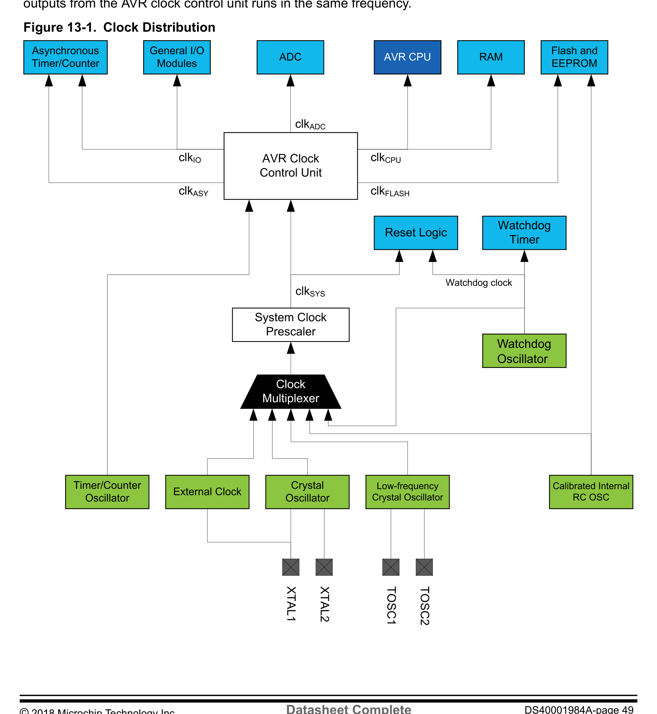
*Description*: Clock distribution diagram showing oscillator sources, prescaler dividers, and peripheral clock routing for Figure 13-1: Clock Distribution.

> **Figure 13-1: Clock Distribution**

Watchdog
Oscillator
ATmega328/P
System Clock and Clock Options
© 2018 Microchip Technology Inc.
Datasheet Complete
DS40001984A-page 49
Downloaded from Arrow.com.
Downloaded from Arrow.com.
Downloaded from Arrow.com.
Downloaded from Arrow.com.
Downloaded from Arrow.com.
Downloaded from Arrow.com.
Downloaded from Arrow.com.
Downloaded from Arrow.com.
Downloaded from Arrow.com.
Downloaded from Arrow.com.
Downloaded from Arrow.com.
Downloaded from Arrow.com.
Downloaded from Arrow.com.
Downloaded from Arrow.com.
Downloaded from Arrow.com.
Downloaded from Arrow.com.
Downloaded from Arrow.com.
Downloaded from Arrow.com.
Downloaded from Arrow.com.
Downloaded from Arrow.com.
Downloaded from Arrow.com.
Downloaded from Arrow.com.
Downloaded from Arrow.com.
Downloaded from Arrow.com.
Downloaded from Arrow.com.
Downloaded from Arrow.com.
Downloaded from Arrow.com.
Downloaded from Arrow.com.
Downloaded from Arrow.com.
Downloaded from Arrow.com.
Downloaded from Arrow.com.
Downloaded from Arrow.com.
Downloaded from Arrow.com.
Downloaded from Arrow.com.
Downloaded from Arrow.com.
Downloaded from Arrow.com.
Downloaded from Arrow.com.
Downloaded from Arrow.com.
Downloaded from Arrow.com.
Downloaded from Arrow.com.
Downloaded from Arrow.com.
Downloaded from Arrow.com.
Downloaded from Arrow.com.
Downloaded from Arrow.com.
Downloaded from Arrow.com.
Downloaded from Arrow.com.
Downloaded from Arrow.com.
Downloaded from Arrow.com.
Downloaded from Arrow.com.


<!-- Page 50 -->
### [PDF Page 50]

13.1.1
CPU Clock – clkCPU
The CPU clock is routed to parts of the system concerned with operation of the AVR core. Examples of
such modules are the general purpose register file, the Status register, and the data memory holding the
stack pointer. Halting the CPU clock inhibits the core from performing general operations and
calculations.
13.1.2
I/O Clock – clkI/O
The I/O clock is used by the majority of the I/O modules, like timer/counters, SPI, and USART. The I/O
clock is also used by the External Interrupt module, but the start condition detection in the USI module is
carried out asynchronously when clkI/O is halted, TWI address recognition in all Sleep modes.
Note:  If a level triggered interrupt is used for wake-up from power-down, the required level must be held
long enough for the MCU to complete the wake-up to trigger the level interrupt. If the level disappears
before the end of the start-up time, the MCU will still wake up, but no interrupt will be generated. The
start-up time is defined by the SUT and CKSEL fuses.
13.1.3
Flash Clock – clkFLASH
The Flash clock controls operation of the Flash interface. The Flash clock is usually active simultaneously
with the CPU clock.
13.1.4
Asynchronous Timer Clock – clkASY
The asynchronous timer clock allows asynchronous timer/counters to be clocked directly from an external
clock or an external 32 kHz clock crystal. The dedicated clock domain allows using this timer/counter as a
real-time counter even when the device is in Sleep mode.
13.1.5
ADC Clock – clkADC
The ADC is provided with a dedicated clock domain. This allows halting the CPU and I/O clocks in order
to reduce noise generated by digital circuitry. This gives more accurate ADC conversion results.
13.2
Clock Sources
The device has the following clock source options, selectable by Flash fuse bits as shown below. The
clock from the selected source is input to the AVR clock generator and routed to the appropriate modules.

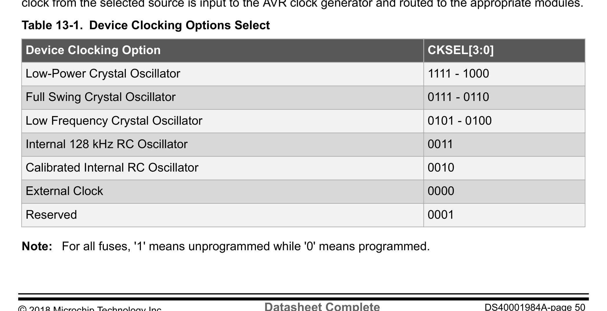
*Description*: Clock distribution diagram showing oscillator sources, prescaler dividers, and peripheral clock routing for Table 13-1: Device Clocking Options Select.

> **Table 13-1: Device Clocking Options Select**

Device Clocking Option
CKSEL[3:0]
Low-Power Crystal Oscillator
1111 - 1000
Full Swing Crystal Oscillator
0111 - 0110
Low Frequency Crystal Oscillator
0101 - 0100
Internal 128 kHz RC Oscillator
0011
Calibrated Internal RC Oscillator
0010
External Clock
0000
Reserved
0001
Note:  For all fuses, '1' means unprogrammed while '0' means programmed.
ATmega328/P
System Clock and Clock Options
© 2018 Microchip Technology Inc.
Datasheet Complete
DS40001984A-page 50
Downloaded from Arrow.com.
Downloaded from Arrow.com.
Downloaded from Arrow.com.
Downloaded from Arrow.com.
Downloaded from Arrow.com.
Downloaded from Arrow.com.
Downloaded from Arrow.com.
Downloaded from Arrow.com.
Downloaded from Arrow.com.
Downloaded from Arrow.com.
Downloaded from Arrow.com.
Downloaded from Arrow.com.
Downloaded from Arrow.com.
Downloaded from Arrow.com.
Downloaded from Arrow.com.
Downloaded from Arrow.com.
Downloaded from Arrow.com.
Downloaded from Arrow.com.
Downloaded from Arrow.com.
Downloaded from Arrow.com.
Downloaded from Arrow.com.
Downloaded from Arrow.com.
Downloaded from Arrow.com.
Downloaded from Arrow.com.
Downloaded from Arrow.com.
Downloaded from Arrow.com.
Downloaded from Arrow.com.
Downloaded from Arrow.com.
Downloaded from Arrow.com.
Downloaded from Arrow.com.
Downloaded from Arrow.com.
Downloaded from Arrow.com.
Downloaded from Arrow.com.
Downloaded from Arrow.com.
Downloaded from Arrow.com.
Downloaded from Arrow.com.
Downloaded from Arrow.com.
Downloaded from Arrow.com.
Downloaded from Arrow.com.
Downloaded from Arrow.com.
Downloaded from Arrow.com.
Downloaded from Arrow.com.
Downloaded from Arrow.com.
Downloaded from Arrow.com.
Downloaded from Arrow.com.
Downloaded from Arrow.com.
Downloaded from Arrow.com.
Downloaded from Arrow.com.
Downloaded from Arrow.com.
Downloaded from Arrow.com.


<!-- Page 51 -->
### [PDF Page 51]

13.2.1
Default Clock Source
The device is shipped with internal RC oscillator at 8.0 MHz and with the fuse CKDIV8 programmed,
resulting in 1.0 MHz system clock. The start-up time is set to maximum, and the time-out period is
enabled: CKSEL=0010, SUT=10, CKDIV8=0. This default setting ensures that all users can make their
desired clock source setting using any available programming interface.
13.2.2
Clock Start-Up Sequence
Any clock source needs a sufficient VCC to start oscillating and a minimum number of oscillating cycles
before it can be considered stable.
To ensure sufficient VCC, the device issues an internal Reset with a time-out delay (tTOUT) after the device
Reset is released by all other Reset sources. See the Related Links for a description of the start
conditions for the internal Reset. The delay (tTOUT) is timed from the Watchdog oscillator and the number
of cycles in the delay is set by the SUTx and CKSELx fuse bits. The selectable delays are shown in the
table below. The frequency of the Watchdog oscillator is voltage dependent.

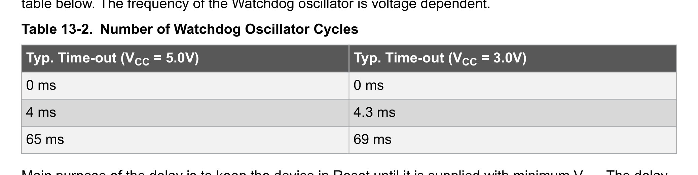
*Description*: Clock distribution diagram showing oscillator sources, prescaler dividers, and peripheral clock routing for Table 13-2: Number of Watchdog Oscillator Cycles.

> **Table 13-2: Number of Watchdog Oscillator Cycles**

Typ. Time-out (VCC = 5.0V)
Typ. Time-out (VCC = 3.0V)
0 ms
0 ms
4 ms
4.3 ms
65 ms
69 ms
Main purpose of the delay is to keep the device in Reset until it is supplied with minimum VCC. The delay
will not monitor the actual voltage, so it is required to select a delay longer than the VCC rise time. If this is
not possible, an internal or external Brown-out Detection (BOD) circuit should be used. A BOD circuit will
ensure sufficient VCC before it releases the reset, and the time out delay can be disabled. Disabling the
time-out delay without utilizing a BOD circuit is not recommended.
The oscillator is required to oscillate for a minimum number of cycles before the clock is considered
stable. An internal ripple counter monitors the oscillator output clock, and keeps the internal Reset active
for a given number of clock cycles. The Reset is then released and the device will start to execute. The
recommended oscillator start-up time is dependent on the clock type, and varies from six cycles for an
externally applied clock to 32K cycles for a low frequency crystal.
The start-up sequence for the clock includes both the time-out delay and the start-up time when the
device starts up from Reset. When starting up from Power-save or Power-down mode, VCC is assumed to
be at a sufficient level and only the start-up time is included.
13.2.3
Clock Source Connections
Pins XTAL1 and XTAL2 are input and output, respectively, of an inverting amplifier that can be configured
for use as an on-chip oscillator, as shown in the figure below. Either a quartz crystal or a ceramic
resonator may be used.
C1 and C2 should always be equal for both crystals and resonators. The optimal value of the capacitors
depends on the crystal or resonator in use, the amount of stray capacitance, and the electromagnetic
noise of the environment. Some initial guidelines for choosing capacitors for use with crystals are given in
the next table. For ceramic resonators, the capacitor values given by the manufacturer should be used.
ATmega328/P
System Clock and Clock Options
© 2018 Microchip Technology Inc.
Datasheet Complete
DS40001984A-page 51
Downloaded from Arrow.com.
Downloaded from Arrow.com.
Downloaded from Arrow.com.
Downloaded from Arrow.com.
Downloaded from Arrow.com.
Downloaded from Arrow.com.
Downloaded from Arrow.com.
Downloaded from Arrow.com.
Downloaded from Arrow.com.
Downloaded from Arrow.com.
Downloaded from Arrow.com.
Downloaded from Arrow.com.
Downloaded from Arrow.com.
Downloaded from Arrow.com.
Downloaded from Arrow.com.
Downloaded from Arrow.com.
Downloaded from Arrow.com.
Downloaded from Arrow.com.
Downloaded from Arrow.com.
Downloaded from Arrow.com.
Downloaded from Arrow.com.
Downloaded from Arrow.com.
Downloaded from Arrow.com.
Downloaded from Arrow.com.
Downloaded from Arrow.com.
Downloaded from Arrow.com.
Downloaded from Arrow.com.
Downloaded from Arrow.com.
Downloaded from Arrow.com.
Downloaded from Arrow.com.
Downloaded from Arrow.com.
Downloaded from Arrow.com.
Downloaded from Arrow.com.
Downloaded from Arrow.com.
Downloaded from Arrow.com.
Downloaded from Arrow.com.
Downloaded from Arrow.com.
Downloaded from Arrow.com.
Downloaded from Arrow.com.
Downloaded from Arrow.com.
Downloaded from Arrow.com.
Downloaded from Arrow.com.
Downloaded from Arrow.com.
Downloaded from Arrow.com.
Downloaded from Arrow.com.
Downloaded from Arrow.com.
Downloaded from Arrow.com.
Downloaded from Arrow.com.
Downloaded from Arrow.com.
Downloaded from Arrow.com.
Downloaded from Arrow.com.


<!-- Page 52 -->
### [PDF Page 52]


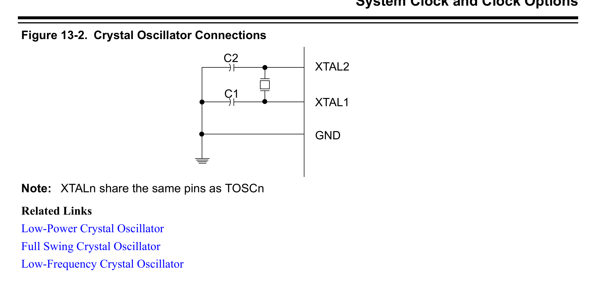
*Description*: Clock distribution diagram showing oscillator sources, prescaler dividers, and peripheral clock routing for Figure 13-2: Crystal Oscillator Connections.

> **Figure 13-2: Crystal Oscillator Connections**

XTAL2
XTAL1
GND
C2
C1
Note:  XTALn share the same pins as TOSCn
Related Links
Low-Power Crystal Oscillator
Full Swing Crystal Oscillator
Low-Frequency Crystal Oscillator
13.3
Low-Power Crystal Oscillator
This crystal oscillator is a low-power oscillator, with reduced voltage swing on the XTAL2 output. It gives
the lowest power consumption, but is not capable of driving other clock inputs, and may be more
susceptible to noise in noisy environments.
The crystal should be connected as described in Clock Source Connections. When selecting crystals,
load capacitance must be taken into consideration. The capacitance (Ce+Ci) needed at each TOSC pin
can be calculated by using:
��+ ��= 2��−��
where:
•
Ce - is optional external capacitors. (= C1, C2 as shown in the schematics.)
•
Ci - is the pin capacitance in the following table.
•
CL - is the load capacitance specified by the crystal vendor.
•
CS - is the total stray capacitance for one XTAL pin.
32kHz Osc. Type
Internal Pad Capacitance
(XTAL1)
Internal Pad Capacitance
(XTAL2)
Ci of system oscillator (XTAL pins) 18 pF
8 pF
The low-power oscillator can operate in three different modes, each optimized for a specific frequency
range. The operating mode is selected by the fuses CKSEL[3:1], as shown in the following table:

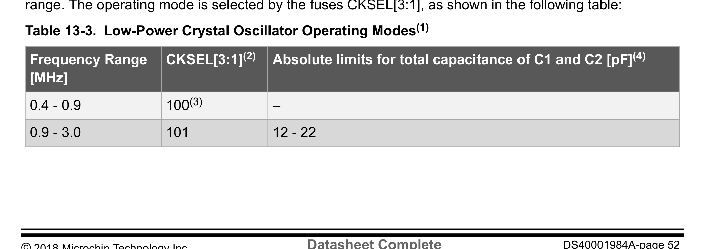
*Description*: Clock distribution diagram showing oscillator sources, prescaler dividers, and peripheral clock routing for Table 13-3: Low-Power Crystal Oscillator Operating Modes(1).

> **Table 13-3: Low-Power Crystal Oscillator Operating Modes(1)**

Frequency Range
[MHz]
CKSEL[3:1](2)
Absolute limits for total capacitance of C1 and C2 [pF](4)
0.4 - 0.9
100(3)
–
0.9 - 3.0
101
12 - 22
ATmega328/P
System Clock and Clock Options
© 2018 Microchip Technology Inc.
Datasheet Complete
DS40001984A-page 52
Downloaded from Arrow.com.
Downloaded from Arrow.com.
Downloaded from Arrow.com.
Downloaded from Arrow.com.
Downloaded from Arrow.com.
Downloaded from Arrow.com.
Downloaded from Arrow.com.
Downloaded from Arrow.com.
Downloaded from Arrow.com.
Downloaded from Arrow.com.
Downloaded from Arrow.com.
Downloaded from Arrow.com.
Downloaded from Arrow.com.
Downloaded from Arrow.com.
Downloaded from Arrow.com.
Downloaded from Arrow.com.
Downloaded from Arrow.com.
Downloaded from Arrow.com.
Downloaded from Arrow.com.
Downloaded from Arrow.com.
Downloaded from Arrow.com.
Downloaded from Arrow.com.
Downloaded from Arrow.com.
Downloaded from Arrow.com.
Downloaded from Arrow.com.
Downloaded from Arrow.com.
Downloaded from Arrow.com.
Downloaded from Arrow.com.
Downloaded from Arrow.com.
Downloaded from Arrow.com.
Downloaded from Arrow.com.
Downloaded from Arrow.com.
Downloaded from Arrow.com.
Downloaded from Arrow.com.
Downloaded from Arrow.com.
Downloaded from Arrow.com.
Downloaded from Arrow.com.
Downloaded from Arrow.com.
Downloaded from Arrow.com.
Downloaded from Arrow.com.
Downloaded from Arrow.com.
Downloaded from Arrow.com.
Downloaded from Arrow.com.
Downloaded from Arrow.com.
Downloaded from Arrow.com.
Downloaded from Arrow.com.
Downloaded from Arrow.com.
Downloaded from Arrow.com.
Downloaded from Arrow.com.
Downloaded from Arrow.com.
Downloaded from Arrow.com.
Downloaded from Arrow.com.


<!-- Page 53 -->
### [PDF Page 53]

Frequency Range
[MHz]
CKSEL[3:1](2)
Absolute limits for total capacitance of C1 and C2 [pF](4)
3.0 - 8.0
110
12 - 22
8.0 - 16.0
111
12 - 22
Note:
1.
This is the recommended CKSEL settings for the difference frequency ranges.
2.
This option should not be used with crystals, only with ceramic resonators.
3.
If the crystal frequency exceeds the specification of the device (depends on VCC), the CKDIV8 fuse
can be programmed in order to divide the internal frequency by 8. It must be ensured that the
resulting divided clock meets the frequency specification of the device.
4.
When selecting the external capacitor value, the stray capacitance from the PCB and device should
be deducted.
The CKSEL0 Fuse together with the SUT[1:0] fuses select the start-up times, as shown in the following
table:

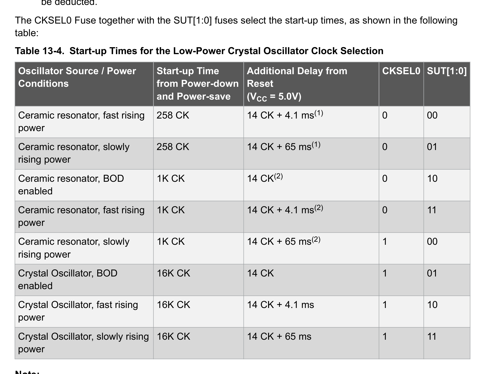
*Description*: Clock distribution diagram showing oscillator sources, prescaler dividers, and peripheral clock routing for Table 13-4: Start-up Times for the Low-Power Crystal Oscillator Clock Selection.

> **Table 13-4: Start-up Times for the Low-Power Crystal Oscillator Clock Selection**

Oscillator Source / Power
Conditions
Start-up Time
from Power-down
and Power-save
Additional Delay from
Reset
(VCC = 5.0V)
CKSEL0 SUT[1:0]
Ceramic resonator, fast rising
power
258 CK
14 CK + 4.1 ms(1)
0
00
Ceramic resonator, slowly
rising power
258 CK
14 CK + 65 ms(1)
0
01
Ceramic resonator, BOD
enabled
1K CK
14 CK(2)
0
10
Ceramic resonator, fast rising
power
1K CK
14 CK + 4.1 ms(2)
0
11
Ceramic resonator, slowly
rising power
1K CK
14 CK + 65 ms(2)
1
00
Crystal Oscillator, BOD
enabled
16K CK
14 CK
1
01
Crystal Oscillator, fast rising
power
16K CK
14 CK + 4.1 ms
1
10
Crystal Oscillator, slowly rising
power
16K CK
14 CK + 65 ms
1
11
Note:
1.
These options should only be used when not operating close to the maximum frequency of the
device, and only if frequency stability at start-up is not important for the application. These options
are not suitable for crystals.
ATmega328/P
System Clock and Clock Options
© 2018 Microchip Technology Inc.
Datasheet Complete
DS40001984A-page 53
Downloaded from Arrow.com.
Downloaded from Arrow.com.
Downloaded from Arrow.com.
Downloaded from Arrow.com.
Downloaded from Arrow.com.
Downloaded from Arrow.com.
Downloaded from Arrow.com.
Downloaded from Arrow.com.
Downloaded from Arrow.com.
Downloaded from Arrow.com.
Downloaded from Arrow.com.
Downloaded from Arrow.com.
Downloaded from Arrow.com.
Downloaded from Arrow.com.
Downloaded from Arrow.com.
Downloaded from Arrow.com.
Downloaded from Arrow.com.
Downloaded from Arrow.com.
Downloaded from Arrow.com.
Downloaded from Arrow.com.
Downloaded from Arrow.com.
Downloaded from Arrow.com.
Downloaded from Arrow.com.
Downloaded from Arrow.com.
Downloaded from Arrow.com.
Downloaded from Arrow.com.
Downloaded from Arrow.com.
Downloaded from Arrow.com.
Downloaded from Arrow.com.
Downloaded from Arrow.com.
Downloaded from Arrow.com.
Downloaded from Arrow.com.
Downloaded from Arrow.com.
Downloaded from Arrow.com.
Downloaded from Arrow.com.
Downloaded from Arrow.com.
Downloaded from Arrow.com.
Downloaded from Arrow.com.
Downloaded from Arrow.com.
Downloaded from Arrow.com.
Downloaded from Arrow.com.
Downloaded from Arrow.com.
Downloaded from Arrow.com.
Downloaded from Arrow.com.
Downloaded from Arrow.com.
Downloaded from Arrow.com.
Downloaded from Arrow.com.
Downloaded from Arrow.com.
Downloaded from Arrow.com.
Downloaded from Arrow.com.
Downloaded from Arrow.com.
Downloaded from Arrow.com.
Downloaded from Arrow.com.


<!-- Page 54 -->
### [PDF Page 54]

2.
These options are intended for use with ceramic resonators and will ensure frequency stability at
start-up. They can also be used with crystals when not operating close to the maximum frequency
of the device, and if frequency stability at start-up is not important for the application.
Related Links
Clock Source Connections
Full Swing Crystal Oscillator
13.4
Full Swing Crystal Oscillator
This crystal oscillator is a full swing oscillator, with rail-to-rail swing on the XTAL2 output. This is useful for
driving other clock inputs and in noisy environments. The current consumption is higher than for the low-
power crystal oscillator. Note that the full swing crystal oscillator will only operate for VCC=2.7-5.5V.

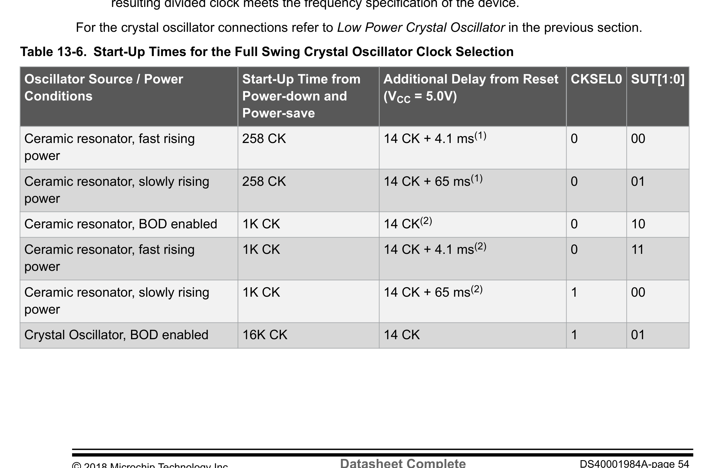
*Description*: Hardware reference table detailing register bit field settings, electrical operating limits, or memory configurations for Table 13-6: The crystal.

> **Table 13-6: The crystal**

should be connected as described in Clock Source Connections”.
The Operating mode is selected based on the fuses CKSEL[3:1] as shown in the table:

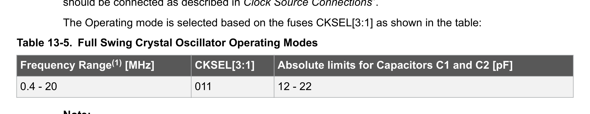
*Description*: Clock distribution diagram showing oscillator sources, prescaler dividers, and peripheral clock routing for Table 13-5: Full Swing Crystal Oscillator Operating Modes.

> **Table 13-5: Full Swing Crystal Oscillator Operating Modes**

Frequency Range(1) [MHz]
CKSEL[3:1]
Absolute limits for Capacitors C1 and C2 [pF]
0.4 - 20
011
12 - 22
Note:
1.
If the crystal frequency exceeds the specification of the device (depends on VCC), the CKDIV8 fuse
can be programmed in order to divide the internal frequency by 8. It must be ensured that the
resulting divided clock meets the frequency specification of the device.
For the crystal oscillator connections refer to Low Power Crystal Oscillator in the previous section.


*Description*: Clock distribution diagram showing oscillator sources, prescaler dividers, and peripheral clock routing for Table 13-6: Start-Up Times for the Full Swing Crystal Oscillator Clock Selection.

> **Table 13-6: Start-Up Times for the Full Swing Crystal Oscillator Clock Selection**

Oscillator Source / Power
Conditions
Start-Up Time from
Power-down and
Power-save
Additional Delay from Reset
(VCC = 5.0V)
CKSEL0 SUT[1:0]
Ceramic resonator, fast rising
power
258 CK
14 CK + 4.1 ms(1)
0
00
Ceramic resonator, slowly rising
power
258 CK
14 CK + 65 ms(1)
0
01
Ceramic resonator, BOD enabled
1K CK
14 CK(2)
0
10
Ceramic resonator, fast rising
power
1K CK
14 CK + 4.1 ms(2)
0
11
Ceramic resonator, slowly rising
power
1K CK
14 CK + 65 ms(2)
1
00
Crystal Oscillator, BOD enabled
16K CK
14 CK
1
01
ATmega328/P
System Clock and Clock Options
© 2018 Microchip Technology Inc.
Datasheet Complete
DS40001984A-page 54
Downloaded from Arrow.com.
Downloaded from Arrow.com.
Downloaded from Arrow.com.
Downloaded from Arrow.com.
Downloaded from Arrow.com.
Downloaded from Arrow.com.
Downloaded from Arrow.com.
Downloaded from Arrow.com.
Downloaded from Arrow.com.
Downloaded from Arrow.com.
Downloaded from Arrow.com.
Downloaded from Arrow.com.
Downloaded from Arrow.com.
Downloaded from Arrow.com.
Downloaded from Arrow.com.
Downloaded from Arrow.com.
Downloaded from Arrow.com.
Downloaded from Arrow.com.
Downloaded from Arrow.com.
Downloaded from Arrow.com.
Downloaded from Arrow.com.
Downloaded from Arrow.com.
Downloaded from Arrow.com.
Downloaded from Arrow.com.
Downloaded from Arrow.com.
Downloaded from Arrow.com.
Downloaded from Arrow.com.
Downloaded from Arrow.com.
Downloaded from Arrow.com.
Downloaded from Arrow.com.
Downloaded from Arrow.com.
Downloaded from Arrow.com.
Downloaded from Arrow.com.
Downloaded from Arrow.com.
Downloaded from Arrow.com.
Downloaded from Arrow.com.
Downloaded from Arrow.com.
Downloaded from Arrow.com.
Downloaded from Arrow.com.
Downloaded from Arrow.com.
Downloaded from Arrow.com.
Downloaded from Arrow.com.
Downloaded from Arrow.com.
Downloaded from Arrow.com.
Downloaded from Arrow.com.
Downloaded from Arrow.com.
Downloaded from Arrow.com.
Downloaded from Arrow.com.
Downloaded from Arrow.com.
Downloaded from Arrow.com.
Downloaded from Arrow.com.
Downloaded from Arrow.com.
Downloaded from Arrow.com.
Downloaded from Arrow.com.


<!-- Page 55 -->
### [PDF Page 55]

Oscillator Source / Power
Conditions
Start-Up Time from
Power-down and
Power-save
Additional Delay from Reset
(VCC = 5.0V)
CKSEL0 SUT[1:0]
Crystal oscillator, fast rising power
16K CK
14 CK + 4.1 ms
1
10
Crystal oscillator, slowly rising
power
16K CK
14 CK + 65 ms
1
11
Note:
1.
These options should only be used when not operating close to the maximum frequency of the
device, and only if frequency stability at start-up is not important for the application. These options
are not suitable for crystals.
2.
These options are intended for use with ceramic resonators and will ensure frequency stability at
start-up. They can be used with crystals when not operating close to the maximum frequency of the
device, and if frequency stability at start-up is not important for the application.
Related Links
Clock Source Connections
Low-Power Crystal Oscillator
13.5
Low-Frequency Crystal Oscillator
The low-frequency crystal oscillator is optimized for use with a 32.768 kHz watch crystal. When selecting
crystals, load capacitance and crystal’s Equivalent Series Resistance (ESR) must be taken into
consideration. Both values are specified by the crystal vendor. The oscillator is optimized for very low
power consumption, and thus when selecting crystals, consider the maximum ESR recommendations:

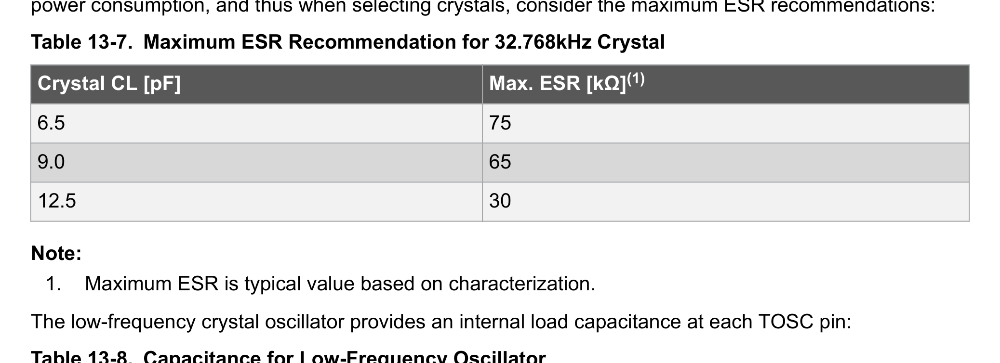
*Description*: Hardware reference table detailing register bit field settings, electrical operating limits, or memory configurations for Table 13-7: Maximum ESR Recommendation for 32.768kHz Crystal.

> **Table 13-7: Maximum ESR Recommendation for 32.768kHz Crystal**

Crystal CL [pF]
Max. ESR [kΩ](1)
6.5
75
9.0
65
12.5
30
Note:
1.
Maximum ESR is typical value based on characterization.
The low-frequency crystal oscillator provides an internal load capacitance at each TOSC pin:

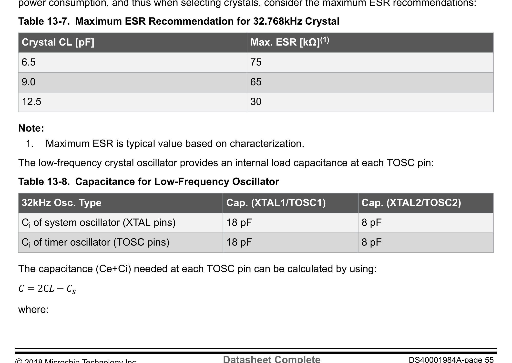
*Description*: Clock distribution diagram showing oscillator sources, prescaler dividers, and peripheral clock routing for Table 13-8: Capacitance for Low-Frequency Oscillator.

> **Table 13-8: Capacitance for Low-Frequency Oscillator**

32kHz Osc. Type
Cap. (XTAL1/TOSC1)
Cap. (XTAL2/TOSC2)
Ci of system oscillator (XTAL pins)
18 pF
8 pF
Ci of timer oscillator (TOSC pins)
18 pF
8 pF
The capacitance (Ce+Ci) needed at each TOSC pin can be calculated by using:
�= 2C�−��
where:
ATmega328/P
System Clock and Clock Options
© 2018 Microchip Technology Inc.
Datasheet Complete
DS40001984A-page 55
Downloaded from Arrow.com.
Downloaded from Arrow.com.
Downloaded from Arrow.com.
Downloaded from Arrow.com.
Downloaded from Arrow.com.
Downloaded from Arrow.com.
Downloaded from Arrow.com.
Downloaded from Arrow.com.
Downloaded from Arrow.com.
Downloaded from Arrow.com.
Downloaded from Arrow.com.
Downloaded from Arrow.com.
Downloaded from Arrow.com.
Downloaded from Arrow.com.
Downloaded from Arrow.com.
Downloaded from Arrow.com.
Downloaded from Arrow.com.
Downloaded from Arrow.com.
Downloaded from Arrow.com.
Downloaded from Arrow.com.
Downloaded from Arrow.com.
Downloaded from Arrow.com.
Downloaded from Arrow.com.
Downloaded from Arrow.com.
Downloaded from Arrow.com.
Downloaded from Arrow.com.
Downloaded from Arrow.com.
Downloaded from Arrow.com.
Downloaded from Arrow.com.
Downloaded from Arrow.com.
Downloaded from Arrow.com.
Downloaded from Arrow.com.
Downloaded from Arrow.com.
Downloaded from Arrow.com.
Downloaded from Arrow.com.
Downloaded from Arrow.com.
Downloaded from Arrow.com.
Downloaded from Arrow.com.
Downloaded from Arrow.com.
Downloaded from Arrow.com.
Downloaded from Arrow.com.
Downloaded from Arrow.com.
Downloaded from Arrow.com.
Downloaded from Arrow.com.
Downloaded from Arrow.com.
Downloaded from Arrow.com.
Downloaded from Arrow.com.
Downloaded from Arrow.com.
Downloaded from Arrow.com.
Downloaded from Arrow.com.
Downloaded from Arrow.com.
Downloaded from Arrow.com.
Downloaded from Arrow.com.
Downloaded from Arrow.com.
Downloaded from Arrow.com.


<!-- Page 56 -->
### [PDF Page 56]

•

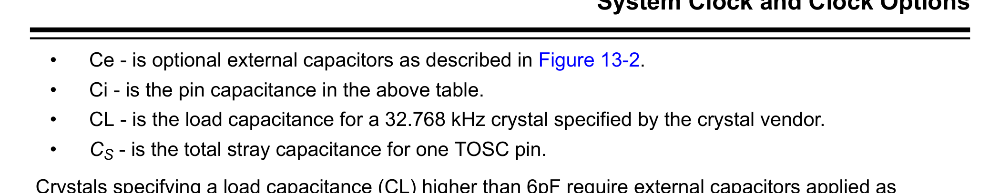
*Description*: Technical diagram and schematic illustration detailing hardware circuit topology, signal routing, and logic operations for Figure 13-2.

> **Figure 13-2**

•
Ci - is the pin capacitance in the above table.
•
CL - is the load capacitance for a 32.768 kHz crystal specified by the crystal vendor.
•
CS - is the total stray capacitance for one TOSC pin.
Crystals specifying a load capacitance (CL) higher than 6pF require external capacitors applied as
described in Low-Power Crystal Oscillator.
The low-frequency crystal oscillator must be selected by setting the CKSEL fuses to 0110 or 0111.

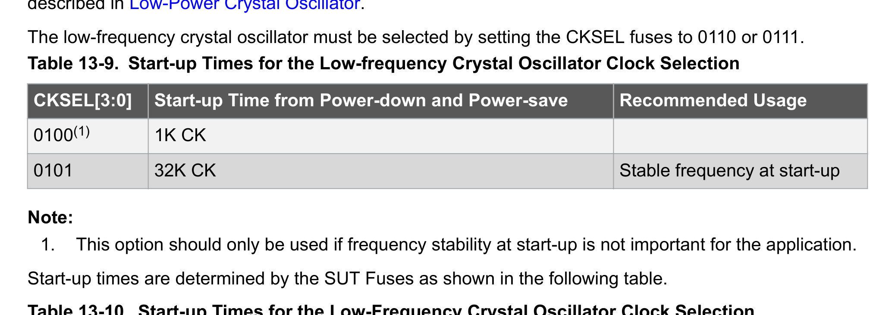
*Description*: Clock distribution diagram showing oscillator sources, prescaler dividers, and peripheral clock routing for Table 13-9: Start-up Times for the Low-frequency Crystal Oscillator Clock Selection.

> **Table 13-9: Start-up Times for the Low-frequency Crystal Oscillator Clock Selection**

CKSEL[3:0]
Start-up Time from Power-down and Power-save
Recommended Usage
0100(1)
1K CK
0101
32K CK
Stable frequency at start-up
Note:
1.
This option should only be used if frequency stability at start-up is not important for the application.
Start-up times are determined by the SUT Fuses as shown in the following table.

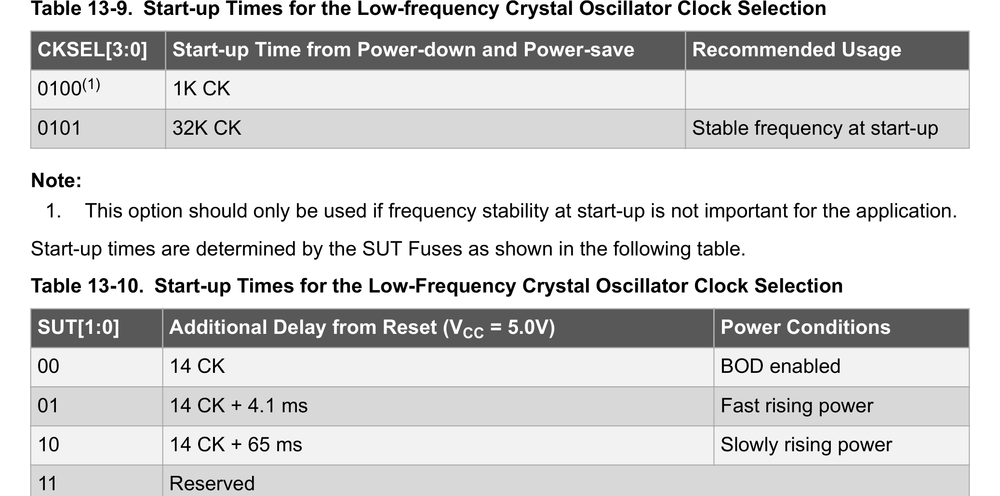
*Description*: Clock distribution diagram showing oscillator sources, prescaler dividers, and peripheral clock routing for Table 13-10: Start-up Times for the Low-Frequency Crystal Oscillator Clock Selection.

> **Table 13-10: Start-up Times for the Low-Frequency Crystal Oscillator Clock Selection**

SUT[1:0]
Additional Delay from Reset (VCC = 5.0V)
Power Conditions
00
14 CK
BOD enabled
01
14 CK + 4.1 ms
Fast rising power
10
14 CK + 65 ms
Slowly rising power
11
Reserved
Related Links
Clock Source Connections
Timer/Counter Oscillator
13.6
Calibrated Internal RC Oscillator
By default, the internal RC oscillator provides an 8.0 MHz clock. Though voltage and temperature
dependent, this clock can be very accurately calibrated by the user. The device is shipped with the
CKDIV8 fuse unprogrammed.
This clock may be selected as the system clock by programming the CKSEL fuses as shown in the
following table. During Reset, hardware loads the pre-programmed calibration value into the OSCCAL
register and thereby automatically calibrates the RC oscillator.
By changing the OSCCAL register from SW, it is possible to get a higher calibration accuracy than by
using the factory calibration.
When this oscillator is used as the chip clock, the Watchdog oscillator will still be used for the watchdog
timer and for the Reset time out.
ATmega328/P
System Clock and Clock Options
© 2018 Microchip Technology Inc.
Datasheet Complete
DS40001984A-page 56
Downloaded from Arrow.com.
Downloaded from Arrow.com.
Downloaded from Arrow.com.
Downloaded from Arrow.com.
Downloaded from Arrow.com.
Downloaded from Arrow.com.
Downloaded from Arrow.com.
Downloaded from Arrow.com.
Downloaded from Arrow.com.
Downloaded from Arrow.com.
Downloaded from Arrow.com.
Downloaded from Arrow.com.
Downloaded from Arrow.com.
Downloaded from Arrow.com.
Downloaded from Arrow.com.
Downloaded from Arrow.com.
Downloaded from Arrow.com.
Downloaded from Arrow.com.
Downloaded from Arrow.com.
Downloaded from Arrow.com.
Downloaded from Arrow.com.
Downloaded from Arrow.com.
Downloaded from Arrow.com.
Downloaded from Arrow.com.
Downloaded from Arrow.com.
Downloaded from Arrow.com.
Downloaded from Arrow.com.
Downloaded from Arrow.com.
Downloaded from Arrow.com.
Downloaded from Arrow.com.
Downloaded from Arrow.com.
Downloaded from Arrow.com.
Downloaded from Arrow.com.
Downloaded from Arrow.com.
Downloaded from Arrow.com.
Downloaded from Arrow.com.
Downloaded from Arrow.com.
Downloaded from Arrow.com.
Downloaded from Arrow.com.
Downloaded from Arrow.com.
Downloaded from Arrow.com.
Downloaded from Arrow.com.
Downloaded from Arrow.com.
Downloaded from Arrow.com.
Downloaded from Arrow.com.
Downloaded from Arrow.com.
Downloaded from Arrow.com.
Downloaded from Arrow.com.
Downloaded from Arrow.com.
Downloaded from Arrow.com.
Downloaded from Arrow.com.
Downloaded from Arrow.com.
Downloaded from Arrow.com.
Downloaded from Arrow.com.
Downloaded from Arrow.com.
Downloaded from Arrow.com.


<!-- Page 57 -->
### [PDF Page 57]


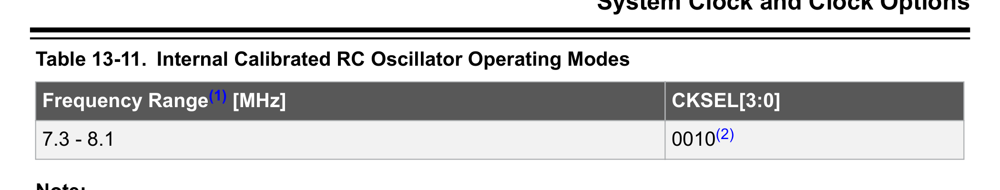
*Description*: Clock distribution diagram showing oscillator sources, prescaler dividers, and peripheral clock routing for Table 13-11: Internal Calibrated RC Oscillator Operating Modes.

> **Table 13-11: Internal Calibrated RC Oscillator Operating Modes**

Frequency Range(1) [MHz]
CKSEL[3:0]
7.3 - 8.1
0010(2)
Note:
1.
If 8 MHz frequency exceeds the specification of the device (depends on VCC), the CKDIV8 fuse can
be programmed in order to divide the internal frequency by 8.
2.
The device is shipped with this option selected.
When this oscillator is selected, start-up times are determined by the SUT fuses:

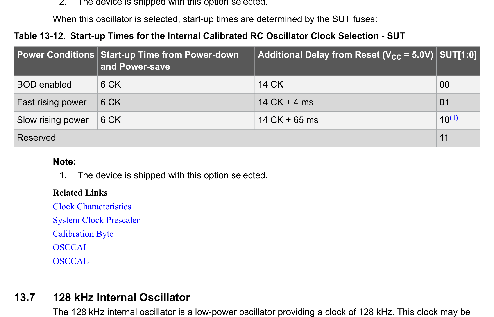
*Description*: Clock distribution diagram showing oscillator sources, prescaler dividers, and peripheral clock routing for Table 13-12: Start-up Times for the Internal Calibrated RC Oscillator Clock Selection - SUT.

> **Table 13-12: Start-up Times for the Internal Calibrated RC Oscillator Clock Selection - SUT**

Power Conditions Start-up Time from Power-down
and Power-save
Additional Delay from Reset (VCC = 5.0V) SUT[1:0]
BOD enabled
6 CK
14 CK
00
Fast rising power
6 CK
14 CK + 4 ms
01
Slow rising power
6 CK
14 CK + 65 ms
10(1)
Reserved
11
Note:
1.
The device is shipped with this option selected.
Related Links
Clock Characteristics
System Clock Prescaler
Calibration Byte
OSCCAL
OSCCAL
13.7
128 kHz Internal Oscillator
The 128 kHz internal oscillator is a low-power oscillator providing a clock of 128 kHz. This clock may be
selected as the system clock by programming the CKSEL fuses to '0011' as shown in the following table.
Warning: Using the 128 kHz internal oscillator as the system oscillator and Watchdog timer
simultaneously is not recommended as this defeats one of the purposes of the Watchdog timer.

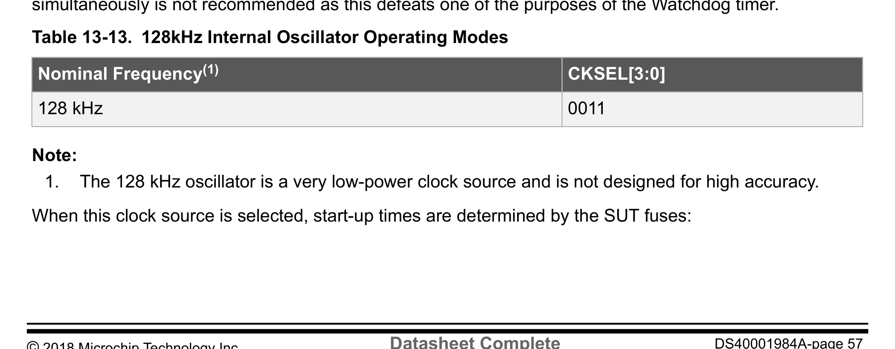
*Description*: Clock distribution diagram showing oscillator sources, prescaler dividers, and peripheral clock routing for Table 13-13: 128kHz Internal Oscillator Operating Modes.

> **Table 13-13: 128kHz Internal Oscillator Operating Modes**

Nominal Frequency(1)
CKSEL[3:0]
128 kHz
0011
Note:
1.
The 128 kHz oscillator is a very low-power clock source and is not designed for high accuracy.
When this clock source is selected, start-up times are determined by the SUT fuses:
ATmega328/P
System Clock and Clock Options
© 2018 Microchip Technology Inc.
Datasheet Complete
DS40001984A-page 57
Downloaded from Arrow.com.
Downloaded from Arrow.com.
Downloaded from Arrow.com.
Downloaded from Arrow.com.
Downloaded from Arrow.com.
Downloaded from Arrow.com.
Downloaded from Arrow.com.
Downloaded from Arrow.com.
Downloaded from Arrow.com.
Downloaded from Arrow.com.
Downloaded from Arrow.com.
Downloaded from Arrow.com.
Downloaded from Arrow.com.
Downloaded from Arrow.com.
Downloaded from Arrow.com.
Downloaded from Arrow.com.
Downloaded from Arrow.com.
Downloaded from Arrow.com.
Downloaded from Arrow.com.
Downloaded from Arrow.com.
Downloaded from Arrow.com.
Downloaded from Arrow.com.
Downloaded from Arrow.com.
Downloaded from Arrow.com.
Downloaded from Arrow.com.
Downloaded from Arrow.com.
Downloaded from Arrow.com.
Downloaded from Arrow.com.
Downloaded from Arrow.com.
Downloaded from Arrow.com.
Downloaded from Arrow.com.
Downloaded from Arrow.com.
Downloaded from Arrow.com.
Downloaded from Arrow.com.
Downloaded from Arrow.com.
Downloaded from Arrow.com.
Downloaded from Arrow.com.
Downloaded from Arrow.com.
Downloaded from Arrow.com.
Downloaded from Arrow.com.
Downloaded from Arrow.com.
Downloaded from Arrow.com.
Downloaded from Arrow.com.
Downloaded from Arrow.com.
Downloaded from Arrow.com.
Downloaded from Arrow.com.
Downloaded from Arrow.com.
Downloaded from Arrow.com.
Downloaded from Arrow.com.
Downloaded from Arrow.com.
Downloaded from Arrow.com.
Downloaded from Arrow.com.
Downloaded from Arrow.com.
Downloaded from Arrow.com.
Downloaded from Arrow.com.
Downloaded from Arrow.com.
Downloaded from Arrow.com.


<!-- Page 58 -->
### [PDF Page 58]


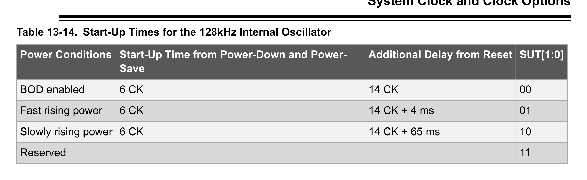
*Description*: Clock distribution diagram showing oscillator sources, prescaler dividers, and peripheral clock routing for Table 13-14: Start-Up Times for the 128kHz Internal Oscillator.

> **Table 13-14: Start-Up Times for the 128kHz Internal Oscillator**

Power Conditions Start-Up Time from Power-Down and Power-
Save
Additional Delay from Reset SUT[1:0]
BOD enabled
6 CK
14 CK
00
Fast rising power
6 CK
14 CK + 4 ms
01
Slowly rising power 6 CK
14 CK + 65 ms
10
Reserved
11
13.8
External Clock
To drive the device from an external clock source, EXTCLK should be driven as shown in the figure
below. To run the device on an external clock, the CKSEL fuses must be programmed to '0000':

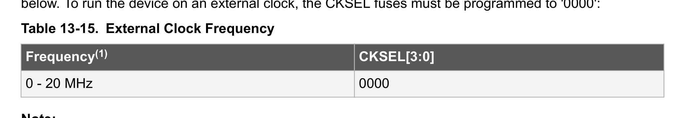
*Description*: Clock distribution diagram showing oscillator sources, prescaler dividers, and peripheral clock routing for Table 13-15: External Clock Frequency.

> **Table 13-15: External Clock Frequency**

Frequency(1)
CKSEL[3:0]
0 - 20 MHz
0000
Note:
1.
If the crystal frequency exceeds the specification of the device (depends on VCC), the CKDIV8 Fuse
can be programmed in order to divide the internal frequency by 8. It must be ensured that the
resulting divided clock meets the frequency specification of the device.

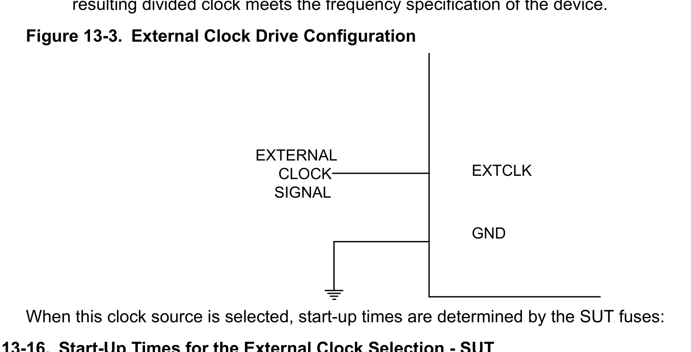
*Description*: Clock distribution diagram showing oscillator sources, prescaler dividers, and peripheral clock routing for Figure 13-3: External Clock Drive Configuration.

> **Figure 13-3: External Clock Drive Configuration**

EXTERNAL
CLOCK
SIGNAL
EXTCLK
GND
When this clock source is selected, start-up times are determined by the SUT fuses:

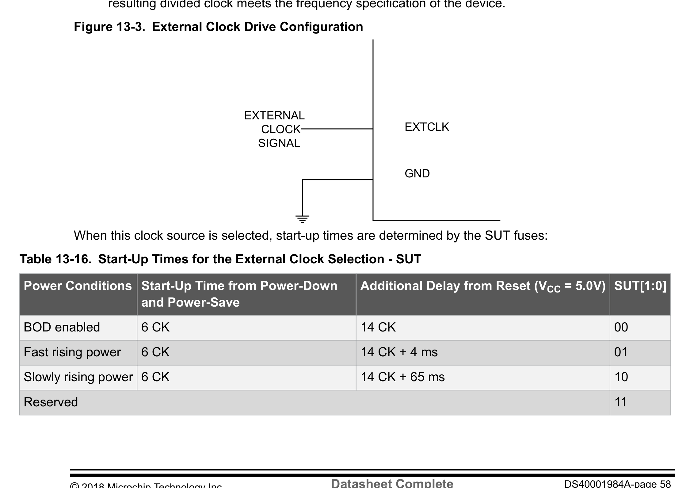
*Description*: Clock distribution diagram showing oscillator sources, prescaler dividers, and peripheral clock routing for Table 13-16: Start-Up Times for the External Clock Selection - SUT.

> **Table 13-16: Start-Up Times for the External Clock Selection - SUT**

Power Conditions Start-Up Time from Power-Down
and Power-Save
Additional Delay from Reset (VCC = 5.0V) SUT[1:0]
BOD enabled
6 CK
14 CK
00
Fast rising power
6 CK
14 CK + 4 ms
01
Slowly rising power 6 CK
14 CK + 65 ms
10
Reserved
11
ATmega328/P
System Clock and Clock Options
© 2018 Microchip Technology Inc.
Datasheet Complete
DS40001984A-page 58
Downloaded from Arrow.com.
Downloaded from Arrow.com.
Downloaded from Arrow.com.
Downloaded from Arrow.com.
Downloaded from Arrow.com.
Downloaded from Arrow.com.
Downloaded from Arrow.com.
Downloaded from Arrow.com.
Downloaded from Arrow.com.
Downloaded from Arrow.com.
Downloaded from Arrow.com.
Downloaded from Arrow.com.
Downloaded from Arrow.com.
Downloaded from Arrow.com.
Downloaded from Arrow.com.
Downloaded from Arrow.com.
Downloaded from Arrow.com.
Downloaded from Arrow.com.
Downloaded from Arrow.com.
Downloaded from Arrow.com.
Downloaded from Arrow.com.
Downloaded from Arrow.com.
Downloaded from Arrow.com.
Downloaded from Arrow.com.
Downloaded from Arrow.com.
Downloaded from Arrow.com.
Downloaded from Arrow.com.
Downloaded from Arrow.com.
Downloaded from Arrow.com.
Downloaded from Arrow.com.
Downloaded from Arrow.com.
Downloaded from Arrow.com.
Downloaded from Arrow.com.
Downloaded from Arrow.com.
Downloaded from Arrow.com.
Downloaded from Arrow.com.
Downloaded from Arrow.com.
Downloaded from Arrow.com.
Downloaded from Arrow.com.
Downloaded from Arrow.com.
Downloaded from Arrow.com.
Downloaded from Arrow.com.
Downloaded from Arrow.com.
Downloaded from Arrow.com.
Downloaded from Arrow.com.
Downloaded from Arrow.com.
Downloaded from Arrow.com.
Downloaded from Arrow.com.
Downloaded from Arrow.com.
Downloaded from Arrow.com.
Downloaded from Arrow.com.
Downloaded from Arrow.com.
Downloaded from Arrow.com.
Downloaded from Arrow.com.
Downloaded from Arrow.com.
Downloaded from Arrow.com.
Downloaded from Arrow.com.
Downloaded from Arrow.com.


<!-- Page 59 -->
### [PDF Page 59]

When applying an external clock, it is required to avoid sudden changes in the applied clock frequency to
ensure stable operation of the MCU. A variation in frequency of more than 2% from one clock cycle to the
next can lead to unpredictable behavior. If changes of more than 2% is required, ensure that the MCU is
kept in Reset during the changes.
The system clock prescaler can be used to implement run-time changes of the internal clock frequency
while still ensuring stable operation.
Related Links
System Clock Prescaler
13.9
Timer/Counter Oscillator
The device uses the same crystal oscillator for low-frequency oscillator and Timer/Counter oscillator. See
Low Frequency Crystal Oscillator for details on the oscillator and crystal requirements.
On this device, the Timer/Counter Oscillator Pins (TOSC1 and TOSC2) are shared with XTAL1 and
XTAL2. When using the Timer/Counter oscillator, the system clock needs to be four times the oscillator
frequency. Due to this and the pin sharing, the Timer/Counter oscillator can only be used when the
calibrated internal RC oscillator is selected as system clock source.
Applying an external clock source to TOSC1 can be done if the Enable External Clock Input bit in the
Asynchronous Status Register (ASSR.EXCLK) is written to '1'. See the description of the Asynchronous
Operation of Timer/Counter2 for further description on selecting external clock as input instead of a
32.768 kHz watch crystal.
Related Links
Low-Frequency Crystal Oscillator
OCR2B
ASSR

## 13.10 Clock Output Buffer

The device can output the system clock on the CLKO pin. To enable the output, the CKOUT fuse has to
be programmed. This mode is suitable when the chip clock is used to drive other circuits on the system.
The clock also will be output during Reset, and the normal operation of I/O pin will be overridden when
the fuse is programmed. Any clock source, including the internal RC oscillator, can be selected when the
clock is output on CLKO. If the system clock prescaler is used, it is the divided system clock that is
output.
13.11
System Clock Prescaler
The device has a system clock prescaler and the system clock can be divided by configuring the Clock
Prescale Register (CLKPR). This feature can be used to decrease the system clock frequency and the
power consumption when the requirement for processing power is low. This can be used with all clock
source options, and it will affect the clock frequency of the CPU and all synchronous peripherals. clkI/O,
clkADC, clkCPU, and clkFLASH are divided by a factor as shown in the CLKPR description.
When switching between prescaler settings, the system clock prescaler ensures that no glitches occur in
the clock system. It also ensures that no intermediate frequency is higher than neither the clock
frequency corresponding to the previous setting nor the clock frequency corresponding to the new setting.
The ripple counter that implements the prescaler runs at the frequency of the undivided clock, which may
ATmega328/P
System Clock and Clock Options
© 2018 Microchip Technology Inc.
Datasheet Complete
DS40001984A-page 59
Downloaded from Arrow.com.
Downloaded from Arrow.com.
Downloaded from Arrow.com.
Downloaded from Arrow.com.
Downloaded from Arrow.com.
Downloaded from Arrow.com.
Downloaded from Arrow.com.
Downloaded from Arrow.com.
Downloaded from Arrow.com.
Downloaded from Arrow.com.
Downloaded from Arrow.com.
Downloaded from Arrow.com.
Downloaded from Arrow.com.
Downloaded from Arrow.com.
Downloaded from Arrow.com.
Downloaded from Arrow.com.
Downloaded from Arrow.com.
Downloaded from Arrow.com.
Downloaded from Arrow.com.
Downloaded from Arrow.com.
Downloaded from Arrow.com.
Downloaded from Arrow.com.
Downloaded from Arrow.com.
Downloaded from Arrow.com.
Downloaded from Arrow.com.
Downloaded from Arrow.com.
Downloaded from Arrow.com.
Downloaded from Arrow.com.
Downloaded from Arrow.com.
Downloaded from Arrow.com.
Downloaded from Arrow.com.
Downloaded from Arrow.com.
Downloaded from Arrow.com.
Downloaded from Arrow.com.
Downloaded from Arrow.com.
Downloaded from Arrow.com.
Downloaded from Arrow.com.
Downloaded from Arrow.com.
Downloaded from Arrow.com.
Downloaded from Arrow.com.
Downloaded from Arrow.com.
Downloaded from Arrow.com.
Downloaded from Arrow.com.
Downloaded from Arrow.com.
Downloaded from Arrow.com.
Downloaded from Arrow.com.
Downloaded from Arrow.com.
Downloaded from Arrow.com.
Downloaded from Arrow.com.
Downloaded from Arrow.com.
Downloaded from Arrow.com.
Downloaded from Arrow.com.
Downloaded from Arrow.com.
Downloaded from Arrow.com.
Downloaded from Arrow.com.
Downloaded from Arrow.com.
Downloaded from Arrow.com.
Downloaded from Arrow.com.
Downloaded from Arrow.com.


<!-- Page 60 -->
### [PDF Page 60]

be faster than the CPU's clock frequency. Hence, it is not possible to determine the state of the prescaler
- even if it were readable, the exact time it takes to switch from one clock division to the other cannot be
exactly predicted. From the time the Clock Prescaler Selection bits (CLKPS[3:0]) values are written, it
takes between T1 + T2 and T1 + 2 * T2 before the new clock frequency is active. In this interval, two
active clock edges are produced. Here, T1 is the previous clock period, and T2 is the period
corresponding to the new prescaler setting.
To avoid unintentional changes of clock frequency, a special write procedure must be followed to change
the CLKPS bits:
1.
Write the Clock Prescaler Change Enable (CLKPCE) bit to '1' and all other bits in CLKPR to zero:
CLKPR=0x80.
2.
Within four cycles, write the desired value to CLKPS[3:0] while writing a zero to CLKPCE:
CLKPR=0x0N.
Interrupts must be disabled when changing prescaler setting to make sure the write procedure is not
interrupted.
Related Links
Calibrated Internal RC Oscillator
External Clock
CLKPR

## 13.12 Register Description

ATmega328/P
System Clock and Clock Options
© 2018 Microchip Technology Inc.
Datasheet Complete
DS40001984A-page 60
Downloaded from Arrow.com.
Downloaded from Arrow.com.
Downloaded from Arrow.com.
Downloaded from Arrow.com.
Downloaded from Arrow.com.
Downloaded from Arrow.com.
Downloaded from Arrow.com.
Downloaded from Arrow.com.
Downloaded from Arrow.com.
Downloaded from Arrow.com.
Downloaded from Arrow.com.
Downloaded from Arrow.com.
Downloaded from Arrow.com.
Downloaded from Arrow.com.
Downloaded from Arrow.com.
Downloaded from Arrow.com.
Downloaded from Arrow.com.
Downloaded from Arrow.com.
Downloaded from Arrow.com.
Downloaded from Arrow.com.
Downloaded from Arrow.com.
Downloaded from Arrow.com.
Downloaded from Arrow.com.
Downloaded from Arrow.com.
Downloaded from Arrow.com.
Downloaded from Arrow.com.
Downloaded from Arrow.com.
Downloaded from Arrow.com.
Downloaded from Arrow.com.
Downloaded from Arrow.com.
Downloaded from Arrow.com.
Downloaded from Arrow.com.
Downloaded from Arrow.com.
Downloaded from Arrow.com.
Downloaded from Arrow.com.
Downloaded from Arrow.com.
Downloaded from Arrow.com.
Downloaded from Arrow.com.
Downloaded from Arrow.com.
Downloaded from Arrow.com.
Downloaded from Arrow.com.
Downloaded from Arrow.com.
Downloaded from Arrow.com.
Downloaded from Arrow.com.
Downloaded from Arrow.com.
Downloaded from Arrow.com.
Downloaded from Arrow.com.
Downloaded from Arrow.com.
Downloaded from Arrow.com.
Downloaded from Arrow.com.
Downloaded from Arrow.com.
Downloaded from Arrow.com.
Downloaded from Arrow.com.
Downloaded from Arrow.com.
Downloaded from Arrow.com.
Downloaded from Arrow.com.
Downloaded from Arrow.com.
Downloaded from Arrow.com.
Downloaded from Arrow.com.
Downloaded from Arrow.com.


<!-- Page 61 -->
### [PDF Page 61]

13.12.1 Oscillator Calibration Register
Name:
OSCCAL
Offset:
0x66
Reset:
Device Specific Calibration Value
Property:  -
Bit
7
6
5
4
3
2
1
0
CAL[7:0]
Access
R/W
R/W
R/W
R/W
R/W
R/W
R/W
R/W
Reset
x
x
x
x
x
x
x
x
Bits 7:0 – CAL[7:0] Oscillator Calibration Value
The oscillator calibration register is used to trim the calibrated internal RC oscillator to remove process
variations away from the oscillator frequency. A preprogrammed calibration value is automatically written
to this register during chip reset, giving the factory calibrated frequency as specified in the Clock
Characteristics section of chapter Electrical Characteristics.The application software can write this
register to change the oscillator frequency. The oscillator can be calibrated to frequencies as specified in
the Clock Characteristics section of chapter Electrical Characteristics. Calibration outside that range is not
recommended.
Note that this oscillator is used to time EEPROM and Flash write accesses, and these write times will be
affected accordingly. If the EEPROM or Flash are written, do not calibrate to more than 8.8 MHz.
Otherwise, the EEPROM or Flash write may fail.
The CAL7 bit determines the range of operation for the oscillator. Setting this bit to 0 gives the lowest
frequency range, setting this bit to 1 gives the highest frequency range. The two frequency ranges are
overlapping, in other words, a setting of OSCCAL=0x7F gives a higher frequency than OSCCAL=0x80.
The CAL[6:0] bits are used to tune the frequency within the selected range. A setting of 0x00 gives the
lowest frequency in that range and a setting of 0x7F gives the highest frequency in the range.
Related Links
Calibrated Internal RC Oscillator
Clock Characteristics
Calibrated Internal RC Oscillator Accuracy
External Clock Drive Waveforms
External Clock Drive
Calibrated Internal RC Oscillator
ATmega328/P
System Clock and Clock Options
© 2018 Microchip Technology Inc.
Datasheet Complete
DS40001984A-page 61
Downloaded from Arrow.com.
Downloaded from Arrow.com.
Downloaded from Arrow.com.
Downloaded from Arrow.com.
Downloaded from Arrow.com.
Downloaded from Arrow.com.
Downloaded from Arrow.com.
Downloaded from Arrow.com.
Downloaded from Arrow.com.
Downloaded from Arrow.com.
Downloaded from Arrow.com.
Downloaded from Arrow.com.
Downloaded from Arrow.com.
Downloaded from Arrow.com.
Downloaded from Arrow.com.
Downloaded from Arrow.com.
Downloaded from Arrow.com.
Downloaded from Arrow.com.
Downloaded from Arrow.com.
Downloaded from Arrow.com.
Downloaded from Arrow.com.
Downloaded from Arrow.com.
Downloaded from Arrow.com.
Downloaded from Arrow.com.
Downloaded from Arrow.com.
Downloaded from Arrow.com.
Downloaded from Arrow.com.
Downloaded from Arrow.com.
Downloaded from Arrow.com.
Downloaded from Arrow.com.
Downloaded from Arrow.com.
Downloaded from Arrow.com.
Downloaded from Arrow.com.
Downloaded from Arrow.com.
Downloaded from Arrow.com.
Downloaded from Arrow.com.
Downloaded from Arrow.com.
Downloaded from Arrow.com.
Downloaded from Arrow.com.
Downloaded from Arrow.com.
Downloaded from Arrow.com.
Downloaded from Arrow.com.
Downloaded from Arrow.com.
Downloaded from Arrow.com.
Downloaded from Arrow.com.
Downloaded from Arrow.com.
Downloaded from Arrow.com.
Downloaded from Arrow.com.
Downloaded from Arrow.com.
Downloaded from Arrow.com.
Downloaded from Arrow.com.
Downloaded from Arrow.com.
Downloaded from Arrow.com.
Downloaded from Arrow.com.
Downloaded from Arrow.com.
Downloaded from Arrow.com.
Downloaded from Arrow.com.
Downloaded from Arrow.com.
Downloaded from Arrow.com.
Downloaded from Arrow.com.
Downloaded from Arrow.com.


<!-- Page 62 -->
### [PDF Page 62]

13.12.2 Clock Prescaler Register
Name:
CLKPR
Offset:
0x61
Reset:
Refer to the bit description
Property:  -
Bit
7
6
5
4
3
2
1
0
CLKPCE
CLKPS[3:0]
Access
R/W
R/W
R/W
R/W
R/W
Reset
0
x
x
x
x
Bit 7 – CLKPCE Clock Prescaler Change Enable
The CLKPCE bit must be written to logic one to enable change of the CLKPS bits. The CLKPCE bit is
only updated when the other bits in CLKPR are simultaneously written to zero. CLKPCE is cleared by
hardware four cycles after it is written or when CLKPS bits are written. Rewriting the CLKPCE bit within
this time-out period does neither extend the time-out period nor clear the CLKPCE bit.
Bits 3:0 – CLKPS[3:0] Clock Prescaler Select
These bits define the division factor between the selected clock source and the internal system clock.
These bits can be written run-time to vary the clock frequency to suit the application requirements. As the
divider divides the master clock input to the MCU, the speed of all synchronous peripherals is reduced
when a division factor is used. The division factors are given in the table below.
The CKDIV8 Fuse determines the initial value of the CLKPS bits. If CKDIV8 is unprogrammed, the
CLKPS bits will be reset to “0000”. If CKDIV8 is programmed, CLKPS bits are reset to “0011”, giving a
division factor of 8 at start-up. This feature should be used if the selected clock source has a higher
frequency than the maximum frequency of the device at the present operating conditions. Note that any
value can be written to the CLKPS bits regardless of the CKDIV8 Fuse setting. The Application software
must ensure that a sufficient division factor is chosen if the selected clock source has a higher frequency
than the maximum frequency of the device at the present operating conditions. The device is shipped
with the CKDIV8 Fuse programmed.

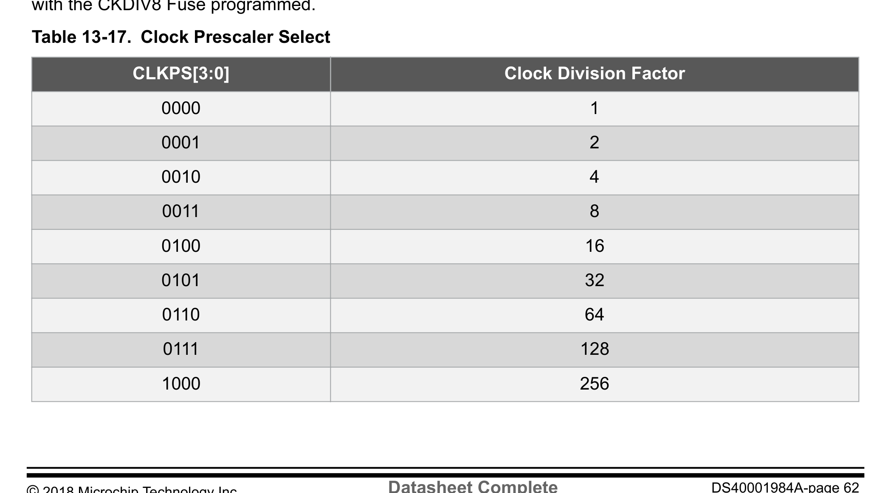
*Description*: Clock distribution diagram showing oscillator sources, prescaler dividers, and peripheral clock routing for Table 13-17: Clock Prescaler Select.

> **Table 13-17: Clock Prescaler Select**

CLKPS[3:0]
Clock Division Factor
0000
1
0001
2
0010
4
0011
8
0100
16
0101
32
0110
64
0111
128
1000
256
ATmega328/P
System Clock and Clock Options
© 2018 Microchip Technology Inc.
Datasheet Complete
DS40001984A-page 62
Downloaded from Arrow.com.
Downloaded from Arrow.com.
Downloaded from Arrow.com.
Downloaded from Arrow.com.
Downloaded from Arrow.com.
Downloaded from Arrow.com.
Downloaded from Arrow.com.
Downloaded from Arrow.com.
Downloaded from Arrow.com.
Downloaded from Arrow.com.
Downloaded from Arrow.com.
Downloaded from Arrow.com.
Downloaded from Arrow.com.
Downloaded from Arrow.com.
Downloaded from Arrow.com.
Downloaded from Arrow.com.
Downloaded from Arrow.com.
Downloaded from Arrow.com.
Downloaded from Arrow.com.
Downloaded from Arrow.com.
Downloaded from Arrow.com.
Downloaded from Arrow.com.
Downloaded from Arrow.com.
Downloaded from Arrow.com.
Downloaded from Arrow.com.
Downloaded from Arrow.com.
Downloaded from Arrow.com.
Downloaded from Arrow.com.
Downloaded from Arrow.com.
Downloaded from Arrow.com.
Downloaded from Arrow.com.
Downloaded from Arrow.com.
Downloaded from Arrow.com.
Downloaded from Arrow.com.
Downloaded from Arrow.com.
Downloaded from Arrow.com.
Downloaded from Arrow.com.
Downloaded from Arrow.com.
Downloaded from Arrow.com.
Downloaded from Arrow.com.
Downloaded from Arrow.com.
Downloaded from Arrow.com.
Downloaded from Arrow.com.
Downloaded from Arrow.com.
Downloaded from Arrow.com.
Downloaded from Arrow.com.
Downloaded from Arrow.com.
Downloaded from Arrow.com.
Downloaded from Arrow.com.
Downloaded from Arrow.com.
Downloaded from Arrow.com.
Downloaded from Arrow.com.
Downloaded from Arrow.com.
Downloaded from Arrow.com.
Downloaded from Arrow.com.
Downloaded from Arrow.com.
Downloaded from Arrow.com.
Downloaded from Arrow.com.
Downloaded from Arrow.com.
Downloaded from Arrow.com.
Downloaded from Arrow.com.
Downloaded from Arrow.com.


<!-- Page 63 -->
### [PDF Page 63]

CLKPS[3:0]
Clock Division Factor
1001
Reserved
1010
Reserved
1011
Reserved
1100
Reserved
1101
Reserved
1110
Reserved
1111
Reserved
Related Links
System Clock Prescaler
ATmega328/P
System Clock and Clock Options
© 2018 Microchip Technology Inc.
Datasheet Complete
DS40001984A-page 63
Downloaded from Arrow.com.
Downloaded from Arrow.com.
Downloaded from Arrow.com.
Downloaded from Arrow.com.
Downloaded from Arrow.com.
Downloaded from Arrow.com.
Downloaded from Arrow.com.
Downloaded from Arrow.com.
Downloaded from Arrow.com.
Downloaded from Arrow.com.
Downloaded from Arrow.com.
Downloaded from Arrow.com.
Downloaded from Arrow.com.
Downloaded from Arrow.com.
Downloaded from Arrow.com.
Downloaded from Arrow.com.
Downloaded from Arrow.com.
Downloaded from Arrow.com.
Downloaded from Arrow.com.
Downloaded from Arrow.com.
Downloaded from Arrow.com.
Downloaded from Arrow.com.
Downloaded from Arrow.com.
Downloaded from Arrow.com.
Downloaded from Arrow.com.
Downloaded from Arrow.com.
Downloaded from Arrow.com.
Downloaded from Arrow.com.
Downloaded from Arrow.com.
Downloaded from Arrow.com.
Downloaded from Arrow.com.
Downloaded from Arrow.com.
Downloaded from Arrow.com.
Downloaded from Arrow.com.
Downloaded from Arrow.com.
Downloaded from Arrow.com.
Downloaded from Arrow.com.
Downloaded from Arrow.com.
Downloaded from Arrow.com.
Downloaded from Arrow.com.
Downloaded from Arrow.com.
Downloaded from Arrow.com.
Downloaded from Arrow.com.
Downloaded from Arrow.com.
Downloaded from Arrow.com.
Downloaded from Arrow.com.
Downloaded from Arrow.com.
Downloaded from Arrow.com.
Downloaded from Arrow.com.
Downloaded from Arrow.com.
Downloaded from Arrow.com.
Downloaded from Arrow.com.
Downloaded from Arrow.com.
Downloaded from Arrow.com.
Downloaded from Arrow.com.
Downloaded from Arrow.com.
Downloaded from Arrow.com.
Downloaded from Arrow.com.
Downloaded from Arrow.com.
Downloaded from Arrow.com.
Downloaded from Arrow.com.
Downloaded from Arrow.com.
Downloaded from Arrow.com.


<!-- Page 64 -->
### [PDF Page 64]

14.
Power Management and Sleep Modes
14.1

### Overview

Sleep modes enable the application to shut down unused modules in the MCU, thereby saving power.
The device provides various sleep modes allowing the user to tailor the power consumption to the
application requirements.
When enabled, the Brown-out Detector (BOD) actively monitors the power supply voltage during the
sleep periods. To further save power, it is possible to disable the BOD in some sleep modes. See also
BOD Disable.
Note:  BOD disable is only available for ATmega328P.
14.2
Sleep Modes
The following table shows the different sleep modes, BOD disable ability, and their wake-up sources.

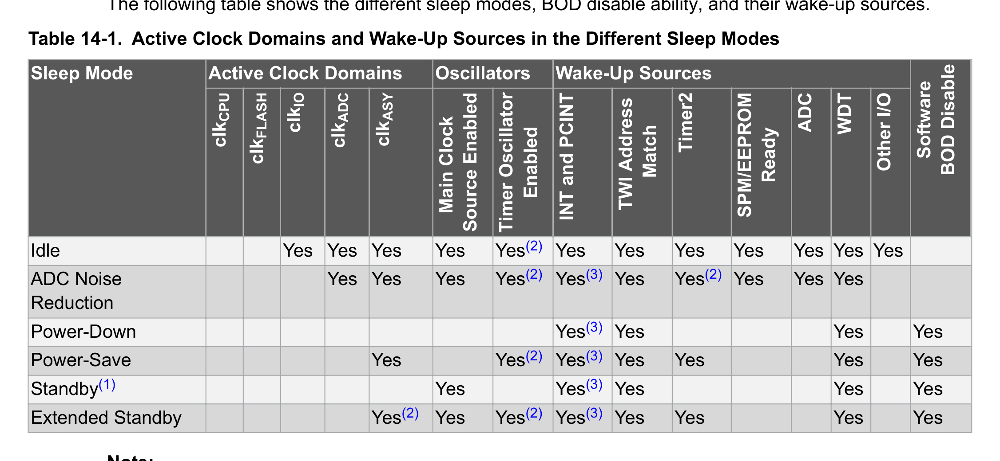
*Description*: Clock distribution diagram showing oscillator sources, prescaler dividers, and peripheral clock routing for Table 14-1: Active Clock Domains and Wake-Up Sources in the Different Sleep Modes.

> **Table 14-1: Active Clock Domains and Wake-Up Sources in the Different Sleep Modes**

Sleep Mode
Active Clock Domains
Oscillators
Wake-Up Sources
Software
BOD Disable
clkCPU
clkFLASH
clkIO
clkADC
clkASY
Main Clock
Source Enabled
Timer Oscillator
Enabled
INT and PCINT
TWI Address
Match
Timer2
SPM/EEPROM
Ready
ADC
WDT
Other I/O
Idle
Yes Yes Yes
Yes
Yes(2) Yes
Yes
Yes
Yes
Yes Yes Yes
ADC Noise
Reduction
Yes Yes
Yes
Yes(2) Yes(3) Yes
Yes(2) Yes
Yes Yes
Power-Down
Yes(3) Yes
Yes
Yes
Power-Save
Yes
Yes(2) Yes(3) Yes
Yes
Yes
Yes
Standby(1)
Yes
Yes(3) Yes
Yes
Yes
Extended Standby
Yes(2)
Yes
Yes(2) Yes(3) Yes
Yes
Yes
Yes
Note:
1.
Only recommended with external crystal or resonator selected as the clock source.
2.
If Timer/Counter2 is running in Asynchronous mode.
3.
For INT1 and INT0, only level interrupt.
To enter any of the six sleep modes, the sleep enable bit in the Sleep Mode Control Register (SMCR.SE)
must be written to '1' and a SLEEP instruction must be executed. Sleep Mode Select bits
(SMCR.SM[2:0]) select which sleep mode (Idle, ADC Noise Reduction, Power-Down, Power-Save,
Standby, or Extended Standby) will be activated by the SLEEP instruction.
Note:  The block diagram in the section System Clock and Clock Options provides an overview over the
different clock systems in the device and their distribution. This figure is helpful in selecting an appropriate
Sleep mode.
If an enabled interrupt occurs while the MCU is in a Sleep mode, the MCU wakes up. The MCU is then
halted for four cycles in addition to the start-up time, executes the interrupt routine, and resumes
ATmega328/P
Power Management and Sleep Modes
© 2018 Microchip Technology Inc.
Datasheet Complete
DS40001984A-page 64
Downloaded from Arrow.com.
Downloaded from Arrow.com.
Downloaded from Arrow.com.
Downloaded from Arrow.com.
Downloaded from Arrow.com.
Downloaded from Arrow.com.
Downloaded from Arrow.com.
Downloaded from Arrow.com.
Downloaded from Arrow.com.
Downloaded from Arrow.com.
Downloaded from Arrow.com.
Downloaded from Arrow.com.
Downloaded from Arrow.com.
Downloaded from Arrow.com.
Downloaded from Arrow.com.
Downloaded from Arrow.com.
Downloaded from Arrow.com.
Downloaded from Arrow.com.
Downloaded from Arrow.com.
Downloaded from Arrow.com.
Downloaded from Arrow.com.
Downloaded from Arrow.com.
Downloaded from Arrow.com.
Downloaded from Arrow.com.
Downloaded from Arrow.com.
Downloaded from Arrow.com.
Downloaded from Arrow.com.
Downloaded from Arrow.com.
Downloaded from Arrow.com.
Downloaded from Arrow.com.
Downloaded from Arrow.com.
Downloaded from Arrow.com.
Downloaded from Arrow.com.
Downloaded from Arrow.com.
Downloaded from Arrow.com.
Downloaded from Arrow.com.
Downloaded from Arrow.com.
Downloaded from Arrow.com.
Downloaded from Arrow.com.
Downloaded from Arrow.com.
Downloaded from Arrow.com.
Downloaded from Arrow.com.
Downloaded from Arrow.com.
Downloaded from Arrow.com.
Downloaded from Arrow.com.
Downloaded from Arrow.com.
Downloaded from Arrow.com.
Downloaded from Arrow.com.
Downloaded from Arrow.com.
Downloaded from Arrow.com.
Downloaded from Arrow.com.
Downloaded from Arrow.com.
Downloaded from Arrow.com.
Downloaded from Arrow.com.
Downloaded from Arrow.com.
Downloaded from Arrow.com.
Downloaded from Arrow.com.
Downloaded from Arrow.com.
Downloaded from Arrow.com.
Downloaded from Arrow.com.
Downloaded from Arrow.com.
Downloaded from Arrow.com.
Downloaded from Arrow.com.
Downloaded from Arrow.com.


<!-- Page 65 -->
### [PDF Page 65]

execution from the instruction following SLEEP. The contents of the register file and SRAM are unaltered
when the device wakes up from sleep. If a reset occurs during Sleep mode, the MCU wakes up and
executes from the Reset vector.
Related Links
System Clock and Clock Options
14.3
BOD Disable
When the Brown-out Detector (BOD) is enabled by BODLEVEL fuses, the BOD is actively monitoring the
power supply voltage during a sleep period. To save power, it is possible to disable the BOD by use of
software for some of the sleep modes. The sleep mode power consumption will then be at the same level
as when BOD is globally disabled by fuses. If BOD is disabled in software, the BOD function is turned off
immediately after entering the sleep mode. Upon wake-up from sleep, BOD is automatically enabled
again. This ensures safe operation in case the VCC level has dropped during the sleep period.
When the BOD has been disabled, the wake-up time from sleep mode will be approximately 60 μs to
ensure that the BOD is working correctly before the MCU continues executing code.
BOD disable is controlled by the BOD Sleep bit in the MCU Control Register (MCUCR.BODS). Writing
this bit to '1' turns off the BOD in relevant sleep modes, while a zero in this bit keeps BOD active. The
default setting, BODS=0, keeps BOD active.
Note:  Writing to the BODS bit is controlled by a timed sequence and an enable bit.
Note:  BOD disable is only available for ATmega328P.
Related Links
MCUCR
14.4
Idle Mode
When the SM[2:0] bits are written to '000', the SLEEP instruction makes the MCU enter Idle mode,
stopping the CPU but allowing the SPI, USART, analog comparator, two-wire serial interface, timer/
counters, watchdog, and the interrupt system to continue operating. This Sleep mode basically halts
clkCPU and clkFLASH, while allowing the other clocks to run.
The Idle mode enables the MCU to wake-up from external triggered interrupts as well as internal ones
like the timer overflow and USART transmit complete interrupts. If wake-up from the analog comparator
interrupt is not required, the analog comparator can be powered-down by setting the ACD bit in the
Analog Comparator Control and Status Register – ACSR. This will reduce power consumption in Idle
mode.
14.5
ADC Noise Reduction Mode
When the SM[2:0] bits are written to '001', the SLEEP instruction makes the MCU enter ADC Noise
Reduction mode, stopping the CPU but allowing the ADC, the external interrupts, the two-wire serial
interface address watch, Timer/Counter(1), and the Watchdog to continue operating (if enabled). This
sleep mode basically halts clkI/O, clkCPU, and clkFLASH, while allowing the other clocks to run.
This improves the noise environment for the ADC, enabling higher resolution measurements. If the ADC
is enabled, a conversion starts automatically when this mode is entered. Apart from the ADC conversion
complete interrupt, only these events can wake-up the MCU from ADC Noise Reduction mode:
ATmega328/P
Power Management and Sleep Modes
© 2018 Microchip Technology Inc.
Datasheet Complete
DS40001984A-page 65
Downloaded from Arrow.com.
Downloaded from Arrow.com.
Downloaded from Arrow.com.
Downloaded from Arrow.com.
Downloaded from Arrow.com.
Downloaded from Arrow.com.
Downloaded from Arrow.com.
Downloaded from Arrow.com.
Downloaded from Arrow.com.
Downloaded from Arrow.com.
Downloaded from Arrow.com.
Downloaded from Arrow.com.
Downloaded from Arrow.com.
Downloaded from Arrow.com.
Downloaded from Arrow.com.
Downloaded from Arrow.com.
Downloaded from Arrow.com.
Downloaded from Arrow.com.
Downloaded from Arrow.com.
Downloaded from Arrow.com.
Downloaded from Arrow.com.
Downloaded from Arrow.com.
Downloaded from Arrow.com.
Downloaded from Arrow.com.
Downloaded from Arrow.com.
Downloaded from Arrow.com.
Downloaded from Arrow.com.
Downloaded from Arrow.com.
Downloaded from Arrow.com.
Downloaded from Arrow.com.
Downloaded from Arrow.com.
Downloaded from Arrow.com.
Downloaded from Arrow.com.
Downloaded from Arrow.com.
Downloaded from Arrow.com.
Downloaded from Arrow.com.
Downloaded from Arrow.com.
Downloaded from Arrow.com.
Downloaded from Arrow.com.
Downloaded from Arrow.com.
Downloaded from Arrow.com.
Downloaded from Arrow.com.
Downloaded from Arrow.com.
Downloaded from Arrow.com.
Downloaded from Arrow.com.
Downloaded from Arrow.com.
Downloaded from Arrow.com.
Downloaded from Arrow.com.
Downloaded from Arrow.com.
Downloaded from Arrow.com.
Downloaded from Arrow.com.
Downloaded from Arrow.com.
Downloaded from Arrow.com.
Downloaded from Arrow.com.
Downloaded from Arrow.com.
Downloaded from Arrow.com.
Downloaded from Arrow.com.
Downloaded from Arrow.com.
Downloaded from Arrow.com.
Downloaded from Arrow.com.
Downloaded from Arrow.com.
Downloaded from Arrow.com.
Downloaded from Arrow.com.
Downloaded from Arrow.com.
Downloaded from Arrow.com.


<!-- Page 66 -->
### [PDF Page 66]

•
External Reset
•
Watchdog System Reset
•
Watchdog Interrupt
•
Brown-out Reset
•
Two-wire Serial Interface Address Match
•
Timer/Counter Interrupt
•
SPM/EEPROM Ready Interrupt
•
External Level Interrupt on INT
•
Pin Change Interrupt
Note:  1. Timer/Counter will only keep running in Asynchronous mode.
Related Links
8-bit Timer/Counter2 with PWM and Asynchronous Operation
14.6
Power-Down Mode
When the SM[2:0] bits are written to '010', the SLEEP instruction makes the MCU enter the Power-Down
mode. In this mode, the external oscillator is stopped, while the external interrupts, the two-wire serial
interface address watch, and the Watchdog continue operating (if enabled).
Only one of these events can wake up the MCU:
•
External Reset
•
Watchdog System Reset
•
Watchdog Interrupt
•
Brown-out Reset
•
Two-wire Serial Interface Address Match
•
External level Interrupt on INT
•
Pin Change Interrupt
This sleep mode basically halts all generated clocks, allowing operation of asynchronous modules only.
Note:  If a level triggered interrupt is used for wake-up from power-down, the required level must be held
long enough for the MCU to complete the wake-up to trigger the level interrupt. If the level disappears
before the end of the start-up time, the MCU will still wake up, but no interrupt will be generated. The
start-up time is defined by the SUT and CKSEL Fuses.
When waking up from the Power-Down mode, there is a delay from the wake-up condition occurs until
the wake-up becomes effective. This allows the clock to restart and become stable after having been
stopped. The wake-up period is defined by the same CKSEL fuses that define the Reset time-out period.
Related Links
System Clock and Clock Options
14.7
Power-Save Mode
When the SM[2:0] bits are written to 011, the SLEEP instruction makes the MCU enter Power-Save
mode. This mode is identical to power-down, except:
ATmega328/P
Power Management and Sleep Modes
© 2018 Microchip Technology Inc.
Datasheet Complete
DS40001984A-page 66
Downloaded from Arrow.com.
Downloaded from Arrow.com.
Downloaded from Arrow.com.
Downloaded from Arrow.com.
Downloaded from Arrow.com.
Downloaded from Arrow.com.
Downloaded from Arrow.com.
Downloaded from Arrow.com.
Downloaded from Arrow.com.
Downloaded from Arrow.com.
Downloaded from Arrow.com.
Downloaded from Arrow.com.
Downloaded from Arrow.com.
Downloaded from Arrow.com.
Downloaded from Arrow.com.
Downloaded from Arrow.com.
Downloaded from Arrow.com.
Downloaded from Arrow.com.
Downloaded from Arrow.com.
Downloaded from Arrow.com.
Downloaded from Arrow.com.
Downloaded from Arrow.com.
Downloaded from Arrow.com.
Downloaded from Arrow.com.
Downloaded from Arrow.com.
Downloaded from Arrow.com.
Downloaded from Arrow.com.
Downloaded from Arrow.com.
Downloaded from Arrow.com.
Downloaded from Arrow.com.
Downloaded from Arrow.com.
Downloaded from Arrow.com.
Downloaded from Arrow.com.
Downloaded from Arrow.com.
Downloaded from Arrow.com.
Downloaded from Arrow.com.
Downloaded from Arrow.com.
Downloaded from Arrow.com.
Downloaded from Arrow.com.
Downloaded from Arrow.com.
Downloaded from Arrow.com.
Downloaded from Arrow.com.
Downloaded from Arrow.com.
Downloaded from Arrow.com.
Downloaded from Arrow.com.
Downloaded from Arrow.com.
Downloaded from Arrow.com.
Downloaded from Arrow.com.
Downloaded from Arrow.com.
Downloaded from Arrow.com.
Downloaded from Arrow.com.
Downloaded from Arrow.com.
Downloaded from Arrow.com.
Downloaded from Arrow.com.
Downloaded from Arrow.com.
Downloaded from Arrow.com.
Downloaded from Arrow.com.
Downloaded from Arrow.com.
Downloaded from Arrow.com.
Downloaded from Arrow.com.
Downloaded from Arrow.com.
Downloaded from Arrow.com.
Downloaded from Arrow.com.
Downloaded from Arrow.com.
Downloaded from Arrow.com.
Downloaded from Arrow.com.


<!-- Page 67 -->
### [PDF Page 67]

If timer/counter2 is enabled, it will keep running during sleep. The device can wake-up from either timer
overflow or output compare event from timer/counter2 if the corresponding timer/counter2 interrupt
enable bits are set in TIMSK2, and the global interrupt enable bit in SREG is set.
If timer/counter2 is not running, the Power-Down mode is recommended instead of the Power-Save
mode.
The timer/counter2 can be clocked both synchronously and asynchronously in Power-Save mode. If
timer/counter2 is not using the asynchronous clock, the timer/counter oscillator is stopped during sleep. If
timer/counter2 is not using the synchronous clock, the clock source is stopped during sleep. Even if the
synchronous clock is running in power-save, this clock is only available for timer/counter2.
14.8
Standby Mode
When the SM[2:0] bits are written to '110' and an external crystal/resonator clock option is selected, the
SLEEP instruction makes the MCU enter Standby mode. This mode is identical to the Power-Down mode
with the exception that the oscillator is kept running. From Standby mode, the device wakes up in six
clock cycles.
14.9
Extended Standby Mode
When the SM[2:0] bits are written to '111' and an external crystal/resonator clock option is selected, the
SLEEP instruction makes the MCU enter Extended Standby mode. This mode is identical to Power-Save
mode with the exception that the oscillator is kept running. From Extended Standby mode, the device
wakes up in six clock cycles.

## 14.10 Power Reduction Register

The Power Reduction Register (PRR) provides a method to stop the clock to individual peripherals to
reduce power consumption. The current state of the peripheral is frozen and the I/O registers cannot be
read or written. Resources used by the peripheral when stopping the clock will remain occupied, hence
the peripheral should in most cases be disabled before stopping the clock. Waking up a module, which is
done by clearing the corresponding bit in the PRR, puts the module in the same state as before
shutdown.
Module shutdown can be used in Idle mode and Active mode to significantly reduce the overall power
consumption. In all other sleep modes, the clock is already stopped.
14.11
Minimizing Power Consumption
There are several possibilities to consider when trying to minimize the power consumption in an AVR
controlled system. In general, sleep modes should be used as much as possible, and the sleep mode
should be selected so that as few as possible of the device’s functions are operating. All functions not
needed should be disabled. In particular, the following modules may need special consideration when
trying to achieve the lowest possible power consumption.
14.11.1 Analog-to-Digital Converter
If enabled, the ADC will be enabled in all sleep modes. To save power, the ADC should be disabled
before entering any sleep mode. When the ADC is turned off and on again, the next conversion will be an
extended conversion.
ATmega328/P
Power Management and Sleep Modes
© 2018 Microchip Technology Inc.
Datasheet Complete
DS40001984A-page 67
Downloaded from Arrow.com.
Downloaded from Arrow.com.
Downloaded from Arrow.com.
Downloaded from Arrow.com.
Downloaded from Arrow.com.
Downloaded from Arrow.com.
Downloaded from Arrow.com.
Downloaded from Arrow.com.
Downloaded from Arrow.com.
Downloaded from Arrow.com.
Downloaded from Arrow.com.
Downloaded from Arrow.com.
Downloaded from Arrow.com.
Downloaded from Arrow.com.
Downloaded from Arrow.com.
Downloaded from Arrow.com.
Downloaded from Arrow.com.
Downloaded from Arrow.com.
Downloaded from Arrow.com.
Downloaded from Arrow.com.
Downloaded from Arrow.com.
Downloaded from Arrow.com.
Downloaded from Arrow.com.
Downloaded from Arrow.com.
Downloaded from Arrow.com.
Downloaded from Arrow.com.
Downloaded from Arrow.com.
Downloaded from Arrow.com.
Downloaded from Arrow.com.
Downloaded from Arrow.com.
Downloaded from Arrow.com.
Downloaded from Arrow.com.
Downloaded from Arrow.com.
Downloaded from Arrow.com.
Downloaded from Arrow.com.
Downloaded from Arrow.com.
Downloaded from Arrow.com.
Downloaded from Arrow.com.
Downloaded from Arrow.com.
Downloaded from Arrow.com.
Downloaded from Arrow.com.
Downloaded from Arrow.com.
Downloaded from Arrow.com.
Downloaded from Arrow.com.
Downloaded from Arrow.com.
Downloaded from Arrow.com.
Downloaded from Arrow.com.
Downloaded from Arrow.com.
Downloaded from Arrow.com.
Downloaded from Arrow.com.
Downloaded from Arrow.com.
Downloaded from Arrow.com.
Downloaded from Arrow.com.
Downloaded from Arrow.com.
Downloaded from Arrow.com.
Downloaded from Arrow.com.
Downloaded from Arrow.com.
Downloaded from Arrow.com.
Downloaded from Arrow.com.
Downloaded from Arrow.com.
Downloaded from Arrow.com.
Downloaded from Arrow.com.
Downloaded from Arrow.com.
Downloaded from Arrow.com.
Downloaded from Arrow.com.
Downloaded from Arrow.com.
Downloaded from Arrow.com.


<!-- Page 68 -->
### [PDF Page 68]

Related Links
Analog-to-Digital Converter
14.11.2 Analog Comparator
When entering Idle mode, the analog comparator should be disabled if not used. When entering ADC
Noise Reduction mode, the analog comparator should be disabled. In other sleep modes, the analog
comparator is automatically disabled. However, if the analog comparator is set up to use the internal
voltage reference as input, the analog comparator should be disabled in all sleep modes. Otherwise, the
internal voltage reference will be enabled, independent of the sleep mode.
Related Links
Analog Comparator
14.11.3 Brown-Out Detector
If the Brown-Out Detector (BOD) is not needed by the application, this module should be turned off. If the
BOD is enabled by the BODLEVEL fuses, it will be enabled in all sleep modes, and hence, always
consume power. In the deeper sleep modes, this will contribute significantly to the total current
consumption.
Related Links
System Control and Reset
14.11.4 Internal Voltage Reference
The internal voltage reference will be enabled when needed by the Brown-out Detection, the analog
comparator or the Analog-to-Digital Converter (ADC). If these modules are disabled as described in the
sections above, the internal voltage reference will be disabled and it will not be consuming power. When
turned on again, the user must allow the reference to start-up before the output is used. If the reference is
kept on in Sleep mode, the output can be used immediately.
Related Links
System Control and Reset
14.11.5 Watchdog Timer
If the watchdog timer is not needed in the application, the module should be turned off. If the watchdog
timer is enabled, it will be enabled in all sleep modes and hence always consume power. In the deeper
sleep modes, this will contribute significantly to the total current consumption.
Related Links
System Control and Reset
14.11.6 Port Pins
When entering a sleep mode, all port pins should be configured to use minimum power. The most
important is then to ensure that no pins drive resistive loads. In sleep modes where both the I/O clock
(clkI/O) and the ADC clock (clkADC) are stopped, the input buffers of the device will be disabled. This
ensures that no power is consumed by the input logic when not needed. In some cases, the input logic is
needed for detecting wake-up conditions, and it will then be enabled. Refer to the section Digital Input
Enable and Sleep Modes for details on which pins are enabled. If the input buffer is enabled and the input
signal is left floating or have an analog signal level close to VCC/2, the input buffer will use excessive
power.
ATmega328/P
Power Management and Sleep Modes
© 2018 Microchip Technology Inc.
Datasheet Complete
DS40001984A-page 68
Downloaded from Arrow.com.
Downloaded from Arrow.com.
Downloaded from Arrow.com.
Downloaded from Arrow.com.
Downloaded from Arrow.com.
Downloaded from Arrow.com.
Downloaded from Arrow.com.
Downloaded from Arrow.com.
Downloaded from Arrow.com.
Downloaded from Arrow.com.
Downloaded from Arrow.com.
Downloaded from Arrow.com.
Downloaded from Arrow.com.
Downloaded from Arrow.com.
Downloaded from Arrow.com.
Downloaded from Arrow.com.
Downloaded from Arrow.com.
Downloaded from Arrow.com.
Downloaded from Arrow.com.
Downloaded from Arrow.com.
Downloaded from Arrow.com.
Downloaded from Arrow.com.
Downloaded from Arrow.com.
Downloaded from Arrow.com.
Downloaded from Arrow.com.
Downloaded from Arrow.com.
Downloaded from Arrow.com.
Downloaded from Arrow.com.
Downloaded from Arrow.com.
Downloaded from Arrow.com.
Downloaded from Arrow.com.
Downloaded from Arrow.com.
Downloaded from Arrow.com.
Downloaded from Arrow.com.
Downloaded from Arrow.com.
Downloaded from Arrow.com.
Downloaded from Arrow.com.
Downloaded from Arrow.com.
Downloaded from Arrow.com.
Downloaded from Arrow.com.
Downloaded from Arrow.com.
Downloaded from Arrow.com.
Downloaded from Arrow.com.
Downloaded from Arrow.com.
Downloaded from Arrow.com.
Downloaded from Arrow.com.
Downloaded from Arrow.com.
Downloaded from Arrow.com.
Downloaded from Arrow.com.
Downloaded from Arrow.com.
Downloaded from Arrow.com.
Downloaded from Arrow.com.
Downloaded from Arrow.com.
Downloaded from Arrow.com.
Downloaded from Arrow.com.
Downloaded from Arrow.com.
Downloaded from Arrow.com.
Downloaded from Arrow.com.
Downloaded from Arrow.com.
Downloaded from Arrow.com.
Downloaded from Arrow.com.
Downloaded from Arrow.com.
Downloaded from Arrow.com.
Downloaded from Arrow.com.
Downloaded from Arrow.com.
Downloaded from Arrow.com.
Downloaded from Arrow.com.
Downloaded from Arrow.com.


<!-- Page 69 -->
### [PDF Page 69]

For analog input pins, the digital input buffer should be disabled at all times. An analog signal level close
to VCC/2 on an input pin can cause significant current even in active mode. Digital input buffers can be
disabled by writing to the Digital Input Disable Registers (DIDR0 for ADC, DIDR1 for AC).
Related Links
Digital Input Enable and Sleep Modes
14.11.7 On-chip Debug System
If the on-chip debug system is enabled by the fuse and the chip enters Sleep mode, the main clock
source is enabled and hence always consumes power. In the deeper Sleep modes, this will contribute
significantly to the total current consumption.

## 14.12 Register Description

ATmega328/P
Power Management and Sleep Modes
© 2018 Microchip Technology Inc.
Datasheet Complete
DS40001984A-page 69
Downloaded from Arrow.com.
Downloaded from Arrow.com.
Downloaded from Arrow.com.
Downloaded from Arrow.com.
Downloaded from Arrow.com.
Downloaded from Arrow.com.
Downloaded from Arrow.com.
Downloaded from Arrow.com.
Downloaded from Arrow.com.
Downloaded from Arrow.com.
Downloaded from Arrow.com.
Downloaded from Arrow.com.
Downloaded from Arrow.com.
Downloaded from Arrow.com.
Downloaded from Arrow.com.
Downloaded from Arrow.com.
Downloaded from Arrow.com.
Downloaded from Arrow.com.
Downloaded from Arrow.com.
Downloaded from Arrow.com.
Downloaded from Arrow.com.
Downloaded from Arrow.com.
Downloaded from Arrow.com.
Downloaded from Arrow.com.
Downloaded from Arrow.com.
Downloaded from Arrow.com.
Downloaded from Arrow.com.
Downloaded from Arrow.com.
Downloaded from Arrow.com.
Downloaded from Arrow.com.
Downloaded from Arrow.com.
Downloaded from Arrow.com.
Downloaded from Arrow.com.
Downloaded from Arrow.com.
Downloaded from Arrow.com.
Downloaded from Arrow.com.
Downloaded from Arrow.com.
Downloaded from Arrow.com.
Downloaded from Arrow.com.
Downloaded from Arrow.com.
Downloaded from Arrow.com.
Downloaded from Arrow.com.
Downloaded from Arrow.com.
Downloaded from Arrow.com.
Downloaded from Arrow.com.
Downloaded from Arrow.com.
Downloaded from Arrow.com.
Downloaded from Arrow.com.
Downloaded from Arrow.com.
Downloaded from Arrow.com.
Downloaded from Arrow.com.
Downloaded from Arrow.com.
Downloaded from Arrow.com.
Downloaded from Arrow.com.
Downloaded from Arrow.com.
Downloaded from Arrow.com.
Downloaded from Arrow.com.
Downloaded from Arrow.com.
Downloaded from Arrow.com.
Downloaded from Arrow.com.
Downloaded from Arrow.com.
Downloaded from Arrow.com.
Downloaded from Arrow.com.
Downloaded from Arrow.com.
Downloaded from Arrow.com.
Downloaded from Arrow.com.
Downloaded from Arrow.com.
Downloaded from Arrow.com.
Downloaded from Arrow.com.


<!-- Page 70 -->
### [PDF Page 70]

14.12.1 Sleep Mode Control Register
Name:
SMCR
Offset:
0x53
Reset:
0x00
Property:  When addressing as I/O Register: address offset is 0x33
The Sleep Mode Control register contains control bits for power management.
When addressing I/O registers as data space using LD and ST instructions, the provided offset must be
used. When using the I/O specific commands IN and OUT, the offset is reduced by 0x20, resulting in an
I/O address offset within 0x00 - 0x3F.
Bit
7
6
5
4
3
2
1
0
SM[2:0]
SE
Access
R/W
R/W
R/W
R/W
Reset
0
0
0
0
Bits 3:1 – SM[2:0] Sleep Mode Select
The SM[2:0] bits select between the five available sleep modes.

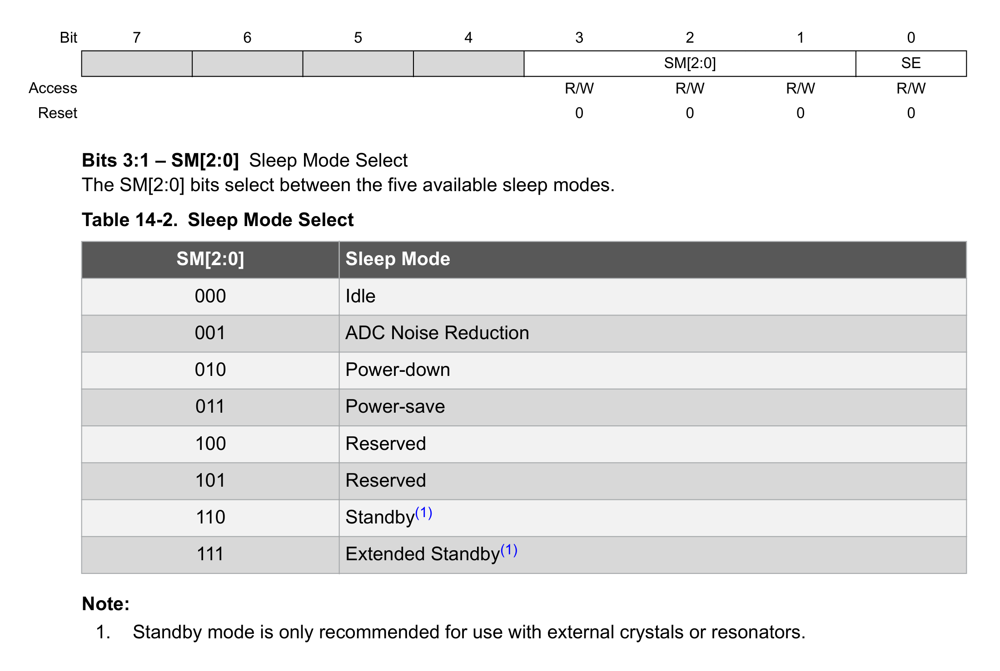
*Description*: Hardware reference table detailing register bit field settings, electrical operating limits, or memory configurations for Table 14-2: Sleep Mode Select.

> **Table 14-2: Sleep Mode Select**

SM[2:0]
Sleep Mode
000
Idle
001
ADC Noise Reduction
010
Power-down
011
Power-save
100
Reserved
101
Reserved
110
Standby(1)
111
Extended Standby(1)
Note:
1.
Standby mode is only recommended for use with external crystals or resonators.
Bit 0 – SE Sleep Enable
The SE bit must be written to logic one to make the MCU enter the sleep mode when the SLEEP
instruction is executed. To avoid the MCU entering the sleep mode unless it is the programmer’s purpose,
it is recommended to write the Sleep Enable (SE) bit to one just before the execution of the SLEEP
instruction and to clear it immediately after waking up.
ATmega328/P
Power Management and Sleep Modes
© 2018 Microchip Technology Inc.
Datasheet Complete
DS40001984A-page 70
Downloaded from Arrow.com.
Downloaded from Arrow.com.
Downloaded from Arrow.com.
Downloaded from Arrow.com.
Downloaded from Arrow.com.
Downloaded from Arrow.com.
Downloaded from Arrow.com.
Downloaded from Arrow.com.
Downloaded from Arrow.com.
Downloaded from Arrow.com.
Downloaded from Arrow.com.
Downloaded from Arrow.com.
Downloaded from Arrow.com.
Downloaded from Arrow.com.
Downloaded from Arrow.com.
Downloaded from Arrow.com.
Downloaded from Arrow.com.
Downloaded from Arrow.com.
Downloaded from Arrow.com.
Downloaded from Arrow.com.
Downloaded from Arrow.com.
Downloaded from Arrow.com.
Downloaded from Arrow.com.
Downloaded from Arrow.com.
Downloaded from Arrow.com.
Downloaded from Arrow.com.
Downloaded from Arrow.com.
Downloaded from Arrow.com.
Downloaded from Arrow.com.
Downloaded from Arrow.com.
Downloaded from Arrow.com.
Downloaded from Arrow.com.
Downloaded from Arrow.com.
Downloaded from Arrow.com.
Downloaded from Arrow.com.
Downloaded from Arrow.com.
Downloaded from Arrow.com.
Downloaded from Arrow.com.
Downloaded from Arrow.com.
Downloaded from Arrow.com.
Downloaded from Arrow.com.
Downloaded from Arrow.com.
Downloaded from Arrow.com.
Downloaded from Arrow.com.
Downloaded from Arrow.com.
Downloaded from Arrow.com.
Downloaded from Arrow.com.
Downloaded from Arrow.com.
Downloaded from Arrow.com.
Downloaded from Arrow.com.
Downloaded from Arrow.com.
Downloaded from Arrow.com.
Downloaded from Arrow.com.
Downloaded from Arrow.com.
Downloaded from Arrow.com.
Downloaded from Arrow.com.
Downloaded from Arrow.com.
Downloaded from Arrow.com.
Downloaded from Arrow.com.
Downloaded from Arrow.com.
Downloaded from Arrow.com.
Downloaded from Arrow.com.
Downloaded from Arrow.com.
Downloaded from Arrow.com.
Downloaded from Arrow.com.
Downloaded from Arrow.com.
Downloaded from Arrow.com.
Downloaded from Arrow.com.
Downloaded from Arrow.com.
Downloaded from Arrow.com.


<!-- Page 71 -->
### [PDF Page 71]

14.12.2 MCU Control Register
Name:
MCUCR
Offset:
0x55
Reset:
0x00
Property:  When addressing as I/O register: address offset is 0x35
The MCU Control register controls the placement of the interrupt vector table in order to move interrupts
between application and boot space.
When addressing I/O registers as data space using LD and ST instructions, the provided offset must be
used. When using the I/O specific commands IN and OUT, the offset is reduced by 0x20, resulting in an
I/O address offset within 0x00 - 0x3F.
Bit
7
6
5
4
3
2
1
0
BODS
BODSE
PUD
IVSEL
IVCE
Access
R/W
R/W
R/W
R/W
R/W
Reset
0
0
0
0
0
Bit 6 – BODS BOD Sleep
The BODS bit must be written to '1' in order to turn off BOD during sleep. Writing to the BODS bit is
controlled by a timed sequence and the enable bit BODSE. To disable BOD in relevant sleep modes, both
BODS and BODSE must first be written to '1'. Then, BODS must be written to '1' and BODSE must be
written to zero within four clock cycles.
The BODS bit is active three clock cycles after it is set. A sleep instruction must be executed while BODS
is active in order to turn off the BOD for the actual sleep mode. The BODS bit is automatically cleared
after three clock cycles.
Note:  BOD disable is only available for ATmega328P.
Bit 5 – BODSE BOD Sleep Enable
BODSE enables setting of BODS control bit, as explained in BODS bit description. BOD disable is
controlled by a timed sequence.
Note:  BOD disable is only available for ATmega328P.
Bit 4 – PUD Pull-up Disable
When this bit is written to one, the pull ups in the I/O ports are disabled even if the DDxn and PORTxn
registers are configured to enable the pull ups ({DDxn, PORTxn} = 0b01).
Bit 1 – IVSEL Interrupt Vector Select
When the IVSEL bit is cleared (zero), the interrupt vectors are placed at the start of the Flash memory.
When this bit is set (one), the interrupt vectors are moved to the beginning of the boot loader section of
the Flash. The actual address of the start of the boot Flash section is determined by the BOOTSZ fuses.
To avoid unintentional changes of interrupt vector tables, a special write procedure must be followed to
change the IVSEL bit:
1.
Write the Interrupt Vector Change Enable (IVCE) bit to one.
2.
Within four cycles, write the desired value to IVSEL while writing a zero to IVCE.
Interrupts will automatically be disabled while this sequence is executed. Interrupts are disabled in the
same cycle as IVCE is written, and interrupts remain disabled until after the instruction following the write
ATmega328/P
Power Management and Sleep Modes
© 2018 Microchip Technology Inc.
Datasheet Complete
DS40001984A-page 71
Downloaded from Arrow.com.
Downloaded from Arrow.com.
Downloaded from Arrow.com.
Downloaded from Arrow.com.
Downloaded from Arrow.com.
Downloaded from Arrow.com.
Downloaded from Arrow.com.
Downloaded from Arrow.com.
Downloaded from Arrow.com.
Downloaded from Arrow.com.
Downloaded from Arrow.com.
Downloaded from Arrow.com.
Downloaded from Arrow.com.
Downloaded from Arrow.com.
Downloaded from Arrow.com.
Downloaded from Arrow.com.
Downloaded from Arrow.com.
Downloaded from Arrow.com.
Downloaded from Arrow.com.
Downloaded from Arrow.com.
Downloaded from Arrow.com.
Downloaded from Arrow.com.
Downloaded from Arrow.com.
Downloaded from Arrow.com.
Downloaded from Arrow.com.
Downloaded from Arrow.com.
Downloaded from Arrow.com.
Downloaded from Arrow.com.
Downloaded from Arrow.com.
Downloaded from Arrow.com.
Downloaded from Arrow.com.
Downloaded from Arrow.com.
Downloaded from Arrow.com.
Downloaded from Arrow.com.
Downloaded from Arrow.com.
Downloaded from Arrow.com.
Downloaded from Arrow.com.
Downloaded from Arrow.com.
Downloaded from Arrow.com.
Downloaded from Arrow.com.
Downloaded from Arrow.com.
Downloaded from Arrow.com.
Downloaded from Arrow.com.
Downloaded from Arrow.com.
Downloaded from Arrow.com.
Downloaded from Arrow.com.
Downloaded from Arrow.com.
Downloaded from Arrow.com.
Downloaded from Arrow.com.
Downloaded from Arrow.com.
Downloaded from Arrow.com.
Downloaded from Arrow.com.
Downloaded from Arrow.com.
Downloaded from Arrow.com.
Downloaded from Arrow.com.
Downloaded from Arrow.com.
Downloaded from Arrow.com.
Downloaded from Arrow.com.
Downloaded from Arrow.com.
Downloaded from Arrow.com.
Downloaded from Arrow.com.
Downloaded from Arrow.com.
Downloaded from Arrow.com.
Downloaded from Arrow.com.
Downloaded from Arrow.com.
Downloaded from Arrow.com.
Downloaded from Arrow.com.
Downloaded from Arrow.com.
Downloaded from Arrow.com.
Downloaded from Arrow.com.
Downloaded from Arrow.com.


<!-- Page 72 -->
### [PDF Page 72]

to IVSEL. If IVSEL is not written, interrupts remain disabled for four cycles. The I-bit in the Status register
is unaffected by the automatic disabling.
Note:  If interrupt vectors are placed in the boot loader section and Boot Lock bit BLB02 is programmed,
interrupts are disabled while executing from the application section. If interrupt vectors are placed in the
application section and Boot Lock bit BLB12 is programmed, interrupts are disabled while executing from
the boot loader section.
Bit 0 – IVCE Interrupt Vector Change Enable
The IVCE bit must be written to logic one to enable change of the IVSEL bit. IVCE is cleared by hardware
four cycles after it is written or when IVSEL is written. Setting the IVCE bit will disable interrupts, as
explained in the IVSEL description above. See the code example below.
Assembly Code Example
Move_interrupts:
; Get MCUCR
in    r16, MCUCR
mov   r17, r16
; Enable change of Interrupt Vectors
ori   r16, (1<<IVCE)
out   MCUCR, r16
; Move interrupts to Boot Flash section
ori   r17, (1<<IVSEL)
out   MCUCR, r17
ret
C Code Example

```c
void Move_interrupts(void)
```

{
uchar temp;
/* GET MCUCR*/
temp = MCUCR;
/* Enable change of Interrupt Vectors */
MCUCR = temp|(1<<IVCE);
/* Move interrupts to Boot Flash section */
MCUCR = temp|(1<<IVSEL);
}
ATmega328/P
Power Management and Sleep Modes
© 2018 Microchip Technology Inc.
Datasheet Complete
DS40001984A-page 72
Downloaded from Arrow.com.
Downloaded from Arrow.com.
Downloaded from Arrow.com.
Downloaded from Arrow.com.
Downloaded from Arrow.com.
Downloaded from Arrow.com.
Downloaded from Arrow.com.
Downloaded from Arrow.com.
Downloaded from Arrow.com.
Downloaded from Arrow.com.
Downloaded from Arrow.com.
Downloaded from Arrow.com.
Downloaded from Arrow.com.
Downloaded from Arrow.com.
Downloaded from Arrow.com.
Downloaded from Arrow.com.
Downloaded from Arrow.com.
Downloaded from Arrow.com.
Downloaded from Arrow.com.
Downloaded from Arrow.com.
Downloaded from Arrow.com.
Downloaded from Arrow.com.
Downloaded from Arrow.com.
Downloaded from Arrow.com.
Downloaded from Arrow.com.
Downloaded from Arrow.com.
Downloaded from Arrow.com.
Downloaded from Arrow.com.
Downloaded from Arrow.com.
Downloaded from Arrow.com.
Downloaded from Arrow.com.
Downloaded from Arrow.com.
Downloaded from Arrow.com.
Downloaded from Arrow.com.
Downloaded from Arrow.com.
Downloaded from Arrow.com.
Downloaded from Arrow.com.
Downloaded from Arrow.com.
Downloaded from Arrow.com.
Downloaded from Arrow.com.
Downloaded from Arrow.com.
Downloaded from Arrow.com.
Downloaded from Arrow.com.
Downloaded from Arrow.com.
Downloaded from Arrow.com.
Downloaded from Arrow.com.
Downloaded from Arrow.com.
Downloaded from Arrow.com.
Downloaded from Arrow.com.
Downloaded from Arrow.com.
Downloaded from Arrow.com.
Downloaded from Arrow.com.
Downloaded from Arrow.com.
Downloaded from Arrow.com.
Downloaded from Arrow.com.
Downloaded from Arrow.com.
Downloaded from Arrow.com.
Downloaded from Arrow.com.
Downloaded from Arrow.com.
Downloaded from Arrow.com.
Downloaded from Arrow.com.
Downloaded from Arrow.com.
Downloaded from Arrow.com.
Downloaded from Arrow.com.
Downloaded from Arrow.com.
Downloaded from Arrow.com.
Downloaded from Arrow.com.
Downloaded from Arrow.com.
Downloaded from Arrow.com.
Downloaded from Arrow.com.
Downloaded from Arrow.com.
Downloaded from Arrow.com.


<!-- Page 73 -->
### [PDF Page 73]

14.12.3 Power Reduction Register
Name:
PRR
Offset:
0x64
Reset:
0x00
Property:  -
Bit
7
6
5
4
3
2
1
0
PRTWI0
PRTIM2
PRTIM0
PRTIM1
PRSPI0
PRUSART0
PRADC
Access
R/W
R/W
R/W
R/W
R/W
R/W
R/W
Reset
0
0
0
0
0
0
0
Bit 7 – PRTWI0 Power Reduction TWI0
Writing a logic one to this bit shuts down the TWI 0 by stopping the clock to the module. When waking up
the TWI again, the TWI should be reinitialized to ensure proper operation.
Bit 6 – PRTIM2 Power Reduction Timer/Counter2
Writing a logic one to this bit shuts down the Timer/Counter2 module in synchronous mode (AS2 is 0).
When the Timer/Counter2 is enabled, the operation will continue like before the shutdown.
Bit 5 – PRTIM0 Power Reduction Timer/Counter0
Writing a logic one to this bit shuts down the Timer/Counter0 module. When the Timer/Counter0 is
enabled, the operation will continue like before the shutdown.
Bit 3 – PRTIM1 Power Reduction Timer/Counter1
Writing a logic one to this bit shuts down the Timer/Counter1 module. When the Timer/Counter1 is
enabled, the operation will continue like before the shutdown.
Bit 2 – PRSPI0 Power Reduction Serial Peripheral Interface 0
If using debugWIRE on-chip debug system, this bit should not be written to one. Writing a logic one to this
bit shuts down the Serial Peripheral Interface (SPI) by stopping the clock to the module. When waking up
the SPI again, the SPI should be reinitialized to ensure proper operation.
Bit 1 – PRUSART0 Power Reduction USART0
Writing a logic one to this bit shuts down the USART by stopping the clock to the module. When waking
up the USART again, the USART should be reinitialized to ensure proper operation.
Bit 0 – PRADC Power Reduction ADC
Writing a logic one to this bit shuts down the ADC. The ADC must be disabled before shut down. The
analog comparator cannot use the ADC input MUX when the ADC is shut down.
Related Links
Supply Current of IO Modules
ATmega328/P
Power Management and Sleep Modes
© 2018 Microchip Technology Inc.
Datasheet Complete
DS40001984A-page 73
Downloaded from Arrow.com.
Downloaded from Arrow.com.
Downloaded from Arrow.com.
Downloaded from Arrow.com.
Downloaded from Arrow.com.
Downloaded from Arrow.com.
Downloaded from Arrow.com.
Downloaded from Arrow.com.
Downloaded from Arrow.com.
Downloaded from Arrow.com.
Downloaded from Arrow.com.
Downloaded from Arrow.com.
Downloaded from Arrow.com.
Downloaded from Arrow.com.
Downloaded from Arrow.com.
Downloaded from Arrow.com.
Downloaded from Arrow.com.
Downloaded from Arrow.com.
Downloaded from Arrow.com.
Downloaded from Arrow.com.
Downloaded from Arrow.com.
Downloaded from Arrow.com.
Downloaded from Arrow.com.
Downloaded from Arrow.com.
Downloaded from Arrow.com.
Downloaded from Arrow.com.
Downloaded from Arrow.com.
Downloaded from Arrow.com.
Downloaded from Arrow.com.
Downloaded from Arrow.com.
Downloaded from Arrow.com.
Downloaded from Arrow.com.
Downloaded from Arrow.com.
Downloaded from Arrow.com.
Downloaded from Arrow.com.
Downloaded from Arrow.com.
Downloaded from Arrow.com.
Downloaded from Arrow.com.
Downloaded from Arrow.com.
Downloaded from Arrow.com.
Downloaded from Arrow.com.
Downloaded from Arrow.com.
Downloaded from Arrow.com.
Downloaded from Arrow.com.
Downloaded from Arrow.com.
Downloaded from Arrow.com.
Downloaded from Arrow.com.
Downloaded from Arrow.com.
Downloaded from Arrow.com.
Downloaded from Arrow.com.
Downloaded from Arrow.com.
Downloaded from Arrow.com.
Downloaded from Arrow.com.
Downloaded from Arrow.com.
Downloaded from Arrow.com.
Downloaded from Arrow.com.
Downloaded from Arrow.com.
Downloaded from Arrow.com.
Downloaded from Arrow.com.
Downloaded from Arrow.com.
Downloaded from Arrow.com.
Downloaded from Arrow.com.
Downloaded from Arrow.com.
Downloaded from Arrow.com.
Downloaded from Arrow.com.
Downloaded from Arrow.com.
Downloaded from Arrow.com.
Downloaded from Arrow.com.
Downloaded from Arrow.com.
Downloaded from Arrow.com.
Downloaded from Arrow.com.
Downloaded from Arrow.com.
Downloaded from Arrow.com.


<!-- Page 74 -->
### [PDF Page 74]

15.
System Control and Reset
15.1
Resetting the AVR
During Reset, all I/O registers are set to their initial values, and the program starts execution from the
Reset vector. The instruction placed at the Reset vector must be an Absolute Jump instruction (JMP) to
the reset handling routine for . If the program never enables an interrupt source, the interrupt vectors are
not used, and regular program code can be placed at these locations. This is also the case if the Reset
vector is in the application section while the interrupt vectors are in the boot section or vice versa. The
circuit diagram in the next section shows the reset logic.
The I/O ports of the AVR are immediately reset to their initial state when a Reset source goes active. This
does not require any clock source to be running.
After all Reset sources have gone inactive, a delay counter is invoked, stretching the internal Reset. This
allows the power to reach a stable level before the normal operation starts. The time-out period of the
delay counter is defined by the user through the SUT and CKSEL fuses. The different selections for the
delay period are presented in the System Clock and Clock Options chapter.
Related Links
System Clock and Clock Options
15.2
Reset Sources
The device has the following sources of Reset:
•
Power-on Reset. The MCU is Reset when the supply voltage is less than the Power-on Reset
threshold (VPOT).
•
External Reset. The MCU is Reset when a low level is present on the RESET pin for longer than
the minimum pulse length.
•
Watchdog System Reset. The MCU is Reset when the Watchdog Timer period expires and the
Watchdog System Reset mode is enabled.
•
Brown-out Reset. The MCU is Reset when the supply voltage VCC is less than the Brown-out Reset
threshold (VBOT) and the Brown-out Detector is enabled.
ATmega328/P
System Control and Reset
© 2018 Microchip Technology Inc.
Datasheet Complete
DS40001984A-page 74
Downloaded from Arrow.com.
Downloaded from Arrow.com.
Downloaded from Arrow.com.
Downloaded from Arrow.com.
Downloaded from Arrow.com.
Downloaded from Arrow.com.
Downloaded from Arrow.com.
Downloaded from Arrow.com.
Downloaded from Arrow.com.
Downloaded from Arrow.com.
Downloaded from Arrow.com.
Downloaded from Arrow.com.
Downloaded from Arrow.com.
Downloaded from Arrow.com.
Downloaded from Arrow.com.
Downloaded from Arrow.com.
Downloaded from Arrow.com.
Downloaded from Arrow.com.
Downloaded from Arrow.com.
Downloaded from Arrow.com.
Downloaded from Arrow.com.
Downloaded from Arrow.com.
Downloaded from Arrow.com.
Downloaded from Arrow.com.
Downloaded from Arrow.com.
Downloaded from Arrow.com.
Downloaded from Arrow.com.
Downloaded from Arrow.com.
Downloaded from Arrow.com.
Downloaded from Arrow.com.
Downloaded from Arrow.com.
Downloaded from Arrow.com.
Downloaded from Arrow.com.
Downloaded from Arrow.com.
Downloaded from Arrow.com.
Downloaded from Arrow.com.
Downloaded from Arrow.com.
Downloaded from Arrow.com.
Downloaded from Arrow.com.
Downloaded from Arrow.com.
Downloaded from Arrow.com.
Downloaded from Arrow.com.
Downloaded from Arrow.com.
Downloaded from Arrow.com.
Downloaded from Arrow.com.
Downloaded from Arrow.com.
Downloaded from Arrow.com.
Downloaded from Arrow.com.
Downloaded from Arrow.com.
Downloaded from Arrow.com.
Downloaded from Arrow.com.
Downloaded from Arrow.com.
Downloaded from Arrow.com.
Downloaded from Arrow.com.
Downloaded from Arrow.com.
Downloaded from Arrow.com.
Downloaded from Arrow.com.
Downloaded from Arrow.com.
Downloaded from Arrow.com.
Downloaded from Arrow.com.
Downloaded from Arrow.com.
Downloaded from Arrow.com.
Downloaded from Arrow.com.
Downloaded from Arrow.com.
Downloaded from Arrow.com.
Downloaded from Arrow.com.
Downloaded from Arrow.com.
Downloaded from Arrow.com.
Downloaded from Arrow.com.
Downloaded from Arrow.com.
Downloaded from Arrow.com.
Downloaded from Arrow.com.
Downloaded from Arrow.com.
Downloaded from Arrow.com.


<!-- Page 75 -->
### [PDF Page 75]


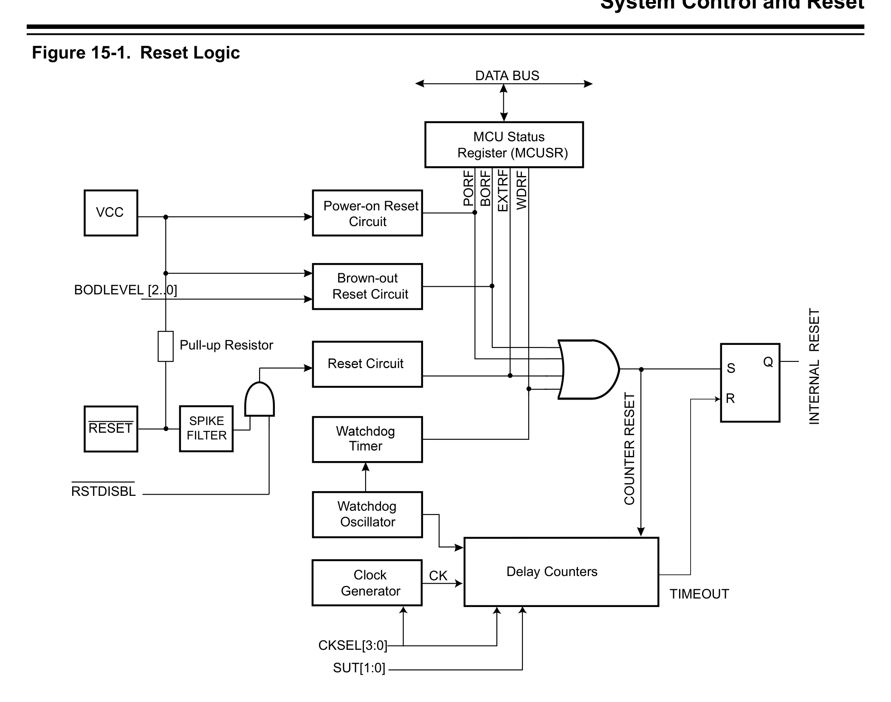
*Description*: Technical diagram and schematic illustration detailing hardware circuit topology, signal routing, and logic operations for Figure 15-1: Reset Logic.

> **Figure 15-1: Reset Logic**

MCU Status
Register (MCUSR)
Brown-out
Reset Circuit
BODLEVEL [2..0]
Delay Counters
CKSEL[3:0]
CK
TIMEOUT
WDRF
BORF
EXTRF
PORF
DATA BUS
Clock
Generator
SPIKE
FILTER
Pull-up Resistor
Watchdog
Oscillator
SUT[1:0]
Power-on Reset
Circuit
RSTDISBL
15.3
Power-on Reset
A Power-on Reset (POR) pulse is generated by an on-chip detection circuit. The POR is activated
whenever VCC is below the detection level. The POR circuit can be used to trigger the start-up Reset, as
well as to detect a failure in supply voltage.
A POR circuit ensures that the device is reset from power-on. Reaching the POR threshold voltage
invokes the delay counter, which determines how long the device is kept in Reset after VCC rise. The
Reset signal is activated again, without any delay, when VCC decreases below the detection level.

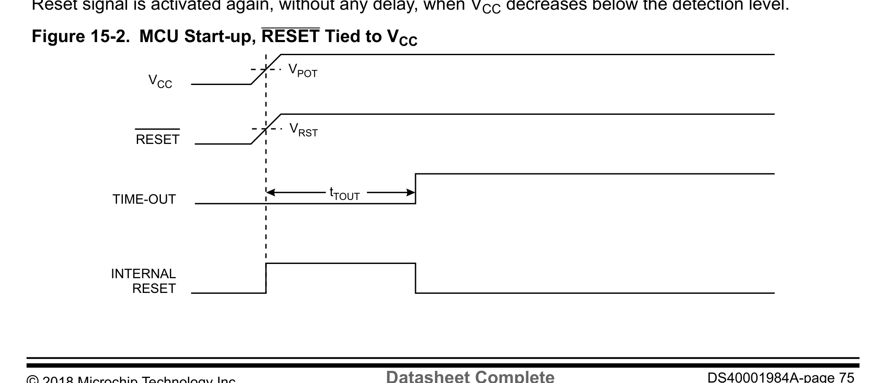
*Description*: Technical diagram and schematic illustration detailing hardware circuit topology, signal routing, and logic operations for Figure 15-2: MCU Start-up, RESET Tied to VCC.

> **Figure 15-2: MCU Start-up, RESET Tied to VCC**

V
RESET
TIME-OUT
INTERNAL
RESET
tTOUT
VPOT
VRST
CC
ATmega328/P
System Control and Reset
© 2018 Microchip Technology Inc.
Datasheet Complete
DS40001984A-page 75
Downloaded from Arrow.com.
Downloaded from Arrow.com.
Downloaded from Arrow.com.
Downloaded from Arrow.com.
Downloaded from Arrow.com.
Downloaded from Arrow.com.
Downloaded from Arrow.com.
Downloaded from Arrow.com.
Downloaded from Arrow.com.
Downloaded from Arrow.com.
Downloaded from Arrow.com.
Downloaded from Arrow.com.
Downloaded from Arrow.com.
Downloaded from Arrow.com.
Downloaded from Arrow.com.
Downloaded from Arrow.com.
Downloaded from Arrow.com.
Downloaded from Arrow.com.
Downloaded from Arrow.com.
Downloaded from Arrow.com.
Downloaded from Arrow.com.
Downloaded from Arrow.com.
Downloaded from Arrow.com.
Downloaded from Arrow.com.
Downloaded from Arrow.com.
Downloaded from Arrow.com.
Downloaded from Arrow.com.
Downloaded from Arrow.com.
Downloaded from Arrow.com.
Downloaded from Arrow.com.
Downloaded from Arrow.com.
Downloaded from Arrow.com.
Downloaded from Arrow.com.
Downloaded from Arrow.com.
Downloaded from Arrow.com.
Downloaded from Arrow.com.
Downloaded from Arrow.com.
Downloaded from Arrow.com.
Downloaded from Arrow.com.
Downloaded from Arrow.com.
Downloaded from Arrow.com.
Downloaded from Arrow.com.
Downloaded from Arrow.com.
Downloaded from Arrow.com.
Downloaded from Arrow.com.
Downloaded from Arrow.com.
Downloaded from Arrow.com.
Downloaded from Arrow.com.
Downloaded from Arrow.com.
Downloaded from Arrow.com.
Downloaded from Arrow.com.
Downloaded from Arrow.com.
Downloaded from Arrow.com.
Downloaded from Arrow.com.
Downloaded from Arrow.com.
Downloaded from Arrow.com.
Downloaded from Arrow.com.
Downloaded from Arrow.com.
Downloaded from Arrow.com.
Downloaded from Arrow.com.
Downloaded from Arrow.com.
Downloaded from Arrow.com.
Downloaded from Arrow.com.
Downloaded from Arrow.com.
Downloaded from Arrow.com.
Downloaded from Arrow.com.
Downloaded from Arrow.com.
Downloaded from Arrow.com.
Downloaded from Arrow.com.
Downloaded from Arrow.com.
Downloaded from Arrow.com.
Downloaded from Arrow.com.
Downloaded from Arrow.com.
Downloaded from Arrow.com.
Downloaded from Arrow.com.


<!-- Page 76 -->
### [PDF Page 76]


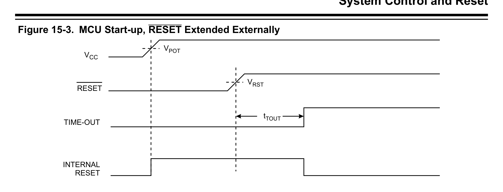
*Description*: Technical diagram and schematic illustration detailing hardware circuit topology, signal routing, and logic operations for Figure 15-3: MCU Start-up, RESET Extended Externally.

> **Figure 15-3: MCU Start-up, RESET Extended Externally**

RESET
TIME-OUT
INTERNAL
RESET
tTOUT
VPOT
VRST
VCC
15.4
External Reset
An external Reset is generated by a low level on the RESET pin. Reset pulses longer than the minimum
pulse width will generate a Reset, even if the clock is not running. Shorter pulses are not guaranteed to
generate a Reset. When the applied signal reaches the Reset Threshold Voltage (VRST) on its positive
edge, the delay counter starts the MCU after the Time-out period (tTOUT ) has expired. The external Reset
can be disabled by the RSTDISBL fuse.

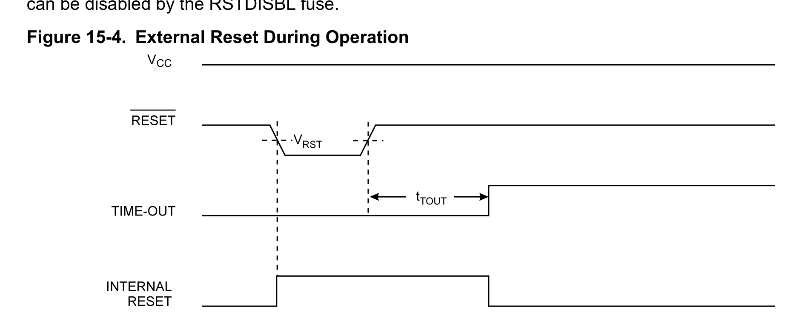
*Description*: Technical diagram and schematic illustration detailing hardware circuit topology, signal routing, and logic operations for Figure 15-4: External Reset During Operation.

> **Figure 15-4: External Reset During Operation**

CC
15.5
Brown-out Detection
The device has an on-chip Brown-out Detection (BOD) circuit for monitoring the VCC level during
operation by comparing it to a fixed trigger level. The trigger level for the BOD can be selected by the
BODLEVEL Fuses. The trigger level has a hysteresis to ensure spike-free BOD. The hysteresis on the
detection level should be interpreted as VBOT+ = VBOT + VHYST/2 and VBOT- = VBOT - VHYST/2. When the
BOD is enabled, and VCC decreases to a value below the trigger level (VBOT- in the following figure), the
Brown-out Reset is immediately activated. When VCC increases above the trigger level (VBOT+ in the
following figure), the delay counter starts the MCU after the Time-out period tTOUT has expired.
The BOD circuit will only detect a drop in VCC if the voltage stays below the trigger level for longer than
tBOD.
ATmega328/P
System Control and Reset
© 2018 Microchip Technology Inc.
Datasheet Complete
DS40001984A-page 76
Downloaded from Arrow.com.
Downloaded from Arrow.com.
Downloaded from Arrow.com.
Downloaded from Arrow.com.
Downloaded from Arrow.com.
Downloaded from Arrow.com.
Downloaded from Arrow.com.
Downloaded from Arrow.com.
Downloaded from Arrow.com.
Downloaded from Arrow.com.
Downloaded from Arrow.com.
Downloaded from Arrow.com.
Downloaded from Arrow.com.
Downloaded from Arrow.com.
Downloaded from Arrow.com.
Downloaded from Arrow.com.
Downloaded from Arrow.com.
Downloaded from Arrow.com.
Downloaded from Arrow.com.
Downloaded from Arrow.com.
Downloaded from Arrow.com.
Downloaded from Arrow.com.
Downloaded from Arrow.com.
Downloaded from Arrow.com.
Downloaded from Arrow.com.
Downloaded from Arrow.com.
Downloaded from Arrow.com.
Downloaded from Arrow.com.
Downloaded from Arrow.com.
Downloaded from Arrow.com.
Downloaded from Arrow.com.
Downloaded from Arrow.com.
Downloaded from Arrow.com.
Downloaded from Arrow.com.
Downloaded from Arrow.com.
Downloaded from Arrow.com.
Downloaded from Arrow.com.
Downloaded from Arrow.com.
Downloaded from Arrow.com.
Downloaded from Arrow.com.
Downloaded from Arrow.com.
Downloaded from Arrow.com.
Downloaded from Arrow.com.
Downloaded from Arrow.com.
Downloaded from Arrow.com.
Downloaded from Arrow.com.
Downloaded from Arrow.com.
Downloaded from Arrow.com.
Downloaded from Arrow.com.
Downloaded from Arrow.com.
Downloaded from Arrow.com.
Downloaded from Arrow.com.
Downloaded from Arrow.com.
Downloaded from Arrow.com.
Downloaded from Arrow.com.
Downloaded from Arrow.com.
Downloaded from Arrow.com.
Downloaded from Arrow.com.
Downloaded from Arrow.com.
Downloaded from Arrow.com.
Downloaded from Arrow.com.
Downloaded from Arrow.com.
Downloaded from Arrow.com.
Downloaded from Arrow.com.
Downloaded from Arrow.com.
Downloaded from Arrow.com.
Downloaded from Arrow.com.
Downloaded from Arrow.com.
Downloaded from Arrow.com.
Downloaded from Arrow.com.
Downloaded from Arrow.com.
Downloaded from Arrow.com.
Downloaded from Arrow.com.
Downloaded from Arrow.com.
Downloaded from Arrow.com.
Downloaded from Arrow.com.


<!-- Page 77 -->
### [PDF Page 77]


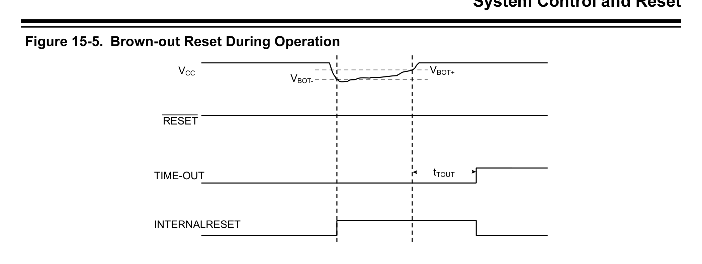
*Description*: Technical diagram and schematic illustration detailing hardware circuit topology, signal routing, and logic operations for Figure 15-5: Brown-out Reset During Operation.

> **Figure 15-5: Brown-out Reset During Operation**

VCC
RESET
TIME-OUT
INTERNALRESET
VBOT-
VBOT+
tTOUT
15.6
Watchdog System Reset
When the Watchdog times out, it will generate a short reset pulse of one CK cycle duration. On the falling
edge of this pulse, the delay timer starts counting the Time-out period tTOUT.

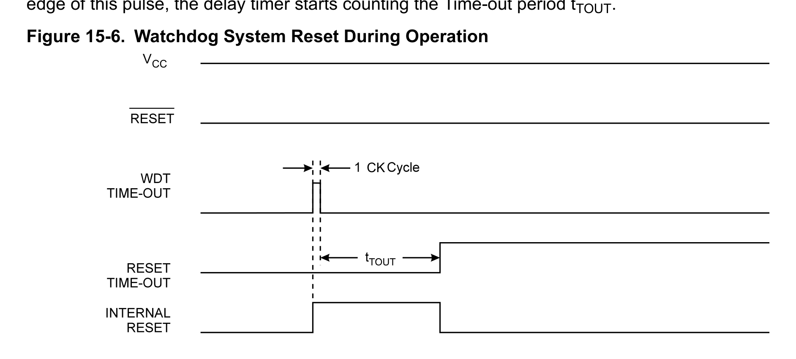
*Description*: Technical diagram and schematic illustration detailing hardware circuit topology, signal routing, and logic operations for Figure 15-6: Watchdog System Reset During Operation.

> **Figure 15-6: Watchdog System Reset During Operation**

CK
CC
15.7
Internal Voltage Reference
The device features an internal bandgap reference. This reference is used for Brown-out Detection, and it
can be used as an input to the analog comparator or the ADC.
15.7.1
Voltage Reference Enable Signals and Start-up Time
The voltage reference has a start-up time that may influence the way it should be used. To save power,
the reference is not always turned ON. The reference is ON during the following situations:
1.
When the BOD is enabled (by programming the BODLEVEL [2:0] Fuses).
2.
When the bandgap reference is connected to the Analog Comparator (by setting the ACBG bit in
ACSR (ACSR.ACBG)).
3.
When the ADC is enabled.
Thus, when the BOD is not enabled, after setting ACSR.ACBG or enabling the ADC, the user must
always allow the reference to start-up before the output from the analog comparator or ADC is used. To
reduce power consumption in the Power-Down mode, the user can avoid the three conditions above to
ensure that the reference is turned OFF before entering Power-Down mode.
ATmega328/P
System Control and Reset
© 2018 Microchip Technology Inc.
Datasheet Complete
DS40001984A-page 77
Downloaded from Arrow.com.
Downloaded from Arrow.com.
Downloaded from Arrow.com.
Downloaded from Arrow.com.
Downloaded from Arrow.com.
Downloaded from Arrow.com.
Downloaded from Arrow.com.
Downloaded from Arrow.com.
Downloaded from Arrow.com.
Downloaded from Arrow.com.
Downloaded from Arrow.com.
Downloaded from Arrow.com.
Downloaded from Arrow.com.
Downloaded from Arrow.com.
Downloaded from Arrow.com.
Downloaded from Arrow.com.
Downloaded from Arrow.com.
Downloaded from Arrow.com.
Downloaded from Arrow.com.
Downloaded from Arrow.com.
Downloaded from Arrow.com.
Downloaded from Arrow.com.
Downloaded from Arrow.com.
Downloaded from Arrow.com.
Downloaded from Arrow.com.
Downloaded from Arrow.com.
Downloaded from Arrow.com.
Downloaded from Arrow.com.
Downloaded from Arrow.com.
Downloaded from Arrow.com.
Downloaded from Arrow.com.
Downloaded from Arrow.com.
Downloaded from Arrow.com.
Downloaded from Arrow.com.
Downloaded from Arrow.com.
Downloaded from Arrow.com.
Downloaded from Arrow.com.
Downloaded from Arrow.com.
Downloaded from Arrow.com.
Downloaded from Arrow.com.
Downloaded from Arrow.com.
Downloaded from Arrow.com.
Downloaded from Arrow.com.
Downloaded from Arrow.com.
Downloaded from Arrow.com.
Downloaded from Arrow.com.
Downloaded from Arrow.com.
Downloaded from Arrow.com.
Downloaded from Arrow.com.
Downloaded from Arrow.com.
Downloaded from Arrow.com.
Downloaded from Arrow.com.
Downloaded from Arrow.com.
Downloaded from Arrow.com.
Downloaded from Arrow.com.
Downloaded from Arrow.com.
Downloaded from Arrow.com.
Downloaded from Arrow.com.
Downloaded from Arrow.com.
Downloaded from Arrow.com.
Downloaded from Arrow.com.
Downloaded from Arrow.com.
Downloaded from Arrow.com.
Downloaded from Arrow.com.
Downloaded from Arrow.com.
Downloaded from Arrow.com.
Downloaded from Arrow.com.
Downloaded from Arrow.com.
Downloaded from Arrow.com.
Downloaded from Arrow.com.
Downloaded from Arrow.com.
Downloaded from Arrow.com.
Downloaded from Arrow.com.
Downloaded from Arrow.com.
Downloaded from Arrow.com.
Downloaded from Arrow.com.
Downloaded from Arrow.com.


<!-- Page 78 -->
### [PDF Page 78]

15.8
Watchdog Timer
If the watchdog timer is not needed in the application, the module should be turned OFF. If the watchdog
timer is enabled, it will be enabled in all sleep modes and hence always consume power. In the deeper
sleep modes, this will contribute significantly to the total current consumption.
Refer to Watchdog System Reset for details on how to configure the watchdog timer.
15.8.1

### Features

•
Clocked from Separate On-chip Oscillator
•
Three Operating modes:
–
Interrupt
–
System Reset
–
Interrupt and System Reset
•
Selectable Time-out Period from 16 ms to 8s
•
Possible Hardware Fuse Watchdog Always ON (WDTON) for Fail-safe mode
15.8.2

### Overview

The device has an Enhanced Watchdog Timer (WDT). The WDT is a timer counting cycles of a separate
on-chip 128 kHz oscillator. The WDT gives an interrupt or a system reset when the counter reaches a
given time-out value. In normal operation mode, it is required that the system uses the Watchdog Timer
Reset (WDR) instruction to restart the counter before the time-out value is reached. If the system doesn't
restart the counter, an interrupt or system reset will be issued.

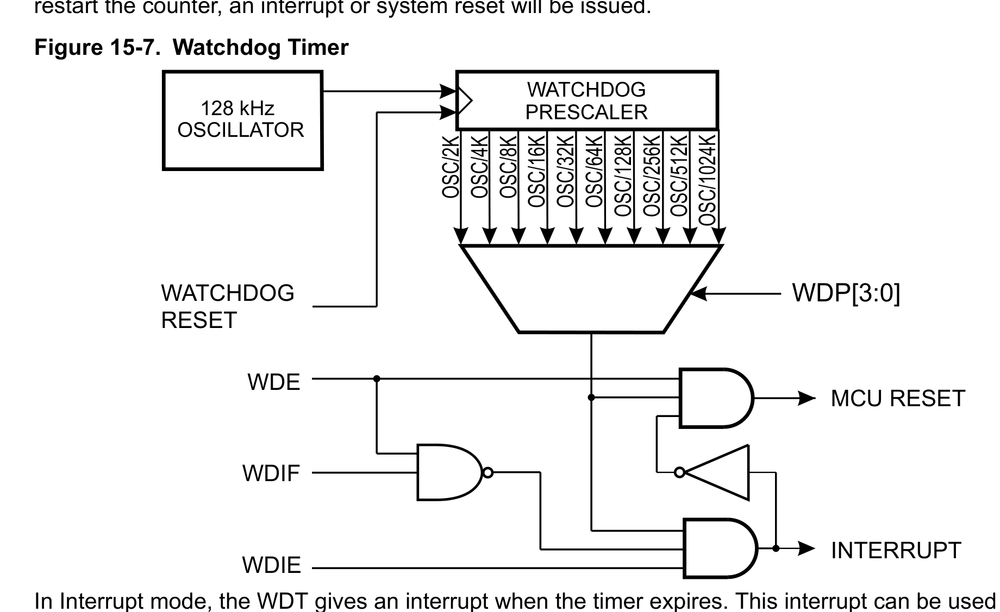
*Description*: Timer/Counter block diagram and waveform timing diagram illustrating prescaler clocks, compare match units, and PWM generation logic for Figure 15-7: Watchdog Timer.

> **Figure 15-7: Watchdog Timer**

OSC/2K
OSC/4K
OSC/8K
OSC/16K
OSC/32K
OSC/64K
OSC/128K
OSC/256K
OSC/512K
OSC/1024K
WDP[3:0]
WATCHDOG
RESET
WDE
WDIF
WDIE
MCU RESET
INTERRUPT
128 kHz
OSCILLATOR
In Interrupt mode, the WDT gives an interrupt when the timer expires. This interrupt can be used to wake
the device from Sleep modes, and as a general system timer. One example is to limit the maximum time
allowed for certain operations, giving an interrupt when the operation has run longer than expected. In
System Reset mode, the WDT gives a reset when the timer expires. This is typically used to prevent
system hang-up in case of runaway code. The third mode, Interrupt and System Reset mode, combines
the other two modes by first giving an interrupt and then switch to System Reset mode. This mode will for
instance allow a safe shutdown by saving critical parameters before a system Reset.
ATmega328/P
System Control and Reset
© 2018 Microchip Technology Inc.
Datasheet Complete
DS40001984A-page 78
Downloaded from Arrow.com.
Downloaded from Arrow.com.
Downloaded from Arrow.com.
Downloaded from Arrow.com.
Downloaded from Arrow.com.
Downloaded from Arrow.com.
Downloaded from Arrow.com.
Downloaded from Arrow.com.
Downloaded from Arrow.com.
Downloaded from Arrow.com.
Downloaded from Arrow.com.
Downloaded from Arrow.com.
Downloaded from Arrow.com.
Downloaded from Arrow.com.
Downloaded from Arrow.com.
Downloaded from Arrow.com.
Downloaded from Arrow.com.
Downloaded from Arrow.com.
Downloaded from Arrow.com.
Downloaded from Arrow.com.
Downloaded from Arrow.com.
Downloaded from Arrow.com.
Downloaded from Arrow.com.
Downloaded from Arrow.com.
Downloaded from Arrow.com.
Downloaded from Arrow.com.
Downloaded from Arrow.com.
Downloaded from Arrow.com.
Downloaded from Arrow.com.
Downloaded from Arrow.com.
Downloaded from Arrow.com.
Downloaded from Arrow.com.
Downloaded from Arrow.com.
Downloaded from Arrow.com.
Downloaded from Arrow.com.
Downloaded from Arrow.com.
Downloaded from Arrow.com.
Downloaded from Arrow.com.
Downloaded from Arrow.com.
Downloaded from Arrow.com.
Downloaded from Arrow.com.
Downloaded from Arrow.com.
Downloaded from Arrow.com.
Downloaded from Arrow.com.
Downloaded from Arrow.com.
Downloaded from Arrow.com.
Downloaded from Arrow.com.
Downloaded from Arrow.com.
Downloaded from Arrow.com.
Downloaded from Arrow.com.
Downloaded from Arrow.com.
Downloaded from Arrow.com.
Downloaded from Arrow.com.
Downloaded from Arrow.com.
Downloaded from Arrow.com.
Downloaded from Arrow.com.
Downloaded from Arrow.com.
Downloaded from Arrow.com.
Downloaded from Arrow.com.
Downloaded from Arrow.com.
Downloaded from Arrow.com.
Downloaded from Arrow.com.
Downloaded from Arrow.com.
Downloaded from Arrow.com.
Downloaded from Arrow.com.
Downloaded from Arrow.com.
Downloaded from Arrow.com.
Downloaded from Arrow.com.
Downloaded from Arrow.com.
Downloaded from Arrow.com.
Downloaded from Arrow.com.
Downloaded from Arrow.com.
Downloaded from Arrow.com.
Downloaded from Arrow.com.
Downloaded from Arrow.com.
Downloaded from Arrow.com.
Downloaded from Arrow.com.
Downloaded from Arrow.com.


<!-- Page 79 -->
### [PDF Page 79]

The Watchdog always on (WDTON) fuse, if programmed, will force the Watchdog Timer to System Reset
mode. With the fuse programmed the System Reset mode bit (WDE) and Interrupt mode bit (WDIE) are
locked to 1 and 0 respectively. To further ensure program security, alterations to the Watchdog set-up
must follow timed sequences. The sequence for clearing WDE and changing time out configuration is as
follows:
1.
In the same operation, write a logic one to the Watchdog change enable bit (WDCE) and Watchdog
System Reset Enable (WDE) in Watchdog Timer Control Register (WDTCSR.WDCE and
WDTCSR.WDE). A logic one must be written to WDTCSR.WDE regardless of the previous value of
the WDTCSR.WDE.
2.
Within the next four clock cycles, write the WDTCSR.WDE and Watchdog prescaler bits group
(WDTCSR.WDP) as desired, but with the WDTCSR.WDCE cleared. This must be done in one
operation.
The following examples show a function for turning off the Watchdog Timer. The
examples assume that interrupts are controlled (e.g. by disabling interrupts globally) so
that no interrupts will occur during the execution of these functions.
Assembly Code Example
WDT_off:
; Turn off global interrupt
cli
; Reset Watchdog Timer
wdr
; Clear WDRF in MCUSR
in      r16, MCUSR
andi    r16, (0xff & (0<<WDRF))
out     MCUSR, r16
; Write '1' to WDCE and WDE
; Keep old prescaler setting to prevent unintentional time-out
lds     r16, WDTCSR
ori     r16, (1<<WDCE) | (1<<WDE)
sts     WDTCSR, r16
; Turn off WDT
ldi     r16, (0<<WDE)
sts     WDTCSR, r16
; Turn on global interrupt
sei
ret
C Code Example

```c
void WDT_off(void)
```

{
__disable_interrupt();
__watchdog_reset();
/* Clear WDRF in MCUSR */
MCUSR &= ~(1<<WDRF);
/* Write logical one to WDCE and WDE */
/* Keep old prescaler setting to prevent unintentional time-out */
WDTCSR |= (1<<WDCE) | (1<<WDE);
/* Turn off WDT */
WDTCSR = 0x00;
__enable_interrupt();
}
Note:  If the Watchdog is accidentally enabled, for example by a runaway pointer or
brown-out condition, the device will be reset and the Watchdog Timer will stay enabled. If
the code is not set up to handle the Watchdog, this might lead to an eternal loop of time-
out resets. To avoid this situation, the application software should always clear the
ATmega328/P
System Control and Reset
© 2018 Microchip Technology Inc.
Datasheet Complete
DS40001984A-page 79
Downloaded from Arrow.com.
Downloaded from Arrow.com.
Downloaded from Arrow.com.
Downloaded from Arrow.com.
Downloaded from Arrow.com.
Downloaded from Arrow.com.
Downloaded from Arrow.com.
Downloaded from Arrow.com.
Downloaded from Arrow.com.
Downloaded from Arrow.com.
Downloaded from Arrow.com.
Downloaded from Arrow.com.
Downloaded from Arrow.com.
Downloaded from Arrow.com.
Downloaded from Arrow.com.
Downloaded from Arrow.com.
Downloaded from Arrow.com.
Downloaded from Arrow.com.
Downloaded from Arrow.com.
Downloaded from Arrow.com.
Downloaded from Arrow.com.
Downloaded from Arrow.com.
Downloaded from Arrow.com.
Downloaded from Arrow.com.
Downloaded from Arrow.com.
Downloaded from Arrow.com.
Downloaded from Arrow.com.
Downloaded from Arrow.com.
Downloaded from Arrow.com.
Downloaded from Arrow.com.
Downloaded from Arrow.com.
Downloaded from Arrow.com.
Downloaded from Arrow.com.
Downloaded from Arrow.com.
Downloaded from Arrow.com.
Downloaded from Arrow.com.
Downloaded from Arrow.com.
Downloaded from Arrow.com.
Downloaded from Arrow.com.
Downloaded from Arrow.com.
Downloaded from Arrow.com.
Downloaded from Arrow.com.
Downloaded from Arrow.com.
Downloaded from Arrow.com.
Downloaded from Arrow.com.
Downloaded from Arrow.com.
Downloaded from Arrow.com.
Downloaded from Arrow.com.
Downloaded from Arrow.com.
Downloaded from Arrow.com.
Downloaded from Arrow.com.
Downloaded from Arrow.com.
Downloaded from Arrow.com.
Downloaded from Arrow.com.
Downloaded from Arrow.com.
Downloaded from Arrow.com.
Downloaded from Arrow.com.
Downloaded from Arrow.com.
Downloaded from Arrow.com.
Downloaded from Arrow.com.
Downloaded from Arrow.com.
Downloaded from Arrow.com.
Downloaded from Arrow.com.
Downloaded from Arrow.com.
Downloaded from Arrow.com.
Downloaded from Arrow.com.
Downloaded from Arrow.com.
Downloaded from Arrow.com.
Downloaded from Arrow.com.
Downloaded from Arrow.com.
Downloaded from Arrow.com.
Downloaded from Arrow.com.
Downloaded from Arrow.com.
Downloaded from Arrow.com.
Downloaded from Arrow.com.
Downloaded from Arrow.com.
Downloaded from Arrow.com.
Downloaded from Arrow.com.
Downloaded from Arrow.com.


<!-- Page 80 -->
### [PDF Page 80]

Watchdog System Reset Flag (WDRF) and the WDE control bit in the initialization
routine, even if the Watchdog is not in use.
The following code examples shows how to change the time-out value of the Watchdog
Timer.
Assembly Code Example
WDT_Prescaler_Change:
; Turn off global interrupt
cli
; Reset Watchdog Timer
wdr
; Start timed sequence
lds r16, WDTCSR
ori r16, (1<<WDCE) | (1<<WDE)
sts WDTCSR, r16
; -- Got four cycles to set the new values from here -
; Set new prescaler(time-out) value = 64K cycles (~0.5 s)
ldi r16, (1<<WDE) | (1<<WDP2) | (1<<WDP0)
sts WDTCSR, r16
; -- Finished setting new values, used 2 cycles -
; Turn on global interrupt
sei
ret
C Code Example

```c
void WDT_Prescaler_Change(void)
```

{
__disable_interrupt();
__watchdog_reset();
/* Start timed sequence */
WDTCSR |= (1<<WDCE) | (1<<WDE);
/* Set new prescaler(time-out) value = 64K cycles (~0.5 s) */
WDTCSR = (1<<WDE) | (1<<WDP2) | (1<<WDP0);
__enable_interrupt();
}
Note:  The Watchdog Timer should be reset before any change of the WDTCSR.WDP
bits, since a change in the WDTCSR.WDP bits can result in a time out when switching to
a shorter time-out period.
15.9

### Register Description

ATmega328/P
System Control and Reset
© 2018 Microchip Technology Inc.
Datasheet Complete
DS40001984A-page 80
Downloaded from Arrow.com.
Downloaded from Arrow.com.
Downloaded from Arrow.com.
Downloaded from Arrow.com.
Downloaded from Arrow.com.
Downloaded from Arrow.com.
Downloaded from Arrow.com.
Downloaded from Arrow.com.
Downloaded from Arrow.com.
Downloaded from Arrow.com.
Downloaded from Arrow.com.
Downloaded from Arrow.com.
Downloaded from Arrow.com.
Downloaded from Arrow.com.
Downloaded from Arrow.com.
Downloaded from Arrow.com.
Downloaded from Arrow.com.
Downloaded from Arrow.com.
Downloaded from Arrow.com.
Downloaded from Arrow.com.
Downloaded from Arrow.com.
Downloaded from Arrow.com.
Downloaded from Arrow.com.
Downloaded from Arrow.com.
Downloaded from Arrow.com.
Downloaded from Arrow.com.
Downloaded from Arrow.com.
Downloaded from Arrow.com.
Downloaded from Arrow.com.
Downloaded from Arrow.com.
Downloaded from Arrow.com.
Downloaded from Arrow.com.
Downloaded from Arrow.com.
Downloaded from Arrow.com.
Downloaded from Arrow.com.
Downloaded from Arrow.com.
Downloaded from Arrow.com.
Downloaded from Arrow.com.
Downloaded from Arrow.com.
Downloaded from Arrow.com.
Downloaded from Arrow.com.
Downloaded from Arrow.com.
Downloaded from Arrow.com.
Downloaded from Arrow.com.
Downloaded from Arrow.com.
Downloaded from Arrow.com.
Downloaded from Arrow.com.
Downloaded from Arrow.com.
Downloaded from Arrow.com.
Downloaded from Arrow.com.
Downloaded from Arrow.com.
Downloaded from Arrow.com.
Downloaded from Arrow.com.
Downloaded from Arrow.com.
Downloaded from Arrow.com.
Downloaded from Arrow.com.
Downloaded from Arrow.com.
Downloaded from Arrow.com.
Downloaded from Arrow.com.
Downloaded from Arrow.com.
Downloaded from Arrow.com.
Downloaded from Arrow.com.
Downloaded from Arrow.com.
Downloaded from Arrow.com.
Downloaded from Arrow.com.
Downloaded from Arrow.com.
Downloaded from Arrow.com.
Downloaded from Arrow.com.
Downloaded from Arrow.com.
Downloaded from Arrow.com.
Downloaded from Arrow.com.
Downloaded from Arrow.com.
Downloaded from Arrow.com.
Downloaded from Arrow.com.
Downloaded from Arrow.com.
Downloaded from Arrow.com.
Downloaded from Arrow.com.
Downloaded from Arrow.com.
Downloaded from Arrow.com.
Downloaded from Arrow.com.


<!-- Page 81 -->
### [PDF Page 81]

15.9.1
MCU Status Register
Name:
MCUSR
Offset:
0x54 [ID-000004d0]
Reset:
0x00
Property:  When addressing as I/O Register: address offset is 0x34
To make use of the Reset flags to identify a reset condition, the user should read and then Reset the
MCUSR as early as possible in the program. If the register is cleared before another reset occurs, the
source of the reset can be found by examining the Reset Flags.
When addressing I/O registers as data space using LD and ST instructions, the provided offset must be
used. When using the I/O specific commands IN and OUT, the offset is reduced by 0x20, resulting in an
I/O address offset within 0x00 - 0x3F.
Bit
7
6
5
4
3
2
1
0
WDRF
BORF
EXTRF
PORF
Access
R/W
R/W
R/W
R/W
Reset
0
0
0
0
Bit 3 – WDRF Watchdog System Reset Flag
This bit is set if a Watchdog system Reset occurs. The bit is reset by a Power-on Reset, or by writing a '0'
to it.
Bit 2 – BORF Brown-out Reset Flag
This bit is set if a Brown-out Reset occurs. The bit is reset by a Power-on Reset, or by writing a '0' to it.
Bit 1 – EXTRF External Reset Flag
This bit is set if an external Reset occurs. The bit is reset by a Power-on Reset, or by writing a '0' to it.
Bit 0 – PORF Power-on Reset Flag
This bit is set if a Power-on Reset occurs. The bit is reset only by writing a '0' to it.
ATmega328/P
System Control and Reset
© 2018 Microchip Technology Inc.
Datasheet Complete
DS40001984A-page 81
Downloaded from Arrow.com.
Downloaded from Arrow.com.
Downloaded from Arrow.com.
Downloaded from Arrow.com.
Downloaded from Arrow.com.
Downloaded from Arrow.com.
Downloaded from Arrow.com.
Downloaded from Arrow.com.
Downloaded from Arrow.com.
Downloaded from Arrow.com.
Downloaded from Arrow.com.
Downloaded from Arrow.com.
Downloaded from Arrow.com.
Downloaded from Arrow.com.
Downloaded from Arrow.com.
Downloaded from Arrow.com.
Downloaded from Arrow.com.
Downloaded from Arrow.com.
Downloaded from Arrow.com.
Downloaded from Arrow.com.
Downloaded from Arrow.com.
Downloaded from Arrow.com.
Downloaded from Arrow.com.
Downloaded from Arrow.com.
Downloaded from Arrow.com.
Downloaded from Arrow.com.
Downloaded from Arrow.com.
Downloaded from Arrow.com.
Downloaded from Arrow.com.
Downloaded from Arrow.com.
Downloaded from Arrow.com.
Downloaded from Arrow.com.
Downloaded from Arrow.com.
Downloaded from Arrow.com.
Downloaded from Arrow.com.
Downloaded from Arrow.com.
Downloaded from Arrow.com.
Downloaded from Arrow.com.
Downloaded from Arrow.com.
Downloaded from Arrow.com.
Downloaded from Arrow.com.
Downloaded from Arrow.com.
Downloaded from Arrow.com.
Downloaded from Arrow.com.
Downloaded from Arrow.com.
Downloaded from Arrow.com.
Downloaded from Arrow.com.
Downloaded from Arrow.com.
Downloaded from Arrow.com.
Downloaded from Arrow.com.
Downloaded from Arrow.com.
Downloaded from Arrow.com.
Downloaded from Arrow.com.
Downloaded from Arrow.com.
Downloaded from Arrow.com.
Downloaded from Arrow.com.
Downloaded from Arrow.com.
Downloaded from Arrow.com.
Downloaded from Arrow.com.
Downloaded from Arrow.com.
Downloaded from Arrow.com.
Downloaded from Arrow.com.
Downloaded from Arrow.com.
Downloaded from Arrow.com.
Downloaded from Arrow.com.
Downloaded from Arrow.com.
Downloaded from Arrow.com.
Downloaded from Arrow.com.
Downloaded from Arrow.com.
Downloaded from Arrow.com.
Downloaded from Arrow.com.
Downloaded from Arrow.com.
Downloaded from Arrow.com.
Downloaded from Arrow.com.
Downloaded from Arrow.com.
Downloaded from Arrow.com.
Downloaded from Arrow.com.
Downloaded from Arrow.com.
Downloaded from Arrow.com.
Downloaded from Arrow.com.
Downloaded from Arrow.com.


<!-- Page 82 -->
### [PDF Page 82]

15.9.2
WDTCSR – Watchdog Timer Control Register
Name:
WDTCSR
Offset:
0x60 [ID-000004d0]
Reset:
0x00
Bit
7
6
5
4
3
2
1
0
WDIF
WDIE
WDP[3]
WDCE
WDE
WDP[2:0]
Access
R/W
R/W
R/W
R/W
R/W
R/W
R/W
R/W
Reset
0
0
0
0
0
0
0
0
Bit 7 – WDIF Watchdog Interrupt Flag
This bit is set when a time out occurs in the Watchdog Timer and the Watchdog Timer is configured for
interrupt. WDIF is cleared by hardware when executing the corresponding interrupt handling vector.
Alternatively, WDIF is cleared by writing a '1' to it. When the I-bit in SREG and WDIE are set, the
Watchdog Timeout Interrupt is executed.
Bit 6 – WDIE Watchdog Interrupt Enable
When this bit is written to '1' and the I-bit in the Status register is set, the Watchdog Interrupt is enabled. If
WDE is cleared in combination with this setting, the Watchdog Timer is in Interrupt mode, and the
corresponding interrupt is executed if timeout in the Watchdog Timer occurs. If WDE is set, the Watchdog
Timer is in Interrupt and System Reset mode. The first timeout in the Watchdog Timer will set WDIF.
Executing the corresponding interrupt vector will clear WDIE and WDIF automatically by hardware (the
Watchdog goes to System Reset mode).
This is useful for keeping the Watchdog Timer security while using the interrupt. To stay in Interrupt and
System Reset mode, WDIE must be set after each interrupt. This should not be done within the interrupt
service routine itself, as this might compromise the safety function of the Watchdog System Reset mode.
If the interrupt is not executed before the next timeout, a System Reset will be applied.

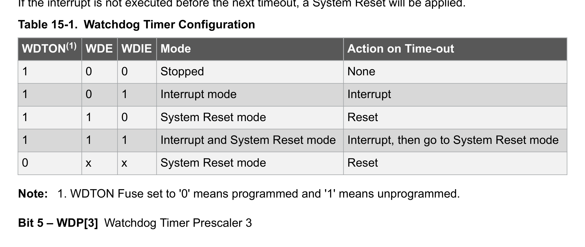
*Description*: Timer/Counter block diagram and waveform timing diagram illustrating prescaler clocks, compare match units, and PWM generation logic for Table 15-1: Watchdog Timer Configuration.

> **Table 15-1: Watchdog Timer Configuration**

WDTON(1) WDE WDIE Mode
Action on Time-out
1
0
0
Stopped
None
1
0
1
Interrupt mode
Interrupt
1
1
0
System Reset mode
Reset
1
1
1
Interrupt and System Reset mode
Interrupt, then go to System Reset mode
0
x
x
System Reset mode
Reset
Note:  1. WDTON Fuse set to '0' means programmed and '1' means unprogrammed.
Bit 5 – WDP[3] Watchdog Timer Prescaler 3
Bit 4 – WDCE Watchdog Change Enable
This bit is used in timed sequences for changing WDE and prescaler bits. To clear the WDE bit, and/or
change the prescaler bits, WDCE must be set. Once written to '1', hardware will clear WDCE after four
clock cycles. Refer to Overview in section Watchdog Timer for information on how to use WDCE.
ATmega328/P
System Control and Reset
© 2018 Microchip Technology Inc.
Datasheet Complete
DS40001984A-page 82
Downloaded from Arrow.com.
Downloaded from Arrow.com.
Downloaded from Arrow.com.
Downloaded from Arrow.com.
Downloaded from Arrow.com.
Downloaded from Arrow.com.
Downloaded from Arrow.com.
Downloaded from Arrow.com.
Downloaded from Arrow.com.
Downloaded from Arrow.com.
Downloaded from Arrow.com.
Downloaded from Arrow.com.
Downloaded from Arrow.com.
Downloaded from Arrow.com.
Downloaded from Arrow.com.
Downloaded from Arrow.com.
Downloaded from Arrow.com.
Downloaded from Arrow.com.
Downloaded from Arrow.com.
Downloaded from Arrow.com.
Downloaded from Arrow.com.
Downloaded from Arrow.com.
Downloaded from Arrow.com.
Downloaded from Arrow.com.
Downloaded from Arrow.com.
Downloaded from Arrow.com.
Downloaded from Arrow.com.
Downloaded from Arrow.com.
Downloaded from Arrow.com.
Downloaded from Arrow.com.
Downloaded from Arrow.com.
Downloaded from Arrow.com.
Downloaded from Arrow.com.
Downloaded from Arrow.com.
Downloaded from Arrow.com.
Downloaded from Arrow.com.
Downloaded from Arrow.com.
Downloaded from Arrow.com.
Downloaded from Arrow.com.
Downloaded from Arrow.com.
Downloaded from Arrow.com.
Downloaded from Arrow.com.
Downloaded from Arrow.com.
Downloaded from Arrow.com.
Downloaded from Arrow.com.
Downloaded from Arrow.com.
Downloaded from Arrow.com.
Downloaded from Arrow.com.
Downloaded from Arrow.com.
Downloaded from Arrow.com.
Downloaded from Arrow.com.
Downloaded from Arrow.com.
Downloaded from Arrow.com.
Downloaded from Arrow.com.
Downloaded from Arrow.com.
Downloaded from Arrow.com.
Downloaded from Arrow.com.
Downloaded from Arrow.com.
Downloaded from Arrow.com.
Downloaded from Arrow.com.
Downloaded from Arrow.com.
Downloaded from Arrow.com.
Downloaded from Arrow.com.
Downloaded from Arrow.com.
Downloaded from Arrow.com.
Downloaded from Arrow.com.
Downloaded from Arrow.com.
Downloaded from Arrow.com.
Downloaded from Arrow.com.
Downloaded from Arrow.com.
Downloaded from Arrow.com.
Downloaded from Arrow.com.
Downloaded from Arrow.com.
Downloaded from Arrow.com.
Downloaded from Arrow.com.
Downloaded from Arrow.com.
Downloaded from Arrow.com.
Downloaded from Arrow.com.
Downloaded from Arrow.com.
Downloaded from Arrow.com.
Downloaded from Arrow.com.
Downloaded from Arrow.com.


<!-- Page 83 -->
### [PDF Page 83]

Bit 3 – WDE Watchdog System Reset Enable
WDE is overridden by WDRF in MCUSR. This means that WDE is always set when WDRF is set. To
clear WDE, WDRF must be cleared first. This feature ensures multiple resets during conditions causing
failure, and a safe start-up after the failure.
Bits 2:0 – WDP[2:0] Watchdog Timer Prescaler 2, 1, and 0
The WDP[3:0] bits determine the Watchdog Timer prescaling when the Watchdog Timer is running. The
different prescaling values and their corresponding time out periods are shown in the following table.

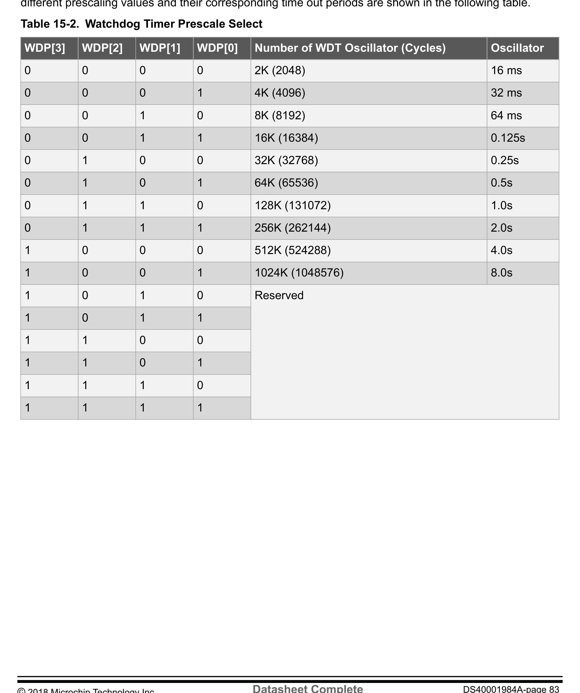
*Description*: Timer/Counter block diagram and waveform timing diagram illustrating prescaler clocks, compare match units, and PWM generation logic for Table 15-2: Watchdog Timer Prescale Select.

> **Table 15-2: Watchdog Timer Prescale Select**

WDP[3]
WDP[2]
WDP[1]
WDP[0]
Number of WDT Oscillator (Cycles)
Oscillator
0
0
0
0
2K (2048)
16 ms
0
0
0
1
4K (4096)
32 ms
0
0
1
0
8K (8192)
64 ms
0
0
1
1
16K (16384)
0.125s
0
1
0
0
32K (32768)
0.25s
0
1
0
1
64K (65536)
0.5s
0
1
1
0
128K (131072)
1.0s
0
1
1
1
256K (262144)
2.0s
1
0
0
0
512K (524288)
4.0s
1
0
0
1
1024K (1048576)
8.0s
1
0
1
0
Reserved
1
0
1
1
1
1
0
0
1
1
0
1
1
1
1
0
1
1
1
1
ATmega328/P
System Control and Reset
© 2018 Microchip Technology Inc.
Datasheet Complete
DS40001984A-page 83
Downloaded from Arrow.com.
Downloaded from Arrow.com.
Downloaded from Arrow.com.
Downloaded from Arrow.com.
Downloaded from Arrow.com.
Downloaded from Arrow.com.
Downloaded from Arrow.com.
Downloaded from Arrow.com.
Downloaded from Arrow.com.
Downloaded from Arrow.com.
Downloaded from Arrow.com.
Downloaded from Arrow.com.
Downloaded from Arrow.com.
Downloaded from Arrow.com.
Downloaded from Arrow.com.
Downloaded from Arrow.com.
Downloaded from Arrow.com.
Downloaded from Arrow.com.
Downloaded from Arrow.com.
Downloaded from Arrow.com.
Downloaded from Arrow.com.
Downloaded from Arrow.com.
Downloaded from Arrow.com.
Downloaded from Arrow.com.
Downloaded from Arrow.com.
Downloaded from Arrow.com.
Downloaded from Arrow.com.
Downloaded from Arrow.com.
Downloaded from Arrow.com.
Downloaded from Arrow.com.
Downloaded from Arrow.com.
Downloaded from Arrow.com.
Downloaded from Arrow.com.
Downloaded from Arrow.com.
Downloaded from Arrow.com.
Downloaded from Arrow.com.
Downloaded from Arrow.com.
Downloaded from Arrow.com.
Downloaded from Arrow.com.
Downloaded from Arrow.com.
Downloaded from Arrow.com.
Downloaded from Arrow.com.
Downloaded from Arrow.com.
Downloaded from Arrow.com.
Downloaded from Arrow.com.
Downloaded from Arrow.com.
Downloaded from Arrow.com.
Downloaded from Arrow.com.
Downloaded from Arrow.com.
Downloaded from Arrow.com.
Downloaded from Arrow.com.
Downloaded from Arrow.com.
Downloaded from Arrow.com.
Downloaded from Arrow.com.
Downloaded from Arrow.com.
Downloaded from Arrow.com.
Downloaded from Arrow.com.
Downloaded from Arrow.com.
Downloaded from Arrow.com.
Downloaded from Arrow.com.
Downloaded from Arrow.com.
Downloaded from Arrow.com.
Downloaded from Arrow.com.
Downloaded from Arrow.com.
Downloaded from Arrow.com.
Downloaded from Arrow.com.
Downloaded from Arrow.com.
Downloaded from Arrow.com.
Downloaded from Arrow.com.
Downloaded from Arrow.com.
Downloaded from Arrow.com.
Downloaded from Arrow.com.
Downloaded from Arrow.com.
Downloaded from Arrow.com.
Downloaded from Arrow.com.
Downloaded from Arrow.com.
Downloaded from Arrow.com.
Downloaded from Arrow.com.
Downloaded from Arrow.com.
Downloaded from Arrow.com.
Downloaded from Arrow.com.
Downloaded from Arrow.com.
Downloaded from Arrow.com.


<!-- Page 84 -->
### [PDF Page 84]

16.
Interrupts
This section describes the specifics of the interrupt handling of the device. For a general explanation of
the AVR interrupt handling, refer to the description of Reset and Interrupt Handling.
•
Each interrupt vector occupies two instruction words .
•
Reset vector is affected by the BOOTRST fuse, and the interrupt vector start address is affected by
the IVSEL bit in MCUCR
16.1
Interrupt Vectors in ATmega328/P

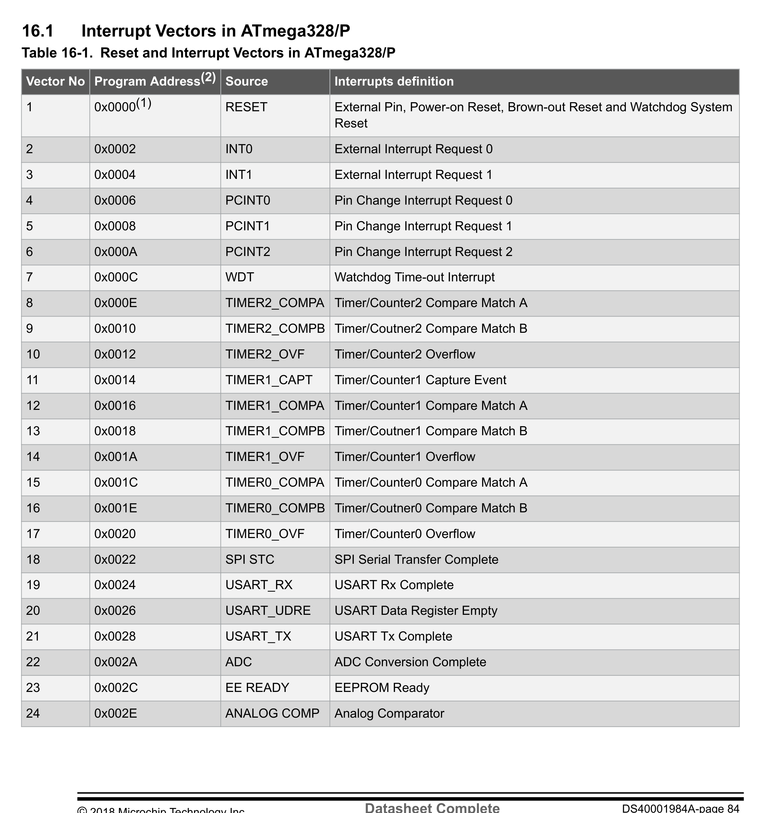
*Description*: Hardware reference table detailing register bit field settings, electrical operating limits, or memory configurations for Table 16-1: Reset and Interrupt Vectors in ATmega328/P.

> **Table 16-1: Reset and Interrupt Vectors in ATmega328/P**

Vector No Program Address(2) Source
Interrupts definition
1
0x0000(1)
RESET
External Pin, Power-on Reset, Brown-out Reset and Watchdog System
Reset
2
0x0002
INT0
External Interrupt Request 0
3
0x0004
INT1
External Interrupt Request 1
4
0x0006
PCINT0
Pin Change Interrupt Request 0
5
0x0008
PCINT1
Pin Change Interrupt Request 1
6
0x000A
PCINT2
Pin Change Interrupt Request 2
7
0x000C
WDT
Watchdog Time-out Interrupt
8
0x000E
TIMER2_COMPA Timer/Counter2 Compare Match A
9
0x0010
TIMER2_COMPB Timer/Coutner2 Compare Match B
10
0x0012
TIMER2_OVF
Timer/Counter2 Overflow
11
0x0014
TIMER1_CAPT
Timer/Counter1 Capture Event
12
0x0016
TIMER1_COMPA Timer/Counter1 Compare Match A
13
0x0018
TIMER1_COMPB Timer/Coutner1 Compare Match B
14
0x001A
TIMER1_OVF
Timer/Counter1 Overflow
15
0x001C
TIMER0_COMPA Timer/Counter0 Compare Match A
16
0x001E
TIMER0_COMPB Timer/Coutner0 Compare Match B
17
0x0020
TIMER0_OVF
Timer/Counter0 Overflow
18
0x0022
SPI STC
SPI Serial Transfer Complete
19
0x0024
USART_RX
USART Rx Complete
20
0x0026
USART_UDRE
USART Data Register Empty
21
0x0028
USART_TX
USART Tx Complete
22
0x002A
ADC
ADC Conversion Complete
23
0x002C
EE READY
EEPROM Ready
24
0x002E
ANALOG COMP
Analog Comparator
ATmega328/P
Interrupts
© 2018 Microchip Technology Inc.
Datasheet Complete
DS40001984A-page 84
Downloaded from Arrow.com.
Downloaded from Arrow.com.
Downloaded from Arrow.com.
Downloaded from Arrow.com.
Downloaded from Arrow.com.
Downloaded from Arrow.com.
Downloaded from Arrow.com.
Downloaded from Arrow.com.
Downloaded from Arrow.com.
Downloaded from Arrow.com.
Downloaded from Arrow.com.
Downloaded from Arrow.com.
Downloaded from Arrow.com.
Downloaded from Arrow.com.
Downloaded from Arrow.com.
Downloaded from Arrow.com.
Downloaded from Arrow.com.
Downloaded from Arrow.com.
Downloaded from Arrow.com.
Downloaded from Arrow.com.
Downloaded from Arrow.com.
Downloaded from Arrow.com.
Downloaded from Arrow.com.
Downloaded from Arrow.com.
Downloaded from Arrow.com.
Downloaded from Arrow.com.
Downloaded from Arrow.com.
Downloaded from Arrow.com.
Downloaded from Arrow.com.
Downloaded from Arrow.com.
Downloaded from Arrow.com.
Downloaded from Arrow.com.
Downloaded from Arrow.com.
Downloaded from Arrow.com.
Downloaded from Arrow.com.
Downloaded from Arrow.com.
Downloaded from Arrow.com.
Downloaded from Arrow.com.
Downloaded from Arrow.com.
Downloaded from Arrow.com.
Downloaded from Arrow.com.
Downloaded from Arrow.com.
Downloaded from Arrow.com.
Downloaded from Arrow.com.
Downloaded from Arrow.com.
Downloaded from Arrow.com.
Downloaded from Arrow.com.
Downloaded from Arrow.com.
Downloaded from Arrow.com.
Downloaded from Arrow.com.
Downloaded from Arrow.com.
Downloaded from Arrow.com.
Downloaded from Arrow.com.
Downloaded from Arrow.com.
Downloaded from Arrow.com.
Downloaded from Arrow.com.
Downloaded from Arrow.com.
Downloaded from Arrow.com.
Downloaded from Arrow.com.
Downloaded from Arrow.com.
Downloaded from Arrow.com.
Downloaded from Arrow.com.
Downloaded from Arrow.com.
Downloaded from Arrow.com.
Downloaded from Arrow.com.
Downloaded from Arrow.com.
Downloaded from Arrow.com.
Downloaded from Arrow.com.
Downloaded from Arrow.com.
Downloaded from Arrow.com.
Downloaded from Arrow.com.
Downloaded from Arrow.com.
Downloaded from Arrow.com.
Downloaded from Arrow.com.
Downloaded from Arrow.com.
Downloaded from Arrow.com.
Downloaded from Arrow.com.
Downloaded from Arrow.com.
Downloaded from Arrow.com.
Downloaded from Arrow.com.
Downloaded from Arrow.com.
Downloaded from Arrow.com.
Downloaded from Arrow.com.
Downloaded from Arrow.com.


<!-- Page 85 -->
### [PDF Page 85]

Vector No Program Address(2) Source
Interrupts definition
25
0x0030
TWI
2-wire Serial Interface (I2C)
26
0x0032
SPM READY
Store Program Memory Ready
Note:
1.
When the BOOTRST fuse is programmed, the device will jump to the boot loader address at Reset,
see “Boot Loader Support – Read-While-Write Self- Programming”
2.
When the IVSEL bit in MCUCR is set, Interrupt Vectors will be moved to the start of the boot Flash
section. The address of each Interrupt Vector will then be the address in this table added to the
start address of the boot Flash section.
The table below shows reset and Interrupt Vectors placement for the various combinations of BOOTRST
and IVSEL settings. If the program never enables an interrupt source, the Interrupt Vectors are not used,
and regular program code can be placed at these locations. This is the case if the Reset vector is in the
application section while the interrupt vectors are in the boot section or vice versa.

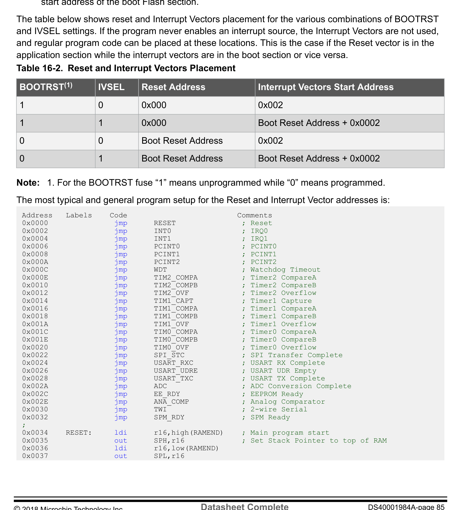
*Description*: Hardware reference table detailing register bit field settings, electrical operating limits, or memory configurations for Table 16-2: Reset and Interrupt Vectors Placement.

> **Table 16-2: Reset and Interrupt Vectors Placement**

BOOTRST(1)
IVSEL
Reset Address
Interrupt Vectors Start Address
1
0
0x000
0x002
1
1
0x000
Boot Reset Address + 0x0002
0
0
Boot Reset Address
0x002
0
1
Boot Reset Address
Boot Reset Address + 0x0002
Note:  1. For the BOOTRST fuse “1” means unprogrammed while “0” means programmed.
The most typical and general program setup for the Reset and Interrupt Vector addresses is:
Address   Labels    Code                         Comments
0x0000               jmp      RESET               ; Reset
0x0002               jmp      INT0                ; IRQ0
0x0004               jmp      INT1                ; IRQ1
0x0006               jmp      PCINT0              ; PCINT0
0x0008               jmp      PCINT1              ; PCINT1
0x000A               jmp      PCINT2              ; PCINT2
0x000C               jmp      WDT                 ; Watchdog Timeout
0x000E               jmp      TIM2_COMPA          ; Timer2 CompareA
0x0010               jmp      TIM2_COMPB          ; Timer2 CompareB
0x0012               jmp      TIM2_OVF            ; Timer2 Overflow
0x0014               jmp      TIM1_CAPT           ; Timer1 Capture
0x0016               jmp      TIM1_COMPA          ; Timer1 CompareA
0x0018               jmp      TIM1_COMPB          ; Timer1 CompareB
0x001A               jmp      TIM1_OVF            ; Timer1 Overflow
0x001C               jmp      TIM0_COMPA          ; Timer0 CompareA
0x001E               jmp      TIM0_COMPB          ; Timer0 CompareB
0x0020               jmp      TIM0_OVF            ; Timer0 Overflow
0x0022               jmp      SPI_STC             ; SPI Transfer Complete
0x0024               jmp      USART_RXC           ; USART RX Complete
0x0026               jmp      USART_UDRE          ; USART UDR Empty
0x0028               jmp      USART_TXC           ; USART TX Complete
0x002A               jmp      ADC                 ; ADC Conversion Complete
0x002C               jmp      EE_RDY              ; EEPROM Ready
0x002E               jmp      ANA_COMP            ; Analog Comparator
0x0030               jmp      TWI                 ; 2-wire Serial
0x0032               jmp      SPM_RDY             ; SPM Ready
;
0x0034    RESET:     ldi      r16,high(RAMEND)    ; Main program start
0x0035               out      SPH,r16             ; Set Stack Pointer to top of RAM
0x0036               ldi      r16,low(RAMEND)
0x0037               out      SPL,r16
ATmega328/P
Interrupts
© 2018 Microchip Technology Inc.
Datasheet Complete
DS40001984A-page 85
Downloaded from Arrow.com.
Downloaded from Arrow.com.
Downloaded from Arrow.com.
Downloaded from Arrow.com.
Downloaded from Arrow.com.
Downloaded from Arrow.com.
Downloaded from Arrow.com.
Downloaded from Arrow.com.
Downloaded from Arrow.com.
Downloaded from Arrow.com.
Downloaded from Arrow.com.
Downloaded from Arrow.com.
Downloaded from Arrow.com.
Downloaded from Arrow.com.
Downloaded from Arrow.com.
Downloaded from Arrow.com.
Downloaded from Arrow.com.
Downloaded from Arrow.com.
Downloaded from Arrow.com.
Downloaded from Arrow.com.
Downloaded from Arrow.com.
Downloaded from Arrow.com.
Downloaded from Arrow.com.
Downloaded from Arrow.com.
Downloaded from Arrow.com.
Downloaded from Arrow.com.
Downloaded from Arrow.com.
Downloaded from Arrow.com.
Downloaded from Arrow.com.
Downloaded from Arrow.com.
Downloaded from Arrow.com.
Downloaded from Arrow.com.
Downloaded from Arrow.com.
Downloaded from Arrow.com.
Downloaded from Arrow.com.
Downloaded from Arrow.com.
Downloaded from Arrow.com.
Downloaded from Arrow.com.
Downloaded from Arrow.com.
Downloaded from Arrow.com.
Downloaded from Arrow.com.
Downloaded from Arrow.com.
Downloaded from Arrow.com.
Downloaded from Arrow.com.
Downloaded from Arrow.com.
Downloaded from Arrow.com.
Downloaded from Arrow.com.
Downloaded from Arrow.com.
Downloaded from Arrow.com.
Downloaded from Arrow.com.
Downloaded from Arrow.com.
Downloaded from Arrow.com.
Downloaded from Arrow.com.
Downloaded from Arrow.com.
Downloaded from Arrow.com.
Downloaded from Arrow.com.
Downloaded from Arrow.com.
Downloaded from Arrow.com.
Downloaded from Arrow.com.
Downloaded from Arrow.com.
Downloaded from Arrow.com.
Downloaded from Arrow.com.
Downloaded from Arrow.com.
Downloaded from Arrow.com.
Downloaded from Arrow.com.
Downloaded from Arrow.com.
Downloaded from Arrow.com.
Downloaded from Arrow.com.
Downloaded from Arrow.com.
Downloaded from Arrow.com.
Downloaded from Arrow.com.
Downloaded from Arrow.com.
Downloaded from Arrow.com.
Downloaded from Arrow.com.
Downloaded from Arrow.com.
Downloaded from Arrow.com.
Downloaded from Arrow.com.
Downloaded from Arrow.com.
Downloaded from Arrow.com.
Downloaded from Arrow.com.
Downloaded from Arrow.com.
Downloaded from Arrow.com.
Downloaded from Arrow.com.
Downloaded from Arrow.com.
Downloaded from Arrow.com.


<!-- Page 86 -->
### [PDF Page 86]

0x0038               sei                          ; Enable interrupts
0x0039               <instr>  xxx
...       ...        ...                             ...
When the BOOTRST fuse is unprogrammed, the Boot section size set to 2K bytes and the
MCUCR.IVSEL is set before any interrupts are enabled, the most typical and general program setup for
the Reset and Interrupt Vector addresses is:
Address   Labels     Code                         Comments
0x0000   RESET:     ldi      r16,high(RAMEND)   ; Main program start
0x0001              out      SPH,r16            ; Set Stack Pointer to top of RAM
0x0002              ldi      r16,low(RAMEND)
0x0003              out      SPL,r16
0x0004              sei                         ; Enable interrupts
0x0005              <instr> xxx
;
.org 0x3C02
0x3C02              jmp      EXT_INT0           ; IRQ0 Handler
0x3C04              jmp      EXT_INT1           ; IRQ1 Handler
...                  ...      ...                ;
0x3C32              jmp      SPM_RDY            ; SPM Ready Handler
When the BOOTRST fuse is programmed and the boot section size set to 2K bytes, the most typical and
general program setup for the Reset and Interrupt Vector addresses is:
Address   Labels     Code                         Comments
.org 0x0002
0x0002              jmp      EXT_INT0            ; IRQ0 Handler
0x0004              jmp      EXT_INT1            ; IRQ1 Handler
...                  ...      ...                 ;
0x0032              jmp      SPM_RDY             ; SPM Ready Handler
;
.org  0x3C00
0x3C00    RESET:    ldi      r16,high(RAMEND)    ; Main program start
0x3C01              out      SPH,r16             ; Set Stack Pointer to top of RAM
0x3C02              ldi      r16,low(RAMEND)
0x3C03              out      SPL,r16
0x3C04              sei                          ; Enable interrupts
0x3C05              <instr>  xxx
When the BOOTRST fuse is programmed, the boot section size set to 2K bytes and the MCUCR.IVSEL
is set before any interrupts are enabled, the most typical and general program setup for the Reset and
Interrupt Vector addresses is:
Address    Labels    Code                         Comments
;
.org 0x3C00
0x3C00              jmp      RESET               ; Reset handler
0x3C02              jmp      EXT_INT0            ; IRQ0 Handler
0x3C04              jmp      EXT_INT1            ; IRQ1 Handler
...                  ...      ...                 ;
0x3C32              jmp      SPM_RDY             ; SPM Ready Handler
;
0x3C34    RESET:    ldi      r16,high(RAMEND)    ; Main program start
0x3C35              out      SPH,r16             ; Set Stack Pointer to top of RAM
0x3C36              ldi      r16,low(RAMEND)
0x3C37              out      SPL,r16
0x3C38              sei                          ; Enable interrupts
0x3C39              <instr>  xxx
16.2

### Register Description

16.2.1
Moving Interrupts Between Application and Boot Space
The MCU Control register controls the placement of the interrupt vector table.
ATmega328/P
Interrupts
© 2018 Microchip Technology Inc.
Datasheet Complete
DS40001984A-page 86
Downloaded from Arrow.com.
Downloaded from Arrow.com.
Downloaded from Arrow.com.
Downloaded from Arrow.com.
Downloaded from Arrow.com.
Downloaded from Arrow.com.
Downloaded from Arrow.com.
Downloaded from Arrow.com.
Downloaded from Arrow.com.
Downloaded from Arrow.com.
Downloaded from Arrow.com.
Downloaded from Arrow.com.
Downloaded from Arrow.com.
Downloaded from Arrow.com.
Downloaded from Arrow.com.
Downloaded from Arrow.com.
Downloaded from Arrow.com.
Downloaded from Arrow.com.
Downloaded from Arrow.com.
Downloaded from Arrow.com.
Downloaded from Arrow.com.
Downloaded from Arrow.com.
Downloaded from Arrow.com.
Downloaded from Arrow.com.
Downloaded from Arrow.com.
Downloaded from Arrow.com.
Downloaded from Arrow.com.
Downloaded from Arrow.com.
Downloaded from Arrow.com.
Downloaded from Arrow.com.
Downloaded from Arrow.com.
Downloaded from Arrow.com.
Downloaded from Arrow.com.
Downloaded from Arrow.com.
Downloaded from Arrow.com.
Downloaded from Arrow.com.
Downloaded from Arrow.com.
Downloaded from Arrow.com.
Downloaded from Arrow.com.
Downloaded from Arrow.com.
Downloaded from Arrow.com.
Downloaded from Arrow.com.
Downloaded from Arrow.com.
Downloaded from Arrow.com.
Downloaded from Arrow.com.
Downloaded from Arrow.com.
Downloaded from Arrow.com.
Downloaded from Arrow.com.
Downloaded from Arrow.com.
Downloaded from Arrow.com.
Downloaded from Arrow.com.
Downloaded from Arrow.com.
Downloaded from Arrow.com.
Downloaded from Arrow.com.
Downloaded from Arrow.com.
Downloaded from Arrow.com.
Downloaded from Arrow.com.
Downloaded from Arrow.com.
Downloaded from Arrow.com.
Downloaded from Arrow.com.
Downloaded from Arrow.com.
Downloaded from Arrow.com.
Downloaded from Arrow.com.
Downloaded from Arrow.com.
Downloaded from Arrow.com.
Downloaded from Arrow.com.
Downloaded from Arrow.com.
Downloaded from Arrow.com.
Downloaded from Arrow.com.
Downloaded from Arrow.com.
Downloaded from Arrow.com.
Downloaded from Arrow.com.
Downloaded from Arrow.com.
Downloaded from Arrow.com.
Downloaded from Arrow.com.
Downloaded from Arrow.com.
Downloaded from Arrow.com.
Downloaded from Arrow.com.
Downloaded from Arrow.com.
Downloaded from Arrow.com.
Downloaded from Arrow.com.
Downloaded from Arrow.com.
Downloaded from Arrow.com.
Downloaded from Arrow.com.
Downloaded from Arrow.com.
Downloaded from Arrow.com.


<!-- Page 87 -->
### [PDF Page 87]

16.2.2
MCU Control Register
Name:
MCUCR
Offset:
0x55
Reset:
0x00
Property:  When addressing as I/O register: address offset is 0x35
The MCU Control register controls the placement of the interrupt vector table in order to move interrupts
between application and boot space.
When addressing I/O registers as data space using LD and ST instructions, the provided offset must be
used. When using the I/O specific commands IN and OUT, the offset is reduced by 0x20, resulting in an
I/O address offset within 0x00 - 0x3F.
Bit
7
6
5
4
3
2
1
0
BODS
BODSE
PUD
IVSEL
IVCE
Access
R/W
R/W
R/W
R/W
R/W
Reset
0
0
0
0
0
Bit 6 – BODS BOD Sleep
The BODS bit must be written to '1' in order to turn off BOD during sleep. Writing to the BODS bit is
controlled by a timed sequence and the enable bit BODSE. To disable BOD in relevant sleep modes, both
BODS and BODSE must first be written to '1'. Then, BODS must be written to '1' and BODSE must be
written to zero within four clock cycles.
The BODS bit is active three clock cycles after it is set. A sleep instruction must be executed while BODS
is active in order to turn off the BOD for the actual sleep mode. The BODS bit is automatically cleared
after three clock cycles.
Note:  BOD disable is only available for ATmega328P.
Bit 5 – BODSE BOD Sleep Enable
BODSE enables setting of BODS control bit, as explained in BODS bit description. BOD disable is
controlled by a timed sequence.
Note:  BOD disable is only available for ATmega328P.
Bit 4 – PUD Pull-up Disable
When this bit is written to one, the pull ups in the I/O ports are disabled even if the DDxn and PORTxn
registers are configured to enable the pull ups ({DDxn, PORTxn} = 0b01).
Bit 1 – IVSEL Interrupt Vector Select
When the IVSEL bit is cleared (zero), the interrupt vectors are placed at the start of the Flash memory.
When this bit is set (one), the interrupt vectors are moved to the beginning of the boot loader section of
the Flash. The actual address of the start of the boot Flash section is determined by the BOOTSZ fuses.
To avoid unintentional changes of interrupt vector tables, a special write procedure must be followed to
change the IVSEL bit:
1.
Write the Interrupt Vector Change Enable (IVCE) bit to one.
2.
Within four cycles, write the desired value to IVSEL while writing a zero to IVCE.
Interrupts will automatically be disabled while this sequence is executed. Interrupts are disabled in the
same cycle as IVCE is written, and interrupts remain disabled until after the instruction following the write
ATmega328/P
Interrupts
© 2018 Microchip Technology Inc.
Datasheet Complete
DS40001984A-page 87
Downloaded from Arrow.com.
Downloaded from Arrow.com.
Downloaded from Arrow.com.
Downloaded from Arrow.com.
Downloaded from Arrow.com.
Downloaded from Arrow.com.
Downloaded from Arrow.com.
Downloaded from Arrow.com.
Downloaded from Arrow.com.
Downloaded from Arrow.com.
Downloaded from Arrow.com.
Downloaded from Arrow.com.
Downloaded from Arrow.com.
Downloaded from Arrow.com.
Downloaded from Arrow.com.
Downloaded from Arrow.com.
Downloaded from Arrow.com.
Downloaded from Arrow.com.
Downloaded from Arrow.com.
Downloaded from Arrow.com.
Downloaded from Arrow.com.
Downloaded from Arrow.com.
Downloaded from Arrow.com.
Downloaded from Arrow.com.
Downloaded from Arrow.com.
Downloaded from Arrow.com.
Downloaded from Arrow.com.
Downloaded from Arrow.com.
Downloaded from Arrow.com.
Downloaded from Arrow.com.
Downloaded from Arrow.com.
Downloaded from Arrow.com.
Downloaded from Arrow.com.
Downloaded from Arrow.com.
Downloaded from Arrow.com.
Downloaded from Arrow.com.
Downloaded from Arrow.com.
Downloaded from Arrow.com.
Downloaded from Arrow.com.
Downloaded from Arrow.com.
Downloaded from Arrow.com.
Downloaded from Arrow.com.
Downloaded from Arrow.com.
Downloaded from Arrow.com.
Downloaded from Arrow.com.
Downloaded from Arrow.com.
Downloaded from Arrow.com.
Downloaded from Arrow.com.
Downloaded from Arrow.com.
Downloaded from Arrow.com.
Downloaded from Arrow.com.
Downloaded from Arrow.com.
Downloaded from Arrow.com.
Downloaded from Arrow.com.
Downloaded from Arrow.com.
Downloaded from Arrow.com.
Downloaded from Arrow.com.
Downloaded from Arrow.com.
Downloaded from Arrow.com.
Downloaded from Arrow.com.
Downloaded from Arrow.com.
Downloaded from Arrow.com.
Downloaded from Arrow.com.
Downloaded from Arrow.com.
Downloaded from Arrow.com.
Downloaded from Arrow.com.
Downloaded from Arrow.com.
Downloaded from Arrow.com.
Downloaded from Arrow.com.
Downloaded from Arrow.com.
Downloaded from Arrow.com.
Downloaded from Arrow.com.
Downloaded from Arrow.com.
Downloaded from Arrow.com.
Downloaded from Arrow.com.
Downloaded from Arrow.com.
Downloaded from Arrow.com.
Downloaded from Arrow.com.
Downloaded from Arrow.com.
Downloaded from Arrow.com.
Downloaded from Arrow.com.
Downloaded from Arrow.com.
Downloaded from Arrow.com.
Downloaded from Arrow.com.
Downloaded from Arrow.com.
Downloaded from Arrow.com.
Downloaded from Arrow.com.


<!-- Page 88 -->
### [PDF Page 88]

to IVSEL. If IVSEL is not written, interrupts remain disabled for four cycles. The I-bit in the Status register
is unaffected by the automatic disabling.
Note:  If interrupt vectors are placed in the boot loader section and Boot Lock bit BLB02 is programmed,
interrupts are disabled while executing from the application section. If interrupt vectors are placed in the
application section and Boot Lock bit BLB12 is programmed, interrupts are disabled while executing from
the boot loader section.
Bit 0 – IVCE Interrupt Vector Change Enable
The IVCE bit must be written to logic one to enable change of the IVSEL bit. IVCE is cleared by hardware
four cycles after it is written or when IVSEL is written. Setting the IVCE bit will disable interrupts, as
explained in the IVSEL description above. See the code example below.
Assembly Code Example
Move_interrupts:
; Get MCUCR
in    r16, MCUCR
mov   r17, r16
; Enable change of Interrupt Vectors
ori   r16, (1<<IVCE)
out   MCUCR, r16
; Move interrupts to Boot Flash section
ori   r17, (1<<IVSEL)
out   MCUCR, r17
ret
C Code Example

```c
void Move_interrupts(void)
```

{
uchar temp;
/* GET MCUCR*/
temp = MCUCR;
/* Enable change of Interrupt Vectors */
MCUCR = temp|(1<<IVCE);
/* Move interrupts to Boot Flash section */
MCUCR = temp|(1<<IVSEL);
}
ATmega328/P
Interrupts
© 2018 Microchip Technology Inc.
Datasheet Complete
DS40001984A-page 88
Downloaded from Arrow.com.
Downloaded from Arrow.com.
Downloaded from Arrow.com.
Downloaded from Arrow.com.
Downloaded from Arrow.com.
Downloaded from Arrow.com.
Downloaded from Arrow.com.
Downloaded from Arrow.com.
Downloaded from Arrow.com.
Downloaded from Arrow.com.
Downloaded from Arrow.com.
Downloaded from Arrow.com.
Downloaded from Arrow.com.
Downloaded from Arrow.com.
Downloaded from Arrow.com.
Downloaded from Arrow.com.
Downloaded from Arrow.com.
Downloaded from Arrow.com.
Downloaded from Arrow.com.
Downloaded from Arrow.com.
Downloaded from Arrow.com.
Downloaded from Arrow.com.
Downloaded from Arrow.com.
Downloaded from Arrow.com.
Downloaded from Arrow.com.
Downloaded from Arrow.com.
Downloaded from Arrow.com.
Downloaded from Arrow.com.
Downloaded from Arrow.com.
Downloaded from Arrow.com.
Downloaded from Arrow.com.
Downloaded from Arrow.com.
Downloaded from Arrow.com.
Downloaded from Arrow.com.
Downloaded from Arrow.com.
Downloaded from Arrow.com.
Downloaded from Arrow.com.
Downloaded from Arrow.com.
Downloaded from Arrow.com.
Downloaded from Arrow.com.
Downloaded from Arrow.com.
Downloaded from Arrow.com.
Downloaded from Arrow.com.
Downloaded from Arrow.com.
Downloaded from Arrow.com.
Downloaded from Arrow.com.
Downloaded from Arrow.com.
Downloaded from Arrow.com.
Downloaded from Arrow.com.
Downloaded from Arrow.com.
Downloaded from Arrow.com.
Downloaded from Arrow.com.
Downloaded from Arrow.com.
Downloaded from Arrow.com.
Downloaded from Arrow.com.
Downloaded from Arrow.com.
Downloaded from Arrow.com.
Downloaded from Arrow.com.
Downloaded from Arrow.com.
Downloaded from Arrow.com.
Downloaded from Arrow.com.
Downloaded from Arrow.com.
Downloaded from Arrow.com.
Downloaded from Arrow.com.
Downloaded from Arrow.com.
Downloaded from Arrow.com.
Downloaded from Arrow.com.
Downloaded from Arrow.com.
Downloaded from Arrow.com.
Downloaded from Arrow.com.
Downloaded from Arrow.com.
Downloaded from Arrow.com.
Downloaded from Arrow.com.
Downloaded from Arrow.com.
Downloaded from Arrow.com.
Downloaded from Arrow.com.
Downloaded from Arrow.com.
Downloaded from Arrow.com.
Downloaded from Arrow.com.
Downloaded from Arrow.com.
Downloaded from Arrow.com.
Downloaded from Arrow.com.
Downloaded from Arrow.com.
Downloaded from Arrow.com.
Downloaded from Arrow.com.
Downloaded from Arrow.com.
Downloaded from Arrow.com.
Downloaded from Arrow.com.


<!-- Page 89 -->
### [PDF Page 89]

17.
EXTINT - External Interrupts
The external interrupts are triggered by the INT pins or any of the PCINT pins. Observe that, if enabled,
the interrupts will trigger even if the INT or PCINT pins are configured as outputs. This feature provides a
way of generating a software interrupt.
The Pin Change Interrupt Request 2 (PCI2) will trigger if any enabled PCINT[23:16] pin toggles. The Pin
Change Interrupt Request 1 (PCI1) will trigger if any enabled PCINT[14:8] pin toggles. The Pin Change
Interrupt Request 0 (PCI0) will trigger if any enabled PCINT[7:0] pin toggles. The PCMSK2, PCMSK1 and
PCMSK0 registers control which pins contribute to the pin change interrupts. Pin change interrupts on
PCINT are detected asynchronously. This implies that these interrupts can be used for waking the part
from sleep modes other than Idle mode.
The external interrupts can be triggered by a falling or rising edge or a low level. This is set up as
indicated in the specification for the External Interrupt Control Register A (EICRA). When the external
interrupts are enabled and are configured as level-triggered, the interrupts will trigger as long as the pin is
held low. Note that recognition of falling or rising edge interrupts on INT requires the presence of an I/O
clock. Low level interrupt on INT is detected asynchronously. This implies that this interrupt can be used
for waking the part from sleep modes other than Idle mode. The I/O clock is halted in all sleep modes
except Idle mode.
Note:  If a level triggered interrupt is used for wake-up from power-down, the required level must be held
long enough for the MCU to complete the wake-up to trigger the level interrupt. If the level disappears
before the end of the start-up time, the MCU will still wake up, but no interrupt will be generated. The
start-up time is defined by the SUT and CKSEL Fuses.
Related Links
System Control and Reset
Clock Systems and Their Distribution
System Clock and Clock Options
17.1
Pin Change Interrupt Timing
An example of timing of a pin change interrupt is shown in the following figure.
ATmega328/P
EXTINT - External Interrupts
© 2018 Microchip Technology Inc.
Datasheet Complete
DS40001984A-page 89
Downloaded from Arrow.com.
Downloaded from Arrow.com.
Downloaded from Arrow.com.
Downloaded from Arrow.com.
Downloaded from Arrow.com.
Downloaded from Arrow.com.
Downloaded from Arrow.com.
Downloaded from Arrow.com.
Downloaded from Arrow.com.
Downloaded from Arrow.com.
Downloaded from Arrow.com.
Downloaded from Arrow.com.
Downloaded from Arrow.com.
Downloaded from Arrow.com.
Downloaded from Arrow.com.
Downloaded from Arrow.com.
Downloaded from Arrow.com.
Downloaded from Arrow.com.
Downloaded from Arrow.com.
Downloaded from Arrow.com.
Downloaded from Arrow.com.
Downloaded from Arrow.com.
Downloaded from Arrow.com.
Downloaded from Arrow.com.
Downloaded from Arrow.com.
Downloaded from Arrow.com.
Downloaded from Arrow.com.
Downloaded from Arrow.com.
Downloaded from Arrow.com.
Downloaded from Arrow.com.
Downloaded from Arrow.com.
Downloaded from Arrow.com.
Downloaded from Arrow.com.
Downloaded from Arrow.com.
Downloaded from Arrow.com.
Downloaded from Arrow.com.
Downloaded from Arrow.com.
Downloaded from Arrow.com.
Downloaded from Arrow.com.
Downloaded from Arrow.com.
Downloaded from Arrow.com.
Downloaded from Arrow.com.
Downloaded from Arrow.com.
Downloaded from Arrow.com.
Downloaded from Arrow.com.
Downloaded from Arrow.com.
Downloaded from Arrow.com.
Downloaded from Arrow.com.
Downloaded from Arrow.com.
Downloaded from Arrow.com.
Downloaded from Arrow.com.
Downloaded from Arrow.com.
Downloaded from Arrow.com.
Downloaded from Arrow.com.
Downloaded from Arrow.com.
Downloaded from Arrow.com.
Downloaded from Arrow.com.
Downloaded from Arrow.com.
Downloaded from Arrow.com.
Downloaded from Arrow.com.
Downloaded from Arrow.com.
Downloaded from Arrow.com.
Downloaded from Arrow.com.
Downloaded from Arrow.com.
Downloaded from Arrow.com.
Downloaded from Arrow.com.
Downloaded from Arrow.com.
Downloaded from Arrow.com.
Downloaded from Arrow.com.
Downloaded from Arrow.com.
Downloaded from Arrow.com.
Downloaded from Arrow.com.
Downloaded from Arrow.com.
Downloaded from Arrow.com.
Downloaded from Arrow.com.
Downloaded from Arrow.com.
Downloaded from Arrow.com.
Downloaded from Arrow.com.
Downloaded from Arrow.com.
Downloaded from Arrow.com.
Downloaded from Arrow.com.
Downloaded from Arrow.com.
Downloaded from Arrow.com.
Downloaded from Arrow.com.
Downloaded from Arrow.com.
Downloaded from Arrow.com.
Downloaded from Arrow.com.
Downloaded from Arrow.com.
Downloaded from Arrow.com.


<!-- Page 90 -->
### [PDF Page 90]


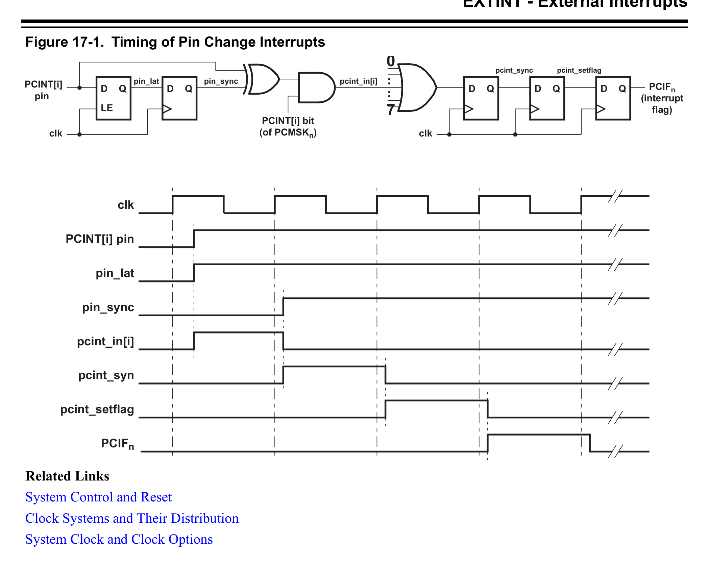
*Description*: IC pinout diagram specifying physical pin assignments, I/O port pin multiplexing, supply lines (VCC/GND), and crystal connections for Figure 17-1: Timing of Pin Change Interrupts.

> **Figure 17-1: Timing of Pin Change Interrupts**

LE
D
Q
D
Q
clk
PCINT[i]
pin
PCINT[i] bit
(of PCMSKn)
D
Q
D
Q
D
Q
clk
pcint_sync
pcint_setflag
0
7
PCIFn
(interrupt
flag)
PCINT[i] pin
pin_lat
pin_sync
clk
pcint_in[i]
pcint_syn
pcint_setflag
PCIFn
pin_lat
pin_sync
pcint_in[i]
Related Links
System Control and Reset
Clock Systems and Their Distribution
System Clock and Clock Options
17.2

### Register Description

ATmega328/P
EXTINT - External Interrupts
© 2018 Microchip Technology Inc.
Datasheet Complete
DS40001984A-page 90
Downloaded from Arrow.com.
Downloaded from Arrow.com.
Downloaded from Arrow.com.
Downloaded from Arrow.com.
Downloaded from Arrow.com.
Downloaded from Arrow.com.
Downloaded from Arrow.com.
Downloaded from Arrow.com.
Downloaded from Arrow.com.
Downloaded from Arrow.com.
Downloaded from Arrow.com.
Downloaded from Arrow.com.
Downloaded from Arrow.com.
Downloaded from Arrow.com.
Downloaded from Arrow.com.
Downloaded from Arrow.com.
Downloaded from Arrow.com.
Downloaded from Arrow.com.
Downloaded from Arrow.com.
Downloaded from Arrow.com.
Downloaded from Arrow.com.
Downloaded from Arrow.com.
Downloaded from Arrow.com.
Downloaded from Arrow.com.
Downloaded from Arrow.com.
Downloaded from Arrow.com.
Downloaded from Arrow.com.
Downloaded from Arrow.com.
Downloaded from Arrow.com.
Downloaded from Arrow.com.
Downloaded from Arrow.com.
Downloaded from Arrow.com.
Downloaded from Arrow.com.
Downloaded from Arrow.com.
Downloaded from Arrow.com.
Downloaded from Arrow.com.
Downloaded from Arrow.com.
Downloaded from Arrow.com.
Downloaded from Arrow.com.
Downloaded from Arrow.com.
Downloaded from Arrow.com.
Downloaded from Arrow.com.
Downloaded from Arrow.com.
Downloaded from Arrow.com.
Downloaded from Arrow.com.
Downloaded from Arrow.com.
Downloaded from Arrow.com.
Downloaded from Arrow.com.
Downloaded from Arrow.com.
Downloaded from Arrow.com.
Downloaded from Arrow.com.
Downloaded from Arrow.com.
Downloaded from Arrow.com.
Downloaded from Arrow.com.
Downloaded from Arrow.com.
Downloaded from Arrow.com.
Downloaded from Arrow.com.
Downloaded from Arrow.com.
Downloaded from Arrow.com.
Downloaded from Arrow.com.
Downloaded from Arrow.com.
Downloaded from Arrow.com.
Downloaded from Arrow.com.
Downloaded from Arrow.com.
Downloaded from Arrow.com.
Downloaded from Arrow.com.
Downloaded from Arrow.com.
Downloaded from Arrow.com.
Downloaded from Arrow.com.
Downloaded from Arrow.com.
Downloaded from Arrow.com.
Downloaded from Arrow.com.
Downloaded from Arrow.com.
Downloaded from Arrow.com.
Downloaded from Arrow.com.
Downloaded from Arrow.com.
Downloaded from Arrow.com.
Downloaded from Arrow.com.
Downloaded from Arrow.com.
Downloaded from Arrow.com.
Downloaded from Arrow.com.
Downloaded from Arrow.com.
Downloaded from Arrow.com.
Downloaded from Arrow.com.
Downloaded from Arrow.com.
Downloaded from Arrow.com.
Downloaded from Arrow.com.
Downloaded from Arrow.com.
Downloaded from Arrow.com.
Downloaded from Arrow.com.


<!-- Page 91 -->
### [PDF Page 91]

17.2.1
External Interrupt Control Register A
Name:
EICRA
Offset:
0x69
Reset:
0x00
Property:  -
The External Interrupt Control Register A contains control bits for interrupt sense control.
Bit
7
6
5
4
3
2
1
0
ISC1[1:0]
ISC0[1:0]
Access
R/W
R/W
R/W
R/W
Reset
0
0
0
0
Bits 3:2 – ISC1[1:0] Interrupt Sense Control 1
The external interrupt 1 is activated by the external pin INT1 if the SREG I-flag and the corresponding
interrupt mask are set. The level and edges on the external INT1 pin that activates the interrupt are
defined in the table below. The value on the INT1 pin is sampled before detecting edges. If edge or toggle
interrupt is selected, pulses that last longer than one clock period will generate an interrupt. Shorter
pulses are not recommended to generate an interrupt. If the low-level interrupt is selected, the low level
must be held until the completion of the currently executing instruction to generate an interrupt.
Value
Description
00
The low level of INT1 generates an interrupt request.
01
Any logical change on INT1 generates an interrupt request.
10
The falling edge of INT1 generates an interrupt request.
11
The rising edge of INT1 generates an interrupt request.
Bits 1:0 – ISC0[1:0] Interrupt Sense Control 0
The external interrupt 0 is activated by the external pin INT0 if the SREG I-flag and the corresponding
interrupt mask are set. The level and edges on the external INT0 pin that activates the interrupt are
defined in table below. The value on the INT0 pin is sampled before detecting edges. If edge or toggle
interrupt is selected, pulses that last longer than one clock period will generate an interrupt. Shorter
pulses are not recommended to generate an interrupt. If the low-level interrupt is selected, the low level
must be held until the completion of the currently executing instruction to generate an interrupt.
Value
Description
00
The low level of INT0 generates an interrupt request.
01
Any logical change on INT0 generates an interrupt request.
10
The falling edge of INT0 generates an interrupt request.
11
The rising edge of INT0 generates an interrupt request.
ATmega328/P
EXTINT - External Interrupts
© 2018 Microchip Technology Inc.
Datasheet Complete
DS40001984A-page 91
Downloaded from Arrow.com.
Downloaded from Arrow.com.
Downloaded from Arrow.com.
Downloaded from Arrow.com.
Downloaded from Arrow.com.
Downloaded from Arrow.com.
Downloaded from Arrow.com.
Downloaded from Arrow.com.
Downloaded from Arrow.com.
Downloaded from Arrow.com.
Downloaded from Arrow.com.
Downloaded from Arrow.com.
Downloaded from Arrow.com.
Downloaded from Arrow.com.
Downloaded from Arrow.com.
Downloaded from Arrow.com.
Downloaded from Arrow.com.
Downloaded from Arrow.com.
Downloaded from Arrow.com.
Downloaded from Arrow.com.
Downloaded from Arrow.com.
Downloaded from Arrow.com.
Downloaded from Arrow.com.
Downloaded from Arrow.com.
Downloaded from Arrow.com.
Downloaded from Arrow.com.
Downloaded from Arrow.com.
Downloaded from Arrow.com.
Downloaded from Arrow.com.
Downloaded from Arrow.com.
Downloaded from Arrow.com.
Downloaded from Arrow.com.
Downloaded from Arrow.com.
Downloaded from Arrow.com.
Downloaded from Arrow.com.
Downloaded from Arrow.com.
Downloaded from Arrow.com.
Downloaded from Arrow.com.
Downloaded from Arrow.com.
Downloaded from Arrow.com.
Downloaded from Arrow.com.
Downloaded from Arrow.com.
Downloaded from Arrow.com.
Downloaded from Arrow.com.
Downloaded from Arrow.com.
Downloaded from Arrow.com.
Downloaded from Arrow.com.
Downloaded from Arrow.com.
Downloaded from Arrow.com.
Downloaded from Arrow.com.
Downloaded from Arrow.com.
Downloaded from Arrow.com.
Downloaded from Arrow.com.
Downloaded from Arrow.com.
Downloaded from Arrow.com.
Downloaded from Arrow.com.
Downloaded from Arrow.com.
Downloaded from Arrow.com.
Downloaded from Arrow.com.
Downloaded from Arrow.com.
Downloaded from Arrow.com.
Downloaded from Arrow.com.
Downloaded from Arrow.com.
Downloaded from Arrow.com.
Downloaded from Arrow.com.
Downloaded from Arrow.com.
Downloaded from Arrow.com.
Downloaded from Arrow.com.
Downloaded from Arrow.com.
Downloaded from Arrow.com.
Downloaded from Arrow.com.
Downloaded from Arrow.com.
Downloaded from Arrow.com.
Downloaded from Arrow.com.
Downloaded from Arrow.com.
Downloaded from Arrow.com.
Downloaded from Arrow.com.
Downloaded from Arrow.com.
Downloaded from Arrow.com.
Downloaded from Arrow.com.
Downloaded from Arrow.com.
Downloaded from Arrow.com.
Downloaded from Arrow.com.
Downloaded from Arrow.com.
Downloaded from Arrow.com.
Downloaded from Arrow.com.
Downloaded from Arrow.com.
Downloaded from Arrow.com.
Downloaded from Arrow.com.
Downloaded from Arrow.com.
Downloaded from Arrow.com.


<!-- Page 92 -->
### [PDF Page 92]

17.2.2
External Interrupt Mask Register
Name:
EIMSK
Offset:
0x3D
Reset:
0x00
Property:  When addressing as I/O register: address offset is 0x1D
When addressing I/O registers as data space using LD and ST instructions, the provided offset must be
used. When using the I/O specific commands IN and OUT, the offset is reduced by 0x20, resulting in an
I/O address offset within 0x00 - 0x3F.
Bit
7
6
5
4
3
2
1
0
INT1
INT0
Access
R/W
R/W
Reset
0
0
Bit 1 – INT1 External Interrupt Request 1 Enable
When the INT1 bit is set and the I-bit in the Status Register (SREG) is set, the external pin interrupt is
enabled. The Interrupt Sense Control1 bits 1/0 (ISC11 and ISC10) in the External Interrupt Control
Register A (EICRA) define whether the external interrupt is activated on rising and/or falling edge of the
INT1 pin or level sensed. Activity on the pin will cause an interrupt request even if INT1 is configured as
an output. The corresponding interrupt of external interrupt request 1 is executed from the INT1 interrupt
vector.
Bit 0 – INT0 External Interrupt Request 0 Enable
When the INT0 bit is set and the I-bit in the Status Register (SREG) is set, the external pin interrupt is
enabled. The Interrupt Sense Control0 bits 1/0 (ISC01 and ISC00) in the External Interrupt Control
Register A (EICRA) define whether the external interrupt is activated on rising and/or falling edge of the
INT0 pin or level sensed. Activity on the pin will cause an interrupt request even if INT0 is configured as
an output. The corresponding interrupt of external interrupt request 0 is executed from the INT0 interrupt
vector.
ATmega328/P
EXTINT - External Interrupts
© 2018 Microchip Technology Inc.
Datasheet Complete
DS40001984A-page 92
Downloaded from Arrow.com.
Downloaded from Arrow.com.
Downloaded from Arrow.com.
Downloaded from Arrow.com.
Downloaded from Arrow.com.
Downloaded from Arrow.com.
Downloaded from Arrow.com.
Downloaded from Arrow.com.
Downloaded from Arrow.com.
Downloaded from Arrow.com.
Downloaded from Arrow.com.
Downloaded from Arrow.com.
Downloaded from Arrow.com.
Downloaded from Arrow.com.
Downloaded from Arrow.com.
Downloaded from Arrow.com.
Downloaded from Arrow.com.
Downloaded from Arrow.com.
Downloaded from Arrow.com.
Downloaded from Arrow.com.
Downloaded from Arrow.com.
Downloaded from Arrow.com.
Downloaded from Arrow.com.
Downloaded from Arrow.com.
Downloaded from Arrow.com.
Downloaded from Arrow.com.
Downloaded from Arrow.com.
Downloaded from Arrow.com.
Downloaded from Arrow.com.
Downloaded from Arrow.com.
Downloaded from Arrow.com.
Downloaded from Arrow.com.
Downloaded from Arrow.com.
Downloaded from Arrow.com.
Downloaded from Arrow.com.
Downloaded from Arrow.com.
Downloaded from Arrow.com.
Downloaded from Arrow.com.
Downloaded from Arrow.com.
Downloaded from Arrow.com.
Downloaded from Arrow.com.
Downloaded from Arrow.com.
Downloaded from Arrow.com.
Downloaded from Arrow.com.
Downloaded from Arrow.com.
Downloaded from Arrow.com.
Downloaded from Arrow.com.
Downloaded from Arrow.com.
Downloaded from Arrow.com.
Downloaded from Arrow.com.
Downloaded from Arrow.com.
Downloaded from Arrow.com.
Downloaded from Arrow.com.
Downloaded from Arrow.com.
Downloaded from Arrow.com.
Downloaded from Arrow.com.
Downloaded from Arrow.com.
Downloaded from Arrow.com.
Downloaded from Arrow.com.
Downloaded from Arrow.com.
Downloaded from Arrow.com.
Downloaded from Arrow.com.
Downloaded from Arrow.com.
Downloaded from Arrow.com.
Downloaded from Arrow.com.
Downloaded from Arrow.com.
Downloaded from Arrow.com.
Downloaded from Arrow.com.
Downloaded from Arrow.com.
Downloaded from Arrow.com.
Downloaded from Arrow.com.
Downloaded from Arrow.com.
Downloaded from Arrow.com.
Downloaded from Arrow.com.
Downloaded from Arrow.com.
Downloaded from Arrow.com.
Downloaded from Arrow.com.
Downloaded from Arrow.com.
Downloaded from Arrow.com.
Downloaded from Arrow.com.
Downloaded from Arrow.com.
Downloaded from Arrow.com.
Downloaded from Arrow.com.
Downloaded from Arrow.com.
Downloaded from Arrow.com.
Downloaded from Arrow.com.
Downloaded from Arrow.com.
Downloaded from Arrow.com.
Downloaded from Arrow.com.
Downloaded from Arrow.com.
Downloaded from Arrow.com.
Downloaded from Arrow.com.


<!-- Page 93 -->
### [PDF Page 93]

17.2.3
External Interrupt Flag Register
Name:
EIFR
Offset:
0x3C
Reset:
0x00
Property:  When addressing as I/O Register: address offset is 0x1C
When addressing I/O registers as data space using LD and ST instructions, the provided offset must be
used. When using the I/O specific commands IN and OUT, the offset is reduced by 0x20, resulting in an
I/O address offset within 0x00 - 0x3F.
Bit
7
6
5
4
3
2
1
0
INTF1
INTF0
Access
R/W
R/W
Reset
0
0
Bit 1 – INTF1 External Interrupt Flag 1
When an edge or logic change on the INT1 pin triggers an interrupt request, INTF1 will be set. If the I-bit
in SREG and the INT1 bit in EIMSK are set, the MCU will jump to the corresponding interrupt vector. The
flag is cleared when the interrupt routine is executed. Alternatively, the flag can be cleared by writing '1' to
it. This flag is always cleared when INT1 is configured as a level interrupt.
Bit 0 – INTF0 External Interrupt Flag 0
When an edge or logic change on the INT0 pin triggers an interrupt request, INTF0 will be set. If the I-bit
in SREG and the INT0 bit in EIMSK are set, the MCU will jump to the corresponding interrupt vector. The
flag is cleared when the interrupt routine is executed. Alternatively, the flag can be cleared by writing '1' to
it. This flag is always cleared when INT0 is configured as a level interrupt.
ATmega328/P
EXTINT - External Interrupts
© 2018 Microchip Technology Inc.
Datasheet Complete
DS40001984A-page 93
Downloaded from Arrow.com.
Downloaded from Arrow.com.
Downloaded from Arrow.com.
Downloaded from Arrow.com.
Downloaded from Arrow.com.
Downloaded from Arrow.com.
Downloaded from Arrow.com.
Downloaded from Arrow.com.
Downloaded from Arrow.com.
Downloaded from Arrow.com.
Downloaded from Arrow.com.
Downloaded from Arrow.com.
Downloaded from Arrow.com.
Downloaded from Arrow.com.
Downloaded from Arrow.com.
Downloaded from Arrow.com.
Downloaded from Arrow.com.
Downloaded from Arrow.com.
Downloaded from Arrow.com.
Downloaded from Arrow.com.
Downloaded from Arrow.com.
Downloaded from Arrow.com.
Downloaded from Arrow.com.
Downloaded from Arrow.com.
Downloaded from Arrow.com.
Downloaded from Arrow.com.
Downloaded from Arrow.com.
Downloaded from Arrow.com.
Downloaded from Arrow.com.
Downloaded from Arrow.com.
Downloaded from Arrow.com.
Downloaded from Arrow.com.
Downloaded from Arrow.com.
Downloaded from Arrow.com.
Downloaded from Arrow.com.
Downloaded from Arrow.com.
Downloaded from Arrow.com.
Downloaded from Arrow.com.
Downloaded from Arrow.com.
Downloaded from Arrow.com.
Downloaded from Arrow.com.
Downloaded from Arrow.com.
Downloaded from Arrow.com.
Downloaded from Arrow.com.
Downloaded from Arrow.com.
Downloaded from Arrow.com.
Downloaded from Arrow.com.
Downloaded from Arrow.com.
Downloaded from Arrow.com.
Downloaded from Arrow.com.
Downloaded from Arrow.com.
Downloaded from Arrow.com.
Downloaded from Arrow.com.
Downloaded from Arrow.com.
Downloaded from Arrow.com.
Downloaded from Arrow.com.
Downloaded from Arrow.com.
Downloaded from Arrow.com.
Downloaded from Arrow.com.
Downloaded from Arrow.com.
Downloaded from Arrow.com.
Downloaded from Arrow.com.
Downloaded from Arrow.com.
Downloaded from Arrow.com.
Downloaded from Arrow.com.
Downloaded from Arrow.com.
Downloaded from Arrow.com.
Downloaded from Arrow.com.
Downloaded from Arrow.com.
Downloaded from Arrow.com.
Downloaded from Arrow.com.
Downloaded from Arrow.com.
Downloaded from Arrow.com.
Downloaded from Arrow.com.
Downloaded from Arrow.com.
Downloaded from Arrow.com.
Downloaded from Arrow.com.
Downloaded from Arrow.com.
Downloaded from Arrow.com.
Downloaded from Arrow.com.
Downloaded from Arrow.com.
Downloaded from Arrow.com.
Downloaded from Arrow.com.
Downloaded from Arrow.com.
Downloaded from Arrow.com.
Downloaded from Arrow.com.
Downloaded from Arrow.com.
Downloaded from Arrow.com.
Downloaded from Arrow.com.
Downloaded from Arrow.com.
Downloaded from Arrow.com.
Downloaded from Arrow.com.
Downloaded from Arrow.com.


<!-- Page 94 -->
### [PDF Page 94]

17.2.4
Pin Change Interrupt Control Register
Name:
PCICR
Offset:
0x68
Reset:
0x00
Property:  -
Bit
7
6
5
4
3
2
1
0
PCIE2
PCIE1
PCIE0
Access
R/W
R/W
R/W
Reset
0
0
0
Bit 2 – PCIE2 Pin Change Interrupt Enable 2
When the PCIE2 bit is set and the I-bit in the Status Register (SREG) is set, pin change interrupt 2 is
enabled. Any change on any enabled PCINT[23:16] pin will cause an interrupt. The corresponding
interrupt of pin change interrupt request is executed from the PCI2 Interrupt Vector. PCINT[23:16] pins
are enabled individually by the PCMSK2 register.
Bit 1 – PCIE1 Pin Change Interrupt Enable 1
When the PCIE1 bit is set and the I-bit in the Status Register (SREG) is set, pin change interrupt 1 is
enabled. Any change on any enabled PCINT[14:8] pin will cause an interrupt. The corresponding interrupt
of pin change interrupt request is executed from the PCI1 Interrupt Vector. PCINT[14:8] pins are enabled
individually by the PCMSK1 register.
Bit 0 – PCIE0 Pin Change Interrupt Enable 0
When the PCIE0 bit is set and the I-bit in the Status Register (SREG) is set, pin change interrupt 0 is
enabled. Any change on any enabled PCINT[7:0] pin will cause an interrupt. The corresponding interrupt
of pin change interrupt request is executed from the PCI0 Interrupt Vector. PCINT[7:0] pins are enabled
individually by the PCMSK0 register.
ATmega328/P
EXTINT - External Interrupts
© 2018 Microchip Technology Inc.
Datasheet Complete
DS40001984A-page 94
Downloaded from Arrow.com.
Downloaded from Arrow.com.
Downloaded from Arrow.com.
Downloaded from Arrow.com.
Downloaded from Arrow.com.
Downloaded from Arrow.com.
Downloaded from Arrow.com.
Downloaded from Arrow.com.
Downloaded from Arrow.com.
Downloaded from Arrow.com.
Downloaded from Arrow.com.
Downloaded from Arrow.com.
Downloaded from Arrow.com.
Downloaded from Arrow.com.
Downloaded from Arrow.com.
Downloaded from Arrow.com.
Downloaded from Arrow.com.
Downloaded from Arrow.com.
Downloaded from Arrow.com.
Downloaded from Arrow.com.
Downloaded from Arrow.com.
Downloaded from Arrow.com.
Downloaded from Arrow.com.
Downloaded from Arrow.com.
Downloaded from Arrow.com.
Downloaded from Arrow.com.
Downloaded from Arrow.com.
Downloaded from Arrow.com.
Downloaded from Arrow.com.
Downloaded from Arrow.com.
Downloaded from Arrow.com.
Downloaded from Arrow.com.
Downloaded from Arrow.com.
Downloaded from Arrow.com.
Downloaded from Arrow.com.
Downloaded from Arrow.com.
Downloaded from Arrow.com.
Downloaded from Arrow.com.
Downloaded from Arrow.com.
Downloaded from Arrow.com.
Downloaded from Arrow.com.
Downloaded from Arrow.com.
Downloaded from Arrow.com.
Downloaded from Arrow.com.
Downloaded from Arrow.com.
Downloaded from Arrow.com.
Downloaded from Arrow.com.
Downloaded from Arrow.com.
Downloaded from Arrow.com.
Downloaded from Arrow.com.
Downloaded from Arrow.com.
Downloaded from Arrow.com.
Downloaded from Arrow.com.
Downloaded from Arrow.com.
Downloaded from Arrow.com.
Downloaded from Arrow.com.
Downloaded from Arrow.com.
Downloaded from Arrow.com.
Downloaded from Arrow.com.
Downloaded from Arrow.com.
Downloaded from Arrow.com.
Downloaded from Arrow.com.
Downloaded from Arrow.com.
Downloaded from Arrow.com.
Downloaded from Arrow.com.
Downloaded from Arrow.com.
Downloaded from Arrow.com.
Downloaded from Arrow.com.
Downloaded from Arrow.com.
Downloaded from Arrow.com.
Downloaded from Arrow.com.
Downloaded from Arrow.com.
Downloaded from Arrow.com.
Downloaded from Arrow.com.
Downloaded from Arrow.com.
Downloaded from Arrow.com.
Downloaded from Arrow.com.
Downloaded from Arrow.com.
Downloaded from Arrow.com.
Downloaded from Arrow.com.
Downloaded from Arrow.com.
Downloaded from Arrow.com.
Downloaded from Arrow.com.
Downloaded from Arrow.com.
Downloaded from Arrow.com.
Downloaded from Arrow.com.
Downloaded from Arrow.com.
Downloaded from Arrow.com.
Downloaded from Arrow.com.
Downloaded from Arrow.com.
Downloaded from Arrow.com.
Downloaded from Arrow.com.
Downloaded from Arrow.com.
Downloaded from Arrow.com.


<!-- Page 95 -->
### [PDF Page 95]

17.2.5
Pin Change Interrupt Flag Register
Name:
PCIFR
Offset:
0x3B
Reset:
0x00
Property:  When addressing as I/O register: address offset is 0x1B
When addressing I/O registers as data space using LD and ST instructions, the provided offset must be
used. When using the I/O specific commands IN and OUT, the offset is reduced by 0x20, resulting in an
I/O address offset within 0x00 - 0x3F.
Bit
7
6
5
4
3
2
1
0
PCIF2
PCIF1
PCIF0
Access
R/W
R/W
R/W
Reset
0
0
0
Bit 2 – PCIF2 Pin Change Interrupt Flag 2
When a logic change on any PCINT[23:16] pin triggers an interrupt request, PCIF2 will be set. If the I-bit
in SREG and the PCIE2 bit in PCICR are set, the MCU will jump to the corresponding interrupt vector.
The flag is cleared when the interrupt routine is executed. Alternatively, the flag can be cleared by writing
'1' to it.
Bit 1 – PCIF1 Pin Change Interrupt Flag 1
When a logic change on any PCINT[14:8] pin triggers an interrupt request, PCIF1 will be set. If the I-bit in
SREG and the PCIE1 bit in PCICR are set, the MCU will jump to the corresponding interrupt vector. The
flag is cleared when the interrupt routine is executed. Alternatively, the flag can be cleared by writing '1' to
it.
Bit 0 – PCIF0 Pin Change Interrupt Flag 0
When a logic change on any PCINT[7:0] pin triggers an interrupt request, PCIF0 will be set. If the I-bit in
SREG and the PCIE0 bit in PCICR are set, the MCU will jump to the corresponding interrupt vector. The
flag is cleared when the interrupt routine is executed. Alternatively, the flag can be cleared by writing '1' to
it.
ATmega328/P
EXTINT - External Interrupts
© 2018 Microchip Technology Inc.
Datasheet Complete
DS40001984A-page 95
Downloaded from Arrow.com.
Downloaded from Arrow.com.
Downloaded from Arrow.com.
Downloaded from Arrow.com.
Downloaded from Arrow.com.
Downloaded from Arrow.com.
Downloaded from Arrow.com.
Downloaded from Arrow.com.
Downloaded from Arrow.com.
Downloaded from Arrow.com.
Downloaded from Arrow.com.
Downloaded from Arrow.com.
Downloaded from Arrow.com.
Downloaded from Arrow.com.
Downloaded from Arrow.com.
Downloaded from Arrow.com.
Downloaded from Arrow.com.
Downloaded from Arrow.com.
Downloaded from Arrow.com.
Downloaded from Arrow.com.
Downloaded from Arrow.com.
Downloaded from Arrow.com.
Downloaded from Arrow.com.
Downloaded from Arrow.com.
Downloaded from Arrow.com.
Downloaded from Arrow.com.
Downloaded from Arrow.com.
Downloaded from Arrow.com.
Downloaded from Arrow.com.
Downloaded from Arrow.com.
Downloaded from Arrow.com.
Downloaded from Arrow.com.
Downloaded from Arrow.com.
Downloaded from Arrow.com.
Downloaded from Arrow.com.
Downloaded from Arrow.com.
Downloaded from Arrow.com.
Downloaded from Arrow.com.
Downloaded from Arrow.com.
Downloaded from Arrow.com.
Downloaded from Arrow.com.
Downloaded from Arrow.com.
Downloaded from Arrow.com.
Downloaded from Arrow.com.
Downloaded from Arrow.com.
Downloaded from Arrow.com.
Downloaded from Arrow.com.
Downloaded from Arrow.com.
Downloaded from Arrow.com.
Downloaded from Arrow.com.
Downloaded from Arrow.com.
Downloaded from Arrow.com.
Downloaded from Arrow.com.
Downloaded from Arrow.com.
Downloaded from Arrow.com.
Downloaded from Arrow.com.
Downloaded from Arrow.com.
Downloaded from Arrow.com.
Downloaded from Arrow.com.
Downloaded from Arrow.com.
Downloaded from Arrow.com.
Downloaded from Arrow.com.
Downloaded from Arrow.com.
Downloaded from Arrow.com.
Downloaded from Arrow.com.
Downloaded from Arrow.com.
Downloaded from Arrow.com.
Downloaded from Arrow.com.
Downloaded from Arrow.com.
Downloaded from Arrow.com.
Downloaded from Arrow.com.
Downloaded from Arrow.com.
Downloaded from Arrow.com.
Downloaded from Arrow.com.
Downloaded from Arrow.com.
Downloaded from Arrow.com.
Downloaded from Arrow.com.
Downloaded from Arrow.com.
Downloaded from Arrow.com.
Downloaded from Arrow.com.
Downloaded from Arrow.com.
Downloaded from Arrow.com.
Downloaded from Arrow.com.
Downloaded from Arrow.com.
Downloaded from Arrow.com.
Downloaded from Arrow.com.
Downloaded from Arrow.com.
Downloaded from Arrow.com.
Downloaded from Arrow.com.
Downloaded from Arrow.com.
Downloaded from Arrow.com.
Downloaded from Arrow.com.
Downloaded from Arrow.com.
Downloaded from Arrow.com.
Downloaded from Arrow.com.


<!-- Page 96 -->
### [PDF Page 96]

17.2.6
Pin Change Mask Register 2
Name:
PCMSK2
Offset:
0x6D
Reset:
0x00
Property:  -
Bit
7
6
5
4
3
2
1
0
PCINT[23:16]
Access
R/W
R/W
R/W
R/W
R/W
R/W
R/W
R/W
Reset
0
0
0
0
0
0
0
0
Bits 7:0 – PCINT[23:16] Pin Change Enable Mask
Each PCINT[23:16]-bit selects whether pin change interrupt is enabled on the corresponding I/O pin. If
PCINT[23:16] is set and the PCIE2 bit in PCICR is set, pin change interrupt is enabled on the
corresponding I/O pin. If PCINT[23:16] is cleared, pin change interrupt on the corresponding I/O pin is
disabled.
ATmega328/P
EXTINT - External Interrupts
© 2018 Microchip Technology Inc.
Datasheet Complete
DS40001984A-page 96
Downloaded from Arrow.com.
Downloaded from Arrow.com.
Downloaded from Arrow.com.
Downloaded from Arrow.com.
Downloaded from Arrow.com.
Downloaded from Arrow.com.
Downloaded from Arrow.com.
Downloaded from Arrow.com.
Downloaded from Arrow.com.
Downloaded from Arrow.com.
Downloaded from Arrow.com.
Downloaded from Arrow.com.
Downloaded from Arrow.com.
Downloaded from Arrow.com.
Downloaded from Arrow.com.
Downloaded from Arrow.com.
Downloaded from Arrow.com.
Downloaded from Arrow.com.
Downloaded from Arrow.com.
Downloaded from Arrow.com.
Downloaded from Arrow.com.
Downloaded from Arrow.com.
Downloaded from Arrow.com.
Downloaded from Arrow.com.
Downloaded from Arrow.com.
Downloaded from Arrow.com.
Downloaded from Arrow.com.
Downloaded from Arrow.com.
Downloaded from Arrow.com.
Downloaded from Arrow.com.
Downloaded from Arrow.com.
Downloaded from Arrow.com.
Downloaded from Arrow.com.
Downloaded from Arrow.com.
Downloaded from Arrow.com.
Downloaded from Arrow.com.
Downloaded from Arrow.com.
Downloaded from Arrow.com.
Downloaded from Arrow.com.
Downloaded from Arrow.com.
Downloaded from Arrow.com.
Downloaded from Arrow.com.
Downloaded from Arrow.com.
Downloaded from Arrow.com.
Downloaded from Arrow.com.
Downloaded from Arrow.com.
Downloaded from Arrow.com.
Downloaded from Arrow.com.
Downloaded from Arrow.com.
Downloaded from Arrow.com.
Downloaded from Arrow.com.
Downloaded from Arrow.com.
Downloaded from Arrow.com.
Downloaded from Arrow.com.
Downloaded from Arrow.com.
Downloaded from Arrow.com.
Downloaded from Arrow.com.
Downloaded from Arrow.com.
Downloaded from Arrow.com.
Downloaded from Arrow.com.
Downloaded from Arrow.com.
Downloaded from Arrow.com.
Downloaded from Arrow.com.
Downloaded from Arrow.com.
Downloaded from Arrow.com.
Downloaded from Arrow.com.
Downloaded from Arrow.com.
Downloaded from Arrow.com.
Downloaded from Arrow.com.
Downloaded from Arrow.com.
Downloaded from Arrow.com.
Downloaded from Arrow.com.
Downloaded from Arrow.com.
Downloaded from Arrow.com.
Downloaded from Arrow.com.
Downloaded from Arrow.com.
Downloaded from Arrow.com.
Downloaded from Arrow.com.
Downloaded from Arrow.com.
Downloaded from Arrow.com.
Downloaded from Arrow.com.
Downloaded from Arrow.com.
Downloaded from Arrow.com.
Downloaded from Arrow.com.
Downloaded from Arrow.com.
Downloaded from Arrow.com.
Downloaded from Arrow.com.
Downloaded from Arrow.com.
Downloaded from Arrow.com.
Downloaded from Arrow.com.
Downloaded from Arrow.com.
Downloaded from Arrow.com.
Downloaded from Arrow.com.
Downloaded from Arrow.com.
Downloaded from Arrow.com.
Downloaded from Arrow.com.


<!-- Page 97 -->
### [PDF Page 97]

17.2.7
Pin Change Mask Register 1
Name:
PCMSK1
Offset:
0x6C
Reset:
0x00
Property:  -
Bit
7
6
5
4
3
2
1
0
PCINT[14:8]
Access
R/W
R/W
R/W
R/W
R/W
R/W
R/W
Reset
0
0
0
0
0
0
0
Bits 6:0 – PCINT[14:8] Pin Change Enable Mask
Each PCINT[15:8]-bit selects whether pin change interrupt is enabled on the corresponding I/O pin. If
PCINT[15:8] is set and the PCIE1 bit in PCICR is set, pin change interrupt is enabled on the
corresponding I/O pin. If PCINT[15:8] is cleared, pin change interrupt on the corresponding I/O pin is
disabled.
ATmega328/P
EXTINT - External Interrupts
© 2018 Microchip Technology Inc.
Datasheet Complete
DS40001984A-page 97
Downloaded from Arrow.com.
Downloaded from Arrow.com.
Downloaded from Arrow.com.
Downloaded from Arrow.com.
Downloaded from Arrow.com.
Downloaded from Arrow.com.
Downloaded from Arrow.com.
Downloaded from Arrow.com.
Downloaded from Arrow.com.
Downloaded from Arrow.com.
Downloaded from Arrow.com.
Downloaded from Arrow.com.
Downloaded from Arrow.com.
Downloaded from Arrow.com.
Downloaded from Arrow.com.
Downloaded from Arrow.com.
Downloaded from Arrow.com.
Downloaded from Arrow.com.
Downloaded from Arrow.com.
Downloaded from Arrow.com.
Downloaded from Arrow.com.
Downloaded from Arrow.com.
Downloaded from Arrow.com.
Downloaded from Arrow.com.
Downloaded from Arrow.com.
Downloaded from Arrow.com.
Downloaded from Arrow.com.
Downloaded from Arrow.com.
Downloaded from Arrow.com.
Downloaded from Arrow.com.
Downloaded from Arrow.com.
Downloaded from Arrow.com.
Downloaded from Arrow.com.
Downloaded from Arrow.com.
Downloaded from Arrow.com.
Downloaded from Arrow.com.
Downloaded from Arrow.com.
Downloaded from Arrow.com.
Downloaded from Arrow.com.
Downloaded from Arrow.com.
Downloaded from Arrow.com.
Downloaded from Arrow.com.
Downloaded from Arrow.com.
Downloaded from Arrow.com.
Downloaded from Arrow.com.
Downloaded from Arrow.com.
Downloaded from Arrow.com.
Downloaded from Arrow.com.
Downloaded from Arrow.com.
Downloaded from Arrow.com.
Downloaded from Arrow.com.
Downloaded from Arrow.com.
Downloaded from Arrow.com.
Downloaded from Arrow.com.
Downloaded from Arrow.com.
Downloaded from Arrow.com.
Downloaded from Arrow.com.
Downloaded from Arrow.com.
Downloaded from Arrow.com.
Downloaded from Arrow.com.
Downloaded from Arrow.com.
Downloaded from Arrow.com.
Downloaded from Arrow.com.
Downloaded from Arrow.com.
Downloaded from Arrow.com.
Downloaded from Arrow.com.
Downloaded from Arrow.com.
Downloaded from Arrow.com.
Downloaded from Arrow.com.
Downloaded from Arrow.com.
Downloaded from Arrow.com.
Downloaded from Arrow.com.
Downloaded from Arrow.com.
Downloaded from Arrow.com.
Downloaded from Arrow.com.
Downloaded from Arrow.com.
Downloaded from Arrow.com.
Downloaded from Arrow.com.
Downloaded from Arrow.com.
Downloaded from Arrow.com.
Downloaded from Arrow.com.
Downloaded from Arrow.com.
Downloaded from Arrow.com.
Downloaded from Arrow.com.
Downloaded from Arrow.com.
Downloaded from Arrow.com.
Downloaded from Arrow.com.
Downloaded from Arrow.com.
Downloaded from Arrow.com.
Downloaded from Arrow.com.
Downloaded from Arrow.com.
Downloaded from Arrow.com.
Downloaded from Arrow.com.
Downloaded from Arrow.com.
Downloaded from Arrow.com.
Downloaded from Arrow.com.
Downloaded from Arrow.com.


<!-- Page 98 -->
### [PDF Page 98]

17.2.8
Pin Change Mask Register 0
Name:
PCMSK0
Offset:
0x6B
Reset:
0x00
Property:  -
Bit
7
6
5
4
3
2
1
0
PCINT[7:0]
Access
R/W
R/W
R/W
R/W
R/W
R/W
R/W
R/W
Reset
0
0
0
0
0
0
0
0
Bits 7:0 – PCINT[7:0] Pin Change Enable Mask
Each PCINT[7:0] bit selects whether pin change interrupt is enabled on the corresponding I/O pin. If
PCINT[7:0] is set and the PCIE0 bit in PCICR is set, pin change interrupt is enabled on the corresponding
I/O pin. If PCINT[7:0] is cleared, pin change interrupt on the corresponding I/O pin is disabled.
ATmega328/P
EXTINT - External Interrupts
© 2018 Microchip Technology Inc.
Datasheet Complete
DS40001984A-page 98
Downloaded from Arrow.com.
Downloaded from Arrow.com.
Downloaded from Arrow.com.
Downloaded from Arrow.com.
Downloaded from Arrow.com.
Downloaded from Arrow.com.
Downloaded from Arrow.com.
Downloaded from Arrow.com.
Downloaded from Arrow.com.
Downloaded from Arrow.com.
Downloaded from Arrow.com.
Downloaded from Arrow.com.
Downloaded from Arrow.com.
Downloaded from Arrow.com.
Downloaded from Arrow.com.
Downloaded from Arrow.com.
Downloaded from Arrow.com.
Downloaded from Arrow.com.
Downloaded from Arrow.com.
Downloaded from Arrow.com.
Downloaded from Arrow.com.
Downloaded from Arrow.com.
Downloaded from Arrow.com.
Downloaded from Arrow.com.
Downloaded from Arrow.com.
Downloaded from Arrow.com.
Downloaded from Arrow.com.
Downloaded from Arrow.com.
Downloaded from Arrow.com.
Downloaded from Arrow.com.
Downloaded from Arrow.com.
Downloaded from Arrow.com.
Downloaded from Arrow.com.
Downloaded from Arrow.com.
Downloaded from Arrow.com.
Downloaded from Arrow.com.
Downloaded from Arrow.com.
Downloaded from Arrow.com.
Downloaded from Arrow.com.
Downloaded from Arrow.com.
Downloaded from Arrow.com.
Downloaded from Arrow.com.
Downloaded from Arrow.com.
Downloaded from Arrow.com.
Downloaded from Arrow.com.
Downloaded from Arrow.com.
Downloaded from Arrow.com.
Downloaded from Arrow.com.
Downloaded from Arrow.com.
Downloaded from Arrow.com.
Downloaded from Arrow.com.
Downloaded from Arrow.com.
Downloaded from Arrow.com.
Downloaded from Arrow.com.
Downloaded from Arrow.com.
Downloaded from Arrow.com.
Downloaded from Arrow.com.
Downloaded from Arrow.com.
Downloaded from Arrow.com.
Downloaded from Arrow.com.
Downloaded from Arrow.com.
Downloaded from Arrow.com.
Downloaded from Arrow.com.
Downloaded from Arrow.com.
Downloaded from Arrow.com.
Downloaded from Arrow.com.
Downloaded from Arrow.com.
Downloaded from Arrow.com.
Downloaded from Arrow.com.
Downloaded from Arrow.com.
Downloaded from Arrow.com.
Downloaded from Arrow.com.
Downloaded from Arrow.com.
Downloaded from Arrow.com.
Downloaded from Arrow.com.
Downloaded from Arrow.com.
Downloaded from Arrow.com.
Downloaded from Arrow.com.
Downloaded from Arrow.com.
Downloaded from Arrow.com.
Downloaded from Arrow.com.
Downloaded from Arrow.com.
Downloaded from Arrow.com.
Downloaded from Arrow.com.
Downloaded from Arrow.com.
Downloaded from Arrow.com.
Downloaded from Arrow.com.
Downloaded from Arrow.com.
Downloaded from Arrow.com.
Downloaded from Arrow.com.
Downloaded from Arrow.com.
Downloaded from Arrow.com.
Downloaded from Arrow.com.
Downloaded from Arrow.com.
Downloaded from Arrow.com.
Downloaded from Arrow.com.
Downloaded from Arrow.com.
Downloaded from Arrow.com.


