# Chapter 3: I/O Ports and Alternate Port Functions (Sec 18)

> **Datasheet**: Microchip ATmega328P 8-bit AVR Microcontroller Datasheet (2018)  
> **Publisher**: Microchip Technology Inc.  
> **PDF Page Range**: 99 - 126


---


<!-- Page 99 -->
### [PDF Page 99]

18.
I/O-Ports
18.1

### Overview

All AVR ports have true Read-Modify-Write functionality when used as general digital I/O ports. This
means that the direction of one port pin can be changed without unintentionally changing the direction of
any other pin with the SBI and CBI instructions. The same applies when changing drive value (if
configured as an output) or enabling/disabling of pull-up resistors (if configured as an input). Each output
buffer has symmetrical drive characteristics with both high sink and source capability. The pin driver is
strong enough to drive LED displays directly. All port pins have individually selectable pull-up resistors
with a supply voltage invariant resistance. All I/O pins have protection diodes to both VCC and ground as
indicated in the following figure.

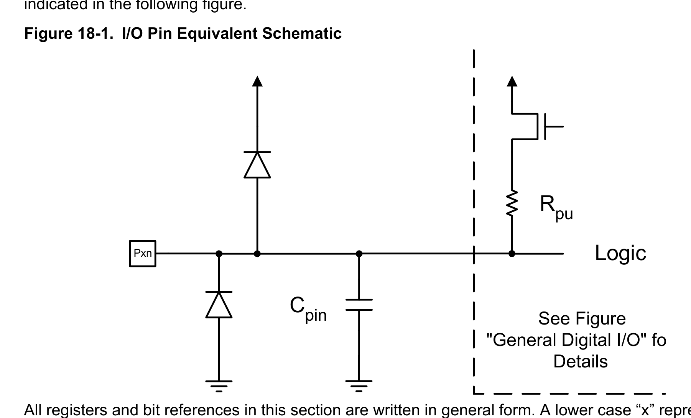
*Description*: IC pinout diagram specifying physical pin assignments, I/O port pin multiplexing, supply lines (VCC/GND), and crystal connections for Figure 18-1: I/O Pin Equivalent Schematic.

> **Figure 18-1: I/O Pin Equivalent Schematic**

Cpin
Logic
Rpu
See Figure
"General Digital I/O" fo
Details
Pxn
All registers and bit references in this section are written in general form. A lower case “x” represents the
numbering letter for the port, and a lower case “n” represents the bit number. However, when using the
register or bit defines in a program, the precise form must be used. For example, PORTB3 for bit number
3 in Port B, here documented generally as PORTxn.
I/O memory address locations are allocated for each port, one each for the Data Register (Portx), Data
Direction Register (DDRx), and the Port Input Pins (PINx). The port input pins I/O location is read-only,
while the data register and the data direction register are read/write. However, writing '1' to a bit in the
PINx register will result in a toggle in the corresponding bit in the data register. In addition, the Pull-up
Disable (PUD) bit in MCUCR disables the pull-up function for all pins in all ports when set.
Using the I/O port as general digital I/O is described in next section. Most port pins are multiplexed with
alternate functions for the peripheral features on the device. How each alternate function interferes with
the port pin is described in Alternate Port Functions section in this chapter. Refer to the individual module
sections for a full description of the alternate functions.
Enabling the alternate function of some of the port pins does not affect the use of the other pins in the
port as general digital I/O.
ATmega328/P
I/O-Ports
© 2018 Microchip Technology Inc.
Datasheet Complete
DS40001984A-page 99
Downloaded from Arrow.com.
Downloaded from Arrow.com.
Downloaded from Arrow.com.
Downloaded from Arrow.com.
Downloaded from Arrow.com.
Downloaded from Arrow.com.
Downloaded from Arrow.com.
Downloaded from Arrow.com.
Downloaded from Arrow.com.
Downloaded from Arrow.com.
Downloaded from Arrow.com.
Downloaded from Arrow.com.
Downloaded from Arrow.com.
Downloaded from Arrow.com.
Downloaded from Arrow.com.
Downloaded from Arrow.com.
Downloaded from Arrow.com.
Downloaded from Arrow.com.
Downloaded from Arrow.com.
Downloaded from Arrow.com.
Downloaded from Arrow.com.
Downloaded from Arrow.com.
Downloaded from Arrow.com.
Downloaded from Arrow.com.
Downloaded from Arrow.com.
Downloaded from Arrow.com.
Downloaded from Arrow.com.
Downloaded from Arrow.com.
Downloaded from Arrow.com.
Downloaded from Arrow.com.
Downloaded from Arrow.com.
Downloaded from Arrow.com.
Downloaded from Arrow.com.
Downloaded from Arrow.com.
Downloaded from Arrow.com.
Downloaded from Arrow.com.
Downloaded from Arrow.com.
Downloaded from Arrow.com.
Downloaded from Arrow.com.
Downloaded from Arrow.com.
Downloaded from Arrow.com.
Downloaded from Arrow.com.
Downloaded from Arrow.com.
Downloaded from Arrow.com.
Downloaded from Arrow.com.
Downloaded from Arrow.com.
Downloaded from Arrow.com.
Downloaded from Arrow.com.
Downloaded from Arrow.com.
Downloaded from Arrow.com.
Downloaded from Arrow.com.
Downloaded from Arrow.com.
Downloaded from Arrow.com.
Downloaded from Arrow.com.
Downloaded from Arrow.com.
Downloaded from Arrow.com.
Downloaded from Arrow.com.
Downloaded from Arrow.com.
Downloaded from Arrow.com.
Downloaded from Arrow.com.
Downloaded from Arrow.com.
Downloaded from Arrow.com.
Downloaded from Arrow.com.
Downloaded from Arrow.com.
Downloaded from Arrow.com.
Downloaded from Arrow.com.
Downloaded from Arrow.com.
Downloaded from Arrow.com.
Downloaded from Arrow.com.
Downloaded from Arrow.com.
Downloaded from Arrow.com.
Downloaded from Arrow.com.
Downloaded from Arrow.com.
Downloaded from Arrow.com.
Downloaded from Arrow.com.
Downloaded from Arrow.com.
Downloaded from Arrow.com.
Downloaded from Arrow.com.
Downloaded from Arrow.com.
Downloaded from Arrow.com.
Downloaded from Arrow.com.
Downloaded from Arrow.com.
Downloaded from Arrow.com.
Downloaded from Arrow.com.
Downloaded from Arrow.com.
Downloaded from Arrow.com.
Downloaded from Arrow.com.
Downloaded from Arrow.com.
Downloaded from Arrow.com.
Downloaded from Arrow.com.
Downloaded from Arrow.com.
Downloaded from Arrow.com.
Downloaded from Arrow.com.
Downloaded from Arrow.com.
Downloaded from Arrow.com.
Downloaded from Arrow.com.
Downloaded from Arrow.com.
Downloaded from Arrow.com.
Downloaded from Arrow.com.


<!-- Page 100 -->
### [PDF Page 100]

18.2
Ports as General Digital I/O
The ports are bi-directional I/O ports with optional internal pull-ups. The following figure shows the
functional description of one I/O-port pin, here generically called Pxn.

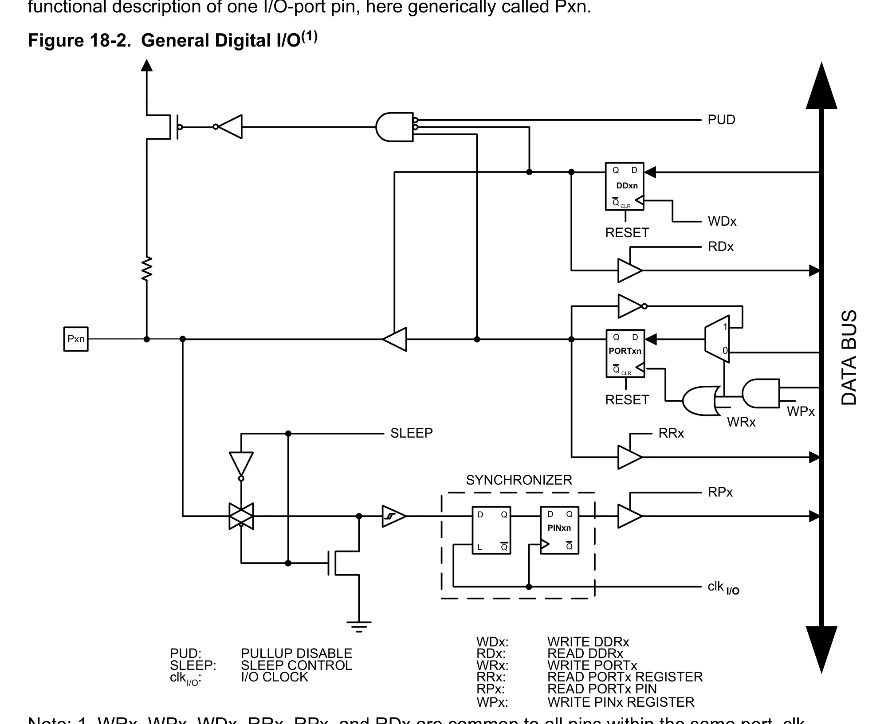
*Description*: Technical diagram and schematic illustration detailing hardware circuit topology, signal routing, and logic operations for Figure 18-2: General Digital I/O(1).

> **Figure 18-2: General Digital I/O(1)**

clk
RPx
RRx
RDx
WDx
PUD
SYNCHRONIZER
WDx:
WRITE DDRx
WRx:
WRITE PORTx
RRx:
READ PORTx REGISTER
RPx:
READ PORTx PIN
PUD:
PULLUP DISABLE
clkI/O:
I/O CLOCK
RDx:
READ DDRx
D
L
Q
Q
RESET
RESET
Q
Q
D
Q
Q
D
CLR
PORTxn
Q
Q
D
CLR
DDxn
PINxn
DATA BUS
SLEEP
SLEEP:
SLEEP CONTROL
Pxn
I/O
WPx
0
1
WRx
WPx:
WRITE PINx REGISTER
Note: 1. WRx, WPx, WDx, RRx, RPx, and RDx are common to all pins within the same port. clkI/O,
SLEEP, and PUD are common to all ports.
18.2.1
Configuring the Pin
Each port pin consists of three register bits: DDxn, PORTxn, and PINxn. As shown in the register
description, the DDxn bits are accessed at the DDRx I/O address, the PORTxn bits at the PORTx I/O
address, and the PINxn bits at the PINx I/O address.
The DDxn bit in the DDRx register selects the direction of this pin. If DDxn is written to '1', Pxn is
configured as an output pin. If DDxn is written to '0', Pxn is configured as an input pin.
If PORTxn is written to '1' when the pin is configured as an input pin, the pull-up resistor is activated. To
switch the pull-up resistor off, PORTxn has to be written to '0' or the pin has to be configured as an output
pin. The port pins are tri-stated when the reset condition becomes active, even if no clocks are running.
If PORTxn is written to '1' when the pin is configured as an output pin, the port pin is driven high. If
PORTxn is written logic zero when the pin is configured as an output pin, the port pin is driven low.
ATmega328/P
I/O-Ports
© 2018 Microchip Technology Inc.
Datasheet Complete
DS40001984A-page 100
Downloaded from Arrow.com.
Downloaded from Arrow.com.
Downloaded from Arrow.com.
Downloaded from Arrow.com.
Downloaded from Arrow.com.
Downloaded from Arrow.com.
Downloaded from Arrow.com.
Downloaded from Arrow.com.
Downloaded from Arrow.com.
Downloaded from Arrow.com.
Downloaded from Arrow.com.
Downloaded from Arrow.com.
Downloaded from Arrow.com.
Downloaded from Arrow.com.
Downloaded from Arrow.com.
Downloaded from Arrow.com.
Downloaded from Arrow.com.
Downloaded from Arrow.com.
Downloaded from Arrow.com.
Downloaded from Arrow.com.
Downloaded from Arrow.com.
Downloaded from Arrow.com.
Downloaded from Arrow.com.
Downloaded from Arrow.com.
Downloaded from Arrow.com.
Downloaded from Arrow.com.
Downloaded from Arrow.com.
Downloaded from Arrow.com.
Downloaded from Arrow.com.
Downloaded from Arrow.com.
Downloaded from Arrow.com.
Downloaded from Arrow.com.
Downloaded from Arrow.com.
Downloaded from Arrow.com.
Downloaded from Arrow.com.
Downloaded from Arrow.com.
Downloaded from Arrow.com.
Downloaded from Arrow.com.
Downloaded from Arrow.com.
Downloaded from Arrow.com.
Downloaded from Arrow.com.
Downloaded from Arrow.com.
Downloaded from Arrow.com.
Downloaded from Arrow.com.
Downloaded from Arrow.com.
Downloaded from Arrow.com.
Downloaded from Arrow.com.
Downloaded from Arrow.com.
Downloaded from Arrow.com.
Downloaded from Arrow.com.
Downloaded from Arrow.com.
Downloaded from Arrow.com.
Downloaded from Arrow.com.
Downloaded from Arrow.com.
Downloaded from Arrow.com.
Downloaded from Arrow.com.
Downloaded from Arrow.com.
Downloaded from Arrow.com.
Downloaded from Arrow.com.
Downloaded from Arrow.com.
Downloaded from Arrow.com.
Downloaded from Arrow.com.
Downloaded from Arrow.com.
Downloaded from Arrow.com.
Downloaded from Arrow.com.
Downloaded from Arrow.com.
Downloaded from Arrow.com.
Downloaded from Arrow.com.
Downloaded from Arrow.com.
Downloaded from Arrow.com.
Downloaded from Arrow.com.
Downloaded from Arrow.com.
Downloaded from Arrow.com.
Downloaded from Arrow.com.
Downloaded from Arrow.com.
Downloaded from Arrow.com.
Downloaded from Arrow.com.
Downloaded from Arrow.com.
Downloaded from Arrow.com.
Downloaded from Arrow.com.
Downloaded from Arrow.com.
Downloaded from Arrow.com.
Downloaded from Arrow.com.
Downloaded from Arrow.com.
Downloaded from Arrow.com.
Downloaded from Arrow.com.
Downloaded from Arrow.com.
Downloaded from Arrow.com.
Downloaded from Arrow.com.
Downloaded from Arrow.com.
Downloaded from Arrow.com.
Downloaded from Arrow.com.
Downloaded from Arrow.com.
Downloaded from Arrow.com.
Downloaded from Arrow.com.
Downloaded from Arrow.com.
Downloaded from Arrow.com.
Downloaded from Arrow.com.
Downloaded from Arrow.com.
Downloaded from Arrow.com.


<!-- Page 101 -->
### [PDF Page 101]

18.2.2
Toggling the Pin
Writing a '1' to PINxn toggles the value of PORTxn, independent on the value of DDRxn. The SBI
instruction can be used to toggle one single bit in a port.
18.2.3
Switching Between Input and Output
When switching between tri-state ({DDxn, PORTxn} = 0b00) and output high ({DDxn, PORTxn} = 0b11),
an intermediate state with either pull-up enabled {DDxn, PORTxn} = 0b01) or output low ({DDxn,
PORTxn} = 0b10) must occur. Normally, the pull-up enabled state is fully acceptable, as a high-
impedance environment will not notice the difference between a strong high driver and a pull-up. If this is
not the case, the PUD bit in the MCUCR register can be set to disable all pull-ups in all ports.
Switching between input with pull-up and output low generates the same problem. The user must use
either the tri-state ({DDxn, PORTxn} = 0b00) or the output high state ({DDxn, PORTxn} = 0b11) as an
intermediate step.
The following table summarizes the control signals for the pin value.

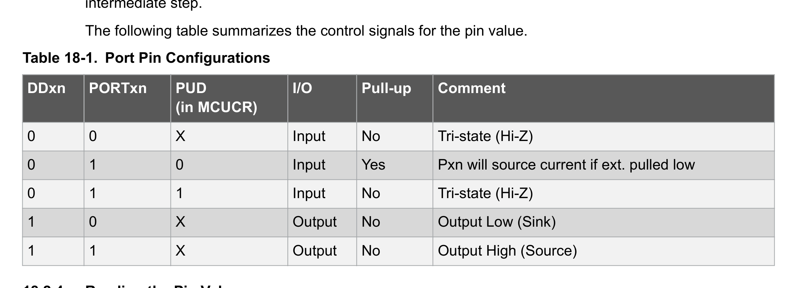
*Description*: IC pinout diagram specifying physical pin assignments, I/O port pin multiplexing, supply lines (VCC/GND), and crystal connections for Table 18-1: Port Pin Configurations.

> **Table 18-1: Port Pin Configurations**

DDxn
PORTxn
PUD
(in MCUCR)
I/O
Pull-up
Comment
0
0
X
Input
No
Tri-state (Hi-Z)
0
1
0
Input
Yes
Pxn will source current if ext. pulled low
0
1
1
Input
No
Tri-state (Hi-Z)
1
0
X
Output
No
Output Low (Sink)
1
1
X
Output
No
Output High (Source)
18.2.4
Reading the Pin Value
Independent of the setting of Data Direction bit DDxn, the port pin can be read through the PINxn register
bit. As shown in Ports as General Digital I/O, the PINxn register bit and the preceding latch constitute a
synchronizer. This is needed to avoid metastability if the physical pin changes value near the edge of the
internal clock, but it also introduces a delay. The following figure shows a timing diagram of the
synchronization when reading an externally applied pin value. The maximum and minimum propagation
delays are denoted tpd,max and tpd,min respectively.

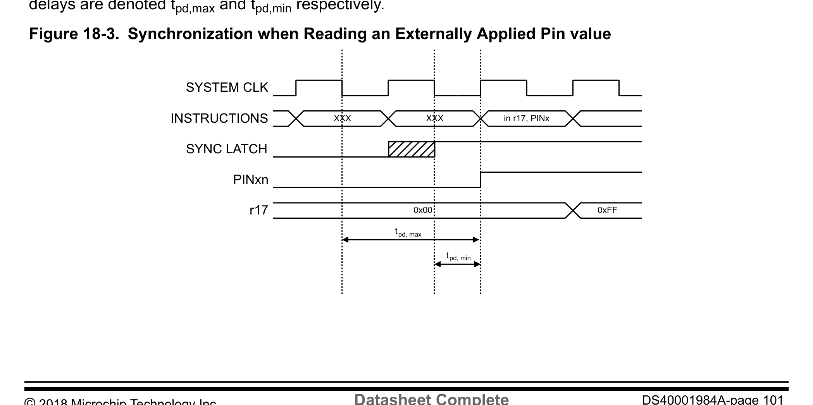
*Description*: IC pinout diagram specifying physical pin assignments, I/O port pin multiplexing, supply lines (VCC/GND), and crystal connections for Figure 18-3: Synchronization when Reading an Externally Applied Pin value.

> **Figure 18-3: Synchronization when Reading an Externally Applied Pin value**

XXX
in r17, PINx
0x00
0xFF
INSTRUCTIONS
SYNC LATCH
PINxn
r17
XXX
SYSTEM CLK
tpd, max
tpd, min
ATmega328/P
I/O-Ports
© 2018 Microchip Technology Inc.
Datasheet Complete
DS40001984A-page 101
Downloaded from Arrow.com.
Downloaded from Arrow.com.
Downloaded from Arrow.com.
Downloaded from Arrow.com.
Downloaded from Arrow.com.
Downloaded from Arrow.com.
Downloaded from Arrow.com.
Downloaded from Arrow.com.
Downloaded from Arrow.com.
Downloaded from Arrow.com.
Downloaded from Arrow.com.
Downloaded from Arrow.com.
Downloaded from Arrow.com.
Downloaded from Arrow.com.
Downloaded from Arrow.com.
Downloaded from Arrow.com.
Downloaded from Arrow.com.
Downloaded from Arrow.com.
Downloaded from Arrow.com.
Downloaded from Arrow.com.
Downloaded from Arrow.com.
Downloaded from Arrow.com.
Downloaded from Arrow.com.
Downloaded from Arrow.com.
Downloaded from Arrow.com.
Downloaded from Arrow.com.
Downloaded from Arrow.com.
Downloaded from Arrow.com.
Downloaded from Arrow.com.
Downloaded from Arrow.com.
Downloaded from Arrow.com.
Downloaded from Arrow.com.
Downloaded from Arrow.com.
Downloaded from Arrow.com.
Downloaded from Arrow.com.
Downloaded from Arrow.com.
Downloaded from Arrow.com.
Downloaded from Arrow.com.
Downloaded from Arrow.com.
Downloaded from Arrow.com.
Downloaded from Arrow.com.
Downloaded from Arrow.com.
Downloaded from Arrow.com.
Downloaded from Arrow.com.
Downloaded from Arrow.com.
Downloaded from Arrow.com.
Downloaded from Arrow.com.
Downloaded from Arrow.com.
Downloaded from Arrow.com.
Downloaded from Arrow.com.
Downloaded from Arrow.com.
Downloaded from Arrow.com.
Downloaded from Arrow.com.
Downloaded from Arrow.com.
Downloaded from Arrow.com.
Downloaded from Arrow.com.
Downloaded from Arrow.com.
Downloaded from Arrow.com.
Downloaded from Arrow.com.
Downloaded from Arrow.com.
Downloaded from Arrow.com.
Downloaded from Arrow.com.
Downloaded from Arrow.com.
Downloaded from Arrow.com.
Downloaded from Arrow.com.
Downloaded from Arrow.com.
Downloaded from Arrow.com.
Downloaded from Arrow.com.
Downloaded from Arrow.com.
Downloaded from Arrow.com.
Downloaded from Arrow.com.
Downloaded from Arrow.com.
Downloaded from Arrow.com.
Downloaded from Arrow.com.
Downloaded from Arrow.com.
Downloaded from Arrow.com.
Downloaded from Arrow.com.
Downloaded from Arrow.com.
Downloaded from Arrow.com.
Downloaded from Arrow.com.
Downloaded from Arrow.com.
Downloaded from Arrow.com.
Downloaded from Arrow.com.
Downloaded from Arrow.com.
Downloaded from Arrow.com.
Downloaded from Arrow.com.
Downloaded from Arrow.com.
Downloaded from Arrow.com.
Downloaded from Arrow.com.
Downloaded from Arrow.com.
Downloaded from Arrow.com.
Downloaded from Arrow.com.
Downloaded from Arrow.com.
Downloaded from Arrow.com.
Downloaded from Arrow.com.
Downloaded from Arrow.com.
Downloaded from Arrow.com.
Downloaded from Arrow.com.
Downloaded from Arrow.com.
Downloaded from Arrow.com.
Downloaded from Arrow.com.


<!-- Page 102 -->
### [PDF Page 102]

Consider the clock period starting shortly after the first falling edge of the system clock. The latch is
closed when the clock is low and goes transparent when the clock is high, as indicated by the shaded
region of the “SYNC LATCH” signal. The signal value is latched when the system clock goes low. It is
clocked into the PINxn register at the succeeding positive clock edge. As indicated by the two arrows
tpd,max and tpd,min, a single signal transition on the pin will be delayed between ½ and 1½ system clock
period depending upon the time of assertion.
When reading back a software-assigned pin value, a nop instruction must be inserted as indicated in the
following figure. The out instruction sets the “SYNC LATCH” signal at the positive edge of the clock. In
this case, the delay tpd through the synchronizer is one system clock period.

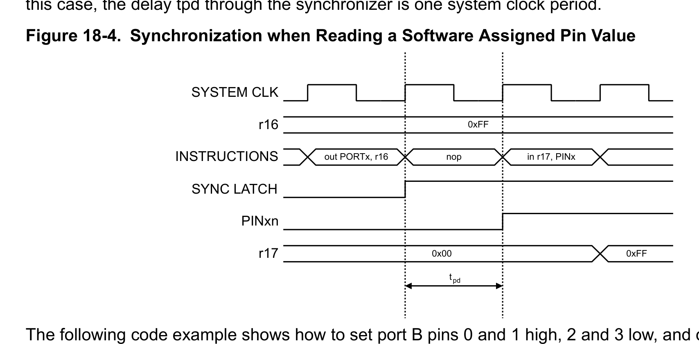
*Description*: IC pinout diagram specifying physical pin assignments, I/O port pin multiplexing, supply lines (VCC/GND), and crystal connections for Figure 18-4: Synchronization when Reading a Software Assigned Pin Value.

> **Figure 18-4: Synchronization when Reading a Software Assigned Pin Value**

out PORTx, r16
nop
in r17, PINx
0xFF
0x00
0xFF
SYSTEM CLK
r16
INSTRUCTIONS
SYNC LATCH
PINxn
r17
tpd
The following code example shows how to set port B pins 0 and 1 high, 2 and 3 low, and define the port
pins from 4 to 7 as input with pull-ups assigned to port pins 6 and 7. The resulting pin values are read
back again, but as previously discussed, a nop instruction is included to be able to read back the value
recently assigned to some of the pins.
Assembly Code Example(1)
...
; Define pull-ups and set outputs high
; Define directions for port pins
ldi r16,(1<<PB7)|(1<<PB6)|(1<<PB1)|(1<<PB0)
ldi r17,(1<<DDB3)|(1<<DDB2)|(1<<DDB1)|(1<<DDB0)
out PORTB,r16
out DDRB,r17
; Insert nop for synchronization
nop
; Read port pins
in r16,PINB
...
Note:  1. For the assembly program, two temporary registers are used to minimize the
time from pull-ups are set on pins 0, 1, 6, and 7, until the direction bits are correctly set,
defining bit 2 and 3 as low and redefining bits 0 and 1 as strong high drivers.
C Code Example
unsigned char i;
...
/* Define pull-ups and set outputs high */
/* Define directions for port pins */

```c
PORTB = (1<<PB7)|(1<<PB6)|(1<<PB1)|(1<<PB0);
DDRB = (1<<DDB3)|(1<<DDB2)|(1<<DDB1)|(1<<DDB0);
```

ATmega328/P
I/O-Ports
© 2018 Microchip Technology Inc.
Datasheet Complete
DS40001984A-page 102
Downloaded from Arrow.com.
Downloaded from Arrow.com.
Downloaded from Arrow.com.
Downloaded from Arrow.com.
Downloaded from Arrow.com.
Downloaded from Arrow.com.
Downloaded from Arrow.com.
Downloaded from Arrow.com.
Downloaded from Arrow.com.
Downloaded from Arrow.com.
Downloaded from Arrow.com.
Downloaded from Arrow.com.
Downloaded from Arrow.com.
Downloaded from Arrow.com.
Downloaded from Arrow.com.
Downloaded from Arrow.com.
Downloaded from Arrow.com.
Downloaded from Arrow.com.
Downloaded from Arrow.com.
Downloaded from Arrow.com.
Downloaded from Arrow.com.
Downloaded from Arrow.com.
Downloaded from Arrow.com.
Downloaded from Arrow.com.
Downloaded from Arrow.com.
Downloaded from Arrow.com.
Downloaded from Arrow.com.
Downloaded from Arrow.com.
Downloaded from Arrow.com.
Downloaded from Arrow.com.
Downloaded from Arrow.com.
Downloaded from Arrow.com.
Downloaded from Arrow.com.
Downloaded from Arrow.com.
Downloaded from Arrow.com.
Downloaded from Arrow.com.
Downloaded from Arrow.com.
Downloaded from Arrow.com.
Downloaded from Arrow.com.
Downloaded from Arrow.com.
Downloaded from Arrow.com.
Downloaded from Arrow.com.
Downloaded from Arrow.com.
Downloaded from Arrow.com.
Downloaded from Arrow.com.
Downloaded from Arrow.com.
Downloaded from Arrow.com.
Downloaded from Arrow.com.
Downloaded from Arrow.com.
Downloaded from Arrow.com.
Downloaded from Arrow.com.
Downloaded from Arrow.com.
Downloaded from Arrow.com.
Downloaded from Arrow.com.
Downloaded from Arrow.com.
Downloaded from Arrow.com.
Downloaded from Arrow.com.
Downloaded from Arrow.com.
Downloaded from Arrow.com.
Downloaded from Arrow.com.
Downloaded from Arrow.com.
Downloaded from Arrow.com.
Downloaded from Arrow.com.
Downloaded from Arrow.com.
Downloaded from Arrow.com.
Downloaded from Arrow.com.
Downloaded from Arrow.com.
Downloaded from Arrow.com.
Downloaded from Arrow.com.
Downloaded from Arrow.com.
Downloaded from Arrow.com.
Downloaded from Arrow.com.
Downloaded from Arrow.com.
Downloaded from Arrow.com.
Downloaded from Arrow.com.
Downloaded from Arrow.com.
Downloaded from Arrow.com.
Downloaded from Arrow.com.
Downloaded from Arrow.com.
Downloaded from Arrow.com.
Downloaded from Arrow.com.
Downloaded from Arrow.com.
Downloaded from Arrow.com.
Downloaded from Arrow.com.
Downloaded from Arrow.com.
Downloaded from Arrow.com.
Downloaded from Arrow.com.
Downloaded from Arrow.com.
Downloaded from Arrow.com.
Downloaded from Arrow.com.
Downloaded from Arrow.com.
Downloaded from Arrow.com.
Downloaded from Arrow.com.
Downloaded from Arrow.com.
Downloaded from Arrow.com.
Downloaded from Arrow.com.
Downloaded from Arrow.com.
Downloaded from Arrow.com.
Downloaded from Arrow.com.
Downloaded from Arrow.com.
Downloaded from Arrow.com.
Downloaded from Arrow.com.


<!-- Page 103 -->
### [PDF Page 103]

/* Insert nop for synchronization*/
__no_operation();
/* Read port pins */
i = PINB;
...
18.2.5
Digital Input Enable and Sleep Modes
As shown in the figure of General Digital I/O, the digital input signal can be clamped to ground at the input
of the Schmitt Trigger. The signal denoted SLEEP in the figure, is set by the MCU sleep controller in
Power-Down mode and Standby mode to avoid high power consumption if some input signals are left
floating, or have an analog signal level close to VCC/2.
SLEEP is overridden for port pins enabled as external interrupt pins. If the external interrupt request is not
enabled, SLEEP is active for these pins. SLEEP is also overridden by various other alternate functions as
described in Alternate Port Functions section in this chapter.
If a logic high level is present on an asynchronous external interrupt pin configured as “Interrupt on Rising
Edge, Falling Edge, or Any Logic Change on Pin” while the external interrupt is not enabled, the
corresponding external interrupt flag will be set when resuming from the above mentioned Sleep mode,
as the clamping in these sleep mode produces the requested logic change.
18.2.6
Unconnected Pins
If some pins are unused, it is recommended to ensure that these pins have a defined level. Even though
most of the digital inputs are disabled in the deep sleep modes as described above, floating inputs should
be avoided to reduce current consumption in all other modes where the digital inputs are enabled (Reset,
Active mode and Idle mode).
The simplest method to ensure a defined level of an unused pin is to enable the internal pull-up. In this
case, the pull-up will be disabled during reset. If low power consumption during reset is important, it is
recommended to use an external pull-up or pull-down. Connecting unused pins directly to VCC or GND is
not recommended, since this may cause excessive currents if the pin is accidentally configured as an
output.
18.3
Alternate Port Functions
Most port pins have alternate functions in addition to being general digital I/Os. The following figure

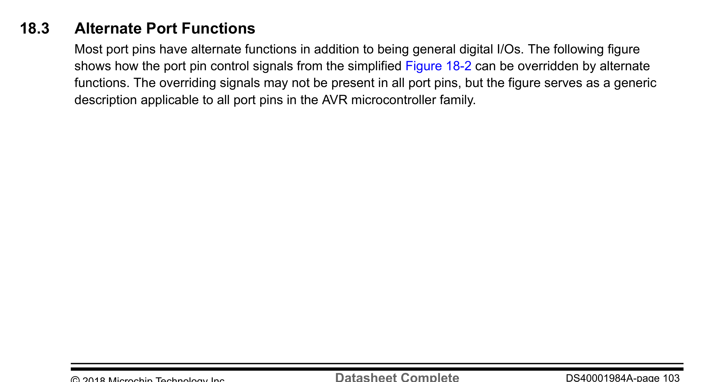
*Description*: Technical diagram and schematic illustration detailing hardware circuit topology, signal routing, and logic operations for Figure 18-2: can be overridden by alternate.

> **Figure 18-2: can be overridden by alternate**

functions. The overriding signals may not be present in all port pins, but the figure serves as a generic
description applicable to all port pins in the AVR microcontroller family.
ATmega328/P
I/O-Ports
© 2018 Microchip Technology Inc.
Datasheet Complete
DS40001984A-page 103
Downloaded from Arrow.com.
Downloaded from Arrow.com.
Downloaded from Arrow.com.
Downloaded from Arrow.com.
Downloaded from Arrow.com.
Downloaded from Arrow.com.
Downloaded from Arrow.com.
Downloaded from Arrow.com.
Downloaded from Arrow.com.
Downloaded from Arrow.com.
Downloaded from Arrow.com.
Downloaded from Arrow.com.
Downloaded from Arrow.com.
Downloaded from Arrow.com.
Downloaded from Arrow.com.
Downloaded from Arrow.com.
Downloaded from Arrow.com.
Downloaded from Arrow.com.
Downloaded from Arrow.com.
Downloaded from Arrow.com.
Downloaded from Arrow.com.
Downloaded from Arrow.com.
Downloaded from Arrow.com.
Downloaded from Arrow.com.
Downloaded from Arrow.com.
Downloaded from Arrow.com.
Downloaded from Arrow.com.
Downloaded from Arrow.com.
Downloaded from Arrow.com.
Downloaded from Arrow.com.
Downloaded from Arrow.com.
Downloaded from Arrow.com.
Downloaded from Arrow.com.
Downloaded from Arrow.com.
Downloaded from Arrow.com.
Downloaded from Arrow.com.
Downloaded from Arrow.com.
Downloaded from Arrow.com.
Downloaded from Arrow.com.
Downloaded from Arrow.com.
Downloaded from Arrow.com.
Downloaded from Arrow.com.
Downloaded from Arrow.com.
Downloaded from Arrow.com.
Downloaded from Arrow.com.
Downloaded from Arrow.com.
Downloaded from Arrow.com.
Downloaded from Arrow.com.
Downloaded from Arrow.com.
Downloaded from Arrow.com.
Downloaded from Arrow.com.
Downloaded from Arrow.com.
Downloaded from Arrow.com.
Downloaded from Arrow.com.
Downloaded from Arrow.com.
Downloaded from Arrow.com.
Downloaded from Arrow.com.
Downloaded from Arrow.com.
Downloaded from Arrow.com.
Downloaded from Arrow.com.
Downloaded from Arrow.com.
Downloaded from Arrow.com.
Downloaded from Arrow.com.
Downloaded from Arrow.com.
Downloaded from Arrow.com.
Downloaded from Arrow.com.
Downloaded from Arrow.com.
Downloaded from Arrow.com.
Downloaded from Arrow.com.
Downloaded from Arrow.com.
Downloaded from Arrow.com.
Downloaded from Arrow.com.
Downloaded from Arrow.com.
Downloaded from Arrow.com.
Downloaded from Arrow.com.
Downloaded from Arrow.com.
Downloaded from Arrow.com.
Downloaded from Arrow.com.
Downloaded from Arrow.com.
Downloaded from Arrow.com.
Downloaded from Arrow.com.
Downloaded from Arrow.com.
Downloaded from Arrow.com.
Downloaded from Arrow.com.
Downloaded from Arrow.com.
Downloaded from Arrow.com.
Downloaded from Arrow.com.
Downloaded from Arrow.com.
Downloaded from Arrow.com.
Downloaded from Arrow.com.
Downloaded from Arrow.com.
Downloaded from Arrow.com.
Downloaded from Arrow.com.
Downloaded from Arrow.com.
Downloaded from Arrow.com.
Downloaded from Arrow.com.
Downloaded from Arrow.com.
Downloaded from Arrow.com.
Downloaded from Arrow.com.
Downloaded from Arrow.com.
Downloaded from Arrow.com.
Downloaded from Arrow.com.
Downloaded from Arrow.com.


<!-- Page 104 -->
### [PDF Page 104]


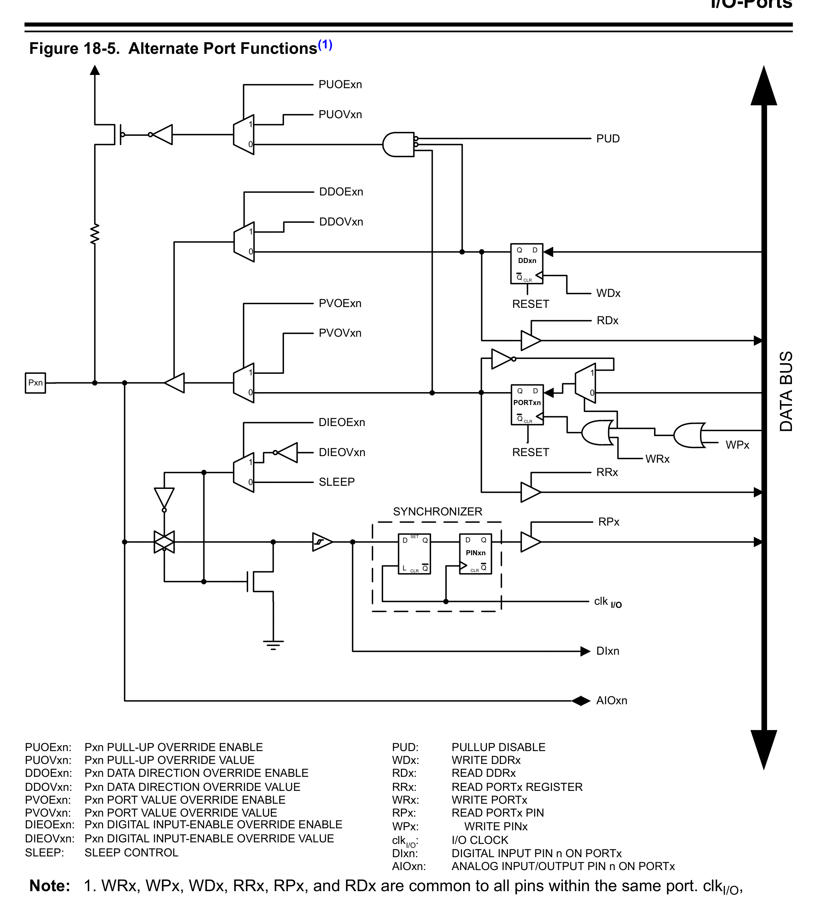
*Description*: Technical diagram and schematic illustration detailing hardware circuit topology, signal routing, and logic operations for Figure 18-5: Alternate Port Functions(1).

> **Figure 18-5: Alternate Port Functions(1)**

clk
RPx
RRx
WRx
RDx
WDx
PUD
SYNCHRONIZER
WDx:
WRITE DDRx
WRx:
WRITE PORTx
RRx:
READ PORTx REGISTER
RPx:
READ PORTx PIN
PUD:
PULLUP DISABLE
clkI/O:
I/O CLOCK
RDx:
READ DDRx
D
L
Q
Q
SET
CLR
0
1
0
1
0
1
DIxn
AIOxn
DIEOExn
PVOVxn
PVOExn
DDOVxn
DDOExn
PUOExn
PUOVxn
PUOExn:
Pxn PULL-UP OVERRIDE ENABLE
PUOVxn:
Pxn PULL-UP OVERRIDE VALUE
DDOExn:
Pxn DATA DIRECTION OVERRIDE ENABLE
DDOVxn:
Pxn DATA DIRECTION OVERRIDE VALUE
PVOExn:
Pxn PORT VALUE OVERRIDE ENABLE
PVOVxn:
Pxn PORT VALUE OVERRIDE VALUE
DIxn:
DIGITAL INPUT PIN n ON PORTx
AIOxn:
ANALOG INPUT/OUTPUT PIN n ON PORTx
RESET
RESET
Q
Q
D
CLR
Q
Q
D
CLR
Q
Q
D
CLR
PINxn
PORTxn
DDxn
DATA BUS
0
1
DIEOVxn
SLEEP
DIEOExn:
Pxn DIGITAL INPUT-ENABLE OVERRIDE ENABLE
DIEOVxn:
Pxn DIGITAL INPUT-ENABLE OVERRIDE VALUE
SLEEP:
SLEEP CONTROL
Pxn
I/O
0
1
WPx:
WRITE PINx
WPx
Note:  1. WRx, WPx, WDx, RRx, RPx, and RDx are common to all pins within the same port. clkI/O,
SLEEP, and PUD are common to all ports. All other signals are unique for each pin.
The following table summarizes the function of the overriding signals. The pin and port indexes from the
previous figure are not shown in the succeeding tables. The overriding signals are generated internally in
the modules having the alternate function.
ATmega328/P
I/O-Ports
© 2018 Microchip Technology Inc.
Datasheet Complete
DS40001984A-page 104
Downloaded from Arrow.com.
Downloaded from Arrow.com.
Downloaded from Arrow.com.
Downloaded from Arrow.com.
Downloaded from Arrow.com.
Downloaded from Arrow.com.
Downloaded from Arrow.com.
Downloaded from Arrow.com.
Downloaded from Arrow.com.
Downloaded from Arrow.com.
Downloaded from Arrow.com.
Downloaded from Arrow.com.
Downloaded from Arrow.com.
Downloaded from Arrow.com.
Downloaded from Arrow.com.
Downloaded from Arrow.com.
Downloaded from Arrow.com.
Downloaded from Arrow.com.
Downloaded from Arrow.com.
Downloaded from Arrow.com.
Downloaded from Arrow.com.
Downloaded from Arrow.com.
Downloaded from Arrow.com.
Downloaded from Arrow.com.
Downloaded from Arrow.com.
Downloaded from Arrow.com.
Downloaded from Arrow.com.
Downloaded from Arrow.com.
Downloaded from Arrow.com.
Downloaded from Arrow.com.
Downloaded from Arrow.com.
Downloaded from Arrow.com.
Downloaded from Arrow.com.
Downloaded from Arrow.com.
Downloaded from Arrow.com.
Downloaded from Arrow.com.
Downloaded from Arrow.com.
Downloaded from Arrow.com.
Downloaded from Arrow.com.
Downloaded from Arrow.com.
Downloaded from Arrow.com.
Downloaded from Arrow.com.
Downloaded from Arrow.com.
Downloaded from Arrow.com.
Downloaded from Arrow.com.
Downloaded from Arrow.com.
Downloaded from Arrow.com.
Downloaded from Arrow.com.
Downloaded from Arrow.com.
Downloaded from Arrow.com.
Downloaded from Arrow.com.
Downloaded from Arrow.com.
Downloaded from Arrow.com.
Downloaded from Arrow.com.
Downloaded from Arrow.com.
Downloaded from Arrow.com.
Downloaded from Arrow.com.
Downloaded from Arrow.com.
Downloaded from Arrow.com.
Downloaded from Arrow.com.
Downloaded from Arrow.com.
Downloaded from Arrow.com.
Downloaded from Arrow.com.
Downloaded from Arrow.com.
Downloaded from Arrow.com.
Downloaded from Arrow.com.
Downloaded from Arrow.com.
Downloaded from Arrow.com.
Downloaded from Arrow.com.
Downloaded from Arrow.com.
Downloaded from Arrow.com.
Downloaded from Arrow.com.
Downloaded from Arrow.com.
Downloaded from Arrow.com.
Downloaded from Arrow.com.
Downloaded from Arrow.com.
Downloaded from Arrow.com.
Downloaded from Arrow.com.
Downloaded from Arrow.com.
Downloaded from Arrow.com.
Downloaded from Arrow.com.
Downloaded from Arrow.com.
Downloaded from Arrow.com.
Downloaded from Arrow.com.
Downloaded from Arrow.com.
Downloaded from Arrow.com.
Downloaded from Arrow.com.
Downloaded from Arrow.com.
Downloaded from Arrow.com.
Downloaded from Arrow.com.
Downloaded from Arrow.com.
Downloaded from Arrow.com.
Downloaded from Arrow.com.
Downloaded from Arrow.com.
Downloaded from Arrow.com.
Downloaded from Arrow.com.
Downloaded from Arrow.com.
Downloaded from Arrow.com.
Downloaded from Arrow.com.
Downloaded from Arrow.com.
Downloaded from Arrow.com.
Downloaded from Arrow.com.
Downloaded from Arrow.com.
Downloaded from Arrow.com.


<!-- Page 105 -->
### [PDF Page 105]


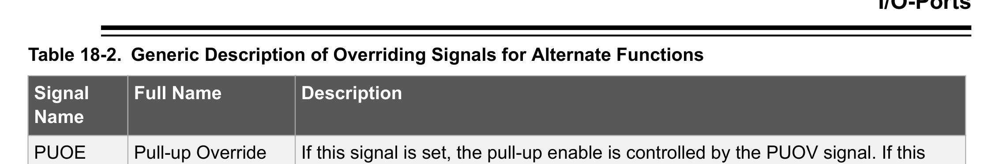
*Description*: Hardware reference table detailing register bit field settings, electrical operating limits, or memory configurations for Table 18-2: Generic Description of Overriding Signals for Alternate Functions.

> **Table 18-2: Generic Description of Overriding Signals for Alternate Functions**

Signal
Name
Full Name
Description
PUOE
Pull-up Override
Enable
If this signal is set, the pull-up enable is controlled by the PUOV signal. If this
signal is cleared, the pull-up is enabled when {DDxn, PORTxn, PUD} = 0b010.
PUOV
Pull-up Override
Value
If PUOE is set, the pull-up is enabled/disabled when PUOV is set/cleared,
regardless of the setting of the DDxn, PORTxn, and PUD Register bits.
DDOE
Data Direction
Override Enable
If this signal is set, the Output Driver Enable is controlled by the DDOV signal. If
this signal is cleared, the Output driver is enabled by the DDxn Register bit.
DDOV
Data Direction
Override Value
If DDOE is set, the Output Driver is enabled/disabled when DDOV is set/cleared,
regardless of the setting of the DDxn Register bit.
PVOE
Port Value
Override Enable
If this signal is set and the Output Driver is enabled, the port value is controlled
by the PVOV signal. If PVOE is cleared, and the Output Driver is enabled, the
port Value is controlled by the PORTxn Register bit.
PVOV
Port Value
Override Value
If PVOE is set, the port value is set to PVOV, regardless of the setting of the
PORTxn Register bit.
DIEOE
Digital Input
Enable Override
Enable
If this bit is set, the Digital Input Enable is controlled by the DIEOV signal. If this
signal is cleared, the Digital Input Enable is determined by MCU state (Normal
mode, sleep mode).
DIEOV
Digital Input
Enable Override
Value
If DIEOE is set, the Digital Input is enabled/disabled when DIEOV is set/cleared,
regardless of the MCU state (Normal mode, sleep mode).
DI
Digital Input
This is the Digital Input to alternate functions. In the figure, the signal is
connected to the output of the Schmitt Trigger but before the synchronizer.
Unless the Digital Input is used as a clock source, the module with the alternate
function will use its own synchronizer.
AIO
Analog Input/
Output
This is the Analog Input/output to/from alternate functions. The signal is
connected directly to the pad and can be used bi-directionally.
The following subsections shortly describe the alternate functions for each port and relate the overriding
signals to the alternate function. Refer to the alternate function description for further details.
18.3.1
Alternate Functions of Port B
The Port B pins with alternate functions are shown in the table below:

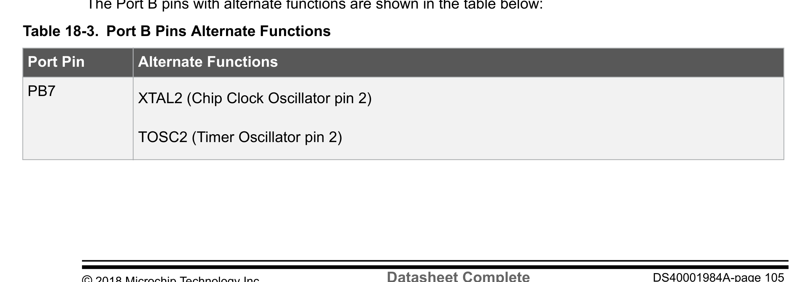
*Description*: IC pinout diagram specifying physical pin assignments, I/O port pin multiplexing, supply lines (VCC/GND), and crystal connections for Table 18-3: Port B Pins Alternate Functions.

> **Table 18-3: Port B Pins Alternate Functions**

Port Pin
Alternate Functions
PB7
XTAL2 (Chip Clock Oscillator pin 2)
TOSC2 (Timer Oscillator pin 2)
ATmega328/P
I/O-Ports
© 2018 Microchip Technology Inc.
Datasheet Complete
DS40001984A-page 105
Downloaded from Arrow.com.
Downloaded from Arrow.com.
Downloaded from Arrow.com.
Downloaded from Arrow.com.
Downloaded from Arrow.com.
Downloaded from Arrow.com.
Downloaded from Arrow.com.
Downloaded from Arrow.com.
Downloaded from Arrow.com.
Downloaded from Arrow.com.
Downloaded from Arrow.com.
Downloaded from Arrow.com.
Downloaded from Arrow.com.
Downloaded from Arrow.com.
Downloaded from Arrow.com.
Downloaded from Arrow.com.
Downloaded from Arrow.com.
Downloaded from Arrow.com.
Downloaded from Arrow.com.
Downloaded from Arrow.com.
Downloaded from Arrow.com.
Downloaded from Arrow.com.
Downloaded from Arrow.com.
Downloaded from Arrow.com.
Downloaded from Arrow.com.
Downloaded from Arrow.com.
Downloaded from Arrow.com.
Downloaded from Arrow.com.
Downloaded from Arrow.com.
Downloaded from Arrow.com.
Downloaded from Arrow.com.
Downloaded from Arrow.com.
Downloaded from Arrow.com.
Downloaded from Arrow.com.
Downloaded from Arrow.com.
Downloaded from Arrow.com.
Downloaded from Arrow.com.
Downloaded from Arrow.com.
Downloaded from Arrow.com.
Downloaded from Arrow.com.
Downloaded from Arrow.com.
Downloaded from Arrow.com.
Downloaded from Arrow.com.
Downloaded from Arrow.com.
Downloaded from Arrow.com.
Downloaded from Arrow.com.
Downloaded from Arrow.com.
Downloaded from Arrow.com.
Downloaded from Arrow.com.
Downloaded from Arrow.com.
Downloaded from Arrow.com.
Downloaded from Arrow.com.
Downloaded from Arrow.com.
Downloaded from Arrow.com.
Downloaded from Arrow.com.
Downloaded from Arrow.com.
Downloaded from Arrow.com.
Downloaded from Arrow.com.
Downloaded from Arrow.com.
Downloaded from Arrow.com.
Downloaded from Arrow.com.
Downloaded from Arrow.com.
Downloaded from Arrow.com.
Downloaded from Arrow.com.
Downloaded from Arrow.com.
Downloaded from Arrow.com.
Downloaded from Arrow.com.
Downloaded from Arrow.com.
Downloaded from Arrow.com.
Downloaded from Arrow.com.
Downloaded from Arrow.com.
Downloaded from Arrow.com.
Downloaded from Arrow.com.
Downloaded from Arrow.com.
Downloaded from Arrow.com.
Downloaded from Arrow.com.
Downloaded from Arrow.com.
Downloaded from Arrow.com.
Downloaded from Arrow.com.
Downloaded from Arrow.com.
Downloaded from Arrow.com.
Downloaded from Arrow.com.
Downloaded from Arrow.com.
Downloaded from Arrow.com.
Downloaded from Arrow.com.
Downloaded from Arrow.com.
Downloaded from Arrow.com.
Downloaded from Arrow.com.
Downloaded from Arrow.com.
Downloaded from Arrow.com.
Downloaded from Arrow.com.
Downloaded from Arrow.com.
Downloaded from Arrow.com.
Downloaded from Arrow.com.
Downloaded from Arrow.com.
Downloaded from Arrow.com.
Downloaded from Arrow.com.
Downloaded from Arrow.com.
Downloaded from Arrow.com.
Downloaded from Arrow.com.
Downloaded from Arrow.com.
Downloaded from Arrow.com.
Downloaded from Arrow.com.
Downloaded from Arrow.com.
Downloaded from Arrow.com.


<!-- Page 106 -->
### [PDF Page 106]

Port Pin
Alternate Functions
PCINT7 (Pin Change Interrupt 7)
PB6
XTAL1 (Chip Clock Oscillator pin 1 or External clock input)
TOSC1 (Timer Oscillator pin 1)
PCINT6 (Pin Change Interrupt 6)
PB5
SCK (SPI Bus Master clock Input)
PCINT5 (Pin Change Interrupt 5)
PB4
MISO (SPI Bus Master Input/Slave Output)
PCINT4 (Pin Change Interrupt 4)
PB3
MOSI (SPI Bus Master Output/Slave Input)
OC2A (Timer/Counter2 Output Compare Match A Output)
PCINT3 (Pin Change Interrupt 3)
PB2
SS (SPI Bus Master Slave select)
OC1B (Timer/Counter1 Output Compare Match B Output)
PCINT2 (Pin Change Interrupt 2)
PB1
OC1A (Timer/Counter1 Output Compare Match A Output)
PCINT1 (Pin Change Interrupt 1)
PB0
ICP1 (Timer/Counter1 Input Capture Input)
CLKO (Divided System Clock Output)
PCINT0 (Pin Change Interrupt 0)
The alternate pin configuration is as follows:
•
XTAL2/TOSC2/PCINT7 – Port B, Bit 7
–
XTAL2: Chip clock oscillator pin 2. Used as clock pin for crystal oscillator or low-frequency
crystal oscillator. When used as a clock pin, the pin can not be used as an I/O pin.
ATmega328/P
I/O-Ports
© 2018 Microchip Technology Inc.
Datasheet Complete
DS40001984A-page 106
Downloaded from Arrow.com.
Downloaded from Arrow.com.
Downloaded from Arrow.com.
Downloaded from Arrow.com.
Downloaded from Arrow.com.
Downloaded from Arrow.com.
Downloaded from Arrow.com.
Downloaded from Arrow.com.
Downloaded from Arrow.com.
Downloaded from Arrow.com.
Downloaded from Arrow.com.
Downloaded from Arrow.com.
Downloaded from Arrow.com.
Downloaded from Arrow.com.
Downloaded from Arrow.com.
Downloaded from Arrow.com.
Downloaded from Arrow.com.
Downloaded from Arrow.com.
Downloaded from Arrow.com.
Downloaded from Arrow.com.
Downloaded from Arrow.com.
Downloaded from Arrow.com.
Downloaded from Arrow.com.
Downloaded from Arrow.com.
Downloaded from Arrow.com.
Downloaded from Arrow.com.
Downloaded from Arrow.com.
Downloaded from Arrow.com.
Downloaded from Arrow.com.
Downloaded from Arrow.com.
Downloaded from Arrow.com.
Downloaded from Arrow.com.
Downloaded from Arrow.com.
Downloaded from Arrow.com.
Downloaded from Arrow.com.
Downloaded from Arrow.com.
Downloaded from Arrow.com.
Downloaded from Arrow.com.
Downloaded from Arrow.com.
Downloaded from Arrow.com.
Downloaded from Arrow.com.
Downloaded from Arrow.com.
Downloaded from Arrow.com.
Downloaded from Arrow.com.
Downloaded from Arrow.com.
Downloaded from Arrow.com.
Downloaded from Arrow.com.
Downloaded from Arrow.com.
Downloaded from Arrow.com.
Downloaded from Arrow.com.
Downloaded from Arrow.com.
Downloaded from Arrow.com.
Downloaded from Arrow.com.
Downloaded from Arrow.com.
Downloaded from Arrow.com.
Downloaded from Arrow.com.
Downloaded from Arrow.com.
Downloaded from Arrow.com.
Downloaded from Arrow.com.
Downloaded from Arrow.com.
Downloaded from Arrow.com.
Downloaded from Arrow.com.
Downloaded from Arrow.com.
Downloaded from Arrow.com.
Downloaded from Arrow.com.
Downloaded from Arrow.com.
Downloaded from Arrow.com.
Downloaded from Arrow.com.
Downloaded from Arrow.com.
Downloaded from Arrow.com.
Downloaded from Arrow.com.
Downloaded from Arrow.com.
Downloaded from Arrow.com.
Downloaded from Arrow.com.
Downloaded from Arrow.com.
Downloaded from Arrow.com.
Downloaded from Arrow.com.
Downloaded from Arrow.com.
Downloaded from Arrow.com.
Downloaded from Arrow.com.
Downloaded from Arrow.com.
Downloaded from Arrow.com.
Downloaded from Arrow.com.
Downloaded from Arrow.com.
Downloaded from Arrow.com.
Downloaded from Arrow.com.
Downloaded from Arrow.com.
Downloaded from Arrow.com.
Downloaded from Arrow.com.
Downloaded from Arrow.com.
Downloaded from Arrow.com.
Downloaded from Arrow.com.
Downloaded from Arrow.com.
Downloaded from Arrow.com.
Downloaded from Arrow.com.
Downloaded from Arrow.com.
Downloaded from Arrow.com.
Downloaded from Arrow.com.
Downloaded from Arrow.com.
Downloaded from Arrow.com.
Downloaded from Arrow.com.
Downloaded from Arrow.com.
Downloaded from Arrow.com.
Downloaded from Arrow.com.
Downloaded from Arrow.com.
Downloaded from Arrow.com.


<!-- Page 107 -->
### [PDF Page 107]

–
TOSC2: Timer Oscillator pin 2. Used only if internal calibrated RC oscillator is selected as
chip clock source, and the asynchronous timer is enabled by the correct setting in ASSR.
When the AS2 bit in ASSR is set (one) and the EXCLK bit is cleared (zero) to enable
asynchronous clocking of Timer/Counter2 using the crystal oscillator, pin PB7 is disconnected
from the port, and becomes the inverting output of the oscillator amplifier. In this mode, a
crystal oscillator is connected to this pin, and the pin cannot be used as an I/O pin.
–
PCINT7: Pin Change Interrupt source 7. The PB7 pin can serve as an external interrupt
source.
If PB7 is used as a clock pin, DDB7, PORTB7 and PINB7 will all read 0.
•
XTAL1/TOSC1/PCINT6 – Port B, Bit 6
–
XTAL1: Chip clock oscillator pin 1. Used for all chip clock sources except internal calibrated
RC oscillator. When used as a clock pin, the pin can not be used as an I/O pin.
–
TOSC1: Timer Oscillator pin 1. Used only if internal calibrated RC oscillator is selected as
chip clock source, and the asynchronous timer is enabled by the correct setting in ASSR.
When the AS2 bit in ASSR is set (one) to enable asynchronous clocking of Timer/Counter2,
pin PB6 is disconnected from the port, and becomes the input of the inverting oscillator
amplifier. In this mode, a crystal oscillator is connected to this pin, and the pin can not be
used as an I/O pin.
–
PCINT6: Pin Change Interrupt source 6. The PB6 pin can serve as an external interrupt
source.
If PB6 is used as a clock pin, DDB6, PORTB6 and PINB6 will all read 0.
•
SCK/PCINT5 – Port B, Bit 5
–
SCK: Master clock output, slave clock input pin for SPI channel. When the SPI is enabled as
a slave, this pin is configured as an input regardless of the setting of DDB5. When the SPI is
enabled as a master, the data direction of this pin is controlled by DDB5. When the pin is
forced by the SPI to be an input, the pull-up can still be controlled by the PORTB5 bit.
–
PCINT5: Pin Change Interrupt source 5. The PB5 pin can serve as an external interrupt
source.
•
MISO/PCINT4 – Port B, Bit 4
–
MISO: Master data input, slave data output pin for SPI channel. When the SPI is enabled as a
master, this pin is configured as an input regardless of the setting of DDB4. When the SPI is
enabled as a slave, the data direction of this pin is controlled by DDB4. When the pin is forced
by the SPI to be an input, the pull-up can still be controlled by the PORTB4 bit.
–
PCINT4: Pin Change Interrupt source 4. The PB4 pin can serve as an external interrupt
source.
•
MOSI/OC2A/PCINT3 – Port B, Bit 3
–
MOSI: SPI Master data output, slave data input for SPI channel. When the SPI is enabled as
a slave, this pin is configured as an input regardless of the setting of DDB3. When the SPI is
enabled as a master, the data direction of this pin is controlled by DDB3. When the pin is
forced by the SPI to be an input, the pull-up can still be controlled by the PORTB3 bit.
–
OC2A: Output Compare Match output. The PB3 pin can serve as an external output for the
Timer/Counter2 Compare Match A. The PB3 pin has to be configured as an output (DDB3 set
'1') to serve this function. The OC2A pin is also the output pin for the PWM mode timer
function.
ATmega328/P
I/O-Ports
© 2018 Microchip Technology Inc.
Datasheet Complete
DS40001984A-page 107
Downloaded from Arrow.com.
Downloaded from Arrow.com.
Downloaded from Arrow.com.
Downloaded from Arrow.com.
Downloaded from Arrow.com.
Downloaded from Arrow.com.
Downloaded from Arrow.com.
Downloaded from Arrow.com.
Downloaded from Arrow.com.
Downloaded from Arrow.com.
Downloaded from Arrow.com.
Downloaded from Arrow.com.
Downloaded from Arrow.com.
Downloaded from Arrow.com.
Downloaded from Arrow.com.
Downloaded from Arrow.com.
Downloaded from Arrow.com.
Downloaded from Arrow.com.
Downloaded from Arrow.com.
Downloaded from Arrow.com.
Downloaded from Arrow.com.
Downloaded from Arrow.com.
Downloaded from Arrow.com.
Downloaded from Arrow.com.
Downloaded from Arrow.com.
Downloaded from Arrow.com.
Downloaded from Arrow.com.
Downloaded from Arrow.com.
Downloaded from Arrow.com.
Downloaded from Arrow.com.
Downloaded from Arrow.com.
Downloaded from Arrow.com.
Downloaded from Arrow.com.
Downloaded from Arrow.com.
Downloaded from Arrow.com.
Downloaded from Arrow.com.
Downloaded from Arrow.com.
Downloaded from Arrow.com.
Downloaded from Arrow.com.
Downloaded from Arrow.com.
Downloaded from Arrow.com.
Downloaded from Arrow.com.
Downloaded from Arrow.com.
Downloaded from Arrow.com.
Downloaded from Arrow.com.
Downloaded from Arrow.com.
Downloaded from Arrow.com.
Downloaded from Arrow.com.
Downloaded from Arrow.com.
Downloaded from Arrow.com.
Downloaded from Arrow.com.
Downloaded from Arrow.com.
Downloaded from Arrow.com.
Downloaded from Arrow.com.
Downloaded from Arrow.com.
Downloaded from Arrow.com.
Downloaded from Arrow.com.
Downloaded from Arrow.com.
Downloaded from Arrow.com.
Downloaded from Arrow.com.
Downloaded from Arrow.com.
Downloaded from Arrow.com.
Downloaded from Arrow.com.
Downloaded from Arrow.com.
Downloaded from Arrow.com.
Downloaded from Arrow.com.
Downloaded from Arrow.com.
Downloaded from Arrow.com.
Downloaded from Arrow.com.
Downloaded from Arrow.com.
Downloaded from Arrow.com.
Downloaded from Arrow.com.
Downloaded from Arrow.com.
Downloaded from Arrow.com.
Downloaded from Arrow.com.
Downloaded from Arrow.com.
Downloaded from Arrow.com.
Downloaded from Arrow.com.
Downloaded from Arrow.com.
Downloaded from Arrow.com.
Downloaded from Arrow.com.
Downloaded from Arrow.com.
Downloaded from Arrow.com.
Downloaded from Arrow.com.
Downloaded from Arrow.com.
Downloaded from Arrow.com.
Downloaded from Arrow.com.
Downloaded from Arrow.com.
Downloaded from Arrow.com.
Downloaded from Arrow.com.
Downloaded from Arrow.com.
Downloaded from Arrow.com.
Downloaded from Arrow.com.
Downloaded from Arrow.com.
Downloaded from Arrow.com.
Downloaded from Arrow.com.
Downloaded from Arrow.com.
Downloaded from Arrow.com.
Downloaded from Arrow.com.
Downloaded from Arrow.com.
Downloaded from Arrow.com.
Downloaded from Arrow.com.
Downloaded from Arrow.com.
Downloaded from Arrow.com.
Downloaded from Arrow.com.
Downloaded from Arrow.com.
Downloaded from Arrow.com.


<!-- Page 108 -->
### [PDF Page 108]

–
PCINT3: Pin Change Interrupt source 3. The PB3 pin can serve as an external interrupt
source.
•
SS/OC1B/PCINT2 – Port B, Bit 2
–
SS: Slave Select input. When the SPI is enabled as a slave, this pin is configured as an input
regardless of the setting of DDB2. As slave, the SPI is activated when this pin is driven low.
When the SPI is enabled as a master, the data direction of this pin is controlled by DDB2.
When the pin is forced by the SPI to be an input, the pull-up can still be controlled by the
PORTB2 bit.
–
OC1B: Output Compare Match output. The PB2 pin can serve as an external output for the
Timer/Counter1 Compare Match B. The PB2 pin has to be configured as an output (DDB2 set
(one)) to serve this function. The OC1B pin is also the output pin for the PWM mode timer
function.
–
PCINT2: Pin Change Interrupt source 2. The PB2 pin can serve as an external interrupt
source.
•
OC1A/PCINT1 – Port B, Bit 1
–
OC1A: Output Compare Match output. The PB1 pin can serve as an external output for the
Timer/Counter1 Compare Match A. The PB1 pin has to be configured as an output (DDB1 set
(one)) to serve this function. The OC1A pin is also the output pin for the PWM mode timer
function.
–
PCINT1: Pin Change Interrupt source 1. The PB1 pin can serve as an external interrupt
source.
•
ICP1/CLKO/PCINT0 – Port B, Bit 0
–
ICP1: Input Capture Pin. The PB0 pin can act as an Input Capture Pin for Timer/Counter1.
–
CLKO: Divided System Clock. The divided system clock can be output on the PB0 pin. The
divided system clock will be output if the CKOUT Fuse is programmed, regardless of the
PORTB0 and DDB0 settings. It will also be output during reset.
–
PCINT0: Pin Change Interrupt source 0. The PB0 pin can serve as an external interrupt
source.

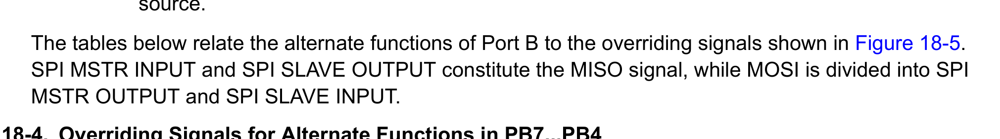
*Description*: Technical diagram and schematic illustration detailing hardware circuit topology, signal routing, and logic operations for Figure 18-5.

> **Figure 18-5**

SPI MSTR INPUT and SPI SLAVE OUTPUT constitute the MISO signal, while MOSI is divided into SPI
MSTR OUTPUT and SPI SLAVE INPUT.

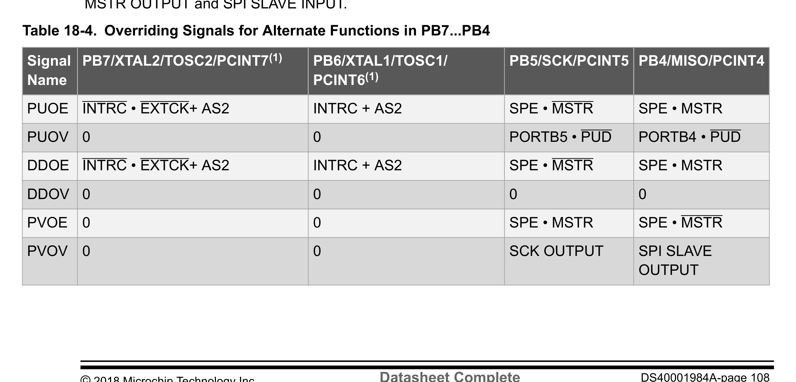
*Description*: Hardware reference table detailing register bit field settings, electrical operating limits, or memory configurations for Table 18-4: Overriding Signals for Alternate Functions in PB7...PB4.

> **Table 18-4: Overriding Signals for Alternate Functions in PB7...PB4**

Signal
Name
PB7/XTAL2/TOSC2/PCINT7(1)
PB6/XTAL1/TOSC1/
PCINT6(1)
PB5/SCK/PCINT5 PB4/MISO/PCINT4
PUOE
INTRC • EXTCK+ AS2
INTRC + AS2
SPE • MSTR
SPE • MSTR
PUOV
0
0
PORTB5 • PUD
PORTB4 • PUD
DDOE
INTRC • EXTCK+ AS2
INTRC + AS2
SPE • MSTR
SPE • MSTR
DDOV
0
0
0
0
PVOE
0
0
SPE • MSTR
SPE • MSTR
PVOV
0
0
SCK OUTPUT
SPI SLAVE
OUTPUT
ATmega328/P
I/O-Ports
© 2018 Microchip Technology Inc.
Datasheet Complete
DS40001984A-page 108
Downloaded from Arrow.com.
Downloaded from Arrow.com.
Downloaded from Arrow.com.
Downloaded from Arrow.com.
Downloaded from Arrow.com.
Downloaded from Arrow.com.
Downloaded from Arrow.com.
Downloaded from Arrow.com.
Downloaded from Arrow.com.
Downloaded from Arrow.com.
Downloaded from Arrow.com.
Downloaded from Arrow.com.
Downloaded from Arrow.com.
Downloaded from Arrow.com.
Downloaded from Arrow.com.
Downloaded from Arrow.com.
Downloaded from Arrow.com.
Downloaded from Arrow.com.
Downloaded from Arrow.com.
Downloaded from Arrow.com.
Downloaded from Arrow.com.
Downloaded from Arrow.com.
Downloaded from Arrow.com.
Downloaded from Arrow.com.
Downloaded from Arrow.com.
Downloaded from Arrow.com.
Downloaded from Arrow.com.
Downloaded from Arrow.com.
Downloaded from Arrow.com.
Downloaded from Arrow.com.
Downloaded from Arrow.com.
Downloaded from Arrow.com.
Downloaded from Arrow.com.
Downloaded from Arrow.com.
Downloaded from Arrow.com.
Downloaded from Arrow.com.
Downloaded from Arrow.com.
Downloaded from Arrow.com.
Downloaded from Arrow.com.
Downloaded from Arrow.com.
Downloaded from Arrow.com.
Downloaded from Arrow.com.
Downloaded from Arrow.com.
Downloaded from Arrow.com.
Downloaded from Arrow.com.
Downloaded from Arrow.com.
Downloaded from Arrow.com.
Downloaded from Arrow.com.
Downloaded from Arrow.com.
Downloaded from Arrow.com.
Downloaded from Arrow.com.
Downloaded from Arrow.com.
Downloaded from Arrow.com.
Downloaded from Arrow.com.
Downloaded from Arrow.com.
Downloaded from Arrow.com.
Downloaded from Arrow.com.
Downloaded from Arrow.com.
Downloaded from Arrow.com.
Downloaded from Arrow.com.
Downloaded from Arrow.com.
Downloaded from Arrow.com.
Downloaded from Arrow.com.
Downloaded from Arrow.com.
Downloaded from Arrow.com.
Downloaded from Arrow.com.
Downloaded from Arrow.com.
Downloaded from Arrow.com.
Downloaded from Arrow.com.
Downloaded from Arrow.com.
Downloaded from Arrow.com.
Downloaded from Arrow.com.
Downloaded from Arrow.com.
Downloaded from Arrow.com.
Downloaded from Arrow.com.
Downloaded from Arrow.com.
Downloaded from Arrow.com.
Downloaded from Arrow.com.
Downloaded from Arrow.com.
Downloaded from Arrow.com.
Downloaded from Arrow.com.
Downloaded from Arrow.com.
Downloaded from Arrow.com.
Downloaded from Arrow.com.
Downloaded from Arrow.com.
Downloaded from Arrow.com.
Downloaded from Arrow.com.
Downloaded from Arrow.com.
Downloaded from Arrow.com.
Downloaded from Arrow.com.
Downloaded from Arrow.com.
Downloaded from Arrow.com.
Downloaded from Arrow.com.
Downloaded from Arrow.com.
Downloaded from Arrow.com.
Downloaded from Arrow.com.
Downloaded from Arrow.com.
Downloaded from Arrow.com.
Downloaded from Arrow.com.
Downloaded from Arrow.com.
Downloaded from Arrow.com.
Downloaded from Arrow.com.
Downloaded from Arrow.com.
Downloaded from Arrow.com.
Downloaded from Arrow.com.
Downloaded from Arrow.com.
Downloaded from Arrow.com.
Downloaded from Arrow.com.


<!-- Page 109 -->
### [PDF Page 109]

Signal
Name
PB7/XTAL2/TOSC2/PCINT7(1)
PB6/XTAL1/TOSC1/
PCINT6(1)
PB5/SCK/PCINT5 PB4/MISO/PCINT4
DIEOE INTRC • EXTCK + AS2 + PCINT7
• PCIE0
INTRC + AS2 + PCINT6 •
PCIE0
PCINT5 • PCIE0
PCINT4 • PCIE0
DIEOV (INTRC + EXTCK) • AS2
INTRC • AS2
1
1
DI
PCINT7 INPUT
PCINT6 INPUT
PCINT5 INPUT
SCK INPUT
PCINT4 INPUT
SPI MSTR INPUT
AIO
Oscillator Output
Oscillator/Clock Input
–
–
Notes: 1. INTRC means that one of the internal RC oscillators are selected (by the CKSEL fuses),
EXTCK means that external clock is selected (by the CKSEL fuses).

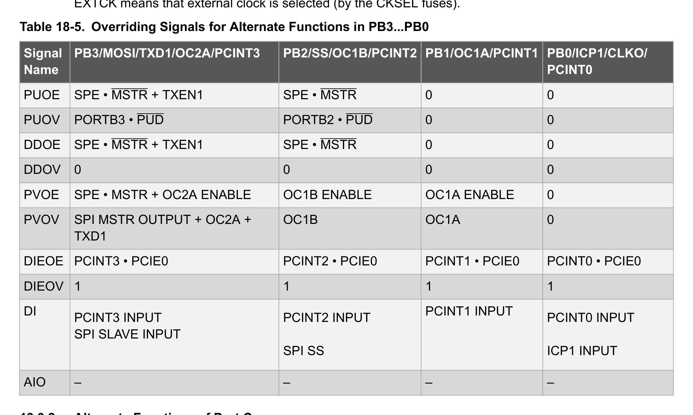
*Description*: Hardware reference table detailing register bit field settings, electrical operating limits, or memory configurations for Table 18-5: Overriding Signals for Alternate Functions in PB3...PB0.

> **Table 18-5: Overriding Signals for Alternate Functions in PB3...PB0**

Signal
Name
PB3/MOSI/TXD1/OC2A/PCINT3
PB2/SS/OC1B/PCINT2 PB1/OC1A/PCINT1 PB0/ICP1/CLKO/
PCINT0
PUOE
SPE • MSTR + TXEN1
SPE • MSTR
0
0
PUOV
PORTB3 • PUD
PORTB2 • PUD
0
0
DDOE
SPE • MSTR + TXEN1
SPE • MSTR
0
0
DDOV
0
0
0
0
PVOE
SPE • MSTR + OC2A ENABLE
OC1B ENABLE
OC1A ENABLE
0
PVOV
SPI MSTR OUTPUT + OC2A +
TXD1
OC1B
OC1A
0
DIEOE
PCINT3 • PCIE0
PCINT2 • PCIE0
PCINT1 • PCIE0
PCINT0 • PCIE0
DIEOV
1
1
1
1
DI
PCINT3 INPUT
SPI SLAVE INPUT
PCINT2 INPUT
SPI SS
PCINT1 INPUT
PCINT0 INPUT
ICP1 INPUT
AIO
–
–
–
–
18.3.2
Alternate Functions of Port C
The Port C pins with alternate functions are shown in the table below:
ATmega328/P
I/O-Ports
© 2018 Microchip Technology Inc.
Datasheet Complete
DS40001984A-page 109
Downloaded from Arrow.com.
Downloaded from Arrow.com.
Downloaded from Arrow.com.
Downloaded from Arrow.com.
Downloaded from Arrow.com.
Downloaded from Arrow.com.
Downloaded from Arrow.com.
Downloaded from Arrow.com.
Downloaded from Arrow.com.
Downloaded from Arrow.com.
Downloaded from Arrow.com.
Downloaded from Arrow.com.
Downloaded from Arrow.com.
Downloaded from Arrow.com.
Downloaded from Arrow.com.
Downloaded from Arrow.com.
Downloaded from Arrow.com.
Downloaded from Arrow.com.
Downloaded from Arrow.com.
Downloaded from Arrow.com.
Downloaded from Arrow.com.
Downloaded from Arrow.com.
Downloaded from Arrow.com.
Downloaded from Arrow.com.
Downloaded from Arrow.com.
Downloaded from Arrow.com.
Downloaded from Arrow.com.
Downloaded from Arrow.com.
Downloaded from Arrow.com.
Downloaded from Arrow.com.
Downloaded from Arrow.com.
Downloaded from Arrow.com.
Downloaded from Arrow.com.
Downloaded from Arrow.com.
Downloaded from Arrow.com.
Downloaded from Arrow.com.
Downloaded from Arrow.com.
Downloaded from Arrow.com.
Downloaded from Arrow.com.
Downloaded from Arrow.com.
Downloaded from Arrow.com.
Downloaded from Arrow.com.
Downloaded from Arrow.com.
Downloaded from Arrow.com.
Downloaded from Arrow.com.
Downloaded from Arrow.com.
Downloaded from Arrow.com.
Downloaded from Arrow.com.
Downloaded from Arrow.com.
Downloaded from Arrow.com.
Downloaded from Arrow.com.
Downloaded from Arrow.com.
Downloaded from Arrow.com.
Downloaded from Arrow.com.
Downloaded from Arrow.com.
Downloaded from Arrow.com.
Downloaded from Arrow.com.
Downloaded from Arrow.com.
Downloaded from Arrow.com.
Downloaded from Arrow.com.
Downloaded from Arrow.com.
Downloaded from Arrow.com.
Downloaded from Arrow.com.
Downloaded from Arrow.com.
Downloaded from Arrow.com.
Downloaded from Arrow.com.
Downloaded from Arrow.com.
Downloaded from Arrow.com.
Downloaded from Arrow.com.
Downloaded from Arrow.com.
Downloaded from Arrow.com.
Downloaded from Arrow.com.
Downloaded from Arrow.com.
Downloaded from Arrow.com.
Downloaded from Arrow.com.
Downloaded from Arrow.com.
Downloaded from Arrow.com.
Downloaded from Arrow.com.
Downloaded from Arrow.com.
Downloaded from Arrow.com.
Downloaded from Arrow.com.
Downloaded from Arrow.com.
Downloaded from Arrow.com.
Downloaded from Arrow.com.
Downloaded from Arrow.com.
Downloaded from Arrow.com.
Downloaded from Arrow.com.
Downloaded from Arrow.com.
Downloaded from Arrow.com.
Downloaded from Arrow.com.
Downloaded from Arrow.com.
Downloaded from Arrow.com.
Downloaded from Arrow.com.
Downloaded from Arrow.com.
Downloaded from Arrow.com.
Downloaded from Arrow.com.
Downloaded from Arrow.com.
Downloaded from Arrow.com.
Downloaded from Arrow.com.
Downloaded from Arrow.com.
Downloaded from Arrow.com.
Downloaded from Arrow.com.
Downloaded from Arrow.com.
Downloaded from Arrow.com.
Downloaded from Arrow.com.
Downloaded from Arrow.com.
Downloaded from Arrow.com.
Downloaded from Arrow.com.
Downloaded from Arrow.com.


<!-- Page 110 -->
### [PDF Page 110]


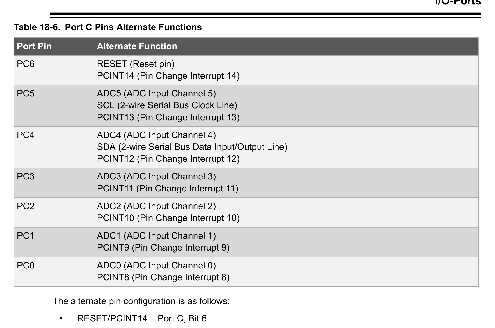
*Description*: IC pinout diagram specifying physical pin assignments, I/O port pin multiplexing, supply lines (VCC/GND), and crystal connections for Table 18-6: Port C Pins Alternate Functions.

> **Table 18-6: Port C Pins Alternate Functions**

Port Pin
Alternate Function
PC6
RESET (Reset pin)
PCINT14 (Pin Change Interrupt 14)
PC5
ADC5 (ADC Input Channel 5)
SCL (2-wire Serial Bus Clock Line)
PCINT13 (Pin Change Interrupt 13)
PC4
ADC4 (ADC Input Channel 4)
SDA (2-wire Serial Bus Data Input/Output Line)
PCINT12 (Pin Change Interrupt 12)
PC3
ADC3 (ADC Input Channel 3)
PCINT11 (Pin Change Interrupt 11)
PC2
ADC2 (ADC Input Channel 2)
PCINT10 (Pin Change Interrupt 10)
PC1
ADC1 (ADC Input Channel 1)
PCINT9 (Pin Change Interrupt 9)
PC0
ADC0 (ADC Input Channel 0)
PCINT8 (Pin Change Interrupt 8)
The alternate pin configuration is as follows:
•
RESET/PCINT14 – Port C, Bit 6
–
RESET: Reset pin. When the RSTDISBL Fuse is programmed, this pin functions as a normal
I/O pin, and the part will have to rely on Power-on Reset and Brown-out Reset as its reset
sources. When the RSTDISBL Fuse is unprogrammed, the reset circuitry is connected to the
pin, and the pin can not be used as an I/O pin.
–
PCINT14: Pin Change Interrupt source 14. The PC6 pin can serve as an external interrupt
source.
If PC6 is used as a reset pin, DDC6, PORTC6 and PINC6 will all read 0.
•
SCL/ADC5/PCINT13 – Port C, Bit 5
–
SCL: 2-wire Serial Interface Clock. When the TWEN bit in TWCR is set (one) to enable the 2-
wire Serial Interface, pin PC5 is disconnected from the port and becomes the Serial Clock I/O
pin for the 2-wire Serial Interface. In this mode, there is a spike filter on the pin to suppress
spikes shorter than 50 ns on the input signal, and the pin is driven by an open drain driver
with slew-rate limitation.
–
PCINT13: Pin Change Interrupt source 13. The PC5 pin can serve as an external interrupt
source.
–
PC5 can also be used as ADC input Channel 5. The ADC input channel 5 uses digital power.
•
SDA/ADC4/PCINT12 – Port C, Bit 4
–
SDA: 2-wire Serial Interface Data. When the TWEN bit in TWCR is set (one) to enable the 2-
wire Serial Interface, pin PC4 is disconnected from the port and becomes the Serial Data I/O
pin for the 2-wire Serial Interface. In this mode, there is a spike filter on the pin to suppress
spikes shorter than 50 ns on the input signal, and the pin is driven by an open drain driver
with slew-rate limitation.
ATmega328/P
I/O-Ports
© 2018 Microchip Technology Inc.
Datasheet Complete
DS40001984A-page 110
Downloaded from Arrow.com.
Downloaded from Arrow.com.
Downloaded from Arrow.com.
Downloaded from Arrow.com.
Downloaded from Arrow.com.
Downloaded from Arrow.com.
Downloaded from Arrow.com.
Downloaded from Arrow.com.
Downloaded from Arrow.com.
Downloaded from Arrow.com.
Downloaded from Arrow.com.
Downloaded from Arrow.com.
Downloaded from Arrow.com.
Downloaded from Arrow.com.
Downloaded from Arrow.com.
Downloaded from Arrow.com.
Downloaded from Arrow.com.
Downloaded from Arrow.com.
Downloaded from Arrow.com.
Downloaded from Arrow.com.
Downloaded from Arrow.com.
Downloaded from Arrow.com.
Downloaded from Arrow.com.
Downloaded from Arrow.com.
Downloaded from Arrow.com.
Downloaded from Arrow.com.
Downloaded from Arrow.com.
Downloaded from Arrow.com.
Downloaded from Arrow.com.
Downloaded from Arrow.com.
Downloaded from Arrow.com.
Downloaded from Arrow.com.
Downloaded from Arrow.com.
Downloaded from Arrow.com.
Downloaded from Arrow.com.
Downloaded from Arrow.com.
Downloaded from Arrow.com.
Downloaded from Arrow.com.
Downloaded from Arrow.com.
Downloaded from Arrow.com.
Downloaded from Arrow.com.
Downloaded from Arrow.com.
Downloaded from Arrow.com.
Downloaded from Arrow.com.
Downloaded from Arrow.com.
Downloaded from Arrow.com.
Downloaded from Arrow.com.
Downloaded from Arrow.com.
Downloaded from Arrow.com.
Downloaded from Arrow.com.
Downloaded from Arrow.com.
Downloaded from Arrow.com.
Downloaded from Arrow.com.
Downloaded from Arrow.com.
Downloaded from Arrow.com.
Downloaded from Arrow.com.
Downloaded from Arrow.com.
Downloaded from Arrow.com.
Downloaded from Arrow.com.
Downloaded from Arrow.com.
Downloaded from Arrow.com.
Downloaded from Arrow.com.
Downloaded from Arrow.com.
Downloaded from Arrow.com.
Downloaded from Arrow.com.
Downloaded from Arrow.com.
Downloaded from Arrow.com.
Downloaded from Arrow.com.
Downloaded from Arrow.com.
Downloaded from Arrow.com.
Downloaded from Arrow.com.
Downloaded from Arrow.com.
Downloaded from Arrow.com.
Downloaded from Arrow.com.
Downloaded from Arrow.com.
Downloaded from Arrow.com.
Downloaded from Arrow.com.
Downloaded from Arrow.com.
Downloaded from Arrow.com.
Downloaded from Arrow.com.
Downloaded from Arrow.com.
Downloaded from Arrow.com.
Downloaded from Arrow.com.
Downloaded from Arrow.com.
Downloaded from Arrow.com.
Downloaded from Arrow.com.
Downloaded from Arrow.com.
Downloaded from Arrow.com.
Downloaded from Arrow.com.
Downloaded from Arrow.com.
Downloaded from Arrow.com.
Downloaded from Arrow.com.
Downloaded from Arrow.com.
Downloaded from Arrow.com.
Downloaded from Arrow.com.
Downloaded from Arrow.com.
Downloaded from Arrow.com.
Downloaded from Arrow.com.
Downloaded from Arrow.com.
Downloaded from Arrow.com.
Downloaded from Arrow.com.
Downloaded from Arrow.com.
Downloaded from Arrow.com.
Downloaded from Arrow.com.
Downloaded from Arrow.com.
Downloaded from Arrow.com.
Downloaded from Arrow.com.
Downloaded from Arrow.com.
Downloaded from Arrow.com.
Downloaded from Arrow.com.


<!-- Page 111 -->
### [PDF Page 111]

–
PCINT12: Pin Change Interrupt source 12. The PC4 pin can serve as an external interrupt
source.
–
PC4 can also be used as ADC input Channel 4. The ADC input channel 4 uses digital power.
•
ADC3/PCINT11 – Port C, Bit 3
–
PC3 can also be used as ADC input Channel 3. The ADC input channel 3 uses analog power.
–
PCINT11: Pin Change Interrupt source 11. The PC3 pin can serve as an external interrupt
source.
•
ADC2/PCINT10 – Port C, Bit 2
–
PC2 can also be used as ADC input Channel 2. The ADC input channel 2 uses analog power.
–
PCINT10: Pin Change Interrupt source 10. The PC2 pin can serve as an external interrupt
source.
•
ADC1/PCINT9 – Port C, Bit 1
–
PC1 can also be used as ADC input Channel 1. The ADC input channel 1 uses analog power.
–
PCINT9: Pin Change Interrupt source 9. The PC1 pin can serve as an external interrupt
source.
•
ADC0//CINT8 – Port C, Bit 0
–
PC0 can also be used as ADC input Channel 0. The ADC input channel 0 uses analog power.
–
PCINT8: Pin Change Interrupt source 8. The PC0 pin can serve as an external interrupt
source.


*Description*: Technical diagram and schematic illustration detailing hardware circuit topology, signal routing, and logic operations for Figure 18-5.

> **Figure 18-5**


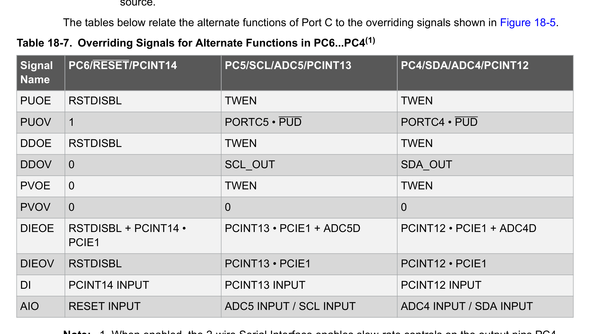
*Description*: Hardware reference table detailing register bit field settings, electrical operating limits, or memory configurations for Table 18-7: Overriding Signals for Alternate Functions in PC6...PC4(1).

> **Table 18-7: Overriding Signals for Alternate Functions in PC6...PC4(1)**

Signal
Name
PC6/RESET/PCINT14
PC5/SCL/ADC5/PCINT13
PC4/SDA/ADC4/PCINT12
PUOE
RSTDISBL
TWEN
TWEN
PUOV
1
PORTC5 • PUD
PORTC4 • PUD
DDOE
RSTDISBL
TWEN
TWEN
DDOV
0
SCL_OUT
SDA_OUT
PVOE
0
TWEN
TWEN
PVOV
0
0
0
DIEOE
RSTDISBL + PCINT14 •
PCIE1
PCINT13 • PCIE1 + ADC5D
PCINT12 • PCIE1 + ADC4D
DIEOV
RSTDISBL
PCINT13 • PCIE1
PCINT12 • PCIE1
DI
PCINT14 INPUT
PCINT13 INPUT
PCINT12 INPUT
AIO
RESET INPUT
ADC5 INPUT / SCL INPUT
ADC4 INPUT / SDA INPUT
Note:  1. When enabled, the 2-wire Serial Interface enables slew-rate controls on the output pins PC4
and PC5. This is not shown in the figure. In addition, spike filters are connected between the AIO outputs
shown in the port figure and the digital logic of the TWI module.
ATmega328/P
I/O-Ports
© 2018 Microchip Technology Inc.
Datasheet Complete
DS40001984A-page 111
Downloaded from Arrow.com.
Downloaded from Arrow.com.
Downloaded from Arrow.com.
Downloaded from Arrow.com.
Downloaded from Arrow.com.
Downloaded from Arrow.com.
Downloaded from Arrow.com.
Downloaded from Arrow.com.
Downloaded from Arrow.com.
Downloaded from Arrow.com.
Downloaded from Arrow.com.
Downloaded from Arrow.com.
Downloaded from Arrow.com.
Downloaded from Arrow.com.
Downloaded from Arrow.com.
Downloaded from Arrow.com.
Downloaded from Arrow.com.
Downloaded from Arrow.com.
Downloaded from Arrow.com.
Downloaded from Arrow.com.
Downloaded from Arrow.com.
Downloaded from Arrow.com.
Downloaded from Arrow.com.
Downloaded from Arrow.com.
Downloaded from Arrow.com.
Downloaded from Arrow.com.
Downloaded from Arrow.com.
Downloaded from Arrow.com.
Downloaded from Arrow.com.
Downloaded from Arrow.com.
Downloaded from Arrow.com.
Downloaded from Arrow.com.
Downloaded from Arrow.com.
Downloaded from Arrow.com.
Downloaded from Arrow.com.
Downloaded from Arrow.com.
Downloaded from Arrow.com.
Downloaded from Arrow.com.
Downloaded from Arrow.com.
Downloaded from Arrow.com.
Downloaded from Arrow.com.
Downloaded from Arrow.com.
Downloaded from Arrow.com.
Downloaded from Arrow.com.
Downloaded from Arrow.com.
Downloaded from Arrow.com.
Downloaded from Arrow.com.
Downloaded from Arrow.com.
Downloaded from Arrow.com.
Downloaded from Arrow.com.
Downloaded from Arrow.com.
Downloaded from Arrow.com.
Downloaded from Arrow.com.
Downloaded from Arrow.com.
Downloaded from Arrow.com.
Downloaded from Arrow.com.
Downloaded from Arrow.com.
Downloaded from Arrow.com.
Downloaded from Arrow.com.
Downloaded from Arrow.com.
Downloaded from Arrow.com.
Downloaded from Arrow.com.
Downloaded from Arrow.com.
Downloaded from Arrow.com.
Downloaded from Arrow.com.
Downloaded from Arrow.com.
Downloaded from Arrow.com.
Downloaded from Arrow.com.
Downloaded from Arrow.com.
Downloaded from Arrow.com.
Downloaded from Arrow.com.
Downloaded from Arrow.com.
Downloaded from Arrow.com.
Downloaded from Arrow.com.
Downloaded from Arrow.com.
Downloaded from Arrow.com.
Downloaded from Arrow.com.
Downloaded from Arrow.com.
Downloaded from Arrow.com.
Downloaded from Arrow.com.
Downloaded from Arrow.com.
Downloaded from Arrow.com.
Downloaded from Arrow.com.
Downloaded from Arrow.com.
Downloaded from Arrow.com.
Downloaded from Arrow.com.
Downloaded from Arrow.com.
Downloaded from Arrow.com.
Downloaded from Arrow.com.
Downloaded from Arrow.com.
Downloaded from Arrow.com.
Downloaded from Arrow.com.
Downloaded from Arrow.com.
Downloaded from Arrow.com.
Downloaded from Arrow.com.
Downloaded from Arrow.com.
Downloaded from Arrow.com.
Downloaded from Arrow.com.
Downloaded from Arrow.com.
Downloaded from Arrow.com.
Downloaded from Arrow.com.
Downloaded from Arrow.com.
Downloaded from Arrow.com.
Downloaded from Arrow.com.
Downloaded from Arrow.com.
Downloaded from Arrow.com.
Downloaded from Arrow.com.
Downloaded from Arrow.com.
Downloaded from Arrow.com.
Downloaded from Arrow.com.
Downloaded from Arrow.com.


<!-- Page 112 -->
### [PDF Page 112]


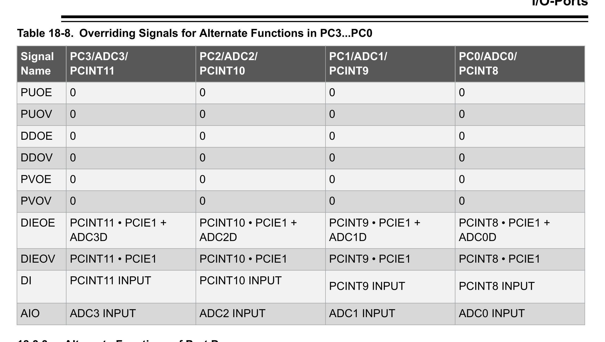
*Description*: Hardware reference table detailing register bit field settings, electrical operating limits, or memory configurations for Table 18-8: Overriding Signals for Alternate Functions in PC3...PC0.

> **Table 18-8: Overriding Signals for Alternate Functions in PC3...PC0**

Signal
Name
PC3/ADC3/
PCINT11
PC2/ADC2/
PCINT10
PC1/ADC1/
PCINT9
PC0/ADC0/
PCINT8
PUOE
0
0
0
0
PUOV
0
0
0
0
DDOE
0
0
0
0
DDOV
0
0
0
0
PVOE
0
0
0
0
PVOV
0
0
0
0
DIEOE
PCINT11 • PCIE1 +
ADC3D
PCINT10 • PCIE1 +
ADC2D
PCINT9 • PCIE1 +
ADC1D
PCINT8 • PCIE1 +
ADC0D
DIEOV
PCINT11 • PCIE1
PCINT10 • PCIE1
PCINT9 • PCIE1
PCINT8 • PCIE1
DI
PCINT11 INPUT
PCINT10 INPUT
PCINT9 INPUT
PCINT8 INPUT
AIO
ADC3 INPUT
ADC2 INPUT
ADC1 INPUT
ADC0 INPUT
18.3.3
Alternate Functions of Port D
The Port D pins with alternate functions are shown in the table below:

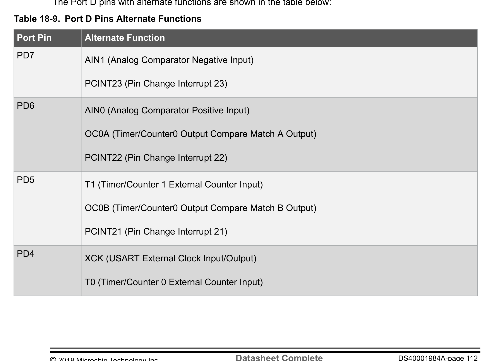
*Description*: IC pinout diagram specifying physical pin assignments, I/O port pin multiplexing, supply lines (VCC/GND), and crystal connections for Table 18-9: Port D Pins Alternate Functions.

> **Table 18-9: Port D Pins Alternate Functions**

Port Pin
Alternate Function
PD7
AIN1 (Analog Comparator Negative Input)
PCINT23 (Pin Change Interrupt 23)
PD6
AIN0 (Analog Comparator Positive Input)
OC0A (Timer/Counter0 Output Compare Match A Output)
PCINT22 (Pin Change Interrupt 22)
PD5
T1 (Timer/Counter 1 External Counter Input)
OC0B (Timer/Counter0 Output Compare Match B Output)
PCINT21 (Pin Change Interrupt 21)
PD4
XCK (USART External Clock Input/Output)
T0 (Timer/Counter 0 External Counter Input)
ATmega328/P
I/O-Ports
© 2018 Microchip Technology Inc.
Datasheet Complete
DS40001984A-page 112
Downloaded from Arrow.com.
Downloaded from Arrow.com.
Downloaded from Arrow.com.
Downloaded from Arrow.com.
Downloaded from Arrow.com.
Downloaded from Arrow.com.
Downloaded from Arrow.com.
Downloaded from Arrow.com.
Downloaded from Arrow.com.
Downloaded from Arrow.com.
Downloaded from Arrow.com.
Downloaded from Arrow.com.
Downloaded from Arrow.com.
Downloaded from Arrow.com.
Downloaded from Arrow.com.
Downloaded from Arrow.com.
Downloaded from Arrow.com.
Downloaded from Arrow.com.
Downloaded from Arrow.com.
Downloaded from Arrow.com.
Downloaded from Arrow.com.
Downloaded from Arrow.com.
Downloaded from Arrow.com.
Downloaded from Arrow.com.
Downloaded from Arrow.com.
Downloaded from Arrow.com.
Downloaded from Arrow.com.
Downloaded from Arrow.com.
Downloaded from Arrow.com.
Downloaded from Arrow.com.
Downloaded from Arrow.com.
Downloaded from Arrow.com.
Downloaded from Arrow.com.
Downloaded from Arrow.com.
Downloaded from Arrow.com.
Downloaded from Arrow.com.
Downloaded from Arrow.com.
Downloaded from Arrow.com.
Downloaded from Arrow.com.
Downloaded from Arrow.com.
Downloaded from Arrow.com.
Downloaded from Arrow.com.
Downloaded from Arrow.com.
Downloaded from Arrow.com.
Downloaded from Arrow.com.
Downloaded from Arrow.com.
Downloaded from Arrow.com.
Downloaded from Arrow.com.
Downloaded from Arrow.com.
Downloaded from Arrow.com.
Downloaded from Arrow.com.
Downloaded from Arrow.com.
Downloaded from Arrow.com.
Downloaded from Arrow.com.
Downloaded from Arrow.com.
Downloaded from Arrow.com.
Downloaded from Arrow.com.
Downloaded from Arrow.com.
Downloaded from Arrow.com.
Downloaded from Arrow.com.
Downloaded from Arrow.com.
Downloaded from Arrow.com.
Downloaded from Arrow.com.
Downloaded from Arrow.com.
Downloaded from Arrow.com.
Downloaded from Arrow.com.
Downloaded from Arrow.com.
Downloaded from Arrow.com.
Downloaded from Arrow.com.
Downloaded from Arrow.com.
Downloaded from Arrow.com.
Downloaded from Arrow.com.
Downloaded from Arrow.com.
Downloaded from Arrow.com.
Downloaded from Arrow.com.
Downloaded from Arrow.com.
Downloaded from Arrow.com.
Downloaded from Arrow.com.
Downloaded from Arrow.com.
Downloaded from Arrow.com.
Downloaded from Arrow.com.
Downloaded from Arrow.com.
Downloaded from Arrow.com.
Downloaded from Arrow.com.
Downloaded from Arrow.com.
Downloaded from Arrow.com.
Downloaded from Arrow.com.
Downloaded from Arrow.com.
Downloaded from Arrow.com.
Downloaded from Arrow.com.
Downloaded from Arrow.com.
Downloaded from Arrow.com.
Downloaded from Arrow.com.
Downloaded from Arrow.com.
Downloaded from Arrow.com.
Downloaded from Arrow.com.
Downloaded from Arrow.com.
Downloaded from Arrow.com.
Downloaded from Arrow.com.
Downloaded from Arrow.com.
Downloaded from Arrow.com.
Downloaded from Arrow.com.
Downloaded from Arrow.com.
Downloaded from Arrow.com.
Downloaded from Arrow.com.
Downloaded from Arrow.com.
Downloaded from Arrow.com.
Downloaded from Arrow.com.
Downloaded from Arrow.com.
Downloaded from Arrow.com.
Downloaded from Arrow.com.
Downloaded from Arrow.com.


<!-- Page 113 -->
### [PDF Page 113]

Port Pin
Alternate Function
PCINT20 (Pin Change Interrupt 20)
PD3
INT1 (External Interrupt 1 Input)
OC2B (Timer/Counter2 Output Compare Match B Output)
PCINT19 (Pin Change Interrupt 19)
PD2
INT0 (External Interrupt 0 Input)
PCINT18 (Pin Change Interrupt 18)
PD1
TXD (USART Output Pin)
PCINT17 (Pin Change Interrupt 17)
PD0
RXD (USART Input Pin)
PCINT16 (Pin Change Interrupt 16)
The alternate pin configuration is as follows:
•
AIN1/OC2B/PCINT23 – Port D, Bit 7
–
AIN1: Analog Comparator1 Negative Input. Configure the port pin as input with the internal
pull-up switched off to avoid the digital port function from interfering with the function of the
Analog Comparator.
–
PCINT23: Pin Change Interrupt source 23. The PD7 pin can serve as an external interrupt
source.
•
AIN0/OC0A/PCINT22 – Port D, Bit 6
–
AIN0: Analog Comparator0 Positive Input. Configure the port pin as input with the internal
pull-up switched off to avoid the digital port function from interfering with the function of the
Analog Comparator.
–
OC0A: Output Compare Match output. The PD6 pin can serve as an external output for the
Timer/Counter0 Compare Match A. The PD6 pin has to be configured as an output (DDD6 set
(one)) to serve this function. The OC0A pin is also the output pin for the PWM mode timer
function.
–
PCINT22: Pin Change Interrupt source 22. The PD6 pin can serve as an external interrupt
source.
•
T1/OC0B/PCINT21 – Port D, Bit 5
–
T1: Timer/Counter1 counter source.
–
OC0B: Output Compare Match output. The PD5 pin can serve as an external output for the
Timer/Counter0 Compare Match B. The PD5 pin has to be configured as an output (DDD5 set
ATmega328/P
I/O-Ports
© 2018 Microchip Technology Inc.
Datasheet Complete
DS40001984A-page 113
Downloaded from Arrow.com.
Downloaded from Arrow.com.
Downloaded from Arrow.com.
Downloaded from Arrow.com.
Downloaded from Arrow.com.
Downloaded from Arrow.com.
Downloaded from Arrow.com.
Downloaded from Arrow.com.
Downloaded from Arrow.com.
Downloaded from Arrow.com.
Downloaded from Arrow.com.
Downloaded from Arrow.com.
Downloaded from Arrow.com.
Downloaded from Arrow.com.
Downloaded from Arrow.com.
Downloaded from Arrow.com.
Downloaded from Arrow.com.
Downloaded from Arrow.com.
Downloaded from Arrow.com.
Downloaded from Arrow.com.
Downloaded from Arrow.com.
Downloaded from Arrow.com.
Downloaded from Arrow.com.
Downloaded from Arrow.com.
Downloaded from Arrow.com.
Downloaded from Arrow.com.
Downloaded from Arrow.com.
Downloaded from Arrow.com.
Downloaded from Arrow.com.
Downloaded from Arrow.com.
Downloaded from Arrow.com.
Downloaded from Arrow.com.
Downloaded from Arrow.com.
Downloaded from Arrow.com.
Downloaded from Arrow.com.
Downloaded from Arrow.com.
Downloaded from Arrow.com.
Downloaded from Arrow.com.
Downloaded from Arrow.com.
Downloaded from Arrow.com.
Downloaded from Arrow.com.
Downloaded from Arrow.com.
Downloaded from Arrow.com.
Downloaded from Arrow.com.
Downloaded from Arrow.com.
Downloaded from Arrow.com.
Downloaded from Arrow.com.
Downloaded from Arrow.com.
Downloaded from Arrow.com.
Downloaded from Arrow.com.
Downloaded from Arrow.com.
Downloaded from Arrow.com.
Downloaded from Arrow.com.
Downloaded from Arrow.com.
Downloaded from Arrow.com.
Downloaded from Arrow.com.
Downloaded from Arrow.com.
Downloaded from Arrow.com.
Downloaded from Arrow.com.
Downloaded from Arrow.com.
Downloaded from Arrow.com.
Downloaded from Arrow.com.
Downloaded from Arrow.com.
Downloaded from Arrow.com.
Downloaded from Arrow.com.
Downloaded from Arrow.com.
Downloaded from Arrow.com.
Downloaded from Arrow.com.
Downloaded from Arrow.com.
Downloaded from Arrow.com.
Downloaded from Arrow.com.
Downloaded from Arrow.com.
Downloaded from Arrow.com.
Downloaded from Arrow.com.
Downloaded from Arrow.com.
Downloaded from Arrow.com.
Downloaded from Arrow.com.
Downloaded from Arrow.com.
Downloaded from Arrow.com.
Downloaded from Arrow.com.
Downloaded from Arrow.com.
Downloaded from Arrow.com.
Downloaded from Arrow.com.
Downloaded from Arrow.com.
Downloaded from Arrow.com.
Downloaded from Arrow.com.
Downloaded from Arrow.com.
Downloaded from Arrow.com.
Downloaded from Arrow.com.
Downloaded from Arrow.com.
Downloaded from Arrow.com.
Downloaded from Arrow.com.
Downloaded from Arrow.com.
Downloaded from Arrow.com.
Downloaded from Arrow.com.
Downloaded from Arrow.com.
Downloaded from Arrow.com.
Downloaded from Arrow.com.
Downloaded from Arrow.com.
Downloaded from Arrow.com.
Downloaded from Arrow.com.
Downloaded from Arrow.com.
Downloaded from Arrow.com.
Downloaded from Arrow.com.
Downloaded from Arrow.com.
Downloaded from Arrow.com.
Downloaded from Arrow.com.
Downloaded from Arrow.com.
Downloaded from Arrow.com.
Downloaded from Arrow.com.
Downloaded from Arrow.com.
Downloaded from Arrow.com.
Downloaded from Arrow.com.


<!-- Page 114 -->
### [PDF Page 114]

(one)) to serve this function. The OC0B pin is also the output pin for the PWM mode timer
function.
–
PCINT21: Pin Change Interrupt source 21. The PD5 pin can serve as an external interrupt
source.
•
XCK/T0/PCINT20 – Port D, Bit 4
–
XCK: USART external clock.
–
T0: Timer/Counter0 counter source.
–
PCINT20: Pin Change Interrupt source 20. The PD4 pin can serve as an external interrupt
source.
•
INT1/OC2B/PCINT19 – Port D, Bit 3
–
INT1: External Interrupt source 1. The PD3 pin can serve as an external interrupt source.
–
OC2B: Output Compare Match output: The PD3 pin can serve as an external output for the
Timer/Counter2 Compare Match B. The PD3 pin has to be configured as an output (DDD3 set
(one)) to serve this function. The OC2B pin is also the output pin for the PWM mode timer
function.
–
PCINT19: Pin Change Interrupt source 19. The PD3 pin can serve as an external interrupt
source.
•
INT0/PCINT18 – Port D, Bit 2
–
INT0: External Interrupt source 0. The PD2 pin can serve as an external interrupt source.
–
PCINT18: Pin Change Interrupt source 18. The PD2 pin can serve as an external interrupt
source.
•
TXD/PCINT17 – Port D, Bit 1
–
TXD: Transmit Data (Data output pin for the USART). When the USART Transmitter is
enabled, this pin is configured as an output regardless of the value of DDD1.
–
PCINT17: Pin Change Interrupt source 17. The PD1 pin can serve as an external interrupt
source.
•
RXD/PCINT16 – Port D, Bit 0
–
RXD: Receive Data (Data input pin for the USART). When the USART Receiver is enabled
this pin is configured as an input regardless of the value of DDD0. When the USART forces
this pin to be an input, the pull-up can still be controlled by the PORTD0 bit.
–
PCINT16: Pin Change Interrupt source 16. The PD0 pin can serve as an external interrupt
source.


*Description*: Technical diagram and schematic illustration detailing hardware circuit topology, signal routing, and logic operations for Figure 18-5.

> **Figure 18-5**


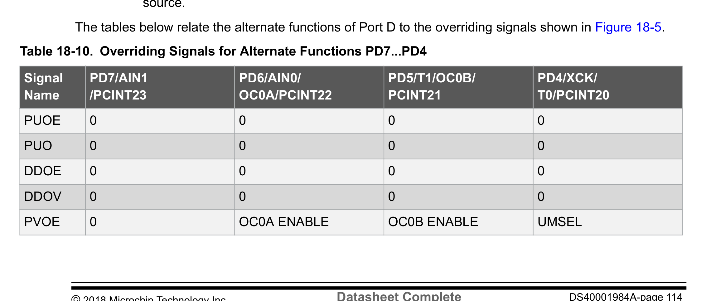
*Description*: Hardware reference table detailing register bit field settings, electrical operating limits, or memory configurations for Table 18-10: Overriding Signals for Alternate Functions PD7...PD4.

> **Table 18-10: Overriding Signals for Alternate Functions PD7...PD4**

Signal
Name
PD7/AIN1
/PCINT23
PD6/AIN0/
OC0A/PCINT22
PD5/T1/OC0B/
PCINT21
PD4/XCK/
T0/PCINT20
PUOE
0
0
0
0
PUO
0
0
0
0
DDOE
0
0
0
0
DDOV
0
0
0
0
PVOE
0
OC0A ENABLE
OC0B ENABLE
UMSEL
ATmega328/P
I/O-Ports
© 2018 Microchip Technology Inc.
Datasheet Complete
DS40001984A-page 114
Downloaded from Arrow.com.
Downloaded from Arrow.com.
Downloaded from Arrow.com.
Downloaded from Arrow.com.
Downloaded from Arrow.com.
Downloaded from Arrow.com.
Downloaded from Arrow.com.
Downloaded from Arrow.com.
Downloaded from Arrow.com.
Downloaded from Arrow.com.
Downloaded from Arrow.com.
Downloaded from Arrow.com.
Downloaded from Arrow.com.
Downloaded from Arrow.com.
Downloaded from Arrow.com.
Downloaded from Arrow.com.
Downloaded from Arrow.com.
Downloaded from Arrow.com.
Downloaded from Arrow.com.
Downloaded from Arrow.com.
Downloaded from Arrow.com.
Downloaded from Arrow.com.
Downloaded from Arrow.com.
Downloaded from Arrow.com.
Downloaded from Arrow.com.
Downloaded from Arrow.com.
Downloaded from Arrow.com.
Downloaded from Arrow.com.
Downloaded from Arrow.com.
Downloaded from Arrow.com.
Downloaded from Arrow.com.
Downloaded from Arrow.com.
Downloaded from Arrow.com.
Downloaded from Arrow.com.
Downloaded from Arrow.com.
Downloaded from Arrow.com.
Downloaded from Arrow.com.
Downloaded from Arrow.com.
Downloaded from Arrow.com.
Downloaded from Arrow.com.
Downloaded from Arrow.com.
Downloaded from Arrow.com.
Downloaded from Arrow.com.
Downloaded from Arrow.com.
Downloaded from Arrow.com.
Downloaded from Arrow.com.
Downloaded from Arrow.com.
Downloaded from Arrow.com.
Downloaded from Arrow.com.
Downloaded from Arrow.com.
Downloaded from Arrow.com.
Downloaded from Arrow.com.
Downloaded from Arrow.com.
Downloaded from Arrow.com.
Downloaded from Arrow.com.
Downloaded from Arrow.com.
Downloaded from Arrow.com.
Downloaded from Arrow.com.
Downloaded from Arrow.com.
Downloaded from Arrow.com.
Downloaded from Arrow.com.
Downloaded from Arrow.com.
Downloaded from Arrow.com.
Downloaded from Arrow.com.
Downloaded from Arrow.com.
Downloaded from Arrow.com.
Downloaded from Arrow.com.
Downloaded from Arrow.com.
Downloaded from Arrow.com.
Downloaded from Arrow.com.
Downloaded from Arrow.com.
Downloaded from Arrow.com.
Downloaded from Arrow.com.
Downloaded from Arrow.com.
Downloaded from Arrow.com.
Downloaded from Arrow.com.
Downloaded from Arrow.com.
Downloaded from Arrow.com.
Downloaded from Arrow.com.
Downloaded from Arrow.com.
Downloaded from Arrow.com.
Downloaded from Arrow.com.
Downloaded from Arrow.com.
Downloaded from Arrow.com.
Downloaded from Arrow.com.
Downloaded from Arrow.com.
Downloaded from Arrow.com.
Downloaded from Arrow.com.
Downloaded from Arrow.com.
Downloaded from Arrow.com.
Downloaded from Arrow.com.
Downloaded from Arrow.com.
Downloaded from Arrow.com.
Downloaded from Arrow.com.
Downloaded from Arrow.com.
Downloaded from Arrow.com.
Downloaded from Arrow.com.
Downloaded from Arrow.com.
Downloaded from Arrow.com.
Downloaded from Arrow.com.
Downloaded from Arrow.com.
Downloaded from Arrow.com.
Downloaded from Arrow.com.
Downloaded from Arrow.com.
Downloaded from Arrow.com.
Downloaded from Arrow.com.
Downloaded from Arrow.com.
Downloaded from Arrow.com.
Downloaded from Arrow.com.
Downloaded from Arrow.com.
Downloaded from Arrow.com.
Downloaded from Arrow.com.
Downloaded from Arrow.com.
Downloaded from Arrow.com.


<!-- Page 115 -->
### [PDF Page 115]

Signal
Name
PD7/AIN1
/PCINT23
PD6/AIN0/
OC0A/PCINT22
PD5/T1/OC0B/
PCINT21
PD4/XCK/
T0/PCINT20
PVOV
0
OC0A
OC0B
XCK OUTPUT
DIEOE
PCINT23 • PCIE2
PCINT22 • PCIE2
PCINT21 • PCIE2
PCINT20 • PCIE2
DIEOV
1
1
1
1
DI
PCINT23 INPUT
PCINT22 INPUT
PCINT21 INPUT
/ T1 INPUT
PCINT20 INPUT
/ XCK INPUT
/ T0 INPUT
AIO
AIN1 INPUT
AIN0 INPUT
–
–

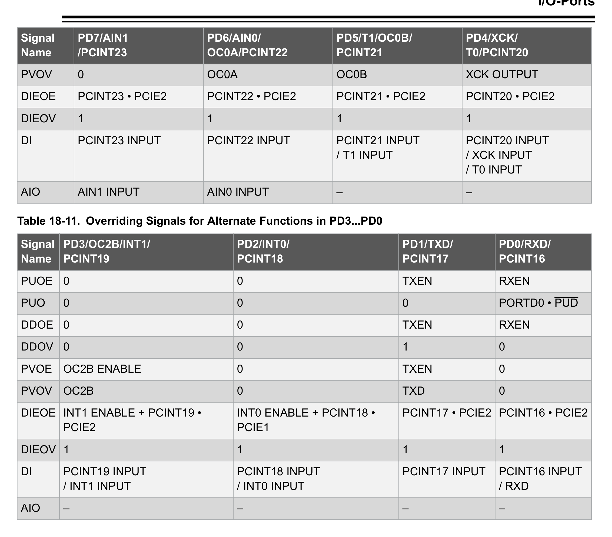
*Description*: Hardware reference table detailing register bit field settings, electrical operating limits, or memory configurations for Table 18-11: Overriding Signals for Alternate Functions in PD3...PD0.

> **Table 18-11: Overriding Signals for Alternate Functions in PD3...PD0**

Signal
Name
PD3/OC2B/INT1/
PCINT19
PD2/INT0/
PCINT18
PD1/TXD/
PCINT17
PD0/RXD/
PCINT16
PUOE
0
0
TXEN
RXEN
PUO
0
0
0
PORTD0 • PUD
DDOE
0
0
TXEN
RXEN
DDOV
0
0
1
0
PVOE
OC2B ENABLE
0
TXEN
0
PVOV
OC2B
0
TXD
0
DIEOE INT1 ENABLE + PCINT19 •
PCIE2
INT0 ENABLE + PCINT18 •
PCIE1
PCINT17 • PCIE2 PCINT16 • PCIE2
DIEOV 1
1
1
1
DI
PCINT19 INPUT
/ INT1 INPUT
PCINT18 INPUT
/ INT0 INPUT
PCINT17 INPUT
PCINT16 INPUT
/ RXD
AIO
–
–
–
–
18.4

### Register Description

ATmega328/P
I/O-Ports
© 2018 Microchip Technology Inc.
Datasheet Complete
DS40001984A-page 115
Downloaded from Arrow.com.
Downloaded from Arrow.com.
Downloaded from Arrow.com.
Downloaded from Arrow.com.
Downloaded from Arrow.com.
Downloaded from Arrow.com.
Downloaded from Arrow.com.
Downloaded from Arrow.com.
Downloaded from Arrow.com.
Downloaded from Arrow.com.
Downloaded from Arrow.com.
Downloaded from Arrow.com.
Downloaded from Arrow.com.
Downloaded from Arrow.com.
Downloaded from Arrow.com.
Downloaded from Arrow.com.
Downloaded from Arrow.com.
Downloaded from Arrow.com.
Downloaded from Arrow.com.
Downloaded from Arrow.com.
Downloaded from Arrow.com.
Downloaded from Arrow.com.
Downloaded from Arrow.com.
Downloaded from Arrow.com.
Downloaded from Arrow.com.
Downloaded from Arrow.com.
Downloaded from Arrow.com.
Downloaded from Arrow.com.
Downloaded from Arrow.com.
Downloaded from Arrow.com.
Downloaded from Arrow.com.
Downloaded from Arrow.com.
Downloaded from Arrow.com.
Downloaded from Arrow.com.
Downloaded from Arrow.com.
Downloaded from Arrow.com.
Downloaded from Arrow.com.
Downloaded from Arrow.com.
Downloaded from Arrow.com.
Downloaded from Arrow.com.
Downloaded from Arrow.com.
Downloaded from Arrow.com.
Downloaded from Arrow.com.
Downloaded from Arrow.com.
Downloaded from Arrow.com.
Downloaded from Arrow.com.
Downloaded from Arrow.com.
Downloaded from Arrow.com.
Downloaded from Arrow.com.
Downloaded from Arrow.com.
Downloaded from Arrow.com.
Downloaded from Arrow.com.
Downloaded from Arrow.com.
Downloaded from Arrow.com.
Downloaded from Arrow.com.
Downloaded from Arrow.com.
Downloaded from Arrow.com.
Downloaded from Arrow.com.
Downloaded from Arrow.com.
Downloaded from Arrow.com.
Downloaded from Arrow.com.
Downloaded from Arrow.com.
Downloaded from Arrow.com.
Downloaded from Arrow.com.
Downloaded from Arrow.com.
Downloaded from Arrow.com.
Downloaded from Arrow.com.
Downloaded from Arrow.com.
Downloaded from Arrow.com.
Downloaded from Arrow.com.
Downloaded from Arrow.com.
Downloaded from Arrow.com.
Downloaded from Arrow.com.
Downloaded from Arrow.com.
Downloaded from Arrow.com.
Downloaded from Arrow.com.
Downloaded from Arrow.com.
Downloaded from Arrow.com.
Downloaded from Arrow.com.
Downloaded from Arrow.com.
Downloaded from Arrow.com.
Downloaded from Arrow.com.
Downloaded from Arrow.com.
Downloaded from Arrow.com.
Downloaded from Arrow.com.
Downloaded from Arrow.com.
Downloaded from Arrow.com.
Downloaded from Arrow.com.
Downloaded from Arrow.com.
Downloaded from Arrow.com.
Downloaded from Arrow.com.
Downloaded from Arrow.com.
Downloaded from Arrow.com.
Downloaded from Arrow.com.
Downloaded from Arrow.com.
Downloaded from Arrow.com.
Downloaded from Arrow.com.
Downloaded from Arrow.com.
Downloaded from Arrow.com.
Downloaded from Arrow.com.
Downloaded from Arrow.com.
Downloaded from Arrow.com.
Downloaded from Arrow.com.
Downloaded from Arrow.com.
Downloaded from Arrow.com.
Downloaded from Arrow.com.
Downloaded from Arrow.com.
Downloaded from Arrow.com.
Downloaded from Arrow.com.
Downloaded from Arrow.com.
Downloaded from Arrow.com.
Downloaded from Arrow.com.
Downloaded from Arrow.com.
Downloaded from Arrow.com.
Downloaded from Arrow.com.


<!-- Page 116 -->
### [PDF Page 116]

18.4.1
MCU Control Register
Name:
MCUCR
Offset:
0x55
Reset:
0x00
Property:  When addressing as I/O register: address offset is 0x35
The MCU Control register controls the placement of the interrupt vector table in order to move interrupts
between application and boot space.
When addressing I/O registers as data space using LD and ST instructions, the provided offset must be
used. When using the I/O specific commands IN and OUT, the offset is reduced by 0x20, resulting in an
I/O address offset within 0x00 - 0x3F.
Bit
7
6
5
4
3
2
1
0
BODS
BODSE
PUD
IVSEL
IVCE
Access
R/W
R/W
R/W
R/W
R/W
Reset
0
0
0
0
0
Bit 6 – BODS BOD Sleep
The BODS bit must be written to '1' in order to turn off BOD during sleep. Writing to the BODS bit is
controlled by a timed sequence and the enable bit BODSE. To disable BOD in relevant sleep modes, both
BODS and BODSE must first be written to '1'. Then, BODS must be written to '1' and BODSE must be
written to zero within four clock cycles.
The BODS bit is active three clock cycles after it is set. A sleep instruction must be executed while BODS
is active in order to turn off the BOD for the actual sleep mode. The BODS bit is automatically cleared
after three clock cycles.
Note:  BOD disable is only available for ATmega328P.
Bit 5 – BODSE BOD Sleep Enable
BODSE enables setting of BODS control bit, as explained in BODS bit description. BOD disable is
controlled by a timed sequence.
Note:  BOD disable is only available for ATmega328P.
Bit 4 – PUD Pull-up Disable
When this bit is written to one, the pull ups in the I/O ports are disabled even if the DDxn and PORTxn
registers are configured to enable the pull ups ({DDxn, PORTxn} = 0b01).
Bit 1 – IVSEL Interrupt Vector Select
When the IVSEL bit is cleared (zero), the interrupt vectors are placed at the start of the Flash memory.
When this bit is set (one), the interrupt vectors are moved to the beginning of the boot loader section of
the Flash. The actual address of the start of the boot Flash section is determined by the BOOTSZ fuses.
To avoid unintentional changes of interrupt vector tables, a special write procedure must be followed to
change the IVSEL bit:
1.
Write the Interrupt Vector Change Enable (IVCE) bit to one.
2.
Within four cycles, write the desired value to IVSEL while writing a zero to IVCE.
Interrupts will automatically be disabled while this sequence is executed. Interrupts are disabled in the
same cycle as IVCE is written, and interrupts remain disabled until after the instruction following the write
ATmega328/P
I/O-Ports
© 2018 Microchip Technology Inc.
Datasheet Complete
DS40001984A-page 116
Downloaded from Arrow.com.
Downloaded from Arrow.com.
Downloaded from Arrow.com.
Downloaded from Arrow.com.
Downloaded from Arrow.com.
Downloaded from Arrow.com.
Downloaded from Arrow.com.
Downloaded from Arrow.com.
Downloaded from Arrow.com.
Downloaded from Arrow.com.
Downloaded from Arrow.com.
Downloaded from Arrow.com.
Downloaded from Arrow.com.
Downloaded from Arrow.com.
Downloaded from Arrow.com.
Downloaded from Arrow.com.
Downloaded from Arrow.com.
Downloaded from Arrow.com.
Downloaded from Arrow.com.
Downloaded from Arrow.com.
Downloaded from Arrow.com.
Downloaded from Arrow.com.
Downloaded from Arrow.com.
Downloaded from Arrow.com.
Downloaded from Arrow.com.
Downloaded from Arrow.com.
Downloaded from Arrow.com.
Downloaded from Arrow.com.
Downloaded from Arrow.com.
Downloaded from Arrow.com.
Downloaded from Arrow.com.
Downloaded from Arrow.com.
Downloaded from Arrow.com.
Downloaded from Arrow.com.
Downloaded from Arrow.com.
Downloaded from Arrow.com.
Downloaded from Arrow.com.
Downloaded from Arrow.com.
Downloaded from Arrow.com.
Downloaded from Arrow.com.
Downloaded from Arrow.com.
Downloaded from Arrow.com.
Downloaded from Arrow.com.
Downloaded from Arrow.com.
Downloaded from Arrow.com.
Downloaded from Arrow.com.
Downloaded from Arrow.com.
Downloaded from Arrow.com.
Downloaded from Arrow.com.
Downloaded from Arrow.com.
Downloaded from Arrow.com.
Downloaded from Arrow.com.
Downloaded from Arrow.com.
Downloaded from Arrow.com.
Downloaded from Arrow.com.
Downloaded from Arrow.com.
Downloaded from Arrow.com.
Downloaded from Arrow.com.
Downloaded from Arrow.com.
Downloaded from Arrow.com.
Downloaded from Arrow.com.
Downloaded from Arrow.com.
Downloaded from Arrow.com.
Downloaded from Arrow.com.
Downloaded from Arrow.com.
Downloaded from Arrow.com.
Downloaded from Arrow.com.
Downloaded from Arrow.com.
Downloaded from Arrow.com.
Downloaded from Arrow.com.
Downloaded from Arrow.com.
Downloaded from Arrow.com.
Downloaded from Arrow.com.
Downloaded from Arrow.com.
Downloaded from Arrow.com.
Downloaded from Arrow.com.
Downloaded from Arrow.com.
Downloaded from Arrow.com.
Downloaded from Arrow.com.
Downloaded from Arrow.com.
Downloaded from Arrow.com.
Downloaded from Arrow.com.
Downloaded from Arrow.com.
Downloaded from Arrow.com.
Downloaded from Arrow.com.
Downloaded from Arrow.com.
Downloaded from Arrow.com.
Downloaded from Arrow.com.
Downloaded from Arrow.com.
Downloaded from Arrow.com.
Downloaded from Arrow.com.
Downloaded from Arrow.com.
Downloaded from Arrow.com.
Downloaded from Arrow.com.
Downloaded from Arrow.com.
Downloaded from Arrow.com.
Downloaded from Arrow.com.
Downloaded from Arrow.com.
Downloaded from Arrow.com.
Downloaded from Arrow.com.
Downloaded from Arrow.com.
Downloaded from Arrow.com.
Downloaded from Arrow.com.
Downloaded from Arrow.com.
Downloaded from Arrow.com.
Downloaded from Arrow.com.
Downloaded from Arrow.com.
Downloaded from Arrow.com.
Downloaded from Arrow.com.
Downloaded from Arrow.com.
Downloaded from Arrow.com.
Downloaded from Arrow.com.
Downloaded from Arrow.com.
Downloaded from Arrow.com.
Downloaded from Arrow.com.
Downloaded from Arrow.com.


<!-- Page 117 -->
### [PDF Page 117]

to IVSEL. If IVSEL is not written, interrupts remain disabled for four cycles. The I-bit in the Status register
is unaffected by the automatic disabling.
Note:  If interrupt vectors are placed in the boot loader section and Boot Lock bit BLB02 is programmed,
interrupts are disabled while executing from the application section. If interrupt vectors are placed in the
application section and Boot Lock bit BLB12 is programmed, interrupts are disabled while executing from
the boot loader section.
Bit 0 – IVCE Interrupt Vector Change Enable
The IVCE bit must be written to logic one to enable change of the IVSEL bit. IVCE is cleared by hardware
four cycles after it is written or when IVSEL is written. Setting the IVCE bit will disable interrupts, as
explained in the IVSEL description above. See the code example below.
Assembly Code Example
Move_interrupts:
; Get MCUCR
in    r16, MCUCR
mov   r17, r16
; Enable change of Interrupt Vectors
ori   r16, (1<<IVCE)
out   MCUCR, r16
; Move interrupts to Boot Flash section
ori   r17, (1<<IVSEL)
out   MCUCR, r17
ret
C Code Example

```c
void Move_interrupts(void)
```

{
uchar temp;
/* GET MCUCR*/
temp = MCUCR;
/* Enable change of Interrupt Vectors */
MCUCR = temp|(1<<IVCE);
/* Move interrupts to Boot Flash section */
MCUCR = temp|(1<<IVSEL);
}
ATmega328/P
I/O-Ports
© 2018 Microchip Technology Inc.
Datasheet Complete
DS40001984A-page 117
Downloaded from Arrow.com.
Downloaded from Arrow.com.
Downloaded from Arrow.com.
Downloaded from Arrow.com.
Downloaded from Arrow.com.
Downloaded from Arrow.com.
Downloaded from Arrow.com.
Downloaded from Arrow.com.
Downloaded from Arrow.com.
Downloaded from Arrow.com.
Downloaded from Arrow.com.
Downloaded from Arrow.com.
Downloaded from Arrow.com.
Downloaded from Arrow.com.
Downloaded from Arrow.com.
Downloaded from Arrow.com.
Downloaded from Arrow.com.
Downloaded from Arrow.com.
Downloaded from Arrow.com.
Downloaded from Arrow.com.
Downloaded from Arrow.com.
Downloaded from Arrow.com.
Downloaded from Arrow.com.
Downloaded from Arrow.com.
Downloaded from Arrow.com.
Downloaded from Arrow.com.
Downloaded from Arrow.com.
Downloaded from Arrow.com.
Downloaded from Arrow.com.
Downloaded from Arrow.com.
Downloaded from Arrow.com.
Downloaded from Arrow.com.
Downloaded from Arrow.com.
Downloaded from Arrow.com.
Downloaded from Arrow.com.
Downloaded from Arrow.com.
Downloaded from Arrow.com.
Downloaded from Arrow.com.
Downloaded from Arrow.com.
Downloaded from Arrow.com.
Downloaded from Arrow.com.
Downloaded from Arrow.com.
Downloaded from Arrow.com.
Downloaded from Arrow.com.
Downloaded from Arrow.com.
Downloaded from Arrow.com.
Downloaded from Arrow.com.
Downloaded from Arrow.com.
Downloaded from Arrow.com.
Downloaded from Arrow.com.
Downloaded from Arrow.com.
Downloaded from Arrow.com.
Downloaded from Arrow.com.
Downloaded from Arrow.com.
Downloaded from Arrow.com.
Downloaded from Arrow.com.
Downloaded from Arrow.com.
Downloaded from Arrow.com.
Downloaded from Arrow.com.
Downloaded from Arrow.com.
Downloaded from Arrow.com.
Downloaded from Arrow.com.
Downloaded from Arrow.com.
Downloaded from Arrow.com.
Downloaded from Arrow.com.
Downloaded from Arrow.com.
Downloaded from Arrow.com.
Downloaded from Arrow.com.
Downloaded from Arrow.com.
Downloaded from Arrow.com.
Downloaded from Arrow.com.
Downloaded from Arrow.com.
Downloaded from Arrow.com.
Downloaded from Arrow.com.
Downloaded from Arrow.com.
Downloaded from Arrow.com.
Downloaded from Arrow.com.
Downloaded from Arrow.com.
Downloaded from Arrow.com.
Downloaded from Arrow.com.
Downloaded from Arrow.com.
Downloaded from Arrow.com.
Downloaded from Arrow.com.
Downloaded from Arrow.com.
Downloaded from Arrow.com.
Downloaded from Arrow.com.
Downloaded from Arrow.com.
Downloaded from Arrow.com.
Downloaded from Arrow.com.
Downloaded from Arrow.com.
Downloaded from Arrow.com.
Downloaded from Arrow.com.
Downloaded from Arrow.com.
Downloaded from Arrow.com.
Downloaded from Arrow.com.
Downloaded from Arrow.com.
Downloaded from Arrow.com.
Downloaded from Arrow.com.
Downloaded from Arrow.com.
Downloaded from Arrow.com.
Downloaded from Arrow.com.
Downloaded from Arrow.com.
Downloaded from Arrow.com.
Downloaded from Arrow.com.
Downloaded from Arrow.com.
Downloaded from Arrow.com.
Downloaded from Arrow.com.
Downloaded from Arrow.com.
Downloaded from Arrow.com.
Downloaded from Arrow.com.
Downloaded from Arrow.com.
Downloaded from Arrow.com.
Downloaded from Arrow.com.
Downloaded from Arrow.com.
Downloaded from Arrow.com.
Downloaded from Arrow.com.
Downloaded from Arrow.com.


<!-- Page 118 -->
### [PDF Page 118]

18.4.2
Port B Data Register
Name:

```c
PORTB
```

Offset:
0x25
Reset:
0x00
Property:  When addressing as I/O Register: address offset is 0x05
When addressing I/O registers as data space using LD and ST instructions, the provided offset must be
used. When using the I/O specific commands IN and OUT, the offset is reduced by 0x20, resulting in an
I/O address offset within 0x00 - 0x3F.
Bit
7
6
5
4
3
2
1
0
PORTB7
PORTB6
PORTB5
PORTB4
PORTB3
PORTB2
PORTB1
PORTB0
Access
R/W
R/W
R/W
R/W
R/W
R/W
R/W
R/W
Reset
0
0
0
0
0
0
0
0
Bits 0, 1, 2, 3, 4, 5, 6, 7 – PORTB Port B Data
ATmega328/P
I/O-Ports
© 2018 Microchip Technology Inc.
Datasheet Complete
DS40001984A-page 118
Downloaded from Arrow.com.
Downloaded from Arrow.com.
Downloaded from Arrow.com.
Downloaded from Arrow.com.
Downloaded from Arrow.com.
Downloaded from Arrow.com.
Downloaded from Arrow.com.
Downloaded from Arrow.com.
Downloaded from Arrow.com.
Downloaded from Arrow.com.
Downloaded from Arrow.com.
Downloaded from Arrow.com.
Downloaded from Arrow.com.
Downloaded from Arrow.com.
Downloaded from Arrow.com.
Downloaded from Arrow.com.
Downloaded from Arrow.com.
Downloaded from Arrow.com.
Downloaded from Arrow.com.
Downloaded from Arrow.com.
Downloaded from Arrow.com.
Downloaded from Arrow.com.
Downloaded from Arrow.com.
Downloaded from Arrow.com.
Downloaded from Arrow.com.
Downloaded from Arrow.com.
Downloaded from Arrow.com.
Downloaded from Arrow.com.
Downloaded from Arrow.com.
Downloaded from Arrow.com.
Downloaded from Arrow.com.
Downloaded from Arrow.com.
Downloaded from Arrow.com.
Downloaded from Arrow.com.
Downloaded from Arrow.com.
Downloaded from Arrow.com.
Downloaded from Arrow.com.
Downloaded from Arrow.com.
Downloaded from Arrow.com.
Downloaded from Arrow.com.
Downloaded from Arrow.com.
Downloaded from Arrow.com.
Downloaded from Arrow.com.
Downloaded from Arrow.com.
Downloaded from Arrow.com.
Downloaded from Arrow.com.
Downloaded from Arrow.com.
Downloaded from Arrow.com.
Downloaded from Arrow.com.
Downloaded from Arrow.com.
Downloaded from Arrow.com.
Downloaded from Arrow.com.
Downloaded from Arrow.com.
Downloaded from Arrow.com.
Downloaded from Arrow.com.
Downloaded from Arrow.com.
Downloaded from Arrow.com.
Downloaded from Arrow.com.
Downloaded from Arrow.com.
Downloaded from Arrow.com.
Downloaded from Arrow.com.
Downloaded from Arrow.com.
Downloaded from Arrow.com.
Downloaded from Arrow.com.
Downloaded from Arrow.com.
Downloaded from Arrow.com.
Downloaded from Arrow.com.
Downloaded from Arrow.com.
Downloaded from Arrow.com.
Downloaded from Arrow.com.
Downloaded from Arrow.com.
Downloaded from Arrow.com.
Downloaded from Arrow.com.
Downloaded from Arrow.com.
Downloaded from Arrow.com.
Downloaded from Arrow.com.
Downloaded from Arrow.com.
Downloaded from Arrow.com.
Downloaded from Arrow.com.
Downloaded from Arrow.com.
Downloaded from Arrow.com.
Downloaded from Arrow.com.
Downloaded from Arrow.com.
Downloaded from Arrow.com.
Downloaded from Arrow.com.
Downloaded from Arrow.com.
Downloaded from Arrow.com.
Downloaded from Arrow.com.
Downloaded from Arrow.com.
Downloaded from Arrow.com.
Downloaded from Arrow.com.
Downloaded from Arrow.com.
Downloaded from Arrow.com.
Downloaded from Arrow.com.
Downloaded from Arrow.com.
Downloaded from Arrow.com.
Downloaded from Arrow.com.
Downloaded from Arrow.com.
Downloaded from Arrow.com.
Downloaded from Arrow.com.
Downloaded from Arrow.com.
Downloaded from Arrow.com.
Downloaded from Arrow.com.
Downloaded from Arrow.com.
Downloaded from Arrow.com.
Downloaded from Arrow.com.
Downloaded from Arrow.com.
Downloaded from Arrow.com.
Downloaded from Arrow.com.
Downloaded from Arrow.com.
Downloaded from Arrow.com.
Downloaded from Arrow.com.
Downloaded from Arrow.com.
Downloaded from Arrow.com.
Downloaded from Arrow.com.
Downloaded from Arrow.com.
Downloaded from Arrow.com.
Downloaded from Arrow.com.


<!-- Page 119 -->
### [PDF Page 119]

18.4.3
Port B Data Direction Register
Name:

```c
DDRB
```

Offset:
0x24
Reset:
0x00
Property:  When addressing as I/O Register: address offset is 0x04
When addressing I/O registers as data space using LD and ST instructions, the provided offset must be
used. When using the I/O specific commands IN and OUT, the offset is reduced by 0x20, resulting in an
I/O address offset within 0x00 - 0x3F.
Bit
7
6
5
4
3
2
1
0
DDRB7
DDRB6
DDRB5
DDRB4
DDRB3
DDRB2
DDRB1
DDRB0
Access
R/W
R/W
R/W
R/W
R/W
R/W
R/W
R/W
Reset
0
0
0
0
0
0
0
0
Bits 0, 1, 2, 3, 4, 5, 6, 7 – DDRB Port B Data Direction
This bit field selects the data direction for the individual pins in the Port. When a Port is mapped as
virtual, accessing this bit field is identical to accessing the actual DIR register for the Port.
ATmega328/P
I/O-Ports
© 2018 Microchip Technology Inc.
Datasheet Complete
DS40001984A-page 119
Downloaded from Arrow.com.
Downloaded from Arrow.com.
Downloaded from Arrow.com.
Downloaded from Arrow.com.
Downloaded from Arrow.com.
Downloaded from Arrow.com.
Downloaded from Arrow.com.
Downloaded from Arrow.com.
Downloaded from Arrow.com.
Downloaded from Arrow.com.
Downloaded from Arrow.com.
Downloaded from Arrow.com.
Downloaded from Arrow.com.
Downloaded from Arrow.com.
Downloaded from Arrow.com.
Downloaded from Arrow.com.
Downloaded from Arrow.com.
Downloaded from Arrow.com.
Downloaded from Arrow.com.
Downloaded from Arrow.com.
Downloaded from Arrow.com.
Downloaded from Arrow.com.
Downloaded from Arrow.com.
Downloaded from Arrow.com.
Downloaded from Arrow.com.
Downloaded from Arrow.com.
Downloaded from Arrow.com.
Downloaded from Arrow.com.
Downloaded from Arrow.com.
Downloaded from Arrow.com.
Downloaded from Arrow.com.
Downloaded from Arrow.com.
Downloaded from Arrow.com.
Downloaded from Arrow.com.
Downloaded from Arrow.com.
Downloaded from Arrow.com.
Downloaded from Arrow.com.
Downloaded from Arrow.com.
Downloaded from Arrow.com.
Downloaded from Arrow.com.
Downloaded from Arrow.com.
Downloaded from Arrow.com.
Downloaded from Arrow.com.
Downloaded from Arrow.com.
Downloaded from Arrow.com.
Downloaded from Arrow.com.
Downloaded from Arrow.com.
Downloaded from Arrow.com.
Downloaded from Arrow.com.
Downloaded from Arrow.com.
Downloaded from Arrow.com.
Downloaded from Arrow.com.
Downloaded from Arrow.com.
Downloaded from Arrow.com.
Downloaded from Arrow.com.
Downloaded from Arrow.com.
Downloaded from Arrow.com.
Downloaded from Arrow.com.
Downloaded from Arrow.com.
Downloaded from Arrow.com.
Downloaded from Arrow.com.
Downloaded from Arrow.com.
Downloaded from Arrow.com.
Downloaded from Arrow.com.
Downloaded from Arrow.com.
Downloaded from Arrow.com.
Downloaded from Arrow.com.
Downloaded from Arrow.com.
Downloaded from Arrow.com.
Downloaded from Arrow.com.
Downloaded from Arrow.com.
Downloaded from Arrow.com.
Downloaded from Arrow.com.
Downloaded from Arrow.com.
Downloaded from Arrow.com.
Downloaded from Arrow.com.
Downloaded from Arrow.com.
Downloaded from Arrow.com.
Downloaded from Arrow.com.
Downloaded from Arrow.com.
Downloaded from Arrow.com.
Downloaded from Arrow.com.
Downloaded from Arrow.com.
Downloaded from Arrow.com.
Downloaded from Arrow.com.
Downloaded from Arrow.com.
Downloaded from Arrow.com.
Downloaded from Arrow.com.
Downloaded from Arrow.com.
Downloaded from Arrow.com.
Downloaded from Arrow.com.
Downloaded from Arrow.com.
Downloaded from Arrow.com.
Downloaded from Arrow.com.
Downloaded from Arrow.com.
Downloaded from Arrow.com.
Downloaded from Arrow.com.
Downloaded from Arrow.com.
Downloaded from Arrow.com.
Downloaded from Arrow.com.
Downloaded from Arrow.com.
Downloaded from Arrow.com.
Downloaded from Arrow.com.
Downloaded from Arrow.com.
Downloaded from Arrow.com.
Downloaded from Arrow.com.
Downloaded from Arrow.com.
Downloaded from Arrow.com.
Downloaded from Arrow.com.
Downloaded from Arrow.com.
Downloaded from Arrow.com.
Downloaded from Arrow.com.
Downloaded from Arrow.com.
Downloaded from Arrow.com.
Downloaded from Arrow.com.
Downloaded from Arrow.com.
Downloaded from Arrow.com.
Downloaded from Arrow.com.
Downloaded from Arrow.com.


<!-- Page 120 -->
### [PDF Page 120]

18.4.4
Port B Input Pins Address
Name:

```c
PINB
```

Offset:
0x23
Reset:
N/A
Property:  When addressing as I/O Register: address offset is 0x03
When addressing I/O registers as data space using LD and ST instructions, the provided offset must be
used. When using the I/O specific commands IN and OUT, the offset is reduced by 0x20, resulting in an
I/O address offset within 0x00 - 0x3F.
Bit
7
6
5
4
3
2
1
0
PINB7
PINB6
PINB5
PINB4
PINB3
PINB2
PINB1
PINB0
Access
R/W
R/W
R/W
R/W
R/W
R/W
R/W
R/W
Reset
x
x
x
x
x
x
x
x
Bits 0, 1, 2, 3, 4, 5, 6, 7 – PINB Port B Input Pins Address
Writing to the pin register provides toggle functionality for I/O. Refer to Toggling the Pin.
ATmega328/P
I/O-Ports
© 2018 Microchip Technology Inc.
Datasheet Complete
DS40001984A-page 120
Downloaded from Arrow.com.
Downloaded from Arrow.com.
Downloaded from Arrow.com.
Downloaded from Arrow.com.
Downloaded from Arrow.com.
Downloaded from Arrow.com.
Downloaded from Arrow.com.
Downloaded from Arrow.com.
Downloaded from Arrow.com.
Downloaded from Arrow.com.
Downloaded from Arrow.com.
Downloaded from Arrow.com.
Downloaded from Arrow.com.
Downloaded from Arrow.com.
Downloaded from Arrow.com.
Downloaded from Arrow.com.
Downloaded from Arrow.com.
Downloaded from Arrow.com.
Downloaded from Arrow.com.
Downloaded from Arrow.com.
Downloaded from Arrow.com.
Downloaded from Arrow.com.
Downloaded from Arrow.com.
Downloaded from Arrow.com.
Downloaded from Arrow.com.
Downloaded from Arrow.com.
Downloaded from Arrow.com.
Downloaded from Arrow.com.
Downloaded from Arrow.com.
Downloaded from Arrow.com.
Downloaded from Arrow.com.
Downloaded from Arrow.com.
Downloaded from Arrow.com.
Downloaded from Arrow.com.
Downloaded from Arrow.com.
Downloaded from Arrow.com.
Downloaded from Arrow.com.
Downloaded from Arrow.com.
Downloaded from Arrow.com.
Downloaded from Arrow.com.
Downloaded from Arrow.com.
Downloaded from Arrow.com.
Downloaded from Arrow.com.
Downloaded from Arrow.com.
Downloaded from Arrow.com.
Downloaded from Arrow.com.
Downloaded from Arrow.com.
Downloaded from Arrow.com.
Downloaded from Arrow.com.
Downloaded from Arrow.com.
Downloaded from Arrow.com.
Downloaded from Arrow.com.
Downloaded from Arrow.com.
Downloaded from Arrow.com.
Downloaded from Arrow.com.
Downloaded from Arrow.com.
Downloaded from Arrow.com.
Downloaded from Arrow.com.
Downloaded from Arrow.com.
Downloaded from Arrow.com.
Downloaded from Arrow.com.
Downloaded from Arrow.com.
Downloaded from Arrow.com.
Downloaded from Arrow.com.
Downloaded from Arrow.com.
Downloaded from Arrow.com.
Downloaded from Arrow.com.
Downloaded from Arrow.com.
Downloaded from Arrow.com.
Downloaded from Arrow.com.
Downloaded from Arrow.com.
Downloaded from Arrow.com.
Downloaded from Arrow.com.
Downloaded from Arrow.com.
Downloaded from Arrow.com.
Downloaded from Arrow.com.
Downloaded from Arrow.com.
Downloaded from Arrow.com.
Downloaded from Arrow.com.
Downloaded from Arrow.com.
Downloaded from Arrow.com.
Downloaded from Arrow.com.
Downloaded from Arrow.com.
Downloaded from Arrow.com.
Downloaded from Arrow.com.
Downloaded from Arrow.com.
Downloaded from Arrow.com.
Downloaded from Arrow.com.
Downloaded from Arrow.com.
Downloaded from Arrow.com.
Downloaded from Arrow.com.
Downloaded from Arrow.com.
Downloaded from Arrow.com.
Downloaded from Arrow.com.
Downloaded from Arrow.com.
Downloaded from Arrow.com.
Downloaded from Arrow.com.
Downloaded from Arrow.com.
Downloaded from Arrow.com.
Downloaded from Arrow.com.
Downloaded from Arrow.com.
Downloaded from Arrow.com.
Downloaded from Arrow.com.
Downloaded from Arrow.com.
Downloaded from Arrow.com.
Downloaded from Arrow.com.
Downloaded from Arrow.com.
Downloaded from Arrow.com.
Downloaded from Arrow.com.
Downloaded from Arrow.com.
Downloaded from Arrow.com.
Downloaded from Arrow.com.
Downloaded from Arrow.com.
Downloaded from Arrow.com.
Downloaded from Arrow.com.
Downloaded from Arrow.com.
Downloaded from Arrow.com.
Downloaded from Arrow.com.
Downloaded from Arrow.com.
Downloaded from Arrow.com.


<!-- Page 121 -->
### [PDF Page 121]

18.4.5
Port C Data Register
Name:

```c
PORTC
```

Offset:
0x28
Reset:
0x00
Property:  When addressing as I/O Register: address offset is 0x08
When addressing I/O registers as data space using LD and ST instructions, the provided offset must be
used. When using the I/O specific commands IN and OUT, the offset is reduced by 0x20, resulting in an
I/O address offset within 0x00 - 0x3F.
Bit
7
6
5
4
3
2
1
0
PORTC6
PORTC5
PORTC4
PORTC3
PORTC2
PORTC1
PORTC0
Access
R/W
R/W
R/W
R/W
R/W
R/W
R/W
Reset
0
0
0
0
0
0
0
Bits 0, 1, 2, 3, 4, 5, 6 – PORTC Port C Data
ATmega328/P
I/O-Ports
© 2018 Microchip Technology Inc.
Datasheet Complete
DS40001984A-page 121
Downloaded from Arrow.com.
Downloaded from Arrow.com.
Downloaded from Arrow.com.
Downloaded from Arrow.com.
Downloaded from Arrow.com.
Downloaded from Arrow.com.
Downloaded from Arrow.com.
Downloaded from Arrow.com.
Downloaded from Arrow.com.
Downloaded from Arrow.com.
Downloaded from Arrow.com.
Downloaded from Arrow.com.
Downloaded from Arrow.com.
Downloaded from Arrow.com.
Downloaded from Arrow.com.
Downloaded from Arrow.com.
Downloaded from Arrow.com.
Downloaded from Arrow.com.
Downloaded from Arrow.com.
Downloaded from Arrow.com.
Downloaded from Arrow.com.
Downloaded from Arrow.com.
Downloaded from Arrow.com.
Downloaded from Arrow.com.
Downloaded from Arrow.com.
Downloaded from Arrow.com.
Downloaded from Arrow.com.
Downloaded from Arrow.com.
Downloaded from Arrow.com.
Downloaded from Arrow.com.
Downloaded from Arrow.com.
Downloaded from Arrow.com.
Downloaded from Arrow.com.
Downloaded from Arrow.com.
Downloaded from Arrow.com.
Downloaded from Arrow.com.
Downloaded from Arrow.com.
Downloaded from Arrow.com.
Downloaded from Arrow.com.
Downloaded from Arrow.com.
Downloaded from Arrow.com.
Downloaded from Arrow.com.
Downloaded from Arrow.com.
Downloaded from Arrow.com.
Downloaded from Arrow.com.
Downloaded from Arrow.com.
Downloaded from Arrow.com.
Downloaded from Arrow.com.
Downloaded from Arrow.com.
Downloaded from Arrow.com.
Downloaded from Arrow.com.
Downloaded from Arrow.com.
Downloaded from Arrow.com.
Downloaded from Arrow.com.
Downloaded from Arrow.com.
Downloaded from Arrow.com.
Downloaded from Arrow.com.
Downloaded from Arrow.com.
Downloaded from Arrow.com.
Downloaded from Arrow.com.
Downloaded from Arrow.com.
Downloaded from Arrow.com.
Downloaded from Arrow.com.
Downloaded from Arrow.com.
Downloaded from Arrow.com.
Downloaded from Arrow.com.
Downloaded from Arrow.com.
Downloaded from Arrow.com.
Downloaded from Arrow.com.
Downloaded from Arrow.com.
Downloaded from Arrow.com.
Downloaded from Arrow.com.
Downloaded from Arrow.com.
Downloaded from Arrow.com.
Downloaded from Arrow.com.
Downloaded from Arrow.com.
Downloaded from Arrow.com.
Downloaded from Arrow.com.
Downloaded from Arrow.com.
Downloaded from Arrow.com.
Downloaded from Arrow.com.
Downloaded from Arrow.com.
Downloaded from Arrow.com.
Downloaded from Arrow.com.
Downloaded from Arrow.com.
Downloaded from Arrow.com.
Downloaded from Arrow.com.
Downloaded from Arrow.com.
Downloaded from Arrow.com.
Downloaded from Arrow.com.
Downloaded from Arrow.com.
Downloaded from Arrow.com.
Downloaded from Arrow.com.
Downloaded from Arrow.com.
Downloaded from Arrow.com.
Downloaded from Arrow.com.
Downloaded from Arrow.com.
Downloaded from Arrow.com.
Downloaded from Arrow.com.
Downloaded from Arrow.com.
Downloaded from Arrow.com.
Downloaded from Arrow.com.
Downloaded from Arrow.com.
Downloaded from Arrow.com.
Downloaded from Arrow.com.
Downloaded from Arrow.com.
Downloaded from Arrow.com.
Downloaded from Arrow.com.
Downloaded from Arrow.com.
Downloaded from Arrow.com.
Downloaded from Arrow.com.
Downloaded from Arrow.com.
Downloaded from Arrow.com.
Downloaded from Arrow.com.
Downloaded from Arrow.com.
Downloaded from Arrow.com.
Downloaded from Arrow.com.
Downloaded from Arrow.com.
Downloaded from Arrow.com.
Downloaded from Arrow.com.
Downloaded from Arrow.com.


<!-- Page 122 -->
### [PDF Page 122]

18.4.6
Port C Data Direction Register
Name:

```c
DDRC
```

Offset:
0x27
Reset:
0x00
Property:  When addressing as I/O Register: address offset is 0x07
When addressing I/O registers as data space using LD and ST instructions, the provided offset must be
used. When using the I/O specific commands IN and OUT, the offset is reduced by 0x20, resulting in an
I/O address offset within 0x00 - 0x3F.
Bit
7
6
5
4
3
2
1
0
DDRC6
DDRC5
DDRC4
DDRC3
DDRC2
DDRC1
DDRC0
Access
R/W
R/W
R/W
R/W
R/W
R/W
R/W
Reset
0
0
0
0
0
0
0
Bits 0, 1, 2, 3, 4, 5, 6 – DDRC Port C Data Direction
This bit field selects the data direction for the individual pins in the Port. When a Port is mapped as
virtual, accessing this bit field is identical to accessing the actual DIR register for the Port.
ATmega328/P
I/O-Ports
© 2018 Microchip Technology Inc.
Datasheet Complete
DS40001984A-page 122
Downloaded from Arrow.com.
Downloaded from Arrow.com.
Downloaded from Arrow.com.
Downloaded from Arrow.com.
Downloaded from Arrow.com.
Downloaded from Arrow.com.
Downloaded from Arrow.com.
Downloaded from Arrow.com.
Downloaded from Arrow.com.
Downloaded from Arrow.com.
Downloaded from Arrow.com.
Downloaded from Arrow.com.
Downloaded from Arrow.com.
Downloaded from Arrow.com.
Downloaded from Arrow.com.
Downloaded from Arrow.com.
Downloaded from Arrow.com.
Downloaded from Arrow.com.
Downloaded from Arrow.com.
Downloaded from Arrow.com.
Downloaded from Arrow.com.
Downloaded from Arrow.com.
Downloaded from Arrow.com.
Downloaded from Arrow.com.
Downloaded from Arrow.com.
Downloaded from Arrow.com.
Downloaded from Arrow.com.
Downloaded from Arrow.com.
Downloaded from Arrow.com.
Downloaded from Arrow.com.
Downloaded from Arrow.com.
Downloaded from Arrow.com.
Downloaded from Arrow.com.
Downloaded from Arrow.com.
Downloaded from Arrow.com.
Downloaded from Arrow.com.
Downloaded from Arrow.com.
Downloaded from Arrow.com.
Downloaded from Arrow.com.
Downloaded from Arrow.com.
Downloaded from Arrow.com.
Downloaded from Arrow.com.
Downloaded from Arrow.com.
Downloaded from Arrow.com.
Downloaded from Arrow.com.
Downloaded from Arrow.com.
Downloaded from Arrow.com.
Downloaded from Arrow.com.
Downloaded from Arrow.com.
Downloaded from Arrow.com.
Downloaded from Arrow.com.
Downloaded from Arrow.com.
Downloaded from Arrow.com.
Downloaded from Arrow.com.
Downloaded from Arrow.com.
Downloaded from Arrow.com.
Downloaded from Arrow.com.
Downloaded from Arrow.com.
Downloaded from Arrow.com.
Downloaded from Arrow.com.
Downloaded from Arrow.com.
Downloaded from Arrow.com.
Downloaded from Arrow.com.
Downloaded from Arrow.com.
Downloaded from Arrow.com.
Downloaded from Arrow.com.
Downloaded from Arrow.com.
Downloaded from Arrow.com.
Downloaded from Arrow.com.
Downloaded from Arrow.com.
Downloaded from Arrow.com.
Downloaded from Arrow.com.
Downloaded from Arrow.com.
Downloaded from Arrow.com.
Downloaded from Arrow.com.
Downloaded from Arrow.com.
Downloaded from Arrow.com.
Downloaded from Arrow.com.
Downloaded from Arrow.com.
Downloaded from Arrow.com.
Downloaded from Arrow.com.
Downloaded from Arrow.com.
Downloaded from Arrow.com.
Downloaded from Arrow.com.
Downloaded from Arrow.com.
Downloaded from Arrow.com.
Downloaded from Arrow.com.
Downloaded from Arrow.com.
Downloaded from Arrow.com.
Downloaded from Arrow.com.
Downloaded from Arrow.com.
Downloaded from Arrow.com.
Downloaded from Arrow.com.
Downloaded from Arrow.com.
Downloaded from Arrow.com.
Downloaded from Arrow.com.
Downloaded from Arrow.com.
Downloaded from Arrow.com.
Downloaded from Arrow.com.
Downloaded from Arrow.com.
Downloaded from Arrow.com.
Downloaded from Arrow.com.
Downloaded from Arrow.com.
Downloaded from Arrow.com.
Downloaded from Arrow.com.
Downloaded from Arrow.com.
Downloaded from Arrow.com.
Downloaded from Arrow.com.
Downloaded from Arrow.com.
Downloaded from Arrow.com.
Downloaded from Arrow.com.
Downloaded from Arrow.com.
Downloaded from Arrow.com.
Downloaded from Arrow.com.
Downloaded from Arrow.com.
Downloaded from Arrow.com.
Downloaded from Arrow.com.
Downloaded from Arrow.com.
Downloaded from Arrow.com.
Downloaded from Arrow.com.
Downloaded from Arrow.com.
Downloaded from Arrow.com.


<!-- Page 123 -->
### [PDF Page 123]

18.4.7
Port C Input Pins Address
Name:

```c
PINC
```

Offset:
0x26
Reset:
N/A
Property:  When addressing as I/O Register: address offset is 0x06
When addressing I/O registers as data space using LD and ST instructions, the provided offset must be
used. When using the I/O specific commands IN and OUT, the offset is reduced by 0x20, resulting in an
I/O address offset within 0x00 - 0x3F.
Bit
7
6
5
4
3
2
1
0
PINC6
PINC5
PINC4
PINC3
PINC2
PINC1
PINC0
Access
R/W
R/W
R/W
R/W
R/W
R/W
R/W
Reset
x
x
x
x
x
x
x
Bits 0, 1, 2, 3, 4, 5, 6 – PINC Port C Input Pins Address
Writing to the pin register provides toggle functionality for I/O. Refer to Toggling the Pin.
ATmega328/P
I/O-Ports
© 2018 Microchip Technology Inc.
Datasheet Complete
DS40001984A-page 123
Downloaded from Arrow.com.
Downloaded from Arrow.com.
Downloaded from Arrow.com.
Downloaded from Arrow.com.
Downloaded from Arrow.com.
Downloaded from Arrow.com.
Downloaded from Arrow.com.
Downloaded from Arrow.com.
Downloaded from Arrow.com.
Downloaded from Arrow.com.
Downloaded from Arrow.com.
Downloaded from Arrow.com.
Downloaded from Arrow.com.
Downloaded from Arrow.com.
Downloaded from Arrow.com.
Downloaded from Arrow.com.
Downloaded from Arrow.com.
Downloaded from Arrow.com.
Downloaded from Arrow.com.
Downloaded from Arrow.com.
Downloaded from Arrow.com.
Downloaded from Arrow.com.
Downloaded from Arrow.com.
Downloaded from Arrow.com.
Downloaded from Arrow.com.
Downloaded from Arrow.com.
Downloaded from Arrow.com.
Downloaded from Arrow.com.
Downloaded from Arrow.com.
Downloaded from Arrow.com.
Downloaded from Arrow.com.
Downloaded from Arrow.com.
Downloaded from Arrow.com.
Downloaded from Arrow.com.
Downloaded from Arrow.com.
Downloaded from Arrow.com.
Downloaded from Arrow.com.
Downloaded from Arrow.com.
Downloaded from Arrow.com.
Downloaded from Arrow.com.
Downloaded from Arrow.com.
Downloaded from Arrow.com.
Downloaded from Arrow.com.
Downloaded from Arrow.com.
Downloaded from Arrow.com.
Downloaded from Arrow.com.
Downloaded from Arrow.com.
Downloaded from Arrow.com.
Downloaded from Arrow.com.
Downloaded from Arrow.com.
Downloaded from Arrow.com.
Downloaded from Arrow.com.
Downloaded from Arrow.com.
Downloaded from Arrow.com.
Downloaded from Arrow.com.
Downloaded from Arrow.com.
Downloaded from Arrow.com.
Downloaded from Arrow.com.
Downloaded from Arrow.com.
Downloaded from Arrow.com.
Downloaded from Arrow.com.
Downloaded from Arrow.com.
Downloaded from Arrow.com.
Downloaded from Arrow.com.
Downloaded from Arrow.com.
Downloaded from Arrow.com.
Downloaded from Arrow.com.
Downloaded from Arrow.com.
Downloaded from Arrow.com.
Downloaded from Arrow.com.
Downloaded from Arrow.com.
Downloaded from Arrow.com.
Downloaded from Arrow.com.
Downloaded from Arrow.com.
Downloaded from Arrow.com.
Downloaded from Arrow.com.
Downloaded from Arrow.com.
Downloaded from Arrow.com.
Downloaded from Arrow.com.
Downloaded from Arrow.com.
Downloaded from Arrow.com.
Downloaded from Arrow.com.
Downloaded from Arrow.com.
Downloaded from Arrow.com.
Downloaded from Arrow.com.
Downloaded from Arrow.com.
Downloaded from Arrow.com.
Downloaded from Arrow.com.
Downloaded from Arrow.com.
Downloaded from Arrow.com.
Downloaded from Arrow.com.
Downloaded from Arrow.com.
Downloaded from Arrow.com.
Downloaded from Arrow.com.
Downloaded from Arrow.com.
Downloaded from Arrow.com.
Downloaded from Arrow.com.
Downloaded from Arrow.com.
Downloaded from Arrow.com.
Downloaded from Arrow.com.
Downloaded from Arrow.com.
Downloaded from Arrow.com.
Downloaded from Arrow.com.
Downloaded from Arrow.com.
Downloaded from Arrow.com.
Downloaded from Arrow.com.
Downloaded from Arrow.com.
Downloaded from Arrow.com.
Downloaded from Arrow.com.
Downloaded from Arrow.com.
Downloaded from Arrow.com.
Downloaded from Arrow.com.
Downloaded from Arrow.com.
Downloaded from Arrow.com.
Downloaded from Arrow.com.
Downloaded from Arrow.com.
Downloaded from Arrow.com.
Downloaded from Arrow.com.
Downloaded from Arrow.com.
Downloaded from Arrow.com.
Downloaded from Arrow.com.
Downloaded from Arrow.com.
Downloaded from Arrow.com.


<!-- Page 124 -->
### [PDF Page 124]

18.4.8
Port D Data Register
Name:

```c
PORTD
```

Offset:
0x2B
Reset:
0x00
Property:  When addressing as I/O Register: address offset is 0x0B
When addressing I/O registers as data space using LD and ST instructions, the provided offset must be
used. When using the I/O specific commands IN and OUT, the offset is reduced by 0x20, resulting in an
I/O address offset within 0x00 - 0x3F.
Bit
7
6
5
4
3
2
1
0
PORTD7
PORTD6
PORTD5
PORTD4
PORTD3
PORTD2
PORTD1
PORTD0
Access
R/W
R/W
R/W
R/W
R/W
R/W
R/W
R/W
Reset
0
0
0
0
0
0
0
0
Bits 0, 1, 2, 3, 4, 5, 6, 7 – PORTD Port D Data
ATmega328/P
I/O-Ports
© 2018 Microchip Technology Inc.
Datasheet Complete
DS40001984A-page 124
Downloaded from Arrow.com.
Downloaded from Arrow.com.
Downloaded from Arrow.com.
Downloaded from Arrow.com.
Downloaded from Arrow.com.
Downloaded from Arrow.com.
Downloaded from Arrow.com.
Downloaded from Arrow.com.
Downloaded from Arrow.com.
Downloaded from Arrow.com.
Downloaded from Arrow.com.
Downloaded from Arrow.com.
Downloaded from Arrow.com.
Downloaded from Arrow.com.
Downloaded from Arrow.com.
Downloaded from Arrow.com.
Downloaded from Arrow.com.
Downloaded from Arrow.com.
Downloaded from Arrow.com.
Downloaded from Arrow.com.
Downloaded from Arrow.com.
Downloaded from Arrow.com.
Downloaded from Arrow.com.
Downloaded from Arrow.com.
Downloaded from Arrow.com.
Downloaded from Arrow.com.
Downloaded from Arrow.com.
Downloaded from Arrow.com.
Downloaded from Arrow.com.
Downloaded from Arrow.com.
Downloaded from Arrow.com.
Downloaded from Arrow.com.
Downloaded from Arrow.com.
Downloaded from Arrow.com.
Downloaded from Arrow.com.
Downloaded from Arrow.com.
Downloaded from Arrow.com.
Downloaded from Arrow.com.
Downloaded from Arrow.com.
Downloaded from Arrow.com.
Downloaded from Arrow.com.
Downloaded from Arrow.com.
Downloaded from Arrow.com.
Downloaded from Arrow.com.
Downloaded from Arrow.com.
Downloaded from Arrow.com.
Downloaded from Arrow.com.
Downloaded from Arrow.com.
Downloaded from Arrow.com.
Downloaded from Arrow.com.
Downloaded from Arrow.com.
Downloaded from Arrow.com.
Downloaded from Arrow.com.
Downloaded from Arrow.com.
Downloaded from Arrow.com.
Downloaded from Arrow.com.
Downloaded from Arrow.com.
Downloaded from Arrow.com.
Downloaded from Arrow.com.
Downloaded from Arrow.com.
Downloaded from Arrow.com.
Downloaded from Arrow.com.
Downloaded from Arrow.com.
Downloaded from Arrow.com.
Downloaded from Arrow.com.
Downloaded from Arrow.com.
Downloaded from Arrow.com.
Downloaded from Arrow.com.
Downloaded from Arrow.com.
Downloaded from Arrow.com.
Downloaded from Arrow.com.
Downloaded from Arrow.com.
Downloaded from Arrow.com.
Downloaded from Arrow.com.
Downloaded from Arrow.com.
Downloaded from Arrow.com.
Downloaded from Arrow.com.
Downloaded from Arrow.com.
Downloaded from Arrow.com.
Downloaded from Arrow.com.
Downloaded from Arrow.com.
Downloaded from Arrow.com.
Downloaded from Arrow.com.
Downloaded from Arrow.com.
Downloaded from Arrow.com.
Downloaded from Arrow.com.
Downloaded from Arrow.com.
Downloaded from Arrow.com.
Downloaded from Arrow.com.
Downloaded from Arrow.com.
Downloaded from Arrow.com.
Downloaded from Arrow.com.
Downloaded from Arrow.com.
Downloaded from Arrow.com.
Downloaded from Arrow.com.
Downloaded from Arrow.com.
Downloaded from Arrow.com.
Downloaded from Arrow.com.
Downloaded from Arrow.com.
Downloaded from Arrow.com.
Downloaded from Arrow.com.
Downloaded from Arrow.com.
Downloaded from Arrow.com.
Downloaded from Arrow.com.
Downloaded from Arrow.com.
Downloaded from Arrow.com.
Downloaded from Arrow.com.
Downloaded from Arrow.com.
Downloaded from Arrow.com.
Downloaded from Arrow.com.
Downloaded from Arrow.com.
Downloaded from Arrow.com.
Downloaded from Arrow.com.
Downloaded from Arrow.com.
Downloaded from Arrow.com.
Downloaded from Arrow.com.
Downloaded from Arrow.com.
Downloaded from Arrow.com.
Downloaded from Arrow.com.
Downloaded from Arrow.com.
Downloaded from Arrow.com.
Downloaded from Arrow.com.
Downloaded from Arrow.com.
Downloaded from Arrow.com.


<!-- Page 125 -->
### [PDF Page 125]

18.4.9
Port D Data Direction Register
Name:

```c
DDRD
```

Offset:
0x2A
Reset:
0x00
Property:  When addressing as I/O Register: address offset is 0x0A
When addressing I/O registers as data space using LD and ST instructions, the provided offset must be
used. When using the I/O specific commands IN and OUT, the offset is reduced by 0x20, resulting in an
I/O address offset within 0x00 - 0x3F.
Bit
7
6
5
4
3
2
1
0
DDRD7
DDRD6
DDRD5
DDRD4
DDRD3
DDRD2
DDRD1
DDRD0
Access
R/W
R/W
R/W
R/W
R/W
R/W
R/W
R/W
Reset
0
0
0
0
0
0
0
0
Bits 0, 1, 2, 3, 4, 5, 6, 7 – DDRD Port D Data Direction
This bit field selects the data direction for the individual pins in the Port. When a Port is mapped as
virtual, accessing this bit field is identical to accessing the actual DIR register for the Port.
ATmega328/P
I/O-Ports
© 2018 Microchip Technology Inc.
Datasheet Complete
DS40001984A-page 125
Downloaded from Arrow.com.
Downloaded from Arrow.com.
Downloaded from Arrow.com.
Downloaded from Arrow.com.
Downloaded from Arrow.com.
Downloaded from Arrow.com.
Downloaded from Arrow.com.
Downloaded from Arrow.com.
Downloaded from Arrow.com.
Downloaded from Arrow.com.
Downloaded from Arrow.com.
Downloaded from Arrow.com.
Downloaded from Arrow.com.
Downloaded from Arrow.com.
Downloaded from Arrow.com.
Downloaded from Arrow.com.
Downloaded from Arrow.com.
Downloaded from Arrow.com.
Downloaded from Arrow.com.
Downloaded from Arrow.com.
Downloaded from Arrow.com.
Downloaded from Arrow.com.
Downloaded from Arrow.com.
Downloaded from Arrow.com.
Downloaded from Arrow.com.
Downloaded from Arrow.com.
Downloaded from Arrow.com.
Downloaded from Arrow.com.
Downloaded from Arrow.com.
Downloaded from Arrow.com.
Downloaded from Arrow.com.
Downloaded from Arrow.com.
Downloaded from Arrow.com.
Downloaded from Arrow.com.
Downloaded from Arrow.com.
Downloaded from Arrow.com.
Downloaded from Arrow.com.
Downloaded from Arrow.com.
Downloaded from Arrow.com.
Downloaded from Arrow.com.
Downloaded from Arrow.com.
Downloaded from Arrow.com.
Downloaded from Arrow.com.
Downloaded from Arrow.com.
Downloaded from Arrow.com.
Downloaded from Arrow.com.
Downloaded from Arrow.com.
Downloaded from Arrow.com.
Downloaded from Arrow.com.
Downloaded from Arrow.com.
Downloaded from Arrow.com.
Downloaded from Arrow.com.
Downloaded from Arrow.com.
Downloaded from Arrow.com.
Downloaded from Arrow.com.
Downloaded from Arrow.com.
Downloaded from Arrow.com.
Downloaded from Arrow.com.
Downloaded from Arrow.com.
Downloaded from Arrow.com.
Downloaded from Arrow.com.
Downloaded from Arrow.com.
Downloaded from Arrow.com.
Downloaded from Arrow.com.
Downloaded from Arrow.com.
Downloaded from Arrow.com.
Downloaded from Arrow.com.
Downloaded from Arrow.com.
Downloaded from Arrow.com.
Downloaded from Arrow.com.
Downloaded from Arrow.com.
Downloaded from Arrow.com.
Downloaded from Arrow.com.
Downloaded from Arrow.com.
Downloaded from Arrow.com.
Downloaded from Arrow.com.
Downloaded from Arrow.com.
Downloaded from Arrow.com.
Downloaded from Arrow.com.
Downloaded from Arrow.com.
Downloaded from Arrow.com.
Downloaded from Arrow.com.
Downloaded from Arrow.com.
Downloaded from Arrow.com.
Downloaded from Arrow.com.
Downloaded from Arrow.com.
Downloaded from Arrow.com.
Downloaded from Arrow.com.
Downloaded from Arrow.com.
Downloaded from Arrow.com.
Downloaded from Arrow.com.
Downloaded from Arrow.com.
Downloaded from Arrow.com.
Downloaded from Arrow.com.
Downloaded from Arrow.com.
Downloaded from Arrow.com.
Downloaded from Arrow.com.
Downloaded from Arrow.com.
Downloaded from Arrow.com.
Downloaded from Arrow.com.
Downloaded from Arrow.com.
Downloaded from Arrow.com.
Downloaded from Arrow.com.
Downloaded from Arrow.com.
Downloaded from Arrow.com.
Downloaded from Arrow.com.
Downloaded from Arrow.com.
Downloaded from Arrow.com.
Downloaded from Arrow.com.
Downloaded from Arrow.com.
Downloaded from Arrow.com.
Downloaded from Arrow.com.
Downloaded from Arrow.com.
Downloaded from Arrow.com.
Downloaded from Arrow.com.
Downloaded from Arrow.com.
Downloaded from Arrow.com.
Downloaded from Arrow.com.
Downloaded from Arrow.com.
Downloaded from Arrow.com.
Downloaded from Arrow.com.
Downloaded from Arrow.com.
Downloaded from Arrow.com.
Downloaded from Arrow.com.
Downloaded from Arrow.com.


<!-- Page 126 -->
### [PDF Page 126]

18.4.10 Port D Input Pins Address
Name:

```c
PIND
```

Offset:
0x29
Reset:
N/A
Property:  When addressing as I/O Register: address offset is 0x09
When addressing I/O registers as data space using LD and ST instructions, the provided offset must be
used. When using the I/O specific commands IN and OUT, the offset is reduced by 0x20, resulting in an
I/O address offset within 0x00 - 0x3F.
Bit
7
6
5
4
3
2
1
0
PIND7
PIND6
PIND5
PIND4
PIND3
PIND2
PIND1
PIND0
Access
R/W
R/W
R/W
R/W
R/W
R/W
R/W
R/W
Reset
x
x
x
x
x
x
x
x
Bits 0, 1, 2, 3, 4, 5, 6, 7 – PIND Port D Input Pins Address
Writing to the pin register provides toggle functionality for I/O. Refer to Toggling the Pin.
ATmega328/P
I/O-Ports
© 2018 Microchip Technology Inc.
Datasheet Complete
DS40001984A-page 126
Downloaded from Arrow.com.
Downloaded from Arrow.com.
Downloaded from Arrow.com.
Downloaded from Arrow.com.
Downloaded from Arrow.com.
Downloaded from Arrow.com.
Downloaded from Arrow.com.
Downloaded from Arrow.com.
Downloaded from Arrow.com.
Downloaded from Arrow.com.
Downloaded from Arrow.com.
Downloaded from Arrow.com.
Downloaded from Arrow.com.
Downloaded from Arrow.com.
Downloaded from Arrow.com.
Downloaded from Arrow.com.
Downloaded from Arrow.com.
Downloaded from Arrow.com.
Downloaded from Arrow.com.
Downloaded from Arrow.com.
Downloaded from Arrow.com.
Downloaded from Arrow.com.
Downloaded from Arrow.com.
Downloaded from Arrow.com.
Downloaded from Arrow.com.
Downloaded from Arrow.com.
Downloaded from Arrow.com.
Downloaded from Arrow.com.
Downloaded from Arrow.com.
Downloaded from Arrow.com.
Downloaded from Arrow.com.
Downloaded from Arrow.com.
Downloaded from Arrow.com.
Downloaded from Arrow.com.
Downloaded from Arrow.com.
Downloaded from Arrow.com.
Downloaded from Arrow.com.
Downloaded from Arrow.com.
Downloaded from Arrow.com.
Downloaded from Arrow.com.
Downloaded from Arrow.com.
Downloaded from Arrow.com.
Downloaded from Arrow.com.
Downloaded from Arrow.com.
Downloaded from Arrow.com.
Downloaded from Arrow.com.
Downloaded from Arrow.com.
Downloaded from Arrow.com.
Downloaded from Arrow.com.
Downloaded from Arrow.com.
Downloaded from Arrow.com.
Downloaded from Arrow.com.
Downloaded from Arrow.com.
Downloaded from Arrow.com.
Downloaded from Arrow.com.
Downloaded from Arrow.com.
Downloaded from Arrow.com.
Downloaded from Arrow.com.
Downloaded from Arrow.com.
Downloaded from Arrow.com.
Downloaded from Arrow.com.
Downloaded from Arrow.com.
Downloaded from Arrow.com.
Downloaded from Arrow.com.
Downloaded from Arrow.com.
Downloaded from Arrow.com.
Downloaded from Arrow.com.
Downloaded from Arrow.com.
Downloaded from Arrow.com.
Downloaded from Arrow.com.
Downloaded from Arrow.com.
Downloaded from Arrow.com.
Downloaded from Arrow.com.
Downloaded from Arrow.com.
Downloaded from Arrow.com.
Downloaded from Arrow.com.
Downloaded from Arrow.com.
Downloaded from Arrow.com.
Downloaded from Arrow.com.
Downloaded from Arrow.com.
Downloaded from Arrow.com.
Downloaded from Arrow.com.
Downloaded from Arrow.com.
Downloaded from Arrow.com.
Downloaded from Arrow.com.
Downloaded from Arrow.com.
Downloaded from Arrow.com.
Downloaded from Arrow.com.
Downloaded from Arrow.com.
Downloaded from Arrow.com.
Downloaded from Arrow.com.
Downloaded from Arrow.com.
Downloaded from Arrow.com.
Downloaded from Arrow.com.
Downloaded from Arrow.com.
Downloaded from Arrow.com.
Downloaded from Arrow.com.
Downloaded from Arrow.com.
Downloaded from Arrow.com.
Downloaded from Arrow.com.
Downloaded from Arrow.com.
Downloaded from Arrow.com.
Downloaded from Arrow.com.
Downloaded from Arrow.com.
Downloaded from Arrow.com.
Downloaded from Arrow.com.
Downloaded from Arrow.com.
Downloaded from Arrow.com.
Downloaded from Arrow.com.
Downloaded from Arrow.com.
Downloaded from Arrow.com.
Downloaded from Arrow.com.
Downloaded from Arrow.com.
Downloaded from Arrow.com.
Downloaded from Arrow.com.
Downloaded from Arrow.com.
Downloaded from Arrow.com.
Downloaded from Arrow.com.
Downloaded from Arrow.com.
Downloaded from Arrow.com.
Downloaded from Arrow.com.
Downloaded from Arrow.com.
Downloaded from Arrow.com.
Downloaded from Arrow.com.
Downloaded from Arrow.com.
Downloaded from Arrow.com.


