# Chapter 4: Timer/Counters 0, 1, 2 and Prescalers (Sec 19-22)

> **Datasheet**: Microchip ATmega328P 8-bit AVR Microcontroller Datasheet (2018)  
> **Publisher**: Microchip Technology Inc.  
> **PDF Page Range**: 127 - 217


---


<!-- Page 127 -->
### [PDF Page 127]

19.
8-bit Timer/Counter0 (TC0) with PWM
19.1

### Features

•
Two Independent Output Compare Units
•
Double Buffered Output Compare Registers
•
Clear Timer on Compare Match (Auto Reload)
•
Glitch Free, Phase Correct Pulse Width Modulator (PWM)
•
Variable PWM Period
•
Frequency Generator
•
Three Independent Interrupt Sources (TOV0, OCF0A, and OCF0B)
19.2

### Overview

Timer/Counter0 (TC0) is a general purpose 8-bit timer/counter module, with two independent output
compare units, and PWM support. It allows accurate program execution timing (event management) and
wave generation.
A simplified block diagram of the 8-bit timer/counter is shown below. CPU accessible I/O registers,
including I/O bits and I/O pins, are shown in bold. The device specific I/O register and bit locations are
listed in the register description. For the actual placement of I/O pins, refer to the pinout diagram.
The TC0 is enabled by writing the PRTIM0 bit in ”Minimizing Power Consumption” to '0'.
The TC0 is enabled when the PRTIM0 bit in the Power Reduction Register (PRR.PRTIM0) is written to
'1'.
ATmega328/P
8-bit Timer/Counter0 (TC0) with PWM
© 2018 Microchip Technology Inc.
Datasheet Complete
DS40001984A-page 127
Downloaded from Arrow.com.
Downloaded from Arrow.com.
Downloaded from Arrow.com.
Downloaded from Arrow.com.
Downloaded from Arrow.com.
Downloaded from Arrow.com.
Downloaded from Arrow.com.
Downloaded from Arrow.com.
Downloaded from Arrow.com.
Downloaded from Arrow.com.
Downloaded from Arrow.com.
Downloaded from Arrow.com.
Downloaded from Arrow.com.
Downloaded from Arrow.com.
Downloaded from Arrow.com.
Downloaded from Arrow.com.
Downloaded from Arrow.com.
Downloaded from Arrow.com.
Downloaded from Arrow.com.
Downloaded from Arrow.com.
Downloaded from Arrow.com.
Downloaded from Arrow.com.
Downloaded from Arrow.com.
Downloaded from Arrow.com.
Downloaded from Arrow.com.
Downloaded from Arrow.com.
Downloaded from Arrow.com.
Downloaded from Arrow.com.
Downloaded from Arrow.com.
Downloaded from Arrow.com.
Downloaded from Arrow.com.
Downloaded from Arrow.com.
Downloaded from Arrow.com.
Downloaded from Arrow.com.
Downloaded from Arrow.com.
Downloaded from Arrow.com.
Downloaded from Arrow.com.
Downloaded from Arrow.com.
Downloaded from Arrow.com.
Downloaded from Arrow.com.
Downloaded from Arrow.com.
Downloaded from Arrow.com.
Downloaded from Arrow.com.
Downloaded from Arrow.com.
Downloaded from Arrow.com.
Downloaded from Arrow.com.
Downloaded from Arrow.com.
Downloaded from Arrow.com.
Downloaded from Arrow.com.
Downloaded from Arrow.com.
Downloaded from Arrow.com.
Downloaded from Arrow.com.
Downloaded from Arrow.com.
Downloaded from Arrow.com.
Downloaded from Arrow.com.
Downloaded from Arrow.com.
Downloaded from Arrow.com.
Downloaded from Arrow.com.
Downloaded from Arrow.com.
Downloaded from Arrow.com.
Downloaded from Arrow.com.
Downloaded from Arrow.com.
Downloaded from Arrow.com.
Downloaded from Arrow.com.
Downloaded from Arrow.com.
Downloaded from Arrow.com.
Downloaded from Arrow.com.
Downloaded from Arrow.com.
Downloaded from Arrow.com.
Downloaded from Arrow.com.
Downloaded from Arrow.com.
Downloaded from Arrow.com.
Downloaded from Arrow.com.
Downloaded from Arrow.com.
Downloaded from Arrow.com.
Downloaded from Arrow.com.
Downloaded from Arrow.com.
Downloaded from Arrow.com.
Downloaded from Arrow.com.
Downloaded from Arrow.com.
Downloaded from Arrow.com.
Downloaded from Arrow.com.
Downloaded from Arrow.com.
Downloaded from Arrow.com.
Downloaded from Arrow.com.
Downloaded from Arrow.com.
Downloaded from Arrow.com.
Downloaded from Arrow.com.
Downloaded from Arrow.com.
Downloaded from Arrow.com.
Downloaded from Arrow.com.
Downloaded from Arrow.com.
Downloaded from Arrow.com.
Downloaded from Arrow.com.
Downloaded from Arrow.com.
Downloaded from Arrow.com.
Downloaded from Arrow.com.
Downloaded from Arrow.com.
Downloaded from Arrow.com.
Downloaded from Arrow.com.
Downloaded from Arrow.com.
Downloaded from Arrow.com.
Downloaded from Arrow.com.
Downloaded from Arrow.com.
Downloaded from Arrow.com.
Downloaded from Arrow.com.
Downloaded from Arrow.com.
Downloaded from Arrow.com.
Downloaded from Arrow.com.
Downloaded from Arrow.com.
Downloaded from Arrow.com.
Downloaded from Arrow.com.
Downloaded from Arrow.com.
Downloaded from Arrow.com.
Downloaded from Arrow.com.
Downloaded from Arrow.com.
Downloaded from Arrow.com.
Downloaded from Arrow.com.
Downloaded from Arrow.com.
Downloaded from Arrow.com.
Downloaded from Arrow.com.
Downloaded from Arrow.com.
Downloaded from Arrow.com.
Downloaded from Arrow.com.
Downloaded from Arrow.com.
Downloaded from Arrow.com.
Downloaded from Arrow.com.


<!-- Page 128 -->
### [PDF Page 128]


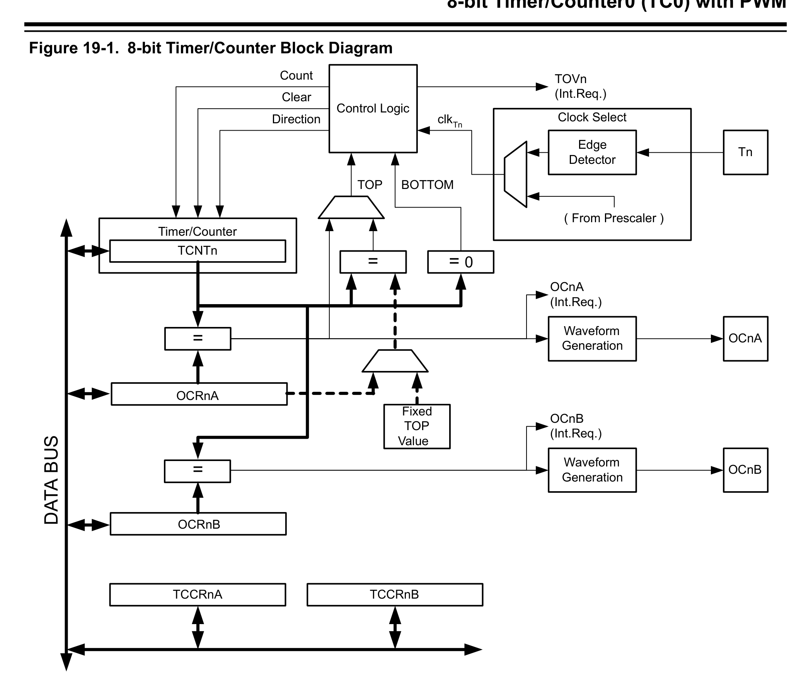
*Description*: System architecture block diagram depicting hardware modules, internal data buses, control logic, and peripheral interconnects for Figure 19-1: 8-bit Timer/Counter Block Diagram.

> **Figure 19-1: 8-bit Timer/Counter Block Diagram**

Clock Select
Timer/Counter
DATA BUS
OCRnA
OCRnB
=
=
TCNTn
Waveform
Generation
Waveform
Generation
OCnA
OCnB
=
Fixed
TOP
Value
Control Logic
= 0
TOP
BOTTOM
Count
Clear
Direction
TOVn
(Int.Req.)
OCnA
(Int.Req.)
OCnB
(Int.Req.)
TCCRnA
TCCRnB
Tn
Edge
Detector
( From Prescaler )
clkTn
19.2.1
Definitions
Many register and bit references in this section are written in general form:
•
n=0 represents the Timer/Counter number
•
x=A,B represents the Output Compare Unit A or B
However, when using the register or bit definitions in a program, the precise form must be used, i.e.,
TCNT0 for accessing timer/counter0 counter value.
The following definitions are used throughout the section:
ATmega328/P
8-bit Timer/Counter0 (TC0) with PWM
© 2018 Microchip Technology Inc.
Datasheet Complete
DS40001984A-page 128
Downloaded from Arrow.com.
Downloaded from Arrow.com.
Downloaded from Arrow.com.
Downloaded from Arrow.com.
Downloaded from Arrow.com.
Downloaded from Arrow.com.
Downloaded from Arrow.com.
Downloaded from Arrow.com.
Downloaded from Arrow.com.
Downloaded from Arrow.com.
Downloaded from Arrow.com.
Downloaded from Arrow.com.
Downloaded from Arrow.com.
Downloaded from Arrow.com.
Downloaded from Arrow.com.
Downloaded from Arrow.com.
Downloaded from Arrow.com.
Downloaded from Arrow.com.
Downloaded from Arrow.com.
Downloaded from Arrow.com.
Downloaded from Arrow.com.
Downloaded from Arrow.com.
Downloaded from Arrow.com.
Downloaded from Arrow.com.
Downloaded from Arrow.com.
Downloaded from Arrow.com.
Downloaded from Arrow.com.
Downloaded from Arrow.com.
Downloaded from Arrow.com.
Downloaded from Arrow.com.
Downloaded from Arrow.com.
Downloaded from Arrow.com.
Downloaded from Arrow.com.
Downloaded from Arrow.com.
Downloaded from Arrow.com.
Downloaded from Arrow.com.
Downloaded from Arrow.com.
Downloaded from Arrow.com.
Downloaded from Arrow.com.
Downloaded from Arrow.com.
Downloaded from Arrow.com.
Downloaded from Arrow.com.
Downloaded from Arrow.com.
Downloaded from Arrow.com.
Downloaded from Arrow.com.
Downloaded from Arrow.com.
Downloaded from Arrow.com.
Downloaded from Arrow.com.
Downloaded from Arrow.com.
Downloaded from Arrow.com.
Downloaded from Arrow.com.
Downloaded from Arrow.com.
Downloaded from Arrow.com.
Downloaded from Arrow.com.
Downloaded from Arrow.com.
Downloaded from Arrow.com.
Downloaded from Arrow.com.
Downloaded from Arrow.com.
Downloaded from Arrow.com.
Downloaded from Arrow.com.
Downloaded from Arrow.com.
Downloaded from Arrow.com.
Downloaded from Arrow.com.
Downloaded from Arrow.com.
Downloaded from Arrow.com.
Downloaded from Arrow.com.
Downloaded from Arrow.com.
Downloaded from Arrow.com.
Downloaded from Arrow.com.
Downloaded from Arrow.com.
Downloaded from Arrow.com.
Downloaded from Arrow.com.
Downloaded from Arrow.com.
Downloaded from Arrow.com.
Downloaded from Arrow.com.
Downloaded from Arrow.com.
Downloaded from Arrow.com.
Downloaded from Arrow.com.
Downloaded from Arrow.com.
Downloaded from Arrow.com.
Downloaded from Arrow.com.
Downloaded from Arrow.com.
Downloaded from Arrow.com.
Downloaded from Arrow.com.
Downloaded from Arrow.com.
Downloaded from Arrow.com.
Downloaded from Arrow.com.
Downloaded from Arrow.com.
Downloaded from Arrow.com.
Downloaded from Arrow.com.
Downloaded from Arrow.com.
Downloaded from Arrow.com.
Downloaded from Arrow.com.
Downloaded from Arrow.com.
Downloaded from Arrow.com.
Downloaded from Arrow.com.
Downloaded from Arrow.com.
Downloaded from Arrow.com.
Downloaded from Arrow.com.
Downloaded from Arrow.com.
Downloaded from Arrow.com.
Downloaded from Arrow.com.
Downloaded from Arrow.com.
Downloaded from Arrow.com.
Downloaded from Arrow.com.
Downloaded from Arrow.com.
Downloaded from Arrow.com.
Downloaded from Arrow.com.
Downloaded from Arrow.com.
Downloaded from Arrow.com.
Downloaded from Arrow.com.
Downloaded from Arrow.com.
Downloaded from Arrow.com.
Downloaded from Arrow.com.
Downloaded from Arrow.com.
Downloaded from Arrow.com.
Downloaded from Arrow.com.
Downloaded from Arrow.com.
Downloaded from Arrow.com.
Downloaded from Arrow.com.
Downloaded from Arrow.com.
Downloaded from Arrow.com.
Downloaded from Arrow.com.
Downloaded from Arrow.com.
Downloaded from Arrow.com.
Downloaded from Arrow.com.
Downloaded from Arrow.com.
Downloaded from Arrow.com.


<!-- Page 129 -->
### [PDF Page 129]


*Description*: Hardware reference table detailing register bit field settings, electrical operating limits, or memory configurations for Table 19-1: Definitions.

> **Table 19-1: Definitions**

Constant Description
BOTTOM The counter reaches the BOTTOM when it becomes zero (0x00 for 8-bit counters, or 0x0000
for 16-bit counters).
MAX
The counter reaches its Maximum when it becomes 0xFF (decimal 255, for 8-bit counters) or
0xFFFF (decimal 65535, for 16-bit counters).
TOP
The counter reaches the TOP when it becomes equal to the highest value in the count
sequence. The TOP value can be assigned to be the fixed value MAX or the value stored in
the OCR0A Register. The assignment is dependent on the mode of operation.
19.2.2
Registers
The Timer/Counter 0 register (TCNT0) and Output Compare TC0x registers (OCR0x) are 8-bit registers.
Interrupt request (abbreviated to Int.Req. in the block diagram) signals are all visible in the Timer Interrupt
Flag Register 0 (TIFR0). All interrupts are individually masked with the Timer Interrupt Mask Register 0
(TIMSK0). TIFR0 and TIMSK0 are not shown in the figure.
The timer/counter (TC) can be clocked internally, via the prescaler, or by an external clock source on the
T0 pin. The clock select logic block controls which clock source and edge are used by the timer/counter
to increment (or decrement) its value. The TC is inactive when no clock source is selected. The output
from the clock select logic is referred to as the timer clock (clkT0).
The double buffered Output Compare Registers (OCR0A and OCR0B) are compared with the timer/
counter value at all times. The result of the compare can be used by the waveform generator to generate
a PWM or variable frequency output on the Output Compare pins (OC0A and OC0B). See Output
Compare Unit for details. The compare match event will also set the Compare Flag (OCF0A or OCF0B),
which can be used to generate an output compare interrupt request.
Related Links
Timer/Counter 0, 1 Prescalers
19.3
Timer/Counter Clock Sources
The TC can be clocked by an internal or an external clock source. The clock source is selected by writing
to the Clock Select (CS0[2:0]) bits in the Timer/Counter Control Register (TCCR0B).
19.4
Counter Unit
The main part of the 8-bit timer/counter is the programmable bi-directional counter unit. Below is the block
diagram of the counter and its surroundings.
ATmega328/P
8-bit Timer/Counter0 (TC0) with PWM
© 2018 Microchip Technology Inc.
Datasheet Complete
DS40001984A-page 129
Downloaded from Arrow.com.
Downloaded from Arrow.com.
Downloaded from Arrow.com.
Downloaded from Arrow.com.
Downloaded from Arrow.com.
Downloaded from Arrow.com.
Downloaded from Arrow.com.
Downloaded from Arrow.com.
Downloaded from Arrow.com.
Downloaded from Arrow.com.
Downloaded from Arrow.com.
Downloaded from Arrow.com.
Downloaded from Arrow.com.
Downloaded from Arrow.com.
Downloaded from Arrow.com.
Downloaded from Arrow.com.
Downloaded from Arrow.com.
Downloaded from Arrow.com.
Downloaded from Arrow.com.
Downloaded from Arrow.com.
Downloaded from Arrow.com.
Downloaded from Arrow.com.
Downloaded from Arrow.com.
Downloaded from Arrow.com.
Downloaded from Arrow.com.
Downloaded from Arrow.com.
Downloaded from Arrow.com.
Downloaded from Arrow.com.
Downloaded from Arrow.com.
Downloaded from Arrow.com.
Downloaded from Arrow.com.
Downloaded from Arrow.com.
Downloaded from Arrow.com.
Downloaded from Arrow.com.
Downloaded from Arrow.com.
Downloaded from Arrow.com.
Downloaded from Arrow.com.
Downloaded from Arrow.com.
Downloaded from Arrow.com.
Downloaded from Arrow.com.
Downloaded from Arrow.com.
Downloaded from Arrow.com.
Downloaded from Arrow.com.
Downloaded from Arrow.com.
Downloaded from Arrow.com.
Downloaded from Arrow.com.
Downloaded from Arrow.com.
Downloaded from Arrow.com.
Downloaded from Arrow.com.
Downloaded from Arrow.com.
Downloaded from Arrow.com.
Downloaded from Arrow.com.
Downloaded from Arrow.com.
Downloaded from Arrow.com.
Downloaded from Arrow.com.
Downloaded from Arrow.com.
Downloaded from Arrow.com.
Downloaded from Arrow.com.
Downloaded from Arrow.com.
Downloaded from Arrow.com.
Downloaded from Arrow.com.
Downloaded from Arrow.com.
Downloaded from Arrow.com.
Downloaded from Arrow.com.
Downloaded from Arrow.com.
Downloaded from Arrow.com.
Downloaded from Arrow.com.
Downloaded from Arrow.com.
Downloaded from Arrow.com.
Downloaded from Arrow.com.
Downloaded from Arrow.com.
Downloaded from Arrow.com.
Downloaded from Arrow.com.
Downloaded from Arrow.com.
Downloaded from Arrow.com.
Downloaded from Arrow.com.
Downloaded from Arrow.com.
Downloaded from Arrow.com.
Downloaded from Arrow.com.
Downloaded from Arrow.com.
Downloaded from Arrow.com.
Downloaded from Arrow.com.
Downloaded from Arrow.com.
Downloaded from Arrow.com.
Downloaded from Arrow.com.
Downloaded from Arrow.com.
Downloaded from Arrow.com.
Downloaded from Arrow.com.
Downloaded from Arrow.com.
Downloaded from Arrow.com.
Downloaded from Arrow.com.
Downloaded from Arrow.com.
Downloaded from Arrow.com.
Downloaded from Arrow.com.
Downloaded from Arrow.com.
Downloaded from Arrow.com.
Downloaded from Arrow.com.
Downloaded from Arrow.com.
Downloaded from Arrow.com.
Downloaded from Arrow.com.
Downloaded from Arrow.com.
Downloaded from Arrow.com.
Downloaded from Arrow.com.
Downloaded from Arrow.com.
Downloaded from Arrow.com.
Downloaded from Arrow.com.
Downloaded from Arrow.com.
Downloaded from Arrow.com.
Downloaded from Arrow.com.
Downloaded from Arrow.com.
Downloaded from Arrow.com.
Downloaded from Arrow.com.
Downloaded from Arrow.com.
Downloaded from Arrow.com.
Downloaded from Arrow.com.
Downloaded from Arrow.com.
Downloaded from Arrow.com.
Downloaded from Arrow.com.
Downloaded from Arrow.com.
Downloaded from Arrow.com.
Downloaded from Arrow.com.
Downloaded from Arrow.com.
Downloaded from Arrow.com.
Downloaded from Arrow.com.
Downloaded from Arrow.com.
Downloaded from Arrow.com.
Downloaded from Arrow.com.
Downloaded from Arrow.com.
Downloaded from Arrow.com.


<!-- Page 130 -->
### [PDF Page 130]


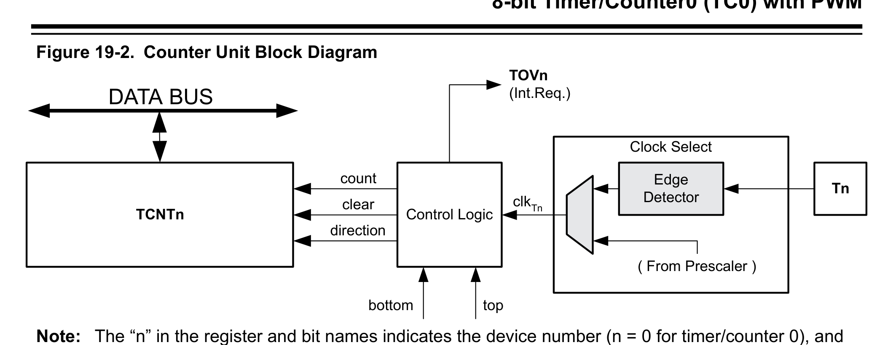
*Description*: System architecture block diagram depicting hardware modules, internal data buses, control logic, and peripheral interconnects for Figure 19-2: Counter Unit Block Diagram.

> **Figure 19-2: Counter Unit Block Diagram**

DATA BUS
TCNTn
Control Logic
count
TOVn
(Int.Req.)
Clock Select
top
Tn
Edge
Detector
( From Prescaler )
clkTn
bottom
direction
clear
Note:  The “n” in the register and bit names indicates the device number (n = 0 for timer/counter 0), and
the “x” indicates output compare unit (A/B).

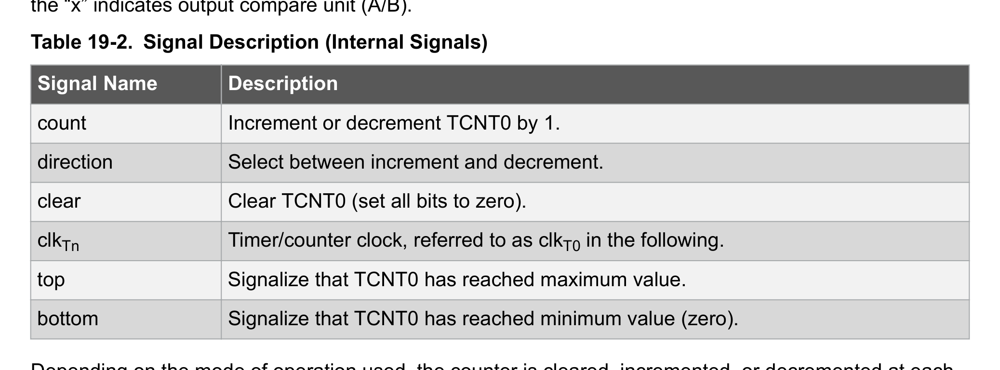
*Description*: Hardware reference table detailing register bit field settings, electrical operating limits, or memory configurations for Table 19-2: Signal Description (Internal Signals).

> **Table 19-2: Signal Description (Internal Signals)**

Signal Name
Description
count
Increment or decrement TCNT0 by 1.
direction
Select between increment and decrement.
clear
Clear TCNT0 (set all bits to zero).
clkTn
Timer/counter clock, referred to as clkT0 in the following.
top
Signalize that TCNT0 has reached maximum value.
bottom
Signalize that TCNT0 has reached minimum value (zero).
Depending on the mode of operation used, the counter is cleared, incremented, or decremented at each
timer clock (clkT0). clkT0 can be generated from an external or internal clock source, selected by the Clock
Select bits (CS0[2:0]). When no clock source is selected (CS0=0x0) the timer is stopped. However, the
TCNT0 value can be accessed by the CPU, regardless of whether clkT0 is present or not. A CPU write
overrides (has priority over) all counter clear or count operations.
The counting sequence is determined by the setting of the WGM01 and WGM00 bits located in the Timer/
Counter Control Register (TCCR0A) and the WGM02 bit located in the Timer/Counter Control Register B
(TCCR0B). There are close connections between how the counter behaves (counts) and how waveforms
are generated on the Output Compare outputs OC0A and OC0B. For more details about advanced
counting sequences and waveform generation, see Modes of Operation.
The Timer/Counter Overflow Flag (TOV0) is set according to the mode of operation selected by the
WGM0[2:0] bits. TOV0 can be used for generating a CPU interrupt.
19.5
Output Compare Unit
The 8-bit comparator continuously compares TCNT0 with the Output Compare Registers (OCR0A and
OCR0B). Whenever TCNT0 equals OCR0A or OCR0B, the comparator signals a match. A match will set
the Output Compare Flag (OCF0A or OCF0B) at the next timer clock cycle. If the corresponding interrupt
is enabled, the output compare flag generates an output compare interrupt. The output compare flag is
automatically cleared when the interrupt is executed. Alternatively, the flag can be cleared by software by
writing a '1' to its I/O bit location. The waveform generator uses the match signal to generate an output
ATmega328/P
8-bit Timer/Counter0 (TC0) with PWM
© 2018 Microchip Technology Inc.
Datasheet Complete
DS40001984A-page 130
Downloaded from Arrow.com.
Downloaded from Arrow.com.
Downloaded from Arrow.com.
Downloaded from Arrow.com.
Downloaded from Arrow.com.
Downloaded from Arrow.com.
Downloaded from Arrow.com.
Downloaded from Arrow.com.
Downloaded from Arrow.com.
Downloaded from Arrow.com.
Downloaded from Arrow.com.
Downloaded from Arrow.com.
Downloaded from Arrow.com.
Downloaded from Arrow.com.
Downloaded from Arrow.com.
Downloaded from Arrow.com.
Downloaded from Arrow.com.
Downloaded from Arrow.com.
Downloaded from Arrow.com.
Downloaded from Arrow.com.
Downloaded from Arrow.com.
Downloaded from Arrow.com.
Downloaded from Arrow.com.
Downloaded from Arrow.com.
Downloaded from Arrow.com.
Downloaded from Arrow.com.
Downloaded from Arrow.com.
Downloaded from Arrow.com.
Downloaded from Arrow.com.
Downloaded from Arrow.com.
Downloaded from Arrow.com.
Downloaded from Arrow.com.
Downloaded from Arrow.com.
Downloaded from Arrow.com.
Downloaded from Arrow.com.
Downloaded from Arrow.com.
Downloaded from Arrow.com.
Downloaded from Arrow.com.
Downloaded from Arrow.com.
Downloaded from Arrow.com.
Downloaded from Arrow.com.
Downloaded from Arrow.com.
Downloaded from Arrow.com.
Downloaded from Arrow.com.
Downloaded from Arrow.com.
Downloaded from Arrow.com.
Downloaded from Arrow.com.
Downloaded from Arrow.com.
Downloaded from Arrow.com.
Downloaded from Arrow.com.
Downloaded from Arrow.com.
Downloaded from Arrow.com.
Downloaded from Arrow.com.
Downloaded from Arrow.com.
Downloaded from Arrow.com.
Downloaded from Arrow.com.
Downloaded from Arrow.com.
Downloaded from Arrow.com.
Downloaded from Arrow.com.
Downloaded from Arrow.com.
Downloaded from Arrow.com.
Downloaded from Arrow.com.
Downloaded from Arrow.com.
Downloaded from Arrow.com.
Downloaded from Arrow.com.
Downloaded from Arrow.com.
Downloaded from Arrow.com.
Downloaded from Arrow.com.
Downloaded from Arrow.com.
Downloaded from Arrow.com.
Downloaded from Arrow.com.
Downloaded from Arrow.com.
Downloaded from Arrow.com.
Downloaded from Arrow.com.
Downloaded from Arrow.com.
Downloaded from Arrow.com.
Downloaded from Arrow.com.
Downloaded from Arrow.com.
Downloaded from Arrow.com.
Downloaded from Arrow.com.
Downloaded from Arrow.com.
Downloaded from Arrow.com.
Downloaded from Arrow.com.
Downloaded from Arrow.com.
Downloaded from Arrow.com.
Downloaded from Arrow.com.
Downloaded from Arrow.com.
Downloaded from Arrow.com.
Downloaded from Arrow.com.
Downloaded from Arrow.com.
Downloaded from Arrow.com.
Downloaded from Arrow.com.
Downloaded from Arrow.com.
Downloaded from Arrow.com.
Downloaded from Arrow.com.
Downloaded from Arrow.com.
Downloaded from Arrow.com.
Downloaded from Arrow.com.
Downloaded from Arrow.com.
Downloaded from Arrow.com.
Downloaded from Arrow.com.
Downloaded from Arrow.com.
Downloaded from Arrow.com.
Downloaded from Arrow.com.
Downloaded from Arrow.com.
Downloaded from Arrow.com.
Downloaded from Arrow.com.
Downloaded from Arrow.com.
Downloaded from Arrow.com.
Downloaded from Arrow.com.
Downloaded from Arrow.com.
Downloaded from Arrow.com.
Downloaded from Arrow.com.
Downloaded from Arrow.com.
Downloaded from Arrow.com.
Downloaded from Arrow.com.
Downloaded from Arrow.com.
Downloaded from Arrow.com.
Downloaded from Arrow.com.
Downloaded from Arrow.com.
Downloaded from Arrow.com.
Downloaded from Arrow.com.
Downloaded from Arrow.com.
Downloaded from Arrow.com.
Downloaded from Arrow.com.
Downloaded from Arrow.com.
Downloaded from Arrow.com.
Downloaded from Arrow.com.
Downloaded from Arrow.com.
Downloaded from Arrow.com.


<!-- Page 131 -->
### [PDF Page 131]

according to operating mode set by the WGM02, WGM01, and WGM00 bits and Compare Output mode
(COM0x[1:0]) bits. The maximum and bottom signals are used by the waveform generator for handling
the special cases of the extreme values in some modes of operation.

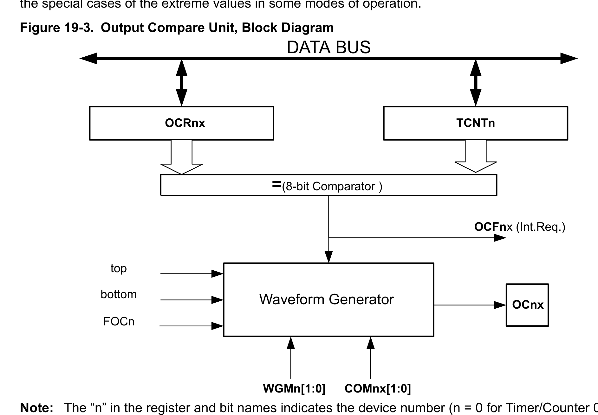
*Description*: System architecture block diagram depicting hardware modules, internal data buses, control logic, and peripheral interconnects for Figure 19-3: Output Compare Unit, Block Diagram.

> **Figure 19-3: Output Compare Unit, Block Diagram**

OCFnx (Int.Req.)
=(8-bit Comparator )
OCRnx
OCnx
DATA BUS
TCNTn
WGMn[1:0]
Waveform Generator
top
FOCn
COMnx[1:0]
bottom
Note:  The “n” in the register and bit names indicates the device number (n = 0 for Timer/Counter 0), and
the “x” indicates output compare unit (A/B).
The OCR0x registers are double buffered when using any of the Pulse Width Modulation (PWM) modes.
When double buffering is enabled, the CPU has access to the OCR0x Buffer register. The double
buffering synchronizes the update of the OCR0x Compare registers to either top or bottom of the counting
sequence. The synchronization prevents the occurrence of odd-length, non-symmetrical PWM pulses,
thereby making the output glitch free.
The double buffering is disabled for the normal and Clear Timer on Compare (CTC) modes of operation,
and the CPU will access the OCR0x directly.
19.5.1
Force Output Compare
In non-PWM Waveform Generation modes, the match output of the comparator can be forced by writing a
'1' to the Force Output Compare (TCCR0C.FOCnx) bit. Forcing compare match will not set the OCFnx
flag or reload/clear the timer, but the OCnx pin will be updated as if a real compare match had occurred
(the TCCRnA.COMnx[1:0] bits define whether the OCnx pin is set, cleared or toggled).
19.5.2
Compare Match Blocking by TCNTn Write
All CPU write operations to the TCNTn register will block any compare match that occurs in the next timer
clock cycle, even when the timer is stopped. This feature allows OCRnx to be initialized to the same
value as TCNTn without triggering an interrupt when the timer/counter clock is enabled.
ATmega328/P
8-bit Timer/Counter0 (TC0) with PWM
© 2018 Microchip Technology Inc.
Datasheet Complete
DS40001984A-page 131
Downloaded from Arrow.com.
Downloaded from Arrow.com.
Downloaded from Arrow.com.
Downloaded from Arrow.com.
Downloaded from Arrow.com.
Downloaded from Arrow.com.
Downloaded from Arrow.com.
Downloaded from Arrow.com.
Downloaded from Arrow.com.
Downloaded from Arrow.com.
Downloaded from Arrow.com.
Downloaded from Arrow.com.
Downloaded from Arrow.com.
Downloaded from Arrow.com.
Downloaded from Arrow.com.
Downloaded from Arrow.com.
Downloaded from Arrow.com.
Downloaded from Arrow.com.
Downloaded from Arrow.com.
Downloaded from Arrow.com.
Downloaded from Arrow.com.
Downloaded from Arrow.com.
Downloaded from Arrow.com.
Downloaded from Arrow.com.
Downloaded from Arrow.com.
Downloaded from Arrow.com.
Downloaded from Arrow.com.
Downloaded from Arrow.com.
Downloaded from Arrow.com.
Downloaded from Arrow.com.
Downloaded from Arrow.com.
Downloaded from Arrow.com.
Downloaded from Arrow.com.
Downloaded from Arrow.com.
Downloaded from Arrow.com.
Downloaded from Arrow.com.
Downloaded from Arrow.com.
Downloaded from Arrow.com.
Downloaded from Arrow.com.
Downloaded from Arrow.com.
Downloaded from Arrow.com.
Downloaded from Arrow.com.
Downloaded from Arrow.com.
Downloaded from Arrow.com.
Downloaded from Arrow.com.
Downloaded from Arrow.com.
Downloaded from Arrow.com.
Downloaded from Arrow.com.
Downloaded from Arrow.com.
Downloaded from Arrow.com.
Downloaded from Arrow.com.
Downloaded from Arrow.com.
Downloaded from Arrow.com.
Downloaded from Arrow.com.
Downloaded from Arrow.com.
Downloaded from Arrow.com.
Downloaded from Arrow.com.
Downloaded from Arrow.com.
Downloaded from Arrow.com.
Downloaded from Arrow.com.
Downloaded from Arrow.com.
Downloaded from Arrow.com.
Downloaded from Arrow.com.
Downloaded from Arrow.com.
Downloaded from Arrow.com.
Downloaded from Arrow.com.
Downloaded from Arrow.com.
Downloaded from Arrow.com.
Downloaded from Arrow.com.
Downloaded from Arrow.com.
Downloaded from Arrow.com.
Downloaded from Arrow.com.
Downloaded from Arrow.com.
Downloaded from Arrow.com.
Downloaded from Arrow.com.
Downloaded from Arrow.com.
Downloaded from Arrow.com.
Downloaded from Arrow.com.
Downloaded from Arrow.com.
Downloaded from Arrow.com.
Downloaded from Arrow.com.
Downloaded from Arrow.com.
Downloaded from Arrow.com.
Downloaded from Arrow.com.
Downloaded from Arrow.com.
Downloaded from Arrow.com.
Downloaded from Arrow.com.
Downloaded from Arrow.com.
Downloaded from Arrow.com.
Downloaded from Arrow.com.
Downloaded from Arrow.com.
Downloaded from Arrow.com.
Downloaded from Arrow.com.
Downloaded from Arrow.com.
Downloaded from Arrow.com.
Downloaded from Arrow.com.
Downloaded from Arrow.com.
Downloaded from Arrow.com.
Downloaded from Arrow.com.
Downloaded from Arrow.com.
Downloaded from Arrow.com.
Downloaded from Arrow.com.
Downloaded from Arrow.com.
Downloaded from Arrow.com.
Downloaded from Arrow.com.
Downloaded from Arrow.com.
Downloaded from Arrow.com.
Downloaded from Arrow.com.
Downloaded from Arrow.com.
Downloaded from Arrow.com.
Downloaded from Arrow.com.
Downloaded from Arrow.com.
Downloaded from Arrow.com.
Downloaded from Arrow.com.
Downloaded from Arrow.com.
Downloaded from Arrow.com.
Downloaded from Arrow.com.
Downloaded from Arrow.com.
Downloaded from Arrow.com.
Downloaded from Arrow.com.
Downloaded from Arrow.com.
Downloaded from Arrow.com.
Downloaded from Arrow.com.
Downloaded from Arrow.com.
Downloaded from Arrow.com.
Downloaded from Arrow.com.
Downloaded from Arrow.com.
Downloaded from Arrow.com.
Downloaded from Arrow.com.
Downloaded from Arrow.com.
Downloaded from Arrow.com.


<!-- Page 132 -->
### [PDF Page 132]

19.5.3
Using the Output Compare Unit
Since writing TCNTn in any mode of operation will block all compare matches for one timer clock cycle,
there are risks involved when changing TCNTn when using the output compare unit, independently of
whether the timer/counter is running or not. If the value written to TCNTn equals the OCRnx value, the
compare match will be missed, resulting in incorrect waveform generation. Similarly, do not write the
TCNTn1 value equal to BOTTOM when the counter is counting down.
The setup of the OCnx should be performed before setting the Data Direction register for the port pin to
output. The easiest way of setting the OCnx value is to use the Force Output Compare (FOCnx) strobe
bits in Normal mode. The OCnx registers keep their values even when changing between Waveform
Generation modes.
Be aware that the TCCRnA.COMnx[1:0] bits are not double-buffered together with the compare value.
Changing the TCCRnA.COMnx[1:0] bits will take effect immediately.
19.6
Compare Match Output Unit
The Compare Output mode bits in the Timer/Counter Control Register A (TCCR0A.COM0x) have two
functions:
•
The waveform generator uses the COM0x bits for defining the Output Compare (OC0x) register
state at the next compare match.
•
The COM0x bits control the OC0x pin output source
The figure below shows a simplified schematic of the logic affected by COM0x. The I/O registers, I/O bits,
and I/O pins in the figure are shown in bold. Only the parts of the general I/O port control registers that
are affected by the COM0x bits are shown, namely PORT and DDR.
On system reset the OC0x register is reset to 0x00.
Note:  'OC0x state' is always referring to internal OC0x registers, not the OC0x pin.
ATmega328/P
8-bit Timer/Counter0 (TC0) with PWM
© 2018 Microchip Technology Inc.
Datasheet Complete
DS40001984A-page 132
Downloaded from Arrow.com.
Downloaded from Arrow.com.
Downloaded from Arrow.com.
Downloaded from Arrow.com.
Downloaded from Arrow.com.
Downloaded from Arrow.com.
Downloaded from Arrow.com.
Downloaded from Arrow.com.
Downloaded from Arrow.com.
Downloaded from Arrow.com.
Downloaded from Arrow.com.
Downloaded from Arrow.com.
Downloaded from Arrow.com.
Downloaded from Arrow.com.
Downloaded from Arrow.com.
Downloaded from Arrow.com.
Downloaded from Arrow.com.
Downloaded from Arrow.com.
Downloaded from Arrow.com.
Downloaded from Arrow.com.
Downloaded from Arrow.com.
Downloaded from Arrow.com.
Downloaded from Arrow.com.
Downloaded from Arrow.com.
Downloaded from Arrow.com.
Downloaded from Arrow.com.
Downloaded from Arrow.com.
Downloaded from Arrow.com.
Downloaded from Arrow.com.
Downloaded from Arrow.com.
Downloaded from Arrow.com.
Downloaded from Arrow.com.
Downloaded from Arrow.com.
Downloaded from Arrow.com.
Downloaded from Arrow.com.
Downloaded from Arrow.com.
Downloaded from Arrow.com.
Downloaded from Arrow.com.
Downloaded from Arrow.com.
Downloaded from Arrow.com.
Downloaded from Arrow.com.
Downloaded from Arrow.com.
Downloaded from Arrow.com.
Downloaded from Arrow.com.
Downloaded from Arrow.com.
Downloaded from Arrow.com.
Downloaded from Arrow.com.
Downloaded from Arrow.com.
Downloaded from Arrow.com.
Downloaded from Arrow.com.
Downloaded from Arrow.com.
Downloaded from Arrow.com.
Downloaded from Arrow.com.
Downloaded from Arrow.com.
Downloaded from Arrow.com.
Downloaded from Arrow.com.
Downloaded from Arrow.com.
Downloaded from Arrow.com.
Downloaded from Arrow.com.
Downloaded from Arrow.com.
Downloaded from Arrow.com.
Downloaded from Arrow.com.
Downloaded from Arrow.com.
Downloaded from Arrow.com.
Downloaded from Arrow.com.
Downloaded from Arrow.com.
Downloaded from Arrow.com.
Downloaded from Arrow.com.
Downloaded from Arrow.com.
Downloaded from Arrow.com.
Downloaded from Arrow.com.
Downloaded from Arrow.com.
Downloaded from Arrow.com.
Downloaded from Arrow.com.
Downloaded from Arrow.com.
Downloaded from Arrow.com.
Downloaded from Arrow.com.
Downloaded from Arrow.com.
Downloaded from Arrow.com.
Downloaded from Arrow.com.
Downloaded from Arrow.com.
Downloaded from Arrow.com.
Downloaded from Arrow.com.
Downloaded from Arrow.com.
Downloaded from Arrow.com.
Downloaded from Arrow.com.
Downloaded from Arrow.com.
Downloaded from Arrow.com.
Downloaded from Arrow.com.
Downloaded from Arrow.com.
Downloaded from Arrow.com.
Downloaded from Arrow.com.
Downloaded from Arrow.com.
Downloaded from Arrow.com.
Downloaded from Arrow.com.
Downloaded from Arrow.com.
Downloaded from Arrow.com.
Downloaded from Arrow.com.
Downloaded from Arrow.com.
Downloaded from Arrow.com.
Downloaded from Arrow.com.
Downloaded from Arrow.com.
Downloaded from Arrow.com.
Downloaded from Arrow.com.
Downloaded from Arrow.com.
Downloaded from Arrow.com.
Downloaded from Arrow.com.
Downloaded from Arrow.com.
Downloaded from Arrow.com.
Downloaded from Arrow.com.
Downloaded from Arrow.com.
Downloaded from Arrow.com.
Downloaded from Arrow.com.
Downloaded from Arrow.com.
Downloaded from Arrow.com.
Downloaded from Arrow.com.
Downloaded from Arrow.com.
Downloaded from Arrow.com.
Downloaded from Arrow.com.
Downloaded from Arrow.com.
Downloaded from Arrow.com.
Downloaded from Arrow.com.
Downloaded from Arrow.com.
Downloaded from Arrow.com.
Downloaded from Arrow.com.
Downloaded from Arrow.com.
Downloaded from Arrow.com.
Downloaded from Arrow.com.
Downloaded from Arrow.com.
Downloaded from Arrow.com.
Downloaded from Arrow.com.
Downloaded from Arrow.com.


<!-- Page 133 -->
### [PDF Page 133]


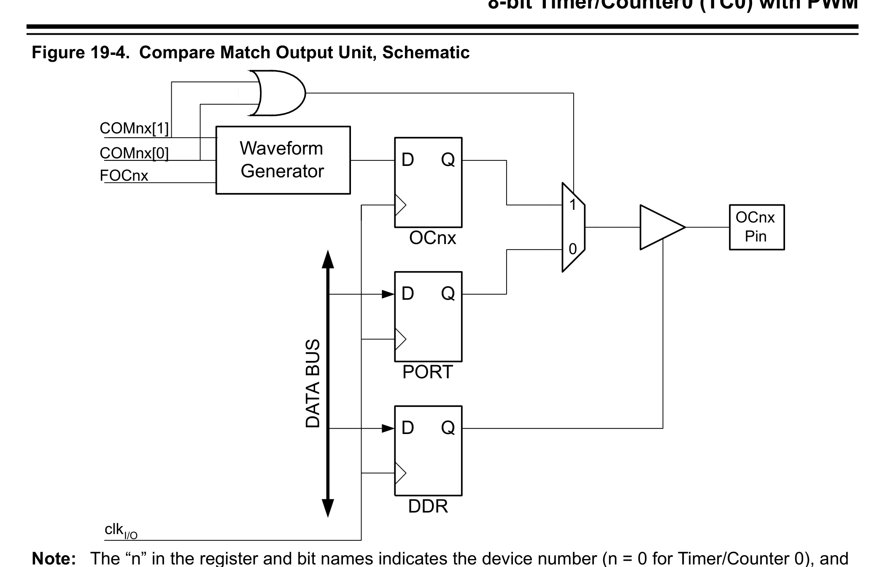
*Description*: Technical diagram and schematic illustration detailing hardware circuit topology, signal routing, and logic operations for Figure 19-4: Compare Match Output Unit, Schematic.

> **Figure 19-4: Compare Match Output Unit, Schematic**

PORT
DDR
D
Q
D
Q
OCnx
Pin
OCnx
D
Q
Waveform
Generator
COMnx[1]
COMnx[0]
0
1
DATA BUS
FOCnx
clkI/O
Note:  The “n” in the register and bit names indicates the device number (n = 0 for Timer/Counter 0), and
the “x” indicates output compare unit (A/B).
The general I/O port function is overridden by the Output Compare (OC0x) from the waveform generator
if either of the COM0x[1:0] bits are set. However, the OC0x pin direction (input or output) is still controlled
by the Data Direction Register (DDR) for the port pin. In the DDR, the bit for the OC1x pin (DDR.OC0x)
must be set as output before the OC0x value is visible on the pin. The port override function is
independent of the Waveform Generation mode.
The design of the output compare pin logic allows initialization of the OC0x register state before the
output is enabled. Some TCCR0A.COM0x[1:0] bit settings are reserved for certain modes of operation.
The TCCR0A.COM0x[1:0] bits have no effect on the input capture unit.
Related Links

### Register Description

19.6.1
Compare Output Mode and Waveform Generation
The waveform generator uses the TCCR0A.COM0x[1:0] bits differently in Normal, CTC, and PWM
modes. For all modes, setting the TCCR0A.COM0x[1:0]=0x0 tells the waveform generator that no action
on the OC0x register is to be performed on the next compare match. Refer to the descriptions of the
output modes.
A change of the TCCR0A.COM0x[1:0] bits state will have effect at the first compare match after the bits
are written. For non-PWM modes, the action can be forced to have immediate effect by using the
TCCR0C.FOC0x strobe bits.
ATmega328/P
8-bit Timer/Counter0 (TC0) with PWM
© 2018 Microchip Technology Inc.
Datasheet Complete
DS40001984A-page 133
Downloaded from Arrow.com.
Downloaded from Arrow.com.
Downloaded from Arrow.com.
Downloaded from Arrow.com.
Downloaded from Arrow.com.
Downloaded from Arrow.com.
Downloaded from Arrow.com.
Downloaded from Arrow.com.
Downloaded from Arrow.com.
Downloaded from Arrow.com.
Downloaded from Arrow.com.
Downloaded from Arrow.com.
Downloaded from Arrow.com.
Downloaded from Arrow.com.
Downloaded from Arrow.com.
Downloaded from Arrow.com.
Downloaded from Arrow.com.
Downloaded from Arrow.com.
Downloaded from Arrow.com.
Downloaded from Arrow.com.
Downloaded from Arrow.com.
Downloaded from Arrow.com.
Downloaded from Arrow.com.
Downloaded from Arrow.com.
Downloaded from Arrow.com.
Downloaded from Arrow.com.
Downloaded from Arrow.com.
Downloaded from Arrow.com.
Downloaded from Arrow.com.
Downloaded from Arrow.com.
Downloaded from Arrow.com.
Downloaded from Arrow.com.
Downloaded from Arrow.com.
Downloaded from Arrow.com.
Downloaded from Arrow.com.
Downloaded from Arrow.com.
Downloaded from Arrow.com.
Downloaded from Arrow.com.
Downloaded from Arrow.com.
Downloaded from Arrow.com.
Downloaded from Arrow.com.
Downloaded from Arrow.com.
Downloaded from Arrow.com.
Downloaded from Arrow.com.
Downloaded from Arrow.com.
Downloaded from Arrow.com.
Downloaded from Arrow.com.
Downloaded from Arrow.com.
Downloaded from Arrow.com.
Downloaded from Arrow.com.
Downloaded from Arrow.com.
Downloaded from Arrow.com.
Downloaded from Arrow.com.
Downloaded from Arrow.com.
Downloaded from Arrow.com.
Downloaded from Arrow.com.
Downloaded from Arrow.com.
Downloaded from Arrow.com.
Downloaded from Arrow.com.
Downloaded from Arrow.com.
Downloaded from Arrow.com.
Downloaded from Arrow.com.
Downloaded from Arrow.com.
Downloaded from Arrow.com.
Downloaded from Arrow.com.
Downloaded from Arrow.com.
Downloaded from Arrow.com.
Downloaded from Arrow.com.
Downloaded from Arrow.com.
Downloaded from Arrow.com.
Downloaded from Arrow.com.
Downloaded from Arrow.com.
Downloaded from Arrow.com.
Downloaded from Arrow.com.
Downloaded from Arrow.com.
Downloaded from Arrow.com.
Downloaded from Arrow.com.
Downloaded from Arrow.com.
Downloaded from Arrow.com.
Downloaded from Arrow.com.
Downloaded from Arrow.com.
Downloaded from Arrow.com.
Downloaded from Arrow.com.
Downloaded from Arrow.com.
Downloaded from Arrow.com.
Downloaded from Arrow.com.
Downloaded from Arrow.com.
Downloaded from Arrow.com.
Downloaded from Arrow.com.
Downloaded from Arrow.com.
Downloaded from Arrow.com.
Downloaded from Arrow.com.
Downloaded from Arrow.com.
Downloaded from Arrow.com.
Downloaded from Arrow.com.
Downloaded from Arrow.com.
Downloaded from Arrow.com.
Downloaded from Arrow.com.
Downloaded from Arrow.com.
Downloaded from Arrow.com.
Downloaded from Arrow.com.
Downloaded from Arrow.com.
Downloaded from Arrow.com.
Downloaded from Arrow.com.
Downloaded from Arrow.com.
Downloaded from Arrow.com.
Downloaded from Arrow.com.
Downloaded from Arrow.com.
Downloaded from Arrow.com.
Downloaded from Arrow.com.
Downloaded from Arrow.com.
Downloaded from Arrow.com.
Downloaded from Arrow.com.
Downloaded from Arrow.com.
Downloaded from Arrow.com.
Downloaded from Arrow.com.
Downloaded from Arrow.com.
Downloaded from Arrow.com.
Downloaded from Arrow.com.
Downloaded from Arrow.com.
Downloaded from Arrow.com.
Downloaded from Arrow.com.
Downloaded from Arrow.com.
Downloaded from Arrow.com.
Downloaded from Arrow.com.
Downloaded from Arrow.com.
Downloaded from Arrow.com.
Downloaded from Arrow.com.
Downloaded from Arrow.com.
Downloaded from Arrow.com.
Downloaded from Arrow.com.
Downloaded from Arrow.com.
Downloaded from Arrow.com.


<!-- Page 134 -->
### [PDF Page 134]

19.7
Modes of Operation
The mode of operation determines the behavior of the timer/counter and the output compare pins. It is
defined by the combination of the Waveform Generation mode bits and Compare Output mode
(TCCR0A.WGM0[2:0]) bits in the Timer/Counter Control Registers A and B (TCCR0A.COM0x[1:0]). The
Compare Output mode bits do not affect the counting sequence, while the Waveform Generation mode
bits do. The COM0x[1:0] bits control whether the PWM output generated should be inverted or not
(inverted or non-inverted PWM). For non-PWM modes, the COM0x[1:0] bits control whether the output
should be set, cleared, or toggled at a compare match (see the previous section Compare Match Output
Unit).
For detailed timing information refer to the following section Timer/Counter Timing Diagrams.
Related Links
Compare Match Output Unit
Timer/Counter Timing Diagrams
19.7.1
Normal Mode
The simplest mode of operation is the Normal mode (WGM0[2:0] = 0x0). In this mode, the counting
direction is always up (incrementing), and no counter clear is performed. The counter simply overruns
when it passes its maximum 8-bit value (TOP=0xFF) and then restarts from the bottom (0x00). In Normal
mode operation, the Timer/Counter Overflow flag (TOV0) will be set in the same clock cycle in which the
TCNT0 becomes zero. In this case, the TOV0 flag behaves like a ninth bit, except that it is only set, not
cleared. However, combined with the timer overflow interrupt that automatically clears the TOV0 flag, the
timer resolution can be increased by software. There are no special cases to consider in the Normal
mode, a new counter value can be written any time.
The output compare unit can be used to generate interrupts at some given time. Using the output
compare to generate waveforms in Normal mode is not recommended since this will occupy too much of
the CPU time.
19.7.2
Clear Timer on Compare Match (CTC) Mode
In Clear Timer on Compare (CTC) mode (WGM0[2:0]=0x2), the OCR0A register is used to manipulate the
counter resolution: the counter is cleared to ZERO when the counter value (TCNT0) matches the
OCR0A. The OCR0A defines the top value for the counter, hence its resolution. This mode allows greater
control of the compare match output frequency. It also simplifies the counting of external events.
The timing diagram for the CTC mode is shown below. The counter value (TCNT0) increases until a
compare match occurs between TCNT0 and OCR0A, and then counter (TCNT0) is cleared.

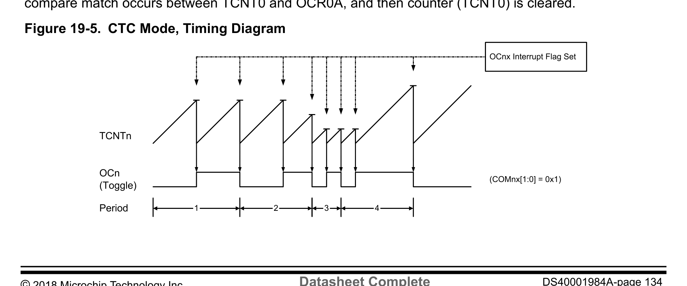
*Description*: Technical diagram and schematic illustration detailing hardware circuit topology, signal routing, and logic operations for Figure 19-5: CTC Mode, Timing Diagram.

> **Figure 19-5: CTC Mode, Timing Diagram**

ATmega328/P
8-bit Timer/Counter0 (TC0) with PWM
© 2018 Microchip Technology Inc.
Datasheet Complete
DS40001984A-page 134
Downloaded from Arrow.com.
Downloaded from Arrow.com.
Downloaded from Arrow.com.
Downloaded from Arrow.com.
Downloaded from Arrow.com.
Downloaded from Arrow.com.
Downloaded from Arrow.com.
Downloaded from Arrow.com.
Downloaded from Arrow.com.
Downloaded from Arrow.com.
Downloaded from Arrow.com.
Downloaded from Arrow.com.
Downloaded from Arrow.com.
Downloaded from Arrow.com.
Downloaded from Arrow.com.
Downloaded from Arrow.com.
Downloaded from Arrow.com.
Downloaded from Arrow.com.
Downloaded from Arrow.com.
Downloaded from Arrow.com.
Downloaded from Arrow.com.
Downloaded from Arrow.com.
Downloaded from Arrow.com.
Downloaded from Arrow.com.
Downloaded from Arrow.com.
Downloaded from Arrow.com.
Downloaded from Arrow.com.
Downloaded from Arrow.com.
Downloaded from Arrow.com.
Downloaded from Arrow.com.
Downloaded from Arrow.com.
Downloaded from Arrow.com.
Downloaded from Arrow.com.
Downloaded from Arrow.com.
Downloaded from Arrow.com.
Downloaded from Arrow.com.
Downloaded from Arrow.com.
Downloaded from Arrow.com.
Downloaded from Arrow.com.
Downloaded from Arrow.com.
Downloaded from Arrow.com.
Downloaded from Arrow.com.
Downloaded from Arrow.com.
Downloaded from Arrow.com.
Downloaded from Arrow.com.
Downloaded from Arrow.com.
Downloaded from Arrow.com.
Downloaded from Arrow.com.
Downloaded from Arrow.com.
Downloaded from Arrow.com.
Downloaded from Arrow.com.
Downloaded from Arrow.com.
Downloaded from Arrow.com.
Downloaded from Arrow.com.
Downloaded from Arrow.com.
Downloaded from Arrow.com.
Downloaded from Arrow.com.
Downloaded from Arrow.com.
Downloaded from Arrow.com.
Downloaded from Arrow.com.
Downloaded from Arrow.com.
Downloaded from Arrow.com.
Downloaded from Arrow.com.
Downloaded from Arrow.com.
Downloaded from Arrow.com.
Downloaded from Arrow.com.
Downloaded from Arrow.com.
Downloaded from Arrow.com.
Downloaded from Arrow.com.
Downloaded from Arrow.com.
Downloaded from Arrow.com.
Downloaded from Arrow.com.
Downloaded from Arrow.com.
Downloaded from Arrow.com.
Downloaded from Arrow.com.
Downloaded from Arrow.com.
Downloaded from Arrow.com.
Downloaded from Arrow.com.
Downloaded from Arrow.com.
Downloaded from Arrow.com.
Downloaded from Arrow.com.
Downloaded from Arrow.com.
Downloaded from Arrow.com.
Downloaded from Arrow.com.
Downloaded from Arrow.com.
Downloaded from Arrow.com.
Downloaded from Arrow.com.
Downloaded from Arrow.com.
Downloaded from Arrow.com.
Downloaded from Arrow.com.
Downloaded from Arrow.com.
Downloaded from Arrow.com.
Downloaded from Arrow.com.
Downloaded from Arrow.com.
Downloaded from Arrow.com.
Downloaded from Arrow.com.
Downloaded from Arrow.com.
Downloaded from Arrow.com.
Downloaded from Arrow.com.
Downloaded from Arrow.com.
Downloaded from Arrow.com.
Downloaded from Arrow.com.
Downloaded from Arrow.com.
Downloaded from Arrow.com.
Downloaded from Arrow.com.
Downloaded from Arrow.com.
Downloaded from Arrow.com.
Downloaded from Arrow.com.
Downloaded from Arrow.com.
Downloaded from Arrow.com.
Downloaded from Arrow.com.
Downloaded from Arrow.com.
Downloaded from Arrow.com.
Downloaded from Arrow.com.
Downloaded from Arrow.com.
Downloaded from Arrow.com.
Downloaded from Arrow.com.
Downloaded from Arrow.com.
Downloaded from Arrow.com.
Downloaded from Arrow.com.
Downloaded from Arrow.com.
Downloaded from Arrow.com.
Downloaded from Arrow.com.
Downloaded from Arrow.com.
Downloaded from Arrow.com.
Downloaded from Arrow.com.
Downloaded from Arrow.com.
Downloaded from Arrow.com.
Downloaded from Arrow.com.
Downloaded from Arrow.com.
Downloaded from Arrow.com.
Downloaded from Arrow.com.
Downloaded from Arrow.com.
Downloaded from Arrow.com.


<!-- Page 135 -->
### [PDF Page 135]

An interrupt can be generated each time the counter value reaches the TOP value by setting the OCF0A
flag. If the interrupt is enabled, the interrupt handler routine can be used for updating the TOP value.
Note:  Changing TOP to a value close to BOTTOM while the counter is running must be done with care,
since the CTC mode does not provide double buffering. If the new value written to OCR0A is lower than
the current value of TCNT0, the counter will miss the compare match. The counter will then count to its
maximum value (0xFF for an 8-bit counter, 0xFFFF for a 16-bit counter) and wrap around starting at 0x00
before the compare match will occur.
For generating a waveform output in CTC mode, the OC0A output can be set to toggle its logical level on
each compare match by writing the two least significant Compare Output mode bits in the Timer/Counter
Control Register A Control to toggle mode (TCCR0A.COM0A[1:0]=0x1). The OC0A value will only be
visible on the port pin unless the data direction for the pin is set to output. The waveform generated will
have a maximum frequency of fOC0 = fclk_I/O/2 when OCR0A is written to 0x00. The waveform frequency
is defined by the following equation:
�OCnx =
�clk_I/O
2 ⋅�⋅1 + OCRnx
N represents the prescaler factor (1, 8, 64, 256, or 1024).
As for the Normal mode of operation, the Timer/Counter Overflow flag TOV0 is set in the same clock
cycle that the counter wraps from MAX to 0x00.
19.7.3
Fast PWM Mode
The Fast Pulse Width Modulation or Fast PWM modes (WGM0[2:0]=0x3 or WGM0[2:0]=0x7) provide a
high-frequency PWM waveform generation option. The Fast PWM modes differ from the other PWM
options by their single-slope operation. The counter counts from BOTTOM to TOP and then restarts from
BOTTOM. TOP is defined as 0xFF when WGM0[2:0]=0x3. TOP is defined as OCR0A when
WGM0[2:0]=0x7.
In non-inverting Compare Output mode, the Output Compare register (OC0x) is cleared on the compare
match between TCNT0 and OCR0x, and set at BOTTOM. In inverting Compare Output mode, the output
is set on compare match and cleared at BOTTOM. Due to the single-slope operation, the operating
frequency of the Fast PWM mode can be twice as high as the phase correct PWM modes, which use
dual-slope operation. This high frequency makes the Fast PWM mode well suited for power regulation,
rectification, and DAC applications. High frequency allows physically small sized external components
(coils, capacitors), and therefore reduces total system cost.
In Fast PWM mode, the counter is incremented until the counter value matches the TOP value. The
counter is then cleared at the following timer clock cycle. The timing diagram for the Fast PWM mode is
shown below. The TCNT0 value is in the timing diagram shown as a histogram for illustrating the single-
slope operation. The diagram includes non-inverted and inverted PWM outputs. The small horizontal lines
on the TCNT0 slopes mark compare matches between OCR0x and TCNT0.
ATmega328/P
8-bit Timer/Counter0 (TC0) with PWM
© 2018 Microchip Technology Inc.
Datasheet Complete
DS40001984A-page 135
Downloaded from Arrow.com.
Downloaded from Arrow.com.
Downloaded from Arrow.com.
Downloaded from Arrow.com.
Downloaded from Arrow.com.
Downloaded from Arrow.com.
Downloaded from Arrow.com.
Downloaded from Arrow.com.
Downloaded from Arrow.com.
Downloaded from Arrow.com.
Downloaded from Arrow.com.
Downloaded from Arrow.com.
Downloaded from Arrow.com.
Downloaded from Arrow.com.
Downloaded from Arrow.com.
Downloaded from Arrow.com.
Downloaded from Arrow.com.
Downloaded from Arrow.com.
Downloaded from Arrow.com.
Downloaded from Arrow.com.
Downloaded from Arrow.com.
Downloaded from Arrow.com.
Downloaded from Arrow.com.
Downloaded from Arrow.com.
Downloaded from Arrow.com.
Downloaded from Arrow.com.
Downloaded from Arrow.com.
Downloaded from Arrow.com.
Downloaded from Arrow.com.
Downloaded from Arrow.com.
Downloaded from Arrow.com.
Downloaded from Arrow.com.
Downloaded from Arrow.com.
Downloaded from Arrow.com.
Downloaded from Arrow.com.
Downloaded from Arrow.com.
Downloaded from Arrow.com.
Downloaded from Arrow.com.
Downloaded from Arrow.com.
Downloaded from Arrow.com.
Downloaded from Arrow.com.
Downloaded from Arrow.com.
Downloaded from Arrow.com.
Downloaded from Arrow.com.
Downloaded from Arrow.com.
Downloaded from Arrow.com.
Downloaded from Arrow.com.
Downloaded from Arrow.com.
Downloaded from Arrow.com.
Downloaded from Arrow.com.
Downloaded from Arrow.com.
Downloaded from Arrow.com.
Downloaded from Arrow.com.
Downloaded from Arrow.com.
Downloaded from Arrow.com.
Downloaded from Arrow.com.
Downloaded from Arrow.com.
Downloaded from Arrow.com.
Downloaded from Arrow.com.
Downloaded from Arrow.com.
Downloaded from Arrow.com.
Downloaded from Arrow.com.
Downloaded from Arrow.com.
Downloaded from Arrow.com.
Downloaded from Arrow.com.
Downloaded from Arrow.com.
Downloaded from Arrow.com.
Downloaded from Arrow.com.
Downloaded from Arrow.com.
Downloaded from Arrow.com.
Downloaded from Arrow.com.
Downloaded from Arrow.com.
Downloaded from Arrow.com.
Downloaded from Arrow.com.
Downloaded from Arrow.com.
Downloaded from Arrow.com.
Downloaded from Arrow.com.
Downloaded from Arrow.com.
Downloaded from Arrow.com.
Downloaded from Arrow.com.
Downloaded from Arrow.com.
Downloaded from Arrow.com.
Downloaded from Arrow.com.
Downloaded from Arrow.com.
Downloaded from Arrow.com.
Downloaded from Arrow.com.
Downloaded from Arrow.com.
Downloaded from Arrow.com.
Downloaded from Arrow.com.
Downloaded from Arrow.com.
Downloaded from Arrow.com.
Downloaded from Arrow.com.
Downloaded from Arrow.com.
Downloaded from Arrow.com.
Downloaded from Arrow.com.
Downloaded from Arrow.com.
Downloaded from Arrow.com.
Downloaded from Arrow.com.
Downloaded from Arrow.com.
Downloaded from Arrow.com.
Downloaded from Arrow.com.
Downloaded from Arrow.com.
Downloaded from Arrow.com.
Downloaded from Arrow.com.
Downloaded from Arrow.com.
Downloaded from Arrow.com.
Downloaded from Arrow.com.
Downloaded from Arrow.com.
Downloaded from Arrow.com.
Downloaded from Arrow.com.
Downloaded from Arrow.com.
Downloaded from Arrow.com.
Downloaded from Arrow.com.
Downloaded from Arrow.com.
Downloaded from Arrow.com.
Downloaded from Arrow.com.
Downloaded from Arrow.com.
Downloaded from Arrow.com.
Downloaded from Arrow.com.
Downloaded from Arrow.com.
Downloaded from Arrow.com.
Downloaded from Arrow.com.
Downloaded from Arrow.com.
Downloaded from Arrow.com.
Downloaded from Arrow.com.
Downloaded from Arrow.com.
Downloaded from Arrow.com.
Downloaded from Arrow.com.
Downloaded from Arrow.com.
Downloaded from Arrow.com.
Downloaded from Arrow.com.
Downloaded from Arrow.com.
Downloaded from Arrow.com.
Downloaded from Arrow.com.
Downloaded from Arrow.com.


<!-- Page 136 -->
### [PDF Page 136]


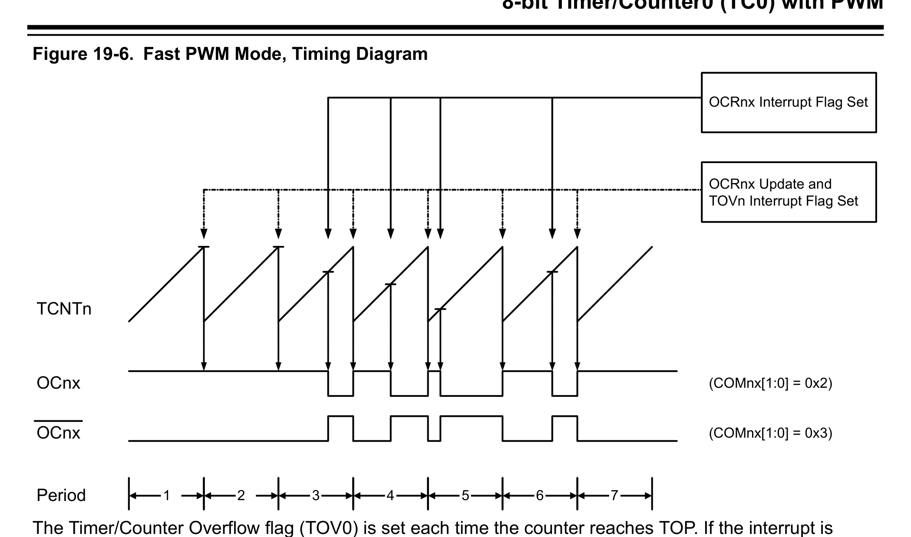
*Description*: Timer/Counter block diagram and waveform timing diagram illustrating prescaler clocks, compare match units, and PWM generation logic for Figure 19-6: Fast PWM Mode, Timing Diagram.

> **Figure 19-6: Fast PWM Mode, Timing Diagram**

TCNTn
OCRnx Update and
TOVn Interrupt Flag Set
1
Period
2
3
OCnx
OCnx
(COMnx[1:0] = 0x2)
(COMnx[1:0] = 0x3)
OCRnx Interrupt Flag Set
4
5
6
7
The Timer/Counter Overflow flag (TOV0) is set each time the counter reaches TOP. If the interrupt is
enabled, the interrupt handler routine can be used for updating the compare value.
In Fast PWM mode, the compare unit allows generation of PWM waveforms on the OC0x pins. Writing
the TCCR0A.COM0x[1:0] bits to 0x2 will produce a non-inverted PWM; TCCR0A.COM0x[1:0]=0x3 will
produce an inverted PWM output. Writing the TCCR0A.COM0A[1:0] bits to 0x1 allows the OC0A pin to
toggle on compare matches if the TCCRnB.WGMn2 bit is set. This option is not available for the OC0B
pin. The actual OC0x value will only be visible on the port pin if the data direction for the port pin is set as
output. The PWM waveform is generated by setting (or clearing) the OC0x register at the compare match
between OCR0x and TCNT0, and clearing (or setting) the OC0x register at the timer clock cycle the
counter is cleared (changes from TOP to BOTTOM).
The PWM frequency for the output can be calculated by the following equation:
�OCnxPWM = �clk_I/O
�⋅256
N represents the prescale divider (1, 8, 64, 256, or 1024).
The extreme values for the OCR0A register represent special cases for PWM waveform output in the
Fast PWM mode: If OCR0A is written equal to BOTTOM, the output will be a narrow spike for each MAX
+1 timer clock cycle. Writing OCR0A=MAX will result in a constantly high or low output (depending on the
polarity of the output set by the COM0A[1:0] bits.)
A frequency waveform output with 50% duty cycle can be achieved in Fast PWM mode by selecting
OC0x to toggle its logical level on each compare match (COM0x[1:0]=0x1). The waveform generated will
have a maximum frequency of fOC0 = fclk_I/O/2 when OCR0A=0x00. This feature is similar to the OC0A
toggle in CTC mode, except double buffering of the output compare unit is enabled in the Fast PWM
mode.
19.7.4
Phase Correct PWM Mode
The Phase Correct PWM mode (WGM0[2:0]=0x1 or WGM0[2:0]=0x5) provides a high resolution, phase
correct PWM waveform generation. The Phase Correct PWM mode is based on dual-slope operation:
ATmega328/P
8-bit Timer/Counter0 (TC0) with PWM
© 2018 Microchip Technology Inc.
Datasheet Complete
DS40001984A-page 136
Downloaded from Arrow.com.
Downloaded from Arrow.com.
Downloaded from Arrow.com.
Downloaded from Arrow.com.
Downloaded from Arrow.com.
Downloaded from Arrow.com.
Downloaded from Arrow.com.
Downloaded from Arrow.com.
Downloaded from Arrow.com.
Downloaded from Arrow.com.
Downloaded from Arrow.com.
Downloaded from Arrow.com.
Downloaded from Arrow.com.
Downloaded from Arrow.com.
Downloaded from Arrow.com.
Downloaded from Arrow.com.
Downloaded from Arrow.com.
Downloaded from Arrow.com.
Downloaded from Arrow.com.
Downloaded from Arrow.com.
Downloaded from Arrow.com.
Downloaded from Arrow.com.
Downloaded from Arrow.com.
Downloaded from Arrow.com.
Downloaded from Arrow.com.
Downloaded from Arrow.com.
Downloaded from Arrow.com.
Downloaded from Arrow.com.
Downloaded from Arrow.com.
Downloaded from Arrow.com.
Downloaded from Arrow.com.
Downloaded from Arrow.com.
Downloaded from Arrow.com.
Downloaded from Arrow.com.
Downloaded from Arrow.com.
Downloaded from Arrow.com.
Downloaded from Arrow.com.
Downloaded from Arrow.com.
Downloaded from Arrow.com.
Downloaded from Arrow.com.
Downloaded from Arrow.com.
Downloaded from Arrow.com.
Downloaded from Arrow.com.
Downloaded from Arrow.com.
Downloaded from Arrow.com.
Downloaded from Arrow.com.
Downloaded from Arrow.com.
Downloaded from Arrow.com.
Downloaded from Arrow.com.
Downloaded from Arrow.com.
Downloaded from Arrow.com.
Downloaded from Arrow.com.
Downloaded from Arrow.com.
Downloaded from Arrow.com.
Downloaded from Arrow.com.
Downloaded from Arrow.com.
Downloaded from Arrow.com.
Downloaded from Arrow.com.
Downloaded from Arrow.com.
Downloaded from Arrow.com.
Downloaded from Arrow.com.
Downloaded from Arrow.com.
Downloaded from Arrow.com.
Downloaded from Arrow.com.
Downloaded from Arrow.com.
Downloaded from Arrow.com.
Downloaded from Arrow.com.
Downloaded from Arrow.com.
Downloaded from Arrow.com.
Downloaded from Arrow.com.
Downloaded from Arrow.com.
Downloaded from Arrow.com.
Downloaded from Arrow.com.
Downloaded from Arrow.com.
Downloaded from Arrow.com.
Downloaded from Arrow.com.
Downloaded from Arrow.com.
Downloaded from Arrow.com.
Downloaded from Arrow.com.
Downloaded from Arrow.com.
Downloaded from Arrow.com.
Downloaded from Arrow.com.
Downloaded from Arrow.com.
Downloaded from Arrow.com.
Downloaded from Arrow.com.
Downloaded from Arrow.com.
Downloaded from Arrow.com.
Downloaded from Arrow.com.
Downloaded from Arrow.com.
Downloaded from Arrow.com.
Downloaded from Arrow.com.
Downloaded from Arrow.com.
Downloaded from Arrow.com.
Downloaded from Arrow.com.
Downloaded from Arrow.com.
Downloaded from Arrow.com.
Downloaded from Arrow.com.
Downloaded from Arrow.com.
Downloaded from Arrow.com.
Downloaded from Arrow.com.
Downloaded from Arrow.com.
Downloaded from Arrow.com.
Downloaded from Arrow.com.
Downloaded from Arrow.com.
Downloaded from Arrow.com.
Downloaded from Arrow.com.
Downloaded from Arrow.com.
Downloaded from Arrow.com.
Downloaded from Arrow.com.
Downloaded from Arrow.com.
Downloaded from Arrow.com.
Downloaded from Arrow.com.
Downloaded from Arrow.com.
Downloaded from Arrow.com.
Downloaded from Arrow.com.
Downloaded from Arrow.com.
Downloaded from Arrow.com.
Downloaded from Arrow.com.
Downloaded from Arrow.com.
Downloaded from Arrow.com.
Downloaded from Arrow.com.
Downloaded from Arrow.com.
Downloaded from Arrow.com.
Downloaded from Arrow.com.
Downloaded from Arrow.com.
Downloaded from Arrow.com.
Downloaded from Arrow.com.
Downloaded from Arrow.com.
Downloaded from Arrow.com.
Downloaded from Arrow.com.
Downloaded from Arrow.com.
Downloaded from Arrow.com.
Downloaded from Arrow.com.
Downloaded from Arrow.com.
Downloaded from Arrow.com.
Downloaded from Arrow.com.


<!-- Page 137 -->
### [PDF Page 137]

The counter counts repeatedly from BOTTOM to TOP, and then from TOP to BOTTOM. When
WGM0[2:0]=0x1 TOP is defined as 0xFF. When WGM0[2:0]=0x5, TOP is defined as OCR0A. In non-
inverting Compare Output mode, the Output Compare (OC0x) bit is cleared on compare match between
TCNT0 and OCR0x while up-counting and OC0x is set on the compare match while down-counting. In
inverting Output Compare mode, the operation is inverted. The dual-slope operation has a lower
maximum operation frequency than single-slope operation. Due to the symmetric feature of the dual-
slope PWM modes, these modes are preferred for motor control applications.
In Phase Correct PWM mode the counter is incremented until the counter value matches TOP. When the
counter reaches TOP, it changes the count direction. The TCNT0 value will be equal to TOP for one timer
clock cycle. The timing diagram for the Phase Correct PWM mode is shown below. The TCNT0 value is
shown as a histogram for illustrating the dual-slope operation. The diagram includes non-inverted and
inverted PWM outputs. The small horizontal line marks on the TCNT0 slopes represent compare matches
between OCR0x and TCNT0.

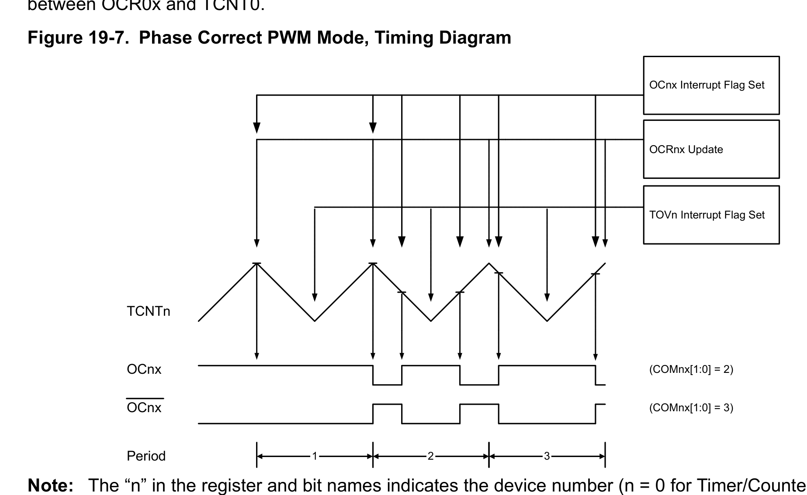
*Description*: Timer/Counter block diagram and waveform timing diagram illustrating prescaler clocks, compare match units, and PWM generation logic for Figure 19-7: Phase Correct PWM Mode, Timing Diagram.

> **Figure 19-7: Phase Correct PWM Mode, Timing Diagram**

TOVn Interrupt Flag Set
OCnx Interrupt Flag Set
1
2
3
TCNTn
Period
OCnx
OCnx
(COMnx[1:0] = 2)
(COMnx[1:0] = 3)
OCRnx Update
Note:  The “n” in the register and bit names indicates the device number (n = 0 for Timer/Counter 0), and
the “x” indicates Output Compare unit (A/B).
The Timer/Counter Overflow flag (TOV0) is set each time the counter reaches BOTTOM. The interrupt
flag can be used to generate an interrupt each time the counter reaches the BOTTOM value.
In Phase Correct PWM mode, the compare unit allows generation of PWM waveforms on the OC0x pin.
Writing the COM0x[1:0] bits to 0x2 will produce a non-inverted PWM. An inverted PWM output can be
generated by writing COM0x[1:0]=0x3. Setting the Compare Match Output A Mode bit to '1'
(TCCR0A.COM0A0) allows the OC0A pin to toggle on Compare Matches if the TCCR0B.WGM02 bit is
set. This option is not available for the OC0B pin. The actual OC0x value will only be visible on the port
pin if the data direction for the port pin is set as output. The PWM waveform is generated by clearing (or
setting) the OC0x register at the compare match between OCR0x and TCNT0 when the counter
increments, and setting (or clearing) the OC0x register at compare match between OCR0x and TCNT0
when the counter decrements. The PWM frequency for the output when using Phase Correct PWM can
be calculated by:
ATmega328/P
8-bit Timer/Counter0 (TC0) with PWM
© 2018 Microchip Technology Inc.
Datasheet Complete
DS40001984A-page 137
Downloaded from Arrow.com.
Downloaded from Arrow.com.
Downloaded from Arrow.com.
Downloaded from Arrow.com.
Downloaded from Arrow.com.
Downloaded from Arrow.com.
Downloaded from Arrow.com.
Downloaded from Arrow.com.
Downloaded from Arrow.com.
Downloaded from Arrow.com.
Downloaded from Arrow.com.
Downloaded from Arrow.com.
Downloaded from Arrow.com.
Downloaded from Arrow.com.
Downloaded from Arrow.com.
Downloaded from Arrow.com.
Downloaded from Arrow.com.
Downloaded from Arrow.com.
Downloaded from Arrow.com.
Downloaded from Arrow.com.
Downloaded from Arrow.com.
Downloaded from Arrow.com.
Downloaded from Arrow.com.
Downloaded from Arrow.com.
Downloaded from Arrow.com.
Downloaded from Arrow.com.
Downloaded from Arrow.com.
Downloaded from Arrow.com.
Downloaded from Arrow.com.
Downloaded from Arrow.com.
Downloaded from Arrow.com.
Downloaded from Arrow.com.
Downloaded from Arrow.com.
Downloaded from Arrow.com.
Downloaded from Arrow.com.
Downloaded from Arrow.com.
Downloaded from Arrow.com.
Downloaded from Arrow.com.
Downloaded from Arrow.com.
Downloaded from Arrow.com.
Downloaded from Arrow.com.
Downloaded from Arrow.com.
Downloaded from Arrow.com.
Downloaded from Arrow.com.
Downloaded from Arrow.com.
Downloaded from Arrow.com.
Downloaded from Arrow.com.
Downloaded from Arrow.com.
Downloaded from Arrow.com.
Downloaded from Arrow.com.
Downloaded from Arrow.com.
Downloaded from Arrow.com.
Downloaded from Arrow.com.
Downloaded from Arrow.com.
Downloaded from Arrow.com.
Downloaded from Arrow.com.
Downloaded from Arrow.com.
Downloaded from Arrow.com.
Downloaded from Arrow.com.
Downloaded from Arrow.com.
Downloaded from Arrow.com.
Downloaded from Arrow.com.
Downloaded from Arrow.com.
Downloaded from Arrow.com.
Downloaded from Arrow.com.
Downloaded from Arrow.com.
Downloaded from Arrow.com.
Downloaded from Arrow.com.
Downloaded from Arrow.com.
Downloaded from Arrow.com.
Downloaded from Arrow.com.
Downloaded from Arrow.com.
Downloaded from Arrow.com.
Downloaded from Arrow.com.
Downloaded from Arrow.com.
Downloaded from Arrow.com.
Downloaded from Arrow.com.
Downloaded from Arrow.com.
Downloaded from Arrow.com.
Downloaded from Arrow.com.
Downloaded from Arrow.com.
Downloaded from Arrow.com.
Downloaded from Arrow.com.
Downloaded from Arrow.com.
Downloaded from Arrow.com.
Downloaded from Arrow.com.
Downloaded from Arrow.com.
Downloaded from Arrow.com.
Downloaded from Arrow.com.
Downloaded from Arrow.com.
Downloaded from Arrow.com.
Downloaded from Arrow.com.
Downloaded from Arrow.com.
Downloaded from Arrow.com.
Downloaded from Arrow.com.
Downloaded from Arrow.com.
Downloaded from Arrow.com.
Downloaded from Arrow.com.
Downloaded from Arrow.com.
Downloaded from Arrow.com.
Downloaded from Arrow.com.
Downloaded from Arrow.com.
Downloaded from Arrow.com.
Downloaded from Arrow.com.
Downloaded from Arrow.com.
Downloaded from Arrow.com.
Downloaded from Arrow.com.
Downloaded from Arrow.com.
Downloaded from Arrow.com.
Downloaded from Arrow.com.
Downloaded from Arrow.com.
Downloaded from Arrow.com.
Downloaded from Arrow.com.
Downloaded from Arrow.com.
Downloaded from Arrow.com.
Downloaded from Arrow.com.
Downloaded from Arrow.com.
Downloaded from Arrow.com.
Downloaded from Arrow.com.
Downloaded from Arrow.com.
Downloaded from Arrow.com.
Downloaded from Arrow.com.
Downloaded from Arrow.com.
Downloaded from Arrow.com.
Downloaded from Arrow.com.
Downloaded from Arrow.com.
Downloaded from Arrow.com.
Downloaded from Arrow.com.
Downloaded from Arrow.com.
Downloaded from Arrow.com.
Downloaded from Arrow.com.
Downloaded from Arrow.com.
Downloaded from Arrow.com.
Downloaded from Arrow.com.
Downloaded from Arrow.com.
Downloaded from Arrow.com.
Downloaded from Arrow.com.


<!-- Page 138 -->
### [PDF Page 138]

�OCnxPCPWM = �clk_I/O
�⋅510
N represents the prescaler factor (1, 8, 64, 256, or 1024).
The extreme values for the OCR0A register represent special cases when generating a PWM waveform
output in the Phase Correct PWM mode: If the OCR0A register is written equal to BOTTOM, the output
will be continuously low. If OCR0A is written to MAX, the output will be continuously high for non-inverted
PWM mode. For inverted PWM the output will have the opposite logic values.
At the very start of period 2 in the timing diagram above, OC0x has a transition from high to low even
though there is no compare match. This transition serves to guarantee symmetry around BOTTOM.
There are two cases that give a transition without Compare Match:
•
OCR0x changes its value from MAX, as in the timing diagram. When the OCR0A value is MAX, the
OC0 pin value is the same as the result of a down-counting compare match. To ensure symmetry
around BOTTOM the OC0x value at MAX must correspond to the result of an up-counting compare
match.
•
The timer starts up-counting from a value higher than the one in OCR0x, and for that reason
misses the compare match and consequently, the OC0x does not undergo the change that would
have happened on the way up.
19.8
Timer/Counter Timing Diagrams
The timer/counter is a synchronous design and the timer clock (clkT0) is therefore shown as a clock
enable signal in the following figures. If the given instance of the TC0 supports an Asynchronous mode,
clkI/O should be replaced by the TC oscillator clock.
The figures include information on when interrupt flags are set. The first figure below illustrates timing
data for basic timer/counter operation close to the MAX value in all modes other than phase correct PWM
mode.

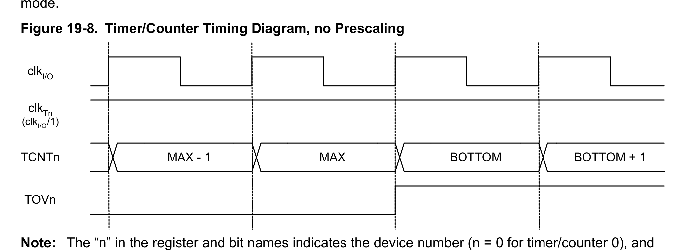
*Description*: Timer/Counter block diagram and waveform timing diagram illustrating prescaler clocks, compare match units, and PWM generation logic for Figure 19-8: Timer/Counter Timing Diagram, no Prescaling.

> **Figure 19-8: Timer/Counter Timing Diagram, no Prescaling**

clkTn
(clkI/O/1)
TOVn
clkI/O
TCNTn
MAX - 1
MAX
BOTTOM
BOTTOM + 1
Note:  The “n” in the register and bit names indicates the device number (n = 0 for timer/counter 0), and
the “x” indicates output compare unit (A/B).
The next figure shows the same timing data, but with the prescaler enabled.
ATmega328/P
8-bit Timer/Counter0 (TC0) with PWM
© 2018 Microchip Technology Inc.
Datasheet Complete
DS40001984A-page 138
Downloaded from Arrow.com.
Downloaded from Arrow.com.
Downloaded from Arrow.com.
Downloaded from Arrow.com.
Downloaded from Arrow.com.
Downloaded from Arrow.com.
Downloaded from Arrow.com.
Downloaded from Arrow.com.
Downloaded from Arrow.com.
Downloaded from Arrow.com.
Downloaded from Arrow.com.
Downloaded from Arrow.com.
Downloaded from Arrow.com.
Downloaded from Arrow.com.
Downloaded from Arrow.com.
Downloaded from Arrow.com.
Downloaded from Arrow.com.
Downloaded from Arrow.com.
Downloaded from Arrow.com.
Downloaded from Arrow.com.
Downloaded from Arrow.com.
Downloaded from Arrow.com.
Downloaded from Arrow.com.
Downloaded from Arrow.com.
Downloaded from Arrow.com.
Downloaded from Arrow.com.
Downloaded from Arrow.com.
Downloaded from Arrow.com.
Downloaded from Arrow.com.
Downloaded from Arrow.com.
Downloaded from Arrow.com.
Downloaded from Arrow.com.
Downloaded from Arrow.com.
Downloaded from Arrow.com.
Downloaded from Arrow.com.
Downloaded from Arrow.com.
Downloaded from Arrow.com.
Downloaded from Arrow.com.
Downloaded from Arrow.com.
Downloaded from Arrow.com.
Downloaded from Arrow.com.
Downloaded from Arrow.com.
Downloaded from Arrow.com.
Downloaded from Arrow.com.
Downloaded from Arrow.com.
Downloaded from Arrow.com.
Downloaded from Arrow.com.
Downloaded from Arrow.com.
Downloaded from Arrow.com.
Downloaded from Arrow.com.
Downloaded from Arrow.com.
Downloaded from Arrow.com.
Downloaded from Arrow.com.
Downloaded from Arrow.com.
Downloaded from Arrow.com.
Downloaded from Arrow.com.
Downloaded from Arrow.com.
Downloaded from Arrow.com.
Downloaded from Arrow.com.
Downloaded from Arrow.com.
Downloaded from Arrow.com.
Downloaded from Arrow.com.
Downloaded from Arrow.com.
Downloaded from Arrow.com.
Downloaded from Arrow.com.
Downloaded from Arrow.com.
Downloaded from Arrow.com.
Downloaded from Arrow.com.
Downloaded from Arrow.com.
Downloaded from Arrow.com.
Downloaded from Arrow.com.
Downloaded from Arrow.com.
Downloaded from Arrow.com.
Downloaded from Arrow.com.
Downloaded from Arrow.com.
Downloaded from Arrow.com.
Downloaded from Arrow.com.
Downloaded from Arrow.com.
Downloaded from Arrow.com.
Downloaded from Arrow.com.
Downloaded from Arrow.com.
Downloaded from Arrow.com.
Downloaded from Arrow.com.
Downloaded from Arrow.com.
Downloaded from Arrow.com.
Downloaded from Arrow.com.
Downloaded from Arrow.com.
Downloaded from Arrow.com.
Downloaded from Arrow.com.
Downloaded from Arrow.com.
Downloaded from Arrow.com.
Downloaded from Arrow.com.
Downloaded from Arrow.com.
Downloaded from Arrow.com.
Downloaded from Arrow.com.
Downloaded from Arrow.com.
Downloaded from Arrow.com.
Downloaded from Arrow.com.
Downloaded from Arrow.com.
Downloaded from Arrow.com.
Downloaded from Arrow.com.
Downloaded from Arrow.com.
Downloaded from Arrow.com.
Downloaded from Arrow.com.
Downloaded from Arrow.com.
Downloaded from Arrow.com.
Downloaded from Arrow.com.
Downloaded from Arrow.com.
Downloaded from Arrow.com.
Downloaded from Arrow.com.
Downloaded from Arrow.com.
Downloaded from Arrow.com.
Downloaded from Arrow.com.
Downloaded from Arrow.com.
Downloaded from Arrow.com.
Downloaded from Arrow.com.
Downloaded from Arrow.com.
Downloaded from Arrow.com.
Downloaded from Arrow.com.
Downloaded from Arrow.com.
Downloaded from Arrow.com.
Downloaded from Arrow.com.
Downloaded from Arrow.com.
Downloaded from Arrow.com.
Downloaded from Arrow.com.
Downloaded from Arrow.com.
Downloaded from Arrow.com.
Downloaded from Arrow.com.
Downloaded from Arrow.com.
Downloaded from Arrow.com.
Downloaded from Arrow.com.
Downloaded from Arrow.com.
Downloaded from Arrow.com.
Downloaded from Arrow.com.
Downloaded from Arrow.com.
Downloaded from Arrow.com.
Downloaded from Arrow.com.
Downloaded from Arrow.com.


<!-- Page 139 -->
### [PDF Page 139]


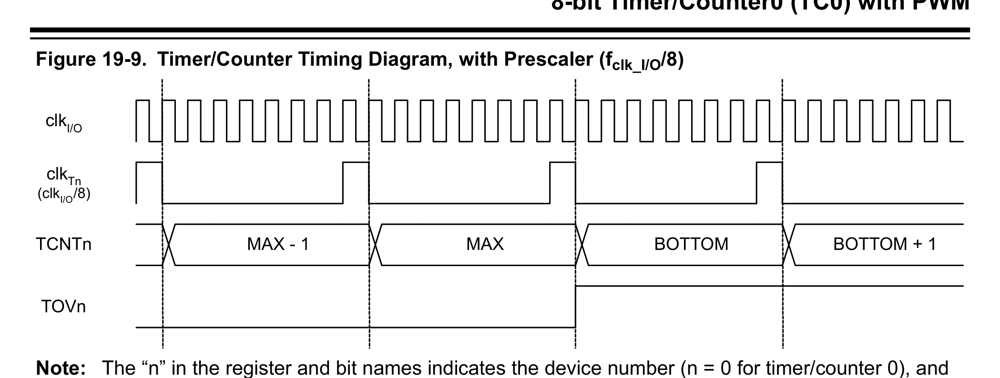
*Description*: Timer/Counter block diagram and waveform timing diagram illustrating prescaler clocks, compare match units, and PWM generation logic for Figure 19-9: Timer/Counter Timing Diagram, with Prescaler (fclk_I/O/8).

> **Figure 19-9: Timer/Counter Timing Diagram, with Prescaler (fclk_I/O/8)**

TOVn
TCNTn
MAX - 1
MAX
BOTTOM
BOTTOM + 1
clkI/O
clkTn
(clkI/O/8)
Note:  The “n” in the register and bit names indicates the device number (n = 0 for timer/counter 0), and
the “x” indicates output compare unit (A/B).
The next figure shows the setting of OCF0B in all modes and OCF0A in all modes (except CTC mode
and PWM mode where OCR0A is TOP).

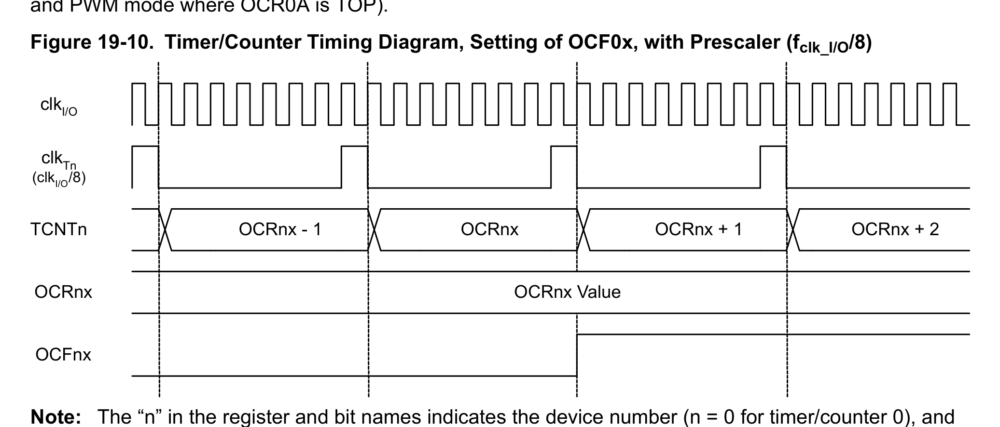
*Description*: Timer/Counter block diagram and waveform timing diagram illustrating prescaler clocks, compare match units, and PWM generation logic for Figure 19-10: Timer/Counter Timing Diagram, Setting of OCF0x, with Prescaler (fclk_I/O/8).

> **Figure 19-10: Timer/Counter Timing Diagram, Setting of OCF0x, with Prescaler (fclk_I/O/8)**

OCFnx
OCRnx
TCNTn
OCRnx Value
OCRnx - 1
OCRnx
OCRnx + 1
OCRnx + 2
clkI/O
clkTn
(clkI/O/8)
Note:  The “n” in the register and bit names indicates the device number (n = 0 for timer/counter 0), and
the “x” indicates output compare unit (A/B).
The next figure shows the setting of OCF0A and the clearing of TCNT0 in CTC mode and fast PWM
mode where OCR0A is TOP.
ATmega328/P
8-bit Timer/Counter0 (TC0) with PWM
© 2018 Microchip Technology Inc.
Datasheet Complete
DS40001984A-page 139
Downloaded from Arrow.com.
Downloaded from Arrow.com.
Downloaded from Arrow.com.
Downloaded from Arrow.com.
Downloaded from Arrow.com.
Downloaded from Arrow.com.
Downloaded from Arrow.com.
Downloaded from Arrow.com.
Downloaded from Arrow.com.
Downloaded from Arrow.com.
Downloaded from Arrow.com.
Downloaded from Arrow.com.
Downloaded from Arrow.com.
Downloaded from Arrow.com.
Downloaded from Arrow.com.
Downloaded from Arrow.com.
Downloaded from Arrow.com.
Downloaded from Arrow.com.
Downloaded from Arrow.com.
Downloaded from Arrow.com.
Downloaded from Arrow.com.
Downloaded from Arrow.com.
Downloaded from Arrow.com.
Downloaded from Arrow.com.
Downloaded from Arrow.com.
Downloaded from Arrow.com.
Downloaded from Arrow.com.
Downloaded from Arrow.com.
Downloaded from Arrow.com.
Downloaded from Arrow.com.
Downloaded from Arrow.com.
Downloaded from Arrow.com.
Downloaded from Arrow.com.
Downloaded from Arrow.com.
Downloaded from Arrow.com.
Downloaded from Arrow.com.
Downloaded from Arrow.com.
Downloaded from Arrow.com.
Downloaded from Arrow.com.
Downloaded from Arrow.com.
Downloaded from Arrow.com.
Downloaded from Arrow.com.
Downloaded from Arrow.com.
Downloaded from Arrow.com.
Downloaded from Arrow.com.
Downloaded from Arrow.com.
Downloaded from Arrow.com.
Downloaded from Arrow.com.
Downloaded from Arrow.com.
Downloaded from Arrow.com.
Downloaded from Arrow.com.
Downloaded from Arrow.com.
Downloaded from Arrow.com.
Downloaded from Arrow.com.
Downloaded from Arrow.com.
Downloaded from Arrow.com.
Downloaded from Arrow.com.
Downloaded from Arrow.com.
Downloaded from Arrow.com.
Downloaded from Arrow.com.
Downloaded from Arrow.com.
Downloaded from Arrow.com.
Downloaded from Arrow.com.
Downloaded from Arrow.com.
Downloaded from Arrow.com.
Downloaded from Arrow.com.
Downloaded from Arrow.com.
Downloaded from Arrow.com.
Downloaded from Arrow.com.
Downloaded from Arrow.com.
Downloaded from Arrow.com.
Downloaded from Arrow.com.
Downloaded from Arrow.com.
Downloaded from Arrow.com.
Downloaded from Arrow.com.
Downloaded from Arrow.com.
Downloaded from Arrow.com.
Downloaded from Arrow.com.
Downloaded from Arrow.com.
Downloaded from Arrow.com.
Downloaded from Arrow.com.
Downloaded from Arrow.com.
Downloaded from Arrow.com.
Downloaded from Arrow.com.
Downloaded from Arrow.com.
Downloaded from Arrow.com.
Downloaded from Arrow.com.
Downloaded from Arrow.com.
Downloaded from Arrow.com.
Downloaded from Arrow.com.
Downloaded from Arrow.com.
Downloaded from Arrow.com.
Downloaded from Arrow.com.
Downloaded from Arrow.com.
Downloaded from Arrow.com.
Downloaded from Arrow.com.
Downloaded from Arrow.com.
Downloaded from Arrow.com.
Downloaded from Arrow.com.
Downloaded from Arrow.com.
Downloaded from Arrow.com.
Downloaded from Arrow.com.
Downloaded from Arrow.com.
Downloaded from Arrow.com.
Downloaded from Arrow.com.
Downloaded from Arrow.com.
Downloaded from Arrow.com.
Downloaded from Arrow.com.
Downloaded from Arrow.com.
Downloaded from Arrow.com.
Downloaded from Arrow.com.
Downloaded from Arrow.com.
Downloaded from Arrow.com.
Downloaded from Arrow.com.
Downloaded from Arrow.com.
Downloaded from Arrow.com.
Downloaded from Arrow.com.
Downloaded from Arrow.com.
Downloaded from Arrow.com.
Downloaded from Arrow.com.
Downloaded from Arrow.com.
Downloaded from Arrow.com.
Downloaded from Arrow.com.
Downloaded from Arrow.com.
Downloaded from Arrow.com.
Downloaded from Arrow.com.
Downloaded from Arrow.com.
Downloaded from Arrow.com.
Downloaded from Arrow.com.
Downloaded from Arrow.com.
Downloaded from Arrow.com.
Downloaded from Arrow.com.
Downloaded from Arrow.com.
Downloaded from Arrow.com.
Downloaded from Arrow.com.
Downloaded from Arrow.com.
Downloaded from Arrow.com.
Downloaded from Arrow.com.
Downloaded from Arrow.com.


<!-- Page 140 -->
### [PDF Page 140]


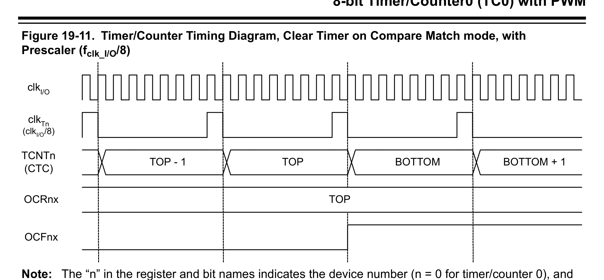
*Description*: Timer/Counter block diagram and waveform timing diagram illustrating prescaler clocks, compare match units, and PWM generation logic for Figure 19-11: Timer/Counter Timing Diagram, Clear Timer on Compare Match mode, with.

> **Figure 19-11: Timer/Counter Timing Diagram, Clear Timer on Compare Match mode, with**

Prescaler (fclk_I/O/8)
OCFnx
OCRnx
TCNTn
(CTC)
TOP
TOP - 1
TOP
BOTTOM
BOTTOM + 1
clkI/O
clkTn
(clkI/O/8)
Note:  The “n” in the register and bit names indicates the device number (n = 0 for timer/counter 0), and
the “x” indicates output compare unit (A/B).
19.9

### Register Description

ATmega328/P
8-bit Timer/Counter0 (TC0) with PWM
© 2018 Microchip Technology Inc.
Datasheet Complete
DS40001984A-page 140
Downloaded from Arrow.com.
Downloaded from Arrow.com.
Downloaded from Arrow.com.
Downloaded from Arrow.com.
Downloaded from Arrow.com.
Downloaded from Arrow.com.
Downloaded from Arrow.com.
Downloaded from Arrow.com.
Downloaded from Arrow.com.
Downloaded from Arrow.com.
Downloaded from Arrow.com.
Downloaded from Arrow.com.
Downloaded from Arrow.com.
Downloaded from Arrow.com.
Downloaded from Arrow.com.
Downloaded from Arrow.com.
Downloaded from Arrow.com.
Downloaded from Arrow.com.
Downloaded from Arrow.com.
Downloaded from Arrow.com.
Downloaded from Arrow.com.
Downloaded from Arrow.com.
Downloaded from Arrow.com.
Downloaded from Arrow.com.
Downloaded from Arrow.com.
Downloaded from Arrow.com.
Downloaded from Arrow.com.
Downloaded from Arrow.com.
Downloaded from Arrow.com.
Downloaded from Arrow.com.
Downloaded from Arrow.com.
Downloaded from Arrow.com.
Downloaded from Arrow.com.
Downloaded from Arrow.com.
Downloaded from Arrow.com.
Downloaded from Arrow.com.
Downloaded from Arrow.com.
Downloaded from Arrow.com.
Downloaded from Arrow.com.
Downloaded from Arrow.com.
Downloaded from Arrow.com.
Downloaded from Arrow.com.
Downloaded from Arrow.com.
Downloaded from Arrow.com.
Downloaded from Arrow.com.
Downloaded from Arrow.com.
Downloaded from Arrow.com.
Downloaded from Arrow.com.
Downloaded from Arrow.com.
Downloaded from Arrow.com.
Downloaded from Arrow.com.
Downloaded from Arrow.com.
Downloaded from Arrow.com.
Downloaded from Arrow.com.
Downloaded from Arrow.com.
Downloaded from Arrow.com.
Downloaded from Arrow.com.
Downloaded from Arrow.com.
Downloaded from Arrow.com.
Downloaded from Arrow.com.
Downloaded from Arrow.com.
Downloaded from Arrow.com.
Downloaded from Arrow.com.
Downloaded from Arrow.com.
Downloaded from Arrow.com.
Downloaded from Arrow.com.
Downloaded from Arrow.com.
Downloaded from Arrow.com.
Downloaded from Arrow.com.
Downloaded from Arrow.com.
Downloaded from Arrow.com.
Downloaded from Arrow.com.
Downloaded from Arrow.com.
Downloaded from Arrow.com.
Downloaded from Arrow.com.
Downloaded from Arrow.com.
Downloaded from Arrow.com.
Downloaded from Arrow.com.
Downloaded from Arrow.com.
Downloaded from Arrow.com.
Downloaded from Arrow.com.
Downloaded from Arrow.com.
Downloaded from Arrow.com.
Downloaded from Arrow.com.
Downloaded from Arrow.com.
Downloaded from Arrow.com.
Downloaded from Arrow.com.
Downloaded from Arrow.com.
Downloaded from Arrow.com.
Downloaded from Arrow.com.
Downloaded from Arrow.com.
Downloaded from Arrow.com.
Downloaded from Arrow.com.
Downloaded from Arrow.com.
Downloaded from Arrow.com.
Downloaded from Arrow.com.
Downloaded from Arrow.com.
Downloaded from Arrow.com.
Downloaded from Arrow.com.
Downloaded from Arrow.com.
Downloaded from Arrow.com.
Downloaded from Arrow.com.
Downloaded from Arrow.com.
Downloaded from Arrow.com.
Downloaded from Arrow.com.
Downloaded from Arrow.com.
Downloaded from Arrow.com.
Downloaded from Arrow.com.
Downloaded from Arrow.com.
Downloaded from Arrow.com.
Downloaded from Arrow.com.
Downloaded from Arrow.com.
Downloaded from Arrow.com.
Downloaded from Arrow.com.
Downloaded from Arrow.com.
Downloaded from Arrow.com.
Downloaded from Arrow.com.
Downloaded from Arrow.com.
Downloaded from Arrow.com.
Downloaded from Arrow.com.
Downloaded from Arrow.com.
Downloaded from Arrow.com.
Downloaded from Arrow.com.
Downloaded from Arrow.com.
Downloaded from Arrow.com.
Downloaded from Arrow.com.
Downloaded from Arrow.com.
Downloaded from Arrow.com.
Downloaded from Arrow.com.
Downloaded from Arrow.com.
Downloaded from Arrow.com.
Downloaded from Arrow.com.
Downloaded from Arrow.com.
Downloaded from Arrow.com.
Downloaded from Arrow.com.
Downloaded from Arrow.com.
Downloaded from Arrow.com.
Downloaded from Arrow.com.
Downloaded from Arrow.com.
Downloaded from Arrow.com.


<!-- Page 141 -->
### [PDF Page 141]

19.9.1
TC0 Control Register A
Name:
TCCR0A
Offset:
0x44
Reset:
0x00
Property:  When addressing as I/O register: address offset is 0x24
Bit
7
6
5
4
3
2
1
0
COM0A[1:0]
COM0B[1:0]
WGM0[1:0]
Access
R/W
R/W
R/W
R/W
R/W
R/W
Reset
0
0
0
0
0
0
Bits 7:6 – COM0A[1:0] Compare Output Mode for Channel A
These bits control the Output Compare pin (OC0A) behavior. If one or both of the COM0A[1:0] bits are
set, the OC0A output overrides the normal port functionality of the I/O pin it is connected to. However,
note that the Data Direction Register (DDR) bit corresponding to the OC0A pin must be set in order to
enable the output driver.
When OC0A is connected to the pin, the function of the COM0A[1:0] bits depends on the WGM0[2:0] bit
setting. The table below shows the COM0A[1:0] bit functionality when the WGM0[2:0] bits are set to a
normal or CTC mode (non-PWM).

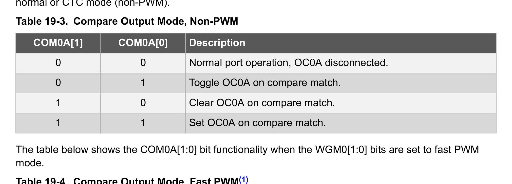
*Description*: Timer/Counter block diagram and waveform timing diagram illustrating prescaler clocks, compare match units, and PWM generation logic for Table 19-3: Compare Output Mode, Non-PWM.

> **Table 19-3: Compare Output Mode, Non-PWM**

COM0A[1]
COM0A[0]
Description
0
0
Normal port operation, OC0A disconnected.
0
1
Toggle OC0A on compare match.
1
0
Clear OC0A on compare match.
1
1
Set OC0A on compare match.
The table below shows the COM0A[1:0] bit functionality when the WGM0[1:0] bits are set to fast PWM
mode.


*Description*: Timer/Counter block diagram and waveform timing diagram illustrating prescaler clocks, compare match units, and PWM generation logic for Table 19-4: Compare Output Mode, Fast PWM(1).

> **Table 19-4: Compare Output Mode, Fast PWM(1)**

COM0A[1] COM0A[0] Description
0
0
Normal port operation, OC0A disconnected.
0
1
WGM0[2:0]: Normal port operation, OC0A disconnected.
WGM0[2:1]: Toggle OC0A on compare match.
1
0
Clear OC0A on compare match, set OC0A at BOTTOM (Non-inverting mode).
1
1
Set OC0A on compare match, clear OC0A at BOTTOM (Inverting mode).
Note:
1.
A special case occurs when OCR0A equals TOP and COM0A[1] is set. In this case the compare
match is ignored, but the set or clear is done at BOTTOM. Refer to Fast PWM Mode for details.
ATmega328/P
8-bit Timer/Counter0 (TC0) with PWM
© 2018 Microchip Technology Inc.
Datasheet Complete
DS40001984A-page 141
Downloaded from Arrow.com.
Downloaded from Arrow.com.
Downloaded from Arrow.com.
Downloaded from Arrow.com.
Downloaded from Arrow.com.
Downloaded from Arrow.com.
Downloaded from Arrow.com.
Downloaded from Arrow.com.
Downloaded from Arrow.com.
Downloaded from Arrow.com.
Downloaded from Arrow.com.
Downloaded from Arrow.com.
Downloaded from Arrow.com.
Downloaded from Arrow.com.
Downloaded from Arrow.com.
Downloaded from Arrow.com.
Downloaded from Arrow.com.
Downloaded from Arrow.com.
Downloaded from Arrow.com.
Downloaded from Arrow.com.
Downloaded from Arrow.com.
Downloaded from Arrow.com.
Downloaded from Arrow.com.
Downloaded from Arrow.com.
Downloaded from Arrow.com.
Downloaded from Arrow.com.
Downloaded from Arrow.com.
Downloaded from Arrow.com.
Downloaded from Arrow.com.
Downloaded from Arrow.com.
Downloaded from Arrow.com.
Downloaded from Arrow.com.
Downloaded from Arrow.com.
Downloaded from Arrow.com.
Downloaded from Arrow.com.
Downloaded from Arrow.com.
Downloaded from Arrow.com.
Downloaded from Arrow.com.
Downloaded from Arrow.com.
Downloaded from Arrow.com.
Downloaded from Arrow.com.
Downloaded from Arrow.com.
Downloaded from Arrow.com.
Downloaded from Arrow.com.
Downloaded from Arrow.com.
Downloaded from Arrow.com.
Downloaded from Arrow.com.
Downloaded from Arrow.com.
Downloaded from Arrow.com.
Downloaded from Arrow.com.
Downloaded from Arrow.com.
Downloaded from Arrow.com.
Downloaded from Arrow.com.
Downloaded from Arrow.com.
Downloaded from Arrow.com.
Downloaded from Arrow.com.
Downloaded from Arrow.com.
Downloaded from Arrow.com.
Downloaded from Arrow.com.
Downloaded from Arrow.com.
Downloaded from Arrow.com.
Downloaded from Arrow.com.
Downloaded from Arrow.com.
Downloaded from Arrow.com.
Downloaded from Arrow.com.
Downloaded from Arrow.com.
Downloaded from Arrow.com.
Downloaded from Arrow.com.
Downloaded from Arrow.com.
Downloaded from Arrow.com.
Downloaded from Arrow.com.
Downloaded from Arrow.com.
Downloaded from Arrow.com.
Downloaded from Arrow.com.
Downloaded from Arrow.com.
Downloaded from Arrow.com.
Downloaded from Arrow.com.
Downloaded from Arrow.com.
Downloaded from Arrow.com.
Downloaded from Arrow.com.
Downloaded from Arrow.com.
Downloaded from Arrow.com.
Downloaded from Arrow.com.
Downloaded from Arrow.com.
Downloaded from Arrow.com.
Downloaded from Arrow.com.
Downloaded from Arrow.com.
Downloaded from Arrow.com.
Downloaded from Arrow.com.
Downloaded from Arrow.com.
Downloaded from Arrow.com.
Downloaded from Arrow.com.
Downloaded from Arrow.com.
Downloaded from Arrow.com.
Downloaded from Arrow.com.
Downloaded from Arrow.com.
Downloaded from Arrow.com.
Downloaded from Arrow.com.
Downloaded from Arrow.com.
Downloaded from Arrow.com.
Downloaded from Arrow.com.
Downloaded from Arrow.com.
Downloaded from Arrow.com.
Downloaded from Arrow.com.
Downloaded from Arrow.com.
Downloaded from Arrow.com.
Downloaded from Arrow.com.
Downloaded from Arrow.com.
Downloaded from Arrow.com.
Downloaded from Arrow.com.
Downloaded from Arrow.com.
Downloaded from Arrow.com.
Downloaded from Arrow.com.
Downloaded from Arrow.com.
Downloaded from Arrow.com.
Downloaded from Arrow.com.
Downloaded from Arrow.com.
Downloaded from Arrow.com.
Downloaded from Arrow.com.
Downloaded from Arrow.com.
Downloaded from Arrow.com.
Downloaded from Arrow.com.
Downloaded from Arrow.com.
Downloaded from Arrow.com.
Downloaded from Arrow.com.
Downloaded from Arrow.com.
Downloaded from Arrow.com.
Downloaded from Arrow.com.
Downloaded from Arrow.com.
Downloaded from Arrow.com.
Downloaded from Arrow.com.
Downloaded from Arrow.com.
Downloaded from Arrow.com.
Downloaded from Arrow.com.
Downloaded from Arrow.com.
Downloaded from Arrow.com.
Downloaded from Arrow.com.
Downloaded from Arrow.com.
Downloaded from Arrow.com.
Downloaded from Arrow.com.
Downloaded from Arrow.com.


<!-- Page 142 -->
### [PDF Page 142]

The table below shows the COM0A[1:0] bit functionality when the WGM0[2:0] bits are set to phase
correct PWM mode.

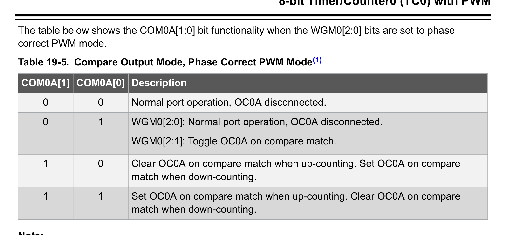
*Description*: Timer/Counter block diagram and waveform timing diagram illustrating prescaler clocks, compare match units, and PWM generation logic for Table 19-5: Compare Output Mode, Phase Correct PWM Mode(1).

> **Table 19-5: Compare Output Mode, Phase Correct PWM Mode(1)**

COM0A[1] COM0A[0] Description
0
0
Normal port operation, OC0A disconnected.
0
1
WGM0[2:0]: Normal port operation, OC0A disconnected.
WGM0[2:1]: Toggle OC0A on compare match.
1
0
Clear OC0A on compare match when up-counting. Set OC0A on compare
match when down-counting.
1
1
Set OC0A on compare match when up-counting. Clear OC0A on compare
match when down-counting.
Note:
1.
A special case occurs when OCR0A equals TOP and COM0A[1] is set. In this case, the compare
match is ignored, but the set or clear is done at TOP. Refer to Phase Correct PWM Mode for
details.
Bits 5:4 – COM0B[1:0] Compare Output Mode for Channel B
These bits control the Output Compare pin (OC0B) behavior. If one or both of the COM0B[1:0] bits are
set, the OC0B output overrides the normal port functionality of the I/O pin it is connected to. However,
note that the Data Direction Register (DDR) bit corresponding to the OC0B pin must be set in order to
enable the output driver.
When OC0B is connected to the pin, the function of the COM0B[1:0] bits depends on the WGM0[2:0] bit
setting. The table shows the COM0B[1:0] bit functionality when the WGM0[2:0] bits are set to a normal or
CTC mode (non- PWM).

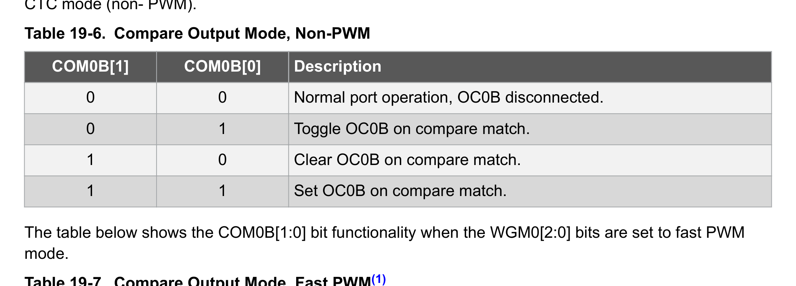
*Description*: Timer/Counter block diagram and waveform timing diagram illustrating prescaler clocks, compare match units, and PWM generation logic for Table 19-6: Compare Output Mode, Non-PWM.

> **Table 19-6: Compare Output Mode, Non-PWM**

COM0B[1]
COM0B[0]
Description
0
0
Normal port operation, OC0B disconnected.
0
1
Toggle OC0B on compare match.
1
0
Clear OC0B on compare match.
1
1
Set OC0B on compare match.
The table below shows the COM0B[1:0] bit functionality when the WGM0[2:0] bits are set to fast PWM
mode.

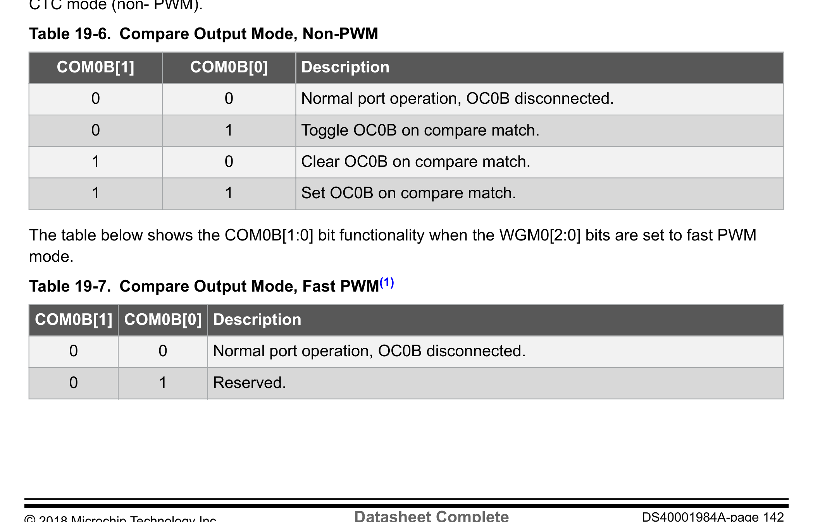
*Description*: Timer/Counter block diagram and waveform timing diagram illustrating prescaler clocks, compare match units, and PWM generation logic for Table 19-7: Compare Output Mode, Fast PWM(1).

> **Table 19-7: Compare Output Mode, Fast PWM(1)**

COM0B[1] COM0B[0] Description
0
0
Normal port operation, OC0B disconnected.
0
1
Reserved.
ATmega328/P
8-bit Timer/Counter0 (TC0) with PWM
© 2018 Microchip Technology Inc.
Datasheet Complete
DS40001984A-page 142
Downloaded from Arrow.com.
Downloaded from Arrow.com.
Downloaded from Arrow.com.
Downloaded from Arrow.com.
Downloaded from Arrow.com.
Downloaded from Arrow.com.
Downloaded from Arrow.com.
Downloaded from Arrow.com.
Downloaded from Arrow.com.
Downloaded from Arrow.com.
Downloaded from Arrow.com.
Downloaded from Arrow.com.
Downloaded from Arrow.com.
Downloaded from Arrow.com.
Downloaded from Arrow.com.
Downloaded from Arrow.com.
Downloaded from Arrow.com.
Downloaded from Arrow.com.
Downloaded from Arrow.com.
Downloaded from Arrow.com.
Downloaded from Arrow.com.
Downloaded from Arrow.com.
Downloaded from Arrow.com.
Downloaded from Arrow.com.
Downloaded from Arrow.com.
Downloaded from Arrow.com.
Downloaded from Arrow.com.
Downloaded from Arrow.com.
Downloaded from Arrow.com.
Downloaded from Arrow.com.
Downloaded from Arrow.com.
Downloaded from Arrow.com.
Downloaded from Arrow.com.
Downloaded from Arrow.com.
Downloaded from Arrow.com.
Downloaded from Arrow.com.
Downloaded from Arrow.com.
Downloaded from Arrow.com.
Downloaded from Arrow.com.
Downloaded from Arrow.com.
Downloaded from Arrow.com.
Downloaded from Arrow.com.
Downloaded from Arrow.com.
Downloaded from Arrow.com.
Downloaded from Arrow.com.
Downloaded from Arrow.com.
Downloaded from Arrow.com.
Downloaded from Arrow.com.
Downloaded from Arrow.com.
Downloaded from Arrow.com.
Downloaded from Arrow.com.
Downloaded from Arrow.com.
Downloaded from Arrow.com.
Downloaded from Arrow.com.
Downloaded from Arrow.com.
Downloaded from Arrow.com.
Downloaded from Arrow.com.
Downloaded from Arrow.com.
Downloaded from Arrow.com.
Downloaded from Arrow.com.
Downloaded from Arrow.com.
Downloaded from Arrow.com.
Downloaded from Arrow.com.
Downloaded from Arrow.com.
Downloaded from Arrow.com.
Downloaded from Arrow.com.
Downloaded from Arrow.com.
Downloaded from Arrow.com.
Downloaded from Arrow.com.
Downloaded from Arrow.com.
Downloaded from Arrow.com.
Downloaded from Arrow.com.
Downloaded from Arrow.com.
Downloaded from Arrow.com.
Downloaded from Arrow.com.
Downloaded from Arrow.com.
Downloaded from Arrow.com.
Downloaded from Arrow.com.
Downloaded from Arrow.com.
Downloaded from Arrow.com.
Downloaded from Arrow.com.
Downloaded from Arrow.com.
Downloaded from Arrow.com.
Downloaded from Arrow.com.
Downloaded from Arrow.com.
Downloaded from Arrow.com.
Downloaded from Arrow.com.
Downloaded from Arrow.com.
Downloaded from Arrow.com.
Downloaded from Arrow.com.
Downloaded from Arrow.com.
Downloaded from Arrow.com.
Downloaded from Arrow.com.
Downloaded from Arrow.com.
Downloaded from Arrow.com.
Downloaded from Arrow.com.
Downloaded from Arrow.com.
Downloaded from Arrow.com.
Downloaded from Arrow.com.
Downloaded from Arrow.com.
Downloaded from Arrow.com.
Downloaded from Arrow.com.
Downloaded from Arrow.com.
Downloaded from Arrow.com.
Downloaded from Arrow.com.
Downloaded from Arrow.com.
Downloaded from Arrow.com.
Downloaded from Arrow.com.
Downloaded from Arrow.com.
Downloaded from Arrow.com.
Downloaded from Arrow.com.
Downloaded from Arrow.com.
Downloaded from Arrow.com.
Downloaded from Arrow.com.
Downloaded from Arrow.com.
Downloaded from Arrow.com.
Downloaded from Arrow.com.
Downloaded from Arrow.com.
Downloaded from Arrow.com.
Downloaded from Arrow.com.
Downloaded from Arrow.com.
Downloaded from Arrow.com.
Downloaded from Arrow.com.
Downloaded from Arrow.com.
Downloaded from Arrow.com.
Downloaded from Arrow.com.
Downloaded from Arrow.com.
Downloaded from Arrow.com.
Downloaded from Arrow.com.
Downloaded from Arrow.com.
Downloaded from Arrow.com.
Downloaded from Arrow.com.
Downloaded from Arrow.com.
Downloaded from Arrow.com.
Downloaded from Arrow.com.
Downloaded from Arrow.com.
Downloaded from Arrow.com.
Downloaded from Arrow.com.
Downloaded from Arrow.com.
Downloaded from Arrow.com.
Downloaded from Arrow.com.
Downloaded from Arrow.com.


<!-- Page 143 -->
### [PDF Page 143]

COM0B[1] COM0B[0] Description
1
0
Clear OC0B on compare match, set OC0B at BOTTOM, (Non-inverting mode).
1
1
Set OC0B on compare match, clear OC0B at BOTTOM, (Inverting mode).
Note:
1.
A special case occurs when OCR0B equals TOP and COM0B1 is set. In this case, the compare
match is ignored, but the set or clear is done at TOP. Refer to Fast PWM Mode for details.
The table below shows the COM0B[1:0] bit functionality when the WGM0[2:0] bits are set to phase
correct PWM mode.

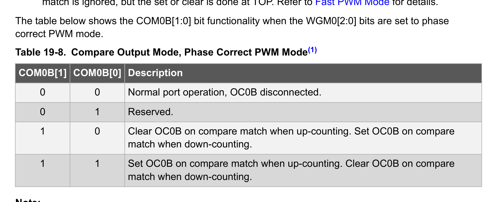
*Description*: Timer/Counter block diagram and waveform timing diagram illustrating prescaler clocks, compare match units, and PWM generation logic for Table 19-8: Compare Output Mode, Phase Correct PWM Mode(1).

> **Table 19-8: Compare Output Mode, Phase Correct PWM Mode(1)**

COM0B[1] COM0B[0] Description
0
0
Normal port operation, OC0B disconnected.
0
1
Reserved.
1
0
Clear OC0B on compare match when up-counting. Set OC0B on compare
match when down-counting.
1
1
Set OC0B on compare match when up-counting. Clear OC0B on compare
match when down-counting.
Note:
1.
A special case occurs when OCR0B equals TOP and COM0B[1] is set. In this case, the compare
match is ignored, but the set or clear is done at TOP. Refer to Phase Correct PWM Mode for
details.
Bits 1:0 – WGM0[1:0] Waveform Generation Mode
Combined with the WGM02 bit found in the TCCR0B register, these bits control the counting sequence of
the counter, the source for maximum (TOP) counter value, and what type of waveform generation to be
used. Modes of operation supported by the Timer/Counter unit are: Normal mode (counter), Clear Timer
on Compare Match (CTC) mode, and two types of Pulse Width Modulation (PWM) modes (see Modes of
Operation).

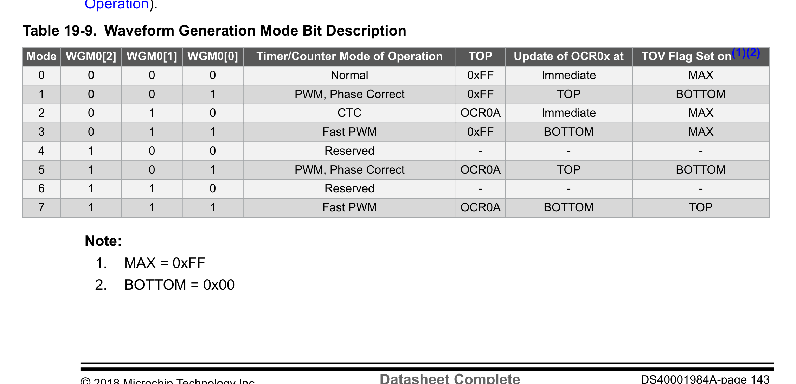
*Description*: Hardware reference table detailing register bit field settings, electrical operating limits, or memory configurations for Table 19-9: Waveform Generation Mode Bit Description.

> **Table 19-9: Waveform Generation Mode Bit Description**

Mode WGM0[2]
WGM0[1]
WGM0[0]
Timer/Counter Mode of Operation
TOP
Update of OCR0x at
TOV Flag Set on(1)(2)
0
0
0
0
Normal
0xFF
Immediate
MAX
1
0
0
1
PWM, Phase Correct
0xFF
TOP
BOTTOM
2
0
1
0
CTC
OCR0A
Immediate
MAX
3
0
1
1
Fast PWM
0xFF
BOTTOM
MAX
4
1
0
0
Reserved
-
-
-
5
1
0
1
PWM, Phase Correct
OCR0A
TOP
BOTTOM
6
1
1
0
Reserved
-
-
-
7
1
1
1
Fast PWM
OCR0A
BOTTOM
TOP
Note:
1.
MAX = 0xFF
2.
BOTTOM = 0x00
ATmega328/P
8-bit Timer/Counter0 (TC0) with PWM
© 2018 Microchip Technology Inc.
Datasheet Complete
DS40001984A-page 143
Downloaded from Arrow.com.
Downloaded from Arrow.com.
Downloaded from Arrow.com.
Downloaded from Arrow.com.
Downloaded from Arrow.com.
Downloaded from Arrow.com.
Downloaded from Arrow.com.
Downloaded from Arrow.com.
Downloaded from Arrow.com.
Downloaded from Arrow.com.
Downloaded from Arrow.com.
Downloaded from Arrow.com.
Downloaded from Arrow.com.
Downloaded from Arrow.com.
Downloaded from Arrow.com.
Downloaded from Arrow.com.
Downloaded from Arrow.com.
Downloaded from Arrow.com.
Downloaded from Arrow.com.
Downloaded from Arrow.com.
Downloaded from Arrow.com.
Downloaded from Arrow.com.
Downloaded from Arrow.com.
Downloaded from Arrow.com.
Downloaded from Arrow.com.
Downloaded from Arrow.com.
Downloaded from Arrow.com.
Downloaded from Arrow.com.
Downloaded from Arrow.com.
Downloaded from Arrow.com.
Downloaded from Arrow.com.
Downloaded from Arrow.com.
Downloaded from Arrow.com.
Downloaded from Arrow.com.
Downloaded from Arrow.com.
Downloaded from Arrow.com.
Downloaded from Arrow.com.
Downloaded from Arrow.com.
Downloaded from Arrow.com.
Downloaded from Arrow.com.
Downloaded from Arrow.com.
Downloaded from Arrow.com.
Downloaded from Arrow.com.
Downloaded from Arrow.com.
Downloaded from Arrow.com.
Downloaded from Arrow.com.
Downloaded from Arrow.com.
Downloaded from Arrow.com.
Downloaded from Arrow.com.
Downloaded from Arrow.com.
Downloaded from Arrow.com.
Downloaded from Arrow.com.
Downloaded from Arrow.com.
Downloaded from Arrow.com.
Downloaded from Arrow.com.
Downloaded from Arrow.com.
Downloaded from Arrow.com.
Downloaded from Arrow.com.
Downloaded from Arrow.com.
Downloaded from Arrow.com.
Downloaded from Arrow.com.
Downloaded from Arrow.com.
Downloaded from Arrow.com.
Downloaded from Arrow.com.
Downloaded from Arrow.com.
Downloaded from Arrow.com.
Downloaded from Arrow.com.
Downloaded from Arrow.com.
Downloaded from Arrow.com.
Downloaded from Arrow.com.
Downloaded from Arrow.com.
Downloaded from Arrow.com.
Downloaded from Arrow.com.
Downloaded from Arrow.com.
Downloaded from Arrow.com.
Downloaded from Arrow.com.
Downloaded from Arrow.com.
Downloaded from Arrow.com.
Downloaded from Arrow.com.
Downloaded from Arrow.com.
Downloaded from Arrow.com.
Downloaded from Arrow.com.
Downloaded from Arrow.com.
Downloaded from Arrow.com.
Downloaded from Arrow.com.
Downloaded from Arrow.com.
Downloaded from Arrow.com.
Downloaded from Arrow.com.
Downloaded from Arrow.com.
Downloaded from Arrow.com.
Downloaded from Arrow.com.
Downloaded from Arrow.com.
Downloaded from Arrow.com.
Downloaded from Arrow.com.
Downloaded from Arrow.com.
Downloaded from Arrow.com.
Downloaded from Arrow.com.
Downloaded from Arrow.com.
Downloaded from Arrow.com.
Downloaded from Arrow.com.
Downloaded from Arrow.com.
Downloaded from Arrow.com.
Downloaded from Arrow.com.
Downloaded from Arrow.com.
Downloaded from Arrow.com.
Downloaded from Arrow.com.
Downloaded from Arrow.com.
Downloaded from Arrow.com.
Downloaded from Arrow.com.
Downloaded from Arrow.com.
Downloaded from Arrow.com.
Downloaded from Arrow.com.
Downloaded from Arrow.com.
Downloaded from Arrow.com.
Downloaded from Arrow.com.
Downloaded from Arrow.com.
Downloaded from Arrow.com.
Downloaded from Arrow.com.
Downloaded from Arrow.com.
Downloaded from Arrow.com.
Downloaded from Arrow.com.
Downloaded from Arrow.com.
Downloaded from Arrow.com.
Downloaded from Arrow.com.
Downloaded from Arrow.com.
Downloaded from Arrow.com.
Downloaded from Arrow.com.
Downloaded from Arrow.com.
Downloaded from Arrow.com.
Downloaded from Arrow.com.
Downloaded from Arrow.com.
Downloaded from Arrow.com.
Downloaded from Arrow.com.
Downloaded from Arrow.com.
Downloaded from Arrow.com.
Downloaded from Arrow.com.
Downloaded from Arrow.com.
Downloaded from Arrow.com.
Downloaded from Arrow.com.
Downloaded from Arrow.com.
Downloaded from Arrow.com.
Downloaded from Arrow.com.
Downloaded from Arrow.com.


<!-- Page 144 -->
### [PDF Page 144]

19.9.2
TC0 Control Register B
Name:
TCCR0B
Offset:
0x45
Reset:
0x00
Property:  When addressing as I/O register: address offset is 0x25
Bit
7
6
5
4
3
2
1
0
FOC0A
FOC0B
WGM02
CS0[2:0]
Access
R/W
R/W
R/W
R/W
R/W
R/W
Reset
0
0
0
0
0
0
Bit 7 – FOC0A Force Output Compare A
The FOC0A bit is only active when the WGM bits specify a non-PWM mode.
To ensure compatibility with future devices, this bit must be set to zero when TCCR0B is written when
operating in PWM mode. When writing a logical one to the FOC0A bit, an immediate compare match is
forced on the waveform generation unit. The OC0A output is changed according to its COM0A[1:0] bits
setting. The FOC0A bit is implemented as a strobe. Therefore, it is the value present in the COM0A[1:0]
bits that determines the effect of the forced compare.
A FOC0A strobe will not generate any interrupt, nor will it clear the timer in CTC mode using OCR0A as
TOP.
The FOC0A bit is always read as zero.
Bit 6 – FOC0B Force Output Compare B
The FOC0B bit is only active when the WGM bits specify a non-PWM mode.
To ensure compatibility with future devices, this bit must be set to zero when TCCR0B is written when
operating in PWM mode. When writing a logical one to the FOC0B bit, an immediate compare match is
forced on the waveform generation unit. The OC0B output is changed according to its COM0B[1:0] bits
setting. The FOC0B bit is implemented as a strobe. Therefore, it is the value present in the COM0B[1:0]
bits that determines the effect of the forced compare.
A FOC0B strobe will not generate any interrupt, nor will it clear the timer in CTC mode using OCR0B as
TOP.
The FOC0B bit is always read as zero.
Bit 3 – WGM02 Waveform Generation Mode
Refer to TCCR0A register.
Bits 2:0 – CS0[2:0] Clock Select 0
The three clock select bits select the clock source to be used by the timer/counter.

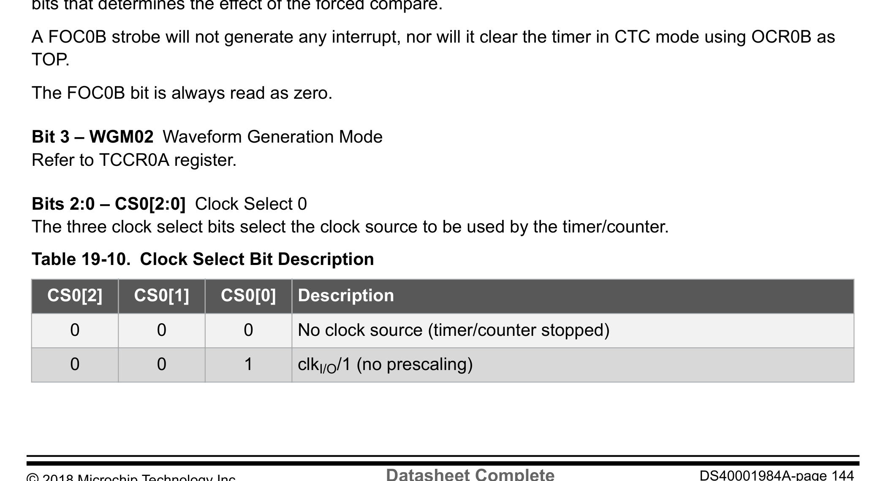
*Description*: Clock distribution diagram showing oscillator sources, prescaler dividers, and peripheral clock routing for Table 19-10: Clock Select Bit Description.

> **Table 19-10: Clock Select Bit Description**

CS0[2]
CS0[1]
CS0[0]
Description
0
0
0
No clock source (timer/counter stopped)
0
0
1
clkI/O/1 (no prescaling)
ATmega328/P
8-bit Timer/Counter0 (TC0) with PWM
© 2018 Microchip Technology Inc.
Datasheet Complete
DS40001984A-page 144
Downloaded from Arrow.com.
Downloaded from Arrow.com.
Downloaded from Arrow.com.
Downloaded from Arrow.com.
Downloaded from Arrow.com.
Downloaded from Arrow.com.
Downloaded from Arrow.com.
Downloaded from Arrow.com.
Downloaded from Arrow.com.
Downloaded from Arrow.com.
Downloaded from Arrow.com.
Downloaded from Arrow.com.
Downloaded from Arrow.com.
Downloaded from Arrow.com.
Downloaded from Arrow.com.
Downloaded from Arrow.com.
Downloaded from Arrow.com.
Downloaded from Arrow.com.
Downloaded from Arrow.com.
Downloaded from Arrow.com.
Downloaded from Arrow.com.
Downloaded from Arrow.com.
Downloaded from Arrow.com.
Downloaded from Arrow.com.
Downloaded from Arrow.com.
Downloaded from Arrow.com.
Downloaded from Arrow.com.
Downloaded from Arrow.com.
Downloaded from Arrow.com.
Downloaded from Arrow.com.
Downloaded from Arrow.com.
Downloaded from Arrow.com.
Downloaded from Arrow.com.
Downloaded from Arrow.com.
Downloaded from Arrow.com.
Downloaded from Arrow.com.
Downloaded from Arrow.com.
Downloaded from Arrow.com.
Downloaded from Arrow.com.
Downloaded from Arrow.com.
Downloaded from Arrow.com.
Downloaded from Arrow.com.
Downloaded from Arrow.com.
Downloaded from Arrow.com.
Downloaded from Arrow.com.
Downloaded from Arrow.com.
Downloaded from Arrow.com.
Downloaded from Arrow.com.
Downloaded from Arrow.com.
Downloaded from Arrow.com.
Downloaded from Arrow.com.
Downloaded from Arrow.com.
Downloaded from Arrow.com.
Downloaded from Arrow.com.
Downloaded from Arrow.com.
Downloaded from Arrow.com.
Downloaded from Arrow.com.
Downloaded from Arrow.com.
Downloaded from Arrow.com.
Downloaded from Arrow.com.
Downloaded from Arrow.com.
Downloaded from Arrow.com.
Downloaded from Arrow.com.
Downloaded from Arrow.com.
Downloaded from Arrow.com.
Downloaded from Arrow.com.
Downloaded from Arrow.com.
Downloaded from Arrow.com.
Downloaded from Arrow.com.
Downloaded from Arrow.com.
Downloaded from Arrow.com.
Downloaded from Arrow.com.
Downloaded from Arrow.com.
Downloaded from Arrow.com.
Downloaded from Arrow.com.
Downloaded from Arrow.com.
Downloaded from Arrow.com.
Downloaded from Arrow.com.
Downloaded from Arrow.com.
Downloaded from Arrow.com.
Downloaded from Arrow.com.
Downloaded from Arrow.com.
Downloaded from Arrow.com.
Downloaded from Arrow.com.
Downloaded from Arrow.com.
Downloaded from Arrow.com.
Downloaded from Arrow.com.
Downloaded from Arrow.com.
Downloaded from Arrow.com.
Downloaded from Arrow.com.
Downloaded from Arrow.com.
Downloaded from Arrow.com.
Downloaded from Arrow.com.
Downloaded from Arrow.com.
Downloaded from Arrow.com.
Downloaded from Arrow.com.
Downloaded from Arrow.com.
Downloaded from Arrow.com.
Downloaded from Arrow.com.
Downloaded from Arrow.com.
Downloaded from Arrow.com.
Downloaded from Arrow.com.
Downloaded from Arrow.com.
Downloaded from Arrow.com.
Downloaded from Arrow.com.
Downloaded from Arrow.com.
Downloaded from Arrow.com.
Downloaded from Arrow.com.
Downloaded from Arrow.com.
Downloaded from Arrow.com.
Downloaded from Arrow.com.
Downloaded from Arrow.com.
Downloaded from Arrow.com.
Downloaded from Arrow.com.
Downloaded from Arrow.com.
Downloaded from Arrow.com.
Downloaded from Arrow.com.
Downloaded from Arrow.com.
Downloaded from Arrow.com.
Downloaded from Arrow.com.
Downloaded from Arrow.com.
Downloaded from Arrow.com.
Downloaded from Arrow.com.
Downloaded from Arrow.com.
Downloaded from Arrow.com.
Downloaded from Arrow.com.
Downloaded from Arrow.com.
Downloaded from Arrow.com.
Downloaded from Arrow.com.
Downloaded from Arrow.com.
Downloaded from Arrow.com.
Downloaded from Arrow.com.
Downloaded from Arrow.com.
Downloaded from Arrow.com.
Downloaded from Arrow.com.
Downloaded from Arrow.com.
Downloaded from Arrow.com.
Downloaded from Arrow.com.
Downloaded from Arrow.com.
Downloaded from Arrow.com.
Downloaded from Arrow.com.
Downloaded from Arrow.com.
Downloaded from Arrow.com.
Downloaded from Arrow.com.


<!-- Page 145 -->
### [PDF Page 145]

CS0[2]
CS0[1]
CS0[0]
Description
0
1
0
clkI/O/8 (from prescaler)
0
1
1
clkI/O/64 (from prescaler)
1
0
0
clkI/O/256 (from prescaler)
1
0
1
clkI/O/1024 (from prescaler)
1
1
0
External clock source on T0 pin. Clock on falling edge.
1
1
1
External clock source on T0 pin. Clock on rising edge.
If external pin modes are used for the timer/counter0, transitions on the T0 pin will clock the counter even
if the pin is configured as an output. This feature allows software control of the counting.
ATmega328/P
8-bit Timer/Counter0 (TC0) with PWM
© 2018 Microchip Technology Inc.
Datasheet Complete
DS40001984A-page 145
Downloaded from Arrow.com.
Downloaded from Arrow.com.
Downloaded from Arrow.com.
Downloaded from Arrow.com.
Downloaded from Arrow.com.
Downloaded from Arrow.com.
Downloaded from Arrow.com.
Downloaded from Arrow.com.
Downloaded from Arrow.com.
Downloaded from Arrow.com.
Downloaded from Arrow.com.
Downloaded from Arrow.com.
Downloaded from Arrow.com.
Downloaded from Arrow.com.
Downloaded from Arrow.com.
Downloaded from Arrow.com.
Downloaded from Arrow.com.
Downloaded from Arrow.com.
Downloaded from Arrow.com.
Downloaded from Arrow.com.
Downloaded from Arrow.com.
Downloaded from Arrow.com.
Downloaded from Arrow.com.
Downloaded from Arrow.com.
Downloaded from Arrow.com.
Downloaded from Arrow.com.
Downloaded from Arrow.com.
Downloaded from Arrow.com.
Downloaded from Arrow.com.
Downloaded from Arrow.com.
Downloaded from Arrow.com.
Downloaded from Arrow.com.
Downloaded from Arrow.com.
Downloaded from Arrow.com.
Downloaded from Arrow.com.
Downloaded from Arrow.com.
Downloaded from Arrow.com.
Downloaded from Arrow.com.
Downloaded from Arrow.com.
Downloaded from Arrow.com.
Downloaded from Arrow.com.
Downloaded from Arrow.com.
Downloaded from Arrow.com.
Downloaded from Arrow.com.
Downloaded from Arrow.com.
Downloaded from Arrow.com.
Downloaded from Arrow.com.
Downloaded from Arrow.com.
Downloaded from Arrow.com.
Downloaded from Arrow.com.
Downloaded from Arrow.com.
Downloaded from Arrow.com.
Downloaded from Arrow.com.
Downloaded from Arrow.com.
Downloaded from Arrow.com.
Downloaded from Arrow.com.
Downloaded from Arrow.com.
Downloaded from Arrow.com.
Downloaded from Arrow.com.
Downloaded from Arrow.com.
Downloaded from Arrow.com.
Downloaded from Arrow.com.
Downloaded from Arrow.com.
Downloaded from Arrow.com.
Downloaded from Arrow.com.
Downloaded from Arrow.com.
Downloaded from Arrow.com.
Downloaded from Arrow.com.
Downloaded from Arrow.com.
Downloaded from Arrow.com.
Downloaded from Arrow.com.
Downloaded from Arrow.com.
Downloaded from Arrow.com.
Downloaded from Arrow.com.
Downloaded from Arrow.com.
Downloaded from Arrow.com.
Downloaded from Arrow.com.
Downloaded from Arrow.com.
Downloaded from Arrow.com.
Downloaded from Arrow.com.
Downloaded from Arrow.com.
Downloaded from Arrow.com.
Downloaded from Arrow.com.
Downloaded from Arrow.com.
Downloaded from Arrow.com.
Downloaded from Arrow.com.
Downloaded from Arrow.com.
Downloaded from Arrow.com.
Downloaded from Arrow.com.
Downloaded from Arrow.com.
Downloaded from Arrow.com.
Downloaded from Arrow.com.
Downloaded from Arrow.com.
Downloaded from Arrow.com.
Downloaded from Arrow.com.
Downloaded from Arrow.com.
Downloaded from Arrow.com.
Downloaded from Arrow.com.
Downloaded from Arrow.com.
Downloaded from Arrow.com.
Downloaded from Arrow.com.
Downloaded from Arrow.com.
Downloaded from Arrow.com.
Downloaded from Arrow.com.
Downloaded from Arrow.com.
Downloaded from Arrow.com.
Downloaded from Arrow.com.
Downloaded from Arrow.com.
Downloaded from Arrow.com.
Downloaded from Arrow.com.
Downloaded from Arrow.com.
Downloaded from Arrow.com.
Downloaded from Arrow.com.
Downloaded from Arrow.com.
Downloaded from Arrow.com.
Downloaded from Arrow.com.
Downloaded from Arrow.com.
Downloaded from Arrow.com.
Downloaded from Arrow.com.
Downloaded from Arrow.com.
Downloaded from Arrow.com.
Downloaded from Arrow.com.
Downloaded from Arrow.com.
Downloaded from Arrow.com.
Downloaded from Arrow.com.
Downloaded from Arrow.com.
Downloaded from Arrow.com.
Downloaded from Arrow.com.
Downloaded from Arrow.com.
Downloaded from Arrow.com.
Downloaded from Arrow.com.
Downloaded from Arrow.com.
Downloaded from Arrow.com.
Downloaded from Arrow.com.
Downloaded from Arrow.com.
Downloaded from Arrow.com.
Downloaded from Arrow.com.
Downloaded from Arrow.com.
Downloaded from Arrow.com.
Downloaded from Arrow.com.
Downloaded from Arrow.com.
Downloaded from Arrow.com.
Downloaded from Arrow.com.
Downloaded from Arrow.com.
Downloaded from Arrow.com.


<!-- Page 146 -->
### [PDF Page 146]

19.9.3
TC0 Interrupt Mask Register
Name:
TIMSK0
Offset:
0x6E
Reset:
0x00
Property:  -
Bit
7
6
5
4
3
2
1
0
OCIE0B
OCIE0A
TOIE0
Access
R/W
R/W
R/W
Reset
0
0
0
Bit 2 – OCIE0B Timer/Counter0, Output Compare B Match Interrupt Enable
When the OCIE0B bit is written to one, and the I-bit in the Status register is set, the timer/counter
compare match B interrupt is enabled. The corresponding interrupt is executed if a compare match in
timer/counter occurs, i.e., when the OCF0B bit is set in TIFR0.
Bit 1 – OCIE0A Timer/Counter0, Output Compare A Match Interrupt Enable
When the OCIE0A bit is written to one, and the I-bit in the Status register is set, the timer/counter0
compare match A interrupt is enabled. The corresponding interrupt is executed if a compare match in
timer/counter0 occurs, i.e., when the OCF0A bit is set in TIFR0.
Bit 0 – TOIE0 Timer/Counter0, Overflow Interrupt Enable
When the TOIE0 bit is written to one, and the I-bit in the Status register is set, the timer/counter0 overflow
interrupt is enabled. The corresponding interrupt is executed if an overflow in timer/counter0 occurs, i.e.,
when the TOV0 bit is set in TIFR0.
ATmega328/P
8-bit Timer/Counter0 (TC0) with PWM
© 2018 Microchip Technology Inc.
Datasheet Complete
DS40001984A-page 146
Downloaded from Arrow.com.
Downloaded from Arrow.com.
Downloaded from Arrow.com.
Downloaded from Arrow.com.
Downloaded from Arrow.com.
Downloaded from Arrow.com.
Downloaded from Arrow.com.
Downloaded from Arrow.com.
Downloaded from Arrow.com.
Downloaded from Arrow.com.
Downloaded from Arrow.com.
Downloaded from Arrow.com.
Downloaded from Arrow.com.
Downloaded from Arrow.com.
Downloaded from Arrow.com.
Downloaded from Arrow.com.
Downloaded from Arrow.com.
Downloaded from Arrow.com.
Downloaded from Arrow.com.
Downloaded from Arrow.com.
Downloaded from Arrow.com.
Downloaded from Arrow.com.
Downloaded from Arrow.com.
Downloaded from Arrow.com.
Downloaded from Arrow.com.
Downloaded from Arrow.com.
Downloaded from Arrow.com.
Downloaded from Arrow.com.
Downloaded from Arrow.com.
Downloaded from Arrow.com.
Downloaded from Arrow.com.
Downloaded from Arrow.com.
Downloaded from Arrow.com.
Downloaded from Arrow.com.
Downloaded from Arrow.com.
Downloaded from Arrow.com.
Downloaded from Arrow.com.
Downloaded from Arrow.com.
Downloaded from Arrow.com.
Downloaded from Arrow.com.
Downloaded from Arrow.com.
Downloaded from Arrow.com.
Downloaded from Arrow.com.
Downloaded from Arrow.com.
Downloaded from Arrow.com.
Downloaded from Arrow.com.
Downloaded from Arrow.com.
Downloaded from Arrow.com.
Downloaded from Arrow.com.
Downloaded from Arrow.com.
Downloaded from Arrow.com.
Downloaded from Arrow.com.
Downloaded from Arrow.com.
Downloaded from Arrow.com.
Downloaded from Arrow.com.
Downloaded from Arrow.com.
Downloaded from Arrow.com.
Downloaded from Arrow.com.
Downloaded from Arrow.com.
Downloaded from Arrow.com.
Downloaded from Arrow.com.
Downloaded from Arrow.com.
Downloaded from Arrow.com.
Downloaded from Arrow.com.
Downloaded from Arrow.com.
Downloaded from Arrow.com.
Downloaded from Arrow.com.
Downloaded from Arrow.com.
Downloaded from Arrow.com.
Downloaded from Arrow.com.
Downloaded from Arrow.com.
Downloaded from Arrow.com.
Downloaded from Arrow.com.
Downloaded from Arrow.com.
Downloaded from Arrow.com.
Downloaded from Arrow.com.
Downloaded from Arrow.com.
Downloaded from Arrow.com.
Downloaded from Arrow.com.
Downloaded from Arrow.com.
Downloaded from Arrow.com.
Downloaded from Arrow.com.
Downloaded from Arrow.com.
Downloaded from Arrow.com.
Downloaded from Arrow.com.
Downloaded from Arrow.com.
Downloaded from Arrow.com.
Downloaded from Arrow.com.
Downloaded from Arrow.com.
Downloaded from Arrow.com.
Downloaded from Arrow.com.
Downloaded from Arrow.com.
Downloaded from Arrow.com.
Downloaded from Arrow.com.
Downloaded from Arrow.com.
Downloaded from Arrow.com.
Downloaded from Arrow.com.
Downloaded from Arrow.com.
Downloaded from Arrow.com.
Downloaded from Arrow.com.
Downloaded from Arrow.com.
Downloaded from Arrow.com.
Downloaded from Arrow.com.
Downloaded from Arrow.com.
Downloaded from Arrow.com.
Downloaded from Arrow.com.
Downloaded from Arrow.com.
Downloaded from Arrow.com.
Downloaded from Arrow.com.
Downloaded from Arrow.com.
Downloaded from Arrow.com.
Downloaded from Arrow.com.
Downloaded from Arrow.com.
Downloaded from Arrow.com.
Downloaded from Arrow.com.
Downloaded from Arrow.com.
Downloaded from Arrow.com.
Downloaded from Arrow.com.
Downloaded from Arrow.com.
Downloaded from Arrow.com.
Downloaded from Arrow.com.
Downloaded from Arrow.com.
Downloaded from Arrow.com.
Downloaded from Arrow.com.
Downloaded from Arrow.com.
Downloaded from Arrow.com.
Downloaded from Arrow.com.
Downloaded from Arrow.com.
Downloaded from Arrow.com.
Downloaded from Arrow.com.
Downloaded from Arrow.com.
Downloaded from Arrow.com.
Downloaded from Arrow.com.
Downloaded from Arrow.com.
Downloaded from Arrow.com.
Downloaded from Arrow.com.
Downloaded from Arrow.com.
Downloaded from Arrow.com.
Downloaded from Arrow.com.
Downloaded from Arrow.com.
Downloaded from Arrow.com.
Downloaded from Arrow.com.
Downloaded from Arrow.com.
Downloaded from Arrow.com.
Downloaded from Arrow.com.
Downloaded from Arrow.com.


<!-- Page 147 -->
### [PDF Page 147]

19.9.4
General Timer/Counter Control Register
Name:
GTCCR
Offset:
0x43
Reset:
0x00
Property:  When addressing as I/O register: address offset is 0x23
When addressing I/O registers as data space using LD and ST instructions, the provided offset must be
used. When using the I/O specific commands IN and OUT, the offset is reduced by 0x20, resulting in an
I/O address offset within 0x00 - 0x3F.
Bit
7
6
5
4
3
2
1
0
TSM
PSRASY
PSRSYNC
Access
R/W
R/W
R/W
Reset
0
0
0
Bit 7 – TSM Timer/Counter Synchronization Mode
Writing the TSM bit to one activates the Timer/Counter Synchronization mode. In this mode, the value
that is written to the PSRASY and PSRSYNC bits is kept, hence keeping the corresponding prescaler
Reset signals asserted. This ensures that the corresponding timer/counters are halted and can be
configured to the same value without the risk of one of them advancing during configuration. When the
TSM bit is written to zero, the PSRASY and PSRSYNC bits are cleared by hardware, and the timer/
counters start counting simultaneously.
Bit 1 – PSRASY Prescaler Reset Timer/Counter2
When this bit is one, the timer/counter2 prescaler will be reset. This bit is normally cleared immediately by
hardware. If the bit is written when timer/counter2 is operating in Asynchronous mode, the bit will remain
one until the prescaler has been Reset. The bit will not be cleared by hardware if the TSM bit is set.
Bit 0 – PSRSYNC Prescaler Reset
When this bit is one, timer/counter 0, 1 prescaler will be Reset. This bit is normally cleared immediately by
hardware, except if the TSM bit is set. Note that timer/counter 0, 1 share the same prescaler and a Reset
of this prescaler will affect the mentioned timers.
ATmega328/P
8-bit Timer/Counter0 (TC0) with PWM
© 2018 Microchip Technology Inc.
Datasheet Complete
DS40001984A-page 147
Downloaded from Arrow.com.
Downloaded from Arrow.com.
Downloaded from Arrow.com.
Downloaded from Arrow.com.
Downloaded from Arrow.com.
Downloaded from Arrow.com.
Downloaded from Arrow.com.
Downloaded from Arrow.com.
Downloaded from Arrow.com.
Downloaded from Arrow.com.
Downloaded from Arrow.com.
Downloaded from Arrow.com.
Downloaded from Arrow.com.
Downloaded from Arrow.com.
Downloaded from Arrow.com.
Downloaded from Arrow.com.
Downloaded from Arrow.com.
Downloaded from Arrow.com.
Downloaded from Arrow.com.
Downloaded from Arrow.com.
Downloaded from Arrow.com.
Downloaded from Arrow.com.
Downloaded from Arrow.com.
Downloaded from Arrow.com.
Downloaded from Arrow.com.
Downloaded from Arrow.com.
Downloaded from Arrow.com.
Downloaded from Arrow.com.
Downloaded from Arrow.com.
Downloaded from Arrow.com.
Downloaded from Arrow.com.
Downloaded from Arrow.com.
Downloaded from Arrow.com.
Downloaded from Arrow.com.
Downloaded from Arrow.com.
Downloaded from Arrow.com.
Downloaded from Arrow.com.
Downloaded from Arrow.com.
Downloaded from Arrow.com.
Downloaded from Arrow.com.
Downloaded from Arrow.com.
Downloaded from Arrow.com.
Downloaded from Arrow.com.
Downloaded from Arrow.com.
Downloaded from Arrow.com.
Downloaded from Arrow.com.
Downloaded from Arrow.com.
Downloaded from Arrow.com.
Downloaded from Arrow.com.
Downloaded from Arrow.com.
Downloaded from Arrow.com.
Downloaded from Arrow.com.
Downloaded from Arrow.com.
Downloaded from Arrow.com.
Downloaded from Arrow.com.
Downloaded from Arrow.com.
Downloaded from Arrow.com.
Downloaded from Arrow.com.
Downloaded from Arrow.com.
Downloaded from Arrow.com.
Downloaded from Arrow.com.
Downloaded from Arrow.com.
Downloaded from Arrow.com.
Downloaded from Arrow.com.
Downloaded from Arrow.com.
Downloaded from Arrow.com.
Downloaded from Arrow.com.
Downloaded from Arrow.com.
Downloaded from Arrow.com.
Downloaded from Arrow.com.
Downloaded from Arrow.com.
Downloaded from Arrow.com.
Downloaded from Arrow.com.
Downloaded from Arrow.com.
Downloaded from Arrow.com.
Downloaded from Arrow.com.
Downloaded from Arrow.com.
Downloaded from Arrow.com.
Downloaded from Arrow.com.
Downloaded from Arrow.com.
Downloaded from Arrow.com.
Downloaded from Arrow.com.
Downloaded from Arrow.com.
Downloaded from Arrow.com.
Downloaded from Arrow.com.
Downloaded from Arrow.com.
Downloaded from Arrow.com.
Downloaded from Arrow.com.
Downloaded from Arrow.com.
Downloaded from Arrow.com.
Downloaded from Arrow.com.
Downloaded from Arrow.com.
Downloaded from Arrow.com.
Downloaded from Arrow.com.
Downloaded from Arrow.com.
Downloaded from Arrow.com.
Downloaded from Arrow.com.
Downloaded from Arrow.com.
Downloaded from Arrow.com.
Downloaded from Arrow.com.
Downloaded from Arrow.com.
Downloaded from Arrow.com.
Downloaded from Arrow.com.
Downloaded from Arrow.com.
Downloaded from Arrow.com.
Downloaded from Arrow.com.
Downloaded from Arrow.com.
Downloaded from Arrow.com.
Downloaded from Arrow.com.
Downloaded from Arrow.com.
Downloaded from Arrow.com.
Downloaded from Arrow.com.
Downloaded from Arrow.com.
Downloaded from Arrow.com.
Downloaded from Arrow.com.
Downloaded from Arrow.com.
Downloaded from Arrow.com.
Downloaded from Arrow.com.
Downloaded from Arrow.com.
Downloaded from Arrow.com.
Downloaded from Arrow.com.
Downloaded from Arrow.com.
Downloaded from Arrow.com.
Downloaded from Arrow.com.
Downloaded from Arrow.com.
Downloaded from Arrow.com.
Downloaded from Arrow.com.
Downloaded from Arrow.com.
Downloaded from Arrow.com.
Downloaded from Arrow.com.
Downloaded from Arrow.com.
Downloaded from Arrow.com.
Downloaded from Arrow.com.
Downloaded from Arrow.com.
Downloaded from Arrow.com.
Downloaded from Arrow.com.
Downloaded from Arrow.com.
Downloaded from Arrow.com.
Downloaded from Arrow.com.
Downloaded from Arrow.com.
Downloaded from Arrow.com.
Downloaded from Arrow.com.
Downloaded from Arrow.com.
Downloaded from Arrow.com.
Downloaded from Arrow.com.
Downloaded from Arrow.com.
Downloaded from Arrow.com.


<!-- Page 148 -->
### [PDF Page 148]

19.9.5
TC0 Counter Value Register
Name:
TCNT0
Offset:
0x46
Reset:
0x00
Property:  When addressing as I/O Register: address offset is 0x26
When addressing I/O registers as data space using LD and ST instructions, the provided offset must be
used. When using the I/O specific commands IN and OUT, the offset is reduced by 0x20, resulting in an
I/O address offset within 0x00 - 0x3F.
Bit
7
6
5
4
3
2
1
0
TCNT0[7:0]
Access
R/W
R/W
R/W
R/W
R/W
R/W
R/W
R/W
Reset
0
0
0
0
0
0
0
0
Bits 7:0 – TCNT0[7:0] TC0 Counter Value
The Timer/Counter register gives direct access, both for read and write operations, to the timer/counter
unit 8-bit counter. Writing to the TCNT0 register blocks (removes) the compare match on the following
timer clock. Modifying the counter (TCNT0) while the counter is running, introduces a risk of missing a
compare match between TCNT0 and the OCR0x registers.
ATmega328/P
8-bit Timer/Counter0 (TC0) with PWM
© 2018 Microchip Technology Inc.
Datasheet Complete
DS40001984A-page 148
Downloaded from Arrow.com.
Downloaded from Arrow.com.
Downloaded from Arrow.com.
Downloaded from Arrow.com.
Downloaded from Arrow.com.
Downloaded from Arrow.com.
Downloaded from Arrow.com.
Downloaded from Arrow.com.
Downloaded from Arrow.com.
Downloaded from Arrow.com.
Downloaded from Arrow.com.
Downloaded from Arrow.com.
Downloaded from Arrow.com.
Downloaded from Arrow.com.
Downloaded from Arrow.com.
Downloaded from Arrow.com.
Downloaded from Arrow.com.
Downloaded from Arrow.com.
Downloaded from Arrow.com.
Downloaded from Arrow.com.
Downloaded from Arrow.com.
Downloaded from Arrow.com.
Downloaded from Arrow.com.
Downloaded from Arrow.com.
Downloaded from Arrow.com.
Downloaded from Arrow.com.
Downloaded from Arrow.com.
Downloaded from Arrow.com.
Downloaded from Arrow.com.
Downloaded from Arrow.com.
Downloaded from Arrow.com.
Downloaded from Arrow.com.
Downloaded from Arrow.com.
Downloaded from Arrow.com.
Downloaded from Arrow.com.
Downloaded from Arrow.com.
Downloaded from Arrow.com.
Downloaded from Arrow.com.
Downloaded from Arrow.com.
Downloaded from Arrow.com.
Downloaded from Arrow.com.
Downloaded from Arrow.com.
Downloaded from Arrow.com.
Downloaded from Arrow.com.
Downloaded from Arrow.com.
Downloaded from Arrow.com.
Downloaded from Arrow.com.
Downloaded from Arrow.com.
Downloaded from Arrow.com.
Downloaded from Arrow.com.
Downloaded from Arrow.com.
Downloaded from Arrow.com.
Downloaded from Arrow.com.
Downloaded from Arrow.com.
Downloaded from Arrow.com.
Downloaded from Arrow.com.
Downloaded from Arrow.com.
Downloaded from Arrow.com.
Downloaded from Arrow.com.
Downloaded from Arrow.com.
Downloaded from Arrow.com.
Downloaded from Arrow.com.
Downloaded from Arrow.com.
Downloaded from Arrow.com.
Downloaded from Arrow.com.
Downloaded from Arrow.com.
Downloaded from Arrow.com.
Downloaded from Arrow.com.
Downloaded from Arrow.com.
Downloaded from Arrow.com.
Downloaded from Arrow.com.
Downloaded from Arrow.com.
Downloaded from Arrow.com.
Downloaded from Arrow.com.
Downloaded from Arrow.com.
Downloaded from Arrow.com.
Downloaded from Arrow.com.
Downloaded from Arrow.com.
Downloaded from Arrow.com.
Downloaded from Arrow.com.
Downloaded from Arrow.com.
Downloaded from Arrow.com.
Downloaded from Arrow.com.
Downloaded from Arrow.com.
Downloaded from Arrow.com.
Downloaded from Arrow.com.
Downloaded from Arrow.com.
Downloaded from Arrow.com.
Downloaded from Arrow.com.
Downloaded from Arrow.com.
Downloaded from Arrow.com.
Downloaded from Arrow.com.
Downloaded from Arrow.com.
Downloaded from Arrow.com.
Downloaded from Arrow.com.
Downloaded from Arrow.com.
Downloaded from Arrow.com.
Downloaded from Arrow.com.
Downloaded from Arrow.com.
Downloaded from Arrow.com.
Downloaded from Arrow.com.
Downloaded from Arrow.com.
Downloaded from Arrow.com.
Downloaded from Arrow.com.
Downloaded from Arrow.com.
Downloaded from Arrow.com.
Downloaded from Arrow.com.
Downloaded from Arrow.com.
Downloaded from Arrow.com.
Downloaded from Arrow.com.
Downloaded from Arrow.com.
Downloaded from Arrow.com.
Downloaded from Arrow.com.
Downloaded from Arrow.com.
Downloaded from Arrow.com.
Downloaded from Arrow.com.
Downloaded from Arrow.com.
Downloaded from Arrow.com.
Downloaded from Arrow.com.
Downloaded from Arrow.com.
Downloaded from Arrow.com.
Downloaded from Arrow.com.
Downloaded from Arrow.com.
Downloaded from Arrow.com.
Downloaded from Arrow.com.
Downloaded from Arrow.com.
Downloaded from Arrow.com.
Downloaded from Arrow.com.
Downloaded from Arrow.com.
Downloaded from Arrow.com.
Downloaded from Arrow.com.
Downloaded from Arrow.com.
Downloaded from Arrow.com.
Downloaded from Arrow.com.
Downloaded from Arrow.com.
Downloaded from Arrow.com.
Downloaded from Arrow.com.
Downloaded from Arrow.com.
Downloaded from Arrow.com.
Downloaded from Arrow.com.
Downloaded from Arrow.com.
Downloaded from Arrow.com.
Downloaded from Arrow.com.
Downloaded from Arrow.com.
Downloaded from Arrow.com.
Downloaded from Arrow.com.
Downloaded from Arrow.com.
Downloaded from Arrow.com.


<!-- Page 149 -->
### [PDF Page 149]

19.9.6
TC0 Output Compare Register A
Name:
OCR0A
Offset:
0x47
Reset:
0x00
Property:  When addressing as I/O register: address offset is 0x27
When addressing I/O registers as data space using LD and ST instructions, the provided offset must be
used. When using the I/O specific commands IN and OUT, the offset is reduced by 0x20, resulting in an
I/O address offset within 0x00 - 0x3F.
Bit
7
6
5
4
3
2
1
0
OCR0A[7:0]
Access
R/W
R/W
R/W
R/W
R/W
R/W
R/W
R/W
Reset
0
0
0
0
0
0
0
0
Bits 7:0 – OCR0A[7:0] Output Compare 0 A
The output compare register A contains an 8-bit value that is continuously compared with the counter
value (TCNT0). A match can be used to generate an output compare interrupt or to generate a waveform
output on the OC0A pin.
ATmega328/P
8-bit Timer/Counter0 (TC0) with PWM
© 2018 Microchip Technology Inc.
Datasheet Complete
DS40001984A-page 149
Downloaded from Arrow.com.
Downloaded from Arrow.com.
Downloaded from Arrow.com.
Downloaded from Arrow.com.
Downloaded from Arrow.com.
Downloaded from Arrow.com.
Downloaded from Arrow.com.
Downloaded from Arrow.com.
Downloaded from Arrow.com.
Downloaded from Arrow.com.
Downloaded from Arrow.com.
Downloaded from Arrow.com.
Downloaded from Arrow.com.
Downloaded from Arrow.com.
Downloaded from Arrow.com.
Downloaded from Arrow.com.
Downloaded from Arrow.com.
Downloaded from Arrow.com.
Downloaded from Arrow.com.
Downloaded from Arrow.com.
Downloaded from Arrow.com.
Downloaded from Arrow.com.
Downloaded from Arrow.com.
Downloaded from Arrow.com.
Downloaded from Arrow.com.
Downloaded from Arrow.com.
Downloaded from Arrow.com.
Downloaded from Arrow.com.
Downloaded from Arrow.com.
Downloaded from Arrow.com.
Downloaded from Arrow.com.
Downloaded from Arrow.com.
Downloaded from Arrow.com.
Downloaded from Arrow.com.
Downloaded from Arrow.com.
Downloaded from Arrow.com.
Downloaded from Arrow.com.
Downloaded from Arrow.com.
Downloaded from Arrow.com.
Downloaded from Arrow.com.
Downloaded from Arrow.com.
Downloaded from Arrow.com.
Downloaded from Arrow.com.
Downloaded from Arrow.com.
Downloaded from Arrow.com.
Downloaded from Arrow.com.
Downloaded from Arrow.com.
Downloaded from Arrow.com.
Downloaded from Arrow.com.
Downloaded from Arrow.com.
Downloaded from Arrow.com.
Downloaded from Arrow.com.
Downloaded from Arrow.com.
Downloaded from Arrow.com.
Downloaded from Arrow.com.
Downloaded from Arrow.com.
Downloaded from Arrow.com.
Downloaded from Arrow.com.
Downloaded from Arrow.com.
Downloaded from Arrow.com.
Downloaded from Arrow.com.
Downloaded from Arrow.com.
Downloaded from Arrow.com.
Downloaded from Arrow.com.
Downloaded from Arrow.com.
Downloaded from Arrow.com.
Downloaded from Arrow.com.
Downloaded from Arrow.com.
Downloaded from Arrow.com.
Downloaded from Arrow.com.
Downloaded from Arrow.com.
Downloaded from Arrow.com.
Downloaded from Arrow.com.
Downloaded from Arrow.com.
Downloaded from Arrow.com.
Downloaded from Arrow.com.
Downloaded from Arrow.com.
Downloaded from Arrow.com.
Downloaded from Arrow.com.
Downloaded from Arrow.com.
Downloaded from Arrow.com.
Downloaded from Arrow.com.
Downloaded from Arrow.com.
Downloaded from Arrow.com.
Downloaded from Arrow.com.
Downloaded from Arrow.com.
Downloaded from Arrow.com.
Downloaded from Arrow.com.
Downloaded from Arrow.com.
Downloaded from Arrow.com.
Downloaded from Arrow.com.
Downloaded from Arrow.com.
Downloaded from Arrow.com.
Downloaded from Arrow.com.
Downloaded from Arrow.com.
Downloaded from Arrow.com.
Downloaded from Arrow.com.
Downloaded from Arrow.com.
Downloaded from Arrow.com.
Downloaded from Arrow.com.
Downloaded from Arrow.com.
Downloaded from Arrow.com.
Downloaded from Arrow.com.
Downloaded from Arrow.com.
Downloaded from Arrow.com.
Downloaded from Arrow.com.
Downloaded from Arrow.com.
Downloaded from Arrow.com.
Downloaded from Arrow.com.
Downloaded from Arrow.com.
Downloaded from Arrow.com.
Downloaded from Arrow.com.
Downloaded from Arrow.com.
Downloaded from Arrow.com.
Downloaded from Arrow.com.
Downloaded from Arrow.com.
Downloaded from Arrow.com.
Downloaded from Arrow.com.
Downloaded from Arrow.com.
Downloaded from Arrow.com.
Downloaded from Arrow.com.
Downloaded from Arrow.com.
Downloaded from Arrow.com.
Downloaded from Arrow.com.
Downloaded from Arrow.com.
Downloaded from Arrow.com.
Downloaded from Arrow.com.
Downloaded from Arrow.com.
Downloaded from Arrow.com.
Downloaded from Arrow.com.
Downloaded from Arrow.com.
Downloaded from Arrow.com.
Downloaded from Arrow.com.
Downloaded from Arrow.com.
Downloaded from Arrow.com.
Downloaded from Arrow.com.
Downloaded from Arrow.com.
Downloaded from Arrow.com.
Downloaded from Arrow.com.
Downloaded from Arrow.com.
Downloaded from Arrow.com.
Downloaded from Arrow.com.
Downloaded from Arrow.com.
Downloaded from Arrow.com.
Downloaded from Arrow.com.
Downloaded from Arrow.com.
Downloaded from Arrow.com.
Downloaded from Arrow.com.
Downloaded from Arrow.com.


<!-- Page 150 -->
### [PDF Page 150]

19.9.7
TC0 Output Compare Register B
Name:
OCR0B
Offset:
0x48
Reset:
0x00
Property:  When addressing as I/O register: address offset is 0x28
When addressing I/O registers as data space using LD and ST instructions, the provided offset must be
used. When using the I/O specific commands IN and OUT, the offset is reduced by 0x20, resulting in an
I/O address offset within 0x00 - 0x3F.
Bit
7
6
5
4
3
2
1
0
OCR0B[7:0]
Access
R/W
R/W
R/W
R/W
R/W
R/W
R/W
R/W
Reset
0
0
0
0
0
0
0
0
Bits 7:0 – OCR0B[7:0] Output Compare 0 B
The output compare register B contains an 8-bit value that is continuously compared with the counter
value (TCNT0). A match can be used to generate an output compare interrupt or to generate a waveform
output on the OC0B pin.
ATmega328/P
8-bit Timer/Counter0 (TC0) with PWM
© 2018 Microchip Technology Inc.
Datasheet Complete
DS40001984A-page 150
Downloaded from Arrow.com.
Downloaded from Arrow.com.
Downloaded from Arrow.com.
Downloaded from Arrow.com.
Downloaded from Arrow.com.
Downloaded from Arrow.com.
Downloaded from Arrow.com.
Downloaded from Arrow.com.
Downloaded from Arrow.com.
Downloaded from Arrow.com.
Downloaded from Arrow.com.
Downloaded from Arrow.com.
Downloaded from Arrow.com.
Downloaded from Arrow.com.
Downloaded from Arrow.com.
Downloaded from Arrow.com.
Downloaded from Arrow.com.
Downloaded from Arrow.com.
Downloaded from Arrow.com.
Downloaded from Arrow.com.
Downloaded from Arrow.com.
Downloaded from Arrow.com.
Downloaded from Arrow.com.
Downloaded from Arrow.com.
Downloaded from Arrow.com.
Downloaded from Arrow.com.
Downloaded from Arrow.com.
Downloaded from Arrow.com.
Downloaded from Arrow.com.
Downloaded from Arrow.com.
Downloaded from Arrow.com.
Downloaded from Arrow.com.
Downloaded from Arrow.com.
Downloaded from Arrow.com.
Downloaded from Arrow.com.
Downloaded from Arrow.com.
Downloaded from Arrow.com.
Downloaded from Arrow.com.
Downloaded from Arrow.com.
Downloaded from Arrow.com.
Downloaded from Arrow.com.
Downloaded from Arrow.com.
Downloaded from Arrow.com.
Downloaded from Arrow.com.
Downloaded from Arrow.com.
Downloaded from Arrow.com.
Downloaded from Arrow.com.
Downloaded from Arrow.com.
Downloaded from Arrow.com.
Downloaded from Arrow.com.
Downloaded from Arrow.com.
Downloaded from Arrow.com.
Downloaded from Arrow.com.
Downloaded from Arrow.com.
Downloaded from Arrow.com.
Downloaded from Arrow.com.
Downloaded from Arrow.com.
Downloaded from Arrow.com.
Downloaded from Arrow.com.
Downloaded from Arrow.com.
Downloaded from Arrow.com.
Downloaded from Arrow.com.
Downloaded from Arrow.com.
Downloaded from Arrow.com.
Downloaded from Arrow.com.
Downloaded from Arrow.com.
Downloaded from Arrow.com.
Downloaded from Arrow.com.
Downloaded from Arrow.com.
Downloaded from Arrow.com.
Downloaded from Arrow.com.
Downloaded from Arrow.com.
Downloaded from Arrow.com.
Downloaded from Arrow.com.
Downloaded from Arrow.com.
Downloaded from Arrow.com.
Downloaded from Arrow.com.
Downloaded from Arrow.com.
Downloaded from Arrow.com.
Downloaded from Arrow.com.
Downloaded from Arrow.com.
Downloaded from Arrow.com.
Downloaded from Arrow.com.
Downloaded from Arrow.com.
Downloaded from Arrow.com.
Downloaded from Arrow.com.
Downloaded from Arrow.com.
Downloaded from Arrow.com.
Downloaded from Arrow.com.
Downloaded from Arrow.com.
Downloaded from Arrow.com.
Downloaded from Arrow.com.
Downloaded from Arrow.com.
Downloaded from Arrow.com.
Downloaded from Arrow.com.
Downloaded from Arrow.com.
Downloaded from Arrow.com.
Downloaded from Arrow.com.
Downloaded from Arrow.com.
Downloaded from Arrow.com.
Downloaded from Arrow.com.
Downloaded from Arrow.com.
Downloaded from Arrow.com.
Downloaded from Arrow.com.
Downloaded from Arrow.com.
Downloaded from Arrow.com.
Downloaded from Arrow.com.
Downloaded from Arrow.com.
Downloaded from Arrow.com.
Downloaded from Arrow.com.
Downloaded from Arrow.com.
Downloaded from Arrow.com.
Downloaded from Arrow.com.
Downloaded from Arrow.com.
Downloaded from Arrow.com.
Downloaded from Arrow.com.
Downloaded from Arrow.com.
Downloaded from Arrow.com.
Downloaded from Arrow.com.
Downloaded from Arrow.com.
Downloaded from Arrow.com.
Downloaded from Arrow.com.
Downloaded from Arrow.com.
Downloaded from Arrow.com.
Downloaded from Arrow.com.
Downloaded from Arrow.com.
Downloaded from Arrow.com.
Downloaded from Arrow.com.
Downloaded from Arrow.com.
Downloaded from Arrow.com.
Downloaded from Arrow.com.
Downloaded from Arrow.com.
Downloaded from Arrow.com.
Downloaded from Arrow.com.
Downloaded from Arrow.com.
Downloaded from Arrow.com.
Downloaded from Arrow.com.
Downloaded from Arrow.com.
Downloaded from Arrow.com.
Downloaded from Arrow.com.
Downloaded from Arrow.com.
Downloaded from Arrow.com.
Downloaded from Arrow.com.
Downloaded from Arrow.com.
Downloaded from Arrow.com.
Downloaded from Arrow.com.
Downloaded from Arrow.com.
Downloaded from Arrow.com.
Downloaded from Arrow.com.
Downloaded from Arrow.com.


<!-- Page 151 -->
### [PDF Page 151]

19.9.8
TC0 Interrupt Flag Register
Name:
TIFR0
Offset:
0x35
Reset:
0x00
Property:  When addressing as I/O Register: address offset is 0x15
When addressing I/O registers as data space using LD and ST instructions, the provided offset must be
used. When using the I/O specific commands IN and OUT, the offset is reduced by 0x20, resulting in an
I/O address offset within 0x00 - 0x3F.
Bit
7
6
5
4
3
2
1
0
OCF0B
OCF0A
TOV0
Access
R/W
R/W
R/W
Reset
0
0
0
Bit 2 – OCF0B Timer/Counter 0, Output Compare B Match Flag
The OCF0B bit is set when a compare match occurs between the Timer/Counter and the data in OCR0B
– Output Compare Register0 B. OCF0B is cleared by hardware when executing the corresponding
interrupt handling vector. Alternatively, OCF0B is cleared by writing a logic one to the flag. When the I-bit
in SREG, OCIE0B (Timer/Counter Compare B Match Interrupt Enable), and OCF0B are set, the Timer/
Counter Compare Match Interrupt is executed.
Bit 1 – OCF0A Timer/Counter 0, Output Compare A Match Flag
The OCF0A bit is set when a compare match occurs between the Timer/Counter0 and the data in OCR0A
– Output Compare Register0. OCF0A is cleared by hardware when executing the corresponding interrupt
handling vector. Alternatively, OCF0A is cleared by writing a logic one to the flag. When the I-bit in SREG,
OCIE0A (Timer/Counter0 Compare Match Interrupt Enable), and OCF0A are set, the Timer/Counter0
Compare Match Interrupt is executed.
Bit 0 – TOV0  Timer/Counter 0, Overflow Flag
The bit TOV0 is set when an overflow occurs in Timer/Counter0. TOV0 is cleared by hardware when
executing the corresponding interrupt handling vector. Alternatively, TOV0 is cleared by writing a logic
one to the flag. When the SREG I-bit, TOIE0 (Timer/Counter0 Overflow Interrupt Enable), and TOV0 are
set, the Timer/Counter 0 Overflow interrupt is executed.
The setting of this flag is dependent on the WGM0[2:0] bit setting. Refer to bit description of WGM0 in
TCCR0A.
Related Links
TCCR0A
ATmega328/P
8-bit Timer/Counter0 (TC0) with PWM
© 2018 Microchip Technology Inc.
Datasheet Complete
DS40001984A-page 151
Downloaded from Arrow.com.
Downloaded from Arrow.com.
Downloaded from Arrow.com.
Downloaded from Arrow.com.
Downloaded from Arrow.com.
Downloaded from Arrow.com.
Downloaded from Arrow.com.
Downloaded from Arrow.com.
Downloaded from Arrow.com.
Downloaded from Arrow.com.
Downloaded from Arrow.com.
Downloaded from Arrow.com.
Downloaded from Arrow.com.
Downloaded from Arrow.com.
Downloaded from Arrow.com.
Downloaded from Arrow.com.
Downloaded from Arrow.com.
Downloaded from Arrow.com.
Downloaded from Arrow.com.
Downloaded from Arrow.com.
Downloaded from Arrow.com.
Downloaded from Arrow.com.
Downloaded from Arrow.com.
Downloaded from Arrow.com.
Downloaded from Arrow.com.
Downloaded from Arrow.com.
Downloaded from Arrow.com.
Downloaded from Arrow.com.
Downloaded from Arrow.com.
Downloaded from Arrow.com.
Downloaded from Arrow.com.
Downloaded from Arrow.com.
Downloaded from Arrow.com.
Downloaded from Arrow.com.
Downloaded from Arrow.com.
Downloaded from Arrow.com.
Downloaded from Arrow.com.
Downloaded from Arrow.com.
Downloaded from Arrow.com.
Downloaded from Arrow.com.
Downloaded from Arrow.com.
Downloaded from Arrow.com.
Downloaded from Arrow.com.
Downloaded from Arrow.com.
Downloaded from Arrow.com.
Downloaded from Arrow.com.
Downloaded from Arrow.com.
Downloaded from Arrow.com.
Downloaded from Arrow.com.
Downloaded from Arrow.com.
Downloaded from Arrow.com.
Downloaded from Arrow.com.
Downloaded from Arrow.com.
Downloaded from Arrow.com.
Downloaded from Arrow.com.
Downloaded from Arrow.com.
Downloaded from Arrow.com.
Downloaded from Arrow.com.
Downloaded from Arrow.com.
Downloaded from Arrow.com.
Downloaded from Arrow.com.
Downloaded from Arrow.com.
Downloaded from Arrow.com.
Downloaded from Arrow.com.
Downloaded from Arrow.com.
Downloaded from Arrow.com.
Downloaded from Arrow.com.
Downloaded from Arrow.com.
Downloaded from Arrow.com.
Downloaded from Arrow.com.
Downloaded from Arrow.com.
Downloaded from Arrow.com.
Downloaded from Arrow.com.
Downloaded from Arrow.com.
Downloaded from Arrow.com.
Downloaded from Arrow.com.
Downloaded from Arrow.com.
Downloaded from Arrow.com.
Downloaded from Arrow.com.
Downloaded from Arrow.com.
Downloaded from Arrow.com.
Downloaded from Arrow.com.
Downloaded from Arrow.com.
Downloaded from Arrow.com.
Downloaded from Arrow.com.
Downloaded from Arrow.com.
Downloaded from Arrow.com.
Downloaded from Arrow.com.
Downloaded from Arrow.com.
Downloaded from Arrow.com.
Downloaded from Arrow.com.
Downloaded from Arrow.com.
Downloaded from Arrow.com.
Downloaded from Arrow.com.
Downloaded from Arrow.com.
Downloaded from Arrow.com.
Downloaded from Arrow.com.
Downloaded from Arrow.com.
Downloaded from Arrow.com.
Downloaded from Arrow.com.
Downloaded from Arrow.com.
Downloaded from Arrow.com.
Downloaded from Arrow.com.
Downloaded from Arrow.com.
Downloaded from Arrow.com.
Downloaded from Arrow.com.
Downloaded from Arrow.com.
Downloaded from Arrow.com.
Downloaded from Arrow.com.
Downloaded from Arrow.com.
Downloaded from Arrow.com.
Downloaded from Arrow.com.
Downloaded from Arrow.com.
Downloaded from Arrow.com.
Downloaded from Arrow.com.
Downloaded from Arrow.com.
Downloaded from Arrow.com.
Downloaded from Arrow.com.
Downloaded from Arrow.com.
Downloaded from Arrow.com.
Downloaded from Arrow.com.
Downloaded from Arrow.com.
Downloaded from Arrow.com.
Downloaded from Arrow.com.
Downloaded from Arrow.com.
Downloaded from Arrow.com.
Downloaded from Arrow.com.
Downloaded from Arrow.com.
Downloaded from Arrow.com.
Downloaded from Arrow.com.
Downloaded from Arrow.com.
Downloaded from Arrow.com.
Downloaded from Arrow.com.
Downloaded from Arrow.com.
Downloaded from Arrow.com.
Downloaded from Arrow.com.
Downloaded from Arrow.com.
Downloaded from Arrow.com.
Downloaded from Arrow.com.
Downloaded from Arrow.com.
Downloaded from Arrow.com.
Downloaded from Arrow.com.
Downloaded from Arrow.com.
Downloaded from Arrow.com.
Downloaded from Arrow.com.
Downloaded from Arrow.com.
Downloaded from Arrow.com.
Downloaded from Arrow.com.
Downloaded from Arrow.com.
Downloaded from Arrow.com.
Downloaded from Arrow.com.


<!-- Page 152 -->
### [PDF Page 152]

20.
16-bit Timer/Counter1 (TC1) with PWM
20.1

### Overview

The 16-bit timer/counter unit allows accurate program execution timing (event management), wave
generation, and signal timing measurement.
A block diagram of the 16-bit timer/counter is shown below. CPU accessible I/O registers, including I/O
bits and I/O pins, are shown in bold. The device-specific I/O register and bit locations are listed in

### Register Description. For the actual placement of I/O pins, refer to the Pin Configurations description.

Related Links
I/O-Ports
20.2

### Features

•
True 16-bit Design (i.e., allows 16-bit PWM)
•
Two Independent Output Compare Units
•
Double Buffered Output Compare Registers
•
One Input Capture Unit
•
Input Capture Noise Canceler
•
Clear Timer on Compare Match (Auto Reload)
•
Glitch-free, Phase Correct Pulse-Width Modulator (PWM)
•
Variable PWM Period
•
Frequency Generator
•
External Event Counter
•
Independent Interrupt Sources (TOV, OCFA, OCFB, and ICF)
20.3

### Block Diagram

The Power Reduction TC1 bit in the Power Reduction Register (PRRPRR.PRTIM1) must be written to
zero to enable the TC1 module.
ATmega328/P
16-bit Timer/Counter1 (TC1) with PWM
© 2018 Microchip Technology Inc.
Datasheet Complete
DS40001984A-page 152
Downloaded from Arrow.com.
Downloaded from Arrow.com.
Downloaded from Arrow.com.
Downloaded from Arrow.com.
Downloaded from Arrow.com.
Downloaded from Arrow.com.
Downloaded from Arrow.com.
Downloaded from Arrow.com.
Downloaded from Arrow.com.
Downloaded from Arrow.com.
Downloaded from Arrow.com.
Downloaded from Arrow.com.
Downloaded from Arrow.com.
Downloaded from Arrow.com.
Downloaded from Arrow.com.
Downloaded from Arrow.com.
Downloaded from Arrow.com.
Downloaded from Arrow.com.
Downloaded from Arrow.com.
Downloaded from Arrow.com.
Downloaded from Arrow.com.
Downloaded from Arrow.com.
Downloaded from Arrow.com.
Downloaded from Arrow.com.
Downloaded from Arrow.com.
Downloaded from Arrow.com.
Downloaded from Arrow.com.
Downloaded from Arrow.com.
Downloaded from Arrow.com.
Downloaded from Arrow.com.
Downloaded from Arrow.com.
Downloaded from Arrow.com.
Downloaded from Arrow.com.
Downloaded from Arrow.com.
Downloaded from Arrow.com.
Downloaded from Arrow.com.
Downloaded from Arrow.com.
Downloaded from Arrow.com.
Downloaded from Arrow.com.
Downloaded from Arrow.com.
Downloaded from Arrow.com.
Downloaded from Arrow.com.
Downloaded from Arrow.com.
Downloaded from Arrow.com.
Downloaded from Arrow.com.
Downloaded from Arrow.com.
Downloaded from Arrow.com.
Downloaded from Arrow.com.
Downloaded from Arrow.com.
Downloaded from Arrow.com.
Downloaded from Arrow.com.
Downloaded from Arrow.com.
Downloaded from Arrow.com.
Downloaded from Arrow.com.
Downloaded from Arrow.com.
Downloaded from Arrow.com.
Downloaded from Arrow.com.
Downloaded from Arrow.com.
Downloaded from Arrow.com.
Downloaded from Arrow.com.
Downloaded from Arrow.com.
Downloaded from Arrow.com.
Downloaded from Arrow.com.
Downloaded from Arrow.com.
Downloaded from Arrow.com.
Downloaded from Arrow.com.
Downloaded from Arrow.com.
Downloaded from Arrow.com.
Downloaded from Arrow.com.
Downloaded from Arrow.com.
Downloaded from Arrow.com.
Downloaded from Arrow.com.
Downloaded from Arrow.com.
Downloaded from Arrow.com.
Downloaded from Arrow.com.
Downloaded from Arrow.com.
Downloaded from Arrow.com.
Downloaded from Arrow.com.
Downloaded from Arrow.com.
Downloaded from Arrow.com.
Downloaded from Arrow.com.
Downloaded from Arrow.com.
Downloaded from Arrow.com.
Downloaded from Arrow.com.
Downloaded from Arrow.com.
Downloaded from Arrow.com.
Downloaded from Arrow.com.
Downloaded from Arrow.com.
Downloaded from Arrow.com.
Downloaded from Arrow.com.
Downloaded from Arrow.com.
Downloaded from Arrow.com.
Downloaded from Arrow.com.
Downloaded from Arrow.com.
Downloaded from Arrow.com.
Downloaded from Arrow.com.
Downloaded from Arrow.com.
Downloaded from Arrow.com.
Downloaded from Arrow.com.
Downloaded from Arrow.com.
Downloaded from Arrow.com.
Downloaded from Arrow.com.
Downloaded from Arrow.com.
Downloaded from Arrow.com.
Downloaded from Arrow.com.
Downloaded from Arrow.com.
Downloaded from Arrow.com.
Downloaded from Arrow.com.
Downloaded from Arrow.com.
Downloaded from Arrow.com.
Downloaded from Arrow.com.
Downloaded from Arrow.com.
Downloaded from Arrow.com.
Downloaded from Arrow.com.
Downloaded from Arrow.com.
Downloaded from Arrow.com.
Downloaded from Arrow.com.
Downloaded from Arrow.com.
Downloaded from Arrow.com.
Downloaded from Arrow.com.
Downloaded from Arrow.com.
Downloaded from Arrow.com.
Downloaded from Arrow.com.
Downloaded from Arrow.com.
Downloaded from Arrow.com.
Downloaded from Arrow.com.
Downloaded from Arrow.com.
Downloaded from Arrow.com.
Downloaded from Arrow.com.
Downloaded from Arrow.com.
Downloaded from Arrow.com.
Downloaded from Arrow.com.
Downloaded from Arrow.com.
Downloaded from Arrow.com.
Downloaded from Arrow.com.
Downloaded from Arrow.com.
Downloaded from Arrow.com.
Downloaded from Arrow.com.
Downloaded from Arrow.com.
Downloaded from Arrow.com.
Downloaded from Arrow.com.
Downloaded from Arrow.com.
Downloaded from Arrow.com.
Downloaded from Arrow.com.
Downloaded from Arrow.com.
Downloaded from Arrow.com.
Downloaded from Arrow.com.
Downloaded from Arrow.com.
Downloaded from Arrow.com.
Downloaded from Arrow.com.
Downloaded from Arrow.com.
Downloaded from Arrow.com.


<!-- Page 153 -->
### [PDF Page 153]


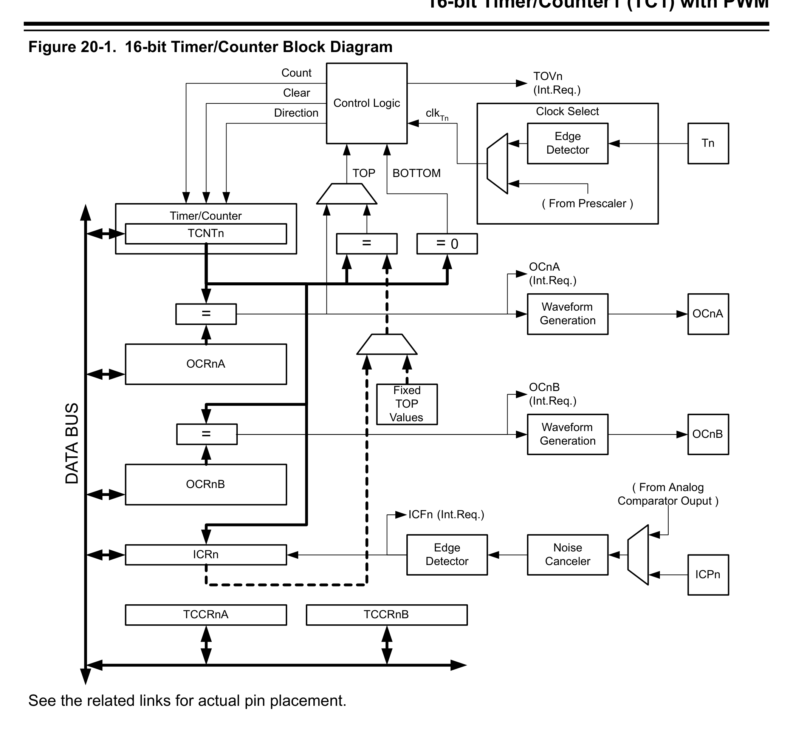
*Description*: System architecture block diagram depicting hardware modules, internal data buses, control logic, and peripheral interconnects for Figure 20-1: 16-bit Timer/Counter Block Diagram.

> **Figure 20-1: 16-bit Timer/Counter Block Diagram**

Clock Select
Timer/Counter
DATA BUS
OCRnA
OCRnB
ICRn
=
=
TCNTn
Waveform
Generation
Waveform
Generation
OCnA
OCnB
Noise
Canceler
ICPn
=
Fixed
TOP
Values
Edge
Detector
Control Logic
= 0
TOP
BOTTOM
Count
Clear
Direction
TOVn
(Int.Req.)
OCnA
(Int.Req.)
OCnB
(Int.Req.)
ICFn (Int.Req.)
TCCRnA
TCCRnB
( From Analog
Comparator Ouput )
Tn
Edge
Detector
( From Prescaler )
clkTn
See the related links for actual pin placement.
20.4
Definitions
Many register and bit references in this section are written in general form:
•
n=1 represents the timer/counter number
•
x=A,B represents the output compare unit A or B
However, when using the register or bit definitions in a program, the precise form must be used, i.e.,
TCNT1 for accessing timer/counter1 counter value.
The following definitions are used throughout the section:
ATmega328/P
16-bit Timer/Counter1 (TC1) with PWM
© 2018 Microchip Technology Inc.
Datasheet Complete
DS40001984A-page 153
Downloaded from Arrow.com.
Downloaded from Arrow.com.
Downloaded from Arrow.com.
Downloaded from Arrow.com.
Downloaded from Arrow.com.
Downloaded from Arrow.com.
Downloaded from Arrow.com.
Downloaded from Arrow.com.
Downloaded from Arrow.com.
Downloaded from Arrow.com.
Downloaded from Arrow.com.
Downloaded from Arrow.com.
Downloaded from Arrow.com.
Downloaded from Arrow.com.
Downloaded from Arrow.com.
Downloaded from Arrow.com.
Downloaded from Arrow.com.
Downloaded from Arrow.com.
Downloaded from Arrow.com.
Downloaded from Arrow.com.
Downloaded from Arrow.com.
Downloaded from Arrow.com.
Downloaded from Arrow.com.
Downloaded from Arrow.com.
Downloaded from Arrow.com.
Downloaded from Arrow.com.
Downloaded from Arrow.com.
Downloaded from Arrow.com.
Downloaded from Arrow.com.
Downloaded from Arrow.com.
Downloaded from Arrow.com.
Downloaded from Arrow.com.
Downloaded from Arrow.com.
Downloaded from Arrow.com.
Downloaded from Arrow.com.
Downloaded from Arrow.com.
Downloaded from Arrow.com.
Downloaded from Arrow.com.
Downloaded from Arrow.com.
Downloaded from Arrow.com.
Downloaded from Arrow.com.
Downloaded from Arrow.com.
Downloaded from Arrow.com.
Downloaded from Arrow.com.
Downloaded from Arrow.com.
Downloaded from Arrow.com.
Downloaded from Arrow.com.
Downloaded from Arrow.com.
Downloaded from Arrow.com.
Downloaded from Arrow.com.
Downloaded from Arrow.com.
Downloaded from Arrow.com.
Downloaded from Arrow.com.
Downloaded from Arrow.com.
Downloaded from Arrow.com.
Downloaded from Arrow.com.
Downloaded from Arrow.com.
Downloaded from Arrow.com.
Downloaded from Arrow.com.
Downloaded from Arrow.com.
Downloaded from Arrow.com.
Downloaded from Arrow.com.
Downloaded from Arrow.com.
Downloaded from Arrow.com.
Downloaded from Arrow.com.
Downloaded from Arrow.com.
Downloaded from Arrow.com.
Downloaded from Arrow.com.
Downloaded from Arrow.com.
Downloaded from Arrow.com.
Downloaded from Arrow.com.
Downloaded from Arrow.com.
Downloaded from Arrow.com.
Downloaded from Arrow.com.
Downloaded from Arrow.com.
Downloaded from Arrow.com.
Downloaded from Arrow.com.
Downloaded from Arrow.com.
Downloaded from Arrow.com.
Downloaded from Arrow.com.
Downloaded from Arrow.com.
Downloaded from Arrow.com.
Downloaded from Arrow.com.
Downloaded from Arrow.com.
Downloaded from Arrow.com.
Downloaded from Arrow.com.
Downloaded from Arrow.com.
Downloaded from Arrow.com.
Downloaded from Arrow.com.
Downloaded from Arrow.com.
Downloaded from Arrow.com.
Downloaded from Arrow.com.
Downloaded from Arrow.com.
Downloaded from Arrow.com.
Downloaded from Arrow.com.
Downloaded from Arrow.com.
Downloaded from Arrow.com.
Downloaded from Arrow.com.
Downloaded from Arrow.com.
Downloaded from Arrow.com.
Downloaded from Arrow.com.
Downloaded from Arrow.com.
Downloaded from Arrow.com.
Downloaded from Arrow.com.
Downloaded from Arrow.com.
Downloaded from Arrow.com.
Downloaded from Arrow.com.
Downloaded from Arrow.com.
Downloaded from Arrow.com.
Downloaded from Arrow.com.
Downloaded from Arrow.com.
Downloaded from Arrow.com.
Downloaded from Arrow.com.
Downloaded from Arrow.com.
Downloaded from Arrow.com.
Downloaded from Arrow.com.
Downloaded from Arrow.com.
Downloaded from Arrow.com.
Downloaded from Arrow.com.
Downloaded from Arrow.com.
Downloaded from Arrow.com.
Downloaded from Arrow.com.
Downloaded from Arrow.com.
Downloaded from Arrow.com.
Downloaded from Arrow.com.
Downloaded from Arrow.com.
Downloaded from Arrow.com.
Downloaded from Arrow.com.
Downloaded from Arrow.com.
Downloaded from Arrow.com.
Downloaded from Arrow.com.
Downloaded from Arrow.com.
Downloaded from Arrow.com.
Downloaded from Arrow.com.
Downloaded from Arrow.com.
Downloaded from Arrow.com.
Downloaded from Arrow.com.
Downloaded from Arrow.com.
Downloaded from Arrow.com.
Downloaded from Arrow.com.
Downloaded from Arrow.com.
Downloaded from Arrow.com.
Downloaded from Arrow.com.
Downloaded from Arrow.com.
Downloaded from Arrow.com.
Downloaded from Arrow.com.
Downloaded from Arrow.com.
Downloaded from Arrow.com.
Downloaded from Arrow.com.
Downloaded from Arrow.com.
Downloaded from Arrow.com.
Downloaded from Arrow.com.
Downloaded from Arrow.com.


<!-- Page 154 -->
### [PDF Page 154]


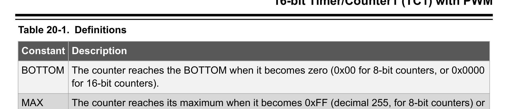
*Description*: Hardware reference table detailing register bit field settings, electrical operating limits, or memory configurations for Table 20-1: Definitions.

> **Table 20-1: Definitions**

Constant Description
BOTTOM The counter reaches the BOTTOM when it becomes zero (0x00 for 8-bit counters, or 0x0000
for 16-bit counters).
MAX
The counter reaches its maximum when it becomes 0xFF (decimal 255, for 8-bit counters) or
0xFFFF (decimal 65535, for 16-bit counters).
TOP
The counter reaches the TOP when it becomes equal to the highest value in the count
sequence. The TOP value can be assigned to be the fixed value MAX or the value stored in
the OCR1A register. The assignment is dependent on the mode of operation.
20.5
Registers
The Timer/Counter (TCNT1), Output Compare registers (OCR1A/B), and Input Capture Register (ICR1)
are all 16-bit registers. Special procedures must be followed when accessing the 16-bit registers. These
procedures are described in section Accessing 16-bit Timer/Counter Registers.
The Timer/Counter Control Registers (TCCR1A/B/C) are 8-bit registers and have no CPU access
restrictions. Interrupt requests (abbreviated to Int. Req. in the block diagram) signals are all visible in the
Timer Interrupt Flag Register (TIFR1). All interrupts are individually masked with the Timer Interrupt Mask
Register (TIMSK1). TIFR1 and TIMSK1 are not shown in the block diagram.
The timer/counter can be clocked internally, via the prescaler, or by an external clock source on the T1
pin. The clock select logic block controls which clock source and edge the timer/counter uses to
increment (or decrement) its value. The timer/counter is inactive when no clock source is selected. The
output from the clock select logic is referred to as the timer clock (clkT1).
The double buffered Output Compare Registers (OCR1A/B) are compared with the timer/counter value at
all time. The result of the compare can be used by the waveform generator to generate a PWM or
variable frequency output on the Output Compare pin (OC1A/B). See Output Compare Units. The
compare match event will also set the Compare Match Flag (OCF1A/B), which can be used to generate
an output compare interrupt request.
The Input Capture register can capture the timer/counter value at a given external (edge triggered) event
on either the Input Capture pin (ICP1) or on the analog comparator pins. The input capture unit includes a
digital filtering unit (Noise canceler) for reducing the chance of capturing noise spikes.
The TOP value, or maximum timer/counter value, can in some modes of operation be defined by either
the OCR1A register, the ICR1 register, or by a set of fixed values. When using OCR1A as TOP value in a
PWM mode, the OCR1A register cannot be used for generating a PWM output. However, the TOP value
will, in this case, be double buffered allowing the TOP value to be changed in runtime. If a fixed TOP
value is required, the ICR1 register can be used as an alternative, freeing the OCR1A to be used as
PWM output.
20.6
Accessing 16-bit Timer/Counter Registers
The TCNT1, OCR1A/B, and ICR1 are 16-bit registers that can be accessed by the AVR CPU via the 8-bit
data bus. The 16-bit register must be accessed byte-wise, using two read or write operations. Each 16-bit
timer has a single 8-bit TEMP register for temporary storing of the high byte of the 16-bit access. The
same temporary register is shared between all 16-bit registers within each 16-bit timer.
ATmega328/P
16-bit Timer/Counter1 (TC1) with PWM
© 2018 Microchip Technology Inc.
Datasheet Complete
DS40001984A-page 154
Downloaded from Arrow.com.
Downloaded from Arrow.com.
Downloaded from Arrow.com.
Downloaded from Arrow.com.
Downloaded from Arrow.com.
Downloaded from Arrow.com.
Downloaded from Arrow.com.
Downloaded from Arrow.com.
Downloaded from Arrow.com.
Downloaded from Arrow.com.
Downloaded from Arrow.com.
Downloaded from Arrow.com.
Downloaded from Arrow.com.
Downloaded from Arrow.com.
Downloaded from Arrow.com.
Downloaded from Arrow.com.
Downloaded from Arrow.com.
Downloaded from Arrow.com.
Downloaded from Arrow.com.
Downloaded from Arrow.com.
Downloaded from Arrow.com.
Downloaded from Arrow.com.
Downloaded from Arrow.com.
Downloaded from Arrow.com.
Downloaded from Arrow.com.
Downloaded from Arrow.com.
Downloaded from Arrow.com.
Downloaded from Arrow.com.
Downloaded from Arrow.com.
Downloaded from Arrow.com.
Downloaded from Arrow.com.
Downloaded from Arrow.com.
Downloaded from Arrow.com.
Downloaded from Arrow.com.
Downloaded from Arrow.com.
Downloaded from Arrow.com.
Downloaded from Arrow.com.
Downloaded from Arrow.com.
Downloaded from Arrow.com.
Downloaded from Arrow.com.
Downloaded from Arrow.com.
Downloaded from Arrow.com.
Downloaded from Arrow.com.
Downloaded from Arrow.com.
Downloaded from Arrow.com.
Downloaded from Arrow.com.
Downloaded from Arrow.com.
Downloaded from Arrow.com.
Downloaded from Arrow.com.
Downloaded from Arrow.com.
Downloaded from Arrow.com.
Downloaded from Arrow.com.
Downloaded from Arrow.com.
Downloaded from Arrow.com.
Downloaded from Arrow.com.
Downloaded from Arrow.com.
Downloaded from Arrow.com.
Downloaded from Arrow.com.
Downloaded from Arrow.com.
Downloaded from Arrow.com.
Downloaded from Arrow.com.
Downloaded from Arrow.com.
Downloaded from Arrow.com.
Downloaded from Arrow.com.
Downloaded from Arrow.com.
Downloaded from Arrow.com.
Downloaded from Arrow.com.
Downloaded from Arrow.com.
Downloaded from Arrow.com.
Downloaded from Arrow.com.
Downloaded from Arrow.com.
Downloaded from Arrow.com.
Downloaded from Arrow.com.
Downloaded from Arrow.com.
Downloaded from Arrow.com.
Downloaded from Arrow.com.
Downloaded from Arrow.com.
Downloaded from Arrow.com.
Downloaded from Arrow.com.
Downloaded from Arrow.com.
Downloaded from Arrow.com.
Downloaded from Arrow.com.
Downloaded from Arrow.com.
Downloaded from Arrow.com.
Downloaded from Arrow.com.
Downloaded from Arrow.com.
Downloaded from Arrow.com.
Downloaded from Arrow.com.
Downloaded from Arrow.com.
Downloaded from Arrow.com.
Downloaded from Arrow.com.
Downloaded from Arrow.com.
Downloaded from Arrow.com.
Downloaded from Arrow.com.
Downloaded from Arrow.com.
Downloaded from Arrow.com.
Downloaded from Arrow.com.
Downloaded from Arrow.com.
Downloaded from Arrow.com.
Downloaded from Arrow.com.
Downloaded from Arrow.com.
Downloaded from Arrow.com.
Downloaded from Arrow.com.
Downloaded from Arrow.com.
Downloaded from Arrow.com.
Downloaded from Arrow.com.
Downloaded from Arrow.com.
Downloaded from Arrow.com.
Downloaded from Arrow.com.
Downloaded from Arrow.com.
Downloaded from Arrow.com.
Downloaded from Arrow.com.
Downloaded from Arrow.com.
Downloaded from Arrow.com.
Downloaded from Arrow.com.
Downloaded from Arrow.com.
Downloaded from Arrow.com.
Downloaded from Arrow.com.
Downloaded from Arrow.com.
Downloaded from Arrow.com.
Downloaded from Arrow.com.
Downloaded from Arrow.com.
Downloaded from Arrow.com.
Downloaded from Arrow.com.
Downloaded from Arrow.com.
Downloaded from Arrow.com.
Downloaded from Arrow.com.
Downloaded from Arrow.com.
Downloaded from Arrow.com.
Downloaded from Arrow.com.
Downloaded from Arrow.com.
Downloaded from Arrow.com.
Downloaded from Arrow.com.
Downloaded from Arrow.com.
Downloaded from Arrow.com.
Downloaded from Arrow.com.
Downloaded from Arrow.com.
Downloaded from Arrow.com.
Downloaded from Arrow.com.
Downloaded from Arrow.com.
Downloaded from Arrow.com.
Downloaded from Arrow.com.
Downloaded from Arrow.com.
Downloaded from Arrow.com.
Downloaded from Arrow.com.
Downloaded from Arrow.com.
Downloaded from Arrow.com.
Downloaded from Arrow.com.
Downloaded from Arrow.com.
Downloaded from Arrow.com.
Downloaded from Arrow.com.
Downloaded from Arrow.com.
Downloaded from Arrow.com.
Downloaded from Arrow.com.


<!-- Page 155 -->
### [PDF Page 155]

Accessing the low byte triggers the 16-bit read or write operation: When the low byte of a 16-bit register is
written by the CPU, the high byte that is currently stored in TEMP and the low byte being written are both
copied into the 16-bit register in the same clock cycle. When the low byte of a 16-bit register is read by
the CPU, the high byte of the 16-bit register is copied into the TEMP register in the same clock cycle as
the low byte is read, and must be read subsequently.
Note:  To perform a 16-bit write operation, the high byte must be written before the low byte. For a 16-bit
read, the low byte must be read before the high byte.
Not all 16-bit accesses use the temporary register for the high byte. Reading the OCR1A/B 16-bit
registers does not involve using the temporary register.
16-bit Access
The following code examples show how to access the 16-bit timer registers assuming that no interrupts
updates the temporary register. The same principle can be used directly for accessing the OCR1A/B and
ICR1 registers. Note that when using C, the compiler handles the 16-bit access.
Assembly Code Example(1)
...
; Set TCNT1 to 0x01FF
ldi    r17,0x01
ldi    r16,0xFF
out    TCNT1H,r17
out    TCNT1L,r16
; Read TCNT1 into r17:r16
in    r16,TCNT1L
in    r17,TCNT1H
...
The assembly code example returns the TCNT1 value in the r17:r16 register pair.
C Code Example(1)
unsigned int i;
...
/* Set TCNT1 to 0x01FF */
TCNT1 = 0x1FF;
/* Read TCNT1 into i */
i = TCNT1;
...
Note:
1.
The example code assumes that the part specific header file is included. For I/O registers located in
extended I/O map, IN, OUT, SBIS, SBIC, CBI, and SBI instructions must be replaced with
instructions that allow access to extended I/O. Typically LDS and STS combined with SBRS, SBRC,
SBR, and CBR.
Atomic Read
It is important to notice that accessing 16-bit registers are atomic operations. If an interrupt occurs
between the two instructions accessing the 16-bit register, and the interrupt code updates the temporary
register by accessing the same or any other of the 16-bit timer registers, then the result of the access
outside the interrupt is corrupted. Therefore, when both the main code and the interrupt code update the
temporary register, the main code must disable the interrupts during the 16-bit access.
The following code examples show how to perform an atomic read of the TCNT1 register contents. The
OCR1A/B or ICR1 registers can be read using the same principle.
ATmega328/P
16-bit Timer/Counter1 (TC1) with PWM
© 2018 Microchip Technology Inc.
Datasheet Complete
DS40001984A-page 155
Downloaded from Arrow.com.
Downloaded from Arrow.com.
Downloaded from Arrow.com.
Downloaded from Arrow.com.
Downloaded from Arrow.com.
Downloaded from Arrow.com.
Downloaded from Arrow.com.
Downloaded from Arrow.com.
Downloaded from Arrow.com.
Downloaded from Arrow.com.
Downloaded from Arrow.com.
Downloaded from Arrow.com.
Downloaded from Arrow.com.
Downloaded from Arrow.com.
Downloaded from Arrow.com.
Downloaded from Arrow.com.
Downloaded from Arrow.com.
Downloaded from Arrow.com.
Downloaded from Arrow.com.
Downloaded from Arrow.com.
Downloaded from Arrow.com.
Downloaded from Arrow.com.
Downloaded from Arrow.com.
Downloaded from Arrow.com.
Downloaded from Arrow.com.
Downloaded from Arrow.com.
Downloaded from Arrow.com.
Downloaded from Arrow.com.
Downloaded from Arrow.com.
Downloaded from Arrow.com.
Downloaded from Arrow.com.
Downloaded from Arrow.com.
Downloaded from Arrow.com.
Downloaded from Arrow.com.
Downloaded from Arrow.com.
Downloaded from Arrow.com.
Downloaded from Arrow.com.
Downloaded from Arrow.com.
Downloaded from Arrow.com.
Downloaded from Arrow.com.
Downloaded from Arrow.com.
Downloaded from Arrow.com.
Downloaded from Arrow.com.
Downloaded from Arrow.com.
Downloaded from Arrow.com.
Downloaded from Arrow.com.
Downloaded from Arrow.com.
Downloaded from Arrow.com.
Downloaded from Arrow.com.
Downloaded from Arrow.com.
Downloaded from Arrow.com.
Downloaded from Arrow.com.
Downloaded from Arrow.com.
Downloaded from Arrow.com.
Downloaded from Arrow.com.
Downloaded from Arrow.com.
Downloaded from Arrow.com.
Downloaded from Arrow.com.
Downloaded from Arrow.com.
Downloaded from Arrow.com.
Downloaded from Arrow.com.
Downloaded from Arrow.com.
Downloaded from Arrow.com.
Downloaded from Arrow.com.
Downloaded from Arrow.com.
Downloaded from Arrow.com.
Downloaded from Arrow.com.
Downloaded from Arrow.com.
Downloaded from Arrow.com.
Downloaded from Arrow.com.
Downloaded from Arrow.com.
Downloaded from Arrow.com.
Downloaded from Arrow.com.
Downloaded from Arrow.com.
Downloaded from Arrow.com.
Downloaded from Arrow.com.
Downloaded from Arrow.com.
Downloaded from Arrow.com.
Downloaded from Arrow.com.
Downloaded from Arrow.com.
Downloaded from Arrow.com.
Downloaded from Arrow.com.
Downloaded from Arrow.com.
Downloaded from Arrow.com.
Downloaded from Arrow.com.
Downloaded from Arrow.com.
Downloaded from Arrow.com.
Downloaded from Arrow.com.
Downloaded from Arrow.com.
Downloaded from Arrow.com.
Downloaded from Arrow.com.
Downloaded from Arrow.com.
Downloaded from Arrow.com.
Downloaded from Arrow.com.
Downloaded from Arrow.com.
Downloaded from Arrow.com.
Downloaded from Arrow.com.
Downloaded from Arrow.com.
Downloaded from Arrow.com.
Downloaded from Arrow.com.
Downloaded from Arrow.com.
Downloaded from Arrow.com.
Downloaded from Arrow.com.
Downloaded from Arrow.com.
Downloaded from Arrow.com.
Downloaded from Arrow.com.
Downloaded from Arrow.com.
Downloaded from Arrow.com.
Downloaded from Arrow.com.
Downloaded from Arrow.com.
Downloaded from Arrow.com.
Downloaded from Arrow.com.
Downloaded from Arrow.com.
Downloaded from Arrow.com.
Downloaded from Arrow.com.
Downloaded from Arrow.com.
Downloaded from Arrow.com.
Downloaded from Arrow.com.
Downloaded from Arrow.com.
Downloaded from Arrow.com.
Downloaded from Arrow.com.
Downloaded from Arrow.com.
Downloaded from Arrow.com.
Downloaded from Arrow.com.
Downloaded from Arrow.com.
Downloaded from Arrow.com.
Downloaded from Arrow.com.
Downloaded from Arrow.com.
Downloaded from Arrow.com.
Downloaded from Arrow.com.
Downloaded from Arrow.com.
Downloaded from Arrow.com.
Downloaded from Arrow.com.
Downloaded from Arrow.com.
Downloaded from Arrow.com.
Downloaded from Arrow.com.
Downloaded from Arrow.com.
Downloaded from Arrow.com.
Downloaded from Arrow.com.
Downloaded from Arrow.com.
Downloaded from Arrow.com.
Downloaded from Arrow.com.
Downloaded from Arrow.com.
Downloaded from Arrow.com.
Downloaded from Arrow.com.
Downloaded from Arrow.com.
Downloaded from Arrow.com.
Downloaded from Arrow.com.
Downloaded from Arrow.com.
Downloaded from Arrow.com.
Downloaded from Arrow.com.
Downloaded from Arrow.com.
Downloaded from Arrow.com.
Downloaded from Arrow.com.
Downloaded from Arrow.com.


<!-- Page 156 -->
### [PDF Page 156]

Assembly Code Example(1)
TIM16_ReadTCNT1:
; Save global interrupt flag
in    r18,SREG
; Disable interrupts
cli
; Read TCNT1 into r17:r16
in    r16,TCNT1L
in    r17,TCNT1H
; Restore global interrupt flag
out   SREG,r18
ret
The assembly code example returns the TCNT1 value in the r17:r16 register pair.
C Code Example(1)
unsigned int TIM16_ReadTCNT1( void )
{
unsigned char sreg;
unsigned int i;
/* Save global interrupt flag */
sreg = SREG;
/* Disable interrupts */
_CLI();
/* Read TCNT1 into i */
i = TCNT1;
/* Restore global interrupt flag */
SREG = sreg;
return i;
}
Note:
1.
The example code assumes that the part specific header file is included. For I/O registers located in
extended I/O map, IN, OUT, SBIS, SBIC, CBI, and SBI instructions must be replaced with
instructions that allow access to extended I/O. Typically LDS and STS combined with SBRS, SBRC,
SBR, and CBR.
Atomic Write
The following code examples show how to do an atomic write of the TCNT1 register contents. Writing any
of the OCR1A/B or ICR1 registers can be done using the same principle.
Assembly Code Example(1)
TIM16_WriteTCNT1:
; Save global interrupt flag
in     r18,SREG
; Disable interrupts
cli
; Set TCNT1 to r17:r16
out    TCNT1H,r17
out    TCNT1L,r16
; Restore global interrupt flag
out    SREG,r18
ret
The assembly code example requires that the r17:r16 register pair contains the value to
be written to TCNT1.
C Code Example(1)

```c
void TIM16_WriteTCNT1( unsigned int i )
```

{
ATmega328/P
16-bit Timer/Counter1 (TC1) with PWM
© 2018 Microchip Technology Inc.
Datasheet Complete
DS40001984A-page 156
Downloaded from Arrow.com.
Downloaded from Arrow.com.
Downloaded from Arrow.com.
Downloaded from Arrow.com.
Downloaded from Arrow.com.
Downloaded from Arrow.com.
Downloaded from Arrow.com.
Downloaded from Arrow.com.
Downloaded from Arrow.com.
Downloaded from Arrow.com.
Downloaded from Arrow.com.
Downloaded from Arrow.com.
Downloaded from Arrow.com.
Downloaded from Arrow.com.
Downloaded from Arrow.com.
Downloaded from Arrow.com.
Downloaded from Arrow.com.
Downloaded from Arrow.com.
Downloaded from Arrow.com.
Downloaded from Arrow.com.
Downloaded from Arrow.com.
Downloaded from Arrow.com.
Downloaded from Arrow.com.
Downloaded from Arrow.com.
Downloaded from Arrow.com.
Downloaded from Arrow.com.
Downloaded from Arrow.com.
Downloaded from Arrow.com.
Downloaded from Arrow.com.
Downloaded from Arrow.com.
Downloaded from Arrow.com.
Downloaded from Arrow.com.
Downloaded from Arrow.com.
Downloaded from Arrow.com.
Downloaded from Arrow.com.
Downloaded from Arrow.com.
Downloaded from Arrow.com.
Downloaded from Arrow.com.
Downloaded from Arrow.com.
Downloaded from Arrow.com.
Downloaded from Arrow.com.
Downloaded from Arrow.com.
Downloaded from Arrow.com.
Downloaded from Arrow.com.
Downloaded from Arrow.com.
Downloaded from Arrow.com.
Downloaded from Arrow.com.
Downloaded from Arrow.com.
Downloaded from Arrow.com.
Downloaded from Arrow.com.
Downloaded from Arrow.com.
Downloaded from Arrow.com.
Downloaded from Arrow.com.
Downloaded from Arrow.com.
Downloaded from Arrow.com.
Downloaded from Arrow.com.
Downloaded from Arrow.com.
Downloaded from Arrow.com.
Downloaded from Arrow.com.
Downloaded from Arrow.com.
Downloaded from Arrow.com.
Downloaded from Arrow.com.
Downloaded from Arrow.com.
Downloaded from Arrow.com.
Downloaded from Arrow.com.
Downloaded from Arrow.com.
Downloaded from Arrow.com.
Downloaded from Arrow.com.
Downloaded from Arrow.com.
Downloaded from Arrow.com.
Downloaded from Arrow.com.
Downloaded from Arrow.com.
Downloaded from Arrow.com.
Downloaded from Arrow.com.
Downloaded from Arrow.com.
Downloaded from Arrow.com.
Downloaded from Arrow.com.
Downloaded from Arrow.com.
Downloaded from Arrow.com.
Downloaded from Arrow.com.
Downloaded from Arrow.com.
Downloaded from Arrow.com.
Downloaded from Arrow.com.
Downloaded from Arrow.com.
Downloaded from Arrow.com.
Downloaded from Arrow.com.
Downloaded from Arrow.com.
Downloaded from Arrow.com.
Downloaded from Arrow.com.
Downloaded from Arrow.com.
Downloaded from Arrow.com.
Downloaded from Arrow.com.
Downloaded from Arrow.com.
Downloaded from Arrow.com.
Downloaded from Arrow.com.
Downloaded from Arrow.com.
Downloaded from Arrow.com.
Downloaded from Arrow.com.
Downloaded from Arrow.com.
Downloaded from Arrow.com.
Downloaded from Arrow.com.
Downloaded from Arrow.com.
Downloaded from Arrow.com.
Downloaded from Arrow.com.
Downloaded from Arrow.com.
Downloaded from Arrow.com.
Downloaded from Arrow.com.
Downloaded from Arrow.com.
Downloaded from Arrow.com.
Downloaded from Arrow.com.
Downloaded from Arrow.com.
Downloaded from Arrow.com.
Downloaded from Arrow.com.
Downloaded from Arrow.com.
Downloaded from Arrow.com.
Downloaded from Arrow.com.
Downloaded from Arrow.com.
Downloaded from Arrow.com.
Downloaded from Arrow.com.
Downloaded from Arrow.com.
Downloaded from Arrow.com.
Downloaded from Arrow.com.
Downloaded from Arrow.com.
Downloaded from Arrow.com.
Downloaded from Arrow.com.
Downloaded from Arrow.com.
Downloaded from Arrow.com.
Downloaded from Arrow.com.
Downloaded from Arrow.com.
Downloaded from Arrow.com.
Downloaded from Arrow.com.
Downloaded from Arrow.com.
Downloaded from Arrow.com.
Downloaded from Arrow.com.
Downloaded from Arrow.com.
Downloaded from Arrow.com.
Downloaded from Arrow.com.
Downloaded from Arrow.com.
Downloaded from Arrow.com.
Downloaded from Arrow.com.
Downloaded from Arrow.com.
Downloaded from Arrow.com.
Downloaded from Arrow.com.
Downloaded from Arrow.com.
Downloaded from Arrow.com.
Downloaded from Arrow.com.
Downloaded from Arrow.com.
Downloaded from Arrow.com.
Downloaded from Arrow.com.
Downloaded from Arrow.com.
Downloaded from Arrow.com.
Downloaded from Arrow.com.
Downloaded from Arrow.com.
Downloaded from Arrow.com.
Downloaded from Arrow.com.
Downloaded from Arrow.com.


<!-- Page 157 -->
### [PDF Page 157]

unsigned char sreg;
unsigned int i;
/* Save global interrupt flag */
sreg = SREG;
/* Disable interrupts */
_CLI();
/* Set TCNT1 to i */
TCNT1 = i;
/* Restore global interrupt flag */
SREG = sreg;
}
Note:
1.
The example code assumes that the part specific header file is included. For I/O
registers located in extended I/O map, IN, OUT, SBIS, SBIC, CBI, and SBI
instructions must be replaced with instructions that allow access to extended I/O.
Typically LDS and STS combined with SBRS, SBRC, SBR, and CBR.
Related Links
About Code Examples
20.6.1
Reusing the Temporary High Byte Register
If writing to more than one 16-bit register where the high byte is the same for all registers written, the high
byte only needs to be written once. However, the same rule of atomic operation described previously also
applies in this case.
20.7
Timer/Counter Clock Sources
The timer/counter can be clocked by an internal or an external clock source. The clock source is selected
by the clock select logic, which is controlled by the clock select bits in the Timer/Counter Control Register
B (TCCR1B.CS[2:0]).
Related Links
Timer/Counter 0, 1 Prescalers
20.8
Counter Unit
The main part of the 16-bit timer/counter is the programmable 16-bit bi-directional counter unit, as shown
in the block diagram:

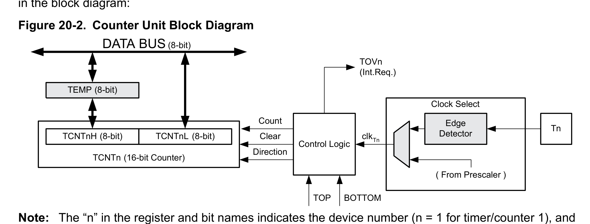
*Description*: System architecture block diagram depicting hardware modules, internal data buses, control logic, and peripheral interconnects for Figure 20-2: Counter Unit Block Diagram.

> **Figure 20-2: Counter Unit Block Diagram**

TEMP (8-bit)
DATA BUS (8-bit)
TCNTn (16-bit Counter)
TCNTnH (8-bit)
TCNTnL (8-bit)
Control Logic
Count
Clear
Direction
TOVn
(Int.Req.)
Clock Select
TOP
BOTTOM
Tn
Edge
Detector
( From Prescaler )
clkTn
Note:  The “n” in the register and bit names indicates the device number (n = 1 for timer/counter 1), and
the “x” indicates output compare unit (A/B).
ATmega328/P
16-bit Timer/Counter1 (TC1) with PWM
© 2018 Microchip Technology Inc.
Datasheet Complete
DS40001984A-page 157
Downloaded from Arrow.com.
Downloaded from Arrow.com.
Downloaded from Arrow.com.
Downloaded from Arrow.com.
Downloaded from Arrow.com.
Downloaded from Arrow.com.
Downloaded from Arrow.com.
Downloaded from Arrow.com.
Downloaded from Arrow.com.
Downloaded from Arrow.com.
Downloaded from Arrow.com.
Downloaded from Arrow.com.
Downloaded from Arrow.com.
Downloaded from Arrow.com.
Downloaded from Arrow.com.
Downloaded from Arrow.com.
Downloaded from Arrow.com.
Downloaded from Arrow.com.
Downloaded from Arrow.com.
Downloaded from Arrow.com.
Downloaded from Arrow.com.
Downloaded from Arrow.com.
Downloaded from Arrow.com.
Downloaded from Arrow.com.
Downloaded from Arrow.com.
Downloaded from Arrow.com.
Downloaded from Arrow.com.
Downloaded from Arrow.com.
Downloaded from Arrow.com.
Downloaded from Arrow.com.
Downloaded from Arrow.com.
Downloaded from Arrow.com.
Downloaded from Arrow.com.
Downloaded from Arrow.com.
Downloaded from Arrow.com.
Downloaded from Arrow.com.
Downloaded from Arrow.com.
Downloaded from Arrow.com.
Downloaded from Arrow.com.
Downloaded from Arrow.com.
Downloaded from Arrow.com.
Downloaded from Arrow.com.
Downloaded from Arrow.com.
Downloaded from Arrow.com.
Downloaded from Arrow.com.
Downloaded from Arrow.com.
Downloaded from Arrow.com.
Downloaded from Arrow.com.
Downloaded from Arrow.com.
Downloaded from Arrow.com.
Downloaded from Arrow.com.
Downloaded from Arrow.com.
Downloaded from Arrow.com.
Downloaded from Arrow.com.
Downloaded from Arrow.com.
Downloaded from Arrow.com.
Downloaded from Arrow.com.
Downloaded from Arrow.com.
Downloaded from Arrow.com.
Downloaded from Arrow.com.
Downloaded from Arrow.com.
Downloaded from Arrow.com.
Downloaded from Arrow.com.
Downloaded from Arrow.com.
Downloaded from Arrow.com.
Downloaded from Arrow.com.
Downloaded from Arrow.com.
Downloaded from Arrow.com.
Downloaded from Arrow.com.
Downloaded from Arrow.com.
Downloaded from Arrow.com.
Downloaded from Arrow.com.
Downloaded from Arrow.com.
Downloaded from Arrow.com.
Downloaded from Arrow.com.
Downloaded from Arrow.com.
Downloaded from Arrow.com.
Downloaded from Arrow.com.
Downloaded from Arrow.com.
Downloaded from Arrow.com.
Downloaded from Arrow.com.
Downloaded from Arrow.com.
Downloaded from Arrow.com.
Downloaded from Arrow.com.
Downloaded from Arrow.com.
Downloaded from Arrow.com.
Downloaded from Arrow.com.
Downloaded from Arrow.com.
Downloaded from Arrow.com.
Downloaded from Arrow.com.
Downloaded from Arrow.com.
Downloaded from Arrow.com.
Downloaded from Arrow.com.
Downloaded from Arrow.com.
Downloaded from Arrow.com.
Downloaded from Arrow.com.
Downloaded from Arrow.com.
Downloaded from Arrow.com.
Downloaded from Arrow.com.
Downloaded from Arrow.com.
Downloaded from Arrow.com.
Downloaded from Arrow.com.
Downloaded from Arrow.com.
Downloaded from Arrow.com.
Downloaded from Arrow.com.
Downloaded from Arrow.com.
Downloaded from Arrow.com.
Downloaded from Arrow.com.
Downloaded from Arrow.com.
Downloaded from Arrow.com.
Downloaded from Arrow.com.
Downloaded from Arrow.com.
Downloaded from Arrow.com.
Downloaded from Arrow.com.
Downloaded from Arrow.com.
Downloaded from Arrow.com.
Downloaded from Arrow.com.
Downloaded from Arrow.com.
Downloaded from Arrow.com.
Downloaded from Arrow.com.
Downloaded from Arrow.com.
Downloaded from Arrow.com.
Downloaded from Arrow.com.
Downloaded from Arrow.com.
Downloaded from Arrow.com.
Downloaded from Arrow.com.
Downloaded from Arrow.com.
Downloaded from Arrow.com.
Downloaded from Arrow.com.
Downloaded from Arrow.com.
Downloaded from Arrow.com.
Downloaded from Arrow.com.
Downloaded from Arrow.com.
Downloaded from Arrow.com.
Downloaded from Arrow.com.
Downloaded from Arrow.com.
Downloaded from Arrow.com.
Downloaded from Arrow.com.
Downloaded from Arrow.com.
Downloaded from Arrow.com.
Downloaded from Arrow.com.
Downloaded from Arrow.com.
Downloaded from Arrow.com.
Downloaded from Arrow.com.
Downloaded from Arrow.com.
Downloaded from Arrow.com.
Downloaded from Arrow.com.
Downloaded from Arrow.com.
Downloaded from Arrow.com.
Downloaded from Arrow.com.
Downloaded from Arrow.com.
Downloaded from Arrow.com.
Downloaded from Arrow.com.
Downloaded from Arrow.com.
Downloaded from Arrow.com.
Downloaded from Arrow.com.
Downloaded from Arrow.com.


<!-- Page 158 -->
### [PDF Page 158]


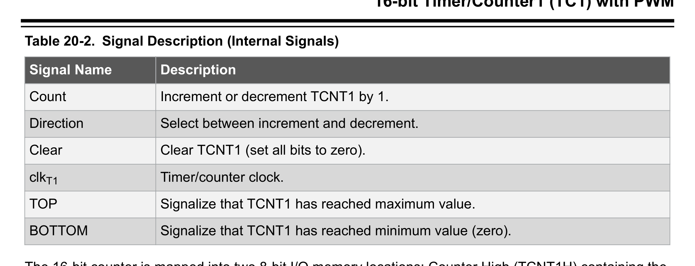
*Description*: Hardware reference table detailing register bit field settings, electrical operating limits, or memory configurations for Table 20-2: Signal Description (Internal Signals).

> **Table 20-2: Signal Description (Internal Signals)**

Signal Name
Description
Count
Increment or decrement TCNT1 by 1.
Direction
Select between increment and decrement.
Clear
Clear TCNT1 (set all bits to zero).
clkT1
Timer/counter clock.
TOP
Signalize that TCNT1 has reached maximum value.
BOTTOM
Signalize that TCNT1 has reached minimum value (zero).
The 16-bit counter is mapped into two 8-bit I/O memory locations: Counter High (TCNT1H) containing the
upper eight bits of the counter, and Counter Low (TCNT1L) containing the lower eight bits. The TCNT1H
register can only be accessed indirectly by the CPU. When the CPU does an access to the TCNT1H I/O
location, the CPU accesses the high byte temporary register (TEMP). The temporary register is updated
with the TCNT1H value when the TCNT1L is read, and TCNT1H is updated with the temporary register
value when TCNT1L is written. This allows the CPU to read or write the entire 16-bit counter value within
one clock cycle via the 8-bit data bus.
Note:  That there are special cases when writing to the TCNT1 register while the counter is counting will
give unpredictable results. These special cases are described in the sections where they are of
importance.
Depending on the selected mode of operation, the counter is cleared, incremented, or decremented at
each timer clock (clkT1). The clock clkT1 can be generated from an external or internal clock source, as
selected by the clock select bits in the Timer/Counter1 Control Register B (TCCR1B.CS[2:0]). When no
clock source is selected (CS[2:0]=0x0) the timer is stopped. However, the TCNT1 value can be accessed
by the CPU, independent of whether clkT1 is present or not. A CPU write overrides (i.e., has priority over)
all counter clear or count operations.
The counting sequence is determined by the setting of the Waveform Generation Mode bits in the Timer/
Counter Control Registers A and B (TCCR1B.WGM1[3:2] and TCCR1A.WGM1[1:0]). There are close
connections between how the counter behaves (counts) and how waveforms are generated on the
Output Compare outputs OC0x. For more details about advanced counting sequences and waveform
generation, see Modes of Operation.
The timer/counter overflow flag in the TC1 Interrupt Flag Register (TIFR1.TOV) is set according to the
mode of operation selected by the WGM1[3:0] bits. TOV can be used for generating a CPU interrupt.
20.9
Input Capture Unit
The timer/counter1 incorporates an input capture unit that can capture external events and give them a
time-stamp indicating time of occurrence. The external signal indicating an event, or multiple events, can
be applied via the ICP1 pin or alternatively, via the analog-comparator unit. The time-stamps can then be
used to calculate frequency, duty-cycle and other features of the signal applied. Alternatively, the time-
stamps can be used for creating a log of the events.
The input capture unit is illustrated by the block diagram below. The elements of the block diagram that
are not directly a part of the input capture unit are gray shaded. The lower case “n” in register and bit
names indicates the timer/counter number.
ATmega328/P
16-bit Timer/Counter1 (TC1) with PWM
© 2018 Microchip Technology Inc.
Datasheet Complete
DS40001984A-page 158
Downloaded from Arrow.com.
Downloaded from Arrow.com.
Downloaded from Arrow.com.
Downloaded from Arrow.com.
Downloaded from Arrow.com.
Downloaded from Arrow.com.
Downloaded from Arrow.com.
Downloaded from Arrow.com.
Downloaded from Arrow.com.
Downloaded from Arrow.com.
Downloaded from Arrow.com.
Downloaded from Arrow.com.
Downloaded from Arrow.com.
Downloaded from Arrow.com.
Downloaded from Arrow.com.
Downloaded from Arrow.com.
Downloaded from Arrow.com.
Downloaded from Arrow.com.
Downloaded from Arrow.com.
Downloaded from Arrow.com.
Downloaded from Arrow.com.
Downloaded from Arrow.com.
Downloaded from Arrow.com.
Downloaded from Arrow.com.
Downloaded from Arrow.com.
Downloaded from Arrow.com.
Downloaded from Arrow.com.
Downloaded from Arrow.com.
Downloaded from Arrow.com.
Downloaded from Arrow.com.
Downloaded from Arrow.com.
Downloaded from Arrow.com.
Downloaded from Arrow.com.
Downloaded from Arrow.com.
Downloaded from Arrow.com.
Downloaded from Arrow.com.
Downloaded from Arrow.com.
Downloaded from Arrow.com.
Downloaded from Arrow.com.
Downloaded from Arrow.com.
Downloaded from Arrow.com.
Downloaded from Arrow.com.
Downloaded from Arrow.com.
Downloaded from Arrow.com.
Downloaded from Arrow.com.
Downloaded from Arrow.com.
Downloaded from Arrow.com.
Downloaded from Arrow.com.
Downloaded from Arrow.com.
Downloaded from Arrow.com.
Downloaded from Arrow.com.
Downloaded from Arrow.com.
Downloaded from Arrow.com.
Downloaded from Arrow.com.
Downloaded from Arrow.com.
Downloaded from Arrow.com.
Downloaded from Arrow.com.
Downloaded from Arrow.com.
Downloaded from Arrow.com.
Downloaded from Arrow.com.
Downloaded from Arrow.com.
Downloaded from Arrow.com.
Downloaded from Arrow.com.
Downloaded from Arrow.com.
Downloaded from Arrow.com.
Downloaded from Arrow.com.
Downloaded from Arrow.com.
Downloaded from Arrow.com.
Downloaded from Arrow.com.
Downloaded from Arrow.com.
Downloaded from Arrow.com.
Downloaded from Arrow.com.
Downloaded from Arrow.com.
Downloaded from Arrow.com.
Downloaded from Arrow.com.
Downloaded from Arrow.com.
Downloaded from Arrow.com.
Downloaded from Arrow.com.
Downloaded from Arrow.com.
Downloaded from Arrow.com.
Downloaded from Arrow.com.
Downloaded from Arrow.com.
Downloaded from Arrow.com.
Downloaded from Arrow.com.
Downloaded from Arrow.com.
Downloaded from Arrow.com.
Downloaded from Arrow.com.
Downloaded from Arrow.com.
Downloaded from Arrow.com.
Downloaded from Arrow.com.
Downloaded from Arrow.com.
Downloaded from Arrow.com.
Downloaded from Arrow.com.
Downloaded from Arrow.com.
Downloaded from Arrow.com.
Downloaded from Arrow.com.
Downloaded from Arrow.com.
Downloaded from Arrow.com.
Downloaded from Arrow.com.
Downloaded from Arrow.com.
Downloaded from Arrow.com.
Downloaded from Arrow.com.
Downloaded from Arrow.com.
Downloaded from Arrow.com.
Downloaded from Arrow.com.
Downloaded from Arrow.com.
Downloaded from Arrow.com.
Downloaded from Arrow.com.
Downloaded from Arrow.com.
Downloaded from Arrow.com.
Downloaded from Arrow.com.
Downloaded from Arrow.com.
Downloaded from Arrow.com.
Downloaded from Arrow.com.
Downloaded from Arrow.com.
Downloaded from Arrow.com.
Downloaded from Arrow.com.
Downloaded from Arrow.com.
Downloaded from Arrow.com.
Downloaded from Arrow.com.
Downloaded from Arrow.com.
Downloaded from Arrow.com.
Downloaded from Arrow.com.
Downloaded from Arrow.com.
Downloaded from Arrow.com.
Downloaded from Arrow.com.
Downloaded from Arrow.com.
Downloaded from Arrow.com.
Downloaded from Arrow.com.
Downloaded from Arrow.com.
Downloaded from Arrow.com.
Downloaded from Arrow.com.
Downloaded from Arrow.com.
Downloaded from Arrow.com.
Downloaded from Arrow.com.
Downloaded from Arrow.com.
Downloaded from Arrow.com.
Downloaded from Arrow.com.
Downloaded from Arrow.com.
Downloaded from Arrow.com.
Downloaded from Arrow.com.
Downloaded from Arrow.com.
Downloaded from Arrow.com.
Downloaded from Arrow.com.
Downloaded from Arrow.com.
Downloaded from Arrow.com.
Downloaded from Arrow.com.
Downloaded from Arrow.com.
Downloaded from Arrow.com.
Downloaded from Arrow.com.
Downloaded from Arrow.com.
Downloaded from Arrow.com.
Downloaded from Arrow.com.
Downloaded from Arrow.com.
Downloaded from Arrow.com.
Downloaded from Arrow.com.
Downloaded from Arrow.com.
Downloaded from Arrow.com.


<!-- Page 159 -->
### [PDF Page 159]


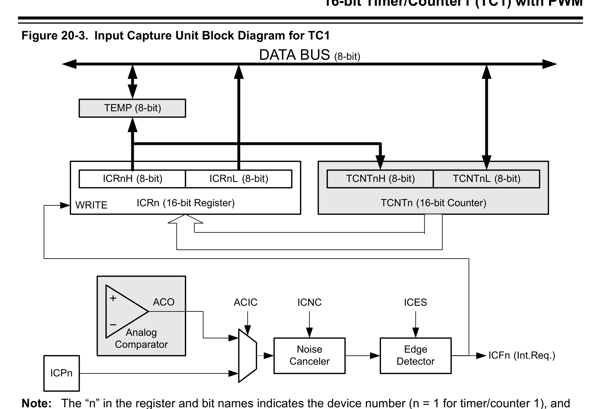
*Description*: System architecture block diagram depicting hardware modules, internal data buses, control logic, and peripheral interconnects for Figure 20-3: Input Capture Unit Block Diagram for TC1.

> **Figure 20-3: Input Capture Unit Block Diagram for TC1**

ICFn (Int.Req.)
Analog
Comparator
WRITE
ICRn (16-bit Register)
ICRnH (8-bit)
Noise
Canceler
ICPn
Edge
Detector
TEMP (8-bit)
DATA BUS (8-bit)
ICRnL (8-bit)
TCNTn (16-bit Counter)
TCNTnH (8-bit)
TCNTnL (8-bit)
ACIC
ICNC
ICES
ACO
Note:  The “n” in the register and bit names indicates the device number (n = 1 for timer/counter 1), and
the “x” indicates output compare unit (A/B).
When a change of the logic level (an event) occurs on the input capture pin (ICP1), or alternatively on the
Analog Comparator Output (ACO), and this change confirms to the setting of the edge detector, a capture
will be triggered: the 16-bit value of the counter (TCNT1) is written to the Input Capture Register (ICR1).
The Input Capture Flag (ICF) is set at the same system clock cycle as the TCNT1 value is copied into the
ICR1 . If enabled (TIMSK1.ICIE=1), the ICF generates an input capture interrupt. The ICF1 is
automatically cleared when the interrupt is executed. Alternatively, the ICF can be cleared by software by
writing '1' to its I/O bit location.
Reading the 16-bit value in the ICR1 is done by first reading the low byte (ICR1L) and then the high byte
(ICR1H). When the low byte is read form ICR1L, the high byte is copied into the high byte temporary
register (TEMP). When the CPU reads the ICR1H I/O location it will access the TEMP register.
The ICR1 can only be written when using a Waveform Generation mode that utilizes the ICR1 for defining
the counter’s TOP value. In these cases the Waveform Generation Mode bits (WGM1[3:0]) must be set
before the TOP value can be written to the ICR1. When writing the ICR1, the high byte must be written to
the ICR1H I/O location before the low byte is written to ICR1L.
Related Links
Accessing 16-bit Timer/Counter Registers
20.9.1
Input Capture Trigger Source
The main trigger source for the input capture unit is the Input Capture pin (ICP1). Timer/Counter1 can
alternatively use the analog comparator output as trigger source for the input capture unit. The analog
comparator is selected as a trigger source by setting the Analog Comparator Input Capture (ACIC) bit in
ATmega328/P
16-bit Timer/Counter1 (TC1) with PWM
© 2018 Microchip Technology Inc.
Datasheet Complete
DS40001984A-page 159
Downloaded from Arrow.com.
Downloaded from Arrow.com.
Downloaded from Arrow.com.
Downloaded from Arrow.com.
Downloaded from Arrow.com.
Downloaded from Arrow.com.
Downloaded from Arrow.com.
Downloaded from Arrow.com.
Downloaded from Arrow.com.
Downloaded from Arrow.com.
Downloaded from Arrow.com.
Downloaded from Arrow.com.
Downloaded from Arrow.com.
Downloaded from Arrow.com.
Downloaded from Arrow.com.
Downloaded from Arrow.com.
Downloaded from Arrow.com.
Downloaded from Arrow.com.
Downloaded from Arrow.com.
Downloaded from Arrow.com.
Downloaded from Arrow.com.
Downloaded from Arrow.com.
Downloaded from Arrow.com.
Downloaded from Arrow.com.
Downloaded from Arrow.com.
Downloaded from Arrow.com.
Downloaded from Arrow.com.
Downloaded from Arrow.com.
Downloaded from Arrow.com.
Downloaded from Arrow.com.
Downloaded from Arrow.com.
Downloaded from Arrow.com.
Downloaded from Arrow.com.
Downloaded from Arrow.com.
Downloaded from Arrow.com.
Downloaded from Arrow.com.
Downloaded from Arrow.com.
Downloaded from Arrow.com.
Downloaded from Arrow.com.
Downloaded from Arrow.com.
Downloaded from Arrow.com.
Downloaded from Arrow.com.
Downloaded from Arrow.com.
Downloaded from Arrow.com.
Downloaded from Arrow.com.
Downloaded from Arrow.com.
Downloaded from Arrow.com.
Downloaded from Arrow.com.
Downloaded from Arrow.com.
Downloaded from Arrow.com.
Downloaded from Arrow.com.
Downloaded from Arrow.com.
Downloaded from Arrow.com.
Downloaded from Arrow.com.
Downloaded from Arrow.com.
Downloaded from Arrow.com.
Downloaded from Arrow.com.
Downloaded from Arrow.com.
Downloaded from Arrow.com.
Downloaded from Arrow.com.
Downloaded from Arrow.com.
Downloaded from Arrow.com.
Downloaded from Arrow.com.
Downloaded from Arrow.com.
Downloaded from Arrow.com.
Downloaded from Arrow.com.
Downloaded from Arrow.com.
Downloaded from Arrow.com.
Downloaded from Arrow.com.
Downloaded from Arrow.com.
Downloaded from Arrow.com.
Downloaded from Arrow.com.
Downloaded from Arrow.com.
Downloaded from Arrow.com.
Downloaded from Arrow.com.
Downloaded from Arrow.com.
Downloaded from Arrow.com.
Downloaded from Arrow.com.
Downloaded from Arrow.com.
Downloaded from Arrow.com.
Downloaded from Arrow.com.
Downloaded from Arrow.com.
Downloaded from Arrow.com.
Downloaded from Arrow.com.
Downloaded from Arrow.com.
Downloaded from Arrow.com.
Downloaded from Arrow.com.
Downloaded from Arrow.com.
Downloaded from Arrow.com.
Downloaded from Arrow.com.
Downloaded from Arrow.com.
Downloaded from Arrow.com.
Downloaded from Arrow.com.
Downloaded from Arrow.com.
Downloaded from Arrow.com.
Downloaded from Arrow.com.
Downloaded from Arrow.com.
Downloaded from Arrow.com.
Downloaded from Arrow.com.
Downloaded from Arrow.com.
Downloaded from Arrow.com.
Downloaded from Arrow.com.
Downloaded from Arrow.com.
Downloaded from Arrow.com.
Downloaded from Arrow.com.
Downloaded from Arrow.com.
Downloaded from Arrow.com.
Downloaded from Arrow.com.
Downloaded from Arrow.com.
Downloaded from Arrow.com.
Downloaded from Arrow.com.
Downloaded from Arrow.com.
Downloaded from Arrow.com.
Downloaded from Arrow.com.
Downloaded from Arrow.com.
Downloaded from Arrow.com.
Downloaded from Arrow.com.
Downloaded from Arrow.com.
Downloaded from Arrow.com.
Downloaded from Arrow.com.
Downloaded from Arrow.com.
Downloaded from Arrow.com.
Downloaded from Arrow.com.
Downloaded from Arrow.com.
Downloaded from Arrow.com.
Downloaded from Arrow.com.
Downloaded from Arrow.com.
Downloaded from Arrow.com.
Downloaded from Arrow.com.
Downloaded from Arrow.com.
Downloaded from Arrow.com.
Downloaded from Arrow.com.
Downloaded from Arrow.com.
Downloaded from Arrow.com.
Downloaded from Arrow.com.
Downloaded from Arrow.com.
Downloaded from Arrow.com.
Downloaded from Arrow.com.
Downloaded from Arrow.com.
Downloaded from Arrow.com.
Downloaded from Arrow.com.
Downloaded from Arrow.com.
Downloaded from Arrow.com.
Downloaded from Arrow.com.
Downloaded from Arrow.com.
Downloaded from Arrow.com.
Downloaded from Arrow.com.
Downloaded from Arrow.com.
Downloaded from Arrow.com.
Downloaded from Arrow.com.
Downloaded from Arrow.com.
Downloaded from Arrow.com.
Downloaded from Arrow.com.
Downloaded from Arrow.com.
Downloaded from Arrow.com.
Downloaded from Arrow.com.
Downloaded from Arrow.com.
Downloaded from Arrow.com.
Downloaded from Arrow.com.


<!-- Page 160 -->
### [PDF Page 160]

the Analog Comparator Control and Status Register (ACSR). Be aware that changing trigger source can
trigger a capture. The input capture flag must, therefore, be cleared after the change.
Both the Input Capture Pin (ICP1) and the Analog Comparator Output (ACO) inputs are sampled using
the same technique as for the T1 pin. The edge detector is identical. However, when the noise canceler is
enabled, additional logic is inserted before the edge detector, which increases the delay by four system
clock cycles. The input of the noise canceler and edge detector is always enabled unless the Timer/
Counter is set in a Waveform Generation mode that uses ICR1 to define TOP.
An input capture can be triggered by software by controlling the port of the ICP1 pin.
Related Links
Timer/Counter 0, 1 Prescalers
20.9.2
Noise Canceler
The noise canceler improves noise immunity by using a simple digital filtering scheme. The noise
canceler input is monitored over four samples, and all four must be equal for changing the output that in
turn is used by the edge detector.
The noise canceler is enabled by setting the Input Capture Noise Canceler bit in the Timer/Counter
Control Register B (TCCR1B.ICNC). When enabled, the noise canceler introduces an additional delay of
four system clock cycles between a change applied to the input and the update of the ICR1 Register. The
noise canceler uses the system clock and is therefore not affected by the prescaler.
20.9.3
Using the Input Capture Unit
The main challenge when using the input capture unit is to assign enough processor capacity for handling
the incoming events. The time between two events is critical. If the processor has not read the captured
value in the ICR1 before the next event occurs, the ICR1 will be overwritten with a new value. In this case
the result of the capture will be incorrect.
When using the input capture interrupt, the ICR1 should be read as early in the interrupt handler routine
as possible. Even though the input capture interrupt has relatively high priority, the maximum interrupt
response time is dependent on the maximum number of clock cycles it takes to handle any of the other
interrupt requests.
Using the input capture unit in any mode of operation when the TOP value (resolution) is actively
changed during operation, is not recommended.
Measurement of an external signal’s duty cycle requires that the trigger edge is changed after each
capture. Changing the edge sensing must be done as early as possible after the ICR1 has been read.
After a change of the edge, the ICF must be cleared by software (writing a logical one to the I/O bit
location). For measuring frequency only, the clearing of the ICF is not required (if an interrupt handler is
used).

## 20.10 Output Compare Units

The 16-bit comparator continuously compares TCNT1 with the Output Compare Register (OCR1x). If
TCNT equals OCR1x the comparator signals a match. A match will set the Output Compare Flag
(TIFR1.OCFx) at the next timer clock cycle. If enabled (TIMSK1.OCIEx = 1), the output compare flag
generates an output compare interrupt. The OCFx is automatically cleared when the interrupt is
executed. Alternatively, the OCFx can be cleared by software by writing a logical one to its I/O bit
location. The waveform generator uses the match signal to generate an output according to operating
mode set by the Waveform Generation mode (WGM1[3:0]) bits and Compare Output mode (COM1x[1:0])
ATmega328/P
16-bit Timer/Counter1 (TC1) with PWM
© 2018 Microchip Technology Inc.
Datasheet Complete
DS40001984A-page 160
Downloaded from Arrow.com.
Downloaded from Arrow.com.
Downloaded from Arrow.com.
Downloaded from Arrow.com.
Downloaded from Arrow.com.
Downloaded from Arrow.com.
Downloaded from Arrow.com.
Downloaded from Arrow.com.
Downloaded from Arrow.com.
Downloaded from Arrow.com.
Downloaded from Arrow.com.
Downloaded from Arrow.com.
Downloaded from Arrow.com.
Downloaded from Arrow.com.
Downloaded from Arrow.com.
Downloaded from Arrow.com.
Downloaded from Arrow.com.
Downloaded from Arrow.com.
Downloaded from Arrow.com.
Downloaded from Arrow.com.
Downloaded from Arrow.com.
Downloaded from Arrow.com.
Downloaded from Arrow.com.
Downloaded from Arrow.com.
Downloaded from Arrow.com.
Downloaded from Arrow.com.
Downloaded from Arrow.com.
Downloaded from Arrow.com.
Downloaded from Arrow.com.
Downloaded from Arrow.com.
Downloaded from Arrow.com.
Downloaded from Arrow.com.
Downloaded from Arrow.com.
Downloaded from Arrow.com.
Downloaded from Arrow.com.
Downloaded from Arrow.com.
Downloaded from Arrow.com.
Downloaded from Arrow.com.
Downloaded from Arrow.com.
Downloaded from Arrow.com.
Downloaded from Arrow.com.
Downloaded from Arrow.com.
Downloaded from Arrow.com.
Downloaded from Arrow.com.
Downloaded from Arrow.com.
Downloaded from Arrow.com.
Downloaded from Arrow.com.
Downloaded from Arrow.com.
Downloaded from Arrow.com.
Downloaded from Arrow.com.
Downloaded from Arrow.com.
Downloaded from Arrow.com.
Downloaded from Arrow.com.
Downloaded from Arrow.com.
Downloaded from Arrow.com.
Downloaded from Arrow.com.
Downloaded from Arrow.com.
Downloaded from Arrow.com.
Downloaded from Arrow.com.
Downloaded from Arrow.com.
Downloaded from Arrow.com.
Downloaded from Arrow.com.
Downloaded from Arrow.com.
Downloaded from Arrow.com.
Downloaded from Arrow.com.
Downloaded from Arrow.com.
Downloaded from Arrow.com.
Downloaded from Arrow.com.
Downloaded from Arrow.com.
Downloaded from Arrow.com.
Downloaded from Arrow.com.
Downloaded from Arrow.com.
Downloaded from Arrow.com.
Downloaded from Arrow.com.
Downloaded from Arrow.com.
Downloaded from Arrow.com.
Downloaded from Arrow.com.
Downloaded from Arrow.com.
Downloaded from Arrow.com.
Downloaded from Arrow.com.
Downloaded from Arrow.com.
Downloaded from Arrow.com.
Downloaded from Arrow.com.
Downloaded from Arrow.com.
Downloaded from Arrow.com.
Downloaded from Arrow.com.
Downloaded from Arrow.com.
Downloaded from Arrow.com.
Downloaded from Arrow.com.
Downloaded from Arrow.com.
Downloaded from Arrow.com.
Downloaded from Arrow.com.
Downloaded from Arrow.com.
Downloaded from Arrow.com.
Downloaded from Arrow.com.
Downloaded from Arrow.com.
Downloaded from Arrow.com.
Downloaded from Arrow.com.
Downloaded from Arrow.com.
Downloaded from Arrow.com.
Downloaded from Arrow.com.
Downloaded from Arrow.com.
Downloaded from Arrow.com.
Downloaded from Arrow.com.
Downloaded from Arrow.com.
Downloaded from Arrow.com.
Downloaded from Arrow.com.
Downloaded from Arrow.com.
Downloaded from Arrow.com.
Downloaded from Arrow.com.
Downloaded from Arrow.com.
Downloaded from Arrow.com.
Downloaded from Arrow.com.
Downloaded from Arrow.com.
Downloaded from Arrow.com.
Downloaded from Arrow.com.
Downloaded from Arrow.com.
Downloaded from Arrow.com.
Downloaded from Arrow.com.
Downloaded from Arrow.com.
Downloaded from Arrow.com.
Downloaded from Arrow.com.
Downloaded from Arrow.com.
Downloaded from Arrow.com.
Downloaded from Arrow.com.
Downloaded from Arrow.com.
Downloaded from Arrow.com.
Downloaded from Arrow.com.
Downloaded from Arrow.com.
Downloaded from Arrow.com.
Downloaded from Arrow.com.
Downloaded from Arrow.com.
Downloaded from Arrow.com.
Downloaded from Arrow.com.
Downloaded from Arrow.com.
Downloaded from Arrow.com.
Downloaded from Arrow.com.
Downloaded from Arrow.com.
Downloaded from Arrow.com.
Downloaded from Arrow.com.
Downloaded from Arrow.com.
Downloaded from Arrow.com.
Downloaded from Arrow.com.
Downloaded from Arrow.com.
Downloaded from Arrow.com.
Downloaded from Arrow.com.
Downloaded from Arrow.com.
Downloaded from Arrow.com.
Downloaded from Arrow.com.
Downloaded from Arrow.com.
Downloaded from Arrow.com.
Downloaded from Arrow.com.
Downloaded from Arrow.com.
Downloaded from Arrow.com.
Downloaded from Arrow.com.
Downloaded from Arrow.com.
Downloaded from Arrow.com.
Downloaded from Arrow.com.
Downloaded from Arrow.com.
Downloaded from Arrow.com.


<!-- Page 161 -->
### [PDF Page 161]

bits. The TOP and BOTTOM signals are used by the waveform generator for handling the special cases
of the extreme values in some modes of operation, see Modes of Operation.
A special feature of output compare unit A allows it to define the Timer/Counter TOP value (i.e., counter
resolution). In addition to the counter resolution, the TOP value defines the period time for waveforms
generated by the waveform generator.
Below is a block diagram of the output compare unit. The elements of the block diagram that are not
directly a part of the output compare unit are gray shaded.

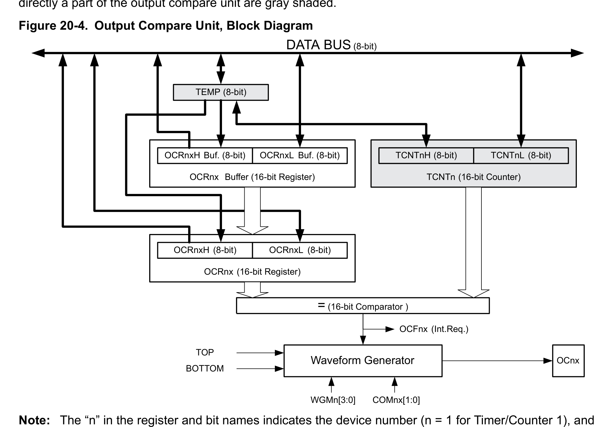
*Description*: System architecture block diagram depicting hardware modules, internal data buses, control logic, and peripheral interconnects for Figure 20-4: Output Compare Unit, Block Diagram.

> **Figure 20-4: Output Compare Unit, Block Diagram**

OCFnx (Int.Req.)
= (16-bit Comparator )
OCRnx  Buffer (16-bit Register)
OCRnxH Buf. (8-bit)
OCnx
TEMP (8-bit)
DATA BUS (8-bit)
OCRnxL Buf. (8-bit)
TCNTn (16-bit Counter)
TCNTnH (8-bit)
TCNTnL (8-bit)
COMnx[1:0]
WGMn[3:0]
OCRnx (16-bit Register)
OCRnxH (8-bit)
OCRnxL (8-bit)
Waveform Generator
TOP
BOTTOM
Note:  The “n” in the register and bit names indicates the device number (n = 1 for Timer/Counter 1), and
the “x” indicates output compare unit (A/B).
The OCR1x is double buffered when using any of the twelve Pulse Width Modulation (PWM) modes. For
the Normal and Clear Timer on Compare (CTC) modes of operation, the double buffering is disabled. The
double buffering synchronizes the update of the OCR1x to either TOP or BOTTOM of the counting
sequence. The synchronization prevents the occurrence of odd-length, non-symmetrical PWM pulses,
thereby making the output glitch-free.
When double buffering is enabled, the CPU has access to the OCR1x Buffer register. When double
buffering is disabled, the CPU will access the OCR1x directly.
The content of the OCR1x (Buffer or Compare) register is only changed by a write operation (the Timer/
Counter does not update this register automatically as the TCNT1 and ICR1). Therefore OCR1x is not
read via the high byte temporary register (TEMP). However, it is good practice to read the low byte first as
when accessing other 16-bit registers. Writing the OCR1x must be done via the TEMP register since the
compare of all 16 bits is done continuously. The high byte (OCR1xH) has to be written first. When the
high byte I/O location is written by the CPU, the TEMP register will be updated by the value written. Then
ATmega328/P
16-bit Timer/Counter1 (TC1) with PWM
© 2018 Microchip Technology Inc.
Datasheet Complete
DS40001984A-page 161
Downloaded from Arrow.com.
Downloaded from Arrow.com.
Downloaded from Arrow.com.
Downloaded from Arrow.com.
Downloaded from Arrow.com.
Downloaded from Arrow.com.
Downloaded from Arrow.com.
Downloaded from Arrow.com.
Downloaded from Arrow.com.
Downloaded from Arrow.com.
Downloaded from Arrow.com.
Downloaded from Arrow.com.
Downloaded from Arrow.com.
Downloaded from Arrow.com.
Downloaded from Arrow.com.
Downloaded from Arrow.com.
Downloaded from Arrow.com.
Downloaded from Arrow.com.
Downloaded from Arrow.com.
Downloaded from Arrow.com.
Downloaded from Arrow.com.
Downloaded from Arrow.com.
Downloaded from Arrow.com.
Downloaded from Arrow.com.
Downloaded from Arrow.com.
Downloaded from Arrow.com.
Downloaded from Arrow.com.
Downloaded from Arrow.com.
Downloaded from Arrow.com.
Downloaded from Arrow.com.
Downloaded from Arrow.com.
Downloaded from Arrow.com.
Downloaded from Arrow.com.
Downloaded from Arrow.com.
Downloaded from Arrow.com.
Downloaded from Arrow.com.
Downloaded from Arrow.com.
Downloaded from Arrow.com.
Downloaded from Arrow.com.
Downloaded from Arrow.com.
Downloaded from Arrow.com.
Downloaded from Arrow.com.
Downloaded from Arrow.com.
Downloaded from Arrow.com.
Downloaded from Arrow.com.
Downloaded from Arrow.com.
Downloaded from Arrow.com.
Downloaded from Arrow.com.
Downloaded from Arrow.com.
Downloaded from Arrow.com.
Downloaded from Arrow.com.
Downloaded from Arrow.com.
Downloaded from Arrow.com.
Downloaded from Arrow.com.
Downloaded from Arrow.com.
Downloaded from Arrow.com.
Downloaded from Arrow.com.
Downloaded from Arrow.com.
Downloaded from Arrow.com.
Downloaded from Arrow.com.
Downloaded from Arrow.com.
Downloaded from Arrow.com.
Downloaded from Arrow.com.
Downloaded from Arrow.com.
Downloaded from Arrow.com.
Downloaded from Arrow.com.
Downloaded from Arrow.com.
Downloaded from Arrow.com.
Downloaded from Arrow.com.
Downloaded from Arrow.com.
Downloaded from Arrow.com.
Downloaded from Arrow.com.
Downloaded from Arrow.com.
Downloaded from Arrow.com.
Downloaded from Arrow.com.
Downloaded from Arrow.com.
Downloaded from Arrow.com.
Downloaded from Arrow.com.
Downloaded from Arrow.com.
Downloaded from Arrow.com.
Downloaded from Arrow.com.
Downloaded from Arrow.com.
Downloaded from Arrow.com.
Downloaded from Arrow.com.
Downloaded from Arrow.com.
Downloaded from Arrow.com.
Downloaded from Arrow.com.
Downloaded from Arrow.com.
Downloaded from Arrow.com.
Downloaded from Arrow.com.
Downloaded from Arrow.com.
Downloaded from Arrow.com.
Downloaded from Arrow.com.
Downloaded from Arrow.com.
Downloaded from Arrow.com.
Downloaded from Arrow.com.
Downloaded from Arrow.com.
Downloaded from Arrow.com.
Downloaded from Arrow.com.
Downloaded from Arrow.com.
Downloaded from Arrow.com.
Downloaded from Arrow.com.
Downloaded from Arrow.com.
Downloaded from Arrow.com.
Downloaded from Arrow.com.
Downloaded from Arrow.com.
Downloaded from Arrow.com.
Downloaded from Arrow.com.
Downloaded from Arrow.com.
Downloaded from Arrow.com.
Downloaded from Arrow.com.
Downloaded from Arrow.com.
Downloaded from Arrow.com.
Downloaded from Arrow.com.
Downloaded from Arrow.com.
Downloaded from Arrow.com.
Downloaded from Arrow.com.
Downloaded from Arrow.com.
Downloaded from Arrow.com.
Downloaded from Arrow.com.
Downloaded from Arrow.com.
Downloaded from Arrow.com.
Downloaded from Arrow.com.
Downloaded from Arrow.com.
Downloaded from Arrow.com.
Downloaded from Arrow.com.
Downloaded from Arrow.com.
Downloaded from Arrow.com.
Downloaded from Arrow.com.
Downloaded from Arrow.com.
Downloaded from Arrow.com.
Downloaded from Arrow.com.
Downloaded from Arrow.com.
Downloaded from Arrow.com.
Downloaded from Arrow.com.
Downloaded from Arrow.com.
Downloaded from Arrow.com.
Downloaded from Arrow.com.
Downloaded from Arrow.com.
Downloaded from Arrow.com.
Downloaded from Arrow.com.
Downloaded from Arrow.com.
Downloaded from Arrow.com.
Downloaded from Arrow.com.
Downloaded from Arrow.com.
Downloaded from Arrow.com.
Downloaded from Arrow.com.
Downloaded from Arrow.com.
Downloaded from Arrow.com.
Downloaded from Arrow.com.
Downloaded from Arrow.com.
Downloaded from Arrow.com.
Downloaded from Arrow.com.
Downloaded from Arrow.com.
Downloaded from Arrow.com.
Downloaded from Arrow.com.
Downloaded from Arrow.com.
Downloaded from Arrow.com.
Downloaded from Arrow.com.
Downloaded from Arrow.com.
Downloaded from Arrow.com.


<!-- Page 162 -->
### [PDF Page 162]

when the low byte (OCR1xL) is written to the lower eight bits, the high byte will be copied into the upper
8-bits of either the OCR1x buffer or OCR1x in the same system clock cycle.
Related Links
Accessing 16-bit Timer/Counter Registers
20.10.1 Force Output Compare
In non-PWM Waveform Generation modes, the match output of the comparator can be forced by writing a
one to the Force Output Compare (TCCR1C.FOC1x) bit. Forcing compare match will not set the OCF1x
Flag or reload/clear the timer, but the OC1x pin will be updated as if a real compare match had occurred
(the TCCR1C.COM1x[1:0] bits settings define whether the OC1x pin is set, cleared or toggled).
20.10.2 Compare Match Blocking by TCNT1 Write
All CPU writes to the TCNT1 register will block any compare match that occurs in the next timer clock
cycle, even when the timer is stopped. This feature allows OCR1x to be initialized to the same value as
TCNT1 without triggering an interrupt when the timer/counter clock is enabled.
20.10.3 Using the Output Compare Unit
Since writing TCNT1 in any mode of operation will block all compare matches for one timer clock cycle,
there are risks involved when changing TCNT1 when using any of the output compare channels,
independent of whether the timer/counter is running or not. If the value written to TCNT1 equals the
OCR1x value, the compare match will be missed, resulting in incorrect waveform generation. Do not write
the TCNT1 equal to TOP in PWM modes with variable TOP values. The compare match for the TOP will
be ignored and the counter will continue to 0xFFFF. Similarly, do not write the TCNT1 value equal to
BOTTOM when the counter is down counting.
The setup of the OC1x should be performed before setting the Data Direction register for the port pin to
output. The easiest way of setting the OC1x value is to use the Force Output Compare (FOC1x) strobe
bits in Normal mode. The OC1x register keeps its value even when changing between Waveform
Generation modes.
Be aware that the TCCR1A.COM1x[1:0] bits are not double buffered together with the compare value.
Changing the TCCR1A.COM1x[1:0] will take effect immediately.
20.11
Compare Match Output Unit
The Compare Output mode (TCCR1A.COM1x[1:0]) bits have two functions. The waveform generator
uses the TCCR1A.COM1x[1:0] bits for defining the Output Compare (OC1x) state at the next compare
match. Secondly the TCCR1A.COM1x[1:0] bits control the OC1x pin output source. The figure below
shows a simplified schematic of the logic affected by the TCCR1A.COM1x[1:0] bit setting. The I/O
registers, I/O bits, and I/O pins in the figure are shown in bold. Only the parts of the general I/O port
control registers (DDR and PORT) that are affected by the TCCR1A.COM1x[1:0] bits are shown. When
referring to the OC1x state, the reference is for the internal OC1x register, not the OC1x pin. If a System
Reset occurs, the OC1x register is reset to “0”.
ATmega328/P
16-bit Timer/Counter1 (TC1) with PWM
© 2018 Microchip Technology Inc.
Datasheet Complete
DS40001984A-page 162
Downloaded from Arrow.com.
Downloaded from Arrow.com.
Downloaded from Arrow.com.
Downloaded from Arrow.com.
Downloaded from Arrow.com.
Downloaded from Arrow.com.
Downloaded from Arrow.com.
Downloaded from Arrow.com.
Downloaded from Arrow.com.
Downloaded from Arrow.com.
Downloaded from Arrow.com.
Downloaded from Arrow.com.
Downloaded from Arrow.com.
Downloaded from Arrow.com.
Downloaded from Arrow.com.
Downloaded from Arrow.com.
Downloaded from Arrow.com.
Downloaded from Arrow.com.
Downloaded from Arrow.com.
Downloaded from Arrow.com.
Downloaded from Arrow.com.
Downloaded from Arrow.com.
Downloaded from Arrow.com.
Downloaded from Arrow.com.
Downloaded from Arrow.com.
Downloaded from Arrow.com.
Downloaded from Arrow.com.
Downloaded from Arrow.com.
Downloaded from Arrow.com.
Downloaded from Arrow.com.
Downloaded from Arrow.com.
Downloaded from Arrow.com.
Downloaded from Arrow.com.
Downloaded from Arrow.com.
Downloaded from Arrow.com.
Downloaded from Arrow.com.
Downloaded from Arrow.com.
Downloaded from Arrow.com.
Downloaded from Arrow.com.
Downloaded from Arrow.com.
Downloaded from Arrow.com.
Downloaded from Arrow.com.
Downloaded from Arrow.com.
Downloaded from Arrow.com.
Downloaded from Arrow.com.
Downloaded from Arrow.com.
Downloaded from Arrow.com.
Downloaded from Arrow.com.
Downloaded from Arrow.com.
Downloaded from Arrow.com.
Downloaded from Arrow.com.
Downloaded from Arrow.com.
Downloaded from Arrow.com.
Downloaded from Arrow.com.
Downloaded from Arrow.com.
Downloaded from Arrow.com.
Downloaded from Arrow.com.
Downloaded from Arrow.com.
Downloaded from Arrow.com.
Downloaded from Arrow.com.
Downloaded from Arrow.com.
Downloaded from Arrow.com.
Downloaded from Arrow.com.
Downloaded from Arrow.com.
Downloaded from Arrow.com.
Downloaded from Arrow.com.
Downloaded from Arrow.com.
Downloaded from Arrow.com.
Downloaded from Arrow.com.
Downloaded from Arrow.com.
Downloaded from Arrow.com.
Downloaded from Arrow.com.
Downloaded from Arrow.com.
Downloaded from Arrow.com.
Downloaded from Arrow.com.
Downloaded from Arrow.com.
Downloaded from Arrow.com.
Downloaded from Arrow.com.
Downloaded from Arrow.com.
Downloaded from Arrow.com.
Downloaded from Arrow.com.
Downloaded from Arrow.com.
Downloaded from Arrow.com.
Downloaded from Arrow.com.
Downloaded from Arrow.com.
Downloaded from Arrow.com.
Downloaded from Arrow.com.
Downloaded from Arrow.com.
Downloaded from Arrow.com.
Downloaded from Arrow.com.
Downloaded from Arrow.com.
Downloaded from Arrow.com.
Downloaded from Arrow.com.
Downloaded from Arrow.com.
Downloaded from Arrow.com.
Downloaded from Arrow.com.
Downloaded from Arrow.com.
Downloaded from Arrow.com.
Downloaded from Arrow.com.
Downloaded from Arrow.com.
Downloaded from Arrow.com.
Downloaded from Arrow.com.
Downloaded from Arrow.com.
Downloaded from Arrow.com.
Downloaded from Arrow.com.
Downloaded from Arrow.com.
Downloaded from Arrow.com.
Downloaded from Arrow.com.
Downloaded from Arrow.com.
Downloaded from Arrow.com.
Downloaded from Arrow.com.
Downloaded from Arrow.com.
Downloaded from Arrow.com.
Downloaded from Arrow.com.
Downloaded from Arrow.com.
Downloaded from Arrow.com.
Downloaded from Arrow.com.
Downloaded from Arrow.com.
Downloaded from Arrow.com.
Downloaded from Arrow.com.
Downloaded from Arrow.com.
Downloaded from Arrow.com.
Downloaded from Arrow.com.
Downloaded from Arrow.com.
Downloaded from Arrow.com.
Downloaded from Arrow.com.
Downloaded from Arrow.com.
Downloaded from Arrow.com.
Downloaded from Arrow.com.
Downloaded from Arrow.com.
Downloaded from Arrow.com.
Downloaded from Arrow.com.
Downloaded from Arrow.com.
Downloaded from Arrow.com.
Downloaded from Arrow.com.
Downloaded from Arrow.com.
Downloaded from Arrow.com.
Downloaded from Arrow.com.
Downloaded from Arrow.com.
Downloaded from Arrow.com.
Downloaded from Arrow.com.
Downloaded from Arrow.com.
Downloaded from Arrow.com.
Downloaded from Arrow.com.
Downloaded from Arrow.com.
Downloaded from Arrow.com.
Downloaded from Arrow.com.
Downloaded from Arrow.com.
Downloaded from Arrow.com.
Downloaded from Arrow.com.
Downloaded from Arrow.com.
Downloaded from Arrow.com.
Downloaded from Arrow.com.
Downloaded from Arrow.com.
Downloaded from Arrow.com.
Downloaded from Arrow.com.
Downloaded from Arrow.com.
Downloaded from Arrow.com.
Downloaded from Arrow.com.
Downloaded from Arrow.com.
Downloaded from Arrow.com.
Downloaded from Arrow.com.


<!-- Page 163 -->
### [PDF Page 163]


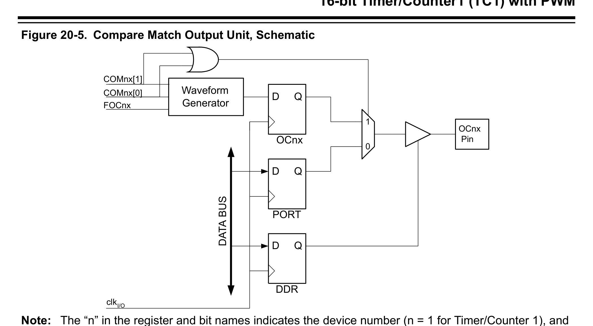
*Description*: Technical diagram and schematic illustration detailing hardware circuit topology, signal routing, and logic operations for Figure 20-5: Compare Match Output Unit, Schematic.

> **Figure 20-5: Compare Match Output Unit, Schematic**

PORT
DDR
D
Q
D
Q
OCnx
Pin
OCnx
D
Q
Waveform
Generator
COMnx[1]
COMnx[0]
0
1
DATA BUS
FOCnx
clkI/O
Note:  The “n” in the register and bit names indicates the device number (n = 1 for Timer/Counter 1), and
the “x” indicates output compare unit (A/B).
The general I/O port function is overridden by the Output Compare (OC1x) from the waveform generator
if either of the TCCR1A.COM1x[1:0] bits are set. However, the OC1x pin direction (input or output) is still
controlled by the Data Direction Register (DDR) for the port pin. The DDR bit for the OC1x pin
(DDR_OC1x) must be set as output before the OC1x value is visible on the pin. The port override
function is generally independent of the waveform generation mode, but there are some exceptions.
The design of the output compare pin logic allows initialization of the OC1x state before the output is
enabled. Note that some TCCR1A.COM1x[1:0] bit settings are reserved for certain modes of operation.
The TCCR1A.COM1x[1:0] bits have no effect on the input capture unit.
20.11.1 Compare Output Mode and Waveform Generation
The waveform generator uses the TCCR1A.COM1x[1:0] bits differently in normal, CTC, and PWM
modes. For all modes, setting the TCCR1A.COM1x[1:0] = 0 tells the waveform generator that no action
on the OC1x register is to be performed on the next compare match. Refer also to the descriptions of the
output modes.
A change of the TCCR1A.COM1x[1:0] bits state will have effect at the first compare match after the bits
are written. For non-PWM modes, the action can be forced to have immediate effect by using the
TCCR1C.FOC1x strobe bits.

## 20.12 Modes of Operation

The mode of operation, i.e., the behavior of the timer/counter and the output compare pins, is defined by
the combination of the Waveform Generation mode (WGM1[3:0]) and Compare Output mode
(TCCR1A.COM1x[1:0]) bits. The Compare Output mode bits do not affect the counting sequence, while
the Waveform Generation mode bits do. The TCCR1A.COM1x[1:0] bits control whether the PWM output
generated should be inverted or not (inverted or non-inverted PWM). For non-PWM modes the
TCCR1A.COM1x[1:0] bits control whether the output should be set, cleared, or toggle at a compare
match.
ATmega328/P
16-bit Timer/Counter1 (TC1) with PWM
© 2018 Microchip Technology Inc.
Datasheet Complete
DS40001984A-page 163
Downloaded from Arrow.com.
Downloaded from Arrow.com.
Downloaded from Arrow.com.
Downloaded from Arrow.com.
Downloaded from Arrow.com.
Downloaded from Arrow.com.
Downloaded from Arrow.com.
Downloaded from Arrow.com.
Downloaded from Arrow.com.
Downloaded from Arrow.com.
Downloaded from Arrow.com.
Downloaded from Arrow.com.
Downloaded from Arrow.com.
Downloaded from Arrow.com.
Downloaded from Arrow.com.
Downloaded from Arrow.com.
Downloaded from Arrow.com.
Downloaded from Arrow.com.
Downloaded from Arrow.com.
Downloaded from Arrow.com.
Downloaded from Arrow.com.
Downloaded from Arrow.com.
Downloaded from Arrow.com.
Downloaded from Arrow.com.
Downloaded from Arrow.com.
Downloaded from Arrow.com.
Downloaded from Arrow.com.
Downloaded from Arrow.com.
Downloaded from Arrow.com.
Downloaded from Arrow.com.
Downloaded from Arrow.com.
Downloaded from Arrow.com.
Downloaded from Arrow.com.
Downloaded from Arrow.com.
Downloaded from Arrow.com.
Downloaded from Arrow.com.
Downloaded from Arrow.com.
Downloaded from Arrow.com.
Downloaded from Arrow.com.
Downloaded from Arrow.com.
Downloaded from Arrow.com.
Downloaded from Arrow.com.
Downloaded from Arrow.com.
Downloaded from Arrow.com.
Downloaded from Arrow.com.
Downloaded from Arrow.com.
Downloaded from Arrow.com.
Downloaded from Arrow.com.
Downloaded from Arrow.com.
Downloaded from Arrow.com.
Downloaded from Arrow.com.
Downloaded from Arrow.com.
Downloaded from Arrow.com.
Downloaded from Arrow.com.
Downloaded from Arrow.com.
Downloaded from Arrow.com.
Downloaded from Arrow.com.
Downloaded from Arrow.com.
Downloaded from Arrow.com.
Downloaded from Arrow.com.
Downloaded from Arrow.com.
Downloaded from Arrow.com.
Downloaded from Arrow.com.
Downloaded from Arrow.com.
Downloaded from Arrow.com.
Downloaded from Arrow.com.
Downloaded from Arrow.com.
Downloaded from Arrow.com.
Downloaded from Arrow.com.
Downloaded from Arrow.com.
Downloaded from Arrow.com.
Downloaded from Arrow.com.
Downloaded from Arrow.com.
Downloaded from Arrow.com.
Downloaded from Arrow.com.
Downloaded from Arrow.com.
Downloaded from Arrow.com.
Downloaded from Arrow.com.
Downloaded from Arrow.com.
Downloaded from Arrow.com.
Downloaded from Arrow.com.
Downloaded from Arrow.com.
Downloaded from Arrow.com.
Downloaded from Arrow.com.
Downloaded from Arrow.com.
Downloaded from Arrow.com.
Downloaded from Arrow.com.
Downloaded from Arrow.com.
Downloaded from Arrow.com.
Downloaded from Arrow.com.
Downloaded from Arrow.com.
Downloaded from Arrow.com.
Downloaded from Arrow.com.
Downloaded from Arrow.com.
Downloaded from Arrow.com.
Downloaded from Arrow.com.
Downloaded from Arrow.com.
Downloaded from Arrow.com.
Downloaded from Arrow.com.
Downloaded from Arrow.com.
Downloaded from Arrow.com.
Downloaded from Arrow.com.
Downloaded from Arrow.com.
Downloaded from Arrow.com.
Downloaded from Arrow.com.
Downloaded from Arrow.com.
Downloaded from Arrow.com.
Downloaded from Arrow.com.
Downloaded from Arrow.com.
Downloaded from Arrow.com.
Downloaded from Arrow.com.
Downloaded from Arrow.com.
Downloaded from Arrow.com.
Downloaded from Arrow.com.
Downloaded from Arrow.com.
Downloaded from Arrow.com.
Downloaded from Arrow.com.
Downloaded from Arrow.com.
Downloaded from Arrow.com.
Downloaded from Arrow.com.
Downloaded from Arrow.com.
Downloaded from Arrow.com.
Downloaded from Arrow.com.
Downloaded from Arrow.com.
Downloaded from Arrow.com.
Downloaded from Arrow.com.
Downloaded from Arrow.com.
Downloaded from Arrow.com.
Downloaded from Arrow.com.
Downloaded from Arrow.com.
Downloaded from Arrow.com.
Downloaded from Arrow.com.
Downloaded from Arrow.com.
Downloaded from Arrow.com.
Downloaded from Arrow.com.
Downloaded from Arrow.com.
Downloaded from Arrow.com.
Downloaded from Arrow.com.
Downloaded from Arrow.com.
Downloaded from Arrow.com.
Downloaded from Arrow.com.
Downloaded from Arrow.com.
Downloaded from Arrow.com.
Downloaded from Arrow.com.
Downloaded from Arrow.com.
Downloaded from Arrow.com.
Downloaded from Arrow.com.
Downloaded from Arrow.com.
Downloaded from Arrow.com.
Downloaded from Arrow.com.
Downloaded from Arrow.com.
Downloaded from Arrow.com.
Downloaded from Arrow.com.
Downloaded from Arrow.com.
Downloaded from Arrow.com.
Downloaded from Arrow.com.
Downloaded from Arrow.com.
Downloaded from Arrow.com.
Downloaded from Arrow.com.
Downloaded from Arrow.com.
Downloaded from Arrow.com.
Downloaded from Arrow.com.
Downloaded from Arrow.com.


<!-- Page 164 -->
### [PDF Page 164]

Related Links
Timer/Counter Timing Diagrams
Compare Match Output Unit
20.12.1 Normal Mode
The simplest mode of operation is the Normal mode (TCCR1A.WGM1[3:0]=0). In this mode, the counting
direction is always up (incrementing), and no counter clear is performed. The counter simply overruns
when it passes its maximum 16-bit value (MAX=0xFFFF) and then restarts from BOTTOM=0x0000. In
normal operation, the Timer/Counter Overflow Flag (TIFR1.TOVn) will be set in the same timer clock
cycle as the TCNT1 becomes zero. In this case, the TOVn flag behaves like a 17th bit, except that it is
only set, not cleared. However, combined with the timer overflow interrupt that automatically clears the
TOVn flag, the timer resolution can be increased by software. There are no special cases to consider in
the Normal mode, a new counter value can be written any time.
The input capture unit is easy to use in Normal mode. However, observe that the maximum interval
between the external events must not exceed the resolution of the counter. If the interval between events
are too long, the timer overflow interrupt or the prescaler must be used to extend the resolution for the
capture unit.
The output compare units can be used to generate interrupts at some given time. Using the output
compare to generate waveforms in Normal mode is not recommended since this will occupy too much of
the CPU time.
20.12.2 Clear Timer on Compare Match (CTC) Mode
In Clear Timer on Compare (CTC) modes (mode 4 or 12, WGM1[3:0]=0x4 or 0xC), the OCR1A or ICR1
registers are used to manipulate the counter resolution: the counter is cleared to ZERO when the counter
value (TCNT1) matches either the OCR1A (if WGM1[3:0]=0x4) or the ICR1 (WGM1[3:0]=0xC). The
OCR1A or ICR1 define the top value for the counter, hence also its resolution. This mode allows greater
control of the compare match output frequency. It simplifies the operation of counting external events.
The timing diagram for the CTC mode is shown below. The counter value (TCNT1) increases until a
compare match occurs with either OCR1A or ICR1, and then TCNT1 is cleared.

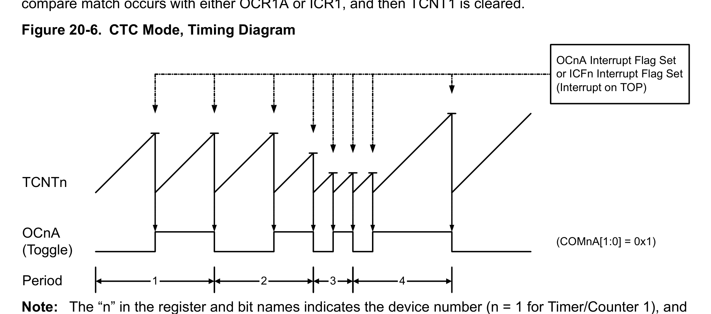
*Description*: Technical diagram and schematic illustration detailing hardware circuit topology, signal routing, and logic operations for Figure 20-6: CTC Mode, Timing Diagram.

> **Figure 20-6: CTC Mode, Timing Diagram**

TCNTn
OCnA
(Toggle)
OCnA Interrupt Flag Set
or ICFn Interrupt Flag Set
(Interrupt on TOP)
1
4
Period
2
3
(COMnA[1:0] = 0x1)
Note:  The “n” in the register and bit names indicates the device number (n = 1 for Timer/Counter 1), and
the “x” indicates output compare unit (A/B).
ATmega328/P
16-bit Timer/Counter1 (TC1) with PWM
© 2018 Microchip Technology Inc.
Datasheet Complete
DS40001984A-page 164
Downloaded from Arrow.com.
Downloaded from Arrow.com.
Downloaded from Arrow.com.
Downloaded from Arrow.com.
Downloaded from Arrow.com.
Downloaded from Arrow.com.
Downloaded from Arrow.com.
Downloaded from Arrow.com.
Downloaded from Arrow.com.
Downloaded from Arrow.com.
Downloaded from Arrow.com.
Downloaded from Arrow.com.
Downloaded from Arrow.com.
Downloaded from Arrow.com.
Downloaded from Arrow.com.
Downloaded from Arrow.com.
Downloaded from Arrow.com.
Downloaded from Arrow.com.
Downloaded from Arrow.com.
Downloaded from Arrow.com.
Downloaded from Arrow.com.
Downloaded from Arrow.com.
Downloaded from Arrow.com.
Downloaded from Arrow.com.
Downloaded from Arrow.com.
Downloaded from Arrow.com.
Downloaded from Arrow.com.
Downloaded from Arrow.com.
Downloaded from Arrow.com.
Downloaded from Arrow.com.
Downloaded from Arrow.com.
Downloaded from Arrow.com.
Downloaded from Arrow.com.
Downloaded from Arrow.com.
Downloaded from Arrow.com.
Downloaded from Arrow.com.
Downloaded from Arrow.com.
Downloaded from Arrow.com.
Downloaded from Arrow.com.
Downloaded from Arrow.com.
Downloaded from Arrow.com.
Downloaded from Arrow.com.
Downloaded from Arrow.com.
Downloaded from Arrow.com.
Downloaded from Arrow.com.
Downloaded from Arrow.com.
Downloaded from Arrow.com.
Downloaded from Arrow.com.
Downloaded from Arrow.com.
Downloaded from Arrow.com.
Downloaded from Arrow.com.
Downloaded from Arrow.com.
Downloaded from Arrow.com.
Downloaded from Arrow.com.
Downloaded from Arrow.com.
Downloaded from Arrow.com.
Downloaded from Arrow.com.
Downloaded from Arrow.com.
Downloaded from Arrow.com.
Downloaded from Arrow.com.
Downloaded from Arrow.com.
Downloaded from Arrow.com.
Downloaded from Arrow.com.
Downloaded from Arrow.com.
Downloaded from Arrow.com.
Downloaded from Arrow.com.
Downloaded from Arrow.com.
Downloaded from Arrow.com.
Downloaded from Arrow.com.
Downloaded from Arrow.com.
Downloaded from Arrow.com.
Downloaded from Arrow.com.
Downloaded from Arrow.com.
Downloaded from Arrow.com.
Downloaded from Arrow.com.
Downloaded from Arrow.com.
Downloaded from Arrow.com.
Downloaded from Arrow.com.
Downloaded from Arrow.com.
Downloaded from Arrow.com.
Downloaded from Arrow.com.
Downloaded from Arrow.com.
Downloaded from Arrow.com.
Downloaded from Arrow.com.
Downloaded from Arrow.com.
Downloaded from Arrow.com.
Downloaded from Arrow.com.
Downloaded from Arrow.com.
Downloaded from Arrow.com.
Downloaded from Arrow.com.
Downloaded from Arrow.com.
Downloaded from Arrow.com.
Downloaded from Arrow.com.
Downloaded from Arrow.com.
Downloaded from Arrow.com.
Downloaded from Arrow.com.
Downloaded from Arrow.com.
Downloaded from Arrow.com.
Downloaded from Arrow.com.
Downloaded from Arrow.com.
Downloaded from Arrow.com.
Downloaded from Arrow.com.
Downloaded from Arrow.com.
Downloaded from Arrow.com.
Downloaded from Arrow.com.
Downloaded from Arrow.com.
Downloaded from Arrow.com.
Downloaded from Arrow.com.
Downloaded from Arrow.com.
Downloaded from Arrow.com.
Downloaded from Arrow.com.
Downloaded from Arrow.com.
Downloaded from Arrow.com.
Downloaded from Arrow.com.
Downloaded from Arrow.com.
Downloaded from Arrow.com.
Downloaded from Arrow.com.
Downloaded from Arrow.com.
Downloaded from Arrow.com.
Downloaded from Arrow.com.
Downloaded from Arrow.com.
Downloaded from Arrow.com.
Downloaded from Arrow.com.
Downloaded from Arrow.com.
Downloaded from Arrow.com.
Downloaded from Arrow.com.
Downloaded from Arrow.com.
Downloaded from Arrow.com.
Downloaded from Arrow.com.
Downloaded from Arrow.com.
Downloaded from Arrow.com.
Downloaded from Arrow.com.
Downloaded from Arrow.com.
Downloaded from Arrow.com.
Downloaded from Arrow.com.
Downloaded from Arrow.com.
Downloaded from Arrow.com.
Downloaded from Arrow.com.
Downloaded from Arrow.com.
Downloaded from Arrow.com.
Downloaded from Arrow.com.
Downloaded from Arrow.com.
Downloaded from Arrow.com.
Downloaded from Arrow.com.
Downloaded from Arrow.com.
Downloaded from Arrow.com.
Downloaded from Arrow.com.
Downloaded from Arrow.com.
Downloaded from Arrow.com.
Downloaded from Arrow.com.
Downloaded from Arrow.com.
Downloaded from Arrow.com.
Downloaded from Arrow.com.
Downloaded from Arrow.com.
Downloaded from Arrow.com.
Downloaded from Arrow.com.
Downloaded from Arrow.com.
Downloaded from Arrow.com.
Downloaded from Arrow.com.
Downloaded from Arrow.com.
Downloaded from Arrow.com.
Downloaded from Arrow.com.
Downloaded from Arrow.com.
Downloaded from Arrow.com.


<!-- Page 165 -->
### [PDF Page 165]

An interrupt can be generated at each time the counter value reaches the TOP value by either using the
OCF1A or ICF1 flag, depending on the actual CTC mode. If the interrupt is enabled, the interrupt handler
routine can be used for updating the TOP value.
Note:  Changing TOP to a value close to BOTTOM while the counter is running must be done with care
since the CTC mode does not provide double buffering. If the new value written to OCR1A is lower than
the current value of TCNT1, the counter will miss the compare match. The counter will then count to its
maximum value (0xFF for an 8-bit counter, 0xFFFF for a 16-bit counter) and wrap around starting at 0x00
before the compare match will occur.
In many cases, this feature is not desirable. An alternative will then be to use the Fast PWM mode using
OCR1A for defining TOP (WGM1[3:0]=0xF), since the OCR1A then will be double buffered.
For generating a waveform output in CTC mode, the OC1A output can be set to toggle its logical level on
each compare match by setting the Compare Output mode bits to toggle mode (COM1A[1:0]=0x1). The
OC1A value will not be visible on the port pin unless the data direction for the pin is set to output
(DDR_OC1A=1). The waveform generated will have a maximum frequency of fOC1A = fclk_I/O/2 when
OCR1A is set to ZERO (0x0000). The waveform frequency is defined by the following equation:
�OCnA =
�clk_I/O
2 ⋅�⋅1 + OCRnA
Note:
•
The “n” indicates the device number (n = 1 for Timer/Counter 1), and the “x” indicates Output
Compare unit (A/B).
•
N represents the prescaler factor (1, 8, 64, 256, or 1024).
As for the Normal mode of operation, the Timer Counter TOV flag is set in the same timer clock cycle that
the counter counts from MAX to 0x0000.
20.12.3 Fast PWM Mode
The Fast Pulse Width Modulation or Fast PWM modes (modes 5, 6, 7, 14, and 15, WGM1[3:0]= 0x5, 0x6,
0x7, 0xE, 0xF) provide a high frequency PWM waveform generation option. The Fast PWM differs from
the other PWM options by its single-slope operation. The counter counts from BOTTOM to TOP then
restarts from BOTTOM.
In non-inverting Compare Output mode, the Output Compare (OC1x) is cleared on the compare match
between TCNT1 and OCR1x and set at BOTTOM. In inverting Compare Output mode output is set on
compare match and cleared at BOTTOM. Due to the single-slope operation, the operating frequency of
the Fast PWM mode can be twice as high as the phase correct, and phase and frequency correct PWM
modes that use dual-slope operation. This high frequency makes the Fast PWM mode well suited for
power regulation, rectification, and DAC applications. High frequency allows physically small sized
external components (coils, capacitors), hence reduces total system cost.
The PWM resolution for Fast PWM can be fixed to 8-, 9-, or 10-bit, or defined by either ICR1 or OCR1A.
The minimum resolution allowed is 2-bit (ICR1 or OCR1A register set to 0x0003), and the maximum
resolution is 16-bit (ICR1 or OCR1A registers set to MAX). The PWM resolution in bits can be calculated
by using the following equation:
�FPWM = log TOP+1
log 2
In Fast PWM mode the counter is incremented until the counter value matches either one of the fixed
values 0x00FF, 0x01FF, or 0x03FF (WGM1[3:0] = 0x5, 0x6, or 0x7), the value in ICR1 (WGM1[3:0]=0xE),
or the value in OCR1A (WGM1[3:0]=0xF). The counter is then cleared at the following timer clock cycle.
ATmega328/P
16-bit Timer/Counter1 (TC1) with PWM
© 2018 Microchip Technology Inc.
Datasheet Complete
DS40001984A-page 165
Downloaded from Arrow.com.
Downloaded from Arrow.com.
Downloaded from Arrow.com.
Downloaded from Arrow.com.
Downloaded from Arrow.com.
Downloaded from Arrow.com.
Downloaded from Arrow.com.
Downloaded from Arrow.com.
Downloaded from Arrow.com.
Downloaded from Arrow.com.
Downloaded from Arrow.com.
Downloaded from Arrow.com.
Downloaded from Arrow.com.
Downloaded from Arrow.com.
Downloaded from Arrow.com.
Downloaded from Arrow.com.
Downloaded from Arrow.com.
Downloaded from Arrow.com.
Downloaded from Arrow.com.
Downloaded from Arrow.com.
Downloaded from Arrow.com.
Downloaded from Arrow.com.
Downloaded from Arrow.com.
Downloaded from Arrow.com.
Downloaded from Arrow.com.
Downloaded from Arrow.com.
Downloaded from Arrow.com.
Downloaded from Arrow.com.
Downloaded from Arrow.com.
Downloaded from Arrow.com.
Downloaded from Arrow.com.
Downloaded from Arrow.com.
Downloaded from Arrow.com.
Downloaded from Arrow.com.
Downloaded from Arrow.com.
Downloaded from Arrow.com.
Downloaded from Arrow.com.
Downloaded from Arrow.com.
Downloaded from Arrow.com.
Downloaded from Arrow.com.
Downloaded from Arrow.com.
Downloaded from Arrow.com.
Downloaded from Arrow.com.
Downloaded from Arrow.com.
Downloaded from Arrow.com.
Downloaded from Arrow.com.
Downloaded from Arrow.com.
Downloaded from Arrow.com.
Downloaded from Arrow.com.
Downloaded from Arrow.com.
Downloaded from Arrow.com.
Downloaded from Arrow.com.
Downloaded from Arrow.com.
Downloaded from Arrow.com.
Downloaded from Arrow.com.
Downloaded from Arrow.com.
Downloaded from Arrow.com.
Downloaded from Arrow.com.
Downloaded from Arrow.com.
Downloaded from Arrow.com.
Downloaded from Arrow.com.
Downloaded from Arrow.com.
Downloaded from Arrow.com.
Downloaded from Arrow.com.
Downloaded from Arrow.com.
Downloaded from Arrow.com.
Downloaded from Arrow.com.
Downloaded from Arrow.com.
Downloaded from Arrow.com.
Downloaded from Arrow.com.
Downloaded from Arrow.com.
Downloaded from Arrow.com.
Downloaded from Arrow.com.
Downloaded from Arrow.com.
Downloaded from Arrow.com.
Downloaded from Arrow.com.
Downloaded from Arrow.com.
Downloaded from Arrow.com.
Downloaded from Arrow.com.
Downloaded from Arrow.com.
Downloaded from Arrow.com.
Downloaded from Arrow.com.
Downloaded from Arrow.com.
Downloaded from Arrow.com.
Downloaded from Arrow.com.
Downloaded from Arrow.com.
Downloaded from Arrow.com.
Downloaded from Arrow.com.
Downloaded from Arrow.com.
Downloaded from Arrow.com.
Downloaded from Arrow.com.
Downloaded from Arrow.com.
Downloaded from Arrow.com.
Downloaded from Arrow.com.
Downloaded from Arrow.com.
Downloaded from Arrow.com.
Downloaded from Arrow.com.
Downloaded from Arrow.com.
Downloaded from Arrow.com.
Downloaded from Arrow.com.
Downloaded from Arrow.com.
Downloaded from Arrow.com.
Downloaded from Arrow.com.
Downloaded from Arrow.com.
Downloaded from Arrow.com.
Downloaded from Arrow.com.
Downloaded from Arrow.com.
Downloaded from Arrow.com.
Downloaded from Arrow.com.
Downloaded from Arrow.com.
Downloaded from Arrow.com.
Downloaded from Arrow.com.
Downloaded from Arrow.com.
Downloaded from Arrow.com.
Downloaded from Arrow.com.
Downloaded from Arrow.com.
Downloaded from Arrow.com.
Downloaded from Arrow.com.
Downloaded from Arrow.com.
Downloaded from Arrow.com.
Downloaded from Arrow.com.
Downloaded from Arrow.com.
Downloaded from Arrow.com.
Downloaded from Arrow.com.
Downloaded from Arrow.com.
Downloaded from Arrow.com.
Downloaded from Arrow.com.
Downloaded from Arrow.com.
Downloaded from Arrow.com.
Downloaded from Arrow.com.
Downloaded from Arrow.com.
Downloaded from Arrow.com.
Downloaded from Arrow.com.
Downloaded from Arrow.com.
Downloaded from Arrow.com.
Downloaded from Arrow.com.
Downloaded from Arrow.com.
Downloaded from Arrow.com.
Downloaded from Arrow.com.
Downloaded from Arrow.com.
Downloaded from Arrow.com.
Downloaded from Arrow.com.
Downloaded from Arrow.com.
Downloaded from Arrow.com.
Downloaded from Arrow.com.
Downloaded from Arrow.com.
Downloaded from Arrow.com.
Downloaded from Arrow.com.
Downloaded from Arrow.com.
Downloaded from Arrow.com.
Downloaded from Arrow.com.
Downloaded from Arrow.com.
Downloaded from Arrow.com.
Downloaded from Arrow.com.
Downloaded from Arrow.com.
Downloaded from Arrow.com.
Downloaded from Arrow.com.
Downloaded from Arrow.com.
Downloaded from Arrow.com.
Downloaded from Arrow.com.
Downloaded from Arrow.com.
Downloaded from Arrow.com.
Downloaded from Arrow.com.
Downloaded from Arrow.com.
Downloaded from Arrow.com.


<!-- Page 166 -->
### [PDF Page 166]

The timing diagram for the Fast PWM mode using OCR1A or ICR1 to define TOP is shown below. The
TCNT1 value is in the timing diagram shown as a histogram for illustrating the single-slope operation. The
diagram includes non-inverted and inverted PWM outputs. The small horizontal lines on the TCNT1
slopes mark compare matches between OCR1x and TCNT1. The OC1x interrupt flag will be set when a
compare match occurs.

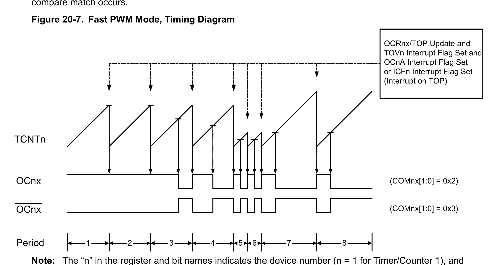
*Description*: Timer/Counter block diagram and waveform timing diagram illustrating prescaler clocks, compare match units, and PWM generation logic for Figure 20-7: Fast PWM Mode, Timing Diagram.

> **Figure 20-7: Fast PWM Mode, Timing Diagram**

TCNTn
OCRnx/TOP Update and
TOVn Interrupt Flag Set and
OCnA Interrupt Flag Set
or ICFn Interrupt Flag Set
(Interrupt on TOP)
1
7
Period
2
3
4
5
6
8
OCnx
OCnx
(COMnx[1:0] = 0x2)
(COMnx[1:0] = 0x3)
Note:  The “n” in the register and bit names indicates the device number (n = 1 for Timer/Counter 1), and
the “x” indicates output compare unit (A/B).
The Timer/Counter Overflow flag (TOV1) is set each time the counter reaches TOP. In addition, when
either OCR1A or ICR1 is used for defining the TOP value, the OC1A or ICF1 flag is set at the same timer
clock cycle TOV1 is set. If one of the interrupts are enabled, the interrupt handler routine can be used for
updating the TOP and compare values.
When changing the TOP value the program must ensure that the new TOP value is higher or equal to the
value of all of the Compare registers. If the TOP value is lower than any of the Compare registers, a
compare match will never occur between the TCNT1 and the OCR1x. Note that when using fixed TOP
values the unused bits are masked to zero when any of the OCR1x registers are written.
The procedure for updating ICR1 differs from updating OCR1A when used for defining the TOP value.
The ICR1 register is not double buffered. This means that if ICR1 is changed to a low value when the
counter is running with none or a low prescaler value, there is a risk that the new ICR1 value written is
lower than the current value of TCNT1. As result, the counter will miss the compare match at the TOP
value. The counter will then have to count to the MAX value (0xFFFF) and wrap around starting at
0x0000 before the compare match can occur. The OCR1A Register, however, is double buffered. This
feature allows the OCR1A I/O location to be written any time. When the OCR1A I/O location is written the
value written will be put into the OCR1A Buffer register. The OCR1A Compare register will then be
updated with the value in the Buffer register at the next timer clock cycle the TCNT1 matches TOP. The
update is performed at the same timer clock cycle as the TCNT1 is cleared and the TOV1 flag is set.
Using the ICR1 register for defining TOP works well when using fixed TOP values. By using ICR1, the
OCR1A is free to be used for generating a PWM output on OC1A. However, if the base PWM frequency
ATmega328/P
16-bit Timer/Counter1 (TC1) with PWM
© 2018 Microchip Technology Inc.
Datasheet Complete
DS40001984A-page 166
Downloaded from Arrow.com.
Downloaded from Arrow.com.
Downloaded from Arrow.com.
Downloaded from Arrow.com.
Downloaded from Arrow.com.
Downloaded from Arrow.com.
Downloaded from Arrow.com.
Downloaded from Arrow.com.
Downloaded from Arrow.com.
Downloaded from Arrow.com.
Downloaded from Arrow.com.
Downloaded from Arrow.com.
Downloaded from Arrow.com.
Downloaded from Arrow.com.
Downloaded from Arrow.com.
Downloaded from Arrow.com.
Downloaded from Arrow.com.
Downloaded from Arrow.com.
Downloaded from Arrow.com.
Downloaded from Arrow.com.
Downloaded from Arrow.com.
Downloaded from Arrow.com.
Downloaded from Arrow.com.
Downloaded from Arrow.com.
Downloaded from Arrow.com.
Downloaded from Arrow.com.
Downloaded from Arrow.com.
Downloaded from Arrow.com.
Downloaded from Arrow.com.
Downloaded from Arrow.com.
Downloaded from Arrow.com.
Downloaded from Arrow.com.
Downloaded from Arrow.com.
Downloaded from Arrow.com.
Downloaded from Arrow.com.
Downloaded from Arrow.com.
Downloaded from Arrow.com.
Downloaded from Arrow.com.
Downloaded from Arrow.com.
Downloaded from Arrow.com.
Downloaded from Arrow.com.
Downloaded from Arrow.com.
Downloaded from Arrow.com.
Downloaded from Arrow.com.
Downloaded from Arrow.com.
Downloaded from Arrow.com.
Downloaded from Arrow.com.
Downloaded from Arrow.com.
Downloaded from Arrow.com.
Downloaded from Arrow.com.
Downloaded from Arrow.com.
Downloaded from Arrow.com.
Downloaded from Arrow.com.
Downloaded from Arrow.com.
Downloaded from Arrow.com.
Downloaded from Arrow.com.
Downloaded from Arrow.com.
Downloaded from Arrow.com.
Downloaded from Arrow.com.
Downloaded from Arrow.com.
Downloaded from Arrow.com.
Downloaded from Arrow.com.
Downloaded from Arrow.com.
Downloaded from Arrow.com.
Downloaded from Arrow.com.
Downloaded from Arrow.com.
Downloaded from Arrow.com.
Downloaded from Arrow.com.
Downloaded from Arrow.com.
Downloaded from Arrow.com.
Downloaded from Arrow.com.
Downloaded from Arrow.com.
Downloaded from Arrow.com.
Downloaded from Arrow.com.
Downloaded from Arrow.com.
Downloaded from Arrow.com.
Downloaded from Arrow.com.
Downloaded from Arrow.com.
Downloaded from Arrow.com.
Downloaded from Arrow.com.
Downloaded from Arrow.com.
Downloaded from Arrow.com.
Downloaded from Arrow.com.
Downloaded from Arrow.com.
Downloaded from Arrow.com.
Downloaded from Arrow.com.
Downloaded from Arrow.com.
Downloaded from Arrow.com.
Downloaded from Arrow.com.
Downloaded from Arrow.com.
Downloaded from Arrow.com.
Downloaded from Arrow.com.
Downloaded from Arrow.com.
Downloaded from Arrow.com.
Downloaded from Arrow.com.
Downloaded from Arrow.com.
Downloaded from Arrow.com.
Downloaded from Arrow.com.
Downloaded from Arrow.com.
Downloaded from Arrow.com.
Downloaded from Arrow.com.
Downloaded from Arrow.com.
Downloaded from Arrow.com.
Downloaded from Arrow.com.
Downloaded from Arrow.com.
Downloaded from Arrow.com.
Downloaded from Arrow.com.
Downloaded from Arrow.com.
Downloaded from Arrow.com.
Downloaded from Arrow.com.
Downloaded from Arrow.com.
Downloaded from Arrow.com.
Downloaded from Arrow.com.
Downloaded from Arrow.com.
Downloaded from Arrow.com.
Downloaded from Arrow.com.
Downloaded from Arrow.com.
Downloaded from Arrow.com.
Downloaded from Arrow.com.
Downloaded from Arrow.com.
Downloaded from Arrow.com.
Downloaded from Arrow.com.
Downloaded from Arrow.com.
Downloaded from Arrow.com.
Downloaded from Arrow.com.
Downloaded from Arrow.com.
Downloaded from Arrow.com.
Downloaded from Arrow.com.
Downloaded from Arrow.com.
Downloaded from Arrow.com.
Downloaded from Arrow.com.
Downloaded from Arrow.com.
Downloaded from Arrow.com.
Downloaded from Arrow.com.
Downloaded from Arrow.com.
Downloaded from Arrow.com.
Downloaded from Arrow.com.
Downloaded from Arrow.com.
Downloaded from Arrow.com.
Downloaded from Arrow.com.
Downloaded from Arrow.com.
Downloaded from Arrow.com.
Downloaded from Arrow.com.
Downloaded from Arrow.com.
Downloaded from Arrow.com.
Downloaded from Arrow.com.
Downloaded from Arrow.com.
Downloaded from Arrow.com.
Downloaded from Arrow.com.
Downloaded from Arrow.com.
Downloaded from Arrow.com.
Downloaded from Arrow.com.
Downloaded from Arrow.com.
Downloaded from Arrow.com.
Downloaded from Arrow.com.
Downloaded from Arrow.com.
Downloaded from Arrow.com.
Downloaded from Arrow.com.
Downloaded from Arrow.com.
Downloaded from Arrow.com.
Downloaded from Arrow.com.
Downloaded from Arrow.com.
Downloaded from Arrow.com.
Downloaded from Arrow.com.
Downloaded from Arrow.com.
Downloaded from Arrow.com.


<!-- Page 167 -->
### [PDF Page 167]

is actively changed (by changing the TOP value), using the OCR1A as TOP is clearly a better choice due
to its double buffer feature.
In Fast PWM mode, the compare units allow generation of PWM waveforms on the OC1x pins. Writing
the COM1x[1:0] bits to 0x2 will produce an inverted PWM and a non-inverted PWM output can be
generated by writing the COM1x[1:0] to 0x3. The actual OC1x value will only be visible on the port pin if
the data direction for the port pin is set as output (DDR_OC1x). The PWM waveform is generated by
setting (or clearing) the OC1x Register at the compare match between OCR1x and TCNT1, and clearing
(or setting) the OC1x register at the timer clock cycle the counter is cleared (changes from TOP to
BOTTOM).
The PWM frequency for the output can be calculated by the following equation:
�OCnxPWM =
�clk_I/O
�⋅1 + TOP
Note:
•
The “n” in the register and bit names indicates the device number (n = 1 for Timer/Counter 1), and
the “x” indicates output compare unit (A/B).
•
N represents the prescale divider (1, 8, 64, 256, or 1024).
The extreme values for the OCR1x registers represent special cases when generating a PWM waveform
output in the Fast PWM mode. If the OCR1x is set equal to BOTTOM (0x0000) the output will be a narrow
spike for each TOP+1 timer clock cycle. Setting the OCR1x equal to TOP will result in a constant high or
low output (depending on the polarity of the output which is controlled by COM1x[1:0]).
A frequency waveform output with 50% duty cycle can be achieved in Fast PWM mode by selecting
OC1A to toggle its logical level on each compare match (COM1A[1:0]=0x1). This applies only if OCR1A is
used to define the TOP value (WGM1[3:0]=0xF). The waveform generated will have a maximum
frequency of fOC1A = fclk_I/O/2 when OCR1A is set to zero (0x0000). This feature is similar to the OC1A
toggle in CTC mode, except the double buffer feature of the output compare unit is enabled in the Fast
PWM mode.
20.12.4 Phase Correct PWM Mode
The Phase Correct Pulse Width Modulation or Phase Correct PWM modes (WGM1[3:0]= 0x1, 0x2, 0x3,
0xA, and 0xB) provide a high resolution, phase correct PWM waveform generation option. The Phase
Correct PWM mode is, like the phase and frequency correct PWM mode, based on a dual-slope
operation. The counter counts repeatedly from BOTTOM (0x0000) to TOP and then from TOP to
BOTTOM. In non-inverting Compare Output mode, the Output Compare (OC1x) is cleared on the
compare match between TCNT1 and OCR1x while up-counting, and set on the compare match while
down-counting. In inverting Output Compare mode, the operation is inverted. The dual-slope operation
has lower maximum operation frequency than single-slope operation. However, due to the symmetric
feature of the dual-slope PWM modes, these modes are preferred for motor control applications.
The PWM resolution for the Phase Correct PWM mode can be fixed to 8-, 9-, or 10-bit, or defined by
either ICR1 or OCR1A. The minimum resolution allowed is 2-bit (ICR1 or OCR1A set to 0x0003), and the
maximum resolution is 16-bit (ICR1 or OCR1A set to MAX). The PWM resolution in bits can be calculated
by using the following equation:
�PCPWM = log TOP+1
log 2
In Phase Correct PWM mode the counter is incremented until the counter value matches either one of the
fixed values 0x00FF, 0x01FF, or 0x03FF (WGM1[3:0]= 0x1, 0x2, or 0x3), the value in ICR1
ATmega328/P
16-bit Timer/Counter1 (TC1) with PWM
© 2018 Microchip Technology Inc.
Datasheet Complete
DS40001984A-page 167
Downloaded from Arrow.com.
Downloaded from Arrow.com.
Downloaded from Arrow.com.
Downloaded from Arrow.com.
Downloaded from Arrow.com.
Downloaded from Arrow.com.
Downloaded from Arrow.com.
Downloaded from Arrow.com.
Downloaded from Arrow.com.
Downloaded from Arrow.com.
Downloaded from Arrow.com.
Downloaded from Arrow.com.
Downloaded from Arrow.com.
Downloaded from Arrow.com.
Downloaded from Arrow.com.
Downloaded from Arrow.com.
Downloaded from Arrow.com.
Downloaded from Arrow.com.
Downloaded from Arrow.com.
Downloaded from Arrow.com.
Downloaded from Arrow.com.
Downloaded from Arrow.com.
Downloaded from Arrow.com.
Downloaded from Arrow.com.
Downloaded from Arrow.com.
Downloaded from Arrow.com.
Downloaded from Arrow.com.
Downloaded from Arrow.com.
Downloaded from Arrow.com.
Downloaded from Arrow.com.
Downloaded from Arrow.com.
Downloaded from Arrow.com.
Downloaded from Arrow.com.
Downloaded from Arrow.com.
Downloaded from Arrow.com.
Downloaded from Arrow.com.
Downloaded from Arrow.com.
Downloaded from Arrow.com.
Downloaded from Arrow.com.
Downloaded from Arrow.com.
Downloaded from Arrow.com.
Downloaded from Arrow.com.
Downloaded from Arrow.com.
Downloaded from Arrow.com.
Downloaded from Arrow.com.
Downloaded from Arrow.com.
Downloaded from Arrow.com.
Downloaded from Arrow.com.
Downloaded from Arrow.com.
Downloaded from Arrow.com.
Downloaded from Arrow.com.
Downloaded from Arrow.com.
Downloaded from Arrow.com.
Downloaded from Arrow.com.
Downloaded from Arrow.com.
Downloaded from Arrow.com.
Downloaded from Arrow.com.
Downloaded from Arrow.com.
Downloaded from Arrow.com.
Downloaded from Arrow.com.
Downloaded from Arrow.com.
Downloaded from Arrow.com.
Downloaded from Arrow.com.
Downloaded from Arrow.com.
Downloaded from Arrow.com.
Downloaded from Arrow.com.
Downloaded from Arrow.com.
Downloaded from Arrow.com.
Downloaded from Arrow.com.
Downloaded from Arrow.com.
Downloaded from Arrow.com.
Downloaded from Arrow.com.
Downloaded from Arrow.com.
Downloaded from Arrow.com.
Downloaded from Arrow.com.
Downloaded from Arrow.com.
Downloaded from Arrow.com.
Downloaded from Arrow.com.
Downloaded from Arrow.com.
Downloaded from Arrow.com.
Downloaded from Arrow.com.
Downloaded from Arrow.com.
Downloaded from Arrow.com.
Downloaded from Arrow.com.
Downloaded from Arrow.com.
Downloaded from Arrow.com.
Downloaded from Arrow.com.
Downloaded from Arrow.com.
Downloaded from Arrow.com.
Downloaded from Arrow.com.
Downloaded from Arrow.com.
Downloaded from Arrow.com.
Downloaded from Arrow.com.
Downloaded from Arrow.com.
Downloaded from Arrow.com.
Downloaded from Arrow.com.
Downloaded from Arrow.com.
Downloaded from Arrow.com.
Downloaded from Arrow.com.
Downloaded from Arrow.com.
Downloaded from Arrow.com.
Downloaded from Arrow.com.
Downloaded from Arrow.com.
Downloaded from Arrow.com.
Downloaded from Arrow.com.
Downloaded from Arrow.com.
Downloaded from Arrow.com.
Downloaded from Arrow.com.
Downloaded from Arrow.com.
Downloaded from Arrow.com.
Downloaded from Arrow.com.
Downloaded from Arrow.com.
Downloaded from Arrow.com.
Downloaded from Arrow.com.
Downloaded from Arrow.com.
Downloaded from Arrow.com.
Downloaded from Arrow.com.
Downloaded from Arrow.com.
Downloaded from Arrow.com.
Downloaded from Arrow.com.
Downloaded from Arrow.com.
Downloaded from Arrow.com.
Downloaded from Arrow.com.
Downloaded from Arrow.com.
Downloaded from Arrow.com.
Downloaded from Arrow.com.
Downloaded from Arrow.com.
Downloaded from Arrow.com.
Downloaded from Arrow.com.
Downloaded from Arrow.com.
Downloaded from Arrow.com.
Downloaded from Arrow.com.
Downloaded from Arrow.com.
Downloaded from Arrow.com.
Downloaded from Arrow.com.
Downloaded from Arrow.com.
Downloaded from Arrow.com.
Downloaded from Arrow.com.
Downloaded from Arrow.com.
Downloaded from Arrow.com.
Downloaded from Arrow.com.
Downloaded from Arrow.com.
Downloaded from Arrow.com.
Downloaded from Arrow.com.
Downloaded from Arrow.com.
Downloaded from Arrow.com.
Downloaded from Arrow.com.
Downloaded from Arrow.com.
Downloaded from Arrow.com.
Downloaded from Arrow.com.
Downloaded from Arrow.com.
Downloaded from Arrow.com.
Downloaded from Arrow.com.
Downloaded from Arrow.com.
Downloaded from Arrow.com.
Downloaded from Arrow.com.
Downloaded from Arrow.com.
Downloaded from Arrow.com.
Downloaded from Arrow.com.
Downloaded from Arrow.com.
Downloaded from Arrow.com.
Downloaded from Arrow.com.
Downloaded from Arrow.com.
Downloaded from Arrow.com.
Downloaded from Arrow.com.
Downloaded from Arrow.com.
Downloaded from Arrow.com.


<!-- Page 168 -->
### [PDF Page 168]

(WGM1[3:0]=0xA), or the value in OCR1A (WGM1[3:0]=0xB). The counter has then reached the TOP and
changes the count direction. The TCNT1 value will be equal to TOP for one timer clock cycle. The timing
diagram for the Phase Correct PWM mode is shown below, using OCR1A or ICR1 to define TOP. The
TCNT1 value is in the timing diagram shown as a histogram for illustrating the dual-slope operation. The
diagram includes non-inverted and inverted PWM outputs. The small horizontal lines on the TCNT1
slopes mark compare matches between OCR1x and TCNT1. The OC1x interrupt flag will be set when a
compare match occurs.

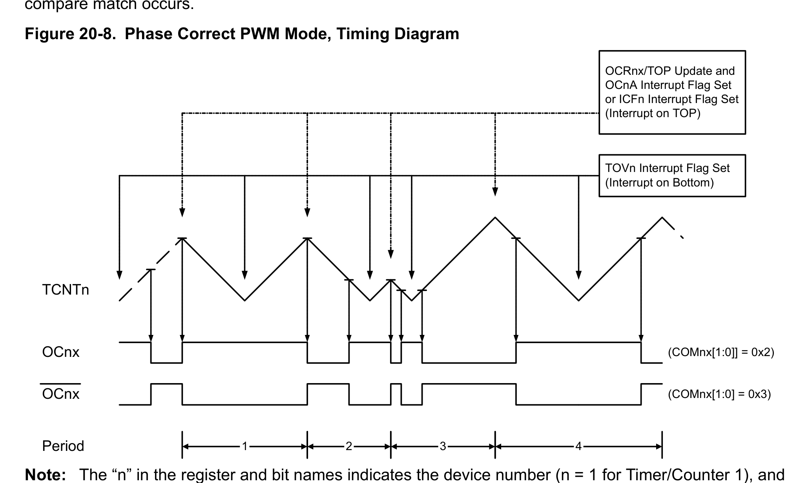
*Description*: Timer/Counter block diagram and waveform timing diagram illustrating prescaler clocks, compare match units, and PWM generation logic for Figure 20-8: Phase Correct PWM Mode, Timing Diagram.

> **Figure 20-8: Phase Correct PWM Mode, Timing Diagram**

OCRnx/TOP Update and
OCnA Interrupt Flag Set
or ICFn Interrupt Flag Set
(Interrupt on TOP)
1
2
3
4
TOVn Interrupt Flag Set
(Interrupt on Bottom)
TCNTn
Period
OCnx
OCnx
(COMnx[1:0]] = 0x2)
(COMnx[1:0] = 0x3)
Note:  The “n” in the register and bit names indicates the device number (n = 1 for Timer/Counter 1), and
the “x” indicates output compare unit (A/B).
The Timer/Counter Overflow flag (TOV1) is set each time the counter reaches BOTTOM. When either
OCR1A or ICR1 is used for defining the TOP value, the OC1A or ICF1 Flag is set accordingly at the same
timer clock cycle as the OCR1x registers are updated with the double buffer value (at TOP). The interrupt
flags can be used to generate an interrupt each time the counter reaches the TOP or BOTTOM value.
When changing the TOP value the program must ensure that the new TOP value is higher or equal to the
value of all of the compare registers. If the TOP value is lower than any of the compare registers, a
compare match will never occur between the TCNT1 and the OCR1x. Note that when using fixed TOP
values, the unused bits are masked to zero when any of the OCR1x registers is written. As illustrated by
the third period in the timing diagram, changing the TOP actively while the Timer/Counter is running in the
phase correct mode can result in an unsymmetrical output. The reason for this can be found in the time of
update of the OCR1x. Since the OCR1x update occurs at TOP, the PWM period starts and ends at TOP.
This implies that the length of the falling slope is determined by the previous TOP value, while the length
of the rising slope is determined by the new TOP value. When these two values differ the two slopes of
the period will differ in length. The difference in length gives the unsymmetrical result on the output.
It is recommended to use the Phase and Frequency Correct mode instead of the Phase Correct mode
when changing the TOP value while the Timer/Counter is running. When using a static TOP value, there
are practically no differences between the two modes of operation.
ATmega328/P
16-bit Timer/Counter1 (TC1) with PWM
© 2018 Microchip Technology Inc.
Datasheet Complete
DS40001984A-page 168
Downloaded from Arrow.com.
Downloaded from Arrow.com.
Downloaded from Arrow.com.
Downloaded from Arrow.com.
Downloaded from Arrow.com.
Downloaded from Arrow.com.
Downloaded from Arrow.com.
Downloaded from Arrow.com.
Downloaded from Arrow.com.
Downloaded from Arrow.com.
Downloaded from Arrow.com.
Downloaded from Arrow.com.
Downloaded from Arrow.com.
Downloaded from Arrow.com.
Downloaded from Arrow.com.
Downloaded from Arrow.com.
Downloaded from Arrow.com.
Downloaded from Arrow.com.
Downloaded from Arrow.com.
Downloaded from Arrow.com.
Downloaded from Arrow.com.
Downloaded from Arrow.com.
Downloaded from Arrow.com.
Downloaded from Arrow.com.
Downloaded from Arrow.com.
Downloaded from Arrow.com.
Downloaded from Arrow.com.
Downloaded from Arrow.com.
Downloaded from Arrow.com.
Downloaded from Arrow.com.
Downloaded from Arrow.com.
Downloaded from Arrow.com.
Downloaded from Arrow.com.
Downloaded from Arrow.com.
Downloaded from Arrow.com.
Downloaded from Arrow.com.
Downloaded from Arrow.com.
Downloaded from Arrow.com.
Downloaded from Arrow.com.
Downloaded from Arrow.com.
Downloaded from Arrow.com.
Downloaded from Arrow.com.
Downloaded from Arrow.com.
Downloaded from Arrow.com.
Downloaded from Arrow.com.
Downloaded from Arrow.com.
Downloaded from Arrow.com.
Downloaded from Arrow.com.
Downloaded from Arrow.com.
Downloaded from Arrow.com.
Downloaded from Arrow.com.
Downloaded from Arrow.com.
Downloaded from Arrow.com.
Downloaded from Arrow.com.
Downloaded from Arrow.com.
Downloaded from Arrow.com.
Downloaded from Arrow.com.
Downloaded from Arrow.com.
Downloaded from Arrow.com.
Downloaded from Arrow.com.
Downloaded from Arrow.com.
Downloaded from Arrow.com.
Downloaded from Arrow.com.
Downloaded from Arrow.com.
Downloaded from Arrow.com.
Downloaded from Arrow.com.
Downloaded from Arrow.com.
Downloaded from Arrow.com.
Downloaded from Arrow.com.
Downloaded from Arrow.com.
Downloaded from Arrow.com.
Downloaded from Arrow.com.
Downloaded from Arrow.com.
Downloaded from Arrow.com.
Downloaded from Arrow.com.
Downloaded from Arrow.com.
Downloaded from Arrow.com.
Downloaded from Arrow.com.
Downloaded from Arrow.com.
Downloaded from Arrow.com.
Downloaded from Arrow.com.
Downloaded from Arrow.com.
Downloaded from Arrow.com.
Downloaded from Arrow.com.
Downloaded from Arrow.com.
Downloaded from Arrow.com.
Downloaded from Arrow.com.
Downloaded from Arrow.com.
Downloaded from Arrow.com.
Downloaded from Arrow.com.
Downloaded from Arrow.com.
Downloaded from Arrow.com.
Downloaded from Arrow.com.
Downloaded from Arrow.com.
Downloaded from Arrow.com.
Downloaded from Arrow.com.
Downloaded from Arrow.com.
Downloaded from Arrow.com.
Downloaded from Arrow.com.
Downloaded from Arrow.com.
Downloaded from Arrow.com.
Downloaded from Arrow.com.
Downloaded from Arrow.com.
Downloaded from Arrow.com.
Downloaded from Arrow.com.
Downloaded from Arrow.com.
Downloaded from Arrow.com.
Downloaded from Arrow.com.
Downloaded from Arrow.com.
Downloaded from Arrow.com.
Downloaded from Arrow.com.
Downloaded from Arrow.com.
Downloaded from Arrow.com.
Downloaded from Arrow.com.
Downloaded from Arrow.com.
Downloaded from Arrow.com.
Downloaded from Arrow.com.
Downloaded from Arrow.com.
Downloaded from Arrow.com.
Downloaded from Arrow.com.
Downloaded from Arrow.com.
Downloaded from Arrow.com.
Downloaded from Arrow.com.
Downloaded from Arrow.com.
Downloaded from Arrow.com.
Downloaded from Arrow.com.
Downloaded from Arrow.com.
Downloaded from Arrow.com.
Downloaded from Arrow.com.
Downloaded from Arrow.com.
Downloaded from Arrow.com.
Downloaded from Arrow.com.
Downloaded from Arrow.com.
Downloaded from Arrow.com.
Downloaded from Arrow.com.
Downloaded from Arrow.com.
Downloaded from Arrow.com.
Downloaded from Arrow.com.
Downloaded from Arrow.com.
Downloaded from Arrow.com.
Downloaded from Arrow.com.
Downloaded from Arrow.com.
Downloaded from Arrow.com.
Downloaded from Arrow.com.
Downloaded from Arrow.com.
Downloaded from Arrow.com.
Downloaded from Arrow.com.
Downloaded from Arrow.com.
Downloaded from Arrow.com.
Downloaded from Arrow.com.
Downloaded from Arrow.com.
Downloaded from Arrow.com.
Downloaded from Arrow.com.
Downloaded from Arrow.com.
Downloaded from Arrow.com.
Downloaded from Arrow.com.
Downloaded from Arrow.com.
Downloaded from Arrow.com.
Downloaded from Arrow.com.
Downloaded from Arrow.com.
Downloaded from Arrow.com.
Downloaded from Arrow.com.
Downloaded from Arrow.com.
Downloaded from Arrow.com.
Downloaded from Arrow.com.
Downloaded from Arrow.com.
Downloaded from Arrow.com.
Downloaded from Arrow.com.


<!-- Page 169 -->
### [PDF Page 169]

In Phase Correct PWM mode, the compare units allow generation of PWM waveforms on the OC1x pins.
Writing COM1x[1:0] bits to 0x2 will produce a non-inverted PWM. An inverted PWM output can be
generated by writing the COM1x[1:0] to 0x3. The actual OC1x value will only be visible on the port pin if
the data direction for the port pin is set as output (DDR_OC1x). The PWM waveform is generated by
setting (or clearing) the OC1x register at the compare match between OCR1x and TCNT1 when the
counter increments, and clearing (or setting) the OC1x register at compare match between OCR1x and
TCNT1 when the counter decrements. The PWM frequency for the output when using Phase Correct
PWM can be calculated by the following equation:
�OCnxPCPWM =
�clk_I/O
2 ⋅�⋅TOP
N represents the prescale divider (1, 8, 64, 256, or 1024).
The extreme values for the OCR1x represent special cases when generating a PWM waveform output in
the Phase Correct PWM mode. If the OCR1x is set equal to BOTTOM the output will be continuously low
and if set equal to TOP the output will be continuously high for non-inverted PWM mode. For inverted
PWM the output will have the opposite logic values. If OCR1A is used to define the TOP value
(WGM1[3:0]=0xB) and COM1A[1:0]=0x1, the OC1A output will toggle with a 50% duty cycle.
20.12.5 Phase and Frequency Correct PWM Mode
The phase and frequency correct Pulse Width Modulation, or phase and frequency correct PWM mode
(WGM1[3:0] = 0x8 or 0x9) provides a high-resolution phase and frequency correct PWM waveform
generation option. The phase and frequency correct PWM mode are, like the phase correct PWM mode,
based on a dual-slope operation. The counter counts repeatedly from BOTTOM (0x0000) to TOP and
then from TOP to BOTTOM. In non-inverting Compare Output mode, the Output Compare (OC1x) is
cleared on the compare match between TCNT1 and OCR1x while up-counting, and set on the compare
match while down-counting. In inverting Compare Output mode, the operation is inverted. The dual-slope
operation gives a lower maximum operation frequency compared to the single-slope operation. However,
due to the symmetric feature of the dual-slope PWM modes, these modes are preferred for motor control
applications.
The main difference between the phase correct, and the phase and frequency correct PWM mode is the

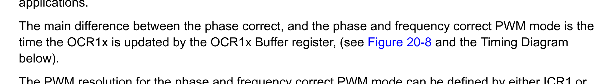
*Description*: Technical diagram and schematic illustration detailing hardware circuit topology, signal routing, and logic operations for Figure 20-8: and the Timing Diagram.

> **Figure 20-8: and the Timing Diagram**

below).
The PWM resolution for the phase and frequency correct PWM mode can be defined by either ICR1 or
OCR1A. The minimum resolution allowed is 2-bit (ICR1 or OCR1A set to 0x0003), and the maximum
resolution is 16-bit (ICR1 or OCR1A set to MAX). The PWM resolution in bits can be calculated using the
following equation:
�PFCPWM = log TOP+1
log 2
In phase and frequency correct PWM mode the counter is incremented until the counter value matches
either the value in ICR1 (WGM1[3:0]=0x8), or the value in OCR1A (WGM1[3:0]=0x9). The counter has
then reached the TOP and changes the count direction. The TCNT1 value will be equal to TOP for one
timer clock cycle. The timing diagram for the phase correct and frequency correct PWM mode is shown
below. The figure shows phase and frequency correct PWM mode when OCR1A or ICR1 is used to
define TOP. The TCNT1 value is in the timing diagram shown as a histogram for illustrating the dual-slope
operation. The diagram includes non-inverted and inverted PWM outputs. The small horizontal line marks
on the TCNT1 slopes represent compare matches between OCR1x and TCNT1. The OC1x interrupt flag
will be set when a compare match occurs.
ATmega328/P
16-bit Timer/Counter1 (TC1) with PWM
© 2018 Microchip Technology Inc.
Datasheet Complete
DS40001984A-page 169
Downloaded from Arrow.com.
Downloaded from Arrow.com.
Downloaded from Arrow.com.
Downloaded from Arrow.com.
Downloaded from Arrow.com.
Downloaded from Arrow.com.
Downloaded from Arrow.com.
Downloaded from Arrow.com.
Downloaded from Arrow.com.
Downloaded from Arrow.com.
Downloaded from Arrow.com.
Downloaded from Arrow.com.
Downloaded from Arrow.com.
Downloaded from Arrow.com.
Downloaded from Arrow.com.
Downloaded from Arrow.com.
Downloaded from Arrow.com.
Downloaded from Arrow.com.
Downloaded from Arrow.com.
Downloaded from Arrow.com.
Downloaded from Arrow.com.
Downloaded from Arrow.com.
Downloaded from Arrow.com.
Downloaded from Arrow.com.
Downloaded from Arrow.com.
Downloaded from Arrow.com.
Downloaded from Arrow.com.
Downloaded from Arrow.com.
Downloaded from Arrow.com.
Downloaded from Arrow.com.
Downloaded from Arrow.com.
Downloaded from Arrow.com.
Downloaded from Arrow.com.
Downloaded from Arrow.com.
Downloaded from Arrow.com.
Downloaded from Arrow.com.
Downloaded from Arrow.com.
Downloaded from Arrow.com.
Downloaded from Arrow.com.
Downloaded from Arrow.com.
Downloaded from Arrow.com.
Downloaded from Arrow.com.
Downloaded from Arrow.com.
Downloaded from Arrow.com.
Downloaded from Arrow.com.
Downloaded from Arrow.com.
Downloaded from Arrow.com.
Downloaded from Arrow.com.
Downloaded from Arrow.com.
Downloaded from Arrow.com.
Downloaded from Arrow.com.
Downloaded from Arrow.com.
Downloaded from Arrow.com.
Downloaded from Arrow.com.
Downloaded from Arrow.com.
Downloaded from Arrow.com.
Downloaded from Arrow.com.
Downloaded from Arrow.com.
Downloaded from Arrow.com.
Downloaded from Arrow.com.
Downloaded from Arrow.com.
Downloaded from Arrow.com.
Downloaded from Arrow.com.
Downloaded from Arrow.com.
Downloaded from Arrow.com.
Downloaded from Arrow.com.
Downloaded from Arrow.com.
Downloaded from Arrow.com.
Downloaded from Arrow.com.
Downloaded from Arrow.com.
Downloaded from Arrow.com.
Downloaded from Arrow.com.
Downloaded from Arrow.com.
Downloaded from Arrow.com.
Downloaded from Arrow.com.
Downloaded from Arrow.com.
Downloaded from Arrow.com.
Downloaded from Arrow.com.
Downloaded from Arrow.com.
Downloaded from Arrow.com.
Downloaded from Arrow.com.
Downloaded from Arrow.com.
Downloaded from Arrow.com.
Downloaded from Arrow.com.
Downloaded from Arrow.com.
Downloaded from Arrow.com.
Downloaded from Arrow.com.
Downloaded from Arrow.com.
Downloaded from Arrow.com.
Downloaded from Arrow.com.
Downloaded from Arrow.com.
Downloaded from Arrow.com.
Downloaded from Arrow.com.
Downloaded from Arrow.com.
Downloaded from Arrow.com.
Downloaded from Arrow.com.
Downloaded from Arrow.com.
Downloaded from Arrow.com.
Downloaded from Arrow.com.
Downloaded from Arrow.com.
Downloaded from Arrow.com.
Downloaded from Arrow.com.
Downloaded from Arrow.com.
Downloaded from Arrow.com.
Downloaded from Arrow.com.
Downloaded from Arrow.com.
Downloaded from Arrow.com.
Downloaded from Arrow.com.
Downloaded from Arrow.com.
Downloaded from Arrow.com.
Downloaded from Arrow.com.
Downloaded from Arrow.com.
Downloaded from Arrow.com.
Downloaded from Arrow.com.
Downloaded from Arrow.com.
Downloaded from Arrow.com.
Downloaded from Arrow.com.
Downloaded from Arrow.com.
Downloaded from Arrow.com.
Downloaded from Arrow.com.
Downloaded from Arrow.com.
Downloaded from Arrow.com.
Downloaded from Arrow.com.
Downloaded from Arrow.com.
Downloaded from Arrow.com.
Downloaded from Arrow.com.
Downloaded from Arrow.com.
Downloaded from Arrow.com.
Downloaded from Arrow.com.
Downloaded from Arrow.com.
Downloaded from Arrow.com.
Downloaded from Arrow.com.
Downloaded from Arrow.com.
Downloaded from Arrow.com.
Downloaded from Arrow.com.
Downloaded from Arrow.com.
Downloaded from Arrow.com.
Downloaded from Arrow.com.
Downloaded from Arrow.com.
Downloaded from Arrow.com.
Downloaded from Arrow.com.
Downloaded from Arrow.com.
Downloaded from Arrow.com.
Downloaded from Arrow.com.
Downloaded from Arrow.com.
Downloaded from Arrow.com.
Downloaded from Arrow.com.
Downloaded from Arrow.com.
Downloaded from Arrow.com.
Downloaded from Arrow.com.
Downloaded from Arrow.com.
Downloaded from Arrow.com.
Downloaded from Arrow.com.
Downloaded from Arrow.com.
Downloaded from Arrow.com.
Downloaded from Arrow.com.
Downloaded from Arrow.com.
Downloaded from Arrow.com.
Downloaded from Arrow.com.
Downloaded from Arrow.com.
Downloaded from Arrow.com.
Downloaded from Arrow.com.
Downloaded from Arrow.com.
Downloaded from Arrow.com.
Downloaded from Arrow.com.
Downloaded from Arrow.com.
Downloaded from Arrow.com.
Downloaded from Arrow.com.
Downloaded from Arrow.com.


<!-- Page 170 -->
### [PDF Page 170]


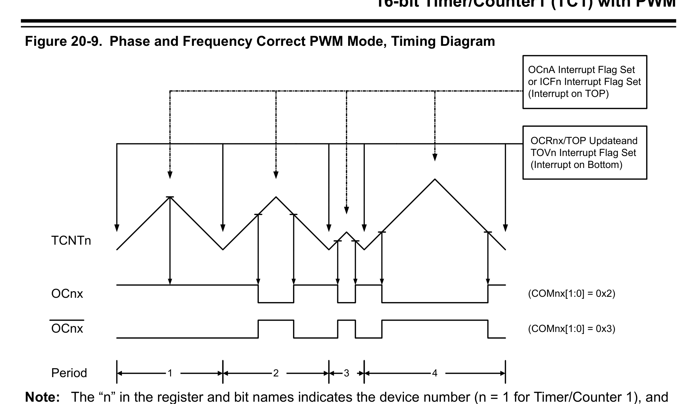
*Description*: Timer/Counter block diagram and waveform timing diagram illustrating prescaler clocks, compare match units, and PWM generation logic for Figure 20-9: Phase and Frequency Correct PWM Mode, Timing Diagram.

> **Figure 20-9: Phase and Frequency Correct PWM Mode, Timing Diagram**

OCRnx/TOP Updateand
TOVn Interrupt Flag Set
(Interrupt on Bottom)
OCnA Interrupt Flag Set
or ICFn Interrupt Flag Set
(Interrupt on TOP)
1
2
3
4
TCNTn
Period
OCnx
OCnx
(COMnx[1:0] = 0x2)
(COMnx[1:0] = 0x3)
Note:  The “n” in the register and bit names indicates the device number (n = 1 for Timer/Counter 1), and
the “x” indicates output compare unit (A/B).
The Timer/Counter Overflow flag (TOV1) is set at the same timer clock cycle as the OCR1x registers are
updated with the double buffer value (at BOTTOM). When either OCR1A or ICR1 is used for defining the
TOP value, the OC1A or ICF1 Flag set when TCNT1 has reached TOP. The interrupt flags can then be
used to generate an interrupt each time the counter reaches the TOP or BOTTOM value.
When changing the TOP value the program must ensure that the new TOP value is higher or equal to the
value of all of the Compare registers. If the TOP value is lower than any of the Compare registers, a
compare match will never occur between the TCNT1 and the OCR1x.
As shown in the timing diagram above, the output generated is, in contrast to the phase correct mode,
symmetrical in all periods. Since the OCR1x registers are updated at BOTTOM, the length of the rising
and the falling slopes will always be equal. This gives symmetrical output pulses and is, therefore,
frequency correct.
Using the ICR1 register for defining TOP works well when using fixed TOP values. By using ICR1, the
OCR1A register is free to be used for generating a PWM output on OC1A. However, if the base PWM
frequency is actively changed by changing the TOP value, using the OCR1A as TOP is clearly a better
choice due to its double buffer feature.
In phase and frequency correct PWM mode, the compare units allow generation of PWM waveforms on
the OC1x pins. Setting the COM1x[1:0] bits to 0x2 will produce a non-inverted PWM and an inverted
PWM output can be generated by setting the COM1x[1:0] to 0x3 (see the description of TCCRA.COM1x).
The actual OC1x value will only be visible on the port pin if the data direction for the port pin is set as
output (DDR_OC1x). The PWM waveform is generated by setting (or clearing) the OC1x register at the
compare match between OCR1x and TCNT1 when the counter increments, and clearing (or setting) the
OC1x register at compare match between OCR1x and TCNT1 when the counter decrements. The PWM
frequency for the output when using phase and frequency correct PWM can be calculated by the
following equation:
ATmega328/P
16-bit Timer/Counter1 (TC1) with PWM
© 2018 Microchip Technology Inc.
Datasheet Complete
DS40001984A-page 170
Downloaded from Arrow.com.
Downloaded from Arrow.com.
Downloaded from Arrow.com.
Downloaded from Arrow.com.
Downloaded from Arrow.com.
Downloaded from Arrow.com.
Downloaded from Arrow.com.
Downloaded from Arrow.com.
Downloaded from Arrow.com.
Downloaded from Arrow.com.
Downloaded from Arrow.com.
Downloaded from Arrow.com.
Downloaded from Arrow.com.
Downloaded from Arrow.com.
Downloaded from Arrow.com.
Downloaded from Arrow.com.
Downloaded from Arrow.com.
Downloaded from Arrow.com.
Downloaded from Arrow.com.
Downloaded from Arrow.com.
Downloaded from Arrow.com.
Downloaded from Arrow.com.
Downloaded from Arrow.com.
Downloaded from Arrow.com.
Downloaded from Arrow.com.
Downloaded from Arrow.com.
Downloaded from Arrow.com.
Downloaded from Arrow.com.
Downloaded from Arrow.com.
Downloaded from Arrow.com.
Downloaded from Arrow.com.
Downloaded from Arrow.com.
Downloaded from Arrow.com.
Downloaded from Arrow.com.
Downloaded from Arrow.com.
Downloaded from Arrow.com.
Downloaded from Arrow.com.
Downloaded from Arrow.com.
Downloaded from Arrow.com.
Downloaded from Arrow.com.
Downloaded from Arrow.com.
Downloaded from Arrow.com.
Downloaded from Arrow.com.
Downloaded from Arrow.com.
Downloaded from Arrow.com.
Downloaded from Arrow.com.
Downloaded from Arrow.com.
Downloaded from Arrow.com.
Downloaded from Arrow.com.
Downloaded from Arrow.com.
Downloaded from Arrow.com.
Downloaded from Arrow.com.
Downloaded from Arrow.com.
Downloaded from Arrow.com.
Downloaded from Arrow.com.
Downloaded from Arrow.com.
Downloaded from Arrow.com.
Downloaded from Arrow.com.
Downloaded from Arrow.com.
Downloaded from Arrow.com.
Downloaded from Arrow.com.
Downloaded from Arrow.com.
Downloaded from Arrow.com.
Downloaded from Arrow.com.
Downloaded from Arrow.com.
Downloaded from Arrow.com.
Downloaded from Arrow.com.
Downloaded from Arrow.com.
Downloaded from Arrow.com.
Downloaded from Arrow.com.
Downloaded from Arrow.com.
Downloaded from Arrow.com.
Downloaded from Arrow.com.
Downloaded from Arrow.com.
Downloaded from Arrow.com.
Downloaded from Arrow.com.
Downloaded from Arrow.com.
Downloaded from Arrow.com.
Downloaded from Arrow.com.
Downloaded from Arrow.com.
Downloaded from Arrow.com.
Downloaded from Arrow.com.
Downloaded from Arrow.com.
Downloaded from Arrow.com.
Downloaded from Arrow.com.
Downloaded from Arrow.com.
Downloaded from Arrow.com.
Downloaded from Arrow.com.
Downloaded from Arrow.com.
Downloaded from Arrow.com.
Downloaded from Arrow.com.
Downloaded from Arrow.com.
Downloaded from Arrow.com.
Downloaded from Arrow.com.
Downloaded from Arrow.com.
Downloaded from Arrow.com.
Downloaded from Arrow.com.
Downloaded from Arrow.com.
Downloaded from Arrow.com.
Downloaded from Arrow.com.
Downloaded from Arrow.com.
Downloaded from Arrow.com.
Downloaded from Arrow.com.
Downloaded from Arrow.com.
Downloaded from Arrow.com.
Downloaded from Arrow.com.
Downloaded from Arrow.com.
Downloaded from Arrow.com.
Downloaded from Arrow.com.
Downloaded from Arrow.com.
Downloaded from Arrow.com.
Downloaded from Arrow.com.
Downloaded from Arrow.com.
Downloaded from Arrow.com.
Downloaded from Arrow.com.
Downloaded from Arrow.com.
Downloaded from Arrow.com.
Downloaded from Arrow.com.
Downloaded from Arrow.com.
Downloaded from Arrow.com.
Downloaded from Arrow.com.
Downloaded from Arrow.com.
Downloaded from Arrow.com.
Downloaded from Arrow.com.
Downloaded from Arrow.com.
Downloaded from Arrow.com.
Downloaded from Arrow.com.
Downloaded from Arrow.com.
Downloaded from Arrow.com.
Downloaded from Arrow.com.
Downloaded from Arrow.com.
Downloaded from Arrow.com.
Downloaded from Arrow.com.
Downloaded from Arrow.com.
Downloaded from Arrow.com.
Downloaded from Arrow.com.
Downloaded from Arrow.com.
Downloaded from Arrow.com.
Downloaded from Arrow.com.
Downloaded from Arrow.com.
Downloaded from Arrow.com.
Downloaded from Arrow.com.
Downloaded from Arrow.com.
Downloaded from Arrow.com.
Downloaded from Arrow.com.
Downloaded from Arrow.com.
Downloaded from Arrow.com.
Downloaded from Arrow.com.
Downloaded from Arrow.com.
Downloaded from Arrow.com.
Downloaded from Arrow.com.
Downloaded from Arrow.com.
Downloaded from Arrow.com.
Downloaded from Arrow.com.
Downloaded from Arrow.com.
Downloaded from Arrow.com.
Downloaded from Arrow.com.
Downloaded from Arrow.com.
Downloaded from Arrow.com.
Downloaded from Arrow.com.
Downloaded from Arrow.com.
Downloaded from Arrow.com.
Downloaded from Arrow.com.
Downloaded from Arrow.com.
Downloaded from Arrow.com.
Downloaded from Arrow.com.
Downloaded from Arrow.com.
Downloaded from Arrow.com.
Downloaded from Arrow.com.
Downloaded from Arrow.com.


<!-- Page 171 -->
### [PDF Page 171]

�OCnxPFCPWM =
�clk_I/O
2 ⋅�⋅TOP
Note:
•
The “n” in the register and bit names indicates the device number (n = 1 for Timer/Counter 1), and
the “x” indicates output compare unit (A/B).
•
N represents the prescale divider (1, 8, 64, 256, or 1024).
The extreme values for the OCR1x register represent special cases when generating a PWM waveform
output in the phase correct PWM mode. If the OCR1x is set equal to BOTTOM the output will be
continuously low and if set equal to TOP the output will be set to high for non-inverted PWM mode. For
inverted PWM the output will have the opposite logic values. If OCR1A is used to define the TOP value
(WGM1[3:0]=0x9) and COM1A[1:0]=0x1, the OC1A output will toggle with a 50% duty cycle.

## 20.13 Timer/Counter 0, 1 Prescalers

The 8-bit Timer/Counter0 (TC0) and the 16-bit Timer/Counter1 (TC1) share the same prescaler module,
but the timer/counters can have different prescaler settings. The following description applies to TC0,
TC1.
Related Links
8-bit Timer/Counter0 (TC0) with PWM
16-bit Timer/Counter1 (TC1) with PWM

## 20.14 Timer/Counter Timing Diagrams

The timer/counter is a synchronous design and the timer clock (clkT1) is therefore shown as a clock
enable signal in the following figures. The figures include information on when interrupt flags are set, and
when the OCR1x is updated with the OCR1x buffer value (only for modes utilizing double buffering). The
first figure shows a timing diagram for the setting of OCF1x.

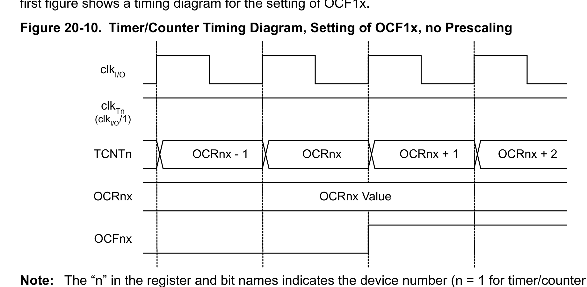
*Description*: Timer/Counter block diagram and waveform timing diagram illustrating prescaler clocks, compare match units, and PWM generation logic for Figure 20-10: Timer/Counter Timing Diagram, Setting of OCF1x, no Prescaling.

> **Figure 20-10: Timer/Counter Timing Diagram, Setting of OCF1x, no Prescaling**

clkTn
(clkI/O/1)
OCFnx
clkI/O
OCRnx
TCNTn
OCRnx Value
OCRnx - 1
OCRnx
OCRnx + 1
OCRnx + 2
Note:  The “n” in the register and bit names indicates the device number (n = 1 for timer/counter 1), and
the “x” indicates output compare unit (A/B).
The next figure shows the same timing data, but with the prescaler enabled.
ATmega328/P
16-bit Timer/Counter1 (TC1) with PWM
© 2018 Microchip Technology Inc.
Datasheet Complete
DS40001984A-page 171
Downloaded from Arrow.com.
Downloaded from Arrow.com.
Downloaded from Arrow.com.
Downloaded from Arrow.com.
Downloaded from Arrow.com.
Downloaded from Arrow.com.
Downloaded from Arrow.com.
Downloaded from Arrow.com.
Downloaded from Arrow.com.
Downloaded from Arrow.com.
Downloaded from Arrow.com.
Downloaded from Arrow.com.
Downloaded from Arrow.com.
Downloaded from Arrow.com.
Downloaded from Arrow.com.
Downloaded from Arrow.com.
Downloaded from Arrow.com.
Downloaded from Arrow.com.
Downloaded from Arrow.com.
Downloaded from Arrow.com.
Downloaded from Arrow.com.
Downloaded from Arrow.com.
Downloaded from Arrow.com.
Downloaded from Arrow.com.
Downloaded from Arrow.com.
Downloaded from Arrow.com.
Downloaded from Arrow.com.
Downloaded from Arrow.com.
Downloaded from Arrow.com.
Downloaded from Arrow.com.
Downloaded from Arrow.com.
Downloaded from Arrow.com.
Downloaded from Arrow.com.
Downloaded from Arrow.com.
Downloaded from Arrow.com.
Downloaded from Arrow.com.
Downloaded from Arrow.com.
Downloaded from Arrow.com.
Downloaded from Arrow.com.
Downloaded from Arrow.com.
Downloaded from Arrow.com.
Downloaded from Arrow.com.
Downloaded from Arrow.com.
Downloaded from Arrow.com.
Downloaded from Arrow.com.
Downloaded from Arrow.com.
Downloaded from Arrow.com.
Downloaded from Arrow.com.
Downloaded from Arrow.com.
Downloaded from Arrow.com.
Downloaded from Arrow.com.
Downloaded from Arrow.com.
Downloaded from Arrow.com.
Downloaded from Arrow.com.
Downloaded from Arrow.com.
Downloaded from Arrow.com.
Downloaded from Arrow.com.
Downloaded from Arrow.com.
Downloaded from Arrow.com.
Downloaded from Arrow.com.
Downloaded from Arrow.com.
Downloaded from Arrow.com.
Downloaded from Arrow.com.
Downloaded from Arrow.com.
Downloaded from Arrow.com.
Downloaded from Arrow.com.
Downloaded from Arrow.com.
Downloaded from Arrow.com.
Downloaded from Arrow.com.
Downloaded from Arrow.com.
Downloaded from Arrow.com.
Downloaded from Arrow.com.
Downloaded from Arrow.com.
Downloaded from Arrow.com.
Downloaded from Arrow.com.
Downloaded from Arrow.com.
Downloaded from Arrow.com.
Downloaded from Arrow.com.
Downloaded from Arrow.com.
Downloaded from Arrow.com.
Downloaded from Arrow.com.
Downloaded from Arrow.com.
Downloaded from Arrow.com.
Downloaded from Arrow.com.
Downloaded from Arrow.com.
Downloaded from Arrow.com.
Downloaded from Arrow.com.
Downloaded from Arrow.com.
Downloaded from Arrow.com.
Downloaded from Arrow.com.
Downloaded from Arrow.com.
Downloaded from Arrow.com.
Downloaded from Arrow.com.
Downloaded from Arrow.com.
Downloaded from Arrow.com.
Downloaded from Arrow.com.
Downloaded from Arrow.com.
Downloaded from Arrow.com.
Downloaded from Arrow.com.
Downloaded from Arrow.com.
Downloaded from Arrow.com.
Downloaded from Arrow.com.
Downloaded from Arrow.com.
Downloaded from Arrow.com.
Downloaded from Arrow.com.
Downloaded from Arrow.com.
Downloaded from Arrow.com.
Downloaded from Arrow.com.
Downloaded from Arrow.com.
Downloaded from Arrow.com.
Downloaded from Arrow.com.
Downloaded from Arrow.com.
Downloaded from Arrow.com.
Downloaded from Arrow.com.
Downloaded from Arrow.com.
Downloaded from Arrow.com.
Downloaded from Arrow.com.
Downloaded from Arrow.com.
Downloaded from Arrow.com.
Downloaded from Arrow.com.
Downloaded from Arrow.com.
Downloaded from Arrow.com.
Downloaded from Arrow.com.
Downloaded from Arrow.com.
Downloaded from Arrow.com.
Downloaded from Arrow.com.
Downloaded from Arrow.com.
Downloaded from Arrow.com.
Downloaded from Arrow.com.
Downloaded from Arrow.com.
Downloaded from Arrow.com.
Downloaded from Arrow.com.
Downloaded from Arrow.com.
Downloaded from Arrow.com.
Downloaded from Arrow.com.
Downloaded from Arrow.com.
Downloaded from Arrow.com.
Downloaded from Arrow.com.
Downloaded from Arrow.com.
Downloaded from Arrow.com.
Downloaded from Arrow.com.
Downloaded from Arrow.com.
Downloaded from Arrow.com.
Downloaded from Arrow.com.
Downloaded from Arrow.com.
Downloaded from Arrow.com.
Downloaded from Arrow.com.
Downloaded from Arrow.com.
Downloaded from Arrow.com.
Downloaded from Arrow.com.
Downloaded from Arrow.com.
Downloaded from Arrow.com.
Downloaded from Arrow.com.
Downloaded from Arrow.com.
Downloaded from Arrow.com.
Downloaded from Arrow.com.
Downloaded from Arrow.com.
Downloaded from Arrow.com.
Downloaded from Arrow.com.
Downloaded from Arrow.com.
Downloaded from Arrow.com.
Downloaded from Arrow.com.
Downloaded from Arrow.com.
Downloaded from Arrow.com.
Downloaded from Arrow.com.
Downloaded from Arrow.com.
Downloaded from Arrow.com.
Downloaded from Arrow.com.
Downloaded from Arrow.com.
Downloaded from Arrow.com.
Downloaded from Arrow.com.


<!-- Page 172 -->
### [PDF Page 172]


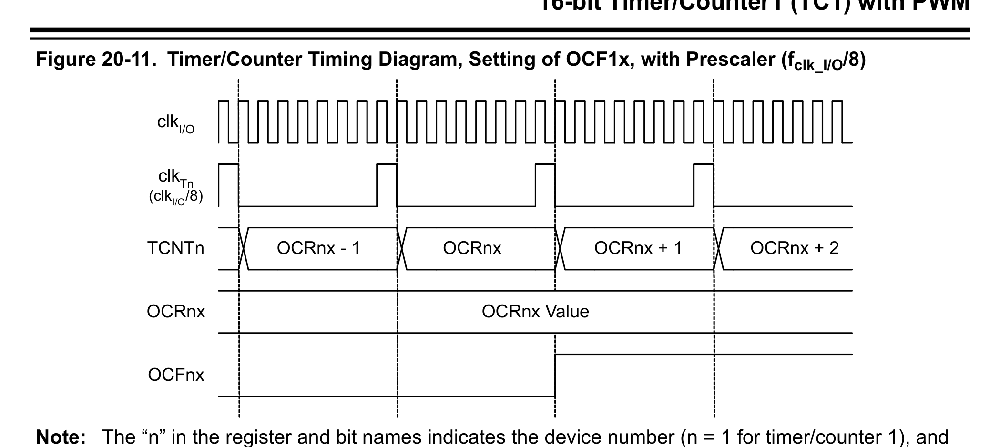
*Description*: Timer/Counter block diagram and waveform timing diagram illustrating prescaler clocks, compare match units, and PWM generation logic for Figure 20-11: Timer/Counter Timing Diagram, Setting of OCF1x, with Prescaler (fclk_I/O/8).

> **Figure 20-11: Timer/Counter Timing Diagram, Setting of OCF1x, with Prescaler (fclk_I/O/8)**

OCFnx
OCRnx
TCNTn
OCRnx Value
OCRnx - 1
OCRnx
OCRnx + 1
OCRnx + 2
clkI/O
clkTn
(clkI/O/8)
Note:  The “n” in the register and bit names indicates the device number (n = 1 for timer/counter 1), and
the “x” indicates output compare unit (A/B).
The next figure shows the count sequence close to TOP in various modes. When using phase and
frequency correct PWM mode the OCR1x is updated at BOTTOM. The timing diagrams will be the same,
but TOP should be replaced by BOTTOM, TOP-1 by BOTTOM+1 and so on. The same renaming applies
for modes that set the TOV1 flag at BOTTOM.

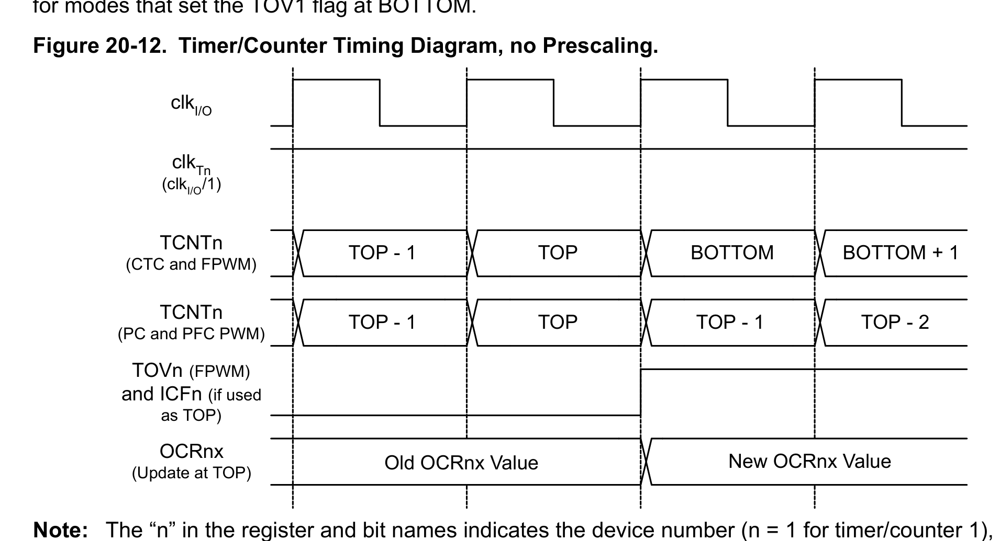
*Description*: Timer/Counter block diagram and waveform timing diagram illustrating prescaler clocks, compare match units, and PWM generation logic for Figure 20-12: Timer/Counter Timing Diagram, no Prescaling..

> **Figure 20-12: Timer/Counter Timing Diagram, no Prescaling.**

TOVn (FPWM)
and ICFn (if used
as TOP)
OCRnx
(Update at TOP)
TCNTn
(CTC and FPWM)
TCNTn
(PC and PFC PWM)
TOP - 1
TOP
TOP - 1
TOP - 2
Old OCRnx Value
New OCRnx Value
TOP - 1
TOP
BOTTOM
BOTTOM + 1
clkTn
(clkI/O/1)
clkI/O
Note:  The “n” in the register and bit names indicates the device number (n = 1 for timer/counter 1), and
the “x” indicates output compare unit (A/B).
The next figure shows the same timing data, but with the prescaler enabled.
ATmega328/P
16-bit Timer/Counter1 (TC1) with PWM
© 2018 Microchip Technology Inc.
Datasheet Complete
DS40001984A-page 172
Downloaded from Arrow.com.
Downloaded from Arrow.com.
Downloaded from Arrow.com.
Downloaded from Arrow.com.
Downloaded from Arrow.com.
Downloaded from Arrow.com.
Downloaded from Arrow.com.
Downloaded from Arrow.com.
Downloaded from Arrow.com.
Downloaded from Arrow.com.
Downloaded from Arrow.com.
Downloaded from Arrow.com.
Downloaded from Arrow.com.
Downloaded from Arrow.com.
Downloaded from Arrow.com.
Downloaded from Arrow.com.
Downloaded from Arrow.com.
Downloaded from Arrow.com.
Downloaded from Arrow.com.
Downloaded from Arrow.com.
Downloaded from Arrow.com.
Downloaded from Arrow.com.
Downloaded from Arrow.com.
Downloaded from Arrow.com.
Downloaded from Arrow.com.
Downloaded from Arrow.com.
Downloaded from Arrow.com.
Downloaded from Arrow.com.
Downloaded from Arrow.com.
Downloaded from Arrow.com.
Downloaded from Arrow.com.
Downloaded from Arrow.com.
Downloaded from Arrow.com.
Downloaded from Arrow.com.
Downloaded from Arrow.com.
Downloaded from Arrow.com.
Downloaded from Arrow.com.
Downloaded from Arrow.com.
Downloaded from Arrow.com.
Downloaded from Arrow.com.
Downloaded from Arrow.com.
Downloaded from Arrow.com.
Downloaded from Arrow.com.
Downloaded from Arrow.com.
Downloaded from Arrow.com.
Downloaded from Arrow.com.
Downloaded from Arrow.com.
Downloaded from Arrow.com.
Downloaded from Arrow.com.
Downloaded from Arrow.com.
Downloaded from Arrow.com.
Downloaded from Arrow.com.
Downloaded from Arrow.com.
Downloaded from Arrow.com.
Downloaded from Arrow.com.
Downloaded from Arrow.com.
Downloaded from Arrow.com.
Downloaded from Arrow.com.
Downloaded from Arrow.com.
Downloaded from Arrow.com.
Downloaded from Arrow.com.
Downloaded from Arrow.com.
Downloaded from Arrow.com.
Downloaded from Arrow.com.
Downloaded from Arrow.com.
Downloaded from Arrow.com.
Downloaded from Arrow.com.
Downloaded from Arrow.com.
Downloaded from Arrow.com.
Downloaded from Arrow.com.
Downloaded from Arrow.com.
Downloaded from Arrow.com.
Downloaded from Arrow.com.
Downloaded from Arrow.com.
Downloaded from Arrow.com.
Downloaded from Arrow.com.
Downloaded from Arrow.com.
Downloaded from Arrow.com.
Downloaded from Arrow.com.
Downloaded from Arrow.com.
Downloaded from Arrow.com.
Downloaded from Arrow.com.
Downloaded from Arrow.com.
Downloaded from Arrow.com.
Downloaded from Arrow.com.
Downloaded from Arrow.com.
Downloaded from Arrow.com.
Downloaded from Arrow.com.
Downloaded from Arrow.com.
Downloaded from Arrow.com.
Downloaded from Arrow.com.
Downloaded from Arrow.com.
Downloaded from Arrow.com.
Downloaded from Arrow.com.
Downloaded from Arrow.com.
Downloaded from Arrow.com.
Downloaded from Arrow.com.
Downloaded from Arrow.com.
Downloaded from Arrow.com.
Downloaded from Arrow.com.
Downloaded from Arrow.com.
Downloaded from Arrow.com.
Downloaded from Arrow.com.
Downloaded from Arrow.com.
Downloaded from Arrow.com.
Downloaded from Arrow.com.
Downloaded from Arrow.com.
Downloaded from Arrow.com.
Downloaded from Arrow.com.
Downloaded from Arrow.com.
Downloaded from Arrow.com.
Downloaded from Arrow.com.
Downloaded from Arrow.com.
Downloaded from Arrow.com.
Downloaded from Arrow.com.
Downloaded from Arrow.com.
Downloaded from Arrow.com.
Downloaded from Arrow.com.
Downloaded from Arrow.com.
Downloaded from Arrow.com.
Downloaded from Arrow.com.
Downloaded from Arrow.com.
Downloaded from Arrow.com.
Downloaded from Arrow.com.
Downloaded from Arrow.com.
Downloaded from Arrow.com.
Downloaded from Arrow.com.
Downloaded from Arrow.com.
Downloaded from Arrow.com.
Downloaded from Arrow.com.
Downloaded from Arrow.com.
Downloaded from Arrow.com.
Downloaded from Arrow.com.
Downloaded from Arrow.com.
Downloaded from Arrow.com.
Downloaded from Arrow.com.
Downloaded from Arrow.com.
Downloaded from Arrow.com.
Downloaded from Arrow.com.
Downloaded from Arrow.com.
Downloaded from Arrow.com.
Downloaded from Arrow.com.
Downloaded from Arrow.com.
Downloaded from Arrow.com.
Downloaded from Arrow.com.
Downloaded from Arrow.com.
Downloaded from Arrow.com.
Downloaded from Arrow.com.
Downloaded from Arrow.com.
Downloaded from Arrow.com.
Downloaded from Arrow.com.
Downloaded from Arrow.com.
Downloaded from Arrow.com.
Downloaded from Arrow.com.
Downloaded from Arrow.com.
Downloaded from Arrow.com.
Downloaded from Arrow.com.
Downloaded from Arrow.com.
Downloaded from Arrow.com.
Downloaded from Arrow.com.
Downloaded from Arrow.com.
Downloaded from Arrow.com.
Downloaded from Arrow.com.
Downloaded from Arrow.com.
Downloaded from Arrow.com.
Downloaded from Arrow.com.
Downloaded from Arrow.com.
Downloaded from Arrow.com.
Downloaded from Arrow.com.
Downloaded from Arrow.com.
Downloaded from Arrow.com.
Downloaded from Arrow.com.


<!-- Page 173 -->
### [PDF Page 173]


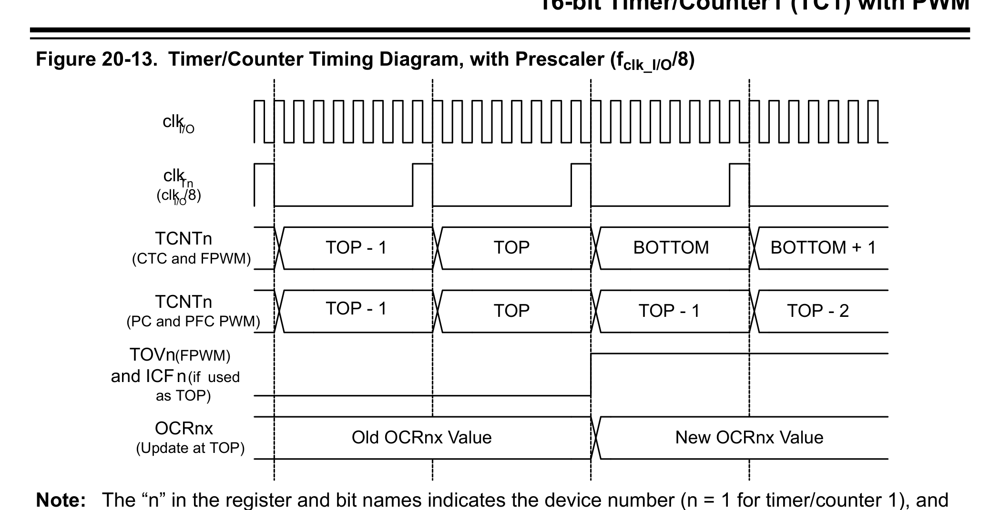
*Description*: Timer/Counter block diagram and waveform timing diagram illustrating prescaler clocks, compare match units, and PWM generation logic for Figure 20-13: Timer/Counter Timing Diagram, with Prescaler (fclk_I/O/8).

> **Figure 20-13: Timer/Counter Timing Diagram, with Prescaler (fclk_I/O/8)**

TOVn (FPWM)
and ICFn (if used
as TOP)
OCRnx
(Update at TOP)
TCNTn
(CTC and FPWM)
TCNTn
(PC and PFC PWM)
TOP - 1
TOP
TOP - 1
TOP - 2
Old OCRnx Value
New OCRnx Value
TOP - 1
TOP
BOTTOM
BOTTOM + 1
clkI/O
clkTn
(clkI/O/8)
Note:  The “n” in the register and bit names indicates the device number (n = 1 for timer/counter 1), and
the “x” indicates output compare unit (A/B).

## 20.15 Register Description

ATmega328/P
16-bit Timer/Counter1 (TC1) with PWM
© 2018 Microchip Technology Inc.
Datasheet Complete
DS40001984A-page 173
Downloaded from Arrow.com.
Downloaded from Arrow.com.
Downloaded from Arrow.com.
Downloaded from Arrow.com.
Downloaded from Arrow.com.
Downloaded from Arrow.com.
Downloaded from Arrow.com.
Downloaded from Arrow.com.
Downloaded from Arrow.com.
Downloaded from Arrow.com.
Downloaded from Arrow.com.
Downloaded from Arrow.com.
Downloaded from Arrow.com.
Downloaded from Arrow.com.
Downloaded from Arrow.com.
Downloaded from Arrow.com.
Downloaded from Arrow.com.
Downloaded from Arrow.com.
Downloaded from Arrow.com.
Downloaded from Arrow.com.
Downloaded from Arrow.com.
Downloaded from Arrow.com.
Downloaded from Arrow.com.
Downloaded from Arrow.com.
Downloaded from Arrow.com.
Downloaded from Arrow.com.
Downloaded from Arrow.com.
Downloaded from Arrow.com.
Downloaded from Arrow.com.
Downloaded from Arrow.com.
Downloaded from Arrow.com.
Downloaded from Arrow.com.
Downloaded from Arrow.com.
Downloaded from Arrow.com.
Downloaded from Arrow.com.
Downloaded from Arrow.com.
Downloaded from Arrow.com.
Downloaded from Arrow.com.
Downloaded from Arrow.com.
Downloaded from Arrow.com.
Downloaded from Arrow.com.
Downloaded from Arrow.com.
Downloaded from Arrow.com.
Downloaded from Arrow.com.
Downloaded from Arrow.com.
Downloaded from Arrow.com.
Downloaded from Arrow.com.
Downloaded from Arrow.com.
Downloaded from Arrow.com.
Downloaded from Arrow.com.
Downloaded from Arrow.com.
Downloaded from Arrow.com.
Downloaded from Arrow.com.
Downloaded from Arrow.com.
Downloaded from Arrow.com.
Downloaded from Arrow.com.
Downloaded from Arrow.com.
Downloaded from Arrow.com.
Downloaded from Arrow.com.
Downloaded from Arrow.com.
Downloaded from Arrow.com.
Downloaded from Arrow.com.
Downloaded from Arrow.com.
Downloaded from Arrow.com.
Downloaded from Arrow.com.
Downloaded from Arrow.com.
Downloaded from Arrow.com.
Downloaded from Arrow.com.
Downloaded from Arrow.com.
Downloaded from Arrow.com.
Downloaded from Arrow.com.
Downloaded from Arrow.com.
Downloaded from Arrow.com.
Downloaded from Arrow.com.
Downloaded from Arrow.com.
Downloaded from Arrow.com.
Downloaded from Arrow.com.
Downloaded from Arrow.com.
Downloaded from Arrow.com.
Downloaded from Arrow.com.
Downloaded from Arrow.com.
Downloaded from Arrow.com.
Downloaded from Arrow.com.
Downloaded from Arrow.com.
Downloaded from Arrow.com.
Downloaded from Arrow.com.
Downloaded from Arrow.com.
Downloaded from Arrow.com.
Downloaded from Arrow.com.
Downloaded from Arrow.com.
Downloaded from Arrow.com.
Downloaded from Arrow.com.
Downloaded from Arrow.com.
Downloaded from Arrow.com.
Downloaded from Arrow.com.
Downloaded from Arrow.com.
Downloaded from Arrow.com.
Downloaded from Arrow.com.
Downloaded from Arrow.com.
Downloaded from Arrow.com.
Downloaded from Arrow.com.
Downloaded from Arrow.com.
Downloaded from Arrow.com.
Downloaded from Arrow.com.
Downloaded from Arrow.com.
Downloaded from Arrow.com.
Downloaded from Arrow.com.
Downloaded from Arrow.com.
Downloaded from Arrow.com.
Downloaded from Arrow.com.
Downloaded from Arrow.com.
Downloaded from Arrow.com.
Downloaded from Arrow.com.
Downloaded from Arrow.com.
Downloaded from Arrow.com.
Downloaded from Arrow.com.
Downloaded from Arrow.com.
Downloaded from Arrow.com.
Downloaded from Arrow.com.
Downloaded from Arrow.com.
Downloaded from Arrow.com.
Downloaded from Arrow.com.
Downloaded from Arrow.com.
Downloaded from Arrow.com.
Downloaded from Arrow.com.
Downloaded from Arrow.com.
Downloaded from Arrow.com.
Downloaded from Arrow.com.
Downloaded from Arrow.com.
Downloaded from Arrow.com.
Downloaded from Arrow.com.
Downloaded from Arrow.com.
Downloaded from Arrow.com.
Downloaded from Arrow.com.
Downloaded from Arrow.com.
Downloaded from Arrow.com.
Downloaded from Arrow.com.
Downloaded from Arrow.com.
Downloaded from Arrow.com.
Downloaded from Arrow.com.
Downloaded from Arrow.com.
Downloaded from Arrow.com.
Downloaded from Arrow.com.
Downloaded from Arrow.com.
Downloaded from Arrow.com.
Downloaded from Arrow.com.
Downloaded from Arrow.com.
Downloaded from Arrow.com.
Downloaded from Arrow.com.
Downloaded from Arrow.com.
Downloaded from Arrow.com.
Downloaded from Arrow.com.
Downloaded from Arrow.com.
Downloaded from Arrow.com.
Downloaded from Arrow.com.
Downloaded from Arrow.com.
Downloaded from Arrow.com.
Downloaded from Arrow.com.
Downloaded from Arrow.com.
Downloaded from Arrow.com.
Downloaded from Arrow.com.
Downloaded from Arrow.com.
Downloaded from Arrow.com.
Downloaded from Arrow.com.
Downloaded from Arrow.com.
Downloaded from Arrow.com.
Downloaded from Arrow.com.
Downloaded from Arrow.com.
Downloaded from Arrow.com.
Downloaded from Arrow.com.
Downloaded from Arrow.com.
Downloaded from Arrow.com.
Downloaded from Arrow.com.


<!-- Page 174 -->
### [PDF Page 174]

20.15.1 TC1 Control Register A
Name:
TCCR1A
Offset:
0x80
Reset:
0x00
Property:  -
Bit
7
6
5
4
3
2
1
0
COM1A[1:0]
COM1B[1:0]
WGM1[1:0]
Access
R/W
R/W
R/W
R/W
R/W
R/W
Reset
0
0
0
0
0
0
Bits 4:5, 6:7 – COM1 Compare Output Mode for Channel
The COM1A[1:0] and COM1B[1:0] control the output compare pins (OC1A and OC1B respectively)
behavior. If one or both of the COM1A[1:0] bits are written to one, the OC1A output overrides the normal
port functionality of the I/O pin it is connected to. If one or both of the COM1B[1:0] bit are written to one,
the OC1B output overrides the normal port functionality of the I/O pin it is connected to. However, note
that the Data Direction Register (DDR) bit corresponding to the OC1A or OC1B pin must be set in order
to enable the output driver.
When the OC1A or OC1B is connected to the pin, the function of the COM1x[1:0] bits is dependent on
the WGM1[3:0] bits setting. The table below shows the COM1x[1:0] bit functionality when the WGM1[3:0]
bits are set to a Normal or a CTC mode (non-PWM).

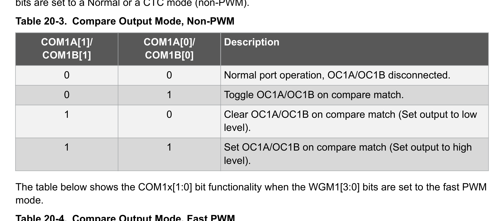
*Description*: Timer/Counter block diagram and waveform timing diagram illustrating prescaler clocks, compare match units, and PWM generation logic for Table 20-3: Compare Output Mode, Non-PWM.

> **Table 20-3: Compare Output Mode, Non-PWM**

COM1A[1]/
COM1B[1]
COM1A[0]/
COM1B[0]
Description
0
0
Normal port operation, OC1A/OC1B disconnected.
0
1
Toggle OC1A/OC1B on compare match.
1
0
Clear OC1A/OC1B on compare match (Set output to low
level).
1
1
Set OC1A/OC1B on compare match (Set output to high
level).
The table below shows the COM1x[1:0] bit functionality when the WGM1[3:0] bits are set to the fast PWM
mode.

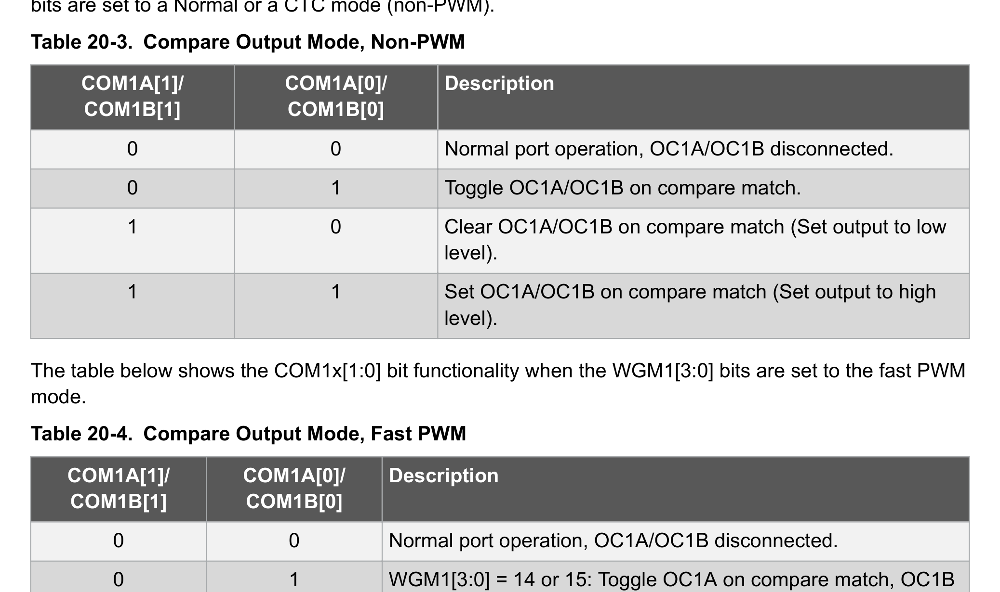
*Description*: Timer/Counter block diagram and waveform timing diagram illustrating prescaler clocks, compare match units, and PWM generation logic for Table 20-4: Compare Output Mode, Fast PWM.

> **Table 20-4: Compare Output Mode, Fast PWM**

COM1A[1]/
COM1B[1]
COM1A[0]/
COM1B[0]
Description
0
0
Normal port operation, OC1A/OC1B disconnected.
0
1
WGM1[3:0] = 14 or 15: Toggle OC1A on compare match, OC1B
disconnected (normal port operation). For all other WGM1
settings, normal port operation, OC1A/OC1B disconnected.
ATmega328/P
16-bit Timer/Counter1 (TC1) with PWM
© 2018 Microchip Technology Inc.
Datasheet Complete
DS40001984A-page 174
Downloaded from Arrow.com.
Downloaded from Arrow.com.
Downloaded from Arrow.com.
Downloaded from Arrow.com.
Downloaded from Arrow.com.
Downloaded from Arrow.com.
Downloaded from Arrow.com.
Downloaded from Arrow.com.
Downloaded from Arrow.com.
Downloaded from Arrow.com.
Downloaded from Arrow.com.
Downloaded from Arrow.com.
Downloaded from Arrow.com.
Downloaded from Arrow.com.
Downloaded from Arrow.com.
Downloaded from Arrow.com.
Downloaded from Arrow.com.
Downloaded from Arrow.com.
Downloaded from Arrow.com.
Downloaded from Arrow.com.
Downloaded from Arrow.com.
Downloaded from Arrow.com.
Downloaded from Arrow.com.
Downloaded from Arrow.com.
Downloaded from Arrow.com.
Downloaded from Arrow.com.
Downloaded from Arrow.com.
Downloaded from Arrow.com.
Downloaded from Arrow.com.
Downloaded from Arrow.com.
Downloaded from Arrow.com.
Downloaded from Arrow.com.
Downloaded from Arrow.com.
Downloaded from Arrow.com.
Downloaded from Arrow.com.
Downloaded from Arrow.com.
Downloaded from Arrow.com.
Downloaded from Arrow.com.
Downloaded from Arrow.com.
Downloaded from Arrow.com.
Downloaded from Arrow.com.
Downloaded from Arrow.com.
Downloaded from Arrow.com.
Downloaded from Arrow.com.
Downloaded from Arrow.com.
Downloaded from Arrow.com.
Downloaded from Arrow.com.
Downloaded from Arrow.com.
Downloaded from Arrow.com.
Downloaded from Arrow.com.
Downloaded from Arrow.com.
Downloaded from Arrow.com.
Downloaded from Arrow.com.
Downloaded from Arrow.com.
Downloaded from Arrow.com.
Downloaded from Arrow.com.
Downloaded from Arrow.com.
Downloaded from Arrow.com.
Downloaded from Arrow.com.
Downloaded from Arrow.com.
Downloaded from Arrow.com.
Downloaded from Arrow.com.
Downloaded from Arrow.com.
Downloaded from Arrow.com.
Downloaded from Arrow.com.
Downloaded from Arrow.com.
Downloaded from Arrow.com.
Downloaded from Arrow.com.
Downloaded from Arrow.com.
Downloaded from Arrow.com.
Downloaded from Arrow.com.
Downloaded from Arrow.com.
Downloaded from Arrow.com.
Downloaded from Arrow.com.
Downloaded from Arrow.com.
Downloaded from Arrow.com.
Downloaded from Arrow.com.
Downloaded from Arrow.com.
Downloaded from Arrow.com.
Downloaded from Arrow.com.
Downloaded from Arrow.com.
Downloaded from Arrow.com.
Downloaded from Arrow.com.
Downloaded from Arrow.com.
Downloaded from Arrow.com.
Downloaded from Arrow.com.
Downloaded from Arrow.com.
Downloaded from Arrow.com.
Downloaded from Arrow.com.
Downloaded from Arrow.com.
Downloaded from Arrow.com.
Downloaded from Arrow.com.
Downloaded from Arrow.com.
Downloaded from Arrow.com.
Downloaded from Arrow.com.
Downloaded from Arrow.com.
Downloaded from Arrow.com.
Downloaded from Arrow.com.
Downloaded from Arrow.com.
Downloaded from Arrow.com.
Downloaded from Arrow.com.
Downloaded from Arrow.com.
Downloaded from Arrow.com.
Downloaded from Arrow.com.
Downloaded from Arrow.com.
Downloaded from Arrow.com.
Downloaded from Arrow.com.
Downloaded from Arrow.com.
Downloaded from Arrow.com.
Downloaded from Arrow.com.
Downloaded from Arrow.com.
Downloaded from Arrow.com.
Downloaded from Arrow.com.
Downloaded from Arrow.com.
Downloaded from Arrow.com.
Downloaded from Arrow.com.
Downloaded from Arrow.com.
Downloaded from Arrow.com.
Downloaded from Arrow.com.
Downloaded from Arrow.com.
Downloaded from Arrow.com.
Downloaded from Arrow.com.
Downloaded from Arrow.com.
Downloaded from Arrow.com.
Downloaded from Arrow.com.
Downloaded from Arrow.com.
Downloaded from Arrow.com.
Downloaded from Arrow.com.
Downloaded from Arrow.com.
Downloaded from Arrow.com.
Downloaded from Arrow.com.
Downloaded from Arrow.com.
Downloaded from Arrow.com.
Downloaded from Arrow.com.
Downloaded from Arrow.com.
Downloaded from Arrow.com.
Downloaded from Arrow.com.
Downloaded from Arrow.com.
Downloaded from Arrow.com.
Downloaded from Arrow.com.
Downloaded from Arrow.com.
Downloaded from Arrow.com.
Downloaded from Arrow.com.
Downloaded from Arrow.com.
Downloaded from Arrow.com.
Downloaded from Arrow.com.
Downloaded from Arrow.com.
Downloaded from Arrow.com.
Downloaded from Arrow.com.
Downloaded from Arrow.com.
Downloaded from Arrow.com.
Downloaded from Arrow.com.
Downloaded from Arrow.com.
Downloaded from Arrow.com.
Downloaded from Arrow.com.
Downloaded from Arrow.com.
Downloaded from Arrow.com.
Downloaded from Arrow.com.
Downloaded from Arrow.com.
Downloaded from Arrow.com.
Downloaded from Arrow.com.
Downloaded from Arrow.com.
Downloaded from Arrow.com.
Downloaded from Arrow.com.
Downloaded from Arrow.com.
Downloaded from Arrow.com.
Downloaded from Arrow.com.
Downloaded from Arrow.com.
Downloaded from Arrow.com.
Downloaded from Arrow.com.
Downloaded from Arrow.com.
Downloaded from Arrow.com.
Downloaded from Arrow.com.
Downloaded from Arrow.com.


<!-- Page 175 -->
### [PDF Page 175]

COM1A[1]/
COM1B[1]
COM1A[0]/
COM1B[0]
Description
1
0
Clear OC1A/OC1B on compare match, set OC1A/OC1B at
BOTTOM (Non-inverting mode)
1
1
Set OC1A/OC1B on compare match, clear OC1A/OC1B at
BOTTOM (Inverting mode)
Note:
1.
A special case occurs when OCR1A/OCR1B equals TOP and COM1A[1]/COM1B[1] is set. In this
case the compare match is ignored, but the set or clear is done at BOTTOM. Refer to Fast PWM
Mode for details.
The table below shows the COM1x[1:0] bit functionality when the WGM1[3:0] bits are set to the phase
correct or the phase and frequency correct, PWM mode.

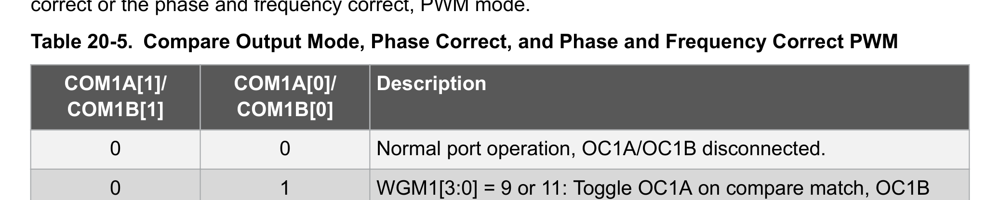
*Description*: Timer/Counter block diagram and waveform timing diagram illustrating prescaler clocks, compare match units, and PWM generation logic for Table 20-5: Compare Output Mode, Phase Correct, and Phase and Frequency Correct PWM.

> **Table 20-5: Compare Output Mode, Phase Correct, and Phase and Frequency Correct PWM**

COM1A[1]/
COM1B[1]
COM1A[0]/
COM1B[0]
Description
0
0
Normal port operation, OC1A/OC1B disconnected.
0
1
WGM1[3:0] = 9 or 11: Toggle OC1A on compare match, OC1B
disconnected (normal port operation). For all other WGM1
settings, normal port operation, OC1A/OC1B disconnected.
1
0
Clear OC1A/OC1B on compare match when up-counting. Set
OC1A/OC1B on compare match when down-counting.
1
1
Set OC1A/OC1B on compare match when up-counting. Clear
OC1A/OC1B on compare match when down-counting.
Note:
1.
A special case occurs when OCR1A/OCR1B equals TOP and COM1A[1]/COM1B[1] is set. Refer to
Phase Correct PWM Mode for details.
Bits 1:0 – WGM1[1:0] Waveform Generation Mode
Combined with the WGM1[3:2] bits found in the TCCR1B register, these bits control the counting
sequence of the counter, the source for maximum (TOP) counter value, and what type of waveform
generation to be used. Modes of operation supported by the timer/counter unit are; Normal mode
(counter), Clear Timer on Compare Match (CTC) mode, and three types of Pulse-Width Modulation
(PWM) modes. (See Modes of Operation).

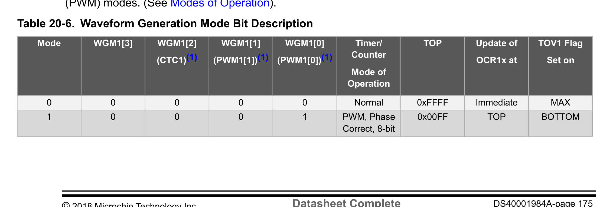
*Description*: Hardware reference table detailing register bit field settings, electrical operating limits, or memory configurations for Table 20-6: Waveform Generation Mode Bit Description.

> **Table 20-6: Waveform Generation Mode Bit Description**

Mode
WGM1[3]
WGM1[2]
(CTC1)(1)
WGM1[1]
(PWM1[1])(1)
WGM1[0]
(PWM1[0])(1)
Timer/
Counter
Mode of
Operation
TOP
Update of
OCR1x at
TOV1 Flag
Set on
0
0
0
0
0
Normal
0xFFFF
Immediate
MAX
1
0
0
0
1
PWM, Phase
Correct, 8-bit
0x00FF
TOP
BOTTOM
ATmega328/P
16-bit Timer/Counter1 (TC1) with PWM
© 2018 Microchip Technology Inc.
Datasheet Complete
DS40001984A-page 175
Downloaded from Arrow.com.
Downloaded from Arrow.com.
Downloaded from Arrow.com.
Downloaded from Arrow.com.
Downloaded from Arrow.com.
Downloaded from Arrow.com.
Downloaded from Arrow.com.
Downloaded from Arrow.com.
Downloaded from Arrow.com.
Downloaded from Arrow.com.
Downloaded from Arrow.com.
Downloaded from Arrow.com.
Downloaded from Arrow.com.
Downloaded from Arrow.com.
Downloaded from Arrow.com.
Downloaded from Arrow.com.
Downloaded from Arrow.com.
Downloaded from Arrow.com.
Downloaded from Arrow.com.
Downloaded from Arrow.com.
Downloaded from Arrow.com.
Downloaded from Arrow.com.
Downloaded from Arrow.com.
Downloaded from Arrow.com.
Downloaded from Arrow.com.
Downloaded from Arrow.com.
Downloaded from Arrow.com.
Downloaded from Arrow.com.
Downloaded from Arrow.com.
Downloaded from Arrow.com.
Downloaded from Arrow.com.
Downloaded from Arrow.com.
Downloaded from Arrow.com.
Downloaded from Arrow.com.
Downloaded from Arrow.com.
Downloaded from Arrow.com.
Downloaded from Arrow.com.
Downloaded from Arrow.com.
Downloaded from Arrow.com.
Downloaded from Arrow.com.
Downloaded from Arrow.com.
Downloaded from Arrow.com.
Downloaded from Arrow.com.
Downloaded from Arrow.com.
Downloaded from Arrow.com.
Downloaded from Arrow.com.
Downloaded from Arrow.com.
Downloaded from Arrow.com.
Downloaded from Arrow.com.
Downloaded from Arrow.com.
Downloaded from Arrow.com.
Downloaded from Arrow.com.
Downloaded from Arrow.com.
Downloaded from Arrow.com.
Downloaded from Arrow.com.
Downloaded from Arrow.com.
Downloaded from Arrow.com.
Downloaded from Arrow.com.
Downloaded from Arrow.com.
Downloaded from Arrow.com.
Downloaded from Arrow.com.
Downloaded from Arrow.com.
Downloaded from Arrow.com.
Downloaded from Arrow.com.
Downloaded from Arrow.com.
Downloaded from Arrow.com.
Downloaded from Arrow.com.
Downloaded from Arrow.com.
Downloaded from Arrow.com.
Downloaded from Arrow.com.
Downloaded from Arrow.com.
Downloaded from Arrow.com.
Downloaded from Arrow.com.
Downloaded from Arrow.com.
Downloaded from Arrow.com.
Downloaded from Arrow.com.
Downloaded from Arrow.com.
Downloaded from Arrow.com.
Downloaded from Arrow.com.
Downloaded from Arrow.com.
Downloaded from Arrow.com.
Downloaded from Arrow.com.
Downloaded from Arrow.com.
Downloaded from Arrow.com.
Downloaded from Arrow.com.
Downloaded from Arrow.com.
Downloaded from Arrow.com.
Downloaded from Arrow.com.
Downloaded from Arrow.com.
Downloaded from Arrow.com.
Downloaded from Arrow.com.
Downloaded from Arrow.com.
Downloaded from Arrow.com.
Downloaded from Arrow.com.
Downloaded from Arrow.com.
Downloaded from Arrow.com.
Downloaded from Arrow.com.
Downloaded from Arrow.com.
Downloaded from Arrow.com.
Downloaded from Arrow.com.
Downloaded from Arrow.com.
Downloaded from Arrow.com.
Downloaded from Arrow.com.
Downloaded from Arrow.com.
Downloaded from Arrow.com.
Downloaded from Arrow.com.
Downloaded from Arrow.com.
Downloaded from Arrow.com.
Downloaded from Arrow.com.
Downloaded from Arrow.com.
Downloaded from Arrow.com.
Downloaded from Arrow.com.
Downloaded from Arrow.com.
Downloaded from Arrow.com.
Downloaded from Arrow.com.
Downloaded from Arrow.com.
Downloaded from Arrow.com.
Downloaded from Arrow.com.
Downloaded from Arrow.com.
Downloaded from Arrow.com.
Downloaded from Arrow.com.
Downloaded from Arrow.com.
Downloaded from Arrow.com.
Downloaded from Arrow.com.
Downloaded from Arrow.com.
Downloaded from Arrow.com.
Downloaded from Arrow.com.
Downloaded from Arrow.com.
Downloaded from Arrow.com.
Downloaded from Arrow.com.
Downloaded from Arrow.com.
Downloaded from Arrow.com.
Downloaded from Arrow.com.
Downloaded from Arrow.com.
Downloaded from Arrow.com.
Downloaded from Arrow.com.
Downloaded from Arrow.com.
Downloaded from Arrow.com.
Downloaded from Arrow.com.
Downloaded from Arrow.com.
Downloaded from Arrow.com.
Downloaded from Arrow.com.
Downloaded from Arrow.com.
Downloaded from Arrow.com.
Downloaded from Arrow.com.
Downloaded from Arrow.com.
Downloaded from Arrow.com.
Downloaded from Arrow.com.
Downloaded from Arrow.com.
Downloaded from Arrow.com.
Downloaded from Arrow.com.
Downloaded from Arrow.com.
Downloaded from Arrow.com.
Downloaded from Arrow.com.
Downloaded from Arrow.com.
Downloaded from Arrow.com.
Downloaded from Arrow.com.
Downloaded from Arrow.com.
Downloaded from Arrow.com.
Downloaded from Arrow.com.
Downloaded from Arrow.com.
Downloaded from Arrow.com.
Downloaded from Arrow.com.
Downloaded from Arrow.com.
Downloaded from Arrow.com.
Downloaded from Arrow.com.
Downloaded from Arrow.com.
Downloaded from Arrow.com.
Downloaded from Arrow.com.
Downloaded from Arrow.com.
Downloaded from Arrow.com.
Downloaded from Arrow.com.
Downloaded from Arrow.com.
Downloaded from Arrow.com.
Downloaded from Arrow.com.


<!-- Page 176 -->
### [PDF Page 176]

Mode
WGM1[3]
WGM1[2]
(CTC1)(1)
WGM1[1]
(PWM1[1])(1)
WGM1[0]
(PWM1[0])(1)
Timer/
Counter
Mode of
Operation
TOP
Update of
OCR1x at
TOV1 Flag
Set on
2
0
0
1
0
PWM, Phase
Correct, 9-bit
0x01FF
TOP
BOTTOM
3
0
0
1
1
PWM, Phase
Correct, 10-bit
0x03FF
TOP
BOTTOM
4
0
1
0
0
CTC
OCR1A
Immediate
MAX
5
0
1
0
1
Fast PWM, 8-
bit
0x00FF
BOTTOM
TOP
6
0
1
1
0
Fast PWM, 9-
bit
0x01FF
BOTTOM
TOP
7
0
1
1
1
Fast PWM, 10-
bit
0x03FF
BOTTOM
TOP
8
1
0
0
0
PWM, Phase
and Frequency
Correct
ICR1
BOTTOM
BOTTOM
9
1
0
0
1
PWM, Phase
and Frequency
Correct
OCR1A
BOTTOM
BOTTOM
10
1
0
1
0
PWM, Phase
Correct
ICR1
TOP
BOTTOM
11
1
0
1
1
PWM, Phase
Correct
OCR1A
TOP
BOTTOM
12
1
1
0
0
CTC
ICR1
Immediate
MAX
13
1
1
0
1
Reserved
-
-
-
14
1
1
1
0
Fast PWM
ICR1
BOTTOM
TOP
15
1
1
1
1
Fast PWM
OCR1A
BOTTOM
TOP
Note:
1.
The CTC1 and PWM1[1:0] bit definition names are obsolete. Use the WGM1[3:0] definitions.
However, the functionality and location of these bits are compatible with previous versions of the
timer.
ATmega328/P
16-bit Timer/Counter1 (TC1) with PWM
© 2018 Microchip Technology Inc.
Datasheet Complete
DS40001984A-page 176
Downloaded from Arrow.com.
Downloaded from Arrow.com.
Downloaded from Arrow.com.
Downloaded from Arrow.com.
Downloaded from Arrow.com.
Downloaded from Arrow.com.
Downloaded from Arrow.com.
Downloaded from Arrow.com.
Downloaded from Arrow.com.
Downloaded from Arrow.com.
Downloaded from Arrow.com.
Downloaded from Arrow.com.
Downloaded from Arrow.com.
Downloaded from Arrow.com.
Downloaded from Arrow.com.
Downloaded from Arrow.com.
Downloaded from Arrow.com.
Downloaded from Arrow.com.
Downloaded from Arrow.com.
Downloaded from Arrow.com.
Downloaded from Arrow.com.
Downloaded from Arrow.com.
Downloaded from Arrow.com.
Downloaded from Arrow.com.
Downloaded from Arrow.com.
Downloaded from Arrow.com.
Downloaded from Arrow.com.
Downloaded from Arrow.com.
Downloaded from Arrow.com.
Downloaded from Arrow.com.
Downloaded from Arrow.com.
Downloaded from Arrow.com.
Downloaded from Arrow.com.
Downloaded from Arrow.com.
Downloaded from Arrow.com.
Downloaded from Arrow.com.
Downloaded from Arrow.com.
Downloaded from Arrow.com.
Downloaded from Arrow.com.
Downloaded from Arrow.com.
Downloaded from Arrow.com.
Downloaded from Arrow.com.
Downloaded from Arrow.com.
Downloaded from Arrow.com.
Downloaded from Arrow.com.
Downloaded from Arrow.com.
Downloaded from Arrow.com.
Downloaded from Arrow.com.
Downloaded from Arrow.com.
Downloaded from Arrow.com.
Downloaded from Arrow.com.
Downloaded from Arrow.com.
Downloaded from Arrow.com.
Downloaded from Arrow.com.
Downloaded from Arrow.com.
Downloaded from Arrow.com.
Downloaded from Arrow.com.
Downloaded from Arrow.com.
Downloaded from Arrow.com.
Downloaded from Arrow.com.
Downloaded from Arrow.com.
Downloaded from Arrow.com.
Downloaded from Arrow.com.
Downloaded from Arrow.com.
Downloaded from Arrow.com.
Downloaded from Arrow.com.
Downloaded from Arrow.com.
Downloaded from Arrow.com.
Downloaded from Arrow.com.
Downloaded from Arrow.com.
Downloaded from Arrow.com.
Downloaded from Arrow.com.
Downloaded from Arrow.com.
Downloaded from Arrow.com.
Downloaded from Arrow.com.
Downloaded from Arrow.com.
Downloaded from Arrow.com.
Downloaded from Arrow.com.
Downloaded from Arrow.com.
Downloaded from Arrow.com.
Downloaded from Arrow.com.
Downloaded from Arrow.com.
Downloaded from Arrow.com.
Downloaded from Arrow.com.
Downloaded from Arrow.com.
Downloaded from Arrow.com.
Downloaded from Arrow.com.
Downloaded from Arrow.com.
Downloaded from Arrow.com.
Downloaded from Arrow.com.
Downloaded from Arrow.com.
Downloaded from Arrow.com.
Downloaded from Arrow.com.
Downloaded from Arrow.com.
Downloaded from Arrow.com.
Downloaded from Arrow.com.
Downloaded from Arrow.com.
Downloaded from Arrow.com.
Downloaded from Arrow.com.
Downloaded from Arrow.com.
Downloaded from Arrow.com.
Downloaded from Arrow.com.
Downloaded from Arrow.com.
Downloaded from Arrow.com.
Downloaded from Arrow.com.
Downloaded from Arrow.com.
Downloaded from Arrow.com.
Downloaded from Arrow.com.
Downloaded from Arrow.com.
Downloaded from Arrow.com.
Downloaded from Arrow.com.
Downloaded from Arrow.com.
Downloaded from Arrow.com.
Downloaded from Arrow.com.
Downloaded from Arrow.com.
Downloaded from Arrow.com.
Downloaded from Arrow.com.
Downloaded from Arrow.com.
Downloaded from Arrow.com.
Downloaded from Arrow.com.
Downloaded from Arrow.com.
Downloaded from Arrow.com.
Downloaded from Arrow.com.
Downloaded from Arrow.com.
Downloaded from Arrow.com.
Downloaded from Arrow.com.
Downloaded from Arrow.com.
Downloaded from Arrow.com.
Downloaded from Arrow.com.
Downloaded from Arrow.com.
Downloaded from Arrow.com.
Downloaded from Arrow.com.
Downloaded from Arrow.com.
Downloaded from Arrow.com.
Downloaded from Arrow.com.
Downloaded from Arrow.com.
Downloaded from Arrow.com.
Downloaded from Arrow.com.
Downloaded from Arrow.com.
Downloaded from Arrow.com.
Downloaded from Arrow.com.
Downloaded from Arrow.com.
Downloaded from Arrow.com.
Downloaded from Arrow.com.
Downloaded from Arrow.com.
Downloaded from Arrow.com.
Downloaded from Arrow.com.
Downloaded from Arrow.com.
Downloaded from Arrow.com.
Downloaded from Arrow.com.
Downloaded from Arrow.com.
Downloaded from Arrow.com.
Downloaded from Arrow.com.
Downloaded from Arrow.com.
Downloaded from Arrow.com.
Downloaded from Arrow.com.
Downloaded from Arrow.com.
Downloaded from Arrow.com.
Downloaded from Arrow.com.
Downloaded from Arrow.com.
Downloaded from Arrow.com.
Downloaded from Arrow.com.
Downloaded from Arrow.com.
Downloaded from Arrow.com.
Downloaded from Arrow.com.
Downloaded from Arrow.com.
Downloaded from Arrow.com.
Downloaded from Arrow.com.
Downloaded from Arrow.com.
Downloaded from Arrow.com.
Downloaded from Arrow.com.
Downloaded from Arrow.com.
Downloaded from Arrow.com.
Downloaded from Arrow.com.
Downloaded from Arrow.com.
Downloaded from Arrow.com.


<!-- Page 177 -->
### [PDF Page 177]

20.15.2 TC1 Control Register B
Name:
TCCR1B
Offset:
0x81
Reset:
0x00
Property:  -
Bit
7
6
5
4
3
2
1
0
ICNC1
ICES1
WGM13
WGM12
CS1[2:0]
Access
R/W
R/W
R/W
R/W
R/W
R/W
R/W
Reset
0
0
0
0
0
0
0
Bit 7 – ICNC1 Input Capture Noise Canceler
Writing this bit to '1' activates the input capture noise canceler. When the noise canceler is activated, the
input from the Input Capture pin (ICP1) is filtered. The filter function requires four successive equal
valued samples of the ICP1 pin for changing its output. The input capture is therefore delayed by four
oscillator cycles when the noise canceler is enabled.
Bit 6 – ICES1 Input Capture Edge Select
This bit selects which edge on the Input Capture pin (ICP1) that is used to trigger a capture event. When
the ICES1 bit is written to zero, a falling (negative) edge is used as a trigger, and when the ICES1 bit is
written to '1', a rising (positive) edge will trigger the capture.
When a capture is triggered according to the ICES1 setting, the counter value is copied into the Input
Capture Register (ICR1). The event will also set the Input Capture Flag (ICF1) and this can be used to
cause an input capture interrupt, if this interrupt is enabled.
When the ICR1 is used as TOP value (see description of the WGM1[3:0] bits located in the TCCR1A and
the TCCR1B register), the ICP1 is disconnected and consequently, the input capture function is disabled.
Bits 3, 4 – WGM1 Waveform Generation Mode
Refer to TCCR1A.
Bits 2:0 – CS1[2:0] Clock Select 1

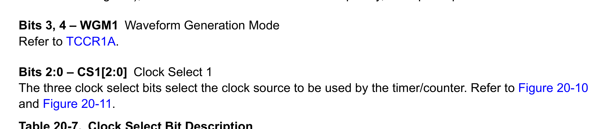
*Description*: Technical diagram and schematic illustration detailing hardware circuit topology, signal routing, and logic operations for Figure 20-10.

> **Figure 20-10**


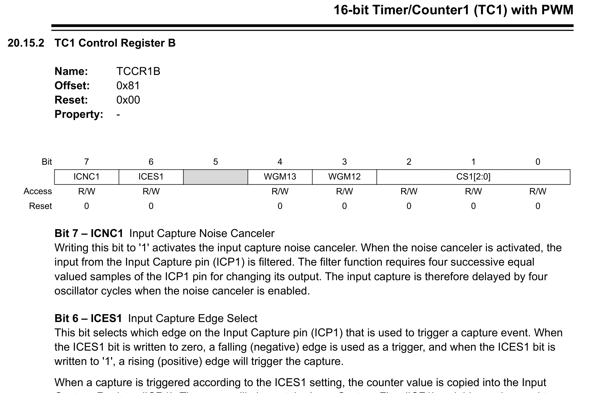
*Description*: Technical diagram and schematic illustration detailing hardware circuit topology, signal routing, and logic operations for Figure 20-11.

> **Figure 20-11**


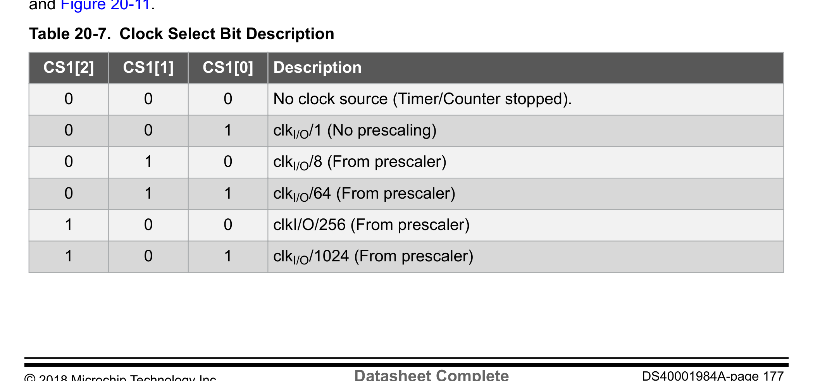
*Description*: Clock distribution diagram showing oscillator sources, prescaler dividers, and peripheral clock routing for Table 20-7: Clock Select Bit Description.

> **Table 20-7: Clock Select Bit Description**

CS1[2]
CS1[1]
CS1[0]
Description
0
0
0
No clock source (Timer/Counter stopped).
0
0
1
clkI/O/1 (No prescaling)
0
1
0
clkI/O/8 (From prescaler)
0
1
1
clkI/O/64 (From prescaler)
1
0
0
clkI/O/256 (From prescaler)
1
0
1
clkI/O/1024 (From prescaler)
ATmega328/P
16-bit Timer/Counter1 (TC1) with PWM
© 2018 Microchip Technology Inc.
Datasheet Complete
DS40001984A-page 177
Downloaded from Arrow.com.
Downloaded from Arrow.com.
Downloaded from Arrow.com.
Downloaded from Arrow.com.
Downloaded from Arrow.com.
Downloaded from Arrow.com.
Downloaded from Arrow.com.
Downloaded from Arrow.com.
Downloaded from Arrow.com.
Downloaded from Arrow.com.
Downloaded from Arrow.com.
Downloaded from Arrow.com.
Downloaded from Arrow.com.
Downloaded from Arrow.com.
Downloaded from Arrow.com.
Downloaded from Arrow.com.
Downloaded from Arrow.com.
Downloaded from Arrow.com.
Downloaded from Arrow.com.
Downloaded from Arrow.com.
Downloaded from Arrow.com.
Downloaded from Arrow.com.
Downloaded from Arrow.com.
Downloaded from Arrow.com.
Downloaded from Arrow.com.
Downloaded from Arrow.com.
Downloaded from Arrow.com.
Downloaded from Arrow.com.
Downloaded from Arrow.com.
Downloaded from Arrow.com.
Downloaded from Arrow.com.
Downloaded from Arrow.com.
Downloaded from Arrow.com.
Downloaded from Arrow.com.
Downloaded from Arrow.com.
Downloaded from Arrow.com.
Downloaded from Arrow.com.
Downloaded from Arrow.com.
Downloaded from Arrow.com.
Downloaded from Arrow.com.
Downloaded from Arrow.com.
Downloaded from Arrow.com.
Downloaded from Arrow.com.
Downloaded from Arrow.com.
Downloaded from Arrow.com.
Downloaded from Arrow.com.
Downloaded from Arrow.com.
Downloaded from Arrow.com.
Downloaded from Arrow.com.
Downloaded from Arrow.com.
Downloaded from Arrow.com.
Downloaded from Arrow.com.
Downloaded from Arrow.com.
Downloaded from Arrow.com.
Downloaded from Arrow.com.
Downloaded from Arrow.com.
Downloaded from Arrow.com.
Downloaded from Arrow.com.
Downloaded from Arrow.com.
Downloaded from Arrow.com.
Downloaded from Arrow.com.
Downloaded from Arrow.com.
Downloaded from Arrow.com.
Downloaded from Arrow.com.
Downloaded from Arrow.com.
Downloaded from Arrow.com.
Downloaded from Arrow.com.
Downloaded from Arrow.com.
Downloaded from Arrow.com.
Downloaded from Arrow.com.
Downloaded from Arrow.com.
Downloaded from Arrow.com.
Downloaded from Arrow.com.
Downloaded from Arrow.com.
Downloaded from Arrow.com.
Downloaded from Arrow.com.
Downloaded from Arrow.com.
Downloaded from Arrow.com.
Downloaded from Arrow.com.
Downloaded from Arrow.com.
Downloaded from Arrow.com.
Downloaded from Arrow.com.
Downloaded from Arrow.com.
Downloaded from Arrow.com.
Downloaded from Arrow.com.
Downloaded from Arrow.com.
Downloaded from Arrow.com.
Downloaded from Arrow.com.
Downloaded from Arrow.com.
Downloaded from Arrow.com.
Downloaded from Arrow.com.
Downloaded from Arrow.com.
Downloaded from Arrow.com.
Downloaded from Arrow.com.
Downloaded from Arrow.com.
Downloaded from Arrow.com.
Downloaded from Arrow.com.
Downloaded from Arrow.com.
Downloaded from Arrow.com.
Downloaded from Arrow.com.
Downloaded from Arrow.com.
Downloaded from Arrow.com.
Downloaded from Arrow.com.
Downloaded from Arrow.com.
Downloaded from Arrow.com.
Downloaded from Arrow.com.
Downloaded from Arrow.com.
Downloaded from Arrow.com.
Downloaded from Arrow.com.
Downloaded from Arrow.com.
Downloaded from Arrow.com.
Downloaded from Arrow.com.
Downloaded from Arrow.com.
Downloaded from Arrow.com.
Downloaded from Arrow.com.
Downloaded from Arrow.com.
Downloaded from Arrow.com.
Downloaded from Arrow.com.
Downloaded from Arrow.com.
Downloaded from Arrow.com.
Downloaded from Arrow.com.
Downloaded from Arrow.com.
Downloaded from Arrow.com.
Downloaded from Arrow.com.
Downloaded from Arrow.com.
Downloaded from Arrow.com.
Downloaded from Arrow.com.
Downloaded from Arrow.com.
Downloaded from Arrow.com.
Downloaded from Arrow.com.
Downloaded from Arrow.com.
Downloaded from Arrow.com.
Downloaded from Arrow.com.
Downloaded from Arrow.com.
Downloaded from Arrow.com.
Downloaded from Arrow.com.
Downloaded from Arrow.com.
Downloaded from Arrow.com.
Downloaded from Arrow.com.
Downloaded from Arrow.com.
Downloaded from Arrow.com.
Downloaded from Arrow.com.
Downloaded from Arrow.com.
Downloaded from Arrow.com.
Downloaded from Arrow.com.
Downloaded from Arrow.com.
Downloaded from Arrow.com.
Downloaded from Arrow.com.
Downloaded from Arrow.com.
Downloaded from Arrow.com.
Downloaded from Arrow.com.
Downloaded from Arrow.com.
Downloaded from Arrow.com.
Downloaded from Arrow.com.
Downloaded from Arrow.com.
Downloaded from Arrow.com.
Downloaded from Arrow.com.
Downloaded from Arrow.com.
Downloaded from Arrow.com.
Downloaded from Arrow.com.
Downloaded from Arrow.com.
Downloaded from Arrow.com.
Downloaded from Arrow.com.
Downloaded from Arrow.com.
Downloaded from Arrow.com.
Downloaded from Arrow.com.
Downloaded from Arrow.com.
Downloaded from Arrow.com.
Downloaded from Arrow.com.
Downloaded from Arrow.com.
Downloaded from Arrow.com.
Downloaded from Arrow.com.
Downloaded from Arrow.com.
Downloaded from Arrow.com.
Downloaded from Arrow.com.
Downloaded from Arrow.com.
Downloaded from Arrow.com.


<!-- Page 178 -->
### [PDF Page 178]

CS1[2]
CS1[1]
CS1[0]
Description
1
1
0
External clock source on T1 pin. Clock on falling edge.
1
1
1
External clock source on T1 pin. Clock on rising edge.
ATmega328/P
16-bit Timer/Counter1 (TC1) with PWM
© 2018 Microchip Technology Inc.
Datasheet Complete
DS40001984A-page 178
Downloaded from Arrow.com.
Downloaded from Arrow.com.
Downloaded from Arrow.com.
Downloaded from Arrow.com.
Downloaded from Arrow.com.
Downloaded from Arrow.com.
Downloaded from Arrow.com.
Downloaded from Arrow.com.
Downloaded from Arrow.com.
Downloaded from Arrow.com.
Downloaded from Arrow.com.
Downloaded from Arrow.com.
Downloaded from Arrow.com.
Downloaded from Arrow.com.
Downloaded from Arrow.com.
Downloaded from Arrow.com.
Downloaded from Arrow.com.
Downloaded from Arrow.com.
Downloaded from Arrow.com.
Downloaded from Arrow.com.
Downloaded from Arrow.com.
Downloaded from Arrow.com.
Downloaded from Arrow.com.
Downloaded from Arrow.com.
Downloaded from Arrow.com.
Downloaded from Arrow.com.
Downloaded from Arrow.com.
Downloaded from Arrow.com.
Downloaded from Arrow.com.
Downloaded from Arrow.com.
Downloaded from Arrow.com.
Downloaded from Arrow.com.
Downloaded from Arrow.com.
Downloaded from Arrow.com.
Downloaded from Arrow.com.
Downloaded from Arrow.com.
Downloaded from Arrow.com.
Downloaded from Arrow.com.
Downloaded from Arrow.com.
Downloaded from Arrow.com.
Downloaded from Arrow.com.
Downloaded from Arrow.com.
Downloaded from Arrow.com.
Downloaded from Arrow.com.
Downloaded from Arrow.com.
Downloaded from Arrow.com.
Downloaded from Arrow.com.
Downloaded from Arrow.com.
Downloaded from Arrow.com.
Downloaded from Arrow.com.
Downloaded from Arrow.com.
Downloaded from Arrow.com.
Downloaded from Arrow.com.
Downloaded from Arrow.com.
Downloaded from Arrow.com.
Downloaded from Arrow.com.
Downloaded from Arrow.com.
Downloaded from Arrow.com.
Downloaded from Arrow.com.
Downloaded from Arrow.com.
Downloaded from Arrow.com.
Downloaded from Arrow.com.
Downloaded from Arrow.com.
Downloaded from Arrow.com.
Downloaded from Arrow.com.
Downloaded from Arrow.com.
Downloaded from Arrow.com.
Downloaded from Arrow.com.
Downloaded from Arrow.com.
Downloaded from Arrow.com.
Downloaded from Arrow.com.
Downloaded from Arrow.com.
Downloaded from Arrow.com.
Downloaded from Arrow.com.
Downloaded from Arrow.com.
Downloaded from Arrow.com.
Downloaded from Arrow.com.
Downloaded from Arrow.com.
Downloaded from Arrow.com.
Downloaded from Arrow.com.
Downloaded from Arrow.com.
Downloaded from Arrow.com.
Downloaded from Arrow.com.
Downloaded from Arrow.com.
Downloaded from Arrow.com.
Downloaded from Arrow.com.
Downloaded from Arrow.com.
Downloaded from Arrow.com.
Downloaded from Arrow.com.
Downloaded from Arrow.com.
Downloaded from Arrow.com.
Downloaded from Arrow.com.
Downloaded from Arrow.com.
Downloaded from Arrow.com.
Downloaded from Arrow.com.
Downloaded from Arrow.com.
Downloaded from Arrow.com.
Downloaded from Arrow.com.
Downloaded from Arrow.com.
Downloaded from Arrow.com.
Downloaded from Arrow.com.
Downloaded from Arrow.com.
Downloaded from Arrow.com.
Downloaded from Arrow.com.
Downloaded from Arrow.com.
Downloaded from Arrow.com.
Downloaded from Arrow.com.
Downloaded from Arrow.com.
Downloaded from Arrow.com.
Downloaded from Arrow.com.
Downloaded from Arrow.com.
Downloaded from Arrow.com.
Downloaded from Arrow.com.
Downloaded from Arrow.com.
Downloaded from Arrow.com.
Downloaded from Arrow.com.
Downloaded from Arrow.com.
Downloaded from Arrow.com.
Downloaded from Arrow.com.
Downloaded from Arrow.com.
Downloaded from Arrow.com.
Downloaded from Arrow.com.
Downloaded from Arrow.com.
Downloaded from Arrow.com.
Downloaded from Arrow.com.
Downloaded from Arrow.com.
Downloaded from Arrow.com.
Downloaded from Arrow.com.
Downloaded from Arrow.com.
Downloaded from Arrow.com.
Downloaded from Arrow.com.
Downloaded from Arrow.com.
Downloaded from Arrow.com.
Downloaded from Arrow.com.
Downloaded from Arrow.com.
Downloaded from Arrow.com.
Downloaded from Arrow.com.
Downloaded from Arrow.com.
Downloaded from Arrow.com.
Downloaded from Arrow.com.
Downloaded from Arrow.com.
Downloaded from Arrow.com.
Downloaded from Arrow.com.
Downloaded from Arrow.com.
Downloaded from Arrow.com.
Downloaded from Arrow.com.
Downloaded from Arrow.com.
Downloaded from Arrow.com.
Downloaded from Arrow.com.
Downloaded from Arrow.com.
Downloaded from Arrow.com.
Downloaded from Arrow.com.
Downloaded from Arrow.com.
Downloaded from Arrow.com.
Downloaded from Arrow.com.
Downloaded from Arrow.com.
Downloaded from Arrow.com.
Downloaded from Arrow.com.
Downloaded from Arrow.com.
Downloaded from Arrow.com.
Downloaded from Arrow.com.
Downloaded from Arrow.com.
Downloaded from Arrow.com.
Downloaded from Arrow.com.
Downloaded from Arrow.com.
Downloaded from Arrow.com.
Downloaded from Arrow.com.
Downloaded from Arrow.com.
Downloaded from Arrow.com.
Downloaded from Arrow.com.
Downloaded from Arrow.com.
Downloaded from Arrow.com.
Downloaded from Arrow.com.
Downloaded from Arrow.com.
Downloaded from Arrow.com.
Downloaded from Arrow.com.
Downloaded from Arrow.com.
Downloaded from Arrow.com.


<!-- Page 179 -->
### [PDF Page 179]

20.15.3 TC1 Control Register C
Name:
TCCR1C
Offset:
0x82
Reset:
0x00
Property:  -
Bit
7
6
5
4
3
2
1
0
FOC1A
FOC1B
Access
R/W
R/W
Reset
0
0
Bits 6, 7 – FOC1 Force Output Compare for Channel B and A
The FOC1A/FOC1B bits are only active when the WGM1[3:0] bits specifies a non-PWM mode. When
writing a logical one to the FOC1A/FOC1B bit, an immediate compare match is forced on the waveform
generation unit. The OC1A/OC1B output is changed according to its COM1x[1:0] bits setting. Note that
the FOC1A/FOC1B bits are implemented as strobes. Therefore it is the value present in the COM1x[1:0]
bits that determine the effect of the forced compare.
A FOC1A/FOC1B strobe will not generate any interrupt nor will it clear the timer in Clear Timer on
Compare Match (CTC) mode using OCR1A as TOP. The FOC1A/FOC1B bits are always read as zero.
ATmega328/P
16-bit Timer/Counter1 (TC1) with PWM
© 2018 Microchip Technology Inc.
Datasheet Complete
DS40001984A-page 179
Downloaded from Arrow.com.
Downloaded from Arrow.com.
Downloaded from Arrow.com.
Downloaded from Arrow.com.
Downloaded from Arrow.com.
Downloaded from Arrow.com.
Downloaded from Arrow.com.
Downloaded from Arrow.com.
Downloaded from Arrow.com.
Downloaded from Arrow.com.
Downloaded from Arrow.com.
Downloaded from Arrow.com.
Downloaded from Arrow.com.
Downloaded from Arrow.com.
Downloaded from Arrow.com.
Downloaded from Arrow.com.
Downloaded from Arrow.com.
Downloaded from Arrow.com.
Downloaded from Arrow.com.
Downloaded from Arrow.com.
Downloaded from Arrow.com.
Downloaded from Arrow.com.
Downloaded from Arrow.com.
Downloaded from Arrow.com.
Downloaded from Arrow.com.
Downloaded from Arrow.com.
Downloaded from Arrow.com.
Downloaded from Arrow.com.
Downloaded from Arrow.com.
Downloaded from Arrow.com.
Downloaded from Arrow.com.
Downloaded from Arrow.com.
Downloaded from Arrow.com.
Downloaded from Arrow.com.
Downloaded from Arrow.com.
Downloaded from Arrow.com.
Downloaded from Arrow.com.
Downloaded from Arrow.com.
Downloaded from Arrow.com.
Downloaded from Arrow.com.
Downloaded from Arrow.com.
Downloaded from Arrow.com.
Downloaded from Arrow.com.
Downloaded from Arrow.com.
Downloaded from Arrow.com.
Downloaded from Arrow.com.
Downloaded from Arrow.com.
Downloaded from Arrow.com.
Downloaded from Arrow.com.
Downloaded from Arrow.com.
Downloaded from Arrow.com.
Downloaded from Arrow.com.
Downloaded from Arrow.com.
Downloaded from Arrow.com.
Downloaded from Arrow.com.
Downloaded from Arrow.com.
Downloaded from Arrow.com.
Downloaded from Arrow.com.
Downloaded from Arrow.com.
Downloaded from Arrow.com.
Downloaded from Arrow.com.
Downloaded from Arrow.com.
Downloaded from Arrow.com.
Downloaded from Arrow.com.
Downloaded from Arrow.com.
Downloaded from Arrow.com.
Downloaded from Arrow.com.
Downloaded from Arrow.com.
Downloaded from Arrow.com.
Downloaded from Arrow.com.
Downloaded from Arrow.com.
Downloaded from Arrow.com.
Downloaded from Arrow.com.
Downloaded from Arrow.com.
Downloaded from Arrow.com.
Downloaded from Arrow.com.
Downloaded from Arrow.com.
Downloaded from Arrow.com.
Downloaded from Arrow.com.
Downloaded from Arrow.com.
Downloaded from Arrow.com.
Downloaded from Arrow.com.
Downloaded from Arrow.com.
Downloaded from Arrow.com.
Downloaded from Arrow.com.
Downloaded from Arrow.com.
Downloaded from Arrow.com.
Downloaded from Arrow.com.
Downloaded from Arrow.com.
Downloaded from Arrow.com.
Downloaded from Arrow.com.
Downloaded from Arrow.com.
Downloaded from Arrow.com.
Downloaded from Arrow.com.
Downloaded from Arrow.com.
Downloaded from Arrow.com.
Downloaded from Arrow.com.
Downloaded from Arrow.com.
Downloaded from Arrow.com.
Downloaded from Arrow.com.
Downloaded from Arrow.com.
Downloaded from Arrow.com.
Downloaded from Arrow.com.
Downloaded from Arrow.com.
Downloaded from Arrow.com.
Downloaded from Arrow.com.
Downloaded from Arrow.com.
Downloaded from Arrow.com.
Downloaded from Arrow.com.
Downloaded from Arrow.com.
Downloaded from Arrow.com.
Downloaded from Arrow.com.
Downloaded from Arrow.com.
Downloaded from Arrow.com.
Downloaded from Arrow.com.
Downloaded from Arrow.com.
Downloaded from Arrow.com.
Downloaded from Arrow.com.
Downloaded from Arrow.com.
Downloaded from Arrow.com.
Downloaded from Arrow.com.
Downloaded from Arrow.com.
Downloaded from Arrow.com.
Downloaded from Arrow.com.
Downloaded from Arrow.com.
Downloaded from Arrow.com.
Downloaded from Arrow.com.
Downloaded from Arrow.com.
Downloaded from Arrow.com.
Downloaded from Arrow.com.
Downloaded from Arrow.com.
Downloaded from Arrow.com.
Downloaded from Arrow.com.
Downloaded from Arrow.com.
Downloaded from Arrow.com.
Downloaded from Arrow.com.
Downloaded from Arrow.com.
Downloaded from Arrow.com.
Downloaded from Arrow.com.
Downloaded from Arrow.com.
Downloaded from Arrow.com.
Downloaded from Arrow.com.
Downloaded from Arrow.com.
Downloaded from Arrow.com.
Downloaded from Arrow.com.
Downloaded from Arrow.com.
Downloaded from Arrow.com.
Downloaded from Arrow.com.
Downloaded from Arrow.com.
Downloaded from Arrow.com.
Downloaded from Arrow.com.
Downloaded from Arrow.com.
Downloaded from Arrow.com.
Downloaded from Arrow.com.
Downloaded from Arrow.com.
Downloaded from Arrow.com.
Downloaded from Arrow.com.
Downloaded from Arrow.com.
Downloaded from Arrow.com.
Downloaded from Arrow.com.
Downloaded from Arrow.com.
Downloaded from Arrow.com.
Downloaded from Arrow.com.
Downloaded from Arrow.com.
Downloaded from Arrow.com.
Downloaded from Arrow.com.
Downloaded from Arrow.com.
Downloaded from Arrow.com.
Downloaded from Arrow.com.
Downloaded from Arrow.com.
Downloaded from Arrow.com.
Downloaded from Arrow.com.
Downloaded from Arrow.com.
Downloaded from Arrow.com.
Downloaded from Arrow.com.
Downloaded from Arrow.com.
Downloaded from Arrow.com.
Downloaded from Arrow.com.
Downloaded from Arrow.com.


<!-- Page 180 -->
### [PDF Page 180]

20.15.4 TC1 Counter Value Low and High byte
Name:
TCNT1L and TCNT1H
Offset:
0x84
Reset:
0x00
Property:  -
The TCNT1L and TCNT1H register pair represents the 16-bit value, TCNT1. The low byte [7:0] (suffix L)
is accessible at the original offset. The high byte [15:8] (suffix H) can be accessed at offset + 0x01. For
more details on reading and writing 16-bit registers, refer to Accessing 16-bit Timer/Counter Registers.
Bit
15
14
13
12
11
10
9
8
TCNT1[15:8]
Access
R/W
R/W
R/W
R/W
R/W
R/W
R/W
R/W
Reset
0
0
0
0
0
0
0
0
Bit
7
6
5
4
3
2
1
0
TCNT1[7:0]
Access
R/W
R/W
R/W
R/W
R/W
R/W
R/W
R/W
Reset
0
0
0
0
0
0
0
0
Bits 15:0 – TCNT1[15:0] Timer/Counter 1 Counter Value
The two Timer/Counter I/O locations (TCNT1H and TCNT1L, combined TCNT1) give direct access, both
for read and for write operations, to the timer/counter unit 16-bit counter. To ensure that both the high and
low bytes are read and written simultaneously when the CPU accesses these registers, the access is
performed using an 8-bit temporary high byte register (TEMP). This temporary register is shared by all the
other 16-bit registers. Refer to Accessing 16-bit Timer/Counter Registers for details.
Modifying the counter (TCNT1) while the counter is running introduces a risk of missing a compare match
between TCNT1 and one of the OCR1x registers.
Writing to the TCNT1 register blocks (removes) the compare match on the following timer clock for all
compare units.
Related Links
Accessing 16-bit Timer/Counter Registers
ATmega328/P
16-bit Timer/Counter1 (TC1) with PWM
© 2018 Microchip Technology Inc.
Datasheet Complete
DS40001984A-page 180
Downloaded from Arrow.com.
Downloaded from Arrow.com.
Downloaded from Arrow.com.
Downloaded from Arrow.com.
Downloaded from Arrow.com.
Downloaded from Arrow.com.
Downloaded from Arrow.com.
Downloaded from Arrow.com.
Downloaded from Arrow.com.
Downloaded from Arrow.com.
Downloaded from Arrow.com.
Downloaded from Arrow.com.
Downloaded from Arrow.com.
Downloaded from Arrow.com.
Downloaded from Arrow.com.
Downloaded from Arrow.com.
Downloaded from Arrow.com.
Downloaded from Arrow.com.
Downloaded from Arrow.com.
Downloaded from Arrow.com.
Downloaded from Arrow.com.
Downloaded from Arrow.com.
Downloaded from Arrow.com.
Downloaded from Arrow.com.
Downloaded from Arrow.com.
Downloaded from Arrow.com.
Downloaded from Arrow.com.
Downloaded from Arrow.com.
Downloaded from Arrow.com.
Downloaded from Arrow.com.
Downloaded from Arrow.com.
Downloaded from Arrow.com.
Downloaded from Arrow.com.
Downloaded from Arrow.com.
Downloaded from Arrow.com.
Downloaded from Arrow.com.
Downloaded from Arrow.com.
Downloaded from Arrow.com.
Downloaded from Arrow.com.
Downloaded from Arrow.com.
Downloaded from Arrow.com.
Downloaded from Arrow.com.
Downloaded from Arrow.com.
Downloaded from Arrow.com.
Downloaded from Arrow.com.
Downloaded from Arrow.com.
Downloaded from Arrow.com.
Downloaded from Arrow.com.
Downloaded from Arrow.com.
Downloaded from Arrow.com.
Downloaded from Arrow.com.
Downloaded from Arrow.com.
Downloaded from Arrow.com.
Downloaded from Arrow.com.
Downloaded from Arrow.com.
Downloaded from Arrow.com.
Downloaded from Arrow.com.
Downloaded from Arrow.com.
Downloaded from Arrow.com.
Downloaded from Arrow.com.
Downloaded from Arrow.com.
Downloaded from Arrow.com.
Downloaded from Arrow.com.
Downloaded from Arrow.com.
Downloaded from Arrow.com.
Downloaded from Arrow.com.
Downloaded from Arrow.com.
Downloaded from Arrow.com.
Downloaded from Arrow.com.
Downloaded from Arrow.com.
Downloaded from Arrow.com.
Downloaded from Arrow.com.
Downloaded from Arrow.com.
Downloaded from Arrow.com.
Downloaded from Arrow.com.
Downloaded from Arrow.com.
Downloaded from Arrow.com.
Downloaded from Arrow.com.
Downloaded from Arrow.com.
Downloaded from Arrow.com.
Downloaded from Arrow.com.
Downloaded from Arrow.com.
Downloaded from Arrow.com.
Downloaded from Arrow.com.
Downloaded from Arrow.com.
Downloaded from Arrow.com.
Downloaded from Arrow.com.
Downloaded from Arrow.com.
Downloaded from Arrow.com.
Downloaded from Arrow.com.
Downloaded from Arrow.com.
Downloaded from Arrow.com.
Downloaded from Arrow.com.
Downloaded from Arrow.com.
Downloaded from Arrow.com.
Downloaded from Arrow.com.
Downloaded from Arrow.com.
Downloaded from Arrow.com.
Downloaded from Arrow.com.
Downloaded from Arrow.com.
Downloaded from Arrow.com.
Downloaded from Arrow.com.
Downloaded from Arrow.com.
Downloaded from Arrow.com.
Downloaded from Arrow.com.
Downloaded from Arrow.com.
Downloaded from Arrow.com.
Downloaded from Arrow.com.
Downloaded from Arrow.com.
Downloaded from Arrow.com.
Downloaded from Arrow.com.
Downloaded from Arrow.com.
Downloaded from Arrow.com.
Downloaded from Arrow.com.
Downloaded from Arrow.com.
Downloaded from Arrow.com.
Downloaded from Arrow.com.
Downloaded from Arrow.com.
Downloaded from Arrow.com.
Downloaded from Arrow.com.
Downloaded from Arrow.com.
Downloaded from Arrow.com.
Downloaded from Arrow.com.
Downloaded from Arrow.com.
Downloaded from Arrow.com.
Downloaded from Arrow.com.
Downloaded from Arrow.com.
Downloaded from Arrow.com.
Downloaded from Arrow.com.
Downloaded from Arrow.com.
Downloaded from Arrow.com.
Downloaded from Arrow.com.
Downloaded from Arrow.com.
Downloaded from Arrow.com.
Downloaded from Arrow.com.
Downloaded from Arrow.com.
Downloaded from Arrow.com.
Downloaded from Arrow.com.
Downloaded from Arrow.com.
Downloaded from Arrow.com.
Downloaded from Arrow.com.
Downloaded from Arrow.com.
Downloaded from Arrow.com.
Downloaded from Arrow.com.
Downloaded from Arrow.com.
Downloaded from Arrow.com.
Downloaded from Arrow.com.
Downloaded from Arrow.com.
Downloaded from Arrow.com.
Downloaded from Arrow.com.
Downloaded from Arrow.com.
Downloaded from Arrow.com.
Downloaded from Arrow.com.
Downloaded from Arrow.com.
Downloaded from Arrow.com.
Downloaded from Arrow.com.
Downloaded from Arrow.com.
Downloaded from Arrow.com.
Downloaded from Arrow.com.
Downloaded from Arrow.com.
Downloaded from Arrow.com.
Downloaded from Arrow.com.
Downloaded from Arrow.com.
Downloaded from Arrow.com.
Downloaded from Arrow.com.
Downloaded from Arrow.com.
Downloaded from Arrow.com.
Downloaded from Arrow.com.
Downloaded from Arrow.com.
Downloaded from Arrow.com.
Downloaded from Arrow.com.
Downloaded from Arrow.com.
Downloaded from Arrow.com.
Downloaded from Arrow.com.
Downloaded from Arrow.com.
Downloaded from Arrow.com.
Downloaded from Arrow.com.
Downloaded from Arrow.com.
Downloaded from Arrow.com.
Downloaded from Arrow.com.


<!-- Page 181 -->
### [PDF Page 181]

20.15.5 Input Capture Register 1 Low and High byte
Name:
ICR1L and ICR1H
Offset:
0x86
Reset:
0x00
Property:  -
The ICR1L and ICR1H register pair represents the 16-bit value, ICR1. The low byte [7:0] (suffix L) is
accessible at the original offset. The high byte [15:8] (suffix H) can be accessed at offset + 0x01. For
more details on reading and writing 16-bit registers, refer to Accessing 16-bit Timer/Counter Registers.
Bit
15
14
13
12
11
10
9
8
ICR1[15:8]
Access
R/W
R/W
R/W
R/W
R/W
R/W
R/W
R/W
Reset
0
0
0
0
0
0
0
0
Bit
7
6
5
4
3
2
1
0
ICR1[7:0]
Access
R/W
R/W
R/W
R/W
R/W
R/W
R/W
R/W
Reset
0
0
0
0
0
0
0
0
Bits 15:0 – ICR1[15:0] Input Capture 1
The input capture is updated with the counter (TCNT1) value each time an event occurs on the ICP1 pin
(or optionally on the analog comparator output for Timer/Counter1). The input capture can be used for
defining the counter TOP value.
The Input Capture register is 16-bit in size. To ensure that both the high and low bytes are read
simultaneously when the CPU accesses these registers, the access is performed using an 8-bit
temporary High Byte register (TEMP). This temporary register is shared by all the other 16-bit registers.
Refer to Accessing 16-bit Timer/Counter Registers for details.
Related Links
Accessing 16-bit Timer/Counter Registers
ATmega328/P
16-bit Timer/Counter1 (TC1) with PWM
© 2018 Microchip Technology Inc.
Datasheet Complete
DS40001984A-page 181
Downloaded from Arrow.com.
Downloaded from Arrow.com.
Downloaded from Arrow.com.
Downloaded from Arrow.com.
Downloaded from Arrow.com.
Downloaded from Arrow.com.
Downloaded from Arrow.com.
Downloaded from Arrow.com.
Downloaded from Arrow.com.
Downloaded from Arrow.com.
Downloaded from Arrow.com.
Downloaded from Arrow.com.
Downloaded from Arrow.com.
Downloaded from Arrow.com.
Downloaded from Arrow.com.
Downloaded from Arrow.com.
Downloaded from Arrow.com.
Downloaded from Arrow.com.
Downloaded from Arrow.com.
Downloaded from Arrow.com.
Downloaded from Arrow.com.
Downloaded from Arrow.com.
Downloaded from Arrow.com.
Downloaded from Arrow.com.
Downloaded from Arrow.com.
Downloaded from Arrow.com.
Downloaded from Arrow.com.
Downloaded from Arrow.com.
Downloaded from Arrow.com.
Downloaded from Arrow.com.
Downloaded from Arrow.com.
Downloaded from Arrow.com.
Downloaded from Arrow.com.
Downloaded from Arrow.com.
Downloaded from Arrow.com.
Downloaded from Arrow.com.
Downloaded from Arrow.com.
Downloaded from Arrow.com.
Downloaded from Arrow.com.
Downloaded from Arrow.com.
Downloaded from Arrow.com.
Downloaded from Arrow.com.
Downloaded from Arrow.com.
Downloaded from Arrow.com.
Downloaded from Arrow.com.
Downloaded from Arrow.com.
Downloaded from Arrow.com.
Downloaded from Arrow.com.
Downloaded from Arrow.com.
Downloaded from Arrow.com.
Downloaded from Arrow.com.
Downloaded from Arrow.com.
Downloaded from Arrow.com.
Downloaded from Arrow.com.
Downloaded from Arrow.com.
Downloaded from Arrow.com.
Downloaded from Arrow.com.
Downloaded from Arrow.com.
Downloaded from Arrow.com.
Downloaded from Arrow.com.
Downloaded from Arrow.com.
Downloaded from Arrow.com.
Downloaded from Arrow.com.
Downloaded from Arrow.com.
Downloaded from Arrow.com.
Downloaded from Arrow.com.
Downloaded from Arrow.com.
Downloaded from Arrow.com.
Downloaded from Arrow.com.
Downloaded from Arrow.com.
Downloaded from Arrow.com.
Downloaded from Arrow.com.
Downloaded from Arrow.com.
Downloaded from Arrow.com.
Downloaded from Arrow.com.
Downloaded from Arrow.com.
Downloaded from Arrow.com.
Downloaded from Arrow.com.
Downloaded from Arrow.com.
Downloaded from Arrow.com.
Downloaded from Arrow.com.
Downloaded from Arrow.com.
Downloaded from Arrow.com.
Downloaded from Arrow.com.
Downloaded from Arrow.com.
Downloaded from Arrow.com.
Downloaded from Arrow.com.
Downloaded from Arrow.com.
Downloaded from Arrow.com.
Downloaded from Arrow.com.
Downloaded from Arrow.com.
Downloaded from Arrow.com.
Downloaded from Arrow.com.
Downloaded from Arrow.com.
Downloaded from Arrow.com.
Downloaded from Arrow.com.
Downloaded from Arrow.com.
Downloaded from Arrow.com.
Downloaded from Arrow.com.
Downloaded from Arrow.com.
Downloaded from Arrow.com.
Downloaded from Arrow.com.
Downloaded from Arrow.com.
Downloaded from Arrow.com.
Downloaded from Arrow.com.
Downloaded from Arrow.com.
Downloaded from Arrow.com.
Downloaded from Arrow.com.
Downloaded from Arrow.com.
Downloaded from Arrow.com.
Downloaded from Arrow.com.
Downloaded from Arrow.com.
Downloaded from Arrow.com.
Downloaded from Arrow.com.
Downloaded from Arrow.com.
Downloaded from Arrow.com.
Downloaded from Arrow.com.
Downloaded from Arrow.com.
Downloaded from Arrow.com.
Downloaded from Arrow.com.
Downloaded from Arrow.com.
Downloaded from Arrow.com.
Downloaded from Arrow.com.
Downloaded from Arrow.com.
Downloaded from Arrow.com.
Downloaded from Arrow.com.
Downloaded from Arrow.com.
Downloaded from Arrow.com.
Downloaded from Arrow.com.
Downloaded from Arrow.com.
Downloaded from Arrow.com.
Downloaded from Arrow.com.
Downloaded from Arrow.com.
Downloaded from Arrow.com.
Downloaded from Arrow.com.
Downloaded from Arrow.com.
Downloaded from Arrow.com.
Downloaded from Arrow.com.
Downloaded from Arrow.com.
Downloaded from Arrow.com.
Downloaded from Arrow.com.
Downloaded from Arrow.com.
Downloaded from Arrow.com.
Downloaded from Arrow.com.
Downloaded from Arrow.com.
Downloaded from Arrow.com.
Downloaded from Arrow.com.
Downloaded from Arrow.com.
Downloaded from Arrow.com.
Downloaded from Arrow.com.
Downloaded from Arrow.com.
Downloaded from Arrow.com.
Downloaded from Arrow.com.
Downloaded from Arrow.com.
Downloaded from Arrow.com.
Downloaded from Arrow.com.
Downloaded from Arrow.com.
Downloaded from Arrow.com.
Downloaded from Arrow.com.
Downloaded from Arrow.com.
Downloaded from Arrow.com.
Downloaded from Arrow.com.
Downloaded from Arrow.com.
Downloaded from Arrow.com.
Downloaded from Arrow.com.
Downloaded from Arrow.com.
Downloaded from Arrow.com.
Downloaded from Arrow.com.
Downloaded from Arrow.com.
Downloaded from Arrow.com.
Downloaded from Arrow.com.
Downloaded from Arrow.com.
Downloaded from Arrow.com.
Downloaded from Arrow.com.
Downloaded from Arrow.com.
Downloaded from Arrow.com.
Downloaded from Arrow.com.
Downloaded from Arrow.com.
Downloaded from Arrow.com.
Downloaded from Arrow.com.
Downloaded from Arrow.com.


<!-- Page 182 -->
### [PDF Page 182]

20.15.6 Output Compare Register 1 A Low and High byte
Name:
OCR1AL and OCR1AH
Offset:
0x88
Reset:
0x00
Property:  -
The OCR1AL and OCR1AH register pair represents the 16-bit value, OCR1A. The low byte [7:0] (suffix L)
is accessible at the original offset. The high byte [15:8] (suffix H) can be accessed at offset + 0x01. For
more details on reading and writing 16-bit registers, refer to Accessing 16-bit Timer/Counter Registers.
Bit
15
14
13
12
11
10
9
8
OCR1A[15:8]
Access
R/W
R/W
R/W
R/W
R/W
R/W
R/W
R/W
Reset
0
0
0
0
0
0
0
0
Bit
7
6
5
4
3
2
1
0
OCR1A[7:0]
Access
R/W
R/W
R/W
R/W
R/W
R/W
R/W
R/W
Reset
0
0
0
0
0
0
0
0
Bits 15:0 – OCR1A[15:0] Output Compare 1 A
The Output Compare registers contain a 16-bit value that is continuously compared with the counter
value (TCNT1). A match can be used to generate an output compare interrupt or to generate a waveform
output on the OC1A pin.
The Output Compare registers are 16-bit in size. To ensure that both the high and low bytes are written
simultaneously when the CPU writes to these registers, the access is performed using an 8-bit temporary
High Byte Register (TEMP). This temporary register is shared by all the other 16-bit registers. Refer to
Accessing 16-bit Timer/Counter Registers for details.
Related Links
Accessing 16-bit Timer/Counter Registers
ATmega328/P
16-bit Timer/Counter1 (TC1) with PWM
© 2018 Microchip Technology Inc.
Datasheet Complete
DS40001984A-page 182
Downloaded from Arrow.com.
Downloaded from Arrow.com.
Downloaded from Arrow.com.
Downloaded from Arrow.com.
Downloaded from Arrow.com.
Downloaded from Arrow.com.
Downloaded from Arrow.com.
Downloaded from Arrow.com.
Downloaded from Arrow.com.
Downloaded from Arrow.com.
Downloaded from Arrow.com.
Downloaded from Arrow.com.
Downloaded from Arrow.com.
Downloaded from Arrow.com.
Downloaded from Arrow.com.
Downloaded from Arrow.com.
Downloaded from Arrow.com.
Downloaded from Arrow.com.
Downloaded from Arrow.com.
Downloaded from Arrow.com.
Downloaded from Arrow.com.
Downloaded from Arrow.com.
Downloaded from Arrow.com.
Downloaded from Arrow.com.
Downloaded from Arrow.com.
Downloaded from Arrow.com.
Downloaded from Arrow.com.
Downloaded from Arrow.com.
Downloaded from Arrow.com.
Downloaded from Arrow.com.
Downloaded from Arrow.com.
Downloaded from Arrow.com.
Downloaded from Arrow.com.
Downloaded from Arrow.com.
Downloaded from Arrow.com.
Downloaded from Arrow.com.
Downloaded from Arrow.com.
Downloaded from Arrow.com.
Downloaded from Arrow.com.
Downloaded from Arrow.com.
Downloaded from Arrow.com.
Downloaded from Arrow.com.
Downloaded from Arrow.com.
Downloaded from Arrow.com.
Downloaded from Arrow.com.
Downloaded from Arrow.com.
Downloaded from Arrow.com.
Downloaded from Arrow.com.
Downloaded from Arrow.com.
Downloaded from Arrow.com.
Downloaded from Arrow.com.
Downloaded from Arrow.com.
Downloaded from Arrow.com.
Downloaded from Arrow.com.
Downloaded from Arrow.com.
Downloaded from Arrow.com.
Downloaded from Arrow.com.
Downloaded from Arrow.com.
Downloaded from Arrow.com.
Downloaded from Arrow.com.
Downloaded from Arrow.com.
Downloaded from Arrow.com.
Downloaded from Arrow.com.
Downloaded from Arrow.com.
Downloaded from Arrow.com.
Downloaded from Arrow.com.
Downloaded from Arrow.com.
Downloaded from Arrow.com.
Downloaded from Arrow.com.
Downloaded from Arrow.com.
Downloaded from Arrow.com.
Downloaded from Arrow.com.
Downloaded from Arrow.com.
Downloaded from Arrow.com.
Downloaded from Arrow.com.
Downloaded from Arrow.com.
Downloaded from Arrow.com.
Downloaded from Arrow.com.
Downloaded from Arrow.com.
Downloaded from Arrow.com.
Downloaded from Arrow.com.
Downloaded from Arrow.com.
Downloaded from Arrow.com.
Downloaded from Arrow.com.
Downloaded from Arrow.com.
Downloaded from Arrow.com.
Downloaded from Arrow.com.
Downloaded from Arrow.com.
Downloaded from Arrow.com.
Downloaded from Arrow.com.
Downloaded from Arrow.com.
Downloaded from Arrow.com.
Downloaded from Arrow.com.
Downloaded from Arrow.com.
Downloaded from Arrow.com.
Downloaded from Arrow.com.
Downloaded from Arrow.com.
Downloaded from Arrow.com.
Downloaded from Arrow.com.
Downloaded from Arrow.com.
Downloaded from Arrow.com.
Downloaded from Arrow.com.
Downloaded from Arrow.com.
Downloaded from Arrow.com.
Downloaded from Arrow.com.
Downloaded from Arrow.com.
Downloaded from Arrow.com.
Downloaded from Arrow.com.
Downloaded from Arrow.com.
Downloaded from Arrow.com.
Downloaded from Arrow.com.
Downloaded from Arrow.com.
Downloaded from Arrow.com.
Downloaded from Arrow.com.
Downloaded from Arrow.com.
Downloaded from Arrow.com.
Downloaded from Arrow.com.
Downloaded from Arrow.com.
Downloaded from Arrow.com.
Downloaded from Arrow.com.
Downloaded from Arrow.com.
Downloaded from Arrow.com.
Downloaded from Arrow.com.
Downloaded from Arrow.com.
Downloaded from Arrow.com.
Downloaded from Arrow.com.
Downloaded from Arrow.com.
Downloaded from Arrow.com.
Downloaded from Arrow.com.
Downloaded from Arrow.com.
Downloaded from Arrow.com.
Downloaded from Arrow.com.
Downloaded from Arrow.com.
Downloaded from Arrow.com.
Downloaded from Arrow.com.
Downloaded from Arrow.com.
Downloaded from Arrow.com.
Downloaded from Arrow.com.
Downloaded from Arrow.com.
Downloaded from Arrow.com.
Downloaded from Arrow.com.
Downloaded from Arrow.com.
Downloaded from Arrow.com.
Downloaded from Arrow.com.
Downloaded from Arrow.com.
Downloaded from Arrow.com.
Downloaded from Arrow.com.
Downloaded from Arrow.com.
Downloaded from Arrow.com.
Downloaded from Arrow.com.
Downloaded from Arrow.com.
Downloaded from Arrow.com.
Downloaded from Arrow.com.
Downloaded from Arrow.com.
Downloaded from Arrow.com.
Downloaded from Arrow.com.
Downloaded from Arrow.com.
Downloaded from Arrow.com.
Downloaded from Arrow.com.
Downloaded from Arrow.com.
Downloaded from Arrow.com.
Downloaded from Arrow.com.
Downloaded from Arrow.com.
Downloaded from Arrow.com.
Downloaded from Arrow.com.
Downloaded from Arrow.com.
Downloaded from Arrow.com.
Downloaded from Arrow.com.
Downloaded from Arrow.com.
Downloaded from Arrow.com.
Downloaded from Arrow.com.
Downloaded from Arrow.com.
Downloaded from Arrow.com.
Downloaded from Arrow.com.
Downloaded from Arrow.com.
Downloaded from Arrow.com.
Downloaded from Arrow.com.
Downloaded from Arrow.com.
Downloaded from Arrow.com.
Downloaded from Arrow.com.
Downloaded from Arrow.com.
Downloaded from Arrow.com.


<!-- Page 183 -->
### [PDF Page 183]

20.15.7 Output Compare Register 1 B Low and High byte
Name:
OCR1BL and OCR1BH
Offset:
0x8A
Reset:
0x00
Property:  -
The OCR1BL and OCR1BH register pair represents the 16-bit value, OCR1B. The low byte [7:0] (suffix L)
is accessible at the original offset. The high byte [15:8] (suffix H) can be accessed at offset + 0x01. For
more details on reading and writing 16-bit registers, refer to Accessing 16-bit Timer/Counter Registers.
Bit
15
14
13
12
11
10
9
8
OCR1B[15:8]
Access
R/W
R/W
R/W
R/W
R/W
R/W
R/W
R/W
Reset
0
0
0
0
0
0
0
0
Bit
7
6
5
4
3
2
1
0
OCR1B[7:0]
Access
R/W
R/W
R/W
R/W
R/W
R/W
R/W
R/W
Reset
0
0
0
0
0
0
0
0
Bits 15:0 – OCR1B[15:0] Output Compare 1 B
The output compare registers contain a 16-bit value that is continuously compared with the counter value
(TCNT1). A match can be used to generate an output compare interrupt or to generate a waveform
output on the OC1B pin.
The output compare registers are 16-bit in size. To ensure that both the high and low bytes are written
simultaneously when the CPU writes to these registers, the access is performed using an 8-bit temporary
high byte register (TEMP). This temporary register is shared by all the other 16-bit registers. Refer to
Accessing 16-bit Timer/Counter Registers for details.
Related Links
Accessing 16-bit Timer/Counter Registers
ATmega328/P
16-bit Timer/Counter1 (TC1) with PWM
© 2018 Microchip Technology Inc.
Datasheet Complete
DS40001984A-page 183
Downloaded from Arrow.com.
Downloaded from Arrow.com.
Downloaded from Arrow.com.
Downloaded from Arrow.com.
Downloaded from Arrow.com.
Downloaded from Arrow.com.
Downloaded from Arrow.com.
Downloaded from Arrow.com.
Downloaded from Arrow.com.
Downloaded from Arrow.com.
Downloaded from Arrow.com.
Downloaded from Arrow.com.
Downloaded from Arrow.com.
Downloaded from Arrow.com.
Downloaded from Arrow.com.
Downloaded from Arrow.com.
Downloaded from Arrow.com.
Downloaded from Arrow.com.
Downloaded from Arrow.com.
Downloaded from Arrow.com.
Downloaded from Arrow.com.
Downloaded from Arrow.com.
Downloaded from Arrow.com.
Downloaded from Arrow.com.
Downloaded from Arrow.com.
Downloaded from Arrow.com.
Downloaded from Arrow.com.
Downloaded from Arrow.com.
Downloaded from Arrow.com.
Downloaded from Arrow.com.
Downloaded from Arrow.com.
Downloaded from Arrow.com.
Downloaded from Arrow.com.
Downloaded from Arrow.com.
Downloaded from Arrow.com.
Downloaded from Arrow.com.
Downloaded from Arrow.com.
Downloaded from Arrow.com.
Downloaded from Arrow.com.
Downloaded from Arrow.com.
Downloaded from Arrow.com.
Downloaded from Arrow.com.
Downloaded from Arrow.com.
Downloaded from Arrow.com.
Downloaded from Arrow.com.
Downloaded from Arrow.com.
Downloaded from Arrow.com.
Downloaded from Arrow.com.
Downloaded from Arrow.com.
Downloaded from Arrow.com.
Downloaded from Arrow.com.
Downloaded from Arrow.com.
Downloaded from Arrow.com.
Downloaded from Arrow.com.
Downloaded from Arrow.com.
Downloaded from Arrow.com.
Downloaded from Arrow.com.
Downloaded from Arrow.com.
Downloaded from Arrow.com.
Downloaded from Arrow.com.
Downloaded from Arrow.com.
Downloaded from Arrow.com.
Downloaded from Arrow.com.
Downloaded from Arrow.com.
Downloaded from Arrow.com.
Downloaded from Arrow.com.
Downloaded from Arrow.com.
Downloaded from Arrow.com.
Downloaded from Arrow.com.
Downloaded from Arrow.com.
Downloaded from Arrow.com.
Downloaded from Arrow.com.
Downloaded from Arrow.com.
Downloaded from Arrow.com.
Downloaded from Arrow.com.
Downloaded from Arrow.com.
Downloaded from Arrow.com.
Downloaded from Arrow.com.
Downloaded from Arrow.com.
Downloaded from Arrow.com.
Downloaded from Arrow.com.
Downloaded from Arrow.com.
Downloaded from Arrow.com.
Downloaded from Arrow.com.
Downloaded from Arrow.com.
Downloaded from Arrow.com.
Downloaded from Arrow.com.
Downloaded from Arrow.com.
Downloaded from Arrow.com.
Downloaded from Arrow.com.
Downloaded from Arrow.com.
Downloaded from Arrow.com.
Downloaded from Arrow.com.
Downloaded from Arrow.com.
Downloaded from Arrow.com.
Downloaded from Arrow.com.
Downloaded from Arrow.com.
Downloaded from Arrow.com.
Downloaded from Arrow.com.
Downloaded from Arrow.com.
Downloaded from Arrow.com.
Downloaded from Arrow.com.
Downloaded from Arrow.com.
Downloaded from Arrow.com.
Downloaded from Arrow.com.
Downloaded from Arrow.com.
Downloaded from Arrow.com.
Downloaded from Arrow.com.
Downloaded from Arrow.com.
Downloaded from Arrow.com.
Downloaded from Arrow.com.
Downloaded from Arrow.com.
Downloaded from Arrow.com.
Downloaded from Arrow.com.
Downloaded from Arrow.com.
Downloaded from Arrow.com.
Downloaded from Arrow.com.
Downloaded from Arrow.com.
Downloaded from Arrow.com.
Downloaded from Arrow.com.
Downloaded from Arrow.com.
Downloaded from Arrow.com.
Downloaded from Arrow.com.
Downloaded from Arrow.com.
Downloaded from Arrow.com.
Downloaded from Arrow.com.
Downloaded from Arrow.com.
Downloaded from Arrow.com.
Downloaded from Arrow.com.
Downloaded from Arrow.com.
Downloaded from Arrow.com.
Downloaded from Arrow.com.
Downloaded from Arrow.com.
Downloaded from Arrow.com.
Downloaded from Arrow.com.
Downloaded from Arrow.com.
Downloaded from Arrow.com.
Downloaded from Arrow.com.
Downloaded from Arrow.com.
Downloaded from Arrow.com.
Downloaded from Arrow.com.
Downloaded from Arrow.com.
Downloaded from Arrow.com.
Downloaded from Arrow.com.
Downloaded from Arrow.com.
Downloaded from Arrow.com.
Downloaded from Arrow.com.
Downloaded from Arrow.com.
Downloaded from Arrow.com.
Downloaded from Arrow.com.
Downloaded from Arrow.com.
Downloaded from Arrow.com.
Downloaded from Arrow.com.
Downloaded from Arrow.com.
Downloaded from Arrow.com.
Downloaded from Arrow.com.
Downloaded from Arrow.com.
Downloaded from Arrow.com.
Downloaded from Arrow.com.
Downloaded from Arrow.com.
Downloaded from Arrow.com.
Downloaded from Arrow.com.
Downloaded from Arrow.com.
Downloaded from Arrow.com.
Downloaded from Arrow.com.
Downloaded from Arrow.com.
Downloaded from Arrow.com.
Downloaded from Arrow.com.
Downloaded from Arrow.com.
Downloaded from Arrow.com.
Downloaded from Arrow.com.
Downloaded from Arrow.com.
Downloaded from Arrow.com.
Downloaded from Arrow.com.
Downloaded from Arrow.com.
Downloaded from Arrow.com.
Downloaded from Arrow.com.
Downloaded from Arrow.com.
Downloaded from Arrow.com.
Downloaded from Arrow.com.
Downloaded from Arrow.com.
Downloaded from Arrow.com.
Downloaded from Arrow.com.


<!-- Page 184 -->
### [PDF Page 184]

20.15.8 Timer/Counter 1 Interrupt Mask Register
Name:
TIMSK1
Offset:
0x6F
Reset:
0x00
Property:  -
Bit
7
6
5
4
3
2
1
0
ICIE1
OCIE1B
OCIE1A
TOIE1
Access
R/W
R/W
R/W
R/W
Reset
0
0
0
0
Bit 5 – ICIE1 Timer/Counter 1, Input Capture Interrupt Enable
When this bit is written to '1', and the I-flag in the Status register is set (interrupts globally enabled), the
timer/counter 1 input capture interrupt is enabled. The corresponding interrupt vector is executed when
the ICF1 flag, located in TIFR1, is set.
Bit 2 – OCIE1B Timer/Counter 1, Output Compare B Match Interrupt Enable
When this bit is written to '1', and the I-flag in the Status register is set (interrupts globally enabled), the
timer/counter 1 output compare B match interrupt is enabled. The corresponding interrupt vector is
executed when the OCF1B flag, located in TIFR1, is set.
Bit 1 – OCIE1A Timer/Counter 1, Output Compare A Match Interrupt Enable
When this bit is written to '1', and the I-flag in the Status register is set (interrupts globally enabled), the
timer/counter 1 output compare A match interrupt is enabled. The corresponding interrupt vector is
executed when the OCF1A flag, located in TIFR1, is set.
Bit 0 – TOIE1 Timer/Counter 1, Overflow Interrupt Enable
When this bit is written to '1', and the I-flag in the Status register is set (interrupts globally enabled), the
timer/counter 1 overflow interrupt is enabled. The corresponding interrupt vector is executed when the
TOV1 flag, located in TIFR1, is set.
ATmega328/P
16-bit Timer/Counter1 (TC1) with PWM
© 2018 Microchip Technology Inc.
Datasheet Complete
DS40001984A-page 184
Downloaded from Arrow.com.
Downloaded from Arrow.com.
Downloaded from Arrow.com.
Downloaded from Arrow.com.
Downloaded from Arrow.com.
Downloaded from Arrow.com.
Downloaded from Arrow.com.
Downloaded from Arrow.com.
Downloaded from Arrow.com.
Downloaded from Arrow.com.
Downloaded from Arrow.com.
Downloaded from Arrow.com.
Downloaded from Arrow.com.
Downloaded from Arrow.com.
Downloaded from Arrow.com.
Downloaded from Arrow.com.
Downloaded from Arrow.com.
Downloaded from Arrow.com.
Downloaded from Arrow.com.
Downloaded from Arrow.com.
Downloaded from Arrow.com.
Downloaded from Arrow.com.
Downloaded from Arrow.com.
Downloaded from Arrow.com.
Downloaded from Arrow.com.
Downloaded from Arrow.com.
Downloaded from Arrow.com.
Downloaded from Arrow.com.
Downloaded from Arrow.com.
Downloaded from Arrow.com.
Downloaded from Arrow.com.
Downloaded from Arrow.com.
Downloaded from Arrow.com.
Downloaded from Arrow.com.
Downloaded from Arrow.com.
Downloaded from Arrow.com.
Downloaded from Arrow.com.
Downloaded from Arrow.com.
Downloaded from Arrow.com.
Downloaded from Arrow.com.
Downloaded from Arrow.com.
Downloaded from Arrow.com.
Downloaded from Arrow.com.
Downloaded from Arrow.com.
Downloaded from Arrow.com.
Downloaded from Arrow.com.
Downloaded from Arrow.com.
Downloaded from Arrow.com.
Downloaded from Arrow.com.
Downloaded from Arrow.com.
Downloaded from Arrow.com.
Downloaded from Arrow.com.
Downloaded from Arrow.com.
Downloaded from Arrow.com.
Downloaded from Arrow.com.
Downloaded from Arrow.com.
Downloaded from Arrow.com.
Downloaded from Arrow.com.
Downloaded from Arrow.com.
Downloaded from Arrow.com.
Downloaded from Arrow.com.
Downloaded from Arrow.com.
Downloaded from Arrow.com.
Downloaded from Arrow.com.
Downloaded from Arrow.com.
Downloaded from Arrow.com.
Downloaded from Arrow.com.
Downloaded from Arrow.com.
Downloaded from Arrow.com.
Downloaded from Arrow.com.
Downloaded from Arrow.com.
Downloaded from Arrow.com.
Downloaded from Arrow.com.
Downloaded from Arrow.com.
Downloaded from Arrow.com.
Downloaded from Arrow.com.
Downloaded from Arrow.com.
Downloaded from Arrow.com.
Downloaded from Arrow.com.
Downloaded from Arrow.com.
Downloaded from Arrow.com.
Downloaded from Arrow.com.
Downloaded from Arrow.com.
Downloaded from Arrow.com.
Downloaded from Arrow.com.
Downloaded from Arrow.com.
Downloaded from Arrow.com.
Downloaded from Arrow.com.
Downloaded from Arrow.com.
Downloaded from Arrow.com.
Downloaded from Arrow.com.
Downloaded from Arrow.com.
Downloaded from Arrow.com.
Downloaded from Arrow.com.
Downloaded from Arrow.com.
Downloaded from Arrow.com.
Downloaded from Arrow.com.
Downloaded from Arrow.com.
Downloaded from Arrow.com.
Downloaded from Arrow.com.
Downloaded from Arrow.com.
Downloaded from Arrow.com.
Downloaded from Arrow.com.
Downloaded from Arrow.com.
Downloaded from Arrow.com.
Downloaded from Arrow.com.
Downloaded from Arrow.com.
Downloaded from Arrow.com.
Downloaded from Arrow.com.
Downloaded from Arrow.com.
Downloaded from Arrow.com.
Downloaded from Arrow.com.
Downloaded from Arrow.com.
Downloaded from Arrow.com.
Downloaded from Arrow.com.
Downloaded from Arrow.com.
Downloaded from Arrow.com.
Downloaded from Arrow.com.
Downloaded from Arrow.com.
Downloaded from Arrow.com.
Downloaded from Arrow.com.
Downloaded from Arrow.com.
Downloaded from Arrow.com.
Downloaded from Arrow.com.
Downloaded from Arrow.com.
Downloaded from Arrow.com.
Downloaded from Arrow.com.
Downloaded from Arrow.com.
Downloaded from Arrow.com.
Downloaded from Arrow.com.
Downloaded from Arrow.com.
Downloaded from Arrow.com.
Downloaded from Arrow.com.
Downloaded from Arrow.com.
Downloaded from Arrow.com.
Downloaded from Arrow.com.
Downloaded from Arrow.com.
Downloaded from Arrow.com.
Downloaded from Arrow.com.
Downloaded from Arrow.com.
Downloaded from Arrow.com.
Downloaded from Arrow.com.
Downloaded from Arrow.com.
Downloaded from Arrow.com.
Downloaded from Arrow.com.
Downloaded from Arrow.com.
Downloaded from Arrow.com.
Downloaded from Arrow.com.
Downloaded from Arrow.com.
Downloaded from Arrow.com.
Downloaded from Arrow.com.
Downloaded from Arrow.com.
Downloaded from Arrow.com.
Downloaded from Arrow.com.
Downloaded from Arrow.com.
Downloaded from Arrow.com.
Downloaded from Arrow.com.
Downloaded from Arrow.com.
Downloaded from Arrow.com.
Downloaded from Arrow.com.
Downloaded from Arrow.com.
Downloaded from Arrow.com.
Downloaded from Arrow.com.
Downloaded from Arrow.com.
Downloaded from Arrow.com.
Downloaded from Arrow.com.
Downloaded from Arrow.com.
Downloaded from Arrow.com.
Downloaded from Arrow.com.
Downloaded from Arrow.com.
Downloaded from Arrow.com.
Downloaded from Arrow.com.
Downloaded from Arrow.com.
Downloaded from Arrow.com.
Downloaded from Arrow.com.
Downloaded from Arrow.com.
Downloaded from Arrow.com.
Downloaded from Arrow.com.
Downloaded from Arrow.com.
Downloaded from Arrow.com.
Downloaded from Arrow.com.
Downloaded from Arrow.com.
Downloaded from Arrow.com.
Downloaded from Arrow.com.


<!-- Page 185 -->
### [PDF Page 185]

20.15.9 TC1 Interrupt Flag Register
Name:
TIFR1
Offset:
0x36
Reset:
0x00
Property:  When addressing as I/O register: address offset is 0x16
When addressing I/O registers as data space using LD and ST instructions, the provided offset must be
used. When using the I/O specific commands IN and OUT, the offset is reduced by 0x20, resulting in an
I/O address offset within 0x00 - 0x3F.
Bit
7
6
5
4
3
2
1
0
ICF1
OCF1B
OCF1A
TOV1
Access
R/W
R/W
R/W
R/W
Reset
0
0
0
0
Bit 5 – ICF1 Timer/Counter 1, Input Capture Flag
This flag is set when a capture event occurs on the ICP1 pin. When the Input Capture Register (ICR1) is
set by the WGM1[3:0] to be used as the TOP value, the ICF1 flag is set when the counter reaches the
TOP value.
ICF1 is automatically cleared when the input capture interrupt vector is executed. Alternatively, ICF1 can
be cleared by writing a logic one to its bit location.
Bit 2 – OCF1B Timer/Counter 1, Output Compare B Match Flag
This flag is set in the timer clock cycle after the counter (TCNT1) value matches the Output Compare
Register B (OCR1B).
Note that a Forced Output Compare (FOC1B) strobe will not set the OCF1B flag.
OCF1B is automatically cleared when the output compare match B interrupt vector is executed.
Alternatively, OCF1B can be cleared by writing a logic one to its bit location.
Bit 1 – OCF1A Timer/Counter 1, Output Compare A Match Flag
This flag is set in the timer clock cycle after the counter (TCNT1) value matches the Output Compare
Register A (OCR1A).
Note that a Forced Output Compare (FOC1A) strobe will not set the OCF1A flag.
OCF1A is automatically cleared when the output compare match A interrupt vector is executed.
Alternatively, OCF1A can be cleared by writing a logic one to its bit location.
Bit 0 – TOV1 Timer/Counter 1, Overflow Flag
The setting of this flag is dependent on the WGM1[3:0] bits setting. In Normal and CTC modes, the TOV1
flag is set when the timer overflows. Refer to the Waveform Generation mode bit description for the TOV1
flag behavior when using another WGM1[3:0] bit setting.
TOV1 is automatically cleared when the timer/counter 1 overflow interrupt vector is executed.
Alternatively, TOV1 can be cleared by writing a logic one to its bit location.
ATmega328/P
16-bit Timer/Counter1 (TC1) with PWM
© 2018 Microchip Technology Inc.
Datasheet Complete
DS40001984A-page 185
Downloaded from Arrow.com.
Downloaded from Arrow.com.
Downloaded from Arrow.com.
Downloaded from Arrow.com.
Downloaded from Arrow.com.
Downloaded from Arrow.com.
Downloaded from Arrow.com.
Downloaded from Arrow.com.
Downloaded from Arrow.com.
Downloaded from Arrow.com.
Downloaded from Arrow.com.
Downloaded from Arrow.com.
Downloaded from Arrow.com.
Downloaded from Arrow.com.
Downloaded from Arrow.com.
Downloaded from Arrow.com.
Downloaded from Arrow.com.
Downloaded from Arrow.com.
Downloaded from Arrow.com.
Downloaded from Arrow.com.
Downloaded from Arrow.com.
Downloaded from Arrow.com.
Downloaded from Arrow.com.
Downloaded from Arrow.com.
Downloaded from Arrow.com.
Downloaded from Arrow.com.
Downloaded from Arrow.com.
Downloaded from Arrow.com.
Downloaded from Arrow.com.
Downloaded from Arrow.com.
Downloaded from Arrow.com.
Downloaded from Arrow.com.
Downloaded from Arrow.com.
Downloaded from Arrow.com.
Downloaded from Arrow.com.
Downloaded from Arrow.com.
Downloaded from Arrow.com.
Downloaded from Arrow.com.
Downloaded from Arrow.com.
Downloaded from Arrow.com.
Downloaded from Arrow.com.
Downloaded from Arrow.com.
Downloaded from Arrow.com.
Downloaded from Arrow.com.
Downloaded from Arrow.com.
Downloaded from Arrow.com.
Downloaded from Arrow.com.
Downloaded from Arrow.com.
Downloaded from Arrow.com.
Downloaded from Arrow.com.
Downloaded from Arrow.com.
Downloaded from Arrow.com.
Downloaded from Arrow.com.
Downloaded from Arrow.com.
Downloaded from Arrow.com.
Downloaded from Arrow.com.
Downloaded from Arrow.com.
Downloaded from Arrow.com.
Downloaded from Arrow.com.
Downloaded from Arrow.com.
Downloaded from Arrow.com.
Downloaded from Arrow.com.
Downloaded from Arrow.com.
Downloaded from Arrow.com.
Downloaded from Arrow.com.
Downloaded from Arrow.com.
Downloaded from Arrow.com.
Downloaded from Arrow.com.
Downloaded from Arrow.com.
Downloaded from Arrow.com.
Downloaded from Arrow.com.
Downloaded from Arrow.com.
Downloaded from Arrow.com.
Downloaded from Arrow.com.
Downloaded from Arrow.com.
Downloaded from Arrow.com.
Downloaded from Arrow.com.
Downloaded from Arrow.com.
Downloaded from Arrow.com.
Downloaded from Arrow.com.
Downloaded from Arrow.com.
Downloaded from Arrow.com.
Downloaded from Arrow.com.
Downloaded from Arrow.com.
Downloaded from Arrow.com.
Downloaded from Arrow.com.
Downloaded from Arrow.com.
Downloaded from Arrow.com.
Downloaded from Arrow.com.
Downloaded from Arrow.com.
Downloaded from Arrow.com.
Downloaded from Arrow.com.
Downloaded from Arrow.com.
Downloaded from Arrow.com.
Downloaded from Arrow.com.
Downloaded from Arrow.com.
Downloaded from Arrow.com.
Downloaded from Arrow.com.
Downloaded from Arrow.com.
Downloaded from Arrow.com.
Downloaded from Arrow.com.
Downloaded from Arrow.com.
Downloaded from Arrow.com.
Downloaded from Arrow.com.
Downloaded from Arrow.com.
Downloaded from Arrow.com.
Downloaded from Arrow.com.
Downloaded from Arrow.com.
Downloaded from Arrow.com.
Downloaded from Arrow.com.
Downloaded from Arrow.com.
Downloaded from Arrow.com.
Downloaded from Arrow.com.
Downloaded from Arrow.com.
Downloaded from Arrow.com.
Downloaded from Arrow.com.
Downloaded from Arrow.com.
Downloaded from Arrow.com.
Downloaded from Arrow.com.
Downloaded from Arrow.com.
Downloaded from Arrow.com.
Downloaded from Arrow.com.
Downloaded from Arrow.com.
Downloaded from Arrow.com.
Downloaded from Arrow.com.
Downloaded from Arrow.com.
Downloaded from Arrow.com.
Downloaded from Arrow.com.
Downloaded from Arrow.com.
Downloaded from Arrow.com.
Downloaded from Arrow.com.
Downloaded from Arrow.com.
Downloaded from Arrow.com.
Downloaded from Arrow.com.
Downloaded from Arrow.com.
Downloaded from Arrow.com.
Downloaded from Arrow.com.
Downloaded from Arrow.com.
Downloaded from Arrow.com.
Downloaded from Arrow.com.
Downloaded from Arrow.com.
Downloaded from Arrow.com.
Downloaded from Arrow.com.
Downloaded from Arrow.com.
Downloaded from Arrow.com.
Downloaded from Arrow.com.
Downloaded from Arrow.com.
Downloaded from Arrow.com.
Downloaded from Arrow.com.
Downloaded from Arrow.com.
Downloaded from Arrow.com.
Downloaded from Arrow.com.
Downloaded from Arrow.com.
Downloaded from Arrow.com.
Downloaded from Arrow.com.
Downloaded from Arrow.com.
Downloaded from Arrow.com.
Downloaded from Arrow.com.
Downloaded from Arrow.com.
Downloaded from Arrow.com.
Downloaded from Arrow.com.
Downloaded from Arrow.com.
Downloaded from Arrow.com.
Downloaded from Arrow.com.
Downloaded from Arrow.com.
Downloaded from Arrow.com.
Downloaded from Arrow.com.
Downloaded from Arrow.com.
Downloaded from Arrow.com.
Downloaded from Arrow.com.
Downloaded from Arrow.com.
Downloaded from Arrow.com.
Downloaded from Arrow.com.
Downloaded from Arrow.com.
Downloaded from Arrow.com.
Downloaded from Arrow.com.
Downloaded from Arrow.com.
Downloaded from Arrow.com.
Downloaded from Arrow.com.
Downloaded from Arrow.com.
Downloaded from Arrow.com.
Downloaded from Arrow.com.
Downloaded from Arrow.com.
Downloaded from Arrow.com.
Downloaded from Arrow.com.


<!-- Page 186 -->
### [PDF Page 186]

21.
Timer/Counter 0, 1 Prescalers
The 8-bit Timer/Counter0 (TC0) and the 16-bit Timer/Counter1 (TC1) share the same prescaler module,
but the timer/counters can have different prescaler settings. The following description applies to TC0,
TC1.
Related Links
8-bit Timer/Counter0 (TC0) with PWM
16-bit Timer/Counter1 (TC1) with PWM
21.1
Internal Clock Source
The timer/counter can be clocked directly by the system clock (by setting the CSn[2:0]=0x01). This
provides the fastest operation, with a maximum timer/counter clock frequency equal to system clock
frequency (fCLK_I/O). Alternatively, one of four taps from the prescaler can be used as a clock source. The
prescaled clock has a frequency of either fCLK_I/O/8, fCLK_I/O/64, fCLK_I/O/256, or fCLK_I/O/1024.
21.2
Prescaler Reset
The prescaler is free-running, i.e., it operates independently of the clock select logic of the timer/counter,
and it is shared by timer/counter1 and timer/counter0. Since the prescaler is not affected by the timer/
counter’s clock select, the state of the prescaler will have implications for situations where a prescaled
clock is used. One example of prescaling artifacts occurs when the timer is enabled and clocked by the
prescaler (0x06 > CSn[2:0] > 0x01). The number of system clock cycles from when the timer is enabled to
the first count occurs can be from 1 to N+1 system clock cycles, where N equals the prescaler divisor (8,
64, 256, or 1024).
It is possible to use the prescaler Reset for synchronizing the timer/counter to program execution.
However, care must be taken if the other timer/counter that shares the same prescaler also uses
prescaling. A prescaler Reset will affect the prescaler period for all timer/counters it is connected to.
21.3
External Clock Source
An external clock source applied to the T1/T0 pin can be used as timer/counter clock (clkT1/clkT0). The
T1/T0 pin is sampled once every system clock cycle by the pin synchronization logic. The synchronized
(sampled) signal is then passed through the edge detector. See the block diagram of the T1/T0
synchronization and edge detector logic below. The registers are clocked at the positive edge of the
internal system clock (clkI/O). The latch is transparent in the high period of the internal system clock.
The edge detector generates one clkT1/clkT0 pulse for each positive (CSn[2:0]=0x7) or negative
(CSn[2:0]=0x6) edge it detects.
ATmega328/P
Timer/Counter 0, 1 Prescalers
© 2018 Microchip Technology Inc.
Datasheet Complete
DS40001984A-page 186
Downloaded from Arrow.com.
Downloaded from Arrow.com.
Downloaded from Arrow.com.
Downloaded from Arrow.com.
Downloaded from Arrow.com.
Downloaded from Arrow.com.
Downloaded from Arrow.com.
Downloaded from Arrow.com.
Downloaded from Arrow.com.
Downloaded from Arrow.com.
Downloaded from Arrow.com.
Downloaded from Arrow.com.
Downloaded from Arrow.com.
Downloaded from Arrow.com.
Downloaded from Arrow.com.
Downloaded from Arrow.com.
Downloaded from Arrow.com.
Downloaded from Arrow.com.
Downloaded from Arrow.com.
Downloaded from Arrow.com.
Downloaded from Arrow.com.
Downloaded from Arrow.com.
Downloaded from Arrow.com.
Downloaded from Arrow.com.
Downloaded from Arrow.com.
Downloaded from Arrow.com.
Downloaded from Arrow.com.
Downloaded from Arrow.com.
Downloaded from Arrow.com.
Downloaded from Arrow.com.
Downloaded from Arrow.com.
Downloaded from Arrow.com.
Downloaded from Arrow.com.
Downloaded from Arrow.com.
Downloaded from Arrow.com.
Downloaded from Arrow.com.
Downloaded from Arrow.com.
Downloaded from Arrow.com.
Downloaded from Arrow.com.
Downloaded from Arrow.com.
Downloaded from Arrow.com.
Downloaded from Arrow.com.
Downloaded from Arrow.com.
Downloaded from Arrow.com.
Downloaded from Arrow.com.
Downloaded from Arrow.com.
Downloaded from Arrow.com.
Downloaded from Arrow.com.
Downloaded from Arrow.com.
Downloaded from Arrow.com.
Downloaded from Arrow.com.
Downloaded from Arrow.com.
Downloaded from Arrow.com.
Downloaded from Arrow.com.
Downloaded from Arrow.com.
Downloaded from Arrow.com.
Downloaded from Arrow.com.
Downloaded from Arrow.com.
Downloaded from Arrow.com.
Downloaded from Arrow.com.
Downloaded from Arrow.com.
Downloaded from Arrow.com.
Downloaded from Arrow.com.
Downloaded from Arrow.com.
Downloaded from Arrow.com.
Downloaded from Arrow.com.
Downloaded from Arrow.com.
Downloaded from Arrow.com.
Downloaded from Arrow.com.
Downloaded from Arrow.com.
Downloaded from Arrow.com.
Downloaded from Arrow.com.
Downloaded from Arrow.com.
Downloaded from Arrow.com.
Downloaded from Arrow.com.
Downloaded from Arrow.com.
Downloaded from Arrow.com.
Downloaded from Arrow.com.
Downloaded from Arrow.com.
Downloaded from Arrow.com.
Downloaded from Arrow.com.
Downloaded from Arrow.com.
Downloaded from Arrow.com.
Downloaded from Arrow.com.
Downloaded from Arrow.com.
Downloaded from Arrow.com.
Downloaded from Arrow.com.
Downloaded from Arrow.com.
Downloaded from Arrow.com.
Downloaded from Arrow.com.
Downloaded from Arrow.com.
Downloaded from Arrow.com.
Downloaded from Arrow.com.
Downloaded from Arrow.com.
Downloaded from Arrow.com.
Downloaded from Arrow.com.
Downloaded from Arrow.com.
Downloaded from Arrow.com.
Downloaded from Arrow.com.
Downloaded from Arrow.com.
Downloaded from Arrow.com.
Downloaded from Arrow.com.
Downloaded from Arrow.com.
Downloaded from Arrow.com.
Downloaded from Arrow.com.
Downloaded from Arrow.com.
Downloaded from Arrow.com.
Downloaded from Arrow.com.
Downloaded from Arrow.com.
Downloaded from Arrow.com.
Downloaded from Arrow.com.
Downloaded from Arrow.com.
Downloaded from Arrow.com.
Downloaded from Arrow.com.
Downloaded from Arrow.com.
Downloaded from Arrow.com.
Downloaded from Arrow.com.
Downloaded from Arrow.com.
Downloaded from Arrow.com.
Downloaded from Arrow.com.
Downloaded from Arrow.com.
Downloaded from Arrow.com.
Downloaded from Arrow.com.
Downloaded from Arrow.com.
Downloaded from Arrow.com.
Downloaded from Arrow.com.
Downloaded from Arrow.com.
Downloaded from Arrow.com.
Downloaded from Arrow.com.
Downloaded from Arrow.com.
Downloaded from Arrow.com.
Downloaded from Arrow.com.
Downloaded from Arrow.com.
Downloaded from Arrow.com.
Downloaded from Arrow.com.
Downloaded from Arrow.com.
Downloaded from Arrow.com.
Downloaded from Arrow.com.
Downloaded from Arrow.com.
Downloaded from Arrow.com.
Downloaded from Arrow.com.
Downloaded from Arrow.com.
Downloaded from Arrow.com.
Downloaded from Arrow.com.
Downloaded from Arrow.com.
Downloaded from Arrow.com.
Downloaded from Arrow.com.
Downloaded from Arrow.com.
Downloaded from Arrow.com.
Downloaded from Arrow.com.
Downloaded from Arrow.com.
Downloaded from Arrow.com.
Downloaded from Arrow.com.
Downloaded from Arrow.com.
Downloaded from Arrow.com.
Downloaded from Arrow.com.
Downloaded from Arrow.com.
Downloaded from Arrow.com.
Downloaded from Arrow.com.
Downloaded from Arrow.com.
Downloaded from Arrow.com.
Downloaded from Arrow.com.
Downloaded from Arrow.com.
Downloaded from Arrow.com.
Downloaded from Arrow.com.
Downloaded from Arrow.com.
Downloaded from Arrow.com.
Downloaded from Arrow.com.
Downloaded from Arrow.com.
Downloaded from Arrow.com.
Downloaded from Arrow.com.
Downloaded from Arrow.com.
Downloaded from Arrow.com.
Downloaded from Arrow.com.
Downloaded from Arrow.com.
Downloaded from Arrow.com.
Downloaded from Arrow.com.
Downloaded from Arrow.com.
Downloaded from Arrow.com.
Downloaded from Arrow.com.
Downloaded from Arrow.com.
Downloaded from Arrow.com.
Downloaded from Arrow.com.
Downloaded from Arrow.com.
Downloaded from Arrow.com.
Downloaded from Arrow.com.


<!-- Page 187 -->
### [PDF Page 187]


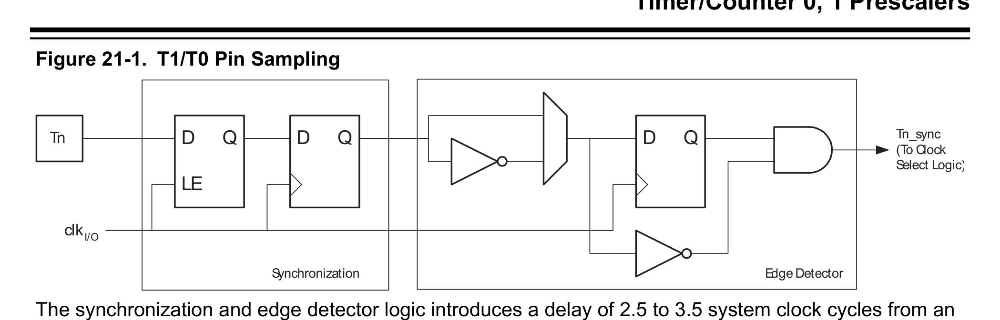
*Description*: IC pinout diagram specifying physical pin assignments, I/O port pin multiplexing, supply lines (VCC/GND), and crystal connections for Figure 21-1: T1/T0 Pin Sampling.

> **Figure 21-1: T1/T0 Pin Sampling**

Tn_sync
(To Clock
Select Logic)
Edge Detector
Synchronization
D
Q
D
Q
LE
D
Q
Tn
clkI/O
The synchronization and edge detector logic introduces a delay of 2.5 to 3.5 system clock cycles from an
edge has been applied to the T1/T0 pin to the counter is updated.
Enabling and disabling of the clock input must be done when T1/T0 has been stable for at least one
system clock cycle, otherwise it is a risk that a false timer/counter clock pulse is generated.
Each half period of the external clock applied must be longer than one system clock cycle to ensure
correct sampling. The external clock must be guaranteed to have less than half the system clock
frequency (fTn < fclk_I/O/2) given a 50% duty cycle. Since the edge detector uses sampling, the maximum
frequency of an external clock it can detect is half the sampling frequency (Nyquist sampling theorem).
However, due to variation of the system clock frequency and duty cycle caused by the tolerances of the
oscillator source (crystal, resonator, and capacitors), it is recommended that maximum frequency of an
external clock source is less than fclk_I/O/2.5.
An external clock source cannot be prescaled.

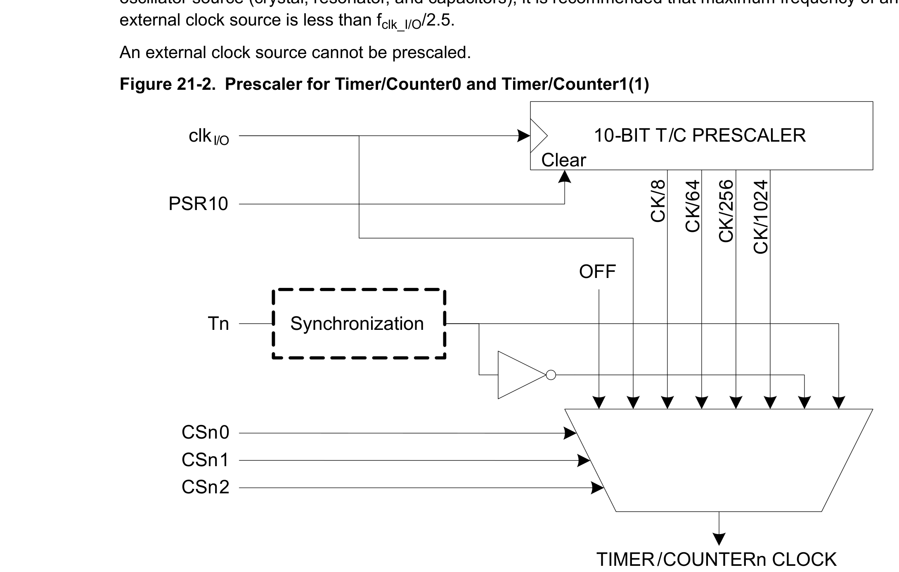
*Description*: Timer/Counter block diagram and waveform timing diagram illustrating prescaler clocks, compare match units, and PWM generation logic for Figure 21-2: Prescaler for Timer/Counter0 and Timer/Counter1(1).

> **Figure 21-2: Prescaler for Timer/Counter0 and Timer/Counter1(1)**

CSn0
CSn1
CSn2
Synchronization
10-BIT T/C PRESCALER
Tn
clkI/O
PSR10
Clear
CK/8
CK/256
CK/64
CK/1024
OFF
TIMER/COUNTERn CLOCK
SOURCE clk Tn
Note:  1. The synchronization logic on the input pins (T1/T0) is shown in the block diagram above.
ATmega328/P
Timer/Counter 0, 1 Prescalers
© 2018 Microchip Technology Inc.
Datasheet Complete
DS40001984A-page 187
Downloaded from Arrow.com.
Downloaded from Arrow.com.
Downloaded from Arrow.com.
Downloaded from Arrow.com.
Downloaded from Arrow.com.
Downloaded from Arrow.com.
Downloaded from Arrow.com.
Downloaded from Arrow.com.
Downloaded from Arrow.com.
Downloaded from Arrow.com.
Downloaded from Arrow.com.
Downloaded from Arrow.com.
Downloaded from Arrow.com.
Downloaded from Arrow.com.
Downloaded from Arrow.com.
Downloaded from Arrow.com.
Downloaded from Arrow.com.
Downloaded from Arrow.com.
Downloaded from Arrow.com.
Downloaded from Arrow.com.
Downloaded from Arrow.com.
Downloaded from Arrow.com.
Downloaded from Arrow.com.
Downloaded from Arrow.com.
Downloaded from Arrow.com.
Downloaded from Arrow.com.
Downloaded from Arrow.com.
Downloaded from Arrow.com.
Downloaded from Arrow.com.
Downloaded from Arrow.com.
Downloaded from Arrow.com.
Downloaded from Arrow.com.
Downloaded from Arrow.com.
Downloaded from Arrow.com.
Downloaded from Arrow.com.
Downloaded from Arrow.com.
Downloaded from Arrow.com.
Downloaded from Arrow.com.
Downloaded from Arrow.com.
Downloaded from Arrow.com.
Downloaded from Arrow.com.
Downloaded from Arrow.com.
Downloaded from Arrow.com.
Downloaded from Arrow.com.
Downloaded from Arrow.com.
Downloaded from Arrow.com.
Downloaded from Arrow.com.
Downloaded from Arrow.com.
Downloaded from Arrow.com.
Downloaded from Arrow.com.
Downloaded from Arrow.com.
Downloaded from Arrow.com.
Downloaded from Arrow.com.
Downloaded from Arrow.com.
Downloaded from Arrow.com.
Downloaded from Arrow.com.
Downloaded from Arrow.com.
Downloaded from Arrow.com.
Downloaded from Arrow.com.
Downloaded from Arrow.com.
Downloaded from Arrow.com.
Downloaded from Arrow.com.
Downloaded from Arrow.com.
Downloaded from Arrow.com.
Downloaded from Arrow.com.
Downloaded from Arrow.com.
Downloaded from Arrow.com.
Downloaded from Arrow.com.
Downloaded from Arrow.com.
Downloaded from Arrow.com.
Downloaded from Arrow.com.
Downloaded from Arrow.com.
Downloaded from Arrow.com.
Downloaded from Arrow.com.
Downloaded from Arrow.com.
Downloaded from Arrow.com.
Downloaded from Arrow.com.
Downloaded from Arrow.com.
Downloaded from Arrow.com.
Downloaded from Arrow.com.
Downloaded from Arrow.com.
Downloaded from Arrow.com.
Downloaded from Arrow.com.
Downloaded from Arrow.com.
Downloaded from Arrow.com.
Downloaded from Arrow.com.
Downloaded from Arrow.com.
Downloaded from Arrow.com.
Downloaded from Arrow.com.
Downloaded from Arrow.com.
Downloaded from Arrow.com.
Downloaded from Arrow.com.
Downloaded from Arrow.com.
Downloaded from Arrow.com.
Downloaded from Arrow.com.
Downloaded from Arrow.com.
Downloaded from Arrow.com.
Downloaded from Arrow.com.
Downloaded from Arrow.com.
Downloaded from Arrow.com.
Downloaded from Arrow.com.
Downloaded from Arrow.com.
Downloaded from Arrow.com.
Downloaded from Arrow.com.
Downloaded from Arrow.com.
Downloaded from Arrow.com.
Downloaded from Arrow.com.
Downloaded from Arrow.com.
Downloaded from Arrow.com.
Downloaded from Arrow.com.
Downloaded from Arrow.com.
Downloaded from Arrow.com.
Downloaded from Arrow.com.
Downloaded from Arrow.com.
Downloaded from Arrow.com.
Downloaded from Arrow.com.
Downloaded from Arrow.com.
Downloaded from Arrow.com.
Downloaded from Arrow.com.
Downloaded from Arrow.com.
Downloaded from Arrow.com.
Downloaded from Arrow.com.
Downloaded from Arrow.com.
Downloaded from Arrow.com.
Downloaded from Arrow.com.
Downloaded from Arrow.com.
Downloaded from Arrow.com.
Downloaded from Arrow.com.
Downloaded from Arrow.com.
Downloaded from Arrow.com.
Downloaded from Arrow.com.
Downloaded from Arrow.com.
Downloaded from Arrow.com.
Downloaded from Arrow.com.
Downloaded from Arrow.com.
Downloaded from Arrow.com.
Downloaded from Arrow.com.
Downloaded from Arrow.com.
Downloaded from Arrow.com.
Downloaded from Arrow.com.
Downloaded from Arrow.com.
Downloaded from Arrow.com.
Downloaded from Arrow.com.
Downloaded from Arrow.com.
Downloaded from Arrow.com.
Downloaded from Arrow.com.
Downloaded from Arrow.com.
Downloaded from Arrow.com.
Downloaded from Arrow.com.
Downloaded from Arrow.com.
Downloaded from Arrow.com.
Downloaded from Arrow.com.
Downloaded from Arrow.com.
Downloaded from Arrow.com.
Downloaded from Arrow.com.
Downloaded from Arrow.com.
Downloaded from Arrow.com.
Downloaded from Arrow.com.
Downloaded from Arrow.com.
Downloaded from Arrow.com.
Downloaded from Arrow.com.
Downloaded from Arrow.com.
Downloaded from Arrow.com.
Downloaded from Arrow.com.
Downloaded from Arrow.com.
Downloaded from Arrow.com.
Downloaded from Arrow.com.
Downloaded from Arrow.com.
Downloaded from Arrow.com.
Downloaded from Arrow.com.
Downloaded from Arrow.com.
Downloaded from Arrow.com.
Downloaded from Arrow.com.
Downloaded from Arrow.com.
Downloaded from Arrow.com.
Downloaded from Arrow.com.
Downloaded from Arrow.com.
Downloaded from Arrow.com.
Downloaded from Arrow.com.
Downloaded from Arrow.com.
Downloaded from Arrow.com.
Downloaded from Arrow.com.
Downloaded from Arrow.com.
Downloaded from Arrow.com.
Downloaded from Arrow.com.
Downloaded from Arrow.com.
Downloaded from Arrow.com.


<!-- Page 188 -->
### [PDF Page 188]

21.4

### Register Description

ATmega328/P
Timer/Counter 0, 1 Prescalers
© 2018 Microchip Technology Inc.
Datasheet Complete
DS40001984A-page 188
Downloaded from Arrow.com.
Downloaded from Arrow.com.
Downloaded from Arrow.com.
Downloaded from Arrow.com.
Downloaded from Arrow.com.
Downloaded from Arrow.com.
Downloaded from Arrow.com.
Downloaded from Arrow.com.
Downloaded from Arrow.com.
Downloaded from Arrow.com.
Downloaded from Arrow.com.
Downloaded from Arrow.com.
Downloaded from Arrow.com.
Downloaded from Arrow.com.
Downloaded from Arrow.com.
Downloaded from Arrow.com.
Downloaded from Arrow.com.
Downloaded from Arrow.com.
Downloaded from Arrow.com.
Downloaded from Arrow.com.
Downloaded from Arrow.com.
Downloaded from Arrow.com.
Downloaded from Arrow.com.
Downloaded from Arrow.com.
Downloaded from Arrow.com.
Downloaded from Arrow.com.
Downloaded from Arrow.com.
Downloaded from Arrow.com.
Downloaded from Arrow.com.
Downloaded from Arrow.com.
Downloaded from Arrow.com.
Downloaded from Arrow.com.
Downloaded from Arrow.com.
Downloaded from Arrow.com.
Downloaded from Arrow.com.
Downloaded from Arrow.com.
Downloaded from Arrow.com.
Downloaded from Arrow.com.
Downloaded from Arrow.com.
Downloaded from Arrow.com.
Downloaded from Arrow.com.
Downloaded from Arrow.com.
Downloaded from Arrow.com.
Downloaded from Arrow.com.
Downloaded from Arrow.com.
Downloaded from Arrow.com.
Downloaded from Arrow.com.
Downloaded from Arrow.com.
Downloaded from Arrow.com.
Downloaded from Arrow.com.
Downloaded from Arrow.com.
Downloaded from Arrow.com.
Downloaded from Arrow.com.
Downloaded from Arrow.com.
Downloaded from Arrow.com.
Downloaded from Arrow.com.
Downloaded from Arrow.com.
Downloaded from Arrow.com.
Downloaded from Arrow.com.
Downloaded from Arrow.com.
Downloaded from Arrow.com.
Downloaded from Arrow.com.
Downloaded from Arrow.com.
Downloaded from Arrow.com.
Downloaded from Arrow.com.
Downloaded from Arrow.com.
Downloaded from Arrow.com.
Downloaded from Arrow.com.
Downloaded from Arrow.com.
Downloaded from Arrow.com.
Downloaded from Arrow.com.
Downloaded from Arrow.com.
Downloaded from Arrow.com.
Downloaded from Arrow.com.
Downloaded from Arrow.com.
Downloaded from Arrow.com.
Downloaded from Arrow.com.
Downloaded from Arrow.com.
Downloaded from Arrow.com.
Downloaded from Arrow.com.
Downloaded from Arrow.com.
Downloaded from Arrow.com.
Downloaded from Arrow.com.
Downloaded from Arrow.com.
Downloaded from Arrow.com.
Downloaded from Arrow.com.
Downloaded from Arrow.com.
Downloaded from Arrow.com.
Downloaded from Arrow.com.
Downloaded from Arrow.com.
Downloaded from Arrow.com.
Downloaded from Arrow.com.
Downloaded from Arrow.com.
Downloaded from Arrow.com.
Downloaded from Arrow.com.
Downloaded from Arrow.com.
Downloaded from Arrow.com.
Downloaded from Arrow.com.
Downloaded from Arrow.com.
Downloaded from Arrow.com.
Downloaded from Arrow.com.
Downloaded from Arrow.com.
Downloaded from Arrow.com.
Downloaded from Arrow.com.
Downloaded from Arrow.com.
Downloaded from Arrow.com.
Downloaded from Arrow.com.
Downloaded from Arrow.com.
Downloaded from Arrow.com.
Downloaded from Arrow.com.
Downloaded from Arrow.com.
Downloaded from Arrow.com.
Downloaded from Arrow.com.
Downloaded from Arrow.com.
Downloaded from Arrow.com.
Downloaded from Arrow.com.
Downloaded from Arrow.com.
Downloaded from Arrow.com.
Downloaded from Arrow.com.
Downloaded from Arrow.com.
Downloaded from Arrow.com.
Downloaded from Arrow.com.
Downloaded from Arrow.com.
Downloaded from Arrow.com.
Downloaded from Arrow.com.
Downloaded from Arrow.com.
Downloaded from Arrow.com.
Downloaded from Arrow.com.
Downloaded from Arrow.com.
Downloaded from Arrow.com.
Downloaded from Arrow.com.
Downloaded from Arrow.com.
Downloaded from Arrow.com.
Downloaded from Arrow.com.
Downloaded from Arrow.com.
Downloaded from Arrow.com.
Downloaded from Arrow.com.
Downloaded from Arrow.com.
Downloaded from Arrow.com.
Downloaded from Arrow.com.
Downloaded from Arrow.com.
Downloaded from Arrow.com.
Downloaded from Arrow.com.
Downloaded from Arrow.com.
Downloaded from Arrow.com.
Downloaded from Arrow.com.
Downloaded from Arrow.com.
Downloaded from Arrow.com.
Downloaded from Arrow.com.
Downloaded from Arrow.com.
Downloaded from Arrow.com.
Downloaded from Arrow.com.
Downloaded from Arrow.com.
Downloaded from Arrow.com.
Downloaded from Arrow.com.
Downloaded from Arrow.com.
Downloaded from Arrow.com.
Downloaded from Arrow.com.
Downloaded from Arrow.com.
Downloaded from Arrow.com.
Downloaded from Arrow.com.
Downloaded from Arrow.com.
Downloaded from Arrow.com.
Downloaded from Arrow.com.
Downloaded from Arrow.com.
Downloaded from Arrow.com.
Downloaded from Arrow.com.
Downloaded from Arrow.com.
Downloaded from Arrow.com.
Downloaded from Arrow.com.
Downloaded from Arrow.com.
Downloaded from Arrow.com.
Downloaded from Arrow.com.
Downloaded from Arrow.com.
Downloaded from Arrow.com.
Downloaded from Arrow.com.
Downloaded from Arrow.com.
Downloaded from Arrow.com.
Downloaded from Arrow.com.
Downloaded from Arrow.com.
Downloaded from Arrow.com.
Downloaded from Arrow.com.
Downloaded from Arrow.com.
Downloaded from Arrow.com.
Downloaded from Arrow.com.
Downloaded from Arrow.com.
Downloaded from Arrow.com.
Downloaded from Arrow.com.


<!-- Page 189 -->
### [PDF Page 189]

21.4.1
General Timer/Counter Control Register
Name:
GTCCR
Offset:
0x43
Reset:
0x00
Property:  When addressing as I/O register: address offset is 0x23
When addressing I/O registers as data space using LD and ST instructions, the provided offset must be
used. When using the I/O specific commands IN and OUT, the offset is reduced by 0x20, resulting in an
I/O address offset within 0x00 - 0x3F.
Bit
7
6
5
4
3
2
1
0
TSM
PSRASY
PSRSYNC
Access
R/W
R/W
R/W
Reset
0
0
0
Bit 7 – TSM Timer/Counter Synchronization Mode
Writing the TSM bit to one activates the Timer/Counter Synchronization mode. In this mode, the value
that is written to the PSRASY and PSRSYNC bits is kept, hence keeping the corresponding prescaler
Reset signals asserted. This ensures that the corresponding timer/counters are halted and can be
configured to the same value without the risk of one of them advancing during configuration. When the
TSM bit is written to zero, the PSRASY and PSRSYNC bits are cleared by hardware, and the timer/
counters start counting simultaneously.
Bit 1 – PSRASY Prescaler Reset Timer/Counter2
When this bit is one, the timer/counter2 prescaler will be reset. This bit is normally cleared immediately by
hardware. If the bit is written when timer/counter2 is operating in Asynchronous mode, the bit will remain
one until the prescaler has been Reset. The bit will not be cleared by hardware if the TSM bit is set.
Bit 0 – PSRSYNC Prescaler Reset
When this bit is one, timer/counter 0, 1 prescaler will be Reset. This bit is normally cleared immediately by
hardware, except if the TSM bit is set. Note that timer/counter 0, 1 share the same prescaler and a Reset
of this prescaler will affect the mentioned timers.
ATmega328/P
Timer/Counter 0, 1 Prescalers
© 2018 Microchip Technology Inc.
Datasheet Complete
DS40001984A-page 189
Downloaded from Arrow.com.
Downloaded from Arrow.com.
Downloaded from Arrow.com.
Downloaded from Arrow.com.
Downloaded from Arrow.com.
Downloaded from Arrow.com.
Downloaded from Arrow.com.
Downloaded from Arrow.com.
Downloaded from Arrow.com.
Downloaded from Arrow.com.
Downloaded from Arrow.com.
Downloaded from Arrow.com.
Downloaded from Arrow.com.
Downloaded from Arrow.com.
Downloaded from Arrow.com.
Downloaded from Arrow.com.
Downloaded from Arrow.com.
Downloaded from Arrow.com.
Downloaded from Arrow.com.
Downloaded from Arrow.com.
Downloaded from Arrow.com.
Downloaded from Arrow.com.
Downloaded from Arrow.com.
Downloaded from Arrow.com.
Downloaded from Arrow.com.
Downloaded from Arrow.com.
Downloaded from Arrow.com.
Downloaded from Arrow.com.
Downloaded from Arrow.com.
Downloaded from Arrow.com.
Downloaded from Arrow.com.
Downloaded from Arrow.com.
Downloaded from Arrow.com.
Downloaded from Arrow.com.
Downloaded from Arrow.com.
Downloaded from Arrow.com.
Downloaded from Arrow.com.
Downloaded from Arrow.com.
Downloaded from Arrow.com.
Downloaded from Arrow.com.
Downloaded from Arrow.com.
Downloaded from Arrow.com.
Downloaded from Arrow.com.
Downloaded from Arrow.com.
Downloaded from Arrow.com.
Downloaded from Arrow.com.
Downloaded from Arrow.com.
Downloaded from Arrow.com.
Downloaded from Arrow.com.
Downloaded from Arrow.com.
Downloaded from Arrow.com.
Downloaded from Arrow.com.
Downloaded from Arrow.com.
Downloaded from Arrow.com.
Downloaded from Arrow.com.
Downloaded from Arrow.com.
Downloaded from Arrow.com.
Downloaded from Arrow.com.
Downloaded from Arrow.com.
Downloaded from Arrow.com.
Downloaded from Arrow.com.
Downloaded from Arrow.com.
Downloaded from Arrow.com.
Downloaded from Arrow.com.
Downloaded from Arrow.com.
Downloaded from Arrow.com.
Downloaded from Arrow.com.
Downloaded from Arrow.com.
Downloaded from Arrow.com.
Downloaded from Arrow.com.
Downloaded from Arrow.com.
Downloaded from Arrow.com.
Downloaded from Arrow.com.
Downloaded from Arrow.com.
Downloaded from Arrow.com.
Downloaded from Arrow.com.
Downloaded from Arrow.com.
Downloaded from Arrow.com.
Downloaded from Arrow.com.
Downloaded from Arrow.com.
Downloaded from Arrow.com.
Downloaded from Arrow.com.
Downloaded from Arrow.com.
Downloaded from Arrow.com.
Downloaded from Arrow.com.
Downloaded from Arrow.com.
Downloaded from Arrow.com.
Downloaded from Arrow.com.
Downloaded from Arrow.com.
Downloaded from Arrow.com.
Downloaded from Arrow.com.
Downloaded from Arrow.com.
Downloaded from Arrow.com.
Downloaded from Arrow.com.
Downloaded from Arrow.com.
Downloaded from Arrow.com.
Downloaded from Arrow.com.
Downloaded from Arrow.com.
Downloaded from Arrow.com.
Downloaded from Arrow.com.
Downloaded from Arrow.com.
Downloaded from Arrow.com.
Downloaded from Arrow.com.
Downloaded from Arrow.com.
Downloaded from Arrow.com.
Downloaded from Arrow.com.
Downloaded from Arrow.com.
Downloaded from Arrow.com.
Downloaded from Arrow.com.
Downloaded from Arrow.com.
Downloaded from Arrow.com.
Downloaded from Arrow.com.
Downloaded from Arrow.com.
Downloaded from Arrow.com.
Downloaded from Arrow.com.
Downloaded from Arrow.com.
Downloaded from Arrow.com.
Downloaded from Arrow.com.
Downloaded from Arrow.com.
Downloaded from Arrow.com.
Downloaded from Arrow.com.
Downloaded from Arrow.com.
Downloaded from Arrow.com.
Downloaded from Arrow.com.
Downloaded from Arrow.com.
Downloaded from Arrow.com.
Downloaded from Arrow.com.
Downloaded from Arrow.com.
Downloaded from Arrow.com.
Downloaded from Arrow.com.
Downloaded from Arrow.com.
Downloaded from Arrow.com.
Downloaded from Arrow.com.
Downloaded from Arrow.com.
Downloaded from Arrow.com.
Downloaded from Arrow.com.
Downloaded from Arrow.com.
Downloaded from Arrow.com.
Downloaded from Arrow.com.
Downloaded from Arrow.com.
Downloaded from Arrow.com.
Downloaded from Arrow.com.
Downloaded from Arrow.com.
Downloaded from Arrow.com.
Downloaded from Arrow.com.
Downloaded from Arrow.com.
Downloaded from Arrow.com.
Downloaded from Arrow.com.
Downloaded from Arrow.com.
Downloaded from Arrow.com.
Downloaded from Arrow.com.
Downloaded from Arrow.com.
Downloaded from Arrow.com.
Downloaded from Arrow.com.
Downloaded from Arrow.com.
Downloaded from Arrow.com.
Downloaded from Arrow.com.
Downloaded from Arrow.com.
Downloaded from Arrow.com.
Downloaded from Arrow.com.
Downloaded from Arrow.com.
Downloaded from Arrow.com.
Downloaded from Arrow.com.
Downloaded from Arrow.com.
Downloaded from Arrow.com.
Downloaded from Arrow.com.
Downloaded from Arrow.com.
Downloaded from Arrow.com.
Downloaded from Arrow.com.
Downloaded from Arrow.com.
Downloaded from Arrow.com.
Downloaded from Arrow.com.
Downloaded from Arrow.com.
Downloaded from Arrow.com.
Downloaded from Arrow.com.
Downloaded from Arrow.com.
Downloaded from Arrow.com.
Downloaded from Arrow.com.
Downloaded from Arrow.com.
Downloaded from Arrow.com.
Downloaded from Arrow.com.
Downloaded from Arrow.com.
Downloaded from Arrow.com.
Downloaded from Arrow.com.
Downloaded from Arrow.com.
Downloaded from Arrow.com.
Downloaded from Arrow.com.
Downloaded from Arrow.com.
Downloaded from Arrow.com.


<!-- Page 190 -->
### [PDF Page 190]

22.
8-bit Timer/Counter2 (TC2) with PWM and Asynchronous Operation
22.1

### Features

•
Channel Counter
•
Clear Timer on Compare Match (Auto Reload)
•
Glitch-free, Phase Correct Pulse-Width Modulator (PWM)
•
Frequency Generator
•
10-bit Clock Prescaler
•
Overflow and Compare Match Interrupt Sources (TOV2, OCF2A, and OCF2B)
•
Allows Clocking from External 32 kHz Watch Crystal Independent of the I/O Clock
22.2

### Overview

Timer/Counter2 (TC2) is a general purpose, channel, 8-bit timer/counter module.
A simplified block diagram of the 8-bit timer/counter is shown below. CPU accessible I/O registers,
including I/O bits and I/O pins, are shown in bold. The device-specific I/O register and bit locations are
listed in the following register description. For the actual placement of I/O pins, refer to the pinout
diagram.
The TC2 is enabled when the PRTIM2 bit in the Power Reduction Register (PRR.PRTIM2) is written to
'1'.
ATmega328/P
8-bit Timer/Counter2 (TC2) with PWM and A...
© 2018 Microchip Technology Inc.
Datasheet Complete
DS40001984A-page 190
Downloaded from Arrow.com.
Downloaded from Arrow.com.
Downloaded from Arrow.com.
Downloaded from Arrow.com.
Downloaded from Arrow.com.
Downloaded from Arrow.com.
Downloaded from Arrow.com.
Downloaded from Arrow.com.
Downloaded from Arrow.com.
Downloaded from Arrow.com.
Downloaded from Arrow.com.
Downloaded from Arrow.com.
Downloaded from Arrow.com.
Downloaded from Arrow.com.
Downloaded from Arrow.com.
Downloaded from Arrow.com.
Downloaded from Arrow.com.
Downloaded from Arrow.com.
Downloaded from Arrow.com.
Downloaded from Arrow.com.
Downloaded from Arrow.com.
Downloaded from Arrow.com.
Downloaded from Arrow.com.
Downloaded from Arrow.com.
Downloaded from Arrow.com.
Downloaded from Arrow.com.
Downloaded from Arrow.com.
Downloaded from Arrow.com.
Downloaded from Arrow.com.
Downloaded from Arrow.com.
Downloaded from Arrow.com.
Downloaded from Arrow.com.
Downloaded from Arrow.com.
Downloaded from Arrow.com.
Downloaded from Arrow.com.
Downloaded from Arrow.com.
Downloaded from Arrow.com.
Downloaded from Arrow.com.
Downloaded from Arrow.com.
Downloaded from Arrow.com.
Downloaded from Arrow.com.
Downloaded from Arrow.com.
Downloaded from Arrow.com.
Downloaded from Arrow.com.
Downloaded from Arrow.com.
Downloaded from Arrow.com.
Downloaded from Arrow.com.
Downloaded from Arrow.com.
Downloaded from Arrow.com.
Downloaded from Arrow.com.
Downloaded from Arrow.com.
Downloaded from Arrow.com.
Downloaded from Arrow.com.
Downloaded from Arrow.com.
Downloaded from Arrow.com.
Downloaded from Arrow.com.
Downloaded from Arrow.com.
Downloaded from Arrow.com.
Downloaded from Arrow.com.
Downloaded from Arrow.com.
Downloaded from Arrow.com.
Downloaded from Arrow.com.
Downloaded from Arrow.com.
Downloaded from Arrow.com.
Downloaded from Arrow.com.
Downloaded from Arrow.com.
Downloaded from Arrow.com.
Downloaded from Arrow.com.
Downloaded from Arrow.com.
Downloaded from Arrow.com.
Downloaded from Arrow.com.
Downloaded from Arrow.com.
Downloaded from Arrow.com.
Downloaded from Arrow.com.
Downloaded from Arrow.com.
Downloaded from Arrow.com.
Downloaded from Arrow.com.
Downloaded from Arrow.com.
Downloaded from Arrow.com.
Downloaded from Arrow.com.
Downloaded from Arrow.com.
Downloaded from Arrow.com.
Downloaded from Arrow.com.
Downloaded from Arrow.com.
Downloaded from Arrow.com.
Downloaded from Arrow.com.
Downloaded from Arrow.com.
Downloaded from Arrow.com.
Downloaded from Arrow.com.
Downloaded from Arrow.com.
Downloaded from Arrow.com.
Downloaded from Arrow.com.
Downloaded from Arrow.com.
Downloaded from Arrow.com.
Downloaded from Arrow.com.
Downloaded from Arrow.com.
Downloaded from Arrow.com.
Downloaded from Arrow.com.
Downloaded from Arrow.com.
Downloaded from Arrow.com.
Downloaded from Arrow.com.
Downloaded from Arrow.com.
Downloaded from Arrow.com.
Downloaded from Arrow.com.
Downloaded from Arrow.com.
Downloaded from Arrow.com.
Downloaded from Arrow.com.
Downloaded from Arrow.com.
Downloaded from Arrow.com.
Downloaded from Arrow.com.
Downloaded from Arrow.com.
Downloaded from Arrow.com.
Downloaded from Arrow.com.
Downloaded from Arrow.com.
Downloaded from Arrow.com.
Downloaded from Arrow.com.
Downloaded from Arrow.com.
Downloaded from Arrow.com.
Downloaded from Arrow.com.
Downloaded from Arrow.com.
Downloaded from Arrow.com.
Downloaded from Arrow.com.
Downloaded from Arrow.com.
Downloaded from Arrow.com.
Downloaded from Arrow.com.
Downloaded from Arrow.com.
Downloaded from Arrow.com.
Downloaded from Arrow.com.
Downloaded from Arrow.com.
Downloaded from Arrow.com.
Downloaded from Arrow.com.
Downloaded from Arrow.com.
Downloaded from Arrow.com.
Downloaded from Arrow.com.
Downloaded from Arrow.com.
Downloaded from Arrow.com.
Downloaded from Arrow.com.
Downloaded from Arrow.com.
Downloaded from Arrow.com.
Downloaded from Arrow.com.
Downloaded from Arrow.com.
Downloaded from Arrow.com.
Downloaded from Arrow.com.
Downloaded from Arrow.com.
Downloaded from Arrow.com.
Downloaded from Arrow.com.
Downloaded from Arrow.com.
Downloaded from Arrow.com.
Downloaded from Arrow.com.
Downloaded from Arrow.com.
Downloaded from Arrow.com.
Downloaded from Arrow.com.
Downloaded from Arrow.com.
Downloaded from Arrow.com.
Downloaded from Arrow.com.
Downloaded from Arrow.com.
Downloaded from Arrow.com.
Downloaded from Arrow.com.
Downloaded from Arrow.com.
Downloaded from Arrow.com.
Downloaded from Arrow.com.
Downloaded from Arrow.com.
Downloaded from Arrow.com.
Downloaded from Arrow.com.
Downloaded from Arrow.com.
Downloaded from Arrow.com.
Downloaded from Arrow.com.
Downloaded from Arrow.com.
Downloaded from Arrow.com.
Downloaded from Arrow.com.
Downloaded from Arrow.com.
Downloaded from Arrow.com.
Downloaded from Arrow.com.
Downloaded from Arrow.com.
Downloaded from Arrow.com.
Downloaded from Arrow.com.
Downloaded from Arrow.com.
Downloaded from Arrow.com.
Downloaded from Arrow.com.
Downloaded from Arrow.com.
Downloaded from Arrow.com.
Downloaded from Arrow.com.
Downloaded from Arrow.com.
Downloaded from Arrow.com.
Downloaded from Arrow.com.
Downloaded from Arrow.com.
Downloaded from Arrow.com.
Downloaded from Arrow.com.
Downloaded from Arrow.com.
Downloaded from Arrow.com.


<!-- Page 191 -->
### [PDF Page 191]


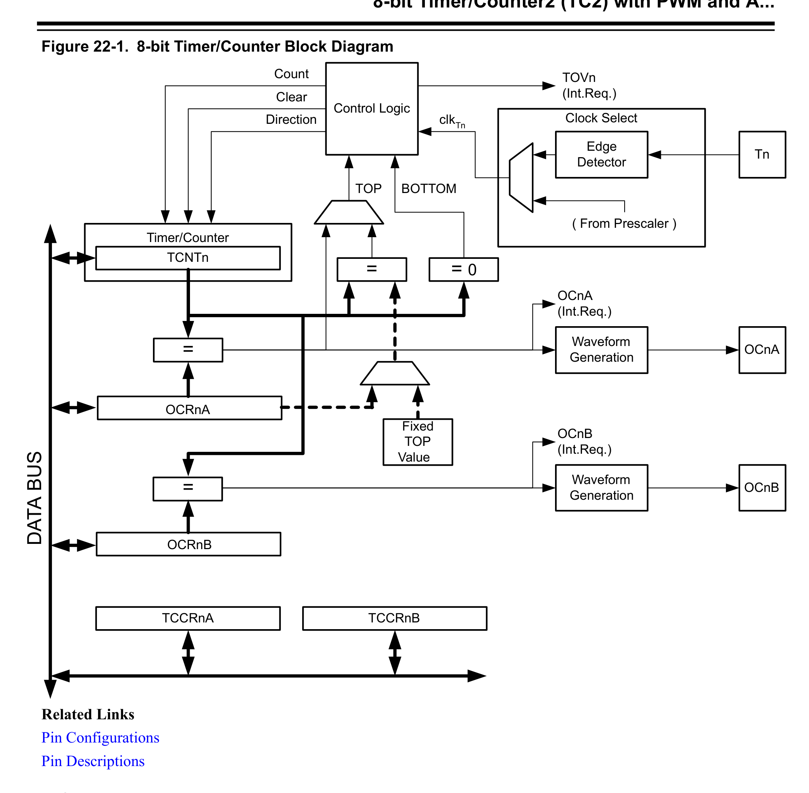
*Description*: System architecture block diagram depicting hardware modules, internal data buses, control logic, and peripheral interconnects for Figure 22-1: 8-bit Timer/Counter Block Diagram.

> **Figure 22-1: 8-bit Timer/Counter Block Diagram**

Clock Select
Timer/Counter
DATA BUS
OCRnA
OCRnB
=
=
TCNTn
Waveform
Generation
Waveform
Generation
OCnA
OCnB
=
Fixed
TOP
Value
Control Logic
= 0
TOP
BOTTOM
Count
Clear
Direction
TOVn
(Int.Req.)
OCnA
(Int.Req.)
OCnB
(Int.Req.)
TCCRnA
TCCRnB
Tn
Edge
Detector
( From Prescaler )
clkTn
Related Links
Pin Configurations
Pin Descriptions
22.2.1
Definitions
Many register and bit references in this section are written in general form:
•
n=2 represents the timer/counter number
•
x=A,B represents the output compare Unit A or B
However, when using the register or bit definitions in a program, the precise form must be used, i.e.,
TCNT2 for accessing timer/counter2 counter value.
The following definitions are used throughout the section:
ATmega328/P
8-bit Timer/Counter2 (TC2) with PWM and A...
© 2018 Microchip Technology Inc.
Datasheet Complete
DS40001984A-page 191
Downloaded from Arrow.com.
Downloaded from Arrow.com.
Downloaded from Arrow.com.
Downloaded from Arrow.com.
Downloaded from Arrow.com.
Downloaded from Arrow.com.
Downloaded from Arrow.com.
Downloaded from Arrow.com.
Downloaded from Arrow.com.
Downloaded from Arrow.com.
Downloaded from Arrow.com.
Downloaded from Arrow.com.
Downloaded from Arrow.com.
Downloaded from Arrow.com.
Downloaded from Arrow.com.
Downloaded from Arrow.com.
Downloaded from Arrow.com.
Downloaded from Arrow.com.
Downloaded from Arrow.com.
Downloaded from Arrow.com.
Downloaded from Arrow.com.
Downloaded from Arrow.com.
Downloaded from Arrow.com.
Downloaded from Arrow.com.
Downloaded from Arrow.com.
Downloaded from Arrow.com.
Downloaded from Arrow.com.
Downloaded from Arrow.com.
Downloaded from Arrow.com.
Downloaded from Arrow.com.
Downloaded from Arrow.com.
Downloaded from Arrow.com.
Downloaded from Arrow.com.
Downloaded from Arrow.com.
Downloaded from Arrow.com.
Downloaded from Arrow.com.
Downloaded from Arrow.com.
Downloaded from Arrow.com.
Downloaded from Arrow.com.
Downloaded from Arrow.com.
Downloaded from Arrow.com.
Downloaded from Arrow.com.
Downloaded from Arrow.com.
Downloaded from Arrow.com.
Downloaded from Arrow.com.
Downloaded from Arrow.com.
Downloaded from Arrow.com.
Downloaded from Arrow.com.
Downloaded from Arrow.com.
Downloaded from Arrow.com.
Downloaded from Arrow.com.
Downloaded from Arrow.com.
Downloaded from Arrow.com.
Downloaded from Arrow.com.
Downloaded from Arrow.com.
Downloaded from Arrow.com.
Downloaded from Arrow.com.
Downloaded from Arrow.com.
Downloaded from Arrow.com.
Downloaded from Arrow.com.
Downloaded from Arrow.com.
Downloaded from Arrow.com.
Downloaded from Arrow.com.
Downloaded from Arrow.com.
Downloaded from Arrow.com.
Downloaded from Arrow.com.
Downloaded from Arrow.com.
Downloaded from Arrow.com.
Downloaded from Arrow.com.
Downloaded from Arrow.com.
Downloaded from Arrow.com.
Downloaded from Arrow.com.
Downloaded from Arrow.com.
Downloaded from Arrow.com.
Downloaded from Arrow.com.
Downloaded from Arrow.com.
Downloaded from Arrow.com.
Downloaded from Arrow.com.
Downloaded from Arrow.com.
Downloaded from Arrow.com.
Downloaded from Arrow.com.
Downloaded from Arrow.com.
Downloaded from Arrow.com.
Downloaded from Arrow.com.
Downloaded from Arrow.com.
Downloaded from Arrow.com.
Downloaded from Arrow.com.
Downloaded from Arrow.com.
Downloaded from Arrow.com.
Downloaded from Arrow.com.
Downloaded from Arrow.com.
Downloaded from Arrow.com.
Downloaded from Arrow.com.
Downloaded from Arrow.com.
Downloaded from Arrow.com.
Downloaded from Arrow.com.
Downloaded from Arrow.com.
Downloaded from Arrow.com.
Downloaded from Arrow.com.
Downloaded from Arrow.com.
Downloaded from Arrow.com.
Downloaded from Arrow.com.
Downloaded from Arrow.com.
Downloaded from Arrow.com.
Downloaded from Arrow.com.
Downloaded from Arrow.com.
Downloaded from Arrow.com.
Downloaded from Arrow.com.
Downloaded from Arrow.com.
Downloaded from Arrow.com.
Downloaded from Arrow.com.
Downloaded from Arrow.com.
Downloaded from Arrow.com.
Downloaded from Arrow.com.
Downloaded from Arrow.com.
Downloaded from Arrow.com.
Downloaded from Arrow.com.
Downloaded from Arrow.com.
Downloaded from Arrow.com.
Downloaded from Arrow.com.
Downloaded from Arrow.com.
Downloaded from Arrow.com.
Downloaded from Arrow.com.
Downloaded from Arrow.com.
Downloaded from Arrow.com.
Downloaded from Arrow.com.
Downloaded from Arrow.com.
Downloaded from Arrow.com.
Downloaded from Arrow.com.
Downloaded from Arrow.com.
Downloaded from Arrow.com.
Downloaded from Arrow.com.
Downloaded from Arrow.com.
Downloaded from Arrow.com.
Downloaded from Arrow.com.
Downloaded from Arrow.com.
Downloaded from Arrow.com.
Downloaded from Arrow.com.
Downloaded from Arrow.com.
Downloaded from Arrow.com.
Downloaded from Arrow.com.
Downloaded from Arrow.com.
Downloaded from Arrow.com.
Downloaded from Arrow.com.
Downloaded from Arrow.com.
Downloaded from Arrow.com.
Downloaded from Arrow.com.
Downloaded from Arrow.com.
Downloaded from Arrow.com.
Downloaded from Arrow.com.
Downloaded from Arrow.com.
Downloaded from Arrow.com.
Downloaded from Arrow.com.
Downloaded from Arrow.com.
Downloaded from Arrow.com.
Downloaded from Arrow.com.
Downloaded from Arrow.com.
Downloaded from Arrow.com.
Downloaded from Arrow.com.
Downloaded from Arrow.com.
Downloaded from Arrow.com.
Downloaded from Arrow.com.
Downloaded from Arrow.com.
Downloaded from Arrow.com.
Downloaded from Arrow.com.
Downloaded from Arrow.com.
Downloaded from Arrow.com.
Downloaded from Arrow.com.
Downloaded from Arrow.com.
Downloaded from Arrow.com.
Downloaded from Arrow.com.
Downloaded from Arrow.com.
Downloaded from Arrow.com.
Downloaded from Arrow.com.
Downloaded from Arrow.com.
Downloaded from Arrow.com.
Downloaded from Arrow.com.
Downloaded from Arrow.com.
Downloaded from Arrow.com.
Downloaded from Arrow.com.
Downloaded from Arrow.com.
Downloaded from Arrow.com.
Downloaded from Arrow.com.
Downloaded from Arrow.com.
Downloaded from Arrow.com.
Downloaded from Arrow.com.
Downloaded from Arrow.com.
Downloaded from Arrow.com.
Downloaded from Arrow.com.
Downloaded from Arrow.com.
Downloaded from Arrow.com.


<!-- Page 192 -->
### [PDF Page 192]


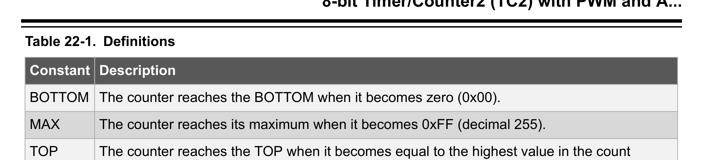
*Description*: Hardware reference table detailing register bit field settings, electrical operating limits, or memory configurations for Table 22-1: Definitions.

> **Table 22-1: Definitions**

Constant Description
BOTTOM The counter reaches the BOTTOM when it becomes zero (0x00).
MAX
The counter reaches its maximum when it becomes 0xFF (decimal 255).
TOP
The counter reaches the TOP when it becomes equal to the highest value in the count
sequence. The TOP value can be assigned to be the fixed value 0xFF (MAX) or the value
stored in the OCR2A Register. The assignment is dependent on the mode of operation.
22.2.2
Registers
The Timer/Counter (TCNT2) and Output Compare Register (OCR2A and OCR2B) are 8-bit registers.
Interrupt request (shorten as Int.Req.) signals are all visible in the Timer Interrupt Flag Register (TIFR2).
All interrupts are individually masked with the Timer Interrupt Mask register (TIMSK2). TIFR2 and
TIMSK2 are not shown in the figure.
The timer/counter can be clocked internally, via the prescaler, or asynchronously clocked from the
TOSC1/2 pins, as detailed later in this section. The asynchronous operation is controlled by the
Asynchronous Status Register (ASSR). The clock select logic block controls which clock source the timer/
counter uses to increment (or decrement) its value. The timer/counter is inactive when no clock source is
selected. The output from the clock select logic is referred to as the timer clock (clkT2).
The double buffered Output Compare Register (OCR2A and OCR2B) are compared with the timer/
counter value at all times. The result of the compare can be used by the waveform generator to generate
a PWM or variable frequency output on the Output Compare pins (OC2A and OC2B). See Output
Compare Unit for details. The compare match event will also set the Compare Flag (OCF2A or OCF2B),
which can be used to generate an output compare interrupt request.
22.3
Timer/Counter Clock Sources
The timer/counter can be clocked by an internal synchronous or an external asynchronous clock source:
The clock source clkT2 is by default equal/synchronous to the MCU clock, clkI/O.
When the Asynchronous TC2 bit in the Asynchronous Status Register (ASSR.AS2) is written to '1', the
clock source is taken from the Timer/Counter Oscillator connected to TOSC1 and TOSC2.
For details on asynchronous operation, see the description of the ASSR. For details on clock sources and
prescaler, see Timer/Counter Prescaler.
22.4
Counter Unit
The main part of the 8-bit timer/counter is the programmable bi-directional counter unit. Below is the block
diagram of the counter and its surroundings.
ATmega328/P
8-bit Timer/Counter2 (TC2) with PWM and A...
© 2018 Microchip Technology Inc.
Datasheet Complete
DS40001984A-page 192
Downloaded from Arrow.com.
Downloaded from Arrow.com.
Downloaded from Arrow.com.
Downloaded from Arrow.com.
Downloaded from Arrow.com.
Downloaded from Arrow.com.
Downloaded from Arrow.com.
Downloaded from Arrow.com.
Downloaded from Arrow.com.
Downloaded from Arrow.com.
Downloaded from Arrow.com.
Downloaded from Arrow.com.
Downloaded from Arrow.com.
Downloaded from Arrow.com.
Downloaded from Arrow.com.
Downloaded from Arrow.com.
Downloaded from Arrow.com.
Downloaded from Arrow.com.
Downloaded from Arrow.com.
Downloaded from Arrow.com.
Downloaded from Arrow.com.
Downloaded from Arrow.com.
Downloaded from Arrow.com.
Downloaded from Arrow.com.
Downloaded from Arrow.com.
Downloaded from Arrow.com.
Downloaded from Arrow.com.
Downloaded from Arrow.com.
Downloaded from Arrow.com.
Downloaded from Arrow.com.
Downloaded from Arrow.com.
Downloaded from Arrow.com.
Downloaded from Arrow.com.
Downloaded from Arrow.com.
Downloaded from Arrow.com.
Downloaded from Arrow.com.
Downloaded from Arrow.com.
Downloaded from Arrow.com.
Downloaded from Arrow.com.
Downloaded from Arrow.com.
Downloaded from Arrow.com.
Downloaded from Arrow.com.
Downloaded from Arrow.com.
Downloaded from Arrow.com.
Downloaded from Arrow.com.
Downloaded from Arrow.com.
Downloaded from Arrow.com.
Downloaded from Arrow.com.
Downloaded from Arrow.com.
Downloaded from Arrow.com.
Downloaded from Arrow.com.
Downloaded from Arrow.com.
Downloaded from Arrow.com.
Downloaded from Arrow.com.
Downloaded from Arrow.com.
Downloaded from Arrow.com.
Downloaded from Arrow.com.
Downloaded from Arrow.com.
Downloaded from Arrow.com.
Downloaded from Arrow.com.
Downloaded from Arrow.com.
Downloaded from Arrow.com.
Downloaded from Arrow.com.
Downloaded from Arrow.com.
Downloaded from Arrow.com.
Downloaded from Arrow.com.
Downloaded from Arrow.com.
Downloaded from Arrow.com.
Downloaded from Arrow.com.
Downloaded from Arrow.com.
Downloaded from Arrow.com.
Downloaded from Arrow.com.
Downloaded from Arrow.com.
Downloaded from Arrow.com.
Downloaded from Arrow.com.
Downloaded from Arrow.com.
Downloaded from Arrow.com.
Downloaded from Arrow.com.
Downloaded from Arrow.com.
Downloaded from Arrow.com.
Downloaded from Arrow.com.
Downloaded from Arrow.com.
Downloaded from Arrow.com.
Downloaded from Arrow.com.
Downloaded from Arrow.com.
Downloaded from Arrow.com.
Downloaded from Arrow.com.
Downloaded from Arrow.com.
Downloaded from Arrow.com.
Downloaded from Arrow.com.
Downloaded from Arrow.com.
Downloaded from Arrow.com.
Downloaded from Arrow.com.
Downloaded from Arrow.com.
Downloaded from Arrow.com.
Downloaded from Arrow.com.
Downloaded from Arrow.com.
Downloaded from Arrow.com.
Downloaded from Arrow.com.
Downloaded from Arrow.com.
Downloaded from Arrow.com.
Downloaded from Arrow.com.
Downloaded from Arrow.com.
Downloaded from Arrow.com.
Downloaded from Arrow.com.
Downloaded from Arrow.com.
Downloaded from Arrow.com.
Downloaded from Arrow.com.
Downloaded from Arrow.com.
Downloaded from Arrow.com.
Downloaded from Arrow.com.
Downloaded from Arrow.com.
Downloaded from Arrow.com.
Downloaded from Arrow.com.
Downloaded from Arrow.com.
Downloaded from Arrow.com.
Downloaded from Arrow.com.
Downloaded from Arrow.com.
Downloaded from Arrow.com.
Downloaded from Arrow.com.
Downloaded from Arrow.com.
Downloaded from Arrow.com.
Downloaded from Arrow.com.
Downloaded from Arrow.com.
Downloaded from Arrow.com.
Downloaded from Arrow.com.
Downloaded from Arrow.com.
Downloaded from Arrow.com.
Downloaded from Arrow.com.
Downloaded from Arrow.com.
Downloaded from Arrow.com.
Downloaded from Arrow.com.
Downloaded from Arrow.com.
Downloaded from Arrow.com.
Downloaded from Arrow.com.
Downloaded from Arrow.com.
Downloaded from Arrow.com.
Downloaded from Arrow.com.
Downloaded from Arrow.com.
Downloaded from Arrow.com.
Downloaded from Arrow.com.
Downloaded from Arrow.com.
Downloaded from Arrow.com.
Downloaded from Arrow.com.
Downloaded from Arrow.com.
Downloaded from Arrow.com.
Downloaded from Arrow.com.
Downloaded from Arrow.com.
Downloaded from Arrow.com.
Downloaded from Arrow.com.
Downloaded from Arrow.com.
Downloaded from Arrow.com.
Downloaded from Arrow.com.
Downloaded from Arrow.com.
Downloaded from Arrow.com.
Downloaded from Arrow.com.
Downloaded from Arrow.com.
Downloaded from Arrow.com.
Downloaded from Arrow.com.
Downloaded from Arrow.com.
Downloaded from Arrow.com.
Downloaded from Arrow.com.
Downloaded from Arrow.com.
Downloaded from Arrow.com.
Downloaded from Arrow.com.
Downloaded from Arrow.com.
Downloaded from Arrow.com.
Downloaded from Arrow.com.
Downloaded from Arrow.com.
Downloaded from Arrow.com.
Downloaded from Arrow.com.
Downloaded from Arrow.com.
Downloaded from Arrow.com.
Downloaded from Arrow.com.
Downloaded from Arrow.com.
Downloaded from Arrow.com.
Downloaded from Arrow.com.
Downloaded from Arrow.com.
Downloaded from Arrow.com.
Downloaded from Arrow.com.
Downloaded from Arrow.com.
Downloaded from Arrow.com.
Downloaded from Arrow.com.
Downloaded from Arrow.com.
Downloaded from Arrow.com.
Downloaded from Arrow.com.
Downloaded from Arrow.com.
Downloaded from Arrow.com.
Downloaded from Arrow.com.
Downloaded from Arrow.com.
Downloaded from Arrow.com.
Downloaded from Arrow.com.


<!-- Page 193 -->
### [PDF Page 193]


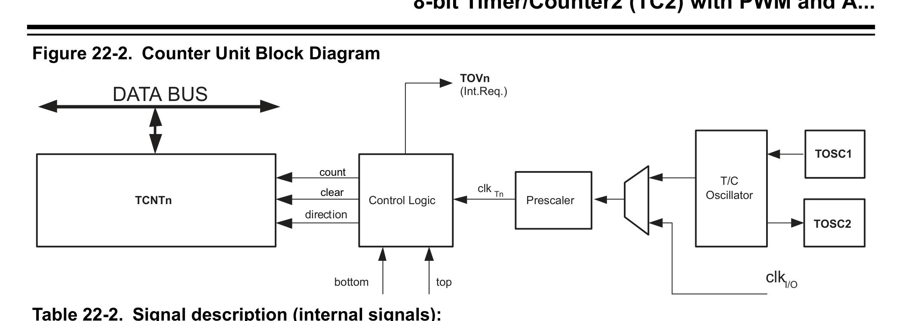
*Description*: System architecture block diagram depicting hardware modules, internal data buses, control logic, and peripheral interconnects for Figure 22-2: Counter Unit Block Diagram.

> **Figure 22-2: Counter Unit Block Diagram**

DATA BUS
TCNTn
Control Logic
TOVn
(Int.Req.)
top
bottom
direction
TOSC1
T/C
Oscillator
TOSC2
Prescaler
clkI/O
clk Tn
clear
count

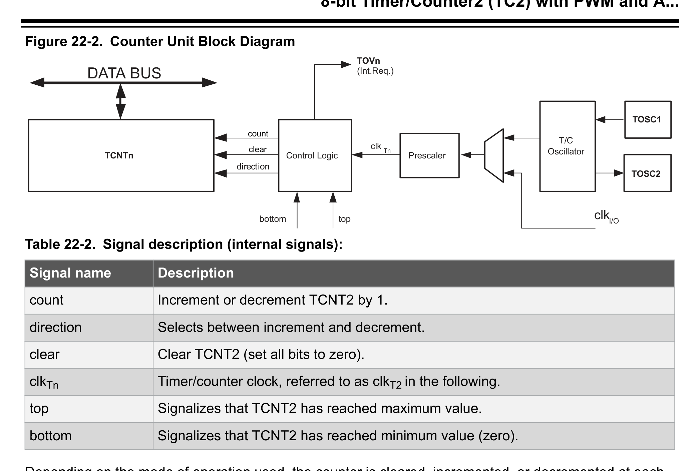
*Description*: Hardware reference table detailing register bit field settings, electrical operating limits, or memory configurations for Table 22-2: Signal description (internal signals):.

> **Table 22-2: Signal description (internal signals):**

Signal name
Description
count
Increment or decrement TCNT2 by 1.
direction
Selects between increment and decrement.
clear
Clear TCNT2 (set all bits to zero).
clkTn
Timer/counter clock, referred to as clkT2 in the following.
top
Signalizes that TCNT2 has reached maximum value.
bottom
Signalizes that TCNT2 has reached minimum value (zero).
Depending on the mode of operation used, the counter is cleared, incremented, or decremented at each
timer clock (clkT2). clkT2 can be generated from an external or internal clock source, selected by the Clock
Select bits (CS2[2:0]). When no clock source is selected (CS2[2:0]=0x0) the timer is stopped. However,
the TCNT2 value can be accessed by the CPU, regardless of whether clkT2 is present or not. A CPU write
overrides (has priority over) all counter clear or count operations.
The counting sequence is determined by the setting of the WGM21 and WGM20 bits located in the Timer/
Counter Control Register (TCCR2A) and the WGM22 bit located in the Timer/Counter Control Register B
(TCCR2B). There are close connections between how the counter behaves (counts) and how waveforms
are generated on the Output Compare outputs OC2A and OC2B. For more details about advanced
counting sequences and waveform generation, see Modes of Operation.
The Timer/Counter Overflow Flag (TOV2) is set according to the mode of operation selected by the
TCC2B.WGM2[2:0] bits. TOV2 can be used for generating a CPU interrupt.
22.5
Output Compare Unit
The 8-bit comparator continuously compares TCNT2 with the Output Compare Register (OCR2A and
OCR2B). Whenever TCNT2 equals OCR2A or OCR2B, the comparator signals a match. A match will set
the Output Compare Flag (OCF2A or OCF2B) at the next timer clock cycle. If the corresponding interrupt
is enabled, the output compare flag generates an output compare interrupt. The output compare flag is
automatically cleared when the interrupt is executed. Alternatively, the output compare flag can be
cleared by software by writing a logical one to its I/O bit location. The waveform generator uses the match
signal to generate an output according to operating mode set by the WGM2[2:0] bits and Compare
Output mode (COM2x[1:0]) bits. The max and bottom signals are used by the waveform generator for
handling the special cases of the extreme values in some modes of operation (See Modes of Operation).
ATmega328/P
8-bit Timer/Counter2 (TC2) with PWM and A...
© 2018 Microchip Technology Inc.
Datasheet Complete
DS40001984A-page 193
Downloaded from Arrow.com.
Downloaded from Arrow.com.
Downloaded from Arrow.com.
Downloaded from Arrow.com.
Downloaded from Arrow.com.
Downloaded from Arrow.com.
Downloaded from Arrow.com.
Downloaded from Arrow.com.
Downloaded from Arrow.com.
Downloaded from Arrow.com.
Downloaded from Arrow.com.
Downloaded from Arrow.com.
Downloaded from Arrow.com.
Downloaded from Arrow.com.
Downloaded from Arrow.com.
Downloaded from Arrow.com.
Downloaded from Arrow.com.
Downloaded from Arrow.com.
Downloaded from Arrow.com.
Downloaded from Arrow.com.
Downloaded from Arrow.com.
Downloaded from Arrow.com.
Downloaded from Arrow.com.
Downloaded from Arrow.com.
Downloaded from Arrow.com.
Downloaded from Arrow.com.
Downloaded from Arrow.com.
Downloaded from Arrow.com.
Downloaded from Arrow.com.
Downloaded from Arrow.com.
Downloaded from Arrow.com.
Downloaded from Arrow.com.
Downloaded from Arrow.com.
Downloaded from Arrow.com.
Downloaded from Arrow.com.
Downloaded from Arrow.com.
Downloaded from Arrow.com.
Downloaded from Arrow.com.
Downloaded from Arrow.com.
Downloaded from Arrow.com.
Downloaded from Arrow.com.
Downloaded from Arrow.com.
Downloaded from Arrow.com.
Downloaded from Arrow.com.
Downloaded from Arrow.com.
Downloaded from Arrow.com.
Downloaded from Arrow.com.
Downloaded from Arrow.com.
Downloaded from Arrow.com.
Downloaded from Arrow.com.
Downloaded from Arrow.com.
Downloaded from Arrow.com.
Downloaded from Arrow.com.
Downloaded from Arrow.com.
Downloaded from Arrow.com.
Downloaded from Arrow.com.
Downloaded from Arrow.com.
Downloaded from Arrow.com.
Downloaded from Arrow.com.
Downloaded from Arrow.com.
Downloaded from Arrow.com.
Downloaded from Arrow.com.
Downloaded from Arrow.com.
Downloaded from Arrow.com.
Downloaded from Arrow.com.
Downloaded from Arrow.com.
Downloaded from Arrow.com.
Downloaded from Arrow.com.
Downloaded from Arrow.com.
Downloaded from Arrow.com.
Downloaded from Arrow.com.
Downloaded from Arrow.com.
Downloaded from Arrow.com.
Downloaded from Arrow.com.
Downloaded from Arrow.com.
Downloaded from Arrow.com.
Downloaded from Arrow.com.
Downloaded from Arrow.com.
Downloaded from Arrow.com.
Downloaded from Arrow.com.
Downloaded from Arrow.com.
Downloaded from Arrow.com.
Downloaded from Arrow.com.
Downloaded from Arrow.com.
Downloaded from Arrow.com.
Downloaded from Arrow.com.
Downloaded from Arrow.com.
Downloaded from Arrow.com.
Downloaded from Arrow.com.
Downloaded from Arrow.com.
Downloaded from Arrow.com.
Downloaded from Arrow.com.
Downloaded from Arrow.com.
Downloaded from Arrow.com.
Downloaded from Arrow.com.
Downloaded from Arrow.com.
Downloaded from Arrow.com.
Downloaded from Arrow.com.
Downloaded from Arrow.com.
Downloaded from Arrow.com.
Downloaded from Arrow.com.
Downloaded from Arrow.com.
Downloaded from Arrow.com.
Downloaded from Arrow.com.
Downloaded from Arrow.com.
Downloaded from Arrow.com.
Downloaded from Arrow.com.
Downloaded from Arrow.com.
Downloaded from Arrow.com.
Downloaded from Arrow.com.
Downloaded from Arrow.com.
Downloaded from Arrow.com.
Downloaded from Arrow.com.
Downloaded from Arrow.com.
Downloaded from Arrow.com.
Downloaded from Arrow.com.
Downloaded from Arrow.com.
Downloaded from Arrow.com.
Downloaded from Arrow.com.
Downloaded from Arrow.com.
Downloaded from Arrow.com.
Downloaded from Arrow.com.
Downloaded from Arrow.com.
Downloaded from Arrow.com.
Downloaded from Arrow.com.
Downloaded from Arrow.com.
Downloaded from Arrow.com.
Downloaded from Arrow.com.
Downloaded from Arrow.com.
Downloaded from Arrow.com.
Downloaded from Arrow.com.
Downloaded from Arrow.com.
Downloaded from Arrow.com.
Downloaded from Arrow.com.
Downloaded from Arrow.com.
Downloaded from Arrow.com.
Downloaded from Arrow.com.
Downloaded from Arrow.com.
Downloaded from Arrow.com.
Downloaded from Arrow.com.
Downloaded from Arrow.com.
Downloaded from Arrow.com.
Downloaded from Arrow.com.
Downloaded from Arrow.com.
Downloaded from Arrow.com.
Downloaded from Arrow.com.
Downloaded from Arrow.com.
Downloaded from Arrow.com.
Downloaded from Arrow.com.
Downloaded from Arrow.com.
Downloaded from Arrow.com.
Downloaded from Arrow.com.
Downloaded from Arrow.com.
Downloaded from Arrow.com.
Downloaded from Arrow.com.
Downloaded from Arrow.com.
Downloaded from Arrow.com.
Downloaded from Arrow.com.
Downloaded from Arrow.com.
Downloaded from Arrow.com.
Downloaded from Arrow.com.
Downloaded from Arrow.com.
Downloaded from Arrow.com.
Downloaded from Arrow.com.
Downloaded from Arrow.com.
Downloaded from Arrow.com.
Downloaded from Arrow.com.
Downloaded from Arrow.com.
Downloaded from Arrow.com.
Downloaded from Arrow.com.
Downloaded from Arrow.com.
Downloaded from Arrow.com.
Downloaded from Arrow.com.
Downloaded from Arrow.com.
Downloaded from Arrow.com.
Downloaded from Arrow.com.
Downloaded from Arrow.com.
Downloaded from Arrow.com.
Downloaded from Arrow.com.
Downloaded from Arrow.com.
Downloaded from Arrow.com.
Downloaded from Arrow.com.
Downloaded from Arrow.com.
Downloaded from Arrow.com.
Downloaded from Arrow.com.
Downloaded from Arrow.com.
Downloaded from Arrow.com.
Downloaded from Arrow.com.
Downloaded from Arrow.com.
Downloaded from Arrow.com.
Downloaded from Arrow.com.
Downloaded from Arrow.com.
Downloaded from Arrow.com.


<!-- Page 194 -->
### [PDF Page 194]

The following figure shows a block diagram of the output compare unit.

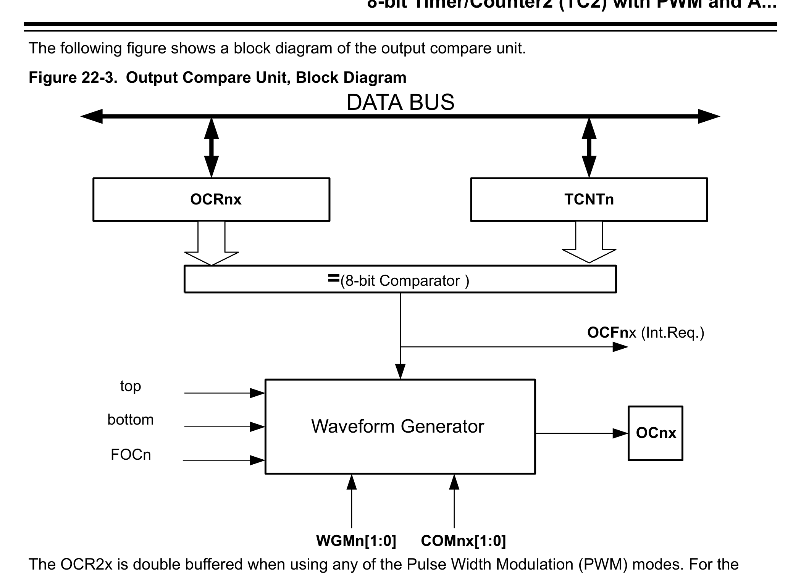
*Description*: System architecture block diagram depicting hardware modules, internal data buses, control logic, and peripheral interconnects for Figure 22-3: Output Compare Unit, Block Diagram.

> **Figure 22-3: Output Compare Unit, Block Diagram**

OCFnx (Int.Req.)
=(8-bit Comparator )
OCRnx
OCnx
DATA BUS
TCNTn
WGMn[1:0]
Waveform Generator
top
FOCn
COMnx[1:0]
bottom
The OCR2x is double buffered when using any of the Pulse Width Modulation (PWM) modes. For the
Normal and Clear Timer on Compare (CTC) modes of operation, the double buffering is disabled. The
double buffering synchronizes the update of the OCR2x to either top or bottom of the counting sequence.
The synchronization prevents the occurrence of odd-length, non-symmetrical PWM pulses, thereby
making the output glitch-free.
The OCR2x access may seem complex, but this is not the case. When the double buffering is enabled,
the CPU has access to the OCR2x buffer register, and if double buffering is disabled the CPU will access
the OCR2x directly.
Related Links
Modes of Operation
22.5.1
Force Output Compare
In non-PWM Waveform Generation modes, the match output of the comparator can be forced by writing a
one to the Force Output Compare (FOC2x) bit. Forcing compare match will not set the OCF2x flag or
reload/clear the timer, but the OC2x pin will be updated as if a real compare match had occurred (the
COM2x[1:0] bits settings define whether the OC2x pin is set, cleared or toggled).
22.5.2
Compare Match Blocking by TCNT2 Write
All CPU write operations to the TCNT2 register will block any compare match that occurs in the next timer
clock cycle, even when the timer is stopped. This feature allows OCR2x to be initialized to the same
value as TCNT2 without triggering an interrupt when the timer/counter clock is enabled.
ATmega328/P
8-bit Timer/Counter2 (TC2) with PWM and A...
© 2018 Microchip Technology Inc.
Datasheet Complete
DS40001984A-page 194
Downloaded from Arrow.com.
Downloaded from Arrow.com.
Downloaded from Arrow.com.
Downloaded from Arrow.com.
Downloaded from Arrow.com.
Downloaded from Arrow.com.
Downloaded from Arrow.com.
Downloaded from Arrow.com.
Downloaded from Arrow.com.
Downloaded from Arrow.com.
Downloaded from Arrow.com.
Downloaded from Arrow.com.
Downloaded from Arrow.com.
Downloaded from Arrow.com.
Downloaded from Arrow.com.
Downloaded from Arrow.com.
Downloaded from Arrow.com.
Downloaded from Arrow.com.
Downloaded from Arrow.com.
Downloaded from Arrow.com.
Downloaded from Arrow.com.
Downloaded from Arrow.com.
Downloaded from Arrow.com.
Downloaded from Arrow.com.
Downloaded from Arrow.com.
Downloaded from Arrow.com.
Downloaded from Arrow.com.
Downloaded from Arrow.com.
Downloaded from Arrow.com.
Downloaded from Arrow.com.
Downloaded from Arrow.com.
Downloaded from Arrow.com.
Downloaded from Arrow.com.
Downloaded from Arrow.com.
Downloaded from Arrow.com.
Downloaded from Arrow.com.
Downloaded from Arrow.com.
Downloaded from Arrow.com.
Downloaded from Arrow.com.
Downloaded from Arrow.com.
Downloaded from Arrow.com.
Downloaded from Arrow.com.
Downloaded from Arrow.com.
Downloaded from Arrow.com.
Downloaded from Arrow.com.
Downloaded from Arrow.com.
Downloaded from Arrow.com.
Downloaded from Arrow.com.
Downloaded from Arrow.com.
Downloaded from Arrow.com.
Downloaded from Arrow.com.
Downloaded from Arrow.com.
Downloaded from Arrow.com.
Downloaded from Arrow.com.
Downloaded from Arrow.com.
Downloaded from Arrow.com.
Downloaded from Arrow.com.
Downloaded from Arrow.com.
Downloaded from Arrow.com.
Downloaded from Arrow.com.
Downloaded from Arrow.com.
Downloaded from Arrow.com.
Downloaded from Arrow.com.
Downloaded from Arrow.com.
Downloaded from Arrow.com.
Downloaded from Arrow.com.
Downloaded from Arrow.com.
Downloaded from Arrow.com.
Downloaded from Arrow.com.
Downloaded from Arrow.com.
Downloaded from Arrow.com.
Downloaded from Arrow.com.
Downloaded from Arrow.com.
Downloaded from Arrow.com.
Downloaded from Arrow.com.
Downloaded from Arrow.com.
Downloaded from Arrow.com.
Downloaded from Arrow.com.
Downloaded from Arrow.com.
Downloaded from Arrow.com.
Downloaded from Arrow.com.
Downloaded from Arrow.com.
Downloaded from Arrow.com.
Downloaded from Arrow.com.
Downloaded from Arrow.com.
Downloaded from Arrow.com.
Downloaded from Arrow.com.
Downloaded from Arrow.com.
Downloaded from Arrow.com.
Downloaded from Arrow.com.
Downloaded from Arrow.com.
Downloaded from Arrow.com.
Downloaded from Arrow.com.
Downloaded from Arrow.com.
Downloaded from Arrow.com.
Downloaded from Arrow.com.
Downloaded from Arrow.com.
Downloaded from Arrow.com.
Downloaded from Arrow.com.
Downloaded from Arrow.com.
Downloaded from Arrow.com.
Downloaded from Arrow.com.
Downloaded from Arrow.com.
Downloaded from Arrow.com.
Downloaded from Arrow.com.
Downloaded from Arrow.com.
Downloaded from Arrow.com.
Downloaded from Arrow.com.
Downloaded from Arrow.com.
Downloaded from Arrow.com.
Downloaded from Arrow.com.
Downloaded from Arrow.com.
Downloaded from Arrow.com.
Downloaded from Arrow.com.
Downloaded from Arrow.com.
Downloaded from Arrow.com.
Downloaded from Arrow.com.
Downloaded from Arrow.com.
Downloaded from Arrow.com.
Downloaded from Arrow.com.
Downloaded from Arrow.com.
Downloaded from Arrow.com.
Downloaded from Arrow.com.
Downloaded from Arrow.com.
Downloaded from Arrow.com.
Downloaded from Arrow.com.
Downloaded from Arrow.com.
Downloaded from Arrow.com.
Downloaded from Arrow.com.
Downloaded from Arrow.com.
Downloaded from Arrow.com.
Downloaded from Arrow.com.
Downloaded from Arrow.com.
Downloaded from Arrow.com.
Downloaded from Arrow.com.
Downloaded from Arrow.com.
Downloaded from Arrow.com.
Downloaded from Arrow.com.
Downloaded from Arrow.com.
Downloaded from Arrow.com.
Downloaded from Arrow.com.
Downloaded from Arrow.com.
Downloaded from Arrow.com.
Downloaded from Arrow.com.
Downloaded from Arrow.com.
Downloaded from Arrow.com.
Downloaded from Arrow.com.
Downloaded from Arrow.com.
Downloaded from Arrow.com.
Downloaded from Arrow.com.
Downloaded from Arrow.com.
Downloaded from Arrow.com.
Downloaded from Arrow.com.
Downloaded from Arrow.com.
Downloaded from Arrow.com.
Downloaded from Arrow.com.
Downloaded from Arrow.com.
Downloaded from Arrow.com.
Downloaded from Arrow.com.
Downloaded from Arrow.com.
Downloaded from Arrow.com.
Downloaded from Arrow.com.
Downloaded from Arrow.com.
Downloaded from Arrow.com.
Downloaded from Arrow.com.
Downloaded from Arrow.com.
Downloaded from Arrow.com.
Downloaded from Arrow.com.
Downloaded from Arrow.com.
Downloaded from Arrow.com.
Downloaded from Arrow.com.
Downloaded from Arrow.com.
Downloaded from Arrow.com.
Downloaded from Arrow.com.
Downloaded from Arrow.com.
Downloaded from Arrow.com.
Downloaded from Arrow.com.
Downloaded from Arrow.com.
Downloaded from Arrow.com.
Downloaded from Arrow.com.
Downloaded from Arrow.com.
Downloaded from Arrow.com.
Downloaded from Arrow.com.
Downloaded from Arrow.com.
Downloaded from Arrow.com.
Downloaded from Arrow.com.
Downloaded from Arrow.com.
Downloaded from Arrow.com.
Downloaded from Arrow.com.
Downloaded from Arrow.com.
Downloaded from Arrow.com.
Downloaded from Arrow.com.
Downloaded from Arrow.com.
Downloaded from Arrow.com.


<!-- Page 195 -->
### [PDF Page 195]

22.5.3
Using the Output Compare Unit
Since writing TCNT2 in any mode of operation will block all compare matches for one timer clock cycle,
there are risks involved when changing TCNT2 when using the output compare channel, independently of
whether the Timer/Counter is running or not. If the value written to TCNT2 equals the OCR2x value, the
compare match will be missed, resulting in incorrect waveform generation. Similarly, do not write the
TCNT2 value equal to BOTTOM when the counter is counting down.
The setup of the OC2x should be performed before setting the data direction register for the port pin to
output. The easiest way of setting the OC2x value is to use the Force Output Compare (FOC2x) strobe
bit in Normal mode. The OC2x register keeps its value even when changing between Waveform
Generation modes.
Be aware that the COM2x[1:0] bits are not double buffered together with the compare value. Changing
the COM2x[1:0] bits will take effect immediately.
22.6
Compare Match Output Unit
The Compare Output mode (COM2x[1:0]) bits have two functions. The waveform generator uses the
COM2x[1:0] bits for defining the Output Compare (OC2x) state at the next compare match. Also, the
COM2x[1:0] bits control the OC2x pin output source. The following figure shows a simplified schematic of
the logic affected by the COM2x[1:0] bit setting. The I/O registers, I/O bits, and I/O pins in the figure are
shown in bold. Only the parts of the general I/O Port Control registers (DDR and PORT) that are affected
by the COM2x[1:0] bits are shown. When referring to the OC2x state, the reference is for the internal
OC2x register, not the OC2x pin.

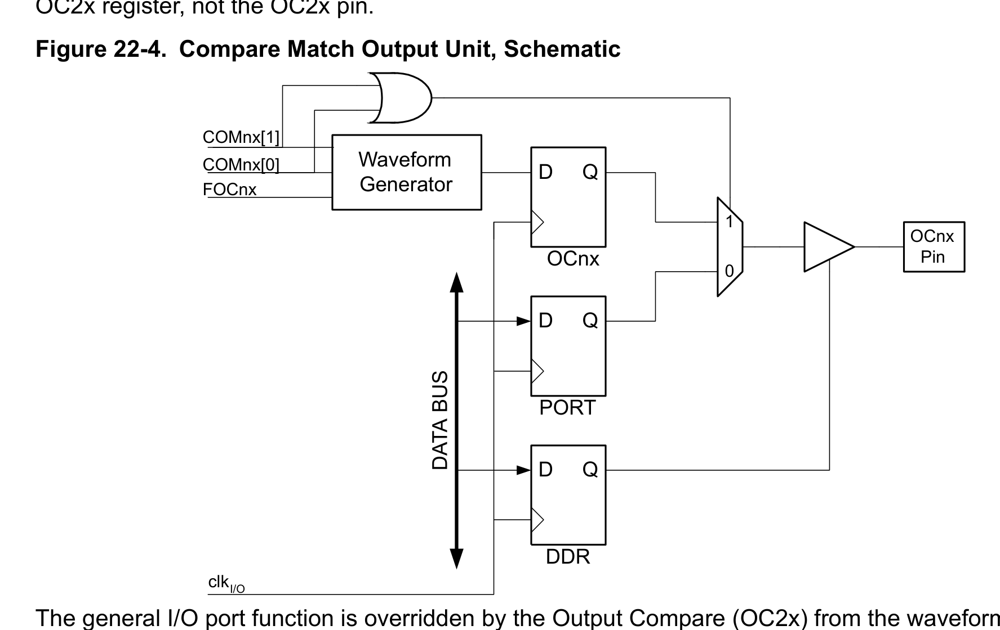
*Description*: Technical diagram and schematic illustration detailing hardware circuit topology, signal routing, and logic operations for Figure 22-4: Compare Match Output Unit, Schematic.

> **Figure 22-4: Compare Match Output Unit, Schematic**

PORT
DDR
D
Q
D
Q
OCnx
Pin
OCnx
D
Q
Waveform
Generator
COMnx[1]
COMnx[0]
0
1
DATA BUS
FOCnx
clkI/O
The general I/O port function is overridden by the Output Compare (OC2x) from the waveform generator
if either of the COM2x1:0 bits are set. However, the OC2x pin direction (input or output) is still controlled
by the Data Direction Register (DDR) for the port pin. The DDR bit for the OC2x pin (DDR_OC2x) must
be set as output before the OC2x value is visible on the pin. The port override function is independent of
the Waveform Generation mode.
ATmega328/P
8-bit Timer/Counter2 (TC2) with PWM and A...
© 2018 Microchip Technology Inc.
Datasheet Complete
DS40001984A-page 195
Downloaded from Arrow.com.
Downloaded from Arrow.com.
Downloaded from Arrow.com.
Downloaded from Arrow.com.
Downloaded from Arrow.com.
Downloaded from Arrow.com.
Downloaded from Arrow.com.
Downloaded from Arrow.com.
Downloaded from Arrow.com.
Downloaded from Arrow.com.
Downloaded from Arrow.com.
Downloaded from Arrow.com.
Downloaded from Arrow.com.
Downloaded from Arrow.com.
Downloaded from Arrow.com.
Downloaded from Arrow.com.
Downloaded from Arrow.com.
Downloaded from Arrow.com.
Downloaded from Arrow.com.
Downloaded from Arrow.com.
Downloaded from Arrow.com.
Downloaded from Arrow.com.
Downloaded from Arrow.com.
Downloaded from Arrow.com.
Downloaded from Arrow.com.
Downloaded from Arrow.com.
Downloaded from Arrow.com.
Downloaded from Arrow.com.
Downloaded from Arrow.com.
Downloaded from Arrow.com.
Downloaded from Arrow.com.
Downloaded from Arrow.com.
Downloaded from Arrow.com.
Downloaded from Arrow.com.
Downloaded from Arrow.com.
Downloaded from Arrow.com.
Downloaded from Arrow.com.
Downloaded from Arrow.com.
Downloaded from Arrow.com.
Downloaded from Arrow.com.
Downloaded from Arrow.com.
Downloaded from Arrow.com.
Downloaded from Arrow.com.
Downloaded from Arrow.com.
Downloaded from Arrow.com.
Downloaded from Arrow.com.
Downloaded from Arrow.com.
Downloaded from Arrow.com.
Downloaded from Arrow.com.
Downloaded from Arrow.com.
Downloaded from Arrow.com.
Downloaded from Arrow.com.
Downloaded from Arrow.com.
Downloaded from Arrow.com.
Downloaded from Arrow.com.
Downloaded from Arrow.com.
Downloaded from Arrow.com.
Downloaded from Arrow.com.
Downloaded from Arrow.com.
Downloaded from Arrow.com.
Downloaded from Arrow.com.
Downloaded from Arrow.com.
Downloaded from Arrow.com.
Downloaded from Arrow.com.
Downloaded from Arrow.com.
Downloaded from Arrow.com.
Downloaded from Arrow.com.
Downloaded from Arrow.com.
Downloaded from Arrow.com.
Downloaded from Arrow.com.
Downloaded from Arrow.com.
Downloaded from Arrow.com.
Downloaded from Arrow.com.
Downloaded from Arrow.com.
Downloaded from Arrow.com.
Downloaded from Arrow.com.
Downloaded from Arrow.com.
Downloaded from Arrow.com.
Downloaded from Arrow.com.
Downloaded from Arrow.com.
Downloaded from Arrow.com.
Downloaded from Arrow.com.
Downloaded from Arrow.com.
Downloaded from Arrow.com.
Downloaded from Arrow.com.
Downloaded from Arrow.com.
Downloaded from Arrow.com.
Downloaded from Arrow.com.
Downloaded from Arrow.com.
Downloaded from Arrow.com.
Downloaded from Arrow.com.
Downloaded from Arrow.com.
Downloaded from Arrow.com.
Downloaded from Arrow.com.
Downloaded from Arrow.com.
Downloaded from Arrow.com.
Downloaded from Arrow.com.
Downloaded from Arrow.com.
Downloaded from Arrow.com.
Downloaded from Arrow.com.
Downloaded from Arrow.com.
Downloaded from Arrow.com.
Downloaded from Arrow.com.
Downloaded from Arrow.com.
Downloaded from Arrow.com.
Downloaded from Arrow.com.
Downloaded from Arrow.com.
Downloaded from Arrow.com.
Downloaded from Arrow.com.
Downloaded from Arrow.com.
Downloaded from Arrow.com.
Downloaded from Arrow.com.
Downloaded from Arrow.com.
Downloaded from Arrow.com.
Downloaded from Arrow.com.
Downloaded from Arrow.com.
Downloaded from Arrow.com.
Downloaded from Arrow.com.
Downloaded from Arrow.com.
Downloaded from Arrow.com.
Downloaded from Arrow.com.
Downloaded from Arrow.com.
Downloaded from Arrow.com.
Downloaded from Arrow.com.
Downloaded from Arrow.com.
Downloaded from Arrow.com.
Downloaded from Arrow.com.
Downloaded from Arrow.com.
Downloaded from Arrow.com.
Downloaded from Arrow.com.
Downloaded from Arrow.com.
Downloaded from Arrow.com.
Downloaded from Arrow.com.
Downloaded from Arrow.com.
Downloaded from Arrow.com.
Downloaded from Arrow.com.
Downloaded from Arrow.com.
Downloaded from Arrow.com.
Downloaded from Arrow.com.
Downloaded from Arrow.com.
Downloaded from Arrow.com.
Downloaded from Arrow.com.
Downloaded from Arrow.com.
Downloaded from Arrow.com.
Downloaded from Arrow.com.
Downloaded from Arrow.com.
Downloaded from Arrow.com.
Downloaded from Arrow.com.
Downloaded from Arrow.com.
Downloaded from Arrow.com.
Downloaded from Arrow.com.
Downloaded from Arrow.com.
Downloaded from Arrow.com.
Downloaded from Arrow.com.
Downloaded from Arrow.com.
Downloaded from Arrow.com.
Downloaded from Arrow.com.
Downloaded from Arrow.com.
Downloaded from Arrow.com.
Downloaded from Arrow.com.
Downloaded from Arrow.com.
Downloaded from Arrow.com.
Downloaded from Arrow.com.
Downloaded from Arrow.com.
Downloaded from Arrow.com.
Downloaded from Arrow.com.
Downloaded from Arrow.com.
Downloaded from Arrow.com.
Downloaded from Arrow.com.
Downloaded from Arrow.com.
Downloaded from Arrow.com.
Downloaded from Arrow.com.
Downloaded from Arrow.com.
Downloaded from Arrow.com.
Downloaded from Arrow.com.
Downloaded from Arrow.com.
Downloaded from Arrow.com.
Downloaded from Arrow.com.
Downloaded from Arrow.com.
Downloaded from Arrow.com.
Downloaded from Arrow.com.
Downloaded from Arrow.com.
Downloaded from Arrow.com.
Downloaded from Arrow.com.
Downloaded from Arrow.com.
Downloaded from Arrow.com.
Downloaded from Arrow.com.
Downloaded from Arrow.com.
Downloaded from Arrow.com.
Downloaded from Arrow.com.
Downloaded from Arrow.com.
Downloaded from Arrow.com.
Downloaded from Arrow.com.
Downloaded from Arrow.com.
Downloaded from Arrow.com.


<!-- Page 196 -->
### [PDF Page 196]

The design of the output compare pin logic allows initialization of the OC2x state before the output is
enabled. Note that some COM2x[1:0] bit settings are reserved for certain modes of operation. See

### Register Description.

Related Links
Modes of Operation
22.6.1
Compare Output Mode and Waveform Generation
The waveform generator uses the COM2x[1:0] bits differently in normal, CTC, and PWM modes. For all
modes, setting the COM2x[1:0] = 0 tells the waveform generator that no action on the OC2x register is to
be performed on the next compare match. Refer also to the descriptions of the output modes.
A change of the COM2x[1:0] bits state will have effect at the first compare match after the bits are written.
For non-PWM modes, the action can be forced to have an immediate effect by using the FOC2x strobe
bits.
22.7
Modes of Operation
The mode of operation, i.e., the behavior of the timer/counter and the output compare pins, is defined by
the combination of the Waveform Generation mode (WGM2[2:0]) and Compare Output mode
(COM2x[1:0]) bits. The Compare Output mode bits do not affect the counting sequence, while the
Waveform Generation mode bits do. The COM2x[1:0] bits control whether the PWM output generated
should be inverted or not (inverted or non-inverted PWM). For non-PWM modes, the COM2x[1:0] bits
control whether the output should be set, cleared, or toggled at a compare match (See Compare Match
Output Unit).
For detailed timing information refer to Timer/Counter Timing Diagrams.
22.7.1
Normal Mode
The simplest mode of operation is the Normal mode (WGM2[2:0] = 0). In this mode, the counting direction
is always up (incrementing), and no counter clear is performed. The counter simply overruns when it
passes its maximum 8-bit value (TOP = 0xFF) and then restarts from the bottom (0x00). In normal
operation, the Timer/Counter Overflow Flag (TOV2) will be set in the same timer clock cycle as the
TCNT2 becomes zero. The TOV2 flag, in this case, behaves like a ninth bit, except that it is only set, not
cleared. However, combined with the timer overflow interrupt that automatically clears the TOV2 flag, the
timer resolution can be increased by software. There are no special cases to consider in the Normal
mode, a new counter value can be written anytime.
The output compare unit can be used to generate interrupts at some given time. Using the output
compare to generate waveforms in Normal mode is not recommended since this will occupy too much of
the CPU time.
22.7.2
Clear Timer on Compare Match (CTC) Mode
In Clear Timer on Compare or CTC mode (WGM2[2:0] = 2), the OCR2A Register is used to manipulate
the counter resolution. In CTC mode the counter is cleared to zero when the counter value (TCNT2)
matches the OCR2A. The OCR2A defines the top value for the counter, hence also its resolution. This
mode allows greater control of the compare match output frequency. It also simplifies the operation of
counting external events.
The timing diagram for the CTC mode is as follows. The counter value (TCNT2) increases until a
compare match occurs between TCNT2 and OCR2A, and then counter (TCNT2) is cleared.
ATmega328/P
8-bit Timer/Counter2 (TC2) with PWM and A...
© 2018 Microchip Technology Inc.
Datasheet Complete
DS40001984A-page 196
Downloaded from Arrow.com.
Downloaded from Arrow.com.
Downloaded from Arrow.com.
Downloaded from Arrow.com.
Downloaded from Arrow.com.
Downloaded from Arrow.com.
Downloaded from Arrow.com.
Downloaded from Arrow.com.
Downloaded from Arrow.com.
Downloaded from Arrow.com.
Downloaded from Arrow.com.
Downloaded from Arrow.com.
Downloaded from Arrow.com.
Downloaded from Arrow.com.
Downloaded from Arrow.com.
Downloaded from Arrow.com.
Downloaded from Arrow.com.
Downloaded from Arrow.com.
Downloaded from Arrow.com.
Downloaded from Arrow.com.
Downloaded from Arrow.com.
Downloaded from Arrow.com.
Downloaded from Arrow.com.
Downloaded from Arrow.com.
Downloaded from Arrow.com.
Downloaded from Arrow.com.
Downloaded from Arrow.com.
Downloaded from Arrow.com.
Downloaded from Arrow.com.
Downloaded from Arrow.com.
Downloaded from Arrow.com.
Downloaded from Arrow.com.
Downloaded from Arrow.com.
Downloaded from Arrow.com.
Downloaded from Arrow.com.
Downloaded from Arrow.com.
Downloaded from Arrow.com.
Downloaded from Arrow.com.
Downloaded from Arrow.com.
Downloaded from Arrow.com.
Downloaded from Arrow.com.
Downloaded from Arrow.com.
Downloaded from Arrow.com.
Downloaded from Arrow.com.
Downloaded from Arrow.com.
Downloaded from Arrow.com.
Downloaded from Arrow.com.
Downloaded from Arrow.com.
Downloaded from Arrow.com.
Downloaded from Arrow.com.
Downloaded from Arrow.com.
Downloaded from Arrow.com.
Downloaded from Arrow.com.
Downloaded from Arrow.com.
Downloaded from Arrow.com.
Downloaded from Arrow.com.
Downloaded from Arrow.com.
Downloaded from Arrow.com.
Downloaded from Arrow.com.
Downloaded from Arrow.com.
Downloaded from Arrow.com.
Downloaded from Arrow.com.
Downloaded from Arrow.com.
Downloaded from Arrow.com.
Downloaded from Arrow.com.
Downloaded from Arrow.com.
Downloaded from Arrow.com.
Downloaded from Arrow.com.
Downloaded from Arrow.com.
Downloaded from Arrow.com.
Downloaded from Arrow.com.
Downloaded from Arrow.com.
Downloaded from Arrow.com.
Downloaded from Arrow.com.
Downloaded from Arrow.com.
Downloaded from Arrow.com.
Downloaded from Arrow.com.
Downloaded from Arrow.com.
Downloaded from Arrow.com.
Downloaded from Arrow.com.
Downloaded from Arrow.com.
Downloaded from Arrow.com.
Downloaded from Arrow.com.
Downloaded from Arrow.com.
Downloaded from Arrow.com.
Downloaded from Arrow.com.
Downloaded from Arrow.com.
Downloaded from Arrow.com.
Downloaded from Arrow.com.
Downloaded from Arrow.com.
Downloaded from Arrow.com.
Downloaded from Arrow.com.
Downloaded from Arrow.com.
Downloaded from Arrow.com.
Downloaded from Arrow.com.
Downloaded from Arrow.com.
Downloaded from Arrow.com.
Downloaded from Arrow.com.
Downloaded from Arrow.com.
Downloaded from Arrow.com.
Downloaded from Arrow.com.
Downloaded from Arrow.com.
Downloaded from Arrow.com.
Downloaded from Arrow.com.
Downloaded from Arrow.com.
Downloaded from Arrow.com.
Downloaded from Arrow.com.
Downloaded from Arrow.com.
Downloaded from Arrow.com.
Downloaded from Arrow.com.
Downloaded from Arrow.com.
Downloaded from Arrow.com.
Downloaded from Arrow.com.
Downloaded from Arrow.com.
Downloaded from Arrow.com.
Downloaded from Arrow.com.
Downloaded from Arrow.com.
Downloaded from Arrow.com.
Downloaded from Arrow.com.
Downloaded from Arrow.com.
Downloaded from Arrow.com.
Downloaded from Arrow.com.
Downloaded from Arrow.com.
Downloaded from Arrow.com.
Downloaded from Arrow.com.
Downloaded from Arrow.com.
Downloaded from Arrow.com.
Downloaded from Arrow.com.
Downloaded from Arrow.com.
Downloaded from Arrow.com.
Downloaded from Arrow.com.
Downloaded from Arrow.com.
Downloaded from Arrow.com.
Downloaded from Arrow.com.
Downloaded from Arrow.com.
Downloaded from Arrow.com.
Downloaded from Arrow.com.
Downloaded from Arrow.com.
Downloaded from Arrow.com.
Downloaded from Arrow.com.
Downloaded from Arrow.com.
Downloaded from Arrow.com.
Downloaded from Arrow.com.
Downloaded from Arrow.com.
Downloaded from Arrow.com.
Downloaded from Arrow.com.
Downloaded from Arrow.com.
Downloaded from Arrow.com.
Downloaded from Arrow.com.
Downloaded from Arrow.com.
Downloaded from Arrow.com.
Downloaded from Arrow.com.
Downloaded from Arrow.com.
Downloaded from Arrow.com.
Downloaded from Arrow.com.
Downloaded from Arrow.com.
Downloaded from Arrow.com.
Downloaded from Arrow.com.
Downloaded from Arrow.com.
Downloaded from Arrow.com.
Downloaded from Arrow.com.
Downloaded from Arrow.com.
Downloaded from Arrow.com.
Downloaded from Arrow.com.
Downloaded from Arrow.com.
Downloaded from Arrow.com.
Downloaded from Arrow.com.
Downloaded from Arrow.com.
Downloaded from Arrow.com.
Downloaded from Arrow.com.
Downloaded from Arrow.com.
Downloaded from Arrow.com.
Downloaded from Arrow.com.
Downloaded from Arrow.com.
Downloaded from Arrow.com.
Downloaded from Arrow.com.
Downloaded from Arrow.com.
Downloaded from Arrow.com.
Downloaded from Arrow.com.
Downloaded from Arrow.com.
Downloaded from Arrow.com.
Downloaded from Arrow.com.
Downloaded from Arrow.com.
Downloaded from Arrow.com.
Downloaded from Arrow.com.
Downloaded from Arrow.com.
Downloaded from Arrow.com.
Downloaded from Arrow.com.
Downloaded from Arrow.com.
Downloaded from Arrow.com.
Downloaded from Arrow.com.
Downloaded from Arrow.com.
Downloaded from Arrow.com.
Downloaded from Arrow.com.
Downloaded from Arrow.com.
Downloaded from Arrow.com.


<!-- Page 197 -->
### [PDF Page 197]


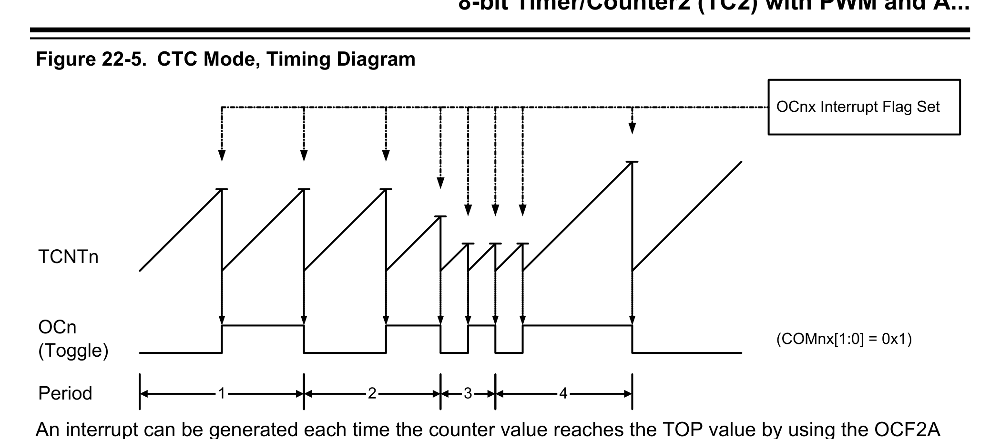
*Description*: Technical diagram and schematic illustration detailing hardware circuit topology, signal routing, and logic operations for Figure 22-5: CTC Mode, Timing Diagram.

> **Figure 22-5: CTC Mode, Timing Diagram**

An interrupt can be generated each time the counter value reaches the TOP value by using the OCF2A
Flag. If the interrupt is enabled, the interrupt handler routine can be used for updating the TOP value.
However, changing TOP to a value close to BOTTOM when the counter is running with none or a low
prescaler value must be done with care since the CTC mode does not have the double buffering feature.
If the new value written to OCR2A is lower than the current value of TCNT2, the counter will miss the
compare match. The counter will then have to count to its maximum value (0xFF) and wrap around
starting at 0x00 before the compare match can occur.
For generating a waveform output in CTC mode, the OC2A output can be set to toggle its logical level on
each compare match by setting the Compare Output mode bits to toggle mode (COM2A[1:0] = 1). The
OC2A value will not be visible on the port pin unless the data direction for the pin is set to output. The
waveform generated will have a maximum frequency of fOC2A = fclk_I/O/2 when OCR2A is set to zero
(0x00). The waveform frequency is defined by the following equation:
�OCnx =
�clk_I/O
2 ⋅�⋅1 + OCRnx
The N variable represents the prescale factor (1, 8, 32, 64, 128, 256, or 1024).
As for the Normal mode of operation, the TOV2 Flag is set in the same timer clock cycle that the counter
counts from MAX to 0x00.
22.7.3
Fast PWM Mode
The fast Pulse-Width Modulation (fast PWM) mode (WGM2[2:0] = 0x3 or 0x7) provides a high frequency
PWM waveform generation option. The fast PWM differs from the other PWM option by its single-slope
operation. The counter counts from BOTTOM to TOP then restarts from BOTTOM. TOP is defined as
0xFF when WGM2[2:0] = 0x3, and OCR2A when WGM2[2:0] = 0x7. In non-inverting Compare Output
mode, the Output Compare (OC2x) is cleared on the compare match between TCNT2 and OCR2x and
set at BOTTOM. In inverting Compare Output mode, the output is set on compare match and cleared at
BOTTOM. Due to the single-slope operation, the operating frequency of the fast PWM mode can be twice
as high as the phase correct PWM mode that uses dual-slope operation. This high frequency makes the
fast PWM mode well suited for power regulation, rectification, and DAC applications. High frequency
allows physically small sized external components (coils, capacitors), and therefore reduces total system
cost.
In fast PWM mode, the counter is incremented until the counter value matches the TOP value. The
counter is then cleared at the following timer clock cycle. The timing diagram for the fast PWM mode is
depicted in the following figure. The TCNT2 value is in the timing diagram shown as a histogram for
ATmega328/P
8-bit Timer/Counter2 (TC2) with PWM and A...
© 2018 Microchip Technology Inc.
Datasheet Complete
DS40001984A-page 197
Downloaded from Arrow.com.
Downloaded from Arrow.com.
Downloaded from Arrow.com.
Downloaded from Arrow.com.
Downloaded from Arrow.com.
Downloaded from Arrow.com.
Downloaded from Arrow.com.
Downloaded from Arrow.com.
Downloaded from Arrow.com.
Downloaded from Arrow.com.
Downloaded from Arrow.com.
Downloaded from Arrow.com.
Downloaded from Arrow.com.
Downloaded from Arrow.com.
Downloaded from Arrow.com.
Downloaded from Arrow.com.
Downloaded from Arrow.com.
Downloaded from Arrow.com.
Downloaded from Arrow.com.
Downloaded from Arrow.com.
Downloaded from Arrow.com.
Downloaded from Arrow.com.
Downloaded from Arrow.com.
Downloaded from Arrow.com.
Downloaded from Arrow.com.
Downloaded from Arrow.com.
Downloaded from Arrow.com.
Downloaded from Arrow.com.
Downloaded from Arrow.com.
Downloaded from Arrow.com.
Downloaded from Arrow.com.
Downloaded from Arrow.com.
Downloaded from Arrow.com.
Downloaded from Arrow.com.
Downloaded from Arrow.com.
Downloaded from Arrow.com.
Downloaded from Arrow.com.
Downloaded from Arrow.com.
Downloaded from Arrow.com.
Downloaded from Arrow.com.
Downloaded from Arrow.com.
Downloaded from Arrow.com.
Downloaded from Arrow.com.
Downloaded from Arrow.com.
Downloaded from Arrow.com.
Downloaded from Arrow.com.
Downloaded from Arrow.com.
Downloaded from Arrow.com.
Downloaded from Arrow.com.
Downloaded from Arrow.com.
Downloaded from Arrow.com.
Downloaded from Arrow.com.
Downloaded from Arrow.com.
Downloaded from Arrow.com.
Downloaded from Arrow.com.
Downloaded from Arrow.com.
Downloaded from Arrow.com.
Downloaded from Arrow.com.
Downloaded from Arrow.com.
Downloaded from Arrow.com.
Downloaded from Arrow.com.
Downloaded from Arrow.com.
Downloaded from Arrow.com.
Downloaded from Arrow.com.
Downloaded from Arrow.com.
Downloaded from Arrow.com.
Downloaded from Arrow.com.
Downloaded from Arrow.com.
Downloaded from Arrow.com.
Downloaded from Arrow.com.
Downloaded from Arrow.com.
Downloaded from Arrow.com.
Downloaded from Arrow.com.
Downloaded from Arrow.com.
Downloaded from Arrow.com.
Downloaded from Arrow.com.
Downloaded from Arrow.com.
Downloaded from Arrow.com.
Downloaded from Arrow.com.
Downloaded from Arrow.com.
Downloaded from Arrow.com.
Downloaded from Arrow.com.
Downloaded from Arrow.com.
Downloaded from Arrow.com.
Downloaded from Arrow.com.
Downloaded from Arrow.com.
Downloaded from Arrow.com.
Downloaded from Arrow.com.
Downloaded from Arrow.com.
Downloaded from Arrow.com.
Downloaded from Arrow.com.
Downloaded from Arrow.com.
Downloaded from Arrow.com.
Downloaded from Arrow.com.
Downloaded from Arrow.com.
Downloaded from Arrow.com.
Downloaded from Arrow.com.
Downloaded from Arrow.com.
Downloaded from Arrow.com.
Downloaded from Arrow.com.
Downloaded from Arrow.com.
Downloaded from Arrow.com.
Downloaded from Arrow.com.
Downloaded from Arrow.com.
Downloaded from Arrow.com.
Downloaded from Arrow.com.
Downloaded from Arrow.com.
Downloaded from Arrow.com.
Downloaded from Arrow.com.
Downloaded from Arrow.com.
Downloaded from Arrow.com.
Downloaded from Arrow.com.
Downloaded from Arrow.com.
Downloaded from Arrow.com.
Downloaded from Arrow.com.
Downloaded from Arrow.com.
Downloaded from Arrow.com.
Downloaded from Arrow.com.
Downloaded from Arrow.com.
Downloaded from Arrow.com.
Downloaded from Arrow.com.
Downloaded from Arrow.com.
Downloaded from Arrow.com.
Downloaded from Arrow.com.
Downloaded from Arrow.com.
Downloaded from Arrow.com.
Downloaded from Arrow.com.
Downloaded from Arrow.com.
Downloaded from Arrow.com.
Downloaded from Arrow.com.
Downloaded from Arrow.com.
Downloaded from Arrow.com.
Downloaded from Arrow.com.
Downloaded from Arrow.com.
Downloaded from Arrow.com.
Downloaded from Arrow.com.
Downloaded from Arrow.com.
Downloaded from Arrow.com.
Downloaded from Arrow.com.
Downloaded from Arrow.com.
Downloaded from Arrow.com.
Downloaded from Arrow.com.
Downloaded from Arrow.com.
Downloaded from Arrow.com.
Downloaded from Arrow.com.
Downloaded from Arrow.com.
Downloaded from Arrow.com.
Downloaded from Arrow.com.
Downloaded from Arrow.com.
Downloaded from Arrow.com.
Downloaded from Arrow.com.
Downloaded from Arrow.com.
Downloaded from Arrow.com.
Downloaded from Arrow.com.
Downloaded from Arrow.com.
Downloaded from Arrow.com.
Downloaded from Arrow.com.
Downloaded from Arrow.com.
Downloaded from Arrow.com.
Downloaded from Arrow.com.
Downloaded from Arrow.com.
Downloaded from Arrow.com.
Downloaded from Arrow.com.
Downloaded from Arrow.com.
Downloaded from Arrow.com.
Downloaded from Arrow.com.
Downloaded from Arrow.com.
Downloaded from Arrow.com.
Downloaded from Arrow.com.
Downloaded from Arrow.com.
Downloaded from Arrow.com.
Downloaded from Arrow.com.
Downloaded from Arrow.com.
Downloaded from Arrow.com.
Downloaded from Arrow.com.
Downloaded from Arrow.com.
Downloaded from Arrow.com.
Downloaded from Arrow.com.
Downloaded from Arrow.com.
Downloaded from Arrow.com.
Downloaded from Arrow.com.
Downloaded from Arrow.com.
Downloaded from Arrow.com.
Downloaded from Arrow.com.
Downloaded from Arrow.com.
Downloaded from Arrow.com.
Downloaded from Arrow.com.
Downloaded from Arrow.com.
Downloaded from Arrow.com.
Downloaded from Arrow.com.
Downloaded from Arrow.com.
Downloaded from Arrow.com.
Downloaded from Arrow.com.
Downloaded from Arrow.com.
Downloaded from Arrow.com.
Downloaded from Arrow.com.
Downloaded from Arrow.com.


<!-- Page 198 -->
### [PDF Page 198]

illustrating the single-slope operation. The diagram includes non-inverted and inverted PWM outputs. The
small horizontal line marks on the TCNT2 slopes represent compare matches between OCR2x and
TCNT2.

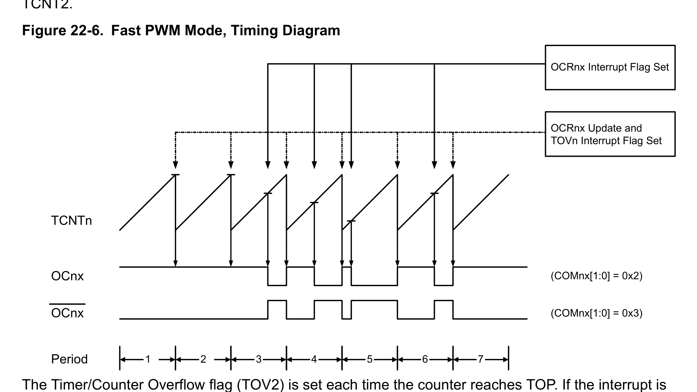
*Description*: Timer/Counter block diagram and waveform timing diagram illustrating prescaler clocks, compare match units, and PWM generation logic for Figure 22-6: Fast PWM Mode, Timing Diagram.

> **Figure 22-6: Fast PWM Mode, Timing Diagram**

TCNTn
OCRnx Update and
TOVn Interrupt Flag Set
1
Period
2
3
OCnx
OCnx
(COMnx[1:0] = 0x2)
(COMnx[1:0] = 0x3)
OCRnx Interrupt Flag Set
4
5
6
7
The Timer/Counter Overflow flag (TOV2) is set each time the counter reaches TOP. If the interrupt is
enabled, the interrupt handler routine can be used for updating the compare value.
In fast PWM mode, the compare unit allows generation of PWM waveforms on the OC2x pin. Setting the
COM2x1:0 bits to two will produce a non-inverted PWM and an inverted PWM output can be generated
by setting the COM2x[1:0] to three. TOP is defined as 0xFF when WGM2[2:0] = 0x3, and OCR2A when
MGM2[2:0] = 0x7. The actual OC2x value will only be visible on the port pin if the data direction for the
port pin is set as output. The PWM waveform is generated by setting (or clearing) the OC2x register at
the compare match between OCR2x and TCNT2, and clearing (or setting) the OC2x register at the timer
clock cycle the counter is cleared (changes from TOP to BOTTOM).
The PWM frequency for the output can be calculated by the following equation:
�OCnxPWM = �clk_I/O
�⋅256
The N variable represents the prescale factor (1, 8, 32, 64, 128, 256, or 1024).
The extreme values for the OCR2A register represent special cases when generating a PWM waveform
output in the fast PWM mode. If the OCR2A is set equal to BOTTOM, the output will be a narrow spike for
each MAX+1 timer clock cycle. Setting the OCR2A equal to MAX will result in a constantly high or low
output (depending on the polarity of the output set by the COM2A[1:0] bits).
A frequency (with 50% duty cycle) waveform output in fast PWM mode can be achieved by setting OC2x
to toggle its logical level on each compare match (COM2x[1:0] = 1). The waveform generated will have a
maximum frequency of foc2 = fclk_I/O/2 when OCR2A is set to zero. This feature is similar to the OC2A
toggle in CTC mode, except the double buffer feature of the output compare unit is enabled in the fast
PWM mode.
ATmega328/P
8-bit Timer/Counter2 (TC2) with PWM and A...
© 2018 Microchip Technology Inc.
Datasheet Complete
DS40001984A-page 198
Downloaded from Arrow.com.
Downloaded from Arrow.com.
Downloaded from Arrow.com.
Downloaded from Arrow.com.
Downloaded from Arrow.com.
Downloaded from Arrow.com.
Downloaded from Arrow.com.
Downloaded from Arrow.com.
Downloaded from Arrow.com.
Downloaded from Arrow.com.
Downloaded from Arrow.com.
Downloaded from Arrow.com.
Downloaded from Arrow.com.
Downloaded from Arrow.com.
Downloaded from Arrow.com.
Downloaded from Arrow.com.
Downloaded from Arrow.com.
Downloaded from Arrow.com.
Downloaded from Arrow.com.
Downloaded from Arrow.com.
Downloaded from Arrow.com.
Downloaded from Arrow.com.
Downloaded from Arrow.com.
Downloaded from Arrow.com.
Downloaded from Arrow.com.
Downloaded from Arrow.com.
Downloaded from Arrow.com.
Downloaded from Arrow.com.
Downloaded from Arrow.com.
Downloaded from Arrow.com.
Downloaded from Arrow.com.
Downloaded from Arrow.com.
Downloaded from Arrow.com.
Downloaded from Arrow.com.
Downloaded from Arrow.com.
Downloaded from Arrow.com.
Downloaded from Arrow.com.
Downloaded from Arrow.com.
Downloaded from Arrow.com.
Downloaded from Arrow.com.
Downloaded from Arrow.com.
Downloaded from Arrow.com.
Downloaded from Arrow.com.
Downloaded from Arrow.com.
Downloaded from Arrow.com.
Downloaded from Arrow.com.
Downloaded from Arrow.com.
Downloaded from Arrow.com.
Downloaded from Arrow.com.
Downloaded from Arrow.com.
Downloaded from Arrow.com.
Downloaded from Arrow.com.
Downloaded from Arrow.com.
Downloaded from Arrow.com.
Downloaded from Arrow.com.
Downloaded from Arrow.com.
Downloaded from Arrow.com.
Downloaded from Arrow.com.
Downloaded from Arrow.com.
Downloaded from Arrow.com.
Downloaded from Arrow.com.
Downloaded from Arrow.com.
Downloaded from Arrow.com.
Downloaded from Arrow.com.
Downloaded from Arrow.com.
Downloaded from Arrow.com.
Downloaded from Arrow.com.
Downloaded from Arrow.com.
Downloaded from Arrow.com.
Downloaded from Arrow.com.
Downloaded from Arrow.com.
Downloaded from Arrow.com.
Downloaded from Arrow.com.
Downloaded from Arrow.com.
Downloaded from Arrow.com.
Downloaded from Arrow.com.
Downloaded from Arrow.com.
Downloaded from Arrow.com.
Downloaded from Arrow.com.
Downloaded from Arrow.com.
Downloaded from Arrow.com.
Downloaded from Arrow.com.
Downloaded from Arrow.com.
Downloaded from Arrow.com.
Downloaded from Arrow.com.
Downloaded from Arrow.com.
Downloaded from Arrow.com.
Downloaded from Arrow.com.
Downloaded from Arrow.com.
Downloaded from Arrow.com.
Downloaded from Arrow.com.
Downloaded from Arrow.com.
Downloaded from Arrow.com.
Downloaded from Arrow.com.
Downloaded from Arrow.com.
Downloaded from Arrow.com.
Downloaded from Arrow.com.
Downloaded from Arrow.com.
Downloaded from Arrow.com.
Downloaded from Arrow.com.
Downloaded from Arrow.com.
Downloaded from Arrow.com.
Downloaded from Arrow.com.
Downloaded from Arrow.com.
Downloaded from Arrow.com.
Downloaded from Arrow.com.
Downloaded from Arrow.com.
Downloaded from Arrow.com.
Downloaded from Arrow.com.
Downloaded from Arrow.com.
Downloaded from Arrow.com.
Downloaded from Arrow.com.
Downloaded from Arrow.com.
Downloaded from Arrow.com.
Downloaded from Arrow.com.
Downloaded from Arrow.com.
Downloaded from Arrow.com.
Downloaded from Arrow.com.
Downloaded from Arrow.com.
Downloaded from Arrow.com.
Downloaded from Arrow.com.
Downloaded from Arrow.com.
Downloaded from Arrow.com.
Downloaded from Arrow.com.
Downloaded from Arrow.com.
Downloaded from Arrow.com.
Downloaded from Arrow.com.
Downloaded from Arrow.com.
Downloaded from Arrow.com.
Downloaded from Arrow.com.
Downloaded from Arrow.com.
Downloaded from Arrow.com.
Downloaded from Arrow.com.
Downloaded from Arrow.com.
Downloaded from Arrow.com.
Downloaded from Arrow.com.
Downloaded from Arrow.com.
Downloaded from Arrow.com.
Downloaded from Arrow.com.
Downloaded from Arrow.com.
Downloaded from Arrow.com.
Downloaded from Arrow.com.
Downloaded from Arrow.com.
Downloaded from Arrow.com.
Downloaded from Arrow.com.
Downloaded from Arrow.com.
Downloaded from Arrow.com.
Downloaded from Arrow.com.
Downloaded from Arrow.com.
Downloaded from Arrow.com.
Downloaded from Arrow.com.
Downloaded from Arrow.com.
Downloaded from Arrow.com.
Downloaded from Arrow.com.
Downloaded from Arrow.com.
Downloaded from Arrow.com.
Downloaded from Arrow.com.
Downloaded from Arrow.com.
Downloaded from Arrow.com.
Downloaded from Arrow.com.
Downloaded from Arrow.com.
Downloaded from Arrow.com.
Downloaded from Arrow.com.
Downloaded from Arrow.com.
Downloaded from Arrow.com.
Downloaded from Arrow.com.
Downloaded from Arrow.com.
Downloaded from Arrow.com.
Downloaded from Arrow.com.
Downloaded from Arrow.com.
Downloaded from Arrow.com.
Downloaded from Arrow.com.
Downloaded from Arrow.com.
Downloaded from Arrow.com.
Downloaded from Arrow.com.
Downloaded from Arrow.com.
Downloaded from Arrow.com.
Downloaded from Arrow.com.
Downloaded from Arrow.com.
Downloaded from Arrow.com.
Downloaded from Arrow.com.
Downloaded from Arrow.com.
Downloaded from Arrow.com.
Downloaded from Arrow.com.
Downloaded from Arrow.com.
Downloaded from Arrow.com.
Downloaded from Arrow.com.
Downloaded from Arrow.com.
Downloaded from Arrow.com.
Downloaded from Arrow.com.
Downloaded from Arrow.com.
Downloaded from Arrow.com.
Downloaded from Arrow.com.
Downloaded from Arrow.com.
Downloaded from Arrow.com.
Downloaded from Arrow.com.
Downloaded from Arrow.com.
Downloaded from Arrow.com.


<!-- Page 199 -->
### [PDF Page 199]

22.7.4
Phase Correct PWM Mode
The phase correct PWM mode (WGM2[2:0] = 0x1 or 0x5) provides a high resolution phase correct PWM
waveform generation option. The phase correct PWM mode is based on a dual-slope operation. The
counter counts repeatedly from BOTTOM to TOP and then from TOP to BOTTOM. TOP is defined as
0xFF when WGM2[2:0] = 0x3, and OCR2A when MGM2[2:0] = 7. In non-inverting Compare Output
mode, the Output Compare (OC2x) is cleared on the compare match between TCNT2 and OCR2x while
counting up, and set on the compare match while down-counting. In inverting Output Compare mode, the
operation is inverted. The dual-slope operation has lower maximum operation frequency than single-
slope operation. However, due to the symmetric feature of the dual-slope PWM modes, these modes are
preferred for motor control applications.
In phase correct PWM mode the counter is incremented until the counter value matches TOP. When the
counter reaches TOP, it changes the count direction. The TCNT2 value will be equal to TOP for one timer

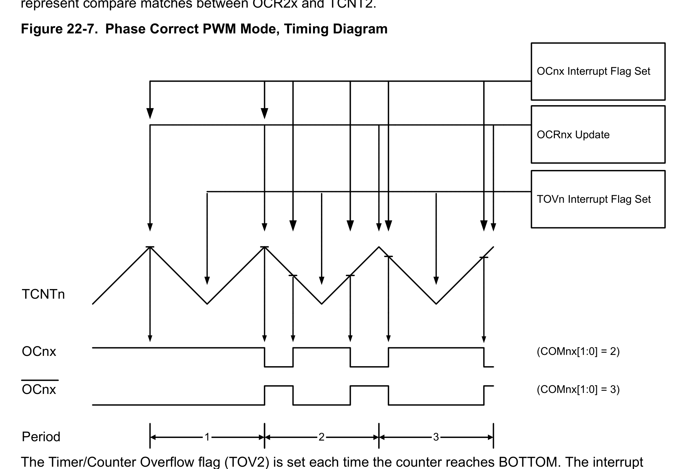
*Description*: Technical diagram and schematic illustration detailing hardware circuit topology, signal routing, and logic operations for Figure 22-7: The TCNT2.

> **Figure 22-7: The TCNT2**

value is in the timing diagram shown as a histogram for illustrating the dual-slope operation. The diagram
includes non-inverted and inverted PWM outputs. The small horizontal line marks on the TCNT2 slopes
represent compare matches between OCR2x and TCNT2.


*Description*: Timer/Counter block diagram and waveform timing diagram illustrating prescaler clocks, compare match units, and PWM generation logic for Figure 22-7: Phase Correct PWM Mode, Timing Diagram.

> **Figure 22-7: Phase Correct PWM Mode, Timing Diagram**

TOVn Interrupt Flag Set
OCnx Interrupt Flag Set
1
2
3
TCNTn
Period
OCnx
OCnx
(COMnx[1:0] = 2)
(COMnx[1:0] = 3)
OCRnx Update
The Timer/Counter Overflow flag (TOV2) is set each time the counter reaches BOTTOM. The interrupt
flag can be used to generate an interrupt each time the counter reaches the BOTTOM value.
In phase correct PWM mode, the compare unit allows generation of PWM waveforms on the OC2x pin.
Setting the COM2x[1:0] bits to two will produce a non-inverted PWM. An inverted PWM output can be
generated by setting the COM2x[1:0] to three. TOP is defined as 0xFF when WGM2[2:0] = 0x3, and
OCR2A when WGM2[2:0] = 7. The actual OC2x value will only be visible on the port pin if the data
direction for the port pin is set as output. The PWM waveform is generated by clearing (or setting) the
OC2x Register at the compare match between OCR2x and TCNT2 when the counter increments, and
ATmega328/P
8-bit Timer/Counter2 (TC2) with PWM and A...
© 2018 Microchip Technology Inc.
Datasheet Complete
DS40001984A-page 199
Downloaded from Arrow.com.
Downloaded from Arrow.com.
Downloaded from Arrow.com.
Downloaded from Arrow.com.
Downloaded from Arrow.com.
Downloaded from Arrow.com.
Downloaded from Arrow.com.
Downloaded from Arrow.com.
Downloaded from Arrow.com.
Downloaded from Arrow.com.
Downloaded from Arrow.com.
Downloaded from Arrow.com.
Downloaded from Arrow.com.
Downloaded from Arrow.com.
Downloaded from Arrow.com.
Downloaded from Arrow.com.
Downloaded from Arrow.com.
Downloaded from Arrow.com.
Downloaded from Arrow.com.
Downloaded from Arrow.com.
Downloaded from Arrow.com.
Downloaded from Arrow.com.
Downloaded from Arrow.com.
Downloaded from Arrow.com.
Downloaded from Arrow.com.
Downloaded from Arrow.com.
Downloaded from Arrow.com.
Downloaded from Arrow.com.
Downloaded from Arrow.com.
Downloaded from Arrow.com.
Downloaded from Arrow.com.
Downloaded from Arrow.com.
Downloaded from Arrow.com.
Downloaded from Arrow.com.
Downloaded from Arrow.com.
Downloaded from Arrow.com.
Downloaded from Arrow.com.
Downloaded from Arrow.com.
Downloaded from Arrow.com.
Downloaded from Arrow.com.
Downloaded from Arrow.com.
Downloaded from Arrow.com.
Downloaded from Arrow.com.
Downloaded from Arrow.com.
Downloaded from Arrow.com.
Downloaded from Arrow.com.
Downloaded from Arrow.com.
Downloaded from Arrow.com.
Downloaded from Arrow.com.
Downloaded from Arrow.com.
Downloaded from Arrow.com.
Downloaded from Arrow.com.
Downloaded from Arrow.com.
Downloaded from Arrow.com.
Downloaded from Arrow.com.
Downloaded from Arrow.com.
Downloaded from Arrow.com.
Downloaded from Arrow.com.
Downloaded from Arrow.com.
Downloaded from Arrow.com.
Downloaded from Arrow.com.
Downloaded from Arrow.com.
Downloaded from Arrow.com.
Downloaded from Arrow.com.
Downloaded from Arrow.com.
Downloaded from Arrow.com.
Downloaded from Arrow.com.
Downloaded from Arrow.com.
Downloaded from Arrow.com.
Downloaded from Arrow.com.
Downloaded from Arrow.com.
Downloaded from Arrow.com.
Downloaded from Arrow.com.
Downloaded from Arrow.com.
Downloaded from Arrow.com.
Downloaded from Arrow.com.
Downloaded from Arrow.com.
Downloaded from Arrow.com.
Downloaded from Arrow.com.
Downloaded from Arrow.com.
Downloaded from Arrow.com.
Downloaded from Arrow.com.
Downloaded from Arrow.com.
Downloaded from Arrow.com.
Downloaded from Arrow.com.
Downloaded from Arrow.com.
Downloaded from Arrow.com.
Downloaded from Arrow.com.
Downloaded from Arrow.com.
Downloaded from Arrow.com.
Downloaded from Arrow.com.
Downloaded from Arrow.com.
Downloaded from Arrow.com.
Downloaded from Arrow.com.
Downloaded from Arrow.com.
Downloaded from Arrow.com.
Downloaded from Arrow.com.
Downloaded from Arrow.com.
Downloaded from Arrow.com.
Downloaded from Arrow.com.
Downloaded from Arrow.com.
Downloaded from Arrow.com.
Downloaded from Arrow.com.
Downloaded from Arrow.com.
Downloaded from Arrow.com.
Downloaded from Arrow.com.
Downloaded from Arrow.com.
Downloaded from Arrow.com.
Downloaded from Arrow.com.
Downloaded from Arrow.com.
Downloaded from Arrow.com.
Downloaded from Arrow.com.
Downloaded from Arrow.com.
Downloaded from Arrow.com.
Downloaded from Arrow.com.
Downloaded from Arrow.com.
Downloaded from Arrow.com.
Downloaded from Arrow.com.
Downloaded from Arrow.com.
Downloaded from Arrow.com.
Downloaded from Arrow.com.
Downloaded from Arrow.com.
Downloaded from Arrow.com.
Downloaded from Arrow.com.
Downloaded from Arrow.com.
Downloaded from Arrow.com.
Downloaded from Arrow.com.
Downloaded from Arrow.com.
Downloaded from Arrow.com.
Downloaded from Arrow.com.
Downloaded from Arrow.com.
Downloaded from Arrow.com.
Downloaded from Arrow.com.
Downloaded from Arrow.com.
Downloaded from Arrow.com.
Downloaded from Arrow.com.
Downloaded from Arrow.com.
Downloaded from Arrow.com.
Downloaded from Arrow.com.
Downloaded from Arrow.com.
Downloaded from Arrow.com.
Downloaded from Arrow.com.
Downloaded from Arrow.com.
Downloaded from Arrow.com.
Downloaded from Arrow.com.
Downloaded from Arrow.com.
Downloaded from Arrow.com.
Downloaded from Arrow.com.
Downloaded from Arrow.com.
Downloaded from Arrow.com.
Downloaded from Arrow.com.
Downloaded from Arrow.com.
Downloaded from Arrow.com.
Downloaded from Arrow.com.
Downloaded from Arrow.com.
Downloaded from Arrow.com.
Downloaded from Arrow.com.
Downloaded from Arrow.com.
Downloaded from Arrow.com.
Downloaded from Arrow.com.
Downloaded from Arrow.com.
Downloaded from Arrow.com.
Downloaded from Arrow.com.
Downloaded from Arrow.com.
Downloaded from Arrow.com.
Downloaded from Arrow.com.
Downloaded from Arrow.com.
Downloaded from Arrow.com.
Downloaded from Arrow.com.
Downloaded from Arrow.com.
Downloaded from Arrow.com.
Downloaded from Arrow.com.
Downloaded from Arrow.com.
Downloaded from Arrow.com.
Downloaded from Arrow.com.
Downloaded from Arrow.com.
Downloaded from Arrow.com.
Downloaded from Arrow.com.
Downloaded from Arrow.com.
Downloaded from Arrow.com.
Downloaded from Arrow.com.
Downloaded from Arrow.com.
Downloaded from Arrow.com.
Downloaded from Arrow.com.
Downloaded from Arrow.com.
Downloaded from Arrow.com.
Downloaded from Arrow.com.
Downloaded from Arrow.com.
Downloaded from Arrow.com.
Downloaded from Arrow.com.
Downloaded from Arrow.com.
Downloaded from Arrow.com.
Downloaded from Arrow.com.
Downloaded from Arrow.com.
Downloaded from Arrow.com.
Downloaded from Arrow.com.
Downloaded from Arrow.com.
Downloaded from Arrow.com.
Downloaded from Arrow.com.


<!-- Page 200 -->
### [PDF Page 200]

setting (or clearing) the OC2x register at compare match between OCR2x and TCNT2 when the counter
decrements. The PWM frequency for the output when using phase correct PWM can be calculated by the
following equation:
�OCnxPCPWM = �clk_I/O
�⋅510
The N variable represents the prescale factor (1, 8, 32, 64, 128, 256, or 1024).
The extreme values for the OCR2A represent special cases when generating a PWM waveform output in
the phase correct PWM mode. If the OCR2A is set equal to BOTTOM, the output will be continuously low
and if set equal to MAX the output will be continuously high for non-inverted PWM mode. For inverted
PWM the output will have the opposite logic values.
At the very start of period 2 in the above figure OC2x has a transition from high to low even though there
is no compare match. The point of this transition is to guarantee symmetry around BOTTOM. There are
two cases that give a transition without compare match.
•
OCR2A changes its value from MAX, as shown in the preceding figure. When the OCR2A value is
MAX the OC2 pin value is the same as the result of a down-counting compare match. To ensure
symmetry around BOTTOM the OC2 value at MAX must correspond to the result of an up-counting
Compare Match.
•
The timer starts counting from a value higher than the one in OCR2A, and for that reason misses
the compare match and hence the OC2 change that would have happened on the way up.
22.8
Timer/Counter Timing Diagrams
The following figures show the timer/counter in Synchronous mode, and the timer clock (clkT2) is
therefore shown as a clock enable signal. In Asynchronous mode, clkI/O should be replaced by the timer/
counter oscillator clock. The figures include information on when interrupt flags are set. The following
figure contains timing data for basic timer/counter operation. The figure shows the count sequence close
to the MAX value in all modes other than phase correct PWM mode.

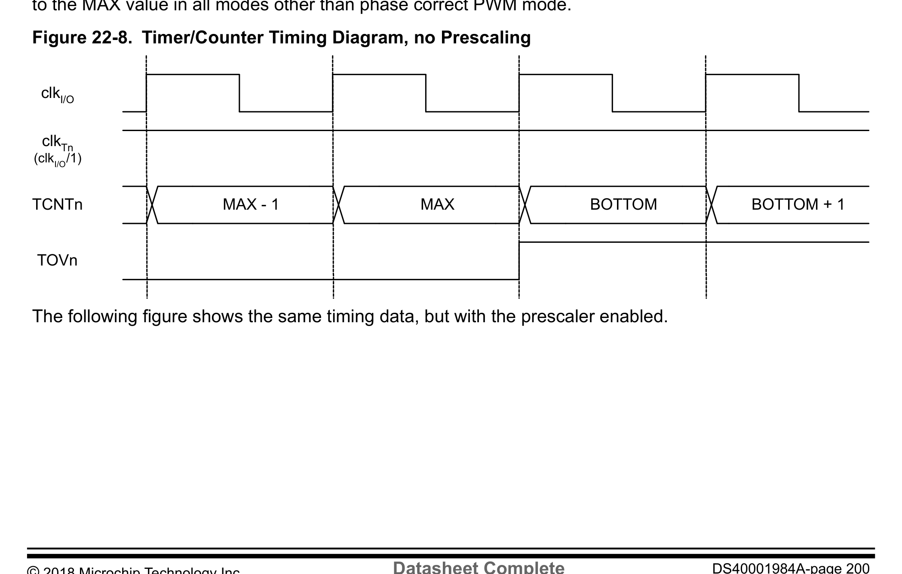
*Description*: Timer/Counter block diagram and waveform timing diagram illustrating prescaler clocks, compare match units, and PWM generation logic for Figure 22-8: Timer/Counter Timing Diagram, no Prescaling.

> **Figure 22-8: Timer/Counter Timing Diagram, no Prescaling**

clkTn
(clkI/O/1)
TOVn
clkI/O
TCNTn
MAX - 1
MAX
BOTTOM
BOTTOM + 1
The following figure shows the same timing data, but with the prescaler enabled.
ATmega328/P
8-bit Timer/Counter2 (TC2) with PWM and A...
© 2018 Microchip Technology Inc.
Datasheet Complete
DS40001984A-page 200
Downloaded from Arrow.com.
Downloaded from Arrow.com.
Downloaded from Arrow.com.
Downloaded from Arrow.com.
Downloaded from Arrow.com.
Downloaded from Arrow.com.
Downloaded from Arrow.com.
Downloaded from Arrow.com.
Downloaded from Arrow.com.
Downloaded from Arrow.com.
Downloaded from Arrow.com.
Downloaded from Arrow.com.
Downloaded from Arrow.com.
Downloaded from Arrow.com.
Downloaded from Arrow.com.
Downloaded from Arrow.com.
Downloaded from Arrow.com.
Downloaded from Arrow.com.
Downloaded from Arrow.com.
Downloaded from Arrow.com.
Downloaded from Arrow.com.
Downloaded from Arrow.com.
Downloaded from Arrow.com.
Downloaded from Arrow.com.
Downloaded from Arrow.com.
Downloaded from Arrow.com.
Downloaded from Arrow.com.
Downloaded from Arrow.com.
Downloaded from Arrow.com.
Downloaded from Arrow.com.
Downloaded from Arrow.com.
Downloaded from Arrow.com.
Downloaded from Arrow.com.
Downloaded from Arrow.com.
Downloaded from Arrow.com.
Downloaded from Arrow.com.
Downloaded from Arrow.com.
Downloaded from Arrow.com.
Downloaded from Arrow.com.
Downloaded from Arrow.com.
Downloaded from Arrow.com.
Downloaded from Arrow.com.
Downloaded from Arrow.com.
Downloaded from Arrow.com.
Downloaded from Arrow.com.
Downloaded from Arrow.com.
Downloaded from Arrow.com.
Downloaded from Arrow.com.
Downloaded from Arrow.com.
Downloaded from Arrow.com.
Downloaded from Arrow.com.
Downloaded from Arrow.com.
Downloaded from Arrow.com.
Downloaded from Arrow.com.
Downloaded from Arrow.com.
Downloaded from Arrow.com.
Downloaded from Arrow.com.
Downloaded from Arrow.com.
Downloaded from Arrow.com.
Downloaded from Arrow.com.
Downloaded from Arrow.com.
Downloaded from Arrow.com.
Downloaded from Arrow.com.
Downloaded from Arrow.com.
Downloaded from Arrow.com.
Downloaded from Arrow.com.
Downloaded from Arrow.com.
Downloaded from Arrow.com.
Downloaded from Arrow.com.
Downloaded from Arrow.com.
Downloaded from Arrow.com.
Downloaded from Arrow.com.
Downloaded from Arrow.com.
Downloaded from Arrow.com.
Downloaded from Arrow.com.
Downloaded from Arrow.com.
Downloaded from Arrow.com.
Downloaded from Arrow.com.
Downloaded from Arrow.com.
Downloaded from Arrow.com.
Downloaded from Arrow.com.
Downloaded from Arrow.com.
Downloaded from Arrow.com.
Downloaded from Arrow.com.
Downloaded from Arrow.com.
Downloaded from Arrow.com.
Downloaded from Arrow.com.
Downloaded from Arrow.com.
Downloaded from Arrow.com.
Downloaded from Arrow.com.
Downloaded from Arrow.com.
Downloaded from Arrow.com.
Downloaded from Arrow.com.
Downloaded from Arrow.com.
Downloaded from Arrow.com.
Downloaded from Arrow.com.
Downloaded from Arrow.com.
Downloaded from Arrow.com.
Downloaded from Arrow.com.
Downloaded from Arrow.com.
Downloaded from Arrow.com.
Downloaded from Arrow.com.
Downloaded from Arrow.com.
Downloaded from Arrow.com.
Downloaded from Arrow.com.
Downloaded from Arrow.com.
Downloaded from Arrow.com.
Downloaded from Arrow.com.
Downloaded from Arrow.com.
Downloaded from Arrow.com.
Downloaded from Arrow.com.
Downloaded from Arrow.com.
Downloaded from Arrow.com.
Downloaded from Arrow.com.
Downloaded from Arrow.com.
Downloaded from Arrow.com.
Downloaded from Arrow.com.
Downloaded from Arrow.com.
Downloaded from Arrow.com.
Downloaded from Arrow.com.
Downloaded from Arrow.com.
Downloaded from Arrow.com.
Downloaded from Arrow.com.
Downloaded from Arrow.com.
Downloaded from Arrow.com.
Downloaded from Arrow.com.
Downloaded from Arrow.com.
Downloaded from Arrow.com.
Downloaded from Arrow.com.
Downloaded from Arrow.com.
Downloaded from Arrow.com.
Downloaded from Arrow.com.
Downloaded from Arrow.com.
Downloaded from Arrow.com.
Downloaded from Arrow.com.
Downloaded from Arrow.com.
Downloaded from Arrow.com.
Downloaded from Arrow.com.
Downloaded from Arrow.com.
Downloaded from Arrow.com.
Downloaded from Arrow.com.
Downloaded from Arrow.com.
Downloaded from Arrow.com.
Downloaded from Arrow.com.
Downloaded from Arrow.com.
Downloaded from Arrow.com.
Downloaded from Arrow.com.
Downloaded from Arrow.com.
Downloaded from Arrow.com.
Downloaded from Arrow.com.
Downloaded from Arrow.com.
Downloaded from Arrow.com.
Downloaded from Arrow.com.
Downloaded from Arrow.com.
Downloaded from Arrow.com.
Downloaded from Arrow.com.
Downloaded from Arrow.com.
Downloaded from Arrow.com.
Downloaded from Arrow.com.
Downloaded from Arrow.com.
Downloaded from Arrow.com.
Downloaded from Arrow.com.
Downloaded from Arrow.com.
Downloaded from Arrow.com.
Downloaded from Arrow.com.
Downloaded from Arrow.com.
Downloaded from Arrow.com.
Downloaded from Arrow.com.
Downloaded from Arrow.com.
Downloaded from Arrow.com.
Downloaded from Arrow.com.
Downloaded from Arrow.com.
Downloaded from Arrow.com.
Downloaded from Arrow.com.
Downloaded from Arrow.com.
Downloaded from Arrow.com.
Downloaded from Arrow.com.
Downloaded from Arrow.com.
Downloaded from Arrow.com.
Downloaded from Arrow.com.
Downloaded from Arrow.com.
Downloaded from Arrow.com.
Downloaded from Arrow.com.
Downloaded from Arrow.com.
Downloaded from Arrow.com.
Downloaded from Arrow.com.
Downloaded from Arrow.com.
Downloaded from Arrow.com.
Downloaded from Arrow.com.
Downloaded from Arrow.com.
Downloaded from Arrow.com.
Downloaded from Arrow.com.
Downloaded from Arrow.com.
Downloaded from Arrow.com.
Downloaded from Arrow.com.
Downloaded from Arrow.com.
Downloaded from Arrow.com.
Downloaded from Arrow.com.
Downloaded from Arrow.com.
Downloaded from Arrow.com.


<!-- Page 201 -->
### [PDF Page 201]


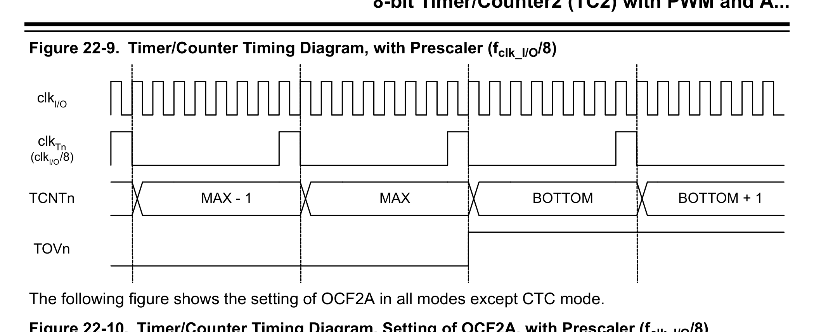
*Description*: Timer/Counter block diagram and waveform timing diagram illustrating prescaler clocks, compare match units, and PWM generation logic for Figure 22-9: Timer/Counter Timing Diagram, with Prescaler (fclk_I/O/8).

> **Figure 22-9: Timer/Counter Timing Diagram, with Prescaler (fclk_I/O/8)**

TOVn
TCNTn
MAX - 1
MAX
BOTTOM
BOTTOM + 1
clkI/O
clkTn
(clkI/O/8)
The following figure shows the setting of OCF2A in all modes except CTC mode.

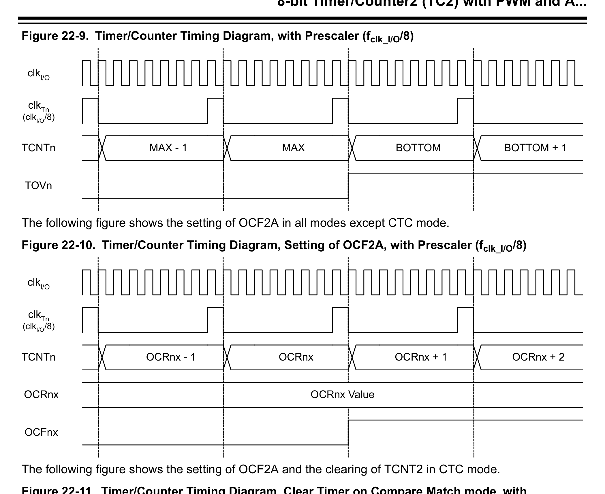
*Description*: Timer/Counter block diagram and waveform timing diagram illustrating prescaler clocks, compare match units, and PWM generation logic for Figure 22-10: Timer/Counter Timing Diagram, Setting of OCF2A, with Prescaler (fclk_I/O/8).

> **Figure 22-10: Timer/Counter Timing Diagram, Setting of OCF2A, with Prescaler (fclk_I/O/8)**

OCFnx
OCRnx
TCNTn
OCRnx Value
OCRnx - 1
OCRnx
OCRnx + 1
OCRnx + 2
clkI/O
clkTn
(clkI/O/8)
The following figure shows the setting of OCF2A and the clearing of TCNT2 in CTC mode.

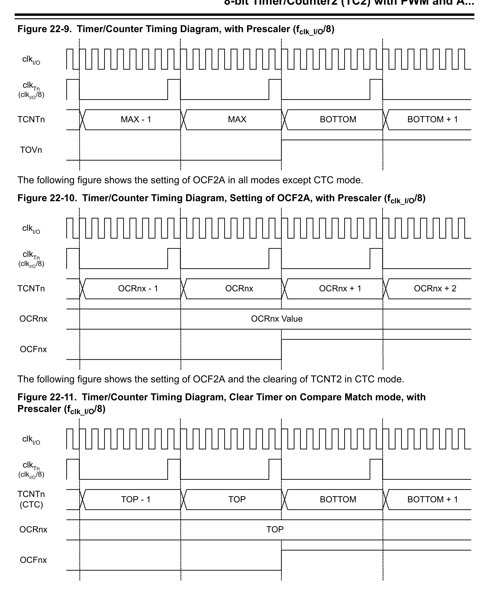
*Description*: Timer/Counter block diagram and waveform timing diagram illustrating prescaler clocks, compare match units, and PWM generation logic for Figure 22-11: Timer/Counter Timing Diagram, Clear Timer on Compare Match mode, with.

> **Figure 22-11: Timer/Counter Timing Diagram, Clear Timer on Compare Match mode, with**

Prescaler (fclk_I/O/8)
OCFnx
OCRnx
TCNTn
(CTC)
TOP
TOP - 1
TOP
BOTTOM
BOTTOM + 1
clkI/O
clkTn
(clkI/O/8)
22.9
Asynchronous Operation of Timer/Counter2
When TC2 operates asynchronously, some considerations must be taken:
ATmega328/P
8-bit Timer/Counter2 (TC2) with PWM and A...
© 2018 Microchip Technology Inc.
Datasheet Complete
DS40001984A-page 201
Downloaded from Arrow.com.
Downloaded from Arrow.com.
Downloaded from Arrow.com.
Downloaded from Arrow.com.
Downloaded from Arrow.com.
Downloaded from Arrow.com.
Downloaded from Arrow.com.
Downloaded from Arrow.com.
Downloaded from Arrow.com.
Downloaded from Arrow.com.
Downloaded from Arrow.com.
Downloaded from Arrow.com.
Downloaded from Arrow.com.
Downloaded from Arrow.com.
Downloaded from Arrow.com.
Downloaded from Arrow.com.
Downloaded from Arrow.com.
Downloaded from Arrow.com.
Downloaded from Arrow.com.
Downloaded from Arrow.com.
Downloaded from Arrow.com.
Downloaded from Arrow.com.
Downloaded from Arrow.com.
Downloaded from Arrow.com.
Downloaded from Arrow.com.
Downloaded from Arrow.com.
Downloaded from Arrow.com.
Downloaded from Arrow.com.
Downloaded from Arrow.com.
Downloaded from Arrow.com.
Downloaded from Arrow.com.
Downloaded from Arrow.com.
Downloaded from Arrow.com.
Downloaded from Arrow.com.
Downloaded from Arrow.com.
Downloaded from Arrow.com.
Downloaded from Arrow.com.
Downloaded from Arrow.com.
Downloaded from Arrow.com.
Downloaded from Arrow.com.
Downloaded from Arrow.com.
Downloaded from Arrow.com.
Downloaded from Arrow.com.
Downloaded from Arrow.com.
Downloaded from Arrow.com.
Downloaded from Arrow.com.
Downloaded from Arrow.com.
Downloaded from Arrow.com.
Downloaded from Arrow.com.
Downloaded from Arrow.com.
Downloaded from Arrow.com.
Downloaded from Arrow.com.
Downloaded from Arrow.com.
Downloaded from Arrow.com.
Downloaded from Arrow.com.
Downloaded from Arrow.com.
Downloaded from Arrow.com.
Downloaded from Arrow.com.
Downloaded from Arrow.com.
Downloaded from Arrow.com.
Downloaded from Arrow.com.
Downloaded from Arrow.com.
Downloaded from Arrow.com.
Downloaded from Arrow.com.
Downloaded from Arrow.com.
Downloaded from Arrow.com.
Downloaded from Arrow.com.
Downloaded from Arrow.com.
Downloaded from Arrow.com.
Downloaded from Arrow.com.
Downloaded from Arrow.com.
Downloaded from Arrow.com.
Downloaded from Arrow.com.
Downloaded from Arrow.com.
Downloaded from Arrow.com.
Downloaded from Arrow.com.
Downloaded from Arrow.com.
Downloaded from Arrow.com.
Downloaded from Arrow.com.
Downloaded from Arrow.com.
Downloaded from Arrow.com.
Downloaded from Arrow.com.
Downloaded from Arrow.com.
Downloaded from Arrow.com.
Downloaded from Arrow.com.
Downloaded from Arrow.com.
Downloaded from Arrow.com.
Downloaded from Arrow.com.
Downloaded from Arrow.com.
Downloaded from Arrow.com.
Downloaded from Arrow.com.
Downloaded from Arrow.com.
Downloaded from Arrow.com.
Downloaded from Arrow.com.
Downloaded from Arrow.com.
Downloaded from Arrow.com.
Downloaded from Arrow.com.
Downloaded from Arrow.com.
Downloaded from Arrow.com.
Downloaded from Arrow.com.
Downloaded from Arrow.com.
Downloaded from Arrow.com.
Downloaded from Arrow.com.
Downloaded from Arrow.com.
Downloaded from Arrow.com.
Downloaded from Arrow.com.
Downloaded from Arrow.com.
Downloaded from Arrow.com.
Downloaded from Arrow.com.
Downloaded from Arrow.com.
Downloaded from Arrow.com.
Downloaded from Arrow.com.
Downloaded from Arrow.com.
Downloaded from Arrow.com.
Downloaded from Arrow.com.
Downloaded from Arrow.com.
Downloaded from Arrow.com.
Downloaded from Arrow.com.
Downloaded from Arrow.com.
Downloaded from Arrow.com.
Downloaded from Arrow.com.
Downloaded from Arrow.com.
Downloaded from Arrow.com.
Downloaded from Arrow.com.
Downloaded from Arrow.com.
Downloaded from Arrow.com.
Downloaded from Arrow.com.
Downloaded from Arrow.com.
Downloaded from Arrow.com.
Downloaded from Arrow.com.
Downloaded from Arrow.com.
Downloaded from Arrow.com.
Downloaded from Arrow.com.
Downloaded from Arrow.com.
Downloaded from Arrow.com.
Downloaded from Arrow.com.
Downloaded from Arrow.com.
Downloaded from Arrow.com.
Downloaded from Arrow.com.
Downloaded from Arrow.com.
Downloaded from Arrow.com.
Downloaded from Arrow.com.
Downloaded from Arrow.com.
Downloaded from Arrow.com.
Downloaded from Arrow.com.
Downloaded from Arrow.com.
Downloaded from Arrow.com.
Downloaded from Arrow.com.
Downloaded from Arrow.com.
Downloaded from Arrow.com.
Downloaded from Arrow.com.
Downloaded from Arrow.com.
Downloaded from Arrow.com.
Downloaded from Arrow.com.
Downloaded from Arrow.com.
Downloaded from Arrow.com.
Downloaded from Arrow.com.
Downloaded from Arrow.com.
Downloaded from Arrow.com.
Downloaded from Arrow.com.
Downloaded from Arrow.com.
Downloaded from Arrow.com.
Downloaded from Arrow.com.
Downloaded from Arrow.com.
Downloaded from Arrow.com.
Downloaded from Arrow.com.
Downloaded from Arrow.com.
Downloaded from Arrow.com.
Downloaded from Arrow.com.
Downloaded from Arrow.com.
Downloaded from Arrow.com.
Downloaded from Arrow.com.
Downloaded from Arrow.com.
Downloaded from Arrow.com.
Downloaded from Arrow.com.
Downloaded from Arrow.com.
Downloaded from Arrow.com.
Downloaded from Arrow.com.
Downloaded from Arrow.com.
Downloaded from Arrow.com.
Downloaded from Arrow.com.
Downloaded from Arrow.com.
Downloaded from Arrow.com.
Downloaded from Arrow.com.
Downloaded from Arrow.com.
Downloaded from Arrow.com.
Downloaded from Arrow.com.
Downloaded from Arrow.com.
Downloaded from Arrow.com.
Downloaded from Arrow.com.
Downloaded from Arrow.com.
Downloaded from Arrow.com.
Downloaded from Arrow.com.
Downloaded from Arrow.com.
Downloaded from Arrow.com.
Downloaded from Arrow.com.
Downloaded from Arrow.com.
Downloaded from Arrow.com.
Downloaded from Arrow.com.
Downloaded from Arrow.com.
Downloaded from Arrow.com.


<!-- Page 202 -->
### [PDF Page 202]

•
When switching between asynchronous and synchronous clocking of TC2, the registers TCNT2,
OCR2x, and TCCR2x might be corrupted. A safe procedure for switching clock source is:
1.
Disable the TC2 interrupts by clearing OCIE2x and TOIE2.
2.
Select clock source by setting AS2 as appropriate.
3.
Write new values to TCNT2, OCR2x, and TCCR2x.
4.
To switch to asynchronous operation: Wait for TCN2xUB, OCR2xUB, and TCR2xUB.
5.
Clear the TC2 interrupt flags.
6.
Enable interrupts, if needed.
•
The CPU main clock frequency must be more than four times the oscillator frequency.
•
When writing to one of the registers TCNT2, OCR2x, or TCCR2x, the value is transferred to a
temporary register and latched after two positive edges on TOSC1. The user should not write a
new value before the contents of the temporary register have been transferred to its destination.
Each of the five mentioned registers has its individual temporary register, which means that e.g.
writing to TCNT2 does not disturb an OCR2x write in progress. The Asynchronous Status Register
(ASSR) indicates that a transfer to the destination register has taken place.
•
When entering Power-Save or ADC Noise Reduction mode after having written to TCNT2, OCR2x,
or TCCR2x, the user must wait until the written register has been updated if TC2 is used to wake
up the device. Otherwise, the MCU will enter sleep mode before the changes are effective. This is
particularly important if any of the Output Compare2 interrupts is used to wake up the device, since
the Output Compare function is disabled during writing to OCR2x or TCNT2. If the write cycle is not
finished, and the MCU enters sleep mode before the corresponding OCR2xUB bit returns to zero,
the device will never receive a compare match interrupt, and the MCU will not wake up.
•
If TC2 is used to wake the device up from Power-Save or ADC Noise Reduction mode, precautions
must be taken if the user wants to re-enter one of these modes: If re-entering sleep mode within the
TOSC1 cycle, the interrupt will immediately occur and the device wakes up again. The result is
multiple interrupts and wake-ups within one TOSC1 cycle from the first interrupt. If the user is in
doubt whether the time before re-entering Power-save or ADC Noise Reduction mode is sufficient,
the following algorithm can be used to ensure that one TOSC1 cycle has elapsed:
1.
Write a value to TCCR2x, TCNT2, or OCR2x.
2.
Wait until the corresponding update busy flag in ASSR returns to zero.
3.
Enter Power-Save or ADC Noise Reduction mode.
•
When the asynchronous operation is selected, the 32.768 kHz oscillator for TC2 is always running,
except in Power-Down and Standby modes. After a Power-up Reset or wake-up from Power-Down
or Standby mode, the user should be aware of the fact that this oscillator might take as long as one
second to stabilize. The user is advised to wait for at least one second before using TC2 after
power-up or wake-up from Power-Down or Standby mode. The contents of all TC2 registers must
be considered lost after a wake-up from Power-Down or Standby mode due to unstable clock signal
upon start-up, no matter whether the oscillator is in use or a clock signal is applied to the TOSC1
pin.
•
Description of wake up from Power-Save or ADC Noise Reduction mode when the timer is clocked
asynchronously: When the interrupt condition is met, the wake up process is started on the
following cycle of the timer clock, that is, the timer is always advanced by at least one before the
processor can read the counter value. After wake-up, the MCU is halted for four cycles, it executes
the interrupt routine, and resumes execution from the instruction following SLEEP.
•
Reading of the TCNT2 register shortly after wake-up from Power-Save may give an incorrect result.
Since TCNT2 is clocked on the asynchronous TOSC clock, reading TCNT2 must be done through
a register synchronized to the internal I/O clock domain. Synchronization takes place for every
ATmega328/P
8-bit Timer/Counter2 (TC2) with PWM and A...
© 2018 Microchip Technology Inc.
Datasheet Complete
DS40001984A-page 202
Downloaded from Arrow.com.
Downloaded from Arrow.com.
Downloaded from Arrow.com.
Downloaded from Arrow.com.
Downloaded from Arrow.com.
Downloaded from Arrow.com.
Downloaded from Arrow.com.
Downloaded from Arrow.com.
Downloaded from Arrow.com.
Downloaded from Arrow.com.
Downloaded from Arrow.com.
Downloaded from Arrow.com.
Downloaded from Arrow.com.
Downloaded from Arrow.com.
Downloaded from Arrow.com.
Downloaded from Arrow.com.
Downloaded from Arrow.com.
Downloaded from Arrow.com.
Downloaded from Arrow.com.
Downloaded from Arrow.com.
Downloaded from Arrow.com.
Downloaded from Arrow.com.
Downloaded from Arrow.com.
Downloaded from Arrow.com.
Downloaded from Arrow.com.
Downloaded from Arrow.com.
Downloaded from Arrow.com.
Downloaded from Arrow.com.
Downloaded from Arrow.com.
Downloaded from Arrow.com.
Downloaded from Arrow.com.
Downloaded from Arrow.com.
Downloaded from Arrow.com.
Downloaded from Arrow.com.
Downloaded from Arrow.com.
Downloaded from Arrow.com.
Downloaded from Arrow.com.
Downloaded from Arrow.com.
Downloaded from Arrow.com.
Downloaded from Arrow.com.
Downloaded from Arrow.com.
Downloaded from Arrow.com.
Downloaded from Arrow.com.
Downloaded from Arrow.com.
Downloaded from Arrow.com.
Downloaded from Arrow.com.
Downloaded from Arrow.com.
Downloaded from Arrow.com.
Downloaded from Arrow.com.
Downloaded from Arrow.com.
Downloaded from Arrow.com.
Downloaded from Arrow.com.
Downloaded from Arrow.com.
Downloaded from Arrow.com.
Downloaded from Arrow.com.
Downloaded from Arrow.com.
Downloaded from Arrow.com.
Downloaded from Arrow.com.
Downloaded from Arrow.com.
Downloaded from Arrow.com.
Downloaded from Arrow.com.
Downloaded from Arrow.com.
Downloaded from Arrow.com.
Downloaded from Arrow.com.
Downloaded from Arrow.com.
Downloaded from Arrow.com.
Downloaded from Arrow.com.
Downloaded from Arrow.com.
Downloaded from Arrow.com.
Downloaded from Arrow.com.
Downloaded from Arrow.com.
Downloaded from Arrow.com.
Downloaded from Arrow.com.
Downloaded from Arrow.com.
Downloaded from Arrow.com.
Downloaded from Arrow.com.
Downloaded from Arrow.com.
Downloaded from Arrow.com.
Downloaded from Arrow.com.
Downloaded from Arrow.com.
Downloaded from Arrow.com.
Downloaded from Arrow.com.
Downloaded from Arrow.com.
Downloaded from Arrow.com.
Downloaded from Arrow.com.
Downloaded from Arrow.com.
Downloaded from Arrow.com.
Downloaded from Arrow.com.
Downloaded from Arrow.com.
Downloaded from Arrow.com.
Downloaded from Arrow.com.
Downloaded from Arrow.com.
Downloaded from Arrow.com.
Downloaded from Arrow.com.
Downloaded from Arrow.com.
Downloaded from Arrow.com.
Downloaded from Arrow.com.
Downloaded from Arrow.com.
Downloaded from Arrow.com.
Downloaded from Arrow.com.
Downloaded from Arrow.com.
Downloaded from Arrow.com.
Downloaded from Arrow.com.
Downloaded from Arrow.com.
Downloaded from Arrow.com.
Downloaded from Arrow.com.
Downloaded from Arrow.com.
Downloaded from Arrow.com.
Downloaded from Arrow.com.
Downloaded from Arrow.com.
Downloaded from Arrow.com.
Downloaded from Arrow.com.
Downloaded from Arrow.com.
Downloaded from Arrow.com.
Downloaded from Arrow.com.
Downloaded from Arrow.com.
Downloaded from Arrow.com.
Downloaded from Arrow.com.
Downloaded from Arrow.com.
Downloaded from Arrow.com.
Downloaded from Arrow.com.
Downloaded from Arrow.com.
Downloaded from Arrow.com.
Downloaded from Arrow.com.
Downloaded from Arrow.com.
Downloaded from Arrow.com.
Downloaded from Arrow.com.
Downloaded from Arrow.com.
Downloaded from Arrow.com.
Downloaded from Arrow.com.
Downloaded from Arrow.com.
Downloaded from Arrow.com.
Downloaded from Arrow.com.
Downloaded from Arrow.com.
Downloaded from Arrow.com.
Downloaded from Arrow.com.
Downloaded from Arrow.com.
Downloaded from Arrow.com.
Downloaded from Arrow.com.
Downloaded from Arrow.com.
Downloaded from Arrow.com.
Downloaded from Arrow.com.
Downloaded from Arrow.com.
Downloaded from Arrow.com.
Downloaded from Arrow.com.
Downloaded from Arrow.com.
Downloaded from Arrow.com.
Downloaded from Arrow.com.
Downloaded from Arrow.com.
Downloaded from Arrow.com.
Downloaded from Arrow.com.
Downloaded from Arrow.com.
Downloaded from Arrow.com.
Downloaded from Arrow.com.
Downloaded from Arrow.com.
Downloaded from Arrow.com.
Downloaded from Arrow.com.
Downloaded from Arrow.com.
Downloaded from Arrow.com.
Downloaded from Arrow.com.
Downloaded from Arrow.com.
Downloaded from Arrow.com.
Downloaded from Arrow.com.
Downloaded from Arrow.com.
Downloaded from Arrow.com.
Downloaded from Arrow.com.
Downloaded from Arrow.com.
Downloaded from Arrow.com.
Downloaded from Arrow.com.
Downloaded from Arrow.com.
Downloaded from Arrow.com.
Downloaded from Arrow.com.
Downloaded from Arrow.com.
Downloaded from Arrow.com.
Downloaded from Arrow.com.
Downloaded from Arrow.com.
Downloaded from Arrow.com.
Downloaded from Arrow.com.
Downloaded from Arrow.com.
Downloaded from Arrow.com.
Downloaded from Arrow.com.
Downloaded from Arrow.com.
Downloaded from Arrow.com.
Downloaded from Arrow.com.
Downloaded from Arrow.com.
Downloaded from Arrow.com.
Downloaded from Arrow.com.
Downloaded from Arrow.com.
Downloaded from Arrow.com.
Downloaded from Arrow.com.
Downloaded from Arrow.com.
Downloaded from Arrow.com.
Downloaded from Arrow.com.
Downloaded from Arrow.com.
Downloaded from Arrow.com.
Downloaded from Arrow.com.
Downloaded from Arrow.com.
Downloaded from Arrow.com.
Downloaded from Arrow.com.
Downloaded from Arrow.com.
Downloaded from Arrow.com.
Downloaded from Arrow.com.


<!-- Page 203 -->
### [PDF Page 203]

rising TOSC1 edge. When waking up from Power-Save mode, and the I/O clock (clkI/O) again
becomes active, TCNT2 will read as the previous value (before entering sleep) until the next rising
TOSC1 edge. The phase of the TOSC clock after waking up from Power-Save mode is essentially
unpredictable, as it depends on the wake-up time. The recommended procedure for reading
TCNT2 is thus as follows:
8.1.
Wait for the corresponding update busy flag to be cleared.
8.2.
Read TCNT2.
•
During asynchronous operation, the synchronization of the interrupt flags for the asynchronous
timer takes three processor cycles plus one timer cycle. The timer is therefore advanced by at least
one before the processor can read the timer value causing the setting of the interrupt flag. The
output compare pin is changed on the timer clock and is not synchronized to the processor clock.

## 22.10 Timer/Counter Prescaler


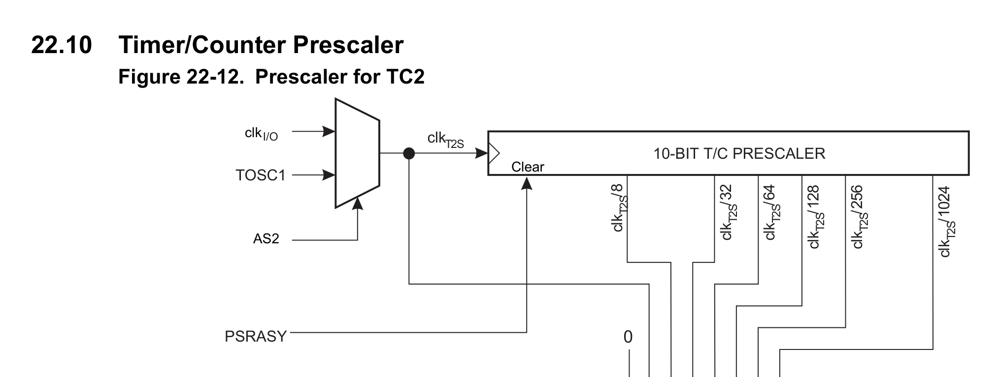
*Description*: Technical diagram and schematic illustration detailing hardware circuit topology, signal routing, and logic operations for Figure 22-12: Prescaler for TC2.

> **Figure 22-12: Prescaler for TC2**

10-BIT T/C PRESCALER
TIMER/COUNTER2 CLOCK SOURCE
I/O
clkT2S
TOSC1
clkT2S/8
clkT2S/64
clkT2S/128
clkT2S/1024
clkT2S/256
clkT2S/32
0
PSRASY
T2
AS2
CS20
CS21
CS22
Clear
clk
clk
The clock source for TC2 is named clkT2S. It is by default connected to the main system I/O clock clkI/O.
By writing a '1' to the Asynchronous TC2 bit in the Asynchronous Status Register (ASSR.AS2), TC2 is
asynchronously clocked from the TOSC1 pin. This enables the use of TC2 as a Real Time Counter
(RTC). When AS2 is set, pins TOSC1 and TOSC2 are disconnected from Port B. A crystal can then be
connected between the TOSC1 and TOSC2 pins to serve as an independent clock source for TC2. The
oscillator is optimized for use with a 32.768 kHz crystal.
For TC2, the possible prescaled selections are: clkT2S/8, clkT2S/32, clkT2S/64, clkT2S/128, clkT2S/256, and
clkT2S/1024. Additionally, clkT2S, as well as 0 (stop), may be selected. The prescaler is reset by writing a
'1' to the Prescaler Reset TC2 bit in the General TC2 Control Register (GTCCR.PSRASY). This allows
the user to operate with a defined prescaler.
22.11

### Register Description

ATmega328/P
8-bit Timer/Counter2 (TC2) with PWM and A...
© 2018 Microchip Technology Inc.
Datasheet Complete
DS40001984A-page 203
Downloaded from Arrow.com.
Downloaded from Arrow.com.
Downloaded from Arrow.com.
Downloaded from Arrow.com.
Downloaded from Arrow.com.
Downloaded from Arrow.com.
Downloaded from Arrow.com.
Downloaded from Arrow.com.
Downloaded from Arrow.com.
Downloaded from Arrow.com.
Downloaded from Arrow.com.
Downloaded from Arrow.com.
Downloaded from Arrow.com.
Downloaded from Arrow.com.
Downloaded from Arrow.com.
Downloaded from Arrow.com.
Downloaded from Arrow.com.
Downloaded from Arrow.com.
Downloaded from Arrow.com.
Downloaded from Arrow.com.
Downloaded from Arrow.com.
Downloaded from Arrow.com.
Downloaded from Arrow.com.
Downloaded from Arrow.com.
Downloaded from Arrow.com.
Downloaded from Arrow.com.
Downloaded from Arrow.com.
Downloaded from Arrow.com.
Downloaded from Arrow.com.
Downloaded from Arrow.com.
Downloaded from Arrow.com.
Downloaded from Arrow.com.
Downloaded from Arrow.com.
Downloaded from Arrow.com.
Downloaded from Arrow.com.
Downloaded from Arrow.com.
Downloaded from Arrow.com.
Downloaded from Arrow.com.
Downloaded from Arrow.com.
Downloaded from Arrow.com.
Downloaded from Arrow.com.
Downloaded from Arrow.com.
Downloaded from Arrow.com.
Downloaded from Arrow.com.
Downloaded from Arrow.com.
Downloaded from Arrow.com.
Downloaded from Arrow.com.
Downloaded from Arrow.com.
Downloaded from Arrow.com.
Downloaded from Arrow.com.
Downloaded from Arrow.com.
Downloaded from Arrow.com.
Downloaded from Arrow.com.
Downloaded from Arrow.com.
Downloaded from Arrow.com.
Downloaded from Arrow.com.
Downloaded from Arrow.com.
Downloaded from Arrow.com.
Downloaded from Arrow.com.
Downloaded from Arrow.com.
Downloaded from Arrow.com.
Downloaded from Arrow.com.
Downloaded from Arrow.com.
Downloaded from Arrow.com.
Downloaded from Arrow.com.
Downloaded from Arrow.com.
Downloaded from Arrow.com.
Downloaded from Arrow.com.
Downloaded from Arrow.com.
Downloaded from Arrow.com.
Downloaded from Arrow.com.
Downloaded from Arrow.com.
Downloaded from Arrow.com.
Downloaded from Arrow.com.
Downloaded from Arrow.com.
Downloaded from Arrow.com.
Downloaded from Arrow.com.
Downloaded from Arrow.com.
Downloaded from Arrow.com.
Downloaded from Arrow.com.
Downloaded from Arrow.com.
Downloaded from Arrow.com.
Downloaded from Arrow.com.
Downloaded from Arrow.com.
Downloaded from Arrow.com.
Downloaded from Arrow.com.
Downloaded from Arrow.com.
Downloaded from Arrow.com.
Downloaded from Arrow.com.
Downloaded from Arrow.com.
Downloaded from Arrow.com.
Downloaded from Arrow.com.
Downloaded from Arrow.com.
Downloaded from Arrow.com.
Downloaded from Arrow.com.
Downloaded from Arrow.com.
Downloaded from Arrow.com.
Downloaded from Arrow.com.
Downloaded from Arrow.com.
Downloaded from Arrow.com.
Downloaded from Arrow.com.
Downloaded from Arrow.com.
Downloaded from Arrow.com.
Downloaded from Arrow.com.
Downloaded from Arrow.com.
Downloaded from Arrow.com.
Downloaded from Arrow.com.
Downloaded from Arrow.com.
Downloaded from Arrow.com.
Downloaded from Arrow.com.
Downloaded from Arrow.com.
Downloaded from Arrow.com.
Downloaded from Arrow.com.
Downloaded from Arrow.com.
Downloaded from Arrow.com.
Downloaded from Arrow.com.
Downloaded from Arrow.com.
Downloaded from Arrow.com.
Downloaded from Arrow.com.
Downloaded from Arrow.com.
Downloaded from Arrow.com.
Downloaded from Arrow.com.
Downloaded from Arrow.com.
Downloaded from Arrow.com.
Downloaded from Arrow.com.
Downloaded from Arrow.com.
Downloaded from Arrow.com.
Downloaded from Arrow.com.
Downloaded from Arrow.com.
Downloaded from Arrow.com.
Downloaded from Arrow.com.
Downloaded from Arrow.com.
Downloaded from Arrow.com.
Downloaded from Arrow.com.
Downloaded from Arrow.com.
Downloaded from Arrow.com.
Downloaded from Arrow.com.
Downloaded from Arrow.com.
Downloaded from Arrow.com.
Downloaded from Arrow.com.
Downloaded from Arrow.com.
Downloaded from Arrow.com.
Downloaded from Arrow.com.
Downloaded from Arrow.com.
Downloaded from Arrow.com.
Downloaded from Arrow.com.
Downloaded from Arrow.com.
Downloaded from Arrow.com.
Downloaded from Arrow.com.
Downloaded from Arrow.com.
Downloaded from Arrow.com.
Downloaded from Arrow.com.
Downloaded from Arrow.com.
Downloaded from Arrow.com.
Downloaded from Arrow.com.
Downloaded from Arrow.com.
Downloaded from Arrow.com.
Downloaded from Arrow.com.
Downloaded from Arrow.com.
Downloaded from Arrow.com.
Downloaded from Arrow.com.
Downloaded from Arrow.com.
Downloaded from Arrow.com.
Downloaded from Arrow.com.
Downloaded from Arrow.com.
Downloaded from Arrow.com.
Downloaded from Arrow.com.
Downloaded from Arrow.com.
Downloaded from Arrow.com.
Downloaded from Arrow.com.
Downloaded from Arrow.com.
Downloaded from Arrow.com.
Downloaded from Arrow.com.
Downloaded from Arrow.com.
Downloaded from Arrow.com.
Downloaded from Arrow.com.
Downloaded from Arrow.com.
Downloaded from Arrow.com.
Downloaded from Arrow.com.
Downloaded from Arrow.com.
Downloaded from Arrow.com.
Downloaded from Arrow.com.
Downloaded from Arrow.com.
Downloaded from Arrow.com.
Downloaded from Arrow.com.
Downloaded from Arrow.com.
Downloaded from Arrow.com.
Downloaded from Arrow.com.
Downloaded from Arrow.com.
Downloaded from Arrow.com.
Downloaded from Arrow.com.
Downloaded from Arrow.com.
Downloaded from Arrow.com.
Downloaded from Arrow.com.
Downloaded from Arrow.com.
Downloaded from Arrow.com.
Downloaded from Arrow.com.
Downloaded from Arrow.com.
Downloaded from Arrow.com.
Downloaded from Arrow.com.
Downloaded from Arrow.com.
Downloaded from Arrow.com.
Downloaded from Arrow.com.


<!-- Page 204 -->
### [PDF Page 204]

22.11.1 TC2 Control Register A
Name:
TCCR2A
Offset:
0xB0
Reset:
0x00
Property:  -
Bit
7
6
5
4
3
2
1
0
COM2A[1:0]
COM2B[1:0]
WGM2[1:0]
Access
R/W
R/W
R/W
R/W
R/W
R/W
Reset
0
0
0
0
0
0
Bits 7:6 – COM2A[1:0] Compare Output Mode for Channel A
These bits control the Output Compare pin (OC2A) behavior. If one or both of the COM2A[1:0] bits are
set, the OC2A output overrides the normal port functionality of the I/O pin it is connected to. However,
note that the Data Direction Register (DDR) bit corresponding to the OC2A pin must be set in order to
enable the output driver.
When OC2A is connected to the pin, the function of the COM2A[1:0] bits depends on the WGM2[2:0] bit
setting. The table below shows the COM2A[1:0] bit functionality when the WGM2[2:0] bits are set to a
normal or CTC mode (non-PWM).

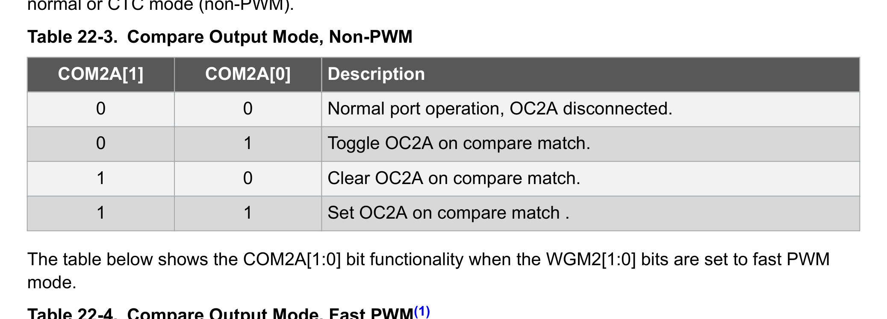
*Description*: Timer/Counter block diagram and waveform timing diagram illustrating prescaler clocks, compare match units, and PWM generation logic for Table 22-3: Compare Output Mode, Non-PWM.

> **Table 22-3: Compare Output Mode, Non-PWM**

COM2A[1]
COM2A[0]
Description
0
0
Normal port operation, OC2A disconnected.
0
1
Toggle OC2A on compare match.
1
0
Clear OC2A on compare match.
1
1
Set OC2A on compare match .
The table below shows the COM2A[1:0] bit functionality when the WGM2[1:0] bits are set to fast PWM
mode.

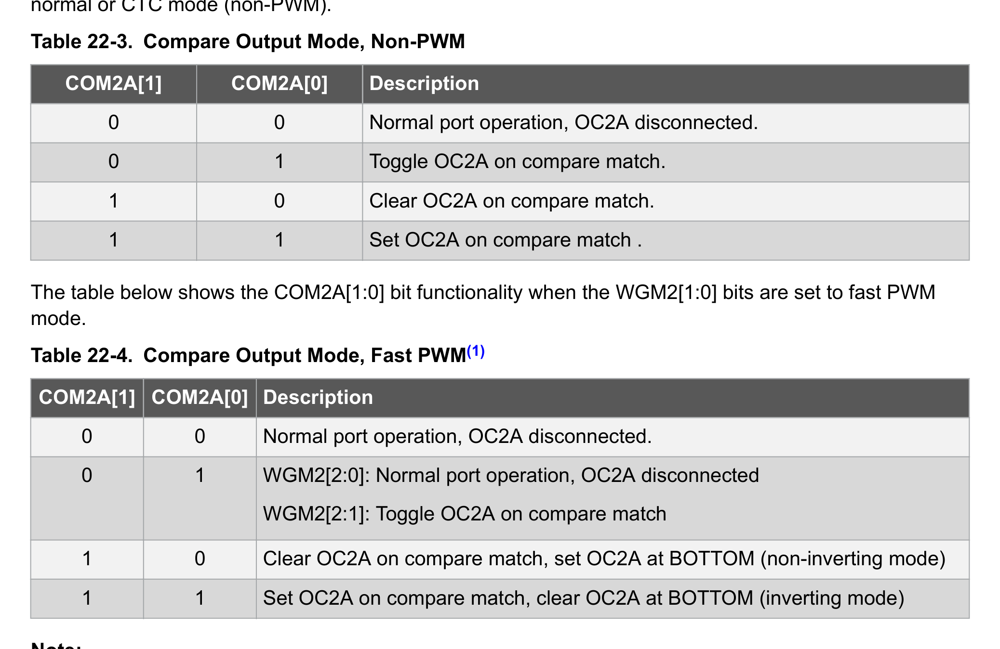
*Description*: Timer/Counter block diagram and waveform timing diagram illustrating prescaler clocks, compare match units, and PWM generation logic for Table 22-4: Compare Output Mode, Fast PWM(1).

> **Table 22-4: Compare Output Mode, Fast PWM(1)**

COM2A[1] COM2A[0] Description
0
0
Normal port operation, OC2A disconnected.
0
1
WGM2[2:0]: Normal port operation, OC2A disconnected
WGM2[2:1]: Toggle OC2A on compare match
1
0
Clear OC2A on compare match, set OC2A at BOTTOM (non-inverting mode)
1
1
Set OC2A on compare match, clear OC2A at BOTTOM (inverting mode)
Note:
1.
A special case occurs when OCR2A equals TOP and COM2A[1] is set. In this case the compare
match is ignored, but the set or clear is done at BOTTOM. Refer to Fast PWM Mode for details.
ATmega328/P
8-bit Timer/Counter2 (TC2) with PWM and A...
© 2018 Microchip Technology Inc.
Datasheet Complete
DS40001984A-page 204
Downloaded from Arrow.com.
Downloaded from Arrow.com.
Downloaded from Arrow.com.
Downloaded from Arrow.com.
Downloaded from Arrow.com.
Downloaded from Arrow.com.
Downloaded from Arrow.com.
Downloaded from Arrow.com.
Downloaded from Arrow.com.
Downloaded from Arrow.com.
Downloaded from Arrow.com.
Downloaded from Arrow.com.
Downloaded from Arrow.com.
Downloaded from Arrow.com.
Downloaded from Arrow.com.
Downloaded from Arrow.com.
Downloaded from Arrow.com.
Downloaded from Arrow.com.
Downloaded from Arrow.com.
Downloaded from Arrow.com.
Downloaded from Arrow.com.
Downloaded from Arrow.com.
Downloaded from Arrow.com.
Downloaded from Arrow.com.
Downloaded from Arrow.com.
Downloaded from Arrow.com.
Downloaded from Arrow.com.
Downloaded from Arrow.com.
Downloaded from Arrow.com.
Downloaded from Arrow.com.
Downloaded from Arrow.com.
Downloaded from Arrow.com.
Downloaded from Arrow.com.
Downloaded from Arrow.com.
Downloaded from Arrow.com.
Downloaded from Arrow.com.
Downloaded from Arrow.com.
Downloaded from Arrow.com.
Downloaded from Arrow.com.
Downloaded from Arrow.com.
Downloaded from Arrow.com.
Downloaded from Arrow.com.
Downloaded from Arrow.com.
Downloaded from Arrow.com.
Downloaded from Arrow.com.
Downloaded from Arrow.com.
Downloaded from Arrow.com.
Downloaded from Arrow.com.
Downloaded from Arrow.com.
Downloaded from Arrow.com.
Downloaded from Arrow.com.
Downloaded from Arrow.com.
Downloaded from Arrow.com.
Downloaded from Arrow.com.
Downloaded from Arrow.com.
Downloaded from Arrow.com.
Downloaded from Arrow.com.
Downloaded from Arrow.com.
Downloaded from Arrow.com.
Downloaded from Arrow.com.
Downloaded from Arrow.com.
Downloaded from Arrow.com.
Downloaded from Arrow.com.
Downloaded from Arrow.com.
Downloaded from Arrow.com.
Downloaded from Arrow.com.
Downloaded from Arrow.com.
Downloaded from Arrow.com.
Downloaded from Arrow.com.
Downloaded from Arrow.com.
Downloaded from Arrow.com.
Downloaded from Arrow.com.
Downloaded from Arrow.com.
Downloaded from Arrow.com.
Downloaded from Arrow.com.
Downloaded from Arrow.com.
Downloaded from Arrow.com.
Downloaded from Arrow.com.
Downloaded from Arrow.com.
Downloaded from Arrow.com.
Downloaded from Arrow.com.
Downloaded from Arrow.com.
Downloaded from Arrow.com.
Downloaded from Arrow.com.
Downloaded from Arrow.com.
Downloaded from Arrow.com.
Downloaded from Arrow.com.
Downloaded from Arrow.com.
Downloaded from Arrow.com.
Downloaded from Arrow.com.
Downloaded from Arrow.com.
Downloaded from Arrow.com.
Downloaded from Arrow.com.
Downloaded from Arrow.com.
Downloaded from Arrow.com.
Downloaded from Arrow.com.
Downloaded from Arrow.com.
Downloaded from Arrow.com.
Downloaded from Arrow.com.
Downloaded from Arrow.com.
Downloaded from Arrow.com.
Downloaded from Arrow.com.
Downloaded from Arrow.com.
Downloaded from Arrow.com.
Downloaded from Arrow.com.
Downloaded from Arrow.com.
Downloaded from Arrow.com.
Downloaded from Arrow.com.
Downloaded from Arrow.com.
Downloaded from Arrow.com.
Downloaded from Arrow.com.
Downloaded from Arrow.com.
Downloaded from Arrow.com.
Downloaded from Arrow.com.
Downloaded from Arrow.com.
Downloaded from Arrow.com.
Downloaded from Arrow.com.
Downloaded from Arrow.com.
Downloaded from Arrow.com.
Downloaded from Arrow.com.
Downloaded from Arrow.com.
Downloaded from Arrow.com.
Downloaded from Arrow.com.
Downloaded from Arrow.com.
Downloaded from Arrow.com.
Downloaded from Arrow.com.
Downloaded from Arrow.com.
Downloaded from Arrow.com.
Downloaded from Arrow.com.
Downloaded from Arrow.com.
Downloaded from Arrow.com.
Downloaded from Arrow.com.
Downloaded from Arrow.com.
Downloaded from Arrow.com.
Downloaded from Arrow.com.
Downloaded from Arrow.com.
Downloaded from Arrow.com.
Downloaded from Arrow.com.
Downloaded from Arrow.com.
Downloaded from Arrow.com.
Downloaded from Arrow.com.
Downloaded from Arrow.com.
Downloaded from Arrow.com.
Downloaded from Arrow.com.
Downloaded from Arrow.com.
Downloaded from Arrow.com.
Downloaded from Arrow.com.
Downloaded from Arrow.com.
Downloaded from Arrow.com.
Downloaded from Arrow.com.
Downloaded from Arrow.com.
Downloaded from Arrow.com.
Downloaded from Arrow.com.
Downloaded from Arrow.com.
Downloaded from Arrow.com.
Downloaded from Arrow.com.
Downloaded from Arrow.com.
Downloaded from Arrow.com.
Downloaded from Arrow.com.
Downloaded from Arrow.com.
Downloaded from Arrow.com.
Downloaded from Arrow.com.
Downloaded from Arrow.com.
Downloaded from Arrow.com.
Downloaded from Arrow.com.
Downloaded from Arrow.com.
Downloaded from Arrow.com.
Downloaded from Arrow.com.
Downloaded from Arrow.com.
Downloaded from Arrow.com.
Downloaded from Arrow.com.
Downloaded from Arrow.com.
Downloaded from Arrow.com.
Downloaded from Arrow.com.
Downloaded from Arrow.com.
Downloaded from Arrow.com.
Downloaded from Arrow.com.
Downloaded from Arrow.com.
Downloaded from Arrow.com.
Downloaded from Arrow.com.
Downloaded from Arrow.com.
Downloaded from Arrow.com.
Downloaded from Arrow.com.
Downloaded from Arrow.com.
Downloaded from Arrow.com.
Downloaded from Arrow.com.
Downloaded from Arrow.com.
Downloaded from Arrow.com.
Downloaded from Arrow.com.
Downloaded from Arrow.com.
Downloaded from Arrow.com.
Downloaded from Arrow.com.
Downloaded from Arrow.com.
Downloaded from Arrow.com.
Downloaded from Arrow.com.
Downloaded from Arrow.com.
Downloaded from Arrow.com.
Downloaded from Arrow.com.
Downloaded from Arrow.com.
Downloaded from Arrow.com.
Downloaded from Arrow.com.
Downloaded from Arrow.com.
Downloaded from Arrow.com.
Downloaded from Arrow.com.


<!-- Page 205 -->
### [PDF Page 205]

The table below shows the COM2A[1:0] bit functionality when the WGM2[2:0] bits are set to phase
correct PWM mode.

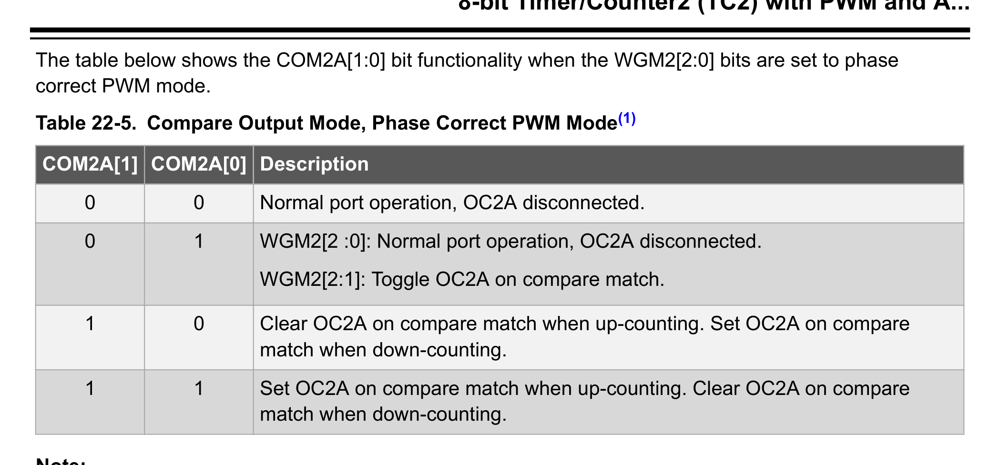
*Description*: Timer/Counter block diagram and waveform timing diagram illustrating prescaler clocks, compare match units, and PWM generation logic for Table 22-5: Compare Output Mode, Phase Correct PWM Mode(1).

> **Table 22-5: Compare Output Mode, Phase Correct PWM Mode(1)**

COM2A[1] COM2A[0] Description
0
0
Normal port operation, OC2A disconnected.
0
1
WGM2[2 :0]: Normal port operation, OC2A disconnected.
WGM2[2:1]: Toggle OC2A on compare match.
1
0
Clear OC2A on compare match when up-counting. Set OC2A on compare
match when down-counting.
1
1
Set OC2A on compare match when up-counting. Clear OC2A on compare
match when down-counting.
Note:
1.
A special case occurs when OCR2A equals TOP and COM2A1 is set. In this case, the compare
match is ignored, but the set or clear is done at TOP. Refer to Phase Correct PWM Mode for
details.
Bits 5:4 – COM2B[1:0] Compare Output Mode for Channel B
These bits control the Output Compare pin (OC2B) behavior. If one or both of the COM2B[1:0] bits are
set, the OC2B output overrides the normal port functionality of the I/O pin it is connected to. However,
note that the Data Direction Register (DDR) bit corresponding to the OC2B pin must be set in order to
enable the output driver.
When OC2B is connected to the pin, the function of the COM2B[1:0] bits depends on the WGM2[2:0] bit
setting. The table shows the COM2B[1:0] bit functionality when the WGM2[2:0] bits are set to a normal or
CTC mode (non- PWM).


*Description*: Timer/Counter block diagram and waveform timing diagram illustrating prescaler clocks, compare match units, and PWM generation logic for Table 22-6: Compare Output Mode, Non-PWM.

> **Table 22-6: Compare Output Mode, Non-PWM**

COM2B[1]
COM2B[0]
Description
0
0
Normal port operation, OC2B disconnected.
0
1
Toggle OC2B on compare match.
1
0
Clear OC2B on compare match.
1
1
Set OC2B on compare match.
The table below shows the COM0B[1:0] bit functionality when the WGM0[2:0] bits are set to fast PWM
mode.


*Description*: Timer/Counter block diagram and waveform timing diagram illustrating prescaler clocks, compare match units, and PWM generation logic for Table 22-7: Compare Output Mode, Fast PWM(1).

> **Table 22-7: Compare Output Mode, Fast PWM(1)**

COM2B[1] COM2B[0] Description
0
0
Normal port operation, OC0B disconnected.
0
1
Reserved
ATmega328/P
8-bit Timer/Counter2 (TC2) with PWM and A...
© 2018 Microchip Technology Inc.
Datasheet Complete
DS40001984A-page 205
Downloaded from Arrow.com.
Downloaded from Arrow.com.
Downloaded from Arrow.com.
Downloaded from Arrow.com.
Downloaded from Arrow.com.
Downloaded from Arrow.com.
Downloaded from Arrow.com.
Downloaded from Arrow.com.
Downloaded from Arrow.com.
Downloaded from Arrow.com.
Downloaded from Arrow.com.
Downloaded from Arrow.com.
Downloaded from Arrow.com.
Downloaded from Arrow.com.
Downloaded from Arrow.com.
Downloaded from Arrow.com.
Downloaded from Arrow.com.
Downloaded from Arrow.com.
Downloaded from Arrow.com.
Downloaded from Arrow.com.
Downloaded from Arrow.com.
Downloaded from Arrow.com.
Downloaded from Arrow.com.
Downloaded from Arrow.com.
Downloaded from Arrow.com.
Downloaded from Arrow.com.
Downloaded from Arrow.com.
Downloaded from Arrow.com.
Downloaded from Arrow.com.
Downloaded from Arrow.com.
Downloaded from Arrow.com.
Downloaded from Arrow.com.
Downloaded from Arrow.com.
Downloaded from Arrow.com.
Downloaded from Arrow.com.
Downloaded from Arrow.com.
Downloaded from Arrow.com.
Downloaded from Arrow.com.
Downloaded from Arrow.com.
Downloaded from Arrow.com.
Downloaded from Arrow.com.
Downloaded from Arrow.com.
Downloaded from Arrow.com.
Downloaded from Arrow.com.
Downloaded from Arrow.com.
Downloaded from Arrow.com.
Downloaded from Arrow.com.
Downloaded from Arrow.com.
Downloaded from Arrow.com.
Downloaded from Arrow.com.
Downloaded from Arrow.com.
Downloaded from Arrow.com.
Downloaded from Arrow.com.
Downloaded from Arrow.com.
Downloaded from Arrow.com.
Downloaded from Arrow.com.
Downloaded from Arrow.com.
Downloaded from Arrow.com.
Downloaded from Arrow.com.
Downloaded from Arrow.com.
Downloaded from Arrow.com.
Downloaded from Arrow.com.
Downloaded from Arrow.com.
Downloaded from Arrow.com.
Downloaded from Arrow.com.
Downloaded from Arrow.com.
Downloaded from Arrow.com.
Downloaded from Arrow.com.
Downloaded from Arrow.com.
Downloaded from Arrow.com.
Downloaded from Arrow.com.
Downloaded from Arrow.com.
Downloaded from Arrow.com.
Downloaded from Arrow.com.
Downloaded from Arrow.com.
Downloaded from Arrow.com.
Downloaded from Arrow.com.
Downloaded from Arrow.com.
Downloaded from Arrow.com.
Downloaded from Arrow.com.
Downloaded from Arrow.com.
Downloaded from Arrow.com.
Downloaded from Arrow.com.
Downloaded from Arrow.com.
Downloaded from Arrow.com.
Downloaded from Arrow.com.
Downloaded from Arrow.com.
Downloaded from Arrow.com.
Downloaded from Arrow.com.
Downloaded from Arrow.com.
Downloaded from Arrow.com.
Downloaded from Arrow.com.
Downloaded from Arrow.com.
Downloaded from Arrow.com.
Downloaded from Arrow.com.
Downloaded from Arrow.com.
Downloaded from Arrow.com.
Downloaded from Arrow.com.
Downloaded from Arrow.com.
Downloaded from Arrow.com.
Downloaded from Arrow.com.
Downloaded from Arrow.com.
Downloaded from Arrow.com.
Downloaded from Arrow.com.
Downloaded from Arrow.com.
Downloaded from Arrow.com.
Downloaded from Arrow.com.
Downloaded from Arrow.com.
Downloaded from Arrow.com.
Downloaded from Arrow.com.
Downloaded from Arrow.com.
Downloaded from Arrow.com.
Downloaded from Arrow.com.
Downloaded from Arrow.com.
Downloaded from Arrow.com.
Downloaded from Arrow.com.
Downloaded from Arrow.com.
Downloaded from Arrow.com.
Downloaded from Arrow.com.
Downloaded from Arrow.com.
Downloaded from Arrow.com.
Downloaded from Arrow.com.
Downloaded from Arrow.com.
Downloaded from Arrow.com.
Downloaded from Arrow.com.
Downloaded from Arrow.com.
Downloaded from Arrow.com.
Downloaded from Arrow.com.
Downloaded from Arrow.com.
Downloaded from Arrow.com.
Downloaded from Arrow.com.
Downloaded from Arrow.com.
Downloaded from Arrow.com.
Downloaded from Arrow.com.
Downloaded from Arrow.com.
Downloaded from Arrow.com.
Downloaded from Arrow.com.
Downloaded from Arrow.com.
Downloaded from Arrow.com.
Downloaded from Arrow.com.
Downloaded from Arrow.com.
Downloaded from Arrow.com.
Downloaded from Arrow.com.
Downloaded from Arrow.com.
Downloaded from Arrow.com.
Downloaded from Arrow.com.
Downloaded from Arrow.com.
Downloaded from Arrow.com.
Downloaded from Arrow.com.
Downloaded from Arrow.com.
Downloaded from Arrow.com.
Downloaded from Arrow.com.
Downloaded from Arrow.com.
Downloaded from Arrow.com.
Downloaded from Arrow.com.
Downloaded from Arrow.com.
Downloaded from Arrow.com.
Downloaded from Arrow.com.
Downloaded from Arrow.com.
Downloaded from Arrow.com.
Downloaded from Arrow.com.
Downloaded from Arrow.com.
Downloaded from Arrow.com.
Downloaded from Arrow.com.
Downloaded from Arrow.com.
Downloaded from Arrow.com.
Downloaded from Arrow.com.
Downloaded from Arrow.com.
Downloaded from Arrow.com.
Downloaded from Arrow.com.
Downloaded from Arrow.com.
Downloaded from Arrow.com.
Downloaded from Arrow.com.
Downloaded from Arrow.com.
Downloaded from Arrow.com.
Downloaded from Arrow.com.
Downloaded from Arrow.com.
Downloaded from Arrow.com.
Downloaded from Arrow.com.
Downloaded from Arrow.com.
Downloaded from Arrow.com.
Downloaded from Arrow.com.
Downloaded from Arrow.com.
Downloaded from Arrow.com.
Downloaded from Arrow.com.
Downloaded from Arrow.com.
Downloaded from Arrow.com.
Downloaded from Arrow.com.
Downloaded from Arrow.com.
Downloaded from Arrow.com.
Downloaded from Arrow.com.
Downloaded from Arrow.com.
Downloaded from Arrow.com.
Downloaded from Arrow.com.
Downloaded from Arrow.com.
Downloaded from Arrow.com.
Downloaded from Arrow.com.
Downloaded from Arrow.com.
Downloaded from Arrow.com.
Downloaded from Arrow.com.
Downloaded from Arrow.com.
Downloaded from Arrow.com.
Downloaded from Arrow.com.
Downloaded from Arrow.com.
Downloaded from Arrow.com.


<!-- Page 206 -->
### [PDF Page 206]

COM2B[1] COM2B[0] Description
1
0
Clear OC0B on compare match, set OC0B at BOTTOM, (non-inverting mode)
1
1
Set OC0B on compare match, clear OC0B at BOTTOM, (inverting mode)
Note:
1.
A special case occurs when OCR2B equals TOP and COM2B[1] is set. In this case, the compare
match is ignored, but the set or clear is done at TOP. Refer to Fast PWM Mode for details.
The table below shows the COM2B[1:0] bit functionality when the WGM2[2:0] bits are set to phase
correct PWM mode.

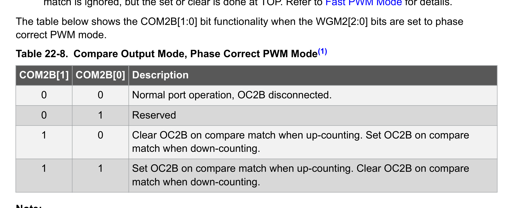
*Description*: Timer/Counter block diagram and waveform timing diagram illustrating prescaler clocks, compare match units, and PWM generation logic for Table 22-8: Compare Output Mode, Phase Correct PWM Mode(1).

> **Table 22-8: Compare Output Mode, Phase Correct PWM Mode(1)**

COM2B[1] COM2B[0] Description
0
0
Normal port operation, OC2B disconnected.
0
1
Reserved
1
0
Clear OC2B on compare match when up-counting. Set OC2B on compare
match when down-counting.
1
1
Set OC2B on compare match when up-counting. Clear OC2B on compare
match when down-counting.
Note:
1.
A special case occurs when OCR2B equals TOP and COM2B[1] is set. In this case, the compare
match is ignored, but the set or clear is done at TOP. Refer to Phase Correct PWM Mode for
details.
Bits 1:0 – WGM2[1:0] Waveform Generation Mode
Combined with the WGM2[2] bit found in the TCCR2B register, these bits control the counting sequence
of the counter, the source for maximum (TOP) counter value, and what type of waveform generation to be
used. Modes of operation supported by the Timer/Counter unit are: Normal mode (counter), Clear Timer
on Compare Match (CTC) mode, and two types of Pulse Width Modulation (PWM) modes (see Modes of
Operation).

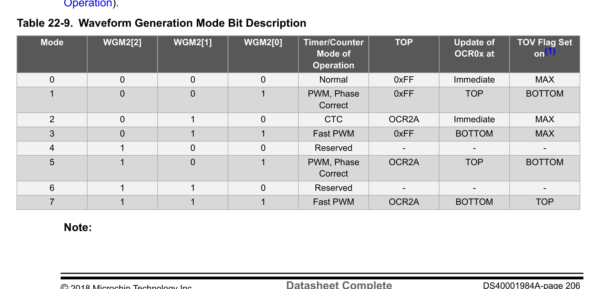
*Description*: Hardware reference table detailing register bit field settings, electrical operating limits, or memory configurations for Table 22-9: Waveform Generation Mode Bit Description.

> **Table 22-9: Waveform Generation Mode Bit Description**

Mode
WGM2[2]
WGM2[1]
WGM2[0]
Timer/Counter
Mode of
Operation
TOP
Update of
OCR0x at
TOV Flag Set
on(1)
0
0
0
0
Normal
0xFF
Immediate
MAX
1
0
0
1
PWM, Phase
Correct
0xFF
TOP
BOTTOM
2
0
1
0
CTC
OCR2A
Immediate
MAX
3
0
1
1
Fast PWM
0xFF
BOTTOM
MAX
4
1
0
0
Reserved
-
-
-
5
1
0
1
PWM, Phase
Correct
OCR2A
TOP
BOTTOM
6
1
1
0
Reserved
-
-
-
7
1
1
1
Fast PWM
OCR2A
BOTTOM
TOP
Note:
ATmega328/P
8-bit Timer/Counter2 (TC2) with PWM and A...
© 2018 Microchip Technology Inc.
Datasheet Complete
DS40001984A-page 206
Downloaded from Arrow.com.
Downloaded from Arrow.com.
Downloaded from Arrow.com.
Downloaded from Arrow.com.
Downloaded from Arrow.com.
Downloaded from Arrow.com.
Downloaded from Arrow.com.
Downloaded from Arrow.com.
Downloaded from Arrow.com.
Downloaded from Arrow.com.
Downloaded from Arrow.com.
Downloaded from Arrow.com.
Downloaded from Arrow.com.
Downloaded from Arrow.com.
Downloaded from Arrow.com.
Downloaded from Arrow.com.
Downloaded from Arrow.com.
Downloaded from Arrow.com.
Downloaded from Arrow.com.
Downloaded from Arrow.com.
Downloaded from Arrow.com.
Downloaded from Arrow.com.
Downloaded from Arrow.com.
Downloaded from Arrow.com.
Downloaded from Arrow.com.
Downloaded from Arrow.com.
Downloaded from Arrow.com.
Downloaded from Arrow.com.
Downloaded from Arrow.com.
Downloaded from Arrow.com.
Downloaded from Arrow.com.
Downloaded from Arrow.com.
Downloaded from Arrow.com.
Downloaded from Arrow.com.
Downloaded from Arrow.com.
Downloaded from Arrow.com.
Downloaded from Arrow.com.
Downloaded from Arrow.com.
Downloaded from Arrow.com.
Downloaded from Arrow.com.
Downloaded from Arrow.com.
Downloaded from Arrow.com.
Downloaded from Arrow.com.
Downloaded from Arrow.com.
Downloaded from Arrow.com.
Downloaded from Arrow.com.
Downloaded from Arrow.com.
Downloaded from Arrow.com.
Downloaded from Arrow.com.
Downloaded from Arrow.com.
Downloaded from Arrow.com.
Downloaded from Arrow.com.
Downloaded from Arrow.com.
Downloaded from Arrow.com.
Downloaded from Arrow.com.
Downloaded from Arrow.com.
Downloaded from Arrow.com.
Downloaded from Arrow.com.
Downloaded from Arrow.com.
Downloaded from Arrow.com.
Downloaded from Arrow.com.
Downloaded from Arrow.com.
Downloaded from Arrow.com.
Downloaded from Arrow.com.
Downloaded from Arrow.com.
Downloaded from Arrow.com.
Downloaded from Arrow.com.
Downloaded from Arrow.com.
Downloaded from Arrow.com.
Downloaded from Arrow.com.
Downloaded from Arrow.com.
Downloaded from Arrow.com.
Downloaded from Arrow.com.
Downloaded from Arrow.com.
Downloaded from Arrow.com.
Downloaded from Arrow.com.
Downloaded from Arrow.com.
Downloaded from Arrow.com.
Downloaded from Arrow.com.
Downloaded from Arrow.com.
Downloaded from Arrow.com.
Downloaded from Arrow.com.
Downloaded from Arrow.com.
Downloaded from Arrow.com.
Downloaded from Arrow.com.
Downloaded from Arrow.com.
Downloaded from Arrow.com.
Downloaded from Arrow.com.
Downloaded from Arrow.com.
Downloaded from Arrow.com.
Downloaded from Arrow.com.
Downloaded from Arrow.com.
Downloaded from Arrow.com.
Downloaded from Arrow.com.
Downloaded from Arrow.com.
Downloaded from Arrow.com.
Downloaded from Arrow.com.
Downloaded from Arrow.com.
Downloaded from Arrow.com.
Downloaded from Arrow.com.
Downloaded from Arrow.com.
Downloaded from Arrow.com.
Downloaded from Arrow.com.
Downloaded from Arrow.com.
Downloaded from Arrow.com.
Downloaded from Arrow.com.
Downloaded from Arrow.com.
Downloaded from Arrow.com.
Downloaded from Arrow.com.
Downloaded from Arrow.com.
Downloaded from Arrow.com.
Downloaded from Arrow.com.
Downloaded from Arrow.com.
Downloaded from Arrow.com.
Downloaded from Arrow.com.
Downloaded from Arrow.com.
Downloaded from Arrow.com.
Downloaded from Arrow.com.
Downloaded from Arrow.com.
Downloaded from Arrow.com.
Downloaded from Arrow.com.
Downloaded from Arrow.com.
Downloaded from Arrow.com.
Downloaded from Arrow.com.
Downloaded from Arrow.com.
Downloaded from Arrow.com.
Downloaded from Arrow.com.
Downloaded from Arrow.com.
Downloaded from Arrow.com.
Downloaded from Arrow.com.
Downloaded from Arrow.com.
Downloaded from Arrow.com.
Downloaded from Arrow.com.
Downloaded from Arrow.com.
Downloaded from Arrow.com.
Downloaded from Arrow.com.
Downloaded from Arrow.com.
Downloaded from Arrow.com.
Downloaded from Arrow.com.
Downloaded from Arrow.com.
Downloaded from Arrow.com.
Downloaded from Arrow.com.
Downloaded from Arrow.com.
Downloaded from Arrow.com.
Downloaded from Arrow.com.
Downloaded from Arrow.com.
Downloaded from Arrow.com.
Downloaded from Arrow.com.
Downloaded from Arrow.com.
Downloaded from Arrow.com.
Downloaded from Arrow.com.
Downloaded from Arrow.com.
Downloaded from Arrow.com.
Downloaded from Arrow.com.
Downloaded from Arrow.com.
Downloaded from Arrow.com.
Downloaded from Arrow.com.
Downloaded from Arrow.com.
Downloaded from Arrow.com.
Downloaded from Arrow.com.
Downloaded from Arrow.com.
Downloaded from Arrow.com.
Downloaded from Arrow.com.
Downloaded from Arrow.com.
Downloaded from Arrow.com.
Downloaded from Arrow.com.
Downloaded from Arrow.com.
Downloaded from Arrow.com.
Downloaded from Arrow.com.
Downloaded from Arrow.com.
Downloaded from Arrow.com.
Downloaded from Arrow.com.
Downloaded from Arrow.com.
Downloaded from Arrow.com.
Downloaded from Arrow.com.
Downloaded from Arrow.com.
Downloaded from Arrow.com.
Downloaded from Arrow.com.
Downloaded from Arrow.com.
Downloaded from Arrow.com.
Downloaded from Arrow.com.
Downloaded from Arrow.com.
Downloaded from Arrow.com.
Downloaded from Arrow.com.
Downloaded from Arrow.com.
Downloaded from Arrow.com.
Downloaded from Arrow.com.
Downloaded from Arrow.com.
Downloaded from Arrow.com.
Downloaded from Arrow.com.
Downloaded from Arrow.com.
Downloaded from Arrow.com.
Downloaded from Arrow.com.
Downloaded from Arrow.com.
Downloaded from Arrow.com.
Downloaded from Arrow.com.
Downloaded from Arrow.com.
Downloaded from Arrow.com.
Downloaded from Arrow.com.
Downloaded from Arrow.com.
Downloaded from Arrow.com.
Downloaded from Arrow.com.
Downloaded from Arrow.com.
Downloaded from Arrow.com.
Downloaded from Arrow.com.
Downloaded from Arrow.com.


<!-- Page 207 -->
### [PDF Page 207]

1.
MAX = 0xFF
2.
BOTTOM = 0x00
ATmega328/P
8-bit Timer/Counter2 (TC2) with PWM and A...
© 2018 Microchip Technology Inc.
Datasheet Complete
DS40001984A-page 207
Downloaded from Arrow.com.
Downloaded from Arrow.com.
Downloaded from Arrow.com.
Downloaded from Arrow.com.
Downloaded from Arrow.com.
Downloaded from Arrow.com.
Downloaded from Arrow.com.
Downloaded from Arrow.com.
Downloaded from Arrow.com.
Downloaded from Arrow.com.
Downloaded from Arrow.com.
Downloaded from Arrow.com.
Downloaded from Arrow.com.
Downloaded from Arrow.com.
Downloaded from Arrow.com.
Downloaded from Arrow.com.
Downloaded from Arrow.com.
Downloaded from Arrow.com.
Downloaded from Arrow.com.
Downloaded from Arrow.com.
Downloaded from Arrow.com.
Downloaded from Arrow.com.
Downloaded from Arrow.com.
Downloaded from Arrow.com.
Downloaded from Arrow.com.
Downloaded from Arrow.com.
Downloaded from Arrow.com.
Downloaded from Arrow.com.
Downloaded from Arrow.com.
Downloaded from Arrow.com.
Downloaded from Arrow.com.
Downloaded from Arrow.com.
Downloaded from Arrow.com.
Downloaded from Arrow.com.
Downloaded from Arrow.com.
Downloaded from Arrow.com.
Downloaded from Arrow.com.
Downloaded from Arrow.com.
Downloaded from Arrow.com.
Downloaded from Arrow.com.
Downloaded from Arrow.com.
Downloaded from Arrow.com.
Downloaded from Arrow.com.
Downloaded from Arrow.com.
Downloaded from Arrow.com.
Downloaded from Arrow.com.
Downloaded from Arrow.com.
Downloaded from Arrow.com.
Downloaded from Arrow.com.
Downloaded from Arrow.com.
Downloaded from Arrow.com.
Downloaded from Arrow.com.
Downloaded from Arrow.com.
Downloaded from Arrow.com.
Downloaded from Arrow.com.
Downloaded from Arrow.com.
Downloaded from Arrow.com.
Downloaded from Arrow.com.
Downloaded from Arrow.com.
Downloaded from Arrow.com.
Downloaded from Arrow.com.
Downloaded from Arrow.com.
Downloaded from Arrow.com.
Downloaded from Arrow.com.
Downloaded from Arrow.com.
Downloaded from Arrow.com.
Downloaded from Arrow.com.
Downloaded from Arrow.com.
Downloaded from Arrow.com.
Downloaded from Arrow.com.
Downloaded from Arrow.com.
Downloaded from Arrow.com.
Downloaded from Arrow.com.
Downloaded from Arrow.com.
Downloaded from Arrow.com.
Downloaded from Arrow.com.
Downloaded from Arrow.com.
Downloaded from Arrow.com.
Downloaded from Arrow.com.
Downloaded from Arrow.com.
Downloaded from Arrow.com.
Downloaded from Arrow.com.
Downloaded from Arrow.com.
Downloaded from Arrow.com.
Downloaded from Arrow.com.
Downloaded from Arrow.com.
Downloaded from Arrow.com.
Downloaded from Arrow.com.
Downloaded from Arrow.com.
Downloaded from Arrow.com.
Downloaded from Arrow.com.
Downloaded from Arrow.com.
Downloaded from Arrow.com.
Downloaded from Arrow.com.
Downloaded from Arrow.com.
Downloaded from Arrow.com.
Downloaded from Arrow.com.
Downloaded from Arrow.com.
Downloaded from Arrow.com.
Downloaded from Arrow.com.
Downloaded from Arrow.com.
Downloaded from Arrow.com.
Downloaded from Arrow.com.
Downloaded from Arrow.com.
Downloaded from Arrow.com.
Downloaded from Arrow.com.
Downloaded from Arrow.com.
Downloaded from Arrow.com.
Downloaded from Arrow.com.
Downloaded from Arrow.com.
Downloaded from Arrow.com.
Downloaded from Arrow.com.
Downloaded from Arrow.com.
Downloaded from Arrow.com.
Downloaded from Arrow.com.
Downloaded from Arrow.com.
Downloaded from Arrow.com.
Downloaded from Arrow.com.
Downloaded from Arrow.com.
Downloaded from Arrow.com.
Downloaded from Arrow.com.
Downloaded from Arrow.com.
Downloaded from Arrow.com.
Downloaded from Arrow.com.
Downloaded from Arrow.com.
Downloaded from Arrow.com.
Downloaded from Arrow.com.
Downloaded from Arrow.com.
Downloaded from Arrow.com.
Downloaded from Arrow.com.
Downloaded from Arrow.com.
Downloaded from Arrow.com.
Downloaded from Arrow.com.
Downloaded from Arrow.com.
Downloaded from Arrow.com.
Downloaded from Arrow.com.
Downloaded from Arrow.com.
Downloaded from Arrow.com.
Downloaded from Arrow.com.
Downloaded from Arrow.com.
Downloaded from Arrow.com.
Downloaded from Arrow.com.
Downloaded from Arrow.com.
Downloaded from Arrow.com.
Downloaded from Arrow.com.
Downloaded from Arrow.com.
Downloaded from Arrow.com.
Downloaded from Arrow.com.
Downloaded from Arrow.com.
Downloaded from Arrow.com.
Downloaded from Arrow.com.
Downloaded from Arrow.com.
Downloaded from Arrow.com.
Downloaded from Arrow.com.
Downloaded from Arrow.com.
Downloaded from Arrow.com.
Downloaded from Arrow.com.
Downloaded from Arrow.com.
Downloaded from Arrow.com.
Downloaded from Arrow.com.
Downloaded from Arrow.com.
Downloaded from Arrow.com.
Downloaded from Arrow.com.
Downloaded from Arrow.com.
Downloaded from Arrow.com.
Downloaded from Arrow.com.
Downloaded from Arrow.com.
Downloaded from Arrow.com.
Downloaded from Arrow.com.
Downloaded from Arrow.com.
Downloaded from Arrow.com.
Downloaded from Arrow.com.
Downloaded from Arrow.com.
Downloaded from Arrow.com.
Downloaded from Arrow.com.
Downloaded from Arrow.com.
Downloaded from Arrow.com.
Downloaded from Arrow.com.
Downloaded from Arrow.com.
Downloaded from Arrow.com.
Downloaded from Arrow.com.
Downloaded from Arrow.com.
Downloaded from Arrow.com.
Downloaded from Arrow.com.
Downloaded from Arrow.com.
Downloaded from Arrow.com.
Downloaded from Arrow.com.
Downloaded from Arrow.com.
Downloaded from Arrow.com.
Downloaded from Arrow.com.
Downloaded from Arrow.com.
Downloaded from Arrow.com.
Downloaded from Arrow.com.
Downloaded from Arrow.com.
Downloaded from Arrow.com.
Downloaded from Arrow.com.
Downloaded from Arrow.com.
Downloaded from Arrow.com.
Downloaded from Arrow.com.
Downloaded from Arrow.com.
Downloaded from Arrow.com.
Downloaded from Arrow.com.
Downloaded from Arrow.com.
Downloaded from Arrow.com.
Downloaded from Arrow.com.
Downloaded from Arrow.com.
Downloaded from Arrow.com.


<!-- Page 208 -->
### [PDF Page 208]

22.11.2 TC2 Control Register B
Name:
TCCR2B
Offset:
0xB1
Reset:
0x00
Property:  -
Bit
7
6
5
4
3
2
1
0
FOC2A
FOC2B
WGM22
CS2[2:0]
Access
R/W
R/W
R/W
R/W
R/W
R/W
Reset
0
0
0
0
0
0
Bit 7 – FOC2A Force Output Compare A
The FOC2A bit is only active when the WGM bits specify a non-PWM mode.
To ensure compatibility with future devices, this bit must be set to zero when TCCR2B is written when
operating in PWM mode. When writing a logical one to the FOC2A bit, an immediate compare match is
forced on the waveform generation unit. The OC2A output is changed according to its COM2A[1:0] bits
setting. Note that the FOC2A bit is implemented as a strobe. Therefore it is the value present in the
COM2A[1:0] bits that determines the effect of the forced compare.
A FOC2A strobe will not generate any interrupt, nor will it clear the timer in CTC mode using OCR2A as
TOP.
The FOC2A bit is always read as zero.
Bit 6 – FOC2B Force Output Compare B
The FOC2B bit is only active when the WGM bits specify a non-PWM mode.
To ensure compatibility with future devices, this bit must be set to zero when TCCR2B is written when
operating in PWM mode. When writing a logical one to the FOC2B bit, an immediate compare match is
forced on the waveform generation unit. The OC2B output is changed according to its COM2B[1:0] bits
setting. Note that the FOC2B bit is implemented as a strobe. Therefore it is the value present in the
COM2B[1:0] bits that determines the effect of the forced compare.
A FOC2B strobe will not generate any interrupt, nor will it clear the timer in CTC mode using OCR2B as
TOP.
The FOC2B bit is always read as zero.
Bit 3 – WGM22 Waveform Generation Mode
Refer to TCCR2A.
Bits 2:0 – CS2[2:0] Clock Select 2 [n = 0..2]
The three Clock Select bits select the clock source to be used by the timer/counter.

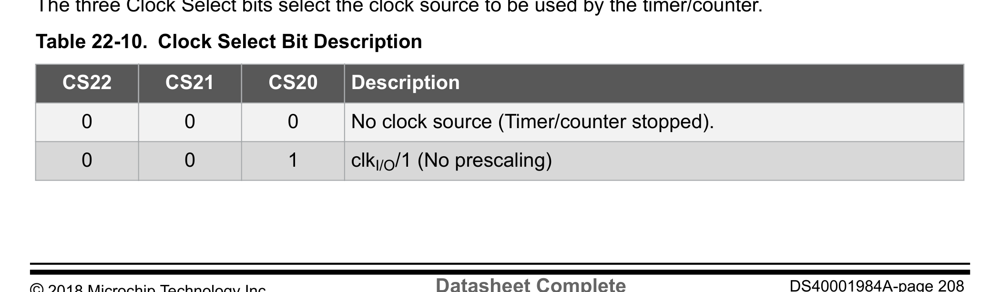
*Description*: Clock distribution diagram showing oscillator sources, prescaler dividers, and peripheral clock routing for Table 22-10: Clock Select Bit Description.

> **Table 22-10: Clock Select Bit Description**

CS22
CS21
CS20
Description
0
0
0
No clock source (Timer/counter stopped).
0
0
1
clkI/O/1 (No prescaling)
ATmega328/P
8-bit Timer/Counter2 (TC2) with PWM and A...
© 2018 Microchip Technology Inc.
Datasheet Complete
DS40001984A-page 208
Downloaded from Arrow.com.
Downloaded from Arrow.com.
Downloaded from Arrow.com.
Downloaded from Arrow.com.
Downloaded from Arrow.com.
Downloaded from Arrow.com.
Downloaded from Arrow.com.
Downloaded from Arrow.com.
Downloaded from Arrow.com.
Downloaded from Arrow.com.
Downloaded from Arrow.com.
Downloaded from Arrow.com.
Downloaded from Arrow.com.
Downloaded from Arrow.com.
Downloaded from Arrow.com.
Downloaded from Arrow.com.
Downloaded from Arrow.com.
Downloaded from Arrow.com.
Downloaded from Arrow.com.
Downloaded from Arrow.com.
Downloaded from Arrow.com.
Downloaded from Arrow.com.
Downloaded from Arrow.com.
Downloaded from Arrow.com.
Downloaded from Arrow.com.
Downloaded from Arrow.com.
Downloaded from Arrow.com.
Downloaded from Arrow.com.
Downloaded from Arrow.com.
Downloaded from Arrow.com.
Downloaded from Arrow.com.
Downloaded from Arrow.com.
Downloaded from Arrow.com.
Downloaded from Arrow.com.
Downloaded from Arrow.com.
Downloaded from Arrow.com.
Downloaded from Arrow.com.
Downloaded from Arrow.com.
Downloaded from Arrow.com.
Downloaded from Arrow.com.
Downloaded from Arrow.com.
Downloaded from Arrow.com.
Downloaded from Arrow.com.
Downloaded from Arrow.com.
Downloaded from Arrow.com.
Downloaded from Arrow.com.
Downloaded from Arrow.com.
Downloaded from Arrow.com.
Downloaded from Arrow.com.
Downloaded from Arrow.com.
Downloaded from Arrow.com.
Downloaded from Arrow.com.
Downloaded from Arrow.com.
Downloaded from Arrow.com.
Downloaded from Arrow.com.
Downloaded from Arrow.com.
Downloaded from Arrow.com.
Downloaded from Arrow.com.
Downloaded from Arrow.com.
Downloaded from Arrow.com.
Downloaded from Arrow.com.
Downloaded from Arrow.com.
Downloaded from Arrow.com.
Downloaded from Arrow.com.
Downloaded from Arrow.com.
Downloaded from Arrow.com.
Downloaded from Arrow.com.
Downloaded from Arrow.com.
Downloaded from Arrow.com.
Downloaded from Arrow.com.
Downloaded from Arrow.com.
Downloaded from Arrow.com.
Downloaded from Arrow.com.
Downloaded from Arrow.com.
Downloaded from Arrow.com.
Downloaded from Arrow.com.
Downloaded from Arrow.com.
Downloaded from Arrow.com.
Downloaded from Arrow.com.
Downloaded from Arrow.com.
Downloaded from Arrow.com.
Downloaded from Arrow.com.
Downloaded from Arrow.com.
Downloaded from Arrow.com.
Downloaded from Arrow.com.
Downloaded from Arrow.com.
Downloaded from Arrow.com.
Downloaded from Arrow.com.
Downloaded from Arrow.com.
Downloaded from Arrow.com.
Downloaded from Arrow.com.
Downloaded from Arrow.com.
Downloaded from Arrow.com.
Downloaded from Arrow.com.
Downloaded from Arrow.com.
Downloaded from Arrow.com.
Downloaded from Arrow.com.
Downloaded from Arrow.com.
Downloaded from Arrow.com.
Downloaded from Arrow.com.
Downloaded from Arrow.com.
Downloaded from Arrow.com.
Downloaded from Arrow.com.
Downloaded from Arrow.com.
Downloaded from Arrow.com.
Downloaded from Arrow.com.
Downloaded from Arrow.com.
Downloaded from Arrow.com.
Downloaded from Arrow.com.
Downloaded from Arrow.com.
Downloaded from Arrow.com.
Downloaded from Arrow.com.
Downloaded from Arrow.com.
Downloaded from Arrow.com.
Downloaded from Arrow.com.
Downloaded from Arrow.com.
Downloaded from Arrow.com.
Downloaded from Arrow.com.
Downloaded from Arrow.com.
Downloaded from Arrow.com.
Downloaded from Arrow.com.
Downloaded from Arrow.com.
Downloaded from Arrow.com.
Downloaded from Arrow.com.
Downloaded from Arrow.com.
Downloaded from Arrow.com.
Downloaded from Arrow.com.
Downloaded from Arrow.com.
Downloaded from Arrow.com.
Downloaded from Arrow.com.
Downloaded from Arrow.com.
Downloaded from Arrow.com.
Downloaded from Arrow.com.
Downloaded from Arrow.com.
Downloaded from Arrow.com.
Downloaded from Arrow.com.
Downloaded from Arrow.com.
Downloaded from Arrow.com.
Downloaded from Arrow.com.
Downloaded from Arrow.com.
Downloaded from Arrow.com.
Downloaded from Arrow.com.
Downloaded from Arrow.com.
Downloaded from Arrow.com.
Downloaded from Arrow.com.
Downloaded from Arrow.com.
Downloaded from Arrow.com.
Downloaded from Arrow.com.
Downloaded from Arrow.com.
Downloaded from Arrow.com.
Downloaded from Arrow.com.
Downloaded from Arrow.com.
Downloaded from Arrow.com.
Downloaded from Arrow.com.
Downloaded from Arrow.com.
Downloaded from Arrow.com.
Downloaded from Arrow.com.
Downloaded from Arrow.com.
Downloaded from Arrow.com.
Downloaded from Arrow.com.
Downloaded from Arrow.com.
Downloaded from Arrow.com.
Downloaded from Arrow.com.
Downloaded from Arrow.com.
Downloaded from Arrow.com.
Downloaded from Arrow.com.
Downloaded from Arrow.com.
Downloaded from Arrow.com.
Downloaded from Arrow.com.
Downloaded from Arrow.com.
Downloaded from Arrow.com.
Downloaded from Arrow.com.
Downloaded from Arrow.com.
Downloaded from Arrow.com.
Downloaded from Arrow.com.
Downloaded from Arrow.com.
Downloaded from Arrow.com.
Downloaded from Arrow.com.
Downloaded from Arrow.com.
Downloaded from Arrow.com.
Downloaded from Arrow.com.
Downloaded from Arrow.com.
Downloaded from Arrow.com.
Downloaded from Arrow.com.
Downloaded from Arrow.com.
Downloaded from Arrow.com.
Downloaded from Arrow.com.
Downloaded from Arrow.com.
Downloaded from Arrow.com.
Downloaded from Arrow.com.
Downloaded from Arrow.com.
Downloaded from Arrow.com.
Downloaded from Arrow.com.
Downloaded from Arrow.com.
Downloaded from Arrow.com.
Downloaded from Arrow.com.
Downloaded from Arrow.com.
Downloaded from Arrow.com.
Downloaded from Arrow.com.
Downloaded from Arrow.com.
Downloaded from Arrow.com.
Downloaded from Arrow.com.
Downloaded from Arrow.com.
Downloaded from Arrow.com.
Downloaded from Arrow.com.
Downloaded from Arrow.com.
Downloaded from Arrow.com.
Downloaded from Arrow.com.


<!-- Page 209 -->
### [PDF Page 209]

CS22
CS21
CS20
Description
0
1
0
clkI/O/8 (From prescaler)
0
1
1
clkI/O/32 (From prescaler)
1
0
0
clkI/O/64 (From prescaler)
1
0
1
clkI/O/128 (From prescaler)
1
1
0
clkI/O/256 (From prescaler)
1
1
1
clkI/O/1024 (From prescaler)
If external pin modes are used for the timer/counter0, transitions on the T0 pin will clock the counter even
if the pin is configured as an output. This feature allows software control of the counting.
ATmega328/P
8-bit Timer/Counter2 (TC2) with PWM and A...
© 2018 Microchip Technology Inc.
Datasheet Complete
DS40001984A-page 209
Downloaded from Arrow.com.
Downloaded from Arrow.com.
Downloaded from Arrow.com.
Downloaded from Arrow.com.
Downloaded from Arrow.com.
Downloaded from Arrow.com.
Downloaded from Arrow.com.
Downloaded from Arrow.com.
Downloaded from Arrow.com.
Downloaded from Arrow.com.
Downloaded from Arrow.com.
Downloaded from Arrow.com.
Downloaded from Arrow.com.
Downloaded from Arrow.com.
Downloaded from Arrow.com.
Downloaded from Arrow.com.
Downloaded from Arrow.com.
Downloaded from Arrow.com.
Downloaded from Arrow.com.
Downloaded from Arrow.com.
Downloaded from Arrow.com.
Downloaded from Arrow.com.
Downloaded from Arrow.com.
Downloaded from Arrow.com.
Downloaded from Arrow.com.
Downloaded from Arrow.com.
Downloaded from Arrow.com.
Downloaded from Arrow.com.
Downloaded from Arrow.com.
Downloaded from Arrow.com.
Downloaded from Arrow.com.
Downloaded from Arrow.com.
Downloaded from Arrow.com.
Downloaded from Arrow.com.
Downloaded from Arrow.com.
Downloaded from Arrow.com.
Downloaded from Arrow.com.
Downloaded from Arrow.com.
Downloaded from Arrow.com.
Downloaded from Arrow.com.
Downloaded from Arrow.com.
Downloaded from Arrow.com.
Downloaded from Arrow.com.
Downloaded from Arrow.com.
Downloaded from Arrow.com.
Downloaded from Arrow.com.
Downloaded from Arrow.com.
Downloaded from Arrow.com.
Downloaded from Arrow.com.
Downloaded from Arrow.com.
Downloaded from Arrow.com.
Downloaded from Arrow.com.
Downloaded from Arrow.com.
Downloaded from Arrow.com.
Downloaded from Arrow.com.
Downloaded from Arrow.com.
Downloaded from Arrow.com.
Downloaded from Arrow.com.
Downloaded from Arrow.com.
Downloaded from Arrow.com.
Downloaded from Arrow.com.
Downloaded from Arrow.com.
Downloaded from Arrow.com.
Downloaded from Arrow.com.
Downloaded from Arrow.com.
Downloaded from Arrow.com.
Downloaded from Arrow.com.
Downloaded from Arrow.com.
Downloaded from Arrow.com.
Downloaded from Arrow.com.
Downloaded from Arrow.com.
Downloaded from Arrow.com.
Downloaded from Arrow.com.
Downloaded from Arrow.com.
Downloaded from Arrow.com.
Downloaded from Arrow.com.
Downloaded from Arrow.com.
Downloaded from Arrow.com.
Downloaded from Arrow.com.
Downloaded from Arrow.com.
Downloaded from Arrow.com.
Downloaded from Arrow.com.
Downloaded from Arrow.com.
Downloaded from Arrow.com.
Downloaded from Arrow.com.
Downloaded from Arrow.com.
Downloaded from Arrow.com.
Downloaded from Arrow.com.
Downloaded from Arrow.com.
Downloaded from Arrow.com.
Downloaded from Arrow.com.
Downloaded from Arrow.com.
Downloaded from Arrow.com.
Downloaded from Arrow.com.
Downloaded from Arrow.com.
Downloaded from Arrow.com.
Downloaded from Arrow.com.
Downloaded from Arrow.com.
Downloaded from Arrow.com.
Downloaded from Arrow.com.
Downloaded from Arrow.com.
Downloaded from Arrow.com.
Downloaded from Arrow.com.
Downloaded from Arrow.com.
Downloaded from Arrow.com.
Downloaded from Arrow.com.
Downloaded from Arrow.com.
Downloaded from Arrow.com.
Downloaded from Arrow.com.
Downloaded from Arrow.com.
Downloaded from Arrow.com.
Downloaded from Arrow.com.
Downloaded from Arrow.com.
Downloaded from Arrow.com.
Downloaded from Arrow.com.
Downloaded from Arrow.com.
Downloaded from Arrow.com.
Downloaded from Arrow.com.
Downloaded from Arrow.com.
Downloaded from Arrow.com.
Downloaded from Arrow.com.
Downloaded from Arrow.com.
Downloaded from Arrow.com.
Downloaded from Arrow.com.
Downloaded from Arrow.com.
Downloaded from Arrow.com.
Downloaded from Arrow.com.
Downloaded from Arrow.com.
Downloaded from Arrow.com.
Downloaded from Arrow.com.
Downloaded from Arrow.com.
Downloaded from Arrow.com.
Downloaded from Arrow.com.
Downloaded from Arrow.com.
Downloaded from Arrow.com.
Downloaded from Arrow.com.
Downloaded from Arrow.com.
Downloaded from Arrow.com.
Downloaded from Arrow.com.
Downloaded from Arrow.com.
Downloaded from Arrow.com.
Downloaded from Arrow.com.
Downloaded from Arrow.com.
Downloaded from Arrow.com.
Downloaded from Arrow.com.
Downloaded from Arrow.com.
Downloaded from Arrow.com.
Downloaded from Arrow.com.
Downloaded from Arrow.com.
Downloaded from Arrow.com.
Downloaded from Arrow.com.
Downloaded from Arrow.com.
Downloaded from Arrow.com.
Downloaded from Arrow.com.
Downloaded from Arrow.com.
Downloaded from Arrow.com.
Downloaded from Arrow.com.
Downloaded from Arrow.com.
Downloaded from Arrow.com.
Downloaded from Arrow.com.
Downloaded from Arrow.com.
Downloaded from Arrow.com.
Downloaded from Arrow.com.
Downloaded from Arrow.com.
Downloaded from Arrow.com.
Downloaded from Arrow.com.
Downloaded from Arrow.com.
Downloaded from Arrow.com.
Downloaded from Arrow.com.
Downloaded from Arrow.com.
Downloaded from Arrow.com.
Downloaded from Arrow.com.
Downloaded from Arrow.com.
Downloaded from Arrow.com.
Downloaded from Arrow.com.
Downloaded from Arrow.com.
Downloaded from Arrow.com.
Downloaded from Arrow.com.
Downloaded from Arrow.com.
Downloaded from Arrow.com.
Downloaded from Arrow.com.
Downloaded from Arrow.com.
Downloaded from Arrow.com.
Downloaded from Arrow.com.
Downloaded from Arrow.com.
Downloaded from Arrow.com.
Downloaded from Arrow.com.
Downloaded from Arrow.com.
Downloaded from Arrow.com.
Downloaded from Arrow.com.
Downloaded from Arrow.com.
Downloaded from Arrow.com.
Downloaded from Arrow.com.
Downloaded from Arrow.com.
Downloaded from Arrow.com.
Downloaded from Arrow.com.
Downloaded from Arrow.com.
Downloaded from Arrow.com.
Downloaded from Arrow.com.
Downloaded from Arrow.com.
Downloaded from Arrow.com.
Downloaded from Arrow.com.
Downloaded from Arrow.com.
Downloaded from Arrow.com.
Downloaded from Arrow.com.
Downloaded from Arrow.com.
Downloaded from Arrow.com.
Downloaded from Arrow.com.
Downloaded from Arrow.com.


<!-- Page 210 -->
### [PDF Page 210]

22.11.3 TC2 Counter Value Register
Name:
TCNT2
Offset:
0xB2
Reset:
0x00
Property:  -
Bit
7
6
5
4
3
2
1
0
TCNT2[7:0]
Access
R/W
R/W
R/W
R/W
R/W
R/W
R/W
R/W
Reset
0
0
0
0
0
0
0
0
Bits 7:0 – TCNT2[7:0] Timer/Counter 2 Counter Value
The Timer/Counter register gives direct access, both for read and write operations, to the Timer/Counter
unit 8-bit counter. Writing to the TCNT2 register blocks (removes) the compare match on the following
timer clock. Modifying the counter (TCNT2) while the counter is running, introduces a risk of missing a
compare match between TCNT2 and the OCR2x registers.
ATmega328/P
8-bit Timer/Counter2 (TC2) with PWM and A...
© 2018 Microchip Technology Inc.
Datasheet Complete
DS40001984A-page 210
Downloaded from Arrow.com.
Downloaded from Arrow.com.
Downloaded from Arrow.com.
Downloaded from Arrow.com.
Downloaded from Arrow.com.
Downloaded from Arrow.com.
Downloaded from Arrow.com.
Downloaded from Arrow.com.
Downloaded from Arrow.com.
Downloaded from Arrow.com.
Downloaded from Arrow.com.
Downloaded from Arrow.com.
Downloaded from Arrow.com.
Downloaded from Arrow.com.
Downloaded from Arrow.com.
Downloaded from Arrow.com.
Downloaded from Arrow.com.
Downloaded from Arrow.com.
Downloaded from Arrow.com.
Downloaded from Arrow.com.
Downloaded from Arrow.com.
Downloaded from Arrow.com.
Downloaded from Arrow.com.
Downloaded from Arrow.com.
Downloaded from Arrow.com.
Downloaded from Arrow.com.
Downloaded from Arrow.com.
Downloaded from Arrow.com.
Downloaded from Arrow.com.
Downloaded from Arrow.com.
Downloaded from Arrow.com.
Downloaded from Arrow.com.
Downloaded from Arrow.com.
Downloaded from Arrow.com.
Downloaded from Arrow.com.
Downloaded from Arrow.com.
Downloaded from Arrow.com.
Downloaded from Arrow.com.
Downloaded from Arrow.com.
Downloaded from Arrow.com.
Downloaded from Arrow.com.
Downloaded from Arrow.com.
Downloaded from Arrow.com.
Downloaded from Arrow.com.
Downloaded from Arrow.com.
Downloaded from Arrow.com.
Downloaded from Arrow.com.
Downloaded from Arrow.com.
Downloaded from Arrow.com.
Downloaded from Arrow.com.
Downloaded from Arrow.com.
Downloaded from Arrow.com.
Downloaded from Arrow.com.
Downloaded from Arrow.com.
Downloaded from Arrow.com.
Downloaded from Arrow.com.
Downloaded from Arrow.com.
Downloaded from Arrow.com.
Downloaded from Arrow.com.
Downloaded from Arrow.com.
Downloaded from Arrow.com.
Downloaded from Arrow.com.
Downloaded from Arrow.com.
Downloaded from Arrow.com.
Downloaded from Arrow.com.
Downloaded from Arrow.com.
Downloaded from Arrow.com.
Downloaded from Arrow.com.
Downloaded from Arrow.com.
Downloaded from Arrow.com.
Downloaded from Arrow.com.
Downloaded from Arrow.com.
Downloaded from Arrow.com.
Downloaded from Arrow.com.
Downloaded from Arrow.com.
Downloaded from Arrow.com.
Downloaded from Arrow.com.
Downloaded from Arrow.com.
Downloaded from Arrow.com.
Downloaded from Arrow.com.
Downloaded from Arrow.com.
Downloaded from Arrow.com.
Downloaded from Arrow.com.
Downloaded from Arrow.com.
Downloaded from Arrow.com.
Downloaded from Arrow.com.
Downloaded from Arrow.com.
Downloaded from Arrow.com.
Downloaded from Arrow.com.
Downloaded from Arrow.com.
Downloaded from Arrow.com.
Downloaded from Arrow.com.
Downloaded from Arrow.com.
Downloaded from Arrow.com.
Downloaded from Arrow.com.
Downloaded from Arrow.com.
Downloaded from Arrow.com.
Downloaded from Arrow.com.
Downloaded from Arrow.com.
Downloaded from Arrow.com.
Downloaded from Arrow.com.
Downloaded from Arrow.com.
Downloaded from Arrow.com.
Downloaded from Arrow.com.
Downloaded from Arrow.com.
Downloaded from Arrow.com.
Downloaded from Arrow.com.
Downloaded from Arrow.com.
Downloaded from Arrow.com.
Downloaded from Arrow.com.
Downloaded from Arrow.com.
Downloaded from Arrow.com.
Downloaded from Arrow.com.
Downloaded from Arrow.com.
Downloaded from Arrow.com.
Downloaded from Arrow.com.
Downloaded from Arrow.com.
Downloaded from Arrow.com.
Downloaded from Arrow.com.
Downloaded from Arrow.com.
Downloaded from Arrow.com.
Downloaded from Arrow.com.
Downloaded from Arrow.com.
Downloaded from Arrow.com.
Downloaded from Arrow.com.
Downloaded from Arrow.com.
Downloaded from Arrow.com.
Downloaded from Arrow.com.
Downloaded from Arrow.com.
Downloaded from Arrow.com.
Downloaded from Arrow.com.
Downloaded from Arrow.com.
Downloaded from Arrow.com.
Downloaded from Arrow.com.
Downloaded from Arrow.com.
Downloaded from Arrow.com.
Downloaded from Arrow.com.
Downloaded from Arrow.com.
Downloaded from Arrow.com.
Downloaded from Arrow.com.
Downloaded from Arrow.com.
Downloaded from Arrow.com.
Downloaded from Arrow.com.
Downloaded from Arrow.com.
Downloaded from Arrow.com.
Downloaded from Arrow.com.
Downloaded from Arrow.com.
Downloaded from Arrow.com.
Downloaded from Arrow.com.
Downloaded from Arrow.com.
Downloaded from Arrow.com.
Downloaded from Arrow.com.
Downloaded from Arrow.com.
Downloaded from Arrow.com.
Downloaded from Arrow.com.
Downloaded from Arrow.com.
Downloaded from Arrow.com.
Downloaded from Arrow.com.
Downloaded from Arrow.com.
Downloaded from Arrow.com.
Downloaded from Arrow.com.
Downloaded from Arrow.com.
Downloaded from Arrow.com.
Downloaded from Arrow.com.
Downloaded from Arrow.com.
Downloaded from Arrow.com.
Downloaded from Arrow.com.
Downloaded from Arrow.com.
Downloaded from Arrow.com.
Downloaded from Arrow.com.
Downloaded from Arrow.com.
Downloaded from Arrow.com.
Downloaded from Arrow.com.
Downloaded from Arrow.com.
Downloaded from Arrow.com.
Downloaded from Arrow.com.
Downloaded from Arrow.com.
Downloaded from Arrow.com.
Downloaded from Arrow.com.
Downloaded from Arrow.com.
Downloaded from Arrow.com.
Downloaded from Arrow.com.
Downloaded from Arrow.com.
Downloaded from Arrow.com.
Downloaded from Arrow.com.
Downloaded from Arrow.com.
Downloaded from Arrow.com.
Downloaded from Arrow.com.
Downloaded from Arrow.com.
Downloaded from Arrow.com.
Downloaded from Arrow.com.
Downloaded from Arrow.com.
Downloaded from Arrow.com.
Downloaded from Arrow.com.
Downloaded from Arrow.com.
Downloaded from Arrow.com.
Downloaded from Arrow.com.
Downloaded from Arrow.com.
Downloaded from Arrow.com.
Downloaded from Arrow.com.
Downloaded from Arrow.com.
Downloaded from Arrow.com.
Downloaded from Arrow.com.
Downloaded from Arrow.com.
Downloaded from Arrow.com.
Downloaded from Arrow.com.
Downloaded from Arrow.com.
Downloaded from Arrow.com.
Downloaded from Arrow.com.
Downloaded from Arrow.com.


<!-- Page 211 -->
### [PDF Page 211]

22.11.4 TC2 Output Compare Register A
Name:
OCR2A
Offset:
0xB3
Reset:
0x00
Property:  -
Bit
7
6
5
4
3
2
1
0
OCR2A[7:0]
Access
R/W
R/W
R/W
R/W
R/W
R/W
R/W
R/W
Reset
0
0
0
0
0
0
0
0
Bits 7:0 – OCR2A[7:0] Output Compare 2 A
The output compare register A contains an 8-bit value that is continuously compared with the counter
value (TCNT2). A match can be used to generate an output compare interrupt or to generate a waveform
output on the OC2A pin.
ATmega328/P
8-bit Timer/Counter2 (TC2) with PWM and A...
© 2018 Microchip Technology Inc.
Datasheet Complete
DS40001984A-page 211
Downloaded from Arrow.com.
Downloaded from Arrow.com.
Downloaded from Arrow.com.
Downloaded from Arrow.com.
Downloaded from Arrow.com.
Downloaded from Arrow.com.
Downloaded from Arrow.com.
Downloaded from Arrow.com.
Downloaded from Arrow.com.
Downloaded from Arrow.com.
Downloaded from Arrow.com.
Downloaded from Arrow.com.
Downloaded from Arrow.com.
Downloaded from Arrow.com.
Downloaded from Arrow.com.
Downloaded from Arrow.com.
Downloaded from Arrow.com.
Downloaded from Arrow.com.
Downloaded from Arrow.com.
Downloaded from Arrow.com.
Downloaded from Arrow.com.
Downloaded from Arrow.com.
Downloaded from Arrow.com.
Downloaded from Arrow.com.
Downloaded from Arrow.com.
Downloaded from Arrow.com.
Downloaded from Arrow.com.
Downloaded from Arrow.com.
Downloaded from Arrow.com.
Downloaded from Arrow.com.
Downloaded from Arrow.com.
Downloaded from Arrow.com.
Downloaded from Arrow.com.
Downloaded from Arrow.com.
Downloaded from Arrow.com.
Downloaded from Arrow.com.
Downloaded from Arrow.com.
Downloaded from Arrow.com.
Downloaded from Arrow.com.
Downloaded from Arrow.com.
Downloaded from Arrow.com.
Downloaded from Arrow.com.
Downloaded from Arrow.com.
Downloaded from Arrow.com.
Downloaded from Arrow.com.
Downloaded from Arrow.com.
Downloaded from Arrow.com.
Downloaded from Arrow.com.
Downloaded from Arrow.com.
Downloaded from Arrow.com.
Downloaded from Arrow.com.
Downloaded from Arrow.com.
Downloaded from Arrow.com.
Downloaded from Arrow.com.
Downloaded from Arrow.com.
Downloaded from Arrow.com.
Downloaded from Arrow.com.
Downloaded from Arrow.com.
Downloaded from Arrow.com.
Downloaded from Arrow.com.
Downloaded from Arrow.com.
Downloaded from Arrow.com.
Downloaded from Arrow.com.
Downloaded from Arrow.com.
Downloaded from Arrow.com.
Downloaded from Arrow.com.
Downloaded from Arrow.com.
Downloaded from Arrow.com.
Downloaded from Arrow.com.
Downloaded from Arrow.com.
Downloaded from Arrow.com.
Downloaded from Arrow.com.
Downloaded from Arrow.com.
Downloaded from Arrow.com.
Downloaded from Arrow.com.
Downloaded from Arrow.com.
Downloaded from Arrow.com.
Downloaded from Arrow.com.
Downloaded from Arrow.com.
Downloaded from Arrow.com.
Downloaded from Arrow.com.
Downloaded from Arrow.com.
Downloaded from Arrow.com.
Downloaded from Arrow.com.
Downloaded from Arrow.com.
Downloaded from Arrow.com.
Downloaded from Arrow.com.
Downloaded from Arrow.com.
Downloaded from Arrow.com.
Downloaded from Arrow.com.
Downloaded from Arrow.com.
Downloaded from Arrow.com.
Downloaded from Arrow.com.
Downloaded from Arrow.com.
Downloaded from Arrow.com.
Downloaded from Arrow.com.
Downloaded from Arrow.com.
Downloaded from Arrow.com.
Downloaded from Arrow.com.
Downloaded from Arrow.com.
Downloaded from Arrow.com.
Downloaded from Arrow.com.
Downloaded from Arrow.com.
Downloaded from Arrow.com.
Downloaded from Arrow.com.
Downloaded from Arrow.com.
Downloaded from Arrow.com.
Downloaded from Arrow.com.
Downloaded from Arrow.com.
Downloaded from Arrow.com.
Downloaded from Arrow.com.
Downloaded from Arrow.com.
Downloaded from Arrow.com.
Downloaded from Arrow.com.
Downloaded from Arrow.com.
Downloaded from Arrow.com.
Downloaded from Arrow.com.
Downloaded from Arrow.com.
Downloaded from Arrow.com.
Downloaded from Arrow.com.
Downloaded from Arrow.com.
Downloaded from Arrow.com.
Downloaded from Arrow.com.
Downloaded from Arrow.com.
Downloaded from Arrow.com.
Downloaded from Arrow.com.
Downloaded from Arrow.com.
Downloaded from Arrow.com.
Downloaded from Arrow.com.
Downloaded from Arrow.com.
Downloaded from Arrow.com.
Downloaded from Arrow.com.
Downloaded from Arrow.com.
Downloaded from Arrow.com.
Downloaded from Arrow.com.
Downloaded from Arrow.com.
Downloaded from Arrow.com.
Downloaded from Arrow.com.
Downloaded from Arrow.com.
Downloaded from Arrow.com.
Downloaded from Arrow.com.
Downloaded from Arrow.com.
Downloaded from Arrow.com.
Downloaded from Arrow.com.
Downloaded from Arrow.com.
Downloaded from Arrow.com.
Downloaded from Arrow.com.
Downloaded from Arrow.com.
Downloaded from Arrow.com.
Downloaded from Arrow.com.
Downloaded from Arrow.com.
Downloaded from Arrow.com.
Downloaded from Arrow.com.
Downloaded from Arrow.com.
Downloaded from Arrow.com.
Downloaded from Arrow.com.
Downloaded from Arrow.com.
Downloaded from Arrow.com.
Downloaded from Arrow.com.
Downloaded from Arrow.com.
Downloaded from Arrow.com.
Downloaded from Arrow.com.
Downloaded from Arrow.com.
Downloaded from Arrow.com.
Downloaded from Arrow.com.
Downloaded from Arrow.com.
Downloaded from Arrow.com.
Downloaded from Arrow.com.
Downloaded from Arrow.com.
Downloaded from Arrow.com.
Downloaded from Arrow.com.
Downloaded from Arrow.com.
Downloaded from Arrow.com.
Downloaded from Arrow.com.
Downloaded from Arrow.com.
Downloaded from Arrow.com.
Downloaded from Arrow.com.
Downloaded from Arrow.com.
Downloaded from Arrow.com.
Downloaded from Arrow.com.
Downloaded from Arrow.com.
Downloaded from Arrow.com.
Downloaded from Arrow.com.
Downloaded from Arrow.com.
Downloaded from Arrow.com.
Downloaded from Arrow.com.
Downloaded from Arrow.com.
Downloaded from Arrow.com.
Downloaded from Arrow.com.
Downloaded from Arrow.com.
Downloaded from Arrow.com.
Downloaded from Arrow.com.
Downloaded from Arrow.com.
Downloaded from Arrow.com.
Downloaded from Arrow.com.
Downloaded from Arrow.com.
Downloaded from Arrow.com.
Downloaded from Arrow.com.
Downloaded from Arrow.com.
Downloaded from Arrow.com.
Downloaded from Arrow.com.
Downloaded from Arrow.com.
Downloaded from Arrow.com.
Downloaded from Arrow.com.
Downloaded from Arrow.com.
Downloaded from Arrow.com.
Downloaded from Arrow.com.
Downloaded from Arrow.com.
Downloaded from Arrow.com.
Downloaded from Arrow.com.
Downloaded from Arrow.com.


<!-- Page 212 -->
### [PDF Page 212]

22.11.5 TC2 Output Compare Register B
Name:
OCR2B
Offset:
0xB4
Reset:
0x00
Property:  -
Bit
7
6
5
4
3
2
1
0
OCR2B[7:0]
Access
R/W
R/W
R/W
R/W
R/W
R/W
R/W
R/W
Reset
0
0
0
0
0
0
0
0
Bits 7:0 – OCR2B[7:0] Output Compare 2 B
The output compare register B contains an 8-bit value that is continuously compared with the counter
value (TCNT2). A match can be used to generate an output compare interrupt or to generate a waveform
output on the OC2B pin.
Related Links
Timer/Counter Oscillator
ATmega328/P
8-bit Timer/Counter2 (TC2) with PWM and A...
© 2018 Microchip Technology Inc.
Datasheet Complete
DS40001984A-page 212
Downloaded from Arrow.com.
Downloaded from Arrow.com.
Downloaded from Arrow.com.
Downloaded from Arrow.com.
Downloaded from Arrow.com.
Downloaded from Arrow.com.
Downloaded from Arrow.com.
Downloaded from Arrow.com.
Downloaded from Arrow.com.
Downloaded from Arrow.com.
Downloaded from Arrow.com.
Downloaded from Arrow.com.
Downloaded from Arrow.com.
Downloaded from Arrow.com.
Downloaded from Arrow.com.
Downloaded from Arrow.com.
Downloaded from Arrow.com.
Downloaded from Arrow.com.
Downloaded from Arrow.com.
Downloaded from Arrow.com.
Downloaded from Arrow.com.
Downloaded from Arrow.com.
Downloaded from Arrow.com.
Downloaded from Arrow.com.
Downloaded from Arrow.com.
Downloaded from Arrow.com.
Downloaded from Arrow.com.
Downloaded from Arrow.com.
Downloaded from Arrow.com.
Downloaded from Arrow.com.
Downloaded from Arrow.com.
Downloaded from Arrow.com.
Downloaded from Arrow.com.
Downloaded from Arrow.com.
Downloaded from Arrow.com.
Downloaded from Arrow.com.
Downloaded from Arrow.com.
Downloaded from Arrow.com.
Downloaded from Arrow.com.
Downloaded from Arrow.com.
Downloaded from Arrow.com.
Downloaded from Arrow.com.
Downloaded from Arrow.com.
Downloaded from Arrow.com.
Downloaded from Arrow.com.
Downloaded from Arrow.com.
Downloaded from Arrow.com.
Downloaded from Arrow.com.
Downloaded from Arrow.com.
Downloaded from Arrow.com.
Downloaded from Arrow.com.
Downloaded from Arrow.com.
Downloaded from Arrow.com.
Downloaded from Arrow.com.
Downloaded from Arrow.com.
Downloaded from Arrow.com.
Downloaded from Arrow.com.
Downloaded from Arrow.com.
Downloaded from Arrow.com.
Downloaded from Arrow.com.
Downloaded from Arrow.com.
Downloaded from Arrow.com.
Downloaded from Arrow.com.
Downloaded from Arrow.com.
Downloaded from Arrow.com.
Downloaded from Arrow.com.
Downloaded from Arrow.com.
Downloaded from Arrow.com.
Downloaded from Arrow.com.
Downloaded from Arrow.com.
Downloaded from Arrow.com.
Downloaded from Arrow.com.
Downloaded from Arrow.com.
Downloaded from Arrow.com.
Downloaded from Arrow.com.
Downloaded from Arrow.com.
Downloaded from Arrow.com.
Downloaded from Arrow.com.
Downloaded from Arrow.com.
Downloaded from Arrow.com.
Downloaded from Arrow.com.
Downloaded from Arrow.com.
Downloaded from Arrow.com.
Downloaded from Arrow.com.
Downloaded from Arrow.com.
Downloaded from Arrow.com.
Downloaded from Arrow.com.
Downloaded from Arrow.com.
Downloaded from Arrow.com.
Downloaded from Arrow.com.
Downloaded from Arrow.com.
Downloaded from Arrow.com.
Downloaded from Arrow.com.
Downloaded from Arrow.com.
Downloaded from Arrow.com.
Downloaded from Arrow.com.
Downloaded from Arrow.com.
Downloaded from Arrow.com.
Downloaded from Arrow.com.
Downloaded from Arrow.com.
Downloaded from Arrow.com.
Downloaded from Arrow.com.
Downloaded from Arrow.com.
Downloaded from Arrow.com.
Downloaded from Arrow.com.
Downloaded from Arrow.com.
Downloaded from Arrow.com.
Downloaded from Arrow.com.
Downloaded from Arrow.com.
Downloaded from Arrow.com.
Downloaded from Arrow.com.
Downloaded from Arrow.com.
Downloaded from Arrow.com.
Downloaded from Arrow.com.
Downloaded from Arrow.com.
Downloaded from Arrow.com.
Downloaded from Arrow.com.
Downloaded from Arrow.com.
Downloaded from Arrow.com.
Downloaded from Arrow.com.
Downloaded from Arrow.com.
Downloaded from Arrow.com.
Downloaded from Arrow.com.
Downloaded from Arrow.com.
Downloaded from Arrow.com.
Downloaded from Arrow.com.
Downloaded from Arrow.com.
Downloaded from Arrow.com.
Downloaded from Arrow.com.
Downloaded from Arrow.com.
Downloaded from Arrow.com.
Downloaded from Arrow.com.
Downloaded from Arrow.com.
Downloaded from Arrow.com.
Downloaded from Arrow.com.
Downloaded from Arrow.com.
Downloaded from Arrow.com.
Downloaded from Arrow.com.
Downloaded from Arrow.com.
Downloaded from Arrow.com.
Downloaded from Arrow.com.
Downloaded from Arrow.com.
Downloaded from Arrow.com.
Downloaded from Arrow.com.
Downloaded from Arrow.com.
Downloaded from Arrow.com.
Downloaded from Arrow.com.
Downloaded from Arrow.com.
Downloaded from Arrow.com.
Downloaded from Arrow.com.
Downloaded from Arrow.com.
Downloaded from Arrow.com.
Downloaded from Arrow.com.
Downloaded from Arrow.com.
Downloaded from Arrow.com.
Downloaded from Arrow.com.
Downloaded from Arrow.com.
Downloaded from Arrow.com.
Downloaded from Arrow.com.
Downloaded from Arrow.com.
Downloaded from Arrow.com.
Downloaded from Arrow.com.
Downloaded from Arrow.com.
Downloaded from Arrow.com.
Downloaded from Arrow.com.
Downloaded from Arrow.com.
Downloaded from Arrow.com.
Downloaded from Arrow.com.
Downloaded from Arrow.com.
Downloaded from Arrow.com.
Downloaded from Arrow.com.
Downloaded from Arrow.com.
Downloaded from Arrow.com.
Downloaded from Arrow.com.
Downloaded from Arrow.com.
Downloaded from Arrow.com.
Downloaded from Arrow.com.
Downloaded from Arrow.com.
Downloaded from Arrow.com.
Downloaded from Arrow.com.
Downloaded from Arrow.com.
Downloaded from Arrow.com.
Downloaded from Arrow.com.
Downloaded from Arrow.com.
Downloaded from Arrow.com.
Downloaded from Arrow.com.
Downloaded from Arrow.com.
Downloaded from Arrow.com.
Downloaded from Arrow.com.
Downloaded from Arrow.com.
Downloaded from Arrow.com.
Downloaded from Arrow.com.
Downloaded from Arrow.com.
Downloaded from Arrow.com.
Downloaded from Arrow.com.
Downloaded from Arrow.com.
Downloaded from Arrow.com.
Downloaded from Arrow.com.
Downloaded from Arrow.com.
Downloaded from Arrow.com.
Downloaded from Arrow.com.
Downloaded from Arrow.com.
Downloaded from Arrow.com.
Downloaded from Arrow.com.
Downloaded from Arrow.com.
Downloaded from Arrow.com.
Downloaded from Arrow.com.
Downloaded from Arrow.com.
Downloaded from Arrow.com.
Downloaded from Arrow.com.
Downloaded from Arrow.com.
Downloaded from Arrow.com.


<!-- Page 213 -->
### [PDF Page 213]

22.11.6 TC2 Interrupt Mask Register
Name:
TIMSK2
Offset:
0x70
Reset:
0x00
Property:  -
Bit
7
6
5
4
3
2
1
0
OCIE2B
OCIE2A
TOIE2
Access
R/W
R/W
R/W
Reset
0
0
0
Bit 2 – OCIE2B Timer/Counter 2, Output Compare B Match Interrupt Enable
When the OCIE2B bit is written to '1' and the I-bit in the Status register is set (one), the Timer/Counter2
Compare Match B interrupt is enabled. The corresponding interrupt is executed if a compare match in
Timer/Counter 2 occurs, i.e., when the OCF2B bit is set in TIFR2.
Bit 1 – OCIE2A Timer/Counter 2, Output Compare A Match Interrupt Enable
When the OCIE2A bit is written to '1' and the I-bit in the Status register is set (one), the Timer/Counter2
Compare Match A interrupt is enabled. The corresponding interrupt is executed if a compare match in
Timer/Counter 2 occurs, i.e., when the OCF2A bit is set in TIFR2.
Bit 0 – TOIE2 Timer/Counter 2, Overflow Interrupt Enable
When the TOIE2 bit is written to '1' and the I-bit in the Status register is set (one), the Timer/Counter2
Overflow interrupt is enabled. The corresponding interrupt is executed if an overflow in Timer/Counter 2
occurs, i.e., when the TOV2 bit is set in TIFR2.
ATmega328/P
8-bit Timer/Counter2 (TC2) with PWM and A...
© 2018 Microchip Technology Inc.
Datasheet Complete
DS40001984A-page 213
Downloaded from Arrow.com.
Downloaded from Arrow.com.
Downloaded from Arrow.com.
Downloaded from Arrow.com.
Downloaded from Arrow.com.
Downloaded from Arrow.com.
Downloaded from Arrow.com.
Downloaded from Arrow.com.
Downloaded from Arrow.com.
Downloaded from Arrow.com.
Downloaded from Arrow.com.
Downloaded from Arrow.com.
Downloaded from Arrow.com.
Downloaded from Arrow.com.
Downloaded from Arrow.com.
Downloaded from Arrow.com.
Downloaded from Arrow.com.
Downloaded from Arrow.com.
Downloaded from Arrow.com.
Downloaded from Arrow.com.
Downloaded from Arrow.com.
Downloaded from Arrow.com.
Downloaded from Arrow.com.
Downloaded from Arrow.com.
Downloaded from Arrow.com.
Downloaded from Arrow.com.
Downloaded from Arrow.com.
Downloaded from Arrow.com.
Downloaded from Arrow.com.
Downloaded from Arrow.com.
Downloaded from Arrow.com.
Downloaded from Arrow.com.
Downloaded from Arrow.com.
Downloaded from Arrow.com.
Downloaded from Arrow.com.
Downloaded from Arrow.com.
Downloaded from Arrow.com.
Downloaded from Arrow.com.
Downloaded from Arrow.com.
Downloaded from Arrow.com.
Downloaded from Arrow.com.
Downloaded from Arrow.com.
Downloaded from Arrow.com.
Downloaded from Arrow.com.
Downloaded from Arrow.com.
Downloaded from Arrow.com.
Downloaded from Arrow.com.
Downloaded from Arrow.com.
Downloaded from Arrow.com.
Downloaded from Arrow.com.
Downloaded from Arrow.com.
Downloaded from Arrow.com.
Downloaded from Arrow.com.
Downloaded from Arrow.com.
Downloaded from Arrow.com.
Downloaded from Arrow.com.
Downloaded from Arrow.com.
Downloaded from Arrow.com.
Downloaded from Arrow.com.
Downloaded from Arrow.com.
Downloaded from Arrow.com.
Downloaded from Arrow.com.
Downloaded from Arrow.com.
Downloaded from Arrow.com.
Downloaded from Arrow.com.
Downloaded from Arrow.com.
Downloaded from Arrow.com.
Downloaded from Arrow.com.
Downloaded from Arrow.com.
Downloaded from Arrow.com.
Downloaded from Arrow.com.
Downloaded from Arrow.com.
Downloaded from Arrow.com.
Downloaded from Arrow.com.
Downloaded from Arrow.com.
Downloaded from Arrow.com.
Downloaded from Arrow.com.
Downloaded from Arrow.com.
Downloaded from Arrow.com.
Downloaded from Arrow.com.
Downloaded from Arrow.com.
Downloaded from Arrow.com.
Downloaded from Arrow.com.
Downloaded from Arrow.com.
Downloaded from Arrow.com.
Downloaded from Arrow.com.
Downloaded from Arrow.com.
Downloaded from Arrow.com.
Downloaded from Arrow.com.
Downloaded from Arrow.com.
Downloaded from Arrow.com.
Downloaded from Arrow.com.
Downloaded from Arrow.com.
Downloaded from Arrow.com.
Downloaded from Arrow.com.
Downloaded from Arrow.com.
Downloaded from Arrow.com.
Downloaded from Arrow.com.
Downloaded from Arrow.com.
Downloaded from Arrow.com.
Downloaded from Arrow.com.
Downloaded from Arrow.com.
Downloaded from Arrow.com.
Downloaded from Arrow.com.
Downloaded from Arrow.com.
Downloaded from Arrow.com.
Downloaded from Arrow.com.
Downloaded from Arrow.com.
Downloaded from Arrow.com.
Downloaded from Arrow.com.
Downloaded from Arrow.com.
Downloaded from Arrow.com.
Downloaded from Arrow.com.
Downloaded from Arrow.com.
Downloaded from Arrow.com.
Downloaded from Arrow.com.
Downloaded from Arrow.com.
Downloaded from Arrow.com.
Downloaded from Arrow.com.
Downloaded from Arrow.com.
Downloaded from Arrow.com.
Downloaded from Arrow.com.
Downloaded from Arrow.com.
Downloaded from Arrow.com.
Downloaded from Arrow.com.
Downloaded from Arrow.com.
Downloaded from Arrow.com.
Downloaded from Arrow.com.
Downloaded from Arrow.com.
Downloaded from Arrow.com.
Downloaded from Arrow.com.
Downloaded from Arrow.com.
Downloaded from Arrow.com.
Downloaded from Arrow.com.
Downloaded from Arrow.com.
Downloaded from Arrow.com.
Downloaded from Arrow.com.
Downloaded from Arrow.com.
Downloaded from Arrow.com.
Downloaded from Arrow.com.
Downloaded from Arrow.com.
Downloaded from Arrow.com.
Downloaded from Arrow.com.
Downloaded from Arrow.com.
Downloaded from Arrow.com.
Downloaded from Arrow.com.
Downloaded from Arrow.com.
Downloaded from Arrow.com.
Downloaded from Arrow.com.
Downloaded from Arrow.com.
Downloaded from Arrow.com.
Downloaded from Arrow.com.
Downloaded from Arrow.com.
Downloaded from Arrow.com.
Downloaded from Arrow.com.
Downloaded from Arrow.com.
Downloaded from Arrow.com.
Downloaded from Arrow.com.
Downloaded from Arrow.com.
Downloaded from Arrow.com.
Downloaded from Arrow.com.
Downloaded from Arrow.com.
Downloaded from Arrow.com.
Downloaded from Arrow.com.
Downloaded from Arrow.com.
Downloaded from Arrow.com.
Downloaded from Arrow.com.
Downloaded from Arrow.com.
Downloaded from Arrow.com.
Downloaded from Arrow.com.
Downloaded from Arrow.com.
Downloaded from Arrow.com.
Downloaded from Arrow.com.
Downloaded from Arrow.com.
Downloaded from Arrow.com.
Downloaded from Arrow.com.
Downloaded from Arrow.com.
Downloaded from Arrow.com.
Downloaded from Arrow.com.
Downloaded from Arrow.com.
Downloaded from Arrow.com.
Downloaded from Arrow.com.
Downloaded from Arrow.com.
Downloaded from Arrow.com.
Downloaded from Arrow.com.
Downloaded from Arrow.com.
Downloaded from Arrow.com.
Downloaded from Arrow.com.
Downloaded from Arrow.com.
Downloaded from Arrow.com.
Downloaded from Arrow.com.
Downloaded from Arrow.com.
Downloaded from Arrow.com.
Downloaded from Arrow.com.
Downloaded from Arrow.com.
Downloaded from Arrow.com.
Downloaded from Arrow.com.
Downloaded from Arrow.com.
Downloaded from Arrow.com.
Downloaded from Arrow.com.
Downloaded from Arrow.com.
Downloaded from Arrow.com.
Downloaded from Arrow.com.
Downloaded from Arrow.com.
Downloaded from Arrow.com.
Downloaded from Arrow.com.
Downloaded from Arrow.com.
Downloaded from Arrow.com.
Downloaded from Arrow.com.
Downloaded from Arrow.com.
Downloaded from Arrow.com.
Downloaded from Arrow.com.
Downloaded from Arrow.com.


<!-- Page 214 -->
### [PDF Page 214]

22.11.7 TC2 Interrupt Flag Register
Name:
TIFR2
Offset:
0x37
Reset:
0x00
Property:  When addressing as I/O Register: address offset is 0x17
When addressing I/O registers as data space using LD and ST instructions, the provided offset must be
used. When using the I/O specific commands IN and OUT, the offset is reduced by 0x20, resulting in an
I/O address offset within 0x00 - 0x3F.
Bit
7
6
5
4
3
2
1
0
OCF2B
OCF2A
TOV2
Access
R/W
R/W
R/W
Reset
0
0
0
Bit 2 – OCF2B Timer/Counter 2, Output Compare B Match Flag
The OCF2B bit is set (one) when a compare match occurs between the timer/counter2 and the data in
Output Compare Register2 (OCR2B). OCF2B is cleared by hardware when executing the corresponding
interrupt handling vector. Alternatively, OCF2B is cleared by writing a logic one to the flag. When the I-bit
in SREG, OCIE2B (timer/counter2 compare match interrupt enable), and OCF2B are set (one), the timer/
counter2 compare match interrupt is executed.
Bit 1 – OCF2A Timer/Counter 2, Output Compare A Match Flag
The OCF2A bit is set (one) when a compare match occurs between the timer/counter2 and the data in
Output Compare Register2 (OCRA). OCF2A is cleared by hardware when executing the corresponding
interrupt handling vector. Alternatively, OCF2A is cleared by writing a logic one to the flag. When the I-bit
in SREG, OCIE2A (timer/counter2 compare match interrupt enable), and OCF2A are set (one), the timer/
counter 2 compare match interrupt is executed.
Bit 0 – TOV2 Timer/Counter 2, Overflow Flag
The TOV2 bit is set (one) when an overflow occurs in Timer/Counter 2. TOV2 is cleared by hardware
when executing the corresponding interrupt handling vector. Alternatively, TOV2 is cleared by writing a
logic one to the flag. When the SREG I-bit, TOIE2A (timer/counter 2 overflow interrupt enable), and TOV2
are set (one), the timer/counter 2 overflow interrupt is executed. In PWM mode, this bit is set when timer/
counter 2 changes counting direction at 0x00.
ATmega328/P
8-bit Timer/Counter2 (TC2) with PWM and A...
© 2018 Microchip Technology Inc.
Datasheet Complete
DS40001984A-page 214
Downloaded from Arrow.com.
Downloaded from Arrow.com.
Downloaded from Arrow.com.
Downloaded from Arrow.com.
Downloaded from Arrow.com.
Downloaded from Arrow.com.
Downloaded from Arrow.com.
Downloaded from Arrow.com.
Downloaded from Arrow.com.
Downloaded from Arrow.com.
Downloaded from Arrow.com.
Downloaded from Arrow.com.
Downloaded from Arrow.com.
Downloaded from Arrow.com.
Downloaded from Arrow.com.
Downloaded from Arrow.com.
Downloaded from Arrow.com.
Downloaded from Arrow.com.
Downloaded from Arrow.com.
Downloaded from Arrow.com.
Downloaded from Arrow.com.
Downloaded from Arrow.com.
Downloaded from Arrow.com.
Downloaded from Arrow.com.
Downloaded from Arrow.com.
Downloaded from Arrow.com.
Downloaded from Arrow.com.
Downloaded from Arrow.com.
Downloaded from Arrow.com.
Downloaded from Arrow.com.
Downloaded from Arrow.com.
Downloaded from Arrow.com.
Downloaded from Arrow.com.
Downloaded from Arrow.com.
Downloaded from Arrow.com.
Downloaded from Arrow.com.
Downloaded from Arrow.com.
Downloaded from Arrow.com.
Downloaded from Arrow.com.
Downloaded from Arrow.com.
Downloaded from Arrow.com.
Downloaded from Arrow.com.
Downloaded from Arrow.com.
Downloaded from Arrow.com.
Downloaded from Arrow.com.
Downloaded from Arrow.com.
Downloaded from Arrow.com.
Downloaded from Arrow.com.
Downloaded from Arrow.com.
Downloaded from Arrow.com.
Downloaded from Arrow.com.
Downloaded from Arrow.com.
Downloaded from Arrow.com.
Downloaded from Arrow.com.
Downloaded from Arrow.com.
Downloaded from Arrow.com.
Downloaded from Arrow.com.
Downloaded from Arrow.com.
Downloaded from Arrow.com.
Downloaded from Arrow.com.
Downloaded from Arrow.com.
Downloaded from Arrow.com.
Downloaded from Arrow.com.
Downloaded from Arrow.com.
Downloaded from Arrow.com.
Downloaded from Arrow.com.
Downloaded from Arrow.com.
Downloaded from Arrow.com.
Downloaded from Arrow.com.
Downloaded from Arrow.com.
Downloaded from Arrow.com.
Downloaded from Arrow.com.
Downloaded from Arrow.com.
Downloaded from Arrow.com.
Downloaded from Arrow.com.
Downloaded from Arrow.com.
Downloaded from Arrow.com.
Downloaded from Arrow.com.
Downloaded from Arrow.com.
Downloaded from Arrow.com.
Downloaded from Arrow.com.
Downloaded from Arrow.com.
Downloaded from Arrow.com.
Downloaded from Arrow.com.
Downloaded from Arrow.com.
Downloaded from Arrow.com.
Downloaded from Arrow.com.
Downloaded from Arrow.com.
Downloaded from Arrow.com.
Downloaded from Arrow.com.
Downloaded from Arrow.com.
Downloaded from Arrow.com.
Downloaded from Arrow.com.
Downloaded from Arrow.com.
Downloaded from Arrow.com.
Downloaded from Arrow.com.
Downloaded from Arrow.com.
Downloaded from Arrow.com.
Downloaded from Arrow.com.
Downloaded from Arrow.com.
Downloaded from Arrow.com.
Downloaded from Arrow.com.
Downloaded from Arrow.com.
Downloaded from Arrow.com.
Downloaded from Arrow.com.
Downloaded from Arrow.com.
Downloaded from Arrow.com.
Downloaded from Arrow.com.
Downloaded from Arrow.com.
Downloaded from Arrow.com.
Downloaded from Arrow.com.
Downloaded from Arrow.com.
Downloaded from Arrow.com.
Downloaded from Arrow.com.
Downloaded from Arrow.com.
Downloaded from Arrow.com.
Downloaded from Arrow.com.
Downloaded from Arrow.com.
Downloaded from Arrow.com.
Downloaded from Arrow.com.
Downloaded from Arrow.com.
Downloaded from Arrow.com.
Downloaded from Arrow.com.
Downloaded from Arrow.com.
Downloaded from Arrow.com.
Downloaded from Arrow.com.
Downloaded from Arrow.com.
Downloaded from Arrow.com.
Downloaded from Arrow.com.
Downloaded from Arrow.com.
Downloaded from Arrow.com.
Downloaded from Arrow.com.
Downloaded from Arrow.com.
Downloaded from Arrow.com.
Downloaded from Arrow.com.
Downloaded from Arrow.com.
Downloaded from Arrow.com.
Downloaded from Arrow.com.
Downloaded from Arrow.com.
Downloaded from Arrow.com.
Downloaded from Arrow.com.
Downloaded from Arrow.com.
Downloaded from Arrow.com.
Downloaded from Arrow.com.
Downloaded from Arrow.com.
Downloaded from Arrow.com.
Downloaded from Arrow.com.
Downloaded from Arrow.com.
Downloaded from Arrow.com.
Downloaded from Arrow.com.
Downloaded from Arrow.com.
Downloaded from Arrow.com.
Downloaded from Arrow.com.
Downloaded from Arrow.com.
Downloaded from Arrow.com.
Downloaded from Arrow.com.
Downloaded from Arrow.com.
Downloaded from Arrow.com.
Downloaded from Arrow.com.
Downloaded from Arrow.com.
Downloaded from Arrow.com.
Downloaded from Arrow.com.
Downloaded from Arrow.com.
Downloaded from Arrow.com.
Downloaded from Arrow.com.
Downloaded from Arrow.com.
Downloaded from Arrow.com.
Downloaded from Arrow.com.
Downloaded from Arrow.com.
Downloaded from Arrow.com.
Downloaded from Arrow.com.
Downloaded from Arrow.com.
Downloaded from Arrow.com.
Downloaded from Arrow.com.
Downloaded from Arrow.com.
Downloaded from Arrow.com.
Downloaded from Arrow.com.
Downloaded from Arrow.com.
Downloaded from Arrow.com.
Downloaded from Arrow.com.
Downloaded from Arrow.com.
Downloaded from Arrow.com.
Downloaded from Arrow.com.
Downloaded from Arrow.com.
Downloaded from Arrow.com.
Downloaded from Arrow.com.
Downloaded from Arrow.com.
Downloaded from Arrow.com.
Downloaded from Arrow.com.
Downloaded from Arrow.com.
Downloaded from Arrow.com.
Downloaded from Arrow.com.
Downloaded from Arrow.com.
Downloaded from Arrow.com.
Downloaded from Arrow.com.
Downloaded from Arrow.com.
Downloaded from Arrow.com.
Downloaded from Arrow.com.
Downloaded from Arrow.com.
Downloaded from Arrow.com.
Downloaded from Arrow.com.
Downloaded from Arrow.com.
Downloaded from Arrow.com.
Downloaded from Arrow.com.
Downloaded from Arrow.com.
Downloaded from Arrow.com.
Downloaded from Arrow.com.
Downloaded from Arrow.com.
Downloaded from Arrow.com.
Downloaded from Arrow.com.
Downloaded from Arrow.com.
Downloaded from Arrow.com.
Downloaded from Arrow.com.
Downloaded from Arrow.com.


<!-- Page 215 -->
### [PDF Page 215]

22.11.8 Asynchronous Status Register
Name:
ASSR
Offset:
0xB6
Reset:
0x00
Property:  -
Bit
7
6
5
4
3
2
1
0
EXCLK
AS2
TCN2UB
OCR2AUB
OCR2BUB
TCR2AUB
TCR2BUB
Access
R/W
R/W
R
R
R
R
R
Reset
0
0
0
0
0
0
0
Bit 6 – EXCLK Enable External Clock Input
When EXCLK is written to one, and asynchronous clock is selected, the external clock input buffer is
enabled and an external clock can be input on Timer Oscillator 1 (TOSC1) pin instead of a 32 kHz crystal.
Writing to EXCLK should be done before asynchronous operation is selected. Note that the crystal
oscillator will run only when this bit is zero.
Bit 5 – AS2 Asynchronous Timer/Counter2
When AS2 is written to zero, timer/counter2 is clocked from the I/O clock, clkI/O. When AS2 is written to
one, timer/counter2 is clocked from a crystal oscillator connected to the timer oscillator 1 (TOSC1) pin.
When the value of AS2 is changed, the contents of TCNT2, OCR2A, OCR2B, TCCR2A, and TCCR2B
might be corrupted.
Bit 4 – TCN2UB Timer/Counter2 Update Busy
When timer/counter2 operates asynchronously and TCNT2 is written, this bit becomes set. When TCNT2
has been updated from the temporary storage register, this bit is cleared by hardware. A logical zero in
this bit indicates that TCNT2 is ready to be updated with a new value.
Bit 3 – OCR2AUB Output Compare Register2A Update Busy
When timer/counter2 operates asynchronously and OCR2A is written, this bit becomes set. When
OCR2A has been updated from the temporary storage register, this bit is cleared by hardware. A logical
zero in this bit indicates that OCR2A is ready to be updated with a new value.
Bit 2 – OCR2BUB Output Compare Register2B Update Busy
When timer/counter2 operates asynchronously and OCR2B is written, this bit becomes set. When
OCR2B has been updated from the temporary storage register, this bit is cleared by hardware. A logical
zero in this bit indicates that OCR2B is ready to be updated with a new value.
Bit 1 – TCR2AUB Timer/Counter Control Register2 Update Busy
When timer/counter2 operates asynchronously and TCCR2A is written, this bit becomes set. When
TCCR2A has been updated from the temporary storage register, this bit is cleared by hardware. A logical
zero in this bit indicates that TCCR2A is ready to be updated with a new value.
Bit 0 – TCR2BUB Timer/Counter Control Register2 Update Busy
When timer/counter2 operates asynchronously and TCCR2B is written, this bit becomes set. When
TCCR2B has been updated from the temporary storage register, this bit is cleared by hardware. A logical
zero in this bit indicates that TCCR2B is ready to be updated with a new value.
ATmega328/P
8-bit Timer/Counter2 (TC2) with PWM and A...
© 2018 Microchip Technology Inc.
Datasheet Complete
DS40001984A-page 215
Downloaded from Arrow.com.
Downloaded from Arrow.com.
Downloaded from Arrow.com.
Downloaded from Arrow.com.
Downloaded from Arrow.com.
Downloaded from Arrow.com.
Downloaded from Arrow.com.
Downloaded from Arrow.com.
Downloaded from Arrow.com.
Downloaded from Arrow.com.
Downloaded from Arrow.com.
Downloaded from Arrow.com.
Downloaded from Arrow.com.
Downloaded from Arrow.com.
Downloaded from Arrow.com.
Downloaded from Arrow.com.
Downloaded from Arrow.com.
Downloaded from Arrow.com.
Downloaded from Arrow.com.
Downloaded from Arrow.com.
Downloaded from Arrow.com.
Downloaded from Arrow.com.
Downloaded from Arrow.com.
Downloaded from Arrow.com.
Downloaded from Arrow.com.
Downloaded from Arrow.com.
Downloaded from Arrow.com.
Downloaded from Arrow.com.
Downloaded from Arrow.com.
Downloaded from Arrow.com.
Downloaded from Arrow.com.
Downloaded from Arrow.com.
Downloaded from Arrow.com.
Downloaded from Arrow.com.
Downloaded from Arrow.com.
Downloaded from Arrow.com.
Downloaded from Arrow.com.
Downloaded from Arrow.com.
Downloaded from Arrow.com.
Downloaded from Arrow.com.
Downloaded from Arrow.com.
Downloaded from Arrow.com.
Downloaded from Arrow.com.
Downloaded from Arrow.com.
Downloaded from Arrow.com.
Downloaded from Arrow.com.
Downloaded from Arrow.com.
Downloaded from Arrow.com.
Downloaded from Arrow.com.
Downloaded from Arrow.com.
Downloaded from Arrow.com.
Downloaded from Arrow.com.
Downloaded from Arrow.com.
Downloaded from Arrow.com.
Downloaded from Arrow.com.
Downloaded from Arrow.com.
Downloaded from Arrow.com.
Downloaded from Arrow.com.
Downloaded from Arrow.com.
Downloaded from Arrow.com.
Downloaded from Arrow.com.
Downloaded from Arrow.com.
Downloaded from Arrow.com.
Downloaded from Arrow.com.
Downloaded from Arrow.com.
Downloaded from Arrow.com.
Downloaded from Arrow.com.
Downloaded from Arrow.com.
Downloaded from Arrow.com.
Downloaded from Arrow.com.
Downloaded from Arrow.com.
Downloaded from Arrow.com.
Downloaded from Arrow.com.
Downloaded from Arrow.com.
Downloaded from Arrow.com.
Downloaded from Arrow.com.
Downloaded from Arrow.com.
Downloaded from Arrow.com.
Downloaded from Arrow.com.
Downloaded from Arrow.com.
Downloaded from Arrow.com.
Downloaded from Arrow.com.
Downloaded from Arrow.com.
Downloaded from Arrow.com.
Downloaded from Arrow.com.
Downloaded from Arrow.com.
Downloaded from Arrow.com.
Downloaded from Arrow.com.
Downloaded from Arrow.com.
Downloaded from Arrow.com.
Downloaded from Arrow.com.
Downloaded from Arrow.com.
Downloaded from Arrow.com.
Downloaded from Arrow.com.
Downloaded from Arrow.com.
Downloaded from Arrow.com.
Downloaded from Arrow.com.
Downloaded from Arrow.com.
Downloaded from Arrow.com.
Downloaded from Arrow.com.
Downloaded from Arrow.com.
Downloaded from Arrow.com.
Downloaded from Arrow.com.
Downloaded from Arrow.com.
Downloaded from Arrow.com.
Downloaded from Arrow.com.
Downloaded from Arrow.com.
Downloaded from Arrow.com.
Downloaded from Arrow.com.
Downloaded from Arrow.com.
Downloaded from Arrow.com.
Downloaded from Arrow.com.
Downloaded from Arrow.com.
Downloaded from Arrow.com.
Downloaded from Arrow.com.
Downloaded from Arrow.com.
Downloaded from Arrow.com.
Downloaded from Arrow.com.
Downloaded from Arrow.com.
Downloaded from Arrow.com.
Downloaded from Arrow.com.
Downloaded from Arrow.com.
Downloaded from Arrow.com.
Downloaded from Arrow.com.
Downloaded from Arrow.com.
Downloaded from Arrow.com.
Downloaded from Arrow.com.
Downloaded from Arrow.com.
Downloaded from Arrow.com.
Downloaded from Arrow.com.
Downloaded from Arrow.com.
Downloaded from Arrow.com.
Downloaded from Arrow.com.
Downloaded from Arrow.com.
Downloaded from Arrow.com.
Downloaded from Arrow.com.
Downloaded from Arrow.com.
Downloaded from Arrow.com.
Downloaded from Arrow.com.
Downloaded from Arrow.com.
Downloaded from Arrow.com.
Downloaded from Arrow.com.
Downloaded from Arrow.com.
Downloaded from Arrow.com.
Downloaded from Arrow.com.
Downloaded from Arrow.com.
Downloaded from Arrow.com.
Downloaded from Arrow.com.
Downloaded from Arrow.com.
Downloaded from Arrow.com.
Downloaded from Arrow.com.
Downloaded from Arrow.com.
Downloaded from Arrow.com.
Downloaded from Arrow.com.
Downloaded from Arrow.com.
Downloaded from Arrow.com.
Downloaded from Arrow.com.
Downloaded from Arrow.com.
Downloaded from Arrow.com.
Downloaded from Arrow.com.
Downloaded from Arrow.com.
Downloaded from Arrow.com.
Downloaded from Arrow.com.
Downloaded from Arrow.com.
Downloaded from Arrow.com.
Downloaded from Arrow.com.
Downloaded from Arrow.com.
Downloaded from Arrow.com.
Downloaded from Arrow.com.
Downloaded from Arrow.com.
Downloaded from Arrow.com.
Downloaded from Arrow.com.
Downloaded from Arrow.com.
Downloaded from Arrow.com.
Downloaded from Arrow.com.
Downloaded from Arrow.com.
Downloaded from Arrow.com.
Downloaded from Arrow.com.
Downloaded from Arrow.com.
Downloaded from Arrow.com.
Downloaded from Arrow.com.
Downloaded from Arrow.com.
Downloaded from Arrow.com.
Downloaded from Arrow.com.
Downloaded from Arrow.com.
Downloaded from Arrow.com.
Downloaded from Arrow.com.
Downloaded from Arrow.com.
Downloaded from Arrow.com.
Downloaded from Arrow.com.
Downloaded from Arrow.com.
Downloaded from Arrow.com.
Downloaded from Arrow.com.
Downloaded from Arrow.com.
Downloaded from Arrow.com.
Downloaded from Arrow.com.
Downloaded from Arrow.com.
Downloaded from Arrow.com.
Downloaded from Arrow.com.
Downloaded from Arrow.com.
Downloaded from Arrow.com.
Downloaded from Arrow.com.
Downloaded from Arrow.com.
Downloaded from Arrow.com.
Downloaded from Arrow.com.
Downloaded from Arrow.com.
Downloaded from Arrow.com.
Downloaded from Arrow.com.
Downloaded from Arrow.com.
Downloaded from Arrow.com.
Downloaded from Arrow.com.
Downloaded from Arrow.com.
Downloaded from Arrow.com.
Downloaded from Arrow.com.
Downloaded from Arrow.com.


<!-- Page 216 -->
### [PDF Page 216]

If a write is performed to any of the five timer/counter2 registers while its update busy flag is set, the
updated value might get corrupted and cause an unintentional interrupt to occur.
Related Links
Timer/Counter Oscillator
ATmega328/P
8-bit Timer/Counter2 (TC2) with PWM and A...
© 2018 Microchip Technology Inc.
Datasheet Complete
DS40001984A-page 216
Downloaded from Arrow.com.
Downloaded from Arrow.com.
Downloaded from Arrow.com.
Downloaded from Arrow.com.
Downloaded from Arrow.com.
Downloaded from Arrow.com.
Downloaded from Arrow.com.
Downloaded from Arrow.com.
Downloaded from Arrow.com.
Downloaded from Arrow.com.
Downloaded from Arrow.com.
Downloaded from Arrow.com.
Downloaded from Arrow.com.
Downloaded from Arrow.com.
Downloaded from Arrow.com.
Downloaded from Arrow.com.
Downloaded from Arrow.com.
Downloaded from Arrow.com.
Downloaded from Arrow.com.
Downloaded from Arrow.com.
Downloaded from Arrow.com.
Downloaded from Arrow.com.
Downloaded from Arrow.com.
Downloaded from Arrow.com.
Downloaded from Arrow.com.
Downloaded from Arrow.com.
Downloaded from Arrow.com.
Downloaded from Arrow.com.
Downloaded from Arrow.com.
Downloaded from Arrow.com.
Downloaded from Arrow.com.
Downloaded from Arrow.com.
Downloaded from Arrow.com.
Downloaded from Arrow.com.
Downloaded from Arrow.com.
Downloaded from Arrow.com.
Downloaded from Arrow.com.
Downloaded from Arrow.com.
Downloaded from Arrow.com.
Downloaded from Arrow.com.
Downloaded from Arrow.com.
Downloaded from Arrow.com.
Downloaded from Arrow.com.
Downloaded from Arrow.com.
Downloaded from Arrow.com.
Downloaded from Arrow.com.
Downloaded from Arrow.com.
Downloaded from Arrow.com.
Downloaded from Arrow.com.
Downloaded from Arrow.com.
Downloaded from Arrow.com.
Downloaded from Arrow.com.
Downloaded from Arrow.com.
Downloaded from Arrow.com.
Downloaded from Arrow.com.
Downloaded from Arrow.com.
Downloaded from Arrow.com.
Downloaded from Arrow.com.
Downloaded from Arrow.com.
Downloaded from Arrow.com.
Downloaded from Arrow.com.
Downloaded from Arrow.com.
Downloaded from Arrow.com.
Downloaded from Arrow.com.
Downloaded from Arrow.com.
Downloaded from Arrow.com.
Downloaded from Arrow.com.
Downloaded from Arrow.com.
Downloaded from Arrow.com.
Downloaded from Arrow.com.
Downloaded from Arrow.com.
Downloaded from Arrow.com.
Downloaded from Arrow.com.
Downloaded from Arrow.com.
Downloaded from Arrow.com.
Downloaded from Arrow.com.
Downloaded from Arrow.com.
Downloaded from Arrow.com.
Downloaded from Arrow.com.
Downloaded from Arrow.com.
Downloaded from Arrow.com.
Downloaded from Arrow.com.
Downloaded from Arrow.com.
Downloaded from Arrow.com.
Downloaded from Arrow.com.
Downloaded from Arrow.com.
Downloaded from Arrow.com.
Downloaded from Arrow.com.
Downloaded from Arrow.com.
Downloaded from Arrow.com.
Downloaded from Arrow.com.
Downloaded from Arrow.com.
Downloaded from Arrow.com.
Downloaded from Arrow.com.
Downloaded from Arrow.com.
Downloaded from Arrow.com.
Downloaded from Arrow.com.
Downloaded from Arrow.com.
Downloaded from Arrow.com.
Downloaded from Arrow.com.
Downloaded from Arrow.com.
Downloaded from Arrow.com.
Downloaded from Arrow.com.
Downloaded from Arrow.com.
Downloaded from Arrow.com.
Downloaded from Arrow.com.
Downloaded from Arrow.com.
Downloaded from Arrow.com.
Downloaded from Arrow.com.
Downloaded from Arrow.com.
Downloaded from Arrow.com.
Downloaded from Arrow.com.
Downloaded from Arrow.com.
Downloaded from Arrow.com.
Downloaded from Arrow.com.
Downloaded from Arrow.com.
Downloaded from Arrow.com.
Downloaded from Arrow.com.
Downloaded from Arrow.com.
Downloaded from Arrow.com.
Downloaded from Arrow.com.
Downloaded from Arrow.com.
Downloaded from Arrow.com.
Downloaded from Arrow.com.
Downloaded from Arrow.com.
Downloaded from Arrow.com.
Downloaded from Arrow.com.
Downloaded from Arrow.com.
Downloaded from Arrow.com.
Downloaded from Arrow.com.
Downloaded from Arrow.com.
Downloaded from Arrow.com.
Downloaded from Arrow.com.
Downloaded from Arrow.com.
Downloaded from Arrow.com.
Downloaded from Arrow.com.
Downloaded from Arrow.com.
Downloaded from Arrow.com.
Downloaded from Arrow.com.
Downloaded from Arrow.com.
Downloaded from Arrow.com.
Downloaded from Arrow.com.
Downloaded from Arrow.com.
Downloaded from Arrow.com.
Downloaded from Arrow.com.
Downloaded from Arrow.com.
Downloaded from Arrow.com.
Downloaded from Arrow.com.
Downloaded from Arrow.com.
Downloaded from Arrow.com.
Downloaded from Arrow.com.
Downloaded from Arrow.com.
Downloaded from Arrow.com.
Downloaded from Arrow.com.
Downloaded from Arrow.com.
Downloaded from Arrow.com.
Downloaded from Arrow.com.
Downloaded from Arrow.com.
Downloaded from Arrow.com.
Downloaded from Arrow.com.
Downloaded from Arrow.com.
Downloaded from Arrow.com.
Downloaded from Arrow.com.
Downloaded from Arrow.com.
Downloaded from Arrow.com.
Downloaded from Arrow.com.
Downloaded from Arrow.com.
Downloaded from Arrow.com.
Downloaded from Arrow.com.
Downloaded from Arrow.com.
Downloaded from Arrow.com.
Downloaded from Arrow.com.
Downloaded from Arrow.com.
Downloaded from Arrow.com.
Downloaded from Arrow.com.
Downloaded from Arrow.com.
Downloaded from Arrow.com.
Downloaded from Arrow.com.
Downloaded from Arrow.com.
Downloaded from Arrow.com.
Downloaded from Arrow.com.
Downloaded from Arrow.com.
Downloaded from Arrow.com.
Downloaded from Arrow.com.
Downloaded from Arrow.com.
Downloaded from Arrow.com.
Downloaded from Arrow.com.
Downloaded from Arrow.com.
Downloaded from Arrow.com.
Downloaded from Arrow.com.
Downloaded from Arrow.com.
Downloaded from Arrow.com.
Downloaded from Arrow.com.
Downloaded from Arrow.com.
Downloaded from Arrow.com.
Downloaded from Arrow.com.
Downloaded from Arrow.com.
Downloaded from Arrow.com.
Downloaded from Arrow.com.
Downloaded from Arrow.com.
Downloaded from Arrow.com.
Downloaded from Arrow.com.
Downloaded from Arrow.com.
Downloaded from Arrow.com.
Downloaded from Arrow.com.
Downloaded from Arrow.com.
Downloaded from Arrow.com.
Downloaded from Arrow.com.
Downloaded from Arrow.com.
Downloaded from Arrow.com.
Downloaded from Arrow.com.
Downloaded from Arrow.com.
Downloaded from Arrow.com.
Downloaded from Arrow.com.
Downloaded from Arrow.com.
Downloaded from Arrow.com.


<!-- Page 217 -->
### [PDF Page 217]

22.11.9 General Timer/Counter Control Register
Name:
GTCCR
Offset:
0x43
Reset:
0x00
Property:  When addressing as I/O register: address offset is 0x23
When addressing I/O registers as data space using LD and ST instructions, the provided offset must be
used. When using the I/O specific commands IN and OUT, the offset is reduced by 0x20, resulting in an
I/O address offset within 0x00 - 0x3F.
Bit
7
6
5
4
3
2
1
0
TSM
PSRASY
PSRSYNC
Access
R/W
R/W
R/W
Reset
0
0
0
Bit 7 – TSM Timer/Counter Synchronization Mode
Writing the TSM bit to one activates the Timer/Counter Synchronization mode. In this mode, the value
that is written to the PSRASY and PSRSYNC bits is kept, hence keeping the corresponding prescaler
Reset signals asserted. This ensures that the corresponding timer/counters are halted and can be
configured to the same value without the risk of one of them advancing during configuration. When the
TSM bit is written to zero, the PSRASY and PSRSYNC bits are cleared by hardware, and the timer/
counters start counting simultaneously.
Bit 1 – PSRASY Prescaler Reset Timer/Counter2
When this bit is one, the timer/counter2 prescaler will be reset. This bit is normally cleared immediately by
hardware. If the bit is written when timer/counter2 is operating in Asynchronous mode, the bit will remain
one until the prescaler has been Reset. The bit will not be cleared by hardware if the TSM bit is set.
Bit 0 – PSRSYNC Prescaler Reset
When this bit is one, timer/counter 0, 1 prescaler will be Reset. This bit is normally cleared immediately by
hardware, except if the TSM bit is set. Note that timer/counter 0, 1 share the same prescaler and a Reset
of this prescaler will affect the mentioned timers.
ATmega328/P
8-bit Timer/Counter2 (TC2) with PWM and A...
© 2018 Microchip Technology Inc.
Datasheet Complete
DS40001984A-page 217
Downloaded from Arrow.com.
Downloaded from Arrow.com.
Downloaded from Arrow.com.
Downloaded from Arrow.com.
Downloaded from Arrow.com.
Downloaded from Arrow.com.
Downloaded from Arrow.com.
Downloaded from Arrow.com.
Downloaded from Arrow.com.
Downloaded from Arrow.com.
Downloaded from Arrow.com.
Downloaded from Arrow.com.
Downloaded from Arrow.com.
Downloaded from Arrow.com.
Downloaded from Arrow.com.
Downloaded from Arrow.com.
Downloaded from Arrow.com.
Downloaded from Arrow.com.
Downloaded from Arrow.com.
Downloaded from Arrow.com.
Downloaded from Arrow.com.
Downloaded from Arrow.com.
Downloaded from Arrow.com.
Downloaded from Arrow.com.
Downloaded from Arrow.com.
Downloaded from Arrow.com.
Downloaded from Arrow.com.
Downloaded from Arrow.com.
Downloaded from Arrow.com.
Downloaded from Arrow.com.
Downloaded from Arrow.com.
Downloaded from Arrow.com.
Downloaded from Arrow.com.
Downloaded from Arrow.com.
Downloaded from Arrow.com.
Downloaded from Arrow.com.
Downloaded from Arrow.com.
Downloaded from Arrow.com.
Downloaded from Arrow.com.
Downloaded from Arrow.com.
Downloaded from Arrow.com.
Downloaded from Arrow.com.
Downloaded from Arrow.com.
Downloaded from Arrow.com.
Downloaded from Arrow.com.
Downloaded from Arrow.com.
Downloaded from Arrow.com.
Downloaded from Arrow.com.
Downloaded from Arrow.com.
Downloaded from Arrow.com.
Downloaded from Arrow.com.
Downloaded from Arrow.com.
Downloaded from Arrow.com.
Downloaded from Arrow.com.
Downloaded from Arrow.com.
Downloaded from Arrow.com.
Downloaded from Arrow.com.
Downloaded from Arrow.com.
Downloaded from Arrow.com.
Downloaded from Arrow.com.
Downloaded from Arrow.com.
Downloaded from Arrow.com.
Downloaded from Arrow.com.
Downloaded from Arrow.com.
Downloaded from Arrow.com.
Downloaded from Arrow.com.
Downloaded from Arrow.com.
Downloaded from Arrow.com.
Downloaded from Arrow.com.
Downloaded from Arrow.com.
Downloaded from Arrow.com.
Downloaded from Arrow.com.
Downloaded from Arrow.com.
Downloaded from Arrow.com.
Downloaded from Arrow.com.
Downloaded from Arrow.com.
Downloaded from Arrow.com.
Downloaded from Arrow.com.
Downloaded from Arrow.com.
Downloaded from Arrow.com.
Downloaded from Arrow.com.
Downloaded from Arrow.com.
Downloaded from Arrow.com.
Downloaded from Arrow.com.
Downloaded from Arrow.com.
Downloaded from Arrow.com.
Downloaded from Arrow.com.
Downloaded from Arrow.com.
Downloaded from Arrow.com.
Downloaded from Arrow.com.
Downloaded from Arrow.com.
Downloaded from Arrow.com.
Downloaded from Arrow.com.
Downloaded from Arrow.com.
Downloaded from Arrow.com.
Downloaded from Arrow.com.
Downloaded from Arrow.com.
Downloaded from Arrow.com.
Downloaded from Arrow.com.
Downloaded from Arrow.com.
Downloaded from Arrow.com.
Downloaded from Arrow.com.
Downloaded from Arrow.com.
Downloaded from Arrow.com.
Downloaded from Arrow.com.
Downloaded from Arrow.com.
Downloaded from Arrow.com.
Downloaded from Arrow.com.
Downloaded from Arrow.com.
Downloaded from Arrow.com.
Downloaded from Arrow.com.
Downloaded from Arrow.com.
Downloaded from Arrow.com.
Downloaded from Arrow.com.
Downloaded from Arrow.com.
Downloaded from Arrow.com.
Downloaded from Arrow.com.
Downloaded from Arrow.com.
Downloaded from Arrow.com.
Downloaded from Arrow.com.
Downloaded from Arrow.com.
Downloaded from Arrow.com.
Downloaded from Arrow.com.
Downloaded from Arrow.com.
Downloaded from Arrow.com.
Downloaded from Arrow.com.
Downloaded from Arrow.com.
Downloaded from Arrow.com.
Downloaded from Arrow.com.
Downloaded from Arrow.com.
Downloaded from Arrow.com.
Downloaded from Arrow.com.
Downloaded from Arrow.com.
Downloaded from Arrow.com.
Downloaded from Arrow.com.
Downloaded from Arrow.com.
Downloaded from Arrow.com.
Downloaded from Arrow.com.
Downloaded from Arrow.com.
Downloaded from Arrow.com.
Downloaded from Arrow.com.
Downloaded from Arrow.com.
Downloaded from Arrow.com.
Downloaded from Arrow.com.
Downloaded from Arrow.com.
Downloaded from Arrow.com.
Downloaded from Arrow.com.
Downloaded from Arrow.com.
Downloaded from Arrow.com.
Downloaded from Arrow.com.
Downloaded from Arrow.com.
Downloaded from Arrow.com.
Downloaded from Arrow.com.
Downloaded from Arrow.com.
Downloaded from Arrow.com.
Downloaded from Arrow.com.
Downloaded from Arrow.com.
Downloaded from Arrow.com.
Downloaded from Arrow.com.
Downloaded from Arrow.com.
Downloaded from Arrow.com.
Downloaded from Arrow.com.
Downloaded from Arrow.com.
Downloaded from Arrow.com.
Downloaded from Arrow.com.
Downloaded from Arrow.com.
Downloaded from Arrow.com.
Downloaded from Arrow.com.
Downloaded from Arrow.com.
Downloaded from Arrow.com.
Downloaded from Arrow.com.
Downloaded from Arrow.com.
Downloaded from Arrow.com.
Downloaded from Arrow.com.
Downloaded from Arrow.com.
Downloaded from Arrow.com.
Downloaded from Arrow.com.
Downloaded from Arrow.com.
Downloaded from Arrow.com.
Downloaded from Arrow.com.
Downloaded from Arrow.com.
Downloaded from Arrow.com.
Downloaded from Arrow.com.
Downloaded from Arrow.com.
Downloaded from Arrow.com.
Downloaded from Arrow.com.
Downloaded from Arrow.com.
Downloaded from Arrow.com.
Downloaded from Arrow.com.
Downloaded from Arrow.com.
Downloaded from Arrow.com.
Downloaded from Arrow.com.
Downloaded from Arrow.com.
Downloaded from Arrow.com.
Downloaded from Arrow.com.
Downloaded from Arrow.com.
Downloaded from Arrow.com.
Downloaded from Arrow.com.
Downloaded from Arrow.com.
Downloaded from Arrow.com.
Downloaded from Arrow.com.
Downloaded from Arrow.com.
Downloaded from Arrow.com.
Downloaded from Arrow.com.
Downloaded from Arrow.com.
Downloaded from Arrow.com.
Downloaded from Arrow.com.
Downloaded from Arrow.com.
Downloaded from Arrow.com.
Downloaded from Arrow.com.
Downloaded from Arrow.com.
Downloaded from Arrow.com.
Downloaded from Arrow.com.
Downloaded from Arrow.com.
Downloaded from Arrow.com.
Downloaded from Arrow.com.
Downloaded from Arrow.com.


