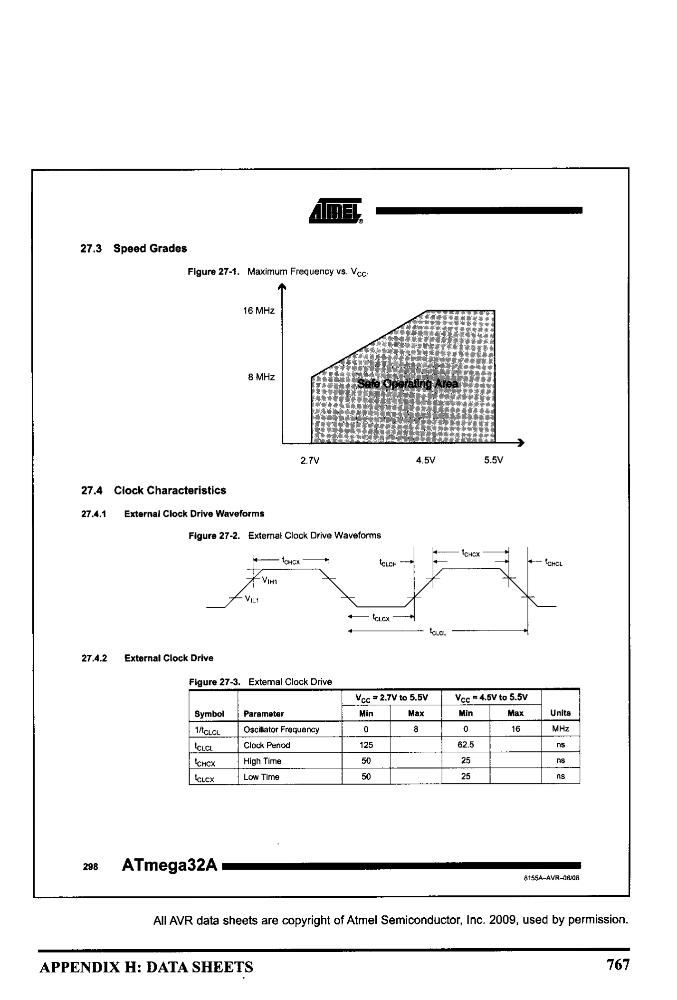

# Appendix H: Data Sheets

> **Textbook**: The AVR Microcontroller and Embedded Systems using Assembly and C

> **PDF Page Range**: 771 - 775

---

<!-- Page 771 -->
### [PDF Page 771]

APPENDIX H
DATA SHEETS
AmEL
27. Electrical Characteristics

## 27.1 Absolute Maximum Ratings*

Operating Temperature.....
......-55°C to +125°C
Storage Temperature...
-65°C to + 150°C
Voltage on any Pin except RESET
with respect to Ground...
.... 0.5V to Vcc+0.5V
Voltage on RESET with respect to Ground..... 0.5V to +13.0V
Maximum Operating Voltage
... 6.OV
DC Current per I/O Pin .....
.... 40.0 mA
DC Current Vcc and GND Pins...
. 200.0 mA and
400.0 mA TQFP/MLF

## 27.2 DC Characteristics

TA = -40°C to 85°C. Vcc = 2.7V to 5.5V (Unless Otherwise Noted)
Symbol
Parameter
Condition
VIL
put Low Voltage exce
Voc=2.7 - 5.5
TAL 1 and RESET pir
Vcc=4.5 - 5.5
VIN
Input High Voltage except
Vcc=2.7-5
XTAL 1 and RESET pins
cc=4.5 - 8
VILI
Input Low Voltage
XTAL 1 pin
Vc=2.7 - 5.5
Input High Voltage
Vcc=2.7-5.5
VIHI
XAL 1 pin
Vcc=4,5 - 5.5
VIL2
Input Low Voltage
RESET pin
Vcc=2.7-5.5
Input High Voltage
VIH2
RESET pin
| Vcc=2.7-5.5
Output Low Voltage(3)
VoL
VOH
(Ports A,B,C,D)
Sutput High Voltage,
(Ports A,B.C.D)
Input Leakage
Current 1/0 Pin
Input Leakage
Current 1/O Pin
1н - 70 mA Vec - 5V
cc = 5.5V, pin lo
bsolute valu
Yao-s alien in
REST
Rpu
Reset Puit-up Resistor
I/0 Pin Pull-up Resistor
296
ATmega32A
"NOTICE: Stresses beyond those listed under "Absolute
Maximum Ratings" may cause permanent dam-
age to the device. This is a stress rating only anc
functional operation of the device at these or
other conditions beyond those indicated in the
operational sections of this specification is not
implied. Exposure to absolute maximum rating
conditions for extended periods may affec
device reliability.
Min
-0.5

## 0.6 Vec ")

-0.5

## 0.7 Vc"')

-0.5

## 0.9 Voc")

Typ
Max

## 0.2 Vc"'

Voc +0.5

## 0.1 Vc"''

Vcc +0.5

## 0.2 Vcc

Voc +0.5
Units
V
V
30
20
60
1
1
85
50
HA
HA
8155A-AVR-06/08
766

<!-- Page 772 -->
### [PDF Page 772]

## 27.3 Speed Grades

AIMEL

*Description*: Technical diagram and schematic illustration detailing hardware connection topology, signal routing, and circuit operation for Figure 27-1: Maximum Frequency vs. Vcc.

> **Figure 27-1: Maximum Frequency vs. Vcc**

8 MHz
Safe Operating Area
2.7V

## 27.4 Clock Characteristics

27.4.1
External Clock Drive Waveforms

*Description*: Technical diagram and schematic illustration detailing hardware connection topology, signal routing, and circuit operation for Figure 27-2: External Clock Drive Waveforms.

> **Figure 27-2: External Clock Drive Waveforms**

IcHcx
- VIH1
VILI
4.5V
5.5V
ICHCx
ICLCH
- taLex
27.4.2 External Clock Drive

*Description*: Technical diagram and schematic illustration detailing hardware connection topology, signal routing, and circuit operation for Figure 27-3: External Clock Drive.

> **Figure 27-3: External Clock Drive**

Symbol
'CLCL
'chcx
Parameter
Oscillator Frequency
Clock Period
High Time
Low Time
298
ATmega32A •
APPENDIX H: DATA SHEETS
Vec = 2.7V to 5.5V
Min
Max
8
Vcc * 4.5V to 5.5V
Min
Max
125
50
50
62.5
25
25
Units
MHZ
ns
ns
8155A-AVR-06/08
All AVR data sheets are copyright of Atmel Semiconductor, Inc. 2009, used by permission.
767

<!-- Page 773 -->
### [PDF Page 773]

(ХСК/ТО) РВО
(T1) PB1
(INT2/AINO) PB2
(OCO/AIN1) PB3
(SS) PB4
(MOSI) PB5
(MISO) PB6
(SCK) PB7
RESET
GOC EN
GND
XTAL2 C
XTAL 1
(RXD) PDO |
(TXD) PD1
(INTO) PD2
(INT1) PD3
(OC1B) PD4
(ICP1) PD6
Innnnnnr
GAON-
8
9
10
11
12
13
14
15
16
17
18
19
20
40
39
38
37
36
35
34
33
32
31
30
29
28
27
26
25
24
23
22
21
PAO (ADCO)
PA1 (ADC1)
PA2 (ADC2)
РАЗ (ADC3)
PA4 (ADC4)
PA5 (ADC5)
PA6 (ADC6)
PAT (ADC7)
AREF
GND
AVCC
PCT (TOSC2)
PC6 (TOSC1)
PC5 (TDI)
PC4 (TDO)
PСЗ (TMS)
PC2 (TCK)
PC1 (SDA)
PCO (SCL)
PD7 (OC2)
• 11374193083р035
Figure H-1. ATmega16/32 DIP
(MOSI) PB5
(MISO) PB6
(SCK) PB]
RESEi
VCC
GND
XTAL2
XTAL1
(RXD) PDO
(TXD) PD1
(INTO) PD2
CO VOG AWN.
оonnnnnaПО
33
32
31
30
29
28
27
26
25
24
23
121314151617181202122
100000000
Note:
Bottor pad should
be soldered to ground
228E
Figure H-2. ATmega16/32 TQFP
PAG (ADC6
PA7 (ADC7
PCT (TOSC
PC6 (TOSC
PC4 (TDO)
nonoonnonnnnnnn[
nonononnnnononnn
(SCL/INTO) PDO|
(SDA/INT1) PD1
(RXD1/INT2) PD2
PD31
(IC1)
PD4
(XCK1) PD5 |
(T1) PD6
(T2) PD7
32 eg
34
35
37
38
888808
Figure H-3. ATmega 64/128 TQFP
768

<!-- Page 774 -->
### [PDF Page 774]

(RESET) PC6 • 1
(RXD) PD0 • 2
(TXD) PD1 • 3
(INTO) PD2 • 4
(INT1) PD3 • 5
XCK/TO) PD4 • 6
VCC 07
GND D 8
(XTAL 1/TOSC1) PB6 • 9
(XTAL2/TOSC2) PB7 • 10
(T1) PD5 • 11
(AINO) PD6 O 1
AIN1) PD7 01
(ICP1) PBO C 14
Figure H-4. ATmega8 DIP
27 T PC4 (ADC4/SDA
26 • PCЗ (ADC3)
24 P PC1 (ADC1
23 • PCO (ADCO
/ 24D PC1 (ADC1
23 O PCO (ADCO
170 PB5 (SCK
17 - PB3 (MOSI/OC2
16 • P82 (SS/OC1B
Jo000vDI
0G3 EZ
DG78
3 ISE
SEGG
DIGS 10
DG1 [11
LOAD(CS) 12
13 ак
Figure H-6. MAX7221
Vcc
16
+
"#} MAX232
C3
+
2
6
C4
11
ThIN
RIOUT
T2IN
R2OUT
TloUT
RIN
T2OUT
R2IN
9
- 14
- 13
- 7
- 8
RS232 side
Figure H-5. ATmega8 TQFP
8.8.8.8.8.888
MOSI
MP VO
soK
385%
18
ISET
DIGO-aG7
MAXIM
8 DIGTS
1 ON MAXT21
MAXT221
12 LOADIOS)
13 ак
3 00
SEGAG
SEGDF
8 SEGMENTS
OND
T
Figure H-7. MAX7221 Connections
ATmega32
MAX232
(PDO)RXD 14 "
5
14
13
2
3
(PDI)TXD 15 12
DB-9
TTL side
15
40-Pin DIP Package ATmega32
Figure H-8. (a) Inside MAX232 and (b) Its Connection to the ATmega32 (Null Modem)
APPENDIX H: DATA SHEETS
769

<!-- Page 775 -->
### [PDF Page 775]

+5 V
X1
AVR
32.768KHZ C
• ×2
+Ovbat
[GND
SCLO
SDA ]]
SCL
SDA
Figure H-9. DS1307 Power Connection Options (Maxim/Dallas Semiconductor)
LCD
LCD Pin
2
3
4
14
Symbol
Ground
Vcc
VEE
RS
R/W
E
DBO
DB7
AVR
PA.0
PA.7
PB.0
PB.1
PB.2
Figure H-10. LCD Connections for 8-bit Data
LCD
AVR
PA.4
D4
+5V
Vcc
D7
PA.7
VEEL
Vss
10K
POT
RS R/W E
PB.0
PB.1
PB.2
Figure H-11. LCD Connections Using 4-bit
Data
770
DO
DT
RS RW E
+5V
Vcc
VEE
Vss
10K
POT
LCD
TAVR
PA.4
PA.7
PA.O
PA.I
PA.2
D4
VEE
D7
Vss
RS R/W E
Figure H-12. LCD Connections Using a
Single Port
10K
POT

