# Chapter 0: Introduction to Computing

> **Textbook**: The AVR Microcontroller and Embedded Systems using Assembly and C

> **PDF Page Range**: 17 - 54


---


<!-- Page 17 -->
### [PDF Page 17]

CHAPTER O
INTRODUCTION
TO COMPUTING
OBJECTIVES
Upon completion of this chapter, you will be able to:
Convert any number from base 2, base 10, or base 16 to any of the
other two bases
Deseribe the logical operations AND, OR, NOT, XOR, NAND, and NOR
Use logic gates to diagram simple circuits
>>
>>
Explain the difference between a bit, a nibble, a byte, and a word
Give precise mathematical definitions of the terms kilobyte, megabyte,
gigabyte, and terabyte
Describe the purpose of the major components of a computer system
>>
Contrast and compare various types of semiconductor memories
in terms of their capacity, organization, and access time
Describe the relationship between the number of memory locations
on a chip, the number of data pins, and the chip's memory capacity
Contrast and compare PROM, EPROM, UV-EPROM, EEPROM,
Flash memory EPROM, and mask ROM memories
Contrast and compare SRAM, NV-RAM, and DRAM memories
>>
>>
List the steps a CPU follows in memory address decoding
List the three types of buses found in computers and describe the
purpose of each type of bus
Describe the role of the CPU in computer systems
>>
List the major components of the CPU and deseribe the purpose of each
>> Understand the RISC and Harvard architectures
1


<!-- Page 18 -->
### [PDF Page 18]

To understand the software and hardware of a microcontroller-based sys-
tem, one must first master some very basic concepts underlying computer archi-
tecture. In this chapter (which in the tradition of digital computers is called
Chapter 0), the fundamentals of numbering and coding systems are presented in

## Section 0.1. In Section 0.2, an overview of logic gates is given. The semiconduc-

tor memory and memory interfacing are discussed in Section 0.3. In Section 0.4,
CPUs and Harvard and von Neumann architectures are discussed. Finally, in the
last section we give a brief history of RISC architecture. Although some readers
may have an adequate background in many of the topics of this chapter, it is rec-
ommended that the material be reviewed, however briefly.

## SECTION 0.1: NUMBERING AND CODING SYSTEMS

Whereas human beings use base 10 (decimal) arithmetic, computers use
the base 2 (binary) system. In this section we explain how to convert from the dec-
imal system to the binary system, and vice versa. The convenient representation of
binary numbers, called hexadecimal, also is covered. Finally, the binary format of
the alphanumeric code, called ASCII, is explored.
Decimal and binary number systems
Although there has been speculation that the origin of the base 10 system
is the fact that human beings have 10 fingers, there is absolutely no speculation
about the reason behind the use of the binary system in computers. The binary sys-
tem is used in computers because 1 and O represent the two voltage levels of on
and off. Whereas in base 10 there are 10 distinct symbols, 0, 1, 2, ..., 9, in base 2
there are only two, 0 and 1, with which to generate numbers. Base 10 contains dig-
its 0 through 9; binary contains digits 0 and 1 only. These two binary digits, 0 and
1, are commonly referred to as bits.
Converting from decimal to binary
One method of converting from decimal to binary is to divide the decimal
number by 2 repeatedly, keeping track of the remainders. This process continues
until the quotient becomes zero. The remainders are then written in reverse order
to obtain the binary number. This is demonstrated in Example 0-1.
Example 0-1
Convert 2510 to binary.
Solution:
25/2 =
Quotient
12
6
3
1
0
Remainder
1
0
LSB (least significant bit)
1
1
MSB (most significant bit)
Therefore, 2510 = 110012.
2


<!-- Page 19 -->
### [PDF Page 19]

Converting from binary to decimal
To convert from binary to decimal, it is
important to understand the concept of weight
associated with each digit position. First, as an
analogy, recall the weight of numbers in the base
10 system, as shown in the diagram. By the same
token, each digit position of a number in base 2
has a weight associated with it:
74068310
=
3 x
10°
8
101
6
102
0
103
104
7
105
=
=
=
3
80
600
0000
40000
100000
740683
1101012 =
1 × 2°
0 × 21
1 × 22
0 × 23
1 × 24
1 × 25
Decimal
Binary
=
=
=
=
1
× 1
× 2
1 × 4
0 × 8
1 × 16
1 × 32
=
=
=
=
=
1
0
4
0
16
32
53
1
00
100
0000
10000
100000
110101
Knowing the weight of each bit in a binary number makes it simple to add
them together to get its decimal equivalent, as shown in Example 0-2.
Example 0-2
Convert 11001½ to decimal.
Solution:
Weight:
Digits:
Sum:
16
1
8
1
4
2
1
1
16 + 8+
0+
0+
1 = 2510
Knowing the weight associated with each binary bit position allows one to
convert a decimal number to binary directly instead of going through the process
of repeated division. This is shown in Example 0-3.
Example 0-3
Use the concept of weight to convert 391o to binary.
Solution:
Weight:
32
16
1
32 +
0+
Therefore, 3910 = 1001112:
8
4
2
0+
4+
2+
1
1
1=39
CHAPTER 0: INTRODUCTION TO COMPUTING
3


<!-- Page 20 -->
### [PDF Page 20]

Hexadecimal system
•Table 0-1: Base 16
Number System
Base 16, or the hexadecimal system as it is called in
computer literature, is used as a convenient representation
Decimal Binary
of binary numbers. For example, it is much easier for a
0
0000
human being to represent a string of Os and Is such as
0001
100010010110 as its hexadecimal equivalent of 896H. The
2
0010
binary system has 2 digits, 0 and 1. The base 10 system has
3
0011
10 digits, 0 through 9. The hexadecimal (base 16) system
4
0100
has 16 digits. In base 16, the first 10 digits, 0 to 9, are the
5
0101
same as in decimal, and for the remaining six digits, the let-
6
0110
ters A, B, C, D, E, and F are used. Table 0-1 shows the
7
0111
equivalent binary, decimal, and hexadecimal representa-
8
1000
tions for 0 to 15.
9
1001
10
1010
Converting between binary and hex
11
1011
To represent a binary number as its equivalent hexa-
1100
decimal number, start from the right and group 4 bits at a
13
1101
time, replacing each 4-bit binary number with its hex equiv-
14
1110
alent shown in Table 0-1. To convert from hex to binary,
15
1111
each hex digit is replaced with its 4-bit binary equivalent.
See Examples 0-4 and 0-5.
Example 0-4
Represent binary 100111110101 in hex.
Solution:
First the number is grouped into sets of 4 bits: 1001 1111 0101.
Then each group of 4 bits is replaced with its hex equivalent:
1001 1111 0101
9
F
5
Therefore, 1001111101012 = 9F5 hexadecimal.
Example 0-5
Convert hex 29B to binary.
Solution:
2
9
B
29B
0010 1001 1011
Dropping the leading zeros gives 1010011011.
Converting from decimal to hex
Converting from decimal to hex could be approached in two ways:
1. Convert to binary first and then convert to hex. Example 0-6 shows this
method of converting decimal to hex.
2. Convert directly from decimal to hex by repeated division, keeping track of the
remainders. Experimenting with this method is left to the reader.
Hex
0
1
2
3
4
5
6
7
8
9
A
B
C
D
E
-
F
4


<!-- Page 21 -->
### [PDF Page 21]

Example 0-6
(a) Convert 45 jo to hex.
32
1
16
0
8
1
4
1
0
1
First, convert to binary.
32+8+4+1=45
4510= 001011012 = 2D hex
(b) Convert 62910 to hex.
512 256
128
64
32
62910= (512+64+32+16+4+1) = 00100111 01012 = 275 hex
(c) Convert 1714 jo to hex.
1024 $12
256
1
1
128
1
64
1
16
1
8
0
4
1
171410 = (1024 + 512 + 128 + 32 + 16 + 2) = 0110 1011 00102 = 6B2 hex
Converting from hex to decimal
Conversion from hex to decimal can also be approached in two ways:
1. Convert from hex to binary and then to decimal. Example 0-7 demonstrates
this method of converting from hex to decimal.
2. Convert directly from hex to decimal by summing the weight of all digits.
Example 0-7
Convert the following hexadecimal numbers to decimal.
(2) 6B216 = 0110 1011 00102
1024 512
256
1
0
128
64
32
16
1
8
4
0
2
1
1024 + 512 + 128 + 32 + 16 + 2 = 171410
(b) 9F2D16 = 1001 1111 0010 11012
32768 16384 8192 4096 2048 1024 512 256 128 64
| 32 16 8 4 2 1
1101
32768+4096+2048+1024+512+256+32+8+4+1=40,74910
CHAPTER 0: INTRODUCTION TO COMPUTING
5


<!-- Page 22 -->
### [PDF Page 22]


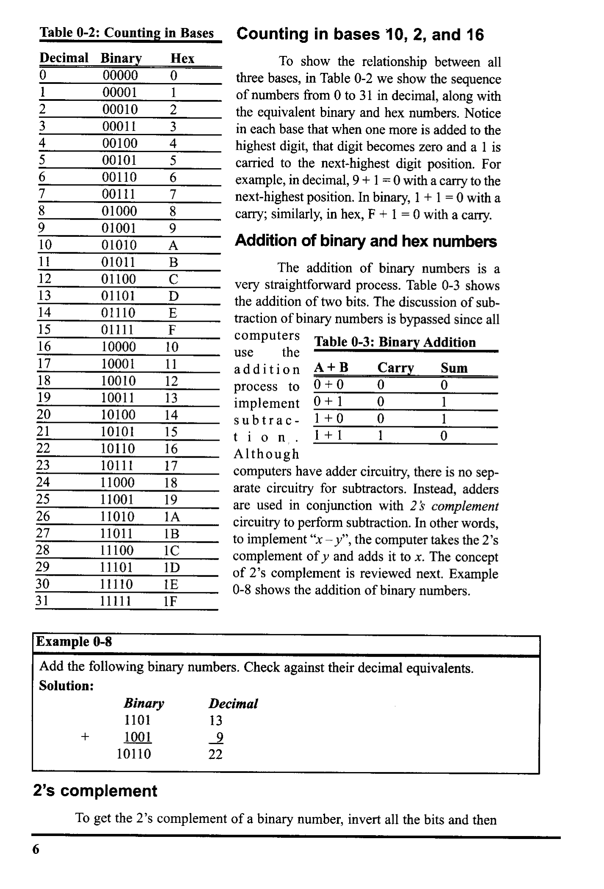
*Description*: Structured reference table listing operational parameters, instruction execution cycles, memory address mapping, or feature comparison for Table 0-2: Counting in Bases.

> **Table 0-2: Counting in Bases**

Decimal
Binary
Hex
0
00000
0
00001
1
Nintino
00010
2
00011
3
00100
4
00101
5
00110
6
00111
7
8
9
10
11
01000
8
01001
9
01010
A
01011
B
01100
C
13
01101
D
01110
15
16
17
18
19
20
21
22
23
24
25
26
27
28
29
30
31
01111
10000
10001
10010
10011
10100
10101
10110
10111
11000
11001
11010
11011
11100
11101
11110
11111
F
10
11
12
13
14
15
16
17
18
19
1A
1B
1C
1D
1E
1F
Counting in bases 10, 2, and 16
To show the relationship between all
three bases, in Table 0-2 we show the sequence
of numbers from 0 to 31 in decimal, along with
the equivalent binary and hex numbers. Notice
in each base that when one more is added to the
highest digit, that digit becomes zero and a 1 is
carried to the next-highest digit position. For
example, in decimal, 9 + 1 = 0 with a carry to the
next-highest position. In binary, 1 + 1 = 0 with a
carry; similarly, in hex, F + 1 = 0 with a carry.
Addition of binary and hex numbers
The addition of binary numbers is a
very straightforward process. Table 0-3 shows
the addition of two bits. The discussion of sub-
traction of binary numbers is bypassed since all
computers Table 0-3: Binary Addition
use
addition
A + B
Carry
Sum
process to
0 + 0
0
0
implement
0+1
subtrac-
1+0
0
1
0
1
ti on.
1+1
1
0
Although
computers have adder circuitry, there is no sep-
arate circuitry for subtractors. Instead, adders
are used in conjunction with 2's complement
circuitry to perform subtraction. In other words,
to implement "x-y", the computer takes the 2's
complement of y and adds it to x. The concept
of 2's complement is reviewed next. Example
0-8 shows the addition of binary numbers.
Example 0-8
Add the following binary numbers. Check against their decimal equivalents.
Solution:
+
Binary
1101
1001
10110
Decimal
13
2
22
2's complement
To get the 2's complement of a binary number, invert all the bits and then
6


<!-- Page 23 -->
### [PDF Page 23]

add 1 to the result. Inverting the bits is simply a matter of changing all Os to 1s and
Is to Os. This is called the I's complement. See Example 0-9.
Example 0-9
Take the 2's complement of 10011101.
Solution:
+
10011101
01100010
1
binary number
I's complement
01100011
2's complement
Addition and subtraction of hex numbers
In studying issues related to software and hardware of computers, it is
often necessary to add or subtract hex numbers. Mastery of these techniques is
essential. Hex addition and subtraction are discussed separately below.
Addition of hex numbers
This section describes the process of adding hex numbers. Starting with the
least significant digits, the digits are added together. If the result is less than 16,
write that digit as the sum for that position. If it is greater than 16, subtract 16 from
it to get the digit and carry 1 to the next digit. The best way to explain this is by
example, as shown in Example 0-10.
Example 0-10
Perform hex addition: 23D9 + 94BE.
Solution:
23D9
94BE
B897
LSD: 9+14=23
1 + 13 + 11 = 25
1+3+4=8
MSD: 2 + 9=B
23 - 16 = 7 with a carry
25 - 16 = 9 with a carry
Subtraction of hex numbers
In subtracting two hex numbers, if the second digit is greater than the first,
borrow 16 from the preceding digit. See Example 0-11.
Example 0-11
Perform hex subtraction: 59F - 2B8.
Solution:
59F
- 2B8
2E7
LSD: 8 from 15 = 7
11 from 25 (9 + 16) = 14 (E)
2 from 4 (5 - 1) = 2
CHAPTER 0: INTRODUCTION TO COMPUTING
7


<!-- Page 24 -->
### [PDF Page 24]

ASCIl code
The discussion so far has
revolved around the representation of
number systems. Because all informa-
Hex
41
42
43
44
Symbol
A
C
D
Hex
61
62
63
64
Symbol
a
b
tion in the computer must be represent-
d
...
ed by Os and 1s, binary patterns must be
assigned to letters and other characters.
SA
Z
7A
In the 1960s a standard representation
called ASCII (American Standard Code

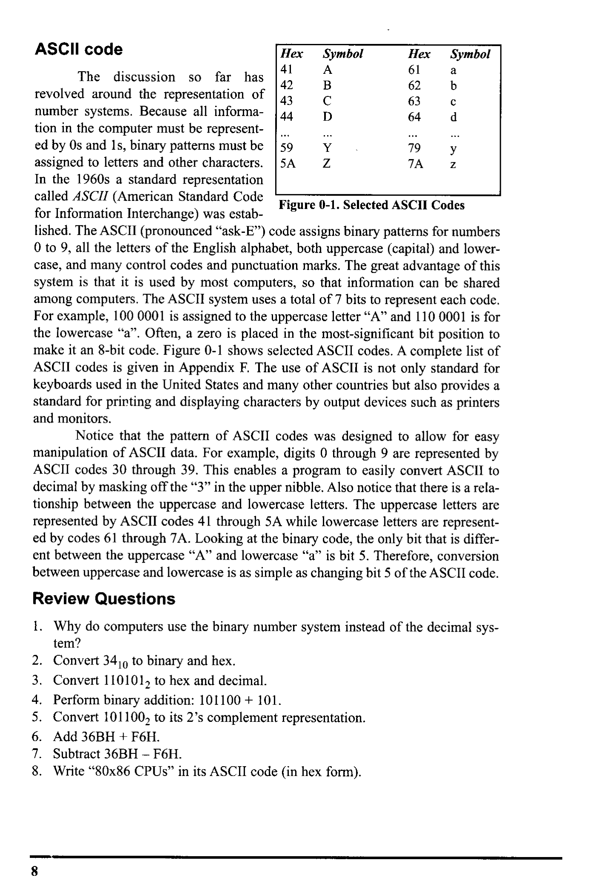
*Description*: Technical diagram and schematic illustration detailing hardware connection topology, signal routing, and circuit operation for Figure 0-1: Selected ASCII Codes.

> **Figure 0-1: Selected ASCII Codes**

for Information Interchange) was estab-
lished. The ASCII (pronounced "ask-E") code assigns binary patterns for numbers
O to 9, all the letters of the English alphabet, both uppercase (capital) and lower-
case, and many control codes and punctuation marks. The great advantage of this
system is that it is used by most computers, so that information can be shared
among computers. The ASCII system uses a total of 7 bits to represent each code.
For example, 100 0001 is assigned to the uppercase letter "A" and 110 0001 is for
the lowercase "a". Often, a zero is placed in the most-significant bit position to
make it an 8-bit code. Figure 0-1 shows selected ASCII codes. A complete list of
ASCII codes is given in Appendix F. The use of ASCII is not only standard for
keyboards used in the United States and many other countries but also provides a
standard for printing and displaying characters by output devices such as printers
and monitors.
Notice that the pattern of ASCII codes was designed to allow for easy
manipulation of ASCII data. For example, digits 0 through 9 are represented by
ASCIl codes 30 through 39. This enables a program to easily convert ASCI to
decimal by masking off the "3" in the upper nibble. Also notice that there is a rela-
tionship between the uppercase and lowercase letters. The uppercase letters are
represented by ASCII codes 41 through 5A while lowercase letters are represent-
ed by codes 61 through 7A. Looking at the binary code, the only bit that is differ-
ent between the uppercase "A" and lowercase "a" is bit 5. Therefore, conversion
between uppercase and lowercase is as simple as changing bit 5 of the ASCII code.

### Review Questions

1. Why do computers use the binary number system instead of the decimal sys-
tem?
2. Convert 341o to binary and hex.
3. Convert 1101012 to hex and decimal.
4. Perform binary addition: 101100 + 101.
5. Convert 101100½ to its 2's complement representation.
6. Add 36BH + F6H.
7. Subtract 36BH - F6H.
8. Write "80x86 CPUs" in its ASCII code (in hex form).
8


<!-- Page 25 -->
### [PDF Page 25]


## SECTION 0.2: DIGITAL PRIMER

This section gives an overview of digital logic and design. First, we cover
binary logic operations, then we show gates that perform these functions. Next,
logic gates are put together to form simple digital circuits. Finally, we cover some
logic devices commonly found in microcontroller interfacing.
Binary logic
5
As mentioned earlier, computers use the
binary number system because the two voltage lev-
4- FLogic
els can be represented as the two digits 0 and 1.
Signals in digital electronics have two distinct volt-
age levels. For example, a system may define 0 V as
logic 0 and +5 V as logic 1. Figure 0-2 shows this
system with the built-in tolerances for variations in
the voltage. A valid digital signal in this example
should be within either of the two shaded areas.
Logic gates
Binary logic gates are simple circuits that
take one or more input signals and send out one out-
put signal. Several of these gates are defined below.

```assembly
AND gate
```

The AND gate takes two or more inputs and
performs a logic AND on them. See the truth table
and diagram of the AND gate. Notice that if both
inputs to the AND gate are 1, the output will be 1.
Any other combination of inputs will give a 0 output.
The example shows two inputs, * and y. Multiple
outputs are also possible for logic gates. In the case
of AND, if all inputs are 1, the output is 1. If any
input is 0, the output is 0.

```assembly
OR gate
```

The OR logic function will output a 1 if one
or more inputs is 1. If all inputs are O, then and only
then will the output be 0.
Tri-state buffer
A buffer gate does not change the logic level
of the input. It is used to isolate or amplify the sig-
nal.

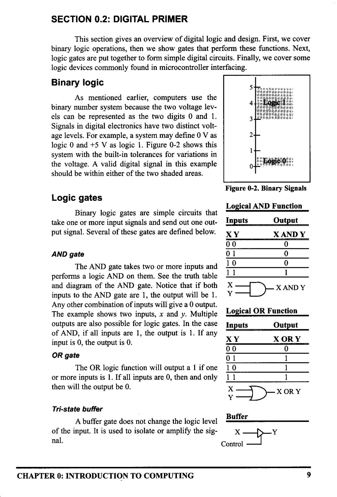
*Description*: Technical diagram and schematic illustration detailing hardware connection topology, signal routing, and circuit operation for Figure 0-2: Binary Signals.

> **Figure 0-2: Binary Signals**

Logical AND Function
Inputs
Output
XY
XAND Y
00
0
XANDY
Logical OR Function
Inputs
Output
XY
XORY
00
0
1
10
11
1
1
- XORY
Y
Buffer
X.
Control
-Y
CHAPTER 0: INTRODUCTION TO COMPUTING
9


<!-- Page 26 -->
### [PDF Page 26]

Inverter
The inverter, also called NOT, outputs the
value opposite to that input to the gate. That is, a l
input will give a 0 output, while a 0 input will give a
1 output.
Logical Inverter
Input
Output
NOT X
1
0
1
•X—
XOR gate
- NOT X
The XOR gate performs an exclusive-OR
operation on the inputs. Exclusive-OR produces a 1
output if one (but only one) input is 1. If both
Logical XOR Function
operands are 0, the output is O. Likewise, if both
Inputs
Output
operands are 1, the output is also 0. Notice from the
XOR truth table, that whenever the two inputs are
XY
XXOR Y
the same, the output is 0. This function can be used
00
to compare two bits to see if they are the same.
11
NAND and NOR gates
The NAND gate functions like an AND gate
• X XOR Y
Y
with an inverter on the output. It produces a 0 output
when all inputs are 1; otherwise, it produces a 1 out-
put. The NOR gate functions like an OR gate with an
Logical NAND Function
inverter on the output. It produces a 1 if all inputs are
O; otherwise, it produces a 0. NAND and NOR gates
Inputs
Output
are used extensively in digital design because they
XY
X NAND Y
are easy and inexpensive to fabricate. Any circuit
00
1
that can be designed with AND, OR, XOR, and
01
1
INVERTER gates can be implemented using only
10
NAND and NOR gates. A simple example of this is
11
given below. Notice in NAND, that if any input is 0,
the output is 1. Notice in NOR, that if any input is 1,
-X NAND Y
Y
the output is 0.
Logic design using gates
Logical NOR Function
Next we will show a simple logic design to Inputs
Output
add two binary digits. If we add two binary digits XY
there are four possible outcomes:
XNORY
00
01
10
Carry Sum
0 + 0=
0 + 1=
1 + 0 =
1+1=
0
0
0
1
1
1
0
*→
- X NOR Y
10


<!-- Page 27 -->
### [PDF Page 27]

Notice that when we add I + 1 we get 0 with a carry to the next higher
place. We will need to determine the sum and the carry for this design. Notice that
the sum column above matches the output for the XOR function, and that the carry
column matches the output for the AND function. Figure 0-3(a) shows a simple
adder implemented with XOR and AND gates. Figure 0-3(b) shows the same logic
circuit implemented with AND and OR gates and inverters.
X
Y
— Sum
Carry
Y
* Da
*=D
- Sum
- Carry
(b) Half-Adder Using AND, OR, Inverters
(a) Half-Adder Using XOR and AND


*Description*: Technical diagram and schematic illustration detailing hardware connection topology, signal routing, and circuit operation for Figure 0-3: Two Implementations of a Half-Adder.

> **Figure 0-3: Two Implementations of a Half-Adder**


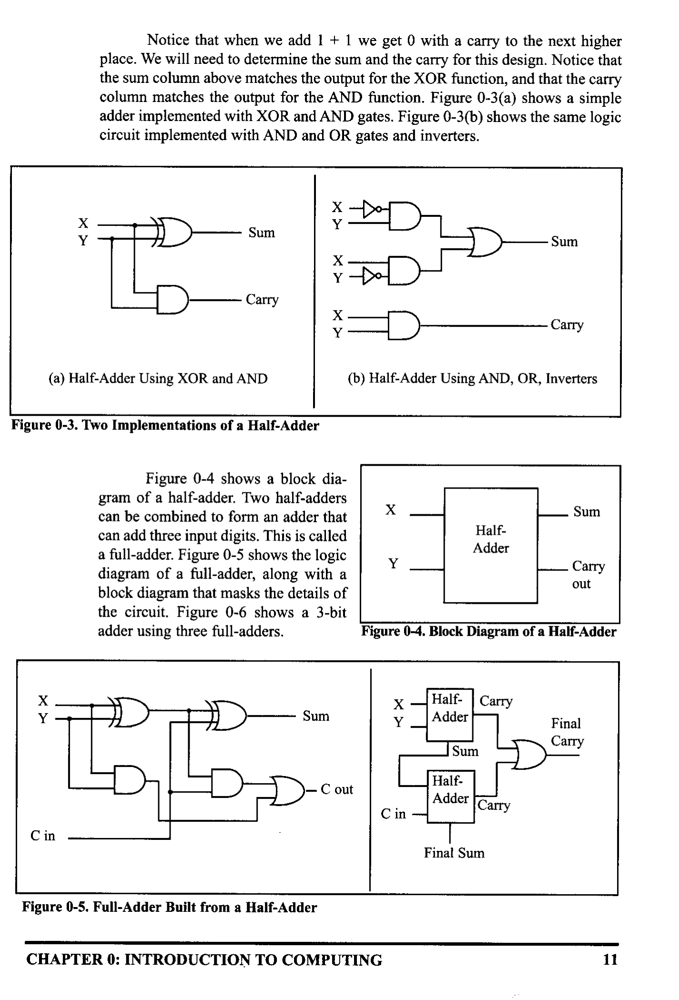
*Description*: Technical diagram and schematic illustration detailing hardware connection topology, signal routing, and circuit operation for Figure 0-4: shows a block dia-.

> **Figure 0-4: shows a block dia-**

gram of a half-adder. Two half-adders
can be combined to form an adder that
can add three input digits. This is called
a full-adder. Figure 0-5 shows the logic
diagram of a full-adder, along with a
block diagram that masks the details of
the circuit. Figure 0-6 shows a 3-bit
adder using three full-adders.
Y
Half-
Adder
_ Sum
• Carry
out


*Description*: Architectural block diagram detailing logic blocks, internal buses, memory units, and hardware component interactions for Figure 0-4: Block Diagram of a Half-Adder.

> **Figure 0-4: Block Diagram of a Half-Adder**

*
- Sum
Half- Carry
Adder
J Sump
Half-
Adder Carry
Final Sum
Final
Carry
→-Cour
C in
C in


*Description*: Technical diagram and schematic illustration detailing hardware connection topology, signal routing, and circuit operation for Figure 0-5: Full-Adder Built from a Half-Adder.

> **Figure 0-5: Full-Adder Built from a Half-Adder**

CHAPTER 0: INTRODUCTION TO COMPUTING


<!-- Page 28 -->
### [PDF Page 28]

Decoders
Another example of the application
of logic gates is the decoder. Decoders are
widely used for address decoding in com-
puter design. Figure 0-7 shows decoders
for 9 (1001 binary) and 5 (0101) using
inverters and AND gates.
Flip-flops
A widely used component in digital
systems is the flip-flop. Frequently, flip-
flops are used to store data. Figure 0-8
shows the logic diagram, block diagram,
and truth table for a flip-flop.
The D flip-flop is widely used to
latch data. Notice from the truth table that
a D-FF grabs the data at the input as the
clock is activated. A D-FF holds the data as
long as the power is on.
LSB
XO -
YO.
Full-
Adder
SO
Carry
x1
Y1
x2
Y2
- S1
Full-
Adder
Carry
Full-
Adder Carry
- S2
- S3


*Description*: Technical diagram and schematic illustration detailing hardware connection topology, signal routing, and circuit operation for Figure 0-6: 3-Bit Adder Using Three Full-.

> **Figure 0-6: 3-Bit Adder Using Three Full-**

Adders
LSB
(a) Address decoder for 9 (binary 1001)
The output of the AND gate will be 1
if and only if the input is binary 1001.


*Description*: Technical diagram and schematic illustration detailing hardware connection topology, signal routing, and circuit operation for Figure 0-7: Address Decoders.

> **Figure 0-7: Address Decoders**

o-
(b) Address decoder for 5 (binary 0101)
The output of the AND gate will be 1
if and only if the input is binary 0101.
D
Cik
D
(a) Circuit diagram
(b) Block diagram
Clk
D
J
J
1
x = don't care
(c) Truth table
no change
0
1

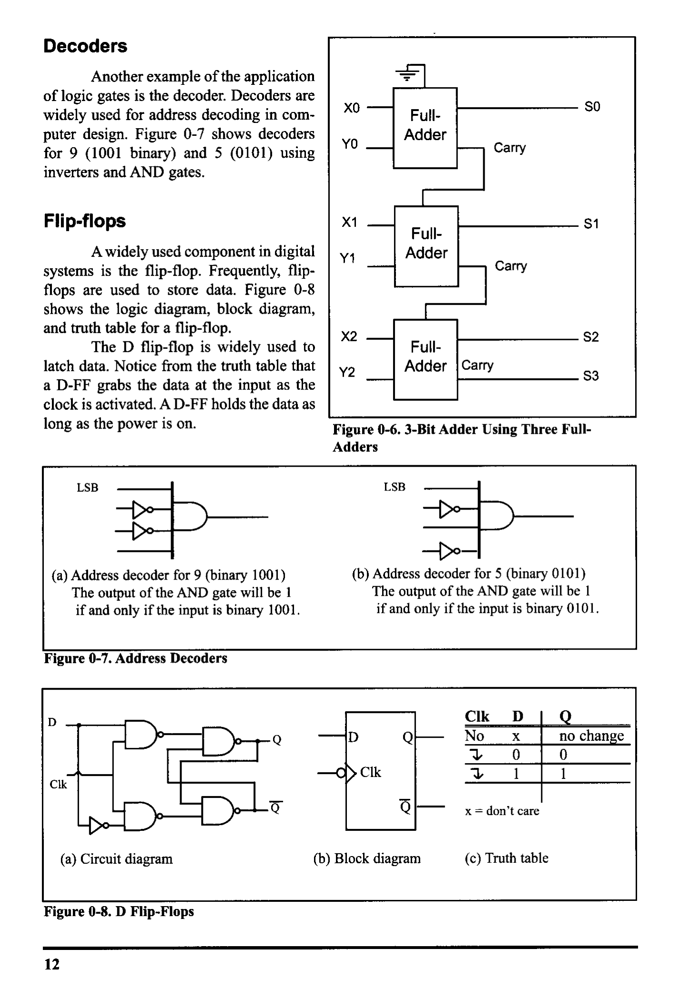
*Description*: Technical diagram and schematic illustration detailing hardware connection topology, signal routing, and circuit operation for Figure 0-8: D Flip-Flops.

> **Figure 0-8: D Flip-Flops**


<!-- Page 29 -->
### [PDF Page 29]


### Review Questions

1. The logical operation
2. The logical operation
gives a 1 output when all inputs are 1.
gives a 1 output when one or more of its inputs is
1.
3. The logical operation
is often used to compare two inputs to determine
whether they have the same value.
A
gate does not change the logic level of the input.
5. Name a common use for flip-flops.
6. An address
_is used to identify a predetermined binary address.

## SECTION 0.3: SEMICONDUCTOR MEMORY

In this section we discuss various types of semiconductor memories and
their characteristics such as capacity, organization, and access time. We will also
show how the memory is connected to CPU. Before we embark on the subject of
memory, it will be helpful to give an overview of computer organization and
review some widely used terminology in computer literature.
Some important terminology
Bit
Nibble
Recall from the discussion above
Byte
0000
that a bit is a binary digit that can have the
Word 0000 0000 0000
0000
0000
0000
value 0 or 1. A byte is defined as 8 bits. A
nibble is half a byte, or 4 bits. A word is
two bytes, or 16 bits. The display is intended to show the relative size of these
units. Of course, they could all be composed of any combination of zeros and ones.
A kilobyte is 210 bytes, which is 1024 bytes. The abbreviation K is often
used to represent kilobytes. A megabyte, or meg as some call it, is 220 bytes. That
is a little over 1 million bytes; it is exactly 1,048,576 bytes. Moving rapidly up the
scale in size, a gigabyte is 230 bytes (over 1 billion), and a terabyte is 240 bytes
(over 1 trillion). As an example of how some of these terms are used, suppose that
a given computer has 16 megabytes of memory. That would be 16 × 220, or 24x
220, which is 224. Therefore 16 megabytes is 224 bytes.
Two types of memory commonly used in microcomputers are RAM, which
stands for "random access memory" (sometimes called read/write memory), and
ROM, which stands for "read-only memory." RAM is used by the computer for
temporary storage of programs that it is running. That data is lost when the com-
puter is turned off. For this reason, RAM is sometimes called volatile memory.
ROM contains programs and information essential to operation of the computer.
The information in ROM is permanent, cannot be changed by the user, and is not
lost when the power is turned off. Therefore, it is called nonvolatile memory.
Internal organization of computers
The internal working of every computer can be broken down into three
parts: CPU (central processing unit), memory, and I/O (input/output) devices.

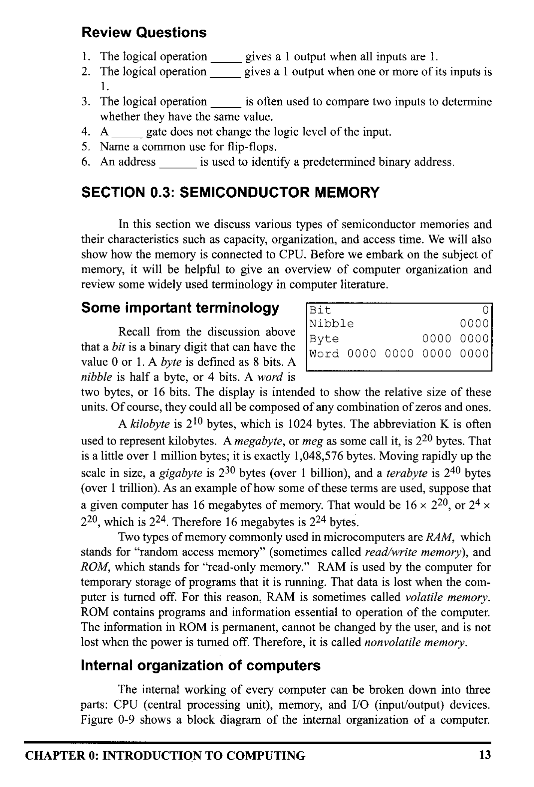
*Description*: Architectural block diagram detailing logic blocks, internal buses, memory units, and hardware component interactions for Figure 0-9: shows a block diagram of the internal organization of a computer..

> **Figure 0-9: shows a block diagram of the internal organization of a computer.**

CHAPTER 0: INTRODUCTION TO COMPUTING
13


<!-- Page 30 -->
### [PDF Page 30]

RAM
ROM
Address Bus
Printer
Disk
CPU
T
T
Monitor
1
Keyboard
Data Bus
Read/write
Control Buses (MEMR, MEMW, IORD, and IOWR)

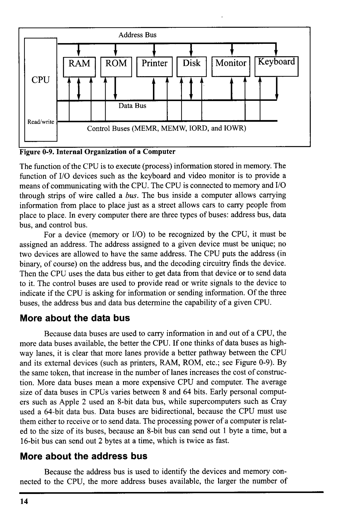
*Description*: Technical diagram and schematic illustration detailing hardware connection topology, signal routing, and circuit operation for Figure 0-9: Internal Organization of a Computer.

> **Figure 0-9: Internal Organization of a Computer**

The function of the CPU is to execute (process) information stored in memory. The
function of I/O devices such as the keyboard and video monitor is to provide a
means of communicating with the CPU. The CPU is connected to memory and I/O
through strips of wire called a bus. The bus inside a computer allows carrying
information from place to place just as a street allows cars to carry people from
place to place. In every computer there are three types of buses: address bus, data
bus, and control bus.
For a device (memory or I/O) to be recognized by the CPU, it must be
assigned an address. The address assigned to a given device must be unique; no
two devices are allowed to have the same address. The CPU puts the address (in
binary, of course) on the address bus, and the decoding circuitry finds the device.
Then the CPU uses the data bus either to get data from that device or to send data
to it. The control buses are used to provide read or write signals to the device to
indicate if the CPU is asking for information or sending information. Of the three
buses, the address bus and data bus determine the capability of a given CPU.
More about the data bus
Because data buses are used to carry information in and out of a CPU, the
more data buses available, the better the CPU. If one thinks of data buses as high-
way lanes, it is clear that more lanes provide a better pathway between the CPU
and its external devices (such as printers, RAM, ROM, etc.; see Figure 0-9). By
the same token, that increase in the number of lanes increases the cost of construc-
tion. More data buses mean a more expensive CPU and computer. The average
size of data buses in CPUs varies between 8 and 64 bits. Early personal comput-
ers such as Apple 2 used an 8-bit data bus, while supercomputers such as Cray
used a 64-bit data bus. Data buses are bidirectional, because the CPU must use
them either to receive or to send data. The processing power of a computer is relat-
ed to the size of its buses, because an 8-bit bus can send out 1 byte a time, but a
16-bit bus can send out 2 bytes at a time, which is twice as fast.
More about the address bus
Because the address bus is used to identify the devices and memory con-
nected to the CPU, the more address buses available, the larger the number of
14


<!-- Page 31 -->
### [PDF Page 31]

devices that can be addressed. In other words, the number of address buses for a
CPU determines the number of locations with which it can communicate. The
number of locations is always equal to 2*, where x is the number of address lines,
regardless of the size of the data bus. For example, a CPU with 16 address lines
can provide a total of 65,536 (216) or 64K of addressable memory. Each location
can have a maximum of 1 byte of data. This is because all general-purpose micro-
processor CPUs are what is called byte addressable. As another example, the IBM
PC AT uses a CPU with 24 address lines and 16 data lines. Thus, the total acces-
sible memory is 16 megabytes (224 = 16 megabytes). In this example there would
be 224 locations, and because each location is one byte, there would be 16
megabytes of memory. The address bus is a unidirectional bus, which means that
the CPU uses the address bus only to send out addresses. To summarize: The total
number of memory locations addressable by a given CPU is always equal to 2*
where x is the number of address bits, regardless of the size of the data bus.
CPU and its relation to RAM and ROM
For the CPU to process information, the data must be stored in RAM or
ROM. The function of ROM in computers is to provide information that is fixed
and permanent. This is information such as tables for character patterns to be dis-
played on the video monitor, or programs that are essential to the working of the
computer, such as programs for testing and finding the total amount of RAM
installed on the system, or for displaying information on the video monitor. In con-
trast, RAM stores temporary information that can change with time, such as vari-
ous versions of the operating system and application packages such as word pro-
cessing or tax calculation packages. These programs are loaded from the hard
drive into RAM to be processed by the CPU. The CPU cannot get the information
from the disk directly because the disk is too slow. In other words, the CPU first
seeks the information to be processed from RAM (or ROM). Only if the data is not
there does the CPU seek it from a mass storage device such as a disk, and then it
transfers the information to RAM. For this reason, RAM and ROM are sometimes
referred to as primary memory and disks are called secondary memory. Next, we
discuss various types of semiconductor memories and their characteristics such as
capacity, organization, and access time.
Memory capacity
The number of bits that a semiconductor memory chip can store is called
chip capacity. It can be in units of Kbits (kilobits), Mbits (megabits), and so on.
This must be distinguished from the storage capacity of computer systems. While
the memory capacity of a memory IC chip is always given in bits, the memory
capacity of a computer system is given in bytes. For example, an article in a tech-
nical journal may state that the 128M chip has become popular. In that case, it is
understood, although it is not mentioned, that 128M means 128 megabits since the
article is referring to an IC memory chip. However, if an advertisement states that
a computer comes with 128M memory, it is understood that 128M means 128
megabytes since it is referring to a computer system.
CHAPTER 0: INTRODUCTION TO COMPUTING
15


<!-- Page 32 -->
### [PDF Page 32]

Memory organization
Memory chips are organized into a number of locations within the IC.
Each location can hold 1 bit, 4 bits, 8 bits, or even 16 bits, depending on how it is
designed internally. The number of bits that each location within the memory chip
can hold is always equal to the number of data pins on the chip. How many loca-
tions exist inside a memory chip? That depends on the number of address pins. The
number of locations within a memory IC always equais 2 to the power of the num-
ber of address pins. Therefore, the total number of bits that a memory chip can
store is equal to the number of locations times the number of data bits per location.
To summarize:
1. A memory chip contains 2* locations, where x is the number of address pins.
2. Each location contains y bits, where y is the number of data pins on the chip.
3. The entire chip will contain 2* × y bits, where x is the number of address pins
and y is the number of data pins on the chip.

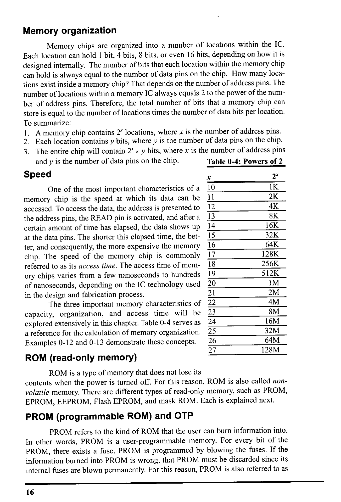
*Description*: Structured reference table listing operational parameters, instruction execution cycles, memory address mapping, or feature comparison for Table 0-4: Powers of 2.

> **Table 0-4: Powers of 2**

Speed
One of the most important characteristics of a
10
memory chip is the speed at which its data can be
11
accessed. To access the data, the address is presented to
12
2*
1K
2K
4K
the address pins, the READ pin is activated, and after a
13
certain amount of time has elapsed, the data shows up
14
at the data pins. The shorter this elapsed time, the bet-
15
ter, and consequently, the more expensive the memory
16
chip. The speed of the memory chip is commonly
17
referred to as its access time. The access time of mem-
18
ory chips varies from a few nanoseconds to hundreds
19
32K
64K
128K
256K
512K
of nanoseconds, depending on the IC technology used
20
in the design and fabrication process.
21
The three important memory characteristics of
22
capacity, organization, and access time will be
23
explored extensively in this chapter. Table 0-4 serves as
24
a reference for the calculation of memory organization.
25
Examples 0-12 and 0-13 demonstrate these concepts.
26
ROM (read-only memory)
27
16M
32M
64M
128M
ROM is a type of memory that does not lose its
contents when the power is turned off. For this reason, ROM is also called non-
volatile memory. There are different types of read-only memory, such as PROM,
EPROM, EEPROM, Flash EPROM, and mask ROM. Each is explained next.
PROM (programmable ROM) and OTP
PROM refers to the kind of ROM that the user can burn information into.
In other words, PROM is a user-programmable memory. For every bit of the
PROM, there exists a fuse. PROM is programmed by blowing the fuses. If the
information burned into PROM is wrong, that PROM must be discarded since its
internal fuses are blown permanently. For this reason, PROM is also referred to as
16


<!-- Page 33 -->
### [PDF Page 33]

Example 0-12
A given memory chip has 12 address pins and 4 data pins. Find:
(a) the organization, and (b) the capacity.
Solution:
(a) This memory chip has 4,096 locations (2'2 = 4,096), and each location can hold 4
bits of data. This gives an organization of 4,096 × 4, often represented as 4K × 4.
(b) The capacity is equal to 16K bits since there is a total of 4K locations and each loca-
tion can hold 4 bits of data.
Example 0-13
A 512K memory chip has 8 pins for data. Find:
(a) the organization, and (b) the number of address pins for this memory chip.
Solution:
(a) A memory chip with 8 data pins means that each location within the chip can hold
8 bits of data. To find the number of locations within this memory chip, divide the
capacity by the number of data pins. 512K/8 = 64K; therefore, the organization for
this memory chip is 64K × 8.
(b) The chip has 16 address lines since 2'6 = 64K.
OTP (one-time programmable). Programming ROM, also called burning ROM,
requires special equipment called a ROM burner or ROM programmer.
EPROM (erasable programmable ROM) and UV-EPROM
EPROM was invented to allow making changes in the contents of PROM
after it is burned. In EPROM, one can program the memory chip and erase it thou-
sands of times. This is especially necessary during development of the prototype
of a microprocessor-based project. A widely used EPROM is called UV-EPROM,
where UV stands for ultraviolet. The only problem with UV-EPROM is that eras-
ing its contents can take up to 20 minutes. All UV-EPROM chips have a window
through which the programmer can shine ultraviolet (UV) radiation to erase the
chip's contents. For this reason, EPROM is also referred to as UV-erasable
EPROM or simply UV-EPROM. Figure 0-10 shows the pins for UV-EPROM
chips.
To program a UV-EPROM chip, the following steps must be taken:
1. Its contents must be erased. To erase a chip, remove it from its socket on the
system board and place it in EPROM erasure equipment to expose it to UV
radiation for 15-20 minutes.
2. Program the chip. To program a UV-EPROM chip, place it in the ROM burn-
er (programmer). To burn code or data into EPROM, the ROM burner uses

## 12.5 volts or higher, depending on the EPROM type. This voltage is referred

CHAPTER 0: INTRODUCTION TO COMPUTING
17


<!-- Page 34 -->
### [PDF Page 34]

to as Vpp in the UV-EPROM data sheet.
3. Place the chip back into its socket on the system board
As can be seen from the above steps, not only is there an EPROM program-
mer (burner), but there is also separate EPROM erasure equipment. The main
problem, and indeed the major disadvantage of UV-EPROM, is that it cannot be
erased and programmed while it is in the system board. To provide a solution to
this problem, EEPROM was invented.
Notice the patterns of the IC numbers in Table 0-5. For example, part num-
ber 27128-25 refers to UV-EPROM that has a capacity of 128K bits and access
time of 250 nanoseconds. The capacity of the memory chip is indicated in the part
number and the access time is given with a zero dropped. See Example 0-14. In
part numbers, C refers to CMOS technology. Notice that 27XX always refers to
UV-EPROM chips. For a comprehensive list of available memory chips see the
JAMECO (jameco.com) or JDR (jdr.com) catalogs.
2764
27256
Vpp
A12
AT
A
A5
27128
Vpp
A12
A7
A6
A5
A4
2732A
2716
A5
A5
1
A3
A2
A
AO
0
A2
A1
AO
00
00
1
01
02
02
00
01
02
1
02
GND GND GND GND
Vpp
A12
A7
A6
A5
0000O
5
A4
6
A3
7
A2
A1
AO
10
00
01
1
2
02
GND
•OO0OO00O

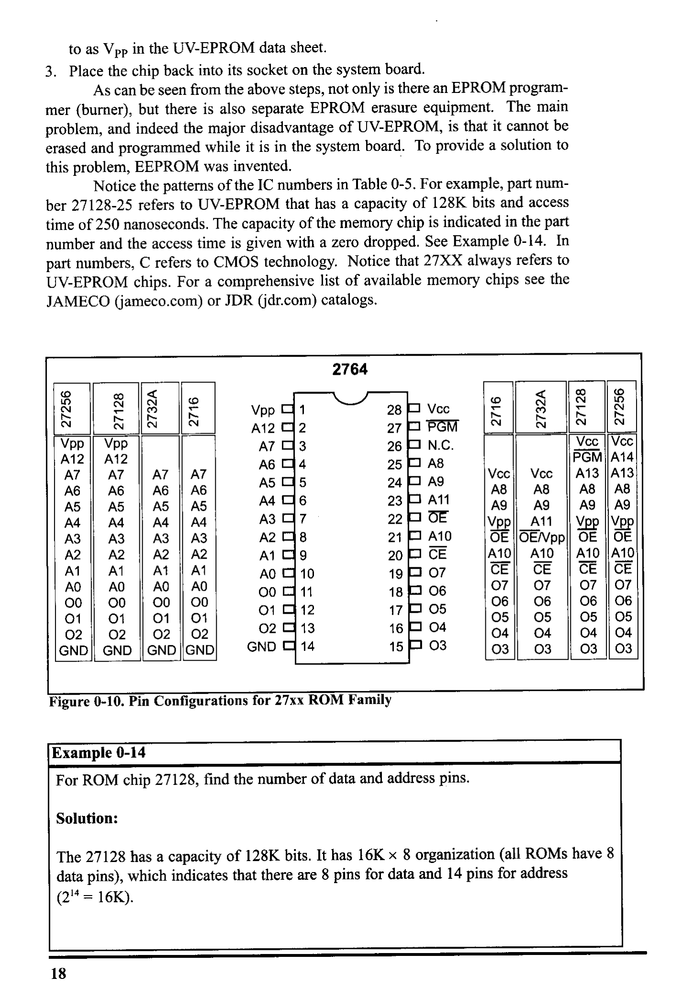
*Description*: IC pinout diagram showing physical pin assignments, I/O pin multiplexing, supply rails, and clock interface connections for Figure 0-10: Pin Configurations for 27xx ROM Family.

> **Figure 0-10: Pin Configurations for 27xx ROM Family**

2716
2732A
27128
8888013 85 335
A11
OENpp
8888985
A13
Example 0-14
For ROM chip 27128, find the number of data and address pins.
Solution:
The 27128 has a capacity of 128K bits. It has 16K × 8 organization (all ROMs have 8
data pins), which indicates that there are 8 pins for data and 14 pins for address
(214 = 16K).
99ZLZ
18


<!-- Page 35 -->
### [PDF Page 35]


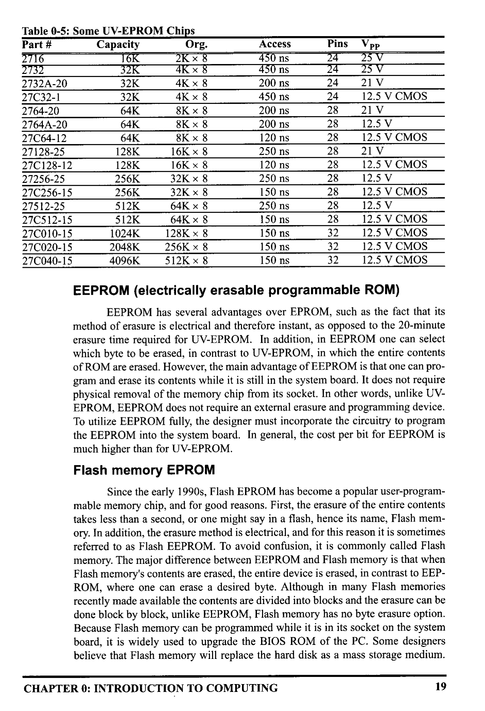
*Description*: Structured reference table listing operational parameters, instruction execution cycles, memory address mapping, or feature comparison for Table 0-5: Some UV-EPROM Chips.

> **Table 0-5: Some UV-EPROM Chips**

Part #
2716
2732
2732A-20
27C32-1
2764-20
2764A-20
27C64-12
27128-25
27C128-12
27256-25
27C256-15
27512-25
27C512-15
27C010-15
27C020-15
27C040-15
Capacity
16K
32K
32K
32K
64K
64K
64K
128K
128K
256K
256K
512K
512K
1024K
2048K
4096K
Org.
2K × 8
4K × 8
4K × 8
4K × 8
8K × 8
8K × 8
8K × 8
16K × 8
16K × 8
32K × 8
32K × 8
64K × 8
64K × 8
128K × 8
256K × 8
512K × 8
Access
450 ns
450 ns
200 ns
450 ns
200 ns
200 ns
120 ns
250 ns
120 ns
250 ns
150 ns
250 ns
150 ns
150 ns
150 ns
150 ns
Pins
24
24
24
24
28
28
28
28
28
28
28
28
28
32
32
32
VPP
25 V
25 V
21 V

## 12.5 V CMOS

21 V

## 12.5 V


## 12.5 V CMOS

21 V

## 12.5 V CMOS


## 12.5 V


## 12.5 V CMOS


## 12.5 V


## 12.5 V CMOS


## 12.5 V CMOS


## 12.5 V CMOS


## 12.5 V CMOS

EEPROM (electrically erasable programmable ROM)
EEPROM has several advantages over EPROM, such as the fact that its
method of erasure is electrical and therefore instant, as opposed to the 20-minute
erasure time required for UV-EPROM. In addition, in EEPROM one can select
which byte to be erased, in contrast to UV-EPROM, in which the entire contents
of ROM are erased. However, the main advantage of EEPROM is that one can pro-
gram and erase its contents while it is still in the system board. It does not require
physical removal of the memory chip from its socket. In other words, unlike UV-
EPROM, EEPROM does not require an external erasure and programming device.
To utilize EEPROM fully, the designer must incorporate the circuitry to program
the EEPROM into the system board. In general, the cost per bit for EEPROM is
much higher than for UV-EPROM.
Flash memory EPROM
Since the early 1990s, Flash EPROM has become a popular user-program-
mable memory chip, and for good reasons. First, the erasure of the entire contents
takes less than a second, or one might say in a flash, hence its name, Flash mem-
ory. In addition, the erasure method is electrical, and for this reason it is sometimes
referred to as Flash EEPROM. To avoid confusion, it is commonly called Flash
memory. The major difference between EEPROM and Flash memory is that when
Flash memory's contents are erased, the entire device is erased, in contrast to EEP-
ROM, where one can erase a desired byte. Although in many Flash memories
recently made available the contents are divided into blocks and the erasure can be
done block by block, unlike EEPROM, Flash memory has no byte erasure option.
Because Flash memory can be programmed while it is in its socket on the system
board, it is widely used to upgrade the BIOS ROM of the PC. Some designers
believe that Flash memory will replace the hard disk as a mass storage medium.
CHAPTER 0: INTRODUCTION TO COMPUTING
19


<!-- Page 36 -->
### [PDF Page 36]


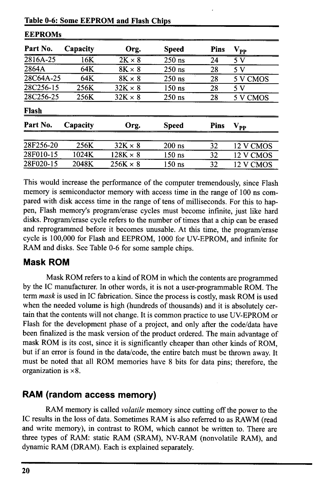
*Description*: Structured reference table listing operational parameters, instruction execution cycles, memory address mapping, or feature comparison for Table 0-6: Some EEPROM and Flash Chips.

> **Table 0-6: Some EEPROM and Flash Chips**

EEPROMS
Part No.
2816A-25
2864A
28C64A-25
28C256-15
28C256-25
Capacity
16K
64K
64K
256K
256K
Org.
2K × 8
8K × 8
8K × 8
32K × 8
32K × 8
Flash
Part No.
Capacity
Org.
Speed
250 ns
250 ns
250 ns
150 ns
250 ns
Pins Vpr
24
5 V
28
5 V
28
5 V CMOS
28
5V
28
5 V CMOS
Speed
Pins Vpp
28F256-20
28F010-15
28F020-15
256K
1024K
2048K
32K × 8
128K × 8
256K × 8
200 ns
150 ns
150 ns
32
32
32
12 V CMOS
12 V CMOS
12 V CMOS
This would increase the performance of the computer tremendously, since Flash
memory is semiconductor memory with access time in the range of 100 ns com-
pared with disk access time in the range of tens of milliseconds. For this to hap-
pen, Flash memory's program/erase cycles must become infinite, just like hard
disks. Program/erase cycle refers to the number of times that a chip can be erased
and reprogrammed before it becomes unusable. At this time, the program/erase
cycle is 100,000 for Flash and EEPROM, 1000 for UV-EPROM, and infinite for
RAM and disks. See Table 0-6 for some sample chips.
Mask ROM
Mask ROM refers to a kind of ROM in which the contents are programmed
by the IC manufacturer. In other words, it is not a user-programmable ROM. The
term mask is used in IC fabrication. Since the process is costly, mask ROM is used
when the needed volume is high (hundreds of thousands) and it is absolutely cer-
tain that the contents will not change. It is common practice to use UV-EPROM or
Flash for the development phase of a project, and only after the code/data have
been finalized is the mask version of the product ordered. The main advantage of
mask ROM is its cost, since it is significantly cheaper than other kinds of ROM,
but if an error is found in the data/code, the entire batch must be thrown away. It
must be noted that all ROM memories have 8 bits for data pins; therefore, the
organization is x8.
RAM (random access memory)
RAM memory is called volatile memory since cutting off the power to the
IC results in the loss of data. Sometimes RAM is also referred to as RAWM (read
and write memory), in contrast to ROM, which cannot be written to. There are
three types of RAM: static RAM (SRAM), NV-RAM (nonvolatile RAM), and
dynamic RAM (DRAM). Each is explained separately.
20


<!-- Page 37 -->
### [PDF Page 37]

SRAM (static RAM)
Storage cells in static RAM memo-
A7 O1
ry are made of flip-flops and therefore do
A6 • 2
not require refreshing in order to keep their
A5 • 3
data. This is in contrast to DRAM, dis-
A4 • 4
cussed below. The problem with the use of
A3 • 5
A2 0 6
flip-flops for storage cells is that each cell
A1 D7
requires at least 6 transistors to build, and
the cell holds only 1 bit of data. In recent
A0 0 8
10109
years, the cells have been made of 4 tran-
1/02 • 10
15 /0 6
sistors, which still is too many. The use of
1/03 0 11
14 0 |05
4-transistor cells plus the use of CMOS
GND • 12
13 • |04
tig SR as ive capacity a garao Figure 0-1. 2x8 SRAM Pins
DRAM. Figure 0-11 shows the pin diagram
for an SRAM chip.
The following is a description of the 6116 SRAM pins.
AO-A1O are for address inputs, where 11 address lines gives 211 = 2K.
WE (write enable) is for writing data into SRAM (active low).
OE (output enable) is for reading data out of SRAM (active low)
CS (chip select) is used to select the memory chip.
1/00-1/07 are for data I/O, where 8-bit data lines give an organization of 2K × 8.
The functional diagram for the 6116 SRAM is given in Figure 0-12.
AO —
A10
to
Do
ADDRESS
DECODER
128 X 128
MEMORY ARRAY
— Vcc
- GND
1/00
1/07
•
INPUT
DATA
CIRCUIT
I/O CONTROL
cs
OE
WE
CONTROL
CIRCUIT

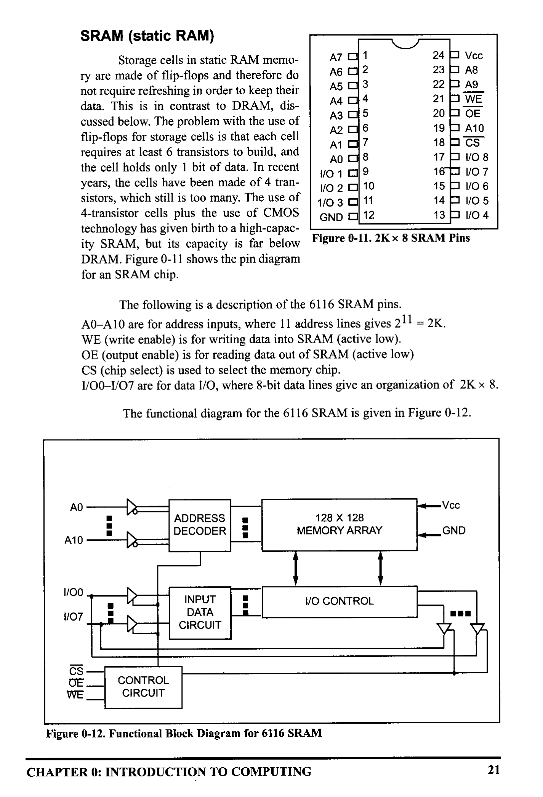
*Description*: Architectural block diagram detailing logic blocks, internal buses, memory units, and hardware component interactions for Figure 0-12: Functional Block Diagram for 6116 SRAM.

> **Figure 0-12: Functional Block Diagram for 6116 SRAM**

CHAPTER 0: INTRODUCTION TO COMPUTING
21


<!-- Page 38 -->
### [PDF Page 38]


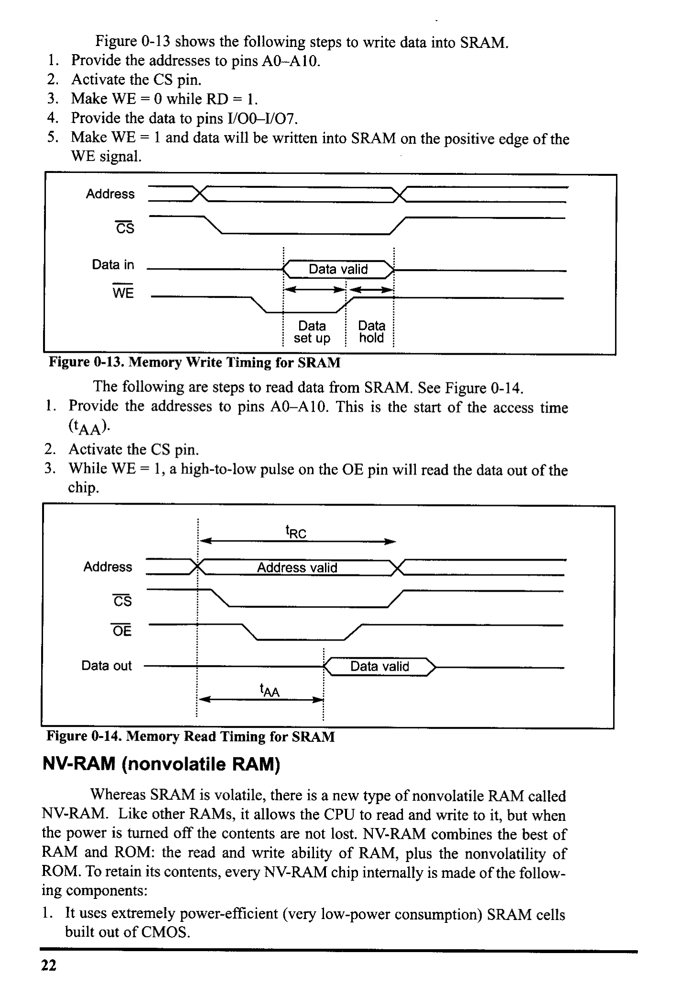
*Description*: Execution flowchart illustrating procedure steps, algorithmic logic flow, software build stages, or timing signal sequences for Figure 0-13: shows the following steps to write data into SRAM..

> **Figure 0-13: shows the following steps to write data into SRAM.**

1. Provide the addresses to pins AO-A1O.
2. Activate the CS pin.
3. Make WE = 0 while RD = 1.
4. Provide the data to pins I/00-1/07.
5. Make WE = 1 and data will be written into SRAM on the positive edge of the
WE signal.
Address
cs
Data in
WE
Data valid
-
Data


*Description*: Technical diagram and schematic illustration detailing hardware connection topology, signal routing, and circuit operation for Figure 0-13: Memory Write Timing for SRAM.

> **Figure 0-13: Memory Write Timing for SRAM**

The following are steps to read data from SRAM. See Figure 0-14.
1. Provide the addresses to pins A0-A10. This is the start of the access time
(AA).
2. Activate the CS pin.
3. While WE = 1, a high-to-low pulse on the OE pin will read the data out of the
Address
tRC
Address valid
Data out
Data valid
tAA


*Description*: Technical diagram and schematic illustration detailing hardware connection topology, signal routing, and circuit operation for Figure 0-14: Memory Read Timing for SRAM.

> **Figure 0-14: Memory Read Timing for SRAM**

NV-RAM (nonvolatile RAM)
Whereas SRAM is volatile, there is a new type of nonvolatile RAM called
NV-RAM. Like other RAMs, it allows the CPU to read and write to it, but when
the power is turned off the contents are not lost. NV-RAM combines the best of
RAM and ROM: the read and write ability of RAM, plus the nonvolatility of
ROM. To retain its contents, every NV-RAM chip internally is made of the follow-
ing components:
1. It uses extremely power-efficient (very low-power consumption) SRAM cells
built out of CMOS.
22


<!-- Page 39 -->
### [PDF Page 39]


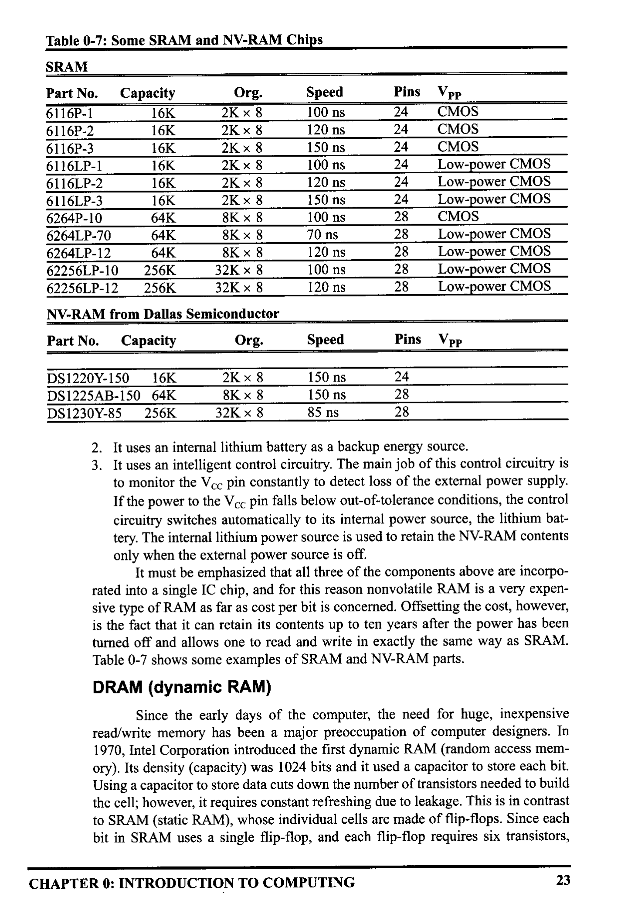
*Description*: Structured reference table listing operational parameters, instruction execution cycles, memory address mapping, or feature comparison for Table 0-7: Some SRAM and NV-RAM Chips.

> **Table 0-7: Some SRAM and NV-RAM Chips**

SRAM
Part No.
Capacity
6116P-1
16K
6116P-2
16K
6116P-3
16K
6116LP-1
16K
6116LP-2
16K
6116LP-3
16K
6264P-10
64K
6264LP-70
64K
6264LP-12
64K
62256LP-10
256K
62256LP-12
256K
Org.
2K × 8
2K × 8
2K × 8
2K × 8
2K × 8
2K × 8
8K × 8
8K × 8
8K × 8
32K × 8
32K × 8
NV-RAM from Dallas Semiconductor
Part No.
Capacity
Org.
Speed
100 ns
120 ns
150 ns
100 ns
120 ns
150 ns
100 ns
70 ns
120 ns
100 ns
120 ns
Pins
VPP
24
CMOS
24
CMOS
24
CMOS
24
Low-power CMOS
24
Low-power CMOS
24
Low-power CMOS
28
CMOS
28
Low-power CMOS
28
Low-power CMOS
Low-power CMOS
28
Low-power CMOS
Speed
Pins VpP
DS1220Y-150
16K
DS1225AB-150 64K
DS1230Y-85 256K
2K × 8
8K × 8
32K × 8
150 ns
150 ns
85 ns
24
28
28
2. It uses an internal lithium battery as a backup energy source.
3. It uses an intelligent control circuitry. The main job of this control circuitry is
to monitor the Voc pin constantly to detect loss of the external power supply.
If the power to the Vcc pin falls below out-of-tolerance conditions, the control
circuitry switches automatically to its internal power source, the lithium bat-
tery. The internal lithium power source is used to retain the NV-RAM contents
only when the external power source is off.
It must be emphasized that all three of the components above are incorpo-
rated into a single IC chip, and for this reason nonvolatile RAM is a very expen-
sive type of RAM as far as cost per bit is concerned. Offsetting the cost, however,
is the fact that it can retain its contents up to ten years after the power has been
turned off and allows one to read and write in exactly the same way as SRAM.


*Description*: Structured reference table listing operational parameters, instruction execution cycles, memory address mapping, or feature comparison for Table 0-7: shows some examples of SRAM and NV-RAM parts..

> **Table 0-7: shows some examples of SRAM and NV-RAM parts.**

DRAM (dynamic RAM)
Since the early days of the computer, the need for huge, inexpensive
read/write memory has been a major preoccupation of computer designers. In
1970, Intel Corporation introduced the first dynamic RAM (random access mem-
ory). Its density (capacity) was 1024 bits and it used a capacitor to store each bit.
Using a capacitor to store data cuts down the number of transistors needed to build
the cell; however, it requires constant refreshing due to leakage. This is in contrast
to SRAM (static RAM), whose individual cells are made of flip-flops. Since each
bit in SRAM uses a single flip-flop, and each flip-flop requires six transistors,
CHAPTER 0: INTRODUCTION TO COMPUTING
23


<!-- Page 40 -->
### [PDF Page 40]

SRAM has much larger memory cells and consequently lower density. The use of
capacitors as storage cells in DRAM results in much smaller net memory cell size.
The advantages and disadvantages of DRAM memory can be summarized
as follows. The major advantages are high density (capacity), cheaper cost per bit,
and lower power consumption per bit. The disadvantage is that it must be refreshed
periodically because the capacitor cell loses its charge; furthermore, while DRAM
is being refreshed, the data cannot be accessed. This is in contrast to SRAM's flip-
flops, which retain data as long as the power is on, do not need to be refreshed, and
whose contents can be accessed at any time. Since 1970, the capacity of DRAM
has exploded. After the IK-bit (1024) chip came the 4K-bit in 1973, and then the
16K chip in 1976. The 1980s saw the introduction of 64K, 256K, and finally 1M
and 4M memory chips. The 1990s saw 16M, 64M, 256M, and the beginning of
1G-bit DRAM chips. In the 2000s, 2G-bit chips are standard, and as the fabrica-
tion process gets smaller, larger memory chips will be rolling off the manufactur-
ing line. Keep in mind that when talking about IC memory chips, the capacity is
always assumed to be in bits. Therefore, a IM chip means a 1-megabit chip and a
256K chip means a 256K-bit memory chip. However, when talking about the
memory of a computer system, it is always assumed to be in bytes.
Packaging issue in DRAM
In DRAM there is a problem of packing a large number of cells into a sin-
gle chip with the normal number of pins assigned to addresses. For example, a
64K-bit chip (64K × 1) must have 16 address lines and 1 data line, requiring 16
pins to send in the address if the conventional method is used. This is in addition
to Vcc power, ground, and read/write control pins. Using the conventional method
of data access, the large number of pins defeats the purpose of high density and
small packaging, so dearly cherished by IC designers. Therefore, to reduce the
number of pins needed for addresses, multiplexing/demultiplexing is used. The
method used is to split the address in half and send in each half of the address
through the same pins, thereby requiring fewer address pins. Internally, the DRAM
structure is divided into a square of rows and columns. The first half of the address
is called the row and the second half is called the column. For example, in the case
of DRAM of 64K × 1 organization, the first half of the address is sent in through
the 8 pins A0-A7, and by activating RAS (row address strobe), the internal latch-
es inside DRAM grab the first half of the address. After that, the second half of the
address is sent in through the same pins, and by activating CAS (column address
strobe), the internal latches inside DRAM latch the second half of the address. This
results in using 8 pins for addresses plus RAS and CAS, for a total of 10 pins,
instead of the 16 pins that would be required without multiplexing. To access a bit
of data from DRAM, both row and column addresses must be provided. For this
concept to work, there must be a 2-by-1 multiplexer outside the DRAM circuitry
and a demultiplexer inside every DRAM chip. Due to the complexities associated
with DRAM interfacing (RAS, CAS, the need for multiplexer and refreshing cir-
cuitry), some DRAM controllers are designed to make DRAM interfacing much
easier. However, many small microcontroller-based projects that do not require
much RAM (usually less than 64K bytes) use SRAM of types EEPROM and NV-
RAM, instead of DRAM.
24


<!-- Page 41 -->
### [PDF Page 41]

DRAM organization
In the discussion of ROM, we noted
that all of these chips have 8 pins for data.
This is not the case for DRAM memory
chips, which can have x1, x4, x8, or x16
organizations. See Example 0-15 and Table
0-8.
A8 0 1
DIN D2
WE • 3
RAS • 4
A0 • 5
A2 • 6
A1 0 7
Voc • 8
16 • GND
15 • CAS
14 0D OUT
13 • A6
12 0 A3
11 • A4
10 0 A5

## 9.0 AT

In memory chips, the data pins are
also called I/O. In some DRAMs there are
separate Din and Dout pins. Figure 0-15

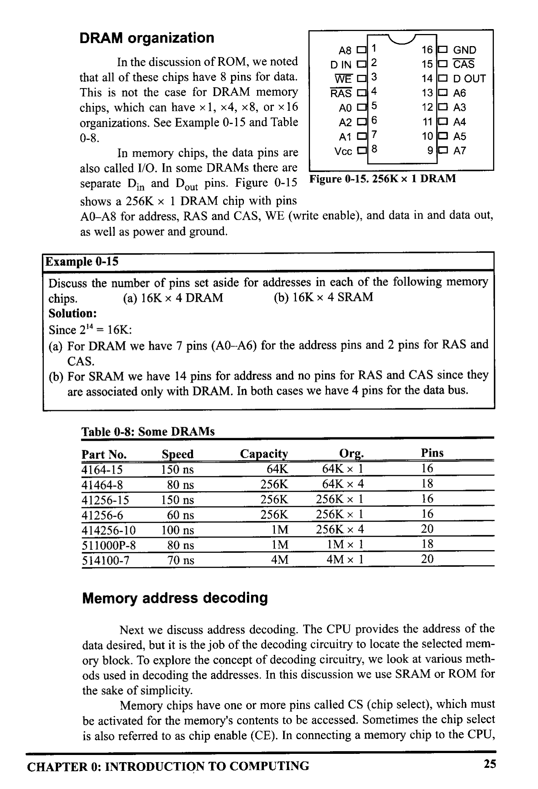
*Description*: Technical diagram and schematic illustration detailing hardware connection topology, signal routing, and circuit operation for Figure 0-15: 256K × 1 DRAM.

> **Figure 0-15: 256K × 1 DRAM**

shows a 256K × 1 DRAM chip with pins
AO-A8 for address, RAS and CAS, WE (write enable), and data in and data out,
as well as power and ground.
Example 0-15
Discuss the number of pins set aside for addresses in each of the following memory
chips.
(a) 16K × 4 DRAM
Solution:
(b) 16K × 4 SRAM
Since 214 = 16K:
(a) For DRAM we have 7 pins (AO-A6) for the address pins and 2 pins for RAS and
CAS.
(b) For SRAM we have 14 pins for address and no pins for RAS and CAS since they
are associated only with DRAM. In both cases we have 4 pins for the data bus.


*Description*: Structured reference table listing operational parameters, instruction execution cycles, memory address mapping, or feature comparison for Table 0-8: Some DRAMS.

> **Table 0-8: Some DRAMS**

Part No.
Speed
4164-15
150 ns
41464-8
80 ns
41256-15
150 ns
41256-6
60 ns
414256-10
100 ns
511000P-8
80 ns
514100-7
70 ns
Capacity
64K
256K
256K
256K
1M
1M
4M
Org.
64K × 1
64K × 4
256K × 1
256K xi
256K × 4
IM × 1
4M × 1
Pins
16
18
16
16
20
18
20
Memory address decoding
Next we discuss address decoding. The CPU provides the address of the
data desired, but it is the job of the decoding circuitry to locate the selected mem-
ory block. To explore the concept of decoding circuitry, we look at various meth-
ods used in decoding the addresses. In this discussion we use SRAM or ROM for
the sake of simplicity.
Memory chips have one or more pins called CS (chip select), which must
be activated for the memory's contents to be accessed. Sometimes the chip select
is also referred to as chip enable (CE). In connecting a memory chip to the CPU,
CHAPTER 0: INTRODUCTION TO COMPUTING
25


<!-- Page 42 -->
### [PDF Page 42]

note the following points.
1. The data bus of the CPU is connected directly to the data pins of the memory
chip.
2. Control signals RD (read) and WR (memory write) from the CPU are connect-
ed to the OE (output enable) and WE (write enable) pins of the memory chip,
respectively.
3. In the case of the address buses, while the lower bits of the addresses from the
CPU go directly to the memory chip address pins, the upper ones are used to
activate the CS pin of the memory chip. It is the CS pin that along with
RD/WR allows the flow of data in or out of the memory chip. No data can be
written into or read from the memory chip unless CS is activated.
As can be seen from the data sheets of SRAM and ROM, the CS input of
a memory chip is normally active low and is activated by the output of the mem-
ory decoder. Normally memories are divided into blocks, and the output of the
decoder selects a given memory block. There are three ways to generate a memo-
ry block selector: (a) using simple logic gates, (b) using the 74LS138, or (c) using
programmable logics such as CPLD and FPGA. Each method is described below.
Simple logic gate address decoder
The simplest method of constructing decoding circuitry is the use of a
NAND gate. The output of a NAND gate is active low, and the CS pin is also
active low, which makes them a perfect match. In cases where the CS input is
active high, an AND gate must be used. Using a combination of NAND gates and
inverters, one can decode any address range. An example of this is shown in Figure
0-16, which shows that A15-A12 must be 0011 in order to select the chip. This
results in the assignment of addresses 3000H to 3FFFH to this memory chip.
DO
A12
A13
A14
A15 -
Do
D7
DO
AO
4K × 8
A11
cs
RD WR
MEMR
MEMW

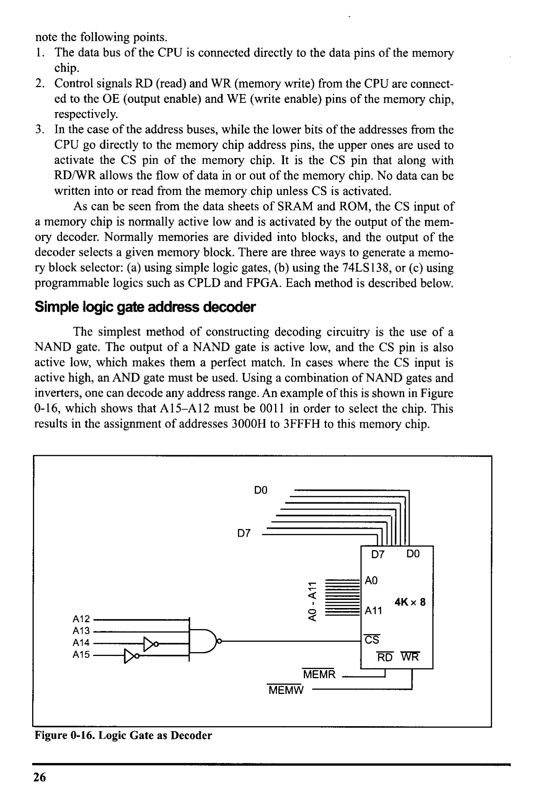
*Description*: Technical diagram and schematic illustration detailing hardware connection topology, signal routing, and circuit operation for Figure 0-16: Logic Gate as Decoder.

> **Figure 0-16: Logic Gate as Decoder**

26


<!-- Page 43 -->
### [PDF Page 43]

Using the 74LS138 3-8
decoder
This used to be one of the
most
widely
used
address
decoders. The 3 inputs A, B, and
C generate 8 active-low outputs
YO-Y7. See Figure 0-17. Each
Y output is connected to CS of a
memory chip, allowing control
of 8 memory blocks by a single
74LS138.
In the 74LS138,
where A, B, and C select which
output is activated, there are
three additional inputs, G2A,
G2B, and Gl. G2A and G2B are
both active low, and Gl is active
high. If any one of the inputs
Gl, G2A, or G2B is not connect-
ed to an address signal (some-
times they are connected to a
control signal), they must be
activated permanently by either
Vcc or ground, depending on the
activation level. Example 0-16
shows the design and the address
range calculation
for
the
74LS138 decoder.
Block Diagram
Vcc
A
B
C
GND
Yo o
Y10
Y2 o-
Y3 O
Y4 O
Y5 o
Y6 O
G2A G2B G1
99
Enable
Function Table
inputs
Outputs
Enable Select
G1 G2 C BA
X H
LX
XXX
XXX
HL
LLL
H L
H L
LLH
YO Y1 Y2 Y3 Y4 Y5 Y6 Y7
Н н НННННН
H
H
H
Н Н Н
H
H L
LHL
LHH
H L
HLL
H L
HLH
H
H L
HHL HHH
H L
HHHHHHHH
H
H
H H
H
H
I L

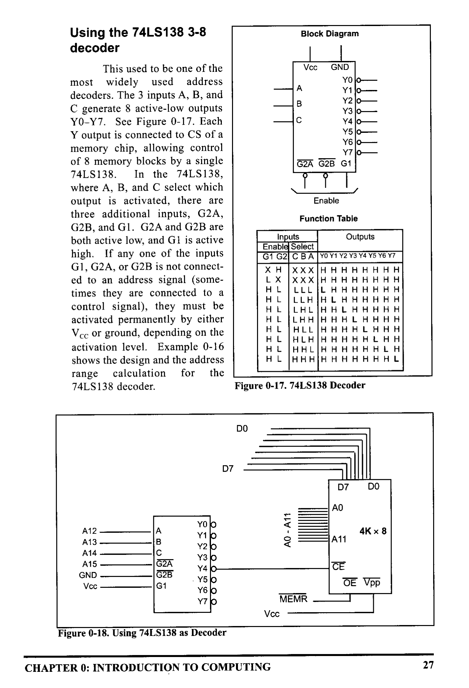
*Description*: Technical diagram and schematic illustration detailing hardware connection topology, signal routing, and circuit operation for Figure 0-17: 74LS138 Decoder.

> **Figure 0-17: 74LS138 Decoder**

DO
D7
A12 -
A13
A14
A15
GND.
Voo
A
YO O
G2A
G2B
G1
Y30
Y4 O
• Y5 C
Y6O
Y7O


*Description*: Technical diagram and schematic illustration detailing hardware connection topology, signal routing, and circuit operation for Figure 0-18: Using 74LS138 as Decoder.

> **Figure 0-18: Using 74LS138 as Decoder**

CHAPTER 0: INTRODUCTION TO COMPUTING
A0 - A11
D7
AO
DO
4K × 8
A11
CE
OE Vpp
MEMR
Vcc
27


<!-- Page 44 -->
### [PDF Page 44]

Example 0-16
Looking at the design in Figure 0-18, find the address range for the following:
(a) Y4, (b) Y2, and (c) Y7.
Solution:
(a) The address range for Y4 is calculated as follows.
A15 A14 A13 A12 A11 A10 A9 A8 A7 A6 A5 A4 A3 A2 A1 AO
1
1
0
1
1
1
1
1 1 1
1
1
1 1 1
The above shows that the range for Y4 is 4000H to 4FFFH. In Figure 0-18, notice that
A15 must be 0 for the decoder to be activated. Y4 will be selected when A14 A13 A12
= 100 (4 in binary). The remaining A11-AO will be 0 for the lowest address and I for
the highest address.
(b) The address range for Y2 is 2000H to 2FFFH.
A15 A14 A13 A12 A11 A10 A9 A8 A7 A6 A5 A4 A3 A2 A1 AO
0
1
1
0
1111
1 1
1
1
0
1
1 l
0
1
(c) The address range for Y7 is 7000H to 7FFFH.
A15 A14 A13 A12 All A10 A9 A8 A7 A6 A5 A4
A3 A2 AI AO
1
1
1
• O°
1
1
11
1
1
1
1 1 1 1
1
1
1
1
Using programmable logic as an address decoder
Other widely used decoders are programmable logic chips such as PAL.
GAL, and FPGA chips. One disadvantage of these chips is that they require
PAL/GAL/FPGA sottware and a burner (programmer), whereas the 74LS138
needs neither of these. The advantage of these chips is that they can be pro-
grammed for any combination of address ranges, and so are much more versatile.
This plus the fact that PAL/GAL/FPGA chips have 10 or more inputs (in contrast
to 6 in the 74138) means that they can accommodate more address inputs.

### Review Questions

1. How many bytes is 24 kilobytes?
2. What does "RAM" stand for? How is it used in computer systems?
3. What does "ROM" stand for? How is it used in computer systems?
4. Why is RAM called volatile memory?
5. List the three major components of a computer system.
6. What does "CPU" stand for? Explain its function in a computer.
7. List the three types of buses found in computer systems and state briefly the
purpose of each type of bus.
8. State which of the following is unidirectional and which is bidirectional:
(a) data bus (b) address bus
28


<!-- Page 45 -->
### [PDF Page 45]

9. If an address bus for a given computer has 16 lines, what is the maximum
amount of memory it can access?
10. The speed of semiconductor memory is in the range of
(a) microseconds (b) milliseconds
(c) nanoseconds (d) picoseconds
11. Find the organization and chip capacity for each ROM with the indicated num-
ber of address and data pins.
(a) 14 address, 8 data (b) 16 address, 8 data (c) 12 address, 8 data
12. Find the organization and chip capacity for each RAM with the indicated num-
ber of address and data pins.
(a) 11 address, 1 data SRAM
(b) 13 address, 4 data SRAM
(c) 17 address, 8 data SRAM (d) 8 address, 4 data DRAM
(e) 9 address, 1 data DRAM (f) 9 address, 4 data DRAM
13. Find the capacity and number of pins set aside for address and data for mem-
ory chips with the following organizations.
(a) 16K × 4 SRAM
(b) 32K × 8 EPROM
(d) 256K × 4 SRAM
(e) 64K × 8 EEPROM
(c) IM × 1 DRAM
(f) 1M × 4 DRAM
14. Which of the following is (are) volatile memory?
(a) EEPROM
(b) SRAM
(c) DRAM
(d) NV-RAM
15. A given memory block uses addresses 4000H-7FFFH. How many kilobytes is
this memory block?
16. The 74138 is an)
by
_ decoder.
17. In the 74138 give the status of G2A and G2B for the chip to be enabled.
18. In the 74138 give the status of G1 for the chip to be enabled.
19. In Example 0-16, what is the range of addresses assigned to Y5?

## SECTION 0.4: CPU ARCHITECTURE

In this section we will examine the inside of a CPU. Then, we will com-
pare the Harvard and von Neumann architectures.
Inside CPU
A program stored in memory provides instructions to the CPU to perform
an action. See Figure 0-19. The action can simply be adding data such as payroll
data or controlling a machine such as a robot. The function of the CPU is to fetch
these instructions from memory and execute them. To perform the actions of fetch
and execute, all CPUs are equipped with resources such as the following:
1. Foremost among the resources at the disposal of the CPU are a number of reg-
isters. The CPU uses registers to store information temporarily. The informa-
tion could be two values to be processed, or the address of the value needed to
be fetched from memory. Registers inside the CPU can be 8-bit, 16-bit, 32-bit,
or even 64-bit registers, depending on the CPU. In general, the more and big-
ger the registers, the better the CPU. The disadvantage of more and bigger reg-
isters is the increased cost of such a CPU.
2. The CPU also has what is called the ALU (arithmetic/logic unit). The ALU sec-
tion of the CPU is responsible for performing arithmetic functions such as add,
CHAPTER 0: INTRODUCTION TO COMPUTING
29


<!-- Page 46 -->
### [PDF Page 46]

Program Counter
Flags
ALU
Instruction Register
Instruction
decoder, timing,
and control
Internal
buses

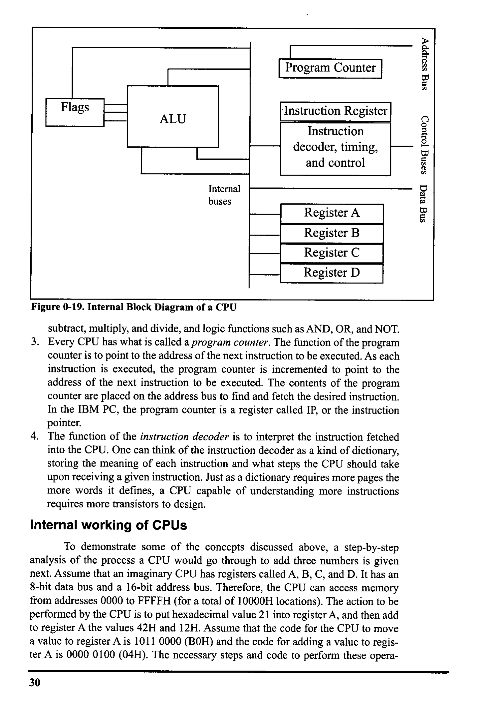
*Description*: Architectural block diagram detailing logic blocks, internal buses, memory units, and hardware component interactions for Figure 0-19: Internal Block Diagram of a CPU.

> **Figure 0-19: Internal Block Diagram of a CPU**

subtract, multiply, and divide, and logic functions such as AND, OR, and NOT.
3. Every CPU has what is called a program counter. The function of the program
counter is to point to the address of the next instruction to be executed. As each
instruction is executed, the program counter is incremented to point to the
address of the next instruction to be executed. The contents of the program
counter are placed on the address bus to find and fetch the desired instruction.
In the IBM PC, the program counter is a register called IP, or the instruction
pointer.
4. The function of the instruction decoder is to interpret the instruction fetched
into the CPU. One can think of the instruction decoder as a kind of dictionary,
storing the meaning of each instruction and what steps the CPU should take
upon receiving a given instruction. Just as a dictionary requires more pages the
more words it defines, a CPU capable of understanding more instructions
requires more transistors to design.
Internal working of CPUs
To demonstrate some of the concepts discussed above, a step-by-step
analysis of the process a CPU would go through to add three numbers is given
next. Assume that an imaginary CPU has registers called A, B, C, and D. It has an
8-bit data bus and a l6-bit address bus. Theretore, the CPU can access memory
from addresses 0000 to FFFFH (for a total of 10000H locations). The action to be
performed by the CPU is to put hexadecimal value 21 into register A, and then add
to register A the values 42H and 12H. Assume that the code for the CPU to move
a value to register A is 1011 0000 (BOH) and the code for adding a value to regis-
ter A is 0000 0100 (04H). The necessary steps and code to perform these opera-
30
Address
Bus
Control Bus
Data
Register A
Register B
Register C
Register D


<!-- Page 47 -->
### [PDF Page 47]

tions are as follows.
Action
Move value 21H into register A
Add value 42H to register A
Add value 12H to register A
Code
BOH
04H
04H
Data
21H
42H
12H
If the program to perform the actions listed above is stored in memory
locations starting at 1400H, the following would represent the contents for each
memory address location:
Memory address
1400
1401
1402
1403
1404
1405
1406
Contents of memory address
(BO) code for moving a value to register A
(21) value to be moved
(04) code for adding a value to register A
(42) value to be added
(04) code for adding a value to register A
(12) value to be added
(F4) code for halt
The actions performed by the CPU to run the program above would be as
follows:
1. The CPU's program counter can have a value between 0000 and FFFFH. The
program counter must be set to the value 1400H, indicating the address of the
first instruction code to be executed. After the program counter has been
loaded with the address of the first instruction, the CPU is ready to execute.
2. The CPU puts 1400H on the address bus and sends it out. The memory circuit-
ry finds the location while the CPU activates the READ signal, indicating to
memory that it wants the byte at location 1400H. This causes the contents of
memory location 1400H, which is BO, to be put on the data bus and brought
into the CPU.
3. The CPU decodes the instruction BO with the help of its instruction decoder
dictionary. When it finds the definition for that instruction it knows it must
bring the byte in the next memory location into register A of the CPU.
Therefore, it commands its controller circuitry to do exactly that. When it
brings in value 21H from memory location 1401, it makes sure that the doors
of all registers are closed except register A. Therefore, when value 21H comes
into the CPU it will go directly into register A. After completing one instruc-
tion, the program counter points to the address of the next instruction to be exe-
cuted, which in this case is 1402H. Address 1402 is sent out on the address bus
to fetch the next instruction.
4. From memory location 1402H the CPU fetches code 04H. After decoding, the
CPU knows that it must add the byte sitting at the next address (1403) to the
contents of register A. After the CPU brings the value (in this case, 42H) into
register A, it provides the contents of register A along with this value to the
ALU to perform the addition. It then takes the result of the addition from the
ALU's output and puts it into register A. Meanwhile the program counter
becomes 1404, the address of the next instruction.
CHAPTER 0: INTRODUCTION TO COMPUTING
31


<!-- Page 48 -->
### [PDF Page 48]

5. Address 1404H is put on the address bus and the code is fetched into the CPU,
decoded, and executed. This code again is adding a value to register A. The
program counter is updated to 1406H.
6. Finally, the contents of address 1406 are fetched in and executed. This HALT
instruction tells the CPU to stop incrementing the program counter and asking
for the next instruction. Without the HALT, the CPU would continue updating
the program counter and fetching instructions.
Now suppose that address 1403H contained value 04 instead of 42H. How
would the CPU distinguish between data 04 to be added and code 04? Remember
that code 04 for this CPU means "move the next value into register A." Therefore,
the CPU will not try to decode the next value. It simply moves the contents of the
following memory location into register A, regardless of its value.
Harvard and von Neumann architectures
Every microprocessor must have memory space to store program (code)
and data. While code provides instructions to the CPU, the data provides the infor-
mation to be processed. The CPU uses buses (wire traces) to access the code ROM
and data RAM memory spaces. The early computers used the same bus for access-
ing both the code and data. Such an architecture is commonly referred to as von
Neumann (Princeton) architecture. That means for von Neumann computers, the
process of accessing the code or data could cause them to get in each other's way
and slow down the processing speed of the CPU, because each had to wait for the
other to finish fetching. To speed up the process of program execution, some CPUs
use what is called Harvard architecture. In Harvard architecture, we have separate
buses for the code and data memory. See Figure 0-20. That means that we need
four sets of buses: (1) a set of data buses for carrying data into and out of the CPU,
(2) a set of address buses for accessing the data, (3) a set of data buses for carry-
ing code into the CPU, and (4) an address bus for accessing the code. See Figure
0-20. This is easy to implement inside an IC chip such as a microcontroller where
both ROM code and data RAM are internal (on-chip) and distances are on the
micron and millimeter scale. But implementing Harvard architecture for systems
such as x86 IBM PC-type computers is very expensive because the RAM and
ROM that hold code and data are external to the CPU. Separate wire traces for data
and code on the motherboard will make the board large and expensive. For exam-
ple, for a Pentium microprocessor with a 64-bit data bus and a 32-bit address bus
we will need about 100 wire traces on the motherboard if it is von Neumann archi-
tecture (96 for address and data, plus a few others for control signals of read and
write and so on). But the number of wire traces will double to 200 if we use
Harvard architecture. Harvard architecture will also necessitate a large number of
pins coming out of the microprocessor itself. For this reason you do not see
Harvard architecture implemented in the world of PCs and workstations. This is
also the reason that microcontrollers such as AVR use Harvard architecture inter-
nally, but they still use von Neumann architecture if they need external memory
for code and data space. The von Neumann architecture was developed at
Princeton University, while the Harvard architecture was the work of Harvard
University.
32


<!-- Page 49 -->
### [PDF Page 49]

von Neumann Architecture
A19
CPU
CODE
MEMORY
DATA
MEMORY
Do
D,
Harvard Architecture
8-bit
DATA
MEMORY
Ao
Ao
Ao
<=
CPU
=>
Do
Ala
Ala
8-bit
Ao
CODE
MEMORY
Ala
Do
Di
Do
Do

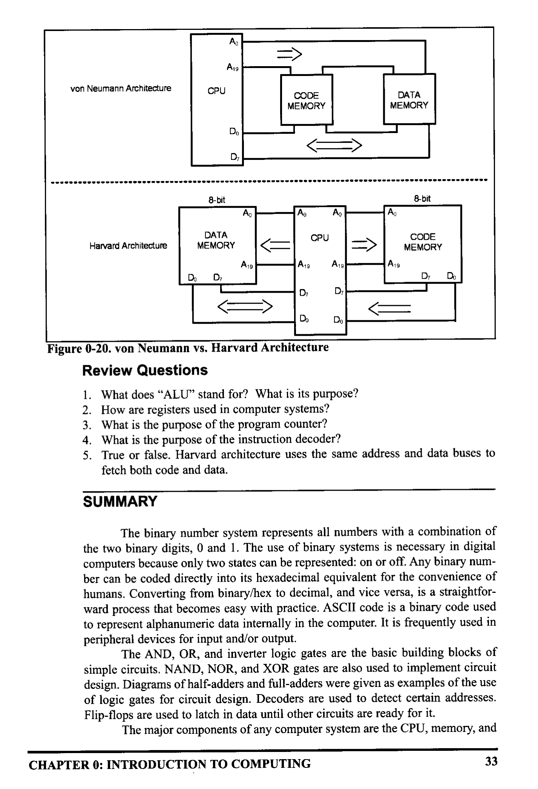
*Description*: Technical diagram and schematic illustration detailing hardware connection topology, signal routing, and circuit operation for Figure 0-20: von Neumann vs. Harvard Architecture.

> **Figure 0-20: von Neumann vs. Harvard Architecture**


### Review Questions

1. What does "ALU" stand for? What is its purpose?
2. How are registers used in computer systems?
3. What is the purpose of the program counter?
4. What is the purpose of the instruction decoder?
5. True or false. Harvard architecture uses the same address and data buses to
fetch both code and data.

### SUMMARY

The binary number system represents all numbers with a combination of
the two binary digits, 0 and 1. The use of binary systems is necessary in digital
computers because only two states can be represented: on or off. Any binary num-
ber can be coded directly into its hexadecimal equivalent for the convenience of
humans. Converting from binary/hex to decimal, and vice versa, is a straightfor-
ward process that becomes easy with practice. ASCII code is a binary code used
to represent alphanumeric data internally in the computer. It is frequently used in
peripheral devices for input and/or output.
The AND, OR, and inverter logic gates are the basic building blocks of
simple circuits. NAND, NOR, and XOR gates are also used to implement circuit
design. Diagrams of half-adders and full-adders were given as examples of the use
of logic gates for circuit design. Decoders are used to detect certain addresses.
Flip-flops are used to latch in data until other circuits are ready for it.
The major components of any computer system are the CPU, memory, and
CHAPTER 0: INTRODUCTION TO COMPUTING
33


<!-- Page 50 -->
### [PDF Page 50]

I/O devices. "Memory" refers to temporary or permanent storage of data. In most
systems, memory can be accessed as bytes or words. The terms kilobyte,
megabyte, gigabyte, and terabyte are used to refer to large numbers of bytes. There
are two main types of memory in computer systems: RAM and ROM. RAM (ran-
dom access memory) is used for temporary storage of programs and data. ROM
(read-only memory) is used for permanent storage of programs and data that the
computer system must have in order to function. All components of the computer
system are under the control of the CPU. Peripheral devices such as 1/0 (input/out-
put) devices allow the CPU to communicate with humans or other computer sys-
tems. There are three types of buses in computers: address, control, and data.
Control buses are used by the CPU to direct other devices. The address bus is used
by the CPU to locate a device or a memory location. Data buses are used to send
information back and forth between the CPU and other devices.
This chapter provided an overview of semiconductor memories. Types of
memories were compared in terms of their capacity, organization, and access time.
ROM (read-only memory) is nonvolatile memory typically used to store programs
in embedded systems. The relative advantages of various types of ROM were
described, including PROM, EPROM, UV-EPROM, EEPROM, Flash memory
EPROM, and mask ROM.
Address decoding techniques using simple logic gates, decoders, and pro-
grammable logic were covered.
The computer organization and the internals of the CPU were also covered.

### PROBLEMS


## SECTION 0.1: NUMBERING AND CODING SYSTEMS

1. Convert the following decimal numbers to binary:
(a) 12 (b) 123 (c) 63 (d) 128 (e) 1000
2. Convert the following binary numbers to decimal:
{2) [001002[ (bł 10000016 [cł 1110k [ćł 1010€ [[e} 0010010
3. Convert the values in Problem 2 to hexadecimal.
4. Convert the following hex numbers to binary and decimal:
(a) 2B9H (b) F44H (c) 912H (d) 2BH (e) FFFFH
5. Convert the values in Problem 1 to hex.
6. Find the 2's complement of the following binary numbers:
(2) 1001010 (b) 111001 (c) 10000010 (d) 111110001
7. Add the following hex values:
(a) ZCH + 3FH (b) F34H + 5D6H (c) 20000H + 12FFH
(d) FFFFH + 2222H
8. Pertorm hex subtraction for the following:
(а) 24РН - 129H (b) FE9H - SCCH (c) 2FFFFH - FFFFFH
(d) 9FF25H - 4DD99H
9. Show the ASCII codes for numbers 0, 1, 2, 3, ..., 9 in both hex and binary.
10. Show the ASCII code (in hex) for the following strings:
"U.S.A. is a country" CR,LF
"in North America" CR,LF
(CR is carriage return, LF is line feed)
34


<!-- Page 51 -->
### [PDF Page 51]


## SECTION 0.2: DIGITAL PRIMER

11. Draw a 3-input OR gate using a 2-input OR gate.
12. Show the truth table for a 3-input OR gate.
13. Draw a 3-input AND gate using a 2-input AND gate.
14. Show the truth table for a 3-input AND gate.
15. Design a 3-input XOR gate with a 2-input XOR gate. Show the truth table for
a 3-input XOR.
16. List the truth table for a 3-input NAND.
17. List the truth table for a 3-input NOR.
18. Show the decoder for binary 1100.
19. Show the decoder for binary 11011.
20. List the truth table for a D-FF.

## SECTION 0.3: SEMICONDUCTOR MEMORY

21. Answer the following:
(a) How many nibbles are 16 bits?
(b) How many bytes are 32 bits?
(c) If a word is defined as 16 bits, how many words is a 64-bit data item?
(d) What is the exact value (in decimal) of 1 meg?
(e) How many kilobytes is 1 meg?
(f) What is the exact value (in decimal) of 1 gigabyte?
(g) How many kilobytes is 1 gigabyte?
(h) How many megs is 1 gigabyte?
(i) If a given computer has a total of 8 megabytes of memory, how many
bytes (in decimal) is this? How many kilobytes is this?
22. A given mass storage device such as a hard disk can store 2 gigabytes of infor-
mation. Assuming that each page of text has 25 rows and each row has 80
columns of ASCII characters (each character = 1 byte), approximately how
many pages of information can this disk store?
23. In a given byte-addressable computer, memory locations 10000H to 9FFFFH
are available for user programs. The first location is 10000H and the last loca-
tion is 9FFFFH. Calculate the following:
(a) The total number of bytes available (in decimal)
(b) The total number of kilobytes (in decimal)
24. A given computer has a 32-bit data bus. What is the largest number that can be
carried into the CPU at a time?
25. Below are listed several computers with their data bus widths. For each com-
puter, list the maximum value that can be brought into the CPU at a time (in
both hex and decimal).
(a) Apple 2 with an 8-bit data bus
(b) x86 PC with a 16-bit data bus
(c) x86 PC with a 32-bit data bus
(d) Cray supercomputer with a 64-bit data bus
26. Find the total amount of memory, in the units requested, for each of the follow-
ing CPUs, given the size of the address buses:
CHAPTER 0: INTRODUCTION TO COMPUTING
35


<!-- Page 52 -->
### [PDF Page 52]

(a) 16-bit address bus (in K)
(b) 24-bit address bus (in megs)
(C) 32-bit address bus (in megabytes and gigabytes)
(d) 48-bit address bus (in megabytes, gigabytes, and terabytes)
27. Of the data bus and address bus, which is unidirectional and which is bidirec-
tional?
28. What is the difference in capacity between a 4M memory chip and 4M of com-
puter memory?
29. True or false. The more address pins, the more memory locations are inside the
chip. (Assume that the number of data pins is fixed.)
30. True or false. The more data pins, the more each location inside the chip will
hold.
31. True or false. The more data pins, the higher the capacity of the memory chip.
32. True or false. The more data pins and address pins, the greater the capacity of
the memory chip.
33. The speed of a memory chip is referred to as its
34. True or false. The price of memory chips varies according to capacity and
speed.
35. The main advantage of EEPROM over UV-EPROM is
36. True or false. SRAM has a larger cell size than DRAM.
37. Which of the following, EPROM, DRAM, or SRAM, must be refreshed peri-
odically?
38. Which memory is used for PC cache?
39. Which of the following, SRAM, UV-EPROM, NV-RAM, or DRAM, is
volatile memory?
40. RAS and CAS are associated with which type of memory?
(a) EPROM (b) SRAM (c) DRAM (d) all of the above
41. Which type of memory needs an external multiplexer?
(a) EPROM (b) SRAM (c) DRAM (d) all of the above
42. Find the organization and capacity of memory chips with the following pins.
(a) EEPROM AO-A14, DO D7
(b) UV-EPROM AO-A12, DO-D7
(c) SRAM AO-A11, DO-D7
(d) SRAM AO-A12, DO-D7
(e) DRAM AO A10, DO
(1) SRAM AO-A12, DO
(g) EEPROM AO-A11, DO-D7
(h) UV-EPROM AO-A10, DO-D7
(1) DRAM A0-A8, DO D3
(i) DRAM AO-A7, DO-D7
43. Find the capacity, address, and data pins for the following memory organiza-
tions.
(a) 16K × 8 ROM
(c) 64K × 8 SRAM
(e) 64K × 8 ROM
(g) IM × 8 SRAM
(b) 32K × 8 ROM
(d) 256K × 8 EEPROM
(f) 64K × 4 DRAM
(h) 4M × 4 DRAM
(i) 64K × 8 NV-RAM
44. Find the address range of the memory design in the diagram.
45. Using NAND gates and inverters, design decoding circuitry for the address
range 2000H-2FFFH.
46. Find the address range for YO, Y3, and Y6 of the 74LS138 for the diagrammed
36


<!-- Page 53 -->
### [PDF Page 53]

design.
D7 - DO
47. Using the 74138, design the memory
decoding circuitry in which the mem-
= AO
ory block controlled by YO is in the
A13
range 0000H to 1FFFH. Indicate the
size of the memory block controlled
A14
A15
16K × 8
cs
by each Y.
48. Find the address range for Y3, Y6, and
Diagram for Problem 44
Y7 in Problem 47.
49. Using the 74138, design memory decoding circuit-
74LS138
ry in which the memory block controlled by YU 1s
in the 0000H to 3FFFH space. Indicate the size of
A12-A
the memory block controlled by each Y.
50. Find the address range for Y1, Y2, and Y3 in
Problem 49.

## SECTION 0.4: CPU AND HARVARD ARCHITEC-

GND
GND -G2B
A15 - G1
Diagram for Problem 46
TURE
51. Which register of the CPU holds the address of the instruction to be fetched?
52. Which section of the CPU is responsible for performing addition?
53. List the three bus types present in every CPU.

### ANSWERS TO REVIEW QUESTIONS


## SECTION 0.1: NUMBERING AND CODING SYSTEMS

1. Computers use the binary system because each bit can have one of two vollage levels: on and
2.
3410=1000102=2216
3.
1101012=3516=5310
4.
1110001
5. 010100
6. 461
7. 275
8. 38 30 78 38 36 20 43 50 55 73

## SECTION 0.2: DIGITAL PRIMER

1. AND
2. OR
3. XOR
4. Buffer
5. Storing data
6. Decoder

## SECTION 0.3: SEMICONDUCTOR MEMORY

1. 24,576
2. Random access memory; it is used for temporary storage of programs that the CPU is run-
CHAPTER 0: INTRODUCTION TO COMPUTING
37


<!-- Page 54 -->
### [PDF Page 54]

ning, such as the operating system, word processing programs, etc.
3.
Read-only memory; it is used for permanent programs such as those that control the keyboard,
The contents of RAM are lost when the computer is powered off.
5. The CPU, memory, and I/O devices
6. Central processing unit; it can be considered the "brain" of the computer; it executes the pro-
grams and controls all other devices in the computer.
7. The address bus carries the location (address) needed by the CPU; the data bus carries infor-
mation in and out of the CPU; the control bus is used by the CPU to send signals controlling
I/O devices.
8. (a) bidirectional (b) unidirectional
9. 64K, or 65,536 bytes
10.c
11. (a) 16K × 8, 128K bits
(b) 64K × 8, 512K
(c) 4K × 8, 32K
12. (a) 2K × 1,2K bits
(b) 8K × 4, 32K
(c) 128K × 8, IM
(d) 64K × 4, 256K
(e) 256K × 1, 256K
(f) 256K × 4, IM
13. (a) 64K bits, 14 address, and 4 data
(b) 256K, 15 address, and 8 data
(c) 1M, 10 address, and 1 data
(d) 1M, 18 address, and 4 data
(e) 512K, 16 address, and 8 data
(f) 4M, 10 address, and 4 data
14. b, c
15. 16K bytes
16.3,8
17. Both must be low.
18. Gl must be high.
19. 5000H-SFFFH

## SECTION 0.4: CPU ARCHITECTURE

1. Arithmetic/logic unit; it performs all arithmetic and logic operations.
2.
3.
They are used for temporary storage of information.
It holds the address of the next instruction to be executed.
4.
5.
It tells the CPU what actions to perform for each instruction.
False
38


