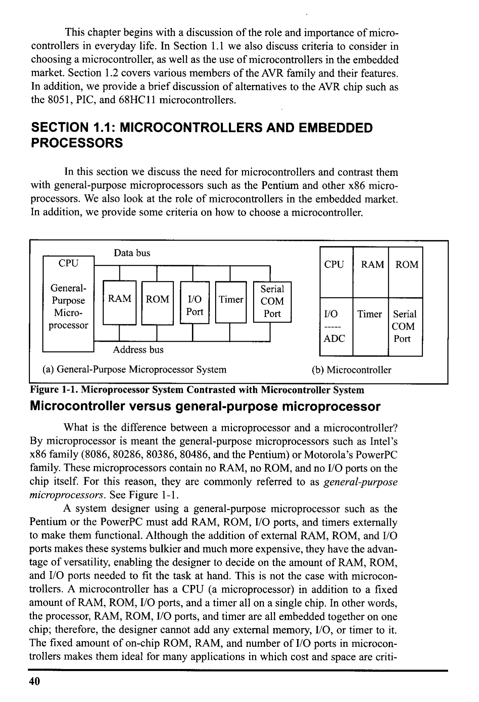
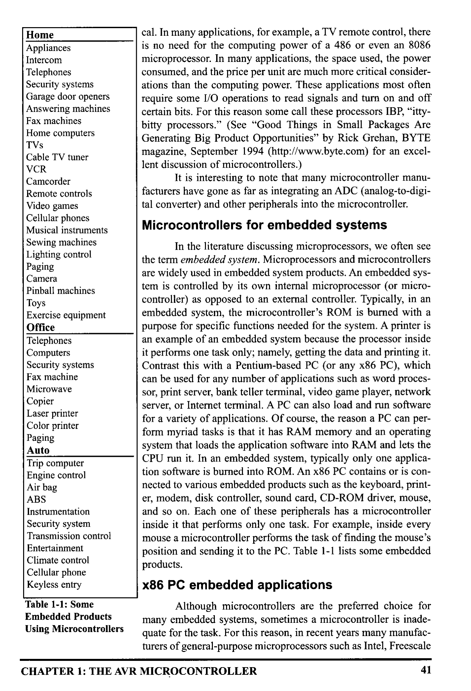
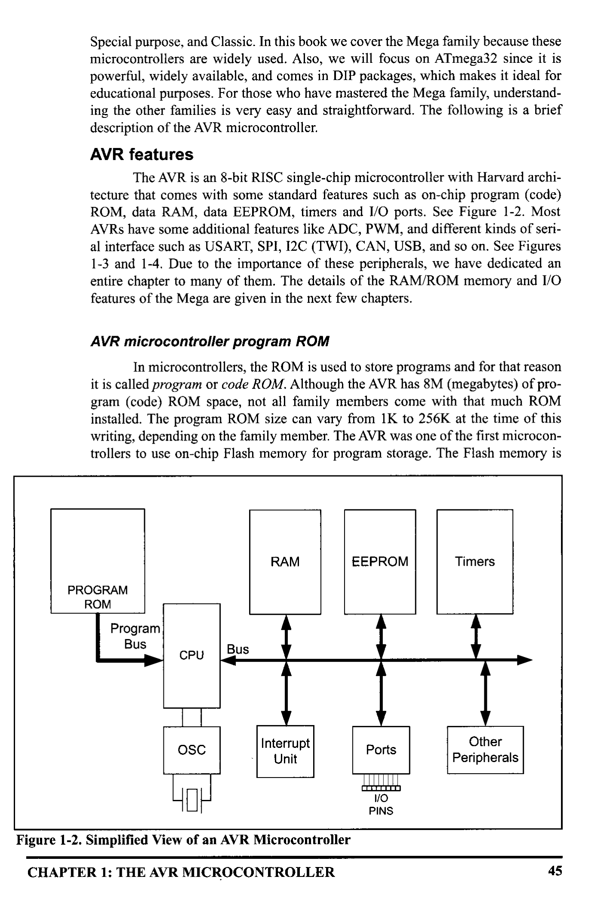
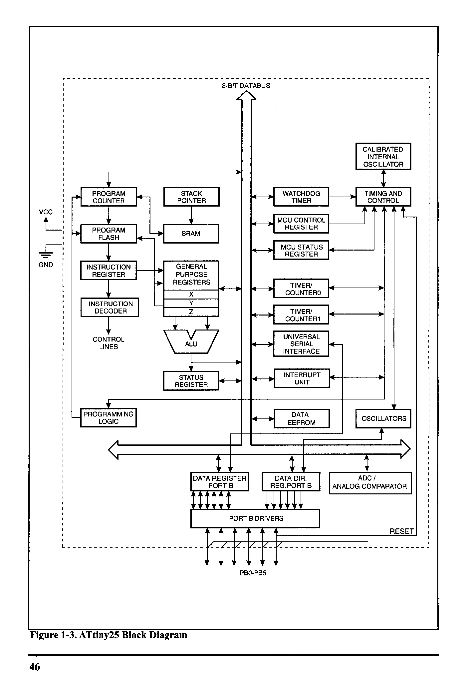
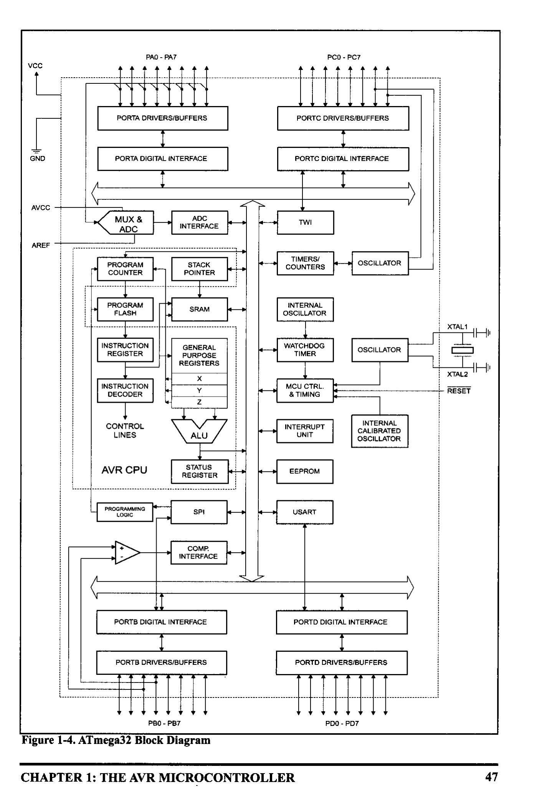
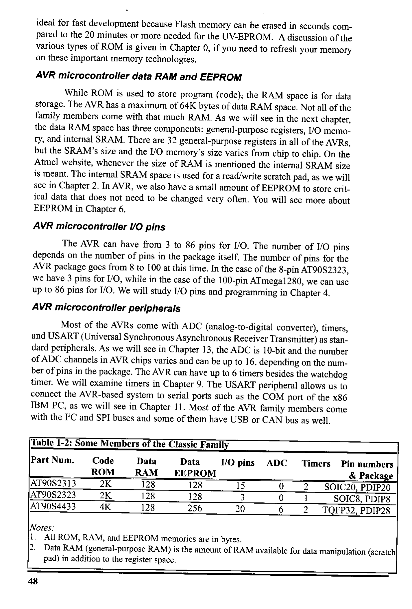
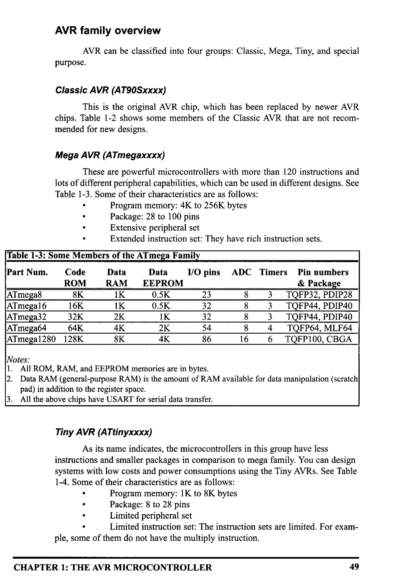
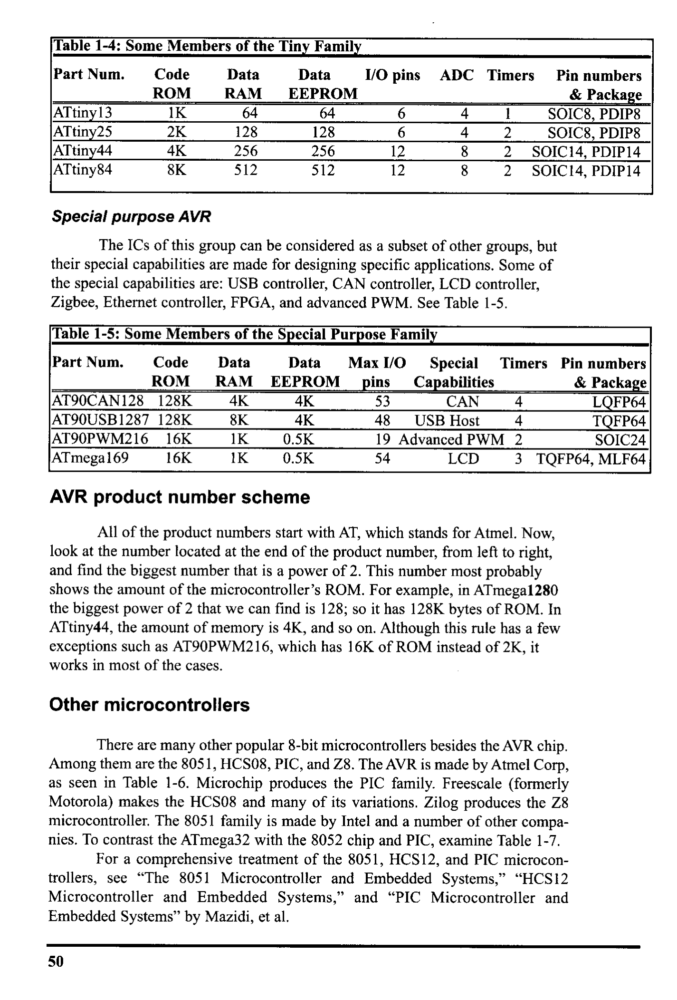
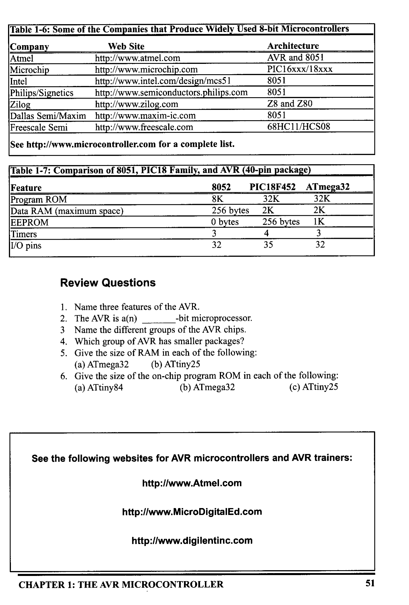

# Chapter 1: The AVR Microcontroller: History and Features

> **Textbook**: The AVR Microcontroller and Embedded Systems using Assembly and C

> **PDF Page Range**: 55 - 69

---

<!-- Page 55 -->
### [PDF Page 55]

CHAPTER 1
THE AVR
MICROCONTROLLER:
HISTORY AND FEATURES
OBJECTIVES
Upon completion of this chapter, you will be able to:
Compare and contrast microprocessors and microcontrollers
Describe the advantages of microcontrollers for some applications
Explain the concept of embedded systems
Discuss criteria for considering a microcontroller
Explain the variations of speed, packaging, memory, and
ost per unit and how these affect choosing a microcontroller
>>
Compare and contrast the various members of the AVR family
Compare the AVR with microcontrollers offered by other manufacturers
39

<!-- Page 56 -->
### [PDF Page 56]

This chapter begins with a discussion of the role and importance of micro-
controllers in everyday life. In Section 1.1 we also discuss criteria to consider in
choosing a microcontroller, as well as the use of microcontrollers in the embedded
market. Section 1.2 covers various members of the AVR family and their features.
In addition, we provide a brief discussion of alternatives to the AVR chip such as
the 8051, PIC, and 68HC11 microcontrollers.

## SECTION 1.1: MICROCONTROLLERS AND EMBEDDED

PROCESSORS
In this section we discuss the need for microcontrollers and contrast them
with general-purpose microprocessors such as the Pentium and other x86 micro-
processors. We also look at the role of microcontrollers in the embedded market.
In addition, we provide some criteria on how to choose a microcontroller.
Data bus
CPU
General-
Purpose
Micro-
processor
CPU
RAM
ROM
RAM
ROM
I/O
Port
Timer
Serial
COM
Port
1/O
ADC
Timer Serial
COM
Port
Address bus
(a) General-Purpose Microprocessor System
(b) Microcontroller

*Description*: Technical diagram and schematic illustration detailing hardware connection topology, signal routing, and circuit operation for Figure 1-1: Microprocessor System Contrasted with Microcontroller System.

> **Figure 1-1: Microprocessor System Contrasted with Microcontroller System**

Microcontroller versus general-purpose microprocessor
What is the difference between a microprocessor and a microcontroller?
By microprocessor is meant the general-purpose microprocessors such as Intel's
x86 family (8086, 80286, 80386, 80486, and the Pentium) or Motorola's PowerPC
family. These microprocessors contain no RAM, no ROM, and no I/O ports on the
chip itself. For this reason, they are commonly referred to as general-purpose
microprocessors. See Figure 1-1.
A system designer using a general-purpose microprocessor such as the
Pentium or the PowerPC must add RAM, ROM, I/O ports, and timers externally
to make them functional. Although the addition of external RAM, ROM, and I/O
ports makes these systems bulkier and much more expensive, they have the advan-
tage of versatility, enabling the designer to decide on the amount of RAM, ROM,
and I/O ports needed to fit the task at hand. This is not the case with microcon-
trollers. A microcontroller has a CPU (a microprocessor) in addition to a fixed
amount of RAM, ROM, I/O ports, and a timer all on a single chip. In other words,
the processor, RAM, ROM, I/O ports, and timer are all embedded together on one
chip; therefore, the designer cannot add any external memory, I/O, or timer to it.
The fixed amount of on-chip ROM, RAM, and number of I/O ports in microcon-
trollers makes them ideal for many applications in which cost and space are criti-
40

<!-- Page 57 -->
### [PDF Page 57]

Home
Appliances
Intercom
Telephones
Security systems
Garage door openers
Answering machines
Fax machines
Home computers
TVS
Cable TV tuner
VCR
Camcorder
Remote controls
Video games
Cellular phones
Musical instruments
Sewing machines
Lighting control
Paging
Camera
Pinball machines
Toys
Exercise equipment
Office
Telephones
Computers
Security systems
Fax machine
Microwave
Copier
Laser printer
Color printer
Paging
Auto
Trip computer
Engine control
Air bag
ABS
Instrumentation
Security system
Transmission control
Entertainment
Climate control
Cellular phone
Keyless entry

*Description*: Structured reference table listing operational parameters, instruction execution cycles, memory address mapping, or feature comparison for Table 1-1: Some.

> **Table 1-1: Some**

Embedded Products
Using Microcontrollers
CHAPTER 1: THE AVR MICROCONTROLLER
cal. In many applications, for example, a TV remote control, there
is no need for the computing power of a 486 or even an 8086
microprocessor. In many applications, the space used, the power
consumed, and the price per unit are much more critical consider-
ations than the computing power. These applications most often
require some I/O operations to read signals and turn on and off
certain bits. For this reason some call these processors IBP, "itty-
bitty processors." (See "Good Things in Small Packages Are
Generating Big Product Opportunities" by Rick Grehan, BYTE
magazine, September 1994 (http://www.byte.com) for an excel-
lent discussion of microcontrollers.)
It is interesting to note that many microcontroller manu-
facturers have gone as far as integrating an ADC (analog-to-digi-
tal converter) and other peripherals into the microcontroller.
Microcontrollers for embedded systems
In the literature discussing microprocessors, we often see
the term embedded system. Microprocessors and microcontrollers
are widely used in embedded system products. An embedded sys-
tem is controlled by its own internal microprocessor (or micro-
controller) as opposed to an external controller. Typically, in an
embedded system, the microcontroller's ROM is burned with a
purpose for specific functions needed for the system. A printer is
an example of an embedded system because the processor inside
it performs one task only; namely, getting the data and printing it.
Contrast this with a Pentium-based PC (or any x86 PC), which
can be used for any number of applications such as word proces-
sor, print server, bank teller terminal, video game player, network
server, or Internet terminal. A PC can also load and run software
for a variety of applications. Of course, the reason a PC can per-
form myriad tasks is that it has RAM memory and an operating
system that loads the application software into RAM and lets the
CPU run it. In an embedded system, typically only one applica-
tion software is burned into ROM. An x86 PC contains or is con-
nected to various embedded products such as the keyboard, print-
er, modem, disk controller, sound card, CD-ROM driver, mouse,
and so on. Each one of these peripherals has a microcontroller
inside it that performs only one task. For example, inside every
mouse a microcontroller performs the task of finding the mouse's
position and sending it to the PC. Table 1-1 lists some embedded
products.
x86 PC embedded applications
Although microcontrollers are the preferred choice for
many embedded systems, sometimes a microcontroller is inade-
quate for the task. For this reason, in recent years many manufac-
turers of general-purpose microprocessors such as Intel, Freescale
41

<!-- Page 58 -->
### [PDF Page 58]

Semiconductor (formerly Motorola), and AMD (Advanced Micro Devices, Inc.)
have targeted their microprocessors for the high end of the embedded market. Intel
and AMD push their x86 processors for both the embedded and desktop PC mar-
kets. In the early 1990s, Apple computer began using the PowerPC microproces-
sors (604, 603, 620, etc.) in place of the 680x0 for the Macintosh. In 2007 Apple
switched to the x86 CPU for use in the Mac computers. The PowerPC micro-
processor is a joint venture between IBM and Freescale, and is targeted for the
high end of the embedded market. It must be noted that when a company targets a
general-purpose microprocessor for the embedded market it optimizes the proces-
sor used for embedded systems. For this reason these processors are often called
high-end embedded processors. Another chip widely used in the high end of the
embedded system design is the ARM (Advanced RISC Machine) microprocessor.
Very often the terms embedded processor and microcontroller are used inter-
changeably
One of the most critical needs of an embedded system is to decrease power
consumption and space. This can be achieved by integrating more functions into
the CPU chip. All the embedded processors based on the x86 and PowerPC 6xx
have low power consumption in addition to some forms of I/O, COM port, and
ROM, all on a single chip. In high-performance embedded processors, the trend is
to integrate more and more functions on the CPU chip and let the designer decide
which features to use. This trend is invading PC system design as well. Normally,
in designing the PC motherboard we need a CPU plus a chipset containing I/O, a
cache controller, a Flash ROM containing BIOS, and finally a secondary cache
memory. New designs are emerging in industry. For example, many companies
have a chip that contains the entire CPU and all the supporting logic and memory,
except for DRAM. In other words, we have the entire computer on a single chip.
Currently, because of Linux and Windows standardization, many embed-
ded systems use x86 PCs. In many cases, using x86 PCs for the high-end embed-
ded applications not only saves money but also shortens development time
because a vast library of software already exists for the Linux and Windows plat-
forms. The fact that Windows and Linux are widely used and well-understood plat-
forms means that developing a Windows-based or Linux-based embedded product
reduces the cost and shortens the development time considerably.
Choosing a microcontroller
There are five major 8-bit microcontrollers. They are: Freescale
Semiconductor's (formerly Motorola) 68HC08/68HC11, Intel's 8051, Atmel's
AVR, Zilog's Z8, and PIC from Microchip Technology. Each of the above micro-
controllers has a unique instruction set and register set; therefore, they are not
compatible with each other. Programs written for one will not run on the others.
There are also 16-bit and 32-bit microcontrollers made by various chip makers.
With all these different microcontrollers, what criteria do designers consider in
choosing one? Three criteria in choosing microcontrollers are as follows: (1)
meeting the computing needs of the task at hand efficiently and cost effectively;
(2) availability of software and hardware development tools such as compilers,
assemblers, debuggers, and emulators; and (3) wide availability and reliable
sources of the microcontroller. Next, we elaborate on each of the above criteria.
42

<!-- Page 59 -->
### [PDF Page 59]

Criteria for choosing a microcontroller
1. The first and foremost criterion in choosing a microcontroller is that it must
meet the task at hand efficiently and cost effectively. In analyzing the needs of
a microcontroller-based project, we must first see whether an 8-bit, 16-bit, or
32-bit microcontroller can best handle the computing needs of the task most
effectively. Among other considerations in this category are:
(a) Speed. What is the highest speed that the microcontroller supports?
(b) Packaging. Does it come in a DIP (dual inline package) or a QFP (quad flat
package), or some other packaging format? This is important in terms of
space, assembling, and prototyping the end product.
(c) Power consumption. This is especially critical for battery-powered prod-
ucts.
(d) The amount of RAM and ROM on the chip.
(e) The number of I/O pins and the timer on the chip.
(f) Ease of upgrade to higher-performance or lower-power-consumption ver-
sions.
(g) Cost per unit. This is important in terms of the final cost of the product in
which a microcontroller is used. For example, some microcontrollers cost
50 cents per unit when purchased 100,000 units at a time.
2. The second criterion in choosing a microcontroller is how easy it is to devel-
op products around it. Key considerations include the availability of an assem-
bler, a debugger, a code-efficient C language compiler, an emulator, technical
support, and both in-house and outside expertise. In many cases, third-party
vendor (i.e., a supplier other than the chip manufacturer) support for the chip
is as good as, if not better than, support from the chip manufacturer.
3. The third criterion in choosing a microcontroller is its ready availability in
needed quantities both now and in the future. For some designers this is even
more important than the first two criteria. Currently, of the leading 8-bit micro-
controllers, the 8051 family has the largest number of diversified (multiple
source) suppliers. (Supplier means a producer besides the originator of the
microcontroller.) In the case of the 8051, which was originated by Intel, many
companies also currently produce the 8051.
Notice that Freescale Semiconductor (Motorola), Atmel, Zilog, and
Microchip Technology have all dedicated massive resources to ensure wide and
timely availability of their products because their products are stable, mature, and
single sourced. In recent years, companies have begun to sell Field-Programmable
Gate Array (FPGA) and Application-Specific Integrated Circuit (ASIC) libraries
for the different microcontrollers.
Mechatronics and microcontrollers
The microcontroller is playing a major role in an emerging field called
mechatronics. Here is an excellent summary of what the field of mechatronics is
all about, taken from the website of Newcastle University (http://mechatron-
ics2004.newcastle.edu.au/mech2004), which holds a major conference every year
on this subject:
"Many technical processes and products in the area of mechanical and
CHAPTER 1: THE AVR MICROCONTROLLER
43

<!-- Page 60 -->
### [PDF Page 60]

electrical engineering show an increasing integration of mechanics with electron-
ics and information processing. This integration is between the components (hard-
ware) and the information-driven functions (software), resulting in integrated sys-
tems called mechatronic systems.
The development of mechatronic systems involves finding an optimal bal-
ance between the basic mechanical structure, sensor and actuator implementation,
automatic digital information processing and overall control, and this synergy
results in innovative solutions. The practice of mechatronics requires multidisci-
plinary expertise across a range of disciplines, such as: mechanical engineering,
electronics, information technology, and decision making theories."

### Review Questions

1. True or false. Microcontrollers are normally less expensive than microproces-
SOrS.
2. When comparing a system board based on a microcontroller and a general-
purpose microprocessor, which one is cheaper?
3. A microcontroller normally has which of the following devices on-chip?
(a) RAM
(b) ROM
(c) 1/0
(d) all of the above
4. A general-purpose microprocessor normally needs which of the following
devices to be attached to it?
(a) RAM
(b) ROM
(c) 1/0
(d) all of the above
5. An embedded system is also called a dedicated system. Why?
6. What does the term embedded system mean?
7. Why does having multiple sources of a given product matter?

## SECTION 1.2: OVERVIEW OF THE AVR FAMILY

In this section, we first look at the AVR microcontrollers and their features
and then examine the different families of AVR in more detail.
A brief history of the AVR microcontroller
The basic architecture of AVR was designed by two students of Norwegian
Institute of Technology (NTH), Alf-Egil Bogen and Vegard Wollan, and then was
bought and developed by Atmel in 1996.
You may ask what AVR stands for; AVR can have different meanings for
different people! Atmel says that it is nothing more than a product name, but it
might stand for Advanced Virtual RISC, or Alf and Vegard RISC (the names of the
AVR designers).
There are many kinds of AVR microcontroller with different properties.
Except for AVR32, which is a 32-bit microcontroller, AVRs are all 8-bit micro-
processors, meaning that the CPU can work on only 8 bits of data at a time. Data
larger than 8 bits has to be broken into 8-bit pieces to be processed by the CPU.
One of the problems with the AVR microcontrollers is that they are not all 100%
compatible in terms of software when going from one family to another family. To
run programs written for the ATtiny25 on a ATmega64, we must recompile the
program and possibly change some register locations before loading it into the
ATmega64. AVRs are generally classified into four broad groups: Mega, Tiny,
44

<!-- Page 61 -->
### [PDF Page 61]

Special purpose, and Classic. In this book we cover the Mega family because these
microcontrollers are widely used. Also, we will focus on ATmega32 since it is
powerful, widely available, and comes in DIP packages, which makes it ideal for
educational purposes. For those who have mastered the Mega family, understand-
ing the other families is very easy and straightforward. The following is a brief
description of the AVR microcontroller.
AVR features
The AVR is an 8-bit RISC single-chip microcontroller with Harvard archi-
tecture that comes with some standard features such as on-chip program (code)
ROM, data RAM, data EEPROM, timers and I/O ports. See Figure 1-2. Most
AVRs have some additional features like ADC, PWM, and different kinds of seri-
al interface such as USART, SPI, I2C (TWI), CAN, USB, and so on. See Figures
1-3 and 1-4. Due to the importance of these peripherals, we have dedicated an
entire chapter to many of them. The details of the RAM/ROM memory and 1/0
features of the Mega are given in the next few chapters.
AVR microcontroller program ROM
In microcontrollers, the ROM is used to store programs and for that reason
it is called program or code ROM. Although the AVR has 8M (megabytes) of pro-
gram (code) ROM space, not all family members come with that much ROM
installed. The program ROM size can vary from 1K to 256K at the time of this
writing, depending on the family member. The AVR was one of the first microcon-
trollers to use on-chip Flash memory for program storage. The Flash memory is
RAM
EEPROM
Timers
PROGRAM
ROM
Program
Bus
CPU
Bus
OSC
Interrupt
Unit
Y
Ports
Other
Peripherals
PINS

*Description*: Technical diagram and schematic illustration detailing hardware connection topology, signal routing, and circuit operation for Figure 1-2: Simplified View of an AVR Microcontroller.

> **Figure 1-2: Simplified View of an AVR Microcontroller**

CHAPTER 1: THE AVR MICROCONTROLLER
45

<!-- Page 62 -->
### [PDF Page 62]

8-BIT DATABUS
VCC
GND
PROGRAM
COUNTER
PROGRAM
FLASH
INSTRUCTION
REGISTER
INSTRUCTION
DECODER
CONTROL
LINES
STACK
POINTER
SRAM
GENERAL
PURPOSE
REGISTERS
*
ALU
STATUS
REGISTER
A
A
PROGRAMMING
LOGIC
4
WATCHDOG
TIMER
I MCU CONTROL
REGISTER
MCU STATUS
REGISTER
TIMER/
COUNTERO
TIMER/
COUNTER1
UNIVERSAL
SERIAL
INTERFACE
INTERRUPT
UNIT
DATA
EEPROM
DATA REGISTER
PORT B
THAT
PORT B DRIVERS
DATA DIR.
REG.PORT B
PB0-PB5

*Description*: Architectural block diagram detailing logic blocks, internal buses, memory units, and hardware component interactions for Figure 1-3: ATtiny25 Block Diagram.

> **Figure 1-3: ATtiny25 Block Diagram**

46
CALIBRATED
INTERNAL
OSCILLATOR
TIMING AND
CONTROL
AAA
OSCILLATORS
ADC /
ANALOG COMPARATOR
RESET

<!-- Page 63 -->
### [PDF Page 63]

PAO - PA7
PCO - PC7
VCC
PORTA DRIVERS/BUFFERS
PORTA DIGITAL INTERFACE
GND
AVCC
AREF
MUX &
ADC
INSTRUCTION
REGISTER
INSTRUCTION
DECODER
CONTROL
LINES
AVR CPU
PROGRAMMING
LOGIC
ADC
INTERFACE
STACK
POINTER
SRAM
GENERAL
PURPOSE
REGISTERS
N
ALU
STATUS
REGISTER
SPI
COMP.
INTERFACE
PORTB DIGITAL INTERFACE
PORTB DRIVERS/BUFFERS
- RESET
1.
PORTC DRIVERS/BUFFERS
PORTO DIGITAL INTERFACE
TWI
TIMERS/
COUNTERS
INTERNAL
OSCILLATOR
WATCHDOG
TIMER
MCU CTRL.
& TIMING
INTERRUPT
UNIT
EEPROM
USART
¡ OSCILLATOR
OSCILLATOR
INTERNAL
CALIBRATED
OSCILLATOR
PORT DIGITAL INTERFACE
PORTD DRIVERS/BUFFERS
PDO - PD7
PBO - PB7

*Description*: Architectural block diagram detailing logic blocks, internal buses, memory units, and hardware component interactions for Figure 1-4: ATmega32 Block Diagram.

> **Figure 1-4: ATmega32 Block Diagram**

CHAPTER 1: THE AVR MICROCONTROLLER
47

<!-- Page 64 -->
### [PDF Page 64]

ideal for fast development because Flash memory can be erased in seconds com-
pared to the 20 minutes or more needed for the UV-EPROM. A discussion of the
various types of ROM is given in Chapter O, if you need to refresh your memory
on these important memory technologies.
AVR microcontroller data RAM and EEPROM
While ROM is used to store program (code); the RAM space is for data
storage. The AVR has a maximum of 64K bytes of data RAM space. Not all of the
family members come with that much RAM. As we will see in the next chapter,
the data RAM space has three components: general-purpose registers, 1/0 memo-
ry, and internal SRAM. There are 32 general-purpose registers in all of the AVRs,
but the SRAM's size and the I/O memory's size varies from chip to chip. On the
Atmel website, whenever the size of RAM is mentioned the internal SRAM size
is meant. The internal SRAM space is used for a read/write scratch pad, as we will
see in Chapter 2. In AVR, we also have a small amount of EEPROM to store crit-
ical data that does not need to be changed very often. You will see more about
EEPROM in Chapter 6.
AVR microcontroller I/0 pins
The AVR can have from 3 to 86 pins for I/O. The number of I/O pins
depends on the number of pins in the package itself. The number of pins for the
AVR package goes from 8 to 100 at this time. In the case of the 8-pin AT90S2323,
we have 3 pins for I/O, while in the case of the 100-pin ATmega1280, we can use
up to 86 pins for I/O. We will study I/O pins and programming in Chapter 4.
AVR microcontroller peripherals
Most of the AVRs come with ADC (analog-to-digital converter), timers,
and USART (Universal Synchronous Asynchronous Receiver Transmitter) as stan-
dard peripherals. As we will see in Chapter 13, the ADC is 10-bit and the number
of ADC channels in AVR chips varies and can be up to 16, depending on the num-
ber of pins in the package. The AVR can have up to 6 timers besides the watchdog
timer. We will examine timers in Chapter 9. The USART peripheral allows us to
connect the AVR-based system to serial ports such as the COM port of the x86
IBM PC, as we will see in Chapter 11. Most of the AVR family members come
with the IC and SPI buses and some of them have USB or CAN bus as well.

*Description*: Structured reference table listing operational parameters, instruction execution cycles, memory address mapping, or feature comparison for Table 1-2: Some Members of the Classic Family.

> **Table 1-2: Some Members of the Classic Family**

Part Num.
Code
Data
Data
ROM
RAM
EEPROM
AT90S2313
AT90S2323
AT90S4433
2K
128
128
2K
128
128
4K
128
256
1/0 pins
ADC
15
3
20
0
0
6
Timers Pin numbers
& Package
2
1
2
SOIC20, PDIP20
SOICS, PDIP8
TQFP32, PDIP28
Notes:
1. All ROM, RAM, and EEPROM memories are in bytes.
2.
Data RAM (general-purpose RAM) is the amount of RAM available for data manipulation (scratch
pad) in addition to the register space.
48

<!-- Page 65 -->
### [PDF Page 65]

AVR family overview
AVR can be classified into four groups: Classic, Mega, Tiny, and special
purpose.
Classic AVR (AT90Sxxxx)
This is the original AVR chip, which has been replaced by newer AVR
chips. Table 1-2 shows some members of the Classic AVR that are not recom-
mended for new designs.
Mega AVR (ATmegaxxxx)
These are powerful microcontrollers with more than 120 instructions and
lots of different peripheral capabilities, which can be used in different designs. See

*Description*: Structured reference table listing operational parameters, instruction execution cycles, memory address mapping, or feature comparison for Table 1-3: Some of their characteristics are as follows:.

> **Table 1-3: Some of their characteristics are as follows:**

Program memory: 4K to 256K bytes
•
Package: 28 to 100 pins
•
Extensive peripheral set
Extended instruction set: They have rich instruction sets.

*Description*: Structured reference table listing operational parameters, instruction execution cycles, memory address mapping, or feature comparison for Table 1-3: Some Members of the ATmega Family.

> **Table 1-3: Some Members of the ATmega Family**

Part Num.
Code
Data
Data
1/0 pins ADC Timers Pin numbers
ROM
RAM
EEPROM
& Package
ATmega8
8K
1K
0.5K
23
8
3
TQFP32, PDIP28
ATmegal6
16K
IK
0.5K
32
8
3
TQFP44, PDIP40
ATmega32
32K
2K
1K
8
3
TOFP44, PDIP40
ATmega64
64K
4K
2K
54
ATmega1280
128K
8K
4K
86
8
4
TOFP64, MLF64
16
6
TQFP100, CBGA
Notes:
1. All ROM, RAM, and EEPROM memories are in bytes.
2.
Data RAM (general-purpose RAM) is the amount of RAM available for data manipulation (scratch
pad) in addition to the register space.
3.
All the above chips have USART for serial data transfer.
Tiny AVR (ATtinyxxxx)
As its name indicates, the microcontrollers in this group have less
instructions and smaller packages in comparison to mega family. You can design
systems with low costs and power consumptions using the Tiny AVRs. See Table
1-4. Some of their characteristics are as follows:
:
Program memory: 1K to 8K bytes
Package: 8 to 28 pins
Limited peripheral set
•
Limited instruction set: The instruction sets are limited. For exam-
ple, some of them do not have the multiply instruction.
CHAPTER 1: THE AVR MICROCONTROLLER
49

<!-- Page 66 -->
### [PDF Page 66]

*Description*: Structured reference table listing operational parameters, instruction execution cycles, memory address mapping, or feature comparison for Table 1-4: Some Members of the Tiny Family.

> **Table 1-4: Some Members of the Tiny Family**

Part Num.
Code
Data
Data
ROM
RAM
EEPROM
ATtiny13
ATtiny25
ATtiny44
ATtiny84
1K
64
64
2K
128
128
4K
256
256
8K
512
512
1/0 pins ADC Timers Pin numbers
& Package
6
6
12
4
4
8
8
1
2
2
2
SOIC8, PDIP8
SOIC8, PDIP8
SOIC14, PDIP14
SOIC14, PDIP14
Special purpose AVR
The ICs of this group can be considered as a subset of other groups, but
their special capabilities are made for designing specific applications. Some of
the special capabilities are: USB controller, CAN controller, LCD controller,
Zigbee, Ethernet controller, FPGA, and advanced PWM. See Table 1-5.

*Description*: Structured reference table listing operational parameters, instruction execution cycles, memory address mapping, or feature comparison for Table 1-5: Some Members of the Special Purpose Family.

> **Table 1-5: Some Members of the Special Purpose Family**

Part Num.
Code
Data
Data
Max I/O
Special Timers Pin numbers
ROM
RAM
EEPROM
AT90CAN128
128K
4K
4K
pins
Capabilities
& Package
53
CAN
4
LOFP64
AT90USB1287 128K
8K
4K
48
USB Host
4
TQFP64R
AT90PWM216
16K
1K
0.5K
19 Advanced PWM 2
SOIC24
AT mega 169
16K
1K
0.5K
54
LCD
3
TQFP64, MLF64
AVR product number scheme
All of the product numbers start with AT, which stands for Atmel. Now,
look at the number located at the end of the product number, from left to right,
and find the biggest number that is a power of 2. This number most probably
shows the amount of the microcontroller's ROM. For example, in ATmega1280
the biggest power of 2 that we can find is 128; so it has 128K bytes of ROM. In
ATtiny44, the amount of memory is 4K, and so on. Although this rule has a few
exceptions such as AT9OPWM216, which has 16K of ROM instead of 2K, it
works in most of the cases.
Other microcontrollers
There are many other popular 8-bit microcontrollers besides the AVR chip.
Among them are the 8051, HCS08, PIC, and Z8. The AVR is made by Atmel Corp,
as seen in Table 1-6. Microchip produces the PIC family. Freescale (formerly
Motorola) makes the HCS08 and many of its variations. Zilog produces the Z8
microcontroller. The 8051 family is made by Intel and a number of other compa-
nies. To contrast the ATmega32 with the 8052 chip and PIC, examine Table 1-7.
For a comprehensive treatment of the 8051, HCS12, and PIC microcon-
trollers, see "The 8051 Microcontroller and Embedded Systems," "HCS12
Microcontroller and Embedded Systems," and "PIC Microcontroller and
Embedded Systems" by Mazidi, et al.
50

<!-- Page 67 -->
### [PDF Page 67]

*Description*: Structured reference table listing operational parameters, instruction execution cycles, memory address mapping, or feature comparison for Table 1-6: Some of the Companies that Produce Widely Used 8-bit Microcontrollers.

> **Table 1-6: Some of the Companies that Produce Widely Used 8-bit Microcontrollers**

Company
Web Site
Atmel
http://www.atmel.com
Microchip
http://www.microchip.com
Intel
http://www.intel.com/design/mcss
Philips/Signetics
http://www.semiconductors.philips.com
Zilog
http://www.zilog.com
Dallas Semi/Maxim
http://www.maxim-ic.com
Freescale Semi
http://www.freescale.com
See http://www.microcontroller.com for a complete list.
Architecture
AVR and 8051
PIC16xxx/18xxx
8051
8051
Z8 and Z80
8051
68HC11/HCS08

*Description*: IC pinout diagram showing physical pin assignments, I/O pin multiplexing, supply rails, and clock interface connections for Table 1-7: Comparison of 8051, PIC18 Family, and AVR (40-pin package).

> **Table 1-7: Comparison of 8051, PIC18 Family, and AVR (40-pin package)**

Feature
Program ROM
Data RAM (maximum space)
EEPROM
Timers
1/0 pins
8052
8K
256 bytes
O bytes
3
32
PIC18F452 ATmega32
32K
32K
2K
2K
256 bytes
1K
4
35
32

### Review Questions

1. Name three features of the AVR
2. The AVR is a(n)
-bit microprocessor.
3
Name the different groups of the AVR chips.
4. Which group of AVR has smaller packages?
5. Give the size of RAM in each of the following:
(a) ATmega32
(b) ATtiny25
6. Give the size of the on-chip program ROM in each of the following:
(a) ATtiny84
(b) ATmega32
(c) ATtiny25
See the following websites for AVR microcontrollers and AVR trainers:
http://www.Atmel.com
http://www.MicroDigitalEd.com
http://www.digilentinc.com
CHAPTER 1: THE AVR MICROCONTROLLER
51

<!-- Page 68 -->
### [PDF Page 68]

### SUMMARY

This chapter discussed the role and importance of microcontrollers in
everyday life. Microprocessors and microcontrollers were contrasted and com-
pared. We discussed the use of microcontrollers in the embedded market. We also
discussed criteria to consider in choosing a microcontroller such as speed, memo-
ry, I/O, packaging, and cost per unit. The second section of this chapter described
various families of the AVR, such as Mega and Tiny, and their features. In addi-
tion, we discussed some of the most common AVR microcontrollers such as the
ATmega32 and ATtiny25.

### PROBLEMS

## SECTION 1.1: MICROCONTROLLERS AND EMBEDDED PROCESSORS

1. True or False. A general-purpose microprocessor has on-chip ROM.
2. True or False. Generally, a microcontroller has on-chip ROM.
3. True or False. A microcontroller has on-chip I/0 ports.
4. True or False. A microcontroller has a fixed amount of RAM on the chip.
5. What components are usually put together with the microcontroller onto a sin-
gle chip?
6. Intel's Pentium chips used in Windows PCs need external
and
chips to store data and code.
7. List three embedded products attached to a PC.
8. Why would someone want to use an x86 as an embedded processor?
9. Give the name and the manufacturer of some of the most widely used 8-bit
microcontrollers.
10. In Question 9, which one has the most manufacture sources?
11. In a battery-based embedded product, what is the most important factor in
choosing a microcontroller?
12. In an embedded controller with on-chip ROM, why does the size of the ROM
matter?
13. In choosing a microcontroller, how important is it to have multiple sources for
that chip?
14. What does the term "third-party support" mean?
15. Suppose that a microcontroller architecture has both 8-bit and 16-bit versions.
Which of the following statements is true?
(a) The 8-bit software will run on the 16-bit system.
(b) The 16-bit software will run on the 8-bit system.

## SECTION 1.2: OVERVIEW OF THE AVR FAMILY

16. What is the advantage of Flash memory over the other kinds of ROM?
17. The ATmega32 has
pins for I/O.
18. The ATmega32 has
bytes of on-chip program ROM.
19. The ATtiny44 has
_bytes of on-chip data RAM.
20. The ATtiny44 has
ADCs.
52

<!-- Page 69 -->
### [PDF Page 69]

21. The ATmega64 has
bytes of on-chip data RAM
22. The ATmega 1280 has
on-chip timer(s).
23. The ATmega32 has
bytes of on-chip data RAM.
24. Check the Atmel website to see if there is a RAMless version of the AVR. Give
the part number if there is one.
25. Check the Atmel website to see if there is a ROMless version of the AVR. Give
the part number if there is one.
26. Check the Atmel website to find three members of the AVR family that have
USB controllers.
27. Check the Atmel website to find two members of the AVR family that have
CAN controllers.
28. Give the amount of program ROM and data RAM for the following chips:
(a) ATmega32
(b) ATtiny44 (c) ATtiny84 (d) 90CAN128
29. What are the main differences between the ATmega16 and the ATmega32?
30. The ATmega16 has
bytes of data EEPROM.

### ANSWERS TO REVIEW QUESTIONS

## SECTION 1.1: MICROCONTROLLERS AND EMBEDDED PROCESSORS

1.
True
2.
A microcontroller-based system
3.
(d)
4.
(d)
5.
It is dedicated because it is does only one type of job.
6. Embedded system means that the application and the processor are combined into a single sys-
7. Having multiple sources for a given part means you are not hostage to one supplier. More
importantly, competition among suppliers brings about lower cost for that product.

## SECTION 1.2: OVERVIEW OF THE AVR FAMILY

64K of RAM space, 8M of on-chip ROM space, a large number of 1/0 pins, ADC, and differ-
ent serial protocols such as SPI, USART, 12C, etc.
2. 8
3. Tiny, Mega, Classic, and special purpose
4. Tiny
5. (a) 2K bytes
(b) 128 bytes
6. (a) 8K bytes
(b) 32K bytes
(c) 2K bytes
CHAPTER 1: THE AVR MICROCONTROLLER
53

