# Chapter 2: AVR Architecture and Assembly Language Programming

> **Textbook**: The AVR Microcontroller and Embedded Systems using Assembly and C

> **PDF Page Range**: 70 - 120


---


<!-- Page 70 -->
### [PDF Page 70]

CHAPTER 2
AVR ARCHITECTURE AND
ASSEMBLY LANGUAGE
PROGRAMMING
OBJECTIVES
Upon completion of this chapter, you will be able to:
List the registers of the AVR microcontroller
Examine the data memory of the AVR microcontroller
>>
Perform simple operations, such as ADD and load, and access internal
RAM memory in the AVR microcontroller
>>
>>
>>
>>
>>
>>
>>
>>
Explain the purpose of the status register
Discuss data RAM memory space allocation in the AVR microcontroller
Code simple AVR Assembly language instructions
Describe AVR data types and directives
Assemble and run a AVR program using AVR Studio
Describe the sequence of events that occur upon AVR power-up
Examine programs in AVR ROM code
Detail the execution of AVR Assembly language instructions
Understand the RISC and Harvard architectures of the AVR
microcontroller
Examine the AVR's registers and data RAM using the AVR Studio
simulator
55


<!-- Page 71 -->
### [PDF Page 71]

CPUs use registers to store data temporarily. To program in Assembly lan-
guage, we must understand the registers and architecture of a given CPU and the
role they play in processing data. In Section 2.1 we look at the general purpose
registers (GPRs) of the AVR. We demonstrate the use of GPRs with simple instruc-
tions such as LDI and ADD. Allocation of RAM memory inside the AVR and the
addressing mode of the AVR are discussed in Sections 2.2 and 2.3. In Section 2.4
we discuss the status register's flag bits and how they are affected by arithmetic
instructions. In Section 2.5 we look at some widely used Assembly language direc-
tives, pseudocode, and data types related to the AVR. In Section 2.6 we examine
Assembly language and machine language programming and define terms such as
mnemonics, opcode, operand, and so on. The process of assembling and creating
a ready-to-run program for the AVR is discussed in Section 2.7. Step-by-step exe-
cution of an AVR program and the role of the program counter are examined in

## Section 2.8. The merits of RISC architecture are examined in Section 2.9. Section


## 2.10 discusses the AVR Studio.


## SECTION 2.1: THE GENERAL PURPOSE REGISTERS IN

THE AVR
ClUs use many registers to store data temporarily. To program in
Assembly language, we must understand the registers and architecture of a given
CPU and the role they play in processing data. In this section we look at the gen-
eral purpose registers (GPRs) of the AVR and we demonstrate the use of GPRs
with simple instructions such as LDI and ADD.
AVR microcontrollers have many registers for arithmetic and logic opera-
tions. In the CPU, registers are used to store information temporarily. That infor-
mation could be a byte of data to be processed, or an address pointing to the data
to be fetched. The vast majority of ÁVR registers are 8-bit registers. In the AVR
there is only one data type: 8-bit. The 8 bits of a register are shown in the diagram
below. These range from the MSB (most-significant bit) D7
RO
D7
D6
D5
D4
D3
D2
D1
DO
R1
R2
to the LSB (least-significant bit) DO. With an 8-bit data type,
any data larger than 8 bits must be broken into 8-bit chunks
before it is processed.
In AVR there are 32 general purpose registers. They
are RO-R31 and are located in the lowest location of memo-
ry address. See Figure 2-1. All of these registers are 8 bits.
The general purpose registers in AVR are the same as
the accumulator in other microprocessors. They can be used
by all arithmetic and logic instructions. To understand the use
of the general purpose registers, we will show it in the con-
text of two simple instructions: LDI and ADD.
:
R14
R15
R16
R17
R18
:
R30
R31

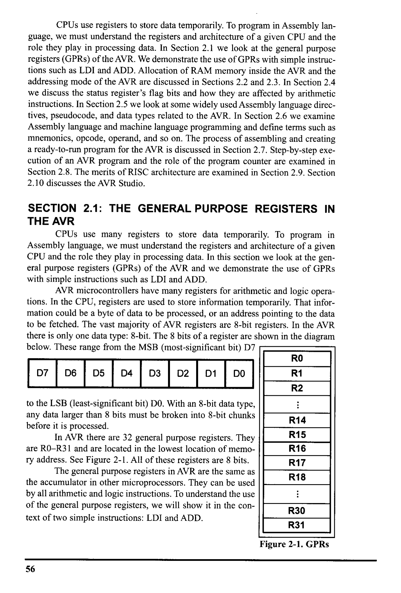
*Description*: Technical diagram and schematic illustration detailing hardware connection topology, signal routing, and circuit operation for Figure 2-1: GPRS.

> **Figure 2-1: GPRS**

56


<!-- Page 72 -->
### [PDF Page 72]


```assembly
LDI instruction
```

Simply stated, the LDI instruction copies 8-bit data into the general pur-
pose registers. It has the following format:

```assembly
LDI Rd, K
```

¡load Ra
(destination) with Immediate value K
id must
be between 16 and 31
K is an 8-bit value that can be 0-255 in decimal, or 00-FF in hex, and Ra
is R16 to R31 (any of the upper 16 general purpose registers). The I in LDI stands
for "immediate." If we see the word "immediate" in any instruction, we are deal-
ing with a value that must be provided right there with the instruction. The follow-
ing instruction loads the R20 register with a value of 0x25 (25 in hex).

```assembly
LDI R20, 0x25
¡load R20 with 0x25 (R20 = 0x25)
```

The following instruction loads the R31 register with the value 0x87 (87 in
hex).
IDI R31, 0x87
¡load 0x87 into R31 (R31 = 0x87)
The following instruction loads R25 with the value 0x15 (15 in hex and 21
in decimal).
IDI R25, 0x79
¡load 0x79 into R25 (R25 = 0x79)
Note: We cannot load values into registers RO to R15 using the LDI instruc-
tion. For example, the following instruction is not valid:

```assembly
LDI R5, 0x99
```

¡ invalid instruction
Notice the position of the source and destination operands. As you can see,
the LDI loads the right operand into the left operand. In other words, the destina-
tion comes first.
To write a comment in Assembly language we use ";'. It is the same as '//
in C language, which causes the remainder of the line of code to be ignored. For
instance, in the above examples the expressions mentioned after ; just explain the
functionality of the instructions to you, and do not have any effects on the execu-
tion of the instructions.
When programming the GPRs of the AVR microcontroller with an imme-
diate value, the following points should be noted:
1. If we want to present a number in hex, we put a dollar sign (S) or a Ox in front
of it. If we put nothing in front of a number, it is in decimal. For example, in
"IDI R16, 50", R16 is loaded with 50 in decimal, whereas in "IDI
R16, 0x50", R16 is loaded with 50 in hex.
2. If values 0 to F are moved into an 8-bit register such as GPRs, the rest of the
bits are assumed to be all zeros. For example, in "IDI R16, 0x5" the result
will be R16 = 0x05; that is, R16 = 00000101 in binary.
3. Moving a value larger than 255 (FF in hex) into the GPRs will cause an error.
IDI
R17, Ox7F2 ; ILLEGAL $7F2 > 8 bits ($FF)
CHAPTER 2: AVR ARCHITECTURE AND ASSEMBLY LANGUAGE
57


<!-- Page 73 -->
### [PDF Page 73]

32x8
General Purpose
Registers
CARRY
BIT
8-BIT
WIDE
8-BIT
WIDE
STATUS
REGISTER
ALU
H, S, V, N, Z, C
FLAGS
8-BIT
WIDE

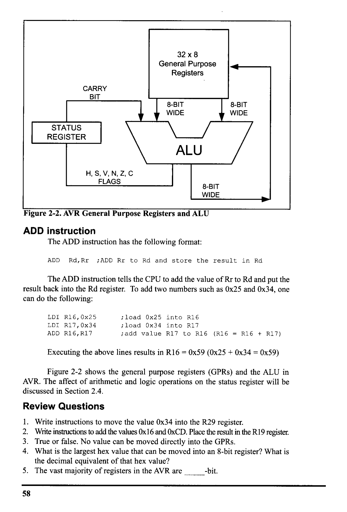
*Description*: Register specification diagram depicting individual bit flags, control register configurations, and functional definitions for Figure 2-2: AVR General Purpose Registers and ALU.

> **Figure 2-2: AVR General Purpose Registers and ALU**


```assembly
ADD instruction
```

The ADD instruction has the following format:

```assembly
ADD Rd, Rr ;ADD Rr to Rd and store the result in Rd
```

The ADD instruction tells the CPU to add the value of Rr to Rd and put the
result back into the Rd register. To add two numbers such as 0x25 and 0x34, one
can do the following:
IDI R16, 0x25
IDI R17, 0x34

```assembly
ADD R16, R17
```

¡load 0x25 into R16
¡ load 0x34 into R17
¡add value R17 to R16 (R16 = R16 + R17)
Executing the above lines results in R16 = 0x59 (0x25 + 0x34 = 0x59)


*Description*: Register specification diagram depicting individual bit flags, control register configurations, and functional definitions for Figure 2-2: shows the general purpose registers (GPRs) and the ALU in.

> **Figure 2-2: shows the general purpose registers (GPRs) and the ALU in**

AVR. The affect of arithmetic and logic operations on the status register will be
discussed in Section 2.4.

### Review Questions

1. Write instructions to move the value 0x34 into the R29 register.
2. Write instructions to add the values 0x16 and OxCD. Place the result in the R19 register.
3. True or false. No value can be moved directly into the GPRs.
What is the largest hex value that can be moved into an 8-bit register? What is
the decimal equivalent of that hex value?
5. The vast majority of registers in the AVR are
_-bit.
58


<!-- Page 74 -->
### [PDF Page 74]


## SECTION 2.2: THE AVR DATA MEMORY

In AVR microcontrollers there are two kinds of memory space: code mem-
ory space and data memory space. Our program is stored in code memory space,
whereas the data memory stores data. We will examine the code memory space in

## Section 2.8. In this section, we will discuss the data memory space. The data mem-

ory is composed of three parts: GPRs (general purpose registers), I/0 memory, and
Data Address
Space
$0000
General
$0001
:
Purpose
$001F |
Registers
$0020
:
Registers
(SFRs)
$005F
$0060
:
General
purpose
RAM
(SRAM)
-
==-
- - -
--
8 bit
RO
R1
R2
:
R31
TWBR
TWSR
:
SPH
SREG
I/O Address
$00
$01
$3E
$3E
$FFFF L

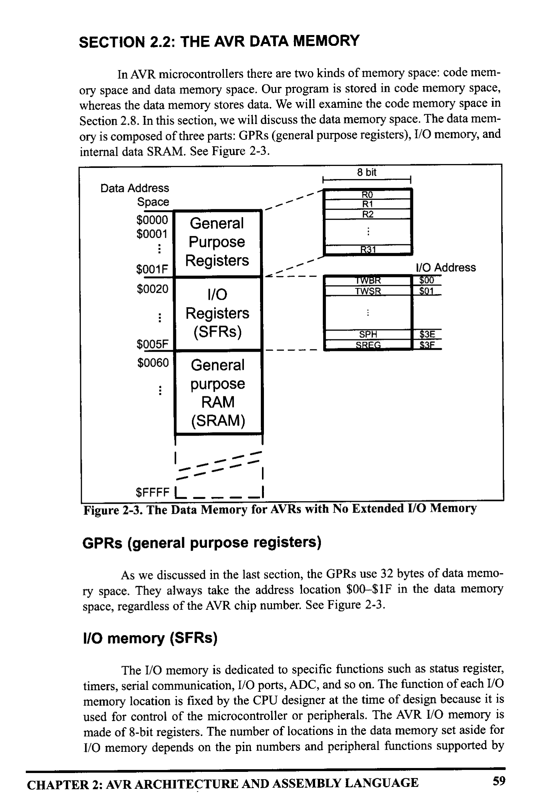
*Description*: Technical diagram and schematic illustration detailing hardware connection topology, signal routing, and circuit operation for Figure 2-3: The Data Memory for AVRs with No Extended 1/0 Memory.

> **Figure 2-3: The Data Memory for AVRs with No Extended 1/0 Memory**

GPRs (general purpose registers)
As we discussed in the last section, the GPRs use 32 bytes of data memo-
ry space. They always take the address location $00-$IF in the data memory
space, regardless of the AVR chip number. See Figure 2-3.
1/O memory (SFRs)
The I/0 memory is dedicated to specific functions such as status register,
timers, serial communication, I/O ports, ADC, and so on. The function of each I/O
memory location is fixed by the CPU designer at the time of design because it is
used for control of the microcontroller or peripherals. The AVR I/0 memory is
made of 8-bit registers. The number of locations in the data memory set aside for
1/0 memory depends on the pin numbers and peripheral functions supported by
CHAPTER 2: AVR ARCHITECTURE AND ASSEMBLY LANGUAGE
59


<!-- Page 75 -->
### [PDF Page 75]

that chip, although the number can vary from chip to chip even among members
of the same family. However, all of the AVRs have at least 64 bytes of I/0 mem-
ory locations. This 64-byte section is called standard 1/0 memory. In AVRs with
more than 32 I/O pins (e.g., ATmega64, ATmega128, and ATmega256) there is
also an extended I/O memory, which contains the registers for controlling the extra
ports and the extra peripherals. See Figures 2-3 and 2-4. In other microcontrollers
the I/O registers are called SFRs (special function registers) since each one is ded-
icated to a specific function. In contrast to SFRs, the GPRs do not have any spe-
cific function and are used for storing general data.
Data
Address
R1
R2
$0000
General
: •
Purpose
R31
$001F
Registers
$0020| Standard I/O
:
Registers
$005F
(SFRs)
$0060
reserved
DDRF
PORTE
Data
- _ Address
$0000
General
:
Purpose
- - _ $001F
Registers
$0020 Standard VO
:
Registers
(SFRs)
$005F
50060
Extended
1/0 Memory
Extended
I/O Memory
SOOFF
$0100
reserved
Internal
SRAM
$10FF
$1100|
$01FF
$0200
:
$21FF
$2200
Internal
SRAM
External
SRAM
$FFFFL
$FFFFL
Mega64
Mega64L
Mega128
Mega128L

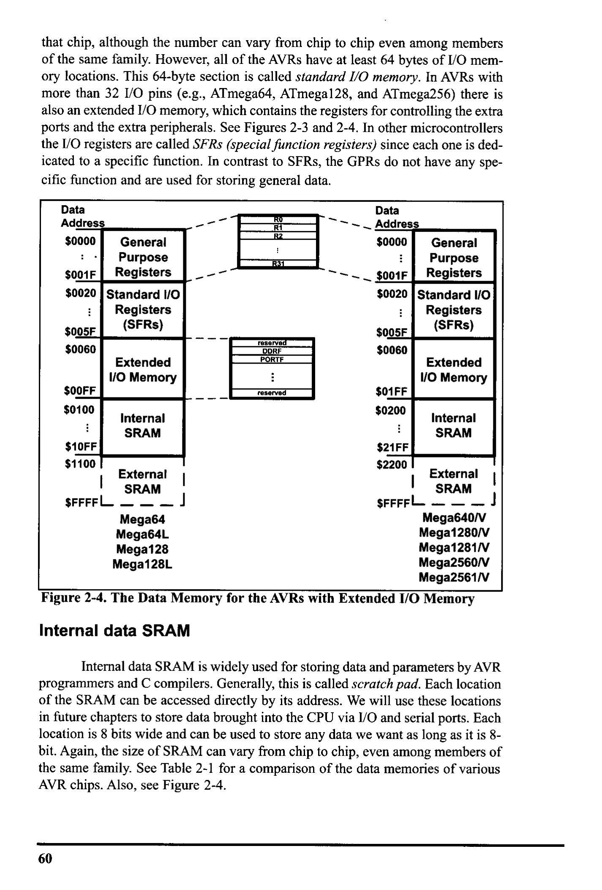
*Description*: Technical diagram and schematic illustration detailing hardware connection topology, signal routing, and circuit operation for Figure 2-4: The Data Memory for the AVRs with Extended 1/0 Memory.

> **Figure 2-4: The Data Memory for the AVRs with Extended 1/0 Memory**

External
SRAM
- -
-
J
Mega640/V
Mega1280/V
Mega1281N
Mega2560N
Mega2561N
Internal data SRAM
Internal data SRAM is widely used for storing data and parameters by AVR
programmers and C compilers. Generally, this is called scratch pad. Each location
of the SRAM can be accessed directly by its address. We will use these locations
in future chapters to store data brought into the CPU via I/O and serial ports. Each
location is 8 bits wide and can be used to store any data we want as long as it is 8-
bit. Again, the size of SRAM can vary from chip to chip, even among members of
the same family. See Table 2-1 for a comparison of the data memories of various
AVR chips. Also, see Figure 2-4.
60


<!-- Page 76 -->
### [PDF Page 76]

SRAM vs. EEPROM in AVR chips
The AVR has an EEPROM memory that is used for storing data. As you saw
in Chapter 0, EEPROM does not lose its data when power is off, whereas SRAM
does. So, the EEPROM is used for storing data that should rarely be changed and
should not be lost when the power is off (e.g., options and settings); whereas the
SRAM is used for storing data and parameters that are changed frequently. The
three parts of the data memory (GPRs, SFRs, and the internal SRAM) are made of
SRAM. The EEPROM memory of AVR chips is covered in Chapter 6.
In AVR datasheets, EEPROM refers to the EEPROM's size, and SRAM is
the internal SRAM size. By adding the sizes of GPR, SFRs (I/O registers), and
SRAMs we get the data memory size. See Table 2-1.

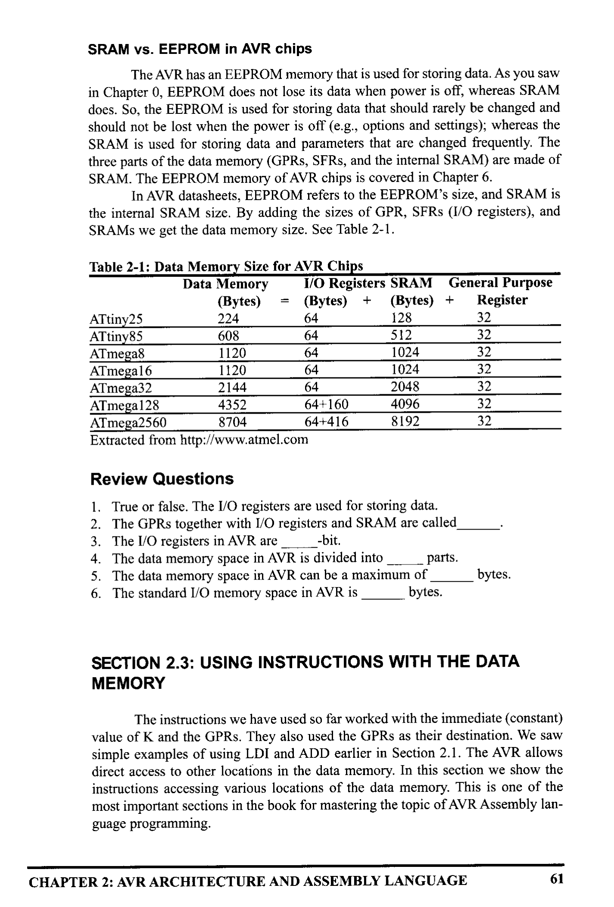
*Description*: Structured reference table listing operational parameters, instruction execution cycles, memory address mapping, or feature comparison for Table 2-1: Data Memory Size for AVR Chips.

> **Table 2-1: Data Memory Size for AVR Chips**

Data Memory
I/O Registers SRAM General Purpose
(Bytes) = (Bytes) + (Bytes) + Register
ATtiny25
224
- (Bytes)
128
32
ATtiny85
608
64
ATmega8
1120
64
512
32
1024
32
ATmega16
1120
64
1024
ATmega32
2144
64
2048
ATmega 128
4352
64+160
4096
32
32
ATmega2560
8704
64+416
8192
Extracted from http://www.atmel.com

### Review Questions

1. True or false. The I/O registers are used for storing data.
The GPRs together with I/O registers and SRAM are called
3. The I/O registers in AVR are
-bit.
_ parts.
The data memory space in AVR cal be a maximum ofarts
6. The standard 1/0 memory space in AVR is
_bytes.
bytes.

## SECTION 2.3: USING INSTRUCTIONS WITH THE DATA

MEMORY
The instructions we have used so far worked with the immediate (constant)
value of K and the GPRs. They also used the GPRs as their destination. We saw
simple examples of using LDI and ADD earlier in Section 2.1. The AVR allows
direct access to other locations in the data memory. In this section we show the
instructions accessing various locations of the data memory. This is one of the
most important sections in the book for mastering the topic of AVR Assembly lan-
guage programming.
CHAPTER 2: AVR ARCHITECTURE AND ASSEMBLY LANGUAGE


<!-- Page 77 -->
### [PDF Page 77]

LDS instruction (LoaD direct from data Space)
IDS Rd, K iload Rd with the contents of location K 10 ≤ d ≤ 31)
¡K is an address between $0000 to $FFFF
The LDS instruction tells the CPU to load (copy) one byte from an address
in the data memory to the GPR. After this instruction is executed, the GPR will
have the same value as the location in the data memory. The location in the data
memory can be in any part of the data space; it can be one of the I/O registers, a
location in the internal SRAM, or a GPR. For example, the "IDS R2O, Ox1"
instruction will copy the contents of location 1 (in hex) into R20. As you can see
in Figure 2-3, location 1 of the data memory is in the GPR part, and it is the
address of R1. So, the instruction copies R1 to R20.
The following instruction loads R5 with the contents of location 0x200. As
you can see in Figure 2-3, 0x200 is located in the internal SRAM:
IDS R5, 0x200 ;load R5 with the contents of location $200
The following program adds the contents of location Ox300 to location
Ox302. To do so, first it loads RO with the contents of location 0x300 and R1 with
the contents of location 0x302, then adds RO to R1:
LDS
RO, 0x300
LDS
R1, 0x302
ADD
Ri, RO
¡RO = the contents of location 0x300
¡RI = the contents of location 0x302
¡add RO to R1
You can see the execution of "IDS RO, 0x300" and "LDS R1, Ox302"
instructions in Figure 2-5. Figure 2-6 shows the contents of RO, R1 and locations
300 and 302 of data memory before and after the execution of each of the instruc-
tions, assuming that locations $300 and $302 contain a and B, respectively.
$0000
General
Purpose
Registers
$0001
$0002
RO
R1
R2
:
:
Internal
SRAM
$001F
$0020
:
$005F
:
$0300
$0301
$0302
:
R31
1/O
Registers
LDS RO, 0x300
LDS R1, 0X302

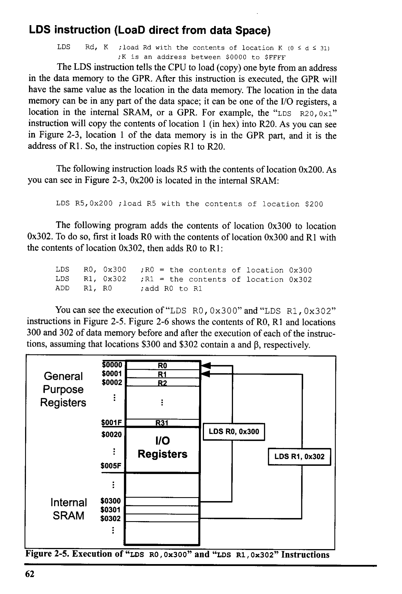
*Description*: Technical diagram and schematic illustration detailing hardware connection topology, signal routing, and circuit operation for Figure 2-5: Execution of "IDS RO, 0x300" and "IDS R1, 0x302" Instructions.

> **Figure 2-5: Execution of "IDS RO, 0x300" and "IDS R1, 0x302" Instructions**

62


<!-- Page 78 -->
### [PDF Page 78]

Before LDS RO,0x300
RO
?
R1
Loc $300
?
After LDS RO,0x300
?
After LDS R1,0x302
P
After ADD RO, R1
a + B
฿


*Description*: Technical diagram and schematic illustration detailing hardware connection topology, signal routing, and circuit operation for Figure 2-6: The Contents of R0, R1, and Locations $300 and $302.

> **Figure 2-6: The Contents of R0, R1, and Locations $300 and $302**

STS instruction (STore direct to data Space)
STS
K, RI i store register into location K
¡K is an address between $0000 to $FFFF
Loc $302
฿
The STS instruction tells the CPU to store (copy) the contents of the GPR
to an address location in the data memory space. After this instruction is executed,
the location in the data space will have the same value as the GPR. The location
can be in any part of the data memory space; it can be one of the I/O registers, a
location in the SRAM, or a GPR. For example, the "STS 0x1, R10" instruction will
copy the contents of R10 into location 1. As you can see in Figure 2-3, location 1
of the data memory is in the GPR part, and it is the address of R1. So, the instruc-
tion copies R10 to R1.
The following instruction stores the contents of R25 to location 0x230. As
you can see in Figure 2-3, 0x230 is located in the internal SRAM:
STS 0x230, R25
¡store R25 to data space location 0x230
The following program first loads the R16 register with value 0x55, then
moves this value around to I/O registers of ports B, C, and D. As shown in

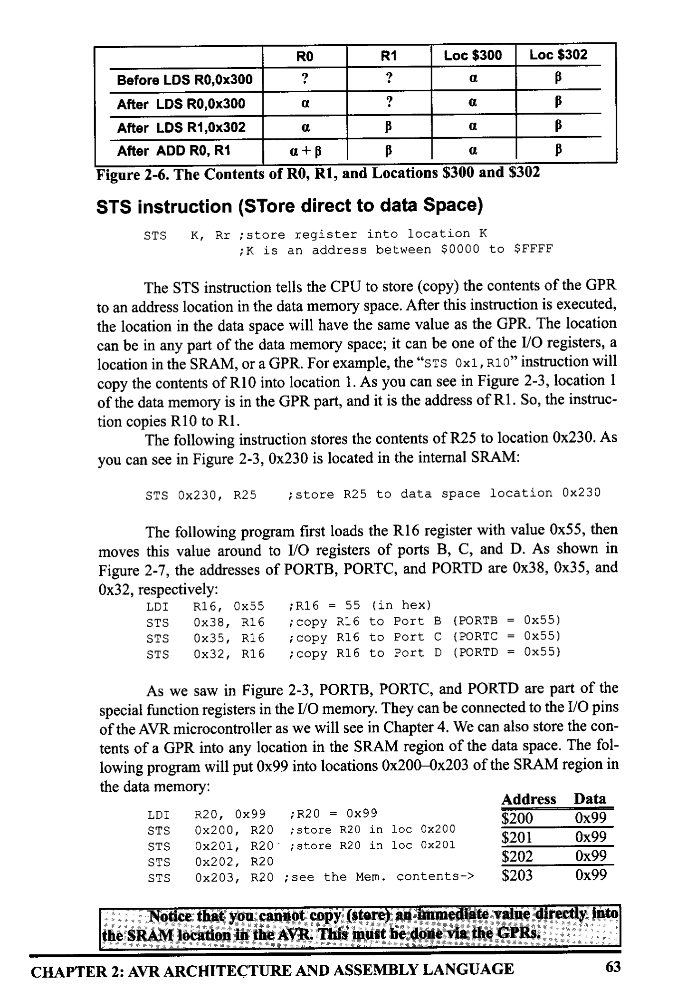
*Description*: Register specification diagram depicting individual bit flags, control register configurations, and functional definitions for Figure 2-7: , the addresses of PORTB, PORTC, and PORTD are 0x38, Ox35, and.

> **Figure 2-7: , the addresses of PORTB, PORTC, and PORTD are 0x38, Ox35, and**

Ox32, respectively:
LDI
R16, 0x55
; R16 = 55 (in hex)
STS
0x38, R16
¡ copy R16 to Port B (PORTB = 0x55)
STS
0x35, R16
¡copy R16 to Port C (PORTC = 0x55)
STS
0x32, R16 ¡copy R16 to Port D (PORTD = 0x55)
As we saw in Figure 2-3, PORTB, PORTC, and PORTD are part of the
special function registers in the I/O memory. They can be connected to the I/O pins
of the AVR microcontroller as we will see in Chapter 4. We can also store the con-
tents of a GPR into any location in the SRAM region of the data space. The fol-
lowing program will put 0x99 into locations 0x200-0x203 of the SRAM region in
the data memory:
LDI
R20, 0x99
;R20 = 0x99
STS
0x200, R20
istore R20 in loc 0x200
STS
0x201, R20' ;store R20 in loc 0x201
STS
0x202, R20
STS
0x203, R20 ; see the Mem. contents->
Address
$200
$201
$202
$203
Data
0x99
0x99
0x99
0x99
Notice that you cannot copy (store) an immediate value directly into
the SRAM location in the AYR. This must be done via the GPRS!
CHAPTER 2: AVR ARCHITECTURE AND ASSEMBLY LANGUAGE
63


<!-- Page 79 -->
### [PDF Page 79]

The following program adds the contents of location 0x220 to location
0x221, and stores the result in location 0x221:
IDS
R30, Ox220 ;load R30 with the contents of location 0x220
LDS
R31, 0x221
;load
R31 with the
contents of location 0x221
ADD
R31, R30
¡ add R30 to R31
STS
0x221, R31
¡store R31 to data space location 0x221
See Examples 2-1 and 2-2.
IN instruction (IN from I/O location)
IN
Ro, A :load an I/O location to the GPR (0 ≤ d $31), (0 ≤ A ≤ 63)
The IN instruction tells the CPU to load one byte from an I/O register to
the GPR. After this instruction is executed, the GPR will have the same value as
the I/O register. For example, the "IN R2O, 0x16" instruction will copy the con-
tents of location 16 (in hex) of the I/O memory into R20. As you can see in

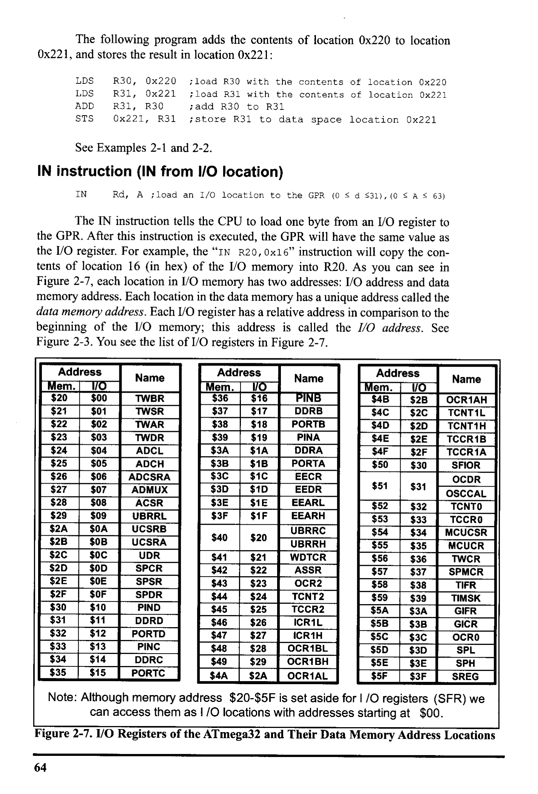
*Description*: Technical diagram and schematic illustration detailing hardware connection topology, signal routing, and circuit operation for Figure 2-7: , each location in I/O memory has two addresses: I/O address and data.

> **Figure 2-7: , each location in I/O memory has two addresses: I/O address and data**

memory address. Each location in the data memory has a unique address called the
data memory address. Each I/O register has a relative address in comparison to the
beginning of the I/O memory; this address is called the 1/O address. See


*Description*: Register specification diagram depicting individual bit flags, control register configurations, and functional definitions for Figure 2-3: You see the list of 1/O registers in Figure 2-7..

> **Figure 2-3: You see the list of 1/O registers in Figure 2-7.**

Address
Address
Name
Address
Name
Mem. T 1/0

```c
PINB
```

$4B
$2B
DDRB
$4C
PORTB
$4D
$2C
$2D

```c
PINA
```

$4E
DDRA
$4F
PORTA
$50
EECR
EEDR
$51
$31
EEARL
$52
$32
EEARH
$53
$33
TCNT1L
TCNT1H
TCCR1B
TOCRIA
SFIOR
OCDR
OSCCAL
TCNTO
TCCRO
UBRRC
$54
$34
UBRRH
$55
$35
WDTCR
$56
$36
ASSR
$57
$37
OCR2
$58
$38
TCNT2
$59
TCCR2
$5A
$39
$3A
ICRIL
$5B
$3B
ICR1H
$5C
$3C
OCR1BL
$5D
$3D
DUKU
PORTC
OCR1BH
$5E
$3E
OCRIAL
$5F
$3F
SREG
Note: Although memory address $20-$5F is set aside for | /O registers (SFR) we
can access them as 1/0 locations with addresses starting at $00.


*Description*: Register specification diagram depicting individual bit flags, control register configurations, and functional definitions for Figure 2-7: I/O Registers of the ATmega32 and Their Data Memory Address Locations.

> **Figure 2-7: I/O Registers of the ATmega32 and Their Data Memory Address Locations**

64


<!-- Page 80 -->
### [PDF Page 80]

Example 2-1
State the contents of RAM locations $212 to $216 after the following program is executed:
LDI
STS
LDI
STS
LDI
STS
LDI
STS
LDI
STS
Solution:
R16, 0x99 ¡load R16 with value 0x99
0x212, R16
R16,
0x85
¡load R16 with value 0x85
0x213, R16
R16,
0x3F
¡load R16 with value 0x3F
0x214, R16
R16,
0×63
; load R16 with value 0x63
0x215, R16
R16, 0x12
¡load R16 with value 0x12
0x216, R16
After the execution of STS 0x212, R16 data memory location $212 has value 0x99;
after the execution of STS 0x213, R16 data memory location $213 has value 0x85;
after the execution of STS 0x214, R16 data memory location $214 has value Ox3F;
after the execution of STS 0x215, R16 data memory location $215 has value 0x63;
and so on, as shown in the chart.
Address
Data
$212
0x99
$213
$214
0x85
0x3F
$215
0x63
$216
0x12
Example 2-2
State the contents of R20, R21, and data memory location 0x120 after the following
program:
LDI
LDI
ADD
ADD
STS
R20, 5
R21,
2
R20, R21
R20, R21
0x120, R20
; load R20 with 5
¡ load R21 with 2
¡ add R21 to R20
¡ add R21 to R20
¡store in location 0x120 the contents of R20
Solution:
The program loads R20 with value 5. Then it loads R21 with value 2. Then it
adds the R2i register to R20 twice. At the end, it stores the result in location Ox120 of
data memory.
Location Data
R20
5
R21
0x120
Location Data
R20
R21
Ox120
2
Location Data
R20
R21
2
0x120
Location Data
R20
9
R21
2
0x120
Location Data
R20
R21
0x120
-
After

```assembly
LDI R20, 5
```

After

```assembly
LDI R21, 2
ADD AZO, R21 ADD R20, R21 STS 0X120, R20
```

CHAPTER 2: AVR ARCHITECTURE AND ASSEMBLY LANGUAGE
65


<!-- Page 81 -->
### [PDF Page 81]

In the IN instruction, the I/O registers are referred to by their I/O address-
es. For example, the "IN R20, 0x16" instruction will copy the contents of location
$16 of the I/O memory (whose data memory address is 0x36) into R20. As shown
in Figure 2-7, I/O address 0x16 belongs to PINB, so the instruction copies the con-
tents of PINB to R20.
The following instruction loads R19 with the contents of location 0x10 of
the IO memory:

```assembly
IN R19, 0x10
```

¡load R19
with
location $10
(R19 = PIND)
To work with the I/O registers more easily, we can use their names instead
of their I/O addresses. For example, the following instruction loads R19 with the
contents of PIND:

```assembly
IN R19, PIND
```

¡load R19 with

```c
PIND
```

Notice that to be able to use the names of the I/O addresses instead of the
I/O addresses we should include the proper header files, as discussed in Section
2.5. The details of I/O ports are discussed in Chapter 4.
The following program adds the contents of PIND to PINB, and stores the
result in location 0x300 of the data memory:
IN
IN
ADD
STS
R1, PIND
R2, PINB
R1, R2
0x300, R1
¡load R1 with PIND
;load R2 with PINB
¡R1 = R1 + R2
¡store R1 to data space location $300
IN vS. LDS
As we mentioned earlier, we can use the LDS instruction to copy the con-
tents of a memory location to a GPR. This means that we can load an I/O register
into a GPR, using the LDS instruction. So, what is the advantage of using the IN
instruction for reading the contents of 1/0 registers over using the LDS instruc-
tion? The IN instruction has the following advantages:
1. The CPU executes the IN instruction faster than LDS. As you will see in
Chapter 3, the IN instruction lasts 1 machine cycle, whereas LDS lasts 2
machine cycles.
2. The IN is a 2-byte instruction, whereas LDS is a 4-byte instruction. This
means that the IN instruction occupies less code memory.
3. When we use the IN instruction, we can use the names of the I/O registers
instead of their addresses.
4. The IN instruction is available in all of the AVRs, whereas LDS is not
implemented in some of the AVRs.
Notice that in using the IN instruction we can access only the standard I/O
memory, while we can access all parts of the data memory using the LDS instruc-
tion.
66


<!-- Page 82 -->
### [PDF Page 82]


```assembly
OUT instruction (OUT to I/O location)
OUT A, RI istore register to I/O location 10 ≤ r ≤ 31), 10 ≤A ≤ 63)
```

The OUT instruction tells the CPU to store the GPR to the I/O register.
After the instruction is executed, the I/O register will have the same value as the
GPR. For example, the "OUT PORTD, R10" instruction will copy the contents of
R10 into PORTD (location 12 of the I/O memory).
Notice that in the OUT instruction, the I/O registers are referred to by their
I/O addresses (like the IN instruction).
The following program copies 0xE6 to the SPL register:

```assembly
LDI R20, 0xE6
OUT SPL, R20
```

¡load R20 with 0xE6
¡out R20 to SPI
We must remember that we cannot copy an immediate value to an I/O reg-
ister nor to an SRAM location.
The following program copies PIND to PORTA:
RO, PIND
OUT
;load R20 with the contents of I/O reg PIND
PORTA, RO
¡out R20 to PORTA
In Example 2-3 we use JMP to repeat an action indefinitely. JMP is simi-
lar to "goto" in the C language. We will study looping in Chapter 3.
Example 2-3
Write a program to get data from the PINB and send it to the I/O register of PORT C
continuously.
Solution:
AGAIN: IN
OUT
JMP
R16, PINB
PORTC, R16
AGAIN
¡bring data from Portß into R16
¡ send it to Port C
¡ keep doing it forever

```assembly
MOV instruction
```

The MOV instruction is used to copy data among the GPR registers of
RO-R31. It has the following format:

```assembly
MOV Rd, RI
¡Rd = RI (copy Rr to Rd)
;Rd and Rr can be any of the GPRs
```

For example, the following instruction copies the contents of R20 to R10:

```assembly
MOV R10, R20
; RIO = R20
```

For instance, if R20 contains 60, after execution of the above instruction
both R20 and R10 will contain 60.
CHAPTER 2: AVR ARCHITECTURE AND ASSEMBLY LANGUAGE
67


<!-- Page 83 -->
### [PDF Page 83]

More ALU instructions involving the GPRs
The following program adds 0x19 to the contents of location 0x220 and
stores the result in location 0x221:
R20, 0x19
R21, 0x220
0x221, R21
; load R20 with 0x19
; load R21 with the contents of location 0x220
;R21 = R21 + R20
istore R21 to location 0x221
INC instruction
¡ increment the contents of Rd by one (0 ≤ d ≤ 31)
The INC instruction increments the contents of Rd by 1. For example, the
following instruction adds 1 to the contents of R2:
INC
R2
;R2 = R2
+ 1
The following program increments the contents of data memory location
0x430 by 1:
LDS
INC
STS
R20, Ox430 ;R20 = contents of location 0x430
;R2O = R20 + 1
0x430, R20 ;store R20 to location 0x430

```assembly
SUB instruction
```

The SUB instruction has the following format:

```assembly
SUB Rd, RI
;Rd = Rd - Rr
```

The SUB instruction tells the CPU to subtract the value of Rr from Rd and
put the result back into the Rd register. To subtract 0x25 from 0x34, one can do
the following:
LDI
LDI
SUB
R20, 0x34 ;R20 = 0x34
R21, 0x25
;R20 = 0x25
R20, R21
;R20 = R20 - R21
The following program subtracts 5 from the contents of location 0x300 and
stores the result in location 0x320:
RO, 0x300
R16, 0x5
RO, R16
0x320,R0
;RO = contents of location 0x300
;R16 = 0x5
;RO = RO - R16
¡store the contents of RO to location 0x320
The following program decrements the contents of R10, by 1:
LDI
SUB
R16, 0x1
¡ load 1 to R16
R10, R16
;R10 = R10 - R16
68


<!-- Page 84 -->
### [PDF Page 84]


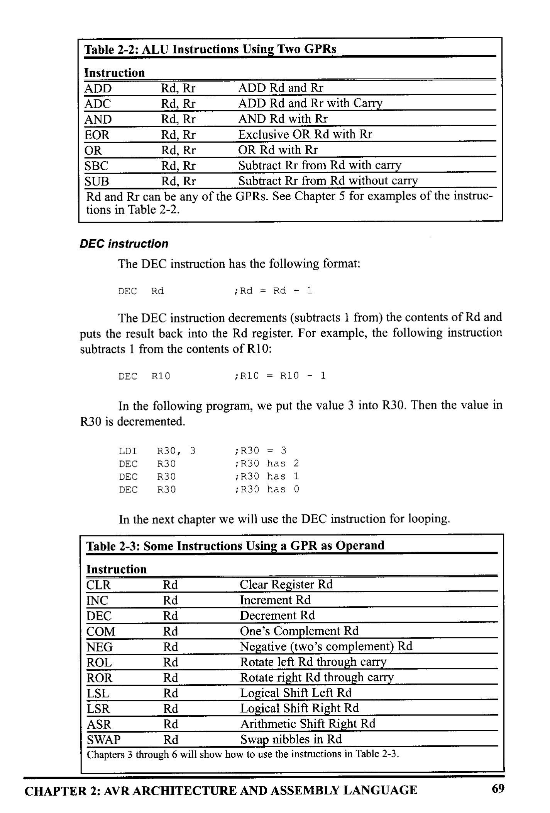
*Description*: Structured reference table listing operational parameters, instruction execution cycles, memory address mapping, or feature comparison for Table 2-2: ALU Instructions Using Two GPRs.

> **Table 2-2: ALU Instructions Using Two GPRs**

Instruction
ADD
Rd, Rr

```assembly
ADD Rd and Rr
```

ADC
AND
Rd, Rr

```assembly
ADD Rd and Rr with Carry
```

Rd, Rr
EOR

```assembly
AND Rd with Rr
```

Rd, Rr
Exclusive OR Rd with Rr
OR
Rd, Rr

```assembly
OR Rd with Rr
```

SBC
Rd, Rr
Subtract Rr from Rd with carry
SUB
Rd, Rr
Subtract Rr from Rd without carry
Rd and Rr can be any of the GPRs. See Chapter 5 for examples of the instruc-
tions in Table 2-2.
DEC instruction
The DEC instruction has the following format:
DEC Rd
;Rd = Rd - 1
The DEC instruction decrements (subtracts 1 from) the contents of Rd and
puts the result back into the Rd register. For example, the following instruction
subtracts 1 from the contents of R10:
DEC R10
;R10 = R10 - 1
In the following program, we put the value 3 into R30. Then the value in
R30 is decremented.
IDI
DEC
DEC
DEC
R30, 3
R30
R30
R30
; R30 = 3
¡ R30 has 2
; R30 has 1
; R30 has 0
In the next chapter we will use the DEC instruction for looping.
| Table 2-3: Some Instructions Using a GPR as Operand
Instruction
CLR
INC
DEC
COM
NEG
ROL
ROR
LSL
LSR
ASR
SWAP
Rd
Rd
Rd
Rd
Rd
Rd
Rd
Rd
Rd
Rd
Rd
Clear Register Rd
Increment Rd
Decrement Rd
One's Complement Rd
Negative (two's complement) Rd
Rotate left Rd through carry
Rotate right Rd through carry
Logical Shift Left Rd
Logical Shift Right Rd
Arithmetic Shift Right Rd
Swap nibbles in Rd
Chapters 3 through 6 will show how to use the instructions in Table 2-3.
CHAPTER 2: AVR ARCHITECTURE AND ASSEMBLY LANGUAGE
69


<!-- Page 85 -->
### [PDF Page 85]

COM instruction
The "COM Rd" instruction complements (inverts) the contents of Rd and
places the result back into the Rd register. In the following program, we put 0x55
into R16 and then send it to the SFR location of PORTB. Then the content of R16
is complemented, which becomes AA in hex. The 01010101 (0x55) is inverted and
becomes 10101010 (0xAA).
LDI
OUT
COM
OUT
R16, 0x55
PORTB, R16
R16
PORTB,
R16
;R16 = 0x55
¡copy R16 to Port B SFR (PB = 0x55)
; complement R16
¡ copy R16 to Port B SFR
(R16
= OxAA)
(PB = 0xAA)
Examine Example 2-4.
Example 2-4
Write a simple program to toggle the I/0 register of PORT B continuously forever.
Solution:
L1:
LDI
OUT
COM
OUT
JMP
R20, 0x55
PORTB, R2O
R20
PORTB, R20
;R20 = 0x55
¡ move R20 to Port B SFR (PB = 0x55)
i complement R20
¡ move R20 to Port B SER
; repeat forever (see Chapter 3 for JMP)
The above concepts are important and must be understood since there are
a large number of instructions with these formats.
Regarding Tables 2-2 and 2-3 the following points must be noted:
1. The instructions in Table 2-2 operate on two GPR registers of source (Rr)
and destination (rd) and then place the result in the destination register (Rd)
2. The instructions in Table 2-3 operate on a single GPR register and place the
result in the same register.

### Review Questions

1. True or false. No value can be loaded directly into internal SRAM.
2. Write instructions to load value 0x95 into the SPL 1/0 register.
3. Write instructions to add 2 to the contents of R18.
4. Write instructions to add the values 0x16 and OxCD. Place the result in loca-
tion 0x400 of the data memory.
5. What is the largest hex value that can be moved into a location in the data
memory? What is the decimal equivalent of the hex value?
6. "ADD R16, R3" puts the result in
7. What does "OUT OCRO, R23" do?
8. What is wrong with "STS OCRO, R23"? What does it do?
70


<!-- Page 86 -->
### [PDF Page 86]


## SECTION 2.4: AVR STATUS REGISTER

Like all other microprocessors, the AVR has a flag register to indicate arith-
metic conditions such as the carry bit. The flag register in the AVR is called the
status register (SReg). In this section, we discuss various bits of this register and
provide some examples of how it is altered. Chapters 3 and 5 show how the flag
bits of the status register are used
AVR status register
The status register is an 8-bit register. It is also referred to as the flag reg-
ister. See Figure 2-8 for the bits of the status register. The bits C, Z, N, V, S, and
H are called conditional flags, meaning that they indicate some conditions that
result after an instruction is executed. Each of the conditional flags can be used to
perform a conditional branch (jump), as we will see in Chapters 3 and 5.
Bit
D7
DO
SREG
ITHSTVT
C - Carry flag
S - Sign flag
Z - Zero flag
H- Half carry
N - Negative flag
T - Bit copy storage
V - Overflow flag
1 - Global Interrupt Enable

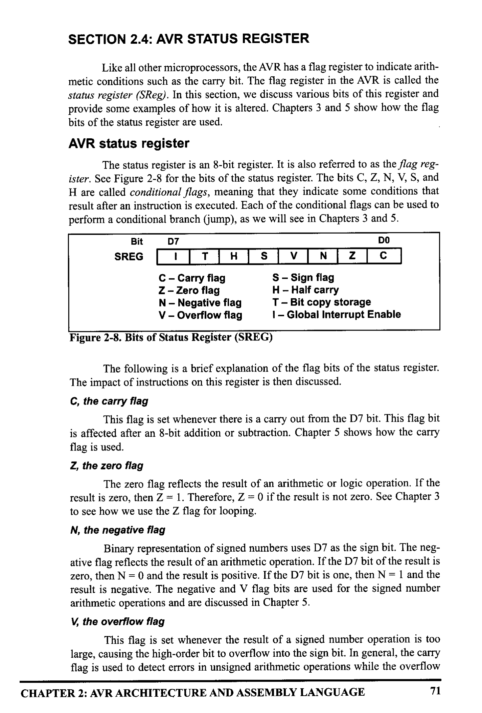
*Description*: Register specification diagram depicting individual bit flags, control register configurations, and functional definitions for Figure 2-8: Bits of Status Register (SREG).

> **Figure 2-8: Bits of Status Register (SREG)**

The following is a brief explanation of the flag bits of the status register.
The impact of instructions on this register is then discussed.
C, the carry flag
This flag is set whenever there is a carry out from the D7 bit. This flag bit
is affected after an 8-bit addition or subtraction. Chapter 5 shows how the carry
flag is used.
Z, the zero flag
The zero flag reflects the result of an arithmetic or logic operation. If the
result is zero, then Z = 1. Therefore, Z. = 0 if the result is not zero. See Chapter 3
to see how we use the Z flag for looping.
N, the negative flag
Binary representation of signed numbers uses D7 as the sign bit. The neg-
ative flag reflects the result of an arithmetic operation. If the D7 bit of the result is
zero, then N= 0 and the result is positive. If the D7 bit is one, then N = 1 and the
result is negative. The negative and V flag bits are used for the signed number
arithmetic operations and are discussed in Chapter 5.
V, the overflow flag
This flag is set whenever the result of a signed number operation is too
large, causing the high-order bit to overflow into the sign bit. In general, the carry
flag is used to detect errors in unsigned arithmetic operations while the overflow
CHAPTER 2: AVR ARCHITECTURE AND ASSEMBLY LANGUAGE
71


<!-- Page 87 -->
### [PDF Page 87]

flag is used to detect errors in signed arithmetic operations. The V and N flag bits
are used for signed number arithmetic operations and are discussed in Chapter 5.
S, the Sign bit
This flag is the result of Exclusive-ORing of N and V flags. See Chapter 5
for more information.
H, Half carry flag
If there is a carry from D3 to D4 during an ADD or SUB operation, this bit
is set; otherwise, it is cleared. This flag bit is used by instructions that perform
BCD (binary coded decimal) arithmetic. In some microprocessors this is called the
AC flag (Auxiliary Carry flag). See Chapter 5 for more information.
The T flag bit is discussed in Chapter 6 while Chapter 10 covers the I flag.

```assembly
ADD instruction and the status register
```

Next we examine the impact of the ADD instruction on the flag bits C, H,
and Z of the status register. Some examples should clarify their meanings.
Although all the flag bits C, Z, H, V, S, and N are affected by the ADD instruction,
we will focus on flags C, H, and Z for now. The other flag bits are discussed in
Chapter 5, because they relate only to signed number operations. Examine
Example 2-5 to see the impact of the DEC instruction on selected flag bits. See
also Examples 2-6 through 2-8 to see the impact of the ADD instruction on select-
ed flag bits.
Example 2-5
Show the status of the Z flag during the execution of the following program:
LDI
DEC
DEC
DEC
DEC
R20, 4
R20
R2O
R20
R20
; R20 = 4
;R20 =
R20 -
1
; R20 = R20
-
1
;R20 = R20 -
1
; R2O = R20 - 1
Solution:
The Z flag is one when the result is zero. Otherwise, it is cleared (zero). Thus:
After

```assembly
LDI R20, 4
```

DEC R20
DEC R20
DEC R20
DEC R20
Value of R20 The Z flag
4
3
2
1
0
0
0
0
1
72


<!-- Page 88 -->
### [PDF Page 88]

Example 2-6
Show the status of the C, H, and Z flags after the addition of 0x38 and Ox2F in the
following instructions:
LDI
R16, 0x38
IDI
R17, Ox2F
ADD
R16, R17
¡ add R17 to R16
Solution:
$38
+ $2E
$67
0011 1000
0010 1111
0110 0111
R16 = 0x67
C = 0 because there is no carry beyond the D7 bit.
H = 1 because there is a carry from the D3 to the D4 bit.
Z = 0 because the R16 (the result) has a value other than 0 after the addition.
Example 2-7
Show the status of the C, H, and Z flags after the addition of 0x9C and 0x64 in the
following instructions:
LDI
R20, 0x9C
LDI
R21, 0x64
ADD
R20, R21
¡ add R21 to R20
Solution:
$9C
+ $64
$100
1001 1100
0110 0100
0000 0000
R20 = 00
C = 1 because there is a carry beyond the D7 bit.
H = 1 because there is a carry from the D3 to the D4 bit.
Z = 1 because the R20 (the result) has value 0 in it after the addition.
Example 2-8
Show the status of the C, H, and Z flags after the addition of 0x88 and 0x93 in the fol-
lowing instructions:
LDI
R20, 0x88
LDI
R21, 0x93
ADD
R20, R21
; add R21 to R20
Solution:
$ 88
+$93
$11B
1000 1000
1001 0011
0001 1011
R20 = 0x1B
C = 1 because there is a carry beyond the D7 bit.
H = 0 because there is no carry from the D3 to the D4 bit.
Z = 0 because the R20 has a value other than 0 after the addition.
CHAPTER 2: AVR ARCHITECTURE AND ASSEMBLY LANGUAGE
73


<!-- Page 89 -->
### [PDF Page 89]

Not all instructions affect the flags
Some instructions affect all the six flag bits C, H, Z, S, V, and N (e.g.,
ADD). But some instructions affect no flag bits at all. The load instructions are in
this category. And some instructions affect only some of the flag bits. The logic
instructions (e.g., AND) are in this category.


*Description*: Structured reference table listing operational parameters, instruction execution cycles, memory address mapping, or feature comparison for Table 2-4: shows the instructions and the flag bits affected by them. Appendix.

> **Table 2-4: shows the instructions and the flag bits affected by them. Appendix**

A provides a complete list of all the instructions and their associated flag bits.


*Description*: Structured reference table listing operational parameters, instruction execution cycles, memory address mapping, or feature comparison for Table 2-4: Instructions That Affect Flag Bits.

> **Table 2-4: Instructions That Affect Flag Bits**

Instruction
C
Z
N
ADD
X
V
X
ADC
ADIW
X
X
X
X
X
X
AND
X
ANDI
CBR
CLR
COM
X
DEC
EOR
FMUL
X
INC
LSL
LSR
X
OR
ORI
ROL
ROR
X
X
xx.
xxxxxxx
S
X
X
X
X
xxxx*х
H
X
SEN
SEZ
SUB
SUBI
TST
xxx
Note: X can be 0 or 1. (See Chapter 5 for how to use these instructions.)
Flag bits and decision making
There are instructions that will
make a conditional jump (branch) based
on the status of the flag bits. Table 2-5 pro-
vides some of these instructions. Chapter 3
discusses the conditional branch instruc-
tions and how they are used.

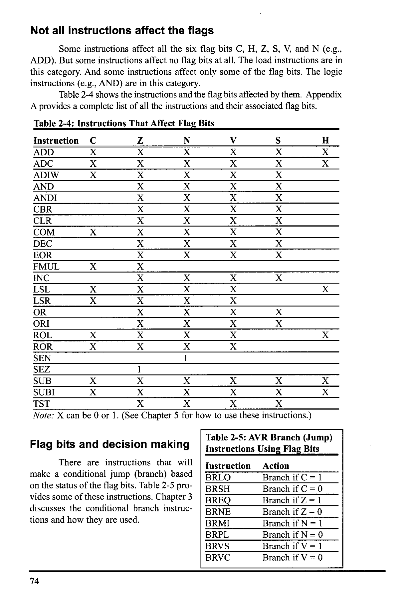
*Description*: Structured reference table listing operational parameters, instruction execution cycles, memory address mapping, or feature comparison for Table 2-5: AVR Branch (Jump).

> **Table 2-5: AVR Branch (Jump)**

Instructions Using Flag Bits
Instruction
Action
BRLO
BRSH
Branch if C = 1
Branch if C= 0
BREQ
Branch if Z= 1
BRNE
Branch if Z = 0
BRMIR
Branch if N = 1
BRPL
Branch if N= 0
BRVS
Branch if V = 1
BRVC
Branch if V = 0
74


<!-- Page 90 -->
### [PDF Page 90]


### Review Questions

1. The flag register in the AVR is called the
2. What is the size of the flag register in the AVR?
3. Find the C, Z, and H flag bits for the following code:
LDI
R20, 0x9F
LDI
R21, 0x61
ADD
R2O, R21
4. Find the C, Z, and H flag bits for the following code:
LDI
LDI
ADD
R17, 0x82
R23,
0x22
R17,
R23
5. Find the C, Z, and H flag bits for the following code:
LDI
LDI
ADD
R20, 0x67
R21,
0x99
R20, R21

## SECTION 2.5: AVR DATA FORMAT AND DIRECTIVES

In this section we look at some widely used data formats and directives
supported by the AVR assembler.
AVR data type
The AVR microcontroller has only one data type. It is 8 bits, and the size
of each register is also 8 bits. It is the job of the programmer to break down data
larger than 8 bits (00 to OxFF, or 0 to 255 in decimal) to be processed by the CPU.
For examples of how to process data larger than 8 bits, see Chapter 5. The data
types used by the AVR can be positive or negative. A discussion of signed num-
bers is given in Chapter 5 also. The bit-addressable data is discussed in Chapters
4 and 6.
Data format representation
There are four ways to represent a byte of data in the AVR assembler. The
numbers can be in hex, binary, decimal, or ASCIl formats. The following are
examples of how each works.
Hex numbers
There are two ways to show hex numbers:
1. Put Ox (or OX) in front of the number like this: IDI R16, 0x99
2.
Put $ in front of the number, like this: IDI R22, $99
CHAPTER 2: AVR ARCHITECTURE AND ASSEMBLY LANGUAGE
75


<!-- Page 91 -->
### [PDF Page 91]

We use both of these methods in this book, because many application notes
out there use one of them and we need to get used to them.
Here are a few lines of code that use the hex format:
IDI R28, $75
SUBI
R28,0x11
SUBI
R28, 0X20
ANDI
R28, OxF
;R28 = 0x75
;R28 = 0x75 - 0x11 = 0x64
;R28 = 0x64 - 0x20
1 = 0x44
;R28 = 0x44 - OX0F = 0x35
Binary numbers
It is as follows:
There is only one way to represent binary numbers in an AVR assembler.
IDI R16, 0b10011001
;R16 = 10011001 or 99 in hex
The uppercase B will also work. Here are some examples of how to use it:
LDI
R23, 0600100101

```assembly
SUBI R23, 0B00010001
;R23 = $25
;R23 = $25 - $11 = $14
```

Decimal numbers
To indicate decimal numbers in an AVR assembler we simply use the dec-
imal (e.g., 12) and nothing before or after it. Here are some examples of how to
use it:
IDI R17, 12

```assembly
SUBI R17,
;R17 = 00001100 or OC in hex
;R17 = 12 - 2 = 10 where 10 is equal to Ox0A
```

ASCII characters
To represent ASCII data in an AVR assembler we use single quotes as fol-
lows:
IDI R23, '2'
;R23 = 00110010 or 32 in hex (See Appendix E)
This is the same as other assemblers such as the 8051 and x86. Here are
some more examples:

```assembly
LDI R20, '9'; R20 = 0x39,
```

which is hex number for ASCII '9'

```assembly
SUBI R20, '1';R20 = 0x39 - 0x31 = 0x8
```

¡ (31 hex is for ASCII "1')
strings (more resen a stracter, ble gute are seine bote) detie. We sill
see. DB usage in Chapter 6.
76


<!-- Page 92 -->
### [PDF Page 92]

Assembler directives
While instructions tell the CPU what to do, directives (also called pseudo-
instructions) give directions to the assembler. For example, the LDI and ADD
instructions are commands to the CPU, but EQU, DEVICE, and .ORG are direc-
tives to the assembler. The following sections present some more widely used
directives of the AVR and how they are used. The directives help us develop our
program easier and make our program legible (more readable).
-EQU (equate)
This is used to define a constant value or a fixed address. The EQU direc-
tive does not set aside storage for a data item, but associates a constant number
with a data or an address label so that when the label appears in the program, its
constant will be substituted for the label. The following uses EQU for the count-
er constant, and then the constant is used to load the R21 register:
• EQU COUNT = 0x25
...

```assembly
LDI R21, COUNT
;R21 = 0x25
```

When executing the above instruction "LDI R21, COUNT"
" the register
R21 will be loaded with the value 25H. What is the advantage of using EQU?
Assume that a constant (a fixed value) is used throughout the program, and the
programmer wants to change its value everywhere. By the use of EQU, the pro-
grammer can change it once and the assembler will change all of its occurrences
throughout the program. This allows the programmer to avoid searching the entire
program trying to find every occurrence.
We mentioned earlier that we can use the names of the I/O registers instead
of their addresses (e.g., we can write "OUT PORTA,R20" instead of "OUT
Ox 1B,R20"). This is done with the help of the EQU directive. In include files such
as M32DEF.INC the I/O register names are associated with their addresses using
the EQU directive. For example, in M32DEF.INC the following pseudo-instruc-
tion exists, which associates Ox1B (the address of PORTB) with the PORTB.
• EQU
PORIB = OxIB
•SET
This directive is used to define a constant value or a fixed address. In this
regard, the SET and EQU directives are identical. The only difference is that the
value assigned by the SET directive may be reassigned later.
Using EQU for fixed data assignment
To get more practice using EQU to assign fixed data, examine the following:
¡ in hexadecimal
• EQU DATA1
= 0x39
¡one way to define hex value
• EQU DATA2
= $39
¡another way to define hex value
¡in binary
CHAPTER 2: AVR ARCHITECTURE AND ASSEMBLY LANGUAGE
77


<!-- Page 93 -->
### [PDF Page 93]

• EQU DATA3 = 0600110101
¡binary (35 in hex)
¡ in decimal
• EQU DATA4 = 39
¡ decimal numbers (27 in hex)
; in ASCII
• EQU DATA5 = '2'
¡ ASCII characters
We use .DB to allocate code ROM memory locations for fixed data such
as ASCII strings. See Chapter 6 for more examples.
Using EQU for SFR address assignment
EQU is also widely used to assign SFR addresses. Examine the following
code:
• EQU COUNTER = 0×00
• EQU PORTB = 0x18
IDI R16, COUNTER
OUT
PORTB, R16
¡ counter value 00
; SFR Port B address
; R16 = 0x00
¡ Port B (loc 0x18) now has 00 too
Using EQU for RAM address assignment
Another common usage of EQU is for the address assignment of the
internal SRAM. Examine the following rewrite of an earlier example using EQU:
•EQU
LDI
LDI
ADD
ADD
STS
SUM = 0x120
R20,
5
R21,
2
R20,
R21
R20, R21
SUM, R20
¡assign RAM loc to SUM
; load R20 with 5
¡load R21 with 2
¡ R20 = R20 + R21
; R20 = R20 + R21
¡store the result in loc 0x120
This is especially helpful when the address needs to be changed in order to
use a different AVR chip for a given project. It is much easier to refer to a name
than a number when accessing RAM address locations.
•ORG (origin)
The .ORG directive is used to indicate the beginning of the address. It can
be used for both code and data.
-INCLUDE directive
The include directive tells the AVR assembler to add the contents of a file
to our program (like the #include directive in C language). In Table 2-6, you see
the files that you must include whenever you want to use any of the AVRs.
For example, when you want to use ATmega32, you must write the follow-
ing instruction at the beginning of your program:
• INCLUDE "M32DEF.INC"
78


<!-- Page 94 -->
### [PDF Page 94]


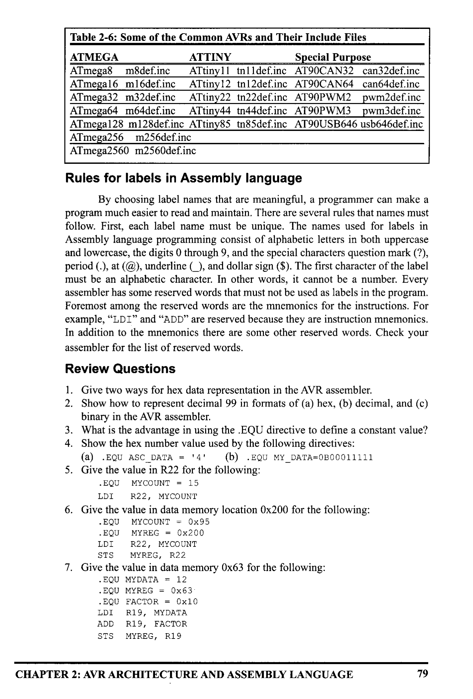
*Description*: Structured reference table listing operational parameters, instruction execution cycles, memory address mapping, or feature comparison for Table 2-6: Some of the Common AVRs and Their Include Files.

> **Table 2-6: Some of the Common AVRs and Their Include Files**

ATMEGA
ATTINY
Special Purpose
ATmega8
m8def.inc
ATtinyll tnlldef.inc AT90CAN32 can32def.inc
ATmega16 ml6def.inc
ATtiny12 tn12def.inc AT90CAN64 can64def.inc
Almega32 m32def.inc
ATtiny22 tn22def.inc AT90PWM2 pwm2def.inc
ATmega64 m64def.inc
ATtiny44 tn44def.inc AT90PWM3 pwm3def.inc
ATmega 128 m128def.inc ATtiny85 tn85def.inc AT90USB646 usb646def.inc
ATmega256 m256def.inc
ATmega2560 m2560def.inc
Rules for labels in Assembly language
By choosing label names that are meaningful, a programmer can make a
program much easier to read and maintain. There are several rules that names must
follow. First, each label name must be unique. The names used for labels in
Assembly language programming consist of alphabetic letters in both uppercase
and lowercase, the digits 0 through 9, and the special characters question mark (?),
period (.), at (@), underline (_), and dollar sign ($). The first character of the label
must be an alphabetic character. In other words, it cannot be a number. Every
assembler has some reserved words that must not be used as labels in the program.
Foremost among the reserved words are the mnemonics for the instructions. For
example, "LDI" and "ADD" are reserved because they are instruction mnemonics.
In addition to the mnemonics there are some other reserved words. Check your
assembler for the list of reserved words.

### Review Questions

1. Give two ways for hex data representation in the AVR assembler.
2. Show how to represent decimal 99 in formats of (a) hex, (b) decimal, and (c)
binary in the AVR assembler.
3. What is the advantage in using the EQU directive to define a constant value?
4. Show the hex number value used by the following directives:
(a) . EQU ASC_DATA = '4' (b) . EQU MY_DATA=0B00011111
5. Give the value in R22 for the following:
• EQU MYCOUNT = 15
LDI
R22, MYCOUNT
6. Give the value in data memory location 0x200 for the following:
• EQU
MYCOUNT = 0x95
• EQU MYREG = 0x200
LDI
R22, MYCOUNT
STS
MYREG, R22
7. Give the value in data memory 0x63 for the following:
• EQU MYDATA = 12
• EQU MYREG = 0x63
• EQU FACTOR = 0x10
LDI
R19, MYDATA
ADD
R19, FACTOR
STS
MYREG, R19
CHAPTER 2: AVR ARCHITECTURE AND ASSEMBLY LANGUAGE


<!-- Page 95 -->
### [PDF Page 95]


## SECTION 2.6: INTRODUCTION TO AVR ASSEMBLY PROGRAMMING

In this section we discuss Assembly language format and define some
widely used terminology associated with Assembly language programming.
While the CPU can work only in binary, it can do so at a very high speed
It is quite tedious and slow for humans, however, to deal with Os and Is in order
to program the computer. A program that consists of Os and Is is called machine
language. In the early days of the computer, programmers coded programs in
machine language. Although the hexadecimal system was used as a more efficient
way to represent binary numbers, the process of working in machine code was still
cumbersome for humans. Eventually, Assembly languages were developed, which
provided mnemonics for the machine code instructions, plus other features that
made programming faster and less prone to error. The term mnemonic is frequent-
ly used in computer science and engineering literature to refer to codes and abbre-
viations that are relatively easy to remember. Assembly language programs must
be translated into machine code by a program called an assembler. Assembly lan-
guage is reterred to as a low-level language because it deals directly with the inter-
nal structure of the CPU. To program in Assembly language, the programmer must
know all the registers of the CPU and the size of each, as well as other details.
Today, one can use many different programming languages, such as
BASIC, Pascal, C, C+t, Java, and numerous others. These languages are called
high-level languages because the programmer does not have to be concerned with
the internal details of the CPU. Whereas an assembler is used to translate an
Assembly language program into machine code (sometimes also called object
code or opcode for operation code), high-level languages are translated into
machine code by a program called a compiler. For instance, to write a program in
C, one must use a C compiler to translate the program into machine language. Next
we look at AVR Assembly language format.
Structure of Assembly language
An Assembly language program consists of, among other things, a series
of lines of Assembly language instructions. An Assembly language instruction
consists of a mnemonic, optionally followed by one or two operands. The
operands are the data items being manipulated, and the mnemonics are the com-
mands to the CPU, telling it what to do with those items.
An Assembly language program (see Program 2-1) is a series of state-
ments, or lines, which are either Assembly language instructions such as ADD and
LDI, or statements called directives. While instructions tell the CPU what to do,
directives (also called pseudo-instructions) give directions to the assembler. For
example, in Program 2-1, while the LDI and ADD instructions are commands to
the CPU, ORG and .EQU are directives to the assembler. The directive .ORG tells
the assembler to place the opcode at memory location O, while EQU introduces a
new expression equal to a known expression.
An Assembly language instruction consists of four fields:
[ label:]
mnemonic [operands]
L ;comment]
80


<!-- Page 96 -->
### [PDF Page 96]

; AVR Assembly Language Program Io Add Some Data.
¡ store SUM in SRAM location 0x300.
• EQU SUM
= 0x300
¡SRAM loc $300 for SUM
•ORG 00
IDI R16,
0x25

```assembly
LDI R17, $34
LDI R18, 0600110001
ADD R16,
```

R17

```assembly
ADD R16, R18
LDI R17, 11
ADD R16, R17
```

STS SUM, R16
HERE: JMP HERE
¡start at address o
;R16 = 0x25
;R17 = 0x34
¡add R17 to R16
¡ save the SUM in loc $300
¡stay here forever
Program 2-1: Sample of an Assembly Language Program
Brackets indicate that a field is optional and not all lines have them.
Brackets should not be typed in. Regarding the above format, the following points
should be noted:
1. The label field allows the program to refer to a line of code by name. The label
field cannot exceed a certain number of characters. Check your assembler for
the rule.
2. The Assembly language mnemonic (instruction) and operand(s) fields togeth-
er perform the real work of the program and accomplish the tasks for which
the program was written. In Assembly language statements such as
LDI
ADD
SUBI
R23, $55
R23,
R19
R23, $67

```assembly
ADD and LDI are the mnemonics that produce opcodes; the "$55" and "$67"
```

are the operands. Instead of a mnemonic and an operand, these two fields could
contain assembler pseudo-instructions, or directives. Remember that directives
do not generate any machine code (opcode) and are used only by the assem-
bler, as opposed to instructions that are translated into machine code (opcode)
for the CPU to execute. In Program 2-1 the commands .ORG (origin) and
EQU are examples of directives. More of these pseudo-instructions are dis-
cussed in future chapters.
3. The comment field begins with a semicolon comment indicator ";". Comments
may be at the end of a line or on a line by themselves. The assembler ignores
comments, but they are indispensable to programmers. Although comments
are optional, it is recommended that they be used to describe the program in a
way that makes it easier for someone else to read and understand.
4. Notice the label "HERE" in the label field in Program 2-1. In the JMP the AVR
is told to stay in this loop indefinitely. If your system has a monitor program
you do not need this line and should delete it from your program. In Section

## 2.7 we will see how to create a ready-to-run program.

CHAPTER 2: AVR ARCHITECTURE AND ASSEMBLY LANGUAGE
81


<!-- Page 97 -->
### [PDF Page 97]


### Review Questions

1. What is the purpose of pseudo-instructions?
2.
are translated by the assembler into machine code, whereas
are not.
3. True or false. Assembly language is a high-level language.
4. Which of the following instructions produces opcode? List all that do.
(a)IDI R16, 0x25 (b) ADD R23, R19 (c).ORG 0x500 (d) JMP HERE
5. Pseudo-instructions are also called
6. True or false. Assembler directives are not used by the CPU itself. They are
simply a guide to the assembler.
7. In Question 4, which one is an assembler directive?

## SECTION 2.7: ASSEMBLING AN AVR PROGRAM

Now that the basic form of an Assembly language program has been given,
the next question is: How it is created, assembled, and made ready to run? The
steps to create an executable Assembly language program (Figure 2-9) are out-
lined as follows:
1. First we use a text editor to type in a program similar to Program 2-1. In the
case of the AVR microcontrollers, we use the AVRStudio IDE, which has a text
editor, assembler, simulator, and much more all in one software package. It is
an excellent development software that supports all the AVR chips and is free.
Many editors or word processors are also available that can be used to create
or edit the program. A widely used editor is the Notepad in Windows, which
comes with all Microsoft operating systems. Notice that the editor must be able
EDITOR
PROGRAM
myfile. asm
ASSEMBLER
PROGRAM
myfile.eep
myfile.hex myfile.map myfile.Ist
myfile.obj
DOWNLOAD TO
AVR's EEPROM
DOWNLOAD TO
AVR's FLASH

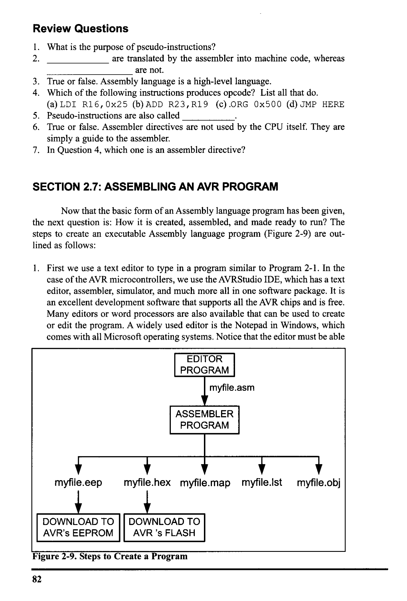
*Description*: Execution flowchart illustrating procedure steps, algorithmic logic flow, software build stages, or timing signal sequences for Figure 2-9: Steps to Create a Program.

> **Figure 2-9: Steps to Create a Program**

82


<!-- Page 98 -->
### [PDF Page 98]

AVRASM: AVR macro assembler 2.1.2 (build 99 Nov
4 2005 09:35:05)
Copyright (C) 1995-2005 ATMEL Corporation
F:\AVR\ Sample| Sample.asm(7): error:
Invalid register
F:\AVR\ Sample\ Sample.asm (8): error: Operand (s)
out of range in 'Idi r17, 0x3432'
F: \AVR\ Sample| Sample. asm(9): error: Undefined symbol: R38
F:\AVR\ Sample| Sample.asm (9): error: Invalid register
F:\AVR\ Sample| Sample.asm(16): No EEPROM data, deleting F:\AVR\ Sample\ Sample.eep
Assembly failed, 4 errors, 0 warnings


*Description*: Technical diagram and schematic illustration detailing hardware connection topology, signal routing, and circuit operation for Figure 2-10: Sample of an AVR Error.

> **Figure 2-10: Sample of an AVR Error**

to produce an ASCII file. For assemblers, the file names follow the usual DOS
conventions, but the source file has the extension "asm". The "asm" extension
for the source file is used by an assembler in the next step.
2. The "asm" source file containing the program code created in step 1 is fed to
the AVR assembler. The assembler produces an object file, a hex file, an eep-
rom file, a list file, and a map file. The object file has the extension "obj", the
hex file extension is "hex".
", the list file extension is "Ist", the map file exten-
sion is "map", and the eeprom file has the extension "eep". After a successful
link, the hex file is ready to be burned into the AVR's program ROM and is
downloaded into the AVR Trainer. We can write the eeprom file into the AVR's
EEPROM to initialize the EEPROM. See Chapter 8 for more details.
More about asm and object files
The asm file is also called the source file and must have the "asm" exten-
sion. As mentioned earlier, this file is created with a text editor such as Windows
Notepad. Many assemblers come with a text editor. The assembler converts the asm
file's Assembly language instructions into machine language and provides the obj
(object) file. The object file, as mentioned earlier, has an "obj" as its extension. The
object file is used as input to a simulator or an emulator.
Before we can assemble a program to create a ready-to-run program, we
must make sure that it is error free. The AVR Studio IDE provides us error mes-
sages and we examine them to see the nature of syntax errors. The assembler will
not assemble the program until all the syntax errors are fixed. A sample of an error
message is shown in Figure 2-10.
"Ist" and "map" files
The map file shows the labels defined in the program together with their
values. Examine Figure 2-11. It shows the Map file of Program 2-1.
The Ist (list) file, which is optional, is very useful to the programmer. The
- AVRASM ver. 2.1.2
F: \AVR\ Sample| Sample. asm Sun Apr 06 23:39:32 2008
EQU SUM
CSEG HERE
00000300
00000009

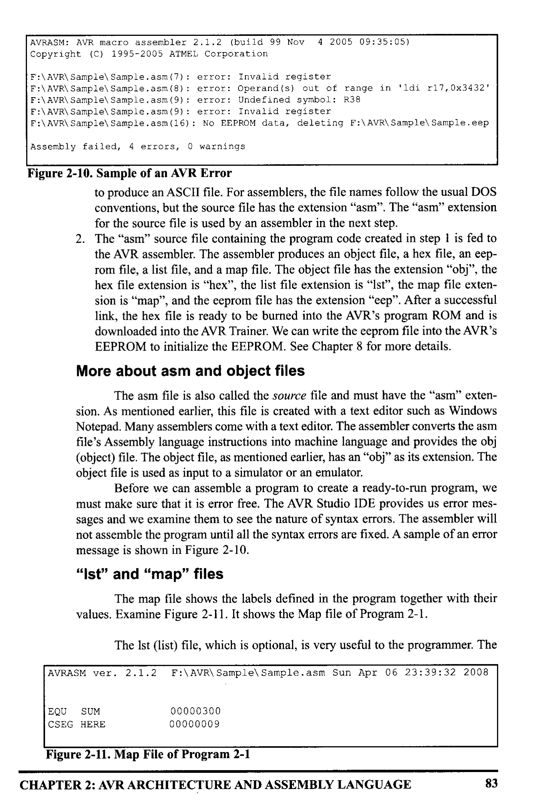
*Description*: Technical diagram and schematic illustration detailing hardware connection topology, signal routing, and circuit operation for Figure 2-11: Map File of Program 2-1.

> **Figure 2-11: Map File of Program 2-1**

CHAPTER 2: AVR ARCHITECTURE AND ASSEMBLY LANGUAGE
83


<!-- Page 99 -->
### [PDF Page 99]

AVRASM ver. 2.1.2
F: \AVR\ Sample| Sample. asm Tue Mar 11 11:28:34 2008
i store SUM in SRAM location 0x300.
• DEVICE ATMega32
• EQU
SUM
0x300
000000
e205
•ORG 00
IDI R16, 0x25
000001
e314

```assembly
LDI R17, $34
```

000002
e321

```assembly
LDI R18, 0b00110001
```

000003
0f01

```assembly
ADD R16,
```

000004
0f02

```assembly
ADD R16, R18
```

000005 e01b
IDI R17, 11
000006 0£01

```assembly
ADD R16,
```

R17
000007
9300
0300
STS SUM, R16
000009 940c 0009 HERE: JMP HERE
RESOURCE USE INFORMATION
; SRAM 100 $300 for SUM
i start at address 0
;R16 = 0x25
;R17 = 0x34
;R18 = 0x31
¡add R17 to R16
¡add R18 to R16
; R17 = 0x0B
¡ add R17 to R16
¡save the SUM in 1oc $300
i stay here forever
Memory use summary [bytes] :
Segment
Begin
End
Code
Data
Used
Size
Use:
•cseg] 0x000000 0x000016
• dseg]
0x000060 0x000060
• eseg]
0x000000 0x000000
22
0
0
22 unknown
O unknown
O unknown
Assembly complete, 0 errors, 0 warnings

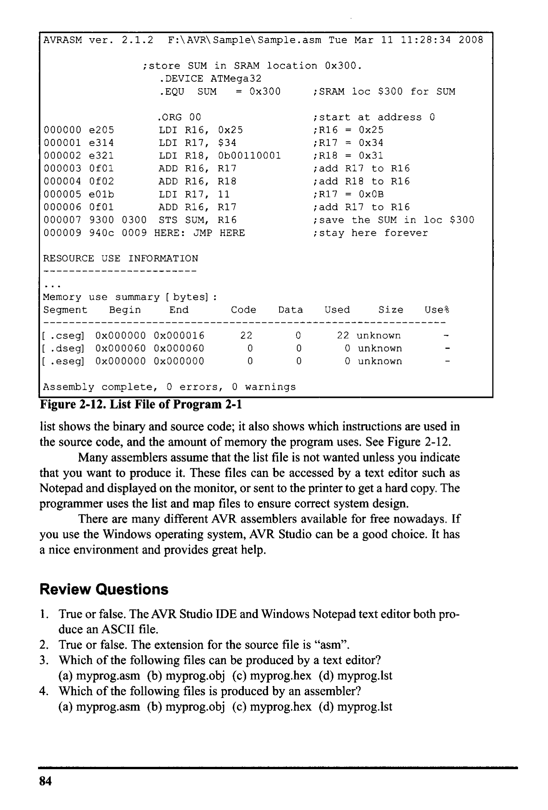
*Description*: Technical diagram and schematic illustration detailing hardware connection topology, signal routing, and circuit operation for Figure 2-12: List File of Program 2-1.

> **Figure 2-12: List File of Program 2-1**

list shows the binary and source code; it also shows which instructions are used in
the source code, and the amount of memory the program uses. See Figure 2-12.
Many assemblers assume that the list file is not wanted unless you indicate
that you want to produce it. These files can be accessed by a text editor such as
Notepad and displayed on the monitor, or sent to the printer to get a hard copy. The
programmer uses the list and map files to ensure correct system design.
There are many different AVR assemblers available for free nowadays. If
you use the Windows operating system, AVR Studio can be a good choice. It has
a nice environment and provides great help.

### Review Questions

1. True or false. The AVR Studio IDE and Windows Notepad text editor both pro-
duce an ASCII file.
2. True or false. The extension for the source file is "asm".
3. Which of the following files can be produced by a text editor?
(a) myprog.asm (b) myprog.obj (c) myprog.hex (d) myprog.Ist
4. Which of the following files is produced by an assembler?
(a) myprog.asm (b) myprog.obj (c) myprog.hex (d) myprog.Ist
84


<!-- Page 100 -->
### [PDF Page 100]


## SECTION 2.8: THE PROGRAM COUNTER AND PROGRAM

ROM SPACE IN THE AVR
In this section we discuss the role of the program counter (PC) in execut-
ing a program and show how the code is fetched from ROM and executed. We will
also discuss the program (code) ROM space for various AVR family members.
Finally, we examine the Harvard architecture of the AVR.
Program counter in the AVR
The most important register in the AVR microcontroller is the PC (program
counter). The program counter is used by the CPU to point to the address of the
next instruction to be executed. As the CPU fetches the opcode from the program
ROM, the program counter is incremented automatically to point to the next
instruction. The wider the program counter, the more memory locations a CPU can
access. That means that a 14-bit program counter can access a maximum of 16K
(24 = 16K) program memory locations.
In AVR microcontrollers each Flash memory location is 2 bytes wide. For
example, in ATmega32, whose Flash is 32K bytes, the Flash is organized as
16Kx 16, and its program counter is 14 bits wide (2'4 = 16K memory locations).
The ATmega64 has a 15-bit program counter, so its Flash has 32K locations
(2'= 32K), with each location containing 2 bytes (32K × 2 bytes = 64K bytes).
In the case of a 16-bit program counter, the code space is 64K (26 = 64K),
which occupies the 0000-SFFFF address range. The program counter in the AVR
family can be up to 22 bits wide. This means that the AVR family can access pro-
gram addresses 000000 to $3FFFFF, a total of 4M locations. Because each Flash
location is 2 bytes wide, the AVR can have a maximum of 8M bytes of code.
However, at the time of this writing, none of the members of the AVR family have
the entire 8M bytes of on-chip ROM installed. See Table 2-7.

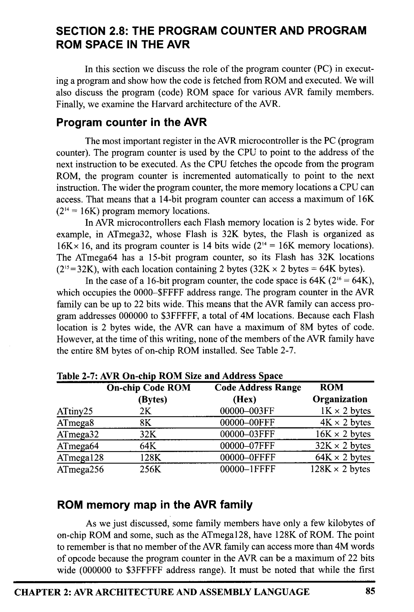
*Description*: Structured reference table listing operational parameters, instruction execution cycles, memory address mapping, or feature comparison for Table 2-7: AVR On-chip ROM Size and Address Space.

> **Table 2-7: AVR On-chip ROM Size and Address Space**

On-chip Code ROM
Code Address Range
(Bytes)
(Hex)
ATtiny 25
ATmega8
ATmega32
ATmega64
ATmega128
ATmega256
2K
00000-003FF
8K
00000-OOFFF
32K
0000003FFF
64K
00000-07FFF
128K
00000-OFFFF
256K
00000-1FFFF
ROM
Organization
1K × 2 bytes
4K × 2 bytes
16K × 2 bytes
32K × 2 bytes
64K x 2 bytes
128K × 2 bytes
ROM memory map in the AVR family
As we just discussed, some family members have only a few kilobytes of
on-chip ROM and some, such as the ATmega128, have 128K of ROM. The point
to remember is that no member of the AVR family can access more than 4M words
of opcode because the program counter in the AVR can be a maximum of 22 bit
wide (000000 to $3FFFFF address range). It must be noted that while the first
CHAPTER 2: AVR ARCHITECTURE AND ASSEMBLY LANGUAGE
85


<!-- Page 101 -->
### [PDF Page 101]

Example 2-9
Find the ROM memory address of each of the following AVR chips:
(a) ATtiny25 with 2 KB
(b) ATmega16 with 16 KB
(c) ATmega64 with 64 KB
Solution:
(a) With 2K bytes of on-chip ROM memory, we have 2048 bytes (2 × 1024 = 2048). As
each address location in AVR is 2 bytes, its Flash has 1024 locations (2048 / 2 =
1024). This maps to address locations of 0000 to SO3FF. Notice that O is always the
first location.
(b) With 16K bytes of on-chip ROM memory, we have 16,384 bytes (16 × 1024 =
16,384), and 8192 locations (16384 / 2 = 8192), which gives 0000-S1FFF.
(c) With 64K we have 65,535 bytes (64 x 1024 = 65,535), and 32,768 locations.
Converting 32,768 to hex, we get $8000; therefore, the memory space is 0000 to
$7FFF.
2 bytes
•
42 bytes,
+ 2 bytes
00000
00001
1Kx2Bytes
003FF
Tiny 25
00000
00001
:
01FFF
00000
00001
8Kx2Bytes
: 32Kx2Bytes
Mega 16
07FFF
Mega64

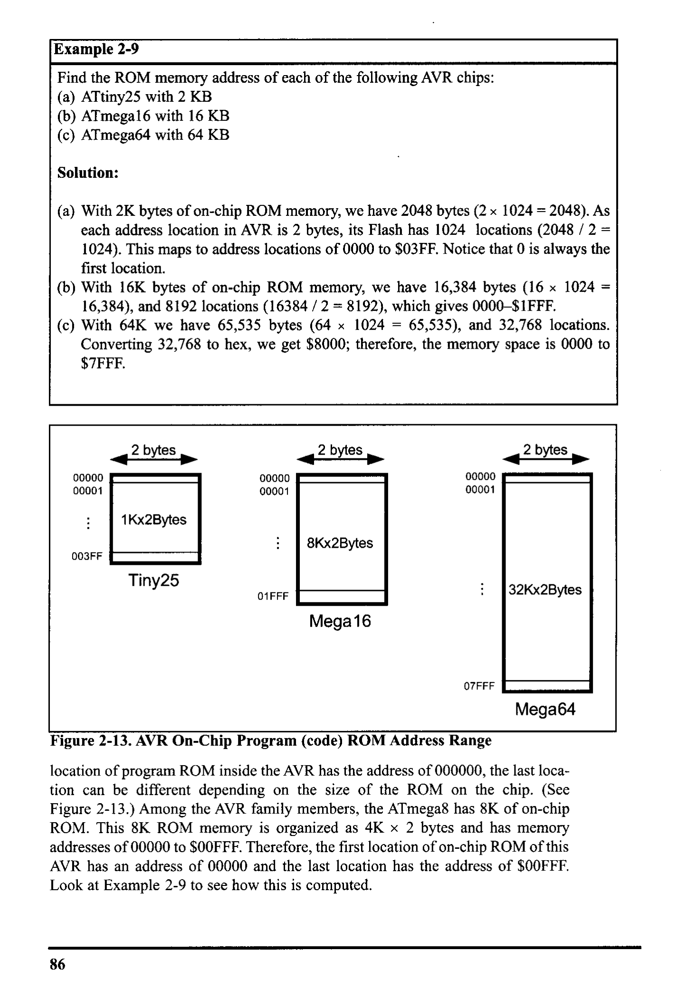
*Description*: Technical diagram and schematic illustration detailing hardware connection topology, signal routing, and circuit operation for Figure 2-13: AVR On-Chip Program (code) ROM Address Range.

> **Figure 2-13: AVR On-Chip Program (code) ROM Address Range**

location of program ROM inside the AVR has the address of 000000, the last loca-
tion can be different depending on the size of the ROM on the chip. (See


*Description*: Technical diagram and schematic illustration detailing hardware connection topology, signal routing, and circuit operation for Figure 2-13: ) Among the AVR family members, the ATmega8 has 8K of on-chip.

> **Figure 2-13: ) Among the AVR family members, the ATmega8 has 8K of on-chip**

ROM. This 8K ROM memory is organized as 4K × 2 bytes and has memory
addresses of 00000 to SOOFFF. Therefore, the first location of on-chip ROM of this
AVR has an address of 00000 and the last location has the address of SOOFFF.
Look at Example 2-9 to see how this is computed.
86


<!-- Page 102 -->
### [PDF Page 102]

Where the AVR wakes up when it is powered up
One question that we must ask about any microcontroller (or microproces-
sor) is: At what address does the CPU wake up when power is applied? Each
microprocessor is different. In the case of the AVR microcontrollers (that is, all
members regardless of the family and variation), the microcontroller wakes up at
memory address 0000 when it is powered up. By powering up we mean applying
Vcc to the RESET pin as discussed in Chapter 8. In other words, when the AVR
is powered up, the PC (program counter) has the value of 00000 in it. This means
that it expects the first opcode to be stored at ROM address $00000. For this rea-
son, in the AVR system, the first opcode must be burned into memory location
$00000 of program ROM because this is where it looks for the first instruction
when it is booted. We achieve this by using the .ORG statement in the source pro-
gram as shown earlier. Next we discuss the step-by-step action of the program
counter in fetching and executing a sample program.
Placing code in program ROM
To get a better understanding of the role of the program counter in fetch-
ing and executing a program, we examine the action of the program counter as
each instruction is fetched and executed. First, we examine once more the list file
of the sample program and show how the code is placed into the Flash ROM of
the AVR chip. As we can see, the opcode and operand for each instruction are list-
ed on the left side of the list file.
After the program is burned into ROM of an AVR family member such as
ATmega32 or ATtiny11, the opcode and operand are placed in ROM memory loca-
tions starting at 0000 as shown in the Program 2-1 list file.
The list shows that address 0000 contains E205, which is the opcode for
moving a value into R16, and the operand (in this case Ox25) to be moved to R16.
Therefore, the instruction "LDI R16, Ox25" has a machine code of "E205"
where E is the opcode and 205 is the operand. See Figures 2-14 and 2-15.
Similarly, the machine code "E314" is located in ROM memory location 0001 and
represents the opcode and the operands for the instruction "IDI R17, $34". In
1110
kkk k
dd d d
kkk k

```assembly
LDI Rd, k
```

16≤d≤31, 0≤K≤ 255

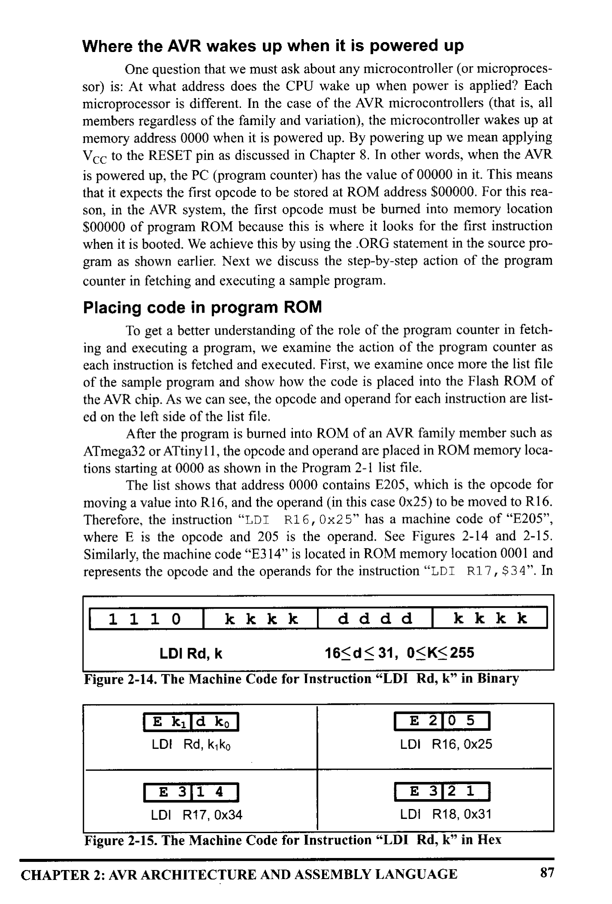
*Description*: Technical diagram and schematic illustration detailing hardware connection topology, signal routing, and circuit operation for Figure 2-14: The Machine Code for Instruction "LDI Rd, k" in Binary.

> **Figure 2-14: The Machine Code for Instruction "LDI Rd, k" in Binary**

L kild ko

```assembly
LDI Rd, Kiko
```

E 205

```assembly
LDI R16, 0x25
```

E 314
E 312 1

```assembly
LDI R17, 0x34
LDI R18, 0x31
```


*Description*: Technical diagram and schematic illustration detailing hardware connection topology, signal routing, and circuit operation for Figure 2-15: The Machine Code for Instruction "LDI Rd, k" in Hex.

> **Figure 2-15: The Machine Code for Instruction "LDI Rd, k" in Hex**

CHAPTER 2: AVR ARCHITECTURE AND ASSEMBLY LANGUAGE
87


<!-- Page 103 -->
### [PDF Page 103]

0 0 0 0
11r d
dd d d
I I I I

```assembly
ADD Rd,Rr
```

0≤d ≤31, 05r ≤ 31

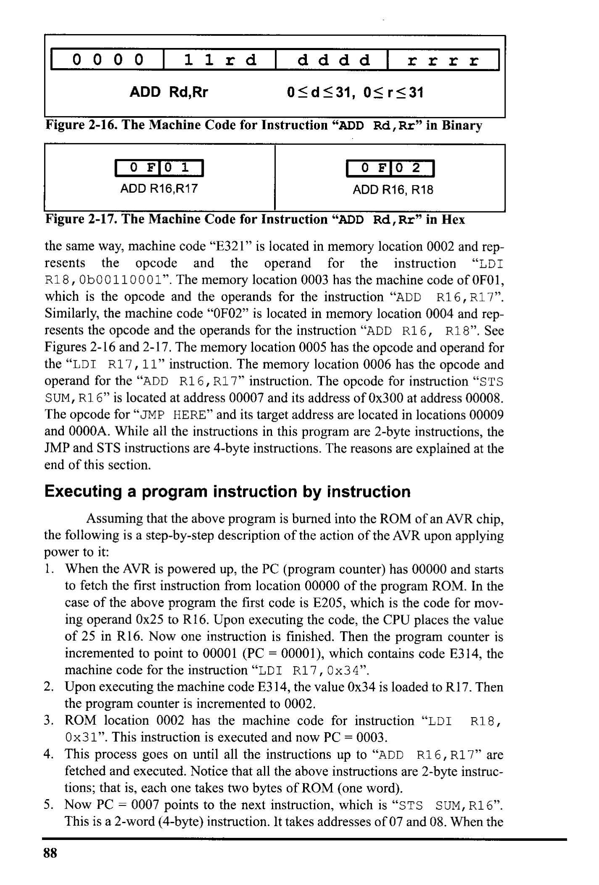
*Description*: Technical diagram and schematic illustration detailing hardware connection topology, signal routing, and circuit operation for Figure 2-16: The Machine Code for Instruction "ADD Rd, Rr" in Binary.

> **Figure 2-16: The Machine Code for Instruction "ADD Rd, Rr" in Binary**

0 F0 1

```assembly
ADD R16,R17
```

0 F0 2

```assembly
ADD R16, R18
```


*Description*: Technical diagram and schematic illustration detailing hardware connection topology, signal routing, and circuit operation for Figure 2-17: The Machine Code for Instruction "ADD Rd, Rr" in Hex.

> **Figure 2-17: The Machine Code for Instruction "ADD Rd, Rr" in Hex**

the same way, machine code "E321" is located in memory location 0002 and rep-
resents the opcode and the operand for the instruction "LDI
R18, 0b00110001". The memory location 0003 has the machine code of 0F01,
which is the opcode and the operands for the instruction "ADD R16, R17".
Similarly, the machine code "OF02" is located in memory location 0004 and rep-
resents the opcode and the operands for the instruction "ADD R16, R18". See
Figures 2-16 and 2-17. The memory location 0005 has the opcode and operand for
the "LDI R17, 11" instruction. The memory location 0006 has the opcode and
operand for the "ADD R16, R17" instruction. The opcode for instruction "STS
SUM, R16" is located at address 00007 and its address of 0x300 at address 00008.
The opcode for "JMP HERE" and its target address are located in locations 00009
and 0000A. While all the instructions in this program are 2-byte instructions, the

```assembly
JMP and STS instructions are 4-byte instructions. The reasons are explained at the
```

end of this section.
Executing a program instruction by instruction
Assuming that the above program is burned into the ROM of an AVR chip,
the following is a step-by-step description of the action of the AVR upon applying
power to it:
1. When the AVR is powered up, the PC (program counter) has 00000 and starts
to fetch the first instruction from location 00000 of the program ROM. In the
case of the above program the first code is E205, which is the code for mov-
ing operand 0x25 to R16. Upon executing the code, the CPU places the value
of 25 in R16. Now one instruction is finished. Then the program counter is
incremented to point to 00001 (PC = 00001), which contains code E314, the
machine code for the instruction "LDI R17, 0x34"
2. Upon executing the machine code E314, the value 0x34 is loaded to R17. Then
the program counter is incremented to 0002.
3. ROM location 0002 has the machine code for instruction "LDI R18,
Ox31". This instruction is executed and now PC = 0003.
4. This process goes on until all the instructions up to "ADD R16, R17" are
fetched and executed. Notice that all the above instructions are 2-byte instruc-
tions; that is, each one takes two bytes of ROM (one word).
Now PC = 0007 points to the next instruction, which is "STS SUM, R16".
This is a 2-word (4-byte) instruction. It takes addresses of 07 and 08. When the
88


<!-- Page 104 -->
### [PDF Page 104]

instruction is executed, the content of R16 is stored into memory location
0x300. After the execution of this instruction, PC = 0009.
6. Now PC = 0009 points to the next instruction, which is "JMP HERE". This is
a 2-word (4-byte) instruction. It takes addresses of 09 and OA. After the exe-
cution of this instruction, PC = 0009. This keeps the program in an infinite
loop. The fact that the program counter points at the next instruction to be exe-
cuted explains why some microprocessors (notably the x86) call the program
counter the instruction pointer.
ROM width in the AVR
As we have seen so far in this section, each location of the address space
holds two bytes (a word). If we have 16 address lines, this will give us 2' loca-
tions, which is 64K of memory location with an address map of 0000-FFFFH. To
bring in more information (code or data) into the CPU, AVR increased the width
of the data bus to 16 bits. In
other words, the AVR is word-
addressable. In contrast, the
Ao
Ao
8051 CPU is byte addressable.
16-bit
CODE
ROM
In a sense, the data bus is like
traffic lanes on the highway
AVR
CPU
where each lane is 8 bits wide.
The more lanes, the more
information we can bring into
the CPU for processing. For
A21
Dis
-A21 DIS
Do
the AVR, the internal data bus
between the code ROM and the
CPU is 16 bits wide, as shown
Do
in Figure 2-18. Therefore, the

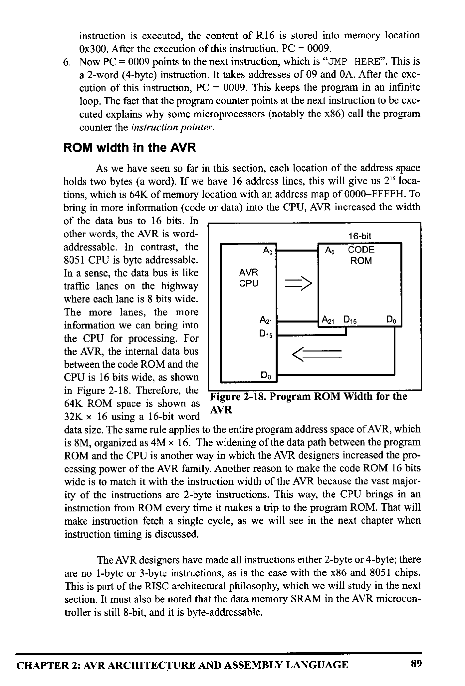
*Description*: Technical diagram and schematic illustration detailing hardware connection topology, signal routing, and circuit operation for Figure 2-18: Program ROM Width for the.

> **Figure 2-18: Program ROM Width for the**

64K ROM space is shown as
AVR
32K × 16 using a 16-bit word
data size. The same rule applies to the entire program address space of AVR, which
is 8M, organized as 4M × 16. The widening of the data path between the program
ROM and the CPU is another way in which the AVR designers increased the pro-
cessing power of the AVR family. Another reason to make the code ROM 16 bits
wide is to match it with the instruction width of the AVR because the vast major-
ity of the instructions are 2-byte instructions. This way, the CPU brings in an
instruction from ROM every time it makes a trip to the program ROM. That will
make instruction fetch a single cycle, as we will see in the next chapter when
instruction timing is discussed.
The AVR designers have made all instructions either 2-byte or 4-byte; there
are no 1-byte or 3-byte instructions, as is the case with the x86 and 8051 chips.
This is part of the RISC architectural philosophy, which we will study in the next
section. It must also be noted that the data memory SRAM in the AVR microcon-
troller is still 8-bit, and it is byte-addressable.
CHAPTER 2: AVR ARCHITECTURE AND ASSEMBLY LANGUAGE
89


<!-- Page 105 -->
### [PDF Page 105]

Harvard architecture in the AVR
As we mentioned in Chapter 0, AVR uses Harvard architecture, which
means that there are separate buses for the code and the data memory. See

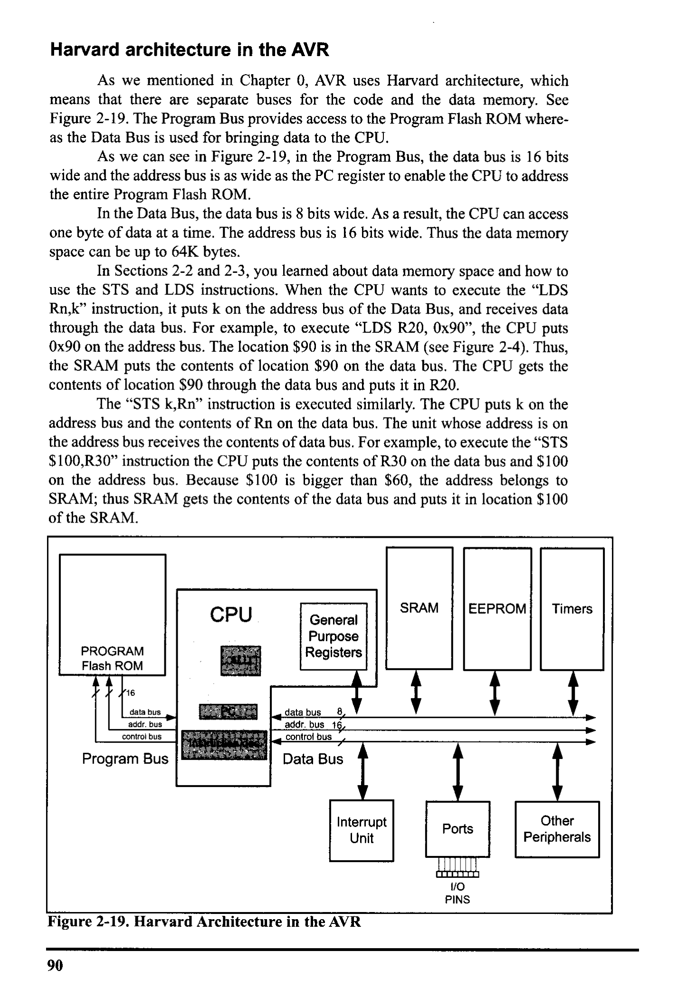
*Description*: Technical diagram and schematic illustration detailing hardware connection topology, signal routing, and circuit operation for Figure 2-19: The Program Bus provides access to the Program Flash ROM where-.

> **Figure 2-19: The Program Bus provides access to the Program Flash ROM where-**

as the Data Bus is used for bringing data to the CPU.
As we can see in Figure 2-19, in the Program Bus, the data bus is 16 bits
wide and the address bus is as wide as the PC register to enable the CPU to address
the entire Program Flash ROM.
In the Data Bus, the data bus is 8 bits wide. As a result, the CPU can access
one byte of data at a time. The address bus is 16 bits wide. Thus the data memory
space can be up to 64K bytes.
In Sections 2-2 and 2-3, you learned about data memory space and how to
use the STS and LDS instructions. When the CPU wants to execute the "LDS
Rn,k" instruction, it puts k on the address bus of the Data Bus, and receives data
through the data bus. For example, to execute "LDS R20, 0x90", the CPU puts
0x90 on the address bus. The location $90 is in the SRAM (see Figure 2-4). Thus,
the SRAM puts the contents of location $90 on the data bus. The CPU gets the
contents of location $90 through the data bus and puts it in R20.
The "STS k,Rn" instruction is executed similarly. The CPU puts k on the
address bus and the contents of Rn on the data bus. The unit whose address is on
the address bus receives the contents of data bus. For example, to execute the "STS
$100,R30" instruction the CPU puts the contents of R30 on the data bus and $100
on the address bus. Because $100 is bigger than $60, the address belongs to
SRAM; thus SRAM gets the contents of the data bus and puts it in location $100
of the SRAM.
CPU
SRAM
EEPROM
Timers
General
Purpose
Registers
PROGRAM
Flash ROM
I7116
data bus a
addr. bus.
control bus
Program Bus
• data bus 8,
addr. bus 16,.
• control bus p
Data Bus
- Interrupt
Unit
Ports
Other
Peripherals
1/O
PINS


*Description*: Technical diagram and schematic illustration detailing hardware connection topology, signal routing, and circuit operation for Figure 2-19: Harvard Architecture in the AVR.

> **Figure 2-19: Harvard Architecture in the AVR**

90


<!-- Page 106 -->
### [PDF Page 106]

Little endian vs. big endian war
Examine the placing of the code in the AVR ROM, shown in Figure 2-20.
The low byte goes to the low memory location, and the high byte goes to the high
memory address. This convention is called little endian to contrast it with big endi-
an. The origin of the terms big endian and little endian is from an argument in a
Gulliver's Travels story over how an egg
High
should be opened: from the big end or the
Address
Low
little end. In the big endian method, the
byte
high byte goes to the low address, where-
00000
E2
byte
as in the little endian method, the high
00001
E3
05
byte goes to the high address and the low
00002
E3
21
byte to the low address. All Intel micro-
00003
OF
processors and many microcontrollers use
the little endian convention. Freescale
00004
OF
02
(formerly Motorola) microprocessors,
00005
EO
1B
along with some mainframes, use big
00006
OF
01
endian. The difference might seem as triv-
00007
93
00
ial as whether to break an egg from the big
00008
end or the little end, but it is a nuisance in
03
00
converting software from one camp to be
00009
94
OC
run on a computer of the other camp.
00O0A
00
09
Some microprocessors, such as the

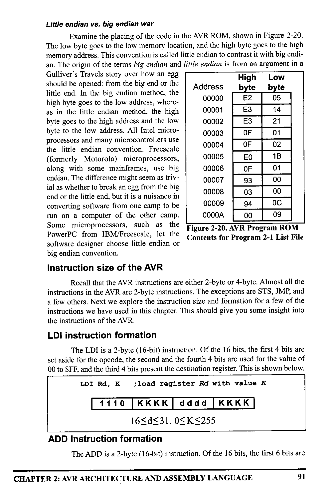
*Description*: Technical diagram and schematic illustration detailing hardware connection topology, signal routing, and circuit operation for Figure 2-20: AVR Program ROM.

> **Figure 2-20: AVR Program ROM**

PowerPC from IBM/Freescale, let the
Contents for Program 2-1 List File
software designer choose little endian or
big endian convention.
Instruction size of the AVR
Recall that the AVR instructions are either 2-byte or 4-byte. Almost all the
instructions in the AVR are 2-byte instructions. The exceptions are STS, JMP, and
a few others. Next we explore the instruction size and formation for a few of the
instructions we have used in this chapter. This should give you some insight into
the instructions of the AVR.

```assembly
LDI instruction formation
```

The LDI is a 2-byte (16-bit) instruction. Of the 16 bits, the first 4 bits are
set aside for the opcode, the second and the fourth 4 bits are used for the value of
00 to SFF, and the third 4 bits present the destination register. This is shown below.

```assembly
LDI Rd, K
```

¡load register Rd with value K
1 1 10
KKKK dddd KKKK
16≤d≤31,0≤K≤255

```assembly
ADD instruction formation
```

The ADD is a 2-byte (16-bit) instruction. Of the 16 bits, the first 6 bits are
CHAPTER 2: AVR ARCHITECTURE AND ASSEMBLY LANGUAGE
91


<!-- Page 107 -->
### [PDF Page 107]

set aside for the opcode, and the other 10 bits represent the source and the desti-
nation registers. This is shown below.

```assembly
ADD Rd, RI
```

¡ Add Rd to RI
0 0 00
11rd
dodd
0≤d ≤31, 0≤r≤31
rrrr
STS instruction formation
The STS is a 4-byte (32-bit) instruction. Of the 32 bits, the first 16 bits are
set aside for the opcode and the address of the source, and the other 16 bits are
used for the address of the destination. This is shown below.
STS K, RI
¡Store register RI in memory location *
1001
001 г
rrrr
0000
kkkk
kkkk
kkkk
kkkk
0≤r≤31,05k≤65535
LDS instruction formation
The LDS is a 4-byte (32-bit) instruction. Of the 32 bits, the first 16 bits are
set aside for the opcode and the destination register, and the other 16 bits are used
for the address of the source memory location. This is shown below.
IDS Rd, k
¡ Load from memory location k to register Rd
1001
kkkk
000 d
daddl
0000
kkkk
kkkk
kkkk
0≤d≤31,0≤k≤65535
IN instruction formation
The IN is a 2-byte (16-bit) instruction. Of the 16 bits, the first 5 bits are set
aside for the opcode, and the other 11 bits are used for the address of the source
memory location, and destination register. This is shown below.
IN Rd, A ¡load from Address A Of I/0 memory into register Rd
1011 OAAd dddd AAAA
0≤d ≤31, 0≤A≤63


<!-- Page 108 -->
### [PDF Page 108]


```assembly
OUT instruction formation
```

The OUT is a 2-byte (16-bit) instruction. Of the 16 bits, the first 5 bits are
set aside for the opcode, and the other 11 bits are used for the address of the source
memory location and destination register. This is shown below.

```assembly
OUT A, RI
```

¡Store register Ri in I/O memory location A
1011 | 1AAr|
rrrrAAAA
0≤d≤31, 0≤A≤63

```assembly
JMP instruction formation
```

The JMP is a 4-byte (32-bit) instruction. Of the 32 bits, only 10 bits are set
aside for the opcode, and the rest (22 bits) are used for the target address of the
JMP. This is shown below.
The 22-bit address gives us 4M of address space; so, it can address all of
the ROM space.

```assembly
JMP k
```

1001
kkkk
; Jump to address k
010k
kkkk
kkkk
kkkk
110k
kkkk
0≤k≤4M

### Review Questions

1. In the AVR, the program counter is, at most,
_bits wide.
2. True or false. Every member of the AVR family, regardless of the program
ROM size, wakes up at memory $0000 when it is powered up.
3. At what ROM location do we store the first opcode of an AVR program?
4. The instruction "IDI R20, Ox41" is a
_-byte instruction.
5. The instruction "JMP label" is a
-byte instruction.
6. True or false. All the instructions in the AVR are 2- or 4-byte instructions.

## SECTION 2.9: RISC ARCHITECTURE IN THE AVR

There are three ways available to microprocessor designers to increase the
processing power of the CPU:
1. Increase the clock frequency of the chip. One drawback of this method is that
the higher the frequency, the more power and heat dissipation. Power and heat
dissipation is especially a problem for hand-held devices.
2. Use Harvard architecture by increasing the number of buses to bring more
information (code and data) into the CPU to be processed. While in the case of
CHAPTER 2: AVR ARCHITECTURE AND ASSEMBLY LANGUAGE
93


<!-- Page 109 -->
### [PDF Page 109]

x86 and other general purpose microprocessors this architecture is very expen-
sive and unrealistic, in today's microcontrollers this is not a problem. As we
saw in the last section, the AVR has Harvard architecture.
3. Change the internal architecture of the CPU and use what is called RISC archi-
tecture.
Atmel used all three methods to increase the processing power of the AVR
microcontrollers. In this section we discuss the merits of RISC architecture and
examine how the AVR microcontrollers have adapted it.
RISC architecture
In the early 1980s, a controversy broke out in the computer design commu-
nity, but unlike most controversies, it did not go away. Since the 1960s, in all main-
frames and minicomputers, designers put as many instructions as they could think
of into the CPU. Some of these instructions performed complex tasks. An exam-
ple is adding data memory locations and storing the sum into memory. Naturally,
microprocessor designers followed the lead of minicomputer and mainframe
designers. Because these microprocessors used such a large number of instruc-
tions, many of which performed highly complex activities, they came to be known
as CISC (complex instruction set computer) processors. According to several stud-
ies in the 1970s, many of these complex instructions etched into CPUs were never
used by programmers and compilers. The huge cost of implementing a large num-
ber of instructions (some of them complex) into the microprocessor, plus the fact
that a good portion of the transistors on the chip are used by the instruction
decoder, made some designers think of simplifying and reducing the number of
instructions. As this concept developed, the resulting processors came to be known
as RISC (reduced instruction set computer).
Features of RISC
The following are some of the features of RISC as implemented by the
AVR microcontroller.
Feature 1
RISC processors have a fixed instruction size. In a CISC microcontroller
such as the 8051, instructions can be 1, 2, or even 3 bytes. For example, look at
the following instructions in the 8051:

```assembly
CLR C
```

¡clear Carry flag, a 1-byte instruction

```assembly
ADD Accumulator, #mybyte
;a 2-byte instruction
```

LIMP target_address
¡a 3-byte instruction
This variable instruction size makes the task of the instruction decoder very
difficult because the size of the incoming instruction is never known. In a RISC
architecture, the size of all instructions is fixed. Therefore, the CPU can decode the
instructions quickly. This is like a bricklayer working with bricks of the same size
as opposed to using bricks of variable sizes. Of course, it is much more efficient
to use bricks of the same size. In the last section we saw how the AVR uses 2-byte
instructions with very few 4-byte instructions.
94


<!-- Page 110 -->
### [PDF Page 110]

Feature 2
One of the major characteristics of RISC architecture is a large number of
registers. All RISC architectures have at least 32 registers. Of these 32 registers,
only a few are assigned to a dedicated function. One advantage of a large number
of registers is that it avoids the need for a large stack to store parameters. Although
a stack can be implemented on a RISC processor, it is not as essential as in CISC
because so many registers are available. In the AVR microcontrollers the use of 32
general purpose registers satisfies this RISC feature. The stack for the AVR is cov-
ered in the next chapter.
Feature 3
RISC processors have a small instruction set. RISC processors have only
basic instructions such as ADD, SUB, MUL, LOAD, STORE, AND, OR, EOR,
CALL, JUMP, and so on. The limited number of instructions is one of the criti-
cisms leveled at the RISC processor because it makes the job of Assembly lan-
guage programmers much more tedious and difficult compared to CISC Assembly
language programming. This is one reason that RISC is used more commonly in
high-level language environments such as the C programming language rather
than Assembly language environments. It is interesting to note that some defend-
ers of CISC have called it "complete instruction set computer" instead of "com-
plex instruction set computer" because it has a complete set of every kind of
instruction. How many of these instructions are used and how often is another mat-
ter. The limited number of instructions in RISC leads to programs that are large.
Although these programs can use more memory, this is not a problem because
memory is cheap. Before the advent of semiconductor memory in the 1960s, how-
ever, CISC designers had to pack as much action as possible into a single instruc-
tion to get the maximum bang for their buck. In the ATmega we have around 130
instructions. We will examine more of the instruction set for the AVR in future
chapters.
Feature 4
At this point, one might ask, with all the difficulties associated with RISC
programming, what is the gain? The most important characteristic of the RISC
processor is that more than 95% of instructions are executed with only one clock
cycle, in contrast to CISC instructions. Even some of the 5% of the RISC instruc-
tions that are executed with two clock cycles can be executed with one clock cycle
by juggling instructions around (code scheduling). Code scheduling is most often
the job of the compiler. We will examine the instruction cycle time and pipelining
of the AVR in Chapter 3.
Feature 5
RISC processors have separate buses for data and code. In all the x86
processors, like all other CISC computers, there is one set of buses for the address
(e. g., AO-A24 in the 80286) and another set of buses for data (e.g., DO-D15 in the
80286) carrying opcodes and operands in and out of the CPU. To access any sec-
tion of memory, regardless of whether it contains code or data operands, the same
CHAPTER 2: AVR ARCHITECTURE AND ASSEMBLY LANGUAGE
95


<!-- Page 111 -->
### [PDF Page 111]

address bus and data bus are used. In RISC processors, there are four sets of buses:
(1) a set of data buses for carrying data (operands) in and out of the CPU, (2) a set
of address buses for accessing the data, (3) a set of buses to carry the opcodes, and
(4) a set of address buses to access the opcodes. The use of separate buses for code
and data operands is commonly referred to as Harvard architecture. We examined
the Harvard architecture of the AVR in the previous section.
Feature 6
Because CISC has such a large number of instructions, each with so many
different addressing modes, microinstructions (microcode) are used to implement
them. The implementation of microinstructions inside the CPU employs more than
40-60% of transistors in many CISC processors. RISC instructions, however, due
to the small set of instructions, are implemented using the hardwire method.
Hardwiring of RISC instructions takes no more than 10% of the transistors.
Feature 7
RISC uses load/store architecture. In CISC microprocessors, data can be
manipulated while it is still in memory. For example, in instructions such as "ADD
Reg, Memory", the microprocessor must bring the contents of the external mem-
ory location into the CPU, add it to the contents of the register, then move the
result back to the external memory location. The problem is there might be a delay
in accessing the data from external memory. Then the whole process would be
stalled, preventing other instructions from proceeding in the pipeline. In RISC,
designers did away with these kinds of instructions. In RISC, instructions can only
load from external memory into registers or store registers into external memory
locations. There is no direct way of doing arithmetic and logic operations between
a register and the contents of external memory locations. All these instructions
must be performed by first bringing both operands into the registers inside the
CPU, then performing the arithmetic or logic operation, and then sending the result
back to memory. This idea was first implemented by the Cray 1 supercomputer in
1976 and is commonly referred to as load/store architecture. In the last section, we
saw that the arithmetic and logic operations are between the data memory (inter-
nal) locations, but none involves a ROM location. For example, there is no "ADD
ROM-Loc" instruction in AVR.
In concluding this discussion of RISC processors, it is interesting to note
that RISC technology was explored by the scientists at IBM in the mid-1970s, but
it was David Patterson of the University of California at Berkeley who in 1980
brought the merits of RISC concepts to the attention of computer scientists. It must
also be noted that in recent years CISC processors such as the Pentium have used
some RISC features in their design. This was the only way they could enhance the
processing power of the x86 processors and stay competitive. Of course, they had
to use lots of transistors to do the job, because they had to deal with all the CISC
instructions of the x86 processors and the legacy software of DOS/Windows.
96


<!-- Page 112 -->
### [PDF Page 112]


### Review Questions

1. What do RISC and CISC stand for?
2. True or false. The CISC architecture executes the vast majority of its instruc-
tions in 2, 3, or more clock cycles, while RISC executes them in one clock.
3. RISC processors normally have a _
_ (large, small) number of general-pur-
pose registers.
4. True or false. Instructions such as "ADD R16, ROMmemory" do not exist in
RISC microcontrollers such as the AVR.
5. How many instructions does the ATmega have?
6. True or false. While CISC instructions are of variable sizes, RISC instructions
are all the same size.
7. Which of the following operations do not exist for the ADD instruction in
RISC?
(a) register to register (b) immediate to register (c) memory to memory
8. True or false. Harvard architecture uses the same address and data buses to
fetch both code and data.

## SECTION 2.10: VIEWING REGISTERS AND MEMORY WITH

AVR STUDIO IDE
The AVR microcontroller has great tools and support systems, many of
them free or inexpensive. AVR Studio is an assembler and simulator provided for
free by Atmel Corporation and can be downloaded from the www.atmel.com web-
site. See http://www.MicroDigitalEd.com for tutorials on how to use the AVR
Studio assembler and simulator.
Many assemblers and C compilers come with a simulator. Simulators allow
us to view the contents of registers and memory after executing each instruction
(single-stepping). It is strongly recommended to use a simulator to single-step
some of the programs in this chapter and future chapters. Single-stepping a pro-
gram with a simulator gives us a deeper understanding of microcontroller architec-
ture, in addition to the fact that we can use it to find the errors in our programs.
Figures 2-21 through 2-23 show screenshots for AVR simulators from
AVR Studio.
See the following website for a tutorial on using AVR Studio:
http://www.MicroDigitalEd.com
CHAPTER 2: AVR ARCHITECTURE AND ASSEMBLY LANGUAGE
97


<!-- Page 113 -->
### [PDF Page 113]

Memory
(Program
000000
000008
000010
000018
000020
000028
000030
8/16
abc.
Address:
0x00
Cols: Auto *
05 E2 14
E3
21
E3
01
OF
02
OF
1B EO 01 OF
00 93
.â.ä!ă.....à..
00 03
OC
94
09
00
FF
FF
FF
FF
FF FF FF
FF FF FF..."..YYYYYYYYYY
FF FF FF
FF
FF
FF FF
FF
FF
FF
FF FF FF
FF
FF FF
FF FF FF FF FF
FF FF FF FF
FF
YYYYYYYYYYYYYYYY
FF FF FF
FF
FF FF
FF FF FF FF FF FF FF FF FF FF
FF FF FF
FF
YYYYYYYYYYYYYYYY
FF FF
FF FF
FF
YYYYYYYYYYYYYYYY
FF FF
FF FF FF FF FF
FF FF FF
FF FF FF
FF FF FF FF FF FF FF FF FF FF FF FF FF FF FF FF
Ý99YYYYYYYYYYYYY
YYYYYYYYYYYYYYYY


*Description*: Technical diagram and schematic illustration detailing hardware connection topology, signal routing, and circuit operation for Figure 2-21: Data Memory Window in AVR Studio IDE.

> **Figure 2-21: Data Memory Window in AVR Studio IDE**

Disassembler
7:
program2_1.asn
IDI R16.
→00000000:
E205
0x25
: R16 = 0x25
IDI
R16, 0x25
8 :
IDI R17. $34
: R17 = 0x34
+00000001:
E314
IDI
R17. 0x34
9:
IDI R18. 0b00110001 :R18 = 0x31
+00000002:
10:
IDI
R18, 0x31

```assembly
ADD R16.
```

+00000003:
0F01
R17
11:

```assembly
ADD R16,
```

R18
ADD
: add R17 to R16
R16. R17
+00000004:
0F02
ADD
: add R18 to R16
R16, R18
12:
IDI R17. 11
+00000005:
E01B
LDI
: R17 = 0x0B
R17. 0x0B
Load immediate
Load immediate
Load innediate
Add without carry
Add without carry
Load inmediate


*Description*: Technical diagram and schematic illustration detailing hardware connection topology, signal routing, and circuit operation for Figure 2-22: Program ROM (Disassembler) Window in AVR Studio IDE.

> **Figure 2-22: Program ROM (Disassembler) Window in AVR Studio IDE**

I/O View
PORTB
→
CPU
EEPROM
EXTERNAL_INTERRUPT
PORTA
PORTB
•
Port B Data Register
Port B Data Direction Register
Port B Input Pins
HE PORTC
PORTD
ED SPI
TIMER_COUNTER_O
TIMER_COUNTER_1
0x60
0x98
0x50
Name
P DDAB
2 PORTB
Address
0x17 (0x37)
0x16 (0x36)
0x18 (0x38)
Value
Bits
0x98 E
0x50 L
0x60 L
ATmega32
AVR Simulator
Auto Ste

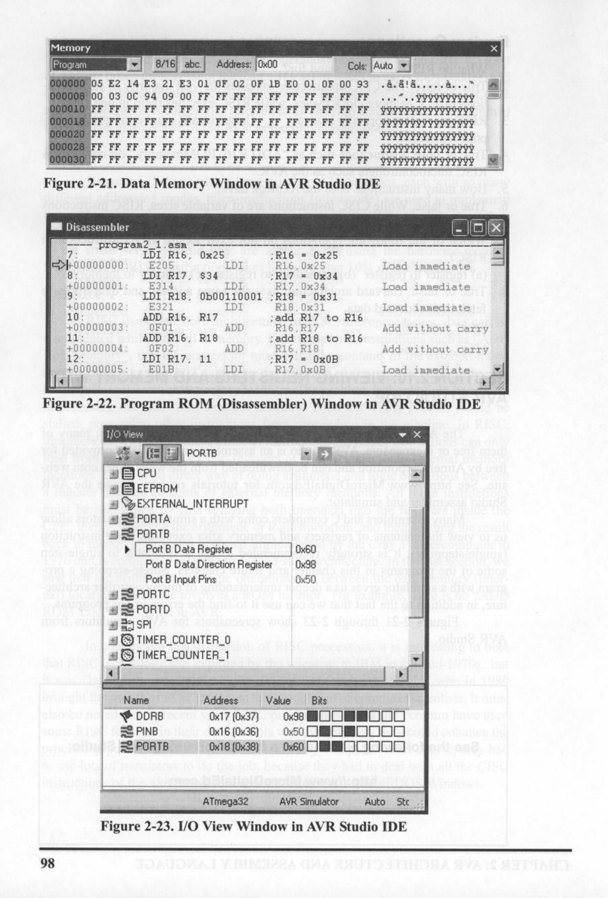
*Description*: Technical diagram and schematic illustration detailing hardware connection topology, signal routing, and circuit operation for Figure 2-23: I/O View Window in AVR Studio IDE.

> **Figure 2-23: I/O View Window in AVR Studio IDE**

98


<!-- Page 114 -->
### [PDF Page 114]


### SUMMARY

This chapter began with an exploration of the major registers of the AVR,
including general purpose registers, I/O registers, and internal SRAM, and the pro-
gram counter. The use of these registers was demonstrated in the context of pro-
gramming examples. The process of creating an Assembly language program was
described from writing the source file, to assembling it, linking, and executing the
program. The PC (program counter) register always points to the next instruction
to be executed. The way the AVR uses program Flash ROM space was explored
because AVR Assembly language programmers must be aware of where programs
are placed in ROM, and how much memory is available.
An Assembly language program is composed of a series of statements that
are either instructions or pseudo-instructions, also called directives. Instructions
are translated by the assembler into machine code. Pseudo-instructions are not
translated into machine code: They direct the assembler in how to translate instruc-
tions into machine code. Some pseudo-instructions, called data directives, are used
to define data. Data is allocated in byte-size increments. The data can be in bina-
ry, hex, decimal, or ASCII formats.
Flags are useful to programmers because they indicate certain conditions,
such as carry or zero, that result from execution of instructions. The concepts of
the RISC and Harvard architectures were also explored.
The RISC architecture allows the design of much more powerful micro-
controllers. It has a simple instruction set and uses a large number of registers.
Harvard architecture allows us to bring more code and data to the CPU faster. The
use of a wider data bus in the AVR allows us to fetch an instruction every cycle
because the AVR instructions are typically 2 bytes.

### PROBLEMS


## SECTION 2.1: THE GENERAL PURPOSE REGISTERS IN THE AVR

1. AVR is a(n).
-bit microcontroller.
2. The general purpose registers are
bits wide.
3. The value in LDI is
4. The largest number chat can he toided into the CERs is.
5. What is the result of the following code and where is it kept?
LDI
R20, $15
LDI
R21,$13
ADD
R2O, R21
in hex.
6. Which of the following is (are) illegal?
(a) LDI R20, 500
•(b) IDI R23, 50
(d) IDI R16, $255
(e) IDI R42, $25
(g) IDI 123, 0x50
(C)LDI R1, 00
(f) IDI R23, 0XF5
7. Which of the following is (are) illegal?
(a) ADD R20, R11
(b) ADD R16, RI (c) ADD R52, R16
CHAPTER 2: AVR ARCHITECTURE AND ASSEMBLY LANGUAGE
99


<!-- Page 115 -->
### [PDF Page 115]

8. What is the result of the following code and where is it kept?
LDI
R19,$25
ADD
R19,$1F
9. What is the result of the following code and where is it kept?
LDI
R21,0x15
ADD
R21, OXEA
10. True or false. We have 32 general purpose registers in the AVR.

## SECTION 2.2: THE AVR DATA MEMORY

I1. AVR data memory consists of
_ (Flash ROM, internal SRAM).
12. True or false. The special function register in AVR is called the I/O register.
13. True or false. The I/O registers are part of the data memory space.
14. True or false. The general-purpose registers are not part of the data memory
space.
15. True or false. The data memory is the same size in all members of AVR.
16. If we add the I/O registers, internal RAM, and general purpose register sizes
together we should get the total space for the
17. Find the data memory size for the following AVR chips:
(a) ATmega32 (b) ATmega16
(c) ATtiny44
18. What is the difference between the EEPROM and data RAM space in the
AVR?
19. Can we have an AVR chip with no EEPROM?
20. Can we have an AVR chip with no data memory?
21. What is the address range for the internal RAM?
22. What is the maximum number of bytes that the AVR can have for the data
memory?

## SECTION 2.3: USING INSTRUCTIONS WITH THE DATA MEMORY

23. Show a simple code to load values $30 and $97 into locations $105 and $106,
respectively.
24. Show a simple code to load the value $55 into locations $300-$308.
25. Show a simple code to load the value $5F into the PORTB I/O register.
26. True or false. We cannot load immediate values into the internal RAM direct-
27. Show a simple code to (a) load the value $11 into locations $100-$105, and
(b) add the values together and place the result in R20 as they are added
28. Repeat Problem 27, except place the result in location $105 after the addition
is done.
29. Show a simple code to (a) load the value $15 into location $67, and (b) add it
to R19 five times and place the result in R19 as the values are added. R19
should be zero before the addition starts.
30. Repeat Problem 29, except place the result in location $67.
31. Write a simple code to complement the contents of location $68 and place the
result in R27.
32. Write a simple code to copy data from location $68 to PORTC using R19.
100


<!-- Page 116 -->
### [PDF Page 116]


## SECTION 2.4: AVR STATUS REGISTER

33. The status register is a(n)
_-bit register.
34. Which bits of the status register are used for the C and H flag bits, respective-
ly?
35. Which bits of the status register are used for the V and N flag bits, respective-
ly?
36. In the ADD instruction, when is C raised?
37. In the ADD instruction, when is H raised?
38. What is the status of the C and Z flags after the following code?

```assembly
LDI R2O, OXFF
LDI R21,1
ADD R20, R21
```

39. Find the C flag value after each of the following codes:
(a)LDI R20, 0x54
(0) LDI R23, 0
(c) IDI R30, OXFF

```assembly
LDI R25, 0XC4
```

IDI R16, OXFF
IDI R18, 0×05

```assembly
ADD R2O, R25
ADD R23, R16
ADD R30, R18
```

40. Write a simple program in which the value 0x55 is added 5 times.

## SECTION 2.5: AVR DATA FORMAT AND DIRECTIVES

41. State the value (in hex) used for each of the following data:
• EQU MYDAT 1 = 55
• EQU MYDAT 2 = 98
• EQU MYDAT 3 = 'G'
• EQU MYDAT_4
= 0x50
• EQU MYDAT 5 = 200
• EQU MYDAT 6 = 'A'
• EQU MYDAT 7 = 0xAA
• EQU MYDAT
8 = 255
-
• EQU MYDAT_9 = 0B10010000
• EQU MYDAT
_10 = 0001111110
• EQU MYDAT_11 = 10
• EQU MIDAT
12 = 15
42. State the value (in hex) for each of the following data:
• EQU DAT
_1 = 22
• EQU DAT_2 = $56
• EQU DAT_3 = 0610011001
• EQU DAT
4 = 32
• EQU DAT 5 = 0xF6
• EQU DAT_6 = 0B11111011
43. Show a simple code to (a) load the value $11 into locations $60-$65, and (b)
add them together and place the result in R29 as the values are added. Use
EQU to assign the names TEMPO-TEMP5 to locations $60-$65.
CHAPTER 2: AVR ARCHITECTURE AND ASSEMBLY LANGUAGE
101


<!-- Page 117 -->
### [PDF Page 117]


## SECTION 2.6: INTRODUCTION TO AVR ASSEMBLY PROGRAMMING and


## SECTION 2.7: ASSEMBLING AN AVR PROGRAM

44. Assembly language is a
_ (low, high)-level language while C is a
(low, high)-level language.
45. Of C and Assembly language, which is more efficient in terms of code gener-
ation (i.e., the amount of ROM space it uses)?
46. Which program produces the obj file?
47. True or false. The source file has the extension "asm".
48. True or false. The source code file can be a non-ASCIl file.
49. True or false. Every source file must have .ORG and EQU directives.
50. Do the ORG and SET directives produce opcodes?
51. Why are the directives also called pseudocode?
52. True or false. The ORG directive appears in the ".Ist" file.
53. The file with the _
_extension is downloaded into AVR Flash ROM.
54. Give three file extensions produced by AVR Studio.

## SECTION 2.8: THE PROGRAM COUNTER AND PROGRAM ROM SPACE IN

THE AVR
55. Every AVR family member wakes up at address
when it is powered up.
56. A programmer puts the first opcode at address $100. What happens when the
microcontroller is powered up?
57. Find the number of bytes each of the following instructions takes:
(a)LDI LDI R19,0x5
(b) IDI R30, $9F
(C) ADD R20, R21
(d) ADD R22, R20
(e) IDI R18,0x41
(f) IDI R28,20
(g) ADD R1, R3
(h) JMP
58. Write a program to (a) place each of your 5-digit ID numbers into a RAM loca-
tions starting at address 0x100, (b) add each digit to R19 and store the sum in
RAM location 0x306, and (c) use the program listing to show the ROM mem-
ory addresses and their contents.
59. Find the address of the last location of on-chip program ROM for each of the
following:
(a) AVR with 32 KB
(c) AVR with 64 KB
(b) AVR with 8 KB
(d) AVR with 16 KB
(f) AVR with 128 KB
60. Show the lowest and highest values (in hex) that the ATmega32 program
counter can take.
61. A given AVR has $7FFF as the address of the last location of its on-chip ROM.
What is the size of on-chip ROM for this AVR?
62. Repeat Question 61 for $3FF.
63. Find the on-chip program ROM size in K for the AVR chip with the following
address ranges:
(a) $0000-$1FFF
(c) $0000-$7FFF
(e) $0000-S1FFFF
(g) $00000-SFFF
(b) $0000-$3FFF
(d) $0000-SFFFF
(f) $00000-$3FFFF
(h) $00000-$1FF
102


<!-- Page 118 -->
### [PDF Page 118]

64. Find the on-chip program ROM size in K for the AVR chips with the follow-
ing address ranges:
(a) $00000-$3FF
(c) $00000-$7FFFF
(e) $00000-$1FFFFF
(g) $00000-$5FFF
(b) $00000-$7FF
(d) $00000-SFFFFF
(f) $00000-$3FFFFF
(h) $00000-SBFFFF
(Some of the above might not be in production yet.)
65. How wide is the program ROM in the AVR chip?
66. How wide is the data bus between the CPU and the program ROM in the AVR
chip?
67. In instruction "LDI R21, K" explain why the K value cannot be larger than
255 decimal.
68. SOCOl is the machine code for the
_ (LDI, STS, JMP, ADD) instruction.
69. In "STS memLocation,R22", explain what the size of the instruction is and
how it allows one to cover the entire range of the data memory in the AVR
chip.
70. In "LDS Rd, memLocation", explain what the size of the instruction is and
how it allows one to cover the entire range of the data memory in the AVR
chip.
71. Explain how the instruction "JMP target-addr" is able to cover the entire 4M
address space of the AVR chip.

## SECTION 2.9: RISC ARCHITECTURE IN THE AVR

72. What do RISC and CISC stand for?
73. In
(RISC, CISC) architecture we can have 1-, 2-, 3-, or 4-byte instruc-
tions.
74. In
(RISC, CISC) architecture instructions are fixed in size.
75. In
(RISC, CISC) architecture instructions are mostly executed in one
or two cycles.
76. In
_ (RISC, CISC) architecture we can have an instruction to ADD a reg-
ister to external memory.
77. True or false. Most instructions in CISC are executed in one or two cycles.

### ANSWERS TO REVIEW QUESTIONS


## SECTION 2.1: THE GENERAL PURPOSE REGISTERS IN THE AVR

1.

```assembly
LDI R29, 0x34
```

2.

```assembly
LDI R18,0x16
```

IDI R19, 0XCD

```assembly
ADD R19, R18
```

3.
False
4.
• FF hex and 255 in decimal
5. 8
CHAPTER 2: AVR ARCHITECTURE AND ASSEMBLY LANGUAGE
103


<!-- Page 119 -->
### [PDF Page 119]


## SECTION 2.2: THE AVR DATA MEMORY

1. False
2. Data memory
3.
8
4. 3
5. 64K
6. 64

## SECTION 2.3: USING INSTRUCTIONS WITH THE DATA MEMORY

1. True
2. LDI R20,0x95

```assembly
OUT SPL,R20
```

3. LDI R19,2

```assembly
ADD R18,R19
```

4. LDI R20,0x16

```assembly
LDI R21,0xCD
ADD R20,R21
```

FF in hex or 255 in decimal
7. It copies the contents of R23 into the OCRO I/O register.
The OCRO presents the I/O address of the OCRO register ($3C); but we should use the data
memory address while using the STS instruction. The instruction copies the contents of R23
into the location with the data memory address of $3C (the EECR I/O register).

## SECTION 2.4: AVR STATUS REGISTER

1. SREG
2.
8 bits
3.
Hex
9F
+ 61
100
binary
1001 1111
+ 0110 0001
10000 0000
This leads to C = 1, H = 1, and Z = 1.
4.
Hex
82
+ 22
A4
binary
1000 0010
+
0010 0010
1010 0100
This leads to C = 0, H = 0, and Z = 0.
5.
Hex
67
+99
100
binary
0110 0111
+ 1001 1001
10000 0000
This leads to C = 1, H = 1, and Z = 1.

## SECTION 2.5: AVR DATA FORMAT AND DIRECTIVES

1. . EQU DATA1 = 0x9F
• EQU DATA2 = $9F
2. . EQU DATA1 = 0x99
• EQU DATA2 = 99
• EQU DATA3 = 0b10011001
3. If the value is to be changed later, it can be done once in one place instead of at every occur-
rence.
104


<!-- Page 120 -->
### [PDF Page 120]

(a) $34
(b) S1F
15 in decimal (OxOF in hex)
Value of location 0x200 = (0x95)
SOC + $10 = $1C will be in data memory location $63.

## SECTION 2.6: INTRODUCTION TO AVR ASSEMBLY PROGRAMMING

The real work is performed by instructions such as LDI and ADD. Pseudo-instructions, also
called assembly directives, instruct the assembler in doing its job.
2.
The instruction mnemonics, pseudo-instructions
3.
False
4.
All except (c)
5.
Assembler directives
6.
True
7. (c)

## SECTION 2.7: ASSEMBLING AN AVR PROGRAM

1. True
2. True
3. (a)
4. (b), (c), and (d)

## SECTION 2.8: THE PROGRAM COUNTER AND PROGRAM ROM SPACE IN THE AVR

1. 22
2. True
3. 0OO0H
4. 2
5. 4
6. True

## SECTION 2.9: RISC ARCHITECTURE IN THE AVR

1. RISC is reduced instruction set computer; CISC stands for complex instruction set computer.
2. True
3. Large
4. True
5. Around 130
6. True
7. (c)
8. False
CHAPTER 2: AVR ARCHITECTURE AND ASSEMBLY LANGUAGE
105


