# Chapter 3: Branch, Call, and Time Delay Loop

> **Textbook**: The AVR Microcontroller and Embedded Systems using Assembly and C

> **PDF Page Range**: 121 - 152


---


<!-- Page 121 -->
### [PDF Page 121]

CHAPTER 3
BRANCH, CALL,

```assembly
AND TIME DELAY LOOP
```

OBJECTIVES
Upon completion of this chapter, you will be able to:
>>
>>
>>
Code AVR Assembly language instructions to create loops
Code AVR Assembly language conditional branch instructions
Explain conditions that determine each conditional branch instruction
Code JMP (long jump) instructions for unconditional jumps
Calculate target addresses for conditional branch instructions
Code AVR subroutines
Describe the stack and its use in subroutines
Discuss pipelining in the AVR
Discuss crystal frequency versus instruction cycle time in the AVR
Code AVR programs to generate a time delay
107


<!-- Page 122 -->
### [PDF Page 122]

In the sequence of instructions to be executed, it is often necessary to trans-
fer program control to a different location. There are many instructions in AVR to
achieve this. This chapter covers the control transfer instructions available in AVR
Assembly language. In Section 3.1, we discuss instructions used for looping, as
well as instructions for conditional and unconditional branches (jumps). In Section
3.2, we examine the stack and the CALL instruction. In Section 3.3, instruction
pipelining of the AVR is examined. Instruction timing and time delay subroutines
are also discussed in Section 3.3.

## SECTION 3.1: BRANCH INSTRUCTIONS AND LOOPING

In this section we first discuss how to perform a looping action in AVR and
then the branch (jump) instructions, both conditional and unconditional.
Looping in AVR
Repeating a sequence of instructions or an operation a certain number of
times is called a loop. The loop is one of most widely used programming tech-
niques. In the AVR, there are several ways to repeat an operation many times. One
way is to repeat the operation over and over until it is finished, as shown below:

```assembly
LDI R16,0
```

IDI R17, 3

```assembly
ADD R16, R17
ADD R16, R17
ADD R16, R17
ADD R16, R17
ADD R16, R17
ADD R16, R17
;R16 = 0
;R17 = 3
; add value 3 to R16 (R16 = 0x03)
¡add value 3 to R16 (R16 = 0x06)
¡add value 3 to R16 (R16 = 0x09)
¡add value 3 to R16 (R16 = 0xOC)
¡add value 3 to R16 (R16 = 0x0F)
¡add value 3 to R16 (R16 = 0x12)
In the above program, we add 3 to R16 six times. That makes 6 × 3 = 18 =
```

Ox12. One problem with the above program is that too much code space would be
needed to increase the number of repetitions to 50 or 100. A much better way is to
use a loop. Next, we describe the method to do a loop in AVR.
Using BRNE instruction for looping
The BRNE (branch if not equal) instruction uses the zero flag in the status
register. The BRNE instruction is used as follows:
BACK:...
¡start of the loop
.....
; body of the loop
.....
¡body of the 1oop
DEC Rn
¡ decrement Rn, 2 = 1 if Rn = 0

```assembly
BRNE BACK ; branch to BACK if Z = 0
```

In the last two instructions, the Rn (e.g., R16 or R17) is decremented; if it
is not zero, it branches (jumps) back to the target address referred to by the label.
Prior to the start of the loop, the Rn is loaded with the counter value for the num-
ber of repetitions. Notice that the BRNE instruction refers to the Z flag of the sta-
tus register affected by the previous instruction, DEC. This is shown in Example
3-1.
108


<!-- Page 123 -->
### [PDF Page 123]

In the program in Example 3-1, register R16 is used as a counter. The
counter is first set to 10. In each iteration, the DEC instruction decrements the R16
and sets the flag bits accordingly. If R16 is not zero (Z = 0), it jumps to the target
address associated with the label "AGAIN". This looping action continues until
R16 becomes zero. After R16 becomes zero (Z = 1), it falls through the loop and
executes the instruction immediately below it, in this case "OUT PORTB, R20".
See Figure 3-1.
Example 3-1
Write a program to (a) clear R20, then (b) add 3 to R20 ten times, and (c) send the sum
to PORTB. Use the zero flag and BRNE.
Solution:
¡this program adds value 3 to the R20 ten times
• INCLUDE "M32DEF. INC"
IDI R16, 10
IDI R20, 0
IDI R21, 3
AGAIN: ADD R20, R21
DEC R16

```assembly
BRNE AGAIN
OUT PORTB, R2O
;R16 = 10 (decimal) for counter
; R20 = 0
; R21 = 3
¡ add 03 to R20 (R20 = sum)
; decrement R16 (counter)
¡ repeat until COUNT = 0
```

i send sum to PORTB
LOAD COUNTER
CLEAR R20
LOAD R21 WITH 3

```assembly
ADD VALUE
```

+
DECREMENT COUNTER
INSTRUCTIONS

```assembly
LDI R16, 10
LDI R20, 0
LDI R21, 3
AGAIN: ADD R20, R21
```

DEC R16
NO
IS COUNTER
ZERO?
YES

```assembly
BRNE AGAIN
```

PLACE RESULT ON PINS

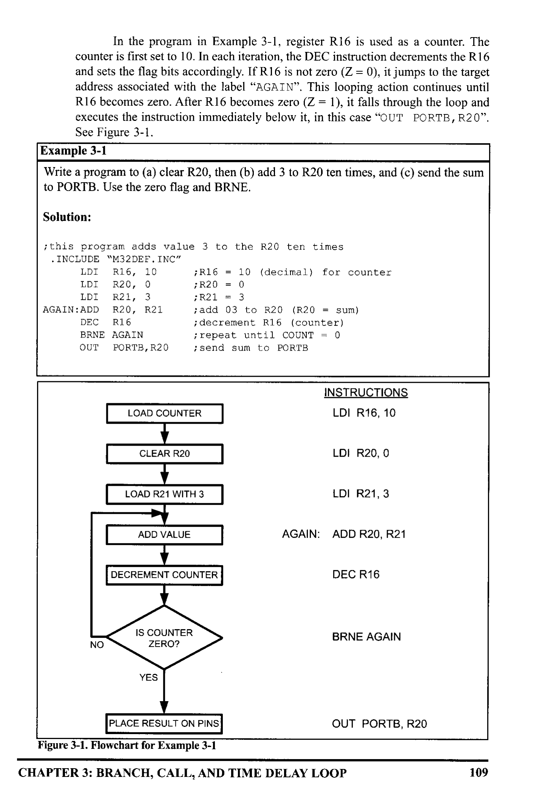
*Description*: Execution flowchart illustrating procedure steps, algorithmic logic flow, software build stages, or timing signal sequences for Figure 3-1: Flowchart for Example 3-1.

> **Figure 3-1: Flowchart for Example 3-1**

CHAPTER 3: BRANCH, CALL, AND TIME DELAY LOOP

```assembly
OUT PORTB, R20
```

109


<!-- Page 124 -->
### [PDF Page 124]

Example 3-2
What is the maximum number of times that the loop in Example 3-1 can be repeated?
Solution:
Because location R16 is an 8-bit register, it can hold a maximum of OxFF (255 deci-
mal); therefore, the loop can be repeated a maximum of 255 times. Example 3-3
shows how to solve this limitation.
Loop inside a loop
As shown in Example 3-2, the maximum count is 255. What happens if we
want to repeat an action more times than 255? To do that, we use a loop inside a
loop, which is called a nested loop. In a nested loop, we use two registers to hold
the count. See Example 3-3.
Example 3-3
Write a program to (a) load the PORTB register with the value 0x55, and (b) comple-
ment Port B 700 times.
Solution:
Because 700 is larger than 255 (the maximum capacity of any general purpose register),
we use two registers to hold the count. The following code shows how to use R20 and
R21 as a register for counters.
• INCLUDE "M32DEF. INC"
• ORG O
IDI
R16, 0x55
OUT
PORTB, R16
LDI
R20, 10
LOP _1: IDI
R21, 70
LOP _2: COM
R16

```assembly
OUT PORTB, R16
```

DEC
R21

```assembly
BRNE LOP_2
```

DEC R20

```assembly
BRNE LOP_1
; R16 = 0x55
; PORTB = 0x55
```

¡load 10 into R2O (outer 1oop count)
¡ load 70 into R21 (inner loop count)
; complement R16
¡load PORTB SFR with the complemented value
¡dec R21 (inner 100p)
¡ repeat it 70 times
¡ dec R20 (outer 100p)
¡ repeat it 10 times
In this program, R21 is used to keep the inner loop count. In the instruction "BRNE
LOP 2", whenever R21 becomes 0 it falls through and "DEC R20" is executed. The
next instructions force the CPU to load the inner count with 70 if R20 is not zero, and
the inner loop starts again. This process will continue until R20 becomes zero and the
outer loop is finished.
110


<!-- Page 125 -->
### [PDF Page 125]

LOAD R16
INSTRUCTIONS

```assembly
LDI R16, 0x55
```

LOAD PORTB

```assembly
OUT PORTB, R16
```

LOAD COUNTER 1

```assembly
LDI R2O, 10
```

LOAD COUNTER 2
LOP_1:

```assembly
LDI R21, 70
```

TOGGLE R16
LOP_2:
LOAD PORTB
DECREMENT COUNTER 2
COM R16

```assembly
OUT PORTB, R16
```

DEC R21
NO
IS COUNTER 2
ZERO?
YES
DECREMENT COUNTER 1

```assembly
BRNE LOP_2
```

DEC R20
NO
IS COUNTER 1
ZERO?
YES

```assembly
BRNE LOP_1
```

END

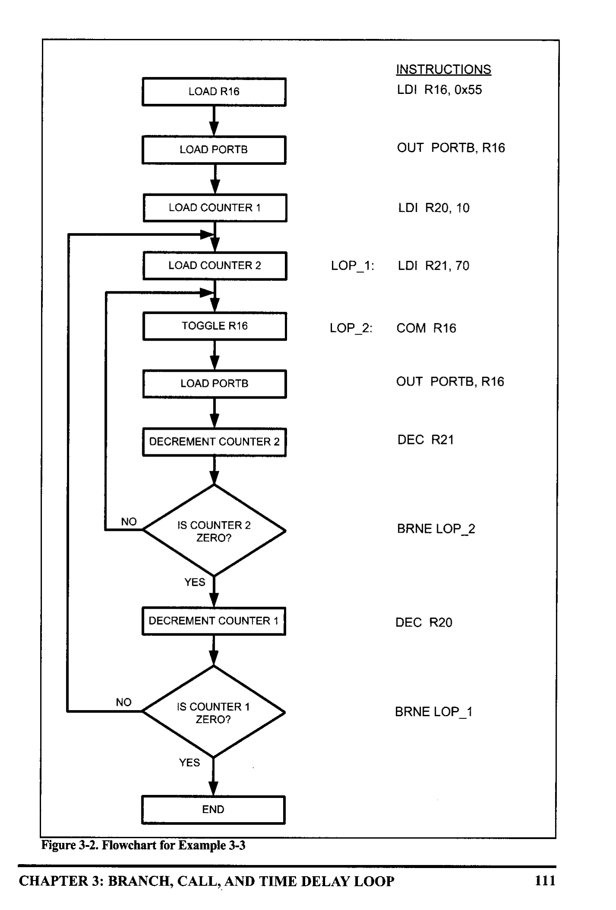
*Description*: Execution flowchart illustrating procedure steps, algorithmic logic flow, software build stages, or timing signal sequences for Figure 3-2: Flowchart for Example 3-3.

> **Figure 3-2: Flowchart for Example 3-3**

CHAPTER 3: BRANCH, CALL, AND TIME DELAY LOOP
111


<!-- Page 126 -->
### [PDF Page 126]

Looping 100,000 times
Because two registers give us a maximum value of 65,025 (255 × 255 =
65,025), we can use three registers to get up to more than 16 million (224) itera-
tions. The following code repeats an action 100,000 times:
LDI
R16, 0x55
OUT
PORTB, R16
LDI
R23, 10
IOP_3: IDI
R22,
100
LOP_ 2:LDI
R21,
100
IOP_1: COM
R16
DEC
R21
BRNE
LOP_1
DEC
R22
BRNE
IOP_2
DEC
R23

```assembly
BRNE LOP_3
```

Other conditional jumps
In Table 3-1 you see some of the
conditional branches for the AVR. More
details of each instruction are provided in
Appendix A. In Table 3-1 notice that the
instructions, such as BREQ (Branch if Z =
1) and BRLO (Branch if C = 1), jump only
if a certain condition is met. Next, we
examine some conditional branch instruc-

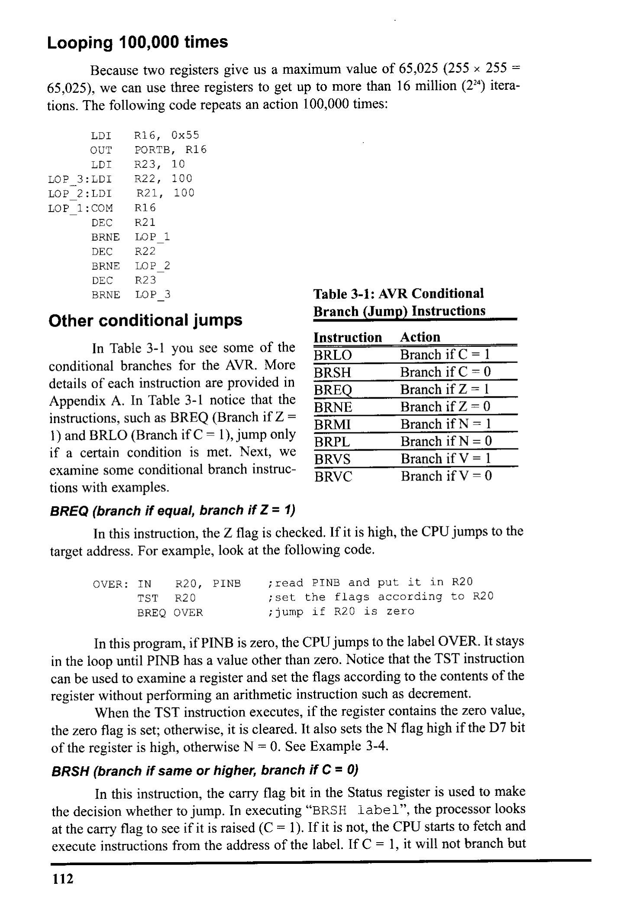
*Description*: Structured reference table listing operational parameters, instruction execution cycles, memory address mapping, or feature comparison for Table 3-1: AVR Conditional.

> **Table 3-1: AVR Conditional**

Branch (Jump) Instructions
Instruction
Action
BRLO
Branch if C = 1
BRSH
Branch if C = 0
BREQ
Branch if Z= 1
BRNE
Branch if Z= 0
BRMIR
Branch if N= 1
BRPLI
Branch if N= 0
BRVS
Branch if V = 1
BRVCR
Branch if V = 0
tions with examples.
BREQ (branch if equal, branch if Z = 1)
In this instruction, the Z flag is checked. If it is high, the CPU jumps to the
target address. For example, look at the following code.
OVER: IN
R20, PINB
TST
R20

```assembly
BREQ OVER
```

¡ read PINB and put it in R20
¡ set the flags according to R20
¡ jump if R20 is zero
In this program, if PINB is zero, the CPU jumps to the label OVER. It stays
in the loop until PINB has a value other than zero. Notice that the TST instruction
can be used to examine a register and set the flags according to the contents of the
register without performing an arithmetic instruction such as decrement.
When the TST instruction executes, if the register contains the zero value,
the zero flag is set; otherwise, it is cleared. It also sets the N flag high if the D7 bit
of the register is high, otherwise N = O. See Example 3-4.
BRSH (branch if same or higher, branch if C = 0)
In this instruction, the carry flag bit in the Status register is used to make
the decision whether to jump. In executing "BRSH label", the processor looks
at the carry flag to see if it is raised (C = 1). If it is not, the CPU starts to fetch and
execute instructions from the address of the label. If C = 1, it will not branch but
112


<!-- Page 127 -->
### [PDF Page 127]

Example 3-4
Write a program to determine if RAM location Ox200 contains the value O. If so, put
0x55 into it.
Solution:
• EQU
MYLOC=0x200
LDS
R30, MYLOC
IST
R30
BRNE
LDI
NEXT
R30, 0x55
STS
MYLOC, R30
NEXT: ...
i set the flag
; (2=1 if R30 has zero value)
i branch if R30 is not zero (Z=0)
¡put 0x55 if R30 has zero value
¡ and store a copy to loc $200
will execute the next instruction below BRSH. Study Example 3-5 to see how
BRSH is used to add numbers together when the sum is higher than SFF. Note that
there is also a "BRLO label" instruction. In the BRLO instruction, if C = 1 the
CPU jumps to the target address. We will give more examples of these instructions
in the context of some applications in Chapter 5.
The other conditional branch instructions in Table 3-1 are discussed in
Chapter 5 when arithmetic operations with signed numbers are discussed.
Example 3-5
Find the sum of the values 0x79, OxF5, and 0xE2. Put the sum into R20 (low byte) and
R21 (high byte).
Solution:
• INCLUDE "M32DEF.INC"
.ORG 0
LDI
R21, 0
LDI
R20, 0
LDI
R16, 0x79
ADD
R20, R16
BRSH N_1
INC
R21
N_1: IDI
R16, OxF5
ADD
R20, R16
BRSH
INC
N_2
R21
N_2:
LDI
R16,
0xE2

```assembly
ADD R20, R16
```

BRSH OVER
INC
R21
i clear high byte (R21 = 0)
¡clear low byte (R20 = 0)
; R20 = 0 + 0x79 = 0x79, C = 0
¡if C = 0, add next number
¡C = 1, increment (now high byte = 0)
;R20 = 0x79 + 0xF5 = 0x6E and C = 1
¡branch if C = 0
¡C = 1, increment (now high byte = 1)
OVER:
;R20 = 0x6E + 0xE2 = 0x50 and C = 1
i branch
if C = 0
;C = 1,
increment (now high byte = 2)
; now low byte = 0x50, and high byte = 02
At first
Before LDI R16,0xF5
Before LDI R16,0xE2
At the end
R21 (high byte)
$0
$0
$1
$2
R20 (low byte)
$00
$79
$6E
$50
CHAPTER 3: BRANCH, CALL, AND TIME DELAY LOOP
113


<!-- Page 128 -->
### [PDF Page 128]

All conditional branches are short jumps
It must be noted that all conditional jumps are short jumps, meaning that
the address of the target must be within 64 bytes of the program counter (PC). This
concept is discussed next.
Example 3-6
Using the following list file, verify the jump forward address calculation.
LINE
ADDRESS
Machine Mnemonic Operand
3:
+00000000:
E050
LDI
R21, 0
4:
+00000001:
E040
LDI
R20, 0
¡clear high byte (R21 = 0)
¡clear low byte (R20 = 0)
5:
+00000002:
E709
LDI
R16, 0x79
6:
+00000003:
0F40
ADD
R20, R16
; R20 = 0 + 0x79 = 0x79, C = 0
7:
+00000004:
F408
BRSH
8:
+00000005:
9543
INC
N_1
¡if C = 0, add next number
R21
;C = 1, increment (now high byte = 0)
9:
+00000006:
EF05
N_I:IDI
R16, OxF5
10:
+00000007:
0F40
ADD
R20, R16 ;R20 = $79 + $F5 = 6E and C = 1
11: +00000008:
F408
BRSH
12:
+00000009:
9553
N_2
¡branch if C = 0
INC
R21
;C = 1, increment (now high byte = 1)
@0000000A: n_2
13:
+0000000A:
14:
+0000000B:
15:
+0000000C:
16:
+0000000D:
EE02 N_2: IDI
0F40
ADD
F408
BRSH
9553
INC
R16, 0XE2
R20, R16
OVER
R21
;R20 = $6E + $E2 = $50 and C = 1
¡ branch if C = 0
;C = 1, increment (now high byte = 2)
@0000000E: over
Solution:
First notice that the BRSH instruction jumps forward. The target address for a forward
jump is calculated by adding the PC of the following instruction to the second byte of
the branch instruction. Recall that each instruction takes 2 bytes. In line 7 the instruc-
tion "BRSH N_1" has the machine code of F408. To distinguish the operand and
opcode parts, we should compare the machine code with the BRSH instruction format.
In the following, you see the format of the BRSH instruction. The bits marked by k are
1111
01kk
kkkk
k000
the operand bits while the remainder are the opcode bits. In this example the machine
code's equivalent in binary is 1111 0100 0000 1000. If we compare it with the BRSH
format, we see that the operand is 000001 and the opcode is 111101000. The 01 is the
relative address, relative to the address of the next instruction INC R21, which is
000005. By adding 000001 to 000005, the target address of the label N_1, which is
000006, is generated. Likewise for line 11, the 'BRSH N_2" instruction, and line
000015, the "BRSH OVER" instruction jumps forward because the relative value is pos-
itive.
All the conditional jump instructions, whose mnemonics begin with BR (e.g., BRNE
and BRIE), have the same instruction format, and the opcode changes from instruction
to instruction. So, we can calculate the short branch address for any of them, as we did
in this example.
114


<!-- Page 129 -->
### [PDF Page 129]

Calculating the short branch address
All conditional branches such as BRSH, BREQ, and BRNE are short
branches due to the fact that they are all 2-byte instructions. In these instructions
the opcode is 9 bits and the relative address is 7 bits. The target address is relative
to the value of the program counter. If the relative address is positive, the jump is
forward. If the relative address is negative, then the jump is backwards. The rela-
tive address can be a value from -64 to +63. To calculate the target address, the
relative address is added to the PC of the next instruction (target address = relative
address + PC). See Example 3-6. We do the same thing for the backward branch,
although the second byte is negative. That is, we add it to the PC value of the next
instruction. See Example 3-7.
15
PC
+ 1
+
15
10 9
32
Opcode
K

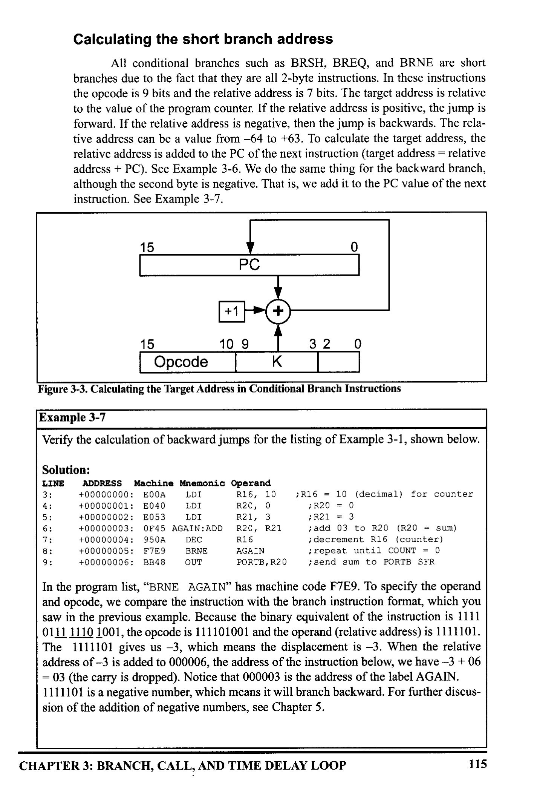
*Description*: Technical diagram and schematic illustration detailing hardware connection topology, signal routing, and circuit operation for Figure 3-3: Calculating the Target Address in Conditional Branch Instructions.

> **Figure 3-3: Calculating the Target Address in Conditional Branch Instructions**

Example 3-7
Verify the calculation of backward jumps for the listing of Example 3-1, shown below.
Solution:
LINE
ADDRESS Machine Mnemonic Operand
+00000000: E00A
IDI
R16, 10
+00000001: E040
LDI
R20, 0
+00000002: E053
LDI
R21, 3
+00000003: 0F45 AGAIN: ADD
R20, R21
7:
8:
9:
+00000004: 950A
DEC
R16
+00000005: F7E9
BRNE
AGAIN
+00000006: BB48
OUT
PORTB, R20
;R16 = 10 (decimal) for counter
; R20 = 0
; R21 = 3
¡ add 03 to R20 (B20 = sum)
; decrement R16 (counter)
; repeat until COUNT = 0
; send sum to PORTB SFR
In the program list, "BRNE AGAIN" has machine code F7E9. To specify the operand
and opcode, we compare the instruction with the branch instruction format, which you
saw in the previous example. Because the binary equivalent of the instruction is 1111
0111 1110 1001, the opcode is 111101001 and the operand (relative address) is 1111101.
The 1111101 gives us -3, which means the displacement is - 3. When the relative
address of -3 is added to 000006, the address of the instruction below, we have -3 + 06
= 03 (the carry is dropped). Notice that 000003 is the address of the label AGAIN.
1111101 is a negative number, which means it will branch backward. For further discus-
sion of the addition of negative numbers, see Chapter 5.
CHAPTER 3: BRANCH, CALL, AND TIME DELAY LOOP
115


<!-- Page 130 -->
### [PDF Page 130]

You might ask why we add the relative address to the address of the next
instruction. (Why don't we add the relative address to the address of the current
instruction?) Before an instruction is executed, it should be fetched. So, the branch
instructions are executed after they are fetched. The PC points to the instruction
that should be fetched next. So, when the branch instructions are executed, the PC
is pointing to the next instruction. That is why we add the relative address to the
address of the next instruction. We will discuss the execution of instructions in the
last section of this chapter.
Unconditional branch instruction
The unconditional branch is a jump in which control is transferred uncon-
ditionally to the target location. In the AVR there are three unconditional branch-
es: JMP (jump), RJMP (relative jump), and IJMP (indirect jump). Deciding which
one to use depends on the target address. Each instruction is explained next.
JMP (JMP is a long jump)

```assembly
JMP is an unconditional jump that can go to any memory location in the
```

4M (word) address space of the AVR. It is a 4-byte (32-bit) instruction in which
10 bits are used for the opcode, and the other 22 bits represent the 22-bit address
of the target location. The 22-bit target address allows a jump to 4M (words) of
memory locations from 000000 to $3FFFFF. So, it can cover the entire address
space. See Figure 3-4.
48 bit—s ‹
-8 bite +8 bit—
*4
-8 bit-
100101021|K20 K1110K16|K15 .. ka|k» .. ko
0≤k < 4M
Program Memory
0x0000
31
Jump
instruction
15
21
16 LSB
22
bits
of
PC
0
0
/ FlashEnd

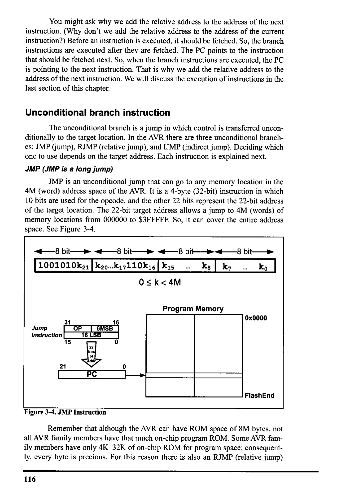
*Description*: Technical diagram and schematic illustration detailing hardware connection topology, signal routing, and circuit operation for Figure 3-4: JMP Instruction.

> **Figure 3-4: JMP Instruction**

Remember that although the AVR can have ROM space of 8M bytes, not
all AVR family members have that much on-chip program ROM. Some AVR fam-
ily members have only 4K-32K of on-chip ROM for program space; consequent-
ly, every byte is precious. For this reason there is also an RJMP (relative jump)
116


<!-- Page 131 -->
### [PDF Page 131]

instruction, which is a 2-byte instruction as opposed to the 4-byte JMP instruction.
This can save some bytes of memory in many applications where ROM memory
space is in short supply. RJMP is discussed next.
RJMP (relative jump)
In this 2-byte (16-bit) instruction, the first 4 bits are the opcode and the rest
(lower 12 bits) is the relative address of the target location. The relative address
range of 000 - SFFF is divided into forward and backward jumps; that is, within
-2048 to +2047 words of memory relative to the address of the current PC (pro-
gram counter). If the jump is forward, then the relative address is positive. If the
jump is backward, then the relative address is negative. In this regard, RJMP is like
the conditional branch instructions except that 12 bits are used for the offset
address instead of 7. This is shown in detail in Figure 3-5.
-2048
1100 kkkk
kkkk
kkkk
-2048 ≤ n ≤ 2047
Program
Counter
Range
+2047


*Description*: Technical diagram and schematic illustration detailing hardware connection topology, signal routing, and circuit operation for Figure 3-5: RJMP (Relative Jump) Instruction Address Range.

> **Figure 3-5: RJMP (Relative Jump) Instruction Address Range**

Notice that this is a 2-byte instruction, and is preferred over the JMP
because it takes less ROM space.
IJMP (indirect jump)
IMP is a 2-byte instruction. When the instruction executes, the PC is
loaded with the contents of the Z register, so it jumps to the address pointed to by
the Z register. As you will see in Chapter 6, Z is a 2-byte register, so IJMP can
jump within the lowest 64K words of the program memory.
15
000000
Z register
21
16 15
_...
PC
PC(15:0) * Z(15:0)
PC(21:16) +0

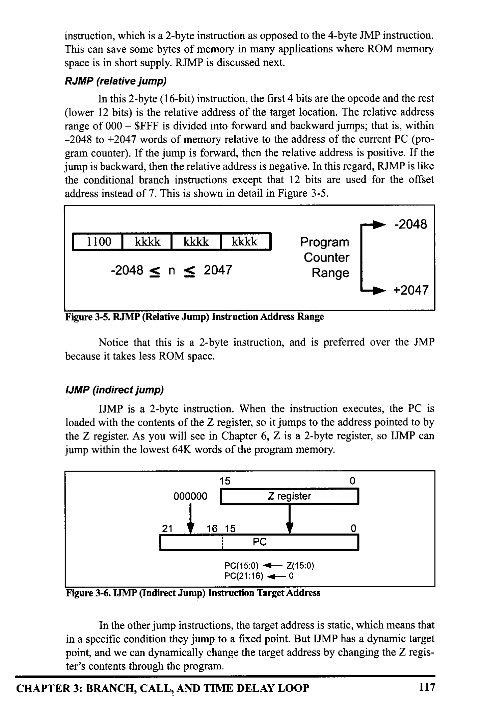
*Description*: Technical diagram and schematic illustration detailing hardware connection topology, signal routing, and circuit operation for Figure 3-6: IJMP (Indirect Jump) Instruction Target Address.

> **Figure 3-6: IJMP (Indirect Jump) Instruction Target Address**

0
In the other jump instructions, the target address is static, which means that
in a specific condition they jump to a fixed point. But IJMP has a dynamic target
point, and we can dynamically change the target address by changing the Z regis-
ter's contents through the program.
CHAPTER 3: BRANCH, CALL, AND TIME DELAY LOOP
117


<!-- Page 132 -->
### [PDF Page 132]


### Review Questions

1. The mnemonic BRNE stands for
2. True or false. "BRNE BACK" makes its decision based on the last instruction
affecting the Z flag.
3. "BRNE
HERE" is a
-byte instruction.
4. In "BREQ NEXT"
", which register's content is checked to see if it is zero?
S. JMP is an) _ -byte instruction.

## SECTION 3.2: CALL INSTRUCTIONS AND STACK

Another control transfer instruction is the CALL instruction, which is used
to call a subroutine. Subroutines are often used to perform tasks that need to be
performed frequently. This makes a program more structured in addition to saving
memory space. In the AVR there are four instructions for the call subroutine:
CALL (long call) RCALL (relative call), ICALL (indirect call to Z), and EICALL
(extended indirect call to Z). The choice of which one to use depends on the tar-
get address. Each instruction is explained next.
CALL
In this 4-byte (32-bit) instruction, 10 bits are used for the opcode and the
other 22 bits, k21-kO, are used for the address of the target subroutine, just as in
the JMP instruction. Therefore, CALL can be used to call subroutines located any-
where within the 4M address space of 000000-$3FFFFF for the AVR, as shown in

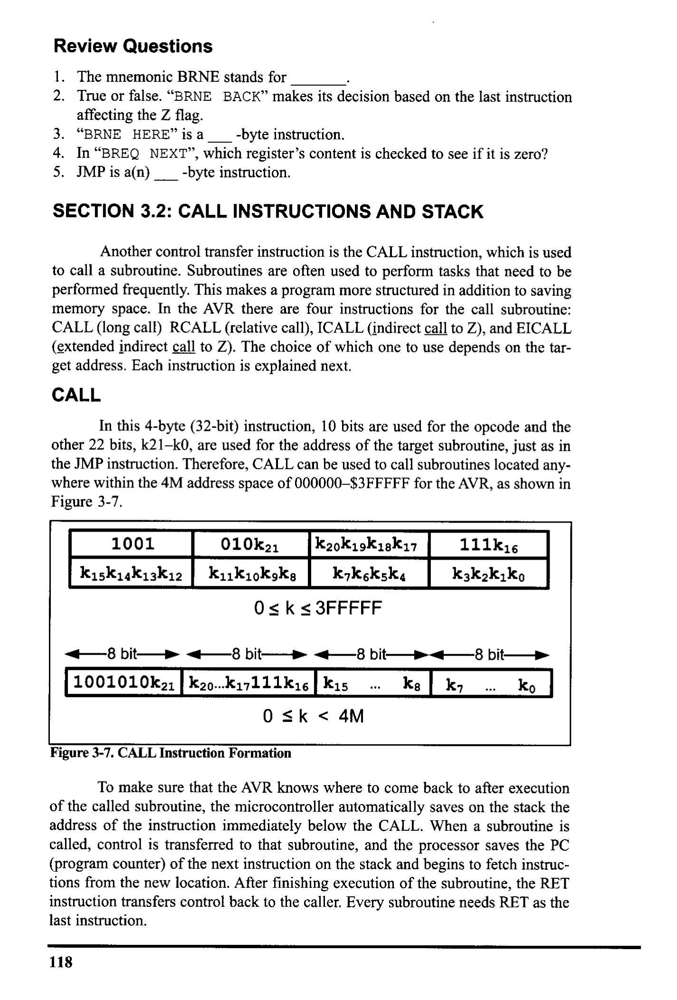
*Description*: Technical diagram and schematic illustration detailing hardware connection topology, signal routing, and circuit operation for Figure 3-7.

> **Figure 3-7**

1001
K15k14K13K12
010k21
Kz0kıgk18K17
K11k1okaks
0 ≤ k ≤ 3FFFFF
111k16
Kzkzkıko
48 bit—
1001010k21
-8 bIt—
• 8 bit-
K20….K17111K16
K15 ...
0 ≤ k < 4M
Ks
-8 bit→
kr .
ko


*Description*: Technical diagram and schematic illustration detailing hardware connection topology, signal routing, and circuit operation for Figure 3-7: CALL Instruction Formation.

> **Figure 3-7: CALL Instruction Formation**

To make sure that the AVR knows where to come back to after execution
of the called subroutine, the microcontroller automatically saves on the stack the
address of the instruction immediately below the CALL. When a subroutine is
called, control is transferred to that subroutine, and the processor saves the PC
(program counter) of the next instruction on the stack and begins to fetch instruc-
tions from the new location. After finishing execution of the subroutine, the RET
instruction transfers control back to the caller. Every subroutine needs RET as the
last instruction.
118


<!-- Page 133 -->
### [PDF Page 133]

Stack and stack pointer in AVR
The stack is a section of RAM used by the CPU to store information tem-
porarily. This information could be data or an address. The CPU needs this storage
area because there are only a limited number of registers.
How stacks are accessed in the AVR
If the stack is a section of RAM, there must be a register inside the CPU to
point to it. The register used to access the stack is called the SP (stack pointer) reg-
ister.
In I/0 memory space, there are two registers named SPL (the low byte of
the SP) and SPH (the high byte of the SP). The SP is implemented as two regis-
ters. The SPH register presents the high byte of the SP while the SPL register pres-
ents the lower byte.
-8-bit-
SP:
SPH
—8-bit-
SPL

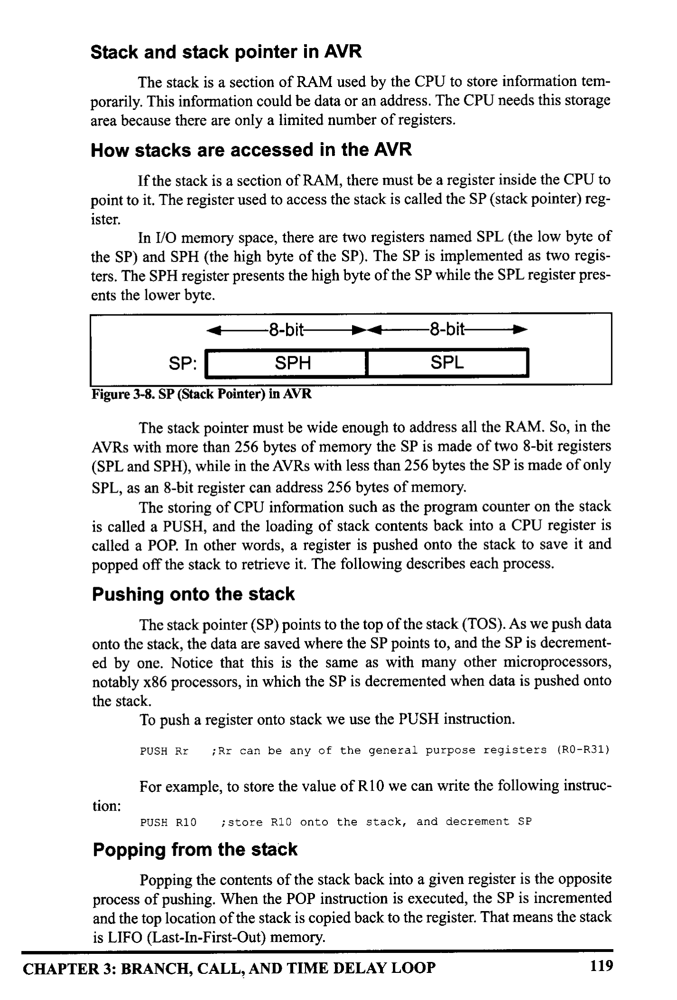
*Description*: Technical diagram and schematic illustration detailing hardware connection topology, signal routing, and circuit operation for Figure 3-8: SP (Stack Pointer) in AVR.

> **Figure 3-8: SP (Stack Pointer) in AVR**

The stack pointer must be wide enough to address all the RAM. So, in the
AVRs with more than 256 bytes of memory the SP is made of two 8-bit registers
(SPL and SPH), while in the AVRs with less than 256 bytes the SP is made of only
SPL, as an 8-bit register can address 256 bytes of memory.
The storing of CPU information such as the program counter on the stack
is called a PUSH, and the loading of stack contents back into a CPU register is
called a POP. In other words, a register is pushed onto the stack to save it and
popped off the stack to retrieve it. The following describes each process.
Pushing onto the stack
The stack pointer (SP) points to the top of the stack (TOS). As we push data
onto the stack, the data are saved where the SP points to, and the SP is decrement-
ed by one. Notice that this is the same as with many other microprocessors,
notably x86 processors, in which the SP is decremented when data is pushed onto
the stack.
To push a register onto stack we use the PUSH instruction.
¡Rr can be any of the general purpose registers (RO-R31)

```assembly
PUSH Rr
```

For example, to store the value of R10 we can write the following instruc-
tion:

```assembly
PUSH R10
```

¡store R10 onto the stack, and decrement SP
Popping from the stack
Popping the contents of the stack back into a given register is the opposite
process of pushing. When the POP instruction is executed, the SP is incremented
and the top location of the stack is copied back to the register. That means the stack
is LIFO (Last-In-First-Out) memory.
CHAPTER 3: BRANCH, CALL, AND TIME DELAY LOOP
119


<!-- Page 134 -->
### [PDF Page 134]

To retrieve a byte of data from stack we can use the POP instruction.

```assembly
POP Rr
```

¡RI can be any of the general purpose registers (RO-R31)
For example, the following instruction pops from the top of stack and
copies to R10:

```assembly
POP R16
```

: increment SP, and then load the top of stack to R10
Example 3-8
This example shows the stack and stack pointer and the registers used after the execu-
tion of each instruction.
• INCLUDE "M32DEF.INC"
• ORG O
¡initialize the SP to point to the last location of RAM (RAMEND)
IDI R16, HIGH (RAMEND)
¡load SPH
OUT
SPH,
LDI
R16
R16, IOW (RAMEND)
; load SPL
OUT
SPL, R16
Contents of some
LDI
R31, O
IDI
R20, 0x21
After the
execution of
of the registers
Stack
R20| R22 R31| SP

```assembly
LDI R22, 0x66
PUSH R20
```

PUSH

```assembly
OUT SPL,R16
```

$0
$0
5085F
R22
850l
85E
85F
SP
LDI
LDI
POP
POP
R20, 0
R22,
R22
R31

```assembly
LDI R22, 0x66
```

$21 $66
$085F
85D
B5E
85F

```assembly
PUSH R20
```

$21 $66
$085E
Solution:

```assembly
PUSH R22
```

$21 $66
$085D
85d
85E
85F 21
85D
ISP
85E 66
85F 21

```assembly
LDI R22, O
```

$0
$0
0
$085D

```assembly
POP R22
```

$0
$66
$085E

```assembly
POP R31
```

$21 $085F
85D
ISP
85E 66
85F 21
850l
B5E
SP
85F21
850
85E
85F
1SF
120


<!-- Page 135 -->
### [PDF Page 135]

Initializing the stack pointer
When the AVR is powered up, the SP register contains the value 0, which
is the address of RO. Therefore, we must initialize the SP at the beginning of the
program so that it points to somewhere in the internal SRAM. In AVR, the stack
grows from higher memory location to lower memory location (when we push
onto the stack, the SP decrements). So, it is common to initialize the SP to the
uppermost memory location.
Different AVRs have different amounts of RAM. In the AVR assembler
RAMEND represents the address of the last RAM location. So, if we want to ini-
tialize the SP so that it points to the last memory location, we can simply load
RAMEND into the SP. Notice that SP is made of two registers, SPH and SPL. So,
we load the high byte of RAMEND into SPH, and the low byte of RAMEND into
the SPL.
Example 3-8 shows how to initialize the SP and use the PUSH and POP
instructions. In the example you can see how the stack changes when the PUSH
and POP instructions are executed.
For more information about RAMEND, LOW, and HIGH, see Section 6-1.

```assembly
CALL instruction and the role of the stack
```

When a subroutine is called, the processor first saves the address of the
instruction just below the CALL instruction on the stack, and then transfers con-
trol to that subroutine. This is how the CPU knows where to resume when it
returns from the called subroutine.
For the AVRs whose program counter is not longer than 16 bits (e.g.,
ATmega128, ATmega32), the value of the program counter is broken into 2 bytes.
The higher byte is pushed onto the stack first, and then the lower byte is pushed.
For the AVRs whose program counters are longer than 16 bits but shorter
than 24 bits, the value of the program counter is broken up into 3 bytes. The high-
est byte is pushed first, then the middle byte is pushed, and finally the lowest byte
is pushed. So, in both cases, the higher bytes are pushed first.

```assembly
RET instruction and the role of the stack
```

When the RET instruction at the end of the subroutine is executed, the top
location of the stack is copied back to the program counter and the stack pointer is
incremented. When the CALL instruction is executed, the address of the instruc-
tion below the CALL instruction is pushed onto the stack; so, when the execution
of the function finishes and RET is executed, the address of the instruction below
the CALL is loaded into the PC, and the instruction below the CALL instruction
is executed.
To understand the role of the stack in call instruction and returning, exam-
ine the contents of the stack and stack pointer (see Examples 3-9 and
Example 3-10). The following points should be noted for the program in
Example 3-9:
1. Notice the DELAY subroutine. After the first "CALL DELAY" is executed, the
address of the instruction right below it, "IDI R16, OXAA", is pushed onto
CHAPTER 3: BRANCH, CALL, AND TIME DELAY LOOP
121


<!-- Page 136 -->
### [PDF Page 136]

the stack, and the AVR starts to execute instructions at address 0x300.
2. In the DELAY subroutine, the counter R20 is set to 255 (R20 = OxFF); there-
fore, the loop is repeated 255 times. When R20 becomes O, control falls to the

```assembly
RET instruction, which pops the address from the top of the stack into the pro-
```

gram counter and resumes executing the instructions after the CALL.
Example 3-9
Toggle all the bits of Port B by sending to it the values $55 and SAA continuously. Put
a time delay between each issuing of data to Port B.
Solution:
• INCLUDE "M32DEF. INC"
• ORG O

```assembly
LDI R16, HIGH (RAMEND)
OUT SPH, R16
LDI R16, LOW (RAMEND)
OUT SPL, R16
; load SPH
; load SPL
BACK:
```

LDI
R16, 0x55
¡load R16 with 0x55
OUT
PORTB, R16
i send 55H to port B

```assembly
CALL DELAY
```

¡time delay
LDI
R16, OXAA
iload R16 with OxAA

```assembly
OUT PORTB, R16
```

i send OxAA to port B

```assembly
CALL DELAY
```

¡time delay
RIMP BACK
i keep doing this indefinitely
this is the delay subroutine
•ORG 0x300
; put time delay at address 0x300
DELAY:
IDI
R2O, OXFF
; R20 = 255, the counter
AGAIN:
NOP
¡ no operation wastes clock cycles
NOP
DEC R2O

```assembly
BRNE AGAIN
```

RET
¡ repeat until R20 becomes O
¡ return to caller
The amount of time delay in Example 3-9 depends on the frequency of the
AVR. How to calculate the exact time will be explained in the last section of this
chapter.
The upper limit of the stack
As mentioned earlier, we can define the stack anywhere in the general pur-
pose memory. So, in the AVR the stack can be as big as its RAM. Note that we
must not define the stack in the register memory, nor in the I/O memory. So, the
SP must be set to point above 0x60.
In AVR, the stack is used for calls and interrupts. We must remember that
upon calling a subroutine, the stack keeps track of where the CPU should return
after completing the subroutine. For this reason, we must be very careful when
manipulating the stack contents.
122


<!-- Page 137 -->
### [PDF Page 137]

Example 3-10
Analyze the stack for the CALL instructions in the following program.
+00000000:
+00000001:
+00000002:
+00000003:
• INCLUDE
: "M32DEF.INC"
. ORG O
LDI
R16, HIGH (RAMEND)

```assembly
OUT SPH, R16
```

IDI R16, LOW (RAMEND)

```assembly
OUT SPL, R16
```

¡initialize SP
BACK:
+00000004:
+00000005:
+00000006:
+00000008:
+00000009:
+0000000A:
+0000000C:
IDI
R16,0x55
¡load R16 with 0x55
OUT
PORTB, R16
i send 55H to port B
CALL
DELAY
¡time delay
LDI
R16, OXAA
¡load R16 with OxAn
OUT
PORTB, R16
isend OxAA to port B

```assembly
CALL DELAY
```

¡ time delay

```assembly
RJMP BACK
```

¡keep doing this indefinitely
--this is the delay subroutine
•ORG 0x300
¡ put time delay at address 0x300
DELAY:
+00000300:
LDI
R2O, OXFF
;R20 = 255, the counter
AGAIN:
+00000301:
NO P
¡no operation wastes clock cycles
+00000302:
NOP
+00000303:
DEC
R20
+00000304:

```assembly
BRNE AGAIN
```

+00000305:
RET
¡ repeat until R20 becomes O
¡ return to caller
Solution:
When the first CALL is executed, the address of the instruction "IDI R16, OXAA"
is saved (pushed) onto the stack. The last instruction of the called subroutine must be
a RET instruction, which directs the CPU to pop the contents of the top location of the
stack into the PC and resume executing at address 0008. The diagrams show the stack
frame after the CALL and RET instructions.
Before the
First CALL
85C
85D
85E
85F
After the
first CALL
After RET
85C
After the
second CALL
850
85D
85E
85F
00
After RET
85C
85D
85E
85F
Habitte
SP= 0x85F
SP=0x85D
SP= 0x85F
SP=0X85D
SP= 0x85F
CHAPTER 3: BRANCH, CALL, AND TIME DELAY LOOP
123


<!-- Page 138 -->
### [PDF Page 138]

Calling many subroutines from the main program
In Assembly language programming, it is common to have one main pro-
gram and many subroutines that are called from the main program. See Figure 3-9.
This allows you to make each subroutine into a separate module. Each module can
be tested separately and then brought together with the main program. More
importantly, in a large program the modules can be assigned to different program-
mers in order to shorten development time.
It needs to be emphasized that in using CALL, the target address of the
subroutine can be anywhere within the 4M (word) memory space of the AVR. See
Example 3-11. This is not the case for the RCALL instruction, which is explained
next.
• INCLUDE "M32DEF.INC"
¡Modify for your chip
¡ MAIN program calling subroutines
• ORG O
MAIN:

```assembly
CALL SUBR_1
```

CALL
SUBR_2
CALL
SUBR_3

```assembly
CALL SUBR 4
HERE:
```

RUMP
HERE
-end of MAIN
i stay here
SUBR 1:
•...
...
RET
end of subroutine 1
.•.
•••.
RET
end of subroutine 2
;
SUBR_3:
:..
RET
-end of subroutine 3
SUBR_4:
....
..•.
RET
;
end of subroutine 4

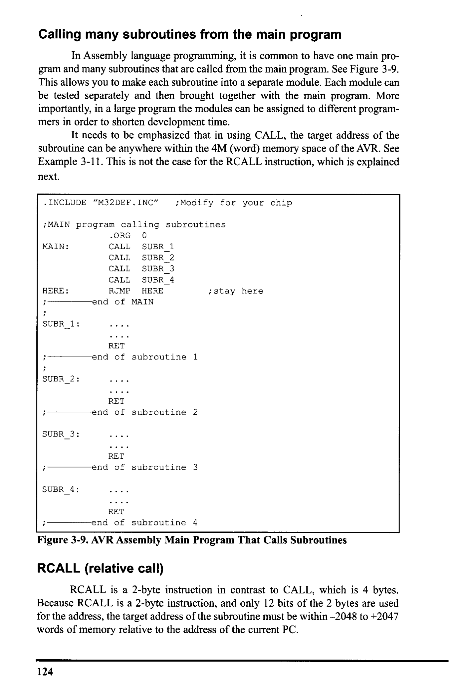
*Description*: Technical diagram and schematic illustration detailing hardware connection topology, signal routing, and circuit operation for Figure 3-9: AVR Assembly Main Program That Calls Subroutines.

> **Figure 3-9: AVR Assembly Main Program That Calls Subroutines**

RCALL (relative call)

```assembly
RCALL is a 2-byte instruction in contrast to CALL, which is 4 bytes.
```

Because RCALL is a 2-byte instruction, and only 12 bits of the 2 bytes are used
for the address, the target address of the subroutine must be within -2048 to +2047
words of memory relative to the address of the current PC.
124


<!-- Page 139 -->
### [PDF Page 139]

Example 3-11
Write a program to count up from 00 to SFF and send the count to Port B. Use one

```assembly
CALL subroutine for sending the data to Port B and another one for time delay. Put a
```

time delay between each issuing of data to Port B.
Solution:
+00000000:
+00000001:
+00000002:
+00000003:
• INCLUDE "M32DEF. INC"
DEF COUNT=R2
ORG O
IDI R16, HIGH (RAMEND)

```assembly
OUT SPH, R16
LDI R16, LOW (RAMEND)
```

+00000004:
¡ initialize stack pointer
¡ count = 0
+00000005:
+00000007:
+00000008:
+00000009:
+0000000A:
+0000000C:
+00000300:
+00000301:
+00000302:
+00000303:
+00000304:
+00000305:
+00000306:
+00000307:

```assembly
LDI COUNT, O
BACK:
CALL DISPLAY
RJMP BACK
;-----Increment and put it in PORTE
DISPLAY:
```

INC COUNT
; increment count

```assembly
OUT PORTB, COUNT
```

i send it to PORTE

```assembly
CALL DELAY
```

RET
¡ return to caller
i-----This is the delay subroutine
•ORG 0x300
¡put time delay at address 0x300
DELAY:

```assembly
LDI R16, OXFF
;R16 = 255
AGAIN:
```

NOP
NOP
NOP
DEC R16

```assembly
BRNE AGAIN
```

RET
¡ repeat until R16 becomes (
¡ return to caller
Before CALL
Display
After CALL
Display
After CALL
Delay
After Delay
RET
85B
850
85D
85E
85F
85B
850
85D
85E
SP 85F
07
00
85B
85C
«5P 850
85E
85F
00
07
00
18P 858
850
85D
85E
85F
07
00
After Display
85B
85C
-SP 85D
85E
85F
SP= 0x85F
SP=0x85D
SP= 0x85B
SP=0x85D
SP= 0x85F
There is no difference between RCALL and CALL in terms of saving the
program counter on the stack or the function of the RET instruction. The only dif-
ference is that the target address for CALL can be anywhere within the 4M address
space of the AVR while the target address of RCALL must be within a 4K range.
CHAPTER 3: BRANCH, CALL, AND TIME DELAY LOOP
125


<!-- Page 140 -->
### [PDF Page 140]

In many variations of the AVR marketed by Atmel Corporation, on-chip ROM is
as low as 4K. In such cases, the use of RCALL instead of CALL can save a num-
ber of bytes of program ROM space.
Of course, in addition to using compact instructions, we can program effi-
ciently by having a detailed knowledge of all the instructions supported by a given
microcontroller, and using them wisely. Look at Examples 3-12 and 3-13.
Example 3-12
Rewrite the main part of Example 3-9 as efficiently as you can.
Solution:
• INCLUDE "M32DEF.INC"
• ORG O

```assembly
LDI R16, HIGH (RAMEND)
OUT SPH, R16
LDI R16, LOW (RAMEND)
OUT SPL, R16
```

¡initialize stack pointer
IDI R16, 0x55
iload R16 with 55H
BACK:
COM R16
i complement R16

```assembly
OUT PORTB, R16
```

¡load port B SFR

```assembly
RCALL DELAY
```

¡time delay

```assembly
RJMP BACK
```

i keep doing this indefinitely
--this is the delay subroutine
DELAY:

```assembly
LDI R2O, OXFF
AGAIN:
```

NOP
i no operation wastes clock cycles
NOP
DEC R20

```assembly
BRNE AGAIN
```

¡ repeat until R20 becomes O
RET
Example 3-13
A developer is using the AVR microcontroller chip for a product. This chip has only 4K
of on-chip flash ROM. Which of the instructions, CALL or RCALL, is more useful in
programming this chip?
Solution:
The RCALL instruction is more useful because it is a 2-byte instruction. It saves two
bytes each time the call instruction is used. However, we must use CALL if the target
address is beyond the 2K boundary.
ICALL (indirect call)
In this 2-byte (16-bit) instruction, the Z register specifies the target address.
When the instruction is executed, the address of the next instruction is pushed into
the stack (like CALL and RCALL) and the program counter is loaded with the
contents of the Z register. So, the Z register should contain the address of a func-
tion when the ICALL instruction is executed. Because the Z register is 16 bits
126


<!-- Page 141 -->
### [PDF Page 141]

wide, the ICALL instruction can call the subroutines that are within the lowest
64K words of the program memory. (The target address calculation in ICALL is
the same as for the IMP instruction.) See Figure 3-10.
15
0
000000
Z register
21
16 15
0
PC
PC(15:0) 4 Z(15:0)
PC|21:16) ÷ 0

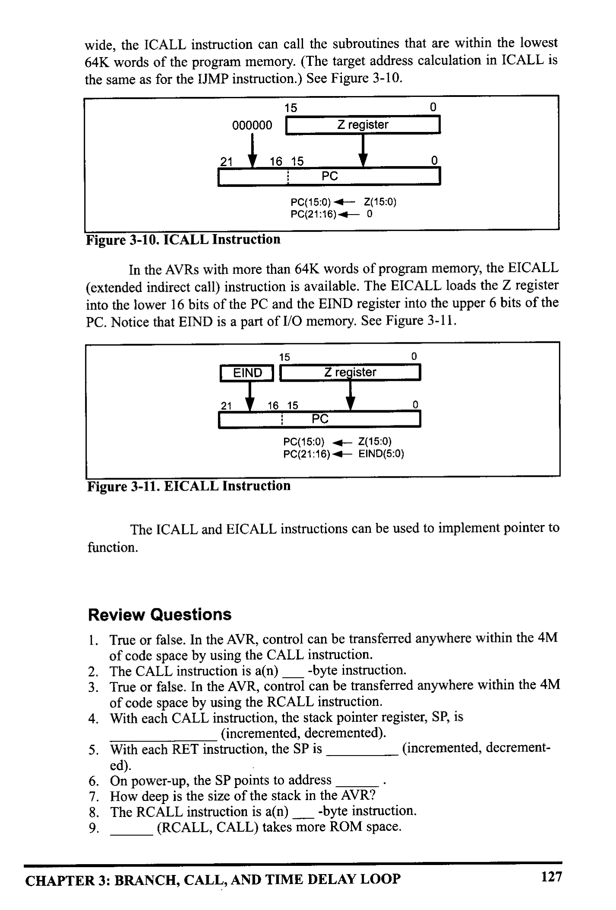
*Description*: Technical diagram and schematic illustration detailing hardware connection topology, signal routing, and circuit operation for Figure 3-10: ICALL Instruction.

> **Figure 3-10: ICALL Instruction**

In the AVRs with more than 64K words of program memory, the EICALL
(extended indirect call) instruction is available. The EICALL loads the Z register
into the lower 16 bits of the PC and the EIND register into the upper 6 bits of the
PC. Notice that EIND is a part of I/O memory. See Figure 3-11.
15
EIND
register
21
16,15
PC
C(15:0) +- Z(15:0)
C(21:16) 4— EIND(5:0
0


*Description*: Technical diagram and schematic illustration detailing hardware connection topology, signal routing, and circuit operation for Figure 3-11: EICALL Instruction.

> **Figure 3-11: EICALL Instruction**

The ICALL and EICALL instructions can be used to implement pointer to
function.

### Review Questions

1. True or false. In the AVR, control can be transferred anywhere within the 4M
of code space by using the CALL instruction.
2. The CALL instruction is a(n) _
_-byte instruction.
True or false. In the AVR, control can be transferred anywhere within the 4M
of code space by using the RCALL instruction.
4. With each CALL instruction, the stack pointer register, SP, is
(incremented, decremented).
3. With each RET instruction, the SP is
(incremented, decrement-
ed).
6. On power-up, the SP points to address
". How deep is the size of the stack in the AVR?
8. The RCALL instruction is a(n)
-byte instruction.
(RCALL, CALL) takes more ROM space.
CHAPTER 3: BRANCH, CALL, AND TIME DELAY LOOP
127


<!-- Page 142 -->
### [PDF Page 142]


## SECTION 3.3: AVR TIME DELAY AND INSTRUCTION PIPELINE

In the last section we used the DELAY subroutine. In this section we dis-
cuss how to generate various time delays and calculate exact delays for the AVR.
We will also discuss instruction pipelining and its impact on execution time.
Delay calculation for the AVR
In creating a time delay using Assembly language instructions, one must be
mindful of two factors that can affect the accuracy of the delay:
1. The crystal frequency: The frequency of the crystal oscillator connected to the
XTALI and XTAL2 input pins is one factor in the time delay calculation. The
duration of the clock period for the instruction cycle is a function of this crys-
tal frequency.
2. The AVR design: Since the 1970s, both the field of IC technology and the
architectural design of microprocessors have seen great advancements. Due to
the limitations of IC technology and limited CPU design experience for many
years, the instruction cycle duration was longer. Advances in both IC technol-
ogy and CPU design in the 1980s and 1990s have made the single instruction
cycle a common feature of many microcontrollers. Indeed, one way to increase
performance without losing code compatibility with the older generation of a
given family is to reduce the number of instruction cycles it takes to execute
an instruction. One might wonder how microprocessors such as AVR are able
to execute an instruction in one cycle. There are three ways to do that: (a) Use
Harvard architecture to get the maximum amount of code and data into the
CPU, (b) use RISC architecture features such as fixed-size instructions, and
finally (c) use pipelining to overlap fetching and execution of instructions. We
examined the Harvard and RISC architectures in Chapter 2. Next, we discuss
pipelining.
Pipelining
In early microprocessors such as the 8085, the CPU could either fetch or
execute at a given time. In other words, the CPU had to fetch an instruction from
memory, then execute it; and then fetch the next instruction, execute it, and so on.
The idea of pipelining in its simplest form is to allow the CPU to fetch and exe-
cute at the same time, as shown in Figure 3-12. (An instruction fetches while the
Non-pipeline
fetch 1
exec 1
fetch 2
exec 2
fetch 3
exec 3
Pipeline
fetch 1
exec 1
fetch 2
exec 2
fetch 3
exec 3
fetch 4
T1
T2

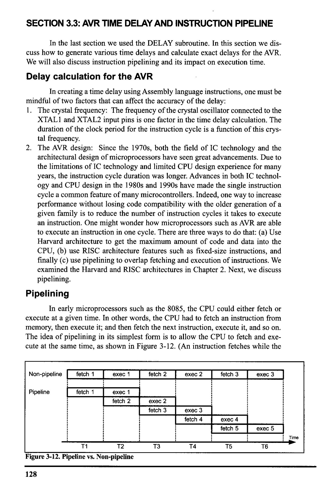
*Description*: Technical diagram and schematic illustration detailing hardware connection topology, signal routing, and circuit operation for Figure 3-12: Pipeline vs. Non-pipeline.

> **Figure 3-12: Pipeline vs. Non-pipeline**

128
T3
T4
exec 4
fetch 5
T5
exec 5
T6
Time


<!-- Page 143 -->
### [PDF Page 143]

previous instruction executes.)
We can use a pipeline to speed up execution of instructions. In pipelining,
the process of executing instructions is split into small steps that are all executed
in parallel. In this way, the execution of many instructions is overlapped. One lim-
itation of pipelining is that the speed of execution is limited to the slowest stage of
the pipeline. Compare this to making pizza. You can split the process of making
pizza into many stages, such as flattening the dough, putting on the toppings, and
baking, but the process is limited to the slowest stage, baking, no matter how fast
the rest of the stages are performed. What happens if we use two or three ovens for
baking pizzas to speed up the process? This may work for making pizza but not
for executing programs, because in the execution of instructions we must make
sure that the sequence of instructions is kept intact and that there is no out-of-step
execution.
Stage 1
READ OPERANDS
Stage 2
PROCESS
Stage 3
WRITE BACK

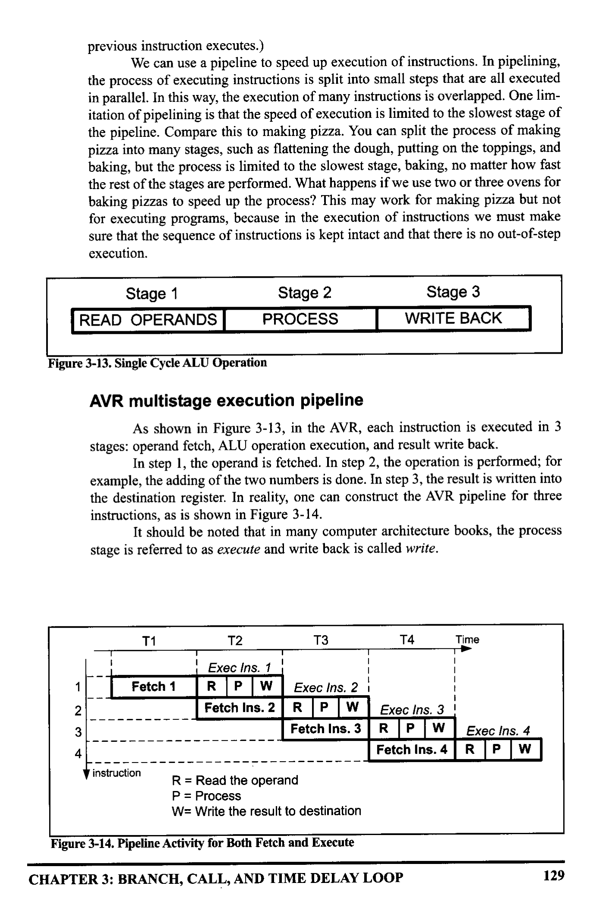
*Description*: Technical diagram and schematic illustration detailing hardware connection topology, signal routing, and circuit operation for Figure 3-13: Single Cycle ALU Operation.

> **Figure 3-13: Single Cycle ALU Operation**

AVR multistage execution pipeline
As shown in Figure 3-13, in the AVR, each instruction is executed in 3
stages: operand fetch, ALU operation execution, and result write back.
In step 1, the operand is fetched. In step 2, the operation is performed; for
example, the adding of the two numbers is done. In step 3, the result is written into
the destination register. In reality, one can construct the AVR pipeline for three
instructions, as is shown in Figure 3-14.
It should be noted that in many computer architecture books, the process
stage is referred to as execute and write back is called write.
T1
Fetch 1
T2
Exec Ins. 1
R
• P
W
Fetch Ins. 2
1
3
4
T3
T4
Exec Ins. 2 !
R P W
Exec Ins. 3 i
Fetch Ins. 3
R P W
Fetch Ins. 4
Time
Exec Ins. 4
R P W
y instruction
R = Read the operand
P= Process
W= Write the result to destination


*Description*: Technical diagram and schematic illustration detailing hardware connection topology, signal routing, and circuit operation for Figure 3-14: Pipeline Activity for Both Fetch and Execute.

> **Figure 3-14: Pipeline Activity for Both Fetch and Execute**

CHAPTER 3: BRANCH, CALL, AND TIME DELAY LOOP
129


<!-- Page 144 -->
### [PDF Page 144]

Instruction cycle time for the AVR
It takes a certain amount of time for the CPU to execute an instruction. This
time is referred to as machine cycles. Because all the instructions in the AVR are
either 1-word (2-byte) or 2-word (4-byte), most instructions take no more than one
or two machine cycles to execute. (Notice, however, that some instructions such
as JMP and CALL could take up to three or four machine cycles.) Appendix A pro-
vides a list of AVR instructions and their cycles. In the AVR family, the length of
the machine cycle depends on the frequency of the oscillator connected to the AVR
system. The crystal oscillator, along with on-chip circuitry, provide the clock
source for the AVR CPU (see Chapter 8). In the AVR, one machine cycle consists
of one oscillator period, which means that with each oscillator clock, one machine
cycle passes. Therefore, to calculate the machine cycle for the AVR, we take the
inverse of the crystal frequency, as shown in Example 3-14.
Example 3-14
The following shows the crystal frequency for four different AVR-based systems. Find
the period of the instruction cycle in each case.
(a) 8 MHz (b) 16 MHz (c) 10 MHz (d) 1 MHz
Solution:
(a) instruction cycle is 1/8 MHz = 0.125 us (microsecond) = 125 ns (nanosecond)
(b) instruction cycle = 1/16 MHz = 0.0625 us = 62.5 ns (nanosecond)
(C) instruction cycle = 1/10 MHz = 0.1 us = 100 ns
(d) instruction cycle = 1/1 MHz = 1 us
Branch penalty
The overlapping of fetch and execution of the instruction is widely used in
today's microcontrollers such as AVR. For the concept of pipelining to work, we
need a buffer or queue in which an instruction is prefetched and ready to be exe-
cuted. In some circumstances, the CPU must flush out the queue. For example,
when a branch instruction is executed, the CPU starts to fetch codes from the new
memory location, and the code in the queue that was fetched previously is discard-
ed. In this case, the execution unit must wait until the fetch unit fetches the new
instruction. This is called a branch penalty. The penalty is an extra instruction
cycle to fetch the instruction from the target location instead of executing the
instruction right below the branch. Remember that the instruction below the
branch has already been fetched and is next in line to be executed when the CPU
branches to a different address. This means that while the vast majority of AVR
instructions take only one machine cycle, some instructions take two, three, or four
machine cycles. These are JMP, CALL, RET, and all the conditional branch
instructions such as BRNE, BRLO, and so on. The conditional branch instruction
can take only one machine cycle if it does not jump. For example, the BRNE will
jump if Z = 0, and that takes two machine cycles. If Z = 1, then it falls through and
it takes only one machine cycle. See Examples 3-15 and 3-16.
130


<!-- Page 145 -->
### [PDF Page 145]

Example 3-15
For an AVR system of 1 MHz, find how long it takes to execute each of the following
instructions:
(a) IDI
(a) ADD
(g) CALL
(b) DEC
(e)
NOP
(h) BRNE
(c) LD
(f) JMP
(i) . DEF
Solution:
The machine cycle for a system of 1 MHz is 1 us, as shown in Example 3-14. Appendix
A shows instruction cycles for each of the above instructions. Therefore, we have:
Instruction
(a) LDI
(b) DEC
(c) OUT
(d) ADD
(e) NOP
(f) JMP
(g) CALL
(h) BRNE
Instruction cycles
1
1
1
1
1
3
4
2/1
(i) . DEF
Time to execute
1 ×1 us = 1 us
1 × 1 uS
=
1 MS
1 x1 us = 1 Ms
1×1 us =
I uS
1 x1 us
• 1 uS
3 ×1 us
= 2 uS
4 × 1 us
= 4 uS
(2 us taken, 1 us if it falls
through)
(directive instructions do not
produce machine instructions)
Example 3-16
Find the size of the delay of the code snippet below if the crystal frequency is 10 MHz:
Solution:
From Appendix A, we have the following machine cycles for each instruction of the
DELAY subroutine:
Instruction Cycles
• DEE COUNT = R20
DELAY:
LDI
COUNT, OXFF
AGAIN: NOP
1
NOP
1
DEC
BRNE
RET
COUNT
AGAIN
1
2/1
4
Therefore, we have a time delay of [1 + ((1 + 1 + 1 + 2) × 255) + 4] × 0.1 us = 128.0 us.
Notice that BRNE takes two instruction cycles if it jumps back, and takes only one when
falling through the loop. That means the above number should be 127.9 us.
CHAPTER 3: BRANCH, CALL, AND TIME DELAY LOOP
131


<!-- Page 146 -->
### [PDF Page 146]

Delay calculation for AVR
As seen in the last section, a delay subroutine consists of two parts: (1) set-
ting a counter, and (2) a loop. Most of the time delay is performed by the body of
the loop, as shown in Examples 3-17 and 3-18.
Very often we calculate the time delay based on the instructions inside the
loop and ignore the clock cycles associated with the instructions outside the loop.
In Example 3-16, the largest value the R20 register can take is 255. One
way to increase the delay is to use NOP instructions in the loop. NOP, which stands
for "no operation," simply wastes time, but takes 2 bytes of program ROM space,
Example 3-17
Find the size of the delay in the following program if the crystal frequency is 1 MHz:
• INCLUDE "M32DEF.INC"
• ORG O
IDI R16, HIGH (RAMEND) ; initialize SP

```assembly
OUT SPH, R16
LDI R16, LOW (RAMEND)
OUT SPL, R16
BACK:
LDI R16, 0x55
```

¡load R16 with 0x55

```assembly
OUT PORTB, R16
```

i send 55H to port B

```assembly
RCALL DELAY
```

¡ time delay
IDI R16, OXAA
i load R16 with OxAA

```assembly
OUT PORTB, R16
```

i send OxAA to port B

```assembly
RCALL DELAY
```

¡ time delay

```assembly
RJMP BACK
```

¡keep doing this indefinitely
i----this is the delay subroutine
•ORG 0x300
¡put time delay at address 0x300
DELAY:
AGAIN:

```assembly
LDI R20, OXFF
¡ R20 = 255, the counter
```

NOP
¡ no operation wastes clock cycles
NOP
DEC R20

```assembly
BRNE AGAIN
```

RET
; repeat until R20 becomes O
¡return to caller
Solution:
From Appendix A, we have the following machine cycles for each instruction of the
DELAY subroutine:
Instruction Cycles
DELAY:
AGAIN:
IDI R2O, OXFF
NOP
NOP
DEC R2O

```assembly
BRNE AGAIN
```

RET
1
1
1
Therefore, we have a time delay of [1 + (255 × 5) - 1 + 4] × 1 us = 1279 us.
132


<!-- Page 147 -->
### [PDF Page 147]

which is too heavy a price to pay for just one instruction cycle. A better way is to
use a nested loop.
Loop inside a loop delay
Another way to get a large delay is to use a loop inside a loop, which is also
called a nested loop. See Example 3-18. Compare that with Example 3-19 to see
the disadvantage of using many NOPs. Also see Example 3-20.
From these discussions we conclude that the use of instructions in generat-
ing time delay is not the most reliable method. To get more accurate time delay we
Example 3-18
For an instruction cycle of 1 us (a) find the time delay in the following subroutine, and
(b) find the amount of ROM it takes.
DELAY:
AGAIN:
HERE:
IDI
LDI
NO P
NOP
DEC
BRNE
DEC
BRNE
RET
Instruction Cycles
R16,200
R17,250
R17
HERE
R16
AGAIN
1
1
1
1
1
2/1
Solution:
For the HERE loop, we have [(5 × 250) - 1] × 1 us = 1249 us. (We should subtract 1 for
the times BRNE HERE falls through.) The AGAIN loop repeats the HERE loop 200
times; therefore, we have 200 × 1249 us = 249,800 us, if we do not include the over-
head. However, the following instructions of the outer loop add to the delay:
AGAIN:
IDI
••••
DEC
BRNE
R17,250
1
R16
AGAIN
2/1
The above instructions at the beginning and end of the AGAIN loop add [(4 × 200) - 1]
× 1 us = 799 us to the time delay. As a result we have 249,800 + 799 = 250,599 us for
the total time delay associated with the above DELAY subroutine. Notice that this cal-
culation is an approximation because we have ignored the "IDI R16, 200" instruction
and the last instruction, RET, in the subroutine.
(b)
There are 9 instructions in the above DELAY program, and all the instructions are 2-
byte instructions. That means that the loop delay takes 22 bytes of ROM code space.
CHAPTER 3: BRANCH, CALL, AND TIME DELAY LOOP
133


<!-- Page 148 -->
### [PDF Page 148]

Example 3-19
Find the time delay for the following subroutine, assuming a crystal frequency of 1
MHz. Discuss the disadvantage of this over Example 3-18.
Machine Cycles
R16, 200
1
1
1
1
1
H
DELAY: LDI
AGAIN:
NOP
NOP
NOP
NOP
NO P
NOP
NOP
NOP
NOP
NOP
NOP
NO P
DEC
BRNE
RET
1
1
R16
AGAIN
4
Solution:
The time delay inside the AGAIN loop is [200(13 + 2)] × 1 us = 3000 us. NOP is a
2-byte instruction, even though it does not do anything except to waste cycle time.
There are 16 instructions in the above DELAY program, and all the instructions are
instructions to create a time delay. Chapter 9 shows how to use AVR timers to create
delays much more efficiently.
use timers, as described in Chapter 9. We can use AVR Studio's simulator to veri-
fy delay time and number of cycles used. Meanwhile, to get an accurate time delay
for a given AVR microcontroller, we must use an oscilloscope to measure the exact
time delay.

### Review Questions

1. True or false. In the AVR, the machine cycle lasts 1 clock period of the crystal
frequency.
2. The minimum number of machine cycles needed to execute an AVR instruc-
tion is
3. For Question 2, what is the maximum number of cycles needed, and for which
instructions?
4. Find the machine cycle for a crystal frequency of 12 MHz.
5. Assuming a crystal frequency of 1 MHZ, find the time delay associated with
the loop section of the following DELAY subroutine:
DELAY:
LDI
R20, 100
HERE:
NO P
134


<!-- Page 149 -->
### [PDF Page 149]

Example 3-20
Write a program to toggle all the bits of 1/0 register PORTB every 1 s. Assume that the
crystal frequency is 8 MHz and the system is using an ATmega32.
Solution:
• INCLUDE "M32DEF. INC"
• ORG O
LDI
R16, HIGH (RAMEND)
OUT
SPH, R16
LDI
R16, IOW (RAMEND)
OUT
SPL, R16
BACK:
IDI
R16, 0x55
COM
R16
OUT
PORTB, R16
CALL
DELAY_1S
RJMP
BACK
DELAY_ 15:
IDI
L1:
IDI
IDI
R20, 32
R21,200
R22,250
NOP
NOP
DEC
BRNE
DEC
BRNE
DEC
BRNE
R22
43
R21
12
R20
L1
RET
¡load R16 with 0x55
; complement PORTB
¡send it to port B
¡ time delay
i keep doing this indefinitely
Machine cycle = 1 / 8 MHz = 125 ns
Delay = 32 × 200 × 250 × 5x125 ns = 1,000,000,000 ns = 1,000,000 us = 1s.
In this calculation, we have not included the overhead associated with the two outer
loops. Use the AVR Studio simulator to verify the delay.
NOP
NOP
NOP
NOP
DEC
BRNE
RET
R20
HERE
6. True or false. In the AVR, the machine cycle lasts 6 clock periods of the crys-
tal frequency.
7. Find the machine cycle for an AVR if the crystal frequency is 8 MHz.
8. True or false. In the AVR, the instruction fetching and execution are done at
the same time.
9. True or false. JMP and RCALL will always take 3 machine cycles.
10. True or false. The BRNE instruction will always take 2 machine cycles.
CHAPTER 3: BRANCH, CALL, AND TIME DELAY LOOP
135


<!-- Page 150 -->
### [PDF Page 150]


### SUMMARY

The flow of a program proceeds sequentially, from instruction to instruc-
tion, unless a control transfer instruction is executed. The various types of control
transfer instructions in Assembly language include conditional and unconditional
branches, and call instructions.
Looping in AVR Assembly language is performed using an instruction to
decrement a counter and to jump to the top of the loop if the counter is not zero.
This is accomplished with the BRNE instruction. Other branch instructions jump
conditionally, based on the value of the carry flag, the Z flag, or other bits of the
status register. Unconditional branches can be long or short, depending on the
location of the target address. Special attention must be given to the effect of

```assembly
CALL and RCALL instructions on the stack.
```


### PROBLEMS


## SECTION 3.1: BRANCH INSTRUCTIONS AND LOOPING

1. In the AVR, looping action with the "BRNE target" instruction is limited
iterations.
2. If a conditional branch is not taken, what is the next instruction to be
executed?
3. In calculating the target address for a branch, a displacement is added to the
contents of register
4. The mnemonic RJMP stands for
_and it is a(n)
-byte instruc-
tion.
5. The JMP instruction is a(n) _
_-byte instruction.
6. What is the advantage of using RJMP over JMP?
7. True or false. The target of a BRNE can be anywhere in the 4M word address
space.
8. True or false. All AVR branch instructions can branch to anywhere in the 4M
word address space.
9. Which of the following instructions is (are) 2-byte instructions.
(a) BREQ
(b) BRSH
(c) JMP
(d) RJMP
10. Dissect the RJMP instruction, indicating how many bits are used for the
operand and the opcode, and indicate how far it can branch.
11. True or false. All conditional branches are 2-byte instructions.
12. Show code for a nested loop to perform an action 1,000 times.
13. Show code for a nested loop to perform an action 100,000 times.
14. Find the number of times the following loop is performed:
LDI
R20, 200
BACK: LDI
R21, 100
HERE:
DEC
R21
BRNE
HERE
DEC
R20
BRNE
BACK
15. The target address of a BRNE is backward if the relative address of the opcode
is
_ (negative, positive).
136


<!-- Page 151 -->
### [PDF Page 151]

16. The target address of a BRNE is forward if the relative address of the opcode
(negative, positive).

## SECTION 3.2: CALL INSTRUCTIONS AND STACK

17. CALL is a(n)
-byte instruction.
18. RCALL is a(n)
-byte instruction.
19. True or false. The RCALL target address can be anywhere in the 4M (word)
address space.
20. True or false. The CALL target address can be anywhere in the 4M address
space.
21. When CALL is executed, how many locations of the stack are used?
22. When RCALL is executed, how many locations of the stack are used?
23. Upon reset, the SP points to location
24. Describe the action associated with the RET instruction.
25. Give the size of the stack in AVR.
26. In AVR, which address is pushed into the stack when a call instruction is exe-
cuted.

## SECTION 3.3: AVR TIME DELAY AND INSTRUCTION PIPELINE

27. Find the oscillator frequency if the machine cycle = 1.25 us.
28. Find the machine cycle if the crystal frequency is 20 MHz.
29. Find the machine cycle if the crystal frequency is 10 MHz.
30. Find the machine cycle if the crystal frequency is 16 MHz.
31. True or false. The CALL and RCALL instructions take the same amount of
time to execute even though one is a 4-byte instruction and the other is a 2-byte
instruction.
32. Find the time delay for the delay subroutine shown below if the system has an
AVR with a frequency of 8 MHz:
LDI
R16, 200
BACK:
HERE:
IDI
R18, 100
NOP
DEC
R18
BRNE
HERE
DEC
R16
BRNE
BACK
33. Find the time delay for the delay subroutine shown below if the system has an
AVR with a frequency of 8 MHz:
LDI
R20, 200
BACK:
HERE:
IDI
R22, 100
NO P
NOP
DEC
R22
BRNE
HERE
DEC
R2O
BRNE
BACK
34. Find the time delay for the delay subroutine shown below if the system has an
AVR with a frequency of 4 MHz:
CHAPTER 3: BRANCH, CALL, AND TIME DELAY LOOP
137


<!-- Page 152 -->
### [PDF Page 152]

BACK:
HERE:
IDI
R20, 200
LDI
R21, 250
NOP
DEC
R21
BRNE
DEC
HERE
R20
BRNE
BACK
35. Find the time delay for the delay subroutine shown below if the system has an
AVR with a frequency of 10 MHz:
BACK:
LDI
R20, 200
IDI
R25, 100
NOP
NOP
HERE
NOP
DEC
BRNE
DEC
BRNE
R25
HERE
R20
BACK

### ANSWERS TO REVIEW QUESTIONS


## SECTION 3.1: BRANCH INSTRUCTIONS AND LOOPING

1. Branch if not equal
2. True
3. 2
4. Z flag of SREG (status register)
5. 4

## SECTION 3.2: CALL INSTRUCTIONS AND STACK

1. True
2.
4
3. False
4. Decremented
5.
Incremented
7. The AVR's stack can be as big as its RAM memory.
8. 2
9. CALL

## SECTION 3.3: AVR TIME DELAY AND INSTRUCTION PIPELINE

1. True
3. 4; CALL, RET
4. 12 MHz / 4 = 3 MHz, and MC = 1/3 MHz = 0.333 us
5. [100x (1+1+1+1+1+1+2)]x14s= 800 us = 0.8 milliseconds
6. False. It takes 4 clocks.
7. Machine cycle = 1 / 8 MHz = 0.125 us = 125 ns
8. True
9. True
10. False. Only if it branches to the target address.
138


