# Chapter 4: AVR I/O Port Programming

> **Textbook**: The AVR Microcontroller and Embedded Systems using Assembly and C

> **PDF Page Range**: 153 - 174


---


<!-- Page 153 -->
### [PDF Page 153]

CHAPTER 4
AVR I/O PORT
PROGRAMMING
OBJECTIVES
Upon completion of this chapter, you will be able to:
List all the ports of the AVR
Describe the dual role of AVR pins
Code Assembly language to use the ports for input or output
Explain the dual role of Ports A, B, C, and D
>>
Code AVR instructions for I/O handling
>>
Code I/O bit-manipulation programs for the AVR
>>
Explain the bit-addressability of AVR ports
139


<!-- Page 154 -->
### [PDF Page 154]

This chapter describes I/O port programming of the AVR with many exam-
ples. In Section 4.1, we describe I/O access using byte-size data, and in Section
4.2, bit manipulation of the I/O ports is discussed in detail.

## SECTION 4.1: I/O PORT PROGRAMMING IN AVR

In the AVR family, there are many ports for I/O operations, depending on
which family member you choose. Examine Figure 4-1 for the ATmega32 40-pin
hip. A total of 32 pins are set aside for the four ports PORTA, PORTB, PORTC
and PORTD. The rest of the pins are designated as VCC, GND, XTALI, XTAL2
RESET, AREF, AGND, and AVCC. They are discussed in Chapter 8.
(ХСК/TO) PBO
(T1) PB1
(INT2/AINO) PB2
(OCO/AIN1) PB3
(SS) PB4
(MOSI) PB5
(MISO) PB6
(SCK) PB7
RESET
VCC
GND
XTAL2
XTAL1
(RXD) PDO
(TXD) PD1
(INTO) PD2
(INT1) PD3
(OC1B) PD4
(OC1A) PD5
(ICP) PD6
C20

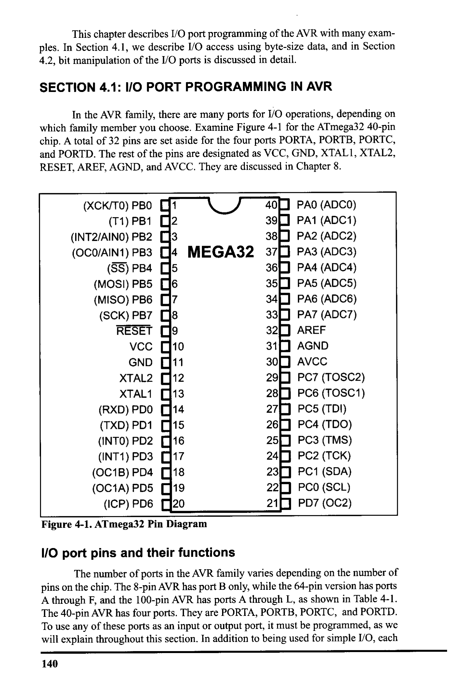
*Description*: IC pinout diagram showing physical pin assignments, I/O pin multiplexing, supply rails, and clock interface connections for Figure 4-1: ATmega32 Pin Diagram.

> **Figure 4-1: ATmega32 Pin Diagram**

40• PAO (ADCO)
39] PA1 (ADC1)
38] PA2 (ADC2)
MEGA32 37• PA3 (ADC3)
36 • PA4 (ADC4)
35• PA5 (ADC5)
34• PA6 (ADC6)
33[ PA7 (ADC7)
320
AREF
310
AGND
30• AVCC
29• PC7 (TOSC2)
280
PC6 (TOSC1)
270
PC5 (TDI)
260
PC4 (TDO)
25] PC3 (TMS)
24J PC2 (TCK)
23• PC1 (SDA)
22• PCO (SCL)
210 PD7 (OC2)
I/O port pins and their functions
The number of ports in the AVR family varies depending on the number of
pins on the chip. The 8-pin AVR has port B only, while the 64-pin version has ports
A through F, and the 100-pin AVR has ports A through L, as shown in Table 4-1.
The 40-pin AVR has four ports. They are PORTA, PORTB, PORTC, and PORTD.
• use any of these ports as an input or output port, it must be programmed, as w
ill explain throughout this section. In addition to being used for simple I/O, eac
140


<!-- Page 155 -->
### [PDF Page 155]


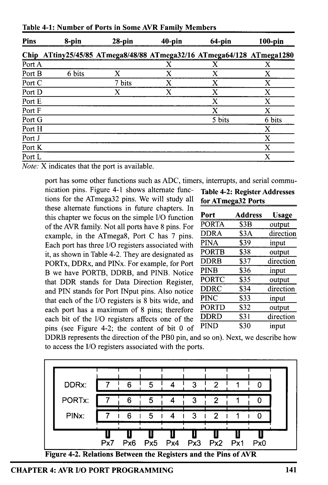
*Description*: Register specification diagram depicting individual bit flags, control register configurations, and functional definitions for Table 4-1: Number of Ports in Some AVR Family Members.

> **Table 4-1: Number of Ports in Some AVR Family Members**

Pins
8-pin
28-pin
40-pin
64-pin
100-pin
Chip ATtiny25/45/85 ATmega8/48/88 ATmega32/16 ATmega64/128 ATmega1280
Port A
Port B
6 bits
X
X
Port C
7 bits
X
X
X
X
Port D
X
X
X
Port E
X
Port F
X
X
Port G
5 bits
6 bits
Port H
X
Port J
Port K
Port L
X
Note: X indicates that the port is available.
port has some other functions such as ADC, timers, interrupts, and serial commu-
nication pins. Figure 4-1 shows alternate func- Table 4-2: Register Addresses
tions for the ATmega32 pins. We will study all
for ATmega32 Ports
these alternate functions in future chapters. In
this chapter we focus on the simple I/O function
Port
Address
Usage
of the AVR family. Not all ports have 8 pins. For
PORTA
$3B
output
example, in the ATmega8, Port C has 7 pins.
DDRA
$3A
direction
Each port has three I/O registers associated with

```c
PINA
```

$39
input
it, as shown in Table 4-2. They are designated as
PORTB
$38
PORTx, DDRx, and PINX. For example, for Port
DDRB
$37
output
direction
B we have PORTB, DDRB, and PINB. Notice

```c
PINB
```

$36
that DDR stands for Data Direction Register,
PORTC
$35
input
output
and PIN stands for Port INput pins. Also notice
DDRC
$34
direction
that each of the I/O registers is 8 bits wide, and

```c
PINC
```

$33
each port has a maximum of 8 pins; therefore
PORTD
$32
input
output
each bit of the I/O registers affects one of the DDRD
$31
direction
pins (see Figure 4-2; the content of bit O of PIND
$30
input
DDRB represents the direction of the PBO pin, and so on). Next, we describe how
to access the I/O registers associated with the ports.
DDRx:
PORTx:
PINX:
7
6
5
4
3
2
1
7
6
5
4
3
2
1
1
0
7
6
5
4
3
1
2
1
0
T
Px7 Px6 Px5 Px4 Px3 Px2 Px1 Px0


*Description*: Register specification diagram depicting individual bit flags, control register configurations, and functional definitions for Figure 4-2: Relations Between the Registers and the Pins of AVR.

> **Figure 4-2: Relations Between the Registers and the Pins of AVR**

CHAPTER 4: AVR I/O PORT PROGRAMMING
141


<!-- Page 156 -->
### [PDF Page 156]

DDRx register role in outputting data
Each of the ports A-D in the ATmega32 can be used for input or output.
The DDRx I/0 register is used solely for the purpose of making a given port an
input or output port. For example, to make a port an output, we write Is to the
DDRx register. In other words, to output data to all of the pins of the Port B, we
must first put 0b11111111 into the DDRB register to make all of the pins output.
The following code will toggle all 8 bits of Port B forever with some time
delay between "on" and "off" states:
L1:
LDI
OUT
LDI
OUT
CALL
LDI
OUT
CALL
RJMP
R16, OXFF
DDRB, R16
R16,0x55
PORTB, R16
DELAY
R16, 0XAA
PORTB, R16
DELAY
LI
;R16 = 0xFF = Ob11111111
¡make Port B an output port (111l 1111)
;R16 = 0x55 = 0b01010101
; put 0x55 on
port B pins
;R16 = OXAA = 0b10101010
¡put OxAA on port B pins
It must be noted that unless we set the DDRx bits to one, the data will not
go from the port register to the pins of the AVR. This means that if we remove the
first two lines of the above code, the 0x55 and 0xAA values will not get to the pins.
They will be sitting in the I/O register of Port B inside the CPU.
To see the role of the DDRx register in allowing the data to go from Port
to the pins, examine Figure 4-3. For more information about the internal circuitry
of I/O ports, see Appendix C.
DDR register role in inputting data
To make a port an input port, we must first put Os into the DDRx register
for that port, and then bring in (read) the data present at the pins. As an aid for
remembering that the port is input when the DDR bits are Os, imagine a person
who has 0 dollars. The person can only get money, not give it. Similarly, when
DDR contains Os, the port gets data.
Notice that upon reset, all ports have the value 0x00 in their DDR registers.
This means that all ports are configured as input as we will see next.
DDRx.n
Pin nof fE
port x
PORTx.n
• PINX.n
Outside the
AVR chip

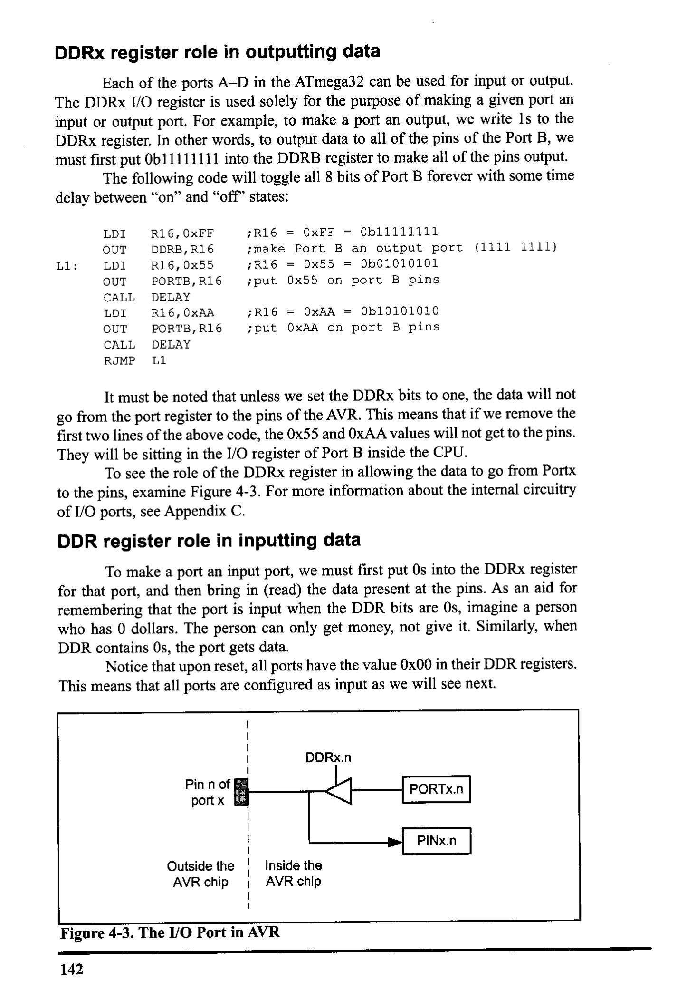
*Description*: Register specification diagram depicting individual bit flags, control register configurations, and functional definitions for Figure 4-3: The I/O Port in AVR.

> **Figure 4-3: The I/O Port in AVR**

142
Inside the
AVR chip


<!-- Page 157 -->
### [PDF Page 157]

PIN register role in inputting data
To read the data present at the pins, we should read the PIN register. It must
be noted that to bring data into CPU from pins we read the contents of the PIN×
register, whereas to send data out to pins we use the PORTx register.
PORT register role in inputting data
There is a pull-up
resistor for each of the AVR
VCC
pins. If we put 1s into bits of
the PORTx register, the pull-
1 = Close
.. PORTx.n o= Open
up resistors are activated. In
cases in which nothing is con-
nected to the pin or the con-
nected devices have high
impedance, the resistor pulls
up the pin. See Figure 4-4.
If we put Os into the
pin n of
port x
Outside the
AVR chip
inside the
AVR chip
bits of the PORT register, the
pull-up resistor is inactive.

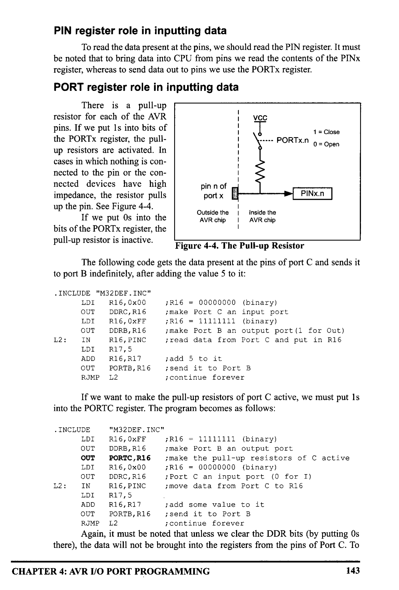
*Description*: Technical diagram and schematic illustration detailing hardware connection topology, signal routing, and circuit operation for Figure 4-4: The Pull-up Resistor.

> **Figure 4-4: The Pull-up Resistor**

The following code gets the data present at the pins of port C and sends it
to port B indefinitely, after adding the value 5 to it:
• INCLUDE "M32DEF.INC"
LDI
R16, 0×00
OUT
DDRC, R16
LDI
R16, OXFF
L2:
OUT
DDRB, R16
IN
R16, PINC
LDI
R17,5
ADD
R16, R17
OUT
PORTB, R16
RJMP
L2
;R16 = 00000000 (binary)
i make
Port C an input port
;R16 = 11111111 (binary)
¡ make Port B an output port (1 for Out)
¡read data from Port C and put in R16
¡ add 5 to it
i send it to Port B
¡ continue forever
If we want to make the pull-up resistors of port C active, we must put 1s
into the PORTC register. The program becomes as follows:
• INCLUDE
"M32DEF. INC"
ILDI
R16, OXFF
OUT
DDRB, R16
OUT
PORTC, R16
IDI
R16, 0x00
OUT
DDRC, R16
12:
IN
R16, PINC
;R16 = Illll111 (binary)
¡make Port B an
output port
¡make the pull-up resistors of C active
; R16 = 00000000
(binary)
; Port C an input port (0 for I)
¡ move data from Port C to R16
LDI
R17,5
ADD
R16, R17
¡ add some value to it
OUT
PORTB, R16
i send it to Port B

```assembly
RJMP L2
```

¡ continue forever
Again, it must be noted that unless we clear the DDR bits (by putting Os
there), the data will not be brought into the registers from the pins of Port C. To
CHAPTER 4: AVR I/O PORT PROGRAMMING
143


<!-- Page 158 -->
### [PDF Page 158]

see the role of the DDRx register in allowing the data to come into the CPU from
the pins, examine Figure 4-3.
The pins of the AVR microcontrollers can be in four different states accord-
ing to the values of PORT and DDRx, as shown in Figure 4.5.
DDRX
0
1
PORT
0
1
Input & high impedance
Input & pull-up
Out o
Out 1

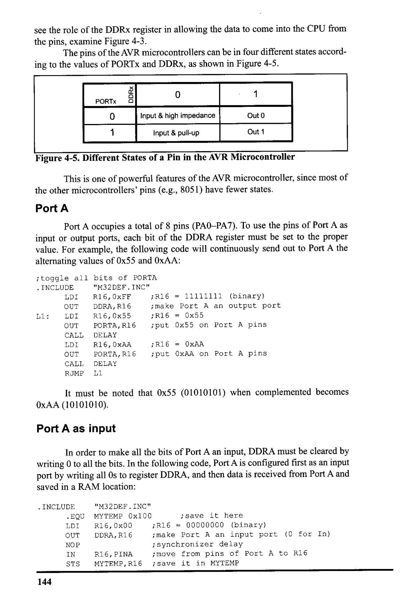
*Description*: IC pinout diagram showing physical pin assignments, I/O pin multiplexing, supply rails, and clock interface connections for Figure 4-5: Different States of a Pin in the AVR Microcontroller.

> **Figure 4-5: Different States of a Pin in the AVR Microcontroller**

This is one of powerful features of the AVR microcontroller, since most of
the other microcontrollers' pins (e.g., 8051) have fewer states.
Port A
Port A occupies a total of 8 pins (PAO-PA7). To use the pins of Port A as
input or output ports, each bit of the DDRA register must be set to the proper
value. For example, the following code will continuously send out to Port A the
alternating values of 0x55 and OxAA:
¡toggle all bits of PORTA
• INCLUDE
"M32DEF. INC"
LDI
R16, OXFF
;R16 = 11111111 (binary)
OUT
DDRA, R16
¡ make Port A an output port
Il:
LDI
R16, 0x55
;R16 = 0x55
OUT
PORTA, R16
i put 0x55 on Port A pins
CALL
DELAY
LDI
R16, OXAA
OUT
PORTA, R16
;R16 = 0xAA
¡put OXAA on Port A pins
CALL
DELAY

```assembly
RJMP L1
```

It must be noted that 0x55 (01010101) when complemented becomes
OxAA (10101010).
Port A as input
In order to make all the bits of Port A an input, DDRA must be cleared by
writing O to all the bits. In the following code, Port A is configured first as an input
port by writing all Os to register DDRA, and then data is received from Port A and
saved in a RAM location:
• INCLUDE
• EQU
LDI
OUT
NOP
IN
STS
"M32DEF. INC"
MYTEMP 0x100
R16, 0×00
DDRA, R16
R16, PINA
MYTEMP, R16
¡ save it here
;R16 = 00000000 (binary)
¡ make Port A an input port (0 for In)
¡ synchronizer delay
¡ move from pins of Port A to R16
¡ save it in MYTEMP
144


<!-- Page 159 -->
### [PDF Page 159]

Synchronizer delay
The input circuit of the AVR has a delay of 1 clock cycle. In other words,
the PIN register represents the data that was present at the pins one clock ago. In
the above code, when the instruction "IN R16, PINA" is executed, the PINA regis-
ter contains the data, which was present at the pins one clock before. That is why
the NOP is put before the "IN R16, PINA" instruction. (If the NOP is omitted, the
read data is the data of the pins when the port was output.)
For more information see Section C-2.
Port B
Port B occupies a total of 8 pins (PBO PB7). To use the pins of Port B as
input or output ports, each bit of the DDRB register must be set to the proper
value.
For example, the following code will continuously send out the alternating
values of 0x55 and OxAA to Port B:
¡toggle all bits of PORTB
• INCLUDE
"M32DEF.INC"
LDI
R16, OXFF
OUT
¡R16 = I1111111 (binary)
DDRB, R16
¡ make Port B an output port (1 for Out)
L1:
IDI
R16, 0x55
; R16 = 0x55
OUT
PORTB, R16
¡ put 0x55 on Port B pins
CALL
DELAY
LDI
R16, OXAA
OUT
PORTB, R16
; R16 = OXAA
¡put OXAA on Port B pins
CALL
DELAY
RJMP
L1
Port B as input
In order to make all the bits of Port B an input, DDRB must be cleared by
writing O to all the bits. In the following code, Port B is configured first as an input
port by writing all Os to register DDRB, and then data is received from Port B and
saved in some RAM location:
• INCLUDE
• EQU
LDI
OUT
NOP
IN
STS
"M32DEF.INC"
MYTEMP=0x100 ; save it here
R16, 0×00
; R16
=
00000000 (binary)
DDRB, R16
¡make
Port B an input port (0 for In)
R16, PINB
MYTEMP, R16
¡ move from pins of Port B to R16
¡save it in MYTEMP
Dual role of Ports A and B
The AVR multiplexes an analog-to-digital converter through Port A to save
I/O pins. The alternate functions of the pins for Port A are shown in Table 4-3. We
will show how to use Port A's ADC in Chapter 13. Because many projects use an
ADC, we usually do not use Port A for simple I/O functions.
The AVR multiplexes some other functions through Port B to save pins.
CHAPTER 4: AVR I/0 PORT PROGRAMMING
145


<!-- Page 160 -->
### [PDF Page 160]

The alternate functions of the pins for Port B are shown in Table 4-4. We will show
how to use the alternate functions of Port B in future chapters.

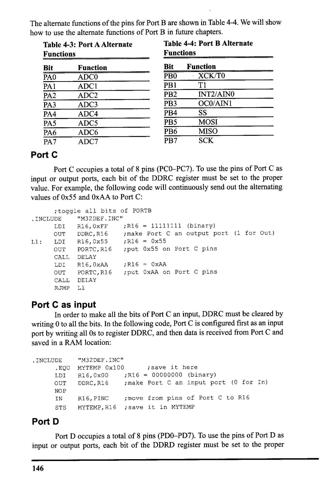
*Description*: Register specification diagram depicting individual bit flags, control register configurations, and functional definitions for Table 4-3: Port A Alternate.

> **Table 4-3: Port A Alternate**


*Description*: Register specification diagram depicting individual bit flags, control register configurations, and functional definitions for Table 4-4: Port B Alternate.

> **Table 4-4: Port B Alternate**

Functions
Functions
Bit
PAO
PA1
PA2
PA3
PA4
PAS
PA6
PA7
Function
ADCO
ADCI
ADC2
ADC3
ADC4
ADCS
ADC6
ADCT
BE Findinn
PB1
XCK/TO
T1
PB2
INT2/AINO
PB3
OC0/AIN1
PB4
SS
PB5
MOSI
PB6
MISOR
PB7
SCK
Port C
Port C occupies a total of 8 pins (PCO-PC7). To use the pins of Port C as
input or output ports, each bit of the DDRC register must be set to the proper
value. For example, the following code will continuously send out the alternating
values of 0x55 and OxAA to Port C:
¡toggle all bits of PORTB
• INCLUDE
"M32DEF.INC"
LDI
R16, OXFE
OUT
DDRC, R16
LI:
IDI
R16, 0x55
OUT
PORTC, R16
; R16 = 11111111 (binary)
¡make Port C an
• output port (1 for Out)
;R16 = 0x55
¡ put 0x55 on Port C pins
CALL
DELAY
LDI
R16, OXAA
OUT
PORTC, R16
; R16 = OxAA
¡put OxAA on Port C pins
CALL
DELAY
RJMP
Port C as input
In order to make all the bits of Port C an input, DDRC must be cleared by
writing O to all the bits. In the following code, Port C is configured first as an input
port by writing all Os to register DDRC, and then data is received from Port C and
saved in a RAM location:
• INCLUDE
• EQU
LDI
OUT
NOP
IN
STS
"M32DEF.INC"
MYTEMP 0x100
¡ save it here
R16, 0x00
;R16 = 00000000 (binary)
DDRC, R16
¡ make Port C an input port (0 for In)
R16, PINC
; move from pins of Port C to R16
MYTEMP, R16
¡ save it in MYTEMP
Port D
Port D occupies a total of 8 pins (PDO-PD7). To use the pins of Port D as
input or output ports, each bit of the DDRD register must be set to the proper
146


<!-- Page 161 -->
### [PDF Page 161]

value. For example, the following code will continuously send out to Port D the
alternating values of 0x55 and OxAA:
¡toggle all bits of PORTB
• INCLUDE
"M32DEF. INC"
LDI
R16, OXFF
;R16 = 11111111 (binary)
OUT
DDRD, R16
L1:
IDI
¡ make Port D an output port (1 for Out)
R16, 0x55
;R16 = 0x55
OUT
PORTD, R16
¡put 0x55 on Port D pins
CALL
DELAY
LDI
R16, OXAA
OUT
PORTD, R16
; R16 = OXAA
¡ put OXAA on Port D pins

```assembly
CALL DELAY
```

RUMP 11
Port D as input
In order to make all the bits of Port D an input, DDRD must be cleared by
writing 0 to all the bits. In the following code, Port D is configured first as an input
port by writing all Os to register DDRD, and then data is received from Port D and
saved in a RAM location:
• INCLUDE
• EQU
MYTEMP
"M32DEF.INC"
0x100
¡ save it here
LDI
OUT
NOP
IN
STS
R16, 0x00
DDRD, R16
; R16 = 00000000 (binary)
i make
Port D an input port (0 for In)
R16, PIND
MYTEMP, R16
¡ move from pins of Port D to R16
¡ save it in MYTEMP
Dual role of Ports C and D
The alternate functions of the pins for Port C are shown in Table 4-5. We
will show how to use Port C's alternate functions in future chapters. The alternate
functions of the pins for Port D are shown in Table 4-6. We will show how to use
Port D's alternate functions in future chapters.
Function
SCL
SDA

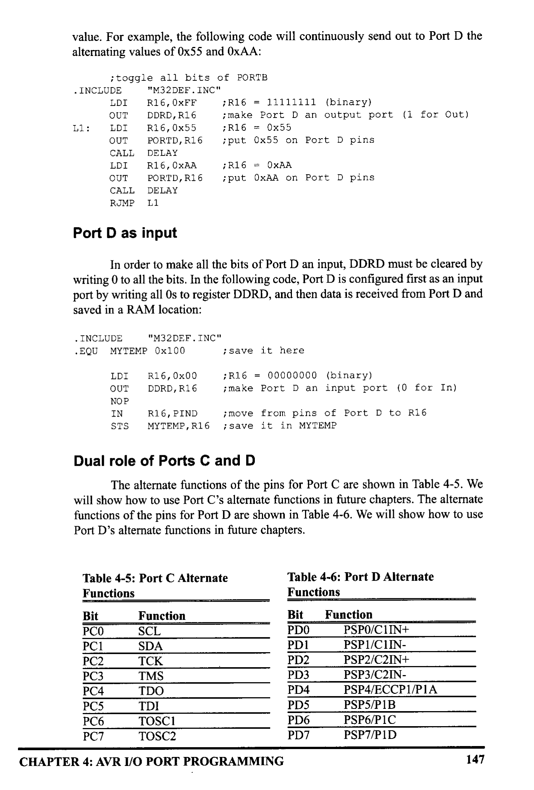
*Description*: Register specification diagram depicting individual bit flags, control register configurations, and functional definitions for Table 4-5: Port C Alternate.

> **Table 4-5: Port C Alternate**

Functions
Bit
PCO
PCI
PC2
PC3
PC4
PCS
PC6
PC7
TCK
TMS
TDO
TDI
TOSCI
TOSC2
CHAPTER 4: AVR I/O PORT PROGRAMMING


*Description*: Register specification diagram depicting individual bit flags, control register configurations, and functional definitions for Table 4-6: Port D Alternate.

> **Table 4-6: Port D Alternate**

Functions
Bit
Function
PDO
PSPO/CTIN+
PDI
PSP1/C1IN-
PD2
PSP2/C2IN+
PD3
PSP3/C2IN-
PD4
PSP4/ECCP1/PIA
PDS
PSP5/P1B
PD6
PSP6/P1C
PD7
PSP7/P1D
147


<!-- Page 162 -->
### [PDF Page 162]

Example 4-1
Write a test program for the AVR chip to toggle all the bits of PORTB, PORTC, and
PORTD every 1/4 of a second. Assume a crystal frequency of 1 MHz.
Solution:
¡tested with AVR Studio for the ATmega32 and XTAL = 1 MHz
• TO SODE * 328 AN Frequency in AVR Studio, press ALIto
R16, HIGH (RAMEND)
SPH, R16
R16, LOW (RAMEND)
SPL, R16
¡initialize stack pointer
IDI
OUT
OUT
OUT
R16, OxFF
DDRB, R16
DDRC, R16
DDRD, R16
¡ make Port B an output port
¡ make Port C an output port
; make Port D an output port
;R16 = 0x55
¡put 0x55 on Port B pins
PORIC, R16 ; put 0x55 on Port C pins
PORID, R16
¡put 0x55 on Port D pins
ODELAY
¡ quarter of a second delay
i----
QDELAY:
IDI
D1:
D2:
LDI
NOP
NOP
DEC
BRNE
DEC
BRNE
RET
--1/4 SECOND DELAY
R21, 200
R22, 250
R22
D2
R21
D1
Calculations:
1/1 MHz = 1 us
Delay = 200 × 250 × 5 MC × 1 us = 250,000 us (If we include the overhead, we will
have 250,608 us. See Example 3-18 in the previous chapter.)
Use the AVR Studio simulator to verify the delay size.
148


<!-- Page 163 -->
### [PDF Page 163]


### Review Questions

1. There are a total of
ports in the ATmega32.
2. True or false. All of the ATmega32 ports have o pins.
3. True or false. Upon power-up, the 1/0 pins are configured as output ports.
4. Code a simple program to send 0x99 to Port B and Port C.
5. To make Port B an output port, we must place
in register
6. To make Port B an input port, we must place
_ in register
7. True or false. We use a PORTx register to send data out to AVR pins
8. True or false. We use PINx to bring data into the CPU from AVR pins.

## SECTION 4.2: I/O BIT MANIPULATION PROGRAMMING

In this section we further examine the AVR I/O instructions. We pay spe-
cial attention to I/O bit manipulation because it is a powerful and widely used fea-
ture of the AVR family.
1/O ports and bit-addressability
Sometimes we need to access only 1 or 2 bits of the port instead of the
entire 8 bits. A powerful feature of AVR I/O ports is their capability to access indi-
vidual bits of the port without altering the rest of the bits in that port. For all AVR
ports, we can access either all 8 bits or any single bit without altering the rest.

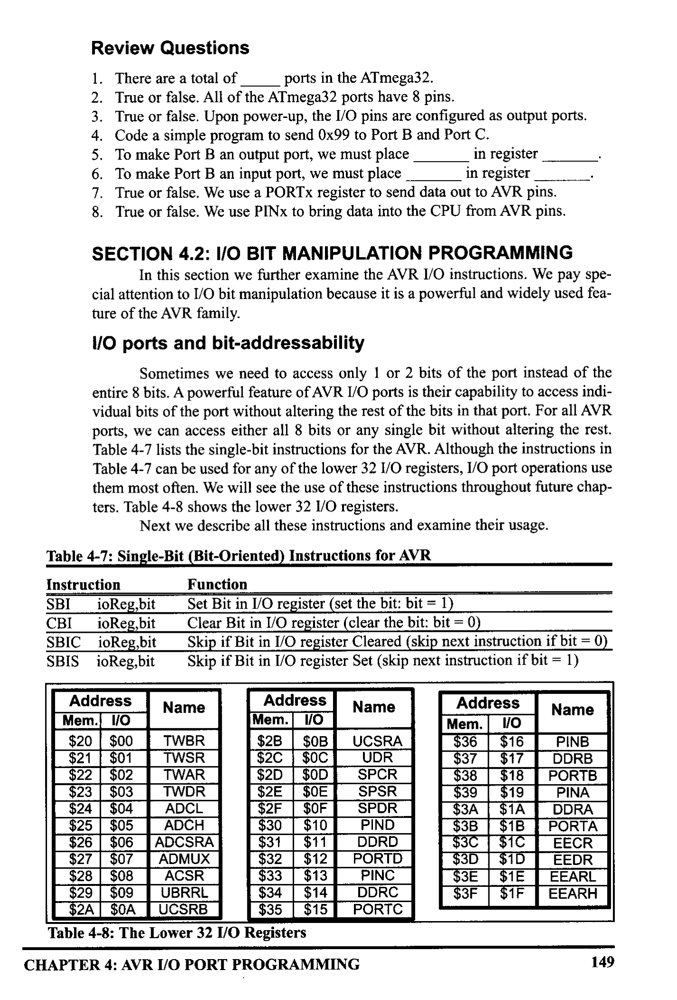
*Description*: Structured reference table listing operational parameters, instruction execution cycles, memory address mapping, or feature comparison for Table 4-7: lists the single-bit instructions for the AVR. Although the instructions in.

> **Table 4-7: lists the single-bit instructions for the AVR. Although the instructions in**


*Description*: Register specification diagram depicting individual bit flags, control register configurations, and functional definitions for Table 4-7: can be used for any of the lower 32 I/O registers, 1/O port operations use.

> **Table 4-7: can be used for any of the lower 32 I/O registers, 1/O port operations use**

them most often. We will see the use of these instructions throughout future chap-
ters. Table 4-8 shows the lower 32 l/O registers.
Next we describe all these instructions and examine their usage.


*Description*: Structured reference table listing operational parameters, instruction execution cycles, memory address mapping, or feature comparison for Table 4-7: Single-Bit (Bit-Oriented) Instructions for AVR.

> **Table 4-7: Single-Bit (Bit-Oriented) Instructions for AVR**

Instruction
Function
SBI
ioReg,bit
Set Bit in I/O register (set the bit: bit = 1)
CBI
10Reg,bit
Clear Bit in I/O register (clear the bit: bit = 0)
SBIC
ioReg,bit
Skip if Bit in I/O register Cleared (skip next instruction if bit = 0)
SBIS
ioReg,bit
Skip if Bit in I/O register Set (skip next instruction if bit = 1)
Address
Name
Address
Mem. I/O
Mem. 1/0
$20
$00
TWBR
$2B
$OB
$21
$01
TWSR
$2C
$22
$02
TWAR
$2D
SOC
$23
$03
TWDR
$2E
$OD
SUE
$24
$25
$04
ADCL
$2F
SOF
$05
ADCH
$30
$10
$26
$06
ADCSRA
$31
$11
$27
$07
ADMUX
$32
$12
$28
$29
$08
ACSR
$33
$13
$09
UBRRL
$2A
$34
$14
$0A
UCSRB
$35
$15


*Description*: Register specification diagram depicting individual bit flags, control register configurations, and functional definitions for Table 4-8: The Lower 32 I/O Registers.

> **Table 4-8: The Lower 32 I/O Registers**

CHAPTER 4: AVR I/O PORT PROGRAMMING
Name
UCSRA
UDR
SPCR
SPSR
SPDR

```c
PIND
```

DDRD
PORTD

```c
PINC
```

DDRC
PORTC
Address
Mem.
1/O
$36
$16
$37
$17
$38
$18
$39
$19
$3A
$1A
$3B
$1B
$3C
$3D
$1C
$ЗЕ
$1D
$3F
$1E
$1F
Name

```c
PINB
```

DDRB
PORTB

```c
PINA
```

DDRA
PORTA
EECR
EEDR
EEARL
EEARH
149


<!-- Page 164 -->
### [PDF Page 164]

SBI (set bit in I/O register)
To set HIGH a single bit of a given I/O register, we use the following syn-
tax:

```assembly
SBI ioReg, bit
```

where ioReg can be the lower 32 I/O registers (addresses 0 to 31) and
bit_num is the desired bit number from 0 to 7. In Table 4-8 you see the list of the
lower 32 I/O registers. Although the bit-oriented instructions can be used for
manipulation of bits DO-D7 of the lower 32 I/O registers, they are mostly used for
I/O ports. For example the following instruction sets HIGH bit 5 of Port B:

```assembly
SBI PORTB, 5
```

In Figure 4-6, you see the SBI instruction format.

```assembly
SBI a, b
```

1001| 1010 aaaa abbb
0 ≤ a ≤ 31
0 = 6 ≤ 7


*Description*: Technical diagram and schematic illustration detailing hardware connection topology, signal routing, and circuit operation for Figure 4-6: SBI (Set Bit) Instruction Format.

> **Figure 4-6: SBI (Set Bit) Instruction Format**

CBI (Clear Bit in I/O register)
To clear a single bit of a given I/O register, we use the following syntax:

```assembly
CBI ioreg, bit number
```

For example, the following code toggles pin PB2 continuously:
SBI
DDRB, 2
AGAIN: SBI
PORTB, 2
¡bit = 1, make PB2 an output pin
¡bit set (PB2 = high)
CALL
DELAY
CBI
PORTB, 2
¡bit clear (PB2 = 10w)

```assembly
CALL DELAY
```

RIMP AGAIN
Remember that for I/O ports, we must set the appropriate bit in the
DDRx register if we want the pin to be output.
Notice that PB2 is the third bit of Port B (the first bit is PBO, the second bit
is PB1, etc.). This is shown in Table 4-9. See Example 4-2 for an example of bit
manipulation of 1/0 bits.

```assembly
CBI a, b
```

[1001 1000| aaaa abbb
0 ≤ a ≤ 31
= b ≤
7

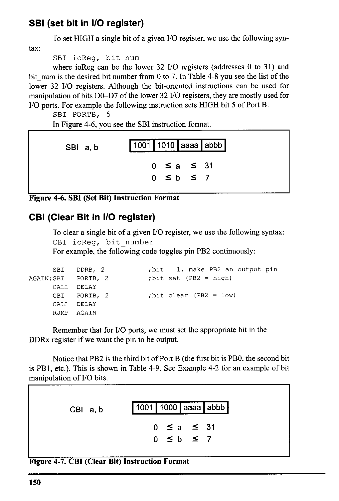
*Description*: Technical diagram and schematic illustration detailing hardware connection topology, signal routing, and circuit operation for Figure 4-7: CBI (Clear Bit) Instruction Format.

> **Figure 4-7: CBI (Clear Bit) Instruction Format**

150


<!-- Page 165 -->
### [PDF Page 165]


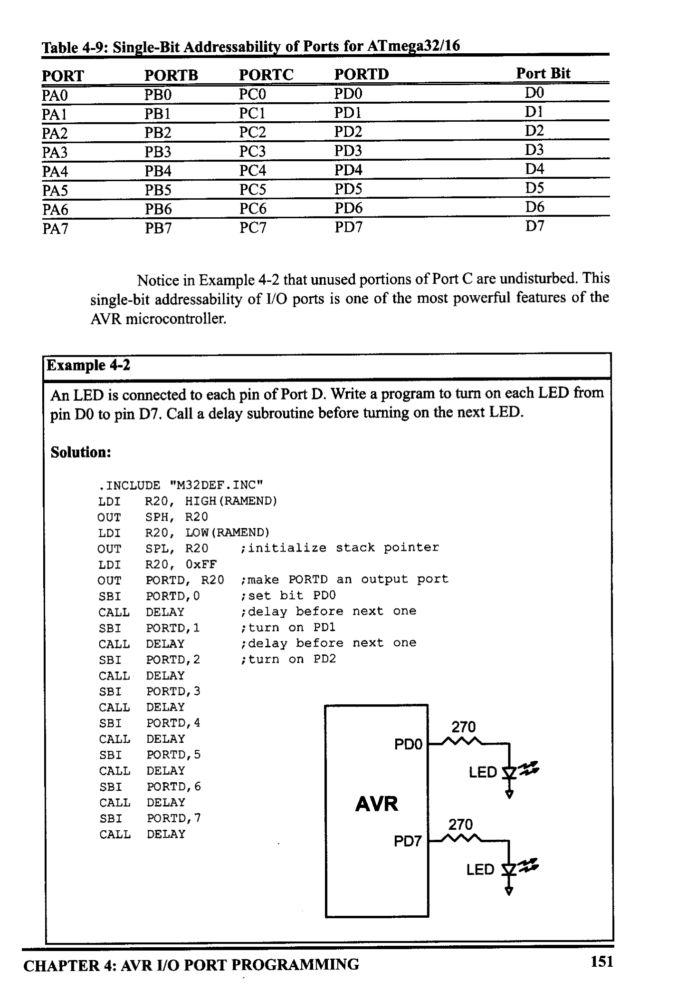
*Description*: Register specification diagram depicting individual bit flags, control register configurations, and functional definitions for Table 4-9: Single-Bit Addressability of Ports for ATmega32/16.

> **Table 4-9: Single-Bit Addressability of Ports for ATmega32/16**

PORT
PAO
PORTB
PBO
PORTC
PORTD
PCO
PDO
PDI
Port Bit
DO
D6
D7
Notice in Example 4-2 that unused portions of Port C are undisturbed. This
single-bit addressability of 1/0 ports is one of the most powerful features of the
AVR microcontroller.
Example 4-2
An LED is connected to each pin of Port D. Write a program to turn on each LED from
pin DO to pin D7. Call a delay subroutine before turning on the next LED.
Solution:
• INCLUDE "M32DEF.INC"
LDI
R2O, HIGH (RAMEND)
OUT
SPH, R20
LDI
R20, LOW (RAMEND)
OUT
SPI, R20
¡initialize stack pointer
LDI
R20, OXFF
OUT
PORTD, R2O ; make PORID an output port
SBI
PORTD, O
i set bit PDO

```assembly
CALL DELAY
```

¡ delay before next one

```assembly
SBI PORTD, 1
```

¡turn on PD1

```assembly
CALL DELAY
```

¡delay before next one

```assembly
SBI PORID, 2
```

¡turn on PD2

```assembly
CALL DELAY
```

SBI
PORTD, 3

```assembly
CALL DELAY
SBI PORTD, 4
CALL DELAY
```

PDO
SBI
PORTD, 5

```assembly
CALL DELAY
```

SBI
PORTD, 6

```assembly
CALL DELAY
```

AVR
SBI
PORTD, 7

```assembly
CALL DELAY
```

PD7
270
LED Fit
270
CHAPTER 4: AVR I/O PORT PROGRAMMING
151


<!-- Page 166 -->
### [PDF Page 166]

Example 4-3
Write the following programs:
(a) Create a square wave of 50% duty cycle on bit 0 of Port C.
(b) Create a square wave of 66% duty cycle on bit 3 of Port C.
Solution:
(a) The 50% duty cycle means that the "on" and "off" states (or the high and low por-
tions of the pulse) have the same length. Therefore, we toggle PCO with a time delay
between each state.
• INCLUDE "M32DEF. INC"
IDI
OUT
R20, HIGH (RAMEND)
LDI
SPH,
R20
R2O, LOW (RAMEND)
OUT
SPL, R20
¡initialize stack pointer
SBI
DDRC, O
HERE: SBI
PORTC, O
CALL
DELAY
CBI
PORTC, O
¡ set bit 0 of DDRC (PCO = out)
¡set to HIGH PCO (PCO = 1)
¡ call the delay subroutine
; PCO = 0
CALL
DELAY

```assembly
RJMP HERE
```

i keep doing it
ATmega32
PCO
(b) A 66% duty cycle means that the "on" state is twice the "off" state.
SBI
DDRC, 3
HERE: SBI
PORTC, 3
CALL
DELAY
CALLI
DELAY
CBI
PORIC, 3

```assembly
CALL DELAY
```

RJMP
HERE
i set bit 3 of DDRC (PC3 = out)
¡set to HIGH PC3 (PC3 = 1)
¡ call the delay subroutine
¡call the delay subroutine
; PC3 = 0
i keep doing it
ATmega32
PC3
152


<!-- Page 167 -->
### [PDF Page 167]

Checking an input pin
To make decisions based on the status of a given bit in the file register, we
use the SBIC (Skip if Bit in I/O register Cleared) and SBIS (Skip if Bit in I/O reg-
ister Set) instructions. These single-bit instructions are widely used for I/O opera-
tions. They allow you to monitor a single pin and make a decision depending on
whether it is 0 or 1. Again it must be noted that the SBIC and SBIS instructions
can be used for any bits of the lower 32 I/O registers, including the I/O ports A, B,
C, D, and so on.
SBIS (Skip if Bit in I/O register Set)
To monitor the status of a single bit for HIGH, we use the SBIS instruction.
This instruction tests the bit and skips the next instruction if it is HIGH. See Figure
4-8. Example 4-4 shows how it is used.

```assembly
SBIS a,b
```

[1001 1011aaaaabbb
0 ≤ a ≤ 31
0 = 6 ≤
7

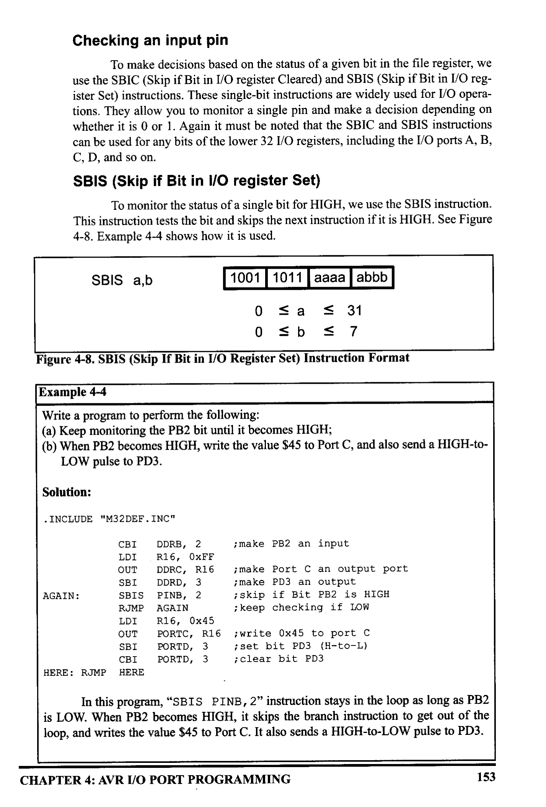
*Description*: Register specification diagram depicting individual bit flags, control register configurations, and functional definitions for Figure 4-8: SBIS (Skip If Bit in I/O Register Set) Instruction Format.

> **Figure 4-8: SBIS (Skip If Bit in I/O Register Set) Instruction Format**

Example 4-4
Write a program to perform the following:
(a) Keep monitoring the PB2 bit until it becomes HIGH;
(b) When PB2 becomes HIGH, write the value $45 to Port C, and also send a HIGH-to-
LOW pulse to PD3.
Solution:
• INCLUDE "M32DEF.INC"
CBI
DDRB, 2
LDI
; make PB2 an input
. R16, OxFF
OUT
DDRC, R16
¡ make Port C an output port
SBI
DDRD, 3
i make PD3 an output
AGAIN:
SBIS

```c
PINB, 2
```

iskip if Bit PB2 is HIGH
RUMP AGAIN
i keep checking if LOW
LDI
R16, 0x45
OUT
PORTC, R16
¡write 0x45 to port C
SBI
PORID, 3
i set bit PD3 (H-to-L)
CBI
PORTD, 3
¡clear bit PD3
HERE: RJMP HERE
In this program, "SBIS PINB, 2" instruction stays in the loop as long as PB2
is LOW. When PB2 becomes HIGH, it skips the branch instruction to get out of the
loop, and writes the value $45 to Port C. It also sends a HIGH-to-LOW pulse to PD3.
CHAPTER 4: AVR I/O PORT PROGRAMMING
153


<!-- Page 168 -->
### [PDF Page 168]

SBIC (Skip if Bit in I/O register Cleared)
To monitor the status of a single bit for LOW, we use the SBIC instruction.
This instruction tests the bit and skips the instruction right below it if the bit is
LOW. See Figure 4-9. Example 4-5 shows how it is used.

```assembly
SBIC a,b
```

1001 | 1001 aaaa abbb
0 ≤ a ≤ 31
0 = b ≤ 7

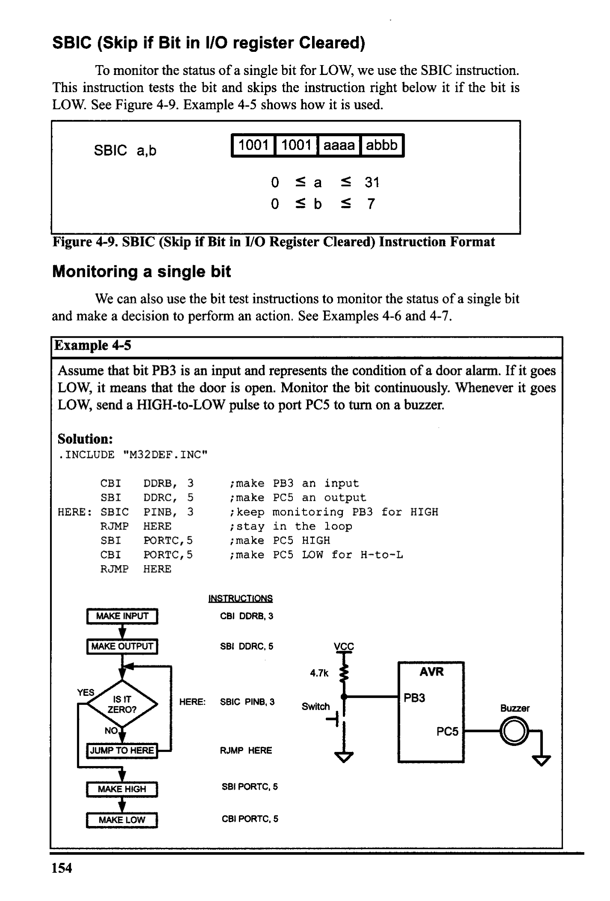
*Description*: Register specification diagram depicting individual bit flags, control register configurations, and functional definitions for Figure 4-9: SBIC (Skip if Bit in I/O Register Cleared) Instruction Format.

> **Figure 4-9: SBIC (Skip if Bit in I/O Register Cleared) Instruction Format**

Monitoring a single bit
We can also use the bit test instructions to monitor the status of a single bit
and make a decision to perform an action. See Examples 4-6 and 4-7.
Example 4-5
Assume that bit PB3 is an input and represents the condition of a door alarm. If it goes
LOW, it means that the door is open. Monitor the bit continuously. Whenever it goes
LOW, send a HIGH-to-LOW pulse to port PCS to turn on a buzzer.
Solution:
• INCLUDE "M32DEF. INC"
CBI
SBI
HERE: SBIC
RJMP
SBI
CBI
RUMP
DDRB, 3
DDRC,
5

```c
PINB, 3
```

HERE
PORTC, 5
PORTC, 5
HERE
i make PB3 an input
¡ make PC5 an output
i keep monitoring PB3 for HIGH
¡stay in the loop
¡ make PC5 HIGH
¡ make PC5 LOW for H-to-L
INSTRUCTIONS

```assembly
CBI DDRB, 3
SBI DDRC, 5
```

VCC
YES
MAKE INPUT
MAKE OUTPUT
IS IT
ZERO?
NO,
JUMP TO HERE
MAKE HIGH
MAKE LOW
HERE: SBIC PINB, 3
4.7k
Switch
AVR
PB3
Buzzer
PC5

```assembly
RJMP HERE
SBI PORTC, 5
CBI PORTC, 5
```

154


<!-- Page 169 -->
### [PDF Page 169]

Example 4-6
A switch is connected to pin PB2. Write a program to check the status of SW and per-
form the following:
(a) If SW = 0, send the letter 'N'to PORTD.
(b) If SW = 1, send the letter 'Y' to PORTD.
Solution:
• INCLUDE "M32DEF. INC"

```assembly
CBI DDRB, 2
```

i make PB2 an input
LDI
R16, OXFF
OUT
DDRD, R16
; make PORTD an output port
AGAIN: SBIS

```c
PINB, 2
```

RJMP
iskip next if PB bit is HIGH
OVER
; SW is LOW
LDI
R16, "y'
; R16 = 'Y' (ASCII letter Y)
OUT
PORTD, R16 ; PORTD = 'Y'

```assembly
RJMP AGAIN
OVER: IDI R16, 'N'
;R16 = 'N' (ASCII letter Y)
OUT PORID,
```

R16
; PORTD

```assembly
RJMP AGAIN
```

MAKE INPUT
MAKE OUTPUT
INSTRUCTIONS

```assembly
CBI DDRB, 2
LDI R16, OXFF
OUT DDRD, R16
```

YES
IS IT ONE?
NO
JUMP TO OVER
LOAD ASCI 'Y
AGAIN: SBIS PINB, 2
SEND TO PORTD
REPEAT

```assembly
RJMP OVER
LDI R16, 'Y'
OUT PORTD, R16
```

RUMP AGAIN
LOAD ASCI 'N'
SEND TO PORTD
REPEAT
OVER: LDI R16, 'N'

```assembly
OUT PORTD, R16
RJMP AGAIN
```

CHAPTER 4: AVR I/0 PORT PROGRAMMING
155


<!-- Page 170 -->
### [PDF Page 170]

Example 4-7
Rewrite the program of Example 4-6, using the SBIC instruction instead of SBIS.
Solution:
• INCLUDE "M32DEF. INC"
CBI
IDI
OUT
DDRB, 2
R16, OXFF
DDRD, R16
AGAIN: SBIC
RJMP
LDI
OUT
RJMP

```c
PINB, 2
```

OVER
R16, 'N'
PORTD, R16
AGAIN
OVER: LDI
R16, 'y'
OUT
PORTD, R16
RJMPR
AGAIN
; make PB2 an input
¡ make PORTD an output port
iskip next if PB bit is LOW
¡SW is HIGH
;R16 = 'N' (ASCII letter N)
¡PORTD = 'N'
;R16 = 'Y' (ASCII letter Y)
; PORID = "Y'
MAKE INPUT
MAKE OUTPUT
INSTRUCTIONS
CBI
DDRB, 2
LDI
OUT
R16, OXFF
DDRD, R16
YES
IS IT ZERO?
NO
JUMP TO OVER
LOAD ASCII 'N'
SEND TO PORTD
REPEAT
AGAIN:
SBIC

```c
PINB, 2
```

LOAD ASCIL Y
SEND TO PORTD
REPEAT
OVER:

```assembly
RJMP OVER
```

LDI
R16, 'N
OUT
PORTD, R16
RIMP AGAIN
LDI
R16, Y
OUT
PORTD, R16
RIMP AGAIN
156


<!-- Page 171 -->
### [PDF Page 171]

Reading a single bit
We can also use the bit test instructions to read the status of a single bit and
send it to another bit or save it. This is shown in Examples 4-8 and 4-9.
Example 4-8
A switch is connected to pin PBO and an LED to pin PB7. Write a program to get the
status of SW and send it to the LED.
Solution:
• INCLUDE "M32DEF.INC"
CBI
DDRB,
SBI
DDRB, 7
AGAIN: SBIC PINB,
RIMP OVER
CBI
PORTB, 7
RUMP AGAIN
OVER: SBI PORIB, 7

```assembly
RJMP AGAIN
```

¡make PBO an input
¡ make PB7 an output
¡skip next if PBO is clear
¡ (JMP is OK too)
¡we can use JMP too
¡we can use JMP too
VCC
4.7k
AVR
RBO
Switch
RB7
· 270
ZaP LED
Example 4-9
A switch is connected to pin PBO. Write a program to get the status of SW and save it
in location 0x200.
Solution:
•EQU MYTEMP = 0x200
• INCLUDE "M32DEF.INC"

```assembly
CBI DDRB, O
AGAIN: SBIC PINB, O
RJMP OVER
```

LDI
R16, 0
STS
MYTEMP, R16
RJMP
AGAIN
OVER: IDI
R16, 0x1
STS
MYTEMP, R16
RUMP AGAIN
¡set aside location 0x200
¡ make PBO an input
iskip next if PB0 is clear
¡ (JMP is OK too)
VCC
¡ save it in MYTEMP
¡we can use JMP too
¡ move 1 to R16
¡ save it in MYTEMP
¡we can use JMP too
AVR
PBO
Switch
CHAPTER 4: AVR I/O PORT PROGRAMMING
157


<!-- Page 172 -->
### [PDF Page 172]


### Review Questions

1. True or false. The instruction "SBI PORTB, 1" makes pin PB1 HIGH while
leaving other pins of PORTB unchanged, if bit 1 of the DDR bits is configured
for output.
2. Show one way to toggle the pin PB7 continuously using AVR instructions.
3. Write instructions to get the status of PB2 and put it on PBO.
4. Write instructions to toggle both bits of PD7 and PDO continuously.
5. According to Figure 4-7, what does the machine instruction $9819 do?

### SUMMARY

This chapter focused on the I/O ports of the AVR. The four ports of the
ATmega32, PORTA, PORTB, PORTC, and PORTD, were explored. These ports
can be used for input or output. All the ports have alternate functions. The three
registers associated with each port are PORT, DDRx, and PINx. Their role in I/O
manipulation was examined. Then, I/O instructions of the AVR were explained,
and numerous examples were given. We also showed the bit-addressability of AVR
ports.
CAUTION
We strongly recommend that you study Section C.2 (Appendix C)
before connecting any external hardware to your AVR system.
Failure to use the right instruction or the right connection to port pins
can damage the ports of your AVR chip.

### PROBLEMS


## SECTION 4.1: I/O PORT PROGRAMMING IN AVR

1. The ATmega32 has a DIP package of
_ pins.
2. In ATmega32, how many pins are assigned to Voc and GND?
3. In the ATmega32, how many pins are designated as I/O port pins?
4. How many pins are designated as PORTA in the 40-pin DIP package and what
are their numbers?
5. How many pins are designated as PORTB in the 40-pin DIP package and what
are their numbers?
6. How many pins are designated as PORTC in the 40-pin DIP package and what
are their numbers?
7. How many pins are designated as PORTD in the 40-pin DIP package and what
are their numbers?
8. Upon reset, all the bits of ports are configured as _
_ (input, output).
9. Explain the role of DDRx and PORT in I/O operations.
158


<!-- Page 173 -->
### [PDF Page 173]

10. Write a program to get 8-bit data from PORTC and send it to PORTB and
PORTD.
11. Write a program to get 8-bit data from PORTD and send it to PORTB and
PORTC.
12. Which pins are for RD and TxD?
13. Give data memory location assigned to DDR registers of Ports A-C for the
ATmega32.
14. Write a program to toggle all the bits of PORTB and PORTC continuously
(a) using OxAA and 0x55 (b) using the COM instruction.

## SECTION 4.2: 1/0 BIT MANIPULATION PROGRAMMING

15. Which ports of the ATmega32 are bit-addressable?
16. What is the advantage of bit-addressability for AVR ports?
17. Is the instruction "COM PORTB" a valid instruction?
18. Write a program to toggle PB2 and PB5 continuously without disturbing the
rest of the bits.
19. Write a program to toggle PD3, PD7, and PC5 continuously without disturbing
the rest of the bits.
20. Write a program to monitor bit PC3. When it is HIGH, send 0x55 to PORTD.
21. Write a program to monitor the PB7 bit. When it is LOW, send $55 and SAA
to PORTC continuously.
22. Write a program to monitor the PA0 bit. When it is HIGH, send $99 to PORTB.
If it is LOW, send $66 to PORTB.
23. Write a program to monitor the PB5 bit. When it is HIGH, make a LOW-to-
HIGH-to-LOW pulse on PB3.
24. Write a program to get the status of PC3 and put it on PC4.
25. Create a flowchart and write a program to get the statuses of PD6 and PD7 and
put them on PCO and PC7, respectively.
26. Write a program to monitor the PB5 and PB6 bits. When both of them are
HIGH, send SAA to PORTC; otherwise, send $55 to PORTC.
27. Write a program to monitor the PBS and PB6 bits. When either of them is
HIGH, send SAA to PORTC; otherwise, send $55 to PORTC
28. Ring to Figure 4-8 and Table 4-8, write the machine equivalent of "SBIS
29. Referring to Figure 4-6 and Table 4-8, write the machine equivalent of the
"SBI PORTA, 2" instruction.
CHAPTER 4: AVR I/O PORT PROGRAMMING
159


<!-- Page 174 -->
### [PDF Page 174]


### ANSWERS TO REVIEW QUESTIONS


## SECTION 4.1: V/O PORT PROGRAMMING IN AVR

1. 4
2. True
3. False
4. IDI R16, OxFF

```assembly
OUT DDRB, R16
OUT DDRC, R16
```

IDI R16, 0x99

```assembly
OUT PORTB, R16
OUT PORIC, R16
```

5. $FF, DDRB
6. $00, DDRB
7. True
8. True
2 True

## SECTION 4.2: V/O BIT MANIPULATION PROGRAMMING


```assembly
CBI DDRB, 7
SBI PORTB, 7
CBI PORTB, 7
RJMP HI
```

3.
AGAIN:
OVER:

```assembly
CBI DDRB, 2
```

SBI
DDRB, O

```assembly
SBIS PINB, 2
RJMP OVER
```

SBI
PORTB, O
RJMP
AGAIN
CBI
PORTB, O

```assembly
RJMP AGAIN
H2:
```

SBI
DDRD, O
SBI
DDRD, 7
SBI
PORID, O
SBI
PORID, 7
CBI
PORID, O
CBI
PORTD, 7

```assembly
RJMP H2
```

S. $9819 is 1001 1000 0001 1001 in binary; according to Figure 4-7, this is the CBI instruction,
When this is the B DR, instructio ain to rabi of the the adies of WDR;
160


