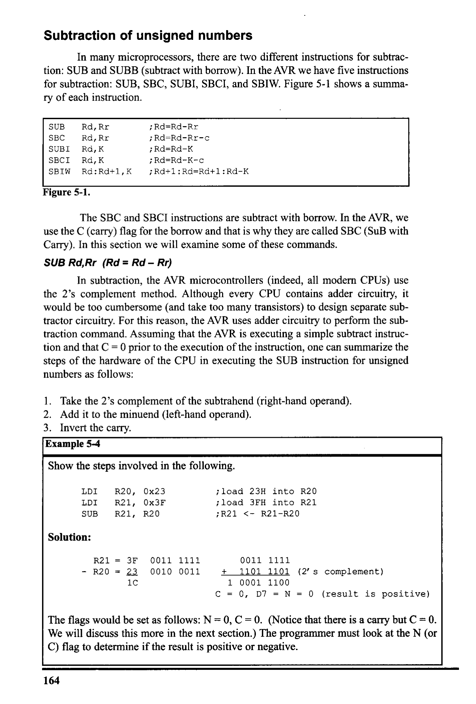
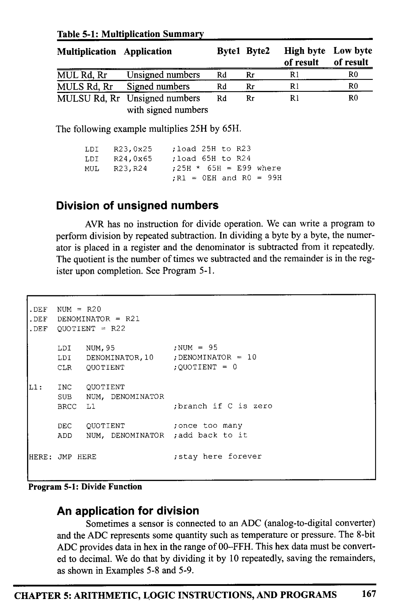
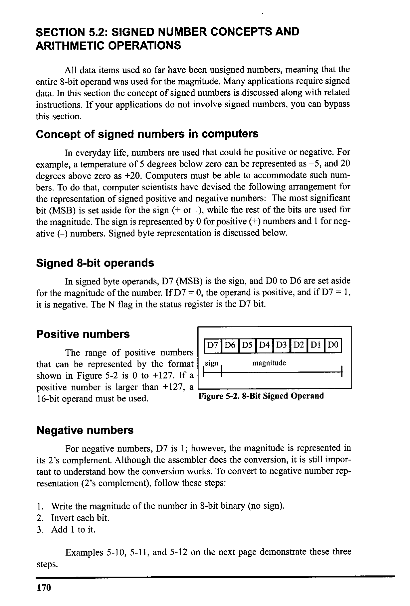
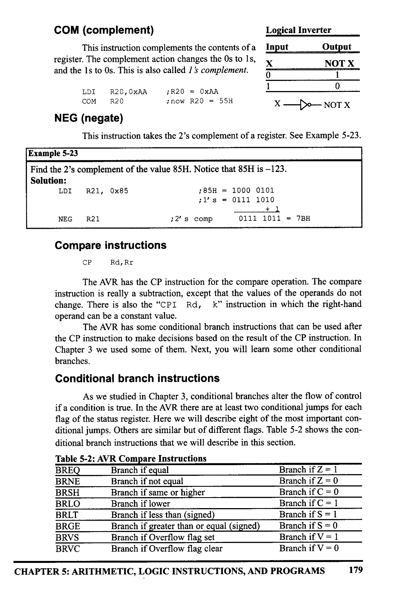
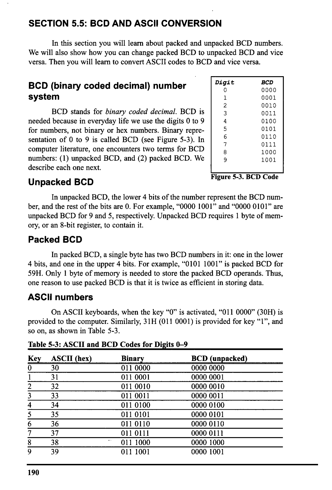

# Chapter 5: Arithmetic, Logic Instructions, and Programs

> **Textbook**: The AVR Microcontroller and Embedded Systems using Assembly and C

> **PDF Page Range**: 175 - 210


---


<!-- Page 175 -->
### [PDF Page 175]

CHAPTER 5
ARITHMETIC, LOGIC
INSTRUCTIONS, AND
PROGRAMS
OBJECTIVES
Upon completion of this chapter, you will be able to:
>>
Define the range of numbers possible in AVR unsigned data
Code addition and subtraction instructions for unsigned data
>>
>>
Code AVR multiplication instructions
Code AVR programs for division
Code AVR Assembly language logic instructions AND, OR, and EX-OR
>>
>>
>>
>>
>>
>>
Use AVR logic instructions for bit manipulation
Use compare instructions for program control
Code conditional branch instructions
Code AVR rotate instructions and data serialization
Contrast and compare packed and unpacked BCD data
Code AVR programs for ASCII and BCD data conversion
161


<!-- Page 176 -->
### [PDF Page 176]

This chapter describes AVR arithmetic and logic instructions. Program
examples are given to illustrate the application of these instructions. In Section 5.1
we discuss instructions and programs related to addition, subtraction, multiplica-
tion, and division of unsigned numbers. Signed numbers are described in

## Section 5.2. In Section 5.3, we discuss the logic instructions AND, OR, and XOR,

as well as the compare instruction. The rotate and shift instructions and data seri-
alization are explained in Section 5.4. In Section 5.5 we introduce BCD and
ASCII conversion.

## SECTION 5.1: ARITHMETIC INSTRUCTIONS

Unsigned numbers are defined as data in which all the bits are used to rep-
resent data and no bits are set aside for the positive or negative sign. This means
that the operand can be between 00 and FFH (0 to 255 decimal) for 8-bit data.
Addition of unsigned numbers
In the AVR, the add operation has two general purpose registers as inputs
and the result will be stored in the first (left) register. One form of the ADD
instruction in the AVR is:

```assembly
ADD Rd, Rr
;Rd = Rd + Rr
```

The instruction adds Rr (resource) to Rd (destination) and stores the result
in Ra. It could change any of the Z, C, N, V, H or S bits of the status register,
depending on the operands involved. The effect of the ADD instruction on N and
V is discussed in Section 5.2 because these bits are relevant mainly in signed num-
ber operations. Look at Example 5-1.
Notice that none of the AVR addition instructions support direct memory
access; that is, we cannot add a memory location to another memory location or
register. To add a memory location we should first load it to any of the RO-R31
registers and then use the ADD operation on it. Look at Example 5-2.
Example 5-1
Show how the flag register is affected by the following instructions.
IDI
LDI
ADD
R21, OxF5
R22, 0X0B
R21, R22
;R21 = F5H
; R22 = 0x0BH
;R21 = R21+R22 = F5+OB = 00 and C = 1
Solution:
F5H
+ QBH
100H
1111 0101
+ 2000 1011
0000 0000
After the addition, register R21 contains 00 and the flags are as follows:
C = 1 because there is a carry out from D7.
Z = 1 because the result in destination register (R21) is zero.
H = 1 because there is a carry from D3 to D4.
162


<!-- Page 177 -->
### [PDF Page 177]

Example 5-2
Assume that RAM location 400H has the value of 33H. Write a program to find the sum
of location 400H of RAM and 5SH. At the end of the program, R21 should contain the
sum.
Solution:
LDS
LDI
ADD
R2, 0x400
R21, 0x55
R21, R2
;R2 = 33H (location 0x400 of RAM)
; R21 = 55
;R21 = R21 + R2 = 55H + 33H = 88H, C = 0

```assembly
ADC and addition of 16-bit numbers
```

When adding two 16-bit data operands, we need to be concerned with the
propagation of a carry from the lower byte to the higher byte. This is called multi-
byte addition to distinguish it from the addition of individual bytes. The instruc-
tion ADC (ADD with carry) is used on such occasions.
For example, look at the addition of 3CE7H + 3B8DH, as shown next.
1
3C E7
+
3B 8D
78 74
When the first byte is added, there is a carry (E7 + 8D = 74, C = 1). The
carry is propagated to the higher byte, which results in 3C + 3B + 1 = 78 (all in
hex). Example 5-3 shows the above steps in an AVR program.
Example 5-3
Write a program to add two 16-bit numbers. The numbers are 3CE7H and 3B8DH.
Assume that R1 = 8D, R2 = 3B, R3 = E7, and R4 = 3C. Place the sum in R3 and R4;
R3 should have the lower byte.
Solution:
; R1 = 8D
; R2 = 3B
; R3 = E7
;RA = 3C
ADD
ADC
R3, RI
R4, RZ
; R3 = R3 + R1 = E7 + 8D = 74 and C = 1
;R4 = R4 + R2 + carry, adding the upper byte
¡ with
carry from lower byte
¡R4 = 3C + 3B + 1 = 78H (all in hex)
Notice the use of ADD for the lower byte and ADC for the higher byte.
CHAPTER 5: ARITHMETIC, LOGIC INSTRUCTIONS, AND PROGRAMS
163


<!-- Page 178 -->
### [PDF Page 178]

Subtraction of unsigned numbers
In many microprocessors, there are two different instructions for subtrac-
tion: SUB and SUBB (subtract with borrow). In the AVR we have five instructions
for subtraction: SUB, SBC, SUBI, SBCI, and SBIW. Figure 5-1 shows a summa-
ry of each instruction.
SUB
SBC
SUBI
SBCI
SBIW
Ra, Rr
Rd, RI
Rd, K
Rd, K
Rd: Rd+1, K
;Rd=Rd-Rr
;Rd=Rd-Rr-c
; Rd=Rd-K
;Rd=Rd-K-c
;Rd+1: Rd=Rd+1: Rd-K


*Description*: Technical diagram and schematic illustration detailing hardware connection topology, signal routing, and circuit operation for Figure 5-1.

> **Figure 5-1**

The SBC and SBCI instructions are subtract with borrow. In the AVR, we
use the C (carry) flag for the borrow and that is why they are called SBC (SuB with
Carry). In this section we will examine some of these commands.

```assembly
SUB Rd,Rr (Rd = Rd - Rr)
```

In subtraction, the AVR microcontrollers (indeed, all modern CPUs) use
the 2's complement method. Although every CPU contains adder circuitry, it
would be too cumbersome (and take too many transistors) to design separate sub-
tractor circuitry. For this reason, the AVR uses adder circuitry to perform the sub-
traction command. Assuming that the AVR is executing a simple subtract instruc-
tion and that C = 0 prior to the execution of the instruction, one can summarize the
steps of the hardware of the CPU in executing the SUB instruction for unsigned
numbers as follows:
1. Take the 2's complement of the subtrahend (right-hand operand).
2. Add it to the minuend (left-hand operand).
3. Invert the carry.
Example 5-4
Show the steps involved in the following.
IDI
IDI
SUB
R20, 0x23
R21, Ox3F
R21, R20
¡ load 23H into R20
¡load 3FH into R21
; R21 <- R21-R20
Solution:
R21 = 3F
- R20 = 23
1C
0011 1111
0010 0011
0011 1111
1101 1101
(2's complement)
1 0001 1100
C = 0, D7 = N = 0 (result is positive)
The flags would be set as follows: N= 0, C = 0. (Notice that there is a carry but C = 0.
We will discuss this more in the next section.) The programmer must look at the N (or
C) flag to determine if the result is positive or negative.
164


<!-- Page 179 -->
### [PDF Page 179]

These two steps are performed for every SUB instruction by the internal
hardware of the CPU, regardless of the source of the operands, provided that the
addressing mode is supported. It is after these two steps that the result is obtained
and the flags are set. Example 5-4 illustrates the two steps.
After the execution of the SUB instruction, if N = 0 (or C = 0), the result
is positive; if N = 1 (or C = 1), the result is negative and the destination has the 2's
complement of the result. Normally, the result is left in 2's complement, but the
NEG (negate, which is 2's complement) instruction can be used to change it. The
other subtraction instructions for subtract are SUBI and SBIW, which subtract an
immediate (constant) value from a register. SBIW subtracts an immediate value in
the range of 0-63 from a register pair and stores the result in the register pair.
Notice that only the last eight registers can be used with SBIW. See Examples 5-5
and 5-6.
Example 5-5
Write a program to subtract 18H from 29H and store the result in R21 (a) without using
the SUBI instruction, and (b) using the SUBI instruction.
Solution:
(a)
LDI
IDI
SUB
R21,0x29
R22, 0x18
R21, R22
;R21 = 29H
; R22 = 18H
;R21 = R21 - R22 = 29 - 18 = 11 H
(b)
IDI R21,0x29

```assembly
SUBI R21, 0x18
;R21 = 29H
;R21 = R21 - 18 = 29 - 18 = 11 H
```

Example 5-6
Write a program to subtract 18H from 2917H and store the result in R25 and R24.
Solution:
IDI
R25, 0x29
LDI
R24, 0x17
SBIW R25:R24, 0x18
; load the high byte (R25 = 29H)
¡load the low byte (R24 = 17H
; R25:R24 <- R25:R24 - 0x1
¡28FF = 2917 - 18
Notice that you should use BIW Rd+1:Rd, K format. If SBIW Rd: Ra+1, K format is
used, the assembler will assemble your code as if you had typed SBIW Ra+1: Rd, K
Change the third line of the code from SBIW R25:R24, 0x18 to SBIW R24:R25, 0x18
and examine the result.
CHAPTER 5: ARITHMETIC, LOGIC INSTRUCTIONS, AND PROGRAMS
165


<!-- Page 180 -->
### [PDF Page 180]

SBC (Rd + Rd - Rr - C) subtract with borrow (denoted by C)
This instruction is used for multibyte numbers and will take care of the bor-
row of the lower byte. If the borrow flag is set to one (C = 1) prior to executing
the SBC instruction, this operation also subtracts 1 from the result. See
Example 5-7.
Example 5-7
Write a program to subtract two 16-bit numbers: 2762H - 1296H. Assume R26 = (62)
and R27 = (27). Place the difference in R26 and R27; R26 should have the lower byte.
Solution:
;R26 =
(62)
; R27 = (27)
IDI
LDI
SUB
R28, 0×96
R29,0x12
R26, R28
SBC
R27, R29
; load the low byte (R28 = 96H)
; load
the high byte (R29 = 12H)
;R26 = R26 - R28 = 62 - 96 = CCH
;C = borrow = 1, N = 1
;R27 = R27 - R29 - C
;R27 = 27 - 12 - 1 = 14H
After the SUB, R26 has = 62H - 96H = CCH and the carry flag is set to 1, indicating
there is a borrow (notice, N = 1). Because C = 1, when SBC is executed R27 has
27H - 12H - 1 = 14H. Therefore, we have 2762H - 1296H = 14CCH.
The C flag in subtraction for AVR
Notice that the AVR is like other CPUs such as the x86 and the 8051 when
it comes to the carry flag in subtract operations. In the AVR, after subtract opera-
tions, the carry is inverted by the CPU itself and we examine the C flag to see if
the result is positive or negative. This means that, after subtract operations, if C=
1, the result is negative, and if C = 0, the result is positive. If you study
Example 5-4 again, you will see that there was a carry from MSB, but C = 0. Now
you know the reason; it is because the CPU inverts the carry flag after the SUB
instruction. Notice that the CPU does not invert the carry flag after the ADD
instruction.
Multiplication of unsigned numbers
The AVR has several instructions dedicated to multiplication. Here we will
discuss the MUL instruction. Other instructions are similar to MUL but are used
for signed numbers. See Table 5-1.
MUL is a byte-by-byte multiply instruction. In byte-by-byte multiplication,
operands must be in registers. After multiplication, the 16-bit unsigned product is
placed in Rl (high byte) and RO (low byte). Notice that if any of the operands is
selected from RO or R1 the result will overwrite those registers after multiplica-
tion.
166


<!-- Page 181 -->
### [PDF Page 181]



*Description*: Structured reference table listing operational parameters, instruction execution cycles, memory address mapping, or feature comparison for Table 5-1: Multiplication Summary.

> **Table 5-1: Multiplication Summary**

Multiplication Application
Bytel ByteZ
MUL Rd, Rr
Unsigned numbers
MULS Rd, Rr
Signed numbers
MULSU Rd, Rr Unsigned numbers
Rd
Rd
Rd
Rr
Rr
Rr
with signed numbers
The following example multiplies 25H by 65H.
LDI
R23, 0x25
IDI
¡ load 25H to R23
R24, 0x65
¡ load 65H to R24
MUL
R23, R24
;25H * 65H = E99 where
;RI = 0EH and RO = 99H
High byte Low byte
of result
of result
RI
RO
RI
RO
RI
RO
Division of unsigned numbers
AVR has no instruction for divide operation. We can write a program to
perform division by repeated subtraction. In dividing a byte by a byte, the numer-
ator is placed in a register and the denominator is subtracted from it repeatedly.
The quotient is the number of times we subtracted and the remainder is in the reg-
ister upon completion. See Program 5-1.
• DEF NUM = R20
• DEF
DENOMINATOR = R21
• DEF QUOTIENT = R22
LDI
NUM, 95
LDI
DENOMINATOR, 10
CLR
QUOTIENT
; NUM = 95
¡ DENOMINATOR = 10
¡ QUOTIENT = 0
L1:
INC
QUOTIENT
SUB
NUM, DENOMINATOR

```assembly
BRCC I1
```

¡branch if C is zero
DEC QUOTIENT
ADD
¡ once too many
NUM, DENOMINATOR
¡add back to it
HERE: JMP HERE
¡stay here forever
Program 5-1: Divide Function
An application for division
Sometimes a sensor is connected to an ADC (analog-to-digital converter)
and the ADC represents some quantity such as temperature or pressure. The 8-bit

```assembly
ADC provides data in hex in the range of 00-FFH. This hex data must be convert-
```

ed to decimal. We do that by dividing it by 10 repeatedly, saving the remainders,
as shown in Examples 5-8 and 5-9.
CHAPTER 5: ARITHMETIC, LOGIC INSTRUCTIONS, AND PROGRAMS
167


<!-- Page 182 -->
### [PDF Page 182]

Example 5-8
Assume that the data memory location 0x315 has value FD (hex). Write a program to
convert it to decimal. Save the digits in locations 0x322, 0x323, and 0x324, where the
least-significant digit is in location Ox322.
Solution:
• EQU HEX_NUM = 0x315
• EQU RMND_L = 0x322
• EQU RMND.
M
= 0x323
• EQU RMND_H = 0x324
• DEE NUM = R2O
• DEF DENOMINATOR = R21
• DEF QUOTIENT = R22
LDI
STS
R16, OXED
HEX_NUM, R16
;$FD = 253 in decimal
¡store $FD in location 0x315
L1:
L2:
IDS
IDI
INC
SUB
BRCC
NUM, HEX_NUM
DENOMINATOR, 10
QUOTIENT
NUM, DENOMINATOR;
L1
DEC
ADD
STS
QUOTIENT
NUM, DENOMINATOR
RMND_L, NUM
MOV
LDI
NUM, QUOTIENT
QUOTIENI, O
INC
QUOTIENT
SUB
NUM, DENOMINATOR
BRCC
L2
DEC
ADD
STS
STS
QUOTIENT
NUM, DENOMINATOR
RMND _M, NUM
RMND_H, QUOTIENT
HERE: JMP
HERE
; DENOMINATOR = 10
;
¡if C = 0 go back
¡ once too many
¡ add back to it
¡store remainder as the Ist digit
¡once too many
¡add back to it
¡store remainder as the 2nd digit
¡store quotient as the 3rd digit
i stay here forever
To convert a single decimal digit to ASCII format, we OR it with 30H. See Section
5.5.
168


<!-- Page 183 -->
### [PDF Page 183]

Example 5-9
Analyze the program in Example 5-8 for a numerator of 253.
Solution:
To convert a binary (hex) value to decimal, we divide it by 10 repeatedly until the quo-
tient is less than 10. After each division the remainder is saved. In the case of an 8-bit
binary, such as FDH, we have 253 decimal, as shown below.
253/10 =
25/10
=
Quotient
25
2
Remainder
3 (low digit)
5 (middle digit)
2 (high digit)
Therefore, we have FDH = 253.

### Review Questions

1. In unsigned byte-by-byte multiplication, the product will be placed in regis-
ter(s)
2. Is "MUL R2, Ox10" a valid AVR instruction? Explain your answer.
3. In AVR, the largest two numbers that can be multiplied are
and
4. True or false. The MUL instruction works on RO and R1 only.
5. The instruction "ADD R20, R21" places the sum in
6. Why is the following ADD instruction illegal? "ADD R1, 0x04"
7. Rewrite the instruction above in correct format.
8. The instruction "SUB R1, R2" places the result in
9. Find the value of the C flags in each of the following.
(a) LDI R21 0x4F
(b)
IDI R21, Ox9C
LDI
R22 0xB1
LDI
R22, 0x63
ADD
R21, R22

```assembly
ADD R21, R22
```

10. Show how the CPU would subtract 05H from 43H.
11. If C = 1, R1 = 95H, and R2 = 4FH prior to the execution of "SBC R1, R2", what
will be the contents of R1 and C after the subtraction?
CHAPTER 5: ARITHMETIC, LOGIC INSTRUCTIONS, AND PROGRAMS
169


<!-- Page 184 -->
### [PDF Page 184]


## SECTION 5.2: SIGNED NUMBER CONCEPTS AND

ARITHMETIC OPERATIONS
All data items used so far have been unsigned numbers, meaning that the
entire 8-bit operand was used for the magnitude. Many applications require signed
data. In this section the concept of signed numbers is discussed along with related
instructions. If your applications do not involve signed numbers, you can bypass
this section.
Concept of signed numbers in computers
In everyday life, numbers are used that could be positive or negative. For
example, a temperature of 5 degrees below zero can be represented as - 5, and 20
degrees above zero as +20. Computers must be able to accommodate such num-
the magnitude. The sign is represented by 0 for positive (+) numbers and 1 for neg-
ative (-) numbers. Signed byte representation is discussed below.
Signed 8-bit operands
In signed byte operands, D7 (MSB) is the sign, and DO to D6 are set aside
or the magnitude of the number. If D7 = 0, the operand is positive, and if D7 = 1
t is negative. The N flag in the status register is the D7 bi
Positive numbers
The range of positive numbers
that can be represented by the format
D7 D6 DS D4 D3 D2 DI DO
magnitude
shown in Figure 5-2 is 0 to +127. If a
sign.
positive number is larger than +127, a
16-bit operand must be used.


*Description*: Technical diagram and schematic illustration detailing hardware connection topology, signal routing, and circuit operation for Figure 5-2: 8-Bit Signed Operand.

> **Figure 5-2: 8-Bit Signed Operand**

Negative numbers
For negative numbers, D7 is 1; however, the magnitude is represented in
its 2's complement. Although the assembler does the conversion, it is still impor-
tant to understand how the conversion works. To convert to negative number rep-
resentation (2's complement), follow these steps:
1. Write the magnitude of the number in 8-bit binary (no sign).
2. Invert each bit.
3. Add 1 to it.
Examples 5-10, 5-11, and 5-12 on the next page demonstrate these three
steps.
170


<!-- Page 185 -->
### [PDF Page 185]

Example 5-10
Show how the AVR would represent -5.
Solution:
Observe the following steps.
1.
2.
0000 0101
1111 1010
1111 1011
5 in 8-bit binary
invert each bit
add 1 (which becomes
FB in hex)
Therefore, - 5 = FBH, the signed number representation in 2's complement for -5. The
D7 = N = 1 indicates that the number is negative.
Example 5-11
Show how the AVR would represent -34H.
Solution:
Observe the following steps.
1.
2.
3
0011 0100
1100 1011
1100 1100
34H given in binary
invert each bit
add 1 (which is CC in hex)
Therefore, -34 = CCH, the signed number representation in 2's complement for 34H.
The D7 = N = 1 indicates that the number is negative.
Example 5-12
Show how the AVR would represent -128.
Solution:
Observe the following steps.
1.
2.
3
1000 0000
0111
1111
1000 0000
128 in 8-bit binary
invert each bit
add 1
(which becomes 80 in hex)
Therefore, -128 = 80H, the signed number representation in 2's complement for - 128.
The D7 = N = 1 indicates that the number is negative. Notice that 128 (binary
10000000) in unsigned representation is the same as signed - 128 (binary 10000000).
CHAPTER 5: ARITHMETIC, LOGIC INSTRUCTIONS, AND PROGRAMS
171


<!-- Page 186 -->
### [PDF Page 186]

From the examples above, it is clear that the range of byte-sized negative
numbers is -1 to -128. The following lists byte-sized signed number ranges:
Decimal
-128
- 127
-126
Binary
1000 0000
1000 0001
1000
0010
Hex
80
81
82
- 1
1110
1111
1111
0000
0000
+1
0000
0001
+2
0000
0010
EF
00
01
02
• •
+127
ini
Overflow problem in signed number operations
When using signed numbers, a serious problem sometimes arises that must
be dealt with. This is the overflow problem. The AVR indicates the existence of an
error by raising the V (overflow) flag, but it is up to the programmer to take care
of the erroneous result. The CPU understands only Os and Is and ignores the
human convention of positive and negative numbers. What is an overflow? If the
result of an operation on signed numbers is too large for the register, an overflow
has occurred and the programmer must be notified. Look at Example 5-13.
Example 5-13
Examine the following code and analyze the result, including the N and V flags.
LDI
LDI
ADD
R20, 0X60
R21, 0x46
R20, R21
;R20 = 0110 0000 (+70)
;R21 = 0100 0110 (+96)
;R20 = (+96) + (+70) = 1010 0110
;R20 = A6H = -90 decimal, INVALID!!
Solution:
+96
+ +7l
+ 166
0110 0000
0100 0110
1010 0110 N = 1 (negative) and V = 1 Sum = -90
According to the CPU, the result is negative (N = 1), which is wrong. The CPU sets V
= 1 to indicate the overflow error. Remember that the N flag is the D7 bit. If N = 0, the
sum is positive, but if N= 1, the sum is negative.
In Example 5-13, +96 was added to +70 and the result, according to the
CPU, was -90. Why? The reason is that the result was larger than what RO could
contain. Like all other 8-bit registers, RO could only contain values less than or
equal to +127. The designers of the CPU created the overflow flag specifically for
the purpose of informing the programmer that the result of the signed number
operation is erroneous. The N flag is D7 of the result. If N = 0, the sum is positive
(t) and if N = 1, then the sum is negative.
172


<!-- Page 187 -->
### [PDF Page 187]

When is the V flag set?
two conditions occurs:
In 8-bit signed number operations, V is set to 1 if either of the following
1. There is a carry from D6 to D7 but no carry out of D7 (C = 0).
2. There is a carry from D7 out (C = 1) but no carry from D6 to D7.
In other words, the overflow flag is set to 1 if there is a carry from D6 to
D/ or trom D7 out, but not both. This means that if there is a carry both from D6
to D7 and from D7 out, V = 0. In Example 5-13, because there is only a carry from
D6 to D7 and no carry from D7 out, V = 1.
In Example 5-14, because there is only a carry from D7 out and no carry
from D6 to D7, V = 1.
Example 5-14
Examine the following code, noting the role of the V and N flags:
R20, 0x80
; R20 = 1000 0000 (80H = -128)
R21, OXFE
;R21 = 1111 1110 (FEH = -2)
ADD
R20, R21
;R20 = (-128) + (-2)
;R2O = 1000000 + 11111110 = 0111 1110,
¡N = 0, RO = 7EH = +126, invalid
Solution:
-128
+ - 2
- 130
1000 0000
1111 1110
0111 1110 N = 0 (positive) and V = 1
According to the CPU, the result is +126, which is wrong, and V = 1 indicates that.
Notice that the N flag indicates the sign of the corrupted result, not the sign that the real
result should have.
Further considerations on the V flag
In the ADD instruction, there are two different conditions. Either the
operands have the same sign or the signs of the operands are different. When we

```assembly
ADD two numbers with different signs, the absolute value of the result is smaller
```

than the operands before executing the ADD instruction. So overflow definitely
cannot happen after two operands with different signs are added. Overflow is pos-
sible only when we ADD two operands with the same sign. In this case the
absolute value of the result is larger than the operands before executing the ADD
instruction. So it is possible that the result will be too large for the register and
cause overflow. If we ADD two numbers with the same sign, the results should
have the same sign too. If we add two numbers with the same sign and the result
sign is different, we know that overflow has occurred. That is exactly the way that
the CPU knows when to set the V flag. In the AVR the equation of the V flag is as
follows:
V = Rd7. Rr7. R7 + Rd7. Rr7. R7
where Rd7 and Rr7 are the 7th bit of the operands and R7 is the 7th bit of
CHAPTER 5: ARITHMETIC, LOGIC INSTRUCTIONS, AND PROGRAMS
173


<!-- Page 188 -->
### [PDF Page 188]

the result. We can extend this concept to the SUB instructions (a - b = a + (-b))
Study Examples 5-15 and 5-16 to understand the overflow flag in signed
arithmetic.
Example 5-15
Examine the following code, noting the role of the V and N flags:
IDI
R20, -2
LDI
R21, -5
ADD
R20, R21
;R20 = 1111 1110 (R20 = FEH)
;R21 = 1111 1110 (R21
= FBH)
;R20 = (-2) + 1-5) = -7 or E9H
¡ correct, since V = 0
Solution:
- 2
+ -5
- 7
1111 1110
1111 1011
1111 1001
and V = 0 and N = 1. Sum is negative
According to the CPU, the result is -7, which is correct, and the V indicates that (V = 0).
Example 5-16
Examine the following code, noting the role of the V and N flags:
IDI
LDI
ADD
R20, 7
R20,18
R20, R21
; R20 = 0000 0111
; R20 = 0001 0010
;R20 = (+7) + (+18)
;R2O = 00000111 + 00010010 = 0001 1001
¡R20 = (+7) + (+18) = +25, N = 0, positive
¡ and correct, V = 0
Solution:
+ 7 0000 0111
+ +18 0001.0010
+25 0001 1001 N = 0 (positive 25) and V = 0
According to the CPU, this is +25, which is correct, and V = 0 indicates that.
From Examples 5-14 to 5-16, we conclude that in any signed number addi-
tion, V indicates whether the result is valid or not. If V = 1, the result is erroneous;
if V = O, the result is valid. We can state emphatically that in unsigned number
addition, the programmer must monitor the status of C (carry flag), and in signed
number addition, the V (overflow) flag must be monitored. In the AVR, instruc-
tions such as BRCS and BRCC allow the program to branch right after the addi-
tion of unsigned numbers according to the value of C flag. There are also the
BRVC and the BRVS instructions for the V flag that allow us to correct the signed
number error. We also have two branch instructions for the N flag (negative),
BRPL and BRMI.
174


<!-- Page 189 -->
### [PDF Page 189]

What is the difference between the N and S flags?
As we mentioned before, in signed numbers the N flag represents the D7
bit of the result. If the result is positive, the N flag is zero, and if the result is neg-
ative, the N flag is one, which is why it is called the Negative flag.
In operations on signed numbers, overflow is possible. Overflow corrupts
the result and negates the sign bit. So if you ADD two positive numbers, in case
of overflow, the N flag would be 1 showing that the result is negative! The S flag
helps you to know the sign of the real result. It checks the V flag in addition to the
D7 bit. If V = O, it shows that overflow has not occurred and the S flag will be the
same as D7 to show the sign of the result. If V = 1, it shows that overflow has
occurred and the S flag will be opposite to the D7 to show the sign of the real (not
the corrupted) result. See Example 5-17.
Example 5-17
Study Examples 5-13 through 5-16 again and state what the value of the S flag is in each
of them and whether the value of the S flag is the same as that of the N flag.
Solution:
Example 5-13: Because two positive numbers are added, the sign of the real result is
positive, so S = 0 (for positive). The value of the S flag is not the same as that of the N
flag (1) because there is overflow (V = 1).
Example 5-14: Because two negative numbers are added, the sign of the real result is
negative, so S = 1 (for negative). The value of the S flag is not the same as that of the
N flag (0) because there is overflow (V = 1).
Example S-15: Because two negative numbers are added, the sign of the real result is
negative, so S = 1 (for negative). The value of the S flag is the same as that of the N
flag (1) because there is no overflow (V = 0).
Example 5-16: Because two positive numbers are added, the sign of the real result is
positive, so S = 0 (for positive). The value of the S flag is the same as that of the N flag
(0) because there is overflow (V = 0).
Instructions to create 2's complement
The AVR has a special instruction to make the 2's complement of a num-
ber. It is called NEG (negate), which is discussed in the next section.

### Review Questions

1. In an 8-bit operand, bit
is used for the sign bit.
2. Convert -16H to its 2's complement representation.
3. The range of byte-sized signed operands is
_ to
...
4. Show +9 and -9 in binary.
5. Explain the difference between a carry and an overflow.
CHAPTER 5: ARITHMETIC, LOGIC INSTRUCTIONS, AND PROGRAMS
175


<!-- Page 190 -->
### [PDF Page 190]


## SECTION 5.3: LOGIC AND COMPARE INSTRUCTIONS

Apart from I/O and arithmetic instructions, logic instructions are some of
the most widely used instructions. In this section we cover Boolean logic instruc-
tions such as AND, OR, Exclusive-OR (XOR), and complement. We will also
study the compare instruction.
AND

```assembly
AND Rd, Rr ;Rd = Rd AND Rr
```

This instruction will perform a logical AND
on the two operands and place the result in the left-
hand operand. There is also the "ANDI Rd, K"
instruction in which the right-hand operand can be a
0
-
constant value. The AND instruction will affect the
Logical AND Function
Inputs
Output
Y
XAND Y
0
1
0
1
Z, S, and N flags. N is D7 of the result, and Z = 1 if L
the result is zero. The AND instruction is often used
1
> XANDY
to mask (set to 0) certain bits of an operand. See
Example 5-18.
Example 5-18
Show the results of the following.
IDI
ANDI
R20, 0x35
R2O, 0X0F
;R20 = 35H
;R20 = R20 AND OFH (now R20 = 05)
Solution:
AND
35H
OFH
05H
0011 0101
0000 1111
---
0000 0101
;35H AND 0FH = 05H, Z = 0, N = 0
OR

```assembly
OR Ra, Rr
;Rd = Rd OR Rr
```

This instruction will perform a logical OR on
the two operands and place the result in the left-hand
operand. There is also the "ORI Rd, K" instruction
in which the right-hand operand can be a constant
value. The OR instruction will affect the Z, S, and N
flags. N is D7 of the result and Z = 1 if the result is
zero. The OR instruction can be used to set certain
bits of an operand to 1. See Example 5-19.
176
Logical OR Function
Inputs
Output
Y
XORY
0
0
0
1
1
1
0
1
1
1
- XORY


<!-- Page 191 -->
### [PDF Page 191]

Example 5-19
(a) Show the results of the following:
R20, 0x04
ORI
R20, 0x30
;R20 = 04
;now R20 = 34H
(b) Assume that PB2 is used to control an outdoor light, and PBS to control a light inside
a building. Show how to turn "on" the outdoor light and turn "off" the inside one.
Solution:
(a)
OR
04H
30H
34H
0000 0100
0011 0000
0011 0100
(b)
SBI
SBI
IN
DDRB, 2
DDRB, 5
R20, PORTB
ORI
R20, 0600000100
ANDI
R20, 0b11011111
OUT
PORTB, R20
HERE: JMP HERE
04 OR 30 = 34H, Z = 0 and N= 0
¡bit 2 of Port B is output
¡bit 5 of Port B is output
¡ move PORTB to R20. (Notice that we read
¡the value of PORTB instead of PINB|
¡ because we want to know the last value
¡of PORTB, not the value of the AVR
¡chip pins.)
¡set bit 2 of R20 to one
¡clear bit 5 of R20 to zero
¡ out R20 to PORTB
; stop here
Logical XOR Function
EX-OR
EOR
Rd, Rs
Inputs
Output
; Rd = Rd XOR Rs
A
A XOR B
0
0
0
This instruction will perform a logical EX-
0
1
1

```assembly
OR on the two operands and place the result in the
```

1
1
left-hand operand. The EX-OR instruction will
1
affect the Z, S, and N flags. N is D7 of the result
and Z = 1 if the result is zero. See Example 5-20.
— A XOR B
Example 5-20
Show the results of the following:
LDI
R20, 0x54
IDI
R21, 0x78
EOR
R20, R21
Solution:
XOR
54H
78H
0101 0100
0111 1000
2CH
0010 1100
54H XOR 78H = 2CH, Z = 0, N= 0
CHAPTER 5: ARITHMETIC, LOGIC INSTRUCTIONS, AND PROGRAMS
177


<!-- Page 192 -->
### [PDF Page 192]

EX-OR can also be used to see if two registers have the same value. The
"EOR RO, R1" instruction will EX-OR the RO register and R1, and put the result
in RO. It both registers have the same value, 00 is placed in RO and the Z flag is
set (Z = 1). Then, we can use the BREQ or BRNE instruction to make a decision
based on the result. See Examples 5-21 and 5-22.
Example 5-21
The EX-OR instruction can be used to test the contents of a register by EX-ORing it
with a known value. In the following code, we show how EX-ORing the value 4SH with
itself will raise the Z flag:
OVER:
IN
R20, PINB
LDI
R21, 0x45
EOR
R20, R21
BRNE
OVER
Solution:
45H
01000101
45H
01000101
00000000
EX-ORing a number with itself sets it to zero with Z = 1. We can use the BREQ instruc-
tion to make the decision. EX-ORing with any other number will result in a nonzero value.
Example 5-22
Read and test PORTB to see whether it has the value 45H. If it does, send 99H to
PORTC; otherwise, it is cleared.
Solution:
LDI
OUT
IDI
OUT
OUT
LDI
R2O, OxFF
DDRC, R20
R20, 0x00
DDRB, R20
PORIC, R20
R21, 0x45
HERE:
IN
EOR
R20, PINB
R2O, R21

```assembly
BRNE HERE
```

LDI
R20, 0x99
OUT
PORIC, R20
EXIT: JMP
EXIT
; R20 = OXFF
¡ Port C is output
; R20 = 0
¡ Port B is input
; PORTC = 00
; R21 = 45
¡ get a byte
; EX-OR with 0x45
¡branch if PORTB has value other than 45
;R20 = 0x99
; PORTC = 99h
¡stop here
Another widely used application of EX-OR is to toggle the bits of an
operand. The following code demonstrates how to use EX-OR to toggle the bits of
an operand.
IDI
EOR
R2O, OxFF
RO, R20
;EX-OR RO with 1111 1111 will
; change all the bits of RO to
¡ opposite
178


<!-- Page 193 -->
### [PDF Page 193]

COM (complement)
Logical Inverter
This instruction complements the contents of a
Input
register. The complement action changes the Os to 1s,
and the Is to Os. This is also called /'s complement.
Output
NOT X
0
LDI
R20, OxAA
COM
R20
NEG (negate)
¡ R20 = OXAA
; now R20 = 55H
x-
DO NOT X
This instruction takes the 2's complement of a register. See Example 5-23.
Example 5-23
Find the 2's complement of the value 85H. Notice that 85H is -123.
Solution:
LDI
R21, 0x85
NEG
R21
; 2's comp
; 85H = 1000 0101
;1's = 0111 1010
+ 1
0111 1011 = 7BH
Compare instructions
CP
Rd, Rr
The AVR has the CP instruction for the compare operation. The compare
instruction is really a subtraction, except that the values of the operands do not
change. There is also the "CPI Rd, k" instruction in which the right-hand
operand can be a constant value.
The AVR has some conditional branch instructions that can be used after
the CP instruction to make decisions based on the result of the CP instruction. In
Chapter 3 we used some of them. Next, you will learn some other conditional
branches.
Conditional branch instructions
As we studied in Chapter 3, conditional branches alter the flow of control
if a condition is true. In the AVR there are at least two conditional jumps for each
flag of the status register. Here we will describe eight of the most important con-
ditional jumps. Others are similar but of different flags. Table 5-2 shows the con-
ditional branch instructions that we will describe in this section.


*Description*: Structured reference table listing operational parameters, instruction execution cycles, memory address mapping, or feature comparison for Table 5-2: AVR Compare Instructions.

> **Table 5-2: AVR Compare Instructions**

BREQ
Branch if equal
BRNE
Branch if not equal
BRSH
Branch if same or higher
BRLO
Branch if lower
BRLT
Branch if less than (signed)
BRGE
Branch if greater than or equal (signed)
BRVS
Branch if Overflow flag set
BRVC
Branch if Overflow flag clear
Branch if Z = 1
Branch if Z = 0
Branch if C = 0
Branch if C = 1
Branch if S = 1
Branch if S = 0
Branch if V = 1
Branch if V = 0
CHAPTER 5: ARITHMETIC, LOGIC INSTRUCTIONS, AND PROGRAMS
179


<!-- Page 194 -->
### [PDF Page 194]


```assembly
BREQ and BRNE instructions
BREQ k
¡if (Z = 1) then branch
```

¡else continue
The BREQ makes decisions based on the Z flag. If Z = 1 the BREQ
instruction branches. Notice that after the CP instructions, the Z = 1 means that the
operands were equal, and after the DEC instruction it means that the operand is
now equal to zero.
The BRNE instruction, like the BREQ, makes decisions based on the Z
flag, but it branches when Z = 0. (After the CP instructions, Z = 0 means that the
operands were not equal, and after the DEC instruction it means that the operand
is not equal to zero.) See Example 5-24.
Notice that the BREQ and BRNE instructions can be used for both signed,
and unsigned numbers.
Example 5-24
Write a program to monitor PORTB continuously for the value 63H. It should stop mon-
itoring only if PORTB = 63H.
Solution:
IDI
R20, 0x00
OUT
DDRB, R20
¡ PORT B is input
LDI
R21,0x63
AGAIN:
IN
R2O, PINB
CP
R20, R21
BRNE
AGAIN
¡ compare with 0x63, Z = 1 if yes
¡ go to AGAIN if PORTB is not equal to 0x63
....
BRSH and BRLO instructions
BRSH K
¡if (C = 0) then branch
¡else continue
The BRSH makes decisions based on the C flag. If C = 0 (which, after the
CP instructions for unsigned numbers, means that the left-hand operand of the CP
instruction was the same as or higher than the right-hand operand) the CPU will
jump.
The BRLO instruction, like the BRSH, makes decisions based on the C
flag, but it branches when C = 1. (After the CP instructions for unsigned numbers,
C = 1 means that the left-hand operand of the CP instruction was lower than the
right-hand operand.) See Example 5-25.
Notice that the BRSH and the BRLO instructions can be used to compare
unsigned numbers. To compare signed numbers you should use the BRGE and
BRLT instructions. We will discuss them in more detail next.
We can use more than one conditional branch instruction to make more
complicated decisions. See Example 5-26.
180


<!-- Page 195 -->
### [PDF Page 195]

Example 5-25
Write a program to find the greater of the two values 27 and 54, and place it in R20.
Solution:
• EQU VAL_1=27
• EQU VAL_2=54
IDI R20, VAL_1
LDI
R21, VAL_2
CP
R21, R20
BRIO NEXT
IDI R2O, VAL_2
¡RZO = VAL_I
;RZ1 = VAL_2
¡ compare R21 and R20
¡if R21<R20 (branch if lower) go to NEXT
¡R20 = VAL_2
NEXT:
Example 5-26
Assume that Port B is an input port connected to a temperature sensor. Write a program
to read the temperature and test it for the value 75. According to the test results, place
the temperature value into the registers indicated by the following.
If T = 75
If T > 75
IfT <75
then R16 = T
then R16 = 0
then R16 = 0
; R17=0; R18 = 0
; R17=T;R18=0
; R17 = 0; R18 = T
Solution:
SAME_HI:
HI:
CNTNU:
LDI
OUT
CLR
CLR
CLR
R20, 0x00
DDRB, R20
R16
R17
R18
IN
R20, PINB
CPI
R20, 75
BRSH SAME_HI

```assembly
MOV R18, R20
```

RUMP CNTNU
BRNE
HI
MOV
R16, R20
RJMP
CNTNU
MOV
....
R17, R20
; R20 = 0
¡ Port B = input
¡ R16 = 0
; R17 = 0
; R18 = 0
; compare R20 (PORTB) and 75
¡ executes when R20 < 75
¡ executes when R20 >= 75
¡ executes when R20 = 75
¡executes when R20 > 75
CHAPTER 5: ARITHMETIC, LOGIC INSTRUCTIONS, AND PROGRAMS
181


<!-- Page 196 -->
### [PDF Page 196]

BRGE and BRLT instructions
The BRGE makes decisions based on the S flag. If S = 0 (which, after the
CP instruction for signed numbers, means that the left-hand operand of the CP
instruction was greater than or equal to the right-hand operand) the BRGE instruc-
tion branches in a forward or backward direction relative to program counter.
The BRLT is like the BRGE, but it branches. when S = 1. Notice that the
BRGE, and the BRLT are used with signed numbers.
BRVS and BRVC instructions
As we mentioned before, the V (overflow) flag must be monitored by the
programmer to detect overflow and handle the error. The BRVC and BRVS
instructions let you check the value of the V flag and change the flow of the pro-
gram if overflow has occurred. See Example 5-27.
Example 5-27
Write a program to add two signed numbers. The numbers are in R21 and R22. The pro-
gram should store the result in R21. If the result is not correct, the program should put
OXAA on PORTA and clear R21.
Solution:
LDI
LDI
LDI
OUT
ADD
BRVC
LDI
OUT
IDI
NEXT:...
R21, OXFA
R22, 0x05
R23, OxFF
DDRA, R23
R21, R22
NEXT
R23, 0XAA
PORTA, R23
R21,0×00
;R21 = OxFA
;R22 = 0x05
:R23 = OXFF
¡ Port A is output
;R21 = R21 + R22
¡ if V = 0 | no error) then go to next
; R23 = OxAA
¡ send OxAA to PORTA
¡clear R21

### Review Questions

1. Find the content of R20 after the following code in each case:
(a) LDI R20, 0x37 (b) IDI R20, 0x37
(C) IDI R20, 0x37
IDI R21, 0XCA
IDI R21, OXCA
IDI R21, OXCA

```assembly
AND R2O, R21
OR R20, 21
```

EOR
2. To mask certain bits of R20, we must AND it with
3. To set certain bits of R20 to 1, we must OR it with
4. EX-ORing an operand with itself results in
5. True or false. The CP instruction alters the contents of its operands.
6. Find the contents of register R20 after execution of the following code:
LDI
R20, 0
LDI
R21,0x99
LDI
R22, OXFF
OR
R20, R21
EOR
R20, R22
182


<!-- Page 197 -->
### [PDF Page 197]


## SECTION 5.4: ROTATE AND SHIFT INSTRUCTIONS AND

DATA SERIALIZATION
In many applications there is a need to perform a bitwise rotation of an
operand. In the AVR the rotation instructions ROL and ROR are designed specif-
ically for that purpose. They allow a program to rotate a register right or left
through the carry flag. We explore the rotate instructions next because they are
widely used in many different applications.
Rotating through the carry
There are two rotate instructions in the AVR. They involve the carry flag.
Each is shown next.
ROR instruction
ROR Rd
¡ rotate Rd right through carry
In the ROR, as bits are rotat-
ed from left to right, the carry flag
enters the MSB, and the LSB exits to
MSB - LSB
the carry flag. In other words, in
C
ROR the C is moved to the MSB,
and the LSB is moved to the C. In
reality, the carry flag acts as if it is part of the register, making it a 9-bit register.
Examine the following code.
CLC
IDI
ROR
ROR
ROR
R20, 0x26
R20
R20
R20
¡ make C = 0 (carry is 0)
; R20 = 0010 0110
; R20 = 0001 0011
•C = 0
; R20 = 0000 1001 C =
: 1
;R2O = 1000 0100 C = 1
ROL instruction
The other rotating instruction
is ROL. In ROL, as bits are shifted
from right to left, the carry flag
enters the LSB, and the MSB exits to
C
MSB + LSB
the carry flag. In other words, in
ROL the C is moved to the LSB, and
the MSB is moved to the C. See the following code and diagram. Again, the carry
flag acts as if it is part of the register, making it a 9-bit register. Examine the fol-
SEC
IDI
ROL
ROL
ROL
ROL
R20, 0x15
R20
R20
R20
R20
; make C = 1
;R20 = 0001 0101
;R20 = 0010 1011 C = 0
;R2O = 0101 0110 C = 0
; R20 = 1010 1100 C = 0
;R20 = 0101 1000 C = 1
CHAPTER 5: ARITHMETIC, LOGIC INSTRUCTIONS, AND PROGRAMS
183


<!-- Page 198 -->
### [PDF Page 198]

Serializing data
Serializing data is a way of sending a byte of data one bit at a time through
a single pin of the microcontroller. There are two ways to transfer a byte of data
serially:
1. Using the serial port. In using the serial port, programmers have very limited
control over the sequence of data transfer. The details of serial port data trans-
fer are discussed in Chapter 11.
2. The second method of serializing data is to transfer data one bit at a time and
control the sequence of data and spaces between them. In many new genera-
tions of devices such as LCD, ADC, and ROM, the serial versions are becom-
ing popular because they take up less space on a printed circuit board. Next,
we discuss how to use rotate instructions in serializing data.
Serializing a byte of data
Serializing data is one of the most widely used applications of the rotate
instruction. We can use the rotate instruction to transfer a byte of data serially (one
bit at a time). Shift instructions can be used for the same job. After presenting
rotate instructions in this section we will discuss shift instructions in more detail.
Example 5-28 shows how to transfer an entire byte of data serially via any AVR
pin.
Example 5-28
Write a program to transfer the value 41H serially (one bit at a time) via pin PB1. Put
one high at the start and end of the data. Send the LSB first.
Solution:
• INCLUDE "M32DEF.INC"
SBI
DDRB, 1
IDI
R20, 0x41
¡bit 1 of Port B is output
;R20 = the value to be sent
CIC
LDI
SBI
R16, 8
PORTB, 1
¡clear carry flag
; R16 = 8
¡bit 1 of PORTB is 1
AGAIN:
ROR
BRCS
CBI
JMP
ONE: SBI
NEXT:
DEC
BRNE
SBI
HERE: JMP
R20
ONE
PORTB, 1
NEXT
PORTB, 1
R16
AGAIN
PORTB, 1
HERE
¡ rotate right R20 (send ISB to C flag)
¡if C = 1 then go to ONE
¡bit 1 of PORT is cleared to zero
¡ go to NEXT
¡bit 1 of PORTB is set to one
; decrement R16
¡ if R16 is not zero then go to AGAIN
¡bit 1 of PORTB is set to one
; RB1 = high
184


<!-- Page 199 -->
### [PDF Page 199]

Example 5-29 also shows how to bring in a byte of data serially. We will
see how to use these concepts for a serial RTC (real-time clock) chip in Chapter
16. Example 5-30 shows how to scan the bits in a byte.
Example 5-29
Write a program to bring in a byte of data serially via pin RC7 and save it in R20 reg-
ister. The byte comes in with the LSB first.
Solution:
• INCLUDE
"M32DEF.INC"
CBI
DDRC, 7
LDI
R16, 8
LDI
R20, 0
AGAIN:

```assembly
SBIC PING, 7
```

SEC
SBIS

```c
PINC, 7
```

CIC
ROR
DEC
R20
R16
BRNE
AGAIN
HERE: JMP
HERE
¡bit 7 of Port C is input
;R16 = 8
; R20 = 0
¡skip the next line if bit 7 of Port C is O
¡ set carry flag to one
¡ skip the next line if bit 7 of Port C is 1
¡ clear carry flag to zero
; rotate right R20. move C flag to MSB of R21
¡decrement R16
¡if R16 is not zero go to AGAIN
i stop here
Example 5-30
Write a program that finds the number of 1s in a given byte.
Solution:
• INCLUDE
IDI
IDI
LDI
"M32DEF.INC"
R20, 0x97
R30, 0
R16, 8
¡ number of 1s
¡ number of bits in a byte
AGAIN:
ROR
BRCC
R20
: NEXT
INC
R30
NEXT:
DEC
R16
BRNE
AGAIN
ROR
HERE: JMP
R20
HERE
¡rotate right R20 and move ISB to C flag
¡if C = 0 then go to NEXT
; increment R30
; decrement R16
¡if R16 is not zero then go to AGAIN
¡ one more time to leave R20 unchanged
i stop here
CHAPTER 5: ARITHMETIC, LOGIC INSTRUCTIONS, AND PROGRAMS
185


<!-- Page 200 -->
### [PDF Page 200]

Shift instructions
There are three shift instructions in the AVR. All of them involve the carry
flag. Each is shown next.
LSL instruction
LSL Rd
¡ logical shift left
In LSL, as bits are
shifted from right to left, o
enters the LSB, and the
MSB 15B D
MSB exits to the carry flag.
In other words, in LSL, O is
moved to the LSB, and the MSB is moved to the C flag. Notice that this instruc-
tion multiplies the content of the register by 2 assuming that after LSL the carry
flag is not set. Examine the following code.
CLC
LDI
LSL
LSL
LSL
R20, 0x26
R20
R2O
R20
¡ make C = (carry (carry is 0)
; R20 = 0010 0110(38)
C = O
; R20 = 0100 1100(76)
C = 0
; R20 = 1001 1000(152) C = 0
; R20 = 0011 0000(48)
C = 1
¡as C = 1 and content of R20
¡ is not multiplied by 2
LSR instruction
The second shift
instruction is LSR. In LSR,
as bits are shifted from left
to right, O enters the MSB,
MSB
LSB
and the LSB exits to the
carry flag. In other words, in
LSR, 0 is moved to the MSB, and the LSB is moved to the C flag. Notice that this
instruction divides the content of the register by 2 and the carry flag contains the
remainder of the division. Examine the following code.
LDI
LSR
ISR
LSR
R20, 0x26
R20
R20
R20
; R20 = 0010 0110 (38)
;R20 = 0001 0011 (19)
•C = 0
; R20 = 0000 1001 (9)
C = 1
; R20 = 0000 0100 (4)
C = 1
LSR cannot be used to divide signed numbers by 2. See Example 5-31.
ASR instruction
The third
shift
instruction is ASR, which
means arithmetic shift right.
The ASR instruction can
divide signed numbers by
two. In ASR, as bits are
186
7
MSB
ISB
C


<!-- Page 201 -->
### [PDF Page 201]

shifted from left to right, the MSB is held constant and the LSB exits to the carry
flag. In other words, MSB is not changed but is copied to D6, D6 is moved to D5,
DS is moved to D4, and so on. Examine the following code.
IDI
ISR
ISR
LSR
ISR
ISR
R20, 0D60
R20
R20
R20
R20
R2O
;R20 = 1101 0000(-48) c = 0
;R20 = 1110 1000(-24)
C = 0
;R20 = 1111 0100(-12)
C = 0
;R20 = 1111 1010(-6)
C
_= O
; R20 = 1111 1101(-3)
_= 0
¡ R20 = 1111 1110(-1)
C = 1
Example 5-32 shows how we can use ROR to divide a register by a num-
ber that is a power of 2.
Example 5-31
Assume that R20 has the number -6. Show that LSR cannot be used to divide the con-
tent of R20 by 2. Why?
Solution:
LDI
ISR
R20, OXFA
R20
;R20 = 1111 1010 (-6)
;R2O = 0111 1101 (+125)
i-6 divided by 2 is not +125 and
¡ the answer is not correct
Because LSR shifts the sign bit it changes the sign of the number and therefore cannot
be used for signed numbers.
Example 5-32
Assume that R20 has the number 48. Show how we can use ROR to divide R20 by 8.
Solution:
LDI
CIC
ROR
R20
CLC
ROR
R20
CLC
ROR
R20
R20, 0x30
¡to divide a number by 8 we can
¡shift it 3 bits to the right. without
; LSR we have to ROR 3 times and
¡clear carry flag before
¡ each rotation
; R20 = 0011 0000 (48)
¡clear carry flag
; R20 = 0001 1000 (24)
¡Clear carry flag
¡ R20 = 0000 1100 (12)
¡clear carry flag
; R20 = 0000 0110 (6)
; 48 divided by 8 is 6 and
¡ the answer is correct
CHAPTER 5: ARITHMETIC, LOGIC INSTRUCTIONS, AND PROGRAMS
187


<!-- Page 202 -->
### [PDF Page 202]

SWAP instruction
SWAP Rd
¡swap nibbles
Another useful instruction is the SWAP instruction. It works on RO-R31.
It swaps the lower nibble and the higher nibble. In other words, the lower 4 bits
are put into the higher 4 bits, and the higher 4 bits are put into the lower 4 bits. See
the diagrams below.
before:
D7-D4
D3-DO
after:
SWAP
D3-DO
D7-D4
before:
0111
0010
after:
SWAP
0010
0111
Example 5-33 shows how to exchange nibbles of a byte with and without
SWAP instruction.
Example 5-33
(a) Find the contents of the R20 register in the following code.
IDI
R20, 0x72
SWAP
R20
(b) In the absence of a SWAP instruction, how would you exchange the nibbles?
Write a simple program to show the process.
Solution:
(a)
; R20 = 0x72
; R20 =
0x27
(b)
LDI
R20, 0x72
SWAP R20
IDI
LDI
LDI
BEGIN:
CIC
ROL
ROL
DEC
BRNE
OR
HERE: JMP
188
R20, 0×72
R16,4
R21,0
R20
R21
R16
BEGIN
R2O, R21
HERE


<!-- Page 203 -->
### [PDF Page 203]


### Review Questions

1. What is the value of R20 after the following code is executed?
LDI
CLC
ROR
ROR
ROR
ROR
R20, 0x40
R20
R20
R20
R20
2. What is the value of R20 after the following code is executed?
LDI
CIC
ROL
ROL
ROL
ROL
R20, 0x40
R20
R20
R20
R20
3. What is the value of R20 after execution of the following code?
LDI
R20, 0x40
SEC
ROL
R20
SWAP R20
4. What is the value of R20 after execution of the following code?
LDI
R20, 0x00
SEC
ROL
R20
CLC
ROL
R20
SEC
ROL
R20
CLC
ROL
R20
SEC
ROL
CIC
R20
ROL
R20
SEC
ROL
R20
CIC
ROL
R20
5. What is the value of R20 after execution of the last code if you replace ROL
with the ROR instruction?
6. How many LSR instructions are needed to divide a number by 32?
CHAPTER 5: ARITHMETIC, LOGIC INSTRUCTIONS, AND PROGRAMS
189


<!-- Page 204 -->
### [PDF Page 204]


## SECTION 5.5: BCD AND ASCII CONVERSION

In this section you will learn about packed and unpacked BCD numbers.
We will also show how you can change packed BCD to unpacked BCD and vice
versa. Then you will learn to convert ASCII codes to BCD and vice versa.
BCD (binary coded decimal) number
system
BCD stands for binary coded decimal. BCD is
Digit
0
1
2
3
needed because in everyday life we use the digits 0 to 9
tor numbers, not binary or hex numbers. Binary repre-
sentation of 0 to 9 is called BCD (see Figure 5-3). Ir
6
computer literature, one encounters two terms for BCI
numbers: (1) unpacked BCD, and (2) packed BCD. We
9
BCD
0000
0001
0010
0011
0100
0101
0110
0111
1000
1001
describe each one next.


*Description*: Technical diagram and schematic illustration detailing hardware connection topology, signal routing, and circuit operation for Figure 5-3: BCD Code.

> **Figure 5-3: BCD Code**

Unpacked BCD
In unpacked BCD, the lower 4 bits of the number represent the BCD num-
ber, and the rest of the bits are O. For example, "0000 1001" and "0000 0101" are
unpacked BCD for 9 and 5, respectively. Unpacked BCD requires 1 byte of mem-
ory, or an 8-bit register, to contain it.
Packed BCD
In packed BCD, a single byte has two BCD numbers in it: one in the lower
4 bits, and one in the upper 4 bits. For example, "0101 1001" is packed BCD for
59H. Only 1 byte of memory is needed to store the packed BCD operands. Thus,
one reason to use packed BCD is that it is twice as efficient in storing data.
ASCII numbers
On ASCIl keyboards, when the key "O" is activated, "011 0000" (30H) is
provided to the computer. Similarly, 31H (011 0001) is provided for key "1", and
so on, as shown in Table 5-3.


*Description*: Structured reference table listing operational parameters, instruction execution cycles, memory address mapping, or feature comparison for Table 5-3: ASCIl and BCD Codes for Digits 0-9.

> **Table 5-3: ASCIl and BCD Codes for Digits 0-9**

Key
ASCII (hex)
Binary
0
30
011 0000
1
31
011 0001
32
011 0010
33
011 0011
34
011 0100
5
35
011 0101
36
011 0110
37
011 0111
38
011 1000
39
011 1001
BCD (unpacked)
0000 0000
0000 0001
0000 0010
0000 0011
0000 0100
0000 0101
0000 0110
0000 0111
0000 1000
0000 1001
9
190


<!-- Page 205 -->
### [PDF Page 205]

It must be noted that BCD numbers are universal, although ASCII is stan-
dard in the United States (and many other countries). Because the keyboard, print-
ers, and monitors all use ASCII, how does data get converted from ASCII to BCD,
and vice versa? These are the subjects covered next.
Packed BCD to ASCII conversion
In many systems we have what is called a real-time clock (RTC). The RTC
provides the time of day (hour, minute, second) and the date (year, month, day)
continuously, regardless of whether the power is on or off (see Chapter 16). This
data, however, is provided in packed BCD. For this data to be displayed on a
device such as an LCD, or to be printed by the printer, it must be in ASCII format.
To convert packed BCD to ASCII, you must first convert it to unpacked
BCD. Then the unpacked BCD is tagged with 011 0000 (30H). The following
demonstrates converting packed BCD to ASCII. See also Example 5-34.
Packed BCD
29H
0010 1001
Unpacked BCD
02H & 09H
0000 0010 &
0000 1001
ASCII
32H & 39H
0011 0010 &
0011 1001
Example 5-34
Assume that R20 has packed BCD. Write a program to convert the packed BCD to two
ASCII numbers and place them in R21 and R22.
Solution:
• INCLUDE
"M32DEF.INC"
IDI
R20, 0x29
MOV
R21, R20
ANDI
R21, 0X0F
ORI
R21, 0×30
OV
R22, R20
SWAP
R22
ANDI
R22, 0X0F
ORI
R22, 0×30
¡the packed BCD to be converted is 29
;R21 = R20 = 29H
i mask the upper nibble (R21 = 09H)
¡ make it ASCII (R21 = 39H)
; R22 = R20 = 29H
¡ swap nibbles (R22 = 92H)
¡mask the upper nibble (R22 = 02)
¡ make it ASCII (R22 = 32H)
HERE: JMP
HERE
ASCIl to packed BCD conversion
To convert ASCII to packed BCD, you first convert it to unpacked BCD (to
get rid of thard give the and 7, respectively. The goal is to presce 4 or 900
7 the keyboard gives 34 and 37
0111", which is packed BCD. This process is illustrated next.
Key
ASCII
Unpacked BCD
Packed BCD
34
00000100
7
37
00000111
01000111 which is 47H
CHAPTER 5: ARITHMETIC, LOGIC INSTRUCTIONS, AND PROGRAMS
191


<!-- Page 206 -->
### [PDF Page 206]

IDI
LDI
ANDI
SWAP
R21, '4'
R22, '7"
R21, 0X0F
R21
¡ load character 4 to R21
¡ mask upper nibble of R21
ANDI R22, Ox0F
OR
R22, R21
MOV
R20, R22
¡ to make upper nibble of packed BCD
; mask upper nibble of R22
¡join R22 and R21 to make packed BCD
; move the result to R20
After this conversion, the packed BCD numbers are processed and the
result will be in packed BCD format.

### Review Questions

1. For the following decimal numbers, give the packed BCD and unpacked BCD
representations.
(a) 15
(b) 99
(c) 25
(d) 55
2. Show the binary and hex formats for "76" and its BCD version.
Does the R20 register contain 54H after the following instruction is executed?

```assembly
LDI R20, 54
```

4. 67H in BCD when converted to ASCII is.
hex and
hex.

### SUMMARY

This chapter discussed arithmetic instructions for both signed and unsigned
lata in the AVR. Unsigned data uses all 8 bits of the byte for data, making a range
fO to 255 decimal. Signed data uses 7 bits for the data and 1 for the sign bit, mak
ing a range of - 128 to + 127 decimal.
In coding arithmetic instructions for the AVR, special attention has to be
given to the possibility of a carry or overflow condition.
This chapter defined the logic instructions AND, OR, XOR, and comple-
ment. In addition, AVR Assembly language instructions for these functions were
described. These functions are often used for bit manipulation purposes.
Compare and conditional branch instructions were described using differ-
ent examples.
The rotate and swap instructions of the AVR are used in many applications
such as serial devices. These instructions were discussed in detail.
Binary coded decimal (BCD) data represents the digits 0 through 9. Both
packed and unpacked BCD formats were discussed. This chapter also described
BCD and ASCIl conversions.
192


<!-- Page 207 -->
### [PDF Page 207]


### PROBLEMS


## SECTION 5.1: ARITHMETIC INSTRUCTIONS

1. Find the C, Z, and H flags for each of the following:
(a)
(c)
LDI
LDI
ADD
IDI
CIR
SEC
ADC
R20, 0x3F
R21, 0x45
R20, R21
R2O, OXFF
R21
(b)
(d)
LDI
IDI
ADD
LDI
LDI
ADD
R20, 0x99
R21, 0x58
R20, R21
R2O, OXFF
R21, 0x1
R20, R21
R20, R21
2. Write a program to add 25 to the day of your birthday and save the result in
3. Write a program to add the following numbers and save the result in R20.
0x25, 0x19,0x12
4. Modify Problem 3 to add the result with Ox3D.
5. State the steps that the SUB instruction will go through for each of the follow-
ing.
(a) 23H - 12H (b) 43H - 53H
(c) 99-99
6. For Problem 5, write a program to perform each operation.
7. Write a program to add 7F9AH to BC48H and save the result in R20 (low byte)
and R21 (high byte).
8. Write a program to subtract 7F9AH from BC48H and save the result in R20
(low byte) and R21 (high byte).
9. Show how to perform 77 × 34 in the AVR.
10. Show how to perform 64/4 in the AVR.
11. The MUL instruction places the result in registers
_and

## SECTION 5.2: SIGNED NUMBER CONCEPTS AND ARITHMETIC

OPERATIONS
12. Show how the following numbers are represented by the assembler:
(a) -23
(b) +12
(c) -28
(d) +6FH
(e) -128
(f) +127
13. The memory addresses in computers are
_(signed, unsigned) numbers.
14. Write a program for each of the following and indicate the status of the V flag
for each:
(a) (+15) + (-12)
(c) (+25H) + (+34H)
(b) (-123) + (-127)
(d) (-127) + (+127)
15. Explain the difference between the C and V flags and where each one is used.
16. When is the V flag raised? Explain.
17. Which register holds the V flag?
18. How do you detect the V flag in the AVR? How do you detect the C flag?
CHAPTER 5: ARITHMETIC, LOGIC INSTRUCTIONS, AND PROGRAMS
193


<!-- Page 208 -->
### [PDF Page 208]


## SECTION 5.3: LOGIC AND COMPARE INSTRUCTIONS

19. Find the contents of register R20 after each of the following instructions:
(a) LDI
LDI
AND
R20, 0×65
R21, 0x76
R2O, R21
(b)
LDI
LDI
OR
R20, 0x70
R21,
0x6B
R20,
R21
(C) IDI
LDI
EOR
R20, 0x95
R21, OXAA
R20, R21
(d)
IDI
LDI
AND
R20,
0x5D
R21,
0x75
R20,
R21
(e) IDI
LDI
OR
R20, 0X0C5
R21, 0x12
R20, R21
(f)
LDI
LDI
EOR
R20,
Ox6A
R21,
0x6E
R20,
R21
(g) IDI
LDI
OR
R20, 0x37
R21, 0×26
R20, R21
20. Explain how the BRSH instruction works.
21. Does the compare instruction affect the flag bits of the status register?
22. Assume that R20 = 85H. Indicate whether the conditional branch is executed
in each of the following cases:
(a)
LDI
R21, 0x90
(b)
CP
R20, R21
BRIO
NEXT
...
LDI
CP
BRSHI
...
R21, 0x70
R20, R21
NEXT
23. For Problem 22, indicate the value in R20 after execution of each program.

## SECTION 5.4: ROTATE AND SHIFT INSTRUCTIONS AND DATA SERIALI-

ZATION
24. Find the contents of R20 after each of the following is executed:
(a) IDI
CLC
ROR
ROR
R20, 0x56
R20, 0x39
R20
R20
ROL
ROL
R20
RO
(c) CIC
LDI
SWAP
ROL
ASR
(d)
R20, 0x4D
R20
R20
R20
CP
LDI
ROR
R20, R20
R20, Ox7A
R20
25. Show the code to replace the SWAP instruction:
(a) using the ROL instruction
(b) using the ROR instruction
26. Write a program that finds the number of zeros in an 8-bit data item.
194


<!-- Page 209 -->
### [PDF Page 209]

27. Write a program that finds the position of the first high in an 8-bit data item.
The data is scanned from DO to D7. Give the result for 68H.
28. Write a program that finds the position of the first high in an 8-bit data item.
The data is scanned from D7 to DO. Give the result for 68H.

## SECTION 5.5: BCD AND ASCII CONVERSION

29. Write a program to convert the following packed BCD numbers to ASCII.
Place the ASCII codes into R20 and R21.
(a)
0x76
(b)
0x87
30. For 3 and 2 the keyboard gives 33H and 32H, respectively. Write a program to
convert these values to packed BCD and store the result in R20.

### ANSWERS TO REVIEW QUESTIONS


## SECTION 5.1: ARITHMETIC INSTRUCTIONS

1. RI:RO
2.
No. Because immediate addressing mode is not supported.
3. 255, 255.
4.
False.
5. R20.
6.
We cannot use immediate addressing mode with ADD.
7. "ADI R1,0x04"
8.
• RI
9. (a) R21 = 00 and C = 1
(b) R21 = FF and C = 0
10.
43H 0100 0011
- 05H
• 0000 0101 2' s
complement
ЗЕН
0100 0011
+ 1111 1011
0011 1110
11. RI = 95H - 4FH - 1 = 4SH, C = 0.

## SECTION 5.2: SIGNED NUMBER CONCEPTS AND ARITHMETIC OPERATIONS

D7
2.
16H is 00010110 in binary and its 2's complement is 1110 1010 or
- 16H = EA in hex.
3.
-128 to +127
4.
+9 = 00001001 and -9 = 11110111 or F7 in hex.
S.
An overflow is a carry into the sign bit (D7), but the carry is a carry out of register.

## SECTION 5.3: LOGIC AND COMPARE INSTRUCTIONS

1. (a) 02 H
(0) FF H
0) FD H
3. Zero
4.
All zeros
CHAPTER 5: ARITHMETIC, LOGIC INSTRUCTIONS, AND PROGRAMS
195


<!-- Page 210 -->
### [PDF Page 210]

5. False
6. 66H

## SECTION 5.4: ROTATE AND SHIFT INSTRUCTIONS AND DATA SERIALIZATION

1. 04H
2. 02H
3. 18H
4. AAH
5.
55H
6. 5 LSL instructions

## SECTION 5.5: BCD AND ASCII CONVERSION

1. (a) 15H = 0001 0101 packed BCD, 0000 0001,0000 0101 unpacked BCD
(b) 99H = 1001 1001 packed BCD, 0000 1001,0000 1001 unpacked BCD
(c) 25H = 0010 0101 packed BCD, 0000 0010,0000 0101 unpacked BCD
(d) 55H = 0101 0101 packed BCD, 0000 1001,0101 0101 unpacked BCD
2. 3736H = 00110111 00110110B
and in BCD we have 76H = 0111 0110B
3. No. We need to write it as 0x54 (to indicate that it is hex) or 0b01010100. The value 54 is inter-
preted as 36H by the assembler.
4. 36H, 37H
196


