# Chapter 6: AVR Advanced Assembly Language Programming

> **Textbook**: The AVR Microcontroller and Embedded Systems using Assembly and C

> **PDF Page Range**: 211 - 267


---


<!-- Page 211 -->
### [PDF Page 211]

CHAPTER 6
AVR ADVANCED ASSEMBLY
LANGUAGE PROGRAMMING
OBJECTIVES
Upon completion of this chapter, you will be able to:
>>
=>
List all the addressing modes of the AVR microcontroller
Contrast and compare the addressing modes
Code AVR Assembly language instructions using each addressing mode
Access the data RAM file register using various addressing modes
Code AVR instructions to manipulate a look-up table
Access fixed data residing in the program Flash ROM space
Discuss how to create macros
Explain how to write data to EEPROM memory of the AVR
Explain how to read data from EEPROM memory of the AVR
Code AVR programs to create and test the checksum byte
Code AVR programs for ASCII data conversion
197


<!-- Page 212 -->
### [PDF Page 212]

In Section 6.1, you learn some new assembler directives that are used
throughout this chapter. In Sections 6.2 through 6.4 we see the different ways in
which we can access program and data memories in the AVR

## Section 6.5 explains the bit-addressability of the data memory space. In


## Section 6.6 we discuss how to access EEPROM in the AVR. Checksum generation

and BCD-ASCII conversions are covered in Section 6.7. Macros are examined in

## Section 6.8.


## SECTION 6.1: INTRODUCING SOME MORE ASSEMBLER

DIRECTIVES
In Chapter 2, we introduced the assembler directives ORG, SET, and
INCLUDE. In this section, you will learn some other useful directives.
Arithmetic and logic expressions with constant values
As you saw in Chapter 2, we can define constant values using EQU. The
AVR Studio IDE supports arithmetic operations between expressions. See Table
6-1. For example, in the following program R24 is loaded with 29, which is the
result of the arithmetic expression " | (ALFA-BETA) * 2) +9".
• EQU ALFA = 50
• EQU BETA = 40

```assembly
LDI R23, ALFA
LDI R24, ( (ALFA-BETA) * 2) +9
;R23 = ALFA = 50
;R24 = ((50-40)*2)+9 = 29
```

The AVR Studio IDE supports logic operations between expressions as well.
See Table 6-2. For example, in the following program R21 is loaded with 0x14:
• EQU C1 = 0x50
. EQU C2 = 0x10
. EQU C3 = 0x04
IDI R21, (C1&C2)|C3 ;R21=(0×10&0×50) |0×04 = 0x10|0×04= 0x14
In Table 6-3 you see the shift operators, which are very useful. They shift
left and right a constant value. For example, the following instruction loads the
R20 register with 0b00001110:

```assembly
LDI R16,0600000111<<1;R16 = 0600001110
```

One of the uses of shift operators is for initializing the registers. For exam-


*Description*: Structured reference table listing operational parameters, instruction execution cycles, memory address mapping, or feature comparison for Table 6-1: Arithmetic Operators.

> **Table 6-1: Arithmetic Operators**


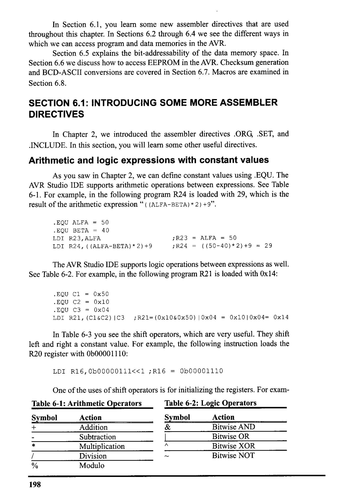
*Description*: Structured reference table listing operational parameters, instruction execution cycles, memory address mapping, or feature comparison for Table 6-2: Logic Operators.

> **Table 6-2: Logic Operators**

Symbol
Action
Symbol
Action
+
Addition
&
Bitwise AND
Subtraction
Bitwise OR
Multiplication
Bitwise XOR
Division
Bitwise NOT
Modulo
198


<!-- Page 213 -->
### [PDF Page 213]


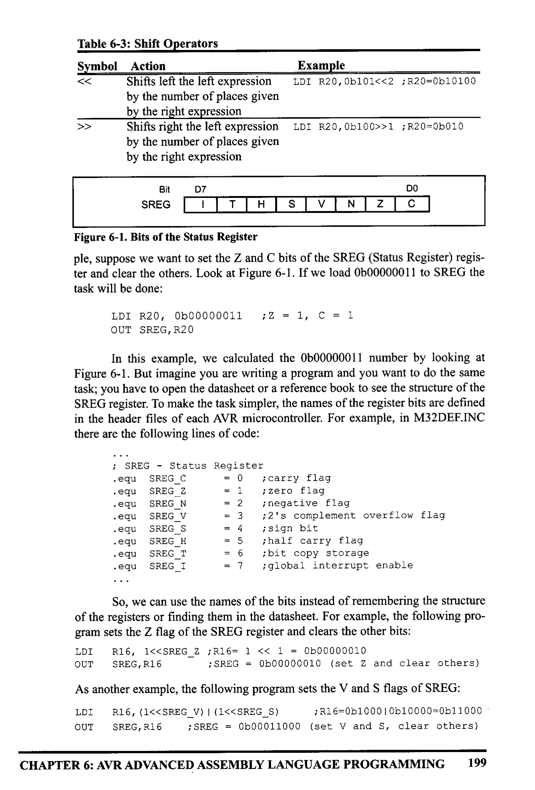
*Description*: Structured reference table listing operational parameters, instruction execution cycles, memory address mapping, or feature comparison for Table 6-3: Shift Operators.

> **Table 6-3: Shift Operators**

Symbol Action
<
Shifts left the left expression
Example
IDI R20, 0b101<<2 ;R20=0b10100
by the number of places given
by the right expression
Shifts right the left expression IDI R20, 0b100>>1 ;R20=0b010
by the number of places given
by the right expression
Bit
SREG
D7
DO


*Description*: Register specification diagram depicting individual bit flags, control register configurations, and functional definitions for Figure 6-1: Bits of the Status Register.

> **Figure 6-1: Bits of the Status Register**

ple, suppose we want to set the Z and C bits of the SREG (Status Register) regis-
ter and clear the others. Look at Figure 6-1. If we load 0b00000011 to SREG the
task will be done:

```assembly
LDI R2O, 0600000011
OUT SREG, R20
¡Z = 1, C = 1
```

In this example, we calculated the 0600000011 number by looking at


*Description*: Technical diagram and schematic illustration detailing hardware connection topology, signal routing, and circuit operation for Figure 6-1: But imagine you are writing a program and you want to do the same.

> **Figure 6-1: But imagine you are writing a program and you want to do the same**

task; you have to open the datasheet or a reference book to see the structure of the
SREG register. To make the task simpler, the names of the register bits are defined
in the header files of each AVR microcontroller. For example, in M32DEF.INC
there are the following lines of code:
; SREG - Status Register
• equ
• egu
• equ
• equ
• equ
• equ
• equ
• equ
SREG
1'o
= 0
¡ carry flag
SREG
-
=1
¡zero flag
SREG N
= 2
¡ negative flag
-
SREG Y
=
3
¡2's complement overflow flag
SREG_S
=
: 4
¡ sign bit
SREG
= 5
¡half carry flag
SREG
= 6
¡bit copy storage
SREG_I
=
7
¡ global interrupt enable
So, we can use the names of the bits instead of remembering the structure
of the registers or finding them in the datasheet. For example, the following pro-
gram sets the Z flag of the SREG register and clears the other bits:
LDI
OUT
R16, 1<<SREG
_2 ;R16= 1 < 1 = 0b00000010
SREG, R16
; SREG
= 0b00000010 (set Z
and clear others)
As another example, the following program sets the V and S flags of SREG:
LDI
OUT
R16, (1<<SREG_V) | (1<<SREG_S)
;R16=0b1000|0610000=0b11000
SREG, R16
; SREG = 0600011000 (set V and
. S, clear others)
CHAPTER 6: AVR ADVANCED ASSEMBLY LANGUAGE PROGRAMMING
199


<!-- Page 214 -->
### [PDF Page 214]

In Example 6-1, you see the usage of the directives in I/O port programming.
Example 6-1
Write codes to set PB2 and PB4 of PORTB to 1 and clear the other pins
(a) without the directives, and
(b) using the directives.
Solution:
(a)
LDI
OUT
R20, 0x14
PORTB, R20
;R20 = 0x14
¡ PORTB = R20
To make the code more readable, we can write the number in binary as well:
LDI
OUT
R20, 0b00010100
;R20 = 0x14
PORTB, R20
; PORTB = 0x14
(b)
LDI
OUT
R20, (1<<4) | (1<<2) ;R20 = (0610000 | 0600100) = 0610100
; PORTB = R20
PORTB, R2O
As we mentioned before, the names of the register bits are defined in the header files of
each AVR microcontroller. PB2 and PB4 are defined equal to 2 and 4, as well.
Therefore, we can write the code as shown below:
IDI
R20, (1<<PB4) | (1<<PB2) ; set the PB4 and PB2 bits
OUT
PORTB, R20
; PORTB = R20
Notice that when the assembler wants to convert a code to machine lan-
guage it substitutes all of the assembler directives with their equivalent values.
Thus, using the directives has no side effects on the performance of our code but
rather makes our code more readable. See Examples 6-2 and 6-3.
Example 6-2
What does the AVR assembler do while assembling the following program?
• equ C1 = 2
• equ
C2 = 3

```assembly
LDI R20,C1| (1<<C2) ;R20= 2|(1<<3)= 00000001010600001000= 0600001010
```

Solution:
•equ is an assembler directive. When assembling " equ C1 = 2", the assembler
assigns value 2 to C1. Similarly, while assembling the "equ C2 = 3" instruction, it
assigns the value 3 to C2
When the assembler converts the "IDI R20, C1| (1<<C2)" instruction to
machine language, it knows the values of Cl and C2. Thus it calculates the value of
"C1| (1<<C2)", and then replaces the expression with its value. Therefore, "IDI
R20, C1| (1<<C2)" will be converted to "IDI R20, 0b00001010". Then the assembler
converts the instruction to machine language.
200


<!-- Page 215 -->
### [PDF Page 215]

Example 6-3
What does the AVR assembler do while assembling the following program?
• INCLUDE "M32DEF.INC"
LDI
R2O, (1<<PB4) | (1<<PB2) ; set the PB4 and PB2 bits
OUT
DDRB, R20
; DDRB = R20
HERE: RJMP HERE
Solution:
Including a header file at the beginning of a program is similar to copying all the con-
tents of the header file to the beginning of the program. Thus, the assembler, first assem-
bles the contents of M32DEF.INC. The header file contains some " equ" instructions,
such as "
• equ PB4 = 4". Thus, after reading the header file the assembler learns that
PB4 is equal to 4, PB2 is equal to 2, and so on. Thus, when it wants to assemble instruc-
tions such as "IDI R20, (1<<PB4) | (1<<PB2)", it knows the values of PB2 and PB4. It
calculates the value of " (1<<PB4) | (1<<PB2) " and substitutes it.
It is highly recommended that you take a look at the M32DEF.INC file. The
file is located in the following path, if you did not change it while installing the AVR
Studio software:
Program FileslAtmel\AVR ToolslAvrAssembler2\Appnoteslm32def.inc
HIGH( ) and LOW() functions
The HIGH() and LOW() functions give the higher and the lower bytes of
a 16-bit value. For example, in the following program
0x35 and 0x44 are loaded into R16 and R17, respectively:
HIGH LOW
0x4455
IDI R16,LOW (0x4455) ;R16 = 0x55
LDI
R17, HIGH (0x4455) ; R17 = 0x44
R17
R16
In Chapter 2, we used the following instructions to make the stack pointer
refer to the last location of the memory:
LDI
R16, HIGH (RAMEND) ; R16 = 0x08 (for ATmega32)
OUT
SPH, R16
¡SPH = the high byte of
address
LDI
R16, LOW (RAMEND)
;R16 = 0x5f
OUT
SPL, R16
¡SPL = the low byte of address
But how do the instructions work? In the AVR header files (e.g.,
M32DEF.INC) RAMEND is defined equal to the address of the last location of the
memory. For example, in M32DEFINC there is the following line:
• equ
RAMEND
= 0x085f
The HIGH() and LOW() functions split the RAMEND into two bytes, $08
and $SF. They go to SPH and SPL, respectively.
You can see the list of the different directives available in the AVR by using
the help feature of AVR Studio. (Choose the assembler Help option from the Help
menu and then click on the Expressions topic.)
CHAPTER 6: AVR ADVANCED ASSEMBLY LANGUAGE PROGRAMMING
201


<!-- Page 216 -->
### [PDF Page 216]


### Review Questions

1. Indicate the value loaded into the registers in the following program:
• EQU CONST1 = 0x10
• EQU CONST2 = 0x91
• EQU CONST3 = 0x14
• EQU ADDR = (0x91 << 1) +1
LDI
R2O, CONST1&CONST2
LDI
R21, CONST2 | CONST 3
LDI
R30, LOW (ADDR)
LDI
R31, HIGH (ADDR)
2. What does the following code do?
LDI
R16, (1<<SREG_V) | (1<<SREG_Z)
OUT
SREG, R16
; SREG = 0600011000
3. Using the assembler directives write a program that sets the Z and C flags and
clears the other flags.
4. Calculate the values that are loaded into the TCNTIL and TCNT1H I/O regis-
ters.
IDI
OUT
LDI
OUT
R16, HIGH (15900)
TCNT1H, R16
R16, LOW (15900)
TCNT1L, R16
;TCNT1H = HIGH (15900)
; TCNTIL = LOW (15900)

## SECTION 6.2: REGISTER AND DIRECT ADDRESSING MODES

The CPU can access data in various ways. The data could be in a register,
or in memory, or provided as an immediate value. These various ways of access-
ing data are called addressing modes. In Sections 6.2 through 6.6 we discuss AVR
addressing modes in the context of some examples.
The various addressing modes of a microprocessor are determined when it
is designed, and therefore cannot be changed by the programmer. The AVR pro-
vides a total of 13 distinct addressing modes, which can be categorized into the fol-
lowing groups:
1. Single-Register (Immediate)
2. Register
3. Direct
4. Register indirect
5. Flash Direct
6. Flash Indirect
In this section we look at immediate, two-register, and direct addressing
modes. In Section 6.3 we cover accessing RAM data memory using the register
indirect mode. Section 6.4 explains how to access fixed data and look-up tables
stored in program ROM.
202


<!-- Page 217 -->
### [PDF Page 217]

Single-register (immediate) addressing mode
In this addressing mode, the operand is a register. See the examples below.
NEG
COM
R18
¡negate the contents of R18
R19
¡ complement the contents of R19
INC
DEC
R20
¡ increment R20
ROR
R21
; decrement R21
R22
¡ rotate right R22
In some of the instructions there is also a constant value with the register
operand. See the examples below.
LDI
R19, 0x25
SUBI
R19,0x6
ANDI
R19, 0b01000000
¡load 0x25 into R19
; subtract 0x6 from R19
¡AND R19 with 0x40
The constant value is sometimes referred to as immediate data since the
operand comes immediately after the opcode when the instruction is assembled;
and the addressing mode is referred to as immediate addressing mode in some
microcontrollers. But the AVR datasheet refers to this mode as a subset of the sin-
gle-register addressing mode. This addressing mode can be used to load data into
any of the R16 R31 general purpose registers. The immediate addressing mode is
also used for arithmetic and logic instructions. Note that the letter "I" in instruc-
tions such as LDI, ANDI, and SUBI means "immediate." See Figures 6-2a and 6-2b.
12 bits
4 bits
GPRS
GPRs
Op. Code
Rd
Op. Code Immediate
Rd
→
31
31

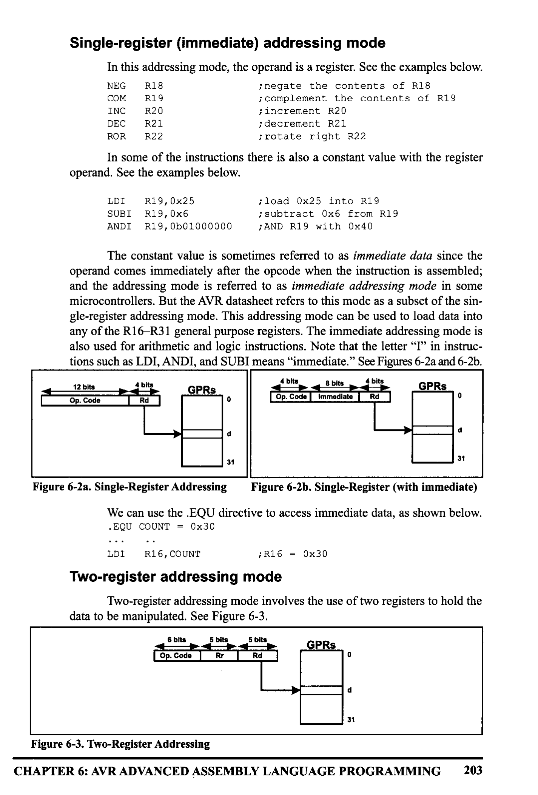
*Description*: Register specification diagram depicting individual bit flags, control register configurations, and functional definitions for Figure 6-2: a. Single-Register Addressing.

> **Figure 6-2: a. Single-Register Addressing**


*Description*: Register specification diagram depicting individual bit flags, control register configurations, and functional definitions for Figure 6-2: b. Single-Register (with immediate).

> **Figure 6-2: b. Single-Register (with immediate)**

We can use the EQU directive to access immediate data, as shown below.
• EQU COUNT = 0x30
•..
LDI
R16, COUNT
;R16 = 0x30
Two-register addressing mode
Two-register addressing mode involves the use of two registers to hold the
data to be manipulated. See Figure 6-3.
5 bits
GPRS
→
31


*Description*: Register specification diagram depicting individual bit flags, control register configurations, and functional definitions for Figure 6-3: Two-Register Addressing.

> **Figure 6-3: Two-Register Addressing**

CHAPTER 6: AVR ADVANCED ASSEMBLY LANGUAGE PROGRAMMING
203


<!-- Page 218 -->
### [PDF Page 218]

Examples of two-register addressing mode are as follows:
ADD
SUB
AND
MOV
R20, R23
¡add R23 to R20
R29, R20
; subtract R20 from R29
R16, R17
; AND R16 with 0x40
R23, R19
¡copy the contents of R19 to R23
Direct addressing mode
The entire data memory can be accessed using either direct or register
indirect addressing modes. The register indirect addressing mode will be discussed
in the next section. In direct addressing mode, the operand data is in a RAM mem-
ory location whose address is known, and this address is given as a part of the
instruction. Contrast this with immediate addressing mode in which the operand
data itself is provided with the instruction. Examine the following instructions:
LDS
STS
R19, 0x560 ;load R19 with the contents of memory loc $560
0x40, R19
¡store R19 to data space location 0x40
The two instructions use direct addressing mode. If we dissect the opcode
we see that the addresses are embedded in the instruction, as shown in Figure 6-4.
Memory
Program
8/16
abc.
Address:
0x0
Cols: Auto
000000
60
000006
FF FF
FF
00000C
FF FF
FF
05
FF
FF
40
00
OC 94 04 00 01.0"0."
FF
FF
FF
FF
FF
FF FF FF FF FF YVYYYY
FF
FF FF FF FF FF YYYYYY799999
000012 FF FF FF FF
FF FF FF FF FF FF FF FF Ý999YYYYYYYY


*Description*: Technical diagram and schematic illustration detailing hardware connection topology, signal routing, and circuit operation for Figure 6-4: Direct Addressing Opcode.

> **Figure 6-4: Direct Addressing Opcode**

As shown in Figure 6-5a, the address field is a 16-bit address and can take
values from $0000-SFFFF. Of course, it is much easier to use names instead of
addresses in the program, and we have seen many examples of them in the last few
chapters. It must be noted that data memory does not support immediate address-
ing mode. In other words, to move data into internal RAM or to I/O registers, we
must first move it to a GPR (R16-R31), and then move it from the GPR to the data
memory space using the STS instruction. For example, if we want to store 0x95 in
memory location 0x520 we should write the following program, as there is no
31
15
20 19
Op. Code Rr/Rd
Data Address
16
0
Data Space
10 Memory
0
15
Op. Code Rr/Rd
5
A
Note: RAMEND has been used to
represent the highest location in
data space.

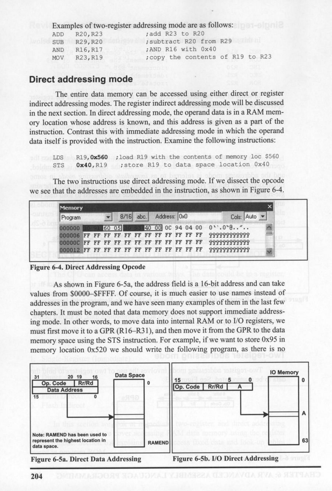
*Description*: Technical diagram and schematic illustration detailing hardware connection topology, signal routing, and circuit operation for Figure 6-5: a. Direct Data Addressing.

> **Figure 6-5: a. Direct Data Addressing**

204
RAMEND


*Description*: Technical diagram and schematic illustration detailing hardware connection topology, signal routing, and circuit operation for Figure 6-5: b. I/O Direct Addressing.

> **Figure 6-5: b. I/O Direct Addressing**

0
A
63


<!-- Page 219 -->
### [PDF Page 219]

instruction for storing immediate values in memory locations:
LDI
STS
R19, 0x95
0x520, R19
¡ load 0x95 into R19
¡store R19 into data
location 0x520
I/O direct addressing mode
To access the I/O registers there is a special mode called I/0 direct address-
ing mode. The I/O direct addressing mode can address only the standard I/O reg-
isters. The IN and OUT instructions use this addressing mode. Examine the fol-
lowing instruction, which copies the contents of PINB to PORTC:
IN
OUT
R18, 0x16
0x15, R18
;R18 = contents of location $16 (PINB)
¡PORTC (location $15) = R18
As shown in Figure 6-5b, the address field is a 6-bit address and can take
values from $00 to $3F, which is from 00 to 63 in decimal. So, it can address the
entire standard I/O register memory space.
The AVR registers for Ports A, B, and so on are part of the group of regis-
ters commonly referred to as I/O registers. There are many I/O registers and they
are widely used, as we will discuss in future chapters. The I/O registers can be
accessed by their names (which is much easier) or by their addresses. For exam-
ple, PINB has address 0x16, and PORTC the address $15, as shown in Table 6-4.
Notice how the following pairs of instructions mean the same thing:

```assembly
OUT 0x15, R19
```

OUT
PORTC, R19
¡is the same as the next instruction
¡which means copy R19 into Port C

```assembly
IN R26, 0x16
IN R26, PINB
```

¡is the same as the next instruction
iwhich means copy PINB into R26

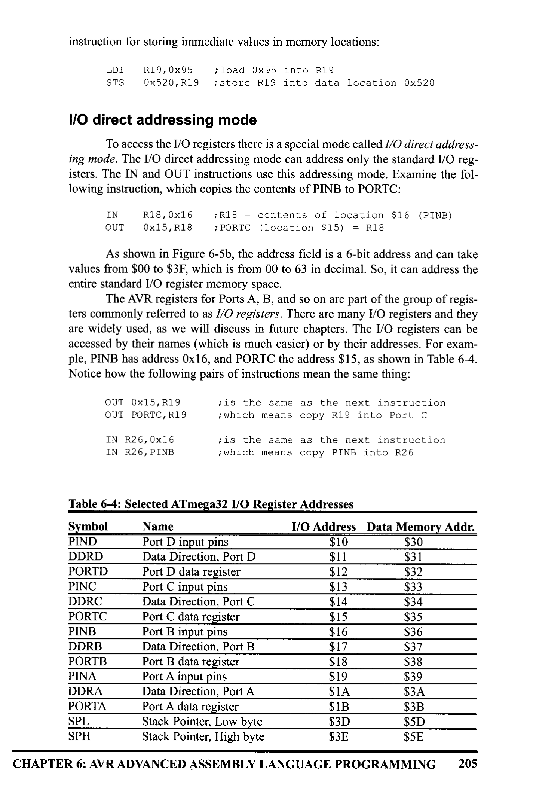
*Description*: Register specification diagram depicting individual bit flags, control register configurations, and functional definitions for Table 6-4: Selected ATmega32 I/O Register Addresses.

> **Table 6-4: Selected ATmega32 I/O Register Addresses**

Symbol

```c
PIND
```

DDRD
PORTD

```c
PINC
```

DDRC
PORTC

```c
PINB
```

DDRB
PORTB

```c
PINA
```

DDRA
PORTA
SPL
SPH
Name
Port D input pins
Data Direction, Port D
Port D data register
Port C input pins
Data Direction, Port C
Port C data register
Port B input pins
Data Direction, Port B
Port B data register
Port A input pins
Data Direction, Port A
Port A data register
Stack Pointer, Low byte
Stack Pointer, High byte
I/O Address Data Memory Addr.
$30
$11
$12
$13
$14
$15
$16
$17
$18
$19
$1A
$1B
$3D
$3E
$31
$32
$33
$34
$35
$36
$37
$38
$39
$3A
$3B
$5D
$5E
CHAPTER 6: AVR ADVANCED ASSEMBLY LANGUAGE PROGRAMMING
205


<!-- Page 220 -->
### [PDF Page 220]


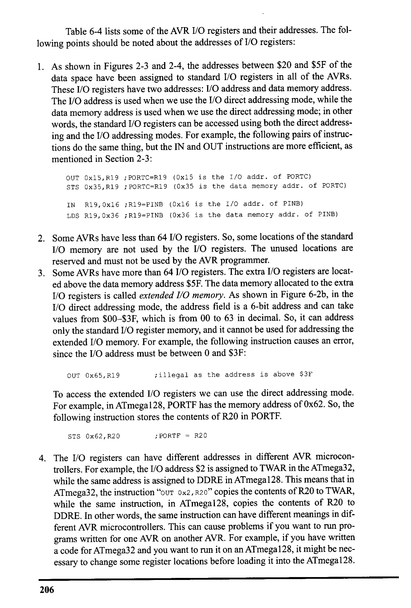
*Description*: Register specification diagram depicting individual bit flags, control register configurations, and functional definitions for Table 6-4: lists some of the AVR I/O registers and their adresses. The fol-.

> **Table 6-4: lists some of the AVR I/O registers and their adresses. The fol-**

lowing points should be noted about the adresses of 1/O registers:
1. As shown in Figures 2-3 and 2-4, the adresses between $20 and $5F of the
data space have been assigned to standard I/O registers in all of the AVRs.
These I/O registers have two adresses: I/O adress and data memory adress.
The I/O address is used when we use the I/O direct adressing mode, while the
data memory address is used when we use the direct adressing mode; in other
words, the standard I/O registers can be accessed using both the direct adress-
ing and the I/O addressing modes. For example, the following pairs of instruc-
tions do the same thing, but the IN and OUT instructions are more efficient, as
mentioned in Section 2-3:

```assembly
OUT 0x15, R19 ;PORTC=R19 (0x15 is the I/O addr. of PORTC)
STS 0x35, R19 ;PORTC=R19 (0x35 is the data memory addr. of PORTC)
IN R19,0x16 ;R19=PINB (0x16 is the I/O addr. of PINB)
LDS R19,0x36 ;R19=PINB (0x36 is the data memory addr. of PINB)
```

2. Some AVRs have less than 64 I/O registers. So, some locations of the standard
1/O memory are not used by the I/O registers. The unused locations are
reserved and must not be used by the AVR programmer.
3. Some AVRs have more than 64 I/O registers. The extra I/O registers are locat-
ed above the data memory adress $5F. The data memory allocated to the extra
I/O registers is called extended I/O memory. As shown in Figure 6-2b, in the
I/O direct adressing mode, the address field is a 6-bit adress and can take
values from $00-$3F, which is from 00 to 63 in decimal. So, it can adress
only the standard I/O register memory, and it cannot be used for addressing the
extended I/O memory. For example, the following instruction causes an error,
since the I/O adress must be between 0 and $3F:

```assembly
OUT 0x65, R19
```

¡illegal as the address is above $3F
To access the extended I/O registers we can use the direct adressing mode.
For example, in ATmega128, PORTF has the memory address of 0x62. So, the
following instruction stores the contents of R20 in PORTF.
STS 0×62, R20
; PORTF = R20
4. The I/O registers can have different adresses in different AVR microcon-
trollers. For example, the I/O address $2 is assigned to TWAR in the ATmega32,
while the same address is assigned to DDRE in ATmega128. This means that in
ATmega32, the instruction "OUT 0x2, R20" copies the contents of R20 to TWAR,
while the same instruction, in ATmegal28, copies the contents of R20 to
DDRE. In other words, the same instruction can have different menings in dif-
ferent AVR microcontrollers. This can cause problems if you want to run pro-
grams written for one AVR on another AVR. For example, if you have written
a code for ATmega32 and you want to run it on an ATmega128, it might be nec-
essary to change some register locations before loading it into the ATmegal28.
206


<!-- Page 221 -->
### [PDF Page 221]

The best way to solve this problem is to use the names of the registers instead
of their addresses. For example, the instruction "OUT IWAR, R20" has the same
meaning on all the AVRs. Therefore, using the names of the registers instead of
their addresses makes our code more portable. See Example 6-4.
Example 6-4
Write code to send $55 to Port B. Include
(a) the register name,
(b) the I/O address, and
(c) the data memory address.
Solution:
(a)
LDI
OUT
LDI
OUT
R2O, OXFF
; R2O = OxFF
DDRB, R20
; DDRB = R20 (Port B output)
R20, 0x55
; R20 = $55
PORTB, R20
¡ Port B = 0x55
(b)
From Table 6-4, DDRB I/O address = $17 and PORTB I/O address = $18.
LDI
R2O, OXFF
OUT
;R20 = OxFF
0x17, R20
; DDRB = R20 (Port B output)
IDI
R20, 0x55
; R20 = $55
OUT
0x18, R20
; Port B = 0x55
(c) From Table 6-4, DDRB data memory address = $37 and PORTB data memory
address = $38.
LDI
R20, OXFF
STS
0x37, R20
LDI
R2O, 0x55
STS
0x38, R20
;R20 = OxFF
; DDRB = R20 (Port B output)
;R20 = $55
¡ Port B = 0x55
Review Problems
1. Can the programmer of a microcontroller make up new addressing modes?
2. Show the instructions to load 1000 0000 (binary) into register SPL.
3. True or false. In immediate addressing the value comes immediately after the
*. True or false. We can access the exconded to registers using the TrO direct
addressing mode.
5. True or false. SPL is an I/O register.
6. True or false. Using the names of the registers makes the code more portable.
CHAPTER 6: AVR ADVANCED ASSEMBLY LANGUAGE PROGRAMMING
207


<!-- Page 222 -->
### [PDF Page 222]


## SECTION 6.3: REGISTER INDIRECT ADDRESSING MODE

We can use direct or register indirect addressing modes to access data stored
in the data memory. In the previous section we showed how to use direct address-
ing mode. The register indirect addressing mode is a very important addressing
mode in the AVR. This topic will be discussed thoroughly in this section.
Register indirect addressing mode
In the register indirect addressing mode, a register is used as a pointer to
the data memory location. In the AVR, three registers are used for this purpose: X,
Y, and Z. These are 16-bit registers allowing access to the entire 65,536 bytes of
data memory space in the AVR.
Each of the registers is made by combining two specific GPRs; for example,
combining R26 and R27 makes the X register. In this case R26 is the lower byte of X,
and R27 is the higher byte. The Y and Z registers are made by combining R29:R28 and
R31:R30, respectively. See Figure 6-6. The R26, R27, R28, R29, R30, and R31 GPRs
can be referred to as XL, XH, YL, YH, ZL, and ZH, respectively. For example, "IDI
XL,0x31" is the same as "LDI R26,0x31" since XL is another name for R26.
15
X- register: L7
XH
R27
YH
017
15
Y - register :
17
15
Z-register: 7
R29
TZH
R31
017
017
XL
R26
YL
R28
ZL
R30
0
0]
0

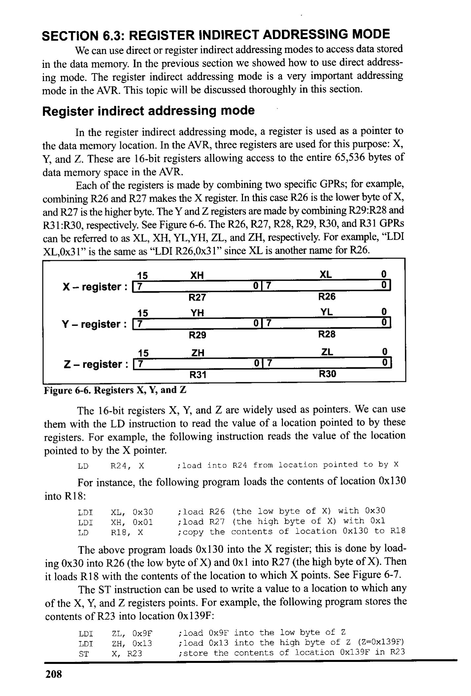
*Description*: Register specification diagram depicting individual bit flags, control register configurations, and functional definitions for Figure 6-6: Registers X, Y, and Z.

> **Figure 6-6: Registers X, Y, and Z**

The 16-bit registers X, Y, and Z are widely used as pointers. We can use
them with the LD instruction to read the value of a location pointed to by these
registers. For example, the following instruction reads the value of the location
pointed to by the X pointer.
LD
R24, X
¡ load into R24 from location pointed to by X
For instance, the following program loads the contents of location 0x130
into R18:
IDI
XL,
0x30
¡load R26 (the low byte of X) with 0x30
LDI
XH,
0x01
; load R27 (the high byte of X) with 0x1
LD
R18, X
¡copy the contents of location 0x130 to R18
The above program loads 0x130 into the X register; this is done by load-
ing 0x30 into R26 (the low byte of X) and Ox1 into R27 (the high byte of X). Then
it loads R18 with the contents of the location to which X points. See Figure 6-7.
The ST instruction can be used to write a value to a location to which any
of the X, Y, and Z registers points. For example, the following program stores the
contents of R23 into location 0x139F:
LDI
ZL, 0X9E
; load 0x9F into the low byte of Z
LDI
ZH, 0x13
:load 0x13 into the high byte oi Z (Z=(x1391)
ST
X, R23
¡store the contents of location 0x139F in R23
208


<!-- Page 223 -->
### [PDF Page 223]

Data Space
15
X, Y, OR Z - REGISTER
Note: RAMEND has been used to represent
the highest location in data space.

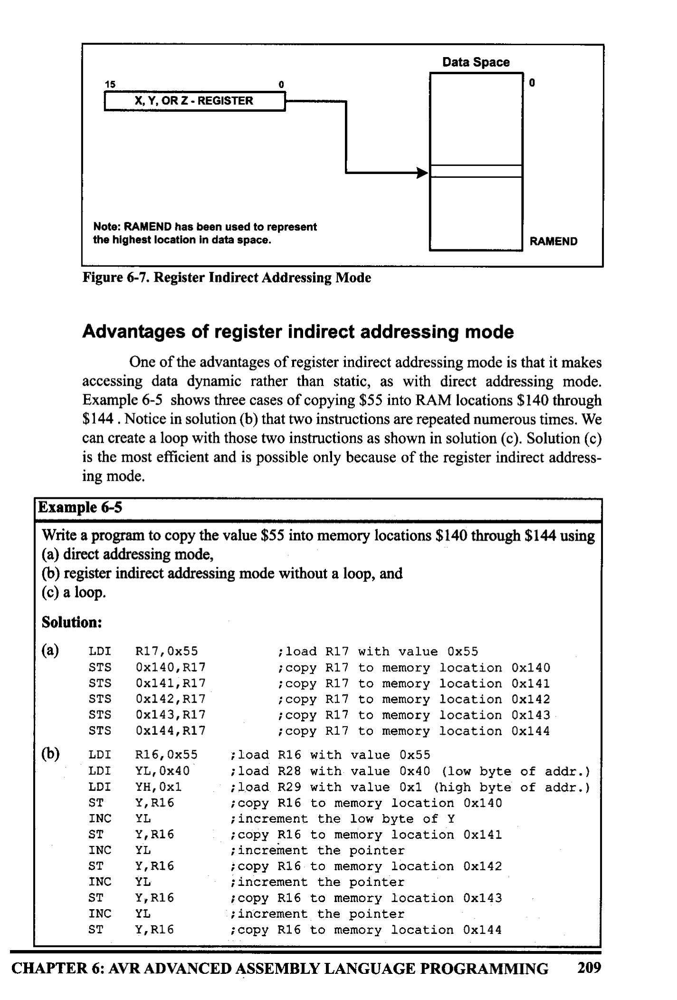
*Description*: Register specification diagram depicting individual bit flags, control register configurations, and functional definitions for Figure 6-7: Register Indirect Addressing Mode.

> **Figure 6-7: Register Indirect Addressing Mode**

RAMEND
Advantages of register indirect addressing mode
One of the advantages of register indirect addressing mode is that it makes
accessing data dynamic rather than static, as with direct addressing mode.
Example 6-5 shows three cases of copying $55 into RAM locations $140 through
$144. Notice in solution (b) that two instructions are repeated numerous times. We
can create a loop with those two instructions as shown in solution (c). Solution (c)
is the most efficient and is possible only because of the register indirect address-
ing mode.
Example 6-5
Write a program to copy the value $55 into memory locations $140 through $144 using
(a) direct addressing mode,
(b) register indirect addressing mode without a loop, and
(c) a loop.
Solution:
(a)
(b)
IDI
STS
STS
STS
STS
STS
LDI
LDI
LDI
ST
INC
ST
INC
ST
INC
ST
INC
ST
R17, 0x55
0x140, R17
0x141, R17
0x142, R17
0x143, R17
0x144, R17
R16, 0x55
YL, 0x40
YH, 0x1
Y, R16
YL
Y, R16
YL
Y, R16
YL
Y, R16
YL
Y, R16
¡ load R17 with value 0x55
¡ copy R17 to memory location 0x140
¡copy R17 to memory location 0x141
¡ copy R17 to memory
• location 0x142
¡copy R17 to memory location 0x143
¡copy R17 to memory location 0x144
¡load R16 with value 0x55
¡load R28 with value 0x40 (low byte of addr.)
¡load R29 with value 0x1 (high byte of addr.)
¡ copy
• R16 to memory location 0x140
¡ copy R16 to memory location 0x14]
• increment the pointer
¡ copy R16 to memory location 0x142
¡copy Rib to memory location 0x143
¡ copy R16 to memory location 0x144
CHAPTER 6: AVR ADVANCED ASSEMBLY LANGUAGE PROGRAMMING
209


<!-- Page 224 -->
### [PDF Page 224]

(c)
Example 6-5 (Cont.)
IDI
R16,0x5
LDI
R20, 0x55
IDI YL, 0x40
LDI
YH, 0x1
ST
Y, R20
INC YL
DEC
R16

```assembly
BRNE L1
¡ R16 = 5 (R16 for counter)
```

¡ load R20 with value 0x55 (value to be copied)
¡load YI with value 0x40
¡load YH with value 0x1
L1:
; COPY R20 to memory pointed to by y
; increment the pointer
; decrement the counter
;loop while counter is not zero
Use the AVR Studio simulator to examine memory contents after the above program is
run.
$140 = ($55) $141 = ($55) $142 = ($55) $143 = ($55) 144 = ($55)
In Example 6-5, we must use "INC YI" to increment the pointer because
there is no such instruction as "INC Y". Looping is not possible in direct address-
ing mode, and that is the main difference between the direct and register indirect
addressing modes. For example, trying to copy a string of data located in consec-
utive locations of data RAM is much more efficient and dynamic using register
indirect addressing mode than using direct addressing mode. See Example 6-6.
Auto-increment and auto-decrement options for pointer
registers
Because the pointer registers (X, Y, and Z) are 16-bit registers, they can go
from $0000 to SFFFF, which covers the entire 64K memory space of the AVR.
Using the "INC ZI" instruction to increment the pointer can cause a problem when
an address such as $5FF is incremented. The instruction "INC ZI" will not prop-
agate the carry into the ZH register. The AVR gives us the options of auto-incre-
ment and auto-decrement for pointer registers to overcome this problem. The syn-
tax used for the LD instruction in such cases is shown in Table 6-5.

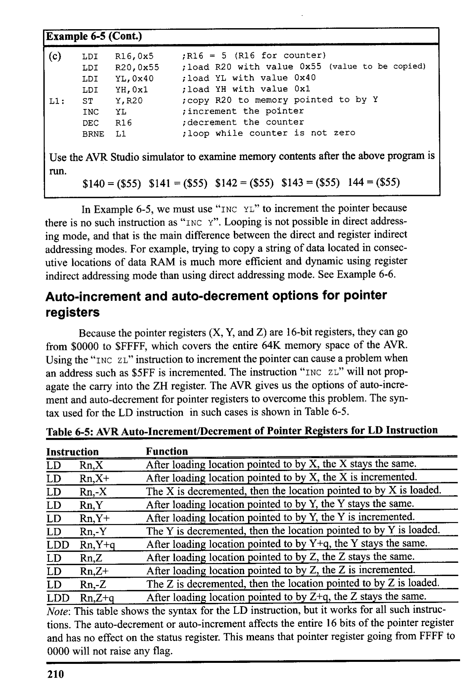
*Description*: Register specification diagram depicting individual bit flags, control register configurations, and functional definitions for Table 6-5: AVR Auto-Increment/Decrement of Pointer Registers for LD Instruction.

> **Table 6-5: AVR Auto-Increment/Decrement of Pointer Registers for LD Instruction**

Function
LD
Rn,X
After loading location pointed to by X, the X stays the same.
LD
Rn,X+
After loading location pointed to by X, the X is incremented
LD
Rn,-X
The X is decremented, then the location pointed to by X is loaded
LD
Rn, Y
After loading location pointed to by Y, the Y stays the same.
LD
Rn,Y+
After loading location pointed to by Y, the Y is incremented
LD
Rn,-Y
The Y is decremented, then the location pointed to by Y is loaded.
LDD
Rn, Y+g
After loading location pointed to by Y+g, theY stays the same.
LD
Rn,Z
After loading location pointed to by Z, the Z stays the same.
LD
Rn,Z+
After loading location pointed to by Z, the Z is incremented
LD
Rn,-Z
The Z is decremented, then the location pointed to by Z is loaded.
LDDR
Rn,Z+g
After loading location pointed to by tg, the Z stays the same.
Note: This table shows the syntax for the LD instruction, but it works for all such instruc-
tions. The auto-decrement or auto-increment affects the entire 16 bits of the pointer register
and has no effect on the status register. This means that pointer register going from FFFF to
0000 will not raise any flag.
210


<!-- Page 225 -->
### [PDF Page 225]

Example 6-6
Assume that RAM locations $90-$94 have a string of ASCII data, as shown below.
$90 = ('H")
$91=(E) $92= ('L')
$93 = ('L')
$94 = ('0')
Write a program to get each character and send it to Port B one byte at a time. Show the
program using:
(a) Direct addressing mode.
(b) Register indirect addressing mode.
Solution:
(a) Using direct addressing mode
IDI
OUT
LDS
OUT
LDS
OUT
LDS
OUT
IDS
OUT
LDS
OUT
R2O, OXFF
DDRB, R20
R20, 0x90
PORTB, R20
R20, 0x91
PORTB, R20
R20, 0x92
PORTB, R20
R20, 0x93
PORTB, R2O
R20, 0x94
PORTB, R20
¡ make Port B an output
;R20 = contents of location 0x90
; PORTB = R20
;R20 = contents of location 0x91
¡ PORTB = R20
¡ R20 = contents of location 0x92
; PORTB = R20
;R2O = contents of location 0x93
; PORTB = R20
; R20 = contents of location 0x94
; PORTB = R20
(b) Using register indirect addressing mode
L1:
LDI
R16, 0x5
LDI
R2O, OXFF
OUT
DDRB, R20
LDI
ZI, 0x90
IDI
ZH, Ox0
LD
INC
R20,Z
ZL
OUT
PORTB, R20
DEC
R16
BRNE
L1
; R16=0×5 (R16 for counter)
¡ make Port B an output
¡ the low byte of address (ZL = 0x90)
i the high byte of address (ZH = 0x0)
¡ read from location pointed to by z
¡ increment pointer
¡ send to PortB the contents of R20
¡ decrement counter
¡ if R16 is not zero go to L1
When simulating the above program on the AVR Studio, make sure that memory loca-
tions $90-$94 have the message "HELLO".
CHAPTER 6: AVR ADVANCED ASSEMBLY LANGUAGE PROGRAMMING
211


<!-- Page 226 -->
### [PDF Page 226]

See Figures 6-8 and 6-9. Then, see Examples 6-7 through 6-9.
15
Data Space
X, Y, OR Z - REGISTER
0
RAMEND


*Description*: Register specification diagram depicting individual bit flags, control register configurations, and functional definitions for Figure 6-8: Register Indirect Addressing with Post-increment.

> **Figure 6-8: Register Indirect Addressing with Post-increment**

15
Data Space
X, Y, OR Z - REGISTER
-1
→+
RAMEND

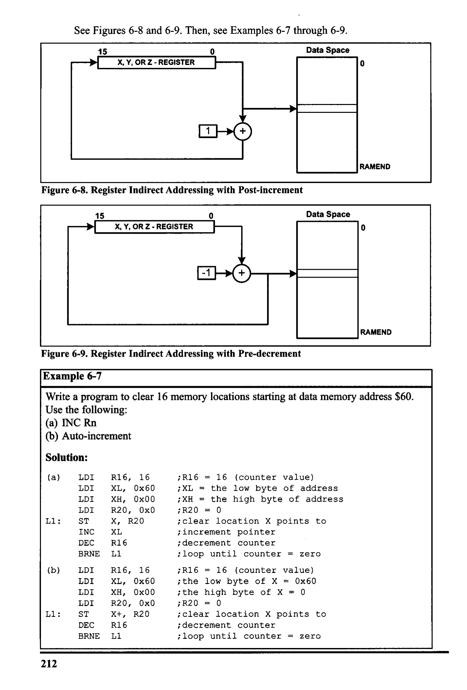
*Description*: Register specification diagram depicting individual bit flags, control register configurations, and functional definitions for Figure 6-9: Register Indirect Addressing with Pre-decrement.

> **Figure 6-9: Register Indirect Addressing with Pre-decrement**

Example 6-7
Write a program to clear 16 memory locations starting at data memory address $60.
Use the following:
(a) INC Rn
(b) Auto-increment
Solution:
(a)
LDI
IDI
LDI
LDI
L1:
ST
INC
DEC
BRNE
R16, 16
XL, 0x60
хн, 0х00
R20, 0x0
X, R20
XL
R16
(b)
LDI
LDI
LDI
LDI
Il:
ST
DEC
BRNE
R16, 16
XI, 0x60
хн, 0х00
R20, 0x0
X+, R20
R16
L1
;R16 = 16 (counter value)
¡XL = the low byte of address
¡XH = the high byte of address
;R20 = 0
¡ clear location X points to
; increment pointer
¡ decrement counter
¡oop until counter = zero
;R16 = 16 (counter value)
¡ the low byte of X = 0x60
¡ the high byte of x= 0
;R20 = 0
¡clear location X points to
; decrement counter
;loop until counter = zero
212


<!-- Page 227 -->
### [PDF Page 227]

Example 6-8
Assume that data memory locations $240-$243 have the following hex data. Write a
program to add them together and place the result in locations $220 and $221.
$240 = ($7D)
$241 = ($EB)
$242 = ($C5)
$243 = ($5B)
Solution:
L1:
I2:
• INCLUDE "M32DEF. INC"
• EQU L_BYTE = 0×220
•EQU H_ BYTE = 0x221
¡ RAM 10C for I Byte
¡ RAM 10C for H_Byte
LDI
LDI
R16, 4
R20, 0
LDI
LDI
R21,0
XI, 0x40
LDI
XH, 0x02
LD
R22, X+
¡the low byte of X = 0x40
¡ the high byte of x = 02
¡ read contents of location where X points to
ADD
R20, R22

```assembly
BRCC I2
¡branch if C = 0
```

INC
R21
¡increment R21
DEC
R16
; decrement counter

```assembly
BRNE LI
```

¡ loop until counter is zero
ST
ST
L_BYTE, R20 ; store the low byte of the result in $220
H BYTE, R21 i store the high byte of the result in $221
Example 6-9
Write a program to copy a block of 5 bytes of data from data memory locations starting
at $130 to RAM locations starting at $60.
Solution:
L1:
LDI
R16, 16
LDI
XL, 0x30
LDI
XH, 0x01
LDI
YL, 0x60
LDI
YH, 0×00
LD R2O, Xt
ST Y+, R20
DEC R16

```assembly
BRNE LI
;R16 = 16 (counter value)
```

¡ the low byte of address
¡the high byte of address
i the low byte of address
¡ the high byte of address
¡ read where X points to
¡store R20 where Y points to
; decrement counter
¡loop until counter = zero
Before we run the above program.
130 = ('H') 131 = ('E') 132 = ('L') 133 = ('L') 134 = ('0')
After the program is run, the addresses $60-$64 have the same data as $130-$134.
130 = ('H') 131 = ('E') 132 = ('L') 133 =
('L') 134 = ('0')
60 = (H) 61 = ('E') 62 = ('L')
63 = ('L')
64 = ('0')
To see an example of how to use all three pointer registers, study and sim-
ulate Example 6-10.
CHAPTER 6: AVR ADVANCED ASSEMBLY LANGUAGE PROGRAMMING
213


<!-- Page 228 -->
### [PDF Page 228]

Example 6-10
Two multibyte numbers are stored in locations $130-$133 and $150-$153. Write a pro-
gram to add the multibyte numbers and save the result in address $160-$163.
$C7659812
+
$2978742A
Solution:
• INCLUDE "M32DEF.INC"
LDI
R16, 4
; R16 = 4 (counter value)
LDI
XL, 0x30
LDI
хн, 0x1
¡load pointer. X= $130
LDI
YI, 0x50
LDI
YH, 0x1
¡ load pointer. Y = $150
LDI
ZL, 0x60
LDI
ZH, Ox1
CIC
I1:
ID
R18, X+
LD
R19, Y+
ADC
R18, R19
ST
Z+, R18
DEC
R16
BRNE
¡load pointer. Z = $160
¡ copy memory to R18 and INC X
¡ copy memory to R19 and INC Y
;R18 = R18 + R19 + carry
• and THE X
¡store R18 in memory and INC Z
; decrement R16 (counter)
; loop until counter = zero
Before the addition we have:
MSByte
ISByte
133 = ($C7) 132 = ($65) 131 = ($98) 130 = ($12)
153 = ($29) 152 = ($78) 151 = ($74) 150 = ($2A)
After the addition we have:
163 = ($FO) 162 = ($DE) 161 = (OC) 160 = (3C)
Notice that we are using the little endian convention of storing a low byte to a low
address, and a high byte to a high address. Single-step the program in AVR Studio and
examine the pointer registers and memory contents to gain insight into register indirect
addressing mode.
Register indirect with displacement
Suppose we want to read a byte that is a few bytes higher than where the
Z register points to. To do so we can increment the Z register so that it points to
the desired location and then read it. But there is an easier way; we can use the reg-
ister indirect with displacement. In this addressing mode a fixed number is added
to the Z register. For example, if we want to read from the location that is 5 bytes
after the location to which Z points, we can write the following instruction:
LDD
R20, Z+5
¡load from Z+5 into R20
The general format of the instruction is as follows:
Rd, Z+a
¡ load from Ztg into Rd
where q is a number between 0 to 63, and Rd is any of the general purpose
registers. See Figure 6-10.
To store a byte of data in a data memory location using the register indirect
214


<!-- Page 229 -->
### [PDF Page 229]

15
Data Space
YOR Z- REGISTER
0
)
15
LOp.
]Rr/Rd |
15
10
65
0
RAMEND

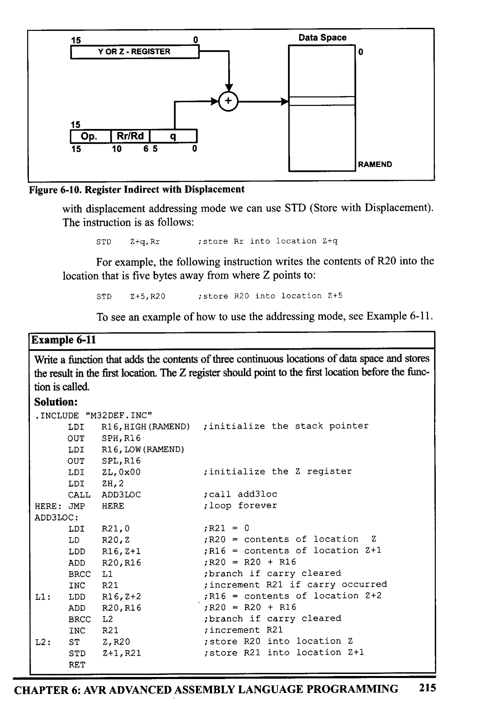
*Description*: Register specification diagram depicting individual bit flags, control register configurations, and functional definitions for Figure 6-10: Register Indirect with Displacement.

> **Figure 6-10: Register Indirect with Displacement**

with displacement addressing mode we can use STD (Store with Displacement).
The instruction is as follows:
STD
Z+g, Rr
¡ store RI into location Ztg
For example, the following instruction writes the contents of R20 into the
location that is five bytes away from where Z points to:
STD
2+5, R20
i store R20 into location 2+5
To see an example of how to use the addressing mode, see Example 6-11.
Example 6-11
Write a function that adds the contents of three continuous locations of data space and stores
the result in the first location. The Z register should point to the first location before the func-
tion is called.
Solution:
• INCLUDE "M32DEF. INC"
IDI
OUT
R16, HIGH (RAMEND) ; initialize the stack pointer
SPH, R16
LDI
R16, LOW (RAMEND)
OUT
SPL, R16
LDI
ZL, 0x00
LDI
ZH, 2

```assembly
CALL ADDLOC
HERE: JMP
```

HERE
¡initialize the 2 register
¡ call add3loc
;loop forever
ADDLOC:
LDI
R21, 0
LD
R20, 2
LDD
R16, 2+1
ADD
R20, R16
BRCC
L1
INC
R21
I 1:
LDD
R16, 2+2
ADD
R20, R16
BRCC
L2
INC
R21
L2:
ST
2, R20
STD
Z+1, R21
; R21 = 0
; R20 = contents of location Z
;R16 = contents of location Zt1
;R20 = R20 + R16
¡branch if carry cleared
¡ increment R21 if carry occurred
;R16 = contents of location 2+2
;R20 = R20 + R16
¡branch if carry cleared
; increment R21
¡ store R20 into location z
¡store R21 into location Z+1
RET
CHAPTER 6: AVR ADVANCED ASSEMBLY LANGUAGE PROGRAMMING
215


<!-- Page 230 -->
### [PDF Page 230]


### Review Questions

1. The instruction "ID R19, 0x95" uses
addressing mode.
2. Which register is the low byte of the X register?
3. The pointer registers are
_-bit registers.
4. Write a program that adds 2 to the contents of locations $90-$9A and stores
the results in locations $200-$20A.
5. Which registers may be used for register indirect addressing mode if the data
is in the data memory?

## SECTION 6.4: LOOK-UP TABLE AND TABLE PROCESSING

So far, we have seen that the AVR has a maximum of 8M bytes of code
(program) space and 64K of data memory space. We can use the code space to
store fixed data. In this section we discuss how to access fixed data residing in the
program ROM space of the AVR. First we examine how to store fixed data in the
program ROM space using the . DB (define byte) directive.
.DB (define byte) and fixed data in program ROM
The . DB data directive is widely used to allocate ROM program (code)
memory in byte-sized chunks. In other words, . DB is used to define an 8-bit fixed
data. When . DB is used to define fixed data, the numbers can be in decimal, bina-
ry, hex, or ASCII formats. The . DB directive is widely used to define ASCI
strings.
See Example 6-12. In Example 6-12 notice that each location of program
memory is 2 bytes, whereas the . DB directive allocates byte-sized chunks. If we
allocate a few bytes of data using the . DB directive, the first byte goes to the low
byte of ROM location; the second byte goes to the high byte of ROM location; the
third byte goes to the low byte of the next location of program ROM; and so on.
In the cases in which we allocate an odd number of ROM locations using . DB, the
assembler will automatically make the number of allocated locations even by plac-
ing a zero into the high byte of the last location. In other words, even if we allo-
cate a fraction of a program ROM location, the assembler will allocate the whole
location and load the unused part of it with zero. In Example 6-12 notice also that
we must use single quotes (') for a single character and double quotes (") for a
string.
AVR assembly also allows the use of . Dw in place of . DB to define values
greater than 255 (0xFF) but not larger than 65,535 (OxFFFF). See Example 6-13.
Reading table elements in the AVR
Example 6-12 showed how to place fixed data into program ROM. Now,
we need to have a register pointer to point to the data to be fetched from the code
space. The Z register can be used for this purpose. For this reason we can call it
register indirect flash addressing mode. This is an addressing mode widely used to
access data elements located in the program space of the AVR. In AVR terminolo-
gy, there are two register indirect flash addressing modes: program memory con-
stant addressing and program memory addressing with post-increment. In the pro-
216


<!-- Page 231 -->
### [PDF Page 231]

Example 6-12
Assume that we have burned the following fixed data into the program ROM of an AVR
chip. Give the contents of each ROM location starting at $500. See Appendix F for the
hex values of the ASCII characters.
¡MY DATA IN FLASH ROM
• ORG $500
DATA1: DB 1,8,5, 3
DATA2: .DB 28
DATA3: . DB 0b00110101
DATA4 : . DB 0x39
; DECIMAL (1C in hex)
¡BINARY (35 in hex)
; HEX
. ORG 0x510
DATA4: DB 'Y'
i single ASCII char
DATA5: DB '2', '0', '0', '5'; ASCII numbers
.ORG $516
DATA6: . DB "Hello ALI" ;ASCII string
Solution:
DATAI has four bytes of data. The " oRG $500" directive causes the assembler to put
the first byte of DATAl in the low byte of location $500. The second byte of DATA1,
which is 8, goes to the high byte of location $500; the third byte goes to the low byte
of location $501, and the fourth byte goes to the high byte of location $501.
DATA2 will be located after DATA1, in location $502 of memory. As DATA2 has one
byte of data and each location of program is 2 bytes wide, the assembler puts zero in
the high byte of location $502.
Memory
Program
000500
01
08
05
000508 FF
FF
FF
000510 59 00
32
000518 6F 20
41
000520 FF FF
FF
8/16
abc.
03
1C
00
35
FF
FF
FF
30
30
35
FF
4C
49
00
FF
FF
FF FF
FF
Address:
00
FF
FF
FF
FF
39
FF
FF
FF
FF
0x500
Cols: Auto
00
FF
FF
FF
FF
FF FF FF FF FF FF
......5.9. VYYYYY
FF FF FF FF FF FF
…ÝYYYYYYYYYYYYYYY
FF FF 48
65 6C 6C
:Y.2005··V79·He1l
FF
FF
FF
FF FF FF 0 ALI. YVYYYYYYY
FF FF
• FF
FF FF FF Ý999999999999999
Example 6-13
Give the contents of each ROM location starting at $600.
. ORG $600
DATA1: DW 0x1234, 0x1122
DATA2:
. DW 28
; DECIMAL (001C in hex)
DATA3: DW 0x2239
; HEX
Solution:
Since AVR is little endian, the low byte of 0x1234, which is 0x34, goes to the low
byte of location $600, and its high byte goes to the high byte.
Memory
Program
000600 34 12
22
11
000608 FF FF
FF
• FF
8/16
abc.
1C
39
22
FF FF
FF
FF
Address:
0x600
Cols: Auto
• FF FF FF FF FF FF 4."..9"YVYYY99
FF
FF FF FF FF FF FF FF YVYYYYYYYYYYYYY
X
CHAPTER 6: AVR ADVANCED ASSEMBLY LANGUAGE PROGRAMMING
217


<!-- Page 232 -->
### [PDF Page 232]

gram memory constant addressing mode, the content of Z does not change when
the instruction is executed, which is why it is called constant addressing; whereas
in the program memory addressing with post-increment, the content of Z incre-
ments after each execution.
"LPM Rn, Z" uses program memory constant addressing mode, while
"LPM Rn,Z+" uses program memory addressing with post-increment. (See Table
6-6.) In Figures 6-11 and 6-12 you see the addressing modes.
There is a group of AVR instructions designed for table processing. Table
6-6 shows the instructions for table reading in the AVR.
The "LPM Rn, Z" instruction loads the byte pointed to by Z into the Rn.
As you know, in the AVR, each location of the program memory is 2 bytes. So, we
should mention if we want to read the low byte or the high byte. The least signif
icant bit (LSB) of the Z register indicates whether the low byte or the high byte
should be read. If LSB = 0, then the low byte will be read; otherwise, the high byte


*Description*: Structured reference table listing operational parameters, instruction execution cycles, memory address mapping, or feature comparison for Table 6-6: AVR Table Read Instructions.

> **Table 6-6: AVR Table Read Instructions**

Instruction Function
Description
LPM Rn,Z
Load from Program Memory
After read, Z stays the same
LPM Rn,Z+ Load from Program Memory with post-inc. Reads and increments Z
Note: The byte of data is read into the Rn register from code space pointed to by Z.
Program Memory
15
10
Z - REGISTER
15x
LSB
FLASHEND
Note: IF LSB = 0, the low byte is selected; if LSB - 1, the high byte is selected. Bits 15 through
1 are for word address.

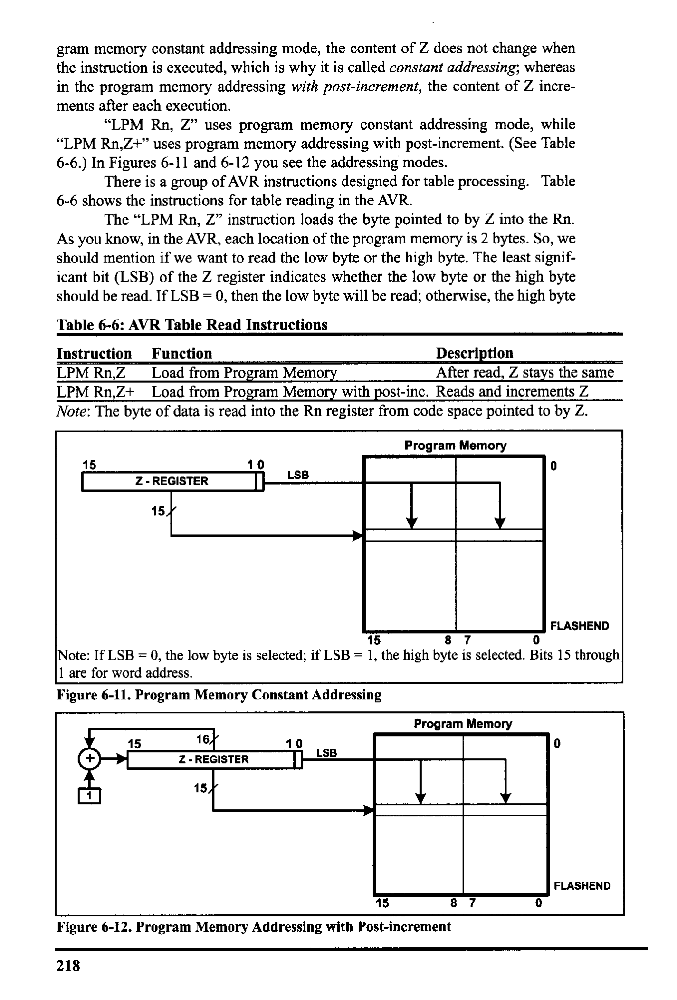
*Description*: Technical diagram and schematic illustration detailing hardware connection topology, signal routing, and circuit operation for Figure 6-11: Program Memory Constant Addressing.

> **Figure 6-11: Program Memory Constant Addressing**

Program Memory
15
16K
Z - REGISTER
10
LSB
0
FLASHEND
15


*Description*: Technical diagram and schematic illustration detailing hardware connection topology, signal routing, and circuit operation for Figure 6-12: Program Memory Addressing with Post-increment.

> **Figure 6-12: Program Memory Addressing with Post-increment**

8 7
0
218


<!-- Page 233 -->
### [PDF Page 233]

will be read. The other bits of the Z register (bit 1 to bit 15) represent the address
of the location that should be read. See Figure 6-11.

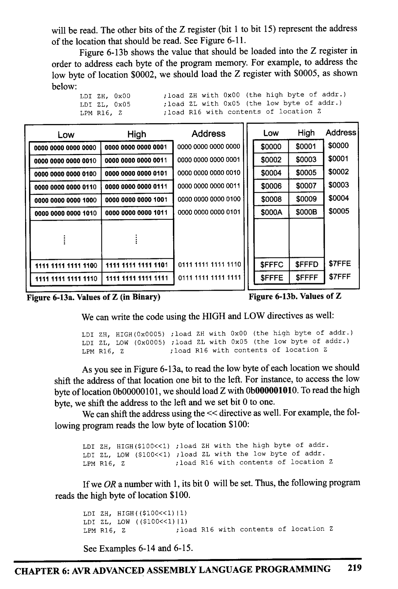
*Description*: Register specification diagram depicting individual bit flags, control register configurations, and functional definitions for Figure 6-13: b shows the value that should be loaded into the Z register in.

> **Figure 6-13: b shows the value that should be loaded into the Z register in**

order to address each byte of the program memory. For example, to address the
low byte of location $0002, we should load the Z register with S0005, as shown
below:
IDI ZH, 0x00
IDI ZL, 0x05
LPM R16, Z
i load ZH with 0x00 (the high byte of addr.)
load ZI with 0x05 (the low byte of addr.
load R16 with contents of location
Low
High
0000 0000 0000 0000
0000 0000 0000 0001
0000 0000 0000 0010
0000 0000 0000 0011
0000 0000 0000 0100
0000 0000 0000 0101
0000 0000 0000 0110
/ 0000 0000 0000 0111
0000 0000 0000 1000
0000 0000 0000 1001
0000 0000 0000 1010
0000 0000 0000 1011
Address
0000 0000 0000 0000
0000 0000 0000 0001
0000 0000 0000 0010
0000 0000 0000 0011
0000 0000 0000 0100
0000 0000 0000 0101
Low
$0000
$0002
$0004
$0006
$0008
$000A
High
$0001
$0003
$0005
$0007
$0009
$000B
Address
$0000
$0001
$0002
$0003
$0004
$0005
1111 1111 1111 1100
1111 1111 1111 1101
1111 1111 1111 1110
| 1111 1111 1111 1111
0111 1111 1111 1110
0111 1111 11111111
$FFFC
$FFFD
$7FFE
$FFFE
$FFFF
$7FFF


*Description*: Technical diagram and schematic illustration detailing hardware connection topology, signal routing, and circuit operation for Figure 6-13: a. Values of Z (in Binary).

> **Figure 6-13: a. Values of Z (in Binary)**


*Description*: Technical diagram and schematic illustration detailing hardware connection topology, signal routing, and circuit operation for Figure 6-13: b. Values of Z.

> **Figure 6-13: b. Values of Z**

We can write the code using the HIGH and LOW directives as well:
IDI ZH, HIGH (0x0005) ; load ZH with 0x00 (the high byte of addr.)
IDI ZI, IOW (0x0005)
¡ load 2l with 0x05 (the low byte of addr.)
LPM R16, 2
¡ load R16 with contents of location z
As you see in Figure 6-13a, to read the low byte of each location we should
shift the address of that location one bit to the left. For instance, to access the low
byte of location 0600000101, we should load Z with 06000001010. To read the high
byte, we shift the address to the left and we set bit O to one.
We can shift the address using the ‹< directive as well. For example, the fol-
lowing program reads the low byte of location $100:

```assembly
LDI ZH, HIGH ($100<<1)
```

¡load ZH with the high byte of addr.

```assembly
LDI ZL, LOW
```

($100<<1)
¡load ZI with the low byte of addr.
LPM R16, Z
; load R16 with contents of location z
If we OR a number with 1, its bit 0 will be set. Thus, the following program
reads the high byte of location $100.

```assembly
LDI ZH, HIGH ( ($100<<1) |1)
LDI ZL, LOW ( ($100<<1) |1)
```

LPM R16, Z
¡load R16 with contents of location Z
See Examples 6-14 and 6-15.
CHAPTER 6: AVR ADVANCED ASSEMBLY LANGUAGE PROGRAMMING
219


<!-- Page 234 -->
### [PDF Page 234]

Example 6-14
In this program, assume that the phrase "WORLD PEACE." is burned into ROM loca-
tions starting at $500, and the program is burned into ROM locations starting at O.
Analyze how the program works and state where "WORLD PEACE." is stored after this
program is run.
.ORG
$0000
;burn into ROM starting at 0
LDI
R20, OxFF
OUT
DDRB, R20
; make PB an output
LDI
ZL, LOW (MYDATA<<1)
;ZL = 0x00 (low byte of address)
LDI
LPM
ZH, HIGH (MYDATA<<1)
;ZH = 0x05 (high byte of address)
R20, Z
OUT
PORTB, R20
i send it to port B
INC
ZL
; ZL = 01 pointing to next byte (A01)
LPM
R20, 2
: load R20 with 'W' (char pointed to by Z)
OUT
PORTB, R20
i send it to port B
INC
ZL
¡ ZL = 02 pointing to next byte (A02)
LPM
R20, Z
¡ load R20 with 'O' (char pointed to by Z)
OUT
PORTB, R20
i send it to port B
INC
ZL
¡ ZL = 03 pointing to next byte (A03)
LPM
R20, Z
¡load R20 with 'R' (char pointed to by Z)
OUT
PORTB, R20
i send it to port B
INC
ZL
; ZL = 04 pointing to next byte (A04)
LPM
R20, Z
¡load R20 with 'L' (char pointed to by Z)
OUT
PORTB, R20
i send it to port B
INC
ZL
; ZL = 05 pointing to next byte (A05)
LPM
R20, Z
;load R20 with 'D' (char pointed to by Z)
OUT
PORTB, R20
i send it to port B
HERE: RJMP
HERE
i stay here forever
. ORG
$500
i data
is burned into program space starting at $500
MYDATA:. DB "WORLD PEACE."
Memory
X
R31
R30
Program
8/16
15
8
1
0
000500
57
4F
WO
000501
52
4C
RL
Z=
000502
44
20
D
000503
The address of location 0x500
Low
50
45
PE
000504
41
43
AC
Solution:
000505 45
2E
E.
In the above program, ROM locations $500-$505 have the following contents.
$500 (Low byte) = ('W')
$500 (High byte) = ('0')
$501
(Low byte) = ('R')
$501 (High byte) = ('L')
$502 (Low byte) = ('D')
$502 (High byte) = (' ')
$503
(Low byte) = ('P')
$503
(High byte) = ('E')
$504
(Low byte) = ('A')
$504 (High byte) = ('C')
$505 (Low byte) = ('E')
$505 (High byte) = ('•')
We start with Z = S0A00 (R31:R30 = SA00). The instruction "LPM R20, Z" loads R20
with the contents of the low byte of ROM location $500. Register R20 contains $57, the
ASCII value for 'W'. This is loaded to Port B. Next, ZL is incremented to make Z=
SA01. The LPM instruction will get the contents of the high byte of ROM location $500,
which is character 'O'. After this program is run, we send the ASCIl values for the char-
acters 'W', 'O', 'R', 'L', and 'D' to Port B one character at a time. The loop version of this
program is given in the next example.
220


<!-- Page 235 -->
### [PDF Page 235]

Example 6-15
Assuming that program ROM space starting at $500 contains "WORLD PEACE.".
write a program to send all the characters to Port B one byte at a time.
Solution:
(a) This method uses a counter
.ORG $0000
i burn into ROM starting at 0
. INCLUDE "M32DEF.INC"

```assembly
LDI R16,11
LDI R20, OxFF
OUT DDRB, R20
;make PB an output
LDI ZH, HIGH (MYDATA<<1) ;ZH = high byte of addr.
LDI ZL, LOW (MYDATA<<1) ;ZL = low byte of addr.
L1:
```

LPM R20, Z
OUT
PORTB, R20
INC ZL
DEC
R16

```assembly
BRNE L1
HERE: RJMP HERE
```

i send it to Port B
¡pointing to next byte
; decrement counter
; repeat if counter not zero
i stay here forever
¡data is burned into code (program) space starting at $500
.ORG 0x500
MYDATA DB
"WORLD PEACE."
(b) This method uses null char for end of string
.ORG $0000
; burn into ROM starting at 0
• INCLUDE "M32DEF.INC"
LDI
R20, OxFF
OUT
DDRB, R20
;make PB an output
LDI
ZH, HIGH (MYDATA<<1) ; ZH = high byte of addr.
LDI
ZL, LOW (MYDATA<<1) ;ZL = low byte of addr.
L1:
LPM
R20, Z
;bring in next byte
CPI R20,0
i compare R20 with 0
BREQ
HERE
i branch if equal
OUT
PORTB, R20
i send it to Port B
INC
ZL
¡pointing to next byte
RJMP
L1
; repeat
HERE:
RJMP
HERE
istay here forever
—-----
; data
is burned into code (program) space starting at $500
.ORG 0x500
MYDATA: .DB "WORLD PEACE", 0 ;notice null
Memory
Program
8/16
abc.
Address
500
Cols: Auto
000500
57 4F 52 4C
45 41 43 45 00 FF FF FF FF
WORLD PEACE. YYYY
000508 FF FF FF FF FF FF FF FF FF FF FF FF FF FF FF FF ÝYYVYYYYYYYYYYYŸ
CHAPTER 6: AVR ADVANCED ASSEMBLY LANGUAGE PROGRAMMING
221


<!-- Page 236 -->
### [PDF Page 236]

Auto-increment option for Z
Using the "INC ZI" instruction to increment the pointer can cause a prob-
lem when an address such as $5FF is incremented. The carry will not propagate
into ZH. The AVR gives us the option of LPM Rn, Z+ (load program memory with
post-increment) as shown in Table 6-6. See Examples 6-16 and 6-17.
Example 6-16
Repeat Example 6-15, using auto-increment.
Solution:
.ORG $0000
¡burn into ROM starting at O
• INCLUDE "M32DEF.INC"
LDI
R20, OXEE
OUT
DDRB, R20
¡ make PB an output
LDI
LDI
ZH, HIGH (MYDATA<<1)
;ZH = high byte of addr.
L1:
LPM
ZL, LOW (MYDATA‹<1)
;ZI = low byte of addr.
R20, Z+
¡bring in next byte and inc. z
CPI
R20, 0
¡ compare R20 with O

```assembly
BREQ HERE
```

¡branch if equal

```assembly
OUT PORTB, R2O
```

¡send it to Port B

```assembly
RJMP LI
```

¡ repeat
HERE: RJMP HERE
i stay here forever
¡ data is burned into code (program) space starting at $500
•ORG 0x500
MYDATA: . DB "WORLD PEACE", O
¡notice null
Example 6-17
Assume that ROM space starting at $100 contains the message "The Promise of World
Peace". Write a program to bring this message into the CPU one byte at a time and place
the bytes in RAM locations starting at $140.
Solution:
• EQU RAM_BUF = 0x140
•ORG $0000
; burn into ROM starting at 0
• INCLUDE "M32DEF.INC"
IDI R2O, OXFF

```assembly
OUT DDRB, R20
```

i make PB an output
IDI ZH, HIGH (MYDATA<<1)
;ZH = high byte of addr.

```assembly
LDI ZL, LOW (MYDATA<<1)
¡ZI = low byte of addr.
```

IDI XH, HIGH (RAM_BUF)
¡XH = $1, high byte of RAM addI.
IDI XL, LOW (RAM_BUF)
;XI = $40, low byte of RAM addr.
L1:
LPM R20, Z+
¡bring in next byte and increment Z
CPI R20, 0
¡ compare R20 with 0

```assembly
BREQ HERE
```

i branch if end of string
ST
X+, R20
i store R20 in RAM and increment X

```assembly
RJMP L1
; repeat
HERE: RJMP HERE
```

¡stay here forever
; --
-message
•ORG 0x100
¡ data burned starting at 0x100
MYDATA: . DB "The Promise of World Peace", O
¡ notice null
222


<!-- Page 237 -->
### [PDF Page 237]

Look-up table
The look-up table is a widely used concept in microcontroller program-
ming. It allows access to elements of a frequently used table with minimum oper-
ations. As an example, assume that for a certain application we need 4 + *' values
in the range of 0 to 9. We can use a look-up table instead of calculating the values,
which takes some time. In the AVR, to get the table element we add the index to
the address of the look-up table. This is shown in Examples 6-18 through 6-20.
Example 6-18
Assume that the lower three bits of Port C are connected to three switches. Write a pro-
gram to send the following ASCI characters to Port D based on the status of the
switches.
000
001
010
011
100
101
110
11l
'0"
*1'
'2'
"3"
'4"
'5'
'6'
*7'
Solution:
•ORG 0
• INCLUDE "M32DEF.INC"
LDI
R16, 0x0
OUT
DDRC, R16
; DDRC = 0x00 (port C as input)
LDI
R16, OxFF
OUT
DDRD, R16
; DDRD = 0xFF (port D as output)
LDI
ZH, HIGH (ASCII
_TABLE<<1)
: ZH = high byte of addr.
BEGIN: IN
R16, PINC
¡ read from port C into R16
ANDI
R16, 0600000111
; mask upper 5 bits
LDI
ADD
ZL, LOW (ASCII_TABLE<<1)
; ZL = the low byte of addr.
ZL, R16
¡add PINC to the addr
LPM
R17,Z
¡get ASCII from look-up table
OUT
PORTD, R17
RJMP
BEGIN
; look-up table for ASCII numbers 0-7
. ORG 0x20
ASCII_TABLE:
• DB '0, 1', '2', '3', '4', '5', '6', '7"
Memory
Program
000000
00 E0
04
BB
000008
EO OF
14
91
000010
FF
FF
FF
FF
000018
FF
FF
FF
FF
000020
30 31
32
33
8/16
abc.
Address:
0x00
Cols:
Auto
OF
12
FF
FF
EF
BB
PF
FF
01
F9
FF
FF
BB
FO
EO
03
BЗ 07
70
EO
1E4
.à.».ї.»õà.ª.pàä
CF
FF
FF
FF
FF
FF
FF
FF
FF
à..'.»ùI··ŸŸŸŸŸŸ
FF
FF
FF
FF FF
FF
FF
PF
•FF
YYYYYYYYYYYYYYYY
FF
FF
FF
' FF FF
FF
FF
FF
" FF
YYYYYYYYYYYYYYYY
34 35 36 37 FF FF FF FF FF
•FF
• FF FF
01234567ỸŸŸŸŸŸYŸ
X
CHAPTER 6: AVR ADVANCED ASSEMBLY LANGUAGE PROGRAMMING
223


<!-- Page 238 -->
### [PDF Page 238]

Example 6-19
Write a program to get the x value from Port B and send * to Port C. Assume that
PB3-PBO has the x value of 0-9. Use a look-up table instead of a multiply instruction.
What is the value of Port C if we have 9 at Port B?
Solution:
. INCLUDE "M32DEF.INC"
•ORG 0
LDI
OUT
LDI
OUT
R16, 0x00
DDRB, R16
R16, OxFE
DDRC, R16
; DDRB = 0x00 (Port B as input)
; DDRC = OxFF (Port C as output)
LDI
ZH, HIGH (XSQR_TABLE<<1) ;ZH = high byte of addr.
L1: LDI
ZL, LOW (XSQR_TABLE<<1)
¡ ZL = low byte of addr.
IN
R16, PINB
¡ read from Port B into R16
ANDI
R16, 0x0F
i mask upper bits
ADD
ZL, R16
LPM
R18,2
i get x2 from the look-up table
OUT
PORTC, R18

```assembly
RJMP L1
; look-up table for square of numbers 0-9
```

•ORG 0x10
XSQR_TABLE:
• DB 0, 1, 4, 9, 16, 25, 36, 49, 64, 81
From the screenshot below, notice that location 0020 has 0, the square of 0. Location
0021 has 01, the square of 1. Location 0022 has 04, the square of 2. Location 0023 has
09, the square of 3. Location 0024 has $10, the square of 4(4 x 4 = 16 = $10) and so
on. Notice that the Memory window shows the low bytes and the high bytes of each pro-
gram memory location separately, and the locations are addressed the same way as the
Z register. This simplifies debugging since we usually use the Memory window to exam-
ine data. If we want to examine the instruction, we would better use the Disassembly
window.
If we have 9 at Port B, then Port C will have $51, which is the hex value of dec-
imal 81(92 = 81).
Memory
Program
000000 00 E0
07
BB
000010 EO OF
24
91
000020 00 01 04
09
8/16
OF
25
10
abc.
Address:
0x0
EF
04
BB
BB
F9
CF
19
| 24
31
FO
FF
Cols: Auto
EO E2 06 B3 OF 70
…à.».i.»õààâ. ".p
FF FF
FF FF FF
à. ¢"÷»ùÏYYYYYYYY
51 FF FF FF FF FF FF
...L@QYYYYYY
224


<!-- Page 239 -->
### [PDF Page 239]

Example 6-20
Solution:
• ORG O
• INCLUDE "M32DEF. INC"
IDI R16, 0x00
OUT
DDRB, R16
LDI
R16, OXFF
OUT
DDRC, R16
;DDRB = 0x00 (Port B as input)
; DDRC = OxFF (Port C as output)
LDI
ZH, HIGH (TABLE<<1) ; ZH = high byte of addr.
L1:
LDI
ZI, LOW (TABLE<<1) ; ZI = low byte of addr.
IN
R16, PINB
¡ read from Port B into R16
ANDI R16, 0X0F
¡ mask upper bits
ADD
ZL, R16
LPM R18, 7
OUT
¡get x2 + 2x + 3 from the 100k-up table
PORIC, R18

```assembly
RJMP L1
```

•ORG 0×10
TABLE:
.DB 3, 6, 11, 18, 27, 38, 51, 66, 83, 102
Accessing a look-up table in RAM
The look-up table elements can also be in RAM instead of ROM.
Sometimes we need to bring in the elements of the look-up table from RAM
because the elements are dynamic and can change. In the AVR, we can do that
using the pointers.
Writing table elements in AVR
In AVR we also have the SPM instruction, which allows us to write (store)
data into program memory. See the AVR datasheets to see how to write to Flash
ROM.

### Review Questions

1. The instruction "LPM" uses register.
as the address pointer.
2. What register holds data once it is read by the LPM Rd,Z instruction?
3. What is the size of Z? How much ROM space does it cover?
4. What register is incremented upon execution of the LPM Rd,Z+ instruction?
5. What is the difference between the LPM and ELPM instructions?
6. When should we make our look-up table in RAM?
7. True or false. We can write into program memory using the SPM instruction.
CHAPTER 6: AVR ADVANCED ASSEMBLY LANGUAGE PROGRAMMING
225


<!-- Page 240 -->
### [PDF Page 240]


## SECTION 6.5: BIT-ADDRESSABILITY

Many microprocessors such as the 386 or Pentium allow programs to
access registers and I/O ports in byte size only. In other words, if you need to check
a single bit of an I/O port, you must read the entire byte first and then manipulate
the whole byte with some logic instructions to get hold of the desired single bit.
This is not the case with the AVR as we saw in Chapter 4. In this section, we pro-
vide more programming examples of bit manipulation using the bit-addressable
and byte-addressable options of the AVR family
In Table 6-7, some of the bit-oriented instructions are given. Notice that the
bit-oriented instructions use only one addressing mode, the direct addressing
mode. In the previous sections of this chapter we showed various addressing
modes of byte-addressable space of the AVR, among them register indirect
addressing mode for both data RAM and program (code) ROM. Note that there is
no register indirect addressing mode for bit-oriented instructions in the AVR, nor
are there any bit-oriented instructions for program memory.
Manipulating the bits of general purpose registers
In this part we discuss how to set, clear, or copy the bits of a GPR.
Setting the bits
The SBR (Set Bits in Register) instruction sets the specified bits in the gen-
eral purpose register. It has the following format:
SBR Rd, K
i set bits
in register Rd
K is an 8-bit value that can be 00-FF in hex, and Rd is R16 to R31 (any of
the 16 general purpose registers). The SBR instruction is just another name for the
ORI instruction and it sets any of the bits of the general purpose register whose bit
in the K variable is 1. For example, in the following program the SBR instruction
sets the bits 2, 5, and 6 regardless of their previous values.
IDI R17, 0601011001
; R17 = 0x59
SBR R17, 0b01100100
¡set bits 2, 5, and 6 in register R17
When execution of the above instructions is finished, R17 contains Ox7D.
Notice that the SBR instruction is a byte-oriented instruction as it manipulates the
whole byte at one time.
Clearing the bits
The CBR (Clear Bits in Register) instruction clears the specified bits in the
general purpose register. It has the following format:
CBR Rd, K
¡clear bits in register Rd
K is an 8-bit value that can be 00-FF in hex, and Rd is R16 to R31 (any of
the 16 general purpose registers). The CBR instruction clears any of the bits of the
general purpose register whose bit in the K variable is 1. For example, in the fol-
lowing program the CBR instruction clears the bits 2, 5, and 6 regardless of their
226


<!-- Page 241 -->
### [PDF Page 241]


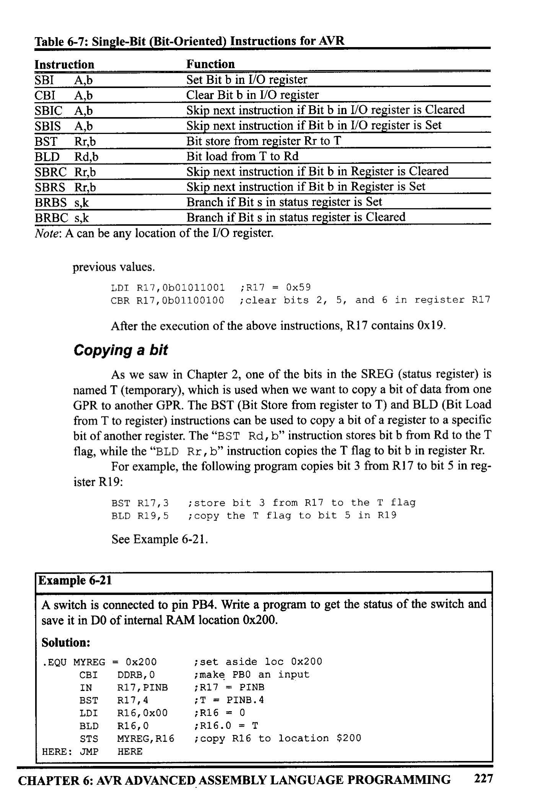
*Description*: Structured reference table listing operational parameters, instruction execution cycles, memory address mapping, or feature comparison for Table 6-7: Single-Bit (Bit-Oriented) Instructions for AVR.

> **Table 6-7: Single-Bit (Bit-Oriented) Instructions for AVR**

Instruction
Function

```assembly
SBI A,b
```

Set Bit b in I/O register
CBI
A,b
Clear Bit b in I/O register

```assembly
SBIC A,b
```

Skip next instruction if Bit b in I/O register is Cleared

```assembly
SBIS A,b
```

Skip next instruction if Bit b in I/O register is Set
BST Rr,b
Bit store from register Rr to T
BLD Rd,b
Bit load from T to Rd
SBRC Rr,b
Skip next instruction if Bit b in Register is Cleared
SBRS Rr,b
Skip next instruction if Bit b in Register is Set
BRBS s,k
Branch if Bit s in status register is Set
BRBC s,k
Branch if Bit s in status register is Cleared
Note: A can be any location of the I/O register.
previous values.
IDI R17, 0b01011001
CBR R17, 0601100100
;R17 = 0x59
¡clear bits 2, 5, and 6 in register R17
After the execution of the above instructions, R17 contains Ox19.
Copying a bit
As we saw in Chapter 2, one of the bits in the SREG (status register) is
named T (temporary), which is used when we want to copy a bit of data from one
GPR to another GPR. The BST (Bit Store from register to T) and BLD (Bit Load
from T to register) instructions can be used to copy a bit of a register to a specific
bit of another register. The "BST Rd, b" instruction stores bit b from Rd to the T
flag, while the "BLD Rr, b" instruction copies the T flag to bit b in register Rr.
For example, the following program copies bit 3 from R17 to bit 5 in reg-
ister R19:
BST R17,3
BLD
R19,5
¡store bit 3 from R17 to the T flag
; copy
the I flag to bit 5 in R19
See Example 6-21.
Example 6-21
A switch is connected to pin PB4. Write a program to get the status of the switch and
save it in DO of internal RAM location 0x200.
Solution:
• EQU MYREG = 0x200
CBI
DDRB, O
IN
R17, PINB
BST
R17,4
LDI
R16, 0x00
BLD
R16,0
STS
MYREG, R16
HERE: JMP
HERE
¡ set aside loc 0x200
i make PBO an input
;R17 = PINB
¡ I = PINB.4
;R16 = 0
;R16.0 = T
¡ copy R16 to location $200
CHAPTER 6: AVR ADVANCED ASSEMBLY LANGUAGE PROGRAMMING
227


<!-- Page 242 -->
### [PDF Page 242]

Checking a bit
To see if a bit of a general purpose register is set or cleared, we can use the
SBRS (Skip next instruction if Bit in Register is Set) and SBRC (Skip next instruc-
tion if Bit in register is Cleared) instructions.
The SBRS instruction tests a bit of a register and skips the instruction right
below it if the bit is HIGH. The format of the SBRS instruction is as follows:
SBRS Rd, b
i skip next instruction if Bit b in Rd is set
For example, in the following program the "LDI
Will not be executed since bit 3 of R17 is set.
R2O, Ox55" instruction

```assembly
LDI R17, 060001010
```

SBRS R17,3
LDI
R20, 0x55
LDI
R30, 0x33
¡skip next instruction if Bit 3 in R17 is set
The SBRC instruction skips the next instruction if a bit of a GPR is cleared.
It has the following format:
SBRC Rd, b
i skip next instruction if Bit b in Rd is cleared
For example, in the following program the "LDI R20, 0x55" instruction
will not be executed since bit 2 of R16 is cleared.
LDI
R16, 060001010
SBRC
R16,2 iskip next instruction if Bit 2 in R16 is cleared
LDI
R20, 0x55
LDI
R30, 0x33
See Example 6-22.
Example 6-22
A switch is connected to pin PC7. Using the SBRS instruction, write a program to check
the status of the switch and perform the following:
(a) If switch = O, send letter 'N' to Port D.
(b) If switch = 1, send letter 'Y' to Port D.
Solution:
• INCLUDE "M32DEF.INC"
CBI
DDRC, 7
LDI
R16, OXFF
OUT
DDRD, R16
AGAIN: IN
R20, PINC
SBRS
R20,7
RJMP
OVER
IDI R16, 'Y'
OUT
PORTD, R16
RUMP
AGAIN
OVER: LDI
R16, 'N'
OUT
PORTD, R16

```assembly
RJMP AGAIN
```

¡ include a file according to the IC you use
; make PC7 an input
¡ make Port D an output port
; R20 = PINC
i skip next line if Bit PC7 is set
¡ it must be LOW
;R16 = 'Y' ASCII letter Y
¡issue R16 to PD
¡we could use JMP instead
;R16 = 'N' ASCII letter N
; issue
: R16 to PORTD
i we can use JMP tOO
228


<!-- Page 243 -->
### [PDF Page 243]

Manipulating the bits of 1/0 registers
As we discussed in Chapter 4, we can set and clear the lower 32 I/O regis-
ters (addresses 0 to 31) using the SBI (Set bit in I/O register) and CBI (Clear bit
in I/O register) instructions. For example, the following two instructions set the
PORTA.1 and clear the PORTB.4, respectively:

```assembly
SBI PORTA, 1
```

¡set Bit 1 in PORTA

```assembly
CBI PORTB, 4
```

i clear Bit 4 in PORTB
See Example 6-23.
Example 6-23
Write a program to toggle PB2 a total of 200 times.
Solution:
IDI
R16, 200
SBI
DDRB, 2
AGAIN: SBI PORTB, 2

```assembly
CBI PORTB, 2
```

DEC R16

```assembly
BRNE AGAIN
```

¡ load the count into R16
; DDRB.1 = 1, make RB1 an output
iset bit PB2 (toggle PB2)
¡clear bit PB2 (toggle PB2)
¡continue until counter is zero
In Chapter 4 we mentioned that we can test a bit in the lower 32 l/O regis-
ters using the SBIS (Skip if Bit in I/O register is Set) and SBIC (Skip if Bit in I/O
register is Cleared) instructions. See Examples 6-24 and 6-25.
Example 6-24
Rewrite the program of Example 6-22 using the SBIC instruction.
Solution:
• INCLUDE "M32DEF.INC"

```assembly
CBI DDRC, 7
LDI R16, OxFF
OUT DDRD, R16
AGAIN: IN
```

R2O, PINC
SBRC R20, 7

```assembly
RJMP OVER
```

LDI
R16, 'N'
OUT
PORTD, R16
RJMP
AGAIN
OVER: LDI R16, 'Y'

```assembly
OUT PORTD, R16
```

RUMP AGAIN
¡ include a proper file
¡ make PC7 an input
¡ make Port D an output port
; R20 = PINC
i skip next line if Bit PC7 is cleared
; it must be HIGH
;R16 = 'N' ASCII letter N
¡ issue R16 to PD
¡we could use JMP instead
¡R16 = 'y' ASCII letter Y
¡ issue R16 to PORTD
iwe can use JP too
CHAPTER 6: AVR ADVANCED ASSEMBLY LANGUAGE PROGRAMMING
229


<!-- Page 244 -->
### [PDF Page 244]

Example 6-25
Rewrite the program of Example 6-22 using the SBIS instruction.
Solution:
• INCLUDE "M32DEF.INC"
CBI
DDRC, 7
¡ include a proper file
¡ make PC7 an input
LDI
R16, OXFF
OUT
DDRD, R16
¡ make Port D an output port
AGAIN: SBIS

```c
PINC, 7
```

iskip next line if Bit PC7 is set
RJMP
OVER
¡ it must be LOW
LDI
R16, 'Y'
;R16 = 'Y' ASCII letter Y
OUT
PORTD, R16
¡issue RI6 to PD

```assembly
RJMP AGAIN
;we could use JMP instead
OVER: IDI R16, 'N'
¡R16 = 'N' ASCII letter N
```

OUT
PORTD, R16
¡ issue R16 to PORTD
RUMP AGAIN
iwe can use JMP too
Status register bit-addressability
Now let's see how we can use bit-addressability of the status register. As
we discussed in Chapter 2, the bits of the status register are used for the flags C,
Z, N, V, S, H, T, and I. The status register is shown in Figure 6-14.
Bit
DO
SREG
D7
I THS
C - Carry flag
Z - Zero flag
N - Negative flag
V - Overflow flag

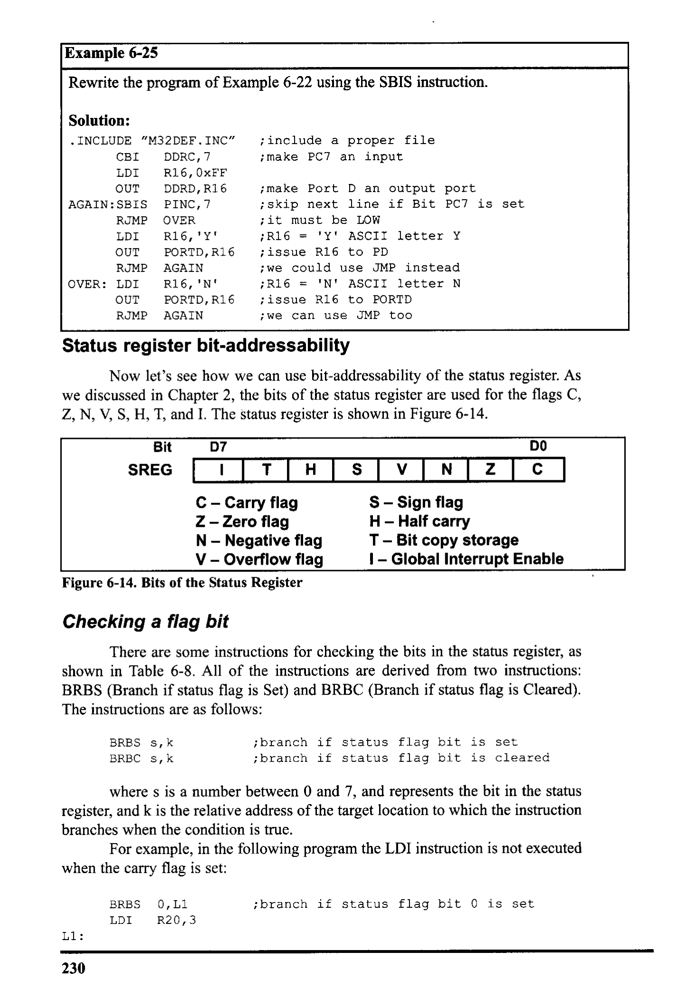
*Description*: Register specification diagram depicting individual bit flags, control register configurations, and functional definitions for Figure 6-14: Bits of the Status Register.

> **Figure 6-14: Bits of the Status Register**

V NZ
S - Sign flag
H - Half carry
T - Bit copy storage
1- Global Interrupt Enable
Checking a flag bit
There are some instructions for checking the bits in the status register, as
shown in Table 6-8. All of the instructions are derived from two instructions:
BRBS (Branch if status flag is Set) and BRBC (Branch if status flag is Cleared).
The instructions are as follows:
BRBS s, k
BRBC
s,k
¡branch if status flag bit is set
¡branch if status flag bit is cleared
where s is a number between 0 and 7, and represents the bit in the status
register, and k is the relative address of the target location to which the instruction
branches when the condition is true.
For example, in the following program the LDI instruction is not executed
when the carry flag is set:
BRBS
LDI
0, 11
R20, 3
¡branch if status flag bit 0 is set
230


<!-- Page 245 -->
### [PDF Page 245]


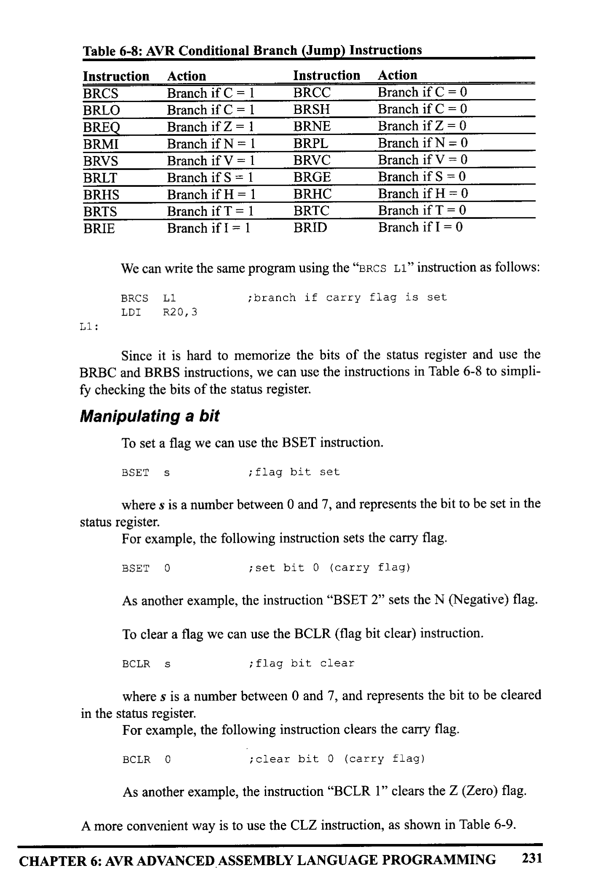
*Description*: Structured reference table listing operational parameters, instruction execution cycles, memory address mapping, or feature comparison for Table 6-8: AVR Conditional Branch (Jump) Instructions.

> **Table 6-8: AVR Conditional Branch (Jump) Instructions**

Instruction
BRCS
BRLO
BREQ
BRMI
BRVS
BRLT
BRHS
BRTS
BRIE
Action
Branch if C = 1
Branch if C = 1
Branch if Z = 1
Branch if N = 1
Branch if V = 1
Branch it S = 1
Branch if H = 1
Branch if T = 1
Branch if I = 1
Instruction
BRCC
BRSH
BRNE
BRPL
BRVC
BRGE
BRHC
BRTC
BRID
Action
Branch if C = 0
Branch if C = 0
Branch if Z = 0
Branch if N = 0
Branch if V = 0
Branch if S = 0
Branch if H = 0
Branch if T = 0
Branch if I = 0
We can write the same program using the "BRcs I1" instruction as follows:

```assembly
BRCS LI
```

IDI
R20,3
; branch if carry flag is set
L1:
Since it is hard to memorize the bits of the status register and use the
BRBC and BRBS instructions, we can use the instructions in Table 6-8 to simpli-
fy checking the bits of the status register.
Manipulating a bit
To set a flag we can use the BSET instruction.
BSET S
¡ flag bit set
where s is a number between 0 and 7, and represents the bit to be set in the
status register.
For example, the following instruction sets the carry flag.
BSET 0
¡set bit 0 (carry flag)
As another example, the instruction "BSET 2" sets the N (Negative) flag.
To clear a flag we can use the BCLR (flag bit clear) instruction.
BCLR S
i flag bit clear
where s is a number between 0 and 7, and represents the bit to be cleared
in the status register.
For example, the following instruction clears the carry flag.
BCLR 0
;clear bit 0 (carry flag)
As another example, the instruction "BCLR 1" clears the Z (Zero) flag.
A more convenient way is to use the CLZ instruction, as shown in Table 6-9.
CHAPTER 6: AVR ADVANCED ASSEMBLY LANGUAGE PROGRAMMING
231


<!-- Page 246 -->
### [PDF Page 246]


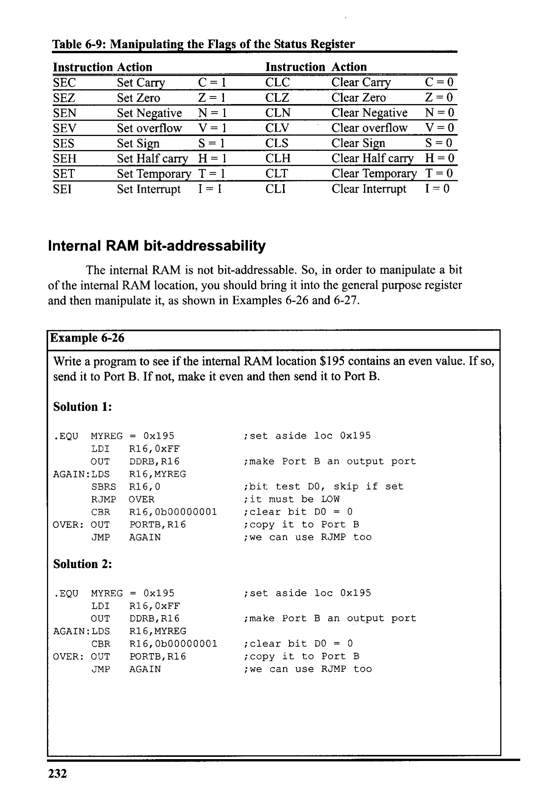
*Description*: Register specification diagram depicting individual bit flags, control register configurations, and functional definitions for Table 6-9: Manipulating the Flags of the Status Register.

> **Table 6-9: Manipulating the Flags of the Status Register**

Instruction Action
Instruction Action
SEC
Set Carry
C=1
CLC
Clear Carry
C=0
SEZ
Set Zero
Z = 1
CLZ
Clear Zero
Z = 0
SEN
Set Negative
N= 1
SEV
CLN
Clear Negative
N=0
Set overflow
V =1
CLV
Clear overflow
V =0
SES
Set Sign
S= 1
CLS
Clear Sign
S= 0
SEH
Set Half carry
H= 1
CLH
Clear Half carry
H= 0
SET
SEI
Set Temporary
T = 1
CLT
Clear Temporary
T =0
Set Interrupt
I = 1
CLI
Clear Interrupt
I=0
Internal RAM bit-addressability
The internal RAM is not bit-addressable. So, in order to manipulate a bit
of the internal RAM location, you should bring it into the general purpose register
and then manipulate it, as shown in Examples 6-26 and 6-27.
Example 6-26
Write a program to see if the internal RAM location $195 contains an even value. If so,
send it to Port B. If not, make it even and then send it to Port B.
Solution 1:
• EQU MYREG = 0x195
IDI
R16, OXFF
OUT
DDRB, R16
AGAIN: IDS
R16, MYREG
SBRS
RJMP
R16,0
OVER
CBR
R16, 0b00000001
OVER: OUT
PORTB, R16
JMP
AGAIN
¡ set aside loc 0x195
¡ make Port B an output port
¡bit test DO, skip if set
¡ it must be LOW
¡clear bit DO = 0
¡ copy it to Port B
¡we can use RJMP too
Solution 2:
•EQU MYREG = 0x195
LDI
R16, OXFF
OUT
DDRB, R16
AGAIN: LDS
R16, MYREG
CBR
R16, 0600000001
OVER: OUT
PORTB, R16
JMP
AGAIN
¡ set aside loc 0x195
¡ make Port B an output port
¡clear bit DO = 0
¡copy it to Port B
¡we can use RJMP tOO
232


<!-- Page 247 -->
### [PDF Page 247]

Example 6-27
Write a program to see if the internal RAM location $137 contains an even value. If so,
write 0x55 into location $200. If not, write 0x63 into location $200.
Solution:
• EQU MYREG = 0x137
• EQU
RESULT= 0x200
LDS
R16, MYREG
SBRC R16, 0

```assembly
RJMP OVER
```

LDI
R16, 0x55
STS
RESULT, R16
RJMP
HERE
OVER: IDI
R16, 0x63
STS
RESULT, R16
HERE: RJMP
HERE
¡ set aside location 0x137
¡skip if clear Bit DO of RI6 register is clI
¡ it is odd

### Review Questions

1. True or false. All registers of the AVR are bit-addressable.
2. True or false. The status register of the AVR is bit-addressable.
3. Indicate which of the following registers are bit-addressable.
(a) Port A (b) Port B
(c) R19
(d) status register (e) PC register
4. How would you check to see whether bit D1 of R23 is HIGH or LOW?
5. Show how to clear the carry flag.
6. State what each instruction does.
(a) SBR R16, 0x1
(b) CBR R30, 0x7
(d) SBI PORTB, 4
(e) CBI SREG, 1
(C) BSI R19,2
(f) CLI

## SECTION 6.6: ACCESSING EEPROM IN AVR

Every member of the AVR microcontrollers has some amount of on-chip
EEPROM. In Table 6-10 you can see the amount of EEPROM memory in each
member of the ATmega family. As we mentioned in Chapter O, the data in SRAM
will be lost if the power is disconnected. However, we need a place to save our
data to protect them against power failure. EEPROM memory can save stored data
even when the power is cut off. In this section we will show how to write to EEP-
ROM memory and how to access it.

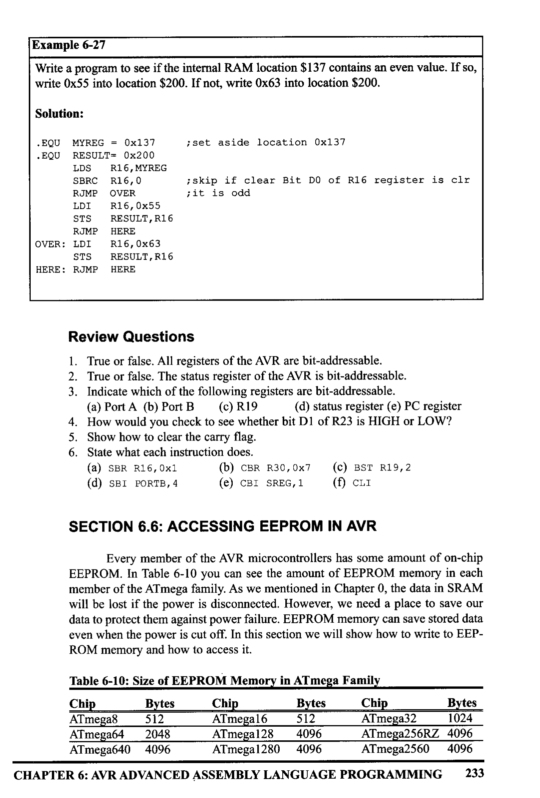
*Description*: Structured reference table listing operational parameters, instruction execution cycles, memory address mapping, or feature comparison for Table 6-10: Size of EEPROM Memory in ATmega Family.

> **Table 6-10: Size of EEPROM Memory in ATmega Family**

Chip
ATmega8
ATmega64
ATmega640
Bytes
512
2048
4096
Chip
Bytes
ATmega16
512
ATmega128
4096
Al'mega 1280
4096
CHAPTER 6: AVR ADVANCED ASSEMBLY LANGUAGE PROGRAMMING
Chip
Bytes
ATmega32
1024
ATmega256RZ 4096
ATmega2560
4096
233


<!-- Page 248 -->
### [PDF Page 248]

EEPROM registers
There are three I/O registers that are directly related to EEPROM. These
are EECR (EEPROM Control Register), EEDR (EEPROM Data Register), and
EEARH-EEARL (EEPROM Address Register High-Low). Each of these registers
is discussed in detail in this section.
EEPROM Data Register (EEDR)
To write data to EEPROM, you have to write it to the EEDR register and
then transfer it to EEPROM. Also, if you want to read from EEPROM you have to
read from EEDR. In other words, EEDR is a bridge between EEPROM and CPU.
EEPROM Address Register (EEARH and EEARL)
The EEARH:EEARL registers together make a 16-bit register to address
each location in EEPROM memory space. When you want to read from or write
to EEPROM, you should load the EEPROM location address in EEARs. As you
see in Figure 6-15, only 10 bits of the EEAR registers are used in ATmega32.
Because ATmega32 has 1024-byte EEPROM locations, we need 10 bits to address
each location in EEPROM space. In ATmega16, 9 bits of the EEAR registers are
used because ATmega16 has 512 bytes of EEPROM, and to address 512 bytes we
need a 9-bit address.
Bit
EEARH
EEARL
Bit
15
14
13
12
11
10
9
8
EEAR9 EEAR8
EEAR7 | EEARG EEARS EEARA EEAR3 EEARZ |EEAR1| EEARO
6
5
4
3
2
1


*Description*: Register specification diagram depicting individual bit flags, control register configurations, and functional definitions for Figure 6-15: EEPROM Address Registers.

> **Figure 6-15: EEPROM Address Registers**

EEPROM Control Register (EECR)
The EECR register is used to select the kind of operation to perform on.
The operation can be start, read, and write. In Figure 6-16 you see the bits of the
EECR register. The bits are as follows:
EEPROM Read Enable (EERE): Setting this bit to one will cause a read
operation if EEWE is zero. When a read operation starts, one byte of EEPROM
will be read into the EEPROM Data Register (EEDR). The EEAR register speci-
fies the address of the desired byte.
EEPROM Write Enable (EEWE) and EEPROM Master Write Enable
(EEMWE): When EEMWE is set, setting EEWE within four clock cycles will start
a write operation. If EEMWE is zero, setting EEWE to one will have no effect.
EECR
Bit
-
7

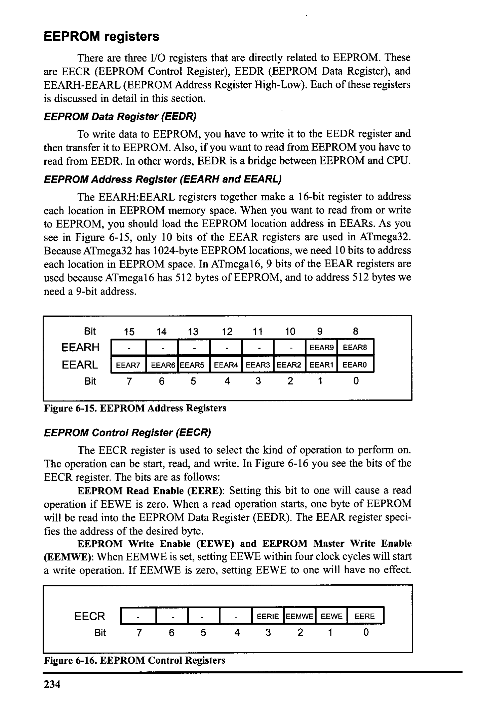
*Description*: Register specification diagram depicting individual bit flags, control register configurations, and functional definitions for Figure 6-16: EEPROM Control Registers.

> **Figure 6-16: EEPROM Control Registers**

234


<!-- Page 249 -->
### [PDF Page 249]

When you set EEMWE to one, the hardware clears the bit to zero after four clock
cycles. This prevents unwanted write operations on EEPROM contents. Notice
that you cannot start read or write operations before the last write operation is fin-
ished. You can check for this by polling the EEWE bit. If EEWE is zero it means
that EEPROM is ready to start a new read or write operation.
EEPROM Ready Interrupt Enable (EERIE): In Chapter 10 you will learn
about interrupts in AVR. As you see in Figure 6-16, bits 4 to 7 of EECR are unused
at the present time and are reserved.
Programming the AVR to write on EEPROM
To write on EEPROM the following steps should be followed. Notice that
steps 2 and 3 are optional, and the order of the steps is not important. Also note
that you cannot do anything between step 4 and step 5 because the hardware clears
the EEMWE bit to zero after four clock cycles.
1. Wait until EEWE becomes zero.
2. Write new EEPROM address to EEAR (optional).
3. Write new EEPROM data to EEDR (optional).
4. Set the EEMWE bit to one (in EECR register).
5. Within four clock cycles after setting EEMWE, set EEWE to one.
See Example 6-28 to see how we write a byte on EEPROM.
Example 6-28
Write an AVR program to store 'G' into location 0x005F of EEPROM.
Solution:
• INCLUDE "M16DEF. INC"
WAIT:

```assembly
SBIC EECR, EEWE
```

RJMP
WAIT
LDI
R18,0
LDI
R17,0X5F
OUT
EEARH, R18
OUT
EEARL, R17
LDI
R16, 'G'
OUT
EEDR, R16
SBI
EECR, EEMWE
SBI
EECR, EEWE
¡wait for last write to finish
¡check EEWE to see if last write is finished
¡wait more
¡load high byte of address to R18
¡load low byte of address to R17
¡ load high byte of address to EEARH
¡load low byte of address to EEARL
¡ load 'G' to R16
¡ load R16 to EEPROM Data Register
¡ set Master Write Enable to one
¡set write Enable to one
Run and simulate the code on AVR Studio to see how the content of the EEPROM
changes after the last line of code. Enter four NOP instructions before the last line,
change the 'G' to 'H', and run the code again. Explain why the code doesn't store 'H'
at location 0x005F of EEPROM.
CHAPTER 6: AVR ADVANCED ASSEMBLY LANGUAGE PROGRAMMING
235


<!-- Page 250 -->
### [PDF Page 250]

Programming the AVR to read from EEPROM
To read from EEPROM the following steps should be taken. Note that step
2 is optional.
1. Wait until EEWE becomes zero.
2. Write new EEPROM address to EEAR (optional).
3. Set the EERE bit to one.
4. Read EEPROM data from EEDR.
See Example 6-29 to see how we read a byte from EEPROM.
Example 6-29
Write an AVR program to read the content of location 0x005F of EEPROM into
PORTB.
Solution:
• INCLUDE "M16DEF. INC"

```assembly
LDI R16, OxFF
OUT DDRB, R16
WAIT:
```

¡wait for last write to finish

```assembly
SBIC EECR, EEWE
```

¡check EEWE to see if last write is finished
RJMP
WAIT
¡wait more
LDI
R18,0
¡load high byte of address to R18
LDI
R17,0X5F
¡ load low byte of address to R17
OUT
EEARH, R18
¡ load high byte of address to EEARH
OUT
EEARL, R17 ¡load low byte of address to EEARL
SBI
EECR, EERE
¡ set Read Enable to one
IN
R16, EEDR
¡ load EEPROM Data Register to R16

```assembly
OUT PORTB, R16
```

¡ out R16 to PORTB
Initializing EEPROM
In Section 6-4, you saw how to allocate program memory using the .DB
directive. We can also allocate and initialize the EEPROM using the DB directive.
If we write .ESEG before a definition, the variable will be located in the EEPROM,
whereas . CSEG before a definition causes the variable to be allocated in the code
(program) memory. By default the variables are located in the program memory.
For example, the following code allocates locations $10 and $11 of EEPROM for
DATA1 and DATA2, and initializes them with $95 and $19, respectively:
• ESEG
• ORG $10
DATA1:
$95
DATA2: (
$19
The following code allocates DATA1 and DATA3 in program memory and
DATA2 in EEPROM:
DATA1:
• DB
¡by default it is located in code memory
• ESEG
DATA2:
DATA3:
• DB
• DB
• CSEG
DATA4:
• DB
$10
$20
$35
$45
¡it is located in EEPROM
¡it is located in EEPROM
¡ it is located in code memory
See Example 6-30.
236


<!-- Page 251 -->
### [PDF Page 251]

Example 6-30
Write a program that counts how many times a system has been powered up.
Solution:
• INCLUDE "M32DEE. INC"
LDI
R20, HIGH (RAMEND)

```assembly
OUT SPH, R20
LDI R20, LOW (RAMEND)
```

OUT
SPL, R20
¡ initialize stack pointer
IDI
XH, HIGH (COUNTER)
LDI
XL, LOW (COUNTER)
CALL
INC
LOAD_FROM_EEPROM
R20

```assembly
CALL STORE_IN_EEPROM
```

¡X points to COUNTER
; load R20 with value of COUNTER
¡ increment R20
i store R20 in EEPROM
HERE: RJMP HERE
; ----- Load R20 with contents of location X of EEPROM
LOAD_FROM _EEPROM:

```assembly
SBIC EECR, EEWE
RJMP LOAD_FROM_EEPROM i wait while EEPROM is busy
```

OUT
EEARH, XH
OUT
EEARL, XL
¡ EEAR = X
SBI
EECR, EERE
; set Read Enable to one
IN
R20, EEDR
¡ load EEPROM Data Register to 120
RET
i-----Store R2O into location X of EEPROM
STORE_IN_EEPROM:

```assembly
SBIC EECR, EEWE
```

RUMP STORE_IN EEPROM

```assembly
OUT EEARH, XH
```

OUT
EEARL, XL
OUT
EEDR, R20
SBI
EECR, EEMWE
SBI
EECR, EEWE
¡wait while EEPROM is busy
¡ EEAR = X
¡ set Master Write Enable to one
¡write EEDR into EEPROM
RET
---EEPROM
; -
• ESEG
• ORG O
COUNTER:
• DB
0
COUNTER is initialized with SO. Then, it is incremented on each power-up.

### Review Questions

1. True or false. The AVR EEPROM memory is used for both program code and
data.
2. True or false. The ATmega32 has 1,024 bytes of EEPROM memory.
3. True or false. In the AVR, EEPROM contents are lost when power to the chip
is cut off.
4. True or false. In the AVR, EEPROM memory is read and write memory.
5. True or false. Every AVR chip comes with 1 KB of EEPROM.
CHAPTER 6: AVR ADVANCED ASSEMBLY LANGUAGE PROGRAMMING
237


<!-- Page 252 -->
### [PDF Page 252]


## SECTION 6.7: CHECKSUM AND ASCII SUBROUTINES

In this section we look at some widely used subroutines: checksum byte,
BCD, and ASCII conversion.
Checksum byte in EEPROM
To ensure the integrity of ROM contents, every system must perform a
checksum calculation. The checksum will detect any corruption of the contents of
ROM. One cause of ROM corruption is current surge, either when the system is
turned on, or during operation. To ensure data integrity in ROM, the checksum
process uses what is called a checksum byte. The checksum byte is an extra byte
that is tagged to the end of a series of bytes of data. To calculate the checksum byte
of a series of bytes of data, the following steps can be taken:
1. Add the bytes together and drop the carries.
2. Take the 2's complement of the total sum, and that is the checksum byte, which
becomes the last byte of the series.
To perform a checksum operation, add all the bytes, including the check-
sum byte. The result must be zero. If it is not zero, one or more bytes of data have
been changed (corrupted). To clarify these important concepts, see Example 6-31.
Checksum program
The checksum generation and testing program is given in subroutine form.
Five subroutines perform the following operations:
1. Retrieve the data from EEPROM.
2. Test the checksum byte for any data error.
3. Initialize variables if the checksum byte is corrupted.
4. Calculate the checksum byte.
5. Store the data in EEPROM.
Each of these subroutines can be used in other applications. Example 6-31
shows how to manually calculate the checksum for a list of values. Also, see
Program 6-1.
CHECKSUM
INCLUDE ME. INC
•EQU OPTION_SIZE = 0x4
• EQU
RAM OPTIONS = 0x100
; - --.
---main
program
• ORG
LDI
R16, HIGH (RAMEND)
OUT
SPH, R16
LDI
R16, LOW (RAMEND)
OUT
SPL, R16
RCALL
• LOAD_OPTIONS

```assembly
RCALL TEST_CHKSUM
```

TST
R20
BREQ
; SP points to RAMEND
i load
options
; test checksum
¡ if data is not corrupted go to LI
238


<!-- Page 253 -->
### [PDF Page 253]

Example 6-31
Assume that we have 4 bytes of hexadecimal data: $25, $62, $3F, and $52.
(a) Find the checksum byte.
(b) Perform the checksum operation to ensure data integrity.
(c) If the second byte, $62, has been changed to $22, show how the checksum method
detects the error.
Solution:
(a)
Find the checksum byte.
$25
+ $62
+ $3F
+ $52
$118
(b)
(Dropping the carry of 1, we have $18. Its 2's complement is $E8. Therefore,
the checksum byte is SE8.)
Perform the checksum operation to ensure data integrity.
$25
+ $62
+ $3F
+ $52
+ $E8
$200
(Dropping the carries, we see 00, indicating that the data is not corrupted.)
If the second byte, $62, has been changed to $22, show how the checksum
method detects the error.
$25
+ $22
+ $3F
+ $52
+ $E8
$1CO
(Dropping the carry, we get SCO, which is not 0O. This means that the data
is corrupted.)

```assembly
RCALL INIT_OPTIONS
I1:
```

¡ Here you can use the options

```assembly
RCALL CAL_CHKSUM
RCALL STORE_OPTIONS
HERE: RJMP HERE
```

¡initialize options
¡-----Load R20 with contents of location X of EEPROM
RUMP LOAD_FROM_EEPROM ;wait while EEPROM is busy
OUT
OUT
EEARL, XL
SBI
EECR, EERE
R20, EEDR
; EEAR = X
¡ set Read Enable to one
¡ load EEPROM Data Register to R20
;-----Store
: R20 into location X of EEPROM
CHAPTER 6: AVR ADVANCED ASSEMBLY LANGUAGE PROGRAMMING
239


<!-- Page 254 -->
### [PDF Page 254]

STORE_IN_EEPROM:

```assembly
SBIC EECR, EEWE
```

STORE_IN_EEPROM
¡wait while EEPROM is busy
EEARH, XH
EEARL, XL
; EEAR = X
EEDR, R20
EECR, EEMWE
EECR, EEWE
¡ set Master Write Enable to
¡write EEDR into EEPROM
i-----copying the data from EEPROM to internal SRAM
LOAD_OPTIONS:
XI, LOW (E_OPTIONS)
XH, HIGH (E_OPTIONS)
YL, LOW (RAM OPTIONS)
YH, HIGH (RAM_OPTIONS)
R16, OPTION SIZE+1
LLI: CALL
LOAD FROM EEPROM
Y+, R20
LLZ: DEC

```assembly
BRNE LL1
```

¡X points
• to ELOPTIONS
¡y points to RAM _OPTIONS
¡ COUNTER = OPTION_SIZE+1
¡ load R20 with EEPROM 100 X
i store R20 in RAM 100 Y
¡ increment XI
¡if not carry go to Ib2
; decrement COUNTER
¡ if COUNTER not zero go to LL1
---copying data from code ROM to data RAM
INIT OPTIONS:
ZI, LOW (ELASH _OPTIONS‹<1) ; Z points to FLASH_OPTIONS
ZH, HIGH (FLASH_OPTIONS<<1)
YI, LOW (RAM_OPTIONS)
YH, HIGH (RAM _OPTIONS)
¡Y points to RAM_OPTIONS
R16, OPTION_SIZE
; COUNTER = OPTION SIZE
R18, Z+
¡ load R18 with program mem. location Z
Y+, R18
¡store R18 in loc Y of RAM
; decrement COUNTER
¡ if COUNTER is not zero go to H1
¡ return
--calculating checksum byte
CAL_CHKSUM:
CLI: ID
YL, LOW (RAM OPTIONS)
YH, HIGH (RAM_OPTIONS)
¡Y points to RAM_OPTIONS
R16, OPTION_SIZE
¡ COUNTER = OPTION_SIZE
; SUM = 0
R17, Y+
R20, R17
¡load R17 with contents of loc y
; SUM = SUM + R17
; decrement COUNTER
¡if COUNTER is not zero go to CLI
¡two's complement SUM
Y, R20
¡store checksum in 1oc Y of RAM
; return
i-------testing checksum byte
_CHKSUM:
YI, LOW (RAM _OPTIONS)
LDI
YH, HIGH (RAM_OPTIONS)
LDI
R16, OPTION_SIZE+1
LDI
R20, 0
TLI: LD
R17, Y+
ADD
R20, R17
it points to RAM OPTIONS
; SUM = 0
; load R17 with contents of loc Y
; SUM = SUM + R17
240


<!-- Page 255 -->
### [PDF Page 255]

DEC
R16
BRNE
TLI
; decrement COUNTER
¡loop while COUNTER is not zero
RET
i-----copying the data from internal SRAM to EEPROM
STORE_OPTIONS:
LDI
XL, IOW (E_OPTIONS)
LDI
LDI
XH, HIGH (E_OPTIONS)
iX points to E_OPTIONS
YL, LOW (RAM OPTIONS)
LDI
YH, HIGH (RAM_OPTIONS)
¡y points to RAM OPTIONS
LDI
R16, OPTION_SIZE+1
¡ COUNTER = OPTION_SIZE+1
SL1: LD
R20, Y+
CALL
STORE_IN_EEPROM
¡store R20 in loc X
INC
XL
; increment XL

```assembly
BRNE SL2
```

¡ if not carry go to SL2
INC
XH
SL2: DEC
R16
¡ decrement COUNTER
BRNE
SL1
RET
¡loop while COUNTER is not zero
¡ return
i-------initial values in program ROM
FLASH_OPTIONS: . DB
0x25,0×62,0×3F, 0x52
; ---
--EEPROM
• ESEG
• ORG
$0
E_OPTIONS: . DB
0x25,0x62,0×3F, 0x52
BCD to ASCII conversion program
Many RTCs (real-time clocks) provide time and date in BCD format. To dis-
play the BCD data on an LCD or a PC screen, we need to convert it to ASCII.
Program 6-2 (a) transfers packed BCD data from program ROM to data RAM, (b)
converts packed BCD to ASCII, and (c) sends the ASCII to port B for display. The
displaying of data on an LCD will be shown in Chapter 12. See Chapter 5 for the
BCD to ASCII conversion algorithm.
CONVERTING PACKED BCD TO ASCII
• LIU RAM ADDR =
0x80
LDI
R16, HIGH (RAMEND)
OUT
SPH, R16
LDI
R16, LOW (RAMEND)
OUT
SPL, R16
; SP = RAMEND
CALL
BCD_ASCII_COV
HERE: RJMP
HERE
i -----convert packed BCD to ASCII
BCD_ASCII_COV:
LDI
ZL, LOW (MYBYTE<<1)
LDI
ZH, HIGH (MYBYTE‹<1)
; 2 = MYBYTE
LDI
XL, LOW (RAM_ADDR)
LDI
XH, HIGH (RAM _ADDR)
LDI
L1:
R16,4
LPM
R20, Z+
MOV
R21, R20
ANDI
R21, 0x0F
ORI
R21, 0×30
iX = RAM_ADDR
¡ COUNTER = 4
1R22 - R20
; mask the upper nibble
i make it an ASCII
ST
X+, R21
CHAPTER 6: AVR ADVANCED ASSEMBLY LANGUAGE PROGRAMMING
241


<!-- Page 256 -->
### [PDF Page 256]

SWAP
ANDI
ORI
ST
DEC
BRNE
R20
R20, 0X0F
R2O, 0x30
X+, R20
R16
L1
i swap the nibbles
;mask the upper nibble
¡make it an ASCII
; decrement COUNTER
¡loop while COUNTER is not zero
RET
i return
i-----send ASCII to Port B
SEND_IO_PORTB:
LDI
XH, HIGH (RAM_ADDR)
LDI
XL, LOW (RAM_ADDR)
LDI
R16,8
L2:
LD
R20, X+
OUT
PORTB, R20
DEC
R16
BRNE
; X = RAM_ADDR
¡ COUNTER = 8
¡ PORTB = R20
; decrement counter
¡loop while counter is not zero
RET
MYBYTE: . DB 0x25,
0x67, 0x39, 0x52
Binary (hex) to ASCII conversion program
Many ADC (analog-to-digital converter) chips provide output data in bina-
ry (hex). To display the data on an LCD or PC screen, we need to convert it to
ASCII. The code for the binary-to-ASCII conversion is shown in Program 6-3.
Notice that the subroutine gets a byte of 8-bit binary (hex) data from Port B and
converts it to decimal digits, and the second subroutine converts the decimal dig-
its to ASCII digits and saves them. We are saving the low digit in the lower address
location and the high digit in higher address location. This is referred to as the
little-endian convention (i.e., low byte to low location, and high byte to high loca-
tion). All AVR products use the little-endian convention. For the binary-to-ASCIl
conversion algorithm see Chapter 5.
: PROG 6-3 AM32DEF.INC"
CONVERTING BINARY TO ASCIT
INCLUDE
• DEF
NUM = R20
• DEE DENOMINATOR = R21
• DEF QUOTIENT = R22
• EQU
RAM_ADDR = 0x200
• EQU
ASCII_RESULT = 0x210
; --
--main program
. ORG 0
LDI
R18, HIGH (RAMEND)
OUT
SPH, R18
LDI
R18, LOW (RAMEND)
OUT
SPL, R18
LDI
R16, 0x00
OUT
DDRA, R16

```assembly
RCALL BIN DEC CONVRT
RCALL DEC_ASCI_CONVRI
END:
```

RJMP
END
;---
BIN_DEC_CONVRT:
LDI
XL, LOW (RAM_ADDR)
LDI
XH, HIGH (RAM_ADDR)
--Converting BIN (HEX) TO DEC (00-FF TO 000-255)
; save DEC digits in these locations
242


<!-- Page 257 -->
### [PDF Page 257]

IN
NUM, PINA
LDI
DENOMINATOR, 10

```assembly
RCALL DIVIDE
```

ST
X+, NUM
MOV
NUM, QUOTIENT
RCALL
DIVIDE
ST
X+, NUM
ST
X+, QUOTIENT
RET
DEC_ASCI_CONVRT:
LDI
XL, LOW (RAM_ADDR)
LDI
LDI
XH, HIGH (RAM_ADDR)
YI, LOW (ASCII_RESULT)
LDI
YH, HIGH (ASCII_RESULT)
IDI
R16,3
BACK: LD
R20, X+
ORI
R20, 0x30
ST
Y+, R20
DEC
R16
BRNE
RET
BACK
i --
DIVIDE:
IDI
QUOTIENT, O
Il:
INC
QUOTIENT
SUB
NUM, DENOMINATOR
BRCC
L1
DEC
QUOTIENT
ADD
NUM, DENOMINATOR
RET
¡read data from PORT A
;QUOTIENT=PINA/10 NUM=PINA810
¡ save lower digit
¡ divide by 10 once more
¡ save the next digit
¡ save the last digit
; addr. of DEC data
¡addr. of ASCII data
; count
¡get DEC digit
¡make it an ASCII digit
i store it
¡ decrement counter
¡ repeat until the last one
We can write a function that directly converts binary to ASCII as shown
below:
• INCLUDE "M32DEF. INC"
• DEF NUM = R20
• DEE DENOMINATOR = R21
• DEF QUOTIENT = R22
ASCII RESULT = 0x210
-main
program
• ORG O
LDI
R18, HIGH (RAMEND)
OUT
SPH, R18
LDI
R18, LOW (RAMEND)
OUT
SPL, R18
¡initialize stack pointer
IDI
R16, 0×00
OUT
DDRA, R16

```assembly
RCALL BIN_ASCII.
```

_CONVRT
HERE: RJMP
HERE
----Converting BIN (HEX) TO DEC (00-FF IO 000-255)
BIN
_ASCII.
_CONVRI:
LDI
XL, LOW (ASCII_RESULT)
¡ save results in these loc.
LDI
XH, HIGH (ASCII
_RESULT)
IN
NUM, PINA
¡ read data from PORT A
IDI DENOMINATOR, 10

```assembly
RCALL DIVIDE
¡QUOTIENT=PINA/10
NUM=PINA$10
```

CHAPTER 6: AVR ADVANCED ASSEMBLY LANGUAGE PROGRAMMING
243


<!-- Page 258 -->
### [PDF Page 258]

ORI
NUM, 0x30
ST
x+, NUM
MOV
NUM, QUOTIENT

```assembly
RCALL DIVIDE
```

ORI
NUM, 0x30
ST
X+, NUM
ORI
QUOTIENT, 0x30
ST
X+, QUOTIENT
RET
¡ make it an ASCII digit
¡ save lower digit
¡ divide by 10 once more
make the
¡ make it an ASCII digit
¡ save the next digit
¡ make it an ASCII digit
¡ save the last digit

## SECTION 6.8: MACROS

In this section we explore macros and their use in Assembly language pro-
gramming. The format and usage of macros are defined and many examples of
their applications are examined.
What is a macro and how is it used?
There are applications in Assembly language programming in which a
group of instructions performs a task that is used repeatedly. For example, moving
data into a RAM location is done repeatedly in the same program. It does not make
sense to rewrite this code every time it is needed. Therefore, to reduce the time that
it takes to write code and reduce the possibility of errors, the concept of macros
was born. Macros allow the programmer to write the task (code to perform a spe-
cific job) once only, and to invoke it whenever it is needed.
Macro definition
Every macro definition must have three parts, as follows:
•MACRO
name
"ENDMACRO
The MACRO directive indicates the beginning of the macro detinition and
the ENDMACRO directive signals the end. What goes between the MACRO and
.ENDMACRO directives is called the body of the macro. The name must be
unique and must follow Assembly language naming conventions. A macro can
take up to 10 parameters. The parameters can be referred to as @0 to @9 in the
body of the macro. After the macro has been written, it can be invoked (or called)
by its name, and appropriate values are substituted for parameters.
For example, moving immediate data into 1/O register data RAM is a wide-
ly used service, but there is no instruction for that. We can use a macro to do the
job as shown in the following code:
•MACRO
LDI
OUT
• ENDMACRO
LOADIO
R20, 01
@0, R20
The above is the macro definition. Note that parameters @0 and @1 are
244


<!-- Page 259 -->
### [PDF Page 259]

mentioned in the body of the macro.
The following are three examples of how to use the above macro:
1. LOADIO
PORTA, 0x20
¡send value 0x20 to PORTA
2. . EQU
LOADIO
3. LOADIO
VAL_1 = OXFF
DDRC, VAL
SPL, 0x55
¡ send value $55 to SPL
Now examine Program 6-4 to see how to use a macro in a program.
¡ Program 6-4: toggling Port B using macros
-------------
; --
• INCLUDE "M32DEF.INC"
•MACRO LOADIO
LDI
R20, 01
OUT
@0, R20
• ENDMACRO
; --
•MACRO DELAY
IDI @0, 01
BACK:
-time delay macro
NOP
NO P
NOP
NOP
DEC
@0

```assembly
BRNE BACK
```

• ENDMACRO
; --
L1:
•ORG 0
LOADIO DDRB, OXEF
LOADIO
PORTB, 0x55
DELAY
R18, 0x70
LOADIO
PORTB, OXAA
DELAY
R18, 0×70
RJMP
L1
--program starts
i make PORTB output
¡PORTB
= 0x55
i delay
¡ PB = OXAA
¡delay
.INCLUDE directive
Assume that several macros are used in every program. Must they be
rewritten every time? The answer is no, if the concept of the INCLUDE directive
is known. The INCLUDE directive allows a programmer to write macros and save
them in a file, and later bring them into any program file. For example, assume that
the following widely used macros were written and then saved under the filename
"MYMACRO1 . MAC"
Assuming that the LOADIO and DELAY macros are saved on a disk under
the filename "MYMACRO1. MAC", the .INCLUDE directive can be used to bring this
file into any "asm" file and then the program can call upon any of the macros as
many times as needed. When a file includes all macros, the macros are listed at the
beginning of the "Ist" file and, as they are expanded, will be part of the program.
CHAPTER 6: AVR ADVANCED ASSEMBLY LANGUAGE PROGRAMMING
245


<!-- Page 260 -->
### [PDF Page 260]

To understand this, see Program 6-5.
¡ Program 6-5: toggling Port B using macros
• INCLUDE "M32DEF.INC"
• INCLUDE "MYMACRO1. MAC" ¡ get macros from macro file
; ---
---program starts
L1:
• ORG O
LOADIO
LOADIO
DELAY
LOADIO
DELAY
RJMP
DDRB, OXFE
PORTB, 0x55
R18, 0x70
PORTB, OXAA
R18, 0x70
L1
•LISTMAC directive
When viewing the .Ist file with macros, the details of the macros are not
displayed. This means that the bodies of the macros are not displayed when they
are invoked during the code. But when we are debugging the code we might need
Case on the display of te bodies ear an is is For tipe, em
ine the following code:
• INCLUDE "M32DEF. INC"
• MACRO
LDI
LOADIO
R20, 01
OUT
@0, R20
• ENDMACRO
LOADIO
LOADIO
HERE: JMP
PORTA, 0×20
DDRA, 0x53
HERE
The assembler provides the following code in the .Ist file:
•MACRO
IDI
OUT
• ENDMACRO
LOADIO
R20, 01
@0,R2O
000000 €240
000001 bb4b
LOADIO
000002 €543
000003 bb4a
LOADIO
000004 940C 0004 HERE: JMP
PORTA, 0x20
DDRA, 0x53
HERE
If we add the LISTMAC directive to the above code:
•MACRO
LDI
OUT
• ENDMACRO
• LISTMAC
LOADIO
LOADIO
R20, 01
@0, R20
PORTA, 0x20
246


<!-- Page 261 -->
### [PDF Page 261]

LOADIO
HERE: JMP
DDRA, 0x53
HERE
The assembler expands the macro by providing the following code in the
Ist file:
000000 e240
000001 bb4b
• MACRO
LDI
OUT
LOADIO
R20, 01
@0, R20
• ENDMACRO
• LISTMAC
+LDI R20 ,
0x20
+OUT PORTA, R20
LOADIO
PORTA, 0x20
000002 e543
000003 bb4a
000004 940c 0004
HERE: JMP
+IDI R20, 0x53
TOUT DDRA, R20
LOADIO
HERE
DDRA, 0x53
The + indicates that the code is from the macro.
Macros vs. subroutines
Macros and subroutines are useful in writing assembly programs, but each
has limitations. Macros increase code size every time they are invoked. For exam-
ple, if you call a 10-instruction macro 10 times, the code size is increased by 100
instructions; whereas, if you call the same subroutine 10 times, the code size is
only that of the subroutine instructions. On the other hand, a function call takes 3
or 4 clocks and the RET instruction takes 4 clocks to get executed. So, using func-
tions adds around 8 clock cycles. The subroutines use stack space as well when
called, while the macros do not.

### Review Questions

1.
Discuss the benefits of macro programming.
2. List the three parts of a macro.
3. Explain and contrast the macro definition and invoking the macro.

### SUMMARY

This chapter described the addressing modes of the AVR. Immediate
addressing mode uses a constant for the operand. Direct or register indirect
addressing modes can be used to access data stored in data memory of the AVR.
Register indirect addressing mode uses a register as a pointer to the data. The
advantage of this is that it makes addressing dynamic rather than static. Program
memory addressing mode is widely used in accessing data elements of look-up
table entries located in the program Flash ROM space of the AVR. The AVR allows
CHAPTER 6: AVR ADVANCED ASSEMBLY LANGUAGE PROGRAMMING
247


<!-- Page 262 -->
### [PDF Page 262]

the reading of fixed data stored in program Flash ROM space, in addition to writ-
ing to Flash ROM.
The I/O registers can be accessed by six different addressing modes: 1/0
direct addressing (by their names or their addresses), direct data addressing, data
indirect with displacement, data indirect addressing, data indirect addressing with
pre-decrement, and data indirect addressing with post-increment.
We also discussed the bit-addressable locations and showed how to use sin-
gle-bit instructions to access them directly.
We also explained how to access EEPROM and how to use checksum to
make sure data is not corrupted
Macros were also explored and their advantages were discussed

### PROBLEMS


## SECTION 6.1: INTRODUCING SOME MORE ASSEMBLER DIRECTIVES

1. Indicate the value loaded into the registers in the following program:
• EQU C1 = 0x20
• EQU C2 = 0x6E
• EQU C3 = 0x14
LDI
R20, (C1&C2) |C3
LDI
R21, C2- (C1+C3)
2. Indicate the value loaded into R30, R31, and R20 in the following program:
•ORG Ox0
• EQU
DATA
_ADDR = (OUR _DATA<<1)
LDI
R30, LOW (DATA_ADDR)
LDI
R31, HIGH (DATA_ADDR)
LPM
R2O, 2
•ORG 0x100
OUR_DATA: .DB 20,' A',' C

## SECTION 6.2: REGISTER AND DIRECT ADDRESSING MODES

3. Which of the following are invalid uses of immediate addressing mode?
(a) LDI R20,0x24 (b) STS Ox70, Ox30
(c) OUT 0x20,0x42
4. Identify the addressing mode for each of the following:
(a) OUT PORTB,R20 (b) LDI R20, 0x50
(c) LDS 0x40,R20
(d) ADD R20,R25 (e) MOV R20,R25
5. Indicate the addresses assigned to each of the following:
(a) PORTB
(b) PORIC
(c) DDRC
(d) DDRD
(e) SPL
(f) SPH
(g) SREG
6. In accessing the I/O registers, we should use
_ addressing mode.
7. What does the following instruction do? "STS OxFO, R20"
8. What does the following instruction do? "OUT PORIC, R19"
248


<!-- Page 263 -->
### [PDF Page 263]

9. The byte addresses assigned to the internal SRAM are
ATmega32. (Hint: To calculate the address of the last location, add the size of
SRAM in ATmega32 to the address of the first location of SRAM and decrease
the result by one.)
10. The byte addresses assigned to the SRAM are
to
_ in ATmega16.
11. Write a program to add the following data and place the result in RAM loca-
tion $200: The data values are 6, 9, 2, 5, 7

## SECTION 6.3: REGISTER INDIRECT ADDRESSING MODE

12. Which registers are allowed to be used as a pointer for register indirect
addressing mode when accessing data RAM? Give their names and show how
they are loaded.
13. Write a program to copy SAA into RAM locations $80 to $9F.
14. Write a program to clear RAM locations $90 to $12F.
15. Write a program to copy 10 bytes of data starting at RAM address $80 to RAM
locations starting at $90.
16. Write a program to toggle RAM locations $80 to $&F.

## SECTION 6.4: LOOK-UP TABLE AND TABLE PROCESSING

17. Compile and state the contents of each ROM location for the following data:
• ORG
0x200
MYDAT,
_1:
• DB
"Earth"
MYDAT_2:
• DB
"987-65"
MYDAT_3:
• DB
"GABEH 98"
18. Compile and state the contents of each ROM location for the following data:
• ORG
0x340
DAT 1: .DB 0x22,0x56, 0b10011001, 32, OxF6, 0b11111011
19. Which register is allowed to be used as a pointer for register indirect address-
ing mode when accessing data stored in program ROM? Give the name and
show how it is loaded.
20. What is the size of the Z register? How much ROM space does the LPM
instruction cover?
21. Write a program to read data from the low byte of Flash ROM location 0x200.
22. Write a program to read data from the high byte of Flash ROM location 0x340.
23. Write a program to read the following message from ROM and place it in data
RAM starting at Ox60:
• ORG 0x600
MYDATA:
• DB
'1-800-999-9999", 0
24. Write a program to find y where y=**+ 2x + 5, and x is between 0 and 9.
25. Write a program to find y where y = 20x + 5, and x is between 0 and 9.
26. Write a program to read the following message from ROM and place it in data
RAM starting at 40:
• ORG 0x700
MYDATA:
. DB
"The earth is but one country", o
27. True or false. In all AVR members we can access the Flash ROM memory.
28. True or false. The ELPM instruction works for all AVR members.
29. Assume that the lower four bits of PORTB are connected to four switches.
CHAPTER 6: AVR ADVANCED ASSEMBLY LANGUAGE PROGRAMMING
249


<!-- Page 264 -->
### [PDF Page 264]

Write a program to send the following ASCII characters to a PORTC, based on
the status of the switches:
0000
0001
'O'
'I'
0010
'2'
0011
'3'
0100
'4'
0101
"5'
0110
0111
"6
1000
'7'
"8'
1001
'9'
1010
'A'
1011
'B'
1100
'''
1101
'D'
1110
'E'
1111
'F'

## SECTION 6.5: BIT-ADDRESSABILITY

30. Write a program to generate a square wave with 75% duty cycle on bit PB5.
31. Write a program to generate a square wave with 80% duty cycle on bit PCT.
32. Write a program to monitor PB4. When it goes HIGH, the program will gen-
erate a sound (square wave of 50% duty cycle) on pin PB7.
33. Write a program to monitor PCI. When it goes LOW, the program will send
the value $55 to PD.
34. What register does the carry flag belong to?
35. What bit address is assigned to the Z flag?
36. Which of the following instructions are valid? If valid, indicate which bit is
altered.
(a) SBI PORTB, 1
(d) SBR R20, 1
(g) CLV R3
(b) CBI PORTC. 3
(e) BLD PORTD, O
(h) CLN
(c) SBR SREG, 1
(f) BST R2O, 3
37. "SBI PORTB, 0" is a(n)
(valid, invalid) instruction.
38. Which of the I/O ports of PORTB, PORTC, and PORTD are bit-addressable?
39. Which of the general purpose registers are bit-addressable?
40. Give an instruction to clear the carry flag.
41. Show how would you check whether the C flag is HIGH.
42. Show how would you check whether the Z flag is HIGH.
43. Give the bit locations in the status register assigned to the flag bits C, Z, H, and
V.
44. True or false. I/O registers are not bit-addressable.
45. Write instructions to save the C flag bit in bit 4 of location 0x60.
46. Write instructions to save the H flag bit in bit 2 of location 0x160.
47. Write instructions to save the Z flag bit in bit 7 of location 0x120.
48. Write instructions to see whether the DO and D1 bits of register R20 are LOW.
250


<!-- Page 265 -->
### [PDF Page 265]

If so, divide register R20 by 4.
49. Write a program to see whether the D7 bit of register R25 is HIGH. If so, send
OxFF to PORTD.
50. Write a program to set HIGH all the bits of the PORTC I/O register using the
following methods:
(a) byte addresses (b) bit addresses
51. Write a program to see whether the R24 register is divisible by 8.

## SECTION 6.6: ACCESSING EEPROM IN AVR

52. Write a program that writes 0 in EEPROM locations $0 to $30.
53. Write a program to copy 10 bytes of data starting at RAM address $80 to EEP-
ROM locations starting at $10.
54. Write a program to copy 10 bytes of data starting at EEPROM address $10 to
RAM locations starting at $80.
55. Write a program that calculates the sum of the values of locations $10 to $20
of EEPROM.

## SECTION 6.7: CHECKSUM AND ASCII SUBROUTINES

56. Find the checksum byte for the following ASCII message: "Hello"
57. In each of the following cases perform checksum calculation to see if data is
corrupted or not.
(a) Data = $65, $09, and $95; checksum = $23.
(b) Data = $71, $69, $38, and $81; checksum = $6D.
58. True or false. If we add all bytes, including the checksum byte, and the result
is $00, there is no error in the data.
59. Write a program to (a) get the data "Hello, my fellow world citizens" from pro-
gram ROM, (b) calculate the checksum byte, and (c) test the checksum byte
for any data error.
60. To display data on LCD or PC monitors, it must be in
(binary, BCD,
ASCII).
61. Write a program to convert a series of packed BCD numbers to ASCII. Assume
that the packed BCD is located in ROM locations starting at $700. Place the
ASCII codes in RAM locations starting at $40.
• ORG $700
MYDATA:
. DB
$76, $87, 598, $43
62. Write a program to convert a series of ASCI numbers to packed BCD. Assume
that the ASCII data is located in ROM locations starting at $300. Place the
BCD data in RAM locations starting at $60.
• ORG $300
MYDATA:
• DB
"87675649"
63. Write a program to get an 8-bit binary number from PORTD, convert it to
ASCII, and save the result in RAM locations $40, $41, and $42. What is the
result if PORTD has 1000 1101 binary as input?
CHAPTER 6: AVR ADVANCED ASSEMBLY LANGUAGE PROGRAMMING
251


<!-- Page 266 -->
### [PDF Page 266]


## SECTION 6.8: MACROS

64. Give two advantages of macros.
65. Which uses more program Flash ROM space: a macro or a subroutine?

### ANSWERS TO REVIEW QUESTIONS


## SECTION 6.1: INTRODUCING SOME MORE ASSEMBLER DIRECTIVES

1. R2O = 0x10&0x91 = 0x10
R21 = 0x91/0x14 = 0x95
Z = ZH:ZL = 0x123
2. It sets the V and Z flags and clears the other flags.
R16, (1<<SREG_Z) | (1<<SREG_C)
SREG, R16
¡set z and C, clear others
15900 is $3EIC in hex. Therefore, CNTIH is loaded with S3E and SIC is loaded into
TCNTIL.

## SECTION 6.2: REGISTER AND DIRECT ADDRESSING MODES

1. No
2. IDI R20, 0b10000000

```assembly
OUT SPL, R2O
```

3. True
4. False
5. True
6. True

## SECTION 6.3: REGISTER INDIRECT ADDRESSING MODE

1. Indirect
2.
R26
3. 16
4.
• INCLUDE "M32DEF.INC"
LDI
XL, $90
IDI
XH, $00
LDI
YL, $0O
LDI
YH, $2
LDI
R16,11
LDI
R22,2
L1:
ID
R20, X+
ADD
R20, R22
ST
It, R20
DEC
R16
BRNE
L1
HERE: RUMP
HERE
5. X, Y, Z

## SECTION 6.4: LOOK-UP TABLE AND TABLE PROCESSING

1. Z
2. Rd
3. 16 bits, 32K words
252


<!-- Page 267 -->
### [PDF Page 267]

4. Z
5. ELPM can address up to 4M words of Flash memory.
6. When we want to be able to change the look-up table
7. True

## SECTION 6.5: BIT-ADDRESSABILITY

1. False
2. True
3. a, b, and d
4. BST R23,1 ;T = R23.1
BRTS L1 ;branch if T = 1 (branch if R23.1 is high)
....
LI:
5.
CLC
6. (a) It sets to HIGH bit 0 of R16.
(b) It clears bits 0, 1, and 2 of R30.
(c) It stores bit 2 of R19 to the T flag.
(d) It sets to HIGH bit 4 of PORTB.
(e) It clears bit 1 of the status register.
(f) It clears the I flag of the status register.

## SECTION 6.6: ACCESSING EEPROM IN AVR

1. False
2. True
3. False
4. True
5. False

## SECTION 6.8: MACROS

1. Macro programming can save the programmer time by allowing a set of frequently repeated
instructions to be invoked within the program with a single line. This can also make the code
easier to read.
2. The three parts of a macro are the MACRO directive, the body, and the ENDMACRO direc-
3.
The macro definition is the list of statements the macro will perform. It begins with the
.MACRO directive and ends with the ENDMACRO directive. The macro is invoked when-
Assembly program epics an Asey inguage program The so i and ben her
CHAPTER 6: AVR ADVANCED ASSEMBLY LANGUAGE PROGRAMMING
253


