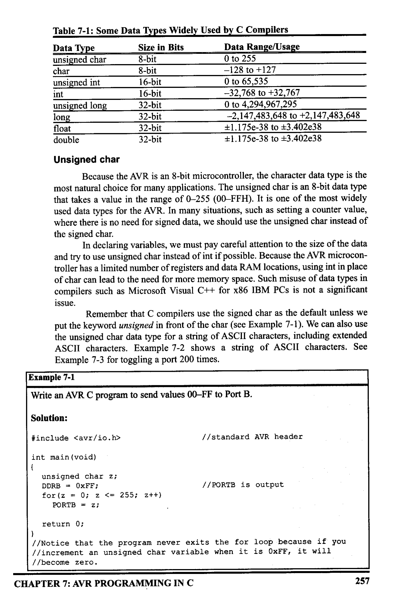
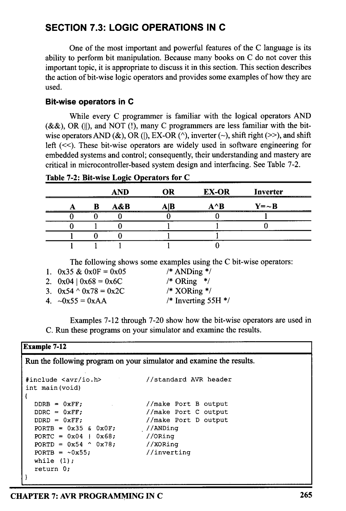
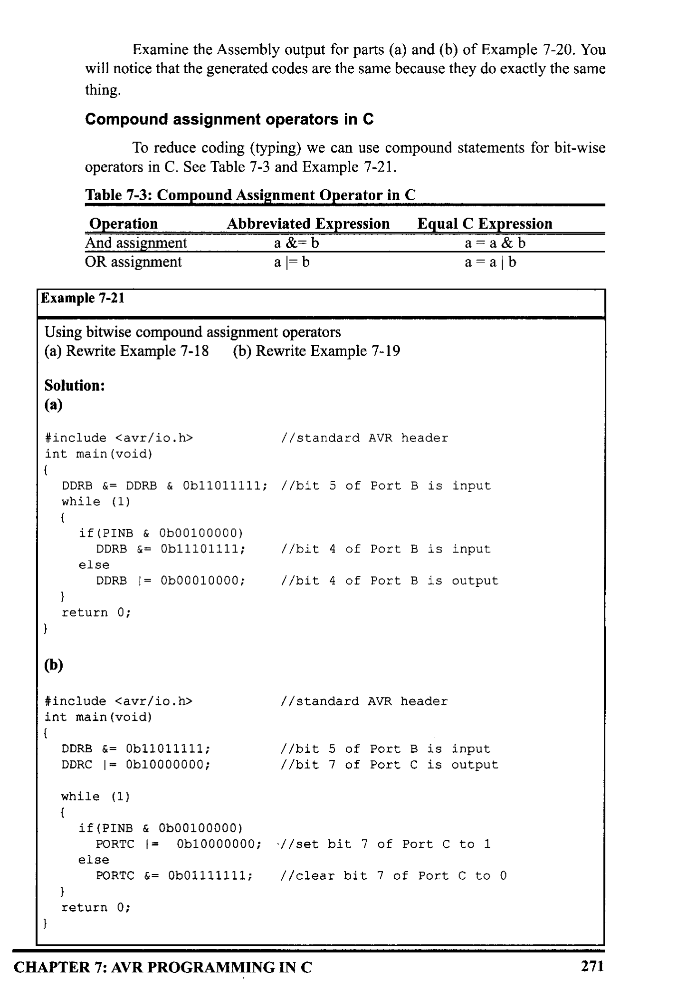
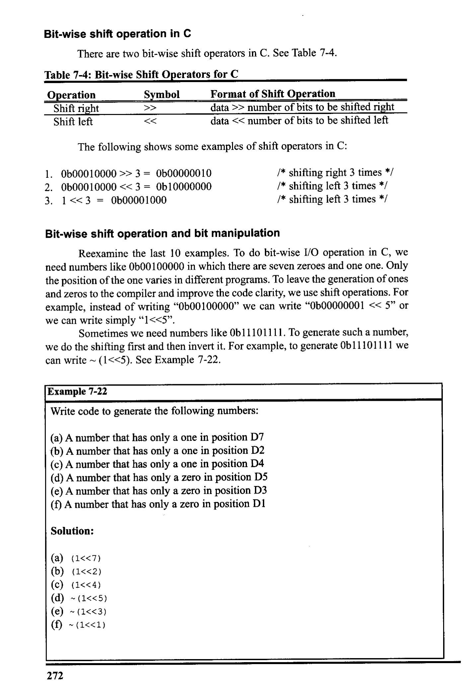
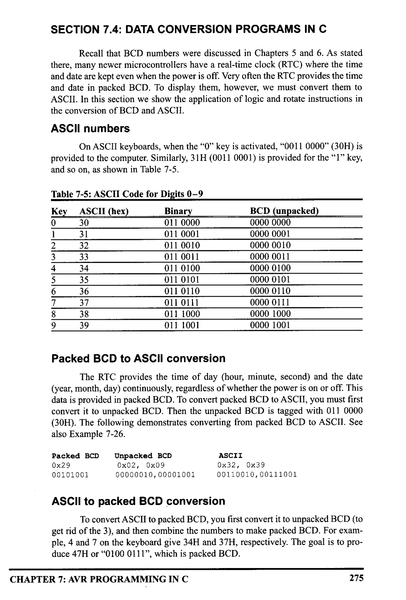
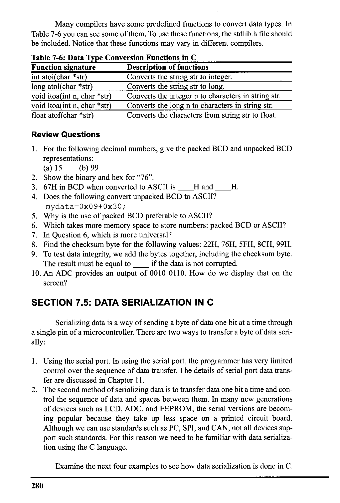
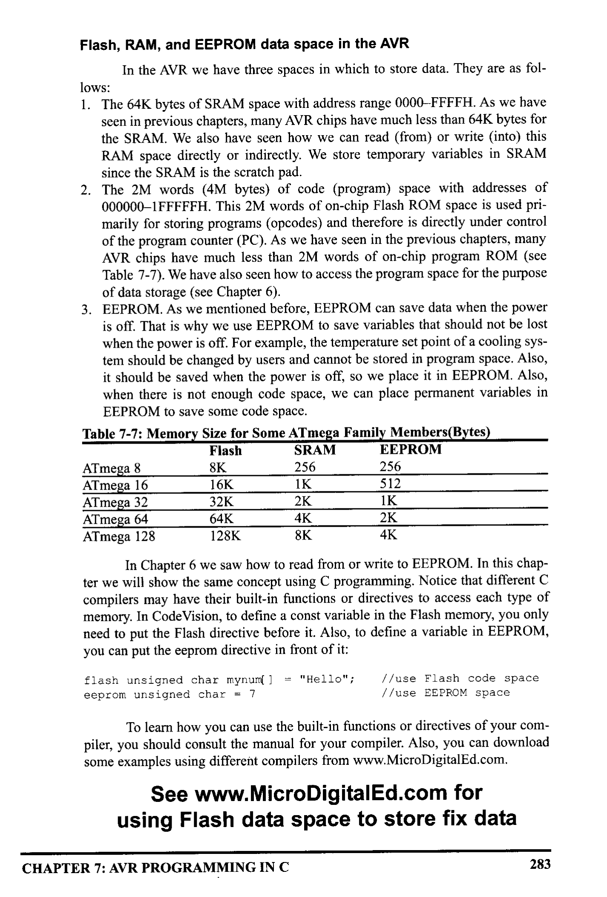

# Chapter 7: AVR Programming in C

> **Textbook**: The AVR Microcontroller and Embedded Systems using Assembly and C

> **PDF Page Range**: 268 - 301


---


<!-- Page 268 -->
### [PDF Page 268]

CHAPTER 7
AVR PROGRAMMING
IN C
OBJECTIVES
Upon completion of this chapter, you will be able to:
>>
>>
Examine C data types for the AVR
Code C programs for time delay and I/O operations
Code C programs for I/O bit manipulation
Code C programs for logic and arithmetic operations
Code C programs for ASCII and BCD data conversion
Code C programs for binary (hex) to decimal conversion
Code C programs for data serialization
Code C programs for EEPROM access
255


<!-- Page 269 -->
### [PDF Page 269]

Why program the AVR in C?
Compilers produce hex files that we download into the Flash of the micro-
controller. The size of the hex file produced by the compiler is one of the main
concerns of microcontroller programmers because microcontrollers have limited
on-chip Flash. For example, the Flash space for the ATmegal6 is 16K bytes.
How does the choice of programming language affect the compiled pro-
gram size? While Assembly language produces a hex file that is much smaller than
C, programming in Assembly language is often tedious and time consuming. On
the other hand, C programming is less time consuming and much easier to write,
but the hex file size produced is much larger than if we used Assembly language.
The following are some of the major reasons for writing programs in C instead of
Assembly:
1. It is easier and less time consuming to write in C than in Assembly.
2. C is easier to modify and update.
3. You can use code available in function libraries.
4. C code is portable to other microcontrollers with little or no modification.
Several third-party companies develop C compilers for the AVR microcon-
troller. Our goal is not to recommend one over another, but to provide you with the
fundamentals of C programming for the AVR. You can use the compiler of your
choice for the chapter examples and programs. For this book we have chosen AVR
GCC compiler to integrate with AVR Studio. At the time of the writing of this book
AVR GCC and AVR Studio are available as a free download from the Web. See
http://www.MicroDigitalEd.com for tutorials on AVR Studio and the AVR GCO
compiler.
C programming for the AVR is the main topic of this chapter. In Section
7.1, we discuss data types, and time delays. I/O programming is shown in Section
7.2. The logic operations AND, OR, XOR, inverter, and shift are discussed in

## Section 7.3. Section 7.4 describes ASCII and BCD conversions and checksums. In


## Section 7.5, data serialization for the AVR is shown. In Section 7.6, memory allo-

cation in C is discussed.

## SECTION 7.1: DATA TYPES AND TIME DELAYS IN C

In this section we first discuss C data types for the AVR and then provide
code for time delay functions.
C data types for the AVR C
One of the goals of AVR programmers is to create smaller hex files, so it
is worthwhile to re-examine C data types. In other words, a good understanding of
C data types for the AVR can help programmers to create smaller hex files. In this
section we focus on the specific C data types that are most common and widely
used in AVR C compilers. Table 7-1 shows data types and sizes, but these may
vary from one compiler to another.
256


<!-- Page 270 -->
### [PDF Page 270]



*Description*: Structured reference table listing operational parameters, instruction execution cycles, memory address mapping, or feature comparison for Table 7-1: Some Data Types Widely Used by C Compilers.

> **Table 7-1: Some Data Types Widely Used by C Compilers**

Data Type
Size in Bits
Data Range/Usage
unsigned char
8-bit
0 to 255
char
8-bit
-128 to +127
unsigned int
16-bit
0 to 65,535
int
16-bit
-32,768 to +32,767
unsigned long
32-bit
0 to 4,294,967,295
long
32-bit
-2,147,483,648 to +2,147,483,648
float
32-bit
₺1.175e-38 to ‡3.402e38
double
32-bit
‡1.175e-38 to ‡3.402e38
Unsigned char
Because the AVR is an 8-bit microcontroller, the character data type is the
most natural choice for many applications. The unsigned char is an 8-bit data type
that takes a value in the range of 0-255 (00-FFH). It is one of the most widely
used data types for the AVR. In many situations, such as setting a counter value,
where there is no need for signed data, we should use the unsigned char instead of
the signed char
In declaring variables, we must pay careful attention to the size of the data
and try to use unsigned char instead of int if possible. Because the AVR microcon-
troller has a limited number of registers and data RAM locations, using int in place
of char can lead to the need for more memory space. Such misuse of data types in
compilers such as Microsoft Visual C++ for x86 IBM PCs is not a significant
issue.
Remember that C compilers use the signed char as the default unless we
put the keyword unsigned in front of the char (see Example 7-1). We can also use
the unsigned char data type for a string of ASCII characters, including extended
ASCII characters. Example 7-2 shows a string of ASCII characters. See
Example 7-3 for toggling a port 200 times.
Example 7-1
Write an AVR C program to send values 00-FF to Port B.
Solution:

```c
#include <avr/io.h>
// standard AVR header
```

int main (void)
unsigned char z;

```c
DDRB = OXFF;
for (z = 0; z <= 255; zt+)
PORTB = z;
```

I/PORTB is output
return 0;
//Notice that the program never exits the for 1o0p because if you
|/increment an unsigned char variable when it is OxFF, it will
//become zero.
CHAPTER 7: AVR PROGRAMMING IN C
257


<!-- Page 271 -->
### [PDF Page 271]

Example 7-2
Write an AVR C program to send hex values for ASCII characters of 0, 1, 2, 3, 4, 5, A,
B, C, and D to Port B.
Solution:

```c
#include <avr/io.h>
```

1/standard AVR header
int main (voia)
unsigned char mylist| | = "012345ABCD";
unsigned char z;

```c
DDRB = OxFF;
for (z=0; z<10; z++)
PORTB = myList| z] ;
while (1);
```

return 0;
I/the code starts from here
//PORTB is output
I/repeat 10 times and increment z
Isend the character to PORTB
I/needed if running on a trainer
}
Example 7-3
Solution:
Write an AVR C program to toggle all the bits of Port B 200 times.
//toggle PB 200 times

```c
#include <avr/io.h>
```

/standard AVR header
int main (void)
Ithe code starts from here

```c
DDRB = OXFF;
PORTB = OXAA;
```

unsigned char zi
fOI (z=0; z < 200; z++)

```c
PORTB = - PORTB;
//PORTB is output
//PORTB is 10101010
```

/run the next line 200 times
I/toggle PORTB

```c
while (1);
```

return 0;
/stay here forever
Signed char
The signed char is an 8-bit data type that uses the most significant bit (D7
of D7-DO) to represent the - or + value. As a result, we have only 7 bits for the
nagnitude of the signed number, giving us values from -128 to +127. In situations
where + and - are needed to represent a given quantity such as temperature, the
use of the signed char data type is necessary (see Example 7-4).
Again, notice that if we do not use the keyword unsigned, the default is the
signed value. For that reason we should stick with the unsigned char unless the
data needs to be represented as signed numbers.
258


<!-- Page 272 -->
### [PDF Page 272]

Example 7-4
Write an AVR C program to send values of -4 to +4 to Port B.
Solution:

```c
#include <avr/io.h>
```

I/standard AVR header
int main (void)
char mynum| | = {-4, -3, -2, -1, 0, +1, +2, +3, +4} ;
unsigned char z;

```c
DDRB = OXFF;
```

1/PORTB İs
output
for (z=0; z<=8; zt+)
PORTB
= mynum[ z] ;

```c
while (1);
```

return 0;
Istay here forever
}
Run the above program on your simulator to see how PORTB displays values of FCH,
FDH, FEH, FFH, OOH, 01H, 02H, 03H, and 04H (the hex values for -4, -3, -2, - 1, 0,
1, etc.). See Chapter 5 for discussion of signed numbers.
Unsigned int
The unsigned int is a 16-bit data type that takes a value in the range of 0 to
65,535 (0000-FFFFH). In the AVR, unsigned int is used to define 16-bit variables
such as memory addresses. It is also used to set counter values of more than 256.
Because the AVR is an 8-bit microcontroller and the int data type takes two bytes
of RAM, we must not use the int data type unless we have to. Because registers
and memory accesses are in 8-bit chunks, the misuse of int variables will result in
larger hex files, slower execution of program, and more memory usage. Such mis-
use is not a problem in PCs with 512 megabytes of memory, the 32-bit Pentium's
registers and memory accesses, and a bus speed of 133 MHz. For AVR program-
ming, however, do not use signed int in places where unsigned char will do the job.
Of course, the compiler will not generate an error for this misuse, but the overhead
in hex file size will be noticeable. Also, in situations where there is no need for
signed data (such as setting counter values), we should use unsigned int instead of
signed int. This gives a much wider range for data declaration. Agaın, remember
that the C compiler uses signed int as the default unless we specity the keyword
unsigned.
Signed int
Signed int is a 16-bit data type that uses the most significant bit (D15 of
D15-DO) to represent the - or + value. As a result, we have only 15 bits for the
magnitude of the number, or values from -32,768 to +32,767.
CHAPTER 7: AVR PROGRAMMING IN C
259


<!-- Page 273 -->
### [PDF Page 273]

Other data types
The unsigned int is limited to values 0-65,535 (0000-FFFFH). The AVR C
compiler supports long data types, if we want values greater than 16-bit. Also, to
deal with fractional numbers, most AVR C compilers support float and double data
types. See Examples 7-5 and 7-6.
Example 7-5
Write an AVR C program to toggle all bits of Port B 50,000 times.
Solution:
#include <avr/io.h›
int main (void)
/standard AVR header
unsigned int zi

```c
DDRB = OxFF;
//PORTB is output
FO=(2=0; =50000; z1+)
PORTB = 0x55;
PORTB = OXAA;
```

}

```c
while (1);
```

return 0;
Istay here forever
Run the above program on your simulator to see how Port B toggles continuously.
Notice that the maximum value for unsigned int is 65,535.
Example 7-6
Write an AVR C program to toggle all bits of Port B 100,000 times.
Solution:
//toggle PB 100, 00 times

```c
#include <avr/io.h>
```

int main (void)
//standard AVR header
unsigned long z;

```c
DDRB = OXFF;
```

I/long is used because it should
/store more than 65535.
I/PORTB is output
for (z=0; z<100000; z++){
PORTB
= 0x55;

```c
PORTB = OXAA;
while (1);
```

return 0;
/stay here forever
260


<!-- Page 274 -->
### [PDF Page 274]

Time delay
There are three ways to create a time delay in AVR C
1. Using a simple for loop
2. Using predefined C functions
3. Using AVR timers
In creating a time delay using a for loop, we must be mindful of two fac-
tors that can affect the accuracy of the delay:
1. The crystal frequency connected to the XTALI-XTAL2 input pins is the most
important factor in the time delay calculation. The duration of the clock peri-
od for the instruction cycle is a function of this crystal frequency.
2. The second factor that affects the time delay is the compiler used to compile
the C program. When we program in Assembly language, we can control the
exact instructions and their sequences used in the delay subroutine. In the case
of C programs, it is the C compiler that converts the C statements and func-
tions to Assembly language instructions. As a result, different compilers pro-
duce different code. In other words, if we compile a given C program with dif-
ferent compilers, each compiler produces different hex code.
For the above reasons, when we use a loop to write time delays for C, we
must use the oscilloscope to measure the exact duration. Look at Example 7-7.
Notice that most compilers do some code optimization before generating a hex
file. In this process they may omit the delay loop because it does not do anything
other than wasting CPU time. In these compilers, you have to set the level of opti-
mization to zero (none). To see how you can set the level of optimization for
WinAVR and AVR Studio, refer to www.MicroDigitalEd.com.
Example 7-7
Write an AVR C program to toggle all the bits of Port B continuously with a 100 ms
delay. Assume that the system is ATmega 32 with XTAL = 8 MHz.
Solution:
#include <avr/10.n)
void delay100ms (void)
unsigned int i
fOI (i=0; i<42150; itt) ;
/standard AVR header
}
'try different numbers on your
compiler and examine the result
int main (void)

```c
DDRB = OXFF;
while (1)
PORTB = OXAA;
```

delay100ms () ;

```c
PORTB = 0x55;
```

delay100ms () ;
return o;
//PORTB is output
CHAPTER 7: AVR PROGRAMMING IN C
261


<!-- Page 275 -->
### [PDF Page 275]

Another way of generating time delay is to use predefined functions such
_delay_ms) and
_delay_us) defined in delay.h in WinAVR or delay _ms and
delay_us defined in delay.h in CodeVision. The only drawback of using these
functions is the portability problem. Because different compilers do not use the
same name for delay functions, you have to change every place in which the delay
functions are used, if you want to compile your program on another compiler. To
overcome this problem, programmers use macro or wrapper function. Wrapper
functions do nothing more than call the predefined delay function. If you use
wrapper functions and decide to change your compiler, instead of changing all
instances of predefined delay functions, you simply change the wrapper function.
Look at Example 7-8. Notice that calling a wrapper function may take some
microseconds.
The use of the AVR timer to create time delays will be discussed in
Chapter 9.
Example 7-8
Write an AVR C program to toggle all the pins of Port C continuously with a 10 ms
delay. Use a predefined delay function in Win AVR.
Solution:

```c
#include <util/delay.h>
#include <avr/io.h>
```

1/delay 1oop functions
I/standard AVR header
int main (void)
void delay _ms (int d)
I/delay in d microseconds
_delay_ms (d) ;
}

```c
DDRB = OxFF;
```

I/PORTA is output

```c
while (1){
PORTB = OxFF;
```

delay _ms (10);

```c
PORTB = 0x55;
```

delay_ms (10) ;
}
return 0;

### Review Questions

1. Give the magnitude of the unsigned char and signed char data types.
2. Give the magnitude of the unsigned int and signed int data types.
3. It we are declaring a variable for a person's age, we should use the
data
type.
4. True or false. Using predefined functions of compilers to create a time delay is
not recommended if you want your code to be portable to other compilers.
5. Give two factors that can affect the delay size.
262


<!-- Page 276 -->
### [PDF Page 276]


## SECTION 7.2: I/O PROGRAMMING IN C

As we stated in Chapter 4, all port registers of the AVR are both byte acces-
sible and bit accessible. In this section we look at C programming of the 1/0 ports
for the AVR. We look at both byte and bit I/O programming.
Byte size l/O
To access a PORT register as a byte, we use the PORT label where x indi-
cates the name of the port. We access the data direction registers in the same way,
using DDRx to indicate the data direction of port x. To access a PIN register as a
byte, we use the PINx label where x indicates the name of the port. See Examples
7-9,7-10, and 7-11.
Example 7-9
LEDs are connected to pins of Port B. Write an AVR C program that shows the count
from 0 to FFH (0000 0000 to 1111 1111 in binary) on the LEDs.
Solution:

```c
#include <avI/io.h>
```

|/standard AVR header
int main (void)

```c
DDRB = OxFF;
while (1)
//Port B is output
PORTB = PORTB + 1;
```

return 0;
}
Example 7-10
Write an AVR C program to get a byte of data from Port B, and then send it to Port C.
Solution:

```c
#include <avI/io.h>
```

int main (void)
unsigned char temp;

```c
DDRB = 0x00;
DDRC = OXFF;
while (1)
temp = PINB;
PORIC = temp;
```

return 0;
I/standard AVR header
//Port B is input
// Port C is output
CHAPTER 7: AVR PROGRAMMING IN C
263


<!-- Page 277 -->
### [PDF Page 277]

Example 7-11
Write an AVR C program to get a byte of data from Port C. If it is less than 100, send it
to Port B; otherwise, send it to Port D.
Solution:

```c
#include <avr/io.h>
```

int main (void)

```c
DDRC = 0;
```

DDRB
=
OXFF;

```c
DDRD = OXFF;
```

unsigned char temp;

```c
while(1)
temp = PINC;
```

if ( temp < 100)

```c
PORTB =
```

temp;
else

```c
PORTD = temp;
```

}
return 0;
// standard AVR header
I/Port C is input
1/Port B is output
I/Port D is output
read from PINB
Bit size 1/0
The I/O ports of ATmega32 are bit-accessible. But some AVR C compilers
do not support this feature, and the others do not have a standard way of using it.
For example, the following line of code can be used in Code Vision to set the first
pin of Port B to one:
PORTB.0 = 1;
but it cannot be used in other compilers such as WinAVR
To write portable code that can be compiled on different compilers, we
must use AND and OR bit-wise operations to access a single bit of a given regis-
ter.
So, you can access a single bit without disturbing the rest of the byte. In
next section you will see how to mask a bit of a byte. You can use masking for both
bit-accessible and byte-accessible ports and registers.

### Review Questions

1. Write a short program that toggles all bits of Port C.
2. True or false. All bits of Port B are bit addressable.
3. Write a short program that toggles bit 2 of Port C using the functions of your
compiler.
4. True or false. To access the data direction register of Port B, we use DDRB.
264


<!-- Page 278 -->
### [PDF Page 278]


## SECTION 7.3: LOGIC OPERATIONS IN C

One of the most important and powerful features of the C language is its
ability to perform bit manipulation. Because many books on C do not cover this
important topic, it is appropriate to discuss it in this section. This section describes
the action of bit-wise logic operators and provides some examples of how they are
used
Bit-wise operators in C
While every C programmer is familiar with the logical operators AND
(&&), OR (I, and NOT (!), many C programmers are less familiar with the bit-
wise operators AND (&), OR (), EX-OR (^), inverter (~), shift right (>>), and shift
left (<<). These bit-wise operators are widely used in software engineering for
embedded systems and control; consequently, their understanding and mastery are
critical in microcontroller-based system design and interfacing. See Table 7-2.


*Description*: Structured reference table listing operational parameters, instruction execution cycles, memory address mapping, or feature comparison for Table 7-2: Bit-wise Logic Operators for C.

> **Table 7-2: Bit-wise Logic Operators for C**

AND
OR
A
B
A&B
AB
0
0
0
0
1
EX-OR
A^B
0
1
1
Inverter
Y=~B
1
1
The following shows some examples using the C bit-wise operators:
1. Ox35 & 0xOF = 0x05
1* ANDing */
2. 0x04 | 0x68 = 0х6C
/* ORing */
3. 0x54^ 0x78 = 0x2C
/* XORing */
4. ~0x55 = 0xAA
/* Inverting 55H */
Examples 7-12 through 7-20 show how the bit-wise operators are used in
C. Run these programs on your simulator and examine the results.
Example 7-12
Run the following program on your simulator and examine the results.

```c
#include <avr/io.h>
```

int main (void)
I/standard AVR header

```c
DDRB = OxFF;
DDRC = OxFF;
DDRD = OxFF;
PORTB = 0x35
```

& OXOF;
PORIC = 0x04 | 0x68;

```c
PORTD = 0x54 ^ 0x78;
PORTB = ~0x55;
while (1);
```

return 0;
I/make Port B output
//make Port C output
//make Port D output
1/ANDing
//ORing
//XORing
//inverting
CHAPTER 7: AVR PROGRAMMING IN C
265


<!-- Page 279 -->
### [PDF Page 279]

Example 7-13
Write an AVR C program to toggle only bit 4 of Port B continuously without disturbing
the rest of the pins of Port B.
Solution:

```c
#include <avr/io.h>
```

I/ standard AVR header
int main (void)

```c
DDRB = OxFF;
```

I/PORTB is output

```c
while (1)
PORTB = PORTB | 0600010000;
PORTB = PORTB & 0b11101111;
```

I/set bit 4 (5th bit) of PORTB
Iclear bit 4 (5th bit) of PORTB
return 0;
}
Example 7-14
Write an AVR C program to monitor bit 5 of port C. If it is HIGH, send 55H to Port B;
otherwise, send AAH to Port B.
Solution:

```c
#include <avr/io.h>
```

int main (void)

```c
DDRB = OXFF;
DDRC = 0x00;
DDRD = OXFF;
```

|/ standard AVR header
I/PORTB is output
//PORIC is input
//PORTB is output

```c
while (1)
```

if (PINC & 0b00100000)

```c
PORTB = 0x55;
```

else

```c
PORTB = OXAA;
```

Icheck bit 5 (6th bit) of PINC
return 0;
1
266


<!-- Page 280 -->
### [PDF Page 280]

Example 7-15
A door sensor is connected to bit 1 of Port B, and an LED is connected to bit 7 of Port
C. Write an AVR C program to monitor the door sensor and, when it opens, turn on the
LED.
Solution:

```c
#include <avr/io.h>
```

I/standard AVR header
int main (void)

```c
DDRB = DDRB & Ob11111101;
DDRC = DDRC | 0b10000000;
```

l/pin 1 of Port B is input
I/pin 7 of Port C is output

```c
while (1)
```

if (PINB & 0b00000010)
I/check pin 1 (2nd pin) of PINB

```c
PORTC = PORTC | 0b10000000;
```

I/set pin 7 (8th pin) of PORTC
else
PORIC = PORTC & 0b01111111;
I/clear pin 7 (8th pin) of PORIC
}
return 0;
}
Example 7-16
The data pins of an LCD are connected to Port B. The information is latched into the
LCD whenever its Enable pin goes from HIGH to LOW. The enable pin is connected to
pin 5 of Port C (6th pin). Write a C program to send "The Earth is but One Country" to
this LCD.
Solution:

```c
#include <avr/io.h>
```

I/standard AVR header
int main (vożd)
unsigned char messagel | = "The Earth is but One Country";
unsigned char z;

```c
DDRB = OxFF;
DDRC = DDRC | 0600100000;
```

I/Port B is output
I/pin 5 of Port C is output
for ( z = 0; 2 < 28; z++)

```c
PORTB = messagel z] ;
PORTC = PORTC 1 0b00100000;
PORIC = PORIC & 0b11011111;
```

I/pin LCD_EN Of Port C is 1
I/pin ICD_EN Of Port C is O
}

```c
while (1);
```

return 0;
//In Chapter 12 we will study more about LCD interfacing
CHAPTER 7: AVR PROGRAMMING IN C
267


<!-- Page 281 -->
### [PDF Page 281]

Example 7-17
Write an AVR C program to read pins 1 and O of Port B and issue an ASCII character
to Port D according to the following table:
pin1 pino
0
0
0
1
1
0
1
1
send "O' to Port D (notice ASCII 'O' is 0x30)
send '1' to Port D
send 2' to Port D
send '3' to Port D
Solution:

```c
#include <avr/io.h>
```

int main (void)
unsigned char z;

```c
DDRB = 0;
DDRD = OxFF;
while (1)
z = PINB;
z = Z & 0b00000011;
```

switch (z)
case (0) :
PORID = 'O';
break;
}
case (1) :

```c
PORTD = "1';
```

• break;
case (2):
PORID = '2';
break;
case (3):

```c
PORTD = "3';
```

break;
Il standard AVR header
//make Port B an input
I/make Port D an output
//repeat forever
1/read PORTB
//mask the unused bits
1/make decision
Wissue ASCII O
lissue ASCII 1
/issue ASCII 2
/issue ASCII 3
}
}
}
return 0;
268


<!-- Page 282 -->
### [PDF Page 282]

Example 7-18
Write an AVR C program to monitor bit 7 of Port B. If it is 1, make bit 4 of Port B input;
otherwise, change pin 4 of Port B to output.
Solution:

```c
#include <avr/io.h>
```

int main (void)

```c
DDRB = DDRB
```

& 0b01111111;

```c
while (1)
```

if (PINB & 10000000)

```c
DDRB = DDRB & Ob11101111;
```

else

```c
DDRB = DDRB | 0600010000;
```

return 0;
I/standard AVR header
I/bit 7 of Port B is input
I/bit 4 of Port B is input
I/bit 4 of Port B is output
}
Example 7-19
Write an AVR C program to get the status of bit 5 of Port B and send it to bit 7 of port
C continuously.
Solution:

```c
#include <avr/io.h>
```

int main (void)

```c
DDRB = DDRB & 0b11011111;
DDRC = DDRC | 0b10000000;
//standard AVR header
```

I/bit 5 of Port B is input
I/bit 7 of Port C is output

```c
while (1)
```

if (PINB & 0600100000 )
PORIC = PORIC | Ob10000000; I/set bit 7 of Port C to 1
else

```c
PORTC = PORTC & 0b01111111; |/clear bit 7 of Port C to 0
```

return 0;
CHAPTER 7: AVR PROGRAMMING IN C
269


<!-- Page 283 -->
### [PDF Page 283]

Example 7-20
Write an AVR C program to toggle all the pins of Port B continuously.
(a) Use the inverting operator.
(b) Use the EX-OR operator.
Solution:
(a)

```c
#include <avr/io.h>
//standard AVR header
```

int main (void)

```c
DDRB = OxFF;
```

PORTB
= OXAA;
while
(1)
PORTB
= ~ PORTB;
return 0;
}
(b)

```c
#include <avr/io.h>
```

int main (void)

```c
DDRB = OXFF;
PORTB = OXAA;
```

while
(1)
PORTB
= PORTB ^ OXFF;
return 0;
//Port B is output
/toggle PORTB
/standard AVR header
I/Port B is output
}
4:
+00000049:
EF8F
+0000004A: BB87
6:
+0000004B:
+0000004C:
EA8A
BB88
9:
+0000004D:
+0000004E:
+0000004F:
+00000050:
+00000051:
+00000052:
B388
9580
BB88
CFFC
94F8
CFFF
SER
OUT

```c
PORTB = OXAA;
```

LDI
OUT

```c
PORTB =~ PORTB ;
```

IN
COM
OUT
RJMP
CLI
RJMP
R24
0x17,R24
R24, OXAA
0x18,R24
R24, 0x18
R24
0x18, R24
PC-0x0003
Disassembly of Example 7-20 Part a
4:
+00000049:
+0000004A:
6:
+0000004B:
+0000004C:
9:
+0000004D:
+0000004E:
+0000004F:
+00000050:
+00000051:
+00000052:
{
EF8F
BB87
EA8A
BB88
B388
9580
BB88
CFFC
94F8
CFFF
Disassembly of Example 7-20 Part b
SER
OUT

```c
PORTB = OXAA;
```

LDI
OUT

```c
PORTB = PORTB
```

IN
COM
OUT
RUMP
CLI
RJMP
270
PC-0x0000
R24
0x17,R24
R24, OXAA
0x18, R24
• OXFF i
R24, 0x18
R24
0x18, R24
PC-0×0003
PC-0x0000
Set Register
Out to I/O location
Load immediate
Out to I/O location
In from I/O location
One's complement
Out to I/O location
Relative jump
Global Interrupt Disab
Relative jump
Set Register
Out to I/O location
Load immediate
Out to I/O location
In from I/O location
One's complement
Out to I/O location
Relative jump
Global Interrupt Disak
Relative jump


<!-- Page 284 -->
### [PDF Page 284]

Examine the Assembly output for parts (a) and (b) of Example 7-20. You
will notice that the generated codes are the same because they do exactly the same
thing.
Compound assignment operators in C
To reduce coding (typing) we can use compound statements for bit-wise
operators in C. See Table 7-3 and Example 7-21.


*Description*: Structured reference table listing operational parameters, instruction execution cycles, memory address mapping, or feature comparison for Table 7-3: Compound Assignment Operator in C.

> **Table 7-3: Compound Assignment Operator in C**

Operation
Abbreviated Expression
And assignment
a &= b

```assembly
OR assignment
al=b
```

Equal C Expression
a = a & b
a = a |b
Example 7-21
Using bitwise compound assignment operators
(a) Rewrite Example 7-18
(b) Rewrite Example 7-19
Solution:
(a)

```c
#include <avr/io.h>
```

int main (void)
I/standard AVR header
DDRB &= DDRB & Ob11011111; I/bit 5 of Port B is input

```c
while (1)
```

if (PINB & 000100000)
DDRB &= Ob11101111;
else
DDRB |= 0600010000:
}
return 0;
I/bit 4 of Port B is input
I/bit 4 of Port B is output
(b)
#include <avr/io.h›
int main (void)
I/standard AVR header
DDRB &= 0b11011111;
DDRC |= 0b10000000;
I/bit 5 of Port B is input
I/bit 7 of Port C is output

```c
while (1)
```

if (PINB & 000100000)
PORTC I=
0b10000000; //set bit 7 of Port C to 1
else
PORTC &= 0b01111111;
I/clear bit 7 of Port C to O
}
return 0;
}
CHAPTER 7: AVR PROGRAMMING IN C
271


<!-- Page 285 -->
### [PDF Page 285]

Bit-wise shift operation in C
There are two bit-wise shift operators in C. See Table 7-4.


*Description*: Structured reference table listing operational parameters, instruction execution cycles, memory address mapping, or feature comparison for Table 7-4: Bit-wise Shift Operators for C.

> **Table 7-4: Bit-wise Shift Operators for C**

Operation
Symbol
Format of Shift Operation
Shift right
>>
data >> number of bits to be shifted right
Shift left
data << number of bits to be shifted left
The following shows some examples of shift operators in C:
1. 0600010000>> 3 = 0600000010
0600010000 < 3 = 0b10000000
3. 1<3 = 0600001000
/* shifting right 3 times */
/* shifting left 3 times */
/* shifting left 3 times */
Bit-wise shift operation and bit manipulation
Reexamine the last 10 examples. To do bit-wise I/O operation in C, we
need numbers like 0b00100000 in which there are seven zeroes and one one. Only
the position of the one varies in different programs. To leave the generation of ones
and zeros to the compiler and improve the code clarity, we use shift operations. For
example, instead of writing "0b00100000" we can write 0600000001 << 5" or
we can write simply "1<<5".
Sometimes we need numbers like 0b11101111. To generate such a number,
we do the shifting first and then invert it. For example, to generate 0b111011l1 we
can write ~ (1<<5). See Example 7-22.
Example 7-22
Write code to generate the following numbers:
(a) A number that has only a one in position D7
(b) A number that has only a one in position D2
(c) A number that has only a one in position D4
(d) A number that has only a zero in position D5
(e) A number that has only a zero in position D3
(f) A number that has only a zero in position D1
Solution:
(a) (1<<7)
(b)
(1<<2)
(c)
(1<<4)
(d) ~ (1<<5)
(e) ~ (1<<3)
(f) ~ (1<<1)
272


<!-- Page 286 -->
### [PDF Page 286]

Examples 7-23 and 7-24 are the same as Examples 7-18 and 7-19, but they
use shift operation.
Example 7-23
Write an AVR C program to monitor bit 7 of Port B. If it is 1, make bit 4 of Port B input;
else, change pin 4 of Port B to output.
Solution:

```c
#include <avr/io.h>
```

int main (void)

```c
DDRB = DDRB & ~(1<<7);
while (1)
```

if (PINB & (1<<7))

```c
DDRB = DDRB & ~ (1<<4) ;
```

else

```c
DDRB = DDRB | (1<<4) ;
```

return 0;
I/standard AVR header
I/bit 7 of Port B is input
I/bit 4 of Port B is input
I/bit 4 of Port B is output
}
Example 7-24
Write an AVR C program to get the status of bit 5 of Port B and send it to bit 7 of port
C continuously.
Solution:
#include <avI/io.h›
|/ standard AVR header
int main (void)

```c
DDRB = DDRB & ~ (1<<5);
DDRC = DDRC | (1<<7) ;
```

I/bit 5 of Port B is input
1/bit 7 of Port C is output

```c
while (1)
```

if (PINB & (1<<5)

```c
PORTC = PORTC | (1<<7) ;
```

else
}
PORIC = PORTC & ~ (1<<7) ;
return 0;
I/set bit 7 of Port C to 1
I/clear bit 7 of Port C to O
}
CHAPTER 7: AVR PROGRAMMING IN C
273


<!-- Page 287 -->
### [PDF Page 287]

As we mentioned before, bit-wise shift operation can be used to increase
code clarity. See Example 7-25.
Example 7-25
A door sensor is connected to the port B pin 1, and an LED is connected to port C pin
7. Write an AVR C program to monitor the door sensor and, when it opens, turn on the
LED.
Solution:

```c
#include <avr/io.h>
```

#define LED 7
#define SENSOR 1
//standard AVR header
int main (void)

```c
DDRB = DDRB & ~ (1<<SENSOR) ;
DDRC = DDRC | (1<< LED) ;
```

I/SENSOR pin is input
I/LED pin is output

```c
while (1)
```

if (PINB & (1 << SENSOR))

```c
PORTC = PORTC | (1<<LED) ;
```

else

```c
PORTC = PORTC & ~ (1<<LED) ;
```

I/check SENSOR pin of PINB
Ilset LED pin of port C
Ilclear LED pin of port C
return 0;
Notice that to generate more complicated numbers, we can OR two simpler
numbers. For example, to generate a number that has a one in position D7 and
another one in position D4, we can OR a number that has only a one in position
D7 with a number that has only a one in position D4. So we can simply write
(1<<7)|(1<<4). In future chapters you will see how we use this method.

### Review Questions

1. Find the content of PORTB after the following C code in each case:
(a) PORTB=0x37&0xCA;
(b) PORTB=0x37|0xCA;
(C) PORTB=0x37^0xCA;
2. To mask certain bits we must AND them with
3. To set high certain bits we must OR them with
4. EX-ORing a value with itself results in
5. Find the contents of PORTC after execution of the following code:

```c
PORTC = 0;
PORTC = PORTC | 0x99;
PORTC = ~PORTC;
```

6. Find the contents of PORTC after execution of the following code:

```c
PORTC = ~ (0<<3);
```

274


<!-- Page 288 -->
### [PDF Page 288]


## SECTION 7.4: DATA CONVERSION PROGRAMS IN C

Recall that BCD numbers were discussed in Chapters 5 and 6. As stated
there, many newer microcontrollers have a real-time clock (RTC) where the time
and date are kept even when the power is off. Very often the RTC provides the time
and date in packed BCD. To display them, however, we must convert them to
ASCII. In this section we show the application of logic and rotate instructions in
the conversion of BCD and ASCI.
ASCII numbers
On ASCII keyboards, when the "0" key is activated, "0011 0000" (30H) is
provided to the computer. Similarly, 31H (0011 0001) is provided for the "1" key,
and so on, as shown in Table 7-5.


*Description*: Structured reference table listing operational parameters, instruction execution cycles, memory address mapping, or feature comparison for Table 7-5: ASCII Code for Digits 0-9.

> **Table 7-5: ASCII Code for Digits 0-9**

Key
0
1
ASCIl (hex)
Binary
30
011 0000
31
011 0001
32
011 0010
33
011 0011
34
011 0100
35
011 0101
6
7
8
36
011 0110
37
011 0111
38
011 1000
39
011 1001
BCD (unpacked)
0000 0000
0000 0001
0000 0010
0000 0011
0000 0100
0000 0101
0000 0110
0000 0111
0000 1000
0000 1001
Packed BCD to ASCIl conversion
The RTC provides the time of day (hour, minute, second) and the date
(year, month, day) continuously, regardless of whether the power is on or off. This
data is provided in packed BCD. To convert packed BCD to ASCIl, you must first
convert it to unpacked BCD. Then the unpacked BCD is tagged with 011 0000
(30H). The following demonstrates converting from packed BCD to ASCIl. See
also Example 7-26.
Packed BCD
0x29
00101001
Unpacked BCD
0x02, 0x09
00000010,00001001
ASCII
0x32, 0x39
00110010,00111001
ASCIl to packed BCD conversion
To convert ASCII to packed BCD, you first convert it to unpacked BCD (to
get rid of the 3), and then combine the numbers to make packed BCD. For exam-
ple, 4 and 7 on the keyboard give 34H and 37H, respectively. The goal is to pro-
duce 47H or "0100 0111", which is packed BCD.
CHAPTER 7: AVR PROGRAMMING IN C
275


<!-- Page 289 -->
### [PDF Page 289]

Key
4
7
ASCII
Unpacked BCD
Packed BCD
34
00000100
37
00000111
01000111 or 47H
See Example 7-27.
Example 7-26
Write an AVR C program to convert packed BCD 0x29 to ASCII and display the bytes
on PORTB and PORTC.
Solution:
#include < avI/io.12
int main (void)
unsigned char x, y;
unsigned char mybyte = 0x29;

```c
DDRB = DDRC = OxFF;
x = mybyte & OXOF;
PORTB = x 1 0x30;
y = mybyte & OxFO;
y = Y > 4;
PORIC = y | 0x30;
```

return 0;
I/standard AVR header
I/make Ports B and C output
//mask upper 4 bits
I/make it ASCII
I/mask lower 4 bits
Ishift it to lower 4 bits
I/make it ASCII
}
Example 7-27
Solution:

```c
#include <avr/io.h>
```

int main (void)
unsigned char bodbyte;
unsigned char w =
unsigned char z = '7';

```c
DDRB = OxFF;
w = w & Ox0F;
w= w<< 4;
z = z & Ox0F;
bodbyte = w I zi
PORTB = bodbyte;
```

return 0;
I/standard AVR header
I/make Port B an output
//mask 3
Ishift left to make upper BCD digit
//mask 3
I/ combine to make packed BCD
}
276


<!-- Page 290 -->
### [PDF Page 290]

Checksum byte in ROM
To ensure the integrity of data, every system must perform the checksum
calculation. When you transmit data from one device to another or when you save
and restore data to a storage device you should perform the checksum calculation
to ensure the integrity of the data. The checksum will detect any corruption of data.
To ensure data integrity, the checksum process uses what is called a checksum
byte. The checksum byte is an extra byte that is tagged to the end of a series of
bytes of data. To calculate the checksum byte of a series of bytes of data, the fol-
lowing steps can be taken:
1. Add the bytes together and drop the carries.
2. Take the 2's complement of the total sum. This is the checksum byte, which
becomes the last byte of the series.
To perform the checksum operation, add all the bytes, including the check-
sum byte. The result must be zero. If it is not zero, one or more bytes of data have
been changed (corrupted). See Examples 7-28 through 7-30.
Example 7-28
Assume that we have 4 bytes of hexadecimal data: 25H, 62H, 3FH, and 52H.
(a) Find the checksum byte, (b) perform the checksum operation to ensure data
integrity, and (c) if the second byte, 62H, has been changed to 22H, show how check-
sum detects the error.
Solution:
(a)
(b)
(c)
Find the checksum byte.
25H
+
62H
3FН
1 18H (dropping carry of 1 and taking 2's complement, we get E8H)
Perform the checksum operation to ensure data integrity.
25H
62H
+ ЗЕН
+ 52H
+ EH
2 O0H (dropping the carries we get 00, which means data is not corrupted)
If the second byte, 62H, has been changed to 22H, show how checksum detects
the error.
25H
+ 22H
+ 3FH
+ 52H
1 COH (dropping the carry, we get COH, which means data is corrupted)
CHAPTER 7: AVR PROGRAMMING IN C
277


<!-- Page 291 -->
### [PDF Page 291]

Example 7-29
Example 7-28.
Write an AVR C program to calculate the checksum byte for the data given in
Solution:

```c
#include <avr/io.h>
```

int main (void)
I/standard AVR header
unsigned char mydatal | = (0x25, 0x62, Ox3F, 0x52) ;

```c
DDRA = OxFF;
DDRB = OxFF;
DDRC = OXFF;
```

I/make Port A output
I/make Port B output
I/make Port C output
for (x=0; x<4; x++)

```c
PORTA = mydatal x] ;
```

/issue each byte to PORTA
sum =
sum + mydatal x]; //add them together

```c
PORTB = sum;
```

/issue the sum to PORTB
}
chksumbyte = ~sum + 1;
I/make 2's complement (invert +1)

```c
PORTC = chksumbyte;
```

I show the checksum byte
return 0;
Example 7-30
Write a C program to perform step (b) of Example 7-28. If the data is good, send ASCII
character 'G' to PORTD. Otherwise, send 'B' to PORTD.
Solution:

```c
#include <avr/io.h>
```

I standard AVR header
int main (void)
unsigned char mydatal | = 1 0x25, 0x62, Ox3F, 0x52, 0xE8) ;
unsigned char chksum
= 0;
unsigned char x;

```c
DDRD = OXFF;
```

I/make Port D an output
fOI (x=0; x<5; x++)
chksum = chksum + mydatal x] ;
/add them together
if (chksum
== 0)

```c
PORTD = 'G';
```

else

```c
PORTD = 'B';
```

return 0;
Change one or two values in the mydata array and simulate the program to see the
results.
278


<!-- Page 292 -->
### [PDF Page 292]

Binary (hex) to decimal and ASCII conversion in C
The printf function is part of the standard I/O library in C and can do many
things including converting data from binary (hex) to decimal, or vice versa. But
printf takes a lot of memory space and increases your hex file substantially. For
this reason, in systems based on the AVR microcontroller, it is better to know how
to write our own conversion function instead of using printf.
One of the most widely used conversions is binary to decimal conversion.
In devices such as ADCs (Analog-to-Digital Converters), the data is provided to
the microcontroller in binary. In some RTCs, the time and dates are also provided
in binary. In order to display binary data, we need to convert it to decimal and then
to ASCII. Because the hexadecimal format is a convenient way of representing
binary data, we refer to the binary data as hex. The binary data 00-FFH convert-
ed to decimal will give us 000 to 255. One way to do that is to divide it by 10 and
keep the remainder, as was shown in Chapters 5 and 6. For example, II1I1101 or
FDH is 253 in decimal. The following is one version of an algorithm for conver-
sion of hex (binary) to decimal:
Hex
FD/OAR
19/0A
Quotient
19
2
Remainder
3 (low digit) LSD
5 (middle digit)
2 (high digit) (MSD)
Example 7-31 shows the C program for the above algorithm.
Example 7-31
Write an AVR C program to convert 11111101 (FD hex) to decimal and display the dig-
its on PORTB, PORTC, and PORTD.
Solution:

```c
#include <avr/io.n>
```

int main (void)
// standard AVR header
unsigned char x, binbyte, di, d2, d3;

```c
DDRB = DDRC = DDRD =OXFF;
//Ports B, C, and D output
binbyte = OxFD;
```

1/binary (hex) byte
x = binbyte / 10;
I/divide by 10
d1 = binbyte § 10;
I/find remainder (ISD)
d2 = x
: $ 10;
/middle digit
d3 = x / 10;
//most-significant digit (MSD)

```c
PORTB = d1;
PORIC = d2;
PORTD = d3;
```

return 0;
CHAPTER 7: AVR PROGRAMMING IN C
279


<!-- Page 293 -->
### [PDF Page 293]

Many compilers have some predefined functions to convert data types. In


*Description*: Structured reference table listing operational parameters, instruction execution cycles, memory address mapping, or feature comparison for Table 7-6: you can see some of them. To use these functions, the stdlib.h file should.

> **Table 7-6: you can see some of them. To use these functions, the stdlib.h file should**

be included. Notice that these functions may vary in different compilers.


*Description*: Structured reference table listing operational parameters, instruction execution cycles, memory address mapping, or feature comparison for Table 7-6: Data Type Conversion Functions in C.

> **Table 7-6: Data Type Conversion Functions in C**

Function signature
Description of functions
int atoi(char *str)
Converts the string str to integer.
long atol(char *str)
void itoa(int n, char *str)
void Itoa(int n, char *str)
float atof(char *str)
Converts the integer n to characters in string str.
Converts the long n to characters in string str.
Converts the characters from string str to float.

### Review Questions

1. For the following decimal numbers, give the packed BCD and unpacked BCD
representations:
(a) 15 (b) 99
2. Show the binary and hex for "76".
3. 67H in BCD when converted to ASCII is
H and
_H.
4. Does the following convert unpacked BCD to ASCIl?
mydata=0x09+0×30;
5. Why is the use of packed BCD preferable to ASCII?
6. Which takes more memory space to store numbers: packed BCD or ASCIl?
7. In Question 6, which is more universal?
8. Find the checksum byte for the following values: 22H, 76H, 5FH, 8CH, 99H.
9. To test data integrity, we add the bytes together, including the checksum byte.
The result must be equal to _
if the data is not corrupted.
10. An ADC provides an output of 0010 0110. How do we display that on the
screen?

## SECTION 7.5: DATA SERIALIZATION IN C

Serializing data is a way of sending a byte of data one bit at a time through
a single pin of a microcontroller. There are two ways to transfer a byte of data seri-
ally:
1. Using the serial port. In using the serial port, the programmer has very limited
control over the sequence of data transfer. The details of serial port data trans-
fer are discussed in Chapter 11.
2.
The second method of serializing data is to transfer data one bit a time and con-
trol the sequence of data and spaces between them. In many new generations
of devices such as LCD, ADC, and EEPROM, the serial versions are becom-
ing popular because they take up less space on a printed circuit board.
Although we can use standards such as FC, SPI, and CAN, not all devices sup-
port such standards. For this reason we need to be familiar with data serializa-
tion using the C language.
Examine the next four examples to see how data serialization is done in C.
280


<!-- Page 294 -->
### [PDF Page 294]

Example 7-32
Write an AVR C program to send out the value 44H serially one bit at a time via
PORTC, pin 3. The LSB should go out first.
Solution:
#include <avr/io.h›
#define serPin 3
int main (void)
unsigned char conbyte = 0x44;
unsigned char regALSB;
unsigned char x;
regALSB = conbyte;
DDRC |= (1<<serPin) ;
for (x=0; x<8; x++)
if (regALSB & 0x01)
PORTC |= (1‹<serPin);
else
PORTC &= ~ (1<<serPin);
regALSB = regALSB >> 1;
}
return 0;
Example 7-33
Write an AVR C program to send out the value 44H serially one bit at a time via
PORTC, pin 3. The MSB should go out first.
Solution:

```c
#include <avr/io.h>
```

#define serPin 3
int main (void)
unsigned char conbyte = 0x44;
unsigned char regALSB;
unsigned char x;
regALSB = conbyte;
DDRC |= (1<<serPin);
for (x=0; x<8; x++)
if (regALSB & 0x80)
PORTC |= (1‹<serPin);
else
PORTC &= - (1<<serPin);
regALSB = regALSB «< 1;
return 0;
}
CHAPTER 7: AVR PROGRAMMING IN C
281


<!-- Page 295 -->
### [PDF Page 295]

Example 7-34
Write an AVR C program to bring in a byte of data serially one bit at a time via PORTC,
pin 3. The LSB should come in first.
Solution:
|/Bringing in data via PC3 (SHIFTING RIGHT)

```c
#include <avr/io.h>
```

/I standard AVR header
#define serPin 3
int main (void)
unsigned char x;
unsigned char REGA=0;
DDRC &= ~ (1<<serPin);
for (x=0; x<8; x++)
/serPin as inpu
(repeat for each bit of REG
REGA = REGA >> 1;
I/shift REGA to right one bit
REGA |= (PINC & (1‹<serPin)) « (7-serPin); |/copy bit serPin
1/0f PORIC to MSB Of REGA.
return 0;
}
Example 7-35
Write an AVR C program to bring in a byte of data serially one bit at a time via PORTC,
pin 3. The MSB should come in first.
Solution:

```c
#include <avr/io.h>
```

#define serPin 3
int main (void)
unsigned char x;
unsigned char REGA=0;
DDRC &= ~ (1<<serPin);
for (X=0; x<8; x++)
/standard AVR header
IserPin as input
I/repeat for each bit of REGA
REGA = REGA << 1;
Ishift REGA to left one bit
REGA |= (PINC & (1<<serPin))>> serpin; |/copy bit serpin of
//PORT C tO ISB OF REGA.
return 0;

## SECTION 7.6: MEMORY ALLOCATION IN C

Using program (code) space for predefined fixed data is a widely used
option in the AVR, as we saw in Chapter 6. In that chapter we saw how to use
Assembly language programs to access the data stored in ROM. Next, we do the
same thing with C language.
282


<!-- Page 296 -->
### [PDF Page 296]

Flash, RAM, and EEPROM data space in the AVR
In the AVR we have three spaces in which to store data. They are as fol-
lows:
1. The 64K bytes of SRAM space with address range 0000-FFFFH. As we have
seen in previous chapters, many AVR chips have much less than 64K bytes for
the SRAM. We also have seen how we can read (from) or write (into) this
RAM space directly or indirectly. We store temporary variables in SRAM
since the SRAM is the scratch pad.
2. The 2M words (4M bytes) of code (program) space with addresses of
000000-1FFFFFH. This 2M words of on-chip Flash ROM space is used pri-
marily for storing programs (opcodes) and therefore is directly under control
of the program counter (PC). As we have seen in the previous chapters, many
AVR chips have much less than 2M words of on-chip program ROM (see


*Description*: Structured reference table listing operational parameters, instruction execution cycles, memory address mapping, or feature comparison for Table 7-7: ). We have also seen how to access the program space for the purpose.

> **Table 7-7: ). We have also seen how to access the program space for the purpose**

of data storage (see Chapter 6).
3. EEPROM. As we mentioned before, EEPROM can save data when the power
is off. That is why we use EEPROM to save variables that should not be lost
when the power is off. For example, the temperature set point of a cooling sys-
tem should be changed by users and cannot be stored in program space. Also,
it should be saved when the power is off, so we place it in EEPROM. Also,
when there is not enough code space, we can place permanent variables in
EEPROM to save some code space.


*Description*: Structured reference table listing operational parameters, instruction execution cycles, memory address mapping, or feature comparison for Table 7-7: Memory Size for Some ATmega Family Members(Bytes).

> **Table 7-7: Memory Size for Some ATmega Family Members(Bytes)**

Flash
SRAM
EEPROM
ATmega 8
8K
256
256
ATmega 16
16K
1K
512
ATmega 32
32K
2K
1K
ATmega 64
64K
4K
2K
ATmega 128
128K
8K
4K
In Chapter 6 we saw how to read from or write to EEPROM. In this chap-
ter we will show the same concept using C programming. Notice that different C
compilers may have their built-in functions or directives to access each type of
memory. In CodeVision, to define a const variable in the Flash memory, you only
need to put the Flash directive before it. Also, to define a variable in EEPROM,
you can put the eeprom directive in front of it:
flash unsigned
char
mynum | = "Hello";
eeprom
unsigned char
7
//use Flash code space
//use EEPROM space
To learn how you can use the built-in functions or directives of your com-
piler, you should consult the manual for your compiler. Also, you can download
some examples using different compilers from www.MicroDigitalEd.com.
See www.MicroDigitalEd.com for
using Flash data space to store fix data
CHAPTER 7: AVR PROGRAMMING IN C
283


<!-- Page 297 -->
### [PDF Page 297]

EEPROM access in C
In Chapter 6 we saw how we can access EEPROM using Assembly lan-
guage. Next, we do the same thing with C language. Notice that as we mentioned
before, most compilers have some built-in functions or directives to make the job
of accessing the EEPROM memory easier. See Examples 7-36 and 7-37 to learn
how we access EEPROM in C.
Example 7-36
Solution:
Write an AVR C program to store 'G' into location 0x005F of EEPROM.

```c
#include <avr/io.h>
```

int main (void)
I/standard AVR header
while (EECR & (1<<EEWE)) ;
EEAR = 0x5f;
EEDR = 'G';
EECR |= (1<<EEMWE) ;
EECR |= (1<<EENE) ;
return o;
I/wait for last write to finish
I/write Ox5F to address register
I/write 'G' to data register
I/write one to EEMWE
/I start EEPROM write
Example 7-37
Write an AVR C program to read the content of location 0x005F of EEPROM into
PORTB.
Solution:

```c
#include <avi/io.h>
```

int main (void)
I/standard AVR header

```c
DDRB = OXFF;
```

while (EECR & (1<<EEWE)) ;
EEAR = 0x5f;
EECR |= (1<<EERE):

```c
PORTB = EEDR;
//make PORTB an output
```

I/wait for last write to finish
//write 0x5F to address register
I/start EEPROM read by writing EERE
1/move data from data register to PORTB

### Review Questions

1. The AVR family has a maximum of _
_of program ROM space.
2. The ATmega128 has _
of program ROM.
3. True or false. The program (code) ROM space can be used for data storage, but
the data space cannot be used for code.
4. True or false. Using the program ROM space for data means the data is fixed
and static.
5. If we have a message string with a size of over 1000 bytes, then we use
(program ROM, data RAM) to store it.
284


<!-- Page 298 -->
### [PDF Page 298]


### SUMMARY

This chapter dealt with AVR C programming, specifically I/O program-
ming and time delays in C. We also showed the logic operators AND, OR, XOR,
and complement. In addition, some applications for these operators were dis-
cussed. This chapter described BCD and ASCII formats and conversions in C. We
also discussed how to access EEPROM in C. The widely used technique of data
serialization was also discussed.

### PROBLEMS


## SECTION 7.1: DATA TYPES AND TIME DELAYS IN C

1. Indicate what data type you would use for the following variables:
(a) temperature
(b) the number of days in a week
(c) the number of days in a year
(d) the number of months in a year
(e) a counter to track the number of people getting on a bus
(f) a counter to track the number of people going to a class
(g) an address of 64K RAM space
(h) the age of a person
(i) a string for a message to welcome people to a building
2. Give the hex value that is sent to the port for each of the following C statements:
(a) PORTB=14;
(b) PORTB=0x18; (c) PORTB='A';
(d) PORTB=7;
(e) PORTB=32;
(f) PORTB=0x45;
(g) PORTB=255;
(h) PORTB=0xOF;
3. Give two factors that can affect time delay in the AVR microcontroller.
4. Of the two factors in Problem 3, which can be set by the system designer?
5. Can the programmer set the number of clock cycles used to execute an instruc-
tion? Explain your answer.
6. Explain why various C compilers produce different hex file sizes.

## SECTION 7.2: I/O PROGRAMMING IN C

7. What is the difference between PORTC=0x00 and DDRC=0x00?
8.
Write a C program to toggle all bits of Port B every 200 ms.
9. Write a C program to toggle bits 1 and 3 or Port B every 200 ms.
10. Write a time delay function for 100 ms.
11. Write a C program to toggle only bit 3 of PORT C every 200 ms.
12. Write a C program to count up Port B from 0-99 continuously.

## SECTION 7.3: LOGIC OPERATIONS IN C

13. Indicate the data on the ports for each of the following:
Note: The operations are independent of each other.
(a) PORTB=0xF0&0x45;
(b)

```c
PORTB=0xF0&0x56;
```

CHAPTER 7: AVR PROGRAMMING IN C
285


<!-- Page 299 -->
### [PDF Page 299]

(c) PORTB=0xF0^0x76;
(a)

```c
PORTC=0×F0&0x90;
(e) PORTC=0xF0^0×90;
PORTC=0×F0|0×90;
(g) PORTC=0xF0&0xFF;
PORTC=0xF0|0x99;
(i) PORTC=0xF0^0xEE;
PORTC=0×F0^0×AA;
```

14. Find the contents of the port after each of the following operations:
(a) PORTB=0x65&0x76;
(b)

```c
PORTB=0x7010x6B;
```

(c)

```c
PORTC=0x95^0xAA;
```

(d)

```c
PORTC=0x5D&0x78;
(e) PORTC=0xC5|0x12;
```

(f)

```c
PORTD=0x6A^0x6Е;
(g) PORTB=0×37|0x26;
```

15. Find the port value after each of the following is executed:
(a) PORTB=0x65>>2;
(b)

```c
PORTC=0x39<<2;
(c) PORTB=0xD4>>3;
```

(d)

```c
PORTB=0xA7<<2;
```

16. Show the C code to swap 0x95 to make it 0x59.
17. Write a C program that finds the number of zeros in an 8-bit data item.

## SECTION 7.4: DATA CONVERSION PROGRAMS IN C

18. Write a C program to convert packed BCD 0x34 to ASCII and display the
bytes on PORTB and PORTC.
19. Write a program to convert ASCII digits of '7' and '2' to packed BCD and dis-
play them on PORTB.

## SECTION 7.5: DATA SERIALIZATION IN C

20. Write a C program to that finds the number of 1s in a given byte.

## SECTION 7.6: MEMORY ALLOCATION IN C

21. Indicate what type of memory (data SRAM or code space) you would use for
the following variables:
(a) temperature
(b) the number of days in a week
(c) the number of days in a year
(d) the number of months in a year
22. True or false. When using code space for data, the total size of the array should
not exceed 256 bytes.
23. Why do we use the code space for video game characters and shapes?
24. What is the advantage of using code space for data?
25. What is the drawback of using program code space for data?
26. Write a C program to send your first and last names to EEPROM.
27. Indicate what type of memory (data RAM, or code ROM space) you would use
for the following variables:
(a) a counter to track the number of people getting on a bus
(b) a counter to track the number of people going to a class
(C) an address of 64k RAM space
(d) the age of a person
(e) a string for a message to welcome people to a building
28. Why do we not use the data RAM space for video game characters and shapes?
29. What is the drawback of using RAM data space for fixed data?
286


<!-- Page 300 -->
### [PDF Page 300]

30. What is the advantage of using data RAM space for variables?

### ANSWERS TO REVIEW QUESTIONS


## SECTION 7.1: DATA TYPES AND TIME DELAYS IN C

1.
O to 255 for unsigned char and -128 to +127 for signed char
2.
0 to 65,535 for unsigned int and - 32,768 to +32,767 for signed int
3.
Unsigned char
4.
True
5.
(a) Crystal frequency of the AVR system
(b) Compiler used for C

## SECTION 7.2: I/O PROGRAMMING IN C

1.
void main ()

```c
DDRC = OxFF;
PORTC = 0x55;
PORTC = OXAA;
//PORIC is output
// PORTC is
```

0101
0101
//PORTC is
1010
1010
}
2. True
3. In CodeVision, the code can be:
void main ()
DDRC.2 = 1;
PORTC.2
= 0;
}
4. True

## SECTION 7.3: LOGIC OPERATIONS IN C

1. (a) 02H
(b) FFH
(c) FDH
2.
Zeros
3. One
4. All zeros
5. 66H
6.
~ ((0000 0000) << 3) = ~ (1111 1111) = FFH

## SECTION 7.4: DATA CONVERSION PROGRAMS IN C

(a) 15H = 0001 0101 packed BCD, 0000 0001,0000 0101 unpacked BCD
(b) 99H = 1001 1001 packed BCD, 0000 1001,0000 1001 unpacked BCD
2.
'76"=3736H = 00110111 00110110B
3.
36,37
4.
Yes, because mydata = 0x39
5.
Space savings
6.
ASCII
7. BCD
8. E4H
9. 0
10. First, convert from binary to decimal, then convert to ASCII, and then send the results to the
screen and we will see 038.
CHAPTER 7: AVR PROGRAMMING IN C
287


<!-- Page 301 -->
### [PDF Page 301]


## SECTION 7.6: PROGRAM ROM ALLOCATION IN C

1. 2M words (4M bytes)
2.
128K bytes
3.
True
4. True
Program ROM
288


