# Chapter 8: AVR Hardware Connection, Hex File, and Flash Loaders

> **Textbook**: The AVR Microcontroller and Embedded Systems using Assembly and C

> **PDF Page Range**: 302 - 322


---


<!-- Page 302 -->
### [PDF Page 302]

CHAPTER 8
AVR HARDWARE
CONNECTION, HEX FILE, AND
FLASH LOADERS
OBJECTIVES
Upon completion of this chapter, you will be able to:
›>
>>
>>
>>
>>
>>
>>
Explain the function of the reset pin of the AVR microcontroller
Show the hardware connection of the AVR chip
Show the use of a crystal oscillator for a clock source
Explain how to design an AVR-based system
Explain the role of brown-out detection voltage (BOD) in system reset
Explain the role of the fuse bytes in an AVR-based system
Show the design of the AVR trainer
Code a test program in Assembly and C for testing the AVR
>>
Show how to download programs into the AVR system using
AVRISP
Explain the hex file characteristics
289


<!-- Page 303 -->
### [PDF Page 303]

This chapter describes the process of physically connecting and testing
AVR-based systems. In the first section we describe the functions of ATmega32
pins. The fuse bits of the AVR are explored in Section 8.2. In Section 8.3 we
explain the characteristics of hex files that are produced by AVR Studio. In

## Section 8.4 we discuss the various methods of loading a program into the AVR

microcontroller. It also shows the hardware connection for an AVR trainer using
the ATmega16 or ATmega32 chips.

## SECTION 8.1: ATMEGA32 PIN CONNECTION

The ATmega family members come in different packages, such as DIP
(dual in-line package), MLF (Micro Lead Frame Package), and QFP (quad flat
package). They all have many pins that are dedicated to various functions such as
1/O, ADC, timer, and interrupts. Notice that Atmel provides a 28-pin version of the
ATmega family (ATmega8) with a reduced number of I/O ports for less demand-
ing applications. In Chapter 1 you can see members of the ATmega family and
their characteristics. Because the vast majority of educational trainers use the 40-
pin chip, we will concentrate on that. Figure 8-1 shows the pins for the ATmega32.
Examine Figure 8-1. Notice that of the 40 pins, a total of 32 are set aside
for the four Ports A, B, C, and D, with their alternate functions. The rest of the pins
are designated as VCC, AVCC, AREF, GND, XTALI, XTAL2, and RESET. Next,
we describe the function of each pin.
40 PIN DIP
(ХСК/TO) PBO
L1
(T1) PB1
(INT2/AINO) PB2 |
[3
(OCO/AIN1) PB3
(SS) PB4
(MOSI) PB5
05
•6
(MISO) PB6
(SCK) PB7
CRET E
VCC • 10
GND
C11
XTAL2 [12
XTAL1
(RXD) PDO
• 14
(TXD) PD1 /15
(INTO) PD2 •16
(INT1) PD3 •17
(OC1B) PD4 •18
(OC1A) PD5 [19
(ICP) PD6 [20

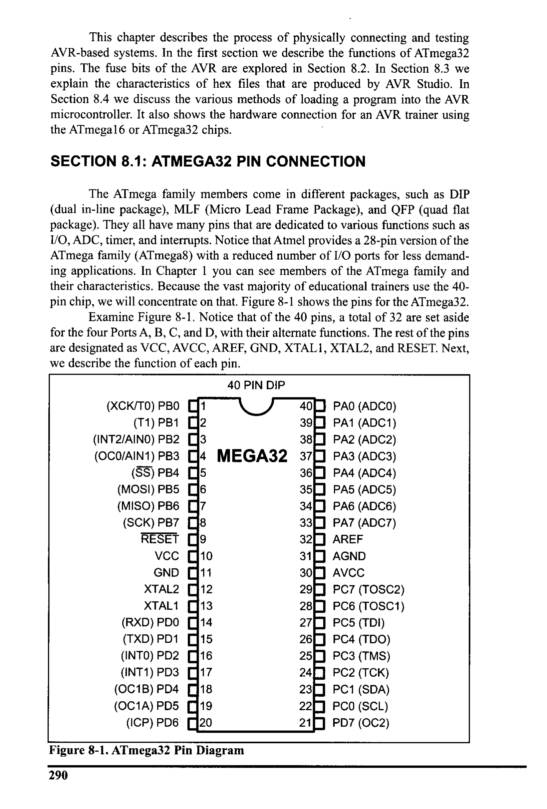
*Description*: IC pinout diagram showing physical pin assignments, I/O pin multiplexing, supply rails, and clock interface connections for Figure 8-1: ATmega32 Pin Diagram.

> **Figure 8-1: ATmega32 Pin Diagram**

290
MEGA32
400
PAO (ADCO)
39 | PA1 (ADC1)
380] PA2 (ADC2)
370] РAЗ (ADC3)
360
PA4 (ADC4)
35•
PA5 (ADC5)
34 • PA6 (ADC6)
33 • PA7 (ADC7)
32D AREF
31J AGND
30 AVCC
29• PC7 (TOSC2)
28• PC6 (TOSC1)
275
PC5 (TDI)
262
PC4 (TDO)
25 • PC3 (TMS)
24J PC2 (TCK)
230] PC1 (SDA)
22] PCO (SCL)
21D PD7 (OC2)


<!-- Page 304 -->
### [PDF Page 304]

VCC
This pin provides supply voltage to the chip. The typical voltage source is
+5 V. Some AVR family members have lower voltage for VCC pins in order to
reduce the noise and power dissipation of the AVR system. For example,
ATmega32L operation voltage is 2.7-5.5 V. We can choose other options for the
operating voltage level by setting BOD fuse bits. The BOD fuse bits are discussed
in the next section.
AVCC
AVCC is the supply voltage pin for Port A and the A/D Converter. It should
be externally connected to VCC, even if the ADC is not used. In Chapter 13 you
will see how to connect this pin if you want to use ADC.
AREF
AREF is the analog reference pin for ADC. In Chapter 13 we will discuss
it further.
GND
Two pins are also used for ground. In chips with 40 pins and more, it is
common to have multiple pins for VCC and GND. This will help reduce the noise
(ground bounce) in high-frequency systems.
XTAL1 and XTAL2
The ATmega32 has many options for the clock source. Most often a quartz
crystal oscillator is connected to input pins XTAL1 and XTAL2. The quartz crys-
tal oscillator connected to the XTALI and XTAL2 pins also needs two capacitors.
One side of each capacitor is connected to the ground as shown in Figure 8-2.
Notice that ATmega32 microcontrollers can have speeds of 0 Hz to 16 MHz.
Vad
ATmega32
10 vcc
30°
AVCC
10K
RESET
XTAL1
XTAL2
13
12
22pF
8MHz
Reset
Switch
22pF
11
GND
GND

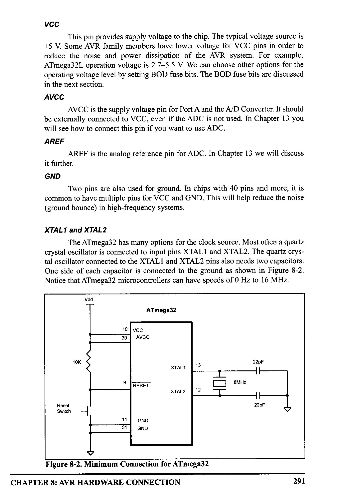
*Description*: Technical diagram and schematic illustration detailing hardware connection topology, signal routing, and circuit operation for Figure 8-2: Minimum Connection for ATmega32.

> **Figure 8-2: Minimum Connection for ATmega32**

CHAPTER 8: AVR HARDWARE CONNECTION
291


<!-- Page 305 -->
### [PDF Page 305]

We can choose options for the clock source and frequency by setting some
fuse bits. The fuse bits are discussed in the next section.
RESET
Pin 9 (in the ATmega32, 40-pin DIP) Table 8-1: RESET Values for
is the RESET pin. It is an input and is active-
Some AVR Registers
LOW (normally HIGH). When a LOW pulse
is applied to this pin, the microcontroller will
Register
Reset Value (hex)
reset and terminate all activities. After apply-
PC
000000
ing reset, contents of all registers and SRAM RO-R31
00
locations will be cleared. Notice that after DDR
00
applying reset, all ports will be input because PORT
00
contents of all DDR registers are cleared. The
CPU will start executing the program from
run location 0x00000 after a brief delay when the RESET pin is forced low and
then released.
Figures 8-3a, 8-3b, and 8-3c show three ways of connecting the RESET
pin. Figure 8-3b uses a momentary switch for reset circuitry. The most difficult
time for any system is during the power-up. The CPU needs both a stable clock
source and a stable voltage level to function properly. Some designers put a 10 nF
capacitor between the RESET pin and GND to filter the noise during reset and
working time. See Figure 3-8c. The diode protects the RESET pin from being
powered by the capacitor when the power is off. The AVR chips come with some
features that help the reset process. We can choose these features by setting the bits
in the fuse bytes. The fuse bits for the reset are discussed in the next section. In
addition to the RESET pin there are other sources of reset in the AVR family that
will be discussed in future chapters.
VCC
VCC
vcc
vcc
10K
10K
10K
RESET
RESET
RESET
Momentary
Switch

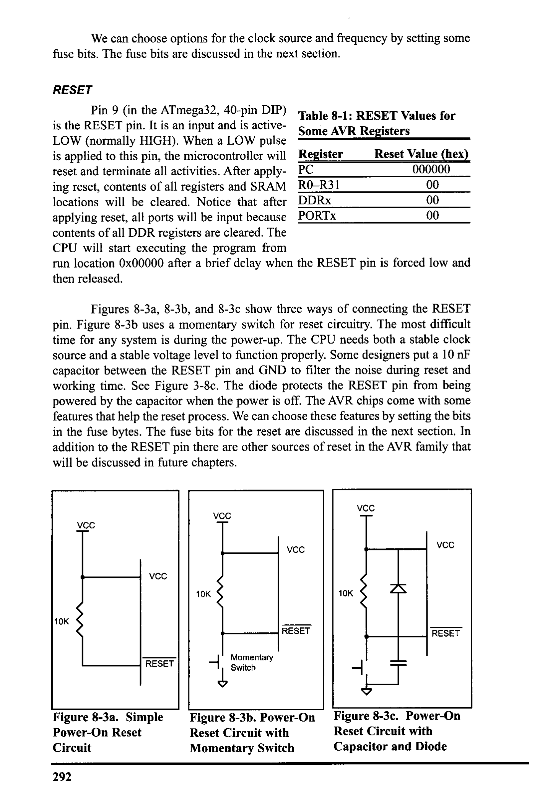
*Description*: Technical diagram and schematic illustration detailing hardware connection topology, signal routing, and circuit operation for Figure 8-3: a. Simple.

> **Figure 8-3: a. Simple**

Power-On Reset
Circuit
292


*Description*: Technical diagram and schematic illustration detailing hardware connection topology, signal routing, and circuit operation for Figure 8-3: b. Power-On.

> **Figure 8-3: b. Power-On**

Reset Circuit with
Momentary Switch


*Description*: Technical diagram and schematic illustration detailing hardware connection topology, signal routing, and circuit operation for Figure 8-3: c. Power-On.

> **Figure 8-3: c. Power-On**

Reset Circuit with
Capacitor and Diode


<!-- Page 306 -->
### [PDF Page 306]

The number of 1/O ports varies among the AVR family members, as we
saw in Chapter 4. The following is another look at them for the ATmega32.
Ports A, B, C, D, and E
As shown in Figure 8-1 (and discussed in Chapter 4), the Ports A, B, C, and
D use a total of 32 pins. Tables 8-2 through 8-5 provide summaries of features of
Ports A-D and their alternative functions. We will study the alternative functions
of these pins in future chapters, as we discuss the AVR features.


*Description*: Register specification diagram depicting individual bit flags, control register configurations, and functional definitions for Table 8-2: Port A Alternate.

> **Table 8-2: Port A Alternate**

Functions
Bit
PAO
Function
ADCO
ADCI
ADC2
ADC3
ADC4
ADCS
ADC6
ADCT


*Description*: Register specification diagram depicting individual bit flags, control register configurations, and functional definitions for Table 8-4: Port C Alternate.

> **Table 8-4: Port C Alternate**

Functions
Bit
PCO
Function
SCL
SDA
TCK
TMS
TDO
TDI
TOSCI
TOSC2


*Description*: Register specification diagram depicting individual bit flags, control register configurations, and functional definitions for Table 8-3: Port B Alternate.

> **Table 8-3: Port B Alternate**

Functions
Bit
PBO
PBI
PB2
PB3
PB4
PB5
PB6
PB7
Function
XCK/TO
TL
INT2/AINO
OCO/AIN1
SS
MOSI
MISO
SCK

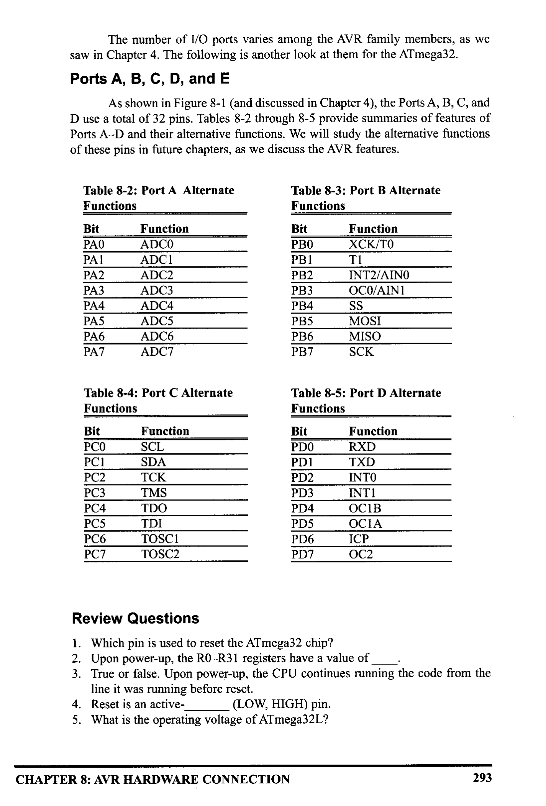
*Description*: Register specification diagram depicting individual bit flags, control register configurations, and functional definitions for Table 8-5: Port D Alternate.

> **Table 8-5: Port D Alternate**

Functions
Bit
PDO
PD1
PD2
PD3
PD4
PDS
PD6
PDT
Function
RXD
TXD
INTO
INTI
OCIB
OCIA
ICP
OC2

### Review Questions

1. Which pin is used to reset the ATmega32 chip?
2. Upon power-up, the RO-R31 registers have a value of _
3. True or false. Upon power-up, the CPU continues running the code from the
line it was running before reset.
4. Reset is an active-
(LOW, HIGH) pin.
5. What is the operating voltage of ATmega32L?
CHAPTER 8: AVR HARDWARE CONNECTION
293


<!-- Page 307 -->
### [PDF Page 307]


## SECTION 8.2: AVR FUSE BITS

There are some features of the AVR that we can choose by programming
the bits of fuse bytes. These features will reduce system cost by eliminating any
need for external components.
ATmega32 has two fuse bytes. Tables 8-6 and 8-7 give a short description
of the fuse bytes. Notice that the default values can be different from production
to production and time to time. In this section we examine some of the basic fuse
bits. The Atmel website (http://www.atmel.com) provides the complete description
of fuse bits for the AVR microcontrollers. It must be noted that if a fuse bit is incor-
rectly programmed, it can cause the system to fail. An example of this is changing
the SPIEN bit to 0, which disables SPI programming mode. In this case you will
not be able to program the chip any more! Also notice that the fuse bits are 'O' if
they are programmed and '1' when they are not programmed.
In addition to the fuse bytes in the AVR, there are 4 lock bits to restrict
access to the Flash memory. These allow you to protect your code from being
copied by others. In the development process it is not recommended to program
lock bits because you may decide to read or verify the contents of Flash memory
Lock bits are set when the final product is ready to be delivered to market. In this
book we do not discuss lock bits. To study more about lock bits you can read the
data sheets for your chip at http://www.atmel.com.

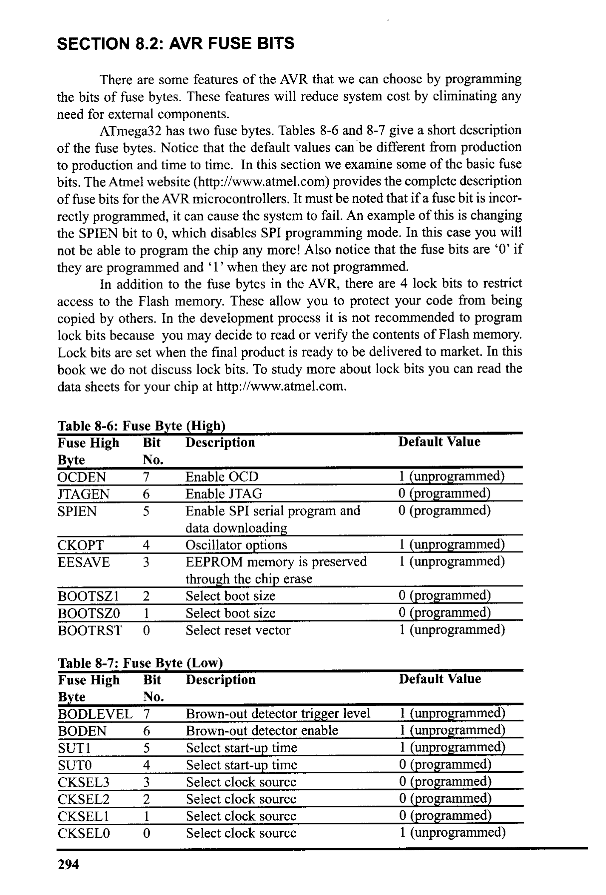
*Description*: Structured reference table listing operational parameters, instruction execution cycles, memory address mapping, or feature comparison for Table 8-6: Fuse Byte (High).

> **Table 8-6: Fuse Byte (High)**

Fuse High
Bit
Description
Byte
No.
OCDEN
7
JTAGEN
6
SPIEN
5
Default Value
CKOPT
EESAVE
4
3
BOOTSZI
BOOTSZO
BOOTRST
2
1
0
Enable OCD
Enable JTAG
Enable SPI serial program and
data downloading
Oscillator options
EEPROM memory is preserved
through the chip erase
Select boot size
Select boot size
Select reset vector
1 (unprogrammed)
0 (programmed)
0 (programmed)
1 (unprogrammed)
1 (unprogrammed)
0 (programmed)
0 (programmed)
1 (unprogrammed)


*Description*: Structured reference table listing operational parameters, instruction execution cycles, memory address mapping, or feature comparison for Table 8-7: Fuse Byte (Low).

> **Table 8-7: Fuse Byte (Low)**

Fuse High
Bit
Description
Byte
No.
BODLEVEL 7
BODEN
6
SUT1
5
SUTO
4
CKSEL3
3
CKSEL2
CKSELI
CKSELO
0
Default Value
Brown-out detector trigger level
Brown-out detector enable
Select start-up time
Select start-up time
Select clock source
Select clock source
Select clock source
Select clock source
1 (unprogrammed)
1 (unprogrammed)
1 (unprogrammed)
0 (programmed)
0 (programmed)
0 (programmed)
0 (programmed)
1 (unprogrammed)
294


<!-- Page 308 -->
### [PDF Page 308]

Clock
Multiplexer
4
TT
External RC
Oscillator
External
Clock
Crystal
Oscillator
Low-Frequency
Crystal Oscillator
Calibrated RC
Oscillator


*Description*: Technical diagram and schematic illustration detailing hardware connection topology, signal routing, and circuit operation for Figure 8-4: ATmega32 Clock Sources.

> **Figure 8-4: ATmega32 Clock Sources**

Fuse bits and oscillator clock


*Description*: Structured reference table listing operational parameters, instruction execution cycles, memory address mapping, or feature comparison for Table 8-8: Internal RC.

> **Table 8-8: Internal RC**

source
Oscillator Operation Modes
As you see in Figure 8-4, there are
CKSEL3...0 Frequency
0001
1 MHz
different clock sources in AVR. You can
0010
choose one by setting or clearing any of the
0011
2 MHz
4 MHz
bits CKSELO to CKSEL3.
0100
8 MHz
CKSELOCKSEL3
The four bits of CKSEL3, CKSEL2,
CKSELI, and CKSELO are used to select the
clock source to the CPU. The default choice
is internal RC (0001), which uses the on-chip
No-
XTALZ
RC oscillator. In this option there is no need
to connect an external crystal and capacitors
to the chip. As you see in Table 8-8, by
XTAL1
changing the values of CKSELO-CKSEL3
we can choose among 1, 2, 4, or 8 MHz inter-
nal RC frequencies; but it must be noted that
- GND
using an internal RC oscillator can cause
about 3% inaccuracy and is not recommend-


*Description*: Technical diagram and schematic illustration detailing hardware connection topology, signal routing, and circuit operation for Figure 8-5: External RC.

> **Figure 8-5: External RC**

ed in applications that need precise timing.
The external RC oscillator is another

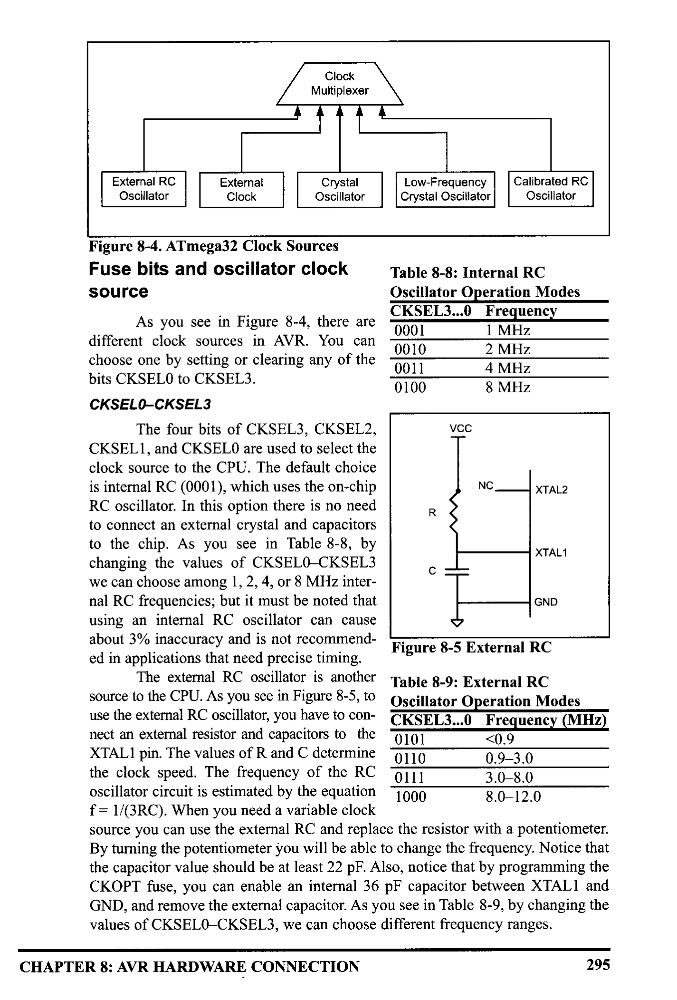
*Description*: Structured reference table listing operational parameters, instruction execution cycles, memory address mapping, or feature comparison for Table 8-9: External RC.

> **Table 8-9: External RC**

source to the CPU. As you see in Figure 8-5, to
Oscillator Operation Modes
use the external RC oscillator, you have to con-
CKSEL3...0
nect an external resistor and capacitors to the
0101
Frequency (MHz)
<0.9
XTALI pin. The values of R and C determine
0110
0.9-3.0
the clock speed. The frequency of the RC
0111
3.0-8.0
oscillator circuit is estimated by the equation
1000
8.0-12.0
f= 1/(3RC). When you need a variable clock
source you can use the external RC and replace the resistor with a potentiometer.
By turning the potentiometer you will be able to change the frequency. Notice that
the capacitor value should be at least 22 pF. Also, notice that by programming the
CKOPT fuse, you can enable an internal 36 pF capacitor between XTALI and
GND, and remove the external capacitor. As you see in Table 8-9, by changing the
values of CKSELO CKSEL3, we can choose different frequency ranges.
CHAPTER 8: AVR HARDWARE CONNECTION
295


<!-- Page 309 -->
### [PDF Page 309]

By setting CKSELO..3 bits to 0000, we can use an external clock source
for the CPU. In Figure 8-6a you see the connection to an external clock source.
C2
NC
EXTERNAL
OSCILLATOR
SIGNAL
XTAL2
- XTALI
22 pF
CI
22 pF
XTAL2
XTALI
GND
GND


*Description*: Technical diagram and schematic illustration detailing hardware connection topology, signal routing, and circuit operation for Figure 8-6: a. XTALI Connection to an.

> **Figure 8-6: a. XTALI Connection to an**


*Description*: Technical diagram and schematic illustration detailing hardware connection topology, signal routing, and circuit operation for Figure 8-6: b. XTAL1-XTAL2.

> **Figure 8-6: b. XTAL1-XTAL2**

External Clock Source
Connection to Crystal Oscillator
The most widely used option is to connect the XTAL1 and XTAL2 pins to
a crystal (or ceramic) oscillator, as shown in Figure 8-6b. In this mode, when
СКОРТ is programmed, the oscillator output will oscillate with a full rail-to-rail
swing on the output, causing a more powerful clock signal. This is suitable when
the chip drives a second clock buffer or operates in a very noisy environment. As
you see in Table 8-10, this mode has a wide frequency range. When CKOPT is not
programmed, the oscillator has a smaller output swing and a limited frequency
range. This mode cannot be used to drive other clock buffers, but it does reduce
power consumption considerably. There are four choices for the crystal oscillator
option. Table 8-10 shows all of these choices. Notice that mode 101 cannot be
used with crystals, and only ceramic resonators can be used. Example 8-1 shows
the relation between crystal frequency and instruction cycle time.

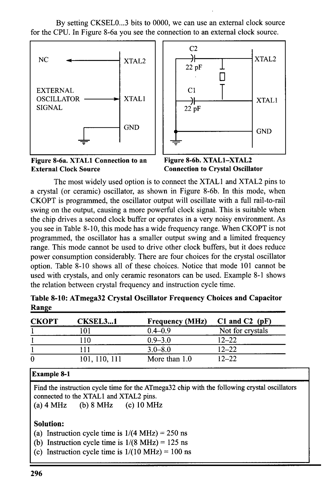
*Description*: Structured reference table listing operational parameters, instruction execution cycles, memory address mapping, or feature comparison for Table 8-10: ATmega32 Crystal Oscillator Frequency Choices and Capacitor.

> **Table 8-10: ATmega32 Crystal Oscillator Frequency Choices and Capacitor**

Range
CKOPT
0
CKSEL3...1
101
110
111
101, 110, 111
Frequency (MHz) C1 and C2 (pF)
0.4-0.9
Not for crystals
0.9-3.0
12-22
3.0-8.0
12-22
More than 1.0
12-22
Example 8-1
Find the instruction cycle time for the ATmega32 chip with the following crystal oscillators
connected to the XTALI and XTAL2 pins.
(a) 4 MHz
(b) 8 MHz
(c) 10 MHz
Solution:
(a) Instruction cycle time is 1/(4 MHz) = 250 ns
(b) Instruction cycle time is 1/(8 MHz) = 125 ns
• Instruction cycle time is 1/(10 MHz) = 100 ns
296


<!-- Page 310 -->
### [PDF Page 310]

Fuse bits and reset delay
The most difficult time for a system is during power-up. The CPU needs
both a stable clock source and a stable voltage level to function properly. In AVRs,
after all reset sources have gone inactive, a delay counter is activated to make the
reset longer. This short delay allows the power to become stable before normal
operation starts. You can choose the delay time through the SUTI, SUTO, and
CKSELO fuses. Table 8-11 shows start-up times for the different values of SUT1,
SUTO, and CKSEL fuse bits and also the recommended usage of each combina-
tion. Notice that the third column of Table 8-11 shows start-up time from power-
down mode. Power-down mode is not discussed in this book.
Brown-out detector
Occasionally, the power source provided to the Vcc pin fluctuates, caus-
ing the CPU to malfunction. The ATmega family has a provision for this, called
brown-out detection. The BOD circuit compares VCC with BOD-Level and resets
the chip if VCC falls below the BOD-Level. The BOD-Level can be either 2.7 V
when the BODLEVEL fuse bit is one (not programmed) or 4.0 V when the
BODLEVEL fuse is zero (programmed). You can enable the BOD circuit by pro-
gramming the BODEN fuse bit. When VCC increases above the trigger level, the
BOD circuit releases the reset, and the MCU starts working after the time-out peri-
od has expired
A good rule of thumb
There is a good rule of thumb for selecting the values of fuse bits. If you
are using an external crystal with a frequency of more than 1 MHz you can set the
CKSEL3, CKSEL2, CKSEL1, SUTI, and SUTO bits to 1 (not programmed) and
clear CKOPT to 0 (programmed).

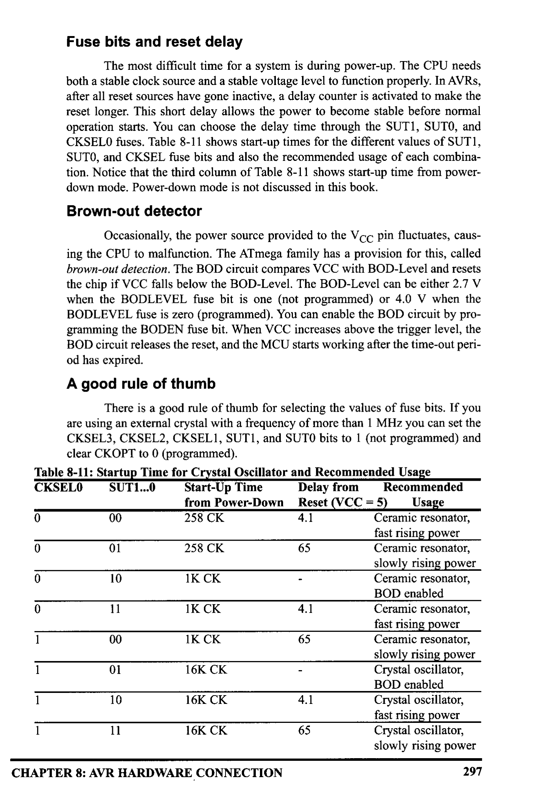
*Description*: Structured reference table listing operational parameters, instruction execution cycles, memory address mapping, or feature comparison for Table 8-11: Startup Time for Crystal Oscillator and Recommended Usage.

> **Table 8-11: Startup Time for Crystal Oscillator and Recommended Usage**

CKSELO
SUT1...0
Start-Up Time
Delay from
Recommended
from Power-Down
Reset (VCC=5) Usage
00
258 CK
4.1
Ceramic resonator,
258 CK
65
fast rising power
Ceramic resonator,
slowly rising power
б
IK CK
11
1K CK
-
4.1
Ceramic resonator,
BOD enabled
Ceramic resonator,
fast rising power
1
00
1K CK
Ceramic resonator,
slowly rising power
1
01
1
T
10
16K CK
16K CK
16K CK
-
Crystal oscillator,
BOD enabled
4.1
65
Crystal oscillator,
fast rising power
Crystal oscillator,
slowly rising power
CHAPTER 8: AVR HARDWARE CONNECTION
297


<!-- Page 311 -->
### [PDF Page 311]

Putting it all together
Many of the programs we showed in the first seven chapters were intend-
ed to be simulated. Now that we know what we should write in the fuse bits and
how we should connect the ATmega32 pins, we can download the hex output file
provided by the AVR Studio assembler into the Flash memory of the AVR chip
using an AVR programmer.
We can use the following skeleton source code for the programs that we
intend to download into a chip. Notice that you have to modify the first line if you
use a chip other than ATmega32. As you can see in the comments, if you want to
enable interrupts you have to modify ".ORG 0", and if you do not use call the
instruction in your code, you can omit the codes that set the stack pointer.
• INCLUDE "M32DEF.INC"
¡change it according to your chip
• ORG O
¡change it if you use interrupt
LDI
R16, HIGH (RAMEND)
¡ set the high byte of stack pointer to
OUT
SPH, R16
¡ the high address of RAMEND
LDI
R16, LOW (RAMEND)
¡ set the low byte of stack pointer to
OUT
SPL, R16
¡ low address of RAMEND
•..
¡place your code here
As an example, examine Program 8-1. It will toggle all the bits of Port B
with some delay between the "on" and "off" states.
¡Test Program 8-1: Toggling
• INCLUDE
"M32DEF. INC"
•ORG O
LDI
R16, HIGH (RAMEND)
OUT
SPH, R16
LDI
R16, LOW (RAMEND)
OUT
SPL, R16
LDI
R16, OxFF
OUT
DDRB, R16
BACK:
COM
R16
OUT
PORTB, R16
CALL
DELAY
RJMP
BACK
DELAY:
L1:
LDI
LDI
L2:
LDI
R20, 16
R21,200
R22,250
13:
NOP
NOP
DEC
R22
BRNE
L3
DEC
BRNE
R21
L2
DEC
R20
BRNE
RET
PORTB for the Atmega32
¡ using Atmega32
i set up stack
¡load R16 with OxFF
; Port B is output
i complement R16
¡ send it to Port B
¡ time delay
i keep doing this indefinitely
Program 8-1: Toggling Port B in Assembly
298


<!-- Page 312 -->
### [PDF Page 312]

Toggle program in C
In Chapter 7 we covered C programming of the AVR using the AVR GCC
compiler. Program 8-2 shows the toggle program written in C. It will toggle all the
bits of Port B with some delay between the "on" and "off" states.

```c
#include <avr/io.h>
```

#include <util/delay.h›
void delay _ms (int d);
int main (void)

```c
DDRB = OXFF;
while (1)
PORTB = 0x55;
```

delay_ms (1000) ;
delay ms (1000);
}
return 0;
void delay ms (int d)
_delay_ms (d) ;
I/standard AVR header
//Port B is output
/do forever
//delay 1 second
//delay 1 second
//delay 1000 us
Program 8-2: Toggling Port B in C

### Review Questions

1. A given ATmega32-based system has a crystal frequency of 16 MHz. What is
the instruction cycle time for the CPU?
2. How many fuse bytes are available in ATmega32?
3. True or false. Upon power-up, both voltage and frequency are stable instantly.
4. The internal RC oscilator works for the frequency range of _
to
MHz.
5. Which fuse bit is used to disable the BOD?
6. True or false. Upon power-up, the CPU starts working immediately.
7. What is the rule of thumb for ATmega32 fuse bits?
8. The brown-out detection voltage can be set at
or
_by.
fuse bit.
9. True or false. The higher the clock frequency for the system, the lower the
power dissipation.
CHAPTER 8: AVR HARDWARE CONNECTION
299


<!-- Page 313 -->
### [PDF Page 313]


## SECTION 8.3: EXPLAINING THE HEX FILE FOR AVR

Intel Hex is a widely used file format designed to standardize the loading
(transferring) of executable machine code into a chip. Therefore, the loaders that
come with every ROM burner (programmer) support the Intel Hex file format. In
many Windows-based assemblers such as AVR Studio, the Intel Hex file is pro-
duced according to the settings you set. In the AVR Studio environment, the object
file is fed into the linker program to produce the Intel hex file. The hex file is used
by a programmer such as the AVRISP to transfer (load) the file into the Flash
memory. The AVR Studio assembler can produce three types of hex files. They are
(a) Intel Intellec 8/MDS (Intel Hex), (b) Motorola S-record, and (c) Generic. See

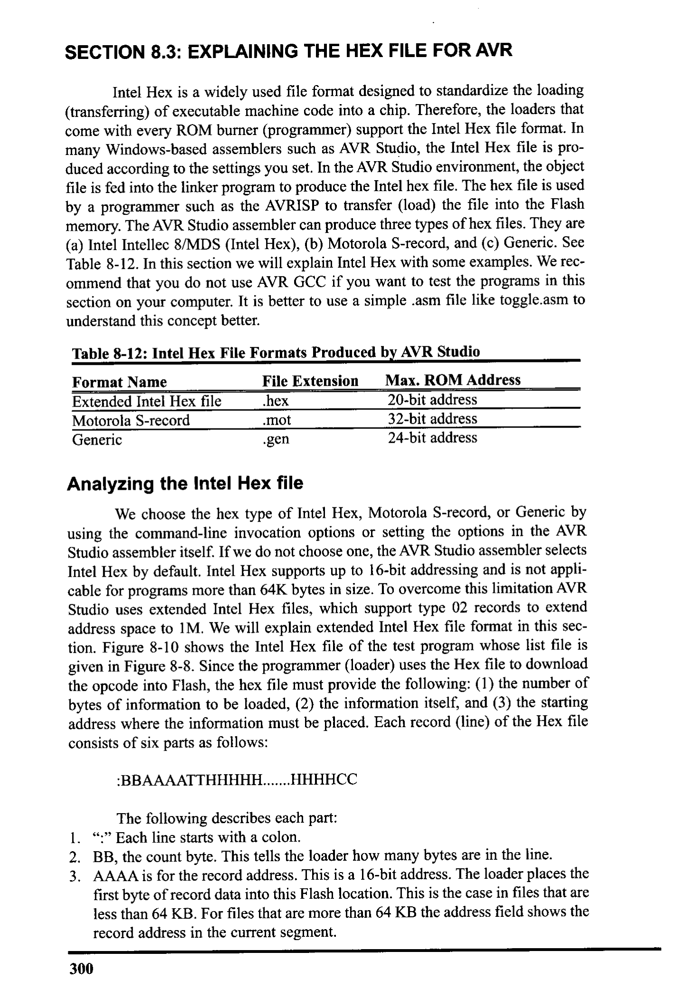
*Description*: Structured reference table listing operational parameters, instruction execution cycles, memory address mapping, or feature comparison for Table 8-12: In this section we will explain Intel Hex with some examples. We rec-.

> **Table 8-12: In this section we will explain Intel Hex with some examples. We rec-**

ommend that you do not use AVR GCC if you want to test the programs in this
section on your computer. It is better to use a simple asm file like toggle.asm to
understand this concept better.


*Description*: Structured reference table listing operational parameters, instruction execution cycles, memory address mapping, or feature comparison for Table 8-12: Intel Hex File Formats Produced by AVR Studio.

> **Table 8-12: Intel Hex File Formats Produced by AVR Studio**

Format Name
File Extension
Max. ROM Address
Extended Intel Hex file
hex
20-bit address
Motorola S-record
.mot
32-bit address
Generic
•gen
24-bit address
Analyzing the Intel Hex file
We choose the hex type of Intel Hex, Motorola S-record, or Generic by
using the command-line invocation options or setting the options in the AVR
Studio assembler itself. If we do not choose one, the AVR Studio assembler selects
Intel Hex by default. Intel Hex supports up to 16-bit addressing and is not appli-
cable for programs more than 64K bytes in size. To overcome this limitation AVR
Studio uses extended Intel Hex files, which support type 02 records to extend
address space to 1M. We will explain extended Intel Hex file format in this sec-
tion. Figure 8-10 shows the Intel Hex file of the test program whose list file is
given in Figure 8-8. Since the programmer (loader) uses the Hex file to download
the opcode into Flash, the hex file must provide the following: (1) the number of
bytes of information to be loaded, (2) the information itself, and (3) the starting
address where the information must be placed. Each record (line) of the Hex file
consists of six parts as follows:
:BBAAAATTHHHHH…... HHHHCC
The following describes each part:
1. ":" Each line starts with a colon.
2. BB, the count byte. This tells the loader how many bytes are in the line.
3. AAAA is for the record address. This is a 16-bit address. The loader places the
first byte of record data into this Flash location. This is the case in files that are
less than 64 KB. For files that are more than 64 KB the address field shows the
record address in the current segment.
300


<!-- Page 314 -->
### [PDF Page 314]

4. TT is for type. This field is 00, 01, or 02. If it is 00, it means that there are more
lines to come after this line. If it is 01, it means that this is the last line and the
loading should stop after this line. If it is 02, it indicates the current segment
address. To calculate the absolute address of each record (line), we have to
shift the current segment address 4 bits to left and then add it to the record
address. Examples 8-2 and 8-3 show how to calculate the absolute address of
a record in extended Intel hex file.
S. HH......H is the real information (data or code). The loader places this informa-
tion into successive memory locations of Flash. The information in this field is
presented as low byte followed by the high byte.
6. CC is a single byte. This last byte is the checksum byte for everything in that
line. The checksum byte is used for error checking. Checksum bytes are dis-
cussed in detail in Chapters 6 and 7. Notice that the checksum byte at the end
of each line represents the checksum byte for everything in that line, and not
just for the data portion.
Example 8-2
What is the absolute address of the first byte of a record that has 0025 in the address
field if the last type 02 record before it has the segment address 0030?
Solution:
To calculate the absolute address of each record (line), we have to shift the segment
address (0030) four bits to the left and then add it to the record address (0025):
0030 (2 bytes segment address) shifted 4 bits to the left -
0025 (record address)
00300
+ 25
→ (absolute address)
00325
Example 8-3
What is the absolute address of the first byte of the second record below?
: 020000020000FC
: 1000000008E00EBF0FE50DBF0FEF07BB05E500953C
Solution:
To calculate the absolute address of the first byte of the second record, we have to shift
left the segment address (0000, as you see in the first record) four bits and then add it
to the second record address (0000, as you see in the second record).
0000 (segment address) shift 4 bits to the left → 00000
+ 0000
(record address)
-
000000
(absolute address)
CHAPTER 8: AVR HARDWARE CONNECTION
301


<!-- Page 315 -->
### [PDF Page 315]

Analyzing the bytes in the Flash memory vs. list file
The data in the Flash memory of the AVR is recorded in a way that is called
Little-endian. This means that the high byte of the code is located in the higher
address location of Flash memory, and the low byte of the code is located in the
lower address location of Flash memory. Compare the first word of code (e008) in

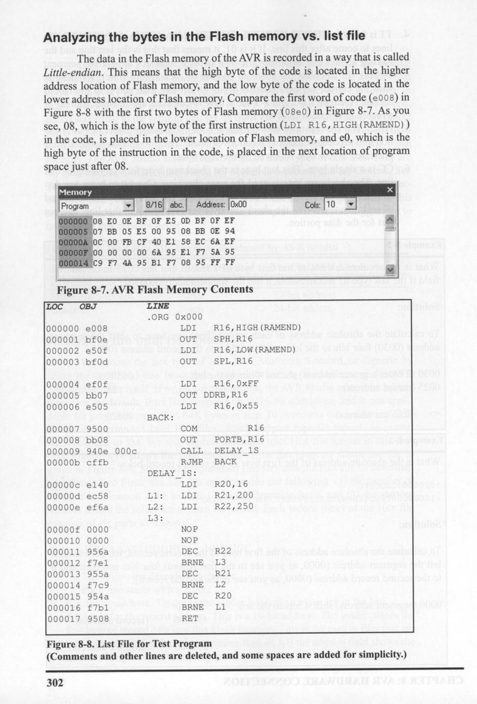
*Description*: Technical diagram and schematic illustration detailing hardware connection topology, signal routing, and circuit operation for Figure 8-8: with the first two bytes of Flash memory (08e0) in Figure 8-7. As you.

> **Figure 8-8: with the first two bytes of Flash memory (08e0) in Figure 8-7. As you**

see, 08, which is the low byte of the first instruction (IDI R16, HIGH (RAMEND))
in the code, is placed in the lower location of Flash memory, and e0, which is the
high byte of the instruction in the code, is placed in the next location of program
space just after 08.
Memory
Program
8/16
abc.
Address: 0x00
000000
08 E0
BF
OF
OD
BF
OF EF
000005
07 BB
05 E5
00
95
08
BB
OE
94
00ОО0A OC 00 FB
CF 40 E1 58
EC
6A EF
00000F 00 00
00
00 6A
95
E1
F7
5A
95
000014 C9 F7 4A 95 B1
F7 08 95
FF FF
Cols: |10
4


*Description*: Technical diagram and schematic illustration detailing hardware connection topology, signal routing, and circuit operation for Figure 8-7: AVR Flash Memory Contents.

> **Figure 8-7: AVR Flash Memory Contents**

LOC
OBJ
LINE
•ORG 0x000
000000 e008
000001 bfle
000002 e50f
000003 bfod
LDI
OUT
LDI
OUT
000004 eff
000005 bb07
000006 e505
000007 9500
000008 bb08
000009 940e
000c
00000b cffb
00000c e140
00000d ec58
00000e efla
00000f 0000
000010
0000
000011
95 ба
000012
f7el
000013
955a
000014
f7c9
000015 954a
000016 f7b1
000017 9508
R16, HIGH (RAMEND)
SPH, R16
R16, LOW (RAMEND)
SPL, R16
LDI
OUT
LDI
R16, OxEE
DDRB, R16
R16, 0x55
BACK:
COM
R16
OUT
PORTB, R16
CALL
DELAY_1S

```assembly
RJMP BACK
```

DELAY 1S:

```assembly
LDI R20,16
L1: LDI R21,200
L2: LDI
```

R22,250
L3:
NO P
NOP
DEC
R22
BRNE
L3
DEC
R21
BRNE
L2
DEC
R20
BRNE
L1
RET


*Description*: Technical diagram and schematic illustration detailing hardware connection topology, signal routing, and circuit operation for Figure 8-8: List File for Test Program.

> **Figure 8-8: List File for Test Program**

(Comments and other lines are deleted, and some spaces are added for simplicity.)
302


<!-- Page 316 -->
### [PDF Page 316]

As we mentioned in Chapter 2, each Flash location in the AVR is 2 bytes
long. So, for example, the first byte of Flash location #2 is Byte #4 of the code.
See Figure 8-9.
Location #0
Location #1
Location #2
Location #3
Flash Memory
Byte #0
Byte #1
Byte #2
Byte #3
Byte #4
Byte #5
Byte #6
Byte #7

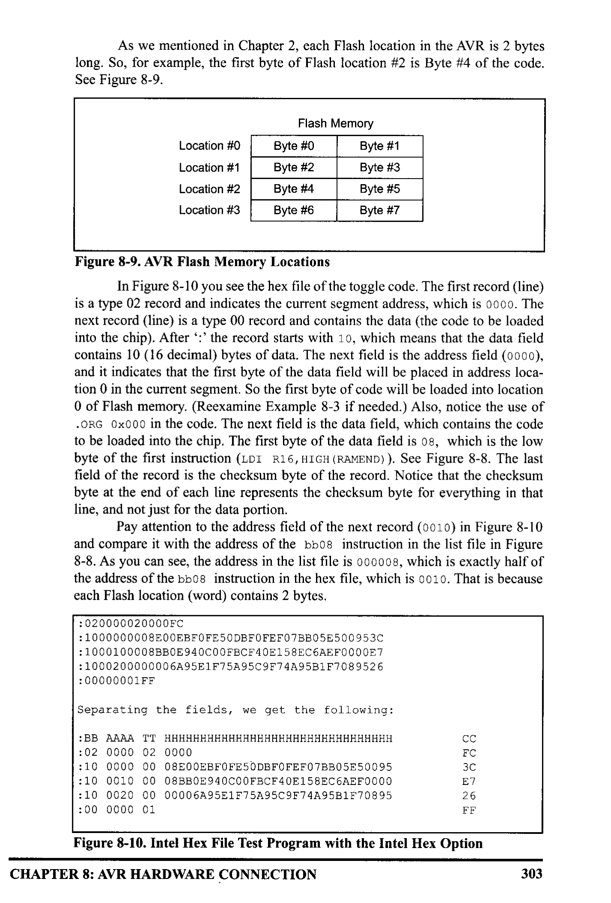
*Description*: Technical diagram and schematic illustration detailing hardware connection topology, signal routing, and circuit operation for Figure 8-9: AVR Flash Memory Locations.

> **Figure 8-9: AVR Flash Memory Locations**

In Figure 8-10 you see the hex file of the toggle code. The first record (line)
is a type 02 record and indicates the current segment address, which is 0000. The
next record (line) is a type 00 record and contains the data (the code to be loaded
into the chip). After ':' the record starts with 10, which means that the data field
contains 10 (16 decimal) bytes of data. The next field is the address field (0000),
and it indicates that the first byte of the data field will be placed in address loca-
tion 0 in the current segment. So the first byte of code will be loaded into location
O of Flash memory. (Reexamine Example 8-3 if needed.) Also, notice the use of
•ORG 0x000 in the code. The next field is the data field, which contains the code
to be loaded into the chip. The first byte of the data field is 08, which is the low
byte of the first instruction (IDI R16, HIGH (RAMEND)). See Figure 8-8. The last
field of the record is the checksum byte of the record. Notice that the checksum
byte at the end of each line represents the checksum byte for everything in that
line, and not just for the data portion
Pay attention to the address field of the next record (0010) in Figure 8-10
and compare it with the address of the bbo8 instruction in the list file in Figure
8-8. As you can see, the address in the list file is 000008, which is exactly half of
the address of the bbo8 instruction in the hex file, which is 0010. That is because
each Flash location (word) contains 2 bytes.
: 020000020000FC
: 100000000800EBF0FE50DBFOFEF07BB05E5009530
: 1000100008BB0E940C00FBCF40E158EC6AEF0000E7
: 1000200000006A95E1F75A95C9F74A95B1F7089526
: 00000001FF
Separating the fields, we get the following:
: 02 0000 02 0000
: 10 0000 00 0800EBF0FE50DBFOFEF07BB05E50095
: 10 0010 00 08BB0E940C00FBCF40E158EC6AEF0000
:10 0020 00 00006A95E1F75A95C9F74A95B1F70895
: 00 0000 01
EC
30
E7
26
FE


*Description*: Technical diagram and schematic illustration detailing hardware connection topology, signal routing, and circuit operation for Figure 8-10: Intel Hex File Test Program with the Intel Hex Option.

> **Figure 8-10: Intel Hex File Test Program with the Intel Hex Option**

CHAPTER 8: AVR HARDWARE CONNECTION
303


<!-- Page 317 -->
### [PDF Page 317]

Examine Examples 8-4 through 8-6 to gain insight into the Intel Hex file
format.
Example 8-4
From Figure 8-10, analyze the six parts of line 3.
Solution:
After the colon (:), we have 10, which means that 16 bytes of data are in this line. 0010H
is the record address, and means that 08, which is the first byte of the record, is placed
in address location 10H (16 decimal). Next, 00 means that this is not the last line of the
record. Then the data, which is 16 bytes, is as follows:
08BB0E940CO0FBCF40E158EC6AEF0000. Finally, the last byte, E7, is the checksum byte.
Example 8-5
Compare the data portion of the Intel Hex file of Figure 8-10 with the opcodes in the
list file of the test program given in Figure 8-8. Do they match?
Solution:
In the second line of Figure 8-10, the data portion starts with 08E0H, where the low byte
is followed by the high byte. That means it is E008, the opcode for the instruction
"IDI
R16, HIGH (RAMEND)", as shown in the list file of Figure 8-8. The last byte of the
data in line 5 is 0895, which is the opcode for the "RET" instruction in the list file.
Example 8-6
(a) Verify the checksum byte for line 3 of Figure 8-10. (b) Verify also that the informa-
tion is not corrupted.
Solution:
(a) 10 + 00 + 00 + 00 + 08 + E0 + OE + BF + OF + E5 + OD + BF + OF +
EF + 07 + BB + 05 + E5 + 00 + 95 = 6C4 in hex. Dropping the carries (6)
gives C4H, and its 2's complement is 3CH, which is the last byte of line 3.
(b) If we add all the information in line 2, including the checksum byte, and drop the
carries we should get 10 + 00 + 00 + 00 + 08 + E0 + OE + BE + OF + E5
+ OD + BF + OF + EF + 07 + BB + 05 + E5 + 00 + 95 + 3C = 700.
Dropping the carries (7) gives OOH, which means OK.

### Review Questions

1. True or false. The Intel Hex file format does not use the checksum byte method
to ensure data integrity.
2. The first byte of a line in an Intel Hex file represents
3. The last byte of a line in an Intel Hex file represents
4. In the TT field of an Intel Hex file, we have 00. What does it indicate?
5. Find the checksum byte for the following values: 22H, 76H, 5FH, 8CH, 99H.
6. In Question 5, add all the values and the checksum byte. What do you get?
304


<!-- Page 318 -->
### [PDF Page 318]


## SECTION 8.4: AVR PROGRAMMING AND TRAINER BOARD

In this section, we show various ways of loading a hex file into the AVR
microcontroller. We also discuss the connection for a simple AVR trainer.
Atmel has skillfully designed AVR microcontrollers for maximum flexibil-
ity of loading programs. The three primary ways to load a program are:
1. Parallel programming. In this way a device burner loads the program into the
microcontroller separate from the system. This is useful on a manufacturing
floor where a gang programmer is used to program many chips at one time.
Most mainstream device burners support the AVR families: EETools is a pop-
ular one. The device programming method is straightforward: The chip is pro-
grammed before it is inserted into the circuit. Or, the chip can be removed and
reprogrammed if it is in a socket. A ZIF (zero insertion force) socket is even
quicker and less damaging than a standard socket. When removing and rein-
serting, we must observe ESD (electrostatic discharge) procedures. Although
AVR devices are rugged, there is always a risk when handling them. Using this
method allows all of the device's resources to be utilized in the design. No pins
are shared, nor are internal resources of the chip used as is the case in the other
two methods. This allows the embedded designer to use the minimum board
space for the design.
2. An in-circuit serial programmer (ISP) allows the developer to program and
debug their microcontroller while it is in the system. This is done by a few
wires with a system setup to accept this configuration. In-circuit serial pro-
gramming is excellent for designs that change or require periodic updating.
AVR has two methods of ISP. They are SPI and JTAG. Most of the ATmega
family supports both methods. The SPI uses 3 pins, one for send, one for
receive, and one for clock. These pins can be used as I/O after the device is
programmed. The designer must make sure that these pins do not conflict with
the programmer. Notice that SPI stands for "serial peripheral interface" and is
a protocol. But ISP stands for "in-circuit serial programming" and is a method
of code loading. AVRISP and many other devices support ISP. lo connect
AVRISP to your device you also need to connect VCC, GND, and RESET
pins. You must bring the pins to a header on the board so that the programmer
can connect to it. Figure 8-11 shows the pin connections.
ATmega 16/32
6
MOSI
AVR ISP IDC2*5
connector
2
13
41
VCC
9
8
7
RST
SCK
MISO
8
9

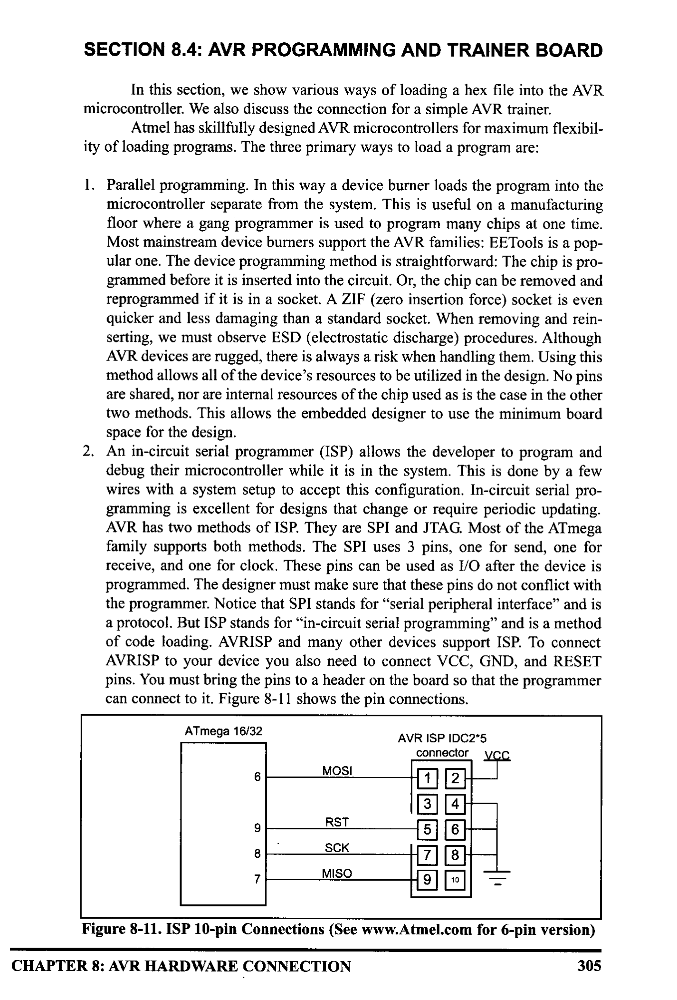
*Description*: IC pinout diagram showing physical pin assignments, I/O pin multiplexing, supply rails, and clock interface connections for Figure 8-11: ISP 10-pin Connections (See www.Atmel.com for 6-pin version).

> **Figure 8-11: ISP 10-pin Connections (See www.Atmel.com for 6-pin version)**

CHAPTER 8: AVR HARDWARE CONNECTION
305


<!-- Page 319 -->
### [PDF Page 319]

Another method of ISP is JTAG. JTAG is another protocol that supports in-cir-
cuit programming and debugging. It means that in addition to programming
you can trace your program on the chip line by line and watch or change the
values of memory locations, ports, or registers while your program is running
on the chip.
3. A boot loader is a piece of code burned into the microcontroller's program
Flash. Its purpose is to communicate with the user's board to load the program.
A boot loader can be written to communicate via a serial port, a CAN port, a
USB port, or even a network connection. A boot loader can also be designed
to debug a system, similar to the TAG. This method of programming is excel-
lent for the developer who does not always have a device programmer or a
JAG available. There are several application notes on writing boot loaders on
the Web. The main drawback of the boot loader is that it does require a com-
munication port and program code space on the microcontroller. Also, the boot
loader has to be programmed into the device before it can be used, usually by
one of the two previous ways.
The boot loader method is ideal for the developer who needs to quickly
program and test code. This method also allows the update of devices in the
field without the need of a programmer. All one needs is a computer with a port
that is compatible with the board. (The serial port is one of the most common-
ly used and discussed, but a CAN or USB boot loader can also be written.) This
method also consumes the largest amount of resources. Code space must be
reserved and protected, and external devices are needed to connect and com-
municate with the PC. Developing projects using this method really helps pro-
grammers test their code. For mature designs that do not change, the other two
methods are better suited.
AVR trainers
There are many popular trainers for the AVR chip. The vast majority of
them have a built-in ISP programmer. See the following website for more infor-
mation and support about the AVR trainers. For more information about how to use
an AVR trainer you can visit the www.MicroDigitalEd.com website.

### Review Questions

1. Which method(s) to program the AVR microcontroller is/are the best for the
manufacturing of large-scale boards?
2. Which method(s) allow(s) for debugging a system?
3. Which method(s) would allow a small company to develop a prototype and test
an embedded system for a variety of customers?
4. True or false. The ATmega32 has Flash program ROM.
5. Which pin is used for reset in the ATmega32?
6. What is the status of the RESET pin when it is not activated?
The information about the trainer board can be found at:
www.MicroDigitalEd.com
306


<!-- Page 320 -->
### [PDF Page 320]


### SUMMARY

This chapter began by describing the function of each pin of the
ATmega32. A simple connection for ATmega32 was shown. Then, the fuse bytes
were discussed. We use fuse bytes to enable features such as BOD and clock
source and frequency. We also explained the Intel Hex file format and discussed
each part of a record in a hex file using an example. Then, we explained list files
in detail. The various ways of loading a hex file into a chip were discussed in the
last section. The connections to a ISP device were shown.

### PROBLEMS


## SECTION 8.1: ATMEGA32 PIN CONNECTION

1. The ATmega32 DIP package is an)
-pin package.
2. Which pins are assigned to VCC and GND?
3. In the ATmega32, how many pins are designated as I/O port pins?
4. The crystal oscillator is connected to pins.
_and
5. True or false. AVR chips comes only in DIP packages.
6. Indicate the pin number assigned to RESET in the DIP package.
7. The RESET pin is normally
_ (LOW, HIGH) and needs a
(LOW, HIGH) signal to be activated.
8. In the ATmega32, how many pins are set aside for the VCC?
9. In the ATmega32, how many pins are set aside for the GND?
10. True or false. In connecting VCC pins to power both must be connected.
11. RESET is an
_ (input, output) pin.
12. How many pins are designated as Port A and what are those in the 40-pin DIP
package!
13. How many pins are designated as Port B and what are those in the 40-pin DIP
package?
14. How many pins are designated as Port C and what are those in the 40-pin DIP
package?
15. How many pins are designated as Port D and what are those in the 40-pin DIP
package?
16. Upon reset, all the bits of ports are configured as
_ (input, output).

## SECTION 8.2: AVR FUSE BITS

17. How many clock sources does the AVR have?
18. What fuse bits are used to select clock source?
19. Which clock source do you suggest if you need a variable clock source?
20. Which clock source do you suggest if you need to build a system with mini-
mum external hardware?
21. Which clock source do you suggest if you need a precise clock source?
22. How many fuse bytes are there in the AVR?
CHAPTER 8: AVR HARDWARE CONNECTION
307


<!-- Page 321 -->
### [PDF Page 321]

23. Which fuse bit is used to set the brown-out detection voltage for the
ATmega32?
24. Which fuse bit is used to enable and disable the brown-out detection voltage
for the ATmega32?
25. If the brown-out detection voltage is set to 4.0 V, what does it mean to the sys-
tem?

## SECTION 8.3: EXPLAINING THE INTEL HEX FILE FOR AVR

26. True or false. The Hex option can be set in AVR Studio.
27. True or false. The extended Intel Hex file can be used for ROM sizes of less
than 64 kilobytes.
28. True or false. The extended Intel Hex file can be used for ROM sizes of more
than 64 kilobytes.
29. Analyze the six parts of line 3 of Figure 8-10.
30. Verify the checksum byte for line 3 of Figure 8-10. Verify also that the infor-
mation is not corrupted.
31. What is the difference between Intel Hex files and extended Intel Hex files?

## SECTION 8.4: AVR PROGRAMMING AND TRAINER BOARD

32. True or false. To use a parallel programmer, we must remove the AVR chip
rom the system and place it into the programmer
33. True or false. ISP can work only with Flash chips
34. What are the different ways of loading a code into an AVR chip?
35. True or false. A boot loader is a kind of parallel programmer.

### ANSWERS TO REVIEW QUESTIONS


## SECTION 8.1: ATMEGA32 PIN CONNECTION

1. 9
2.
• 0
3. False
4. LOW
5. 2.7 V-5.5 V

## SECTION 8.2: AVR FUSE BITS

1. 1/16 MHz = 62.5 ns
2. 16 bits = 2 bytes
3. False
4. 1,8
5. BODEN
6. False
7. If you are using an external crystal with a frequency of more than 1 MHz you can set the
CKSEL3, CKSEL2, CKSEL1, SUTI, and SUTO bits to 1 (not programmed) and clear СКОРТ
to 0 (programmed).
8. 2.7 V, 4 V, BODLEVEL
9. False
308


<!-- Page 322 -->
### [PDF Page 322]


## SECTION 8.3: EXPLAINING THE INTEL HEX FILE FOR AVR

1. False
2. The number of bytes of data in the line
The checksum byte of all the bytes in that line
4.
00 means this is not the last line and that more lines of data follow.
5.
22H + 76H + SFH + 8CH + 99H = 21CH. Dropping the carries we have 1CH and its 2's com-
plement, which is E4H.
6. 22H + 76H + 5FH + 8CH + 99H + E4H = 300H. Dropping the carries, we have 00, which
means that the data is not corrupted.

## SECTION 8.4: AVR PROGRAMMING AND TRAINER BOARD

Device burner
2. JTAG and boot loader
3. ISP
4.
True
Pin 9
6. HIGH
CHAPTER 8: AVR HARDWARE CONNECTION
309


