# Chapter 9: AVR Timer Programming in Assembly and C

> **Textbook**: The AVR Microcontroller and Embedded Systems using Assembly and C

> **PDF Page Range**: 323 - 373


---


<!-- Page 323 -->
### [PDF Page 323]

CHAPTER 9
AVR TIMER
PROGRAMMING
IN ASSEMBLY AND C
OBJECTIVES
Upon completion of this chapter, you will be able to:
List the timers of the ATmega32 and their associated registers
Describe the Normal and CTC modes of the AVR timers
Program the AVR timers in Assembly and C to generate time delays
Program the AVR counters in Assembly and C as event counters
311


<!-- Page 324 -->
### [PDF Page 324]

Many applications need to count an event or generate time delays. So,
there are counter registers in microcontrollers for this purpose. See Figure 9-1.
When we want to count an event, we connect the external event source to the clock
pin of the counter register. Then, when an event occurs externally, the content of
the counter is incremented; in this way, the content of the counter represents how
many times an event has occurred. When we want to generate time delays, we con-
nect the oscillator to the clock pin of the counter. So, when the oscillator ticks, the
content of the counter is incremented. As a result, the content of the counter reg-
ister represents how many ticks have occurred from the time we have cleared the
counter. Since the speed of the oscillator in a microcontroller is known, we can cal-
culate the tick period, and from the content of the counter register we will know
how much time has elapsed
Oscillator •
Counter register
External source
Flag
Counter/Timer

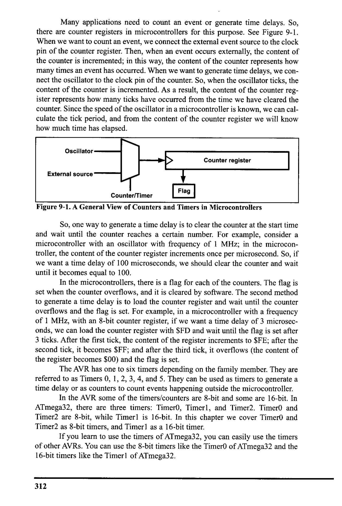
*Description*: Technical diagram and schematic illustration detailing hardware connection topology, signal routing, and circuit operation for Figure 9-1: A General View of Counters and Timers in Microcontrollers.

> **Figure 9-1: A General View of Counters and Timers in Microcontrollers**

So, one way to generate a time delay is to clear the counter at the start time
and wait until the counter reaches a certain number. For example, consider a
microcontroller with an oscillator with frequency of 1 MHz; in the microcon-
troller, the content of the counter register increments once per microsecond. So, if
we want a time delay of 100 microseconds, we should clear the counter and wait
until it becomes equal to 100.
In the microcontrollers, there is a flag for each of the counters. The flag is
set when the counter overflows, and it is cleared by software. The second method
to generate a time delay is to load the counter register and wait until the counter
overflows and the flag is set. For example, in a microcontroller with a frequency
of 1 MHz, with an 8-bit counter register, if we want a time delay of 3 microsec-
onds, we can load the counter register with SFD and wait until the flag is set after
3 ticks. After the first tick, the content of the register increments to $FE; after the
second tick, it becomes SFF; and after the third tick, it overflows (the content of
the register becomes $00) and the flag is set.
The AVR has one to six timers depending on the family member. They are
referred to as Timers 0, 1, 2, 3, 4, and 5. They can be used as timers to generate a
time delay or as counters to count events happening outside the microcontroller.
In the AVR some of the timers/counters are 8-bit and some are 16-bit. In
ATmega32, there are three timers: Timer0, Timerl, and Timer2. Timer and
Timer2 are 8-bit, while Timerl is 16-bit. In this chapter we cover Timer0 and
Timer2 as 8-bit timers, and Timerl as a 16-bit timer.
If you learn to use the timers of ATmega32, you can easily use the timers
of other AVRs. You can use the 8-bit timers like the Timer0 of ATmega32 and the
16-bit timers like the Timerl of ATmega32.
312


<!-- Page 325 -->
### [PDF Page 325]


## SECTION 9.1: PROGRAMMING TIMERS 0, 1, AND 2

Every timer needs a clock pulse to tick. The clock source can be internal or
external. If we use the internal clock source, then the frequency of the crystal oscil-
lator is fed into the timer. Therefore, it is used for time delay generation and con-
sequently is called a timer. By choosing the external clock option, we feed pulses
through one of the AVR's pins. This is called a counter. In this section we discuss
the AVR timer, and in the next section we program the timer as a counter.
Basic registers of timers
Examine Figure 9-2. In
Mega32
AVR, for each of the timers, there
is a TCNTn (timer/counter) regis-
ter. That means in ATmega32 we
Timero
[ICCRO
have TCNTO, TCNT1,
and
TCNT2. The TCNTn register is a
=
(comparator)
counter. Upon reset, the TCNTn
[OCFO
contains zero. It counts up with
each pulse. The contents of the
timers/counters can be accessed
using the TCNTn. You can load a
value into the TCNTn register or
read its value.
Timer1
TOCR 1B
TCCR1A
¡ OCRIA
LOVi
TCNT1
OCR1B
=
(comparator)
Each timer has a TOVn
(Timer Overflow) flag, as well.
=
(comparator)
COCHIB
When a timer overflows, its
TOVn flag will be set.
Each timer also has the
Timer2
TCCR2
TCNT2
OCR2
TCCRn (timer/counter control
=
(comparator)
register) register for setting
mou a of operation Per a ple,
[OCF2]
as a timer or a counter by loading
proper values into the TCCRO.

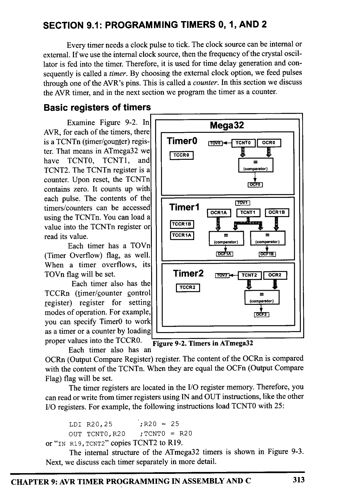
*Description*: Technical diagram and schematic illustration detailing hardware connection topology, signal routing, and circuit operation for Figure 9-2: Timers in ATmega32.

> **Figure 9-2: Timers in ATmega32**

Each timer also has an
OCRn (Output Compare Register) register. The content of the OCRn is compared
with the content of the TCNTn. When they are equal the OCFn (Output Compare
Flag) flag will be set.
The timer registers are located in the I/O register memory. Therefore, you
can read or write from timer registers using IN and OUT instructions, like the other
I/O registers. For example, the following instructions load TCNTO with 25:

```assembly
LDI R20, 25
; R20 = 25
OUT ICNTO, R20
; ICNTO = R20
```

or "IN R19, ICNT2" copies TCNT2 to R19.
The internal structure of the ATmega32 timers is shown in Figure 9-3.
Next, we discuss each timer separately in more detail.
CHAPTER 9: AVR TIMER PROGRAMMING IN ASSEMBLY AND C
313


<!-- Page 326 -->
### [PDF Page 326]

TO
[TOSCT
[TOscZ
Mega32
CIKNO
WGM01 WGMOO
CIK 1
Clk/82
CIK/64 3 MUX
Prescaler
CIK/2564
C1k/10245
Falling Edge 6
Edge detector Rising Edge 7
2
1 O
• Control Unit
count up/down clear
TCNTO
OCRO
[TOVO
CS02 CS01 CS00
Comparator
=
Timero
[OCFO
Cik vo
WGM13 - WGM10
0
CIk/8 2
31K/64 3
Prescaler
CIk/256 4 MUX
CIk/10245
Falling 6
Edge detector Rising 7
210
Control Unit
OCRIA
16/
count updown clear
TCNT1
OCR1B
161
CS12 CS11 CS10
Comparator
=
Comparator
Timer1
[OCFA
[OCF1B]
WGM21 WGM20
AS2
Prescaler
сяк і
CIk/8 2
CIK/32 3
CIK/64. 4 MUX
CIK/128 5
Clk/2566
CIK/1024 7
• Control Unit
Count upadom dear
TCNT2
OCR2
0
TOV2
CS22 CS21 CS20
Comparator
=
[00F2]
Timer2

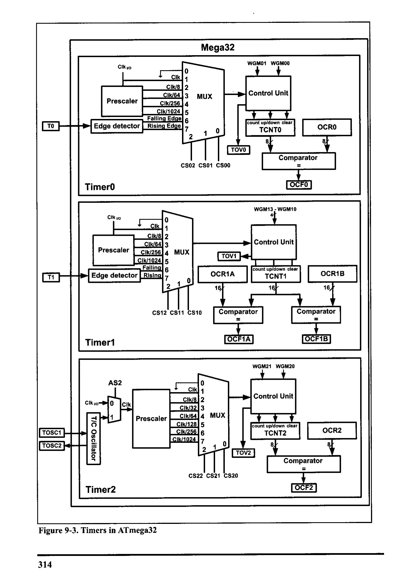
*Description*: Technical diagram and schematic illustration detailing hardware connection topology, signal routing, and circuit operation for Figure 9-3: Timers in ATmega32.

> **Figure 9-3: Timers in ATmega32**

314


<!-- Page 327 -->
### [PDF Page 327]

Timero programming
Timer0 is 8-bit in ATmega32; thus, TCNTO is 8-bit as shown in Figure 9-4.
TCNTO
D7
D6
D5
D4
D3
D2
D1
DO

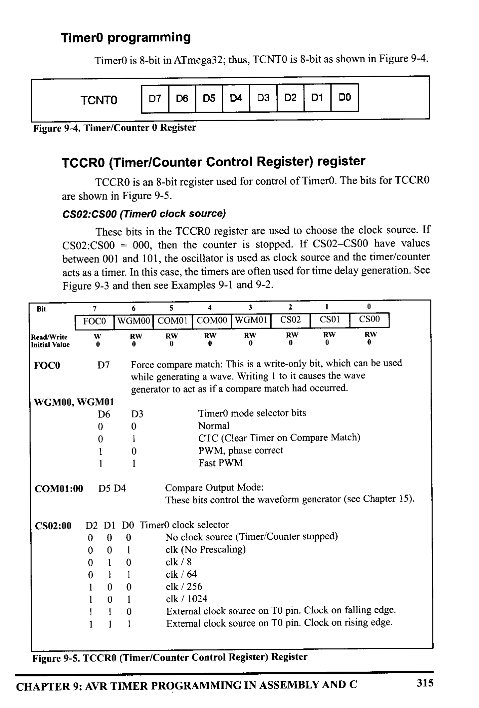
*Description*: Register specification diagram depicting individual bit flags, control register configurations, and functional definitions for Figure 9-4: Timer/Counter 0 Register.

> **Figure 9-4: Timer/Counter 0 Register**

Bit
TCCRO (Timer/Counter Control Register) register
TCCRO is an 8-bit register used for control of Timero. The bits for TCCRO
are shown in Figure 9-5.
CS02:CS00 (Timero clock source)
These bits in the TCCRO register are used to choose the clock source. If
CS02:CSO0 = 000, then the counter is stopped. If CS02-CS00 have values
between 001 and 101, the oscillator is used as clock source and the timer/counter
acts as a timer. In this case, the timers are often used for time delay generation. See


*Description*: Technical diagram and schematic illustration detailing hardware connection topology, signal routing, and circuit operation for Figure 9-3: and then see Examples 9-1 and 9-2..

> **Figure 9-3: and then see Examples 9-1 and 9-2.**

7
5
4
3
2
1
FOCO
TWGMOO COMOI COMOO WGMOI|
CS02
CS01
CS00
Read/Write
Initial Value
FOCO
D7
Force compare match: This is a write-only bit, which can be used
while generating a wave. Writing 1 to it causes the wave
generator to act as if a compare match had occurred.
WGM00, WGM01
D6
0
0
D3
1
1
1
Timer mode selector bits
Normal
CTC (Clear Timer on Compare Match)
PWM, phase correct
Fast PWM
COM01:00
DS D4
Compare Output Mode:
These bits control the waveform generator (see Chapter 15).
CS02:00
D2 D1 DO Timero clock selector
0
0
0
0
1
0
0
No clock source (Timer/Counter stopped)
clk (No Prescaling)
elk / 8
cik / 64
0
clk / 256
clk / 1024
1
1
1
1
0
1
External clock source on TO pin. Clock on falling edge.
External clock source on TO pin. Clock on rising edge.


*Description*: Register specification diagram depicting individual bit flags, control register configurations, and functional definitions for Figure 9-5: TCCRO (Timer/Counter Control Register) Register.

> **Figure 9-5: TCCRO (Timer/Counter Control Register) Register**

CHAPTER 9: AVR TIMER PROGRAMMING IN ASSEMBLY AND C
315


<!-- Page 328 -->
### [PDF Page 328]

Example 9-1
Find the value for TCCRO if we want to program Timer0 in Normal mode, no prescaler.
Use AVR's crystal oscillator for the clock source.
Solution:
TCCRO =
FOCO
WMOO COMOI COMO WGM01 CS02
CS01
CS00
Example 9-2
Find the timer's clock frequency and its period for various AVR-based systems, with the
following crystal frequencies. Assume that no prescaler is used.
(a) 10 MHz
(b) 8 MHz (c) 1 MHz
Solution:
(a) F = 10 MHz and I = 1/10 MHz = 0.1 us
(b) F = 8 MHz and I = 1/8 MHz = 0.125 us
(C) F = 1 MHz and I = 1/1 MHz = 1 us
If CS02-CS00 are 110 or 111, the external clock source is used and it acts
as a counter. We will discuss Counter in the next section.
WGM01:00
Timer can work in four different modes: Normal, phase correct PWM,
CTC, and Fast PWM. The WGM01 and WGM00 bits are used to choose one of
them. We will discuss the PWM options in Chapter 16.
TIFR (Timer/counter Interrupt Flag Register) register
The TIFR register contains the flags of different timers, as shown in Figure
9-6. Next, we discuss the TOVO flag, which is related to Timero.
Bit
2
OCF2
TOV2
ICF1
OCFIA OCFIB TOVI | OCFO
Lead/Writ
nitial Valu
1
RAV
TOVO
TOVO
DO
Timer overflow flag bit
0 = Timero did not overflow.
1 = Timer has overflowed (going from $FF to $00).
OCFO
D1
Timer output compare flag bit
O = compare match did not occur.
1 = compare match occurred
TOVI
OCF1B
OCFIA
ICF1
TOVI
OCF2R
D2
Timerl overflow flag bit
D3
Timerl output compare B match flag
D4
Timerl output compare A match flag
DS
Input Capture flag
D6
Timer2 overflow flag
D7
Timer2 output compare match flag

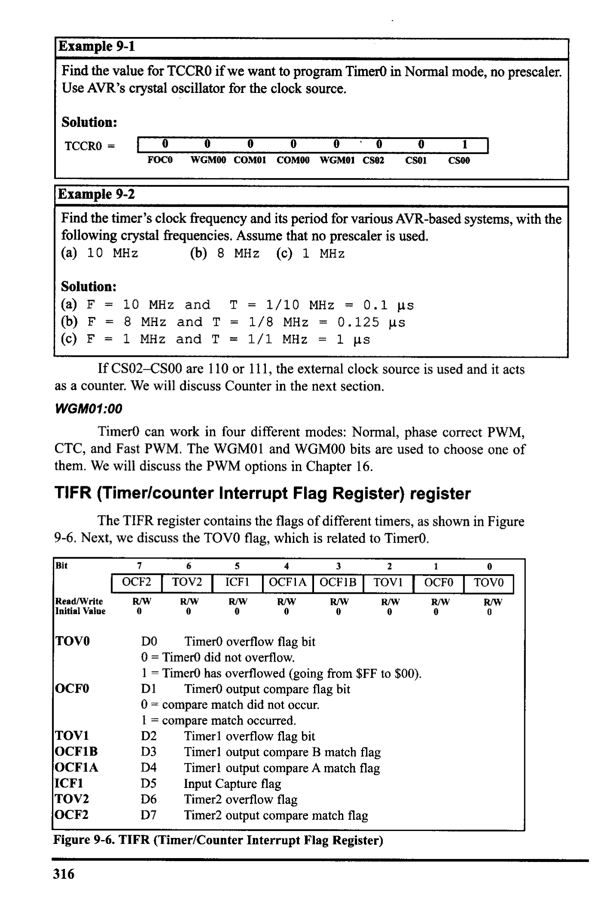
*Description*: Register specification diagram depicting individual bit flags, control register configurations, and functional definitions for Figure 9-6: TIFR (Timer/Counter Interrupt Flag Register).

> **Figure 9-6: TIFR (Timer/Counter Interrupt Flag Register)**

316


<!-- Page 329 -->
### [PDF Page 329]

TOVO (Timero Overflow)
The flag is set when the counter overflows, going from SFF to $00. As we
will see soon, when the timer rolls over from SFF to 00, the TOVO flag is set to 1
and it remains set until the software clears it. See Figure 9-6. The strange thing
about this flag is that in order to clear it we need to write 1 to it. Indeed this rule
applies to all flags of the AVR chip. In AVR, when we want to clear a given flag
of a register we write 1 to it and 0 to the other bits. For example, the following pro-
gram clears TOVO:
LDI
R20, 0x01
OUT
TIFR, R20
; TIFR = 0b00000001
Normal mode
In this mode, the content of the timer/counter increments with each clock.
It counts up until it reaches its max of OxFF. When it rolls over from OxFF to 0x00,
it sets high a flag bit called TOVO (Timer Overflow). This timer flag can be mon-
itored. See Figure 9-7.
TONTO
OXFF -
time

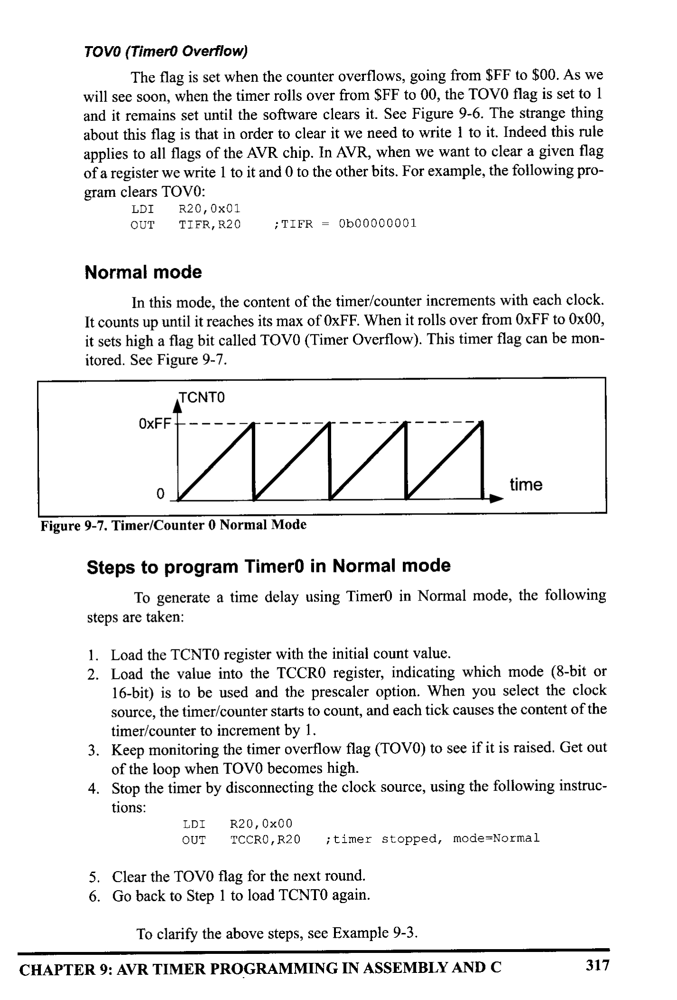
*Description*: Technical diagram and schematic illustration detailing hardware connection topology, signal routing, and circuit operation for Figure 9-7: Timer/Counter 0 Normal Mode.

> **Figure 9-7: Timer/Counter 0 Normal Mode**

Steps to program Timer0 in Normal mode
To generate a time delay using Timer in Normal mode, the following
steps are taken:
1. Load the TCNTO register with the initial count value.
2. Load the value into the TCCRO register, indicating which mode (8-bit or
16-bit) is to be used and the prescaler option. When you select the clock
source, the timer/counter starts to count, and each tick causes the content of the
timer/counter to increment by 1.
3. Keep monitoring the timer overflow flag (TOVO) to see if it is raised. Get out
of the loop when TOVO becomes high.
4. Stop the timer by disconnecting the clock source, using the following instruc-
tions:
LDI
OUT
R20, 0x00
ICCRO, R20
¡timer stopped, mode=Normal
5. Clear the TOVO flag for the next round.
6. Go back to Step 1 to load TCNTO again.
To clarify the above steps, see Example 9-3.
CHAPTER 9: AVR TIMER PROGRAMMING IN ASSEMBLY AND C
317


<!-- Page 330 -->
### [PDF Page 330]

Example 9-3
In the following program, we are creating a square wave of 50% duty cycle (with equal
portions high and low) on the PORTB.5 bit. Timero is used to generate the time delay.
Analyze the program.
• INCLUDE "M32DEF.INC"
• MACRO
INITSTACK
R20, HIGH (RAMEND)
SPH, R20
R20, LOW (RAMEND)
SPL, R20
i set up stack
LDI
OUT
LDI
OUT
• ENDMACRO
INITSTACK
LDI
R16,1<<5
SBI
DDRB, 5
LDI
R17,0
OUT
PORTB, R17
BEGIN: RCALL
DELAY
EOR
R17, R16
OUT
PORTB, R17

```assembly
RJMP BEGIN
; R16 = 0x20 (0010 0000 for PB5)
; PB5
```

as an output
i clear PORTB
¡ call timer delay
¡toggle D5 of R17 by Ex-Oring with 1
i toggle PB5
DELAY: LDI
OUT
R20, OXE2
ICNTO, R2O
LDI
R20, 0x01
OUT
ICCRO, R20
AGAIN: IN
R20, TIER
SBRS
R20, TOVO
RJMP
AGAIN
LDI
R20, 0x0
OUT
ICCRO, R20
LDI
R20, (1<<TOVO)
OUT
TIFR, R20
RET
--Time0 delay
; R20 = 0xF2
; load timero
¡Timer0, Normal mode, int clk, no prescaler
¡ read TIFR
¡if TOVO is set skip next instruction
i stop Timer0
¡clear TOVO flag by writing a 1 to TIFR
Solution:
In the above program notice the following steps:
1. OxF2 is loaded into TCNTO.
2. TCCRO is loaded and TimerO is started.
3. Timero counts up with the passing of each clock, which is provided by the crystal
oscillator. As the timer counts up, it goes through the states of F3, F4, F5, F6, F7,
F8, F9, FA, FB, and so on until it reaches OxFF. One more clock rolls it to 0, raising
the Timer0 flag (TOVO = 1). At that point, the "sBRs R20, IOVO" instruction bypass-
es the "RJMP AGAIN" instruction.
4. Timer is stopped.
5. The TOVO flag is cleared.
F2
F3
F4
FF
00
TOVO=0
TOVO=0
TOV0=0
TOVO=0
TOVO=1
318


<!-- Page 331 -->
### [PDF Page 331]

To calculate the exact time delay and the square wave frequency generat-
ed on pin PBS, we need to know the XTAL frequency. See Examples 9-4 and 9-5.
Example 9-4
In Example 9-3, calculate the amount of time delay generated by the timer. Assume that
XTAL = 8 MHz.
Solution:
We have 8 MHz as the timer frequency. As a result, each clock has a period of T = 1/8
MHz = 0.125 us. In other words, Timer0 counts up each 0.125 us resulting in delay =
number of counts × 0.125 us.
The number of counts for the rollover is OxFF - OxF2 = 0xOD (13 decimal). However,
we add one to 13 because of the extra clock needed when it rolls over from FF to 0 and
raises the TOVO flag. This gives 14 × 0.125 us = 1.75 us for half the pulse.
Example 9-5
In Example 9-3, calculate the frequency of the square wave generated on pin PORTB.5.
Assume that XTAL = 8 MHz.
Solution:
To get a more accurate timing, we need to add clock cycles due to the instructions.
Excles
LDI
R16, 0x20
SBI
DDRB, 5

```assembly
LDI R17,0
```

OUT
PORTB, R17
BEGIN: RCALL DELAY

```assembly
EOR R17, R16
```

OUT
PORTB, R17

```assembly
RJMP BEGIN
DELAY: IDI R20, OXF2
```

OUT
ICNTO, R20
LDI
R2O, 0x01
OUT
ICCRO, R20
AGAIN: IN R20, TIFR
SBRS R20, 0

```assembly
RJMP AGAIN
```

IDI R20, 0x0

```assembly
OUT ICCRO, R20
```

LDI
R20, 0x01
OUT
TIER, R20
RET
3
1
1
1 /
1
1
1
2
2
1
1
1
1
4
24
T= 2 x (14+24) × 0.125 us = 9.5 us and F = 1/T = 105.263 kHz.
CHAPTER 9: AVR TIMER PROGRAMMING IN ASSEMBLY AND C
319


<!-- Page 332 -->
### [PDF Page 332]

(a) in hex
| (b) in decimal
(FF - XX + 1) x 0.125 us
where XX is the ICNTO, ini-
tial value. Notice that XX
value is in hex.
Convert XX value of the
TCNTO register to decimal to
get a NNN decimal number,
then
(256 - NNN) × 0.125 us

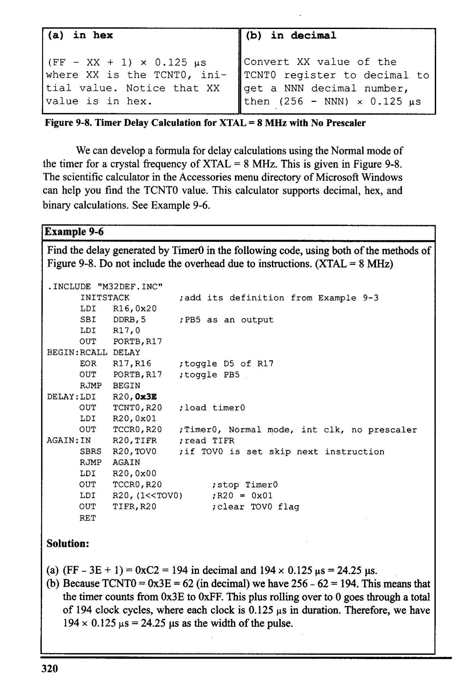
*Description*: Technical diagram and schematic illustration detailing hardware connection topology, signal routing, and circuit operation for Figure 9-8: Timer Delay Calculation for XTAL = 8 MHz with No Prescaler.

> **Figure 9-8: Timer Delay Calculation for XTAL = 8 MHz with No Prescaler**

We can develop a formula for delay calculations using the Normal mode of
the timer for a crystal frequency of XTAL = 8 MHz. This is given in Figure 9-8.
The scientific calculator in the Accessories menu directory of Microsoft Windows
can help you find the TCNTO value. This calculator supports decimal, hex, and
binary calculations. See Example 9-6.
Example 9-6
Find the delay generated by Timer in the following code, using both of the methods of


*Description*: Technical diagram and schematic illustration detailing hardware connection topology, signal routing, and circuit operation for Figure 9-8: Do not include the overhead due to instructions. (XTAL = 8 MHz).

> **Figure 9-8: Do not include the overhead due to instructions. (XTAL = 8 MHz)**

• INCLUDE "M32DEF. INC"
INITSTACK
LDI
R16, 0x20
SBI
DDRB, 5
¡add its definition from Example 9-3
; PBS as an output
LDI
R17,0
OUT
PORTB, R17
BEGIN: RCALL DELAY
EOR
R17, R16
OUT
PORTB, R17
¡toggle D5 of R17
¡toggle PB5
RJMP
BEGIN
DELAY: IDI
R2O, 0X3E
OUT
ICNTO, R20
¡ load timero
IDI
R2O, 0x01
OUT
ICCRO, R20
AGAIN: IN
R20, TIER
SBRS
R20, TOVO
¡Timer0, Normal mode, int clk, no prescaler
; read TIFR
¡ if TOVO is set skip next instruction
RJMP
AGAIN
IDI
R20, 0×00
OUT
ICCRO, R20
IDI
R20, (1<<TOVO)
OUT
TIFR, R20
¡ stop Timero
; R20 = 0x01
¡clear TOVO flag
RET
Solution:
(a) (FF - 3E + 1) = 0xC2 = 194 in decimal and 194 × 0.125 us = 24.25 us.
(b) Because TCNTO = 0x3E = 62 (in decimal) we have 256 - 62 = 194. This means that
the timer counts from 0x3E to OxFF. This plus rolling over to 0 goes through a total
of 194 clock cycles, where each clock is 0.125 us in duration. Therefore, we have
194 × 0.125 us = 24.25 us as the width of the pulse.
320


<!-- Page 333 -->
### [PDF Page 333]

Finding values to be loaded into the timer
Assuming that we know the amount of timer delay we need, the question
is how to find the values needed for the TCNTO register. To calculate the values to
be loaded into the TCNTO registers, we can use the following steps:
1. Calculate the period of the timer clock using the following formula:
Tclock = 1/F Timer
where FTimer is the frequency of the clock used for the timer. For example, in
no prescaler mode, FTimer = Fossillator: Iclock gives the period at which the timer
increments.
2. Divide the desired time delay by clock. This says how many clocks we need.
3. Perform 256 - n, where n is the decimal value we got in Step 2.
4. Convert the result of Step 3 to hex, where xx is the initial hex value to be
loaded into the timer's register.
5. Set TCNTO = xx.
Look at Examples 9-7 and 9-8, where we use a crystal frequency of 8 MHz
for the AVR system.
Example 9-7
Assuming that XTAL = 8 MHz, write a program to generate a square wave with a peri-
od of 12.5 us on pin PORTB.3.
Solution:
For a square wave with T = 12.5 us we must have a time delay of 6.25 us. Because
XTAL = 8 MHz, the counter counts up every 0.125 us. This means that we need 6.25 us
/ 0.125 us = 50 clocks. 256 - 50 = 206 = 0xCE. Therefore, we have TCNTO = 0xCE.
• INCLUDE "M32DEF.INC"
INITSTACK
LDI
R16, 0x08
SBI
DDRB, 3
; PB3 as an output
IDI
R17,0
OUT
PORTB, R17
BEGIN: RCALL DELAY
EOR
R17, R16
OUT
PORTB, R17
¡toggle D3 of R17
¡toggle
PB3
RJMP
BEGIN
; -
--
TimerO Delay
DELAY: LDI
R20, OXCE
OUT
TCNTO, R20
LDI
R20, 0x01
OUT
TCCRO, R20
AGAIN: IN
R2O, TIFR
SBRS
R20, TOVO

```assembly
RJMP AGAIN
```

LDI
R20, 0x00
OUT
TCCRO, R20
i stop Timero
IDI
R20, (1<<IOVO)
OUT
TIFR, R20
i clear TOVO flag
RET
¡add its definition from Example 9-3
¡load Timero
;Timer0, Normal mode, int clk, no prescaler
¡ read TIFR
¡if JOVO is set skip next instruction
CHAPTER 9: AVR TIMER PROGRAMMING IN ASSEMBLY AND C
321


<!-- Page 334 -->
### [PDF Page 334]

Example 9-8
Assuming that XTAL = 8 MHz, modify the program in Example 9-7 to generate a
square wave of 16 kHz frequency on pin PORTB.3.
Solution:
Look at the following steps.
(a) T = 1 / F = 1/16 kHz = 62.5 us the period of the square wave.
(b) 1/2 of it for the high and low portions of the pulse is 31.25 us.
(c) 31.25 us / 0.125 us = 250 and 256 - 250 = 6, which in hex is 0x06.
(d) TCNTO = 0x06.
Using the Windows calculator to find TCNTO
The scientific calculator in Microsoft Windows is a handy and easy-to-use
tool to find the TCNTO value. Assume that we would like to find the TCNTO value
for a time delay that uses 135 clocks of 0.125 us. The following steps show the cal-
culation:
1. Bring up the scientific calculator in MS Windows and select decimal.
2. Enter 135.
3. Select hex. This converts 135 to hex, which is 0x87.
4. Select +/- to give - 135 decimal (0x79).
5. The lowest two digits (79) of this hex value are for TCNTO. We ignore all the
Es on the left because our number is 8-bit data.
Prescaler and generating a large time delay
As we have seen in the examples so far, the size of the time delay depends
on two factors, (a) the crystal frequency, and (b) the timer's 8-bit register. Both of
PSR10
clk,o-
CS00
CS01
CS02
1
Clear 10-bit T/C Prescaler
clk/256
clk/1024
2
3
4
5
6
- то
Timer/Counter0 clock
source

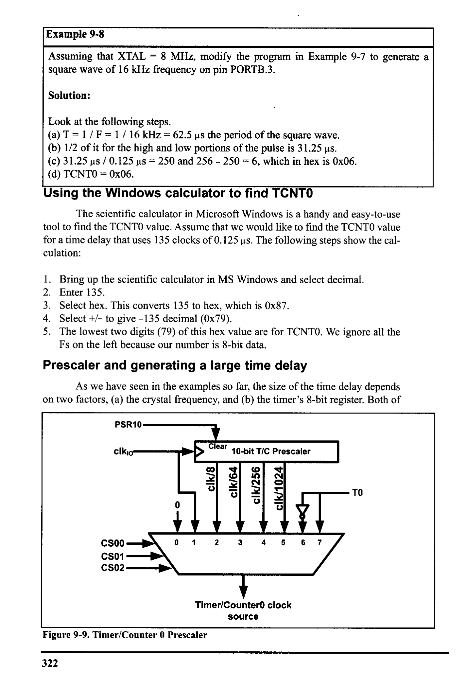
*Description*: Technical diagram and schematic illustration detailing hardware connection topology, signal routing, and circuit operation for Figure 9-9: Timer/Counter 0 Prescaler.

> **Figure 9-9: Timer/Counter 0 Prescaler**

322


<!-- Page 335 -->
### [PDF Page 335]

Example 9-9
Modify TCNTO in Example 9-7 to get the largest time delay possible. Find the delay in
ms. In your calculation, exclude the overhead due to the instructions in the loop.
Solution:
To get the largest delay we make TCNTO zero. This will count up from 00 to OxFF and
then roll over to zero.
• INCLUDE "M32DEF. INC"
INITSTACK
¡ add its definition from Example 9-3
LDI
R16, 0x08
SBI
DDRB, 3
; PB3 as an output
LDI
R17,0
OUT
PORTB, R17
BEGIN: RCALL DELAY
EOR
R17, R16
OUT
PORTB, R17
¡toggle D3 Of R17
i toggle PB3
RJMP
BEGIN
; -
- TimerO
Delay
DELAY: IDI
R20, 0×00
OUT
TCNTO, R20
¡ load Timer0 with zero
LDI
R20, 0x01
OUT
TCCRO, R20
AGAIN: IN
R2O, TIFR
SBRS
R20, TOVO
;Timer0, Normal mode, int clk, no prescaler
¡ read TIFR
¡if IOVO is set skip next instruction
RJMP
AGAIN
LDI
R20, 0x00
OUT
ICCRO, R20
i stop TimerO
LDI
R20, (1<<IOVO)
OUT
TIER, R20
¡ clear TOVO flag
RET
Making TCNTO zero means that the timer will count from 00 to OxFF, and then will
roll over to raise the TCNTO flag. As a result, it goes through a total of 256 states.
Therefore, we have delay = (256 - O) × 0.125 us = 32 us. That gives us the smallest
frequency of 1 / (2 × 32 us) = 1 / (64 us) = 15.625 kHz.
these factors are beyond the control of the AVR programmer. We saw in Example
9-9 that the largest time delay is achieved by making TCNTO zero. What if that is
not enough? We can use the prescaler option in the TCCRO register to increase the
delay by reducing the period. The prescaler option of TCCRO allows us to divide
the instruction clock by a factor of 8 to 1024 as was shown in Figure 9-5. The
prescaler of Timer/Counter O is shown in Figure 9-9.
As we have seen so far, with no prescaler enabled, the crystal oscillator fre-
quency is fed directly into Timero. If we enable the prescaler bit in the TCCRO reg-
ister, however, then we can divide the clock before it is fed into Timero. The lower
3 bits of the TCCRO register give the options of the number we can divide by. As
shown in Figure 9-9, this number can be 8, 64, 256, and 1024. Notice that the low-
est number is 8 and the highest number is 1024. Examine Examples 9-10 through
9-14 to see how the prescaler options are programmed.
CHAPTER 9: AVR TIMER PROGRAMMING IN ASSEMBLY AND C
323


<!-- Page 336 -->
### [PDF Page 336]

Example 9-10
Find the timer's clock frequency and its period for various AVR-based systems, with the
following crystal frequencies. Assume that a prescaler of 1:64 is used.
(a) 8 MHz
(b) 16 MHZ
(c) 10 MHZ
Solution:
XTAL
oscillator
÷ 64
TCNTn
(a) 1/64 × 8 MHz = 125 kHz due to 1:64 prescaler and T = 1/125 kHz = 8 us
(b) 1/64 × 16 MHz = 250 kHz due to prescaler and T = 1/250 kHz = 4 us
(c) 1/64 × 10 MHz = 156.2 kHz due to prescaler and T = 1/156 kHz = 6.4 us
Example 9-11
Find the value for TCCRO if we want to program Timero in Normal mode with a
prescaler of 64 using internal clock for the clock source.
Solution:
From Figure 9-5 we have TCCRO = 0000 0011; XTAL clock source, prescaler of 64.
TCCRO =
FOCO
WGMOO COM01 COMOO WGM01 CS02
CS01
Example 9-12
Examine the following program and find the time delay in seconds. Exclude the over-
head due to the instructions in the loop. Assume XTAL = 8 MHz.
• INCLUDE "M32DEF.INC"
INITSTACK
IDI
R16, 0x08
SBI
DDRB, 3
LDI
R17,0
OUT
PORTB, R17
BEGIN: RCALL DELAY
EOR
R17, R16
¡toggle D3 Of R17

```assembly
OUT PORTB, R17
```

i toggle PB3

```assembly
RJMP BEGIN
; --
```

--- Timero Delay
DELAY: LDI R20, Ox10
OUT
ICNTO, R20
; load Timer0

```assembly
LDI R20, 0x03
```

OUT
ICCRO, R20
AGAIN: IN
R20, TIFR
SBRS R20, TOVO

```assembly
RJMP AGAIN
```

LDI
R20, 0x0
¡ add its definition from Example 9-3
; PB3 as an output
¡Timer0, Normal mode, int clk, prescaler 64
; read TIER
¡if TOVO is set skip next instruction
324


<!-- Page 337 -->
### [PDF Page 337]

Example 9-12 (Cont.)
OUT
TCCRO, R20
i stop Timero
IDI
R20, 1<<TOVO
OUT
TIFR, R20
¡clear TOVO flag
RET
Solution:
TCNTO = 0x10 = 16 in decimal and 256 - 16 = 240. Now 240 × 64 × 0.125 us = 1920
us, or from Example 9-10, we have 240 × 8 us = 1920 us.
Example 9-13
Assume XTAL = 8 MHz. (a) Find the clock period fed into TimerO if a prescaler option
of 1024 is chosen. (b) Show what is the largest time delay we can get using this
prescaler option and Timero.
Solution:
(a) 8 MHz × 1/1024 = 7812.5 Hz due to 1:1024 prescaler and T = 1/7812.5 Hz = 128
ms = 0.128 ms
(b) To get the largest delay, we make TCNTO zero. Making TCNTO zero means that the
timer will count from 00 to OxFF, and then roll over to raise the TOVO flag. As a
result, it goes through a total of 256 states. Therefore, we have delay = (256 - 0)x
128 us = 32,768 us = 0.032768 seconds.
Example 9-14
Assuming XTAL = 8 MHz, write a program to generate a square wave of 125 Hz fre-
quency on pin PORTB.3. Use Timero, Normal mode, with prescaler = 256.
Solution:
Look at the following steps:
(a) T = 1 / 125 Hz = 8 ms, the period of the square wave.
(b) 1/2 of it for the high and low portions of the pulse = 4 ms
54ms | 4ms
(c) (4 ms / 0.125 us) / 256 = 125 and 256 - 125 = 131 in decimal, and in hex it is 0x83.
(d) TCNTO = 83 (hex)
• INCLUDE "M32DEF.INC"
•MACRO INITSTACK
LDI
R20, HIGH (RAMEND)
OUT
SPH, R20
LDI
R2O, LOW (RAMEND)
OUT
SPL, R20
• ENDMACRO
¡set up stack
CHAPTER 9: AVR TIMER PROGRAMMING IN ASSEMBLY AND C
325


<!-- Page 338 -->
### [PDF Page 338]

Example 9-14 (Cont.)
INITSTACK
LDI
R16,0x08
SBI
DDRB, 3
LDI
R17,0
BEGIN: OUT
PORTB, R17
CALL
DELAY
EOR
R17, R16
RJMP
BEGIN
; PB3 as an output
¡ PORTB = R17
¡toggle D3 of R17
-- TimerO Delay
DELAY: LDI
OUT
LDI
OUT
R20, 0x83
ICNIO, R20
R20, 0x04
ICCRO, R20
AGAIN: IN
R20, TIER
SBRS R2O, IOVO
RJMP
AGAIN
LDI
R20, 0x0
OUT
ICCRO, R20
i stop Timer0
LDI
R20, 1<<IOVO
OUT
TIER, R20
¡ clear TOVO flag
RET
¡ load Timero
¡ Timer0, Normal mode, int clk, prescaler 256
; read TIER
¡ if TOVO is set skip next instruction
Assemblers and negative values
Because the timer is in 8-bit mode, we can let the assembler calculate the
value for TCNTO. For example, in the "IDI R20, -100" instruction, the assem-
bler will calculate the - 100 = 9C and make R20 = 9C in hex. This makes our job
easier. See Examples 9-15 and 9-16.
Example 9-15
Find the value (in hex) loaded into TCNTO for each of the following cases.
(a)
IDI R20, -200
(b)
IDI R17, -60
(c)
IDI R25, -12

```assembly
OUT ICNIO, R20
OUT ICNIO, R17
OUT ICNIO, R25
```

Solution:
You can use the Windows scientific calculator to verify the results provided by the
assembler. In the Windows calculator, select decimal and enter 200. Then select hex,
then +/- to get the negative value. The following is what we get.
Decimal
-200
-60
-12
2's complement (TCNTO value)
0x38
OxC4
0xF4
326


<!-- Page 339 -->
### [PDF Page 339]

Example 9-16
Find (a) the frequency of the square wave generated in the following code, and (b) the
duty cycle of this wave. Assume XTAL = 8 MHz.
• INCLUDE "M32DEF. INC"
LDI
R16, HIGH (RAMEND)
OUT
SPH, R16
LDI
R16, LOW (RAMEND)
OUT
SPL, R16
¡initialize stack pointer
LDI
R16, 0x20
SBI
DDRB, 5
IDI
R18, - 150
BEGIN: SBI
PORTB, 5
OUT
ICNIO, R18

```assembly
CALL DELAY
```

OUT
ICNIO, R18
; PB5 as an output
; PB5 = 1
¡ load Timer0 byte
¡ reload Timero byte

```assembly
CALL DELAY
```

CBI
PORTB, 5
OUT
ICNIO, R18
; PB5 = 0
¡ reload Timero byte

```assembly
CALL DELAY
```

RIMP BEGIN
¡----- Delay using Timero
DELAY: LDI
R20, 0x01
OUT
TCCRO, R20
AGAIN: IN
R2O, TIFR
SBRS
R20, TOVO
RJMP
AGAIN
LDI
R20, 0x0
OUT
ICCRO, R20
¡ stop Timero
IDI
R2O, 1<<TOVO
OUT
TIFR, R20
¡clear TOVO flag bit
RET
¡ start Timer0, Normal mode, int olk, no prescaler
¡ read TIFR
; monitor IOVO flag and skip if high
Solution:
For the TCNTO value in 8-bit mode, the conversion is done by the assembler as long as
ve enter a negative number. This also makes the calculation easy. Because we are using
150 clocks, we have time for the DELAY subroutine = 150 × 0.125 us = 18.75 us. The
high portion of the pulse is twice the size of the low portion (66% duty cycle).
Therefore, we have: T = high portion + low portion = 2 × 18.75 us + 18.75 us = 56.25
us and frequency = 1 / 56.25 us = 17.777 kHz.
ATmega32
PB5
CHAPTER 9: AVR TIMER PROGRAMMING IN ASSEMBLY AND C
327


<!-- Page 340 -->
### [PDF Page 340]

Clear Timero on compare match (CTC) mode programming
Examining Figure 9-2 once more, we see the OCRO register. The OCRO reg-
ister is used with CTC mode. As with the Normal mode, in the CTC mode, the timer
is incremented with a clock. But it counts up until the content of the TCNTO register
becomes equal to the content of OCRO (compare match occurs); then, the timer will
be cleared and the OCFO flag will be set when the next clock occurs. The OCF0 flag
is located in the TIFR register. See Figure 9-10 and Examples 9-17 through 9-21.
Example 9-17
In the following program, we are creating a square wave of 50% duty cycle (with equal
portions high and low) on the PORTB.5 bit. Timero is used to generate the time delay.
Analyze the program.
• INCLUDE "M32DEF. INC"
INITSTACK
¡add its definition from Example 9-3
IDI
R16, 0x08
SBI
DDRB, 3
; PB3 as an output
LDI
R17, 0
BEGIN: OUT
PORTB, R17
; PORTB = R17

```assembly
RCALL DELAY
```

EOR
R17, RI
¡toggle D3 of R17

```assembly
JMP BEGIN
; --
```

---- TimerO Delay
DELAY: IDI
R20,0
OUT
TCNTO, R20
LDI
R20,9
OUT
OCRO, R20
¡ load OCRO
LDI
R20, 0x09
OUT
ICCRO, R20
AGAIN: IN
R2O, TIFR
SBRS R2O, OCFO
¡ Timero, CIC mode, int c1k
¡read TIFR
¡if OCFO is set skip next inst.
RJMP
AGAIN
IDI
R20, 0x0
OUT
ICCRO, R20
i stop TimerO
IDI
R20, 1‹<OCFO
OUT
TIFR, R20
¡ clear OCFO flag
RET
Solution:
In the above program notice the following steps:
1. 9 is loaded into OCRO.
2. TCCRO is loaded and Timer0 is started.
3. Timer counts up with the passing of each clock, which is provided by the crystal
oscillator. As the timer counts up, it goes through the states of 00, 01, 02, 03, and so
on until it reaches 9. One more clock rolls it to 0, raising the Timer compare match
flag (OCFO = 1). At that point, the "SBRS R20, OCFO" instruction bypasses the "RJMP
AGAIN" instruction.
4. Timer0 is stopped.
5. The OCFO flag is cleared
00
01
OCF0=0
OCF0=0
TOVO=0
TOV0=0
02
OCF0=0
TOVO=0
09
OCFO=0
TOVO=0
00
OCF0-1
TOVO=0
328


<!-- Page 341 -->
### [PDF Page 341]

ATCNTO
OxFF- -
OCRO--
time
0
OCFO=1 OCFO=1 OCFO=1 OCFO=1 OCFO=1 OCF0=1

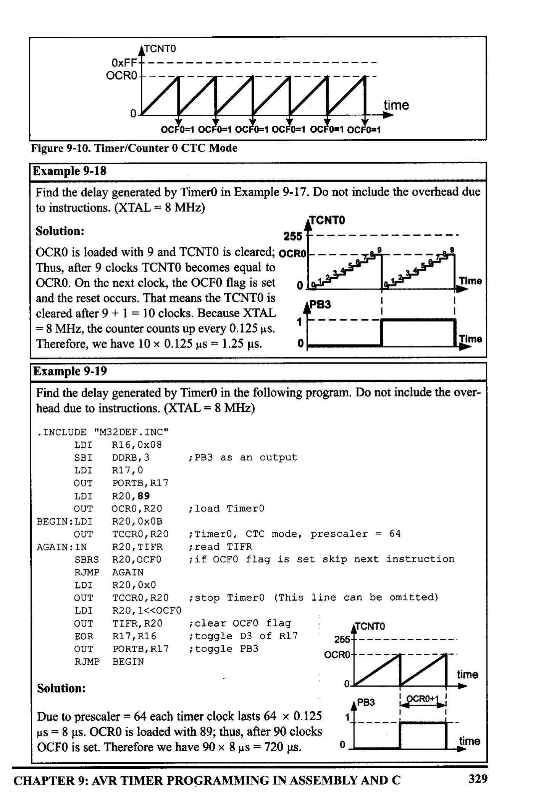
*Description*: Technical diagram and schematic illustration detailing hardware connection topology, signal routing, and circuit operation for Figure 9-10: Timer/Counter 0 CTC Mode.

> **Figure 9-10: Timer/Counter 0 CTC Mode**

Example 9-18
Find the delay generated by Timer0 in Example 9-17. Do not include the overhead due
to instructions. (XTAL = 8 MHz)
TCNTO
Solution:
255
OCRO is loaded with 9 and TCNTO is cleared; ocRo
Thus, after 9 clocks TCNTO becomes equal to
OCRO. On the next clock, the OCF0 flag is set
1922255R99
Time
and the reset occurs. That means the TCNTO is
cleared after 9 + 1 = 10 clocks. Because XTAL
= 8 MHz, the counter counts up every 0.125 us.
Therefore, we have 10 × 0.125 us = 1.25 us.
4PB3
1
0
Time
Example 9-19
Find the delay generated by Timer0 in the following program. Do not include the over-
head due to instructions. (XTAL = 8 MHz)
• INCLUDE "M32DEF.INC"
LDI
R16, 0x08
SBI
DDRB, 3
; PB3 as an output
LDI
R17,0
OUT
PORTB, R17
LDI
R20, 89
OUT
OCRO, R20
¡load Timer0
BEGIN: LDI
R20, ОX0B
OUT
ICCRO, R20
AGAIN: IN
R20, TIFR
SBRS R20, OCFO
¡Timero, CIC mode, prescaler = 64
¡ read TIFR
¡if OCF0 flag is set skip next instruction

```assembly
RJMP AGAIN
```

LDI
R20, Oxo
OUT
TCCRO, R20
¡stop Timero (This line can be omitted)
LDI
R20, 1<<OCFO
OUT
TIFR, R20
EOR
R17, R16
OUT
PORTB, R17
¡ clear OCF0 flag
¡ toggle D3 of R17
¡ toggle PB3
ATCNTO
255-
OCRO--

```assembly
RJMP BEGIN
```

time
Solution:
0.
ДРВЗ
LOCRO+1
Due to prescaler = 64 each timer clock lasts 64 × 0.125
us = 8 us. OCRO is loaded with 89; thus, after 90 clocks
OCFO is set. Therefore we have 90 × 8 us = 720 us.
0
time
CHAPTER 9: AVR TIMER PROGRAMMING IN ASSEMBLY AND C
329


<!-- Page 342 -->
### [PDF Page 342]

Example 9-20
Assuming XTAL = 8 MHz, write a program to generate a delay of 25.6 ms. Use Timero,
CTC mode, with prescaler = 1024.
Solution:
Due to prescaler = 1024 each timer clock lasts 1024 × 0.125 us = 128 us. Thus, in order
to generate a delay of 25.6 ms we should wait 25.6 ms / 128 us = 200 clocks. Therefore
the OCRO register should be loaded with 200 - 1 = 199.
DELAY: LDI
R20, 0
TCNTO, R20
R20, 199
OUT
LDI
OCRO, R20
¡ load OCRO
R20, OXOD
OUT
ICCRO, R20
¡ TimerO, CTC mode, prescaler = 1024
AGAIN: IN
R2O, TIFR
¡ read TIFR
SBRS
R20, OCFO
¡ if OCFO is set skip next inst.
RJMP
AGAIN
LDI
R20, 0x0
OUT
ICCRO, R20
i stop Timero
LDI
R2O, 1<<OCFO
OUT
TIFR, R20
¡clear OCFO flag
RET
Example 9-21
Assuming XTAL = 8 MHz, write a program to generate a delay of 1 ms.
Solution:
As XTAL = 8 MHz, the different outputs of the prescaler are as follows:
Prescaler
Timer Clock
Timer Period
Timer Value
None
8 MHz
1/8 MHz = 0.125 us
1 ms/0.125 us = 8000
8 MHz/8 = 1 MHz
1/1 MHz = 1 us
1 ms/1 us = 1000
64
8 MHz/64 = 125 kHz
1/125 kHz = 8 us
1 ms/8 us = 125
256
8 MHz/256 = 31.25 kHz
1/31.25 kHz = 32 us
1024
1 ms/32 us = 31.25
8 MHz/1024 = 7.8125 kHz 1/7.8125 kHz= 128 us 1 ms/128 us = 7.8125
From the above calculation we can only use the options Prescaler = 64, Prescaler = 256,
or Prescaler = 1024. We should use the option Prescaler = 64 since we cannot use a dec-
imal point. To wait 125 clocks we should load OCRO with 125 - 1 = 124.
R20, 0
OUT
ICNTO, R20
; ICNTO = 0
LDI
R20,124
OUT
OCRO, R20
¡OCRO = 124
LDI
R20, 0×0B
OUT
ICCRO, R20
¡ Timero, CIC mode, prescaler = 64
AGAIN: IN
R2O, TIFR
¡ read TIER
SBRS
R2O, OCFO
¡ if OCF0 is set skip next instruction
RJMP
AGAIN
LDI
R20, 0X0
OUT
TCCRO, R2O
i stop Timero
LDI
R20, 1<<OCFO
OUT
TIFR, R20
i clear OCF0 flag
RET
330


<!-- Page 343 -->
### [PDF Page 343]

Notice that the comparator checks for equality; thus, if we load the OCRO
register with a value that is smaller than TCNTO's value, the counter will miss the
compare match and will count up until it reaches the maximum value of $FF and
rolls over. This causes a big delay and is not desirable in many cases. See Example
9-22.
Example 9-22
In the following program, how long does it take for the PB3 to become one? Do not
include the overhead due to instructions. (XTAL = 8 MHz)
• INCLUDE "M32DEF. INC"
SBI
DDRB, 3
CBI
PORTB, 3
; PB3 as an output
; PB3 = 0
LDI
R20,89
OUT
OCRO, R20
; OCRO = 89
LDI
R20, 95
OUT
ICNIO, R20
; TCNTO = 95
BEGIN: IDI
R20, 0×09
OUT
TCCRO, R20
AGAIN: IN
R20, TIFR
SBRS
R20, OCFO
¡TimerO, CTC mode, prescaler = 1
¡ read TIER
¡if OCF0 flag is set skip next inst.
RJMP
AGAIN
LDI
R20, 0x0
OUT
ICCRO, R20
¡ stop Timer0 (This line can be omitted)
LDI
R20, 1<<OCF0
OUT
TIFR, R20
EOR
R17, R16
OUT
PORTB, R17
i clear OCFO flag
¡toggle D3 of R17
¡toggle PB3
RJMP
BEGIN
Solution:
TCNTO
255 -
95
89
-
--
0
1PB3
161
-TOVO = 1
OCFO = 1
-OCFO = 1
time
•
OCFO = 1
90
90
90
1
time
0
Since the value of TCNTO (95) is bigger than the content of OCRO (89), the timer counts
up until it gets to $FF and rolls over to zero. The TOVO flag will be set as a result of the
overflow. Then, the timer counts up until it becomes equal to 89 and compare match
occurs. Thus, the first compare match occurs after 161 + 90 = 251 clocks, which means
after 251 × 0.125 us = 31.375 us. The next compare matches occur after 90 clocks,
which means after 90 × 0.125 us = 11.25 us.
CHAPTER 9: AVR TIMER PROGRAMMING IN ASSEMBLY AND C
331


<!-- Page 344 -->
### [PDF Page 344]

Timer2 programming
See Figure 9-12. Timer2 is an 8-bit timer. Therefore it works the same way
as Timer0. But there are two differences between Timer0 and Timer2:
1. Timer2 can be used as a real time counter. To do so, we should connect a
crystal of 32.768 kHz to the TOSCI and TOSC2 pins of AVR and set the AS2 bit.
See Figure 9-12. For more information about this feature, see the AVR datasheet.
2. In Timero, when CS02-CS00 have values 110 or 111, Timer counts the
external events. But in Timer2, the multiplexer selects between the different scales
of the clock. In other words, the same values of the CS bits can have different
meanings for Timer0 and Timer2. Compare Figure 9-11 with Figure 9-5 and exam-
ine Examples 9-23 through 9-25.
Bit
5
FOC2
WGM20 | COM21
COM2O |WOM2I| C$22
0
CS21 CS20
RW
Read/Write
Initial Value
FOC2
D7
Force compare match: a write-only bit, which can be used
while generating a wave. Writing 1 to it causes the wave
generator to act as if a compare match had occurred.
WGM20, WGM21
D6
0
0
1
1
D3
Timer 2 mode selector bits
1
Normal
CTC (Clear Timer on Compare Match)
PWM, phase correct
1
Fast PWM
COM21:20
DS D4
Compare Output Mode:
These bits control the waveform generator (see Chapter 15).
CS22:20
D2 DI DO Timer2 clock selector
0 0
0
0
0
1
No clock source (Timer/Counter stopped)
elk (No Prescaling)
elk / 8
clk / 32
1
0
1
clk / 64
clk / 128
1
1
1
clk / 256
1
1
clk / 1024

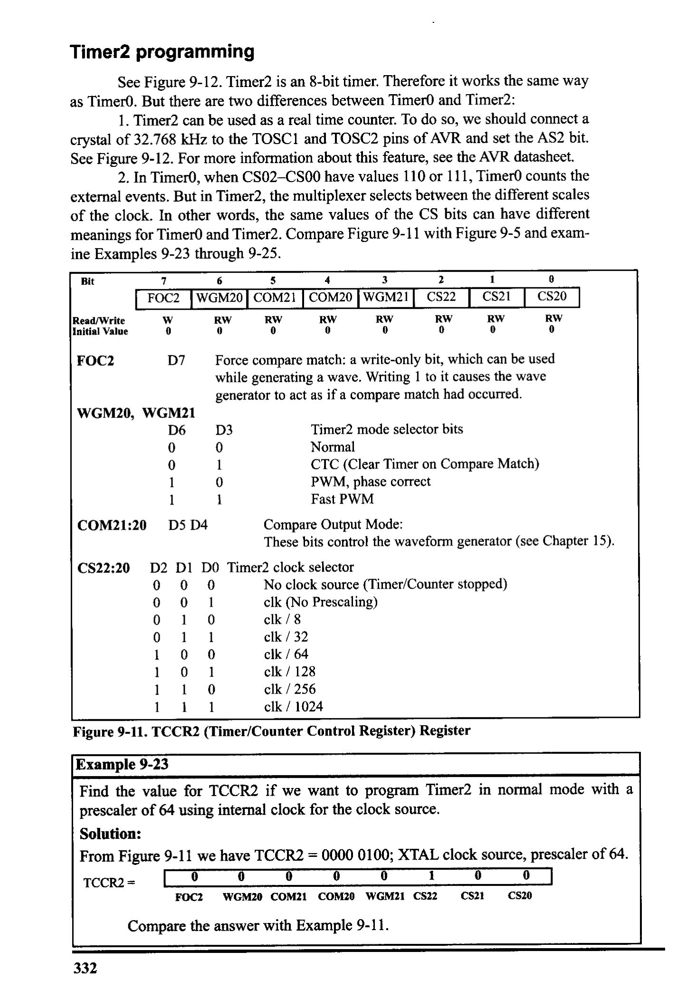
*Description*: Register specification diagram depicting individual bit flags, control register configurations, and functional definitions for Figure 9-11: TCCR2 (Timer/Counter Control Register) Register.

> **Figure 9-11: TCCR2 (Timer/Counter Control Register) Register**

Example 9-23
Find the value for TCCR2 if we want to program Timer2 in normal mode with a
prescaler of 64 using internal clock for the clock source.
Solution:
From Figure 9-11 we have TCCR2 = 0000 0100; XTAL clock source, prescaler of 64.
TCCR2 =
FOCZ WGM2® COM21 COM20 WGM21 CS22
cS21
CS20
Compare the answer with Example 9-11.
332


<!-- Page 345 -->
### [PDF Page 345]

Bit
6
5
4
3
2
1
AS2 TCNZUB |OCRUB|TCR2UB
AS2
When it is zero, Timer2 is clocked from elkyo. When it is set, Timer2 works as RTC.

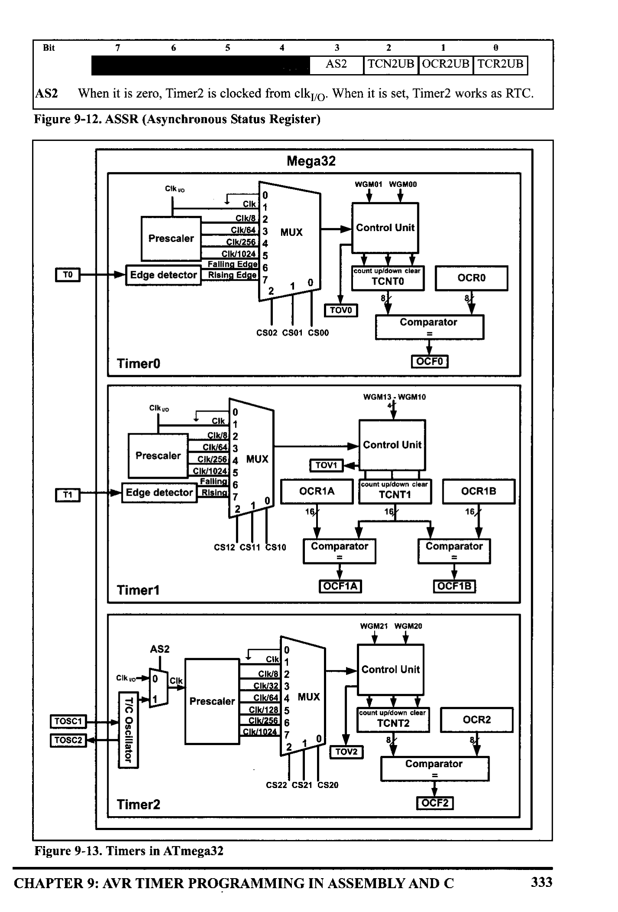
*Description*: Register specification diagram depicting individual bit flags, control register configurations, and functional definitions for Figure 9-12: ASSR (Asynchronous Status Register).

> **Figure 9-12: ASSR (Asynchronous Status Register)**

Mega32
Clk vo
WGM01 WGM00
Clk
1
CIK/8 2
CIK/64 3 MUX
Prescaler
CIk/256 4
Clk/1024 5
Falling Edge 6
Edge detector Rising Edge
7
2
1 0
• Control Unit
count up/down clear
TCNTO
OCRO
[rovo
Comparator
CS02 CS01 CS00
Timero
OCFO
WGM13 - WGM10
CIKvO
Prescaler
CIK 1
CIk/8 2
CIk/64 3
CIK/256 4 MUX
CIk/1024: 5
Control Unit
OCRIA
167
count up/down clear
TCNT1
161
OCR1B
162
CS12 CS11 CS10
Timer1
Comparator
OCTA
Comparator
WGM21 WGM20
AS2
CIKE
Prescaler
[TOSCT
[TOsc2
cillator
CIK 1
CIK/8 2
ÇIK/3Z 3
CIK/64 4 MUX
Clk/128 5
CIK/256 6
CIk/1024 7
2
1
• Control Unit
count up/down clear
TCNT2
OCR2
[TOV2
Comparator
CS22 CS21 CS20
Timer2
[CF2]


*Description*: Technical diagram and schematic illustration detailing hardware connection topology, signal routing, and circuit operation for Figure 9-13: Timers in ATmega32.

> **Figure 9-13: Timers in ATmega32**

CHAPTER 9: AVR TIMER PROGRAMMING IN ASSEMBLY AND C
333


<!-- Page 346 -->
### [PDF Page 346]

Example 9-24
Using a prescaler of 64, write a program to generate a delay of 1920 us. Assume XTAL
= 8 MHz.
Solution:
Timer clock = 8 MHz/64 = 125 kHz → Timer Period = 1 / 125 kHz = 8 us →
Timer Value = 1920 us / 8 us = 240
--- Timer2 Delay
DELAY: LDI
R20, - 240
; R20 = 0x10
OUT
TCNT2, R20
¡ load Timer2
IDI R20, 0×04
OUT
TCCR2, R20
AGAIN: IN
R2O, TIER
SBRS
R20, TOVZ
RJMP
;Timer2, Normal mode, int clk, prescaler 64
; read TIFR
¡ if TOV2 is set skip next instruction
AGAIN
LDI
R20, 0x0
OUT
ICCR2, R20
istop Timer2
LDI
R20, 1<<TOV2
OUT
TIFR, R20
¡ clear TOV2 flag
RET
Compare the above program with the DELAY subroutine in Example 9-12.
There are two differences between the two programs:
1. The register names are different. For example, we use TCNT2 instead of
TCNT 2. The values of TCRn are different for the same prescaler.
Example 9-25
Using CTC mode, write a program to generate a delay of 8 ms. Assume XTAL = 8 MHz.
Solution:
As XTAL = 8 MHz, the different outputs of the prescaler are as follows:
Prescaler
Timer Clock
Timer Period
Timer Value
None
8 MHz
1/8 MHz = 0.125 us
8 ms / 0.125 us = 64 k
8
8 MHz/8 = 1 MHz
1/1 MHz = 1 us
8 ms / 1 us = 8000
32
8 MHz/32 = 250 kHz
1/250 kHz = 4 us
8 ms / 4 us = 2000
64
8 MHz/64 = 125 kHz
1/125 kHz = 8 us
8 ms / 8 us = 1000
128
8 MHz/128 = 62.5 kHz
1/62.5 kHz = 16 us
8 ms / 16 us = 500
256
8 MHz/256 = 31.25 kHz
1/31.25 kHz = 32 us
8 ms / 32 us = 250
1024
8 MHz/1024 = 7.8125 kHz
1/7.8125 kHz= 128 us 8 ms / 128 us = 62.5
From the above calculation we can only use options Prescaler = 256 or Prescaler = 1024.
We should use the option Prescaler = 256 since we cannot use a decimal point. To wait
250 clocks we should load OCR2 with 250 - 1 = 249.
334


<!-- Page 347 -->
### [PDF Page 347]

Example 9-25 (Cont.)
TCCR2 =
FOCZ
i --
DELAY: LDI
R20, 0
OUT
TCNT2, R20
LDI
R20,249
OUT
OCRO, R20
LDI
R20, OX0E
OUT
TCCRO, R20
AGAIN: IN
R20, TIFR
SBRS
R20, OCF2
RJMP
AGAIN
LDI
R20, 0x0
OUT
ICCR2, R20
LDI
R20, 1<<OCF2
OUT
TIFR, R20
RET
WEMZO COMZI COMZO WEMSI C$22
CS21
CS20
--- Timer2 Delay
; TCNI2 = 0
; OCRO = 249
¡TimerO, CIC mode, prescaler = 256
¡ read TIFR
¡ if OCF2 is set skip next inst.
istop Timer2
¡ clear OCF2 flag
Timer1 programming
Timerl is a 16-bit timer and has lots of capabilities. Next, we discuss
Timerl and its capabilities.
Since Timerl is a 16-bit timer
its 16-bit register is split into two bytes.
ICR1H
ICR1L
These are referred to as TCNTIL
(Timerl low byte) and TCNTIH
(Timerl high byte). See Figure 9-15.
TCCRIA
TCCR1B
Timerl also has two control registers
named TCCRIA (Timer/counter 1 con-
OCR1BH
OCR1BL
trol register) and TCCRIB. The TOV1
(timer overflow) flag bit goes HIGH
-OCF1B
when overflow occurs. Timerl also has
the prescaler options of 1:1, 1:8, 1:64,
TCNT1H
TCNT1L
1:256, and 1:1024. See Figure 9-14 for
the Timerl block diagram and Figures
TOV1
* OCF1A
9-15 and 9-16 for TCCRI register
options. There are two OCR registers in
Timerl: OCRIA and OCRIB. There
There__ OCRIAH
OCRIAL
are two separate flags for each of the Figure 9-14. Simplified Diagram of Timer1
OCR registers, which act independent-
ly of each other. Whenever TCNT1 equals OCRIA, the OCFIA flag will be set on
TCNT1H
TCNT1L
D14 D13 D12
09
D7 D6
D4
• D1 DO

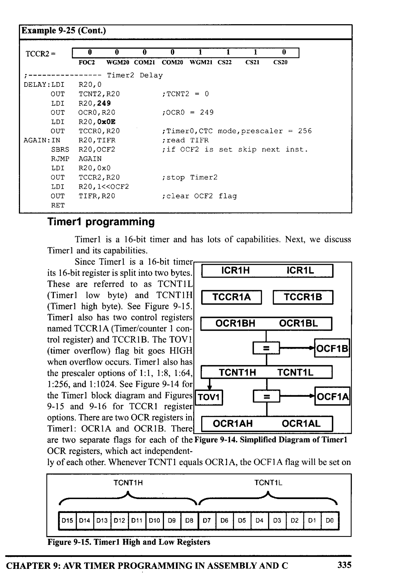
*Description*: Register specification diagram depicting individual bit flags, control register configurations, and functional definitions for Figure 9-15: Timerl High and Low Registers.

> **Figure 9-15: Timerl High and Low Registers**

CHAPTER 9: AVR TIMER PROGRAMMING IN ASSEMBLY AND C
335


<!-- Page 348 -->
### [PDF Page 348]

the next timer clock. When TCNT equals OCRIB, the OCF1B flag will be set on
the next clock. As Timerl is a 16-bit timer, the OCR registers are 16-bit registers
as well and they are made of two 8-bit registers. For example, OCRIA is made of
OCRIAH (OCRIA high byte) and OCRIAL (OCRIA low byte). For a detailed
view of Timerl see Figure 9-13.
The TIFR register contains the TOV1, OCFIA, and OCFIB flags. See

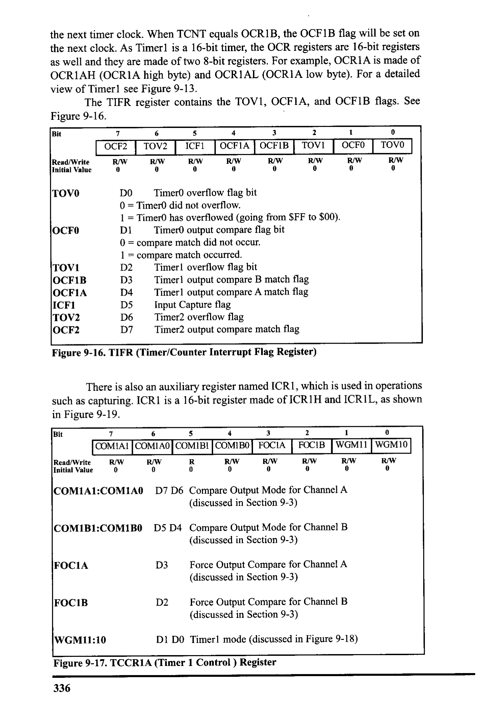
*Description*: Technical diagram and schematic illustration detailing hardware connection topology, signal routing, and circuit operation for Figure 9-16.

> **Figure 9-16**

Bit
Read/Write
Initial Value
7
OCF2
R/W
TOV2
R/W
5
ICF1
R/W
4
3
2
1
OFIA JOCFIB | TOVI OCFO
TOVO
RW
TOVO
OCFO
TOVI
OCF1B
OCFIA
ICF1
TOV2
OCF2
DO
Timer overflow flag bit
0 = Timer did not overflow.
1 = Timero has overflowed (going from SFF to $00).
DI
Timer output compare flag bit
0 = compare match did not occur.
1 = compare match occurred.
D2
Timerl overflow flag bit
D3
D4
Timerl output compare B match flag
Timerl output compare A match flag
DS
Input Capture flag
D6
Timer2 overflow flag
D7
Timer 2 output compare match flag


*Description*: Register specification diagram depicting individual bit flags, control register configurations, and functional definitions for Figure 9-16: TIFR (Timer/Counter Interrupt Flag Register).

> **Figure 9-16: TIFR (Timer/Counter Interrupt Flag Register)**

There is also an auxiliary register named ICR1, which is used in operations
such as capturing. ICR1 is a 16-bit register made of ICRIH and ICRIL, as shown
in Figure 9-19.
Bit
COMIAI COMIAO COMIBI COMBO FOCIA FOCIB WMII | WGMIO
RW
COMIAI:COMIAO D7 D6 Compare Output Mode for Channel A
(discussed in Section 9-3)
COMIBI:COMIBO DS D4 Compare Output Mode for Channel B
(discussed in Section 9-3)
FOCIA
D3
Force Output Compare for Channel A
(discussed in Section 9-3)
FOCIB
D2
Force Output Compare for Channel B
(discussed in Section 9-3)
WGM11:10
D1 DO Timerl mode (discussed in Figure 9-18)


*Description*: Register specification diagram depicting individual bit flags, control register configurations, and functional definitions for Figure 9-17: TCCRIA (Timer 1 Control) Register.

> **Figure 9-17: TCCRIA (Timer 1 Control) Register**

336


<!-- Page 349 -->
### [PDF Page 349]

Bit
7
6
ICNCI ICESI
R/W
5
-
4
3
2
WGM13WGM12
CS12
1
CS11
0
CSIO
TCCRIB
Read/Write
¡ Initial Value
ICNCI
D7
LICESI
D6
Input Capture Noise Canceler
0 = Input Capture is disabled.
1 = Input Capture is enabled.
Input Capture Edge Select
0 = Capture on the falling (negative) edge
1 = Capture on the rising (positive) edge
Not used
WGM13:WGM12
D4 D3 Timerl mode
Mode WGM13 WGM12 WGMI1| WGM10 Timer/Counter Mode of Operation Top
Update of TOV1 Flag
OCRIX
Set on
0
0
0
Normal
OxFFFF Immediate
MAX
0
1
PWM, Phase Correct, 8-bit
[OXOOFF
TOP
BOTTOM
PWM, Phase Correct, 9-bit
0x01FF
TOP
3
PWM, Phase Correct, 10-bit
|0x03FF
TOP
0
0
0
0
1
1
0
CTC
OCRIA Immediate
5
6
7
8
9
10
11
12
13
14
15
CS12:CS10
Fast PWM, 8-bit
0x00FF
TOP
Fast PWM, 9-bit
0x01FF
TOP
Fast PWM, 10-bit
0x03FF
TOP
MAX
TOP
TOP
TOP
0
0
0
0
0
0
PWM, Phase and Frequency Correct ICR1
PWM, Phase and Frequency Correct OCRIA BOTTOM BOTTOM
PWM, Phase Correct
ICRI
TOP
PWM, Phase Correct
OCRIA
TOP
1
0
0
0
CTC
ICRI Immediate
BOTTOM
BOTTOM
MAX
Reserved
-
1
1
Fast PWM
ICRI
1
Fast PWM
OCRIAl
TOP
TOP
TOP
TOP
D2D1D0
0 0 0
0
1
0
Timerl clock selector
No clock source (Timer/Counter stopped)
clk (no prescaling)
1
clk / 8
clk / 64
clk / 256
clk / 1024
-
-
0
External clock source on T1 pin. Clock on falling edge.
1
External clock source on T1 pin. Clock on rising edge.

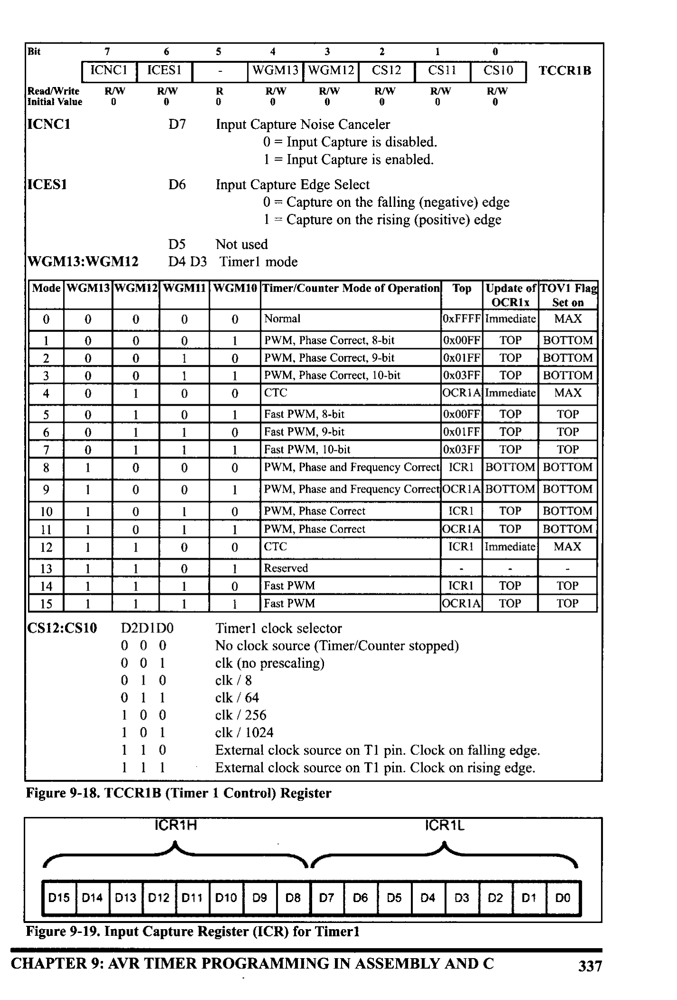
*Description*: Register specification diagram depicting individual bit flags, control register configurations, and functional definitions for Figure 9-18: TCCRIB (Timer 1 Control) Register.

> **Figure 9-18: TCCRIB (Timer 1 Control) Register**

ICRTH
TCR1L
D15
D14
D11
D10
D7 | D6
D5
DZ| D1
DO


*Description*: Register specification diagram depicting individual bit flags, control register configurations, and functional definitions for Figure 9-19: Input Capture Register (ICR) for Timer1.

> **Figure 9-19: Input Capture Register (ICR) for Timer1**

CHAPTER 9: AVR TIMER PROGRAMMING IN ASSEMBLY AND C
337


<!-- Page 350 -->
### [PDF Page 350]

WGM13:10
The WGM13, WGM12, WGM11, and WGM10 bits define the mode of
Timerl, as shown in Figure 9-18. Timerl has 16 different modes. One of them
(mode 13) is reserved (not implemented). In this chapter, we cover mode 0
(Normal mode) and mode 4 (CTC mode). The other modes will be covered in
Chapters 15 and 16.
Timer1 operation modes
Normal mode (WGM13:10 = 0000)
In this mode, the timer counts up until it reaches SFFFF (which is the max-
imum value) and then it rolls over from SFFFF to 0000. When the timer rolls over
from $FFFF to 0000, the TOV1 flag will be set. See Figure 9-20 and Examples
9-26 and 9-27. In Example 9-27, a delay is generated using Normal mode.
TCNT1
$FFFF-
0
time
TOV1 = 1
TOV1 = 1


*Description*: Technical diagram and schematic illustration detailing hardware connection topology, signal routing, and circuit operation for Figure 9-20: TOV in Normal and Fast PWM.

> **Figure 9-20: TOV in Normal and Fast PWM**

TOV1 = 1
TOV1 = 1
TOV1 = 1
CTC mode (WGM13:10 = 0100)
In mode 4, the timer counts up until the content of the TCNT1 register
becomes equal to the content of OCRIA (compare match occurs); then, the timer
will be cleared when the next clock occurs. The OCF1A flag will be set as a result
of the compare match as well. See Figure 9-21 and Examples 9-28 and 9-29.
TCNT1
$FFFF
OCRIA+ -
0
wwww
time
OCF1A = 1%
OCF1A = 14
OCF1A = 14
OCFIA =14
OCF1A = 14
OCF1A = 14
OCF1A = 14

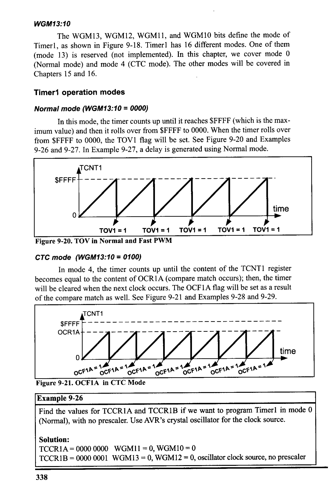
*Description*: Technical diagram and schematic illustration detailing hardware connection topology, signal routing, and circuit operation for Figure 9-21: OCFIA in CTC Mode.

> **Figure 9-21: OCFIA in CTC Mode**

Example 9-26
Find the values for TCCRIA and TCCR1B if we want to program Timerl in mode 0
(Normal), with no prescaler. Use AVR's crystal oscillator for the clock source.
Solution:
TCCRIA = 0000 0000 WGMI1 = 0, WGM10 = 0
TCCRIB = 0000 0001 WGMI3 = 0, WGM12 = O, oscillator clock source, no prescaler
338


<!-- Page 351 -->
### [PDF Page 351]

Example 9-27
Find the frequency of the square wave generated by the following program if XTAL =
8 MHz. In your calculation do not include the overhead due to instructions in the loop.
• INCLUDE "M32DEF.INC"
INITSTACK
¡add its definition from Example 9-3
LDI
R16, 0x20
SBI
DDRB, 5
; PB5 as an output
LDI
R17, 0
OUT
PORTB, R17
; PB5 = 0
BEGIN: RCALL
DELAY
EOR
R17, R16
OUT
PORTB, R17
¡toggle D5 of R17
; toggle PB5
RJMP
BEGIN
--- Timerl delay
DELAY: LDI
OUT
IDI
OUT
LDI
OUT
LDI
OUT
AGAIN: IN
SBRS
RJMP
LDI
OUT
LDI
OUT
RET
R20, 0xD8
TCNT1H, R20
; TCNT1H = 0xD8
R20, OXFO
ICNT1L, R2O
¡ ICNTIL = 0xF0
R20, 0X00
ICCRIA, R20
; WGM11:10 = 00
R20, 0x01
TCCRIB, R20
R20, TIFR
R20, TOVI
;WGM13:12 = 00, Normal mode, prescaler = 1
¡ read TIFR
¡ if TOV1 is
set skip next instruction
AGAIN
R20, 0x00
TCCRIB, R20
i stop Timerl
R20,0x04
TIFR, R20
¡ clear TOVI flag
Solution:
WGM13:10 = 0000 = 0x00, so Timerl is working in mode 0, which is Normal mode,
and the top is OxFFFF.
FFFF + 1 - D&FO = 0x2710 = 10,000 clocks, which means that it takes 10,000 clocks.
As XTAL = 8 MHz each clock lasts 1/(8M) = 0.125 us and delay = 10,000 × 0.125 us
= 1250 us = 1.25 ms and frequency = 1 / (1.25 ms × 2) = 400 Hz.
In this calculation, the overhead due to all the instructions in the loop is not included.
Notice that instead of using hex numbers we can use HIGH and LOW directives, as
shown below:
LDI
OUT
LDI
OUT
R20, HIGH (65536-10000)
TCNT1H, R20
; TCNT1H = 0xD8
R2O, IOW (65536-10000)
ICNT1L, R20 ; TCNTIL = OxFO
¡load Timerl high byte
¡load Timerl low byte
or we can simply write it as follows:
LDI
OUT
LDI
OUT
R20, HIGH (-10000)
ICNT1H, R20 ; TCNT1H = 0xD8
R20, LOW (-10000)
TCNT1L, R20 ;TCNTIL = OxFO
¡load Timerl high byte
¡load Timerl low byte
CHAPTER 9: AVR TIMER PROGRAMMING IN ASSEMBLY AND C
339


<!-- Page 352 -->
### [PDF Page 352]

Example 9-28
Find the values for TCCRIA and TCCRIB if we want to program Timerl in mode 4
(CTC, Top = OCRIA), no prescaler. Use AVR's crystal oscillator for the clock source.
Solution:
TCCRIA = 0000 0000 WGMI1 = 0, WGM10 = 0
TCCRIB = 0000 1001 WGM13 = 0, WGM12 = 1, oscillator clock source, no prescaler
Example 9-29
Find the frequency of the square wave generated by the following program if XTAL =
8 MHz. In your calculation do not include the overhead due to instructions in the loop.
• INCLUDE "M32DEF.INC"
SBI
DDRB, 5
BEGIN: SBI
PORTB, 5

```assembly
RCALL DELAY
```

CBI
PORTB, 5

```assembly
RCALL DELAY
```

RUMP BEGIN
--- Timerl delay
DELAY: LDI
R20, 0x00
OUT
OUT
TCNT1H, R20
ICNTIL, R20
LDI
R20,0
OUT
OCRIAH, R2O
IDI R20, 159
OUT
OCRIAL, R20
LDI
OUT
R2O, 0x0
ICCRIA, R20
LDI
R20, 0×09
OUT
ICCR1B, R20
AGAIN: IN
R20, TIFR
SBRS C
R20, OCFIA
RUMP AGAIN
IDI
R2O, 1<<OCF1A
OUT
TIFR, R2O
LDI
R19,0
OUT
ICCRIB, R19
OUT
TCCRIA, R19
RET
; PB5 as an output
; PB5 = 1
; PB5 = 0
; TCNT1 = 0
¡OCRIA = 159 = 0×9F
; WGM11:10 = 00
;WGM13:12 = 01, CIC mode, prescaler = 1
; read TIFR
¡if OCF1A is set skip next instruction
¡clear OCFIA flag
i stop timer
Solution:
WGM13:10 = 0100 = 0x04 therefore, Timerl is working in mode 4, which is a CTC
mode, and max is defined by OCRIA.
159 + 1 = 160 clocks
XTAL = 8 MHz, so each clock lasts 1/(8M) = 0.125 us.
Delay = 160 × 0.125 us = 20 us and frequency = 1/ (20 us × 2) = 25 kHz.
In this calculation, the overhead due to all the instructions in the loop is not included.
340


<!-- Page 353 -->
### [PDF Page 353]

Accessing 16-bit registers
The AVR is an 8-bit microcontroller, which means it can manipulate data
8 bits at a time, only. But some Timerl registers, such as TCNTI, OCRIA, ICRI,
and so on, are 16-bit; in this case, the registers are split into two 8-bit registers, and
each one is accessed individually. This is fine for most cases. For example, when
we want to load the content of SP (stack pointer), we first load one half and then
the other half, as shown below:
LDI
R16, 0x12
OUT
SPL, R16
LDI
R16, 0x34
OUT
SPH, R16
; SP = 0x3412
In 16-bit timers, however, we should read/write the entire content of a reg-
ister at once, otherwise we might have problems. For example, imagine the follow-
ing scenario:
The TCNT1 register contains 0x15FF. We read the low byte of TCNT1,
which is OxFF, and store it in R20. At the same time a timer clock occurs, and the
content of TCNT1 becomes Ox 1600; now we read the high byte of TCNT1, which
is now 0x16, and store it in R21. If we look at the value we have read, R21:R20 =
0x16FF. So, we believe that TCNT1 contains Ox 16FF, although it actually contains
0x15FF.
This problem exists in many 8-bit microcontrollers. But the AVR design-
ers have resolved this issue with an 8-bit register called TEMP, which is used as a
buffer. See Figure 9-22. When we write or read the high byte of a 16-bit register,
the value will be written into the TEMP register. When we write into the low byte
of a 16-bit register, the content of TEMP will be written into the high byte of the
16-bit register as well. For example, consider the following program:
LDI
R16, 0x15
OUT
TCNTIH, R16
¡store 0x15 in TEMP of Timerl
LDI
R16, OXFF
OUT
TCNT1I, R16
¡ TCNTIL = R16, TCNTIH = TEMP
Data bus (8-bit)
TEMP (8-bit)
OCR1xH (8-bit) OCR1xL (8-bit)
OCR1x (16-bit Register)
TCNT 1H (8-bit) TCNT1L (8-bit)
TCNT1 (16-bit Counter)
OCR1xH buf.
OCR1xL buf.
OCR1x buffer (16-bit Register)
Note: OCR1x is OCRIA or OCR1B

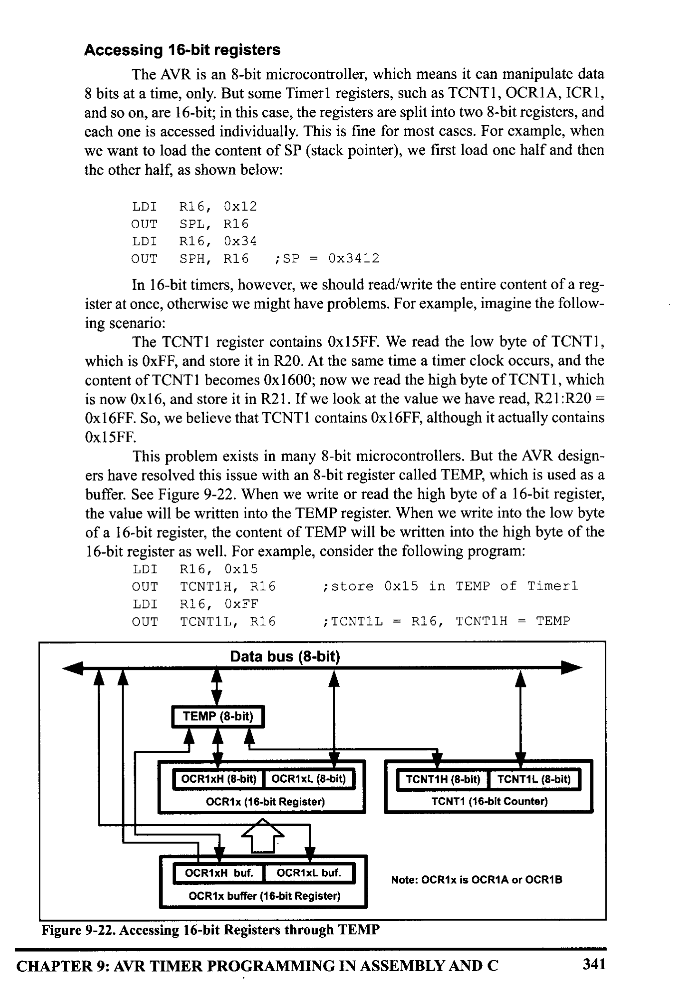
*Description*: Register specification diagram depicting individual bit flags, control register configurations, and functional definitions for Figure 9-22: Accessing 16-bit Registers through TEMP.

> **Figure 9-22: Accessing 16-bit Registers through TEMP**

CHAPTER 9: AVR TIMER PROGRAMMING IN ASSEMBLY AND C
341


<!-- Page 354 -->
### [PDF Page 354]

After the execution of "OUT TCNTIH, R16", the content of R16, 0x15,
will be stored in the TEMP register. When the instruction "OUT TCNTIL, R16"
is executed, the content of R16, OxFF, is loaded into TCNTIL, and the content of
the TEMP register, 0x15, is loaded into TCNTIH. So, Ox15FF will be loaded into
the TCNT1 register at once.
Notice that according to the internal circuitry of the AVR, we should first
write into the high byte of the 16-bit registers and then write into the lower byte.
Otherwise, the program does not work properly. For example, the following code:
LDI
OUT
LDI
OUT
R16, OXFF
TCNT1L, R16
R16, 0x15
ICNTIH, R16
; TCNTIL = R16, ICNT1H = TEMP
¡store 0x15 in TEMP of Timer1
does not work properly. This is because, when the TCNTIL is loaded, the content
of TEMP will be loaded into TCNTIH. But when the TCNTIL register is loaded,
TEMP contains garbage (improper data), and this is not what we want.
When we read the low byte of 16-bit registers, the content of the high byte
will be copied to the TEMP register. So, the following program reads the content
of TCNT1:
IN
IN
R2O, ICNTIL
R21, TCNTIH
;R2O = TCNTIL, TEMP = ICNTI#
; R21 = TEMP Of Timerl
We must pay attention to the order of reading the high and low bytes of the
16-bit registers. Otherwise, the result is erroneous.
Notice that reading the OCRIA and OCRIB registers does not involve
using the temporary register. You might be wondering why. It is because the AVR
microcontroller does not update the content of OCRIA nor OCRIB unless we
update them. For example, consider the following program:
IN
IN
R2O, OCRIAL
R21, OCRIAH
; R20 = OCRIL
;R21 = OCRIH
The above code reads the low byte of the OCRIA and then the high byte,
and between the two readings the content of the register remains unchanged. That
is why the AVR does not employ the TEMP register while reading the OCRIA/
OCRIB registers.
Examine Examples 9-29 through 9-31 to see how to generate time delay in
different modes.
342


<!-- Page 355 -->
### [PDF Page 355]

Example 9-30
Assuming XTAL = 8 MHz, write a program that toggles PBS once per millisecond.
Solution:
XTAL = 8 MHz means that each clock takes 0.125 us. Now for 1 ms delay, we need
1 ms/0.125 us = 8000 clocks = 0x1F40 clocks. We initialize the timer so that after 8000
clocks the OCFIA flag is raised, and then we will toggle the PBS.
• INCLUDE "M32DEF. INC"
LDI
R16, HIGH (RAMEND)
OUT
SPH, R16
IDI
R16, LOW (RAMEND)
OUT
SPL, R16
SBI
DDRB, 5
BEGIN: SBI
PORTB, 5
¡ initialize the stack
; PB5 as an output
; PB5 = 1

```assembly
RCALL DELAY_Ims
CBI PORTB, 5
; PB5 = 0
RCALL DELAY _Ims
RJMP BEGIN
```

Timerl delay
DELAY_1ms:
IDI
OUT
OUT
R20, 0x00
TCNT1H, R20
TCNTIL, R20
; TEMP = C
; ICNTIL = 0, ICNT1H = TEME
LDI
OUT
IDI
OUT
R20, HIGH (8000-1)
OCRIAH, R20
R20, LOW (8000-1)
OCRIAL, R20
; TEMP = Ox1F
¡OCRIAL = Ox3F, OCRIAH = TEMP
IDI
R20, 0x0
OUT
ICCRIA, R20
IDI
R20, 0x09
OUT
ICCRIB, R20
AGAIN:
IN
R2O, TIER
SBRS
R20, OCFIA
RJMP
LDI
AGAIN
R20, 1<<OCF1A
OUT
TIFR, R2O
LDI
R19,0
OUT
ICCR1B, R19
OUT
ICCRIA, R19
RET
; WGM11:10 = 00
; WGM13:12 = 01, CTC mode, CS = 1
¡ read TIFR
¡if OCFIA is set skip next instruction
i clear OCFIA flag
; stop timer
TCNT1
65535-
OCR1A=7999---
---
0
Time
3000'
clocks
CHAPTER 9: AVR TIMER PROGRAMMING IN ASSEMBLY AND C
343


<!-- Page 356 -->
### [PDF Page 356]

Example 9-31
Rewrite Example 9-30 using the TOV1 flag.
Solution:
To wait 1 ms we should load the TCNT register so that it rolls over after 8000 =
Ox1F40 clocks. In Normal mode the top value is 0xFFFF = 65535.
65535 + 1-8000 = 57536 = 0xEOCO. Thus, we should load TCNTI with 57536, or
OxEOCO in hex, or we can simply use 65536 - 8000, as shown below:
• INCLUDE "M32DEF.INC"
LDI
R16, HIGH (RAMEND)
¡initialize stack pointer
OUT
SPH, R16
IDI
R16, LOW (RAMEND)
OUT
SPI, R16
SBI
DDRB, 5
BEGIN: SBI
PORTB, 5
; PB5 as an output
; PB5 = 1
RCALL
DELAY_Ims
CBI
PORTB, 5
; PB5 = 0

```assembly
RCALL DELAY
```

_Ims

```assembly
RJMP BEGIN
```

-Timerl delay
DELAY
_Ims:
LDI
OUT
LDI
OUT
LDI
OUT
LDI
OUT
AGAIN:
R20, HIGH (65536-8000)
¡R20 = high byte of 57536
TCNT1H, R20
¡ TEMP = 0XE0
R20, LOW (65536-8000)
;R20 = Iow byte of 57536
TCNT1L, R20
; TCNTIL = 0xC1, TCNTIH = TEMP
R20, 0x0
ICCRIA, R20
; WGM11:10 = 00
R20, 0x1
TCCRIB, R20
;WGM13:12 = 00, Normal mode, CS = 1
IN
R20, TIFR
SBRS R20, TOVI
; read TIER
¡if OCFIA is set skip next instruction
RUMP AGAIN
LDI
R20, 1<<TOV1
OUT
TIER, R20
¡clear TOV1 flag
LDI
R19,0
OUT
ICCRIB, R19
i stop timer
OUT
ICCRIA, R19
RET
TCNT1
FFFF -
----
EOC1
0
1
"8000"
clocks
time
344


<!-- Page 357 -->
### [PDF Page 357]

PSR10-
clko-
0
clk/256
clk/1024
Clear 10-bit T/C Prescaler
- T1
CS10-
CS11-
CS12-
1
2
3
4
5
6 7
Timer/Counter1 clock
source

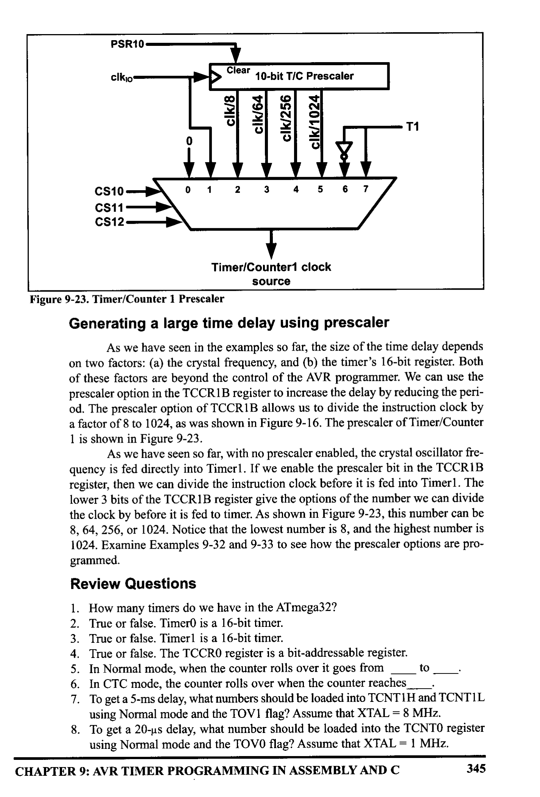
*Description*: Technical diagram and schematic illustration detailing hardware connection topology, signal routing, and circuit operation for Figure 9-23: Timer/Counter 1 Prescaler.

> **Figure 9-23: Timer/Counter 1 Prescaler**

Generating a large time delay using prescaler
As we have seen in the examples so far, the size of the time delay depends
on two factors: (a) the crystal frequency, and (b) the timer's 16-bit register. Both
of these factors are beyond the control of the AVR programmer. We can use the
prescaler option in the TCCR1B register to increase the delay by reducing the peri-
od. The prescaler option of TCCR 1B allows us to divide the instruction clock by
a factor of 8 to 1024, as was shown in Figure 9-16. The prescaler of Timer/Counter
1 is shown in Figure 9-23.
As we have seen so far, with no prescaler enabled, the crystal oscillator fre-
quency is fed directly into Timerl. If we enable the prescaler bit in the TCCRIB
register, then we can divide the instruction clock before it is fed into Timerl. The
lower 3 bits of the TCCRIB register give the options of the number we can divide
the clock by before it is fed to timer. As shown in Figure 9-23, this number can be
8, 64, 256, or 1024. Notice that the lowest number is 8, and the highest number is
1024. Examine Examples 9-32 and 9-33 to see how the prescaler options are pro-
grammed

### Review Questions

1. How many timers do we have in the ATmega32?
2. True or false. Timer0 is a 16-bit timer.
3. True or false. Timerl is a 16-bit timer.
4. True or false. The TCCRO register is a bit-addressable register.
5. In Normal mode, when the counter rolls over it goes from
to _
6. In CTC mode, the counter rolls over when the counter reaches
7. To get a 5-ms delay, what numbers should be loaded into TCNTIH and TCNTIL
using Normal mode and the TOV1 flag? Assume that XTAL = 8 MHz.
8. To get a 20-us delay, what number should be loaded into the TCNTO register
using Normal mode and the TOVO flag? Assume that XTAL = 1 MHz.
CHAPTER 9: AVR TIMER PROGRAMMING IN ASSEMBLY AND C
345


<!-- Page 358 -->
### [PDF Page 358]

Example 9-32
An LED is connected to PC4. Assuming XTAL = 8 MHz, write a program that toggles
the LED once per second.
Solution:
As XTAL = 8 MHz, the different outputs of the prescaler are as follows:
Scaler
None
8
64
256
1024
Timer Clock
Timer Period
Timer Value
8 MHz
1/8 MHz = 0.125 us
1 s/0.125 uS = 8 M
8 MHz/8 = 1 MHz
1/1 MHz = 1 us
1 s/1 us = 1 M
8 MHz/64 = 125 kHz
1/125 kHz = 8 us
1 s/8 us = 125,000
8 MHz/256 = 31.25 kHz
1/31.25 kHz = 32 us
1 s/32 us = 31,250
8 MHz/1024 = 7.8125 kHz 1/7.8125 kHz = 128 us 1 s/128 us = 7812.5
From the above calculation we can use only options 256 or 1024. We should use option
256 since we cannot use a decimal point.
• INCLUDE "M32DEF.INC"
R16, HIGH (RAMEND)
¡initialize stack pointer
SPH, R16
LDI
OUT
R16, LOW (RAMEND)
SPI, R16
SBI
DDRC, 4
BEGIN: SBI
PORTC, 4
; PC4 as an output
; PC4 = 1

```assembly
RCALL DELAY_Is
```

CBI
PORTC, 4
; PC4 = 0

```assembly
RCALL DELAY_Is
RJMP BEGIN
```

Timerl delay
DELAY_1s:
LDI
R20, HIGH (31250-1)
OUT
OCRIAH, R20
; TEMP = $7A (since 31249 = $7A11)
LDI
R20, IOW (31250-1)
OUT
OCRIAL, R20
LDI
OUT
R20,0
¡OCRIAL = $11 (since 31249 = $7A11)
TCNT1H, R20
OUT
TCNT1L, R20
LDI
R20, 0x00
OUT
ICCRIA, R20
; TEMP = 0x00
; ICNT1L = 0x00, TCNTIH = TEMP
; WGM11:10 = 00
LDI
R20, 0x4
OUT
TCCRIB, R20
AGAIN: IN
R20, TIFR
SBRS
R20, OCFIA
;WGM13:12 = 00, Normal mode, CS = CLK/256
¡ read TIFR
¡if OCFIA is set skip next instruction

```assembly
RJMP AGAIN
```

IDI
OUT
R20, 1<<OCF1A
TIFR, R20
i clear OCFIA flag
LDI
R19,0
OUT
OUT
ICCRIB, R19
; stop timer
ICCRIA, R19
RET
346


<!-- Page 359 -->
### [PDF Page 359]

Example 9-33
Assuming XTAL = 8 MHz, write a program to generate 1 Hz frequency on PC4.
Solution:
With 1 Hz we have T = 1 / F = 1/1 Hz = 1 second, half of which is high and half low.
Thus we need a delay of 0.5 second duration.
Since XTAL = 8 MHz, the different outputs of the prescaler are as follows:
Scaler
None
8
64
256
1024
Timer Clock
Timer Period
Timer Value
8 MHz
1/8 MHz = 0.125 us

## 0.5 s/0.125 us = 4 M

8 MHz/8 = 1 MHz
1/1 MHz = 1 us

## 0.5 s/1 us = 500 k

8 MHz/64 = 125 kHz
1/125 kHz = 8 us

## 0.5 s/8 uS = 62,500

8 MHz/256 = 31.25 kHz
1/31.25 kHz = 32 us

## 0.5 s/32 us = 15,625

8 MHz/1024 = 7.8125 kHz 1/7.8125 kHz = 128 us 0.5 s/128 us = 3906.25
From the above calculation we can use options 64 or 256. We choose 64 in this
Example.
• INCLUDE "M32DEF.INC"
LDI
R16, HIGH (RAMEND) ; initialize stack pointer
OUT
SPH, R16
IDI
R16, LOW (RAMEND)
OUT
SPL, R16
SBI
DDRC, 4
BEGIN: SBI
PORTC, 4
; PC4 as an output
; PC4 = 1

```assembly
RCALL DELAY_1s
CBI PORTC, 4
; PC4 = 0
RCALL DELAY_Is
```

RIMP BEGIN
Timerl delay
DELAY _1s:
LDI
R20, HIGH (62500-1)
OUT
OCRIAH, R20
¡ TEMP = $F4 (since 62499 = $F423)
IDI
R20, LOW (62500-1)
OUT
OCRIAL, R20
¡OCRIAL = $23 (since 62499 = $F423)
IDI
R20, 0x00
OUT
ICNT1H, R20
OUT
TCNT1L, R20
; TEMP = 0×00
¡ TCNTIL = 0x00, ICNT1H = TEMP
LDI
R20, 0×00
OUT
ICCRIA, R20
LDI
R20, 0×3
OUT
TCCR1B, R20
AGAIN: IN
R20, TIFR
SBRS
R20, OCF1A
; WGM11:10 = 00
; WGM13:12 = 00, Normal mode, CS = CLK/64
; read TIFR
¡if OCFlA is set skip next instruction
RJMP
AGAIN
LDI
R20, 1<<OCE1A
OUT
TIFR, R20
i clear OCFIA flag

```assembly
LDI R19,0
```

OUT
TCCRIB, R19
i stop timer
OUT
ICCRIA, R19
RET
CHAPTER 9: AVR TIMER PROGRAMMING IN ASSEMBLY AND C
347


<!-- Page 360 -->
### [PDF Page 360]


## SECTION 9.2: COUNTER PROGRAMMING

In the previous section, we used the timers of the AVR to generate time
delays. The AVR timer can also be used to count, detect, and measure the time of
events happening outside the AVR. The use of the timer as an event counter is cov-
ered in this section. When the timer is used as a timer, the AVR's crystal is used as
the source of the frequency. When it is used as a counter, however, it is a pulse out-
side the AVR that increments the TCNTx register. Notice that, in counter mode,
registers such as TCCR, OCRO, and TCNT are the same as for the timer discussed
in the previous section; they even have the same names.
CS00, CS01, and CS02 bits in the TCCRO register
Recall from the previous section that the CS bits (clock selector) in the
TCCRO register decide the source of the clock for the timer. If CS02:00 is between
1 and 5, the timer gets pulses from the crystal oscillator. In contrast, when CS02:00
is 6 or 7, the timer is used as a counter and gets its pulses from a source outside
the AVR chip. See Figure 9-24. Therefore, when CS02:00 is 6 or 7, the TCNTO
counter counts up as pulses are fed from pin TO (Timer/Counter O External Clock
input). In ATmega32/ATmega16, TO is the alternative function of PORTB.O. In the
Clk
WGM01 WGMOO
1
CIk/8
CIk/64 3 MU:
Prescaler
CIk/256 4
Cık/10245
Falling Edge 6
Edge detector I
Rising Edge
2
• Control Unit
1°
count up/down clear
TCNTO
OCRO
TOVO
Comparator
CS02 CS01 CS00
Timero
CIk
Prescaler
Edge detector
Clk/8
CIK/64 3
Clk/256 4 MUX
CIK/10245
Falling
Rising
1
0
CS12 CS11 CS10
[TOVT-
OCRIA
WANTS WAMO
Control Unit
count upidown clear
TCNT1
161
Comparator
OCF1A
OCRIB
16,
Comparator
OCF1B
Timert

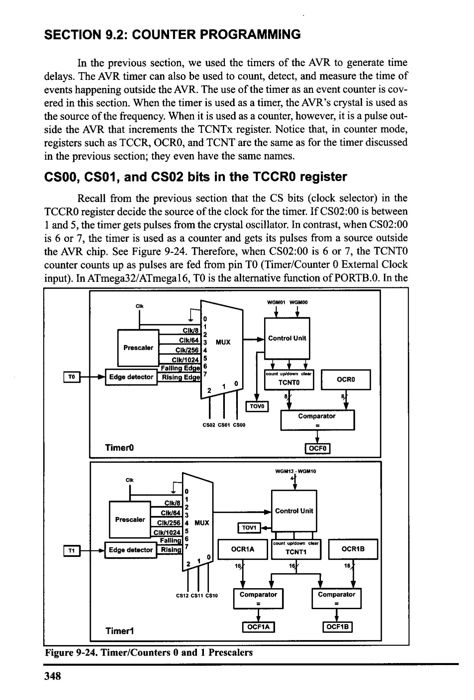
*Description*: Technical diagram and schematic illustration detailing hardware connection topology, signal routing, and circuit operation for Figure 9-24: Timer/Counters 0 and 1 Prescalers.

> **Figure 9-24: Timer/Counters 0 and 1 Prescalers**

348


<!-- Page 361 -->
### [PDF Page 361]

Example 9-34
Find the value for TCCRO if we want to program Timer as a Normal mode counter.
Use an external clock for the clock source and increment on the positive edge.
Solution:
TCCRO = 0000 0111 Normal, external clock source, no prescaler
case of TimerO, when CS02:00 is 6 or 7, pin TO provides the clock pulse and the
counter counts up after each clock pulse coming from that pin. Similarly, for
Timerl, when CS12:10 is 6 or 7, the clock pulse coming in from pin TI
(Timer/Counter 1 External Clock input) makes the TCNT| counter count up.
When CS12:10 is 6, the counter counts up on the negative (falling) edge. When
CS12:10 is 7, the counter counts up on the positive (rising) edge. In
ATmega32/ATmega16, T1 is the alternative function of PORTB.1. See Example
9-34.
In Example 9-35, we are using Timer as an event counter that counts up
as clock pulses are fed into PBO. These clock pulses could represent the number of
people passing through an entrance, or of wheel rotations, or any other event that
can be converted to pulses.
Example 9-35
Assuming that a 1 Hz clock pulse is fed into pin TO (PBO), write a program for Countero
in normal mode to count the pulses on falling edge and display the state of the TCNTO
count on PORTC.
Solution:
• INCLUDE "M32DEF.INC"
CBI
DDRB, O
LDI
R2O, OXFF
OUT
DDRC, R20
LDI
R20, 0x06

```assembly
OUT ICCRO, R20
AGAIN:
```

IN
R2O, ICNTO
OUT
PORTC, R20
IN
R16, TIFR
SBRS R16, TOVO

```assembly
RJMP AGAIN
```

LDI
R16, 1<<TOVO
OUT
TIER,
R16
RUMP AGAIN
; make TO (PBO) input
¡ make PORIC output
; counter, falling edge
¡ PORIC = ICNTO
¡ monitor TOVO flag
¡keep doing if Timer0 flag is 1ow
¡clear TOVO flag
¡ keep doing it
ATmega32
PORTC
to
LEDs
PORTC is connected to 8 LEDs
and input TO (PBO) to 1 Hz pulse.
- PBO
TO
CHAPTER 9: AVR TIMER PROGRAMMING IN ASSEMBLY AND C
349


<!-- Page 362 -->
### [PDF Page 362]

In Example 9-35, the TCNTO data was displayed in binary. In Example
9-36, the TCNTO register is extended to a 16-bit counter using the TOVO flag. See
Examples 9-37 and 9-38.
As another example of the application of the counter, we can feed an exter-
nal square wave of 60 Hz frequency into the timer. The program will generate the
second, the minute, and the hour out of this input frequency and display the result
on an LCD. This will be a nice looking digital clock, although not a very accurate
one.
Before we finish this section, we need to state an important point. You
might think monitoring the TOV and OCR flags is a waste of the microcontroller's
time. You are right. There is a solution to this: the use of interrupts. Using inter-
rupts enables us to do other things with the microcontroller. When a timer Interrupt
flag such as TOVO is raised it will inform us. This important and powerful feature
of the AVR is discussed in Chapter 10.
Example 9-36
Assuming that a 1 Hz clock pulse is fed into pin TO, use the TOVO flag to extend Timero
to a 16-bit counter and display the counter on PORTC and PORTD.
Solution:
• INCLUDE "M32DEF.INC"

```assembly
LDI R19,0
CBI DDRB, O
; R19 = 0
```

i make TO (PBO) input

```assembly
LDI R2O, OXFF
OUT DDRC, R20
OUT DDRD, R20
```

¡ make PORTC output
i make PORTD output
IDI R2O, 0x06

```assembly
OUT ICCRO, R20
```

¡counter, falling edge
AGAIN:
IN
R2O, ICNTO
OUT
PORTC, R20
¡ PORTC = ICNTO
IN
R16, TIFR
SBRS R16, IOVO

```assembly
RJMP AGAIN
LDI R16, 1<<TOVO
```

i keep doing it
¡ clear TOVO flag

```assembly
OUT TIFR, R16
```

INC
R19
;R19 = R19 + 1

```assembly
OUT PORTD, R19 ; PORTD
= R19
```

RUMP AGAIN
i keep doing it
ATmega32
PORTC and PORTD are connected to 16 LEDs
and input TO (PBO) to 1 Hz pulse.
PORTCE
PORTD.
PBO
TO
to
LEDs
350


<!-- Page 363 -->
### [PDF Page 363]

Example 9-37
Assuming that clock pulses are fed into pin T1 (PB1), write a program for Counterl in
Normal mode to count the pulses on falling edge and display the state of the TCNTI
count on PORTC and PORTD.
Solution:
• INCLUDE "M32DEF.INC"
CBI
IDI
OUT
DDRB, 1
R2O, OXFF
DDRC, R20
DDRD, R20
R20, 0x0
OUT
IDI
ICCRIA, R20
R20, 0×06
ICCR1B, R20
AGAIN:
IN
R2O, ICNTIL
OUT
PORTC, R20
IN
R20, ICNT1H
OUT
PORTD, R20
IN
R16, TIFR
SBRS R16, TOVI

```assembly
RJMP AGAIN
```

IDI R16, 1<<IOV1

```assembly
OUT TIFR, R16
```

RIMP AGAIN
; make I1 (PB1) input
; make PORIC output
¡ make PORTD output
¡counter, falling edge
;R20 = TCNTIL, TEMP = ICNTIH
¡ PORIC = ICNTO
; R20 = TEMP
¡ PORTD = ICNTO
i keep doing it
¡clear TOVI flag
i keep doing it
ATmega32
PORTC
PORTD
-PB1 (T1)
CHAPTER 9: AVR TIMER PROGRAMMING IN ASSEMBLY AND C
351


<!-- Page 364 -->
### [PDF Page 364]

Example 9-38
Assuming that clock pulses are fed into pin T1 (PB1) and a buzzer is connected to pin
PORTC.0, write a program for Counter 1 in CTC mode to sound the buzzer every 100
pulses.
Solution:
To sound the buzzer every 100 pulses, we set the OCRIA value to 99 (63 in hex), and
then the counter counts up until it reaches OCRIA. Upon compare match, we can sound
the buzzer by toggling the PORTC.0 pin.
• INCLUDE "M32DEF.INC"

```assembly
CBI DDRB, 1
```

SBI
DDRC, O
IDI R16, 0x1
IDI
R17,0
¡make T1 (PB1) input
; PCO as an output
LDI
R20, 0x0
OUT
ICCRIA, R20
IDI R20, 0X0E
OUT
ICCRIB, R20
AGAIN:
IDI
R20, 0

```assembly
OUT OCRIAH, R2O
```

IDI
R20, 99
OUT
OCRIAL, R20
L1:
IN
R20, TIFR
SBRS R20, OCFIA

```assembly
RJMP L1
```

IDI R20, 1‹<OCF1A

```assembly
OUT TIER, R20
EOR R17, R16
OUT PORIC, R17
```

RUMP AGAIN
;CTC, counter, falling edge
; TEMP = 0
¡ORCIL = R20, OCRIH = TEMP
i keep doing it
¡clear OCF1A flag
¡toggle DO of R17
¡toggle PCO
i keep doing it
PCO is connected to a buzzer and input T1 to a pulse.
ATmega32
PCO
Buzzer
-PBI
100 Hz T1
352


<!-- Page 365 -->
### [PDF Page 365]


### Review Questions

1. Which resource provides the clock pulses to AVR timers if CS02:00 = 6?
2. For Counter O, which pin is used for the input clock?
3. To allow PB1 to be used as an input for the Timerl clock, what must be done,
and why?
4. Do we have a choice of counting up on the positive or negative edge of the
clock?

## SECTION 9.3: PROGRAMMING TIMERS IN C

In Chapter 7 we showed some examples of C programming for the AVR.
In this section we show C programming for the AVR timers. As we saw in the
examples in Chapter 7, the general-purpose registers of the AVR are under the con-
trol of the C compiler and are not accessed directly by C statements. All of the
SFRs (Special Function Registers), however, are accessible directly using C state-
ments. As an example of accessing the SFRs directly, we saw how to access ports
PORTB-PORTD in Chapter 7.
In C we can access timer registers such as TCNTO, OCRO, and TCCRO
directly using their names. See Example 9-39.
Example 9-39
Write a C program to toggle all the bits of PORTB continuously with some delay. Use
Timero, Normal mode, and no prescaler options to generate the delay.
Solution:
#include "avr/io.h"
void TODelay ( );
int main ( )

```c
DDRB = OxFF;
//PORTB output port
while (1)
PORTB = 0x55;
```

TODelay ( );

```c
PORTB = 0xAA;
```

TODelay ( );
1/ repeat forever
I/delay size unknown
1/repeat forever
void TODelay ( )
ICNTO
= 0x20;
1/load TCNTO
TCCRO
0x01;
• //Timero, Normal mode, no prescaler
while
((TIFR&0x1)==0); //wait for TFO to roll over
ICCRO = 0;
TIFR = 0x1;
I/clear TFO
CHAPTER 9: AVR TIMER PROGRAMMING IN ASSEMBLY AND C
353


<!-- Page 366 -->
### [PDF Page 366]

Calculating delay length using timers
As we saw in the last two sections, the delay length depends primorily on
two factors: (a) the crystal frequency, and (b) the prescaler factor. A third factor in
the delay size is the C compiler because various C compilers generate different hex
code sizes, and the amount of overhead due to the instructions varies by compiler.
Study Examples 9-40 through 9-42 and verify them using an oscilloscope.
Example 9-40
Write a C program to toggle only the PORTB.4 bit continuously every 70 us. Use
Timero, Normal mode, and 1:8 prescaler to create the delay. Assume XTAL = 8 MHz.
Solution:
XTAL = 8MHz → Tmachine cycle = 1/8 MHz
Prescaler = 1:8 → Tclock = 8 × 1/8 MHz = 1 us
70 us/1 us = 70 clocks → 1 + OxFF - 70 = 0x100 - 0x46 = 0xBA = 186
#include "avr/io.h"
void IODelay ():
int main ()

```c
DDRB = OxFF;
while (1)
```

TODelay | ):

```c
PORTB = PORTB ^ 0x10;
//PORTB output port
//TimerO, Normal mode
//toggle
```

PORTB.4
}
}
void TODelay ( )
TCNTO = 186;
I/load TCNTO
TCCRO
0x02;
while
//Timero, Normal mode,
1:8 prescaler
((TIFR& (1<<TOV0)) ==0) ;
//wait
for
TOVO
roll over
TCCRO = 0;
TIFR =
0x1;
I/turn off Timero
/clear TOVO
354


<!-- Page 367 -->
### [PDF Page 367]

Example 9-41
Write a C program to toggle only the PORTB.4 bit continuously every 2 ms. Use Timerl,
Normal mode, and no prescaler to create the delay. Assume XTAL = 8 MHz.
Solution:
XTAL = 8 MHz → Tmachine cycle = 1/8 MHz = 0.125 us
Prescaler = 1:1 → Iclock= 0.125 us
2 ms/0.125 us = 16,000 clocks = 0x3E80 clocks
1 + 0xFFFF - 0x3E80 = 0xC180
#include "avr/io.h"
void IlDelay ( ):
int main ( )

```c
DDRB = OxFF;
while (1)
//PORTB output port
PORTB = PORTB ^ (1<<PB4); |/toggle PB4
```

TlDelay ( );
// delay
size unknown
}
void Tidelay ()
ICNT1H = 0xc1;
TCNTIL = 0x80;
//TEMP = 0xC1
ICCRIA = 0x00;
TCCR1B = 0x01;
while ((TIFR& (0x1<<TOV1))==0) ;
//Normal mode
//Normal mode, no prescaler
I/wait for IOV1 to Io11 over
ICCRIB = 0;
TIFR = 0x1<<IOV1;
I/clear IOV1
}
CHAPTER 9: AVR TIMER PROGRAMMING IN ASSEMBLY AND C
355


<!-- Page 368 -->
### [PDF Page 368]

Example 9-42 (C version of Example 9-32)
Write a C program to toggle only the PORTB.4 bit continuously every second. Use
Timerl, Normal mode, and 1:256 prescaler to create the delay. Assume XTAL = 8 MHz.
Solution:
XTAL = 8 MHz → Tmachine cycle = 1/8 MHz = 0.125 us = Tclock
Prescaler = 1:256 → Iclock = 256 × 0.125 us = 32 us
1 s/32 us = 31,250 clocks = 0x7A12 clocks → 1 + OxFFFF - 0x7A12 = 0x85EE
#include
"avr/io.h"
void TiDelay ( );
int main ( )

```c
DDRB = OxFF;
//PORTB output port
while (1)
PORTB = PORTB ^ (1<<PB4); |/toggle PB4
```

TlDelay ( );
I/delay size unknown
}
void TiDelay ()
TCNT1H = 0x85;
ICNTIL = OxEE;
//TEMP = 0x85
ICCRIA = 0x00;
ICCRIB = 0x04;
while ((TIFR& (0x1<<TOV1)) ==0) ;
1/Normal mode
//Normal mode, 1:256 prescaler
I/wait for TF0 to roll over
TCCRIB = 0;
TIFR = 0x1<<TOV1;
1/clear TOV1
C programming of Timers 0 and 1 as counters
In Section 9.2 we showed how to use Timers O and 1 as event counters.
Timers can be used as counters if we provide pulses from outside the chip instead
of using the frequency of the crystal oscillator as the clock source. By feeding
pulses to the TO (PBO) and T1 (PB1) pins, we use Timer and Timerl as Counter
O and Counter 1, respectively. Study Examples 9-43 and 9-44 to see how Timers O
and 1 are programmed as counters using C language.
356


<!-- Page 369 -->
### [PDF Page 369]

Example 9-43 (C version of Example 9-36)
Assuming that a 1 Hz clock pulse is fed into pin TO, use the TOVO flag to extend
Timer0 to a 16-bit counter and display the counter on PORTC and PORTD.
Solution:
#include "avr/io.h"
int main ()

```c
PORTB = 0x01;
DDRC =
```

OXFF;

```c
DDRD = OXFF;
ICCRO = 0x06;
TCNTO = 0x00;
while (1)
```

do
/activate pull-up of PBO
//PORIC as output
1/PORTD as output
output clock source
PORIC = TCNTO;
Iwhile((TIFR&(0x1<<I0V0))==0)://wait for TOVO to roll over
TIFR = 0x1<<IOVO;
I/clear IOVO
PORTD ++;
//increment PORTD
ATmega32
PD
PORTC and PORTD are connected to 16 LEDs.
TO (PBO) is connected to a
1-Hz external clock.
J
1 Hz
to
LEDs
-PBO
TO
CHAPTER 9: AVR TIMER PROGRAMMING IN ASSEMBLY AND C
357


<!-- Page 370 -->
### [PDF Page 370]

Example 9-44 (C version of Example 9-37)
Assume that a 1-Hz external clock is being fed into pin T1 (PB1). Write a C program
for Counterl in rising edge mode to count the pulses and display the TCNTIH and
TCNTIL registers on PORTD and PORTC, respectively.
Solution:
#include "avr/io.h"
int main ( )

```c
PORTB = 0x01;
DDRC = OXFF;
DDRD = OxFF;
ICCRIA = 0x00;
TCCRIB = 0x06;
ICNTIH = 0x00;
TCNTIL = 0x00;
while (1)
```

do
/activate pull-up of PBO
//PORTC as output
//PORTD as output
/output clock source
/output clock source
Il set count to 0
Il set count to o
1/ repeat forever
PORIC = ICNTIL;

```c
PORTD = TCNT1H;
//place value on pins
)while ((TIFR& (0x1<<TOV1))==0)://wait for TOV1
TIFR = 0x1<<TOV1;
```

/clear TOV1
ATmega32
- PB1
PC and
PD to
LEDs
1 Hz clock
358


<!-- Page 371 -->
### [PDF Page 371]


### SUMMARY

The AVR has one to six timers/counters depending on the family member.
When used as timers, they can generate time delays. When used as counters, they
can serve as event counters.
Some of the AVR timers are 8-bit and some are 16-bit. The 8-bit timers are
accessed as TCNTn (like TCNTO for TimerO), whereas 16-bit timers are accessed
as two 8-bit registers (TCNInH, TCNTnL).
Each timer has its own TCCR (Timer/Counter Control Register) register,
allowing us to choose various operational modes. Among the modes are the
prescaler and timer/counter options. When the timer is used as a timer, the AVR
crystal is used as the source of the frequency; however, when it is used as a count-
er, it is a pulse outside of the AVR that increments the TCNT register.
This chapter showed how to program the timers/counters to generate
delays and count events using Normal and CTC modes.

### PROBLEMS


## SECTION 9.1: PROGRAMMING TIMERS 0, 1, AND 2

1. How many timers are in the ATmega32?
2. Timero of the ATmega32 is
-bit, accessed as
3. Timerl of the ATmega32 is _
-bit, accessed as
and
4. Timero supports the highest prescaler value of
5. Timerl supports the highest prescaler value of
6. The ICCRO register is a(n) —-bit register.
7. What is the job of the TCCRO register?
8. True or false. TCCRO is a bit-addressable register.
9. True or false. TIFR is a bit-addressable register.
10. Find the TCCRO value for Normal mode, no prescaler, with the clock coming
from the AVR's crystal.
11. Find the frequency and period used by the timer if the crystal attached to the
AVR has the following values:
(a) XTAL = 8 MHz
(b) XTAL = 16 MHz
(c) XTAL = 1 MHz
(d) XTAL = 10 MHz
12. Which register holds the TOVO (timer overflow flag) and TOV1 bits?
13. Indicate the rollover value (in hex and decimal) of the timer for each of the fol-
lowing cases:
(a) Timer0 and Normal mode
(b) Timerl and Normal mode
14. Indicate when the TOVx flag is raised for each of the following cases:
(a) Timer0 and Normal mode
(b) Timerl and Normal mode
15. True or false. Both Timer0 and Timerl have their own timer overflow flags.
16. True or false. Both Timer0 and Timerl have their own timer compare match
flags.
CHAPTER 9: AVR TIMER PROGRAMMING IN ASSEMBLY AND C
359


<!-- Page 372 -->
### [PDF Page 372]

17. Assume that XTAL = 8 MHz. Find the TCNTO value needed to generate a time
delay of 20 us. Use Normal mode, no prescaler mode.
18. Assume that XTAL = 8 MHz. Find the TCNTO value needed to generate a time
delay of 5 ms. Use Normal mode, and the largest prescaler possible.
19. Assume that XTAL = 1 MHz. Find the TCNTIH, TCNTIL value needed to
generate a time delay of 2.5 ms. Use Normal mode, no prescaler mode.
20. Assume that XTAL = 1 MHz. Find the OCRO value needed to generate a time
delay of 0.2 ms. Use CTC mode, no prescaler mode.
21. Assume that XTAL = 1 MHz. Find the OCRIH,OCRIL value needed to gen-
erate a time delay of 2 ms. Use CTC mode, and no prescaler mode.
22. Assuming that XTAL = 8 MHz, and we are generating a square wave on pin
PB7, find the lowest square wave frequency that we can generate using Timerl
in Normal mode.
23. Assuming that XTAL = 8 MHz, and we are generating a square wave on pin
PB2, find the highest square wave frequency that we can generate using
Timerl in Normal mode.
24. Repeat Problems 22 and 23 for TimerO.
25. Assuming that TCNTO = $F1, indicate which states Timer0 goes through until
TOVO is raised. How many states is that?
26. Program Timer0 to generate a square wave of 1 kHz. Assume that XTAL = 8
MHz.
27. Program Timerl to generate a square wave of 3 kHz. Assume that XTAL = 8
MHz.
28. State the differences between Timer0 and Timer1.
29. Find the value (in hex) loaded into R16 in each of the following:
(a)

```assembly
LDI R16,- 12
```

(b)

```assembly
LDI R16,-22
```

(c)

```assembly
LDI R16,-34
```

(d)

```assembly
LDI R16,-92
```

(e)

```assembly
LDI R16,-120
```

(f)

```assembly
LDI R16,-104
```


## SECTION 9.2: COUNTER PROGRAMMING

30. To use a timer as an event counter we must set the
_ bits in the TCCR reg-
ister to
31. Can we use both Timer0 and Timerl as event counters?
32. For Counter O, which pin is used for the input clock?
33. For Counter 1, which pin is used for the input clock?
34. Program Timerl to be an event counter. Use Normal mode, and display the
binary count on PORTC and PORTD continuously. Set the initial count to
20,000.
35. Program Timer to be an event counter. Use Normal mode and display the
binary count on PORTC continuously. Set the initial count to 20.

## SECTION 9.3: PROGRAMMING TIMERS IN C

36. Program Timero in C to generate a square wave of 1 kHz. Assume that XTAL
= 1 MHz.
360


<!-- Page 373 -->
### [PDF Page 373]

37. Program Timerl in C to generate a square wave of 1 kHz. Assume that XTAL
= 8 MHz.
38. Program TimerO in C to generate a square wave of 3 kHz. Assume that XTAL
= 16 MHz.
39. Program Timerl in C to generate a square wave of 3 khz. Assume that XTAL
= 10 MHz.
40. Program Timerl in C to be an event counter. Use Normal mode and display the
binary count on PORTB and PORTD continuously. Set the initial count to
20,000.
41. Program Timer0 in C to be an event counter. Use Normal mode and display the
binary count on PORTD continuously. Set the initial count to 20.

### ANSWERS TO REVIEW QUESTIONS


## SECTION 9.1: PROGRAMMING TIMERS 0, 1, AND 2

1.
2.
False
3. True
4.
False
5. Max ($FFFF for 16-bit timers and $FF for 8-bit timers), 0000
6. OCRIA
7. $10000 - (5000 × 8) = 25536 = 63C0, TCNT1H = 0x64 and TCNTIL = 0xCO
XTAL = 1 MHz → Tmachine cycle = 1/1 M = 1 us → 20 us / 1 us = 20
-20 = $100 - 20 = 256 - 20 = 236 = 0xEC

## SECTION 9.2: COUNTER PROGRAMMING

1. External clock (falling edge)
2. PORTB.0 (TO)
3. DDRB.0 must be cleared to turn the output circuit off and use the pin as input.
4. Yes
CHAPTER 9: AVR TIMER PROGRAMMING IN ASSEMBLY AND C
361


