# Chapter 10: AVR Interrupt Programming in Assembly and C

> **Textbook**: The AVR Microcontroller and Embedded Systems using Assembly and C

> **PDF Page Range**: 374 - 405


---


<!-- Page 374 -->
### [PDF Page 374]

CHAPTER 10
AVR INTERRUPT
PROGRAMMING IN
ASSEMBLY AND C
OBJECTIVES
Upon completion of this chapter, you will be able to:
>>
>>
Contrast and compare interrupts versus polling
Explain the purpose of the ISR (interrupt service routine)
List all the major interrupts of the AVR
Explain the purpose of the interrupt vector table
Enable or disable AVR interrupts
Program the AVR timers using interrupts
Describe the external hardware interrupts of the AVR
Define the interrupt priority of the AVR
Program AVR interrupts in C
363


<!-- Page 375 -->
### [PDF Page 375]

In this chapter we explore the concept of the interrupt and interrupt pro-
gramming. In Section 10.1, the basics of AVR interrupts are discussed. In Section
10.2, interrupts belonging to timers are discussed. External hardware interrupts are
discussed in Section 10.3. In Section 10.4, we cover interrupt priority. In Section
10.5, we provide AVR interrupt programming examples in C.

## SECTION 10.1: AVR INTERRUPTS

In this section, we first examine the difference between polling and inter-
rupt and then describe the various interrupts of the AVR.
Interrupts vs. polling
A single microcontroller can serve several devices. There are two methods
by which devices receive service from the microcontroller: interrupts or polling.
In the interrupt method, whenever any device needs the microcontroller's service,
the device notifies it by sending an interrupt signal. Upon receiving an interrupt
signal, the microcontroller stops whatever it is doing and serves the device. The
program associated with the interrupt is called the interrupt service routine (ISK)
or interrupt handler. In polling, the microcontroller continuously monitors the sta-
tus of a given device; when the status condition is met, it performs the service.
After that, it moves on to monitor the next device until each one is serviced
Although polling can monitor the status of several devices and serve each of them
as certain conditions are met, it is not an efficient use of the microcontroller. The
advantage of interrupts is that the microcontroller can serve many devices (not all
at the same time, of course; each device can get the attention of the microcon-
troller based on the priority assigned to it. The polling method cannot assign pri-
ority because it checks all devices in a round-robin fashion. More importantly, in
the interrupt method the microcontroller can also ignore (mask) a device request
for service. This also is not possible with the polling method. The most important
reason that the interrupt method is preferable is that the polling method wastes
much of the microcontroller's time by polling devices that do not need service. So
interrupts are used to avoid tying down the microcontroller. For example, in dis-
cussing timers in Chapter 9 we used the bit test instruction "SBRS R20, IOVO"
and waited until the timer rolled over, and while we were waiting we could not do
anything else. That is a waste of microcontroller time that could have been used to
perform some useful tasks. In the case of the timer, if we use the interrupt method,
the microcontroller can go about doing other tasks, and when the TOVO flag is
raised, the timer will interrupt the microcontroller in whatever it is doing.
Interrupt service routine
For every interrupt, there must be an interrupt service routine (ISR), or
interrupt handler. When an interrupt is invoked, the microcontroller runs the inter-
rupt service routine. Generally, in most microprocessors, for every interrupt there
is a fixed location in memory that holds the address of its ISR. The group of mem-
ory locations set aside to hold the addresses of ISRs is called the interrupt vector
table, as shown in Table 10-1.
364


<!-- Page 376 -->
### [PDF Page 376]

Steps in executing an interrupt
Upon activation of an interrupt, the microcontroller goes through the fol-
lowing steps:
1. It finishes the instruction it is currently executing and saves the address of the
next instruction (program counter) on the stack.
2. It jumps to a fixed location in memory called the interrupt vector table. The
interrupt vector table directs the microcontroller to the address of the interrupt
service routine (ISR).
The microcontroller starts to execute the interrupt service subroutine until it
reaches the last instruction of the subroutine, which is RETI (return from inter-
rupt).
4. Upon executing the RETI instruction, the microcontroller returns to the place
where it was interrupted. First, it gets the program counter (PC) address from
the stack by popping the top bytes of the stack into the PC. Then it starts to
execute from that address.
Notice from Step 4 the critical role of the stack. For this reason, we must
be careful in manipulating the stack contents in the ISR. Specifically, in the ISR,
just as in any CALL subroutine, the number of pushes and pops must be equal.

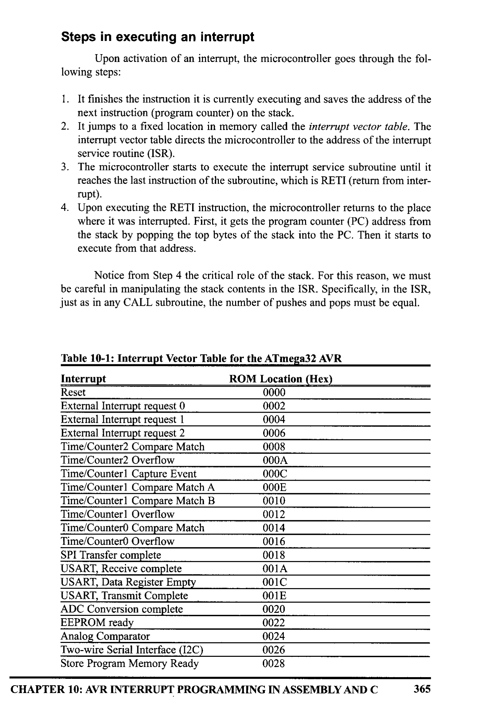
*Description*: Structured reference table listing operational parameters, instruction execution cycles, memory address mapping, or feature comparison for Table 10-1: Interrupt Vector Table for the ATmega32 AVR.

> **Table 10-1: Interrupt Vector Table for the ATmega32 AVR**

Interrupt
Reset
External Interrupt request 0
External Interrupt request 1
External Interrupt request 2
Time/Counter2 Compare Match
Time/Counter2 Overflow
Time/Counter Capture Event
Time/Counter Compare Match A
Time/Counter Compare Match B
Time/Counter1 Overflow
Time/Counter Compare Match
Time/Counter0 Overflow
SPI Transfer complete
USART, Receive complete
USART, Data Register Empty
USART, Transmit Complete

```assembly
ADC Conversion complete
```

EEPROM ready
Analog Comparator
Two-wire Serial Interface (12C)
Store Program Memory Ready
ROM Location (Hex)
0000
0002
0004
0006
0008
000A
000C
000E
0010
0012
0014
0016
0018
001A
001C
001E
0020
0022
0024
0026
0028
CHAPTER 10: AVR INTERRUPT PROGRAMMING IN ASSEMBLY AND C
365


<!-- Page 377 -->
### [PDF Page 377]

Sources of interrupts in the AVR
There are many sources of interrupts in the AVR, depending on which
peripheral is incorporated into the chip. The following are some of the most wide-
ly used sources of interrupts in the AVR:
1. There are at least two interrupts set aside for each of the timers, one for over-
flow and another for compare match. See Section 10.2.
2. Three interrupts are set aside for external hardware interrupts. Pins PD2
(PORTD.2), PD3 (PORTD.3), and PB2 (PORTB.2) are for the external hard-
ware interrupts INTO, INT1, and INT2, respectively. See Section 10.3.
3. Serial communication's USART has three interrupts, one for receive and two
interrupts for transmit. See Chapter 11.
4. The SPI interrupts. See Chapter 17.
5. The ADC (analog-to-digital converter). See Chapter 13.
The AVR has many more interrupts than the list shows. We will cover them
throughout the book as we study the peripherals of the AVR. Notice in Table 10-1
that a limited number of bytes is set aside for interrupts. For example, a total of 2
words (4 bytes), from locations 0016 to 0018, are set aside for Timer0 overflow
interrupt. Normally, the service routine for an interrupt is too long to fit into the
memory space allocated. For that reason, a JMP instruction is placed in the vector
table to point to the address of the ISR. In upcoming sections of this chapter, we
will see many examples of interrupt programming that clarify these concepts.
From Table 10-1, also notice that only 2 words (4 bytes) of ROM space are
assigned to the reset pin. They are ROM address locations 0-1. For this reason, in
our program we put the JMP as the first instruction and redirect the processor away
from the interrupt vector table, as shown in Figure 10-1. In the next section we will
see how this works in the context of some examples.
. ORG O
¡wake-up ROM reset location
JMP
MAIN i bypass interrupt vector table
; ---- the wake-up program
•ORG $100
MAIN:
¡ enable
interrupt flags

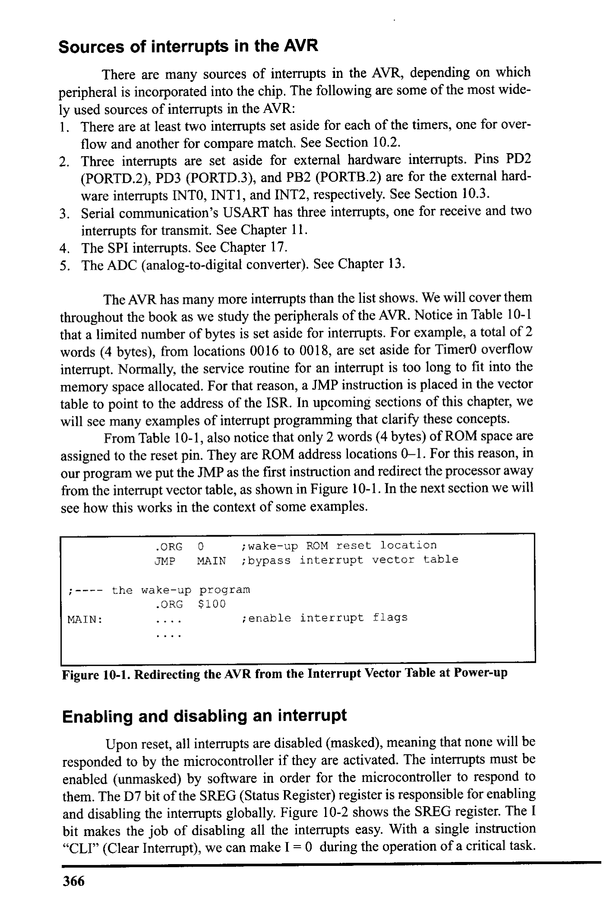
*Description*: Structured reference table listing operational parameters, instruction execution cycles, memory address mapping, or feature comparison for Figure 10-1: Redirecting the AVR from the Interrupt Vector Table at Power-up.

> **Figure 10-1: Redirecting the AVR from the Interrupt Vector Table at Power-up**

Enabling and disabling an interrupt
Upon reset, all interrupts are disabled (masked), meaning that none will be
responded to by the microcontroller if they are activated. The interrupts must be
enabled (unmasked) by software in order for the microcontroller to respond to
them. The D7 bit of the SREG (Status Register) register is responsible for enabling
and disabling the interrupts globally. Figure 10-2 shows the SREG register. The I
bit makes the job of disabling all the interrupts easy. With a single instruction
"CLI" (Clear Interrupt), we can make I = O during the operation of a critical task.
366


<!-- Page 378 -->
### [PDF Page 378]

Bit
SREG
D7
DO
C - Carry flag
Z - Zero flag
N - Negative flag
V - Overflow flag
TV NZO
S- Sign flag
H - Half carry
T - Bit copy storage
I - Global Interrupt Enable

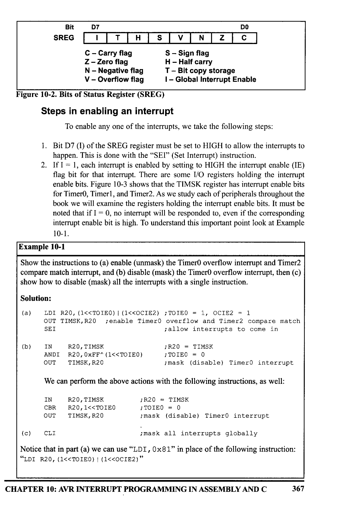
*Description*: Register specification diagram depicting individual bit flags, control register configurations, and functional definitions for Figure 10-2: Bits of Status Register (SREG).

> **Figure 10-2: Bits of Status Register (SREG)**

Steps in enabling an interrupt
To enable any one of the interrupts, we take the following steps:
1. Bit D7 (I) of the SREG register must be set to HIGH to allow the interrupts to
happen. This is done with the "SEI" (Set Interrupt) instruction.
2. If I = 1, each interrupt is enabled by setting to HIGH the interrupt enable (IE)
flag bit for that interrupt. There are some I/O registers holding the interrupt
enable bits. Figure 10-3 shows that the TIMSK register has interrupt enable bits
for Timero, Timerl, and Timer2. As we study each of peripherals throughout the
book we will examine the registers holding the interrupt enable bits. It must be
noted that if I = 0, no interrupt will be responded to, even if the corresponding
interrupt enable bit is high. To understand this important point look at Example
10-1.
Example 10-1
Show the instructions to (a) enable (unmask) the TimerO overflow interrupt and Timer2
compare match interrupt, and (b) disable (mask) the TimerO overflow interrupt, then (c)
show how to disable (mask) all the interrupts with a single instruction.
Solution:
(a)
IDI R20, (1<<TOIEO) | (1<<OCIE2) ; TOIEO = 1, OCIEZ = 1

```assembly
OUT TIMSK, R20 ¡enable TimerO
```

overflow and Timer2 compare match
¡allow interrupts
to come in
(b)
IN
ANDI
OUT
R2O, TIMSK
R20, OXFF^ (1<<TOIE0)
TIMSK, R20
; R20 = TIMSK
¡ TOIEO = O
¡ mask (disable) Timer0 interrupt
We can perform the above actions with the following instructions, as well:
IN
CBR
OUT
R2O, TIMSK
;R2O = TIMSK
R20, 1<<TOIEO
¡ TOIEO = 0
TIMSK, R20
¡ mask (disable) Timer0 interrupt
(c)
CLI
¡mask all interrupts globally
Notice that in part (a) we can use "LDI, 0x81" in place of the following instruction:
"IDI R2O, (1<<IOIEO) | (1<<OCIE2)"
CHAPTER 10: AVR INTERRUPT PROGRAMMING IN ASSEMBLY AND C
367


<!-- Page 379 -->
### [PDF Page 379]


### Review Questions

1. Of the interrupt and polling methods, which one avoids tying down the micro-
controller?
2. Give the name of the interrupts in the TIMSK register.
3. Upon power-on reset of the ATmega32, what memory area is assigned to the
interrupt vector table? Can the programmer change the memory space assigned
to the table?
4. What is the content of D7 (I) of the SREG register upon reset, and what does
it mean!
5. Show the instructions needed to enable the Timerl compare A match interrupt.
6. What address in the interrupt vector table is assigned to the Timerl overflow
and INTO interrupts?
D7
TOLEO
DO
OCIE2 | TOIE2 | TICIEI OCIEIA OCIEIB TOIEI | OCIEO | TOTEO
OCIEO
Timero overflow interrupt enable
= O Disables Timer overflow interrupt
= 1 Enables Timer overflow interrupt
Timer0 output compare match interrupt enable
= O Disables TimerO compare match interrupt
= 1 Enables Timer0 compare match interrupt
TOIEI
OCIE1B
OCIEIA
TICIE1
TOIE2
OCIE2
= 0 Disables Timerl overflow interrupt
= 1 Enables Timerl overflow interrupt
Timerl output compare B match interrupt enable
= 0 Disables Timerl compare B match interrupt
= 1 Enables Timerl compare B match interrupt
Timer1 output compare A match interrupt enable
= 0 Disables Timerl compare A match interrupt
= 1 Enables Timerl compare A match interrupt
Timerl input capture interrupt enable
= 0 Disables Timerl input capture interrupt
= 1 Enables Timer1 input capture interrupt
Timer2 overflow interrupt enable
= O Disables Timer2 overflow interrupt
= 1 Enables Timer2 overflow interrupt
Timer2 output compare match interrupt enable
- O Disables Timer2 compare match interrup
= 1 Enables Timer2 compare match interrupt
These bits, along with the I bit, must be set high for an interrupt to be responded to.
Upon activation of the interrupt, the I bit is cleared by the AVR itself to make sure
another interrupt cannot interrupt the microcontroller while it is servicing the current
one. At the end of the ISR, the RETI instruction will make I = 1 to allow another inter-
rupt to come in.

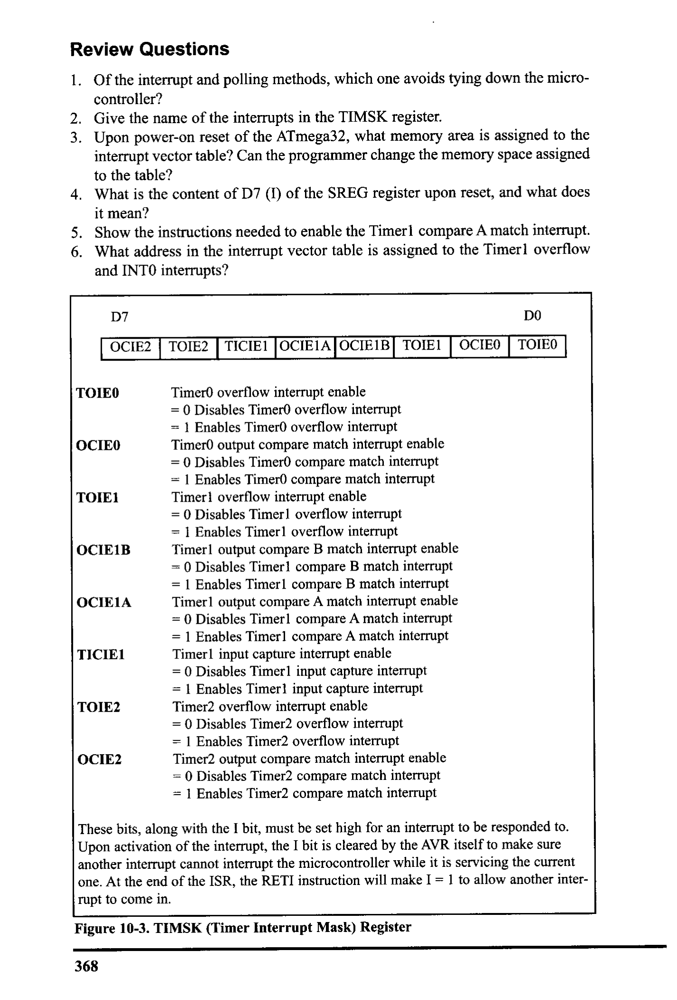
*Description*: Register specification diagram depicting individual bit flags, control register configurations, and functional definitions for Figure 10-3: TIMSK (Timer Interrupt Mask) Register.

> **Figure 10-3: TIMSK (Timer Interrupt Mask) Register**

368


<!-- Page 380 -->
### [PDF Page 380]


## SECTION 10.2: PROGRAMMING TIMER INTERRUPTS

In Chapter 9 we discussed how to use Timers 0, 1, and 2 with the polling
method. In this section we use interrupts to program the AVR timers. Please review
Chapter 9 before you study this section.
Rollover timer flag and interrupt
In Chapter 9 we stated that the timer overflow flag is raised when the timer
rolls over. In that chapter, we also showed how to monitor the timer flag with the
instruction "SBRS R20, TOVO". In polling TOVO, we have to wait until TOVO is
raised. The problem with this method is that the microcontroller is tied down wait-
ing for TOVO to be raised, and cannot do anything else. Using interrupts avoids
tying down the controller. If the timer interrupt in the interrupt register is enabled,
TOVO is raised whenever the timer rolls over and the microcontroller jumps to the
interrupt vector table to service the ISR. In this way, the microcontroller can do
other things until it is notified that the timer has rolled over. To use an interrupt in
place of polling, first we must enable the interrupt because all the interrupts are
masked upon reset. The TOIEx bit enables the interrupt for a given timer. TOIE×
bits are held by the TIMSK register as shown in Table 10-2. See Figure 10-4 and
Program 10-1.


*Description*: Register specification diagram depicting individual bit flags, control register configurations, and functional definitions for Table 10-2: Timer Interrupt Flag Bits and Associated Registers.

> **Table 10-2: Timer Interrupt Flag Bits and Associated Registers**

Interrupt Overflow
Register
Enable Bit
Register
Flag Bit
Timero
Timerl
Timer2
TOVO
TOVI
TOV2
TIFR
TIFR
TIFR
TOIEO
TOIE1
TOIE2
TIMSK
TIMSK
TIMSK
Notice the following points about Program 10-1:
1. We must avoid using the memory space allocated to the interrupt vector table.
Therefore, we place all the initialization codes in memory starting at an
address such as $100. The JMP instruction is the first instruction that the AVR
executes when it is awakened at address 0000 upon reset. The JMP instruction
at address 0000 redirects the controller away from the interrupt vector table.
2. In the MAIN program, we enable (unmask) the TimerO interrupt with the fol-
lowing instructions:
LDI
R16,1‹<TOVO
OUT
TIMSK, R16
SEI
¡ enable
¡ set I
Timero overflow interrupt
(enable interrupts globally)
TOVO
vector
location
0x0016
TOLEO

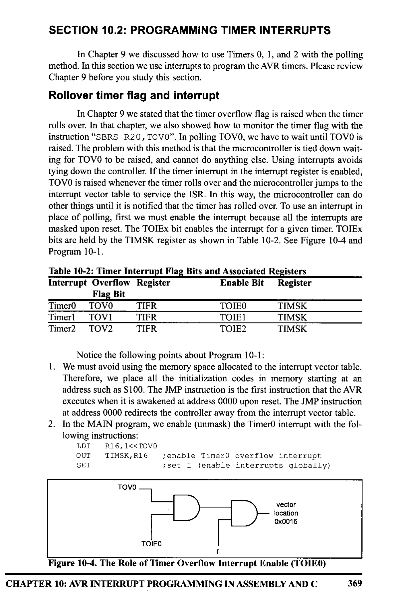
*Description*: Execution flowchart illustrating procedure steps, algorithmic logic flow, software build stages, or timing signal sequences for Figure 10-4: The Role of Timer Overflow Interrupt Enable (TOIEO).

> **Figure 10-4: The Role of Timer Overflow Interrupt Enable (TOIEO)**

CHAPTER 10: AVR INTERRUPT PROGRAMMING IN ASSEMBLY AND C
369


<!-- Page 381 -->
### [PDF Page 381]

3. In the MAIN program, we initialize the Timer register and then enter into an
infinite loop to keep the CPU busy. The loop could be replaced with a real-
world application being executed by the CPU. In this case, the loop gets data
from PORTC and sends it to PORTD. While the PORTC data is brought in and
issued to PORTD continuously, the TOIEO flag is raised as soon as Timeru
rolls over, and the microcontroller gets out of the loop and goes to $0016 to
execute the ISR associated with Timer0. At this point, the AVR clears the I bit
(D7 of SREG) to indicate that it is currently serving an interrupt and cannot be
interrupted again; in other words, no interrupt inside the interrupt. In Section
10.6, we show how to allow an interrupt inside an interrupt.
4. The ISR for Timero is located starting at memory location $200 because it is
too large to fit into address space $16-$18, the address allocated to the Timero
overflow interrupt in the interrupt vector table.
5. RETI must be the last instruction of the ISR. Upon execution of the RETI
instruction, the AVR automatically enables the I bit (D7 of the SREG register)
to indicate that it can accept new interrupts.
6. In the ISR for Timero, notice that there is no need for clearing the TOVO flag
since the AVR clears the TOVO flag internally upon jumping to the interrupt
vector table.
Program 10-1: For this program, we assume that PORTC is connected to 8
switches and PORTD to 8 LEDs. This program uses Timer0 to generate a square
wave on pin PORTB.5, while at the same time data is being transferred from
PORTC to PORTD.
¡Program 10-1
• INCLUDE "M32DEF.INC"
• ORG 0×0
¡ location for reset
JMP
MAIN
. ORG
0x16
¡location for Timer0 overflow (see Table 10.1)
JMP
TO_OV.
_ISR
¡ jump to ISR for Timero
i-main program
"for initialization and keeping CPU busy
•ORG 0x100
MAIN: LDI
R20, HIGH (RAMEND)
OUT
SPH, R20
IDI
R20, LOW (RAMEND)
OUT
SPL, R20
¡ initialize stack
SBI
DDRB, 5
; PB5 as an output
LDI
R20, (1<<10IE0)
OUT
TIMSK, R20
¡enable Timer0 overflow interrupt
SEI
¡set I (enable interrupts globally)
LDI
R20,- 32
¡timer value for 4 us
OUT
ICNIO, R2O
; load
• Timero with -32
LDI
R20, 0x01
OUT
TCCRO, R20
¡ Normal, internal clock, no prescaler
LDI
R20, 0x00

```assembly
OUT DDRC, R20
; make PORTC input
```

LDI
R2O, OXEE
OUT
DDRD, R20
; make PORTD output
; ---
-- Infinite 1oop
HERE: IN
R2O, PINC
¡ read from PORTC
OUT
PORTD, R20
¡give it to PORTD

```assembly
JMP HERE
```

¡keeping CPU busy waiting for interrupt
370


<!-- Page 382 -->
### [PDF Page 382]

; --
--ISR for Timero (it is executed every 4 HS)
• ORG
0x200
TO_OV_ISR:
IN
R16, PORTB
; read PORTB
LDI
R17, 0×20
; 00100000 for toggling PB5
EOR
R16, R17
OUT
PORTB, R16
; toggle PB5
IDI
R16,- 32
¡timer value for 4 us
OUT
ICNIO, R16
¡load Timer0 with -32 (for next round)
RETI
¡ return from interrupt
See Example 10-2 to understand the difference between RET and RETI.
Example 10-2
What is the difference between the RET and RETI instructions? Explain why we can-
not use RET instead of RETI as the last instruction of an ISR.
Solution:
Both perform the same actions of popping off the top bytes of the stack into the program
counter, and making the AVR return to where it left off. However, RETI also performs
the additional task of setting the I flag, indicating that the servicing of the interrupt is over
and the AVR now can accept a new interrupt. If you use RET instead of RETI as the last
instruction of the interrupt service routine, you simply block any new interrupt after the
first interrupt, because the I would indicate that the interrupt is still being serviced.
See Program 10-2. Program 10-2 uses Timer and Timerl interrupts simul-
taneously, to generate square waves on pins PB1 and PB7 respectively, while data
is being transferred from PORTC to PORTD.
; Program 10-2
. INCLUDE "M32DEF.INC"
• ORG
0x0
¡ location for reset
JMP
MAIN
¡bypass interrupt vector table
• ORG
0x12
¡ISR location for Timerl overflow
JMP
T1_OV_ISR
i go to an
address with more space
• ORG
0x16
¡ISR location for Timer0 overflow
JMP
TO_OV.
_ISR
¡ go to an address with more space
i----main program
for
• initialization and keeping CPU busy
• ORG
0x100
MAIN: LDI
R20, HIGH (RAMEND)
OUT
SPH, R20
LDI
R20, LOW (RAMEND)
OUT
SPL, R20
¡initialize stack point
SBI
DDRB, 1
; PB1 as an output
SBI
DDRB, 7
; PB7 as an output
LDI
R20, (1<<TOIE0) | (1<<TOIE1)
OUT
TIMSK, R20
¡enable Timero overflow interrupt
SEI
¡ set I lenable interrupts globally)
LDI
R20, - 160
¡ value for 20 us
OUT
TCNTO, R20
; load Timer0 with -160
LDI
R20, 0x01
OUT
ICCRO, R20
; Normal mode, int olk, no prescaler
LDI
R20, HIGH (-640)
i the high byte
OUT
TCNT1H, R2O
¡ load Timerl high byte
CHAPTER 10: AVR INTERRUPT PROGRAMMING IN ASSEMBLY AND C
371


<!-- Page 383 -->
### [PDF Page 383]

LDI
OUT
LDI
OUT
LDI
OUT
LDI
OUT
LDI
OUT
R20, LOW(-640) ; the low byte
TCNT1L, R20 ;load Timerl low byte
R20, 0×00
ICCRIA, R20
; Normal mode
R20, 0x01
ICCRIB, R20
; internal clk, no prescaler
R20, 0X00
DDRC, R20
; make PORTC input .
R20, OxFF
DDRD, R20
¡make PORTD output
i ---
--- Infinite loop
HERE: IN
R20, PINC
¡ read from PORTC
OUT
PORTD, R20
¡and give it to PORTD
JMP
HERE
¡ keeping CPU busy waiting for interrupt
; --
--ISR for TimerO
(It comes here after elapse
• of 20 us time)
• ORG
0×200
TO_OV_ISR:
LDI
OUT
IN
LDI
EOR
OUT
R16, -160
ICNTO, R16
R16, PORTB
R17, 0×02
R16, R17
PORTB, R16
¡value for 20 us
¡load Timer0 with -160 (for next round)
¡ read PORTB
: 00000010 for toggling PB1
¡ toggle PB1
RETI
¡ return from interrupt
- ISR
for Timerl (It comes here after elapse of 80 us time)
• ORG
0x300
_ISR:
LDI
OUT
LDI
OUT
IN
LDI
EOR
OUT
R18, HIGH (- 640)
TCNTIH, R18 ¡ load Timerl high byte
R18, LOW(-640)
TCNT1L, R18
¡ load Timerl low byte (for next round)
R18, PORTB
¡ read PORTB
R19,0x80
;10000000 for toggling PB7
R18, R19
PORTB, R18
RETI
¡toggle PB7
; return from interrupt
Notice that the addresses $0100, $0200, and $0300 that we used in
Program 10-2 are all arbitrary and can be changed to any addresses we want. The
only addresses that we cannot change are the reset location of 0000, the Timero
overflow address of $0016, and the Timerl overflow address of $0012 in the inter-
rupt vector table because they were fixed at the time of the ATmega32 design.
Program 10-3 has two interrupts: (1) PORTA counts up every time Timerl
overflows. It overflows once per second. (2) A pulse is fed into Timero, where
TimerO is used as counter and counts up. Whenever the counter reaches 200, it will
toggle the pin PORTB.6.
: Program 10-3
• INCLUDE
: "M32DEF.INC"
• ORG
0×0
JMP
MAIN
•ORG
0x12
JMP
T1_OV_ISR
• ORG
0x16
JMP
TO_OV_ISR
¡ location for reset
¡bypass interrupt vector table
¡ISR location for Timerl overflow
¡go to an address with more space
¡ISR location for Timer0 overflow
¡go to an address with more space
372


<!-- Page 384 -->
### [PDF Page 384]

R20, HIGH (RAMEND)
i---main program for initialization and keeping CPU busy
• ORG 0x40
MAIN: IDI
OUT
IDI
OUT
SPH, R20
R20, LOW (RAMEND)
SPL, R20
¡initialize SP
LDI
OUT
LDI
OUT
LDI
OUT
OUT
SBI
SBI
R18, 0
PORTA, R18
; R18 = 0
¡ PORTA = 0
R20, 0
DDRC, R2O
; PORIC as input
R2O, OXFF
DDRA, R20
DDRD, R20
DDRB, 6
PORTB, O
¡ PORTA as output
; PORTD as output
; PB6 as an output
¡activate pull-up of PBO
IDI
OUT
LDI
OUT
LDI
OUT
IDI
OUT
LDI
OUT
LDI
OUT
LDI
OUT
SEI
R20, 0x06
ICCRO, R20
¡ Normal, I0 pin falling edge, no scale
R16, - 200
TCNTO, R16
; load Timer0 with -200
R19, HIGH (-31250)
¡timer value for
1
second
TCNT1H, R19
¡load Timerl high byte
R19, LOW(-31250)
TCNT1L, R19 ;load Timerl low byte
R20, 0
ICCRIA, R20 ; Timerl Normal mode
R20, 0x04
TCCRIB, R20 ; int clk, prescale 1:256
R20, (1<<TOIEO) | (1<<I0IE1)
TIMSK, R20
¡ enable Timer0 & Timerl overflow ints
¡ set I lenable interrupts globally)
-- Infinite 1o0p
HERE: IN
R20, PINC
¡ read from PORTC
OUT
PORTD, R20
¡ and send it to PORTD
JMP
HERE
¡waiting for interrupt
;
------ISR for Timero to toggle after 200 clocks
•ORG 0x200
TO_OV_ISR:
IN
IDI
; read PORTB
;0100 0000 for toggling PB7
EOR
OUT
LDI
OUT
RETI
R16, PORTB
R17, 0x40
R16, R17
PORTB, R16
¡ toggle PB6
R16,- 200
¡ setup for next round
TCNTO, R16
¡ load Timer0 with -200 for next round
¡ return from interrupt
--ISR for Timerl (It comes here after elapse of Is time)
. ORG 0x300
T1_OV_
_ISR:
INC
OUT
LDI
OUT
LDI
OUT
RETI
R18
; increment upon overflow
PORTA, R18
¡ display it on PORTA
R19, HIGH (-31250)
TCNT1H, R19
; load
Timerl high byte
R19, LOW(-31250)
TCNT1L, R19
¡ load Timerl low byte (for next round)
¡ return from interrupt
CHAPTER 10: AVR INTERRUPT PROGRAMMING IN ASSEMBLY AND C
373


<!-- Page 385 -->
### [PDF Page 385]

Compare match timer flag and interrupt
Sometimes a task should be done periodi-
cally, as in the previous examples. The programs
OCR- - -
can be written using the CTC mode and compare
match (OCF) flag. To do so, we load the OCR reg-
ister with the proper value and initialize the timer
to the CTC mode. When the content of TCNT
matches with OCR, the OCF flag is set, which
Time
0.
OF = 14
OCFX = 1 OCFX = 1

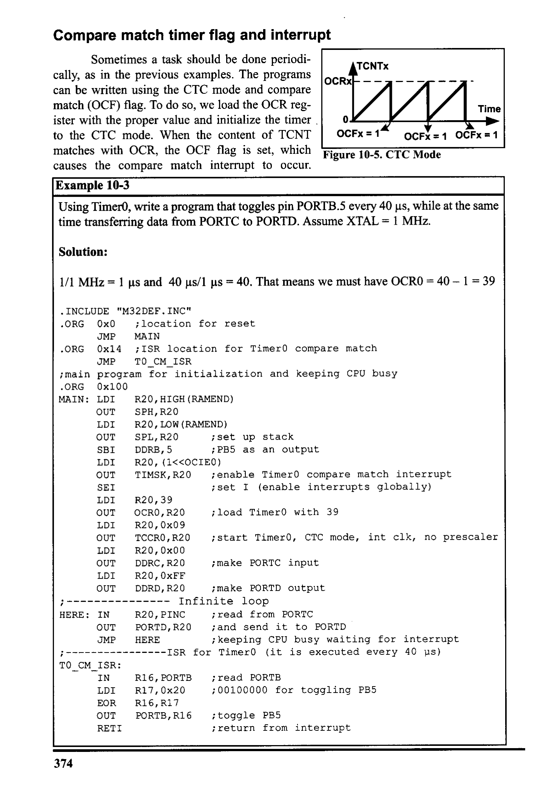
*Description*: Technical diagram and schematic illustration detailing hardware connection topology, signal routing, and circuit operation for Figure 10-5: CTC Mode.

> **Figure 10-5: CTC Mode**

causes the compare match interrupt to occur.
Example 10-3
Using TimerO, write a program that toggles pin PORTB.5 every 40 us, while at the same
time transferring data from PORTC to PORTD. Assume XTAL = 1 MHz.
Solution:
1/1 MHz = 1 us and 40 us/1 us = 40. That means we must have OCRO = 40 - 1 = 39
• INCLUDE "M32DEF. INC"
•ORG
0x0 ; location for reset

```assembly
JMP MAIN
```

•ORG 0x14 ; ISR location for TimerO compare match
'main program for initialization and keeping CPU busy
. ORG 0x100
MAIN: LDI
R20, HIGH (RAMEND)
OUT
SPH, R20
LDI
R2O, LOW (RAMEND)
OUT
SPL, R20
i set
up stack

```assembly
SBI DDRB, 5
; PBS
```

as an output
LDI
R2O, (1<<OCIEO)
OUT
TIMSK, R20
¡enable Timer0 compare match interrupt
SEI
¡ set I (enable interrupts globally)
IDI R20, 39

```assembly
OUT OCRO, R20
```

¡load Timer0 with 39
IDI R20, 0x09
OUT
ICCRO, R20
¡ start Timer0, CIC mode, int clk, no prescaler
LDI
R20, 0x00
OUT
DDRC, R20
; make PORTC input
LDI
R2O, OXEF
OUT
DDRD, R20
; make PORTD output
;
HERE: IN
OUT
JMP
--- Infinite 100p
R20, PINC
¡ read from PORTC
PORTD, R20
¡ and send it to PORTD
HERE
¡keeping CPU busy waiting for interrupt
--ISR for Timer0 (it is executed every 40 us)
IO_CM_ISR:
IN
LDI
EOR
OUT
RETI
R16, PORTB
R17,0x20
R16, R17
PORTB, R16
; read PORTB
; 00100000 for toggling PB5
¡ toggle PB5
; return from interrupt
374


<!-- Page 386 -->
### [PDF Page 386]

Because the timer is in the CTC mode, the timer will be loaded with zero as well.
So, the compare match interrupt occurs periodically. See Figure 10-5 and
Examples 10-3 and 10-4. Notice that the AVR chip clears the OCF flag upon jump-
ing to the interrupt vector table.
Example 10-4
Using Timerl, write a program that toggles pin PORTB.5 every second, while at the
same time transferring data from PORTC to PORTD. Assume XTAL = 8 MHz.
Solution:
For prescaler = 1024 we have clock= (1 / 8 MHz) × 1024 = 128 us and 1 s/128 us =
7812. That means we must have OCRIA = 7811 = 0x1E83
• INCLUDE "M32DEF. INC"
• ORG
0x0
¡ location for reset
JMP
MAIN
• ORG
0x14
¡location for Timerl compare match
JMP
T1_CM_ISR
--main
program for initialization and keeping CPU busy
MAIN: LDI
R20, HIGH (RAMEND)
OUT
SPH, R20
LDI
R20, LOW (RAMEND)
OUT
SPL, R20
;set up stack
SBI
DDRB, 5
; PB5 as an output
LDI
R2O, (1<<OCIE1A)
OUT
TIMSK, R20
¡enable Timer1 compare match interrupt
SEI
¡set I (enable interrupts globally)
IDI
R20, 0X00
OUT
ICCRIA, R20
LDI
R20, OxD
OUT
ICCRIB, R20
¡prescaler 1:1024, CIC mode
LDI
R20, HIGH (7811)
i the high byte
OUT
OCRIAH, R20
; Temp
= OxlE (high byte of 7811)
LDI
R20, LOW (7811)
i the low byte
OUT
LDI
OCRIAL, R20
; OCRIA = 7811
R20, 0×00
OUT
DDRC, R20
; make PORIC input
LDI
R20, OXFF
OUT
DDRD, R20
¡ make PORTD output
-- Infinite 1oop
HERE: IN
R20, PINC
¡read from PORTC
OUT
PORTD, R20
¡PORTD = R20
¡keeping CPU busy waiting for interrupt
¡---ISR for Timerl (It comes here after elapse of 1 second time)
T1_CM_ISR:
R16, PORTB
R17, 0x20
; 00100000 for toggling PB5
EOR
R16, R17
OUT
PORTB, R16
i toggle PB5
RETI
¡ return from interrupt
CHAPTER 10: AVR INTERRUPT PROGRAMMING IN ASSEMBLY AND C
375


<!-- Page 387 -->
### [PDF Page 387]


### Review Questions

1. True or false. There is a single interrupt in the interrupt vector table assigned
to both Timer0 and Timerl.
2. What address in the interrupt vector table is assigned to Timer overflow?
3. Which register does TOIE1 belong to? Show how it is enabled.
4. Assume that Timer is programmed in Normal mode, TCNTO = OxF1, and the
TOIEO bit is enabled. Explain how the interrupt for the timer works.
5. True or false. The last two instructions of the ISR for TimerO are:
OUT
TIFR, 1<<TOVO
¡clear TOVO flag
RETI
6. Assume that Timer0 is programmed in CTC mode, OCRO = 0x21, and the
compare match interrupt is enabled. Explain how the interrupt for the timer
works.
7. In the previous problem, assume XTAL = 8 MHz, and the timer is in no
prescaler mode. How often is the ISR executed?

## SECTION 10.3: PROGRAMMING EXTERNAL HARDWARE

INTERRUPTS
The number of external hardware interrupt interrupts varies in different
AVRs. The Almega32 has three external hardware interrupts: pins PD2
(PORTD.2), PD3 (PORTD.3), and PB2 (PORTB.2), designated as INTO, INT1,
and INT2, respectively. Upon activation of these pins, the AVR is interrupted in
whatever it is doing and jumps to the vector table to perform the interrupt service
routine. In this section we study these three external hardware interrupts of the
AVR with some examples in Assembly language.
External interrupts INTO, INT1, and INT2
There are three external hardware interrupts in the ATmega32: INTO, INTI,
and INT2. They are located on pins PD2, PD3, and PB2, respectively. As we saw in


*Description*: Structured reference table listing operational parameters, instruction execution cycles, memory address mapping, or feature comparison for Table 10-1: , the interrupt vector table locations $2, $4, and $6 are set aside for INTO,.

> **Table 10-1: , the interrupt vector table locations $2, $4, and $6 are set aside for INTO,**

INTI, and INT2, respectively. The hardware interrupts must be enabled before they
can take effect. This is done using the INTx bit located in the GICR register. See

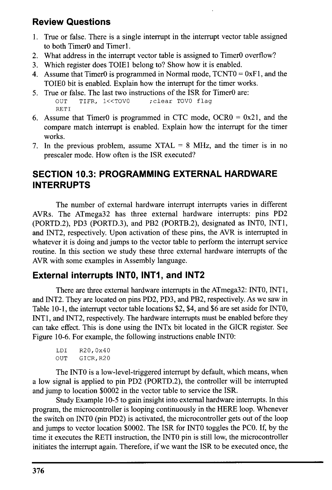
*Description*: Technical diagram and schematic illustration detailing hardware connection topology, signal routing, and circuit operation for Figure 10-6: For example, the following instructions enable INTO:.

> **Figure 10-6: For example, the following instructions enable INTO:**

LDI
R20, 0x40
OUT
GICR, R20
The INTO is a low-level-triggered interrupt by default, which means, when
a low signal is applied to pin PD2 (PORTD.2), the controller will be interrupted
and jump to location $0002 in the vector table to service the ISR.
Study Example 10-5 to gain insight into external hardware interrupts. In this
program, the microcontroller is looping continuously in the HERE loop. Whenever
the switch on INTO (pin PD2) is activated, the microcontroller gets out of the loop
and jumps to vector location $0002. The ISR for INTO toggles the PCO. If, by the
time it executes the RETI instruction, the INTO pin is still low, the microcontroller
initiates the interrupt again. Therefore, if we want the ISR to be executed once, the
376


<!-- Page 388 -->
### [PDF Page 388]

INTO pin must be brought back to high before RETI is executed, or we should make
the interrupt edge-triggered, as discussed next.
D7
INT1
DO
IVSEL IVCE
INTO
INT2
-
-
INTO
External Interrupt Request 0 Enable
= O Disables external interrupt 0
= 1 Enables external interrupt O
INTI
External Interrupt Request 1 Enable
= O Disables external interrupt 1
= 1 Enables external interrupt 1
INT2
External Interrupt Request 2 Enable
= O Disables external interrupt 2
= 1 Enables external interrupt 2
These bits, along with the I bit, must be set high for an interrupt to be responded to.

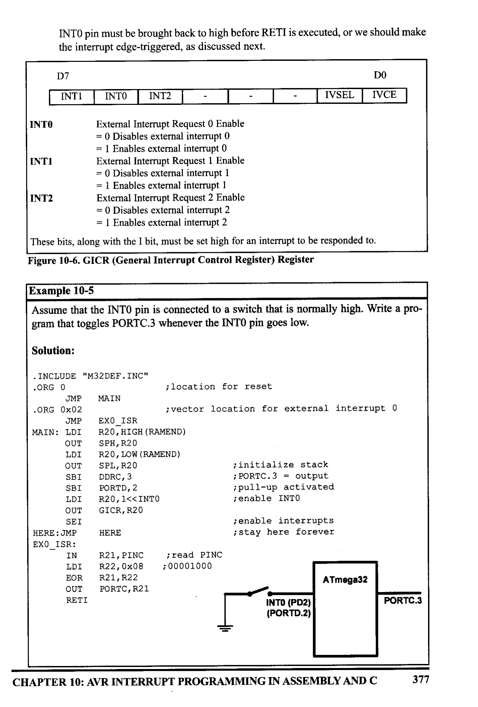
*Description*: Register specification diagram depicting individual bit flags, control register configurations, and functional definitions for Figure 10-6: GICR (General Interrupt Control Register) Register.

> **Figure 10-6: GICR (General Interrupt Control Register) Register**

Example 10-5
Assume that the INTO pin is connected to a switch that is normally high. Write a pro-
gram that toggles PORTC.3 whenever the INTO pin goes low.
Solution:
• INCLUDE "M32DEF.INC"
• ORG O
JMP
MAIN
•ORG 0×02
JMP
MAIN: IDI
OUT
LDI
OUT
SBI
SBI
LDI
OUT
SEI
HERE: JMP
EXO_ISR:
IN
LDI
EOR
OUT
EXO_ISR
R20, HIGH (RAMEND)
SPH, R2O
R2O, LOW (RAMEND)
SPL, R2O
DDRC, 3
PORTD, 2
R20, 1‹<INTO
GICR, R20
HERE
R21, PINC
R22, 0x01
221, R2.
PORTC, R21
RETI
¡location for reset
¡vector location for external interrupt O
¡initialize stack
;PORTC.3 = output
¡pull-up activated
¡enable INTO
¡enable interrupts
¡ stay here forever
¡ read PINC
; 00001000
ATmega32
PORTC.3
INTO (PD2)
(PORTD.2)
=
CHAPTER 10: AVR INTERRUPT PROGRAMMING IN ASSEMBLY AND C
377


<!-- Page 389 -->
### [PDF Page 389]

D7
DO
SM2
SMI
SMO
ISC11 ISC10 ISC01 ISCOO
ISC01, ISC00 (Interrupt Sense Control bits) These bits define the level or edge on the
external INTO pin that activates the interrupt, as shown in the following table:
ISC01
ISCOO
Description
0
0
0
1
F
1
0
7
1
1
F
The low level of INTO generates an interrupt request.
Any logical change on INTO generates an interrupt
request.
The falling edge of INTO generates an interrupt
request.
The rising edge of INTO generates an interrupt
request.
ISC11, ISC10 These bits define the level or edge that activates the INT1 pin.
ISC11
ISC10
Description
0
0
0
1
F
1
0
1
1
The low level of INT1 generates an interrupt request.
Any logical change on INT1 generates an interrupt
request.
The falling edge of INT1 generates an interrupt
request.
The rising edge of INT1 generates an interrupt
request.


*Description*: Register specification diagram depicting individual bit flags, control register configurations, and functional definitions for Figure 10-7: MCUCR (MCU Control Register) Register.

> **Figure 10-7: MCUCR (MCU Control Register) Register**

Edge-triggered vs. level-triggered interrupts
There are two types of activation for the external hardware interrupts:
(1) level triggered, and (2) edge triggered. INT2 is only edge triggered, while
INTO and INT1 can be level or edge triggered.
As stated before, upon reset INTO and INT1 are low-level-triggered inter-
rupts. The bits of the MCUCR register indicate the trigger options of INTO and
INTI, as shown in Figure 10-7.
D7
DO
JTD
ISC2
JTRF WDRF BORF EXTRF PORE
ISC2 This bit defines whether the INT2 interrupt activates on the falling edge or the rising edge.
ISC2
Description
0
The falling edge of INT2 generates an interrupt request.
1
+
The rising edge of INT2 generates an interrupt request.

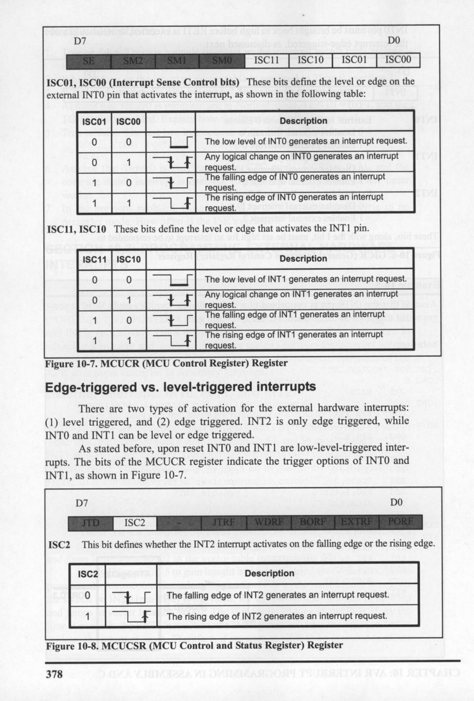
*Description*: Register specification diagram depicting individual bit flags, control register configurations, and functional definitions for Figure 10-8: MCUCSR (MCU Control and Status Register) Register.

> **Figure 10-8: MCUCSR (MCU Control and Status Register) Register**

378


<!-- Page 390 -->
### [PDF Page 390]

The ISC2 bit of the MCUCSR register defines whether INT2 activates in
the falling edge or the rising edge (see Figure 10-8). Upon reset ISC2 is 0, mean-
ing that the external hardware interrupt of INT2 is falling edge triggered. See
Examples 10-6 and 10-7.
Example 10-6
Show the instructions to (a) make INTO falling edge triggered, (b) make INT1 triggered
on any change, and (c) make INT2 rising edge triggered.
Solution:
(a)
IDI
OUT
R20, 0×02
MCUCR, R20
(b)
LDI
OUT
R20, 1<<ISC10
MCUCR, R20
; R20 = 0x04
(c)
IDI
OUT
R2O, 1‹<ISC2
MOUSR, R20
;R20 = 0x40
Example 10-7
Rewrite Example 10-5, so that whenever INTO goes low, it toggles PORTC.3 only once.
Solution:
• INCLUDE "M32DEF.INC"
. ORG O
JMP
MAIN
•ORG 0x02
JMP
EXO_ISR
MAIN: LDI
R20, HIGH (RAMEND)
OUT
SPH, R20
IDI
R20, IOW (RAMEND)

```assembly
OUT SPL, R20
```

IDI R20, 0x2
OUT
MUCR, R20
SBI
DDRC, 3
SBI
PORTD, 2
IDI
R20, 1<<INTO
OUT
GICR, R20
SEI
HERE: JMP
HERE
EXO_ISR:
IN
R21, PORTC
IDI
EOR
R22, 0x08
R21, R22
OUT
PORTC, R21
RETI
¡location for reset
¡location for external interrupt O
¡initialize stack
¡make INTO falling edge triggered
;PORTC.3 = output
¡ pull-up activated
¡enable INTO
¡ enable interrupts
:00001000 for toggling PC3
CHAPTER 10: AVR INTERRUPȚ PROGRAMMING IN ASSEMBLY AND C
379


<!-- Page 391 -->
### [PDF Page 391]

In Example 10-7, notice that the only difference between it and the pro-
gram in Example 10-5 is in the following instructions:
LDI
R20, 0x2
¡ make INTO falling edge triggered
OUT
MCUCR, R20
which makes INTO an edge-triggered interrupt. When the falling edge of
the signal is applied to pin INTO, PORTC.3 will toggle. To toggle the LED again,
another high-to-low pulse must be applied to INTO. This is the opposite of
Example 10-5. In Example 10-5, due to the level-triggered nature of the interrupt,
as long as INTO is kept at a low level, PORTC.3 toggles. But in this example, to
turn on PORTC.3 again, the INTO pulse must be brought back high and then low
to create a falling edge to activate the interrupt.
Sampling the edge-triggered and level-triggered interrupts
Examine Figure 10-9. The edge interrupt (the falling edge, the rising edge,
or the change level) is latched by the AVR and is held by the INTEx bits of the
GIFR register. This means that when an external interrupt is in an edge-triggered
mode (falling edge, rising edge, or change level), upon triggering an interrupt
request, the related INTEx flag becomes set. If the interrupt is active (the INTx bit
is set and the I-bit in SREG is one), the AVR will jump to the corresponding inter-
rupt vector location and the INTEx flag will be cleared automatically, otherwise,
Bit
D7
DO
INTF1 INTO INTF2
-
-
-

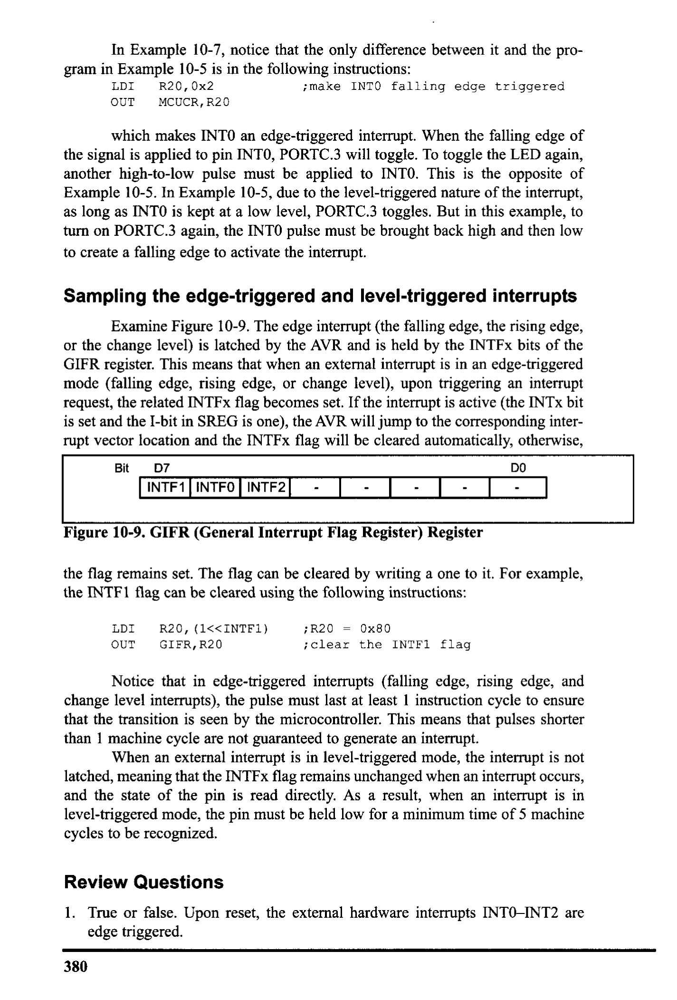
*Description*: Register specification diagram depicting individual bit flags, control register configurations, and functional definitions for Figure 10-9: GIFR (General Interrupt Flag Register) Register.

> **Figure 10-9: GIFR (General Interrupt Flag Register) Register**

the flag remains set. The flag can be cleared by writing a one to it. For example,
the INTF1 flag can be cleared using the following instructions:
IDI
OUT
R2O, (1<<INTF1)
GIER, R20
;R20 = 0x80
¡clear the INTFI flag
Notice that in edge-triggered interrupts (falling edge, rising edge, and
change level interrupts), the pulse must last at least 1 instruction cycle to ensure
that the transition is seen by the microcontroller. This means that pulses shorter
an I made an cleane it suarantin legenerate en mere the interrupt is m
hen an externa interrunt 1
latched, meaning that the INTFx flag remains unchanged when an interrupt occurs,
and the state of the pin is read directly. As a result, when an interrupt is in
level-triggered mode, the pin must be held low for a minimum time of 5 machine
cycles to be recognized.

### Review Questions

1. True or false. Upon reset, the external hardware interrupts INTO-INT2 are
edge triggered.
380


<!-- Page 392 -->
### [PDF Page 392]

2. For ATmega32, what pins are assigned to INTO-INT2?
3. Show how to enable the INT1 interrupt.
4. Assume that the external hardware interrupt INTO is enabled, and is set to the
low-edge trigger. Explain how this interrupt works when it is activated
5. True or false. Upon reset, the INT2 interrupt is falling edge triggered.
6. Assume that INTO is falling edge triggered. How do we make sure that a sin-
gle interrupt is not recognized as multiple interrupts?
Using polling and INTO, write a program that upon falling edges toggles
PORTC.3. Compare it with Example 10-7; which program is better?

## SECTION 10.4: INTERRUPT PRIORITY IN THE AVR

The next topic that we must deal with is what happens when two interrupts
are activated at the same time. Which of these two interrupts is responded to first?
Interrupt priority
If two interrupts are activated at the same time, the interrupt with the high-
er priority is served first. The priority of each interrupt is related to the address of
that interrupt in the interrupt vector. The interrupt that has a lower address, has a
higher priority. See Table 10-1. For example, the address of external interrupt O is
2, while the address of external interrupt 2 is 6; thus, external interrupt 0 has a
higher priority, and if both of these interrupts are activated at the same time, exter-
nal interrupt 0 is served first.
Interrupt inside an interrupt
What happens if the AVR is executing an ISR belonging to an interrupt and
another interrupt is activated? When the AVR begins to execute an ISR, it disables
the I bit of the SREG register, causing all the interrupts to be disabled, and no other
interrupt occurs while serving the interrupt. When the RETI instruction is execut-
ed, the AVR enables the I bit, causing the other interrupts to be served. If you want
another interrupt (with any priority) to be served while the current interrupt is
being served you can set the I bit using the SEI instruction. But do it with care. For
example, in a low-level-triggered external interrupt, enabling the I bit while the pin
is still active will cause the ISR to be reentered infinitely, causing the stack to over-
flow with unpredictable consequences.
Context saving in task switching
In multitasking systems, such as multitasking real-time operating systems
(RTOS), the CPU serves one task (job or process) at a time and then moves to the
next one. In simple systems, the tasks can be organized as the interrupt service rou-
tine. For example, in Example 10-3, the program does two different tasks:
(1) copying the contents of PORTC to PORTD,
(2) toggling PORTC.2 every 5 us
While writing a program for a multitasking system, we should manage the
resources carefully so that the tasks do not conflict with each other. For example,
consider a system that should perform the following tasks: (1) increasing the con-
CHAPTER 10: AVR INTERRUPȚ PROGRAMMING IN ASSEMBLY AND C
381


<!-- Page 393 -->
### [PDF Page 393]

tents of PORTC continuously, and (2) increasing the content of PORTD once every
S us. Read the following program. Does it work?
; Program 10-4
• INCLUDE "M32DEF.INC"
• ORG
0x0
; location for reset
JMP
MAIN
• ORG
0x14
¡location for Timer0 compare match
JMP
TO_CM_ISR
i-main program for initialization and keeping CPU busy
MAIN: LDI
LDI
OUT
SBI
LDI
OUT
SEI
LDI
OUT
LDI
OUT
LDI
OUT
OUT
LDI
HERE: OUT
INC
JMP
R20, HIGH (RAMEND)
SPH, R20
R20, LOW (RAMEND)
SPL, R20
DDRB, 5
; set up stack
; PB5 as an output
R20, (1<<OCIEO)
TIMSK, R20
¡enable Timer0 compare match interrupt
¡set I lenable interrupts globally)
R20,160
OCRO, R20
R20, 0x09
ICCRO, R20
R20, OXFF
DDRC, R20
DDRD, R20
R20,
PORTC, R20
R20
HERE
¡ load Timer0 with 160
; CIC mode, int clk, no prescaler
i make PORTC output
; make PORTD output
; PORTC = R20
i keeping CPU busy waiting for interrupt
--ISR for Timero
то_см.
_ISR:
IN
INC
OUT
RETI
R2O, PIND
R20
PORTD, R20
; PORTD = R20
¡ return from interrupt
The tasks do not work properly, since they have resource conflict and they
interfere with each other. R20 is used and changed by both tasks, which causes the
program not to work properly. For example, consider the following scenario: The
content of R20 increases in the main program, at first becoming 0, then 1, and so
on. When the timer interrupt occurs, R20 is 95, and PORTC is 95 as well. In the
ISR, the R20 is loaded with the content of PORTD, which is 0. So, when it goes
back to the main program, the content of R20 is 1 and PORTC will be loaded by
2. But if the program worked properly, PORTC would be loaded with 96.
We can solve such problems in the following two ways:
(1) Using different registers for different tasks. In the program discussed
above, if we use different registers in the main program and in the ISR, the pro-
gram will work properly.
; Program 10-5
• INCLUDE "M32DEF.INC"
• ORG
0x0
JMP
MAIN
¡location for reset
382


<!-- Page 394 -->
### [PDF Page 394]

. ORG 0x14
JMP
;------main
. ORG 0x100
MAIN: LDI
OUT
LDI
OUT
SBI
LDI
OUT
SEI
LDI
OUT
LDI
OUT
LDI
OUT
OUT
LDI
HERE: OUT
INC
JMP
¡ location for Timer0 compare match
TO_CM_ISR
program for initialization and keeping CPU busy
R2O, HIGH (RAMEND)
SPH, R20
R20, LOW (RAMEND)
SPL, R2O
; set up stack
DDRB, 5
;PB5
as an output
R2O, (1<<OCIEO)
TIMSK, R20
¡enable Timer0 compare match interrupt
; set I lenable interrupts globally)
R20,160
OCRO, R20
R20,0x09
TCCRO, R20
R20, OXFF
DDRC, R20
DDRD, R20
R20, 0
PORTC, R20
R20
HERE
; load Timer0 with 160
¡start timer, CIC mode, int clk, no prescaler
; make PORTC output
; make PORTD output
; PORTC = R20
; keeping CPU busy waiting for int.
--ISR for TimerO
i -
TO_CM_
_ISR:
IN
INC
OUT
RETI
R21, PIND
R21
PORTD, R21
; toggle PB5
;return from
interrupt
(2) Context saving. In big programs we might not have enough registers to
use separate registers for different tasks. In these cases, we can save the contents
of registers on the stack before execution of cach task, and reload the registers at
the end of the task. This saving of the CPU contents before switching to a new task
is called context saving (or context switching). See the following program:
¡Program 10-6
• INCLUDE "M32DEF. INC"
. ORG
0x0
; location
for reset
JMP
MAIN
• ORG
0x14
¡location for Timer0 compare match
JMP
TO
CM ISR
¡main
program for initialization and keeping CPU busy
•ORG
0x100
MAIN: LDI
OUT
LDI
OUT
SBI
LDI
OUT
SEI
R20, HIGH (RAMEND)
SPH, R20
R20, LOW (RAMEND)
SPL, R20
i set
up stack
DDRB, 5
;PB5
as an output
R20, (1<<OCIE0)
TIMSK, R20
¡enable Timer0 compare match interrupt
¡set I lenable interrupts globally)
LDI
OUT
LDI
R20,160
OCRO, R20
R20,0x09
; load Timer0 with 160
CHAPTER 10: AVR INTERRUPȚ PROGRAMMING IN ASSEMBLY AND C
383


<!-- Page 395 -->
### [PDF Page 395]

OUT
ICCRO, R2O
LDI
R20, OxFF
OUT
DDRC, R20
OUT
DDRD, R20
LDI
R20, 0
HERE: OUT
PORTC, R20
INC
JMP
R20
HERE
; CIC mode, int clk, no prescaler
; make PORTC output
i make PORID output
¡ PORIC = R20
i keeping CPU busy waiting for interrupt
--ISR for Timero
; --
TO_CM_ISR:
PUSH
IN
INC
OUT
POP
RETI
R20
R20, PIND
R20
PORTD, R2O
R20
; save R20 on stack
¡toggle PB5
¡ restore value for R20
¡ return from interrupt
Notice that using the stack as a place to save the CPU's contents is tedious,
time consuming, and slow. So, we might want to use the first solution, whenever
we have enough registers.
Saving flags of the SREG register
The flags of SREG are important especially when there are conditional
jumps in our program. We should save the SREG register if the flags are changed
in a task. See Figure 10-10.
Interrupt latency
The time from the moment an interrupt is activated to the moment the CPU
starts to execute the task is called the interrupt latency. This latency is 4 machine
cycle times. During this time the PC register is pushed on the stack and the I bit of
the SREG register clears, causing all the interrupts to be disabled. The duration of
an interrupt latency can be affected by the type of instruction that the CPU is exe-
cuting when the interrupt comes in, since the CPU finishes the execution of the
current instruction before it serves the interrupt. It takes slightly longer in cases
where the instruction being executed lasts for two (or more) machine cycles (e.g.,
MUL) compared to the instructions that last for only one instruction cycle (c.g.,
ADD). See the AVR datasheet for the timing.
Sample_ISR:

```assembly
PUSH R20
```

IN
R20, SREG

```assembly
PUSH R20
```

POP
R20
OUT
SREG, R2O
POP
R20
RETI

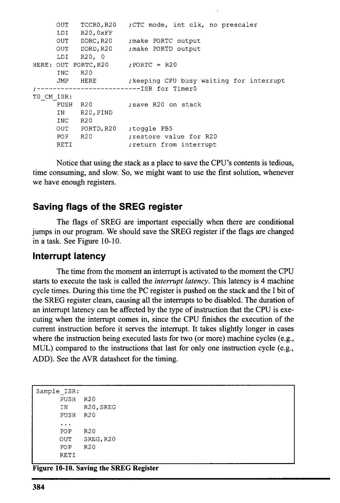
*Description*: Register specification diagram depicting individual bit flags, control register configurations, and functional definitions for Figure 10-10: Saving the SREG Register.

> **Figure 10-10: Saving the SREG Register**

384


<!-- Page 396 -->
### [PDF Page 396]


### Review Questions

1. True or false. In ATmega32, if the Timerl and TimerO interrupts are activated
at the same time, the TimerO interrupt is served first.
2. What happens if two interrupts are activated at the same time?
3. What happens if an interrupt is activated while the CPU is serving another
interrupt?
4. What is context saving?

## SECTION 10.5: INTERRUPT PROGRAMMING IN C

So far all the programs in this chapter have been written in Assembly. In
this section we show how to program the AVR's interrupts in WinAVR C language.
In C language there is no instruction to manage the interrupts. So, in
WinAVR the following have been added to manage the interrupts:
1. Interrupt include file: We should include the interrupt header file if we want
to use interrupts in our program. Use the following instruction:

```c
#include <avr\interrupt.h>
```

2. cli ( ) and sei ( ): In Assembly, the CLI and SEI instructions clear and set
the I bit of the SREG register, respectively. In WinAVR, the cli () and sei ()
macros do the same tasks.

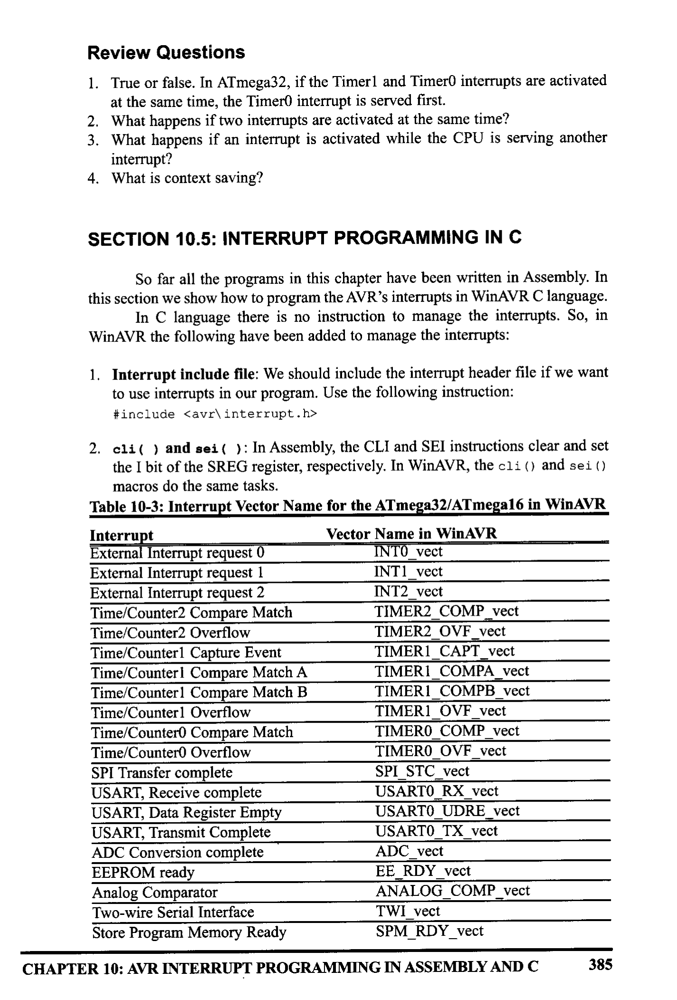
*Description*: Structured reference table listing operational parameters, instruction execution cycles, memory address mapping, or feature comparison for Table 10-3: Interrupt Vector Name for the ATmega32/ATmega16 in WinAVR.

> **Table 10-3: Interrupt Vector Name for the ATmega32/ATmega16 in WinAVR**

Interrupt
Vector Name in WinAVR
External Interrupt request 0
INTO vect
External Interrupt request 1
INT1_vect
External Interrupt request 2
INT2 vect
Time/Counter2 Compare Match
TIMER2_COMP vect
Time/Counter2 Overflow
TIMER2_OVF_vect
Time/Counterl Capture Event
TIMER|_ CAPT_vect
Time/Counterl Compare Match A
TIMER1_COMPA_vect
Time/Counter1 Compare Match B
TIMERI_ COMPB_vect
Time/Counterl Overflow
TIMER1_OVF_vect
Time/Countero Compare Match
TIMERO COMP vect
Time/Counter0 Overflow
TIMERO_OVF_vect
SPI Transfer complete
SPI STC vect
USART, Receive complete
USARTO_RX_vect
USART, Data Register Empty
USARTO_UDRE_vect
USART, Transmit Complete
USARTO_TX vect

```assembly
ADC Conversion complete
ADC vect
```

EEPROM ready
EE RDY vect
Analog Comparator
ANALOG_COMP_vect
Two-wire Serial Interface
TW1 vect
Store Program Memory Ready
SPM_RDY_vect
CHAPTER 10: AVR INTERRUPT PROGRAMMING IN ASSEMBLY AND C
385


<!-- Page 397 -->
### [PDF Page 397]

3. Defining ISR: To write an ISR (interrupt service routine) for an interrupt we
use the following structure:
ISR (interrupt vector name)
/our program
}
For the interrupt vector name we must use the ISR names in Table 10-3.
For example, the following ISR serves the TimerO compare match interrupt:
ISR (TIMERO_COMP_vect)
}
See Example 10-8.
Example 10-8 (C version of Program 10-1)
Using TimerO generate a square wave on pin PORTB.5, while at the same time transfer-
ring data from PORTC to PORTD.
Solution:
#include "avr/io.h"
#include "avr/interrupt.h"
int main ()
DDRB |= 0x20;
//DDRB.5 = output
TCNTO = -32;
TCCRO = 0x01;
TIMSK = (1<<TOIEO) ;
sei ();

```c
DDRC = 0x00;
DDRD = OXFF;
```

I/timer value for 4 us
//Normal mode, int cik, no prescaler
lenable Timer0 overflow interrupt
lenable interrupts
1/make PORIC input
I/make PORTD output

```c
while (1)
//wait here
PORTD = PINC;
```

ISR (TIMERO_OVE_vect)
ICNTO = -32;
PORTB ^= 0x20;
//ISR for Timer0 overflow
//toggle PORTB. 5
386


<!-- Page 398 -->
### [PDF Page 398]

Context saving
The C compiler automatically adds instructions to the beginning of the
ISRs, which save the contents of all of the general purpose registers and the SREG
register on the stack. Some instructions are also added to the end of the ISRs to
reload the registers. See Examples 10-9 through 10-13.
Example 10-9 (C version of Program 10-2)
Using Timer and Timerl interrupts, generate square waves on pins PB1 and PB7
respectively, while transferring data from PORTC to PORTD.
Solution:
#include "avr/io.h"
#include
"avr/interrupt.h"
int main ()
DDRB | = 0x82;
DDRC
= 0×00;

```c
DDRD = OXFF;
//make DDRB.1 and DDRB. 7 output
//make PORIC input
```

I/make PORTD output
TCNTO = -160;
TCCRO = 0x01;
//Normal mode, int clk, no prescaler
ICNT1H = (-640)>>8;
I/the high byte
ICNTIL =
(-640);
Ilthe low byte
ICCRIA = 0x00;
ICCRIB = 0x01;
TIMSK = (1<<IOIE0)|(1<<TOIE1); |/enable Timers 0 and 1 int.
sei () ;
lenable interrupts

```c
while (1)
//wait here
PORTD = PINC;
```

}
ISR (TIMERO_OVE_vect)
TCNTO =
-160;
PORTB
^= 0x02;
ISR (TIMERI_OVE_vect)
TCNT1H = (-640)>>8;
TCNT1L =
(-640);
PORTB ^= 0x80;
/ISR for Timero overflow
I/TCNTO = -160 (reload for next round)
//toggle PORTB.1
I/ISR for Timer0 overflow
|/ICNT1 = -640 (reload for next round)
I/toggle PORTB. 7
Note: We can use "TCNT1 = -640; " in place of the following instructions:
ICNT1H =
(-640)>>8;
TCNTIL = (-640);
CHAPTER 10: AVR INTERRUPȚ PROGRAMMING IN ASSEMBLY AND C
387


<!-- Page 399 -->
### [PDF Page 399]

Example 10-10 (C version of Program 10-3)
Using Timer and Timerl interrupts, write a program in which:
(a) PORTA counts up everytime Timerl overflows. It overflows once per second.
(b) A pulse is fed into Timer where Timer is used as counter and counts up. Whenever
the counter reaches 200, it will toggle the pin PORTB.6.
Solution:
#include "avr/io.h"
#include
"avr/interrupt.h"
int main

```c
DDRA = OXFF;
DDRD = OXFF;
```

DDRB
1= 0x40;
PORTB |= 0x01;
I/make PORTA output
I/make PORTD output
I/PORTB. 6 as an output
/activate pull-up
ICNTO = -200;
ICCRO = 0x06;
//load Timero with -200
//Normal mode, falling edge, no prescaler
TCNT1H = (-31250)>>8;
I/the high byte
TCNTIL =
(-31250) &0xFF; |/overflow after 31250 clocks
ICCRIA = 0x00;
// Normal mode
TCCR1B = 0x04;
//internal clock, prescaler 1:256
TIMSK = (1<<TOIE0)|(1<<IOIE1); l/enable Timers 0 & 1 int.
sei () ;
I/enable interrupts

```c
DDRC = 0x00;
DDRD = OxFF;
//make PORIC input
```

I/make PORID output

```c
while (1)
PORTD = PINC;
```

I/wait here
}
ISR (TIMERO_OVE_vect)
ICNIO = -200;
PORTB
^= 0x40;
|/ISR for Timer0 overflow
//ICNTO = -200
//toggle PORTB. 6
ISR (TIMERI_OVF_vect)
//ISR for Timerl overflow
TCNT1H = (-31250)>8;
I/the high byte
TCNT1L =
(-31250)&0XFF; |/overflow after 31250 clocks
PORTA ++;
//increment PORTA
388


<!-- Page 400 -->
### [PDF Page 400]

Example 10-11 (C version of Example 10-4)
Using Timer1, write a program that toggles pin PORTB.5 every second, while at the
same time transferring data from PORTC to PORTD. Assume XTAL = 8 MHz.
Solution:
#include "avr/io.h"
#include "avr/interrupt.h"
int main ()
DDRB |= 0x20;
OCRO = 40;
TCCRO = 0x09;
TIMSK = (1<<OCIEO);
sei () ;

```c
DDRC = 0x00;
DDRD = OxFF;
while (1)
PORTD = PINC;
```

ISR (IIMERO_COMP_vect)
PORTB ^= 0x20;
}
//make DDRB.5 output
//CTC mode, internal olk, no prescaler'
lenable Timer0 compare match int.
l/enable interrupts
I/make PORIC input
I/make PORTD output
//wait here
//ISR for Timerl compare match
//toggle PORTB.5
CHAPTER 10: AVR INTERRUPT PROGRAMMING IN ASSEMBLY AND C
389


<!-- Page 401 -->
### [PDF Page 401]

Example 10-12 (C version of Example 10-5)
Assume that the INTO pin is connected to a switch that is normally high. Write a pro-
gram that toggles PORTC.3, whenever INTO pin goes low. Use the external interrupt in
level-triggered mode.
Solution:
#include "avr/io.h'
#include "avr/interrupt.h"
int main

```c
DDRC = 1<<3;
PORTD = 1<<2;
GICR =
```

(1<<INTO) ;
sei () ;
I/PC3 as an output
//pull-up activated
lenable external interrupt (
/enable interrupts

```c
while (1);
//wait here
```

ISR (INTO_vect)
PORTC ^= (1<<3) ;
//ISR for external interrupt O
|/toggle PORIC.3
}
Example 10-13 (C version of Example Example 10-7)
Rewrite Example 10-12 so that whenever INTO goes low, it toggles PORTC.3 only
once.
Solution:
#include "avr/io.h"
#inciude "avr/interrupt.h"
int main ()

```c
DDRC = 1<<3;
PORTD = 1<<2;
MCUCR = 0x02;
GICR = (1<<INTO) ;
```

sei () ;
I/PC3 as an output
//pull-up activated
I/make INTO falling edge triggered
lenable external interrupt 0
/enable interrupts

```c
while (1);
```

I/wait here
}
ISR (INTO_vect)
PORTC ^= (1<<3) ;
/ISR for external interrupt o
//toggle PORIC.3
}
390


<!-- Page 402 -->
### [PDF Page 402]


### SUMMARY

An interrupt is an external or internal event that interrupts the microcon-
troller to inform it that a device needs its service. Every interrupt has a program
associated with it called the ISR, or interrupt service routine. The AVR has many
sources of interrupts, depending on the family member. Some of the most widely
used interrupts are for the timers, external hardware interrupts, and serial commu-
nication. When an interrupt is activated, the IF (interrupt flag) bit is raised.
The AVR can be programmed to enable (unmask) or disable (mask) an
interrupt, which is done with the help of the I (global interrupt enable) and IE
(interrupt enable) bits. This chapter also showed how to program AVR interrupts
in both Assembly and C languages.

### PROBLEMS


## SECTION 10.1: AVR INTERRUPTS

1. Which technique, interrupt or polling, avoids tying down the microcontroller?
2. List some of the interrupt sources in the AVR.
3. In the ATmega32 what memory area is assigned to the interrupt vector table?
4. True or false. The AVR programmer cannot change the memory address loca-
tion assigned to the interrupt vector table.
5. What memory address is assigned to the Timer0 overflow interrupt in the inter-
rupt vector table?
6. What memory address is assigned to the Timerl overflow interrupt in the inter-
rupt vector table?
7. Do we have a memory address assigned to the Time compare match interrupt
in the interrupt vector table?
8. Do we have a memory address assigned to the external INTO interrupt in the
interrupt vector table?
9. To which register does the I bit belong?
10. Why do we put a JMP instruction at address 0?
11. What is the state of the I bit upon power-on reset, and what does it mean?
12. Show the instruction to enable the Timer compare match interrupt.
13. Show the instruction to enable the Timerl overflow interrupt.
14. The TOIEO bit belongs to register
15. True or false. The TIMSK register is not a bit-addressable register.
16. With a single instruction, show how to disable all the interrupts.
17. Show how to disable the INTO interrupt.
18. True or false. Upon reset, all interrupts are enabled by the AVR
19. In the AVR, how many bytes of program memory are assigned to the reset?

## SECTION 10.2: PROGRAMMING TIMER INTERRUPTS

20. True or false. For each of Timer0 and Timer1, there is a unique address in the
interrupt vector table.
CHAPTER 10: AVR INTERRUPT PROGRAMMING IN ASSEMBLY AND C
391


<!-- Page 403 -->
### [PDF Page 403]

21. What address in the interrupt vector table is assigned to Timer2 overflow?
22. Show how to enable the Timer2 overflow interrupt.
23. Which bit of TIMSK belongs to the Timer overflow interrupt? Show how it
is enabled
24. Assume that TimerO is programmed in Normal mode, TCNTO = SEO, and the
TOIEO bit is enabled. Explain how the interrupt for the timer works.
25. True or false. The last three instructions of the ISR for Timer0 are:
LDI
R20, 0x01
OUT
TIFR, R20
¡clear TOVO flag
RETI
26. Assume that Timer1 is programmed for CTC mode, TCNTIH = $01, TCNTIL
= $00, OCRIAH = $01, OCRIAL = $F5, and the OCIEIA bit is enabled.
Explain how the interrupt is activated.
27. Assume that Timerl is programmed for Normal mode, TCNTIH = SFF,
TCNTIL = $E8, and the TOIE1 bit is enabled. Explain how the interrupt is
activated.
28. Write a program using the Timerl interrupt to create a square wave of 1 Hz on
pin PB7 while sending data from PORTC to PORTD. Assume XTAL = 8 MHz.
29. Write a program using the Timer0 interrupt to create a square wave of 3 kHz on
pin PB7 while sending data from PORTC to PORTD. Assume XTAL = 1 MHZ.

## SECTION 10.3: PROGRAMMING EXTERNAL HARDWARE INTERRUPTS

30. True or false. An address location is assigned to each of the external hardware
interrupts INTO, INT1, and INT2.
31. What address in the interrupt vector table is assigned to INTO, INT] and
INT2? How about the pins?
32. To which register does the INTO bit belong? Show how it is enabled.
33. To which register does the INT1 bit belong? Show how it is enabled
34. Show how to enable all three external hardware interrupts.
35. Assume that the INTO bit for external hardware interrupt is enabled and is neg-
ative edge-triggered. When is the interrupt activated? How does this interrupt
work when it is activated.
36. True or false. Upon reset, all the external hardware interrupts are negative edge
triggered
37. The INTFO bit belongs to the
register.
38. The INTF1 bit belongs to the
register.
39. Explain the role of INTFO and INTO in the execution of external interrupt 0.
40. Explain the role of I in the execution of external interrupts.
41. True or false. Upon power-on reset, all of INTO-INT2 are positive edge trig-
gered.
42. Explain the difference between low-level and falling edge-triggered interrupts.
43. Show how to make the external INTO negative edge triggered.
44. True or false. INTO-INT2 must be configured as an input pin for a hardware
interrupt to come in.
45. Assume that the INTO pin is connected to a switch. Write a program in which,
whenever it goes low, the content of PORTC increases by one.
46. Assume that the INTO and INT1 are connected to two switches named S1 and
392


<!-- Page 404 -->
### [PDF Page 404]

S2. Write a program in which, whenever S1 goes low, the content of PORTC
increases by one; and when S2 goes low, the content of PORTC decreases by
one. When the value of PORTC is bigger than 100, PD7 is high; otherwise, it
is low.

## SECTION 10.4: INTERRUPT PRIORITY IN THE AVR

47. Explain what happens if both INTIF and INT2F are activated at the same time.
48. Assume that the Timerl and Timer overflow interrupts are both enabled.
Explain what happens if both TOV1 and TOVO are activated at the same time.
49. Explain what happens if an interrupt is activated while the AVR is serving an
interrupt.
50. True or false. In the AVR, an interrupt inside an interrupt is not allowed.

### ANSWERS TO REVIEW QUESTIONS


## SECTION 10.1: AVR INTERRUPTS

1. Interrupt
2.
Timer0 overflow, Timer0 compare match, Timerl overflow, Timerl compare B match, Timerl
compare A match, Timerl input capture, Timer2 overflow, Timer2 output compare match
Address locations 0x00 to 0x28. No. It is set when the processor is designed.
. I = 0 means that all interrupts are masked, and as a result no interrupts will be responded to by
the AVR.
Assuming I = 1, we need:

```assembly
LDI R16, (1<<OCIE1A)
OUT TIMSK, R16
```

6. $12 for Timerl overflow interrupt and 0x02 for INTO.

## SECTION 10.2: PROGRAMMING TIMER INTERRUPTS

1. False. For each of the interrupts there is a separate address.
2. 0x16
3.
• TIMSK
UDI R16, (1<<IOIEO)

```assembly
OUT TIMSK, R16
```

4. After Timero is started, the timer will count up from $F1 to SFF on its own while the AVR is
executing other tasks. Upon rolling over from SFF to 00, the TOVO flag is raised, which will
interrupt the AVR in whatever it is doing and force it to jump to memory location $0016 to
execute the ISR belonging to this interrupt.
5. False. There is no need to clear the TOVO flag since the AVR clears the TOVO flag internally
upon jumping to the interrupt vector table.
6. The timer counts from 0 to 21. Then TCNTO is loaded with 0 and the OCFO flag is set. If
Timer compare match interrupt is enabled, the ISR of the compare match interrupt is execut-
ed on each compare match.
7. 1/8 MHz = 125 ns → 125 ns × (21 + 1) = 2.75 us

## SECTION 10.3: PROGRAMMING EXTERNAL HARDWARE INTERRUPTS

1. False. Only INT2 is in edge-triggered mode.
2. Bits PD2 (PORTD.2), PD3 (PORTD.3), and PB2 (PORTB.2) are assigned to INTO, INT1, and
INT2, respectively.
CHAPTER 10: AVR INTERRUPT PROGRAMMING IN ASSEMBLY AND C
393


<!-- Page 405 -->
### [PDF Page 405]

3. LDI R20, (1<<INT1)

```assembly
OUT GICR, R2O
```

4. Upon application of a high-to-low pulse to pin PD2, the INTFO flag will be set; as a result, the
AVR is interrupted in whatever it is doing, clears the INTO flag, and jumps to ROM location
Ox02 to execute the ISR.
5. True
6. When the CPU jumps to the interrupt vector to execute the ISR, it clears the flag that has
caused the interrupt (the INTFO flag in this case). The INTFO flag will be set only if a new
high-to-low pulse is applied to the pin.
7.
• INCLUDE "M32DEE.INC"
LDI
R16, 0x2
OUT
MCUCR, R16
¡ make INTO falling edge triggered
L1: IN
R20, GIER
SBRS
R20, INTFO ; skip next instruct. if the INTF0 bit of GIFR is set
RJMP
L1
IN
R21, PORTC
¡go to L1
; R21 = PORTC
LDI
R22, 0x08
EOR
R21, R22
OUT
PORTC, R21
; R21 = R21 xor 0x08 (toggle bit 3)
¡PORTC = R21
LDI
R20, 1<<INTFO
OUT
GIFR, R20
¡clear INTFO
flag
RJMP
L1

## SECTION 10.4: INTERRUPT PRIORITY IN THE AVR

1. False. As shown in Table 10-1, the address of the Timer0 overflow interrupt is $16, while the
address of Timerl overflow is $12. Thus, the Timerl overflow has a higher priority.
2. The interrupt whose vector is first in the interrupt vector is served first.
3.
The flag of the interrupt will be set, but since I is 0, the new interrupt will not be served. The
last instruction of the old interrupt is RETI, which causes the I flag to be set and the new inter-
rupt to be served.
4. Context saving is the saving of the CPU contents before switching to a new task.
394


