# Chapter 11: AVR Serial Port Programming in Assembly and C

> **Textbook**: The AVR Microcontroller and Embedded Systems using Assembly and C

> **PDF Page Range**: 406 - 439


---


<!-- Page 406 -->
### [PDF Page 406]

CHAPTER 11
AVR SERIAL PORT
PROGRAMMING IN
ASSEMBLY AND C
OBJECTIVES
Upon completion of this chapter, you will be able to:
>>
>>
>>
>>
>>
>>
>>
>>
>>
>>
›>
Contrast and compare serial versus parallel data transfer
List the advantages of serial communication over parallel
Explain serial communication protocol
Contrast synchronous versus asynchronous communication
Contrast half- versus full-duplex transmission
Explain the process of data framing
Describe data transfer rate and bps rate
Define the RS232 standard
Explain the use of the MAX232 and MAX233 chips
Interface the AVR with an RS232 connector
Discuss the baud rate of the AVR
Describe serial communication features of the AVR
Describe the main registers used by serial communication of the AVR
Program the ATmega32 serial port in Assembly and C
395


<!-- Page 407 -->
### [PDF Page 407]

Computers transfer data in two ways: parallel and serial. In parallel data
transfers, often eight or more lines (wire conductors) are used to transfer data to a
device that is only a few feet away. Devices that use parallel transfers include
printers and IDE hard disks; each uses cables with many wires. Although a lot of
data can be transferred in a short amount of time by using many wires in parallel,
the distance cannot be great. To transfer to a device located many meters away, the
serial method is used. In serial communication, the data is sent one bit at a time,
in contrast to parallel communication, in which the data is sent a byte or more at a
time. Serial communication of the AVR is the topic of this chapter. The AVR has
serial communication capability built into it, thereby making possible fast data
transfer using only a few wires.
In this chapter we first discuss the basics of serial communication. In

## Section 11.2, AVR interfacing to RS232 connectors via MAX232 line drivers is

discussed. Serial port programming of the AVR is discussed in Section 11.3.

## Section 11.4 covers AVR C programming for the serial port using the Win AVR

compiler. In Section 11.5 interrupt-based serial port programming is discussed.

## SECTION 11.1: BASICS OF SERIAL COMMUNICATION

When a microprocessor communicates with the outside world, it provides
the data in byte-sized chunks. For some devices, such as printers, the information
is simply grabbed from the 8-bit data bus and presented to the 8-bit data bus of the
device. This can work only if the cable is not too long, because long cables dimin-
ish and even distort signals. Furthermore, an 8-bit data path is expensive. For these
reasons, serial communication is used for transferring data between two systems
located at distances of hundreds of feet to millions of miles apart. Figure 11-1 dia-
grams serial versus parallel data transfers.
Serial Transfer
Parallel Transfer
DO
Sender
Receiver
Sender
Receiver
-
AA.
D7

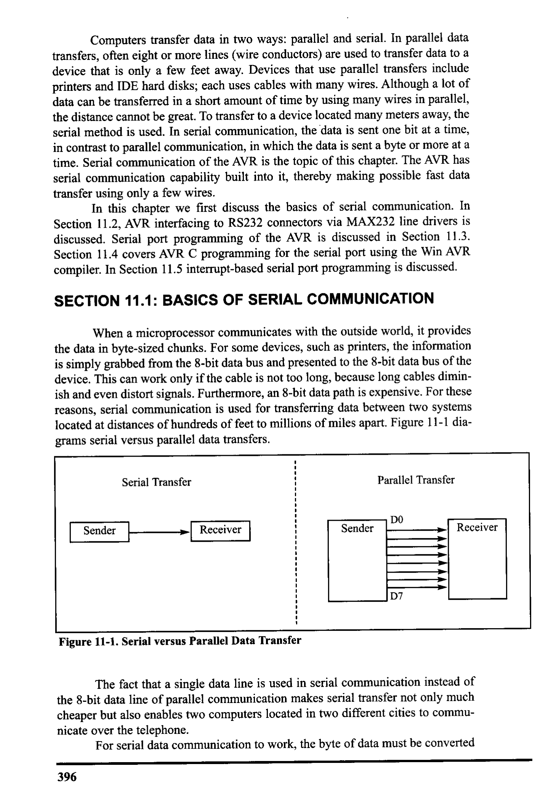
*Description*: Technical diagram and schematic illustration detailing hardware connection topology, signal routing, and circuit operation for Figure 11-1: Serial versus Parallel Data Transfer.

> **Figure 11-1: Serial versus Parallel Data Transfer**

The fact that a single data line is used in serial communication instead of
the 8-bit data line of parallel communication makes serial transfer not only much
cheaper but also enables two computers located in two different cities to commu-
nicate over the telephone.
For serial data communication to work, the byte of data must be converted
396


<!-- Page 408 -->
### [PDF Page 408]

to serial bits using a parallel-in-serial-out shift register; then it can be transmitted
over a single data line. This also means that at the receiving end there must be a
serial-in-parallel-out shift register to receive the serial data and pack them into a
byte. Of course, if data is to be transmitted on the telephone line, it must be con-
verted from Os and Is to audio tones, which are sinusoidal signals. This conversion
is performed by a peripheral device called a modem, which stands for "modula-
tor/demodulator."
When the distance is short, the digital signal can be transmitted as it is on
a simple wire and requires no modulation. This is how x86 PC keyboards transfer
data to the motherboard. For long-distance data transfers using communication
lines such as a telephone, however, serial data communication requires a modem
to modulate (convert from Os and 1s to audio tones) and demodulate (convert from
audio tones to Os and 1s).
Serial data communication uses two methods, asynchronous and synchro-
nous. The synchronous method transfers a block of data (characters) at a time,
whereas the asynchronous method transfers a single byte at a time. It is possible
to write software to use either of these methods, but the programs can be tedious
and long. For this reason, special IC chips are made by many manufacturers for
serial data communications. These chips are commonly referred to as UART (uni-
versal asynchronous receiver-transmitter) and USART (universal synchronous-
asynchronous receiver-transmitter). The AVR chip has a built-in USART, which is
discussed in detail in Section 11.3
Simplex
Transmitter
Receiver
Half Duplex
Transmitter
Receiver
L
-
Receiver
Transmitter
Full Duplex
Transmitter
Receiver
Receiver
Transmitter

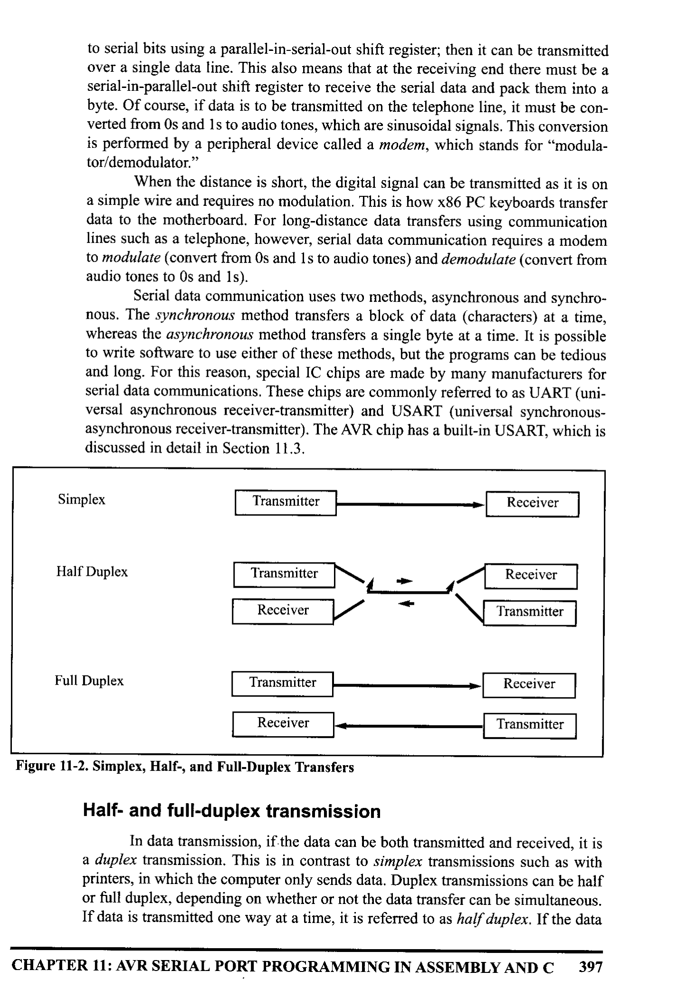
*Description*: Technical diagram and schematic illustration detailing hardware connection topology, signal routing, and circuit operation for Figure 11-2: Simplex, Half-, and Full-Duplex Transfers.

> **Figure 11-2: Simplex, Half-, and Full-Duplex Transfers**

Half- and full-duplex transmission
In data transmission, if the data can be both transmitted and received, it is
a duplex transmission. This is in contrast to simplex transmissions such as with
printers, in which the computer only sends data. Duplex transmissions can be half
or full duplex, depending on whether or not the data transfer can be simultaneous.
If data is transmitted one way at a time, it is referred to as half duplex. If the data
CHAPTER 11: AVR SERIAL PORT PROGRAMMING IN ASSEMBLY AND C
397


<!-- Page 409 -->
### [PDF Page 409]

can go both ways at the same time, it is full duplex. Of course, full duplex requires
two wire conductors for the data lines (in addition to the signal ground), one for
transmission and one for reception, in order to transfer and receive data simulta-
neously. See Figure 11-2.
Asynchronous serial communication and data framing
The data coming in at the receiving end of the data line in a serial data
transfer is all Os and Is; it is difficult to make sense of the data unless the sender
and receiver agree on a set of rules, a protocol, on how the data is packed, how
many bits constitute a character, and when the data begins and ends.
Start and stop bits
Asynchronous serial data communication is widely used for character-ori-
ented transmissions, while block-oriented data transters use the synchronou
nethod. In the asynchronous method, each character is placed between start anc
stop bits. This is called framing. In data framing for asynchronous communica-
tions, the data, such as ASCII characters, are packed between a start bit and a stop
bit. The start bit is always one bit, but the stop bit can be one or two bits. The start
bit is always a O (low), and the stop bit(s) is 1 (high). For example, look at

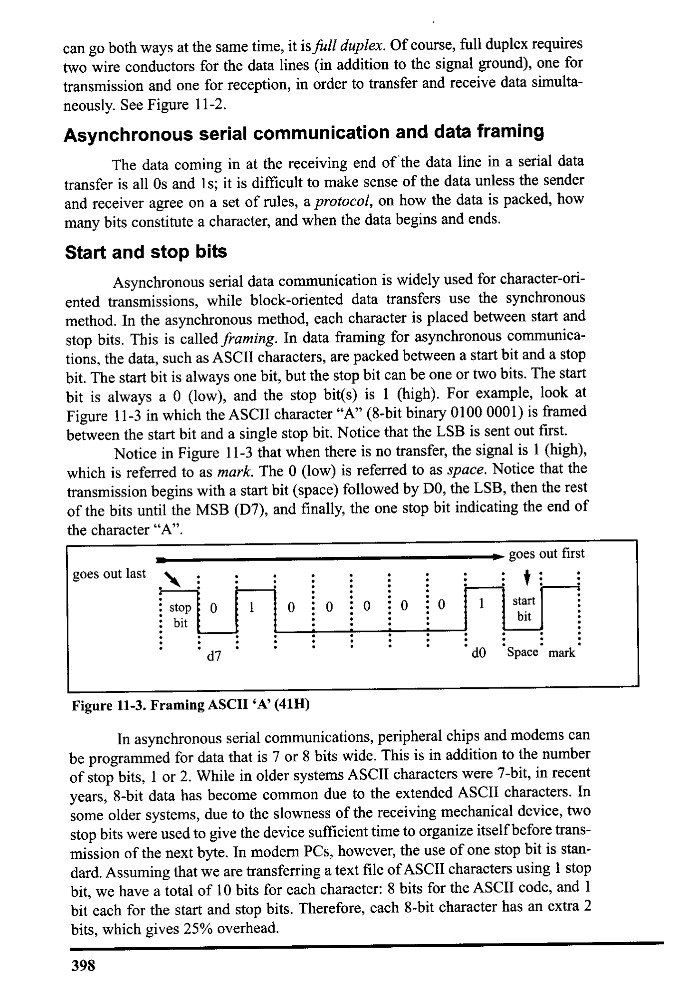
*Description*: Technical diagram and schematic illustration detailing hardware connection topology, signal routing, and circuit operation for Figure 11-3: in which the ASCII character "A" (8-bit binary 0100 0001) is framed.

> **Figure 11-3: in which the ASCII character "A" (8-bit binary 0100 0001) is framed**

between the start bit and a single stop bit. Notice that the LSB is sent out first.
Notice in Figure 11-3 that when there is no transfer, the signal is 1 (high),
which is referred to as mark. The 0 (low) is referred to as space. Notice that the
transmission begins with a start bit (space) followed by DO, the LSB, then the rest
of the bits until the MSB (D7), and finally, the one stop bit indicating the end of
the character "A".
- goes out first
goes out last
stop
bit
-
1
start
bit
do
Space mark
d7


*Description*: Technical diagram and schematic illustration detailing hardware connection topology, signal routing, and circuit operation for Figure 11-3: Framing ASCII 'A' (41H).

> **Figure 11-3: Framing ASCII 'A' (41H)**

In asynchronous serial communications, peripheral chips and modems can
be programmed for data that is 7 or 8 bits wide. This is in addition to the number
of stop bits, 1 or 2. While in older systems ASCII characters were 7-bit, in recent
years, 8-bit data has become common due to the extended ASCII characters. In
some older systems, due to the slowness of the receiving mechanical device, two
stop bits were used to give the device sufficient time to organize itself before trans-
mission of the next byte. In modern PCs, however, the use of one stop bit is stan-
dard. Assuming that we are transferring a text file of ASCII characters using 1 stop
bit, we have a total of 10 bits for each character: 8 bits for the ASCII code, and 1
bit each for the start and stop bits. Therefore, each 8-bit character has an extra 2
bits, which gives 25% overhead.
398


<!-- Page 410 -->
### [PDF Page 410]

In some systems, the parity bit of the character byte is included in the data
frame in order to maintain data integrity. This means that for each character (7- or
8-bit, depending on the system) we have a single parity bit in addition to start and
stop bits. The parity bit is odd or even. In the case of an odd parity bit the number
of Is in the data bits, including the parity bit, is odd. Similarly, in an even parity
bit system the total number of bits, including the parity bit, is even. For example,
the ASCII character "A", binary 0100 0001, has 0 for the even parity bit. UART
chips allow programming of the parity bit for odd-, even-, and no-parity options.
Data transfer rate
The rate of data transfer in serial data communication is stated in bps (bits
per second). Another widely used terminology for bps is baud rate. However, the
baud and bps rates are not necessarily equal. This is because baud rate is the
modem terminology and is defined as the number of signal changes per second. In
modems, sometimes a single change of signal transfers several bits of data. As far
as the conductor wire is concerned, the baud rate and bps are the same, and for this
reason in this book we use the terms bps and baud interchangeably.
The data transfer rate of a given computer system depends on communica-
tion ports incorporated into that system. For example, the early IBM PC/XT could
transfer data at the rate of 100 to 9600 bps. In recent years, however, Pentium-
based PCs transfer data at rates as high as 56K. Notice that in asynchronous seri-
al data communication, the baud rate is generally limited to 100,000 bps.
RS232 standards
To allow compatibility among data communication equipment made by
various manufacturers, an interfacing standard called RS232 was set by the
Electronics Industries Association (EIA) in 1960. In 1963 it was modified and
called RS232A. RS232B and RS232C were issued in 1965 and 1969, respective-
ly. In this book we refer to it simply as RS232. Today, RS232 is one of the most
widely used serial I/O interfacing standards. This standard is used in PCs and
numerous types of equipment. Because the standard was set long before the advent
of the TTL logic family, however, its input and output voltage levels are not TTL
compatible. In RS232, a 1 is represented by -3 to -25 V, while a 0 bit is +3 to +25
volts, making -3 to +3 undefined. For this reason, to connect any RS232 to a
microcontroller system we must use voltage converters such as MAX232 to con-
vert the TTL logic levels to the RS232 voltage levels, and vice versa. MAX232 IC
chips are commonly referred to as line drivers. Original RS232 connection to
MAX232 is discussed in Section 11.2.
RS232 pins

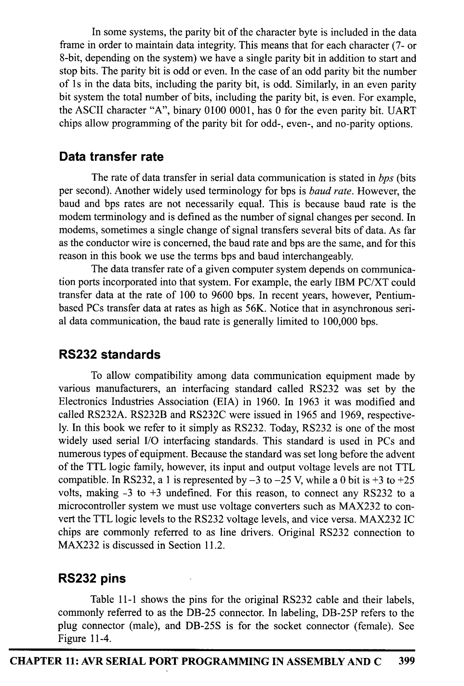
*Description*: IC pinout diagram showing physical pin assignments, I/O pin multiplexing, supply rails, and clock interface connections for Table 11-1: shows the pins for the original RS232 cable and their labels,.

> **Table 11-1: shows the pins for the original RS232 cable and their labels,**

commonly referred to as the DB-25 connector. In labeling, DB-25P refers to the
plug connector (male), and DB-25S is for the socket connector (female). See


*Description*: Technical diagram and schematic illustration detailing hardware connection topology, signal routing, and circuit operation for Figure 11-4.

> **Figure 11-4**

CHAPTER 11: AVR SERIAL PORT PROGRAMMING IN ASSEMBLY AND C
399


<!-- Page 411 -->
### [PDF Page 411]

13
• • •
• •
14
25


*Description*: Technical diagram and schematic illustration detailing hardware connection topology, signal routing, and circuit operation for Figure 11-4: The Original RS232 Connector DB-25 (No longer in use).

> **Figure 11-4: The Original RS232 Connector DB-25 (No longer in use)**

Because not all the pins were used in PC cables, IBM introduced the DB-
9 version of the serial I/O standard, which uses only 9 pins, as shown in

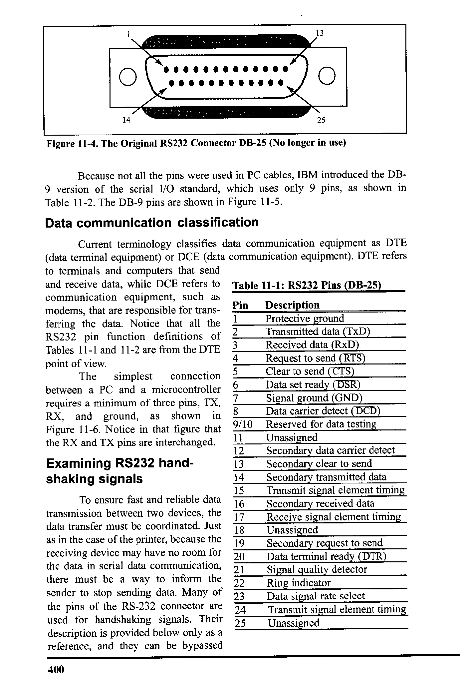
*Description*: IC pinout diagram showing physical pin assignments, I/O pin multiplexing, supply rails, and clock interface connections for Table 11-2: The DB-9 pins are shown in Figure 11-5..

> **Table 11-2: The DB-9 pins are shown in Figure 11-5.**

Data communication classification
Current terminology classifies data communication equipment as DTE
(data terminal equipment) or DCE (data communication equipment). DTE refers
to terminals and computers that send
and receive data, while DCE refers to


*Description*: IC pinout diagram showing physical pin assignments, I/O pin multiplexing, supply rails, and clock interface connections for Table 11-1: RS232 Pins (DB-25).

> **Table 11-1: RS232 Pins (DB-25)**

communication equipment, such as
Pin
modems, that are responsible for trans-
Description
1
ferring the data. Notice that all the
Protective ground
RS232 pin function definitions of
2
Transmitted data (TxD)
Tables 11-1 and 11-2 are from the DTE
3
Received data (RxD)
point of view.
4
Request to send (RTS)
The
simplest
connection
5
Clear to send (CTS)
between a PC and a microcontroller
6
Data set ready (DSR)
requires a minimum of three pins, TX,
7
Signal ground (GND)
RX, and ground, as shown in
8
Data carrier detect (DCD)


*Description*: Technical diagram and schematic illustration detailing hardware connection topology, signal routing, and circuit operation for Figure 11-6: Notice in that figure that.

> **Figure 11-6: Notice in that figure that**

9/10
Reserved for data testing
the RX and TX pins are interchanged.
11
Unassigned
12
Secondary data carrier detect
Examining RS232 hand-
Secondary clear to send
shaking signals
14
Secondary transmitted data
15
Transmit signal element timing
To ensure fast and reliable data
16
Secondary received data
transmission between two devices, the
17
data transfer must be coordinated. Just
18
Receive signal element timing
Unassigned
as in the case of the printer, because the
19
Secondary request to send
receiving device may have no room for
20
Data terminal ready (DTR)
the data in serial data communication,
21
Signal quality detector
there must be a way to inform the
22
Ring indicator
sender to stop sending data. Many of
Data signal rate select
the pins of the RS-232 connector are
24
Transmit signal element timing
used for handshaking signals. Their
Unassigned
description is provided below only as a
reference, and they can be bypassed
400


<!-- Page 412 -->
### [PDF Page 412]

because they are not supported by the
AVR UART chip.
5
1. DTR (data terminal ready). When
the terminal (or a PC COM port) is
turned on, after going through a
self-test, it sends out signal DTR to
indicate that it is ready for commu-
6
nication. If there is something
9
wrong with the COM port, this sig-
nal will not be activated. This is an


*Description*: IC pinout diagram showing physical pin assignments, I/O pin multiplexing, supply rails, and clock interface connections for Figure 11-5: 9-Pin Connector for DB-9.

> **Figure 11-5: 9-Pin Connector for DB-9**

active-LOW signal and can be used
to inform the modem that the com-
puter is alive and kicking. This is
Pin
an output pin from DTE (PC COM
port) and an input to the modem.
2. DSR (data set ready). When the
3
DCE (modem) is turned on and has
gone through the self-test, it asserts
DSR to indicate that it is ready to
communicate. Thus, it is an output
from the modem (DCE) and an
input to the PC (DTE). This is an
active-LOW signal. If for any rea-
8
2

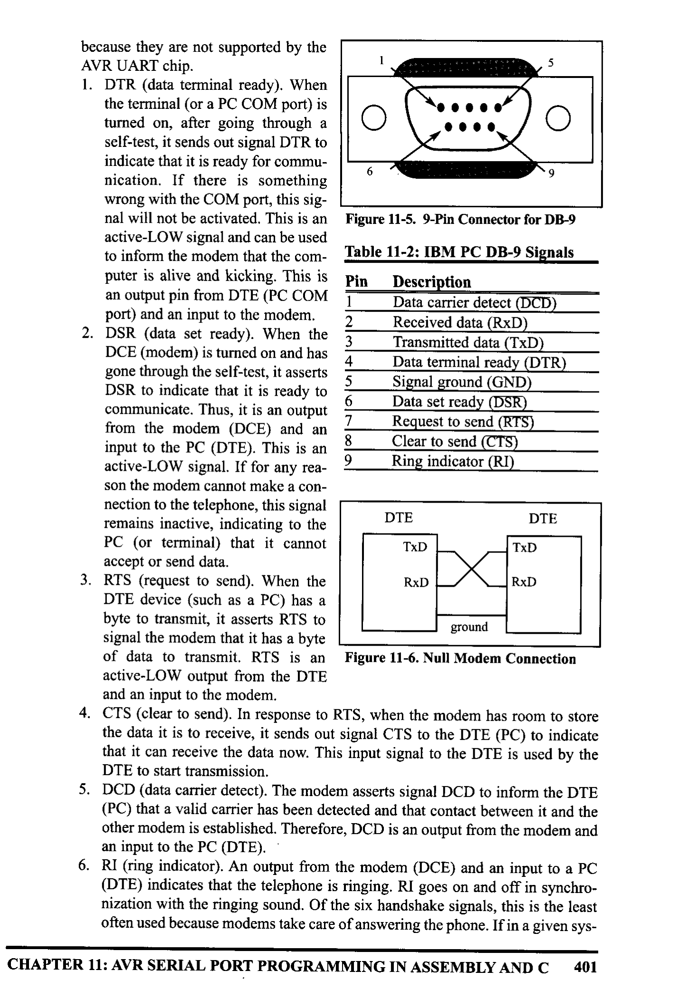
*Description*: Structured reference table listing operational parameters, instruction execution cycles, memory address mapping, or feature comparison for Table 11-2: IBM PC DB-9 Signals.

> **Table 11-2: IBM PC DB-9 Signals**

Description
Data carrier detect (DCD)
Received data (RxD)
Transmitted data (TxD)
Data terminal ready (DTR)
Signal ground (GND)
Data set ready (DSR)
Request to send (RTS)
Clear to send (CTS)
Ring indicator (RI)
son the modem cannot make a con-
nection to the telephone, this signal
remains inactive, indicating to the
PC (or terminal) that it cannot
DTE
TxD
DTE
TxD
accept or send data.
3. RTS (request to send). When the
RxD
RxD
DTE device (such as a PC) has a
byte to transmit, it asserts RTS to
signal the modem that it has a byte
of data to transmit. RTS is an
ground


*Description*: Technical diagram and schematic illustration detailing hardware connection topology, signal routing, and circuit operation for Figure 11-6: Null Modem Connection.

> **Figure 11-6: Null Modem Connection**

active-LOW output from the DTE
and an input to the modem.
4. CTS (clear to send). In response to RTS, when the modem has room to store
the data it is to receive, it sends out signal CTS to the DTE (PC) to indicate
that it can receive the data now. This input signal to the DTE is used by the
DTE to start transmission.
5. DCD (data carrier detect). The modem asserts signal DCD to inform the DTE
(PC) that a valid carrier has been detected and that contact between it and the
other modem is established. Therefore, DCD is an output from the modem and
an input to the PC (DTE).
6. RI (ring indicator). An output from the modem (DCE) and an input to a PC
(DTE) indicates that the telephone is ringing. RI goes on and off in synchro-
nization with the ringing sound. Of the six handshake signals, this is the least
often used because modems take care of answering the phone. If in a given sys-
CHAPTER 11: AVR SERIAL PORT PROGRAMMING IN ASSEMBLY AND C
401


<!-- Page 413 -->
### [PDF Page 413]

tem the PC is in charge of answering the phone, however, this signal can be
used.
From the above description, PC and modem communication can be sum-
marized as follows: While signals DTR and DSR are used by the PC and modem,
respectively, to indicate that they are alive and well, it is RTS and CTS that actu-
ally control the flow of data. When the PC wants to send data it asserts RTS, and
in response, the modem, if it is ready (has room) to accept the data, sends back
CTS. If, for lack of room, the modem does not activate CTS, the PC will deassert
DTR and try again. RTS and CTS are also referred to as hardware control flow sig-
nals.
This concludes the description of the most important pins of the R$232
handshake signals plus TX, RX, and ground. Ground is also referred to as SG (sig-
nal ground).
x86 PC COM ports
The x86 PCs (based on 8086, 286, 386, 486, and all Pentium microproces-
sors) used to have two COM ports. Both COM ports were RS232-type connectors.
The COM ports were designated as COM 1 and COM 2. In recent years, one of
these has been replaced with the USB port, and COM 1 is the only serial port avail-
able, if any. We can connect the AVR serial port to the COM 1 port of a PC for
serial communication experiments. In the absence of a COM port, we can use a
COM-to-USB converter module.
With this background in serial communication, we are ready to look at the
AVR. In the next section we discuss the physical connection of the AVR and
RS232 connector, and in Section 11.3 we see how to program the AVR serial com-
munication port.

### Review Questions

1. The transfer of data using parallel lines is
(faster, slower) but
(more expensive, less expensive).
2. True or false. Sending data from a radio station is duplex.
3. True or false. In full duplex we must have two data lines, one for transfer and
one for receive.
4. The start and stop bits are used in the _
(synchronous, asynchro-
nous) method.
Assuming that we are transmitting the ASCII letter "E" (0100 0101 in binary)
with no parity bit and one stop bit, show the sequence of bits transferred seri-
ally.
6. In Question 5, find the overhead due to framing.
7. Calculate the time it takes to transfer 10,000 characters as in Question 5 if we
use 9600 bps. What percentage of time is wasted due to overhead?
8. True or false. RS232 is not TTL compatible.
9. What voltage levels are used for binary O in R$232?
10. True or false. The AVR has a built-in UART.
402


<!-- Page 414 -->
### [PDF Page 414]


## SECTION 11.2: ATMEGA32 CONNECTION TO RS232

In this section, the details of the physical connections of the ATmega32 to
RS232 connectors are given. As stated in Section 11.1, the RS232 standard is not
TTL compatible; therefore, a line driver such as the MAX232 chip is required to
convert RS232 voltage levels to TTL levels, and vice versa. The interfacing of
ATmega32 with RS232 connectors via the MAX232 chip is the main topic of this
section.
RX and TX pins in the ATmega32
The ATmega32 has two pins that are used specifically for transferring and
receiving data serially. These two pins are called TX and RX and are part of the
Port D group (PDO and PD1) of the 40-pin package. Pin 15 of the ATmega32 is
assigned to TX and pin 14 is designated as RX. These pins are TTL compatible;
therefore, they require a line driver to make them RS232 compatible. One such
line driver is the MAX232 chip. This is discussed next.
MAX232
Because the RS232 is not compatible with today's microprocessors and
microcontrollers, we need a line driver (voltage converter) to convert the RS232's
signals to TTL voltage levels that will be acceptable to the AVR's TX and RX pins.
One example of such a converter is MAX232 from Maxim Corp. (www.maxim-
ic.com). The MAX232 converts from RS232 voltage levels to TTL voltage levels,
and vice versa. One advantage of the MAX232 chip is that it uses a +5 V power
source, which is the same as the source voltage for the AVR. In other words, with
a single +5 V power supply we can power both the AVR and MAX232, with no
need for the dual power supplies that are common in many older systems.
The MAX232 has two sets of line drivers for transferring and receiving
data, as shown in Figure 11-7. The line drivers used for TX are called T1 and T2,
Vcc
03
+
16
1} MAX232
c221
11
TIN
Do.
RIOUT
12
TZIN
10
ROUT
9
ATmega32
6
TlOUT
RIN
TZOUT
R2IN
7C4
I+
- 14
- 13
- 7
- 8
MAX232
(PDO)RXD 14
11
(PDI)TXD| 15 12
13
2
3
7
DB-9
TTL side
15
RS232 side
40-Pin DIP Package ATmega32

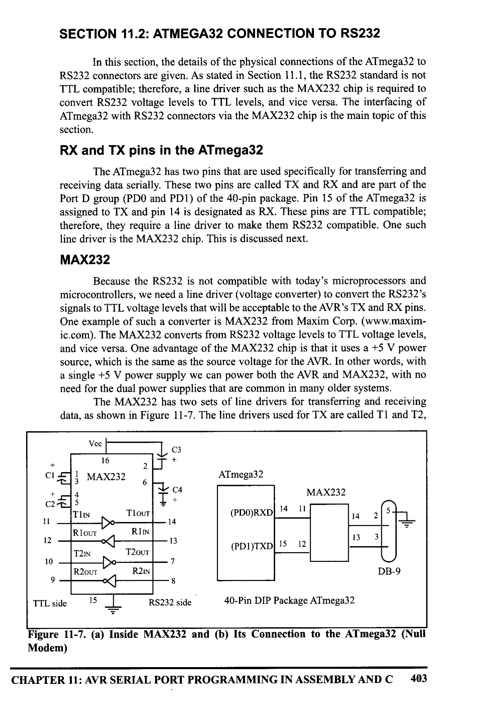
*Description*: Technical diagram and schematic illustration detailing hardware connection topology, signal routing, and circuit operation for Figure 11-7: (a) Inside MAX232 and (b) Its Connection to the ATmega32 (Null.

> **Figure 11-7: (a) Inside MAX232 and (b) Its Connection to the ATmega32 (Null**

Modem)
CHAPTER 11: AVR SERIAL PORT PROGRAMMING IN ASSEMBLY AND C
403


<!-- Page 415 -->
### [PDF Page 415]

while the line drivers for RX are designated as R1 and R2. In many applications
only one of each is used. For example, T1 and R1 are used together for TX and R$
of the AVR, and the second set is left unused. Notice in MAX232 that the T1 line
driver has a designation of Tlin and Tlout on pin numbers 11 and 14, respective-
ly. The Tlin pin is the TTL side and is connected to TX of the microcontroller,
while Tlout is the RS232 side that is connected to the RX pin of the RS232 DB
connector. The R1 line driver has a designation of Rlin and Rlout on pin numbers
13 and 12, respectively. The Rlin (pin 13) is the RS232 side that is connected to
the TX pin of the RS232 DB connector, and Rlout (pin 12) is the TTL side that is
connected to the RX pin of the microcontroller. See Figure 11-7. Notice the null
modem connection where RX for one is TX for the other.
MAX232 requires four capacitors ranging from 0.1 to 22 uF. The most
widely used value for these capacitors is 22 uF.
MAX233
To save board space, some designers use the MAX233 chip from Maxim.
The MAX233 performs the same job as the MAX232 but eliminates the need for
capacitors. However, the MAX233 chip is much more expensive than the
MAX232. Notice that MAX233 and MAX232 are not pin compatible. You cannot
take a MAX232 out of a board and replace it with a MÅX233. See Figure 11-8 for
MAX233 with no capacitor used.
13
14
12
17
7
MAX233
MAX233
=
ATmega32
2
3-
1.
20
THIN
Do
ROUT
T2IN
Do
R2OUT
10
TlOUT
RIN
T2OUT
R2IN
(PDO)RxD 14
2
- 5
-4
- 18
- 19
(PDI)TxD 15
3
5
4
2
3
DB-9
L
TTL side
6
RS233 side
40-Pin DIP Package ATmega32

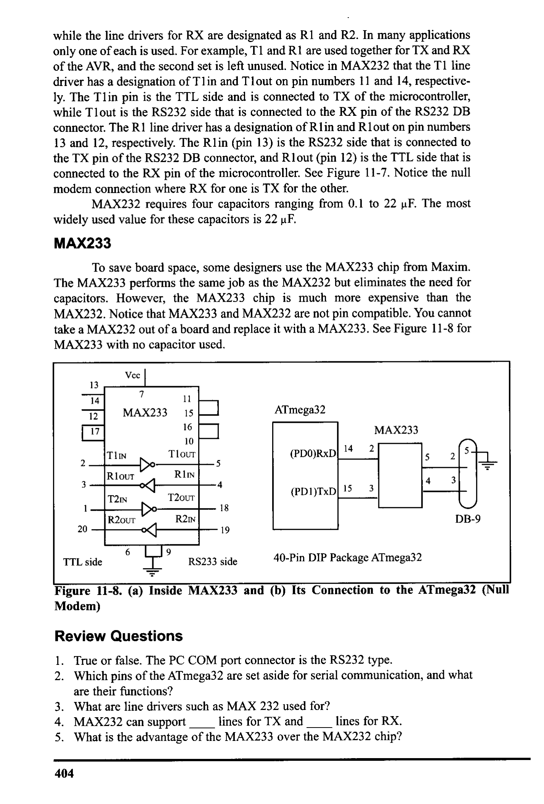
*Description*: Technical diagram and schematic illustration detailing hardware connection topology, signal routing, and circuit operation for Figure 11-8: (a) Inside MAX233 and (b) Its Connection to the ATmega32 (Null.

> **Figure 11-8: (a) Inside MAX233 and (b) Its Connection to the ATmega32 (Null**

Modem)

### Review Questions

1. True or false. The PC COM port connector is the RS232 type.
2. Which pins of the ATmega32 are set aside for serial communication, and what
are their functions?
mi
What are line drivers such as MAX 232 used for?
4. MAX232 can support
_lines for TX and
lines for RX.
5. What is the advantage of the MAX233 over the MAX232 chip?
404


<!-- Page 416 -->
### [PDF Page 416]


## SECTION 11.3: AVR SERIAL PORT PROGRAMMING IN

ASSEMBLY
In this section we discuss the serial communication registers of the
ATmega32 and show how to program them to transfer and receive data using asyn-
chronous mode. The USART (universal synchronous asynchronous receiver/
transmitter) in the AVR has normal asynchronous, double-speed asynchronous,
master synchronous, and slave synchronous mode features. The synchronous
mode can be used to transfer data between the AVR and external peripherals such
as ADC and EEPROMs. The asynchronous mode is the one we will use to connect
the AVR-based system to the x86 PC serial port for the purpose of full-duplex seri-
al data transfer. In this section we examine the asynchronous mode only.
In the AVR microcontroller five registers are associated with the USART
that we deal with in this chapter. They are UDR (USART Data Register), UCSRA,
UCSRB, UCSRC (USART Control Status Register), and UBRR (USART Baud
Rate Register). We examine each of them and show how they are used in full-
duplex serial data communication.
UBRR register and baud rate in the AVR
Because the x86 PCs are so widely used to commu- Table 11-3: Some
nicate with AVR-based systems, we will emphasize serial
PC Baud Rates in
communications of the AVR with the COM port of the x86
HyperTerminal
PC. Some of the baud rates supported by PC HyperTerminal
1,200
are listed in Table 11-3. You can examine these baud rates by
2,400
going to the Microsoft Windows HyperTerminal program
4,800
and clicking on the Communication Settings option. The
9,600
AVR transfers and receives data serially at many different
19,200
baud rates. The baud rate in the AVR is programmable. This
38,400
is done with the help of the 8-bit register called UBRR. For
57,600
a given crystal frequency, the value loaded into the UBRR
115,200
decides the baud rate. The relation between the value loaded
into UBBR and the Fose (frequency of oscillator connected to the XTALI and
XTAL2 pins) is dictated by the following formula:
Desired Baud Rate = Fosc/ (16(X + 1))
where X is the value we load into the UBRR register. To get the X value
for different baud rates we can solve the equation as follows:
X = (Fosc/ (16(Desired Baud Rate))) - 1
Assuming that Fosc = 8 MHz, we have the following:
Desired Baud Rate = Fosc/ (16(X + 1)) = 8 MHz/16(X + 1) = 500 kHz/(X + 1)
X = (500 kHz/ Desired Baud Rate) - 1
CHAPTER 11: AVR SERIAL PORT PROGRAMMING IN ASSEMBLY AND C
405


<!-- Page 417 -->
### [PDF Page 417]


*Description*: Structured reference table listing operational parameters, instruction execution cycles, memory address mapping, or feature comparison for Table 11-4: UBRR Values for Various Baud Rates (Fosc = 8 MHz, U2X = 0).

> **Table 11-4: UBRR Values for Various Baud Rates (Fosc = 8 MHz, U2X = 0)**

Baud Rate UBRR (Decimal Value)
_UBRR (Hex Value)
38400
12
C
19200
25
19
9600
51
33
4800
103
.67
2400
207
CF
1200
415
19F
Note: For Fosc = 8 MHz we have UBRR = (500000/BaudRate) - 1


*Description*: Structured reference table listing operational parameters, instruction execution cycles, memory address mapping, or feature comparison for Table 11-4: shows the X values for the different baud rates if Fosc = 8 MHz..

> **Table 11-4: shows the X values for the different baud rates if Fosc = 8 MHz.**

Another way to understand the UBRR values listed in Table 11-4 is to look at

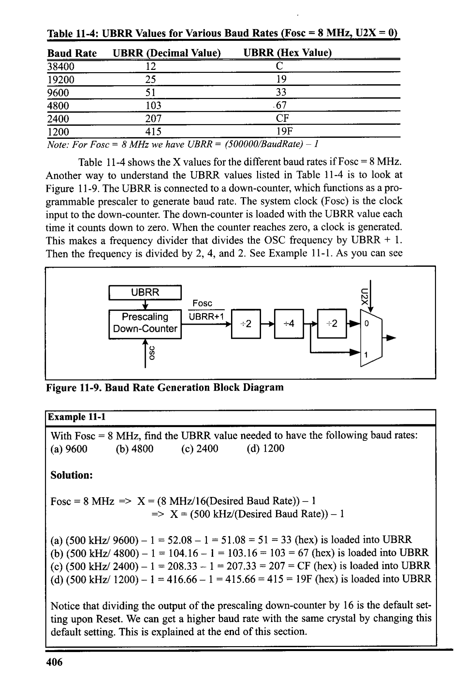
*Description*: Technical diagram and schematic illustration detailing hardware connection topology, signal routing, and circuit operation for Figure 11-9: The UBRR is connected to a down-counter, which functions as a pro-.

> **Figure 11-9: The UBRR is connected to a down-counter, which functions as a pro-**

grammable prescaler to generate baud rate. The system clock (Fosc) is the clock
input to the down-counter. The down-counter is loaded with the UBRR value each
time it counts down to zero. When the counter reaches zero, a clock is generated.
This makes a frequency divider that divides the OSC frequency by UBRR + 1.
Then the frequency is divided by 2, 4, and 2. See Example 11-1. As you can see
UBRR
Prescaling
Down-Counter
Fosc
UBRR+1
÷2
+4
÷2
•
0
1


*Description*: Architectural block diagram detailing logic blocks, internal buses, memory units, and hardware component interactions for Figure 11-9: Baud Rate Generation Block Diagram.

> **Figure 11-9: Baud Rate Generation Block Diagram**

Example 11-1
With Fosc = 8 MHz, find the UBRR value needed to have the following baud rates:
(a) 9600
(b) 4800
(c) 2400
(d) 1200
Solution:
Fosc = 8 MHz => X = (8 MHz/16(Desired Baud Rate)) - 1
=> X= (500 kHz/(Desired Baud Rate)) - 1
(a) (500 kHz/ 9600) - 1 = 52.08 - 1 = 51.08 = 51 = 33 (hex) is loaded into UBRR
(b) (500 kHz/ 4800) - 1 = 104.16 - 1 = 103.16 = 103 = 67 (hex) is loaded into UBRR
(c) (500 kHz/ 2400) - 1 = 208.33 - 1 = 207.33 = 207 = CF (hex) is loaded into UBRR
(d) (500 kHz/ 1200) - 1 = 416.66 - 1 = 415.66 = 415 = 19F (hex) is loaded into UBRR
Notice that dividing the output of the prescaling down-counter by 16 is the default set-
ting upon Reset. We can get a higher baud rate with the same crystal by changing this
default setting. This is explained at the end of this section.
406


<!-- Page 418 -->
### [PDF Page 418]

15
URSELT
7


*Description*: Register specification diagram depicting individual bit flags, control register configurations, and functional definitions for Figure 11-10: UBRR Register.

> **Figure 11-10: UBRR Register**

7
8
-
UBRR[7:0]
UBRR[11:8]
0
RXB[7:0]
TXB17:0]
UDR (Read)
UDR (Write)
7

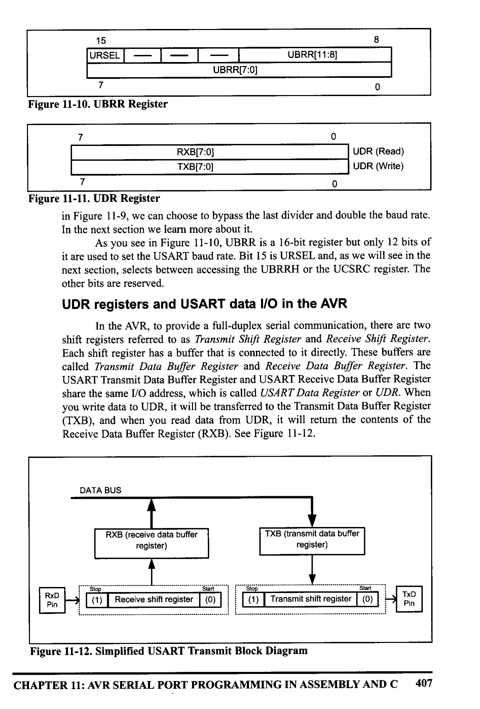
*Description*: Register specification diagram depicting individual bit flags, control register configurations, and functional definitions for Figure 11-11: UDR Register.

> **Figure 11-11: UDR Register**

in Figure 11-9, we can choose to bypass the last divider and double the baud rate.
In the next section we learn more about it.
As you see in Figure 11-10, UBRR is a 16-bit register but only 12 bits of
it are used to set the USART baud rate. Bit 15 is URSEL and, as we will see in the
next section, selects between accessing the UBRRH or the UCSRC register. The
other bits are reserved.
UDR registers and USART data I/O in the AVR
In the AVR, to provide a full-duplex serial communication, there are two
shift registers referred to as Transmit Shift Register and Receive Shift Register.
Each shift register has a buffer that is connected to it directly. These buffers are
called Transmit Data Buffer Register and Receive Data Buffer Register. The
USART Transmit Data Buffer Register and USART Receive Data Buffer Register
share the same I/O address, which is called USART Data Register or UDR. When
you write data to UDR, it will be transferred to the Transmit Data Buffer Register
(TXB), and when you read data from UDR, it will return the contents of the
Receive Data Buffer Register (RXB). See Figure 11-12.
DATA BUS
RB (receive data buffer
register)
TXB (transmit data buffer
register)
RXD
Pin
Stop
(1)
*Start
Receive shift register (0)
Start
(1) Transmit shift register (0)
Pin


*Description*: Architectural block diagram detailing logic blocks, internal buses, memory units, and hardware component interactions for Figure 11-12: Simplified USART Transmit Block Diagram.

> **Figure 11-12: Simplified USART Transmit Block Diagram**

CHAPTER 11: AVR SERIAL PORT PROGRAMMING IN ASSEMBLY AND C
407


<!-- Page 419 -->
### [PDF Page 419]

UCSR registers and USART configurations in the AVR
UCSRs are 8-bit control registers used for controlling serial communica-
tion in the AVR. There are three USART Control Status Registers in the AVR.
They are UCSRA, UCSRB, and UCSRC. In Figures 11-13 to 11-15 you can see
the role of each bit in these registers. Examine these figures carefully before con-
tinuing to read this chapter.
RXC
TXC UDRE
DOR
PE
U2X MPCM
RXC (Bit 7): USART Receive Complete
This flag bit is set when there are new data in the receive buffer that are not read yet. It is
cleared when the receive buffer is empty. It also can be used to generate a receive com-
plete interrupt.
TXC (Bit 6): USART Transmit Complete
This flag bit is set when the entire frame in the transmit shift register has been trans-
mitted and there are no new data available in the transmit data buffer register (TXB).
It can be cleared by writing a one to its bit location. Also it is automatically cleared
when a transmit complete interrupt is executed. It can be used to generate a transmit
complete interrupt.
UDRE (Bit 5): USARI Data Register Empty
This flag is set when the transmit data buffer is empty and it is ready to receive new
data. If this bit is cleared you should not write to UDR because it overrides your last
data. The UDRE flag can generate a data register empty interrupt.
FE (Bit 4): Frame Error
This bit is set if a frame error has occurred in receiving the next character in the
receive buffer. A frame error is detected when the first stop bit of the next character in
the receive buffer is zero.
DOR (Bit 3): Data OverRun
This bit is set if a data overrun is detected. A data overrun occurs when the
receive data buffer and receive shift register are full, and a new start bit is detected.
PE (Bit 2): Parity Error
This bit is set if parity checking was enabled (UPM1 = 1) and the next character in the
receive buffer had a parity error when received.
U2X (Bit 1): Double the USART Transmission Speed
Setting this bit will double the transfer rate for asynchronous communication.
MPCM (Bit 0): Multi-processor Communication Mode
This bit enables the multi-processor communication mode. The MPCM feature is not
discussed in this book.
Notice that FE, DOR, and PE are valid until the receive buffer (UDR) is read. Always
set these bits to zero when writing to UCSRA.

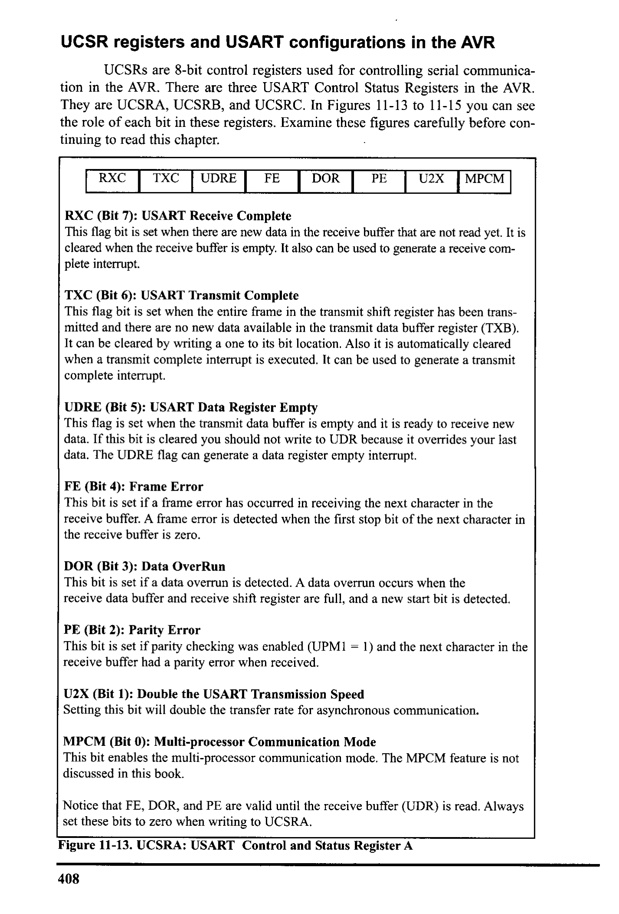
*Description*: Register specification diagram depicting individual bit flags, control register configurations, and functional definitions for Figure 11-13: UCSRA: USART Control and Status Register A.

> **Figure 11-13: UCSRA: USART Control and Status Register A**

408


<!-- Page 420 -->
### [PDF Page 420]

IRXCIE (Bit 7): Receive Complete Interrupt Enable
To enable the interrupt on the RC flag in UCSRA you should set this bit to one.
TXCIE (Bit 6): Transmit Complete Interrupt Enable
To enable the interrupt on the TXC flag in CRA you should set this bit to one.
DRIE (Bit 5): USART Data Register Empty Interrupt Enabl
o enable the interrupt on the UDRE flag in UCSRA you should set this bit to one
RXEN (Bit 4): Receive Enable
To enable the USART receiver you should set this bit to one.
TXEN (Bit 3): Transmit Enable
To enable the USART transmitter you should set this bit to one.
UCSZ2 (Bit 2): Character Size
This bit combined with the UCSZ1:0 bits in UCSRC sets the number of data bits
(character size) in a frame.
RXB8 (Bit 1): Receive data bit 8
This is the ninth data bit of the received character when using serial frames with nine
data bits. This bit is not used in this book.
TXB8 (Bit 0): Transmit data bit 8
This is the ninth data bit of the transmitted character when using serial frames with nine
data bits. This bit is not used in this book.

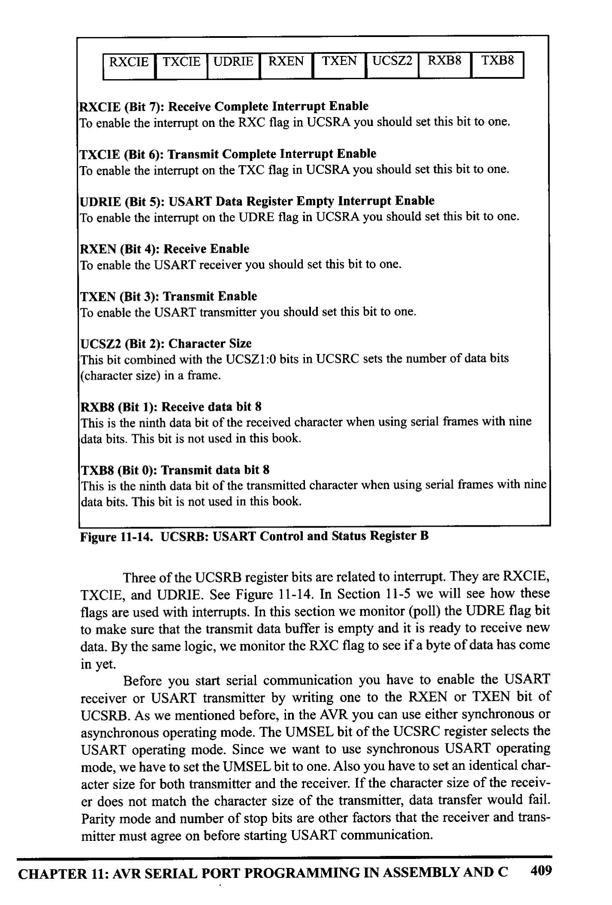
*Description*: Register specification diagram depicting individual bit flags, control register configurations, and functional definitions for Figure 11-14: UCSRB: USART Control and Status Register B.

> **Figure 11-14: UCSRB: USART Control and Status Register B**

Three of the UCSRB register bits are related to interrupt. They are RCIE,
TXCIE, and UDRIE. See Figure 11-14. In Section 11-5 we will see how these
flags are used with interrupts. In this section we monitor (poll) the UDRE flag bit
to make sure that the transmit data buffer is empty and it is ready to receive new
data. By the same logic, we monitor the RC flag to see if a byte of data has come
in yet.
Before you start serial communication you have to enable the USARI
receiver or USART transmitter by writing one to the REN or TXEN bit of
UCSRB. As we mentioned before, in the AVR you can use either synchronous or
asynchronous operating mode. The UMSEL bit of the UCSRC register selects the
USART operating mode. Since we want to use synchronous USART operating
mode, we have to set the UMSEL bit to one. Also you have to set an identical char-
acter size for both transmitter and the receiver. If the character size of the receiv-
er does not match the character size of the transmitter, data transfer would fail.
Parity mode and number of stop bits are other factors that the receiver and trans-
mitter must agree on before starting USART communication.
CHAPTER 11: AVR SERIAL PORT PROGRAMMING IN ASSEMBLY AND C 409


<!-- Page 421 -->
### [PDF Page 421]

URSEL UMSEL UPMI UPMO
USBS TUCSZI UCSZO UCPOL
URSEL (Bit 7): Register Select
This bit selects to access either the UCSRC or the UBRRH register and will be dis-
cussed more in this section.
UMSEL (Bit 6): USART Mode Select
This bit selects to operate in either the asynchronous or synchronous mode of operation.
O = Asynchronous operation
1 = Synchronous operation
UPM1:0 (Bit 5:4): Parity Mode
These bits disable or enable and set the type of parity generation and check.
00 = Disabled
01 = Reserved
10 = Even Parity
11 = Odd Parity
USBS (Bit 3): Stop Bit Select
This bit selects the number of stop bits to be transmitted.
0 = 1 bit
1 = 2 bits
UCSZ1:0 (Bit 2:1): Character Size
These bits combined with the UCSZ2 bit in UCSRB set the character size in a frame
and will be discussed more in this section.
UCPOL (Bit 2): Clock Polarity
This bit is used for synchronous mode only and will not be covered in this section.

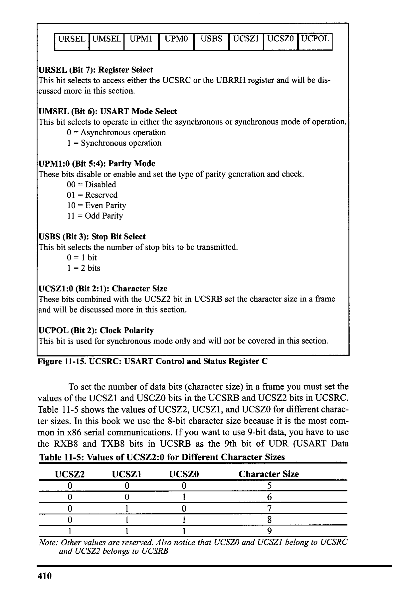
*Description*: Register specification diagram depicting individual bit flags, control register configurations, and functional definitions for Figure 11-15: UCSRC: USART Control and Status Register C.

> **Figure 11-15: UCSRC: USART Control and Status Register C**

To set the number of data bits (character size) in a frame you must set the
values of the UCSZ1 and USCZO bits in the UCSRB and UCSZ2 bits in UCSRC.


*Description*: Structured reference table listing operational parameters, instruction execution cycles, memory address mapping, or feature comparison for Table 11-5: shows the values of UCSZ2, UCSZ1, and UCSZO for different charac-.

> **Table 11-5: shows the values of UCSZ2, UCSZ1, and UCSZO for different charac-**

ter sizes. In this book we use the 8-bit character size because it is the most com-
mon in x86 serial communications. If you want to use 9-bit data, you have to use
the RXB8 and TXB8 bits in UCSRB as the 9th bit of UDR (USART Data


*Description*: Structured reference table listing operational parameters, instruction execution cycles, memory address mapping, or feature comparison for Table 11-5: Values of UCSZ2:0 for Different Character Sizes.

> **Table 11-5: Values of UCSZ2:0 for Different Character Sizes**

UCSZ2
UCSZI
UCSZO
Character Size
0
0
0
0
8
9
1
1
1
Note: Other values are reserved. Also notice that UCSZO and UCSZI belong to UCSRO
and UCSZ2 belongs to UCSRB
410


<!-- Page 422 -->
### [PDF Page 422]

Register).
Because of some technical considerations, the UCSRC register shares the
same I/O location as the UBRRH, and therefore some care must be taken when
accessing these I/0 locations. When you write to UCSRC or UBRRH, the high bit
of the written value (URSEL) controls which of the two registers will be the tar-
get of the write operation. If URSEL is zero during a write operation, the UBRRH
value will be updated; otherwise, UCSRC will be updated. See Examples 11-2 and
11-3 to learn how we access the bits of UCSRC and UBRR.
Example 11-2
(a) What are the values of UCSRB and UCSRC needed to configure USART for asyn-
chronous operating mode, 8 data bits (character size), no parity, and 1 stop bit?
Enable both receive and transmit.
(b) Write a program for the AVR to set the values of UCSRB and UCSRC for this con-
figuration.
Solution:
(a) RXEN and TXEN have to be 1 to enable receive and transmit. UCSZ2:0 should be
011 for 8-bit data, UMSEL should be 0 for asynchronous operating mode, UPM1:0
have to be 00 for no parity, and USBS should be 0 for one stop bit.
(b)
• INCLUDE "M32DEF.INC"
IDI R16, (1<<RXEN) | (1<<TXEN)

```assembly
OUT UCSRB, R16
¡ In the next line URSEL = 1 to access UCSRC. Note that instead
```

¡of using shift operator, you can write "IDI R16, 0b10000110"
IDI R16, (1<<UCSZ1) | (1<<UCSZO) | (1<<URSEL)

```assembly
OUT UCSRC, R16
```

Example 11-3
In Example 11-2, set the baud rate to 1200 and write a program for the AVR to set up
the values of UCSRB, UCSRC, and UBRR. (Focs = 8 MHz)
Solution:
• INCLUDE "M32DEF.INC"
IDI R16, (1<<RXEN) | (1<<TXEN)

```assembly
OUT UCSRB, R16
¡ In the next line URSEL = 1 to access UCSRC. Note that instead
```

¡of using shift operator, you can write "IDI R16, 0b10000110"
IDI R16, (1<<UCSZ1) | (1<<UCSZO) | (1<<URSEL)

```assembly
OUT UCSRC, R16
; move R16 to UCSRC
LDI R16, 0x9F
```

¡ see Table 11-4
OUT
UBRRI, R16
;1200 baud rate
IDI R16, 0x1
; URSEL= 0 to

```assembly
OUT UBRRH, R16
```

¡ access UBRRH
CHAPTER 11: AVR SERIAL PORT PROGRAMMING IN ASSEMBLY AND C
411


<!-- Page 423 -->
### [PDF Page 423]

FE and PE flag bits
When the AVR USART receives a byte, we can check the parity bit and
stop bit. If the parity bit is not correct, the AVR will set PE to one, indicating that
an parity error has occurred. We can also check the stop bit. As we mentioned
before, the stop bit must be one, otherwise the AVR would generate a stop bit error
and set the FE flag bit to one, indicating that a stop bit error has occurred. We can
check these flags to see if the received data is valid and correct. Notice that FE and
PE are valid until the receive buffer (UDR) is read. So we have to read FE and PE
bits before reading UDR. You can explore this on your own.
Programming the AVR to transfer data serially
In programming the AVR to transfer character bytes serially, the following
steps must be taken:
1. The UCSRB register is loaded with the value 08H, enabling the USART trans-
mitter. The transmitter will override normal port operation for the T×D pin
when enabled.
2. The UCSRC register is loaded with the value 06H, indicating asynchronous
mode with 8-bit data frame, no parity, and one stop bit.
3. The UBRR is loaded with one of the values in Table 11-4 (if Fosc = 8 MHz)
to set the baud rate for serial data transfer.
4. The character byte to be transmitted serially is written into the UDR register.
5. Monitor the UDRE bit of the UCSRA register to make sure UDR is ready for
the next byte.
6. To transmit the next character, go to Step 4.
Importance of monitoring the UDRE flag
By monitoring the UDRE flag, we make sure that we are not overloading
Example 11-4
Write a program for the AVR to transfer the letter 'G' serially at 9600 baud, continuous-
ly. Assume XTAL = 8 MHz.
Solution:
• INCLUDE "M32DEF.INC"
LDI
R16, (1<<TXEN)
; enable transmitter
OUT
UCSRB, R16
LDI
R16, (1<<UCSZ1) | (1<<UCSZO) | (1<<URSEL) ;8-bit data

```assembly
OUT UCSRC, R16
```

¡no parity, - stop bit
LDI
R16, 0x33
; 9600 baud rate
OUT
UBRRL, R16
; for XTAL = 8 MHZ
AGAIN:

```assembly
SBIS UCSRA, UDRE
```

RIMP AGAIN
IDI R16, 'G'

```assembly
OUT UDR, R16
```

RIMP AGAIN
¡ is UDR empty
¡wait more
i send 'G
¡tO UDR
¡do it again
412


<!-- Page 424 -->
### [PDF Page 424]

the UDR register. If we write another byte into the UDR register before it is empty,
the old byte could be lost before it is transmitted.
We conclude that by checking the UDRE flag bit, we know whether or not
the AVR is ready to accept another byte to transmit. The UDRE flag bit can be
checked by the instruction "SBIS UCSRA, UDRE" or we can use an interrupt, as
we will see in Section 11.5. In Section 11.5 we will show how to use interrupts to
transfer data serially, and avoid tying down the microcontroller with instructions
such as "SBIS UCSRA, UDRE". Example 11-4 shows the program to transfer 'G'
serially at 9600 baud
Example 11-5 shows how to transfer "YES " continuously.
Example 11-5
Write a program to transmit the message "YES " serially at 9600 baud, 8-bit data, and
1 stop bit. Do this forever.
Solution:
• INCLUDE "M32DEF.INC"
LDI
OUT
LDI
OUT
R21, HIGH (RAMEND)
SPH, R21
R21, LOW (RAMEND)
SPL, R21
¡initialize nigh
¡byte of SP
¡initialize 1ow
¡byte of SP
LDI
OUT
LDI
OUT
LDI
OUT
AGAIN:
LDI
R17, 'Y'

```assembly
CALL TRNSMT
```

IDI R17, 'E'

```assembly
CALL TRNSMT
```

LDI
R17, 'S'

```assembly
CALL TRNSMT
```

IDI R17,' '

```assembly
CALL TRNSMT
RJMP AGAIN
```

TRNSMT :

```assembly
SBIS UCSRA, UDRE
```

RUMP TRNSMT
OUT
UDR, R17
RET
R16, (1<<TXEN)
¡enable transmitter
UCSRB, R16
R16, (1<<UCSZ1) | (1<<UCSZ0) | (1<<URSEL); 8-bit data
UCSRC, R16
¡no parity, 1 stop bit
R16, 0x33
; 9600 baud rate
UBRRI, R16
¡move 'Y' to R17
¡transmit r17 to TxD
move mit to Lo TXD
¡ transmit space to TxD
¡ is UDR empty?
¡wait more
¡ send R17 to UDR
Programming the AVR to receive data serially
In programming the AVR to receive character bytes serially, the following
CHAPTER 11: AVR SERIAL PORT PROGRAMMING IN ASSEMBLY AND C
413


<!-- Page 425 -->
### [PDF Page 425]

steps must be taken:
1. The UCSRB register is loaded with the value 10H, enabling the USART
receiver. The receiver will override normal port operation for the RD pin
when enabled
2. The UCRC register is loaded with the value 06H, indicating asynchronous
mode with 8-bit data frame, no parity, and one stop bit.
3. The UBRR is loaded with one of the values in Table 11-4 (if Fosc = 8 MHz)
to set the baud rate for serial data transter.
4. The RXC flag bit of the UCSRA register is monitored for a HIGH to see if an
entire character has been received yet.
5. When RXC is raised, the UDR register has the byte. Its contents are moved
into a safe place.
6. To receive the next character, go to Step 5.
Example 11-6 shows the coding of the above steps.
Example 11-6
Program the ATmega32 to receive bytes of data serially and put them on Port B. Set the
baud rate at 9600, 8-bit data, and 1 stop bit.
Solution:
• INCLUDE "M32DEF.INC"
LDI
OUT
R16, (1<<RXEN)
¡ enable receiver
UCSRB, R16
LDI
R16, (1<<UCSZ1) | (1<<UCSZ0) | (1‹<URSEL) ; 8-bit data
OUT
UCSRC, R16
LDI
¡no parity, 1 stop bit
R16, 0x33
; 9600 baud rate
OUT
UBRRI, RI6
LDI
R16, OxFF
¡ Port B is output
OUT
DDRB, R16
RCVE :

```assembly
SBIS UCSRA, RXC
RJMP RCVE
```

IN
R17, UDR
OUT
PORTB, R17

```assembly
RJMP RCVE
```

¡is any byte in UDR?
¡wait more
¡send UDR to R17
¡ send R17 to PORTB
¡do it again
Transmit and receive
In previous examples we showed how to transmit or receive data serially.
ext we show how do both send and receive at the same time in a progran
ssume that the AVR serial port is connected to the COM port of the x86 PC, an
we are using the HyperTerminal program on the PC to send and receive data seri-
ally. Ports A and B of the AVR are connected to LEDs and switches, respectively.
Example 11-7 shows an AVR program with the following parts: (a) sends the mes-
sage "YES" once to the PC screen, (b) gets data on switches and transmits it via
the serial port to the PC's screen, and (c) receives any key press sent by
HyperTerminal and puts it on LEDs.
414


<!-- Page 426 -->
### [PDF Page 426]

Example 11-7
Write an AVR program with the following parts: (a) send the message "YES" once to
the PC screen, (b) get data from switches on Port A and transmit it via the serial port to
the PC's screen, and (c) receive any key press sent by HyperTerminal and put it on
LEDs. The programs must do parts (b) and (c) repeatedly.
Solution:
• INCLUDE "M32DEF.INC"
LDI
OUT
LDI
OUT
R21, 0x00
DDRA, R21
R21, OXFF
DDRB, R21
¡ Port A is input
¡Port B is output
LDI
OUT
LDI
OUT
R21, HIGH (RAMEND)
SPH, R21
R21, LOW (RAMEND)
SPL, R21
¡initialize high
¡byte of SP
¡initialize 10w
¡byte of sP
LDI
OUT
LDI
OUT
LDI
OUT
R16, (1<<TXEN) | (1<<RXEN)
;enable transmitter
UCSRB, R16
¡and receiver
R16, (1<<UCSZ1) | (1<<UCSZO) | (1<<URSEL) ; 8-bit data
UCSRC, R16
¡no parity, 1 stop bit
R16, 0×33
: 9600 baud rate
UBRRL, R16
LDI
R17, 'Y'

```assembly
CALL TRNSMT
```

LDI
R17, 'E'
CALL
TRNSMT
LDI
R17, 'S'

```assembly
CALL TRNSMT
AGAIN:
SBIS UCSRA, RXC
RJMP SKIP_RX
```

IN
R17, UDR
OUT
PORTB, R17
SKIP_RX:

```assembly
SBIS UCSRA, UDRE
RJMP SKIP_ IX
```

IN
R17, PINA
OUT
UDR, R17
SKIP_IX:
RUMP AGAIN
TRNSMT:

```assembly
SBIS UCSRA, UDRE
```

RUMP TRNSMT
OUT
UDR, R17
RET
¡ move 'I' to R17
¡transmit r17 to TxD
¡ move 'E'
to R17
¡transmit r17 to TxD
¡ move 'S' to R17
¡transmit r17 to TxD
¡is there new data?
iskip receive cmnds
¡ move UDR to R17
¡ move R17 TO PORTB
¡ is UDR empty?
i skip transmit cmnds
; move Port A to R17
¡ send R17 to UDR
¡ do it again
¡is UDR empty?
¡wait more
¡ send R17 to UDR
CHAPTER 11: AVR SERIAL PORT PROGRAMMING IN ASSEMBLY AND C
415


<!-- Page 427 -->
### [PDF Page 427]

Doubling the baud rate in the AVR
There are two ways to increase the baud rate of data transfer in the AVR:
1. Use a higher-frequency crystal
2. Change a bit in the UCSRA register, as shown below.
Option 1 is not feasible in many situations because the system crystal is
fixed. Therefore, we will explore option 2. There is a software way to double the
baud rate of the AVR while the crystal frequency stays the same. This is done with
the U2X bit of the UCSRA register. When the AVR is powered up, the U2X bit of
the UCSRA register is zero. We can set it to high by software and thereby double
the baud rate.
To see how the baud rate is doubled with this method, look again at

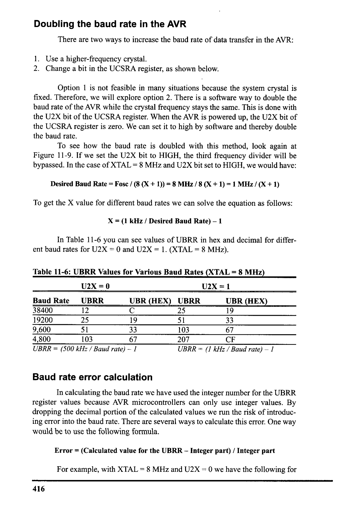
*Description*: Technical diagram and schematic illustration detailing hardware connection topology, signal routing, and circuit operation for Figure 11-9: If we set the U2X bit to HIGH, the third frequency divider will be.

> **Figure 11-9: If we set the U2X bit to HIGH, the third frequency divider will be**

bypassed. In the case of XTAL = 8 MHz and U2X bit set to HIGH, we would have:
Desired Baud Rate = Fosc / (8 (X + 1)) = 8 MHz / 8 (X + 1) = 1 MHz / (X + 1)
To get the X value for different baud rates we can solve the equation as follows:
X = (1 kHz / Desired Baud Rate) - 1
In Table 11-6 you can see values of UBRR in hex and decimal for differ-
ent baud rates for U2X = 0 and U2X = 1. (XTAL = 8 MHz).


*Description*: Structured reference table listing operational parameters, instruction execution cycles, memory address mapping, or feature comparison for Table 11-6: UBRR Values for Various Baud Rates (XTAL = 8 MHz).

> **Table 11-6: UBRR Values for Various Baud Rates (XTAL = 8 MHz)**

U2X =0
Baud Rate
UBRR
38400
12
19200
25
9,600
4,800
51
103
UBRR = (500 kHz / Baud rate) - 1
UZX = 1
UBR (HEX)
19
19
33
67
UBR (HEX) UBRR
25
51
103
207
UBRR = (1 kHz / Baud rate) - 1
Baud rate error calculation
In calculating the baud rate we have used the integer number for the UBRR
register values because AVR microcontrollers can only use integer values. By
dropping the decimal portion of the calculated values we run the risk of introduc-
ing error into the baud rate. There are several ways to calculate this error. One way
would be to use the following formula.
Error = (Calculated value for the UBRR - Integer part) / Integer part
For example, with XTAL = 8 MHz and U2X = 0 we have the following for
416


<!-- Page 428 -->
### [PDF Page 428]

the 9600 baud rate:
UBRR value = (500,000/ 9600) - 1 = 52.08 - 1 = 51.08 = 51
Error = (51.08 - 51)/ 51 = 0.16%
Another way to calculate the error rate is as follows:
Error = (Calculated baud rate - desired baud rate) / desired baud rate
Where the desired baud rate is calculated using X = (Fosc / (16(Desired
Baud rate))) - 1, and then the integer X (value loaded into UBRR reg) is used for
the calculated baud rate as follows:
Calculated baud rate = Fose / (16(X+ 1))
(for U2X = 0)
For XTAL = 8 MHz and 9600 baud rate, we got X = 51. Therefore, we get
the calculated baud rate of 8 MHz/(16(51 + 1)) = 9765. Now the error is calculat-
ed as follows:
Error = (9615 - 9600) / 9600 = 0.16%
which is the same as what we got earlier using the other method.


*Description*: Structured reference table listing operational parameters, instruction execution cycles, memory address mapping, or feature comparison for Table 11-7: provides the error rates for UBRR values of 8 MHz crystal frequencies..

> **Table 11-7: provides the error rates for UBRR values of 8 MHz crystal frequencies.**


*Description*: Structured reference table listing operational parameters, instruction execution cycles, memory address mapping, or feature comparison for Table 11-7: UBRR Values for Various Baud Rates (XTAL = 8 MHz).

> **Table 11-7: UBRR Values for Various Baud Rates (XTAL = 8 MHz)**

U2X = 0
U2X = 1
Baud Rate
38400
19200
2,600
4,800
UBRR
Error
12
0.2%
25
UBRR
25
Error
0.2%
0.2%
0.2%
51
0.2%
103
103
0.2%
207
0.2%
0.2%
UBRR = (500,000 / Baud rate) - 1
UBRR = (1,000,000 / Baud rate) - 1
In some applications we need very accurate baud rate generation. In these
cases we can use a 7.3728 MHz or 11.0592 MHz crystal. As you can see in

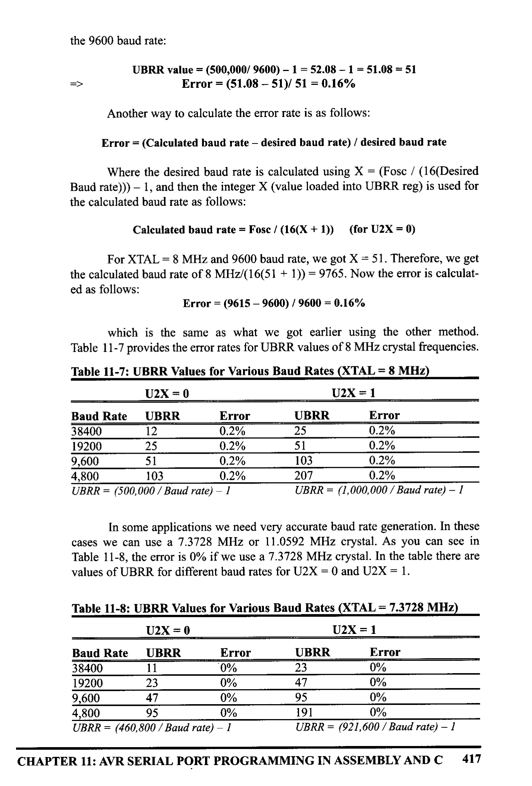
*Description*: Structured reference table listing operational parameters, instruction execution cycles, memory address mapping, or feature comparison for Table 11-8: , the error is 0% if we use a 7.3728 MHz crystal. In the table there are.

> **Table 11-8: , the error is 0% if we use a 7.3728 MHz crystal. In the table there are**

values of UBRR for different baud rates for U2X = 0 and U2X = 1.


*Description*: Structured reference table listing operational parameters, instruction execution cycles, memory address mapping, or feature comparison for Table 11-8: UBRR Values for Various Baud Rates (XTAL = 7.3728 MHz).

> **Table 11-8: UBRR Values for Various Baud Rates (XTAL = 7.3728 MHz)**

U2X = 0
U2X = 1
Baud Rate
UBRR
Error
UBRR
Error
38400
11
0%
19200
0%
0%
0%
2,600
47
95
0%
4,800
0%
95
0%
191
0%
UBRR = (460,800 / Baud rate) - 1
UBRR = (921,600 / Baud rate) - 1
CHAPTER 11: AVR SERIAL PORT PROGRAMMING IN ASSEMBLY AND C
417


<!-- Page 429 -->
### [PDF Page 429]

See Example 11-8 to see how to calculate the error for different baud rates.
Example 11-8
Assuming XTAL = 10 MHz, calculate the baud rate error for each of the following:
(a) 2400
(b) 9600
(c) 19,200
(d) 57,600
Use the U2X = 0 mode.
Solution:
UBRR Value = (Fosc / 16(baud rate)) - 1 , Fosc = 10 MHz =>
(a) UBRR Value = (625,000 / 2400) - 1 = 260.41 - 1 = 259.41 = 259
Error = (259.41c259) / 259 = 0.158%
(b) UBRR Value (625,000 / 9600) - 1 = 65.104 - 1 = 64.104 = 64
Error = (64.104 - 64)/64 = 0.162%
(c) UBRR Value (625,000 / 19,200) - 1 = 32.55 - 1 = 31.55 = 31
Error = (31.55 - 31) / 31 = 1.77%
(d) UBRR Value (625,000 / 57,600) - 1 = 10.85 - 1 = 9.85 = 9
Error = (9.85 - 9) / 9 = 9.4%

### Review Questions

1. Which registers of the AVR are used to set the baud rate?
2. IFXTAL = 10 MHz, what value should be loaded into UBRR to have a 14,400
baud rate? Give the answer in both decimal and hex.
3. What is the baud rate error in the last question?
4. With XTAL = 7.3728 MHz, what value should be loaded into UBRR to have
a 9600 baud rate? Give the answer in both decimal and hex.
5. To transmit a byte of data serially, it must be placed in register
6. UCSRA stands for
7. Which bits are used to set the data frame size?
8. True or false. UCSRA and UCSRB share the same I/O address.
9. What parameters should the transmitter and receiver agree on before starting a
serial transmission?
10. Which register has the U2X bit, and why do we use the U2X bit?
418


<!-- Page 430 -->
### [PDF Page 430]


## SECTION 11.4: AVR SERIAL PORT PROGRAMMING IN C

As we have seen in previous chapters, all the special function registers of
the AVR are accessible directly in C compilers by using the appropriate header file.
Examples 11-9 through 11-14 show how to program the serial port in C. Connect
your AVR trainer to the PC's COM port and use HyperTerminal to test the opera-
tion of these examples.
Example 11-9
Write a C function to initialize the USART to work at 9600 baud, 8-bit data, and 1 stop
bit. Assume XTAL = 8 MHz.
Solution:
void usart_init (void)
UCSRB = (1<<TXEN) ;
UCSRC
(1<< UCSZ1) | (1<<UCSZ0) | (1<<URSEL) ;
UBRRI = 0x33;
}
Example 11-10 (C Version of Example 11-4)
Write a C program for the AVR to transfer the letter 'G' serially at 9600 baud, continu-
ously. Use 8-bit data and 1 stop bit. Assume XTAL = 8 MHz.
Solution:

```c
#include <avr/io.h>
```

void usart
_init (void)
I standard AVR header
UCSRB = (1<<TXEN) ;
UCSRC
(1<< UCSZ1) | (1<<UCSZO) | (1<<URSEL) ;
UBRRI = 0x33;
}
void usart_send (unsigned char ch)
while (! (UCSRA & (1<<UDRE) )) ;
UDR = ch;
I/wait until UDR
/is empty
/transmit 'G
}
int main (void)
usart_init ();

```c
while (1)
```

usart.
_send ('G');
return 0;
Minitialize the USART
I/do forever
I/transmit 'G' letter
}
CHAPTER 11: AVR SERIAL PORT PROGRAMMING IN ASSEMBLY AND C
419


<!-- Page 431 -->
### [PDF Page 431]

Example 11-11
Write a program to send the message "The Earth is but One Country. " to the serial port
continuously. Using the settings in the last example.
Solution:

```c
#include <avr/io.h>
```

I/standard AVR header
void usart_init (void)
‹ UCSRB =
(1<<TXEN) ;
ÜCSRC = (1<< UCSZ1) | (1<<UCSZO) | (1<<URSEL) ;
UBRRL = 0x33;
}
void usart_send (unsigned char ch)
¡ while I! (UCSRA & (1<<UDRE) )) ;
UDR = chi
}
int main (void)
I unsigned char stri 30] = "The Earth is but One Country. ";
unsigned char strienght = 30;
unsigned char i = 0;
usart.
_init ();

```c
while (1)
```

usart_send(strl it+]) ;
if (i
›= strLenght)
i = 0;
}
return 0;
}
Example 11-12
Program the AVR in C to receive bytes of data serially and put them on Port A. Set the
baud rate at 9600, 8-bit data, and 1 stop bit.
Solution:

```c
#include <avr/io.h>
```

int main (void)

```c
DDRA = OXFF;
UCSRB = (1<<RXEN) ;
UCSRC =
```

• (1<< UCSZ1) | (1<<UCSZO) | (1<<URSEL) ;
UBRRI = 0x33;

```c
while (1)
```

while (! (UCSRA & (1<<RXC) )) ;

```c
PORTA = UDR;
```

return oi
I/standard AVR header
I/Port A is input
Winitialize USART
I/wait until new data
420


<!-- Page 432 -->
### [PDF Page 432]

Example 11-13
Write an AVR C program to receive a character from the serial port. If it is 'a' - 2'
change it to capital letters and transmit it back. Use the settings in the last example.
Solution:

```c
#include <avr/io.h>
```

void transmit (unsigned char data);
I'nt main (void)
I/standard AVR header
Il initialize USART transmitter and receiver
UCSRB = (1<<TXEN) | (1<<RXEN) ;
UCSRC = (1<< UCSZ1) | (1<<UCSZ0) | (1<<URSEL) ;
UBRRL = 0x33;
unsigned char ch;

```c
while (1)
```

while l! (UCSRA& (1<<RXC))) ;
/while new data received
ch
=
• UDR;
if (ch >=
'a' && ch<='z')
cht= ('A'-'a');
while I! (UCSRA & (1<<UDRE) )) ;
}
UDR = chi
return o;
}
Example 11-14
In the last five examples, what is the baud rate error?
Solution:
According to Table 11-8, for 9600 baud rate and XTAL = 8 MHz, the baud rate error is about
2%.

### Review Questions

1. True or false. All the SFR registers of AVR are accessible in the C compiler.
2. True or false. The FE flag is cleared the moment we read from the UDR reg-
ister.
CHAPTER 11: AVR SERIAL PORT PROGRAMMING IN ASSEMBLY AND C
421


<!-- Page 433 -->
### [PDF Page 433]


## SECTION 11.5: AVR SERIAL PORT PROGRAMMING IN

ASSEMBLY AND C USING INTERRUPTS
By now you might have noticed that it is a waste of the microcontroller's
time to poll the TXIF and RXIF flags. In order to avoid wasting the microcon-
troller's time we use interrupts instead of polling. In this section, we will show
how to use interrupts to program the AVR's serial communication port.
Interrupt-based data receive
To program the serial port to receive data using the interrupt method, we
need to set HIGH the Receive Complete Interrupt Enable (RXCIE) bit in UCSRB.
Setting this bit enables the interrupt on the RC flag in UCSRA. Upon comple-
tion of the receive, the RC (USART receive complete flag) becomes HIGH. If
RXCIE = 1, changing RC to one will force the CPU to jump to the interrupt vec-
tor. Program 11-15 shows how to receive data using interrupts.
Example 11-15
Program the ATmega32 to receive bytes of data serially and put them on Port B. Set the
baud rate at 9600, 8-bit data, and 1 stop bit. Use Receive Complete Interrupt instead of
Solution:
• INCLUDE "M32DEF. INC"
• CSEG
RIMP MAIN
•ORG URXCaddr

```assembly
RJMP URXC_INT_HANDLER
```

•ORG 40
¡ put in code segment
¡ jump main after reset
¡ int-vector of URXC int.
: jump to URXC_INT_HANDLER
¡start main after
¡ interrupt vector
MAIN: IDI R16, HIGH (RAMEND)
¡initialize high byte of
OUT
SPH, R16
¡stack pointer
LDI
OUT
R16, LOW (RAMEND)
¡initialize low byte of
SPL, R16
i stack pointer
LDI
R16, (1<<RXEN) | (1‹<RXCIE)
¡enable receiver
OUT
UCSRB, R16
¡and RXC interrupt
LDI
R16, (1<<UCSZ1) | (1<<UCSZO) | (1<<URSEL) ; sync, 8-bit data
OUT
UCSRC, R16
¡ no parity, 1 stop bit
LDI
R16, 0x33
: 9600 baud rate
OUT
UBRRL, R16
LDI
R16, OxFF
OUT
DDRB, R16
SEI
¡ set Port B as an
¡ input
¡enable interrupts
WAIT_HERE:
RIMP WAIT HERE
i stay here
URXC_INT_HANDLER:
IN
R17, UDR

```assembly
OUT PORTB, R17
```

¡ send UDR to R17
i send R17 to PORTB
RETI
422


<!-- Page 434 -->
### [PDF Page 434]

Interrupt-based data transmit
To program the serial port to transmit data using the interrupt method, we
need to set HIGH the USART Data Register Empty Interrupt Enable (UDRIE) bit
in UCSRB. Setting this bit enables the interrupt on the UDRE flag in UCSRA.
When the UDR register is ready to accept new data, the UDRE (USART Data
Register Empty flag) becomes HIGH. If UDRIE = 1, changing UDRE to one will
force the CPU to jump to the interrupt vector. Example 11-16 shows how to trans-
mit data using interrupts. To transmit data using the interrupt method, there is
another source of interrupt; it is Transmit Complete Interrupt. Try to clarify the dif-
ference between these two interrupts for yourself. Can you provide some example
that the two interrupts can be used interchangeably?
Example 11-16
Write a program for the AVR to transmit the letter 'G' serially at 9600 baud, continu-
ously. Assume XTAL = 8 MHz. Use interrupts instead of the polling method.
Solution:
• INCLUDE "M32DEF.INC"
• CSEG

```assembly
RJMP MAIN
```

•ORG
UDREaddr

```assembly
RJMP UDRE_INT_HANDLER
```

• ORG
40
¡ put in code segment
; jump main after reset
¡int. vector of UDRE int.
¡ jump to UDRE_INT.
_HANDLER
i start main after
¡ interrupt vector
;*****
MAIN:
****
LDI
OUT
LDI
OUT
LDI
OUT
LDI
OUT
LDI
OUT
SEI
WAIT HERE:
RJMP
WAIT HERE
;*****************************
UDRE_INT _HANDLER:
LDI
R26, 'G'
OUT
UDR, R26
RETI
R16, HIGH (RAMEND)
¡initialize high byte of
SPH, R16
i stack pointer
R16, LOW (RAMEND)
¡initialize low byte of
SPL, R16
¡stack pointer
R16, (1<<TXEN) | (1<<UDRIE)
¡enable transmitter
UCSRB, R16
¡and UDRE interrupt
R16, (1<<UCSZ1) | (1<<UCSZO) | (1<<URSEL); sync., 8-bit
UCSRC, R16
¡data no parity, 1 stop bit
R16,0x33
: 9600 baud
rate
UBRRL, R16
¡enable interrupts
i stay here
; send 'G'
¡ to UDR
CHAPTER 11: AVR SERIAL PORT PROGRAMMING IN ASSEMBLY AND C
423


<!-- Page 435 -->
### [PDF Page 435]

Examples 11-17 and 11-18 are the C versions of Examples 11-15 and
11-16, respectively.
Example 11-17
Write a C program to receive bytes of data serially and put them on Port B. Use Receive
Complete Interrupt instead of the polling method.
Solution:

```c
#include <avr\io.h>
#include <avr\interrupt.h>
```

ISR (USART_RXC_vect)

```c
PORTB = UDR;
```

}
int main (void)

```c
DDRB = OXFF;
```

I/make Port B an output
UCSRB = (1<<RXEN) | (1<<RXCIE); |/enable receive and RXC int.
UCSRC = (1<< UCSZ1) | (1<<UCSZO) | (1<<URSEL) ;
UBRRL = 0x33;
seil);

```c
while (1);
```

/enable interrupts
//wait forever
return
. 0;
}
Example 11-18
STAL progra to transmith sead Cr he ply at 900 baud, continuously. Assume
Solution:

```c
#include <avr\io.h>
#include <avr\ interrupt.h>
```

ISR (USART_UDRE_vect)
UDR = 'G';
int main (void)
UCSRB = (1<<IXEN) | (1<<UDRIE) ;
UCSRC =
(1<< UCSZ1) | (1<<UCSZO) | (1<<URSEL) ;
UBRRI = 0x33;
seil);

```c
while (1);
```

return 0;
lenable interrupts
//wait
forever
}
424


<!-- Page 436 -->
### [PDF Page 436]


### Review Questions

1. What is the advantage of interrupt-based programming over polling?
2. How do you enable transmit or receive interrupts in AVR?

### SUMMARY

This chapter began with an introduction to the fundamentals of serial com-
munication. Serial communication, in which data is sent one bit a time, is used in
situations where data is sent over significant distances. (In parallel communica-
tion, where data is sent a byte or more at a time, great distances can cause distor-
tion of the data.) Serial communication has the additional advantage of allowing
transmission over phone lines. Serial communication uses two methods: synchro-
nous and asynchronous. In synchronous communication, data is sent in blocks of
bytes; in asynchronous, data is sent one byte at a time. Data communication can
be simplex (can send but cannot receive), half duplex (can send and receive, but
not at the same time), or full duplex (can send and receive at the same time).
RS232 is a standard for serial communication connectors.
The AVR's UART was discussed. We showed how to interface the
ATmega32 with an RS232 connector and change the baud rate of the ATmega32.
In addition, we described the serial communication features of the AVR, and pro-
grammed the ATmega32 for serial data communication. We also showed how to
program the serial port of the ATmega32 chip in Assembly and C.

### PROBLEMS


## SECTION 11.1: BASICS OF SERIAL COMMUNICATION

1. Which is more expensive, parallel or serial data transfer?
2. True or false. O- and 5-V digital pulses can be transferred on the telephone
without being converted (modulated).
3. Show the framing of the letter ASCII 'Z' (0101 1010), no parity, 1 stop bit.
4. If there is no data transfer and the line is high, it is called
(mark,
space).
5. True or false. The stop bit can be 1, 2, or none at all.
6. Calculate the overhead percentage if the data size is 7, 1 stop bit, and no pari-
ty bit.
7. True or false. The RS232 voltage specification is TTL compatible.
8. What is the function of the MAX 232 chip?
9. True or talse. DB-25 and DB-9 are pin compatible for the first 9 pins.
10. How many pins of the RS232 are used by the IBM serial cable, and why?
11. True or false. The longer the cable, the higher the data transfer baud rate.
12. State the absolute minimum number of signals needed to transfer data between
two PCs connected serially. What are those signals?
13. If two PCs are connected through the RS232 without a modem, both are con-
CHAPTER 11: AVR SERIAL PORT PROGRAMMING IN ASSEMBLY AND C
425


<!-- Page 437 -->
### [PDF Page 437]

figured as a
(DTE, DCE) -to-
_ (DTE, DCE) connection.
14. State the nine most important signals of the R$232.
15. Calculate the total number of bits transferred if 200 pages of ASCIl data are
sent using asynchronous serial data transfer. Assume a data size of 8 bits, 1
stop bit, and no parity. Assume each page has 80 × 25 of text characters.
16. In Problem 15, how long will the data transfer take if the baud rate is 9600?

## SECTION 11.2: ATMEGA32 CONNECTION TO RS232

18. For the MAX232, indicate the Vec and GND pins.
19. The MAX233 DIP package has _
_ pins.
20. For the MAX233, indicate the Vcc and GND pins.
21. Is the MAX232 pin compatible with the MAX233?
22. State the advantages and disadvantages of the MAX232 and MAX233.
23. MAX232/233 has
line driver(s) for the RX wire.
24. MAX232/233 has
line drivers) for the TX wire.
25. Show the connection of pins TX and RX of the ATmega32 to a DB-9 RS232
connector via the second set of line drivers of MAX232.
26. Show the connection of the TX and RX pins of the ATmega32 to a DB-9
RS232 connector via the second set of line drivers of MAX233.
27. What is the advantage of the MAX233 over the MAX232 chip?
28. Which pins of the ATmega32 are set aside for serial communication, and what
are their functions?

## SECTION 11.3: AVR SERIAL PORT PROGRAMMING IN ASSEMBLY

29. Which of the following baud rates are supported by the HyperTerminal pro-
gram in PC?
(a) 4800
(b) 3600
(c) 9600
(d) 1800
(e) 1200
(f) 19,200
30. Which register of ATmega32 is used for baud rate programming?
31. Which bit of the UCSRA is used for baud rate speed?
32. What is the role of the UDR register in serial data transfer?
33. UDR is a(n)
-bit register.
34. For XTAL = 10 MHz, find the UBRR value (in both decimal and hex) for each
of the following baud rates.
(a) 9600 (b) 4800 (c) 1200
35. What is the baud rate if we use UBRR = 15 to program the baud rate? Assume
XTAL = 10 MHz.
36. Write an AVR program to transfer serially the letter 'Z' continuously at 9600
baud rate. Assume XTAL = 10 MHz.
37. When is the PE flag bit raised?
38. When is the RXC flag bit raised or cleared?
39. When is the UDRE flag bit raised or cleared?
40. To which register do RXC and UDRE belong?
41. Find the UBRR for the following baud rates if XTAL = 16 MHz and U2X = 0.
426


<!-- Page 438 -->
### [PDF Page 438]

(a) 9600
(b) 19200
(6) 38400
(d) 57600
42. Find the UBRR for the following baud rates if XTAL = 16 MHz and U2X = 1.
(a) 9600
(b) 19200
(C) 38400
(d) 57600
43. Find the UBRR for the following baud rates if XTAL = 11.0592 MHz and
U2X = 0.
(a) 9600
(b) 19200
(C) 38400
(d) 57600
44. Find the UBRR for the following baud rates if XTAL = 11.0592 MHz and
U2X = 1.
(a) 9600
(b) 19200
(C) 38400
(d) 57600
45. Find the baud rate error for Problem 41.
46. Find the baud rate error for Problem 42.
47. Find the baud rate error for Problem 43.
48. Find the baud rate error for Problem 44.

## SECTION 11.4: AVR SERIAL PORT PROGRAMMING IN C

49. Write an AVR C program to transmit serially the letter 'Z' continuously at 9600
baud rate.
50. Write an AVR C program to transmit serially the message "The earth is but one
country and mankind its citizens" continuously at 57,600 baud rate.

### ANSWERS TO REVIEW QUESTIONS


## SECTION 11.1: BASICS OF SERIAL COMMUNICATION

1. Faster, more expensive
2. False; it is simplex.
3. True
4. Asynchronous
5.
With 0100 0101 binary the bits are transmitted in the sequence:
6.
(a) O (start bit) (b) 1 (c) 0 (d) 1 (e) 0 (f 0 (g) 0(h) 1 (i) 0 (i) 1 (stop bit)
2 bits (one for the start bit and one for the stop bit). Therefore, for each 8-bit character, a total
of 10 bits is transferred.
7. 10,000 × 10 = 100,000 total bits transmitted. 100,000 / 9600 = 10.4 seconds; 2 / 10 = 20%.
8. True
9. +3 to +25 V
10. True

## SECTION 11.2: ATMEGA32 CONNECTION TO RS232

1. True
2. Pin 14, which is RD, and pin15, which is TXD.
3. They convert different voltage levels to each other to make two different standards compati-
4. 2,2
5.
It has a built-in capacitor.
CHAPTER 11: AVR SERIAL PORT PROGRAMMING IN ASSEMBLY AND C
427


<!-- Page 439 -->
### [PDF Page 439]


## SECTION 11.3: AVR SERIAL PORT PROGRAMMING IN ASSEMBLY

1. UBRRL and UBRRH.
2. (Fosc / 16 (baud rate) ) - 1 = (10M / 16 (14400)) - 1 = 42.4 = 42 or 2AH
3.
(42.4 - 42) / 42 = 0.95%
4.
(Fosc / 16 (baud rate) ) - 1 = (7372800 / 16 (9600)) - 1 = 47 or 2FH
5. UDR
6. USART Control Status Register A
7. UCSZ0 and UCSZ1 bits in UCSRB and UCSZ2 in UCSRC
8. False
9. Baud rate, frame size, stop bit, parity
10. U2X is bitl of UCSRA and doubles the transfer rate for asynchronous communication.

## SECTION 11.4 : AVR SERIAL PORT PROGRAMMING IN C

1. True
2. True

## SECTION 11.5 : AVR SERIAL PORT PROGRAMMING IN ASSEMBLY AND C

USING INTERRUPTS
1. In interrupt-based programming, CPU time is not wasted.
By writing the value of 1 to the UDRIE and RXCIE bits
428


