# Chapter 12: LCD and Keyboard Interfacing

> **Textbook**: The AVR Microcontroller and Embedded Systems using Assembly and C

> **PDF Page Range**: 440 - 472


---


<!-- Page 440 -->
### [PDF Page 440]

CHAPTER 12
LCD AND KEYBOARD
INTERFACING
OBJECTIVES
Upon completion of this chapter, you will be able to:
List reasons that LCDs are gaining widespread use, replacing LEDs
Describe the functions of the pins of a typical LCD
=7
=7
List instruction command codes for programming an LCD
Interface an LCD to the AVR
Program an LCD in Assembly and C
Explain the basic operation of a keyboard
77
Describe the key press and detection mechanisms
Interface a 4 × 4 keypad to the AVR using C and Assembly
429


<!-- Page 441 -->
### [PDF Page 441]

This chapter explores some real-world applications of the AVR. We explain
how to interface the AVR to devices such as an LCD and a keyboard. In

## Section 12.1, we show LCD interfacing with the AVR. In Section 12.2, keyboard

interfacing with the AVR is shown. We use C and Assembly for both sections.

## SECTION 12.1: LCD INTERFACING

This section describes the operation modes of LCDs and then describes
how to program and interface an LCD to an AVR using Assembly and C.
LCD operation
In recent years the LCD is finding widespread use replacing LEDs (seven-
segment LEDs or other multisegment LEDs). This is due to the following reasons:
1. The declining prices of LCDs.
2. The ability to display numbers, characters, and graphics. This is in contrast to
LEDs, which are limited to numbers and a few characters.
3. Incorporation of a refreshing controller into the LCD, thereby relieving the
CPU of the task of refreshing the LCD. In contrast, the LED must be refreshed
by the CPU (or in some other way) to keep displaying the data.
4. Ease of programming for characters and graphics.
LCD pin descriptions
The LCD discussed in this section has 14 pins. The function of each pin is
given in Table 12-1. Figure 12-1 shows the pin positions for various LCDs.
Vcc, Vss, and VEE

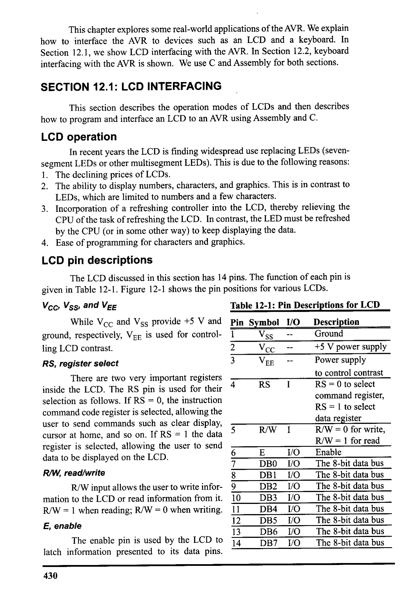
*Description*: IC pinout diagram showing physical pin assignments, I/O pin multiplexing, supply rails, and clock interface connections for Table 12-1: Pin Descriptions for LCD.

> **Table 12-1: Pin Descriptions for LCD**

While Vcc and Vss provide +5 V and Pin Symbol I/O
Description
ground, respectively, Vee is used for control-
Vss
--
Ground
ling LCD contrast.
RS, register select
2
3
Vcc -
+5 V power supply
VEE
-
Power supply
to control contrast
There are two very important registers
inside the LCD. The RS pin is used for their
4
RS
I
RS = 0 to select
selection as follows. If RS = 0, the instruction
command register,
command code register is selected, allowing the
RS = 1 to select
user to send commands such as clear display,
data register
5
R/W I
R/W = 0 for write,
cursor at home, and so on. If RS = 1 the data
register is selected, allowing the user to send
R/W = 1 for read
data to be displayed on the LCD.
R/W, read/write
R/W input allows the user to write infor-
mation to the LCD or read information from it.
R/W = 1 when reading; R/W = 0 when writing.
E, enable
The enable pin is used by the LCD to
6
7
8
9
10
11
12
13
14
E
DBO
DB1
DB2
DB3
DB4
DB5
DB6
DB7
I/O
I/O
I/O
1/0
I/O
I/O
1/0
I/O
I/O
Enable
The 8-bit data bus
The 8-bit data bus
The 8-bit data bus
The 8-bit data bus
The 8-bit data bus
The 8-bit data bus
The 8-bit data bus
The 8-bit data bus
latch information presented to its data pins.
430


<!-- Page 442 -->
### [PDF Page 442]

When data is supplied to data pins, a high-to-low pulse must be applied to this pin
in order for the LCD to latch in the data present at the data pins. This pulse must
be a minimum of 450 ns wide.
DO D7
The 8-bit data pins,
DO-D7, are used to send infor-


*Description*: Structured reference table listing operational parameters, instruction execution cycles, memory address mapping, or feature comparison for Table 12-2: LCD Command Codes.

> **Table 12-2: LCD Command Codes**

Code Command to LCD Instruction
mation to the LCD or read the
(Hex) Register
contents of the LCD's internal
Clear display screen
registers.
2
Return home
To display letters and
4
Decrement cursor (shift cursor to left)
numbers, we send ASCII codes
6
Increment cursor (shift cursor to right)
for the letters A-Z, a-z, and
5
Shift display right
numbers 0-9 to these pins
7
Shift display left
while making RS = 1.
There are also instruc-
8
Display off, cursor off
A
Display off, cursor on
tion command codes that can
C
Display on, cursor off
be sent to the LCD to clear the
E
Display on, cursor blinking
display or force the cursor to
F
Display on, cursor blinking
the home position or blink the
10
Shift cursor position to left
cursor. Table 12-2 lists the
14
Shift cursor position to right
instruction command codes.
18
Shift the entire display to the left
In this section you will
1C
Shift the entire display to the right
see how to interface an LCD to
80
Force cursor to beginning of 1st line
the AVR in two different ways.
We can use 8-bit data or 4-bit
CO
Force cursor to beginning of 2nd line
28
2 lines and 5 x 7 matrix (D4-D7, 4-bit)
data options. The 8-bit data
38
2 lines and 5 × 7 matrix (DO-D7, 8-bit)
interfacing is easier to program
Note: This table is extracted from Table 12-4.
but uses 4 more pins.
Dot matrix character LCDs are available in different packages. Figure 12-1
shows the position of each pin in different packages.
12
14
o 00000000000000
14
,13
2
DODOOOOOOOOOOO
DMC1610A
DMC1606C
DMC16117
DMC16128
DMC16129
DMC1616433
DMC20434
DMC20215
DMC3221

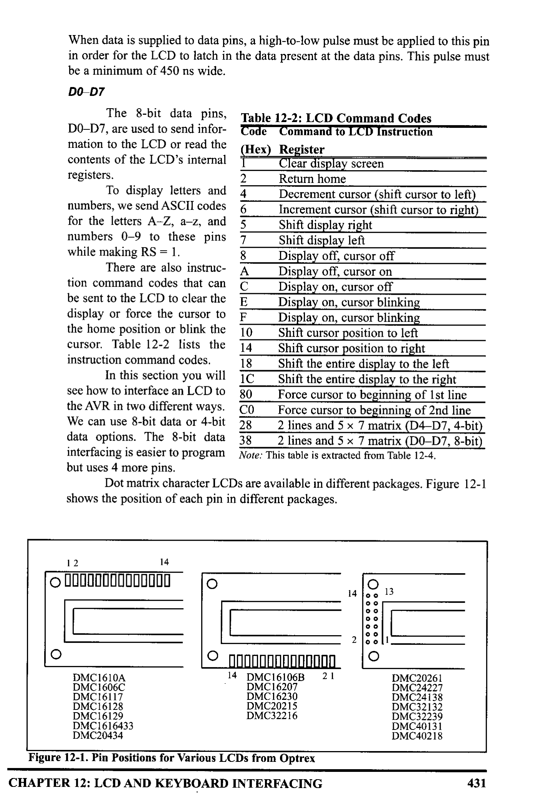
*Description*: IC pinout diagram showing physical pin assignments, I/O pin multiplexing, supply rails, and clock interface connections for Figure 12-1: Pin Positions for Various LCDs from Optrex.

> **Figure 12-1: Pin Positions for Various LCDs from Optrex**

CHAPTER 12: LCD AND KEYBOARD INTERFACING
DMC20261
DMC24227
DMC24138
DMC32132
DMC32239
DMC40131
DMC40218
431


<!-- Page 443 -->
### [PDF Page 443]

Sending commands and data to LCDS
To send data and commands to LCDs you should do the following steps.
Notice that steps 2 and 3 can be repeated many times:
1. Initialize the LCD.
2. Send any of the commands from Table 12-2 to the LCD.
3. Send the character to be shown on the LCD.
Initializing the LCD
To initialize the LCD for 5 × 7 matrix and 8-bit operation, the following
sequence of commands should be sent to the LCD: 0x38, OxOE, and 0x01. Next
we will show how to send a command to the LCD. After power-up you should wait
about 15 ms before sending initializing commands to the LCD. If the LCD initial-
izer function is not the first function in your code you can omit this delay.
Sending commands to the LCD
To send any of the commands from Table 12-2 to the LCD, make pins RS
and R/W = 0 and put the command number on the data pins (DO-D7). Then send
a high-to-low pulse to the E pin to enable the internal latch of the LCD. Notice that
after each command you should wait about 100 us to let the LCD module run the
command. Clear LCD and Return Home commands are exceptions to this rule.
After the 0x01 and 0x02 commands you should wait for about 2 ms. Table 12-3
shows the details of commands and their execution times.
Sending data to the LCD
To send data to the LCD, make pins RS = 1 and R/W = 0. Then put the data
on the data pins (DO-D7) and send a high-to-low pulse to the E pin to enable the
internal latch of the LCD. Notice that after sending data you should wait about 100
us to let the LCD module write the data on the screen.
Program 12-1 shows how to write "Hi" on the LCD using 8-bit data. The
AVR connection to the LCD for 8-bit data is shown in Figure 12-2.
LCD
AVR
PA.O
PA.7
PB.0
PB.I
PB.2
DO
D7
RS R/W E
+5V
Vcc
VEE
Vss
10K
POT

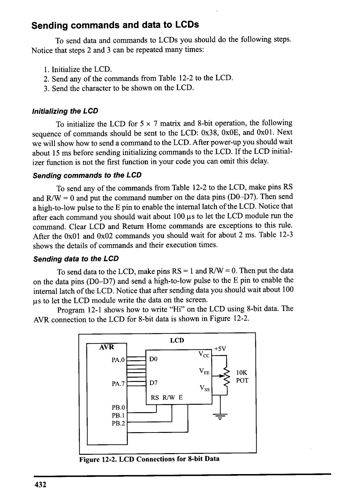
*Description*: Technical diagram and schematic illustration detailing hardware connection topology, signal routing, and circuit operation for Figure 12-2: LCD Connections for 8-bit Data.

> **Figure 12-2: LCD Connections for 8-bit Data**

432


<!-- Page 444 -->
### [PDF Page 444]

• INCLUDE
: "M32DEF.INC"
• EQU
LCD
_DPRI = PORTA
. EQU
LCD DDDR = DDRA
• EQU
LCD_DPIN = PINA
• EQU
LCD CPRT = PORTB
• EQU
LCD CDDR = DDRB
• EQU
LCD CPIN = PINB
• EQU
LCD_RS = 0
• EQU
LCD
RW = 1
• EQU
LCD_ EN = 2
; LCD DATA PORT
; LCD DATA DDR
¡ LCD DATA PIN
; LCD COMMANDS PORT
; LCD COMMANDS DDR
¡ LCD COMMANDS PIN
; LCD RS
; LCD RW
; LCD EN
LDI
OUT
LDI
OUT
R21, HIGH (RAMEND)
SPH, R21
R21, LOW (RAMEND)
SPL, R21
¡ set up stack
LDI
R21, OxFF;
OUT
LCD_DDDR, R21
¡LCD data port is output
OUT
LCD_CDDR, R21
¡ LCD command port is output
CBI
LCD_CPRT, LCD
_EN; LCD_EN = O
CALL
DELAY 2ms
¡wait for power on
LDI
R16, 0x38
¡init LCD 2 lines, 5x7 matrix
CALL
CMNDWRT
¡call
command function
CALL
DELAY_2ms
¡wait 2 ms
LDI
R16, OX0E
¡ display on, cursor on
CALL
CMNDWRT
¡ call command function
LDI
R16, 0×01
¡clear LCD
CALL
CMNDWRT
; call command function
CALL
DELAY 2ms
¡wait 2 ms
LDI
R16, 0×06
¡shift cursor right
CALL
CMNDWRI
¡call command function
LDI
R16, 'H'
¡display letter 'H'
CALL
DATAWRT
¡call data write function
LDI
R16, 'i'
¡display letter 'i'

```assembly
CALL DATAWRT
```

¡ call data write function

```assembly
JMP HERE
```

¡ stay here
HERE:
i ----
CMNDWRT:
OUT
CBI
CBI
SBI
CALL
CBI
CALL
RET
LCD_DPRT, R16
LCD_CPRT, ICD_RS
ICD_CPRI, LCD_RW
LCD_CPRI, LCD_EN
SDELAY
ICD_CPRI, LCD_EN
DELAY_100us
Program 12-1: Communicating with LCD (continued on next page)
CHAPTER 12: LCD AND KEYBOARD INTERFACING
¡ LCD data port = R16
;RS = 0 for command
; RW
=
0 for write
¡EN = 1
¡make a wide EN pulse
;EN=0 for H-to-L pulse
¡wait 100 us
433


<!-- Page 445 -->
### [PDF Page 445]

DATAWRT:
oUT
SBI
CBI
SBI
CALL
CBI
CALL
RET
LCD_DPRT, R16
LCD_CPRI, LCD_RS
LCD_CPRT, LCD.
_RW
LCD_CPRT, LCD.
LEN
SDELAY
LCD_CPRI, LCD
LEN
DELAY_100us
; LCD data port = R16
¡RS = 1 for data
¡RW = 0 for write
;EN =
¡make a wide EN pulse
; EN=0
for H-to-L pulse
¡wait 100 us
; --
SDELAY: NOP
NOP
RET
DELAY
_100us:
PUSH
LDI
DRO:
CALL
DEC
BRNE
POP
RET
R17
R17,60
SDELAY
R17
DRO
R17
-.
DELAY_
_2ms:
PUSH
LDI
LDRO:
CALL
DEC
BRNER
POP
R17
R17,20
DELAY_IOUS
R17
LDRO
R17
RET
Program 12-1: Communicating with LCD (continued from previous page)
Sending code or data to
LCD
the LCD 4 bits at a time
The above code showed how to
AVR
PA.4
D4
+5V
Vcc
send commands to the LCD with 8 bits
VEE
for the data pin. In most cases it is pre-
PA.7
ferred to use 4-bit data to save pins.
The LCD may be forced into the 4-bit
D7
RS R/W E
Vss
10K
POT
mode as shown in Program 12-2.
Notice that its initialization differs
from that of the 8-bit mode and that
PB.O
PB.1
PB.2
data is sent out on the high nibble of
Port A, high nibble first.
In 4-bit mode, we initialize the

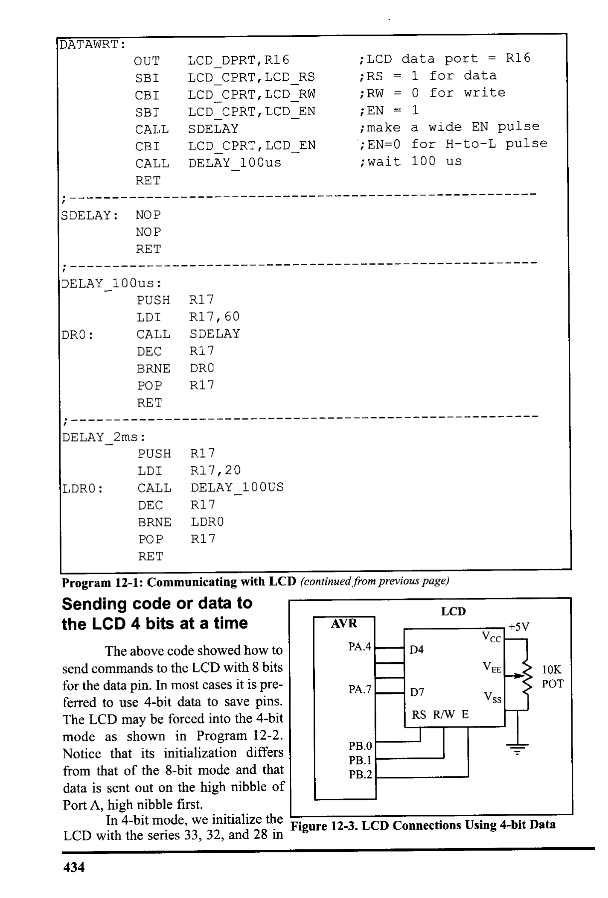
*Description*: Technical diagram and schematic illustration detailing hardware connection topology, signal routing, and circuit operation for Figure 12-3: LCD Connections Using 4-bit Data.

> **Figure 12-3: LCD Connections Using 4-bit Data**

LCD with the series 33, 32, and 28 in
434


<!-- Page 446 -->
### [PDF Page 446]

hex. This represents nibbles 3, 3, 3, and 2, which tells the LCD to go into 4-bit
mode. The value $28 initializes the display for 5 × 7 matrix and 4-bit operation as
required by the LCD datasheet. The write routines (CMNDWRT and DATAWRT)
send the high nibble first, then swap the low nibble with the high nibble before it
is sent to data pins D4-D7. The delay function of the program is the same as in
Program 12-1.
• INCLUDE "M32DEF.INC"
• EQU
• EQU
• EQU
• EQU
• EQU
• EQU
• EQU
• EQU
• EQU
ICD_DPRT = PORTA
LCD
DDDR = DDRA
-
LCD DPIN = PINA
ICD_CPRI = PORTB
LCD CDDR = DDRB
ICD_CPIN = PINB
LCD RS = 0
LCD RW = 1
ICD_EN = 2
; LCD DATA PORT
; LCD DATA DDR
; LCD DATA PIN
; LCD COMMANDS PORT
; LCD COMMANDS DDR
; LCD COMMANDS PIN
; LCD RS
; LCD RW
; LCD EN
LDI
R21, HIGH (RAMEND)
OUT
SPH, R21
¡set up stack
LDI
R21, LOW (RAMEND)
OUT
SPI, R21
LDI
R21, OXFF;
OUT
LCD
_DDDR, R21 ;LCD data port is output
OUT
LCD_CDDR, R21
;LCD command port is output
LDI
R16, 0×33
¡init. LCD for 4-bit data
CALL
CMNDWRT
¡ call command function
CALL
DELAY 2ms
¡init. hold
LDI
R16, 0x32
¡init. LCD for 4-bit data
CALL
CMNDWRT
¡ call command function
CALL
DELAY 2ms
¡init. hold
LDI
R16, 0x28
¡init. LCD 2 lines,5x7 matrix

```assembly
CALL CMNDWRT
```

¡ call command function
CALL
DELAY 2ms
¡init. hold
LDI
R16, 0X0
¡ display on, cursor on
CALL
CMNDWRT
¡ call command function
LDI
R16, 0×01
¡clear LCD
CALL
CMNDWRT
¡ call command function
CALL
DELAY 2ms
¡ delay 2 ms for clear LCD
LDI
R16, 0x06
¡ shift cursor right
CALL
CMNDWRI
¡call command function
LDI
R16, 'H'
¡display letter 'H'
CALL
DATAWRT
¡call data write function
LDI
R16, 'i'
¡display letter 'i'

```assembly
CALL DATAWRT
```

¡call data write function
HERE:

```assembly
JMP HERE
```

i stay here
Program 12-2: Communicating with LCD Using 4-bit Mode (continued on next page)
CHAPTER 12: LCD AND KEYBOARD INTERFACING
435


<!-- Page 447 -->
### [PDF Page 447]

• - - -
CMNDWRT :
MOV
ANDI
OUT
CBI
CBI
SBI
CALL
CBI
CALL
MOV
SWAP
ANDI
OUT
SBI
CALL
CBI
CALL
RET
R27, R16
R27, 0xF0
LCD_DPRI, R27
LCD_CPRT, LCD_RS
LCD_CPRT, LCD
• RW
LCD_CPRT, LCD_EN
SDELAY
ICD_CPRI, LCD_EN
DELAY_100us
R27, R16
R27
R27, OXFO
LCD_DPRT, R27
LCD_CPRI, LCD_EN
SDELAY
LCD_CPRT, LCD_EN
DELAY_100us
¡ send the high nibble
; RS = 0 for command
;RW = 0 for write
¡EN = 1 for high pulse
¡ make a wide EN pulse
; EN=0
for H-to-L pulse
; make
a wide EN pulse
¡ swap the nibbles
¡ mask DO-D3
i send the low nibble
;EN = 1 for high pulse
¡ make a wide EN pulse
;EN=0 for H-to-L pulse
¡wait 100 us
DATAWRT:
MOV
ANDI
OUT
SBI
CBI
SBI
CALL
CBI
R27, R16
R27, OXFO
LCD_DPRT, R27
LCD_CPRT, ICD_RS
ICD_CPRT, LCD_RW
LCD_CPRT, LCD_EN
SDELAY
LCD_CPRT, ICD_EN
MOV
SWAP
ANDI
OUT
SBI
CALL
CBI
R27, R16
R27
R27, 0X0
LCD
_DPRT, R27
LCD_CPRI, LCD_EN
SDELAY
LCD_CPRI, LCD_EN
CALL
DELAY_100us
RET
i;send the high nibble
¡RS = 1 for data
;RW = 0 for write
;EN = 1 for high pulse
i make
: a wide EN pulse
;EN=0 for H-to-l pulse
i swap the nibbles
: mask DO-D3
¡ send the low nibble
;EN = 1 for high pulse
¡ make a wide EN pulse
; EN=0 for H-to-L pulse
¡wait 100 us
¡ delay functions are the same as last program and should
¡be placed here.
Program 12-2: Communicating with LCD Using 4-bit Mode (continued from previous page)
436


<!-- Page 448 -->
### [PDF Page 448]

Sending code or data
LCD
to the LCD using a
single port
AVR
PA.4
D4
The above code showed
+5V
Vcc
VEE
how to send commands to the
PA.7
LCD with 4-bit data but we
D7
RS R/WE
Vss
used two different ports for data
and commands. In most cases it
is preterred to use a single port.
Program 12-3 shows Program
PA.O
PA.1
PA.2
12-2 modified to use a single
port for LCD interfacing.

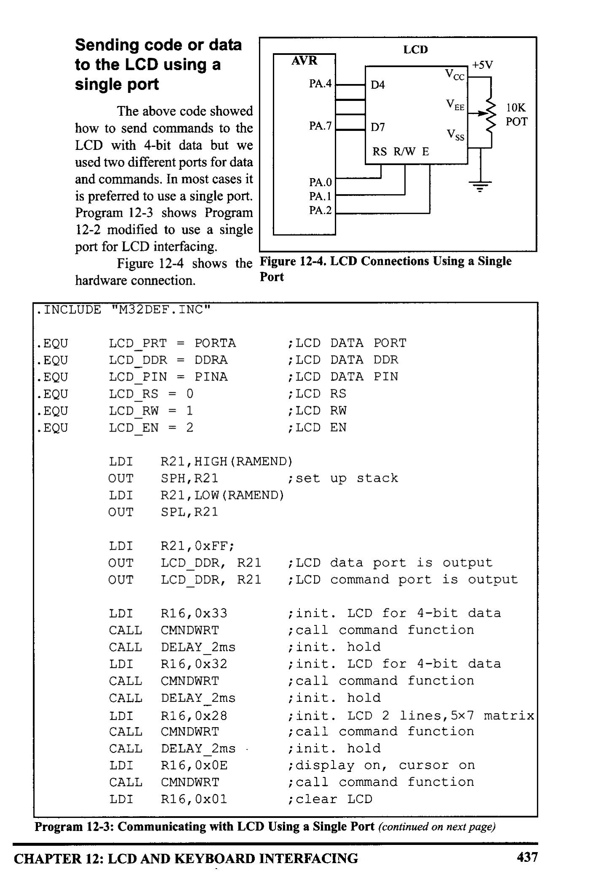
*Description*: Technical diagram and schematic illustration detailing hardware connection topology, signal routing, and circuit operation for Figure 12-4: shows the Figure 12-4. LCD Connections Using a Single.

> **Figure 12-4: shows the Figure 12-4. LCD Connections Using a Single**

hardware connection.
Port
• INCLUDE "M32DEF.INC"
10K
POT
1:200
• EQU
• EQU
• EQU
• EQU
• EQU
LCD_PRT = PORTA
LCD_DDR = DDRA
LCD PIN = PINA
LCD_RS = 0
LCD_RW
=
1
LCD_EN = 2
¡ LCD DATA PORT
; LCD DATA DDR
; LCD DATA PIN
; LCD RS
; LCD RW
; LCD EN
LDI
OUT
LDI
OUT
R21, HIGH (RAMEND)
SPH, R21
R21, LOW (RAMEND)
SPL, R21
; set up stack
LDI
OUT
OUT
R21, OXFF;
LCD_DDR, R21
LCD_DDR, R21
; LCD data port is output
; LCD command port is output
LDI
R16,0x33
¡init. LCD for 4-bit data
CALL
CMNDWRT
¡ call command function
CALL
DELAY 2ms
¡init. hold
LDI
R16, 0x32
¡init. ICD for 4-bit data
CALL
CMNDWRT
¡ call command function
CALL
DELAY_2ms
¡init. hold
LDI
R16, 0x28
¡init. LCD 2 lines, 5x7
matrix
CALL
CMNDWRI
¡ call command function
CALL
DELAY 2ms .
¡init. hold
LDI
R16, 0x0E
¡display on, cursor on
CALL
CMNDWRI
¡ call command function
LDI
R16, 0x01
i clear LCD
Program 12-3: Communicating with LCD Using a Single Port (continued on next page)
CHAPTER 12: LCD AND KEYBOARD INTERFACING
437


<!-- Page 449 -->
### [PDF Page 449]

CALL
CALL
IDI
CALL
LDI
CALL
LDI
CALL
JMP
CMNDWRT
DELAY_2ms
R16, 0x06
CMNDWRT
R16, 'H'
DATAWRT
R16, 'i'
DATAWRI
HERE
¡ call command function
¡delay 2 ms for clear LCD
i shift cursor right
¡call command function
¡display letter 'H'
¡call data write function
¡display letter 'i'
¡call data write function
i stay here
HERE:
; --
CMNDWRT:
MOV
ANDI
IN
ANDI
OR
OUT
CBI
CBI
SBI
CALL
CBI
CALL
MOV
SWAP
ANDI
IN
ANDI
OR
OUT
SBI
CALL
CBI
CALL
RET
R27, R16
R27, OXFO
R26, LCD_PRT
R26, OX0F
R26, R27
LCD_PRT, R26
LCD_PRT, LCD_RS
LCD_PRT, LCD_RW
LCD_PRT, LCD_EN
SDELAY
LCD_PRI, LCD_EN
DELAY _100us
R27, R16
R27
R27, 0XF0
R26, LCD_PRI
R26, 0x0F
R26, R27
LCD_PRI, R26
LCD_PRI, LCD_EN
SDELAY
ICD_PRI, LCD_EN
DELAY _100us
; LCD data port = R16
¡RS = 0 for command
¡RW = 0 for write
;EN = 1 for high pulse
¡make a wide EN pulse
;EN=0 for H-to-L pulse
¡ make a wide EN pulse
; LCD data port = R16
¡EN = 1 for high pulse
; make
a wide EN pulse
;EN=0 for H-to-L pulse
¡wait 100 us
DATAWRT:
MOV
ANDI
IN
ANDI
R27, R16
R27, 0×F0
R26, LCD_
_PRT
R26, 0X0F
Program 12-3: Communicating with LCD Using a Single Port (continued from previous page)
438


<!-- Page 450 -->
### [PDF Page 450]

OR
OUT
SBI
CBI
SBI
CALL
CBI
MOV
SWAP
ANDI
IN
ANDI
OR
OUT
SBI
CALL
CBI
CALL
RET
R26, R27
LCD_PRT, R26
LCD_PRT, LCD_RS
LCD_PRT, LCD_RW
LCD_PRT, LCD_EN
SDELAY
LCD_PRT, LCD_EN
R27, R16
R27
R27, 0xF0
R26, LCD_PRT
R26, 0x0F
R26, R27
LCD PRI, R26
LCD_PRI, ICD_EN
SDELAY
ICD_PRI, LCD_EN
DELAY_100us
; LCD data port = R16
;RS = 1 for data
¡RW = 0 for write
;EN = 1 for high pulse
¡ make a wide EN pulse
; EN=0 for H-to-L pulse
; LCD data port = R16
¡EN = 1 for high pulse
¡make a wide EN pulse
;EN=0 for H-to-L pulse
¡wait 100 us
SDELAY:
NOP
NOP
RET
DELAY 100us:
PUSH
LDI
DRO:
CALL
DEC
BRNE
POP
RET
; --
DELAY _2ms:
PUSH
LDI
LDRO:
CALL
DEC
BRNE
POP
RET
R17
R17,60
SDELAY
R17
DRO
R17
R17
R17,20
DELAY _100us
R17
LDRO
R17
Program 12-3: Communicating with LCD Using a Single Port (continued from previous page)
CHAPTER 12: LCD AND KEYBOARD INTERFACING
439


<!-- Page 451 -->
### [PDF Page 451]

Sending information to LCD using the LPM instruction
Program 12-4 shows how to use the LPM instruction to send a long string
of characters to an LCD. Program 12-4 shows only the main part of the code. The
other functions do not change. If you want to use a single port you have to change
the port definition in the beginning of the code according to Program 12-2.
• INCLUDE "M32DEF.INC"
• EQU
LCD _DPRI = PORTA
• EQU
LCD
_DDDR = DDRA
• EQU
LCD DPIN = PINA
• EQU
LCD CPRT = PORTB
• EQU
LCD
_CDDR = DDRB
• EQU
LCD CPIN = PINB
• EQU
LCD
_RS = O
• EQU
LCD
RW = 1
-
• EQU
LCD EN = 2
; LCD DATA PORT
; LCD DATA DDR
; LCD DATA PIN
; LCD COMMANDS PORT
; LCD COMMANDS DDR
; LCD COMMANDS PIN
; LCD RS
;LCD RW
; LCD EN
LDI
R21, HIGH (RAMEND)
OUT
SPH, R21
; set up stack
LDI
R21, LOW (RAMEND)
OUT
SPL, R21
LDI
R21, OXFF;
OUT
LCD_DDDR, R21 ;LCD data port is output
OUT
LCD_CDDR, R21
; LCD command port is output
CBI
ICD_CPRI, LCD_EN; LCD_EN = 0
CALL
LDELAY
¡ wait for init.
LDI
R16, 0x38
¡init LCD 2 lines, 5x/ matrix
CALL
CMNDWRI
¡call
command function
CALL
LDELAY
¡init. hold
LDI
R16, 0x0E
¡display on, cursor on
CALL
CMNDWRI
¡call command function
LDI
R16, 0x01
i clear LCD
CALL
CMNDWRT
¡ call command function
LDI
R16, 0×06
¡shift cursor right
CALL
CMNDWRI
; call command function
LDI
R16, 0x84
¡cursor at line 1 pos. 4
CALL
CMNDWRT
; call command function
LDI
R31, HIGH (MSG<<1)
LDI
R30, LOW (MSG<<1); Z points to MSG
LOOP:
LPM
R16, 7t
CPI
R16,0
BREQ
HERE

```assembly
CALL DATART
```

RUMP LOOP
HERE:
MSG:
440

```assembly
JMP HERE
```

¡compare R16 with O
¡if R16 equals 0 exit
¡call data write function
¡ jump to loop
i stay here
• DB "Hello World!", 0
Program 12-4: Communicating with LCD Using the LPM Instruction


<!-- Page 452 -->
### [PDF Page 452]

LCD data sheet
Here we deepen your understanding of LCDs by concentrating on two
important concepts. First we will show you the timing diagram of the LCD; then
we will discuss how to put data at any location.
LCD timing diagrams
In Figures 12-5 and 12-6 you can study and contrast the Write timing for
the 8-bit and 4-bit modes. Notice that in the 4-bit operating mode, the high nibble
is transmitted. Also notice that each nibble is followed by a high-to-low pulse to
enable the internal latch of the LCD.
Data
E
'AS
DSW
tpWH
- WH
RS
tpWH = Enable pulse width = 450 ns (minimum)
tDsW = Data setup time = 195 ns (minimum)
ty = Data hold time = 10 ns (minimum)
tAs = Setup time prior to E (going high) for both RS and R/W = 140 ns (minimum)
"AH= Hold time after E has come down for both RS and R/W = 10 ms (minimum)

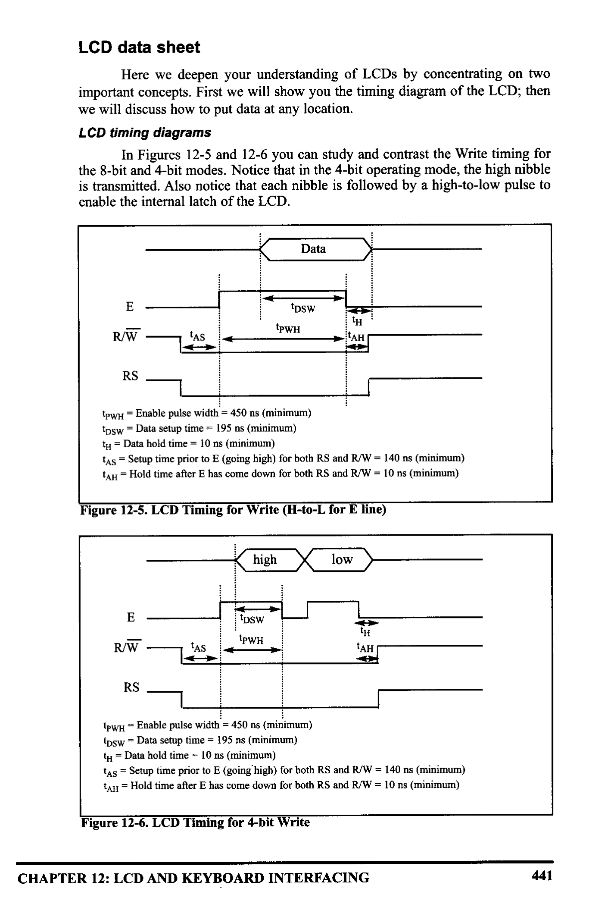
*Description*: Technical diagram and schematic illustration detailing hardware connection topology, signal routing, and circuit operation for Figure 12-5: LCD Timing for Write (H-to-L for E line).

> **Figure 12-5: LCD Timing for Write (H-to-L for E line)**

high
low
:
E
RA -
IDSW
IPWH
TAS
tH
TAH
RS
IpwH = Enable pulse width = 450 ms (minimum)
DSW = Data setup time = 195 ns (minimum)
'H = Data hold time = 10 ns (minimum)
*As = Setup time prior to E (going high) for both RS and RW = 140 ms (minimum)
TAH = Hold time after E has come down for both RS and R/W = 10 ns (minimum)


*Description*: Technical diagram and schematic illustration detailing hardware connection topology, signal routing, and circuit operation for Figure 12-6: LCD Timing for 4-bit Write.

> **Figure 12-6: LCD Timing for 4-bit Write**

CHAPTER 12: LCD AND KEYBOARD INTERFACING
441


<!-- Page 453 -->
### [PDF Page 453]

LCD detailed commands

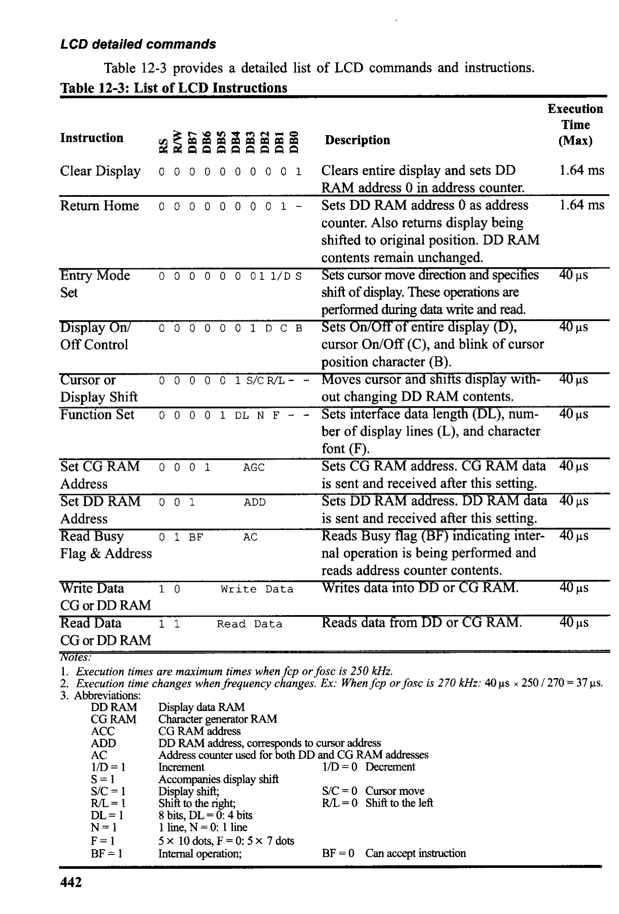
*Description*: Structured reference table listing operational parameters, instruction execution cycles, memory address mapping, or feature comparison for Table 12-3: provides a detailed list of LCD commands and instructions..

> **Table 12-3: provides a detailed list of LCD commands and instructions.**


*Description*: Structured reference table listing operational parameters, instruction execution cycles, memory address mapping, or feature comparison for Table 12-3: List of LCD Instructions.

> **Table 12-3: List of LCD Instructions**

Instruction
≥žầẳắẩñẫãẵ
Clear Display
0 0 0 0000001
Description
Execution
Time
(Max)

## 1.64 ms

Clears entire display and sets DD
RAM address 0 in address counter.
Return Home 0 0 0 0 0 0 0 01-
Sets DD RAM address 0 as address

## 1.64 ms

counter. Also returns display being
shifted to original position. DD RAM
contents remain unchanged.
Entry Mode
0 0
0 0 0 01 1/D S
Sets cursor move direction and specifies
40 us
Set
shift of display. These operations are
performed during data write and read.
Display On/
00000 OIDCB
Sets On/Off of entire display (D),
40 us
Off Control
cursor On/Off (C), and blink of cursor
position character (B).
Cursor or
0 0 0 0 0 1 S/CR/L- -
Moves cursor and shilts display with-
40 ms
Display Shift
out changing DD RAM contents.
Function Set
0 0 00 1 DL N F - - Sets interface data length (DL), num-
40 us
ber of display lines (L), and character
font (F).
Set CG RAM
0001
AGC
Sets CG RAM address. CG RAM data
40 us
Address
is sent and received after this setting.
Set DD RAM
0 0 1
ADD
Sets DD RAM address. DD RAM data
40 us
Address
is sent and received after this setting.
Read Busy
01 BF
AC
Reads Busy flag (BF) indicating inter-
40 us
Flag & Address
nal operation is being performed and
reads address counter contents.
Write Data
1 0
Write Data
Writes data into DD or CG RAM.
40 us
CG or DD RAM
Read Data
Read Data
Reads data from DD or CG RAM.
40 uS
CG or DD RAM
Notes:
1. Execution times are maximum times when fop or fose is 250 kHz.
2. Execution time changes when frequency changes. Ex: When fep or fosc is 270 kHz: 40 us × 250 / 270 = 37 us
3. Abbreviations:
DD RAM
Display data RAM
CG RAM
Character generator RAM
ACC
ADD
CG RAM address
DD RAM address, corresponds to cursor address
AC
Address counter used for both DD and CG RAM addresses
1/D = 1
S=1
Increment
1/D = 0 Decrement
Accompanies display shift
S/C = 1
Display shift;
S/C= 0 Cursor move
R/L = 1
Shift to the right;
R/L = O Shift to the left
DL = 1
8 bits, DL = 0: 4 bits
N=1
1 line, N= O: 1 line
F=1
5 × 10 dots, F = 0: 5 x 7 dots
BF = 1
Internal operation;
BF = 0 Can accept instruction
442


<!-- Page 454 -->
### [PDF Page 454]

(Table 12-2 is extracted from this table.) As you see in the eighth row of

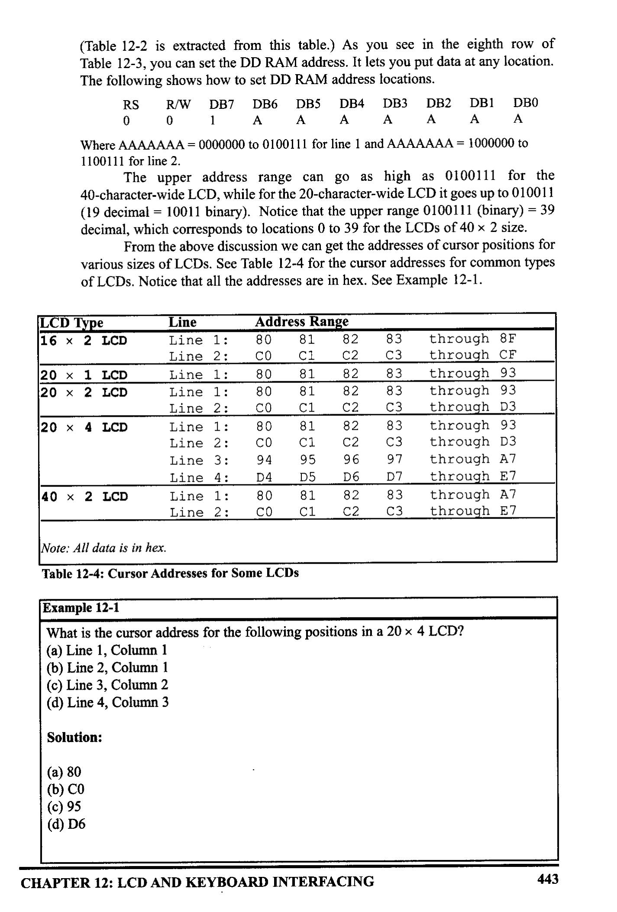
*Description*: Structured reference table listing operational parameters, instruction execution cycles, memory address mapping, or feature comparison for Table 12-3: , you can set the DD RAM address. It lets you put data at any location..

> **Table 12-3: , you can set the DD RAM address. It lets you put data at any location.**

The following shows how to set DD RAM address locations.
RS R/W DB7 DB6 DBS DB4 DB3 DB2 DB1 DB0
0
1
A
A
A
A A
A
A
Where AAAAAAA = 0000000 to 0100111 for line 1 and AAAAAAA = 1000000 to
1100111 for line 2.
The upper address range can go as high as 0100111 for the
40-character-wide LCD, while for the 20-character-wide LCD it goes up to 010011
(19 decimal = 10011 binary). Notice that the upper range 0100111 (binary) = 39
decimal, which corresponds to locations 0 to 39 for the LCDs of 40 × 2 size.
From the above discussion we can get the addresses of cursor positions for
various sizes of LCDs. See Table 12-4 for the cursor addresses for common types
of LCDs. Notice that all the addresses are in hex. See Example 12-1.
LCD Type
16 × 2 LCD
20 × 1 LCD
20 × 2 LCD
20 × 4 LCD
40 × 2 LCD
Line
Line 1:
Line 2:
Line 1:
Line 1:
Line 2:
Line 1:
Line 2:
Line 3:
Line 4:
Line 1:
Line 2:
Address Range
80
81
82
CO
C1
C2
80
81
82
80
82
CO
80
CO
94
D4
80
CO
83
C3
83
83
97
D7
83
C3
through 8F
through_CF
through 93
through 93
through D3
through 93
through D3
through A7
through E7
through A7
through E7
Note: All data is in hex.


*Description*: Structured reference table listing operational parameters, instruction execution cycles, memory address mapping, or feature comparison for Table 12-4: Cursor Addresses for Some LCDs.

> **Table 12-4: Cursor Addresses for Some LCDs**

Example 12-1
What is the cursor address for the following positions in a 20 × 4 LCD?
(a) Line 1, Column 1
(b) Line 2, Column 1
(c) Line 3, Column 2
(d) Line 4, Column 3
Solution:
(a) 80
(b) CO
(c) 95
(d) D6
CHAPTER 12: LCD AND KEYBOARD INTERFACING
443


<!-- Page 455 -->
### [PDF Page 455]

LCD programming in C
Programs 12-5, 12-6, and 12-7 show how to interface an LCD to the AVR
using C programming. The codes are modular to improve code clarity.
Program 12-5 shows how to use 8-bit data to interface an LCD to the AVR
in C language.
77 YOU HAVE TO SET THE CPU FREQUENCY IN AVR STUDIO
// BECAUSE YOU ARE USING PREDEFINED DELAY FUNCTION
#include <avr/io.h›

```c
#include <util/delay.h>
```

I/standard AVR header
I/delay header
#define
#define
#define
#define
#define
#define
#define
#define
#define
LCD_DPRT
LCD_DDDR
LCD_DPIN
ICD_CPRT
LCD
_CDDR
LCD
_CPIN
LCD
_RS
LCD
RW
-
LCD_EN
1
2
PORTA
DDRA

```c
PINA
```

PORTB
DDRB

```c
PINB
```

I/LCD DATA PORT
//LCD DATA DDR
//LCD DATA PIN
//LCD COMMANDS PORT
I/LCD COMMANDS DDR
LCD COMMANDS PIN
//LCD RS
//LCD RW
//LCD
EN
/****************************************
void delay_us (unsigned int d)
***
_delay_us (d);
//****************************************
void lcdCommand ( unsigned char cmnd )
******
LCD
_DPRT = cmnd;
LCD
_CPRT &= ~ (1<<LCD_RS) ;
ICD_CPRT &=
~ (1<<LCD
LCD
_RW);
_CPRT |= (1<<LCD_EN) ;
delay_us (1);
LCD
_CPRI &= ~ (1<<ICD_EN) ;
delay_us (100) ;
I/send cmnd to data port
//RS = 0 for command
/RW = 0 for write
I/EN = 1 for H-to-L pulse
/wait to make enable wide
//EN = 0 for H-to-L pulse
/wait to make enable wide
/*******************************************************
void lcdData ( unsigned char data )
ICD_DPRT = data;
LCD
_CPRT |= (1<<ICD_RS) ;
LCD CPRT &=
~ (1<<LCD_RW) ;
ICD_CPRT |= (1<<LCD_EN) ;
delay_us (1) ;
//send data to data port
//RS = 1 for data
//RW = 0 for write
//EN = 1 for H-to-L pulse
/wait to make enable wide
Program 12-5: Communicating with LCD Using 8-bit Data in C (continued on next page)
444


<!-- Page 456 -->
### [PDF Page 456]

LCD_CPRT &= ~ (1<<LCD_EN) ;
delay_us (100);
77EN = 0 for H-to-I pulse
I/wait to make enable wide
//*************
void
1cd
_init()
LCD_DDDR = OXFE;
LCD_CDDR = OXFF;
LCD_CPRT &=~ (1<<LCD_EN) ;
delay_us (2000);
1cdCommand (0x38) ;
1cdCommand (0x0E);
1cdCommand (0x01);
delay_us (2000) ;
1cdCommand (0x06);
•************************
//LCD.
_EN = 0
/wait for init.
Winit. LCD 2 line, 5 × 7 matrix
I/display on,
cursor on
//clear
• LCD
//wait
I/shift cursor right
//************************************************
•****
void lcd_gotoxy (unsigned char x, unsigned char y)
unsigned char firstCharAdri | =| 0x80, OxC0, 0x94, OxD4) ://Table 12-5
1cdCommand (firstCharAdr| y-1] + × - 1);
delay_us (100) ;
//**************************
void lcd print ( char * str )
unsigned char i = 0;
while(str[ i] !=0)
{
lcdData (str| i]);
it+ ;
********
* * *
}
*****************.
int main (void)
******
1cd
_init () ;
Icd_gotoxy (1,1) ;
Ica_print ("The
world is but");
Ica_gotoxy (1,2);
lcd_print ("one
: country");

```c
while (1);
```

return 0;
Program 12-5: Communicating with LCD Using 8-bit Data in C
CHAPTER 12: LCD AND KEYBOARD INTERFACING
****
/stay here forever
445


<!-- Page 457 -->
### [PDF Page 457]

Program 12-6 shows how to use 4-bit data to interface an LCD to the AVR
in C language.

```c
#include <avr/io.h>
#include <util/delay.h>
```

#define
ICD_DPRT
PORTA
#define
LCD_ DDDR
DDRA
#define
LCD_DPIN

```c
PINA
```

#define
LCD_CPRT
PORTB
#define
LCD_CDDR
DDRB
#define
ICD_CPIN

```c
PINB
```

#define
ICD_RS
0
#define
LCD_RW
1
#define
LCD_EN
2
standard AVR header
I/delay header
I/LCD DATA PORT
I/LCD. DATA DDR
I/LCD DATA PIN
I/LCD COMMANDS PORT
I/LCD COMMANDS DDR
I/LCD COMMANDS PIN
//LCD RS
//LCD RW
I/LCD EN
void delay_us (int d)
_delay_us (d);
void IcdCommand | unsigned char cmnd )
ICD_DPRT = cmnd & OxFO;
I/send high nibble to D4-D7
LCD
CPRT
-
&= ~ (1<<LCD
_RS); /RS = 0 for command
LCD
&= ~ (1<<LCD
RW); //RW = 0 for write
LCD
-
CPRT
|= (1<<LCD_EN) ;
//EN = 1 for H-to-L pulse
delay_us (1);
I/make EN pulse wider
LCD_CPRT
&= ~ (1<<ICD_EN); |/EN = 0 for H-to-L pulse
delay_us (100);
1/wait
LCD_DPRT = cmnd<<4;
Isend low nibble to D4-D7
LCD
_CPRT |= (1<<LCD_EN) ;
//EN = 1 for H-to-L pulse
delay_us (1) ;
I/make EN pulse wider
ICD_CPRT &= ~ (1<<ICD_EN); |/EN = O for H-to-1 pulse
delay_us (100);
void IcaData l unsigned char data )
ICD_DPRI = data & OXFO;
Isend high nibble to D4-D7
LCD
_CPRI
|= (I<<ICD_RS) ;
//RS = 1 for data
LCD_CPRT
LCD
&= ~ (I<ICD_RW); |/RW = 0 for write
_CPRT |= (1<<LCD_EN) ;
//EN = 1 for H-to-L pulse
delay_us (1) ;
I/make EN pulse wider
LCD_CPRI &= ~ (1<<LCD_EN); |/EN = O for H-to-L pulse
LCD
_DPRT = data<<4;
/send low nibble to D4-D7
LCD
_CPRT I= (1<<LCD
_EN) ;
VEN = 1 for H-to-L pulse
Program 12-6: Communicating with LCD Using 4-bit Data in C (continued on next page)
446


<!-- Page 458 -->
### [PDF Page 458]

delay_us (1);
LCD_CPRT &= ~ (1<<LCD_EN) ;
delay_us (100);
7/make EN pulse wider
//EN = 0 for H-to-L pulse
//wait
void Icd_init ()
LCD_DDDR = OxEE;
ICD_
_CDDR = OXFF;
ICD_CPRT &=~ (1<<LCD_EN) ;
1cdCommand (0x33);
1cdCommand (0x32);
1cdCommand (0x28);
1cdCommand (0x0e) ;
1cdCommand (0x01);
delay_us (2000);
1cdCommand (0x06);
//ICD_EN = 0
I/send $33 for init.
I/send $32 for init.
Winit. LCD 2 line, 5x7 matrix
I/display on, cursor on
Iclear LCD
\shift cursor right
void Ied_gotoxy (unsigned char x, unsigned char y)
unsigned char firstCharAdr| ] = 0x80, O×CO, 0x94, 0XD4) ;
lcdCommand (firstCharAdr| y-1] + x - 1) ;
delay_us (100);
void Icd_print (char * str )
unsigned char i = 0;
while(str[ i] !=0)
lcdData (str| i] );
itt;
int main (void)
Icd_init();
lcd
_gotoxy (1,1) ;
Icd_print ("The world is but");
lcd
_gotoxy (1,2);
Icd_print ("one
country");

```c
while (1);
```

return 0;
/stay here forever
Program 12-6: Communicating with LCD Using 4-bit Data in C
CHAPTER 12: LCD AND KEYBOARD INTERFACING
447


<!-- Page 459 -->
### [PDF Page 459]

Program 12-7 shows how to use 4-bit data to interface an LCD to the AVR
in C language. It uses only a single port. Also there are some useful functions to
print a string (array of chars) or to move the cursor to a specific location.

```c
#include <avr/io.h>
#include <util/delay.h>
```

#define
LCD PRT
PORTA
#define
LCD DDR
DDRA
#define
LCD_PIN

```c
PINA
```

#define
LCD_RS
#define
LCD RW
1
-
#define
ICD_EN
2
void delay_us (int d)
_delay_us (d) ;
/standard AVR header
//delay header
//LCD DATA PORT
//LCD DATA DDR
//LCD DATA PIN
//LCD RS
//LCD RW
//LCD EN
void delay_ms (int d)
_delay_ms (d);
void IcdCommand l unsigned char omnd |{
ICD_PRI = (LCD_PRT & OxOF) |
LCD
_PRI &= ~ (1<<LCD_RS) ;
LCD
PRT &= ~ (1<<LCD RW);
-
LCD
_PRT |= (1<<LCD.
_EN) ;
delay_us (1);
LCD_PRT &= ~ (1<<LCD_EN) ;
(cmnd &
OxFO) ;
//RS = 0 for command
//RW = 0 for write
//EN
= 1 for H-to-L
/wait to make EN wider
/EN = 0 for H-to-L
delay_us (20);
//wait
LCD_PRI = (ICD_PRT & OXOF) | (cmnd << 4) ;
LCD
_PRT I= (1<<LCD_EN) ;
//EN
= 1 for H-to-L
delay_us (1);
/wait to make EN wider
LCD_PRT &= ~ (1<<LCD_EN) ;
//EN =
for H-to-L
void IcaData ( unsigned char data Ií
LCD_PRT = (ICD_PRT & OXOF) | (data & OXEO) ;
LCD
-
PRT |= (1<<LCD_RS) ;
//RS = 1 for data
LCD
_PRT &= ~ (1<<LCD_RW) ;
//RW =
0
for
write
LCD
PRT |= (1<<LCD_EN);
//EN = 1 for H-to-L
Program 12-7: Communicating with LCD Using 4-bit Data in C (continued on next page)
448


<!-- Page 460 -->
### [PDF Page 460]

delay_us (1);
LCD_PRT &= ~ (1<<LCD_EN) ;
LCD _PRT = (ICD_PRI & 0x0F)
ICD _PRT |= (1<<ICD_EN) ;
delay_us (1);
LCD_PRT &= ~ (1<<LCD_EN) ;
77wait to make EN wider
VEN = 0 for H-to-L
| (data ‹<< 4);
//EN
1 for H-to-L
//wait to make EN wider
/EN = 0 for H-to-L
void lcd
_init (){
ICD_DDR = OXFF;
ICD_PRT &=~ (1<<LCD_EN) ;
delay_us (2000);
1cdCommand (0x33);
delay_us (100);
1cdCommand (0x32) ;
delay_us (100);
1cdCommand (0x28);
delay_us (100) ;
1cdCommand (0x0e);
delay_us (100);
1cdCommand (0x01);
delay_us (2000) ;
1cdCommand (0x06) ;
delay_us (100);
//LCD port is output
//LCD.
_EN = O
I/wait for stable power
//$33 for 4-bit mode
//wait
//$32 for 4-bit mode
//wait
1/$28 for 4-bit mode
//wait
I/display on, cursor on
/wait
/clear LCD
//wait
shift cursor right
void lcd
_gotoxy (unsigned char x, unsigned char y)
//Table 12-5
unsigned char
firstCharAdr|| = (0x80, Oxco, 0x94, OXD4} ;
IcdCommand (firstCharAdr| y-1] + × - 1);
delay_us (100);
}
void Icd_print| char *
str
unsigned char i = 0;
while(str[ i] !=0)
IcdData (str[ i]) ;
itt;
Program 12-7: Communicating with LCD Using 4-bit Data in C
CHAPTER 12: LCD AND KEYBOARD INTERFACING
449


<!-- Page 461 -->
### [PDF Page 461]

int main (void)
1cd
_init();

```c
while (1)
```

/stay here forever
lcd
_gotoxy (1,1);
Icd_print "The world is but");
Icd_gotoxy (1,2);
Icd_print ("one country
");
delay_ms (1000);
Icd_gotoxy (1,1) ;
Icd_print ("and mankind its ");
lcd
_gotoxy (1,2) i
Icd_print ("citizens
delay_ms (1000) ;
");
}
return 0;
}
Program 12-7: Communicating with LCD Using 4-bit Data in C (cont. from previous page)
You can purchase the LCD expansion board of
the MDE AVR trainer from the
following websites:
www.digilentinc.com
www.MicroDigitalEd.com
The LCDs can be purchased from the
following websites:
www.digikey.com
www.jameco.com
www.elexp.com
450


<!-- Page 462 -->
### [PDF Page 462]


### Review Questions

1. The RS pin is an
2. The E pin is an
3. The E pin requires an
(input, output) pin for the LCD.
(input, output) pin for the LCD.
(H-to-L, L-to-H) pulse to latch in information
at the data pins of the LCD.
4. For the LCD to recognize information at the data pins as data, RS must be set
to -
(high, low).
5. What is the 0x06 command ?
6. Which of the following commands takes more than 100 microseconds to run?
(a) Shift cursor left
(b) Shift cursor right
(c) Set address location of DDRAM
(d) Clear screen
7. Which of the following initialization commands initializes an LCD for 5 × 7
matrix characters in 8-bit operating mode?
(a) 0x38, OxOE, Oxo, 0x06
(b) OXOE, 0x0, 0x06
(c) 0x33, 0x32, 0x28, OxOE, 0x01, 0x06
(d) 0x01, 0×06
8. Which of the following initialization commands initializes an LCD for 5 x 7
matrix characters in 4-bit operating mode?
(a) 0x38, OXOE, Oxo, 0x06
(b) OXOE, 0x0, 0x06
(c) 0x33, 0x32, 0x28, OxOE, 0x01, 0x06
(d) 0x01, 0x06
9. Which of the following is the address of the second column of the second row
in a 2 × 20 LCD?
(a) 0x80
(b) 0x81
(c) 0xc0
(d) Oxcl
10. Which of the following is the address of the second column of the second row
in a 4 × 20 LCD?
(a) 0x80
(b) 0x81
(c) OxCO
(d) OxC1
11. Which of the following is the address of the first column of the second row in
a 4 × 20 LCD?
(a) 0x80
(b) 0x81
(c) 0xCO
(d) OxC1
CHAPTER 12: LCD AND KEYBOARD INTERFACING
451


<!-- Page 463 -->
### [PDF Page 463]


## SECTION 12.2: KEYBOARD INTERFACING

Keyboards and LCDs are the most widely used input/output devices in
microcontrollers such as the AVR and a basic understanding of them is essential.
In the previous section, we discussed how to interface an LCD with an AVR using
some examples. In this section, we first discuss keyboard fundamentals, along
with key press and key detection mechanisms. Then we show how a keyboard is
interfaced to an AVR.
Interfacing the keyboard to the AVR
At the lowest level, keyboards are organized in a matrix of rows and
columns. The CPU accesses both rows and columns through ports; therefore, with
two 8-bit ports, an 8 x 8 matrix of keys can be connected to a microcontroller.
When a key is pressed, a row and a column make a contact; otherwise, there is no
connection between rows and columns. In x86 PC keyboards, a single microcon-
troller takes care of hardware and software interfacing of the keyboard. In such
systems, it is the function of programs stored in the Flash of the microcontroller to
scan the keys continuously, identify which one has been activated, and present it
to the motherboard. In this section we look at the mechanism by which the AVR
scans and identifies the key.
VCC
4.7k
DO
D1
D2
D3
Port 1
(Out)
3
7
2
6
1
5
4.7k
4
8
F
D3
D2
D1 DO
Port 2
(In)

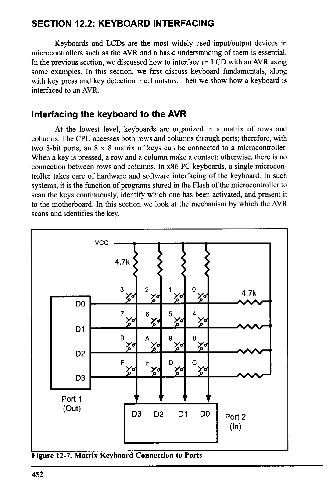
*Description*: Register specification diagram depicting individual bit flags, control register configurations, and functional definitions for Figure 12-7: Matrix Keyboard Connection to Ports.

> **Figure 12-7: Matrix Keyboard Connection to Ports**

452


<!-- Page 464 -->
### [PDF Page 464]

Scanning and identifying the key

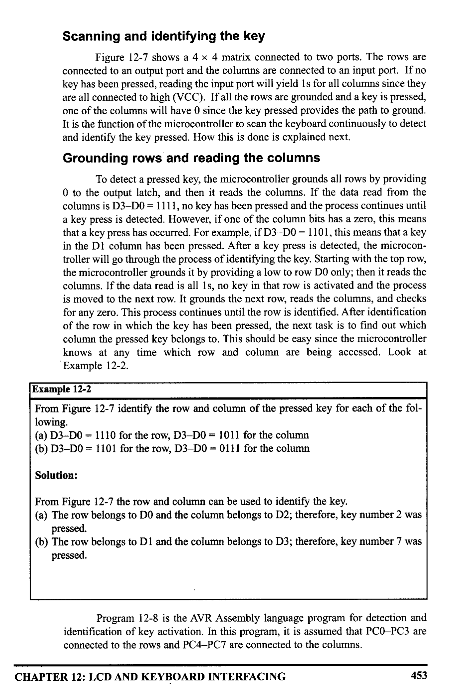
*Description*: Register specification diagram depicting individual bit flags, control register configurations, and functional definitions for Figure 12-7: shows a 4 x 4 matrix connected to two ports. The rows are.

> **Figure 12-7: shows a 4 x 4 matrix connected to two ports. The rows are**

connected to an output port and the columns are connected to an input port. If no
key has been pressed, reading the input port will yield 1s for all columns since they
are all connected to high (VCC). If all the rows are grounded and a key is pressed,
one of the columns will have 0 since the key pressed provides the path to ground
It is the function of the microcontroller to scan the keyboard continuously to detect
and identify the key pressed. How this is done is explained next.
Grounding rows and reading the columns
To detect a pressed key, the microcontroller grounds all rows by providing
O to the output latch, and then it reads the columns. If the data read from the
columns is D3-DO = 1111, no key has been pressed and the process continues until
a key press is detected. However, if one of the column bits has a zero, this means
that a key press has occurred. For example, if D3-DO = 1101, this means that a key
in the D1 column has been pressed. After a key press is detected, the microcon-
troller will go through the process of identifying the key. Starting with the top row,
the microcontroller grounds it by providing a low to row DO only; then it reads the
columns. If the data read is all 1s, no key in that row is activated and the process
is moved to the next row. It grounds the next row, reads the columns, and checks
for any zero. This process continues until the row is identified. After identification
of the row in which the key has been pressed, the next task is to find out which
column the pressed key belongs to. This should be easy since the microcontroller
knows at any time which row and column are being accessed. Look at
Example 12-2.
Example 12-2
From Figure 12-7 identify the row and column of the pressed key for each of the fol-
lowing.
(a) D3-DO = 1110 for the row, D3-DO = 1011 for the column
(b) D3-DO = 1101 for the row, D3-DO = 0111 for the column
Solution:
From Figure 12-7 the row and column can be used to identify the key.
(a) The row belongs to DO and the column belongs to D2; therefore, key number 2 was
pressed.
(b) The row belongs to D1 and the column belongs to D3; therefore, key number 7 was
pressed.
Program 12-8 is the AVR Assembly language program for detection and
identification of key activation. In this program, it is assumed that PCO-PC3 are
connected to the rows and PC4-PC7 are connected to the columns.
CHAPTER 12: LCD AND KEYBOARD INTERFACING
453


<!-- Page 465 -->
### [PDF Page 465]

Start
Ground next row
Ground all rows
Read all columns
Read all columns
no
no
All keys
open?
yes
row?
yes
Find which key
is pressed
Read all columns
no
Get scan code
from table
Any key
down?
yes
Return
Wait for debounce
Read all columns
no
Any key
down?
yes

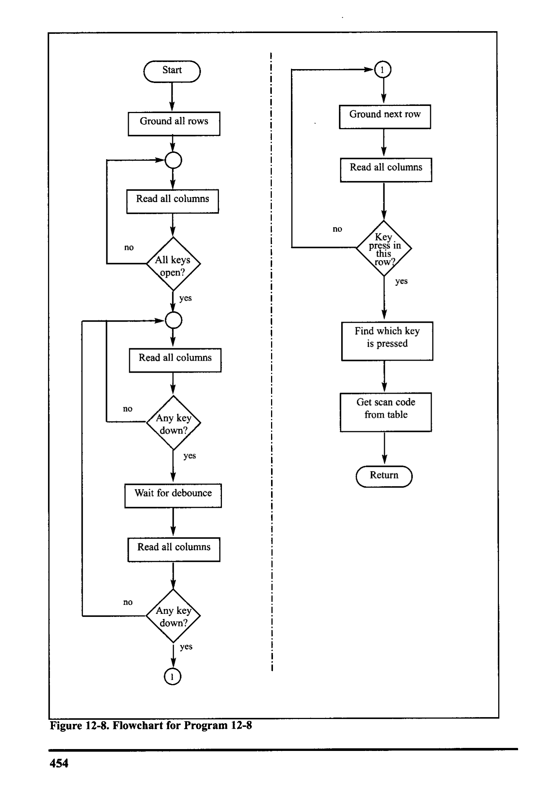
*Description*: Execution flowchart illustrating procedure steps, algorithmic logic flow, software build stages, or timing signal sequences for Figure 12-8: Flowchart for Program 12-8.

> **Figure 12-8: Flowchart for Program 12-8**

454


<!-- Page 466 -->
### [PDF Page 466]

Program 12-8 goes through the following four major stages (Figure 12-8
flowcharts this process):
1. To make sure that the preceding key has been released, Os are output to all rows
at once, and the columns are read and checked repeatedly until all the columns
are high. When all columns are found to be high, the program waits for a short
amount of time before it goes to the next stage of waiting for a key to be
pressed.
2.
To see if any key is pressed, the columns are scanned over and over in an infi-
nite loop until one of them has a 0 on it. Remember that the output latches con-
nected to rows still have their initial zeros (provided in stage 1), making them
grounded. After the key press detection, the microcontroller waits 20 ms for
the bounce and then scans the columns again. This serves two functions: (a) it
ensures that the first key press detection was not an erroneous one due to a
spike noise, and (b) the 20-ms delay prevents the same key press from being
interpreted as a multiple key press. Look at Figure 12-9. If after the 20-ms
delay the key is still pressed, it goes to the next stage to detect which row it
belongs to; otherwise, it goes back into the loop to detect a real key press.
3. To detect which row the key press belongs to, the microcontroller grounds one
row at a time, reading the columns each time. If it finds that all columns are
high, this means that the key press cannot belong to that row; therefore, it
grounds the next row and continues until it finds the row the key press belongs
to. Upon finding the row that the key press belongs to, it sets up the starting
address for the look-up table holding the scan codes (or the ASCII value) for
that row and goes to the next stage to identify the key.
4. To identify the key press, the microcontroller rotates the column bits, one bit
at a time, into the carry flag and checks to see if it is low. Upon finding the
zero, it pulls out the ASCII code for that key from the look-up table; otherwise,
it increments the pointer to point to the next element of the look-up table.
While the key press detection is standard for all keyboards, the process for
determining which key is pressed varies. The look-up table method shown in
Program 12-8 can be modified to work with any matrix up to 8 x 8. Example 12-3
shows keypad programming in C.
There are IC chips such as National Semiconductor's MM74C923 that
incorporate keyboard scanning and decoding all in one chip. Such chips use com-
binations of counters and logic gates (no microcontroller) to implement the under-
lying concepts presented in Program 12-8.
VCC
GND
Unstable

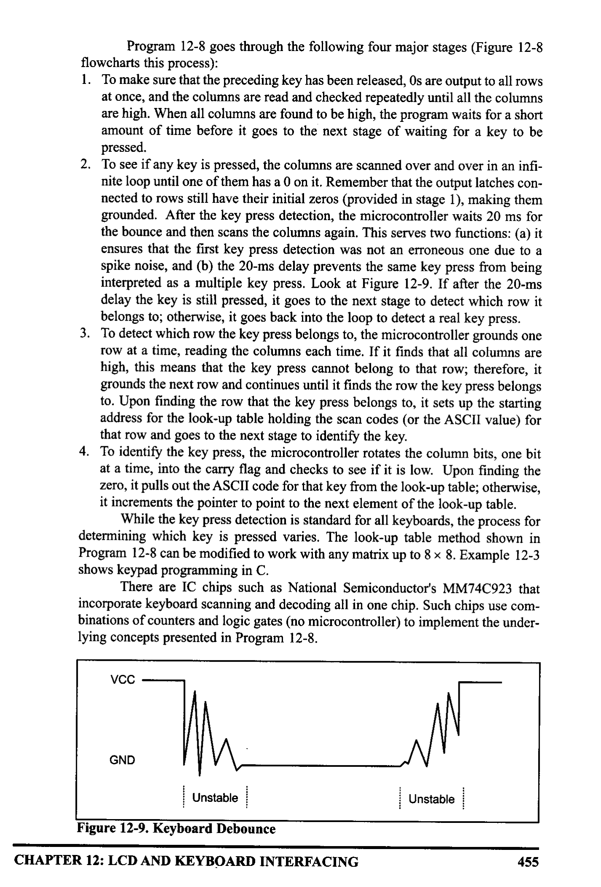
*Description*: Technical diagram and schematic illustration detailing hardware connection topology, signal routing, and circuit operation for Figure 12-9: Keyboard Debounce.

> **Figure 12-9: Keyboard Debounce**

CHAPTER 12: LCD AND KEYBOARD INTERFACING
Unstable
455


<!-- Page 467 -->
### [PDF Page 467]

¡Keyboard Program. This program sends the ASCII code
¡ for pressed key to Port D
; PCO-PC3
connected to rows PC4-PC7 connected to columns
• INCLUDE "M32DEF.INC"
• EQU KEY_PORT = PORTC
. EQU
KEY PIN = PINC
• EQU KEY_DDR = DDRC
LDI
R2O, HIGH (RAMEND)
OUT
SPH, R20
LDI
R2O, LOW (RAMEND)
OUT
SPI, R20
LDI
R21, 0×FF
OUT
DDRD, R21
LDI
R2O, OxFO
OUT
KEY_DDR, R20
GROUND _ALL_ROWS:
LDI
R2O, OXOF
OUT
KEY_PORT, R20
WAIT FOR _RELEASE:
NOP
IN
R21, KEY_PIN
ANDI R21, OX0F
CPI R21, 0X0F

```assembly
BRNE WAIT_FOR_RELEASE
WAIT_FOR_KEY:
```

NOP

```assembly
IN R21, KEY_PIN
```

ANDI R21, 0x0F
CPI R21, 0x0F

```assembly
BREQ WAIT_FOR_KEY
CALL WAIT15MS
```

IN
R21, KEY_PIN
ANDI R21, 0X0F
CPI R21, 0x0E

```assembly
BREQ WAIT FOR KEY
```

R21, 0b01111111
KEY_PORT, R21
¡init. stack pointer
¡read key pins
¡ mask unused bits
¡(equal if no key)
¡do again
until keys released
¡wait for sync. circuit
¡read key pins
¡ mask unused bits
¡(equal if no key)
¡do again until a key pressed
¡wait 15 ms
¡ read key pins
¡ mask unused bits
¡ (equal if no key)
ido again until a key pressed
¡ ground row 0
OUT
NO P
IN
R21, KEY_PIN
ANDI
R21, 0x0F
CPI
R21,0×0F
BRNER
COL1
LDI
R21, 0b10111111
¡wait for sync. circuit
¡read all columns
¡mask unused bits
¡ (equal if no key)
; row 0, find the colum
¡ ground row 1
OUT
KEY_PORT, R21
NOP
¡wait for sync. circuit
IN
ANDI
R21, KEY_PIN
¡ read all columns
R21, 0×0F
; mask unused bits
CPI
R21, 0x0F
¡ (equal if no key)

```assembly
BRNE COL2
```

¡row 1, find the colum
Program 12-8: Keyboard Interfacing Program (continued on next page)
456


<!-- Page 468 -->
### [PDF Page 468]

LDI
OUT
R21, 0b11011111
KEY_PORT, R21
NOP
IN
R21, KEY_PIN
ANDI R21, 0X0F
CPI R21, 0X0F

```assembly
BRNE COL3
LDI R21,0b11101111
```

OUT
KEY_PORT, R21
NO P
IN
R21, KEY_PIN
ANDI R21, 0X0F
CPI R21, 0X0F

```assembly
BRNE COL4
COL1:
```

LDI
R30, LOW (KCODE0<<1)

```assembly
LDI R31, HIGH (KCODE0<<1)
RJMP FIND
COL2:
LDI R30, LOW (KCODE1<<1)
```

IDI R31, HIGH (KCODE1<<1)

```assembly
RJMP FIND
COL3:
LDI R30, LOW (KCODE2<<1)
```

IDI R31, HIGH (KCODE2<<1)

```assembly
RJMP FIND
COL4:
LDI R30, LOW (KCODE3<<1)
```

IDI R31, HIGH (KCODE3<<1)

```assembly
RJMP FIND
FIND:
```

LSR R21

```assembly
BRCC MATCH
```

LPM R20, Z+

```assembly
RJMP FIND
MATCH:
```

LPM
R20,2
OUT
PORTD, R20
RJMP
GROUND_ALL_ROWS
WAIT15MS:
RET
• ORG 0x300
KCODEO:
KCODE1:
KCODE2:
KCODE3:
• DB 'O', '1'
, '2'
„'3'
• DB '4', '5', '6', '3'
• DB '8'
" '9'
, 'A'
,'B'
• DB 'C', 'D', 'E', 'F'
¡ ground row 2
¡wait for sync. circuit
; read all columns
; mask unused bits
¡ (equal if no key)
¡row 2, find the colum
¡ ground row 3
¡wait for sync. circuit
¡ read all columns
i mask unused bits
¡ (equal if no key)
¡row 3, find the colum
¡if Carry is low
go to
match
; INC Z
¡place a code to wait 15 ms
¡ here
; ROW O
¡ ROW 1
; ROW 2
; ROW 3
Program 12-8. Keyboard Interfacing Program (continued from previous page)
CHAPTER 12: LCD AND KEYBOARD INTERFACING
457


<!-- Page 469 -->
### [PDF Page 469]

Example 12-3
Write a C program to read the keypad and send the result to Port D.
PCO-PC3 connected to columns
PC4 PC7 connected to rows
Solution:

```c
#include <avr/io.h>
```

#include <util/delay.h›
#define
KEY PRI PORTC
#define
KEY DDR
DDRC
#define
KEY PIN PINC
void delay_ms (unsigned int d)
_delay_ms (d) ;
}
I/standard AVR header
I/delay header
I/keyboard PORT
//keyboard DDR
1/keyboard PIN
unsigned char keypad| 4] | 4] = '0', '1', '2', '3',
'5'
"'6', '7',
'8', '9'
, 'A', 'B'
'C'"'D', 'E', 'F";
int main (void)
unsigned char colloc, rowloc;
|/keyboard routine. This sends the ASCII
//code for pressed key to port c

```c
DDRD = OxFF;
```

KEY_DDR
= OXFO;
KEY PRT
= OXFF;

```c
while (1)
```

do
|/repeat forever
KEY_PRT &= 0x0F;
colloc = (KEY_PIN & 0x0F) ;
while colloc
!= OxOF) ;
//ground all rows at once
Wread the columns
I/check until all keys released
do
do
delay_ms (20);
colloc = (KEY_PIN&0×0F);
\ while (colloc == 0x0F);
delay_ms (20);
colloc = (KEY_PIN & Ox0F) ;
} while (colloc == 0x0F);

```c
while (1)
KEY PRT = 0xEF;
colloc = (KEY_PIN & OXOF) ;
//call delay
```

/see if any key is pressed
//keep checking for key press
//call delay for debounce
/read columns
//wait for key press
I/ ground row 0
Wread the columns
458


<!-- Page 470 -->
### [PDF Page 470]

Example 12-3 (continued from previous page)
if (colloc != 0x0F)
rowloc = 0;
break;
//column detected
}
//save row location
lexit while 100p
KEY_PRT = OxDF;
colloc =
(KEY_PIN & OxOF) ;
¡E(CO110c ! = OXOF)
rowloc = 1;
break;
l/ground row 1
/read the columns
I/column detected
//save row location
/exit while 100p
}
KEY_PRT = OxBF;
I/ground row 2
colloc=
(KEY_PIN & OxOF); //read the columns
if (colloc != 0x0F)
//column detected
rowloc = 2;
break;
I/save row location
l/exit while 1o0p
}
KEY PRT = 0x7F;
1/ ground row 3
colloc = (KEY PIN & 0x0F);
/read the columns
rowloc = 3;
/save row location
break;
l/exit while 1o0p
}
I/check column and send result to Port D
if (colloc == 0x0E)

```c
PORTD = (keypad| rowloc][ 0]) ;
else if (colloc == 0x0D)
PORTD = (keypad rowloc]l 1]) ;
else if (colloc == 0x0B)
PORTD = (keypad rowloc]l 21);
```

else

```c
PORTD = (keypad| rowloc]| 31);
```

}
Ieturn 0 ;

### Review Questions

2. Ir D3-a = To is the dakead prom the l lum a grouncolumn does the
pressed key belong to!
3. True or false. Key press detection and key identification require two different
processes.
4. In Figure 12-7, if the rows are D3-DO = 1110 and the columns are D3-DO =
1110, which key is pressed?
5.
True or false. To identify the pressed key, one row at a time is grounded.
CHAPTER 12: LCD AND KEYBOARD INTERFACING
459


<!-- Page 471 -->
### [PDF Page 471]


### SUMMARY

This chapter showed how to interface real-world devices such as LCDs and
keypads to the AVR. First, we described the operation modes of LCDs, and then
described how to program the LCD by sending data or commands to it via its inter-
face to the AVR.
Keyboards are one of the most widely used input devices for AVR projects.
This chapter also described the operation of keyboards, including key press and
detection mechanisms. Then the AVR was shown interfacing with a keyboard.
AVR programs were written to return the ASCIl code for the pressed key.

### PROBLEMS


## SECTION 12.1: LCD INTERFACING

1. The LCD discussed in this section has
pins.
2. Describe the function of pins E, R/W, and RS in the LCD.
3. What is the difference between the Vac and Vee pins on the LCD?
4. "Clear LCD" is a
(command code, data item) and its value is
hex.
5. What is the hex value of the command code for "display on, cursor on"?
6. Give the state of RS, E, and R/W when sending a command code to the LCD.
7. Give the state of RS, E, and R/W when sending data character 'Z' to the LCD.
8. Which of the following is needed on the E pin in order for a command code
(or data) to be latched in by the LCD?
(a) H-to-L pulse (b) L-to-H pulse
9. True or false. For the above to work, the value of the command code (data)
must already be at the DO D7 pins.
10. There are two methods of sending commands and data to the LCD: (1) 4-bit
mode or (2) 8-bit mode. Explain the difference and the advantages and disad-
vantages of each method.
11. For a 16 × 2 LCD, the location of the last character of line 1 is 8FH (its com-
mand code). Show how this value was calculated.
12. For a 16 × 2 LCD, the location of the first character of line 2 is COH (its com-
mand code). Show how this value was calculated.
13. For a 20 × 2 LCD, the location of the last character of line 2 is 93H (its com-
mand code). Show how this value was calculated.
14. For a 20 × 2 LCD, the location of the third character of line 2 is C2H (its com-
mand code). Show how this value was calculated.
15. For a 40 × 2 LCD, the location of the last character of line 1 is A7H (its com-
mand code). Show how this value was calculated.
16. For a 40 × 2 LCD, the location of the last character of line 2 is E7H (its com-
mand code). Show how this value was calculated
17. Show the value (in hex) for the command code for the 10th location, line 1 on
a 20 × 2 LCD. Show how you got your value.
18. Show the value (in hex) for the command code for the 20th location, line 2 on
460


<!-- Page 472 -->
### [PDF Page 472]

a 40 × 2 LCD. Show how you got your value.

## SECTION 12.2: KEYBOARD INTERFACING

19. In reading the columns of a keyboard matrix, if no key is pressed we should
get all
(1s, Os).
20. In the 4 × 4 keyboard interfacing, to detect the key press, which of the follow-
ing is grounded?
(a) all rows
(b) one row at time
(c) both (a) and (b)
21. In the 4 × 4 keyboard interfacing, to identify the key pressed, which of the fol-
lowing is grounded?
(a) all rows
(b) one row at time
(c) both (a) and (b)
22. For the 4 × 4 keyboard interfacing (Figure 12-7), indicate the column and row
for each of the following.
(a) D3-D0 = 0111
(b) D3-DO = 1110
23. Indicate the steps to detect the key press.
24. Indicate the steps to identify the key pressed.
25. Indicate an advantage and a disadvantage of using an IC chip for keyboard
scanning and decoding instead of using a microcontroller.
26. What is the best compromise for the answer to Problem 25?

### ANSWERS TO REVIEW QUESTIONS


## SECTION 12.1: LCD INTERFACING

1. Input
2. Input
3. H-to-L
4. High
5. Shift cursor to right
6. d
7.
8.
9. d
10. d
1l. c

## SECTION 12.2: KEYBOARD INTERFACING

1. True
2. Column 3
3. True
4. O
5. True
CHAPTER 12: LCD AND KEYBOARD INTERFACING
461


