# Chapter 13: ADC, DAC, and Sensor Interfacing

> **Textbook**: The AVR Microcontroller and Embedded Systems using Assembly and C

> **PDF Page Range**: 473 - 500


---


<!-- Page 473 -->
### [PDF Page 473]

CHAPTER 13
ADC, DAC, AND SENSOR
INTERFACING
OBJECTIVES
Upon completion of this chapter, you will be able to:
>>
>>
>>
>>
>>
>>
>›
>>
Discuss the ADC (analog-to-digital converter) section of the AVR chip
Interface temperature sensors to the AVR
Explain the process of data acquisition using ADC
Describe factors to consider in selecting an ADC chif
Program the AVR's ADC in C and Assembly
Describe the basic operation of a DAC (digital-to-analog converter) chip
Interface a DAC chip to the AVR
Program DAC chips in AVR C and Assembly
Explain the function of precision IC temperature sensors
Describe signal conditioning and its role in data acquisition
463


<!-- Page 474 -->
### [PDF Page 474]

This chapter explores more real-world devices such as ADCs (analog-to-
digital converters), DACs (digital-to-analog converters), and sensors. We will also
explain how to interface the AVR to these devices. In Section 13.1, we describe
analog-to-digital converter (ADC) chips. We will program the ADC portion of the
AVR chip in Section 13.2. In Section 13.3, we show the interfacing of sensors and
discuss the issue of signal conditioning. The characteristics of DAC chips are dis-
cussed in Section 13.4

## SECTION 13.1: ADC CHARACTERISTICS

This section will explore ADC generally. First, we describe some general
aspects of the ADC itself, then focus on the functionality of some important pins
in ADC.

```assembly
ADC devices
```

Analog-to-digital converters are among the most widely used devices for
data acquisition. Digital computers use binary (discrete) values, but in the physi-
cal world everything is analog (continuous). Temperature, pressure (wind or liq-
uid), humidity, and velocity are a few examples of physical quantities that we deal
with every day. A physical quantity is converted to electrical (voltage, current) sig-
nals using a device called a transducer. Transducers are also referred to as sensors.
Sensors for temperature, velocity, pressure, light, and many other natural quanti-
ties produce an output that is voltage (or current). Therefore, we need an analog-
to-digital converter to translate the analog signals to digital numbers so that the
microcontroller can read and process them. See Figures 13-1 and 13-2.
Sensor
ADC
CPU
Display


*Description*: Technical diagram and schematic illustration detailing hardware connection topology, signal routing, and circuit operation for Figure 13-1: Microcontroller Connection to Sensor via ADC.

> **Figure 13-1: Microcontroller Connection to Sensor via ADC**

Vref
Vin
Analog Input
Start Conversion
DO-
Binary
Data
Output
D7
•

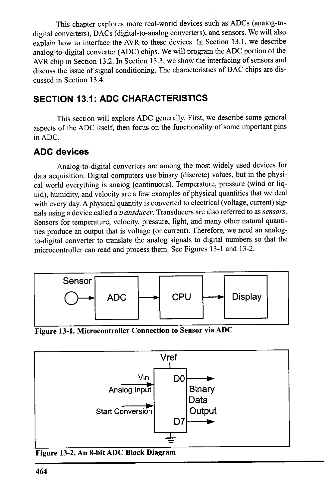
*Description*: Architectural block diagram detailing logic blocks, internal buses, memory units, and hardware component interactions for Figure 13-2: An 8-bit ADC Block Diagram.

> **Figure 13-2: An 8-bit ADC Block Diagram**

464


<!-- Page 475 -->
### [PDF Page 475]


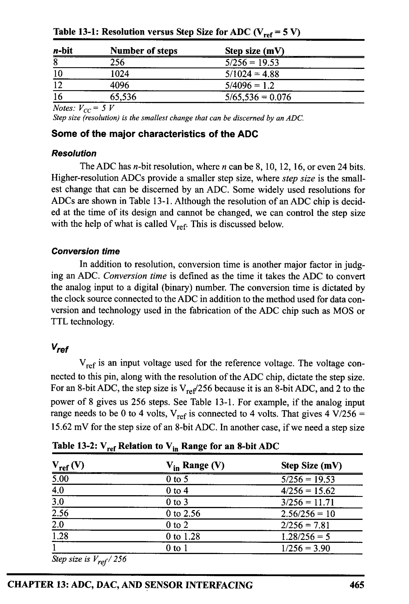
*Description*: Structured reference table listing operational parameters, instruction execution cycles, memory address mapping, or feature comparison for Table 13-1: Resolution versus Step Size for ADC (Vret = 5 V).

> **Table 13-1: Resolution versus Step Size for ADC (Vret = 5 V)**

n-bit
8
Number of steps
Step size (mV)
256
5/256 = 19.53
1024
5/1024 = 4.88
12
4096
5/4096 = 1.2
16
65,536
5/65,536 = 0.076
Notes: Vcc = 5 V
Step size (resolution) is the smallest change that can be discerned by an ADC.
Some of the major characteristics of the ADC
Resolution
The ADC has n-bit resolution, where n can be 8, 10, 12, 16, or even 24 bits.
Higher-resolution ADCs provide a smaller step size, where step size is the small-
est change that can be discerned by an ADC. Some widely used resolutions for
ADCs are shown in Table 13-1. Although the resolution of an ADC chip is decid-
ed at the time of its design and cannot be changed, we can control the step size
with the help of what is called Vref. This is discussed below.
Conversion time
In addition to resolution, conversion time is another major factor in judg-
ing an ADC. Conversion time is defined as the time it takes the ADC to convert
the analog input to a digital (binary) number. The conversion time is dictated by
the clock source connected to the ADC in addition to the method used for data con-
version and technology used in the fabrication of the ADC chip such as MOS or
TTL technology.
Vref
Vref is an input voltage used for the reference voltage. The voltage con-
nected to this pin, along with the resolution of the ADC chip, dictate the step size.
For an 8-bit ADC, the step size is Vref 256 because it is an 8-bit ADC, and 2 to the
power of 8 gives us 256 steps. See Table 13-1. For example, if the analog input
range needs to be 0 to 4 volts, V
ref is connected to 4 volts. That gives 4 V/256 =

## 15.62 mV for the step size of an 8-bit ADC. In another case, if we need a step size


*Description*: Structured reference table listing operational parameters, instruction execution cycles, memory address mapping, or feature comparison for Table 13-2: Vrer Relation to Vin Range for an 8-bit ADC.

> **Table 13-2: Vrer Relation to Vin Range for an 8-bit ADC**

Vref (V)
Vin Range (V)
5.00
O to 5
4.0
0 to 4
3.0
O to 3
2.56
0 to 2.56
2.0
0 to 2
1.28
O to 1.28
0 to 1
Step Size (mV)
5/256 = 19.53
4/256 = 15.62
3/256 = 11.71
2.56/256 = 10
2/256 = 7.81
1.28/256 = 5
1/256 = 3.90
Step size is Vref 256
CHAPTER 13: ADC, DAC, AND SENSOR INTERFACING
465


<!-- Page 476 -->
### [PDF Page 476]


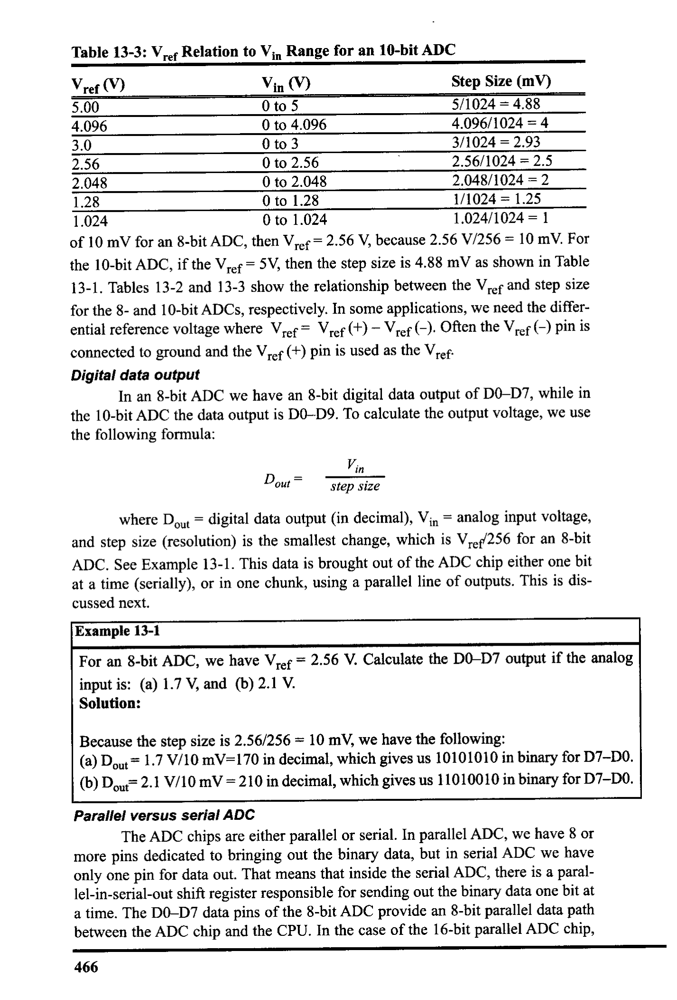
*Description*: Structured reference table listing operational parameters, instruction execution cycles, memory address mapping, or feature comparison for Table 13-3: V.

> **Table 13-3: V**

ref Relation to Vin Range for an 10-bit ADC
Vref (V)
Vin (V)
Step Size (mV)
5.00
O to 5
5/1024 = 4.88
4.096
0 to 4.096
4.096/1024 = 4
3.0
0 to 3
3/1024 = 2.93
2.56
0 to 2.56
2.56/1024 = 2.5
2.048
0 to 2.048
2.048/1024 = 2
1.28
0 to 1.28
1/1024 = 1.25
1.024
0 to 1.024
1.024/1024 = 1
of 10 mV for an 8-bit ADC, then Vref = 2.56 V, because 2.56 V/256 = 10 mV. For
the 10-bit ADC, if the Vref = 5V, then the step size is 4.88 mV as shown in Table
13-1. Tables 13-2 and 13-3 show the relationship between the V
ref and step size
for the 8- and 10-bit ADCs, respectively. In some applications, we need the differ-
ential reference voltage where Vref = Vref (t) - Vref (-). Often the Vref (-) pin is
connected to ground and the Vref (+) pin is used as the Vref
Digital data output
In an 8-bit ADC we have an 8-bit digital data output of DO-D7, while in
the 10-bit ADC the data output is DO-D9. To calculate the output voltage, we use
the following formula:
Vin
Dout =
step size
where Dout = digital data output (in decimal), Vin = analog input voltage,
and step size (resolution) is the smallest change, which is Vrer 256 for an 8-bit
ADC. See Example 13-1. This data is brought out of the ADC chip either one bit
at a time (serially), or in one chunk, using a parallel line of outputs. This is dis-
cussed next.
Example 13-1
For an 8-bit ADC, we have Vref = 2.56 V. Calculate the DO-D7 output if the analog
input is: (a) 1.7 V, and (b) 2.1 V.
Solution:
Because the step size is 2.56/256 = 10 mV, we have the following:
(a) Dout = 1.7 V/10 mV=170 in decimal, which gives us 10101010 in binary for D7-DO.
(b) Dout = 2.1 V/10 mV = 210 in decimal, which gives us 11010010 in binary for D7-DO.
Parallel versus serial ADC
The ADC chips are either parallel or serial. In parallel ADC, we have 8 or
more pins dedicated to bringing out the binary data, but in serial ADC we have
only one pin for data out. That means that inside the serial ADC, there is a paral-
lel-in-serial-out shift register responsible for sending out the binary data one bit at
a time. The DO-D7 data pins of the 8-bit ADC provide an 8-bit parallel data path
between the ADC chip and the CPU. In the case of the 16-bit parallel ADC chip,
466


<!-- Page 477 -->
### [PDF Page 477]

we need 16 pins for the data path. In order to save pins, many 12- and 16-bit ADCs
use pins DO-D7 to send out the upper and lower bytes of the binary data. In recent
years, for many applications where space is a critical issue, using such a large
number of pins for data is not feasible. For this reason, serial devices such as the
serial ADC are becoming widely used. While the serial ADCs use fewer pins and
their smaller packages take much less space on the printed circuit board, more
CPU time is needed to get the converted data from the ADC because the CPU must
get data one bit at a time, instead of in one single read operation as with the paral-
lel ADC. ADC848 is an example of a parallel ADC with 8 pins for the data output,
while the MAXI112 is an example of a serial ADC with a single pin for Dout•
Figures 13-3 and 13-4 show the block diagram for ADC848 and MAX1112.
Analog input channels
Many data acquisition applications need more than one ADC. For this rea-
son, we see ADC chips with 2, 4, 8, or even 16 channels on a single chip.
Multiplexing of analog inputs is widely used as shown in the ADC848 and
IAX1112. In these chips, we have 8 channels of analog inputs, allowing us t
nonitor multiple quantities such as temperature, pressure, heat, and so on. AVI
microcontroller chips come with up to 16 ADC channels.
CHI
GND
Vcc
ADC0848
* DO/MAO
- D1/MA1
* - D2/MA2
• D3/MA3
- D4/MA4
CHS
* AGND
- Vref
INTR
WR CS RD

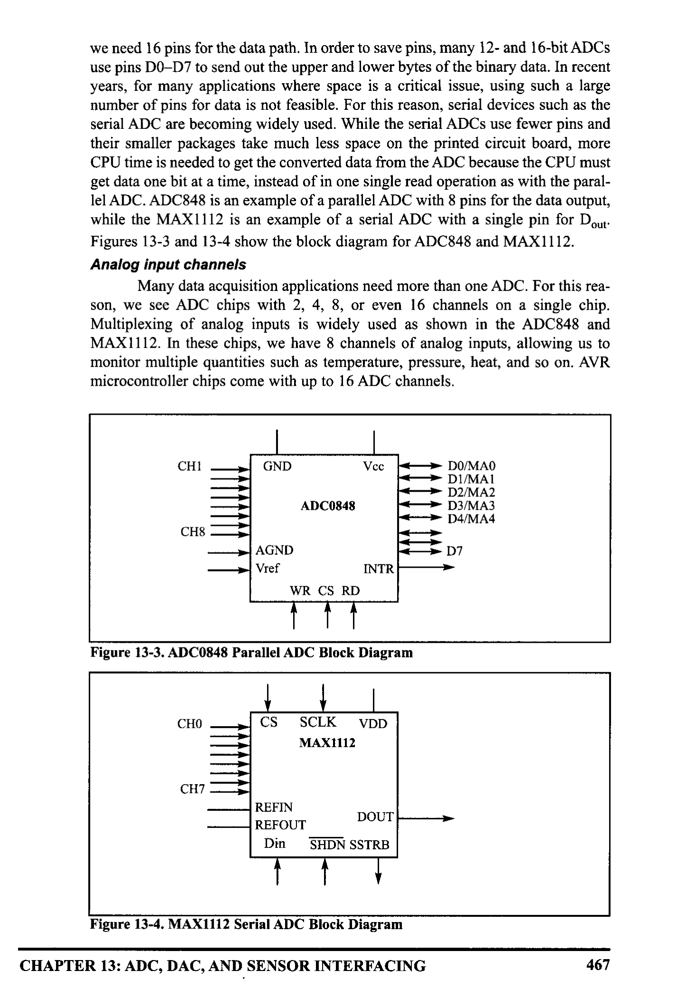
*Description*: Architectural block diagram detailing logic blocks, internal buses, memory units, and hardware component interactions for Figure 13-3: ADC0848 Parallel ADC Block Diagram.

> **Figure 13-3: ADC0848 Parallel ADC Block Diagram**

CHO
CS
-
SCLK VDD
MAX1112
CH7 =
REFIN
REFOUT
DOUT
Din
SHDN SSTRB
T


*Description*: Architectural block diagram detailing logic blocks, internal buses, memory units, and hardware component interactions for Figure 13-4: MAX1112 Serial ADC Block Diagram.

> **Figure 13-4: MAX1112 Serial ADC Block Diagram**

CHAPTER 13: ADC, DAC, AND SENSOR INTERFACING
467


<!-- Page 478 -->
### [PDF Page 478]

Start conversion and end-of-conversion signals
The fact that we have multiple analog input channels and a single digital
output register creats the need for start conversion (SC) and end-of-conversion
(EOC) signals. When SC is activated, the ADC starts converting the analog input
value of Vin to an n-bit digital number. The amount of time it takes to convert
varies depending on the conversion method as was explained earlier. When the
data conversion is complete, the end-of-conversion signal notifies the CPU that the
converted data is ready to be picked up.
Successive Approximation ADC
Successive Approximation is a widely used method of converting an ana-
log input to digital output. It has three main components: (a) successive approxi-
mation register (SAR), (b) comparator, and (c) control unit. See the figure below.
Vout
DAC (Digital-to-Analog
converter)
+ A 77 ...
Analog
Input
Voltage
Control
Successive Approximation
Register
Binary Output Voltage
Assuming a step size of 10 mV, the 8-bit successive approximation ADC will go
through the following steps to convert an input of 1 volt:
(1) It starts with binary 10000000. Since 128 × 10 mV = 1.28 V is greater
than the 1 V input, bit 7 is cleared (dropped). (2) 01000000 gives us 64 × 10 mV =
640 mV and bit 6 is kept since it is smaller than the 1 V input. (3) 01100000 gives
us 96 × 10 mV = 960 mV and bit 5 is kept since it is smaller than the 1 V input, (4)
01110000 gives us 112 × 10 mV = 1120 mv and bit 4 is dropped since it is greater
than the 1 V input. (5) 01101000 gives us 108 × 10 mV = 1080 mV and bit 3 is
dropped since it is greater than the 1 V input. (6) 01100100 gives us 100 × 10 mV =
1000 mV = 1 V and bit 2 is kept since it is equal to input. Even though the answer
is found it does not stop. (7) 011000110 gives us 102 × 10 mV = 1020 mV and bit 1
is dropped since it is greater than the 1 V input. (8) 01100101 gives us 101 × 10 mV
= 1010 mV and bit 0 is dropped since it is greater than the 1 V input.
Notice that the Successive Approximation method goes through all the
steps even if the answer is found in one of the earlier steps. The advantage of the
Successive Approximation method is that the conversion time is fixed since it has
to go through all the steps.

### Review Questions

1. Give two factors that affect the step size calculation.
2. The ADC0848 is an)
-bit converter.
3. True or false. While the ADC0848 has 8 pins for Dous the MAX1112 has only
one Dout pin.
4. Find the step size for an 8-bit ADC, if Vref = 1.28 V.
5. For question 4, calculate the output if the analog input is: (a) 0.7 V, and (b) 1 V.
468


<!-- Page 479 -->
### [PDF Page 479]


## SECTION 13.2: ADC PROGRAMMING IN THE AVR

Because the ADC is widely used in data acquisition, in recent years an
increasing number of microcontrollers have had an on-chip ADC perpheral, Just
like timers and USART. An on-chip ADC eliminates the need for an external ADC
connection, which leaves more pins for other I/O activities. The vast majority of
the AVR chips come with ADC. In this section we discuss the ADC feature of the
ATmega32 and show how it is programmed in both Assembly and C.
ATmega32 ADC features
The ADC peripheral of the ATmega32 has the following characteristics:
(a) It is a 10-bit ADC.
(b) It has 8 analog input channels, 7 differential input channels, and 2 differential
input channels with optional gain of 10x and 200x.
(c) The converted output binary data is held by two special function registers
called ADCL (A/D Result Low) and ADCH (A/D Result High).
(d) Because the ADCH:ADCL registers give us 16 bits and the ADC data out is
only 10 bits wide, 6 bits of the 16 are unused. We have the option of making
either the upper 6 bits or the lower 6 bits unused
(e) We have three options for V
ref. Vrer can be connected to AVCC (Analog Vcc),
internal 2.56 V reference, or external AREF pin.
(f) The conversion time is dictated by the crystal frequency connected to the XTAL
pins (Fosc) and ADPSO:2 bits.
AVR ADC hardware considerations
For digital logic signals a small variation in voltage level has no effect on
the output. For example, 0.2 V is considered LOW, since in TTL logic, anything
less than 0.5 V will be detected as LOW logic. That is not the case when we are
dealing with analog voltage. See Example 13-2.
We can use many techniques to reduce the impact of ADC supply voltage
and Vref Variation on the accuracy of ADC output. Next, we examine two of the
most widely used techniques in the AVR.
Example 13-2
For an 10-bit ADC, we have Vref = 2.56 V. Calculate the DO-D9 output if the analog
input is: (a) 0.2 V, and (b) O V. How much is the variation between (a) and (b)?
Solution:
Because the step size is 2.56/1024 = 2.5 mV, we have the following:
(a) Dout = 0.2 V/2.5 mV = 80 in decimal, which gives us 1010000 in binary.
(b) Dout = 0 V/2.5 mV = 0 in decimal, which gives us 0 in binary.
The difference is 1010000, which is 7 bits!
CHAPTER 13: ADC, DAC, AND SENSOR INTERFACING
469


<!-- Page 480 -->
### [PDF Page 480]

VCC
ATmega
16/32
AVREF (32)]
GND (31)D
AVCC (30) I
100nF


*Description*: Technical diagram and schematic illustration detailing hardware connection topology, signal routing, and circuit operation for Figure 13-5: ADC Recommended Connection.

> **Figure 13-5: ADC Recommended Connection**

Decoupling AVCC from VCC
As we mentioned in Chapter 8, the AVCC pin provides the supply for ana-
log ADC circuitry. To get a better accuracy of AVR ADC we must provide a sta-
ble voltage source to the AVCC pin. Figure 13-5 shows how to use an inductor and
a capacitor to achieve this.
Connecting a capacitor between Vref and GND
By connecting a capacitor between the AVREF pin and GND you can make
the Vref Voltage more stable and increase the precision of ADC. See Figure 13-5.
AVR programming in Assembly and C
In the AVR microcontroller five major registers are associated with the

```assembly
ADC that we deal with in this chapter. They are ADCH (high data), ADCL (low
```

data), ADCSRA (ADC Control and Status Register), ADMUX (ADC multiplexer
selection register), and SPIOR (Special Function I/O Register). We examine each
of them in this section.
REFSI REFSO ADLAR MUX4 | MUX3 MUX2 MUXI | MUXO
REFS1:0 Bit 7:6 Reference Selection Bits
These bits select the reference voltage for the ADC.
ADLAR Bit 5 ADC Left Adjust Results
This bit dictates either the left bits or the right bits of the result registers ADCH:ADCL
that are used to store the result. If we write a one to ADLAR, the result will be left
adjusted; otherwise, the result is right adjusted.
MUX4:0 Bit 4:0 Analog Channel and Gain Selection Bits
The value of these bits selects the gain for the differential channels and also selects
which combination of analog inputs are connected to the ADC.

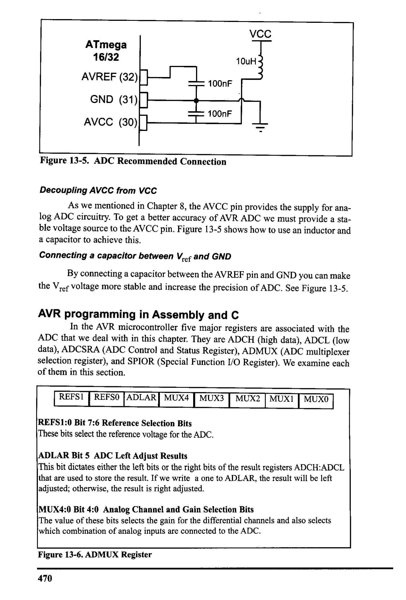
*Description*: Register specification diagram depicting individual bit flags, control register configurations, and functional definitions for Figure 13-6: ADMUX Register.

> **Figure 13-6: ADMUX Register**

470


<!-- Page 481 -->
### [PDF Page 481]

Outside the |
AVR chip
Inside the
AVR chip
REFS1
REFSO
AVCC
(pin30)
Internal 2.56V
AVREF
(pin32)


*Description*: Technical diagram and schematic illustration detailing hardware connection topology, signal routing, and circuit operation for Figure 13-7: ADC Reference Source Selection.

> **Figure 13-7: ADC Reference Source Selection**

ADMUX register

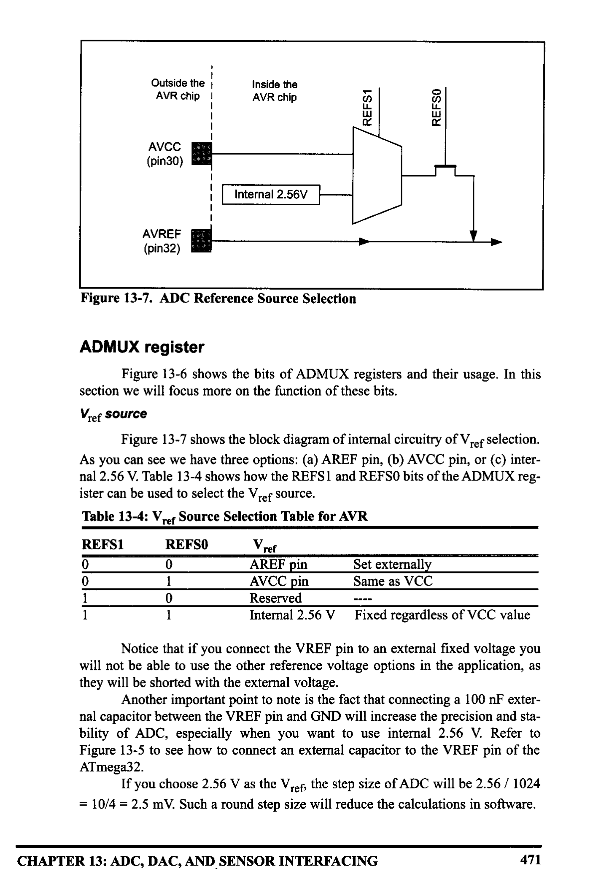
*Description*: Register specification diagram depicting individual bit flags, control register configurations, and functional definitions for Figure 13-6: shows the bits of ADMUX registers and their usage. In this.

> **Figure 13-6: shows the bits of ADMUX registers and their usage. In this**

section we will focus more on the function of these bits.
Vref source


*Description*: Architectural block diagram detailing logic blocks, internal buses, memory units, and hardware component interactions for Figure 13-7: shows the block diagram of internal circuitry of Vref selection..

> **Figure 13-7: shows the block diagram of internal circuitry of Vref selection.**

As you can see we have three options: (a) AREF pin, (b) AVCC pin, or (c) inter-
nal 2.56 V. Table 13-4 shows how the REFS1 and REFSO bits of the ADMUX reg-
ister can be used to select the Vref source.


*Description*: Structured reference table listing operational parameters, instruction execution cycles, memory address mapping, or feature comparison for Table 13-4: Vrer Source Selection Table for AVR.

> **Table 13-4: Vrer Source Selection Table for AVR**

REFS1
REFSO
Vref
0
AREF pin
0
1
1
1
AVCC pin
Set externally
Same as VCC
0
Reserved
1
Internal 2.56 V
Fixed regardless of VCC value
Notice that if you connect the VREF pin to an external fixed voltage you
will not be able to use the other reference voltage options in the application, as
they will be shorted with the external voltage.
Another important point to note is the fact that connecting a 100 nF exter-
nal capacitor between the VREF pin and GND will increase the precision and sta-
bility of ADC, especially when you want to use internal 2.56 V. Refer to


*Description*: IC pinout diagram showing physical pin assignments, I/O pin multiplexing, supply rails, and clock interface connections for Figure 13-5: to see how to connect an external capacitor to the VREF pin of the.

> **Figure 13-5: to see how to connect an external capacitor to the VREF pin of the**

ATmega32.
If you choose 2.56 V as the Vref the step size of ADC will be 2.56 / 1024
= 10/4 = 2.5 mV. Such a round step size will reduce the calculations in software.
CHAPTER 13: ADC, DAC, AND SENSOR INTERFACING
471


<!-- Page 482 -->
### [PDF Page 482]


```assembly
ADC input channel source
```


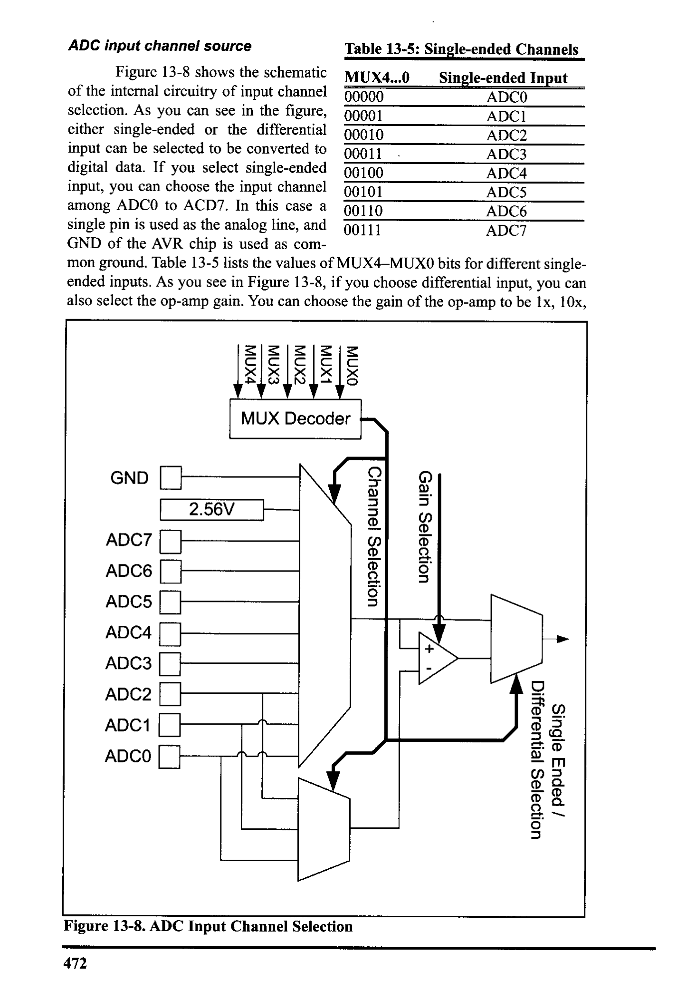
*Description*: Technical diagram and schematic illustration detailing hardware connection topology, signal routing, and circuit operation for Figure 13-8: shows the schematic.

> **Figure 13-8: shows the schematic**

of the internal circuitry of input channel
selection. As you can see in the figure,
either single-ended or the differential
input can be selected to be converted to
digital data. If you select single-ended
input, you can choose the input channel
among ADCO to ACD7. In this case a
single pin is used as the analog line, and


*Description*: Structured reference table listing operational parameters, instruction execution cycles, memory address mapping, or feature comparison for Table 13-5: Single-ended Channels.

> **Table 13-5: Single-ended Channels**

MUX4...0
Single-ended Input
00000
ADCO
00001
ADCI
00010
ADC2
00011
ADC3
00100
ADC4
00101
ADCS
00110
ADC6
00111
ADC7
GND of the AVR chip is used as com-
mon ground. Table 13-5 lists the values of MUX4-MUX0 bits for different single-
ended inputs. As you see in Figure 13-8, if you choose differential input, you can
also select the op-amp gain. You can choose the gain of the op-amp to be Ix, 10x,
MUX Decoder
GND L
2.56V

```assembly
ADC U
```

ADC5 L
ADCA L
ADC3
ADC2
ODI
ADC1
ADCO
Channel Selection
Gain Selection
Single Ended /
Differential Selection


*Description*: Technical diagram and schematic illustration detailing hardware connection topology, signal routing, and circuit operation for Figure 13-8: ADC Input Channel Selection.

> **Figure 13-8: ADC Input Channel Selection**

472


<!-- Page 483 -->
### [PDF Page 483]


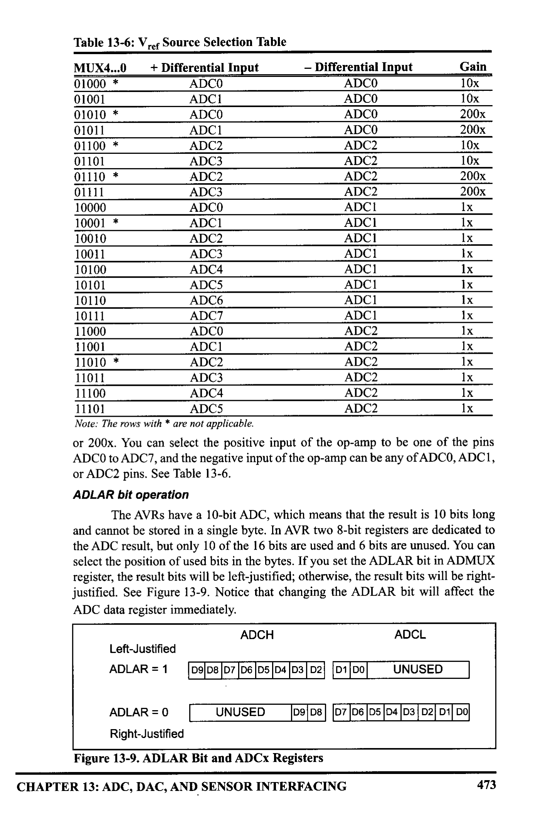
*Description*: Structured reference table listing operational parameters, instruction execution cycles, memory address mapping, or feature comparison for Table 13-6: Vref Source Selection Table.

> **Table 13-6: Vref Source Selection Table**

MUX4..0
+ Differential Input
01000 *
ADCO
01001
ADCI
01010*
ADCO
01011
01100 *
01101
01110*
01111
10000
10001*
10010
10011
10100
10101
10110
10111
ADC7
11000
ADCO
11001
ADC1
11010 *
ADC2
11011
ADC3
11100
ADC4
11101
ADCS
- Differential Input
ADCO
ADCO
ADCO
ADCO
ADC2
ADC2
ADC2
ADC2
ADCI
ADCI
ADCI
ADCI
ADCI
ADCI
ADCI
ADCI
ADC2
ADC2
ADC2
ADC2
ADC2
ADC2
Gain
10x
10x
200x
TOO
200x
10x
10x
200x
200x
1x
1x
1x
1x
1x
1x
1x
1x
1x
1x
1x
1x
1x
1x
Note: The rows with * are not applicable.
or 200x. You can select the positive input of the op-amp to be one of the pins
ADCO to ADC7, and the negative input of the op-amp can be any of ADCO, ADCI,
or ADC2 pins. See Table 13-6.
ADLAR bit operation
The AVRs have a 10-bit ADC, which means that the result is 10 bits long
and cannot be stored in a single byte. In AVR two 8-bit registers are dedicated to
the ADC result, but only 10 of the 16 bits are used and 6 bits are unused. You can
select the position of used bits in the bytes. If you set the ADLAR bit in ADMUX
register, the result bits will be left-justified; otherwise, the result bits will be right-
iustified. See Figure 13-9. Notice that changing the ADLAR bit will affect the

```assembly
ADC data register immediately.
```

ADCH
ADCL
Left-Justified
ADLAR = 1
D9 D8 D7 D6 D5/D4 D3D2
D1 DO
UNUSED
UNUSED
09 D8
D7 D6 DS D4 D3 D2 D1 DO
ADLAR = 0
Right-Justified


*Description*: Register specification diagram depicting individual bit flags, control register configurations, and functional definitions for Figure 13-9: ADLAR Bit and ADCx Registers.

> **Figure 13-9: ADLAR Bit and ADCx Registers**

CHAPTER 13: ADC, DAC, AND SENSOR INTERFACING
473


<!-- Page 484 -->
### [PDF Page 484]

ADCH: ADCL registers
After the A/D conversion is complete, the result sits in registers ADCL
(A/D Result Low Byte) and ACDH (A/D Result High Byte). As we mentioned
before, the ADLAR bit of the ADMUX is used for making it right-justified or left-
justified because we need only 10 of the 16 bits.
ADCSRA register
The ADCSRA register is the status and control register of ADC. Bits of this
register control or monitor the operation of the ADC. In Figure 13-10 you can see
a description of each bit of the ADCSRA register. We will examine some of these
bits in more detail.
ADEN I
ADSC ADATE
ADIF
ADIE ADPS2 ADPSI ADPSO
ADEN Bit 7 ADC Enable
This bit enables or disables the ADC. Setting this bit to one will enable the ADC, and
clearing this bit to zero will disable it even while a conversion is in progress.
ADSC Bit 6 ADC Start Conversion
To start each conversion you have to set this bit to one.
ADATE Bit 5 ADC Auto Trigger Enable
Auto triggering of the ADC is enabled when you set this bit to one.
ADIF Bit 4 ADC Interrupt Flag
This bit is set when an ADC conversion completes and the data registers are updated.
ADIE Bit 3 ADC Interrupt Enable
Setting this bit to one enables the ADC conversion complete interrupt.
ADPS2:0 Bit 2:0 ADC Prescaler Select Bits
These bits determine the division factor between the XTAL frequency and the input
clock to the ADC.

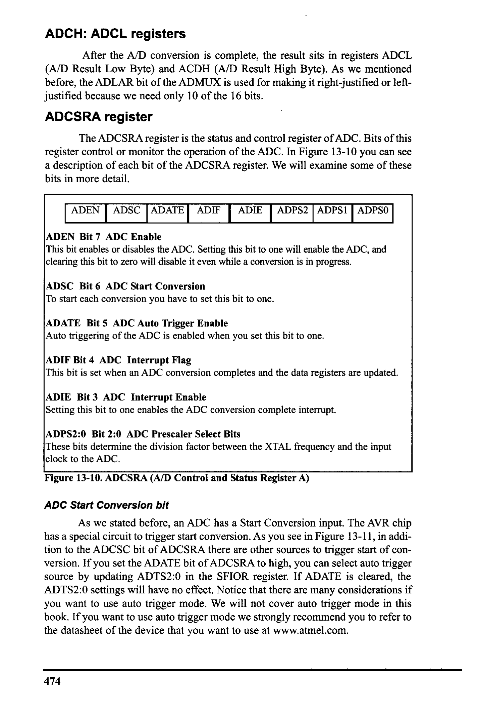
*Description*: Register specification diagram depicting individual bit flags, control register configurations, and functional definitions for Figure 13-10: ADCSRA (A/D Control and Status Register A).

> **Figure 13-10: ADCSRA (A/D Control and Status Register A)**


```assembly
ADC Start Conversion bit
```

As we stated before, an ADC has a Start Conversion input. The AVR chip
has a special circuit to trigger start conversion. As you see in Figure 13-11, in addi-
tion to the ADCSC bit of ADCSRA there are other sources to trigger start of con-
version. If you set the ADATE bit of ADCSRA to high, you can select auto trigger
source by updating ADTS2:0 in the SFIOR register. If ADATE is cleared, the
ADTS2:0 settings will have no effect. Notice that there are many considerations if
you want to use auto trigger mode. We will not cover auto trigger mode in this
book. If you want to use auto trigger mode we strongly recommend you to refer to
the datasheet of the device that you want to use at www.atmel.com.
474


<!-- Page 485 -->
### [PDF Page 485]

ADTSI2:0]
ADATE
ADIF
SOURCE O
....°
.....
-....
Edge
Detector
ADC
SOURCE n
ADSC


*Description*: Technical diagram and schematic illustration detailing hardware connection topology, signal routing, and circuit operation for Figure 13-11: AVR ADC Trigger Source.

> **Figure 13-11: AVR ADC Trigger Source**

A/D conversion time
As you see in Figure 13-12, by using the ADPS2:0 bits of the ADCSRA
register we can set the A/D conversion time. To select the conversion time, we can
select any of Fosc/2, Fosc/4, Fosc/8, Fosc/16, Fosc/32, Fosc/64, or Fosc/128 for

```assembly
ADC clock, where Fosc is the speed of the crystal frequency connected to the AVR
chip. Notice that the multiplexer has 7 inputs since the option ADPS2:0 = 000 is
```

reserved. For the AVR, the ADC requires an input clock frequency less than 200
kHz for the maximum accuracy. Look at Example 13-3 for clarification.
7 bit ADC Prescaler
CK/128
Y
ADPSO
ADPS1
ADPS2R
2 3 4 5 6
ADPS2 ADPS1| ADPSO | ADC Clock
0
0
1
1
0
Reserved
1
CK/2
CK/4
1
CK/8
CK/16
1
1
1
1
CK/32
1
1
CK/64
1
CK/128

```assembly
ADC CLOCK SOURCE
```


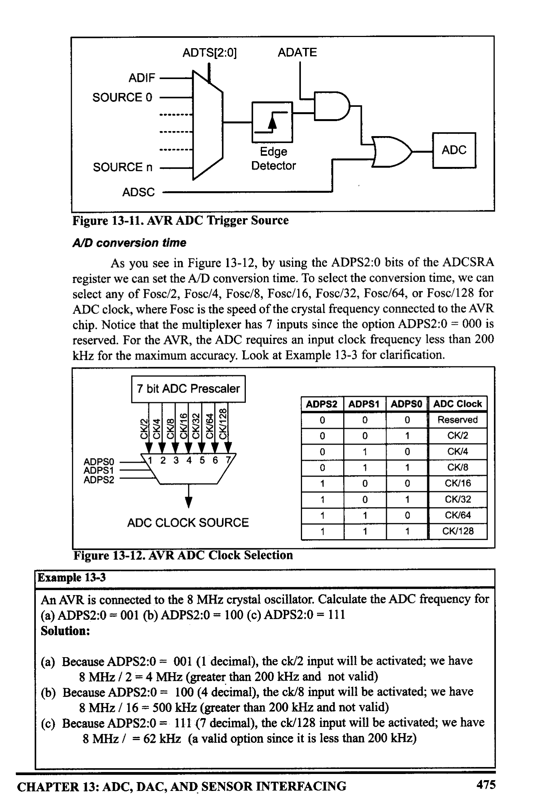
*Description*: Technical diagram and schematic illustration detailing hardware connection topology, signal routing, and circuit operation for Figure 13-12: AVR ADC Clock Selection.

> **Figure 13-12: AVR ADC Clock Selection**

Example 13-3
An AVR is connected to the 8 MHz crystal oscillator. Calculate the ADC frequency for
(a) ADPS2:0 = 001 (b) ADPS2:0 = 100 (c) ADPS2:0 = 111
Solution:
(a) Because ADPS2:0 = 001 (1 decimal), the ck/2 input will be activated; we have
8 MHz / 2 = 4 MHz (greater than 200 kHz and not valid)
(b) Because ADPS2:0 = 100 (4 decimal), the ck/8 input will be activated; we have
8 MHz / 16 = 500 kHz (greater than 200 kHz and not valid)
(c) Because ADPS2:0 = 111 (7 decimal), the ck/128 input will be activated; we have
8 MHz / = 62 kHz (a valid option since it is less than 200 kHz)
CHAPTER 13: ADC, DAC, AND SENSOR INTERFACING
475


<!-- Page 486 -->
### [PDF Page 486]

Sample-and-hold time in ADC
A timing factor that we should know about is the acquisition time. After an

```assembly
ADC channel is selected, the ADC allows some time for the sample-and-hold
```

capacitor (C hold) to charge fully to the input voltage level present at the channel.
In the AVR, the first conversion takes 25 ADC clock cycles in order to ini-
tialize the analog circuitry and pass the sample-and-hold time. Then each consec-
utive conversion takes 13 ADC clock cycles.

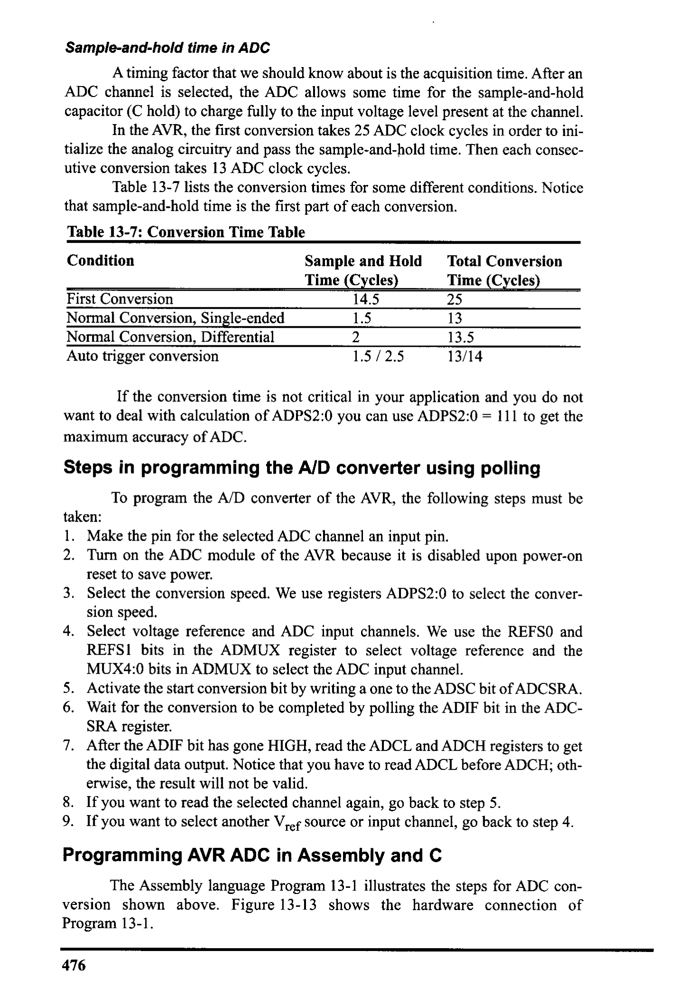
*Description*: Structured reference table listing operational parameters, instruction execution cycles, memory address mapping, or feature comparison for Table 13-7: lists the conversion times for some different conditions. Notice.

> **Table 13-7: lists the conversion times for some different conditions. Notice**

that sample-and-hold time is the first part of each conversion.


*Description*: Structured reference table listing operational parameters, instruction execution cycles, memory address mapping, or feature comparison for Table 13-7: Conversion Time Table.

> **Table 13-7: Conversion Time Table**

Condition
First Conversion
Normal Conversion, Single-ended
Normal Conversion, Differential
Auto trigger conversion
Sample and Hold
Time (Cycles)
14.5
1.5
2
1.5 / 2.5
Total Conversion
Time (Cycles)
25
13
13.5
13/14
If the conversion time is not critical in your application and you do not
want to deal with calculation of ADPS2:0 you can use ADPS2:0 = 111 to get the
maximum accuracy of ADC.
Steps in programming the A/D converter using polling
To program the A/D converter of the AVR, the following steps must be
taken:
1. Make the pin for the selected ADC channel an input pin.
2. Turn on the ADC module of the AVR because it is disabled upon power-on
reset to save power.
3. Select the conversion speed. We use registers ADPS2:0 to select the conver-
sion speed
4. Select voltage reference and ADC input channels. We use the REFSO and
REFSI bits in the ADMUX register to select voltage reference and the
MUX4:0 bits in ADMUX to select the ADC input channel.
5. Activate the start conversion bit by writing a one to the ADSC bit of ADCSRA.
6. Wait for the conversion to be completed by polling the ADIF bit in the ADC-
SRA register.
7. After the ADIF bit has gone HIGH, read the ADCL and ADCH registers to get
the digital data output. Notice that you have to read ADCL before ADCH; oth-
erwise, the result will not be valid.
8. If you want to read the selected channel again, go back to step 5.
9. If you want to select another V
ref source or input channel, go back to step 4.
Programming AVR ADC in Assembly and C
The Assembly language Program 13-1 illustrates the steps for ADC con-
version shown
• above. Figure 13-13 shows the hardware connection of
Program 13-1.
476


<!-- Page 487 -->
### [PDF Page 487]

¡Program 13-1: This program gets data from channel 0 (ADCO) of
;ADC and displays the result on Port C and Port D. This is done
; forever.
;****************** Program 13-1 *************************
• INCLUDE "M32DEF.INC"
LDI
R16, OXFF
OUT
DDRB, R16
OUT
DDRD, R16
LDI
R16,0
OUT
DDRA, R16
LDI
R16, 0x87
OUT
ADCSRA, R16
LDI
R16, 0xC0
OUT
ADMUX, R16
READ
_ADC:

```assembly
SBI ADCSRA, ADSC
KEEP_POLING:
SBIS ADCSRA, ADIE
RJMP KEEP_POLING
```

SBI
ADCSRA, ADIF
IN
R16, ADCL
OUT
PORID, R16
IN
R16, ADCH
OUT
PORTB, R16

```assembly
RJMP READ_ADC
; make Port B an output
; make Port D an
```

• output
¡make Port A an input for ADC
¡enable ADC and select ck/128
;2.56V Vref, ADCO single ended
¡ input, right-justified data
i start conversion
¡wait for end of conversion
¡is it end of conversion yet?
¡keep polling end of conversion
¡write 1 to clear ADIF flag
¡ YOU HAVE TO READ ADCL FIRST
¡give the low byte to PORID
¡ READ ADCH AFTER ADCL
¡give the high byte to PORTB
i keep repeating it
Program 13-1: Reading ADC Using Polling Method in Assembly
ATmega
16/32
ADCO (40)
PORTD
PORTB
10uH
AVREF (32)
GND (31)
AVCC (30)
100nF:
100nF→

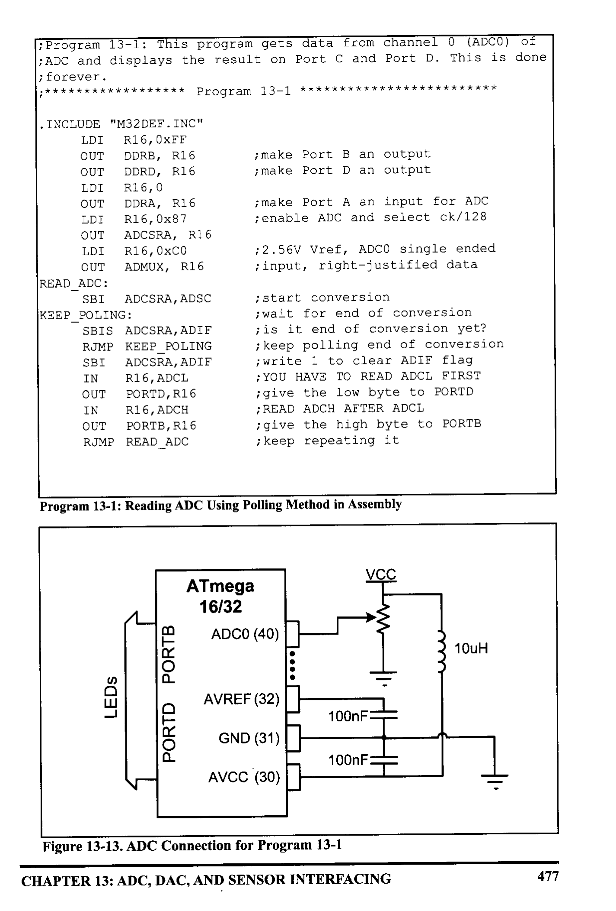
*Description*: Technical diagram and schematic illustration detailing hardware connection topology, signal routing, and circuit operation for Figure 13-13: ADC Connection for Program 13-1.

> **Figure 13-13: ADC Connection for Program 13-1**

CHAPTER 13: ADC, DAC, AND SENSOR INTERFACING
477


<!-- Page 488 -->
### [PDF Page 488]

Program 13-1C is the C version of the ADC conversion for Program 13-1.

```c
#include <avr/io.h>
```

T7standard AVR header
int main (void)

```c
DDRB = OxFF;
```

DDRD
= OXFE;

```c
DDRA = 0;
ADCSRA= 0x87;
ADMUX= OxCO;
//make Port B an output
//make Port D an output
//make Port A an input for ADC input
//make ADC enable and select ck/128
```

1/2.56V Vref, ADCO single ended input
|/data will be right-justified

```c
while (1){
ADCSRA | = (1<<ADSC) ;
//start conversion
while((ADCSRA&(1<<ADIF))==0)://wait for conversion to finish
PORTD = ADCL;
```

I/give the low byte to PORTD

```c
PORTB =
```

• ADCH;
I/give the high byte to PORTB
}
return 0;
Program 13-1C: Reading ADC Using Polling Method in C
Programming A/D converter using interrupts
In Chapter 10, we showed how to use interrupts instead of polling to avoid
tying down the microcontroller. To program the A/D using the interrupt method,
we need to set HIGH the ADIE (A/D interrupt enable) flag. Upon completion of
conversion, the ADIF (A/D interrupt flag) changes to HIGH; if ADIE = 1, it will
force the CPU to jump to the ADC interrupt handler. Programs 13-2 and 13-2C
show how to read ADC using interrupts.
INCLUDE "M32DEF.INC"
• CSEG

```assembly
RJMP MAIN
```

•ORG ADCCaddr

```assembly
RJMP ADC_INT_HANDLER
```

• ORG 40
;*****************************
MAIN: IDI R16, HIGH (RAMEND)
OUT
SPH, R16
LDI
R16, IOW (RAMEND)
OUT
SEI
SPL, R16
IDI
OUT
OUT
LDI
OUT
LDI
OUT
LDI
OUT
SBI
R16, OXFF
DDRB, R16
DDRD, R16
i make Port B an output
¡ make Port D an output
R16, 0
DDRA, R16
R16, 0x8F
; make Port A an input for ADC
¡enable ADC and select ck/128
ADCSRA, R16
R16, 0xCO
;2.56V Vref, ADCO single ended
ADMUX, R16
¡ input right-justified data
ADCSRA, ADSC
i start conversion
Program 13-2: Reading ADC Using Interrupts in Assembly (continued on next page)
478


<!-- Page 489 -->
### [PDF Page 489]

WAIT
_HERE:

```assembly
RJMP WAIT HERE
; keep repeating it
;********************
```

*****
ADC_INT
_HANDLER:
IN
R16, ADCL
OUT
PORTD, R16
IN
R16, ADCH
OUT
PORTB, R16
SBI
ADCSRA, ADSC
¡ YOU HAVE TO READ ADCL FIRST
¡give the low byte to PORTD
; READ ADCH AFTER ADCL
¡give the high byte to PORTB
i start conversion again
RETI
Program 13-2: Reading ADC Using Interrupts in Assembly (continued from previous page)
Program 13-2C is the C version of Program 13-2. Notice that this program
is checked under WinAVR (20080610). If you use another compiler you may need
to read the documentation of your compiler to know how to deal with interrupts in
your compiler.

```c
#include <avr\io.h>
#include <avr|interrupt.h>
```

ISR (ADC_vect)!

```c
PORTD = ADCL;
PORTB = ADCH;
ADCSRA| = (1<<ADSC) ;
```

Ilgive the low byte to PORTD
Ilgive the high byte to PORTB
I/start conversion
int main (void){

```c
DDRB = OXFF;
DDRD = OxFF;
DDRA = 0;
```

seil);
ADCSRA= 0x8F;
ADMUX= OxC0;
ADCSRA | = (1<<ADSC) ;

```c
while (1);
```

return 0;
//make Port B an output
//make Port D an output
I/make Port A an input for ADC input
lenable interrupts
lenable and interrupt select ck/128
112.56V Vref and ADCO single-ended
/input right-justified data
I/start conversion
/wait forever
Program 13-2C: Reading ADC Using Interrupts in C

### Review Questions

1. What is the internal Vref of the ATmega32?
2. The A/D of AVR is a(n)
-bit converter.
3. True or false. The A/D of AVR has pins for DouT.
4. True or false. A/D in the AVR is an off-chip module.
5. Find the step size for an AVR ADC, if Vref = 2.56 V.
6. For problem 5, calculate the DO-D9 output if the analog input is: (a) 0.7 V,
and (b) 1 V
7. How many single-ended inputs are available in the ATmega32 ADC?
8. Calculate the first conversion time for ADPSO-2 = 111 and Fosc = 4 MHz.
9. In AVR, the ADC requires an input clock frequency less than
•
10. Which bit is used to poll for the end of conversion?
CHAPTER 13: ADC, DAC, AND SENSOR INTERFACING
479


<!-- Page 490 -->
### [PDF Page 490]


## SECTION 13.3: SENSOR INTERFACING AND SIGNAL CON-

DITIONING
This section will show how to interface sensors to the microcontroller. We
examine some popular temperature sensors and then discuss the issue of signal
conditioning. Although we concentrate on temperature sensors, the principles dis-
cussed in this section are the same for other types of sensors such as light and pres-
sure sensors.
Temperature sensors
Transducers convert physical data such as temperature, light intensity,
flow, and speed to electrical signals. Depending on the transducer, the output pro-
duced is in the form of voltage, current, resistance, or capacitance. For example,
temperature is converted to electrical signals using a transducer called a thermistor.
A thermistor responds to temperature
change by changing resistance, but
its response is not linear, as seen in

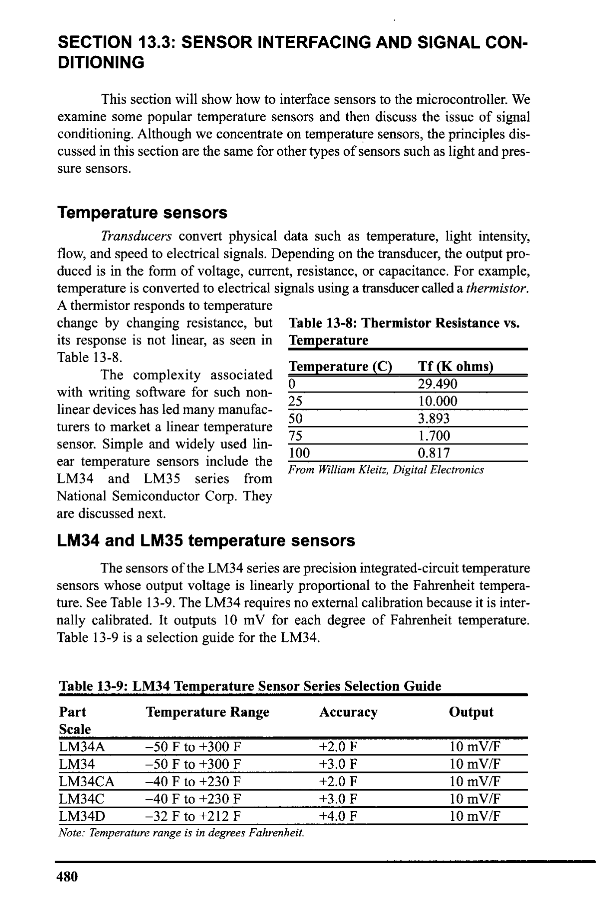
*Description*: Structured reference table listing operational parameters, instruction execution cycles, memory address mapping, or feature comparison for Table 13-8.

> **Table 13-8**

The complexity associated
with writing software for such non-
linear devices has led many manufac-
turers to market a linear temperature
sensor. Simple and widely used lin-
ear temperature sensors include the


*Description*: Structured reference table listing operational parameters, instruction execution cycles, memory address mapping, or feature comparison for Table 13-8: Thermistor Resistance vs..

> **Table 13-8: Thermistor Resistance vs.**

Temperature
Temperature (0) 19(K ohms)
29.490
25
10.000
50
75
3.893
1.700
100
0.817
From William Kleitz, Digital Electronics
LM34 and LM35 series from
National Semiconductor Corp. They
are discussed next.
LM34 and LM35 temperature sensors
The sensors of the LM34 series are precision integrated-circuit temperature
sensors whose output voltage is linearly proportional to the Fahrenheit tempera-
ture. See Table 13-9. The LM34 requires no external calibration because it is inter-
nally calibrated. It outputs 10 mV for each degree of Fahrenheit temperature.


*Description*: Structured reference table listing operational parameters, instruction execution cycles, memory address mapping, or feature comparison for Table 13-9: is a selection guide for the LM34..

> **Table 13-9: is a selection guide for the LM34.**


*Description*: Structured reference table listing operational parameters, instruction execution cycles, memory address mapping, or feature comparison for Table 13-9: LM34 Temperature Sensor Series Selection Guide.

> **Table 13-9: LM34 Temperature Sensor Series Selection Guide**

Part
Scale
LM34A
LM34
LM34CA
LM34C
LM34D
Temperature Range
Accuracy
-50 F to +300 F
-50 F to +300 F
-40 F to +230 F
-40 F to +230 F
-32 F to +212 F
Note: Temperature range is in degrees Fahrenheit.
+2.0 F
+3.0 F
+2.0 F
+3.0 F
+4.0 F
Output
10 mV/F
10 mV/F
10 mV/F
10 mV/F
10 mV/F
480


<!-- Page 491 -->
### [PDF Page 491]


*Description*: Structured reference table listing operational parameters, instruction execution cycles, memory address mapping, or feature comparison for Table 13-10: LM35 Temperature Sensor Series Selection Guide.

> **Table 13-10: LM35 Temperature Sensor Series Selection Guide**

Part
Temperature Range
Accuracy
LM35A
-55 C to +150 C
+1.0 C
LM35
-55 C to +150 C
+1.5 C
LM35CA
-40 C to +110 C
+1.0 C
LM35C
-40 C to +110 C
+1.5 C
LM35D
0 C to +100 C
+2.0 C
Output Scale
10 mV/C
10 mV/C
10 mV/C
10 mV/C
10 mV/C
Note: Temperature range is in degrees Celsius.
The LM35 series sensors are precision integrated-circuit temperature sen-
sors whose output voltage is linearly proportional to the Celsius (centigrade) tem-
perature. The LM35 requires no external calibration because it is internally cali-
brated. It outputs 10 mV for each degree of centigrade temperature. Table 13-10 is
the selection guide for the LM35. (For further information see http://www.nation-
al.com.)
Signal conditioning
Signal conditioning is widely used in the
Analog world
(temperature,
pressure, etc.)
world of data acquisition. The most common
ransducers produce an output in the d resist
voltage, current, charge, capacitance
Transducer
ance. We need to convert these signals to volt-
age, however, in order to send input to an A-to-
D converter. This conversion (modification) is
commonly called signal conditioning. See
Signal
conditioning

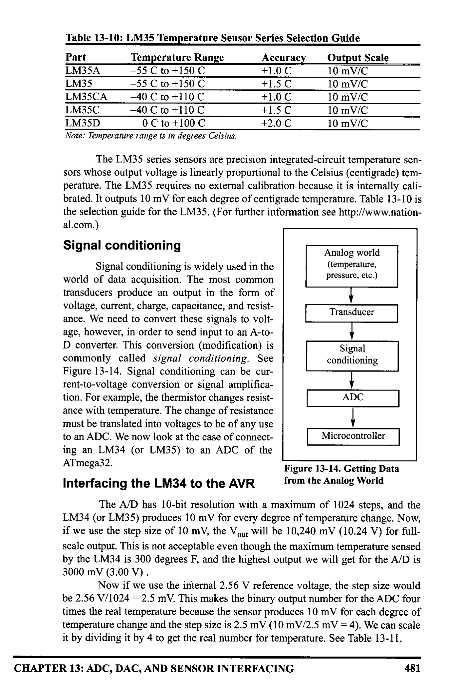
*Description*: Technical diagram and schematic illustration detailing hardware connection topology, signal routing, and circuit operation for Figure 13-14: Signal conditioning can be cur-.

> **Figure 13-14: Signal conditioning can be cur-**

rent-to-voltage conversion or signal amplifica-
tion. For example, the thermistor changes resist-
ADC
ance with temperature. The change of resistance
must be translated into voltages to be of any use
to an ADC. We now look at the case of connect-
Microcontroller
ing an LM34 (or LM35) to an ADC of the
ATmega32.
Interfacing the LM34 to the AVR


*Description*: Technical diagram and schematic illustration detailing hardware connection topology, signal routing, and circuit operation for Figure 13-14: Getting Data.

> **Figure 13-14: Getting Data**

from the Analog World
The A/D has 10-bit resolution with a maximum of 1024 steps, and the
LM34 (or LM35) produces 10 mV for every degree of temperature change. Now,
if we use the step size of 10 mV, the Vour will be 10,240 mV (10.24 V) for full-
scale output. This is not acceptable even though the maximum temperature sensed
by the LM34 is 300 degrees F, and the highest output we will get for the A/D is
3000 mV (3.00 V).
Now if we use the internal 2.56 V reference voltage, the step size would
be 2.56 V/1024 = 2.5 mV. This makes the binary output number for the ADC four
times the real temperature because the sensor produces 10 mV for each degree of
temperature change and the step size is 2.5 mV (10 mV/2.5 mV = 4). We can scale
it by dividing it by 4 to get the real number for temperature. See Table 13-11.
CHAPTER 13: ADC, DAC, AND SENSOR INTERFACING
481


<!-- Page 492 -->
### [PDF Page 492]


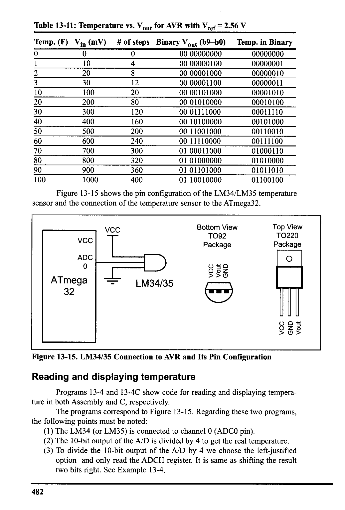
*Description*: Structured reference table listing operational parameters, instruction execution cycles, memory address mapping, or feature comparison for Table 13-11: Temperature vs. Vout for AVR with Vref = 2.56 V.

> **Table 13-11: Temperature vs. Vout for AVR with Vref = 2.56 V**

Temp. (F) Vin (mV)
#of steps Binary Vout (b9-b0)
Temp. in Binary
0
0
00 00000000
00000000
10
4
00 00000100
00000001
2
3
10
20
8
00 00001000
00000010
30
12
00 00001100
00000011
100
20
00 00101000
00001010
200
80
00 01010000
00010100
30
40
50
60
70
80
90
100
300
120
00 01111000
00011110
400
160
00 10100000
00101000
500
200
00 11001000
00110010
600
240
00 11110000
00111100
700
300
01 00011000
01000110
800
320
01 01000000
01010000
900
360
01 01101000
01011010
1000
400
01 10010000
01100100


*Description*: IC pinout diagram showing physical pin assignments, I/O pin multiplexing, supply rails, and clock interface connections for Figure 13-15: shows the pin configuration of the LM34/LM35 temperature.

> **Figure 13-15: shows the pin configuration of the LM34/LM35 temperature**

sensor and the connection of the temperature sensor to the ATmega32.
VCC
VCC
ADC
0
ATmega
32
Bottom View
TO92
Package
Top View
TO220
Package
838
LM34/35


*Description*: IC pinout diagram showing physical pin assignments, I/O pin multiplexing, supply rails, and clock interface connections for Figure 13-15: LM34/35 Connection to AVR and Its Pin Configuration.

> **Figure 13-15: LM34/35 Connection to AVR and Its Pin Configuration**

Reading and displaying temperature
Programs 13-4 and 13-4C show code for reading and displaying tempera-
ture in both Assembly and C, respectively.
The programs correspond to Figure 13-15. Regarding these two programs,
the following points must be noted:
(1) The LM34 (or LM35) is connected to channel 0 (ADCO pin).
(2) The 10-bit output of the A/D is divided by 4 to get the real temperature.
(3) To divide the 10-bit output of the A/D by 4 we choose the left-justified
option and only read the ADCH register. It is same as shifting the result
two bits right. See Example 13-4.
482


<!-- Page 493 -->
### [PDF Page 493]

¡this program reads the sensor and displays it on Port D
• INCLUDE "M32DEF. INC"
LDI
R16, OXFF
OUT
DDRD, R16
¡ make Port D an output
IDI
R16,0
OUT
DDRA, R16
IDI
R16, 0x87
; make Port A an input for ADC
¡ enable ADC and select ck/128
OUT
ADCSRA, R16
LDI
R16, 0XE0
OUT
ADMUX, R16
; 2.56 V Vref, ADCO single-ended
¡left-justified data
READ
_ADC:
SBI
ADCSRA, ADSC
i start conversion
KEEP
_POLING:
¡wait for end of conversion

```assembly
SBIS ADCSRA, ADIE
```

¡is it end of conversion?

```assembly
RJMP KEEP_POLING
```

i keep polling end of conversion
SBI
ADCSRA, ADIE
¡write 1 to clear ADIE flag
IN
R16, ADCH
¡ read only ADCH for 8 MSB of
OUT
PORTD, R16
¡ result and give it to PORTD

```assembly
RJMP READ ADC
```

i keep repeating
Program 13-3: Reading Temperature Sensor in Assembly
¡this program reads the sensor and displays it on Port D
#include <avr/io.h›
I/standard AVR header
int main (void)

```c
DDRD = OxFF;
DDRA = 0;
ADCSRA = 0x87;
ADMUX = 0xE0;
//make Port D an output
//make Port A an input for ADC input
//make ADC enable and select ck/128
```

112.56 V Vref and ADCO single-ended
I/data will be left-justified

```c
while (1){
ADCSRA |= (1<<ADSC); //start conversion
while((ADCSRA& (1<<ADIF))==0); //wait for end of conversion
PORTB = ADCH;
```

Ilgive the high byte to PORTB
}
return 0;
Program 13-3C: Reading Temperature Sensor in C
Example 13-4
In Table 13-11, verify the AVR output for a temperature of 70 degrees. Find values in
the AVR A/D registers of ADCH and ADCL for left-justified.
Solution:
The step size is 2.56/1024 = 2.5 mV because Vref = 2.56 V.
For the 70 degrees temperature we have 700 mV output because the LM34 provides 10
mV output for every degree. Now, the number of steps are 700 mV/2.5 m = 280 in
decimal. Now 280 = 0100011000 in binary and the AVR A/D output registers have
ADCH = 01000110 and ADCL = 00000000 for left-justified. To get the proper result we
must divide the result by 4. To do that, we simply read the ADCH register, which has
the value 70(01000110) in it.
CHAPTER 13: ADC, DAC, AND SENSOR INTERFACING
483


<!-- Page 494 -->
### [PDF Page 494]


### Review Questions

1. True or false. The transducer must be connected to signal conditioning circuit-
ry before its signal is sent to the ADC.
2. The LM35 provides
mV for each degree of
(Fahrenheit,
Celsius) temperature.
3. The LM34 provides
_ mV for each degree of _
_ (Fahrenheit, Celsius)
temperature.
4. Why do we set the Vrer Of the AVR to 2.56 V if the analog input is connected
to the LM35?
5. In Question 4, what is the temperature if the ADC output is 0011 1001?

## SECTION 13.4: DAC INTERFACING

This section will show how to interface a DAC (digital-to-analog convert-
er) to the AVR. Then we demonstrate how to generate a stair-step ramp on the
scope using the DAC.
Digital-to-analog converter (DAC)
The digital-to-analog converter (DAC) is a device widely used to convert
digital pulses to analog signals. In this section we discuss the basics of interfacing
a DAC to the AVR.
Recall from your digital electronics course the two methods of creating a
DAC: binary weighted and R/2R ladder. The vast majority of integrated circuit
DACs, including the MC1408 (DAC0808) used in this section, use the R/2R
method because it can achieve a much higher degree of precision. The first crite-
rion for judging a DAC is its resolution, which is a function of the number of bina-
ry inputs. The common ones are 8, 10, and 12 bits. The number of data bit inputs
decides the resolution of the DAC because the number of analog output levels is
equal to 2^, where n is the number of data bit inputs. Therefore, an 8-input DAC
such as the DAC0808 provides 256 discrete voltage (or current) levels of output.
See Figure 13-16. Similarly, the 12-bit DAC provides 4096 discrete voltage lev-
els. There are also 16-bit DACs, but they are more expensive.
Vref
DO
Digital Inputs
D7
→ Analog Output
WR
RD

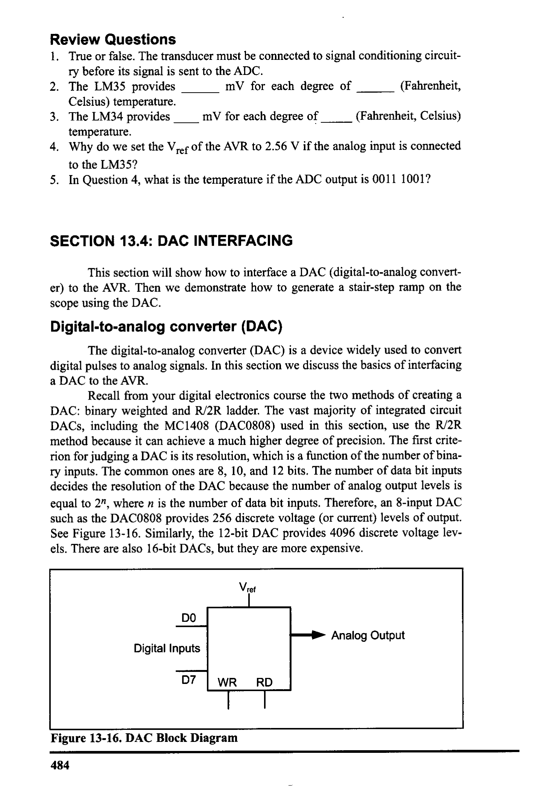
*Description*: Architectural block diagram detailing logic blocks, internal buses, memory units, and hardware component interactions for Figure 13-16: DAC Block Diagram.

> **Figure 13-16: DAC Block Diagram**

484


<!-- Page 495 -->
### [PDF Page 495]

MC1408 DAC (or DAC0808)
In the MC1408 (DAC0808), the digital inputs are converted to current
(Lout), and by connecting a resistor to the lout pin, we convert the result to voltage.
The total current provided by the Lout pin is a function of the binary numbers at the
DO-D7 inputs of the DAC0808 and the reference current (Iref), and is as follows:
+-
256)
where DO is the LSB, D7 is the MSB for the inputs, and Iref is the input
current that must be applied to pin 14. The Iref current is generally set to 2.0 mA.

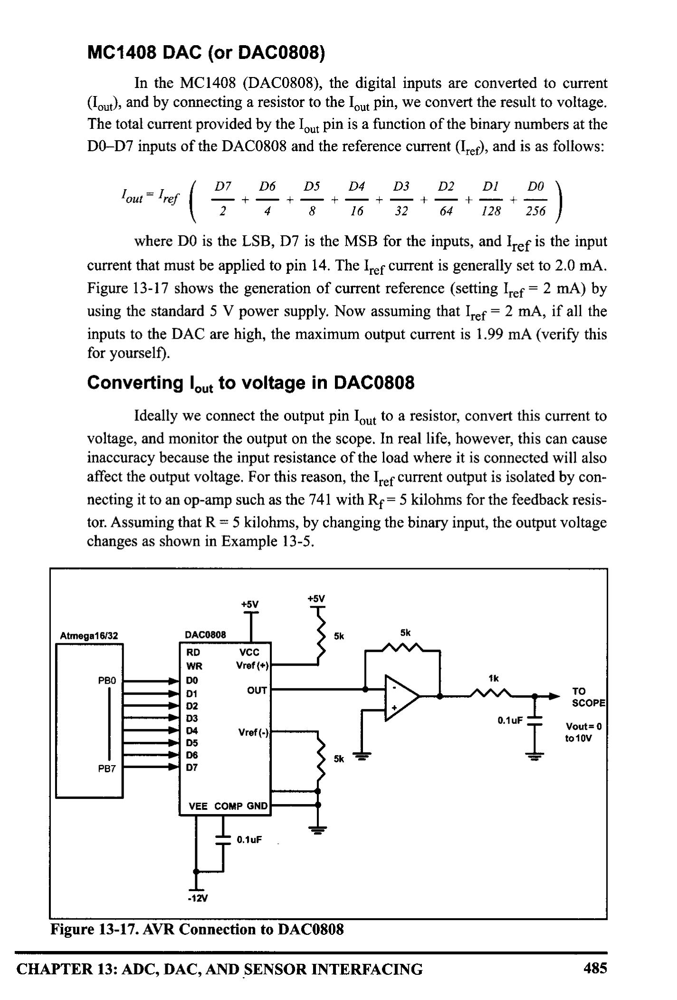
*Description*: Technical diagram and schematic illustration detailing hardware connection topology, signal routing, and circuit operation for Figure 13-17: shows the generation of current reference (setting Tref = 2 mA) by.

> **Figure 13-17: shows the generation of current reference (setting Tref = 2 mA) by**

using the standard 5 V power supply. Now assuming that Tref = 2 mA, if all the
inputs to the DAC are high, the maximum output current is 1.99 mA (verify this
for yourself.
Converting lout to voltage in DAC0808
Ideally we connect the output pin Lout to a resistor, convert this current to
voltage, and monitor the output on the scope. In real life, however, this can cause
inaccuracy because the input resistance of the load where it is connected will also
affect the output voltage. For this reason, the ref current output is isolated by con-
necting it to an op-amp such as the 741 with Rp = 5 kilohms for the feedback resis-
tor. Assuming that R = 5 kilohms, by changing the binary input, the output voltage
changes as shown in Example 13-5.
+5V
Atmega16/32
PBO
DACO808
RD
WR
DO
D1
• 5k
VCC
Vref (+) -
OUT
Vref (-)
1k

## 0.1 uF

TO
SCOPE
Vout = 0
to 10v
5k
PB7
D7
VEE COMP GND
=0.10F
- 12V


*Description*: Technical diagram and schematic illustration detailing hardware connection topology, signal routing, and circuit operation for Figure 13-17: AVR Connection to DAC0808.

> **Figure 13-17: AVR Connection to DAC0808**

CHAPTER 13: ADC, DAC, AND SENSOR INTERFACING
485


<!-- Page 496 -->
### [PDF Page 496]

Example 13-5
inputs:
Assuming that R = 5 kilohms and Iref = 2 mA, calculate Vout for the following binary
(a) 10011001 binary (99H)
(b) 11001000 (C8H)
Solution:
(a) Lout = 2 mA (153/256) = 1.195 mA and Vout = 1.195 mA × 5K = 5.975 V
(b) Lout = 2 mA (200/256) = 1.562 mA and Vout = 1.562 mA × 5K = 7.8125 V
Generating a stair-step ramp
In order to generate a stair-step ramp, you can set up the circuit in Figure 13-17
and load Program 13-4 on the AVR chip. To see the result wave, connect the out-
put to an oscilloscope. Figure 13-18 shows the output.
LDI
R16, OXFF

```assembly
OUT DDRB, R16
AGAIN:
```

INC
R16
OUT
PORTB, R16
NOP
NOP

```assembly
RJMP AGAIN
```

Program 13-4: DAC Programming
; make Port B an output
; increment R16
i sent R16 to PORTB
¡ let DAC recover
Programming DAC in C
Program 13-4C shows how to program the DAC in C.

```c
#include <avr/io.h>
```

I/standard AVR header
int main (void)
unsigned char i = 0;

```c
DDRB = 0xFF;
while (1)/
PORTB = i;
```

itt;
I/define a counter
//make Port B an output
I/do forever
//copy i into PORTB to be converted
/increment the counter
}
return 0;
Program 13-4C: DAC Programming in C
486


<!-- Page 497 -->
### [PDF Page 497]

•T

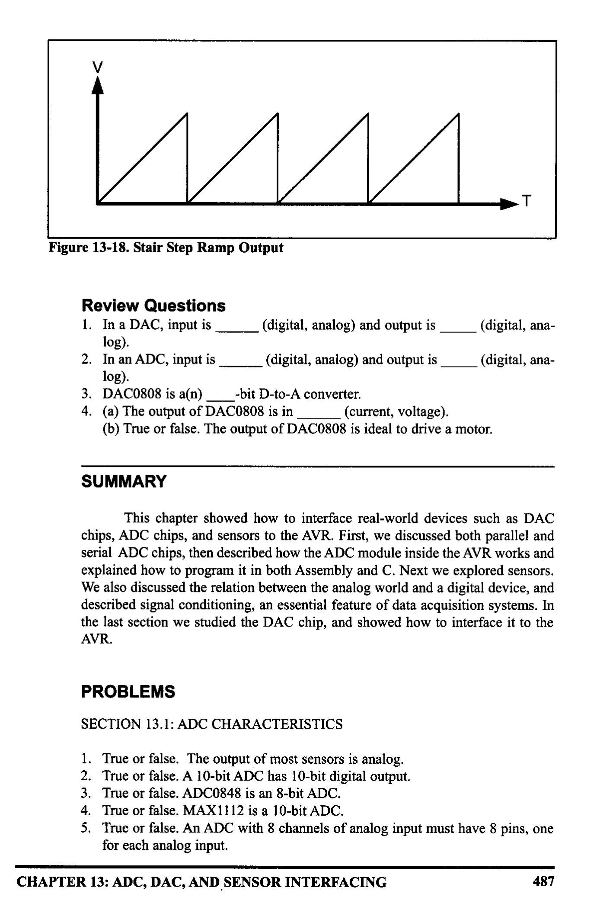
*Description*: Technical diagram and schematic illustration detailing hardware connection topology, signal routing, and circuit operation for Figure 13-18: Stair Step Ramp Output.

> **Figure 13-18: Stair Step Ramp Output**


### Review Questions

1. In a DAC, input is
(digital, analog) and output is
log).
2. In an ADC, input is
(digital, analog) and output is
10g).
3. DACO808 is a(n)
_-bit D-to-A converter.
4. (a) The output of DAC0808 is in
(current, voltage).
(b) True or false. The output of DAC0808 is ideal to drive a motor.
_ (digital, ana-
_ (digital, ana-

### SUMMARY

This chapter showed how to interface real-world devices such as DAC
chips, ADC chips, and sensors to the AVR. First, we discussed both parallel and
serial ADC chips, then described how the ADC module inside the AVR works and
explained how to program it in both Assembly and C. Next we explored sensors.
We also discussed the relation between the analog world and a digital device, and
described signal conditioning, an essential feature of data acquisition systems. In
the last section we studied the DAC chip, and showed how to interface it to the
AVR.

### PROBLEMS


## SECTION 13.1: ADC CHARACTERISTICS

1. True or false. The output of most sensors is analog.
2. True or false. A 10-bit ADC has 10-bit digital output.
3. True or false. ADC0848 is an 8-bit ADC.
4. True or false. MAX1112 is a 10-bit ADC.
5. True or false. An ADC with 8 channels of analog input must have 8 pins, one
for each analog input.
CHAPTER 13: ADC, DAC, AND SENSOR INTERFACING
487


<!-- Page 498 -->
### [PDF Page 498]

6. True or false. For a serial ADC, it takes a longer time to get the converted dig-
ital data out of the chip.
7. True or false. ADC0848 has 4 channels of analog input.
8. True or false. MAX1112 has 8 channels of analog input.
9. True or false. ADC0848 is a serial ADC.
10. True or false. MAX1112 is a parallel ADC.
11. Which of the following ADC sizes provides the best resolution?
(a) 8-bit (b) 10-bit (c) 12-bit (d) 16-bit (e) They are all the same.
12. In Question 11, which provides the smallest step size?
13. Calculate the step size for the following ADCs, if Vref is 5 V:
(a) 8-bit (b) 10-bit (c) 12-bit (d) 16-bit
14. With Vref = 1.28 V, find the Vin for the following outputs:
(a) D7-DO = 11111111 (b) D7-DO = 10011001
(c) D7-DO = 1101100
15. In the ADC0848, what should the Vref Value be if we want a step size of 5 mV?
16. With Vref = 2.56 V, find the Vin for the following outputs:
(a) D7-DO = 11111111
(b) D7-DO = 10011001 (c) D7-DO = 01101100

## SECTION 13.2: ADC PROGRAMMING IN THE AVR

17. True or false. The ATmega32 has an on-chip A/D converter.
18. True or false. A/D of the ATmega32 is an 8-bit ADC.
19. True or false. ATmega32 has 8 channels of analog input.
20. True or false. The unused analog pins of the ATmega32 can be used for 1/O
pins.
21. True or false. The A/D conversion speed in the ATmega32 depends on the crys-
tal frequency.
22. True or false. Upon power-on reset, the A/D module of the ATmega32 is turned
on and ready to go.
23. True or false. The A/D module of the ATmega32 has an external pin for the
start-conversion signal.
24. True or false. The A/D module of the ATmega32 can convert only one channel
at a time.
25. True or false. The A/D module of the ATmega32 can have multiple external
Vreft at any given time.
26. True or false. The A/D module of the ATmega32 can use the Vac for Vref
27. In the A/D of ATmega32, what happens to the converted analog data? How do
we know that the ADC is ready to provide us the data?
28. In the A/D of ATmega32, what happens to the old data if we start conversion
again before we pick up the last data?
29. For the A/D of ATmega32, find the step size for each of the following Vref
(a) Vref = 1.024 V (b) Vref = 2.048 V (c) Vref = 2.56 V
30. In the ATmega32, what should the Vref value be if we want a step size of 2
mV?
31. In the ATmega32, what should the Vref value be if we want a step size of 3
mV?
488


<!-- Page 499 -->
### [PDF Page 499]

32. With a step size of 1 mV, what is the analog input voltage if all outputs are 1?
33. With Vref = 1.024 V, find the Vin for the following outputs:
(a) D9-DO = 0011111111 (b) D9-DO = 0010011000 (c) D9-DO = 0011010000
34. In the A/D of ATmega32, what should the V
ref value be if we want a step size
of 4 mV?
35. With Vref = 2.56 V, find the Vin for the following outputs:
(a) D9-DO = 1111111111 (b) D9-D0 = 1000000001 (c) D9-D0 = 1100110000
36. Find the first conversion times for the following cases if XTAL = 8 MHz. Are
they acceptable?
(a) Fosc/2 (b) Fosc/4 (c) Fosc/8 (d) Fosc/16 (e) Fosc/32
37. Find the first conversion times for the following cases if XTAL = 4 MHz. Are
they acceptable?
(a) Fosc/8 (b) Fosc/16
(c) Fosc/32 (d) Fosc/64
38. How do we start conversion in the ATmega32?
39. How do we recognize the end of conversion in the ATmega32?
40. Which bits of which register of the ATmega32 are used to select the A/D's con-
version speed?
41. Which bits of which register of the ATmega32 are used to select the analog
channel to be converted?
42. Give the names of the interrupt flags for the A/D of the ATmega32. State to
which register they belong.
43. Upon power-on reset, the A/D of the ATmega32 is given (on, off).

## SECTION 13.3: SENSOR INTERFACING AND SIGNAL CONDITIONING

44. What does it mean when a given sensor is said to have a linear output?
45. The LM34 sensor produces
mV for each degree of temperature.
46. What is signal conditioning?

## SECTION 13.4: DAC INTERFACING

47. True or false. DACO808 is the same as DAC1408.
48. Find the number of discrete voltages provided by the n-bit DAC for the follow-
ing:
(a) n= 8 (b) n= 10 (c)n = 12
49. For DAC1408, if Iref = 2 mA, show how to get the lout of 1.99 when all inputs
are HIGH.
50. Find the I,
out for the following inputs. Assume Iref = 2 mA for DACO808.
(a) 10011001
(b) 11001100
(c) 11101110
(d) 00100010
(e) 00001001
(f 10001000
51. To get a smaller step, we need a DAC with
inputs.
(more, fewer) digital
52. To get full-scale output, what should be the inputs for DAC?
CHAPTER 13: ADC, DAC, AND SENSOR INTERFACING
489


<!-- Page 500 -->
### [PDF Page 500]


### ANSWERS TO REVIEW QUESTIONS


## SECTION 13.1: ADC CHARACTERISTICS

1.
Number of steps and Vref voltage
4. 1.28 V/256 = 5 mV
5. (a) 0.7 V/ 5 mV = 140 in decimal and D7-DO = 10001100 in binary.
(b) 1 V/ 5 mV = 200 in decimal and D7-DO = 11001000 in binary.

## SECTION 13.2: ADC PROGRAMMING IN THE AVR

1. 2.56 V
2. 10
3. False
4. False
5. 2.56/1024 = 2.5 mV
6. (a) 700 mV/2.5 mV = 280(100011000), (b) 1000 mV/ 2.5 mV = 400(110010000)
7
8 channels
8. (1/(4 MHz/128)) × 25 = 800 microseconds
9. 200 kHz
10. ADIF bit of the ADCSRA register

## SECTION 13.3: SENSOR INTERFACING AND SIGNAL CONDITIONING

1. True
2.
10, Celsius
3.
10, Fahrenheit
4.
Using the 8-bit part of the 10-bit ADC, it gives us 256 steps, and 2.56 V/256 = 10 mV. The
LM35 produces 10 mV for each degree of temperature, which matches the ADC's step size.
5. 00111001 = 57, which indicates it is 57 degrees.

## SECTION 13.4: DAC INTERFACING

1. Digital, analog
2. Analog, digital
4. (a) current
(b) true
490


