# Chapter 14: Relay, Optoisolator, and Stepper Motor Interfacing

> **Textbook**: The AVR Microcontroller and Embedded Systems using Assembly and C

> **PDF Page Range**: 501 - 518


---


<!-- Page 501 -->
### [PDF Page 501]

CHAPTER 14
RELAY, OPTOISOLATOR, AND
STEPPER MOTOR INTERFACING
WITH AVR
OBJECTIVES
Upon completion of this chapter, you will be able to:
>>
›>
>>
Describe the basic operation of a relay
Interface the AVR with a relay
Describe the basic operation of an optoisolator
Interface the AVR with an optoisolator
Describe the basic operation of a stepper motor
Interface the AVR with a stepper motor
491


<!-- Page 502 -->
### [PDF Page 502]

Microcontrollers are widely used in motor control. We also use relays and
optoisolators in motor control. This chapter discusses motor control and shows
AVR interfacing with relays, optoisolators, and stepper motors. We use both
Assembly and C in our programming examples.

## SECTION 14.1: RELAYS AND OPTOISOLATORS

This section begins with an overview of the basic operations of electro-
mechanical relays, solid-state relays, reed switches, and optoisolators. Then we
describe how to interface them to the AVR. We use both Assembly and C language
programs to demonstrate their control.
Electromechanical relays
A relay is an electrically controllable switch widely used in industrial con-
trols, automobiles, and appliances. It allows the isolation of two separate sections
of a system with two different voltage sources. For example, a +5 V system can be
isolated from a 120 V system by placing a relay between them. One such relay is
called an electromechanical (or electromagnetic) relay (EMR) as shown in Figure
14-1. The EMRs have three components: the coil, spring, and contacts. In Figure
14-1, a digital +5 V on the left side can control a 12 V motor on the right side with-
out any physical contact between them. When current flows through the coil, a
magnetic field is created around the coil (the coil is energized), which causes the
armature to be attracted to the coil. The armature's contact acts like a switch and
closes or opens the circuit. When the coil is not energized, a spring pulls the arma-
ture to its normal state of open or closed. In the block diagram for electromechan-
ical relays (EMR) we do not show the spring, but it does exist internally. There are
all types of relays for all kinds of applications. In choosing a relay the following
characteristics need to be considered:
1. The contacts can be normally open (NO) or normally closed (NC). In the NC
type, the contacts are closed when the coil is not energized. In the NO type, the
contacts are open when the coil is unenergized
2. There can one or more contacts. For example, we can have SPST (single pole,
single throw), SPDT (single pole, double throw), and DPDT (double pole,
double throw) relays.
3. The voltage and current needed to energize the coil. The voltage can vary from
a few volts to 50 volts, while the current can be from a few mA to 20 mA. The
relay has a minimum voltage, below which the coil will not be energized. This
minimum voltage is called the "pull-in" voltage. In the datasheets for relays we
might not see current, but rather coil resistance. The V/R will give you the pull-
in current. For example, if the coil voltage is 5 V, and the coil resistance is 500
ohms, we need a minimum of 10 mA (5 V/500 ohms = 10 mA) pull-in current.
4. The maximum DC/AC voltage and current that can be handled by the contacts.
This is in the range of a few volts to hundreds of volts, while the current can
be from a few amps to 40 A or more, depending on the relay. Notice the differ-
ence between this voltage/current specification and the voltage/current needed
for energizing the coil. The fact that one can use such a small amount of volt-
492


<!-- Page 503 -->
### [PDF Page 503]

age/current on one side to handle a large amount of voltage/current on the
other side is what makes relays so widely used in industrial controls. Examine

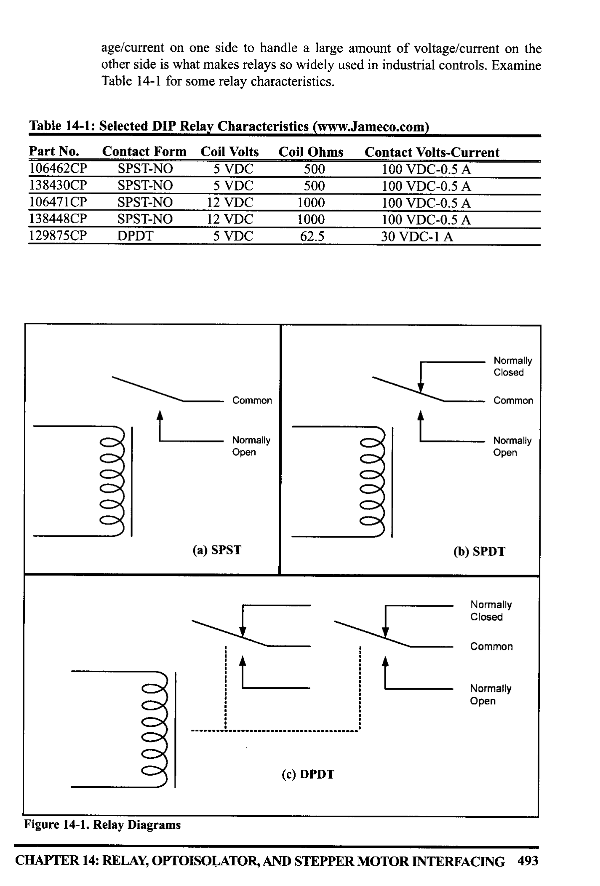
*Description*: Structured reference table listing operational parameters, instruction execution cycles, memory address mapping, or feature comparison for Table 14-1: for some relay characteristics..

> **Table 14-1: for some relay characteristics.**


*Description*: Structured reference table listing operational parameters, instruction execution cycles, memory address mapping, or feature comparison for Table 14-1: Selected DIP Relay Characteristics (www.Jameco.com).

> **Table 14-1: Selected DIP Relay Characteristics (www.Jameco.com)**

Part No.
106462CP
138430CP
106471CP
138448CP
129875CP
Contact Form
Coil Volts
SPST-NO
5 VDC
SPST-NO
5 VDC
SPST-NO
12 VDC
SPST-NO
12 VDC
DPDT
5 VDC
Coil Ohms
500
500
1000
1000
62.5
Contact Volts-Current
100 VDC-0.5 A
100 VDC-0.5 A
100 VDC-0.5 A
100 VDC-0.5 A
30 VDC-1 A
Common
Normally
Open
Normally
Closed
Common
Normally
Open
ell
ell
00
(a) SPST
(b) SPDT
4
Normally
Closed
Common
Normally
Open
(c) DPDT


*Description*: Technical diagram and schematic illustration detailing hardware connection topology, signal routing, and circuit operation for Figure 14-1: Relay Diagrams.

> **Figure 14-1: Relay Diagrams**

CHAPTER 14: RELAY, OPTOISOLATOR, AND STEPPER MOTOR INTERFACING 493


<!-- Page 504 -->
### [PDF Page 504]

Driving a relay
Digital systems and microcontroller pins lack sufficient current to drive the
relay. While the relay's coil needs around 10 mA to be energized, the microcon-
troller's pin can provide a maximum of 1-2 mA current. For this reason, we place
a driver, such as the ULN2803, or a power transistor between the microcontroller
and the relay as shown in Figure 14-2.
+5V
T
+5V
+12V
106462
2
AVR
10
ULN2803
114
1
18
6
8
PBO
9

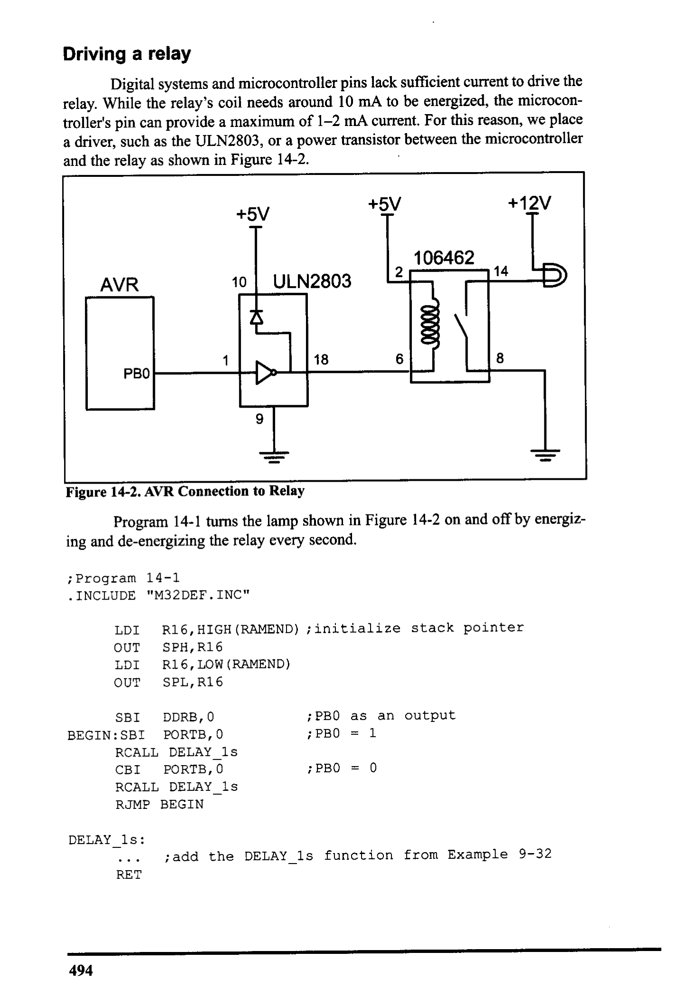
*Description*: Technical diagram and schematic illustration detailing hardware connection topology, signal routing, and circuit operation for Figure 14-2: AVR Connection to Relay.

> **Figure 14-2: AVR Connection to Relay**

Program 14-1 turns the lamp shown in Figure 14-2 on and off by energiz-
ing and de-energizing the relay every second.
¡ Program 14-1
• INCLUDE "M32DEF. INC"
LDI
R16, HIGH (RAMEND) ; initialize stack pointer
OUT
LDI
SPH, R16
R16, LOW (RAMEND)
OUT
SPL, R16

```assembly
SBI DDRB, O
BEGIN: SBI PORTB, O
; PBO as an output
; PBO
_= 1
RCALL DELAY _15
CBI PORTB, O
; PBO = 0
RCALL DELAY_1s
RJMP BEGIN
```

DELAY_Is:
••.
RET
¡add the DELAY_Is function from Example 9-32
494


<!-- Page 505 -->
### [PDF Page 505]

Solid-state relay
Another widely used relay is the solid-state relay. See Table 14-2. In this
relay, there is no coil, spring, or mechanical contact switch. The entire relay is
made out of semiconductor materials. Because no mechanical parts are involved
in solid-state relays, their switching response time is much faster than that of
electromechanical relays. Another advantage of the solid-state relay is its greater
lite expectancy. The life cycle for the electromechanical relay can vary from a few
hundred thousand to a few million operations. Wear and tear on the contact points
can cause the relay to malfunction after a while. Solid-state relays, however, have
no such limitations. Extremely low input current and small packaging make solid-
state relays ideal for microcontroller and logic control switching. They are widely
used in controlling pumps, solenoids, alarms, and other power applications. Some
solid-state relays have a phase control option, which is ideal for motor-speed con-
trol and light-dimming applications. Figure 14-3 shows control of a fan using a
solid-state relay (SSR).


*Description*: Structured reference table listing operational parameters, instruction execution cycles, memory address mapping, or feature comparison for Table 14-2: Selected Solid-State Relay Characteristics (www.Jameco.com).

> **Table 14-2: Selected Solid-State Relay Characteristics (www.Jameco.com)**

Part No.
143058CP
139053CP
162341CP
172591CP
175222CP
176647CP
Contact Style
Control Volts
Contact Volts Contact Current
SPST
4-32 VDC
240 VAC
SPST
3-32 VDC
240 VAC
SPST
3-32 VDC
240 VAC
SPST
3-32 VDC
60 VDC
SPST
3-32 VDC
60 VDC
25 A
10 A
2A
4A
SPST
3-32 VDC
120 VDC
120VAC
AVR
162341
ZERO
VOLTAGE
CIRCUIT
7
FAN
PBO
4
2

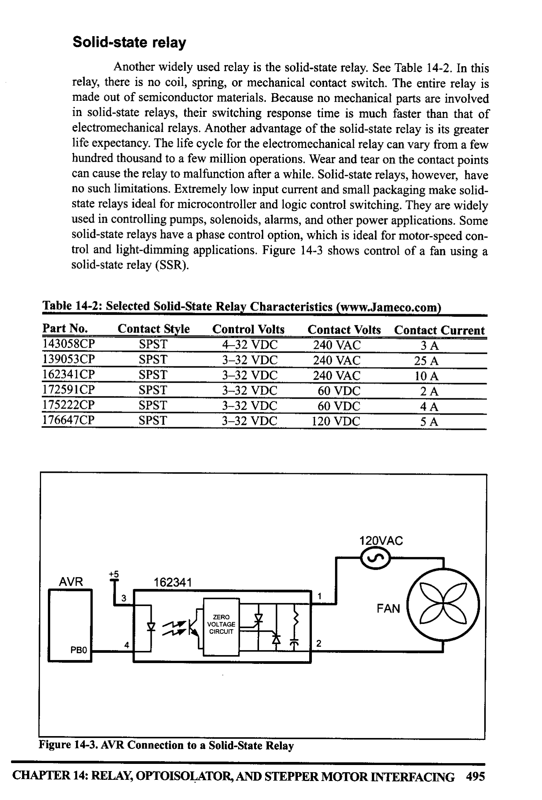
*Description*: Technical diagram and schematic illustration detailing hardware connection topology, signal routing, and circuit operation for Figure 14-3: AVR Connection to a Solid-State Relay.

> **Figure 14-3: AVR Connection to a Solid-State Relay**

CHAPTER 14: RELAY, OPTOISOLATOR, AND STEPPER MOTOR INTERFACING 495


<!-- Page 506 -->
### [PDF Page 506]

Reed switch
Another popular switch is the reed switch. When the reed switch is placed
in a magnetic field, the contact is closed. When the magnetic field is removed, the
contact is forced open by its spring. See Figure 14-4. The reed switch is ideal for
moist and marine environments where it can be submerged in fuel or water. Reed
switches are also widely used in dirty and dusty atmospheres because they are
tightly sealed.
WHEEL
M
A
WHEEL
MAGNET
REED SWITCH
(Closed)
LAMP
(ON)
REED SWITCH
(Open)
LAMP
(OFF)

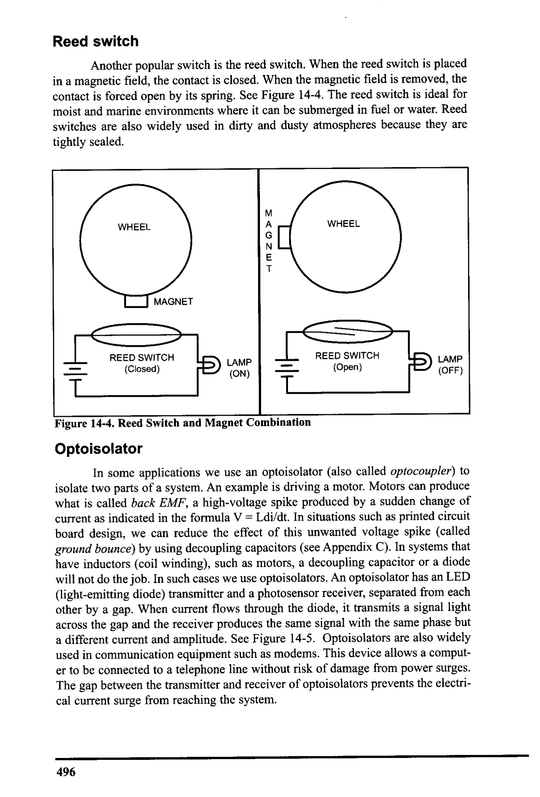
*Description*: Technical diagram and schematic illustration detailing hardware connection topology, signal routing, and circuit operation for Figure 14-4: Reed Switch and Magnet Combination.

> **Figure 14-4: Reed Switch and Magnet Combination**

Optoisolator
In some applications we use an optoisolator (also called optocoupler) to
isolate two parts of a system. An example is driving a motor. Motors can produce
what is called back EMF, a high-voltage spike produced by a sudden change of
current as indicated in the formula V = Ldi/dt. In situations such as printed circuit
board design, we can reduce the effect of this unwanted voltage spike (called
ground bounce) by using decoupling capacitors (see Appendix C). In systems that
have inductors (coil winding), such as motors, a decoupling capacitor or a diode
will not do the job. In such cases we use optoisolators. An optoisolator has an LED
(light-emitting diode) transmitter and a photosensor receiver, separated from each
other by a gap. When current flows through the diode, it transmits a signal light
across the gap and the receiver produces the same signal with the same phase but
a different current and amplitude. See Figure 14-5. Optoisolators are also widely
used in communication equipment such as modems. This device allows a comput-
er to be connected to a telephone line without risk of damage from power surges.
The gap between the transmitter and receiver of optoisolators prevents the electri-
cal current surge from reaching the system.
496


<!-- Page 507 -->
### [PDF Page 507]

OPTOISOLATOR
OPTOISOLATOR
ILQ74
OPTOISOLATOR
6
16
71
2
3
2
3
4
5
115
114
13
12
6
111
10
8
9


*Description*: IC pinout diagram showing physical pin assignments, I/O pin multiplexing, supply rails, and clock interface connections for Figure 14-5: Optoisolator Package Examples.

> **Figure 14-5: Optoisolator Package Examples**

Interfacing an optoisolator
The optoisolator comes in a small IC package with four or more pins.
There are also packages that contain more than one optoisolator. When placing an
optoisolator between two circuits, we must use two separate voltage sources, one
for each side, as shown in Figure 14-6. Unlike relays, no drivers need to be placed
between the microcontroller/digital output and the optoisolators.
AVR
ILD74
OPTOISOLATOR
PBO
1
2
3
4
+12V
6
LAMP
Trok
5
330
+5V

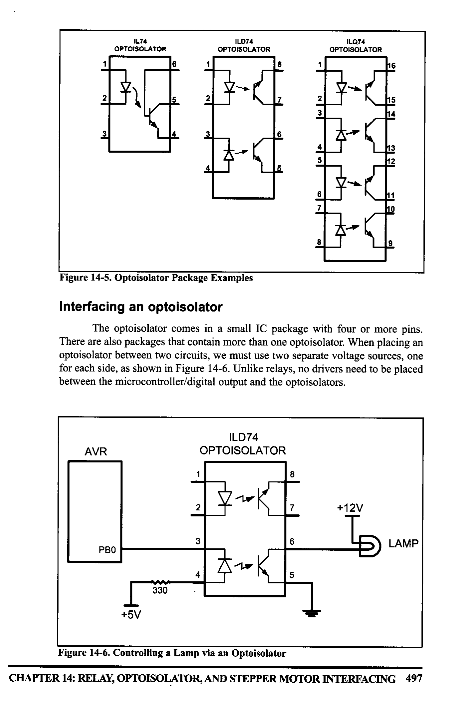
*Description*: Technical diagram and schematic illustration detailing hardware connection topology, signal routing, and circuit operation for Figure 14-6: Controlling a Lamp via an Optoisolator.

> **Figure 14-6: Controlling a Lamp via an Optoisolator**

CHAPTER 14: RELAY, OPTOISOLATOR, AND STEPPER MOTOR INTERFACING 497


<!-- Page 508 -->
### [PDF Page 508]


### Review Questions

1. Give one application where would you use a relay.
2. Why do we place a driver between the microcontroller and the relay?
3. What is an NC relay?
4. Why are relays that use coils called electromechanical relays?
5. What is the advantage of a solid-state relay over EMR?
6. What is the advantage of an optoisolator over an EMR?

## SECTION 14.2: STEPPER MOTOR INTERFACING

This section begins with an overview of the basic operation of stepper
motors. Then we describe
how to interface a stepper
A
motor to the AVR. Finally, we
use Assembly language pro-
grams to demonstrate control
of the angle and direction of
stepper motor rotation.
Stepper motors
C
A stepper motor is a
widely used device that trans-
lates electrical pulses into
mechanical movement. In
applications such as disk
drives, dot matrix printers,
and robotics, the stepper
motor is used for position
control. Stepper motors com-
monly have a permanent mag-
net rotor (also called the
shaft) surrounded by a stator
(see Figure 14-7). There are
also steppers called variable
Average
North
reluctance stepper motors that
S
do not have a permanent mag-
net rotor. The most common
D
stepper motors have four sta-
tor windings that are paired
with a center-tapped common
Average
South
as shown in Figure 14-8. This
type of stepper motor is com-
/
monly referred to as a four-
phase or unipolar stepper
B
motor. The center tap allows a
change of current direction in Figure 14-7. Rotor Alignment
498


<!-- Page 509 -->
### [PDF Page 509]

each of two coils when a winding is
grounded, thereby resulting in a polari-
ty change of the stator. Notice that while
a conventional motor shaft runs freely,
the stepper motor shaft moves in a fixed
repeatable increment, which allows it to
A
B
C
D
oo0oo0
COM
COM
move to a precise position. This repeat-
able fixed movement is possible as a
result of basic magnetic theory where
poles of the same polarity repel and Figure 14-8. Stator Winding
opposite poles attract. The direction of Configuration
the rotation is dictated by the stator
poles. The stator poles are determined by the current sent through the wire coils.
As the direction of the current is changed, the polarity is also changed causing the
reverse motion of the rotor. The stepper motor discussed here has a total of six
leads: four leads representing the four stator windings and two commons for the
center-tapped leads. As the sequence of power is applied to each stator winding,
the rotor will rotate. There are several widely used sequences, each of which has
a different degree of precision. Table 14-3 shows a two-phase, four-step stepping
sequence.
Note that although we can start with any of the sequences in Table 14-3,
once we start we must continue in the proper order. For example, if we start with
step 3 (0110), we must continue in the sequence of steps 4, 1, 2, and so on.

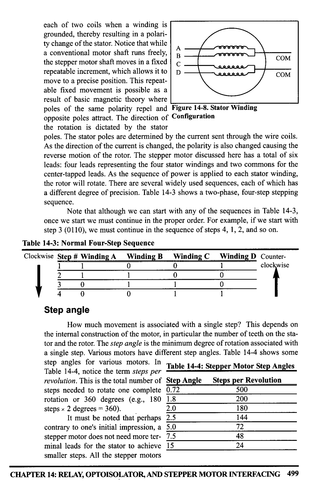
*Description*: Structured reference table listing operational parameters, instruction execution cycles, memory address mapping, or feature comparison for Table 14-3: Normal Four-Step Sequence.

> **Table 14-3: Normal Four-Step Sequence**

Clockwise Step # Winding A
Winding B
2
Winding C
0
0
Winding D Counter-
clockwise
0
1
0
1
0
4
1
Step angle
How much movement is associated with a single step? This depends on
the internal construction of the motor, in particular the number of teeth on the sta-
tor and the rotor. The step angle is the minimum degree of rotation associated with
a single step. Various motors have different step angles. Table 14-4 shows some
step angles for various motors. Ill Table 14-4: Stepper Motor Step Angles


*Description*: Structured reference table listing operational parameters, instruction execution cycles, memory address mapping, or feature comparison for Table 14-4: , notice the term steps per.

> **Table 14-4: , notice the term steps per**

revolution. This is the total number of Step Angle
Steps per Revolution
steps needed to rotate one complete
0.72
500
rotation or 360 degrees (e.g., 180
1.8
200
steps × 2 degrees = 360).
2.0
180
It must be noted that perhaps
2.5
144
contrary to one's initial impression, a
5.0
72
stepper motor does not need more ter- 7.5
48
minal leads for the stator to achieve 15
24
smaller steps. All the stepper motors
CHAPTER 14: RELAY, OPTOISOLATOR, AND STEPPER MOTOR INTERFACING 499


<!-- Page 510 -->
### [PDF Page 510]

discussed in this section have four leads for the stator winding and two COM wires
for the center tap. Although some manufacturers set aside only one lead for the
common signal instead of two, they always have four leads for the stators. See
Example 14-1. Next we discuss some associated terminology in order to under-
stand the stepper motor further.
Example 14-1
Describe the AVR connection to the stepper motor of Figure 14-9 and code a program
to rotate it continuously.
Solution:
The following steps show the AVR connection to the stepper motor and its program-
ming:
1. Use an ohmmeter to measure the resistance of the leads. This should identify which
COM leads are connected to which winding leads.
2. The common wire(s) are connected to the positive side of the motor's power supply.
In many motors, +5 V is sufficient.
3. The four leads of the stator winding are controlled by four bits of the AVR port
(PBO-PB3). Because the AVR lacks sufficient current to drive the stepper motor
windings, we must use a driver such as the ULN2003 (or ULN2803) to energize the
stator. Instead of the ULN2003, we could have used transistors as drivers, as shown
in Figure 14-11. However, notice that if transistors are used as drivers, we must also
use diodes to take care of inductive current generated when the coil is turned off.
One reason that using the ULN2003 is preferable to the use of transistors as drivers
is that the ULN2003 has an internal diode to take care of back EMF.
• INCLUDE "M32DEF.INC"

```assembly
LDI R20, HIGH (RAMEND) ¡ initialize
```

stack pointer
OUT
SPH, R20
LDI
R20, LOW (RAMEND)
OUT
SPL, R20
LDI
R2O, OXEE
¡Port B as output

```assembly
OUT DDRB, R20
```

IDI R2O, 0x06
L1:

```assembly
OUT PORTB, R20
```

LSR R20

```assembly
BRCC L2
```

¡ load step sequence
¡ PORTB = R20
ishift right
¡if not carry skip next
ORI R20, 0x8
L2: RCALL DELAY
¡wait

```assembly
RJMP L1
DELAY: LDI R16, 0x50
D_LI: NOP
```

NOP
DEC R16

```assembly
BRNE D_L1
```

RET
Change the value of DELAY to set the speed of rotation.
500


<!-- Page 511 -->
### [PDF Page 511]

+5V DC
Ground
AVR
PBO
PB1
PB2
PB3
ULN2003
Unipolar
Stepper Motor
1
2
3
4
Do
Do
16
15
14
13
8
9
Use one power supply for
the motor and ULN2003
and another for the AVR
L +SVDC
- Ground

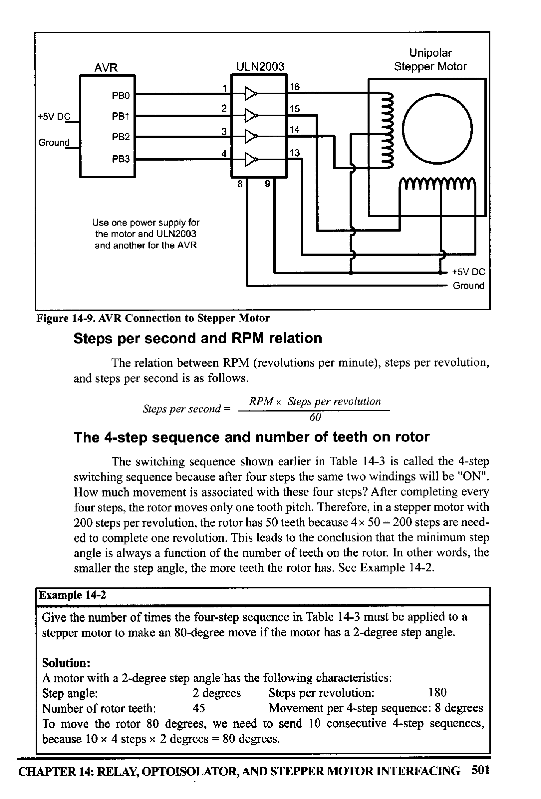
*Description*: Technical diagram and schematic illustration detailing hardware connection topology, signal routing, and circuit operation for Figure 14-9: AVR Connection to Stepper Motor.

> **Figure 14-9: AVR Connection to Stepper Motor**

Steps per second and RPM relation
The relation between RPM (revolutions per minute), steps per revolution,
and steps per second is as follows.
RPM × Steps per revolution
Steps per second =
60
The 4-step sequence and number of teeth on rotor
The switching sequence shown earlier in Table 14-3 is called the 4-step
switching sequence because after four steps the same two windings will be "ON".
How much movement is associated with these four steps? After completing every
four steps, the rotor moves only one tooth pitch. Therefore, in a stepper motor with
200 steps per revolution, the rotor has 50 teeth because 4 × 50 = 200 steps are need-
ed to complete one revolution. This leads to the conclusion that the minimum step
angle is always a function of the number of teeth on the rotor. In other words, the
smaller the step angle, the more teeth the rotor has. See Example 14-2.
Example 14-2
Give the number of times the four-step sequence in Table 14-3 must be applied to a
stepper motor to make an 80-degree move if the motor has a 2-degree step angle.
Solution:
A motor with a 2-degree step angle has the following characteristics:
Step angle:
2 degrees
Steps per revolution:
180
Number of rotor teeth:
45
Movement per 4-step sequence: 8 degrees
To move the rotor 80 degrees, we need to send 10 consecutive 4-step sequences,
because 10 × 4 steps x 2 degrees = 80 degrees.
CHAPTER 14: RELAY, OPTOISOLATOR, AND STEPPER MOTOR INTERFACING 501


<!-- Page 512 -->
### [PDF Page 512]

Looking at Example 14-2, one might wonder what happens if we want to
move 45 degrees, because the steps are 2 degrees each. To provide finer resolu-
tions, all stepper motors allow what is called an 8-step switching sequence. The 8-
step sequence is also called half-stepping, because in the 8-step sequence each step
is half of the normal step angle. For example, a motor with a 2-degree step angle
can be used as a 1-degree step angle if the sequence of Table 14-5 is applied.


*Description*: Structured reference table listing operational parameters, instruction execution cycles, memory address mapping, or feature comparison for Table 14-5: Half-Step 8-Step Sequence.

> **Table 14-5: Half-Step 8-Step Sequence**

Clockwise
Step # Winding A
Winding B
-
1
0
Winding C Winding D. Counter-
clockwise
1
1
0
0
0
4
5
0
0
0
1
1
8
0
Motor speed
The motor speed, measured in steps per second (steps/s), is a function of
the switching rate. Notice in Example 14-1 that by changing the length of the time
delay loop, we can achieve various rotation speeds.
Holding torque
The following is a definition of holding torque: "With the motor shaft at
standstill or zero rpm condition, the amount of torque, from an external source,
required to break away the shaft from its holding position. This is measured with
rated voltage and current applied to the motor" The unit of torque is ounce-inch
(or kg-cm).
Wave drive 4-step sequence
In addition to the 8-step and the 4-step sequences discussed earlier, there is
another sequence called the wave drive 4-step sequence. It is shown in Table 14-6.
Notice that the 8-step sequence of Table 14-5 is simply the combination of the
wave drive 4-step and normal 4-step normal sequences shown in Tables 14-6 and
14-3, respectively. Experimenting with the wave drive 4-step sequence is left to
the reader.

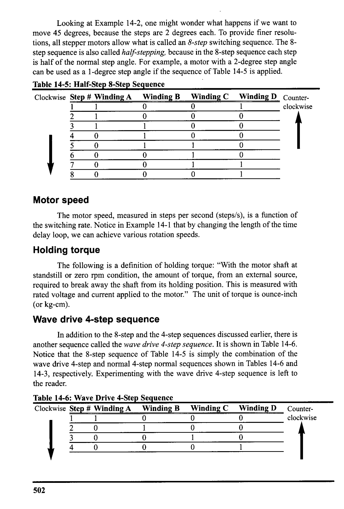
*Description*: Structured reference table listing operational parameters, instruction execution cycles, memory address mapping, or feature comparison for Table 14-6: Wave Drive 4-Step Sequence.

> **Table 14-6: Wave Drive 4-Step Sequence**

Clockwise Step # Winding A
Winding B
Winding C
0
Winding D
0
1
2
ilml
4
0
0
0
1
0
1
Counter-
clockwise
502


<!-- Page 513 -->
### [PDF Page 513]


*Description*: Structured reference table listing operational parameters, instruction execution cycles, memory address mapping, or feature comparison for Table 14-7: Selected Stepper Motor Characteristics (www.Jameco.com).

> **Table 14-7: Selected Stepper Motor Characteristics (www.Jameco.com)**

Part No.
151861CP
171601CP
164056CP
Step Angle
Drive System Volts Phase Resistance
• Current
7.5
unipolar
5V
9 ohms
550 mA
3.6
unipolar
20 ohms
350 mA
7.5
bipolar
5 V
6 ohms
800 mA
Unipolar versus bipolar stepper motor interface
There are three common types of stepper motor interfacing: universal,
unipolar, and bipolar. They can be identified by the number of connections to the
motor. A universal stepper motor has eight, while the unipolar has six and the bipo-
lar has four. The universal stepper motor can be configured for all three modes,
while the unipolar can be either unipolar or bipolar. Obviously the bipolar cannot
be configured for universal nor unipolar mode. Table 14-7 shows selected stepper
motor characteristics. Figure 14-10 shows the basic internal connections of all
three type of configurations.
Unipolar stepper motors can be controlled using the basic interfacing
shown in Figure 14-11, whereas the bipolar stepper requires H-Bridge circuitry.
Bipolar stepper motors require a higher operational current than the unipolar; the
advantage of this is a higher holding torque.
000
O000
00000
(a) Universal


*Description*: Technical diagram and schematic illustration detailing hardware connection topology, signal routing, and circuit operation for Figure 14-10: Common Stepper Motor Types.

> **Figure 14-10: Common Stepper Motor Types**

(b) Unipolar
(c) Bipolar
Using transistors as drivers

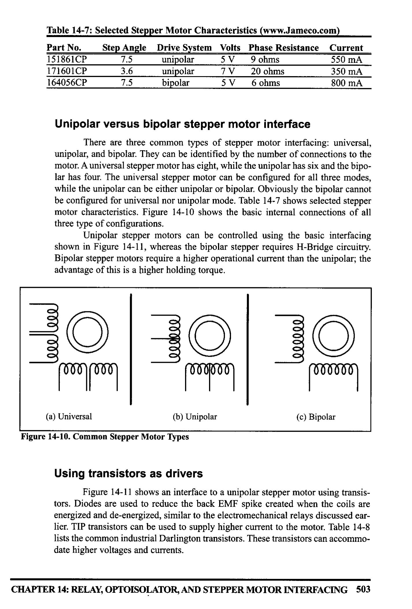
*Description*: Technical diagram and schematic illustration detailing hardware connection topology, signal routing, and circuit operation for Figure 14-11: shows an interface to a unipolar stepper motor using transis-.

> **Figure 14-11: shows an interface to a unipolar stepper motor using transis-**

tors. Diodes are used to reduce the back EMF spike created when the coils are
energized and de-energized, similar to the electromechanical relays discussed ear-
lier. TIP transistors can be used to supply higher current to the motor. Table 14-8
lists the common industrial Darlington transistors. These transistors can accommo-
date higher voltages and currents.
CHAPTER 14: RELAX, OPTOISOLATOR, AND STEPPER MOTOR INTERFACING 503


<!-- Page 514 -->
### [PDF Page 514]

4.7k
+V Motor
1N4001$
TIP120
→ A
$
B
> C
To Stepper
Motor
Use TIP120
Darlington transistor if
the motor needs
several amps.

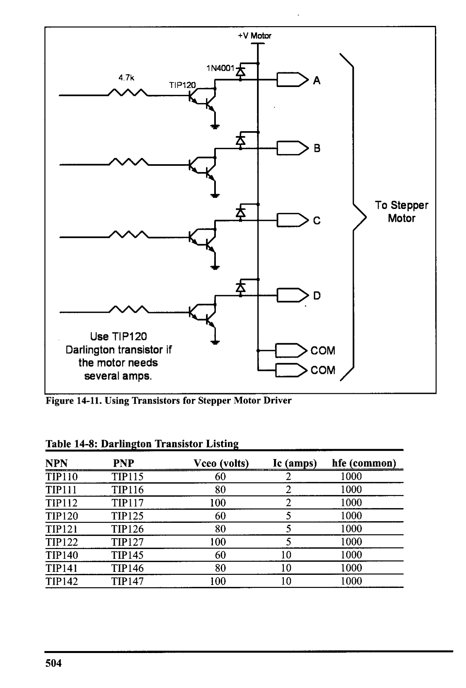
*Description*: Technical diagram and schematic illustration detailing hardware connection topology, signal routing, and circuit operation for Figure 14-11: Using Transistors for Stepper Motor Driver.

> **Figure 14-11: Using Transistors for Stepper Motor Driver**

> COM
→coM /


*Description*: Structured reference table listing operational parameters, instruction execution cycles, memory address mapping, or feature comparison for Table 14-8: Darlington Transistor Listing.

> **Table 14-8: Darlington Transistor Listing**

NPN I
TIP110
TIP111
TIP112
TIP120
TIP121
TIP122
TIP140
TIP141
TIP142
PNP
Vceo (volts)
TIP115
60
TIP116
80
TIP117
100
TIP125
TIP126
60
80
TIP127
100
TIP145
60
TIP146
80
TIP147
100
Ic (amps)
2
2
2
5
5
5
10
10
10
hfe (common)
1000
1000
1000
1000
1000
1000
1000
1000
1000
504


<!-- Page 515 -->
### [PDF Page 515]

+5V DC•
Controlling stepper motor via optoisolator
In the first section of this chapter we examined the optoisolator and its use.
Optoisolators are widely used to isolate the stepper motor's EMF voltage and keep
it from damaging the digital/microcontroller system. This is shown in Figure
14-12. See Examples 14-3 and 14-4.
ILQ74
93-K
Use one power supply for
the motor and ULN2803
and another for AVR
ULN2803
Unipolar
Stepper Motor
AVR
PBO
PB1
PB2
PB3
The optoisolator
provides additional
protection of the AVR

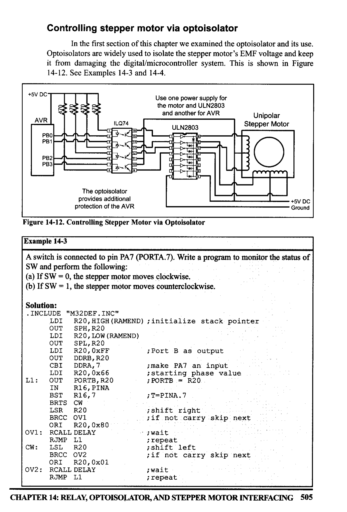
*Description*: Technical diagram and schematic illustration detailing hardware connection topology, signal routing, and circuit operation for Figure 14-12: Controlling Stepper Motor via Optoisolator.

> **Figure 14-12: Controlling Stepper Motor via Optoisolator**

- +5V DC
- Ground
Example 14-3
A switch is connected to pin PA7 (PORTA.7). Write a program to monitor the status of
SW and perform the following:
(a) If SW = 0, the stepper motor moves clockwise.
(b) If SW = 1, the stepper motor moves counterclockwise.
Solution:
• INCLUDE "M32DEF.INC"
LDI
R20, HIGH (RAMEND) ; initialize stack pointer
OUT
SPH, R20
LDI
R20, LOW (RAMEND)
OUT
SPL, R20
LDI
R2O, OXFF
¡ Port B as output

```assembly
OUT DDRB, R20
CBI DDRA, 7
```

IDI R20, 0x66
II: OUT PORTB, R20
; make PA7 an input
i starting phase value
; PORTB = R20
IN
R16, PINA
BST R16,7
; T=PINA. 7
BRTS CW
LSR
R20

```assembly
BRCC OVI
```

¡shift right
¡if not carry skip next
ORI R20, 0x80
OV1: RCALL DELAY
RUMP L1
CW: LSL R20

```assembly
BRCC OV2
```

ORI R20, 0x01
OV2: RCALL DELAY

```assembly
RJMP L1
```

¡ wait
; repeat
¡ shift left
¡if not carry skip next
¡wait
¡ repeat
CHAPTER 14: RELAY, OPTOISOLATOR, AND STEPPER MOTOR INTERFACING 505


<!-- Page 516 -->
### [PDF Page 516]

Stepper motor control with AVR C
The AVR C version of the stepper motor control is given below. In this pro-
gram we could have used << (shift left) and >> (shift right) as was shown in
Chapter 7.
#include
: "avr/io.h"
void main ()
{

```c
DDRB=0xFF;
while (1)
//PORTB as output
PORTB = 0x66;
```

delay.
_ms (100);
PORTB
= Oxcc;
delay_ms (100);

```c
PORTB = 0x99;
```

_delay _ms (100) ;
PORTB
0x33;
_delay_ms (100);
Example 14-4
A switch is connected to pin PA7. Write a C program to monitor the status of SW and
perform the following:
(a) If SW = 0, the stepper motor moves clockwise.
(b) If SW = 1, the stepper motor moves counterclockwise.
Solution:
#define F CPU
8000000UL
#include "avr/io.h"
#include "util/delay.h"
int main "

```c
DDRA = 0x00;
DDRB =
```

OxFF;
while (2)
if | (PINA&0×80) == 0)

```c
PORTB = 0x66;
```

delay ms (100);

```c
PORTB = 0xCC;
```

delay_ms (100);
PORTB '= 0x99;
delay _ms (100);

```c
PORTB =
```

0x33;
_delay_ms (100);
//XTAL = 8 MHz
elsE
506


<!-- Page 517 -->
### [PDF Page 517]

Example 14-4 Cont.

```c
PORTB = 0x66;
```

delay ms (100);

```c
PORTB = 0x33;
```

delay.
ms (100);
FORTB = 0x99;

```c
PORTB = 0xCC;
```

_delay_ms (100);

### Review Questions

1. Give the 4-step sequence of a stepper motor if we start with 0110.
2. A stepper motor with a step angle of 5 degrees has
_ steps per revolution.
3. Why do we put a driver between the microcontroller and the stepper motor?

### PROBLEMS


## SECTION 14.1: RELAYS AND OPTOISOLATORS

1. True or false. The minimum voltage needed to energize a relay is the same for
all relays.
2. True or false. The minimum current needed to energize a relay depends on the
coil resistance.
3. Give the advantages of a solid-state relay over an EMR.
4. True or false. In relays, the energizing voltage is the same as the contact
voltage.
5. Find the current needed to energize a relay if the coil resistance is 1200 ohms
and the coil voltage is 5 V.
6. Give two applications for an optoisolator.
7. Give the advantages of an optoisolator over an EMR.
8. Of the EMR and solid-state relay, which has the problem of back EMF?
9. True or false. The greater the coil inductance, the worse the back EMF voltage.
10. True or false. We should use the same voltage sources for both the coil voltage
and the contact voltage.

## SECTION 14.2: STEPPER MOTOR INTERFACING

11. If a motor takes 90 steps to make one complete revolution, what is the step
angle for this motor?
12. Calculate the number of steps per revolution for a step angle of 7.5 degrees.
13. Finish the normal 4-step sequence clockwise if the first step is 0011
(binary).
14. Finish the normal 4-step sequence clockwise if the first step is 1100
(binary).
15. Finish the normal 4-step sequence counterclockwise if the first step is 1001
(binary).
CHAPTER 14: RELAY, OPTOISOLATOR, AND STEPPER MOTOR INTERFACING 507


<!-- Page 518 -->
### [PDF Page 518]

16. Finish the normal 4-step sequence counterclockwise if the first step is 0110
(binary).
17. What is the purpose of the ULN2003 placed between the AVR and the stepper
motor? Can we use that for 3A motors?
18. Which of the following cannot be a sequence in the normal 4-step sequence for
a stepper motor?
(a) $CC
(b) SDD
(c) $99
(d) $33
19. What is the effect of a time delay between issuing each step?
20. In Question 19, how can we make a stepper motor go faster?

### ANSWERS TO REVIEW QUESTIONS


## SECTION 14.1: RELAYS AND OPTOISOLATORS

1. With a relay we can use a 5 V digital system to control 12 V-120 V devices such as horns and
appliances.
2. Because microcontroller/digital outputs lack sufficient current to energize the relay, we need a
When the coil is not energized, the contact is closed.
4.
When current flows through the coil, a magnetic field is created around the coil, which caus-
es the armature to be attracted to the coil.
5. It is faster and needs less current to get energized.
6. It is smaller and can be connected to the microcontroller directly without a driver.

## SECTION 14.2: STEPPER MOTOR INTERFACING

1. 0110, 0011, 1001, 1100 for clockwise; and 0110, 1100, 1001, 0011 for counterclockwise
3. The microcontroller pins do not provide sufficient current to drive the stepper motor.
508


