# Chapter 15: Input Capture and Wave Generation in AVR

> **Textbook**: The AVR Microcontroller and Embedded Systems using Assembly and C

> **PDF Page Range**: 519 - 557


---


<!-- Page 519 -->
### [PDF Page 519]

CHAPTER 15
INPUT CAPTURE AND WAVE
GENERATION IN AVR
OBJECTIVES
Upon completion of this chapter, you will be able to:
Understand the compare and capture features of the AVR
Generate pulses with different frequencies
Explain how the wave generators of timers work
Explain the different operation modes of Timer and Timerl
Explain how the capture feature of Timerl works
Code programs for the capture feature in Assembly and C
509


<!-- Page 520 -->
### [PDF Page 520]

In Chapter 9, you learned how to use AVR timers to generate delay and count
external events. AVR timers have other features as well. They can be used for gener-
ating different square waves or capturing events and measuring the frequency and
duty cycle of waves. These usages are discussed in this chapter and Chapter 16. In
Sections 15.1 and 15.2 you learn to generate waves using 8-bit and 16-bit timers,
respectively. In Section 15.3 you learn to capture events and measure the frequency
and duty cycle of waves. You can find the C versions of the programs in Section 15.4.

## SECTION 15.1: WAVE GENERATION USING 8-BIT TIMERS

Examine Figure 15-1. As mentioned in Chapter 9, for each timer there is,
at least, an OCRn register (like OCRO for Timer0). The value of this register is
constantly compared with the TCNTn register, and when a match occurs, the
OCFn flag will be set to high.
As shown in Figures 15-1 and 15-2, in each AVR timer there is a waveform
generator. The waveform generator can generate waves on the OCn pin. The
WGMn and COMn bits of the TCCR register determine how the waveform gener-
ator works. When the TCNTn register reaches Top or Bottom or compare match
Mega32
Timero
FOCO
PORTB.3
TCNTO
OCRO
OcO
(PB3)
(comparator)
Waveform Generator
1
W01 W00
COM01 COMOO
DDRB.3
Timer1
NT1 bottom-
NT1 Top 71
FOCIA PORTD.5
LOCRIA
Waveform Generator A
DDRD.5
4
COM1A1 COM1AO
WGM13 - WGM10
PORTD.4
TCNT1
OCR1B
OC1B
(PD4)
Waveform Generator B
(comparator)
DDRD.4
FOCIB COM1B1 COMIBO
Timer2
TCNT2
| OCR2
TCNT2 bottom-
TONT ToP 7
FOC2
PORTD.7
Waveform Generator
• (comparator)
DDRD.7
WGM21 WGM20
COM21 COM2D

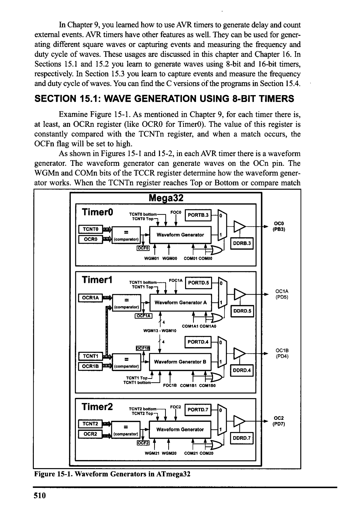
*Description*: Technical diagram and schematic illustration detailing hardware connection topology, signal routing, and circuit operation for Figure 15-1: Waveform Generators in ATmega32.

> **Figure 15-1: Waveform Generators in ATmega32**

510


<!-- Page 521 -->
### [PDF Page 521]

OCRn
TCNTn
=
(8-bit Comparator)
• OCFn (interrupt req.)
TCNTn Top
TCNTn Bottom
FOCh
Waveform Generator
WGMn1:0 COMn1:0


*Description*: Technical diagram and schematic illustration detailing hardware connection topology, signal routing, and circuit operation for Figure 15-2: Waveform Generator.

> **Figure 15-2: Waveform Generator**

occurs, the waveform generator is informed. Then the waveform generator
changes the state of the OCO pin according to the mode of the timer (WGM01:00
bits of the TCCRO register) and the COM01 (Compare Output Mode) and COMOO
bits. See Figure 15-4.
In ATmega32/ATmega16, OCO is the alternative function of PB3. In other
words, the PB3 functions as an I/O port when both COM01 and COM00 are zero.
Otherwise, the pin acts as a wave generator pin controlled by a waveform genera-
tor. See Figures 15-1 and 15-3. Notice that, since the DDR register represents the
direction of the I/O pin, we should set the OCO pin as an output pin when we want
to use it for generating waves.
COMn1
cOMnO
FOCn
Waveform
Generator
D
Q
OCn
Pin
D
Q
PORT
D Q
clko-
DDR

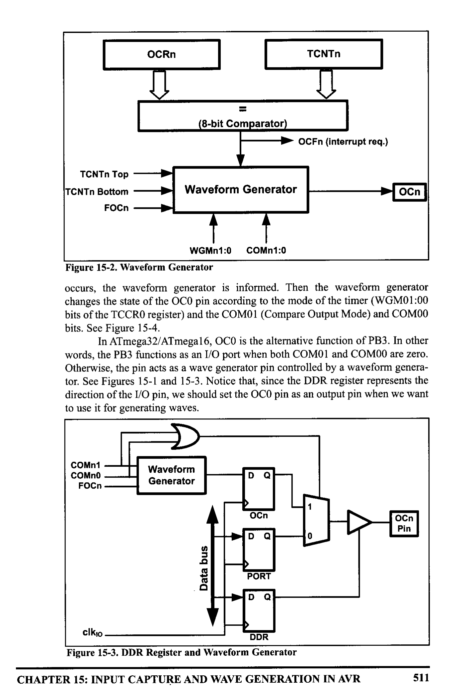
*Description*: Register specification diagram depicting individual bit flags, control register configurations, and functional definitions for Figure 15-3: DDR Register and Waveform Generator.

> **Figure 15-3: DDR Register and Waveform Generator**

CHAPTER 15: INPUT CAPTURE AND WAVE GENERATION IN AVR
511


<!-- Page 522 -->
### [PDF Page 522]

Bit
7
6
5
4
3
2
FOCO WMOO| COMO1 cOMoo WGMOTT
CS02
RW
RW
1
CS01
CSOO
RW
Rita Vaite
FOCO
D7
Force Output compare: Writing 1 to it forces the wave
generator to act as if a compare match has occurred.
WGM01:00
D6
D3
Timero mode selector bits
Normal
1
CTC (Clear Timer on Compare match)
PWM, phase correct
1
1
Fast PWM
COM01:00
DS D4 Compare Output Mode; The table shows what the wave genera-
tor does on compare match when the timer is in Normal or CTC mode:
COM01
COMOO
| Description
0
Normal port operation, OCO disconnected
1
Toggle OCO on compare match
Clear OCO on compare match
1
Set OCO on compare match
CS02:00
D2DIDO Timero clock selector
0 0 0
No clock source (Timer/Counter stopped)
0 01
clk (no prescaling)
1
clk / 8
clk / 64
0
clk / 256
clk / 1024
1
0
External clock source on T0 pin. Clock on falling edge
1
1
1
External clock source on TO pin. Clock on rising edge

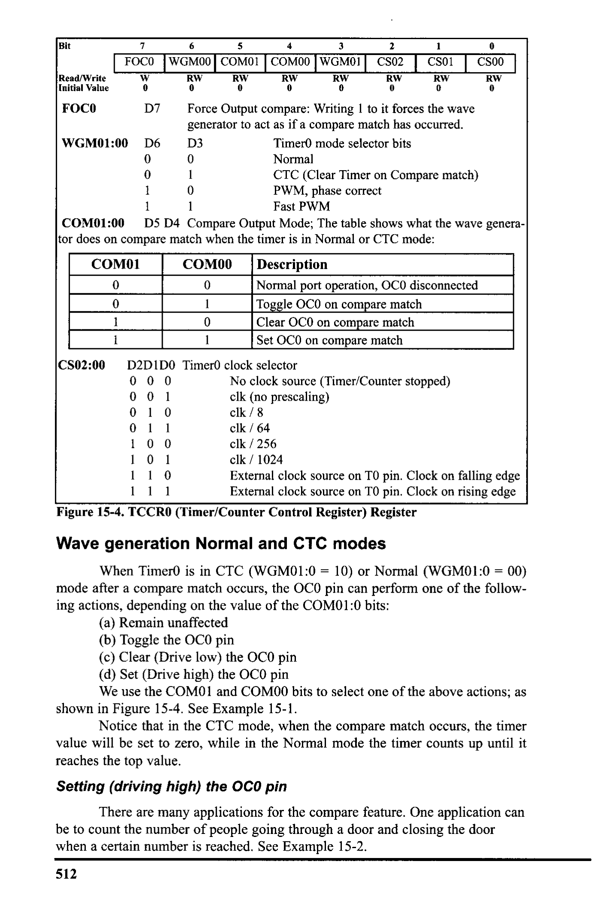
*Description*: Register specification diagram depicting individual bit flags, control register configurations, and functional definitions for Figure 15-4: TCCRO (Timer/Counter Control Register) Register.

> **Figure 15-4: TCCRO (Timer/Counter Control Register) Register**

Wave generation Normal and CTC modes
When Timero is in CTC (WGM01:0 = 10) or Normal (WGM01:0 = 00)
mode after a compare match occurs, the OCO pin can perform one of the follow-
ing actions, depending on the value of the COM01:0 bits:
(a) Remain unaffected
(b) Toggle the OCO pin
(c) Clear (Drive low) the OCO pin
(d) Set (Drive high) the OCO pin
We use the COMO1 and COM00 bits to select one of the above actions; as
shown in Figure 15-4. See Example 15-1.
Notice that in the CTC mode, when the compare match occurs, the timer
value will be set to zero, while in the Normal mode the timer counts up until it
reaches the top value.
Setting (driving high) the OCO pin
There are many applications for the compare feature. One application can
be to count the number of people going through a door and closing the door
when a certain number is reached. See Example 15-2.
512


<!-- Page 523 -->
### [PDF Page 523]

Example 15-1
Using Figure 15-4, find the TCCRO register value to:
(a) Set high the OCO pin upon match. Use external clock, falling edge, and Normal mode.
(b) Toggle the OCO pin upon match. Use external clock, falling edge, and CTC mode.
Solution:
(a)
TCCRO =
WEMOI
(b)
TCCRO =
FOCO
0
FOCO WGM00
COMOI COMOO WGM01
CS02
CS01
0
CS00
Example 15-2
Write a program that (a) after 4 external clocks turns on an LED connected to the OCO
pin, (b) toggles the OCO pin every 4 pulses.
Solution:
(a)
• INCLUDE "M32DEF. INC"
CBI
DDRB, O
SBI
DDRB, 3
LDI
R20, 3
OUT
OCRO, R20
IDI
R20, O
OUT
ICNIO, R20
LDI
R20, 0x36
OUT
ICCRO, R20
¡ PBO (IO) pin as input
; PB3 (OCO) pin as output
;OCRO = 3 the final count
; ICNIO = 0
; external clk, Normal mode, set OCO
¡load ICCRO and start counting
HERE: RJMP HERE
Mega32
то-
OCO (PB3)
TO (РВО)
oco-
(b)
• INCLUDE "M32DEF. INC"
CBI
SBI
DDRB, 0
DDRB, 3
LDI
R20, 3
OUT
OCRO, R20
LDI
R20, 0
OUT
TCNIO, R20
LDI
R20, OxIE
OUT
ICCRO, R20
HERE: RJMP
HERE
Oco.
. ¡external clk, CTC mode, toggle OCl
¡ load TCCRO and start counting
Notice that there is no need to monitor the OCF0 flag, which means the AVR can do
other tasks.
CHAPTER 15: INPUT CAPTURE AND WAVE GENERATION IN AVR
513


<!-- Page 524 -->
### [PDF Page 524]

Generating square waves
To generate square waves we can set the timer to Normal mode or CTC
mode and set the COM bits to the toggle mode (COM01:00 = 01). The OCO pin
will be toggled on each compare match and a square wave will be generated. See

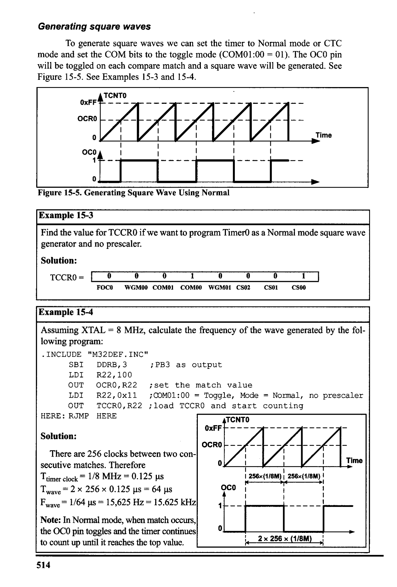
*Description*: Technical diagram and schematic illustration detailing hardware connection topology, signal routing, and circuit operation for Figure 15-5: See Examples 15-3 and 15-4..

> **Figure 15-5: See Examples 15-3 and 15-4.**

OXFF A TONTO
Time
ocoA
0


*Description*: Technical diagram and schematic illustration detailing hardware connection topology, signal routing, and circuit operation for Figure 15-5: Generating Square Wave Using Normal.

> **Figure 15-5: Generating Square Wave Using Normal**

Example 15-3
Find the value for TCCRO if we want to program Timer0 as a Normal mode square wave
generator and no prescaler.
Solution:
TCCRO =
FOCO
WGM00 COM01
Example 15-4
Assuming XTAL = 8 MHz, calculate the frequency of the wave generated by the fol-
lowing program:
• INCLUDE "M32DEF.INC"
SBI
DDRB, 3
LDI
; PB3 as output
R22, 100
OUT
OCRO, R22
i set the match value
LDI
R22, 0x11
;COM01:00 = Toggle, Mode = Normal, no prescaler
OUT
ICCRO, R22
;load ICCRO and start counting
HERE: RJMP HERE
ATCNTO
OxFF
Solution:
OCRO
There are 256 clocks between two con-
secutive matches. Therefore
Time
Ttimer clock = 1/8 MHz = 0.125 us
Twave = 2 × 256 × 0.125 us = 64 us
OCO
1256x(1/8M) j /
Fwave = 1/64 us = 15,625 Hz = 15.625 kHz
Note: In Normal mode, when match occurs,
the OCO pin toggles and the timer continues
0
-
to count up until it reaches the top value.
2 × 256 × (1/8M)
514


<!-- Page 525 -->
### [PDF Page 525]

Generating square waves using CTC
The CTC mode is better than Normal mode for generating square waves,
since the frequency of the wave can be easily adjusted using the OCRO register.
See Figure 15-6. In CTC mode, when OCRO has a lower value, compare match
occurs earlier and the period of the generated wave is smaller (higher frequency).
When the OCRO has a higher value, compare match occurs later and the period of
the wave is longer (lower frequency).
Notice that in the CTC mode, when the compare match occurs, the timer
value will be set to zero, while in the Normal mode the timer counts up until it
reaches the top value. See Examples 15-5 through 15-7.
OXFF A TONTO
OCRO- -
SCEOATONTO
OCO
4
1
OXFF A TONTO
OCRO
0
OCO
-
OXFF TONTO
OCO I
0

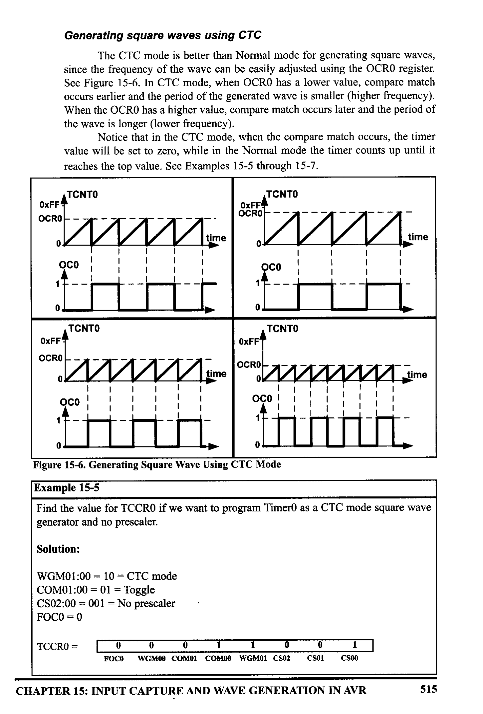
*Description*: Technical diagram and schematic illustration detailing hardware connection topology, signal routing, and circuit operation for Figure 15-6: Generating Square Wave Using CTC Mode.

> **Figure 15-6: Generating Square Wave Using CTC Mode**

Example 15-5
Find the value for TCCRO if we want to program Timer0 as a CTC mode square wave
generator and no prescaler.
Solution:
WGM01:00 = 10 = CTC mode
COM01:00 = 01 = Toggle
CS02:00 = 001 = No prescaler
FOCO = 0
TCCRO =
T
CS00
FOCO
CS01
CHAPTER 15: INPUT CAPTURE AND WAVE GENERATION IN AVR
515


<!-- Page 526 -->
### [PDF Page 526]

Example 15-6
Assuming XTAL = 8 MHz, calculate the frequency of the wave generated by the fol-
lowing program:
• INCLUDE "M32DEF.INC"
SBI
DDRB, 3
LDI
R2O, 0x19
OUT
ICCRO, R20
IDI R22,200

```assembly
OUT OCRO, R22
¡ COM01:00 = Toggle, Mode = CTC, no prescaler
```

OXFE TCNTO
OCRO
HERE: RJMP HERE
0
time
Solution:
Between two consecutive matches it takes
200 + 1 = 201 clocks and
Trimer clock = 1/8 MHz = 0.125 us
Twave = 2 x 201 × 0.125 us = 50.25 us
wave = 1/50.25 us = 19,900 Hz = 19.900 kHz
201x1/8M4
OCO
0
12x201x 1(8) „
Example 15-7
In Example 15-6, calculate the frequency of the wave generated in each of the follow-
ing cases:
(a) OCRO is loaded with 50
(b) XTAL = 4 MHz and OCRO is loaded with 95
(c) prescaler is 8, XTAL = 1 MHz, OCRO = 150
(d) prescaler is N, XTAL = Fosc, OCRO = X
Solution:
(a) 50 + 1 = 51 clocks and Timer clock = 0.125 MS → Twave = 2 × 51 × 0.125 us = 12.75 us
Fwave = 1 / 50.25 us = 19,900 Hz = 19.900 kHz
(b) 95 + 1 = 96 clocks and Ttimer clock = 1 / 4 MHz = 0.25 uS
→ Twave = 2 × 96 × 0.25 us = 48 us → Fwave
ave = 1 / 48 us = 20,833 Hz = 20.833 kHz
(c) 150 + 1 = 151 clocks and Timer clock = 8 × 1 / 1 MHz = 8 us
→ Twave = 2 ×151 × 8 us = 2416 us → Fwave = 1 / 2416 us = 413.9 Hz
(d) X + 1 clocks and Ttimer clock= N x 1/Fosc = N/Fosc
→ Twave = 2x x (X+ N/ N/ Fosc → Fwave = 1/ Twave = Fosc / [2N(X + 1)]
Generating pulses using CTC mode
When a timer is in the CTC mode and COM is in the toggle mode, the
value of the OCRn represents how many clocks it counts before it toggles the pin.
This way, we can generate different pulses by loading different values into the
OCRn register. See Figure 15-7 and Example 15-8.
516


<!-- Page 527 -->
### [PDF Page 527]

OCFn Flag Set
TCNTn
A
Time
0
Time
Period if
1
2
4

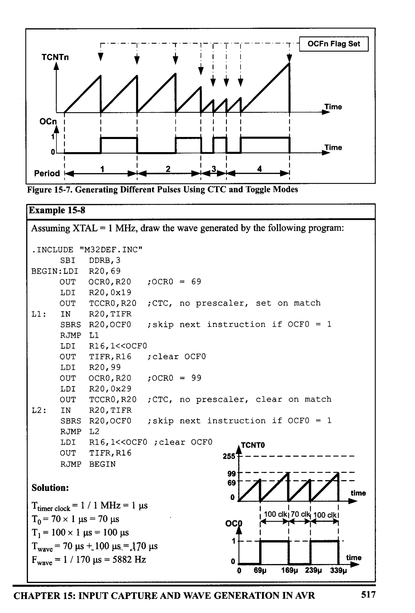
*Description*: Technical diagram and schematic illustration detailing hardware connection topology, signal routing, and circuit operation for Figure 15-7: Generating Different Pulses Using CTC and Toggle Modes.

> **Figure 15-7: Generating Different Pulses Using CTC and Toggle Modes**

Example 15-8
Assuming XTAL = 1 MHz, draw the wave generated by the following program:
• INCLUDE "M32DEF.INC"
SBI
DDRB, 3
BEGIN: LDI
R20, 69
OUT
OCRO, R20
¡ OCRO = 69
LDI
R20, 0x19
OUT
ICCRO, R20
L1: IN
R20, TIFR
SBRS
R2O, OCEO

```assembly
RJMP L1
```

LDI
R16,1<<OCF0
OUT
TIFR, R16
i clear OCFO
LDI
R20, 99
OUT
OCRO, R20
¡OCRO = 99
LDI
R20, 0x29
OUT
ICCRO, R20
L2: IN
R2O, TIFR
SBRS R20, OCFO

```assembly
RJMP L2
LDI R16, 1<<OCF0 ; clear OCFO
OUT TIFR, R16
```

RUMP BEGIN
¡CIC, no prescaler, set on match
¡ skip next instruction if OCF0 = 1
; CIC, no prescaler,
clear on match
¡ skip next instruction if OCF0 = 1
ATONTO
255 1
Solution:
Ttimer clock = 1/1 MHz=1 us
To=70 × 145 = 70 us
Ty= 100 × 1 us = 100 us
Twave = 70 us + 100 us. = 170 us
Fwave = 1 / 170 us = 5882 Hz
997
69
7717
1 100 cik170 cly 100 clk
oco
1--
0
time
time
69м
169р
293390
CHAPTER 15: INPUT CAPTURE AND WAVE GENERATION IN AVR
517


<!-- Page 528 -->
### [PDF Page 528]

To load values to the OCRn we can use the compare match interrupt as
well. Upon a compare match, the pin will be toggled and an interrupt will be
invoked. Using the interrupt we can define the duration that OCn will be in the cur-
rent state by loading a proper value into the OCRO register. See Figure 15-7 and
Example 15-9.
Example 15-9
Assuming XTAL = 1 MHz, draw the wave generated by the following program:
• INCLUDE "M32DEF. INC"
• ORG 0x0

```assembly
RJMP MAIN
```

•ORG 0x14
¡ compare match interrupt vector
DEC R29
; R29 = R29 - 1
BRPL LI
¡ if (R29 >= 0) go to L1
LDI
R30, WAVE_TABLE<<1
¡ Z points to WAVE_TABLE

```assembly
LDI R29,3
; R29 = 3
L1:
```

LPM R28,Z+
; R28 = 121, 2 = 3 + 1

```assembly
OUT OCRO, R28
¡OCRO = 99
```

RETI
¡ return from interrupt
WAVE TABLE:
. DB
24,49,39,34
MAIN: LDI
R20, HIGH (RAMEND)
OUT
SPH, R20

```assembly
LDI R2O, LOW (RAMEND)
```

OUT
SPL, R20

```assembly
SBI DDRB, 3
```

¡initialize stack
;PB3 as output
IDI R20, 69

```assembly
OUT OCRO, R20
; OCRO = 69
BEGIN: LDI R20, 0x19
```

OUT
ICCRO, R20
;CTC, no prescaler, toggle on match
IDI R20, 1<<OCIEO
OUT
TIMSK, R20
¡ activate compare match interrupt
SEI
HERE: RJMP HERE
Solution:
A TCNTO
wWWW
,25l
clk| 50 clk
40 clk |
125/
• time
'40 clk"
*›<•
ocola
1
0
0
70H
145u
185 220u
295u 335y 370u
-time
445p 485H 520u
518


<!-- Page 529 -->
### [PDF Page 529]

FOCO (Force Output Compare) flag
Sometimes you might need to force the waveform generator to act as if a
compare match has occurred. This can be done by setting the FOCO bit of the
TCCRO register. See Example 15-10.
Example 15-10
Assuming XTAL = 1 MHz, draw the wave generated by the following program:
• INCLUDE "M32DEF.INC"
SBI
DDRB, 3
IDI R20, 0x98
BEGIN: OUT ICCRO, R20
¡CIC, timer stopped, toggle on match, FOCO=1
RIMP BEGIN
Solution:
The wave generator is in toggle mode. So, it toggles on com-
OCO
pare match. Setting the FOCO bit causes the wave generator
to act as if a real compare match has occurred. The execution 1 I-
of instructions "OUT ICCRO, R20" and "RJMP BEGIN"
takes 1 and 2 clocks, respectively. So, toggle occurs after o
1 + 2 = 3 clocks.
-
time
3н
6H
94
Generating waves using Timer2
We can generate waves using Timer2 or any other 8-bit timer the same way
as we did using TimerO. We should simply use the proper registers and monitor the
associated flag.
As the prescaler values are different in Timer2 we should be careful to load
TCCR2 with proper value. For example, if we load 0x14 into TCCRO the prescaler
is 256, whereas loading TCCR2 with Ox14 means a prescaler of 64. See Examples
15-11 and 15-12.
Example 15-11
Rewrite the program of Example 15-4 using Timer2.
Solution:
• INCLUDE "M32DEF.INC"

```assembly
SBI DDRD, 7
; OC2 (PD7) as output
```

IDI R22,100

```assembly
OUT OCR2, R22 ; set the match value
```

LDI
R22, 0x11
¡ COM21: 20=Toggle, Mode-Normal, no prescaler

```assembly
OUT ICCR2, R22 ; load ICCR2 and start counting
HERE: RJMP HERE
```

CHAPTER 15: INPUT CAPTURE AND WAVE GENERATION IN AVR
519


<!-- Page 530 -->
### [PDF Page 530]

Example 15-12
Rewrite the program of Example 15-6 using Timer2.
Solution:
• INCLUDE "M32DEF. INC"
SBI
DDRD, 7
LDI
R22, 0x19
OUT
ICCR2, R22
LDI
R22, 200
OUT
OCR2, R22
HERE: RUMP HERE
; OC2 (PD7) as output
; COM21:20 = Toggle, Mode = CIC, no prescaler
;OCRZ = 200

### Review Questions

1. True or false. In ATmega32, Timero has a wave generator.
2. True or false. CIC mode can be used to generate square waves.
3. True or false. To generate waves the OCO pin must be configured as an input
pin.
4. Give the pin number used by the wave generator of Timer0 in ATmega32.

## SECTION 15.2: WAVE GENERATION USING TIMER1

In Chapter 9, we discussed Timerl. In this section we first discuss the dif-
ferent modes of Timerl in more detail and then show how to generate waves using
Timerl.
The different modes of Timer1
The WGM13, WGM12, WGMI1, and WGM10 bits define the mode of
Timerl, as shown in Figure 15-8. Timerl has 16 different modes. Of these 16
modes, mode 13 is reserved (not implemented). These modes can be categorized
into five groups: Normal, CTC, Fast PWM, Phase Correct PWM, and Phase and
Frequency Correct PWM. We learned about the operation of the first two cate-
gories in Chapter 9; the operation of the other categories will be discussed in this
part. Before discussing the operation of the different modes we should define the
meaning of Top.
Top in Timerl
Top is the highest value that the TCNT register reaches while counting. In
8-bit timers (e.g., Timer0) the top value is OxFF except for the CTC mode, whose
top can be defined by OCRn. See Figure 15-8. In 16-bit timers such as Timerl the
top values are as follows:
• In Normal mode (mode 0) the top value is OxFFFF.
• In some modes the top value is fixed and is other than the maximum; the
top value can be OxFF, Ox IFF, or 0x3FF.
In some other modes the top can be defined by either the OCRIA register
or the ICR1 register. See Figure 15-8.
520


<!-- Page 531 -->
### [PDF Page 531]

Bit
7
INCI | ICESI
ead/Writ
nitial Valu
ICNCI
D7
5
-
4
3
[WGM13 |WGM12| CS12
1
CSII
RW
CS10
R/W
Input Capture Noise Canceller
O = Input Capture Noise Canceller is disabled
1 = Input Capture Noise Canceller is enabled
TCCRIB
ICESIR
D6
Input Capture Edge Select
O = Capture on the falling (negative) edge
1 = Capture on the rising (positive) edge
WGM13:WGM12
DS
Not used
D4 D3 Timerl mode
Mode WGMI3 WGM12 WGMII WGM10 Timer/Counter Mode of Operation Top Update of TOVI Flag
OCRIx
Set on
1
2
3
0
0
0
0
0
1
0
0
1
1
0
0
1
Normal
OxFFFF Immediate
MAX
1
0
1
0
PWM, Phase Correct, 8-bit
(0x00FF
TOP
BOTTOM
PWM, Phase Correct, 9-bit
Ox01FF
TOP
BOTTOM
PWM, Phase Correct, 10-bit
0x03FF
TOP
BOTTOM
CTC
OCRIA Immediate
MAX
5
6
7
8
9
10
11
12
13
14
Fast PWM, 8-bit
Ox00FF
TOP
TOP
0
0
1
1
1
1
1
1
1
1
1
1
0
Fast PWM, 9-bit
0x01FF
TOP
TOP
1
Fast PWM, 10-bit
0x03FF
TOP
TOP
PWM, Phase and Frequency Correct
ICRI BOTTOM BOTTOM
0
1
PWM, Phase and Frequency Correct
OCRIA BOTTOM BOTTOM
PWM, Phase Correct
ICRI
TOP
BOTTOM
CS12:CS10
0
1
1
1
1
D2D1D0
0 0 0
0 0 1
1
1
1
PWM, Phase Correct
LOCRIA
TOP
BOTTOM
0
0
0
CTC
ICRI Immediate R
MAX
1
Reserved
-
-
0
Fast PWM
ICRI
TOP
TOP
1
1 Fast PWM
OCRIA
TOP
TOP
Timerl clock selector
No clock source (Timer/Counter stopped)
clk (no prescaling)
clk / 8
1
0
1
1
1
0
1
clk / 64
clk / 256
clk / 1024
1
1
1
External clock source on the T1 pin. Clock on falling edge
External clock source on the T1 pin. Clock on rising edge

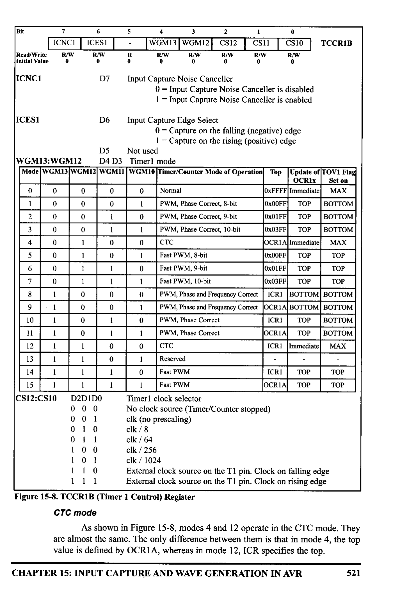
*Description*: Register specification diagram depicting individual bit flags, control register configurations, and functional definitions for Figure 15-8: TCCR1B (Timer 1 Control) Register.

> **Figure 15-8: TCCR1B (Timer 1 Control) Register**

CTC mode
As shown in Figure 15-8, modes 4 and 12 operate in the CTC mode. They
are almost the same. The only difference between them is that in mode 4, the top
value is defined by OCRIA, whereas in mode 12, ICR specifies the top.
CHAPTER 15: INPUT CAPTURE AND WAVE GENERATION IN AVR
521


<!-- Page 532 -->
### [PDF Page 532]

As mentioned in Chapter 9, in mode 4, the timer counts up until it reaches
OCRIA; then the timer will be cleared and the OCF1A flag will be set as a result
of compare match. See Figure 15-9.
In mode 12, the timer counts up until it reaches ICR; then the timer will be
cleared and the ICF1 flag will be set, as shown in Figure 15-10. So, in mode 12,
the timer works almost the same way as mode 4. See Example 15-13 and compare
it with Example 9-22.
In other words, in Normal, CTC, and Fast PWM, the timer counts up until
it reaches the top and then rolls over to zero.
TCNT1
is a fixed value, the TOV1 flag is set; when the
OCF1A=1
OCF1A=1
time
Figures 15-9 through 15-11.
TCNT1
ICR1


*Description*: Technical diagram and schematic illustration detailing hardware connection topology, signal routing, and circuit operation for Figure 15-9: Modes 4 and 15.

> **Figure 15-9: Modes 4 and 15**

TCNT1
Top-
ICF1 =1
ICF1 = 1
TOV1 = 1
-
TOV1 = 1
time
0
time


*Description*: Technical diagram and schematic illustration detailing hardware connection topology, signal routing, and circuit operation for Figure 15-10: Modes 12 and 14.

> **Figure 15-10: Modes 12 and 14**


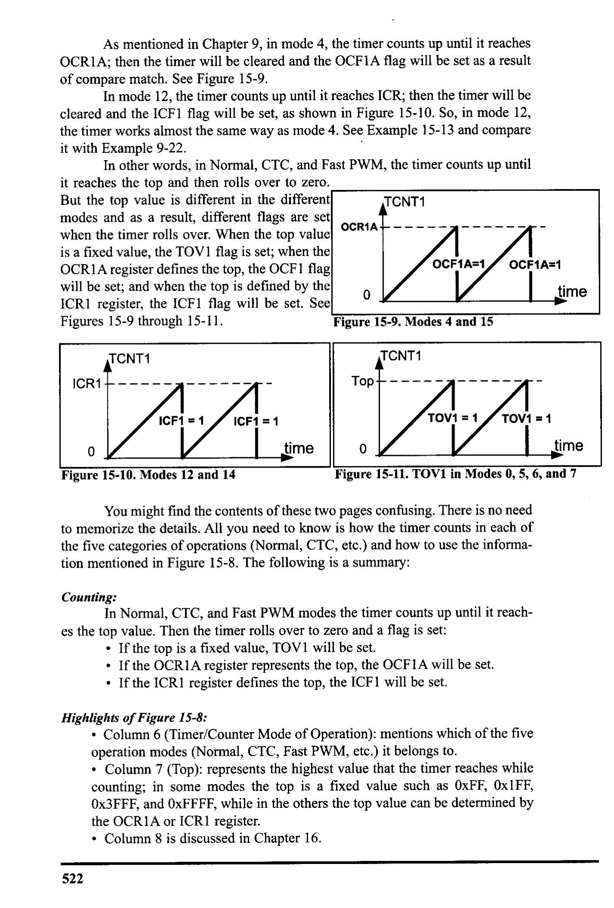
*Description*: Technical diagram and schematic illustration detailing hardware connection topology, signal routing, and circuit operation for Figure 15-11: TOVI in Modes 0, 5, 6, and 7.

> **Figure 15-11: TOVI in Modes 0, 5, 6, and 7**

You might find the contents of these two pages confusing. There is no need
to memorize the details. All you need to know is how the timer counts in each of
the five categories of operations (Normal, CTC, etc.) and how to use the informa-
tion mentioned in Figure 15-8. The following is a summary:
Counting:
In Normal, CTC, and Fast PWM modes the timer counts up until it reach-
es the top value. Then the timer rolls over to zero and a flag is set:
• If the top is a fixed value, TOV1 will be set.
• If the OCRIA register represents the top, the OCFIA will be set.
• If the ICR1 register defines the top, the ICF1 will be set.
Highlights of Figure 15-8:
• Column 6 (Timer/Counter Mode of Operation): mentions which of the five
operation modes (Normal, CTC, Fast P WM, etc.) it belongs to.
• Column 7 (Top): represents the highest value that the timer reaches while
counting; in some modes the top is a fixed value such as OxFF, OxIFF,
Ox3FFF, and OxFFFF, while in the others the top value can be determined by
the OCRIA or ICRI register.
• Column 8 is discussed in Chapter 16.
522


<!-- Page 533 -->
### [PDF Page 533]

Example 15-13
Rewrite Example 9-27 using the ICR1 flag.
Solution:
To wait 10,000 clocks we should load the ICR1 flag with 10,000 - 1 = 9999 = 0x270F
and use mode 14.
• INCLUDE "M32DEF. INC"
IDI
R16, HIGH (RAMEND)
OUT
SPH, R16
LDI
R16, LOW (RAMEND)
OUT
SPL, R16
SBI
DDRB, 5
BEGIN: SBI
PORTB, 5

```assembly
RCALL DELAY_Ims
CBI PORTB, 5
RCALL DELAY_Ims
RJMP BEGIN
```

¡initialize stack pointer
;PB5 as an output
; PB5 = 1
; PB5 = 0
DELAY
_Ims:
LDI
R20, HIGH (9999)
OUT
ICRIH, R2O
LDI
R20, LOW (9999)
OUT
ICRIL, R20
LDI
R20,0
OUT
TCNT1H, R20
OUT
TCNT1L, R20
LDI
R20, 0x02
OUT
ICCRIA, R20
LDI
R20, 0x19
OUT
TCCRIB, R20
AGAIN: IN
R20, TIER
SBRS R20, ICF1
RUMP AGAIN
IDI
R20, 1<<ICF1
TIFR, R20
R19,0
ICCRIB, R19
OUT
ICCRIA, R19
; TEMP
• = 0x27
¡ICRIL = OxOF, ICRIH = TEMP
¡ TEMP = 0x0
; TCNTIL = 0x0, ICNT1H = TEMP
¡ WGM11:10 = 10
;WGM13:12 = 11, CS = CLK, mode = 14
¡ read TIER
¡if ICF1 is set skip next instruction
¡clear ICF1 flag
i stop timer
TCNT1
FFFF L
-----
ICR1=270F ---
time
10000
clocks
CHAPTER 15: INPUT CAPTURE AND WAVE GENERATION IN AVR
523


<!-- Page 534 -->
### [PDF Page 534]

Waveform generators in Timer1
In examining Figures 15-12 and 15-13 we see that Timerl has two inde-
pendent waveform generators: Waveform Generator A and Waveform Generator B.
The compare match between OCRIA and TCNT1 affects Waveform
Generator A, and the wave generated by Waveform Generator A shows up on the
OCIA pin.
The compare match between OCRIB and TCNT1 affects Waveform
Generator B, and the wave generated by Waveform Generator B shows up on the
OCIB pin.
The COM1A1 and COM1A0 bits have control over Waveform Generator
A; whereas COM1B1 and COMIBO control Waveform Generator B. All of the
COM bits are in the TCCRIA register, as shown in Figure 15-14.
The operation mode of Timerl (WGM13, WGM12, WGM11, and
WGM10 bits of TCCRIA and TCCRIB) affect both generators, as shown in
Figures 15-12 and 15-13.
Mega32
Timero
TCNTO bottom
PORTB.3
TCNTO
OCRO
Waveform Generator
Sir (comparator)
LOCFO
WGM01 WGMOO
COM01 COMOO
Timer1
PORTD.5
TCNT1 Top -
LOCRIA
Waveform Generator A
→ (comparator)
COM1A1 COM1AO
WGM13 - WGM10
PORTD.4 HO
00510
TCNT1
OCRIB
* (comparator)
TCNT1 Top -7
TCNT1 bottom.
FOCIB COM1B1 COM1B0
Timer2
TCNT2 bottom
TCNT2 Top
PORTD.7
TCNT2
Waveform Generator
(comparator)
COM21 COM20
DDRB.3
-
OCIA
(PDS)
DDRD.5
OC1B
(PD4)
DDRD.4
DORD.7

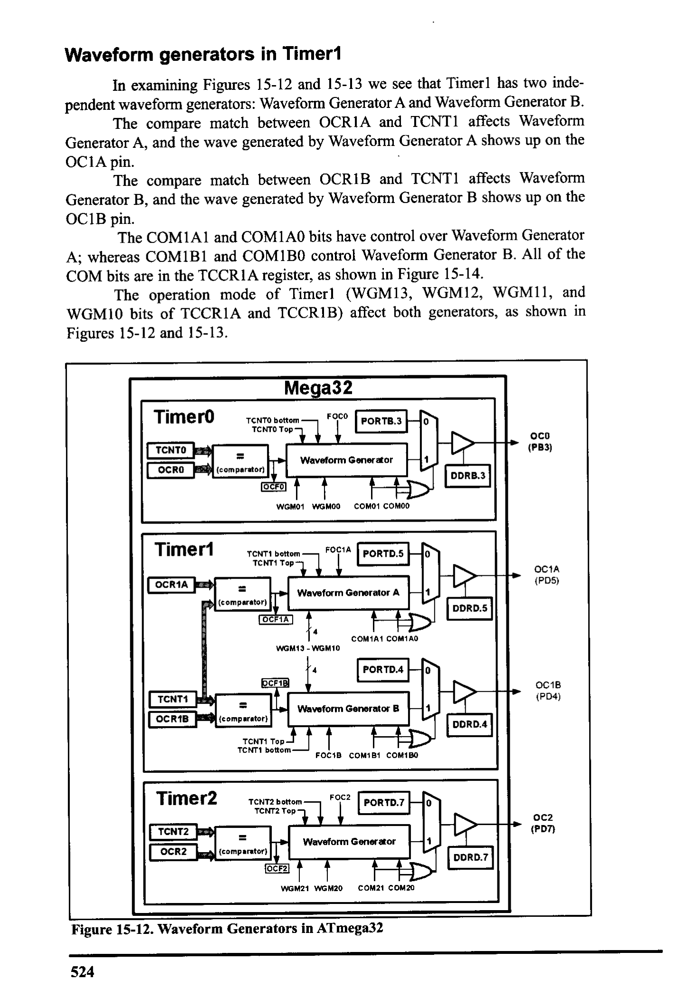
*Description*: Technical diagram and schematic illustration detailing hardware connection topology, signal routing, and circuit operation for Figure 15-12: Waveform Generators in ATmega32.

> **Figure 15-12: Waveform Generators in ATmega32**

524


<!-- Page 535 -->
### [PDF Page 535]

OCRAH OCRIAL
TCNT1H TCNT1L
OCR1BH TOCRIBL
= (16-bit comparator)
= (16-bit comparator)
OCF1A 4
* OCF1B
Waveform Generator A
- TOP -
• Waveform Generator B
0C1B
4
COM1A1:0
- WGM13:0 •
COM1B1:0

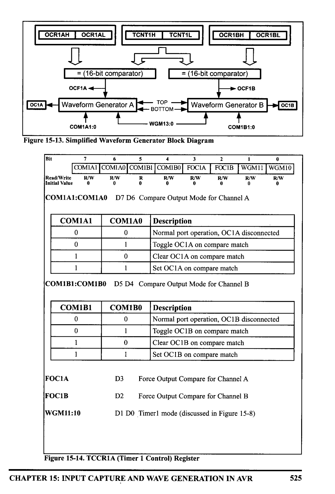
*Description*: Architectural block diagram detailing logic blocks, internal buses, memory units, and hardware component interactions for Figure 15-13: Simplified Waveform Generator Block Diagram.

> **Figure 15-13: Simplified Waveform Generator Block Diagram**

Bit
Read/Write
initial Value
COMAT COMIAO COMBI COMBO FOCIA FOCIB WEMII WAMIO
RW
RW
RW
COMIA1:COMIAO D7 D6 Compare Output Mode for Channel A
COMIA1
0
1
1
COMIAO
0
1
0
1
Description
Normal port operation, OCIA disconnected
Toggle OCIA on compare match
Clear OCIA on compare match
Set OCIA on compare match
COM1B1:COM1BO DS D4 Compare Output Mode for Channel B
COMIBI
COM1BO
1
1
FOCIA
1
0
1
D3
Description
Normal port operation, OCIB disconnected
Toggle OCIB on compare match
Clear OCIB on compare match
Set OCIB on compare match
FOCIB
WGM11:10
Force Output Compare for Channel A
D2
Force Output Compare for Channel B
DI DO Timerl mode (discussed in Figure 15-8)


*Description*: Register specification diagram depicting individual bit flags, control register configurations, and functional definitions for Figure 15-14: TCCRIA (Timer 1 Control) Register.

> **Figure 15-14: TCCRIA (Timer 1 Control) Register**

CHAPTER 15: INPUT CAPTURE AND WAVE GENERATION IN AVR
525


<!-- Page 536 -->
### [PDF Page 536]

In ATmega32/ATmega16, OCIA and OCIB are the alternative functions of
PDS and PD4, respectively. In other words, the PDS pin functions as an I/O port
when both COMIA1 and COMIAO are zero. Otherwise, the pin acts as a wave
generator pin controlled by Waveform Generator A. PD4 functions as an 1/0 port
when both COM1B1 and COM1B0 are zero. Otherwise, the pin acts as a wave
generator pin controlled by Waveform Generator B, as shown in Figure 15-12.
Notice that the DDR register represents the direction of the OCIA and
OCIB pins all the time. Thus, we should be careful in setting the OCIA and OCIB
pins as output pins when we want to use them for generating waves.
The waveform generators of Timerl work almost the same as those of
Timero. In the following pages we will see the operation of Timer1 in the differ-
ent modes.
Wave generation in Normal and CTC modes
When Timerl is in CTC (WGM13:0 = 0100 or WGM13:0 = 1100) or
Normal (WGM13:0 = 0000) mode after a compare match occurs, the waveform
generators can perform one of the following actions, depending on the values of
COM1A1:0 and COM1B1:0 bits, respectively:
(a) Remain unaffected
(b) Toggle the OC1x pin (OCIA or OCIB)
(c) Clear (drive low) the OC1x pin
(d) Set (drive high) the OC1x pin
The COMIAI and COMIAO bits select the operation of OCIA, while
COMIB1 and COMIBO select the operation of OC1B, as shown in Figure 15-14.
See Example 15-14.
Example 15-14
Using Figures 15-8 and 15-14, find the values of the TCCRIA and TCCR1B registers
if we want to clear the OCIA pin upon match, with no prescaler, internal clock, and
Normal mode.
Solution:
WGM13:10 = 0000 = Normal mode
COM1A1:0 = 10 = Clear
CS12:10 = 001 = No prescaler
TCCRIA =
TCCRIB =
COMIAI COMIAO COMIBI COMIBO FOCIA FOCIB WGMII WGMIO
ICNCI
ICES1
WGM13 WGM12
526


<!-- Page 537 -->
### [PDF Page 537]

Generating square waves
To generate square waves we can set the timer to Normal or CTC mode and
set the COMIx1 and COM1x0 bits of one of the Waveform Generators to the tog-
gle mode (COMIA1:0 = 01 to generate waves with Waveform Generator A or
COM1B1:0 = 01 for generating waves using Waveform Generator B).
The OCIx pin will be toggled on each compare match and a square wave
will be generated, as shown in Figure 15-15. See Examples 15-15 and 15-16.
TCNT1
OxFFFF -
time
OC1x
0

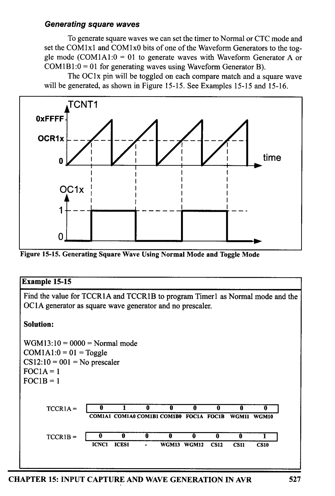
*Description*: Technical diagram and schematic illustration detailing hardware connection topology, signal routing, and circuit operation for Figure 15-15: Generating Square Wave Using Normal Mode and Toggle Mode.

> **Figure 15-15: Generating Square Wave Using Normal Mode and Toggle Mode**

Example 15-15
Find the value for ICCRIA and TCCR1B to program Timerl as Normal mode and the
OCIA generator as square wave generator and no prescaler.
Solution:
WGM13:10 = 0000 = Normal mode
COM1A1:0 = 01 = Toggle
CS12:10 = 001 = No prescaler
FOCIA = 1
FOCIB = 1
TCCRIA =
COMIAI COMIAO COMIBI COMIBO FOCIA FOCIB WGMIT WOMIO
TCCR1B =
ICNCI ICES1
WGM13 WGM12
CS12
CS11
1
CS10
CHAPTER 15: INPUT CAPTURE AND WAVE GENERATION IN AVR
527


<!-- Page 538 -->
### [PDF Page 538]

Example 15-16
Assuming XTAL = 8 MHz, calculate the frequency of the wave generated by the fol-
lowing program:
• INCLUDE "M32DEF. INC"
SBI
DDRD, 5
LDI
R22, 0x40
¡ COMIA = Toggle.
OUT
TCCRIA, R22
LDI
R22, 0x01
;WGM = Toggle, Mode = Normal, no prescaler
OUT
TCCRIB, R22
LDI
R22, HIGH (30000) ; the high byte
OUT
OCRIAH, R22
LDI
R22, LOW (30000)
OUT
OCRIAL, R22
HERE: RJMP HERE
¡ the low byte
OXFF ATONTO
OCRO-
Solution:
0
time
From one compare match to the next one it
takes 65,536 clocks and
Ttimer clock = 1/8 MHz = 0.125 us
Twave = 2 × 65,536 × 0.125 us = 16,384 us
Fwave = 1/16,384 us = 61.035 Hz
OCO
201x1(8M)
1201x1/(8M)|
- - -
--
2x201x1/(8M)
CTC mode is better than Normal mode for generating square waves, as the
frequency of the wave can be easily adjusted by changing the top value (the value
of the OCR1x register in mode 4, and ICR1 in mode12). See Figure 15-16. In CTC
mode, when OCRIx (or ICR1 in mode 12) has a lower value, compare match
occurs earlier and the period of the generated wave is smaller (higher frequency).
When the OCRO has a higher value, compare match occurs later and the period of
the wave is longer (lower frequency). See Examples 15-17 through 15-19.
Example 15-17
Find the value for TCCRIA and TCCR1B to program Timer| as CTC mode and the
OCIA generator as square wave generator and no prescaler.
Solution:
WGM13:10 = 0100 = CTC
COM1A1:0 = 01 = toggle
CS12:10 = 001 = no prescaler
TCCRIA =
COMIAT COMIAO COMIBI COMIBO FOCIA FOCIB WGMII WGMIO
TCCRIB =
ICNCI ICESI
WGM13 WGM12
CS12
CS11
528


<!-- Page 539 -->
### [PDF Page 539]

OCRATE TENT
OCR1AICR1_
OC1X
11
-
0
OXFF TONTI
OCRIAIICR1
ocIx!
• -
time
time
OC1X
0
OFF TENTI
OC1X
ППП

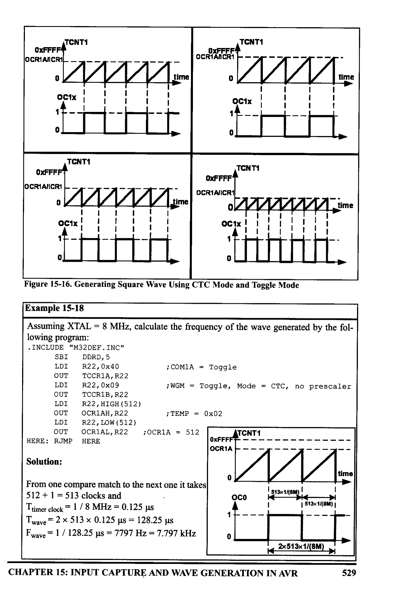
*Description*: Technical diagram and schematic illustration detailing hardware connection topology, signal routing, and circuit operation for Figure 15-16: Generating Square Wave Using CTC Mode and Toggle Mode.

> **Figure 15-16: Generating Square Wave Using CTC Mode and Toggle Mode**

Example 15-18
Assuming XTAL = 8 MHz, calculate the frequency of the wave generated by the fol-
lowing program:
• INCLUDE "M32DEF.INC"
SBI
DDRD, 5
LDI
R22, 0×40
OUT
¡ COMIA = Toggle
ICCRIA, R22
LDI
R22, 0×09
;WGM = Toggle, Mode = CTC, no prescaler
OUT
ICCRIB, R22
LDI
R22, HIGH (512)
OUT
OCRIAH, R22
; TEMP = 0x02
IDI
R22, LOW (512)
OUT
OCRIAL, R22
¡ OCRIA = 512
HERE: RJMP
HERE
OXFFFI TCNT1
OCRIA
Solution:
time
From one compare match to the next one it takes
512 + 1 = 513 clocks and
Ttimer clock = 1 / 8 MHz = 0.125 us
Twave = 2 × 513 × 0.125 us = 128.25 us
F wave = 1 / 128.25 us = 7797 Hz = 7.797 kHz
OCO
1 513x118
| 513×1/(8M) |
0
K
, 2x513×1/(8M)
CHAPTER 15: INPUT CAPTURE AND WAVE GENERATION IN AVR
529


<!-- Page 540 -->
### [PDF Page 540]

Example 15-19
In Example 15-18, calculate the frequency of the wave generated in each of the follow-
ing cases:
(a) OCRIA is loaded with 0x0500 (b) XTAL = 1 MHz and OCRIA is loaded with Oxs
(c) a prescaler option of 8 is chosen, XTAL = 4 MHz, OCRIA = 0x150
(d) a prescaler option of N is chosen, XTAL = Fosc, OCRIA = X
Solution:
(a) 0x500 + 1 = 0x501 = 1281 clocks and Ttimer clock = 0.125 us
→ Twave = 2 × 1281 × 0.125 us = 320.25 us → Fwave
= 1 / 320.25 us = 3122.56 Hz
(b) 5 + 1 = 6 clocks and Ttimer clock = 1/1 MHz = 1 us
→ Twave = 2 × 6 × 1 us = 12 US → Fwave = 1 / 12 us = 83,333 Hz = 83.333 KHZ
(c) 0x150 + 1 = 0x151 = 337 clocks and Ttimer clock = 8 × 1/4 MHz = 2 us
→ Twave = 2 × 337 × 2 us = 1348 us → Fwave = 1 / 2416 us = 741.8 Hz
(d) X + 1 clocks and Trimer clock = N× 1/Fosc = N/ Fosc
→ Twave = 2 × (X + 1) × N/ Fosc → Fwave = 1 / Twave = Fosc / [2N (* + 1)]
The formula is the same as the one calculated in Example 15-7 d.
FOCIA (Force Output Compare) and FOC1B flags
Writing 1 to the FOCIA bit of the TCCRIA register forces the Waveform
Generator A to act as if a compare match has occurred. Writing 1 to the FOCIB
bit of the TCCRIA register forces Waveform Generator B to act as if a compare
match has occurred. See Example 15-20.
Example 15-20
Assuming XTAL = 1 MHz, draw the wave generated by the following program:
• INCLUDE "M32DEF.INC"
SBI
DDRD, 5
LDI
R20, 0x01
OUT
ICCRIB, R20 ; Normal, timer stopped
LDI
R20, 0x48
L1:
OUT
TCCRIA, R20 i toggle on match, FOCIA = 1

```assembly
RJMP L1
```

Solution:
match. Setting the FOCIA bit causes the wave generator to act
as if the compare match has occurred. So, the OCIA pin toggles.
The execution of instructions "OUT ICCRIA, R20" and "RJMP
I1" takes 1 and 2 clocks, respectively. So, toggle occurs after
1 + 2 = 3 clocks
--
3H
time
530


<!-- Page 541 -->
### [PDF Page 541]


### Review Questions

1. True or false. In ATmega32, Timerl has three waveform generators.
2. True or false. In CTC modes the TOP value is determined by OCRIA or ICRI.
3. True or false. We can associate each of the pins with each of the waveform
generators.
4. True or false. In CTC modes we cannot change the frequency of the generated
wave.

## SECTION 15.3: INPUT CAPTURE PROGRAMMING

The Input Capture function is widely used for many applications. Among
them are (a) recording the arrival time of an event, (b) pulse width measurement,
and (c) period measurement. In ATmega32, Timerl can be used as the Input
Capture to detect and measure the events happening outside the chip. Upon detec-
tion of an event, the TCNT value is loaded into the ICRI register, and the ICF1
flag is set.
As shown in Figure 15-17, there are two event sources: (1) the ICP1 pin,
which is PORTD.6 in ATmega32, and (2) the output of the analog comparator. We
can use the ACIC flag to select the event source. ACIC is a bit of the ACSR reg-
ister, as shown in Figure 15-18.
ACIC
ACO,
ICNC1
Noise
Canceler
ICES1
Edge
Detector
TCNT1H | TCNTIL
ICRTH ICRIL
FALWRTE
ICF1
ICP1

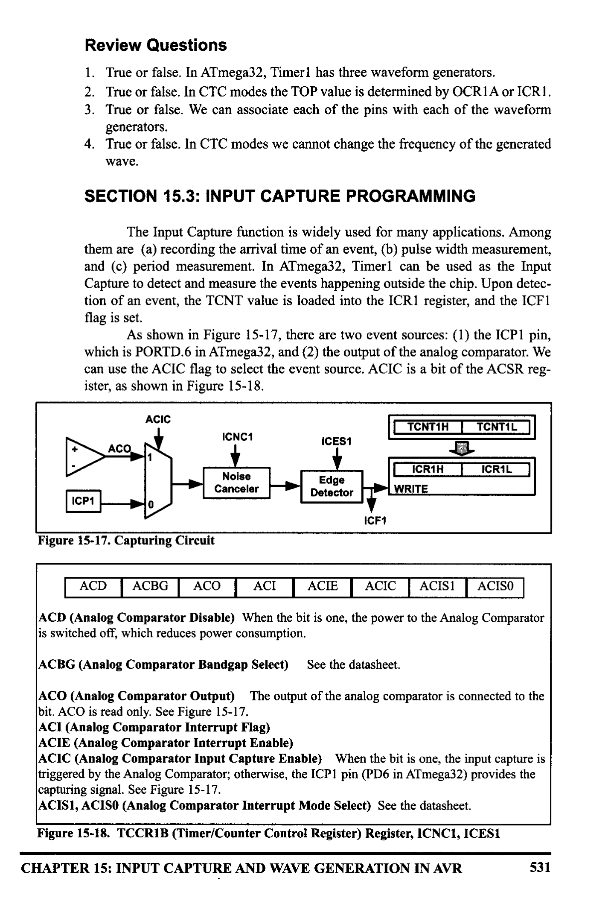
*Description*: Technical diagram and schematic illustration detailing hardware connection topology, signal routing, and circuit operation for Figure 15-17: Capturing Circuit.

> **Figure 15-17: Capturing Circuit**

ACD
ACBG
ACO
ACI ACIE ACIC ACISI
TACISO
ACD (Analog Comparator Disable)
When the bit is one, the power to the Analog Comparator
is switched off, which reduces power consumption.
ACBG (Analog Comparator Bandgap Select)
See the datasheet.
ACO (Analog Comparator Output) The output of the analog comparator is connected to the
bit. ACO is read only. See Figure 15-17.
ACI (Analog Comparator Interrupt Flag)
ACIE (Analog Comparator Interrupt Enable)
ACIC (Analog Comparator Input Capture Enable) When the bit is one, the input capture is
triggered by the Analog Comparator; otherwise, the ICP1 pin (PD6 in ATmega32) provides the
capturing signal. See Figure 15-17.
ACISI, ACISO (Analog Comparator Interrupt Mode Select) See the datasheet.


*Description*: Register specification diagram depicting individual bit flags, control register configurations, and functional definitions for Figure 15-18: TCCRIB (Timer/Counter Control Register) Register, ICNC1, ICES1.

> **Figure 15-18: TCCRIB (Timer/Counter Control Register) Register, ICNC1, ICES1**

CHAPTER 15: INPUT CAPTURE AND WAVE GENERATION IN AVR
531


<!-- Page 542 -->
### [PDF Page 542]

ICNCI |
ICESI
-
TWGM13 | WGM12 CS12
CS11 CS10
ICNC1 (Input Capture Noise Canceller) Setting the bit activates the noise canceller. When the
noise canceller is activated, each change is considered only if it persists for at least 4 successive
system clocks. Notice that although activating the noise canceller prevents the detection of noises
as signals, it causes 4 clocks of delay from the event occurrence to the load of the ICRI register.
ICES1 (Input Capture Edge Select)
Selects edge detection for the input capture function.
When an edge is detected, the TCNT is loaded into the ICRx register. It also raises the ICFn
(input capture flag) flag in the TIFR register.
1
Capture on falling edge
Capture on rising edge
WGM13:WGM12
D4 D3 Timerl mode
Mode WMI3 MIZ WEMI WM10 Timer/Counter Mode of Operation Top ORIN OV FlE
0
0
0
0
0
Normal
|0xFFFF Immediate
MAX
1
0
0
0
1
PWM, Phase Correct, 8-bit
OxOOFF
TOP
BOTTOM
2
0
0
PWM, Phase Correct, 9-bit
0x01FF
TOP
BOTTOM
3
4
0
1
1
1
PWM, Phase Correct, 10-bit
0x03FF
TOP
BOTTOM
0
CTC
OCRIA Immediate
MAX
0
1
Fast PWM, 8-bit
OxOOFF
TOP
TOP
1
1
0
Fast PWM, 9-bit
0x01FF
TOP
TOP
1
Fast PWM, 10-bit
0x03FF
TOP
TOP
8
9
10
11
12
13
1
14
1
15
1
CS12:CS10
PWM, Phase and Frequency Correct
| ICRI
BOTTOM BOTTOM
1
PWM, Phase and Frequency Correct
OCRIA BOTTOM BOTTOM
PWM, Phase Correct
ICR1
TOP
1
PWM, Phase Correct
OCRIA
BOTTOM
TOP
BOTTOM
CTC
ICRI Immediate
MAX
Reserved
Fast PWM
1
D2D1D0
0 0 0
0 0
1
1
Fast PWM
ICR1
LOCRIAl
TOP
TOP
TOP
TOP
Timerl clock selector
No clock source (Timer/Counter stopped)
elk (no prescaling)
clk / 8
cik / 64
clk / 256
clk / 1024
External clock source on T1 pin. Clock on falling edge
1
1
1
External clock source on T1 pin. Clock on rising edge

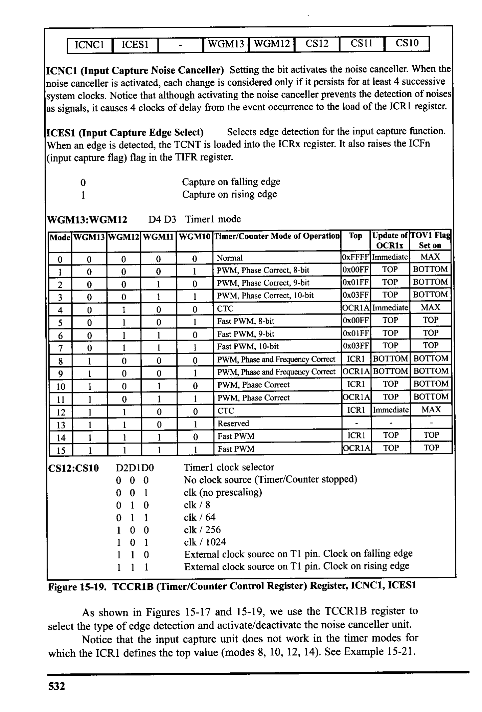
*Description*: Register specification diagram depicting individual bit flags, control register configurations, and functional definitions for Figure 15-19: TCCRIB (Timer/Counter Control Register) Register, ICNC1, ICESI.

> **Figure 15-19: TCCRIB (Timer/Counter Control Register) Register, ICNC1, ICESI**

As shown in Figures 15-17 and 15-19, we use the TCCRIB register to
select the type of edge detection and activate/deactivate the noise canceller unit.
Notice that the input capture unit does not work in the timer modes for
which the ICRI defines the top value (modes 8, 10, 12, 14). See Example 15-21.
532


<!-- Page 543 -->
### [PDF Page 543]

Example 15-21
Using Figures 15-12 and 15-19, find TCCRIA and TCCRIB, for capturing on rising
edge, no noise canceller, no prescaler, and timer mode = Normal.
Solution:
TCCRIA =
0
COMIAI COMIAO COMIBI COMIBO FOCIA FOCIB WGMII WGM10
TCCRIB =
0
ICNCI ICESI
WGM13 WGM12 CS12
CS11
CS10
Steps to program the Input Capture function
We use the following steps to measure the edge arrival time for the Input
Capture function.
1. Initialize the TCCRIA and TCCR1B for a proper timer mode (any mode
other than modes 8, 10, 12, and 14), enable or disable the noise canceller, and
select the edge (positive or negative) we want to measure the arrival time for.
2. Initialize the ACSR to select the desired event source.
3. Monitor the ICF1 flag in TIFR to see if the edge has arrived. Upon the
arrival of the edge, the TCNTI value is loaded into the ICR1 register automatical-
ly by the AVR. Example 15-22 shows how the Input Capture function works. The
Input Capture function is widely used to measure the period or the pulse width of an
incoming signal.
Example 15-22
Assuming that clock pulses are fed into pin ICP1, write a program to read the TCNT1
value on every rising edge. Place the result on PORTA and PORTB.
Solution:
• INCLUDE "M32DEF. INC"
LDI
R16, OXFF
OUT
DDRA, R16
; PORTA as output
OUT
DDRB, R16
¡ PORTB as output
OUT
PORTD, R16
¡ activate pull-up
BEGIN: LDI
R20, 0x00
OUT
ICCRIA, R20 ¡ timer mode = Normal
LDI
R20, 0x41
OUT
ICCRIB, R20 i rising edge, no prescaler, no noise canceller
L1:
IN
R21, TIFR
SBRS
R21, ICF1
i skip
• next if ICF1 flag is set
RJMP
LI
: jump L1
OUT
TIFR, R21
¡clear ICF1
IN
R22, ICRIL
¡ TEMP = ICRIH, R22 = ICRIL
OUT
PORTA, R22
; PORTA = R22
IN
R22, ICRIH
;R22' = TEMP = ICRIH
OUT
PORTB, R22
; PORTB = R22

```assembly
RJMP BEGIN
```

¡ jump begin
Note: Upon the detection of each rising edge, the TCNT1 value is loaded into ICR1.
Also notice that we clear the ICF1 flag bit.
CHAPTER 15: INPUT CAPTURE AND WAVE GENERATION IN AVR
533


<!-- Page 544 -->
### [PDF Page 544]

Measuring period
We can use the following steps to measure the period of a wave.
1. Initialize the TCCRIA and TCCRIB.
2. Initialize the ACSR to select the desired event source.
3. Monitor the ICF1 flag in TIFR to see if the edge has arrived. Upon the
arrival of the edge, the TCNT1 is loaded into the ICRI register automatically by
the AVR.
4. Save the ICR1.
5. Monitor the ICF1 flag in TIFR to see if the second edge has arrived.
Upon the arrival of the edge, the TCNT is loaded into the ICR1 register automat-
ically by the AVR.
6. Save the ICR1 for the second edge. By subtracting the second edge value
from the first edge value we get the time. See Examples 15-23 and 15-24. Also see

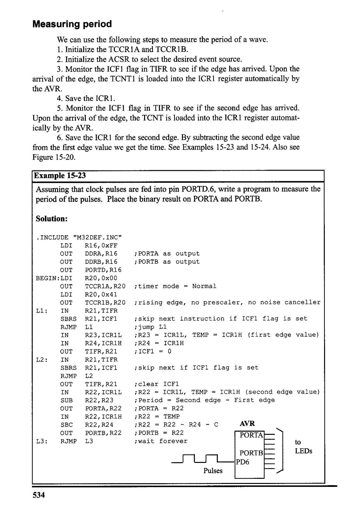
*Description*: Technical diagram and schematic illustration detailing hardware connection topology, signal routing, and circuit operation for Figure 15-20.

> **Figure 15-20**

Example 15-23
Assuming that clock pulses are fed into pin PORTD.6, write a program to measure the
period of the pulses. Place the binary result on PORTA and PORTB.
Solution:
• INCLUDE "M32DEF. INC"
IDI
R16, OXFF
OUT
DDRA, R16
OUT
DDRB, R16
¡ PORTA as output
; PORTB as output
OUT
PORTD, R16
BEGIN: LDI
R20, 0x00
OUT
ICCRIA, R20 i timer mode = Normal
IDI
R2O, 0x41
I1:
OUT
ICCRIB, R20 ; rising edge, no prescaler, no noise canceller
IN
R21, TIFR
SBRS R21, ICF1
RJMP
IN
L1
R23, ICRIL
IN
R24, ICRIH
OUT
TIFR, R21
i skip next instruction if ICF1 flag is set
i jump I1
;R23 = ICRIL, TEMP = ICRIH (first edge value)
;R24 = ICRIH
; ICF1 = 0
L2:
IN
R21, TIFR
SBRS
R21, ICF1
RJMP
L2
OUT
TIFR, R21
IN
R22, ICRIL
SUB
R22, R23
OUT
PORTA, R22
IN
R22, ICRIH
SBC
R22, R24
OUT
PORTB, R22
L3:

```assembly
RJMP 13
```

i skip next if ICF1 flag is set
¡clear ICF1
;R22 = ICRIL, TEMP = ICRIH (second edge value)
¡ Period = Second edge - First edge
¡ PORTA = R22
;R22 = TEMP
;R22 = R22 - R24 - C
; PORTB = R22
; wait forever
-
L L
Pulses
AVR
PORTAL
PORTB
PD6
to
LEDs
534


<!-- Page 545 -->
### [PDF Page 545]

-Period
Measuring Period in Terms of the Number of Clocks Counted by TCNT

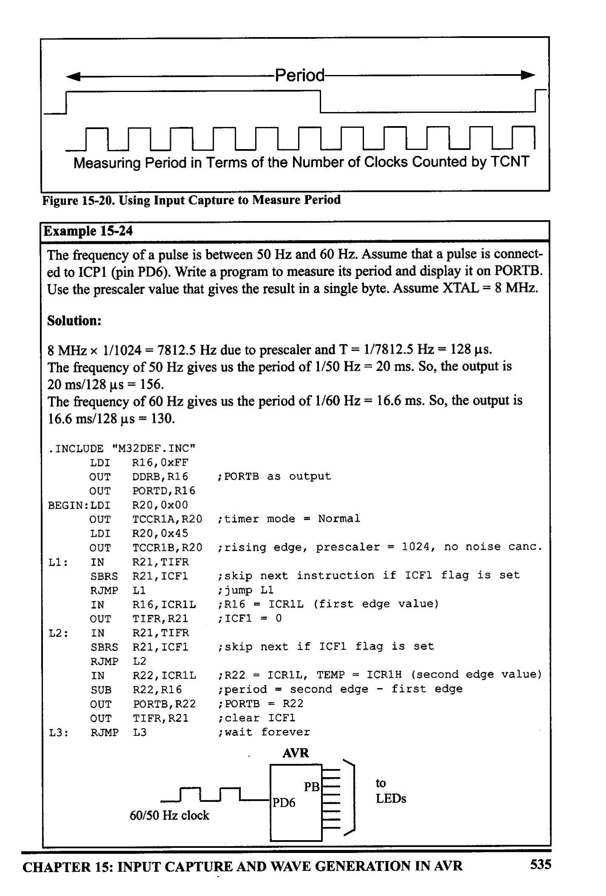
*Description*: Technical diagram and schematic illustration detailing hardware connection topology, signal routing, and circuit operation for Figure 15-20: Using Input Capture to Measure Period.

> **Figure 15-20: Using Input Capture to Measure Period**

Example 15-24
The frequency of a pulse is between 50 Hz and 60 Hz. Assume that a pulse is connect-
ed to ICP1 (pin PD6). Write a program to measure its period and display it on PORTB.
Use the prescaler value that gives the result in a single byte. Assume XTAL = 8 MHz.
Solution:
8 MHz × 1/1024 = 7812.5 Hz due to prescaler and T = 1/7812.5 Hz = 128 us.
The frequency of 50 Hz gives us the period of 1/50 Hz = 20 ms. So, the output is
20 ms/128 us = 156.
The frequency of 60 Hz gives us the period of 1/60 Hz = 16.6 ms. So, the output is

## 16.6 ms/128 us = 130.

• INCLUDE "M32DEF. INC"
IDI
R16, OXFF
OUT
DDRB, R16
¡PORTB as output
OUT
PORTD, R16
BEGIN: IDI
R20, 0x00
OUT
ICCRIA, R20 ¡ timer mode = Normal
IDI
R20, 0x45
OUT
ICCRIB, R20 ; rising edge, prescaler = 1024, no noise canc.
L1: IN
R21, TIFR
SBRS
R21, ICF1
iskip next instruction if ICF1 flag is set
RJMP
L1
¡ jump Il
IN
R16, ICRIL
;R16 = ICRIL (first edge value)

```assembly
OUT TIER, R21
¡ ICF1 = 0
L2:
```

IN
R21, TIFR
SBRS
R21, ICF1
RIMP
IN
L2
R22, ICRIL
SUB
R22, R16
OUT
PORTB, R22
L3:
OUT
TIFR, R21
RJMP
13
i skip next if ICF1 flag is set
;R22 = ICRIL, TEMP = ICRIH (second edge value)
¡period = second edge - first edge
; PORTB = R22
¡ clear ICF1
¡wait forever
AVR
PD6
PB-
to
LEDS
60/50 Hz clock
CHAPTER 15: INPUT CAPTURE AND WAVE GENERATION IN AVR
535


<!-- Page 546 -->
### [PDF Page 546]

-Period
Measuring Period in Terms of the Number of Clocks Counted by TCNT
-Pulse With-
ПЛЛЛ
Measuring Pulse Width in Terms of the Number of Clocks Counted by TCNT

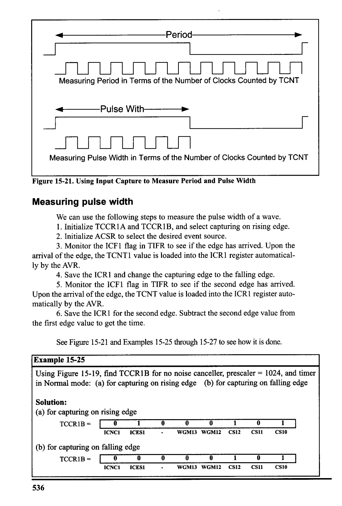
*Description*: Technical diagram and schematic illustration detailing hardware connection topology, signal routing, and circuit operation for Figure 15-21: Using Input Capture to Measure Period and Pulse Width.

> **Figure 15-21: Using Input Capture to Measure Period and Pulse Width**

Measuring pulse width
We can use the following steps to measure the pulse width of a wave.
1. Initialize TCCRIA and TCCRIB, and select capturing on rising edge.
2. Initialize ACSR to select the desired event source.
3. Monitor the ICF1 flag in TIFR to see if the edge has arrived. Upon the
arrival of the edge, the TCNT1 value is loaded into the ICR1 register automatical-
ly by the AVR.
4. Save the ICR1 and change the capturing edge to the falling edge.
5. Monitor the ICF1 flag in TIFR to see if the second edge has arrived.
Upon the arrival of the edge, the TCNT value is loaded into the ICR1 register auto-
matically by the AVR
6. Save the ICR1 for the second edge. Subtract the second edge value from
the first edge value to get the time.
See Figure 15-21 and Examples 15-25 through 15-27 to see how it is done.
Example 15-25
Using Figure 15-19, find TCCR1B for no noise canceller, prescaler = 1024, and timer
in Normal mode: (a) for capturing on rising edge (b) for capturing on falling edge
Solution:
(a) for capturing on rising edge
TCCRIB =
CS CBI STO
(b) for capturing on falling edge
TCCRIB =
ICESI
0
ICNCI
ICESI
1
WGM13 WGM12 CS12
T
CS10
536


<!-- Page 547 -->
### [PDF Page 547]

Example 15-26
Assume that a 60-Hz frequency pulse is connected to ICP1 (pin PD6). Write a program
to measure its pulse width. Use the prescaler value that gives the result in a single byte.
Display the result on PORTB. Assume XTAL = 8 MHz.
Solution:
The frequency of 60 Hz gives us the period of 1/60 Hz = 16.6 ms.
Now, 8 MHz × 1/1024 = 7812.5 Hz due to prescaler and T = 1/7812.5 Hz = 128 us
for TCNT. That means we get the value of 130 (1000 0010 binary) for the period
since 16.6 ms / 128 us = 130. Now the pulse width can be anywhere between 1 to
129.
• INCLUDE "M32DEF. INC"
IDI
R16, OXFF
OUT
DDRB, R16
OUT
PORTD, R16
BEGIN: LDI
R20, 0x00
OUT
TCCRIA, R20
LDI
R20, 0x45
OUT
L1:
IN
R21, TIFR
SBRS
R21, ICF1
RJMP
IN
OUT
LDI
OUT
L2:
IN
SBRS
RJMP
IN
SUB
OUT
L3:
OUT
RJMP
R16, ICRIL
TIFR, R21
R20, 0x05
TCCR1B, R20
R21, TIFR
R21, ICF1
L2
R22, ICRIL
R22, R16
PORTB, R22
TIFR, R21
L3
¡ PORTB as output
¡timer mode = Normal
ICCR1B, R20 ¡ rising edge, prescaler = 1024, no noise canc.
¡skip next instruction if ICF1 flag is set
: jump LI
;R16 = ICRII (rising edge value)
; ICF1 = 0 (for next round)
¡ falling edge, prescaler = 1024, no noise canc.
i skip next if ICF1 flag is set
¡ R22 = ICRIL, TEMP = ICRIH (falling edge value)
¡pulse width = falling edge - rising edge
; PORTB = R22
¡ clear ICF1 (for next round)
¡wait forever
AVR
PB
PD6
to
LEDs
60 Hz clock
CHAPTER 15: INPUT CAPTURE AND WAVE GENERATION IN AVR
537


<!-- Page 548 -->
### [PDF Page 548]

Example 15-27
Assume that a temperature sensor is connected to pin PD6. The temperature provided
by the sensor is proportional to pulse width and is in the range of 1 us to 250 us. Write
a program to measure the temperature if 1 us is equal to 1 degree. Use the prescaler
value that gives the result in a single byte. Display the result on PORTB. Assume XTAL
= 8 MHz.
Solution:
8 MHz × 1 / 8 = 1 MHz = 1,000,000 Hz due to prescaler and T = 1/1,000,000 Hz =
1 us for TCNT. That means we get the values between 1 and 65,536 us for the TCNT,
but since the pulse width never goes beyond 250 us we should be able to display the
temperature value on PORTB.
• INCLUDE "M32DEF.INC"
IDI
R16, OXFF
OUT
DDRB, R16
; PORTB as output
OUT
PORTD, R16
BEGIN: LDI
R20, 0x00
OUT
ICCRIA, R20
¡ timer mode = Normal
LDI
R20, 0x42
OUT
TCCRIB, R20
I1: IN
R21, TIER
SBRS R21, ICF1

```assembly
RJMP L1
```

IN
R16, ICRIL
OUT
TIER, R21
¡ rising edge, prescaler 8, no noise canceller
¡stay here for ICP rising
i skip next instruction if ICF1 flag is set
¡ jump LI
¡ R16 = ICRIL
; ICF1 = 0
LDI
R20, 0x02
OUT
TCCRIB, R20
L2:
IN
R21, TIFR
SBRS R21, ICF1

```assembly
RJMP L2
```

IN
R22, ICRIL
SUB
R22, R16

```assembly
OUT PORIB, R22
```

OUT
TIFR, R21
I3:
RJMP
¡ falling edge, prescaler 8, no noise canceller
¡stay here for ICP falling edge
¡skip next if ICF1 flag is set
;R22 = ICRIL, TEMP = ICRIH
¡period = falling edge - rising edge
; PORTB = R22
i clear ICF1
¡wait forever
AVR
-PD6
variable pulse width
to
LEDS
Analog comparator
As shown in Figure 15-17, when the ACIC bit is set, the analog compara-
tor provides the trigger signal for the input capture unit. The analog comparator is
an op-amp that compares the voltage of AIN1 (PORTB.3 in ATmega32) with AINO
(PORTB.2 in ATmega32). If the voltage of AINI is higher than AINO, the com-
parator's output is 1; otherwise, its output is O. For more information, see the
datasheet of the ATmega32.
538


<!-- Page 549 -->
### [PDF Page 549]


### Review Questions

1. True or false. In the ATmega32, only Timer1 has the Input Capture function.
2. True or false. TCNTI is also used by the Input Capture function.
3. True or false. Activating the noise canceller causes the capturing to occur
instantly when an event rises.
4. Indicate the registers used by the Input Capture function.
5. True or false. The Input Capture function can capture the timing of an incom-
ing pulse on the rising edge only.

## SECTION 15.4: C PROGRAMMING

Examples 15-28 through 15-42 show the C versions of the earlier programs.
Example 15-28 (C version of Example 15-2)
Write a program that (a) after 4 external clocks turns on an LED connected to the OCO
pin, and (b) toggles the OCO pin every 4 pulses.
Solution:
(a)
#include "avr/io.h"
int main ()
DDRB &=~ (1<<0):

```c
DDRB =
```

• DDRB | (1<<3) ;
OCRO = 3;
ICNIO = 0;
TCCRO = 0x36;

```c
while (1);
```

return 0;
//PBO (TO) pin as input
1/PB3 (OCO) pin as output
I/load timer with 0
|/external clock, Normal mode, set OCO
#include "avr/io.h"
int main
DDRB 8=~(1<<0);

```c
DDRB =
```

DDRB | (1<<3) ;
OCRO =
3;
ICNIO
= 0;
ICCRO
= Ox1E;

```c
while (1);
```

return 0;
//PBO (IO) pin as input
//PB3 (OCO) pin as output
I/load timer with 0
I/external clock, CIC mode, set OCO
CHAPTER 15: INPUT CAPTURE AND WAVE GENERATION IN AVR
539


<!-- Page 550 -->
### [PDF Page 550]

Example 15-29 (C version of Example 15-4)
Rewrite the program of Example 15-4 using C.
Solution:
#include "avr/io.h"
int main ( )

```c
DDRB = DDRB| (1<<3);
1/PB3 (OCO) = output
TCCRO = 0x11;
//COM01:00=Toggle, Mode-Normal, no prescaler
OCRO = 100;
while (1);
```

return 0;
Example 15-30 (C. version of Example 15-6)
Rewrite the program of Example 15-6 using C.
Solution:
#include "avr/io,h"
int main ( )

```c
DDRB = DDRB| (1<<3):
// PB3 (OCO) = output
TCCRO = 0x19;
// COM01:00=Toggle,
Mode=CTC, no prescaler
OCRO = 200;
```

while: (1);
}
Example 15-31 (C version of Example 15-8)
Rewrite the program of Example 15-8 using C.
Solution:
#include "avr/io.h"
int main ()
DDRB |= (1<<3);
while
(1)
//PB3 = output
OCRO = 99;
TCCRO = 0x19;
//CIC, no prescaler, set on match
while
I (TIFR& (1<<OCF0)) == 0) ;
TIFR =
(1<<OCF0) ;
I/clear OCFO
OCRO = 69;
TCCRO = 0x39;
//CTC, no prescaler, set on match
while ((TIFR&(1<<OCF0)) == 0);
TIER = (1<<OCF0);
//clear OCFO
}
return 0;
}
540


<!-- Page 551 -->
### [PDF Page 551]

Example 15-32 (C version of Example 15-9)
Rewrite the program of Example 15-9 using C.
Solution:
#include "avr/io.h"
#include
"avr/interrupt.h"
int main
()

```c
DDRB = DDRB | (1<<3); //PB3 = output
```

OCRO
69;
TCCRO = 0x19;
TIMSK =
(1<<OCIEO) ;
seil);

```c
while (1);
//CIC, no prescaler, toggle on match
```

l/enable compare match interrupt
lenable interrupts
return 0;
}
ISR (TIMERO_COMP_vect)
const unsigned char waveTable (| = (24,49,39, 34) ;
static unsigned char index = 0;
OCRO = waveTablel index] ;
index ++;
if (index >= 4)
index = 0;
}
Example 15-33 (C version of Example 15-10)
Rewrite the program of Example 15-10 using C.
Solution:
#include "avr/io.h"
int main 1)

```c
DDRB = DDRB | (1<<3);
//PB3 = output
while (1)
TCCRO =
0x98; //CTC, timer stopped, toggle on match, FOCO=1
```

return 0;
}
CHAPTER 15: INPUT CAPTURE AND WAVE GENERATION IN AVR
541


<!-- Page 552 -->
### [PDF Page 552]

Example 15-34 (C version of Example 15-12)
Rewrite the program of Example 15-12 using C.
Solution:
#include "avr/io.h"
int main 1)

```c
DDRD = DDRD | (1<<7); //PD7 (OC2) = output
TCCR2 = 0x19;
//COM21:20=Toggle, Mode=CTC, no prescaler
OCR2 = 200;
while (1);
```

Example 15-35 (C version of Example 15-13)
Rewrite the program of Example 15-13 using C.
Solution:
#include "avr/io.h"
void delay_Ims ( );
int main ()

```c
DDRB = (1<<5) ;
while (1)
PORTB = PORTB ^ (1<<5) ;
```

delay_Ims ( );
}
return 0;
void delay_Ims | )
ICRIH = 0x27;
ICRIL = OxOF;
//ICRIL = OXOF, ICRIH = TEMP
TCNT1H
. = 0;
TCNT1L = 0;
ICCRIA = 0x02; //WGM11:10 = 10
ICCRIB = 0x19; //WGM13:12 = 11, CS = CLK, mode = 14
while ((TIFR& (1<<ICF1)) == 0);
TIFR =
(1<<ICF1) ;
TCCRIB = 0;
ICCRIA = 0;
/stop timer
542


<!-- Page 553 -->
### [PDF Page 553]

Example 15-36 (C version of Example 15-18)
Rewrite the program of Example 15-18 using C.
Solution:
#include "avr/io.h"
int main ()

```c
DDRD = (1<<5);
TCCRIA = 0x40;
```

TCCR1B
=
0x09;
OCRIAH = 0x02;
OCRIAL =
0x00;

```c
while (1);
```

return 0;
//COMIA = Toggle
//WGM = Toggle, Mode = CIC, no prescaler
//TEMP = 0x02
//OCRIA = 0x200 = 512
Example 15-37 (C version of Example 15-20)
Rewrite the program of Example 15-20 using C.
Solution:
#include "avr/io.h"
int main ()

```c
DDRD = DDRD | (1<<5);
TCCRIB = 0x01;
//Normal, timer stopped
while (1)
TCCRIA = 0x48;
|/toggle on match, FOCIA = 1
```

}
Example 15-38 (C version of Example 15-22)
Assuming that clock pulses are fed into pin ICPI, write a program to read the TCNT1
value on every rising edge. Place the result on PORTA and PORTB.
Solution:
#include "avr/io.h"
int main
()

```c
DDRA = OXFF;
DDRB = OXFF;
PORTD = OXFF;
```

I/port A as output
I/port B
as output
lactivate pull-up

```c
while (1) |
```

TCCRIA
• = 0;
//Mode = Normal
TCCR1B
= 0x41;//rising
, edge, no scaler, no noise canceller
while ((TIFR& (1<<ICF1)) == 0) ;
TIFR = (1<<ICF1); |/clear ICF1

```c
PORTA = ICRIL;
PORTB = ICR1H;
```

}
return 0;
}
CHAPTER 15: INPUT CAPTURE AND WAVE GENERATION IN AVR
543


<!-- Page 554 -->
### [PDF Page 554]

Example 15-39 (C version of Example 15-23)
Assuming that clock pulses are fed into pin PORTD.6, write a program to measure the
period of the pulses. Place the binary result on PORTA and PORTB.
Solution:
#include "avr/io.h"
int main
unsigned int t;

```c
DDRA = OXFF;
//PORTA as output
DDRB = OxFF;
//PORTB as output
PORTD = OxFF;
```

l/activate pull-up
TCCRIA = 0;
//Mode = Normal
TCCRIB = 0x41; |/rising
edge, no scaler, no noise canceller
while ((TIFR& (1<<ICF1))
==0):
t = ICR1;
TIFR = (1<<ICF1);
//clear ICF1
while ((TIFR& (1<<ICF1)) == 0);
t = ICRI - t;

```c
PORTA = t;
```

PORTB
= t>>8;
/the low byte
Il the high byte
while
(1);
return 0;
Example 15-40 (C version of Example 15-24)
The frequency of a pulse is either 50 Hz or 60 Hz. Assume that a the pulse is connect-
ed to ICP1 (pin PD6). Write a program to measure its period and display it on PORTB.
Use the prescaler value that gives the result in a single byte. Assume XTAL = 8 MHz
Solution:
#include "avr/io.h"
int main ()
unsigned char t1;

```c
DDRB = OXFF;
//PORTB as output
PORTD = OXFF;
ICCRIA = 0;
//Timer Mode = Normal
ICCRIB = 0x45; |/rising edge, prescaler=1024, no noise canc.
TIFR = (1<<ICF1) ;
//clear ICF1
while |(TIFR& (1<<ICF1)) == 0); |/wait while ICF1 is clear
t1 = ICR1L;
```

|/first edge value
TIFR = (1<<ICF1) ;
//clear ICF1
while
( (TIFR& (1<<ICF1)) == 0); //wait while ICF1 is clear

```c
PORTB = ICRIL - t1; |/period = second edge - first edge
TIFR =
```

(I<<ICF1) ;
//clear ICF1
while
(1) ;
//wait forever
544


<!-- Page 555 -->
### [PDF Page 555]

Example 15-41 (C version of Example 15-26)
Assume that a 60-Hz frequency pulse is connected to ICP1 (pin PD6). Write a program
to measure its pulse width. Use the prescaler value that gives the result in a single byte.
Display the result on PORTB. Assume XTAL = 8 MHz.
Solution:
#include "avr/io.h"
int main
unsigned char t1;

```c
DDRB = 0xFF;
//Port B as output
PORTD = OxFF;
TCCRIA = 0;
//Timer Mode = Normal
TCCRIB = 0x45; |/rising edge, prescaler=1024, no noise canc.
while ((TIFR&(1<<ICF1)) == 0);
tl =
```

ICRIb;
//first edge value
TIFR = (1<<ICF1) ;
|/clear ICF1 flag
TCCR1B
= 0x05;
Il falling edge
while |(TIFR& /1<<ICF1)) == 0);
PORTB
=ICRIL - tl; I/pulse width = falling - rising
TIFR = (1<<ICF1);
|/clear ICF1 flag

```c
while (1);
```

1/wait forever
return
• 0;
}
Example 15-42 (C version of Example 15-27)
Assume that a temperature sensor is connected to pin PD6. The temperature provided
y the sensor is proportional to pl
tigrens to inersure tine le moperisure it and is in the tran degree. Us 250 pre sate
value that gives the result on PORTB. Assume XTAL = 8 MHz.
Solution:
#include "avr/io.h"
int main
()
unsigned char tl;

```c
DDRB = OXFF;
//Port B as output
PORTD = OXFF;
TCCRIA = 0;
//Timer Mode = Normal
TCCRIB = 0x42; |/rising edge, prescaler = 8, no noise canc.
while |(TIFR& /1<<ICF1)) == 0);
t1 =
```

ICRIL;
TIFR = (1<<ICF1);
//clear ICF1 flag
TCCR1B = 0x02;
//falling edge
while ((TIFR&(1<<ICF1)) == 0);

```c
PORTB = ICRIL - tl;
W/pulse width = falling - rising
TIFR = (1<<ICF1) ;
```

|/clear ICF1 flag

```c
while (1);
//wait forever
```

return 0;
CHAPTER 15: INPUT CAPTURE AND WAVE GENERATION IN AVR
545


<!-- Page 556 -->
### [PDF Page 556]


### SUMMARY

This chapter began by describing the pulse wave generating features of the
AVR family. We discussed how to generate square waves and pulses using CTC
mode. We discussed how to generate waves using Timer0 as an 8-bit timer and
Timerl as a 16-bit timer. We also described the input capture feature. We used the
input capture feature of AVR to measure the pulse width and period of incoming
pulses.

### PROBLEMS


## SECTION 15.1: WAVE GENERATION USING 8-BIT TIMERS

1. True or false. The ATmega32 has only one 8-bit timer.
True or false. In the ATmega32, Timer has a 16-bit register accessible as
TCNTOL and TCNTOH.
3. True or false. Each waveform generator has a single pin.
4. Give the pin used for Timer2 waveform generator in the ATmega32.
S. Using Timero, no prescaler, and CTC mode, write a program that generates a
square wave with a frequency of 80 KHz. Assume XTAL = 8 MHz.
6. Using Timero, no prescaler, and CTC mode, write a program that generates a
square wave with a frequency of 5 kHz. Assume XTAL = 1 MHz.
7. Using Timer and CTC mode, write a program that generates a square wave
with a frequency of 625 Hz. Assume XTAL = 8 MHz.
8. Using Timer0 and CTC mode, write a program that generates a square wave
with a frequency of 3125 Hz. Assume XTAL = 16 MHz.

## SECTION 15.2: WAVE GENERATION USING TIMER1

9. True or false. In the ATmega32, Timerl has two waveform generator channels.
10. Give the number of waveform generators in the ATmega32.
Il. Using Timerl, no prescaler, and CTC mode, write a program that generates a
square wave with a frequency of 1 kHz. Assume XTAL = 8 MHz.
12. Using Timerl, no prescaler, and CTC mode, write a program that generates a
square wave with a frequency of 5 kHz. Assume XTAL = 8 MHz.
13. Using Timerl and CTC mode, write a program that generates a square wave
with a frequency of 50 Hz. Assume XTAL = 8 MHz.
14. Using Timerl and CTC mode, write a program that generates a square wave
with a frequency of 20 Hz. Assume XTAL = 16 MHz.

## SECTION 15.3: INPUT CAPTURE PROGRAMMING

15. What is the use of capturing?
16. True or false. In the ATmega32, all of the timers have the capturing capability.
17. True or false. To use capture mode, we must make the ICP pin an output pin.
18. Which timers can be used for the capture mode?
19. Find the value for the TCCR1B register in capture mode if we want to capture
546


<!-- Page 557 -->
### [PDF Page 557]

on the falling edge.
20. Find the value for the TCCR1B register in capture mode if we want to capture
on the rising edge while the noise canceller is active.

## SECTION 15.4: C PROGRAMMING

21. Using TimerO, no prescaler, and CTC mode, write a program that generates a
square wave with a frequency of 50 kHz. Assume XTAL = 8 MHz.
22. Using Timer2, no prescaler, and CTC mode, write a program that generates a
square wave with a frequency of 20 KHz. Assume XTAL = 1 MHz.
23. Using Timer2, prescaler = 256, and CTC mode, write a program that generates
a square wave with a frequency of 100 Hz. Assume XTAL = 8 MHz.
24. Using Timero, prescaler = 64, and CTC mode, write a program that generates
a square wave with a frequency of 95 Hz. Assume XTAL = 1 MHz.
25. As shown in the Figure, a switch is connected to PB1. Using CTC mode and
prescaler = 1024, write a program in
Mega32
Which, it the switch is closed, the
SW1
waveform generator creates a 60 Hz
PB1
wave; otherwise, it generates a wave
PB3
(OCO)
with a frequency of 50 Hz. Assume
XTAL = 8 MHz.
26. Using Timerl, no prescaler, and CTC
mode, write a program that generates
a square wave with a frequency of 3 kHz. Assume XTAL = 8 MHz.
27. Using Timerl, no prescaler, and CTC mode, write a program that generates a
square wave with a frequency of 44 kHz. Assume XTAL = 8 MHz.

### ANSWERS TO REVIEW QUESTIONS


## SECTION 15.1: WAVE GENERATION USING 8-BIT TIMERS

1.
True
2.
True
3. False
4. PB3 (PORTB.3)

## SECTION 15.2: WAVE GENERATION USING TIMERI

1. False
2. True
3. False
4. False

## SECTION 15.3: INPUT CAPTURE PROGRAMMING

1. True
2. True
3. False
4. ICR, TCNT
5. False
CHAPTER 15: INPUT CAPTURE AND WAVE GENERATION IN AVR
547


