# Chapter 16: PWM Programming and DC Motor Control in AVR

> **Textbook**: The AVR Microcontroller and Embedded Systems using Assembly and C

> **PDF Page Range**: 558 - 610


---


<!-- Page 558 -->
### [PDF Page 558]

CHAPTER 16
PWM PROGRAMMING AND
DC MOTOR CONTROL IN AVR
OBJECTIVES
Upon completion of this chapter, you will be able to:
>>
>>
>>
Describe the basic operation of a DC motor
Code AVR programs to control and operate a DC motor
Describe how PWM is used to control motor speed
Generate waves with different duty cycles using 8-bit and 16-bit timers
Code PWM programs to control and operate a DC motor
549


<!-- Page 559 -->
### [PDF Page 559]

This chapter discusses the topic of PWM (pulse width modulation) and
shows AVR interfacing with DC motors. The characteristics of DC motors are dis-
cussed along with their interfacing to the AVR. We use both Assembly and C pro-
gramming examples to create PWM pulses.

## SECTION 16.1: DC MOTOR INTERFACING AND PWM

This section begins with an overview of the basic operation of DC motors.
Then we describe how to interface a DC motor to the AVR. Finally, we use
Assembly and C language programs to demonstrate the concept of pulse width
modulation (PWM) and show how to control the speed and direction of a DC motor.
DC motors
A direct current (DC) motor is a widely used device that translates electri-
cal pulses into mechanical movement. In the DC motor we have only + and -
leads. Connecting them to a DC voltage source moves the motor in one direction.
By reversing the polarity, the DC motor will move in the opposite direction. One
can easily experiment with the DC motor. For example, the small fans used in
many motherboards to cool the CPU are run by DC motors. When the leads are
connected to the + and - voltage source, the DC motor moves. While a stepper
motor moves in steps of 1 to 15 degrees, the DC motor moves continuously. In a
stepper motor, if we know the starting position we can easily count the number of
steps the motor has moved and calculate the final position of the motor. This is not
possible with a DC motor. The maximum speed of a DC motor is indicated in rpm
and is given in the data sheet. The DC motor has two rpms: no-load and loaded.
The manufacturer's datasheet gives the no-load rpm. The no-load rpm can be from
a few thousand to tens of thousands. The rpm is reduced when moving a load and
it decreases as the load is increased. For example, a drill turning a screw has a
much lower rpm speed than when it is in the no-load situation. DC motors also
have voltage and current ratings. The nominal voltage is the voltage for that motor
under normal conditions, and can be from 1 to 150 V, depending on the motor. As
we increase the voltage, the rpm goes up. The current rating is the current con-
sumption when the nominal voltage is applied with no load, and can be from 25
mA to a few amps. As the load increases, the rpm is decreased, unless the current
or voltage provided to the motor is increased, which in turn increases the torque.
With a fixed voltage, as the load increases, the current (power) consumption of a
DC motor is increased. If we overload the motor it will stall, and that can damage
the motor due to the heat generated by high current consumption.
Unidirectional control

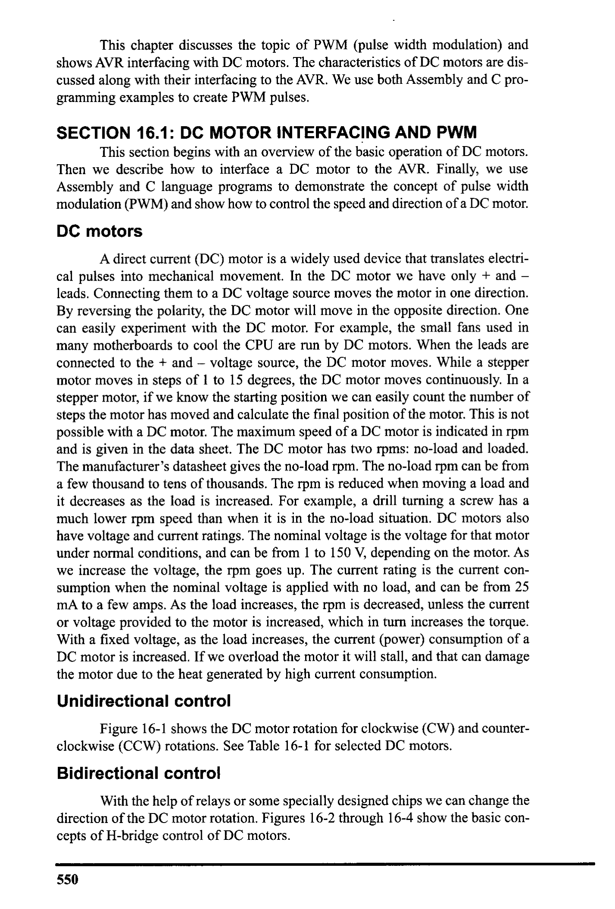
*Description*: Technical diagram and schematic illustration detailing hardware connection topology, signal routing, and circuit operation for Figure 16-1: shows the DC motor rotation for clockwise (CW) and counter-.

> **Figure 16-1: shows the DC motor rotation for clockwise (CW) and counter-**

clockwise (CCW) rotations. See Table 16-1 for selected DC motors.
Bidirectional control
With the help of relays or some specially designed chips we can change the
direction of the DC motor rotation. Figures 16-2 through 16-4 show the basic con-
cepts of H-bridge control of DC motors.
550


<!-- Page 560 -->
### [PDF Page 560]


*Description*: Structured reference table listing operational parameters, instruction execution cycles, memory address mapping, or feature comparison for Table 16-1: Selected DC Motor Characteristics (www.Jameco.com).

> **Table 16-1: Selected DC Motor Characteristics (www.Jameco.com)**

Part No.
154915CP
154923CP
177498CP
181411CP
Nominal Volts
Volt Range
1.5-3 V
3 V

## 4.5 V

5 V
1.5-3 V
3-14 V
3-14 V
Current
0.070 A
0.240 A
0.150 A
0.470 A
RPM
5,200
16,000
10,300
10,000
Torque

## 4.0 g-cm


## 8.3 g-ст


## 33.3 g-ст


## 18.8 g-cm

MOTOR
+
MOTOR
Clockwise
Rotation


*Description*: Technical diagram and schematic illustration detailing hardware connection topology, signal routing, and circuit operation for Figure 16-1: DC Motor Rotation (Permanent Magnet Field).

> **Figure 16-1: DC Motor Rotation (Permanent Magnet Field)**

Counter-
Clockwise
Rotation
SWITCH
1
SWITCH
2
SWITCH
3
SWITCH
4
MOTOR NOT
RUNNING

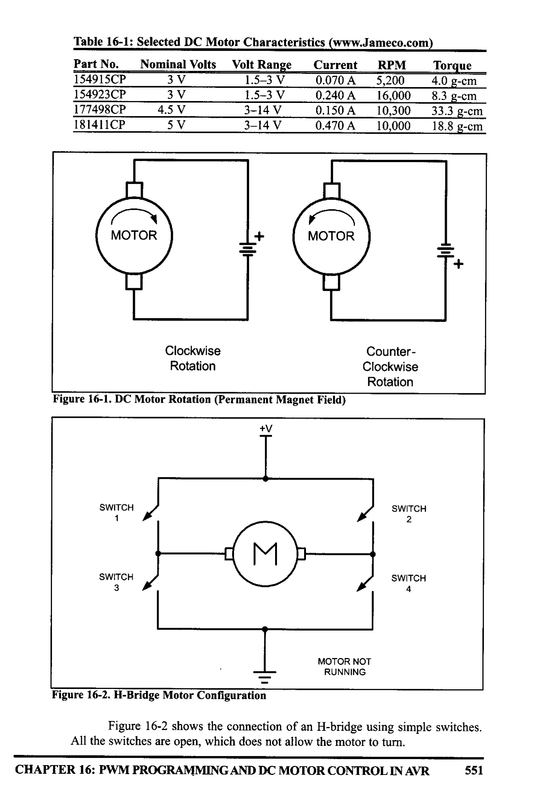
*Description*: Technical diagram and schematic illustration detailing hardware connection topology, signal routing, and circuit operation for Figure 16-2: H-Bridge Motor Configuration.

> **Figure 16-2: H-Bridge Motor Configuration**


*Description*: Technical diagram and schematic illustration detailing hardware connection topology, signal routing, and circuit operation for Figure 16-2: shows the connection of an H-bridge using simple switches..

> **Figure 16-2: shows the connection of an H-bridge using simple switches.**

All the switches are open, which does not allow the motor to turn.
CHAPTER 16: PWM PROGRAMMING AND DC MOTOR CONTROL IN AVR
551


<!-- Page 561 -->
### [PDF Page 561]


*Description*: Technical diagram and schematic illustration detailing hardware connection topology, signal routing, and circuit operation for Figure 16-3: shows the switch configuration for turning the motor in one.

> **Figure 16-3: shows the switch configuration for turning the motor in one**

direction. When switches 1 and 4 are closed, current is allowed to pass through the
motor.

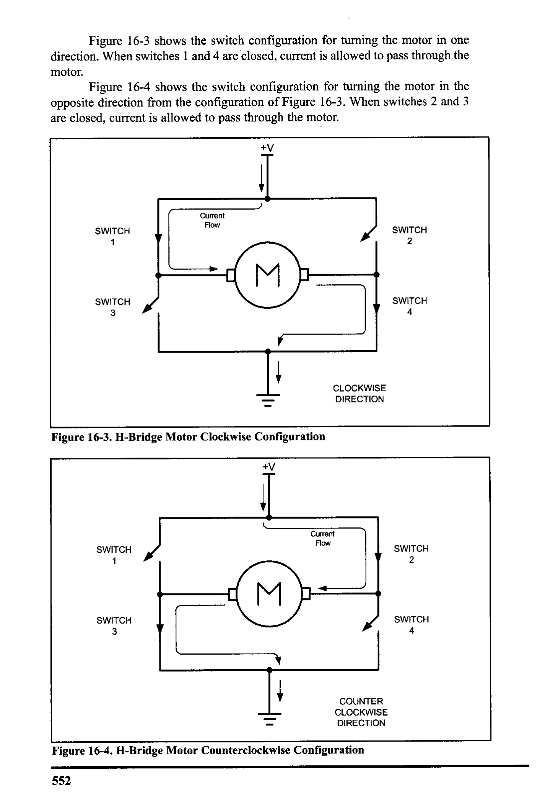
*Description*: Technical diagram and schematic illustration detailing hardware connection topology, signal routing, and circuit operation for Figure 16-4: shows the switch configuration for turning the motor in the.

> **Figure 16-4: shows the switch configuration for turning the motor in the**

opposite direction from the configuration of Figure 16-3. When switches 2 and 3
are closed, current is allowed to pass through the motor.
+V
Current
Flow
SWITCH
1
SWITCH
2
M
SWITCH
SWITCH
4
CLOCKWISE
DIRECTION


*Description*: Technical diagram and schematic illustration detailing hardware connection topology, signal routing, and circuit operation for Figure 16-3: H-Bridge Motor Clockwise Configuration.

> **Figure 16-3: H-Bridge Motor Clockwise Configuration**

Current
Flow
SWITCH
SWITCH
2
M
SWITCH
SWITCH
4
COUNTER
CLOCKWISE
DIRECTION


*Description*: Technical diagram and schematic illustration detailing hardware connection topology, signal routing, and circuit operation for Figure 16-4: H-Bridge Motor Counterclockwise Configuration.

> **Figure 16-4: H-Bridge Motor Counterclockwise Configuration**

552


<!-- Page 562 -->
### [PDF Page 562]


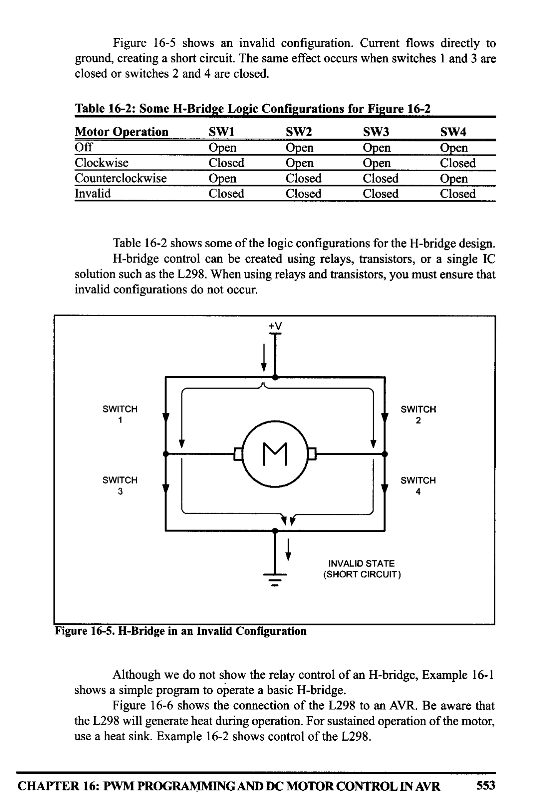
*Description*: Execution flowchart illustrating procedure steps, algorithmic logic flow, software build stages, or timing signal sequences for Figure 16-5: shows an invalid configuration. Current flows directly to.

> **Figure 16-5: shows an invalid configuration. Current flows directly to**

ground, creating a short circuit. The same effect occurs when switches 1 and 3 are
closed or switches 2 and 4 are closed.


*Description*: Structured reference table listing operational parameters, instruction execution cycles, memory address mapping, or feature comparison for Table 16-2: Some H-Bridge Logic Configurations for Figure 16-2.

> **Table 16-2: Some H-Bridge Logic Configurations for Figure 16-2**

Motor Operation
SWI
SW2
Off
Open
SW3
Open
Open
Clockwise
Closed
Open
Open
Counterclockwise
Open
Closed
Closed
Invalid
Closed
Closed
Closed
SW4
Open
Closed
Open
Closed


*Description*: Structured reference table listing operational parameters, instruction execution cycles, memory address mapping, or feature comparison for Table 16-2: shows some of the logic configurations for the H-bridge design..

> **Table 16-2: shows some of the logic configurations for the H-bridge design.**

H-bridge control can be created using relays, transistors, or a single I
olution such as the L298. When using relays and transistors, you must ensure tha
invalid configurations do not occur.
SWITCH
1
SWITCH
2
SWITCH
3
SWITCH
4
INVALID STATE
(SHORT CIRCUIT)


*Description*: Technical diagram and schematic illustration detailing hardware connection topology, signal routing, and circuit operation for Figure 16-5: H-Bridge in an Invalid Configuration.

> **Figure 16-5: H-Bridge in an Invalid Configuration**

Although we do not show the relay control of an H-bridge, Example 16-1
shows a simple program to operate a basic H-bridge.


*Description*: Technical diagram and schematic illustration detailing hardware connection topology, signal routing, and circuit operation for Figure 16-6: shows the connection of the L298 to an AVR. Be aware that.

> **Figure 16-6: shows the connection of the L298 to an AVR. Be aware that**

the L298 will generate heat during operation. For sustained operation of the motor,
use a heat sink. Example 16-2 shows control of the L298.
CHAPTER 16: PWM PROGRAMMING AND DC MOTOR CONTROL IN AVR
553


<!-- Page 563 -->
### [PDF Page 563]

Example 16-1
A switch is connected to pin PA7 (PORTA.7). Using a simulator, write a program to sim-
ulate the H-bridge in Table 16-2. We must perform the following:
(a) If PA7 = 0, the DC motor moves clockwise.
(b) If PA7 = 1, the DC motor moves counterclockwise.
Solution:
• INCLUDE "M32DEF.INC"
SBI
DDRB, 0
SBI
DDRB, 1
SBI
DDRB, 2
SBI
DDRB, 3
CBI
DDRA, 7
MONITOR:
SBIS

```c
PINA, 7
```

RJMP
CLKWISE
CBI
DDRB, 1
CBI
DDRB, 2
SBI
DDRB, 0
SBI
DDRB, 3
JMP
; make PBO an output (switch1)
; make
PB1
an output
(switch2)
;make PB2 an output
(switch3)
; make
PB3 an output
(switch4)
; make
PA7 an input
iskip
next if PINA.7 is set
¡if PA7
= O go to CLKWISE
¡switchz=
¡ switch3 = 0
; switchl
=
; switch4 = 1
MONITOR
CLKWISE:

```assembly
CBI DDRB, O
CBI DDRB, 3
SBI DDRB, 1
```

SBI
DDRB, 2
witch =0
i switch4 =
; switch2 = 1
; switch3 = 1
JMP
MONITOR
View the results on your simulator. This example is for simulation only
and should not be used on a connected system.
ILQ74R
+5
AVR
16
330
PBO-
6
L298N (Multi watt package)
Logic supply voltage v»s
Supply voltage v, 4l
Current Sense A
Enable
GND
:
=
330
4
5
6
7
8
7+5
13
12
111
10
9
5
Input1
Output2 2
202
IM
D3 4
204
PB2-W
330
Input2
Output1 3
Use a separate power supply
The optoisolator provides
additional protection of the AVR
for the motor and L 298N than
for the AVR
D1, D2, D3, D4 are 1N4004

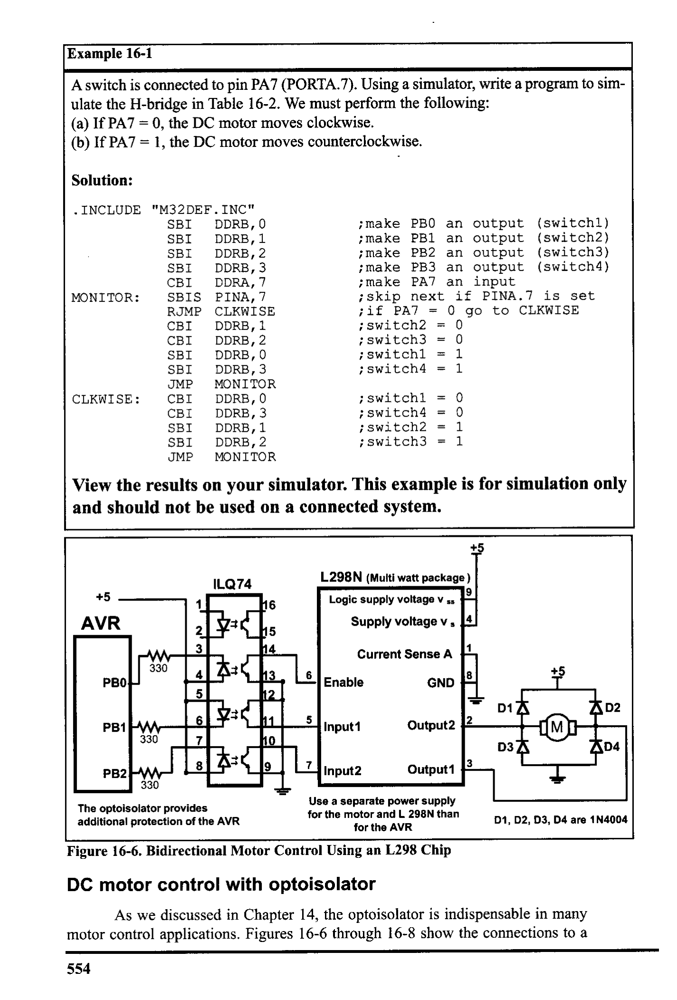
*Description*: Technical diagram and schematic illustration detailing hardware connection topology, signal routing, and circuit operation for Figure 16-6: Bidirectional Motor Control Using an L.298 Chip.

> **Figure 16-6: Bidirectional Motor Control Using an L.298 Chip**

DC motor control with optoisolator
As we discussed in Chapter 14, the optoisolator is indispensable in many
motor control applications. Figures 16-6 through 16-8 show the connections to a
554


<!-- Page 564 -->
### [PDF Page 564]

Example 16-2


*Description*: Register specification diagram depicting individual bit flags, control register configurations, and functional definitions for Figure 16-6: shows the connection of an L298. Add a switch to pin PA7 (PORTA.7)..

> **Figure 16-6: shows the connection of an L298. Add a switch to pin PA7 (PORTA.7).**

Write a program to monitor the status of SW and perform the following:
(a) If SW = 0, the DC motor moves clockwise.
(b) If SW = 1, the DC motor moves counterclockwise.
Solution:
• INCLUDE "M32DEF.INC"
SBI
DDRB, 0
SBI
DDRB, 1
SBI
DDRB, 2
SBI
PORTB, O
CBI
DDRA, 7
SBI
PORTA, 7
MONITOR:
SBIS

```c
PINA, 7
```

RJMP
CLKWISE
CBI
PORTB, 1
SBI
PORTB, 2
¡ make PBO an output (Enable)
¡ make
PB1 an output
(clock)
; make PB2 an output (counter)
; Enable
= 1
¡ make PA7 an input
¡skip next if PINA.7 is set
¡if PA7 = 0 go to CLKWISE
i switchl = 0
¡ switch2 = 1
JMP
MONITOR
CLKWISE:
SBI
PORTB, 1
CBI
PORTB, 2
¡ switchi = 0
;switch2 = 1
JMP
MONITOR
simple DC motor using an optoisolator. Notice that the AVR is protected from EMI
created by motor brushes by using an optoisolator and a separate power supply.
Figures 16-7 and 16-8 show optoisolators for single directional motor con-
trol, and the same principle should be used for most motor applications. Separating
the power supplies of the motor and logic will reduce the possibility of damage to
the control circuit.

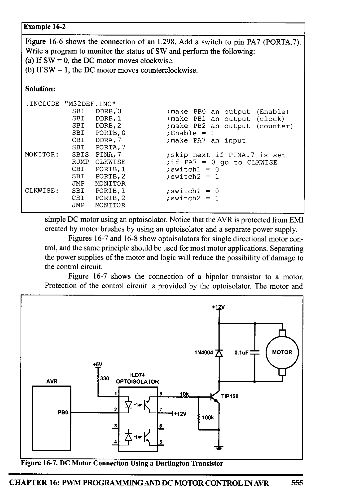
*Description*: Technical diagram and schematic illustration detailing hardware connection topology, signal routing, and circuit operation for Figure 16-7: shows the connection of a bipolar transistor to a motor..

> **Figure 16-7: shows the connection of a bipolar transistor to a motor.**

Protection of the control circuit is provided by the optoisolator. The motor and
+12V
1N4004 Z
0.1uF =
MOTOR
AVR
+5V
3330
PBO
ILD74
OPTOISOLATOR
2
woK
8
10K
→1+12V
TIP120
§ 100K


*Description*: Technical diagram and schematic illustration detailing hardware connection topology, signal routing, and circuit operation for Figure 16-7: DC Motor Connection Using a Darlington Transistor.

> **Figure 16-7: DC Motor Connection Using a Darlington Transistor**

CHAPTER 16: PWM PROGRAMMING AND DC MOTOR CONTROL IN AVR
555


<!-- Page 565 -->
### [PDF Page 565]

AVR use separate power supplies. The separation of power supplies also allows
the use of high-voltage motors. Notice that we use a decoupling capacitor across
the motor; this helps reduce the EMI created by the motor. The motor is switched
on by clearing bit PBO.

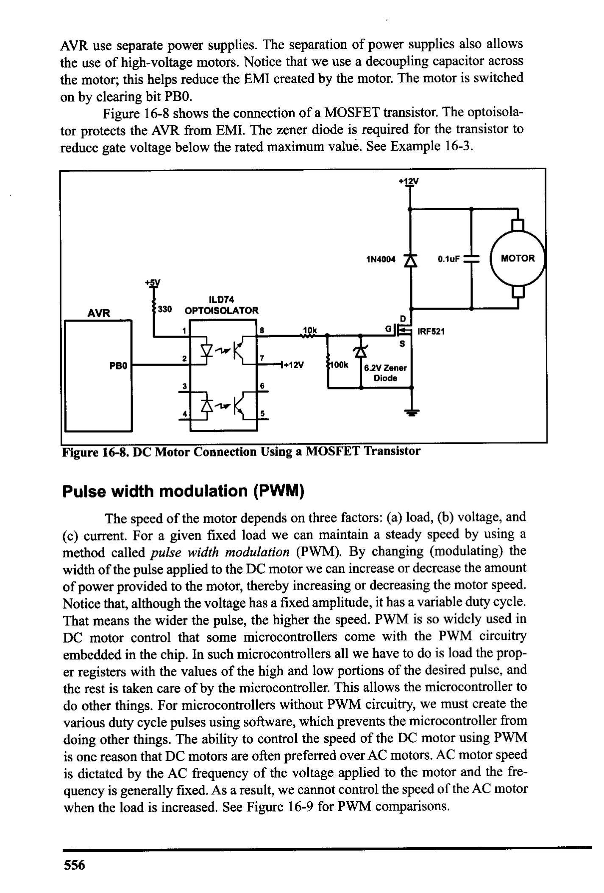
*Description*: Technical diagram and schematic illustration detailing hardware connection topology, signal routing, and circuit operation for Figure 16-8: shows the connection of a MOSFET transistor. The optoisola-.

> **Figure 16-8: shows the connection of a MOSFET transistor. The optoisola-**

tor protects the AVR from EMI. The zener diode is required for the transistor to
reduce gate voltage below the rated maximum value. See Example 16-3.
+ 12V
1N4004 Д
0.tuF
MOTOR
AVR
PBO
ILD74
§330 OPTOISOLATOR
2
FroK
8
10K
→+12V
6.2V Zener
Diode


*Description*: Technical diagram and schematic illustration detailing hardware connection topology, signal routing, and circuit operation for Figure 16-8: DC Motor Connection Using a MOSFET Transistor.

> **Figure 16-8: DC Motor Connection Using a MOSFET Transistor**

Pulse width modulation (PWM)
The speed of the motor depends on three factors: (a) load, (b) voltage, and
(c) current. For a given fixed load we can maintain a steady speed by using a
method called pulse width modulation (PWM). By changing (modulating) the
width of the pulse applied to the DC motor we can increase or decrease the amount
of power provided to the motor, thereby increasing or decreasing the motor speed.
Notice that, although the voltage has a fixed amplitude, it has a variable duty cycle.
That means the wider the pulse, the higher the speed. PWM is so widely used in
DC motor control that some microcontrollers come with the PWM circuitry
embedded in the chip. In such microcontrollers all we have to do is load the prop-
er registers with the values of the high and low portions of the desired pulse, and
the rest is taken care of by the microcontroller. This allows the microcontroller to
do other things. For microcontrollers without PWM circuitry, we must create the
various duty cycle pulses using software, which prevents the microcontroller from
doing other things. The ability to control the speed of the DC motor using WM
is one reason that DC motors are often preferred over AC motors. AC motor speed
is dictated by the AC frequency of the voltage applied to the motor and the fre-
quency is generally fixed. As a result, we cannot control the speed of the AC motor
when the load is increased. See Figure 16-9 for PWM comparisons.
556


<!-- Page 566 -->
### [PDF Page 566]

¼ POWER
25% DC
½ POWER
50% DC
¾ POWER
75% DC -
FULL POWER 100% DC

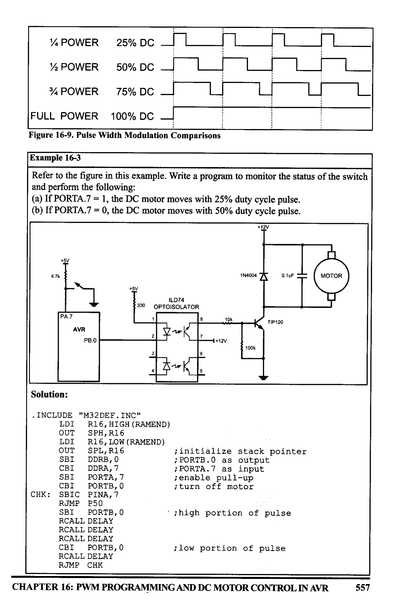
*Description*: Structured reference table listing operational parameters, instruction execution cycles, memory address mapping, or feature comparison for Figure 16-9: Pulse Width Modulation Comparisons.

> **Figure 16-9: Pulse Width Modulation Comparisons**

Example 16-3
Refer to the figure in this example. Write a program to monitor the status of the switch
and perform the following:
(a) If PORTA.7 = 1, the DC motor moves with 25% duty cycle pulse.
(b) If PORTA.7 = 0, the DC motor moves with 50% duty cycle pulse.
+ 12V
4.7k
1N4004 Z
0. 14F
MOTOR
ILD74
OPTOISOLATOR
PA.7
AVR
PB.O
2
10K
4+12V
TIP 120
3 100K
Solution:
• INCLUDE "M32DEF.INC"
LDI
R16, HIGH (RAMEND)
OUT
SPH, R16
LDI
R16, LOW (RAMEND)
OUT
SPL, R16
SBI
DDRB, O
CBI
DDRA, 7
SBI
PORTA, 7
CBI
PORTB, 0
CHK:

```assembly
SBIC PINA, 7
```

RUMP
P50

```assembly
SBI PORTB, O
RCALL DELAY
RCALL DELAY
RCALL DELAY
CBI PORTB, 0
RCALL DELAY
RJMP CHK
```

¡initialize stack pointer
¡PORTB.0 as output
; PORTA. 7 as input
¡high portion of pulse
¡low portion of pulse
CHAPTER 16: PWM PROGRAMMING AND DC MOTOR CONTROL IN AVR
557


<!-- Page 567 -->
### [PDF Page 567]

Example 16-3 (Cont.)
P50: SBI PORTB, O

```assembly
RCALL DELAY
RCALL DELAY
CBI PORTB, O
RCALL DELAY
RCALL DELAY
RJMP CHK
```

DC motor control and PWM using C
¡ high portion of pulse
¡low portion of pulse
Examples 16-4 through 16-5 show the C versions of the earlier programs
controlling the DC motor.
Example 16-4 (C version of Example 16-2)
Refer to Figure 16-6 for connection of the motor. A switch is connected to pin PA7.
Write a C program to monitor the status of SW and perform the following:
(a) If SW = 0, the DC motor moves clockwise.
(b) If SW = 1, the DC motor moves counterclockwise.
Solution:
#include "avr/io.h"
#define ENABLE 0
#define MIR 1 1
#define MTR 2 2
#define SW
(PINA&0x80)
int main
" )

```c
DDRA = 0x7F;
```

I/make PA7 input pin

```c
DDRB = 0xFF;
```

/make PORTB output pin

```c
PORTB = PORTB & (~ (1<<ENABLE)) ;
PORTB =
```

PORTB & (~ (1<<MTR 1)) ;

```c
PORTB = PORTB & (~ (1<<MTR_2)) ;
while (1)
PORTB = PORTB | (1<<ENABLE) ;
iF (SW =1)
PORTB = PORTB |
PORTB = PORTB &
```

(1<<MTR 1) ;
(~ (1<<MTR 2)) ;
//MTR _1 = 1
1/MTR 2 = 0
}
elsel

```c
PORTB = PORTB &
PORTB = PORTB I
12112) /MR 2 = 1
//MIR
2 = 1
```

}
return 0;
558


<!-- Page 568 -->
### [PDF Page 568]

Example 16-5 (C version of Example 16-3)
Refer to the figure in this example. Write a C program to monitor the status of SW and
perform the following:
(a) If SW = O, the DC motor moves with 50% duty cycle pulse.
(b) If SW = 1, the DC motor moves with 25% duty cycle pulse.
Solution:
#define F_CPU
8000000UL
#define sw
(PORTA& (1<<7))
#include "avr/io.h"
#include
"util/delay.h"
void main ()
//XTAL = 8 MHZ

```c
DDRA=0x7F;
DDRB=0x01;
while(1)
if (SW == 1)
//make PA7 input pin
//make PB0 output pin
PORTB = PORTB | (1<<0) ;
```

FORTB
PORTB & (~ (1<<0));
_delay_ms (25) ;
}
else

```c
PORTB = PORTB | (1<<0) ;
= PORTE
```

& (~(1<<0)) ;
_delay_ms (50);
}
+12V
~ 12
4.7k
1NA004 Z
0.1uF
MOTOR
ILD74
OPTOISOLATOR
PA.7
TIP120
AVR
PB.0
2
Iw
→+12V
$ 100K
Trok
CHAPTER 16: PWM PROGRAMMING AND DC MOTOR CONTROL IN AVR
559


<!-- Page 569 -->
### [PDF Page 569]


### Review Questions

1. True or false. The permanent magnet field DC motor has only two leads for +
and - voltages.
2. True or false. Just like a stepper motor, one can control the exact angle of a DC
motor's move.
3. Why do we put a driver between the microcontroller and the DC motor?
4. How do we change a DC motor's rotation direction?
5. What is stall in a DC motor!
6. The RPM rating given for the DC motor is for .
(no-load, loaded).

## SECTION 16.2: PWM MODES IN 8-BIT TIMERS

This section and the next section discuss the PWM feature of the AVR. The
ATmega32 comes with three timers, which can be used as wave generators, as
shown in Figure 16-10. In the first section of this chapter we showed how to use the
Timero
Mega32
FOCO PORTB.3
CNTO botton
CNTO Top-
TCNTO
| OCRO
=
(comparator)
OCFO
Waveform Generator
1
FD
WGMO1 WGMOO COMO1 COMOO
Timer1
OC1A| PORTD.!
OCRIA
=
(comparator)
Waveform Generator A
LOCHIA
COM1A1 COMIAO
WGM13 - WGM10
14
|PORTD.4
OCFTE
TCNT1
OCR1B
=
(comparator)
TCNT1 Top-
TCNT1 bottom
Waveform Generator B
РосІв сона сома
Timer2
TCNT2 bottom
TCNT2 Top —
FOC2
PORTD.7
TCNT2
OCR2
=
(comparator)
Waveform Generator
Dc-2
WGM21 WGM20
COM21 COM20

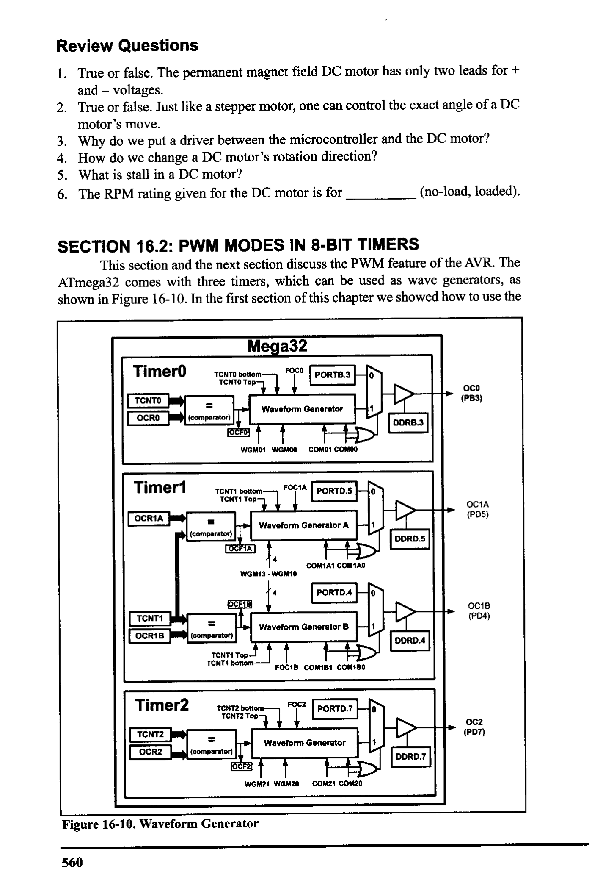
*Description*: Technical diagram and schematic illustration detailing hardware connection topology, signal routing, and circuit operation for Figure 16-10: Waveform Generator.

> **Figure 16-10: Waveform Generator**

560
DDRB.3
DDRD.S
DDRD.4
DDRD.7
OCIA
(PD5)
OC1B
(PD4)


<!-- Page 570 -->
### [PDF Page 570]

TCNTO
OxFF -
0
time


*Description*: Technical diagram and schematic illustration detailing hardware connection topology, signal routing, and circuit operation for Figure 16-11: Timer/Counter 0 Fast PWM mode.

> **Figure 16-11: Timer/Counter 0 Fast PWM mode**

CPU itself to create the equivalent of PWM outputs. The advantage of using the
built-in PWM feature of the AVR is that it gives us the option of programming the
period and duty cycle, therefore relieving the CPU to do other important things.
Fast PWM mode
In the Fast PWM, the counter counts like it does in the Normal mode. After
the timer is started, it starts to count up. It counts up until it reaches its limit of OxFF.
When it rolls over from OxFF to 00, it sets HIGH the TOVO flag. See Figure 16-11.
In Figure 16-12 you see the reaction of the waveform generator when com-
pare match occurs while the timer is in Fast PWM mode.
Bit
7
6
5
4
3
2
FOCO
TWGM00
COMOI COMOO [WGMO1| CS02
1
CS01
CS00
Read/Write
(nitial Value
FOCO
D7
Force compare match: it is a write-only bit, which can be used
while generating a wave. Writing 1 to it causes the wave
generator to act as if a compare match has occurred (see Chapter 15).
WGM01:00
D3D6
Timero mode selector bit
00
Normal
01
10
PWM, Phase correct
CTC (Clear Timer on Compare match)
11
Fast PWM
COM01:00
COM01
DS D4 Compare Output Mode when TimerO is in Fast PWM mode
COMOO
Mode Name
Description
0
Disconnected
1
Normal port operation, OCO disconnected
Reserved
Reserved
1
1
CS02:00
Non-inverted
1
Clear OCO on compare match, set OCO at TOP
Inverted PWM
Set OCO on compare match, clear OCO at TOP
D2DIDO Timer clock selector
0 0 0
No clock source (Timer/Counter stopped)
0 0
1
elk (no prescaling)
0
1
clk / 8
çlk / 64
clk / 256
clk / 1024
1
1
1
1
External clock source on TO pin. Clock on falling edge
1
External clock source on TO pin. Clock on rising edge

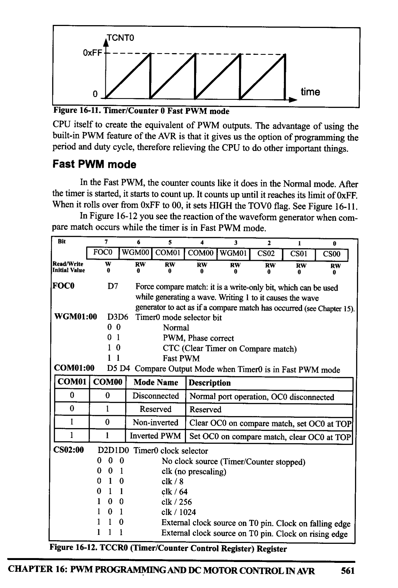
*Description*: Register specification diagram depicting individual bit flags, control register configurations, and functional definitions for Figure 16-12: TCCRO (Timer/Counter Control Register) Register.

> **Figure 16-12: TCCRO (Timer/Counter Control Register) Register**

CHAPTER 16: PWM PROGRAMMING AND DC MOTOR CONTROL IN AVR
561


<!-- Page 571 -->
### [PDF Page 571]

TCNTO
$FF
TCNTO
$FF
OCRO-
OCROTENTO
= $FF
time
time
time
ocol
Oço
0
OCO
4


*Description*: Technical diagram and schematic illustration detailing hardware connection topology, signal routing, and circuit operation for Figure 16-13: A. Non-inverted.

> **Figure 16-13: A. Non-inverted**


*Description*: Technical diagram and schematic illustration detailing hardware connection topology, signal routing, and circuit operation for Figure 16-13: B. Non-inverted.

> **Figure 16-13: B. Non-inverted**


*Description*: Technical diagram and schematic illustration detailing hardware connection topology, signal routing, and circuit operation for Figure 16-13: C. Non-inverted.

> **Figure 16-13: C. Non-inverted**

TCNTO
OXFF+
TCNTO
OXFFA
TCNTO
OCROE SFF
OCRO.
oco!
time
time
OCO
0
OCO
time
:
-
- +-
-
0

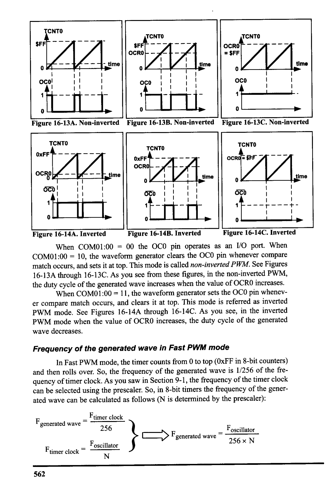
*Description*: Technical diagram and schematic illustration detailing hardware connection topology, signal routing, and circuit operation for Figure 16-14: A. Inverted.

> **Figure 16-14: A. Inverted**


*Description*: Technical diagram and schematic illustration detailing hardware connection topology, signal routing, and circuit operation for Figure 16-14: B. Inverted.

> **Figure 16-14: B. Inverted**


*Description*: Technical diagram and schematic illustration detailing hardware connection topology, signal routing, and circuit operation for Figure 16-14: C. Inverted.

> **Figure 16-14: C. Inverted**

When COM01:00 = 00 the OCO pin operates as an I/O port. When
COM01:00 = 10, the waveform generator clears the OCO pin whenever compare
match occurs, and sets it at top. This mode is called non-inverted PWM. See Figures
16-13A through 16-13C. As you see from these figures, in the non-inverted PWM,
the duty cycle of the generated wave increases when the value of OCRO increases.
When COM01:00 = 11, the waveform generator sets the OCO pin whenev-
er compare match occurs, and clears it at top. This mode is referred as inverted
PWM mode. See Figures 16-14A through 16-14C. As you see, in the inverted
PWM mode when the value of OCRO increases, the duty cycle of the generated
wave decreases.
Frequency of the generated wave in Fast PWM mode
In Fast PWM mode, the timer counts from 0 to top (OxFF in 8-bit counters)
and then rolls over. So, the frequency of the generated wave is 1/256 of the fre-
quency of timer clock. As you saw in Section 9-1, the frequency of the timer clock
can be selected using the prescaler. So, in 8-bit timers the frequency of the gener-
ated wave can be calculated as follows (N is determined by the prescaler):
Fgenerated wave
Frimer clock
256
Foscillator
→ generated wave
=
Foscillator
256 × N
Ftimer clock =
N
562


<!-- Page 572 -->
### [PDF Page 572]

TONTO
OxFF
OCRO
256 clocks
256 clocks
256 clocks
time
OcoA
1
ORO + 1)
10CRO + 1
100RO + 11

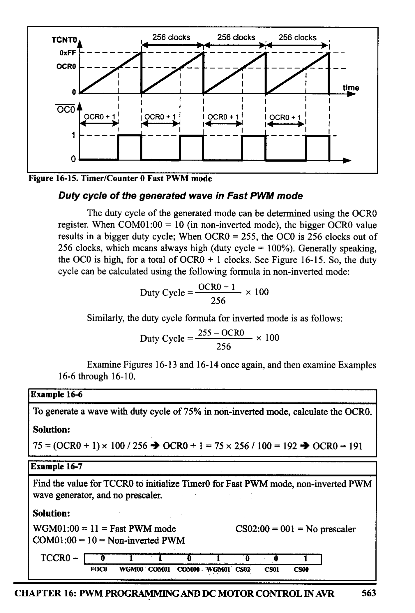
*Description*: Technical diagram and schematic illustration detailing hardware connection topology, signal routing, and circuit operation for Figure 16-15: Timer/Counter 0 Fast PWM mode.

> **Figure 16-15: Timer/Counter 0 Fast PWM mode**

Duty cycle of the generated wave in Fast PWM mode
The duty cycle of the generated mode can be determined using the OCRO
register. When COM01:00 = 10 (in non-inverted mode), the bigger OCRO value
results in a bigger duty cycle; When OCRO = 255, the OCO is 256 clocks out of
256 clocks, which means always high (duty cycle = 100%). Generally speaking,
the OCO is high, for a total of OCRO + 1 clocks. See Figure 16-15. So, the duty
cycle can be calculated using the following formula in non-inverted mode:
Duty Cycle = OCRO + 1
- × 100
256
Similarly, the duty cycle formula for inverted mode is as follows:
Duty Cycle = 255 - OCRO
- × 100
256
Examine Figures 16-13 and 16-14 once again, and then examine Examples
16-6 through 16-10.
Example 16-6
To generate a wave with duty cycle of 75% in non-inverted mode, calculate the OCRO.
Solution:
75 = (OCRO + 1) × 100 / 256 → OCRO + 1 = 75 × 256 / 100 = 192 → OCRO = 191
Example 16-7
Find the value for TCCRO to initialize Timer0 for Fast PWM mode, non-inverted PWM
wave generator, and no prescaler.
Solution:
WGM01:00 = 11 = Fast PWM mode
CS02:00 = 001 = No prescaler
COM01:00 = 10 = Non-inverted PWM
TCCRO =
FOCO
WMOO COMOI COMOO WGMO1 CSO2
CS01
CSOO
CHAPTER 16: PWM PROGRAMMING AND DC MOTOR CONTROL IN AVR
563


<!-- Page 573 -->
### [PDF Page 573]

Example 16-8
Assuming XTAL = 8 MHz, using non-inverted mode, write a program that generates a
wave with frequency of 31,250 Hz and duty cycle of 75%.
Solution:
31,250 = 8M / (256 x N) → N= 8M/ (31,250 x 256) = 1 → N= 1 → No prescaler
• INCLUDE "M32DEF.INC"

```assembly
SBI DDRB, 3
```

IDI R20, 191
; from Example 16-6

```assembly
OUT OCRO, R20
; OCRO = 191
```

IDI R20, 0x69
¡ from Example 16-7

```assembly
OUT ICCRO, R20
```

¡Fast PWM, no prescaler, non-inverted
HERE: RJMP HERE
¡ infinite 1o0p
Notice that instead of the infinite loop we can use the CPU to perform other things.
Example 16-9
Assuming XTAL = 8 MHz, using non-inverted mode, write a program that generates a
wave with frequency of 3906.25 Hz and duty cycle of 37.5%.
Solution:
3906.25 = 8M / (256 × N) → N = 8M / (3906.25 × 256) = 8 → the prescaler value = 8
37.5 = 100 × (OCRO + 1) / 256 → OCRO + 1 = (256 × 37.5) / 100 = 96 → OCRO = 95
• INCLUDE "M32DEF.INC"

```assembly
SBI DDRB, 3
```

IDI R20, 95

```assembly
OUT OCRO, R2O
¡OCRO = 95
LDI R20, 0X6A
OUT ICCRO, R20 ;Fast PWM, N = 8, non-inverted
HERE: RJMP HERE
```

Example 16-10
Rewrite Example 16-9 using inverted mode.
Solution:
37.5 = 100 × (255 - OCRO)/256 → 255 - OCRO = (256 × 37.5)/100 = 96 → OCRO = 159
• INCLUDE "M32DEF.INC"

```assembly
SBI DDRB, 3
```

IDI R20, 159

```assembly
OUT OCRO, R20
¡OCRO = 159
```

IDI R20, 0x7A

```assembly
OUT ICCRO, R20 ; Fast PWM,
N = 8, inverted
HERE: RJMP HERE
```

564


<!-- Page 574 -->
### [PDF Page 574]

Loading values into the OCRx register in PWM modes
In the non-PWM modes (CTC|
mode and Normal mode), when we
TCNTO
the value will be loaded instanty ster,
the OCRO register, but in the PWM
=
•[OCF0]
modes (Fast PWM and Phase correct
PWM), there is a buffer between us
and the OCRO register. When we
read/write a value from/into the OCRO
we are dealing with the buffer. The
contents of the buffer will be loaded
OCRO
LTONTO
=
top
OCRO Buffer
into the OCRO register only when the
TCNTO reaches to its topmost value. Figure 16-16. OCRn Buffer in PWM Modes
The top value is OxFF in the 8-bit
timers. See Figure 16-16 and Example 16-11.
Example 16-11
Draw the wave generated by the following program. Assume XTAL = 1 MHz.
• INCLUDE "M32DEF. INC"

```assembly
RJMP MAIN
```

• ORG 0x16
NEG R20
OUT
OCRO, R20
RETI
¡ Timerl overflow interrupt vector
; Negative R20
; OCRO = R20
¡ return interrupt
MAIN:
IDI
OUT
IDI
OUT
SBI
IDI
OUT
LDI
OUT
OUT
LDI
OUT
SEI
HERE: RJMP HERE
R16, HIGH (RAMEND)
SPH, R16
R16, LOW (RAMEND)
SPL, R16
DDRB, 3
R20,99
OCRO, R20
R16,0×69
ICCRO, R16
OCRO, R20
R16, (1<<TOIE0)
TIMSK, R16
¡ initialize stack
;OCO as output
; R20 = 99
; OCRO = 99
; Fast PWM mode, non-inverted, no prescaler
; OCRO buffer = 99
¡enable overflow interrupt
; enable interrupt
¡wait here
Solution:
Mat wave Deraio i be set high the PRO register is hidded wit ha; so compare
match occurs when TCNTO reaches 99. When the timer reaches the top value and over-
flows, the interrupt request occurs, and the OCRO buffer is loaded with 157 (the two's
CHAPTER 16: PWM PROGRAMMING AND DC MOTOR CONTROL IN AVR
565


<!-- Page 575 -->
### [PDF Page 575]

Example 16-11 (Cont.)
complement of 99). The next time that the timer reaches the top value, the contents of
the OCRO buffer (157) will be loaded into the OCRO register. Then the second interrupt
occurs and the OCRO buffer will be loaded with 99 (the two's complement of 157).
OCRO buff. • 157
OCRO = OCRi bunt.
Interrupt request
OCRO buff, = 99
OCRO = OCRO butt.
Interrupt request
OCRO buff. = 157
OCRO = OCRO bufi.
Interrupt request
OCRO buff. = 99
OCRO = OCRO buff.
Interrupt request
TCNTO
255€
157
99
0
100 clk
ОСОД
1-
- - -
0
100u
OCRO buff. * 157
OCRO - OCRO butt.
Interrupt request
-
time
156 clk
156 clk
158 cik
→100/10
156 clk
158 clk
98 clk
256u 356u
512u
6704 76848684
1024u
time
1182H 1280р
Phase correct PWM mode programming of Timero
In the Phase correct PWM, the TCNTO goes up and down like a yo-yo!
First it counts up until it reaches the top value. Then it counts down until it reach-
es zero. The TOVO flag is set whenever it reaches zero. See Figure 16-17.
Phase correct PWM mode
In Figure 16-18 you see the reaction of the waveform generator when com-
pare match occurs in Phase correct PWM mode. When COM01:00 = 00 the OCO
pin operates as an I/O port. When COM01:00 = 10, the waveform generator clears
the OCO pin on compare match when counting up, and sets it on compare match
when counting down. This mode is called non-inverted Phase correct PWM. See
Figures 16-19A through 16-19C.
TCNTO
OxFF-
• - -
time
[TOVO = 1
4
[ToVo = 1]

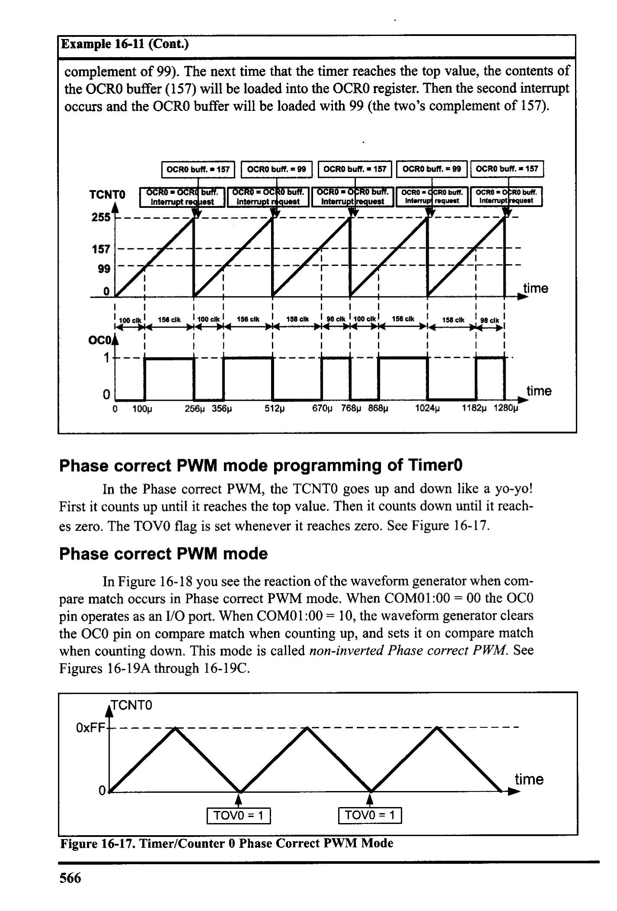
*Description*: Technical diagram and schematic illustration detailing hardware connection topology, signal routing, and circuit operation for Figure 16-17: Timer/Counter 0 Phase Correct PWM Mode.

> **Figure 16-17: Timer/Counter 0 Phase Correct PWM Mode**

566


<!-- Page 576 -->
### [PDF Page 576]

Bit
7
FOCO
WGM00
COMOI COMOO WGMOI
CS02
CS01
csoo
Read/Write
Initial Value
FOCO
RW
D7
Force compare match: This is a write-only bit, which can be used
while generating a wave. Writing 1 to it causes the wave
generator to act as if a compare match had occurred (Chapter 11).
WGM01:00
D3D6 Timero mode selector bit
0 0
Normal
01
PWM, Phase correct
1 0
CTC (Clear Timer on Compare match)
11
Fast PWM
COM01:00
D5 D4 Compare Output Mode when Timer0 is in Phase correct PWM mode:
COM01
COMOO Description
Normal port operation, OCO disconnected
1
Reserved
1
Clear OCO on compare match when up-counting. Set OCO on compare
match when down-counting.
1
1
Set OCO on compare match when up-counting. Clear OCO on compare
match when down-counting.
CS02:00
D2DIDO Timer clock selector
000
No clock source (Timer/Counter stopped)
001
clk (no prescaling)
1
clk / 8
1
clk / 64
elk / 256
clk / 1024
External clock source on TO pin. Clock on falling edge
1
1
External clock source on TO pin. Clock on rising edge

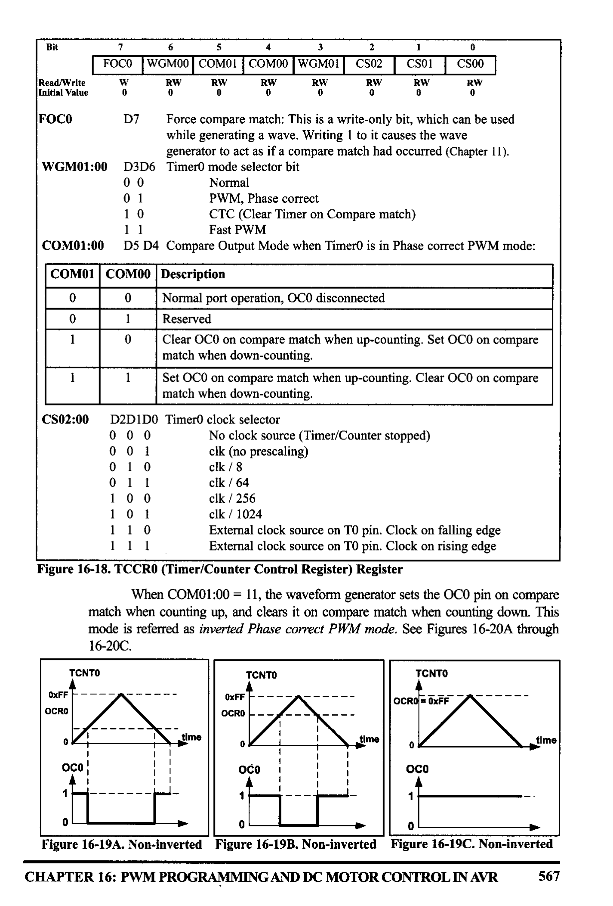
*Description*: Register specification diagram depicting individual bit flags, control register configurations, and functional definitions for Figure 16-18: TCCRO (Timer/Counter Control Register) Register.

> **Figure 16-18: TCCRO (Timer/Counter Control Register) Register**

When COM01:00 = 11, the waveform generator sets the OCO pin on compare
match when counting up, and clears it on compare match when counting down. This
mode is referred as inverted Phase correct PWM mode. See Figures 16-20A through
16-20C.
TCNTO
TCNTO
OxFF
OCRO
TCNTO
OCRO-ONE -
OCRO
time
time
time
OCO
1
OCO
1
OCO
--.
0


*Description*: Technical diagram and schematic illustration detailing hardware connection topology, signal routing, and circuit operation for Figure 16-19: A. Non-inverted.

> **Figure 16-19: A. Non-inverted**


*Description*: Technical diagram and schematic illustration detailing hardware connection topology, signal routing, and circuit operation for Figure 16-19: B. Non-inverted.

> **Figure 16-19: B. Non-inverted**


*Description*: Technical diagram and schematic illustration detailing hardware connection topology, signal routing, and circuit operation for Figure 16-19: C. Non-inverted.

> **Figure 16-19: C. Non-inverted**

CHAPTER 16: PWM PROGRAMMING AND DC MOTOR CONTROL IN AVR
567


<!-- Page 577 -->
### [PDF Page 577]

TCNTO
TONTO
TCNTO
OxFF
OCRO
OxFF
OCRO
OCRO= OxFF -
time
time
OCO
OCO
0
OCO
1
1
0
0

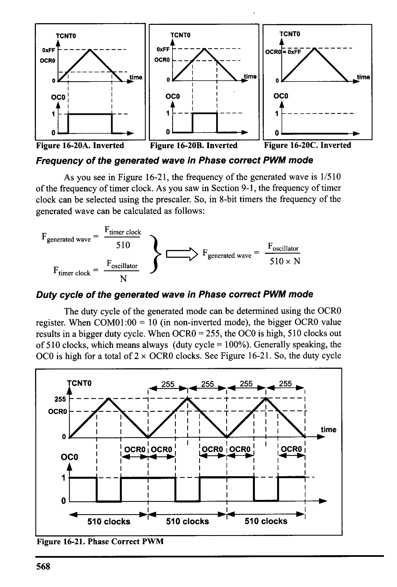
*Description*: Technical diagram and schematic illustration detailing hardware connection topology, signal routing, and circuit operation for Figure 16-20: A. Inverted.

> **Figure 16-20: A. Inverted**


*Description*: Technical diagram and schematic illustration detailing hardware connection topology, signal routing, and circuit operation for Figure 16-20: B. Inverted.

> **Figure 16-20: B. Inverted**


*Description*: Technical diagram and schematic illustration detailing hardware connection topology, signal routing, and circuit operation for Figure 16-20: C. Inverted.

> **Figure 16-20: C. Inverted**

Frequency of the generated wave in Phase correct PWM mode
As you see in Figure 16-21, the frequency of the generated wave is 1/510
of the frequency of timer clock. As you saw in Section 9-1, the frequency of timer
clock can be selected using the prescaler. So, in 8-bit timers the frequency of the
generated wave can be calculated as follows:
Ftimer clock
F generated wave =
510
F generated wave =
Foscillator
510 × N
Foscillator
F'timer clock =
N
Duty cycle of the generated wave in Phase correct PWM mode
The duty cycle of the generated mode can be determined using the OCRO
register. When COM01:00 = 10 (in non-inverted mode), the bigger OCRO value
results in a bigger duty cycle. When OCRO = 255, the OCO is high, 510 clocks out
of 510 clocks, which means always (duty cycle = 100%). Generally speaking, the
OCO is high for a total of 2 × OCRO clocks. See Figure 16-21. So, the duty cycle
ICNTO
255
OCRO
255
→ 255
→ 255 p, + 255
0
time
OCO
OCRO OCRO
DERO OCRO
OCRO
1
0
-
510 clocks
510 clocks
510 clocks


*Description*: Technical diagram and schematic illustration detailing hardware connection topology, signal routing, and circuit operation for Figure 16-21: Phase Correct PWM.

> **Figure 16-21: Phase Correct PWM**

568
time


<!-- Page 578 -->
### [PDF Page 578]

can be calculated using the following formula in non-inverted mode:
Duty Cycle = 2x OCRO
OCRO
- × 100 C
Duty Cycle =
- × 100
510
255
Similarly, the duty cycle formula for inverted mode is as follows:
Duty Cycle =510 - 2 x OCRO
255 - OCRO
- × 100 C
• Duty Cycle =
× 100
255
See Examples 16-12 through 16-15.
Example 16-12
Find the value for TCCRO for Phase correct PWM, non-inverted PWM wave generator,
and no prescaler.
Solution:
WGM01:00 = 01 = Phase correct PWM mode
COM01:00 = 10 = Non-inverted PWM
CS02:00 = 001 = No prescaler
TCCRO =
WGMOO COMOI COMOO WGM01 CS02
Example 16-13
Assuming XTAL = 8 MHz, using non-inverted mode, write a program that generates a
wave with frequency of 15,686 Hz and duty cycle of 75%.
Solution:
15,686 = 8M / (510 × N) → N = 8M / (15,626 × 510) = 1 → No prescaler
75 = OCRO × 100 / 255 → OCRO = 75 × 255 / 100 = 191 → OCRO = 191
• INCLUDE "M32DEF.INC"

```assembly
SBI DDRB, 3
```

IDI R20, 191
OUT
OCRO, R20
LDI
R20, 0x61
OUT
HERE: RJMP HERE
;OCRO = 191
TCCRO, R20 ;Phase c. PWM, no prescaler, non-inverted
Comparing the program with the program in Example 16-8, you see that they are almost
the same. The only difference is that the TCCRO is loaded with 0x61 instead of 0x69.
CHAPTER 16: PWM PROGRAMMING AND DC MOTOR CONTROL IN AVR
569


<!-- Page 579 -->
### [PDF Page 579]

Example 16-14
Find the value for TCCRO for Phase correct PWM, inverted PWM wave generator, and
prescaler = 256.
Solution:
WGM01:00 = 01 = Phase correct PWM mode
COM01:00 = 11 = Inverted PWM
CS02:00 = 100 = Scale 256
TCCRO =
FOCO
1
1
1
WGMOO COMO1 COMOO WGM01 CS02
CS01
CSOO
Example 16-15
Assuming XTAL = 8 MHz, using inverted mode, write a program that generates a wave
with frequency of 61 Hz and duty cycle of 87.5%.
Solution:
61 = 8M/(510 × N) → N= 8M/(61 × 510) = 256
87.5 = 100 × (255 - OCRO)/255 → 255 - OCRO = (255 × 87.5)/100 = 223 → OCRO = 32
• INCLUDE "M32DEF.INC"
SBI
DDRB, 3
;0C0 as output
LDI
R20, 32
OUT
OCRO, R20
LDI
R20, 0x74
OUT
ICCRO, R20
¡OCRO = 32
¡from
Example 16-14
¡ Phase
c. PWM, N = 256, inverted
HERE: RJMP HERE
Difference between the wave generated by Phase correct PWM and
Fast PWM
As you see in Figure 16-22, in Fast PWM, the phase of the wave is differ-
ent for different duty cycles, while it remains unchanged in the Phase correct
PWM as shown in Figure 16-23.
In non-inverted Fast PWM, the duty cycle of the generated wave is
(OCRO+ 1)/256. Becuase the value of OCRO is between 0 and 255, the duty cycle
of the wave can be changed between 1/256 and 256/256. Therefore, in non-invert-
ed Fast PWM the duty cycle of wave cannot be 0% (unless we turn off the wave-
form generator). Similarly, in inverted Fast PWM, the duty cycle changes between
0/256 and 255/256; thus, the duty cycle cannot be 100%. But in Phase correct
PWM, the duty cycle changes between 0/255 and 255/255. Therefore, the wave
can change between 0% (completely off) and 100% (completely on).
For driving motors, it is preferable to use Phase correct PWM rather than
Fast PWM. In Fast PWM the frequency of the generated wave is twice that of the
Phase correct mode. Thus, Fast PWM mode is preferable when we need to gener-
ate waves with high frequencies.
570


<!-- Page 580 -->
### [PDF Page 580]

TCNTO
OxFf
AWW
OCO
time


*Description*: Technical diagram and schematic illustration detailing hardware connection topology, signal routing, and circuit operation for Figure 16-22: Fast PWM.

> **Figure 16-22: Fast PWM**

TCNTO
OxFF
time
0
ocO

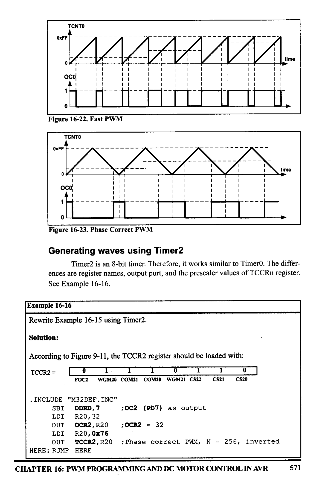
*Description*: Technical diagram and schematic illustration detailing hardware connection topology, signal routing, and circuit operation for Figure 16-23: Phase Correct PWM.

> **Figure 16-23: Phase Correct PWM**

Generating waves using Timer2
Timer2 is an 8-bit timer. Therefore, it works similar to Timero. The differ-
ences are register names, output port, and the prescaler values of TCCRn register.
See Example 16-16.
Example 16-16
Rewrite Example 16-15 using Timer2.
Solution:
According to Figure 9-11, the TCCR2 register should be loaded with:
TCCR2 =
11
FOC2
WGM20 COM21 COMO WGM21 CS22
CS21
CS20
• INCLUDE "M32DEF.INC"

```assembly
SBI DDRD, 7
```

IDI R20, 32

```assembly
OUT OCR2, R20
LDI R20, 0x76
OUT ICCR2, R20
HERE: RJMP HERE
; OC2 (PD7) as output
; OCR2 = 32
¡ Phase correct PWM, N = 256, inverted
```

CHAPTER 16: PWM PROGRAMMING AND DC MOTOR CONTROL IN AVR
571


<!-- Page 581 -->
### [PDF Page 581]

8-bit PWM programming in C
Examples 16-17 through 16-22 show the C versions of the earlier programs
creating PWM.
Example 16-17 (C version of Example 16-8)
Rewrite the program of Example 16-8 using C.
Solution:
#include "avr/io.h"
int main: ()
DDRB |= (1 <<3);
OCRO = 191;
ICCRO = 0x69; //Fast PWM, no prescaler, non-inverted

```c
while (1);
```

return 0;
}
Example 16-18 (C version of Example 16-9)
Rewrite the program of Example 16-9 using C.
Solution:
#include "avr/io.h"
int main ()
{
DDRB |= (1 < 3);
OCRO = 95;
ICCRO = 0x6A; |/Fast PWM, no prescaler,
non-inverted

```c
while (1);
```

return 0;
Example 16-19 (C version of Example 16-10)
Rewrite the program of Example 16-10 using C.
Solution:
#include "avr/io.h"
int main ()
DDRB |= (1 << 3);
OCRO = 159;
ICCRO = 0x7A; //Fast PWM, no prescaler,
inverted
while
(1);
return 0;
572


<!-- Page 582 -->
### [PDF Page 582]

Example 16-20 (C version of Example 16-13)
Rewrite the program of Example 16-13 using C.
Solution:
#include "avr/io.h"
int main ()
DDRB |= (1 << 3) ;
OCRO
=191;
TCCRO
= 0x61; //Phase c.
PWM, no prescaler,
non-inverted

```c
while (1);
```

return 0;
}
Example 16-21 (C version of Example 16-15)
Rewrite the program of Example 16-15 using C.
Solution:
#include "avr/io.h"
int main "
DDRB |= (1 << 3) ;
OCRO = 32;

```c
while (1);
```

return 0;
ICCRO = 0x74; //Phase correct PWM, N = 256, inverted
[Example 16-22 (C version of Example 16-16)
Rewrite the program of Example 16-16 using C.
Solution:
#include "avr/io.h"
int main ()
DDRD |=
(1
<< 7);
OCR2
TCCR2
= 0x76; I/Phase correct PWM, N = 256, inverted

```c
while (1);
```

return
0;
CHAPTER 16: PWM PROGRAMMING AND DC MOTOR CONTROL IN AVR
573


<!-- Page 583 -->
### [PDF Page 583]


### Review Questions

1. True or false. In Fast PWM and Phase correct PWM modes, we can change the
duty cycle.
2. True or false. In Fast PWM, we cannot change the frequency of the wave.
3. True or false. For 8-bit timers, in Phase correct PWM mode, the period is 510 clocks.
4. True or false. In Fast PWM, phase does not change when the duty cycle is
changed.
5. Which of the PWM modes is preferable for controlling motors?

## SECTION 16.3: PWM MODES IN TIMER1

Fast PWM mode
In the Fast PWM, the counter counts like it does in the Normal mode. After
the timer is started, it starts to count up. It counts up until it reaches its top limit.
See Figure 16-24.
From Figure 16-30 we see that we have five Fast PWM modes in Timerl:
modes 5, 6, 7, 14, and 15. In modes 5, 6, and 7 the top value is fixed at OxFF,
0x1FF, and 0x3FF; while in modes 14 and 15, the ICR1 and OCRIA registers rep-
resent the top value, respectively. See Figures 16-25 through 16-29.
ATCNT1
TOP-
TCNT1
$FF---
TOV1 =1
TOVI = 1
TOV1 = 1
0
time
0


*Description*: Technical diagram and schematic illustration detailing hardware connection topology, signal routing, and circuit operation for Figure 16-24: Fast PWM Mode.

> **Figure 16-24: Fast PWM Mode**


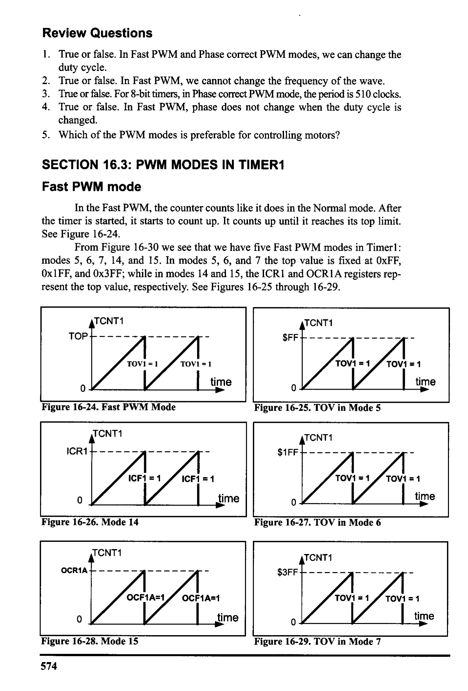
*Description*: Technical diagram and schematic illustration detailing hardware connection topology, signal routing, and circuit operation for Figure 16-25: TOV in Mode 5.

> **Figure 16-25: TOV in Mode 5**

TCNT1
ICR1-
ATCNT1
$1FF L
TOV1 = 1
time
ICF1 = 1
ICF1 =1
/
TOV1 = 1
time
TOV1 =1
I time


*Description*: Technical diagram and schematic illustration detailing hardware connection topology, signal routing, and circuit operation for Figure 16-26: Mode 14.

> **Figure 16-26: Mode 14**

TCNT1
OCRIA +


*Description*: Technical diagram and schematic illustration detailing hardware connection topology, signal routing, and circuit operation for Figure 16-27: TOV in Mode 6.

> **Figure 16-27: TOV in Mode 6**

SAFF TCNT
OCF1A=1
OCF1A=1
time
TOV1 = 1
0


*Description*: Technical diagram and schematic illustration detailing hardware connection topology, signal routing, and circuit operation for Figure 16-29: TOV in Mode 7.

> **Figure 16-29: TOV in Mode 7**

TOV1 = 1
time


*Description*: Technical diagram and schematic illustration detailing hardware connection topology, signal routing, and circuit operation for Figure 16-28: Mode 15.

> **Figure 16-28: Mode 15**

574


<!-- Page 584 -->
### [PDF Page 584]

Bit
7
INCI
6
ICESI
5
4
3
2
WGM13 WGM12 CS12
1
CS11
CS10
RAW
TCCRIB
Read/Write
Initial Value
ICNCI
D7
Input Capture Noise Canceler
0 = Input Capture Noise Canceler is disabled.
1 = Input Capture Noise Canceler is enabled.
ICESI
D6
Input Capture Edge Select
O = Capture on the falling (negative) edge
1 = Capture on the rising (positive) edge
DS
Not used
WGM13:WGM12
D4 D3 Timerl mode
Mode WGMI3 WGMI2 WGMIT WGMI0 Timer/Counter Mode of Operation Top TUpdate of TOVI Flag)
OCRIx
Set on
0
1
0
0
Normal
OxFFFF Immediate MAX
0
0
1
PWM, Phase Correct, 8-bit
(OxOOFF)
TOP
] воттом
PWM, Phase Correct, 9-bit
Ox01FF
TOP
BOTTOM
PWM, Phase Correct, 10-bit
Ox03FFT
TOP
BOTTOM
CTC
OCRIA Immediate
MAX
Fast PWM, 8-bit
OxO0FF
TOP
TOP
6
0
0
Fast PWM, 9-bit
(Ox0IFF
TOP
TOP
Fast PWM, 10-bit
Ox03FF
TOP
TOP
8
9
10
11
12
13
14
15
0
0
0
PWM, Phase and Frequency Correct
ICRI BOTTOM BOTTOM
PWM, Phase and Frequency Correct
TOCRIA OTTOM BOTTOM
0
PWM, Phase Correct
ICRI
TOP
1
1
1
1
0
1
0
1
PWM, Phase Correct
OCRIA
TOP
CTC
ICR1 Immediate
Reserved
-
Fast PWM
ICRI
Fast PWM
OCRIA
TOP
TOP
MAX
-
TOP
TOP
CS12:CS10
D2D1D0
0
0
0
0 0
1
0
1
0
1
0
0
1
1
0
1
0
1
Timerl clock selector
No clock source (Timer/Counter stopped)
elk (no prescaling)
clk / 8
clk / 64
clk / 256
clk / 1024
External clock source on T1 pin. Clock on falling edge
External clock source on T1 pin. Clock on rising edge

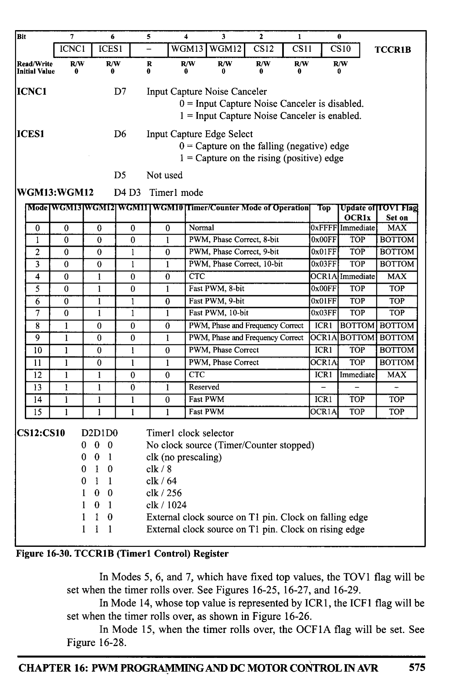
*Description*: Register specification diagram depicting individual bit flags, control register configurations, and functional definitions for Figure 16-30: TCCRIB (Timerl Control) Register.

> **Figure 16-30: TCCRIB (Timerl Control) Register**

In Modes 5, 6, and 7, which have fixed top values, the TOV1 flag will be
set when the timer rolls over. See Figures 16-25, 16-27, and 16-29.
In Mode 14, whose top value is represented by ICR1, the ICF1 flag will be
set when the timer rolls over, as shown in Figure 16-26.
In Mode 15, when the timer rolls over, the OCFIA flag will be set. See


*Description*: Technical diagram and schematic illustration detailing hardware connection topology, signal routing, and circuit operation for Figure 16-28.

> **Figure 16-28**

CHAPTER 16: PWM PROGRAMMING AND DC MOTOR CONTROL IN AVR
575


<!-- Page 585 -->
### [PDF Page 585]

Bit
7
6
5
4
3
2
1
COMIAI COMIAO COMIBI COMBO FOCIA FOCIB |WGM11 WGM10
Read/Write
Initial Value
RW
ROW
R/W
COMIA1:COMIA0 D7 D6 Compare Output Mode for Channel A
COMIA1 COMIAO
Description
Normal port operation, OCIA disconnected
1
In mode 15, toggle OCIA on compare match. In other modes
OCIA disconnected (Normal I/O port)
1
1
Clear OCIA on compare match. Set OCIA at Top.
1
Set OCIA on compare match. Clear OCIA at Top.
COMIB1:COMIBO DS D4 Compare Output Mode for Channel B
[COMIBI COMIBO Description
0
Normal port operation, OCIB disconnected
1
Normal port operation, OCIB disconnected
1
Clear OC1B on compare match. Set OCIB at Top.
1
1
Set OCIB on compare match. Clear OCIB at Top.
FOCIA
D3
Force Output Compare for Channel A
FOCIB
D2
Force Output Compare for Channel B
WGM11:10
DI DO Timerl mode (discussed in Figure 16-30)

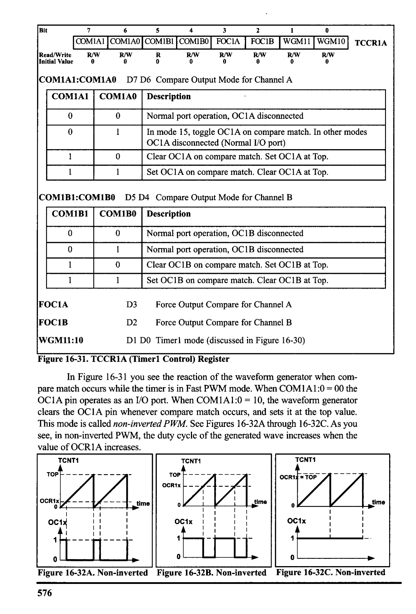
*Description*: Register specification diagram depicting individual bit flags, control register configurations, and functional definitions for Figure 16-31: TCCRIA (Timer1 Control) Register.

> **Figure 16-31: TCCRIA (Timer1 Control) Register**

In Figure 16-31 you see the reaction of the waveform generator when com-
pare match occurs while the timer is in Fast PWM mode. When COMIA1:0 = 00 the
OCIA pin operates as an I/O port. When COMIA1:0 = 10, the waveform generator
clears the OCIA pin whenever compare match occurs, and sets it at the top value.
This mode is called non-inverted PWM. See Figures 16-32A through 16-32C. As you
see, in non-inverted PWM, the duty cycle of the generated wave increases when the
value of OCRIA increases.
TCNT1
TCNT1
TCNT1
TOP
TOP
0CR1x
time
ilme
OC1x
OC1x
TCCRIA
atime
OC1X
1


*Description*: Technical diagram and schematic illustration detailing hardware connection topology, signal routing, and circuit operation for Figure 16-32: A. Non-inverted.

> **Figure 16-32: A. Non-inverted**

576


*Description*: Technical diagram and schematic illustration detailing hardware connection topology, signal routing, and circuit operation for Figure 16-32: B. Non-inverted.

> **Figure 16-32: B. Non-inverted**


*Description*: Technical diagram and schematic illustration detailing hardware connection topology, signal routing, and circuit operation for Figure 16-32: C. Non-inverted.

> **Figure 16-32: C. Non-inverted**


<!-- Page 586 -->
### [PDF Page 586]

TCNT1
TOP -
TCNT1
TOPT
OCR1x
TCNT1
OCRITATOP
time
timo
time
OCTX
A
1
OCTx
1

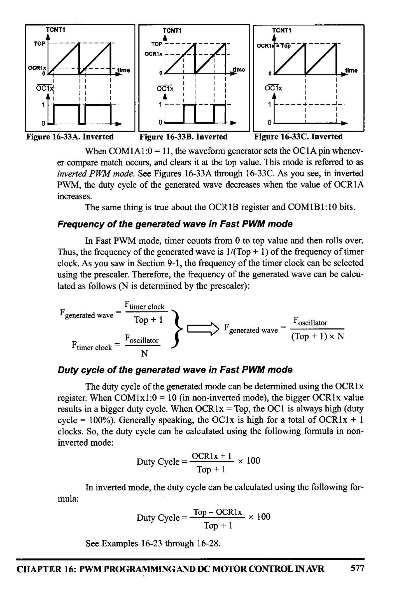
*Description*: Technical diagram and schematic illustration detailing hardware connection topology, signal routing, and circuit operation for Figure 16-33: A. Inverted.

> **Figure 16-33: A. Inverted**


*Description*: Technical diagram and schematic illustration detailing hardware connection topology, signal routing, and circuit operation for Figure 16-33: B. Inverted.

> **Figure 16-33: B. Inverted**


*Description*: Technical diagram and schematic illustration detailing hardware connection topology, signal routing, and circuit operation for Figure 16-33: C. Inverted.

> **Figure 16-33: C. Inverted**

When COMIA1:0 = 11, the waveform generator sets the OCIA pin whenev-
er compare match occurs, and clears it at the top value. This mode is referred to as
inverted PWM mode. See Figures 16-33A through 16-33C. As you see, in inverted
PWM, the duty cycle of the generated wave decreases when the value of OCRIA
increases.
The same thing is true about the OCRIB register and COMIB1:10 bits.
Frequency of the generated wave in Fast PWM mode
In Fast PWM mode, timer counts from 0 to top value and then rolls over.
Thus, the frequency of the generated wave is 1/(Top + 1) of the frequency of timer
clock. As you saw in Section 9-1, the frequency of the timer clock can be selected
using the prescaler. Therefore, the frequency of the generated wave can be calcu-
lated as follows (N is determined by the prescaler):
Ftimer clock
F
generated wave
Top + 1
Ftimer clock =
Foscillator
Foscillator
→
• F generated wave =
(Top + 1) × N
N
Duty cycle of the generated wave in Fast PWM mode
The duty cycle of the generated mode can be determined using the OCR1x
register. When COM1x1:0 = 10 (in non-inverted mode), the bigger OCRIx value
results in a bigger duty cycle. When OCRIx = Top, the OC1 is always high (duty
cycle = 100%). Generally speaking, the OCIx is high for a total of OCR1x + 1
clocks. So, the duty cycle can be calculated using the following formula in non-
inverted mode:
Duty Cycle = OCRIx+1
- × 100
Top +1
In inverted mode, the duty cycle can be calculated using the following for-
mula:
Duty Cycle = Top - OCRIx
- × 100
Top + 1
See Examples 16-23 through 16-28.
CHAPTER 16: PWM PROGRAMMING AND DC MOTOR CONTROL IN AVR
577


<!-- Page 587 -->
### [PDF Page 587]

Example 16-23
Calculate the value for the OCRIB register to generate a wave with duty cycle of 75%
for each of the following modes:
(a) Mode 5, non-inverted mode
(c) Mode 6, non-inverted mode
(b) Mode 7, inverted mode
(d) Mode 5, inverted mode
(e) Mode 7, non-inverted mode
Solution:
(a) In mode 5, Top = OxFF= 255. Thus,
75 = (OCRIx + 1) × 100 / (Top + 1) → OCRIx + 1 = 75 × 256 / 100 = 192
→ OCR1B = 191
(b) In mode 7, Top = 0x3FF = 1023. Thus,
75 = (Top - OCR1x) × 100 / (Top + 1) → 1023 - OCR1x = 75 × 1024 / 100 = 768
→ OCR1B = 255
(c) In mode 6, Top = OxIFF = 511. Thus,
75 = (OCR|x + 1) × 100 /(Top + 1) → OCRIx + 1 = 75 × 512 / 100 = 384
→ OCR1A = 383
(d) In mode 5, Top = OxFF = 255. Thus,
75 = (Top - OCRIx) × 100 / (Top + 1) → 75 = (255 - OCR1x) × 100 / 256
→ 255 - OCR1x = 75 × 256 / 100 = 192 » OCRIB = 255 - 192 = 63
(e) In mode 7, Top = Ox3FF = 1023. Thus,
75 = (OCRIx + 1) × 100 / (Top + 1) → OCRIx + 1 = 75 × 1024 / 100 = 768
→ OCRIB = 767
Example 16-24
Find the values for TCCRIA and TCCR1B to initialize Timerl for mode 5 (Fast PWM
mode, top = 0xFF), non-inverted PWM wave generator, and no prescaler, using wave-
form generator A.
Solution:
WGM13:10 = 0101 = Fast PWM mode
COM01:00 = 10 = Non-inverted PWM
CS02:00 = 001 = No prescaler
TCCRIA =
1 O
COMIAI COMIAO COMIBI COMIBO FOCIA FOCIB WOMII WGM10
TCCRIB =
ICNCI ICESI
-
WGM13 WGM12 CS12
CS11
CS10
578


<!-- Page 588 -->
### [PDF Page 588]

Example 16-25
Assuming XTAL = 8 MHz, using non-inverted mode, and mode 5, write a program that
generates a wave with frequency of 31,250 Hz and duty cycle of 75%.
Solution:
31,250 = 8M/ (256 x N) → N= 8M / (31,250 × 256) = 1 → No prescaler
• INCLUDE "M32DEF.INC"
SBI
DDRD, 5
LDI
R16, HIGH (191)
OUT
OCRIAH, R16
LDI
R16, LOW (191)
OUT
OCRIAL, R16
LDI
R16, 0x81
OUT
ICCRIA, R16
; PD5 = output
; from Example 16-23
; Temp = 0x00
:R16 = 191
¡OCRIA = 191
; from Example 16-24
¡ COMIA = non-inverted
IDI R16, 0x09

```assembly
OUT ICCRIB, R16
; WGM = mode 5, clock = no scaler
HERE: RJMP HERE
```

Example 16-26
Assuming XTAL = 8 MHz, using non-inverted mode and mode 7, write a program that
generates a wave with frequency of 7812.5 Hz and duty cycle of 75%.
Solution:
7812.5 = 8M/(1024 × N) → N= 8M/(7812.5 × 1024) = 1 → No prescaler
• INCLUDE "M32DEF. INC"
SBI
DDRD, 5
LDI
R16, HIGH (767)
; PD5 = output
;R16 = the high byte
OUT
OCRIAH, R16
LDI
R16, LOW (767)
OUT
OCRIAL, R16
;R16 = the low byte
¡OCRIA = 767 (from Example 16-23)
LDI
R16, 0×83
OUT
TCCRIA, R16
¡ COMIA = non-inverted
LDI
R16, 0×09

```assembly
OUT TCCR1B, R16
HERE: RJMP HERE
; WGM = mode 7, clock = no scaler
```

¡wait here forever
CHAPTER 16: PWM PROGRAMMING AND DC MOTOR CONTROL IN AVR
579


<!-- Page 589 -->
### [PDF Page 589]

Example 16-27
Assuming XTAL = 8 MHz, using non-inverted mode and mode 6, write a program that
generates a wave with frequency of 1,953 Hz and duty cycle of 60%.
Solution:
In mode 6, Top = Ox1FF= 511. Thus,
60 = (OCR1x + 1) × 100 / (Top + 1) → OCR1x + 1 = 60 × 512 / 100 = 307
→ OCRIB = 306
1953 = 8M / (512 × N) > N= 8M/ (1953 × 512) = 8 → prescaler = 1:8 → CS12:0 = 010
TCCRIA =
COMIAL COMIAO COMIBI COMIBI FOCIA FOCIB WGM11 WGM10
TCCRIB =
1
WGM13 WGM12 CS12
ICNCI ICESI
-
CS11
CS10
• INCLUDE "M32DEF.INC"
SBI
DDRD, 5
LDI
R16, HIGH (306)
OUT
OCRIAH, R16
LDI
R16, LOW (306)
OUT
OCRIAL, R16
; PD5 = output
; R16 = the high byte
; Temp = R16
; R16 = the low byte
¡OCRIA = 306
LDI
R16, 0x82
OUT
ICCRIA, R16
¡ COMIA = non-inverted.
IDI R16, 0X0A

```assembly
OUT ICCRIB, R16
HERE: RJMP HERE
; WGM = mode 6, clock = no scaler
```

¡ wait here forever
Example 16-28
Rewrite Example 16-27 using inverted mode.
Solution:
60 = (Top - OCR1x) × 100 / (Top + 1) → 511 - OCR1x = 60 × 512 / 100 = 307
→ OCRIB = 511 - 307 = 204
ICCRIA =
COMA COMA COMIBI COMBO FOCIA FOCAB WEMI WEMIO
TCCRIB =
ICNCI
ICES!
• INCLUDE "M32DEF.INC"
SBI
DDRD, 5
LDI
R16, HIGH (204)
OUT
OCRIAH, R16
LDI
R16, LOW (204)
OUT
OCRIAL, R16
LDI
R16, 0xB2
OUT
ICCRIA, R16
LDI
R16, 0X0A
OUT
ICCRIB, R16
HERE: RJMP HERE
WGM13 WGMI2 CS12
CS11
CS10
; PD5 = output
; Temp = the high byte
¡OCRIA = 204
¡ COMIA = inverted
; WGM = mode 6, clock = no scaler
¡wait here forever
580


<!-- Page 590 -->
### [PDF Page 590]

Loading values into the OCRIA and OCR1B registers in PWM modes
In the non-PWM modes (CTC mode and Normal mode), when we load a
value into the OCRIx register, the value will be loaded instantly, but in the PWM
modes (Fast WM, Phase correct PWM, and phase and frequency correct PWM
mode), there is a buffer between us and the OCRIA and OCRIB registers. When
we read/write a value from/into the OCRIA or OCRIB register we are dealing
with the buffer. The contents of the buffer will be loaded into the OCRIA/OCRIB
registers only when the TCNT1 reaches its topmost value. See Figure 16-34 and
Example 16-29.
OCR1B Buffer
I
TCNT1 = top
OCR1B
| =
-OCF1BR
TCNT1
I
OCRIA Buffer
MOCFIA
TCNT1 = top>
OCRIA

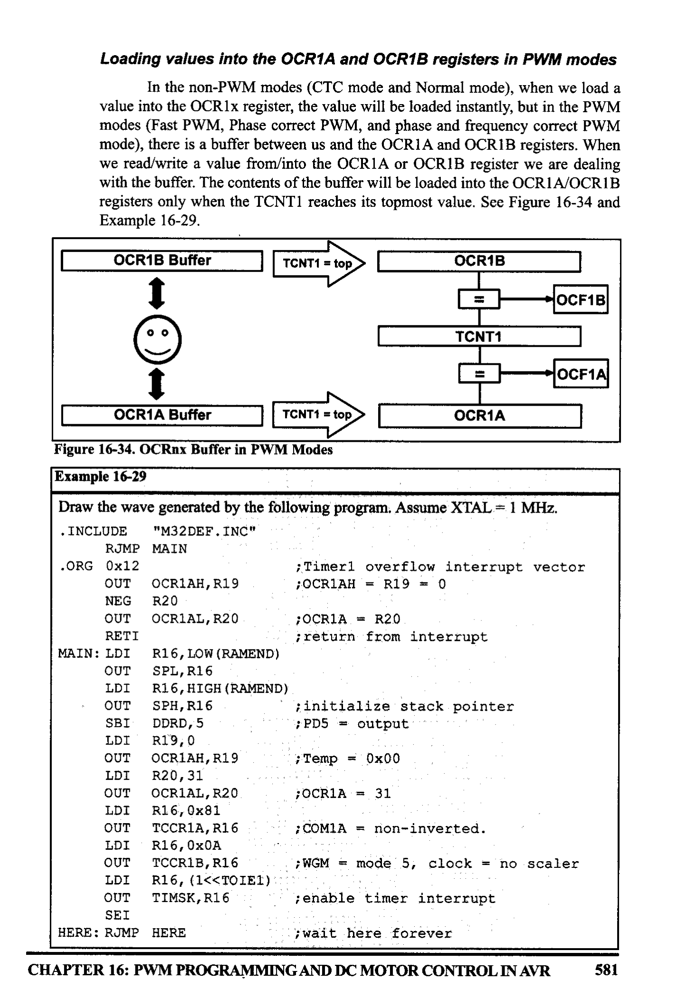
*Description*: Technical diagram and schematic illustration detailing hardware connection topology, signal routing, and circuit operation for Figure 16-34: OCRnx Buffer in PWM Modes.

> **Figure 16-34: OCRnx Buffer in PWM Modes**

Example 16-29
Draw the wave generated by the following program. Assume XTAL = 1 MHz.
• INCLUDE
"M32DEE. INC"
RUMP
MAIN
•ORG 0x12
OUT
NEG
OUT
OCRIAH, R19
R20
OCRIAL, R20
¡Timerl overflow interrupt vector
¡OCRIAH = R19 = 0
RETI
¡OCRIA = R20
¡return from interrupt
MAIN: IDI
OUT
LDI
OUT
SBI
LDI
OUT
LDI
OUT
LDI
OUT
LDI
OUT
LDI
OUT
R16, LOW (RAMEND)
SPL, R16
R16, HIGH (RAMEND)
SPH, R16
DDRD, 5
R19,0
OCRIAH, R19
R20, 31
OCRIAL, R20
R16,0x81
TCCRIA, R16
R16, 0x0A
TCCR1B, R16
R16, (1<<TOIEI)
TIMSK, R16
¡initialize stack pointer
;PD5 = output
¡Temp = 0x00
¡OCRIA = 31
¡COMIA = non-inverted.
;WGM = mode 5, clock = no scaler
¡enable timer interrupt
SEI
HERE: RJMP HERE
¡wait here forever
CHAPTER 16: PWM PROGRAMMING AND DC MOTOR CONTROL IN AVR
581


<!-- Page 591 -->
### [PDF Page 591]

Example 16-29 (Cont.)
Solution:
The wave generator is in non-inverted Fast PWM mode, which means that on compare
match the OCIA pin will be set high. The OCRIA register is loaded with 31, so com-
pare match occurs when TCNT1 reaches 31. When the timer reaches top and overflows,
the interrupt request occurs, and OCRIA buffer is loaded with 224 (the two's comple-
ment of 31). The next time that the timer reaches the top value the contents of the
OCRIA buffer (224) will be loaded into the OCRIA register. Then the second interrupt
occurs and OCRIA buffer will be loaded with 31 (the two's complement of 224).
TCNT1
255
224
31
-time
224 clk
225 clk
225 cik
OCOA
1
0 32u
256u 288u
512U
737 7689004
1024y
time
1249н 12804
Generating waves with different frequencies (case study)
As we mentioned earlier, the frequency of the generated wave is equal to
FOscillator/[N × (Top + 1)]. In modes 5, 6, and 7, the Top value is fixed. Therefore,
in these modes the only way to change the frequency of the generated wave is to
change N (the prescaler). In Figure 16-35, you see the different frequencies that
can be generated using modes 5, 6, and 7.
Prescaler
1
Mode = 5
Mode = 6
Foscillator
1×256
Foscillator
1x512
1:8
Foscillator
8×256
Foscillator
8x512
1:64
1:256
1:1024
Foscillator
64×256
Foscillator
64×512
Foscillator
256×256
Foscillator
256x512
Fosicillator
1024x256
F oscillator
1024x512
Mode = 7
Fossillator
1x1024
Foscillator
8x1024
Foscillator
64x1024
Foscillator
Foscillator
256× 1024 1024×1024

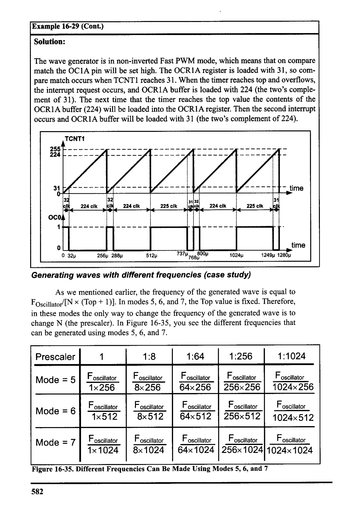
*Description*: Technical diagram and schematic illustration detailing hardware connection topology, signal routing, and circuit operation for Figure 16-35: Different Frequencies Can Be Made Using Modes 5, 6, and 7.

> **Figure 16-35: Different Frequencies Can Be Made Using Modes 5, 6, and 7**

582


<!-- Page 592 -->
### [PDF Page 592]

Thus, in these modes we can make a very limited number of frequencies.
What if we want to make some other frequencies? In modes 14 and 15, the Top
value can be specified by ICR1 and the OCRIA registers. Thus, we can change the
frequency by loading proper values to ICR1 and OCRIA. See Examples 16-30
through 16-32.
Example 16-30
Assuming XTAL = 8 MHz, find TCCR1A and TCCR1B to generate a wave with fre-
quency of 80 kHz using mode 14.
Solution:
80K = 8M / [N x (Top + 1)] > N x (Top + 1) = 8M / 80K = 100
→ N x (Top + 1) = 100 → N = 1; Top + 1 = 100
Top = 99 → ICRI = 99
N = 1 → CS12:0 = 001
TCCRIA =
COMIAI COMIAD COMIRI COMIBO FOCIA POCIS
WGM11 WGM10
TCCRIB =
• O
ICES1
WGM13 WGM12
Example 16-31
Calculate the OCR1B to generate a wave with duty cycle of 20% in each of the follow-
(e) mode 4, invertd mode, ICRI - 45, 3) mode 15, nom inverted mode, OCRIA = 124,
and (c) mode 14, non-inverted mode, ICR1 = 99.
Solution:
(a) In mode 14, Top = ICRI = 45. Thus,
20 = (Top - OCR1x) × 100 / (Top + 1) → 45 - OCR1x = 20 × 46 / 100 = 9 → OCRIA = 36
(b) In mode 15, Top = OCRIA = 124. Thus,
20 = (OCR1x + 1) × 100 / (124 + 1) → OCR1x + 1 = 20 × 125 / 100 = 25 → OCRIx = 24
(c) In mode 14, Top = ICR1 = 99. Therefore,
20 = (OCR1x + 1) × 100 / (99 + 1) → OCR1x + 1 = 20 → OCR1x = 19
CHAPTER 16: PWM PROGRAMMING AND DC MOTOR CONTROL IN AVR
583


<!-- Page 593 -->
### [PDF Page 593]

Example 16-32
Assume XTAL = 8 MHz. Using mode 14 write a program that generates a wave with
duty cycle of 20% and frequency of 80 kHz.
Solution:
• INCLUDE "M32DEF.INC"
LDI
R16, LOW (RAMEND)
OUT
SPL, R16
LDI
R16, HIGH (RAMEND)
OUT
SPH, R16
SBI
DDRD, 5
LDI
R16, HIGH (99)
OUT
ICR1H, R16
LDI
R16, LOW (99)
OUT
ICRIL, R16
LDI
R16, HIGH (19)
OUT
OCRIAH, R16
LDI
R16, LOW (19)
OUT
OCRIAL, R16
LDI
R16, 0x82
OUT
ICCRIA, R16

```assembly
LDI R16,0x19
OUT ICCRIB, R16
HERE: RJMP HERE
```

¡ initialize stack pointer
; PD5 = output
; Temp = 0
; ICRI = 99
; Temp = 0
¡OCRIA = 19 (from Example 16-31)
¡from Example 16-30
; COMIA = non-inverted
¡ from Example 16-30
; WGM = mode 14, clock = no scaler
¡wait here forever
If we use mode 15 instead of mode 14, OCRIA is buffered, and the con-
tents of the buffer will be loaded into OCRIA when the timer reaches its top value.
In mode 15 we can only use the OCIB wave generator and not the OCIA wave
generator since the OCRIA register is used for defining the top value. See
Examples 16-33 and 16-34.
Example 16-33
Assuming XTAL = 8 MHz, find TCCR1A and TCCR1B to generate a wave with
frequency of 64 kHz using mode 15.
Solution:
64k = 8M / [N× (Top + 1)] → Nx (Top + 1) = 8M / 64k = 125 → N = 1; Top + 1 = 125
→ Top = 124 → OCRIA = 124
N = 1 → CS12:0 = 001
ICCRIA =
0
TCCRIB =
COMIAI COMIAO COMIBI COMIBO FOCIA FOCIB WGMII WGMIO
ICNCI ICESI
1 1
WGM13 WGMI2 CS1Z
CS11
CS10
584


<!-- Page 594 -->
### [PDF Page 594]

Example 16-34
Assume XTAL = 8 MHz. Using mode 15 write a program that generates a wave with
duty cycle of 20% and frequency of 64 kHz.
Solution:
• INCLUDE "M32DEF.INC"
LDI
OUT
R16, LOW (RAMEND)
SPL, RI6
LDI
OUT
R16, HIGH (RAMEND)
SPH, R16
¡initialize stack pointer
SBI
LDI
OUT
LDI
OUT
DDRD, 4
R16, HIGH (124)
OCRIAH, R16
R16, LOW (124)
OCRIAL, R16
IDI
R16, HIGH (24)
OUT
OCRIBH, R16
LDI
R16, LOW (24)
OUT
OCRIBI, R16
IDI R16, 0x23

```assembly
OUT ICCRIA, R16
```

IDI R16, 0x19

```assembly
OUT ICCRIB, R16
HERE: RJMP HERE
; PD4 = output
; R16 = the high byte
; R16 = the low byte
¡OCRIA = 124
; R16 = the high byte
;R16 = the low byte
; OCRIB = 24
```

¡ from Example 16-33
; COMIB = non-inverted
i from Example 16-33
; WGM = mode 15, clock = no scaler
¡wait here forever
Phase correct PWM mode
In the Phase correct PWM, the timer counts up until it reaches the top value
then counts down until it reaches zero. The TOV1 flag will be set when the timer
returns to zero, as shown in Figure 16-36.
There are five Phase correct PWM modes: modes 1, 2, 3, 10, and 11. See

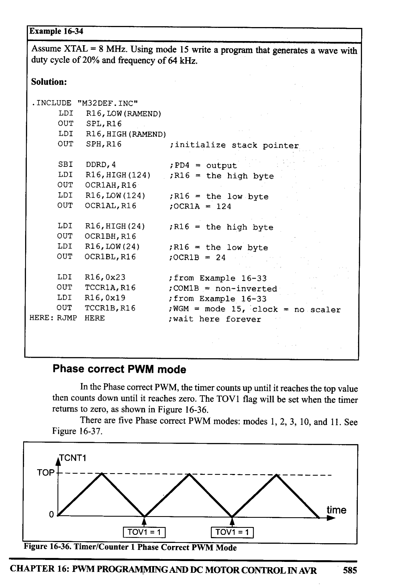
*Description*: Technical diagram and schematic illustration detailing hardware connection topology, signal routing, and circuit operation for Figure 16-37.

> **Figure 16-37**

TCNT1
TOP-
-- --
time
TOV1 = 1
[TOV1 = 1


*Description*: Technical diagram and schematic illustration detailing hardware connection topology, signal routing, and circuit operation for Figure 16-36: Timer/Counter 1 Phase Correct PWM Mode.

> **Figure 16-36: Timer/Counter 1 Phase Correct PWM Mode**

CHAPTER 16: PWM PROGRAMMING AND DC MOTOR CONTROL IN AVR
585


<!-- Page 595 -->
### [PDF Page 595]

Bit
Read/Write
Initial Value
7
6
ICNCI ICESI
RAV
4
3
2
TWGM13 (WGMI2|
CS12
1
CS11
CS10
TCCRIB
ICNCI
D7
Input Capture Noise Canceler
0 = Input Capture is disabled.
1 = Input Capture is enabled.
ICESI
D6
Input Capture Edge Select
Ó = Capture on the falling (negative) edge
1 = Capture on the rising (positive) edge
WGM13:WGM12
D4 D3 Timerl mode
Mode WGM13|WGM12 WGM11| WGM10 Timer/Counter Mode of Operation Top
Update of TOV1 Flag
OCRIX
Set on
Normal
OxFFFF Immediate
MAX
1
2
3
4
5
0
0
10-
1
1
PWM, Phase Correct, 8-bit
TOP
PWM, Phase Correct, 9-bit
(OxOIFFI
PWM, Phase Correct, 10-bit
TOP
воттом!
TOx03FF
TOP
BOTTOM™
7
1
1
1
1
0
0
CTC
OCRIA Immediate
Fast PWM, 8-bit
Ox00FF
TOP
MAX
TOP
1
1
Fast PWM, 9-bit
Ox01FF
TOP
TOP
1
Fast PWM, 10-bit
Ox03FF
TOP
TOP
PWM, Phase and Frequency Correct ICRI BOTTOM BOTTOM
9
10
11
12
13
14
15
1
CS12:CS10
PWM, Phase and Frequency Correct
TOCRIA OTTOM BOTTOM
PWM, Phase Correct
ICRI
TOP
BOTTOM
1
PWM, Phase Correct
JOCRIA
TOP
CTC
ICRI Immediate
MAX
Reserved
0
Fast PWM
1
1
Fast PWM
ICRI
LOCRIA
TOP
TOP
TOP
0
D2D1D0
0
0
0
Timerl clock selector
No clock source (Timer/Counter stopped)
clk (no prescaling)
clk / 8
1 l
clk / 64
100
clk / 256
1
0 1
clk / 1024
1
1
0
External clock source on T1 pin. Clock on falling edge
1 1 1
External clock source on T1 pin. Clock on rising edge

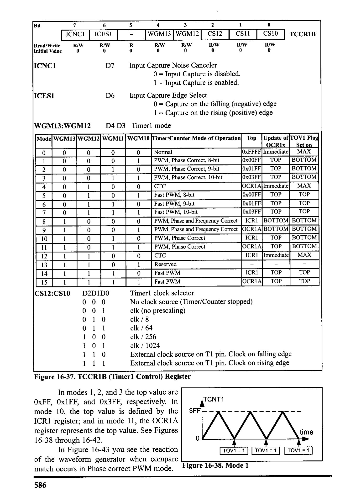
*Description*: Register specification diagram depicting individual bit flags, control register configurations, and functional definitions for Figure 16-37: TCCRIB (Timer1 Control) Register.

> **Figure 16-37: TCCRIB (Timer1 Control) Register**

In modes 1, 2, and 3 the top value are
UXFF, OxIFF, and 0x3FF, respectively. In
mode 10, the top value is defined by the
TCNT1
$FF--
ICRI register; and in mode 11, the OCRIA
register represents the top value. See Figures
16-38 through 16-42.
In Figure 16-43 you see the reaction
of the waveform generator when compare
match occurs in Phase correct PWM mode.


*Description*: Technical diagram and schematic illustration detailing hardware connection topology, signal routing, and circuit operation for Figure 16-38: Mode 1.

> **Figure 16-38: Mode 1**

- -
time
[TOVi = 1] [TOV1 = 1] [ToV1 = 1]
586


<!-- Page 596 -->
### [PDF Page 596]

TCNT1
$1FF-
0
time
[TOV1 = 17
TOV1 = 1] TOV1 = 1


*Description*: Technical diagram and schematic illustration detailing hardware connection topology, signal routing, and circuit operation for Figure 16-39: Mode 2.

> **Figure 16-39: Mode 2**

TCNT1
TCNT1
$3FF
0
TOV1 = 1|


*Description*: Technical diagram and schematic illustration detailing hardware connection topology, signal routing, and circuit operation for Figure 16-40: Mode 3.

> **Figure 16-40: Mode 3**

TCNT1
OCRIA-
TOV1 = 1
time
TOV1 = 1
time
time
[TOV1 = 1 [TOV1 = 1 [TOV1 = 1]


*Description*: Technical diagram and schematic illustration detailing hardware connection topology, signal routing, and circuit operation for Figure 16-41: Mode 10.

> **Figure 16-41: Mode 10**

[TOV1 = 1

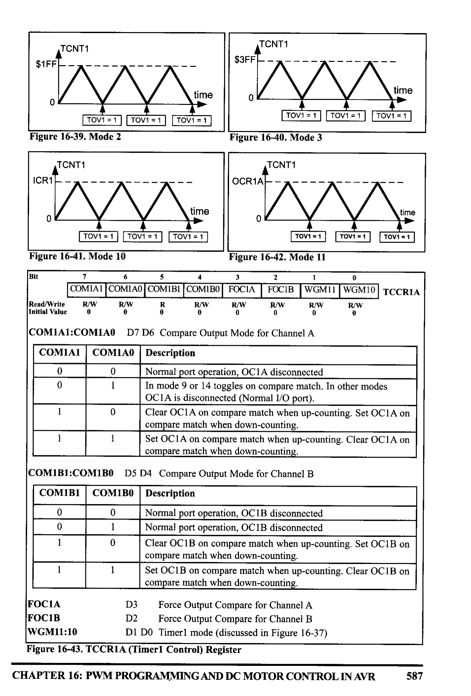
*Description*: Technical diagram and schematic illustration detailing hardware connection topology, signal routing, and circuit operation for Figure 16-42: Mode 11.

> **Figure 16-42: Mode 11**

Bit
4
3
2
1
COMIAI | COMI AÓ]
COMIBI COMIBO FOCIA FOCIB | WGMII WGM10 TCCRIA
Read/Write
Initial Value
RW
COMIAI:COMIAO D7 D6 Compare Output Mode for Channel A
COM1A1
COMIAO
Description
0
Normal port operation, OCIA disconnected
In mode 9 or 14 toggles on compare match. In other modes
OCIA is disconnected (Normal 1/0 port).
1
0
Clear OCIA on compare match when up-counting. Set OCIA on
compare match when down-counting.
1
1
Set OCIA on compare match when up-counting. Clear OCIA on
compare match when down-counting.
COMIBI:COMIBO D5 D4 Compare Output Mode for Channel B
COMIBI
0
0
1
COMIBO
Description
Normal port operation, OCIB disconnected
1
Normal port operation, OCIB disconnected
Clear OCIB on compare match when up-counting. Set OCIB on
compare match when down-counting.
1
1
Set OCIB on compare match when up-counting. Clear OCIB on
compare match when down-counting.
FOCIA
D3
Force Output Compare for Channel A
FOCIB
D2
Force Output Compare for Channel B
WGM11:10
DI DO Timerl mode (discussed in Figure 16-37)


*Description*: Register specification diagram depicting individual bit flags, control register configurations, and functional definitions for Figure 16-43: TCCRIA (Timer1 Control) Register.

> **Figure 16-43: TCCRIA (Timer1 Control) Register**

CHAPTER 16: PWM PROGRAMMING AND DC MOTOR CONTROL IN AVR
587


<!-- Page 597 -->
### [PDF Page 597]

TCNT1
A
TCNT1
TCNT1
Top
Top
OCR1x
OCR1X = Top
OCRIA
time
time
-time
1
OC1x
1
OC1x
1


*Description*: Technical diagram and schematic illustration detailing hardware connection topology, signal routing, and circuit operation for Figure 16-44: A. Non-inverted.

> **Figure 16-44: A. Non-inverted**


*Description*: Technical diagram and schematic illustration detailing hardware connection topology, signal routing, and circuit operation for Figure 16-44: B. Non-inverted.

> **Figure 16-44: B. Non-inverted**


*Description*: Technical diagram and schematic illustration detailing hardware connection topology, signal routing, and circuit operation for Figure 16-44: C. Non-inverted.

> **Figure 16-44: C. Non-inverted**

TCNT1
TCNT1
Top
Top
OCR1X-
TCNT1
A
OCRIX = Top
OCR1x_
0
ime
time
time
OC1X,
A
1
OC1x
OC1x
1
1
0
0
0

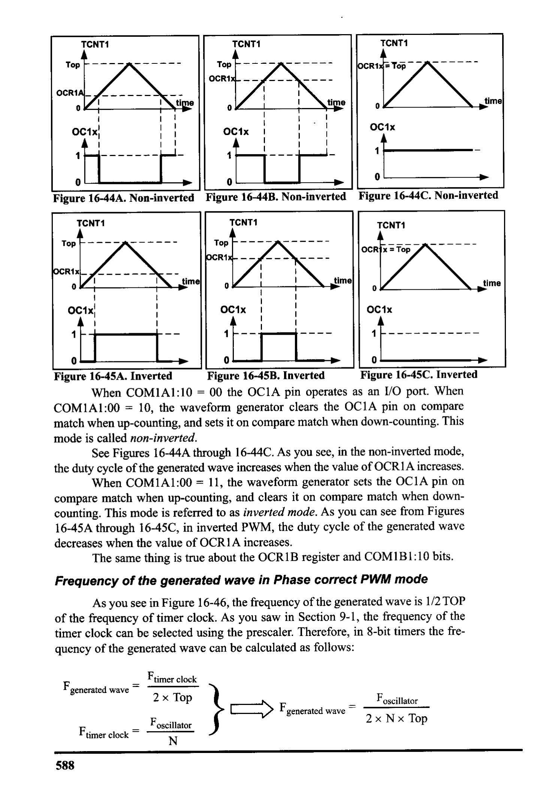
*Description*: Technical diagram and schematic illustration detailing hardware connection topology, signal routing, and circuit operation for Figure 16-45: A. Inverted.

> **Figure 16-45: A. Inverted**


*Description*: Technical diagram and schematic illustration detailing hardware connection topology, signal routing, and circuit operation for Figure 16-45: B. Inverted.

> **Figure 16-45: B. Inverted**


*Description*: Technical diagram and schematic illustration detailing hardware connection topology, signal routing, and circuit operation for Figure 16-45: C. Inverted.

> **Figure 16-45: C. Inverted**

When COM1A1:10 = 00 the OCIA pin operates as an I/O port. When
COMIA1:00 = 10, the waveform generator clears the OCIA pin on compare
match when up-counting, and sets it on compare match when down-counting. This
mode is called non-inverted.
See Figures 16-44A through 16-44C. As you see, in the non-inverted mode,
the duty cycle of the generated wave increases when the value of OCRIA increases.
When COMIA1:00 = 11, the waveform generator sets the OCIA pin on
compare match when up-counting, and clears it on compare match when down-
counting. This mode is referred to as inverted mode. As you can see from Figures
16-45A through 16-45C, in inverted PWM, the duty cycle of the generated wave
decreases when the value of OCRIA increases.
The same thing is true about the OCR1B register and COM1B1:10 bits.
Frequency of the generated wave in Phase correct PWM mode
As you see in Figure 16-46, the frequency of the generated wave is 1/2 TOP
of the frequency of timer clock. As you saw in Section 9-1, the frequency of the
timer clock can be selected using the prescaler. Therefore, in 8-bit timers the fre-
quency of the generated wave can be calculated as follows:
F'timer clock
F
generated wave =
2 x Top
Foscillator
F'timer clock =
N
→ F generated wave =
Foscillator
2× Nx Top
588


<!-- Page 598 -->
### [PDF Page 598]

• TOP •
• TOP •
• TOP
TOP
TOP
OCRO
0
time
OCR1|OCR1!
100R1 00R1!
OC1
1
0
2 x TOP
2 x TOP
2 x TOP

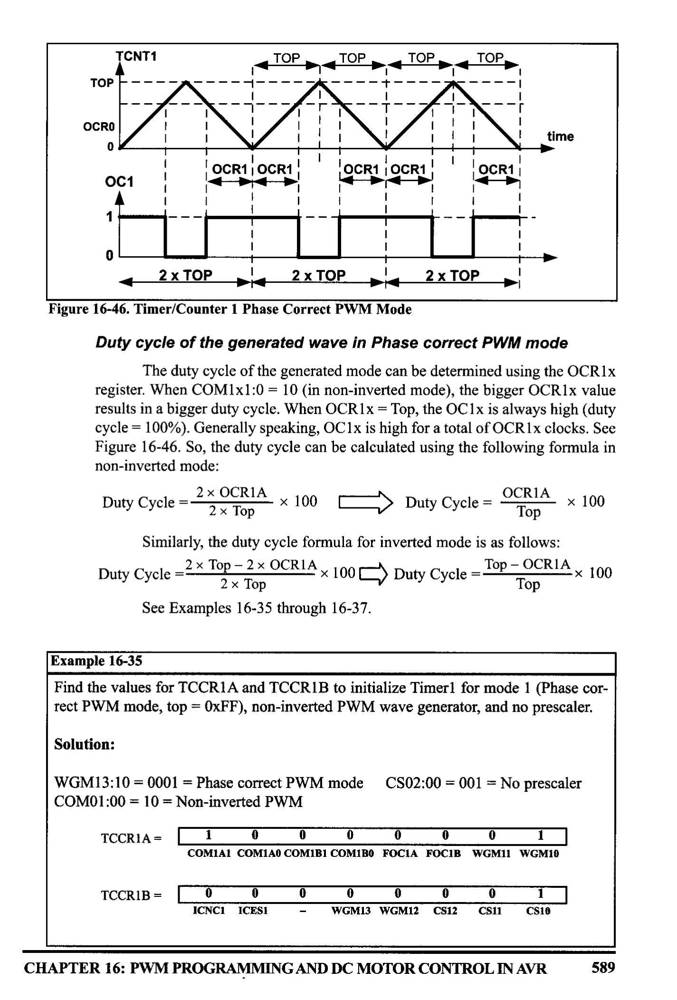
*Description*: Technical diagram and schematic illustration detailing hardware connection topology, signal routing, and circuit operation for Figure 16-46: Timer/Counter 1 Phase Correct PWM Mode.

> **Figure 16-46: Timer/Counter 1 Phase Correct PWM Mode**

Duty cycle of the generated wave in Phase correct PWM mode
The duty cycle of the generated mode can be determined using the OCR1x
register. When COM1x1:0 = 10 (in non-inverted mode), the bigger OCR1x value
results in a bigger duty cycle. When OCR1x = Top, the OCIx is always high (duty
cycle = 100%). Generally speaking, OC1x is high for a total of OCR 1x clocks. See


*Description*: Technical diagram and schematic illustration detailing hardware connection topology, signal routing, and circuit operation for Figure 16-46: So, the duty cycle can be calculated using the following formula in.

> **Figure 16-46: So, the duty cycle can be calculated using the following formula in**

non-inverted mode:
2 × OCRIA
OCRIA
Duty Cycle =-
• × 100
2 x Top
Duty Cycle =
× 100
Top
Similarly, the duty cycle formula for inverted mode is as follows:
Duty Cycle =2x Top - OCRIA OCRIA x 100) Duty Cycle =
Top - OCRIA
-× 100
Top
See Examples 16-35 through 16-37.
Example 16-35
Find the values for TCCRIA and TCCRIB to initialize Timerl for mode 1 (Phase cor-
rect PWM mode, top = OxFF), non-inverted PWM wave generator, and no prescaler.
Solution:
WGM13:10 = 0001 = Phase correct PWM mode
CS02:00 = 001 = No prescaler
COM01:00 = 10 = Non-inverted PWM
TCCRIA =
COMA COMA COMIE COMIRO FOCIA FOCIR VOMI NEMIE
TCCRIB =
INCI ICESI
WGM13 WGM12 CS12
cS11
CS10
CHAPTER 16: PWM PROGRAMMING AND DC MOTOR CONTROL IN AVR
589


<!-- Page 599 -->
### [PDF Page 599]

Example 16-36
ing modes:
(a) Mode 1, non-inverted mode
(c) Mode 2, non-inverted mode
(e) Mode 1, inverted mode
Calculate the OCR1B to generate a wave with duty cycle of 75% in each of the follow-
(b) Mode 3, inverted mode
(d) Mode 2, inverted mode
Solution:
(a) In mode 1, Top = OxFF= 255. So,
75 = OCRIx × 100 / Top → OCR1x = 75 × 255 / 100 = 192 → OCRIB = 191
(b) In mode 3, Top = 0x3FF= 1023. So,
75 = (Top - OCR1x) × 100 / Top → 1023 - OCRIx = 75 × 1023 / 100 = 767
→ OCRIB = 255
(c) In mode 2, Top = OxIFF = 511. So,
75 = OCR1x × 100 / Top → OCRIx = 75 × 511 / 100 = 383 → OCRIB = 383
(d) In mode 2, Top = 0x1FF = 511. So,
75 = (Top - OCR1x) × 100 / Top → 75 = (511 - OCR1x) × 100 / 511
> 511 - OCR1x = 75 × 511 / 100 = 383 → OCRIB = 511 - 383 = 128
(e) In mode 1, Top = OxFF = 255. So,
75 = (Top - OCRIx) × 100 / Top → 75 = (255 - OCR1x) × 100 / 255
→ 255 - OCR1x = 75 × 255 / 100 = 191 → OCRIB = 255 - 191 = 64
Example 16-37
Assuming XTAL = 8 MHz, using non-inverted mode and mode 1, write a program that
generates a wave with frequency of 15,686 Hz and duty cycle of 75%.
Solution:
15,686 = 8M / (510 × N) → N = 8M / (15,686 × 510) = 1 → No prescaler
• INCLUDE "M32DEF.INC"
SBI
DDRD, 5
IDI R16, HIGH (191)
OUT
OCRIAH, R16
LDI
R16, LOW (191)
OUT
OCRIAL, R16

```assembly
LDI R16, 0x81
```

OUT
ICCRIA, R16

```assembly
LDI R16, 0x01
OUT ICCRIB, R16
HERE: RJMP
```

HERE
; PD5 = output
i from Example 16-36
; Temp = 0x00
; R16 = 191
¡OCRIA = 191
¡ from Example 16-35
¡ COMIA = non-inverted
; WGM = mode 1, clock = no
scaler
590


<!-- Page 600 -->
### [PDF Page 600]

Generating waves with different frequencies (case study)
As we mentioned earlier, the frequency of the generated wave is equal to
Foscillator /(2N × Top). In modes 1, 2, and 3, the Top value is fixed. Therefore, in
these modes the only way to change the frequency of the generated wave is to
change N (the prescaler). In Figure 16-47, you see the different frequencies that
can be generated using modes 1, 2, and 3.
Prescaler
Mode = 1
Mode = 2
1
Foscillator
510
Foscillator
1*1022
1:8
Foscillator.
8*510
Foscillator
8*1022
1:64
Foscillator
64*510
Foscillator
64*1022
1:256
Foscillator
256*510
Foscillator
256*1022
Mode = 3
Foscillator
1*2046
Foscillator
8*2046
Fosicillator
64*2046
Foscillator
256*2046
1:1024
Foscillator
1024*510
Foscilator
1024*1022
Foscillator
1024*2046

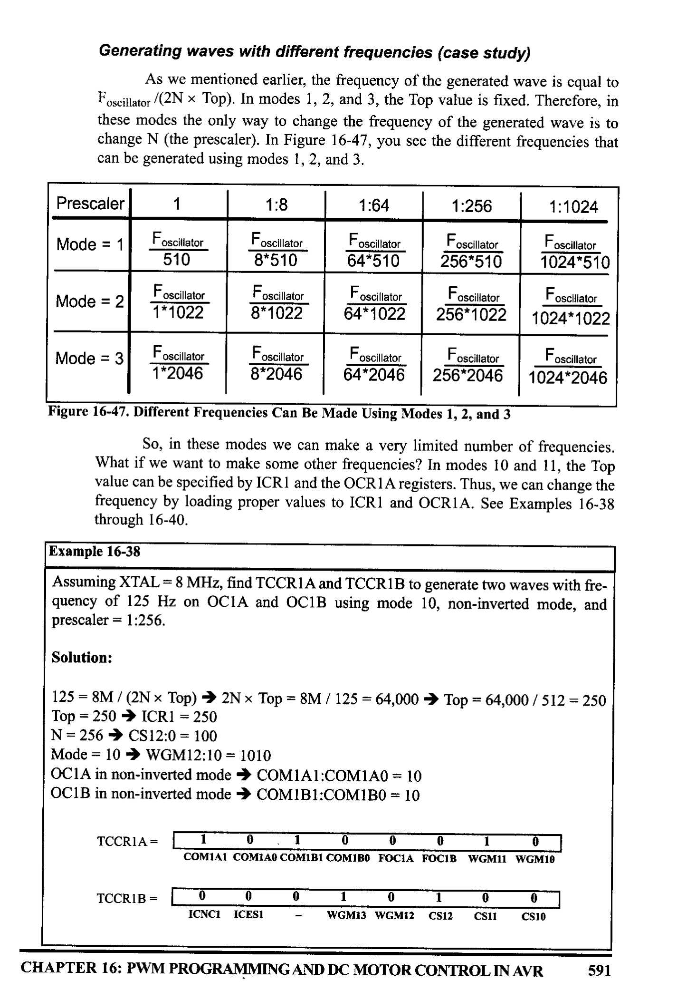
*Description*: Technical diagram and schematic illustration detailing hardware connection topology, signal routing, and circuit operation for Figure 16-47: Different Frequencies Can Be Made Using Modes 1, 2, and 3.

> **Figure 16-47: Different Frequencies Can Be Made Using Modes 1, 2, and 3**

So, in these modes we can make a very limited number of frequencies.
What if we want to make some other frequencies? In modes 10 and 11, the Top
value can be specified by ICR1 and the OCRIA registers. Thus, we can change the
frequency by loading proper values to ICR1 and OCRIA. See Examples 16-38
through 16-40.
Example 16-38
Assuming XTAL = 8 MHz, find TCCRIA and TCCRIB to generate two waves with fre-
quency of 125 Hz on OCIA and OCIB using mode 10, non-inverted mode, and
prescaler = 1:256.
Solution:
125 = 8M / (2N x Top) → 2N × Top = 8M / 125 = 64,000 → Top = 64,000 / 512 = 250
Top = 250 → ICRI = 250
N= 256 → CS12:0 = 100
Mode = 10 → WGM12:10 = 1010
OCIA in non-inverted mode → COM1A1:COM1A0 = 10
OCIB in non-inverted mode → COMIB1:COM1B0 = 10
TCCRIA =
TCCRIB =
ICNCI ICESI
WGMI3 WGMI2 CS12
CHAPTER 16: PWM PROGRAMMING AND DC MOTOR CONTROL IN AVR
591


<!-- Page 601 -->
### [PDF Page 601]

Example 16-39
Calculate the OCR1x to generate the following waves in each of the following modes:
(a) Mode 11, inverted mode, OCRIA=50, duty cycle = 30%
(b) Mode 10, non-inverted mode, ICR1 = 250, duty cycle = 30%
(c) Mode 10, non-inverted mode, ICR1 = 250, duty cycle = 60%
Solution:
(a) In mode 11, Top = OCRIA = 50. so,
30 = (Top - OCRIB) × 100 / Top → 50 - OCRIB = 50 × 30 / 100 = 15 → OCRIB = 35
(b) In mode 10, Top = ICRI = 250. So,
30 = OCRIx × 100 / Top → OCR1x = 30 × 250 / 100 = 75 → OCRIx = 75
(c) In mode 10, Top = ICRI = 250. So,
60 = OCRIx × 100 / Top → OCR1x = 60 × 250 / 100 → OCRIx = 150
Example 16-40
Assume XTAL = 8 MHz. Using mode 10 write a program that generates waves with
duty cycles of 30% and 60% on the OCIA and OCIB pins, respectively. Frequency of
the generated waves should be 125 Hz.
Solution:
• INCLUDE "M32DEF.INC"

```assembly
LDI R16, LOW (RAMEND)
OUT SPL, R16
```

IDI R16, HIGH (RAMEND)

```assembly
OUT SPH, R16
```

¡initialize stack pointer

```assembly
SBI DDRD, 5
SBI DDRD, 4
```

LDI
R16, 0
OUT
• OCRIAH, R16
LDI
R16, 75
OUT
OCRIAL, R16
LDI
R16,150
OUT
OCR1BL, R16
LDI
R16,250
OUT
ICRIL, R16
LDI
R16, 0XA2
OUT
ICCRIA, R16
IDI R16,0x14

```assembly
OUT TCCRIB, R16
; PDS (OCIA) = output
;PD4 (OCIB) = output
; Temp = 0
; from Example 16-39
¡OCRIAL = 75, OCRIAH = Temp = 0
```

¡ from Example 16-39
¡OCRIBL = 150, OCRIBH = Temp = 0
¡ ICRIL = 250, ICRIH = Temp = O
;from Example 16-38
¡ COMIA = non-inverted, COMIB = non-inv.
; from Example 16-38
; WGM = mode 10, clock = no scaler
HERE: RJMP HERE
¡wait here forever
592


<!-- Page 602 -->
### [PDF Page 602]

If we use mode 11 instead of mode 10, OCRIA is buffered, and the con-
tents of the buffer will be loaded into OCRIA, when the timer reaches its top
value. In mode 11 we can only use the OC1B wave generator and we cannot use
the OCIA wave generator since the OCRIA register is used for defining the Top
value.
16-bit PWM programming in C
Examples 16-41 through 16-49 show the C versions of the earlier programs.
Example 16-41 (C version of Example 16-25)
Assuming XTAL = 8 MHz, using non-inverted mode and mode 5, write a program that
generates a wave with frequency of 31,250 Hz and duty cycle of 75%.
Solution:
#include "avr/io.h"
int main
( )
DDRD |= (1<<5); //PD5 = output
OCRIAH = 0;
//Temp = 0
OCRIAL =
191; |/OCRIA = 191
TCCRIA = 0x81; //COMIA = non-inverted
TCCRIB = 0x09; //WGM = mode 5, clock = no
• scaler

```c
while (1);
```

return 0;
Example 16-42 (C version of Example 16-26)
Assuming XTAL = 8 MHz, using non-inverted mode and mode 7, write a program that
generates a wave with frequency of 7812.5 Hz and duty cycle of 75%.
Solution:
#include "avr/io.h"
int main
")
DDRD |= (1<<5); //PD5 = output
OCRIAH = 767>>8;//OCR1AH = HIGH (767)
OCRIAL = 767; //OCRIAL = IOW (767)
ICCRIA = 0x83; //COMIA = non-inverted
ICCRIB = 0x09; //WGM = mode 7, clock = no scaler

```c
while (1);
```

return 0;
CHAPTER 16: PWM PROGRAMMING AND DC MOTOR CONTROL IN AVR
593


<!-- Page 603 -->
### [PDF Page 603]

Example 16-43 (C version of Example 16-27)
Assuming XTAL = 8 MHz, using non-inverted mode and mode 6, write a program that
generates a wave with frequency of 1953 Hz and duty cycle of 60%.
Solution:
#include
int main
"avr/io.h"
()
DDRD |= (1<<5); //PD5 as output
OCRIAH = 306>>8;//OCR1AH
= HIGH (306)
OCRIAL = 306;
//OCRIAL = LOW (306)
TCCRIA = 0x82;
//COMIA = non-inverted
TCCR1B = 0X0A;
1/WGM = mode 6, clock = no prescaler

```c
while (1);
```

return 0;
Example 16-44 (C version of Example 16-28)
Rewrite Example 16-43 using inverted mode.
Solution:
#include "avr/io.h"
int main ()
DDRD |= (1<<5); //PD5 as output
OCRIAH = 204>>8;//OCR1AH = HIGH (204) = 0
OCRIAL = 204;
//OCRIAL = LOW(204) = 204
ICCRIA = 0xB2; //COMIA = inverted
ICCRIB = 0x0A; //WGM = mode 6, clock = no scaler

```c
while (1);
```

return 0;
Example 16-45 (C version of Example 16-29)
Rewrite the program of Example 16-29 using C.
Solution:
#include "avr/io.h"
#include
"avr/interrupt.h"
ISR
(TIMERI
LOVE
vect)
OCRIAH = 0;
OCRIAL = ~OCRIAL;
}
int main ( )
DDRD |= (1<<5); //PD5 as output
594


<!-- Page 604 -->
### [PDF Page 604]

Example 16-45 (Cont.)
OCRIAH = 0;
//Temp = 0
OCRIAL = 31;
//OCRIA = 31
ICCRIA = 0x81;
//COMIA = non-inverted
ICCRIB = 0x0A; //WGM = mode 5, clock
=
no scaler
TIMSK = (1<<TOIE1);
sei ( );

```c
while (1);
```

return 0;
}
Example 16-46 (C version of Example 16-32)
Assume XTAL = 8 MHz. Using mode 14 write a program that generates a wave with
duty cycle of 20% and frequency of 80 kHz.
Solution:
#include "avr/io.h"
int main
()
DDRD |= (1<<5); //PD5 as output
ICR1H = 0x00;
//Temp = 0x00
ICRIL = 99;
//ICR1 = 99
OCRIAH = 0;
//OCRIAH = 0
OCRIAL = 19;
//OCRIA = 19
TCCRIA = 0x82;
//COMIA = non-inverted
TCCRIB = 0x19; //WGM = mode 14,
clock = no scaler

```c
while (1);
```

return 0;
}
Example 16-47 (C version of Example 16-34)
Assume XTAL = 8 MHz. Using mode 15 write a program that generates a wave with
duty cycle of 20% and frequency of 64 kHz.
Solution:
#include "avr/io.h"
int main ()
{
DDRD |= (1<<4); //PD4 as output
OCRIAH = 0;
//Temp = 0
OCRIAL = 124;
//OCRIA = 124
OCRIBH = 0;
//Temp = 0
OCRIBL = 24;
//OCRIB = 24
TCCRIA = 0x23;
//COM1B = non-inverted
TCCRIB = 0x19;
//WGM = mode 15, clock = no scaler

```c
while (1);
```

return 0;
CHAPTER 16: PWM PROGRAMMING AND DC MOTOR CONTROL IN AVR
595


<!-- Page 605 -->
### [PDF Page 605]

Example 16-48 (C version of Example 16-37)
Assuming XTAL = 8 MHz, using non-inverted mode and mode 1, write a program that
generates a wave with frequency of 15,686 Hz and duty cycle of 75%.
Solution:
#include "avr/io.h"
int main
DDRD |= (1<<5); //PD5 as output
OCRIAH
= 0;
//Temp = 0
OCRIAL
, = 191; //OCRIA = 191
ICCRIA = 0x23; //COMIA = non-inverted
TCCRIB = 0x01; //WGM = mode 1, clock = no prescaler

```c
while (1);
```

return 0;
Example 16-49 (C version of Example 16-40)
Assume XTAL = 8 MHz. Using mode 10 write a program that generates waves with
duty cycles of 30% and 60% on the OCIA and OCIB pins, respectively. The frequen-
cy of the generated waves should be 125 Hz.
Solution:
#include "avr/io.h"
int main ( )

```c
DDRD = DDRD| (1<<5) | (1<<4); //PD4 and PD5 as output
OCRIAH = 0x00; //Temp = 0
OCRIAL = 75;
//OCRIA = 75
OCRIBL = 150; //OCRIB = 150
ICRIL = 250;
//ICR1 = 250
TCCRIA = 0XA2; |/COMIA = non-inverted, COMIB = non-inv.
TCCRIB = 0x14;
//WGM = mode 10, clock = no prescaler
while (1);
```

return 0;
}

### Review Questions

1. True or false. We can associate each of the pins with each of the waveform
generators.
2. True or false. In PWM modes (Fast PWM and Phase correct PWM) we can
change the duty cycle of the generated wave.
3. True or false. In inverted Phase correct PWM mode, the duty cycle increases
when the OCRIA value increases.
596


<!-- Page 606 -->
### [PDF Page 606]


## SECTION 16.4: DC MOTOR CONTROL USING PWM

To generate the PWM waves for controlling the DC motor we can use the
PWM features of AVR. See Examples 16-50 and 16-51.
Example 16-50 (Example 16-3 using AVR PWM features)
Refer to the figure in this example. Write a program to monitor the status of the switch
and perform the following:
(a) If PORTA.7 = 1, the DC motor moves with 25% duty cycle pulse.
(b) IF PORTA.7 = 0, the DC motor moves with 50% duty cycle pulse.
4.7k
1N4004 Z

## 0.1 uF

MOTOR
+5V
·330
OPTOISOLATOR
PA.7
AVR
PB.3 (OCO)
10к
→+12V
TIP120
$ 100K
Solution:
For driving motors it is preferable to use the Phase correct PWM mode.
OCRO / 255 = duty cycle / 100 → OCRO = 255 x duty cycle / 100
For duty cycle = 25% → OCRO = 255 × 25 / 100 = 64
For duty cycle = 50% → OCRO = 255 × 50 / 100 = 127
In this example we generate waves with frequency of 245 Hz. To do so,
245 = 8M / (510 x N) → N = 8M / (245 x 510) = 64 → Prescaler = 64
TCCRO =
0
FOCO
WGM00 COM01
COMOO WGM01 CS02
CS01
CS00
• INCLUDE "M32DEF. INC"
SBI
DDRB, 3
SBI
PORTA, 7
LDI
R16, 0x73
OUT
TCCRO, R16
L1:

```assembly
SBIC PINA, 7
```

LDI
R16, 64

```assembly
SBIS PINA, 7
```

LDI
R16,127

```assembly
OUT OCRO, R16
```

RUMP LI
¡ make PB3 output
¡activate pull-up of PA7
;N = 64, Phase correct PWM, inverted
¡if PINA.7 is zero then R16 = 127
¡OCRO = R16
i jump It
CHAPTER 16: PWM PROGRAMMING AND DC MOTOR CONTROL IN AVR
597


<!-- Page 607 -->
### [PDF Page 607]

Example 16-51
Write a program that gradually changes the speed of a DC motor from 50% to 100%.
Use information given in Example 16-50.
Solution:
• INCLUDE "M32DEF. INC"
LDI
R16, HIGH (RAMEND)
OUT
SPH, R16
LDI
R16, LOW (RAMEND)
OUT
SPL, R16
¡ initialize stack pointer
DDRB, 3
; make PB3 output
R16, 0x73
¡from Example 16-50
TCCRO, R16
;N = 64, Phase correct PWM, inverted
R20, 127
OCRO, R20
¡ OCRO = R17

```assembly
RCALL DELAY
```

INC R20
; increment R20

```assembly
BRNE L1
```

¡jump Il if R20 is not zero
HERE: RJMP HERE
DC motor control and PWM using C
Examples 16-52 and 16-53 show the C versions of the earlier programs.
Example 16-52 (C version of Example 16-50)
Write a program to monitor the status of the switch and perform the following:
(a) If PORTA.7 = 1, the DC motor moves with 25% duty cycle pulse.
(b) If PORTA.7 = 0, the DC motor moves with 50% duty cycle pulse.
Solution:
#include "avr/io.h"
int main (

```c
DDRB = 0x08;
PORTA = 0x80;
TCCRO = 0x73;
//PB3 as output
```

I/pull-up resistor
//Phase correct PWM, inverted, N = 64

```c
while (1)
```

switch ( (PINA&0×80)/
case 0: OCRO = 64; break;
case 1: OCRO =
127; break;
1/25%
1/50%
return 0;
}
598


<!-- Page 608 -->
### [PDF Page 608]

Example 16-53 (C version of Example 16-51)
Write a program that gradually changes the speed of a DC motor from 50% to 100%.
Solution:
#define F_CPU 8000000UL //XIAL = 8 MHz
#include
. "āvr/io.h"
#include "util/delay.h"
int main
( )
unsigned char i;

```c
DDRB = 0x08;
1 = 121;
OCRO = 127;
TCCRO = 0x73;
//PB3 as output
//duty cycle = 50%
//Phase correct PWM, inverted, N = 64
while 11 != 0)
OCRO = i;
```

_delay_ms (25) ;
/use AVR Studio library delay
I++;
While (1):
return 0;
}

### SUMMARY

In the first section, The AVR was interfaced with DC motors. A typical DC
motor will take electronic pulses and convert them to mechanical motion. This
chapter showed how to interface the AVR with a DC motor. Then, simple
Assembly and C programs were written to show the concept of PWM.
We discussed the PWM features of AVR timers in sections two and three,
and in the last section we used the PWM feature of AVR to control DC motors.

### PROBLEMS


## SECTION 16.1: DC MOTOR INTERFACING AND PWM

1. Which motor is best for moving a wheel exactly 90 degrees?
2. True or false. Current dissipation of a DC motor is proportional to the load.
3. True or false. The RPM of a DC motor is the same for no-load and loaded.
4. The RPM given in data sheets is for
_ (no-load, loaded).
5. What is the advantage of DC motors over AC motors?
6. What is the advantage of stepper motors over DC motors?
7. True or false. Higher load on a DC motor slows it down if the current and volt-
age supplied to the motor are fixed.
8. What is PWM, and how is it used in DC motor control?
9. A DC motor is moving a load. How do we keep the RPM constant?
10. What is the advantage of placing an optoisolator between the motor and the
microcontroller?
CHAPTER 16: PWM PROGRAMMING AND DC MOTOR CONTROL IN AVR
599


<!-- Page 609 -->
### [PDF Page 609]


## SECTION 16.2: PWM MODES IN 8-BIT TIMERS

11. Using TimerO and non-inverted Fast PWM mode, write a program that gener-
ates a wave with frequency of 62.5 kHz and duty cycle of 60%. Assume XTAL
= 16 MHz.
12. Using Timer0 and inverted Fast PWM mode, write a program that generates a
wave with frequency of 46.875 kHz and duty cycle of 70%. Assume XTAL =
12 MHz.
13. Using Timer and inverted Fast PWM mode, write a program that generates a
wave with frequency of 1953 Hz and duty cycle of 20%. Assume XTAL = 4
MHz.
14. Using Timer0 and non-inverted Fast PWM mode, write a program that gener-
ates a wave with frequency of 15.25 Hz and duty cycle of 10%. Assume XTAL
= 1 MHz.
15. Using Timer and inverted Phase correct PWM mode, write a program that
generates a wave with frequency of 1960 Hz and duty cycle of 20%. Assume
XTAL = 1 MHz.
16. Using TimerO and inverted Phase correct PWM mode, write a program that
generates a wave with frequency of 1.96 kHz and duty cycle of 95%. Assume
XTAL = 1 MHz.
17. Using Timer2 and non-inverted Phase correct PWM mode, write a program
that generates a wave with frequency of 61.3 Hz and duty cycle of 19%.
Assume XTAL = 8 MHz.
18. Using Timer2 and inverted Phase correct PWM mode, write a program that
generates a wave with frequency of 245 Hz and duty cycle of 82%. Assume
XTAL = 1 MHz.

## SECTION 16.3: PWM MODES IN TIMER1

19. Using mode 6 of Timerl and non-inverted Fast PWM, write a program that
generates a wave with frequency of 15,625 Hz and duty cycle of 40%. Assume
XIAL = 8 MHz.
20. Using mode 7 of Timerl and inverted Fast PWM, write a program that gener-
ates a wave with frequency of 3906 Hz and duty cycle of 45%. Assume XTAL
= 4 MHz.
21. Using mode 7 of Timerl and inverted Fast PWM, write a program that gener-
ates a wave with frequency of 1953 Hz and duty cycle of 35%. Assume XTAL
= 16 MHz.
22. Using mode 6 of Timerl and non-inverted Fast PWM, write a program that
generates a wave with frequency of 1953 Hz and duty cycle of 50%. Assume
XTAL = 8 MHz.
23. Using mode 1 of Timerl and inverted Phase correct PWM, write a program
that generates a wave with frequency of 976.5 Hz and duty cycle of 35%.
Assume XTAL = 4 MHz.
24. Using mode 2 of Timerl and non-inverted Phase correct PWM, write a pro-
gram that generates a wave with frequency of 30.5 Hz and duty cycle of 25%.
Assume XIAL = 8 MHz.
600


<!-- Page 610 -->
### [PDF Page 610]

25. Using mode 1 of Timerl and non-inverted Phase correct PWM, write a pro-
gram that generates a wave with frequency of 245 Hz and duty cycle of 19%.
Assume XTAL = 8 MHz.
26. As shown in the figure, a switch is
connected to PBO. Using mode 2 of
Mega32
Timerl and non-inverted Phase cor-
SW1
rect PWM, write a program that gen-
crates a wave with frequency of
PBO
PD5
(OC1A)
978 Hz. When the switch is closed the
duty cycle is 20%, and when it is open
the duty cycle is 85%. Assume XTAL
= 8 MHz.

### ANSWERS TO REVIEW QUESTIONS


## SECTION 16.1: DC MOTOR INTERFACING AND PWM

1. True
2. False
3. Because microcontroller/digital outputs lack sufficient current to drive the DC motor, we need
a driver.
4. By reversing the polarity of voltages connected to the leads
5. The DC motor is stalled if the load is beyond what it can handle.

## SECTION 16.2: PWM MODES IN 8-BIT TIMERS

1. True
2. False
3. True
4. False
5. Phase correct PWM

## SECTION 16.3: PWM MODES IN TIMERI

1. False
2. True
3. False
CHAPTER 16: PWM PROGRAMMING AND DC MOTOR CONTROL IN AVR
601


