# Chapter 17: SPI Protocol and MAX7221 Display Interfacing

> **Textbook**: The AVR Microcontroller and Embedded Systems using Assembly and C

> **PDF Page Range**: 611 - 635


---


<!-- Page 611 -->
### [PDF Page 611]

CHAPTER 17
SPI PROTOCOL AND
MAX7221 DISPLAY
INTERFACING
OBJECTIVES
Upon completion of this chapter, you will be able to:
>>
>>
>>
>>
>>
>>
>>
>>
Understand the Serial Peripheral Interfacing (SPI) protocol
Explain how the SPI read and write operations work
Examine the SPI pins SDO, SDI, CE, and SCLK
Code programs in Assembly and C for SPI
Explain how 7-segment displays work
Explain the function of the MAX7221 pins
Explain the function of the MAX7221 registers
Understand the interfacing of the MAX7221 to the AVR
Code programs to display numbers in Assembly and C
603


<!-- Page 612 -->
### [PDF Page 612]

This chapter discusses the SPI bus. In Section 17.1 we examine the differ-
ent pins of SPi protocol and then focus on the concept of clock polarity. We dis-
tinguish differences between single-byte read/write and multibyte burst read/
write. Section 17.2 discusses SPI programming in AVR using both Assembly and
C. We will examine how to interface MAX7221 to the AVR in Section 17.3.

## SECTION 17.1: SPI BUS PROTOCOL

The SPI (serial peripheral interface) is a bus interface connection incorpo-
rated into many devices such as ADC, DAC, and EEPROM. In this section we
examine the pins of the SPI bus and show how the read and write operations in the
SPI work.
The SPI bus was originally started by Motorola Corp. (now Freescale), but
in recent years has become a widely used standard adapted by many semiconduc-
tor chip companies. SPI devices use only 2 pins for data transfer, called SDI (Din)
and SDO (Dout), instead of the 8 or more pins used in traditional buses. This
reduction of data pins reduces the package size and power consumption drastical-
ly, making them ideal for many applications in which space is a major concern.
The SPI bus has the SCLK (shift clock) pin to synchronize the data transfer
between two chips. The last pin of the SPI bus is CE (chip enable), which is used
to initiate and terminate the data transfer. These four pins, SDI, SDO, SCLK, and
CE, make the SPI a 4-wire interface. See Figure 17-1. In many chips the SDI,
SDO, SCLK, and CE signals are alternatively named as MOSI, MISO, SCK, and
SS as shown in Figure 17-2 (compare with Figure 17-1). There is also a widely
used standard called a 3-wire interface bus. In a 3-wire interface bus, we have
SCLK and CE, and only a single pin for data transfer. The SPI 4-wire bus can
become a 3-wire interface when the SDI and SDO data pins are tied together.
However, there are some major differences between the SPI and 3-wire devices in
the data transfer protocol. For that reason, a device must support the 3-wire proto-
col internally in order to be used as a 3-wire device. Many devices such as the
DS1306 RTC (real-time clock) support both SPI and 3-wire protocols.
DO-
-DO
SD(
SCLK—
-SCLK
CE
•CE
D7
-D7
HC
STROBE
RW-

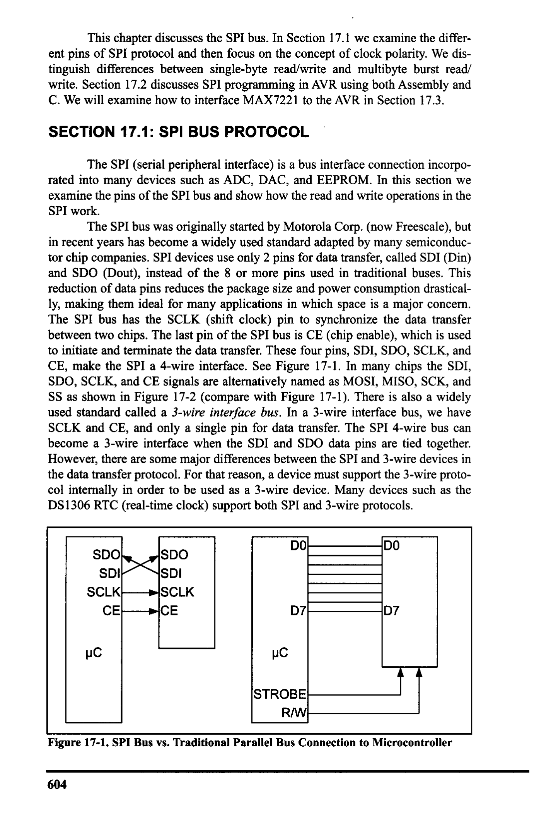
*Description*: Technical diagram and schematic illustration detailing hardware connection topology, signal routing, and circuit operation for Figure 17-1: SPI Bus vs. Traditional Parallel Bus Connection to Microcontroller.

> **Figure 17-1: SPI Bus vs. Traditional Parallel Bus Connection to Microcontroller**

604


<!-- Page 613 -->
### [PDF Page 613]

How SPI works
SPI consists of two shift registers, one in the master and the other in the
slave side. Also, there is a clock generator in the master side that generates the
clock for the shift registers.
As you can see in Figure 17-2, the serial-out pin of the master shift regis-
ter is connected to the serial-in pin of the slave shift register by MOSI (Master Out
Slave In), and the serial-in pin of the master shift register is connected to the seri-
al-out pin of the slave shift register by MISO (Master In Slave Out). The master
clock generator provides clock to the shift registers in both the master and slave.
The clock input of the shift registers can be falling- or rising-edge triggered. This
will be discussed shortly.
In SPI, the shift registers are 8 bits long. It means that after 8 clock pulses,
the contents of the two shift registers are interchanged. When the master wants to
send a byte of data, it places the byte in its shift register and generates & clock puls-
es. After 8 clock pulses the byte is transmitted to the other shift register. When the
master wants to receive a byte of data, the slave side should place the byte in its
shift register, and after 8 clock pulses the data will be received by the master shift
register. It must be noted that SPI is full duplex, meaning that it sends and receives
data at the same time.
SPI read and write
In connecting a device with an SPI bus to a microcontroller, we use the
microcontroller as the master while the SPI device acts as a slave. This means that
the microcontroller generates the SCLK, which is fed to the SCLK pin of the SPI
Data Bus
Data Bus
MOSI
SPI Shift Register
SPI Shift Register
MISO
Clock
Generator
SCK
MASTER

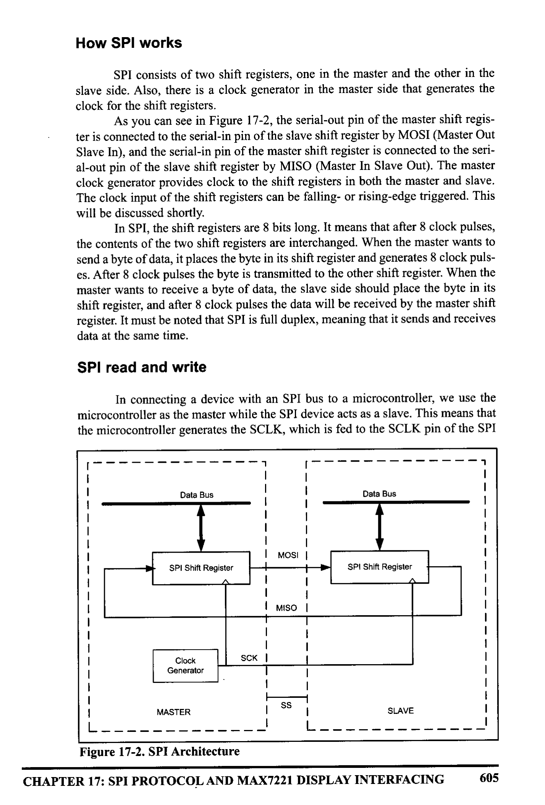
*Description*: Technical diagram and schematic illustration detailing hardware connection topology, signal routing, and circuit operation for Figure 17-2: SPI Architecture.

> **Figure 17-2: SPI Architecture**

sS
SLAVE
CHAPTER 17: SPI PROTOCOL AND MAX7221 DISPLAY INTERFACING
605


<!-- Page 614 -->
### [PDF Page 614]

device. The SPI protocol uses SCLK to synchronize the transfer of information
one bit at a time, where the most-significant bit (MSB) goes in first. During the
transfer, the CE must stay HIGH. The information (address and data) is transferred
between the microcontroller and the SPI device in groups of 8 bits, where the
address byte is followed immediately by the data byte. To distinguish between the
read and write operations, the D7 bit of the address byte is always 1 for write,
while for the read, the D7 bit is LOW, as we will see next.
Clock polarity and phase in SPl device
As we mentioned before in USART communication, transmitter and
receiver must agree on a clock frequency. In SPI communication, the master and
slave(s) must agree on the clock polarity and phase with respect to the data.
Freescale names these two options as CPOL (clock polarity) and CPHA (clock
phase), respectively, and most companies like Atmel have adopted that conven-
tion. At CPOL= 0 the base value of the clock is zero, while at CPOL = 1 the base
value of the clock is one. CPHA = 0 means sample on the leading (first) clock
edge, while CPHA = 1 means sample on the trailing (second) clock. Notice that if
the base value of the clock is zero, the leading (first) clock edge, is the rising edge
but if the base value of the clock is one, the leading (first) clock edge is falling
edge. See Table 17-1 and Figure 17-3.
Steps for writing data to an SPI device
In accessing SPI devices, we have two modes of operation: single-byte and
multibyte. We will explain each one separately.

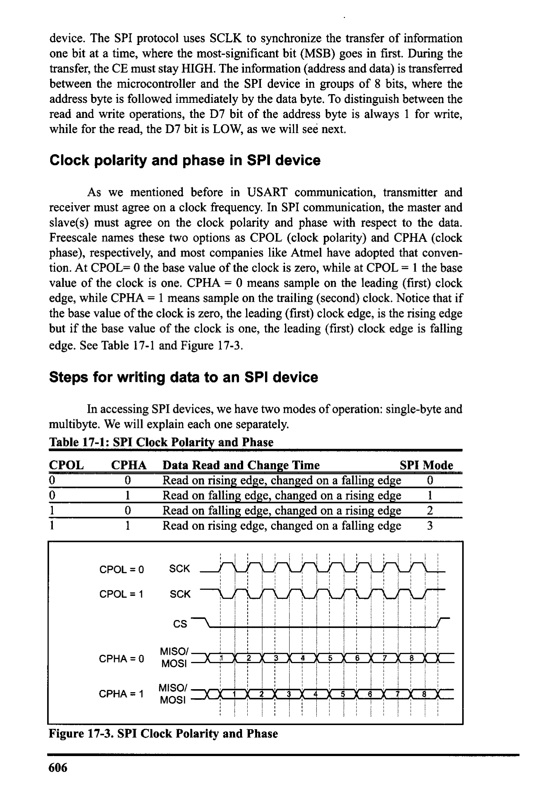
*Description*: Structured reference table listing operational parameters, instruction execution cycles, memory address mapping, or feature comparison for Table 17-1: SPI Clock Polarity and Phase.

> **Table 17-1: SPI Clock Polarity and Phase**

CPOL
CPHA
Data Read and Change Time
SPI Mode
0
Read on rising edge, changed on a falling edge
1
Read on falling edge, changed on a rising edge
Read on falling edge, changed on a rising edge
1
1
Read on rising edge, changed on a falling edge
3
CPOL = 0
CPOL = 1
CPHA = 0
CPHA = 1
SCK
SCK
CS
MISO/ -
MOSI
MISO/ -
MOSI


*Description*: Technical diagram and schematic illustration detailing hardware connection topology, signal routing, and circuit operation for Figure 17-3: SPI Clock Polarity and Phase.

> **Figure 17-3: SPI Clock Polarity and Phase**

606


<!-- Page 615 -->
### [PDF Page 615]

Single-byte write
The following steps are used to send (write) data in single-byte mode for
SPI devices, as shown in Figure 17-4:
1. Make CE = 0 to begin writing.
2. The 8-bit address is shifted in, one bit at a time, with each edge of SCLK.
Notice that A7 = 1 for the write operation, and the A7 bit goes in first.
3. After all 8 bits of the address are sent in, the SPI device expects to receive
the data belonging to that address location immediately.
4. The 8-bit data is shifted in one bit at a time, with each edge of the SCLK.
5. Make CE = 1 to indicate the end of the write cycle.
CE
SCLK
SDO
SDI —47=1 A6 A5A4 A3 A2 A1A0 D7D6 D5 D4 D3 | D2 | D1 | DO

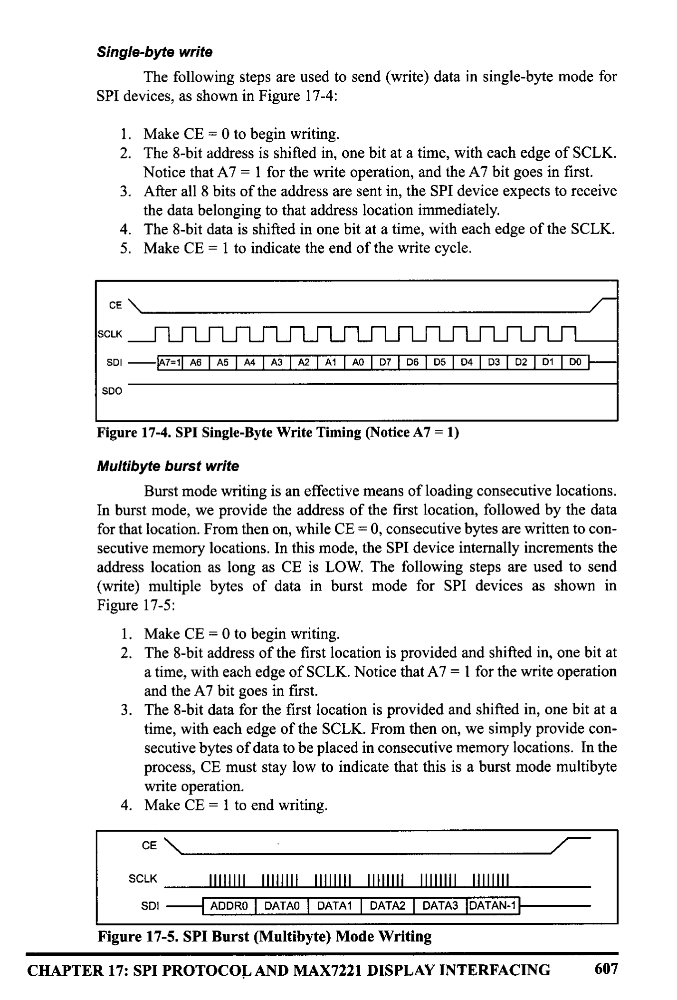
*Description*: Technical diagram and schematic illustration detailing hardware connection topology, signal routing, and circuit operation for Figure 17-4: SPI Single-Byte Write Timing (Notice A7 = 1).

> **Figure 17-4: SPI Single-Byte Write Timing (Notice A7 = 1)**

Multibyte burst write
Burst mode writing is an effective means of loading consecutive locations.
In burst mode, we provide the address of the first location, followed by the data
for that location. From then on, while CE = 0, consecutive bytes are written to con-
secutive memory locations. In this mode, the SPI device internally increments the
address location as long as CE is LOW. The following steps are used to send
(write) multiple bytes of data in burst mode for SPI devices as shown in


*Description*: Technical diagram and schematic illustration detailing hardware connection topology, signal routing, and circuit operation for Figure 17-5.

> **Figure 17-5**

1. Make CE = 0 to begin writing.
2. The 8-bit address of the first location is provided and shifted in, one bit at
a time, with each edge of SCLK. Notice that A7 = 1 for the write operation
and the A7 bit goes in first.
3. The 8-bit data for the first location is provided and shifted in, one bit at a
time, with each edge of the SCLK. From then on, we simply provide con-
secutive bytes of data to be placed in consecutive memory locations. In the
process, CE must stay low to indicate that this is a burst mode multibyte
write operation.
4. Make CE = 1 to end writing.
CE
SCLK
SDI
[ADDRO DATAO | DATA1 | DATA2 | DATA3 DATAN-1


*Description*: Technical diagram and schematic illustration detailing hardware connection topology, signal routing, and circuit operation for Figure 17-5: SPI Burst (Multibyte) Mode Writing.

> **Figure 17-5: SPI Burst (Multibyte) Mode Writing**

CHAPTER 17: SPI PROTOCOL AND MAX7221 DISPLAY INTERFACING
607


<!-- Page 616 -->
### [PDF Page 616]

Steps for reading data from an SPI device
In reading SPI devices, we also have two modes of operation: single-byte
and multibyte. We will explain each one separately.
Single-byte read
The following steps are used to get (read) data in single-byte mode from
SPI devices, as shown in Figure 17-6:
1. Make CE = 0 to begin reading.
2. The 8-bit address is shifted in one bit at a time, with each edge of SCLK.
Notice that A7 = 0 for the read operation, and the A7 bit goes in first.
3. After all 8 bits of the address are sent in, the SPI device sends out data
belonging to that location.
4. The 8-bit data is shifted out one bit at a time, with each edge of the
SCLK.
5. Make CE = 1 to indicate the end of the read cycle.
CE
SDI -
SDO
A7=0 AG AS AA AS A2 | AI AO
7 T D6 | 05 / DA | D3 | D2 | D1 | 00]

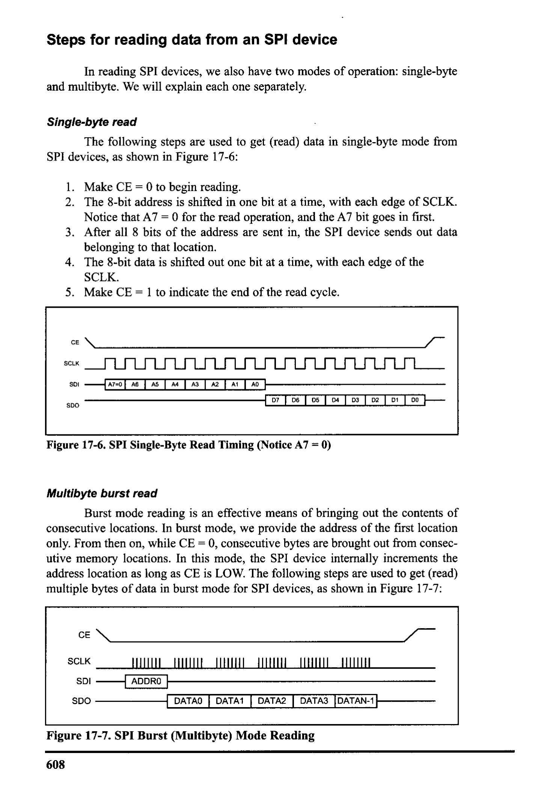
*Description*: Technical diagram and schematic illustration detailing hardware connection topology, signal routing, and circuit operation for Figure 17-6: SPI Single-Byte Read Timing (Notice A7 = 0).

> **Figure 17-6: SPI Single-Byte Read Timing (Notice A7 = 0)**

Multibyte burst read
Burst mode reading is an effective means of bringing out the contents of
consecutive locations. In burst mode, we provide the address of the first location
only. From then on, while CE = 0, consecutive bytes are brought out from consec-
utive memory locations. In this mode, the SPI device internally increments the
address location as long as CE is LOW. The following steps are used to get (read)
multiple bytes of data in burst mode for SPI devices, as shown in Figure 17-7:
CE
SCLK
SDI
SDO
[ADDRO
DATAO | DATA1 | DATA2 DATA3 DATAN-1


*Description*: Technical diagram and schematic illustration detailing hardware connection topology, signal routing, and circuit operation for Figure 17-7: SPI Burst (Multibyte) Mode Reading.

> **Figure 17-7: SPI Burst (Multibyte) Mode Reading**

608


<!-- Page 617 -->
### [PDF Page 617]

1. Make CE = 0 to begin reading.
2. The 8-bit address of the first location is provided and shifted in, one bit at
a time, with each edge of SCLK. Notice that A7 = 0 for the read operation,
and the A7 bit goes in first.
3. The 8-bit data for the first location is shifted out, one bit at a time, with
each edge of the SCLK. From then on, we simply keep getting consecutive
bytes of data belonging to consecutive memory locations. In the process,
CE must stay LOW to indicate that this is a burst mode multibyte read
operation.
4. Make CE = 1 to end reading.

### Review Questions

1. True or false. The SPI protocol writes and reads information in 8-bit chunks.
2. True or false. In SPI, the address is immediately followed by the data.
3. True or false. In an SPI write cycle, bit A7 of the address is LOW.
4. True or false. In an SPI write, the LSB goes in first.
5. State the difference between the single-byte and burst modes in terms of the
CE signal.

## SECTION 17.2: SPI PROGRAMMING IN AVR

Most AVRs, including ATmega family members, support SPI protocols. In
AVR three registers are associated with SPI. They are SPSR (SPI Status Register),
SPCR (SPI Control Register), and SPDR (SPI Data Register). In this section we
will focus on these registers.
SPSR (SPI Status Register)

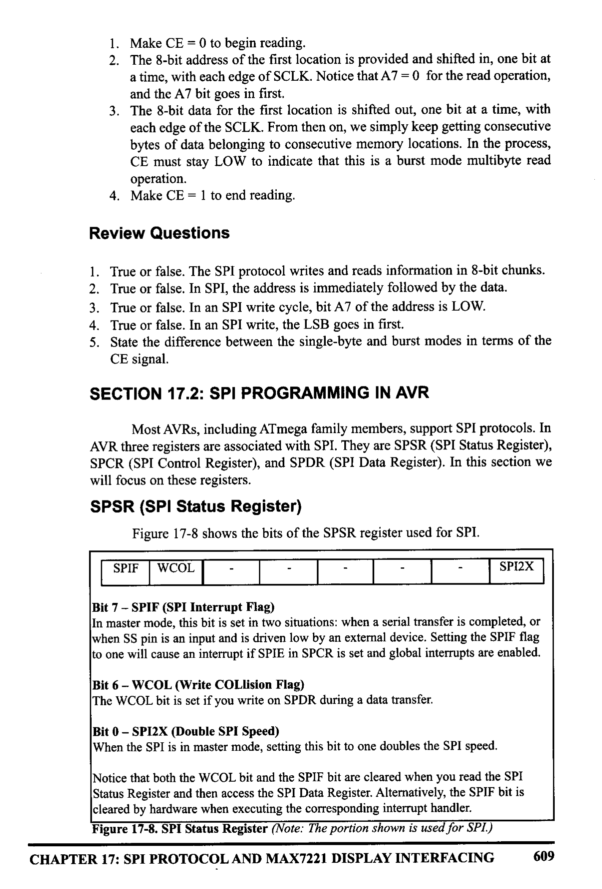
*Description*: Register specification diagram depicting individual bit flags, control register configurations, and functional definitions for Figure 17-8: shows the bits of the SPSR register used for SPI..

> **Figure 17-8: shows the bits of the SPSR register used for SPI.**

SPIF
WCOL
-
-
-
SPI2X
Bit 7 - SPIF (SPI Interrupt Flag)
In master mode, this bit is set in two situations: when a serial transfer is completed, or
when SS pin is an input and is driven low by an external device. Setting the SPIF flag
to one will cause an interrupt if SPIE in SPCR is set and global interrupts are enabled.
Bit 6 - WCOL (Write COLlision Flag)
The WCOL bit is set if you write on SPDR during a data transfer.
Bit 0 - SPIX (Double SPI Speed)
When the SPI is in master made, setting this bit to one doubles the SPI speed.
Notice that both the WCOL bit and the SPIF bit are cleared when you read the SPI
Status Register and then access the SPI Data Register. Alternatively, the SPIF bit is
cleared by hardware when executing the corresponding interrupt handler.


*Description*: Register specification diagram depicting individual bit flags, control register configurations, and functional definitions for Figure 17-8: SPI Status Register (Note: The portion shown is used for SPI.).

> **Figure 17-8: SPI Status Register (Note: The portion shown is used for SPI.)**

CHAPTER 17: SPI PROTOCOL AND MAX7221 DISPLAY INTERFACING
609


<!-- Page 618 -->
### [PDF Page 618]

SPCR (SPI Control Register)


*Description*: Technical diagram and schematic illustration detailing hardware connection topology, signal routing, and circuit operation for Figure 17-9: shows details of each bit in SPCR..

> **Figure 17-9: shows details of each bit in SPCR.**

SPIE
SPE
DORD MSTR CPOL | CPHA | SPRI
SPRO
Bit 7 - SPIE: SPI Interrupt Enable
Setting this bit to one enables the SPI interrupt.
Bit 6 - SPE: SPI Enable
Setting this bit to one enables the SPI.
Bit 5 - DORD: Data Order
This bit lets you choose to either transmit MSB and then LSB or vice versa. The LSB
is transmitted first if DORD is one; otherwise, the MSB is transmitted first.
Bit 4 - MSTR: Master/Slave Select
If you want to work in master mode then set this bit to one; otherwise, slave mode is
selected. Notice that if the SS pin is configured as an input and is driven low while
MSTR is set, MSTR will be cleared, and SPIF will become set.
Bit 3 - CPOL: Clock Polarity
This bit set the base value of clock when it is idle. At CPOL = 0 the base value of the
clock is zero while at CPOL = 1 the base value of the clock is one.
Bit 2 - CPHA: Clock Phase
CPHA = 0 means sample on the leading (first) clock edge, while CPHA = 1 means sam-
ple on the trailing (second) clock.
Bits 1, 0 - SPRI, SPRO: SPI Clock Rate Select 1 and 0
These two bits control the SCK rate of the device in master mode. See Table 17-2.


*Description*: Register specification diagram depicting individual bit flags, control register configurations, and functional definitions for Figure 17-9: SPI Control Register.

> **Figure 17-9: SPI Control Register**

In Table 17-2 you see how SPIX, SPR1, and SPRO are combined to make
different clock frequencies for master. As you see in Table 17-2, by setting SPI2X
to one, the SCK frequency is doubled.

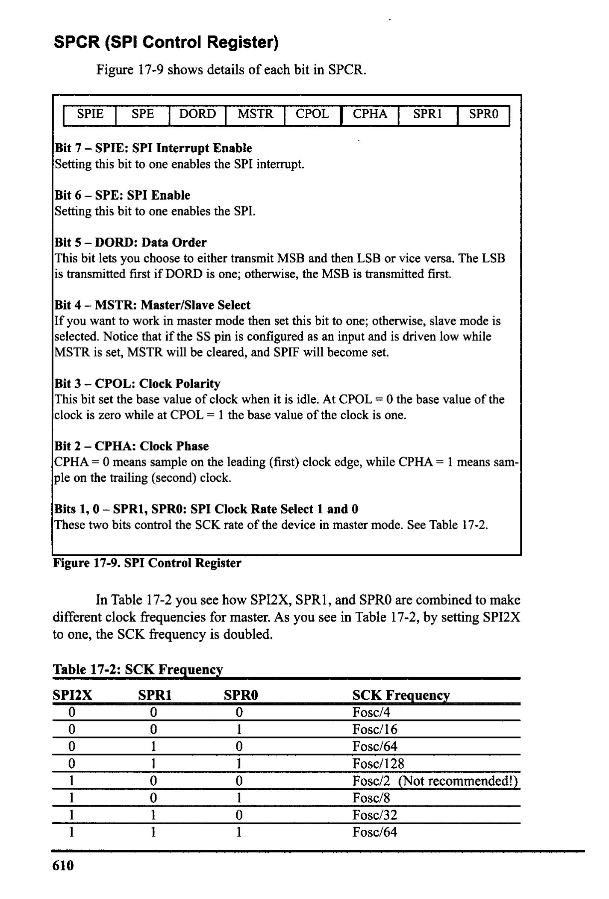
*Description*: Structured reference table listing operational parameters, instruction execution cycles, memory address mapping, or feature comparison for Table 17-2: SCK Frequency.

> **Table 17-2: SCK Frequency**

SPIZX
SPR1
0
0
0
0
SPRO
0
- -00
1
1
1
1
610
0 mon
SCK Frequency
Fosc/4
Fosc/16
Fosc/64
Fosc/128
Fosc/2 (Not recommended!)
Fosc/8
Fosc/32
Fosc/64


<!-- Page 619 -->
### [PDF Page 619]

SPDR (The SPI Data Register)
The SPI Data Register is a read/write register. To write into SPI shift reg-
ister, data must be written to SPDR. To read from the SPI shift register, you should
read from SPDR. Writing to the SPDR register initiates data transmission. Notice
that you cannot write to SPDR before the last byte is transmitted completely, oth-
erwise a collision will happen. You can read the received data before another byte
of data is received completely.
7
MSB
6
5
4
3
2
1
LSB

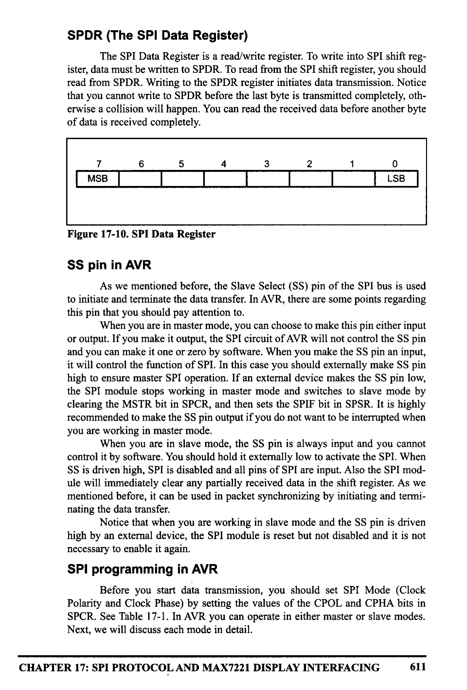
*Description*: Register specification diagram depicting individual bit flags, control register configurations, and functional definitions for Figure 17-10: SPI Data Register.

> **Figure 17-10: SPI Data Register**

SS pin in AVR
As we mentioned before, the Slave Select (SS) pin of the SPI bus is used
to initiate and terminate the data transfer. In AVR, there are some points regarding
this pin that you should pay attention to.
When you are in master mode, you can choose to make this pin either input
or output. If you make it output, the SPI circuit of AVR will not control the SS pin
and you can make it one or zero by software. When you make the SS pin an input,
it will control the function of SPI. In this case you should externally make SS pin
high to ensure master SPI operation. If an external device makes the SS pin low,
the SPI module stops working in master mode and switches to slave mode by
clearing the MSTR bit in SPCR, and then sets the SPIF bit in SPSR. It is highly
recommended to make the SS pin output if you do not want to be interrupted when
you are working in master mode.
When you are in slave mode, the SS pin is always input and you cannot
control it by software. You should hold it externally low to activate the SPI. When
SS is driven high, SPI is disabled and all pins of SPI are input. Also the SPI mod-
ule will immediately clear any partially received data in the shift register. As we
mentioned before, it can be used in packet synchronizing by initiating and termi-
nating the data transfer.
Notice that when you are working in slave mode and the SS pin is driven
high by an external device, the SPI module is reset but not disabled and it is not
necessary to enable it again.
SPI programming in AVR
Before you start data transmission, you should set SPI Mode (Clock
Polarity and Clock Phase) by setting the values of the CPOL and CPHA bits in
SPCR. See Table 17-1. In AVR you can operate in either master or slave modes.
Next, we will discuss each mode in detail.
CHAPTER 17: SPI PROTOCOL AND MAX7221 DISPLAY INTERFACING
611


<!-- Page 620 -->
### [PDF Page 620]

Master operating mode
If you want to work in master mode, you should set the MSTR bit to one.
Also you should set SCK frequency by setting the values of SPIX, SPRI, and
SPR2 according to Table 17-2. Then you should enable SPI by setting the SPIE bit
to one before you start data transmission.
Writing a byte to the SPI Data Register (SPDR) starts data exchange by
starting the SPI clock generator. After shifting the last (8th) bit, the SPI clock gen-
erator stops and the SPIF flag changes to one. The byte in the master shift register
and the byte in the slave shift register are exchanged after the last clock. Notice
that you cannot write to the SPI Data Register before transmission is completed,
otherwise the collision happens. To get the received data you should read it from
SPDR before the next byte arrives. We can use interrupts or poll the SPIF to know
when a byte is exchanged. See Example 17-1.
As we mentioned before, in case of multibyte burst write, the master con-
tinues to shift the next byte by writing it into SPDR. If you want to signal the end
of the packet, you should pull high the SS pin.
Example 17-1
Write an AVR program to initialize the SPI for master, mode 0, with CLCK frequency
= Fosc/16, and then transmit 'G' via SPI repeatedly. The received data should be dis-
played on Port A.
Solution:
• INCLUDE "M32DEF. INC"
• equ MOSI = 5
¡ for ATmega32
• equ SCK = 7
• equ SS = 4
LDI
R17, OXFF
OUT
¡ Port A is output
DDRA, R17
LDI
OUT
R17, (1<<MOSI) | (1<<SCK) | (1<<sS)
DDRB, R17
¡ MOSI, SCK, and ss output
LDI
R17, (1<<SPE) | (1<<MSTR) | (1<<SPRO) ; enable SPI
OUT
SPCR, R17
; master, CLK = fck/16
Transmit:
CBI
PORTB, SS
LDI
¡ enable slave device
R17, 'G'
¡ move G letter to R17
OUT
SPDR, R17
¡ start transmission of G
Wait:

```assembly
SBIS SPSR, SPIF
```

RUMP
Wait
IN
R18, SPDR
OUT
PORTA, R18
¡wait for transmission
i to complete
¡read received data into R18
¡move R18 to PORTA

```assembly
SBI PORTB, SS
RJMP Transmit
```

¡ disable slave device
¡do it again
612


<!-- Page 621 -->
### [PDF Page 621]

When AVR is configured as a master, the SPI will not control the SS pin.
If you want to make SS high or low, you have to do it by writing 1 or 0, respec-
tively, to the SS bit of Port B.
Slave operating mode
When AVR is configured as a slave, the function of the SPI interface
depends on the SS pin. If the SS is driven high, MISO is tri-stated and the SPI
interface sleeps. Only the contents of SPDR may be updated in this state. When SS
is driven low, the data will be shifted by incoming clock pulses on the SCK pin.
SPIF changes to one when the last bit of a byte has been shifted completely. Notice
that the slave can place new data to be sent into SPDR before reading the incom-
ing data; this is because in AVR there are two one-byte buffers to store received
data.
In slave mode there is no need to set SCK frequency because the SCK is
generated by the master, but you must select the SPI mode (Clock Phase and Clock
Polarity) and Data Order to match with SPI mode and Data Order of the other side
(master device). Finally you should enable the SPI by setting the SPIE bit of SPCR
to one. See Example 17-2. Notice that Example 17-2 is the slave version of
Example 17-1.
Example 17-2
Write an AVR program to initialize the SPI for slave, mode 0, with CLCK frequency =
fck/16, and then transmit "G' via SPI repeatedly. The received data should be displayed
on Port A.
Solution:
• INCLUDE "M32DEF. INC"
• equ MISO = 6
LDI
R17, OXFF
OUT
DDRA, R17
IDI
R17, (1<<MISO)
OUT
DDRB, R17
¡ Port A is output
¡ MISO is output
LDI
OUT
Again:
IDI
OUT
R17, (1<<SPE)
SPCR, R17
R17, 'G'
SPDR, R17
jenable SPI slave mode o
; move letter G to R17
¡ send data to SPDR to be
¡transmitted
Wait:

```assembly
SBIS SPSR, SPIF
¡skip next instruction if IF=1
```

RJP Wait
¡otherwise jump wait

```assembly
IN R18, SPDR
```

¡ read received data into R18

```assembly
OUT PORTA, R18
```

¡ send R18 to PORTA

```assembly
RJMP Again
```

¡ do it again
¡It must be noted that slave will not start transfer ox
¡ receive until it senses the clock from master
CHAPTER 17: SPI PROTOCOL AND MAX7221 DISPLAY INTERFACING
613


<!-- Page 622 -->
### [PDF Page 622]

SPI programming in C for AVR
Examples 17-3 and 17-4 are C versions of the last two examples.
Example 17-3 (C version of 17-1)
Rewrite Example 17-1 in C.
Solution:

```c
#include <avr/io.h>
```

#define MOSI 5
#define SCK 7
int main (void)
l/standard AVR header

```c
DDRB = (1<<MOSI) | (1<<SCK) ;
//MOSI and SCK are output
DDRA = OXFF;
```

1/Port A is output
SPCR
= (1<<SPE) | (1<<MSTR) | (1<<SPRO)://enable SPI as master

```c
while (1)(
```

1/do for ever
SPDR = 'G';
I start transmission
while (! (SPSR & (1<<SPIF))) ;

```c
PORTA = SPDR;
```

/wait transfer finish
//move received data to
}
//Port A
return 0;
Example 17-4 (C version of 17-2)
Rewrite Example 17-2 in C.
Solution:

```c
#include <avr/io.h>
```

#define MISO 6
int main (vożd)

```c
DDRA = OXFF ;
```

DDRB
=
(1<<MISO) ;
SPCR = (1<<SPE) ;

```c
while (1)(
SPDR = 'G';
```

while(!(SPSR & (1<<SPIF))) ;

```c
PORTA = SPDR;
```

I/standard AVR header
I/Port A is output
I/MISO is output
lenable SPI as slave
1wait for transfer finish
1/move received data to PORTA
}
return 0;

### Review Questions

2. Noich we ses ie she to pare dedicated to spae 1?
3. How do we set the SPI clock frequency to be Fosc/120?
4. True or false. SPI is half duplex.
5. What is the maximum recommended frequency of the SPI clock?
614


<!-- Page 623 -->
### [PDF Page 623]


## SECTION 17.3: MAX7221 INTERFACING


```assembly
AND PROGRAMMING
```

In this section we first give a brief description of
7-segments and then show how to interface the
MAX7221 chip to AVR.
What is a 7-segment display?
In many applications, when you want to display
DP
numbers, 7-segments are the best choice. These displays


*Description*: Technical diagram and schematic illustration detailing hardware connection topology, signal routing, and circuit operation for Figure 17-11: 7-segment.

> **Figure 17-11: 7-segment**

are made of 7 LEDs to show different numbers plus
LEDS
another LED to display the decimal point. See Figure 17-11. Some characters like
A, b, c, d, E, and H are also displayed by 7-segments. Figure 17-12 shows how to
display digits.
AAAASA
888888


*Description*: Technical diagram and schematic illustration detailing hardware connection topology, signal routing, and circuit operation for Figure 17-12: 7-Segment Display.

> **Figure 17-12: 7-Segment Display**

There are two types of 7-segments, common anode and common cathode.
The MAX7221 supports common cathode only. See Figure 17-13.
A
A
D
E
F
G DP
DP
GND
GND

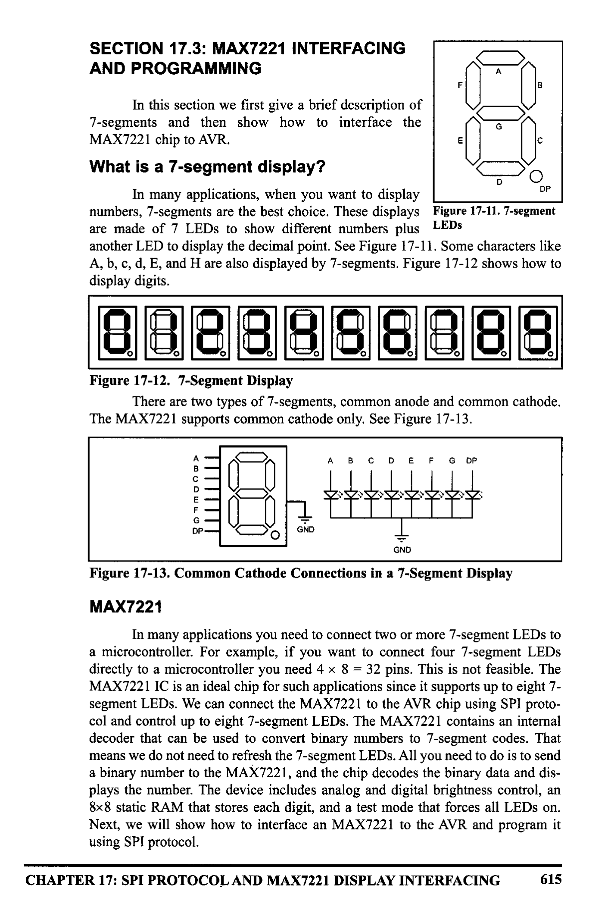
*Description*: Technical diagram and schematic illustration detailing hardware connection topology, signal routing, and circuit operation for Figure 17-13: Common Cathode Connections in a 7-Segment Display.

> **Figure 17-13: Common Cathode Connections in a 7-Segment Display**

MAX7221
In many applications you need to connect two or more 7-segment LEDs to
a microcontroller. For example, if you want to connect four 7-segment LEDs
directly to a microcontroller you need 4 × 8 = 32 pins. This is not feasible. The
MAX7221 IC is an ideal chip for such applications since it supports up to eight 7-
segment LEDs. We can connect the MAX7221 to the AVR chip using SPI proto-
col and control up to eight 7-segment LEDs. The MAX7221 contains an internal
decoder that can be used to convert binary numbers to 7-segment codes. That
means we do not need to refresh the 7-segment LEDs. All you need to do is to send
a binary number to the MAX7221, and the chip decodes the binary data and dis-
plays the number. The device includes analog and digital brightness control, an
8x8 static RAM that stores each digit, and a test mode that forces all LEDs on.
Next, we will show how to interface an MAX7221 to the AVR and program it
using SPI protocol.
CHAPTER 17: SPI PROTOCOL AND MAX7221 DISPLAY INTERFACING
615


<!-- Page 624 -->
### [PDF Page 624]

MAX7221 pins and connections
The MAX7221 is a 24-pin DIP chip.
It can be directly connected to the AVR and
control up to eight 7-segment LEDs. A resis-
tor or a potentiometer is the only external
component that you need. Next, we will dis-
cuss the pins of the MAX7221.
GND
Pin 4 and pin 9 are the ground.
• Notice that both of the ground pins should
be connected to system ground and you can-
not leave any of them unconnected.
DIN [1
DIG O D2
DIG 4 D3
GND D4
DIG 6 [5
DIG 2 [6
DIG 3 [7
DIG 7 D8
GND 19
DIG 5 [10
DIG 1 011
(CS) [12
MAX 7919/7921
24] DOUT
23| SEG D
22| SEG DP
21j SEGE
201 SEG C
190 V+
180 ISET
170 SEG G
160 SEG B
150 SEG F
140 SEG A
130 CLK
VCC

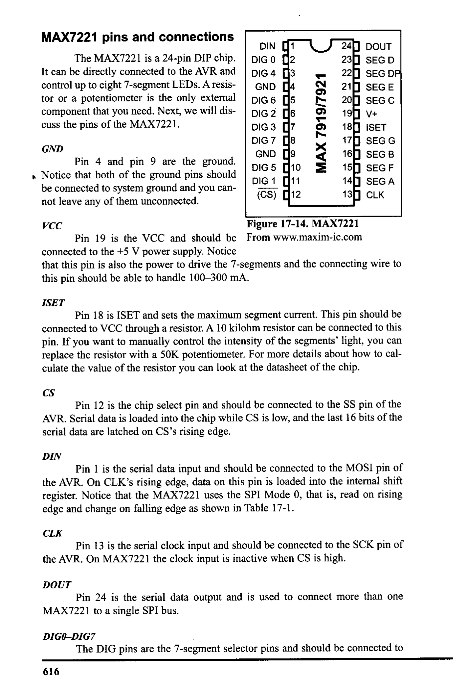
*Description*: Technical diagram and schematic illustration detailing hardware connection topology, signal routing, and circuit operation for Figure 17-14: MAX7221.

> **Figure 17-14: MAX7221**

Pin 19 is the VCC and should be
From www.maxim-ic.com
connected to the +5 V power supply. Notice
that this pin is also the power to drive the 7-segments and the connecting wire to
this pin should be able to handle 100-300 mA.
ISET
Pin 18 is ISET and sets the maximum segment current. This pin should be
connected to VCC through a resistor. A 10 kilohm resistor can be connected to this
pin. If you want to manually control the intensity of the segments' light, you can
replace the resistor with a 50K potentiometer. For more details about how to cal-
culate the value of the resistor you can look at the datasheet of the chip.
CS
Pin 12 is the chip select pin and should be connected to the SS pin of the
AVR. Serial data is loaded into the chip while CS is low, and the last 16 bits of the
serial data are latched on CS's rising edge.
DIN
Pin 1 is the serial data input and should be connected to the MOSI pin of
the AVR. On CLK's rising edge, data on this pin is loaded into the internal shift
register. Notice that the MAX7221 uses the SPI Mode 0, that is, read on rising
edge and change on falling edge as shown in Table 17-1.
CLK
Pin 13 is the serial clock input and should be connected to the SCK pin of
the AVR. On MAX7221 the clock input is inactive when CS is high.
DOUT
Pin 24 is the serial data output and is used to connect more than one
MAX7221 to a single SPI bus.
DIGO-DIGT
The DIG pins are the 7-segment selector pins and should be connected to
616


<!-- Page 625 -->
### [PDF Page 625]

the 7-segments' common cathode pin. The MAX7221 chip can control up to eight
7-segment LEDs. These eight 7-segment dispalys are designated as DIGO to DIĞ7.
SEGA-SEGG and DP
These pins select each segment and should be connected to segments of
each 7-segment accordingly. Figure 17-15 shows the connection for two 7-seg-
ments. You can connect up to eight 7-segments to MAX7221.
+5 V
VCC
10K
SEGA
SEG B
SEG C
A
AVR
MOSI•
SS
SCLK
ISET
DIN
CS
GND
соашто!
DP
GND
DIG 1
DIGO
ommo
Catho
ommo
Catho

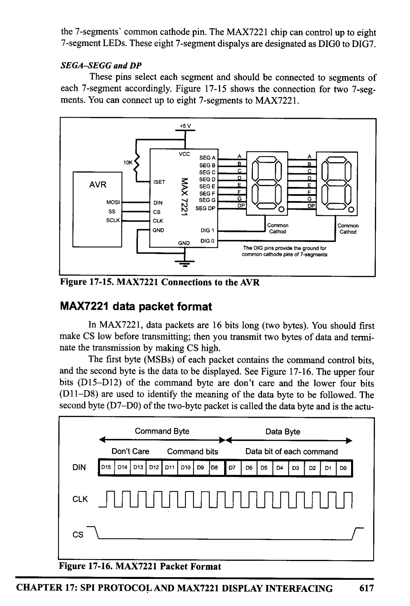
*Description*: Technical diagram and schematic illustration detailing hardware connection topology, signal routing, and circuit operation for Figure 17-15: MAX7221 Connections to the AVR.

> **Figure 17-15: MAX7221 Connections to the AVR**

MAX7221 data packet format
In MAX7221, data packets are 16 bits long (two bytes). You should first
make CS low before transmitting; then you transmit two bytes of data and termi-
nate the transmission by making CS high.
The first byte (MSBs) of each packet contains the command control bits,
and the second byte is the data to be displayed. See Figure 17-16. The upper four
bits (D15-D12) of the command byte are don't care and the lower four bits
(D11-D8) are used to identify the meaning of the data byte to be followed. The
second byte (D7-DO) of the two-byte packet is called the data byte and is the actu-
Command Byte
DIN
→4
Don't Care
Command bits
D15|D14| D13 D12
D11 D10 D9 D8
Data Byte
Data bit of each command
D5
D4
D3
D2
D1
CLK
cs 7


*Description*: Technical diagram and schematic illustration detailing hardware connection topology, signal routing, and circuit operation for Figure 17-16: MAX7221 Packet Format.

> **Figure 17-16: MAX7221 Packet Format**

CHAPTER 17: SPI PROTOCOL AND MAX7221 DISPLAY INTERFACING
617


<!-- Page 626 -->
### [PDF Page 626]


*Description*: Structured reference table listing operational parameters, instruction execution cycles, memory address mapping, or feature comparison for Table 17-3: List of Commands in MAX7221.

> **Table 17-3: List of Commands in MAX7221**

Command
No operation
D15-12 D11
0
D10
0
D9
D8
Set value of digit O
X
X
1
Set value of digit !
Set value of digit 2
Set value of digit 3
X
X
Set value of digit 4
Set value of digit 5
0
0
0
0
0
Set value of digit 6
Set value of digit 7
Set decoding mode
X
X
X
X
X
X
1
0
0
1
1
1
1
0
0
0
0
1
1
1
1
1
1
Hex Code
XO
X1
X2
X3
X4
X5
X6
X7
X8
X9
Set intensity of light
Set scan limit
1
1
1
Turn on/ off
XB
XC
Display test
X
1
1
Notes: 1) X means do not care.
2) Digits are designated as 0-7 to drive total of eight 7-segment LEDs.
al data to be displayed or control the 7-segment driver. Table 17-3 shows the bina-
ry and hex values of each command. Next, we will discuss the commands in more
detail.
Set value of digit O digit 7 (commands XI-X8)
These commands set what is to be displayed on each 7-segment. You can
either send a binary number to the chip decoder and let it turn on/off the segments
accordingly, or you may decide to turn on/off each segment of the 7-segment by
yourself. The first way is useful when you do not want to deal with converting a
binary number to 7-segment codes. The second way is usetul when you want to
show a character or any other thing that is not predefined. For example, if you
want to show U, you should use the second way and turn on/off segments your-
self. Next, you will see how to enable or bypass the decoder for each 7-segment.
Set decoding mode (command X9)
This command lets you enable or bypass the binary to 7-segment decoding
function for each 7-segment. Each bit in the data byte (second byte) is assigned to
one digit (7-segment). DO is assigned to Digit 0, D1 is assigned to Digit 1, and so
on. It you want to enable the decoding function for a digit you should set to one
the bit assigned to that digit, and if you want to disable the decoding function you
should clear the bit for that digit. Figure 17-17 shows the structure of the set
decoding mode command. See Examples 17-5 and 17-6.
Don't Care
DIN
x
xx
Command bits
0 1
Data bit of each command
110| 1/0|1/0 1/0 1/0 | 1/0|1/0 1/0

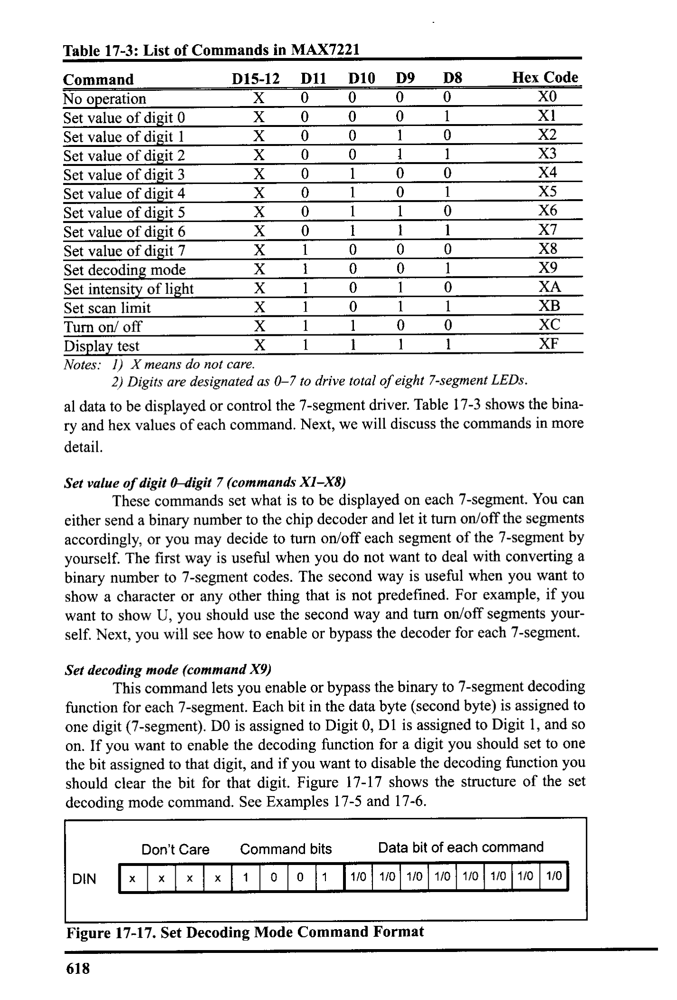
*Description*: Technical diagram and schematic illustration detailing hardware connection topology, signal routing, and circuit operation for Figure 17-17: Set Decoding Mode Command Format.

> **Figure 17-17: Set Decoding Mode Command Format**

618


<!-- Page 627 -->
### [PDF Page 627]

Example 17-5
What sequence of bytes should be sent to the MAX7221 in order to enable the decod-
ing function for digit 0 and digit 2, and disable the decoding function for other digits?
Solution:
The first byte should be xxxx 1001 (X9 hex) to execute the "Set decoding mode" com-
mand, and the second byte (argument of the command) should be 0000 0101 to enable
the decoding function for digit 0 and digit 2.
Don't Care
Command 9
Data bits
xx
0
1
1
1
Example 17-6
After running Example 17-5, what sequence of numbers should be sent to the
MAX7221 in order to write 5 on digit 2?
Solution:
The first byte should be xxxx 0011 (X3 hex) to execute the "Set value of digit 2" com-
mand, and the second byte (argument of the command) should be 0000 0101 (05 hex)
to write 5 on digit 2. Notice that the decoding function for digit 2 has been enabled
before.
Don't Care
xx
Command 3
0 1 1
0
Data bits
0
1
1
If you want to turn on/off each segment by yourself to display a specific
letter on a 7-segment, you should bypass the decoding function and then use the
"Set value of digit x" command to turn on/off each bit of a segment. As you see in

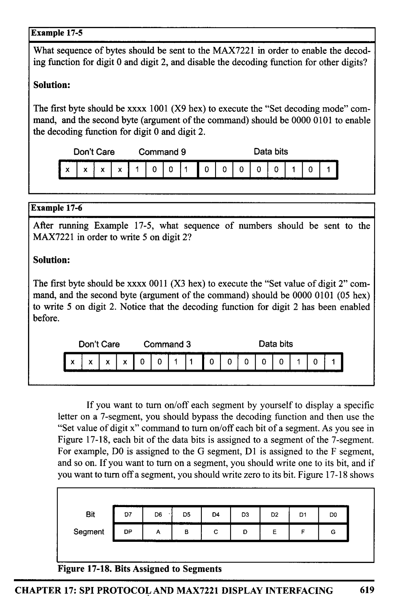
*Description*: Technical diagram and schematic illustration detailing hardware connection topology, signal routing, and circuit operation for Figure 17-18: , each bit of the data bits is assigned to a segment of the 7-segment..

> **Figure 17-18: , each bit of the data bits is assigned to a segment of the 7-segment.**

For example, DO is assigned to the G segment, D1 is assigned to the F segment,
and so on. If you want to turn on a segment, you should write one to its bit, and if
you want to turn off a segment, you should write zero to its bit. Figure 17-18 shows
Bit
D7
D6
D5
D4
D3
D2
Segment
DP
A
D
E
D1
F
DO
G


*Description*: Technical diagram and schematic illustration detailing hardware connection topology, signal routing, and circuit operation for Figure 17-18: Bits Assigned to Segments.

> **Figure 17-18: Bits Assigned to Segments**

CHAPTER 17: SPI PROTOCOL AND MAX7221 DISPLAY INTERFACING
619


<!-- Page 628 -->
### [PDF Page 628]

which bits are assigned to which segments. See Example 17-7.
Example 17-7
After running Example 17-5, what sequence of numbers should be
sent to the MAX7221 in order to write U on digit 1?
F
B
Solution:
The decoding function for digit 1 has been disabled before in
E
C
Example 17-5, and we have to turn on/off each segment manually.
D
As you see in the figure, segments B, C, D, E, and F should be
turned on. To turn on these segments of digit 1, we should send the
first byte xxxx 0010 (X2 hex) to execute the "Set value of digit 1"
command and then we should send 0011 1110 (3E hex) to write U on digit 1. Notice
that the decoding function for digit 1 has been enabled before. The figure below shows
the bits.
Don't Care
Command 3
Data bits
Kxx10010100110
DP
A
B
1
E
F
G
Set Intensity of Light (command XA)
This command sets the light intensity of the segments. The intensity can be
any value between 0 and 16 (OF hex). O is the minimum value of intensity, and 16
is the maximum value of intensity. Notice that 0 does not mean off but it is the
minimum intensity. As we mentioned before, you can also change the light inten-
sity of segments by changing the resistor that connects the ISET pin to VCC.
Set Scan Limit (command XB)
This command sets the number of 7-segments that are connected to the
chip. This number can vary from 1 to 8.
Turn On/ Off (command XC)
This command turns the display on or off. 1 (01 hex) turns the display on,
while O (00 hex) turns off the display. This command is useful when you want to
reduce the power consumption of your device.
Display Test (command XF)
This command is used to test the display. If you send 1 (01 hex) after send-
ing the display test command to the chip, it enters display-test mode and turns on
all segments. This lets you check to see if all segments work properly. When you
want to return to normal operation mode, you should execute the command but
send 0 (00 hex) as data to the chip.
620


<!-- Page 629 -->
### [PDF Page 629]

MAX7221 programming in the AVR
To program MAX7221 in the AVR you should do the following steps.
Notice that step 4 is optional and can be ignored:
1. Initialize the SPI to operate in master mode 0.
2. Enable or disable decoding mode by executing command 9 (x9 hex).
3. Set the scan limit.
4. Set the intensity of light (optional).
5. Turn on the display.
6. Set the value of each digit.
See Programs 17-1 and 17-2. Program 17-1 shows how to display 57 on the
7-segment display of Figure 17-15 by use of the decoding function. Program 17-2
shows how to display 2U on the 7-segment of Figure 17-15 without using the
decoding function.
• INCLUDE "M32DEF.INC"
• equ MOSI = 5
• equ
SCK = 7
• equ
SS = 4
LDI
OUT
LDI
OUT
R21, HIGH (RAMEND) ; set the high byte of stack
SPH, R21
¡ pointer
R21, LOW (RAMEND)
¡set the low byte of stack
SPL, R21
¡ pointer
LDI
OUT
R17, (1<<MOSI) | (1<<SCK) | (1<<SS)
DDRB, R17
¡MOSI, SCK, and SS are output
LDI
OUT
R17, (1<<SPE) | (1<<MSTR) | (1<<SPRO) ; enable SPI
SPCR, R17
i master mode 0,
CLK = fck/16
IDI R17, 0x09

```assembly
LDI R18, 0b00000011
CALL RunCMD
```

¡ set decoding mode command
¡ enable decoding for digit 0,1
¡ send CMD and DATA to the chip

```assembly
LDI R17, 0x0B
```

IDI R18, 0x02

```assembly
CALL RunCMD
; set scan limit command
```

i scan two 7-segments
¡ send CMD and DATA to the chip

```assembly
LDI R17, 0x0C
```

IDI R18, 0×01

```assembly
CALL RunCMD
```

i turn on/off command
¡turn on the chip
¡ send CMD and DATA to the chip
LDI
LDI
R17, 0×01
R18, 0x07
¡ select digit 0
¡ display value 7
Program 17-1: Display 57 on 7-Segment LEDs (continued on next page)
CHAPTER 17: SPI PROTOCOL AND MAX7221 DISPLAY INTERFACING
621


<!-- Page 630 -->
### [PDF Page 630]

H:
CALL
RunCMD
LDI
R17, 0×02
LDI
R18, 0x05

```assembly
CALL RunCMD
RJMP H
```

¡ send CMD and DATA to the chip
; select digit 1
¡display value s
; send CMD
and DATA to the chip
i stop here
¡this function sends a command and its
argument (data)
to SPI
¡ command should be in R17 and data should be in R18 before
i the
function
is invoked
RunCMD:

```assembly
CBI PORTB, SS
OUT SPDR, R17
```

Waitl:

```assembly
SBIS SPSR, SPIF
RJMP Wait1
OUT SPDR, R18
```

Wait2: 1

```assembly
SBIS SPSR, SPIF
RJMP Wait2
SBI PORTB, SS
```

RET
; CS = 0 to start packet
¡transmit the command in R17
¡skip next instruction if IF is set
¡otherwise jump to waitl
¡ transmit the data in R18
¡ skip next instruction if IF is set
¡otherwise jump to wait2
; CS = 1 to terminate packet
i return
Program 17-1: Display 57 on 7-Segment LEDs (continued from previous page)
Program 17-2 shows how to display 2U on the 7-segments of Figure 17-15
without using the decoding function.
• INCLUDE "M32DEF.INC"
• equ MOSI = 5
• equ SCK = 7
• equ
SS = 4
LDI
OUT
LDI
OUT
R21, HIGH (RAMEND) ; set the high byte of stack
SPH, R21
R21, LOW (RAMEND)
SPL, R21
¡pointer
¡set the low byte of stack
¡ pointer
LDI
OUT
R17, (1<<MOSI) | (1<<SCK) | (1<<SS)
DDRB, R17
; MOSI, SCK, and Ss are output
LDI
R17, (1<<SPE) | (1<<MSTR) | (1<<SPRO) ; enable SPI
Program 17-2: Display 2U on the 7-Segment LEDs (continued on next page)
622


<!-- Page 631 -->
### [PDF Page 631]

H:
OUT
SPCR, R17
LDI
R17, 0x09
LDI
R18, 0b00000010
CALL
RunCMD

```assembly
LDI R17,0x0B
```

IDI R18, 0x02

```assembly
CALL RunCMD
```

LDI
R17, 0x0C

```assembly
LDI R18, 0x01
CALL RunCMD
```

IDI R17,0×01

```assembly
LDI R18, 0x3E
CALL RunCMD
```

IDI R17, 0x02

```assembly
LDI R18, 0×02
CALL RunCMD
RJMP H
¡ master mode 0, CLK = fck/16
```

¡ set decoding mode command
¡ enable decoding for digit 1
¡ send CMD and DATA to the chip
¡ set scan limit command
i scan two 7-segments
i send CMD and DATA to the chip
¡turn on/off command
¡turn on the chip
i send CMD and DATA to the chip
¡ select digit 0
¡display U (see Example 17-7)
¡ send CMD and DATA to the chip
¡ select digit 1
¡ display 2
; send CMD and DATA to the chip
i stop here
¡this function sends a command and its argument (data) to SPI
¡ command should be in R17 and data should be in R18 before
¡the function is invoked
RunCMD:

```assembly
CBI PORTB, SS
OUT SPDR, R17
```

Waitl:

```assembly
SBIS SPSR, SPIE
RJMP Waitl
OUT SPDR, R18
```

Wait2:

```assembly
SBIS SPSR, SPIF
RJMP Wait2
SBI PORTB, SS
```

RET
¡CS = 0 to start packet
¡transmit the command in R17
iskip next instruction if IF is set
¡otherwise jump to waitl
¡transmit the data in R18
i skip next instruction if IF is set
¡otherwise jump to wait2
; CS = 1 to terminate packet
; return
Program 17-2: Display 2U on 7-Segment LEDs (continued from previous page)
CHAPTER 17: SPI PROTOCOL AND MAX7221 DISPLAY INTERFACING
623


<!-- Page 632 -->
### [PDF Page 632]

MAX7221 programming in C
Example 17-8 and Example 17-9 are C versions of Programs 17-1 and 17-2,
respectively.
Example 17-8
Write an AVR C program to display 57 on the 7-segments of Figure 17-15.
Solution:

```c
#include <avr/io.h>
```

#define MOSI 5
#define SCK 7
#define S$ 4
/standard AVR header
Yoid executel unsigned char and, unsigned char datal
PORTB &= ~ (1<<SS) ;
Winitializing the packet
1/by pulling ss 1ow
SPDR = cmd;
while (! (SPSR & (1<<SPIF)));
I/ start CMD transmission
I/wait transfer finish
SPDR = data;
while (! (SPSR & (1<<SPIF))) ;
I start DATA transmission
I/wait transfer finish
PORTB |= (1<<SS) ;
}
I/terminate the packet by
1/pulling ss nigh
int main (void)

```c
DDRB = (1<<MOSI) | (1<<SCK) | (1<<SS); //MOSI and SCK are output
SPCR = (1<<SPE) | (1<<MSTR) | (1<<SPR0)://enable SPI as master
```

execute (0x09, 0600000011) ;
I/enable decoding for
//digits 1,2
execute (0x0B, 0x02) ;
execute (0x0C, 0x01);
execute (0x01, 0x07) ;
execute (0x02, 0x05);
/scan two 7-segments
I/turn on the chip
I/display 7
//display 5

```c
while (1);
```

return 0;
}
624


<!-- Page 633 -->
### [PDF Page 633]

Example 17-9
Solution:
Write an AVR C program to display 2U on the 7-segments of Figure 17-15.

```c
#include <avr/io.h>
```

#define MOSI 5
#define SCK 7
#define ss 4
I/standard AVR header
void execute ( unsigned char cnd , unsigned char data)
PORTB &= ~ (1<<SS) ;
SPDR = cmd;
while (! (SPSR & (1<<SPIF))) ;
SPDR = data;
whilel! (SPSR & (1<<SPIF))) ;
PORTB |= (1<<SS) ;
}
|/initializing the packet
I/by pulling Ss low
I/start CMD transmission
I/wait transfer finish
I/start DATA transmission
I/wait transfer finish
I/terminate the packet by
I/pulling ss high
int main (void)

```c
DDRB = (1<<MOSI) | (1<<SCK) | (1<<SS); //MOSI and SCK are output
SPCR = (1<<SPE) | (1<<MSTR) | (1<<SPRO) ://enable SPI as master
```

execute (0x09,0b00000010);
execute (0x0B, 0x02) ;
execute (0x0C, 0x01) ;
execute (0x01, 0x3E) ;
execute (0x02, 0x02) ;
/lenable decoding for digit 1
I/scan two 7-segments
I/turn on the chip
I/display U (see Example 17-7)
//display 2

```c
while (1);
```

return 0;

### Review Questions

1. How many 7-segments can be controlled by MAX7221?
2. What would happen if you do not set the scan limit?
3. True or False. If you want to show P on a 7-segment you can use the decoding
function.
4. Which segments should be on to display P on a 7-segment?
5. What is the recommended value of the ISET resistor?
CHAPTER 17: SPI PROTOCOL AND MAX7221 DISPLAY INTERFACING
625


<!-- Page 634 -->
### [PDF Page 634]


### SUMMARY

This chapter began by describing the SPI bus connection and protocol. We
also discussed the function of each pin of the MAX7221 chip. The MAX7221 can
be used to drive up to eight 7-segments. Various features of the MAX7221 were
explained, and numerous programming examples were given.

### PROBLEMS


## SECTION 17.1: SPI BUS PROTOCOL

1. True or false. The SPI bus needs an external clock.
2. True or false. The SPI CE is active-LOW.
3. True or false. The SPI bus has a single Din pin.
4. True or false. The SPI bus has multiple Dout pins.
5. True or false. When the SPI device is used as a slave, the SCLK is an input pin.
6. True or false. In SPI devices, data is transferred in 8-bit chunks.
7. True or false. In SPI devices, each bit of information (data, address) is trans-
ferred with a single clock pulse.
8. True or false. In SPI devices, the 8-bit data is followed by an 8-bit address.
9. In terms of data pins, what is the difference between the SPI and 3-wire con-
nections?
10. How does the SPI protocol distinguish between the read and write cycles?

## SECTION 17.2: SPI PROGRAMMING IN AVR

11. True or false. The ATmega family does not support SPI.
12. How many registers in the AVR are dedicated to SPI?
13. How do we set the SPI to operate in master mode 2?
14. True or false. The SPI module does not control the SS pin in master mode.
15. True or false. The SS pin should be taken low externally in order to enable the
SPI module in slave mode.

## SECTION 17.3: MAX7221 INTERFACING AND PROGRAMMING

16. The MAX7221 DIP package is a(n)
_-pin package.
17. Which pin is assigned as Vcc?
18. How much is the maximum current of the Voo pin?
19. True or false. The MAX7221 has a pin for controlling the intensity of light of
the segments.
20. What is the recommended resistor value for light intensity?
21. How many 7-segments can be interfaced by a single MAX7221?
22. What is the first byte in a 16-bit packet in the MAX7221?
23. What is the second byte in a 16-bit packet in the MAX7221?
24. True or false. The decoding function should be enabled to write L on a 7-seg-
ment.
626


<!-- Page 635 -->
### [PDF Page 635]


### ANSWERS TO REVIEW QUESTIONS


## SECTION 17.1: SPI BUS PROTOCOL

1. True
2. True
3. False
4. False
5. In single-byte mode, after each byte, the CE pin must go HIGH before the next cycle. In burst
mode, the CE pin stays LOW for the duration of the burst (multibyte) transfer.

## SECTION 17.2: SPI PROGRAMMING IN AVR

SPSR (SPI Status Register), SPCR (SPI Control Register), and SPDR (SPI Data Register)
We set the MSTR bit in SPCR to one, clear CPOL to zero, and set CPHA to one.
3. We set SPI2X, SPR1, and SPRO to 0, 1, and 1, respectively.
4. False
5. Fosc/4

## SECTION 17.3: MAX7221 INTERFACING AND PROGRAMMING

2. The scan limit would be 0 and nothing would be shown on the 7-segment.
False
4. A, B, E, F, G
5. 10 kilohms
CHAPTER 17: SPI PROTOCOL AND MAX7221 DISPLAY INTERFACING
627


