# Chapter 18: I2C Protocol and DS1307 RTC Interfacing

> **Textbook**: The AVR Microcontroller and Embedded Systems using Assembly and C

> **PDF Page Range**: 636 - 701


---


<!-- Page 636 -->
### [PDF Page 636]

CHAPTER 18
I2C PROTOCOL AND
DS1307 RTC
INTERFACING
OBJECTIVES
Upon completion of this chapter, you will be able to:
>>
=>
Understand the Inter-Integrated Circuit (IC) protocol
Explain how the 12C read and write operations work
>> Examine the 12C pins SCK and SCL
Explain the function of 12C (TWI) registers in AVR
Code programs in Assembly and C for I2C (TWI)
Explain how the real-time clock (RTC) chip works
>>
*>
Explain the function of the DS1307 RTC pins
Explain the function of the DS1307 RTC registers
Understand the interfacing of the DS1307 RTC to the AVR
Code programs to display time and date in Assembly and C
629


<!-- Page 637 -->
### [PDF Page 637]

This chapter discusses the I2C bus and shows the interfacing of the
DS1307 real-time clock (RTC), an I2C chip. In Section 18.1, we describe the I2C
bus and focus on I2C terminology and protocols. In Section 18.2, we describe the
registers of AVR associated with I2C. In Section 18.3, we show how to write a
simple program in Assembly and C to use the I2C features of AVR. In Section
18.4, we describe the DS1307 RT's pin functions and show its interfacing and
programming with the AVR. Advanced programming of the I2C (TWI) is dis-
cussed in Section 18.5.

## SECTION 18.1: I2C BUS PROTOCOL

The IIC (Inter-Integrated Circuit) is a bus interface connection incorporat-
ed into many devices such as sensors, RTC, and EEPROM. The IIC is also referred
to as I2C (IC) or I square C in many technical literatures. In this section we exam-
ine the pins of the I2C bus and focus on I2C terminology and protocols.
12C bus
The I2C bus was originally started by Philips, but in recent years has
become a widely used standard adapted by many semiconductor chip companies.
I2C is ideal for attaching low-speed peripherals to a motherboard or embedded
system or anywhere that a reliable communication over a short distance is
required. As we will see in this chapter, I2C provides a connection-oriented com-
munication with acknowledge. I2C devices use only 2 pins for data transfer,
instead of the 8 or more pins used in traditional buses. They are called SCL (Serial
Clock), which synchronize the data transfer between two chips, and SDA (Serial
Data). This reduction of communication pins reduces the package size and power
consumption drastically, making them ideal for many applications in which space
is a major concern. These two pins, SDA and SCK, make the I2C a 2-wire inter-
face. In many application notes, including AVR datasheets, I2C is referred to as
Two-Wire Serial Interface (TWI). In this chapter we use I2C and TWI interchange-
ably.
12C line electrical characteristics
12C devices use only 2 bidirectional open-drain pins for data communica-
tion. To implement I2C, only a 4.7 kilohm pull-up resistor for each of bus lines is
needed (see Figure 18-1). This implements a wired-AND, which is needed to
implement I2C protocols. This means that if one or more devices pull the line to
VCC
Device 1
Device 2
4
SDA
SCL

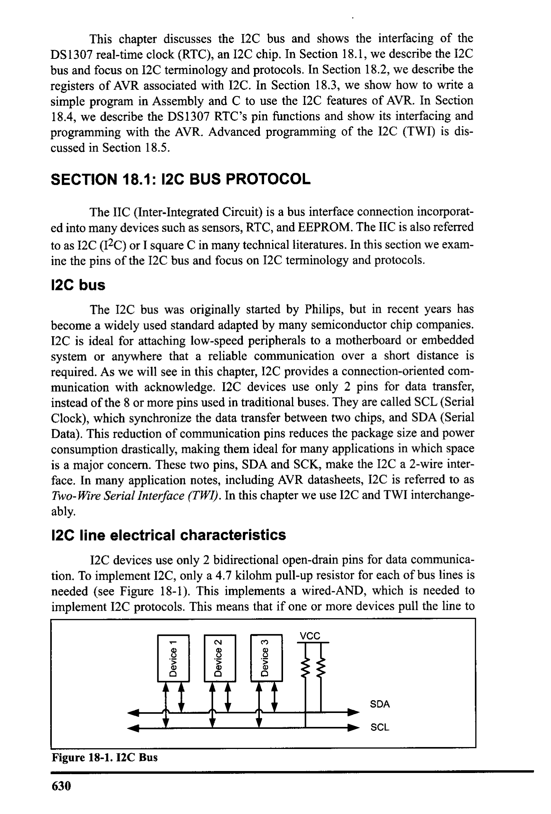
*Description*: Technical diagram and schematic illustration detailing hardware connection topology, signal routing, and circuit operation for Figure 18-1: 12C Bus.

> **Figure 18-1: 12C Bus**

630


<!-- Page 638 -->
### [PDF Page 638]

low (zero) level, the line state is zero and the level of line will be 1 only if none of
devices pull the line to low level.
12C nodes
In the AVR up to 120 different devices can share an I2C bus. Each of these
devices is called a node. In I2C terminology, each node can operate as either mas-
ter or slave. Master is a device that generates the clock for the system; it also ini-
tiates and terminates a transmission. Slave is the node that receives the clock and
is addressed by the master. In I2C, both master and slave can receive or transmit
data, so there are four modes of operation. They are master transmitter, master
receiver, slave transmitter, and slave receiver. Notice that each node can have more
than one mode of operation at different times, but it has only one mode of opera-
tion at a given time. See Example 18-1.
Example 18-1
Give an example to show how a device (node) can have more than one mode of opera-
tion.
Solution:
If you connect the AVR to an EEPROM with I2C, the AVR does a master transmit oper-
ation to write to EEPROM. The AVR also does master receive operations to read from
EEPROM. In the following sections, you will see that a node can do the operations of
master and slave at different times.
Bit format
I2C is a synchronous serial protocol; each data bit transferred on the SDA
line is synchronized by a high-to-low pulse of clock on the SCL line. According to
I2C protocols the data line cannot change when the clock line is high; it can
change only when the clock line is low. See Figure 18-2. The STOP and START
conditions are the only exceptions to this rule.
SDA
SCL
Data

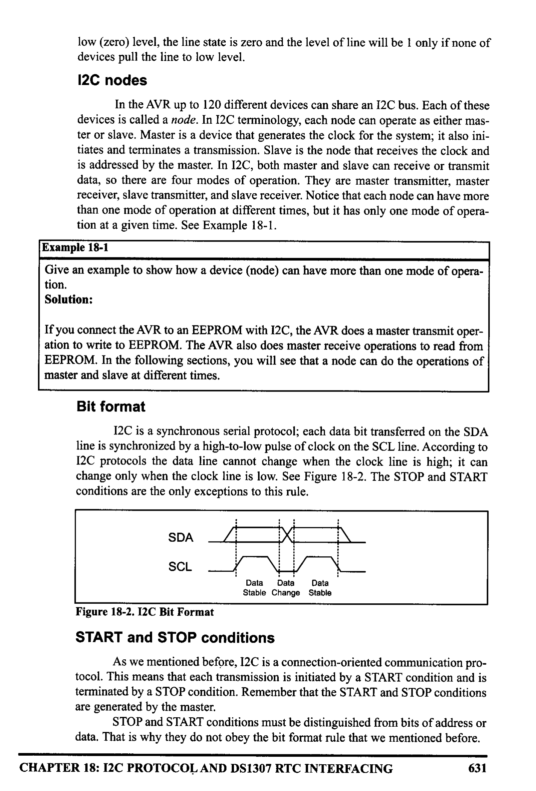
*Description*: Technical diagram and schematic illustration detailing hardware connection topology, signal routing, and circuit operation for Figure 18-2: I2C Bit Format.

> **Figure 18-2: I2C Bit Format**

START and STOP conditions
As we mentioned before, I2C is a connection-oriented communication pro-
tocol. This means that each transmission is initiated by a START condition and is
terminated by a STOP condition. Remember that the START and STOP conditions
are generated by the master.
STOP and START conditions must be distinguished from bits of address or
data. That is why they do not obey the bit format rule that we mentioned before.
CHAPTER 18: I2C PROTOCOL AND DS1307 RTC INTERFACING
631


<!-- Page 639 -->
### [PDF Page 639]

START and STOP conditions are generated by keeping the level of the
SCL line high and then changing the level of the SDA line. The START condition
is generated by a high-to-low change in the SDA line when SCL is high. The STOP
condition is generated by a low-to-high change in the SDA line when SCL is low.
See Figure 18-3.
SDA
SCL
START
STOP

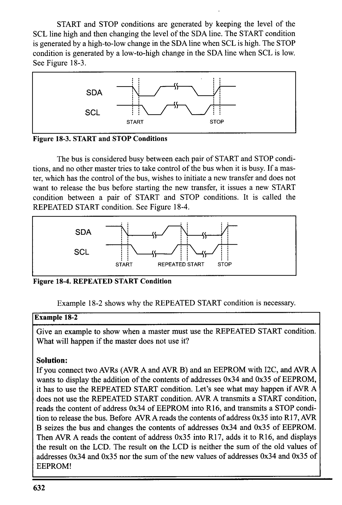
*Description*: Technical diagram and schematic illustration detailing hardware connection topology, signal routing, and circuit operation for Figure 18-3: START and STOP Conditions.

> **Figure 18-3: START and STOP Conditions**

The bus is considered busy between each pair of START and STOP condi-
tions, and no other master tries to take control of the bus when it is busy. If a mas-
ter, which has the control of the bus, wishes to initiate a new transfer and does not
want to release the bus before starting the new transfer, it issues a new START
condition between a pair of START and STOP conditions. It is called the
REPEATED START condition. See Figure 18-4.
SDA
SCL
START
REPEATED START
STOP


*Description*: Technical diagram and schematic illustration detailing hardware connection topology, signal routing, and circuit operation for Figure 18-4: REPEATED START Condition.

> **Figure 18-4: REPEATED START Condition**

Example 18-2 shows why the REPEATED START condition is necessary.
Example 18-2
Give an example to show when a master must use the REPEATED START condition.
What will happen if the master does not use it?
Solution:
If you connect two AVRs (AVR A and AVR B) and an EEPROM with I2C, and AVR A
wants to display the addition of the contents of addresses 0x34 and 0x35 of EEPROM,
it has to use the REPEATED START condition. Let's see what may happen if AVR A
does not use the REPEATED START condition. AVR A transmits a START condition,
reads the content of address 0x34 of EEPROM into R16, and transmits a STOP condi-
tion to release the bus. Before AVR A reads the contents of address 0x35 into R17, AVR
B seizes the bus and changes the contents of addresses 0x34 and 0x35 of EEPROM.
Then AVR A reads the content of address 0x35 into R17, adds it to R16, and displays
the result on the LCD. The result on the LCD is neither the sum of the old values of
addresses 0x34 and 0x35 nor the sum of the new values of addresses 0x34 and 0x35 of
EEPROM!
632


<!-- Page 640 -->
### [PDF Page 640]

Packet format in I2C
In 12C, each address or data to be transmitted must be framed in a packet.
Each packet is 9 bits long. The first 8 bits are put on the SDA line by the transmit-
ter, and the 9th bit is an acknowledge by the receiver or it may be NACK (not
acknowledge). The clock is generated by the master, regardless of whether it is the
transmitter or receiver. To get an acknowledge, the transmitter releases the SDA
line during the ninth clock so that the receiver can pull the SDA line low to indi-
cate an ACK. If the receiver doesn't pull the SDA line low, it is considered as
NACK. See Figure 18-5.
MSB
Aggregate
SDA
SDA from
transmitter
SDA from
receiver
SCL from
Master
LSB R/W ACK
...
L

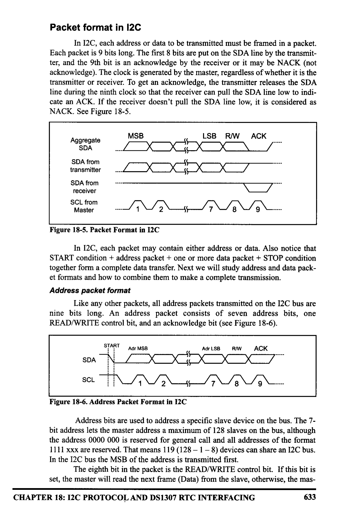
*Description*: Technical diagram and schematic illustration detailing hardware connection topology, signal routing, and circuit operation for Figure 18-5: Packet Format in I2C.

> **Figure 18-5: Packet Format in I2C**

In I2C, each packet may contain either address or data. Also notice that
START condition + address packet + one or more data packet + STOP condition
together form a complete data transfer. Next we will study address and data pack-
et formats and how to combine them to make a complete transmission.
Address packet format
Like any other packets, all address packets transmitted on the 12C bus are
nine bits long. An address packet consists of seven address bits, one
READ/WRITE control bit, and an acknowledge bit (see Figure 18-6).
START Adr MSB
ACK
SDA
SCL
2


*Description*: Technical diagram and schematic illustration detailing hardware connection topology, signal routing, and circuit operation for Figure 18-6: Address Packet Format in I2C.

> **Figure 18-6: Address Packet Format in I2C**

Address bits are used to address a specific slave device on the bus. The 7-
bit address lets the master address a maximum of 128 slaves on the bus, although
the address 0000 000 is reserved for general call and all addresses of the format
1111 xxx are reserved. That means 119 (128 - 1 - 8) devices can share an I2C bus.
In the I2C bus the MSB of the address is transmitted first.
The eighth bit in the packet is the READ/WRITE control bit. If this bit is
set, the master will read the next frame (Data) from the slave, otherwise, the mas-
CHAPTER 18: I2C PROTOCOL AND DS1307 RTC INTERFACING
633


<!-- Page 641 -->
### [PDF Page 641]

ter will write the next frame (Data) on the bus to the slave. When a slave detects
its address on the bus, it knows that it is being addressed and it should acknow!-
edge in the ninth SCL (ACK) cycle by changing SDA to zero. If the addressed
slave is not ready or for any reason does not want to service the master, it should
leave the SDA line high in the ninth clock cycle. This is considered to be NACK.
In case of NACK, the master can transmit a STOP condition to terminate the trans-
mission, or a REPEATED START condition to initiate a new transmission.
Example 18-3 shows how a master says that it wants to write to a slave.
Example 18-3
Show how a master says that it wants to write to a slave with address 1001101.
Solution:
The following actions are performed by the master:
(1) The master puts a high-to-low pulse on SDA, while SCL is high to generate a start
bit condition to start the transmission.
(2) The master transmits 10011010 into the bus. The first seven bits (1001101) indicates
the slave address, and the eighth bit (0) indicates a Write operation and says that the
master will write the next byte (data) into the slave.
SDA
SCL
Missisaras
Start
A6 A5 A4
A3 A2 A1
A0
R/W ACK
An address packet consisting of a slave address and a READ is called
SLA+R, while an address packet consisting of a slave address and a WRITE is
called SLA+W.
As we mentioned before, address 0000 000 is reserved for general call.
This means that when a master transmits address 0000 000, all slaves respond by
changing the SDA line to zero and wait to receive the data byte. This is useful
when a master wants to transmit the same data byte to all slaves in the system.
Notice that the general call address cannot be used to read data from slaves
because no more than one slave is able to write to the bus at a given time.
Data packet format
Like other packets, data packets are 9 bits long too. The first 8 bits are a
byte of data to be transmitted, and the 9th bit is ACK. If the receiver has received
the last byte of data and there is no more data to be received, or the receiver can-
not receive or process more data, it will signal a NACK by leaving the SDA line
high. In data packets, like address packets, MSB is transmitted first.
Combining address and data packets into a transmission
In I2C, normally, a transmission is started by a START condition, followed
by an address packet (SLA + R/W), one or more data packets, and finished by a
634


<!-- Page 642 -->
### [PDF Page 642]

STOP condition. Figure 18-7 shows a typical data transmission. Try to understand
each element in the figure (see Example 18-4).

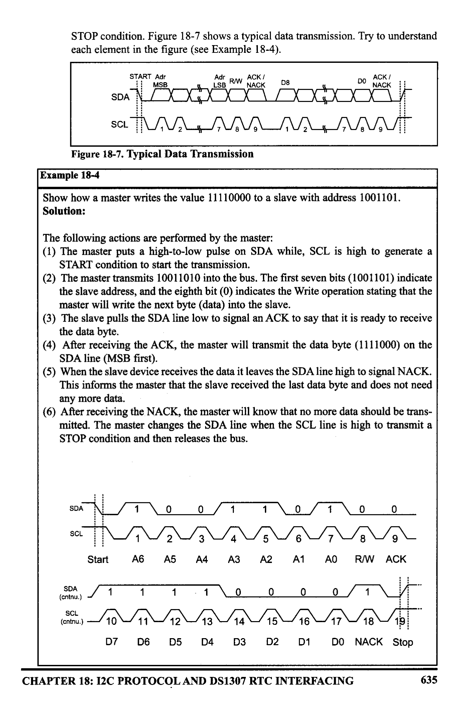
*Description*: Technical diagram and schematic illustration detailing hardware connection topology, signal routing, and circuit operation for Figure 18-7: Typical Data Transmission.

> **Figure 18-7: Typical Data Transmission**

Example 18-4
Solution:
Show how a master writes the value 11110000 to a slave with address 1001101.
The following actions are performed by the master:
(1) The master puts a high-to-low pulse on SDA while, SCL is high to generate a
START condition to start the transmission.
(2) The master transmits 10011010 into the bus. The first seven bits (1001101) indicate
the slave address, and the eighth bit (0) indicates the Write operation stating that the
master will write the next byte (data) into the slave.
(3) The slave pulls the SDA line low to signal an ACK to say that it is ready to receive
the data byte.
(4) After receiving the ACK, the master will transmit the data byte (1111000) on the
SDA line (MSB first).
(5) When the slave device receives the data it leaves the SDA line high to signal NACK.
This informs the master that the slave received the last data byte and does not need
any more data.
(6) After receiving the NACK, the master will know that no more data should be trans-
mitted. The master changes the SDA line when the SCL line is high to transmit a
STOP condition and then releases the bus.
SDA
1O0/1
1
10/1
MNAAAASANAA
Start
A6 A5
A4
A3
A2
A1
AO R/W ACK
SDA
(cntnu.)
1 18 1
LO
1
SCL
(cntnu.) —
10L/11L/12L/13
114
/15
/16 172
19
D7 D6 D5 D4 D3 D2 D1 DO NACK Stop
CHAPTER 18: I2C PROTOCOL AND DS1307 RTC INTERFACING
635


<!-- Page 643 -->
### [PDF Page 643]

Clock stretching
One of the features of the IC protocol is clock stretching. It is a kind of
flow control. If an addressed slave device is not ready to process more data it will
stretch the clock by holding the clock line (SCL) low after receiving (or sending)
a bit of data. Thus the master will not be able to raise the clock line (because
devices are wire-ANDed) and will wait until the slave releases the SCL line to
show it is ready to transfer the next bit. See Figure 18-8.
slave stretches the lin
by pulling SCL lov
Master waits for SCL line to
• become high
SCL fron
Maste
SCL from
Slave
SCL Line
\...
Clock line is
streched

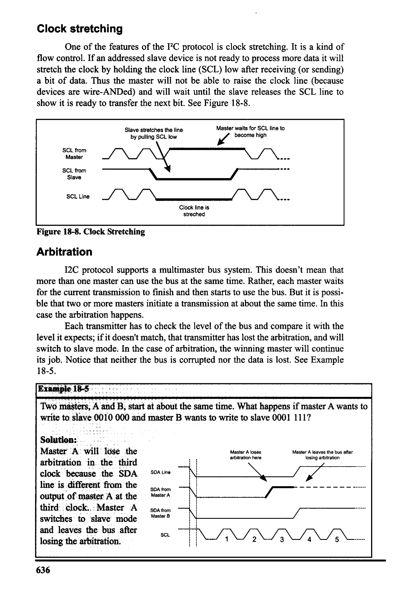
*Description*: Technical diagram and schematic illustration detailing hardware connection topology, signal routing, and circuit operation for Figure 18-8: Clock Stretching.

> **Figure 18-8: Clock Stretching**

Arbitration
I2C protocol supports a multimaster bus system. This doesn't mean that
more than one master can use the bus at the same time. Rather, each master waits
for the current transmission to finish and then starts to use the bus. But it is possi-
ble that two or more masters initiate a transmission at about the same time. In this
case the arbitration happens.
Each transmitter has to check the level of the bus and compare it with the
level it expects; if it doesn't match, that transmitter has lost the arbitration, and will
switch to slave mode. In the case of arbitration, the winning master will continue
its job. Notice that neither the bus is corrupted nor the data is lost. See Example
18-5.
Example 185
Two masters, A and B, start at about the same time. What happens if master A wants to
write to slave 0010 000 and master B wants to write to slave 0001 111?
Solution:
Master A will lose the
arbitration in the third
clock because the SDA
line is different from the
output of master A at the
third clock. Master A
switches to slave mode
and leaves the bus after
losing the arbitration.
Master A loses
arbitration here
Master A leaves the bus afte
losing arbitratior
SDA Line
SDA from
Master A
SDA from
Master B
SCL
2
3
5
636


<!-- Page 644 -->
### [PDF Page 644]

Multibyte burst write
Burst mode writing is an effective means of loading consecutive locations.
It is supported in I2C, SPI, and many other serial protocols. In burst mode, we pro-
vide the address of the first location, followed by the data for that location. From
then on, consecutive bytes are written to consecutive memory locations. In this
mode, the 12C device internally increments the address location as long as the
STOP condition is not detected. The following steps are used to send (write) mul-
tiple bytes of data in burst mode for I2C devices.
1. Generate a START condition.
2. Transmit the slave address followed by zero (for write).
3. Transmit the address of the first location.
4. Transmit the data for the first location and from then on, simply provide con-
secutive bytes of data to be placed in consecutive memory locations.
5. Generate a STOP condition.

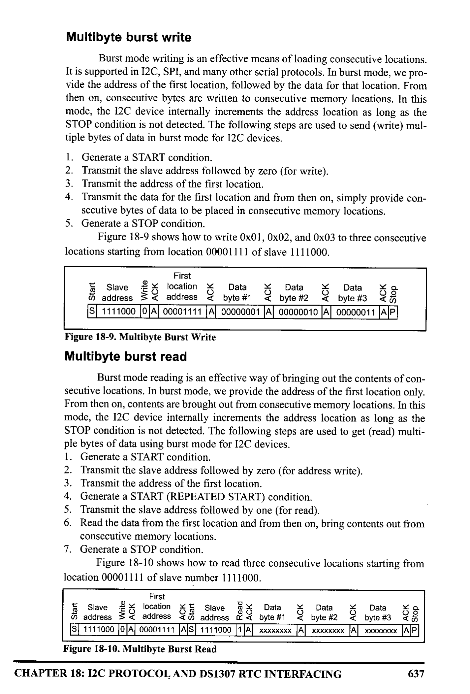
*Description*: Technical diagram and schematic illustration detailing hardware connection topology, signal routing, and circuit operation for Figure 18-9: shows how to write 0x01, 0x02, and 0x03 to three consecutive.

> **Figure 18-9: shows how to write 0x01, 0x02, and 0x03 to three consecutive**

locations starting from location 00001111 of slave 1111000.
* Slave
address
First
ACK
location
address
Data
* Data
Data
byte #1 byte#
& byte #3
[S 1111000 |0|A| 00001111 |A| 00000001 |A| 00000010 |A| 00000011 |A|P


*Description*: Technical diagram and schematic illustration detailing hardware connection topology, signal routing, and circuit operation for Figure 18-9: Multibyte Burst Write.

> **Figure 18-9: Multibyte Burst Write**

Multibyte burst read
Burst mode reading is an effective way of bringing out the contents of con-
secutive locations. In burst mode, we provide the address of the first location only.
From then on, contents are brought out from consecutive memory locations. In this
mode, the I2C device internally increments the address location as long as the
STOP condition is not detected. The following steps are used to get (read) multi-
ple bytes of data using burst mode for I2C devices.
1. Generate a START condition.
2. Transmit the slave address followed by zero (for address write).
3. Transmit the address of the first location.
4. Generate a START (REPEATED START) condition.
5. Transmit the slave address followed by one (for read).
6. Read the data from the first location and from then on, bring contents out from
consecutive memory locations.
7. Generate a STOP condition.


*Description*: Technical diagram and schematic illustration detailing hardware connection topology, signal routing, and circuit operation for Figure 18-10: shows how to read three consecutive locations starting from.

> **Figure 18-10: shows how to read three consecutive locations starting from**

location 00001111 of slave number 1111000.
First
tart
Slave
location
address
3
Slave
Data
Data
Data
address
address
1111000
O A 00001111
AS
1111000 |1A|xxxxxxxxx xxxxxxxxx A xxxxxxxx/A xxxxxxxx AP


*Description*: Technical diagram and schematic illustration detailing hardware connection topology, signal routing, and circuit operation for Figure 18-10: Multibyte Burst Read.

> **Figure 18-10: Multibyte Burst Read**

CHAPTER 18: I2C PROTOCOL AND DS1307 RTC INTERFACING
637


<!-- Page 645 -->
### [PDF Page 645]


### Review Questions

1. True or false. I2C protocol is ideal for short distances.
2. How many bits are there in a frame? Which bit is for acknowledge?
3. True or false. START and STOP conditions are generated when the SDA is
high.
4. What is the name of the flow control method in the I2C protocol?
5. What is the recommended value for the pull-up resistors in the I2C protocol?
6. True or false. After the arbitration of two masters, both of them must start
transmission from the beginning.

## SECTION 18.2: TWI (12C) IN THE AVR

In many applications, including AVR datasheet, I2C is referred to as Two-
wire Serial Interface (TWI). From now on, in this book we use TWI to conform
with the AVR data sheets. In this section we discuss the TWI module and registers
of the AVR. Then we show how to program the AVR to address a slave device and
send or receive data using TWI. The TWI module in the AVR is composed of four
submodules: bit rate generation unit, bus interface unit, address match unit, and
control unit. Figure 18-11 shows the TWI module. All registers drawn with a thick
line are accessible through the AVR data bus.
Bus Inerface Unit
SCLI
Start/Stop
control
Address/Data Shift
Register (TWDR)
"Ack
ISDA
Arbitration
detectior
Bit Rate Generator
Prescaler
Bit Rate Register
(TWBR)
Address Match Unit
Address Register
(TWAR)
Address
Comprator
Control Unit
Status Register
Control Register
(TWSR)
(TWCR)
State Machine and
Status control

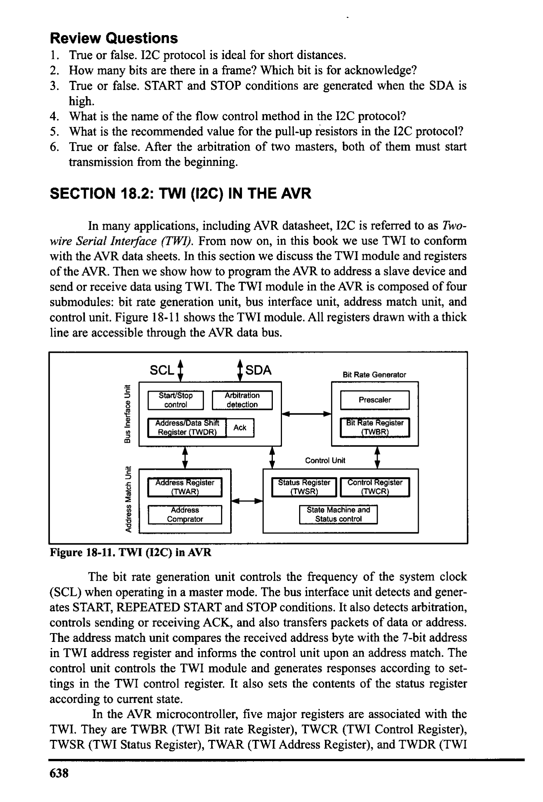
*Description*: Technical diagram and schematic illustration detailing hardware connection topology, signal routing, and circuit operation for Figure 18-11: TWI (12C) in AVR.

> **Figure 18-11: TWI (12C) in AVR**

The bit rate generation unit controls the frequency of the system clock
(SCL) when operating in a master mode. The bus interface unit detects and gener-
ates START, REPEATED START and STOP conditions. It also detects arbitration,
controls sending or receiving ACK, and also transfers packets of data or address.
The address match unit compares the received address byte with the 7-bit address
in TWI address register and informs the control unit upon an address match. The
control unit controls the TWI module and generates responses according to set-
tings in the TWI control register. It also sets the contents of the status register
according to current state.
In the AVR microcontroller, five major registers are associated with the
TWI. They are TWBR (TWI Bit rate Register), TWCR (TWI Control Register),
TWSR (TWI Status Register), TWAR (TWI Address Register), and TWDR (TWI
638


<!-- Page 646 -->
### [PDF Page 646]

Data Register). Next, we will focus on registers related to TWI and study each bit
of them in detail.
TWI Bit Rate Register (TWBR)
The following figure shows the TWBR register and its bits.
TWBRT TWBRE TWBR5 TWBRA TWBR3 | TWBR2 | TWBR1 TWBRO
TWBR selects the division factor to control the SCL clock frequency in
master mode. The SCL frequency is controlled by settings in the TWBR and the
prescaler bits in the TWSR (TWI status register is discussed next). The following
equation demonstrates the relation between SCL frequency, TWBR, and TWPS
bits in TWI status register:
CPU Clock frequency
SCL frequency = —
16 + 2 (TWBR) X 4TWPS
Notice that the value of TWBR should be 10 or higher if the TWI operates
in master mode. Example 18-6 shows how the frequency of SCL is calculated.
Example 18-6
Calculate the SCL frequency if the value of TWPS bits in TWSR is 01 (1 Dec) and the
value of TWBR is 00100110 (38 Dec). Assume that CPU clock frequency is 8 MHz.
Solution:
The SCL frequency will be: 8 MHz / ((16 + 2 (38) × 4) = 25 kHz
TWI Status Register (TWSR)
As you see in Figure 18-12, five bits of TWSR are dedicated to show the
status of the TWI logic and bus. Notice that if you read TWSR, you will read both
the status bits and the prescaler value. To check the status bits, you should mask
the two LSB bits (prescaler values) to zero. In this book we do not list all of the
status codes and their meanings, but we will cover some of more common ones.
To see the complete list of status register codes, you should refer to the data sheet
of the chip. Next we will see how to use these bits when we want to program the
AVR to use the TWI module.
TWS7
TWS6
TWSS
TWS4
T TWS3
-
Bits 7..3 - TWS: TWI Status
These five bits show the status of the TWI control and bus.
Bits 1..0 - TWPS: TWI Prescaler Bits
These bits control the bit rate prescaler.

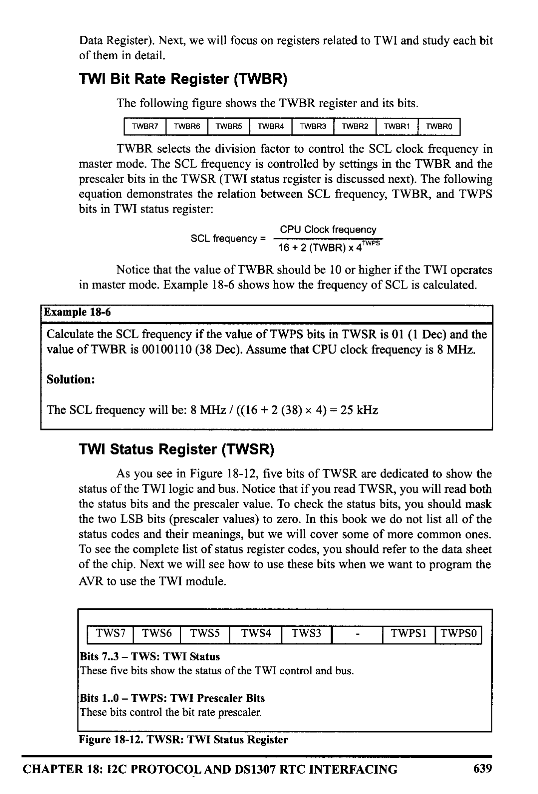
*Description*: Register specification diagram depicting individual bit flags, control register configurations, and functional definitions for Figure 18-12: TWSR: TWI Status Register.

> **Figure 18-12: TWSR: TWI Status Register**

CHAPTER 18: 12C PROTOCOL AND DS1307 RTC INTERFACING
| TWPSI TWPSO
639


<!-- Page 647 -->
### [PDF Page 647]

TWI Control Register (TWCR)
TWCR controls the operation of the TWI. In Figure 18-13 you see each bit
of TWCR and a short description of it. Here we will describe some of these bits in
more detail.
TWINT
TWEA TWSTA TWSTO
TWWC TWEN
-
TWIE
Bit 7 - TWINT: TWI Interrupt
This bit is set by hardware when the TWI module has finished its current job. If the
TWI and general interrupt are enabled, changing TWINT to one will cause the MCU to
jump to the TWI interrupt vector. Clearing this flag starts the operation of the TWI.
TWINT must be cleared by software.
Bit 6 - TWEA: TWI Enable Acknowledge
Making this bit HIGH will enable the generation of ACK when needed in slave or
receiver mode.
Bit 5 - TWSTA: TWI START condition Bit
Making this bit HIGH will generate a START condition if the bus is free; otherwise, the
TWI module waits for the bus to become free and then generates a START condition
Bit 4 - TWSTO: TWI STOP condition bit
In master mode, making this bit HIGH causes the TWI to generate a STOP condition.
This bit is cleared by hardware when the STOP condition is transmitted.
Bit 3 - TWWC: TWI Write Collision Flag
This bit is set HIGH when we attempt to access the TWI Data Register when TWINT is
low. This flag is cleared by writing to the TWDR register when TWINT is high.
Bit 2 - TWEN: TWI Enable
Making this bit HIGH enables the TWI module.
Bit 0 - TWIE: TWI Interrupt Enable
Making this bit HIGH enables the TWI interrupt if the general interrupt is enabled.

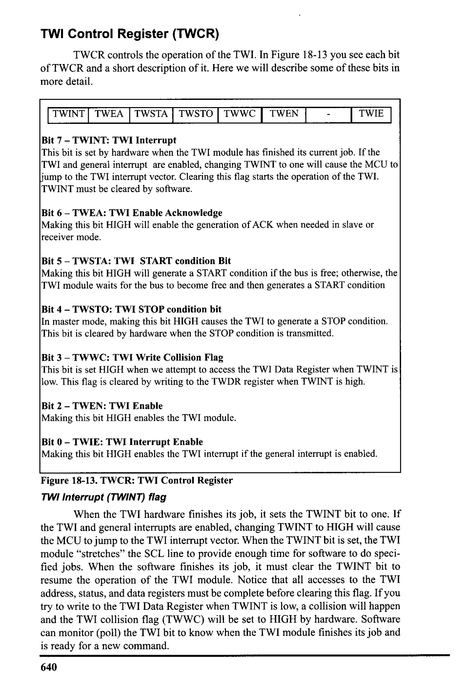
*Description*: Register specification diagram depicting individual bit flags, control register configurations, and functional definitions for Figure 18-13: TWCR: TWI Control Register.

> **Figure 18-13: TWCR: TWI Control Register**

TWI Interrupt (TWINT) flag
When the TWI hardware finishes its job, it sets the TWINT bit to one. If
the TWI and general interrupts are enabled, changing TWINT to HIGH will cause
the MCU to jump to the TWI interrupt vector. When the TWINT bit is set, the TWI
module "stretches" the SCL line to provide enough time for software to do speci-
fied jobs. When the software finishes its job, it must clear the TWINT bit to
resume the operation of the TWI module. Notice that all accesses to the TWI
address, status, and data registers must be complete before clearing this flag. If you
try to write to the TWI Data Register when TWINT is low, a collision will happen
and the TWI collision flag (TWWC) will be set to HIGH by hardware. Software
can monitor (poll) the TWI bit to know when the TWI module finishes its job and
is ready for a new command.
640


<!-- Page 648 -->
### [PDF Page 648]

TWI Enable Acknowledge (TWEA) bit
Making this bit HIGH will enable the generation of the ACK bit if any of
the following conditions are met:
1. The TWI Address Match module detects that the TWI module is addressed
by receiving its own slave address from the bus.
2. A general call has been received while the TWGCE bit in the TWAR is set
to one (to enable accepting of global calls).
3. A data byte has been received in each of the receiving modes, master
receiver or slave receiver mode.
If you clear the TWEA bit to zero, the device will not generate ACK and
will be virtually disconnected from the TWI bus.
TWI Start bit and TWI Stop bit (TWSTA and TWSTO)
To generate START or STOP conditions, you have to set the TWSTA or
TWSTO bit to one respectively and then clear the TWINT flag to zero by writing
a one to it.
TWI Data Register (TWDR)
In Receive mode, the last received byte will be in the TWDR, and in
Transmit mode, you should write the next byte into TWDR to be transmitted. As
we mentioned before, you can access the TWDR only when the TWIE is set to one
otherwise collision happens. This means the Data Register cannot be initialized by
the user before the first interrupt occurs.
TWI Address Register (TWAR)
TWAR contains the 7-bit slave address to which the TWI will respond
when working as slave. The eighth bit (LSB) of TWAR is TWGCE (TWI General
Call Recognition Enable). It controls recognition of general call address (00). If
this bit is set to one, receiving of a general call address will cause an interrupt
request.

### Review Questions

1. True or false. The AVR has an internal TWI module.
2. What are the TWI registers in AVR?
3. How do we generate START or STOP conditions in the AVR?
4. True or false. After reading status register we should mask the 2 MSB bits.
5. Which bit is polled to know if the TWI is ready now?
6. True or false. We can write to TWDR when the TWI module is busy.
7. Which bit controls the generation of ACK?
CHAPTER 18: I2C PROTOCOL AND DS1307 RTC INTERFACING
641


<!-- Page 649 -->
### [PDF Page 649]


## SECTION 18.3: AVR TWI PROGRAMMING IN ASSEMBLY


```assembly
AND C
```

In this section we discuss TWI programming in Assembly and C. Here we
will focus on the simplest form of TWI programming without checking the status
register. In most applications, if you are not dealing with critical systems and there
is not more than one master on a single bus, you can use this method. If you want
to deal with multimaster or critical designs you must check the value of the status
flag. TWI programming with checking the value of the status flag is discussed in
a later section.
In I2C protocol, a device can be either master or slave. In this section we
Will discuss the steps of programming in each mode.
Programming of the AVR TWI in master operating mode
To work in master operating mode, we must be able to initialize the TWI,
transmit a START condition, send or receive data, and transmit a STOP condition.
Next we will discuss each one in more detail.
Initialization
To initialize the TWI module to operate in master operating mode, we
should do the following steps:
1. Set the TWI module clock frequency by setting the values of the TWBR reg-
ister and the TWPS bits in the TWSR register.
2. Enable the TWI module by setting the TWEN bit in the TWCR register to one.
Transmit START condition
To start data transfer in master operating mode, we must transmit a START
condition. This is done by setting the TWEN, TWSTA, and TWINT bits of TWCR
to one. Setting the TWEN bit to one enables the TWI module. Setting the TWSTA
bit to one tells the TWI to initiate a START condition when the bus is free, and set-
ting the TWINT bit to one clears the interrupt flag to initiate operation of the TWI
module to transmit the START condition. Then we should poll the TWINT flag in
the TWCR register to see whether the START condition transmitted completely.
Send data
To send a byte of data, after transmitting the START condition, we should
do the following steps:
1. Copy the data byte to the TWDR.
2. Set the TWEN and TWINT bits of the TWCR register to one to start sending
the byte.
3. Poll the TWINT flag in the TWCR register to see whether the byte transmitted
completely.
Notice that right after the START condition, we should transmit SLA + W
(Slave Address + Write) or SLA + R (Slave Address + Read). As we mentioned in
the first section, right after sending SLA+W we should write to the slave, and right
after sending SLA+R we should read from it. To transmit SLA + R, SLA + W, and
to write a byte of data to a slave we use a function called I2C_WIRITE.
642


<!-- Page 650 -->
### [PDF Page 650]

Receive data
To receive a byte of data, after transmitting of SLA + R, we should do the
following steps:
1. Set the TWEN and TWINT bits of the TWCR register to one to start receiving
a byte. Notice that if you want to return ACK after receiving data you should
also set the TWEA bit of the TWCR register to one.
2. Poll the TWINT flag in the TWCR register to see whether a byte has been
received completely.
3. Copy the received byte from the TWDR to another register to save it.
Transmit STOP condition
To stop data transfer, we must transmit a STOP condition. This is done by
setting the TWEN, TWSTO, and TWINT bits of the TWCR register to one. Notice
that we cannot poll the TWINT flag after transmitting the STOP condition.
Program 18-1 shows how a master writes 11110000 to a slave with address
1101000.
¡ Tested OK-ok
• INCLUDE "M32DEF. INC"
LDI
OUT
LDI
OUT
R21, HIGH (RAMEND)
SPH, R21
R21, IOW (RAMEND)
SPL, R21
i set up stack

```assembly
CALL I2C_INIT
```

CALL
I2C_START
LDI
R27, 0b11010000
CALL
I2C WRITE
LDI
R27, 0b11110000
CALL
I2C WRITE

```assembly
CALL I2C_STOP
```

¡initialize TWI module
¡transmit START condition
; SLA (1001100) + W (0)
¡write R27 to I2C bus
¡ data to be transmitted
¡write R27 to I2C bus
¡ transmit STOP condition
HERE: RJMP HERE
¡wait here forever
¡*******************************************************.
I2C_INIT:
LDI
OUT
LDI
OUT
LDI
OUT
RET
R21,
0
IWSR, R21
R21,
0x47
TWBR, R21
R21, (1<<TWEN)
TWCR, R21
¡ set prescaler bits to
zerO
¡ move 0x47 into R21
¡ set clock freq. to 50k (8 MHz XTAL)
; move 0x04 into R21
¡enable the TWI
¡********
I2C_START:
LDI
OUT
*****
**********
****
R21,
(1<<TWINT) | (1<<TWSTA) | (1<<TWEN)
TWCR, R21
¡transmit
a START condition
Program 18-1: Writing a Byte in Master Mode (continued on next page)
CHAPTER 18: I2C PROTOCOL AND DS1307 RTC INTERFACING
643


<!-- Page 651 -->
### [PDF Page 651]

WAITI:
IN
R21, TWCR
SBRS
R21, TWINT
RJMP
WAIT1
RET
¡ read control register into R21
¡ skip next line if TWINT is 1
¡jump to WAIT1 if TWINT is 1
**********
I2C_WRITE:
OUT
LDI
OUT
WAIT3:
IN
SBRS
RJMP
RET
*****************
***********
TWDR,
R21,
TWCR,
R27
; move the byte into TWDR
(1<<TWINT) | (1<<TWEN)
R21
¡ configure TWCR to send TWDR
R21,
TWCR
R21, IWINT
WAIT3
¡ read control register into R21
¡skip next line if TWINT is
1
¡ jump to WAIT3 if TWINT is 1
;*********************************************************
I2C
_STOP:
LDI
OUT
RET
R21,
TWCR, R21
(1<<TWINT) | (1<<TWSTO) | (1<<TWEN)
¡transmit STOP condition
Program 18-1: Writing a Byte in Master Mode (continued from previous page)
Program 18-2 shows how to read a byte from a slave with address 1001100
and displays the result on Port A.
; Tested OK- ok
. INCLUDE "M32DEF.INC"
LDI
OUT
LDI
OUT
R21, HIGH (RAMEND)
SPH, R21
R21, LOW (RAMEND)
SPL, R21
i set up stack
IDI
OUT
R21, $FE
DDRA, R21
¡ move $FF to R21
¡ Port A is output

```assembly
CALL I2C_INIT
```

CALL
I2C_START
LDI
R27, 0b11010001
CALL
I2C_ WRITE

```assembly
CALL I2C READ
```

OUT
PORTA, R27

```assembly
CALL I2C_STOP
```

¡initialize TWI module
¡transmit START condition
¡ SLA (1001100) + R (1)
¡write R27 to IZC bus
¡write R27 to I2C bus
¡ show received data on Port A
¡transmit STOP condition
HERE:

```assembly
RJMP HERE
```

¡wait here forever
Program 18-2: Reading a Byte in Master Mode (continued on next page)
644


<!-- Page 652 -->
### [PDF Page 652]

;*************
I2C_INIT:
LDI
OUT
LDI
OUT
LDI
OUT
RET
***************************
R21, 0
TWSR, R21
R21, $47
TWBR, R21
R21, (1<<TWEN)
TWCR, R21
¡set prescaler bits to zero
¡move $47 into R21
¡SCL freq. is 50k for 8MHz XTAI
¡move 0x04 into R21
¡enable the TWI
;*********
I2C_START:
LDI
OUT
WAIT1:
IN
R21,
TWCR
SBRS R21, IWINT

```assembly
RJMP WAIT1
```

RET
****************************
R21,
(I<<TWINT) | (1<<TWSTA) | (1<<TWEN)
TWCR, R21
¡transmit a START condition
¡ read control register into R21
i skip next line if IWINT is 1
¡ jump to WAITI if IWINT is 1
;******************
I2C_READ:
LDI
OUT
WAIT2:
IN
R21, TWCR
SBRS R21, TWINT

```assembly
RJMP WAIT2
```

IN
R27, TWDR
RET
****************************
R21, (1<<TWINT) | (1<<TWEN)
IWCR,
R21
¡ read control register into R21
iskip next line if TWINT is 1
¡jump to WAIT2 if IWINT is O
¡read received data into R21
;*************
I2C WRITE:
OUT
LDI
OUT
WAIT3:
IN
R21, TWCR
SBRS R21, IWINT

```assembly
RJMP WAIT3
```

RET
****************************
TWDR, R27
; move the byte into IWDR
R21,
(1<<TWINT) | (1<<TWEN)
TWCR,
R21
¡configure TWCR to send TWDR
¡read control register into R21
i skip next line if IWINT is
1
¡ jump to WAIT3 if IWINT is 1
;********.
I2C_STOP:
LDI
OUT
RET
•********************
****
R21,
TWCR, R21
(1<<TWINT) | (1<<TWSTO) | (1<<TWEN)
¡transmit STOP condition
Program 18-2: Reading a Byte in Master Mode (continued from previous page)
CHAPTER 18: I2C PROTOCOL AND DS1307 RTC INTERFACING
645


<!-- Page 653 -->
### [PDF Page 653]

C programming of the AVR TWI in master operating mode
Program 18-3 shows how a master writes 11110000 to a slave with address
1101000. This program is the C version of Program 18-1.
Program 18-4 shows how a master reads from a slave with address
1101000 and displays the result on Port A. This program is the C version of
Program 18-2.

```c
#include <avr/io.h>
```

void i2c_ write lunsigned char data)
TWDR = data
TWCR = (1<<
TWINT) | (1<<IWEN) ;
while ((TWCR & (1 <<TWINT)) == 0);
//**************
******************************
void i2c_start (void)
TWCR = (1 << TWINT) | (1 << TWSTA) | (1 << TWEN) ;
while ((TWCR & (1 << TWINT)) == 0) ;
/*****************
************
void i2c_stop ()
TWCR = (1<< TWINT) | (1<<TWEN) | (1<<TWSTO) ;
********
//********************
void ilc_init (void)
TWSR=0x00;
TWBR=0x47;
TWCR=0x04;
************
*******
/set prescaler bits
to zero
//SCI frequency is 50K for XTAL = 8M
lenable the TWI module
/************
int main (void)
i2c_init () ;
12c
_start ();
i2c_write (0611010000);
i2c
-
write (0b11110000);
i2c
stop () ;

```c
while (1);
```

return
° ;
******
******
/transmit START condition
I/transmit SLA + W(0)
l/transmit data
/transmit STOP condition
Istay here forever
Program 18-3: Writing a Byte in Master Mode in C
646


<!-- Page 654 -->
### [PDF Page 654]


```c
#include <avr/io.h>
```

void ile_init (void)
TWSR=0×00;
TWBR=0x47;
TWCR=0x04;
I/set prescaler bits to zero
//SCL Frequency is 50K for XTAL=8M
lenable the TWI module
/******************.
void i2c_start (void)
*******************************
TWCR = (1 << TWINT) | (1 << TWSTA)
while ((TWCR & (1 < TWINT)) == O);
| (1 << TWEN) ;
//*********************************************************
void i2c
_write (unsigned char data)
TWDR = data ;
TWCR = (1<<
IWINT)| (1<<TWEN);
while ((IWCR & (1 <<IWINT)) == 0);
//**********************************************************
unsigned char i2c_read (unsigned char islast)
if (isLast == 0)
//if want to read more than 1 byte
TWCR = (1<< IWINT) | (1<<TWEN) | (1<<TWEA) ;
else
/if want to read only one byte
TWCR = (1<< TWINT) | (1<<TWEN);
while ((TWCR & (1 <<TWINT)) == 0);
return TWDR ;
*************
void 12c_stop ()
************
* *
TWCR = (1<< TWINT) | (1<<TWEN) | (1<<TWSTO) ;
/****************
int main (void)
*******************
*****
unsigned char i = 0 ;

```c
DDRA = OxFF;
```

I2c_init();
120_start ();
i2c_write (0b11010001);
1=12c_read (1);

```c
PORTA= i;
```

12c_stop ();

```c
while (1);
```

return 0 ;
//Port A is output
/initialize IWI for master mode
I/transmit START condition
I/transmit SIA + R (1)
/read only one byte of data
show the byte on Port A
I/transmit STOP condition
Istay here forever
Program 18-4: Reading a Byte in Master Mode in C
CHAPTER 18: I2C PROTOCOL AND DS1307 RTC INTERFACING
647


<!-- Page 655 -->
### [PDF Page 655]

Programming of the AVR TWI in slave operating mode
To work in slave operating mode, we must be able to initialize the TWI and
we must also be able to send or receive data. In slave mode we cannot transmit
START or STOP conditions. A slave device should listen to the bus and wait to be
addressed by a master device or general call.
Initialization
To initialize the TWI module to operate in slave operating mode, we should
do the following steps:
1. Set the slave address by setting the values for the TWAR registers. As we men-
tioned before, the upper seven bits of TWAR are the slave address, and the
eighth bit is TWGCE. If you set this bit to one, the TWI will respond to the
general call address ($00); otherwise, it will ignore the general call address.
2. Enable the TWI module by setting the TWEN bit in the TWCR register to one.
3. Set the TWEN, TWINT, and TWEA bits of TWCR to one to enable the TWI
and acknowledge generation.
Notice that we cannot combine steps 2 and 3 into a single step. We have to
enable the TWI module before doing the third step.
Listen to the bus
After initializing the TWI module, a slave device should listen to the bus
to detect when it is addressed by a master device. When the TWI module detects
its own address on the bus, it returns ACK and then sets the TWINT flag in the
TWCR register to one. We should poll the TWINT flag to see when the slave is
addressed by a master device.
Send data
After being addressed by a master device for read, we should do the fol-
lowing steps to send a byte of data:
1. Copy the data byte to the TWDR.
2. Set the TWEN, TWEA, and TWINT bits of the TWCR register to one to start
sending the byte. Notice that if you expect not to receive ACK after receiving
data you can leave the TWEA cleared. It will have no effect on generation of
ACK by master and will only change the internal state of the TWI module. We
recommend that you set the TWEA bit of the TWCR register to one anyway.
3. Poll the TWINT flag in the TWCR register to see when the byte is complete-
ly transmitted.
Receive data
After being addressed by a master device, we should do the following steps
to receive a byte of data:
1. Set the TWEN and TWINT bits of the TWCR register to one to start receiving
a byte. Notice that if you want to return ACK after receiving data you should
also set the TWEA bit of the TWCR register to one.
2. Poll the TWINT flag in the TWCR register to see whether a byte has been
received completely.
3. Copy the received byte from the TWDR to another register to save it.
Programs 18-5 and 18-6 show how to initialize the TWI module to operate
648


<!-- Page 656 -->
### [PDF Page 656]

in slave mode. In Program 18-5 the TWI module listens to the bus and waits to be
addressed by a master device. Then it transmits the letter 'G' to the master device.
• INCLUDE "M32DEF.INC"
LDI
OUT
LDI
OUT
R21, HIGH (RAMEND); set up stack
SPH, R21
R21, LOW (RAMEND)
SPL, R21

```assembly
CALL I2C_INIT
CALL I2C_LISTEN
```

LDI
R21, 'G'

```assembly
CALL I2C_WRITE
```

¡ initialize the TWI module as slave
¡listen to the bus to be addressed
¡ load 'G' into R21
¡write the byte to the bus
HERE:

```assembly
RJMP HERE
```

¡wait here forever
;*********************************************************
I2C_INIT:
LDI
OUT
LDI
OUT
LDI
OUT
RET
R21, 0x10
¡load slave address 00010000 into R21
IWAR, R21
¡load IWI Address Register
R21, (1<<TWEN)
¡ move 0x04 into R21
TWCR, R21
¡enable the IWI
R21, (1<<TWINT) | (1‹<TWEN) | (1‹<TWEA)
TWCR, R21
¡enable IWI and ACK (can't be ignored)
¡***********
*********
*********
I2C_LISTEN:
WI:
IN
R21,
TWCR
SBRS R21,
TWINT
RJMP
W1
RET
¡ read control register into R21
¡ skip next intruction if TWINT is 1
¡jump to W1 if IWINT is O
;***********.
************
***********
I2C_WRITE:
W2:
OUT
TWDR, R21
; move R21 to TWDR
LDI
R21, (1<<TWINT) | (1<<TWEN)

```assembly
OUT TWCR, R21
```

¡ configure IWCR to send TWDR
IN
R21, TWCR
SBRS R21, IWINT

```assembly
RJMP W2
```

RET
¡ read control register into R21
iskip next line if IWINT is 1
¡ jump to W2 if IWINT is O
Program 18-5: Writing a Byte in Slave Mode
CHAPTER 18: I2C PROTOCOL AND DS1307 RTC INTERFACING
649


<!-- Page 657 -->
### [PDF Page 657]

In Program 18-6 the TWI module listens to the bus and waits to be
addressed by a master device. Then it reads a byte of data from the master device
and displays it on Port A.
•
• INCLUDE "M32DEF.INC"
LDI
OUT
LDI
OUT
R21, HIGH (RAMEND); set up stack
SPH, R21
R21, LOW (RAMEND)
SPL, R21
IDI
OUT
R21, OXFF
DDRA, R21
¡ move OxFF into R21
¡ set Port A as output

```assembly
CALL I2C_INIT
CALL I2C _LISTEN
CALL I2C_READ
```

OUT
PORTA, R27
¡ initialize the IWI module as slave
¡listen to the bus to be addressed
¡ read a byte and copy it to R27
¡ copy R27 to PORTA
HERE:
RUMP
********
HERE
¡wait here forever
********************************
I2C_INIT:
LDI
OUT
LDI
OUT
LDI
OUT
RET
**
*****
R21, 0x10
; load 00010000 into R21
TWAR, R21
; set address register
R21,
(1<<TWEN)
¡move 0x04 into R21
TWCR, R21
¡ enable the
TWI
R21,
(1<<TWINT) | (1<<TWEN) | (1<<TWEA)
TWCR, R21
¡ enable
IWI and ACK (can't be ignored)
•****************************
I2C_LISTEN:
WI:
IN
R21, TWCR
SBRS R21, TWINI

```assembly
RJMP WI
```

RET
;*********
¡ read control register into R21
i skip next intruction if TWINT is 1
¡jump to Wl if TWINT is O
********************************
I2C_ READ:
LDI
R21,
(1<<TWINT) | (1<<TWEN) | (1<<TWEA)
OUT
TWCR, R21
¡ configure TWCR to receive IWDR
W2:
IN
R21, TWCR
; read
control register into R21
SBRS R21, IWINT
iskip next line if TWINT is 1

```assembly
RJMP W2
```

¡ jump to W2 if IWINT is O
IN
R27, TWDR
¡move received data into R27
RET
Program 18-6: Reading a Byte in Slave Mode
650


<!-- Page 658 -->
### [PDF Page 658]

C programming of the AVR TWI in slave operating mode
Program 18-7 is the C version of Program 18-5. Program 18-7 shows how
to initialize the TWI module to operate in slave mode. In Program 18-7 the TWI
module listens to the bus and waits to be addressed by a master device. Then it
transmits the letter 'G' to the master device.
#include
<avr/io.h>
I/standard AVR header
void
_initSlave (unsigned char slaveAddress)
TWCR = 0x04;
I/enable IWI module
slaveAddress;
//set the
slave address
TWCR = (1<<IWINT) |(1<<TWEN) |(1<<TWEA)://init. TWI module
//*******************
void i2c_send (unsigned char data)
TWDR = data;
TWCR = (1<< TWINT) | (1<<TWEN);
while ((TWCR & (1 <<TWINT)) ==0) ;
****************************
//copy data to TWDR
I/start transmission
//wait to complete
/*************
void i2c_listen ()
while ((TWCR & (1 <<TWINT) )==0);
***-**------------******
I/wait to be addressed
//*****************
int main (void)
12c_initSlave (0x10);
***************************
12c_listen () ;
i2c
_send ('G');

```c
while (1);
```

return 0;
linit. IWI module as
/slave with address
1/0b0001000 and do not
//accept general call
/listen to be addressed
I/transmit letter 'G
Il stay here forever
Program 18-7: Writing a Byte in Slave Mode in C
CHAPTER 18: I2C PROTOCOL AND DS1307 RTC INTERFACING
651


<!-- Page 659 -->
### [PDF Page 659]

Program 18-8 is the C version of Program 18-6. In Program 18-8 the TWI
module listens to the bus and waits to be addressed by a master device. Then it
reads a byte of data from the master device and displays it on Port A.

```c
#include <avr/io.h>
//standard AVR header
```

Void ize_initslave (unsigned char slaveaddress)
TWCR = 0x04;
l/enable IWI module
TWAR
=
slaveAddress;
/set the slave address
TWCR =
(1<<TWINT) | (1<<TWEN) | (1<<TWEA)://init. IWI module
/********************
******•
****
unsigned char ilo_receive (unsigned char islast)
if (isLast == 0)
/if want to read more than 1 byte
TWCR = (1‹< TWINT) | (1<<TWEN) | (1<<TWEA) ;
else
//if. want to read only one byte
TWCR = (1<< TWINT) | (1<<TWEN) ;
while ((TWCR & (1 <<TWINT) )==0) ;
return (TWDR) ;
//wait to complete
//********
void i2c_listen ()
while ((TWCR & (1 <<TWINT)) ==0) ;
/wait to be addressed
/******
int main (void)

```c
DDRA = OxFF;
```

i2c_initSlave (0x10);
* * * * *****
* * *
i2c_listen ();

```c
PORTA = i2c
```

_receive (1) ;

```c
while (1);
```

return 0;
Winit. TWI module as
/slave with address
//0b0001000 and do not
//accept general call
//listen
to be addressed
/stay here forever
Program 18-8: Reading a Byte in Slave Mode in C
652


<!-- Page 660 -->
### [PDF Page 660]


### Review Questions

1. True or false. We can ignore the status flag in multimaster systems.
2. Which of the following is not needed to initialize the TWI module to operate
in master operating mode? (More than one choice can be true.)
(a) Enable the TWI module.
(b) Set the value of the prescaler bits.
(c) Set the value of the TWBR register.
(d) Set the value of the TWAR register.
3. Which of the following is not needed to initialize the TWI module to operate
in slave operating mode? (More than one choice can be true.)
(a) Enable the TWI module.
(b) Set the value of the prescaler bits.
(c) Set the value of the TWBR register.
(d) Set the value of the TWAR register.
4. Which of the following instructions is used to transmit a STOP condition in
master operating mode?
(a) LDI
R21, (1<<IWINT) | (1<<TWEN) | (1<<TWEA)
OUT
TWCR, R21
(b) LDI
R21, (1<<TWINT) | (1<<TWEN)
OUT
TWCR, R21
(c) LDI
R21, (1<<TWINT) | (1<<TWSTO) | (1<<TWEN)
OUT
TWCR, R21
(d) LDI
OUT
R21, (1<<TWINT) | (1<<TWSTA) | (1<<TWEN)
TWCR, R21
5. Which of the following instructions is used to transmit a STOP condition in
master operating mode?
(a) LDI
R21, (1<<TWINT) | (1<<TWEN) | (1<<TWEA)
OUT
TWCR, R21
(b) LDI
R21, (1<<TWINT) | (1<<TWEN)
OUT
TWCR, R21
(C) LDI
OUT
R21, (1<<TWINT) | (1<<TWSTO) | (1<<TWEN)
TWCR, R21
(d) LDI
R21,
(1<<TWINT) | (1<<TWSTA) | (1<<TWEN)
OUT
TWCR, R21
CHAPTER 18: I2C PROTOCOL AND DS1307 RTC INTERFACING
653


<!-- Page 661 -->
### [PDF Page 661]


## SECTION 18.4: D$1307 RTC INTERFACING AND

PROGRAMMING
The real-time clock (RTC) is a widely used device that provides accurate
time and date information for many applications. Many systems such as the x86
PC come with such a chip on the motherboard. The RTC chip in the x86 PC pro-
vides the time components of hour, minute, and second, in addition to the date/cal-
endar components of year, month, and day. Many RTC chips use an internal bat-
tery, which keeps the time and date even when the power is off. Although some
microcontrollers, such as the DS5000T and some of AVRs, come with the RIC
already embedded into the chip, we have to interface the vast majority of them to
an external RTC chip. One of the most widely used RTC chips is the DS12887
from Dallas Semiconductor/Maxim Corp. This chip is found in the vast majority
of x86 PCs. The original IBM PC/AT used the MC14618B RTC from Motorola
(now Freescale). The DS12887 is the replacement for that chip. It uses an internal
lithium battery to keep operating for over 10 years in the absence of external
power. The DS12887 is a parallel RTC with 8 pins for the data bus. The D$1307
is a serial RTC with an I2C bus. In this section, we interface and program the
DS1307 RTC. According to the DS1307 data sheet from Maxim, "The clock/cal-
endar provides seconds, minutes, hours, day, date, month, and year information.
The end of the month date is automatically adjusted for months with fewer than 31
days, including corrections for leap year. The clock operates in either the 24-hour
or 12-hour format with AM/PM indicator. The DS1307 has a built-in power-sense
circuit that detects power failures and automatically switches to the battery sup-
ply." The DS1307 does not support the Daylight Savings Time option. Next, we
describe the pins of the DS1307. See Figure 18-14.
X1-X2
These are input pins that allow
the DS1307 connection to an external
crystal oscillator to provide the clock
source to the chip. We must use the
standard 32.768 kHz quartz crystal.
The accuracy of the clock depends on
the quality of this crystal oscillator.
x1
x2 L
Vbat [
GND D
I Vcc
I SQWIOUT
nSCL
I SDA
Heat can cause a drift on the oscilla-
tor. To avoid this, we can use the
DS32KHZ chip, which automatically

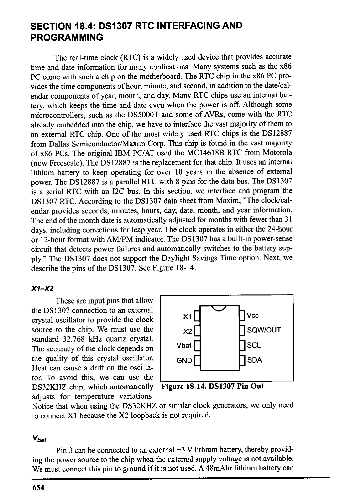
*Description*: IC pinout diagram showing physical pin assignments, I/O pin multiplexing, supply rails, and clock interface connections for Figure 18-14: DS1307 Pin Out.

> **Figure 18-14: DS1307 Pin Out**

adjusts for temperature variations.
Notice that when using the DS32KHZ or similar clock generators, we only need
to connect X1 because the X2 loopback is not required.
Vbat
Pin 3 can be connected to an external +3 V lithium battery, thereby provid-
ing the power source to the chip when the external supply voltage is not available.
We must connect this pin to ground if it is not used. A 48mAhr lithium battery can
654


<!-- Page 662 -->
### [PDF Page 662]

provide the power needed for more than 10 years to back up the chip.
GND
Pin 4 is the ground.
SDA (Serial Data)
Pin 5 is the SDA pin and must be connected to the SDA line of the I2C bus.
SCL (Serial Clock)
Pin 6 is the SCL pin and must be connected to the SCL line of the I2C bus.
SWQ/OUT
Pin 7 is an output pin providing 1 kHz, 4 kHz, 8 kHz, or 32 kHz frequen-
cy if enabled. This pin needs an external pull-up resistor to generate the frequen-
cy because it is open drain. If you do not want to use this pin you can omit the
external pull-up resistor. We will see shortly how to control this pin.
Voc
Pin 8 is used as the primary voltage supply to the chip. This primary volt-
age source is generally set to +5 V. When Voc falls below the Vbat level, the
DS1307 switches to Vbat and the external lithium battery provides power to the
RTC. According to the DS1307 data sheet, "upon power-up, the device switches
from Voat to Vecl when Vccl is greater than Vbatt0.2 Volts." Also notice that
the device is accessible only when Vcc is more than 1.25 x V bat. Because we can
connect the standard 3 V lithium battery to the Vbat pin, the Vce voltage level
must remain above 3.2 V in order for the Vce to remain as the primary voltage
source to the chip, and it must be more than 3.75 V if you want to access the chip.
+5 V
32.768KHZ
X1
X2
-Vbat
GND
Vcc
SQW/OUT-
SCL-
SDA
N
AVR
SCL
SDA

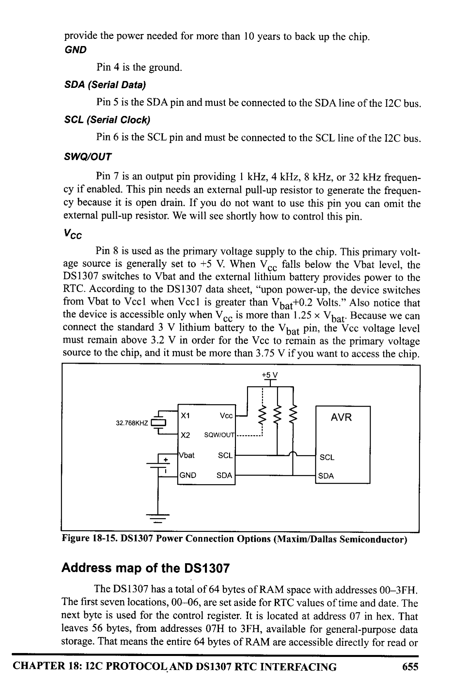
*Description*: Technical diagram and schematic illustration detailing hardware connection topology, signal routing, and circuit operation for Figure 18-15: D$1307 Power Connection Options (Maxim/Dallas Semiconductor).

> **Figure 18-15: D$1307 Power Connection Options (Maxim/Dallas Semiconductor)**

Address map of the DS1307
The DS1307 has a total of 64 bytes of RAM space with addresses 00-3FН.
The first seven locations, 00-06, are set aside for RTC values of time and date. The
next byte is used for the control register. It is located at address 07 in hex. That
leaves 56 bytes, from addresses 07H to 3FH, available for general-purpose data
storage. That means the entire 64 bytes of RAM are accessible directly for read or
CHAPTER 18: I2C PROTOCOL AND DS1307 RTC INTERFACING
655


<!-- Page 663 -->
### [PDF Page 663]

write. Figure 18-16 shows the address map of the DS1307. Next, we study the con-
trol register, and time and date access in DS1307.
ADDRESS
01H
02H
ОЗН
04H
05H
06H
07H
08H-3FH
Bit7
CH
Bit
12
24
Bits
Bit4
10 Seconds
10 Minutes
10 Hour
PM/AM
10 Hour
10 Year

```assembly
OUT I
```

0
10 Date
10
Month
SQWE
Bit3 Bitz Bit1
Bito
FUNCTION
RANGE
Seconds
Seconds
00-59
Minutes
Minutes
00-59
1-12
Hours
Hours
+AM/PM
00-23
DAY
Date
Dale
01-07
01-31
Month
Month
01-12
Year
Year
00-99
RS1 RSO
Control
RAM 56x8
OOH-FFH


*Description*: Architectural block diagram detailing logic blocks, internal buses, memory units, and hardware component interactions for Figure 18-16: Simplified Block Diagram of DS1307 (Maxim/Dallas Semiconductor).

> **Figure 18-16: Simplified Block Diagram of DS1307 (Maxim/Dallas Semiconductor)**

The DS1307 control register
As shown in Figure 18-16, the control register has an address of 07H. In
the DS1307 control register, the bits control the function of the SQW/OUT pin. In

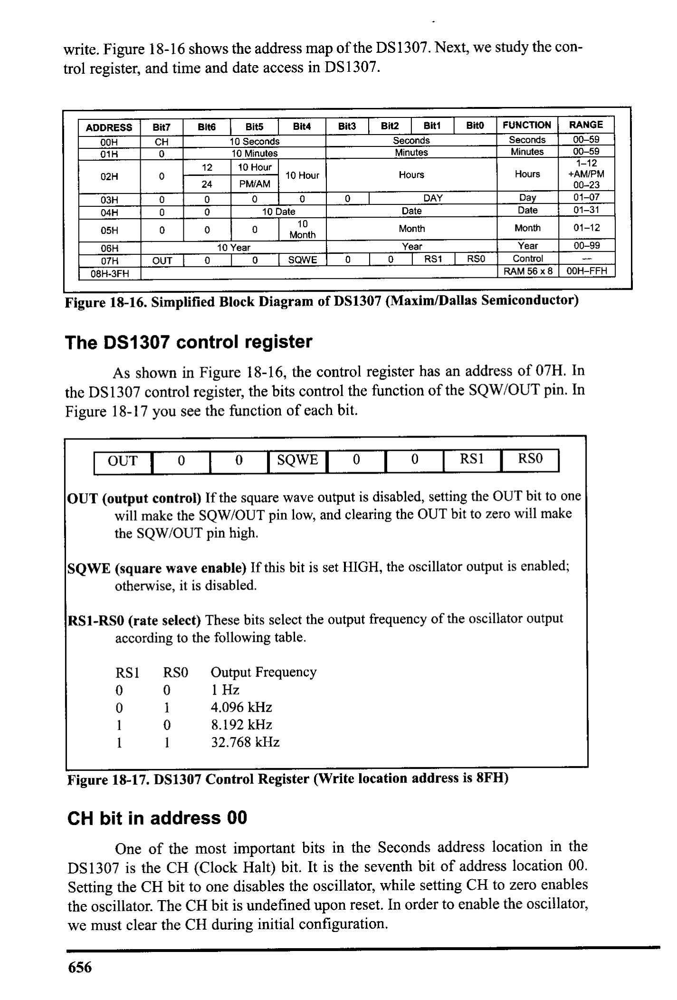
*Description*: Technical diagram and schematic illustration detailing hardware connection topology, signal routing, and circuit operation for Figure 18-17: you see the function of each bit..

> **Figure 18-17: you see the function of each bit.**

OUT
SQWE
RS1 RSO
OUT (output control) If the square wave output is disabled, setting the OUT bit to one
will make the SQW/OUT pin low, and clearing the OUT bit to zero will make
the SQW/OUT pin high.
SQWE (square wave enable) If this bit is set HIGH, the oscillator output is enabled;
otherwise, it is disabled.
RS1-RSO (rate select) These bits select the output frequency of the oscillator output
according to the following table.
RSI
0
0
1
1
RSO
0
1
0
1
Output Frequency
1 Hz
4.096 kHz
8.192 kHz
32.768 kHz


*Description*: Register specification diagram depicting individual bit flags, control register configurations, and functional definitions for Figure 18-17: DS1307 Control Register (Write location address is 8FH).

> **Figure 18-17: DS1307 Control Register (Write location address is 8FH)**

CH bit in address 00
One of the most important bits in the Seconds address location in the
DS1307 is the CH (Clock Halt) bit. It is the seventh bit of address location 00.
Setting the CH bit to one disables the oscillator, while setting CH to zero enables
the oscillator. The CH bit is undefined upon reset. In order to enable the oscillator,
we must clear the CH during initial configuration.
656


<!-- Page 664 -->
### [PDF Page 664]

Time and date address locations and modes
The byte addresses 0-6 are set aside for the time and date, as shown in

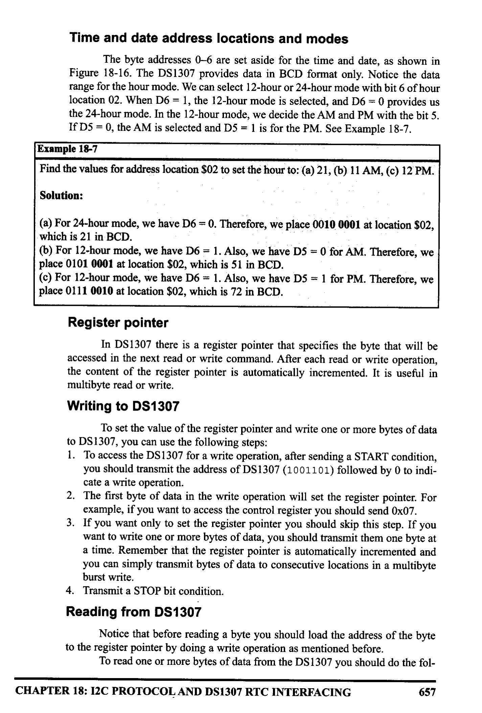
*Description*: Technical diagram and schematic illustration detailing hardware connection topology, signal routing, and circuit operation for Figure 18-16: The DS1307 provides data in BCD format only. Notice the data.

> **Figure 18-16: The DS1307 provides data in BCD format only. Notice the data**

range for the hour mode. We can select 12-hour or 24-hour mode with bit 6 of hour
location 02. When D6 = 1, the 12-hour mode is selected, and D6 = 0 provides us
the 24-hour mode. In the 12-hour mode, we decide the AM and PM with the bit 5.
If D5 = 0, the AM is selected and D5 = 1 is for the PM. See Example 18-7.
Example 18-7
Find the values for address location $02 to set the hour to: (a) 21, (b) 11 AM, (c) 12 PM.
Solution:
(a) For 24-hour mode, we have D6 = 0. Therefore, we place 0010 0001 at location $02,
which is 21 in BCD.
(b) For 12-hour mode, we have D6 = 1. Also, we have DS = 0 for AM. Therefore, we
place 0101 0001 at location $02, which is 51 in BCD.
(c) For 12-hour mode, we have D6 = 1. Also, we have D5 = 1 for PM. Therefore, we
place 0111 0010 at location $02, which is 72 in BCD.
Register pointer
In DS1307 there is a register pointer that specifies the byte that will be
accessed in the next read or write command. After each read or write operation,
the content of the register pointer is automatically incremented. It is useful in
multibyte read or write.
Writing to DS1307
To set the value of the register pointer and write one or more bytes of data
to DS1307, you can use the following steps:
1. To access the DS1307 for a write operation, after sending a START condition,
you should transmit the address of DS1307 (1001101) followed by 0 to indi-
cate a write operation.
2. The first byte of data in the write operation will set the register pointer. For
example, if you want to access the control register you should send 0x07.
3. If you want only to set the register pointer you should skip this step. If you
want to write one or more bytes of data, you should transmit them one byte at
a time. Remember that the register pointer is automatically incremented anc
you can simply transmit bytes of data to consecutive locations in a multibyte
burst write.
4. Transmit a STOP bit condition.
Reading from DS1307
Notice that before reading a byte you should load the address of the byte
to the register pointer by doing a write operation as mentioned before.
To read one or more bytes of data from the DS1307 you should do the fol-
CHAPTER 18: 12C PROTOCOL AND DS1307 RTC INTERFACING
657


<!-- Page 665 -->
### [PDF Page 665]

lowing steps:
1. To access the DS1307 for a read operation, after sending a START condition,
you should transmit the address of DS1307 (1001101) followed by 1 to indi-
cate a read operation.
2. Now you can read one or more bytes of data. Remember that the register point-
er indicates which address will be read. Also notice that the register pointer is
automatically incremented and you can simply receive consecutive bytes of
data in a multibyte burst read
3. Transmit a STOP bit condition.
Setting the time in Assembly
Program 18-9 initializes the clock at 16:58:55 using the 24-hour clock
mode. It uses the single-byte operation for writing into the control register of the
DS1307 and multibyte burst mode for writing seconds, minutes, and hours. Notice
that in this program we assume that there is only one master on the bus and we do
not deal with checking the status register.
• INCLUDE "M32DEF. INC"
LDI
OUT
LDI
OUT
R21, HIGH (RAMEND)
SPH, R21
R21, LOW (RAMEND)
SPL, R21

```assembly
CALL I2C_INIT
```

¡ set up stack
¡initialize the IC module

```assembly
CALL I2C_START
```

IDI
R21, 0b11010000

```assembly
CALL I2C_SEND
```

LDI
R21, 0x07
CALL
I2C_ SEND
LDI
R21, 0x00

```assembly
CALL I2C_SEND
CALL I2C_STOP
CALL DELAY
```

¡transmit a START condition
¡SLA (1001101) + W(0)
¡transmit R21 to I2C bus
¡set register pointer to 07
¡to access the control register
¡ set control register = 0
¡transmit R21 to I2C bus
¡transmit a STOP condition
CALL
I2C_START
IDI
R21, Ob11010000
CALL
I2C
_SEND
LDI
R21, 0x00
CALL
I2C_SEND
LDI
R21, 0x55

```assembly
CALL I2C_SEND
```

LDI
R21, 0x58
CALL
I2C_SEND
LDI
R21, 0b00010110

```assembly
CALL I2C_SEND
```

Program 18-9: Setting the Time in Assembly
¡transmit a START condition
¡ SLA
• (1001101) + W(0)
¡transmit R21 to I2C bus
¡ set register pointer to 0
¡ transmit R21 to I2C bus
¡set seconds to 0x55 = 55
BCD
¡transmit R21 to IZC bus
¡set minutes to 0x58 = 58
BCD
¡transmit R21 to I2C bus
¡hour = 16 in 24 hours mode
¡transmit R21 to I2C bus
658


<!-- Page 666 -->
### [PDF Page 666]


```assembly
CALL I2C_STOF
```

¡transmit a STOP condition
HERE:

```assembly
RJMP HERE
```

¡wait here forever
;********
I2C_INIT:
LDI
OUT
LDI
OUT
LDI
OUT
RET
*********************
R21, 0
TWSR, R21
R21, 0x47
TWBR, R21
R21, (1<<TWEN)
TWCR, R21
¡set prescaler bits to zero
¡move 0x47 into r21
¡SCI freg. is 50k for 8 MHz XTAL
¡move 0x04 into r21
¡enable the IWI
********.
*********************
I2C_START:
LDI
R21, (1<<TWINT) | (1<<TWSTA) | (1‹<TWEN)
OUT
TWCR, R21
¡transmit a START condition
W1:
IN
R21, TWCR
SBRS R21, TWINT
¡ read control register into R21
i mask the interrupt flag

```assembly
RJMP W1
```

¡jump to Wl if TWINT is 1
RET
;*******
********
******
I2C_SEND:
OUT
TWDR,
R21
¡ move SLAtW into TWDR
LDI
R21, (1<<TWINT) | (1‹<TWEN)
OUT
TWCR, R21
¡ configure IWCR to send TWDR
W2:
IN
R21,
TWCR
¡ read control register into R21
SBRS R21, IWINT
¡mask the interrupt flag

```assembly
RJMP W2
```

¡jump to W2 if IWINT is 1
RET
;********
********
*****
I2C_STOP:
IDI
R21,
(I<<IWINT) | (1<<IWSTO) | (1<<TWEN)
OUT
IWCR,
W3:
IN
R21,
SBRS R21,
R21
TWCR
TWSTO
¡transmit STOP condition
¡ read control register into R21
i mask the interrupt flag

```assembly
RJMP W3
```

¡ jump to W3 if IWINT is 1
RET
;*******
DELAY:
LDI
A1:
DEC
R22,
R22
NOP

```assembly
BRNE A1
```

RET
*********************
0xFF
¡ transmit STOP condition
Program 18-9: Setting the Time in Assembly (continued from previous page)
CHAPTER 18: I2C PROTOCOL AND DS1307 RTC INTERFACING
659


<!-- Page 667 -->
### [PDF Page 667]

Setting the date in Assembly
Program 18-10 shows how to set the date to October 19th, 2009. It uses
the single-byte operation for writing into the control register of the DS1307 and
multibyte burst mode for writing day, month, and year. As you can see in the pro-
gram, to access the location of the date, you should write 0x04 into the register
pointer and then you can use multibyte burst write to write the values of month and
year in the consecutive locations. Also, notice that in this code we assume that
there is only one master on the bus and we do not deal with checking the status
register.
. INCLUDE "M32DEF.INC"
LDI
R21, HIGH (RAMEND)
OUT
LDI
SPH, R21
R21, LOW (RAMEND)
OUT
SPL, R21

```assembly
CALL I2C_INII
CALL I2C _START
```

IDI R21, 0b11010000

```assembly
CALL I2C SEND
```

IDI R21, 0x07

```assembly
CALL I2C_SEND
LDI R21, 0x00
CALL I2C_SEND
CALL I2C_STOP
CALL DELAY
```

¡ set up stack
¡initialize the I2C module
¡transmit a START condition
¡SLA (1001101) + W(0)
¡ transmit R21 to I2C bus
¡ set register pointer to 07
¡to access the control register
¡ set control register = 0
¡transmit R21 to I2C bus
¡transmit a STOP condition

```assembly
CALL I2C_START
LDI R21, 0b11010000
```

CALL
I2C_SEND
LDI
R21, 0x04
CALL
I2C
_SEND
LDI
R21, 0x19
CALL
I2C
_SENDS
LDI
R21, 0x10
CALL
I2C
_SEND
LDI
R21, 0x09

```assembly
CALL I2C_SEND
CALL I2C_STOP
HERE: RJMP HERE
```

¡transmit a START condition
¡SLA (1001101) + W(0)
¡transmit R21 to I2C bus
¡set register pointer to 4
¡transmit R21 to I2C bus
¡set day to 0x19 = 19 BCD
¡transmit R21 to I2C bus
¡set month to 0x10 = 10 BCD
¡transmit R21 to I2C bus
¡set year to 0x09 = 09 BCD
¡transmit R21 to I2C bus
¡transmit a STOP condition
¡wait here forever
Program 18-10: Setting the Date in Assembly
660


<!-- Page 668 -->
### [PDF Page 668]

;***************************************************
I2C_INIT:
LDI
OUT
LDI
OUT
LDI
OUT
RET
R21, 0
TWSR, R21
R21, 0x47
TWBR, R21
R21,
(1<<TWEN)
TWCR, R21
¡set prescaler bits to zero
¡move 0x47 into R21
¡SCL freq. is 50k for 8 MHz XTAL
¡ move 0x04 into R21
¡enable the TWI
*********
*********
******
I2C_START:
LDI
R21, (1<<TWINT) | (1‹<IWSTA) | (1‹<TWEN)
OUT
TWCR, R21
¡transmit a START condition
WI:
IN
R21,
TWCR
¡ read control register into R21
SBRS R21,
TWINT
; mask the interrupt flag

```assembly
RJMP W1
```

¡jump to Wl if TWINT is 1
RET
;**********
*********************
I2C
_SEND:
OUT
TWDR, R21
¡move SLA+W into TWDR
LDI
R21, (1<<TWINT) | (1<<TWEN)
OUT
TWCR, R21
¡configure TWCR to send TWDR
W2:
IN
R21,
TWCR
¡ read control register into R21
SBRS
R21,
TWINT
¡mask the interrupt flag
RJMP
W2
¡ jump to W2 if TWINT is 1
RET
;********
*********************
I2C_STOP:
LDI
R21, (1<<TWINT) | (1<<TWSTO) | (1<<TWEN)
OUT
TWCR, R21
¡transmit STOP condition
W3:
IN
R21,
TWCR
¡ read control register into R21
SBRS
R21,
TWSTO
¡ mask the interrupt flag

```assembly
RJMP W3
```

¡jump to W3 if TWINT is 1
RET
;***************************************************
DELAY:
LDI
A1:
R22,
OxFF
DEC R22
¡transmit STOP condition
NOP

```assembly
BRNE A1
```

RET
Program 18-10: Setting the Date in Assembly (continued from previous page)
CHAPTER 18: I2C PROTOCOL AND DS1307 RTC INTERFACING
661


<!-- Page 669 -->
### [PDF Page 669]

Setting the time in C
Programs 18-11 and 18-12 are the C versions of the last two programs.
Notice that you have to make the optimization level 00 (optimization 0); other-

```c
#include <avr/io.h>
```

standard AVR header
void i2c stop ()
TWCR = (1<< TWINT) | (1<<TWEN) | (1<<TWSTO) ;
//***********************************
void ilc_write (unsigned char data)
**
TWDR = data
TWCR = (1<< TWINT) | (1<<TWEN) ;
while (!(TWCR & (1
<<TWINT))) ;
1***
********
void i2c_start (void)
********
**
TWCR = (1 << IWINT) | (1 << TWSTA) | (1 << TWEN) ;
while (!(TWCR & (1 << TWINT)));
/ /****************************************
void i2c_init (void)
TWSR=0×00;
TWBR=0x47;
TWCR=0x04;
I/set prescaler bits to zero
//SCL freg. is 50k for XTAL=8M
lenable TWI module
//*******************
int main (void)
i2c_init();
i2c_start () ;
i2c_write (0b11010000);
12c _write (Ox07);
i2c_write (0x00);
i2c_stop ();
*********************
****
Winitialize I2C module
I/transmit START condition
l/address DS1307 for write
I/set register pointer to 7
Iset value of location 7 to 0
I/transmit STOP condition
for ( int k = 0 ; k<100 ; ktt); I/wait for a short time
i2c_start () ;
i2c_write (0b11010000);
i2c_write (0) ;
i2c_write (0x55);
i2c_write (0x58);
i2c_write (0000010110) ;
i2c_stop ();
I/transmit START condition
l/address DS1307 for write
I/set register pointer to 7
/set seconds to 0x55 = 55 BCD
l/set minutes to 0x58 = 58 BCD
//set hour=16 in 24 hours mode
//transmit STOP condition

```c
while (1);
```

return 0;
//stop here
Program 18-11: Setting the Time in C
662


<!-- Page 670 -->
### [PDF Page 670]

wise, the compiler would omit the line "for (int k = 0 ; k<100 ; K++)"
and the program would not work correctly.

```c
#include <avr/io.h>
```

standard AVR header
void i2c
_stop ()
TWCR = (1<< TWINT) | (1<<TWEN) | (1<<TWSTO) ;
//*******************************************
void i2c
_write (unsigned char data)
TWDR
= data ;
TWCR = (1<< TWINT) | (1<<IWEN) ;
while (! (TWCR & (1 <<TWINT) )) ;
***
//************************
**********
void ize start (void)
TWCR = (1 << TWINT) | (1 << TWSTA) | (1 << TWEN) ;
while (!(TWCR & (1 << TWINT))) ;
*****
/****************
void ilo_init (void)
******
TWSR=0x00;
TWBR=0x47;
TWCR=0x04;
/set prescaler bits to zero
//SCL freq. is 50K for XTAL=8M
lenable TWI module
1/**************
int main (void)
*********
********
12c_init () ;
i2c_start ();
i2c_write (0b11010000) ;
i2c_write (0x07);
12c_write (0x00);
i2c_stop ();
initialize I2C module
/transmit START condition
//address DS1307 for write
/set register pointer to 7
//set value of location 7 to 0
/transmit STOP conditior
for | int k = 0 ; k<100 ; ktt) ; I/wait for a short time
i2c
_start () ;
12c
_write(0b11010000);
12c
_write (0x04);
12c
_write (0x19);
i2c
_write (0x10);
12c
_write (0x09);
12c_stop () ;
I/transmit START condition
I/address DS1307 for write
I/set register pointer to 4
I/set day to 0x19 = 19 BCD
Iset month to 0x10 = 10 BCD
//set year to 0x09 = 09 BCD
|/transmit STOP condition

```c
while (1);
```

return 0;
/stop here
Program 18-12: Setting the Date in C
CHAPTER 18: I2C PROTOCOL AND DS1307 RTC INTERFACING
663


<!-- Page 671 -->
### [PDF Page 671]

Setting, reading, and displaying time and date in C
Program 18-13 is the complete C code for setting, reading, and displaying
the time and date. The times and dates are sent to the IBM PC screen via the seri-
al port after they are converted from packed BCD to ASCII.

```c
#include <avr/io.h>
```

\standard AVR header
void usart_init (void)
linitialize USART transmitter for 8-bit data no parity
/land one stop bit
UCSRB = (1<<TXEN) ;
UCSRC = (1‹< UCSZ1) | (1<<UCSZO) | (1<<URSEL) ;
UBRRI = 0x33 ;
//**
*******
void usart_send | unsigned char data )
while (! (UCSRA & (1<<UDRE))); I/wait until udr is empty
******************
void usart_send_packedBCD| unsigned char data /
usart_send ('0'+ (data>> 4)) ;
usart_send ('0'+ (data & OxOF)) ;
***
•**********
loid ize init (void)
TWSR=0x00;
TWBR=0x47;
TWCR=0x04;
\set prescaler bits to zero
//SCL frequency is 50K for XTAL = 8M
lenable TWI module
1/***
void i2c
_start (void)
******
* * *
TWCR = (1<<TWINT) | (1<<TWSTA) | (1<<TWEN) ;
while
(! (TWCR
&
(1<<TWINT))) ;
//************************************************************
Program 18-13: A Complete DS1307 Code Example in C
664


<!-- Page 672 -->
### [PDF Page 672]

void i2c_write (unsigned char data)
TWDR = data ;
TWCR = (1<<
TWINT) | (1<<TWEN);
while (! (TWCR & (1 <<TWINT) )) ;
***********
**********
unsigned char i2c_read (unsigned char ackVal)
TWCR = (1<< TWINT) | (1<<TWEN) | (ackVal<<TWEA);
while (! (TWCR & (1 <<TWINT)));
return
TWDR
*****
/****************
*******************************
void izc_stop ()
TWCR = (1<<
TWINT) |(1<<TWEN) | (1<<TWSTO);
(int k = 0 ; k<100 ; k++)
; //wait for a short time
/************************
**********
******
void Itc_init (void)
i2c
_init() i
i2c
_start () ;
i2c_write (OxDO) ;
i2c
_write (0x07);
12c_write (0x00);
i2c
_stop () ;
****************
l/initialize I2C module
/transmit START condition
I/address DS1307 for write
I/set register pointer to 7
/set value of location 7 to 0
I/transmit STOP condition
***********
****
void
Itc_setTime (unsigned char
h, unsigned char m, unsigned char
12c_start () ;
i2c_write (0xDO) ;
12c
_write (0);
i2c_write (s);
i2c_write(m);
i2c_write(h);
12c_stop () ;
I/transmit START condition
//address DS1307 for write
Il set register pointer to 0
/set seconds
// set minutes
I/set hour
I/transmit STOP condition
Program 18-13: A Complete DS1307 Code Example in C (continued from previous page)
CHAPTER 18: I2C PROTOCOL AND DS1307 RTC INTERFACING
665


<!-- Page 673 -->
### [PDF Page 673]

7/************************************************************
void Itc_setDate (unsigned char y, unsigned char m, unsigned char
120_start ();
i20_write (OxDO) ;
12c
_write (0x04);
i20_write (d) ;
i2c
write (m) ;
12c_write (y) ;
i2c_stop () ;
I/transmit START condition
|/address D$1307 for write
I/set register pointer to 4
/set day
/set month
//set year
I/transmit STOP condition
//****************
********
**********
void Ito_getTime (unsigned char *h, unsigned char *m, unsigned char
i2c
_start ();
12c_write (OxDO) ;
i2c_write (0);
i2c_stop ();
i2c_start ();
i2c
_write (0xD1);
* s
=
i2c
_read (1) ;
* m
= 12c
_read (1) i
*h = 12c_read (0);
i2c_stop () ;
I/transmit START condition
|/address DS1307 for write
Il set register pointer to 0
I/transmit STOP condition
I/transmit START condition
|/address DS1307 for read
/read second, return ACK
|/read minute, return ACK
/read hour, return NACK
I/transmit STOP condition
/****************
*********************
*******
void Ito_getDate (unsigned char *y, unsigned char *m, unsigned char
I/transmit START condition
120_start () ;
i2c
_write (0xDO) ;
12c_write (0x04);
i2c_stop() ;
i2c
_start () ;
i2c
_write (UXD1);
*d = i2c
_read (1) ;
*m = 12c_read (1) ;
*y = 12c.
_read (0) ;
i2c_stop () ;
I/transmit START condition
|/address DS1307 for read
I read day, return ACK
/read month, return ACK
/read year, return NACK
l/transmit STOP conditior
Program 18-13: A Complete DS1307 Code Example in C (continued from previous page)
666


<!-- Page 674 -->
### [PDF Page 674]

77************************************************************
int main (void)
unsigned char i, j,k;
Itc_init ();
Itc
_setTime (0x19, 0x45, 0x30) ;
Itc_setDate (0x09,0x01,0x10) ;
usart_init () i
Ito_getTime (&i, &j, &k) ;
usart_send _packedBCD (1) ;
usart_send_packedBCD (j) ;
usart_send_packedBCD (k) ;
Ito_getDate (&i, &j, &k) ;
usart_send_packedBCD (i) ;
usart_send _packedBCD (i) ;
usart_send_packedBCD (k) ;
//19:45:30 (hh:mm:ss)
1/09:01:10 (yy:mm: dd)

```c
while (1);
```

return 0;
/stop here
Program 18-13: A Complete DS1307 Code Example in C (continued from previous page)

### Review Questions

1. True or false. All of the RAM contents of the DS1307 are nonvolatile.
2. How many bytes of RAM in the DS1307 are set aside for the clock and date?
(a) 7 bytes
(b) 8 bytes
(c) 56 bytes
3. How hany bytes of RAM in the DS1307 are set aside for general purpose
applications?
(a) 7 bytes
(b) 8 bytes
(c) 56 bytes
(d) 64 bytes
4. True or false. The DS1307 has a single pin for data.
5. Which pin of the DS1307 is used for clock in 12C connection?
6. What is the common voltage for Vbat in the DS1307?
7. True or false. The value of the CH bit is zero at power-up time.
8. What is the address location for the control register?
(a) 07H
(b) 08H
(c) 56H
(d) 64H
CHAPTER 18: I2C PROTOCOL AND DS1307 RTC INTERFACING
667


<!-- Page 675 -->
### [PDF Page 675]


## SECTION 18.5: TWI PROGRAMMING WITH CHECKING

STATUS REGISTER
In this section we discuss TWI programming with checking the value of
status register. By checking the value of the status register you can monitor the
TWI module current state and operation. This helps you to detect an error when it
happens and resolve it at the same time. This is an advanced topic and used only
if you are connecting 12C to multiple masters.
As we mentioned before, there are four modes of operation: master trans-
mitter, master receiver, slave transmitter, and slave receiver. We will discuss each
mode separately because each mode has its own special status codes. For each
mode of operation there is a flowchart that shows the sequence of steps in each
mode and also a figure that summarizes most of the status values for each mode in
a single table.
Programming of the AVR TWI in master transmitter operat-
ing mode

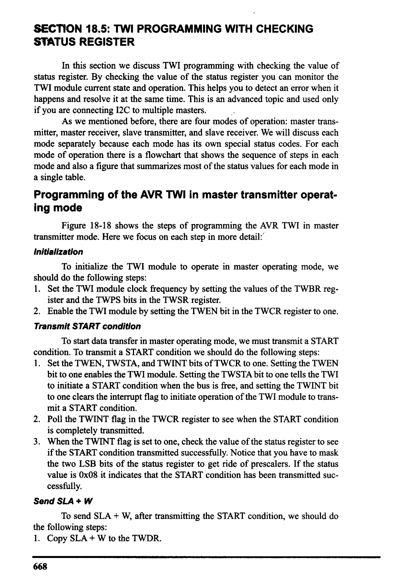
*Description*: Execution flowchart illustrating procedure steps, algorithmic logic flow, software build stages, or timing signal sequences for Figure 18-18: shows the steps of programming the AVR TWI in master.

> **Figure 18-18: shows the steps of programming the AVR TWI in master**

transmitter mode. Here we focus on each step in more detail:
Initialization
To initialize the TWI module to operate in master operating mode, we
should do the following steps:
1. Set the TWI module clock frequency by setting the values of the TWBR reg-
ister and the TWPS bits in the TWSR register.
2. Enable the TWI module by setting the TWEN bit in the TWCR register to one.
Transmit START condition
To start data transfer in master operating mode, we must transmit a START
condition. To transmit a START condition we should do the following steps:
1. Set the TWEN, TWSTA, and TWINT bits of TWCR to one. Setting the TWEN
bit to one enables the TWI module. Setting the TWSTA bit to one tells the TWI
to initiate a START condition when the bus is free, and setting the TWINT bit
to one clears the interrupt flag to initiate operation of the TWI module to trans-
mit a START condition.
2. Poll the TWINT flag in the TWCR register to see when the START condition
is completely transmitted.
3. When the TWINT flag is set to one, check the value of the status register to see
if the START condition transmitted successfully. Notice that you have to mask
the two LSB bits of the status register to get ride of prescalers. If the status
value is 0x08 it indicates that the START condition has been transmitted suc-
cessfully.
Send SLA + W
To send SLA + W, after transmitting the START condition, we should do
the following steps:
1. Copy SLA + W to the TWDR.
668


<!-- Page 676 -->
### [PDF Page 676]

Send START
Is Status
$8?
No
Yes
Send SLA+W
Is Status
$18?
No
Yes
Yes
Send Data
Want to
send more data?
Yes
Is Status
$28?
No
No
Send STOP
Do error handling

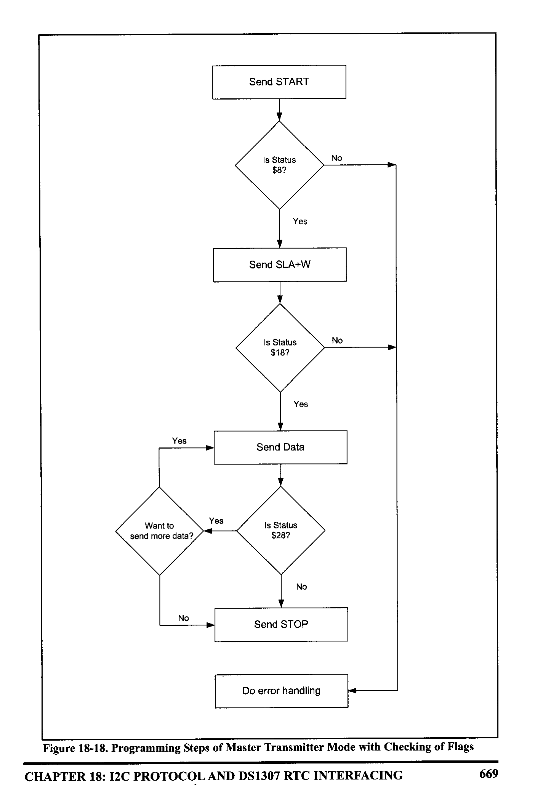
*Description*: Execution flowchart illustrating procedure steps, algorithmic logic flow, software build stages, or timing signal sequences for Figure 18-18: Programming Steps of Master Transmitter Mode with Checking of Flags.

> **Figure 18-18: Programming Steps of Master Transmitter Mode with Checking of Flags**

CHAPTER 18: I2C PROTOCOL AND DS1307 RTC INTERFACING
669


<!-- Page 677 -->
### [PDF Page 677]

2. Set the TWEN and TWINT bits of the TWCR register to one to start sending
the byte.
3. Poll the TWINT flag in the TWCR register to see when the byte is complete-
ly transmitted.
4. When the TWINT flag is set to one, you should check the value of the status
register to see if the SLA + W is transmitted successfully. If the status value is
Ox18, it indicates that the SLA + W has been transmitted and ACK received
successfully.
Send data
To send data, after transmitting of SLA + W, we should do the following
steps:
1. Copy the byte of data to the TWDR.
2. Set the TWEN and TWINT bits of the TWCR register to one to start sending
the byte.
3. Poll the TWINT flag in the TWCR register to see whether the byte is complete-
ly transmitted.
4. When the TWINT flag is set to one, you should check the value of the status
register to see if the data has been transmitted successfully and the value of
ACK was as expected. Notice that NACK does not necessarily indicate an
error; it may indicate that no more data needs to be transmitted. If the status
value indicates that ACK is received (0x28) you can either transmit a STOP
condition or repeat this function (Send Data) to transmit more data; otherwise,
you should transmit a STOP condition.
Transmit STOP condition
To stop data transfer, we must transmit a STOP condition. This is done by
setting the TWEN, TWSTO, and TWINT bits of the TWCR register to one. Notice
that we cannot poll the TWINT flag after transmitting a STOP condition.

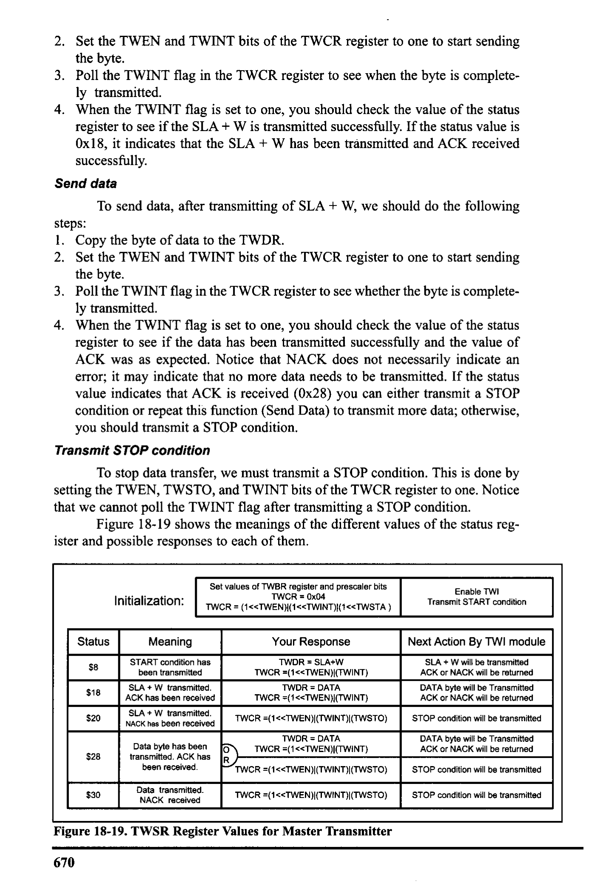
*Description*: Technical diagram and schematic illustration detailing hardware connection topology, signal routing, and circuit operation for Figure 18-19: shows the meanings of the different values of the status reg-.

> **Figure 18-19: shows the meanings of the different values of the status reg-**

ister and possible responses to each of them.
Initialization:
Set values of TWERR - Drand prescaler bits
TWCR = (1<<TWEN)(1<<TWINT)|(1 <<TWSTA
Enable TWI
Transmit START condition
Status
$8
$18
$20
$28
$30
Meaning
START condition has
been transmitted
SLA + W transmitted.
ACK has been received
LA + W transmitter
ACK has been receive
Data byte has been
transmitted. ACK has
been received.
Data transmitted
VACK receivec
R
Your Response
TWDR = SLA+W
TWCR = (1<<TWEN)(TWINT)
TWDR = DATA
TWCR =(1<<TWEN)(TWINT)
TWCR =(1<<TWEN)(TWINT)|(TWSTO)
TWDR = DATA
TWCR =(1 «TWEN)|(TWINT)
TWCR =(1<<TWEN)(TWINT) (TWSTO)
TWCR =(1<<TWEN)(TWINT) TWSTO)
Next Action By TWI module
ATA byte will be Transmitt
CK or NACK will be return
STOP condition will be transmitted
ATA byte will be Transmitt
CK or NACK will be return
STOP condition will be transmitted
STOP condition will be transmitted


*Description*: Register specification diagram depicting individual bit flags, control register configurations, and functional definitions for Figure 18-19: TWSR Register Values for Master Transmitter.

> **Figure 18-19: TWSR Register Values for Master Transmitter**

670


<!-- Page 678 -->
### [PDF Page 678]

Program 18-14 shows how a master writes 11110000 on a slave with
address 1101000. The program checks the value of the status register in each step
of the operation.
• INCLUDE "M32DEF.INC"
LDI
OUT
IDI
OUT
R21, HIGH (RAMEND); set up stack
SPH, R21
R21, LOW (RAMEND)
SPL, R21

```assembly
CALL I2C_INIT
CALL I2C START
CALL I2C_READ STATUS
```

CPI
R26, 0x08

```assembly
BRNE ERROR
```

IDI R27, 0b11010000

```assembly
CALL IZC_WRITE
CALL I2C_READ_STATUS
```

CPI R26, 0x18

```assembly
BRNE ERROR
```

IDI R27, 0b11110000

```assembly
CALL I2C _WRITE
CALL I2C
```

_READ _STATUS
CPI R26, 0x28

```assembly
BRNE ERROR
CALL I2C_STOP
HERE: RJMP HERE
ERROR:
```

IDI R21, OXFF

```assembly
OUT DDRA, R21
OUT PORTA, R26
RJMP HERE
;**************
I2C_INIT:
```

LDI
R21, O
OUT
TWSR, R21
LDI
R21,
0x47
OUT
TWBR, R21
LDI
R21,
(1<<TWEN)
OUT
TWCR, R21
RET
¡initialize IWI module
¡transmit START condition
¡ read status register
¡was START transmitted correctly?
¡else jump to error function
¡ SLA (11010000) + W(0)
i write R27 to I2C bus
¡read status register
¡was SLAtW transmitted, ACK received?
¡else jump to error function
¡ data to be transmitted
¡write R27 to I2C bus
¡ read status register
¡was data transmitted, ACK received?
¡else jump to error function
¡transmit STOP condition
¡wait here forever
¡ you can type error handler here
¡ Port A is output
¡ send error code to Port A
; some error code
'**********************.
*****
¡ set prescaler bits to zero
¡ move 0x47 into R21
¡clock frequency is 50k (XTAL=50MHZ)
¡ move 0x04 into R21
¡ enable the IWI
;*******************
I2C_START:
LDI
OUT
R21,
TWCR, R21
WAIT1:
IN
R21, TWCR
SBRS
R21,
TWINT
****************************
(1<<TWINT) | (1<<TWSTA) | (1<<TWEN)
¡transmit a START condition
¡ read control register into R21
¡ skip next line if TWINT is 1
Program 18-14: Writing a Byte in Master Mode with Status Checking
CHAPTER 18: I2C PROTOCOL AND DS1307 RTC INTERFACING
671


<!-- Page 679 -->
### [PDF Page 679]

RJMP
WAIT1
RET
;************
I2C_WRITE:
OUT
LDI
OUT
WAIT3:
IN
SBRS
RUMP
R21,
TWCR
R21, TWINT
WAIT3
RET
¡***************
IC_STOP:
LDI
OUT
RET
**********************
I2C_READ
_STATUS:
IN
R26,
TWSR
ANDI R26, OXF8
RET
¡ jump to WAITI if TWINT is 1
**********
*********
TWDR, R27
¡ move the byte into TWDR
R21,
(1<<TWINT) | (1<<TWEN)
TWCR, R21
¡ configure IWCR to send TWDR
¡ read control register into R21
¡ skip next line if TWINT is 1
; jump to WAIT3 if TWINT is 1
***************************
R21, (1<<TWINT) | (1<<TWSTO) | (1<<TWEN)
TWCR, R21
¡transmit STOP condition
**********************************
¡ read status register into R21
¡ mask the prescaler bits
Program 18-14: Writing a Byte in Master Mode with Status Checking (cont. from prev. page)
Program 18-15 is the C version of Program 18-10 and shows how a mas-
ter writes 11110000 to a slave with address 1101000. The program checks the
value of the status register in each step of the operation.

```c
#include <avr/io.h>
```

void i2c write (unsigned char data)
TWDR = data
;
IWCR = (1<< TWINT) | (1<<TWEN) ;
while ((TWCR & (1 <<TWINT))
== 0);
//*************************
***************
*******
void 120_start (void)
TWCR = (1 << TWINT) | (1 ‹< TWSTA) | (1 << TWEN) ;
while ((TWCR & (1 ‹< TWINT)) == 0);
/**********************************************************
void ile_showError (unsigned char er)

```c
DDRA = 0xFF;
PORTA = er;
```

Program 18-15: Writing a Byte in Master Mode with Status Checking in C
672


<!-- Page 680 -->
### [PDF Page 680]

77**********************************************************
unsigned char i2c_readstatus (void)
unsigned char i = 0;
i = TWSR
return i;
***************
void ile_stop ()
*************.
*****
TWCR = (1<< TWINT) | (1<<TWEN) | (1<<TWSTO) ;
/******************
void i2c_init (void)
TWSR=0×00;
TWBR=0x47;
TWCR=0x04;
1/**********
int main (void)
unsigned char s = 0;
ilo_init();
i2c
start ();
S =
120_readStatus () ;
if (s!= 0x08)
12c_showError (s);
return 0;
i2c_write (0b11010000);
S =
i2c
_readstatus ();
if (s != 0x18)
120_showError (s) ;
return 0;
}
ilc
_write (0b11110000);
s = i2c_readStatus ();
if (s != 0x28)
12c showError (s) ;
return 0;
}
12c_stop () ;

```c
while (1);
```

return 0;
**************.
**********
I/set prescaler bits
to zero
//SCL frequency is 50K for XTAL = 8M
lenable the TWI module
•*****************************
I/transmit START condition
//transmit SLA + W(0)
//transmit data
//transmit STOP condition
/stay here forever
Program 18-15: Writing a Byte in Master Mode with Status Checking in C (continued)
CHAPTER 18: I2C PROTOCOL AND DS1307 RTC INTERFACING
673


<!-- Page 681 -->
### [PDF Page 681]

Programming of the AVR TWI in master receiver operating
mode
The steps to program the AVR TWI to operate in master receiver mode are
somewhat similar to the steps for programming for master transmitter mode.

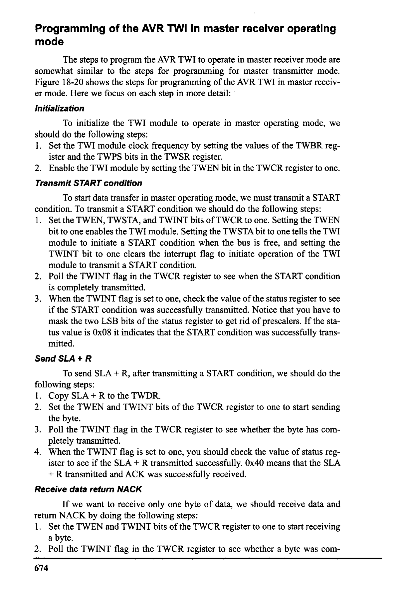
*Description*: Execution flowchart illustrating procedure steps, algorithmic logic flow, software build stages, or timing signal sequences for Figure 18-20: shows the steps for programming of the AVR TWI in master receiv-.

> **Figure 18-20: shows the steps for programming of the AVR TWI in master receiv-**

er mode. Here we focus on each step in more detail:
Initialization
To initialize the TWI module to operate in master operating mode, we
should do the following steps:
1. Set the TWI module clock frequency by setting the values of the TWBR reg-
ister and the TWPS bits in the TWSR register.
2. Enable the TWI module by setting the TWEN bit in the TWCR register to one.
Transmit START condition
To start data transfer in master operating mode, we must transmit a START
condition. To transmit a START condition we should do the following steps:
1. Set the TWEN, TWSTA, and TWINT bits of TWCR to one. Setting the TWEN
bit to one enables the TWI module. Setting the TWSTA bit to one tells the TWI
module to initiate a START condition when the bus is free, and setting the
TWINT bit to one clears the interrupt flag to initiate operation of the TWI
module to transmit a START condition.
2. Poll the TWINT flag in the TWCR register to see when the START condition
is completely transmitted.
3. When the TWINT flag is set to one, check the value of the status register to see
if the START condition was successfully transmitted. Notice that you have to
mask the two LSB bits of the status register to get rid of prescalers. If the sta-
tus value is 0x08 it indicates that the START condition was successfully trans-
mitted.
Send SLA + R
To send SLA + R, after transmitting a START condition, we should do the
following steps:
1. Copy SLA + R to the TWDR.
2. Set the TWEN and TWINT bits of the TWCR register to one to start sending
the byte.
3. Poll the TWINT flag in the TWCR register to see whether the byte has com-
pletely transmitted.
4. When the TWINT flag is set to one, you should check the value of status reg-
ister to see if the SLA + R transmitted successfully. Ox40 means that the SLA
+ R transmitted and ACK was successfully received.
Receive data return NACK
If we want to receive only one byte of data, we should receive data and
return NACK by doing the following steps:
1. Set the TWEN and TWINT bits of the TWCR register to one to start receiving
a byte.
2. Poll the TWINT flag in the TWCR register to see whether a byte was com-
674


<!-- Page 682 -->
### [PDF Page 682]

Send START
<
Is Status
$8?
No
Yes
Send SLA+R
No
Is Status
$40?
Yes
Want to
read only
one other
byte?
No
Yes
Read Data
Return ACK
Read Data
Return NACK
Yes
Want to
read more
data?
Yes
No
Is Status
$50?
No
Send STOP
Is Status
$58?
Yes
Do error handling

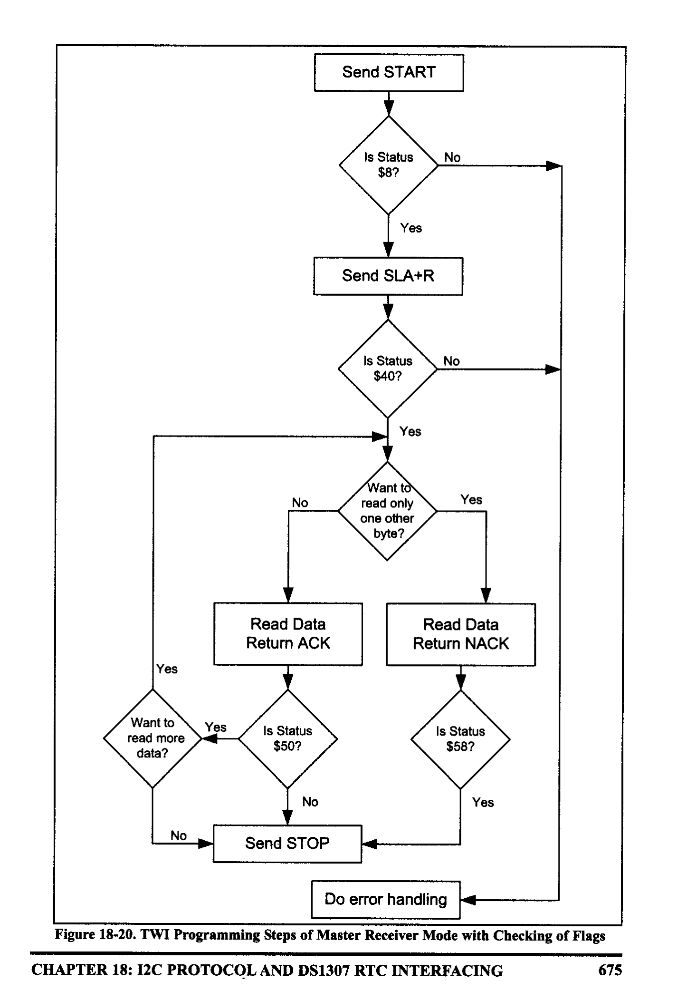
*Description*: Execution flowchart illustrating procedure steps, algorithmic logic flow, software build stages, or timing signal sequences for Figure 18-20: TWI Programming Steps of Master Receiver Mode with Checking of Flags.

> **Figure 18-20: TWI Programming Steps of Master Receiver Mode with Checking of Flags**

CHAPTER 18: I2C PROTOCOL AND DS1307 RTC INTERFACING
675


<!-- Page 683 -->
### [PDF Page 683]

pletely received.
3. Copy the received byte from the TWDR.
4. When the TWINT flag is set to one, you should check the value of the status
register to see if the byte was received successfully. 0x58 means that a byte of
data was received and NACK returned successfully. After this step we should
transmit a STOP condition.
Receive data and return ACK
If we want to receive more than one byte of data, we should receive data
and return ACK by doing the following steps:
1. Set the TWEN, TWINT, and TWEA bits of the TWCR register to one to
receive a byte of data and return ACK.
2. Poll the TWINT flag in the TWCR register to see when a byte has been
received completely.
3. Copy the received byte from the TWDR.
4. When the TWINT flag is set to one, you should check the value of the status
register to see if the byte was received successfully. 0x50 means that a byte of
data was received and ACK returned successfully. Now you can repeat this
step to receive one or more bytes of data, or you can run the "Receive Data
Return NACK" function to receive only one other byte of data. Also, you can
transmit a STOP condition to finish receiving data.
Transmit STOP condition
To stop data transfer, we must transmit a STOP condition. This is done by
setting the TWEN, TWSTO, and TWINT bits of the TWCR register to one. Notice
that we cannot poll the TWINT flag after transmitting a STOP condition.

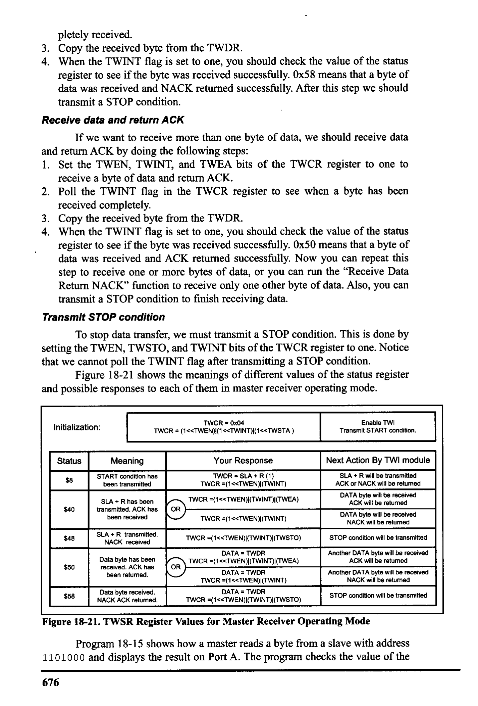
*Description*: Register specification diagram depicting individual bit flags, control register configurations, and functional definitions for Figure 18-21: shows the meanings of different values of the status register.

> **Figure 18-21: shows the meanings of different values of the status register**

and possible responses to each of them in master receiver operating mode.
Initialization:
WCR = 0x04
WCR = (1<<TWEN)|(1<<TWINT)|1<<TWSTA
TransmisSA condition.
Status
$8
$40
$48
$50
$58
Meaning
TART condition h
sen transmitte
SLA + R has been
transmitted. ACK has
been received
SLA + R transmitted.
NACK received
Data byte has been
received. ACK has
been returned.
Data byte received.
NACK ACK retumed.
OR
Your Response
TWDR = SLA + R (1)
TWCR = (1<<TWEN)(TWINT
TWCR =(1<<TWEN)(TWINT)|(TWEA)
TWCR =(1<<TWEN)(TWINT)
Next Action By TWI module
ATA byte will be receiv
CK will be retum
TWCR =(1<<TWEN)|TWINT)|(TWSTO)
DATA = TWDR
TWCR =(1<<TWEN)|(TWINT)(TWEA)
OR
ATA = TWD
NCR = (1 <<TWEN)(TWIN
DATA = TWDR
STOP condition will be transmitted
Another A wil be rel merceived
Another A Wil be rel be received
STOP condition will be transmitted
TWCR =(1<<TWEN)|(TWINT)(TWSTO)


*Description*: Register specification diagram depicting individual bit flags, control register configurations, and functional definitions for Figure 18-21: TWSR Register Values for Master Receiver Operating Mode.

> **Figure 18-21: TWSR Register Values for Master Receiver Operating Mode**

Program 18-15 shows how a master reads a byte from a slave with address
1101000 and displays the result on Port A. The program checks the value of the
676


<!-- Page 684 -->
### [PDF Page 684]

status register in each step of the operation.
• INCLUDE "M32DEF.INC"
LDI
R21, HIGH (RAMEND); set up stack
OUT
SPH, R21
LDI
R21, LOW (RAMEND)
OUT
SPI, R21
LDI
R21, OXFF
OUT
DDRA, R21
¡ Port A is output
CALL
I2C_INIT
¡initialize WI module

```assembly
CALL I2C
```

_START
¡transmit START condition
CALL
I2C
_READ
_STATUS ¡ read status register
CPI
R26, 0x08
¡was start transmitted correctly?
BRNE
ERROR
LDI
¡else jump to error function
R27, 0b11010001 ;SLA (11010000) + R (1)
CALL
I2C
WRITE
¡write R27 to I2C bus
CALL
I2C
_READ_STATUS ¡ read status register
CPI
R26, 0x40
¡was SLAtR transmitted, ACK received?
BRNE
ERROR
¡else jump to error function
CALL,
I2C_READ
CALL
I2C
_READ_STATUS ¡ read status register
CPI
R26, 0x58
¡was data transmitted, ACK received?
BRNE
ERROR
¡else jump to error function
OUT
PORTA, R27

```assembly
CALL I2C STOP
HERE: RJMP HERE
ERROR: RJMP HERE
;***************
```

¡transmit STOP condition
¡wait here forever
¡you can type error handler here
•********************************
I2C_INIT:
LDI
OUT
LDI
OUT
IDI
OUT
R21, 0
TWSR, R21
R21, 0x47
TWBR, R21
R21, (1<<TWEN)
TWCR, R21
¡ set prescaler bits to zero
¡move 0x47 into R21
; SCI, freg. is 50k for 8 MHz XTAI
¡ move 0x04 into R21
¡ enable the TWI
RET
;*********************************************************
I2C_START:
LDI
OUT
R21, (1<<TWINT) | (1<<TWSTA) | (1<<TWEN)
TWCR, R21
¡transmit a START condition
WAIT1:
IN
SBRS
RJMP
R21, TWCR
R21, TWINT
WAIT1
RET
¡read control register into R21
i skip next line if TWINT is 1
¡jump to WAIT1 if TWINT is 1
;*********
******************
*******
I2C_WRITE:
OUT
IDI
OUT
IWDR,
R27
R21,
TWCR, R21
¡ move the byte into TWDR
(1<<TWINT) | (1<<TWEN)
¡configure TWCR to send TWDR
Program 18-16: TWI Reading a Byte in Master Mode with Status Checking
CHAPTER 18: I2C PROTOCOL AND DS1307 RTC INTERFACING
677


<!-- Page 685 -->
### [PDF Page 685]

W3:
IN
SBRS
RJMP
R21,
R21,
W3
TWCR
TWINT
¡ read control register into R21
iskip next line if IWINT is 1
¡jump to W3 if TWINT is 1
RET
;****************
*********
*****
I2C_READ:
LDI
OUT
W2:
IN
SBRS
R21
TWCR
TWINT
RJMP
IN
R21, (1<<TWINT) | (1<<TWEN)
TWCR,
R21,
R21,
W2
R27,
TWDR
¡ read control register into R21
¡skip next line if TWINT is 1
¡ jump to W2 if IWINI is 0
¡ read received data into R21
RET
;*********
*************
******
I2C_STOP:
LDI
OUT
R21,
TWCR,
(1<<TWINT) | (1<<TWSTO) | (1<<TWEN)
¡transmit STOP condition
R21
RET
:**************
**********
*******
I2C_READ
_STATUS:
IN
R26,
TWSR
ANDI R26, OxF8
¡ read status register into R21
; mask the prescaler bits
RET
Program 18-16: TWI Reading a Byte in Master Mode with Status Checking (continued)
Program 18-17 is the C version of Program 18-16.

```c
#include <avr/io.h>
```

void i2c_showError (unsigned char er)

```c
DDRA = OXFF;
PORTA = er;
```

/ /*********************************
unsigned char 12c_readStatus (void)
*******
unsigned char i = 0;
i = TWSR & 0xF8;
return i;
**************
void i2c_init (void)
******
TWSR=0x00;
TWBR=0x47;
TWCR=0x04;
/**********
void i2c_start (void)
I/set prescaler bits to zero
//SCL frequency is 50K for XTAL=8M
lenable the TWI module
***********************************
TWCR = (1 << TWINT)
(1 << TWSTA)
| (1 << TWEN) ;
while ((TWCR & (1
TWINT)) == 0);
//***************x********************************
***
Program 18-17: TWI Reading a Byte in Master Mode with Status Checking in C
678


<!-- Page 686 -->
### [PDF Page 686]

void ilo_write (unsigned char data)
TWDR = data;
TWCR = (1<< TWINT) | (1<<TWEN);
while ((TWCR & (1 <<TWINT)) == 0) ;
//**********************************************************
unsigned char i2c_read (unsigned char islast)
if (isLast == 0)
I11 want to read more than 1 byte
TWCR = (1<< IWINT) | (1<<TWEN) | (1‹<TWEA) ;
else
lif want to read only one byte
TWCR = (1<< TWINT) | (1<<TWEN) ;
while ((TWCR & (1 <<TWINT)) == 0);
return TWDR;
//*******************
*******************************
void ilc_stop ()
TWCR = (1<<
IWINT) | (1<<TWEN) | (1<<TWSTO) ;
//**********************************************************
int main (void)

```c
DDRA = 0xFF;
```

unsigned char s, i;
12c
_init();
12c_start ();
S
12c
_readstatus () ;
if (s != 0x08)
//Port A is output
I/transmit START condition
120 _showError (s);
return 0;
i2c
_write (0b11010001);
$ =
i2c
_readstatus () ;
if (s != 0x40)
/transmit SLA + R (1)
120_showerror (5) ;
return 0;
}
i=i2c
_read (1);
s = 12c_readStatus () ;
if
(s!= 0x58)
i20_showError (s) ;
return 0;
}

```c
PORTA= i;
```

12c_stop ():

```c
while (1);
```

return 0;
I/show the byte on Port A
//transmit STOP condition
I/stay here forever
Program 18-17: TWI Reading a Byte in Master Mode with Status Checking in C (continued)
CHAPTER 18: I2C PROTOCOL AND DS1307 RTC INTERFACING
679


<!-- Page 687 -->
### [PDF Page 687]

Programming of the AVR TWI in slave transmitter operat-
ing mode
Before programming the AVR to operate in slave mode, there are some
points that we must pay attention to. As we mentioned before, the slave device,
regardless of whether it is receiver or transmitter, does not generate the clock
pulse. To control the clock rate and let the software to complete its job, the slave
device uses clock stretching. The slave device does not start or stop a transmission;
it listens to the bus and replies when it is addressed by a master device.
In the slave transmitter mode, one or more bytes of data are transmitted
from the slave to a master receiver. The following steps show the transmission of
one or more bytes of data in slave transmitter mode.
Initialization
To initialize the TWI module to operate in slave operating mode, we should
do the following steps:
1. Set the TWAR. As we mentioned before, the upper seven bits of TWAR are the
slave address. It is the address to which the TWI will respond when addressed
by a master. The eighth bit is TWGCE. If you set this bit to one, the TWI will
respond to the general call address ($00); otherwise, it will ignore the general
call address.
2. Enable the TWI module by setting the TWEN bit in the TWCR register to one.
3. Set the TWEN and TWEA bits of TWCR to one to enable the TWI and
acknowledge generation.
Wait to be addressed for read
In slave mode, the TWI hardware waits until it is addressed by its own
slave address (or the general call address, if enabled) followed by the R/W bit, and
then sets the TWINT flag and updates the status register. If the R/W bit is zero
(write), it means that the slave should operate in slave receiver mode; otherwise,
the slave should operate in slave transmitter mode. Notice that you can not direct-
ly read the value of the R/W bit. Instead you should read the value of the status
register. Next, we will show how to wait to be addressed by a master device.
1. Poll the TWINT flag in the TWCR register to see whether a byte has received
completely.
2. When the TWINT flag is set to one, you should check the value of the status
register to see if the SLA + R is received successfully. $A8 means that the SLA
+ R was received and ACK returned successfully.
Now if you want to transmit only one byte of data you should run the
"Send Data and Wait for NACK" function. Otherwise, if you want to send more
than one byte of data you should run the "Send Data and Wait for ACK" function.
Next we will examine each function in detail.
Send data and wait for ACK
In slave transmitter mode, if you want to transmit more than one byte of
data you should send a byte of data and wait for ACK by doing the following steps:
1. Copy the byte of data to the TWDR.
2. Set the TWEN, TWINT, and TWEA bits of the TWCR register to one to send
680


<!-- Page 688 -->
### [PDF Page 688]

Wait to be
addressed
Is TWIF one?
No
Yes y
Do error handling
- No
Is Status
$A8?
Yes
No
Want to
send only
one other
byte?
Yes
Send data
Wait for ACK
Send Data
Wait for NACK
Yes
Want to
send more
data?
Yes
Is Status
$B8?
Is Status
$C8 or $CO?
No
Yes
No
•

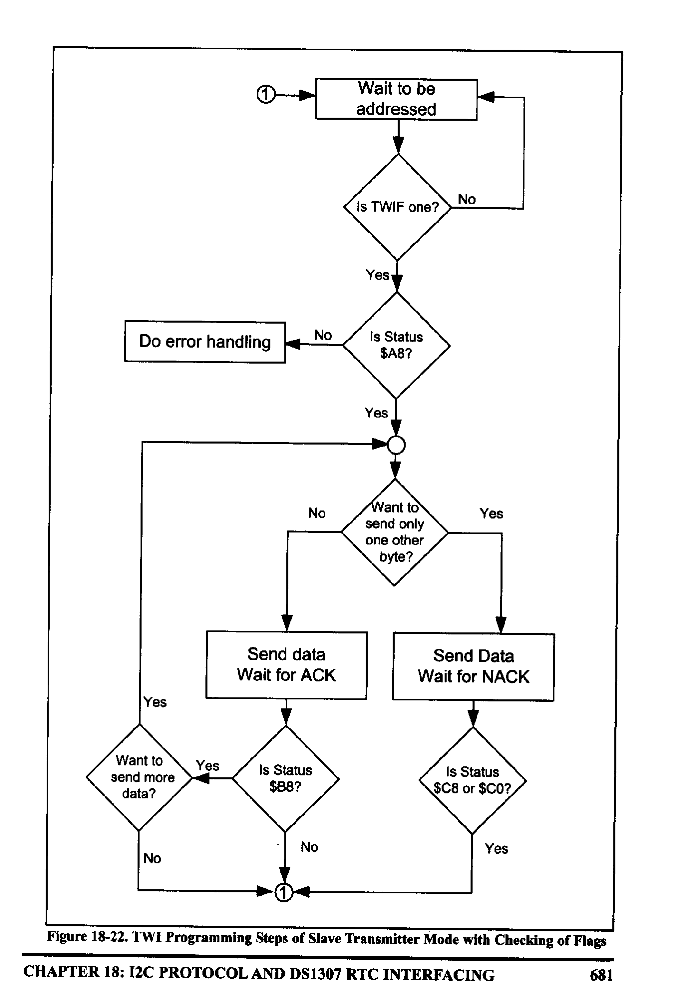
*Description*: Execution flowchart illustrating procedure steps, algorithmic logic flow, software build stages, or timing signal sequences for Figure 18-22: TWI Programming Steps of Slave Transmitter Mode with Checking of Flags.

> **Figure 18-22: TWI Programming Steps of Slave Transmitter Mode with Checking of Flags**

CHAPTER 18: I2C PROTOCOL AND DS1307 RTC INTERFACING
681


<!-- Page 689 -->
### [PDF Page 689]

a byte of data and wait for ACK.
3. Poll the TWINT flag in the TWCR register to see whether the byte transmitted
completely.
4. When the TWINT flag is set to one, you should check the value of the status
register to see if the data transmitted successfully and the value of ACK was as
expected. Notice that NACK does not necessarily indicate an error; it may
indicate that no more data needs to be transmitted. If the status value indicates
that NACK was received ($OC), it means that the current transmission section
is finished and you should start from the beginning. If the status value indicates
that ACK was received (0xC8), you can either repeat this function to transmit
more than one byte of data or you can run the "Send Data and Wait for NACK"
function to transmit only one byte of data.
Send data and wait for NACK
In slave transmitter mode, to transmit another byte of data you should send
a byte of data and wait for NACK by doing the following steps:
1. Copy the byte of data to the TWDR.
2. Set the TWEN and TWINT bits of the TWCR register to one to send a byte and
wait for NACK.
3. Poll the TWINT flag in the TWCR register to see when the byte has been
transmitted completely.
4. When the TWINT flag is set to one, you should check the value of the status
register. If the status value is SOC, it indicates that NACK has been received.
If the value of status register is $C8, it means that ACK was received. In both
cases you have to go to the "Wait to be addressed" mode because you have not
set the TWEA bit in step 2 saying that you want to transmit only one other byte
of data.
Notice that in most applications you can use the "Send Data and Wait for
ACK" function instead of the "Send Data and Wait for NACK" function. We rec-
Initialization:
TWCR = 0x04
WAR = the address of Slave
[WCR = (1<<TWEN)|(1<<TWIF)|(1<<TWEA
Enable TW
Enable the slave ding by slav
Status
Meaning
$A8
Own SLA+R received
ACK retumed
$B&
Data has been
ransmitter
ICK receive
$CO
Data has been
transmitted
NACK received
sca
Data transmitted
ACK received but you
wanted NACK (TWEA
was 0 in last command)
Your Response
TWDR = DATA
OR
TWCR =(1<<TWEN)(TWINT)|(TWEA)
TWDR = DATA
TWCR =(1<<TWEN)|(TWINT)
TWDR = DATA
OR
TWCR =(1<<TWEN)(TWINT)(TWEA)
TWDR = DATA
TWCR =(1<<TWEN)(TWINT)
TWCR =(1<<TWEN)(TWINT)(TWEA)
OR
TWCR =(1<<TWEN)(TWINT)
OR
TWCR =(1<<TWEN)TWINT)|(TWEA)
TWCR =(1<<TWEN|(TWINT)
Next Action By TWI module
DATA byte will be transmitted
Wait for ACK
DATA byte will be transmitted
Wait for NACK
DATA byte will be transmitted
Wait for ACK
Siar from beares and wait to be
art from beginning and wait to
ddressi

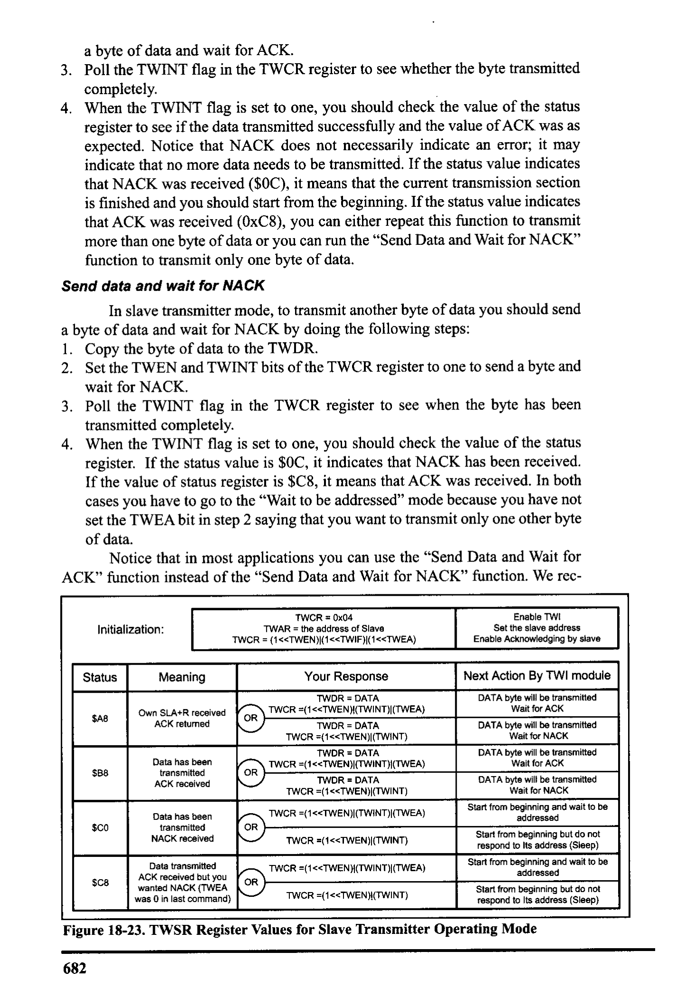
*Description*: Register specification diagram depicting individual bit flags, control register configurations, and functional definitions for Figure 18-23: TWSR Register Values for Slave Transmitter Operating Mode.

> **Figure 18-23: TWSR Register Values for Slave Transmitter Operating Mode**

682


<!-- Page 690 -->
### [PDF Page 690]

ommend that you use the first one.
Program 18-18 shows how to initialize the TWI module to operate in
slave transmitter mode. In this program the TWI module listens to the bus and
waits to be addressed by a master device. Then it transmits the letter 'G' to the
master device.
• INCLUDE "M32DEF. INC"
IDI
OUT
LDI
OUT
R21, HIGH (RAMEND); set up stack
SPH, R21
R21, LOW (RAMEND)
SPL, R21

```assembly
CALL I2C_INIT
CALL I2C LISTEN
CALL I2C_ READ_STATUS
```

CPI
R26, 0xA8
BRNE
ERROR
LDI
R27, 'G'

```assembly
CALL I2C_WRITE
CALL I2C_READ_STATUS
```

CPI R21, Oxco

```assembly
BRNE ERROR
```

¡initialize the TWI module as slave
¡listen to the bus to be addressed
¡ read the status value into R26
¡ addressed as slave tranmitter ?
¡else jump to error function
¡load 'G' into R21
¡ read the status value into R26
¡was data transmitted, NACK received?
¡else jump to error function
HERE:

```assembly
RJMP HERE
ERROR:
```

¡wait here forever
¡you can type error handler here
LDI
R21, OXFF

```assembly
OUT DDRA, R21
```

OUT
PORTA, R26
RJMP
HERE
;*********************
¡ Port A is output
************
*******
I2C_INIT:
LDI
OUT
LDI
OUT
LDI
OUT
RET
;***********
R21, 0x10
IWAR, R21
R21,
(1<<TWEN)
TWCR, R21
R21,
TWCR, R21
; load 00010000 into R21
¡ set address register
; move 0x04 into R21
¡enable the TWI
(1<<TWINT) | (1<<TWEN) | (1<<TWEA)
¡ enable IWI and ACK (can't be ignored)
***************************
I2C_LISTEN:
W1:

```assembly
IN R21, TWCR
```

SBRS R21, TWINT

```assembly
RJMP W1
```

RET
¡ read control register into R21
iskip next intruction if IWINT is 1
¡ jump to WI if IWINT is O
Program 18-18: Writing a Byte in Slave Mode with Status Checking
CHAPTER 18: I2C PROTOCOL AND DS1307 RTC INTERFACING
683


<!-- Page 691 -->
### [PDF Page 691]

¡*********************************************************
I2C_WRITE:

```assembly
OUT TWDR, R27
; move R21 to TWDR
```

IDI R21, (1<<TWINT) | (1<<TWEN)

```assembly
OUT TWCR, R21
```

¡ configure IWCR to send TWDR
W2:
R21, TWCR
¡ read control register into R21
SBRS R21, TWINT i skip next intruction if TWINT is 1

```assembly
RJMP W2
```

¡ jump to W2 if IWINI is O
RET
;*********************************************************
I2C_READ
_STATUS:
IN
R26, IWSR
ANDI R26, 0xF8
¡ read status register into R21
; mask the prescaler bits
RET
Program 18-18: Writing a Byte in Slave Mode with Status Checking (cont. from prev. page)
Program 18-19 is the C version of Program 18-18. Program 18-19 shows
how to initialize the TWI module to operate in slave transmitter mode. In Program
18-19 the TWI module listens to the bus and waits to be addressed by a master
device. Then it transmits the letter 'G' to the master device.

```c
#include <avr/io.h>
//standard AVR header
```

void ila_showError (unsigned char er)

```c
DDRA = 0xFF;
PORTA = er;
//*********************************.
```

unsigned char i2c_readstatus (void)
unsigned char i = 0;
i = TWSR
return i;
//************************************
*****
****
void ilo_initSlave (unsigned char slaveAddress)
TWCR = 0x04;
lenable IWI module
slaveAddress;
/set the slave address
TWCR = (1<<TWINT) | (1<<TWEN) | (1<<TWEA)://init IWI module
Program 18-19: Writing a Byte in Slave Mode with Status Checking in C
684


<!-- Page 692 -->
### [PDF Page 692]

77*********************************************************
void i2c_send (unsigned char data)
TWDR = data;
TWCR = (1<< TWINT) | (1<<TWEN) ;
while ((TWCR & (1 <<TWINT) )==0) ;
//copy data to TWDR
/start transmission
//wait to complete
/**************************************
void i2c_listen ()
while ((TWCR & (1 <<TWINT)) ==0) ;
******
/wait to be addressed
//*********************************************
int main (void)
i2c_initSlave (0x10);
*********
linit IWI module as
I/slave with address
//0b0001000 and do not
/accept general call
I/listen to be addressed
i2c_listen () ;
unsigned char s, i;
S = 12c
_readstatus ();
if (s != 0xA8)
i20_showError (s);
return 0;
ilc
_send ('G');
12c_readstatus () ;
i2c_showError (s);
return 0;

```c
while (1);
```

return 0;
I/stay here forever
Program 18-19: Writing a Byte in Slave Mode with Status Checking in C (continued)
CHAPTER 18: I2C PROTOCOL AND DS1307 RTC INTERFACING
685


<!-- Page 693 -->
### [PDF Page 693]

Programming of the AVR TWI in slave receiver operating
mode
In the slave receiver mode, one or more bytes of data are transmitted from
a master transmitter to the slave receiver. The following steps show the functions
needed to receive one or more bytes of data in slave receiver mode.
Initialization
To initialize the TWI module to operate in slave operating mode, we should
do the following steps:
1. Set the TWAR. As we mentioned before, the upper seven bits of 1 WAR are the
slave address. It is the address to which the Two-wire Serial Interface will
respond when addressed by a master. The eighth bit is TWGCE. If you set this
bit to one, the TWI will respond to the general call address ($00); otherwise, it
will ignore the general call address.
Enable the TWI module by setting the TWEN bit in the TWCR register to one.
3. Set the TWEN and TWEA bits of TWCR to one to enable the TWI and
acknowledge generation.
Wait to be addressed for write
In slave mode, we should do the following steps to wait to be addressed by
a master for a write operation.
1. Poll the TWINT flag in the TWCR register to see when a byte has been
received completely.
2. When the TWINT flag is set to one, we should check the value of the status reg-
ister to see if the SLA + W was received successfully. $60 or $70 (for general
call) means that the SLA + W was received and ACK returned successfully.
Now if you want to receive only one byte of data you should run the
"Receive Data and Return NACK" function. Otherwise, if you want to send more
than one byte of data you should run the "Receive Data and Return ACK" func-
tion. Next, we will examine each function in detail.
Receive data and Return ACK
In slave receiver mode, if you want to receive more than one byte of data
you should receive a byte of data and return ACK by doing the following steps:
1. Set the TWEN, TWINT, and TWEA bits of the TWCR register to one to
receive a byte and return ACK.
2. Poll the TWINT flag in the TWCR register to see when a byte has been
received completely.
3. When the TWINT flag is set to one, you should check the value of the status
register to see if the data was received successfully and ACK was returned. If
the status value is $80 or $90 (for general call), it means that a byte of data has
been received and ACK was returned. You can either repeat this function to
receive more than one bytes of data or you can run the "Receive Data and
Return NACK" function to receive only one byte of data.
4. Copy the received byte from the TWDR.
686


<!-- Page 694 -->
### [PDF Page 694]

Wait to be
addressed
Is TWIF one?
No
Yes y
Is Status
$60 or $70?
Do error handling
Yes
No
Want to
read only
one other
byte
Yes
Read Data
Return ACK
Read Data
Return NACK
Yes
Want to
send more
data?
Yes
Is Status
$80 or $90?
Is Status
$88 or $98?
No
Yes
No

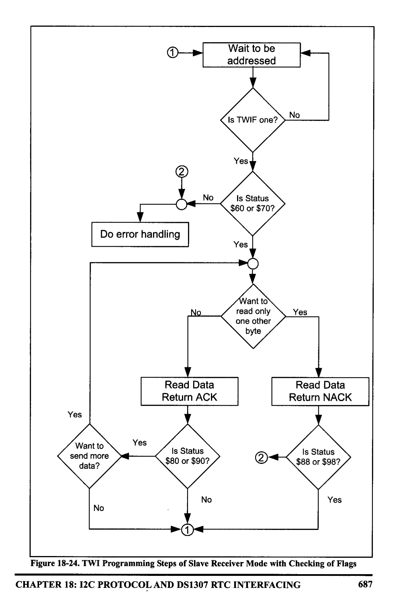
*Description*: Execution flowchart illustrating procedure steps, algorithmic logic flow, software build stages, or timing signal sequences for Figure 18-24: TWI Programming Steps of Slave Receiver Mode with Checking of Flags.

> **Figure 18-24: TWI Programming Steps of Slave Receiver Mode with Checking of Flags**

CHAPTER 18: I2C PROTOCOL AND DS1307 RTC INTERFACING
687


<!-- Page 695 -->
### [PDF Page 695]

Receive data and return NACK
In slave receiver mode, if you want to receive one byte of data you should
receive the byte of data and return NACK by doing the following steps:
1. Set the TWEN and TWINT bits of the TWCR register to one to receive a byte
and return NACK.
2. Poll the TWINT flag in the TWCR register to see when a byte has been
received completely.
3. When the TWINT flag is set to one, you should check the value of the status
register to see if the data was received successfully and NACK was returned.
If the status value is $88 or $98 (for general call), it means that a byte of data
was received and NACK was returned.
4. Copy the received byte from the TWDR.
Initialization:
TWAR = the address of Slave
TWCR = 0x04
TWCR = (1<<TWEN)(1<<TWIF)|(1<<TWEA)
Enable TWI
Status
$60
($70 for
General
Call)
$80
($90 for
Carole
$88
($98 for
General
Call)
Meaning
Your Response
TWCR =(1<<TWEN)(TWINT)(TWEA)
Next Action By TWI module
ATA byte will be receiv
CK will be return
Own SLA+W received
ACK returned
Data has been received
ACK returned
Data has been receiver
VACK retumes
TWCR = (1<<TWEN)(TWINT)
DATA = TWDR
TWCR =(1<<TWEN)(TWINT)(TWEA)
OR
DATA = TWDR
TWCR =(1<<TWEN)KTWINT)
DATA = TWDR
TWCR =(1<<TWEN)(TWINT)(TWEA)
DATA = TWDF
WCR =(1<<TWEN)(TWINT
TWCR =(1<<TWEN)|(TWINT)TWEA)
ATA byte will be receive
CK will be returne
Slar from bestressed wait to be
Start from beginning and wait to be
addressed
$AO
STOP or REPEATED
START condition has
been received
OR
TWCR =(1<<TWEN)(TWINT)

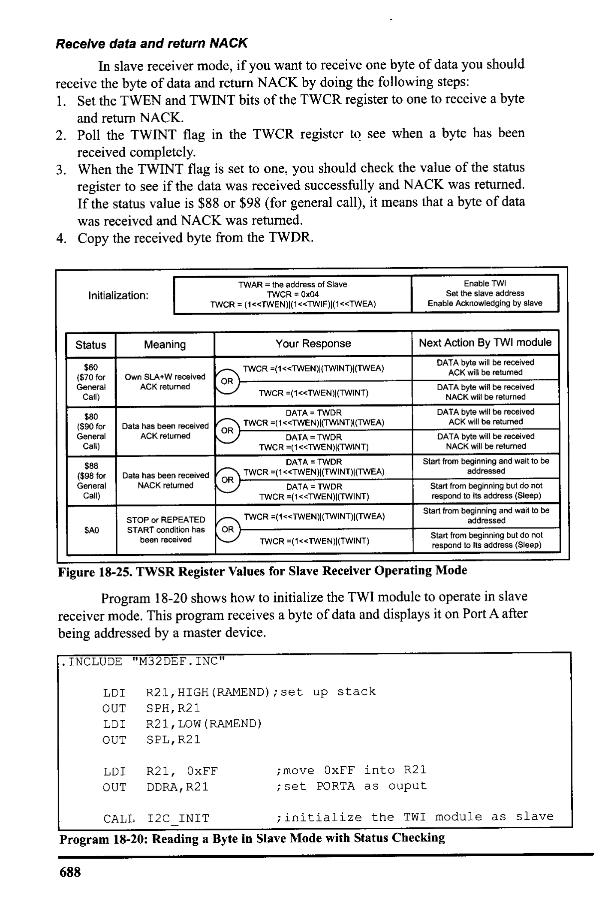
*Description*: Register specification diagram depicting individual bit flags, control register configurations, and functional definitions for Figure 18-25: TWSR Register Values for Slave Receiver Operating Mode.

> **Figure 18-25: TWSR Register Values for Slave Receiver Operating Mode**

Program 18-20 shows how to initialize the TWI module to operate in slave
receiver mode. This program receives a byte of data and displays it on Port A after
being addressed by a master device.
INCLUDE
"M32DEF. INC"
LDI
OUT
LDI
OUT
R21, HIGH (RAMEND); set up stack
SPH, R21
R21, LOW (RAMEND)
SPL, R21
LDI
OUT
R21, OXFF
DDRA, R21
¡ move OxFF into R21
¡ set PORTA as ouput

```assembly
CALL I2C_INIT
```

¡initialize the IWI module as slave
Program 18-20: Reading a Byte in Slave Mode with Status Checking
688


<!-- Page 696 -->
### [PDF Page 696]


```assembly
CALL I2C_LISTEN
CALL I2C_READ_STATUS
```

CPI
R26, 0x60

```assembly
BRNE ERROR
CALL I2C _READ
CALL IZC
```

CPI
_READ_STATUS
R26, 0x80
BRNER
ERROR
OUT
PORTA, R27
¡listen to the bus to be addressed
¡ addressed as slave receiver?
¡else jump to error function
¡read a byte and copy it to R27
¡ addressed as slave receiver?
¡else jump to error function
¡ copy R27
to PORTA
HERE:
RIMP HERE
¡wait here forever
ERROR:
RJMP
HERE
;****************
***********
*******
I2C_INIT:
LDI
OUT
LDI
OUT
LDI
OUT
RET
R21, 0x10
; load 00010000 into R21
IWAR, R21
¡set address register
R21,
(1<<TWEN)
¡move 0x04 into R21
IWCR, R21
¡enable the TWI
R21,
(1<<TWINT) | (1<<TWEN) | (1<<TWEA)
IWCR, R21
¡enable TWI and ACK (can't be ignored)
;********
******
***
I2C_LISTEN:
W1:
IN
R21, TWCR
SBRS
R21,
TWINT
RJMP
W1
RET
¡read control register into R21
iskip next intruction if IWINT is 1
¡jump to W1 if TWINT is O
;******
* * *
* * * *
IZC
_READ:
LDI
R21,
OUT
TWCR, R21
W2:
IN
R21,
TWCR
SBRS
R21,
TWINT
RJMP
W2
IN
R27, TWDR
RET
(1<<TWINT) | (1<<TWEN) | (1<<TWEA)
¡ configure TWCR to receive TWDR
¡ read control register into R21
¡ skip next line if IWINI is 1
¡ jump to W2 if IWINT is O
¡ move received data into R21
¡***************
I2C_READ.
_STATUS:
IN
R26,
ANDI
R26,
RET
***************
***********
TWSR
0xF8
¡ read status register into R21
¡ mask the prescaler bits
Program 18-20: Reading a Byte in Slave Mode with Status Checking (cont. from prev. page)
CHAPTER 18: I2C PROTOCOL AND DS1307 RTC INTERFACING
689


<!-- Page 697 -->
### [PDF Page 697]

Program 18-21 is the C version of Program 18-20. This program receives
a byte of data and displays it on Port A after being addressed by a master device.

```c
#include <avr/io.h>
```

void i2c_showError (unsigned char

```c
DDRA = OXFF;
PORTA = er;
```

/standard AVR header
er)
//***********************************************
unsigned char i2c_readstatus (void)
unsigned char i = 0;
i = IWSR & 0xF8;
return i;
*****
/*******
************
*****
void i2c_initSlave (unsigned char slaveAddress)
TWCR = 0x04;
lenable IWI module
IWAR = slaveAddress;
|set the slave address
TWCR = (1<<WINT) | (1<<TWEN) | (1<<TWEA)://init. TWI module
//******************************************
***
unsigned char ilo_receive (unsigned char islast)
if (isLast == 0)
Wif want to read more than 1 byte
TWR = (1<< IWINT) |(1<<TWEN) | (1<<TWEA) ;
else
lif want to read only one byte
TWCR = (1<< TWINT) | (1<<TWEN) ;
while ((TWCR & (1 <<TWINT) )==0) ;
return (TWDR) ;
//wait to complete
/******************
void i2c_listen ()
while ((TWCR & (1 <<TWINT)) ==0);
************.
****
//wait to be addressed
//*********************************************************
Program 18-21: Reading a Byte in Slave Mode with Status Checking in C
690


<!-- Page 698 -->
### [PDF Page 698]

int
main
(void)

```c
DDRA = 0xFF;
```

i2c
_initSlave (0x10);
Winit. TWI module as
/slave with address
//0b0001000 and do not
/accept general call
Wlisten to be addressed
i2c_listen () ;
unsigned char s, i;
s = 12c readStatus ();
if
(s ! = 0x60)
i20_showError (s) ;
return 0;
i=i2c
_receive (0);
s = i2o_readstatus () ;
if (s!= 0x80)
120_showError (S) ;
return 0;
}

```c
PORTA = i;
while (1);
```

return 0;
/stay here forever
Program 18-21: Reading a Byte in Slave Mode with Status Checking in C (continued)

### Review Questions

1. True or false. We can ignore checking the status register when there is more
than one master on the bus.
2. True or false. We can enable the TWI module and generate aSTART condition
at the same time.
3. How can a slave device read the value of the R/W bit when it is being
addressed by a master device?
4. True or false. We can check the status register to see if a STOP condition has
been transmitted successfully.
5. What is the value of the status register when SLA + W is received and ACK
has been returned?
6. What is the value of the status register when SLA + W is transmitted and ACK
has been received?
7. What is the value of the status register when SLA + R is received and ACK has
been returned?
8. What is the value of the status register when SLA + W is transmitted and ACK
has been received?
CHAPTER 18: I2C PROTOCOL AND DS1307 RIC INTERFACING
691


<!-- Page 699 -->
### [PDF Page 699]


### SUMMARY

This chapter began by describing the TWI bus connection and protocol.
Then we focused on programming of TWI in the AVR. We also discussed the func-
tion of each pin of the DS1307 RTC chip. The DS1307 can be used to provide a
real-time clock and dates for many applications. Various features of the RTC were
explained, and numerous programming examples were given.

### PROBLEMS


## SECTION 18.1: 12C BUS PROTOCOL

1. True or false. The I2C bus needs an external clock.
2. True or false. The SDA pin is internally pulled up.
3. True or false. The I2C bus needs two wires to transfer data.
4. True or false. The SDA line is output for the master device.
5. True or false. When a device is used as a slave, the SCL is an input pin.
6. True or false. In I2C, the data frame is 8 bits long.
7. True or false. In I2C devices, each bit of information (data, address,
ACK/NACK) is transferred with a single clock pulse.
8. True or false. In I2C devices, the 8-bit data is followed by an ACK/NACK.
9. In terms of data pins, what is the difference between the SPI and I2C connec-
tions?
10. How does the I2C protocol distinguish between the read and write cycles?

## SECTION 18.2: TWI (I2C) IN THE AVR

11. True or false. The AVR uses the term TWI instead of I2C.
12. What are the TWI submodules in AVR?
13. Which unit generates START or STOP conditions in the AVR?
14. True or false. After reading the status register we should mask the 2 LSB bits.
15. Which bits of TWSR are used to specify the clock of the TWI module?
16. Which bit of TWCR enables generation of interrupts when the TWINT flag is
set?
17. How can we virtually disconnect the TWI module from the bus?

## SECTION 18.3: AVR TWI PROGRAMMING IN ASSEMBLY AND C

18. Write a program to read a byte from a slave with address 0110 100 and write
the byte to a slave with address 0110 101.
19. Write a program to operate in slave mode and transmit "y" to the master when
the slave device is addressed. The slave address should be 0110 100.

## SECTION 18.4: DS1307 RTC INTERFACING AND PROGRAMMING

20. The DS1307 DIP package is a(n)
21. Which pin is assigned as GND?
692
_-pin package.


<!-- Page 700 -->
### [PDF Page 700]

22. Which pin is assigned as Vcc?
23. True or false. The DS1307 needs an external battery.
24. True or false. The DS1307 needs an external crystal oscillator.
25. True or false. The DS1307's crystal oscillator and heat affect the time-keeping
accuracy.
26. What is the maximum year that the DS1307 can provide?
27. Describe the functions of the SQW/OUT pin.
28 X1 is an
(input, output) pin.
29. The SQW/OUT pin is controlled by
_ and
_bits.
30. DS1307 has a total of —
bytes of RAM locations.
31. When does the DS1307 switch to a battery energy source?
32. What are the addresses assigned to the real-time clock (time) registers?
33. What are the addresses assigned to the calendar?
34. Which bit is used to set the AM/PM mode?
35. Which bit is used to set the 24-hour mode?
36. At what memory location does the DS1307 store the year 2009?
37. What is the address of the last location of RAM for the DS1307?
38. True or false. The DS1307 provides data in BCD format only.
39. Write a C program to set the time to 9:15:05 PM.
40. Write a C program to set the time to 22:47:19.
41. Write a C program to set the date to May 14, 2009.
42. Write a C program to get the hour and minute data and send it to Port B and
Port D.

### ANSWERS TO REVIEW QUESTIONS


## SECTION 18.1: I2C BUS PROTOCOL

1.
True
2.
9 bits. The ninth bit
3.
True
4.
Clock stretching
5. 4.7 kilohms
6. False

## SECTION 18.2: TWI (12C) IN THE AVR

1. True
2. TWDR, TWAR, TWBR, TWCR, and TWSR
3. By writing 1 to the TWSTA and TWSTO bits, respectively
4. False
5. TWINT
6. False
7. TWEA

## SECTION 18.3: AVR TWI PROGRAMMING IN ASSEMBLY AND C

1. False
2. d
3. bande
CHAPTER 18: I2C PROTOCOL AND DS1307 RTC INTERFACING
693


<!-- Page 701 -->
### [PDF Page 701]

4. d
5.

## SECTION 18.4: DS1307 RTC INTERFACING AND PROGRAMMING

1. True
2. a
3. C (64-8=56 bytes)
4. True
5. SCL
6. 3V
7. False
8. a

## SECTION 18.5: TWI PROGRAMMING WITH CHECKING STATUS REGISTER

2. False. We have to first enable the TWI module by witing one to the TWEN bit and then we
can generate a START condition.
It should read the value of the status register.
5. $60
6. $18
7. $A8
8.
$40
694


