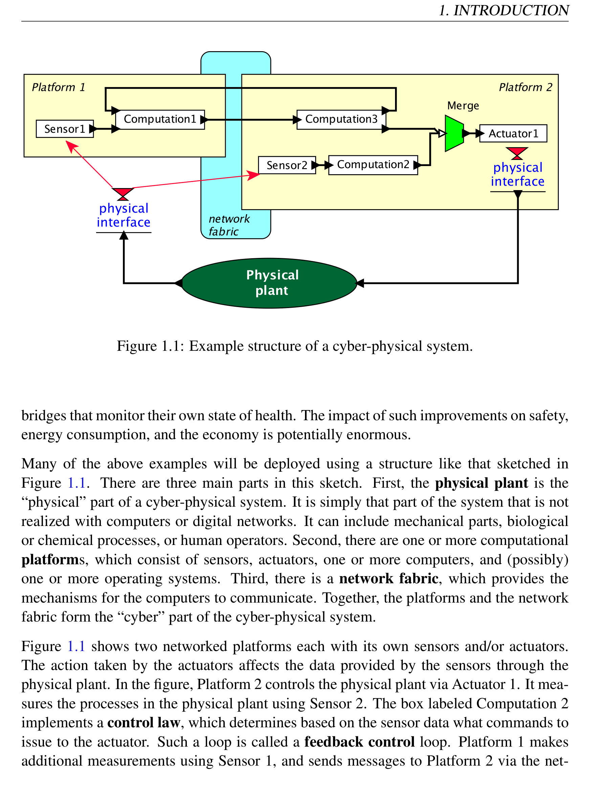
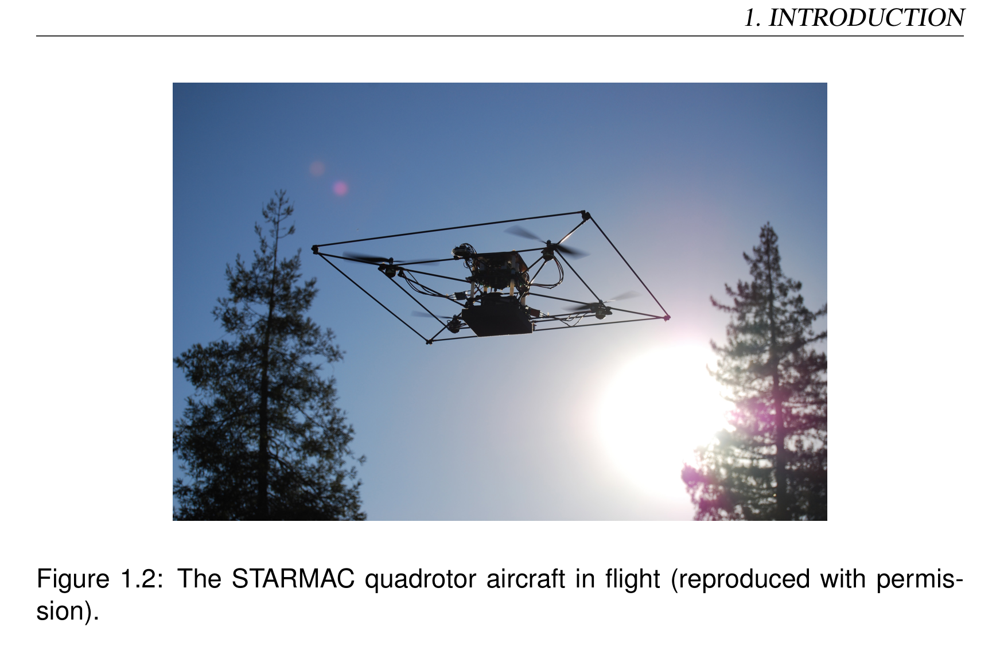
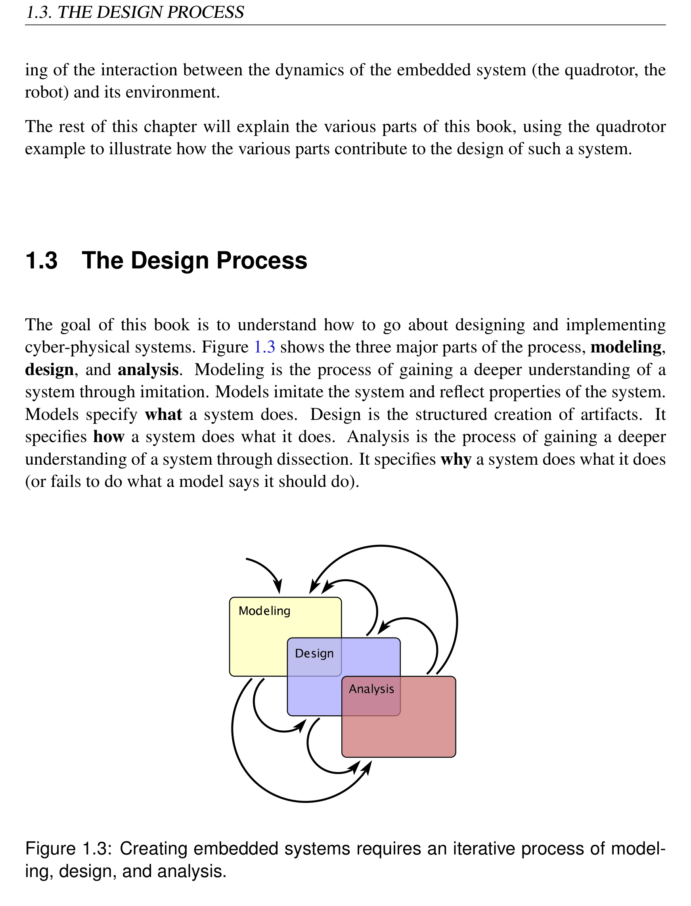
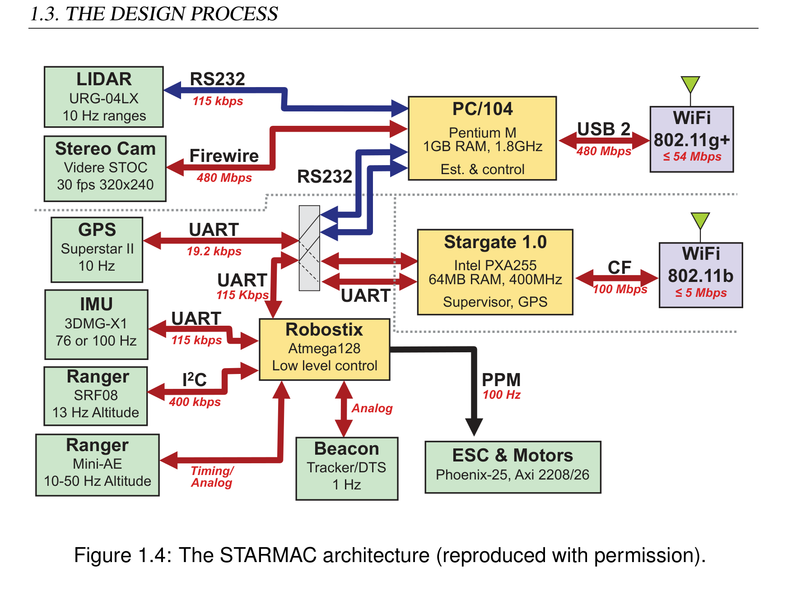

# Chapter 1: Introduction

> **Textbook**: Introduction to Embedded Systems - A Cyber-Physical Systems Approach (UC Berkeley)  
> **Authors**: Edward Ashford Lee and Sanjit Arunkumar Seshia  
> **PDF Page Range**: 21 - 36

---

<!-- Page 21 -->
### [PDF Page 21]

1
Introduction
Contents
1.1
Applications
. . . . . . . . . . . . . . . . . . . . . . . . . . . . . .
2

### Sidebar: About the Term “Cyber-Physical Systems” . . . . . . . . . .

4
1.2
Motivating Example . . . . . . . . . . . . . . . . . . . . . . . . . .
6
1.3
The Design Process
. . . . . . . . . . . . . . . . . . . . . . . . . .
8
1.3.1
Modeling . . . . . . . . . . . . . . . . . . . . . . . . . . . .
11
1.3.2
Design
. . . . . . . . . . . . . . . . . . . . . . . . . . . . .
12
1.3.3
Analysis
. . . . . . . . . . . . . . . . . . . . . . . . . . . .
14
1.4

### Summary . . . . . . . . . . . . . . . . . . . . . . . . . . . . . . . .

15
A cyber-physical system (CPS) is an integration of computation with physical processes.
Embedded computers and networks monitor and control the physical processes, usually
with feedback loops where physical processes affect computations and vice versa. As an
intellectual challenge, CPS is about the intersection, not the union, of the physical and
the cyber. It is not sufficient to separately understand the physical components and the
computational components. We must instead understand their interaction.
In this chapter, we use a few CPS applications to outline the engineering principles of
such systems and the processes by which they are designed.
1

<!-- Page 22 -->
### [PDF Page 22]

1.1. APPLICATIONS
1.1
Applications
CPS applications arguably have the potential to eclipse the 20th century information tech-
nology (IT) revolution. Consider the following examples.
Example 1.1:
Heart surgery often requires stopping the heart, performing the
surgery, and then restarting the heart. Such surgery is extremely risky and carries
many detrimental side effects. A number of research teams have been working on
an alternative where a surgeon can operate on a beating heart rather than stopping
the heart. There are two key ideas that make this possible. First, surgical tools can
be robotically controlled so that they move with the motion of the heart (Kremen,
2008). A surgeon can therefore use a tool to apply constant pressure to a point on
the heart while the heart continues to beat. Second, a stereoscopic video system can
present to the surgeon a video illusion of a still heart (Rice, 2008). To the surgeon,
it looks as if the heart has been stopped, while in reality, the heart continues to
beat. To realize such a surgical system requires extensive modeling of the heart,
the tools, the computational hardware, and the software. It requires careful design
of the software that ensures precise timing and safe fallback behaviors to handle
malfunctions. And it requires detailed analysis of the models and the designs to
provide high confidence.
Example 1.2:
Consider a city where traffic lights and cars cooperate to ensure
efficient flow of traffic. In particular, imagine never having to stop at a red light
unless there is actual cross traffic. Such a system could be realized with expensive
infrastructure that detects cars on the road. But a better approach might be to have
the cars themselves cooperate. They track their position and communicate to coop-
eratively use shared resources such as intersections. Making such a system reliable,
of course, is essential to its viability. Failures could be disastrous.
Example 1.3:
Imagine an airplane that refuses to crash. While preventing all
possible causes of a crash is not possible, a well-designed flight control system
2
Lee & Seshia, Introduction to Embedded Systems

<!-- Page 23 -->
### [PDF Page 23]

1. INTRODUCTION
can prevent certain causes. The systems that do this are good examples of cyber-
physical systems.
In traditional aircraft, a pilot controls the aircraft through mechanical and hydraulic
linkages between controls in the cockpit and movable surfaces on the wings and
tail of the aircraft. In a fly-by-wire aircraft, the pilot commands are mediated by a
flight computer and sent electronically over a network to actuators in the wings and
tail. Fly-by-wire aircraft are much lighter than traditional aircraft, and therefore
more fuel efficient. They have also proven to be more reliable. Virtually all new
aircraft designs are fly-by-wire systems.
In a fly-by-wire aircraft, since a computer mediates the commands from the pilot,
the computer can modify the commands. Many modern flight control systems mod-
ify pilot commands in certain circumstances. For example, commercial airplanes
made by Airbus use a technique called flight envelope protection to prevent an
airplane from going outside its safe operating range. They can prevent a pilot from
causing a stall, for example.
The concept of flight envelope protection could be extended to help prevent cer-
tain other causes of crashes. For example, the soft walls system proposed by Lee
(2001), if implemented, would track the location of the aircraft on which it is in-
stalled and prevent it from flying into obstacles such as mountains and buildings.
In Lee’s proposal, as an aircraft approaches the boundary of an obstacle, the fly-
by-wire flight control system creates a virtual pushing force that forces the aircraft
away. The pilot feels as if the aircraft has hit a soft wall that diverts it. There
are many challenges, both technical and non-technical, to designing and deploying
such a system. See Lee (2003) for a discussion of some of these issues.
Although the soft walls system of the previous example is rather futuristic, there are mod-
est versions in automotive safety that have been deployed or are in advanced stages of
research and development. For example, many cars today detect inadvertent lane changes
and warn the driver. Consider the much more challenging problem of automatically cor-
recting the driver’s actions. This is clearly much harder than just warning the driver.
How can you ensure that the system will react and take over only when needed, and only
exactly to the extent to which intervention is needed?
It is easy to imagine many other applications, such as systems that assist the elderly;
telesurgery systems that allow a surgeon to perform an operation at a remote location;
Lee & Seshia, Introduction to Embedded Systems
3

<!-- Page 24 -->
### [PDF Page 24]

1.1. APPLICATIONS
and home appliances that cooperate to smooth demand for electricity on the power grid.
Moreover, it is easy to envision using CPS to improve many existing systems, such as
robotic manufacturing systems; electric power generation and distribution; process con-
trol in chemical factories; distributed computer games; transportation of manufactured
goods; heating, cooling, and lighting in buildings; people movers such as elevators; and
About the Term “Cyber-Physical Systems”
The term “cyber-physical systems” emerged around 2006, when it was coined by Helen
Gill at the National Science Foundation in the United States. While we are all familiar
with the term “cyberspace,” and may be tempted to associate it with CPS, the roots of the
term CPS are older and deeper. It would be more accurate to view the terms “cyberspace”
and “cyber-physical systems” as stemming from the same root, “cybernetics,” rather than
viewing one as being derived from the other.
The term “cybernetics” was coined by Norbert Wiener (Wiener, 1948), an American
mathematician who had a huge impact on the development of control systems theory.
During World War II, Wiener pioneered technology for the automatic aiming and firing of
anti-aircraft guns. Although the mechanisms he used did not involve digital computers,
the principles involved are similar to those used today in a huge variety of computer-
based feedback control systems. Wiener derived the term from the Greek κυβερνητης
(kybernetes), meaning helmsman, governor, pilot, or rudder. The metaphor is apt for
control systems.
Wiener described his vision of cybernetics as the conjunction of control and communi-
cation. His notion of control was deeply rooted in closed-loop feedback, where the con-
trol logic is driven by measurements of physical processes, and in turn drives the physical
processes. Even though Wiener did not use digital computers, the control logic is effec-
tively a computation, and therefore cybernetics is the conjunction of physical processes,
computation, and communication.
Wiener could not have anticipated the powerful effects of digital computation and net-
works. The fact that the term “cyber-physical systems” may be ambiguously interpreted
as the conjunction of cyberspace with physical processes, therefore, helps to underscore
the enormous impact that CPS will have. CPS leverages a phenomenal information tech-
nology that far outstrips even the wildest dreams of Wiener’s era.
4
Lee & Seshia, Introduction to Embedded Systems

<!-- Page 25 -->
### [PDF Page 25]

1. INTRODUCTION

*Description*: Cyber-physical actor model block diagram showing continuous/discrete signal flows, feedback loops, and component interfaces for Figure 1.1: Example structure of a cyber-physical system..

> **Figure 1.1: Example structure of a cyber-physical system.**

bridges that monitor their own state of health. The impact of such improvements on safety,
energy consumption, and the economy is potentially enormous.
Many of the above examples will be deployed using a structure like that sketched in

*Description*: Technical diagram and schematic model illustrating cyber-physical system behavior, algorithmic logic, and state progression for Figure 1.1: There are three main parts in this sketch. First, the physical plant is the.

> **Figure 1.1: There are three main parts in this sketch. First, the physical plant is the**

“physical” part of a cyber-physical system. It is simply that part of the system that is not
realized with computers or digital networks. It can include mechanical parts, biological
or chemical processes, or human operators. Second, there are one or more computational
platforms, which consist of sensors, actuators, one or more computers, and (possibly)
one or more operating systems. Third, there is a network fabric, which provides the
mechanisms for the computers to communicate. Together, the platforms and the network
fabric form the “cyber” part of the cyber-physical system.

*Description*: Technical diagram and schematic model illustrating cyber-physical system behavior, algorithmic logic, and state progression for Figure 1.1: shows two networked platforms each with its own sensors and/or actuators..

> **Figure 1.1: shows two networked platforms each with its own sensors and/or actuators.**

The action taken by the actuators affects the data provided by the sensors through the
physical plant. In the figure, Platform 2 controls the physical plant via Actuator 1. It mea-
sures the processes in the physical plant using Sensor 2. The box labeled Computation 2
implements a control law, which determines based on the sensor data what commands to
issue to the actuator. Such a loop is called a feedback control loop. Platform 1 makes
additional measurements using Sensor 1, and sends messages to Platform 2 via the net-
Lee & Seshia, Introduction to Embedded Systems
5

<!-- Page 26 -->
### [PDF Page 26]

1.2. MOTIVATING EXAMPLE
work fabric. Computation 3 realizes an additional control law, which is merged with that
of Computation 2, possibly preempting it.
Example 1.4: Consider a high-speed printing press for a print-on-demand service.
This might be structured similarly to Figure 1.1, but with many more platforms,
sensors, and actuators. The actuators may control motors that drive paper through
the press and ink onto the paper. The control laws may include a strategy for com-
pensating for paper stretch, which will typically depend on the type of paper, the
temperature, and the humidity. A networked structure like that in Figure 1.1 might
be used to induce rapid shutdown to prevent damage to the equipment in case of
paper jams. Such shutdowns need to be tightly orchestrated across the entire sys-
tem to prevent disasters. Similar situations are found in high-end instrumentation
systems and in energy production and distribution (Eidson et al., 2009).
1.2
Motivating Example
In this section, we describe a motivating example of a cyber-physical system. Our goal is
to use this example to illustrate the importance of the breadth of topics covered in this text.
The specific application is the Stanford testbed of autonomous rotorcraft for multi agent
control (STARMAC), developed by Claire Tomlin and colleagues as a cooperative effort
at Stanford and Berkeley (Hoffmann et al., 2004). The STARMAC is a small quadrotor
aircraft; it is shown in flight in Figure 1.2. Its primary purpose is to serve as a testbed for
experimenting with multi-vehicle autonomous control techniques. The objective is to be
able to have multiple vehicles cooperate on a common task.
There are considerable challenges in making such a system work. First, controlling the
vehicle is not trivial. The main actuators are the four rotors, which produce a variable
amount of downward thrust. By balancing the thrust from the four rotors, the vehicle can
take off, land, turn, and even flip in the air. How do we determine what thrust to apply?
Sophisticated control algorithms are required.
Second, the weight of the vehicle is a major consideration. The heavier it is, the more
stored energy it needs to carry, which of course makes it even heavier. The heavier it
is, the more thrust it needs to fly, which implies bigger and more powerful motors and
rotors. The design crosses a major threshold when the vehicle is heavy enough that the
6
Lee & Seshia, Introduction to Embedded Systems

<!-- Page 27 -->
### [PDF Page 27]

1. INTRODUCTION

*Description*: Physical dynamics and physical system model diagram illustrating degrees of freedom, coordinate frames, forces, and equations for Figure 1.2: The STARMAC quadrotor aircraft in flight (reproduced with permis-.

> **Figure 1.2: The STARMAC quadrotor aircraft in flight (reproduced with permis-**

sion).
rotors become dangerous to humans. Even with a relatively light vehicle, safety is a
considerable concern, and the system needs to be designed with fault handling.
Third, the vehicle needs to operate in a context, interacting with its environment. It might,
for example, be under the continuous control of a watchful human who operates it by re-
mote control. Or it might be expected to operate autonomously, to take off, perform some
mission, return, and land. Autonomous operation is enormously complex and challeng-
ing because it cannot benefit from the watchful human. Autonomous operation demands
more sophisticated sensors. The vehicle needs to keep track of where it is (it needs to
perform localization). It needs to sense obstacles, and it needs to know where the ground
is. With good design, it is even possible for such vehicles to autonomously land on the
pitching deck of a ship. The vehicle also needs to continuously monitor its own health, to
detect malfunctions and react to them so as to contain the damage.
It is not hard to imagine many other applications that share features with the quadrotor
problem. The problem of landing a quadrotor vehicle on the deck of a pitching ship is sim-
ilar to the problem of operating on a beating heart (see Example 1.1). It requires detailed
modeling of the dynamics of the environment (the ship, the heart), and a clear understand-
Lee & Seshia, Introduction to Embedded Systems
7

<!-- Page 28 -->
### [PDF Page 28]

1.3. THE DESIGN PROCESS
ing of the interaction between the dynamics of the embedded system (the quadrotor, the
robot) and its environment.
The rest of this chapter will explain the various parts of this book, using the quadrotor
example to illustrate how the various parts contribute to the design of such a system.
1.3
The Design Process
The goal of this book is to understand how to go about designing and implementing
cyber-physical systems. Figure 1.3 shows the three major parts of the process, modeling,
design, and analysis. Modeling is the process of gaining a deeper understanding of a
system through imitation. Models imitate the system and reflect properties of the system.
Models specify what a system does. Design is the structured creation of artifacts. It
specifies how a system does what it does. Analysis is the process of gaining a deeper
understanding of a system through dissection. It specifies why a system does what it does
(or fails to do what a model says it should do).

*Description*: Technical diagram and schematic model illustrating cyber-physical system behavior, algorithmic logic, and state progression for Figure 1.3: Creating embedded systems requires an iterative process of model-.

> **Figure 1.3: Creating embedded systems requires an iterative process of model-**

ing, design, and analysis.
8
Lee & Seshia, Introduction to Embedded Systems

<!-- Page 29 -->
### [PDF Page 29]

1. INTRODUCTION
As suggested in Figure 1.3, these three parts of the process overlap, and the design process
iteratively moves among the three parts. Normally, the process will begin with modeling,
where the goal is to understand the problem and to develop solution strategies.
Example 1.5: For the quadrotor problem of Section 1.2, we might begin by con-
structing models that translate commands from a human to move vertically or lat-
erally into commands to the four motors to produce thrust. A model will reveal that
if the thrust is not the same on the four rotors, then the vehicle will tilt and move
laterally.
Such a model might use techniques like those in Chapter 2 (Continuous Dynam-
ics), constructing differential equations to describe the dynamics of the vehicle. It
would then use techniques like those in Chapter 3 (Discrete Dynamics) to build
state machines that model the modes of operation such as takeoff, landing, hov-
ering, and lateral flight. It could then use the techniques of Chapter 4 (Hybrid
Systems) to blend these two types of models, creating hybrid system models of
the system to study the transitions between modes of operation. The techniques of
Chapters 5 (Composition of State Machines) and 6 (Concurrent Models of Compu-
tation) would then provide mechanisms for composing models of multiple vehicles,
models of the interactions between a vehicle and its environment, and models of the
interactions of components within a vehicle.
The process may progress quickly to the design phase, where we begin selecting com-
ponents and putting them together (motors, batteries, sensors, microprocessors, memory
systems, operating systems, wireless networks, etc.). An initial prototype may reveal
flaws in the models, causing a return to the modeling phase and revision of the models.
Example 1.6:
The hardware architecture of the first generation STARMAC
quadrotor is shown in Figure 1.4. At the left and bottom of the figure are a number
of sensors used by the vehicle to determine where it is (localization) and what is
around it. In the middle are three boxes showing three distinct microprocessors.
The Robostix is an Atmel AVR 8-bit microcontroller that runs with no operating
system and performs the low-level control algorithms to keep the craft flying. The
Lee & Seshia, Introduction to Embedded Systems
9

<!-- Page 30 -->
### [PDF Page 30]

1.3. THE DESIGN PROCESS
WiFi
802.11b
 5 Mbps
ESC & Motors
Phoenix-25, Axi 2208/26
IMU
3DMG-X1
76 or 100 Hz
Ranger
SRF08
13 Hz Altitude
GPS
Superstar II
10 Hz
I2C
400 kbps
PPM
100 Hz
UART

## 19.2 kbps

Robostix
Atmega128
Low level control
UART
115 kbps
CF
100 Mbps
Stereo Cam
Videre STOC
30 fps 320x240
Firewire
480 Mbps
UART
115 Kbps
LIDAR
URG-04LX
10 Hz ranges
Ranger
Mini-AE
10-50 Hz Altitude
Beacon
Tracker/DTS
1 Hz
WiFi
802.11g+
 54 Mbps
USB 2
480 Mbps
RS232
115 kbps
Timing/
Analog
Analog
RS232
UART
Stargate 1.0
Intel PXA255
64MB RAM, 400MHz
Supervisor, GPS
PC/104
Pentium M
1GB RAM, 1.8GHz
Est. & control

*Description*: Technical diagram and schematic model illustrating cyber-physical system behavior, algorithmic logic, and state progression for Figure 1.4: The STARMAC architecture (reproduced with permission)..

> **Figure 1.4: The STARMAC architecture (reproduced with permission).**

other two processors perform higher-level tasks with the help of an operating sys-
tem. Both processors include wireless links that can be used by cooperating vehi-
cles and ground controllers.

# Chapter 7 (Embedded Processors) considers processor architectures, offering some basis

for comparing the relative advantages of one architecture or another. Chapter 8 (Mem-
ory Architectures) considers the design of memory systems, emphasizing the impact that
they can have on overall system behavior. Chapter 9 (Input and Output) considers the
interfacing of processors with sensors and actuators. Chapters 10 (Multitasking) and 11
(Scheduling) focus on software architecture, with particular emphasis on how to orches-
trate multiple real-time tasks.
In a healthy design process, analysis figures prominently early in the process. Analysis
will be applied to the models and to the designs. The models may be analyzed for safety
10
Lee & Seshia, Introduction to Embedded Systems

<!-- Page 31 -->
### [PDF Page 31]

1. INTRODUCTION
conditions, for example to ensure an invariant that asserts that if the vehicle is within one
meter of the ground, then its vertical speed is no greater than 0.1 meter/sec. The designs
may be analyzed for the timing behavior of software, for example to determine how long
it takes the system to respond to an emergency shutdown command. Certain analysis
problems will involve details of both models and designs. For the quadrotor example, it
is important to understand how the system will behave if network connectivity is lost and
it becomes impossible to communicate with the vehicle. How can the vehicle detect that
communication has been lost? This will require accurate modeling of the network and the
software.
Example 1.7:
For the quadrotor problem, we use the techniques of Chapter 12
(Invariants and Temporal Logic) to specify key safety requirements for operation
of the vehicles. We would then use the techniques of Chapters 13 (Equivalence
and Refinement) and 14 (Reachability Analysis and Model Checking) to verify that
these safety properties are satisfied by implementations of the software. We would
then use the techniques of Chapter 15 (Quantitative Analysis) to determine whether
real-time constraints are met by the software.
Corresponding to a design process structured as in Figure 1.3, this book is divided into
three major parts, focused on modeling, design, and analysis (see Figure 1 on page xvi).
We now describe the approach taken in the three parts.
1.3.1
Modeling
The modeling part of the book, which is the first part, focuses on models of dynamic
behavior. It begins with a light coverage of the big subject of modeling of physical dy-
namics in Chapter 2, specifically focusing on continuous dynamics in time. It then talks
about discrete dynamics in Chapter 3, using state machines as the principal formalism.
It then combines the two, continuous and discrete dynamics, with a discussion of hybrid
systems in Chapter 4. Chapter 5 (Composition of State Machines) focuses on concurrent
composition of state machines, emphasizing that the semantics of composition is a critical
issue with which designers must grapple. Chapter 6 (Concurrent Models of Computation)
gives an overview of concurrent models of computation, including many of those used in
design tools that practitioners frequently leverage, such as Simulink and LabVIEW.
Lee & Seshia, Introduction to Embedded Systems
11

<!-- Page 32 -->
### [PDF Page 32]

1.3. THE DESIGN PROCESS
In the modeling part of the book, we define a system to be simply a combination of parts
that is considered as a whole. A physical system is one realized in matter, in contrast
to a conceptual or logical system such as software and algorithms. The dynamics of a
system is its evolution in time: how its state changes. A model of a physical system is a
description of certain aspects of the system that is intended to yield insight into properties
of the system. In this text, models have mathematical properties that enable systematic
analysis. The model imitates properties of the system, and hence yields insight into that
system.
A model is itself a system. It is important to avoid confusing a model and the system that it
models. These are two distinct artifacts. A model of a system is said to have high fidelity
if it accurately describes properties of the system. It is said to abstract the system if it
omits details. Models of physical systems inevitably do omit details, so they are always
abstractions of the system. A major goal of this text is to develop an understanding of
how to use models, of how to leverage their strengths and respect their weaknesses.
A cyber-physical system (CPS) is a system composed of physical subsystems together
with computing and networking. Models of cyber-physical systems normally include
all three parts. The models will typically need to represent both dynamics and static
properties (those that do not change during the operation of the system).
Each of the modeling techniques described in this part of the book is an enormous subject,
much bigger than one chapter, or even one book. In fact, such models are the focus of
many branches of engineering, physics, chemistry, and biology. Our approach is aimed at
engineers. We assume some background in mathematical modeling of dynamics (calculus
courses that give some examples from physics are sufficient), and then focus on how to
compose diverse models. This will form the core of the cyber-physical system problem,
since joint modeling of the cyber side, which is logical and conceptual, with the physical
side, which is embodied in matter, is the core of the problem. We therefore make no
attempt to be comprehensive, but rather pick a few modeling techniques that are widely
used by engineers and well understood, review them, and then compose them to form a
cyber-physical whole.
1.3.2
Design
The second part of the book has a very different flavor, reflecting the intrinsic heterogene-
ity of the subject. This part focuses on the design of embedded systems, with emphasis
on the role they play within a CPS. Chapter 7 (Embedded Processors) discusses pro-
12
Lee & Seshia, Introduction to Embedded Systems

<!-- Page 33 -->
### [PDF Page 33]

1. INTRODUCTION
cessor architectures, with emphasis on specialized properties most suited to embedded
systems. Chapter 8 (Memory Architectures) describes memory architectures, including
abstractions such as memory models in programming languages, physical properties such
as memory technologies, and architectural properties such as memory hierarchy (caches,
scratchpads, etc.). The emphasis is on how memory architecture affects dynamics. Chap-
ter 9 (Input and Output) is about the interface between the software world and the physical
world. It discusses input/output mechanisms in software and computer architectures, and
the digital/analog interface, including sampling. Chapter 10 (Multitasking) introduces the
notions that underlie operating systems, with particular emphasis on multitasking. The
emphasis is on the pitfalls of using low-level mechanisms such as threads, with a hope of
convincing the reader that there is real value in using the modeling techniques covered in
the first part of the book. Those modeling techniques help designers build confidence in
system designs. Chapter 11 (Scheduling) introduces real-time scheduling, covering many
of the classic results in the area.
In all chapters in the design part, we particularly focus on the mechanisms that provide
concurrency and control over timing, because these issues loom large in the design of
cyber-physical systems. When deployed in a product, embedded processors typically
have a dedicated function. They control an automotive engine or measure ice thickness
in the Arctic. They are not asked to perform arbitrary functions with user-defined soft-
ware. Consequently, the processors, memory architectures, I/O mechanisms, and operat-
ing systems can be more specialized. Making them more specialized can bring enormous
benefits. For example, they may consume far less energy, and consequently be usable
with small batteries for long periods of time. Or they may include specialized hardware
to perform operations that would be costly to perform on general-purpose hardware, such
as image analysis. Our goal in this part is to enable the reader to critically evaluate the
numerous available technology offerings.
One of the goals in this part of the book is to teach students to implement systems while
thinking across traditional abstraction layers — e.g., hardware and software, computa-
tion and physical processes. While such cross-layer thinking is valuable in implementing
systems in general, it is particularly essential in embedded systems given their heteroge-
neous nature. For example, a programmer implementing a control algorithm expressed
in terms of real-valued quantities must have a solid understanding of computer arithmetic
(e.g., of fixed-point numbers) in order to create a reliable implementation. Similarly, an
implementor of automotive software that must satisfy real-time constraints must be aware
of processor features – such as pipelines and caches – that can affect the execution time
of tasks and hence the real-time behavior of the system. Likewise, an implementor of
Lee & Seshia, Introduction to Embedded Systems
13

<!-- Page 34 -->
### [PDF Page 34]

1.3. THE DESIGN PROCESS
interrupt-driven or multi-threaded software must understand the atomic operations pro-
vided by the underlying software-hardware platform and use appropriate synchronization
constructs to ensure correctness. Rather than doing an exhaustive survey of different im-
plementation methods and platforms, this part of the book seeks to give the reader an ap-
preciation for such cross-layer topics, and uses homework exercises to facilitate a deeper
understanding of them.
1.3.3
Analysis
Every system must be designed to meet certain requirements. For embedded systems,
which are often intended for use in safety-critical, everyday applications, it is essential
to certify that the system meets its requirements. Such system requirements are also
called properties or specifications. The need for specifications is aptly captured by the
following quotation, paraphrased from Young et al. (1985):
“A design without specifications cannot be right or wrong, it can only be
surprising!”
The analysis part of the book focuses on precise specifications of properties, on tech-
niques for comparing specifications, and on techniques for analyzing specifications and
the resulting designs. Reflecting the emphasis on dynamics in the text, Chapter 12 (Invari-
ants and Temporal Logic) focuses on temporal logics, which provide precise descriptions
of dynamic properties of systems. These descriptions are treated as models. Chapter
13 (Equivalence and Refinement) focuses on the relationships between models. Is one
model an abstraction of another? Is it equivalent in some sense? Specifically, that chap-
ter introduces type systems as a way of comparing static properties of models, and lan-
guage containment and simulation relations as a way of comparing dynamic properties of
models. Chapter 14 (Reachability Analysis and Model Checking) focuses on techniques
for analyzing the large number of possible dynamic behaviors that a model may exhibit,
with particular emphasis on model checking as a technique for exploring such behaviors.

# Chapter 15 (Quantitative Analysis) is about analyzing quantitative properties of embedded

software, such as finding bounds on resources consumed by programs. It focuses partic-
ularly on execution time analysis, with some introduction to other quantitative properties
such as energy and memory usage.
In present engineering practice, it is common to have system requirements stated in a
natural language such as English. It is important to precisely state requirements to avoid
14
Lee & Seshia, Introduction to Embedded Systems

<!-- Page 35 -->
### [PDF Page 35]

1. INTRODUCTION
ambiguities inherent in natural languages. The goal of this part of the book is to help
replace descriptive techniques with formal ones, which we believe are less error prone.
Importantly, formal specifications also enable the use of automatic techniques for formal
verification of both models and implementations. The analysis part of the book introduces
readers to the basics of formal verification, including notions of equivalence and refine-
ment checking, as well as reachability analysis and model checking. In discussing these
verification methods, we attempt to give users of verification tools an appreciation of what
is “under the hood” so that they may derive the most benefit from them. This user’s view
is supported by examples discussing, for example, how model checking can be applied
to find subtle errors in concurrent software, or how reachability analysis can be used in
computing a control strategy for a robot to achieve a particular task.
1.4

### Summary

Cyber-physical systems are heterogeneous blends by nature. They combine computation,
communication, and physical dynamics. They are harder to model, harder to design,
and harder to analyze than homogeneous systems. This chapter gives an overview of the
engineering principles addressed in this book for modeling, designing, and analyzing such
systems.
Lee & Seshia, Introduction to Embedded Systems
15

<!-- Page 36 -->
### [PDF Page 36]

1.4. SUMMARY
16
Lee & Seshia, Introduction to Embedded Systems

