# Chapter 3: Discrete Dynamics

> **Textbook**: Introduction to Embedded Systems - A Cyber-Physical Systems Approach (UC Berkeley)  
> **Authors**: Edward Ashford Lee and Sanjit Arunkumar Seshia  
> **PDF Page Range**: 61 - 96


---


<!-- Page 61 -->
### [PDF Page 61]

3
Discrete Dynamics
Contents
3.1
Discrete Systems . . . . . . . . . . . . . . . . . . . . . . . . . . . .
42

### Sidebar: Probing Further: Discrete Signals . . . . . . . . . . . . . .

44

### Sidebar: Probing Further: Modeling Actors as Functions . . . . . . .

45
3.2
The Notion of State
. . . . . . . . . . . . . . . . . . . . . . . . . .
46
3.3
Finite-State Machines . . . . . . . . . . . . . . . . . . . . . . . . .
47
3.3.1
Transitions . . . . . . . . . . . . . . . . . . . . . . . . . . .
48
3.3.2
When a Reaction Occurs . . . . . . . . . . . . . . . . . . . .
51

### Sidebar: Probing Further: Hysteresis

. . . . . . . . . . . . . . . . .
52
3.3.3
Update Functions . . . . . . . . . . . . . . . . . . . . . . . .
54

### Sidebar: Software Tools Supporting FSMs . . . . . . . . . . . . . . .

54
3.3.4
Determinacy and Receptiveness . . . . . . . . . . . . . . . .
56
3.4
Extended State Machines . . . . . . . . . . . . . . . . . . . . . . .
57

### Sidebar: Moore Machines and Mealy Machines . . . . . . . . . . . .

58
3.5
Nondeterminism . . . . . . . . . . . . . . . . . . . . . . . . . . . .
63
3.5.1
Formal Model . . . . . . . . . . . . . . . . . . . . . . . . . .
64
3.5.2
Uses of Non-Determinism . . . . . . . . . . . . . . . . . . .
66
3.6
Behaviors and Traces . . . . . . . . . . . . . . . . . . . . . . . . .
66
3.7

### Summary . . . . . . . . . . . . . . . . . . . . . . . . . . . . . . . .

70

### Exercises . . . . . . . . . . . . . . . . . . . . . . . . . . . . . . . . . . .

71
41


<!-- Page 62 -->
### [PDF Page 62]

3.1. DISCRETE SYSTEMS
Models of embedded systems include both discrete and continuous components. Loosely
speaking, continuous components evolve smoothly, while discrete components evolve
abruptly. The previous chapter considered continuous components, and showed that the
physical dynamics of the system can often be modeled with ordinary differential or in-
tegral equations, or equivalently with actor models that mirror these equations. Discrete
components, on the other hand, are not conveniently modeled by ODEs. In this chapter,
we study how state machines can be used to model discrete dynamics. In the next chap-
ter, we will show how these state machines can be combined with models of continuous
dynamics to get hybrid system models.
3.1
Discrete Systems
A discrete system operates in a sequence of discrete steps and is said to have discrete
dynamics. Some systems are inherently discrete.
Example 3.1:
Consider a system that counts the number of cars that enter and
leave a parking garage in order to keep track of how many cars are in the garage
at any time. It could be modeled as shown in Figure 3.1. We ignore for now
how to design the sensors that detect the entry or departure of cars. We simply
assume that the ArrivalDetector actor produces an event when a car arrives, and
the DepartureDetector actor produces an event when a car departs. The Counter

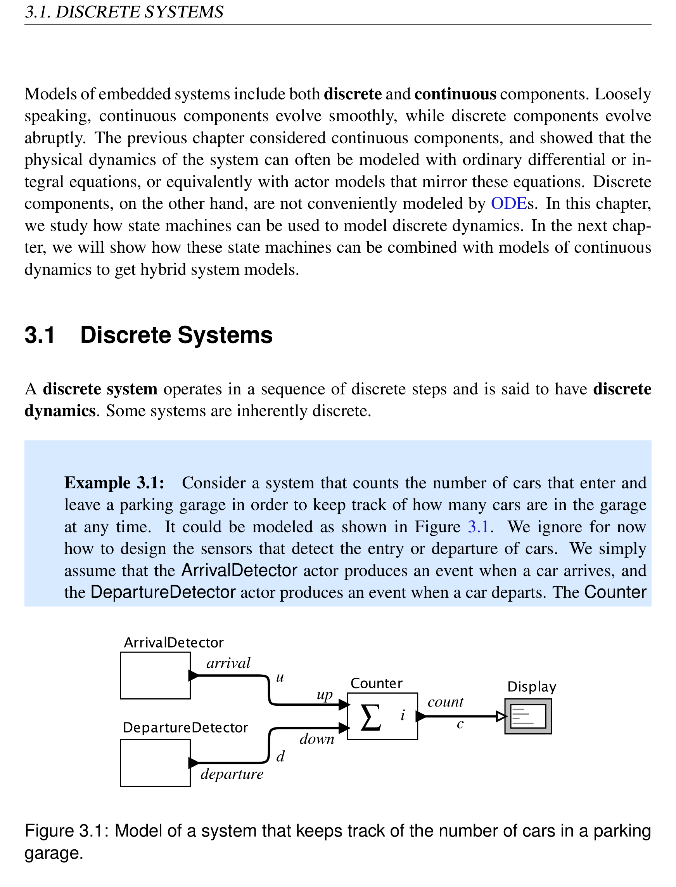
*Description*: Technical diagram and schematic model illustrating cyber-physical system behavior, algorithmic logic, and state progression for Figure 3.1: Model of a system that keeps track of the number of cars in a parking.

> **Figure 3.1: Model of a system that keeps track of the number of cars in a parking**

garage.
42
Lee & Seshia, Introduction to Embedded Systems


<!-- Page 63 -->
### [PDF Page 63]

3. DISCRETE DYNAMICS

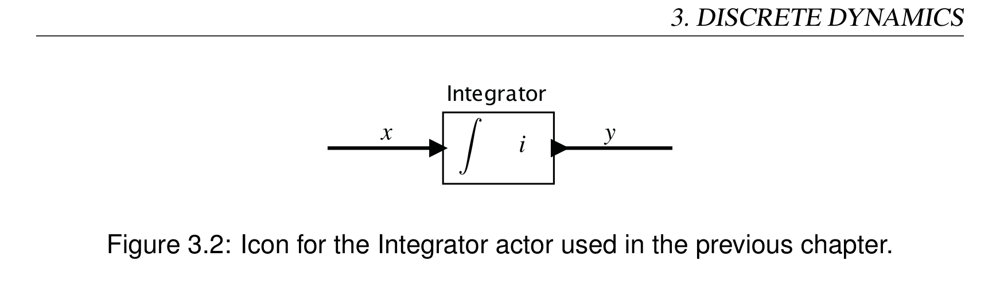
*Description*: Cyber-physical actor model block diagram showing continuous/discrete signal flows, feedback loops, and component interfaces for Figure 3.2: Icon for the Integrator actor used in the previous chapter..

> **Figure 3.2: Icon for the Integrator actor used in the previous chapter.**

actor keeps a running count, starting from an initial value i. Each time the count
changes, it produces an output event that updates a display.
In the above example, each entry or departure is modeled as a discrete event. A discrete
event occurs at an instant of time rather than over time. The Counter actor in Figure 3.1
is analogous to the Integrator actor used in the previous chapter, shown here in Figure
3.2. Like the Counter actor, the Integrator accumulates input values. However, it does
so very differently. The input of an Integrator is a function of the form x: R →R or
x: R+ →R, a continuous-time signal. The signal u going into the up input port of the
Counter, on the other hand, is a function of the form
u: R →{absent,present}.
This means that at any time t ∈R, the input u(t) is either absent, meaning that there is
no event at that time, or present, meaning that there is. A signal of this form is known as
a pure signal. It carries no value, but instead provides all its information by being either
present or absent at any given time. The signal d in Figure 3.1 is also a pure signal.
Assume our Counter operates as follows. When an event is present at the up input port,
it increments its count and produces on the output the new value of the count. When an
event is present at the down input, it decrements its count and produces on the output the
new value of the count.1 At all other times (when both inputs are absent), it produces no
output (the count output is absent). Hence, the signal c in Figure 3.1 can be modeled by a
function of the form
c: R →{absent}∪Z .
(See Appendix A for notation.) This signal is not pure, but like u and d, it is either absent
or present. Unlike u and d, when it is present, it has a value (an integer).
1It would be wise to design this system with a fault handler that does something reasonable if the count
drops below zero, but we ignore this for now.
Lee & Seshia, Introduction to Embedded Systems
43


<!-- Page 64 -->
### [PDF Page 64]

3.1. DISCRETE SYSTEMS
Assume further that the inputs are absent most of the time, or more technically, that the
inputs are discrete (see the sidebar on page 44). Then the Counter reacts in sequence
to each of a sequence of input events. This is very different from the Integrator, which
reacts continuously to a continuum of inputs.
The input to the Counter is a pair of discrete signals that at certain times have an event
(are present), and at other times have no event (are absent). The output also is a discrete
signal that, when an input is present, has a value that is a natural number, and at other
times is absent.2 Clearly, there is no need for this Counter to do anything when the
input is absent. It only needs to operate when inputs are present. Hence, it has discrete
dynamics.
2As shown in Exercise 6, the fact that input signals are discrete does not necessarily imply that the output
signal is discrete. However, for this application, there are physical limitations on the rates at which cars can
arrive and depart that ensure that these signals are discrete. So it is safe to assume that they are discrete.

### Probing Further: Discrete Signals

Discrete signals consist of a sequence of instantaneous events in time. Here, we make this
intuitive concept precise.
Consider a signal of the form e: R →{absent}∪X, where X is any set of values. This
signal is a discrete signal if, intuitively, it is absent most of the time and we can count,
in order, the times at which it is present (not absent). Each time it is present, we have a
discrete event.
This ability to count the events in order is important. For example, if e is present at all
rational numbers t, then we do not call this signal discrete. The times at which it is present
cannot be counted in order. It is not, intuitively, a sequence of instantaneous events in time
(it is a set of instantaneous events in time, but not a sequence).
To define this formally, let T ⊆R be the set of times where e is present. Specifically,
T = {t ∈R : e(t) ̸= absent}.
Then e is discrete if there exists a one-to-one function f : T →N that is order preserving.
Order preserving simply means that for all t1,t2 ∈T where t1 ≤t2, we have that f(t1) ≤
f(t2). The existence of such a one-to-one function ensures that we can count off the events
in temporal order. Some properties of discrete signals are studied in Exercise 6.
44
Lee & Seshia, Introduction to Embedded Systems


<!-- Page 65 -->
### [PDF Page 65]

3. DISCRETE DYNAMICS
The dynamics of a discrete system can be described as a sequence of steps that we call
reactions, each of which we assume to be instantaneous. Reactions of a discrete system
are triggered by the environment in which the discrete system operates. In the case of the
example of Figure 3.1, reactions of the Counter actor are triggered when one or more
input events are present. That is, in this example, reactions are event triggered. When
both inputs to the Counter are absent, no reaction occurs.
A particular reaction will observe the values of the inputs at a particular time t and calcu-
late output values for that same time t. Suppose an actor has input ports P = {p1,··· , pN},

### Probing Further: Modeling Actors as Functions

As in Section 2.2, the Integrator actor of Figure 3.2 can be modeled by a function of the
form
Ii : RR+ →RR+,
which can also be written
Ii : (R+ →R) →(R+ →R).
(See Appendix A if the notation is unfamiliar.) In the figure,
y = Ii(x) ,
where i is the initial value of the integration and x and y are continuous-time signals. For
example, if i = 0 and for all t ∈R+, x(t) = 1, then
y(t) = i+
Z t
0 x(τ)dτ = t .
Similarly, the Counter in Figure 3.1 can be modeled by a function of the form
Ci : (R+ →{absent,present})P →(R+ →{absent}∪Z),
where Z is the integers and P is the set of input ports, P = {up,down}. Recall that
the notation AB denotes the set of all functions from B to A. Hence, the input to the
function C is a function whose domain is P that for each port p ∈P yields a function in
(R+ →{absent,present}). That latter function, in turn, for each time t ∈R+ yields either
absent or present.
Lee & Seshia, Introduction to Embedded Systems
45


<!-- Page 66 -->
### [PDF Page 66]

3.2. THE NOTION OF STATE
where pi is the name of the i-th input port. Assume further that for each input port p ∈P,
a set Vp denotes the values that may be received on port p when the input is present. Vp is
called the type of port p. At a reaction we treat each p ∈P as a variable that takes on a
value p ∈Vp ∪{absent}. A valuation of the inputs P is an assignment of a value in Vp to
each variable p ∈P or an assertion that p is absent.
If port p receives a pure signal, then Vp = {present}, a singleton set (set with only one
element). The only possible value when the signal is not absent is present. Hence, at a
reaction, the variable p will have a value in the set {present,absent}.
Example 3.2:
For the garage counter, the set of input ports is P = {up,down}.
Both receive pure signals, so the types are Vup = Vdown = {present}. If a car is
arriving at time t and none is departing, then at that reaction, up = present and
down = absent. If a car is arriving and another is departing at the same time, then
up = down = present. If neither is true, then both are absent.
Outputs are similarly designated. Assume a discrete system has output ports Q = {q1,··· ,qM}
with types Vq1,··· ,VqM. At each reaction, the system assigns a value q ∈Vq ∪{absent} to
each q ∈Q, producing a valuation of the outputs. In this chapter, we will assume that the
output is absent at times t where a reaction does not occur. Thus, outputs of a discrete sys-
tem are discrete signals. Chapter 4 describes systems whose outputs are not constrained
to be discrete (see also box on page 58).
Example 3.3: The Counter actor of Figure 3.1 has one output port named count,
so Q = {count}. Its type is Vcount = Z. At a reaction, count is assigned the count of
cars in the garage.
3.2
The Notion of State
Intuitively, the state of a system is its condition at a particular point in time. In general,
the state affects how the system reacts to inputs. Formally, we define the state to be an
46
Lee & Seshia, Introduction to Embedded Systems


<!-- Page 67 -->
### [PDF Page 67]

3. DISCRETE DYNAMICS
encoding of everything about the past that has an effect on the system’s reaction to current
or future inputs. The state is a summary of the past.
Consider the Integrator actor shown in Figure 3.2. This actor has state, which in this case
happens to have the same value as the output at any time t. The state of the actor at a time
t is the value of the integral of the input signal up to time t. In order to know how the
subsystem will react to inputs at and beyond time t, we have to know what this value is at
time t. We do not need to know anything more about the past inputs. Their effect on the
future is entirely captured by the current value at t. The icon in Figure 3.2 includes i, an
initial state value, which is needed to get things started at some starting time.
An Integrator operates in a time continuum. It integrates a continuous-time input signal,
generating as output at each time the cumulative area under the curve given by the input
plus the initial state. Its state at any given time is that accumulated area plus the initial
state. The Counter actor in the previous section also has state, and that state is also an
accumulation of past input values, but it operates discretely.
The state y(t) of the Integrator at time t is a real number. Hence, we say that the state
space of the Integrator is States = R. For the Counter used in Figure 3.1, the state s(t) at
time t is an integer, so States ⊂Z. A practical parking garage has a finite and non-negative
number M of spaces, so the state space for the Counter actor used in this way will be
States = {0,1,2,··· ,M} .
(This assumes the garage does not let in more cars than there are spaces.) The state space
for the Integrator is infinite (uncountably infinite, in fact). The state space for the garage
counter is finite. Discrete models with finite state spaces are called finite-state machines
(FSMs). There are powerful analysis techniques available for such models, so we consider
them next.
3.3
Finite-State Machines
A state machine is a model of a system with discrete dynamics that at each reaction
maps valuations of the inputs to valuations of the outputs, where the map may depend on
its current state. A finite-state machine (FSM) is a state machine where the set States of
possible states is finite.
If the number of states is reasonably small, then FSMs can be conveniently drawn using a
graphical notation like that in Figure 3.3. Here, each state is represented by a bubble, so
Lee & Seshia, Introduction to Embedded Systems
47


<!-- Page 68 -->
### [PDF Page 68]

3.3. FINITE-STATE MACHINES
for this diagram, the set of states is given by
States = {State1,State2,State3}.
At the beginning of each sequence of reactions, there is an initial state, State1, indicated
in the diagram by a dangling arrow into it.
3.3.1
Transitions
Transitions between states govern the discrete dynamics of the state machine and the
mapping of input valuations to output valuations. A transition is represented as a curved
arrow, as shown in Figure 3.3, going from one state to another. A transition may also
start and end at the same state, as illustrated with State3 in the figure. In this case, the
transition is called a self transition.
In Figure 3.3, the transition from State1 to State2 is labeled with “guard / action.” The
guard determines whether the transition may be taken on a reaction. The action specifies
what outputs are produced on each reaction.
A guard is a predicate (a boolean-valued expression) that evaluates to true when the
transition should be taken, changing the state from that at the beginning of the transition
to that at the end. When a guard evaluates to true we say that the transition is enabled.
An action is an assignment of values (or absent) to the output ports. Any output port not
mentioned in a transition that is taken is implicitly absent. If no action at all is given, then
all outputs are implicitly absent.

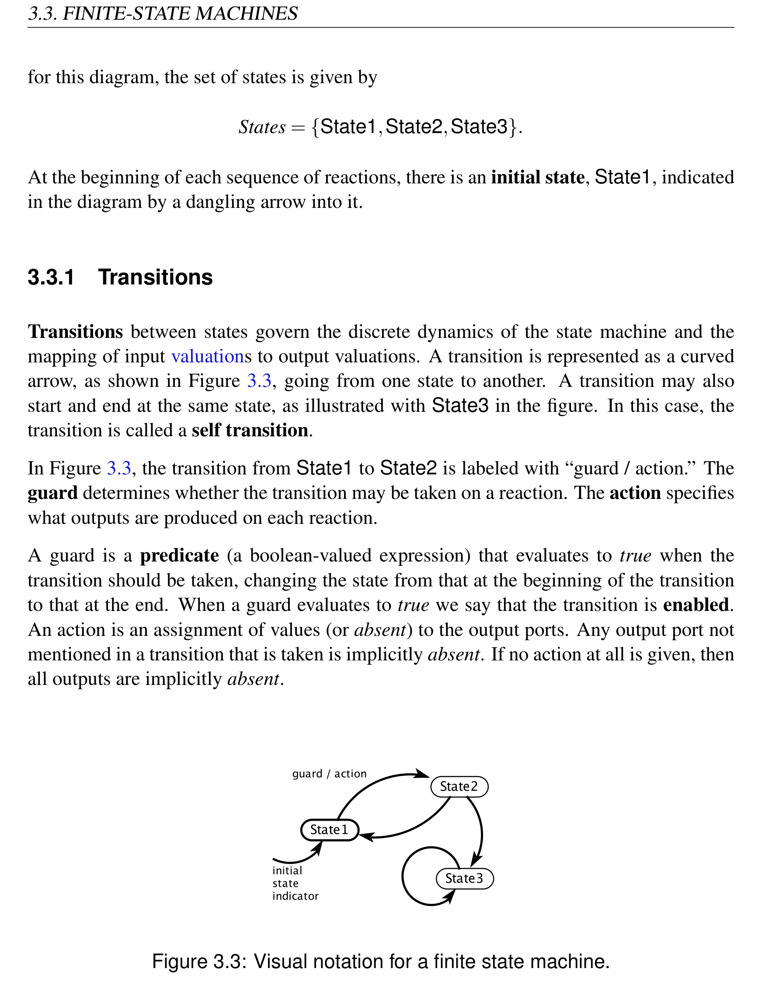
*Description*: Finite state machine (FSM) transition diagram specifying states, guard conditions, input triggers, and output actions for Figure 3.3: Visual notation for a finite state machine..

> **Figure 3.3: Visual notation for a finite state machine.**

48
Lee & Seshia, Introduction to Embedded Systems


<!-- Page 69 -->
### [PDF Page 69]

3. DISCRETE DYNAMICS
Example 3.4: Figure 3.4 shows an FSM model for the garage counter. The inputs
and outputs are shown using the notation name : type. The set of states is States =
{0,1,2,··· ,M}. The transition from state 0 to 1 has a guard written as up∧¬down.
This is a predicate that evaluates to true when up is present and down is absent. If at
a reaction the current state is 0 and this guard evaluates to true, then the transition
will be taken and the next state will be 1. Moreover, the action indicates that the
output should be assigned the value 1. The output port count is not explicitly named
because there is only one output port, and hence there is no ambiguity.
If the guard expression on the transition from 0 to 1 had been simply up, then this
could evaluate to true when down is also present, which would incorrectly count
cars when a car was arriving at the same time that another was departing.
If p1 and p2 are pure inputs to a discrete system, then the following are examples of valid
guards:
true
Transition is always enabled.
p1
Transition is enabled if p1 is present.
¬p1
Transition is enabled if p1 is absent.
p1 ∧p2
Transition is enabled if both p1 and p2 are present.
p1 ∨p2
Transition is enabled if either p1 or p2 is present.
p1 ∧¬p2
Transition is enabled if p1 is present and p2 is absent.

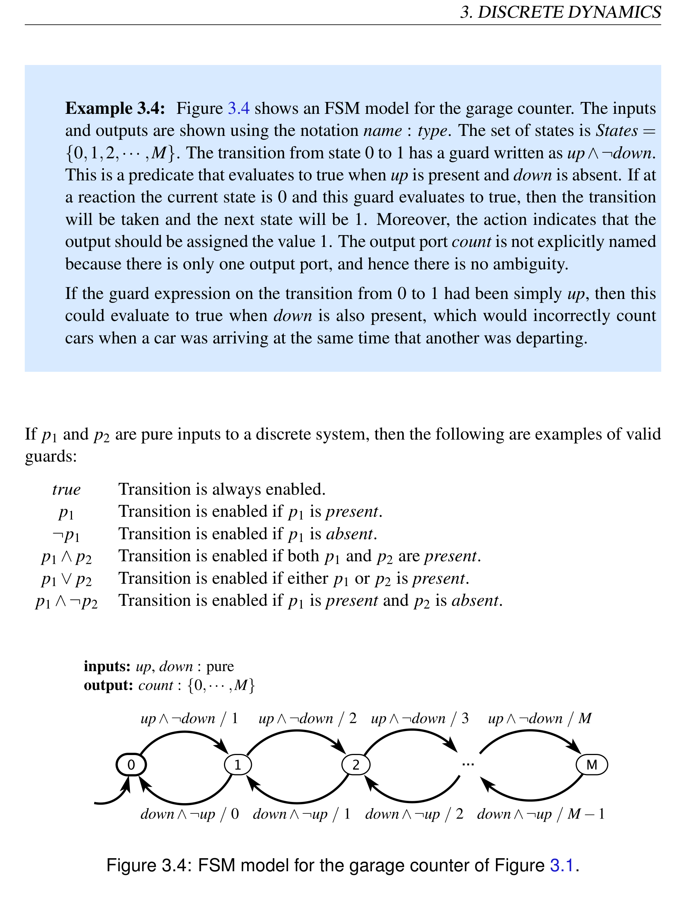
*Description*: Finite state machine (FSM) transition diagram specifying states, guard conditions, input triggers, and output actions for Figure 3.4: FSM model for the garage counter of Figure 3.1..

> **Figure 3.4: FSM model for the garage counter of Figure 3.1.**

Lee & Seshia, Introduction to Embedded Systems
49


<!-- Page 70 -->
### [PDF Page 70]

3.3. FINITE-STATE MACHINES
These are standard logical operators where present is taken as a synonym for true and
absent as a synonym for false. The symbol ¬ represents logical negation. The operator
∧is logical conjunction (logical AND), and ∨is logical disjunction (logical OR).
Suppose that in addition the discrete system has a third input port p3 with type Vp3 = N.
Then the following are examples of valid guards:
p3
Transition is enabled if p3 is present (not absent).
p3 = 1
Transition is enabled if p3 is present and has value 1.
p3 = 1∧p1
Transition is enabled if p3 has value 1 and p1 is present.
p3 > 5
Transition is enabled if p3 is present with value greater than 5.
Example 3.5:
A major use of energy worldwide is in heating, ventilation, and
air conditioning (HVAC) systems. Accurate models of temperature dynamics and
temperature control systems can significantly improve energy conservation. Such
modeling begins with a modest thermostat, which regulates temperature to main-
tain a setpoint, or target temperature. The word “thermostat” comes from Greek
words for “hot” and “to make stand.”
Consider a thermostat modeled by an FSM with States = {heating, cooling} as
shown in Figure 3.5. Suppose the setpoint is 20 degrees Celsius. If the heater
is on, then the thermostat allows the temperature to rise past the setpoint to 22
degrees. If the heater is off, then it allows the temperature to drop past the setpoint
to 18 degrees. This strategy is called hysteresis (see box on page 52). It avoids
chattering, where the heater would turn on and off rapidly when the temperature
is close to the setpoint temperature.

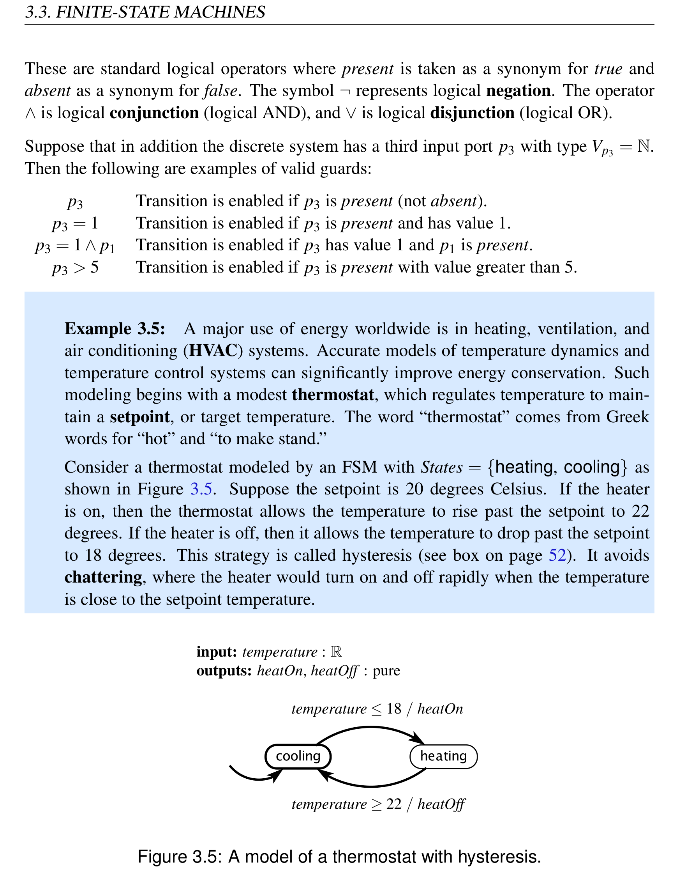
*Description*: Technical diagram and schematic model illustrating cyber-physical system behavior, algorithmic logic, and state progression for Figure 3.5: A model of a thermostat with hysteresis..

> **Figure 3.5: A model of a thermostat with hysteresis.**

50
Lee & Seshia, Introduction to Embedded Systems


<!-- Page 71 -->
### [PDF Page 71]

3. DISCRETE DYNAMICS
There is a single input temperature with type R and two pure outputs heatOn and
heatOff. These outputs will be present only when a change in the status of the
heater is needed (i.e., when it is on and needs to be turned off, or when it is off and
needs to be turned on).
The FSM in Figure 3.5 could be event triggered, like the garage counter, in which case
it will react whenever a temperature input is provided. Alternatively, it could be time
triggered, meaning that it reacts at regular time intervals. The definition of the FSM does
not change in these two cases. It is up to the environment in which an FSM operates when
it should react.
On a transition, the action (which is the portion after the slash) specifies the resulting
valuation on the output ports when a transition is taken. If q1 and q2 are pure outputs and
q3 has type N, then the following are examples of valid actions:
q1
q1 is present and q2 and q3 are absent.
q1,q2
q1 and q2 are both present and q3 is absent.
q3 := 1
q1 and q2 are absent and q3 is present with value 1.
q3 := 1, q1
q1 is present, q2 is absent, and q3 is present with value 1.
(nothing) q1, q2, and q3 are all absent.
Any output port that is not mentioned in a transition that is taken is implicitly absent.
When assigning a value to an output port, we use the notation name := value to distinguish
the assignment from a predicate, which would be written name = value. As in Figure
3.4, if there is only one output, then the assignment need not mention the port name.
3.3.2
When a Reaction Occurs
Nothing in the definition of a state machine constrains when it reacts. The environment
determines when the machine reacts. Chapters 5 and 6 describe a variety of mechanisms
and give a precise meaning to terms like event triggered and time triggered. For now,
however, we just focus on what the machine does when it reacts.
When the environment determines that a state machine should react, the inputs will have
a valuation. The state machine will assign a valuation to the output ports and (possibly)
Lee & Seshia, Introduction to Embedded Systems
51


<!-- Page 72 -->
### [PDF Page 72]

3.3. FINITE-STATE MACHINES
change to a new state. If no guard on any transition out of the current state evaluates to
true, then the machine will remain in the same state.
It is possible for all inputs to be absent at a reaction. Even in this case, it may be possible
for a guard to evaluate to true, in which case a transition is taken. If the input is absent
and no guard on any transition out of the current state evaluates to true, then the machine

### Probing Further: Hysteresis

The thermostat in Example 3.5 exhibits a particular form of state-dependent behavior
called hysteresis. Hysteresis is used to prevent chattering. A system with hysteresis has
memory, but in addition has a useful property called time-scale invariance. In Example
3.5, the input signal as a function of time is a signal of the form
temperature: R →{absent}∪R .
Hence, temperature(t) is the temperature reading at time t, or absent if there is no tem-
perature reading at that time. The output as a function of time has the form
heatOn,heatOff : R →{absent,present} .
Suppose that instead of temperature the input is given by
temperature′(t) = temperature(α·t)
for some α > 0. If α > 1, then the input varies faster in time, whereas if α < 1 then the
input varies more slowly, but in both cases, the input pattern is the same. Then for this
FSM, the outputs heatOn′ and heatOff ′ are given by
heatOn′(t) = heatOn(α·t)
heatOff ′(t) = heatOff(α·t) .
Time-scale invariance means that scaling the time axis at the input results in scaling the
time axis at the output, so the absolute time scale is irrelevant.
An alternative implementation for the thermostat would use a single temperature
threshold, but instead would require that the heater remain on or off for at least a min-
imum amount of time, regardless of the temperature. The consequences of this design
choice are explored in Exercise 2.
52
Lee & Seshia, Introduction to Embedded Systems


<!-- Page 73 -->
### [PDF Page 73]

3. DISCRETE DYNAMICS
will stutter. A stuttering reaction is one where the inputs and outputs are all absent and
the machine does not change state. No progress is made and nothing changes.
Example 3.6:
In Figure 3.4, if on any reaction both inputs are absent, then the
machine will stutter. If we are in state 0 and the input down is present, then the
guard on the only outgoing transition is false, and the machine remains in the same
state. However, we do not call this a stuttering reaction because the inputs are not
all absent.
Our informal description of the garage counter in Example 3.1 did not explicitly state
what would happen if the count was at 0 and a car departed. A major advantage of FSM
models is that they define all possible behaviors. The model in Figure 3.4 defines what
happens in this circumstance. The count remains at 0. As a consequence, FSM models
are amenable to formal checking, which determines whether the specified behaviors are
in fact desirable behaviors. The informal specification cannot be subjected to such tests,
or at least, not completely.
Although it may seem that the model in Figure 3.4 does not define what happens if the
state is 0 and down is present, it does so implicitly — the state remains unchanged and
no output is generated. The reaction is not shown explicitly in the diagram. Sometimes
it is useful to emphasize such reactions, in which case they can be shown explicitly. A
convenient way to do this is using a default transition, shown in Figure 3.6. In that figure,
the default transition is denoted with dashed lines and is labeled with “true / ”. A default
transition is enabled if no non-default transition is enabled and if its guard evaluates to

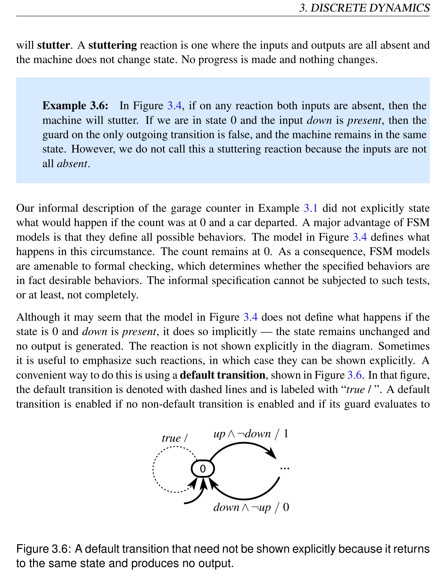
*Description*: Finite state machine (FSM) transition diagram specifying states, guard conditions, input triggers, and output actions for Figure 3.6: A default transition that need not be shown explicitly because it returns.

> **Figure 3.6: A default transition that need not be shown explicitly because it returns**

to the same state and produces no output.
Lee & Seshia, Introduction to Embedded Systems
53


<!-- Page 74 -->
### [PDF Page 74]

3.3. FINITE-STATE MACHINES
true. In Figure 3.6, therefore, the default transition is enabled if up∧¬down evaluates to
false, and when the default transition is taken the output is absent.
Default transitions provide a convenient notation, but they are not really necessary. Any
default transition can be replaced by an ordinary transition with an appropriately chosen
guard. For example, in Figure 3.6 we could use an ordinary transition with guard ¬(up∧
¬down).
The use of both ordinary transitions and default transitions in a diagram can be thought
of as a way of assigning priority to transitions. An ordinary transition has priority over
a default transition. When both have guards that evaluate to true, the ordinary transition
prevails. Some formalisms for state machines support more than two levels of priority.
For example SyncCharts (Andr´e, 1996) associates with each transition an integer priority.
This can make guard expressions simpler, at the expense of having to indicate priorities
in the diagrams.
3.3.3
Update Functions
The graphical notation for FSMs defines a specific mathematical model of the dynamics
of a state machine. A mathematical notation with the same meaning as the graphical
notation sometimes proves convenient, particularly for large state machines where the
Software Tools Supporting FSMs
FSMs have been used in theoretical computer science and software engineering for quite
some time (Hopcroft and Ullman, 1979). A number of software tools support design and
analysis of FSMs. Statecharts (Harel, 1987), a notation for concurrent composition of hi-
erarchical FSMs, has influenced many of these tools. One of the first tools supporting the
Statecharts notation is STATEMATE (Harel et al., 1990), which subsequently evolved into
Rational Rose, sold by IBM. Many variants of Statecharts have evolved (von der Beeck,
1994), and some variant is now supported by nearly every software engineering tool that
provides UML (unified modeling language) capabilities (Booch et al., 1998). SyncCha-
rts (Andr´e, 1996) is a particularly nice variant in that it borrows the rigorous semantics
of Esterel (Berry and Gonthier, 1992) for composition of concurrent FSMs. LabVIEW
supports a variant of Statecharts that can operate within dataflow diagrams, and Simulink
with its Stateflow extension supports a variant that can operate within continuous-time
models.
54
Lee & Seshia, Introduction to Embedded Systems


<!-- Page 75 -->
### [PDF Page 75]

3. DISCRETE DYNAMICS
graphical notation becomes cumbersome. In such a mathematical notation, a finite-state
machine is a five-tuple
(States,Inputs,Outputs,update,initialState)
where
• States is a finite set of states;
• Inputs is a set of input valuations;
• Outputs is a set of output valuations;
• update : States×Inputs →States×Outputs is an update function, mapping a state and
an input valuation to a next state and an output valuation;
• initialState is the initial state.
The FSM reacts in a sequence of reactions. At each reaction, the FSM has a current state,
and the reaction may transition to a next state, which will be the current state of the next
reaction. We can number these states starting with 0 for the initial state. Specifically, let
s: N →States be a function that gives the state of an FSM at reaction n ∈N. Initially,
s(0) = initialState.
Let x: N →Inputs and y: N →Outputs denote that input and output valuations at each
reaction. Hence, x(0) ∈Inputs is the first input valuation and y(0) ∈Outputs is the first
output valuation. The dynamics of the state machine are given by the following equation:
(s(n+1),y(n)) = update(s(n),x(n))
(3.1)
This gives the next state and output in terms of the current state and input. The update
function encodes all the transitions, guards, and output specifications in an FSM. The term
transition function is often used in place of update function.
The input and output valuations also have a natural mathematical form. Suppose an FSM
has input ports P = {p1,··· , pN}, where each p ∈P has a corresponding type Vp. Then
Inputs is a set of functions of the form
i: P →Vp1 ∪···∪VpN ∪{absent} ,
where for each p ∈P, i(p) ∈Vp ∪{absent} gives the value of port p. Thus, a function
i ∈Inputs is a valuation of the input ports.
Lee & Seshia, Introduction to Embedded Systems
55


<!-- Page 76 -->
### [PDF Page 76]

3.3. FINITE-STATE MACHINES
Example 3.7:
The FSM in Figure 3.4 can be mathematically represented as fol-
lows:
States
=
{0,1,··· ,M}
Inputs
=
({up,down} →{present,absent})
Outputs
=
({count} →{0,1,··· ,M,absent})
initialState
=
0
The update function is given by
update(s,i) =



















(s+1,s+1)
if s < M
∧i(up) = present
∧i(down) = absent
(s−1,s−1)
if s > 0
∧i(up) = absent
∧i(down) = present
(s,absent)
otherwise
(3.2)
for all s ∈States and i ∈Inputs. Note that an output valuation o ∈Outputs is a func-
tion of the form o: {count} →{0,1,··· ,M,absent}. In (3.2), the first alternative
gives the output valuation as o = s + 1, which we take to mean the constant func-
tion that for all q ∈Q = {count} yields o(q) = s+1. When there is more than one
output port we will need to be more explicit about which output value is assigned
to which output port. In such cases, we can use the same notation that we use for
actions in the diagrams.
3.3.4
Determinacy and Receptiveness
The state machines presented in this section have two important properties:
Determinacy: A state machine is said to be deterministic if, for each state, there is at
most one transition enabled by each input value. The formal definition of an FSM
given above ensures that it is deterministic, since update is a function, not a one-to-
many mapping. The graphical notation with guards on the transitions, however, has
56
Lee & Seshia, Introduction to Embedded Systems


<!-- Page 77 -->
### [PDF Page 77]

3. DISCRETE DYNAMICS
no such constraint. Such a state machine will be deterministic only if the guards
leaving each state are non-overlapping. Note that a deterministic state machine is
determinate, meaning that given the same inputs it will always produce the same
outputs. However, not every determinate state machine is deterministic.
Receptiveness: A state machine is said to be receptive if, for each state, there is at least
one transition possible on each input symbol. In other words, receptiveness en-
sures that a state machine is always ready to react to any input, and does not “get
stuck” in any state. The formal definition of an FSM given above ensures that it is
receptive, since update is a function, not a partial function. It is defined for every
possible state and input value. Moreover, in our graphical notation, since we have
implicit default transitions, we have ensured that all state machines specified in our
graphical notation are also receptive.
It follows that if a state machine is both deterministic and receptive, for every state, there
is exactly one transition possible on each input value.
3.4
Extended State Machines
The notation for FSMs becomes awkward when the number of states gets large. The
garage counter of Figure 3.4 illustrates this point clearly. If M is large, the bubble-and-arc
notation becomes unwieldy, which is why we resort to a less formal use of “...” in the
figure.
An extended state machine solves this problem by augmenting the FSM model with
variables that may be read and written as part of taking a transition between states.
Example 3.8:
The garage counter of Figure 3.4 can be represented more com-
pactly by the extended state machine in Figure 3.8.
That figure shows a variable c, declared explicitly at the upper left to make it clear
that c is a variable and not an input or an output. The transition indicating the initial
state initializes the value of this variable to zero.
The upper self-loop transition is then taken when the input up is present, the input
down is absent, and the variable c is less than M. When this transition is taken, the
state machine produces an output count with value c+1, and then the value of c is
incremented by one.
Lee & Seshia, Introduction to Embedded Systems
57


<!-- Page 78 -->
### [PDF Page 78]

3.4. EXTENDED STATE MACHINES
Moore Machines and Mealy Machines
The state machines we describe in this chapter are known as Mealy machines, named
after George H. Mealy, a Bell Labs engineer who published a description of these ma-
chines in 1955 (Mealy, 1955). Mealy machines are characterized by producing outputs
when a transition is taken. An alternative, known as a Moore machine, produces outputs
when the machine is in a state, rather than when a transition is taken. That is, the output
is defined by the current state rather than by the current transition. Moore machines are
named after Edward F. Moore, another Bell Labs engineer who described them in a 1956
paper (Moore, 1956).
The distinction between these machines is subtle but important. Both are discrete sys-
tems, and hence their operation consists of a sequence of discrete reactions. For a Moore
machine, at each reaction, the output produced is defined by the current state (at the start
of the reaction, not at the end). Thus, the output at the time of a reaction does not depend
on the input at that same time. The input determines which transition is taken, but not
what output is produced by the reaction. Hence, a Moore machine is strictly causal.
A Moore machine version of the garage counter is shown in Figure 3.7. The outputs
are shown in the state rather than on the transitions using a similar notation with a slash.
Note, however, that this machine is not equivalent to the machine in Figure 3.4. To see
that, suppose that on the first reaction, up = present and down = absent. The output at
that time will be 0 in Figure 3.7 and 1 in Figure 3.4. The output of the Moore machine
represents the number of cars in the garage at the time of the arrival of a new car, not the
number of cars after the arrival of the new car. Suppose instead that at the first reaction,
up = down = absent. Then the output at that time is 0 in Figure 3.7 and absent in Figure
3.4. The Moore machine, when it reacts, always reports the output associated with the
current state. The Mealy machine does not produce any output unless there is a transition
explicitly denoting that output.
Any Moore machine may be converted to an equivalent Mealy machine. A Mealy
machine may be converted to an almost equivalent Moore machine that differs only in
that the output is produced on the next reaction rather than on the current one. We use
Mealy machines because they tend to be more compact (requiring fewer states to represent
the same functionality), and because it is convenient to be able to produce an output that
instantaneously responds to the input.
58
Lee & Seshia, Introduction to Embedded Systems


<!-- Page 79 -->
### [PDF Page 79]

3. DISCRETE DYNAMICS
The lower self-loop transition is taken when the input down is present, the input up
is absent, and the variable c is greater than zero. Upon taking the transition, the
state machine produces an output with value c −1, and then decrements the value
of c.
Note that M is a parameter, not a variable. Specifically, it is assumed to be constant
throughout execution.
The general notation for extended state machines is shown in Figure 3.9. This differs

```python
from the basic FSM notation of Figure 3.3 in three ways. First, variable declarations are
```

shown explicitly to make it easy to determine whether an identifier in a guard or action

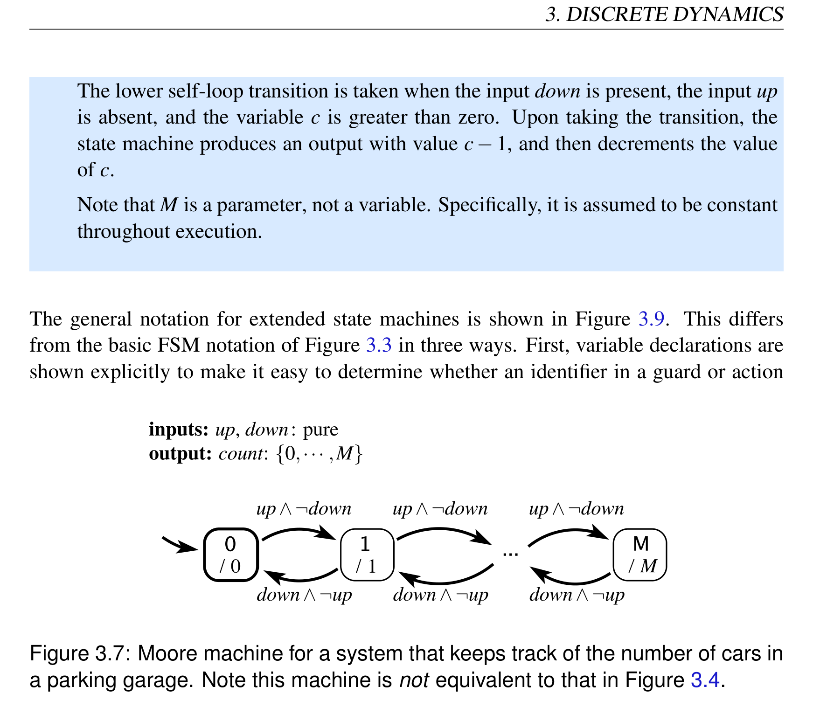
*Description*: Technical diagram and schematic model illustrating cyber-physical system behavior, algorithmic logic, and state progression for Figure 3.7: Moore machine for a system that keeps track of the number of cars in.

> **Figure 3.7: Moore machine for a system that keeps track of the number of cars in**

a parking garage. Note this machine is not equivalent to that in Figure 3.4.

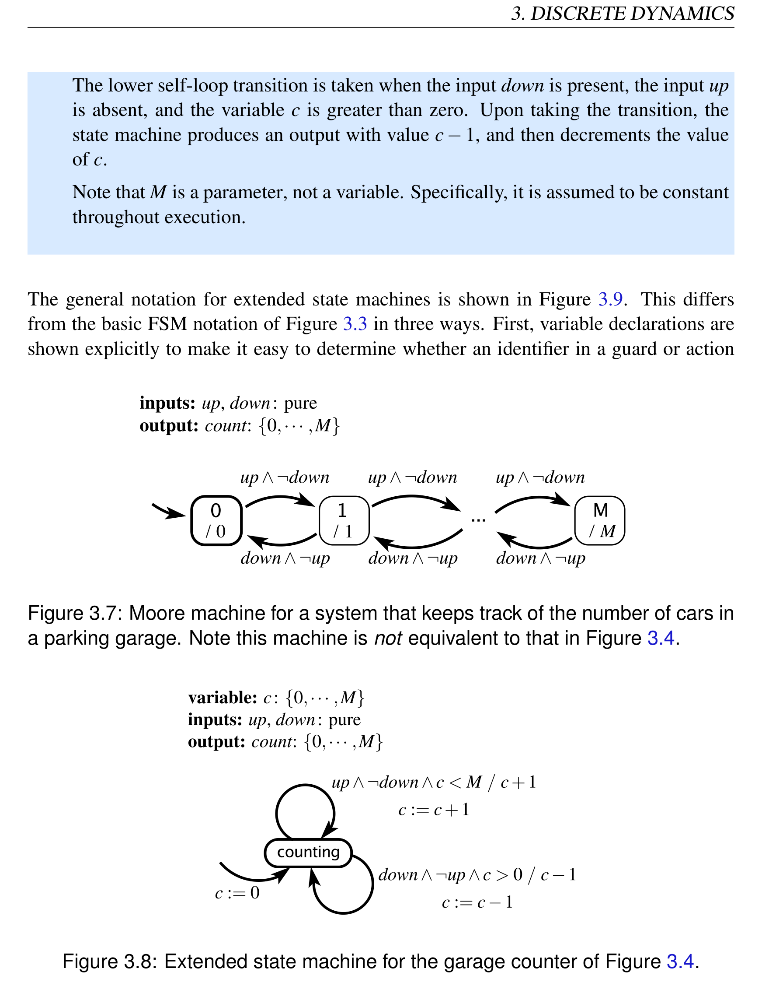
*Description*: Finite state machine (FSM) transition diagram specifying states, guard conditions, input triggers, and output actions for Figure 3.8: Extended state machine for the garage counter of Figure 3.4..

> **Figure 3.8: Extended state machine for the garage counter of Figure 3.4.**

Lee & Seshia, Introduction to Embedded Systems
59


<!-- Page 80 -->
### [PDF Page 80]

3.4. EXTENDED STATE MACHINES
refers to a variable or to an input or an output. Second, upon initialization, variables that
have been declared may be initialized. The initial value will be shown on the transition
that indicates the initial state. Third, transition annotations now have the form
guard / output action
set action(s)
The guard and output action are the same as for standard FSMs, except they may now
refer to variables. The set actions are new. They specify assignments to variables that
are made when the transition is taken. These assignments are made after the guard has
been evaluated and the outputs have been produced. Thus, if the guard or output actions
reference a variable, the value of the variable is that before the assignment in the set action.
If there is more than one set action, then the assignments are made in sequence.
Extended state machines can provide a convenient way to keep track of the passage of
time.
Example 3.9: An extended state machine describing a traffic light at a pedestrian
crosswalk is shown in Figure 3.10. This is a time triggered machine that assumes it
will react once per second. It starts in the red state and counts 60 seconds with the
help of the variable count. It then transitions to green, where it will remain until the
pure input pedestrian is present. That input could be generated, for example, by a
pedestrian pushing a button to request a walk light. When pedestrian is present, the

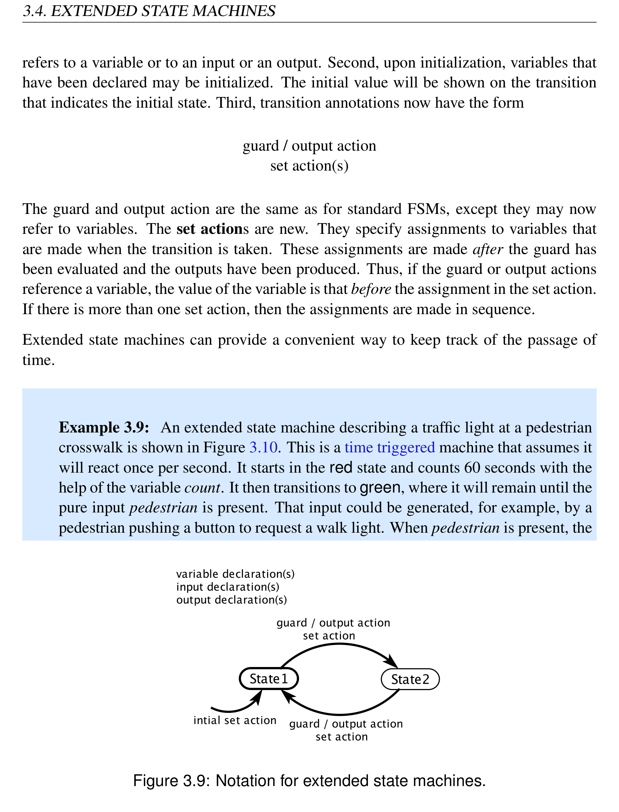
*Description*: Finite state machine (FSM) transition diagram specifying states, guard conditions, input triggers, and output actions for Figure 3.9: Notation for extended state machines..

> **Figure 3.9: Notation for extended state machines.**

60
Lee & Seshia, Introduction to Embedded Systems


<!-- Page 81 -->
### [PDF Page 81]

3. DISCRETE DYNAMICS
machine transitions to yellow if it has been in state green for at least 60 seconds.
Otherwise, it transitions to pending, where it stays for the remainder of the 60
second interval. This ensures that once the light goes green, it stays green for at
least 60 seconds. At the end of 60 seconds, it will transition to yellow, where it will
remain for 5 seconds before transitioning back to red.
The outputs produced by this machine are sigG to turn on the green light, sigY to
change the light to yellow, and sigR to change the light to red.
The state of an extended state machine includes not only the information about which
discrete state (indicated by a bubble) the machine is in, but also what values any variables
have. The number of possible states can therefore be quite large, or even infinite. If there
are n discrete states (bubbles) and m variables each of which can have one of p possible
values, then the size of the state space of the state machine is
|States| = npm .

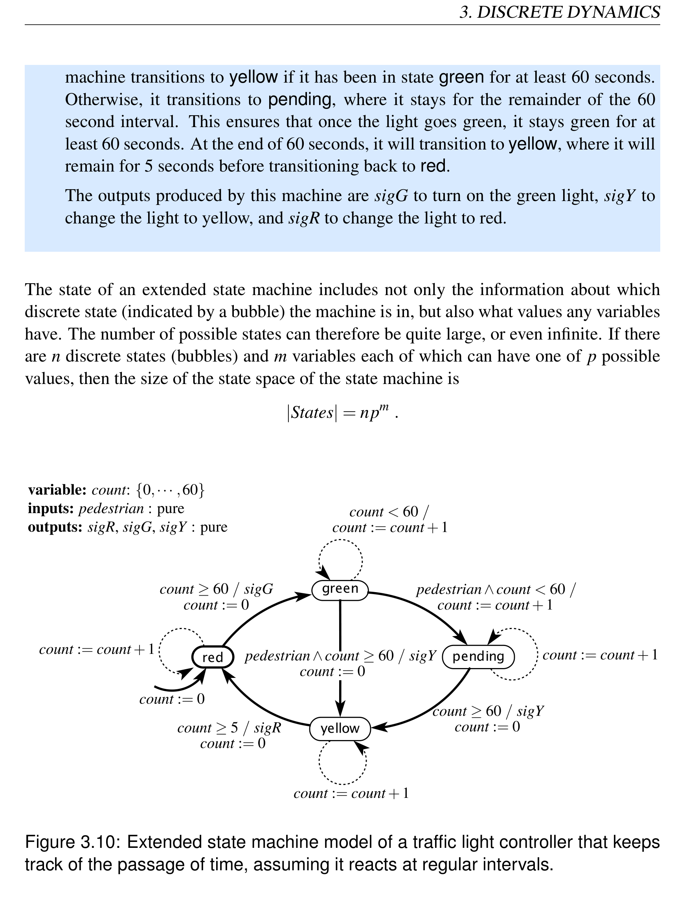
*Description*: Finite state machine (FSM) transition diagram specifying states, guard conditions, input triggers, and output actions for Figure 3.10: Extended state machine model of a traffic light controller that keeps.

> **Figure 3.10: Extended state machine model of a traffic light controller that keeps**

track of the passage of time, assuming it reacts at regular intervals.
Lee & Seshia, Introduction to Embedded Systems
61


<!-- Page 82 -->
### [PDF Page 82]

3.4. EXTENDED STATE MACHINES
Example 3.10: The garage counter of Figure 3.8 has n = 1, m = 1, and p = M +1,
so the total number of states is M +1.
Extended state machines may or may not be FSMs. In particular, it is not uncommon for
p to be infinite. For example, a variable may have values in N, the natural numbers, in
which case, the number of states is infinite.
Example 3.11: If we modify the state machine of Figure 3.8 so that the guard on
the upper transition is
up∧¬down
instead of
up∧¬down∧c < M
then the state machine is no longer an FSM.
Some state machines will have states that can never be reached, so the set of reachable
states — comprising all states that can be reached from the initial state on some input
sequence — may be smaller than the set of states.
Example 3.12: Although there are only four bubbles in Figure 3.10, the number
of states is actually much larger. The count variable has 61 possible values and
there are 4 bubbles, so the total number of combinations is 61×4 = 244. The size
of the state space is therefore 244. However, not all of these states are reachable.
In particular, while in the yellow state, the count variable will have only one of 6
values in {0,··· ,5}. The number of reachable states, therefore, is 61×3+6 = 189.
62
Lee & Seshia, Introduction to Embedded Systems


<!-- Page 83 -->
### [PDF Page 83]

3. DISCRETE DYNAMICS
3.5
Nondeterminism
Most interesting state machines react to inputs and produce outputs. These inputs must
come from somewhere, and the outputs must go somewhere. We refer to this “some-
where” as the environment of the state machine.
Example 3.13: The traffic light controller of Figure 3.10 has one pure input signal,
pedestrian. This input is present when a pedestrian arrives at the crosswalk. The
traffic light will remain green unless a pedestrian arrives. Some other subsystem is
responsible for generating the pedestrian event, presumably in response to a pedes-
trian pushing a button to request a cross light. That other subsystem is part of the
environment of the FSM in Figure 3.10.
A question becomes how to model the environment. In the traffic light example, we could
construct a model of pedestrian flow in a city to serve this purpose, but this would likely
be a very complicated model, and it is likely much more detailed than necessary. We want
to ignore inessential details, and focus on the design of the traffic light. We can do this
using a nondeterministic state machine.
Example 3.14: The FSM in Figure 3.11 models arrivals of pedestrians at a cross-
walk with a traffic light controller like that in Figure 3.10. This FSM has three
inputs, which are presumed to come from the outputs of Figure 3.10. Its single
output, pedestrian, will provide the input for Figure 3.10.
The initial state is crossing. (Why? See Exercise 4.) When sigG is received,
the FSM transitions to none. Both transitions from this state have guard true,
indicating that they are always enabled. Since both are enabled, this machine is
nondeterministic. The FSM may stay in the same state and produce no output, or it
may transition to waiting and produce pure output pedestrian.
The interaction between this machine and that of Figure 3.10 is surprisingly subtle.
Variations on the design are considered in Exercise 4, and the composition of the
two machines is studied in detail in Chapter 6.
Lee & Seshia, Introduction to Embedded Systems
63


<!-- Page 84 -->
### [PDF Page 84]

3.5. NONDETERMINISM

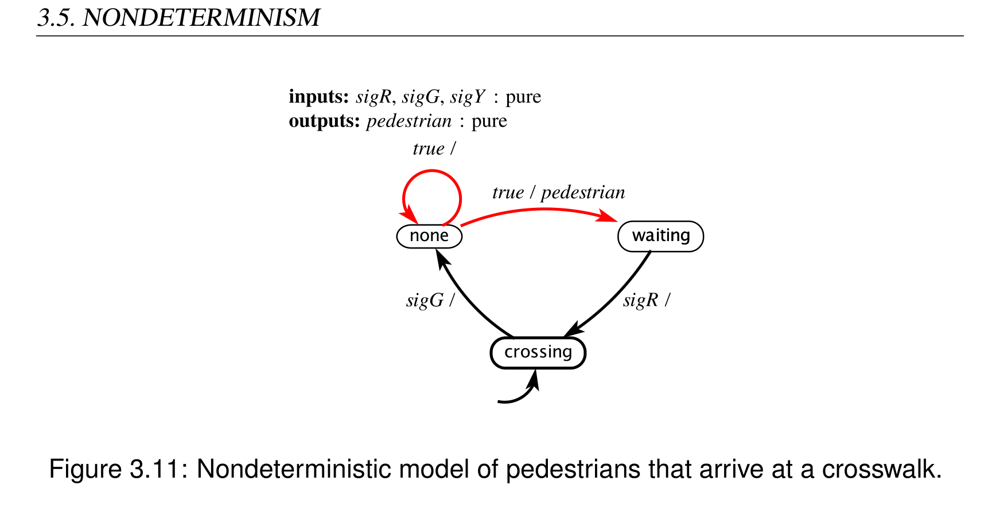
*Description*: Technical diagram and schematic model illustrating cyber-physical system behavior, algorithmic logic, and state progression for Figure 3.11: Nondeterministic model of pedestrians that arrive at a crosswalk..

> **Figure 3.11: Nondeterministic model of pedestrians that arrive at a crosswalk.**

If for any state of a state machine, there are two distinct transitions with guards that can
evaluate to true in the same reaction, then the state machine is nondeterministic. In a
diagram for such a state machine, the transitions that make the state machine nondeter-
ministic may be colored red. In the example of Figure 3.11, the transitions exiting state
none are the ones that make the state machine nondeterministic.
It is also possible to define state machines where there is more than one initial state. Such
a state machine is also nondeterministic. An example is considered in Exercise 4.
In both cases, a nondeterministic FSM specifies a family of possible reactions rather than
a single reaction. Operationally, all reactions in the family are possible. The nondeter-
ministic FSM makes no statement at all about how likely the various reactions are. It is
perfectly correct, for example, to always take the self loop in state none in Figure 3.11. A
model that specifies likelihoods (in the form of probabilities) is a stochastic model, quite
distinct from a nondeterministic model.
3.5.1
Formal Model
Formally, a nondeterministic FSM is represented as a five-tuple, similar to a determinis-
tic FSM,
(States,Inputs,Outputs,possibleUpdates,initialStates)
The first three elements are the same as for a deterministic FSM, but the last two are
different:
64
Lee & Seshia, Introduction to Embedded Systems


<!-- Page 85 -->
### [PDF Page 85]

3. DISCRETE DYNAMICS
• States is a finite set of states;
• Inputs is a set of input valuations;
• Outputs is a set of output valuations;
• possibleUpdates : States × Inputs →2States×Outputs is an update relation, mapping
a state and an input valuation to a set of possible (next state, output valuation) pairs;
• initialStates is a set of initial states.
The form of the function possibleUpdates indicates there can be more than one next state
and/or output valuation given a current state and input valuation. The codomain is the
powerset of States × Outputs. We refer to the possibleUpdates function as an update
relation, to emphasize this difference. The term transition relation is also often used in
place of update relation.
To support the fact that there can be more than one initial state for a nondeterministic
FSM, initialStates is a set rather than a single element of States.
Example 3.15: The FSM in Figure 3.11 can be formally represented as follows:
States
=
{none,waiting,crossing}
Inputs
=
({sigG,sigY,sigR} →{present,absent})
Outputs
=
({pedestrian} →{present,absent})
initialStates
=
{crossing}
The update relation is given below:
possibleUpdates(s,i) =



























{(none,absent)}
if s = crossing
∧i(sigG) = present
{(none,absent),(waiting,present)}
if s = none
{(crossing,absent)}
if s = waiting
∧i(sigR) = present
{(s,absent)}
otherwise
(3.3)
for all s ∈States and i ∈Inputs. Note that an output valuation o ∈Outputs is a
function of the form o: {pedestrian} →{present,absent}. In (3.3), the second
Lee & Seshia, Introduction to Embedded Systems
65


<!-- Page 86 -->
### [PDF Page 86]

3.6. BEHAVIORS AND TRACES
alternative gives two possible outcomes, reflecting the nondeterminism of the ma-
chine.
3.5.2
Uses of Non-Determinism
While nondeterminism is an interesting mathematical concept in itself, it has two major
uses in modeling embedded systems:
Environment Modeling: It is often useful to hide irrelevant details about how an envi-
ronment operates, resulting in a non-deterministic FSM model. We have already
seen one example of such environment modeling in Figure 3.11.
Specifications: System specifications impose requirements on some system features, while
leaving other features unconstrained. Nondeterminism is a useful modeling tech-
nique in such settings as well. For example, consider a specification that the traffic
light cycles through red, green, yellow, in that order, without regard for the tim-
ing between the outputs. The nondeterministic FSM in Figure 3.12 models this
specification. The guard true on each transition indicates that the transition can be
taken at any step. Technically, it means that each transition is enabled for any input
valuation in Inputs.
3.6
Behaviors and Traces
An FSM has discrete dynamics. As we did in Section 3.3.3, we can abstract away the
passage of time and consider only the sequence of reactions, without concern for when in
time each reaction occurs. We do not need to talk explicitly about the amount of time that
passes between reactions, since this is actually irrelevant to the behavior of an FSM.
Consider a port p of a state machine with type Vp. This port will have a sequence of values

```python
from the set Vp ∪{absent}, one value at each reaction. We can represent this sequence as
```

a function of the form
sp : N →Vp ∪{absent} .
This is the signal received on that port (if it is an input) or produced on that port (if it is
an output).
66
Lee & Seshia, Introduction to Embedded Systems


<!-- Page 87 -->
### [PDF Page 87]

3. DISCRETE DYNAMICS

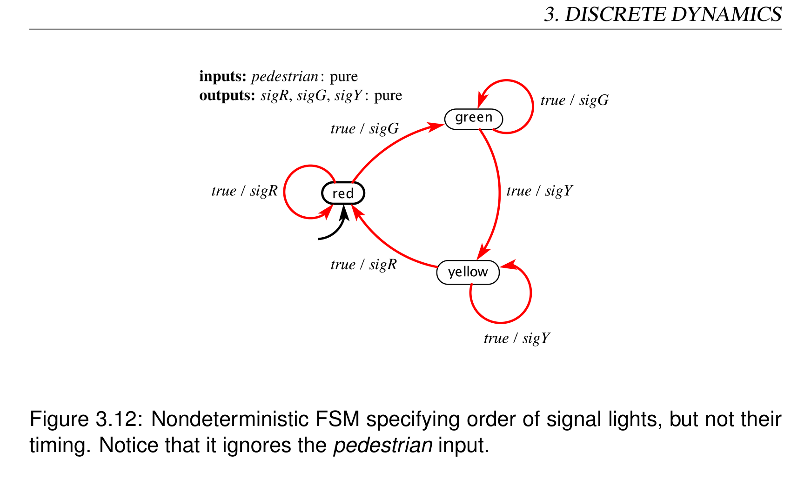
*Description*: Finite state machine (FSM) transition diagram specifying states, guard conditions, input triggers, and output actions for Figure 3.12: Nondeterministic FSM specifying order of signal lights, but not their.

> **Figure 3.12: Nondeterministic FSM specifying order of signal lights, but not their**

timing. Notice that it ignores the pedestrian input.
A behavior of a state machine is an assignment of such a signal to each port such that the
signal on any output port is the output sequence produced for the given input signals.
Example 3.16:
The garage counter of Figure 3.4 has input port set P =
{up,down}, with types Vup = Vdown = {present}, and output port set Q = {count}
with type Vcount = {0,··· ,M}. An example of input sequences is
sup
=
(present,absent,present,absent,present,···)
sdown
=
(present,absent,absent,present,absent,···)
The corresponding output sequence is
scount = (absent,absent,1,0,1,···) .
These three signals sup, sdown, and scount together are a behavior of the state machine.
If we let
s′
count = (1,2,3,4,5,···) ,
then sup, sdown, and s′
count together are not a behavior of the state machine. The
signal s′
count is not produced by reactions to those inputs.
Lee & Seshia, Introduction to Embedded Systems
67


<!-- Page 88 -->
### [PDF Page 88]

3.6. BEHAVIORS AND TRACES
Deterministic state machines have the property that there is exactly one behavior for each
set of input sequences. That is, if you know the input sequences, then the output sequence
is fully determined. That is, the machine is determinate. Such a machine can be viewed
as a function that maps input sequences to output sequences. Nondeterministic state ma-
chines can have more than one behavior sharing the same input sequences, and hence
cannot be viewed as a function mapping input sequences to output sequences.
The set of all behaviors of a state machine M is called its language, written L(M). Since
our state machines are receptive, their languages always include all possible input se-
quences.
A behavior may be more conveniently represented as a sequence of valuations called an
observable trace. Let xi represent the valuation of the input ports and yi the valuation of
the output ports at reaction i. Then an observable trace is a sequence
((x0,y0),(x1,y1),(x2,y2),···) .
An observable trace is really just another representation of a behavior.
It is often useful to be able to reason about the states that are traversed in a behavior. An
execution trace includes the state trajectory, and may be written as a sequence
((x0,s0,y0),(x1,s1,y1),(x2,s2,y2),···) ,
where s0 = initialState. This can be represented a bit more graphically as follows,
s0
x0/y0
−−−→s1
x1/y1
−−−→s2
x2/y2
−−−→···
This is an execution trace if for all i ∈N, (si+1,yi) = update(si,xi) (for a deterministic
machine), or (si+1,yi) ∈possibleUpdates(si,xi) (for a nondeterministic machine).
Example 3.17:
Consider again the garage counter of Figure 3.4 with the same
input sequences sup and sdown from Example 3.16. The corresponding execution
trace may be written
0
up∧down /
−−−−−−→0
/
−−−−→0
up / 1
−−−→1
down / 0
−−−−−→0
up / 1
−−−→···
Here, we have used the same shorthand for valuations that is used on transitions
in Section 3.3.1. For example, the label “up / 1” means that up is present, down
is absent, and count has value 1. Any notation that clearly and unambiguously
represents the input and output valuations is acceptable.
68
Lee & Seshia, Introduction to Embedded Systems


<!-- Page 89 -->
### [PDF Page 89]

3. DISCRETE DYNAMICS

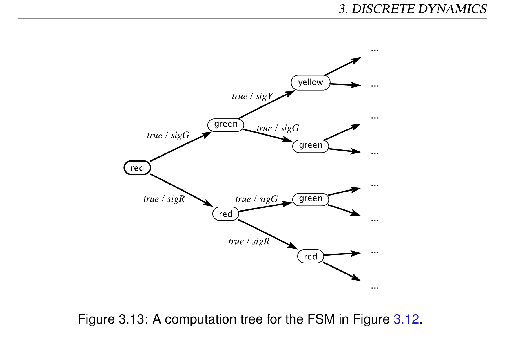
*Description*: Finite state machine (FSM) transition diagram specifying states, guard conditions, input triggers, and output actions for Figure 3.13: A computation tree for the FSM in Figure 3.12..

> **Figure 3.13: A computation tree for the FSM in Figure 3.12.**

For a nondeterministic machine, it may be useful to represent all the possible traces that
correspond to a particular input sequence, or even all the possible traces that result from
all possible input sequences. This may be done using a computation tree.
Example 3.18: Consider the non-deterministic FSM in Figure 3.12. Figure 3.13
shows the computation tree for the first three reactions with any input sequence.
Nodes in the tree are states and edges are labeled by the input and output valuations,
where the notation true means any input valuation.
Traces and computation trees can be valuable for developing insight into the behaviors of
a state machine and for verifying that undesirable behaviors are avoided.
Lee & Seshia, Introduction to Embedded Systems
69


<!-- Page 90 -->
### [PDF Page 90]

3.7. SUMMARY
3.7

### Summary

This chapter has given an introduction to the use of state machines to model systems with
discrete dynamics. It gives a graphical notation that is suitable for finite state machines,
and an extended state machine notation that can compactly represent large numbers of
states. It also gives a mathematical model that uses sets and functions rather than visual
notations. The mathematical notation can be useful to ensure precise interpretations of
a model and to prove properties of a model. This chapter has also discussed nondeter-
minism, which can provide convenient abstractions that compactly represent families of
behaviors.
70
Lee & Seshia, Introduction to Embedded Systems


<!-- Page 91 -->
### [PDF Page 91]

3. DISCRETE DYNAMICS

### Exercises

1. Consider an event counter that is a simplified version of the counter in Section 3.1.
It has an icon like this:
This actor starts with state i and upon arrival of an event at the input, increments the
state and sends the new value to the output. Thus, e is a pure signal, and c has the
form c: R →{absent}∪N, assuming i ∈N. Suppose you are to use such an event
counter in a weather station to count the number of times that a temperature rises
above some threshold. Your task in this exercise is to generate a reasonable input
signal e for the event counter. You will create several versions. For all versions,
you will design a state machine whose input is a signal τ: R →{absent} ∪Z that
gives the current temperature (in degrees centigrade) once per hour. The output
e: R →{absent,present} will be a pure signal that goes to an event counter.
(a) For the first version, your state machine should simply produce a present out-
put whenever the input is present and greater than 38 degrees. Otherwise, the
output should be absent.
(b) For the second version, your state machine should have hysteresis. Specifi-
cally, it should produce a present output the first time the input is greater than
38 degrees, and subsequently, it should produce a present output anytime the
input is greater than 38 degrees but has dropped below 36 degrees since the
last time a present output was produced.
(c) For the third version, your state machine should implement the same hystere-
sis as in part (b), but also produce a present output at most once per day.
2. Consider a variant of the thermostat of example 3.5. In this variant, there is only one
temperature threshold, and to avoid chattering the thermostat simply leaves the heat
on or off for at least a fixed amount of time. In the initial state, if the temperature is
less than or equal to 20 degrees Celsius, it turns the heater on, and leaves it on for
at least 30 seconds. After that, if the temperature is greater than 20 degrees, it turns
the heater off and leaves it off for at least 2 minutes. It turns it on again only if the
temperature is less than or equal to 20 degrees.
Lee & Seshia, Introduction to Embedded Systems
71


<!-- Page 92 -->
### [PDF Page 92]


### EXERCISES


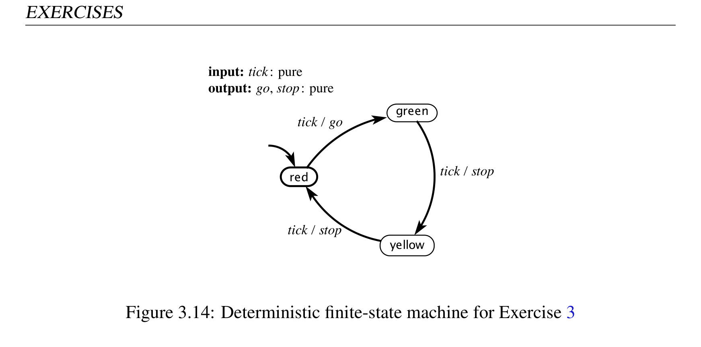
*Description*: Finite state machine (FSM) transition diagram specifying states, guard conditions, input triggers, and output actions for Figure 3.14: Deterministic finite-state machine for Exercise 3.

> **Figure 3.14: Deterministic finite-state machine for Exercise 3**

(a) Design an FSM that behaves as described, assuming it reacts exactly once
every 30 seconds.
(b) How many possible states does your thermostat have? Is this the smallest
number of states possible?
(c) Does this model thermostat have the time-scale invariance property?
3. Consider the deterministic finite-state machine in Figure 3.14 that models a simple
traffic light.
(a) Formally write down the description of this FSM as a 5-tuple:
(States,Inputs,Outputs,update,initialState) .
(b) Give an execution trace of this FSM of length 4 assuming the input tick is
present on each reaction.
(c) Now consider merging the red and yellow states into a single stop state. Tran-
sitions that pointed into or out of those states are now directed into or out of
the new stop state. Other transitions and the inputs and outputs stay the same.
The new stop state is the new initial state. Is the resulting state machine de-
terministic? Why or why not? If it is deterministic, give a prefix of the trace
of length 4. If it is non-deterministic, draw the computation tree up to depth
4.
4. This problem considers variants of the FSM in Figure 3.11, which models arrivals
of pedestrians at a crosswalk. We assume that the traffic light at the crosswalk is
72
Lee & Seshia, Introduction to Embedded Systems


<!-- Page 93 -->
### [PDF Page 93]

3. DISCRETE DYNAMICS
controlled by the FSM in Figure 3.10. In all cases, assume that a time triggered
model, where both the pedestrian model and the traffic light model react once per
second. Assume further that in each reaction, each machine sees as inputs the out-
put produced by the other machine in the same reaction (this form of composition,
which is called synchronous composition, is studied further in Chapter 6).
(a) Suppose that instead of Figure 3.11, we use the following FSM to model the
arrival of pedestrians:
Find a trace whereby a pedestrian arrives (the above machine transitions to
waiting) but the pedestrian is never allowed to cross. That is, at no time after
the pedestrian arrives is the traffic light in state red.
(b) Suppose that instead of Figure 3.11, we use the following FSM to model the
arrival of pedestrians:
Here, the initial state is nondeterministically chosen to be one of none or
crossing. Find a trace whereby a pedestrian arrives (the above machine tran-
sitions from none to waiting) but the pedestrian is never allowed to cross.
That is, at no time after the pedestrian arrives is the traffic light in state red.
Lee & Seshia, Introduction to Embedded Systems
73


<!-- Page 94 -->
### [PDF Page 94]


### EXERCISES

5. Consider the state machine in Figure 3.15. State whether each of the following is
a behavior for this machine. In each of the following, the ellipsis “···” means that
the last symbol is repeated forever. Also, for readability, absent is denoted by the
shorthand a and present by the shorthand p.
(a) x = (p, p, p, p, p,···),
y = (0,1,1,0,0,···)
(b) x = (p, p, p, p, p,···),
y = (0,1,1,0,a,···)
(c) x = (a, p,a, p,a,···),
y = (a,1,a,0,a,···)
(d) x = (p, p, p, p, p,···),
y = (0,0,a,a,a,···)
(e) x = (p, p, p, p, p,···),
y = (0,a,0,a,a,···)
6. (NOTE: This exercise is rather advanced.) This exercise studies properties of dis-
crete signals as formally defined in the sidebar on page 44. Specifically, we will
show that discreteness is not a compositional property. That is, when combining
two discrete behaviors in a single system, the resulting combination is not neces-
sarily discrete.
(a) Consider a pure signal x: R →{present,absent} given by
x(t) =
 present
if t is a non-negative integer
absent
otherwise
for all t ∈R. Show that this signal is discrete.
(b) Consider a pure signal y: R →{present,absent} given by
y(t) =
 present
if t = 1−1/n for any positive integer n
absent
otherwise

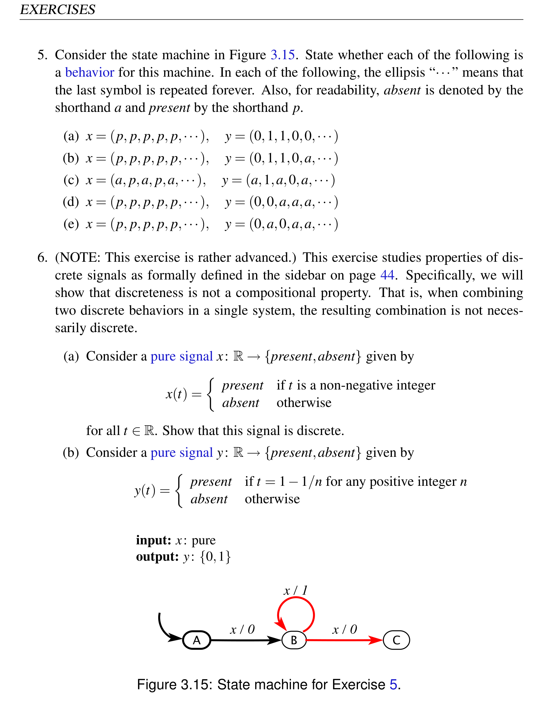
*Description*: Finite state machine (FSM) transition diagram specifying states, guard conditions, input triggers, and output actions for Figure 3.15: State machine for Exercise 5..

> **Figure 3.15: State machine for Exercise 5.**

74
Lee & Seshia, Introduction to Embedded Systems


<!-- Page 95 -->
### [PDF Page 95]

3. DISCRETE DYNAMICS
for all t ∈R. Show that this signal is discrete.
(c) Consider a signal w that is the merge of x and y in the previous two parts.
That is, w(t) = present if either x(t) = present or y(t) = present, and is absent
otherwise. Show that w is not discrete.
(d) Consider the example shown in Figure 3.1. Assume that each of the two
signals arrival and departure is discrete. Show that this does not imply that
the output count is a discrete signal.
Lee & Seshia, Introduction to Embedded Systems
75


<!-- Page 96 -->
### [PDF Page 96]


### EXERCISES

76
Lee & Seshia, Introduction to Embedded Systems


