# Chapter 4: Hybrid Systems

> **Textbook**: Introduction to Embedded Systems - A Cyber-Physical Systems Approach (UC Berkeley)  
> **Authors**: Edward Ashford Lee and Sanjit Arunkumar Seshia  
> **PDF Page Range**: 97 - 126

---

<!-- Page 97 -->
### [PDF Page 97]

4
Hybrid Systems
Contents
4.1
Modal Models
. . . . . . . . . . . . . . . . . . . . . . . . . . . . .
78
4.1.1
Actor Model for State Machines . . . . . . . . . . . . . . . .
78
4.1.2
Continuous Inputs
. . . . . . . . . . . . . . . . . . . . . . .
79
4.1.3
State Refinements
. . . . . . . . . . . . . . . . . . . . . . .
80
4.2
Classes of Hybrid Systems
. . . . . . . . . . . . . . . . . . . . . .
82
4.2.1
Timed Automata . . . . . . . . . . . . . . . . . . . . . . . .
82
4.2.2
Higher-Order Dynamics . . . . . . . . . . . . . . . . . . . .
87
4.2.3
Supervisory control . . . . . . . . . . . . . . . . . . . . . . .
93
4.3

### Summary . . . . . . . . . . . . . . . . . . . . . . . . . . . . . . . .

98

### Exercises . . . . . . . . . . . . . . . . . . . . . . . . . . . . . . . . . . . 100

Chapters 2 and 3 describe two very different modeling strategies, one focused on continu-
ous dynamics and one on discrete dynamics. For continuous dynamics, we use differential
equations and their corresponding actor models. For discrete dynamics, we use state ma-
chines.
Cyber-physical systems integrate physical dynamics and computational systems, so they
commonly combine both discrete and continuous dynamics. In this chapter, we show that
the modeling techniques of Chapters 2 and 3 can be combined, yielding what are known as
77

<!-- Page 98 -->
### [PDF Page 98]

4.1. MODAL MODELS
hybrid systems. Hybrid system models are often much simpler and more understandable
than brute-force models that constrain themselves to only one of the two styles in Chapters
2 and 3. They are a powerful tool for understanding real-world systems.
4.1
Modal Models
In this section, we show that state machines can be generalized to admit continuous inputs
and outputs and to combine discrete and continuous dynamics.
4.1.1
Actor Model for State Machines
In Section 3.3.1 we explain that state machines have inputs defined by the set Inputs that
may be pure signals or may carry a value. In either case, the state machine has a number
of input ports, which in the case of pure signals are either present or absent, and in the
case of valued signals have a value at each reaction of the state machine.
We also explain in Section 3.3.1 that actions on transitions set the values of outputs. The
outputs can also be represented by ports, and again the ports can carry pure signals or
valued signals. In the case of pure signals, a transition that is taken specifies whether the
output is present or absent, and in the case of valued signals, it assigns a value or asserts
that the signal is absent. Outputs are presumed to be absent between transitions.
Given this input/output view of state machines, it is natural to think of a state machine as
an actor, as illustrated in Figure 4.1. In that figure, we assume some number n of input
ports named i1 ···in. At each reaction, these ports have a value that is either present or
absent (if the port carries a pure signal) or a member of some set of values (if the port
carries a valued signal). The outputs are similar. The guards on the transitions define
subsets of possible values on input ports, and the actions assign values to output ports.
Given such an actor model, it is straightforward to generalize FSMs to admit continuous-
time signals as inputs.
78
Lee & Seshia, Introduction to Embedded Systems

<!-- Page 99 -->
### [PDF Page 99]

4. HYBRID SYSTEMS
i1
in
om
o1
...
...

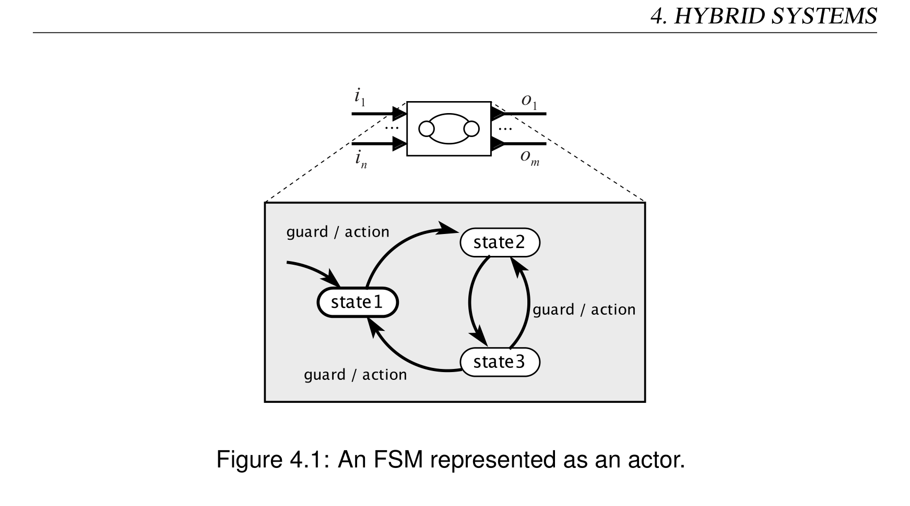
*Description*: Finite state machine (FSM) transition diagram specifying states, guard conditions, input triggers, and output actions for Figure 4.1: An FSM represented as an actor..

> **Figure 4.1: An FSM represented as an actor.**

4.1.2
Continuous Inputs
We have so far assumed that state machines operate in a sequence of discrete reactions.
We have assumed that inputs and outputs are absent between reactions. We will now
generalize this to allow inputs and outputs to be continuous-time signals.
In order to get state machine models to coexist with time-based models, we need to in-
terpret state transitions to occur on the same timeline used for the time-based portion of
the system. The notion of discrete reactions described in Section 3.1 suffices for this pur-
pose, but we will no longer require inputs and outputs to be absent between reactions.
Instead, we will define a transition to occur when a guard on an outgoing transition from
the current state becomes enabled. As before, during the time between reactions, a state
machine is understood to be stuttering. But the inputs and outputs are no longer required
to be absent during that time.
Example 4.1: Consider a thermostat modeled as a state machine with states Σ =
{heating,cooling}, shown in Figure 4.2. This is a variant of the model of Example

## 3.5 where instead of a discrete input that provides a temperature at each reaction, the

input is a continuous-time signal τ: R →R where τ(t) represents the temperature
at time t. The initial state is cooling, and the transition out of this state is enabled
Lee & Seshia, Introduction to Embedded Systems
79

<!-- Page 100 -->
### [PDF Page 100]

4.1. MODAL MODELS
at the earliest time t after the start time when τ(t) ≤18. In this example, we assume
the outputs are pure signals heatOn and heatOff.
In the above example, the outputs are present only at the times the transitions are taken.
We can also generalize FSMs to support continuous-time outputs, but to do this, we need
the notion of state refinements.
4.1.3
State Refinements
A hybrid system associates with each state of an FSM a dynamic behavior. Our first (very
simple) example uses this capability merely to produce continuous-time outputs.
Example 4.2: Suppose that instead of discrete outputs as in Example 4.1 we wish
to produce a control signal whose value is 1 when the heat is on and 0 when the
heat is off. Such a control signal could directly drive a heater. The thermostat in

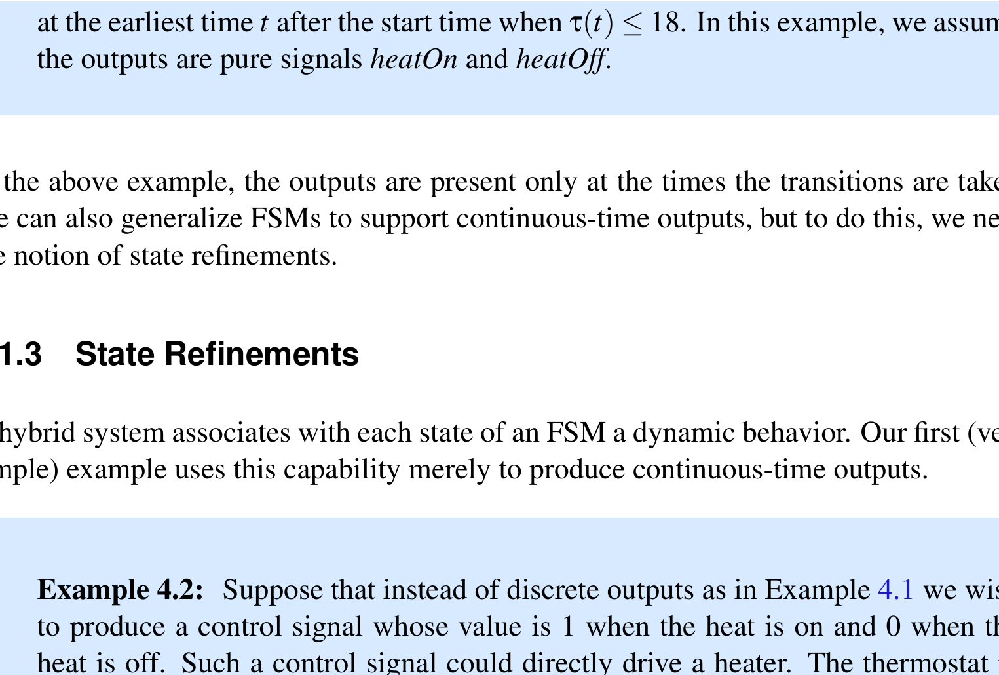
*Description*: Technical diagram and schematic model illustrating cyber-physical system behavior, algorithmic logic, and state progression for Figure 4.3: does this. In that figure, each state has a refinement that gives the value.

> **Figure 4.3: does this. In that figure, each state has a refinement that gives the value**

of the output h while the state machine is in that state.
In a hybrid system, the current state of the state machine has a state refinement that
gives the dynamic behavior of the output as a function of the input. In the above simple

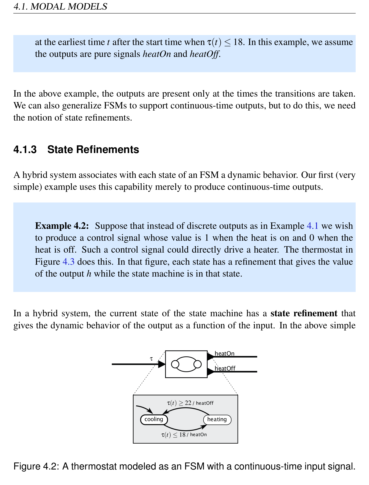
*Description*: Finite state machine (FSM) transition diagram specifying states, guard conditions, input triggers, and output actions for Figure 4.2: A thermostat modeled as an FSM with a continuous-time input signal..

> **Figure 4.2: A thermostat modeled as an FSM with a continuous-time input signal.**

80
Lee & Seshia, Introduction to Embedded Systems

<!-- Page 101 -->
### [PDF Page 101]

4. HYBRID SYSTEMS
example, the output is constant in each state, which is rather trivial dynamics. Hybrid
systems can get much more elaborate.
The general structure of a hybrid system model is shown in Figure 4.4. In that figure,
there is a two-state finite-state machine. Each state is associated with a state refinement
labeled in the figure as a “time-based system.” The state refinement defines dynamic
behavior of the outputs and (possibly) additional continuous state variables. In addition,
each transition can optionally specify set actions, which set the values of such additional
state variables when a transition is taken. The example of Figure 4.3 is rather trivial, in
that it has no continuous state variables, no output actions, and no set actions.
A hybrid system is sometimes called a modal model because it has a finite number of
modes, one for each state of the FSM, and when it is in a mode, it has dynamics specified
by the state refinement. The states of the FSM may be referred to as modes rather than
states, which as we will see, helps prevent confusion with states of the refinements.
The next simplest such dynamics, besides the rather trivial constant outputs of Example

## 4.2 is found in timed automata, which we discuss next.

h

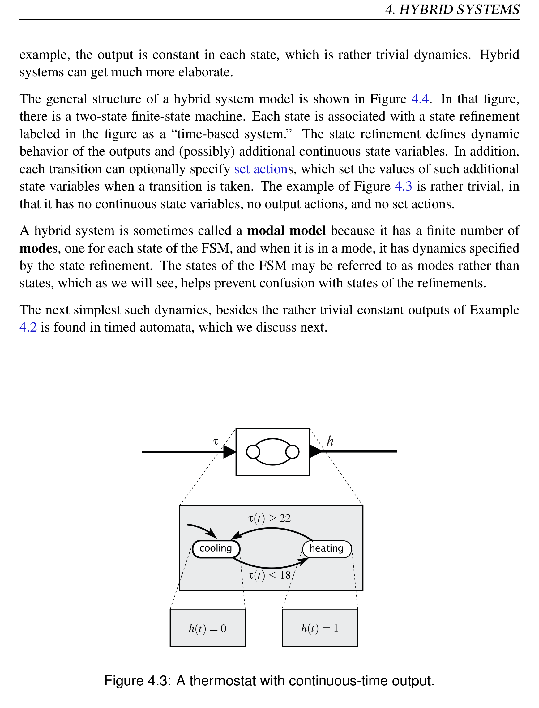
*Description*: Technical diagram and schematic model illustrating cyber-physical system behavior, algorithmic logic, and state progression for Figure 4.3: A thermostat with continuous-time output..

> **Figure 4.3: A thermostat with continuous-time output.**

Lee & Seshia, Introduction to Embedded Systems
81

<!-- Page 102 -->
### [PDF Page 102]

4.2. CLASSES OF HYBRID SYSTEMS
i1
in
om
o1
...
...
time-based system
time-based system

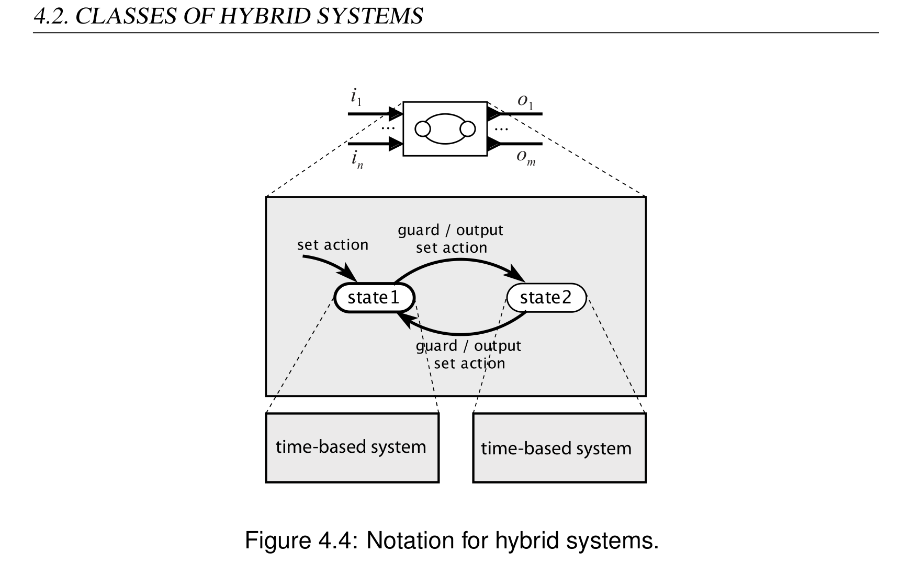
*Description*: Technical diagram and schematic model illustrating cyber-physical system behavior, algorithmic logic, and state progression for Figure 4.4: Notation for hybrid systems..

> **Figure 4.4: Notation for hybrid systems.**

4.2
Classes of Hybrid Systems
Hybrid systems can be quite elaborate. In this section, we first describe a relatively sim-
ple form known as timed automata. We then illustrate more elaborate forms that model
nontrivial physical dynamics and nontrivial control systems.
4.2.1
Timed Automata
Most cyber-physical systems require measuring the passage of time and performing ac-
tions at specific times. A device that measures the passage of time, a clock, has a partic-
ularly simple dynamics: its state progresses linearly in time. In this section, we describe
timed automata, a formalism introduced by Alur and Dill (1994), which enable the con-
struction of more complicated systems from such simple clocks.
Timed automata are the simplest non-trivial hybrid systems. They are modal models
where the time-based refinements have very simple dynamics; all they do is measure the
passage of time. A clock is modeled by a first-order differential equation,
∀t ∈Tm,
˙s(t) = a,
82
Lee & Seshia, Introduction to Embedded Systems

<!-- Page 103 -->
### [PDF Page 103]

4. HYBRID SYSTEMS
where s: R →R is a continuous-time signal, s(t) is the value of the clock at time t, and
Tm ⊂R is the subset of time during which the hybrid system is in mode m. The rate of the
clock, a, is a constant while the system is in this mode.1
Example 4.3: Recall the thermostat of Example 4.1, which uses hysteresis to pre-
vent chattering. An alternative implementation that would also prevent chattering
would use a single temperature threshold, but instead would require that the heater
remain on or off for at least a minimum amount of time, regardless of the tem-
perature. This design would not have the hysteresis property, but may be useful
nonetheless. This can be modeled as a timed automaton as shown in Figure 4.5. In
that figure, each state refinement has a clock, which is a continuous-time signal s
with dynamics given by
˙s(t) = 1 .
The value s(t) increases linearly with t. Note that in that figure, the state refinement
is shown directly with the name of the state in the state bubble. This shorthand is
convenient when the refinement is relatively simple.
Notice that the initial state cooling has a set action on the dangling transition indi-
cating the initial state, written as
s(t) := Tc .
As we did with extended state machines, we use the notation “:=” to emphasize that
this is an assignment, not a predicate. This action ensures that when the thermostat
starts, it can immediately transition to the heating mode if the temperature τ(t) is
less than or equal to 20 degrees. The other two transitions each have set actions that
reset the clock s to zero. The portion of the guard that specifies s(t) ≥Th ensures
that the heater will always be on for at least time Th. The portion of the guard that
specifies s(t) ≥Tc specifies that once the heater goes off, it will remain off for at
least time Tc.
A possible execution of this timed automaton is shown in Figure 4.6. In that figure,
we assume that the temperature is initially above the setpoint of 20 degrees, so the
FSM remains in the cooling state until the temperature drops to 20 degrees. At that
1The variant of timed automata we describe in this chapter differs from the original model of Alur and
Dill (1994) in that the rates of clocks in different modes can be different. This variant is sometimes described
in the literature as multi-rate timed automata.
Lee & Seshia, Introduction to Embedded Systems
83

<!-- Page 104 -->
### [PDF Page 104]

4.2. CLASSES OF HYBRID SYSTEMS
h

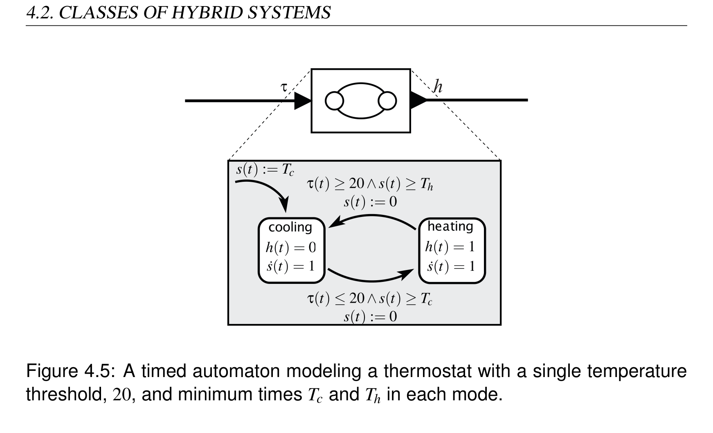
*Description*: Technical diagram and schematic model illustrating cyber-physical system behavior, algorithmic logic, and state progression for Figure 4.5: A timed automaton modeling a thermostat with a single temperature.

> **Figure 4.5: A timed automaton modeling a thermostat with a single temperature**

threshold, 20, and minimum times Tc and Th in each mode.
time t1, it can take the transition immediately because s(t1) > Tc. The transition
resets s to zero and turns on the heater. The heater will remain on until time t1 +Th,
assuming that the temperature only rises when the heater is on. At time t1 + Th, it
will transition back to the cooling state and turn the heater off. (We assume here
that a transition is taken as soon as it is enabled. Other transition semantics are
possible.) It will cool until at least time Tc elapses and until the temperature drops
again to 20 degrees, at which point it will turn the heater back on.
In the previous example the state of the system at any time t is not only the mode, heating
or cooling, but also the current value s(t) of the clock. We call s a continuous state vari-
able, whereas heating and cooling are discrete states. Thus, note that the term “state”
for such a hybrid system can become confusing. The FSM has states, but so do the refine-
ment systems (unless they are memoryless). When there is any possibility of confusion
we explicitly refer to the states of the machine as modes.
Transitions between modes have actions associated with them. Sometimes, it is useful to
have transitions from one mode back to itself, just so that the action can be realized. This
is illustrated in the next example, which also shows a timed automaton that produces a
pure output.
84
Lee & Seshia, Introduction to Embedded Systems

<!-- Page 105 -->
### [PDF Page 105]

4. HYBRID SYSTEMS
h(t)
t
...
(a)
(b)
(c)
s(t)
t
...
τ(t)
t
...
20
t1
t1 + Th
0
Tc
0
1

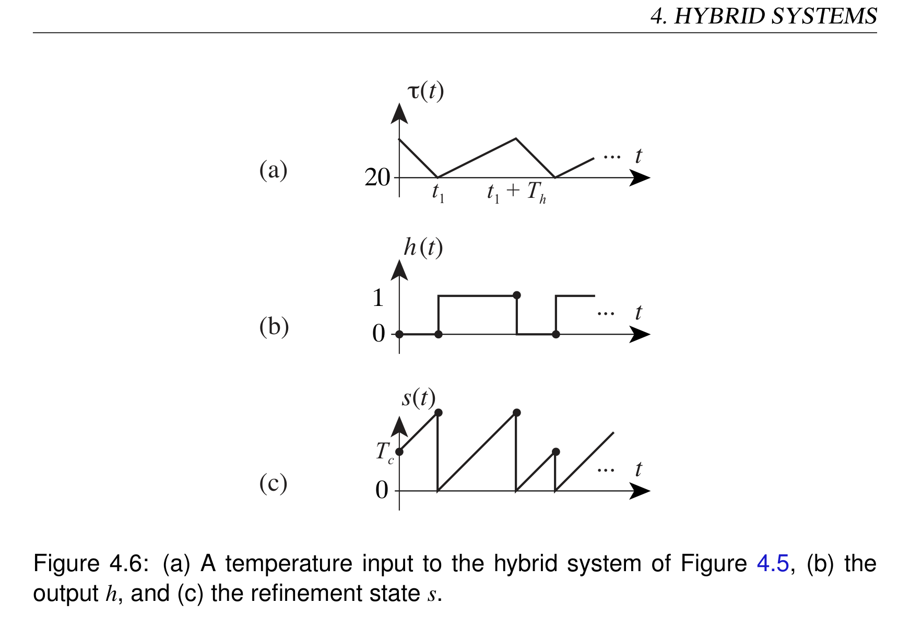
*Description*: Technical diagram and schematic model illustrating cyber-physical system behavior, algorithmic logic, and state progression for Figure 4.6: (a) A temperature input to the hybrid system of Figure 4.5, (b) the.

> **Figure 4.6: (a) A temperature input to the hybrid system of Figure 4.5, (b) the**

output h, and (c) the refinement state s.
Example 4.4: The timed automaton in Figure 4.7 produces a pure output that will
be present every T time units, starting at the time when the system begins executing.
Notice that the guard on the transition, s(t) ≥T, is followed by an output action,
tick, and a set action, s(t) := 0.

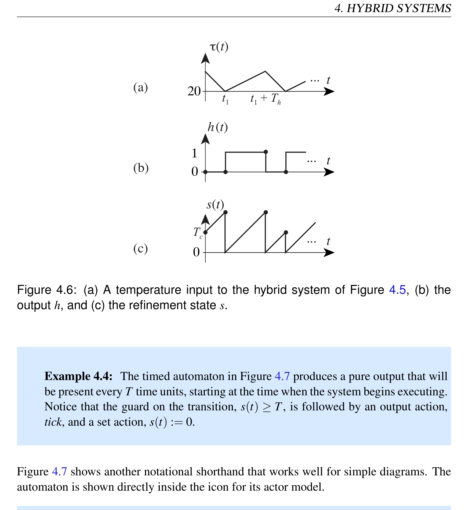
*Description*: Technical diagram and schematic model illustrating cyber-physical system behavior, algorithmic logic, and state progression for Figure 4.7: shows another notational shorthand that works well for simple diagrams. The.

> **Figure 4.7: shows another notational shorthand that works well for simple diagrams. The**

automaton is shown directly inside the icon for its actor model.
Example 4.5: The traffic light controller of Figure 3.10 is a time triggered machine
that assumes it reacts once each second. Figure 4.8 shows a timed automaton with
the same behavior. It is more explicit about the passage of time in that its temporal
dynamics do not depend on unstated assumptions about when the machine will
react.
Lee & Seshia, Introduction to Embedded Systems
85

<!-- Page 106 -->
### [PDF Page 106]

4.2. CLASSES OF HYBRID SYSTEMS

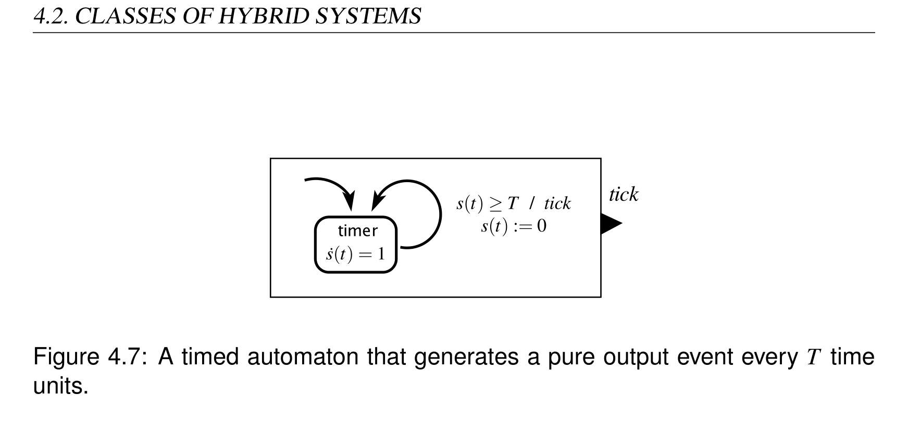
*Description*: Technical diagram and schematic model illustrating cyber-physical system behavior, algorithmic logic, and state progression for Figure 4.7: A timed automaton that generates a pure output event every T time.

> **Figure 4.7: A timed automaton that generates a pure output event every T time**

units.

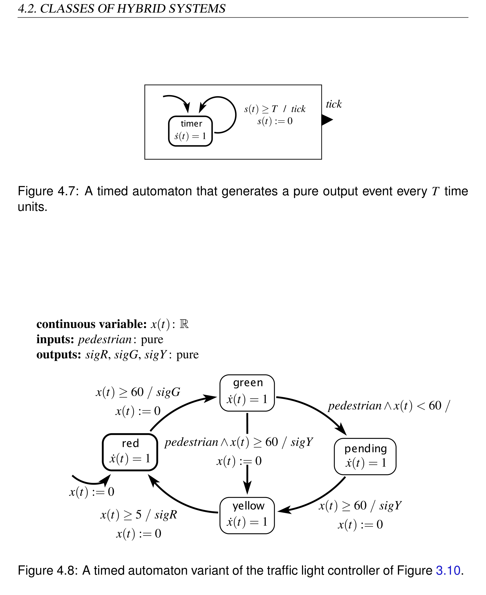
*Description*: Cyber-physical actor model block diagram showing continuous/discrete signal flows, feedback loops, and component interfaces for Figure 4.8: A timed automaton variant of the traffic light controller of Figure 3.10..

> **Figure 4.8: A timed automaton variant of the traffic light controller of Figure 3.10.**

86
Lee & Seshia, Introduction to Embedded Systems

<!-- Page 107 -->
### [PDF Page 107]

4. HYBRID SYSTEMS
y1(t)
y2(t)
y1(t)
y2(t)
0.0
0.5
1.0
1.5
2.0
2.5
3.0
0
5
10
15
20
25
30
35
40
45
50
Displacement of Masses
time

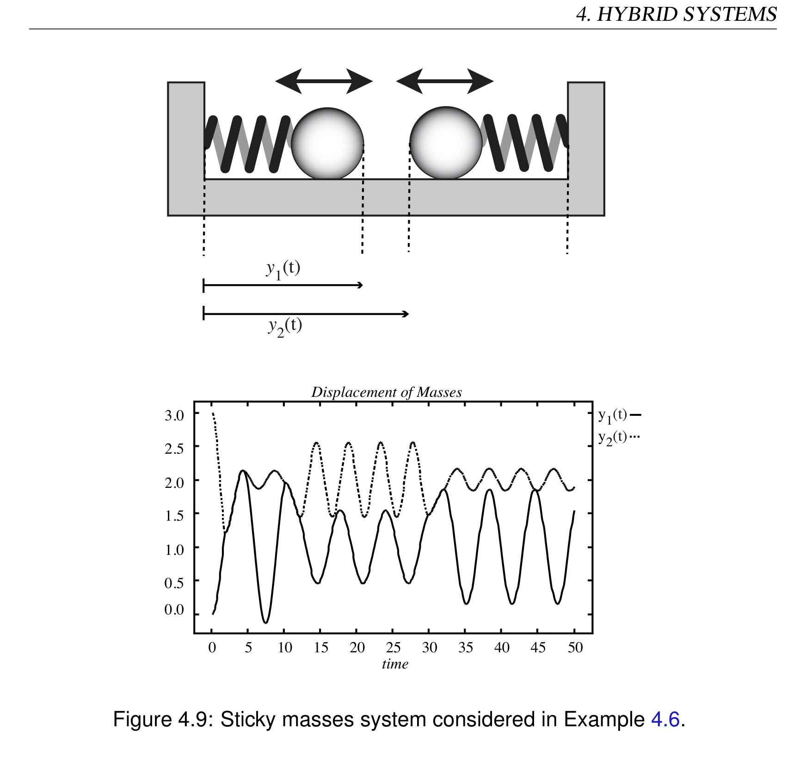
*Description*: Technical diagram and schematic model illustrating cyber-physical system behavior, algorithmic logic, and state progression for Figure 4.9: Sticky masses system considered in Example 4.6..

> **Figure 4.9: Sticky masses system considered in Example 4.6.**

4.2.2
Higher-Order Dynamics
In timed automata, all that happens in the time-based refinement systems is that time
passes. Hybrid systems, however, are much more interesting when the behavior of the
refinements is more complex. Specifically,
Example 4.6:
Consider the physical system depicted in Figure 4.9. Two sticky
round masses are attached to springs. The springs are compressed or extended and
Lee & Seshia, Introduction to Embedded Systems
87

<!-- Page 108 -->
### [PDF Page 108]

4.2. CLASSES OF HYBRID SYSTEMS

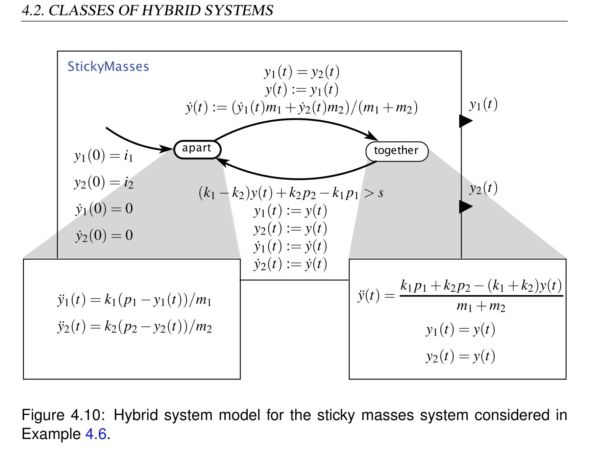
*Description*: Technical diagram and schematic model illustrating cyber-physical system behavior, algorithmic logic, and state progression for Figure 4.10: Hybrid system model for the sticky masses system considered in.

> **Figure 4.10: Hybrid system model for the sticky masses system considered in**

Example 4.6.
then released. The masses oscillate on a frictionless table. If they collide, they stick
together and oscillate together. After some time, the stickiness decays, and masses
pull apart again.
A plot of the displacement of the two masses as a function of time is shown in

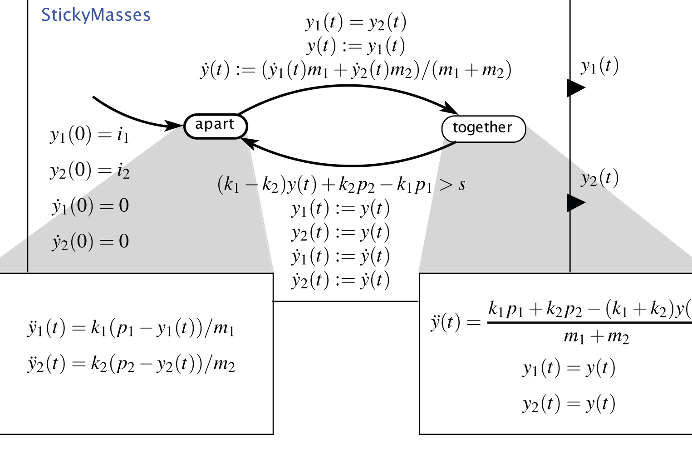
*Description*: Technical diagram and schematic model illustrating cyber-physical system behavior, algorithmic logic, and state progression for Figure 4.9: Both springs begin compressed, so the masses begin moving towards.

> **Figure 4.9: Both springs begin compressed, so the masses begin moving towards**

one another. They almost immediately collide, and then oscillate together for a
brief period until they pull apart. In this plot, they collide two more times, and
almost collide a third time.
The physics of this problem is quite simple if we assume idealized springs. Let
y1(t) denote the right edge of the left mass at time t, and y2(t) denote the left edge
of the right mass at time t, as shown in Figure 4.9. Let p1 and p2 denote the
neutral positions of the two masses, i.e., when the springs are neither extended nor
compressed, so the force is zero. For an ideal spring, the force at time t on the mass
88
Lee & Seshia, Introduction to Embedded Systems

<!-- Page 109 -->
### [PDF Page 109]

4. HYBRID SYSTEMS
is proportional to p1 −y1(t) (for the left mass) and p2 −y2(t) (for the right mass).
The force is positive to the right and negative to the left.
Let the spring constants be k1 and k2, respectively. Then the force on the left spring
is k1(p1 −y1(t)), and the force on the right spring is k2(p2 −y2(t)). Let the masses
be m1 and m2 respectively. Now we can use Newton’s second law, which relates
force, mass, and acceleration,
f = ma.
The acceleration is the second derivative of the position with respect to time, which
we write ¨y1(t) and ¨y2(t). Thus, as long as the masses are separate, their dynamics
are given by
¨y1(t)
=
k1(p1 −y1(t))/m1
(4.1)
¨y2(t)
=
k2(p2 −y2(t))/m2.
(4.2)
When the masses collide, however, the situation changes. With the masses stuck
together, they behave as a single object with mass m1 + m2. This single object is
pulled in opposite directions by two springs. While the masses are stuck together,
y1(t) = y2(t). Let
y(t) = y1(t) = y2(t).
The dynamics are then given by
¨y(t) = k1p1 +k2p2 −(k1 +k2)y(t)
m1 +m2
.
(4.3)
It is easy to see now how to construct a hybrid systems model for this physical
system. The model is shown in Figure 4.10. It has two modes, apart and together.
The refinement of the apart mode is given by (4.1) and (4.2), while the refinement
of the together mode is given by (4.3).
We still have work to do, however, to label the transitions. The initial transition is
shown in Figure 4.10 entering the apart mode. Thus, we are assuming the masses
begin apart. Moreover, this transition is labeled with a set action that sets the initial
positions of the two masses to i1 and i2 and the initial velocities to zero.
The transition from apart to together has the guard
y1(t) = y2(t) .
Lee & Seshia, Introduction to Embedded Systems
89

<!-- Page 110 -->
### [PDF Page 110]

4.2. CLASSES OF HYBRID SYSTEMS
This transition has a set action which assigns values to two continuous state vari-
ables y(t) and ˙y(t), which will represent the motion of the two masses stuck to-
gether. The value it assigns to ˙y(t) conserves momentum. The momentum of the
left mass is ˙y1(t)m1, the momentum of the right mass is ˙y2(t)m2, and the momentum
of the combined masses is ˙y(t)(m1 +m2). To make these equal, it sets
˙y(t) = ˙y1(t)m1 + ˙y2(t)m2
m1 +m2
.
The refinement of the together mode gives the dynamics of y and simply sets
y1(t) = y2(t) = y(t), since the masses are moving together. The transition from
apart to together sets y(t) equal to y1(t) (it could equally well have chosen y2(t),
since these are equal).
The transition from together to apart has the more complicated guard
(k1 −k2)y(t)+k2p2 −k1p1 > s,
where s represents the stickiness of the two masses. This guard is satisfied when the
right-pulling force on the right mass exceeds the right-pulling force on the left mass
by more than the stickiness. The right-pulling force on the right mass is simply
f2(t) = k2(p2 −y(t))
and the right-pulling force on the left mass is
f1(t) = k1(p1 −y(t)).
Thus,
f2(t)−f1(t) = (k1 −k2)y(t)+k2p2 −k1p1.
When this exceeds the stickiness s, then the masses pull apart.
An interesting elaboration on this example, considered in problem 8, modifies the
together mode so that the stickiness is initialized to a starting value, but then decays
according to the differential equation
˙s(t) = −as(t)
where s(t) is the stickiness at time t, and a is some positive constant. In fact, it is
the dynamics of such an elaboration that is plotted in Figure 4.9.
90
Lee & Seshia, Introduction to Embedded Systems

<!-- Page 111 -->
### [PDF Page 111]

4. HYBRID SYSTEMS
As in Example 4.4, it is sometimes useful to have hybrid system models with only one
state. The actions on one or more state transitions define the discrete event behavior that
combines with the time-based behavior.
Example 4.7: Consider a bouncing ball. At time t = 0, the ball is dropped from
a height y(0) = h0, where h0 is the initial height in meters. It falls freely. At some
later time t1 it hits the ground with a velocity ˙y(t1) < 0 m/s (meters per second).
A bump event is produced when the ball hits the ground. The collision is inelastic
(meaning that kinetic energy is lost), and the ball bounces back up with velocity
−a˙y(t1), where a is constant with 0 < a < 1. The ball will then rise to a certain
height and fall back to the ground repeatedly.
The behavior of the bouncing ball can be described by the hybrid system of Figure
4.11. There is only one mode, called free. When it is not in contact with the ground,
we know that the ball follows the second-order differential equation,
¨y(t) = −g,
(4.4)
where g = 9.81 m/sec2 is the acceleration imposed by gravity. The continuous state
variables of the free mode are
s(t) =
 y(t)
˙y(t)

with the initial conditions y(0) = h0 and ˙y(0) = 0. It is then a simple matter to
rewrite (4.4) as a first-order differential equation,
˙s(t) = f(s(t))
(4.5)
for a suitably chosen function f.
At the time t = t1 when the ball first hits the ground, the guard
y(t) = 0
is satisfied, and the self-loop transition is taken. The output bump is produced, and
the set action ˙y(t) := −a˙y(t) changes ˙y(t1) to have value −a˙y(t1). Then (4.4) is
followed again until the guard becomes true again.
Lee & Seshia, Introduction to Embedded Systems
91

<!-- Page 112 -->
### [PDF Page 112]

4.2. CLASSES OF HYBRID SYSTEMS
t1
t2
t
t1
t2
t

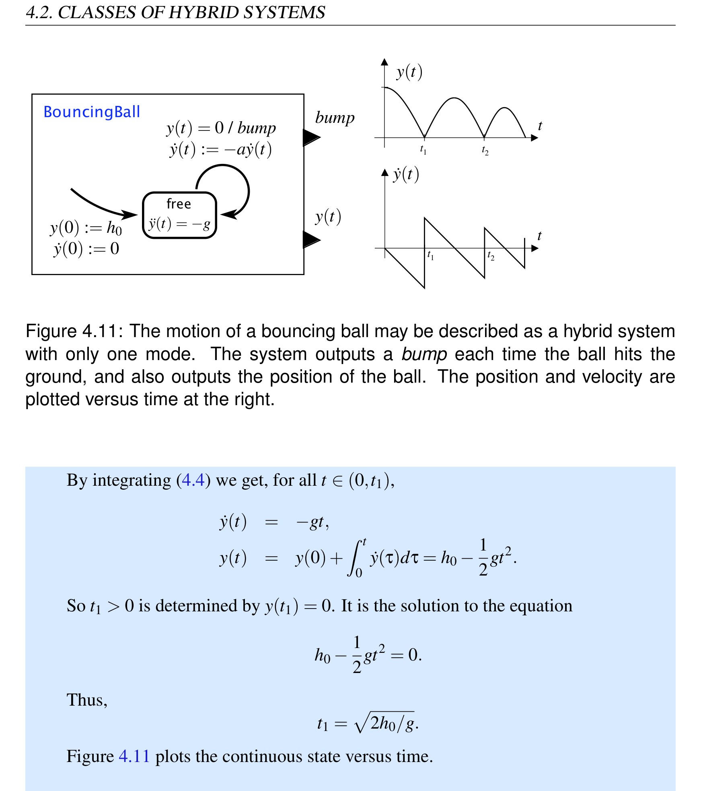
*Description*: Technical diagram and schematic model illustrating cyber-physical system behavior, algorithmic logic, and state progression for Figure 4.11: The motion of a bouncing ball may be described as a hybrid system.

> **Figure 4.11: The motion of a bouncing ball may be described as a hybrid system**

with only one mode. The system outputs a bump each time the ball hits the
ground, and also outputs the position of the ball. The position and velocity are
plotted versus time at the right.
By integrating (4.4) we get, for all t ∈(0,t1),
˙y(t)
=
−gt,
y(t)
=
y(0)+
Z t
0 ˙y(τ)dτ = h0 −1
2gt2.
So t1 > 0 is determined by y(t1) = 0. It is the solution to the equation
h0 −1
2gt2 = 0.
Thus,
t1 =
p
2h0/g.

*Description*: Technical diagram and schematic model illustrating cyber-physical system behavior, algorithmic logic, and state progression for Figure 4.11: plots the continuous state versus time..

> **Figure 4.11: plots the continuous state versus time.**

The bouncing ball example above has an interesting difficulty that is explored in Exer-
cise 7. Specifically, the time between bounces gets smaller as time increases. In fact, it
gets smaller fast enough that an infinite number of bounces occur in a finite amount of
time. A system with an infinite number of discrete events in a finite amount of time is
92
Lee & Seshia, Introduction to Embedded Systems

<!-- Page 113 -->
### [PDF Page 113]

4. HYBRID SYSTEMS
called a Zeno system, after Zeno of Elea, a pre-Socratic Greek philosopher famous for
his paradoxes. In the physical world, of course, the ball will eventually stop bouncing.
The Zeno behavior is an artifact of the model. Another example of a Zeno hybrid system
is considered in Exercise 10.
4.2.3
Supervisory control
A control system involves four components: a system called the plant, the physical pro-
cess that is to be controlled; the environment in which the plant operates; the sensors that
measure some variables of the plant and the environment; and the controller that deter-
mines the mode transition structure and selects the time-based inputs to the plant. The
controller has two levels: the supervisory control that determines the mode transition
structure, and the low-level control that determines the time-based inputs to the plant.
Intuitively, the supervisory controller determines which of several strategies should be
followed, and the low-level controller implements the selected strategy. Hybrid systems
are ideal for modeling such two-level controllers. We show how through a detailed exam-
ple.
Example 4.8: Consider an automated guided vehicle (AGV) that moves along a
closed track painted on a warehouse or factory floor. We will design a controller so
that the vehicle closely follows the track.
The vehicle has two degrees of freedom. At any time t, it can move forward along
its body axis with speed u(t) with the restriction that 0 ≤u(t) ≤10 mph (miles
per hour). It can also rotate about its center of gravity with an angular speed ω(t)
restricted to −π ≤ω(t) ≤π radians/second. We ignore the inertia of the vehicle, so
we assume that we can instantaneously change the velocity or angular speed.
Let (x(t),y(t)) ∈R2 be the position relative to some fixed coordinate frame and
θ(t) ∈(−π,π] be the angle (in radians) of the vehicle at time t, as shown in Figure
4.12. In terms of this coordinate frame, the motion of the vehicle is given by a
system of three differential equations,
˙x(t)
=
u(t)cosθ(t),
˙y(t)
=
u(t)sinθ(t),
(4.6)
˙θ(t)
=
ω(t).
Lee & Seshia, Introduction to Embedded Systems
93

<!-- Page 114 -->
### [PDF Page 114]

4.2. CLASSES OF HYBRID SYSTEMS
track
AGV
global
coordinate
frame

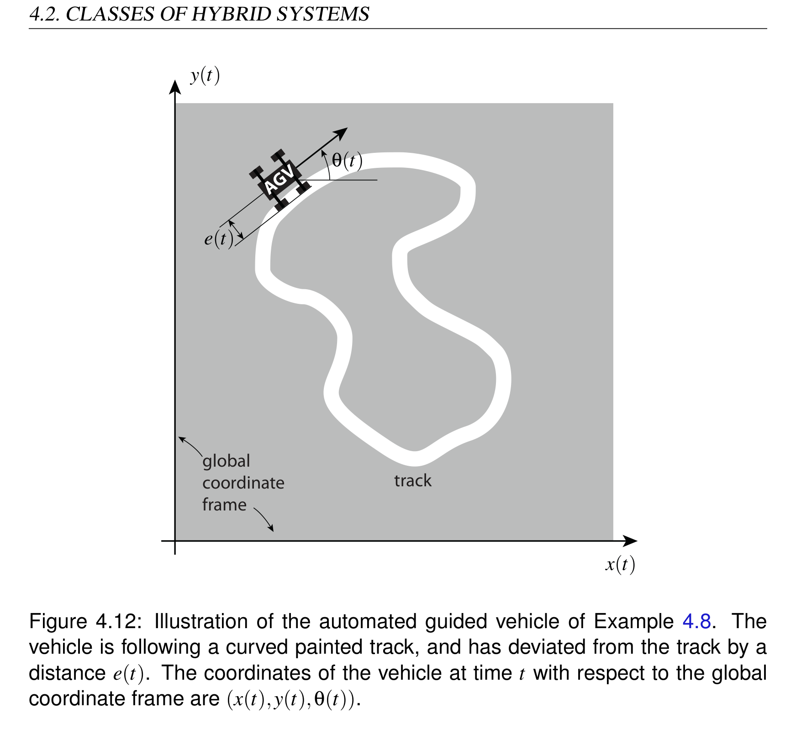
*Description*: Technical diagram and schematic model illustrating cyber-physical system behavior, algorithmic logic, and state progression for Figure 4.12: Illustration of the automated guided vehicle of Example 4.8. The.

> **Figure 4.12: Illustration of the automated guided vehicle of Example 4.8. The**

vehicle is following a curved painted track, and has deviated from the track by a
distance e(t). The coordinates of the vehicle at time t with respect to the global
coordinate frame are (x(t),y(t),θ(t)).
Equations (4.6) describe the plant. The environment is the closed painted track. It
could be described by an equation. We will describe it indirectly below by means
of a sensor.
The two-level controller design is based on a simple idea. The vehicle always
moves at its maximum speed of 10 mph. If the vehicle strays too far to the left of
the track, the controller steers it towards the right; if it strays too far to the right
of the track, the controller steers it towards the left. If the vehicle is close to the
track, the controller maintains the vehicle in a straight direction. Thus the controller
94
Lee & Seshia, Introduction to Embedded Systems

<!-- Page 115 -->
### [PDF Page 115]

4. HYBRID SYSTEMS

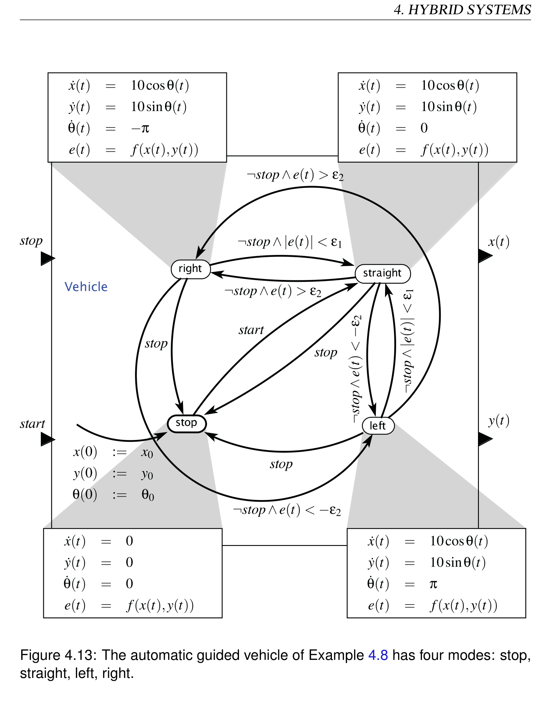
*Description*: Technical diagram and schematic model illustrating cyber-physical system behavior, algorithmic logic, and state progression for Figure 4.13: The automatic guided vehicle of Example 4.8 has four modes: stop,.

> **Figure 4.13: The automatic guided vehicle of Example 4.8 has four modes: stop,**

straight, left, right.
Lee & Seshia, Introduction to Embedded Systems
95

<!-- Page 116 -->
### [PDF Page 116]

4.2. CLASSES OF HYBRID SYSTEMS
guides the vehicle in four modes, left, right, straight, and stop. In stop mode, the
vehicle comes to a halt.
The following differential equations govern the AGV’s motion in the refinements
of the four modes. They describe the low-level controller, i.e., the selection of the
time-based plant inputs in each mode.
straight
˙x(t)
=
10cosθ(t)
˙y(t)
=
10sinθ(t)
˙θ(t)
=
0
left
˙x(t)
=
10cosθ(t)
˙y(t)
=
10sinθ(t)
˙θ(t)
=
π
right
˙x(t)
=
10cosθ(t)
˙y(t)
=
10sinθ(t)
˙θ(t)
=
−π
stop
˙x(t)
=
0
˙y(t)
=
0
˙θ(t)
=
0
In the stop mode, the vehicle is stopped, so x(t), y(t), and θ(t) are constant. In
the left mode, θ(t) increases at the rate of π radians/second, so from Figure 4.12
we see that the vehicle moves to the left. In the right mode, it moves to the right.
In the straight mode, θ(t) is constant, and the vehicle moves straight ahead with
a constant heading. The refinements of the four modes are shown in the boxes of

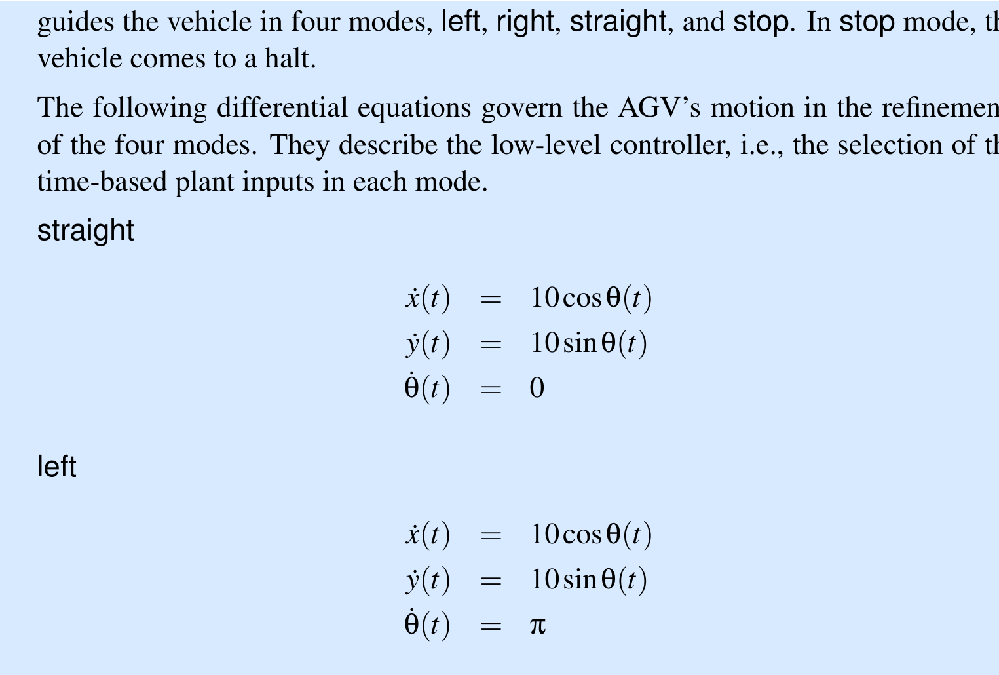
*Description*: Technical diagram and schematic model illustrating cyber-physical system behavior, algorithmic logic, and state progression for Figure 4.13.

> **Figure 4.13**

96
Lee & Seshia, Introduction to Embedded Systems

<!-- Page 117 -->
### [PDF Page 117]

4. HYBRID SYSTEMS
We design the supervisory control governing transitions between modes in such
a way that the vehicle closely follows the track, using a sensor that determines
how far the vehicle is to the left or right of the track. We can build such a sensor
using photodiodes. Let’s suppose the track is painted with a light-reflecting color,
whereas the floor is relatively dark. Underneath the AGV we place an array of
photodiodes as shown in Figure 4.14. The array is perpendicular to the AGV body
axis. As the AGV passes over the track, the diode directly above the track generates
more current than the other diodes. By comparing the magnitudes of the currents
through the different diodes, the sensor estimates the displacement e(t) of the center
of the array (hence, the center of the AGV) from the track. We adopt the convention
that e(t) < 0 means that the AGV is to the right of the track and e(t) > 0 means it
is to the left. We model the sensor output as a function f of the AGV’s position,
∀t,
e(t) = f(x(t),y(t)).
The function f of course depends on the environment—the track. We now specify
the supervisory controller precisely. We select two thresholds, 0 < ε1 < ε2, as
shown in Figure 4.14. If the magnitude of the displacement is small, |e(t)| < ε1,
we consider that the AGV is close enough to the track, and the AGV can move
straight ahead, in straight mode. If e(t) > ε2 (e(t) is large and positive), the AGV
has strayed too far to the left and must be steered to the right, by switching to right
mode. If e(t) < −ε2 (e(t) is large and negative), the AGV has strayed too far to
the right and must be steered to the left, by switching to left mode. This control
logic is captured in the mode transitions of Figure 4.13. The inputs are pure signals
stop and start. These model an operator that can stop or start the AGV. There is no
continuous-time input. The outputs represent the position of the vehicle, x(t) and
y(t). The initial mode is stop, and the initial values of its refinement are (x0,y0,θ0).
We analyze how the AGV will move. Figure 4.15 sketches one possible trajectory.
Initially the vehicle is within distance ε1 of the track, so it moves straight. At some
later time, the vehicle goes too far to the left, so the guard
¬stop∧e(t) > ε2
is satisfied, and there is a mode switch to right. After some time, the vehicle will
again be close enough to the track, so the guard
¬stop∧|e(t)| < ε1
Lee & Seshia, Introduction to Embedded Systems
97

<!-- Page 118 -->
### [PDF Page 118]

4.3. SUMMARY
photodiode
track
AGV

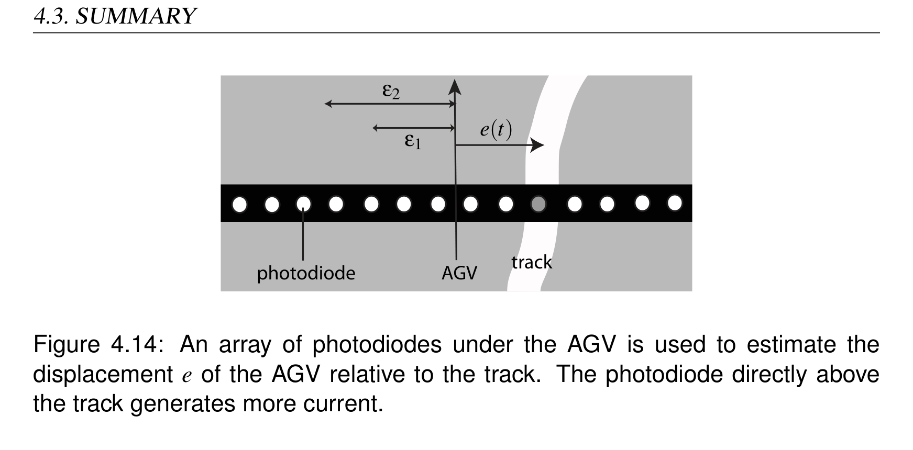
*Description*: Technical diagram and schematic model illustrating cyber-physical system behavior, algorithmic logic, and state progression for Figure 4.14: An array of photodiodes under the AGV is used to estimate the.

> **Figure 4.14: An array of photodiodes under the AGV is used to estimate the**

displacement e of the AGV relative to the track. The photodiode directly above
the track generates more current.
is satisfied, and there is a mode switch to straight. Some time later, the vehicle is
too far to the right, so the guard
¬stop∧e(t) < −ε2
is satisfied, and there is a mode switch to left. And so on.
The example illustrates the four components of a control system. The plant is described
by the differential equations (4.6) that govern the evolution of the continuous state at
time t, (x(t),y(t),θ(t)), in terms of the plant inputs u and ω. The second component
is the environment—the closed track. The third component is the sensor, whose output
at time t, e(t) = f(x(t),y(t)), gives the position of the AGV relative to the track. The
fourth component is the two-level controller. The supervisory controller comprises the
four modes and the guards that determine when to switch between modes. The low-level
controller specifies how the time-based inputs to the plant, u and ω, are selected in each
mode.
4.3

### Summary

Hybrid systems provide a bridge between time-based models and state-machine models.
The combination of the two families of models provides a rich framework for describing
98
Lee & Seshia, Introduction to Embedded Systems

<!-- Page 119 -->
### [PDF Page 119]

4. HYBRID SYSTEMS
initial
position
straight
right
straight
left
track
straight

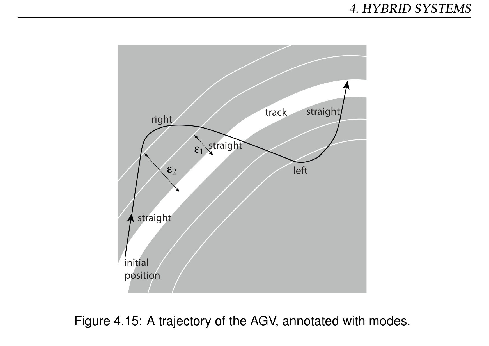
*Description*: Technical diagram and schematic model illustrating cyber-physical system behavior, algorithmic logic, and state progression for Figure 4.15: A trajectory of the AGV, annotated with modes..

> **Figure 4.15: A trajectory of the AGV, annotated with modes.**

real-world systems. There are two key ideas. First, discrete events (state changes in a state
machine) get embedded in a time base. Second, a hierarchical description is particularly
useful, where the system undergoes discrete transitions between different modes of opera-
tion. Associated with each mode of operation is a time-based system called the refinement
of the mode. Mode transitions are taken when guards that specify the combination of in-
puts and continuous states are satisfied. The action associated with a transition, in turn,
sets the continuous state in the destination mode.
The behavior of a hybrid system is understood using the tools of state machine analysis
for mode transitions and the tools of time-based analysis for the refinement systems. The
design of hybrid systems similarly proceeds on two levels: state machines are designed to
achieve the appropriate logic of mode transitions, and continuous refinement systems are
designed to secure the desired time-based behavior in each mode.
Lee & Seshia, Introduction to Embedded Systems
99

<!-- Page 120 -->
### [PDF Page 120]

### EXERCISES

### Exercises

1. Construct (on paper is sufficient) a timed automaton similar to that of Figure 4.7
which produces tick at times 1,2,3,5,6,7,8,10,11,···. That is, ticks are produced
with intervals between them of 1 second (three times) and 2 seconds (once).
2. The objective of this problem is to understand a timed automaton, and then to mod-
ify it as specified.
(a) For the timed automaton shown below, describe the output y. Avoid imprecise
or sloppy notation.
(b) Assume there is a new pure input reset, and that when this input is present,
the hybrid system starts over, behaving as if it were starting at time 0 again.
Modify the hybrid system from part (a) to do this.
3. You have an analog source that produces a pure tone. You can switch the source on
or off by the input event on or off. Construct a timed automaton that provides the on
and off signals as outputs, to be connected to the inputs of the tone generator. Your
system should behave as follows. Upon receiving an input event ring, it should
produce an 80 ms-long sound consisting of three 20 ms-long bursts of the pure tone
separated by two 10 ms intervals of silence. What does your system do if it receives
two ring events that are 50 ms apart?
4. Automobiles today have the features listed below. Implement each feature as a
timed automaton.
(a) The dome light is turned on as soon as any door is opened. It stays on for 30
seconds after all doors are shut. What sensors are needed?
100
Lee & Seshia, Introduction to Embedded Systems

<!-- Page 121 -->
### [PDF Page 121]

4. HYBRID SYSTEMS
Main
Secondary
light
detector
R
R
G
G
Y
Y

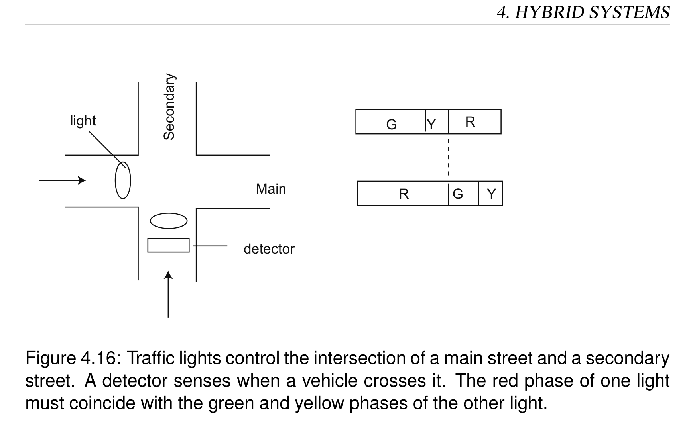
*Description*: Cyber-physical actor model block diagram showing continuous/discrete signal flows, feedback loops, and component interfaces for Figure 4.16: Traffic lights control the intersection of a main street and a secondary.

> **Figure 4.16: Traffic lights control the intersection of a main street and a secondary**

street. A detector senses when a vehicle crosses it. The red phase of one light
must coincide with the green and yellow phases of the other light.
(b) Once the engine is started, a beeper is sounded and a red light warning is
indicated if there are passengers that have not buckled their seat belt. The
beeper stops sounding after 30 seconds, or as soon the seat belts are buckled,
whichever is sooner. The warning light is on all the time the seat belt is un-
buckled. Hint: Assume the sensors provide a warn event when the ignition
is turned on and there is a seat with passenger not buckled in, or if the igni-
tion is already on and a passenger sits in a seat without buckling the seatbelt.
Assume further that the sensors provide a noWarn event when a passenger de-
parts from a seat, or when the buckle is buckled, or when the ignition is turned
off.
5. A programmable thermostat allows you to select 4 times, 0 ≤T1 ≤··· ≤T4 < 24 (for
a 24-hour cycle) and the corresponding setpoint temperatures a1,··· ,a4. Construct
a timed automaton that sends the event ai to the heating systems controller. The
controller maintains the temperature close to the value ai until it receives the next
event. How many timers and modes do you need?
6. Figure 4.16 depicts the intersection of two one-way streets, called Main and Sec-
ondary. A light on each street controls its traffic. Each light goes through a cycle
consisting of a red (R), green (G), and yellow (Y) phases. It is a safety requirement
Lee & Seshia, Introduction to Embedded Systems
101

<!-- Page 122 -->
### [PDF Page 122]

### EXERCISES

that when one light is in its green or yellow phase, the other is in its red phase. The
yellow phase is always 5 seconds long.
The traffic lights operate as follows. A sensor in the secondary road detects a ve-
hicle. While no vehicle is detected, there is a 4 minute-long cycle with the main
light having 3 minutes of green, 5 seconds of yellow, and 55 seconds of red. The
secondary light is red for 3 minutes and 5 seconds (while the main light is green
and yellow), green for 50 seconds, then yellow for 5 seconds.
If a vehicle is detected on the secondary road, the traffic light quickly gives a right
of way to the secondary road. When this happens, the main light aborts its green
phase and immediately switches to its 5 second yellow phase. If the vehicle is
detected while the main light is yellow or red, the system continues as if there were
no vehicle.
Design a hybrid system that controls the lights. Let this hybrid system have six
pure outputs, one for each light, named mG, mY, and mR, to designate the main
light being green, yellow, or red, respectively, and sG, sY, and sR, to designate the
secondary light being green, yellow, or red, respectively. These signals should be
generated to turn on a light. You can implicitly assume that when one light is turned
on, whichever has been on is turned off.
7. For the bouncing ball of Example 4.7, let tn be the time when the ball hits the ground
for the n-th time, and let vn = ˙y(tn) be the velocity at that time.
(a) Find a relation between vn+1 and vn for n > 1, and then calculate vn in terms
of v1.
(b) Obtain tn in terms of v1 and a. Use this to show that the bouncing ball is a
Zeno system. Hint: The geometric series identity might be useful, where
for |b| < 1,
∞
∑
m=0
bm =
1
1−b.
(c) Calculate the maximum height reached by the ball after successive bumps.
8. Elaborate the hybrid system model of Figure 4.10 so that in the together mode, the
stickiness decays according to the differential equation
˙s(t) = −as(t)
102
Lee & Seshia, Introduction to Embedded Systems

<!-- Page 123 -->
### [PDF Page 123]

4. HYBRID SYSTEMS
x1
r1
v1
x2
r2
v2
w

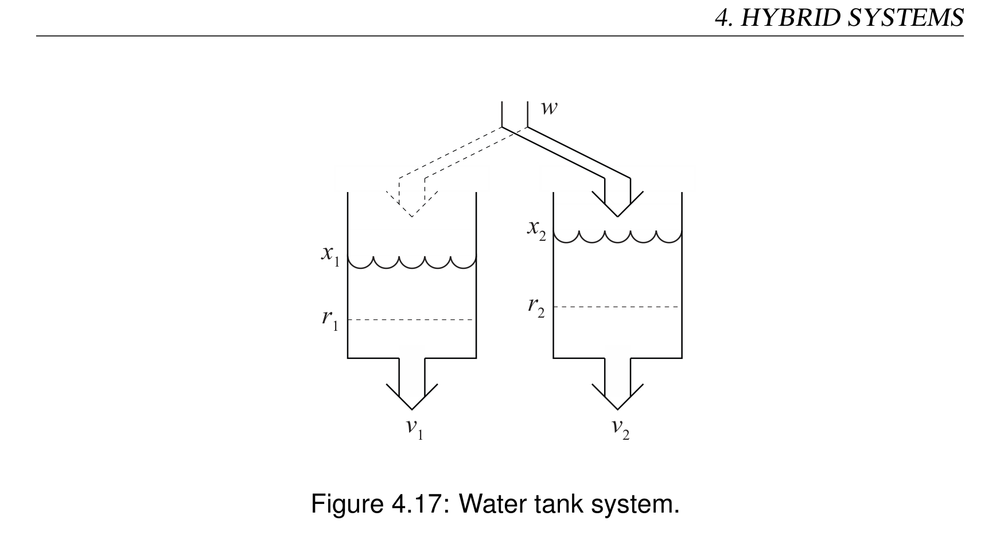
*Description*: Technical diagram and schematic model illustrating cyber-physical system behavior, algorithmic logic, and state progression for Figure 4.17: Water tank system..

> **Figure 4.17: Water tank system.**

where s(t) is the stickiness at time t, and a is some positive constant. On the tran-
sition into this mode, the stickiness should be initialized to some starting stickiness
b.
9. Show that the trajectory of the AGV of Figure 4.13 while it is in left or right mode
is a circle. What is the radius of this circle, and how long does it take to complete a
circle?
10. Consider Figure 4.17 depicting a system comprising two tanks containing water.
Each tank is leaking at a constant rate. Water is added at a constant rate to the
system through a hose, which at any point in time is filling either one tank or the
other. It is assumed that the hose can switch between the tanks instantaneously. For
i ∈{1,2}, let xi denote the volume of water in Tank i and vi > 0 denote the constant
flow of water out of Tank i. Let w denote the constant flow of water into the system.
The objective is to keep the water volumes above r1 and r2, respectively, assuming
that the water volumes are above r1 and r2 initially. This is to be achieved by a
controller that switches the inflow to Tank 1 whenever x1(t) ≤r1(t) and to Tank 2
whenever x2(t) ≤r2(t).
The hybrid automaton representing this two-tank system is given in Figure 4.18.
Answer the following questions:
Lee & Seshia, Introduction to Embedded Systems
103

<!-- Page 124 -->
### [PDF Page 124]

### EXERCISES

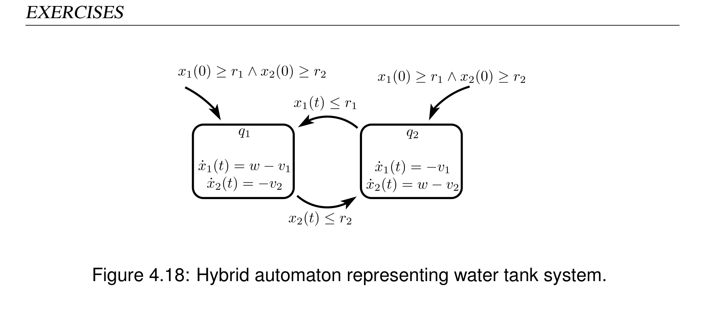
*Description*: Technical diagram and schematic model illustrating cyber-physical system behavior, algorithmic logic, and state progression for Figure 4.18: Hybrid automaton representing water tank system..

> **Figure 4.18: Hybrid automaton representing water tank system.**

(a) Construct a model of this hybrid automaton in Ptolemy II, LabVIEW, or
Simulink. Use the following parameter values: r1 = r2 = 0, v1 = v2 = 0.5,
and w = 0.75. Set the initial state to be (q1,(0,1)). (That is, initial value
x1(0) is 0 and x2(0) is 1.)
Verify that this hybrid automaton is Zeno. What is the reason for this Zeno
behavior? Simulate your model and plot how x1 and x2 vary as a function of
time t, simulating long enough to illustrate the Zeno behavior.
(b) A Zeno system may be regularized by ensuring that the time between tran-
sitions is never less than some positive number ε. This can be emulated by
inserting extra modes in which the hybrid automaton dwells for time ε. Use
regularization to make your model from part (a) non-Zeno. Again, plot x1 and
x2 for the same length of time as in the first part. State the value of ε that you
used.
Include printouts of your plots with your answer.
11. Consider the following timed automaton:
104
Lee & Seshia, Introduction to Embedded Systems

<!-- Page 125 -->
### [PDF Page 125]

4. HYBRID SYSTEMS
Assume t1 and t2 are positive real numbers.
(a) What is the minimum amount of time between events a? That is, what is the
smallest possible time between two times when the signal a is present?
(b) Suppose that the machine above is composed in a synchronous side-by-side
composition with the following machine:
Find a tight lower bound on the time between events a and b. That is, find a
lower bound on the time gap during which there are no events in signals a or
b. Give an argument that your lower bound is tight.
Lee & Seshia, Introduction to Embedded Systems
105

<!-- Page 126 -->
### [PDF Page 126]

### EXERCISES

106
Lee & Seshia, Introduction to Embedded Systems

