# Chapter 5: Composition of State Machines

> **Textbook**: Introduction to Embedded Systems - A Cyber-Physical Systems Approach (UC Berkeley)  
> **Authors**: Edward Ashford Lee and Sanjit Arunkumar Seshia  
> **PDF Page Range**: 127 - 150

---

<!-- Page 127 -->
### [PDF Page 127]

5
Composition of
State Machines
Contents
5.1
Concurrent Composition . . . . . . . . . . . . . . . . . . . . . . . 109
5.1.1
Side-by-Side Synchronous Composition . . . . . . . . . . . . 110
5.1.2
Side-by-Side Asynchronous Composition . . . . . . . . . . . 113

### Sidebar: Scheduling Semantics for Asynchronous Composition . . . . 115

5.1.3
Shared Variables . . . . . . . . . . . . . . . . . . . . . . . . 116
5.1.4
Cascade Composition
. . . . . . . . . . . . . . . . . . . . . 118
5.1.5
General Composition . . . . . . . . . . . . . . . . . . . . . . 122
5.2
Hierarchical State Machines
. . . . . . . . . . . . . . . . . . . . . 123
5.3

### Summary . . . . . . . . . . . . . . . . . . . . . . . . . . . . . . . . 127

### Exercises . . . . . . . . . . . . . . . . . . . . . . . . . . . . . . . . . . . 129

State machines provide a convenient way to model behaviors of systems. One disadvan-
tage that they have is that for most interesting systems, the number of states is very large,
often even infinite. Automated tools can handle large state spaces, but humans have more
difficulty with any direct representation of a large state space.
107

<!-- Page 128 -->
### [PDF Page 128]

A time-honored principle in engineering is that complicated systems should be described
as compositions of simpler systems. This chapter gives a number of ways to do this with
state machines. The reader should be aware, however, that there are many subtly different
ways to compose state machines. Compositions that look similar on the surface may mean
different things to different people. The rules of notation of a model are called its syntax,
and the meaning of the notation is called its semantics.
Example 5.1: In the standard syntax of arithmetic, a plus sign + has a number or
expression before it, and a number or expression after it. Hence, 1+2, a sequence
of three symbols, is a valid arithmetic expression, but 1+ is not. The semantics of
the expression 1 + 2 is the addition of two numbers. This expression means “the
number three, obtained by adding 1 and 2.” The expression 2 + 1 is syntactically
different, but semantically identical (because addition is commutative).
The models in this book predominantly use a visual syntax, where the elements are boxes,
circles, arrows, etc., rather than characters in a character set, and where the positioning
of the elements is not constrained to be a sequence. Such syntaxes are less standardized
than, for example, the syntax of arithmetic. We will see that the same syntax can have
many different semantics, which can cause no end of confusion.
Example 5.2:
A now popular notation for concurrent composition of state
machines called Statecharts was introduced by Harel (1987).
Although they
are all based on the same original paper, many variants of Statecharts have
evolved (von der Beeck, 1994). These variants often assign different semantics
to the same syntax.
In this chapter, we assume an actor model for extended state machines using the syntax
summarized in Figure 5.1. The semantics of a single such state machine is described in

# Chapter 3. This chapter will discuss the semantics that can be assigned to compositions

of multiple such machines.
The first composition technique we consider is concurrent composition. Two or more
state machines react either simultaneously or independently. If the reactions are simul-
108
Lee & Seshia, Introduction to Embedded Systems

<!-- Page 129 -->
### [PDF Page 129]

5. COMPOSITION OF STATE MACHINES
taneous, we call it synchronous composition. If they are independent, then we call it
asynchronous composition. But even within these classes of composition, many subtle
variations in the semantics are possible. These variations mostly revolve around whether
and how the state machines communicate and share variables.
The second composition technique we will consider is hierarchy. Hierarchical state ma-
chines can also enable complicated systems to be described as compositions of simpler
systems. Again, we will see that subtle differences in semantics are possible.
5.1
Concurrent Composition
To study concurrent composition of state machines, we will proceed through a sequence
of patterns of composition. These patterns can be combined to build arbitrarily compli-
cated systems. We begin with the simplest case, side-by-side composition, where the
state machines being composed do not communicate. We then consider allowing com-
munication through shared variables, showing that this creates significant subtleties that
can complicate modeling. We then consider communication through ports, first looking
i1
in
om
o1
...
...

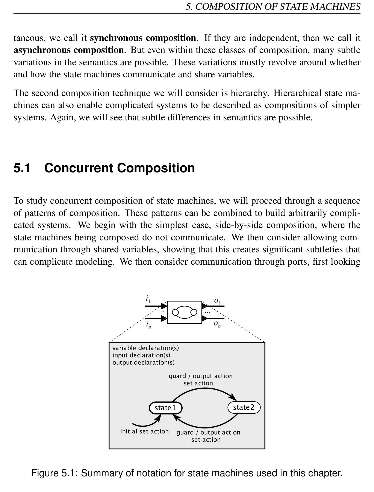
*Description*: Finite state machine (FSM) transition diagram specifying states, guard conditions, input triggers, and output actions for Figure 5.1: Summary of notation for state machines used in this chapter..

> **Figure 5.1: Summary of notation for state machines used in this chapter.**

Lee & Seshia, Introduction to Embedded Systems
109

<!-- Page 130 -->
### [PDF Page 130]

5.1. CONCURRENT COMPOSITION
at serial composition, then expanding to arbitrary interconnections. We consider both
synchronous and asynchronous composition for each type of composition.
5.1.1
Side-by-Side Synchronous Composition
The first pattern of composition that we consider is side-by-side composition, illustrated
for two actors in Figure 5.2. In this pattern, we assume that the inputs and outputs of
the two actors are disjoint, i.e., that the state machines do not communicate. In the figure,
actor A has input i1 and output o1, and actor B has input i2 and output o2. The composition
of the two actors is itself an actor C with inputs i1 and i2 and outputs o1 and o2.1
In the simplest scenario, if the two actors are extended state machines with variables,
then those variables are also disjoint. We will later consider what happens when the two
state machines share variables. Under synchronous composition, a reaction of C is a
simultaneous reaction of A and B.
Example 5.3: Consider FSMs A and B in Figure 5.3. A has a single pure output
a, and B has a single pure output b. The side-by-side composition C has two pure
outputs, a and b. If the composition is synchronous, then on the first reaction, a
will be absent and b will be present. On the second reaction, it will be the reverse.
On subsequent reactions, a and b will continue to alternate being present.
1The composition actor C may rename these input and output ports, but here we assume it uses the same
names as the component actors.

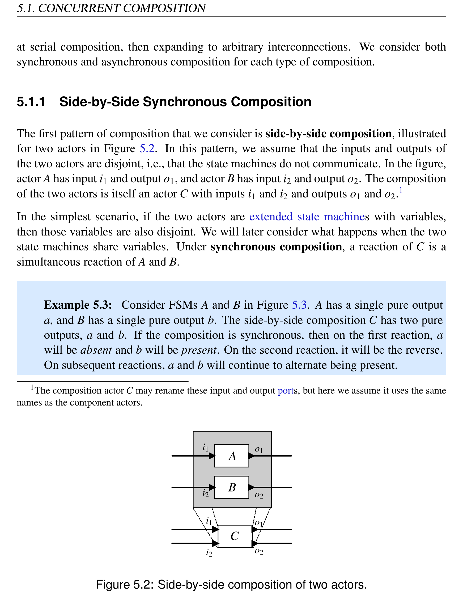
*Description*: Cyber-physical actor model block diagram showing continuous/discrete signal flows, feedback loops, and component interfaces for Figure 5.2: Side-by-side composition of two actors..

> **Figure 5.2: Side-by-side composition of two actors.**

110
Lee & Seshia, Introduction to Embedded Systems

<!-- Page 131 -->
### [PDF Page 131]

5. COMPOSITION OF STATE MACHINES

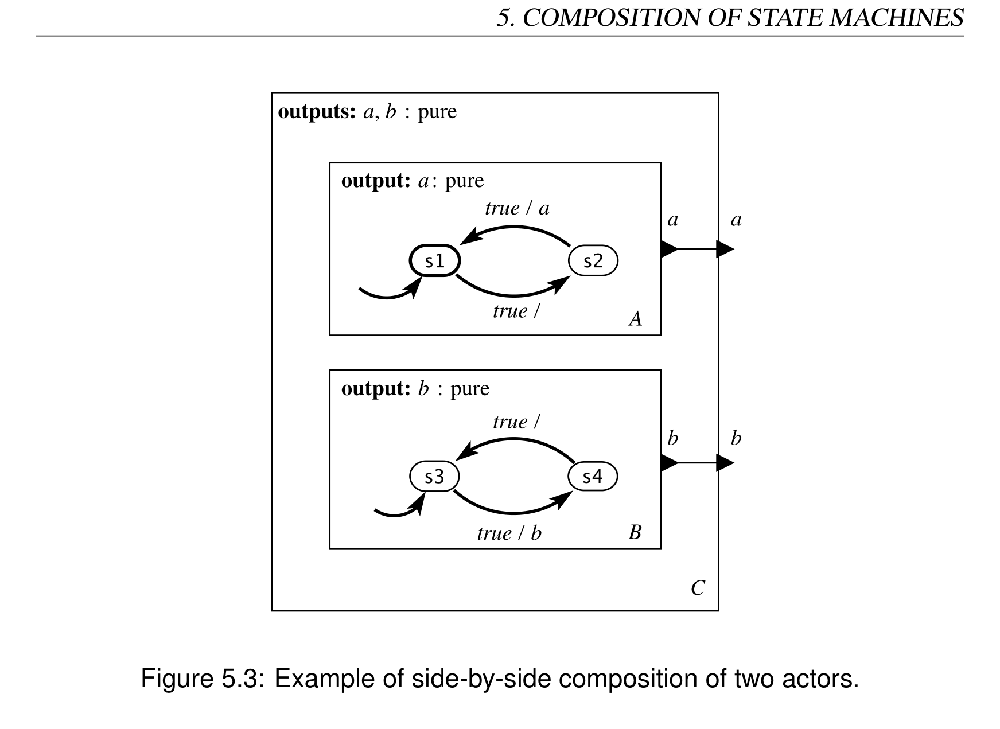
*Description*: Cyber-physical actor model block diagram showing continuous/discrete signal flows, feedback loops, and component interfaces for Figure 5.3: Example of side-by-side composition of two actors..

> **Figure 5.3: Example of side-by-side composition of two actors.**

Synchronous side-by-side composition is simple for several reasons. First, recall from
Section 3.3.2 that the environment determines when a state machine reacts.
In syn-
chronous side-by-side composition, the environment need not be aware that C is a com-
position of two state machines. Such compositions are modular in the sense that the
composition itself becomes a component that can be further composed as if it were itself
an atomic component.
Moreover, if the two state machines A and B are deterministic, then the synchronous side-
by-side composition is also deterministic. We say that a property is compositional if a
property held by the components is also a property of the composition. For synchronous
side-by-side composition, determinism is a compositional property.
In addition, a synchronous side-by-side composition of finite state machines is itself an
FSM. A rigorous way to give the semantics of the composition is to define a single state
machine for the composition. Suppose that as in Section 3.3.3, state machines A and B
Lee & Seshia, Introduction to Embedded Systems
111

<!-- Page 132 -->
### [PDF Page 132]

5.1. CONCURRENT COMPOSITION
are given by the five tuples,
A
=
(StatesA,InputsA,OutputsA,updateA,initialStateA)
B
=
(StatesB,InputsB,OutputsB,updateB,initialStateB) .
Then the synchronous side-by-side composition C is given by
StatesC
=
StatesA ×StatesB
(5.1)
InputsC
=
InputsA ×InputsB
(5.2)
OutputsC
=
OutputsA ×OutputsB
(5.3)
initialStateC
=
(initialStateA,initialStateB)
(5.4)
and the update function is defined by
updateC((sA,sB),(iA,iB)) = ((s′
A,s′
B),(oA,oB)),
where
(s′
A,oA) = updateA(sA,iA),
and
(s′
B,oB) = updateB(sB,iB),
for all sA ∈StatesA, sB ∈StatesB, iA ∈InputsA, and iB ∈InputsB.
Recall that InputsA and InputsB are sets of valuations. Each valuation in the set is an
assignment of values to ports. What we mean by
InputsC = InputsA ×InputsB
is that a valuation of the inputs of C must include both valuations for the inputs of A and
the inputs of B.
As usual, the single FSM C can be given pictorially rather than symbolically, as illustrated
in the next example.
Example 5.4: The synchronous side-by-side composition C in Figure 5.3 is given
as a single FSM in Figure 5.4. Notice that this machine behaves exactly as described
in Example 5.3. The outputs a and b alternate being present. Notice further that
(s1,s4) and (s2,s3) are not reachable states.
112
Lee & Seshia, Introduction to Embedded Systems

<!-- Page 133 -->
### [PDF Page 133]

5. COMPOSITION OF STATE MACHINES

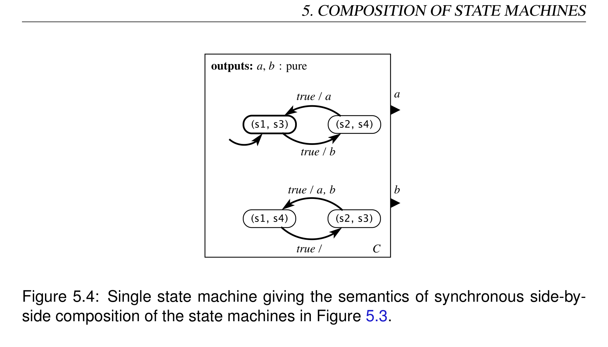
*Description*: Finite state machine (FSM) transition diagram specifying states, guard conditions, input triggers, and output actions for Figure 5.4: Single state machine giving the semantics of synchronous side-by-.

> **Figure 5.4: Single state machine giving the semantics of synchronous side-by-**

side composition of the state machines in Figure 5.3.
5.1.2
Side-by-Side Asynchronous Composition
In an asynchronous composition of state machines, the component machines react inde-
pendently. This statement is rather vague, and in fact, it has several different interpreta-
tions. Each interpretation gives a semantics to the composition. The key to each semantics
is how to define a reaction of the composition C in Figure 5.2. Two possibilities are:
• Semantics 1. A reaction of C is a reaction of one of A or B, where the choice is
nondeterministic.
• Semantics 2. A reaction ofC is a reaction of A, B, or both A and B, where the choice
is nondeterministic. A variant of this possibility might allow neither to react.
Semantics 1 is referred to as an interleaving semantics, meaning that A or B never react
simultaneously. Their reactions are interleaved in some order.
A significant subtlety is that under these semantics machines A and B may completely
miss input events. That is, an input to C destined for machine A may be present in a
reaction where the nondeterministic choice results in B reacting rather than A. If this is
not desirable, then some control over scheduling (see sidebar on page 115) or synchronous
composition becomes a better choice.
Lee & Seshia, Introduction to Embedded Systems
113

<!-- Page 134 -->
### [PDF Page 134]

5.1. CONCURRENT COMPOSITION

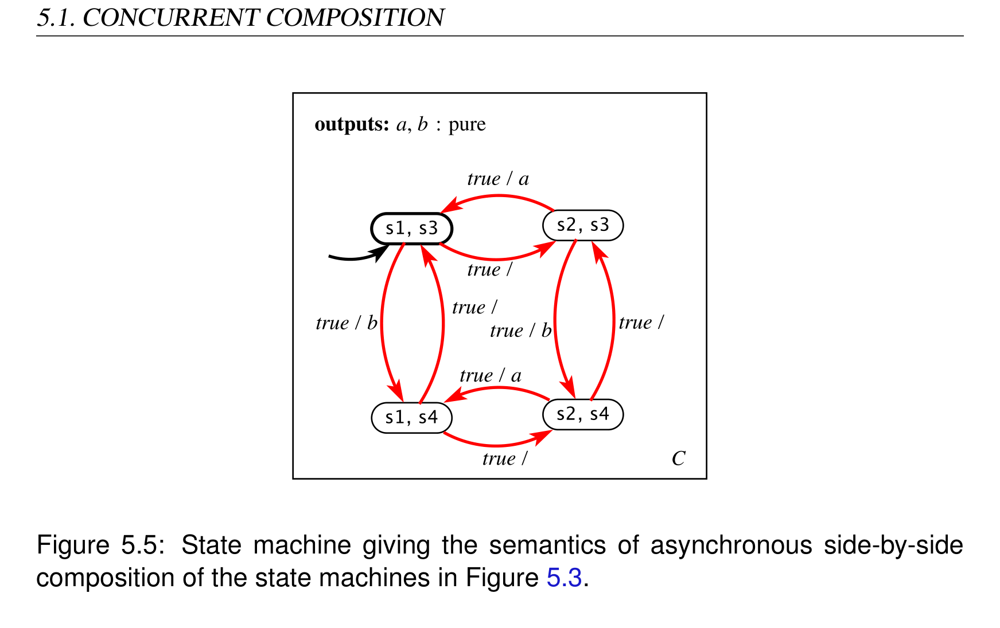
*Description*: Finite state machine (FSM) transition diagram specifying states, guard conditions, input triggers, and output actions for Figure 5.5: State machine giving the semantics of asynchronous side-by-side.

> **Figure 5.5: State machine giving the semantics of asynchronous side-by-side**

composition of the state machines in Figure 5.3.
Example 5.5: For the example in Figure 5.3, semantics 1 results in the composi-
tion state machine shown in Figure 5.5. This machine is nondeterministic. From
state (s1,s3), when C reacts, it can move to (s2,s3) and emit no output, or it can
move to (s1,s4) and emit b. Note that if we had chosen semantics 2, then it would
also be able to move to (s2,s4).
For asynchronous composition under semantics 1, the symbolic definition of C has the
same definitions of StatesC, InputsC, OutputsC, and initialStateC as for synchronous com-
position, given in (5.1) through (5.4). But the update function differs, becoming
updateC((sA,sB),(iA,iB)) = ((s′
A,s′
B),(o′
A,o′
B)),
where either
(s′
A,o′
A) = updateA(sA,iA) and s′
B = sB and o′
B = absent
or
(s′
B,o′
B) = updateB(sB,iB) and s′
A = sA and o′
A = absent
114
Lee & Seshia, Introduction to Embedded Systems

<!-- Page 135 -->
### [PDF Page 135]

5. COMPOSITION OF STATE MACHINES
for all sA ∈StatesA, sB ∈StatesB, iA ∈InputsA, and iB ∈InputsB. What we mean by
o′
B = absent is that all outputs of B are absent. Semantics 2 can be similarly defined (see
Exercise 2).
Scheduling Semantics for Asynchronous Composition
In the case of semantics 1 and 2 given in Section 5.1.2, the choice of which component
machine reacts is nondeterministic. The model does not express any particular constraints.
It is often more useful to introduce some scheduling policies, where the environment is
able to influence or control the nondeterministic choice. This leads to two additional
possible semantics for asynchronous composition:
• Semantics 3. A reaction of C is a reaction of one of A or B, where the environment
chooses which of A or B reacts.
• Semantics 4. A reaction of C is a reaction of A, B, or both A and B, where the
choice is made by the environment.
Like semantics 1, semantics 3 is an interleaving semantics.
In one sense, semantics 1 and 2 are more compositional than semantics 3 and 4. To
implement semantics 3 and 4, a composition has to provide some mechanism for the
environment to choose which component machine should react (for scheduling the com-
ponent machines). This means that the hierarchy suggested in Figure 5.2 does not quite
work. Actor C has to expose more of its internal structure than just the ports and the
ability to react.
In another sense, semantics 1 and 2 are less compositional than semantics 3 and 4
because determinism is not preserved by composition. A composition of deterministic
state machines is not a deterministic state machine.
Notice further that semantics 1 is an abstraction of semantics 3 in the sense that every
behavior under semantics 3 is also a behavior under semantics 1. This notion of abstrac-
tion is studied in detail in Chapter 13.
The subtle differences between these choices make asynchronous composition rather
treacherous. Considerable care is required to ensure that it is clear which semantics is
used.
Lee & Seshia, Introduction to Embedded Systems
115

<!-- Page 136 -->
### [PDF Page 136]

5.1. CONCURRENT COMPOSITION

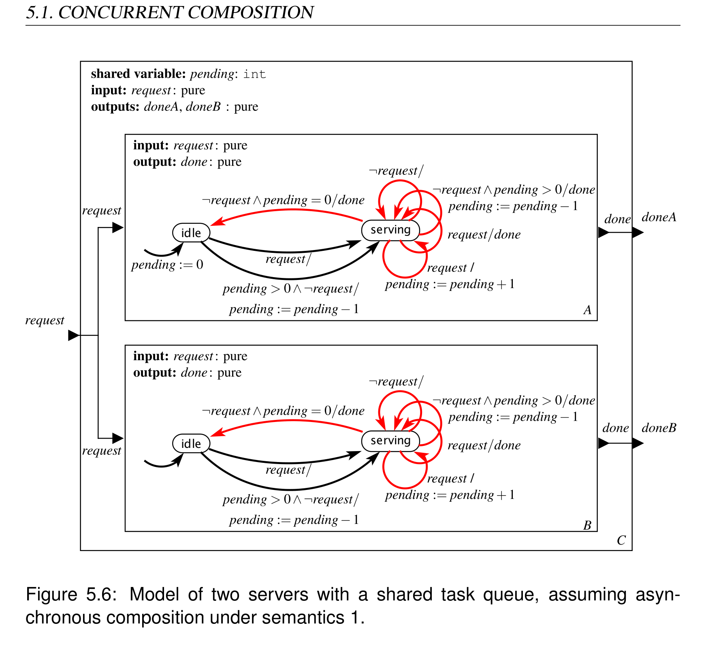
*Description*: Technical diagram and schematic model illustrating cyber-physical system behavior, algorithmic logic, and state progression for Figure 5.6: Model of two servers with a shared task queue, assuming asyn-.

> **Figure 5.6: Model of two servers with a shared task queue, assuming asyn-**

chronous composition under semantics 1.
5.1.3
Shared Variables
An extended state machine has local variables that can be read and written as part of
taking a transition. Sometimes it is useful when composing state machines to allow these
variables to be shared among a group of machines. In particular, such shared variables can
be useful for modeling interrupts, studied in Chapter 9, and threads, studied in Chapter
10. However, considerable care is required to ensure that the semantics of the model
conforms with that of the program containing interrupts or threads. Many complications
arise, including the memory consistency model and the notion of atomic operations.
116
Lee & Seshia, Introduction to Embedded Systems

<!-- Page 137 -->
### [PDF Page 137]

5. COMPOSITION OF STATE MACHINES
Example 5.6:
Consider two servers that can receive requests from a network.
Each request requires an unknown amount of time to service, so the servers share a
queue of requests. If one server is busy, the other server can respond to a request,
even if the request arrives at the network interface of the first server.
This scenario fits a pattern similar to that in Figure 5.2, where A and B are the
servers. We can model the servers as state machines as shown in Figure 5.6. In this
model, a shared variable pending counts the number of pending job requests. When
a request arrives at the composite machine C, one of the two servers is nondeter-
ministically chosen to react, assuming asynchronous composition under semantics
1. If that server is idle, then it proceeds to serve the request. If the server is serv-
ing another request, then one of two things can happen: it can coincidentally finish
serving the request it is currently serving, issuing the output done, and proceed to
serve the new one, or it can increment the count of pending requests and continue to
serve the current request. The choice between these is nondeterministic, to model
the fact that the time it takes to service a request is unknown.
If C reacts when there is no request, then again either server A or B will be selected
nondeterministically to react. If the server that reacts is idle and there are one
or more pending requests, then the server transitions to serving and decrements
the variable pending. If the server that reacts is not idle, then one of three things
can happen. It may continue serving the current request, in which case it simply
transitions on the self transition back to serving. Or it may finish serving the
request, in which case it will transition to idle if there are no pending requests, or
transition back to serving and decrement pending if there are pending requests.
The model in the previous example exhibits many subtleties of concurrent systems. First,
because of the interleaving semantics, accesses to the shared variable are atomic opera-
tions, something that is quite challenging to guarantee in practice, as discussed in Chapters
9 and 10. Second, the choice of semantics 1 is reasonable in this case because the input
goes to both of the component machines, so regardless of which component machine re-
acts, no input event will be missed. However, this semantics would not work if the two
machines had independent inputs, because then requests could be missed. Semantics 2
can help prevent that, but what strategy should be used by the environment to determine
which machine reacts? What if the two independent inputs both have requests present at
the same reaction of C? If we choose semantics 4 in the sidebar on page 115 to allow both
Lee & Seshia, Introduction to Embedded Systems
117

<!-- Page 138 -->
### [PDF Page 138]

5.1. CONCURRENT COMPOSITION
machines to react simultaneously, then what is the meaning when both machines update
the shared variable? The updates are no longer atomic, as they are with an interleaving
semantics.
Note further that choosing asynchronous composition under semantics 1 allows behaviors
that do not make good use of idle machines. In particular, suppose that machine A is
serving, machine B is idle, and a request arrives. If the nondeterministic choice results in
machine A reacting, then it will simply increment pending. Not until the nondeterministic
choice results in B reacting will the idle machine be put to use. In fact, semantics 1 allows
behaviors that never use one of the machines.
Shared variables may be used in synchronous compositions as well, but sophisticated
subtleties again emerge. In particular, what should happen if in the same reaction one ma-
chine reads a shared variable to evaluate a guard and another machine writes to the shared
variable? Do we require the write before the read? What if the transition doing the write
to the shared variable also reads the same variable in its guard expression? One possibil-
ity is to choose a synchronous interleaving semantics, where the component machines
react in arbitrary order, chosen nondeterministically. This strategy has the disadvantage
that a composition of two deterministic machines may be nondeterministic. An alterna-
tive version of the synchronous interleaving semantics has the component machines react
in a fixed order determined by the environment or by some additional mechanism such as
priority.
The difficulties of shared variables, particularly with asynchronous composition, reflect
the inherent complexity of concurrency models with shared variables. Clean solutions
require a more sophisticated semantics, to be discussed in Chapter 6. Specifically, in that
chapter, we will explain the synchronous-reactive model of computation, which gives a
synchronous composition semantics that is reasonably compositional.
So far, we have considered composition of machines that do not directly communicate.
We next consider what happens when the outputs of one machine are the inputs of another.
5.1.4
Cascade Composition
Consider two state machines A and B that are composed as shown in Figure 5.7. The
output of machine A feeds the input of B. This style of composition is called cascade
composition or serial composition.
118
Lee & Seshia, Introduction to Embedded Systems

<!-- Page 139 -->
### [PDF Page 139]

5. COMPOSITION OF STATE MACHINES
In the figure, output port o1 from A feeds events to input port i2 of B. Assume the data
type of o1 is V1 (meaning that o1 can take values from V1 or be absent), and the data type
of i2 is V2. Then a requirement for this composition to be valid is that
V1 ⊆V2 .
This asserts that any output produced by A on port o1 is an acceptable input to B on port
i2. The composition type checks.
For cascade composition, if we wish the composition to be asynchronous, then we need
to introduce some machinery for buffering the data that is sent from A to B. We defer
discussion of such asynchronous composition to Chapter 6, where dataflow and process
network models of computation will provide such asynchronous composition. In this
chapter, we will only consider synchronous composition for cascade systems.
In synchronous composition of the cascade structure of Figure 5.7, a reaction of C consists
of a reaction of both A and B, where A reacts first, produces its output (if any), and then
B reacts. Logically, we view this as occurring in zero time, so the two reactions are in a
sense simultaneous and instantaneous. But they are causally related in that the outputs
of A can affect the behavior of B.
Example 5.7: Consider the cascade composition of the two FSMs in Figure 5.8.
Assuming synchronous semantics, the meaning of a reaction of C is given in Figure
5.9. That figure makes it clear that the reactions of the two machines are simulta-
neous and instantaneous. When moving from the initial state (s1, s3) to (s2, s4)
(which occurs when the input a is absent), the composition machine C does not pass

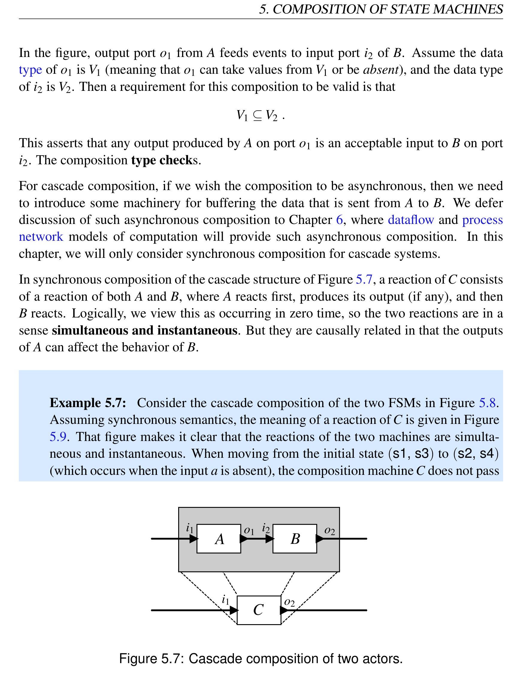
*Description*: Cyber-physical actor model block diagram showing continuous/discrete signal flows, feedback loops, and component interfaces for Figure 5.7: Cascade composition of two actors..

> **Figure 5.7: Cascade composition of two actors.**

Lee & Seshia, Introduction to Embedded Systems
119

<!-- Page 140 -->
### [PDF Page 140]

5.1. CONCURRENT COMPOSITION

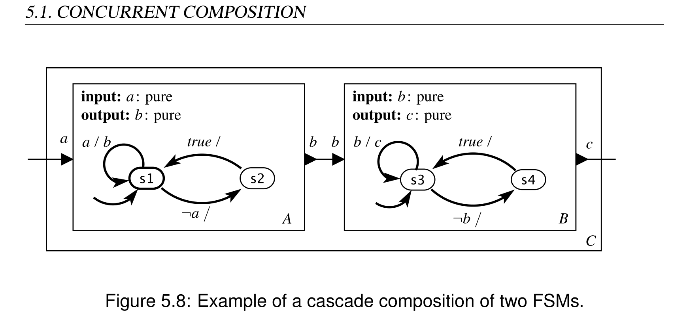
*Description*: Finite state machine (FSM) transition diagram specifying states, guard conditions, input triggers, and output actions for Figure 5.8: Example of a cascade composition of two FSMs..

> **Figure 5.8: Example of a cascade composition of two FSMs.**

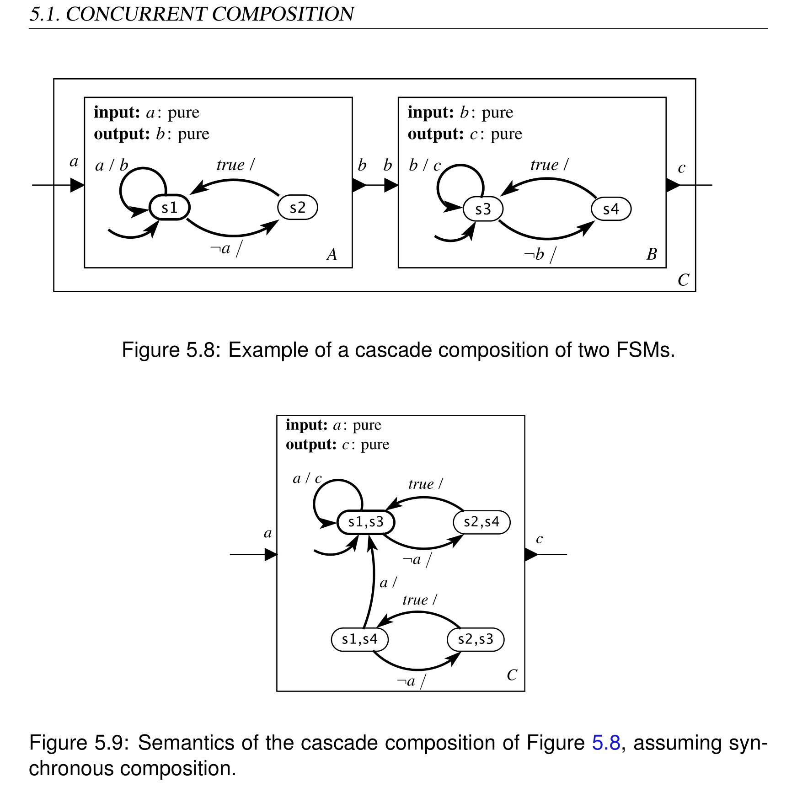
*Description*: Technical diagram and schematic model illustrating cyber-physical system behavior, algorithmic logic, and state progression for Figure 5.9: Semantics of the cascade composition of Figure 5.8, assuming syn-.

> **Figure 5.9: Semantics of the cascade composition of Figure 5.8, assuming syn-**

chronous composition.
through (s2, s3)! In fact, (s2, s3) is not a reachable state! In this way, a single
reaction of C encompasses a reaction of both A and B.
To construct the composition machine as in Figure 5.9, first form the state space as the
cross product of the state spaces of the component machines, and then determine which
120
Lee & Seshia, Introduction to Embedded Systems

<!-- Page 141 -->
### [PDF Page 141]

5. COMPOSITION OF STATE MACHINES
transitions are taken under what conditions. It is important to remember that the transi-
tions are simultaneous, even when one logically causes the other.
Example 5.8:
Recall the traffic light model of Figure 3.10. Suppose that we
wish to compose this with a model of a pedestrian crossing light, like that shown
in Figure 5.10. The output sigR of the traffic light can provide the input sigR of
the pedestrian light. Under synchronous cascade composition, the meaning of the
composite is given in Figure 5.11. Note that unsafe states, such as (green, green),
which is the state when both cars and pedestrians have a green light, are not reach-
able states, and hence are not shown.
In its simplest form, cascade composition implies an ordering of the reactions of the
components. Since this ordering is well defined, we do not have as much difficulty with
shared variables as we did with side-by-side composition. However, we will see that in
more general compositions, the ordering is not so simple.

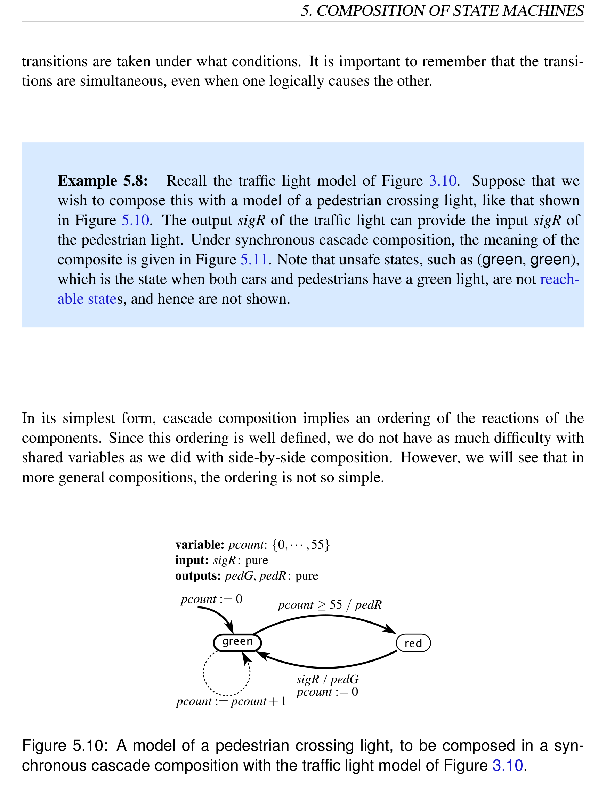
*Description*: Technical diagram and schematic model illustrating cyber-physical system behavior, algorithmic logic, and state progression for Figure 5.10: A model of a pedestrian crossing light, to be composed in a syn-.

> **Figure 5.10: A model of a pedestrian crossing light, to be composed in a syn-**

chronous cascade composition with the traffic light model of Figure 3.10.
Lee & Seshia, Introduction to Embedded Systems
121

<!-- Page 142 -->
### [PDF Page 142]

5.1. CONCURRENT COMPOSITION

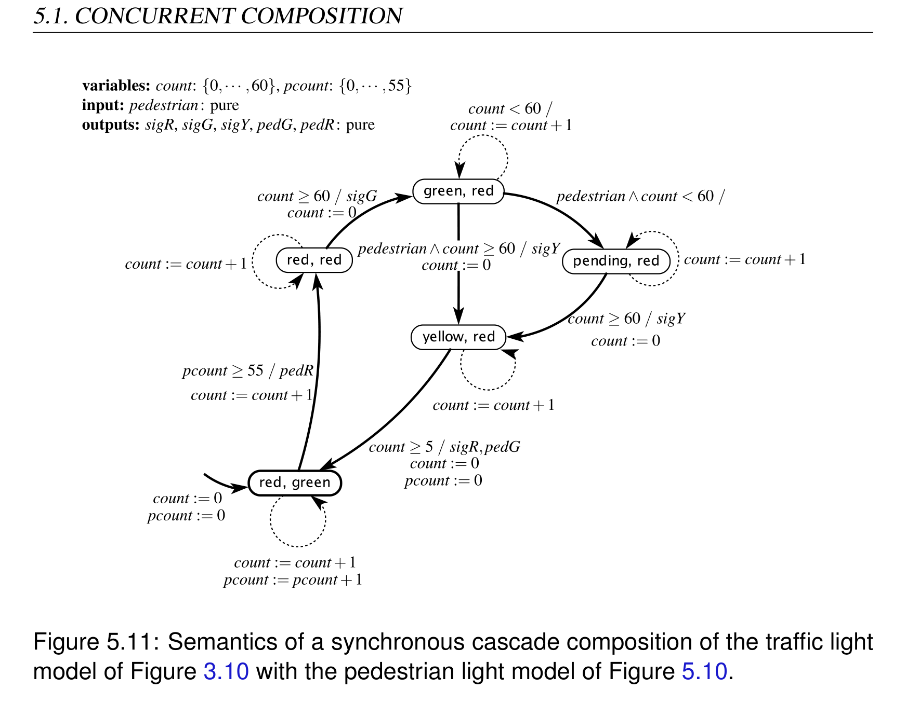
*Description*: Technical diagram and schematic model illustrating cyber-physical system behavior, algorithmic logic, and state progression for Figure 5.11: Semantics of a synchronous cascade composition of the traffic light.

> **Figure 5.11: Semantics of a synchronous cascade composition of the traffic light**

model of Figure 3.10 with the pedestrian light model of Figure 5.10.
5.1.5
General Composition
Side-by-side and cascade composition provide the basic building blocks for building more
complex compositions of machines. Consider for example the composition in Figure 5.12.
A1 and A3 are a side-by-side composition that together define a machine B. B and A2 are a
cascade composition, with B feeding events to A2. However, B and A2 are also a cascade
composition in the opposite order, with A2 feeding events to B. Cycles like this are called
feedback, and they introduce a conundrum; which machine should react first, B or A2?
This conundrum will be resolved in the next chapter when we explain the synchronous-
reactive model of computation.
122
Lee & Seshia, Introduction to Embedded Systems

<!-- Page 143 -->
### [PDF Page 143]

5. COMPOSITION OF STATE MACHINES

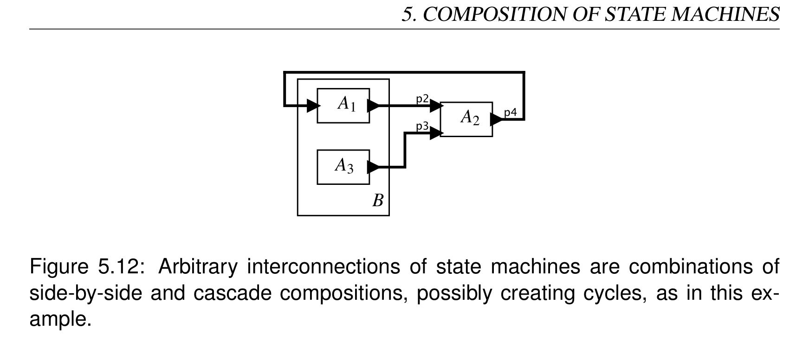
*Description*: Finite state machine (FSM) transition diagram specifying states, guard conditions, input triggers, and output actions for Figure 5.12: Arbitrary interconnections of state machines are combinations of.

> **Figure 5.12: Arbitrary interconnections of state machines are combinations of**

side-by-side and cascade compositions, possibly creating cycles, as in this ex-
ample.

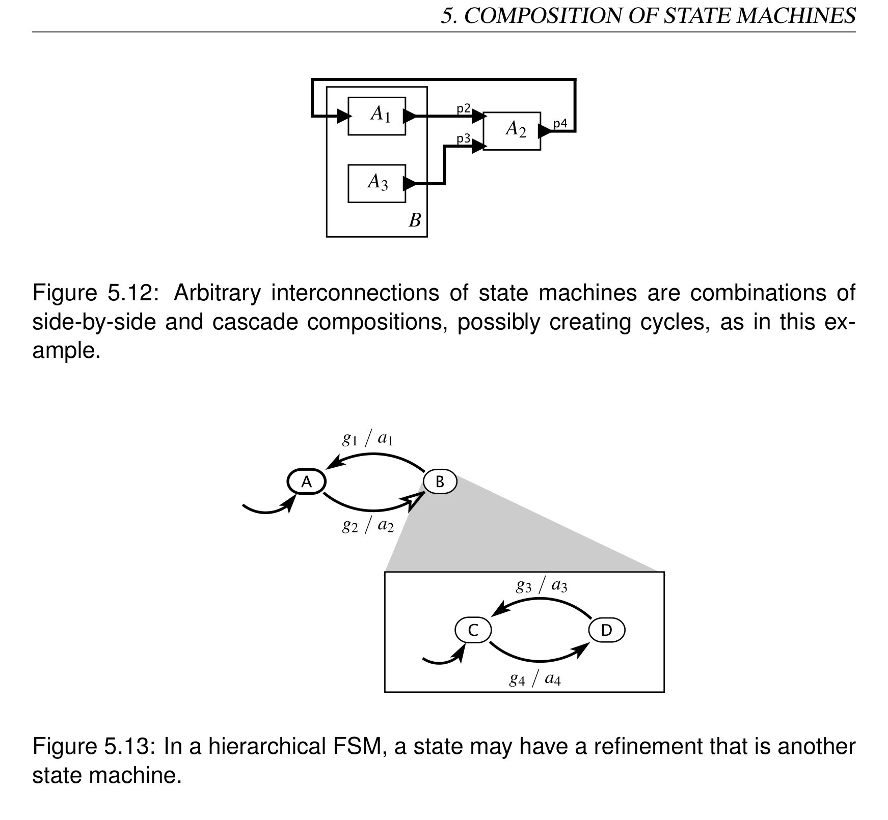
*Description*: Finite state machine (FSM) transition diagram specifying states, guard conditions, input triggers, and output actions for Figure 5.13: In a hierarchical FSM, a state may have a refinement that is another.

> **Figure 5.13: In a hierarchical FSM, a state may have a refinement that is another**

state machine.
5.2
Hierarchical State Machines
In this section, we consider hierarchical FSMs, which date back to Statecharts (Harel,
1987). There are many variants of Statecharts, often with subtle semantic differences
between them (von der Beeck, 1994). Here, we will focus on some of the simpler aspects
only, and we will pick a particular semantic variant.
The key idea in hierarchical state machines is state refinement. In Figure 5.13, state B has
a refinement that is another FSM with two states, C and D. What it means for the machine
to be in state B is that it is in one of states C or D.
Lee & Seshia, Introduction to Embedded Systems
123

<!-- Page 144 -->
### [PDF Page 144]

5.2. HIERARCHICAL STATE MACHINES

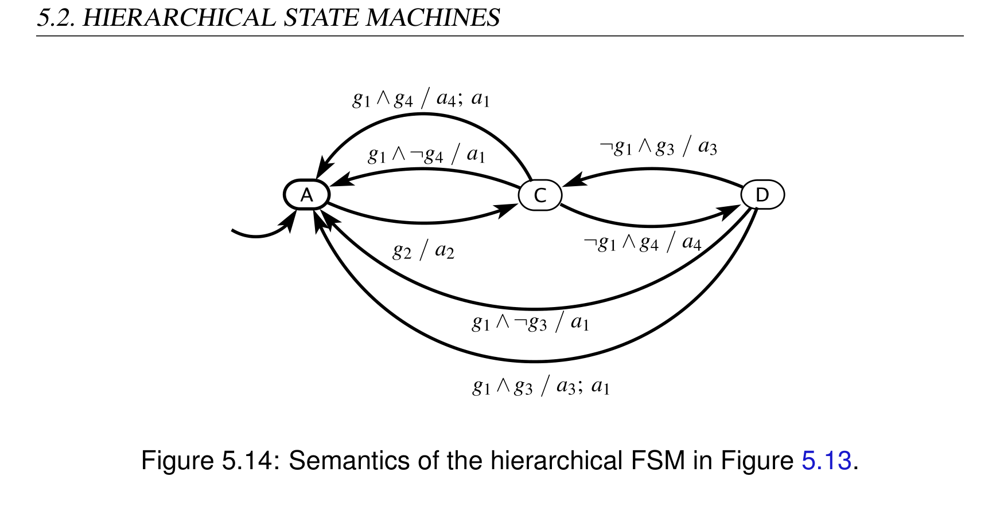
*Description*: Finite state machine (FSM) transition diagram specifying states, guard conditions, input triggers, and output actions for Figure 5.14: Semantics of the hierarchical FSM in Figure 5.13..

> **Figure 5.14: Semantics of the hierarchical FSM in Figure 5.13.**

The meaning of the hierarchy in Figure 5.13 can be understood by comparing it to the
equivalent flattened FSM in Figure 5.14. The machine starts in state A. When guard g2
evaluates to true, the machine transitions to state B, which means a transition to state C,
the initial state of the refinement. Upon taking this transition to C, the machine performs
action a2, which may produce an output event or set a variable (if this is an extended state
machine).
There are then two ways to exit C. Either guard g1 evaluates to true, in which case the
machine exits B and returns to A, or guard g4 evaluates to true and the machine transitions
to D. A subtle question is what happens if both guards g1 and g4 evaluate to true. Different
variants of Statecharts may make different choices at this point. It seems reasonable that
the machine should end up in state A, but which of the actions should be performed, a4,
a1, or both? Such subtle questions help account for the proliferation of different variants
of Statecharts.
We choose a particular semantics that has attractive modularity properties (Lee and Tri-
pakis, 2010). In this semantics, a reaction of a hierarchical FSM is defined in a depth-first
fashion. The deepest refinement of the current state reacts first, then its container state
machine, then its container, etc. In Figure 5.13, this means that if the machine is in state
B (which means that it is in either C or D), then the refinement machine reacts first. If
it is C, and guard g4 is true, the transition is taken to D and action a4 is performed. But
then, as part of the same reaction, the top-level FSM reacts. If guard g1 is also true, then
the machine transitions to state A. It is important that logically these two transitions are
simultaneous and instantaneous, so the machine does not actually go to state D. Nonethe-
124
Lee & Seshia, Introduction to Embedded Systems

<!-- Page 145 -->
### [PDF Page 145]

5. COMPOSITION OF STATE MACHINES

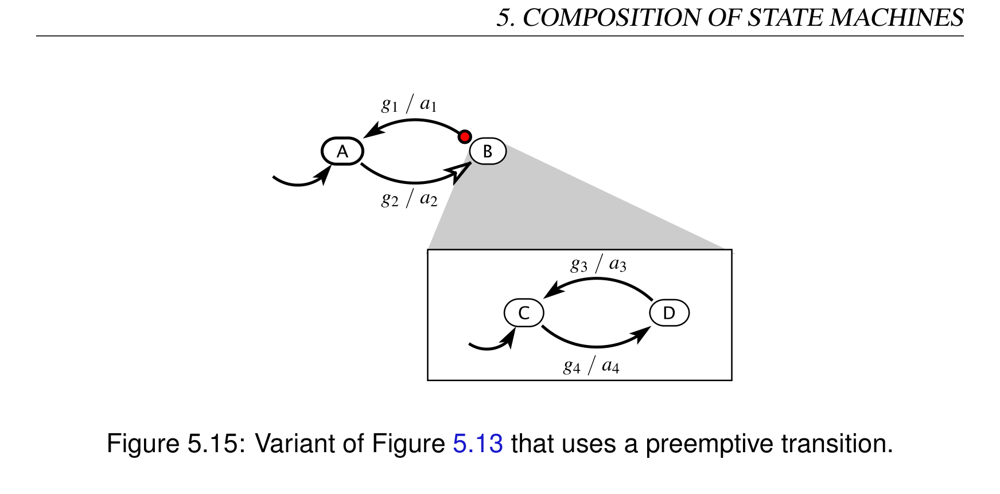
*Description*: Finite state machine (FSM) transition diagram specifying states, guard conditions, input triggers, and output actions for Figure 5.15: Variant of Figure 5.13 that uses a preemptive transition..

> **Figure 5.15: Variant of Figure 5.13 that uses a preemptive transition.**

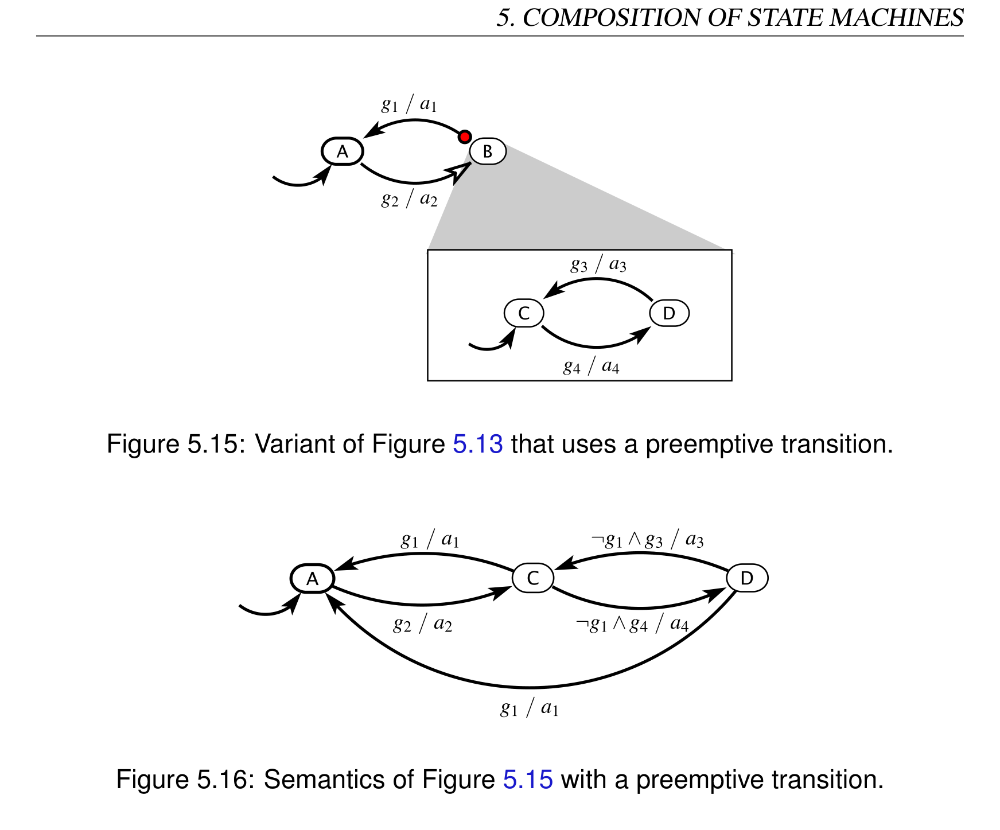
*Description*: Finite state machine (FSM) transition diagram specifying states, guard conditions, input triggers, and output actions for Figure 5.16: Semantics of Figure 5.15 with a preemptive transition..

> **Figure 5.16: Semantics of Figure 5.15 with a preemptive transition.**

less, action a4 is performed, and so is action a1. This combination corresponds to the
topmost transition of Figure 5.14.
Another subtlety that arises is that if two actions are performed in the same reaction, they
may conflict. For example, two actions may write different values to the same output
port. Or they may set the same variable to different values. Our choice is that the actions
are performed in sequence, as suggested by the semicolon in the action a4; a1. As in
an imperative language like C, the semicolon denotes a sequence. As with an imperative
language, if the two actions conflict, the later one dominates.
Such subtleties can be avoided by using a preemptive transition, shown in Figure 5.15,
which has the semantics shown in Figure 5.16. The guards of a preemptive transition are
evaluated before the refinement reacts, and if any guard evaluates to true, the refinement
does not react. As a consequence, if the machine is in state B and g1 is true, then neither
Lee & Seshia, Introduction to Embedded Systems
125

<!-- Page 146 -->
### [PDF Page 146]

5.2. HIERARCHICAL STATE MACHINES

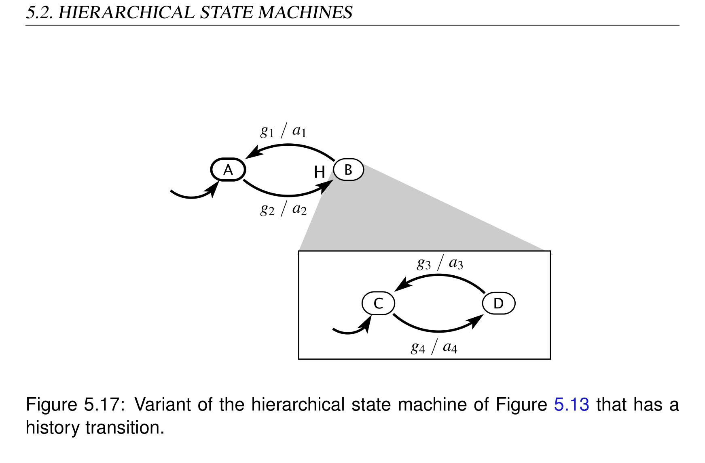
*Description*: Finite state machine (FSM) transition diagram specifying states, guard conditions, input triggers, and output actions for Figure 5.17: Variant of the hierarchical state machine of Figure 5.13 that has a.

> **Figure 5.17: Variant of the hierarchical state machine of Figure 5.13 that has a**

history transition.
action a3 nor a4 is performed. A preemptive transition is shown with a (red) circle at the
originating end of the transition.
Notice in Figures 5.13 and 5.14 that whenever the machine enters B, it always enters C,
never D, even if it was previously in D when leaving B. The transition from A to B is
called a reset transition because the destination refinement is reset to its initial state,
regardless of where it had previously been. A reset transition is indicated in our notation
with a hollow arrowhead at the destination end of a transition.
In Figure 5.17, the transition from A to B is a history transition, an alternative to a reset
transition. In our notation, a solid arrowhead denotes a history transition. It may also
be marked with an “H” for emphasis. When a history transition is taken, the destination
refinement resumes in whatever state it was last in (or its initial state on the first entry).
The semantics of the history transition is shown in Figure 5.18. The initial state is labeled
(A, C) to indicate that the machine is in state A, and if and when it next enters B it will
go to C. The first time it goes to B, it will be in the state labeled (B, C) to indicate that it
is in state B and, more specifically, C. If it then transitions to (B, D), and then back to A,
it will end up in the state labeled (A, D), which means it is in state A, but if and when it
126
Lee & Seshia, Introduction to Embedded Systems

<!-- Page 147 -->
### [PDF Page 147]

5. COMPOSITION OF STATE MACHINES

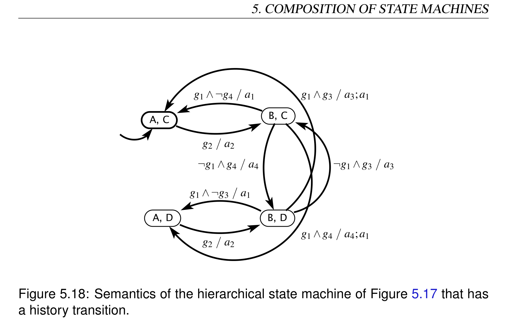
*Description*: Finite state machine (FSM) transition diagram specifying states, guard conditions, input triggers, and output actions for Figure 5.18: Semantics of the hierarchical state machine of Figure 5.17 that has.

> **Figure 5.18: Semantics of the hierarchical state machine of Figure 5.17 that has**

a history transition.
next enters B it will go to D. That is, it remembers the history, specifically where it was
when it left B.
As with concurrent composition, hierarchical state machines admit many possible mean-
ings. The differences can be subtle. Considerable care is required to ensure that models
are clear and that their semantics match what is being modeled.
5.3

### Summary

Any well-engineered system is a composition of simpler components. In this chapter, we
have considered two forms of composition of state machines, concurrent composition and
hierarchical composition.
For concurrent composition, we introduced both synchronous and asynchronous compo-
sition, but did not complete the story. We have deferred dealing with feedback to the
next chapter, because for synchronous composition, significant subtleties arise. For asyn-
chronous composition, communication via ports requires additional mechanisms that are
not (yet) part of our model of state machines. Even without communication via ports,
Lee & Seshia, Introduction to Embedded Systems
127

<!-- Page 148 -->
### [PDF Page 148]

5.3. SUMMARY
significant subtleties arise because there are several possible semantics for asynchronous
composition, and each has strengths and weaknesses. One choice of semantics may be
suitable for one application and not for another. These subtleties motivate the topic of the
next chapter, which provides more structure to concurrent composition and resolves most
of these questions (in a variety of ways).
For hierarchical composition, we focus on a style originally introduced by Harel (1987)
known as Statecharts. We specifically focus on the ability for states in an FSM to have
refinements that are themselves state machines. The reactions of the refinement FSMs are
composed with those of the machine that contains the refinements. As usual, there are
many possible semantics.
128
Lee & Seshia, Introduction to Embedded Systems

<!-- Page 149 -->
### [PDF Page 149]

5. COMPOSITION OF STATE MACHINES

### Exercises

1. Consider the extended state machine model of Figure 3.8, the garage counter. Sup-
pose that the garage has two distinct entrance and exit points. Construct a side-by-
side concurrent composition of two counters that share a variable c that keeps track
of the number of cars in the garage. Specify whether you are using synchronous or
asynchronous composition, and define exactly the semantics of your composition
by giving a single machine modeling the composition. If you choose synchronous
semantics, explain what happens if the two machines simultaneously modify the
shared variable. If you choose asynchronous composition, explain precisely which
variant of asynchronous semantics you have chosen and why. Is your composition
machine deterministic?
2. For semantics 2 in Section 5.1.2, give the five tuple for a single machine represent-
ing the composition C,
(StatesC,InputsC,OutputsC,updateC,initialStateC)
for the side-by-side asynchronous composition of two state machines A and B. Your
answer should be in terms of the five-tuple definitions for A and B,
(StatesA,InputsA,OutputsA,updateA,initialStateA)
and
(StatesB,InputsB,OutputsB,updateB,initialStateB)
3. Consider the following synchronous composition of two state machines A and B:
Lee & Seshia, Introduction to Embedded Systems
129

<!-- Page 150 -->
### [PDF Page 150]

### EXERCISES

Construct a single state machine C representing the composition. Which states of
the composition are unreachable?
4. Consider the following hierarchical state machine:
Construct an equivalent flat FSM giving the semantics of the hierarchy. Describe
in words the input/output behavior of this machine. Is there a simpler machine
that exhibits the same behavior? (Note that equivalence relations between state
machines are considered in Chapter 13, but here, you can use intuition and just
consider what the state machine does when it reacts.)
130
Lee & Seshia, Introduction to Embedded Systems

