# Chapter 6: Concurrent Models of Computation

> **Textbook**: Introduction to Embedded Systems - A Cyber-Physical Systems Approach (UC Berkeley)  
> **Authors**: Edward Ashford Lee and Sanjit Arunkumar Seshia  
> **PDF Page Range**: 151 - 192

---

<!-- Page 151 -->
### [PDF Page 151]

6
Concurrent
Models of Computation
Contents
6.1
Structure of Models . . . . . . . . . . . . . . . . . . . . . . . . . . 133
6.2
Synchronous-Reactive Models
. . . . . . . . . . . . . . . . . . . . 134

### Sidebar: Actor Networks as a System of Equations

. . . . . . . . . . 135

### Sidebar: Fixed-Point Semantics

. . . . . . . . . . . . . . . . . . . . 136
6.2.1
Feedback Models . . . . . . . . . . . . . . . . . . . . . . . . 137
6.2.2
Well-Formed and Ill-Formed Models
. . . . . . . . . . . . . 139
6.2.3
Constructing a Fixed Point . . . . . . . . . . . . . . . . . . . 140

### Sidebar: Synchronous-Reactive Languages

. . . . . . . . . . . . . . 143
6.3
Dataflow Models of Computation . . . . . . . . . . . . . . . . . . . 144
6.3.1
Dataflow Principles . . . . . . . . . . . . . . . . . . . . . . . 144
6.3.2
Synchronous Dataflow . . . . . . . . . . . . . . . . . . . . . 147
6.3.3
Dynamic Dataflow . . . . . . . . . . . . . . . . . . . . . . . 151
6.3.4
Structured Dataflow
. . . . . . . . . . . . . . . . . . . . . . 153
6.3.5
Process Networks . . . . . . . . . . . . . . . . . . . . . . . . 155
6.4
Timed Models of Computation . . . . . . . . . . . . . . . . . . . . 156
6.4.1
Time-Triggered Models
. . . . . . . . . . . . . . . . . . . . 157

### Sidebar: Petri Nets . . . . . . . . . . . . . . . . . . . . . . . . . . . 158

### Sidebar: Models of Time . . . . . . . . . . . . . . . . . . . . . . . . 159

6.4.2
Discrete Event Systems . . . . . . . . . . . . . . . . . . . . . 160
6.4.3
Continuous-Time Systems . . . . . . . . . . . . . . . . . . . 162

### Sidebar: Probing Further: Discrete Event Semantics . . . . . . . . . 162

6.5

### Summary . . . . . . . . . . . . . . . . . . . . . . . . . . . . . . . . 166

### Exercises . . . . . . . . . . . . . . . . . . . . . . . . . . . . . . . . . . . 167

131

<!-- Page 152 -->
### [PDF Page 152]

In sound engineering practice, systems are built by composing components. In order for
the composition to be well understood, we need first for the individual components to be
well understood, and then for the meaning of the interaction between components to be
well understood. The previous chapter dealt with composition of finite state machines.
With such composition, the components are well defined (they are FSMs), but there are
many possible interpretations for the interaction between components. The meaning of a
composition is referred to as its semantics.
This chapter focuses on the semantics of concurrent composition. The word “concurrent”
literally means “running together.” A system is said to be concurrent if different parts of
the system (components) conceptually operate at the same time. There is no particular
order to their operations. The semantics of such concurrent operation can be quite subtle,
however.
The components we consider in this chapter are actors, which react to stimuli at input
ports and produce stimuli on output ports. In this chapter, we will be only minimally
concerned with how the actors themselves are defined. They may be FSMs, hardware,
or programs specified in an imperative programming language. We will need to impose
some constraints on what these actors can do, but we need not constrain how they are
specified.
The semantics of a concurrent composition of actors is governed by three sets of rules that
we collectively call a model of computation (MoC). The first set of rules specifies what
constitutes a component. The second set specifies the concurrency mechanisms. The third
specifies the communication mechanisms.
In this chapter, a component will be an actor with ports and a set of execution actions.
The ports will be interconnected to provide for communication between actors, and the
execution actions will be invoked by the environment of the actor to cause the actor to
perform its function. For example, for FSMs, one action is provided that causes a reac-
tion. The focus of this chapter is on introducing a few of the possible concurrency and
communication mechanisms that can govern the interactions between such actors.
We begin by laying out the common structure of models that applies to all MoCs studied
in this chapter. We then proceed to describe a suite of MoCs.
132
Lee & Seshia, Introduction to Embedded Systems

<!-- Page 153 -->
### [PDF Page 153]

6. CONCURRENT MODELS OF COMPUTATION

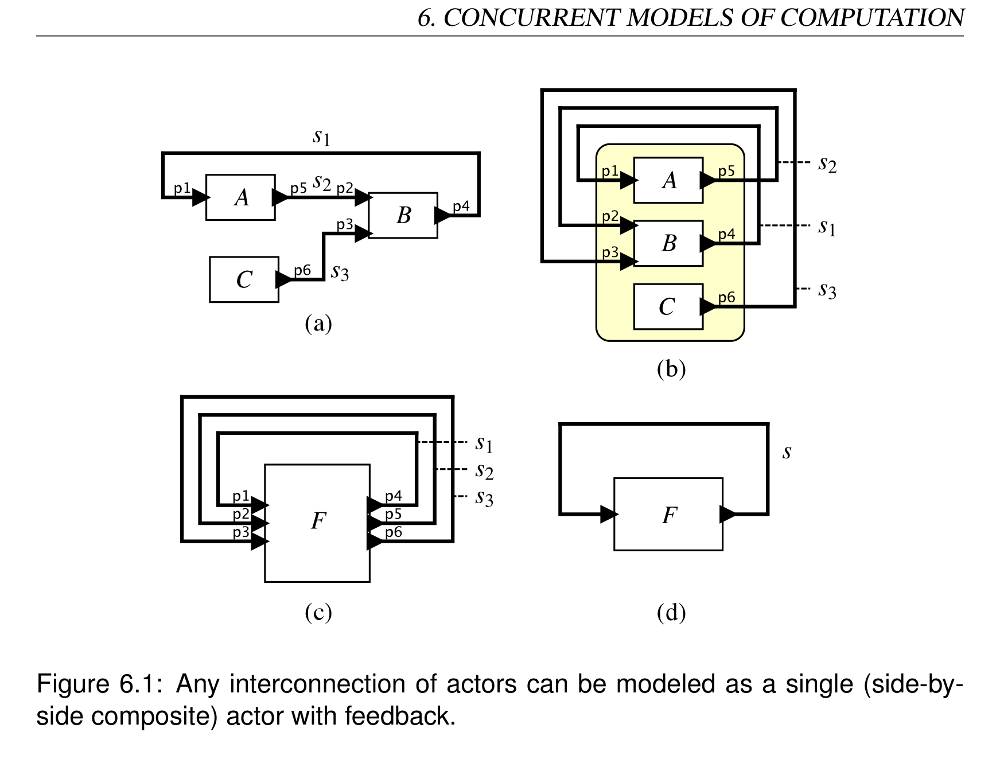
*Description*: Cyber-physical actor model block diagram showing continuous/discrete signal flows, feedback loops, and component interfaces for Figure 6.1: Any interconnection of actors can be modeled as a single (side-by-.

> **Figure 6.1: Any interconnection of actors can be modeled as a single (side-by-**

side composite) actor with feedback.
6.1
Structure of Models
In this chapter, we assume that models consist of fixed interconnections of actors like
that shown in Figure 6.1(a). The interconnections between actors specify communication
paths. The communication itself takes the form of a signal, which consists of one or more
communication events. For the discrete signals of Section 3.1, for example, a signal s
has the form of a function
s: R →Vs ∪{absent},
where Vs is a set of values called the type of the signal s. A communication event in this
case is a non-absent value of s.
Example 6.1: Consider a pure signal s that is a discrete signal given by
s(t) =
 present
if t is a multiple of P
absent
otherwise
Lee & Seshia, Introduction to Embedded Systems
133

<!-- Page 154 -->
### [PDF Page 154]

6.2. SYNCHRONOUS-REACTIVE MODELS
for all t ∈R and some P ∈R. Such a signal is called a clock signal with period P.
Communication events occur every P time units.
In Chapter 2, a continuous-time signal has the form of a function
s: R →Vs,
in which case every one of the (uncountably) infinite set of values s(t), for all t ∈R, is a
communication event. In this chapter, we will also encounter signals of the form
s: N →Vs,
where there is no time line. The signal is simply a sequence of values.
A communication event has a type, and we require that a connection between actors type
check. That is, if an output port y with type Vy is connected to an input port x with type
Vx, then
Vy ⊆Vx.
As suggested in Figure 6.1(b-d), any actor network can be reduced to a rather simple form.
If we rearrange the actors as shown in Figure 6.1(b), then the actors form a side-by-side
composition indicated by the box with rounded corners. This box is itself an actor F as
shown in Figure 6.1(c) whose input is a three-tuple (s1,s2,s3) of signals and whose output
is the same three-tuple of signals. If we let s = (s1,s2,s3), then the actor can be depicted
as in Figure 6.1(d), which hides all the complexity of the model.
Notice that Figure 6.1(d) is a feedback system. By following the procedure that we used
to build it, every interconnection of actors can be structured as a similar feedback system
(see Exercise 1).
6.2
Synchronous-Reactive Models
In Chapter 5 we studied synchronous composition of state machines, but we avoided the
nuances of feedback compositions. For a model described as the feedback system of

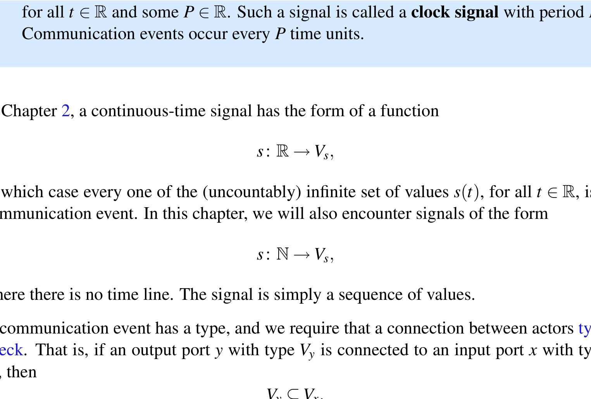
*Description*: Technical diagram and schematic model illustrating cyber-physical system behavior, algorithmic logic, and state progression for Figure 6.1: (d), the conundrum discussed in Section 5.1.5 takes a particularly simple form..

> **Figure 6.1: (d), the conundrum discussed in Section 5.1.5 takes a particularly simple form.**

If F in Figure 6.1(d) is realized by a state machine, then in order for it to react, we need
to know its inputs at the time of the reaction. But its inputs are the same as its outputs, so
134
Lee & Seshia, Introduction to Embedded Systems

<!-- Page 155 -->
### [PDF Page 155]

6. CONCURRENT MODELS OF COMPUTATION
in order for F to react, we need to know its outputs. But we cannot know its outputs until
after it reacts.
Actor Networks as a System of Equations
In a model, if the actors are determinate, then each actor is a function that maps input
signals to output signals. For example, in Figure 6.1(a), actor A may be a function relating
signals s1 and s2 as follows,
s2 = A(s1).
Similarly, actor B relates three signals by
s1 = B(s2,s3).
Actor C is a bit more subtle, since it has no input ports. How can it be a function? What
is the domain of the function? If the actor is determinate, then its output signal s3 is a
constant signal. The function C needs to be a constant function, one that yields the same
output for every input. A simple way to ensure this is to define C so that its domain is a
singleton set (a set with only one element). Let {/0} be the singleton set, so C can only be
applied to /0. The function C is then given by
C(/0) = s3.
Hence, Figure 6.1(a) gives a system of equations
s1
=
B(s2,s3)
s2
=
A(s1)
s3
=
C(/0).
The semantics of such a model, therefore, is a solution to such a system of equations. This
can be represented compactly using the function F in Figure 6.1(d), which is
F(s1,s2,s3) = (B(s2,s3),A(s1),C(/0)).
All actors in Figure 6.1(a) have output ports; if we had an actor with no output port,
then we could similarly define it as a function whose codomain is {/0}. The output of
such function is /0 for all inputs.
Lee & Seshia, Introduction to Embedded Systems
135

<!-- Page 156 -->
### [PDF Page 156]

6.2. SYNCHRONOUS-REACTIVE MODELS
Fixed-Point Semantics
In a model, if the actors are determinate, then each actor is a function that maps input
signals to output signals. The semantics of such a model is a system of equations (see

### sidebar on page 135) and the reduced form of Figure 6.1(d) becomes

s = F(s),
(6.1)
where s = (s1,s2,s3). Of course, this equation only looks simple. Its complexity lies in
the definition of the function F and the structure of the domain and range of F.
Given any function F : X →X for any set X, if there is an x ∈X such that F(x) = x,
then x is called a fixed point. Equation (6.1) therefore asserts that the semantics of a
determinate actor network is a fixed point. Whether a fixed point exists, whether the fixed
point is unique, and how to find the fixed point, all become interesting questions that are
central to the model of computation.
In the SR model of computation, the execution of all actors is simultaneous and instan-
taneous and occurs at ticks of the global clock. If the actor is determinate, then each such
execution implements a function called a firing function. For example, in the n-th tick of
the global clock, actor A in Figure 6.1 implements a function of the form
an : V1 ∪{absent} →V2 ∪{absent}
where Vi is the type of signal si. Hence, if si(n) is the value of si at the n-th tick, then
s2(n) = an(s1(n)).
Given such a firing function fn for each actor F we can, just as in Figure 6.1(d) define the
execution at a single tick by a fixed point,
s(n) = fn(s(n)),
where s(n) = (s1(n),s2(n),s3(n)) and fn is a function is given by
fn(s1(n),s2(n),s3(n)) = (bn(s2(n),s3(n)),an(s1(n)),cn(/0)).
Thus, for SR, the semantics at each tick of the global clock is a fixed point of the function
fn, just as its execution over all ticks is a fixed point of the function F.
136
Lee & Seshia, Introduction to Embedded Systems

<!-- Page 157 -->
### [PDF Page 157]

6. CONCURRENT MODELS OF COMPUTATION

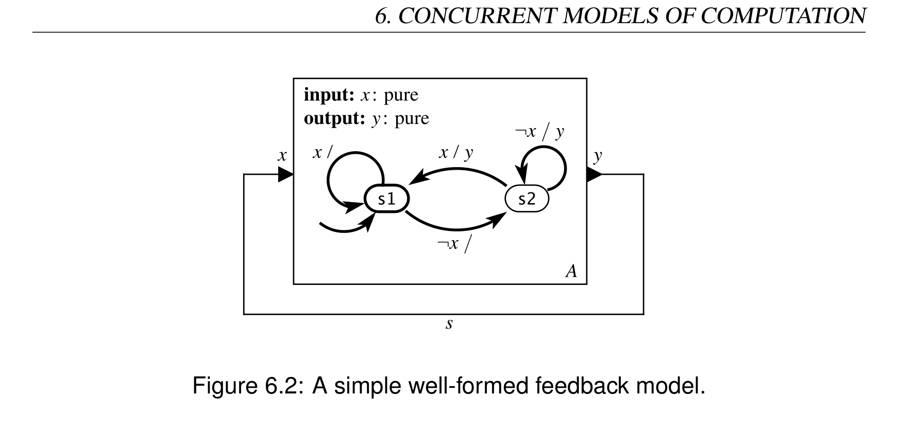
*Description*: Technical diagram and schematic model illustrating cyber-physical system behavior, algorithmic logic, and state progression for Figure 6.2: A simple well-formed feedback model..

> **Figure 6.2: A simple well-formed feedback model.**

As shown in Section 6.1 above and Exercise 1, all actor networks can be viewed as feed-
back systems, so we really do have to resolve the conundrum. We do that now by giving
a model of computation known as the synchronous-reactive (SR) MoC.
An SR model is a discrete system where signals are absent at all times except (possibly)
at ticks of a global clock. Conceptually, execution of a model is a sequence of global
reactions that occur discrete times, and at each such reaction, the reaction of all actors is
simultaneous and instantaneous.
6.2.1
Feedback Models
We focus first on feedback models of the form of Figure 6.1(d), where F in the figure is
realized as a state machine. At the n-th tick of the global clock, we have to find the value
of the signal s so that it is both a valid input and a valid output of the state machine, given
its current state. Let s(n) denote the value of the signal s at the n-th reaction. The goal is
to determine, at each tick of the global clock, the value of s(n).
Example 6.2:
Consider first a simpler example shown in Figure 6.2. (This is
simpler than Figure 6.1(d) because the signal s is a single pure signal rather than an
aggregation of three signals.) If A is in state s1 when that reaction occurs, then the
only possible value for s(n) is s(n) = absent because a reaction must take one of
the transitions out of s1, and both of these transitions emit absent. Moreover, once
Lee & Seshia, Introduction to Embedded Systems
137

<!-- Page 158 -->
### [PDF Page 158]

6.2. SYNCHRONOUS-REACTIVE MODELS

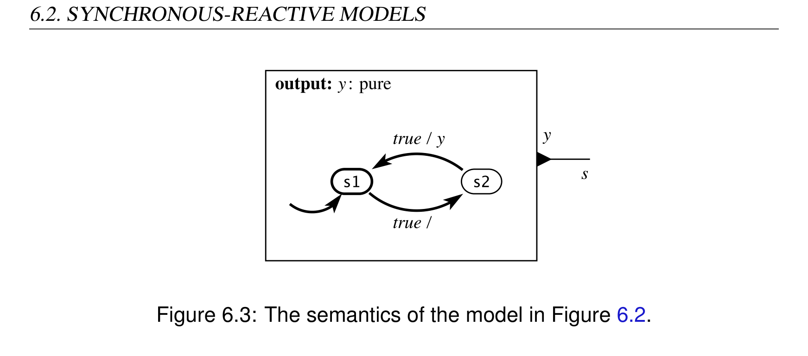
*Description*: Technical diagram and schematic model illustrating cyber-physical system behavior, algorithmic logic, and state progression for Figure 6.3: The semantics of the model in Figure 6.2..

> **Figure 6.3: The semantics of the model in Figure 6.2.**

we know that s(n) = absent, we know that the input port x has value absent, so we
can determine that A will transition to state s2.
If A is in state s2 when the reaction occurs, then the only possible value for s(n) is
s(n) = present, and the machine will transition to state s1. Therefore, s alternates
between absent and present. The semantics of machine A in the feedback model is
therefore given by Figure 6.3.
In the previous example, it is important to note that the input x and output y have the
same value in every reaction. This is what is meant by the feedback connection. Any
connection from an output port to an input port means that the value at the input port is
the same as the value at the output port at all times.
Given a deterministic state machine in a feedback model like that of Figure 6.2, in each
state i we can define a function ai that maps input values to output values,
ai : {present,absent} →{present,absent},
where the function depends on the state the machine is in. This function is defined by the
update function.
Example 6.3:
For the example in Figure 6.2, if the machine is in state s1, then
as1(x) = absent for all x ∈{present,absent}.
138
Lee & Seshia, Introduction to Embedded Systems

<!-- Page 159 -->
### [PDF Page 159]

6. CONCURRENT MODELS OF COMPUTATION

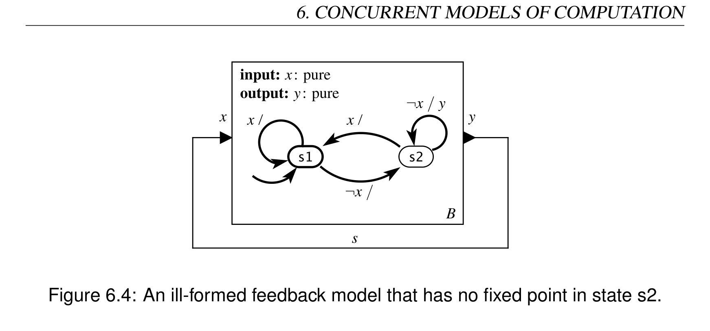
*Description*: Technical diagram and schematic model illustrating cyber-physical system behavior, algorithmic logic, and state progression for Figure 6.4: An ill-formed feedback model that has no fixed point in state s2..

> **Figure 6.4: An ill-formed feedback model that has no fixed point in state s2.**

The function ai is called the firing function for state i (see box on page 136). Given a
firing function, to find the value s(n) at the n-th reaction, we simply need to find a value
s(n) such that
s(n) = ai(s(n)).
Such a value s(n) is called a fixed point of the function ai. It is easy to see how to
generalize this so that the signal s can have any type. Signal s can even be an aggregation
of signals, as in Figure 6.1(d) (see box on page 136).
6.2.2
Well-Formed and Ill-Formed Models
There are two potential problems that may occur when seeking a fixed point. First, there
may be no fixed point. Second, there may be more than one fixed point. If either case
occurs in a reachable state, we call the system ill formed. Otherwise, it is well formed.
Example 6.4:
Consider machine B shown in Figure 6.4. In state s1, we get the
unique fixed point s(n) = absent. In state s2, however, there is no fixed point. If
we attempt to choose s(n) = present, then the machine will transition to s1 and its
output will be absent. But the output has to be the same as the input, and the input
is present, so we get a contradiction. A similar contradiction occurs if we attempt
to choose s(n) = absent.
Since state s2 is reachable, this feedback model is ill formed.
Lee & Seshia, Introduction to Embedded Systems
139

<!-- Page 160 -->
### [PDF Page 160]

6.2. SYNCHRONOUS-REACTIVE MODELS

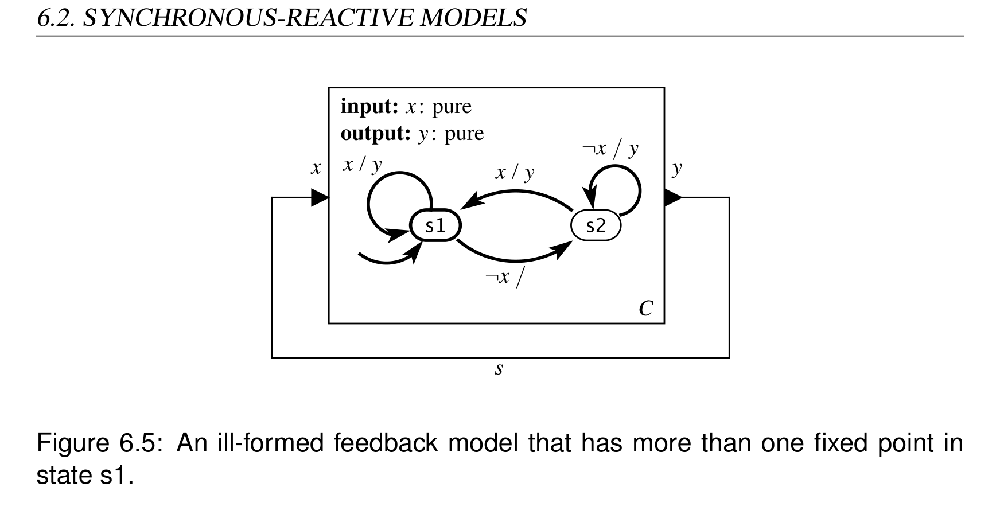
*Description*: Technical diagram and schematic model illustrating cyber-physical system behavior, algorithmic logic, and state progression for Figure 6.5: An ill-formed feedback model that has more than one fixed point in.

> **Figure 6.5: An ill-formed feedback model that has more than one fixed point in**

state s1.
Example 6.5: Consider machine C shown in Figure 6.5. In state s1, both s(n) =
absent and s(n) = present are fixed points. Either choice is valid. Since state s1 is
reachable, this feedback model is ill formed.
If in a reachable state there is more than one fixed point, we declare the machine to be
ill formed. An alternative semantics would not reject such a model, but rather would de-
clare it to be nondeterministic. This would be a valid semantics, but it would have the
disadvantage that a composition of deterministic state machines is not assured of being
deterministic. In fact, C in Figure 6.5 is deterministic, and under this alternative seman-
tics, the feedback composition in the figure would not be deterministic. Determinism
would not be a compositional property. Hence, we prefer to reject such models.
6.2.3
Constructing a Fixed Point
If the type Vs of the signal s or the signals it is an aggregate of is finite, then one way to find
a fixed point is by exhaustive search, which means to try all values. If exactly one fixed
point is found, then the model is well formed. However, exhaustive search is expensive
(and impossible if the types are not finite). We can develop instead a systematic procedure
140
Lee & Seshia, Introduction to Embedded Systems

<!-- Page 161 -->
### [PDF Page 161]

6. CONCURRENT MODELS OF COMPUTATION

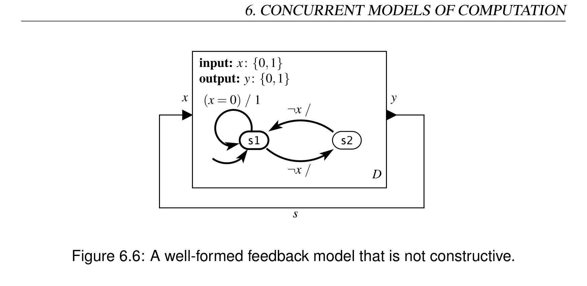
*Description*: Technical diagram and schematic model illustrating cyber-physical system behavior, algorithmic logic, and state progression for Figure 6.6: A well-formed feedback model that is not constructive..

> **Figure 6.6: A well-formed feedback model that is not constructive.**

that for most, but not all, well-formed models will find a fixed point. The procedure is as
follows. For each reachable state i,
1. Start with s(n) unknown.
2. Determine as much as you can about fi(s(n)), where fi is the firing function in state
i.
3. Repeat step 2 until all values in s(n) become known (whether they are present and
what their values are), or until no more progress can be made.
4. If unknown values remain, then reject the model.
This procedure may reject models that have a unique fixed point, as illustrated by the
following example.
Example 6.6: Consider machine D shown in Figure 6.6. In state s1, if the input
is unknown, we cannot immediately tell what the output will be. We have to try all
the possible values for the input to determine that in fact s(n) = absent for all n.
A state machine for which the procedure works in all reachable states is said to be
constructive (Berry, 1999). The example in Figure 6.6 is not constructive. For non-
constructive machines, we are forced to do exhaustive search or to invent some more
Lee & Seshia, Introduction to Embedded Systems
141

<!-- Page 162 -->
### [PDF Page 162]

6.2. SYNCHRONOUS-REACTIVE MODELS
elaborate solution technique. Since exhaustive search is often too expensive for practical
use, many SR languages and modeling tools (see box on page 143) reject non-constructive
models.
Step 2 of the above procedure is key. How exactly can we determine the outputs if the
inputs are not all known? This requires what is called a must-may analysis of the model.
Examining the machine, we can determine what must be true of the outputs and what may
be true of the outputs.
Example 6.7: The model in Figure 6.2 is constructive. In state s1, we can imme-
diately determine that the machine may not produce an output. Therefore, we can
immediately conclude that the output is absent, even though the input is unknown.
Of course, once we have determined that the output is absent, we now know that
the input is absent, and hence the procedure concludes.
In state s2, we can immediately determine that the machine must produce an output,
so we can immediately conclude that the output is present.
The above procedure can be generalized to an arbitrary model structure. Consider for
example Figure 6.1(a). There is no real need to convert it to the form of Figure 6.1(d).
Instead, we can just begin by labeling all signals unknown, and then in arbitrary order,
examine each actor to determine whatever can be determined about the outputs, given its
initial state. We repeat this until no further progress can be made, at which point either all
signals become known, or we reject the model as either ill-formed or non-constructive.
Once we know all signals, then all actors can make state transitions, and we repeat the
procedure in the new state for the next reaction.
The constructive procedure above can be adapted to support nondeterministic machines
(see Exercise 4). But now, things become even more subtle, and there are variants to the
semantics. One way to handle nondeterminism is that when executing the constructive
procedure, when encountering a nondeterministic choice, make an arbitrary choice. If
the result leads to a failure of the procedure to find a fixed point, then we could either
reject the model (not all choices lead to a well-formed or constructive model) or reject the
choice and try again.
In the SR model of computation, actors react simultaneously and instantaneously, at least
conceptually. Achieving this with realistic computation requires tight coordination of
142
Lee & Seshia, Introduction to Embedded Systems

<!-- Page 163 -->
### [PDF Page 163]

6. CONCURRENT MODELS OF COMPUTATION
the computation. We consider next a family of models of computation that require less
coordination.
Synchronous-Reactive Languages
The synchronous-reactive MoC has a history dating at least back to the mid 1980s when
a suite of programming languages were developed. The term “reactive” comes from a
distinction in computational systems between transformational systems, which accept
input data, perform computation, and produce output data, and reactive systems, which
engage in an ongoing dialog with their environment (Harel and Pnueli, 1985). Manna and
Pnueli (1992) state
“The role of a reactive program ... is not to produce a final result but to
maintain some ongoing interaction with its environment.”
The distinctions between transformational and reactive systems led to the development
of a number of innovative programming languages. The synchronous languages (Ben-
veniste and Berry, 1991) take a particular approach to the design of reactive systems, in
which pieces of the program react simultaneously and instantaneously at each tick of a
global clock. First among these languages are Lustre (Halbwachs et al., 1991), Esterel
(Berry and Gonthier, 1992), and Signal (Le Guernic et al., 1991). Statecharts (Harel,
1987) and its implementation in Statemate (Harel et al., 1990) also have a strongly syn-
chronous flavor.
SCADE (Berry, 2003) (Safety Critical Application Development Environment), a com-
mercial product of Esterel Technologies, builds on Lustre, borrows concepts from Esterel,
and provides a graphical syntax, where state machines are drawn and actor models are
composed in a similar manner to the figures in this text. One of the main attractions of
synchronous languages is their strong formal properties that yield quite effectively to for-
mal analysis and verification techniques. For this reason, SCADE models are used in the
design of safety-critical flight control software systems for commercial aircraft made by
Airbus.
The principles of synchronous languages can also be used in the style of a coordination
language rather than a programming language, as done in Ptolemy II (Edwards and Lee,
2003) and ForSyDe (Sander and Jantsch, 2004). This allows for “primitives” in a system
to be complex components rather than built-in language primitives. This approach allows
heterogeneous combinations of MoCs, since the complex components may themselves be
given as compositions of further subcomponents under some other MoC.
Lee & Seshia, Introduction to Embedded Systems
143

<!-- Page 164 -->
### [PDF Page 164]

6.3. DATAFLOW MODELS OF COMPUTATION
6.3
Dataflow Models of Computation
In this section, we consider MoCs that are much more asynchronous than SR. Reactions
may occur simultaneously, or they may not. Whether they do or do not is not an essential
part of the semantics. The decision as to when a reaction occurs can be much more decen-
tralized, and can in fact reside with each individual actor. When reactions are dependent
on one another, the dependence is due to the flow of data, rather than to the synchrony of
events. If a reaction of actor A requires data produced by a reaction of actor B, then the
reaction of A must occur after the reaction of B. An MoC where such data dependencies
are the key constraints on reactions is called a dataflow model of computation. There are
several variants of dataflow MoCs, a few of which we consider here.
6.3.1
Dataflow Principles
In dataflow models, the signals providing communication between actors are sequences
of message, where each message is called a token. That is, a signal s is a partial function
of the form
s: N ⇀Vs,
where Vs is the type of the signal, and where the signal is defined on an initial segment
{0,1,··· ,n} ⊂N, or (for infinite executions) on the entire set N. Each element s(n) of this
sequence is a token. A (determinate) actor will be described as a function that maps input
sequences to output sequences. We will actually use two functions, an actor function,
which maps entire input sequences to entire output sequences, and a firing function,
which maps a finite portion of the input sequences to output sequences, as illustrated in
the following example.
Example 6.8: Consider an actor that has one input and one output port as shown
below
Suppose that the input type is Vx = R. Suppose that this is a Scale actor parame-
terized by a parameter a ∈R, similar to the one in Example 2.3, which multiplies
144
Lee & Seshia, Introduction to Embedded Systems

<!-- Page 165 -->
### [PDF Page 165]

6. CONCURRENT MODELS OF COMPUTATION
inputs by a. Then
F(x1,x2,x3,···) = (ax1,ax2,ax3,···).
Suppose that when the actor fires, it performs one multiplication in the firing. Then
the firing function f operates only on the first element of the input sequence, so
f(x1,x2,x3,···) = f(x1) = (ax1).
The output is a sequence of length one.
As illustrated in the previous example, the actor function F combines the effects of multi-
ple invocations of the firing function f. Moreover, the firing function can be invoked with
only partial information about the input sequence to the actor. In the above example, the
firing function can be invoked if one or more tokens are available on the input. The rule
requiring one token is called a firing rule for the Scale actor. A firing rule specifies the
number of tokens required on each input port in order to fire the actor.
The Scale actor in the above example is particularly simple because the firing rule and
the firing function never vary. Not all actors are so simple.
Example 6.9:
Consider now a different actor Delay with parameter d ∈R. The
actor function is
D(x1,x2,x3,···) = (d,x1,x2,x3,···).
This actor prepends a sequence with a token with value d. This actor has two firing
functions, d1 and d2, and two firing rules. The first firing rule requires no input
tokens at all and produces an output sequence of length one, so
d1(s) = (d),
where s is a sequence of any length, including length zero (the empty sequence).
This firing rule is initially the one used, and it is used exactly once. The second
firing rule requires one input token and is used for all subsequent firings. It triggers
the firing function
d2(x1,···) = (x1).
Lee & Seshia, Introduction to Embedded Systems
145

<!-- Page 166 -->
### [PDF Page 166]

6.3. DATAFLOW MODELS OF COMPUTATION

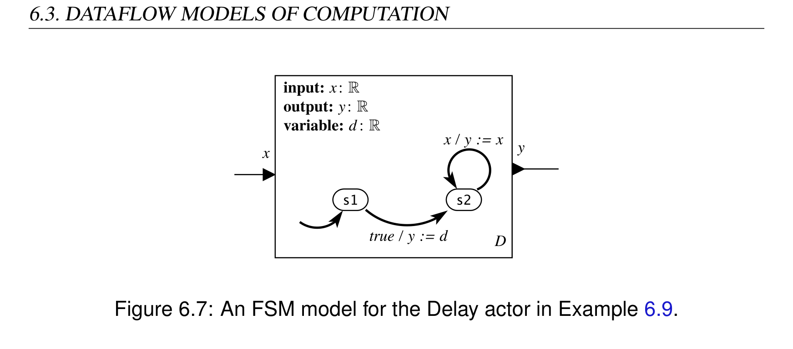
*Description*: Finite state machine (FSM) transition diagram specifying states, guard conditions, input triggers, and output actions for Figure 6.7: An FSM model for the Delay actor in Example 6.9..

> **Figure 6.7: An FSM model for the Delay actor in Example 6.9.**

The actor consumes one input token and produces on its output the same token. The
actor can be modeled by a state machine, as shown in Figure 6.7. In that figure, the
firing rules are implicit in the guards. The tokens required to fire are exactly those
required to evaluate the guards. The firing function d1 is associated with state s1,
and d2 with s2.
When dataflow actors are composed, with an output of one going to an input of another,
the communication mechanism is quite different from that of the previous MoCs consid-
ered in this chapter. Since the firing of the actors is asynchronous, a token sent from one
actor to another must be buffered; it needs to be saved until the destination actor is ready
to consume it. When the destination actor fires, it consumes one or more input tokens.
After being consumed, a token may be discarded (meaning that the memory in which it is
buffered can be reused for other purposes).
Dataflow models pose a few interesting problems. One question is how to ensure that
the memory devoted to buffering of tokens is bounded. A dataflow model may be able
to execute forever (or for a very long time); this is called an unbounded execution.
For an unbounded execution, we may have to take measures to ensure that buffering of
unconsumed tokens does not overflow the available memory.
Example 6.10: Consider the following cascade composition of dataflow actors:
146
Lee & Seshia, Introduction to Embedded Systems

<!-- Page 167 -->
### [PDF Page 167]

6. CONCURRENT MODELS OF COMPUTATION
Since A has no input ports, its firing rule is simple. It can fire at any time. Suppose
that on each firing, A produces one token. What is to keep A from firing at a
faster rate than B? Such faster firing could result in an unbounded build up of
unconsumed tokens on the buffer between A and B. This will eventually exhaust
available memory.
In general, for dataflow models that are capable of unbounded execution, we will need
scheduling policies that deliver bounded buffers.
A second problem that may arise is deadlock. Deadlock occurs when there are cycles, as
in Figure 6.1, and a directed loop has insufficient tokens to satisfy any of the firing rules of
the actors in the loop. The Delay actor of Example 6.9 can help prevent deadlock because
it is able to produce an initial output token without having any input tokens available.
Dataflow models with feedback will generally require Delay actors (or something similar)
in every cycle.
For general dataflow models, it can be difficult to tell whether the model will deadlock,
and whether there exists an unbounded execution with bounded buffers. In fact, these
two questions are undecidable, meaning that there is no algorithm that can answer the
question in bounded time for all dataflow models (Buck, 1993). Fortunately, there are
useful constraints that we can impose on the design of actors that make these questions
decidable. We examine those constraints next.
6.3.2
Synchronous Dataflow
Synchronous dataflow (SDF) is a constrained form of dataflow where for each actor,
every firing consumes a fixed number of input tokens on each input port and produces a
fixed number of output tokens on each output port (Lee and Messerschmitt, 1987).1
1Despite the term, synchronous dataflow is not synchronous in the sense of SR. There is no global clock
in SDF models, and firings of actors are asynchronous. For this reason, some authors use the term static
dataflow rather than synchronous dataflow. This does not avoid all confusion, however, because Dennis
(1974) had previously coined the term “static dataflow” to refer to dataflow graphs where buffers could hold
at most one token. Since there is no way to avoid a collision of terminology, we stick with the original “syn-
chronous dataflow” terminology used in the literature. The term SDF arose from a signal processing concept,
where two signals with sample rates that are related by a rational multiple are deemed to be synchronous.
Lee & Seshia, Introduction to Embedded Systems
147

<!-- Page 168 -->
### [PDF Page 168]

6.3. DATAFLOW MODELS OF COMPUTATION

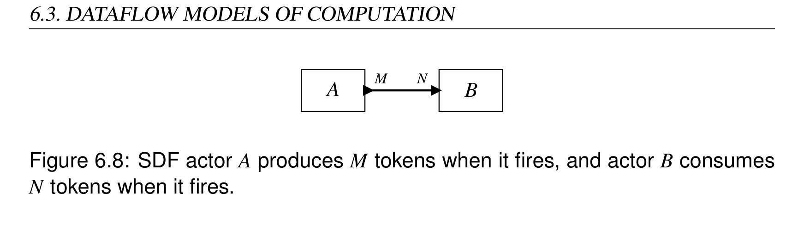
*Description*: Cyber-physical actor model block diagram showing continuous/discrete signal flows, feedback loops, and component interfaces for Figure 6.8: SDF actor A produces M tokens when it fires, and actor B consumes.

> **Figure 6.8: SDF actor A produces M tokens when it fires, and actor B consumes**

N tokens when it fires.
Consider a single connection between two actors, A and B, as shown in Figure 6.8. The
notation here means that when A fires, it produces M tokens on its output port, and when
B fires, it consumes N tokens on its input port. M and N are positive integers. Suppose
that A fires qA times and B fires qB times. All tokens that A produces are consumed by B
if and only if the following balance equation is satisfied,
qAM = qBN.
(6.2)
Given values qA and qB satisfying (6.2), we can find a schedule that delivers unbounded
execution with bounded buffers. An example of such a schedule fires A repeatedly, qA
times, followed by B repeatedly, qB times. It can repeat this sequence forever without
exhausting available memory.
Example 6.11:
Suppose that in Figure 6.8, M = 2 and N = 3. Then qA = 3 and
qB = 2 satisfy (6.2). Hence, the following schedule can be repeated forever,
A,A,A,B,B.
An alternative schedule is also available,
A,A,B,A,B.
In fact, this latter schedule has an advantage over the former one in that it requires
less memory. B fires as soon as there are enough tokens, rather than waiting for A
to complete its entire cycle.
Another solution to (6.2) is qA = 6 and qB = 4. This solution includes more firings
in the schedule than are strictly needed to keep the system in balance.
The equation is also satisfied by qA = 0 and qB = 0, but if the number of firings of
actors is zero, then no useful work is done. Clearly, this is not a solution we want.
Negative solutions are also not desirable.
148
Lee & Seshia, Introduction to Embedded Systems

<!-- Page 169 -->
### [PDF Page 169]

6. CONCURRENT MODELS OF COMPUTATION

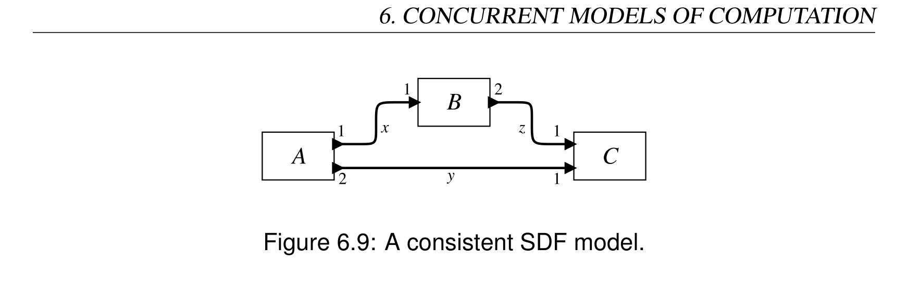
*Description*: Technical diagram and schematic model illustrating cyber-physical system behavior, algorithmic logic, and state progression for Figure 6.9: A consistent SDF model..

> **Figure 6.9: A consistent SDF model.**

Generally we will be interested in finding the least positive integer solution to the
balance equations.
In a more complicated SDF model, every connection between actors results in a balance
equation. Hence, the model defines a system of equations.
Example 6.12: Figure 6.9 shows a network with three SDF actors. The connec-
tions x, y, and z, result in the following system of balance equations,
qA
=
qB
2qB
=
qC
2qA
=
qC.
The least positive integer solution to these equations is qA = qB = 1, and qC = 2, so
the following schedule can be repeated forever to get an unbounded execution with
bounded buffers,
A,B,C,C.
The balance equations do not always have a non-trivial solution, as illustrated in the fol-
lowing example.
Example 6.13:

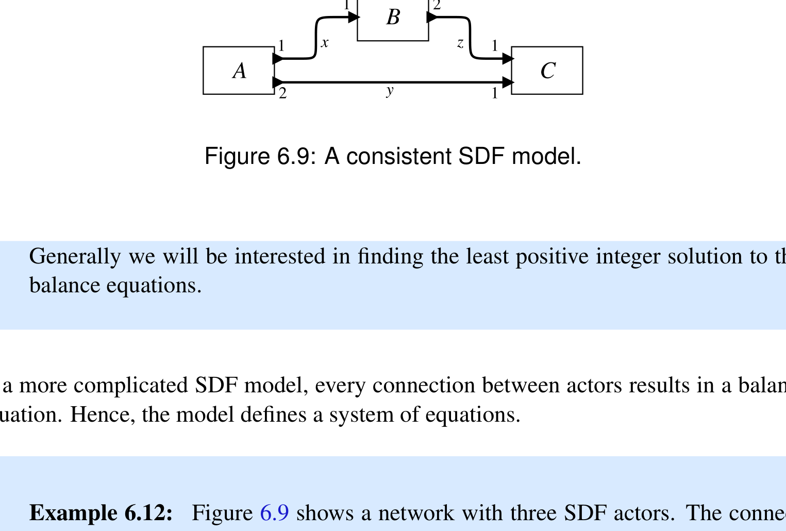
*Description*: Cyber-physical actor model block diagram showing continuous/discrete signal flows, feedback loops, and component interfaces for Figure 6.10: shows a network with three SDF actors where the.

> **Figure 6.10: shows a network with three SDF actors where the**

only solution to the balance equations is the trivial one, qA = qB = qC = 0. A
Lee & Seshia, Introduction to Embedded Systems
149

<!-- Page 170 -->
### [PDF Page 170]

6.3. DATAFLOW MODELS OF COMPUTATION

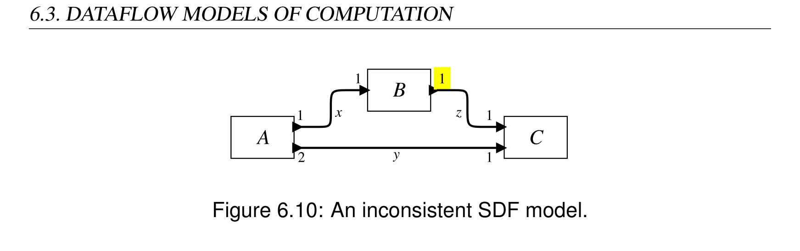
*Description*: Technical diagram and schematic model illustrating cyber-physical system behavior, algorithmic logic, and state progression for Figure 6.10: An inconsistent SDF model..

> **Figure 6.10: An inconsistent SDF model.**

consequence is that there is no unbounded execution with bounded buffers for this
model. It cannot be kept in balance.
An SDF model that has a non-zero solution to the balance equations is said to be consis-
tent. If the only solution is zero, then it is inconsistent. An inconsistent model has no
unbounded execution with bounded buffers.
Lee and Messerschmitt (1987) showed that if the balance equations have a non-zero solu-
tion, then they also have a solution where qi is a positive integer for all actors i. Moreover,
for connected models (where there is a communication path between any two actors), they
gave a procedure for finding the least positive integer solution. Such a procedure forms
the foundation for a scheduler for SDF models.
Consistency is sufficient to ensure bounded buffers, but it is not sufficient to ensure that
an unbounded execution exists. In particular, when there is feedback, as in Figure 6.1,
then deadlock may occur. Deadlock bounds an execution.
To allow for feedback, the SDF model treats Delay actors specially. Recall from Example
6.9, that the Delay actor is able to produce output tokens before it receives any input
tokens, and then it subsequently behaves like a simple SDF actor that copies inputs to
outputs. In the SDF MoC, the initial tokens are understood to be an initial condition
for an execution, rather than part of the execution itself. Thus, the scheduler will ensure
that all initial tokens are produced before the SDF execution begins. The Delay actor,
therefore, can be replaced by initial tokens on a feedback connection. It need not perform
any operation at all at run time.
150
Lee & Seshia, Introduction to Embedded Systems

<!-- Page 171 -->
### [PDF Page 171]

6. CONCURRENT MODELS OF COMPUTATION

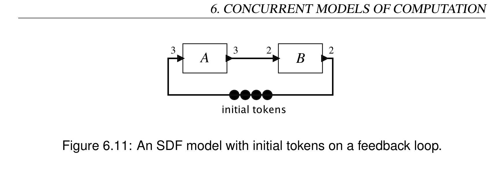
*Description*: Technical diagram and schematic model illustrating cyber-physical system behavior, algorithmic logic, and state progression for Figure 6.11: An SDF model with initial tokens on a feedback loop..

> **Figure 6.11: An SDF model with initial tokens on a feedback loop.**

Example 6.14: Figure 6.11 shows an SDF model with initial tokens on a feedback
loop. The balance equations are
3qA
=
2qB
2qB
=
3qA.
The least positive integer solution is qA = 2, and qB = 3, so the model is consis-
tent. With four initial tokens on the feedback connection, as shown, the following
schedule can be repeated forever,
A,B,A,B,B.
Were there any fewer than four initial tokens, however, the model would deadlock.
If there were only three tokens, for example, then A could fire, followed by B, but
in the resulting state of the buffers, neither could fire again.
In addition to the procedure for solving the balance equations, Lee and Messerschmitt
(1987) gave a procedure that will either provide a schedule for an unbounded execution
or will prove that no such schedule exists. Hence, both bounded buffers and deadlock are
decidable for SDF models.
6.3.3
Dynamic Dataflow
Although the ability to guarantee bounded buffers and rule out deadlock is valuable, it
comes at a price. SDF is not very expressive. It cannot directly express, for example,
conditional firing, where an actor fires only if, for example, a token has a particular value.
Lee & Seshia, Introduction to Embedded Systems
151

<!-- Page 172 -->
### [PDF Page 172]

6.3. DATAFLOW MODELS OF COMPUTATION

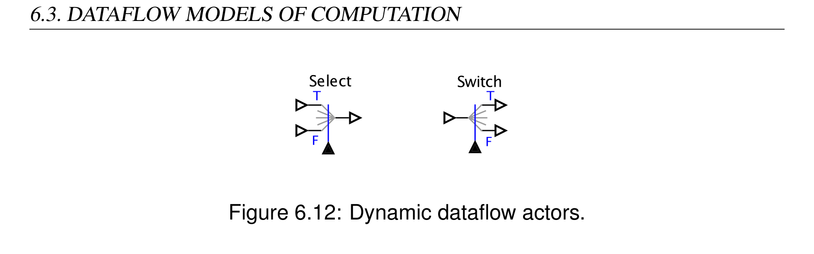
*Description*: Cyber-physical actor model block diagram showing continuous/discrete signal flows, feedback loops, and component interfaces for Figure 6.12: Dynamic dataflow actors..

> **Figure 6.12: Dynamic dataflow actors.**

Such conditional firing is supported by a more general dataflow MoC known as dynamic
dataflow (DDF). Unlike SDF actors, DDF actors can have multiple firing rules, and they
are not constrained to produce the same number of output tokens on each firing. The
Delay actor of Example 6.9 is directly supported by the DDF MoC, without any need to
special treatment of initial tokens. So are two basic actors known as Switch and Select,
shown in Figure 6.12.
The Select actor on the left has three firing rules. Initially, it requires one token on the
bottom input port. The type of that port is Boolean, so the value of the token must be true
or false. If a token with value true is received on that input port, then the actor produces
no output, but instead activates the next firing rule, which requires one token on the top
left input port, labeled T. When the actor next fires, it consumes the token on the T port
and sends it to the output port. If a token with value false is received on the bottom input
port, then the actor activates a firing rule that requires a token on the bottom left input port
labeled F. When it consumes that token, it again sends it to the output port. Thus, it fires
twice to produce one output.
The Switch actor performs a complementary function. It has only one firing rule, which
requires a single token on both input ports. The token on the left input port will be sent
to either the T or the F output port, depending on the Boolean value of the token received
on the bottom input port. Hence, Switch and Select accomplish conditional routing of
tokens, as illustrated in the following example.
Example 6.15:

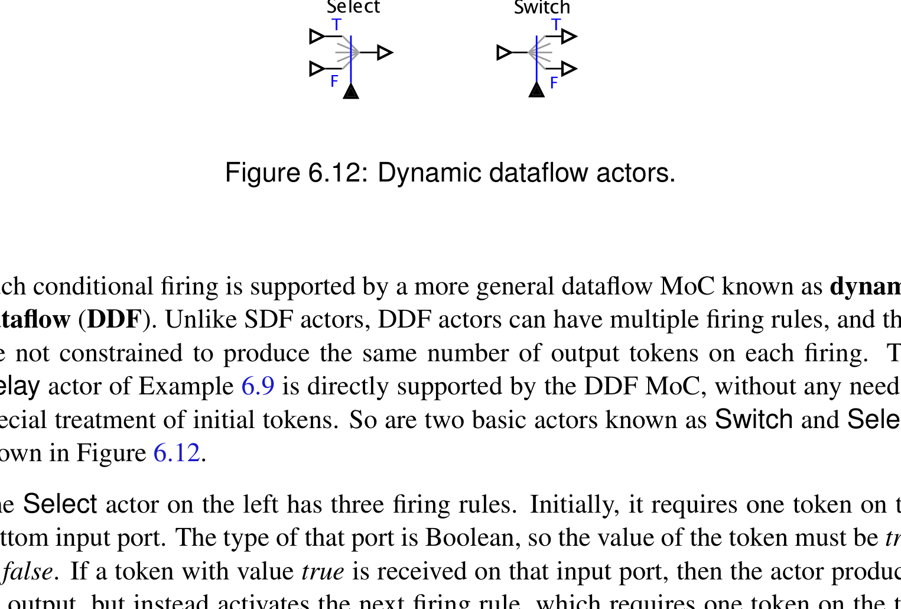
*Description*: Technical diagram and schematic model illustrating cyber-physical system behavior, algorithmic logic, and state progression for Figure 6.13: uses Switch and Select to accomplish conditional.

> **Figure 6.13: uses Switch and Select to accomplish conditional**

firing. Actor B produces a stream of Boolean-valued tokens x. This stream is repli-
cated by the fork to provide the control inputs y and z to the Switch and Select
actors. Based on the value of the control tokens on these streams, the tokens pro-
duced by actor A are sent to either C or D, and the resulting outputs are collected
152
Lee & Seshia, Introduction to Embedded Systems

<!-- Page 173 -->
### [PDF Page 173]

6. CONCURRENT MODELS OF COMPUTATION

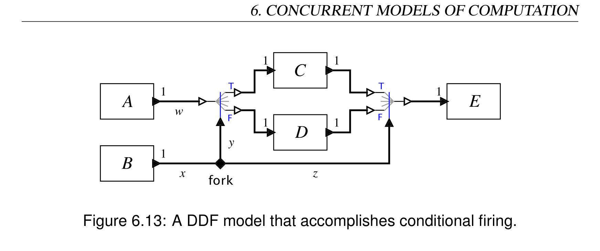
*Description*: Technical diagram and schematic model illustrating cyber-physical system behavior, algorithmic logic, and state progression for Figure 6.13: A DDF model that accomplishes conditional firing..

> **Figure 6.13: A DDF model that accomplishes conditional firing.**

and sent to E. This model is the DDF equivalent of the familiar if-then-else
programming construct in imperative languages.
Addition of Switch and Select to the actor library means that we can no longer always
find a bounded buffer schedule, nor can we provide assurances that the model will not
deadlock. Buck (1993) showed that bounded buffers and deadlock are undecidable for
DDF models. Thus, in exchange for the increased expressiveness and flexibility, we have
paid a price. The models are not as readily analyzed.
Switch and Select are dataflow analogs of the goto statement in imperative languages.
They provide low-level control over execution by conditionally routing tokens. Like goto
statements, using them can result in models that are very difficult to understand. Dijk-
stra (1968) indicted the goto statement, discouraging its use, advocating instead the use
of structured programming. Structured programming replaces goto statements with
nested for loops, if-then-else, do-while, and recursion. Fortunately, structured
programming is also available for dataflow models, as we discuss next.
6.3.4
Structured Dataflow

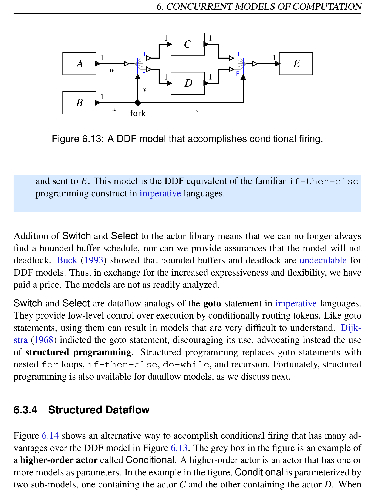
*Description*: Technical diagram and schematic model illustrating cyber-physical system behavior, algorithmic logic, and state progression for Figure 6.14: shows an alternative way to accomplish conditional firing that has many ad-.

> **Figure 6.14: shows an alternative way to accomplish conditional firing that has many ad-**

vantages over the DDF model in Figure 6.13. The grey box in the figure is an example of
a higher-order actor called Conditional. A higher-order actor is an actor that has one or
more models as parameters. In the example in the figure, Conditional is parameterized by
two sub-models, one containing the actor C and the other containing the actor D. When
Lee & Seshia, Introduction to Embedded Systems
153

<!-- Page 174 -->
### [PDF Page 174]

6.3. DATAFLOW MODELS OF COMPUTATION

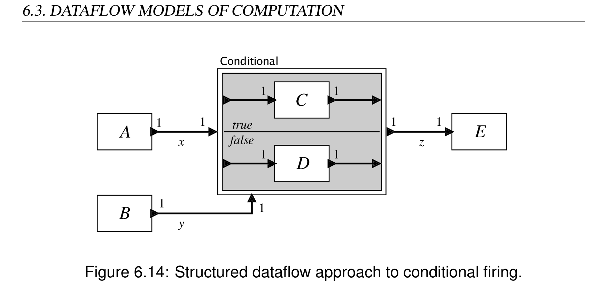
*Description*: Technical diagram and schematic model illustrating cyber-physical system behavior, algorithmic logic, and state progression for Figure 6.14: Structured dataflow approach to conditional firing..

> **Figure 6.14: Structured dataflow approach to conditional firing.**

Conditional fires, it consumes one token from each input port and produces one token
on its output port, so it is an SDF actor. The action it performs when it fires, however, is
dependent on the value of the token that arrives at the lower input port. If that value is
true, then actor C fires. Otherwise, actor D fires.
This style of conditional firing is called structured dataflow, because, much like struc-
tured programming, control constructs are nested hierarchically. Arbitrary data-dependent
token routing is avoided (which is analogous to avoiding arbitrary branches using goto in-
structions). Moreover, when using such Conditional actors, the overall model is still
an SDF model. In the example in Figure 6.14, every actor consumes and produces ex-
actly one token on every port. Hence, the model is analyzable for deadlock and bounded
buffers.
This style of structured dataflow was introduced in LabVIEW, a design tool developed by
National Instruments (Kodosky et al., 1991). In addition to a conditional similar to that in

*Description*: Technical diagram and schematic model illustrating cyber-physical system behavior, algorithmic logic, and state progression for Figure 6.14: , LabVIEW provides structured dataflow constructs for iterations (analogous.

> **Figure 6.14: , LabVIEW provides structured dataflow constructs for iterations (analogous**

to for and do-while loops in an imperative language), for case statements (which
have an arbitrary number of conditionally executed submodels), and for sequences (which
cycle through a finite set of submodels). It is also possible to support recursion using
structured dataflow (Lee and Parks, 1995), but without careful constraints, boundedness
again becomes undecidable.
154
Lee & Seshia, Introduction to Embedded Systems

<!-- Page 175 -->
### [PDF Page 175]

6. CONCURRENT MODELS OF COMPUTATION
6.3.5
Process Networks
A model of computation that is closely related to dataflow models is Kahn process net-
works (or simply, process networks or PN), named after Gilles Kahn, who introduced
them (Kahn, 1974). The relationship between dataflow and PN is studied in detail by
Lee and Parks (1995) and Lee and Matsikoudis (2009), but the short story is quite sim-
ple. In PN, each actor executes concurrently in its own process. That is, instead of being
defined by its firing rules and firing functions, a PN actor is defined by a (typically non-
terminating) program that reads data tokens from input ports and writes data tokens to
output ports. All actors execute simultaneously (conceptually; whether they actually exe-
cute simultaneously or are interleaved is irrelevant).
In the original paper, Kahn (1974) gave very elegant mathematical conditions on the ac-
tors that would ensure that a network of such actors was determinate in the sense that
the sequence of tokens on every connection between actors is unique, and specifically
independent of how the processes are scheduled. Thus, Kahn showed that concurrent
execution was possible without nondeterminacy.
Three years later, Kahn and MacQueen (1977) gave a simple, easily implemented mech-
anism for programs that ensures that the mathematical conditions are met to ensure de-
terminacy. A key part of the mechanism is to perform blocking reads on input ports
whenever a process is to read input data. Specifically, blocking reads mean that if the
process chooses to access data through an input port, it issues a read request and blocks
until the data becomes available. It cannot test the input port for the availability of data
and then perform a conditional branch based on whether data are available, because such
a branch would introduce schedule-dependent behavior.
Blocking reads are closely related to firing rules. Firing rules specify the tokens required
to continue computing (with a new firing function). Similarly, a blocking read specifies a
single token required to continue computing (by continuing execution of the process).
When a process writes to an output port, it performs a nonblocking write, meaning that
the write succeeds immediately and returns. The process does not block to wait for the
receiving process to be ready to receive data. This is exactly how writes to output ports
work in dataflow MoCs as well. Thus, the only material difference between dataflow and
PN is that with PN, the actor is not broken down into firing functions. It is designed as a
continuously executing program.
Lee & Seshia, Introduction to Embedded Systems
155

<!-- Page 176 -->
### [PDF Page 176]

6.4. TIMED MODELS OF COMPUTATION
Kahn and MacQueen (1977) called the processes in a PN network coroutines for an
interesting reason. A routine or subroutine is a program fragment that is “called” by
another program. The subroutine executes to completion before the calling fragment
can continue executing. The interactions between processes in a PN model are more
symmetric, in that there is no caller and callee. When a process performs a blocking read,
it is in a sense invoking a routine in the upstream process that provides the data. Similarly,
when it performs a write, it is in a sense invoking a routine in the downstream process to
process the data. But the relationship between the producer and consumer of the data is
much more symmetric than with subroutines.
Just like dataflow, the PN MoC poses challenging questions about boundedness of buffers
and about deadlock. PN is expressive enough that these questions are undecidable. An
elegant solution to the boundedness question is given by Parks (1995) and elaborated by
Geilen and Basten (2003).
An interesting variant of process networks performs blocking writes rather than non-
blocking writes. That is, when a process writes to an output port, it blocks until the
receiving process is ready to receive the data. Such an interaction between processes is
called a rendezvous. Rendezvous forms the basis for well known process formalisms
such as communicating sequential processes (CSP) (Hoare, 1978) and the calculus of
communicating systems (CCS) (Milner, 1980). It also forms the foundation for the Oc-
cam programming language (Galletly, 1996), which enjoyed some success for a period
of time in the 1980s and 1990s for programming parallel computers.
In both the SR and dataflow models of computation considered so far, time plays a minor
role. In dataflow, time plays no role. In SR, computation occurs simultaneously and
instantaneously at each of a sequence of ticks of a global clock. Although the term “clock”
implies that time plays a role, it actually does not. In the SR MoC, all that matters is the
sequence. The physical time at which the ticks occur is irrelevant to the MoC. It is just a
sequence of ticks. Many modeling tasks, however, require a more explicit notion of time.
We examine next MoCs that have such a notion.
6.4
Timed Models of Computation
For cyber-physical systems, the time at which things occur in software can matter, be-
cause the software interacts with physical processes. In this section, we consider a few
concurrent MoCs that explicitly refer to time. We describe three timed MoCs, each of
156
Lee & Seshia, Introduction to Embedded Systems

<!-- Page 177 -->
### [PDF Page 177]

6. CONCURRENT MODELS OF COMPUTATION

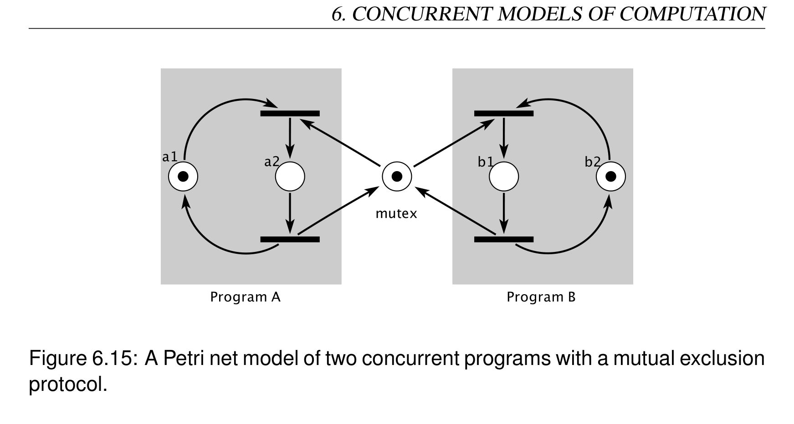
*Description*: Technical diagram and schematic model illustrating cyber-physical system behavior, algorithmic logic, and state progression for Figure 6.15: A Petri net model of two concurrent programs with a mutual exclusion.

> **Figure 6.15: A Petri net model of two concurrent programs with a mutual exclusion**

protocol.
which have many variants. Our treatment here is necessarily brief. A complete study of
these MoCs would require a much bigger volume.
6.4.1
Time-Triggered Models
Kopetz and Grunsteidl (1994) introduced mechanisms for periodically triggering dis-
tributed computations according to a distributed clock that measures the passage of time.
The result is a system architecture called a time-triggered architecture (TTA). A key
contribution was to show how a TTA could tolerate certain kinds of faults, such that fail-
ures in part of the system could not disrupt the behaviors in other parts of the system (see
also Kopetz (1997) and Kopetz and Bauer (2003)). Henzinger et al. (2003a) lifted the key
idea of TTA to the programming language level, providing a well-defined semantics for
modeling distributed time-triggered systems. Since then, these techniques have come into
practical use in the design of safety-critical avionics and automotive systems, becoming a
key part of standards such as FlexRay, a networking standard developed by a consortium
of automotive companies.
A time-triggered MoC is similar to SR in that there is a global clock that coordinates
the computation. But computations take time instead of being simultaneous and instan-
taneous. Specifically, time-triggered MoCs associate with a computation a logical exe-
Lee & Seshia, Introduction to Embedded Systems
157

<!-- Page 178 -->
### [PDF Page 178]

6.4. TIMED MODELS OF COMPUTATION
Petri Nets
Petri nets, named after Carl Adam Petri, are a popular modeling formalism related to
dataflow (Murata, 1989). They have two types of elements, places and transitions, de-
picted as white circles and rectangles, respectively:
A place can contain any number of tokens, depicted as black circles. A transition is
enabled if all places connected to it as inputs contain at least one token. Once a transition
is enabled, it can fire, consuming one token from each input place and putting one token
on each output place. The state of a network, called its marking, is the number of tokens
on each place in the network. The figure above shows a simple network with its marking
before and after the firing of the transition. If a place provides input to more than one
transition, then the network is nondeterministic. A token on that place may trigger a
firing of either destination transition.
An example of a Petri net model is shown in Figure 6.15, which models two concurrent
programs with a mutual exclusion protocol. Each of the two programs has a critical
section, meaning that only one of the programs can be in its critical section at any time.
In the model, program A is in its critical section if there is a token on place a2, and
program B is in its critical section if there is a token on place b1. The job of the mutual
exclusion protocol is to ensure that these two places cannot simultaneously have a token.
If the initial marking of the model is as shown in the figure, then both top transitions are
enabled, but only one can fire (there is only one token in the place labeled mutex). Which
one fires is chosen nondeterministically. Suppose program A fires. After this firing, there
will be a token in place a2, so the corresponding bottom transition becomes enabled.
Once that transition fires, the model returns to its initial marking. It is easy to see that the
mutual exclusion protocol is correct in this model.
Unlike dataflow buffers, places do not preserve an ordering of tokens. Petri nets with a
finite number of markings are equivalent to FSMs.
158
Lee & Seshia, Introduction to Embedded Systems

<!-- Page 179 -->
### [PDF Page 179]

6. CONCURRENT MODELS OF COMPUTATION
Models of Time
How to model physical time is surprisingly subtle. How should we define simultaneity
across a distributed system? A thoughtful discussion of this question is considered by
Galison (2003). What does it mean for one event to cause another? Can an event that
causes another be simultaneous with it? Several thoughtful essays on this topic are given
in Price and Corry (2007).
In Chapter 2, we assume time is represented by a variable t ∈R or t ∈R+. This model
is sometimes referred to as Newtonian time. It assumes a globally shared absolute time,
where any reference anywhere to the variable t will yield the same value. This notion of
time is often useful for modeling even if it does not perfectly reflect physical realities, but
it has its deficiencies. Consider for example Newton’s cradle, a toy with five steel balls
suspended by strings. If you lift one ball and release it, it strikes the second ball, which
does not move. Instead, the fifth ball reacts by rising. Consider the momentum of the
middle ball as a function of time. The middle ball does not move, so its momentum must
be everywhere zero. But the momentum of the first ball is somehow transfered to the
fifth ball, passing through the middle ball. So the momentum cannot be always zero. Let
m: R →R represent the momentum of this ball and τ be the time of the collision. Then
m(t) =
 M
if t = τ
0
otherwise
for all t ∈R. In a cyber-physical system, we may, however, want to represent this function
in software, in which case a sequence of samples will be needed. But how can such sample
unambiguously represent the rather unusual structure of this signal?
One option is to use superdense time (Manna and Pnueli, 1993; Maler et al., 1992; Lee
and Zheng, 2005; Cataldo et al., 2006), where instead of R, time is represented by a set
R×N. A time value is a tuple (t,n), where t represents Newtonian time and n represents
a sequence index within an instant. In this representation, the momentum of the middle
ball can be unambiguously represented by a sequence where m(τ,0) = 0, m(τ,1) = M,
and m(τ,2) = 0. Such a representation also handles events that are simultaneous and
instantaneous but also causally related.
Another alternative is partially ordered time, where two time values may or may not
be ordered relative to each other. When there is a chain of causal relationships between
them, then they must be ordered, and otherwise not.
Lee & Seshia, Introduction to Embedded Systems
159

<!-- Page 180 -->
### [PDF Page 180]

6.4. TIMED MODELS OF COMPUTATION
cution time. The inputs to the computation are provided at ticks of the global clock, but
the outputs are not visible to other computations until the next tick of the global clock.
Between ticks, there is no interaction between the computations, so concurrency diffi-
culties such as race conditions do not exist. Since the computations are not (logically)
instantaneous, there are no difficulties with feedback, and all models are constructive.
The Simulink modeling system, sold by The MathWorks, supports a time-triggered MoC,
and in conjunction with another product called Real-Time Workshop, can translate such
models in embedded C code. In LabVIEW, from National Instruments, timed loops ac-
complish a similar capability within a dataflow MoC.
In the simplest form, a time-triggered model specifies periodic computation with a fixed
time interval (the period) between ticks of the clock. Giotto (Henzinger et al., 2003a)
supports modal models, where the periods differ in different modes. Some authors have
further extended the concept of logical execution time to non-periodic systems (Liu and
Lee, 2003; Ghosal et al., 2004).
Time triggered models are conceptually simple, but computations are tied closely to a
periodic clock. The model becomes awkward when actions are not periodic. DE systems,
considered next, encompass a richer set of timing behaviors.
6.4.2
Discrete Event Systems
Discrete-event systems (DE systems) have been used for decades as a way to build sim-
ulations for an enormous variety of applications, including for example digital networks,
military systems, and economic systems. A pioneering formalism for DE models is due
to Zeigler (1976), who called the formalism DEVS, abbreviating discrete event system
specification. DEVS is an extension of Moore machines that associates a non-zero lifes-
pan with each state, thus endowing the Moore machines with an explicit notion of the
passage of time (vs. a sequence of reactions).
The key idea in a DE MoC is that events are endowed with a time stamp, a value in
some model of time (see box on page 159). Normally, two distinct time stamps must be
comparable. That is, they are either equal, or one is earlier than the other. A DE model
is a network of actors where each actor reacts to input events in time-stamp order and
produces output events in time-stamp order.
160
Lee & Seshia, Introduction to Embedded Systems

<!-- Page 181 -->
### [PDF Page 181]

6. CONCURRENT MODELS OF COMPUTATION
Example 6.16: The clock signal with period P of Example 6.1 consists of events
with time stamps nP for all n ∈Z.
To execute a DE model, we can use an event queue, which is a list of events sorted by
time stamp. The list begins empty. Each actor in the network is interrogated for any initial
events it wishes to place on the event queue. These events may be destined for another
actor, or they may be destined for the actor itself, in which case they will cause a reaction
of the actor to occur at the appropriate time. The execution continues by selecting the
earliest event in the event queue and determining which actor should receive that event.
The value of that event (if any) is presented as an input to the actor, and the actor reacts
(“fires”). The reaction can produce output events, and also events that simply request a
later firing of the same actor at some specified time stamp.
At this point, variants of DE MoCs behave differently. Some variants, such as DEVS,
require that outputs produced by the actor have a strictly larger time stamp than that of the
input just presented. From a modeling perspective, every actor imposes some non-zero
delay, in that its reactions (the outputs) become visible to other actors strictly later than
the inputs that triggered the reaction. Other variants permit the actor to produce output
events with the same time stamp as the input. That is, they can react instantaneously.
As with SR models of computation, such instantaneous reactions can create significant
subtleties because inputs become simultaneous with outputs.
The subtleties introduced by simultaneous events can be resolved by treating DE as a
generalization of SR (Lee and Zheng, 2007). In this variant of a DE semantics, execution
proceeds as follows. Again, we use an event queue and interrogate the actors for initial
events to place on the queue. We select the event from the queue with the least time stamp,
and all other events with the same time stamp, present those events to actors in the model
as inputs, and then fire all actors in the manner of a constructive fixed-point iteration, as
normal with SR. In this variant of the semantics, any outputs produced by an actor must
be simultaneous with the inputs (they have the same time stamp), so they participate in
the fixed point. If the actor wishes to produce an output event at a later time, it does so
Lee & Seshia, Introduction to Embedded Systems
161

<!-- Page 182 -->
### [PDF Page 182]

6.4. TIMED MODELS OF COMPUTATION
by requesting a firing at a later time (which results in the posting of an event on the event
queue).
6.4.3
Continuous-Time Systems
In Chapter 2 we consider models of continuous-time systems based on ordinary differen-
tial equations (ODEs). Specifically, we consider equations of the form
˙x(t) = f(x(t),t),
where x: R →Rn is a vector-valued continuous-time function. An equivalent model is an
integral equation of the form
x(t)
=
x(0)+
Z t
0
˙x(τ)dτ
(6.3)
=
x(0)+
Z t
0 f(x(τ),τ)dτ.
(6.4)

### Probing Further: Discrete Event Semantics

Discrete-event models of computation have been a subject of study for many years, with
several textbooks available (Zeigler et al., 2000; Cassandras, 1993; Fishman, 2001). The
subtleties in the semantics are considerable (see Lee (1999); Cataldo et al. (2006); Liu
et al. (2006); Liu and Lee (2008)). Instead of discussing the formal semantics here, we
describe how a DE model is executed. Such a description is, in fact, a valid way of giving
the semantics of a model. The description is called an operational semantics (Scott and
Strachey, 1971; Plotkin, 1981).
DE models are often quite large and complex, so execution performance becomes very
important. Because of the use of a single event queue, parallelizing or distributing execu-
tion of DE models can be challenging (Misra, 1986; Fujimoto, 2000). A recently proposed
strategy called PTIDES (for programming temporally integrated distributed embedded
systems), leverages network time synchronization to provide efficient distributed execu-
tion (Zhao et al., 2007; Lee et al., 2009). The claim is that the execution is efficient
enough that DE can be used not only as a simulation technology, but also as an imple-
mentation technology. That is, the DE event queue and execution engine become part of
the deployed embedded software. As of this writing, that claim has not been proven on
any practical examples.
162
Lee & Seshia, Introduction to Embedded Systems

<!-- Page 183 -->
### [PDF Page 183]

6. CONCURRENT MODELS OF COMPUTATION

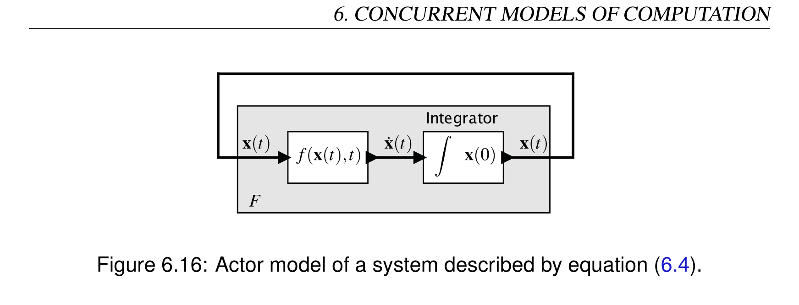
*Description*: Cyber-physical actor model block diagram showing continuous/discrete signal flows, feedback loops, and component interfaces for Figure 6.16: Actor model of a system described by equation (6.4)..

> **Figure 6.16: Actor model of a system described by equation (6.4).**

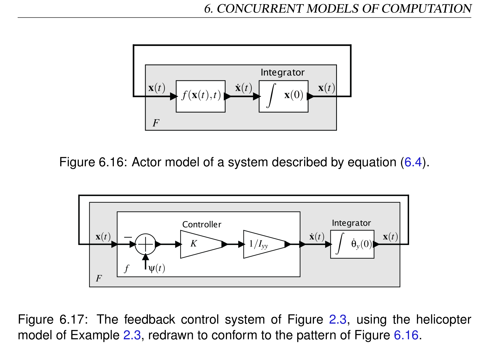
*Description*: Cyber-physical actor model block diagram showing continuous/discrete signal flows, feedback loops, and component interfaces for Figure 6.17: The feedback control system of Figure 2.3, using the helicopter.

> **Figure 6.17: The feedback control system of Figure 2.3, using the helicopter**

model of Example 2.3, redrawn to conform to the pattern of Figure 6.16.
In Chapter 2, we show that a model of a system given by such ODEs can be described as
an interconnection of actors, where the communication between actors is via continuous-
time signals. Equation (6.4) can be represented as the interconnection shown in Figure
6.16, which conforms to the feedback pattern of Figure 6.1(d).
Example 6.17:
The feedback control system of Figure 2.3, using the helicopter
model of Example 2.3, can be redrawn as shown in Figure 6.17, which conforms to
the pattern of Figure 6.16. In this case, x = ˙θy is a scalar-valued continuous-time
function (or a vector of length one). The function f is defined as follows,
f(x(t),t) = (K/Iyy)(ψ(t)−x(t)),
and the initial value of the integrator is
x(0) = ˙θy(0).
Lee & Seshia, Introduction to Embedded Systems
163

<!-- Page 184 -->
### [PDF Page 184]

6.4. TIMED MODELS OF COMPUTATION
...
h
t
x(t)
.
f (x(t), t)
h
2h
3h
(a)
t
x(t)
.
f (x(t), t)
(b)
...
f (x(0), 0)

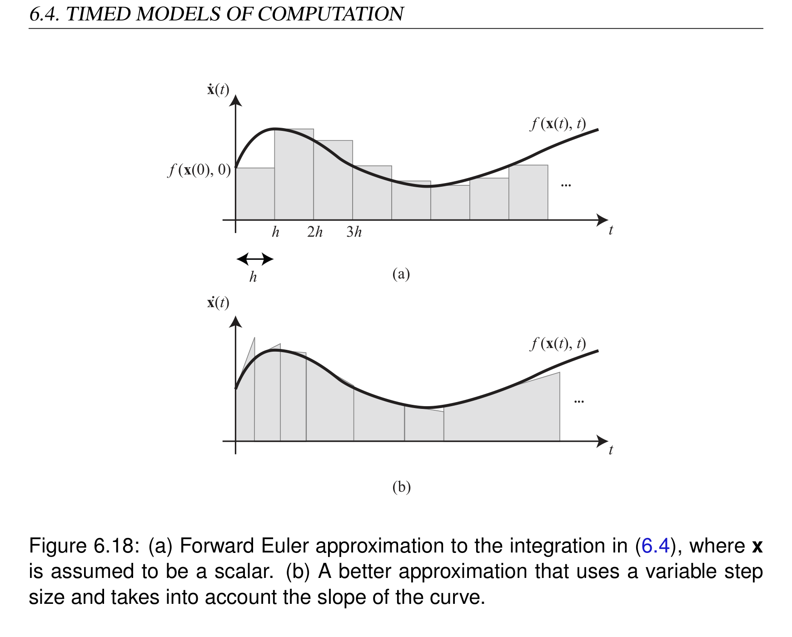
*Description*: Technical diagram and schematic model illustrating cyber-physical system behavior, algorithmic logic, and state progression for Figure 6.18: (a) Forward Euler approximation to the integration in (6.4), where x.

> **Figure 6.18: (a) Forward Euler approximation to the integration in (6.4), where x**

is assumed to be a scalar. (b) A better approximation that uses a variable step
size and takes into account the slope of the curve.
Such models, in fact, are actor compositions under a continuous-time model of com-
putation, but unlike the previous MoCs, this one cannot strictly be executed on a digital
computer. A digital computer cannot directly deal with the time continuum. It can, how-
ever, be approximated, often quite accurately.
The approximate execution of a continuous-time model is accomplished by a solver,
which constructs a numerical approximation to the solution of an ODE. The study of
algorithms for solvers is quite old, with the most commonly used techniques dating back
to the 19th century. Here, we will consider only one of the simplest of solvers, which is
known as a forward Euler solver.
164
Lee & Seshia, Introduction to Embedded Systems

<!-- Page 185 -->
### [PDF Page 185]

6. CONCURRENT MODELS OF COMPUTATION
A forward Euler solver estimates the value of x at time points 0,h,2h,3h,···, where h is
called the step size. The integration is approximated as follows,
x(h)
=
x(0)+h f(x(0),0)
x(2h)
=
x(h)+h f(x(h),h)
x(3h)
=
x(2h)+h f(x(2h),2h)
···
x((k +1)h)
=
x(kh)+h f(x(kh),kh).
This process is illustrated in Figure 6.18(a), where the “true” value of ˙x is plotted as a
function of time. The true value of x(t) is the area under that curve between 0 and t,
plus the initial value x(0). At the first step of the algorithm, the increment in area is
approximated as the area of a rectangle of width h and height f(x(0),0). This increment
yields an estimate for x(h), which can be used to calculate ˙x(h) = f(x(h),h), the height
of the second rectangle. And so on.
You can see that the errors in approximation will accumulate over time. The algorithm
can be improved considerably by two key techniques. First, a variable-step solver will
vary the step size based on estimates of the error to keep the error small. Second, a
more sophisticated solver will take into account the slope of the curve and use trapezoidal
approximations as suggested in Figure 6.18(b). A family of such solvers known as Runge-
Kutta solvers are widely used. But for our purposes here, it does not matter what solver is
used. All that matters is that (a) the solver determines the step size, and (b) at each step,
the solver performs some calculation to update the approximation to the integral.
When using such a solver, we can interpret the model in Figure 6.16 in a manner similar
to SR and DE models. The f actor is memoryless, so it simply performs a calculation to
produce an output that depends only on the input and the current time. The integrator is a
state machine whose state is updated at each reaction by the solver, which uses the input
to determine what the update should be. The state space of this state machine is infinite,
since the state variable x(t) is a vector of real numbers.
Hence, a continuous-time model can be viewed as an SR model with a time step be-
tween global reactions determined by a solver (Lee and Zheng, 2007). Specifically, a
continuous-time model is a network of actors, each of which is a cascade composition of
a simple memoryless computation actor and a state machine, and the actor reactions are
simultaneous and instantaneous. The times of the reactions are determined by a solver.
The solver will typically consult the actors in determining the time step, so that for ex-
ample events like level crossings (when a continuous signal crosses a threshold) can be
Lee & Seshia, Introduction to Embedded Systems
165

<!-- Page 186 -->
### [PDF Page 186]

6.5. SUMMARY
captured precisely. Hence, despite the additional complication of having to provide a
solver, the mechanisms required to achieve a continuous-time model of computation are
not much different from those required to achieve SR and DE.
A popular software tool that uses a continuous-time MoC is Simulink, from The Math-
Works. Simulink represents models similarly as block diagrams, which are interconnec-
tions of actors. Continuous-time models can also be simulated using the textual tool MAT-
LAB from the same vendor. MATRIXx, from National Instruments, also supports graph-
ical continuous-time modeling. Continuous-time models can also be integrated within
LabVIEW models, either graphically using the Control Design and Simulation Module or
textually using the programming language MathScript.
6.5

### Summary

This chapter provides a whirlwind tour of a rather large topic, concurrent models of
computation. It begins with synchronous-reactive models, which are closest to the syn-
chronous composition of state machines considered in the previous chapter. It then con-
siders dataflow models, where execution can be more loosely coordinated. Only data
precedences impose constraints on the order of actor computations. The chapter then
concludes with a quick view of a few models of computation that explicitly include a
notion of time. Such MoCs are particularly useful for modeling cyber-physical systems.
166
Lee & Seshia, Introduction to Embedded Systems

<!-- Page 187 -->
### [PDF Page 187]

6. CONCURRENT MODELS OF COMPUTATION

### Exercises

1. Show how each of the following actor models can be transformed into a feedback
system by using a reorganization similar to that in Figure 6.1(b). That is, the actors
should be aggregated into a single side-by-side composite actor.
(a)
(b)
(c)
2. Consider the following state machine in a synchronous feedback composition:
Lee & Seshia, Introduction to Embedded Systems
167

<!-- Page 188 -->
### [PDF Page 188]

### EXERCISES

(a) Is it well-formed? Is it constructive?
(b) If it is well-formed and constructive, then find the output symbols for the first
10 reactions. If not, explain where the problem is.
(c) Show the composition machine, assuming that the composition has no input
and that the only output is b.
3. For the following synchronous model, determine whether it is well formed and
constructive, and if so, determine the sequence of values of the signals s1 and s2.
4. For the following synchronous model, determine whether it is well formed and
constructive, and if so, determine the possible sequences of values of the signals s1
and s2. Note that machine A is nondeterministic.
5. Recall the traffic light controller of Figure 3.10. Consider connecting the outputs
of this controller to a pedestrian light controller, whose FSM is given in Figure
5.10. Using your favorite modeling software that supports state machines (such
as Ptolemy II, LabVIEW Statecharts, or Simulink/Stateflow), construct the compo-
sition of the above two FSMs along with a deterministic extended state machine
168
Lee & Seshia, Introduction to Embedded Systems

<!-- Page 189 -->
### [PDF Page 189]

6. CONCURRENT MODELS OF COMPUTATION
modeling the environment and generating input symbols timeR, timeG, timeY, and
isCar. For example, the environment FSM can use an internal counter to decide
when to generate these symbols.
6. Consider the following SDF model:
The numbers adjacent to the ports indicate the number of tokens produced or con-
sumed by the actor when it fires. Answer the following questions about this model.
(a) Let qA,qB, and qC denote the number of firings of actors A, B, and C, respec-
tively. Write down the balance equations and find the least positive integer
solution.
(b) Find a schedule for an unbounded execution that minimizes the buffer sizes on
the two communication channels. What is the resulting size of the buffers?
7. For each of the following dataflow models, determine whether there is an un-
bounded execution with bounded buffers. If there is, determine the minimum buffer
size.
(a)
Lee & Seshia, Introduction to Embedded Systems
169

<!-- Page 190 -->
### [PDF Page 190]

### EXERCISES

(b)
where n is some integer.
(c)
where D produces an arbitrary boolean sequence.
(d) For the same dataflow model as in part (c), assume you can specify a periodic
boolean output sequence produced by D. Find such a sequence that yields
bounded buffers, give a schedule that minimizes buffer sizes, and give the
buffer sizes.
8. Consider the SDF graph shown below:
In this figure, A, B, and C are actors. Adjacent to each port is the number of tokens
consumed or produced by a firing of the actor on that port, where N and M are
170
Lee & Seshia, Introduction to Embedded Systems

<!-- Page 191 -->
### [PDF Page 191]

6. CONCURRENT MODELS OF COMPUTATION
variables with positive integer values. Assume the variables w, x, y, and z represent
the number of initial tokens on the connection where these variables appear in the
diagram. These variables have non-negative integer values.
(a) Derive a simple relationship between N and M such that the model is con-
sistent, or show that no positive integer values of N and M yield a consistent
model.
(b) Assume that w = x = y = 0 and that the model is consistent and find the
minimum value of z (as a function N and M) such that the model does not
deadlock.
(c) Assume that z = 0 and that the model is consistent. Find values for w, x, and
y such that the model does not deadlock and w+x+y is minimized.
(d) Assume that w = x = y = 0 and z is whatever value you found in part (b). Let
bw, bx, by, and bz be the buffer sizes for connections w, x, y, and z, respectively.
What is the minimum for these buffer sizes?
Lee & Seshia, Introduction to Embedded Systems
171

<!-- Page 192 -->
### [PDF Page 192]

### EXERCISES

172
Lee & Seshia, Introduction to Embedded Systems

