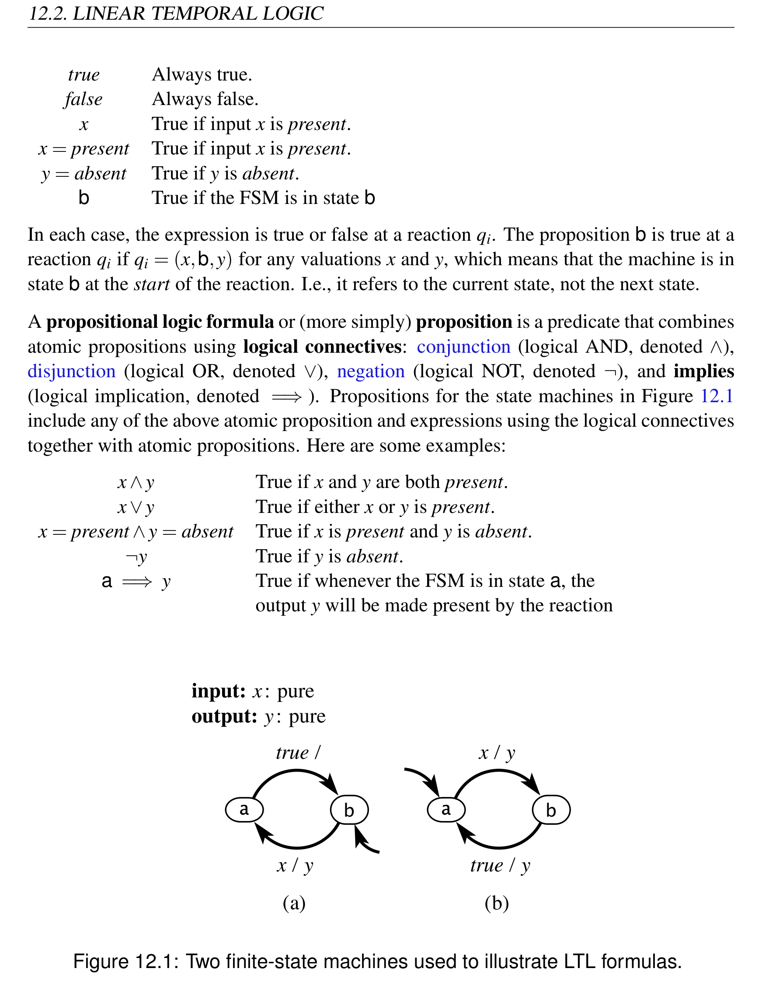
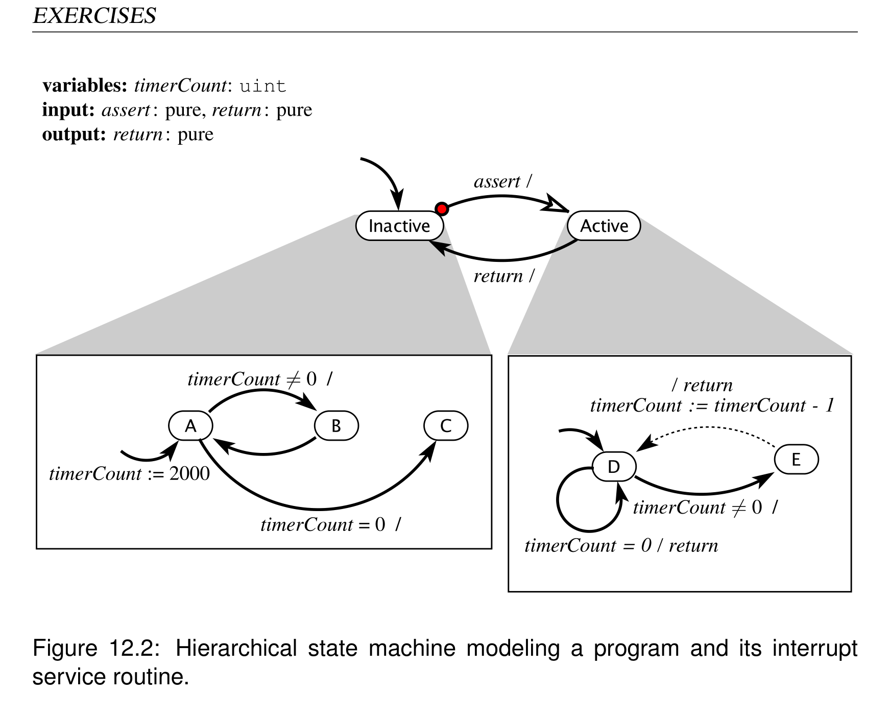

# Chapter 12: Invariants and Temporal Logic

> **Textbook**: Introduction to Embedded Systems - A Cyber-Physical Systems Approach (UC Berkeley)  
> **Authors**: Edward Ashford Lee and Sanjit Arunkumar Seshia  
> **PDF Page Range**: 349 - 366


---


<!-- Page 349 -->
### [PDF Page 349]

12
Invariants and
Temporal Logic
Contents

## 12.1 Invariants . . . . . . . . . . . . . . . . . . . . . . . . . . . . . . . . 331


## 12.2 Linear Temporal Logic . . . . . . . . . . . . . . . . . . . . . . . . 333


### 12.2.1 Propositional Logic Formulas

. . . . . . . . . . . . . . . . . 333

### 12.2.2 LTL Formulas

. . . . . . . . . . . . . . . . . . . . . . . . . 335

### Sidebar: Probing Further: Alternative Temporal Logics . . . . . . . . 338


### 12.2.3 Using LTL Formulas . . . . . . . . . . . . . . . . . . . . . . 339


## 12.3 Summary . . . . . . . . . . . . . . . . . . . . . . . . . . . . . . . . 341


### Sidebar: Safety and Liveness Properties . . . . . . . . . . . . . . . . 342


### Exercises . . . . . . . . . . . . . . . . . . . . . . . . . . . . . . . . . . . 343

Every embedded system must be designed to meet certain requirements. Such system
requirements are also called properties or specifications. The need for specifications is
aptly captured by the following quotation (paraphrased from Young et al. (1985)):
“A design without specifications cannot be right or wrong, it can only be
surprising!”
329


<!-- Page 350 -->
### [PDF Page 350]

In present engineering practice, it is common to have system requirements stated in a nat-
ural language such as English. As an example, consider the SpaceWire communication
protocol that is gaining adoption with several national space agencies (European Cooper-
ation for Space Standardization, 2002). Here are two properties reproduced from Section
8.5.2.2 of the specification document, stating conditions on the behavior of the system
upon reset:
1. “The ErrorReset state shall be entered after a system reset, after link operation has
been terminated for any reason or if there is an error during link initialization.”
2. “Whenever the reset signal is asserted the state machine shall move immediately to
the ErrorReset state and remain there until the reset signal is de-asserted.”
It is important to precisely state requirements to avoid ambiguities inherent in natural
languages. For example, consider the first property of the SpaceWire protocol stated
above. Observe that there is no mention of when the ErrorReset state is to be entered. The
systems that implement the SpaceWire protocol are synchronous, meaning that transitions
of the state machine occur on ticks of a system clock. Given this, must the ErrorReset
state be entered on the very next tick after one of the three conditions becomes true or on
some subsequent tick of the clock? As it turns out, the document intends the system to
make the transition to ErrorReset on the very next tick, but this is not made precise by the
English language description.
This chapter will introduce techniques to specify system properties mathematically and
precisely. A mathematical specification of system properties is also known as a formal
specification. The specific formalism we will use is called temporal logic. As the name
suggests, temporal logic is a precise mathematical notation with associated rules for rep-
resenting and reasoning about timing-related properties of systems. While temporal logic
has been used by philosophers and logicians since the times of Aristotle, it is only in the
last thirty years that it has found application as a mathematical notation for specifying
system requirements.
One of the most common kinds of system property is an invariant. It is also one of
the simplest forms of a temporal logic property. We will first introduce the notion of an
invariant and then generalize it to more expressive specifications in temporal logic.
330
Lee & Seshia, Introduction to Embedded Systems


<!-- Page 351 -->
### [PDF Page 351]

12. INVARIANTS AND TEMPORAL LOGIC
12.1
Invariants
An invariant is a property that holds for a system if it remains true at all times during
operation of the system. Put another way, an invariant holds for a system if it is true in the
initial state of the system, and it remains true as the system evolves, after every reaction,
in every state.
In practice, many properties are invariants.
Both properties of the SpaceWire proto-
col stated above are invariants, although this might not be immediately obvious. Both
SpaceWire properties specify conditions that must remain true always. Below is an ex-
ample of an invariant property of a model that we have encountered in Chapter 3.
Example 12.1: Consider the model of a traffic light controller given in Figure 3.10
and its environment as modeled in Figure 3.11. Consider the system formed by the
asynchronous composition of these two state machines. An obvious property that
the composed system must satisfy is that there is no pedestrian crossing when the
traffic light is green (when cars are allowed to move). This property must always
remain true of this system, and hence is a system invariant.
It is also desirable to specify invariant properties of software and hardware implemen-
tations of embedded systems. Some of these properties specify correct programming
practice on language constructs. For example, the C language property
“The program never dereferences a null pointer”
is an invariant specifying good programming practice. Typically dereferencing a null
pointer in a C program results in a segmentation fault, possibly leading to a system crash.
Similarly, several desirable properties of concurrent programs are invariants, as illustrated
in the following example.
Example 12.2: Consider the following property regarding an absence of deadlock:
If a thread A blocks while trying to acquire a mutex lock, then the thread
B that holds that lock must not be blocked attempting to acquire a lock
held by A.
Lee & Seshia, Introduction to Embedded Systems
331


<!-- Page 352 -->
### [PDF Page 352]

12.1. INVARIANTS
This property is required to be an invariant on any multithreaded program con-
structed from threads A and B. The property may or may not hold for a particular
program. If it does not hold, there is risk of deadlock.
Many system invariants also impose requirements on program data, as illustrated in the
example below.
Example 12.3: Consider the following example of a software task from the open
source Paparazzi unmanned aerial vehicle (UAV) project (Nemer et al., 2006):
1

```c
void altitude_control_task(void) {
```

2

```c
if (pprz_mode == PPRZ_MODE_AUTO2
```

3
|| pprz_mode == PPRZ_MODE_HOME) {
4

```c
if (vertical_mode == VERTICAL_MODE_AUTO_ALT) {
```

5

```c
float err = estimator_z - desired_altitude;
```

6
desired_climb
7
= pre_climb + altitude_pgain * err;
8

```c
if (desired_climb < -CLIMB_MAX) {
```

9
desired_climb = -CLIMB_MAX;
10
}
11

```c
if (desired_climb > CLIMB_MAX) {
```

12
desired_climb = CLIMB_MAX;
13
}
14
}
15
}
16
}
For this example, it is required that the value of the desired climb variable at
the end of altitude control task remains within the range [-CLIMB MAX,
CLIMB MAX]. This is an example of a special kind of invariant, a postcondition,
that must be maintained every time altitude control task returns. Deter-
mining whether this is the case requires analyzing the control flow of the program.
332
Lee & Seshia, Introduction to Embedded Systems


<!-- Page 353 -->
### [PDF Page 353]

12. INVARIANTS AND TEMPORAL LOGIC
12.2
Linear Temporal Logic
We now give a formal description of temporal logic and illustrate with examples of how
it can be used to specify system behavior. In particular, we study a particular kind of tem-
poral logic known as linear temporal logic, or LTL. There are other forms of temporal
logic, some of which are briefly surveyed in sidebars.
Using LTL, one can express a property over a single, but arbitrary execution of a system.
For instance, one can express the following kinds of properties in LTL:
• Occurrence of an event and its properties. For example, one can express the prop-
erty that an event A must occur at least once in every trace of the system, or that it
must occur infinitely many times.
• Causal dependency between events. An example of this is the property that if an
event A occurs in a trace, then event B must also occur.
• Ordering of events. An example of this kind of property is one specifying that every
occurrence of event A is preceded by a matching occurrence of B.
We now formalize the above intuition about the kinds of properties expressible in linear
temporal logic. In order to perform this formalization, it is helpful to fix a particular
formal model of computation. We will use the theory of finite-state machines, introduced
in Chapter 3.
Recall from Section 3.6 that an execution trace of a finite-state machine is a sequence of
the form
q0, q1, q2, q3, ...,
where qj = (xj,sj,yj), sj is the state, xj is the input valuation, and yj is the output valuation
at reaction j.
12.2.1
Propositional Logic Formulas
First, we need to be able to talk about conditions at each reaction, such as whether an
input or output is present, what the value of an input or output is, or what the state is.
Let an atomic proposition be such a statement about the inputs, outputs, or states. It is a
predicate (an expression that evaluates to true or false). Examples of atomic propositions
that are relevant for the state machines in Figure 12.1 are:
Lee & Seshia, Introduction to Embedded Systems
333


<!-- Page 354 -->
### [PDF Page 354]

12.2. LINEAR TEMPORAL LOGIC
true
Always true.
false
Always false.
x
True if input x is present.
x = present
True if input x is present.
y = absent
True if y is absent.
b
True if the FSM is in state b
In each case, the expression is true or false at a reaction qi. The proposition b is true at a
reaction qi if qi = (x,b,y) for any valuations x and y, which means that the machine is in
state b at the start of the reaction. I.e., it refers to the current state, not the next state.
A propositional logic formula or (more simply) proposition is a predicate that combines
atomic propositions using logical connectives: conjunction (logical AND, denoted ∧),
disjunction (logical OR, denoted ∨), negation (logical NOT, denoted ¬), and implies
(logical implication, denoted =⇒). Propositions for the state machines in Figure 12.1
include any of the above atomic proposition and expressions using the logical connectives
together with atomic propositions. Here are some examples:
x∧y
True if x and y are both present.
x∨y
True if either x or y is present.
x = present ∧y = absent
True if x is present and y is absent.
¬y
True if y is absent.
a =⇒y
True if whenever the FSM is in state a, the
output y will be made present by the reaction


*Description*: Finite state machine (FSM) transition diagram specifying states, guard conditions, input triggers, and output actions for Figure 12.1: Two finite-state machines used to illustrate LTL formulas..

> **Figure 12.1: Two finite-state machines used to illustrate LTL formulas.**

334
Lee & Seshia, Introduction to Embedded Systems


<!-- Page 355 -->
### [PDF Page 355]

12. INVARIANTS AND TEMPORAL LOGIC
Note that if p1 and p2 are propositions, the proposition p1 =⇒p2 is true if and only if
¬p2 =⇒¬p1. In other words, if we wish to establish that p1 =⇒p2 is true, it is equally
valid to establish that ¬p2 =⇒¬p1 is true. In logic, the latter expression is called the
contrapositive of the former.
Note further that p1 =⇒p2 is true if p1 is false. This is easy to see by considering the
contrapositive. The proposition ¬p2 =⇒¬p1 is true regardless of p2 if ¬p1 is true. Thus,
another proposition that is equivalent to p1 =⇒p2 is
¬p1 ∨(p1 ∧p2) .
12.2.2
LTL Formulas
An LTL formula, unlike the above propositions, applies to an entire trace
q0, q1, q2, ...,
rather than to just one reaction qi. The simplest LTL formulas look just like the proposi-
tions above, but they apply to an entire trace rather than just a single element of the trace.
If p is a proposition, then by definition, we say that LTL formula φ = p holds for the
trace q0,q1,q2,... if and only if p is true for q0. It may seem odd to say that the formula
holds for the entire trace even though the proposition only holds for the first element of
the trace, but we will see that LTL provides ways to reason about the entire trace.
By convention, we will denote LTL formulas by φ, φ1, φ2, etc. and propositions by p, p1,
p2, etc.
Given a state machine M and an LTL formula φ, we say that φ holds for M if φ holds for
all possible traces of M. This typically requires considering all possible inputs.
Example 12.4:
The LTL formula a holds for Figure 12.1(b), because all traces
begin in state a. It does not hold for Figure 12.1(a).
The LTL formula x =⇒y holds for both machines. In both cases, in the first
reaction, if x is present, then y will be present.
To demonstrate that an LTL formula is false for an FSM, it is sufficient to give one trace for
which it is false. Such a trace is called a counterexample. To show that an LTL formula
Lee & Seshia, Introduction to Embedded Systems
335


<!-- Page 356 -->
### [PDF Page 356]

12.2. LINEAR TEMPORAL LOGIC
is true for an FSM, you must demonstrate that it is true for all traces, which is often much
harder (although not so much harder when the LTL formula is a simple propositional logic
formula, because in that case we only have to consider the first element of the trace).
Example 12.5: The LTL formula y is false for both FSMs in Figure 12.1. In both
cases, a counterexample is a trace where x is absent in the first reaction.
In addition to propositions, LTL formulas can also have one or more special temporal
operators. These make LTL much more interesting, because they enable reasoning about
entire traces instead of just making assertions about the first element of a trace. There are
four main temporal operators, which we describe next.
G Operator
The property Gφ (which is read as “globally φ”) holds for a trace if φ holds for every suffix
of that trace. (A suffix is a tail of a trace beginning with some reaction and including all
subsequent reactions.)
In mathematical notation, Gφ holds for the trace if and only if, for all j ≥0, formula φ
holds in the suffix qj,qj+1,qj+2,....
Example 12.6: In Figure 12.1(b), G(x =⇒y) is true for all traces of the machine,
and hence holds for the machine. G(x∧y) does not hold for the machine, because
it is false for any trace where x is absent in any reaction. Such a trace provides a
counterexample.
If φ is a propositional logic formula, then Gφ simply means that φ holds in every reaction.
We will see, however, that when we combine the G operator with other temporal logic
operators, we can make much more interesting statements about traces and about state
machines.
336
Lee & Seshia, Introduction to Embedded Systems


<!-- Page 357 -->
### [PDF Page 357]

12. INVARIANTS AND TEMPORAL LOGIC
F Operator
The property Fφ (which is read as “eventually φ” or “finally φ”) holds for a trace if φ
holds for some suffix of the trace.
Formally, Fφ holds for the trace if and only if, for some j ≥0, formula φ holds in the
suffix qj,qj+1,qj+2,....
Example 12.7:
In Figure 12.1(a), Fb is trivially true because the machine starts
in state b, hence, for all traces, the proposition b holds for the trace itself (the very
first suffix).
More interestingly, G(x =⇒Fb) holds for Figure 12.1(a). This is because if x is
present in any reaction, then the machine will eventually be in state b. This is true
even in suffixes that start in state a.
Notice that parentheses can be important in interpreting an LTL formula. For ex-
ample, (Gx) =⇒(Fb) is trivially true because Fb is true for all traces (since the
initial state is b).
Notice that F¬φ holds if and only if ¬Gφ. That is, stating that φ is eventually false is the
same as stating that φ is not always true.
X Operator
The property Xφ (which is read as “next state φ” ) holds for a trace q0,q1,q2,... if and
only if φ holds for the trace q1,q2,q3,....
Example 12.8: In Figure 12.1(a), x =⇒Xa holds for the state machine, because
if x is present in the first reaction, then the next state will be a. G(x =⇒Xa) does
not hold for the state machine because it does not hold for any suffix that begins in
state a.
In Figure 12.1(b), G(b =⇒Xa) holds for the state machine.
Lee & Seshia, Introduction to Embedded Systems
337


<!-- Page 358 -->
### [PDF Page 358]

12.2. LINEAR TEMPORAL LOGIC
U Operator
The property φ1Uφ2 (which is read as “φ1 until φ2”) holds for a trace if φ2 holds for some
suffix of that trace, and φ1 holds until φ2 becomes true.
Formally, φ1Uφ2 holds for the trace if and only if there exists j ≥0 such that φ2 holds in
the suffix qj,qj+1,qj+2,... and φ1 holds in suffixes qi,qi+1,qi+2,..., for all i s.t. 0 ≤i < j.
φ1 may or may not hold for qj,qj+1,qj+2,....

### Probing Further: Alternative Temporal Logics

Amir Pnueli (1977) was the first to formalize temporal logic as a way of specifying pro-
gram properties. For this he won the 1996 ACM Turing Award, the highest honor in
Computer Science. Since his seminal paper, temporal logic has become widespread as a
way of specifying properties for a range of systems, including hardware, software, and
cyber-physical systems.
In this chapter, we have focused on LTL, but there are several alternatives. LTL for-
mulas apply to individual traces of an FSM, and in this chapter, by convention, we assert
than an LTL formula holds for an FSM if it holds for all possible traces of the FSM. A
more general logic called computation tree logic (CTL∗) explicitly provides quantifiers
over possible traces of an FSM (Emerson and Clarke (1980); Ben-Ari et al. (1981)). For
example, we can write a CTL∗expression that holds for an FSM if there exists any trace
that satisfies some property, rather than insisting that the property must hold for all traces.
CTL∗is called a branching-time logic because whenever a reaction of the FSM has a
nondeterministic choice, it will simultaneously consider all options. LTL, by contrast,
considers only one trace at a time, and hence it is called a linear-time logic. Our conven-
tion of asserting that an LTL formula holds for an FSM if it holds for all traces cannot be
expressed directly in LTL, because LTL does not include quantifiers like “for all traces.”
We have to step outside the logic to apply this convention. With CTL∗, this convention is
expressible directly in the logic.
Other temporal logic variants include real-time temporal logics (e.g., timed compu-
tation tree logic or TCTL), for reasoning about real-time systems (Alur et al., 1991); and
probabilistic temporal logics, for reasoning about probabilistic models such as Markov
chains or Markov decision processes (see, for example, Hansson and Jonsson (1994)).
338
Lee & Seshia, Introduction to Embedded Systems


<!-- Page 359 -->
### [PDF Page 359]

12. INVARIANTS AND TEMPORAL LOGIC
Example 12.9:
In Figure 12.1(b), aUx is true for any trace for which Fx holds.
Since this does not include all traces, aUx does not hold for the state machine.
Some authors define a weaker form of the U operator that does not require φ2 to hold.
Using our definition, this can be written
(Gφ1)∨(φ1Uφ2) .
This holds if either φ1 always holds (for any suffix) or, if φ2 holds for some suffix, then φ1
holds for all previous suffixes. This can equivalently be written
(F¬φ1) =⇒(φ1Uφ2) .
Example 12.10: In Figure 12.1(b), (G¬x)∨(aUx) holds for the state machine.
12.2.3
Using LTL Formulas
Consider the following English descriptions of properties and their corresponding LTL
formalizations:
Example 12.11: “Whenever the robot is facing an obstacle, eventually it moves at
least 5 cm away from the obstacle.”
Let p denote the condition that the robot is facing an obstacle, and q denote the con-
dition where the robot is at least 5 cm away from the obstacle. Then, this property
can be formalized in LTL as
G(p =⇒Fq) .
Lee & Seshia, Introduction to Embedded Systems
339


<!-- Page 360 -->
### [PDF Page 360]

12.2. LINEAR TEMPORAL LOGIC
Example 12.12: Consider the SpaceWire property:
“Whenever the reset signal is asserted the state machine shall move immediately to
the ErrorReset state and remain there until the reset signal is de-asserted.”
Let p be true when the reset signal is asserted, and q be true when the state of the
FSM is ErrorReset. Then, the above English property is formalized in LTL as:
G(p =⇒X(qU¬p)) .
In the above formalization, we have interpreted “immediately” to mean that the
state changes to ErrorReset in the very next time step. Moreover, the above LTL
formula will fail to hold for any execution where the reset signal is asserted and
not eventually de-asserted. It was probably the intent of the standard that the reset
signal should be eventually de-asserted, but the English language statement does
not make this clear.
Example 12.13: Consider the traffic light controller in Figure 3.10. A property of
this controller is that the outputs always cycle through sigG, sigY and sigR. We can
express this in LTL as follows:
G
{
(sigG =⇒X((¬sigR∧¬sigG)UsigY))
∧
(sigY =⇒X((¬sigG∧¬sigY)UsigR))
∧
(sigR =⇒X((¬sigY ∧¬sigR)UsigG))
} .
The following LTL formulas express commonly useful properties.
(a) Infinitely many occurrences: This property is of the form GFp, meaning that it is
always the case that p is true eventually. Put another way, this means that p is true
infinitely often.
(b) Steady-state property: This property is of the form FGp, read as “from some point
in the future, p holds at all times.” This represents a steady-state property, indicating
340
Lee & Seshia, Introduction to Embedded Systems


<!-- Page 361 -->
### [PDF Page 361]

12. INVARIANTS AND TEMPORAL LOGIC
that after some point in time, the system reaches a steady state in which p is always
true.
(c) Request-response property: The formula G(p =⇒Fq) can be interpreted to mean
that a request p will eventually produce a response q.
12.3

### Summary

Dependability and correctness are central concerns in embedded systems design. Formal
specifications, in turn, are central to achieving these goals. In this chapter, we have studied
temporal logic, one of the main approaches for writing formal specifications. This chapter
has provided techniques for precisely stating properties that must hold over time for a
system. It has specifically focused on linear temporal logic, which is able to express
many safety and liveness properties of systems.
Lee & Seshia, Introduction to Embedded Systems
341


<!-- Page 362 -->
### [PDF Page 362]

12.3. SUMMARY
Safety and Liveness Properties
System properties may be safety or liveness properties. Informally, a safety property is
one specifying that “nothing bad happens” during execution. Similarly, a liveness prop-
erty specifies that “something good will happen” during execution.
More formally, a property p is a safety property if a system execution does not satisfy
p if and only if there exists a finite-length prefix of the execution that cannot be extended
to an infinite execution satisfying p. We say p is a liveness property if every finite-length
execution trace can be extended to an infinite execution that satisfies p. See Lamport
(1977) and Alpern and Schneider (1987) for a theoretical treatment of safety and liveness.
The properties we have seen in Section 12.1 are all examples of safety properties. Live-
ness properties, on the other hand, specify performance or progress requirements on a
system. For a state machine, a property of the form Fφ is a liveness property. No finite
execution can establish that this property is not satisfied.
The following is a slightly more elaborate example of a liveness property:
“Whenever an interrupt is asserted, the corresponding interrupt service rou-
tine (ISR) is eventually executed.”
In temporal logic, if p1 is the property than an interrupt is asserted, and p2 is the property
that the interrupt service routine is executed, then this property can be written
G(p1 =⇒Fp2) .
Note that both safety and liveness properties can constitute system invariants. For ex-
ample, the above liveness property on interrupts is also an invariant; p1 =⇒Fp2 must
hold in every state.
Liveness properties can be either bounded or unbounded. A bounded liveness property
specifies a time bound on something desirable happening (which makes it a safety prop-
erty). In the above example, if the ISR must be executed within 100 clock cycles of the
interrupt being asserted, the property is a bounded liveness property; otherwise, if there is
no such time bound on the occurrence of the ISR, it is an unbounded liveness property.
LTL can express a limited form of bounded liveness properties using the X operator, but
it does not provide any mechanism for quantifying time directly.
342
Lee & Seshia, Introduction to Embedded Systems


<!-- Page 363 -->
### [PDF Page 363]

12. INVARIANTS AND TEMPORAL LOGIC

### Exercises

1. Consider the following state machine:
(Recall that the dashed line represents a default transition.) For each of the fol-
lowing LTL formulas, determine whether it is true or false, and if it is false, give a
counterexample:
(a) x =⇒Fb
(b) G(x =⇒F(y = 1))
(c) (Gx) =⇒F(y = 1)
(d) (Gx) =⇒GF(y = 1)
(e) G((b∧¬x) =⇒FGc)
(f) G((b∧¬x) =⇒Gc)
(g) (GF¬x) =⇒FGc
2. This problem is concerned with specifying in linear temporal logic tasks to be per-
formed by a robot. Suppose the robot must visit a set of n locations l1,l2,...,ln. Let
pi be an atomic formula that is true if and only if the robot visits location li.
Give LTL formulas specifying the following tasks:
(a) The robot must eventually visit at least one of the n locations.
(b) The robot must eventually visit all n locations, but in any order.
(c) The robot must eventually visit all n locations, in the order
l1,l2,...,ln.
Lee & Seshia, Introduction to Embedded Systems
343


<!-- Page 364 -->
### [PDF Page 364]


### EXERCISES



*Description*: Finite state machine (FSM) transition diagram specifying states, guard conditions, input triggers, and output actions for Figure 12.2: Hierarchical state machine modeling a program and its interrupt.

> **Figure 12.2: Hierarchical state machine modeling a program and its interrupt**

service routine.
3. Consider a system M modeled by the hierarchical state machine of Figure 12.2,
which models an interrupt-driven program. M has two modes: Inactive, in which
the main program executes, and Active, in which the interrupt service routine (ISR)
executes. The main program and ISR read and update a common variable timer-
Count.
Answer the following questions:
(a) Specify the following property φ in linear temporal logic, choosing suitable
atomic propositions:
φ: The main program eventually reaches program location C.
(b) Does M satisfy the above LTL property? Justify your answer by constructing
the product FSM. If M does not satisfy the property, under what conditions
would it do so? Assume that the environment of M can assert the interrupt at
any time.
344
Lee & Seshia, Introduction to Embedded Systems


<!-- Page 365 -->
### [PDF Page 365]

12. INVARIANTS AND TEMPORAL LOGIC
4. Express the postcondition of Example 12.3 as an LTL formula. State your assump-
tions clearly.
Lee & Seshia, Introduction to Embedded Systems
345


<!-- Page 366 -->
### [PDF Page 366]


### EXERCISES

346
Lee & Seshia, Introduction to Embedded Systems


