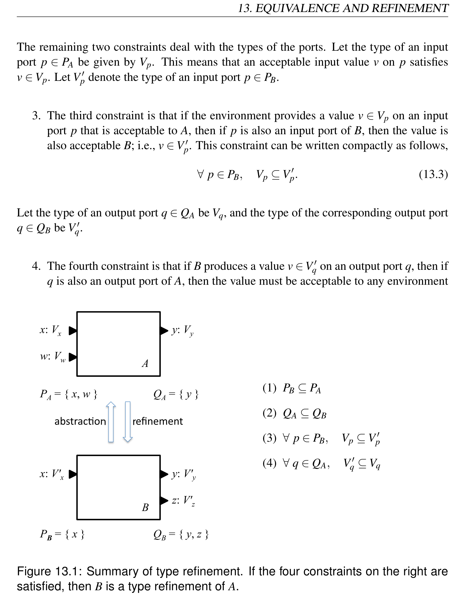
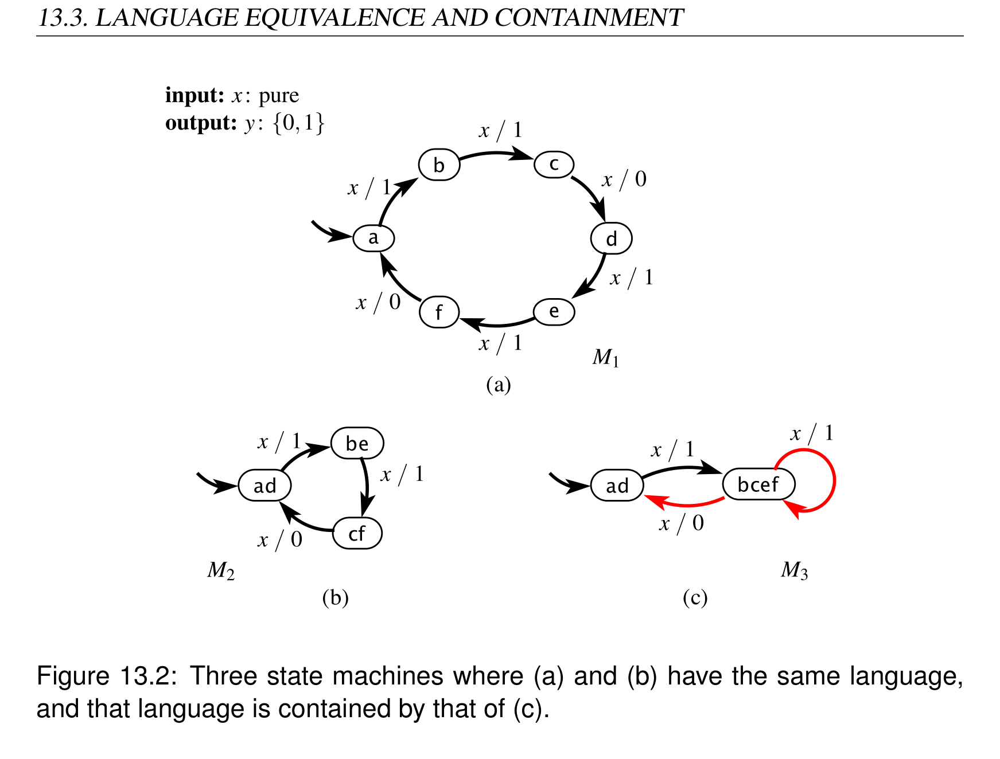
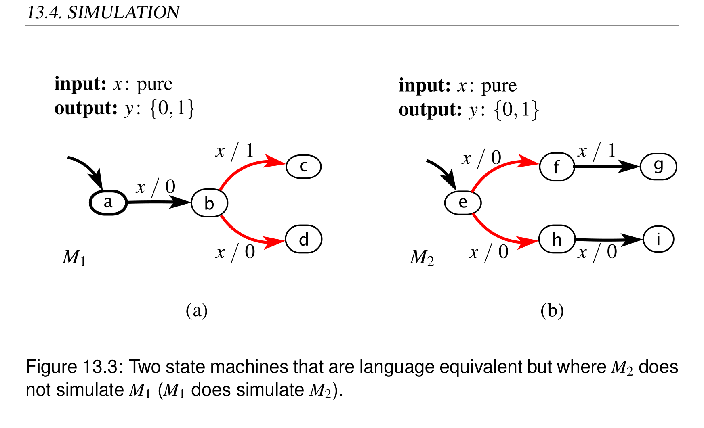
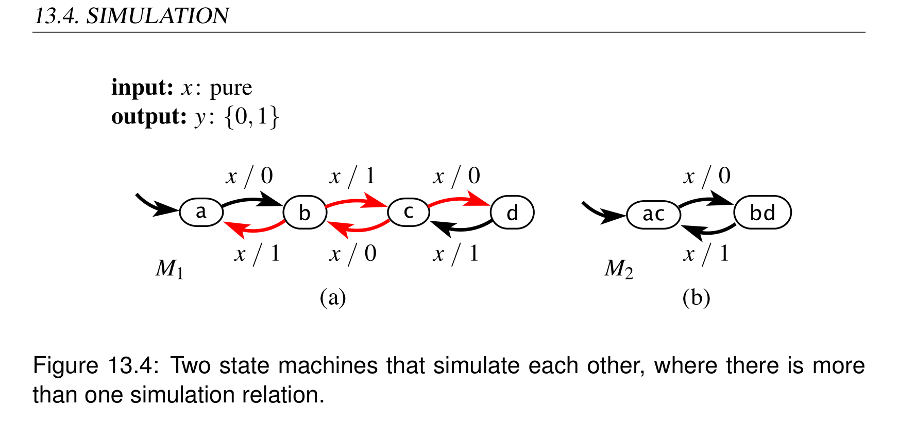
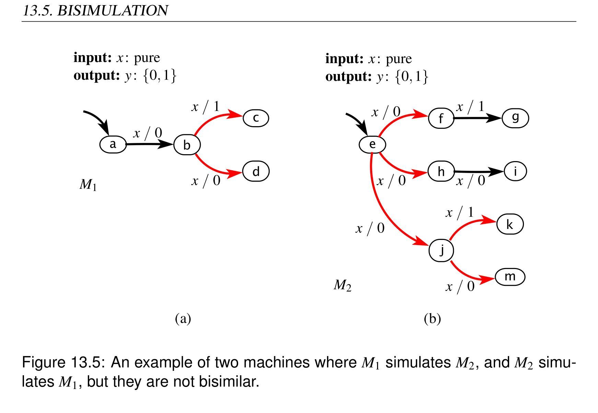
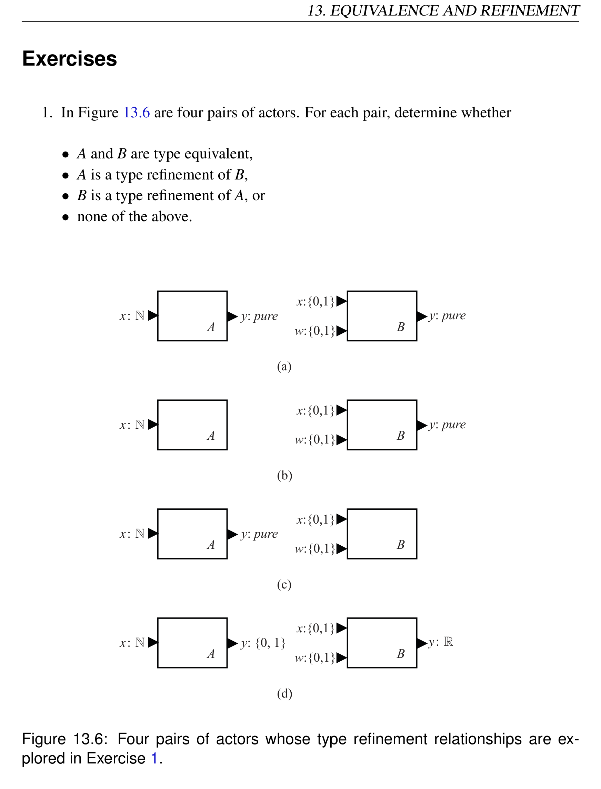
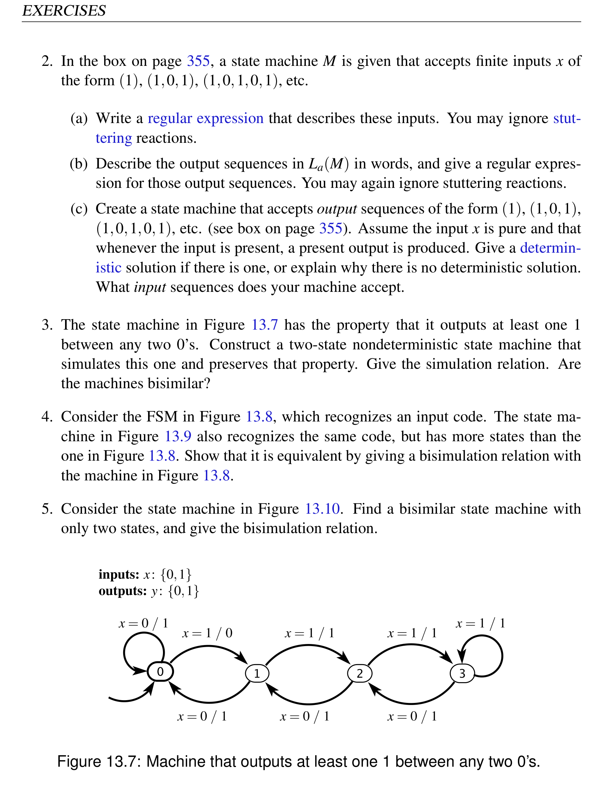
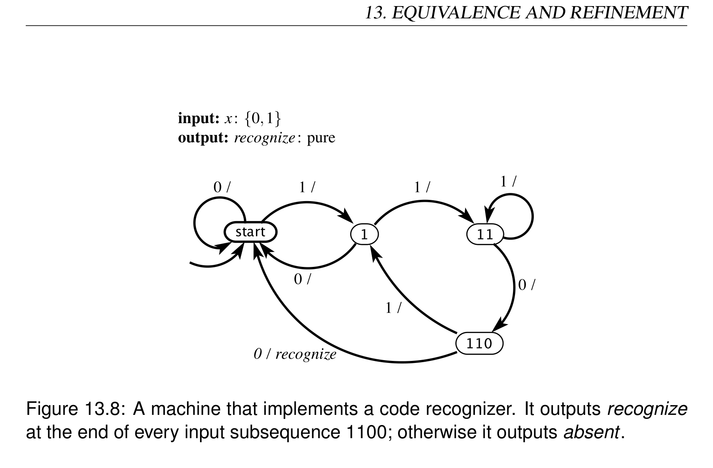
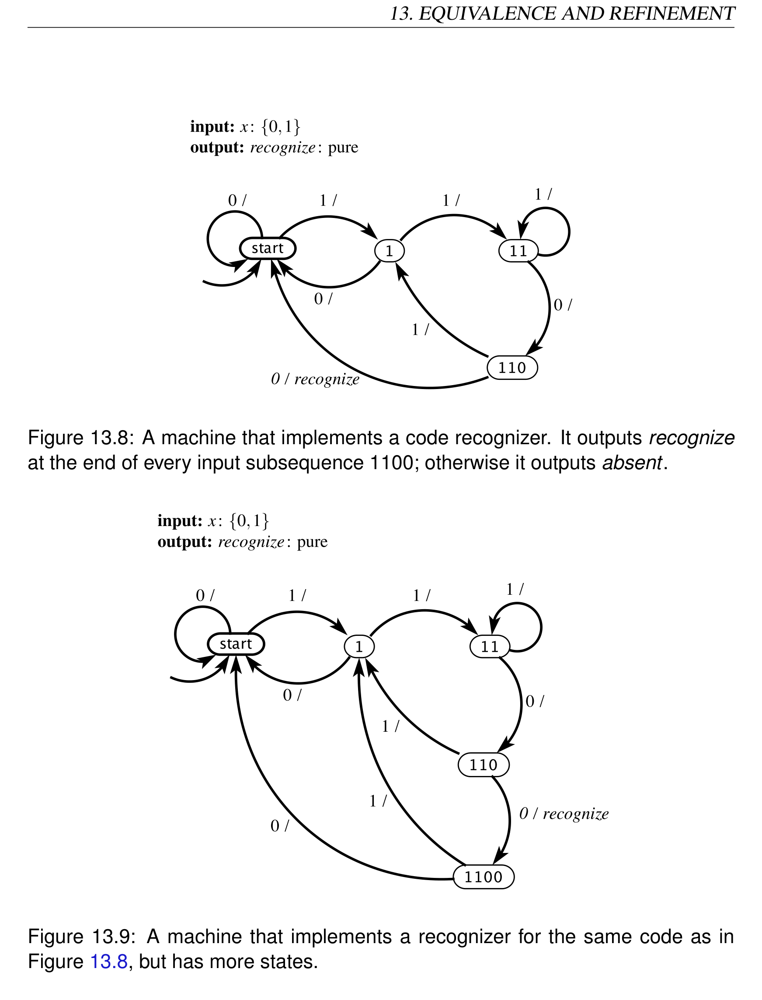
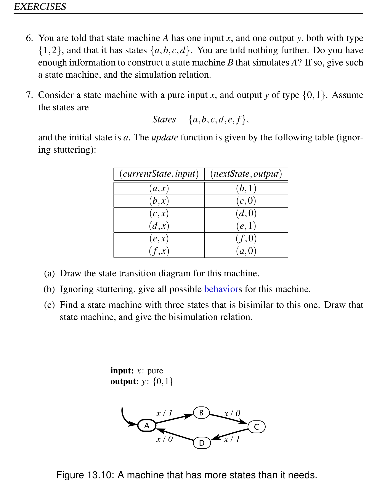

# Chapter 13: Equivalence and Refinement

> **Textbook**: Introduction to Embedded Systems - A Cyber-Physical Systems Approach (UC Berkeley)  
> **Authors**: Edward Ashford Lee and Sanjit Arunkumar Seshia  
> **PDF Page Range**: 367 - 392


---


<!-- Page 367 -->
### [PDF Page 367]

13
Equivalence and Refinement
Contents

## 13.1 Models as Specifications . . . . . . . . . . . . . . . . . . . . . . . . 348


### Sidebar: Abstraction and Refinement . . . . . . . . . . . . . . . . . . 349


## 13.2 Type Equivalence and Refinement . . . . . . . . . . . . . . . . . . 350


## 13.3 Language Equivalence and Containment

. . . . . . . . . . . . . . 352

### Sidebar: Finite Sequences and Accepting States . . . . . . . . . . . . 355


### Sidebar: Regular Languages and Regular Expressions

. . . . . . . . 356

### Sidebar: Probing Further: Omega Regular Languages

. . . . . . . . 357

## 13.4 Simulation . . . . . . . . . . . . . . . . . . . . . . . . . . . . . . . 358


### 13.4.1 Simulation Relations . . . . . . . . . . . . . . . . . . . . . . 360


### 13.4.2 Formal Model . . . . . . . . . . . . . . . . . . . . . . . . . . 362


### 13.4.3 Transitivity . . . . . . . . . . . . . . . . . . . . . . . . . . . 363


### 13.4.4 Non-Uniqueness of Simulation Relations . . . . . . . . . . . 363


### 13.4.5 Simulation vs. Language Containment . . . . . . . . . . . . . 364


## 13.5 Bisimulation . . . . . . . . . . . . . . . . . . . . . . . . . . . . . . 366


## 13.6 Summary . . . . . . . . . . . . . . . . . . . . . . . . . . . . . . . . 368


### Exercises . . . . . . . . . . . . . . . . . . . . . . . . . . . . . . . . . . . 369

347


<!-- Page 368 -->
### [PDF Page 368]

13.1. MODELS AS SPECIFICATIONS
This chapter discusses some fundamental ways to compare state machines and other
modal models, such as trace equivalence, trace containment, simulation, and bisimula-
tion. These mechanisms can be used to check conformance of a state machine against a
specification.
13.1
Models as Specifications
The previous chapter provided techniques for unambiguously stating properties that a
system must have to be functioning properly and safely. These properties were expressed
using linear temporal logic, which can concisely describe requirements that the trace of
a finite-state machine must satisfy. An alternative way to give requirements is to provide
a model, a specification, that exhibits expected behavior of the system. Typically, the
specification is quite abstract, and it may exhibit more behaviors than a useful implemen-
tation of the system would. But the key to being a useful specification is that it explicitly
excludes undesired or dangerous behaviors.
Example 13.1:
A simple specification for a traffic light might state: “The lights
should always be lighted in the order green, yellow, red. It should never, for exam-
ple, go directly from green to red, or from yellow to green.” This requirement can
be given as a temporal logic formula (as is done in Example 12.13) or as an abstract
model (as is done in Figure 3.12).
The topic of this chapter is on the use of abstract models as specifications, and on how
such models relate to an implementation of a system and to temporal logic formulas.
Example 13.2:
We will show how to demonstrate that the traffic light model
shown in Figure 3.10 is a valid implementation of the specification in Figure 3.12.
Moreover, all traces of the model in Figure 3.10 satisfy the temporal logic formula
in Example 12.13, but not all traces of the specification in Figure 3.12 do. Hence,
these two specifications are not the same.
348
Lee & Seshia, Introduction to Embedded Systems


<!-- Page 369 -->
### [PDF Page 369]

13. EQUIVALENCE AND REFINEMENT
This chapter is about comparing models, and about being able to say with confidence that
one model can be used in place of another. This enables an engineering design process
where we start with abstract descriptions of desired and undesired behaviors, and suc-
cessively refine our models until we have something that is detailed enough to provide
Abstraction and Refinement
This chapter focuses on relationships between models known as abstraction and refine-
ment. These terms are symmetric in that the statement “model A is an abstraction of
model B” means the same thing as “model B is a refinement of model A.” As a general
rule, the refinement model B has more detail than the abstraction A, and the abstraction is
simpler, smaller, or easier to understand.
An abstraction is sound (with respect to some formal system of properties) if properties
that are true of the abstraction are also true of the refinement. The formal system of
properties could be, for example, a type system, linear temporal logic, or the languages
of state machines. If the formal system is LTL, then if every LTL formula that holds for
A also holds for B, then A is a sound abstraction of B. This is useful when it is easier to
prove that a formula holds for A than to prove that it holds for B, for example because the
state space of B may be much larger than the state space of A.
An abstraction is complete (with respect to some formal system of properties) if prop-
erties that are true of the refinement are also true of the abstraction. For example, if the
formal system of properties is LTL, then A is a complete abstraction of B if every LTL
formula that holds for B also holds for A. Useful abstractions are usually sound but not
complete, because it is hard to make a complete abstraction that is significantly simpler
or smaller.
Consider for example a program B in an imperative language such as C that has multi-
ple threads. We might construct an abstraction A that ignores the values of variables and
replaces all branches and control structures with nondeterministic choices. The abstrac-
tion clearly has less information than the program, but it may be sufficient for proving
some properties about the program, for example a mutual exclusion property.
Lee & Seshia, Introduction to Embedded Systems
349


<!-- Page 370 -->
### [PDF Page 370]

13.2. TYPE EQUIVALENCE AND REFINEMENT
a complete implementation. It also tells when it is safe to change an implementation,
replacing it with another that might, for example, reduce the implementation cost.
13.2
Type Equivalence and Refinement
We begin with a simple relationship between two models that compares only the data
types of their communication with their environment. Specifically, the goal is to ensure
that a model B can be used in any environment where a model A can be used without
causing any conflicts about data types. We will require that B can accept any inputs that
A can accept from the environment, and that any environment that can accept any output
A can produce can also accept any output that B can produce.
To make the problem concrete, assume an actor model for A and B, as shown in Figure
13.1. In that figure, A has three ports, two of which are input ports represented by the
set PA = {x,w}, and one of which is an output port represented by the set QA = {y}.
These ports represent communication between A and its environment. The inputs have
type Vx and Vw, which means that at a reaction of the actor, the values of the inputs will
be members of the sets Vx or Vw.
If we want to replace A by B in some environment, the ports and their types impose four
constraints:
1. The first constraint is that B does not require some input signal that the environ-
ment does not provide. If the input ports of B are given by the set PB, then this is
guaranteed by
PB ⊆PA.
(13.1)
The ports of B are a subset of the ports of A. It is harmless for A to have more input
ports than B, because if B replaces A in some environment, it can simply ignore any
input signals that it does not need.
2. The second constraint is that B produces all the output signals that the environment
may require. This is ensured by the constraint
QA ⊆QB,
(13.2)
where QA is the set of output ports of A, and QB is the set of output ports of B. It is
harmless for B to have additional output ports because an environment capable of
working with A does not expect such outputs and hence can ignore them.
350
Lee & Seshia, Introduction to Embedded Systems


<!-- Page 371 -->
### [PDF Page 371]

13. EQUIVALENCE AND REFINEMENT
The remaining two constraints deal with the types of the ports. Let the type of an input
port p ∈PA be given by Vp. This means that an acceptable input value v on p satisfies
v ∈Vp. Let V ′
p denote the type of an input port p ∈PB.
3. The third constraint is that if the environment provides a value v ∈Vp on an input
port p that is acceptable to A, then if p is also an input port of B, then the value is
also acceptable B; i.e., v ∈V ′
p. This constraint can be written compactly as follows,
∀p ∈PB,
Vp ⊆V ′
p.
(13.3)
Let the type of an output port q ∈QA be Vq, and the type of the corresponding output port
q ∈QB be V ′
q.
4. The fourth constraint is that if B produces a value v ∈V ′
q on an output port q, then if
q is also an output port of A, then the value must be acceptable to any environment
B
A
x: Vx
w: Vw
y: Vy
x: V'x
z: V'z
y: V'y
PA = { x, w }
PB = { x }
QA = { y }
QB = { y, z }
(1) PB ⊆PA
(2) QA ⊆QB
(3) ∀p ∈PB,
Vp ⊆V ′
p
(4) ∀q ∈QA,
V ′
q ⊆Vq


*Description*: Technical diagram and schematic model illustrating cyber-physical system behavior, algorithmic logic, and state progression for Figure 13.1: Summary of type refinement. If the four constraints on the right are.

> **Figure 13.1: Summary of type refinement. If the four constraints on the right are**

satisfied, then B is a type refinement of A.
Lee & Seshia, Introduction to Embedded Systems
351


<!-- Page 372 -->
### [PDF Page 372]

13.3. LANGUAGE EQUIVALENCE AND CONTAINMENT
in which A can operate. In other words,
∀q ∈QA,
V ′
q ⊆Vq.
(13.4)
The four constraints of equations (13.1) through (13.4) are summarized in Figure 13.1.
When these four constraints are satisfied, we say that B is a type refinement of A. If B
is a type refinement of A, then replacing A by B in any environment will not cause type
system problems. It could, of course, cause other problems, since the behavior of B may
not be acceptable to the environment, but that problem will be dealt with in subsequent
sections.
If B is a type refinement of A, and A is a type refinement of B, then we say that A and
B are type equivalent. They have the same input and output ports, and the types of the
ports are the same.
Example 13.3: Let A represent the nondeterministic traffic light model in Figure

## 3.12 and B represent the more detailed deterministic model in Figure 3.10. The

ports and their types are identical for both machines, so they are type equivalent.
Hence, replacing A with B or vice versa in any environment will not cause type
system problems.
Notice that since Figure 3.12 ignores the pedestrian input, it might seem reasonable
to omit that port. Let A′ represent a variant of Figure 3.12 without the pedestrian
input. It is not safe to replace A′ with B in all environments, because B requires an
input pedestrian signal, but A′ can be used in an environment that provides no such
input.
13.3
Language Equivalence and Containment
To replace a machine A with a machine B, looking at the data types of the inputs and
outputs alone is usually not enough. If A is a specification and B is an implementation,
then normally A imposes more constraints than just data types. If B is an optimization of
A (e.g., a lower cost implementation or a refinement that adds functionality or leverages
new technology), then B normally needs to conform in some way with the functionality
of A.
352
Lee & Seshia, Introduction to Embedded Systems


<!-- Page 373 -->
### [PDF Page 373]

13. EQUIVALENCE AND REFINEMENT
In this section, we consider a stronger form of equivalence and refinement. Specifically,
equivalence will mean that given a particular sequence of input valuations, the two ma-
chines produce the same output valuations.
Example 13.4: The garage counter of Figure 3.4, discussed in Example 3.4, is type
equivalent to the extended state machine version in Figure 3.8. The actor model is
shown below:
Counter
up : pure
down : pure
count : {0, …, M }
However, these two machines are equivalent in a much stronger sense than simply
type equivalence. These two machines behave in exactly the same way, as viewed

```python
from the outside. Given the same input sequence, the two machines will produce
```

the same output sequence.
Consider a port p of a state machine with type Vp. This port will have a sequence of values

```python
from the set Vp ∪{absent}, one value at each reaction. We can represent this sequence as
```

a function of the form
sp : N →Vp ∪{absent}.
This is the signal received on that port (if it is an input) or produced on that port (if it is
an output). Recall that a behavior of a state machine is an assignment of such a signal to
each port of such a machine. Recall further that the language L(M) of a state machine M
is the set of all behaviors for that state machine. Two machines are said to be language
equivalent if they have the same language.
Example 13.5:
A behavior of the garage counter is a sequence of present and
absent valuations for the two inputs, up and down, paired with the corresponding
output sequence at the output port, count. A specific example is given in Example
3.16. This is a behavior of both Figures 3.4 and 3.8. All behaviors of Figure 3.4 are
also behaviors of 3.8 and vice versa. These two machines are language equivalent.
Lee & Seshia, Introduction to Embedded Systems
353


<!-- Page 374 -->
### [PDF Page 374]

13.3. LANGUAGE EQUIVALENCE AND CONTAINMENT


*Description*: Finite state machine (FSM) transition diagram specifying states, guard conditions, input triggers, and output actions for Figure 13.2: Three state machines where (a) and (b) have the same language,.

> **Figure 13.2: Three state machines where (a) and (b) have the same language,**

and that language is contained by that of (c).
In the case of a nondeterministic machine M, two distinct behaviors may share the same
input signals. That is, given an input signal, there is more than one possible output se-
quence. The language L(M) includes all possible behaviors. Just like deterministic ma-
chines, two nondeterministic machines are language equivalent if they have the same
language.
Suppose that for two state machines A and B, L(A) ⊂L(B). That is, B has behaviors
that A does not have. This is called language containment. A is said to be a language
refinement of B. Just as with type refinement, language refinement makes an assertion
about the suitability of A as a replacement for B. If every behavior of B is acceptable to
an environment, then every behavior of A will also be acceptable to that environment. A
can substitute for B.
354
Lee & Seshia, Introduction to Embedded Systems


<!-- Page 375 -->
### [PDF Page 375]

13. EQUIVALENCE AND REFINEMENT
Finite Sequences and Accepting States
A complete execution of the FSMs considered in this text is infinite. Suppose that we
are interested in only the finite executions. To do this, we introduce the notion of an
accepting state, indicated with a double outline as in state b in the example below:
Let La(M) denote the subset of the language L(M) that results from executions that ter-
minate in an accepting state. Equivalently, La(M) includes only those behaviors in L(M)
with an infinite tail of stuttering reactions that remain in an accepting state. All such
executions are effectively finite, since after a finite number of reactions, the inputs and
outputs will henceforth be absent, or in LTL, FG¬p for every port p.
We call La(M) the language accepted by an FSM M. A behavior in La(M) specifies
for each port p a finite string, or a finite sequence of values from the type Vp. For the
above example, the input strings (1), (1,0,1), (1,0,1,0,1), etc., are all in La(M). So are
versions of these with an arbitrary finite number of absent values between any two present
values. When there is no ambiguity, we can write these strings 1, 101, 10101, etc.
In the above example, in all behaviors in La(M), the output is present a finite number
of times, in the same reactions when the input is present.
The state machines in this text are receptive, meaning that at each reaction, each input
port p can have any value in its type Vp or be absent. Hence, the language L(M) of
the machine above includes all possible sequences of input valuations. La(M) excludes
any of these that do not leave the machine in an accepting state. For example, any input
sequence with two 1’s in a row and the infinite sequence (1,0,1,0,···) are in L(M) but
not in La(M).
Note that it is sometimes useful to consider language containment when referring to the
language accepted by the state machine, rather than the language that gives all behaviors
of the state machine.
Accepting states are also called final states, since for any behavior in La(M), it is the
last state of the machine. Accepting states are further explored in Exercise 2.
Lee & Seshia, Introduction to Embedded Systems
355


<!-- Page 376 -->
### [PDF Page 376]

13.3. LANGUAGE EQUIVALENCE AND CONTAINMENT
Regular Languages and Regular Expressions
A language is a set of sequences of values from some set called its alphabet. A language
accepted by an FSM is called a regular language. A classic example of a language that
is not regular has sequences of the form 0n1n, a sequence of n zeros followed by n ones.
It is easy to see that no finite state machine can accept this language because the machine
would have to count the zeros to ensure that the number of ones matches. And the number
of zeros is not bounded. On the other hand, the input sequences accepted by the FSM in
the box on page 355, which have the form 10101···01, are regular.
A regular expression is a notation for describing regular languages. A central feature
of regular expressions is the Kleene star (or Kleene closure), named after the American
mathematician Stephen Kleene (who pronounced his name KLAY-nee). The notation V∗,
where V is a set, means the set of all finite sequences of elements from V. For example, if
V = {0,1}, then V∗is a set that includes the empty sequence (often written λ), and every
finite sequence of zeros and ones.
The Kleene star may be applied to sets of sequences. For example, if A = {00,11},
then A∗is the set of all finite sequences where zeros and ones always appear in pairs.
In the notation of regular expressions, this is written (00|11)*, where the vertical bar
means “or.” What is inside the parentheses defines the set A.
Regular expressions are sequences of symbols from an alphabet and sets of sequences.
Suppose our alphabet is A = {a,b,··· ,z}, the set of lower-case characters. Then grey
is a regular expression denoting a single sequence of four characters. The expression
grey|gray denotes a set of two sequences. Parentheses can be used to group sequences
or sets of sequences. For example, (grey)|(gray) and gr(e|a)y mean the same
thing.
Regular expressions also provide convenience notations to make them more compact
and readable. For example, the + operator means “one or more,” in contrast to the Kleene
star, which means “zero or more.” For example, a+ specifies the sequences a, aa, aaa,
etc.; it is the same as a(a*). The ? operator species “zero or one.” For example,
colou?r specifies a set with two sequences, color and colour; it is the same as
colo(λ|u)r, where λ denotes the empty sequence.
Regular expressions are commonly used in software systems for pattern matching. A
typical implementation provides many more convenience notations than the ones illus-
trated here.
356
Lee & Seshia, Introduction to Embedded Systems


<!-- Page 377 -->
### [PDF Page 377]

13. EQUIVALENCE AND REFINEMENT
Example 13.6: Machines M1 and M2 in Figure 13.2 are language equivalent. Both
machines produce output 1,1,0,1,1,0,···, possibly interspersed with absent if the
input is absent in some reactions.
Machine M3, however, has more behaviors. It can produce any output sequence
that M1 and M2 can produce, but it can also produce other outputs given the same
inputs. Thus, M1 and M2 are both language refinements of M3.
Language containment assures that an abstraction is sound with respect to LTL formulas
about input and output sequences. That is, if A is a language refinement of B, then any
LTL formula about inputs and outputs that holds for B also holds for A.
Example 13.7: Consider again the machines in Figure 13.2. M3 might be a spec-
ification. For example, if we require that any two output values 0 have at least one
intervening 1, then M3 is a suitable specification of this requirement. This require-
ment can be written as an LTL formula as follows:
G((y = 0) ⇒X((y ̸= 0)U(y = 1))).

### Probing Further: Omega Regular Languages

The regular languages discussed in the boxes on pages 355 and 356 contain only finite
sequences. But embedded systems most commonly have infinite executions. To extend
the idea of regular languages to infinite runs, we can use a B¨uchi automaton, named
after Julius Richard B¨uchi, a Swiss logician and mathematician. A B¨uchi automaton is
a possibly nondeterministic FSM that has one or more accepting states. The language
accepted by the FSM is defined to be the set of behaviors that visit one or more of the
accepting states infinitely often; in other words, these behaviors satisfy the LTL formula
GF(s1 ∨··· ∨sn), where s1,··· ,sn are the accepting states. Such a language is called an
omega-regular language or ω-regular language, a generalization of regular languages.
The reason for using ω in the name is because ω is used to construct infinite sequences,
as explained in the box on page 433.
As we will see in Chapter 14, many model checking questions can be expressed by
giving a B¨uchi automaton and then checking to see whether the ω-regular language it
defines contains any sequences.
Lee & Seshia, Introduction to Embedded Systems
357


<!-- Page 378 -->
### [PDF Page 378]

13.4. SIMULATION
If we prove that this property holds for M3, then we have implicitly proved that it
also holds for M1 and M2.
We will see in the next section that language containment is not sound with respect to LTL
formulas that refer to states of the state machines. In fact, language containment does not
require the state machines to have the same states, so an LTL formula that refers to the
states of one machine may not even apply to the other machine. A sound abstraction that
references states will require simulation.
Language containment is sometimes called trace containment, but here the term “trace”
refers only to the observable trace, not to the execution trace. As we will see next, things
get much more subtle when considering execution traces.
13.4
Simulation
Two nondeterministic FSMs may be language equivalent but still have observable differ-
ences in behavior in some environments. Language equivalence merely states that given
the same sequences of input valuations, the two machines are capable of producing the
same sequences of output valuations. However, as they execute, they make choices al-
lowed by the nondeterminism. Without being able to see into the future, these choices
could result in one of the machines getting into a state where it can no longer match the
outputs of the other.
When faced with a nondeterministic choice, each machine is free to use any policy to
make that choice. Assume that the machine cannot see into the future; that is, it cannot
anticipate future inputs, and it cannot anticipate future choices that any other machine
will make. For two machines to be equivalent, we will require that each machine be able
to make choices that allow it to match the reaction of the other machine (producing the
same outputs), and further allow it to continue to do such matching in the future. It turns
out that language equivalence is not strong enough to ensure that this is possible.
Example 13.8: Consider the two state machines in Figure 13.3. Suppose that M2 is
acceptable in some environment (every behavior it can exhibit in that environment
358
Lee & Seshia, Introduction to Embedded Systems


<!-- Page 379 -->
### [PDF Page 379]

13. EQUIVALENCE AND REFINEMENT
is consistent with some specification or design intent). Is it safe for M1 to replace
M2? The two machines are language equivalent. In all behaviors, the output is one
of two finite strings, 01 or 00, for both machines. So it would seem that M1 can
replace M2. But this is not necessarily the case.
Suppose we compose each of the two machines with its own copy of the environ-
ment that finds M2 acceptable. In the first reaction where x is present, M1 has no
choice but to take the transition to state b and produce the output y = 0. However,
M2 must choose between f and h. Whichever choice it makes, M2 matches the out-
put y = 0 of M1 but enters a state where it is no longer able to always match the
outputs of M1. If M1 can observe the state of M2 when making its choice, then in
the second reaction where x is present, it can choose a transition that M2 can never
match. Such a policy for M1 ensures that the behavior of M1, given the same inputs,
is never the same as the behavior of M2. Hence, it is not safe to replace M2 with
M1.
On the other hand, if M1 is acceptable in some environment, is it safe for M2 to
replace M1? What it means for M1 to be acceptable in the environment is that
whatever decisions it makes are acceptable. Thus, in the second reaction where x is
present, both outputs y = 1 and y = 0 are acceptable. In this second reaction, M2 has
no choice but to produce one or the other these outputs, and it will inevitably tran-
sition to a state where it continues to match the outputs of M1 (henceforth forever
absent). Hence it is safe for M2 to replace M1.
In the above example, we can think of the machines as maliciously trying to make M1
look different from M2. Since they are free to use any policy to make choices, they are
free to use policies that are contrary to our goal to replace M2 with M1. Note that the ma-
chines do not need to know the future; it is sufficient to simply have good visibility of the
present. The question that we address in this section is: under what circumstances can we
assure that there is no policy for making nondeterministic choices that can make machine
M1 observably different from M2? The answer is a stronger form of equivalence called
bisimulation and a refinement relation called simulation. We begin with the simulation
relation.
Lee & Seshia, Introduction to Embedded Systems
359


<!-- Page 380 -->
### [PDF Page 380]

13.4. SIMULATION


*Description*: Finite state machine (FSM) transition diagram specifying states, guard conditions, input triggers, and output actions for Figure 13.3: Two state machines that are language equivalent but where M2 does.

> **Figure 13.3: Two state machines that are language equivalent but where M2 does**

not simulate M1 (M1 does simulate M2).
13.4.1
Simulation Relations
First, notice that the situation given in Example 13.8 is not symmetric. It is safe for M2
to replace M1, but not the other way around. Hence, M2 is a refinement of M1, in a sense
that we will now establish. M1, on the other hand, is not a refinement of M2.
The particular kind of refinement we now consider is a simulation refinement. The
following statements are all equivalent:
• M2 is a simulation refinement of M1.
• M1 simulates M2.
• M1 is a simulation abstraction of M2.
Simulation is defined by a matching game. To determine whether M1 simulates M2,
we play a game where M2 gets to move first in each round. The game starts with both
machines in their initial states. M2 moves first by reacting to an input valuation. If this
involves a nondeterministic choice, then it is allowed to make any choice. Whatever it
choses, an output valuation results and M2’s turn is over.
360
Lee & Seshia, Introduction to Embedded Systems


<!-- Page 381 -->
### [PDF Page 381]

13. EQUIVALENCE AND REFINEMENT
It is now M1’s turn to move. It must react to the same input valuation that M2 reacted
to. If this involves a nondeterministic choice, then it must make a choice that matches
the output valuation of M2. If there are multiple such choices, it must select one without
knowledge of the future inputs or future moves of M2. Its strategy should be to choose one
that enables it to continue to match M2, regardless of what future inputs arrive or future
decisions M2 makes.
Machine M1 “wins” this matching game (M1 simulates M2) if it can always match the
output symbol of machine M2 for all possible input sequences. If in any reaction M2 can
produce an output symbol that M1 cannot match, then M1 does not simulate M2.
Example 13.9:
In Figure 13.3, M1 simulates M2 but not vice versa. To see this,
first play the game with M2 moving first in each round. M1 will always be able
to match M2. Then play the game with M1 moving first in each round. M2 will
not always be able to match M1. This is true even though the two machines are
language equivalent.
Interestingly, if M1 simulates M2, it is possible to compactly record all possible games
over all possible inputs. Let S1 be the states of M1 and S2 be the states of M2. Then a
simulation relation S ⊆S2 ×S1 is a set of pairs of states occupied by the two machines in
each round of the game for all possible inputs. This set summarizes all possible plays of
the game.
Example 13.10: In Figure 13.3,
S1 = {a,b,c,d}
and
S2 = {e,f,g,h,i}.
The simulation relation showing that M1 simulates M2 is
S = {(e,a),(f,b),(h,b),(g,c),(i,d)}
First notice that the pair (e,a) of initial states is in the relation, so the relation
includes the state of the two machines in the first round. In the second round,
Lee & Seshia, Introduction to Embedded Systems
361


<!-- Page 382 -->
### [PDF Page 382]

13.4. SIMULATION
M2 may be in either f or h, and M1 will be in b. These two possibilities are also
accounted for. In the third round and beyond, M2 will be in either g or i, and M1
will be in c or d.
There is no simulation relation showing that M2 simulates M1, because it does not.
A simulation relation is complete if it includes all possible plays of the game. It must
therefore account for all reachable states of M2, the machine that moves first, because
M2’s moves are unconstrained. Since M1’s moves are constrained by the need to match
M2, it is not necessary to account for all of its reachable states.
13.4.2
Formal Model
Using the formal model of nondeterministic FSMs given in Section 3.5.1, we can formally
define a simulation relation. Let
M1 = (States1,Inputs,Outputs,possibleUpdates1,initialState1),
and
M2 = (States2,Inputs,Outputs,possibleUpdates2,initialState2).
Assume the two machines are type equivalent. If either machine is deterministic, then its
possibleUpdates function always returns a set with only one element in it. If M1 simulates
M2, the simulation relation is given as a subset of States2 × States1. Note the ordering
here; the machine that moves first in the game, M2, the one being simulated, is first in
States2 ×States1.
To consider the reverse scenario, if M2 simulates M1, then the relation is given as a subset
of States1 ×States2. In this version of the game M1 must move first.
We can state the “winning” strategy mathematically. We say that M1 simulates M2 if
there is a subset S ⊆States2 ×States1 such that
1. (initialState2,initialState1) ∈S, and
2. If (s2,s1) ∈S, then ∀x ∈Inputs, and
∀(s′
2,y2) ∈possibleUpdates2(s2,x),
there is a (s′
1,y1) ∈possibleUpdates1(s1,x) such that:
362
Lee & Seshia, Introduction to Embedded Systems


<!-- Page 383 -->
### [PDF Page 383]

13. EQUIVALENCE AND REFINEMENT
(a) (s′
2,s′
1) ∈S, and
(b) y2 = y1.
This set S, if it exists, is called the simulation relation. It establishes a correspondence
between states in the two machines. If it does not exist, then M1 does not simulate M2.
13.4.3
Transitivity
Simulation is transitive, meaning that if M1 simulates M2 and M2 simulates M3, then M1
simulates M3. In particular, if we are given simulation relations S2,1 ⊆States2 × States1
(M1 simulates M2) and S3,2 ⊆States3 ×States2 (M2 simulates M3), then
S3,1 =
{(s3,s1) ∈States3 ×States1 | there exists s2 ∈States2 where
(s3,s2) ∈S3,2 and (s2,s1) ∈S2,1}
Example 13.11:
For the machines in Figure 13.2, it is easy to show that (c)
simulates (b) and that (b) simulates (a). Specifically, the simulation relations are
Sa,b = {(a,ad),(b,be),(c,cf),(d,ad),(e,be),(f,cf)}.
and
Sb,c = {(ad,ad),(be,bcef),(cf,bcef)}.
By transitivity, we can conclude that (c) simulates (a), and that the simulation rela-
tion is
Sa,c = {(a,ad),(b,bcef),(c,bcef),(d,ad),(e,bcef),(f,bcef)},
which further supports the suggestive choices of state names.
13.4.4
Non-Uniqueness of Simulation Relations
When a machine M1 simulates another machine M2, there may be more than one simula-
tion relation.
Lee & Seshia, Introduction to Embedded Systems
363


<!-- Page 384 -->
### [PDF Page 384]

13.4. SIMULATION


*Description*: Finite state machine (FSM) transition diagram specifying states, guard conditions, input triggers, and output actions for Figure 13.4: Two state machines that simulate each other, where there is more.

> **Figure 13.4: Two state machines that simulate each other, where there is more**

than one simulation relation.
Example 13.12: In Figure 13.4, it is easy to check that M1 simulates M2. Note that
M1 is nondeterministic, and in two of its states it has two distinct ways of matching
the moves of M2. It can arbitrarily choose from among these possibilities to match
the moves. If from state b it always chooses to return to state a, then the simulation
relation is
S2,1 = {(ac,a),(bd,b)}.
Otherwise, if from state c it always chooses to return to state b, then the simulation
relation is
S2,1 = {(ac,a),(bd,b),(ac,c)}.
Otherwise, the simulation relation is
S2,1 = {(ac,a),(bd,b),(ac,c),(bd,d)}.
All three are valid simulation relations, so the simulation relation is not unique.
13.4.5
Simulation vs. Language Containment
As with all abstraction-refinement relations, simulation is typically used to relate a simpler
specification M1 to a more complicated realization M2. When M1 simulates M2, then the
364
Lee & Seshia, Introduction to Embedded Systems


<!-- Page 385 -->
### [PDF Page 385]

13. EQUIVALENCE AND REFINEMENT
language of M1 contains the language of M2, but the guarantee is stronger than language
containment. This fact is summarized in the following theorem.
Theorem 13.1. Let M1 simulate M2. Then
L(M2) ⊆L(M1).
Proof. This theorem is easy to prove. Consider a behavior (x,y) ∈L(M2). We need to
show that (x,y) ∈L(M1).
Let the simulation relation be S. Find all possible execution traces for M2
((x0,s0,y0),(x1,s1,y1),(x2,s2,y2),···),
that result in behavior (x,y). (If M2 is deterministic, then there will be only one execution
trace.) The simulation relation assures us that we can find an execution trace for M1
((x0,s′
0,y0),(x1,s′
1,y1),(x2,s′
2,y2),···),
where (si,s′
i) ∈S, such that given input valuation xi, M1 produces yi. Thus, (x,y) ∈
L(M1).
One use of this theorem is to show that M1 does not simulate M2 by showing that M2 has
behaviors that M1 does not have.
Example 13.13:
For the examples in Figure 13.2, M2 does not simulate M3. To
see this, just note that the language of M2 is a strict subset of the language of M3,
L(M2) ⊂L(M3),
meaning that M3 has behaviors that M2 does not have.
It is important to understand what the theorem says, and what it does not say. It does not
say, for example, that if L(M2) ⊆L(M1) then M1 simulates M2. In fact, this statement is
not true, as we have already shown with the examples in Figure 13.3. These two machines
Lee & Seshia, Introduction to Embedded Systems
365


<!-- Page 386 -->
### [PDF Page 386]

13.5. BISIMULATION


*Description*: Technical diagram and schematic model illustrating cyber-physical system behavior, algorithmic logic, and state progression for Figure 13.5: An example of two machines where M1 simulates M2, and M2 simu-.

> **Figure 13.5: An example of two machines where M1 simulates M2, and M2 simu-**

lates M1, but they are not bisimilar.
have the same language. The two machines are observably different despite the fact that
their input/output behaviors are the same.
Of course, if M1 and M2 are deterministic and M1 simulates M2, then their languages
are identical and M2 simulates M1. Thus, the simulation relation differs from language
containment only for nondeterministic FSMs.
13.5
Bisimulation
It is possible to have two machines M1 and M2 where M1 simulates M2 and M2 simu-
lates M1, and yet the machines are observably different. Note that by the theorem in the
previous section, the languages of these two machines must be identical.
366
Lee & Seshia, Introduction to Embedded Systems


<!-- Page 387 -->
### [PDF Page 387]

13. EQUIVALENCE AND REFINEMENT
Example 13.14: Consider the two machines in Figure 13.5. These two machines
simulate each other, with simulation relations as follows:
S2,1 = {(e,a),(f,b),(h,b),(j,b),(g,c),(i,d),(k,c),(m,d)}
(M1 simulates M2), and
S1,2 = {(a,e),(b,j),(c,k),(d,m)}
(M2 simulates M1). However, there is a situation in which the two machines will
be observably different. In particular, suppose that the policies for making the
nondeterministic choices for the two machines work as follows. In each reaction,
they flip a coin to see which machine gets to move first. Given an input valuation,
that machine makes a choice of move. The machine that moves second must be
able to match all of its possible choices. In this case, the machines can end up in a
state where one machine can no longer match all the possible moves of the other.
Specifically, suppose that in the first move M2 gets to move first. It has three pos-
sible moves, and M1 will have to match all three. Suppose it chooses to move to f
or h. In the next round, if M1 gets to move first, then M2 can no longer match all of
its possible moves.
Notice that this argument does not undermine the observation that these machines
simulate each other. If in each round, M2 always moves first, then M1 will always
be able to match its every move. Similarly, if in each round M1 moves first, then
M2 can always match its every move (by always choosing to move to j in the first
round). The observable difference arises from the ability to alternate which ma-
chines moves first.
To ensure that two machines are observably identical in all environments, we need a
stronger equivalence relation called bisimulation. We say that M1 is bisimilar to M2 (or
M1 bisimulates M2) if we can play the matching game modified so that in each round
either machine can move first.
As in Section 13.4.2, we can use the formal model of nondeterministic FSMs to define a
bisimulation relation. Let
M1
=
(States1,Inputs,Outputs,possibleUpdates1,initialState1), and
M2
=
(States2,Inputs,Outputs,possibleUpdates2,initialState2).
Lee & Seshia, Introduction to Embedded Systems
367


<!-- Page 388 -->
### [PDF Page 388]

13.6. SUMMARY
Assume the two machines are type equivalent. If either machine is deterministic, then
its possibleUpdates function always returns a set with only one element in it. If M1
bisimulates M2, the simulation relation is given as a subset of States2 × States1. The
ordering here is not important because if M1 bisimulates M2, then M2 bisimulates M1.
We say that M1 bisimulates M2 if there is a subset S ⊆States2 ×States1 such that
1. (initialState2,initialState1) ∈S, and
2. If (s2,s1) ∈S, then ∀x ∈Inputs, and
∀(s′
2,y2) ∈possibleUpdates2(s2,x),
there is a (s′
1,y1) ∈possibleUpdates1(s1,x) such that:
(a) (s′
2,s′
1) ∈S, and
(b) y2 = y1, and
3. If (s2,s1) ∈S, then ∀x ∈Inputs, and
∀(s′
1,y1) ∈possibleUpdates1(s1,x),
there is a (s′
2,y2) ∈possibleUpdates2(s2,x) such that:
(a) (s′
2,s′
1) ∈S, and
(b) y2 = y1.
This set S, if it exists, is called the bisimulation relation. It establishes a correspondence
between states in the two machines. If it does not exist, then M1 does not bisimulate M2.
13.6

### Summary

In this chapter, we have considered three increasingly strong abstraction-refinement re-
lations for FSMs. These relations enable designers to determine when one design can
safely replace another, or when one design correctly implements a specification. The first
relation is type refinement, which considers only the existence of input and output ports
and their data types. The second relation is language refinement, which considers the
sequences of valuations of inputs and outputs. The third relation is simulation, which
considers the state trajectories of the machines. In all three cases, we have provided both
a refinement relation and an equivalence relation. The strongest equivalence relation is
bisimulation, which ensures that two nondeterministic FSMs are indistinguishable from
each each other.
368
Lee & Seshia, Introduction to Embedded Systems


<!-- Page 389 -->
### [PDF Page 389]

13. EQUIVALENCE AND REFINEMENT

### Exercises

1. In Figure 13.6 are four pairs of actors. For each pair, determine whether
• A and B are type equivalent,
• A is a type refinement of B,
• B is a type refinement of A, or
• none of the above.
x:{0,1}
A
B
w:{0,1}
y: pure
y: pure
(a)
x:{0,1}
A
B
w:{0,1}
y: pure
(b)
x:{0,1}
A
B
w:{0,1}
y: pure
(c)
x:{0,1}
A
B
w:{0,1}
y: {0, 1}
(d)


*Description*: Cyber-physical actor model block diagram showing continuous/discrete signal flows, feedback loops, and component interfaces for Figure 13.6: Four pairs of actors whose type refinement relationships are ex-.

> **Figure 13.6: Four pairs of actors whose type refinement relationships are ex-**

plored in Exercise 1.
Lee & Seshia, Introduction to Embedded Systems
369


<!-- Page 390 -->
### [PDF Page 390]


### EXERCISES

2. In the box on page 355, a state machine M is given that accepts finite inputs x of
the form (1), (1,0,1), (1,0,1,0,1), etc.
(a) Write a regular expression that describes these inputs. You may ignore stut-
tering reactions.
(b) Describe the output sequences in La(M) in words, and give a regular expres-
sion for those output sequences. You may again ignore stuttering reactions.
(c) Create a state machine that accepts output sequences of the form (1), (1,0,1),
(1,0,1,0,1), etc. (see box on page 355). Assume the input x is pure and that
whenever the input is present, a present output is produced. Give a determin-
istic solution if there is one, or explain why there is no deterministic solution.
What input sequences does your machine accept.
3. The state machine in Figure 13.7 has the property that it outputs at least one 1
between any two 0’s. Construct a two-state nondeterministic state machine that
simulates this one and preserves that property. Give the simulation relation. Are
the machines bisimilar?
4. Consider the FSM in Figure 13.8, which recognizes an input code. The state ma-
chine in Figure 13.9 also recognizes the same code, but has more states than the
one in Figure 13.8. Show that it is equivalent by giving a bisimulation relation with
the machine in Figure 13.8.
5. Consider the state machine in Figure 13.10. Find a bisimilar state machine with
only two states, and give the bisimulation relation.


*Description*: Technical diagram and schematic model illustrating cyber-physical system behavior, algorithmic logic, and state progression for Figure 13.7: Machine that outputs at least one 1 between any two 0’s..

> **Figure 13.7: Machine that outputs at least one 1 between any two 0’s.**

370
Lee & Seshia, Introduction to Embedded Systems


<!-- Page 391 -->
### [PDF Page 391]

13. EQUIVALENCE AND REFINEMENT


*Description*: Technical diagram and schematic model illustrating cyber-physical system behavior, algorithmic logic, and state progression for Figure 13.8: A machine that implements a code recognizer. It outputs recognize.

> **Figure 13.8: A machine that implements a code recognizer. It outputs recognize**

at the end of every input subsequence 1100; otherwise it outputs absent.


*Description*: Technical diagram and schematic model illustrating cyber-physical system behavior, algorithmic logic, and state progression for Figure 13.9: A machine that implements a recognizer for the same code as in.

> **Figure 13.9: A machine that implements a recognizer for the same code as in**


*Description*: Technical diagram and schematic model illustrating cyber-physical system behavior, algorithmic logic, and state progression for Figure 13.8: , but has more states..

> **Figure 13.8: , but has more states.**

Lee & Seshia, Introduction to Embedded Systems
371


<!-- Page 392 -->
### [PDF Page 392]


### EXERCISES

6. You are told that state machine A has one input x, and one output y, both with type
{1,2}, and that it has states {a,b,c,d}. You are told nothing further. Do you have
enough information to construct a state machine B that simulates A? If so, give such
a state machine, and the simulation relation.
7. Consider a state machine with a pure input x, and output y of type {0,1}. Assume
the states are
States = {a,b,c,d,e, f},
and the initial state is a. The update function is given by the following table (ignor-
ing stuttering):
(currentState,input)
(nextState,output)
(a,x)
(b,1)
(b,x)
(c,0)
(c,x)
(d,0)
(d,x)
(e,1)
(e,x)
(f,0)
(f,x)
(a,0)
(a) Draw the state transition diagram for this machine.
(b) Ignoring stuttering, give all possible behaviors for this machine.
(c) Find a state machine with three states that is bisimilar to this one. Draw that
state machine, and give the bisimulation relation.


*Description*: Technical diagram and schematic model illustrating cyber-physical system behavior, algorithmic logic, and state progression for Figure 13.10: A machine that has more states than it needs..

> **Figure 13.10: A machine that has more states than it needs.**

372
Lee & Seshia, Introduction to Embedded Systems


