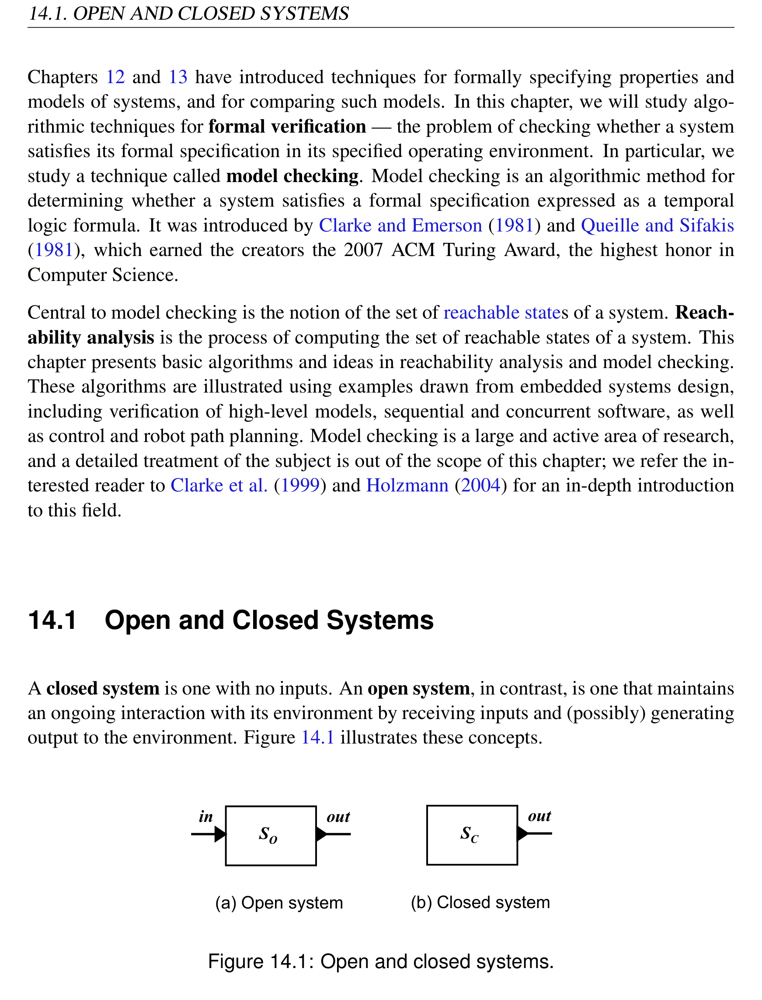
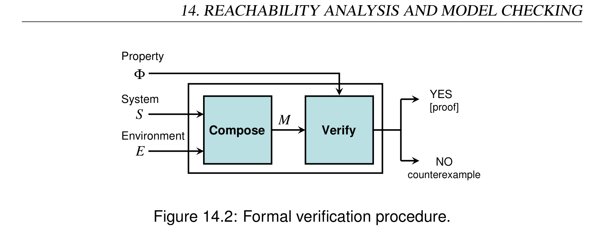
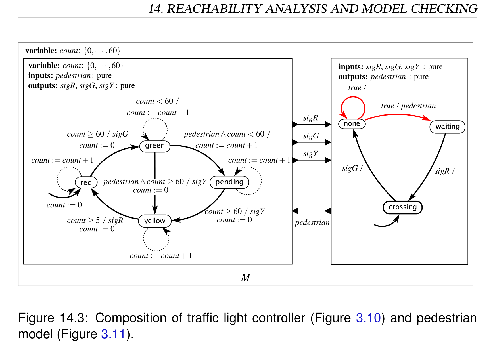
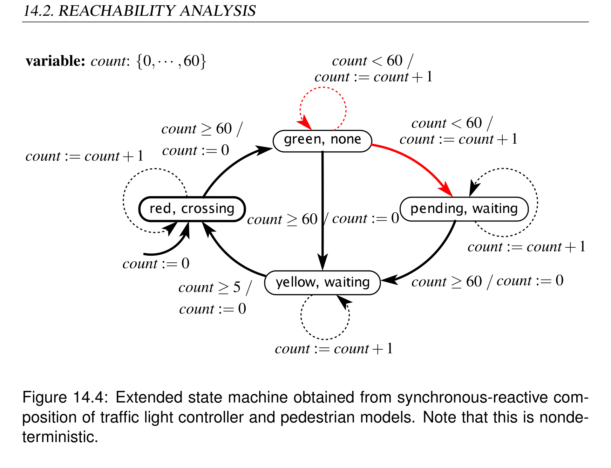
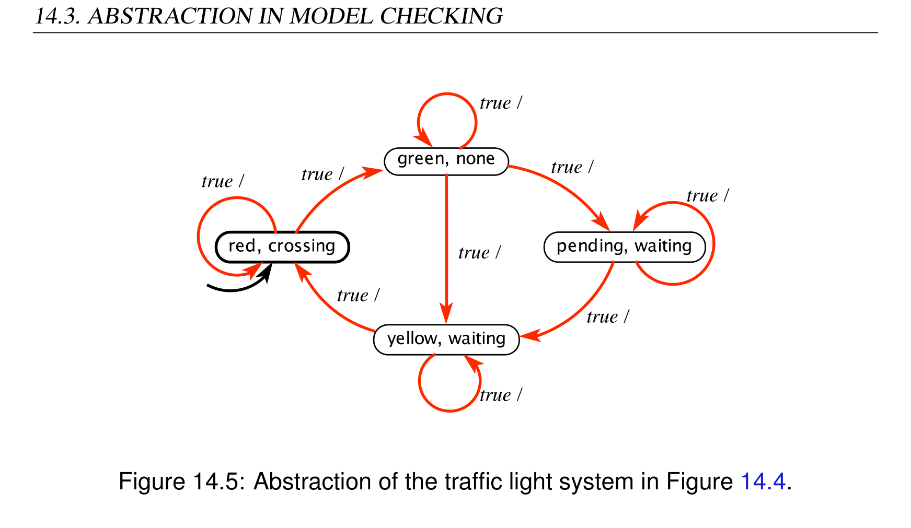

# Chapter 14: Reachability Analysis and Model Checking

> **Textbook**: Introduction to Embedded Systems - A Cyber-Physical Systems Approach (UC Berkeley)  
> **Authors**: Edward Ashford Lee and Sanjit Arunkumar Seshia  
> **PDF Page Range**: 393 - 414


---


<!-- Page 393 -->
### [PDF Page 393]

14
Reachability Analysis and
Model Checking
Contents

## 14.1 Open and Closed Systems . . . . . . . . . . . . . . . . . . . . . . . 374


## 14.2 Reachability Analysis . . . . . . . . . . . . . . . . . . . . . . . . . 376


### 14.2.1 Verifying Gp . . . . . . . . . . . . . . . . . . . . . . . . . . 376


### 14.2.2 Explicit-State Model Checking . . . . . . . . . . . . . . . . . 379


### 14.2.3 Symbolic Model Checking . . . . . . . . . . . . . . . . . . . 380


## 14.3 Abstraction in Model Checking . . . . . . . . . . . . . . . . . . . . 383


## 14.4 Model Checking Liveness Properties . . . . . . . . . . . . . . . . . 386


### 14.4.1 Properties as Automata . . . . . . . . . . . . . . . . . . . . . 387


### 14.4.2 Finding Acceptance Cycles . . . . . . . . . . . . . . . . . . . 390


## 14.5 Summary . . . . . . . . . . . . . . . . . . . . . . . . . . . . . . . . 391


### Sidebar: Probing Further: Model Checking in Practice . . . . . . . . 393


### Exercises . . . . . . . . . . . . . . . . . . . . . . . . . . . . . . . . . . . 394

373


<!-- Page 394 -->
### [PDF Page 394]

14.1. OPEN AND CLOSED SYSTEMS
Chapters 12 and 13 have introduced techniques for formally specifying properties and
models of systems, and for comparing such models. In this chapter, we will study algo-
rithmic techniques for formal verification — the problem of checking whether a system
satisfies its formal specification in its specified operating environment. In particular, we
study a technique called model checking. Model checking is an algorithmic method for
determining whether a system satisfies a formal specification expressed as a temporal
logic formula. It was introduced by Clarke and Emerson (1981) and Queille and Sifakis
(1981), which earned the creators the 2007 ACM Turing Award, the highest honor in
Computer Science.
Central to model checking is the notion of the set of reachable states of a system. Reach-
ability analysis is the process of computing the set of reachable states of a system. This
chapter presents basic algorithms and ideas in reachability analysis and model checking.
These algorithms are illustrated using examples drawn from embedded systems design,
including verification of high-level models, sequential and concurrent software, as well
as control and robot path planning. Model checking is a large and active area of research,
and a detailed treatment of the subject is out of the scope of this chapter; we refer the in-
terested reader to Clarke et al. (1999) and Holzmann (2004) for an in-depth introduction
to this field.
14.1
Open and Closed Systems
A closed system is one with no inputs. An open system, in contrast, is one that maintains
an ongoing interaction with its environment by receiving inputs and (possibly) generating
output to the environment. Figure 14.1 illustrates these concepts.
out
in
(a) Open system
SO
out
(b) Closed system
SC


*Description*: Technical diagram and schematic model illustrating cyber-physical system behavior, algorithmic logic, and state progression for Figure 14.1: Open and closed systems..

> **Figure 14.1: Open and closed systems.**

374
Lee & Seshia, Introduction to Embedded Systems


<!-- Page 395 -->
### [PDF Page 395]

14. REACHABILITY ANALYSIS AND MODEL CHECKING
S
E
Φ
Compose
Verify
Property
System
Environment
YES
[proof]
NO
counterexample
M


*Description*: Technical diagram and schematic model illustrating cyber-physical system behavior, algorithmic logic, and state progression for Figure 14.2: Formal verification procedure..

> **Figure 14.2: Formal verification procedure.**

Techniques for formal verification are typically applied to a model of the closed system M
obtained by composing the model of the system S that is to be verified with a model of its
environment E. S and E are typically open systems, where all inputs to S are generated by
E and vice-versa. Thus, as shown in Figure 14.2, there are three inputs to the verification
process:
• A model of the system to be verified, S;
• A model of the environment, E, and
• The property to be verified Φ.
The verifier generates as output a YES/NO answer, indicating whether or not S satisfies
the property Φ in environment E. Typically, a NO output is accompanied by a counterex-
ample, also called an error trace, which is a trace of the system that indicates how Φ is
violated. Counterexamples are very useful aids in the debugging process. Some formal
verification tools also include a proof or certificate of correctness with a YES answer;
such an output can be useful for certification of system correctness.
The form of composition used to combine system model S with environment model E
depends on the form of the interaction between system and environment. Chapters 5
and 6 describe several ways to compose state machine models. All of these forms of
composition can be used in generating a verification model M from S and E. Note that M
can be non-deterministic.
For simplicity, in this chapter we will assume that system composition has already been
performed using one of the techniques presented in Chapters 5 and 6. All algorithms
discussed in the following sections will operate on the combined verification model M,
Lee & Seshia, Introduction to Embedded Systems
375


<!-- Page 396 -->
### [PDF Page 396]

14.2. REACHABILITY ANALYSIS
and will be concerned with answering the question of whether M satisfies property Φ.
Additionally, we will assume that Φ is specified as a property in linear temporal logic.
14.2
Reachability Analysis
We consider first a special case of the model checking problem which is useful in practice.
Specifically, we assume that M is a finite-state machine and Φ is an LTL formula of the
form Gp, where p is a proposition. Recall from Chapter 12 that Gp is the temporal logic
formula that holds in a trace when the proposition p holds in every state of that trace. As
we have seen in Chapter 12, several system properties are expressible as Gp properties.
We will begin in Section 14.2.1 by illustrating how computing the reachable states of a
system enables one to verify a Gp property. In Section 14.2.2 we will describe a technique
for reachability analysis of finite-state machines based on explicit enumeration of states.
Finally, in Section 14.2.3, we will describe an alternative approach to analyze systems
with very large state spaces.
14.2.1
Verifying Gp
In order for a system M to satisfy Gp, where p is a proposition, every trace exhibitable
by M must satisfy Gp. This property can be verified by enumerating all states of M and
checking that every state satisfies p.
When M is finite-state, in theory, such enumeration is always possible. As shown in

# Chapter 3, the state space of M can be viewed as a directed graph where the nodes of

the graph correspond to states of M and the edges correspond to transitions of M. This
graph is called the state graph of M, and the set of all states is called its state space. With
this graph-theoretic viewpoint, one can see that checking Gp for a finite-state system M
corresponds to traversing the state graph for M, starting from the initial state and checking
that every state reached in this traversal satisfies p. Since M has a finite number of states,
this traversal must terminate.
Example 14.1: Let the system S be the traffic light controller of Figure 3.10 and
its environment E be the pedestrian model shown in Figure 3.11. Let M be the
376
Lee & Seshia, Introduction to Embedded Systems


<!-- Page 397 -->
### [PDF Page 397]

14. REACHABILITY ANALYSIS AND MODEL CHECKING


*Description*: Cyber-physical actor model block diagram showing continuous/discrete signal flows, feedback loops, and component interfaces for Figure 14.3: Composition of traffic light controller (Figure 3.10) and pedestrian.

> **Figure 14.3: Composition of traffic light controller (Figure 3.10) and pedestrian**

model (Figure 3.11).
synchronous composition of S and E as shown in Figure 14.3. Observe that M is a
closed system. Suppose that we wish to verify that M satisfies the property
G ¬(green∧crossing)
In other words, we want to verify that it is never the case that the traffic light is
green while pedestrians are crossing.
The composed system M is shown in Figure 14.4 as an extended FSM. Note that
M has no inputs or outputs. M is finite-state, with a total of 188 states (using a
similar calculation to that in Example 3.12). The graph in Figure 14.4 is not the full
state graph of M, because each node represents a set of states, one for each different
value of count in that node. However, through visual inspection of this graph we
can check for ourselves that no state satisfies the proposition (green ∧crossing),
and hence every trace satisfies the LTL property G¬(green∧crossing).
Lee & Seshia, Introduction to Embedded Systems
377


<!-- Page 398 -->
### [PDF Page 398]

14.2. REACHABILITY ANALYSIS


*Description*: Finite state machine (FSM) transition diagram specifying states, guard conditions, input triggers, and output actions for Figure 14.4: Extended state machine obtained from synchronous-reactive com-.

> **Figure 14.4: Extended state machine obtained from synchronous-reactive com-**

position of traffic light controller and pedestrian models. Note that this is nonde-
terministic.
In practice, the seemingly simple task of verifying whether a finite-state system M satisfies
a Gp property is not as straightforward as in the previous example for the following
reasons:
• Typically, one starts only with the initial state and transition function, and the state
graph must be constructed on the fly.
• The system might have a huge number of states, possibly exponential in the size of
the syntactic description of M. As a consequence, the state graph cannot be repre-
sented using traditional data structures such as an adjacency or incidence matrix.
The next two sections describe how these challenges can be handled.
378
Lee & Seshia, Introduction to Embedded Systems


<!-- Page 399 -->
### [PDF Page 399]

14. REACHABILITY ANALYSIS AND MODEL CHECKING
14.2.2
Explicit-State Model Checking
In this section, we discuss how to compute the reachable state set by generating and
traversing the state graph on the fly.
First, recall that the system of interest M is closed, finite-state, and can be non-deterministic.
Since M has no inputs, its set of possible next states is a function of its current state alone.
We denote this transition relation of M by δ, which is only a function of the current state
of M, in contrast to the possibleUpdates function introduced in Chapter 3 which is also a
function of the current input. Thus, δ(s) is the set of possible next states from state s of
M.
Algorithm 14.1 computes the set of reachable states of M, given its initial state s0 and
transition relation δ. Procedure DFS Search performs a depth-first traversal of the state
graph of M, starting with state s0. The graph is generated on-the-fly by repeatedly apply-
ing δ to states visited during the traversal.
Input : Initial state s0 and transition relation δ for closed finite-state
system M
Output: Set R of reachable states of M
1 Initialize: Stack Σ to contain a single state s0; Current set of reached
states R := {s0}.
2 DFS Search() {
3 while Stack Σ is not empty do
4
Pop the state s at the top of Σ
5
Compute δ(s), the set of all states reachable from s in one
transition
6
for each s′ ∈δ(s) do
7
if s′ ̸∈R then
8
R := R∪{s′}
9
Push s′ onto Σ
10
DFS Search()
11
end
12
end
13 end
14 }
Algorithm 14.1: Computing the reachable state set by depth-first explicit-state
search.
Lee & Seshia, Introduction to Embedded Systems
379


<!-- Page 400 -->
### [PDF Page 400]

14.2. REACHABILITY ANALYSIS
The main data structures required by the algorithm are Σ, the stack storing the current path
in the state graph being explored from s0, and R, the current set of states reached during
traversal. Since M is finite-state, at some point all states reachable from s0 will be in R,
which implies that no new states will be pushed onto Σ and thus Σ will become empty.
Hence, procedure DFS Search terminates and the value of R at the end of the procedure
is the set of all reachable states of M.
The space and time requirements for this algorithm are linear in the size of the state graph
(see Appendix B for an introduction to such complexity notions). However, the number of
nodes and edges in the state graph of M can be exponential in the size of the descriptions
of S and E. For example, if S and E together have 100 Boolean state variables (a small
number in practice!), the state graph of M can have a total of 2100 states, far more than
what contemporary computers can store in main memory. Therefore, explicit-state search
algorithms such as DFS Search must be augmented with state compression techniques.
Some of these techniques are reviewed in the sidebar on page 393.
A significant challenge for model checking concurrent systems is the state-explosion
problem. Recall that the state space of a composition of k finite-state systems M1,M2,...,Mk
(say, using synchronous composition), is the cartesian product of the state spaces of
M1,M2,...,Mk. In other words, if M1,M2,...,Mk have n1,n2,...,nk states respectively,
their composition can have Πk
i=1ni states. It is easy to see that the number of states of a
concurrent composition of k components grows exponentially with k. Explicitly repre-
senting the state space of the composite system does not scale. In the next section, we
will introduce techniques that can mitigate this problem in some cases.
14.2.3
Symbolic Model Checking
The key idea in symbolic model checking is to represent a set of states symbolically as
a propositional logic formula, rather than explicitly as a collection of individual states.
Specialized data structures are often used to efficiently represent and manipulate such
formulas. Thus, in contrast to explicit-state model checking, in which individual states
are manipulated, symbolic model checking operates on sets of states.
Algorithm 14.2 (Symbolic Search) is a symbolic algorithm for computing the set of
reachable states of a closed, finite-state system M. This algorithm has the same input-
output specification as the previous explicit-state algorithm DFS Search; however, all
operations in Symbolic Search are set operations.
380
Lee & Seshia, Introduction to Embedded Systems


<!-- Page 401 -->
### [PDF Page 401]

14. REACHABILITY ANALYSIS AND MODEL CHECKING
Input : Initial state s0 and transition relation δ for closed finite-state
system M, represented symbolically
Output: Set R of reachable states of M, represented symbolically
1 Initialize: Current set of reached states R = {s0}
2 Symbolic Search() {
3 Rnew = R
4 while Rnew ̸= /0 do
5
Rnew := {s′ | ∃s ∈R s.t. s′ ∈δ(s)∧s′ ̸∈R}
6
R := R∪Rnew
7 end
8 }
Algorithm 14.2: Computing the reachable state set by symbolic search.
In algorithm Symbolic Search, R represents the entire set of states reached at any point
in the search, and Rnew represents the new states generated at that point. When no more
new states are generated, the algorithm terminates, with R storing all states reachable

```python
from s0. The key step of the algorithm is line 5, in which Rnew is computed as the set
```

of all states s′ reachable from any state s in R in one step of the transition relation δ.
This operation is called image computation, since it involves computing the image of
the function δ. Efficient implementations of image computation that directly operate on
propositional logic formulas are central to symbolic reachability algorithms. Apart from
image computation, the key set operations in Symbolic Search include set union and
emptiness checking.
Example 14.2: We illustrate symbolic reachability analysis using the finite-state
system in Figure 14.4.
To begin with, we need to introduce some notation. Let vl be a variable denoting
the state of the traffic light controller FSM S at the start of each reaction; i.e., vl ∈
{green,yellow,red,pending}. Similarly, let vp denote the state of the pedestrian
FSM E, where vp ∈{crossing,none,waiting}.
Given this notation, the initial state set {s0} of the composite system M is repre-
sented as the following propositional logical formula:
vl = red ∧vp = crossing ∧count = 0
Lee & Seshia, Introduction to Embedded Systems
381


<!-- Page 402 -->
### [PDF Page 402]

14.2. REACHABILITY ANALYSIS
From s0, the only enabled outgoing transition is the self-loop on the initial state of
the extended FSM in Figure 14.4. Thus, after one step of reachability computation,
the set of reached states R is represented by the following formula:
vl = red ∧vp = crossing ∧0 ≤count ≤1
After two steps, R is given by
vl = red ∧vp = crossing ∧0 ≤count ≤2
and after k steps, k ≤60, R is represented by the formula
vl = red ∧vp = crossing ∧0 ≤count ≤k
On the 61st step, we exit the state (red,crossing), and compute R as
vl = red ∧vp = crossing ∧0 ≤count ≤60
∨vl = green ∧vp = none ∧count = 0
Proceeding similarly, the set of reachable states R is grown until there is no further
change. The final reachable set is represented as:
vl = red ∧vp = crossing ∧0 ≤count ≤60
∨vl = green ∧vp = none ∧0 ≤count ≤60
∨vl = pending ∧vp = waiting ∧0 < count ≤60
∨vl = yellow ∧vp = waiting ∧0 ≤count ≤5
In practice, the symbolic representation is much more compact than the explicit one. The
previous example illustrates this nicely because a large number of states are compactly
represented by inequalities like 0 < count ≤60. Computer programs can be designed to
operate directly on the symbolic representation. Some examples of such programs are
given in the box on page 393.
Symbolic model checking has been used successfully to address the state-explosion prob-
lem for many classes of systems, most notably for hardware models. However, in the
worst case, even symbolic set representations can be exponential in the number of system
variables.
382
Lee & Seshia, Introduction to Embedded Systems


<!-- Page 403 -->
### [PDF Page 403]

14. REACHABILITY ANALYSIS AND MODEL CHECKING
14.3
Abstraction in Model Checking
One of the challenges in model checking is to work with the simplest abstraction of a
system that will provide the required proofs of safety. Simpler abstractions have smaller
state spaces and can be checked more efficiently. The challenge, of course, is to know
what details to omit from the abstraction.
The part of the system to be abstracted away depends on the property to be verified. The
following example illustrates this point.
Example 14.3: Consider the traffic light system M in Figure 14.4. Suppose that,
as in Example 14.1 we wish to verify that M satisfies the property
G ¬(green∧crossing)
Suppose we abstract the variable count away from M by hiding all references to
count from the model, including all guards mentioning it and all updates to it. This
generates the abstract model Mabs shown in Figure 14.5.
We observe that this abstract Mabs exhibits more behaviors than M. For instance,

```python
from the state (yellow,waiting) we can take the self-loop transition forever, staying
```

in that state perennially, even though in the actual system M this state must be exited
within five clock ticks. Moreover, every behavior of M can be exhibited by Mabs.
The interesting point is that, even with this approximation, we can prove that Mabs
satisfies G ¬(green∧crossing). The value of count is irrelevant for this property.
Notice that while M has 188 states, Mabs has only 4 states. Reachability analysis on
Mabs is far easier than for M as we have far fewer states to explore.
There are several ways to compute an abstraction. One of the simple and extremely
useful approaches is called localization reduction or localization abstraction (Kurshan
(1994)). In localization reduction, parts of the design model that are irrelevant to the
property being checked are abstracted away by hiding a subset of state variables. Hiding
a variable corresponds to freeing that variable to evolve arbitrarily. It is the form of
abstraction used in Example 14.3 above, where count is allowed to change arbitrarily, and
all transitions are made independent of the value of count.
Lee & Seshia, Introduction to Embedded Systems
383


<!-- Page 404 -->
### [PDF Page 404]

14.3. ABSTRACTION IN MODEL CHECKING


*Description*: Technical diagram and schematic model illustrating cyber-physical system behavior, algorithmic logic, and state progression for Figure 14.5: Abstraction of the traffic light system in Figure 14.4..

> **Figure 14.5: Abstraction of the traffic light system in Figure 14.4.**

Example 14.4:
Consider the multithreaded program given below (adapted

```python
from Ball et al. (2001)). The procedure lock unlock executes a loop within
```

which it acquires a lock, then calls the function randomCall, based on whose
result it either releases the lock and executes another loop iteration, or it quits the
loop (and then releases the lock). The execution of another loop iteration is ensured
by incrementing new, so that the condition old != new evaluates to true.
1
pthread_mutex_t lock = PTHREAD_MUTEX_INITIALIZER;
2
unsigned int old, new;
3
4

```c
void lock_unlock() {
```

5
do {
6
pthread_mutex_lock(&lock);
7
old = new;
8

```c
if (randomCall()) {
```

9
pthread_mutex_unlock(&lock);
10
new++;
11
}
12
} while (old != new)
13
pthread_mutex_unlock(&lock);
14
}
384
Lee & Seshia, Introduction to Embedded Systems


<!-- Page 405 -->
### [PDF Page 405]

14. REACHABILITY ANALYSIS AND MODEL CHECKING
Suppose the property we want to verify is that the code does not attempt to call
pthread mutex lock twice in a row. Recall from Section 10.2.4 how the sys-
tem can deadlock if a thread becomes permanently blocked trying to acquire a lock.
This could happen in the above example if the thread, already holding lock lock,
attempts to acquire it again.
If we model this program exactly, without any abstraction, then we need to reason
about all possible values of old and new, in addition to the remaining state of the
program. Assuming a word size of 32 in this system, the size of the state space is
roughly 232 × 232 × n, where 232 is the number of values of old and new, and n
denotes the size of the remainder of the state space.
However, it is not necessary to reason about the precise values of old and new to
prove that this program is correct. Assume, for this example, that our programming
language is equipped with a boolean type. Assume further that the program
can perform non-deterministic assignments. Then, we can generate the following
abstraction of the original program, written in C-like syntax, where the Boolean
variable b represents the predicate old == new.
1
pthread_mutex_t lock = PTHREAD_MUTEX_INITIALIZER;
2
boolean b; // b represents the predicate (old == new)
3

```c
void lock_unlock() {
```

4
do {
5
pthread_mutex_lock(&lock);
6
b = true;
7

```c
if (randomCall()) {
```

8
pthread_mutex_unlock(&lock);
9
b = false;
10
}
11
} while (!b)
12
pthread_mutex_unlock(&lock);
13
}
It is easy to see that this abstraction retains just enough information to show that the
program satisfies the desired property. Specifically, the lock will not be acquired
twice because the loop is only iterated if b is set to false, which implies that the
lock was released before the next attempt to acquire.
Moreover, observe that size of the state space to be explored has reduced to simply
2n. This is the power of using the “right” abstraction.
Lee & Seshia, Introduction to Embedded Systems
385


<!-- Page 406 -->
### [PDF Page 406]

14.4. MODEL CHECKING LIVENESS PROPERTIES
A major challenge for formal verification is to automatically compute simple abstrac-
tions. An effective and widely-used technique is counterexample-guided abstraction
refinement (CEGAR), first introduced by Clarke et al. (2000). The basic idea (when
using localization reduction) is to start by hiding almost all state variables except those
referenced by the temporal logic property. The resulting abstract system will have more
behaviors than the original system. Therefore, if this abstract system satisfies an LTL
formula Φ (i.e., each of its behaviors satisfies Φ), then so does the original. However, if
the abstract system does not satisfy Φ, the model checker generates a counterexample. If
this counterexample is a counterexample for the original system, the process terminates,
having found a genuine counterexample. Otherwise, the CEGAR approach analyzes this
counterexample to infer which hidden variables must be made visible, and with these ad-
ditional variables, recomputes an abstraction. The process continues, terminating either
with some abstract system being proven correct, or generating a valid counterexample for
the original system.
The CEGAR approach and several follow-up ideas have been instrumental in driving
progress in the area of software model checking. We review some of the key ideas in the

### sidebar on page 393.

14.4
Model Checking Liveness Properties
So far, we have restricted ourselves to verifying properties of the form Gp, where p is an
atomic proposition. An assertion that Gp holds for all traces is a very restricted kind of
safety property. However, as we have seen in Chapter 12, several useful system properties
are not safety properties. For instance, the property stating that “the robot must visit
location A” is a liveness property: if visiting location A is represented by proposition q,
then this property is an assertion that Fq must hold for all traces. In fact, several problems,
including path planning problems for robotics and progress properties of distributed and
concurrent systems can be stated as liveness properties. It is therefore useful to extend
model checking to handle this class of properties.
Properties of the form Fp, though liveness properties, can be partially checked using the
techniques introduced earlier in this chapter. Recall from Chapter 12 that Fp holds for
a trace if and only if ¬G¬p holds for the same trace. In words, “p is true some time in
the future” iff “¬p is always false.” Therefore, we can attempt to verify that the system
satisfies G¬p. If the verifier asserts that G¬p holds for all traces, then we know that
Fp does not hold for any trace. On the other hand, if the verifier outputs “NO”, then
386
Lee & Seshia, Introduction to Embedded Systems


<!-- Page 407 -->
### [PDF Page 407]

14. REACHABILITY ANALYSIS AND MODEL CHECKING
the accompanying counterexample provides a witness exhibiting how p may become true
eventually. This witness provides one trace for which Fp holds, but it does not prove that
Fp holds for all traces (unless the machine is deterministic).
More complete checks and more complicated liveness properties require a more sophis-
ticated approach. Briefly, one approach used in explicit-state model checking of LTL
properties is as follows:
1. Represent the negation of the property Φ as an automaton B, where certain states
are labeled as accepting states.
2. Construct the synchronous composition of the property automaton B and the system
automaton M. The accepting states of the property automaton induce accepting
states of the product automaton MB.
3. If the product automaton MB can visit an accepting state infinitely often, then it
indicates that M does not satisfy Φ; otherwise, M satisfies Φ.
The above approach is known as the automata-theoretic approach to verification. We
give a brief introduction to this subject in the rest of this section. Further details may be
found in the seminal papers on this topic (Wolper et al. (1983); Vardi and Wolper (1986))
and the book on the SPIN model checker (Holzmann (2004)).
14.4.1
Properties as Automata
Consider the first step of viewing properties as automata. Recall the material on omega-
regular languages introduced in the box on page 357. The theory of B¨uchi automata and
omega-regular languages, briefly introduced there, is relevant for model checking liveness
properties. Roughly speaking, an LTL property Φ has a one-to-one correspondence with
a set of behaviors that satisfy Φ. This set of behaviors constitutes the language of the
B¨uchi automaton corresponding to Φ.
For the LTL model checking approach we describe here, if Φ is the property that the
system must satisfy, then we represent its negation ¬Φ as a B¨uchi automaton. We present
some illustrative examples below.
Lee & Seshia, Introduction to Embedded Systems
387


<!-- Page 408 -->
### [PDF Page 408]

14.4. MODEL CHECKING LIVENESS PROPERTIES
Example 14.5:
Suppose that an FSM M1 models a system that executes forever
and produces a pure output h (for heartbeat), and that it is required to produce this
output at least once every three reactions. That is, if in two successive reactions it
fails to produce the output h, then in the third it must.
We can formulate this property in LTL as the property Φ1 below:
G(h∨Xh∨X2h)
and the negation of this property is
F(¬h∧X¬h∧X2¬h)
The B¨uchi automaton B1 corresponding to the negation of the desired property is
given below:
Let us examine this automaton. The language accepted by this automaton includes
all behaviors that enter and stay in state d. Equivalently, the language includes all
behaviors that produce a present output on f in some reaction. When we compose
the above machine with M1, if the resulting composite machine can never produce
f = present, then the language accepted by the composite machine is empty. If
we can prove that the language is empty, then we have proved that M produces the
heartbeat h at least once every three reactions.
Observe that the property Φ1 in the above example is in fact a safety property. We give
an example of a liveness property below.
Example 14.6:
Suppose that the FSM M2 models a controller for a robot that
must locate a room and stay there forever. Let p be the proposition that becomes
388
Lee & Seshia, Introduction to Embedded Systems


<!-- Page 409 -->
### [PDF Page 409]

14. REACHABILITY ANALYSIS AND MODEL CHECKING
true when the robot is in the target room. Then, the desired property Φ2 can be
expressed in LTL as FGp.
The negation of this property is GF¬p. The B¨uchi automaton B2 corresponding to
this negated property is given below:
Notice that all accepting behaviors of B2 correspond to those where ¬p holds in-
finitely often. These behaviors correspond to a cycle in the state graph for the
product automaton where state b of B2 is visited repeatedly. This cycle is known as
an acceptance cycle.
Liveness properties of the form GFp also occur naturally as specifications. This form of
property is useful in stating fairness properties which assert that certain desirable proper-
ties hold infinitely many times, as illustrated in the following example.
Example 14.7: Consider a traffic light system such as that in Example 3.10. We
may wish to assert that the traffic light becomes green infinitely many times in any
execution. In other words, the state green is visited infinitely often, which can be
expressed as Φ3 = GF green.
The automaton corresponding to Φ3 is identical to that for the negation of Φ2 in Ex-
ample 14.6 above with ¬p replaced by green. However, in this case the accepting
behaviors of this automaton are the desired behaviors.
Thus, from these examples we see that the problem of detecting whether a certain ac-
cepting state s in an FSM can be visited infinitely often is the workhorse of explicit-state
model checking of LTL properties. We next present an algorithm for this problem.
Lee & Seshia, Introduction to Embedded Systems
389


<!-- Page 410 -->
### [PDF Page 410]

14.4. MODEL CHECKING LIVENESS PROPERTIES
14.4.2
Finding Acceptance Cycles
We consider the following problem:
Given a finite-state system M, can an accepting state sa of M be visited in-
finitely often?
Put another way, we seek an algorithm to check whether (i) state sa is reachable from
the initial state s0 of M, and (ii) sa is reachable from itself. Note that asking whether a
state can be visited infinitely often is not the same as asking whether it must be visited
infinitely often.
The graph-theoretic viewpoint is useful for this problem, as it was in the case of Gp
discussed in Section 14.2.1. Assume for the sake of argument that we have the entire state
graph constructed a priori. Then, the problem of checking whether state sa is reachable

```python
from s0 is simply a graph traversal problem, solvable for example by depth-first search
```

(DFS). Further, the problem of detecting whether sa is reachable from itself amounts to
checking whether there is a cycle in the state graph containing that state.
The main challenges for solving this problem are similar to those discussed in Sec-
tion 14.2.1: we must perform this search on-the-fly, and we must deal with large state
spaces.
The nested depth-first search (nested DFS) algorithm, which is implemented in the SPIN
model checker (Holzmann (2004)), solves this problem and is shown as Algorithm 14.3.
The algorithm begins by calling the procedure called Nested DFS Search with argument
1, as shown in the Main function at the bottom. MB is obtained by composing the original
closed system M with the automaton B representing the negation of LTL formula Φ.
As the name suggests, the idea is to perform two depth-first searches, one nested inside the
other. The first DFS identifies a path from initial state s0 to the target accepting state sa.
Then, from sa we start another DFS to see if we can reach sa again. The variable mode
is either 1 or 2 depending on whether we are performing the first DFS or the second.
Stacks Σ1 and Σ2 are used in the searches performed in modes 1 and 2 respectively. If
sa is encountered in the second DFS, the algorithm generates as output the path leading

```python
from s0 to sa with a loop on sa. The path from s0 to sa is obtained simply by reading off
```

the contents of stack Σ1. Likewise, the cycle from sa to itself is obtained from stack Σ2.
Otherwise, the algorithm reports failure.
390
Lee & Seshia, Introduction to Embedded Systems


<!-- Page 411 -->
### [PDF Page 411]

14. REACHABILITY ANALYSIS AND MODEL CHECKING
Search optimization and state compression techniques that are used in explicit-state reach-
ability analysis can be used with nested DFS also. Further details are available in Holz-
mann (2004).
14.5

### Summary

This chapter gives some basic algorithms for formal verification, including model check-
ing, a technique for verifying if a finite-state system satisfies a property specified in linear
temporal logic. Verification operates on closed systems, which are obtained by compos-
ing a system with its operating environment. The first key concept is that of reachability
analysis, which verifies properties of the form Gp. The concept of abstraction, central
to the scalability of model checking, is also discussed in this chapter. This chapter also
shows how explicit-state model checking algorithms can handle liveness properties, where
a crucial concept is the correspondence between properties and automata.
Lee & Seshia, Introduction to Embedded Systems
391


<!-- Page 412 -->
### [PDF Page 412]

14.5. SUMMARY
Input : Initial state s0 and transition relation δ for automaton MB; Target
accepting state sa of MB
Output: Acceptance cycle containing sa, if one exists
1 Initialize: (i) Stack Σ1 to contain a single state s0, and stack Σ2 to be empty;
(ii) Two sets of reached states R1 := R2 := {s0}; (iii) Flag found := false.
2 Nested DFS Search(Mode mode) {
3 while Stack Σmode is not empty do
4
Pop the state s at the top of Σmode
5

```c
if (s = sa and mode = 1) then
```

6
Push s onto Σ2
7
Nested DFS Search(2)
8
return
9
end
10
Compute δ(s), the set of all states reachable from s in one transition
11
for each s′ ∈δ(s) do
12

```c
if (s′ = sa and mode = 2) then
```

13
Output path to sa with acceptance cycle using contents of stacks
Σ1 and Σ2
14
found := true
15
return
16
end
17
if s′ ̸∈Rmode then
18
Rmode := Rmode ∪{s′}
19
Push s′ onto Σmode
20
Nested DFS Search(mode)
21
end
22
end
23 end
24 }
25 Main() {
26
Nested DFS Search(1)
27

```c
if (found = false) then Output “no acceptance cycle with sa” end }
```

Algorithm 14.3: Nested depth-first search algorithm.
392
Lee & Seshia, Introduction to Embedded Systems


<!-- Page 413 -->
### [PDF Page 413]

14. REACHABILITY ANALYSIS AND MODEL CHECKING

### Probing Further: Model Checking in Practice

Several tools are available for computing the set of reachable states of a finite-state sys-
tem and checking that they satisfy specifications in temporal logic. One such tool is SMV
(symbolic model verifier), which was first developed at Carnegie Mellon University by
Kenneth McMillan. SMV was the first model checking tool to use binary decision di-
agrams (BDDs), a compact data structure introduced by Bryant (1986) for representing
a Boolean function. The use of BDDs has proved instrumental in enabling analysis of
more complex systems. Current symbolic model checkers also rely heavily on Boolean
satisfiability (SAT) solvers (see Malik and Zhang (2009)), which are programs for de-
ciding whether a propositional logic formula can evaluate to true. One of the first uses
of SAT solvers in model checking was for bounded model checking (see Biere et al.
(1999)), where the transition relation of the system is unrolled only a bounded num-
ber of times. A few different versions of SMV are available online (see for example
http://nusmv.fbk.eu/).
The SPIN model checker (Holzmann, 2004) developed in the 1980’s and 1990’s at
Bell Labs by Gerard Holzmann and others, is another leading tool for model checking
(see http://www.spinroot.com/). Rather than directly representing models as
communicating FSMs, it uses a specification language (called Promela, for process meta
language) that enables specifications that closely resemble multithreaded programs. SPIN
incorporates state-compression techniques such as hash compaction (the use of hashing
to reduce the size of the stored state set) and partial-order reduction (a technique to
reduce the number of reachable states to be explored by considering only a subset of the
possible process interleavings).
Automatic abstraction has played a big role in applying model checking directly to soft-
ware. Two examples of abstraction-based software model checking systems are SLAM
developed at Microsoft Research (Ball and Rajamani, 2001) and BLAST developed at UC
Berkeley (Henzinger et al., 2003b; Beyer et al., 2007). Both methods combine CEGAR
with a particular form of abstraction called predicate abstraction, in which predicates in a
program are abstracted to Boolean variables. A key step in these techniques is checking
whether a counterexample generated on the abstract model is in fact a true counterexam-
ple. This check is performed using satisfiability solvers for logics richer than propositional
logic. These solvers are called SAT-based decision procedures or satisfiability modulo
theories (SMT) solvers (for more details, see Barrett et al. (2009)).
Lee & Seshia, Introduction to Embedded Systems
393


<!-- Page 414 -->
### [PDF Page 414]


### EXERCISES


### Exercises

1. Consider the system M modeled by the hierarchical state machine of Figure 12.2,
which models an interrupt-driven program.
Model M in the modeling language of a verification tool (such as SPIN). You will
have to construct an environment model that asserts the interrupt. Use the verifica-
tion tool to check whether M satisfies φ, the property stated in Exercise 3:
φ: The main program eventually reaches program location C.
Explain the output you obtain from the verification tool.
2. Figure 14.3 shows the synchronous-reactive composition of the traffic light con-
troller of Figure 3.10 and the pedestrian model of Figure 3.11.
Consider replacing the pedestrian model in Figure 14.3 with the alternative model
given below where the initial state is nondeterministically chosen to be one of none
or crossing:
(a) Model the composite system in the modeling language of a verification tool
(such as SPIN). How many reachable states does the combined system have?
How many of these are initial states?
(b) Formulate an LTL property stating that every time a pedestrian arrives, even-
tually the pedestrian is allowed to cross (i.e., the traffic light enters state red).
(c) Use the verification tool to check whether the model constructed in part (a)
satisfies the LTL property specified in part (b). Explain the output of the
verification tool.
394
Lee & Seshia, Introduction to Embedded Systems


