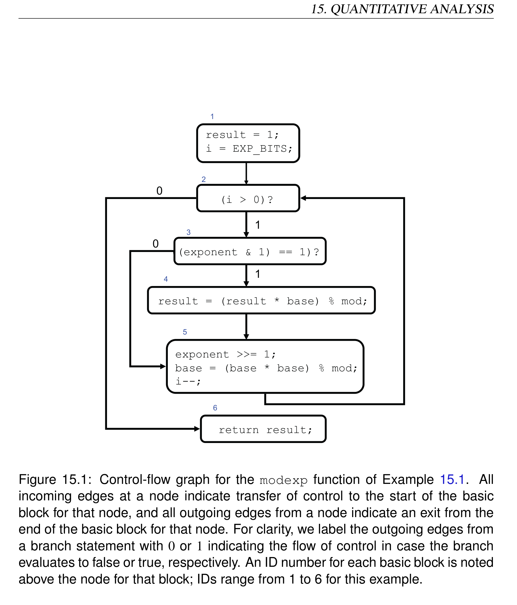
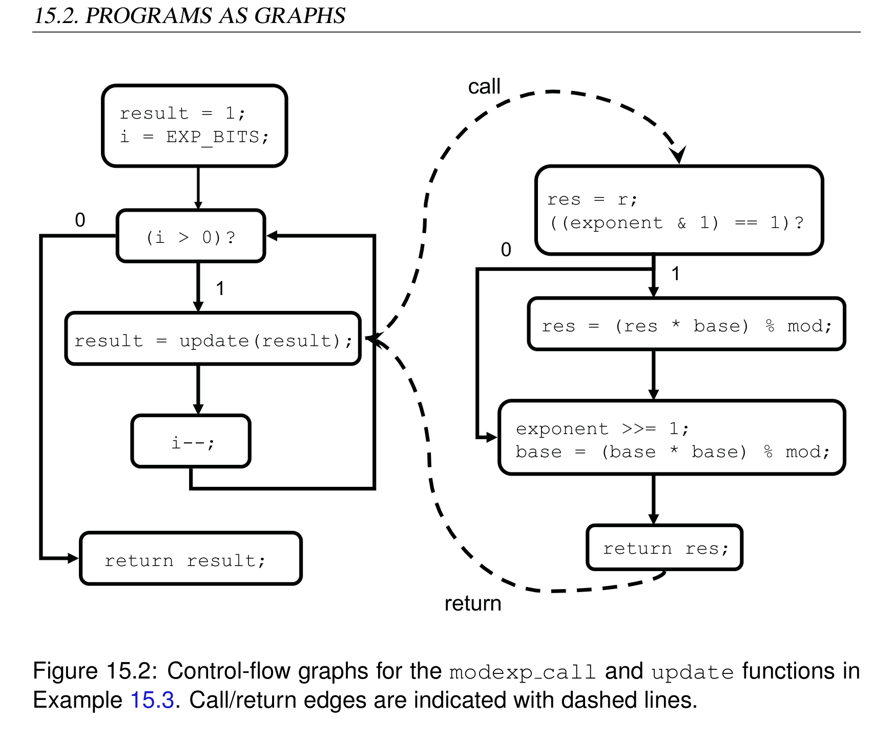
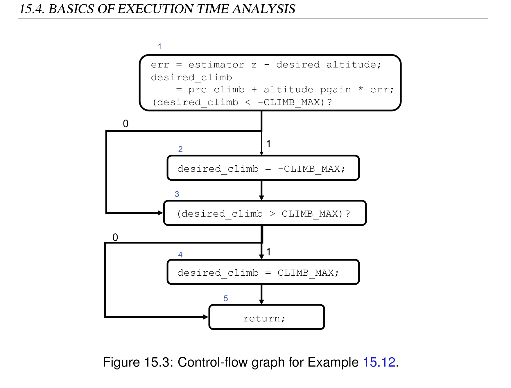

# Chapter 15: Quantitative Analysis

> **Textbook**: Introduction to Embedded Systems - A Cyber-Physical Systems Approach (UC Berkeley)  
> **Authors**: Edward Ashford Lee and Sanjit Arunkumar Seshia  
> **PDF Page Range**: 415 - 444


---


<!-- Page 415 -->
### [PDF Page 415]

15
Quantitative Analysis
Contents

## 15.1 Problems of Interest . . . . . . . . . . . . . . . . . . . . . . . . . . 397


### 15.1.1 Extreme-Case Analysis . . . . . . . . . . . . . . . . . . . . . 397


### 15.1.2 Threshold Analysis . . . . . . . . . . . . . . . . . . . . . . . 398


### 15.1.3 Average-Case Analysis . . . . . . . . . . . . . . . . . . . . . 398


## 15.2 Programs as Graphs . . . . . . . . . . . . . . . . . . . . . . . . . . 399


### 15.2.1 Basic Blocks . . . . . . . . . . . . . . . . . . . . . . . . . . 400


### 15.2.2 Control-Flow Graphs . . . . . . . . . . . . . . . . . . . . . . 400


### 15.2.3 Function Calls

. . . . . . . . . . . . . . . . . . . . . . . . . 402

## 15.3 Factors Determining Execution Time

. . . . . . . . . . . . . . . . 404

### 15.3.1 Loop Bounds . . . . . . . . . . . . . . . . . . . . . . . . . . 404


### 15.3.2 Exponential Path Space . . . . . . . . . . . . . . . . . . . . . 406


### 15.3.3 Path Feasibility . . . . . . . . . . . . . . . . . . . . . . . . . 407


### 15.3.4 Memory Hierarchy . . . . . . . . . . . . . . . . . . . . . . . 408


## 15.4 Basics of Execution Time Analysis . . . . . . . . . . . . . . . . . . 410


### 15.4.1 Optimization Formulation . . . . . . . . . . . . . . . . . . . 410


### 15.4.2 Logical Flow Constraints . . . . . . . . . . . . . . . . . . . . 413


### 15.4.3 Bounds for Basic Blocks . . . . . . . . . . . . . . . . . . . . 417


## 15.5 Other Quantitative Analysis Problems . . . . . . . . . . . . . . . . 419


### 15.5.1 Memory Bound Analysis . . . . . . . . . . . . . . . . . . . . 419


### Sidebar: Tools for Execution-Time Analysis . . . . . . . . . . . . . . 420


### 15.5.2 Power and Energy Analysis

. . . . . . . . . . . . . . . . . . 421

## 15.6 Summary . . . . . . . . . . . . . . . . . . . . . . . . . . . . . . . . 421


### Exercises . . . . . . . . . . . . . . . . . . . . . . . . . . . . . . . . . . . 423

395


<!-- Page 416 -->
### [PDF Page 416]

Will my brake-by-wire system actuate the brakes within one millisecond? Answering this
question requires, in part, an execution-time analysis of the software that runs on the
electronic control unit (ECU) for the brake-by-wire system. Execution time of the soft-
ware is an example of a quantitative property of an embedded system. The constraint
that the system actuate the brakes within one millisecond is a quantitative constraint.
The analysis of quantitative properties for conformance with quantitative constraints is
central to the correctness of embedded systems and is the topic of the present chapter.
A quantitative property of an embedded system is any property that can be measured.
This includes physical parameters, such as position or velocity of a vehicle controlled by
the embedded system, weight of the system, operating temperature, power consumption,
or reaction time. Our focus in this chapter is on properties of software-controlled sys-
tems, with particular attention to execution time. We present program analysis techniques
that can ensure that execution time constraints will be met. We also discuss how similar
techniques can be used to analyze other quantitative properties of software, particularly
resource usage such as power, energy, and memory.
The analysis of quantitative properties requires adequate models of both the software com-
ponents of the system and of the environment in which the software executes. The envi-
ronment includes the processor, operating system, input-output devices, physical compo-
nents with which the software interacts, and (if applicable) the communication network.
The environment is sometimes also referred to as the platform on which the software ex-
ecutes. Providing a comprehensive treatment of execution time analysis would require
much more than one chapter. The goal of this chapter is more modest. We illustrate
key features of programs and their environment that must be considered in quantitative
analysis, and we describe qualitatively some analysis techniques that are used. For con-
creteness, we focus on a single quantity, execution time, and only briefly discuss other
resource-related quantitative properties.
396
Lee & Seshia, Introduction to Embedded Systems


<!-- Page 417 -->
### [PDF Page 417]

15. QUANTITATIVE ANALYSIS
15.1
Problems of Interest
The typical quantitative analysis problem involves a software task defined by a program
P, the environment E in which the program executes, and the quantity of interest q. We
assume that q can be given by a function of fP as follows,
q = fP(x,w)
where x denotes the inputs to the program P (such as data read from memory or from sen-
sors, or data received over a network), and w denotes the environment parameters (such as
network delays or the contents of the cache when the program begins executing). Defin-
ing the function fP completely is often neither feasible nor necessary; instead, practical
quantitative analysis will yield extreme values for q (highest or lowest values), average
values for q, or proofs that q satisfies certain threshold constraints. We elaborate on these
next.
15.1.1
Extreme-Case Analysis
In extreme-case analysis, we may want to estimate the largest value of q for all values of
x and w,
max
x,w
fP(x,w).
(15.1)
Alternatively, it can be useful to estimate the smallest value of q:
min
x,w fP(x,w).
(15.2)
If q represents execution time of a program or a program fragment, then the largest value is
called the worst-case execution time (WCET), and the smallest value is called the best-
case execution time (BCET). It may be difficult to determine these numbers exactly, but
for many applications, an upper bound on the WCET or a lower bound on the BCET is
all that is needed. In each case, when the computed bound equals the actual WCET or
BCET, it is said to be a tight bound; otherwise, if there is a considerable gap between the
actual value and the computed bound, it is said to be a loose bound. Computing loose
bounds may be much easier than finding tight bounds.
Lee & Seshia, Introduction to Embedded Systems
397


<!-- Page 418 -->
### [PDF Page 418]

15.1. PROBLEMS OF INTEREST
15.1.2
Threshold Analysis
A threshold property asks whether the quantity q is always bounded above or below by
a threshold T, for any choice of x and w. Formally, the property can be expressed as
∀x,w,
fP(x,w) ≤T
(15.3)
or
∀x,w,
fP(x,w) ≥T
(15.4)
Threshold analysis may provide assurances that a quantitative constraint is met, such as
the requirement that a brake-by-wire system actuate the brakes within one millisecond.
Threshold analysis may be easier to perform than extreme-case analysis. Unlike extreme-
case analysis, threshold analysis does not require us to determine the maximum or mini-
mum value exactly, or even to find a tight bound on these values. Instead, the analysis is
provided some guidance in the form of the target value T. Of course, it might be possible
to use extreme-case analysis to check a threshold property. Specifically, Constraint 15.3
holds if the WCET does not exceed T, and Constraint 15.4 holds if the BCET is not less
than T.
15.1.3
Average-Case Analysis
Often one is interested more in typical resource usage rather than in worst-case scenarios.
This is formalized as average-case analysis. Here, the values of input x and environment
parameter w are assumed to be drawn randomly from a space of possible values X and
W according to probability distributions Dx and Dw respectively. Formally, we seek to
estimate the value
EDx,Dw fP(x,w)
(15.5)
where EDx,Dw denotes the expected value of fP(x,w) over the distributions Dx and Dw.
One difficulty in average-case analysis is to define realistic distributions Dx and Dw that
capture the true distribution of inputs and environment parameters with which a program
will execute.
In the rest of this chapter, we will focus on a single representative problem, namely,
WCET estimation.
398
Lee & Seshia, Introduction to Embedded Systems


<!-- Page 419 -->
### [PDF Page 419]

15. QUANTITATIVE ANALYSIS
15.2
Programs as Graphs
A fundamental abstraction used often in program analysis is to represent a program as a
graph indicating the flow of control from one code segment to another. We will illustrate
this abstraction and other concepts in this chapter using the following running example:
Example 15.1: Consider the function modexp that performs modular exponen-
tiation, a key step in many cryptographic algorithms. In modular exponentiation,
given a base b, an exponent e, and a modulus m, one must compute be mod m. In
the program below, base, exponent and mod represent b, e and m respectively.
EXP BITS denotes the number of bits in the exponent. The function uses a stan-
dard shift-square-accumulate algorithm, where the base is repeatedly squared, once
for each bit position of the exponent, and the base is accumulated into the result
only if the corresponding bit is set.
1
#define EXP_BITS 32
2
3
typedef unsigned int UI;
4
5
UI modexp(UI base, UI exponent, UI mod) {
6

```c
int i;
```

7
UI result = 1;
8
9
i = EXP_BITS;
10

```c
while(i > 0) {
```

11

```c
if ((exponent & 1) == 1) {
```

12
result = (result * base) % mod;
13
}
14
exponent >>= 1;
15
base = (base * base) % mod;
16
i--;
17
}
18

```c
return result;
```

19
}
Lee & Seshia, Introduction to Embedded Systems
399


<!-- Page 420 -->
### [PDF Page 420]

15.2. PROGRAMS AS GRAPHS
15.2.1
Basic Blocks
A basic block is a sequence of consecutive program statements in which the flow of
control enters only at the beginning of this sequence and leaves only at the end, without
halting or the possibility of branching except at the end.
Example 15.2:
The following three statements from the modexp function in
Example 15.1 form a basic block:
14
exponent >>= 1;
15
base = (base * base) % mod;
16
i--;
Another example of a basic block includes the initializations at the top of the func-
tion, comprising lines 7 and 9:
7
result = 1;
8
9
i = EXP_BITS;
15.2.2
Control-Flow Graphs
A control-flow graph (CFG) of a program P is a directed graph G = (V,E), where the
set of vertices V comprises basic blocks of P, and the set of edges E indicates the flow of
control between basic blocks. Figure 15.1 depicts the CFG for the modexp program of
Example 15.1. Each node of the CFG is labeled with its corresponding basic block. In
most cases, this is simply the code as it appears in Example 15.1. The only exception is
for conditional statements, such as the conditions in while loops and if statements; in
these cases, we follow the convention of labeling the node with the condition followed by
a question mark to indicate the conditional branch.
Although our illustrative example of a control-flow graph is at the level of C source code,
it is possible to use the CFG representation at other levels of program representation
as well, including a high-level model as well as low-level assembly code. The level of
representation employed depends on the level of detail required by the context. To make
them easier to follow, our control-flow graphs will be at the level of source code.
400
Lee & Seshia, Introduction to Embedded Systems


<!-- Page 421 -->
### [PDF Page 421]

15. QUANTITATIVE ANALYSIS
result = 1;
i = EXP_BITS;
(i > 0)?
((exponent & 1) == 1)?
result = (result * base) % mod;
exponent >>= 1;
base = (base * base) % mod;
i--;

```c
return result;
```

1
0
1
0
1
2
3
4
5
6


*Description*: Cyber-physical actor model block diagram showing continuous/discrete signal flows, feedback loops, and component interfaces for Figure 15.1: Control-flow graph for the modexp function of Example 15.1. All.

> **Figure 15.1: Control-flow graph for the modexp function of Example 15.1. All**

incoming edges at a node indicate transfer of control to the start of the basic
block for that node, and all outgoing edges from a node indicate an exit from the
end of the basic block for that node. For clarity, we label the outgoing edges from
a branch statement with 0 or 1 indicating the flow of control in case the branch
evaluates to false or true, respectively. An ID number for each basic block is noted
above the node for that block; IDs range from 1 to 6 for this example.
Lee & Seshia, Introduction to Embedded Systems
401


<!-- Page 422 -->
### [PDF Page 422]

15.2. PROGRAMS AS GRAPHS
result = 1;
i = EXP_BITS;
(i > 0)?
result = update(result);
i--;

```c
return result;
```

1
0
res = r;
((exponent & 1) == 1)?
res = (res * base) % mod;
exponent >>= 1;
base = (base * base) % mod;
0
1

```c
return res;
```

call
return


*Description*: Cyber-physical actor model block diagram showing continuous/discrete signal flows, feedback loops, and component interfaces for Figure 15.2: Control-flow graphs for the modexp call and update functions in.

> **Figure 15.2: Control-flow graphs for the modexp call and update functions in**

Example 15.3. Call/return edges are indicated with dashed lines.
15.2.3
Function Calls
Programs are typically decomposed into several functions in order to systematically or-
ganize the code and promote reuse and readability. The control-flow graph (CFG) repre-
sentation can be extended to reason about code with function calls by introducing special
call and return edges. These edges connect the CFG of the caller function – the one
making the function call – to that of the callee function – the one being called. A call
edge indicates a transfer of control from the caller to the callee. A return edge indicates
a transfer of control from the callee back to the caller.
402
Lee & Seshia, Introduction to Embedded Systems


<!-- Page 423 -->
### [PDF Page 423]

15. QUANTITATIVE ANALYSIS
Example 15.3:
A slight variant shown below of the modular exponentation pro-
gram of Example 15.1 uses function calls and can be represented by the CFG with
call and return edges in Figure 15.2.
1
#define EXP_BITS 32
2
typedef unsigned int UI;
3
UI exponent, base, mod;
4
5
UI update(UI r) {
6
UI res = r;
7

```c
if ((exponent & 1) == 1) {
```

8
res = (res * base) % mod;
9
}
10
exponent >>= 1;
11
base = (base * base) % mod;
12

```c
return res;
```

13
}
14
15
UI modexp_call() {
16
UI result = 1; int i;
17
i = EXP_BITS;
18

```c
while(i > 0) {
```

19
result = update(result);
20
i--;
21
}
22

```c
return result;
```

23
}
In this modified example, the variables base, exponent, and mod are global
variables. The update to base and exponent in the body of the while loop,
along with the computation of result is now performed in a separate function
named update.
Non-recursive function calls can also be handled by inlining, which is the process of
copying the code for the callee into that of the caller. If inlining is performed transitively
for all functions called by the code that must be analyzed, the analysis can be performed
on the CFG of the code resulting from inlining, without using call and return edges.
Lee & Seshia, Introduction to Embedded Systems
403


<!-- Page 424 -->
### [PDF Page 424]

15.3. FACTORS DETERMINING EXECUTION TIME
15.3
Factors Determining Execution Time
There are several issues one must consider in order to estimate the worst-case execution
time of a program. This section outlines some of the main issues and illustrates them with
examples. In describing these issues, we take a programmer’s viewpoint, starting with the
program structure and then considering how the environment can impact the program’s
execution time.
15.3.1
Loop Bounds
The first point one must consider when bounding the execution time of a program is
whether the program terminates. Non-termination of a sequential program can arise from
non-terminating loops or from an unbounded sequence of function calls. Therefore, while
writing real-time embedded software, the programmer must ensure that all loops are guar-
anteed to terminate. In order to guarantee this, one must determine for each loop a bound
on the number of times that loop will execute in the worst case. Similarly, all function
calls must have bounded recursion depth. The problems of determining bounds on loop
iterations or recursion depth are undecidable in general, since the halting problem for Tur-
ing machines can be reduced to either problem. (See Appendix B for an introduction to
Turing machines and decidability.)
In this section, we limit ourselves to reasoning about loops. In spite of the undeciable
nature of the problem, progress has been made on automatically determining loop bounds
for several patterns that arise in practice. Techniques for determining loop bounds are a
current research topic and a full survey of these methods is out of the scope of this chapter.
We will limit ourselves to presenting illustrative examples for loop bound inference.
The simplest case is that of for loops that have a specified constant bound, as in Exam-
ple 15.4 below. This case occurs often in embedded software, in part due to a discipline
of programming enforced by designers who must program for real-time constraints and
limited resources.
Example 15.4: Consider the function modexp1 below. It is a slight variant of the
function modexp introduced in Example 15.1 that performs modular exponentia-
tion, in which the while loop has been expressed as an equivalent for loop.
404
Lee & Seshia, Introduction to Embedded Systems


<!-- Page 425 -->
### [PDF Page 425]

15. QUANTITATIVE ANALYSIS
1
#define EXP_BITS 32
2
3
typedef unsigned int UI;
4
5
UI modexp1(UI base, UI exponent, UI mod) {
6
UI result = 1; int i;
7
8

```c
for(i=EXP_BITS; i > 0; i--) {
```

9

```c
if ((exponent & 1) == 1) {
```

10
result = (result * base) % mod;
11
}
12
exponent >>= 1;
13
base = (base * base) % mod;
14
}
15

```c
return result;
```

16
}
In the case of this function, it is easy to see that the for loop will take exactly
EXP BITS iterations, where EXP BITS is defined as the constant 32.
In many cases, the loop bound is not immediately obvious (as it was for the above exam-
ple). To make this point, here is a variation on Example 15.4.
Example 15.5: The function listed below also performs modular exponentiation,
as in Example 15.4. However, in this case, the for loop is replaced by a while
loop with a different loop condition – the loop exits when the value of exponent
reaches 0. Take a moment to check whether the while loop will terminate (and if
so, why).
1
typedef unsigned int UI;
2
3
UI modexp2(UI base, UI exponent, UI mod) {
4
UI result = 1;
5
6

```c
while (exponent != 0) {
```

7

```c
if ((exponent & 1) == 1) {
```

8
result = (result * base) % mod;
9
}
10
exponent >>= 1;
11
base = (base * base) % mod;
Lee & Seshia, Introduction to Embedded Systems
405


<!-- Page 426 -->
### [PDF Page 426]

15.3. FACTORS DETERMINING EXECUTION TIME
12
}
13

```c
return result;
```

14
}
Now let us analyze the reason that this loop terminates. Notice that exponent is
an unsigned int, which we will assume to be 32 bits wide. If it starts out equal to
0, the loop terminates right away and the function returns result = 1. If not, in
each iteration of the loop, notice that line 10 shifts exponent one bit to the right.
Since exponent is an unsigned int, after the right shift, its most significant bit
will be 0. Reasoning thus, after at most 32 right shifts, all bits of exponent must
be set to 0, thus causing the loop to terminate. Therefore, we can conclude that the
loop bound is 32.
Let us reflect on the reasoning employed in the above example. The key component of
our “proof of termination” was the observation that the number of bits of exponent
decreases by 1 each time the loop executes. This is a standard argument for proving
termination – by defining a progress measure or ranking function that maps each state
of the program to a mathematical structure called a well order. Intuitively, a well order is
like a program that counts down to zero from some initial value in the natural numbers.
15.3.2
Exponential Path Space
Execution time is a path property. In other words, the amount of time taken by the pro-
gram is a function of how conditional statements in the program evaluate to true or false.
A major source of complexity in execution time analysis (and other program analysis
problems as well) is that the number of program paths can be very large — exponential in
the size of the program. We illustrate this point with the example below.
Example 15.6: Consider the function count listed below, which runs over a two-
dimensional array, counting and accumulating non-negative and negative elements
of the array separately.
1
#define MAXSIZE 100
2
3

```c
int Array[MAXSIZE][MAXSIZE];
```

406
Lee & Seshia, Introduction to Embedded Systems


<!-- Page 427 -->
### [PDF Page 427]

15. QUANTITATIVE ANALYSIS
4

```c
int Ptotal, Pcnt, Ntotal, Ncnt;
```

5
...
6

```c
void count() {
```

7

```c
int Outer, Inner;
```

8

```c
for (Outer = 0; Outer < MAXSIZE; Outer++) {
```

9

```c
for (Inner = 0; Inner < MAXSIZE; Inner++)
{
```

10

```c
if (Array[Outer][Inner] >= 0) {
```

11
Ptotal += Array[Outer][Inner];
12
Pcnt++;
13
} else {
14
Ntotal += Array[Outer][Inner];
15
Ncnt++;
16
}
17
}
18
}
19
}
The function includes a nested loop. Each loop executes MAXSIZE (100) times.
Thus, the inner body of the loop (comprising lines 10–16) will execute 10,000
times – as many times as the number of elements of Array. In each iteration of
the inner body of the loop, the conditional on line 10 can either evaluate to true or
false, thus resulting in 210000 possible ways the loop can execute. In other words,
this program has 210000 paths.
Fortunately, as we will see in Section 15.4.1, one does not need to explicitly enumerate
all possible program paths in order to perform execution time analysis.
15.3.3
Path Feasibility
Another source of complexity in program analysis is that all program paths may not be
executable. A computationally expensive function is irrelevant for execution time analysis
if that function is never executed.
A path p in program P is said to be feasible if there exists an input x to P such that
P executes p on x. In general, even if P is known to terminate, determining whether a
path p is feasible is a computationally intractable problem. One can encode the canonical
NP-complete problem, the Boolean satisfiability problem (see Appendix B), as a problem
of checking path feasibility in a specially-constructed program. In practice, however, in
many cases, it is possible to determine path feasibility.
Lee & Seshia, Introduction to Embedded Systems
407


<!-- Page 428 -->
### [PDF Page 428]

15.3. FACTORS DETERMINING EXECUTION TIME
Example 15.7:
Recall Example 12.3 of a software task from the open source
Paparazzi unmanned aerial vehicle (UAV) project (Nemer et al., 2006):
1
#define PPRZ_MODE_AUTO2 2
2
#define PPRZ_MODE_HOME 3
3
#define VERTICAL_MODE_AUTO_ALT 3
4
#define CLIMB_MAX 1.0
5
...
6

```c
void altitude_control_task(void) {
```

7

```c
if (pprz_mode == PPRZ_MODE_AUTO2
```

8
|| pprz_mode == PPRZ_MODE_HOME) {
9

```c
if (vertical_mode == VERTICAL_MODE_AUTO_ALT) {
```

10

```c
float err = estimator_z - desired_altitude;
```

11
desired_climb
12
= pre_climb + altitude_pgain * err;
13

```c
if (desired_climb < -CLIMB_MAX) {
```

14
desired_climb = -CLIMB_MAX;
15
}
16

```c
if (desired_climb > CLIMB_MAX) {
```

17
desired_climb = CLIMB_MAX;
18
}
19
}
20
}
21
}
This program has 11 paths in all.
However, the number of feasible program
paths is only 9. To see this, note that the two conditionals desired climb
< -CLIMB MAX on line 13 and desired climb > CLIMB MAX on line 16
cannot both be true. Thus, only three out of the four paths through the two inner-
most conditional statements are feasible. This infeasible inner path can be taken
for two possible evaluations of the outermost conditional on lines 7 and 8: either
if pprz mode == PPRZ MODE AUTO2 is true, or if that condition is false, but
pprz mode == PPRZ MODE HOME is true.
15.3.4
Memory Hierarchy
The preceding sections have focused on properties of programs that affect execution time.
We now discuss how properties of the execution platform, specifically of cache memories,
408
Lee & Seshia, Introduction to Embedded Systems


<!-- Page 429 -->
### [PDF Page 429]

15. QUANTITATIVE ANALYSIS
can significantly impact execution time. We illustrate this point using Example 15.8.1 The
material on caches introduced in Sec. 8.2.3 is pertinent to this discussion.
Example 15.8:
Consider the function dot product listed below, which com-
putes the dot product of two vectors of floating point numbers. Each vector is of
dimension n, where n is an input to the function. The number of iterations of the
loop depends on the value of n. However, even if we know an upper bound on n,
hardware effects can still cause execution time to vary widely for similar values of
n.
1

```c
float dot_product(float *x, float *y, int n) {
```

2

```c
float result = 0.0;
```

3

```c
int i;
```

4

```c
for(i=0; i < n; i++) {
```

5
result += x[i] * y[i];
6
}
7

```c
return result;
```

8
}
Suppose this program is executing on a 32-bit processor with a direct-mapped
cache. Suppose also that the cache can hold two sets, each of which can hold 4
floats. Finally, let us suppose that x and y are stored contiguously in memory
starting with address 0.
Let us first consider what happens if n = 2. In this case, the entire arrays x and
y will be in the same block and thus in the same cache set. Thus, in the very
first iteration of the loop, the first access to read x[0] will be a cache miss, but
thereafter every read to x[i] and y[i] will be a cache hit, yielding best case
performance for loads.
Consider next what happens when n = 8. In this case, each x[i] and y[i] map
to the same cache set. Thus, not only will the first access to x[0] be a miss, the
first access to y[0] will also be a miss. Moreover, the latter access will evict the
block containing x[0]-x[3], leading to a cache miss on x[1], x[2], and x[3]
as well. The reader can see that every access to an x[i] or y[i] will lead to a
cache miss.
Thus, a seemingly small change in the value of n from 2 to 8 can lead to a drastic
change in execution time of this function.
1This example is based on a similar example in Bryant and O’Hallaron (2003).
Lee & Seshia, Introduction to Embedded Systems
409


<!-- Page 430 -->
### [PDF Page 430]

15.4. BASICS OF EXECUTION TIME ANALYSIS
15.4
Basics of Execution Time Analysis
Execution time analysis is a current research topic, with many problems still to be solved.
There have been over two decades of research, resulting in a vast literature. We cannot
provide a comprehensive survey of the methods in this chapter. Instead, we will present
some of the basic concepts that find widespread use in current techniques and tools for
WCET analysis. Readers interested in a more detailed treatment may find an overview
in a recent survey paper (Wilhelm et al., 2008) and further details in books (e.g., Li and
Malik (1999)) and book chapters (e.g., Wilhelm (2005)).
15.4.1
Optimization Formulation
An intuitive formulation of the WCET problem can be constructed using the view of
programs as graphs. Given a program P, let G = (V,E) denote its control-flow graph
(CFG). Let n = |V| be the number of nodes (basic blocks) in G, and m = |E| denote the
number of edges. We refer to the basic blocks by their index i, where i ranges from 1 to n.
We assume that the CFG has a unique start or source node s and a unique sink or end node
t. This assumption is not restrictive: If there are multiple start or end nodes, one can add
a dummy start/end node to achieve this condition. Usually we will set s = 1 and t = n.
Let xi denote the number of times basic block i is executed. We call xi the execution
count of basic block i. Let x = (x1,x2,...,xn) be a vector of variables recording execution
counts. Not all valuations of x correspond to valid program executions. We say that x is
valid if the elements of x correspond to a (valid) execution of the program. The following
example illustrates this point.
Example 15.9:
Consider the CFG for the modular exponentiation function
modexp introduced in Example 15.1. There are six basic blocks in this function,
labeled 1 to 6 in Figure 15.1. Thus, x = (x1,x2,...,x6). Basic blocks 1 and 6, the
start and end, are each executed only once. Thus, x1 = x6 = 1; any other valuation
cannot correspond to any program execution.
Next consider basic blocks 2 and 3, corresponding to the conditional branches i
> 0 and (exponent & 1) == 1. One can observe that x2 must equal x3 +1,
since the block 3 is executed every time block 2 is executed, except when the loop
exits to block 6.
410
Lee & Seshia, Introduction to Embedded Systems


<!-- Page 431 -->
### [PDF Page 431]

15. QUANTITATIVE ANALYSIS
Along similar lines, one can see that basic blocks 3 and 5 must be executed an equal
number of times.
Flow Constraints
The intuition expressed in Example 15.9 can be formalized using the theory of network
flow, which finds use in many contexts including modeling traffic, fluid flow, and the flow
of current in an electrical circuit. In particular, in our problem context, the flow must
satisfy the following two properties:
1. Unit Flow at Source: The control flow from source node s = 1 to sink node t = n
is a single execution and hence corresponds to unit flow from source to sink. This
property is captured by the following two constraints:
x1
=
1
(15.6)
xn
=
1
(15.7)
2. Conservation of Flow: For each node (basic block) i, the incoming flow to i from
its predecessor nodes equals the outgoing flow from i to its successor nodes.
To capture this property, we introduce additional variables to record the number
of times that each edge in the CFG is executed. Following the notation of Li and
Malik (1999), let dij denote the number of times the edge from node i to node j in
the CFG is executed. Then we require that for each node i, 1 ≤i ≤n,
xi = ∑
j∈Pi
dji = ∑
j∈Si
di j,
(15.8)
where Pi is the set of predecessors to node i and Si is the set of successors. For the
source node, P1 = /0, so the sum over predecessor nodes is omitted. Similarly, for
the sink node, Sn = /0, so the sum over successor nodes is omitted.
Taken together, the two sets of constraints presented above suffice to implicitly define all
source-to-sink execution paths of the program. Since this constraint-based representation
is an implicit representation of program paths, this approach is also referred to in the
literature as implicit path enumeration or IPET.
We illustrate the generation of the above constraints with an example.
Lee & Seshia, Introduction to Embedded Systems
411


<!-- Page 432 -->
### [PDF Page 432]

15.4. BASICS OF EXECUTION TIME ANALYSIS
Example 15.10: Consider again the function modexp of Example 15.1, with CFG
depicted in Figure 15.1.
The constraints for this CFG are as follows:
x1
=
1
x6
=
1
x1
=
d12
x2
=
d12 +d52 = d23 +d26
x3
=
d23 = d34 +d35
x4
=
d34 = d45
x5
=
d35 +d45 = d52
x6
=
d26
Any solution to the above system of equations will result in integer values for the
xi and di j variables. Furthermore, this solution will generate valid execution counts
for basic blocks. For example, one such valid solution is
x1 = 1, d12 = 1, x2 = 2, d23 = 1, x3 = 1, d34 = 0, d35 = 1,
x4 = 0, d45 = 0, x5 = 1, d52 = 1, x6 = 1, d26 = 1.
Readers are invited to find and examine additional solutions for themselves.
Overall Optimization Problem
We are now in a position to formulate the overall optimization problem to determine
worst-case execution time. The key assumption we make in this section is that we know
an upper bound wi on the execution time of the basic block i. (We will later see in Sec-
tion 15.4.3 how the execution time of a single basic block can be bounded.) Then the
WCET is given by the maximum ∑n
i=1 wixi over valid execution counts xi.
412
Lee & Seshia, Introduction to Embedded Systems


<!-- Page 433 -->
### [PDF Page 433]

15. QUANTITATIVE ANALYSIS
Putting this together with the constraint formulation of the preceding section, our goal is
to find values for xi that give
max
xi,1≤i≤n
n
∑
i=1
wixi
subject to
x1 = xn = 1
xi = ∑
j∈Pi
dji = ∑
j∈Si
di j
This optimization problem is a form of a linear programming (LP) problem (also called
a linear program), and it is solvable in polynomial time.
However, two major challenges remain:
• This formulation assumes that all source to sink paths in the CFG are feasible and
does not bound loops in paths. As we have already seen in Section 15.3, this is
not the case in general, so solving the above maximization problem may yield a
pessimistic loose bound on the WCET. We will consider this challenge in Sec-
tion 15.4.2.
• The upper bounds wi on execution time of basic blocks i are still to be determined.
We will briefly review this topic in Section 15.4.3.
15.4.2
Logical Flow Constraints
In order to ensure that the WCET optimization is not too pessimistic by including paths
that cannot be executed, we must add so-called logical flow constraints. These con-
straints rule out infeasible paths and incorporate bounds on the number of loop iterations.
We illustrate the use of such constraints with two examples.
Loop Bounds
For programs with loops, it is necessary to use bounds on loop iterations to bound execu-
tion counts of basic blocks.
Lee & Seshia, Introduction to Embedded Systems
413


<!-- Page 434 -->
### [PDF Page 434]

15.4. BASICS OF EXECUTION TIME ANALYSIS
Example 15.11: Consider the modular exponentiation program of Example 15.1
for which we wrote down flow constraints in Example 15.10.
Notice that those constraints impose no upper bound on x2 or x3. As argued in
Examples 15.4 and 15.5, the bound on the number of loop iterations in this example
is 32. However, without imposing this additional constraint, since there is no upper
bound on x2 or x3, the solution to our WCET optimization will be infinite, implying
that there is no upper bound on the WCET. The following single constraint suffices:
x3 ≤32
From this constraint on x3, we derive the constraint that x2 ≤33, and also upper
bounds on x4 and x5. The resulting optimization problem will then return a finite
solution, for finite values of wi.
Adding such bounds on values of xi does not change the complexity of the optimization
problem. It is still a linear programming problem.
Infeasible Paths
Some logical flow constraints rule out combinations of basic blocks that cannot appear
together on a single path.
Example 15.12:
Consider a snippet of code from Example 15.7 describing a
software task from the open source Paparazzi unmanned aerial vehicle (UAV)
project (Nemer et al., 2006):
1
#define CLIMB_MAX 1.0
2
...
3

```c
void altitude_control_task(void) {
```

4
...
5
err = estimator_z - desired_altitude;
6
desired_climb
7
= pre_climb + altitude_pgain * err;
8

```c
if (desired_climb < -CLIMB_MAX) {
```

414
Lee & Seshia, Introduction to Embedded Systems


<!-- Page 435 -->
### [PDF Page 435]

15. QUANTITATIVE ANALYSIS
9
desired_climb = -CLIMB_MAX;
10
}
11

```c
if (desired_climb > CLIMB_MAX) {
```

12
desired_climb = CLIMB_MAX;
13
}
14
return;
15
}
The CFG for the snippet of code shown above is given in Figure 15.3. The system of
flow constraints for this CFG according to the rules in Section 15.4.1 is as follows:
x1
=
1
x5
=
1
x1
=
d12 +d13
x2
=
d12 = d23
x3
=
d13 +d23 = d34 +d35
x4
=
d34 = d45
x5
=
d35 +d45
A solution for the above system of equations is
x1 = x2 = x3 = x4 = x5 = 1,
implying that each basic block gets executed exactly once, and that both condi-
tionals evaluate to true.
However, as we discussed in Example 15.7, it is im-
possible for both conditionals to evaluate to true. Since CLIMB MAX = 1.0, if
desired climb is less than −1.0 in basic block 1, then at the start of basic
block 3 it will be set to −1.0.
The following constraint rules out the infeasible path:
d12 +d34 ≤1
(15.9)
This constraint specifies that both conditional statements cannot be true together.
It is of course possible for both conditionals to be false. We can check that this
constraint excludes the infeasible path when added to the original system.
Lee & Seshia, Introduction to Embedded Systems
415


<!-- Page 436 -->
### [PDF Page 436]

15.4. BASICS OF EXECUTION TIME ANALYSIS
err = estimator_z - desired_altitude;
desired_climb
= pre_climb + altitude_pgain * err;
(desired_climb < -CLIMB_MAX)?
desired_climb = -CLIMB_MAX;
(desired_climb > CLIMB_MAX)?
return;
1
0
0
1
2
3
4
5
desired_climb = CLIMB_MAX;
1


*Description*: Cyber-physical actor model block diagram showing continuous/discrete signal flows, feedback loops, and component interfaces for Figure 15.3: Control-flow graph for Example 15.12..

> **Figure 15.3: Control-flow graph for Example 15.12.**

More formally, for a program without loops, if a set of k edges
(i1, j1),(i2, j2),...,(ik, jk)
in the CFG cannot be taken together in a program execution, the following constraint is
added to the optimization problem:
di1 j1 +di2 j2 +...+dik jk ≤k −1
(15.10)
For programs with loops, the constraint is more complicated since an edge can be tra-
versed multiple times, so the value of a dij variable can exceed 1. We omit the details in
this case; the reader can consult Li and Malik (1999) for a more elaborate discussion of
this topic.
In general, the constraints added above to exclude infeasible combinations of edges can
change the complexity of the optimization problem, since one must also add the following
416
Lee & Seshia, Introduction to Embedded Systems


<!-- Page 437 -->
### [PDF Page 437]

15. QUANTITATIVE ANALYSIS
integrality constraints:
xi
∈
N,
for all i = 1,2,...,n
(15.11)
dij
∈
N,
for all i, j = 1,2,...,n
(15.12)
In the absence of such integrality constraints, the optimization solver can return fractional
values for the xi and dij variables. However, adding these constraints results in an inte-
ger linear programming (ILP) problem. The ILP problem is known to be NP-hard (see
Appendix B, Section B.4). Even so, in many practical instances, one can solve these ILP
problems fairly efficiently (see for example Li and Malik (1999)).
15.4.3
Bounds for Basic Blocks
In order to complete the optimization problem for WCET analysis, we need to compute
upper bounds on the execution times of basic blocks – the wi coefficients in the cost func-
tion of Section 15.4.1. Execution time is typically measured in CPU cycles. Generating
such bounds requires detailed microarchitectural modeling. We briefly outline some of
the issues in this section.
A simplistic approach to this problem would be to generate conservative upper bounds
on the execution time of each instruction in the basic block, and then add up these per-
instruction bounds to obtain an upper bound on the execution time of the overall basic
block.
The problem with this approach is that there can be very wide variation in the execution
times for some instructions, resulting in very loose upper bounds on the execution time
of a basic block. For instance, consider the latency of memory instructions (loads and
stores) for a system with a data cache. The difference between the latency when there
is a cache miss versus a hit can be a factor of 100 on some platforms. In these cases,
if the analysis does not differentiate between cache hits and misses, it is possible for the
computed bound to be a hundred times larger than the execution time actually exhibited.
Several techniques have been proposed to better use program context to predict execution
time of instructions more precisely. These techniques involve detailed microarchitectural
modeling. We mention two main approaches below:
• Integer linear programming (ILP) methods: In this approach, pioneered by Li and
Malik (1999), one adds cache constraints to the ILP formulation of Section 15.4.1.
Lee & Seshia, Introduction to Embedded Systems
417


<!-- Page 438 -->
### [PDF Page 438]

15.4. BASICS OF EXECUTION TIME ANALYSIS
Cache constraints are linear expressions used to bound the number of cache hits and
misses within basic blocks. The approach tracks the memory locations that cause
cache conflicts – those that map onto the same cache set, but have different tags –
and adds linear constraints to record the impact of such conflicts on the number of
cache hits and misses. Measurement through simulation or execution on the actual
platform must be performed to obtain the cycle count for hits and misses. The cost
constraint of the ILP is modified to compute the program path along which the
overall number of cycles, including cache hits and misses, is the largest. Further
details about this approach are available in Li and Malik (1999).
• Abstract interpretation methods: Abstract interpretation is a theory of approx-
imation of mathematical structures, in particular those that arise in defining the
semantic models of computer systems (Cousot and Cousot (1977)). In particular,
in abstract interpretation, one performs sound approximation, where the set of
behaviors of the system is a subset of that of the model generated by abstract inter-
pretation. In the context of WCET analysis, abstract interpretation has been used
to infer invariants at program points, in order to generate loop bounds, and con-
straints on the state of processor pipelines or caches at the entry and exit locations
of basic blocks. For example, such a constraint could specify the conditions under
which variables will be available in the data cache (and hence a cache hit will re-
sult). Once such constraints are generated, one can run measurements from states
satisfying those constraints in order to generate execution time estimates. Further
details about this approach can be found in Wilhelm (2005).
In addition to techniques such as those described above, accurate measurement of execu-
tion time is critical for finding tight WCET bounds. Some of the measurement techniques
are as follows:
1. Sampling CPU cycle counter: Certain processors include a register that records the
number of CPU cycles elapsed since reset. For example, the time stamp counter
register on x86 architectures performs this function, and is accessible through a
rdtsc (“read time stamp counter”) instruction. However, with the advent of multi-
core designs and power management features, care must be taken to use such CPU
cycle counters to accurately measure timing. For example, it may be necessary to
lock the process to a particular CPU.
2. Using a logic analyzer: A logic analyzer is an electronic instrument used to mea-
sure signals and track events in a digital system. In the current context, the events of
418
Lee & Seshia, Introduction to Embedded Systems


<!-- Page 439 -->
### [PDF Page 439]

15. QUANTITATIVE ANALYSIS
interest are the entry and exit points of the code to be timed, definable, for example,
as valuations of the program counter. Logic analyzers are less intrusive than using
cycle counters, since they do not require instrumenting the code, and they can be
more accurate. However, the measurement setup is more complicated.
3. Using a cycle-accurate simulator: In many cases, timing analysis must be per-
formed when the actual hardware is not yet available. In this situation, a cycle-
accurate simulator of the platform provides a good alternative.
15.5
Other Quantitative Analysis Problems
Although we have focused mainly on execution time in this chapter, several other quan-
titative analysis problems are relevant for embedded systems. We briefly describe two of
these in this section.
15.5.1
Memory Bound Analysis
Embedded computing platforms have very limited memory as compared to general-purpose
computers. For example, as mentioned in Chapter 8, the Luminary Micro LM3S8962 con-
troller has only 64 KB of RAM. It is therefore essential to structure the program so that
it uses memory efficiently. Tools that analyze memory consumption and compute bounds
on memory usage can be very useful.
There are two kinds of memory bound analysis that are relevant for embedded systems.
In stack size analysis (or simply stack analysis), one needs to compute an upper bound
on the amount of stack-allocated memory used by a program. Recall from Section 8.3.2
that stack memory is allocated whenever a function is called or an interrupt is handled. If
the program exceeds the memory allocated for the stack, a stack overflow is said to occur.
If the program does not contain recursive functions and runs uninterrupted, one can bound
stack usage by traversing the call graph of the program – the graph that tracks which
functions call which others. If the space for each stack frame is known, then one can track
the sequence of calls and returns along paths in the call graph in order to compute the
worst-case stack size.
Lee & Seshia, Introduction to Embedded Systems
419


<!-- Page 440 -->
### [PDF Page 440]

15.5. OTHER QUANTITATIVE ANALYSIS PROBLEMS
Tools for Execution-Time Analysis
Current techniques for execution-time analysis are broadly classified into those primarily
based on static analysis and those that are measurement-based.
Static tools rely on abstract interpretation and dataflow analysis to compute facts about
the program at selected program locations. These facts are used to identify dependencies
between code fragments, generate loop bounds, and identify facts about the platform state,
such as the state of the cache. These facts are used to guide timing measurements of basic
blocks and combined into an optimization problem as presented in this chapter. Static
tools aim to find conservative bounds on extreme-case execution time; however, they are
not easy to port to new platforms, often requiring several man-months of effort.
Measurement-based tools are primarily based on testing the program on multiple in-
puts and then estimating the quantity of interest (e.g., WCET) from those measurements.
Static analysis is often employed in performing a guided exploration of the space of pro-
gram paths and for test generation. Measurement-based tools are easy to port to new
platforms and apply broadly to both extreme-case and average-case analysis; however,
not all techniques provide guarantees for finding extreme-case execution times.
Further details about many of these tools are available in Wilhelm et al. (2008). Here
is a partial list of tools and links to papers and websites:
Name
Primary Type
Institution & Website/References
aiT
Static
AbsInt Angewandte Informatik GmbH (Wilhelm, 2005)
http://www.absint.com/ait/
Bound-T
Static
Tidorum Ltd.
http://www.bound-t.com/
Chronos
Static
National University of Singapore (Li et al., 2005)
http://www.comp.nus.edu.sg/˜rpembed/chronos/
Heptane
Static
IRISA Rennes
http://www.irisa.fr/aces/work/heptane-demo/heptane.html
SWEET
Static
M¨alardalen University
http://www.mrtc.mdh.se/projects/wcet/
GameTime
Measurement
UC Berkeley
Seshia and Rakhlin (2008)
RapiTime
Measurement
Rapita Systems Ltd.
http://www.rapitasystems.com/
SymTA/P
Measurement
Technical University Braunschweig
http://www.ida.ing.tu-bs.de/research/projects/symtap/
Vienna M./P.
Measurement
Technical University of Vienna
http://www.wcet.at/
420
Lee & Seshia, Introduction to Embedded Systems


<!-- Page 441 -->
### [PDF Page 441]

15. QUANTITATIVE ANALYSIS
Performing stack size analysis for interrupt-driven software is significantly more compli-
cated. We point the interested reader to Brylow et al. (2001).
Heap analysis is the other memory bound analysis problem that is relevant for embedded
systems. This problem is harder than stack bound analysis since the amount of heap space
used by a function might depend on the values of input data and may not be known prior
to run-time. Moreover, the exact amount of heap space used by a program can depend on
the implementation of dynamic memory allocation and the garbage collector.
15.5.2
Power and Energy Analysis
Power and energy consumption are increasingly important factors in embedded system
design. Many embedded systems are autonomous and limited by battery power, so a
designer must ensure that the task can be completed within a limited energy budget. Also,
the increasing ubiquity of embedded computing is increasing its energy footprint, which
must be reduced for sustainable development.
To first order, the energy consumed by a program running on an embedded device depends
on its execution time. However, estimating execution time alone is not sufficient. For
example, energy consumption depends on circuit switching activity, which can depend
more strongly on the data values with which instructions are executed.
For this reason, most techniques for energy and power estimation of embedded soft-
ware focus on estimating the average-case consumption. The average case is typically
estimated by profiling instructions for several different data values, guided by software
benchmarks. For an introduction to this topic, see Tiwari et al. (1994).
15.6

### Summary

Quantitative properties, involving physical parameters or specifying resource constraints,
are central to embedded systems. This chapter gave an introduction to basic concepts in
quantitative analysis. First, we considered various types of quantitative analysis problems,
including extreme-case analysis, average-case analysis, and verifying threshold proper-
ties. As a representative example, this chapter focused on execution time analysis. Sev-
eral examples were presented to illustrate the main issues, including loop bounds, path
feasibility, path explosion, and cache effects. An optimization formulation that forms the
Lee & Seshia, Introduction to Embedded Systems
421


<!-- Page 442 -->
### [PDF Page 442]

15.6. SUMMARY
backbone of execution time analysis was presented. Finally, we briefly discussed two
other quantitative analysis problems, including computing bounds on memory usage and
on power or energy consumption.
Quantitative analysis remains an active field of research – exemplifying the challenges in
bridging the cyber and physical aspects of embedded systems.
422
Lee & Seshia, Introduction to Embedded Systems


<!-- Page 443 -->
### [PDF Page 443]

15. QUANTITATIVE ANALYSIS

### Exercises

1. This problem studies execution time analysis. Consider the C program listed below:
1

```c
int arr[100];
```

2
3

```c
int foo(int flag) {
```

4

```c
int i;
```

5

```c
int sum = 0;
```

6
7

```c
if (flag) {
```

8

```c
for(i=0;i<100;i++)
```

9
arr[i] = i;
10
}
11
12

```c
for(i=0;i<100;i++)
```

13
sum += arr[i];
14
15

```c
return sum;
```

16
}
Assume that this program is run on a processor with data cache of size big enough
that the entire array arr can fit in the cache.
(a) How many paths does the function foo of this program have? Describe what
they are.
(b) Let T denote the execution time of the second for loop in the program. How
does executing the first for loop affect the value of T? Justify your answer.
2. Consider the program given below:
1

```c
void testFn(int *x, int flag) {
```

2

```c
while (flag != 1) {
```

3
flag = 1;
4
*x = flag;
5
}
6

```c
if (*x > 0)
```

7
*x += 2;
8
}
In answering the questions below, assume that x is not NULL.
(a) Draw the control-flow graph of this program. Identify the basic blocks with
unique IDs starting with 1.
Lee & Seshia, Introduction to Embedded Systems
423


<!-- Page 444 -->
### [PDF Page 444]


### EXERCISES

(b) Is there a bound on the number of iterations of the while loop? Justify your
answer.
(c) How many total paths does this program have? How many of them are feasi-
ble, and why?
(d) Write down the system of flow constraints, including any logical flow con-
straints, for the control-flow graph of this program.
(e) Consider running this program uninterrupted on a platform with a data cache.
Assume that the data pointed to by x is not present in the cache at the start of
this function.
For each read/write access to *x, argue whether it will be a cache hit or miss.
Now, assume that *x is present in the cache at the start of this function. Iden-
tify the basic blocks whose execution time will be impacted by this modified
assumption.
424
Lee & Seshia, Introduction to Embedded Systems


